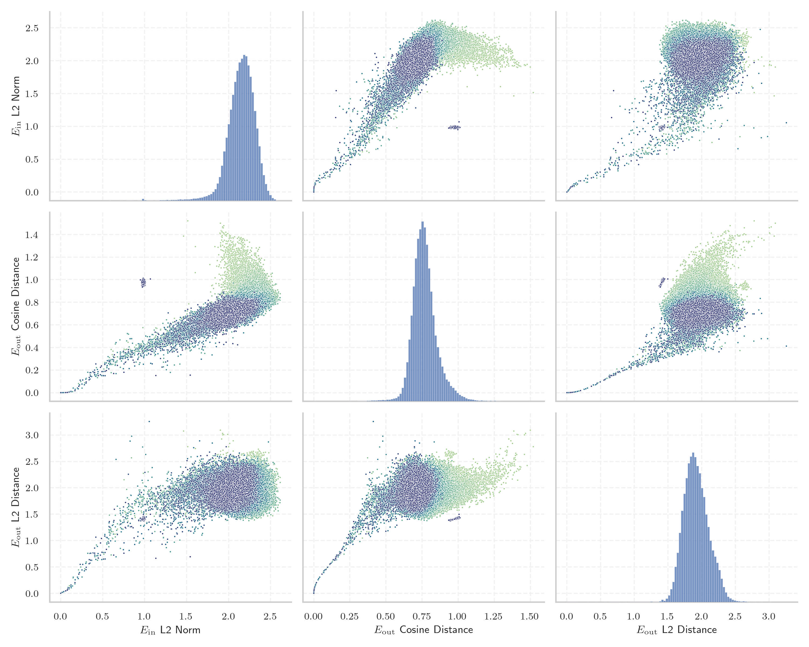
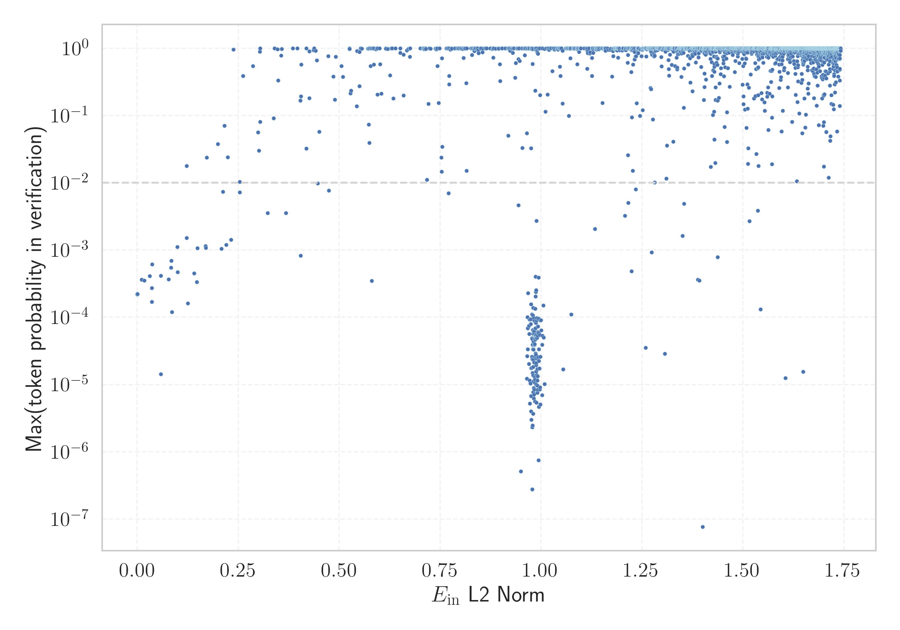

# Report for `trillionlabs/Trillion-7B-preview`

## Model info

* Model Info: 
  * Tied embeddings: False
  * LM head uses bias: False
  * Embeddings shape: [128128, 4096]
* Tokenizer Info: 
  * Vocab Size: 128128
  * Tokenizer Class: PreTrainedTokenizer
  * Tokenizer Type: BPE
  * Bytes handling: Byte Input
  * Token for verification prompt building: 引用するにはまずログインしてください
  * Token id for verification prompt building: 55363
* Indicator summary: 
  * Indicator for under-trained tokens: E_{in} L2 Norm
  * Overall distribution: 2.145 +/- 0.183
* Detected Token Counts: 
  * Number of tested under-trained tokens: 2662, 2524 non-special, 63 below p = 0.01 threshold, 29 below soft indicator threshold
  * Number of single byte tokens: 243, of which 0 below indicator threshold
  * Number of special tokens: 0, of which 0 below indicator threshold
  * Number of non-single-byte UTF-fragment tokens:  996, of which 3 below soft indicator threshold

## Under-trained token indicators plot


## Verification plot


## Under-trained token verification results
29 entries below threshold of 0.170

|   token_id | token                            |   indicator | max_prob                                                         | in_other_tokens                                                                                                                                                                                  |
|------------|----------------------------------|-------------|------------------------------------------------------------------|--------------------------------------------------------------------------------------------------------------------------------------------------------------------------------------------------|
|      91553 | ````` cledelart `````            | 1.19508e-14 | <span style='border: 1px solid rgb(169, 68, 66);'>0.00022</span> | <span style='border: 1px solid rgb(251, 189, 8);'>````` cledelartois `````</span>, <span style='border: 1px solid rgb(40, 167, 69);'>````` ▁Boucledelartois `````</span>                         |
|      54546 | ````` のため引用できません ````` | 1.20206e-14 | <span style='border: 1px solid rgb(169, 68, 66);'>0.00022</span> | <span style='border: 1px solid rgb(169, 68, 66);'>````` 限定公開記事のため引用できません `````</span>                                                                                            |
|     112369 | ````` 3171604670 `````           | 0.000208168 | <span style='border: 1px solid rgb(169, 68, 66);'>0.00022</span> |                                                                                                                                                                                                  |
|      93913 | ````` 3790902022 `````           | 0.000209508 | <span style='border: 1px solid rgb(169, 68, 66);'>0.00022</span> |                                                                                                                                                                                                  |
|     117031 | ````` 608256299 `````            | 0.000218869 | <span style='border: 1px solid rgb(169, 68, 66);'>0.00022</span> |                                                                                                                                                                                                  |
|      55099 | ````` 1606760062 `````           | 0.00024569  | <span style='border: 1px solid rgb(169, 68, 66);'>0.00022</span> |                                                                                                                                                                                                  |
|      66551 | ````` 2795067434 `````           | 0.000256259 | <span style='border: 1px solid rgb(169, 68, 66);'>0.00022</span> |                                                                                                                                                                                                  |
|      29947 | ````` 83156584 `````             | 0.000267186 | <span style='border: 1px solid rgb(169, 68, 66);'>0.00022</span> |                                                                                                                                                                                                  |
|      13965 | ````` Drealtimehot `````         | 0.0112162   | <span style='border: 1px solid rgb(169, 68, 66);'>0.00036</span> |                                                                                                                                                                                                  |
|      96679 | ````` KeyCodeWrap `````          | 0.0175388   | <span style='border: 1px solid rgb(169, 68, 66);'>0.00035</span> |                                                                                                                                                                                                  |
|      35223 | ````` 引用をストック `````       | 0.0311129   | <span style='border: 1px solid rgb(169, 68, 66);'>0.00041</span> | <span style='border: 1px solid rgb(251, 189, 8);'>````` 引用をストックしました `````</span>, <span style='border: 1px solid rgb(251, 189, 8);'>````` 引用をストックできませんでした `````</span> |
|      90072 | ````` InjectionStation `````     | 0.0361336   | <span style='border: 1px solid rgb(169, 68, 66);'>0.00017</span> |                                                                                                                                                                                                  |
|      13964 | ````` Drealtime `````            | 0.0363072   | <span style='border: 1px solid rgb(169, 68, 66);'>0.00027</span> | <span style='border: 1px solid rgb(169, 68, 66);'>````` Drealtimehot `````</span>                                                                                                                |
|      22312 | ````` isnewpage `````            | 0.0367991   | <span style='border: 1px solid rgb(169, 68, 66);'>0.00061</span> |                                                                                                                                                                                                  |
|      55098 | ````` 16067600 `````             | 0.0584251   | <span style='border: 1px solid rgb(169, 68, 66);'>0.00042</span> | <span style='border: 1px solid rgb(169, 68, 66);'>````` 1606760062 `````</span>                                                                                                                  |
|     124551 | ````` DateMgr `````              | 0.0585031   | <span style='border: 1px solid rgb(169, 68, 66);'>1.4e-05</span> |                                                                                                                                                                                                  |
|     126871 | ````` EPARCHY `````              | 0.077815    | <span style='border: 1px solid rgb(169, 68, 66);'>0.00037</span> |                                                                                                                                                                                                  |
|     121899 | ````` UniWebView `````           | 0.0832953   | <span style='border: 1px solid rgb(169, 68, 66);'>0.00055</span> |                                                                                                                                                                                                  |
|     112359 | ````` 3171604 `````              | 0.0846215   | <span style='border: 1px solid rgb(169, 68, 66);'>0.00069</span> | <span style='border: 1px solid rgb(169, 68, 66);'>````` 3171604670 `````</span>                                                                                                                  |
|      46042 | ````` 피캠퍼스는 `````           | 0.0858762   | <span style='border: 1px solid rgb(169, 68, 66);'>0.00012</span> | ````` 해피캠퍼스는 `````, ````` ▁해피캠퍼스는 `````                                                                                                                                              |
<details><summary>9 additional entries below threshold</summary>

|   token_id | token                      |   indicator | max_prob                                                         | in_other_tokens                                                                                                                                                                                  |
|------------|----------------------------|-------------|------------------------------------------------------------------|--------------------------------------------------------------------------------------------------------------------------------------------------------------------------------------------------|
|     111007 | ````` ▁アイドラッグ `````  |   0.0991744 | <span style='border: 1px solid rgb(255, 145, 0);'>0.0011</span>  |                                                                                                                                                                                                  |
|      68928 | ````` 3722313 `````        |   0.0997537 | <span style='border: 1px solid rgb(169, 68, 66);'>0.00047</span> | <span style='border: 1px solid rgb(40, 167, 69);'>````` 3722313464 `````</span>                                                                                                                  |
|     101093 | ````` Discnt `````         |   0.122205  | <span style='border: 1px solid rgb(251, 189, 8);'>0.018</span>   |                                                                                                                                                                                                  |
|      88953 | ````` WINPR `````          |   0.122498  | <span style='border: 1px solid rgb(255, 145, 0);'>0.0015</span>  |                                                                                                                                                                                                  |
|      74883 | ````` StackTraits `````    |   0.125034  | <span style='border: 1px solid rgb(169, 68, 66);'>0.00016</span> |                                                                                                                                                                                                  |
|      54544 | ````` 引用できません ````` |   0.141043  | <span style='border: 1px solid rgb(169, 68, 66);'>0.00045</span> | <span style='border: 1px solid rgb(169, 68, 66);'>````` 限定公開記事のため引用できません `````</span>, <span style='border: 1px solid rgb(169, 68, 66);'>````` のため引用できません `````</span> |
|      26309 | ````` CSFunction `````     |   0.147408  | <span style='border: 1px solid rgb(169, 68, 66);'>0.00033</span> | <span style='border: 1px solid rgb(251, 189, 8);'>````` LuaCSFunction `````</span>, <span style='border: 1px solid rgb(255, 145, 0);'>````` ▁LuaCSFunction `````</span>                          |
|      64222 | ````` ▁LuaCSFunction ````` |   0.14924   | <span style='border: 1px solid rgb(255, 145, 0);'>0.0011</span>  |                                                                                                                                                                                                  |
|      45534 | ````` フィンペ `````       |   0.169325  | <span style='border: 1px solid rgb(255, 145, 0);'>0.0011</span>  | <span style='border: 1px solid rgb(40, 167, 69);'>````` フィンペシア `````</span>                                                                                                                |
</details>
<details><summary>2495 additional entries above threshold</summary>

|   token_id | token                                                                                                  |   indicator | max_prob                                                         | in_other_tokens                                                                                                                                                                                                                                                                                                                                                                                                                                   |
|------------|--------------------------------------------------------------------------------------------------------|-------------|------------------------------------------------------------------|---------------------------------------------------------------------------------------------------------------------------------------------------------------------------------------------------------------------------------------------------------------------------------------------------------------------------------------------------------------------------------------------------------------------------------------------------|
|     119202 | ````` rvStr `````                                                                                      |    0.169975 | <span style='border: 1px solid rgb(255, 145, 0);'>0.0011</span>  |                                                                                                                                                                                                                                                                                                                                                                                                                                                   |
|      81408 | ````` InfoQry `````                                                                                    |    0.172112 | <span style='border: 1px solid rgb(251, 189, 8);'>0.024</span>   |                                                                                                                                                                                                                                                                                                                                                                                                                                                   |
|      84954 | ````` IDataUtil `````                                                                                  |    0.199377 | <span style='border: 1px solid rgb(251, 189, 8);'>0.038</span>   |                                                                                                                                                                                                                                                                                                                                                                                                                                                   |
|      89262 | ````` ノスイス `````                                                                                   |    0.2085   | <span style='border: 1px solid rgb(255, 145, 0);'>0.001</span>   |                                                                                                                                                                                                                                                                                                                                                                                                                                                   |
|      22313 | ````` luicode `````                                                                                    |    0.212188 | <span style='border: 1px solid rgb(255, 145, 0);'>0.0073</span>  |                                                                                                                                                                                                                                                                                                                                                                                                                                                   |
|     125026 | ````` borderClass `````                                                                                |    0.215729 | <span style='border: 1px solid rgb(251, 189, 8);'>0.07</span>    |                                                                                                                                                                                                                                                                                                                                                                                                                                                   |
|      22967 | ````` djvused `````                                                                                    |    0.220403 | <span style='border: 1px solid rgb(255, 145, 0);'>0.0012</span>  |                                                                                                                                                                                                                                                                                                                                                                                                                                                   |
|      87325 | ````` **)(&_ `````                                                                                     |    0.224229 | <span style='border: 1px solid rgb(251, 189, 8);'>0.024</span>   |                                                                                                                                                                                                                                                                                                                                                                                                                                                   |
|     110635 | ````` 鬼滅の `````                                                                                     |    0.232081 | <span style='border: 1px solid rgb(255, 145, 0);'>0.0014</span>  | <span style='border: 1px solid rgb(40, 167, 69);'>````` 鬼滅の刃 `````</span>                                                                                                                                                                                                                                                                                                                                                                     |
|      30550 | ````` UsageId `````                                                                                    |    0.238531 | <span style='border: 1px solid rgb(40, 167, 69);'>0.96</span>    | <span style='border: 1px solid rgb(40, 167, 69);'>````` MetadataUsageId `````</span>                                                                                                                                                                                                                                                                                                                                                              |
|      93894 | ````` 379090 `````                                                                                     |    0.253444 | <span style='border: 1px solid rgb(255, 145, 0);'>0.0072</span>  | <span style='border: 1px solid rgb(169, 68, 66);'>````` 3790902022 `````</span>                                                                                                                                                                                                                                                                                                                                                                   |
|      54533 | ````` 限定公開記事 `````                                                                               |    0.254155 | <span style='border: 1px solid rgb(251, 189, 8);'>0.01</span>    | <span style='border: 1px solid rgb(169, 68, 66);'>````` 限定公開記事のため引用できません `````</span>                                                                                                                                                                                                                                                                                                                                             |
|     103048 | ````` addSQL `````                                                                                     |    0.262273 | <span style='border: 1px solid rgb(40, 167, 69);'>0.39</span>    |                                                                                                                                                                                                                                                                                                                                                                                                                                                   |
|      22311 | ````` extparam `````                                                                                   |    0.286684 | <span style='border: 1px solid rgb(40, 167, 69);'>0.55</span>    |                                                                                                                                                                                                                                                                                                                                                                                                                                                   |
|      77822 | ````` AdsApi `````                                                                                     |    0.298779 | <span style='border: 1px solid rgb(251, 189, 8);'>0.056</span>   |                                                                                                                                                                                                                                                                                                                                                                                                                                                   |
|     109381 | ````` TweenerCore `````                                                                                |    0.301649 | <span style='border: 1px solid rgb(251, 189, 8);'>0.03</span>    |                                                                                                                                                                                                                                                                                                                                                                                                                                                   |
|     117006 | ````` dscreen `````                                                                                    |    0.303912 | <span style='border: 1px solid rgb(40, 167, 69);'>0.89</span>    |                                                                                                                                                                                                                                                                                                                                                                                                                                                   |
|      23313 | ````` realpos `````                                                                                    |    0.304047 | <span style='border: 1px solid rgb(40, 167, 69);'>1</span>       |                                                                                                                                                                                                                                                                                                                                                                                                                                                   |
|      41361 | ````` ステリド `````                                                                                   |    0.304434 | <span style='border: 1px solid rgb(251, 189, 8);'>0.081</span>   | <span style='border: 1px solid rgb(40, 167, 69);'>````` デュタステリド `````</span>, <span style='border: 1px solid rgb(40, 167, 69);'>````` フィナステリド `````</span>                                                                                                                                                                                                                                                                          |
|      55358 | ````` 引用するにはまず `````                                                                           |    0.322599 | <span style='border: 1px solid rgb(255, 145, 0);'>0.0035</span>  | <span style='border: 1px solid rgb(169, 68, 66);'>````` 引用するにはまずログインしてください `````</span>                                                                                                                                                                                                                                                                                                                                         |
|     118515 | ````` itexam `````                                                                                     |    0.3381   | <span style='border: 1px solid rgb(251, 189, 8);'>0.092</span>   | <span style='border: 1px solid rgb(169, 68, 66);'>````` itexamdump `````</span>                                                                                                                                                                                                                                                                                                                                                                   |
|     117583 | ````` WLog `````                                                                                       |    0.340041 | <span style='border: 1px solid rgb(40, 167, 69);'>1</span>       |                                                                                                                                                                                                                                                                                                                                                                                                                                                   |
|     102288 | ````` ▁vuint `````                                                                                     |    0.347758 | <span style='border: 1px solid rgb(40, 167, 69);'>0.96</span>    |                                                                                                                                                                                                                                                                                                                                                                                                                                                   |
|      99576 | ````` ツゲイン `````                                                                                   |    0.348756 | <span style='border: 1px solid rgb(40, 167, 69);'>0.33</span>    |                                                                                                                                                                                                                                                                                                                                                                                                                                                   |
|     115314 | ````` ▁methodMetadata `````                                                                            |    0.356396 | <span style='border: 1px solid rgb(40, 167, 69);'>0.78</span>    |                                                                                                                                                                                                                                                                                                                                                                                                                                                   |
|     104974 | ````` 215622 `````                                                                                     |    0.357896 | <span style='border: 1px solid rgb(40, 167, 69);'>0.98</span>    | <span style='border: 1px solid rgb(40, 167, 69);'>````` 2156229523 `````</span>                                                                                                                                                                                                                                                                                                                                                                   |
|      94500 | ````` ▁LuaDLL `````                                                                                    |    0.368115 | <span style='border: 1px solid rgb(255, 145, 0);'>0.0035</span>  |                                                                                                                                                                                                                                                                                                                                                                                                                                                   |
|     102236 | ````` Adjustor `````                                                                                   |    0.384956 | <span style='border: 1px solid rgb(40, 167, 69);'>1</span>       | <span style='border: 1px solid rgb(40, 167, 69);'>````` AdjustorThunk `````</span>                                                                                                                                                                                                                                                                                                                                                                |
|     108409 | ````` vbool `````                                                                                      |    0.396397 | <span style='border: 1px solid rgb(40, 167, 69);'>1</span>       |                                                                                                                                                                                                                                                                                                                                                                                                                                                   |
|     106455 | ````` UDIBLE `````                                                                                     |    0.404005 | <span style='border: 1px solid rgb(40, 167, 69);'>0.17</span>    | ````` INAUDIBLE `````                                                                                                                                                                                                                                                                                                                                                                                                                             |
|     120755 | ````` 색파섹 `````                                                                                     |    0.40437  | <span style='border: 1px solid rgb(169, 68, 66);'>0.00082</span> | <span style='border: 1px solid rgb(255, 145, 0);'>````` 번개만남색파섹 `````</span>                                                                                                                                                                                                                                                                                                                                                               |
|      94900 | ````` ▁ToLua `````                                                                                     |    0.405472 | <span style='border: 1px solid rgb(40, 167, 69);'>0.19</span>    |                                                                                                                                                                                                                                                                                                                                                                                                                                                   |
|      49647 | ````` asiainfo `````                                                                                   |    0.406384 | <span style='border: 1px solid rgb(40, 167, 69);'>0.57</span>    |                                                                                                                                                                                                                                                                                                                                                                                                                                                   |
|     116896 | ````` 256299 `````                                                                                     |    0.418485 | <span style='border: 1px solid rgb(40, 167, 69);'>0.99</span>    | <span style='border: 1px solid rgb(169, 68, 66);'>````` 608256299 `````</span>                                                                                                                                                                                                                                                                                                                                                                    |
|      76902 | ````` LuaDLL `````                                                                                     |    0.418515 | <span style='border: 1px solid rgb(251, 189, 8);'>0.032</span>   | <span style='border: 1px solid rgb(255, 145, 0);'>````` ▁LuaDLL `````</span>                                                                                                                                                                                                                                                                                                                                                                      |
|      29933 | ````` 156584 `````                                                                                     |    0.425852 | <span style='border: 1px solid rgb(40, 167, 69);'>0.9</span>     | <span style='border: 1px solid rgb(169, 68, 66);'>````` 83156584 `````</span>                                                                                                                                                                                                                                                                                                                                                                     |
|      43572 | ````` イベルメ `````                                                                                   |    0.426046 | <span style='border: 1px solid rgb(40, 167, 69);'>0.18</span>    | <span style='border: 1px solid rgb(251, 189, 8);'>````` イベルメクチン `````</span>                                                                                                                                                                                                                                                                                                                                                               |
|      80303 | ````` gathere `````                                                                                    |    0.43681  | <span style='border: 1px solid rgb(40, 167, 69);'>0.94</span>    | ````` gatherers `````, ````` ▁gathere `````, ````` gatherer `````                                                                                                                                                                                                                                                                                                                                                                                 |
|      36521 | ````` malink `````                                                                                     |    0.438118 | <span style='border: 1px solid rgb(40, 167, 69);'>1</span>       | ````` permalink `````, ````` ▁permalink `````, ````` Permalink `````, ````` ▁Permalink `````                                                                                                                                                                                                                                                                                                                                                      |
|      77654 | ````` デュタ `````                                                                                     |    0.44189  | <span style='border: 1px solid rgb(40, 167, 69);'>0.92</span>    | <span style='border: 1px solid rgb(40, 167, 69);'>````` デュタステリド `````</span>                                                                                                                                                                                                                                                                                                                                                               |
|      93048 | ````` アボルブ `````                                                                                   |    0.444955 | <span style='border: 1px solid rgb(40, 167, 69);'>0.66</span>    |                                                                                                                                                                                                                                                                                                                                                                                                                                                   |
|     125852 | ````` GENERICINST `````                                                                                |    0.446931 | <span style='border: 1px solid rgb(255, 145, 0);'>0.0098</span>  |                                                                                                                                                                                                                                                                                                                                                                                                                                                   |
|      31543 | ````` LuaCSFunction `````                                                                              |    0.450743 | <span style='border: 1px solid rgb(251, 189, 8);'>0.057</span>   | <span style='border: 1px solid rgb(255, 145, 0);'>````` ▁LuaCSFunction `````</span>                                                                                                                                                                                                                                                                                                                                                               |
|     110192 | ````` ネクスガード `````                                                                               |    0.472938 | <span style='border: 1px solid rgb(40, 167, 69);'>0.76</span>    |                                                                                                                                                                                                                                                                                                                                                                                                                                                   |
|     123578 | ````` 예정금액은 `````                                                                                 |    0.474117 | <span style='border: 1px solid rgb(255, 145, 0);'>0.0077</span>  | <span style='border: 1px solid rgb(169, 68, 66);'>````` ▁결제예정금액은 `````</span>                                                                                                                                                                                                                                                                                                                                                              |
|     127338 | ````` ▁LuaFunction `````                                                                               |    0.485331 | <span style='border: 1px solid rgb(40, 167, 69);'>0.38</span>    |                                                                                                                                                                                                                                                                                                                                                                                                                                                   |
|      77256 | ````` 2950945753 `````                                                                                 |    0.489441 | <span style='border: 1px solid rgb(40, 167, 69);'>0.17</span>    |                                                                                                                                                                                                                                                                                                                                                                                                                                                   |
|     115483 | ````` itcert `````                                                                                     |    0.491295 | <span style='border: 1px solid rgb(40, 167, 69);'>0.75</span>    | <span style='border: 1px solid rgb(169, 68, 66);'>````` itcertkr `````</span>                                                                                                                                                                                                                                                                                                                                                                     |
|      73758 | ````` risome `````                                                                                     |    0.505917 | <span style='border: 1px solid rgb(40, 167, 69);'>0.54</span>    | ````` ▁worrisome `````                                                                                                                                                                                                                                                                                                                                                                                                                            |
|     110202 | ````` TisIntPtr `````                                                                                  |    0.509263 | <span style='border: 1px solid rgb(40, 167, 69);'>0.37</span>    |                                                                                                                                                                                                                                                                                                                                                                                                                                                   |
|     112597 | ````` ▁TypeTraits `````                                                                                |    0.525287 | <span style='border: 1px solid rgb(40, 167, 69);'>0.98</span>    |                                                                                                                                                                                                                                                                                                                                                                                                                                                   |
|      78189 | ````` AdManager `````                                                                                  |    0.525959 | <span style='border: 1px solid rgb(40, 167, 69);'>1</span>       |                                                                                                                                                                                                                                                                                                                                                                                                                                                   |
|      22296 | ````` 106003 `````                                                                                     |    0.52599  | <span style='border: 1px solid rgb(40, 167, 69);'>0.98</span>    |                                                                                                                                                                                                                                                                                                                                                                                                                                                   |
|     113203 | ````` 부스타빗부스타빗 `````                                                                           |    0.528053 | <span style='border: 1px solid rgb(40, 167, 69);'>0.21</span>    |                                                                                                                                                                                                                                                                                                                                                                                                                                                   |
|     105009 | ````` 2156229523 `````                                                                                 |    0.529199 | <span style='border: 1px solid rgb(40, 167, 69);'>0.23</span>    |                                                                                                                                                                                                                                                                                                                                                                                                                                                   |
|      69975 | ````` ▁unconvin `````                                                                                  |    0.543636 | <span style='border: 1px solid rgb(40, 167, 69);'>0.14</span>    | ````` ▁unconvinced `````, ````` ▁unconvincing `````                                                                                                                                                                                                                                                                                                                                                                                               |
|     127916 | ````` uiRoot `````                                                                                     |    0.544338 | <span style='border: 1px solid rgb(40, 167, 69);'>0.91</span>    |                                                                                                                                                                                                                                                                                                                                                                                                                                                   |
|      39202 | ````` ペシア `````                                                                                     |    0.550242 | <span style='border: 1px solid rgb(40, 167, 69);'>0.27</span>    | <span style='border: 1px solid rgb(40, 167, 69);'>````` プロペシア `````</span>, <span style='border: 1px solid rgb(40, 167, 69);'>````` フィンペシア `````</span>                                                                                                                                                                                                                                                                                |
|      62412 | ````` ICENSE `````                                                                                     |    0.550543 | <span style='border: 1px solid rgb(40, 167, 69);'>0.88</span>    | ````` ▁LICENSE `````, ````` LICENSE `````                                                                                                                                                                                                                                                                                                                                                                                                         |
|      99857 | ````` vuint `````                                                                                      |    0.553409 | <span style='border: 1px solid rgb(40, 167, 69);'>1</span>       | <span style='border: 1px solid rgb(40, 167, 69);'>````` ▁vuint `````</span>                                                                                                                                                                                                                                                                                                                                                                       |
|      97453 | ````` \u202c\u202c\u202c\u202c `````                                                                   |    0.555867 | <span style='border: 1px solid rgb(40, 167, 69);'>0.98</span>    |                                                                                                                                                                                                                                                                                                                                                                                                                                                   |
|      61350 | ````` コロナ禍 `````                                                                                   |    0.571313 | <span style='border: 1px solid rgb(40, 167, 69);'>0.98</span>    |                                                                                                                                                                                                                                                                                                                                                                                                                                                   |
|     109666 | ````` コーティ `````                                                                                   |    0.572692 | <span style='border: 1px solid rgb(40, 167, 69);'>0.99</span>    | ````` コーティング `````                                                                                                                                                                                                                                                                                                                                                                                                                          |
|      44798 | ````` イベルメクチン `````                                                                             |    0.573422 | <span style='border: 1px solid rgb(251, 189, 8);'>0.073</span>   |                                                                                                                                                                                                                                                                                                                                                                                                                                                   |
|      79779 | ````` recipeID `````                                                                                   |    0.574175 | <span style='border: 1px solid rgb(40, 167, 69);'>1</span>       |                                                                                                                                                                                                                                                                                                                                                                                                                                                   |
|      44567 | ````` ▁neurotransmit `````                                                                             |    0.575093 | <span style='border: 1px solid rgb(251, 189, 8);'>0.039</span>   | ````` ▁neurotransmitter `````, ````` ▁neurotransmitters `````                                                                                                                                                                                                                                                                                                                                                                                     |
|      80797 | ````` TradeData `````                                                                                  |    0.576134 | <span style='border: 1px solid rgb(40, 167, 69);'>1</span>       |                                                                                                                                                                                                                                                                                                                                                                                                                                                   |
|      49181 | ````` 축은행 `````                                                                                     |    0.577868 | <span style='border: 1px solid rgb(40, 167, 69);'>0.54</span>    | ````` ▁저축은행 `````, ````` 저축은행 `````                                                                                                                                                                                                                                                                                                                                                                                                       |
|     123653 | ````` ▁個人輸入 `````                                                                                  |    0.579567 | <span style='border: 1px solid rgb(40, 167, 69);'>1</span>       |                                                                                                                                                                                                                                                                                                                                                                                                                                                   |
|      22300 | ````` containerid `````                                                                                |    0.580362 | <span style='border: 1px solid rgb(40, 167, 69);'>1</span>       |                                                                                                                                                                                                                                                                                                                                                                                                                                                   |
|      30656 | ````` ▁culpr `````                                                                                     |    0.580527 | <span style='border: 1px solid rgb(169, 68, 66);'>0.00035</span> | ````` ▁culprits `````, ````` ▁culprit `````                                                                                                                                                                                                                                                                                                                                                                                                       |
|     123446 | ````` VCAL `````                                                                                       |    0.58376  | <span style='border: 1px solid rgb(40, 167, 69);'>1</span>       | ````` VCALENDAR `````                                                                                                                                                                                                                                                                                                                                                                                                                             |
|      65522 | ````` RSRV `````                                                                                       |    0.585627 | <span style='border: 1px solid rgb(40, 167, 69);'>1</span>       |                                                                                                                                                                                                                                                                                                                                                                                                                                                   |
|      48069 | ````` WriteBarrier `````                                                                               |    0.58604  | <span style='border: 1px solid rgb(40, 167, 69);'>0.57</span>    | <span style='border: 1px solid rgb(255, 145, 0);'>````` CppCodeGenWriteBarrier `````</span>                                                                                                                                                                                                                                                                                                                                                       |
|      62357 | ````` ▁IDataset `````                                                                                  |    0.591117 | <span style='border: 1px solid rgb(40, 167, 69);'>0.97</span>    |                                                                                                                                                                                                                                                                                                                                                                                                                                                   |
|      46408 | ````` LuaFunction `````                                                                                |    0.593428 | <span style='border: 1px solid rgb(40, 167, 69);'>0.99</span>    | <span style='border: 1px solid rgb(40, 167, 69);'>````` ▁LuaFunction `````</span>                                                                                                                                                                                                                                                                                                                                                                 |
|      22306 | ````` lfid `````                                                                                       |    0.5947   | <span style='border: 1px solid rgb(40, 167, 69);'>1</span>       | ````` ulfide `````, ````` ▁sulfide `````                                                                                                                                                                                                                                                                                                                                                                                                          |
|      91965 | ````` 新型コロナウイルスの `````                                                                       |    0.594849 | <span style='border: 1px solid rgb(40, 167, 69);'>0.2</span>     |                                                                                                                                                                                                                                                                                                                                                                                                                                                   |
|      27977 | ````` beging `````                                                                                     |    0.599844 | <span style='border: 1px solid rgb(40, 167, 69);'>1</span>       | ````` begingroup `````                                                                                                                                                                                                                                                                                                                                                                                                                            |
|      28731 | ````` CppMethod `````                                                                                  |    0.601248 | <span style='border: 1px solid rgb(40, 167, 69);'>0.58</span>    | <span style='border: 1px solid rgb(40, 167, 69);'>````` CppMethodPointer `````</span>, <span style='border: 1px solid rgb(251, 189, 8);'>````` CppMethodInitialized `````</span>                                                                                                                                                                                                                                                                  |
|      42945 | ````` ▁LuaInterface `````                                                                              |    0.604703 | <span style='border: 1px solid rgb(40, 167, 69);'>0.21</span>    |                                                                                                                                                                                                                                                                                                                                                                                                                                                   |
|      20212 | ````` avascript `````                                                                                  |    0.615401 | <span style='border: 1px solid rgb(40, 167, 69);'>1</span>       | ````` javascript `````, ````` ▁javascript `````, ````` Javascript `````, ````` ▁Javascript `````                                                                                                                                                                                                                                                                                                                                                  |
|      95120 | ````` 타이미 `````                                                                                     |    0.615878 | <span style='border: 1px solid rgb(40, 167, 69);'>0.98</span>    | <span style='border: 1px solid rgb(251, 189, 8);'>````` 타이미사지 `````</span>, <span style='border: 1px solid rgb(40, 167, 69);'>````` 출장타이미사지 `````</span>                                                                                                                                                                                                                                                                              |
|      24695 | ````` impse `````                                                                                      |    0.620406 | <span style='border: 1px solid rgb(40, 167, 69);'>0.97</span>    | ````` ▁glimpse `````, ````` ▁glimpsed `````, ````` ▁glimpses `````                                                                                                                                                                                                                                                                                                                                                                                |
|      39136 | ````` 터테인먼트 `````                                                                                 |    0.626115 | <span style='border: 1px solid rgb(40, 167, 69);'>0.39</span>    | ````` 엔터테인먼트 `````, ````` ▁엔터테인먼트 `````                                                                                                                                                                                                                                                                                                                                                                                               |
|      50233 | ````` ermanent `````                                                                                   |    0.628266 | <span style='border: 1px solid rgb(40, 167, 69);'>1</span>       | ````` permanent `````, ````` ▁Permanent `````, ````` Permanent `````                                                                                                                                                                                                                                                                                                                                                                              |
|      96589 | ````` ãã `````                                                                                         |    0.62989  | <span style='border: 1px solid rgb(40, 167, 69);'>1</span>       |                                                                                                                                                                                                                                                                                                                                                                                                                                                   |
|     122346 | ````` PublicServer `````                                                                               |    0.631375 | <span style='border: 1px solid rgb(40, 167, 69);'>1</span>       |                                                                                                                                                                                                                                                                                                                                                                                                                                                   |
|     120334 | ````` 출장부르는 `````                                                                                 |    0.634408 | <span style='border: 1px solid rgb(40, 167, 69);'>0.18</span>    | <span style='border: 1px solid rgb(40, 167, 69);'>````` 출장부르는법 `````</span>                                                                                                                                                                                                                                                                                                                                                                 |
|     124849 | ````` PageLoading `````                                                                                |    0.639147 | <span style='border: 1px solid rgb(40, 167, 69);'>1</span>       |                                                                                                                                                                                                                                                                                                                                                                                                                                                   |
|      37443 | ````` ▁suitc `````                                                                                     |    0.650931 | <span style='border: 1px solid rgb(40, 167, 69);'>1</span>       | ````` ▁suitcases `````, ````` ▁suitcase `````                                                                                                                                                                                                                                                                                                                                                                                                     |
|      63838 | ````` ▁スーパーコピー `````                                                                            |    0.651285 | <span style='border: 1px solid rgb(40, 167, 69);'>0.85</span>    |                                                                                                                                                                                                                                                                                                                                                                                                                                                   |
|      77129 | ````` 45753 `````                                                                                      |    0.65933  | <span style='border: 1px solid rgb(40, 167, 69);'>0.81</span>    | <span style='border: 1px solid rgb(40, 167, 69);'>````` 2950945753 `````</span>                                                                                                                                                                                                                                                                                                                                                                   |
|      68930 | ````` 3722313464 `````                                                                                 |    0.659664 | <span style='border: 1px solid rgb(40, 167, 69);'>0.2</span>     |                                                                                                                                                                                                                                                                                                                                                                                                                                                   |
|      51647 | ````` ▁fingern `````                                                                                   |    0.667308 | <span style='border: 1px solid rgb(40, 167, 69);'>0.93</span>    | ````` ▁fingernails `````, ````` ▁fingernail `````                                                                                                                                                                                                                                                                                                                                                                                                 |
|      32028 | ````` monary `````                                                                                     |    0.671659 | <span style='border: 1px solid rgb(40, 167, 69);'>0.98</span>    | ````` ▁Pulmonary `````, ````` ▁pulmonary `````, ````` ulmonary `````                                                                                                                                                                                                                                                                                                                                                                              |
|      61313 | ````` xfffd `````                                                                                      |    0.67474  | <span style='border: 1px solid rgb(40, 167, 69);'>0.75</span>    |                                                                                                                                                                                                                                                                                                                                                                                                                                                   |
|     120933 | ````` ▁Gvr `````                                                                                       |    0.67515  | <span style='border: 1px solid rgb(40, 167, 69);'>1</span>       |                                                                                                                                                                                                                                                                                                                                                                                                                                                   |
|      37755 | ````` ▁careg `````                                                                                     |    0.676134 | <span style='border: 1px solid rgb(40, 167, 69);'>1</span>       | ````` ▁caregiver `````, ````` ▁caregivers `````                                                                                                                                                                                                                                                                                                                                                                                                   |
|      14839 | ````` ityEngine `````                                                                                  |    0.701    | <span style='border: 1px solid rgb(40, 167, 69);'>1</span>       | <span style='border: 1px solid rgb(40, 167, 69);'>````` UnityEngine `````</span>, ````` ▁UnityEngine `````                                                                                                                                                                                                                                                                                                                                        |
|      49688 | ````` 圾 `````                                                                                         |    0.707336 | <span style='border: 1px solid rgb(40, 167, 69);'>1</span>       | ````` 垃圾 `````                                                                                                                                                                                                                                                                                                                                                                                                                                  |
|      97012 | ````` IDataset `````                                                                                   |    0.707722 | <span style='border: 1px solid rgb(40, 167, 69);'>1</span>       |                                                                                                                                                                                                                                                                                                                                                                                                                                                   |
|      72660 | ````` 拶 `````                                                                                         |    0.710003 | <span style='border: 1px solid rgb(40, 167, 69);'>1</span>       | ````` 挨拶 `````                                                                                                                                                                                                                                                                                                                                                                                                                                  |
|      82574 | ````` 噌 `````                                                                                         |    0.710135 | <span style='border: 1px solid rgb(40, 167, 69);'>0.97</span>    | ````` 味噌 `````                                                                                                                                                                                                                                                                                                                                                                                                                                  |
|      47958 | ````` CppCodeGen `````                                                                                 |    0.710677 | <span style='border: 1px solid rgb(40, 167, 69);'>0.98</span>    | <span style='border: 1px solid rgb(255, 145, 0);'>````` CppCodeGenWriteBarrier `````</span>                                                                                                                                                                                                                                                                                                                                                       |
|     113412 | ````` 澳大利 `````                                                                                     |    0.711437 | <span style='border: 1px solid rgb(40, 167, 69);'>1</span>       | ````` 澳大利亚 `````                                                                                                                                                                                                                                                                                                                                                                                                                              |
|      39016 | ````` gredients `````                                                                                  |    0.713894 | <span style='border: 1px solid rgb(40, 167, 69);'>0.99</span>    | ````` Ingredients `````, ````` ▁Ingredients `````                                                                                                                                                                                                                                                                                                                                                                                                 |
|      53104 | ````` ▁bystand `````                                                                                   |    0.714201 | <span style='border: 1px solid rgb(40, 167, 69);'>0.99</span>    | ````` ▁bystander `````, ````` ▁bystanders `````                                                                                                                                                                                                                                                                                                                                                                                                   |
|      80941 | ````` 緊急事態宣言 `````                                                                               |    0.714737 | <span style='border: 1px solid rgb(40, 167, 69);'>0.98</span>    |                                                                                                                                                                                                                                                                                                                                                                                                                                                   |
|      37009 | ````` 설팅 `````                                                                                       |    0.717472 | <span style='border: 1px solid rgb(251, 189, 8);'>0.011</span>   | ````` 컨설팅 `````, ````` ▁컨설팅 `````                                                                                                                                                                                                                                                                                                                                                                                                           |
|      75561 | ````` チノイン `````                                                                                   |    0.721211 | <span style='border: 1px solid rgb(40, 167, 69);'>0.15</span>    | <span style='border: 1px solid rgb(40, 167, 69);'>````` トレチノイン `````</span>                                                                                                                                                                                                                                                                                                                                                                 |
|      64358 | ````` ▁Barcl `````                                                                                     |    0.723453 | <span style='border: 1px solid rgb(40, 167, 69);'>1</span>       | ````` ▁Barclay `````, ````` ▁Barclays `````                                                                                                                                                                                                                                                                                                                                                                                                       |
|      80440 | ````` デュタステリド `````                                                                             |    0.726062 | <span style='border: 1px solid rgb(40, 167, 69);'>0.99</span>    |                                                                                                                                                                                                                                                                                                                                                                                                                                                   |
|      53111 | ````` ▁머리카 `````                                                                                    |    0.738313 | <span style='border: 1px solid rgb(40, 167, 69);'>0.99</span>    | ````` ▁머리카락을 `````, ````` ▁머리카락 `````                                                                                                                                                                                                                                                                                                                                                                                                    |
|      86099 | ````` PFNGL `````                                                                                      |    0.739907 | <span style='border: 1px solid rgb(40, 167, 69);'>0.97</span>    |                                                                                                                                                                                                                                                                                                                                                                                                                                                   |
|      38599 | ````` undreds `````                                                                                    |    0.740823 | <span style='border: 1px solid rgb(40, 167, 69);'>0.97</span>    | ````` ▁Hundreds `````, ````` hundreds `````, ````` Hundreds `````                                                                                                                                                                                                                                                                                                                                                                                 |
|      68120 | ````` ToLua `````                                                                                      |    0.742516 | <span style='border: 1px solid rgb(40, 167, 69);'>1</span>       | <span style='border: 1px solid rgb(40, 167, 69);'>````` ▁ToLua `````</span>                                                                                                                                                                                                                                                                                                                                                                       |
|     109388 | ````` leveland `````                                                                                   |    0.743167 | <span style='border: 1px solid rgb(40, 167, 69);'>0.55</span>    | ````` Cleveland `````                                                                                                                                                                                                                                                                                                                                                                                                                             |
|      87167 | ````` CppGenericClass `````                                                                            |    0.746432 | <span style='border: 1px solid rgb(40, 167, 69);'>0.15</span>    |                                                                                                                                                                                                                                                                                                                                                                                                                                                   |
|     110815 | ````` targetMethod `````                                                                               |    0.748282 | <span style='border: 1px solid rgb(40, 167, 69);'>1</span>       |                                                                                                                                                                                                                                                                                                                                                                                                                                                   |
|     126006 | ````` olherbst `````                                                                                   |    0.753061 | <span style='border: 1px solid rgb(251, 189, 8);'>0.024</span>   | <span style='border: 1px solid rgb(40, 167, 69);'>````` ▁karolherbst `````</span>                                                                                                                                                                                                                                                                                                                                                                 |
|      42423 | ````` mittedly `````                                                                                   |    0.753466 | <span style='border: 1px solid rgb(251, 189, 8);'>0.015</span>   | ````` ▁Admittedly `````, ````` Admittedly `````, ````` admittedly `````                                                                                                                                                                                                                                                                                                                                                                           |
|     104213 | ````` TisInt `````                                                                                     |    0.754296 | <span style='border: 1px solid rgb(40, 167, 69);'>0.71</span>    | <span style='border: 1px solid rgb(40, 167, 69);'>````` TisIntPtr `````</span>                                                                                                                                                                                                                                                                                                                                                                    |
|      76528 | ````` ▁많이보기 `````                                                                                  |    0.75557  | <span style='border: 1px solid rgb(251, 189, 8);'>0.034</span>   |                                                                                                                                                                                                                                                                                                                                                                                                                                                   |
|      24840 | ````` ▁predecess `````                                                                                 |    0.765359 | <span style='border: 1px solid rgb(40, 167, 69);'>1</span>       | ````` ▁predecessor `````, ````` ▁predecessors `````                                                                                                                                                                                                                                                                                                                                                                                               |
|     102233 | ````` ▁PlayFab `````                                                                                   |    0.768402 | <span style='border: 1px solid rgb(40, 167, 69);'>1</span>       |                                                                                                                                                                                                                                                                                                                                                                                                                                                   |
|     126507 | ````` ▁ロレックス `````                                                                                |    0.769365 | <span style='border: 1px solid rgb(40, 167, 69);'>1</span>       |                                                                                                                                                                                                                                                                                                                                                                                                                                                   |
|       4700 | ````` ortunately `````                                                                                 |    0.771085 | <span style='border: 1px solid rgb(255, 145, 0);'>0.007</span>   | ````` Unfortunately `````, ````` ▁Unfortunately `````, ````` unfortunately `````, ````` Fortunately `````, ````` ▁fortunately `````, ...                                                                                                                                                                                                                                                                                                          |
|     119688 | ````` でしたり `````                                                                                   |    0.772334 | <span style='border: 1px solid rgb(40, 167, 69);'>0.29</span>    |                                                                                                                                                                                                                                                                                                                                                                                                                                                   |
|      51114 | ````` 新型コロナウイルス `````                                                                         |    0.772584 | <span style='border: 1px solid rgb(40, 167, 69);'>0.39</span>    | <span style='border: 1px solid rgb(40, 167, 69);'>````` 新型コロナウイルス感染症 `````</span>, <span style='border: 1px solid rgb(40, 167, 69);'>````` 新型コロナウイルスの `````</span>                                                                                                                                                                                                                                                          |
|      55731 | ````` ザガーロ `````                                                                                   |    0.772698 | <span style='border: 1px solid rgb(40, 167, 69);'>1</span>       |                                                                                                                                                                                                                                                                                                                                                                                                                                                   |
|     111864 | ````` 鬼滅の刃 `````                                                                                   |    0.775321 | <span style='border: 1px solid rgb(40, 167, 69);'>0.96</span>    |                                                                                                                                                                                                                                                                                                                                                                                                                                                   |
|      62342 | ````` ▁armp `````                                                                                      |    0.777236 | <span style='border: 1px solid rgb(40, 167, 69);'>1</span>       | ````` ▁armpits `````, ````` ▁armpit `````                                                                                                                                                                                                                                                                                                                                                                                                         |
|      60953 | ````` nexpected `````                                                                                  |    0.778881 | <span style='border: 1px solid rgb(40, 167, 69);'>0.98</span>    | ````` ▁Unexpected `````, ````` Unexpected `````                                                                                                                                                                                                                                                                                                                                                                                                   |
|      22298 | ````` 100103 `````                                                                                     |    0.786113 | <span style='border: 1px solid rgb(40, 167, 69);'>1</span>       |                                                                                                                                                                                                                                                                                                                                                                                                                                                   |
|      63251 | ````` ▁ischem `````                                                                                    |    0.791724 | <span style='border: 1px solid rgb(40, 167, 69);'>1</span>       | ````` ▁ischemia `````, ````` ▁ischemic `````                                                                                                                                                                                                                                                                                                                                                                                                      |
|      42763 | ````` LuaState `````                                                                                   |    0.79464  | <span style='border: 1px solid rgb(40, 167, 69);'>1</span>       |                                                                                                                                                                                                                                                                                                                                                                                                                                                   |
|      49646 | ````` 垃 `````                                                                                         |    0.794824 | <span style='border: 1px solid rgb(40, 167, 69);'>1</span>       | ````` 垃圾 `````                                                                                                                                                                                                                                                                                                                                                                                                                                  |
|     108065 | ````` erdp `````                                                                                       |    0.796273 | <span style='border: 1px solid rgb(40, 167, 69);'>1</span>       |                                                                                                                                                                                                                                                                                                                                                                                                                                                   |
|      43339 | ````` 크라이나 `````                                                                                   |    0.796368 | <span style='border: 1px solid rgb(40, 167, 69);'>1</span>       | ````` 우크라이나 `````, ````` ▁우크라이나 `````                                                                                                                                                                                                                                                                                                                                                                                                   |
|      91897 | ````` avaliacao `````                                                                                  |    0.800043 | <span style='border: 1px solid rgb(40, 167, 69);'>1</span>       |                                                                                                                                                                                                                                                                                                                                                                                                                                                   |
|      74647 | ````` ▁councill `````                                                                                  |    0.801488 | <span style='border: 1px solid rgb(40, 167, 69);'>1</span>       | ````` ▁councillor `````, ````` ▁councillors `````                                                                                                                                                                                                                                                                                                                                                                                                 |
|      98095 | ````` スーパーコピー `````                                                                             |    0.803385 | <span style='border: 1px solid rgb(40, 167, 69);'>0.98</span>    |                                                                                                                                                                                                                                                                                                                                                                                                                                                   |
|     112854 | ````` amU `````                                                                                        |    0.806342 | <span style='border: 1px solid rgb(40, 167, 69);'>1</span>       |                                                                                                                                                                                                                                                                                                                                                                                                                                                   |
|     119892 | ````` ▁unpun `````                                                                                     |    0.806347 | <span style='border: 1px solid rgb(40, 167, 69);'>0.97</span>    | ````` ▁unpunished `````                                                                                                                                                                                                                                                                                                                                                                                                                           |
|      32783 | ````` 新型コロナ `````                                                                                 |    0.807775 | <span style='border: 1px solid rgb(40, 167, 69);'>0.72</span>    | <span style='border: 1px solid rgb(40, 167, 69);'>````` 新型コロナウイルス感染症 `````</span>, <span style='border: 1px solid rgb(40, 167, 69);'>````` 新型コロナウイルスの `````</span>, <span style='border: 1px solid rgb(40, 167, 69);'>````` 新型コロナウイルス `````</span>                                                                                                                                                                 |
|      75538 | ````` ▁intervie `````                                                                                  |    0.80948  | <span style='border: 1px solid rgb(40, 167, 69);'>1</span>       | ````` ▁interviewers `````, ````` ▁interviewees `````, ````` ▁interviewee `````                                                                                                                                                                                                                                                                                                                                                                    |
|      37778 | ````` ▁unintention `````                                                                               |    0.811196 | <span style='border: 1px solid rgb(40, 167, 69);'>0.98</span>    | ````` ▁unintentionally `````, ````` ▁unintentional `````                                                                                                                                                                                                                                                                                                                                                                                          |
|      13974 | ````` ダウンロ `````                                                                                   |    0.812784 | <span style='border: 1px solid rgb(40, 167, 69);'>1</span>       | ````` をダウンロード `````, ````` ダウンロード `````, <span style='border: 1px solid rgb(40, 167, 69);'>````` のダウンロード `````</span>, <span style='border: 1px solid rgb(40, 167, 69);'>````` ▁ダウンロード `````</span>                                                                                                                                                                                                                     |
|      42571 | ````` しくお願い `````                                                                                 |    0.815039 | <span style='border: 1px solid rgb(40, 167, 69);'>0.3</span>     | ````` よろしくお願いいたします `````, ````` よろしくお願い `````, ````` 宜しくお願い `````, ````` よろしくお願いします `````                                                                                                                                                                                                                                                                                                                      |
|      91557 | ````` cledelartois `````                                                                               |    0.815793 | <span style='border: 1px solid rgb(251, 189, 8);'>0.015</span>   | <span style='border: 1px solid rgb(40, 167, 69);'>````` ▁Boucledelartois `````</span>                                                                                                                                                                                                                                                                                                                                                             |
|      45316 | ````` ▁showc `````                                                                                     |    0.816351 | <span style='border: 1px solid rgb(40, 167, 69);'>1</span>       | ````` ▁showcasing `````, ````` ▁showcases `````, ````` ▁showcased `````                                                                                                                                                                                                                                                                                                                                                                           |
|      76918 | ````` 29509 `````                                                                                      |    0.826737 | <span style='border: 1px solid rgb(40, 167, 69);'>1</span>       | <span style='border: 1px solid rgb(40, 167, 69);'>````` 2950945753 `````</span>                                                                                                                                                                                                                                                                                                                                                                   |
|      93557 | ````` 新型コロナウイルス感染症 `````                                                                   |    0.82858  | <span style='border: 1px solid rgb(40, 167, 69);'>0.8</span>     |                                                                                                                                                                                                                                                                                                                                                                                                                                                   |
|      44679 | ````` ▁fauc `````                                                                                      |    0.829851 | <span style='border: 1px solid rgb(40, 167, 69);'>1</span>       | ````` ▁faucet `````, ````` ▁faucets `````                                                                                                                                                                                                                                                                                                                                                                                                         |
|     108781 | ````` oquel `````                                                                                      |    0.830838 | <span style='border: 1px solid rgb(40, 167, 69);'>0.99</span>    | <span style='border: 1px solid rgb(40, 167, 69);'>````` ▁seroquel `````</span>                                                                                                                                                                                                                                                                                                                                                                    |
|      18167 | ````` ▁discoura `````                                                                                  |    0.831041 | <span style='border: 1px solid rgb(40, 167, 69);'>1</span>       | ````` ▁discouraging `````, ````` ▁discourages `````, ````` ▁discourage `````, ````` ▁discouraged `````                                                                                                                                                                                                                                                                                                                                            |
|      63319 | ````` 赁 `````                                                                                         |    0.834234 | <span style='border: 1px solid rgb(40, 167, 69);'>0.99</span>    | ````` 租赁 `````                                                                                                                                                                                                                                                                                                                                                                                                                                  |
|       8094 | ````` cknow `````                                                                                      |    0.834911 | <span style='border: 1px solid rgb(40, 167, 69);'>1</span>       | ````` acknowledged `````, <span style='border: 1px solid rgb(40, 167, 69);'>````` ▁acknow `````</span>, <span style='border: 1px solid rgb(40, 167, 69);'>````` ▁acknowled `````</span>, ````` Acknow `````, ````` ▁acknowledging `````, ...                                                                                                                                                                                                      |
|      38255 | ````` ▁deterg `````                                                                                    |    0.834938 | <span style='border: 1px solid rgb(40, 167, 69);'>0.91</span>    | ````` ▁detergent `````, ````` ▁detergents `````                                                                                                                                                                                                                                                                                                                                                                                                   |
|       4927 | ````` elebr `````                                                                                      |    0.835066 | <span style='border: 1px solid rgb(40, 167, 69);'>0.97</span>    | ````` ▁celebrates `````, ````` ▁celebrate `````, ````` ▁Celebr `````, ````` ▁Celebrate `````, ````` ▁Celebration `````, ...                                                                                                                                                                                                                                                                                                                       |
|      85025 | ````` Tweener `````                                                                                    |    0.836355 | <span style='border: 1px solid rgb(40, 167, 69);'>1</span>       | <span style='border: 1px solid rgb(251, 189, 8);'>````` TweenerCore `````</span>                                                                                                                                                                                                                                                                                                                                                                  |
|      78718 | ````` ▁DataMap `````                                                                                   |    0.838319 | <span style='border: 1px solid rgb(40, 167, 69);'>1</span>       |                                                                                                                                                                                                                                                                                                                                                                                                                                                   |
|      19958 | ````` aditional `````                                                                                  |    0.84185  | <span style='border: 1px solid rgb(40, 167, 69);'>0.99</span>    | ````` traditional `````, ````` Traditional `````, ````` ▁traditionally `````, ````` Traditionally `````, ````` ▁Traditional `````, ...                                                                                                                                                                                                                                                                                                            |
|      14875 | ````` mgU `````                                                                                        |    0.842944 | <span style='border: 1px solid rgb(40, 167, 69);'>1</span>       |                                                                                                                                                                                                                                                                                                                                                                                                                                                   |
|     124346 | ````` ムハーツ `````                                                                                   |    0.844586 | <span style='border: 1px solid rgb(40, 167, 69);'>0.94</span>    |                                                                                                                                                                                                                                                                                                                                                                                                                                                   |
|      66348 | ````` 67434 `````                                                                                      |    0.845459 | <span style='border: 1px solid rgb(40, 167, 69);'>0.85</span>    | <span style='border: 1px solid rgb(169, 68, 66);'>````` 2795067434 `````</span>                                                                                                                                                                                                                                                                                                                                                                   |
|      92455 | ````` ▁tadal `````                                                                                     |    0.849557 | <span style='border: 1px solid rgb(40, 167, 69);'>1</span>       | ````` ▁tadalafil `````                                                                                                                                                                                                                                                                                                                                                                                                                            |
|     111690 | ````` ロゲイン `````                                                                                   |    0.849968 | <span style='border: 1px solid rgb(40, 167, 69);'>1</span>       |                                                                                                                                                                                                                                                                                                                                                                                                                                                   |
|     108494 | ````` ネクス `````                                                                                     |    0.851015 | <span style='border: 1px solid rgb(40, 167, 69);'>1</span>       | <span style='border: 1px solid rgb(40, 167, 69);'>````` ネクスガード `````</span>                                                                                                                                                                                                                                                                                                                                                                 |
|      45809 | ````` animelist `````                                                                                  |    0.854781 | <span style='border: 1px solid rgb(40, 167, 69);'>0.87</span>    | <span style='border: 1px solid rgb(40, 167, 69);'>````` myanimelist `````</span>                                                                                                                                                                                                                                                                                                                                                                  |
|      61395 | ````` ▁invin `````                                                                                     |    0.856469 | <span style='border: 1px solid rgb(40, 167, 69);'>0.99</span>    | ````` ▁invincible `````                                                                                                                                                                                                                                                                                                                                                                                                                           |
|      21844 | ````` ▁pione `````                                                                                     |    0.860633 | <span style='border: 1px solid rgb(40, 167, 69);'>1</span>       | ````` ▁pioneered `````, ````` ▁pioneers `````, ````` ▁pioneering `````, ````` ▁pioneer `````                                                                                                                                                                                                                                                                                                                                                      |
|     120543 | ````` ▁アイフォン `````                                                                                |    0.86266  | <span style='border: 1px solid rgb(40, 167, 69);'>1</span>       |                                                                                                                                                                                                                                                                                                                                                                                                                                                   |
|      91035 | ````` elart `````                                                                                      |    0.865364 | <span style='border: 1px solid rgb(40, 167, 69);'>1</span>       | <span style='border: 1px solid rgb(169, 68, 66);'>````` cledelart `````</span>, <span style='border: 1px solid rgb(251, 189, 8);'>````` cledelartois `````</span>, <span style='border: 1px solid rgb(40, 167, 69);'>````` ▁Boucledelartois `````</span>                                                                                                                                                                                          |
|     119641 | ````` ▁InternalEnumerator `````                                                                        |    0.87444  | <span style='border: 1px solid rgb(40, 167, 69);'>1</span>       |                                                                                                                                                                                                                                                                                                                                                                                                                                                   |
|      60711 | ````` TypeTraits `````                                                                                 |    0.879413 | <span style='border: 1px solid rgb(40, 167, 69);'>0.98</span>    | <span style='border: 1px solid rgb(40, 167, 69);'>````` ▁TypeTraits `````</span>                                                                                                                                                                                                                                                                                                                                                                  |
|      11884 | ````` yrics `````                                                                                      |    0.8808   | <span style='border: 1px solid rgb(40, 167, 69);'>1</span>       | ````` Lyrics `````, ````` ▁Lyrics `````, ````` ▁lyrics `````                                                                                                                                                                                                                                                                                                                                                                                      |
|      52218 | ````` 白癜风 `````                                                                                     |    0.880916 | <span style='border: 1px solid rgb(40, 167, 69);'>1</span>       |                                                                                                                                                                                                                                                                                                                                                                                                                                                   |
|      91129 | ````` InternalArray `````                                                                              |    0.881516 | <span style='border: 1px solid rgb(40, 167, 69);'>0.72</span>    |                                                                                                                                                                                                                                                                                                                                                                                                                                                   |
|      35245 | ````` ▁newcom `````                                                                                    |    0.88209  | <span style='border: 1px solid rgb(40, 167, 69);'>1</span>       | ````` ▁newcomers `````, ````` ▁newcomer `````                                                                                                                                                                                                                                                                                                                                                                                                     |
|      18960 | ````` ▁practition `````                                                                                |    0.882318 | <span style='border: 1px solid rgb(40, 167, 69);'>1</span>       | ````` ▁practitioners `````, ````` ▁practitioner `````                                                                                                                                                                                                                                                                                                                                                                                             |
|      11109 | ````` esides `````                                                                                     |    0.887443 | <span style='border: 1px solid rgb(40, 167, 69);'>0.99</span>    | ````` ▁besides `````, ````` Besides `````, ````` ▁resides `````, ````` besides `````, ````` ▁Besides `````                                                                                                                                                                                                                                                                                                                                        |
|     100541 | ````` ▁methad `````                                                                                    |    0.894343 | <span style='border: 1px solid rgb(40, 167, 69);'>1</span>       | ````` ▁methadone `````                                                                                                                                                                                                                                                                                                                                                                                                                            |
|      23201 | ````` PDATE `````                                                                                      |    0.894704 | <span style='border: 1px solid rgb(40, 167, 69);'>0.98</span>    | ````` ▁UPDATE `````, ````` UPDATE `````, ````` PDATED `````, ````` UPDATED `````                                                                                                                                                                                                                                                                                                                                                                  |
|      49204 | ````` ((&___ `````                                                                                     |    0.897902 | <span style='border: 1px solid rgb(40, 167, 69);'>0.58</span>    |                                                                                                                                                                                                                                                                                                                                                                                                                                                   |
|      13555 | ````` 랫폼 `````                                                                                       |    0.898308 | <span style='border: 1px solid rgb(40, 167, 69);'>0.32</span>    | ````` ▁플랫폼 `````, ````` 플랫폼 `````, ````` ▁플랫폼으로 `````, ````` ▁플랫폼이 `````, ````` ▁플랫폼에서 `````, ...                                                                                                                                                                                                                                                                                                                             |
|      62542 | ````` ▁overthr `````                                                                                   |    0.901837 | <span style='border: 1px solid rgb(40, 167, 69);'>1</span>       | ````` ▁overthrown `````, ````` ▁overthrowing `````, ````` ▁overthrew `````                                                                                                                                                                                                                                                                                                                                                                        |
|      31731 | ````` 雰 `````                                                                                         |    0.904165 | <span style='border: 1px solid rgb(40, 167, 69);'>1</span>       | ````` 雰囲気 `````, ````` 雰囲気を `````, ````` 雰囲 `````, ````` 雰囲気が `````                                                                                                                                                                                                                                                                                                                                                                  |
|      55137 | ````` ▁chimpan `````                                                                                   |    0.911608 | <span style='border: 1px solid rgb(40, 167, 69);'>1</span>       | ````` ▁chimpanzee `````, ````` ▁chimpanzees `````                                                                                                                                                                                                                                                                                                                                                                                                 |
|      70385 | ````` ▁apric `````                                                                                     |    0.9172   | <span style='border: 1px solid rgb(40, 167, 69);'>1</span>       | ````` ▁apricots `````, ````` ▁apricot `````                                                                                                                                                                                                                                                                                                                                                                                                       |
|     104834 | ````` TisRuntimeObject `````                                                                           |    0.918612 | <span style='border: 1px solid rgb(251, 189, 8);'>0.05</span>    |                                                                                                                                                                                                                                                                                                                                                                                                                                                   |
|       9085 | ````` ▁overwhel `````                                                                                  |    0.919361 | <span style='border: 1px solid rgb(40, 167, 69);'>0.99</span>    | ````` ▁overwhelming `````, ````` ▁overwhelmed `````, ````` ▁overwhelm `````, ````` ▁overwhelmingly `````, ````` ▁overwhelms `````                                                                                                                                                                                                                                                                                                                 |
|      80370 | ````` SWER `````                                                                                       |    0.919849 | <span style='border: 1px solid rgb(40, 167, 69);'>1</span>       | ````` ▁ANSWER `````, ````` ANSWER `````                                                                                                                                                                                                                                                                                                                                                                                                           |
|      94563 | ````` InternalEnumerator `````                                                                         |    0.921927 | <span style='border: 1px solid rgb(40, 167, 69);'>1</span>       | <span style='border: 1px solid rgb(40, 167, 69);'>````` ▁InternalEnumerator `````</span>                                                                                                                                                                                                                                                                                                                                                          |
|      55504 | ````` ガーロ `````                                                                                     |    0.923275 | <span style='border: 1px solid rgb(40, 167, 69);'>0.92</span>    | <span style='border: 1px solid rgb(40, 167, 69);'>````` ザガーロ `````</span>                                                                                                                                                                                                                                                                                                                                                                     |
|      74380 | ````` ▁irrevoc `````                                                                                   |    0.924645 | <span style='border: 1px solid rgb(40, 167, 69);'>1</span>       | ````` ▁irrevocably `````, ````` ▁irrevocable `````                                                                                                                                                                                                                                                                                                                                                                                                |
|      69812 | ````` ependence `````                                                                                  |    0.926992 | <span style='border: 1px solid rgb(40, 167, 69);'>0.99</span>    | ````` ▁interdependence `````, ````` dependence `````, ````` Independence `````, ````` independence `````                                                                                                                                                                                                                                                                                                                                          |
|      45968 | ````` myanimelist `````                                                                                |    0.928896 | <span style='border: 1px solid rgb(40, 167, 69);'>1</span>       |                                                                                                                                                                                                                                                                                                                                                                                                                                                   |
|      65843 | ````` ▁haph `````                                                                                      |    0.929214 | <span style='border: 1px solid rgb(40, 167, 69);'>1</span>       | ````` ▁haphazardly `````, ````` ▁haphazard `````                                                                                                                                                                                                                                                                                                                                                                                                  |
|      34466 | ````` ailability `````                                                                                 |    0.929371 | <span style='border: 1px solid rgb(40, 167, 69);'>0.99</span>    | ````` Availability `````, ````` availability `````, ````` ▁Availability `````, ````` ▁bioavailability `````                                                                                                                                                                                                                                                                                                                                       |
|     125180 | ````` olher `````                                                                                      |    0.929632 | <span style='border: 1px solid rgb(40, 167, 69);'>0.86</span>    | <span style='border: 1px solid rgb(40, 167, 69);'>````` ▁karolherbst `````</span>, <span style='border: 1px solid rgb(251, 189, 8);'>````` olherbst `````</span>                                                                                                                                                                                                                                                                                  |
|      10425 | ````` ▁volunte `````                                                                                   |    0.931049 | <span style='border: 1px solid rgb(40, 167, 69);'>1</span>       | ````` ▁volunteers `````, ````` ▁volunteered `````, ````` ▁volunteering `````, ````` ▁volunteer `````                                                                                                                                                                                                                                                                                                                                              |
|      22301 | ````` 10000011 `````                                                                                   |    0.932911 | <span style='border: 1px solid rgb(40, 167, 69);'>1</span>       |                                                                                                                                                                                                                                                                                                                                                                                                                                                   |
|      54055 | ````` CppMethodPointer `````                                                                           |    0.935658 | <span style='border: 1px solid rgb(40, 167, 69);'>0.37</span>    |                                                                                                                                                                                                                                                                                                                                                                                                                                                   |
|     108656 | ````` ンダード `````                                                                                   |    0.937627 | <span style='border: 1px solid rgb(40, 167, 69);'>0.61</span>    | ````` スタンダード `````                                                                                                                                                                                                                                                                                                                                                                                                                          |
|      41019 | ````` ▁rooft `````                                                                                     |    0.939626 | <span style='border: 1px solid rgb(40, 167, 69);'>1</span>       | ````` ▁rooftops `````, ````` ▁rooftop `````                                                                                                                                                                                                                                                                                                                                                                                                       |
|      64689 | ````` 従業 `````                                                                                       |    0.940736 | <span style='border: 1px solid rgb(40, 167, 69);'>0.98</span>    | ````` 従業員 `````                                                                                                                                                                                                                                                                                                                                                                                                                                |
|      29033 | ````` ▁aggra `````                                                                                     |    0.94124  | <span style='border: 1px solid rgb(40, 167, 69);'>1</span>       | ````` ▁aggrav `````, ````` ▁aggravation `````, ````` ▁aggravated `````, ````` ▁aggravate `````, ````` ▁aggravating `````                                                                                                                                                                                                                                                                                                                          |
|      75687 | ````` トレチノイン `````                                                                               |    0.943339 | <span style='border: 1px solid rgb(40, 167, 69);'>1</span>       |                                                                                                                                                                                                                                                                                                                                                                                                                                                   |
|      54423 | ````` InitializedTypeInfo `````                                                                        |    0.943764 | <span style='border: 1px solid rgb(255, 145, 0);'>0.0046</span>  |                                                                                                                                                                                                                                                                                                                                                                                                                                                   |
|      44323 | ````` 肪 `````                                                                                         |    0.944181 | <span style='border: 1px solid rgb(40, 167, 69);'>0.69</span>    | ````` 脂肪 `````                                                                                                                                                                                                                                                                                                                                                                                                                                  |
|      73144 | ````` 萄 `````                                                                                         |    0.945505 | <span style='border: 1px solid rgb(40, 167, 69);'>1</span>       | ````` 葡萄 `````                                                                                                                                                                                                                                                                                                                                                                                                                                  |
|     111075 | ````` 소이스 `````                                                                                     |    0.946965 | <span style='border: 1px solid rgb(40, 167, 69);'>0.65</span>    | <span style='border: 1px solid rgb(40, 167, 69);'>````` 출장소이스 `````</span>                                                                                                                                                                                                                                                                                                                                                                   |
|     108855 | ````` ▁シャネル `````                                                                                  |    0.952967 | <span style='border: 1px solid rgb(40, 167, 69);'>1</span>       |                                                                                                                                                                                                                                                                                                                                                                                                                                                   |
|      41410 | ````` ▁opio `````                                                                                      |    0.953091 | <span style='border: 1px solid rgb(40, 167, 69);'>1</span>       | ````` ▁opioids `````, ````` ▁opioid `````                                                                                                                                                                                                                                                                                                                                                                                                         |
|      20313 | ````` ▁subur `````                                                                                     |    0.953259 | <span style='border: 1px solid rgb(40, 167, 69);'>1</span>       | ````` ▁suburbia `````, ````` ▁suburbs `````, ````` ▁suburb `````, ````` ▁suburban `````                                                                                                                                                                                                                                                                                                                                                           |
|      70328 | ````` ::<> `````                                                                                       |    0.953306 | <span style='border: 1px solid rgb(251, 189, 8);'>0.033</span>   |                                                                                                                                                                                                                                                                                                                                                                                                                                                   |
|       7993 | ````` ▁researc `````                                                                                   |    0.957626 | <span style='border: 1px solid rgb(40, 167, 69);'>1</span>       | ````` ▁researching `````, ````` ▁researched `````, ````` ▁researchers `````, ````` ▁researcher `````, ````` ▁researches `````                                                                                                                                                                                                                                                                                                                     |
|      48481 | ````` aughing `````                                                                                    |    0.958194 | <span style='border: 1px solid rgb(40, 167, 69);'>1</span>       | ````` ▁Laughing `````, ````` Laughing `````, ````` laughing `````                                                                                                                                                                                                                                                                                                                                                                                 |
|      17707 | ````` uddenly `````                                                                                    |    0.959782 | <span style='border: 1px solid rgb(40, 167, 69);'>0.79</span>    | ````` suddenly `````, ````` Suddenly `````, ````` ▁Suddenly `````                                                                                                                                                                                                                                                                                                                                                                                 |
|      19096 | ````` ▁carbohydr `````                                                                                 |    0.960714 | <span style='border: 1px solid rgb(40, 167, 69);'>1</span>       | ````` ▁carbohydrate `````, ````` ▁carbohydrates `````                                                                                                                                                                                                                                                                                                                                                                                             |
|     116767 | ````` \t\t\t\t\t\t\t\t\t\t\t\t\t\t\t\t\t\t\t\t\t\t\t\t\t\t\t\t\t\t\t\t `````                           |    0.96148  | <span style='border: 1px solid rgb(40, 167, 69);'>1</span>       |                                                                                                                                                                                                                                                                                                                                                                                                                                                   |
|      95282 | ````` 타이미사지 `````                                                                                 |    0.964428 | <span style='border: 1px solid rgb(251, 189, 8);'>0.055</span>   | <span style='border: 1px solid rgb(40, 167, 69);'>````` 출장타이미사지 `````</span>                                                                                                                                                                                                                                                                                                                                                               |
|       7939 | ````` ocolate `````                                                                                    |    0.965459 | <span style='border: 1px solid rgb(40, 167, 69);'>0.99</span>    | ````` ▁Chocolate `````, ````` chocolate `````, ````` Chocolate `````, ````` ▁chocolates `````, ````` ▁chocolate `````                                                                                                                                                                                                                                                                                                                             |
|      43061 | ````` GenericClass `````                                                                               |    0.966661 | <span style='border: 1px solid rgb(40, 167, 69);'>1</span>       | <span style='border: 1px solid rgb(40, 167, 69);'>````` CppGenericClass `````</span>                                                                                                                                                                                                                                                                                                                                                              |
|      42813 | ````` ▁geneal `````                                                                                    |    0.969817 | <span style='border: 1px solid rgb(40, 167, 69);'>1</span>       | ````` ▁genealog `````, ````` ▁genealogical `````, ````` ▁genealogy `````                                                                                                                                                                                                                                                                                                                                                                          |
|      40155 | ````` ▁surrog `````                                                                                    |    0.96986  | <span style='border: 1px solid rgb(40, 167, 69);'>1</span>       | ````` ▁surrogates `````, ````` ▁surrogate `````, ````` ▁surrogacy `````                                                                                                                                                                                                                                                                                                                                                                           |
|      71843 | ````` rvv `````                                                                                        |    0.96998  | <span style='border: 1px solid rgb(40, 167, 69);'>1</span>       |                                                                                                                                                                                                                                                                                                                                                                                                                                                   |
|      22820 | ````` ▁tradem `````                                                                                    |    0.970557 | <span style='border: 1px solid rgb(40, 167, 69);'>1</span>       | ````` ▁trademarks `````, ````` ▁trademark `````, ````` ▁trademarked `````                                                                                                                                                                                                                                                                                                                                                                         |
|     126059 | ````` uchadne `````                                                                                    |    0.975032 | <span style='border: 1px solid rgb(251, 189, 8);'>0.033</span>   | ````` uchadnezzar `````                                                                                                                                                                                                                                                                                                                                                                                                                           |
|      35291 | ````` seqid `````                                                                                      |    0.975421 | <span style='border: 1px solid rgb(40, 167, 69);'>1</span>       |                                                                                                                                                                                                                                                                                                                                                                                                                                                   |
|      35840 | ````` ▁fingert `````                                                                                   |    0.975431 | <span style='border: 1px solid rgb(40, 167, 69);'>0.99</span>    | ````` ▁fingertips `````, ````` ▁fingertip `````                                                                                                                                                                                                                                                                                                                                                                                                   |
|      55262 | ````` するにはまず `````                                                                               |    0.975995 | <span style='border: 1px solid rgb(40, 167, 69);'>0.99</span>    | <span style='border: 1px solid rgb(169, 68, 66);'>````` 引用するにはまずログインしてください `````</span>, <span style='border: 1px solid rgb(255, 145, 0);'>````` 引用するにはまず `````</span>                                                                                                                                                                                                                                                  |
|      22940 | ````` djv `````                                                                                        |    0.97739  | <span style='border: 1px solid rgb(40, 167, 69);'>1</span>       | <span style='border: 1px solid rgb(255, 145, 0);'>````` djvused `````</span>                                                                                                                                                                                                                                                                                                                                                                      |
|      40703 | ````` ▁drople `````                                                                                    |    0.979029 | <span style='border: 1px solid rgb(40, 167, 69);'>0.97</span>    | ````` ▁droplet `````, ````` ▁droplets `````                                                                                                                                                                                                                                                                                                                                                                                                       |
|      76681 | ````` ▁살펴보셨습니다 `````                                                                            |    0.979101 | <span style='border: 1px solid rgb(40, 167, 69);'>0.58</span>    |                                                                                                                                                                                                                                                                                                                                                                                                                                                   |
|      48588 | ````` pendix `````                                                                                     |    0.980573 | <span style='border: 1px solid rgb(40, 167, 69);'>0.99</span>    | ````` Appendix `````, ````` ▁appendix `````, ````` ▁Appendix `````                                                                                                                                                                                                                                                                                                                                                                                |
|      14305 | ````` jvu `````                                                                                        |    0.985258 | <span style='border: 1px solid rgb(40, 167, 69);'>1</span>       | ````` djvu `````, <span style='border: 1px solid rgb(40, 167, 69);'>````` ▁djvu `````</span>, <span style='border: 1px solid rgb(255, 145, 0);'>````` djvused `````</span>                                                                                                                                                                                                                                                                        |
|      82296 | ````` BERMANN `````                                                                                    |    0.985376 | <span style='border: 1px solid rgb(40, 167, 69);'>0.23</span>    | <span style='border: 1px solid rgb(40, 167, 69);'>````` OLBERMANN `````</span>                                                                                                                                                                                                                                                                                                                                                                    |
|     119277 | ````` デブ専 `````                                                                                     |    0.985418 | <span style='border: 1px solid rgb(40, 167, 69);'>0.96</span>    |                                                                                                                                                                                                                                                                                                                                                                                                                                                   |
|      22192 | ````` ▁pitc `````                                                                                      |    0.98629  | <span style='border: 1px solid rgb(40, 167, 69);'>1</span>       | ````` ▁pitched `````, ````` ▁pitching `````, ````` ▁pitcher `````, ````` ▁pitchers `````, ````` ▁pitches `````                                                                                                                                                                                                                                                                                                                                    |
|      77391 | ````` ▁enab `````                                                                                      |    0.988628 | <span style='border: 1px solid rgb(40, 167, 69);'>1</span>       | ````` ▁enabler `````, ````` ▁enablers `````                                                                                                                                                                                                                                                                                                                                                                                                       |
|      86109 | ````` ▁동반하실 `````                                                                                  |    0.988866 | <span style='border: 1px solid rgb(255, 145, 0);'>0.0027</span>  |                                                                                                                                                                                                                                                                                                                                                                                                                                                   |
|      65754 | ````` azelcast `````                                                                                   |    0.98967  | <span style='border: 1px solid rgb(40, 167, 69);'>0.94</span>    | <span style='border: 1px solid rgb(40, 167, 69);'>````` hazelcast `````</span>                                                                                                                                                                                                                                                                                                                                                                    |
|      56389 | ````` 등포 `````                                                                                       |    0.989902 | <span style='border: 1px solid rgb(40, 167, 69);'>0.92</span>    | ````` ▁영등포구 `````, ````` 영등포 `````, ````` ▁영등포 `````                                                                                                                                                                                                                                                                                                                                                                                    |
|      85711 | ````` 锈钢 `````                                                                                       |    0.990411 | <span style='border: 1px solid rgb(40, 167, 69);'>0.86</span>    | <span style='border: 1px solid rgb(40, 167, 69);'>````` 不锈钢 `````</span>                                                                                                                                                                                                                                                                                                                                                                       |
|      43344 | ````` ▁hambur `````                                                                                    |    0.993754 | <span style='border: 1px solid rgb(40, 167, 69);'>1</span>       | ````` ▁hamburger `````, ````` ▁hamburgers `````                                                                                                                                                                                                                                                                                                                                                                                                   |
|      21567 | ````` ▁cryptocur `````                                                                                 |    0.99643  | <span style='border: 1px solid rgb(40, 167, 69);'>1</span>       | ````` ▁cryptocurrencies `````, ````` ▁cryptocurrency `````                                                                                                                                                                                                                                                                                                                                                                                        |
|      66991 | ````` ▁RuntimeType `````                                                                               |    0.996491 | <span style='border: 1px solid rgb(40, 167, 69);'>1</span>       |                                                                                                                                                                                                                                                                                                                                                                                                                                                   |
|      69400 | ````` 스타빗 `````                                                                                     |    0.997779 | <span style='border: 1px solid rgb(40, 167, 69);'>0.2</span>     | <span style='border: 1px solid rgb(40, 167, 69);'>````` 부스타빗부스타빗 `````</span>, <span style='border: 1px solid rgb(40, 167, 69);'>````` 부스타빗 `````</span>                                                                                                                                                                                                                                                                              |
|     112019 | ````` CANTON `````                                                                                     |    1.00345  | <span style='border: 1px solid rgb(40, 167, 69);'>1</span>       |                                                                                                                                                                                                                                                                                                                                                                                                                                                   |
|      49739 | ````` 圳 `````                                                                                         |    1.00364  | <span style='border: 1px solid rgb(40, 167, 69);'>1</span>       | ````` 深圳 `````                                                                                                                                                                                                                                                                                                                                                                                                                                  |
|     111061 | ````` ぽっちゃ `````                                                                                   |    1.00891  | <span style='border: 1px solid rgb(40, 167, 69);'>0.98</span>    | <span style='border: 1px solid rgb(40, 167, 69);'>````` ぽっちゃり `````</span>                                                                                                                                                                                                                                                                                                                                                                   |
|      85946 | ````` 기자격 `````                                                                                     |    1.01058  | <span style='border: 1px solid rgb(40, 167, 69);'>0.11</span>    | <span style='border: 1px solid rgb(251, 189, 8);'>````` 인기자격증 `````</span>, <span style='border: 1px solid rgb(40, 167, 69);'>````` 기자격증 `````</span>                                                                                                                                                                                                                                                                                    |
|      66281 | ````` 27950 `````                                                                                      |    1.01303  | <span style='border: 1px solid rgb(40, 167, 69);'>0.99</span>    | <span style='border: 1px solid rgb(169, 68, 66);'>````` 2795067434 `````</span>                                                                                                                                                                                                                                                                                                                                                                   |
|      92777 | ````` picsum `````                                                                                     |    1.01589  | <span style='border: 1px solid rgb(40, 167, 69);'>0.2</span>     |                                                                                                                                                                                                                                                                                                                                                                                                                                                   |
|      94117 | ````` risings `````                                                                                    |    1.0174   | <span style='border: 1px solid rgb(40, 167, 69);'>1</span>       | ````` ▁uprisings `````                                                                                                                                                                                                                                                                                                                                                                                                                            |
|      64090 | ````` 神奈 `````                                                                                       |    1.01829  | <span style='border: 1px solid rgb(40, 167, 69);'>1</span>       | ````` 神奈川県 `````, ````` 神奈川 `````                                                                                                                                                                                                                                                                                                                                                                                                          |
|     112005 | ````` ahassee `````                                                                                    |    1.01957  | <span style='border: 1px solid rgb(40, 167, 69);'>0.95</span>    | ````` ▁Tallahassee `````                                                                                                                                                                                                                                                                                                                                                                                                                          |
|      21632 | ````` ▁plun `````                                                                                      |    1.0224   | <span style='border: 1px solid rgb(40, 167, 69);'>1</span>       | ````` ▁plunged `````, ````` ▁plunger `````, ````` ▁plunder `````, ````` ▁plunge `````, ````` ▁plundered `````, ...                                                                                                                                                                                                                                                                                                                                |
|      36865 | ````` ▁eloqu `````                                                                                     |    1.02267  | <span style='border: 1px solid rgb(40, 167, 69);'>1</span>       | ````` ▁eloquence `````, ````` ▁eloquently `````, ````` ▁eloquent `````                                                                                                                                                                                                                                                                                                                                                                            |
|      81748 | ````` 부스타빗 `````                                                                                   |    1.02588  | <span style='border: 1px solid rgb(40, 167, 69);'>0.99</span>    | <span style='border: 1px solid rgb(40, 167, 69);'>````` 부스타빗부스타빗 `````</span>                                                                                                                                                                                                                                                                                                                                                             |
|      61991 | ````` iacao `````                                                                                      |    1.0277   | <span style='border: 1px solid rgb(40, 167, 69);'>0.46</span>    | <span style='border: 1px solid rgb(40, 167, 69);'>````` avaliacao `````</span>                                                                                                                                                                                                                                                                                                                                                                    |
|     115835 | ````` ▁FWI `````                                                                                       |    1.02987  | <span style='border: 1px solid rgb(40, 167, 69);'>1</span>       | ````` ▁FWIW `````                                                                                                                                                                                                                                                                                                                                                                                                                                 |
|      27460 | ````` ▁anecd `````                                                                                     |    1.03084  | <span style='border: 1px solid rgb(40, 167, 69);'>0.99</span>    | ````` ▁anecdotes `````, ````` ▁anecdotal `````, ````` ▁anecdote `````                                                                                                                                                                                                                                                                                                                                                                             |
|      51255 | ````` aution `````                                                                                     |    1.03346  | <span style='border: 1px solid rgb(40, 167, 69);'>0.96</span>    | ````` ▁cautioned `````, ````` Caution `````, ````` ▁precaution `````, ````` ▁cautionary `````, ````` ▁cautions `````, ...                                                                                                                                                                                                                                                                                                                         |
|      48981 | ````` ▁centrif `````                                                                                   |    1.03447  | <span style='border: 1px solid rgb(40, 167, 69);'>1</span>       | ````` ▁centrifuge `````, ````` ▁centrifug `````, ````` ▁centrifugal `````                                                                                                                                                                                                                                                                                                                                                                         |
|      60011 | ````` ▁snowfl `````                                                                                    |    1.03453  | <span style='border: 1px solid rgb(40, 167, 69);'>1</span>       | ````` ▁snowflake `````, ````` ▁snowflakes `````                                                                                                                                                                                                                                                                                                                                                                                                   |
|      35109 | ````` をストック `````                                                                                 |    1.03849  | <span style='border: 1px solid rgb(40, 167, 69);'>1</span>       | <span style='border: 1px solid rgb(169, 68, 66);'>````` 引用をストック `````</span>, <span style='border: 1px solid rgb(251, 189, 8);'>````` 引用をストックしました `````</span>, <span style='border: 1px solid rgb(251, 189, 8);'>````` 引用をストックできませんでした `````</span>                                                                                                                                                             |
|      37885 | ````` ▁looph `````                                                                                     |    1.03955  | <span style='border: 1px solid rgb(40, 167, 69);'>1</span>       | ````` ▁loopholes `````, ````` ▁loophole `````                                                                                                                                                                                                                                                                                                                                                                                                     |
|      61708 | ````` ▁WARR `````                                                                                      |    1.04101  | <span style='border: 1px solid rgb(40, 167, 69);'>0.99</span>    | <span style='border: 1px solid rgb(40, 167, 69);'>````` ▁WARRANT `````</span>, ````` ▁WARRANTY `````, ````` ▁WARRANTIES `````                                                                                                                                                                                                                                                                                                                     |
|      19679 | ````` 녕하세요 `````                                                                                   |    1.04203  | <span style='border: 1px solid rgb(40, 167, 69);'>0.96</span>    | ````` ▁안녕하세요 `````, ````` 안녕하세요 `````                                                                                                                                                                                                                                                                                                                                                                                                   |
|      43074 | ````` reenshot `````                                                                                   |    1.04399  | <span style='border: 1px solid rgb(40, 167, 69);'>1</span>       | ````` screenshot `````, ````` ▁screenshots `````, ````` ▁Screenshot `````, ````` Screenshot `````                                                                                                                                                                                                                                                                                                                                                 |
|      91423 | ````` Processo `````                                                                                   |    1.04579  | <span style='border: 1px solid rgb(40, 167, 69);'>1</span>       |                                                                                                                                                                                                                                                                                                                                                                                                                                                   |
|      39454 | ````` ventory `````                                                                                    |    1.04583  | <span style='border: 1px solid rgb(40, 167, 69);'>1</span>       | ````` Inventory `````, ````` ▁Inventory `````, ````` inventory `````                                                                                                                                                                                                                                                                                                                                                                              |
|      44598 | ````` ▁Guate `````                                                                                     |    1.04651  | <span style='border: 1px solid rgb(40, 167, 69);'>1</span>       | ````` ▁Guatemala `````, ````` ▁Guatemal `````                                                                                                                                                                                                                                                                                                                                                                                                     |
|     102579 | ````` AdjustorThunk `````                                                                              |    1.04686  | <span style='border: 1px solid rgb(40, 167, 69);'>0.53</span>    |                                                                                                                                                                                                                                                                                                                                                                                                                                                   |
|      96287 | ````` \x1a\x1a `````                                                                                   |    1.04767  | <span style='border: 1px solid rgb(40, 167, 69);'>0.39</span>    |                                                                                                                                                                                                                                                                                                                                                                                                                                                   |
|       7278 | ````` porary `````                                                                                     |    1.04888  | <span style='border: 1px solid rgb(40, 167, 69);'>0.99</span>    | ````` ▁Contemporary `````, ````` temporary `````, ````` ▁Temporary `````, ````` ▁contemporary `````, <span style='border: 1px solid rgb(40, 167, 69);'>````` emporary `````</span>, ...                                                                                                                                                                                                                                                           |
|      50121 | ````` ▁cumbers `````                                                                                   |    1.05008  | <span style='border: 1px solid rgb(40, 167, 69);'>1</span>       | ````` ▁cumbersome `````                                                                                                                                                                                                                                                                                                                                                                                                                           |
|     109787 | ````` 道府 `````                                                                                       |    1.05012  | <span style='border: 1px solid rgb(40, 167, 69);'>1</span>       | <span style='border: 1px solid rgb(40, 167, 69);'>````` 都道府 `````</span>, ````` 都道府県 `````                                                                                                                                                                                                                                                                                                                                                 |
|     113303 | ````` anolol `````                                                                                     |    1.05299  | <span style='border: 1px solid rgb(40, 167, 69);'>0.92</span>    | ````` pranolol `````                                                                                                                                                                                                                                                                                                                                                                                                                              |
|     113267 | ````` 컫 `````                                                                                         |    1.05303  | <span style='border: 1px solid rgb(40, 167, 69);'>0.15</span>    | ````` ▁일컫 `````                                                                                                                                                                                                                                                                                                                                                                                                                                 |
|      95337 | ````` 本文摘要 `````                                                                                   |    1.05497  | <span style='border: 1px solid rgb(169, 68, 66);'>1.7e-05</span> |                                                                                                                                                                                                                                                                                                                                                                                                                                                   |
|      63479 | ````` ▁kios `````                                                                                      |    1.06073  | <span style='border: 1px solid rgb(40, 167, 69);'>1</span>       | ````` ▁kiosks `````, ````` ▁kiosk `````                                                                                                                                                                                                                                                                                                                                                                                                           |
|      79093 | ````` 感染拡大 `````                                                                                   |    1.06077  | <span style='border: 1px solid rgb(40, 167, 69);'>0.99</span>    |                                                                                                                                                                                                                                                                                                                                                                                                                                                   |
|      95767 | ````` ニューヨ `````                                                                                   |    1.06198  | <span style='border: 1px solid rgb(40, 167, 69);'>1</span>       | ````` ニューヨーク `````                                                                                                                                                                                                                                                                                                                                                                                                                          |
|      34019 | ````` ▁powd `````                                                                                      |    1.06347  | <span style='border: 1px solid rgb(40, 167, 69);'>1</span>       | ````` ▁powdery `````, ````` ▁powders `````, ````` ▁powdered `````                                                                                                                                                                                                                                                                                                                                                                                 |
|     124903 | ````` necom `````                                                                                      |    1.06432  | <span style='border: 1px solid rgb(40, 167, 69);'>1</span>       | ````` necomastia `````                                                                                                                                                                                                                                                                                                                                                                                                                            |
|      71788 | ````` cedure `````                                                                                     |    1.06582  | <span style='border: 1px solid rgb(40, 167, 69);'>1</span>       | ````` Procedure `````, ````` procedure `````                                                                                                                                                                                                                                                                                                                                                                                                      |
|      23005 | ````` ▁millenn `````                                                                                   |    1.06814  | <span style='border: 1px solid rgb(40, 167, 69);'>1</span>       | ````` ▁millennium `````, ````` ▁millennial `````, ````` ▁millennia `````, ````` ▁millennials `````                                                                                                                                                                                                                                                                                                                                                |
|      79281 | ````` hazelcast `````                                                                                  |    1.07016  | <span style='border: 1px solid rgb(40, 167, 69);'>1</span>       |                                                                                                                                                                                                                                                                                                                                                                                                                                                   |
|      65063 | ````` BLIC `````                                                                                       |    1.07115  | <span style='border: 1px solid rgb(40, 167, 69);'>1</span>       | ````` PUBLIC `````, ````` ▁PUBLIC `````                                                                                                                                                                                                                                                                                                                                                                                                           |
|      34815 | ````` ousands `````                                                                                    |    1.07137  | <span style='border: 1px solid rgb(40, 167, 69);'>0.99</span>    | ````` thousands `````, ````` ▁Thousands `````, ````` Thousands `````                                                                                                                                                                                                                                                                                                                                                                              |
|      25301 | ````` ▁inacc `````                                                                                     |    1.07189  | <span style='border: 1px solid rgb(40, 167, 69);'>0.99</span>    | <span style='border: 1px solid rgb(40, 167, 69);'>````` ▁inaccur `````</span>, ````` ▁inaccessible `````, ````` ▁inaccurate `````, ````` ▁inaccuracy `````, ````` ▁inaccuracies `````                                                                                                                                                                                                                                                             |
|      89606 | ````` methodPointer `````                                                                              |    1.07249  | <span style='border: 1px solid rgb(40, 167, 69);'>0.71</span>    |                                                                                                                                                                                                                                                                                                                                                                                                                                                   |
|      33680 | ````` ▁comr `````                                                                                      |    1.07311  | <span style='border: 1px solid rgb(40, 167, 69);'>1</span>       | ````` ▁comrades `````, ````` ▁comrade `````                                                                                                                                                                                                                                                                                                                                                                                                       |
|      42176 | ````` ▁uncontroll `````                                                                                |    1.07354  | <span style='border: 1px solid rgb(40, 167, 69);'>1</span>       | ````` ▁uncontrollably `````, ````` ▁uncontrollable `````, ````` ▁uncontrolled `````                                                                                                                                                                                                                                                                                                                                                               |
|     127770 | ````` ▁콜걸샾 `````                                                                                    |    1.07466  | <span style='border: 1px solid rgb(169, 68, 66);'>0.00011</span> |                                                                                                                                                                                                                                                                                                                                                                                                                                                   |
|      18173 | ````` ▁teasp `````                                                                                     |    1.07877  | <span style='border: 1px solid rgb(40, 167, 69);'>1</span>       | ````` ▁teaspoon `````, ````` ▁teaspoons `````                                                                                                                                                                                                                                                                                                                                                                                                     |
|      28771 | ````` ▁impat `````                                                                                     |    1.07917  | <span style='border: 1px solid rgb(40, 167, 69);'>1</span>       | ````` ▁impatiently `````, ````` ▁impatience `````, ````` ▁impatient `````                                                                                                                                                                                                                                                                                                                                                                         |
|     120353 | ````` Veigh `````                                                                                      |    1.081    | <span style='border: 1px solid rgb(40, 167, 69);'>1</span>       | ````` ▁McVeigh `````                                                                                                                                                                                                                                                                                                                                                                                                                              |
|      13122 | ````` –] `````                                                                                         |    1.0811   | <span style='border: 1px solid rgb(40, 167, 69);'>0.99</span>    | ````` ▁[–] `````, ````` [–] `````                                                                                                                                                                                                                                                                                                                                                                                                                 |
|      70333 | ````` ▁diure `````                                                                                     |    1.08137  | <span style='border: 1px solid rgb(40, 167, 69);'>1</span>       | ````` ▁diuretic `````, ````` ▁diuretics `````                                                                                                                                                                                                                                                                                                                                                                                                     |
|      78177 | ````` ▁WARRANT `````                                                                                   |    1.08254  | <span style='border: 1px solid rgb(40, 167, 69);'>0.99</span>    | ````` ▁WARRANTY `````, ````` ▁WARRANTIES `````                                                                                                                                                                                                                                                                                                                                                                                                    |
|     118707 | ````` ▁Khrush `````                                                                                    |    1.08405  | <span style='border: 1px solid rgb(40, 167, 69);'>1</span>       | ````` ▁Khrushchev `````                                                                                                                                                                                                                                                                                                                                                                                                                           |
|      58647 | ````` ▁Ertel `````                                                                                     |    1.08739  | <span style='border: 1px solid rgb(40, 167, 69);'>1</span>       |                                                                                                                                                                                                                                                                                                                                                                                                                                                   |
|      31192 | ````` ▁remn `````                                                                                      |    1.08894  | <span style='border: 1px solid rgb(40, 167, 69);'>1</span>       | ````` ▁remnant `````, ````` ▁remnants `````                                                                                                                                                                                                                                                                                                                                                                                                       |
|     120973 | ````` 출장타이미사지 `````                                                                             |    1.08968  | <span style='border: 1px solid rgb(40, 167, 69);'>0.58</span>    |                                                                                                                                                                                                                                                                                                                                                                                                                                                   |
|     104317 | ````` 다리미판 `````                                                                                   |    1.09033  | <span style='border: 1px solid rgb(40, 167, 69);'>0.96</span>    |                                                                                                                                                                                                                                                                                                                                                                                                                                                   |
|      68234 | ````` 22313 `````                                                                                      |    1.09043  | <span style='border: 1px solid rgb(40, 167, 69);'>1</span>       | <span style='border: 1px solid rgb(40, 167, 69);'>````` 3722313464 `````</span>, <span style='border: 1px solid rgb(169, 68, 66);'>````` 3722313 `````</span>                                                                                                                                                                                                                                                                                     |
|      39685 | ````` ▁pollut `````                                                                                    |    1.09084  | <span style='border: 1px solid rgb(40, 167, 69);'>1</span>       | ````` ▁polluted `````, ````` ▁pollutants `````, ````` ▁polluting `````, ````` ▁pollutant `````, ````` ▁pollute `````                                                                                                                                                                                                                                                                                                                              |
|      87273 | ````` 租客 `````                                                                                       |    1.09192  | <span style='border: 1px solid rgb(40, 167, 69);'>1</span>       |                                                                                                                                                                                                                                                                                                                                                                                                                                                   |
|      13489 | ````` ▁entreprene `````                                                                                |    1.09219  | <span style='border: 1px solid rgb(40, 167, 69);'>0.99</span>    | ````` ▁entrepreneurs `````, ````` ▁entrepreneurial `````, ````` ▁entrepreneurship `````, ````` ▁entrepreneur `````                                                                                                                                                                                                                                                                                                                                |
|      65241 | ````` 동조합 `````                                                                                     |    1.09417  | <span style='border: 1px solid rgb(40, 167, 69);'>0.88</span>    | ````` ▁협동조합 `````, ````` 협동조합 `````, ````` 노동조합 `````, ````` ▁노동조합 `````                                                                                                                                                                                                                                                                                                                                                          |
|      62260 | ````` repan `````                                                                                      |    1.09488  | <span style='border: 1px solid rgb(40, 167, 69);'>1</span>       | <span style='border: 1px solid rgb(40, 167, 69);'>````` repancies `````</span>, ````` ▁discrepancies `````                                                                                                                                                                                                                                                                                                                                        |
|      56079 | ````` ICol `````                                                                                       |    1.09518  | <span style='border: 1px solid rgb(40, 167, 69);'>1</span>       | ````` ICollection `````, ````` IColor `````                                                                                                                                                                                                                                                                                                                                                                                                       |
|      50296 | ````` ディース `````                                                                                   |    1.09544  | <span style='border: 1px solid rgb(40, 167, 69);'>1</span>       | ````` レディース `````, <span style='border: 1px solid rgb(40, 167, 69);'>````` ▁レディース `````</span>                                                                                                                                                                                                                                                                                                                                          |
|      36644 | ````` oiler `````                                                                                      |    1.09551  | <span style='border: 1px solid rgb(40, 167, 69);'>1</span>       | ````` ▁Spoilers `````, ````` ▁boilerplate `````, ````` spoiler `````, ````` ▁boilers `````, ````` oilers `````, ...                                                                                                                                                                                                                                                                                                                               |
|      96678 | ````` hmael `````                                                                                      |    1.09669  | <span style='border: 1px solid rgb(40, 167, 69);'>1</span>       | ````` ▁Ishmael `````                                                                                                                                                                                                                                                                                                                                                                                                                              |
|      33641 | ````` ismiss `````                                                                                     |    1.09715  | <span style='border: 1px solid rgb(40, 167, 69);'>1</span>       | ````` ▁dismissing `````, ````` Dismiss `````, ````` ▁dismissal `````, ````` ▁dismisses `````, ````` ▁dismissive `````, ...                                                                                                                                                                                                                                                                                                                        |
|      64437 | ````` ▁shrie `````                                                                                     |    1.09841  | <span style='border: 1px solid rgb(40, 167, 69);'>1</span>       | ````` ▁shrieks `````, ````` ▁shrieking `````, ````` ▁shrieked `````                                                                                                                                                                                                                                                                                                                                                                               |
|      17974 | ````` ▁earthqu `````                                                                                   |    1.09843  | <span style='border: 1px solid rgb(40, 167, 69);'>1</span>       | ````` ▁earthquake `````, ````` ▁earthquakes `````                                                                                                                                                                                                                                                                                                                                                                                                 |
|      37124 | ````` ▁gobl `````                                                                                      |    1.1068   | <span style='border: 1px solid rgb(40, 167, 69);'>1</span>       | ````` ▁goblet `````, ````` ▁goblins `````, ````` ▁goblin `````                                                                                                                                                                                                                                                                                                                                                                                    |
|      29684 | ````` ▁nephe `````                                                                                     |    1.11124  | <span style='border: 1px solid rgb(40, 167, 69);'>1</span>       | ````` ▁nephews `````, ````` ▁nephew `````                                                                                                                                                                                                                                                                                                                                                                                                         |
|      19657 | ````` arency `````                                                                                     |    1.11385  | <span style='border: 1px solid rgb(40, 167, 69);'>0.5</span>     | ````` ▁transparency `````, ````` parency `````, ````` ▁Transparency `````                                                                                                                                                                                                                                                                                                                                                                         |
|     114663 | ````` eezers `````                                                                                     |    1.11433  | <span style='border: 1px solid rgb(40, 167, 69);'>1</span>       | ````` ▁tweezers `````                                                                                                                                                                                                                                                                                                                                                                                                                             |
|      35438 | ````` umably `````                                                                                     |    1.11436  | <span style='border: 1px solid rgb(40, 167, 69);'>0.99</span>    | ````` Presumably `````, ````` presumably `````, ````` ▁Presumably `````                                                                                                                                                                                                                                                                                                                                                                           |
|      15704 | ````` ALUES `````                                                                                      |    1.11472  | <span style='border: 1px solid rgb(40, 167, 69);'>0.91</span>    | ````` VALUES `````, ````` ▁VALUES `````                                                                                                                                                                                                                                                                                                                                                                                                           |
|      46560 | ````` **)(& `````                                                                                      |    1.11554  | <span style='border: 1px solid rgb(40, 167, 69);'>0.85</span>    | <span style='border: 1px solid rgb(251, 189, 8);'>````` **)(&_ `````</span>                                                                                                                                                                                                                                                                                                                                                                       |
|      35688 | ````` ▁retal `````                                                                                     |    1.11877  | <span style='border: 1px solid rgb(40, 167, 69);'>1</span>       | ````` ▁retaliate `````, ````` ▁retali `````, ````` ▁retaliation `````, ````` ▁retaliatory `````                                                                                                                                                                                                                                                                                                                                                   |
|      98242 | ````` ="../../../../ `````                                                                             |    1.12076  | <span style='border: 1px solid rgb(40, 167, 69);'>0.84</span>    |                                                                                                                                                                                                                                                                                                                                                                                                                                                   |
|      30552 | ````` MetadataUsageId `````                                                                            |    1.12162  | <span style='border: 1px solid rgb(40, 167, 69);'>0.87</span>    |                                                                                                                                                                                                                                                                                                                                                                                                                                                   |
|     123941 | ````` iarly `````                                                                                      |    1.12588  | <span style='border: 1px solid rgb(40, 167, 69);'>0.72</span>    | ````` ▁peculiarly `````                                                                                                                                                                                                                                                                                                                                                                                                                           |
|     101213 | ````` ▁콘시어지 `````                                                                                  |    1.12593  | <span style='border: 1px solid rgb(40, 167, 69);'>0.39</span>    |                                                                                                                                                                                                                                                                                                                                                                                                                                                   |
|      19110 | ````` imary `````                                                                                      |    1.12613  | <span style='border: 1px solid rgb(40, 167, 69);'>1</span>       | ````` primary `````, ````` ▁Primary `````, ````` Primary `````                                                                                                                                                                                                                                                                                                                                                                                    |
|      21195 | ````` ▁eyebr `````                                                                                     |    1.12705  | <span style='border: 1px solid rgb(40, 167, 69);'>1</span>       | ````` ▁eyebrows `````, ````` ▁eyebrow `````                                                                                                                                                                                                                                                                                                                                                                                                       |
|      66079 | ````` ▁pedag `````                                                                                     |    1.12708  | <span style='border: 1px solid rgb(40, 167, 69);'>1</span>       | ````` ▁pedagogical `````, ````` ▁pedagogy `````                                                                                                                                                                                                                                                                                                                                                                                                   |
|     120228 | ````` 파섹 `````                                                                                       |    1.12762  | <span style='border: 1px solid rgb(40, 167, 69);'>1</span>       | <span style='border: 1px solid rgb(169, 68, 66);'>````` 색파섹 `````</span>, <span style='border: 1px solid rgb(255, 145, 0);'>````` 번개만남색파섹 `````</span>                                                                                                                                                                                                                                                                                  |
|      84257 | ````` BackingField `````                                                                               |    1.12879  | <span style='border: 1px solid rgb(40, 167, 69);'>0.86</span>    |                                                                                                                                                                                                                                                                                                                                                                                                                                                   |
|      52186 | ````` 娠 `````                                                                                         |    1.12911  | <span style='border: 1px solid rgb(40, 167, 69);'>0.97</span>    | ````` 妊娠 `````                                                                                                                                                                                                                                                                                                                                                                                                                                  |
|     100992 | ````` avory `````                                                                                      |    1.13137  | <span style='border: 1px solid rgb(40, 167, 69);'>1</span>       | ````` ▁unsavory `````                                                                                                                                                                                                                                                                                                                                                                                                                             |
|      22923 | ````` ▁djvu `````                                                                                      |    1.13271  | <span style='border: 1px solid rgb(40, 167, 69);'>1</span>       |                                                                                                                                                                                                                                                                                                                                                                                                                                                   |
|     127771 | ````` ▁오피콜걸 `````                                                                                  |    1.13363  | <span style='border: 1px solid rgb(255, 145, 0);'>0.0021</span>  |                                                                                                                                                                                                                                                                                                                                                                                                                                                   |
|     104988 | ````` ▁手帳 `````                                                                                      |    1.13597  | <span style='border: 1px solid rgb(40, 167, 69);'>1</span>       |                                                                                                                                                                                                                                                                                                                                                                                                                                                   |
|      76635 | ````` typen `````                                                                                      |    1.13606  | <span style='border: 1px solid rgb(40, 167, 69);'>1</span>       | ````` typename `````, ````` ▁typename `````                                                                                                                                                                                                                                                                                                                                                                                                       |
|     116170 | ````` Mso `````                                                                                        |    1.1369   | <span style='border: 1px solid rgb(40, 167, 69);'>1</span>       | <span style='border: 1px solid rgb(40, 167, 69);'>````` MsoNormal `````</span>                                                                                                                                                                                                                                                                                                                                                                    |
|     100357 | ````` ᄏᄏ `````                                                                                       |    1.13711  | <span style='border: 1px solid rgb(40, 167, 69);'>0.95</span>    |                                                                                                                                                                                                                                                                                                                                                                                                                                                   |
|      17865 | ````` 즈니스 `````                                                                                     |    1.13731  | <span style='border: 1px solid rgb(40, 167, 69);'>1</span>       | ````` ▁비즈니스 `````, ````` ▁비즈니스를 `````, ````` 비즈니스 `````                                                                                                                                                                                                                                                                                                                                                                              |
|       5260 | ````` ccording `````                                                                                   |    1.13763  | <span style='border: 1px solid rgb(40, 167, 69);'>1</span>       | ````` ▁accordingly `````, ````` ▁Accordingly `````, ````` ▁According `````, ````` according `````, ````` Accordingly `````, ...                                                                                                                                                                                                                                                                                                                   |
|      42661 | ````` illiant `````                                                                                    |    1.13772  | <span style='border: 1px solid rgb(40, 167, 69);'>0.99</span>    | ````` ▁Brilliant `````, ````` ▁brilliantly `````, ````` brilliant `````, ````` Brilliant `````                                                                                                                                                                                                                                                                                                                                                    |
|      29922 | ````` hicle `````                                                                                      |    1.13935  | <span style='border: 1px solid rgb(40, 167, 69);'>1</span>       | ````` hicles `````, ````` Vehicle `````, ````` ▁Vehicle `````, ````` ▁Vehicles `````, ````` vehicle `````                                                                                                                                                                                                                                                                                                                                         |
|      11387 | ````` 텐츠 `````                                                                                       |    1.14078  | <span style='border: 1px solid rgb(40, 167, 69);'>0.99</span>    | ````` ▁콘텐츠의 `````, ````` 콘텐츠 `````, ````` ▁콘텐츠에 `````, ````` ▁컨텐츠를 `````, ````` 컨텐츠 `````, ...                                                                                                                                                                                                                                                                                                                                  |
|      24786 | ````` ailure `````                                                                                     |    1.14232  | <span style='border: 1px solid rgb(40, 167, 69);'>0.99</span>    | ````` Failure `````, ````` ▁Failure `````, ````` failure `````                                                                                                                                                                                                                                                                                                                                                                                    |
|      26933 | ````` ommended `````                                                                                   |    1.14292  | <span style='border: 1px solid rgb(40, 167, 69);'>0.97</span>    | ````` ▁commended `````, ````` recommended `````, ````` Recommended `````, ````` ▁Recommended `````                                                                                                                                                                                                                                                                                                                                                |
|      43475 | ````` ▁기자회 `````                                                                                    |    1.14504  | <span style='border: 1px solid rgb(40, 167, 69);'>1</span>       | ````` ▁기자회견 `````, ````` ▁기자회견에서 `````, ````` ▁기자회견을 `````                                                                                                                                                                                                                                                                                                                                                                         |
|     103361 | ````` 居酒 `````                                                                                       |    1.14896  | <span style='border: 1px solid rgb(40, 167, 69);'>1</span>       | ````` 居酒屋 `````                                                                                                                                                                                                                                                                                                                                                                                                                                |
|     115128 | ````` zebel `````                                                                                      |    1.14971  | <span style='border: 1px solid rgb(40, 167, 69);'>1</span>       | ````` ▁Jezebel `````                                                                                                                                                                                                                                                                                                                                                                                                                              |
|     101500 | ````` ▁Boucledelartois `````                                                                           |    1.15201  | <span style='border: 1px solid rgb(40, 167, 69);'>0.15</span>    |                                                                                                                                                                                                                                                                                                                                                                                                                                                   |
|      19287 | ````` ▁orche `````                                                                                     |    1.15232  | <span style='border: 1px solid rgb(40, 167, 69);'>1</span>       | ````` ▁orchestrated `````, ````` ▁orchestration `````, ````` ▁orchestras `````, ````` ▁orchestra `````, ````` ▁orchestr `````, ...                                                                                                                                                                                                                                                                                                                |
|      53685 | ````` 限定公開 `````                                                                                   |    1.15256  | <span style='border: 1px solid rgb(40, 167, 69);'>1</span>       | <span style='border: 1px solid rgb(251, 189, 8);'>````` 限定公開記事 `````</span>, <span style='border: 1px solid rgb(169, 68, 66);'>````` 限定公開記事のため引用できません `````</span>                                                                                                                                                                                                                                                          |
|     103311 | ````` placeable `````                                                                                  |    1.15567  | <span style='border: 1px solid rgb(40, 167, 69);'>1</span>       | ````` ▁replaceable `````, ````` ▁irreplaceable `````                                                                                                                                                                                                                                                                                                                                                                                              |
|      39127 | ````` ▁veterin `````                                                                                   |    1.15677  | <span style='border: 1px solid rgb(40, 167, 69);'>1</span>       | ````` ▁veterinarian `````, ````` ▁veterinary `````, ````` ▁veterinarians `````                                                                                                                                                                                                                                                                                                                                                                    |
|      19305 | ````` ▁jurisd `````                                                                                    |    1.15769  | <span style='border: 1px solid rgb(40, 167, 69);'>1</span>       | ````` ▁jurisdiction `````, ````` ▁jurisdictions `````                                                                                                                                                                                                                                                                                                                                                                                             |
|     108043 | ````` raib `````                                                                                       |    1.15789  | <span style='border: 1px solid rgb(40, 167, 69);'>1</span>       | ````` ▁Ghraib `````                                                                                                                                                                                                                                                                                                                                                                                                                               |
|      72838 | ````` ▁偽物 `````                                                                                      |    1.15836  | <span style='border: 1px solid rgb(40, 167, 69);'>1</span>       |                                                                                                                                                                                                                                                                                                                                                                                                                                                   |
|     111082 | ````` ▁カバー `````                                                                                    |    1.15887  | <span style='border: 1px solid rgb(40, 167, 69);'>1</span>       |                                                                                                                                                                                                                                                                                                                                                                                                                                                   |
|      19691 | ````` outube `````                                                                                     |    1.15897  | <span style='border: 1px solid rgb(40, 167, 69);'>1</span>       | ````` youtube `````, ````` Youtube `````, ````` ▁youtube `````, ````` ▁Youtube `````                                                                                                                                                                                                                                                                                                                                                              |
|      61846 | ````` \u202c\u202c `````                                                                               |    1.15903  | <span style='border: 1px solid rgb(40, 167, 69);'>0.99</span>    | <span style='border: 1px solid rgb(40, 167, 69);'>````` \u202c\u202c\u202c\u202c `````</span>                                                                                                                                                                                                                                                                                                                                                     |
|      55679 | ````` perial `````                                                                                     |    1.15958  | <span style='border: 1px solid rgb(40, 167, 69);'>1</span>       | ````` ▁imperialist `````, ````` Imperial `````, ````` imperial `````                                                                                                                                                                                                                                                                                                                                                                              |
|     119012 | ````` 땠 `````                                                                                         |    1.15979  | <span style='border: 1px solid rgb(40, 167, 69);'>0.92</span>    | ````` ▁어땠 `````                                                                                                                                                                                                                                                                                                                                                                                                                                 |
|      52882 | ````` EGIN `````                                                                                       |    1.16479  | <span style='border: 1px solid rgb(40, 167, 69);'>1</span>       | ````` ▁BEGIN `````, ````` BEGIN `````                                                                                                                                                                                                                                                                                                                                                                                                             |
|     126905 | ````` ▁샤워만 `````                                                                                    |    1.16673  | <span style='border: 1px solid rgb(40, 167, 69);'>0.95</span>    |                                                                                                                                                                                                                                                                                                                                                                                                                                                   |
|      71029 | ````` 百分点 `````                                                                                     |    1.17157  | <span style='border: 1px solid rgb(40, 167, 69);'>0.95</span>    | ````` 个百分点 `````                                                                                                                                                                                                                                                                                                                                                                                                                              |
|     109943 | ````` TIRE `````                                                                                       |    1.17259  | <span style='border: 1px solid rgb(40, 167, 69);'>0.99</span>    | ````` ▁ENTIRE `````                                                                                                                                                                                                                                                                                                                                                                                                                               |
|      17036 | ````` bohydr `````                                                                                     |    1.17552  | <span style='border: 1px solid rgb(40, 167, 69);'>0.38</span>    | ````` ▁carbohydrate `````, <span style='border: 1px solid rgb(40, 167, 69);'>````` ▁carbohydr `````</span>, ````` ▁carbohydrates `````, ````` ▁Carbohydrates `````, ````` bohydrate `````, ...                                                                                                                                                                                                                                                    |
|      77962 | ````` ailk `````                                                                                       |    1.17712  | <span style='border: 1px solid rgb(40, 167, 69);'>0.99</span>    |                                                                                                                                                                                                                                                                                                                                                                                                                                                   |
|      50000 | ````` ▁Vaugh `````                                                                                     |    1.17764  | <span style='border: 1px solid rgb(40, 167, 69);'>0.97</span>    | ````` ▁Vaughan `````, ````` ▁Vaughn `````                                                                                                                                                                                                                                                                                                                                                                                                         |
|      38318 | ````` 위터 `````                                                                                       |    1.17765  | <span style='border: 1px solid rgb(40, 167, 69);'>0.91</span>    | ````` 트위터 `````, ````` ▁트위터 `````                                                                                                                                                                                                                                                                                                                                                                                                           |
|     105982 | ````` lenol `````                                                                                      |    1.17893  | <span style='border: 1px solid rgb(40, 167, 69);'>0.77</span>    | ````` ▁tylenol `````                                                                                                                                                                                                                                                                                                                                                                                                                              |
|      85788 | ````` ▁副作用 `````                                                                                    |    1.17996  | <span style='border: 1px solid rgb(40, 167, 69);'>0.99</span>    |                                                                                                                                                                                                                                                                                                                                                                                                                                                   |
|     105804 | ````` visiae `````                                                                                     |    1.18209  | <span style='border: 1px solid rgb(40, 167, 69);'>0.97</span>    | ````` ▁cerevisiae `````                                                                                                                                                                                                                                                                                                                                                                                                                           |
|      36510 | ````` everse `````                                                                                     |    1.18242  | <span style='border: 1px solid rgb(40, 167, 69);'>0.99</span>    | ````` Reverse `````, ````` ▁reverses `````, ````` reverse `````, ````` ▁Reverse `````                                                                                                                                                                                                                                                                                                                                                             |
|      19892 | ````` ▁Leban `````                                                                                     |    1.18261  | <span style='border: 1px solid rgb(40, 167, 69);'>1</span>       | ````` ▁Lebanon `````, ````` ▁Lebanese `````                                                                                                                                                                                                                                                                                                                                                                                                       |
|      35039 | ````` ▁commem `````                                                                                    |    1.1836   | <span style='border: 1px solid rgb(40, 167, 69);'>1</span>       | ````` ▁commemorating `````, ````` ▁commemorate `````, ````` ▁commemorative `````, ````` ▁commemor `````, ````` ▁commemoration `````                                                                                                                                                                                                                                                                                                               |
|      74167 | ````` bairro `````                                                                                     |    1.18376  | <span style='border: 1px solid rgb(40, 167, 69);'>1</span>       |                                                                                                                                                                                                                                                                                                                                                                                                                                                   |
|     100184 | ````` iferate `````                                                                                    |    1.18452  | <span style='border: 1px solid rgb(40, 167, 69);'>1</span>       | ````` ▁proliferate `````                                                                                                                                                                                                                                                                                                                                                                                                                          |
|      96108 | ````` ンナップ `````                                                                                   |    1.18645  | <span style='border: 1px solid rgb(40, 167, 69);'>1</span>       | ````` ラインナップ `````                                                                                                                                                                                                                                                                                                                                                                                                                          |
|     106664 | ````` arnaev `````                                                                                     |    1.18699  | <span style='border: 1px solid rgb(40, 167, 69);'>1</span>       | ````` ▁Tsarnaev `````                                                                                                                                                                                                                                                                                                                                                                                                                             |
|      59475 | ````` ▁premie `````                                                                                    |    1.18764  | <span style='border: 1px solid rgb(40, 167, 69);'>1</span>       | ````` ▁premieres `````, ````` ▁premiered `````                                                                                                                                                                                                                                                                                                                                                                                                    |
|     110750 | ````` prosy `````                                                                                      |    1.18824  | <span style='border: 1px solid rgb(40, 167, 69);'>0.93</span>    | ````` ▁leprosy `````                                                                                                                                                                                                                                                                                                                                                                                                                              |
|      33828 | ````` ALSE `````                                                                                       |    1.18852  | <span style='border: 1px solid rgb(40, 167, 69);'>1</span>       | ````` ▁FALSE `````, ````` FALSE `````                                                                                                                                                                                                                                                                                                                                                                                                             |
|     115069 | ````` ▁Gns `````                                                                                       |    1.18896  | <span style='border: 1px solid rgb(40, 167, 69);'>1</span>       |                                                                                                                                                                                                                                                                                                                                                                                                                                                   |
|     125204 | ````` ANTY `````                                                                                       |    1.18968  | <span style='border: 1px solid rgb(40, 167, 69);'>1</span>       | ````` ▁WARRANTY `````                                                                                                                                                                                                                                                                                                                                                                                                                             |
|     105995 | ````` 取决 `````                                                                                       |    1.19046  | <span style='border: 1px solid rgb(40, 167, 69);'>0.73</span>    | ````` 取决于 `````                                                                                                                                                                                                                                                                                                                                                                                                                                |
|      87761 | ````` RuntimeArray `````                                                                               |    1.19093  | <span style='border: 1px solid rgb(40, 167, 69);'>0.99</span>    |                                                                                                                                                                                                                                                                                                                                                                                                                                                   |
|      41552 | ````` izontal `````                                                                                    |    1.19329  | <span style='border: 1px solid rgb(40, 167, 69);'>0.96</span>    | ````` Horizontal `````, ````` ▁horizontally `````, ````` ▁Horizontal `````, ````` horizontal `````                                                                                                                                                                                                                                                                                                                                                |
|      73277 | ````` Qry `````                                                                                        |    1.19397  | <span style='border: 1px solid rgb(40, 167, 69);'>1</span>       | <span style='border: 1px solid rgb(251, 189, 8);'>````` InfoQry `````</span>                                                                                                                                                                                                                                                                                                                                                                      |
|      41561 | ````` 드로이드 `````                                                                                   |    1.1943   | <span style='border: 1px solid rgb(40, 167, 69);'>0.94</span>    | ````` 안드로이드 `````, ````` ▁안드로이드 `````                                                                                                                                                                                                                                                                                                                                                                                                   |
|      64262 | ````` ▁pherom `````                                                                                    |    1.19462  | <span style='border: 1px solid rgb(40, 167, 69);'>1</span>       | ````` ▁pheromone `````, ````` ▁pheromones `````                                                                                                                                                                                                                                                                                                                                                                                                   |
|      49102 | ````` netes `````                                                                                      |    1.19896  | <span style='border: 1px solid rgb(40, 167, 69);'>0.98</span>    | ````` ubernetes `````, ````` ▁Kubernetes `````                                                                                                                                                                                                                                                                                                                                                                                                    |
|      56370 | ````` outhed `````                                                                                     |    1.20097  | <span style='border: 1px solid rgb(40, 167, 69);'>0.93</span>    | ````` ▁mouthed `````, ````` mouthed `````                                                                                                                                                                                                                                                                                                                                                                                                         |
|      92917 | ````` pencer `````                                                                                     |    1.2021   | <span style='border: 1px solid rgb(40, 167, 69);'>0.99</span>    | ````` Spencer `````                                                                                                                                                                                                                                                                                                                                                                                                                               |
|      58608 | ````` ▁Ayurved `````                                                                                   |    1.20215  | <span style='border: 1px solid rgb(40, 167, 69);'>1</span>       | ````` ▁Ayurveda `````, ````` ▁Ayurvedic `````                                                                                                                                                                                                                                                                                                                                                                                                     |
|      55146 | ````` ▁catar `````                                                                                     |    1.20256  | <span style='border: 1px solid rgb(40, 167, 69);'>1</span>       | ````` ▁cataract `````, ````` ▁cataracts `````                                                                                                                                                                                                                                                                                                                                                                                                     |
|       6528 | ````` terday `````                                                                                     |    1.20292  | <span style='border: 1px solid rgb(40, 167, 69);'>1</span>       | ````` ▁Yesterday `````, ````` ▁yesterday `````, ````` yesterday `````, ````` Yesterday `````                                                                                                                                                                                                                                                                                                                                                      |
|      70892 | ````` ミノキシ `````                                                                                   |    1.20743  | <span style='border: 1px solid rgb(40, 167, 69);'>0.95</span>    | <span style='border: 1px solid rgb(40, 167, 69);'>````` ミノキシジル `````</span>                                                                                                                                                                                                                                                                                                                                                                 |
|     116582 | ````` ▁페이만남 `````                                                                                  |    1.20783  | <span style='border: 1px solid rgb(255, 145, 0);'>0.0032</span>  |                                                                                                                                                                                                                                                                                                                                                                                                                                                   |
|      27490 | ````` ▁saus `````                                                                                      |    1.20828  | <span style='border: 1px solid rgb(40, 167, 69);'>1</span>       | ````` ▁sausages `````, ````` ▁sausage `````                                                                                                                                                                                                                                                                                                                                                                                                       |
|      12834 | ````` everal `````                                                                                     |    1.20887  | <span style='border: 1px solid rgb(40, 167, 69);'>1</span>       | ````` Several `````, ````` ▁Several `````, ````` several `````                                                                                                                                                                                                                                                                                                                                                                                    |
|      94319 | ````` romatopsia `````                                                                                 |    1.20978  | <span style='border: 1px solid rgb(40, 167, 69);'>0.93</span>    | ````` ▁Achromatopsia `````                                                                                                                                                                                                                                                                                                                                                                                                                        |
|       8246 | ````` uthors `````                                                                                     |    1.21007  | <span style='border: 1px solid rgb(40, 167, 69);'>1</span>       | ````` ▁Authors `````, ````` Authors `````, ````` ▁authorship `````, ````` ▁authors `````, ````` authors `````                                                                                                                                                                                                                                                                                                                                     |
|      20162 | ````` ▁kilomet `````                                                                                   |    1.21288  | <span style='border: 1px solid rgb(40, 167, 69);'>0.99</span>    | ````` ▁kilometres `````, ````` ▁kilometer `````, ````` ▁kilometers `````, ````` ▁kilometre `````                                                                                                                                                                                                                                                                                                                                                  |
|     101081 | ````` ▁강남안마 `````                                                                                  |    1.21448  | <span style='border: 1px solid rgb(40, 167, 69);'>1</span>       |                                                                                                                                                                                                                                                                                                                                                                                                                                                   |
|     127353 | ````` ▁karolherbst `````                                                                               |    1.21451  | <span style='border: 1px solid rgb(40, 167, 69);'>0.61</span>    |                                                                                                                                                                                                                                                                                                                                                                                                                                                   |
|     113147 | ````` 동출장만남 `````                                                                                 |    1.21498  | <span style='border: 1px solid rgb(251, 189, 8);'>0.026</span>   |                                                                                                                                                                                                                                                                                                                                                                                                                                                   |
|      46854 | ````` ▁incess `````                                                                                    |    1.21511  | <span style='border: 1px solid rgb(40, 167, 69);'>0.8</span>     | ````` ▁incessant `````, ````` ▁incessantly `````                                                                                                                                                                                                                                                                                                                                                                                                  |
|     121535 | ````` 번개만남색파섹 `````                                                                             |    1.21608  | <span style='border: 1px solid rgb(255, 145, 0);'>0.005</span>   |                                                                                                                                                                                                                                                                                                                                                                                                                                                   |
|      35008 | ````` 越来 `````                                                                                       |    1.21625  | <span style='border: 1px solid rgb(40, 167, 69);'>1</span>       | ````` 越来越多的 `````, ````` 越来越 `````, ````` 越来越多 `````                                                                                                                                                                                                                                                                                                                                                                                  |
|      35638 | ````` ▁unlaw `````                                                                                     |    1.21825  | <span style='border: 1px solid rgb(40, 167, 69);'>1</span>       | ````` ▁unlawfully `````, ````` ▁unlawful `````                                                                                                                                                                                                                                                                                                                                                                                                    |
|       4383 | ````` acebook `````                                                                                    |    1.21912  | <span style='border: 1px solid rgb(40, 167, 69);'>1</span>       | ````` ▁facebook `````, ````` Facebook `````, ````` ▁Facebook `````, ````` facebook `````                                                                                                                                                                                                                                                                                                                                                          |
|      17193 | ````` sembly `````                                                                                     |    1.21916  | <span style='border: 1px solid rgb(40, 167, 69);'>1</span>       | ````` Assembly `````, ````` assembly `````, ````` ▁Assembly `````                                                                                                                                                                                                                                                                                                                                                                                 |
|      79341 | ````` 苹 `````                                                                                         |    1.21922  | <span style='border: 1px solid rgb(40, 167, 69);'>1</span>       | ````` 苹果 `````                                                                                                                                                                                                                                                                                                                                                                                                                                  |
|      52374 | ````` ViewById `````                                                                                   |    1.22201  | <span style='border: 1px solid rgb(40, 167, 69);'>0.99</span>    | ````` findViewById `````, ````` ▁findViewById `````                                                                                                                                                                                                                                                                                                                                                                                               |
|      43345 | ````` ▁apopt `````                                                                                     |    1.22245  | <span style='border: 1px solid rgb(40, 167, 69);'>1</span>       | ````` ▁apoptotic `````, ````` ▁apoptosis `````                                                                                                                                                                                                                                                                                                                                                                                                    |
|      70895 | ````` 联储 `````                                                                                       |    1.22247  | <span style='border: 1px solid rgb(40, 167, 69);'>1</span>       | ````` 美联储 `````                                                                                                                                                                                                                                                                                                                                                                                                                                |
|      50277 | ````` 스티벌 `````                                                                                     |    1.22318  | <span style='border: 1px solid rgb(40, 167, 69);'>0.44</span>    | ````` ▁페스티벌 `````, ````` 페스티벌 `````                                                                                                                                                                                                                                                                                                                                                                                                       |
|      56228 | ````` farious `````                                                                                    |    1.22356  | <span style='border: 1px solid rgb(40, 167, 69);'>0.95</span>    | ````` ▁nefarious `````                                                                                                                                                                                                                                                                                                                                                                                                                            |
|      99289 | ````` ᄏ `````                                                                                         |    1.22406  | <span style='border: 1px solid rgb(40, 167, 69);'>0.94</span>    | <span style='border: 1px solid rgb(40, 167, 69);'>````` ᄏᄏ `````</span>                                                                                                                                                                                                                                                                                                                                                                         |
|      29895 | ````` RuntimeMethod `````                                                                              |    1.22408  | <span style='border: 1px solid rgb(40, 167, 69);'>0.98</span>    |                                                                                                                                                                                                                                                                                                                                                                                                                                                   |
|      56208 | ````` ▁출장시에 `````                                                                                  |    1.22414  | <span style='border: 1px solid rgb(169, 68, 66);'>0.00048</span> |                                                                                                                                                                                                                                                                                                                                                                                                                                                   |
|      28332 | ````` jango `````                                                                                      |    1.22442  | <span style='border: 1px solid rgb(40, 167, 69);'>1</span>       | ````` django `````, ````` ▁Django `````, ````` Django `````, ````` ▁django `````                                                                                                                                                                                                                                                                                                                                                                  |
|      38430 | ````` RGCTX `````                                                                                      |    1.22461  | <span style='border: 1px solid rgb(251, 189, 8);'>0.094</span>   |                                                                                                                                                                                                                                                                                                                                                                                                                                                   |
|     112998 | ````` 加坡 `````                                                                                       |    1.22476  | <span style='border: 1px solid rgb(40, 167, 69);'>1</span>       | ````` 新加坡 `````                                                                                                                                                                                                                                                                                                                                                                                                                                |
|      15530 | ````` ▁enthusi `````                                                                                   |    1.22633  | <span style='border: 1px solid rgb(40, 167, 69);'>0.99</span>    | ````` ▁enthusiasts `````, ````` ▁enthusiast `````, ````` ▁enthusiastic `````, ````` ▁enthusiasm `````, ````` ▁enthusiastically `````                                                                                                                                                                                                                                                                                                              |
|      42260 | ````` gorithm `````                                                                                    |    1.22638  | <span style='border: 1px solid rgb(40, 167, 69);'>1</span>       | ````` Algorithm `````, ````` algorithm `````, ````` gorithms `````, ````` ▁Algorithm `````, ````` ▁Algorithms `````, ...                                                                                                                                                                                                                                                                                                                          |
|      25911 | ````` ▁enhan `````                                                                                     |    1.22643  | <span style='border: 1px solid rgb(40, 167, 69);'>0.93</span>    | ````` ▁enhances `````, ````` ▁enhancer `````, ````` ▁enhancements `````, ````` ▁enhancers `````, ````` ▁enhancing `````                                                                                                                                                                                                                                                                                                                           |
|     119995 | ````` escension `````                                                                                  |    1.22666  | <span style='border: 1px solid rgb(40, 167, 69);'>0.96</span>    | ````` ▁condescension `````                                                                                                                                                                                                                                                                                                                                                                                                                        |
|      54410 | ````` 再度お試しください `````                                                                         |    1.227    | <span style='border: 1px solid rgb(251, 189, 8);'>0.015</span>   |                                                                                                                                                                                                                                                                                                                                                                                                                                                   |
|      38523 | ````` rgctx `````                                                                                      |    1.22761  | <span style='border: 1px solid rgb(40, 167, 69);'>0.57</span>    |                                                                                                                                                                                                                                                                                                                                                                                                                                                   |
|     105712 | ````` iscer `````                                                                                      |    1.2282   | <span style='border: 1px solid rgb(40, 167, 69);'>0.99</span>    | ````` ▁viscer `````, ````` ▁eviscer `````, ````` ▁discerned `````                                                                                                                                                                                                                                                                                                                                                                                 |
|     110292 | ````` ▁Offre `````                                                                                     |    1.23009  | <span style='border: 1px solid rgb(40, 167, 69);'>1</span>       |                                                                                                                                                                                                                                                                                                                                                                                                                                                   |
|     113182 | ````` 槛 `````                                                                                         |    1.23011  | <span style='border: 1px solid rgb(40, 167, 69);'>1</span>       | ````` 门槛 `````                                                                                                                                                                                                                                                                                                                                                                                                                                  |
|      34121 | ````` 라우저 `````                                                                                     |    1.23114  | <span style='border: 1px solid rgb(40, 167, 69);'>0.88</span>    | ````` ▁브라우저 `````, ````` 브라우저 `````, ````` ▁브라우저를 `````                                                                                                                                                                                                                                                                                                                                                                              |
|      62408 | ````` ronut `````                                                                                      |    1.23171  | <span style='border: 1px solid rgb(40, 167, 69);'>0.68</span>    | ````` ronutrient `````, ````` ronutrients `````                                                                                                                                                                                                                                                                                                                                                                                                   |
|     114651 | ````` 휴게텔 `````                                                                                     |    1.23282  | <span style='border: 1px solid rgb(40, 167, 69);'>1</span>       |                                                                                                                                                                                                                                                                                                                                                                                                                                                   |
|     118835 | ````` jevich `````                                                                                     |    1.23394  | <span style='border: 1px solid rgb(40, 167, 69);'>0.75</span>    | ````` ▁Blagojevich `````                                                                                                                                                                                                                                                                                                                                                                                                                          |
|     105871 | ````` ▁여대생출장마사지 `````                                                                          |    1.23437  | <span style='border: 1px solid rgb(255, 145, 0);'>0.008</span>   |                                                                                                                                                                                                                                                                                                                                                                                                                                                   |
|      94321 | ````` かかわらず `````                                                                                 |    1.23517  | <span style='border: 1px solid rgb(40, 167, 69);'>0.76</span>    | ````` にもかかわらず `````                                                                                                                                                                                                                                                                                                                                                                                                                        |
|      16759 | ````` ▁misunder `````                                                                                  |    1.2364   | <span style='border: 1px solid rgb(40, 167, 69);'>0.15</span>    | ````` ▁misunderstand `````, ````` ▁misunderstandings `````, ````` ▁misunderstanding `````, ````` ▁misunderstood `````                                                                                                                                                                                                                                                                                                                             |
|      92975 | ````` weetened `````                                                                                   |    1.23716  | <span style='border: 1px solid rgb(40, 167, 69);'>1</span>       | ````` ▁unsweetened `````                                                                                                                                                                                                                                                                                                                                                                                                                          |
|     122199 | ````` udgery `````                                                                                     |    1.23831  | <span style='border: 1px solid rgb(40, 167, 69);'>0.97</span>    | ````` ▁drudgery `````                                                                                                                                                                                                                                                                                                                                                                                                                             |
|     103327 | ````` nesset `````                                                                                     |    1.23832  | <span style='border: 1px solid rgb(40, 167, 69);'>0.99</span>    | ````` ▁Knesset `````                                                                                                                                                                                                                                                                                                                                                                                                                              |
|      12808 | ````` ▁unnecess `````                                                                                  |    1.23861  | <span style='border: 1px solid rgb(40, 167, 69);'>0.9</span>     | ````` ▁unnecessary `````, ````` ▁unnecessarily `````                                                                                                                                                                                                                                                                                                                                                                                              |
|      77606 | ````` ンテナンス `````                                                                                 |    1.23917  | <span style='border: 1px solid rgb(40, 167, 69);'>0.98</span>    | ````` メンテナンス `````                                                                                                                                                                                                                                                                                                                                                                                                                          |
|     120008 | ````` FindChild `````                                                                                  |    1.23949  | <span style='border: 1px solid rgb(40, 167, 69);'>0.86</span>    |                                                                                                                                                                                                                                                                                                                                                                                                                                                   |
|      47177 | ````` ▁millise `````                                                                                   |    1.23978  | <span style='border: 1px solid rgb(40, 167, 69);'>0.99</span>    | ````` ▁milliseconds `````, ````` ▁millisecond `````                                                                                                                                                                                                                                                                                                                                                                                               |
|      95546 | ````` ▁市販 `````                                                                                      |    1.2402   | <span style='border: 1px solid rgb(40, 167, 69);'>1</span>       |                                                                                                                                                                                                                                                                                                                                                                                                                                                   |
|     111645 | ````` インフルエン `````                                                                               |    1.24029  | <span style='border: 1px solid rgb(40, 167, 69);'>0.84</span>    | ````` インフルエンザ `````                                                                                                                                                                                                                                                                                                                                                                                                                        |
|     111329 | ````` ▁prospe `````                                                                                    |    1.24087  | <span style='border: 1px solid rgb(40, 167, 69);'>1</span>       | ````` ▁prospecting `````, ````` ▁prospered `````                                                                                                                                                                                                                                                                                                                                                                                                  |
|     125672 | ````` 여대생출장 `````                                                                                 |    1.24454  | <span style='border: 1px solid rgb(251, 189, 8);'>0.099</span>   |                                                                                                                                                                                                                                                                                                                                                                                                                                                   |
|      50062 | ````` ▁euth `````                                                                                      |    1.24467  | <span style='border: 1px solid rgb(40, 167, 69);'>0.98</span>    | ````` ▁euthanasia `````, ````` ▁euthanized `````, ````` ▁euthan `````                                                                                                                                                                                                                                                                                                                                                                             |
|      16379 | ````` ▁encount `````                                                                                   |    1.24531  | <span style='border: 1px solid rgb(40, 167, 69);'>0.97</span>    | ````` ▁encounters `````, ````` ▁encountering `````, ````` ▁encountered `````                                                                                                                                                                                                                                                                                                                                                                      |
|     115112 | ````` ▁MERCHANT `````                                                                                  |    1.24843  | <span style='border: 1px solid rgb(40, 167, 69);'>0.98</span>    | ````` ▁MERCHANTABILITY `````                                                                                                                                                                                                                                                                                                                                                                                                                      |
|     124169 | ````` biage `````                                                                                      |    1.24868  | <span style='border: 1px solid rgb(40, 167, 69);'>0.77</span>    | ````` ▁verbiage `````                                                                                                                                                                                                                                                                                                                                                                                                                             |
|     101579 | ````` Threei `````                                                                                     |    1.25046  | <span style='border: 1px solid rgb(40, 167, 69);'>0.95</span>    |                                                                                                                                                                                                                                                                                                                                                                                                                                                   |
|      41620 | ````` ▁antidepress `````                                                                               |    1.25118  | <span style='border: 1px solid rgb(40, 167, 69);'>1</span>       | ````` ▁antidepressants `````, ````` ▁antidepressant `````                                                                                                                                                                                                                                                                                                                                                                                         |
|      98314 | ````` factorily `````                                                                                  |    1.25145  | <span style='border: 1px solid rgb(40, 167, 69);'>0.12</span>    | ````` ▁satisfactorily `````                                                                                                                                                                                                                                                                                                                                                                                                                       |
|     111859 | ````` 税理 `````                                                                                       |    1.25246  | <span style='border: 1px solid rgb(40, 167, 69);'>0.96</span>    | ````` 税理士 `````                                                                                                                                                                                                                                                                                                                                                                                                                                |
|      70843 | ````` 混凝 `````                                                                                       |    1.25246  | <span style='border: 1px solid rgb(40, 167, 69);'>1</span>       | ````` 混凝土 `````                                                                                                                                                                                                                                                                                                                                                                                                                                |
|      21956 | ````` perties `````                                                                                    |    1.253    | <span style='border: 1px solid rgb(40, 167, 69);'>1</span>       | ````` Properties `````, ````` ▁Properties `````, ````` properties `````                                                                                                                                                                                                                                                                                                                                                                           |
|      54972 | ````` mposium `````                                                                                    |    1.25408  | <span style='border: 1px solid rgb(40, 167, 69);'>0.99</span>    | ````` ▁Symposium `````, ````` ▁symposium `````                                                                                                                                                                                                                                                                                                                                                                                                    |
|      32946 | ````` ▁balcon `````                                                                                    |    1.25413  | <span style='border: 1px solid rgb(40, 167, 69);'>1</span>       | ````` ▁balcony `````, ````` ▁balconies `````                                                                                                                                                                                                                                                                                                                                                                                                      |
|     111413 | ````` フリカ `````                                                                                     |    1.25592  | <span style='border: 1px solid rgb(40, 167, 69);'>0.99</span>    | ````` アフリカ `````                                                                                                                                                                                                                                                                                                                                                                                                                              |
|      28294 | ````` ▁pestic `````                                                                                    |    1.256    | <span style='border: 1px solid rgb(40, 167, 69);'>1</span>       | ````` ▁pesticides `````, ````` ▁pesticide `````                                                                                                                                                                                                                                                                                                                                                                                                   |
|     101313 | ````` テレワーク `````                                                                                 |    1.25651  | <span style='border: 1px solid rgb(40, 167, 69);'>1</span>       |                                                                                                                                                                                                                                                                                                                                                                                                                                                   |
|     111056 | ````` 搞笑 `````                                                                                       |    1.25731  | <span style='border: 1px solid rgb(40, 167, 69);'>1</span>       |                                                                                                                                                                                                                                                                                                                                                                                                                                                   |
|      53856 | ````` ログインしてください `````                                                                       |    1.25774  | <span style='border: 1px solid rgb(40, 167, 69);'>1</span>       | <span style='border: 1px solid rgb(169, 68, 66);'>````` 引用するにはまずログインしてください `````</span>                                                                                                                                                                                                                                                                                                                                         |
|      37529 | ````` ▁コピー `````                                                                                    |    1.25783  | <span style='border: 1px solid rgb(40, 167, 69);'>1</span>       |                                                                                                                                                                                                                                                                                                                                                                                                                                                   |
|      46132 | ````` ▁negl `````                                                                                      |    1.25837  | <span style='border: 1px solid rgb(40, 167, 69);'>1</span>       | ````` ▁negligent `````, ````` ▁neglecting `````, ````` ▁neglects `````, ````` ▁negligible `````                                                                                                                                                                                                                                                                                                                                                   |
|      55363 | ````` 引用するにはまずログインしてください `````                                                       |    1.259    | <span style='border: 1px solid rgb(169, 68, 66);'>3.5e-05</span> |                                                                                                                                                                                                                                                                                                                                                                                                                                                   |
|     105148 | ````` homeini `````                                                                                    |    1.25966  | <span style='border: 1px solid rgb(40, 167, 69);'>1</span>       | ````` ▁Khomeini `````                                                                                                                                                                                                                                                                                                                                                                                                                             |
|      37165 | ````` roximately `````                                                                                 |    1.26041  | <span style='border: 1px solid rgb(40, 167, 69);'>0.76</span>    | ````` approximately `````, ````` ▁Approximately `````, ````` Approximately `````                                                                                                                                                                                                                                                                                                                                                                  |
|      14166 | ````` ▁photograp `````                                                                                 |    1.26082  | <span style='border: 1px solid rgb(40, 167, 69);'>1</span>       | ````` ▁photographer `````, ````` ▁photographic `````, ````` ▁photography `````, ````` ▁photographs `````, ````` ▁photographing `````, ...                                                                                                                                                                                                                                                                                                         |
|      17264 | ````` illance `````                                                                                    |    1.26209  | <span style='border: 1px solid rgb(40, 167, 69);'>0.96</span>    | ````` veillance `````, ````` ▁surveillance `````, ````` ▁Surveillance `````                                                                                                                                                                                                                                                                                                                                                                       |
|      35662 | ````` anguages `````                                                                                   |    1.26352  | <span style='border: 1px solid rgb(40, 167, 69);'>1</span>       | ````` ▁Languages `````, ````` languages `````, ````` Languages `````                                                                                                                                                                                                                                                                                                                                                                              |
|      96088 | ````` 综艺 `````                                                                                       |    1.26374  | <span style='border: 1px solid rgb(40, 167, 69);'>1</span>       |                                                                                                                                                                                                                                                                                                                                                                                                                                                   |
|      13757 | ````` ▁Palestin `````                                                                                  |    1.26488  | <span style='border: 1px solid rgb(40, 167, 69);'>1</span>       | ````` ▁Palestinians `````, ````` ▁Palestinian `````, ````` ▁Palestine `````                                                                                                                                                                                                                                                                                                                                                                       |
|      11555 | ````` elcome `````                                                                                     |    1.26538  | <span style='border: 1px solid rgb(40, 167, 69);'>1</span>       | ````` Welcome `````, ````` ▁unwelcome `````, ````` welcome `````, ````` ▁welcomes `````, ````` ▁Welcome `````, ...                                                                                                                                                                                                                                                                                                                                |
|      60649 | ````` Opin `````                                                                                       |    1.26625  | <span style='border: 1px solid rgb(40, 167, 69);'>1</span>       | ````` Opinions `````, ````` Opinion `````, ````` ▁Opinions `````                                                                                                                                                                                                                                                                                                                                                                                  |
|      34879 | ````` ▁mercen `````                                                                                    |    1.2669   | <span style='border: 1px solid rgb(40, 167, 69);'>1</span>       | ````` ▁mercenary `````, ````` ▁mercenaries `````                                                                                                                                                                                                                                                                                                                                                                                                  |
|     109439 | ````` レーキ `````                                                                                     |    1.26853  | <span style='border: 1px solid rgb(40, 167, 69);'>1</span>       | ````` ブレーキ `````                                                                                                                                                                                                                                                                                                                                                                                                                              |
|     108174 | ````` hupada `````                                                                                     |    1.26876  | <span style='border: 1px solid rgb(40, 167, 69);'>1</span>       | ````` ▁Prabhupada `````                                                                                                                                                                                                                                                                                                                                                                                                                           |
|      42550 | ````` 석열 `````                                                                                       |    1.26896  | <span style='border: 1px solid rgb(40, 167, 69);'>0.99</span>    | ````` ▁윤석열 `````, ````` 윤석열 `````                                                                                                                                                                                                                                                                                                                                                                                                           |
|      23782 | ````` ictures `````                                                                                    |    1.2696   | <span style='border: 1px solid rgb(40, 167, 69);'>1</span>       | ````` Pictures `````, ````` pictures `````, ````` ▁Pictures `````, ````` ▁picturesque `````                                                                                                                                                                                                                                                                                                                                                       |
|      42698 | ````` pretation `````                                                                                  |    1.26978  | <span style='border: 1px solid rgb(40, 167, 69);'>1</span>       | ````` interpretation `````, ````` ▁Interpretation `````, ````` Interpretation `````, ````` ▁misinterpretation `````                                                                                                                                                                                                                                                                                                                               |
|      75391 | ````` Winvalid `````                                                                                   |    1.27063  | <span style='border: 1px solid rgb(40, 167, 69);'>0.26</span>    |                                                                                                                                                                                                                                                                                                                                                                                                                                                   |
|      69590 | ````` ▁brib `````                                                                                      |    1.2708   | <span style='border: 1px solid rgb(40, 167, 69);'>1</span>       | ````` ▁bribing `````, ````` ▁bribed `````                                                                                                                                                                                                                                                                                                                                                                                                         |
|      79084 | ````` govina `````                                                                                     |    1.27169  | <span style='border: 1px solid rgb(40, 167, 69);'>0.9</span>     | ````` ▁Herzegovina `````, <span style='border: 1px solid rgb(40, 167, 69);'>````` zegovina `````</span>                                                                                                                                                                                                                                                                                                                                           |
|     117839 | ````` ハーツ `````                                                                                     |    1.27218  | <span style='border: 1px solid rgb(40, 167, 69);'>1</span>       | <span style='border: 1px solid rgb(40, 167, 69);'>````` ムハーツ `````</span>                                                                                                                                                                                                                                                                                                                                                                     |
|      42317 | ````` ▁prerequ `````                                                                                   |    1.27228  | <span style='border: 1px solid rgb(40, 167, 69);'>0.98</span>    | ````` ▁prerequisites `````, ````` ▁prerequisite `````                                                                                                                                                                                                                                                                                                                                                                                             |
|      41563 | ````` ▁bewild `````                                                                                    |    1.27229  | <span style='border: 1px solid rgb(40, 167, 69);'>0.25</span>    | <span style='border: 1px solid rgb(40, 167, 69);'>````` ▁bewilder `````</span>, ````` ▁bewildered `````, ````` ▁bewildering `````, ````` ▁bewilderment `````                                                                                                                                                                                                                                                                                      |
|      25406 | ````` enment `````                                                                                     |    1.27314  | <span style='border: 1px solid rgb(40, 167, 69);'>0.88</span>    | ````` ▁enlightenment `````, ````` ▁Enlightenment `````, ````` lightenment `````                                                                                                                                                                                                                                                                                                                                                                   |
|      71773 | ````` 매김 `````                                                                                       |    1.27372  | <span style='border: 1px solid rgb(40, 167, 69);'>0.99</span>    | ````` ▁자리매김 `````                                                                                                                                                                                                                                                                                                                                                                                                                             |
|     118788 | ````` 펀펌 `````                                                                                       |    1.27374  | <span style='border: 1px solid rgb(169, 68, 66);'>0.00092</span> |                                                                                                                                                                                                                                                                                                                                                                                                                                                   |
|      54060 | ````` NUMX `````                                                                                       |    1.27483  | <span style='border: 1px solid rgb(40, 167, 69);'>0.81</span>    | ````` XNUMX `````, ````` ▁XNUMX `````                                                                                                                                                                                                                                                                                                                                                                                                             |
|      47188 | ````` Tweening `````                                                                                   |    1.27519  | <span style='border: 1px solid rgb(40, 167, 69);'>1</span>       |                                                                                                                                                                                                                                                                                                                                                                                                                                                   |
|       9487 | ````` ikipedia `````                                                                                   |    1.27558  | <span style='border: 1px solid rgb(40, 167, 69);'>1</span>       | ````` ▁Wikipedia `````, ````` ▁wikipedia `````, ````` Wikipedia `````, ````` wikipedia `````                                                                                                                                                                                                                                                                                                                                                      |
|      64078 | ````` isease `````                                                                                     |    1.27589  | <span style='border: 1px solid rgb(40, 167, 69);'>1</span>       | ````` ▁diseased `````, ````` Disease `````, ````` disease `````, ````` iseases `````                                                                                                                                                                                                                                                                                                                                                              |
|      67956 | ````` 알아두실 `````                                                                                   |    1.27648  | <span style='border: 1px solid rgb(251, 189, 8);'>0.087</span>   |                                                                                                                                                                                                                                                                                                                                                                                                                                                   |
|     108452 | ````` NARR `````                                                                                       |    1.27653  | <span style='border: 1px solid rgb(40, 167, 69);'>1</span>       | ````` NARRATOR `````                                                                                                                                                                                                                                                                                                                                                                                                                              |
|      33012 | ````` ▁dolph `````                                                                                     |    1.27673  | <span style='border: 1px solid rgb(40, 167, 69);'>1</span>       | ````` ▁dolphin `````, ````` ▁dolphins `````                                                                                                                                                                                                                                                                                                                                                                                                       |
|      33554 | ````` ▁Bangl `````                                                                                     |    1.27783  | <span style='border: 1px solid rgb(40, 167, 69);'>1</span>       | <span style='border: 1px solid rgb(40, 167, 69);'>````` ▁Banglades `````</span>, ````` ▁Bangladesh `````, ````` ▁Bangladeshi `````                                                                                                                                                                                                                                                                                                                |
|     114919 | ````` 민턴 `````                                                                                       |    1.27815  | <span style='border: 1px solid rgb(40, 167, 69);'>0.84</span>    | ````` 드민턴 `````                                                                                                                                                                                                                                                                                                                                                                                                                                |
|      67368 | ````` ▁CORRESPOND `````                                                                                |    1.27953  | <span style='border: 1px solid rgb(40, 167, 69);'>0.81</span>    | ````` ▁CORRESPONDENT `````                                                                                                                                                                                                                                                                                                                                                                                                                        |
|     111470 | ````` 성인맛사지 `````                                                                                 |    1.27958  | <span style='border: 1px solid rgb(40, 167, 69);'>0.76</span>    |                                                                                                                                                                                                                                                                                                                                                                                                                                                   |
|      22934 | ````` oolean `````                                                                                     |    1.27993  | <span style='border: 1px solid rgb(40, 167, 69);'>1</span>       | ````` ▁Boolean `````, ````` boolean `````, ````` Boolean `````, ````` ▁boolean `````                                                                                                                                                                                                                                                                                                                                                              |
|      14326 | ````` ccer `````                                                                                       |    1.28022  | <span style='border: 1px solid rgb(40, 167, 69);'>1</span>       | ````` soccer `````, ````` Soccer `````, ````` ▁soccer `````, ````` ▁Soccer `````                                                                                                                                                                                                                                                                                                                                                                  |
|      54530 | ````` 引用をストックできませんでした `````                                                             |    1.28096  | <span style='border: 1px solid rgb(251, 189, 8);'>0.01</span>    |                                                                                                                                                                                                                                                                                                                                                                                                                                                   |
|     112994 | ````` にも関わ `````                                                                                   |    1.281    | <span style='border: 1px solid rgb(40, 167, 69);'>0.77</span>    | ````` にも関わらず `````                                                                                                                                                                                                                                                                                                                                                                                                                          |
|      83049 | ````` amantha `````                                                                                    |    1.28149  | <span style='border: 1px solid rgb(40, 167, 69);'>1</span>       | ````` Samantha `````                                                                                                                                                                                                                                                                                                                                                                                                                              |
|      40160 | ````` strument `````                                                                                   |    1.28248  | <span style='border: 1px solid rgb(40, 167, 69);'>1</span>       | ````` ▁instrumentation `````, ````` ▁Instruments `````, ````` ▁Instrument `````, ````` Instrument `````, ````` struments `````, ...                                                                                                                                                                                                                                                                                                               |
|      71688 | ````` certing `````                                                                                    |    1.28373  | <span style='border: 1px solid rgb(40, 167, 69);'>0.92</span>    | ````` ▁disconcerting `````                                                                                                                                                                                                                                                                                                                                                                                                                        |
|      89233 | ````` ▁Saraj `````                                                                                     |    1.28503  | <span style='border: 1px solid rgb(40, 167, 69);'>1</span>       | ````` ▁Sarajevo `````                                                                                                                                                                                                                                                                                                                                                                                                                             |
|     114797 | ````` poche `````                                                                                      |    1.28623  | <span style='border: 1px solid rgb(40, 167, 69);'>1</span>       | ````` ▁Rinpoche `````                                                                                                                                                                                                                                                                                                                                                                                                                             |
|      17647 | ````` rivacy `````                                                                                     |    1.2866   | <span style='border: 1px solid rgb(40, 167, 69);'>0.99</span>    | ````` Privacy `````, ````` ▁Privacy `````, ````` privacy `````                                                                                                                                                                                                                                                                                                                                                                                    |
|      25287 | ````` arlier `````                                                                                     |    1.28725  | <span style='border: 1px solid rgb(40, 167, 69);'>1</span>       | ````` ▁Earlier `````, ````` Earlier `````, ````` earlier `````                                                                                                                                                                                                                                                                                                                                                                                    |
|      58455 | ````` ⠀⠀ `````                                                                                         |    1.28765  | <span style='border: 1px solid rgb(40, 167, 69);'>0.94</span>    | <span style='border: 1px solid rgb(40, 167, 69);'>````` ⠀⠀⠀⠀ `````</span>                                                                                                                                                                                                                                                                                                                                                                         |
|      58949 | ````` ▁cannabin `````                                                                                  |    1.2882   | <span style='border: 1px solid rgb(40, 167, 69);'>1</span>       | ````` ▁cannabinoids `````, ````` ▁cannabinoid `````                                                                                                                                                                                                                                                                                                                                                                                               |
|      72155 | ````` ボリュ `````                                                                                     |    1.28901  | <span style='border: 1px solid rgb(40, 167, 69);'>1</span>       | ````` ボリューム `````                                                                                                                                                                                                                                                                                                                                                                                                                            |
|      44766 | ````` tesy `````                                                                                       |    1.28929  | <span style='border: 1px solid rgb(40, 167, 69);'>1</span>       | <span style='border: 1px solid rgb(40, 167, 69);'>````` utesy `````</span>, ````` ▁cutesy `````, ````` courtesy `````, <span style='border: 1px solid rgb(40, 167, 69);'>````` ourtesy `````</span>, ````` Courtesy `````, ...                                                                                                                                                                                                                    |
|     101936 | ````` ampoos `````                                                                                     |    1.29011  | <span style='border: 1px solid rgb(40, 167, 69);'>1</span>       | ````` ▁shampoos `````                                                                                                                                                                                                                                                                                                                                                                                                                             |
|     108817 | ````` Wri `````                                                                                        |    1.29036  | <span style='border: 1px solid rgb(40, 167, 69);'>1</span>       | ````` ▁Wrigley `````, ````` ▁digitalWrite `````, ````` ▁Writings `````, ````` WriMo `````                                                                                                                                                                                                                                                                                                                                                         |
|      45085 | ````` ourtesy `````                                                                                    |    1.29182  | <span style='border: 1px solid rgb(40, 167, 69);'>0.99</span>    | ````` courtesy `````, ````` Courtesy `````, ````` ▁Courtesy `````                                                                                                                                                                                                                                                                                                                                                                                 |
|      88931 | ````` ▁Gmb `````                                                                                       |    1.29252  | <span style='border: 1px solid rgb(40, 167, 69);'>1</span>       | ````` ▁GmbH `````                                                                                                                                                                                                                                                                                                                                                                                                                                 |
|      16887 | ````` ▁refrig `````                                                                                    |    1.2932   | <span style='border: 1px solid rgb(40, 167, 69);'>1</span>       | ````` ▁refrigeration `````, ````` ▁refrigerated `````, ````` ▁refrigerate `````, ````` ▁refriger `````, ````` ▁refrigerator `````, ...                                                                                                                                                                                                                                                                                                            |
|       7494 | ````` ▁disappe `````                                                                                   |    1.2934   | <span style='border: 1px solid rgb(40, 167, 69);'>0.99</span>    | ````` ▁disappearance `````, ````` ▁disappears `````, ````` ▁disappear `````, ````` ▁disappeared `````, ````` ▁disappearing `````                                                                                                                                                                                                                                                                                                                  |
|      91312 | ````` marish `````                                                                                     |    1.29415  | <span style='border: 1px solid rgb(40, 167, 69);'>0.99</span>    | ````` ▁nightmarish `````                                                                                                                                                                                                                                                                                                                                                                                                                          |
|      23175 | ````` ▁shru `````                                                                                      |    1.29517  | <span style='border: 1px solid rgb(40, 167, 69);'>1</span>       | ````` ▁shrunk `````, ````` ▁shrubs `````, ````` ▁shrug `````, ````` ▁shrugs `````, ````` ▁shrugged `````, ...                                                                                                                                                                                                                                                                                                                                     |
|     100795 | ````` ▁작성하셨습니다 `````                                                                            |    1.29726  | <span style='border: 1px solid rgb(40, 167, 69);'>0.74</span>    |                                                                                                                                                                                                                                                                                                                                                                                                                                                   |
|      16478 | ````` ▁embra `````                                                                                     |    1.29758  | <span style='border: 1px solid rgb(40, 167, 69);'>1</span>       | ````` ▁embraces `````, ````` ▁embracing `````, ````` ▁embraced `````                                                                                                                                                                                                                                                                                                                                                                              |
|     120136 | ````` strable `````                                                                                    |    1.29828  | <span style='border: 1px solid rgb(40, 167, 69);'>0.54</span>    | ````` ▁demonstrable `````                                                                                                                                                                                                                                                                                                                                                                                                                         |
|      84704 | ````` iscule `````                                                                                     |    1.29873  | <span style='border: 1px solid rgb(40, 167, 69);'>0.97</span>    | ````` ▁miniscule `````                                                                                                                                                                                                                                                                                                                                                                                                                            |
|     116907 | ````` ▁YON `````                                                                                       |    1.30031  | <span style='border: 1px solid rgb(40, 167, 69);'>0.99</span>    | <span style='border: 1px solid rgb(251, 189, 8);'>````` ▁YONHAP `````</span>                                                                                                                                                                                                                                                                                                                                                                      |
|     101773 | ````` 鹿児 `````                                                                                       |    1.3006   | <span style='border: 1px solid rgb(40, 167, 69);'>0.96</span>    | ````` 鹿児島 `````                                                                                                                                                                                                                                                                                                                                                                                                                                |
|     101595 | ````` 사업자대출 `````                                                                                 |    1.30212  | <span style='border: 1px solid rgb(40, 167, 69);'>1</span>       |                                                                                                                                                                                                                                                                                                                                                                                                                                                   |
|      83530 | ````` Autow `````                                                                                      |    1.30313  | <span style='border: 1px solid rgb(40, 167, 69);'>1</span>       | ````` Autowired `````                                                                                                                                                                                                                                                                                                                                                                                                                             |
|      22681 | ````` ▁vegg `````                                                                                      |    1.30349  | <span style='border: 1px solid rgb(40, 167, 69);'>1</span>       | ````` ▁veggies `````, ````` ▁veggie `````                                                                                                                                                                                                                                                                                                                                                                                                         |
|      71160 | ````` 후군 `````                                                                                       |    1.30404  | <span style='border: 1px solid rgb(40, 167, 69);'>0.99</span>    | ````` 증후군 `````, ````` ▁증후군 `````                                                                                                                                                                                                                                                                                                                                                                                                           |
|      46260 | ````` バイス `````                                                                                     |    1.30445  | <span style='border: 1px solid rgb(40, 167, 69);'>1</span>       | ````` デバイス `````, ````` アドバイス `````                                                                                                                                                                                                                                                                                                                                                                                                      |
|      54548 | ````` 限定公開記事のため引用できません `````                                                           |    1.30665  | <span style='border: 1px solid rgb(169, 68, 66);'>2.9e-05</span> |                                                                                                                                                                                                                                                                                                                                                                                                                                                   |
|     122628 | ````` 級品 `````                                                                                       |    1.307    | <span style='border: 1px solid rgb(40, 167, 69);'>1</span>       |                                                                                                                                                                                                                                                                                                                                                                                                                                                   |
|      99779 | ````` ⠀⠀⠀⠀ `````                                                                                       |    1.30789  | <span style='border: 1px solid rgb(40, 167, 69);'>0.89</span>    |                                                                                                                                                                                                                                                                                                                                                                                                                                                   |
|      24422 | ````` rength `````                                                                                     |    1.30832  | <span style='border: 1px solid rgb(40, 167, 69);'>0.99</span>    | ````` ▁Strength `````, ````` ▁strengthened `````, ````` rengthen `````, ````` ▁strengthening `````, ````` ▁Strengthen `````, ...                                                                                                                                                                                                                                                                                                                  |
|      68039 | ````` ▁cannib `````                                                                                    |    1.30904  | <span style='border: 1px solid rgb(40, 167, 69);'>1</span>       | ````` ▁cannibals `````, ````` ▁cannibalism `````, ````` ▁cannibal `````                                                                                                                                                                                                                                                                                                                                                                           |
|       7187 | ````` ▁behavi `````                                                                                    |    1.30937  | <span style='border: 1px solid rgb(40, 167, 69);'>1</span>       | ````` ▁behaviors `````, ````` ▁behaviours `````, ````` ▁behaving `````, ````` ▁behavioural `````, ````` ▁behaviour `````, ...                                                                                                                                                                                                                                                                                                                     |
|      83355 | ````` ▁((!((( `````                                                                                    |    1.3099   | <span style='border: 1px solid rgb(251, 189, 8);'>0.012</span>   |                                                                                                                                                                                                                                                                                                                                                                                                                                                   |
|       6152 | ````` cohol `````                                                                                      |    1.31089  | <span style='border: 1px solid rgb(40, 167, 69);'>1</span>       | ````` ▁alcohols `````, ````` ▁alcoholism `````, ````` coholic `````, ````` alcoholic `````, ````` alcohol `````, ...                                                                                                                                                                                                                                                                                                                              |
|     113127 | ````` ▁만남샵 `````                                                                                    |    1.31143  | <span style='border: 1px solid rgb(251, 189, 8);'>0.036</span>   |                                                                                                                                                                                                                                                                                                                                                                                                                                                   |
|      38910 | ````` regnancy `````                                                                                   |    1.31159  | <span style='border: 1px solid rgb(40, 167, 69);'>1</span>       | ````` Pregnancy `````, ````` pregnancy `````, ````` ▁Pregnancy `````                                                                                                                                                                                                                                                                                                                                                                              |
|      45153 | ````` onsequ `````                                                                                     |    1.31248  | <span style='border: 1px solid rgb(40, 167, 69);'>0.98</span>    | ````` ▁inconsequential `````, <span style='border: 1px solid rgb(40, 167, 69);'>````` ▁inconsequ `````</span>, ````` ▁Consequences `````, ````` ▁consequential `````, ````` Consequ `````, ...                                                                                                                                                                                                                                                    |
|      62654 | ````` ▁*)__ `````                                                                                      |    1.3126   | <span style='border: 1px solid rgb(40, 167, 69);'>0.98</span>    |                                                                                                                                                                                                                                                                                                                                                                                                                                                   |
|      26367 | ````` テム `````                                                                                       |    1.31359  | <span style='border: 1px solid rgb(40, 167, 69);'>1</span>       | ````` アイテムを `````, ````` アイテム `````, ````` システムの `````                                                                                                                                                                                                                                                                                                                                                                              |
|      56212 | ````` ▁unequiv `````                                                                                   |    1.31441  | <span style='border: 1px solid rgb(40, 167, 69);'>0.95</span>    | ````` ▁unequivocally `````, ````` ▁unequivocal `````                                                                                                                                                                                                                                                                                                                                                                                              |
|     102305 | ````` chnya `````                                                                                      |    1.31528  | <span style='border: 1px solid rgb(40, 167, 69);'>1</span>       | ````` ▁Chechnya `````                                                                                                                                                                                                                                                                                                                                                                                                                             |
|      99183 | ````` ▁underp `````                                                                                    |    1.31529  | <span style='border: 1px solid rgb(40, 167, 69);'>0.67</span>    | ````` ▁underpinning `````, ````` ▁underperforming `````, ````` ▁underpaid `````, ````` ▁underpinnings `````, ````` ▁underpants `````                                                                                                                                                                                                                                                                                                              |
|      66520 | ````` RESPOND `````                                                                                    |    1.31532  | <span style='border: 1px solid rgb(40, 167, 69);'>1</span>       | ````` ▁CORRESPONDENT `````, <span style='border: 1px solid rgb(40, 167, 69);'>````` ▁CORRESPOND `````</span>                                                                                                                                                                                                                                                                                                                                      |
|      92256 | ````` 살렘 `````                                                                                       |    1.31569  | <span style='border: 1px solid rgb(40, 167, 69);'>0.97</span>    | ````` ▁예루살렘 `````, ````` 루살렘 `````                                                                                                                                                                                                                                                                                                                                                                                                         |
|      53849 | ````` borah `````                                                                                      |    1.31589  | <span style='border: 1px solid rgb(40, 167, 69);'>1</span>       | ````` ▁Deborah `````, ````` Deborah `````                                                                                                                                                                                                                                                                                                                                                                                                         |
|      56448 | ````` ▁intptr `````                                                                                    |    1.31639  | <span style='border: 1px solid rgb(40, 167, 69);'>1</span>       |                                                                                                                                                                                                                                                                                                                                                                                                                                                   |
|     113756 | ````` 콜걸추천 `````                                                                                   |    1.31644  | <span style='border: 1px solid rgb(40, 167, 69);'>0.49</span>    |                                                                                                                                                                                                                                                                                                                                                                                                                                                   |
|     124049 | ````` ▁ArticlePubMedPubMed `````                                                                       |    1.31724  | <span style='border: 1px solid rgb(40, 167, 69);'>0.39</span>    |                                                                                                                                                                                                                                                                                                                                                                                                                                                   |
|     125723 | ````` 안마방 `````                                                                                     |    1.3177   | <span style='border: 1px solid rgb(40, 167, 69);'>0.99</span>    |                                                                                                                                                                                                                                                                                                                                                                                                                                                   |
|     108643 | ````` ▁남겨주시기 `````                                                                                |    1.31947  | <span style='border: 1px solid rgb(40, 167, 69);'>0.8</span>     |                                                                                                                                                                                                                                                                                                                                                                                                                                                   |
|      27438 | ````` onsored `````                                                                                    |    1.32065  | <span style='border: 1px solid rgb(40, 167, 69);'>0.99</span>    | ````` ▁sponsored `````, ````` ▁Sponsored `````, ````` Sponsored `````, ````` sponsored `````                                                                                                                                                                                                                                                                                                                                                      |
|     121844 | ````` ▁Gyllen `````                                                                                    |    1.32079  | <span style='border: 1px solid rgb(40, 167, 69);'>1</span>       | ````` ▁Gyllenhaal `````                                                                                                                                                                                                                                                                                                                                                                                                                           |
|      42688 | ````` topl `````                                                                                       |    1.32272  | <span style='border: 1px solid rgb(40, 167, 69);'>1</span>       | ````` ▁topless `````, ````` ▁phytoplankton `````, ````` ▁cytoplasmic `````, ````` toplankton `````, ````` ▁cytoplasm `````, ...                                                                                                                                                                                                                                                                                                                   |
|      92657 | ````` 穫 `````                                                                                         |    1.32275  | <span style='border: 1px solid rgb(40, 167, 69);'>1</span>       | ````` 収穫 `````                                                                                                                                                                                                                                                                                                                                                                                                                                  |
|       4954 | ````` ▁citiz `````                                                                                     |    1.32275  | <span style='border: 1px solid rgb(40, 167, 69);'>0.99</span>    | ````` ▁citizenship `````, ````` ▁citizen `````, ````` ▁citizens `````, ````` ▁citizenry `````                                                                                                                                                                                                                                                                                                                                                     |
|     114731 | ````` пппп `````                                                                                       |    1.32341  | <span style='border: 1px solid rgb(40, 167, 69);'>0.57</span>    |                                                                                                                                                                                                                                                                                                                                                                                                                                                   |
|      60329 | ````` 祉 `````                                                                                         |    1.32424  | <span style='border: 1px solid rgb(40, 167, 69);'>1</span>       | ````` 福祉 `````                                                                                                                                                                                                                                                                                                                                                                                                                                  |
|      46976 | ````` ネルギ `````                                                                                     |    1.32445  | <span style='border: 1px solid rgb(40, 167, 69);'>1</span>       | ````` エネルギ `````, ````` エネルギー `````                                                                                                                                                                                                                                                                                                                                                                                                      |
|      16639 | ````` ▁reluct `````                                                                                    |    1.32447  | <span style='border: 1px solid rgb(40, 167, 69);'>1</span>       | ````` ▁reluctant `````, ````` ▁reluctantly `````, ````` ▁reluctance `````                                                                                                                                                                                                                                                                                                                                                                         |
|     110721 | ````` mantec `````                                                                                     |    1.32458  | <span style='border: 1px solid rgb(40, 167, 69);'>1</span>       | ````` ▁Symantec `````                                                                                                                                                                                                                                                                                                                                                                                                                             |
|      77772 | ````` ▁세면용품 `````                                                                                  |    1.32527  | <span style='border: 1px solid rgb(40, 167, 69);'>0.95</span>    |                                                                                                                                                                                                                                                                                                                                                                                                                                                   |
|     100943 | ````` ávez `````                                                                                       |    1.32566  | <span style='border: 1px solid rgb(40, 167, 69);'>1</span>       | ````` ▁Chávez `````                                                                                                                                                                                                                                                                                                                                                                                                                               |
|     110430 | ````` ロレックス `````                                                                                 |    1.32623  | <span style='border: 1px solid rgb(40, 167, 69);'>1</span>       | <span style='border: 1px solid rgb(40, 167, 69);'>````` ▁ロレックス `````</span>                                                                                                                                                                                                                                                                                                                                                                  |
|      61203 | ````` ymour `````                                                                                      |    1.32659  | <span style='border: 1px solid rgb(40, 167, 69);'>1</span>       | ````` ▁Seymour `````                                                                                                                                                                                                                                                                                                                                                                                                                              |
|      14752 | ````` ▁recru `````                                                                                     |    1.32688  | <span style='border: 1px solid rgb(40, 167, 69);'>0.92</span>    | ````` ▁recruited `````, ````` ▁recruits `````, ````` ▁recruitment `````, ````` ▁recruiting `````, ````` ▁recruiters `````, ...                                                                                                                                                                                                                                                                                                                    |
|      25515 | ````` ▁mosqu `````                                                                                     |    1.32717  | <span style='border: 1px solid rgb(40, 167, 69);'>1</span>       | ````` ▁mosquito `````, ````` ▁mosques `````, ````` ▁mosque `````, ````` ▁mosquitoes `````, ````` ▁mosquit `````                                                                                                                                                                                                                                                                                                                                   |
|     101854 | ````` ▁CentralGoogle `````                                                                             |    1.32742  | <span style='border: 1px solid rgb(251, 189, 8);'>0.041</span>   |                                                                                                                                                                                                                                                                                                                                                                                                                                                   |
|      92585 | ````` ンパク `````                                                                                     |    1.32743  | <span style='border: 1px solid rgb(40, 167, 69);'>0.99</span>    | ````` タンパク `````, ````` インパクト `````, ````` タンパク質 `````                                                                                                                                                                                                                                                                                                                                                                              |
|      88497 | ````` 언론사는 `````                                                                                   |    1.32813  | <span style='border: 1px solid rgb(40, 167, 69);'>0.89</span>    |                                                                                                                                                                                                                                                                                                                                                                                                                                                   |
|      29864 | ````` ▁bloss `````                                                                                     |    1.3283   | <span style='border: 1px solid rgb(40, 167, 69);'>1</span>       | ````` ▁blossomed `````, ````` ▁blossom `````, ````` ▁blossoms `````, ````` ▁blossoming `````                                                                                                                                                                                                                                                                                                                                                      |
|      45432 | ````` ALUE `````                                                                                       |    1.32847  | <span style='border: 1px solid rgb(40, 167, 69);'>1</span>       | ````` VALUES `````, ````` VALUE `````, ````` ▁VALUE `````                                                                                                                                                                                                                                                                                                                                                                                         |
|     123930 | ````` PINSKY `````                                                                                     |    1.32981  | <span style='border: 1px solid rgb(40, 167, 69);'>1</span>       |                                                                                                                                                                                                                                                                                                                                                                                                                                                   |
|      54369 | ````` gester `````                                                                                     |    1.32984  | <span style='border: 1px solid rgb(40, 167, 69);'>0.99</span>    | ````` gesterone `````, ````` ▁progesterone `````                                                                                                                                                                                                                                                                                                                                                                                                  |
|      62647 | ````` ▁Confuci `````                                                                                   |    1.33067  | <span style='border: 1px solid rgb(40, 167, 69);'>1</span>       | ````` ▁Confucius `````, ````` ▁Confucian `````                                                                                                                                                                                                                                                                                                                                                                                                    |
|      90141 | ````` strably `````                                                                                    |    1.332    | <span style='border: 1px solid rgb(40, 167, 69);'>0.55</span>    | ````` ▁demonstrably `````                                                                                                                                                                                                                                                                                                                                                                                                                         |
|      24944 | ````` ▁dilig `````                                                                                     |    1.33436  | <span style='border: 1px solid rgb(40, 167, 69);'>1</span>       | ````` ▁diligence `````, ````` ▁diligently `````, ````` ▁diligent `````                                                                                                                                                                                                                                                                                                                                                                            |
|     119628 | ````` emorial `````                                                                                    |    1.33489  | <span style='border: 1px solid rgb(40, 167, 69);'>1</span>       | ````` ▁immemorial `````                                                                                                                                                                                                                                                                                                                                                                                                                           |
|      27644 | ````` ▁referr `````                                                                                    |    1.33505  | <span style='border: 1px solid rgb(40, 167, 69);'>0.96</span>    | ````` ▁referrals `````, ````` ▁referral `````                                                                                                                                                                                                                                                                                                                                                                                                     |
|     103727 | ````` cracies `````                                                                                    |    1.33514  | <span style='border: 1px solid rgb(40, 167, 69);'>0.91</span>    | ````` ▁bureaucracies `````                                                                                                                                                                                                                                                                                                                                                                                                                        |
|      53738 | ````` ▁souven `````                                                                                    |    1.33543  | <span style='border: 1px solid rgb(40, 167, 69);'>0.73</span>    | ````` ▁souvenir `````, ````` ▁souvenirs `````                                                                                                                                                                                                                                                                                                                                                                                                     |
|      79385 | ````` 징어 `````                                                                                       |    1.33588  | <span style='border: 1px solid rgb(40, 167, 69);'>1</span>       | ````` 오징어 `````, ````` ▁오징어 `````                                                                                                                                                                                                                                                                                                                                                                                                           |
|      26719 | ````` ▁festiv `````                                                                                    |    1.33607  | <span style='border: 1px solid rgb(40, 167, 69);'>1</span>       | ````` ▁festive `````, ````` ▁festivities `````, ````` ▁festivals `````                                                                                                                                                                                                                                                                                                                                                                            |
|     113045 | ````` utesy `````                                                                                      |    1.33703  | <span style='border: 1px solid rgb(40, 167, 69);'>0.91</span>    | ````` ▁cutesy `````                                                                                                                                                                                                                                                                                                                                                                                                                               |
|      27492 | ````` ▁resear `````                                                                                    |    1.33733  | <span style='border: 1px solid rgb(40, 167, 69);'>0.48</span>    | ````` ▁researched `````, ````` ▁researches `````                                                                                                                                                                                                                                                                                                                                                                                                  |
|      87132 | ````` 기자격증 `````                                                                                   |    1.33734  | <span style='border: 1px solid rgb(40, 167, 69);'>0.52</span>    | <span style='border: 1px solid rgb(251, 189, 8);'>````` 인기자격증 `````</span>                                                                                                                                                                                                                                                                                                                                                                   |
|      34963 | ````` initions `````                                                                                   |    1.33832  | <span style='border: 1px solid rgb(40, 167, 69);'>0.95</span>    | ````` Definitions `````, ````` ▁Definitions `````, ````` definitions `````                                                                                                                                                                                                                                                                                                                                                                        |
|      82941 | ````` あらか `````                                                                                     |    1.33843  | <span style='border: 1px solid rgb(40, 167, 69);'>0.81</span>    | ````` あらかじめ `````                                                                                                                                                                                                                                                                                                                                                                                                                            |
|      36151 | ````` essages `````                                                                                    |    1.33916  | <span style='border: 1px solid rgb(40, 167, 69);'>0.97</span>    | ````` messages `````, ````` Messages `````                                                                                                                                                                                                                                                                                                                                                                                                        |
|     108208 | ````` inationals `````                                                                                 |    1.34032  | <span style='border: 1px solid rgb(40, 167, 69);'>0.95</span>    | ````` ▁multinationals `````                                                                                                                                                                                                                                                                                                                                                                                                                       |
|      97470 | ````` ernation `````                                                                                   |    1.34107  | <span style='border: 1px solid rgb(40, 167, 69);'>0.99</span>    | ````` ▁consternation `````                                                                                                                                                                                                                                                                                                                                                                                                                        |
|      69359 | ````` andestine `````                                                                                  |    1.3413   | <span style='border: 1px solid rgb(40, 167, 69);'>0.83</span>    | ````` ▁clandestine `````                                                                                                                                                                                                                                                                                                                                                                                                                          |
|      92132 | ````` patine `````                                                                                     |    1.34137  | <span style='border: 1px solid rgb(40, 167, 69);'>1</span>       | ````` ▁Palpatine `````                                                                                                                                                                                                                                                                                                                                                                                                                            |
|     107710 | ````` 白斑 `````                                                                                       |    1.34174  | <span style='border: 1px solid rgb(40, 167, 69);'>1</span>       |                                                                                                                                                                                                                                                                                                                                                                                                                                                   |
|       9545 | ````` ubMed `````                                                                                      |    1.34212  | <span style='border: 1px solid rgb(40, 167, 69);'>1</span>       | ````` ▁PubMed `````, ````` PubMed `````, <span style='border: 1px solid rgb(40, 167, 69);'>````` ▁ArticlePubMedPubMed `````</span>, <span style='border: 1px solid rgb(40, 167, 69);'>````` PubMedPubMed `````</span>, <span style='border: 1px solid rgb(251, 189, 8);'>````` ▁ArticlePubMedGoogle `````</span>, ...                                                                                                                             |
|      43281 | ````` ベルメ `````                                                                                     |    1.34302  | <span style='border: 1px solid rgb(40, 167, 69);'>1</span>       | <span style='border: 1px solid rgb(40, 167, 69);'>````` イベルメ `````</span>, <span style='border: 1px solid rgb(251, 189, 8);'>````` イベルメクチン `````</span>                                                                                                                                                                                                                                                                                |
|      43747 | ````` inished `````                                                                                    |    1.34344  | <span style='border: 1px solid rgb(40, 167, 69);'>1</span>       | ````` ▁unfinished `````, ````` ▁Finished `````, ````` finished `````, ````` Finished `````                                                                                                                                                                                                                                                                                                                                                        |
|      72616 | ````` oriety `````                                                                                     |    1.34388  | <span style='border: 1px solid rgb(40, 167, 69);'>0.98</span>    | ````` ▁notoriety `````                                                                                                                                                                                                                                                                                                                                                                                                                            |
|     101596 | ````` negut `````                                                                                      |    1.34413  | <span style='border: 1px solid rgb(40, 167, 69);'>1</span>       | ````` ▁Vonnegut `````                                                                                                                                                                                                                                                                                                                                                                                                                             |
|      98536 | ````` 채팅어플 `````                                                                                   |    1.34433  | <span style='border: 1px solid rgb(40, 167, 69);'>0.91</span>    |                                                                                                                                                                                                                                                                                                                                                                                                                                                   |
|      80818 | ````` ▁pernic `````                                                                                    |    1.34482  | <span style='border: 1px solid rgb(40, 167, 69);'>0.86</span>    | ````` ▁pernicious `````                                                                                                                                                                                                                                                                                                                                                                                                                           |
|      19016 | ````` otein `````                                                                                      |    1.34504  | <span style='border: 1px solid rgb(40, 167, 69);'>1</span>       | ````` roteins `````, ````` Protein `````, ````` ▁Proteins `````, ````` oteins `````, ````` ▁lipoprotein `````, ...                                                                                                                                                                                                                                                                                                                                |
|      86005 | ````` atisfactory `````                                                                                |    1.34595  | <span style='border: 1px solid rgb(40, 167, 69);'>0.88</span>    | ````` ▁unsatisfactory `````                                                                                                                                                                                                                                                                                                                                                                                                                       |
|      86491 | ````` )))-> `````                                                                                      |    1.34628  | <span style='border: 1px solid rgb(40, 167, 69);'>0.98</span>    |                                                                                                                                                                                                                                                                                                                                                                                                                                                   |
|     126406 | ````` \n\xa0\xa0\xa0\xa0\xa0\xa0\xa0\xa0\xa0\xa0\xa0\xa0\xa0\xa0\xa0\xa0\xa0\xa0\xa0\xa0\xa0\xa0 ````` |    1.34673  | <span style='border: 1px solid rgb(40, 167, 69);'>1</span>       |                                                                                                                                                                                                                                                                                                                                                                                                                                                   |
|      84779 | ````` ▁출장대행 `````                                                                                  |    1.34707  | <span style='border: 1px solid rgb(40, 167, 69);'>0.37</span>    |                                                                                                                                                                                                                                                                                                                                                                                                                                                   |
|      18602 | ````` ▁pean `````                                                                                      |    1.34744  | <span style='border: 1px solid rgb(40, 167, 69);'>1</span>       | ````` ▁peanut `````, ````` ▁peanuts `````                                                                                                                                                                                                                                                                                                                                                                                                         |
|      48909 | ````` ▁abnorm `````                                                                                    |    1.34783  | <span style='border: 1px solid rgb(40, 167, 69);'>0.99</span>    | ````` ▁abnormally `````, ````` ▁abnormality `````                                                                                                                                                                                                                                                                                                                                                                                                 |
|       4784 | ````` ▁challeng `````                                                                                  |    1.34815  | <span style='border: 1px solid rgb(40, 167, 69);'>0.83</span>    | ````` ▁challenging `````, ````` ▁challenges `````, ````` ▁challengers `````, ````` ▁challenged `````, ````` ▁challenger `````, ...                                                                                                                                                                                                                                                                                                                |
|      84288 | ````` isposed `````                                                                                    |    1.34895  | <span style='border: 1px solid rgb(40, 167, 69);'>1</span>       | ````` ▁predisposed `````                                                                                                                                                                                                                                                                                                                                                                                                                          |
|      98168 | ````` luxe `````                                                                                       |    1.34924  | <span style='border: 1px solid rgb(40, 167, 69);'>1</span>       | ````` ▁deluxe `````, ````` ▁fluxes `````                                                                                                                                                                                                                                                                                                                                                                                                          |
|      45535 | ````` フィンペシア `````                                                                               |    1.34926  | <span style='border: 1px solid rgb(40, 167, 69);'>1</span>       |                                                                                                                                                                                                                                                                                                                                                                                                                                                   |
|      81257 | ````` ヨーロ `````                                                                                     |    1.34966  | <span style='border: 1px solid rgb(40, 167, 69);'>1</span>       | ````` ヨーロッパ `````                                                                                                                                                                                                                                                                                                                                                                                                                            |
|      63663 | ````` ructions `````                                                                                   |    1.35001  | <span style='border: 1px solid rgb(40, 167, 69);'>0.89</span>    | ````` ▁obstructions `````, ````` Instructions `````, ````` instructions `````, ````` ▁reconstructions `````                                                                                                                                                                                                                                                                                                                                       |
|      96820 | ````` ▁많이본뉴스 `````                                                                                |    1.35014  | <span style='border: 1px solid rgb(255, 145, 0);'>0.0016</span>  |                                                                                                                                                                                                                                                                                                                                                                                                                                                   |
|      92785 | ````` chrane `````                                                                                     |    1.35066  | <span style='border: 1px solid rgb(40, 167, 69);'>0.96</span>    | ````` ▁Cochrane `````                                                                                                                                                                                                                                                                                                                                                                                                                             |
|      98282 | ````` pernick `````                                                                                    |    1.35082  | <span style='border: 1px solid rgb(40, 167, 69);'>0.97</span>    | ````` ▁Kaepernick `````                                                                                                                                                                                                                                                                                                                                                                                                                           |
|      58603 | ````` ▁logar `````                                                                                     |    1.35098  | <span style='border: 1px solid rgb(40, 167, 69);'>1</span>       | ````` ▁logarith `````, ````` ▁logarithmic `````, ````` ▁logarithm `````                                                                                                                                                                                                                                                                                                                                                                           |
|      70539 | ````` querque `````                                                                                    |    1.35131  | <span style='border: 1px solid rgb(40, 167, 69);'>0.96</span>    | <span style='border: 1px solid rgb(40, 167, 69);'>````` buquerque `````</span>, ````` ▁Albuquerque `````                                                                                                                                                                                                                                                                                                                                          |
|      33758 | ````` 스플레이 `````                                                                                   |    1.3521   | <span style='border: 1px solid rgb(40, 167, 69);'>1</span>       | ````` ▁디스플레이 `````, ````` 디스플레이 `````                                                                                                                                                                                                                                                                                                                                                                                                   |
|      10114 | ````` ▁occas `````                                                                                     |    1.35214  | <span style='border: 1px solid rgb(40, 167, 69);'>1</span>       | ````` ▁occasions `````, ````` ▁occasionally `````, ````` ▁occasional `````, ````` ▁occass `````                                                                                                                                                                                                                                                                                                                                                   |
|     118277 | ````` lookahead `````                                                                                  |    1.35222  | <span style='border: 1px solid rgb(40, 167, 69);'>1</span>       |                                                                                                                                                                                                                                                                                                                                                                                                                                                   |
|      91730 | ````` ▁boister `````                                                                                   |    1.35291  | <span style='border: 1px solid rgb(40, 167, 69);'>0.85</span>    | ````` ▁boisterous `````                                                                                                                                                                                                                                                                                                                                                                                                                           |
|     120961 | ````` uscant `````                                                                                     |    1.35291  | <span style='border: 1px solid rgb(40, 167, 69);'>0.99</span>    | ````` ▁Coruscant `````                                                                                                                                                                                                                                                                                                                                                                                                                            |
|      85796 | ````` leties `````                                                                                     |    1.35315  | <span style='border: 1px solid rgb(40, 167, 69);'>0.13</span>    | ````` ▁subtleties `````                                                                                                                                                                                                                                                                                                                                                                                                                           |
|      69346 | ````` 번개만남 `````                                                                                   |    1.35384  | <span style='border: 1px solid rgb(40, 167, 69);'>0.5</span>     | <span style='border: 1px solid rgb(255, 145, 0);'>````` 번개만남색파섹 `````</span>                                                                                                                                                                                                                                                                                                                                                               |
|      48081 | ````` CppCodeGenWriteBarrier `````                                                                     |    1.35438  | <span style='border: 1px solid rgb(255, 145, 0);'>0.0049</span>  |                                                                                                                                                                                                                                                                                                                                                                                                                                                   |
|      28934 | ````` ▁sprink `````                                                                                    |    1.35516  | <span style='border: 1px solid rgb(40, 167, 69);'>0.99</span>    | ````` ▁sprinkles `````, ````` ▁sprinkle `````, ````` ▁sprinkler `````, ````` ▁sprinkled `````, ````` ▁sprinkling `````, ...                                                                                                                                                                                                                                                                                                                       |
|     110347 | ````` ekw `````                                                                                        |    1.35533  | <span style='border: 1px solid rgb(40, 167, 69);'>0.99</span>    | ````` ekwondo `````                                                                                                                                                                                                                                                                                                                                                                                                                               |
|       8243 | ````` ▁molec `````                                                                                     |    1.35631  | <span style='border: 1px solid rgb(40, 167, 69);'>1</span>       | ````` ▁molecules `````, ````` ▁molecular `````, ````` ▁molecule `````                                                                                                                                                                                                                                                                                                                                                                             |
|      38732 | ````` オリジ `````                                                                                     |    1.35741  | <span style='border: 1px solid rgb(40, 167, 69);'>1</span>       | ````` オリジナル `````, ````` オリジナルの `````, <span style='border: 1px solid rgb(40, 167, 69);'>````` オリジナ `````</span>                                                                                                                                                                                                                                                                                                                   |
|      25082 | ````` 。, `````                                                                                        |    1.35793  | <span style='border: 1px solid rgb(40, 167, 69);'>0.97</span>    |                                                                                                                                                                                                                                                                                                                                                                                                                                                   |
|      85437 | ````` ▁채팅어플 `````                                                                                  |    1.35878  | <span style='border: 1px solid rgb(40, 167, 69);'>1</span>       |                                                                                                                                                                                                                                                                                                                                                                                                                                                   |
|     105292 | ````` オンラインカジノ `````                                                                           |    1.35887  | <span style='border: 1px solid rgb(40, 167, 69);'>1</span>       |                                                                                                                                                                                                                                                                                                                                                                                                                                                   |
|      96619 | ````` wolfspra `````                                                                                   |    1.35893  | <span style='border: 1px solid rgb(40, 167, 69);'>0.99</span>    | <span style='border: 1px solid rgb(40, 167, 69);'>````` wolfspraul `````</span>                                                                                                                                                                                                                                                                                                                                                                   |
|     122178 | ````` 可の `````                                                                                       |    1.3601   | <span style='border: 1px solid rgb(40, 167, 69);'>1</span>       |                                                                                                                                                                                                                                                                                                                                                                                                                                                   |
|     115248 | ````` ospitable `````                                                                                  |    1.36049  | <span style='border: 1px solid rgb(40, 167, 69);'>1</span>       | ````` ▁inhospitable `````                                                                                                                                                                                                                                                                                                                                                                                                                         |
|     121456 | ````` 加密货币 `````                                                                                   |    1.36055  | <span style='border: 1px solid rgb(40, 167, 69);'>0.99</span>    |                                                                                                                                                                                                                                                                                                                                                                                                                                                   |
|      20844 | ````` ategories `````                                                                                  |    1.361    | <span style='border: 1px solid rgb(40, 167, 69);'>1</span>       | ````` ▁Categories `````, ````` Categories `````, ````` categories `````                                                                                                                                                                                                                                                                                                                                                                           |
|     113764 | ````` ▁handi `````                                                                                     |    1.3629   | <span style='border: 1px solid rgb(40, 167, 69);'>1</span>       | ````` ▁handiwork `````                                                                                                                                                                                                                                                                                                                                                                                                                            |
|      37489 | ````` ▁constell `````                                                                                  |    1.36347  | <span style='border: 1px solid rgb(40, 167, 69);'>1</span>       | ````` ▁constellations `````, ````` ▁constellation `````                                                                                                                                                                                                                                                                                                                                                                                           |
|      78292 | ````` orsese `````                                                                                     |    1.36391  | <span style='border: 1px solid rgb(40, 167, 69);'>1</span>       | ````` ▁Scorsese `````                                                                                                                                                                                                                                                                                                                                                                                                                             |
|      97405 | ````` otomayor `````                                                                                   |    1.36392  | <span style='border: 1px solid rgb(40, 167, 69);'>0.77</span>    | ````` ▁Sotomayor `````                                                                                                                                                                                                                                                                                                                                                                                                                            |
|     103663 | ````` istorius `````                                                                                   |    1.36482  | <span style='border: 1px solid rgb(40, 167, 69);'>0.57</span>    | ````` ▁Pistorius `````                                                                                                                                                                                                                                                                                                                                                                                                                            |
|      84261 | ````` isinopril `````                                                                                  |    1.36557  | <span style='border: 1px solid rgb(40, 167, 69);'>0.99</span>    | ````` ▁lisinopril `````                                                                                                                                                                                                                                                                                                                                                                                                                           |
|      19562 | ````` aceut `````                                                                                      |    1.36564  | <span style='border: 1px solid rgb(40, 167, 69);'>1</span>       | ````` ▁pharmaceuticals `````, <span style='border: 1px solid rgb(40, 167, 69);'>````` ▁pharmaceut `````</span>, ````` ▁Pharmaceuticals `````, ````` ▁pharmaceutical `````, <span style='border: 1px solid rgb(40, 167, 69);'>````` ▁Pharmaceut `````</span>, ...                                                                                                                                                                                  |
|      43252 | ````` entimes `````                                                                                    |    1.36645  | <span style='border: 1px solid rgb(40, 167, 69);'>1</span>       | ````` ftentimes `````, ````` ▁oftentimes `````, ````` ▁Oftentimes `````                                                                                                                                                                                                                                                                                                                                                                           |
|     117648 | ````` kempt `````                                                                                      |    1.3672   | <span style='border: 1px solid rgb(40, 167, 69);'>1</span>       | ````` ▁unkempt `````                                                                                                                                                                                                                                                                                                                                                                                                                              |
|      97701 | ````` 만남후기 `````                                                                                   |    1.36777  | <span style='border: 1px solid rgb(40, 167, 69);'>0.92</span>    |                                                                                                                                                                                                                                                                                                                                                                                                                                                   |
|      58202 | ````` ▁unambig `````                                                                                   |    1.36813  | <span style='border: 1px solid rgb(40, 167, 69);'>0.73</span>    | ````` ▁unambiguously `````, ````` ▁unambiguous `````                                                                                                                                                                                                                                                                                                                                                                                              |
|     106424 | ````` 미팅사이트 `````                                                                                 |    1.36879  | <span style='border: 1px solid rgb(40, 167, 69);'>0.71</span>    |                                                                                                                                                                                                                                                                                                                                                                                                                                                   |
|     101785 | ````` oubout `````                                                                                     |    1.36945  | <span style='border: 1px solid rgb(40, 167, 69);'>0.97</span>    | ````` ouboutin `````                                                                                                                                                                                                                                                                                                                                                                                                                              |
|      95333 | ````` ジメント `````                                                                                   |    1.36968  | <span style='border: 1px solid rgb(40, 167, 69);'>0.31</span>    | ````` マネジメント `````                                                                                                                                                                                                                                                                                                                                                                                                                          |
|     102663 | ````` atrol `````                                                                                      |    1.36986  | <span style='border: 1px solid rgb(40, 167, 69);'>0.96</span>    | ````` veratrol `````                                                                                                                                                                                                                                                                                                                                                                                                                              |
|      61637 | ````` ▁Maver `````                                                                                     |    1.37037  | <span style='border: 1px solid rgb(40, 167, 69);'>1</span>       | ````` ▁Maverick `````, ````` ▁Mavericks `````                                                                                                                                                                                                                                                                                                                                                                                                     |
|      24821 | ````` ideos `````                                                                                      |    1.37054  | <span style='border: 1px solid rgb(40, 167, 69);'>0.93</span>    | ````` Videos `````, ````` ▁Videos `````, ````` videos `````                                                                                                                                                                                                                                                                                                                                                                                       |
|      41460 | ````` キャンペ `````                                                                                   |    1.37236  | <span style='border: 1px solid rgb(40, 167, 69);'>1</span>       | ````` キャンペーン `````                                                                                                                                                                                                                                                                                                                                                                                                                          |
|      33514 | ````` ▁unden `````                                                                                     |    1.3729   | <span style='border: 1px solid rgb(40, 167, 69);'>0.99</span>    | ````` ▁undeniable `````, ````` ▁undeniably `````                                                                                                                                                                                                                                                                                                                                                                                                  |
|      63483 | ````` ▁넷플 `````                                                                                      |    1.37302  | <span style='border: 1px solid rgb(40, 167, 69);'>1</span>       | ````` ▁넷플릭 `````, ````` ▁넷플릭스 `````                                                                                                                                                                                                                                                                                                                                                                                                        |
|      48178 | ````` hovah `````                                                                                      |    1.37361  | <span style='border: 1px solid rgb(40, 167, 69);'>0.94</span>    | ````` ▁Jehovah `````                                                                                                                                                                                                                                                                                                                                                                                                                              |
|     118875 | ````` ヴィトン `````                                                                                   |    1.37378  | <span style='border: 1px solid rgb(40, 167, 69);'>1</span>       |                                                                                                                                                                                                                                                                                                                                                                                                                                                   |
|      64070 | ````` 浏 `````                                                                                         |    1.37396  | <span style='border: 1px solid rgb(40, 167, 69);'>1</span>       | ````` 浏览 `````, ````` 浏览器 `````                                                                                                                                                                                                                                                                                                                                                                                                              |
|      70889 | ````` ▁Advoc `````                                                                                     |    1.37411  | <span style='border: 1px solid rgb(40, 167, 69);'>1</span>       | ````` ▁Advocacy `````, ````` ▁Advocates `````                                                                                                                                                                                                                                                                                                                                                                                                     |
|     104994 | ````` OUTP `````                                                                                       |    1.37415  | <span style='border: 1px solid rgb(40, 167, 69);'>0.99</span>    | ````` OUTPUT `````, ````` ▁OUTPUT `````                                                                                                                                                                                                                                                                                                                                                                                                           |
|     103248 | ````` ニューアル `````                                                                                 |    1.37422  | <span style='border: 1px solid rgb(40, 167, 69);'>0.8</span>     | ````` リニューアル `````                                                                                                                                                                                                                                                                                                                                                                                                                          |
|     117425 | ````` ▁업데이트버전 `````                                                                              |    1.37462  | <span style='border: 1px solid rgb(40, 167, 69);'>0.23</span>    |                                                                                                                                                                                                                                                                                                                                                                                                                                                   |
|      84923 | ````` 성인마사지 `````                                                                                 |    1.37484  | <span style='border: 1px solid rgb(40, 167, 69);'>0.77</span>    |                                                                                                                                                                                                                                                                                                                                                                                                                                                   |
|      50109 | ````` ▁guerr `````                                                                                     |    1.37532  | <span style='border: 1px solid rgb(40, 167, 69);'>0.99</span>    | ````` ▁guerrilla `````, ````` ▁guerrillas `````                                                                                                                                                                                                                                                                                                                                                                                                   |
|      12766 | ````` ▁satell `````                                                                                    |    1.37628  | <span style='border: 1px solid rgb(40, 167, 69);'>0.95</span>    | ````` ▁satellites `````, ````` ▁satellite `````                                                                                                                                                                                                                                                                                                                                                                                                   |
|     125523 | ````` mId `````                                                                                        |    1.37647  | <span style='border: 1px solid rgb(40, 167, 69);'>1</span>       |                                                                                                                                                                                                                                                                                                                                                                                                                                                   |
|      39181 | ````` emporary `````                                                                                   |    1.37693  | <span style='border: 1px solid rgb(40, 167, 69);'>0.99</span>    | ````` ▁Contemporary `````, ````` temporary `````, ````` ▁Temporary `````, ````` contemporary `````, ````` Contemporary `````, ...                                                                                                                                                                                                                                                                                                                 |
|      77552 | ````` 키핑 `````                                                                                       |    1.37737  | <span style='border: 1px solid rgb(40, 167, 69);'>0.98</span>    | <span style='border: 1px solid rgb(40, 167, 69);'>````` ▁하우스키핑 `````</span>                                                                                                                                                                                                                                                                                                                                                                  |
|     100350 | ````` cusable `````                                                                                    |    1.37753  | <span style='border: 1px solid rgb(40, 167, 69);'>0.95</span>    | ````` ▁inexcusable `````                                                                                                                                                                                                                                                                                                                                                                                                                          |
|      24041 | ````` ▁부드 `````                                                                                      |    1.37863  | <span style='border: 1px solid rgb(40, 167, 69);'>0.99</span>    | ````` ▁부드럽 `````, ````` ▁부드럽게 `````, ````` ▁부드러 `````, ````` ▁부드러운 `````, ````` ▁부드럽고 `````                                                                                                                                                                                                                                                                                                                                     |
|     106526 | ````` 啡 `````                                                                                         |    1.37919  | <span style='border: 1px solid rgb(40, 167, 69);'>1</span>       | ````` 咖啡 `````                                                                                                                                                                                                                                                                                                                                                                                                                                  |
|      78948 | ````` ilife `````                                                                                      |    1.37933  | <span style='border: 1px solid rgb(40, 167, 69);'>0.99</span>    | <span style='border: 1px solid rgb(251, 189, 8);'>````` ilifeform `````</span>, <span style='border: 1px solid rgb(40, 167, 69);'>````` asciilifeform `````</span>                                                                                                                                                                                                                                                                                |
|      95124 | ````` 출장샵추천 `````                                                                                 |    1.37934  | <span style='border: 1px solid rgb(40, 167, 69);'>0.93</span>    |                                                                                                                                                                                                                                                                                                                                                                                                                                                   |
|       4919 | ````` ategy `````                                                                                      |    1.37983  | <span style='border: 1px solid rgb(40, 167, 69);'>0.99</span>    | ````` ▁Strategy `````, ````` ▁strategy `````, ````` strategy `````, ````` Strategy `````                                                                                                                                                                                                                                                                                                                                                          |
|      43759 | ````` uracy `````                                                                                      |    1.38016  | <span style='border: 1px solid rgb(40, 167, 69);'>0.88</span>    | ````` accuracy `````, ````` ▁Accuracy `````, ````` ▁inaccuracy `````, ````` Accuracy `````                                                                                                                                                                                                                                                                                                                                                        |
|     102908 | ````` 除尘 `````                                                                                       |    1.3803   | <span style='border: 1px solid rgb(40, 167, 69);'>0.99</span>    |                                                                                                                                                                                                                                                                                                                                                                                                                                                   |
|      96516 | ````` quiao `````                                                                                      |    1.38036  | <span style='border: 1px solid rgb(40, 167, 69);'>0.98</span>    | ````` ▁Pacquiao `````                                                                                                                                                                                                                                                                                                                                                                                                                             |
|      97357 | ````` オリティ `````                                                                                   |    1.38104  | <span style='border: 1px solid rgb(40, 167, 69);'>1</span>       | ````` クオリティ `````                                                                                                                                                                                                                                                                                                                                                                                                                            |
|     108686 | ````` hiroth `````                                                                                     |    1.3813   | <span style='border: 1px solid rgb(40, 167, 69);'>0.98</span>    | ````` ▁Sephiroth `````                                                                                                                                                                                                                                                                                                                                                                                                                            |
|      66403 | ````` ベーション `````                                                                                 |    1.38172  | <span style='border: 1px solid rgb(40, 167, 69);'>0.83</span>    | ````` ノベーション `````, ````` モチベーション `````                                                                                                                                                                                                                                                                                                                                                                                              |
|      39033 | ````` ▁errone `````                                                                                    |    1.38287  | <span style='border: 1px solid rgb(40, 167, 69);'>0.94</span>    | ````` ▁erroneously `````, ````` ▁erroneous `````                                                                                                                                                                                                                                                                                                                                                                                                  |
|      97970 | ````` braindumps `````                                                                                 |    1.38308  | <span style='border: 1px solid rgb(40, 167, 69);'>0.61</span>    |                                                                                                                                                                                                                                                                                                                                                                                                                                                   |
|      93636 | ````` ▁안마방 `````                                                                                    |    1.38349  | <span style='border: 1px solid rgb(40, 167, 69);'>0.95</span>    |                                                                                                                                                                                                                                                                                                                                                                                                                                                   |
|     105824 | ````` ▁Bida `````                                                                                      |    1.38353  | <span style='border: 1px solid rgb(40, 167, 69);'>1</span>       |                                                                                                                                                                                                                                                                                                                                                                                                                                                   |
|      84094 | ````` Caprio `````                                                                                     |    1.38488  | <span style='border: 1px solid rgb(40, 167, 69);'>1</span>       | ````` ▁DiCaprio `````                                                                                                                                                                                                                                                                                                                                                                                                                             |
|     106791 | ````` 서비스로는 `````                                                                                 |    1.38587  | <span style='border: 1px solid rgb(40, 167, 69);'>1</span>       |                                                                                                                                                                                                                                                                                                                                                                                                                                                   |
|      45117 | ````` ワイト `````                                                                                     |    1.38656  | <span style='border: 1px solid rgb(40, 167, 69);'>0.99</span>    | <span style='border: 1px solid rgb(40, 167, 69);'>````` ▁ホワイト `````</span>, ````` ホワイト `````                                                                                                                                                                                                                                                                                                                                              |
|      15134 | ````` ▁upgr `````                                                                                      |    1.38663  | <span style='border: 1px solid rgb(40, 167, 69);'>1</span>       | ````` ▁upgrading `````, ````` ▁upgraded `````, ````` ▁upgrades `````                                                                                                                                                                                                                                                                                                                                                                              |
|      36717 | ````` IDENTIFIED `````                                                                                 |    1.38666  | <span style='border: 1px solid rgb(40, 167, 69);'>1</span>       | ````` UNIDENTIFIED `````                                                                                                                                                                                                                                                                                                                                                                                                                          |
|      51449 | ````` stricted `````                                                                                   |    1.38668  | <span style='border: 1px solid rgb(40, 167, 69);'>1</span>       | ````` ▁constricted `````, ````` restricted `````, ````` ▁unrestricted `````                                                                                                                                                                                                                                                                                                                                                                       |
|       9775 | ````` ▁lapt `````                                                                                      |    1.3867   | <span style='border: 1px solid rgb(40, 167, 69);'>0.98</span>    | ````` ▁laptops `````, ````` ▁laptop `````                                                                                                                                                                                                                                                                                                                                                                                                         |
|      18873 | ````` ▁eru `````                                                                                       |    1.38679  | <span style='border: 1px solid rgb(40, 167, 69);'>0.99</span>    | ````` ▁eruption `````, ````` ▁erud `````, ````` ▁erupt `````, ````` ▁erupting `````, ````` ▁eruptions `````, ...                                                                                                                                                                                                                                                                                                                                  |
|      73340 | ````` ▁고객께서는 `````                                                                                |    1.38702  | <span style='border: 1px solid rgb(40, 167, 69);'>0.98</span>    |                                                                                                                                                                                                                                                                                                                                                                                                                                                   |
|      93914 | ````` nomer `````                                                                                      |    1.38718  | <span style='border: 1px solid rgb(40, 167, 69);'>1</span>       | ````` ▁misnomer `````                                                                                                                                                                                                                                                                                                                                                                                                                             |
|     103693 | ````` ▁NNP `````                                                                                       |    1.38772  | <span style='border: 1px solid rgb(40, 167, 69);'>1</span>       |                                                                                                                                                                                                                                                                                                                                                                                                                                                   |
|     117647 | ````` itcertkr `````                                                                                   |    1.38859  | <span style='border: 1px solid rgb(169, 68, 66);'>0.00036</span> |                                                                                                                                                                                                                                                                                                                                                                                                                                                   |
|      16399 | ````` 퓨터 `````                                                                                       |    1.38973  | <span style='border: 1px solid rgb(40, 167, 69);'>0.85</span>    | ````` 컴퓨터 `````, ````` ▁컴퓨터를 `````, ````` ▁컴퓨터의 `````, ````` ▁컴퓨터에서 `````, ````` ▁컴퓨터 `````, ...                                                                                                                                                                                                                                                                                                                               |
|      68024 | ````` 출장대행 `````                                                                                   |    1.38994  | <span style='border: 1px solid rgb(40, 167, 69);'>0.84</span>    | <span style='border: 1px solid rgb(40, 167, 69);'>````` ▁출장대행 `````</span>                                                                                                                                                                                                                                                                                                                                                                    |
|      34924 | ````` ▁lobb `````                                                                                      |    1.39005  | <span style='border: 1px solid rgb(40, 167, 69);'>1</span>       | ````` ▁lobbyist `````, ````` ▁lobbied `````, ````` ▁lobbying `````, ````` ▁lobbies `````, ````` ▁lobbyists `````                                                                                                                                                                                                                                                                                                                                  |
|     104576 | ````` リエイト `````                                                                                   |    1.39008  | <span style='border: 1px solid rgb(40, 167, 69);'>0.73</span>    | ````` アフィリエイト `````                                                                                                                                                                                                                                                                                                                                                                                                                        |
|      81518 | ````` ▁보장되지는 `````                                                                                |    1.39032  | <span style='border: 1px solid rgb(40, 167, 69);'>0.98</span>    |                                                                                                                                                                                                                                                                                                                                                                                                                                                   |
|      71713 | ````` 스피디아 `````                                                                                   |    1.39035  | <span style='border: 1px solid rgb(40, 167, 69);'>0.84</span>    | <span style='border: 1px solid rgb(40, 167, 69);'>````` ▁익스피디아 `````</span>                                                                                                                                                                                                                                                                                                                                                                  |
|      20140 | ````` ▁contam `````                                                                                    |    1.39073  | <span style='border: 1px solid rgb(40, 167, 69);'>1</span>       | ````` ▁contaminated `````, ````` ▁contaminate `````, ````` ▁contamination `````, ````` ▁contaminants `````, ````` ▁contamin `````, ...                                                                                                                                                                                                                                                                                                            |
|      26467 | ````` ▁psychiat `````                                                                                  |    1.39075  | <span style='border: 1px solid rgb(40, 167, 69);'>0.99</span>    | ````` ▁psychiatric `````, ````` ▁psychiatrist `````, ````` ▁psychiatry `````, ````` ▁psychiatrists `````                                                                                                                                                                                                                                                                                                                                          |
|      87168 | ````` 醤 `````                                                                                         |    1.39087  | <span style='border: 1px solid rgb(40, 167, 69);'>1</span>       | ````` 醤油 `````                                                                                                                                                                                                                                                                                                                                                                                                                                  |
|      27405 | ````` ifth `````                                                                                       |    1.391    | <span style='border: 1px solid rgb(40, 167, 69);'>1</span>       | ````` Fifth `````, ````` fifth `````, ````` ▁Fifth `````                                                                                                                                                                                                                                                                                                                                                                                          |
|     113339 | ````` ▁주차도 `````                                                                                    |    1.39192  | <span style='border: 1px solid rgb(40, 167, 69);'>0.99</span>    |                                                                                                                                                                                                                                                                                                                                                                                                                                                   |
|     118622 | ````` itexamdump `````                                                                                 |    1.39196  | <span style='border: 1px solid rgb(169, 68, 66);'>0.00035</span> |                                                                                                                                                                                                                                                                                                                                                                                                                                                   |
|     103451 | ````` ▁데스크의 `````                                                                                  |    1.39206  | <span style='border: 1px solid rgb(40, 167, 69);'>1</span>       |                                                                                                                                                                                                                                                                                                                                                                                                                                                   |
|     110796 | ````` 데이트코스 `````                                                                                 |    1.39524  | <span style='border: 1px solid rgb(40, 167, 69);'>1</span>       |                                                                                                                                                                                                                                                                                                                                                                                                                                                   |
|      33599 | ````` ependent `````                                                                                   |    1.39582  | <span style='border: 1px solid rgb(40, 167, 69);'>0.97</span>    | ````` ▁dependents `````, ````` Independent `````, ````` ▁interdependent `````, ````` independent `````, ````` ▁independents `````                                                                                                                                                                                                                                                                                                                 |
|      17554 | ````` ▁underm `````                                                                                    |    1.39646  | <span style='border: 1px solid rgb(40, 167, 69);'>0.53</span>    | ````` ▁undermined `````, ````` ▁undermines `````, ````` ▁undermine `````, ````` ▁undermining `````                                                                                                                                                                                                                                                                                                                                                |
|       8678 | ````` ▁experim `````                                                                                   |    1.39659  | <span style='border: 1px solid rgb(40, 167, 69);'>0.91</span>    | ````` ▁experimenting `````, ````` ▁experimentally `````, ````` ▁experimentation `````, ````` ▁experimented `````, ````` ▁experimental `````, ...                                                                                                                                                                                                                                                                                                  |
|      49623 | ````` ▁infrequ `````                                                                                   |    1.3966   | <span style='border: 1px solid rgb(40, 167, 69);'>0.93</span>    | ````` ▁infrequently `````, ````` ▁infrequent `````                                                                                                                                                                                                                                                                                                                                                                                                |
|     116912 | ````` incere `````                                                                                     |    1.39663  | <span style='border: 1px solid rgb(40, 167, 69);'>1</span>       | ````` ▁insincere `````                                                                                                                                                                                                                                                                                                                                                                                                                            |
|       6019 | ````` ipment `````                                                                                     |    1.39718  | <span style='border: 1px solid rgb(40, 167, 69);'>0.99</span>    | ````` Equipment `````, ````` ▁shipment `````, ````` ▁shipments `````, ````` ▁equipment `````, ````` equipment `````, ...                                                                                                                                                                                                                                                                                                                          |
|      56561 | ````` ocese `````                                                                                      |    1.39786  | <span style='border: 1px solid rgb(40, 167, 69);'>0.96</span>    | ````` ▁diocese `````, ````` diocese `````, ````` ▁Diocese `````                                                                                                                                                                                                                                                                                                                                                                                   |
|      46253 | ````` licia `````                                                                                      |    1.39805  | <span style='border: 1px solid rgb(40, 167, 69);'>0.99</span>    | ````` Alicia `````, ````` ▁Felicia `````, ````` ▁Alicia `````                                                                                                                                                                                                                                                                                                                                                                                     |
|     123876 | ````` シャネル `````                                                                                   |    1.39905  | <span style='border: 1px solid rgb(40, 167, 69);'>1</span>       |                                                                                                                                                                                                                                                                                                                                                                                                                                                   |
|      27978 | ````` ▁traject `````                                                                                   |    1.39953  | <span style='border: 1px solid rgb(40, 167, 69);'>1</span>       | ````` ▁trajectory `````, ````` ▁trajectories `````                                                                                                                                                                                                                                                                                                                                                                                                |
|      54672 | ````` MATTH `````                                                                                      |    1.39964  | <span style='border: 1px solid rgb(40, 167, 69);'>1</span>       | ````` MATTHEWS `````                                                                                                                                                                                                                                                                                                                                                                                                                              |
|      71228 | ````` ▁구매자료를 `````                                                                                |    1.39995  | <span style='border: 1px solid rgb(169, 68, 66);'>7.7e-08</span> |                                                                                                                                                                                                                                                                                                                                                                                                                                                   |
|      23604 | ````` 니터 `````                                                                                       |    1.40158  | <span style='border: 1px solid rgb(40, 167, 69);'>0.99</span>    | ````` ▁모니터링 `````, ````` ▁모니터 `````, ````` 모니터 `````                                                                                                                                                                                                                                                                                                                                                                                    |
|     114904 | ````` ▁nutrisystem `````                                                                               |    1.40222  | <span style='border: 1px solid rgb(40, 167, 69);'>1</span>       |                                                                                                                                                                                                                                                                                                                                                                                                                                                   |
|     106732 | ````` ライラ `````                                                                                     |    1.40252  | <span style='border: 1px solid rgb(40, 167, 69);'>1</span>       | ````` イライラ `````                                                                                                                                                                                                                                                                                                                                                                                                                              |
|     116168 | ````` repentant `````                                                                                  |    1.40274  | <span style='border: 1px solid rgb(40, 167, 69);'>0.98</span>    | ````` ▁unrepentant `````                                                                                                                                                                                                                                                                                                                                                                                                                          |
|      89896 | ````` godly `````                                                                                      |    1.40297  | <span style='border: 1px solid rgb(40, 167, 69);'>1</span>       | ````` ▁ungodly `````                                                                                                                                                                                                                                                                                                                                                                                                                              |
|     107141 | ````` okovic `````                                                                                     |    1.40303  | <span style='border: 1px solid rgb(40, 167, 69);'>0.98</span>    | ````` ▁Djokovic `````                                                                                                                                                                                                                                                                                                                                                                                                                             |
|      42089 | ````` ▁insurg `````                                                                                    |    1.40313  | <span style='border: 1px solid rgb(40, 167, 69);'>0.97</span>    | ````` ▁insurgents `````, ````` ▁insurgency `````, ````` ▁insurgent `````                                                                                                                                                                                                                                                                                                                                                                          |
|      83884 | ````` ▁출장업소 `````                                                                                  |    1.40334  | <span style='border: 1px solid rgb(40, 167, 69);'>0.17</span>    |                                                                                                                                                                                                                                                                                                                                                                                                                                                   |
|     102852 | ````` osevic `````                                                                                     |    1.40358  | <span style='border: 1px solid rgb(40, 167, 69);'>0.99</span>    | ````` ▁Milosevic `````                                                                                                                                                                                                                                                                                                                                                                                                                            |
|      99279 | ````` 다리미 `````                                                                                     |    1.40372  | <span style='border: 1px solid rgb(40, 167, 69);'>0.99</span>    | <span style='border: 1px solid rgb(40, 167, 69);'>````` 다리미판 `````</span>                                                                                                                                                                                                                                                                                                                                                                     |
|     121683 | ````` ▁시험대비자료 `````                                                                              |    1.40391  | <span style='border: 1px solid rgb(40, 167, 69);'>0.94</span>    |                                                                                                                                                                                                                                                                                                                                                                                                                                                   |
|      58263 | ````` ▁shenan `````                                                                                    |    1.40414  | <span style='border: 1px solid rgb(40, 167, 69);'>0.99</span>    | ````` ▁shenanigans `````                                                                                                                                                                                                                                                                                                                                                                                                                          |
|      71892 | ````` etrable `````                                                                                    |    1.40444  | <span style='border: 1px solid rgb(40, 167, 69);'>0.87</span>    | ````` ▁impenetrable `````, <span style='border: 1px solid rgb(40, 167, 69);'>````` enetrable `````</span>                                                                                                                                                                                                                                                                                                                                         |
|     119353 | ````` 출장가격 `````                                                                                   |    1.40451  | <span style='border: 1px solid rgb(40, 167, 69);'>0.26</span>    |                                                                                                                                                                                                                                                                                                                                                                                                                                                   |
|      58278 | ````` ermint `````                                                                                     |    1.40463  | <span style='border: 1px solid rgb(40, 167, 69);'>0.93</span>    | ````` ▁peppermint `````, ````` ppermint `````                                                                                                                                                                                                                                                                                                                                                                                                     |
|      63536 | ````` ▁disheart `````                                                                                  |    1.40471  | <span style='border: 1px solid rgb(40, 167, 69);'>0.42</span>    | ````` ▁disheartened `````, ````` ▁disheartening `````                                                                                                                                                                                                                                                                                                                                                                                             |
|     117642 | ````` icacious `````                                                                                   |    1.40482  | <span style='border: 1px solid rgb(40, 167, 69);'>0.84</span>    | ````` ▁efficacious `````                                                                                                                                                                                                                                                                                                                                                                                                                          |
|     127272 | ````` ▁안전놀이터 `````                                                                                |    1.40498  | <span style='border: 1px solid rgb(40, 167, 69);'>1</span>       |                                                                                                                                                                                                                                                                                                                                                                                                                                                   |
|     114791 | ````` MADD `````                                                                                       |    1.40527  | <span style='border: 1px solid rgb(40, 167, 69);'>1</span>       | <span style='border: 1px solid rgb(40, 167, 69);'>````` MADDOW `````</span>                                                                                                                                                                                                                                                                                                                                                                       |
|     102258 | ````` ichick `````                                                                                     |    1.40547  | <span style='border: 1px solid rgb(40, 167, 69);'>0.95</span>    | ````` ▁Belichick `````                                                                                                                                                                                                                                                                                                                                                                                                                            |
|     102811 | ````` ▁ギフト `````                                                                                    |    1.40594  | <span style='border: 1px solid rgb(40, 167, 69);'>0.99</span>    |                                                                                                                                                                                                                                                                                                                                                                                                                                                   |
|      86563 | ````` terious `````                                                                                    |    1.40604  | <span style='border: 1px solid rgb(40, 167, 69);'>0.95</span>    | ````` sterious `````, ````` ▁Mysterious `````, ````` ▁deleterious `````                                                                                                                                                                                                                                                                                                                                                                           |
|      86259 | ````` opsided `````                                                                                    |    1.40686  | <span style='border: 1px solid rgb(40, 167, 69);'>0.91</span>    | ````` ▁lopsided `````                                                                                                                                                                                                                                                                                                                                                                                                                             |
|      19559 | ````` efits `````                                                                                      |    1.40696  | <span style='border: 1px solid rgb(40, 167, 69);'>1</span>       | ````` ▁Benefits `````, ````` benefits `````, ````` Benefits `````                                                                                                                                                                                                                                                                                                                                                                                 |
|      28344 | ````` ustainable `````                                                                                 |    1.40704  | <span style='border: 1px solid rgb(40, 167, 69);'>0.99</span>    | ````` ▁Sustainable `````, ````` ▁unsustainable `````, ````` Sustainable `````, ````` sustainable `````                                                                                                                                                                                                                                                                                                                                            |
|      28262 | ````` ▁obed `````                                                                                      |    1.40714  | <span style='border: 1px solid rgb(40, 167, 69);'>0.99</span>    | ````` ▁obediently `````, ````` ▁obedient `````, ````` ▁obedience `````                                                                                                                                                                                                                                                                                                                                                                            |
|      68157 | ````` PubMedPubMed `````                                                                               |    1.40763  | <span style='border: 1px solid rgb(40, 167, 69);'>0.8</span>     | <span style='border: 1px solid rgb(40, 167, 69);'>````` ▁ArticlePubMedPubMed `````</span>                                                                                                                                                                                                                                                                                                                                                         |
|      47073 | ````` ▁pancre `````                                                                                    |    1.40802  | <span style='border: 1px solid rgb(40, 167, 69);'>0.97</span>    | ````` ▁pancreas `````, ````` ▁pancreatitis `````, ````` ▁pancreatic `````                                                                                                                                                                                                                                                                                                                                                                         |
|      43391 | ````` ▁Byz `````                                                                                       |    1.40815  | <span style='border: 1px solid rgb(40, 167, 69);'>1</span>       | ````` ▁Byzantine `````, ````` ▁Byzant `````, ````` ▁Byzantium `````                                                                                                                                                                                                                                                                                                                                                                               |
|      92565 | ````` 루엣 `````                                                                                       |    1.40858  | <span style='border: 1px solid rgb(40, 167, 69);'>0.34</span>    | ````` ▁실루엣 `````                                                                                                                                                                                                                                                                                                                                                                                                                               |
|     109786 | ````` 个股 `````                                                                                       |    1.4088   | <span style='border: 1px solid rgb(40, 167, 69);'>1</span>       |                                                                                                                                                                                                                                                                                                                                                                                                                                                   |
|      53355 | ````` ▁aeros `````                                                                                     |    1.40939  | <span style='border: 1px solid rgb(40, 167, 69);'>1</span>       | ````` ▁aerospace `````, ````` ▁aerosol `````, ````` ▁aerosols `````                                                                                                                                                                                                                                                                                                                                                                               |
|     117495 | ````` atchett `````                                                                                    |    1.41     | <span style='border: 1px solid rgb(40, 167, 69);'>0.87</span>    | ````` ▁Pratchett `````                                                                                                                                                                                                                                                                                                                                                                                                                            |
|      87158 | ````` ▁letharg `````                                                                                   |    1.41085  | <span style='border: 1px solid rgb(40, 167, 69);'>0.9</span>     | ````` ▁lethargic `````, ````` ▁lethargy `````                                                                                                                                                                                                                                                                                                                                                                                                     |
|      66639 | ````` justices `````                                                                                   |    1.41138  | <span style='border: 1px solid rgb(40, 167, 69);'>1</span>       | ````` ▁injustices `````                                                                                                                                                                                                                                                                                                                                                                                                                           |
|     125622 | ````` ــ `````                                                                                         |    1.41198  | <span style='border: 1px solid rgb(40, 167, 69);'>0.97</span>    |                                                                                                                                                                                                                                                                                                                                                                                                                                                   |
|      23437 | ````` メージ `````                                                                                     |    1.41211  | <span style='border: 1px solid rgb(40, 167, 69);'>1</span>       | ````` イメージ `````, ````` のイメージ `````, ````` ダメージ `````                                                                                                                                                                                                                                                                                                                                                                                |
|     117640 | ````` umenthal `````                                                                                   |    1.41211  | <span style='border: 1px solid rgb(40, 167, 69);'>1</span>       | ````` ▁Blumenthal `````                                                                                                                                                                                                                                                                                                                                                                                                                           |
|      24284 | ````` avorite `````                                                                                    |    1.4126   | <span style='border: 1px solid rgb(40, 167, 69);'>0.96</span>    | ````` ▁Favorite `````, ````` favorite `````, ````` avorites `````, ````` favorites `````, ````` ▁Favorites `````, ...                                                                                                                                                                                                                                                                                                                             |
|      56142 | ````` ▁hippocamp `````                                                                                 |    1.41272  | <span style='border: 1px solid rgb(40, 167, 69);'>1</span>       | ````` ▁hippocampal `````, ````` ▁hippocampus `````                                                                                                                                                                                                                                                                                                                                                                                                |
|      70277 | ````` aysia `````                                                                                      |    1.41288  | <span style='border: 1px solid rgb(40, 167, 69);'>0.99</span>    | ````` ▁Malaysians `````, ````` Malaysia `````, ````` ▁malaysia `````                                                                                                                                                                                                                                                                                                                                                                              |
|     114577 | ````` INSKY `````                                                                                      |    1.41451  | <span style='border: 1px solid rgb(40, 167, 69);'>0.99</span>    | <span style='border: 1px solid rgb(40, 167, 69);'>````` PINSKY `````</span>                                                                                                                                                                                                                                                                                                                                                                       |
|      39942 | ````` ▁omin `````                                                                                      |    1.41456  | <span style='border: 1px solid rgb(40, 167, 69);'>0.98</span>    | ````` ▁ominously `````, ````` ▁ominous `````                                                                                                                                                                                                                                                                                                                                                                                                      |
|      16722 | ````` ▁disadvant `````                                                                                 |    1.4151   | <span style='border: 1px solid rgb(40, 167, 69);'>0.86</span>    | ````` ▁disadvantages `````, ````` ▁disadvantage `````, ````` ▁disadvantaged `````                                                                                                                                                                                                                                                                                                                                                                 |
|     103152 | ````` インフル `````                                                                                   |    1.41543  | <span style='border: 1px solid rgb(40, 167, 69);'>1</span>       | <span style='border: 1px solid rgb(40, 167, 69);'>````` インフルエン `````</span>, ````` インフルエンザ `````                                                                                                                                                                                                                                                                                                                                     |
|      31446 | ````` 럭시 `````                                                                                       |    1.41585  | <span style='border: 1px solid rgb(40, 167, 69);'>0.97</span>    | ````` 갤럭시 `````, ````` ▁갤럭시 `````, ````` ▁갤럭시S `````                                                                                                                                                                                                                                                                                                                                                                                     |
|     105564 | ````` thenorth `````                                                                                   |    1.41695  | <span style='border: 1px solid rgb(40, 167, 69);'>0.87</span>    | <span style='border: 1px solid rgb(40, 167, 69);'>````` andythenorth `````</span>                                                                                                                                                                                                                                                                                                                                                                 |
|     124850 | ````` )(__ `````                                                                                       |    1.41707  | <span style='border: 1px solid rgb(40, 167, 69);'>0.91</span>    |                                                                                                                                                                                                                                                                                                                                                                                                                                                   |
|     107926 | ````` ▁offres `````                                                                                    |    1.41852  | <span style='border: 1px solid rgb(40, 167, 69);'>1</span>       |                                                                                                                                                                                                                                                                                                                                                                                                                                                   |
|      33902 | ````` Ђ `````                                                                                          |    1.41888  | <span style='border: 1px solid rgb(40, 167, 69);'>1</span>       | ````` ” `````, ````` вЂ<0xD1> `````, ````` †`````, ````` ▁†`````                                                                                                                                                                                                                                                                                                                                                                            |
|      95715 | ````` ▁untrust `````                                                                                   |    1.41891  | <span style='border: 1px solid rgb(40, 167, 69);'>0.87</span>    | ````` ▁untrustworthy `````                                                                                                                                                                                                                                                                                                                                                                                                                        |
|      17525 | ````` ioxide `````                                                                                     |    1.41901  | <span style='border: 1px solid rgb(40, 167, 69);'>0.87</span>    | <span style='border: 1px solid rgb(40, 167, 69);'>````` dioxide `````</span>, ````` ▁dioxide `````, ````` ▁Dioxide `````                                                                                                                                                                                                                                                                                                                          |
|      65378 | ````` 대채팅 `````                                                                                     |    1.41935  | <span style='border: 1px solid rgb(40, 167, 69);'>0.7</span>     |                                                                                                                                                                                                                                                                                                                                                                                                                                                   |
|      54383 | ````` 古屋 `````                                                                                       |    1.41951  | <span style='border: 1px solid rgb(40, 167, 69);'>1</span>       | ````` 名古屋 `````                                                                                                                                                                                                                                                                                                                                                                                                                                |
|      37352 | ````` ataset `````                                                                                     |    1.41987  | <span style='border: 1px solid rgb(40, 167, 69);'>0.96</span>    | ````` ▁Dataset `````, ````` ▁datasets `````, ````` dataset `````, <span style='border: 1px solid rgb(40, 167, 69);'>````` ▁IDataset `````</span>, ````` Dataset `````, ...                                                                                                                                                                                                                                                                        |
|      39499 | ````` CppMethodInitialized `````                                                                       |    1.41987  | <span style='border: 1px solid rgb(251, 189, 8);'>0.017</span>   |                                                                                                                                                                                                                                                                                                                                                                                                                                                   |
|      37018 | ````` ▁ケース `````                                                                                    |    1.42027  | <span style='border: 1px solid rgb(40, 167, 69);'>1</span>       |                                                                                                                                                                                                                                                                                                                                                                                                                                                   |
|     118296 | ````` \|\|▼ `````                                                                                      |    1.42037  | <span style='border: 1px solid rgb(40, 167, 69);'>0.83</span>    |                                                                                                                                                                                                                                                                                                                                                                                                                                                   |
|     116183 | ````` 公积 `````                                                                                       |    1.42133  | <span style='border: 1px solid rgb(40, 167, 69);'>1</span>       | ````` 公积金 `````                                                                                                                                                                                                                                                                                                                                                                                                                                |
|     117766 | ````` 垄 `````                                                                                         |    1.42243  | <span style='border: 1px solid rgb(40, 167, 69);'>1</span>       | ````` 垄断 `````                                                                                                                                                                                                                                                                                                                                                                                                                                  |
|      77942 | ````` ariously `````                                                                                   |    1.42256  | <span style='border: 1px solid rgb(40, 167, 69);'>0.62</span>    | ````` ▁hilariously `````, ````` ▁variously `````, ````` ▁precariously `````, ````` ▁vicariously `````                                                                                                                                                                                                                                                                                                                                             |
|     123112 | ````` ▁プレゼント `````                                                                                |    1.42326  | <span style='border: 1px solid rgb(40, 167, 69);'>1</span>       |                                                                                                                                                                                                                                                                                                                                                                                                                                                   |
|      13897 | ````` ▁destro `````                                                                                    |    1.42327  | <span style='border: 1px solid rgb(40, 167, 69);'>0.99</span>    | ````` ▁destroying `````, ````` ▁destroyer `````, ````` ▁destroyers `````, ````` ▁destroys `````                                                                                                                                                                                                                                                                                                                                                   |
|      73444 | ````` ▁enfor `````                                                                                     |    1.42329  | <span style='border: 1px solid rgb(40, 167, 69);'>0.39</span>    | ````` ▁enforcers `````, ````` ▁enforcer `````, ````` ▁enforces `````, ````` ▁enforceable `````                                                                                                                                                                                                                                                                                                                                                    |
|      31911 | ````` gshared `````                                                                                    |    1.42372  | <span style='border: 1px solid rgb(40, 167, 69);'>1</span>       |                                                                                                                                                                                                                                                                                                                                                                                                                                                   |
|      54218 | ````` ademic `````                                                                                     |    1.42409  | <span style='border: 1px solid rgb(40, 167, 69);'>1</span>       | ````` ▁academically `````, ````` Academic `````, ````` academic `````                                                                                                                                                                                                                                                                                                                                                                             |
|      42711 | ````` ▁wors `````                                                                                      |    1.42418  | <span style='border: 1px solid rgb(40, 167, 69);'>0.93</span>    | ````` ▁worships `````, ````` ▁worsens `````, ````` ▁worshiped `````, ````` ▁worsen `````, ````` ▁worshiping `````, ...                                                                                                                                                                                                                                                                                                                            |
|     120227 | ````` ▁arug `````                                                                                      |    1.42482  | <span style='border: 1px solid rgb(40, 167, 69);'>0.87</span>    | ````` ▁arugula `````                                                                                                                                                                                                                                                                                                                                                                                                                              |
|      87587 | ````` hernalia `````                                                                                   |    1.42495  | <span style='border: 1px solid rgb(40, 167, 69);'>0.96</span>    | ````` ▁paraphernalia `````                                                                                                                                                                                                                                                                                                                                                                                                                        |
|      88960 | ````` ▁출장타이마사지 `````                                                                            |    1.42514  | <span style='border: 1px solid rgb(40, 167, 69);'>0.1</span>     |                                                                                                                                                                                                                                                                                                                                                                                                                                                   |
|      38519 | ````` plementation `````                                                                               |    1.42519  | <span style='border: 1px solid rgb(40, 167, 69);'>0.98</span>    | ````` implementation `````, ````` ▁Implementation `````, ````` ▁supplementation `````, ````` Implementation `````                                                                                                                                                                                                                                                                                                                                 |
|     111232 | ````` trow `````                                                                                       |    1.42531  | <span style='border: 1px solid rgb(40, 167, 69);'>1</span>       | ````` ▁Paltrow `````                                                                                                                                                                                                                                                                                                                                                                                                                              |
|      91421 | ````` ギリス `````                                                                                     |    1.42548  | <span style='border: 1px solid rgb(40, 167, 69);'>1</span>       | ````` イギリス `````                                                                                                                                                                                                                                                                                                                                                                                                                              |
|       8401 | ````` ▁disci `````                                                                                     |    1.42554  | <span style='border: 1px solid rgb(40, 167, 69);'>0.98</span>    | ````` ▁disciples `````, ````` ▁discipl `````, ````` ▁disciplined `````, ````` ▁disciple `````, ````` ▁discipline `````, ...                                                                                                                                                                                                                                                                                                                       |
|      15735 | ````` elligence `````                                                                                  |    1.42564  | <span style='border: 1px solid rgb(40, 167, 69);'>0.89</span>    | ````` Intelligence `````, ````` intelligence `````, ````` ▁Intelligence `````                                                                                                                                                                                                                                                                                                                                                                     |
|      57966 | ````` 역안마 `````                                                                                     |    1.42593  | <span style='border: 1px solid rgb(40, 167, 69);'>0.47</span>    |                                                                                                                                                                                                                                                                                                                                                                                                                                                   |
|      90116 | ````` encompass `````                                                                                  |    1.42634  | <span style='border: 1px solid rgb(40, 167, 69);'>0.99</span>    | ````` encompassing `````, ````` ▁encompassed `````                                                                                                                                                                                                                                                                                                                                                                                                |
|       9374 | ````` tenance `````                                                                                    |    1.42647  | <span style='border: 1px solid rgb(40, 167, 69);'>0.98</span>    | ````` ▁maintenance `````, ````` ▁Maintenance `````, ````` Maintenance `````, ````` maintenance `````, ````` ▁sustenance `````, ...                                                                                                                                                                                                                                                                                                                |
|     106891 | ````` ステンレ `````                                                                                   |    1.42682  | <span style='border: 1px solid rgb(40, 167, 69);'>1</span>       | ````` ステンレス `````                                                                                                                                                                                                                                                                                                                                                                                                                            |
|      77644 | ````` プラット `````                                                                                   |    1.42726  | <span style='border: 1px solid rgb(40, 167, 69);'>1</span>       | ````` プラットフォーム `````                                                                                                                                                                                                                                                                                                                                                                                                                      |
|     109676 | ````` rainian `````                                                                                    |    1.42818  | <span style='border: 1px solid rgb(40, 167, 69);'>0.76</span>    | ````` Ukrainian `````                                                                                                                                                                                                                                                                                                                                                                                                                             |
|     107099 | ````` 적중율 `````                                                                                     |    1.42848  | <span style='border: 1px solid rgb(40, 167, 69);'>0.11</span>    |                                                                                                                                                                                                                                                                                                                                                                                                                                                   |
|      55362 | ````` 引用をストックしました `````                                                                     |    1.42882  | <span style='border: 1px solid rgb(251, 189, 8);'>0.044</span>   |                                                                                                                                                                                                                                                                                                                                                                                                                                                   |
|      52484 | ````` 면안마 `````                                                                                     |    1.42884  | <span style='border: 1px solid rgb(40, 167, 69);'>0.53</span>    |                                                                                                                                                                                                                                                                                                                                                                                                                                                   |
|     117572 | ````` UPID `````                                                                                       |    1.42889  | <span style='border: 1px solid rgb(40, 167, 69);'>1</span>       | ````` ▁STUPID `````                                                                                                                                                                                                                                                                                                                                                                                                                               |
|     115895 | ````` ▁sidetra `````                                                                                   |    1.42894  | <span style='border: 1px solid rgb(40, 167, 69);'>0.45</span>    | ````` ▁sidetracked `````                                                                                                                                                                                                                                                                                                                                                                                                                          |
|      70726 | ````` hatically `````                                                                                  |    1.42925  | <span style='border: 1px solid rgb(40, 167, 69);'>0.59</span>    | ````` ▁emphatically `````                                                                                                                                                                                                                                                                                                                                                                                                                         |
|     103275 | ````` マイズ `````                                                                                     |    1.43027  | <span style='border: 1px solid rgb(40, 167, 69);'>0.99</span>    | ````` カスタマイズ `````                                                                                                                                                                                                                                                                                                                                                                                                                          |
|      78779 | ````` ▁하우스키핑 `````                                                                                |    1.43116  | <span style='border: 1px solid rgb(40, 167, 69);'>0.97</span>    |                                                                                                                                                                                                                                                                                                                                                                                                                                                   |
|      27381 | ````` ▁bureaucr `````                                                                                  |    1.4312   | <span style='border: 1px solid rgb(40, 167, 69);'>0.94</span>    | ````` ▁bureaucratic `````, ````` ▁bureaucrats `````, ````` ▁bureaucracies `````, ````` ▁bureaucracy `````, ````` ▁bureaucrat `````                                                                                                                                                                                                                                                                                                                |
|      81756 | ````` altry `````                                                                                      |    1.4316   | <span style='border: 1px solid rgb(40, 167, 69);'>0.97</span>    | ````` ▁paltry `````                                                                                                                                                                                                                                                                                                                                                                                                                               |
|      80903 | ````` ilifeform `````                                                                                  |    1.43161  | <span style='border: 1px solid rgb(251, 189, 8);'>0.02</span>    | <span style='border: 1px solid rgb(40, 167, 69);'>````` asciilifeform `````</span>                                                                                                                                                                                                                                                                                                                                                                |
|      74626 | ````` enetrable `````                                                                                  |    1.43178  | <span style='border: 1px solid rgb(40, 167, 69);'>0.89</span>    | ````` ▁impenetrable `````                                                                                                                                                                                                                                                                                                                                                                                                                         |
|      15156 | ````` etheless `````                                                                                   |    1.43228  | <span style='border: 1px solid rgb(40, 167, 69);'>0.26</span>    | ````` Nonetheless `````, ````` ▁nonetheless `````, ````` ▁Nonetheless `````                                                                                                                                                                                                                                                                                                                                                                       |
|      38168 | ````` 튜디오 `````                                                                                     |    1.43233  | <span style='border: 1px solid rgb(40, 167, 69);'>0.96</span>    | ````` ▁스튜디오 `````, ````` 스튜디오 `````                                                                                                                                                                                                                                                                                                                                                                                                       |
|      95908 | ````` ▁aband `````                                                                                     |    1.43235  | <span style='border: 1px solid rgb(40, 167, 69);'>0.97</span>    | ````` ▁abandons `````                                                                                                                                                                                                                                                                                                                                                                                                                             |
|     103488 | ````` ▁bida `````                                                                                      |    1.43242  | <span style='border: 1px solid rgb(40, 167, 69);'>1</span>       |                                                                                                                                                                                                                                                                                                                                                                                                                                                   |
|     116846 | ````` 콜걸만남 `````                                                                                   |    1.43243  | <span style='border: 1px solid rgb(40, 167, 69);'>0.17</span>    |                                                                                                                                                                                                                                                                                                                                                                                                                                                   |
|     104507 | ````` ヨタ `````                                                                                       |    1.43307  | <span style='border: 1px solid rgb(40, 167, 69);'>1</span>       | ````` トヨタ `````                                                                                                                                                                                                                                                                                                                                                                                                                                |
|     114329 | ````` ▁칫 `````                                                                                        |    1.43348  | <span style='border: 1px solid rgb(40, 167, 69);'>1</span>       | ````` ▁칫솔 `````                                                                                                                                                                                                                                                                                                                                                                                                                                 |
|      57721 | ````` ワク `````                                                                                       |    1.43395  | <span style='border: 1px solid rgb(40, 167, 69);'>1</span>       | ````` ワクワク `````, <span style='border: 1px solid rgb(40, 167, 69);'>````` ワクチ `````</span>, <span style='border: 1px solid rgb(40, 167, 69);'>````` ワクチン接種 `````</span>, <span style='border: 1px solid rgb(40, 167, 69);'>````` ワクチン `````</span>                                                                                                                                                                               |
|      52347 | ````` ▁videog `````                                                                                    |    1.4342   | <span style='border: 1px solid rgb(40, 167, 69);'>0.61</span>    | ````` ▁videogame `````, ````` ▁videogames `````                                                                                                                                                                                                                                                                                                                                                                                                   |
|      85236 | ````` arraf `````                                                                                      |    1.43426  | <span style='border: 1px solid rgb(40, 167, 69);'>1</span>       | ````` ▁Musharraf `````                                                                                                                                                                                                                                                                                                                                                                                                                            |
|     108500 | ````` inaig `````                                                                                      |    1.43444  | <span style='border: 1px solid rgb(40, 167, 69);'>0.75</span>    | ````` inaigrette `````                                                                                                                                                                                                                                                                                                                                                                                                                            |
|      82848 | ````` ▁reprehens `````                                                                                 |    1.43472  | <span style='border: 1px solid rgb(40, 167, 69);'>0.72</span>    | ````` ▁reprehensible `````                                                                                                                                                                                                                                                                                                                                                                                                                        |
|      76160 | ````` ▁트리트 `````                                                                                    |    1.43497  | <span style='border: 1px solid rgb(40, 167, 69);'>1</span>       | ````` ▁트리트먼트 `````                                                                                                                                                                                                                                                                                                                                                                                                                           |
|     108006 | ````` ▁Rohing `````                                                                                    |    1.43536  | <span style='border: 1px solid rgb(40, 167, 69);'>0.99</span>    | ````` ▁Rohingya `````                                                                                                                                                                                                                                                                                                                                                                                                                             |
|      23399 | ````` mercial `````                                                                                    |    1.43575  | <span style='border: 1px solid rgb(40, 167, 69);'>1</span>       | ````` commercial `````, ````` Commercial `````, ````` ▁commercialization `````, ````` ▁infomercial `````, ````` ▁commercials `````, ...                                                                                                                                                                                                                                                                                                           |
|      44918 | ````` ▁スーパー `````                                                                                  |    1.43577  | <span style='border: 1px solid rgb(40, 167, 69);'>0.99</span>    | <span style='border: 1px solid rgb(40, 167, 69);'>````` ▁スーパーコピー `````</span>                                                                                                                                                                                                                                                                                                                                                              |
|      92740 | ````` rsna `````                                                                                       |    1.43591  | <span style='border: 1px solid rgb(40, 167, 69);'>1</span>       | <span style='border: 1px solid rgb(40, 167, 69);'>````` ▁Krsna `````</span>                                                                                                                                                                                                                                                                                                                                                                       |
|      39614 | ````` ▁Odys `````                                                                                      |    1.43668  | <span style='border: 1px solid rgb(40, 167, 69);'>1</span>       | ````` ▁Odyssey `````, ````` ▁Odysseus `````                                                                                                                                                                                                                                                                                                                                                                                                       |
|      58028 | ````` ▁RuntimeObject `````                                                                             |    1.43671  | <span style='border: 1px solid rgb(40, 167, 69);'>0.57</span>    |                                                                                                                                                                                                                                                                                                                                                                                                                                                   |
|      35920 | ````` 립어드바이저는 `````                                                                             |    1.43727  | <span style='border: 1px solid rgb(169, 68, 66);'>0.00078</span> | <span style='border: 1px solid rgb(40, 167, 69);'>````` ▁트립어드바이저는 `````</span>                                                                                                                                                                                                                                                                                                                                                            |
|     102463 | ````` pices `````                                                                                      |    1.43744  | <span style='border: 1px solid rgb(40, 167, 69);'>1</span>       | ````` ▁auspices `````                                                                                                                                                                                                                                                                                                                                                                                                                             |
|      15515 | ````` もしれ `````                                                                                     |    1.43747  | <span style='border: 1px solid rgb(40, 167, 69);'>0.71</span>    | <span style='border: 1px solid rgb(40, 167, 69);'>````` かもしれ `````</span>, ````` かもしれない `````, ````` かもしれません `````, ````` かもしれませんね `````, ````` かもしれませんが `````, ...                                                                                                                                                                                                                                              |
|     116874 | ````` 출장오피 `````                                                                                   |    1.43748  | <span style='border: 1px solid rgb(40, 167, 69);'>0.17</span>    |                                                                                                                                                                                                                                                                                                                                                                                                                                                   |
|     104818 | ````` ▁飲み `````                                                                                      |    1.43795  | <span style='border: 1px solid rgb(40, 167, 69);'>1</span>       |                                                                                                                                                                                                                                                                                                                                                                                                                                                   |
|      77193 | ````` regor `````                                                                                      |    1.43916  | <span style='border: 1px solid rgb(40, 167, 69);'>1</span>       | ````` ▁Gregor `````, ````` ▁Gregorian `````, ````` Gregor `````, ````` Gregory `````, ````` ▁McGregor `````                                                                                                                                                                                                                                                                                                                                       |
|      37786 | ````` stringLiteral `````                                                                              |    1.4397   | <span style='border: 1px solid rgb(40, 167, 69);'>1</span>       |                                                                                                                                                                                                                                                                                                                                                                                                                                                   |
|     116877 | ````` ▁시험패스 `````                                                                                  |    1.43997  | <span style='border: 1px solid rgb(40, 167, 69);'>0.18</span>    |                                                                                                                                                                                                                                                                                                                                                                                                                                                   |
|      80716 | ````` angering `````                                                                                   |    1.44099  | <span style='border: 1px solid rgb(40, 167, 69);'>1</span>       | ````` ▁endangering `````                                                                                                                                                                                                                                                                                                                                                                                                                          |
|     100819 | ````` ▁덤프공부자료 `````                                                                              |    1.44175  | <span style='border: 1px solid rgb(40, 167, 69);'>0.3</span>     |                                                                                                                                                                                                                                                                                                                                                                                                                                                   |
|     101003 | ````` ▁αὐ `````                                                                                        |    1.44203  | <span style='border: 1px solid rgb(40, 167, 69);'>1</span>       | ````` ▁αὐτ `````                                                                                                                                                                                                                                                                                                                                                                                                                                  |
|      81223 | ````` 출장타이마사지 `````                                                                             |    1.44228  | <span style='border: 1px solid rgb(40, 167, 69);'>0.99</span>    | <span style='border: 1px solid rgb(40, 167, 69);'>````` ▁출장타이마사지 `````</span>                                                                                                                                                                                                                                                                                                                                                              |
|      94766 | ````` ▁激安 `````                                                                                      |    1.44234  | <span style='border: 1px solid rgb(40, 167, 69);'>0.99</span>    |                                                                                                                                                                                                                                                                                                                                                                                                                                                   |
|      29179 | ````` ▁sandw `````                                                                                     |    1.44243  | <span style='border: 1px solid rgb(40, 167, 69);'>0.88</span>    | ````` ▁sandwiches `````, ````` ▁sandwiched `````                                                                                                                                                                                                                                                                                                                                                                                                  |
|      99548 | ````` ▁exquis `````                                                                                    |    1.44248  | <span style='border: 1px solid rgb(40, 167, 69);'>0.98</span>    | ````` ▁exquisitely `````                                                                                                                                                                                                                                                                                                                                                                                                                          |
|      68507 | ````` ▁누락되었거나 `````                                                                              |    1.4427   | <span style='border: 1px solid rgb(40, 167, 69);'>0.91</span>    |                                                                                                                                                                                                                                                                                                                                                                                                                                                   |
|     102616 | ````` ナブル `````                                                                                     |    1.44365  | <span style='border: 1px solid rgb(40, 167, 69);'>0.99</span>    | ````` リーズナブル `````                                                                                                                                                                                                                                                                                                                                                                                                                          |
|      83145 | ````` CREMENT `````                                                                                    |    1.44477  | <span style='border: 1px solid rgb(40, 167, 69);'>0.41</span>    | ````` INCREMENT `````                                                                                                                                                                                                                                                                                                                                                                                                                             |
|      91635 | ````` 출장아가씨 `````                                                                                 |    1.44546  | <span style='border: 1px solid rgb(40, 167, 69);'>0.5</span>     |                                                                                                                                                                                                                                                                                                                                                                                                                                                   |
|      93327 | ````` irthed `````                                                                                     |    1.44565  | <span style='border: 1px solid rgb(40, 167, 69);'>0.97</span>    | ````` ▁birthed `````                                                                                                                                                                                                                                                                                                                                                                                                                              |
|      78568 | ````` iazep `````                                                                                      |    1.44604  | <span style='border: 1px solid rgb(40, 167, 69);'>1</span>       | ````` zodiazep `````, ````` ▁diazepam `````, ````` ▁benzodiazep `````                                                                                                                                                                                                                                                                                                                                                                             |
|     119603 | ````` POUR `````                                                                                       |    1.44655  | <span style='border: 1px solid rgb(40, 167, 69);'>1</span>       | <span style='border: 1px solid rgb(40, 167, 69);'>````` AMANPOUR `````</span>                                                                                                                                                                                                                                                                                                                                                                     |
|      46013 | ````` ▁pancreat `````                                                                                  |    1.44661  | <span style='border: 1px solid rgb(40, 167, 69);'>1</span>       | ````` ▁pancreatitis `````, ````` ▁pancreatic `````                                                                                                                                                                                                                                                                                                                                                                                                |
|      49117 | ````` veris `````                                                                                      |    1.44698  | <span style='border: 1px solid rgb(40, 167, 69);'>0.98</span>    | ````` ▁feverish `````, ````` ▁impoverished `````, ````` ▁feverishly `````                                                                                                                                                                                                                                                                                                                                                                         |
|      76731 | ````` Ire `````                                                                                        |    1.44752  | <span style='border: 1px solid rgb(40, 167, 69);'>0.98</span>    | ````` Ireland `````                                                                                                                                                                                                                                                                                                                                                                                                                               |
|     116692 | ````` concil `````                                                                                     |    1.44887  | <span style='border: 1px solid rgb(40, 167, 69);'>0.96</span>    | ````` concilable `````, ````` ▁concili `````, ````` ▁Reconciliation `````                                                                                                                                                                                                                                                                                                                                                                         |
|      88702 | ````` ▁trep `````                                                                                      |    1.44961  | <span style='border: 1px solid rgb(40, 167, 69);'>1</span>       | ````` ▁trepidation `````                                                                                                                                                                                                                                                                                                                                                                                                                          |
|     118428 | ````` mitigated `````                                                                                  |    1.44976  | <span style='border: 1px solid rgb(40, 167, 69);'>0.99</span>    | ````` ▁unmitigated `````                                                                                                                                                                                                                                                                                                                                                                                                                          |
|      95963 | ````` ▁미니바 `````                                                                                    |    1.44986  | <span style='border: 1px solid rgb(40, 167, 69);'>1</span>       |                                                                                                                                                                                                                                                                                                                                                                                                                                                   |
|      98104 | ````` ▁culp `````                                                                                      |    1.44988  | <span style='border: 1px solid rgb(40, 167, 69);'>0.99</span>    | ````` ▁culpability `````, ````` ▁culpable `````                                                                                                                                                                                                                                                                                                                                                                                                   |
|     115143 | ````` wolfspraul `````                                                                                 |    1.45064  | <span style='border: 1px solid rgb(40, 167, 69);'>0.76</span>    |                                                                                                                                                                                                                                                                                                                                                                                                                                                   |
|      35260 | ````` mphony `````                                                                                     |    1.45071  | <span style='border: 1px solid rgb(40, 167, 69);'>0.74</span>    | ````` ▁Symphony `````, ````` ▁symphony `````                                                                                                                                                                                                                                                                                                                                                                                                      |
|      45063 | ````` シピ `````                                                                                       |    1.45075  | <span style='border: 1px solid rgb(40, 167, 69);'>1</span>       | ````` レシピ `````                                                                                                                                                                                                                                                                                                                                                                                                                                |
|     124286 | ````` VELEZ `````                                                                                      |    1.45114  | <span style='border: 1px solid rgb(40, 167, 69);'>1</span>       |                                                                                                                                                                                                                                                                                                                                                                                                                                                   |
|      36525 | ````` ▁unsett `````                                                                                    |    1.45118  | <span style='border: 1px solid rgb(40, 167, 69);'>0.6</span>     | ````` ▁unsettled `````, ````` ▁unsettling `````                                                                                                                                                                                                                                                                                                                                                                                                   |
|      61541 | ````` feres `````                                                                                      |    1.45223  | <span style='border: 1px solid rgb(40, 167, 69);'>0.99</span>    | ````` ▁interferes `````                                                                                                                                                                                                                                                                                                                                                                                                                           |
|      95664 | ````` ▁おしゃれ `````                                                                                  |    1.45235  | <span style='border: 1px solid rgb(40, 167, 69);'>1</span>       |                                                                                                                                                                                                                                                                                                                                                                                                                                                   |
|     111989 | ````` ▁flabberg `````                                                                                  |    1.45251  | <span style='border: 1px solid rgb(40, 167, 69);'>0.67</span>    | ````` ▁flabbergasted `````                                                                                                                                                                                                                                                                                                                                                                                                                        |
|      60395 | ````` PubMedView `````                                                                                 |    1.45253  | <span style='border: 1px solid rgb(40, 167, 69);'>0.39</span>    |                                                                                                                                                                                                                                                                                                                                                                                                                                                   |
|      19264 | ````` alloween `````                                                                                   |    1.45336  | <span style='border: 1px solid rgb(40, 167, 69);'>0.99</span>    | ````` ▁halloween `````, ````` Halloween `````, ````` ▁Halloween `````                                                                                                                                                                                                                                                                                                                                                                             |
|     104849 | ````` CHELL `````                                                                                      |    1.45355  | <span style='border: 1px solid rgb(40, 167, 69);'>0.99</span>    | <span style='border: 1px solid rgb(40, 167, 69);'>````` MITCHELL `````</span>                                                                                                                                                                                                                                                                                                                                                                     |
|      88451 | ````` ▁unwield `````                                                                                   |    1.45362  | <span style='border: 1px solid rgb(40, 167, 69);'>0.76</span>    | ````` ▁unwieldy `````                                                                                                                                                                                                                                                                                                                                                                                                                             |
|      30734 | ````` mediately `````                                                                                  |    1.45453  | <span style='border: 1px solid rgb(40, 167, 69);'>0.99</span>    | ````` ▁Immediately `````, ````` Immediately `````, ````` immediately `````                                                                                                                                                                                                                                                                                                                                                                        |
|      77711 | ````` ▁닫으시면 `````                                                                                  |    1.45459  | <span style='border: 1px solid rgb(251, 189, 8);'>0.067</span>   |                                                                                                                                                                                                                                                                                                                                                                                                                                                   |
|     110340 | ````` ▁공부문제 `````                                                                                  |    1.45481  | <span style='border: 1px solid rgb(40, 167, 69);'>0.93</span>    |                                                                                                                                                                                                                                                                                                                                                                                                                                                   |
|      16595 | ````` ▁sovere `````                                                                                    |    1.45519  | <span style='border: 1px solid rgb(40, 167, 69);'>0.86</span>    | ````` ▁sovereign `````, ````` ▁sovereignty `````                                                                                                                                                                                                                                                                                                                                                                                                  |
|      76150 | ````` ceptives `````                                                                                   |    1.45546  | <span style='border: 1px solid rgb(40, 167, 69);'>0.88</span>    | ````` ▁contraceptives `````                                                                                                                                                                                                                                                                                                                                                                                                                       |
|      21450 | ````` ▁솔루 `````                                                                                      |    1.45571  | <span style='border: 1px solid rgb(40, 167, 69);'>0.99</span>    | ````` ▁솔루션을 `````, ````` ▁솔루션 `````, ````` ▁솔루션은 `````                                                                                                                                                                                                                                                                                                                                                                                 |
|       3259 | ````` atever `````                                                                                     |    1.45604  | <span style='border: 1px solid rgb(40, 167, 69);'>0.52</span>    | ````` Whatever `````, ````` whatever `````, ````` ▁whatever `````, ````` ▁Whatever `````                                                                                                                                                                                                                                                                                                                                                          |
|      51906 | ````` ▁McKin `````                                                                                     |    1.45701  | <span style='border: 1px solid rgb(40, 167, 69);'>1</span>       | ````` ▁McKinley `````, ````` ▁McKinsey `````, ````` ▁McKinney `````                                                                                                                                                                                                                                                                                                                                                                               |
|      58405 | ````` iosyn `````                                                                                      |    1.45761  | <span style='border: 1px solid rgb(40, 167, 69);'>0.93</span>    | <span style='border: 1px solid rgb(40, 167, 69);'>````` iosyncr `````</span>, ````` ▁idiosyncratic `````, ````` ▁idiosyncr `````, ````` ▁biosynthesis `````                                                                                                                                                                                                                                                                                       |
|      83044 | ````` 알려드릴 `````                                                                                   |    1.45765  | <span style='border: 1px solid rgb(40, 167, 69);'>0.99</span>    |                                                                                                                                                                                                                                                                                                                                                                                                                                                   |
|      49355 | ````` =-=- `````                                                                                       |    1.45775  | <span style='border: 1px solid rgb(40, 167, 69);'>1</span>       | <span style='border: 1px solid rgb(40, 167, 69);'>````` =-=-=-=- `````</span>                                                                                                                                                                                                                                                                                                                                                                     |
|       9629 | ````` uilding `````                                                                                    |    1.45785  | <span style='border: 1px solid rgb(40, 167, 69);'>1</span>       | ````` ▁bodybuilding `````, ````` ▁Buildings `````, ````` ▁Building `````, ````` Building `````, ````` ▁rebuilding `````, ...                                                                                                                                                                                                                                                                                                                      |
|      14174 | ````` ▁tremend `````                                                                                   |    1.45859  | <span style='border: 1px solid rgb(40, 167, 69);'>0.98</span>    | ````` ▁tremendous `````, ````` ▁tremendously `````                                                                                                                                                                                                                                                                                                                                                                                                |
|      11284 | ````` ▁suspic `````                                                                                    |    1.45915  | <span style='border: 1px solid rgb(40, 167, 69);'>0.7</span>     | ````` ▁suspicions `````, ````` ▁suspicion `````, ````` ▁suspicious `````, ````` ▁suspiciously `````                                                                                                                                                                                                                                                                                                                                               |
|      26619 | ````` ▁conced `````                                                                                    |    1.4596   | <span style='border: 1px solid rgb(40, 167, 69);'>0.95</span>    | ````` ▁conceded `````, ````` ▁concede `````, ````` ▁conceding `````, ````` ▁concedes `````                                                                                                                                                                                                                                                                                                                                                        |
|     116518 | ````` ynchronously `````                                                                               |    1.45982  | <span style='border: 1px solid rgb(40, 167, 69);'>0.99</span>    | ````` ▁asynchronously `````                                                                                                                                                                                                                                                                                                                                                                                                                       |
|      89795 | ````` iscally `````                                                                                    |    1.46     | <span style='border: 1px solid rgb(251, 189, 8);'>0.041</span>   | ````` ▁fiscally `````                                                                                                                                                                                                                                                                                                                                                                                                                             |
|      84663 | ````` 矯 `````                                                                                         |    1.4601   | <span style='border: 1px solid rgb(40, 167, 69);'>0.99</span>    | ````` 矯正 `````                                                                                                                                                                                                                                                                                                                                                                                                                                  |
|      69763 | ````` ▁infat `````                                                                                     |    1.46011  | <span style='border: 1px solid rgb(40, 167, 69);'>0.11</span>    | ````` ▁infatuation `````, ````` ▁infatuated `````                                                                                                                                                                                                                                                                                                                                                                                                 |
|     105397 | ````` asiae `````                                                                                      |    1.46013  | <span style='border: 1px solid rgb(40, 167, 69);'>0.85</span>    |                                                                                                                                                                                                                                                                                                                                                                                                                                                   |
|      59747 | ````` ▁indiscrimin `````                                                                               |    1.46052  | <span style='border: 1px solid rgb(40, 167, 69);'>0.93</span>    | ````` ▁indiscriminately `````, ````` ▁indiscriminate `````                                                                                                                                                                                                                                                                                                                                                                                        |
|      18510 | ````` コロナ `````                                                                                     |    1.46117  | <span style='border: 1px solid rgb(40, 167, 69);'>1</span>       | <span style='border: 1px solid rgb(40, 167, 69);'>````` 新型コロナ `````</span>, <span style='border: 1px solid rgb(40, 167, 69);'>````` 新型コロナウイルス感染症 `````</span>, <span style='border: 1px solid rgb(40, 167, 69);'>````` 新型コロナウイルスの `````</span>, <span style='border: 1px solid rgb(40, 167, 69);'>````` コロナ禍 `````</span>, <span style='border: 1px solid rgb(40, 167, 69);'>````` 新型コロナウイルス `````</span> |
|      94125 | ````` @@@@@@@@ `````                                                                                   |    1.46177  | <span style='border: 1px solid rgb(40, 167, 69);'>0.99</span>    |                                                                                                                                                                                                                                                                                                                                                                                                                                                   |
|     101975 | ````` ulterated `````                                                                                  |    1.46229  | <span style='border: 1px solid rgb(40, 167, 69);'>0.94</span>    | ````` ▁unadulterated `````                                                                                                                                                                                                                                                                                                                                                                                                                        |
|     111305 | ````` koha `````                                                                                       |    1.46236  | <span style='border: 1px solid rgb(40, 167, 69);'>1</span>       |                                                                                                                                                                                                                                                                                                                                                                                                                                                   |
|      81795 | ````` 콜걸후기 `````                                                                                   |    1.46256  | <span style='border: 1px solid rgb(40, 167, 69);'>0.51</span>    |                                                                                                                                                                                                                                                                                                                                                                                                                                                   |
|      22213 | ````` ▁adoles `````                                                                                    |    1.46257  | <span style='border: 1px solid rgb(40, 167, 69);'>0.89</span>    | ````` ▁adolescence `````, ````` ▁adolescent `````, ````` ▁adolescents `````                                                                                                                                                                                                                                                                                                                                                                       |
|      18855 | ````` emale `````                                                                                      |    1.46257  | <span style='border: 1px solid rgb(40, 167, 69);'>0.99</span>    | ````` female `````, ````` Female `````, ````` ▁Females `````, ````` ▁Female `````                                                                                                                                                                                                                                                                                                                                                                 |
|     116688 | ````` eminate `````                                                                                    |    1.46273  | <span style='border: 1px solid rgb(40, 167, 69);'>0.99</span>    | ````` ▁effeminate `````                                                                                                                                                                                                                                                                                                                                                                                                                           |
|     114930 | ````` zzlement `````                                                                                   |    1.46304  | <span style='border: 1px solid rgb(40, 167, 69);'>1</span>       | ````` ▁embezzlement `````                                                                                                                                                                                                                                                                                                                                                                                                                         |
|      85778 | ````` trex `````                                                                                       |    1.46316  | <span style='border: 1px solid rgb(40, 167, 69);'>0.98</span>    | ````` ▁valtrex `````, ````` altrex `````                                                                                                                                                                                                                                                                                                                                                                                                          |
|     113848 | ````` ワクチン接種 `````                                                                               |    1.46325  | <span style='border: 1px solid rgb(40, 167, 69);'>0.99</span>    |                                                                                                                                                                                                                                                                                                                                                                                                                                                   |
|     119131 | ````` trane `````                                                                                      |    1.46356  | <span style='border: 1px solid rgb(40, 167, 69);'>1</span>       | ````` ▁Coltrane `````                                                                                                                                                                                                                                                                                                                                                                                                                             |
|     112107 | ````` ueger `````                                                                                      |    1.4645   | <span style='border: 1px solid rgb(40, 167, 69);'>0.97</span>    | ````` ▁Krueger `````                                                                                                                                                                                                                                                                                                                                                                                                                              |
|      13120 | ````` ▁distur `````                                                                                    |    1.46521  | <span style='border: 1px solid rgb(40, 167, 69);'>0.98</span>    | ````` ▁disturbances `````, ````` ▁disturb `````, ````` ▁disturbed `````, ````` ▁disturbingly `````, ````` ▁disturbance `````, ...                                                                                                                                                                                                                                                                                                                 |
|     116922 | ````` hettos `````                                                                                     |    1.46529  | <span style='border: 1px solid rgb(40, 167, 69);'>0.99</span>    | ````` ▁ghettos `````                                                                                                                                                                                                                                                                                                                                                                                                                              |
|      74979 | ````` Wunused `````                                                                                    |    1.46533  | <span style='border: 1px solid rgb(40, 167, 69);'>0.95</span>    |                                                                                                                                                                                                                                                                                                                                                                                                                                                   |
|     103294 | ````` aguered `````                                                                                    |    1.46537  | <span style='border: 1px solid rgb(40, 167, 69);'>0.87</span>    | ````` ▁beleaguered `````                                                                                                                                                                                                                                                                                                                                                                                                                          |
|      73515 | ````` ParticleSystem `````                                                                             |    1.4654   | <span style='border: 1px solid rgb(40, 167, 69);'>1</span>       |                                                                                                                                                                                                                                                                                                                                                                                                                                                   |
|      55924 | ````` \]: `````                                                                                        |    1.46565  | <span style='border: 1px solid rgb(40, 167, 69);'>1</span>       |                                                                                                                                                                                                                                                                                                                                                                                                                                                   |
|     104145 | ````` ▁ofertas `````                                                                                   |    1.4657   | <span style='border: 1px solid rgb(40, 167, 69);'>1</span>       |                                                                                                                                                                                                                                                                                                                                                                                                                                                   |
|      68207 | ````` noons `````                                                                                      |    1.46571  | <span style='border: 1px solid rgb(40, 167, 69);'>1</span>       | ````` ▁afternoons `````                                                                                                                                                                                                                                                                                                                                                                                                                           |
|      32855 | ````` ▁swall `````                                                                                     |    1.46581  | <span style='border: 1px solid rgb(40, 167, 69);'>1</span>       | ````` ▁swallows `````, ````` ▁swallowing `````                                                                                                                                                                                                                                                                                                                                                                                                    |
|      46183 | ````` ▁broch `````                                                                                     |    1.4663   | <span style='border: 1px solid rgb(40, 167, 69);'>1</span>       | ````` ▁brochures `````, ````` ▁brochure `````                                                                                                                                                                                                                                                                                                                                                                                                     |
|      73531 | ````` 대소개팅 `````                                                                                   |    1.46682  | <span style='border: 1px solid rgb(40, 167, 69);'>0.27</span>    |                                                                                                                                                                                                                                                                                                                                                                                                                                                   |
|      27700 | ````` ぞれ `````                                                                                       |    1.46819  | <span style='border: 1px solid rgb(40, 167, 69);'>0.94</span>    | ````` それぞれ `````, ````` それぞれの `````                                                                                                                                                                                                                                                                                                                                                                                                      |
|      54176 | ````` フィナステリド `````                                                                             |    1.46839  | <span style='border: 1px solid rgb(40, 167, 69);'>1</span>       |                                                                                                                                                                                                                                                                                                                                                                                                                                                   |
|      56247 | ````` ▁congl `````                                                                                     |    1.4687   | <span style='border: 1px solid rgb(40, 167, 69);'>0.98</span>    | ````` ▁conglomerates `````, ````` ▁conglomerate `````, ````` ▁conglom `````, <span style='border: 1px solid rgb(40, 167, 69);'>````` ▁conglomer `````</span>                                                                                                                                                                                                                                                                                      |
|      39130 | ````` ▁inexpl `````                                                                                    |    1.4698   | <span style='border: 1px solid rgb(40, 167, 69);'>0.95</span>    | ````` ▁inexplicable `````, ````` ▁inexplicably `````                                                                                                                                                                                                                                                                                                                                                                                              |
|      70736 | ````` asuries `````                                                                                    |    1.46992  | <span style='border: 1px solid rgb(40, 167, 69);'>1</span>       | ````` ▁treasuries `````, ````` ▁Treasuries `````                                                                                                                                                                                                                                                                                                                                                                                                  |
|     112389 | ````` questioned `````                                                                                 |    1.46993  | <span style='border: 1px solid rgb(40, 167, 69);'>0.98</span>    | ````` ▁unquestioned `````                                                                                                                                                                                                                                                                                                                                                                                                                         |
|      29613 | ````` orror `````                                                                                      |    1.47002  | <span style='border: 1px solid rgb(40, 167, 69);'>0.99</span>    | ````` horror `````, ````` ▁Horror `````, ````` Horror `````, ````` ▁horrors `````                                                                                                                                                                                                                                                                                                                                                                 |
|      87659 | ````` ▁먹튀사이트 `````                                                                                |    1.47068  | <span style='border: 1px solid rgb(40, 167, 69);'>1</span>       |                                                                                                                                                                                                                                                                                                                                                                                                                                                   |
|      37565 | ````` ▁時計 `````                                                                                      |    1.47103  | <span style='border: 1px solid rgb(40, 167, 69);'>1</span>       |                                                                                                                                                                                                                                                                                                                                                                                                                                                   |
|       9236 | ````` ▁frustr `````                                                                                    |    1.47105  | <span style='border: 1px solid rgb(40, 167, 69);'>0.96</span>    | ````` ▁frustrate `````, ````` ▁frustrations `````, ````` ▁frustrates `````, ````` ▁frustrated `````, ````` ▁frustratingly `````, ...                                                                                                                                                                                                                                                                                                              |
|      96405 | ````` olvadex `````                                                                                    |    1.47138  | <span style='border: 1px solid rgb(40, 167, 69);'>0.92</span>    | ````` ▁nolvadex `````                                                                                                                                                                                                                                                                                                                                                                                                                             |
|     114279 | ````` ▁swel `````                                                                                      |    1.47219  | <span style='border: 1px solid rgb(40, 167, 69);'>1</span>       | ````` ▁sweltering `````                                                                                                                                                                                                                                                                                                                                                                                                                           |
|     120507 | ````` 钢管 `````                                                                                       |    1.47277  | <span style='border: 1px solid rgb(40, 167, 69);'>1</span>       |                                                                                                                                                                                                                                                                                                                                                                                                                                                   |
|     102249 | ````` bernatorial `````                                                                                |    1.47281  | <span style='border: 1px solid rgb(40, 167, 69);'>0.89</span>    | ````` ▁gubernatorial `````                                                                                                                                                                                                                                                                                                                                                                                                                        |
|      23159 | ````` ▁antioxid `````                                                                                  |    1.47333  | <span style='border: 1px solid rgb(40, 167, 69);'>0.99</span>    | ````` ▁antioxidants `````, ````` ▁antioxidant `````                                                                                                                                                                                                                                                                                                                                                                                               |
|      85911 | ````` ▁ſ `````                                                                                         |    1.47334  | <span style='border: 1px solid rgb(40, 167, 69);'>0.99</span>    |                                                                                                                                                                                                                                                                                                                                                                                                                                                   |
|      23681 | ````` ▁deterior `````                                                                                  |    1.47339  | <span style='border: 1px solid rgb(40, 167, 69);'>0.88</span>    | ````` ▁deteriorated `````, ````` ▁deteriorate `````, ````` ▁deteriorating `````, ````` ▁deterioration `````, ````` ▁deteriorates `````                                                                                                                                                                                                                                                                                                            |
|     102533 | ````` chiha `````                                                                                      |    1.47351  | <span style='border: 1px solid rgb(40, 167, 69);'>0.97</span>    | ````` ▁Uchiha `````                                                                                                                                                                                                                                                                                                                                                                                                                               |
|     117603 | ````` workable `````                                                                                   |    1.47444  | <span style='border: 1px solid rgb(40, 167, 69);'>0.94</span>    | ````` ▁unworkable `````                                                                                                                                                                                                                                                                                                                                                                                                                           |
|      97369 | ````` ▁Gryffind `````                                                                                  |    1.47469  | <span style='border: 1px solid rgb(40, 167, 69);'>0.95</span>    | ````` ▁Gryffindor `````                                                                                                                                                                                                                                                                                                                                                                                                                           |
|      90935 | ````` uterte `````                                                                                     |    1.4747   | <span style='border: 1px solid rgb(40, 167, 69);'>0.79</span>    | ````` ▁Duterte `````                                                                                                                                                                                                                                                                                                                                                                                                                              |
|      70135 | ````` inaud `````                                                                                      |    1.47522  | <span style='border: 1px solid rgb(40, 167, 69);'>1</span>       | ````` inaudible `````                                                                                                                                                                                                                                                                                                                                                                                                                             |
|       2564 | ````` urther `````                                                                                     |    1.47564  | <span style='border: 1px solid rgb(40, 167, 69);'>0.98</span>    | ````` ▁Further `````, ````` Furthermore `````, ````` ▁Furthermore `````, ````` ▁furthermore `````, ````` ▁further `````, ...                                                                                                                                                                                                                                                                                                                      |
|      80451 | ````` ▁効果 `````                                                                                      |    1.47657  | <span style='border: 1px solid rgb(40, 167, 69);'>0.96</span>    |                                                                                                                                                                                                                                                                                                                                                                                                                                                   |
|      29024 | ````` ▁ammun `````                                                                                     |    1.47688  | <span style='border: 1px solid rgb(40, 167, 69);'>1</span>       | ````` ▁ammunition `````                                                                                                                                                                                                                                                                                                                                                                                                                           |
|      11478 | ````` ▁veter `````                                                                                     |    1.47748  | <span style='border: 1px solid rgb(40, 167, 69);'>0.99</span>    | ````` ▁veteran `````, ````` ▁veterinarian `````, ````` ▁veterinary `````, ````` ▁veterans `````, <span style='border: 1px solid rgb(40, 167, 69);'>````` ▁veterin `````</span>, ...                                                                                                                                                                                                                                                               |
|      69691 | ````` iphate `````                                                                                     |    1.47802  | <span style='border: 1px solid rgb(40, 167, 69);'>1</span>       | ````` ▁Caliphate `````, ````` ▁caliphate `````                                                                                                                                                                                                                                                                                                                                                                                                    |
|     103442 | ````` ▁Upan `````                                                                                      |    1.47875  | <span style='border: 1px solid rgb(40, 167, 69);'>1</span>       | ````` ▁Upanish `````                                                                                                                                                                                                                                                                                                                                                                                                                              |
|      79795 | ````` aquenil `````                                                                                    |    1.47939  | <span style='border: 1px solid rgb(40, 167, 69);'>0.96</span>    | <span style='border: 1px solid rgb(40, 167, 69);'>````` ▁plaquenil `````</span>                                                                                                                                                                                                                                                                                                                                                                   |
|      71171 | ````` ▁inconsequ `````                                                                                 |    1.47973  | <span style='border: 1px solid rgb(40, 167, 69);'>0.44</span>    | ````` ▁inconsequential `````                                                                                                                                                                                                                                                                                                                                                                                                                      |
|       4263 | ````` ▁weap `````                                                                                      |    1.47991  | <span style='border: 1px solid rgb(40, 167, 69);'>0.99</span>    | ````` ▁weapons `````, ````` ▁weapon `````, ````` ▁weaponry `````                                                                                                                                                                                                                                                                                                                                                                                  |
|      24235 | ````` ▁divor `````                                                                                     |    1.48     | <span style='border: 1px solid rgb(40, 167, 69);'>0.89</span>    | ````` ▁divorced `````, ````` ▁divorces `````, ````` ▁divorcing `````                                                                                                                                                                                                                                                                                                                                                                              |
|     109690 | ````` ageable `````                                                                                    |    1.48008  | <span style='border: 1px solid rgb(40, 167, 69);'>0.98</span>    | ````` ▁unmanageable `````                                                                                                                                                                                                                                                                                                                                                                                                                         |
|      72862 | ````` 糖尿 `````                                                                                       |    1.48017  | <span style='border: 1px solid rgb(40, 167, 69);'>0.99</span>    | ````` 糖尿病 `````                                                                                                                                                                                                                                                                                                                                                                                                                                |
|      22237 | ````` newpage `````                                                                                    |    1.48058  | <span style='border: 1px solid rgb(40, 167, 69);'>1</span>       | <span style='border: 1px solid rgb(169, 68, 66);'>````` isnewpage `````</span>                                                                                                                                                                                                                                                                                                                                                                    |
|      60333 | ````` versation `````                                                                                  |    1.48071  | <span style='border: 1px solid rgb(40, 167, 69);'>1</span>       | ````` ▁Conversations `````, ````` versations `````, ````` conversation `````, ````` Conversation `````                                                                                                                                                                                                                                                                                                                                            |
|     100146 | ````` rodden `````                                                                                     |    1.48086  | <span style='border: 1px solid rgb(40, 167, 69);'>0.92</span>    | ````` ▁downtrodden `````                                                                                                                                                                                                                                                                                                                                                                                                                          |
|      51443 | ````` ▁pamph `````                                                                                     |    1.48116  | <span style='border: 1px solid rgb(40, 167, 69);'>0.64</span>    | ````` ▁pamphlet `````, ````` ▁pamphlets `````                                                                                                                                                                                                                                                                                                                                                                                                     |
|      35228 | ````` udget `````                                                                                      |    1.48156  | <span style='border: 1px solid rgb(40, 167, 69);'>1</span>       | ````` ▁budgeted `````, ````` budget `````, ````` ▁budgetary `````, ````` Budget `````, ````` ▁budgeting `````                                                                                                                                                                                                                                                                                                                                     |
|      65089 | ````` 確認ください `````                                                                               |    1.48244  | <span style='border: 1px solid rgb(40, 167, 69);'>0.94</span>    | <span style='border: 1px solid rgb(40, 167, 69);'>````` をご確認ください `````</span>, <span style='border: 1px solid rgb(40, 167, 69);'>````` ご確認ください `````</span>                                                                                                                                                                                                                                                                        |
|      17926 | ````` ▁relie `````                                                                                     |    1.48249  | <span style='border: 1px solid rgb(40, 167, 69);'>0.93</span>    | ````` ▁relievers `````, ````` ▁relieving `````, ````` ▁relieve `````, ````` ▁reliever `````, ````` ▁relieves `````, ...                                                                                                                                                                                                                                                                                                                           |
|      26849 | ````` ▁Ukrain `````                                                                                    |    1.48262  | <span style='border: 1px solid rgb(40, 167, 69);'>1</span>       | ````` ▁Ukrainian `````, ````` ▁Ukrainians `````                                                                                                                                                                                                                                                                                                                                                                                                   |
|      69715 | ````` itecture `````                                                                                   |    1.48364  | <span style='border: 1px solid rgb(40, 167, 69);'>0.99</span>    | ````` Architecture `````, ````` architecture `````                                                                                                                                                                                                                                                                                                                                                                                                |
|     103150 | ````` 滅の `````                                                                                       |    1.48366  | <span style='border: 1px solid rgb(40, 167, 69);'>0.98</span>    | <span style='border: 1px solid rgb(40, 167, 69);'>````` 鬼滅の刃 `````</span>, <span style='border: 1px solid rgb(255, 145, 0);'>````` 鬼滅の `````</span>                                                                                                                                                                                                                                                                                        |
|      27934 | ````` dgr `````                                                                                        |    1.48409  | <span style='border: 1px solid rgb(40, 167, 69);'>1</span>       | ````` endgroup `````                                                                                                                                                                                                                                                                                                                                                                                                                              |
|      68384 | ````` ▁linem `````                                                                                     |    1.48415  | <span style='border: 1px solid rgb(40, 167, 69);'>0.98</span>    | ````` ▁linemen `````, ````` ▁lineman `````                                                                                                                                                                                                                                                                                                                                                                                                        |
|      71786 | ````` ilaterally `````                                                                                 |    1.48493  | <span style='border: 1px solid rgb(40, 167, 69);'>0.99</span>    | ````` ▁unilaterally `````                                                                                                                                                                                                                                                                                                                                                                                                                         |
|      14291 | ````` ▁intrig `````                                                                                    |    1.4853   | <span style='border: 1px solid rgb(40, 167, 69);'>0.99</span>    | ````` ▁intrigue `````, ````` ▁intrigued `````, ````` ▁intrigues `````, ````` ▁intriguing `````                                                                                                                                                                                                                                                                                                                                                    |
|      36804 | ````` ▁intermitt `````                                                                                 |    1.48543  | <span style='border: 1px solid rgb(40, 167, 69);'>0.97</span>    | ````` ▁intermittently `````, ````` ▁intermittent `````                                                                                                                                                                                                                                                                                                                                                                                            |
|      74778 | ````` InstanceState `````                                                                              |    1.48557  | <span style='border: 1px solid rgb(40, 167, 69);'>1</span>       | ````` ▁savedInstanceState `````, ````` savedInstanceState `````                                                                                                                                                                                                                                                                                                                                                                                   |
|      96955 | ````` ▁덤프샘플 `````                                                                                  |    1.48616  | <span style='border: 1px solid rgb(40, 167, 69);'>0.95</span>    |                                                                                                                                                                                                                                                                                                                                                                                                                                                   |
|      23072 | ````` ▁RuntimeMethod `````                                                                             |    1.48665  | <span style='border: 1px solid rgb(40, 167, 69);'>1</span>       |                                                                                                                                                                                                                                                                                                                                                                                                                                                   |
|     119490 | ````` ▁】【 `````                                                                                      |    1.48678  | <span style='border: 1px solid rgb(40, 167, 69);'>1</span>       |                                                                                                                                                                                                                                                                                                                                                                                                                                                   |
|      50525 | ````` ▁conduc `````                                                                                    |    1.48711  | <span style='border: 1px solid rgb(40, 167, 69);'>1</span>       | ````` ▁conductivity `````, ````` ▁conducive `````, ````` ▁conductors `````, ````` ▁conductive `````, ````` ▁conducts `````, ...                                                                                                                                                                                                                                                                                                                   |
|      94236 | ````` ETHING `````                                                                                     |    1.48714  | <span style='border: 1px solid rgb(40, 167, 69);'>0.76</span>    | ````` ▁SOMETHING `````                                                                                                                                                                                                                                                                                                                                                                                                                            |
|     107418 | ````` ▁unceremon `````                                                                                 |    1.48733  | <span style='border: 1px solid rgb(40, 167, 69);'>0.83</span>    | ````` ▁unceremoniously `````                                                                                                                                                                                                                                                                                                                                                                                                                      |
|       5345 | ````` ometimes `````                                                                                   |    1.4874   | <span style='border: 1px solid rgb(40, 167, 69);'>0.9</span>     | ````` Sometimes `````, ````` sometimes `````, ````` ▁Sometimes `````                                                                                                                                                                                                                                                                                                                                                                              |
|      92068 | ````` ffind `````                                                                                      |    1.48809  | <span style='border: 1px solid rgb(40, 167, 69);'>0.98</span>    | <span style='border: 1px solid rgb(40, 167, 69);'>````` ▁Gryffind `````</span>, ````` ▁Gryffindor `````                                                                                                                                                                                                                                                                                                                                           |
|      25100 | ````` ▁congr `````                                                                                     |    1.48859  | <span style='border: 1px solid rgb(40, 167, 69);'>0.96</span>    | ````` ▁congreg `````, ````` ▁congratulating `````, ````` ▁congregate `````, ````` ▁congressmen `````, ````` ▁congratulated `````, ...                                                                                                                                                                                                                                                                                                             |
|     102335 | ````` iagnosed `````                                                                                   |    1.4886   | <span style='border: 1px solid rgb(40, 167, 69);'>0.98</span>    | ````` ▁undiagnosed `````                                                                                                                                                                                                                                                                                                                                                                                                                          |
|      25756 | ````` ▁ninet `````                                                                                     |    1.48901  | <span style='border: 1px solid rgb(40, 167, 69);'>0.88</span>    | ````` ▁nineteenth `````, ````` ▁ninety `````, ````` ▁nineties `````, ````` ▁nineteen `````                                                                                                                                                                                                                                                                                                                                                        |
|     109906 | ````` rationally `````                                                                                 |    1.48955  | <span style='border: 1px solid rgb(40, 167, 69);'>1</span>       | ````` ▁irrationally `````                                                                                                                                                                                                                                                                                                                                                                                                                         |
|     115728 | ````` ▁recu `````                                                                                      |    1.48974  | <span style='border: 1px solid rgb(40, 167, 69);'>1</span>       | ````` ▁recuperate `````                                                                                                                                                                                                                                                                                                                                                                                                                           |
|      99765 | ````` ▁scrimm `````                                                                                    |    1.48991  | <span style='border: 1px solid rgb(40, 167, 69);'>0.94</span>    | ````` ▁scrimmage `````                                                                                                                                                                                                                                                                                                                                                                                                                            |
|      66253 | ````` 埼 `````                                                                                         |    1.48994  | <span style='border: 1px solid rgb(40, 167, 69);'>1</span>       | ````` 埼玉県 `````, ````` 埼玉 `````                                                                                                                                                                                                                                                                                                                                                                                                              |
|     101840 | ````` ▁bewilder `````                                                                                  |    1.49013  | <span style='border: 1px solid rgb(40, 167, 69);'>0.99</span>    | ````` ▁bewilderment `````                                                                                                                                                                                                                                                                                                                                                                                                                         |
|      39526 | ````` ▁중복자료 `````                                                                                  |    1.49046  | <span style='border: 1px solid rgb(40, 167, 69);'>0.6</span>     |                                                                                                                                                                                                                                                                                                                                                                                                                                                   |
|      75378 | ````` ウイルスの `````                                                                                 |    1.49091  | <span style='border: 1px solid rgb(40, 167, 69);'>0.99</span>    | <span style='border: 1px solid rgb(40, 167, 69);'>````` 新型コロナウイルスの `````</span>                                                                                                                                                                                                                                                                                                                                                         |
|      74728 | ````` ▁결제완료 `````                                                                                  |    1.49094  | <span style='border: 1px solid rgb(40, 167, 69);'>1</span>       |                                                                                                                                                                                                                                                                                                                                                                                                                                                   |
|      10929 | ````` ▁cryst `````                                                                                     |    1.49098  | <span style='border: 1px solid rgb(40, 167, 69);'>0.98</span>    | ````` ▁crystallization `````, ````` ▁crystallized `````, ````` ▁crystalline `````, ````` ▁crystall `````, ````` ▁crystals `````, ...                                                                                                                                                                                                                                                                                                              |
|     106556 | ````` enerys `````                                                                                     |    1.49267  | <span style='border: 1px solid rgb(40, 167, 69);'>0.97</span>    | ````` ▁Daenerys `````                                                                                                                                                                                                                                                                                                                                                                                                                             |
|      99044 | ````` unhandled `````                                                                                  |    1.49309  | <span style='border: 1px solid rgb(40, 167, 69);'>1</span>       |                                                                                                                                                                                                                                                                                                                                                                                                                                                   |
|      97981 | ````` uscany `````                                                                                     |    1.49364  | <span style='border: 1px solid rgb(40, 167, 69);'>1</span>       | ````` ▁Tuscany `````                                                                                                                                                                                                                                                                                                                                                                                                                              |
|     125318 | ````` KURTZ `````                                                                                      |    1.49391  | <span style='border: 1px solid rgb(40, 167, 69);'>1</span>       |                                                                                                                                                                                                                                                                                                                                                                                                                                                   |
|      58965 | ````` perors `````                                                                                     |    1.49396  | <span style='border: 1px solid rgb(40, 167, 69);'>1</span>       | ````` ▁Emperors `````, ````` ▁emperors `````                                                                                                                                                                                                                                                                                                                                                                                                      |
|     112897 | ````` Veron `````                                                                                      |    1.49434  | <span style='border: 1px solid rgb(40, 167, 69);'>0.99</span>    | ````` Veronica `````, ````` ▁Verona `````                                                                                                                                                                                                                                                                                                                                                                                                         |
|      53912 | ````` pared `````                                                                                      |    1.49462  | <span style='border: 1px solid rgb(40, 167, 69);'>0.98</span>    | ````` Prepared `````, ````` ▁Prepared `````, ````` ▁preparedness `````, ````` ▁unprepared `````, ````` Compared `````, ...                                                                                                                                                                                                                                                                                                                        |
|      99931 | ````` ▁cany `````                                                                                      |    1.49584  | <span style='border: 1px solid rgb(40, 167, 69);'>1</span>       | ````` ▁canyons `````                                                                                                                                                                                                                                                                                                                                                                                                                              |
|       7815 | ````` xiety `````                                                                                      |    1.49614  | <span style='border: 1px solid rgb(40, 167, 69);'>1</span>       | ````` ▁anxiety `````, ````` ▁Anxiety `````, ````` anxiety `````, ````` Anxiety `````                                                                                                                                                                                                                                                                                                                                                              |
|     102473 | ````` ebri `````                                                                                       |    1.49688  | <span style='border: 1px solid rgb(40, 167, 69);'>1</span>       | ````` ▁inebri `````                                                                                                                                                                                                                                                                                                                                                                                                                               |
|      62359 | ````` ▁Pharmaceut `````                                                                                |    1.49818  | <span style='border: 1px solid rgb(40, 167, 69);'>1</span>       | ````` ▁Pharmaceuticals `````, ````` ▁Pharmaceutical `````                                                                                                                                                                                                                                                                                                                                                                                         |
|      85574 | ````` joyed `````                                                                                      |    1.49838  | <span style='border: 1px solid rgb(40, 167, 69);'>0.9</span>     | ````` ▁overjoyed `````                                                                                                                                                                                                                                                                                                                                                                                                                            |
|     111846 | ````` olitano `````                                                                                    |    1.49857  | <span style='border: 1px solid rgb(40, 167, 69);'>0.7</span>     | ````` ▁Napolitano `````                                                                                                                                                                                                                                                                                                                                                                                                                           |
|      46819 | ````` 覧ください `````                                                                                 |    1.49858  | <span style='border: 1px solid rgb(40, 167, 69);'>0.29</span>    | ````` ご覧ください `````, ````` をご覧ください `````                                                                                                                                                                                                                                                                                                                                                                                              |
|      64692 | ````` マーケ `````                                                                                     |    1.49961  | <span style='border: 1px solid rgb(40, 167, 69);'>1</span>       | ````` マーケティング `````, ````` マーケット `````                                                                                                                                                                                                                                                                                                                                                                                                |
|      48296 | ````` oldem `````                                                                                      |    1.49979  | <span style='border: 1px solid rgb(40, 167, 69);'>0.98</span>    | <span style='border: 1px solid rgb(40, 167, 69);'>````` oldemort `````</span>, ````` ▁Voldemort `````                                                                                                                                                                                                                                                                                                                                             |
|     109275 | ````` Reprise `````                                                                                    |    1.5      | <span style='border: 1px solid rgb(40, 167, 69);'>1</span>       |                                                                                                                                                                                                                                                                                                                                                                                                                                                   |
|      37822 | ````` 자이너 `````                                                                                     |    1.50023  | <span style='border: 1px solid rgb(40, 167, 69);'>0.96</span>    | ````` ▁디자이너 `````, ````` 디자이너 `````                                                                                                                                                                                                                                                                                                                                                                                                       |
|      86482 | ````` rendip `````                                                                                     |    1.50025  | <span style='border: 1px solid rgb(40, 167, 69);'>0.97</span>    | ````` ▁serendip `````                                                                                                                                                                                                                                                                                                                                                                                                                             |
|     103601 | ````` enthus `````                                                                                     |    1.50064  | <span style='border: 1px solid rgb(40, 167, 69);'>0.87</span>    | ````` enthusi `````, ````` ▁enthused `````                                                                                                                                                                                                                                                                                                                                                                                                        |
|      55560 | ````` ▁supremac `````                                                                                  |    1.50078  | <span style='border: 1px solid rgb(40, 167, 69);'>0.54</span>    | ````` ▁supremacist `````, ````` ▁supremacists `````                                                                                                                                                                                                                                                                                                                                                                                               |
|      96992 | ````` vagan `````                                                                                      |    1.5008   | <span style='border: 1px solid rgb(40, 167, 69);'>0.95</span>    | <span style='border: 1px solid rgb(40, 167, 69);'>````` vaganza `````</span>, ````` ▁extravaganza `````                                                                                                                                                                                                                                                                                                                                           |
|     105957 | ````` ▁résum `````                                                                                     |    1.50086  | <span style='border: 1px solid rgb(40, 167, 69);'>0.15</span>    | ````` ▁résumé `````                                                                                                                                                                                                                                                                                                                                                                                                                               |
|     110232 | ````` ት `````                                                                                          |    1.50101  | <span style='border: 1px solid rgb(40, 167, 69);'>0.94</span>    |                                                                                                                                                                                                                                                                                                                                                                                                                                                   |
|      97156 | ````` ltransfer `````                                                                                  |    1.50122  | <span style='border: 1px solid rgb(40, 167, 69);'>0.19</span>    | ````` ltransferase `````                                                                                                                                                                                                                                                                                                                                                                                                                          |
|     125597 | ````` ▁Fluther `````                                                                                   |    1.5013   | <span style='border: 1px solid rgb(40, 167, 69);'>1</span>       |                                                                                                                                                                                                                                                                                                                                                                                                                                                   |
|      70537 | ````` APTER `````                                                                                      |    1.50183  | <span style='border: 1px solid rgb(40, 167, 69);'>0.93</span>    | ````` ▁CHAPTER `````, ````` CHAPTER `````                                                                                                                                                                                                                                                                                                                                                                                                         |
|      26139 | ````` ETHOD `````                                                                                      |    1.50184  | <span style='border: 1px solid rgb(40, 167, 69);'>1</span>       | ````` ▁METHOD `````, ````` METHOD `````                                                                                                                                                                                                                                                                                                                                                                                                           |
|      16695 | ````` ishop `````                                                                                      |    1.50231  | <span style='border: 1px solid rgb(40, 167, 69);'>0.96</span>    | <span style='border: 1px solid rgb(40, 167, 69);'>````` ishops `````</span>, ````` ▁bishop `````, ````` ▁Archbishop `````, ````` ▁Bishop `````, ````` Bishop `````, ...                                                                                                                                                                                                                                                                           |
|      17818 | ````` bsite `````                                                                                      |    1.50236  | <span style='border: 1px solid rgb(40, 167, 69);'>1</span>       | ````` bsites `````, ````` ▁Websites `````, ````` website `````, ````` Website `````, ````` ▁Website `````                                                                                                                                                                                                                                                                                                                                         |
|     100903 | ````` ierrez `````                                                                                     |    1.50243  | <span style='border: 1px solid rgb(40, 167, 69);'>0.99</span>    | ````` ▁Gutierrez `````                                                                                                                                                                                                                                                                                                                                                                                                                            |
|      65076 | ````` ategic `````                                                                                     |    1.50251  | <span style='border: 1px solid rgb(40, 167, 69);'>0.96</span>    | ````` strategic `````, ````` Strategic `````                                                                                                                                                                                                                                                                                                                                                                                                      |
|      30554 | ````` ▁barg `````                                                                                      |    1.50252  | <span style='border: 1px solid rgb(40, 167, 69);'>0.97</span>    | ````` ▁barges `````, ````` ▁bargaining `````, ````` ▁bargains `````, ````` ▁barge `````, ````` ▁bargained `````                                                                                                                                                                                                                                                                                                                                   |
|      93117 | ````` aseless `````                                                                                    |    1.50264  | <span style='border: 1px solid rgb(40, 167, 69);'>0.82</span>    | ````` ▁ceaseless `````                                                                                                                                                                                                                                                                                                                                                                                                                            |
|     122818 | ````` ▁구역에서는 `````                                                                                |    1.50355  | <span style='border: 1px solid rgb(40, 167, 69);'>0.9</span>     |                                                                                                                                                                                                                                                                                                                                                                                                                                                   |
|      47011 | ````` ▁conspic `````                                                                                   |    1.5036   | <span style='border: 1px solid rgb(40, 167, 69);'>0.95</span>    | ````` ▁conspicuous `````, ````` ▁conspicuously `````                                                                                                                                                                                                                                                                                                                                                                                              |
|      22169 | ````` weibo `````                                                                                      |    1.50388  | <span style='border: 1px solid rgb(40, 167, 69);'>1</span>       |                                                                                                                                                                                                                                                                                                                                                                                                                                                   |
|      32118 | ````` ▁venge `````                                                                                     |    1.50448  | <span style='border: 1px solid rgb(40, 167, 69);'>0.6</span>     | ````` ▁vengeful `````, ````` ▁vengeance `````                                                                                                                                                                                                                                                                                                                                                                                                     |
|      23225 | ````` ▁corrid `````                                                                                    |    1.5046   | <span style='border: 1px solid rgb(40, 167, 69);'>0.98</span>    | ````` ▁corridor `````, ````` ▁corridors `````                                                                                                                                                                                                                                                                                                                                                                                                     |
|      34774 | ````` ▁&___ `````                                                                                      |    1.50471  | <span style='border: 1px solid rgb(40, 167, 69);'>0.99</span>    |                                                                                                                                                                                                                                                                                                                                                                                                                                                   |
|      67433 | ````` ▁CentralView `````                                                                               |    1.50476  | <span style='border: 1px solid rgb(40, 167, 69);'>0.12</span>    |                                                                                                                                                                                                                                                                                                                                                                                                                                                   |
|      99150 | ````` ▁elli `````                                                                                      |    1.50507  | <span style='border: 1px solid rgb(40, 167, 69);'>0.92</span>    | ````` ▁elliptic `````, ````` ▁ellips `````, ````` ▁ellipse `````                                                                                                                                                                                                                                                                                                                                                                                  |
|     126007 | ````` )": `````                                                                                        |    1.5051   | <span style='border: 1px solid rgb(40, 167, 69);'>1</span>       |                                                                                                                                                                                                                                                                                                                                                                                                                                                   |
|      70554 | ````` 클리닝 `````                                                                                     |    1.5059   | <span style='border: 1px solid rgb(40, 167, 69);'>0.99</span>    | ````` ▁드라이클리닝 `````                                                                                                                                                                                                                                                                                                                                                                                                                         |
|      46667 | ````` ジノ `````                                                                                       |    1.50622  | <span style='border: 1px solid rgb(40, 167, 69);'>1</span>       | <span style='border: 1px solid rgb(40, 167, 69);'>````` オンラインカジノ `````</span>, ````` カジノ `````                                                                                                                                                                                                                                                                                                                                         |
|     103691 | ````` LowerCase `````                                                                                  |    1.50663  | <span style='border: 1px solid rgb(40, 167, 69);'>1</span>       | ````` toLowerCase `````                                                                                                                                                                                                                                                                                                                                                                                                                           |
|      27040 | ````` 트남 `````                                                                                       |    1.50663  | <span style='border: 1px solid rgb(40, 167, 69);'>0.97</span>    | ````` 베트남 `````, ````` ▁베트남 `````                                                                                                                                                                                                                                                                                                                                                                                                           |
|      86605 | ````` erdale `````                                                                                     |    1.50691  | <span style='border: 1px solid rgb(40, 167, 69);'>0.71</span>    | ````` ▁Lauderdale `````                                                                                                                                                                                                                                                                                                                                                                                                                           |
|      86242 | ````` lusconi `````                                                                                    |    1.50739  | <span style='border: 1px solid rgb(40, 167, 69);'>0.89</span>    | ````` ▁Berlusconi `````                                                                                                                                                                                                                                                                                                                                                                                                                           |
|     113738 | ````` コンサルタ `````                                                                                 |    1.50766  | <span style='border: 1px solid rgb(40, 167, 69);'>0.98</span>    | ````` コンサルタント `````                                                                                                                                                                                                                                                                                                                                                                                                                        |
|      80359 | ````` ニュアル `````                                                                                   |    1.50786  | <span style='border: 1px solid rgb(40, 167, 69);'>0.7</span>     | ````` マニュアル `````                                                                                                                                                                                                                                                                                                                                                                                                                            |
|       9684 | ````` opyright `````                                                                                   |    1.50793  | <span style='border: 1px solid rgb(40, 167, 69);'>1</span>       | ````` ▁copyright `````, ````` Copyright `````, ````` copyright `````, ````` ▁Copyright `````, ````` ▁copyrighted `````, ...                                                                                                                                                                                                                                                                                                                       |
|      98914 | ````` 인기자격증 `````                                                                                 |    1.50824  | <span style='border: 1px solid rgb(251, 189, 8);'>0.065</span>   |                                                                                                                                                                                                                                                                                                                                                                                                                                                   |
|      24102 | ````` ▁pecul `````                                                                                     |    1.50845  | <span style='border: 1px solid rgb(40, 167, 69);'>0.95</span>    | ````` ▁peculiarly `````, ````` ▁peculiarities `````, ````` ▁peculiar `````                                                                                                                                                                                                                                                                                                                                                                        |
|      52869 | ````` ruciating `````                                                                                  |    1.50926  | <span style='border: 1px solid rgb(40, 167, 69);'>0.96</span>    | ````` ▁excruciating `````                                                                                                                                                                                                                                                                                                                                                                                                                         |
|      11449 | ````` ▁nutri `````                                                                                     |    1.50942  | <span style='border: 1px solid rgb(40, 167, 69);'>0.96</span>    | ````` ▁nutritious `````, ````` ▁nutritional `````, ````` ▁nutrients `````, ````` ▁nutritionist `````, <span style='border: 1px solid rgb(40, 167, 69);'>````` ▁nutrisystem `````</span>, ...                                                                                                                                                                                                                                                      |
|       2976 | ````` ecause `````                                                                                     |    1.50964  | <span style='border: 1px solid rgb(40, 167, 69);'>1</span>       | ````` ▁Because `````, ````` because `````, ````` Because `````                                                                                                                                                                                                                                                                                                                                                                                    |
|      26237 | ````` ▁orph `````                                                                                      |    1.50969  | <span style='border: 1px solid rgb(40, 167, 69);'>0.98</span>    | ````` ▁orphans `````, ````` ▁orphan `````, ````` ▁orphaned `````, ````` ▁orphanage `````                                                                                                                                                                                                                                                                                                                                                          |
|      16789 | ````` redict `````                                                                                     |    1.5099   | <span style='border: 1px solid rgb(40, 167, 69);'>1</span>       | ````` ▁predictions `````, ````` ▁prediction `````, ````` predict `````, ````` ▁predictable `````, ````` ▁Predict `````, ...                                                                                                                                                                                                                                                                                                                       |
|      41667 | ````` miah `````                                                                                       |    1.50991  | <span style='border: 1px solid rgb(40, 167, 69);'>0.99</span>    | ````` Jeremiah `````, ````` ▁Jeremiah `````, ````` hemiah `````                                                                                                                                                                                                                                                                                                                                                                                   |
|     123052 | ````` 덤프문제 `````                                                                                   |    1.51057  | <span style='border: 1px solid rgb(40, 167, 69);'>0.86</span>    |                                                                                                                                                                                                                                                                                                                                                                                                                                                   |
|      14713 | ````` reshold `````                                                                                    |    1.51089  | <span style='border: 1px solid rgb(40, 167, 69);'>0.99</span>    | ````` ▁thresholds `````, ````` ▁threshold `````, ````` threshold `````, ````` Threshold `````, ````` ▁Threshold `````                                                                                                                                                                                                                                                                                                                             |
|       6030 | ````` ▁establ `````                                                                                    |    1.51096  | <span style='border: 1px solid rgb(40, 167, 69);'>0.29</span>    | ````` ▁establishes `````, ````` ▁establish `````, ````` ▁establishments `````, ````` ▁established `````, ````` ▁establishing `````, ...                                                                                                                                                                                                                                                                                                           |
|      51978 | ````` ▁Newsp `````                                                                                     |    1.51146  | <span style='border: 1px solid rgb(40, 167, 69);'>1</span>       | ````` ▁Newspaper `````, ````` ▁Newspapers `````                                                                                                                                                                                                                                                                                                                                                                                                   |
|      92276 | ````` 출장마사지샵 `````                                                                               |    1.51176  | <span style='border: 1px solid rgb(40, 167, 69);'>0.13</span>    |                                                                                                                                                                                                                                                                                                                                                                                                                                                   |
|     106103 | ````` agery `````                                                                                      |    1.51182  | <span style='border: 1px solid rgb(40, 167, 69);'>0.99</span>    | ````` ▁savagery `````                                                                                                                                                                                                                                                                                                                                                                                                                             |
|     114605 | ````` ARCHY `````                                                                                      |    1.5119   | <span style='border: 1px solid rgb(40, 167, 69);'>1</span>       | <span style='border: 1px solid rgb(169, 68, 66);'>````` EPARCHY `````</span>                                                                                                                                                                                                                                                                                                                                                                      |
|      96941 | ````` termitt `````                                                                                    |    1.51197  | <span style='border: 1px solid rgb(251, 189, 8);'>0.019</span>   | ````` termittent `````                                                                                                                                                                                                                                                                                                                                                                                                                            |
|      96331 | ````` 轴承 `````                                                                                       |    1.51291  | <span style='border: 1px solid rgb(40, 167, 69);'>1</span>       |                                                                                                                                                                                                                                                                                                                                                                                                                                                   |
|     125243 | ````` をお願いいたします `````                                                                         |    1.51329  | <span style='border: 1px solid rgb(251, 189, 8);'>0.033</span>   |                                                                                                                                                                                                                                                                                                                                                                                                                                                   |
|     126352 | ````` 成交量 `````                                                                                     |    1.51362  | <span style='border: 1px solid rgb(40, 167, 69);'>1</span>       |                                                                                                                                                                                                                                                                                                                                                                                                                                                   |
|      87912 | ````` ▁Agoda `````                                                                                     |    1.51364  | <span style='border: 1px solid rgb(40, 167, 69);'>1</span>       |                                                                                                                                                                                                                                                                                                                                                                                                                                                   |
|     125469 | ````` 分け方 `````                                                                                     |    1.5137   | <span style='border: 1px solid rgb(40, 167, 69);'>1</span>       |                                                                                                                                                                                                                                                                                                                                                                                                                                                   |
|     112846 | ````` abets `````                                                                                      |    1.51412  | <span style='border: 1px solid rgb(40, 167, 69);'>1</span>       | ````` ▁alphabets `````                                                                                                                                                                                                                                                                                                                                                                                                                            |
|      81134 | ````` ▁unevent `````                                                                                   |    1.51444  | <span style='border: 1px solid rgb(40, 167, 69);'>0.26</span>    | ````` ▁uneventful `````                                                                                                                                                                                                                                                                                                                                                                                                                           |
|     102200 | ````` Resultado `````                                                                                  |    1.51463  | <span style='border: 1px solid rgb(40, 167, 69);'>0.99</span>    |                                                                                                                                                                                                                                                                                                                                                                                                                                                   |
|      75751 | ````` 00040 `````                                                                                      |    1.51513  | <span style='border: 1px solid rgb(40, 167, 69);'>0.99</span>    |                                                                                                                                                                                                                                                                                                                                                                                                                                                   |
|      53335 | ````` ▁Neander `````                                                                                   |    1.51573  | <span style='border: 1px solid rgb(40, 167, 69);'>1</span>       | ````` ▁Neanderthal `````, ````` ▁Neanderthals `````                                                                                                                                                                                                                                                                                                                                                                                               |
|      91381 | ````` ▁배포금지 `````                                                                                  |    1.51593  | <span style='border: 1px solid rgb(255, 145, 0);'>0.0027</span>  |                                                                                                                                                                                                                                                                                                                                                                                                                                                   |
|      25573 | ````` covery `````                                                                                     |    1.51636  | <span style='border: 1px solid rgb(40, 167, 69);'>0.97</span>    | ````` discovery `````, ````` ▁Discovery `````, ````` recovery `````, ````` Recovery `````, ````` iscovery `````, ...                                                                                                                                                                                                                                                                                                                              |
|      63484 | ````` ワンピ `````                                                                                     |    1.51638  | <span style='border: 1px solid rgb(40, 167, 69);'>1</span>       | ````` ワンピース `````                                                                                                                                                                                                                                                                                                                                                                                                                            |
|       8791 | ````` ildren `````                                                                                     |    1.51724  | <span style='border: 1px solid rgb(40, 167, 69);'>1</span>       | ````` ▁childrens `````, ````` children `````, ````` Children `````, ````` ▁schoolchildren `````, ````` ▁grandchildren `````, ...                                                                                                                                                                                                                                                                                                                  |
|      46663 | ````` ((& `````                                                                                        |    1.51743  | <span style='border: 1px solid rgb(40, 167, 69);'>1</span>       | <span style='border: 1px solid rgb(40, 167, 69);'>````` ((&___ `````</span>                                                                                                                                                                                                                                                                                                                                                                       |
|      34449 | ````` クチン `````                                                                                     |    1.51753  | <span style='border: 1px solid rgb(40, 167, 69);'>0.99</span>    | <span style='border: 1px solid rgb(40, 167, 69);'>````` ワクチン接種 `````</span>, <span style='border: 1px solid rgb(251, 189, 8);'>````` イベルメクチン `````</span>, <span style='border: 1px solid rgb(40, 167, 69);'>````` ワクチン `````</span>                                                                                                                                                                                             |
|      64733 | ````` ーワード `````                                                                                   |    1.51821  | <span style='border: 1px solid rgb(40, 167, 69);'>1</span>       | ````` キーワード `````                                                                                                                                                                                                                                                                                                                                                                                                                            |
|      54848 | ````` OHN `````                                                                                        |    1.51822  | <span style='border: 1px solid rgb(40, 167, 69);'>1</span>       | ````` ▁JOHN `````, ````` OHNS `````, ````` JOHN `````                                                                                                                                                                                                                                                                                                                                                                                             |
|       9711 | ````` ▁laun `````                                                                                      |    1.51843  | <span style='border: 1px solid rgb(40, 167, 69);'>0.99</span>    | ````` ▁laundering `````, ````` ▁launchers `````, ````` ▁laund `````, ````` ▁launcher `````, ````` ▁launching `````, ...                                                                                                                                                                                                                                                                                                                           |
|      35936 | ````` olks `````                                                                                       |    1.51853  | <span style='border: 1px solid rgb(40, 167, 69);'>1</span>       | ````` Folks `````, ````` ▁Folks `````, ````` ▁Volks `````, ````` ▁yolks `````, ````` ▁Volkswagen `````                                                                                                                                                                                                                                                                                                                                            |
|      78033 | ````` castically `````                                                                                 |    1.5189   | <span style='border: 1px solid rgb(40, 167, 69);'>0.41</span>    | ````` ▁sarcastically `````                                                                                                                                                                                                                                                                                                                                                                                                                        |
|      19690 | ````` ▁rebell `````                                                                                    |    1.51897  | <span style='border: 1px solid rgb(40, 167, 69);'>0.99</span>    | ````` ▁rebellion `````, ````` ▁rebelled `````, ````` ▁rebellions `````, ````` ▁rebelling `````, ````` ▁rebellious `````                                                                                                                                                                                                                                                                                                                           |
|      99622 | ````` ········ `````                                                                                   |    1.51973  | <span style='border: 1px solid rgb(40, 167, 69);'>0.99</span>    |                                                                                                                                                                                                                                                                                                                                                                                                                                                   |
|     111188 | ````` ópez `````                                                                                       |    1.52082  | <span style='border: 1px solid rgb(40, 167, 69);'>0.98</span>    | ````` ▁López `````                                                                                                                                                                                                                                                                                                                                                                                                                                |
|      59350 | ````` ▁overcrow `````                                                                                  |    1.52133  | <span style='border: 1px solid rgb(40, 167, 69);'>0.83</span>    | ````` ▁overcrowded `````, ````` ▁overcrowding `````                                                                                                                                                                                                                                                                                                                                                                                               |
|      80120 | ````` プローチ `````                                                                                   |    1.52137  | <span style='border: 1px solid rgb(40, 167, 69);'>0.87</span>    | ````` アプローチ `````                                                                                                                                                                                                                                                                                                                                                                                                                            |
|     105638 | ````` overloaded `````                                                                                 |    1.52139  | <span style='border: 1px solid rgb(40, 167, 69);'>0.94</span>    |                                                                                                                                                                                                                                                                                                                                                                                                                                                   |
|     112007 | ````` ▁Pex `````                                                                                       |    1.5217   | <span style='border: 1px solid rgb(40, 167, 69);'>0.99</span>    | ````` ▁Pexels `````                                                                                                                                                                                                                                                                                                                                                                                                                               |
|     122299 | ````` Lbl `````                                                                                        |    1.52254  | <span style='border: 1px solid rgb(40, 167, 69);'>0.99</span>    |                                                                                                                                                                                                                                                                                                                                                                                                                                                   |
|      83837 | ````` ▁財布 `````                                                                                      |    1.52261  | <span style='border: 1px solid rgb(40, 167, 69);'>1</span>       |                                                                                                                                                                                                                                                                                                                                                                                                                                                   |
|      95108 | ````` mbuds `````                                                                                      |    1.52293  | <span style='border: 1px solid rgb(40, 167, 69);'>0.9</span>     | ````` mbudsman `````                                                                                                                                                                                                                                                                                                                                                                                                                              |
|      31923 | ````` ratulations `````                                                                                |    1.52293  | <span style='border: 1px solid rgb(40, 167, 69);'>0.99</span>    | ````` ▁Congratulations `````, ````` ▁congratulations `````, ````` Congratulations `````                                                                                                                                                                                                                                                                                                                                                           |
|      89656 | ````` asciilifeform `````                                                                              |    1.52387  | <span style='border: 1px solid rgb(40, 167, 69);'>0.99</span>    |                                                                                                                                                                                                                                                                                                                                                                                                                                                   |
|      74103 | ````` aderie `````                                                                                     |    1.52501  | <span style='border: 1px solid rgb(40, 167, 69);'>0.97</span>    | ````` ▁camaraderie `````                                                                                                                                                                                                                                                                                                                                                                                                                          |
|      24358 | ````` ▁democr `````                                                                                    |    1.52629  | <span style='border: 1px solid rgb(40, 167, 69);'>0.97</span>    | ````` ▁democratization `````, ````` ▁democratically `````, ````` ▁democrat `````, ````` ▁democracies `````, ````` ▁democrats `````                                                                                                                                                                                                                                                                                                                |
|      47617 | ````` ▁torped `````                                                                                    |    1.52656  | <span style='border: 1px solid rgb(40, 167, 69);'>0.99</span>    | ````` ▁torpedo `````, ````` ▁torpedoes `````                                                                                                                                                                                                                                                                                                                                                                                                      |
|      65475 | ````` ▁preposter `````                                                                                 |    1.52698  | <span style='border: 1px solid rgb(40, 167, 69);'>0.18</span>    | ````` ▁preposterous `````                                                                                                                                                                                                                                                                                                                                                                                                                         |
|      89319 | ````` 钮 `````                                                                                         |    1.52705  | <span style='border: 1px solid rgb(40, 167, 69);'>1</span>       | ````` 按钮 `````                                                                                                                                                                                                                                                                                                                                                                                                                                  |
|     108595 | ````` omercial `````                                                                                   |    1.52719  | <span style='border: 1px solid rgb(40, 167, 69);'>0.91</span>    | ````` ▁infomercial `````                                                                                                                                                                                                                                                                                                                                                                                                                          |
|      80865 | ````` リューション `````                                                                               |    1.5275   | <span style='border: 1px solid rgb(40, 167, 69);'>0.9</span>     | ````` ソリューション `````                                                                                                                                                                                                                                                                                                                                                                                                                        |
|      34266 | ````` abwe `````                                                                                       |    1.52755  | <span style='border: 1px solid rgb(40, 167, 69);'>0.98</span>    | ````` imbabwe `````, ````` ▁Zimbabwe `````                                                                                                                                                                                                                                                                                                                                                                                                        |
|      97884 | ````` ▁Icar `````                                                                                      |    1.52808  | <span style='border: 1px solid rgb(40, 167, 69);'>1</span>       | ````` ▁Icarus `````                                                                                                                                                                                                                                                                                                                                                                                                                               |
|      21937 | ````` ▁resil `````                                                                                     |    1.52847  | <span style='border: 1px solid rgb(40, 167, 69);'>1</span>       | ````` ▁resilient `````, ````` ▁resiliency `````, ````` ▁resilience `````                                                                                                                                                                                                                                                                                                                                                                          |
|      84050 | ````` OLBERMANN `````                                                                                  |    1.52865  | <span style='border: 1px solid rgb(40, 167, 69);'>1</span>       |                                                                                                                                                                                                                                                                                                                                                                                                                                                   |
|      89245 | ````` TypeCode `````                                                                                   |    1.52942  | <span style='border: 1px solid rgb(40, 167, 69);'>1</span>       |                                                                                                                                                                                                                                                                                                                                                                                                                                                   |
|      73257 | ````` ghans `````                                                                                      |    1.52945  | <span style='border: 1px solid rgb(40, 167, 69);'>0.97</span>    | ````` ▁Afghans `````                                                                                                                                                                                                                                                                                                                                                                                                                              |
|      95073 | ````` 加拿 `````                                                                                       |    1.52999  | <span style='border: 1px solid rgb(40, 167, 69);'>0.94</span>    | ````` 加拿大 `````                                                                                                                                                                                                                                                                                                                                                                                                                                |
|      60942 | ````` onials `````                                                                                     |    1.5303   | <span style='border: 1px solid rgb(40, 167, 69);'>0.6</span>     | ````` ▁testimonials `````, ````` imonials `````                                                                                                                                                                                                                                                                                                                                                                                                   |
|      82011 | ````` 끽 `````                                                                                         |    1.5305   | <span style='border: 1px solid rgb(40, 167, 69);'>0.99</span>    | ````` ▁만끽 `````                                                                                                                                                                                                                                                                                                                                                                                                                                 |
|      89571 | ````` ▁unchall `````                                                                                   |    1.53069  | <span style='border: 1px solid rgb(40, 167, 69);'>0.19</span>    | ````` ▁unchallenged `````                                                                                                                                                                                                                                                                                                                                                                                                                         |
|     124549 | ````` 使用寿命 `````                                                                                   |    1.53085  | <span style='border: 1px solid rgb(40, 167, 69);'>1</span>       |                                                                                                                                                                                                                                                                                                                                                                                                                                                   |
|     104690 | ````` CHANT `````                                                                                      |    1.5309   | <span style='border: 1px solid rgb(40, 167, 69);'>1</span>       | ````` ▁MERCHANTABILITY `````, <span style='border: 1px solid rgb(40, 167, 69);'>````` ▁MERCHANT `````</span>                                                                                                                                                                                                                                                                                                                                      |
|      55285 | ````` ▁neoliber `````                                                                                  |    1.53105  | <span style='border: 1px solid rgb(40, 167, 69);'>0.98</span>    | ````` ▁neoliberalism `````, ````` ▁neoliberal `````                                                                                                                                                                                                                                                                                                                                                                                               |
|     100114 | ````` 咖 `````                                                                                         |    1.53137  | <span style='border: 1px solid rgb(40, 167, 69);'>1</span>       | ````` 咖啡 `````                                                                                                                                                                                                                                                                                                                                                                                                                                  |
|      83470 | ````` ithner `````                                                                                     |    1.53145  | <span style='border: 1px solid rgb(40, 167, 69);'>0.99</span>    | ````` ▁Geithner `````                                                                                                                                                                                                                                                                                                                                                                                                                             |
|      72817 | ````` ▁meldronate `````                                                                                |    1.53166  | <span style='border: 1px solid rgb(40, 167, 69);'>0.98</span>    |                                                                                                                                                                                                                                                                                                                                                                                                                                                   |
|     100155 | ````` yline `````                                                                                      |    1.53167  | <span style='border: 1px solid rgb(40, 167, 69);'>1</span>       | ````` riptyline `````                                                                                                                                                                                                                                                                                                                                                                                                                             |
|      30500 | ````` ▁rehears `````                                                                                   |    1.53201  | <span style='border: 1px solid rgb(40, 167, 69);'>0.49</span>    | ````` ▁rehearse `````, ````` ▁rehearsals `````, ````` ▁rehearsal `````, ````` ▁rehearsed `````, ````` ▁rehearsing `````                                                                                                                                                                                                                                                                                                                           |
|      14744 | ````` levant `````                                                                                     |    1.53266  | <span style='border: 1px solid rgb(40, 167, 69);'>0.99</span>    | ````` relevant `````, ````` ▁Relevant `````, ````` ▁irrelevant `````, ````` Relevant `````                                                                                                                                                                                                                                                                                                                                                        |
|      39380 | ````` ▁고객센터의 `````                                                                                |    1.53269  | <span style='border: 1px solid rgb(40, 167, 69);'>0.99</span>    |                                                                                                                                                                                                                                                                                                                                                                                                                                                   |
|      37699 | ````` ▁분쟁요소 `````                                                                                  |    1.53288  | <span style='border: 1px solid rgb(251, 189, 8);'>0.027</span>   |                                                                                                                                                                                                                                                                                                                                                                                                                                                   |
|     124329 | ````` MADDOW `````                                                                                     |    1.53324  | <span style='border: 1px solid rgb(40, 167, 69);'>1</span>       |                                                                                                                                                                                                                                                                                                                                                                                                                                                   |
|      49532 | ````` 지니어 `````                                                                                     |    1.53375  | <span style='border: 1px solid rgb(40, 167, 69);'>0.99</span>    | ````` ▁엔지니어 `````, ````` 엔지니어 `````, ````` ▁엔지니어링 `````                                                                                                                                                                                                                                                                                                                                                                              |
|      76125 | ````` ーティスト `````                                                                                 |    1.53427  | <span style='border: 1px solid rgb(40, 167, 69);'>0.91</span>    | ````` アーティスト `````                                                                                                                                                                                                                                                                                                                                                                                                                          |
|      96019 | ````` givings `````                                                                                    |    1.53468  | <span style='border: 1px solid rgb(40, 167, 69);'>0.81</span>    | ````` ▁misgivings `````                                                                                                                                                                                                                                                                                                                                                                                                                           |
|      91558 | ````` ▁plaquenil `````                                                                                 |    1.53539  | <span style='border: 1px solid rgb(40, 167, 69);'>1</span>       |                                                                                                                                                                                                                                                                                                                                                                                                                                                   |
|      78660 | ````` UCKING `````                                                                                     |    1.53551  | <span style='border: 1px solid rgb(40, 167, 69);'>0.99</span>    | ````` ▁FUCKING `````                                                                                                                                                                                                                                                                                                                                                                                                                              |
|     101381 | ````` ▁Watan `````                                                                                     |    1.53562  | <span style='border: 1px solid rgb(40, 167, 69);'>1</span>       | ````` ▁Watanabe `````                                                                                                                                                                                                                                                                                                                                                                                                                             |
|      66957 | ````` ▁환불해드립니다 `````                                                                            |    1.53662  | <span style='border: 1px solid rgb(255, 145, 0);'>0.0039</span>  |                                                                                                                                                                                                                                                                                                                                                                                                                                                   |
|      56839 | ````` ンパクト `````                                                                                   |    1.53696  | <span style='border: 1px solid rgb(40, 167, 69);'>0.51</span>    | ````` コンパクト `````, ````` インパクト `````                                                                                                                                                                                                                                                                                                                                                                                                    |
|      11841 | ````` arently `````                                                                                    |    1.53707  | <span style='border: 1px solid rgb(40, 167, 69);'>0.77</span>    | ````` Apparently `````, ````` ▁transparently `````, ````` ▁Apparently `````, ````` apparently `````                                                                                                                                                                                                                                                                                                                                               |
|      34383 | ````` 트업 `````                                                                                       |    1.53736  | <span style='border: 1px solid rgb(40, 167, 69);'>0.52</span>    | ````` ▁스타트업 `````, ````` 스타트업 `````                                                                                                                                                                                                                                                                                                                                                                                                       |
|     113967 | ````` usize `````                                                                                      |    1.53757  | <span style='border: 1px solid rgb(40, 167, 69);'>0.99</span>    | ````` ▁usize `````                                                                                                                                                                                                                                                                                                                                                                                                                                |
|      54241 | ````` ▁undet `````                                                                                     |    1.53766  | <span style='border: 1px solid rgb(40, 167, 69);'>0.98</span>    | ````` ▁undetected `````, ````` ▁undetectable `````                                                                                                                                                                                                                                                                                                                                                                                                |
|     118557 | ````` 덤프자료 `````                                                                                   |    1.53778  | <span style='border: 1px solid rgb(40, 167, 69);'>0.2</span>     |                                                                                                                                                                                                                                                                                                                                                                                                                                                   |
|     103708 | ````` FERRED `````                                                                                     |    1.53791  | <span style='border: 1px solid rgb(40, 167, 69);'>0.77</span>    | <span style='border: 1px solid rgb(40, 167, 69);'>````` PREFERRED `````</span>                                                                                                                                                                                                                                                                                                                                                                    |
|     121508 | ````` ▁YONHAP `````                                                                                    |    1.53798  | <span style='border: 1px solid rgb(251, 189, 8);'>0.018</span>   |                                                                                                                                                                                                                                                                                                                                                                                                                                                   |
|      85559 | ````` oracious `````                                                                                   |    1.5384   | <span style='border: 1px solid rgb(40, 167, 69);'>0.98</span>    | ````` ▁voracious `````                                                                                                                                                                                                                                                                                                                                                                                                                            |
|     103639 | ````` azoned `````                                                                                     |    1.53889  | <span style='border: 1px solid rgb(40, 167, 69);'>0.74</span>    | ````` ▁emblazoned `````                                                                                                                                                                                                                                                                                                                                                                                                                           |
|      83444 | ````` ▁\u202c `````                                                                                    |    1.53903  | <span style='border: 1px solid rgb(40, 167, 69);'>0.68</span>    |                                                                                                                                                                                                                                                                                                                                                                                                                                                   |
|      90178 | ````` 贅 `````                                                                                         |    1.53913  | <span style='border: 1px solid rgb(40, 167, 69);'>1</span>       | ````` 贅沢 `````                                                                                                                                                                                                                                                                                                                                                                                                                                  |
|      90322 | ````` 不锈钢 `````                                                                                     |    1.53932  | <span style='border: 1px solid rgb(40, 167, 69);'>0.99</span>    |                                                                                                                                                                                                                                                                                                                                                                                                                                                   |
|      95710 | ````` 自粛 `````                                                                                       |    1.53957  | <span style='border: 1px solid rgb(40, 167, 69);'>1</span>       |                                                                                                                                                                                                                                                                                                                                                                                                                                                   |
|      39045 | ````` atellite `````                                                                                   |    1.54017  | <span style='border: 1px solid rgb(40, 167, 69);'>0.99</span>    | ````` Satellite `````, ````` satellite `````, ````` ▁Satellite `````, ````` atellites `````                                                                                                                                                                                                                                                                                                                                                       |
|     108632 | ````` 2562 `````                                                                                       |    1.54061  | <span style='border: 1px solid rgb(40, 167, 69);'>1</span>       | <span style='border: 1px solid rgb(169, 68, 66);'>````` 608256299 `````</span>, <span style='border: 1px solid rgb(40, 167, 69);'>````` 256299 `````</span>                                                                                                                                                                                                                                                                                       |
|      96403 | ````` razolam `````                                                                                    |    1.54082  | <span style='border: 1px solid rgb(40, 167, 69);'>0.97</span>    | <span style='border: 1px solid rgb(40, 167, 69);'>````` ▁alprazolam `````</span>                                                                                                                                                                                                                                                                                                                                                                  |
|     125761 | ````` typeName `````                                                                                   |    1.54093  | <span style='border: 1px solid rgb(40, 167, 69);'>1</span>       |                                                                                                                                                                                                                                                                                                                                                                                                                                                   |
|      24761 | ````` ▁eyel `````                                                                                      |    1.54105  | <span style='border: 1px solid rgb(40, 167, 69);'>0.95</span>    | ````` ▁eyelash `````, ````` ▁eyeliner `````, ````` ▁eyelids `````, ````` ▁eyelid `````, ````` ▁eyelashes `````                                                                                                                                                                                                                                                                                                                                    |
|      72507 | ````` ▁cidade `````                                                                                    |    1.54118  | <span style='border: 1px solid rgb(40, 167, 69);'>0.98</span>    |                                                                                                                                                                                                                                                                                                                                                                                                                                                   |
|      96091 | ````` ▁returnValue `````                                                                               |    1.5416   | <span style='border: 1px solid rgb(40, 167, 69);'>0.91</span>    |                                                                                                                                                                                                                                                                                                                                                                                                                                                   |
|     117335 | ````` requited `````                                                                                   |    1.5418   | <span style='border: 1px solid rgb(40, 167, 69);'>0.71</span>    | ````` ▁unrequited `````                                                                                                                                                                                                                                                                                                                                                                                                                           |
|       5257 | ````` cember `````                                                                                     |    1.54195  | <span style='border: 1px solid rgb(40, 167, 69);'>1</span>       | ````` ▁december `````, ````` ▁December `````, ````` December `````                                                                                                                                                                                                                                                                                                                                                                                |
|      38573 | ````` ▁smir `````                                                                                      |    1.54221  | <span style='border: 1px solid rgb(40, 167, 69);'>0.94</span>    | ````` ▁smirk `````, ````` ▁smirked `````, ````` ▁smirking `````, ````` ▁smirks `````                                                                                                                                                                                                                                                                                                                                                              |
|     117162 | ````` glades `````                                                                                     |    1.54222  | <span style='border: 1px solid rgb(40, 167, 69);'>1</span>       | ````` ▁Everglades `````, ````` ▁Bangladeshi `````                                                                                                                                                                                                                                                                                                                                                                                                 |
|      39435 | ````` ▁신고센터를 `````                                                                                |    1.54257  | <span style='border: 1px solid rgb(40, 167, 69);'>0.86</span>    |                                                                                                                                                                                                                                                                                                                                                                                                                                                   |
|      56111 | ````` ▁최저가와 `````                                                                                  |    1.54266  | <span style='border: 1px solid rgb(40, 167, 69);'>0.89</span>    |                                                                                                                                                                                                                                                                                                                                                                                                                                                   |
|     112247 | ````` 网站的 `````                                                                                     |    1.54284  | <span style='border: 1px solid rgb(40, 167, 69);'>0.98</span>    |                                                                                                                                                                                                                                                                                                                                                                                                                                                   |
|     124442 | ````` ▁결제예정금액은 `````                                                                            |    1.5433   | <span style='border: 1px solid rgb(169, 68, 66);'>0.00013</span> |                                                                                                                                                                                                                                                                                                                                                                                                                                                   |
|      22954 | ````` iolet `````                                                                                      |    1.54351  | <span style='border: 1px solid rgb(40, 167, 69);'>0.99</span>    | ````` Violet `````, ````` ▁violet `````, ````` violet `````, ````` ▁Violet `````, ````` ▁ultraviolet `````                                                                                                                                                                                                                                                                                                                                        |
|     102312 | ````` onuts `````                                                                                      |    1.54474  | <span style='border: 1px solid rgb(40, 167, 69);'>0.96</span>    | ````` ▁coconuts `````                                                                                                                                                                                                                                                                                                                                                                                                                             |
|      22419 | ````` RuntimeObject `````                                                                              |    1.54477  | <span style='border: 1px solid rgb(40, 167, 69);'>0.97</span>    | <span style='border: 1px solid rgb(251, 189, 8);'>````` TisRuntimeObject `````</span>, <span style='border: 1px solid rgb(40, 167, 69);'>````` ▁RuntimeObject `````</span>                                                                                                                                                                                                                                                                        |
|      64315 | ````` aceted `````                                                                                     |    1.54491  | <span style='border: 1px solid rgb(40, 167, 69);'>1</span>       | ````` faceted `````, ````` ▁multifaceted `````                                                                                                                                                                                                                                                                                                                                                                                                    |
|     103642 | ````` isNotEmpty `````                                                                                 |    1.54502  | <span style='border: 1px solid rgb(40, 167, 69);'>0.99</span>    |                                                                                                                                                                                                                                                                                                                                                                                                                                                   |
|      10733 | ````` rivate `````                                                                                     |    1.5454   | <span style='border: 1px solid rgb(40, 167, 69);'>0.91</span>    | ````` ▁privately `````, ````` private `````, ````` Private `````, ````` ▁Private `````                                                                                                                                                                                                                                                                                                                                                            |
|     119172 | ````` 포넌 `````                                                                                       |    1.54565  | <span style='border: 1px solid rgb(40, 167, 69);'>0.21</span>    | ````` ▁컴포넌 `````                                                                                                                                                                                                                                                                                                                                                                                                                               |
|      73044 | ````` ESOME `````                                                                                      |    1.5463   | <span style='border: 1px solid rgb(40, 167, 69);'>0.99</span>    | ````` ▁AWESOME `````                                                                                                                                                                                                                                                                                                                                                                                                                              |
|      67339 | ````` ▁COUR `````                                                                                      |    1.54646  | <span style='border: 1px solid rgb(40, 167, 69);'>1</span>       | ````` ▁COURSE `````, ````` ▁COURT `````                                                                                                                                                                                                                                                                                                                                                                                                           |
|      56172 | ````` ▁Spani `````                                                                                     |    1.5466   | <span style='border: 1px solid rgb(40, 167, 69);'>1</span>       | ````` ▁Spaniard `````, ````` ▁Spaniards `````                                                                                                                                                                                                                                                                                                                                                                                                     |
|      87080 | ````` bridled `````                                                                                    |    1.54684  | <span style='border: 1px solid rgb(40, 167, 69);'>0.76</span>    | ````` ▁unbridled `````                                                                                                                                                                                                                                                                                                                                                                                                                            |
|      14795 | ````` icture `````                                                                                     |    1.54705  | <span style='border: 1px solid rgb(40, 167, 69);'>0.98</span>    | ````` Pictures `````, ````` pictures `````, ````` ▁Pictures `````, ````` pictured `````, ````` ▁pictured `````, ...                                                                                                                                                                                                                                                                                                                               |
|      32904 | ````` 어드바이 `````                                                                                   |    1.54716  | <span style='border: 1px solid rgb(40, 167, 69);'>1</span>       | <span style='border: 1px solid rgb(40, 167, 69);'>````` ▁트립어드바이저는 `````</span>, ````` 립어드바이 `````, <span style='border: 1px solid rgb(169, 68, 66);'>````` 립어드바이저는 `````</span>                                                                                                                                                                                                                                               |
|     110790 | ````` ！"); `````                                                                                      |    1.54717  | <span style='border: 1px solid rgb(40, 167, 69);'>0.77</span>    |                                                                                                                                                                                                                                                                                                                                                                                                                                                   |
|      44394 | ````` ▁benevol `````                                                                                   |    1.54719  | <span style='border: 1px solid rgb(40, 167, 69);'>0.17</span>    | ````` ▁benevolent `````, ````` ▁benevolence `````                                                                                                                                                                                                                                                                                                                                                                                                 |
|      74766 | ````` ンピック `````                                                                                   |    1.5474   | <span style='border: 1px solid rgb(40, 167, 69);'>0.83</span>    | ````` オリンピック `````                                                                                                                                                                                                                                                                                                                                                                                                                          |
|     102052 | ````` ▁insuffer `````                                                                                  |    1.54785  | <span style='border: 1px solid rgb(40, 167, 69);'>0.74</span>    | ````` ▁insufferable `````                                                                                                                                                                                                                                                                                                                                                                                                                         |
|      20702 | ````` enezuel `````                                                                                    |    1.54808  | <span style='border: 1px solid rgb(40, 167, 69);'>0.83</span>    | ````` ▁Venezuela `````, ````` Venezuela `````, ````` ▁Venezuelan `````, ````` ▁Venezuel `````, <span style='border: 1px solid rgb(40, 167, 69);'>````` Venezuel `````</span>                                                                                                                                                                                                                                                                      |
|      18547 | ````` ▁oun `````                                                                                       |    1.54855  | <span style='border: 1px solid rgb(40, 167, 69);'>1</span>       | ````` ▁ounces `````, ````` ▁ounce `````                                                                                                                                                                                                                                                                                                                                                                                                           |
|     120717 | ````` ▁시험자료 `````                                                                                  |    1.54887  | <span style='border: 1px solid rgb(40, 167, 69);'>1</span>       |                                                                                                                                                                                                                                                                                                                                                                                                                                                   |
|      74580 | ````` 緊急事態 `````                                                                                   |    1.54926  | <span style='border: 1px solid rgb(40, 167, 69);'>1</span>       | <span style='border: 1px solid rgb(40, 167, 69);'>````` 緊急事態宣言 `````</span>                                                                                                                                                                                                                                                                                                                                                                 |
|      58747 | ````` ▁paramed `````                                                                                   |    1.54975  | <span style='border: 1px solid rgb(40, 167, 69);'>0.99</span>    | ````` ▁paramedics `````, ````` ▁paramedic `````                                                                                                                                                                                                                                                                                                                                                                                                   |
|     119924 | ````` andythenorth `````                                                                               |    1.55056  | <span style='border: 1px solid rgb(40, 167, 69);'>0.61</span>    |                                                                                                                                                                                                                                                                                                                                                                                                                                                   |
|      74930 | ````` ▁camar `````                                                                                     |    1.55116  | <span style='border: 1px solid rgb(40, 167, 69);'>0.97</span>    | ````` ▁camaraderie `````                                                                                                                                                                                                                                                                                                                                                                                                                          |
|      31798 | ````` ▁outwe `````                                                                                     |    1.55119  | <span style='border: 1px solid rgb(40, 167, 69);'>0.87</span>    | ````` ▁outweighs `````, ````` ▁outweigh `````, ````` ▁outweighed `````                                                                                                                                                                                                                                                                                                                                                                            |
|      97723 | ````` iagn `````                                                                                       |    1.55166  | <span style='border: 1px solid rgb(40, 167, 69);'>1</span>       | ````` ▁undiagnosed `````, ````` diagnosis `````, <span style='border: 1px solid rgb(40, 167, 69);'>````` iagnosed `````</span>, ````` Diagnosis `````                                                                                                                                                                                                                                                                                             |
|     112271 | ````` astardly `````                                                                                   |    1.55178  | <span style='border: 1px solid rgb(40, 167, 69);'>0.84</span>    | ````` ▁dastardly `````                                                                                                                                                                                                                                                                                                                                                                                                                            |
|      93205 | ````` spra `````                                                                                       |    1.55228  | <span style='border: 1px solid rgb(40, 167, 69);'>0.99</span>    | <span style='border: 1px solid rgb(40, 167, 69);'>````` wolfspraul `````</span>, ````` ▁sprained `````, <span style='border: 1px solid rgb(40, 167, 69);'>````` wolfspra `````</span>, ````` ▁sprain `````                                                                                                                                                                                                                                        |
|     111853 | ````` バラエ `````                                                                                     |    1.55262  | <span style='border: 1px solid rgb(40, 167, 69);'>1</span>       | ````` バラエティ `````                                                                                                                                                                                                                                                                                                                                                                                                                            |
|      75719 | ````` imely `````                                                                                      |    1.55279  | <span style='border: 1px solid rgb(40, 167, 69);'>0.98</span>    | ````` ▁untimely `````                                                                                                                                                                                                                                                                                                                                                                                                                             |
|      71893 | ````` CrossRefGoogle `````                                                                             |    1.55285  | <span style='border: 1px solid rgb(40, 167, 69);'>0.16</span>    |                                                                                                                                                                                                                                                                                                                                                                                                                                                   |
|      51502 | ````` erocious `````                                                                                   |    1.55285  | <span style='border: 1px solid rgb(40, 167, 69);'>0.96</span>    | ````` ▁ferocious `````                                                                                                                                                                                                                                                                                                                                                                                                                            |
|     117366 | ````` 2918 `````                                                                                       |    1.55402  | <span style='border: 1px solid rgb(40, 167, 69);'>1</span>       |                                                                                                                                                                                                                                                                                                                                                                                                                                                   |
|      72301 | ````` ▁exorbit `````                                                                                   |    1.55406  | <span style='border: 1px solid rgb(40, 167, 69);'>0.12</span>    | ````` ▁exorbitant `````                                                                                                                                                                                                                                                                                                                                                                                                                           |
|      66935 | ````` ▁nemes `````                                                                                     |    1.55462  | <span style='border: 1px solid rgb(40, 167, 69);'>0.94</span>    | ````` ▁nemesis `````                                                                                                                                                                                                                                                                                                                                                                                                                              |
|      30234 | ````` ullivan `````                                                                                    |    1.55506  | <span style='border: 1px solid rgb(40, 167, 69);'>0.89</span>    | ````` ▁Sullivan `````, ````` Sullivan `````                                                                                                                                                                                                                                                                                                                                                                                                       |
|      48844 | ````` ▁convol `````                                                                                    |    1.55527  | <span style='border: 1px solid rgb(40, 167, 69);'>0.96</span>    | ````` ▁convolution `````, ````` ▁convoluted `````                                                                                                                                                                                                                                                                                                                                                                                                 |
|      93584 | ````` ▁surpl `````                                                                                     |    1.55563  | <span style='border: 1px solid rgb(40, 167, 69);'>0.88</span>    | ````` ▁surpluses `````                                                                                                                                                                                                                                                                                                                                                                                                                            |
|     107539 | ````` ermott `````                                                                                     |    1.55574  | <span style='border: 1px solid rgb(40, 167, 69);'>0.99</span>    | ````` ▁McDermott `````                                                                                                                                                                                                                                                                                                                                                                                                                            |
|      29662 | ````` StaticFields `````                                                                               |    1.55575  | <span style='border: 1px solid rgb(40, 167, 69);'>1</span>       |                                                                                                                                                                                                                                                                                                                                                                                                                                                   |
|      60157 | ````` risis `````                                                                                      |    1.5558   | <span style='border: 1px solid rgb(40, 167, 69);'>1</span>       | ````` Crisis `````, ````` crisis `````                                                                                                                                                                                                                                                                                                                                                                                                            |
|      93737 | ````` ▁위원님 `````                                                                                    |    1.55589  | <span style='border: 1px solid rgb(40, 167, 69);'>1</span>       |                                                                                                                                                                                                                                                                                                                                                                                                                                                   |
|      55349 | ````` ▁회원님께서는 `````                                                                              |    1.55593  | <span style='border: 1px solid rgb(40, 167, 69);'>0.96</span>    |                                                                                                                                                                                                                                                                                                                                                                                                                                                   |
|     108567 | ````` ▁parishion `````                                                                                 |    1.55656  | <span style='border: 1px solid rgb(40, 167, 69);'>0.92</span>    | ````` ▁parishioners `````                                                                                                                                                                                                                                                                                                                                                                                                                         |
|      21457 | ````` ▁seiz `````                                                                                      |    1.55663  | <span style='border: 1px solid rgb(40, 167, 69);'>0.99</span>    | ````` ▁seized `````, ````` ▁seizure `````, ````` ▁seize `````, ````` ▁seizures `````, ````` ▁seizing `````, ...                                                                                                                                                                                                                                                                                                                                   |
|      88223 | ````` othered `````                                                                                    |    1.55695  | <span style='border: 1px solid rgb(40, 167, 69);'>0.93</span>    | ````` ▁smothered `````                                                                                                                                                                                                                                                                                                                                                                                                                            |
|     113274 | ````` ウィンド `````                                                                                   |    1.55715  | <span style='border: 1px solid rgb(40, 167, 69);'>0.99</span>    | ````` ウィンドウ `````                                                                                                                                                                                                                                                                                                                                                                                                                            |
|      95274 | ````` adhafi `````                                                                                     |    1.55746  | <span style='border: 1px solid rgb(40, 167, 69);'>0.94</span>    | ````` ▁Gadhafi `````                                                                                                                                                                                                                                                                                                                                                                                                                              |
|      84802 | ````` 涂料 `````                                                                                       |    1.55753  | <span style='border: 1px solid rgb(40, 167, 69);'>0.99</span>    |                                                                                                                                                                                                                                                                                                                                                                                                                                                   |
|     102543 | ````` 液压 `````                                                                                       |    1.55783  | <span style='border: 1px solid rgb(40, 167, 69);'>1</span>       |                                                                                                                                                                                                                                                                                                                                                                                                                                                   |
|      57825 | ````` ッサージ `````                                                                                   |    1.55845  | <span style='border: 1px solid rgb(40, 167, 69);'>0.95</span>    | ````` マッサージ `````                                                                                                                                                                                                                                                                                                                                                                                                                            |
|      46835 | ````` 카데미 `````                                                                                     |    1.55867  | <span style='border: 1px solid rgb(40, 167, 69);'>1</span>       | ````` ▁아카데미 `````, ````` 아카데미 `````                                                                                                                                                                                                                                                                                                                                                                                                       |
|      24053 | ````` 스토랑 `````                                                                                     |    1.55917  | <span style='border: 1px solid rgb(40, 167, 69);'>0.84</span>    | ````` ▁레스토랑 `````, ````` 레스토랑 `````                                                                                                                                                                                                                                                                                                                                                                                                       |
|     100233 | ````` ashire `````                                                                                     |    1.55918  | <span style='border: 1px solid rgb(40, 167, 69);'>0.75</span>    | ````` ▁Lancashire `````                                                                                                                                                                                                                                                                                                                                                                                                                           |
|     125245 | ````` AMANPOUR `````                                                                                   |    1.55925  | <span style='border: 1px solid rgb(40, 167, 69);'>1</span>       |                                                                                                                                                                                                                                                                                                                                                                                                                                                   |
|     117668 | ````` 출장소이스 `````                                                                                 |    1.55964  | <span style='border: 1px solid rgb(40, 167, 69);'>0.19</span>    |                                                                                                                                                                                                                                                                                                                                                                                                                                                   |
|      70467 | ````` ▁해당된다면 `````                                                                                |    1.55969  | <span style='border: 1px solid rgb(40, 167, 69);'>0.22</span>    |                                                                                                                                                                                                                                                                                                                                                                                                                                                   |
|      94523 | ````` aucuses `````                                                                                    |    1.55981  | <span style='border: 1px solid rgb(40, 167, 69);'>1</span>       | ````` ▁caucuses `````                                                                                                                                                                                                                                                                                                                                                                                                                             |
|     126022 | ````` PARA `````                                                                                       |    1.55989  | <span style='border: 1px solid rgb(40, 167, 69);'>0.98</span>    |                                                                                                                                                                                                                                                                                                                                                                                                                                                   |
|      35586 | ````` ▁pund `````                                                                                      |    1.55992  | <span style='border: 1px solid rgb(40, 167, 69);'>1</span>       | ````` ▁pundit `````, ````` ▁pundits `````                                                                                                                                                                                                                                                                                                                                                                                                         |
|      61743 | ````` 膚 `````                                                                                         |    1.56095  | <span style='border: 1px solid rgb(40, 167, 69);'>1</span>       | ````` 皮膚 `````                                                                                                                                                                                                                                                                                                                                                                                                                                  |
|      68674 | ````` ▁plaus `````                                                                                     |    1.56098  | <span style='border: 1px solid rgb(40, 167, 69);'>0.81</span>    | ````` ▁plausibility `````, ````` ▁plausibly `````                                                                                                                                                                                                                                                                                                                                                                                                 |
|     125294 | ````` 자대출 `````                                                                                     |    1.56125  | <span style='border: 1px solid rgb(40, 167, 69);'>0.94</span>    |                                                                                                                                                                                                                                                                                                                                                                                                                                                   |
|      41884 | ````` iversal `````                                                                                    |    1.56147  | <span style='border: 1px solid rgb(40, 167, 69);'>1</span>       | ````` ▁universality `````, ````` universal `````, ````` Universal `````                                                                                                                                                                                                                                                                                                                                                                           |
|     126341 | ````` \x08\x05 `````                                                                                   |    1.56149  | <span style='border: 1px solid rgb(40, 167, 69);'>1</span>       |                                                                                                                                                                                                                                                                                                                                                                                                                                                   |
|     105770 | ````` ▁moyenne `````                                                                                   |    1.56161  | <span style='border: 1px solid rgb(40, 167, 69);'>0.99</span>    |                                                                                                                                                                                                                                                                                                                                                                                                                                                   |
|     111589 | ````` トップス `````                                                                                   |    1.56165  | <span style='border: 1px solid rgb(40, 167, 69);'>1</span>       |                                                                                                                                                                                                                                                                                                                                                                                                                                                   |
|       5523 | ````` ednes `````                                                                                      |    1.56176  | <span style='border: 1px solid rgb(40, 167, 69);'>0.95</span>    | ````` ▁nakedness `````, ````` ednesday `````, ````` ▁redness `````, ````` Wednesday `````, ````` ▁Wednesdays `````, ...                                                                                                                                                                                                                                                                                                                           |
|     112287 | ````` 都道府 `````                                                                                     |    1.56196  | <span style='border: 1px solid rgb(40, 167, 69);'>0.26</span>    | ````` 都道府県 `````                                                                                                                                                                                                                                                                                                                                                                                                                              |
|      60036 | ````` paralleled `````                                                                                 |    1.56202  | <span style='border: 1px solid rgb(40, 167, 69);'>0.91</span>    | ````` ▁unparalleled `````                                                                                                                                                                                                                                                                                                                                                                                                                         |
|      53383 | ````` ▁ダウンロード `````                                                                              |    1.56203  | <span style='border: 1px solid rgb(40, 167, 69);'>0.99</span>    |                                                                                                                                                                                                                                                                                                                                                                                                                                                   |
|      59435 | ````` ratom `````                                                                                      |    1.56226  | <span style='border: 1px solid rgb(40, 167, 69);'>1</span>       | <span style='border: 1px solid rgb(40, 167, 69);'>````` ▁Kratom `````</span>, <span style='border: 1px solid rgb(40, 167, 69);'>````` ▁kratom `````</span>                                                                                                                                                                                                                                                                                        |
|      63355 | ````` artney `````                                                                                     |    1.5623   | <span style='border: 1px solid rgb(40, 167, 69);'>1</span>       | ````` ▁McCartney `````                                                                                                                                                                                                                                                                                                                                                                                                                            |
|      56989 | ````` itzv `````                                                                                       |    1.56275  | <span style='border: 1px solid rgb(40, 167, 69);'>0.78</span>    | ````` ▁mitzv `````, ````` ▁Mitzv `````, ````` ▁mitzvah `````                                                                                                                                                                                                                                                                                                                                                                                      |
|      82679 | ````` efeated `````                                                                                    |    1.56279  | <span style='border: 1px solid rgb(40, 167, 69);'>0.73</span>    | ````` ▁undefeated `````                                                                                                                                                                                                                                                                                                                                                                                                                           |
|     124444 | ````` 할인가가 `````                                                                                   |    1.56319  | <span style='border: 1px solid rgb(251, 189, 8);'>0.061</span>   |                                                                                                                                                                                                                                                                                                                                                                                                                                                   |
|     106453 | ````` ティエ `````                                                                                     |    1.56395  | <span style='border: 1px solid rgb(40, 167, 69);'>1</span>       |                                                                                                                                                                                                                                                                                                                                                                                                                                                   |
|      38960 | ````` 조트 `````                                                                                       |    1.56418  | <span style='border: 1px solid rgb(40, 167, 69);'>0.95</span>    | ````` ▁리조트 `````, ````` 리조트 `````                                                                                                                                                                                                                                                                                                                                                                                                           |
|      21072 | ````` ▁interpre `````                                                                                  |    1.56486  | <span style='border: 1px solid rgb(40, 167, 69);'>0.88</span>    | ````` ▁interpreter `````, ````` ▁interpreting `````, ````` ▁interpretive `````, ````` ▁interpretations `````, ````` ▁interprets `````, ...                                                                                                                                                                                                                                                                                                        |
|     119678 | ````` ▁카지노의 `````                                                                                  |    1.56533  | <span style='border: 1px solid rgb(40, 167, 69);'>0.85</span>    |                                                                                                                                                                                                                                                                                                                                                                                                                                                   |
|      23198 | ````` ▁defic `````                                                                                     |    1.56571  | <span style='border: 1px solid rgb(40, 167, 69);'>0.87</span>    | ````` ▁deficient `````, ````` ▁deficiencies `````, ````` ▁deficits `````                                                                                                                                                                                                                                                                                                                                                                          |
|      82064 | ````` ceptively `````                                                                                  |    1.56589  | <span style='border: 1px solid rgb(40, 167, 69);'>0.21</span>    | ````` ▁deceptively `````                                                                                                                                                                                                                                                                                                                                                                                                                          |
|     126181 | ````` 商品番号 `````                                                                                   |    1.56674  | <span style='border: 1px solid rgb(40, 167, 69);'>1</span>       |                                                                                                                                                                                                                                                                                                                                                                                                                                                   |
|     109497 | ````` accid `````                                                                                      |    1.56692  | <span style='border: 1px solid rgb(40, 167, 69);'>1</span>       | ````` accident `````, ````` accidentally `````, ````` ▁flaccid `````                                                                                                                                                                                                                                                                                                                                                                              |
|     118128 | ````` zzar `````                                                                                       |    1.56694  | <span style='border: 1px solid rgb(40, 167, 69);'>0.98</span>    | ````` uchadnezzar `````                                                                                                                                                                                                                                                                                                                                                                                                                           |
|      18576 | ````` olutely `````                                                                                    |    1.56742  | <span style='border: 1px solid rgb(40, 167, 69);'>0.97</span>    | ````` Absolutely `````, ````` absolutely `````, ````` ▁resolutely `````, ````` ▁Absolutely `````                                                                                                                                                                                                                                                                                                                                                  |
|      93990 | ````` appealing `````                                                                                  |    1.56748  | <span style='border: 1px solid rgb(40, 167, 69);'>0.88</span>    | ````` ▁unappealing `````                                                                                                                                                                                                                                                                                                                                                                                                                          |
|      10123 | ````` ▁murd `````                                                                                      |    1.56775  | <span style='border: 1px solid rgb(40, 167, 69);'>0.97</span>    | ````` ▁murders `````, ````` ▁murderous `````, ````` ▁murderers `````, ````` ▁murdering `````, ````` ▁murdered `````, ...                                                                                                                                                                                                                                                                                                                          |
|      29113 | ````` emetery `````                                                                                    |    1.56795  | <span style='border: 1px solid rgb(40, 167, 69);'>1</span>       | ````` ▁cemetery `````, ````` ▁Cemetery `````                                                                                                                                                                                                                                                                                                                                                                                                      |
|      58728 | ````` reetings `````                                                                                   |    1.56818  | <span style='border: 1px solid rgb(40, 167, 69);'>0.46</span>    | ````` ▁Greetings `````, ````` Greetings `````, ````` ▁greetings `````                                                                                                                                                                                                                                                                                                                                                                             |
|      81709 | ````` zegovina `````                                                                                   |    1.56926  | <span style='border: 1px solid rgb(40, 167, 69);'>0.31</span>    | ````` ▁Herzegovina `````                                                                                                                                                                                                                                                                                                                                                                                                                          |
|      57111 | ````` セキュ `````                                                                                     |    1.5695   | <span style='border: 1px solid rgb(40, 167, 69);'>1</span>       | ````` セキュリティ `````                                                                                                                                                                                                                                                                                                                                                                                                                          |
|     114115 | ````` MITCHELL `````                                                                                   |    1.56981  | <span style='border: 1px solid rgb(40, 167, 69);'>1</span>       |                                                                                                                                                                                                                                                                                                                                                                                                                                                   |
|      67598 | ````` ITNESS `````                                                                                     |    1.56993  | <span style='border: 1px solid rgb(40, 167, 69);'>1</span>       | ````` ▁FITNESS `````, ````` ▁WITNESS `````                                                                                                                                                                                                                                                                                                                                                                                                        |
|      49469 | ````` 커뮤니 `````                                                                                     |    1.57003  | <span style='border: 1px solid rgb(40, 167, 69);'>1</span>       | ````` ▁커뮤니티를 `````, ````` 커뮤니티 `````, ````` 커뮤니케이션 `````, ````` ▁커뮤니케이션 `````                                                                                                                                                                                                                                                                                                                                                |
|      75360 | ````` mircea `````                                                                                     |    1.57006  | <span style='border: 1px solid rgb(40, 167, 69);'>0.8</span>     |                                                                                                                                                                                                                                                                                                                                                                                                                                                   |
|      71013 | ````` xchange `````                                                                                    |    1.57028  | <span style='border: 1px solid rgb(40, 167, 69);'>0.93</span>    | ````` ackexchange `````, ````` ▁exchanger `````, ````` stackexchange `````                                                                                                                                                                                                                                                                                                                                                                        |
|      39653 | ````` NullCheck `````                                                                                  |    1.57079  | <span style='border: 1px solid rgb(40, 167, 69);'>0.98</span>    |                                                                                                                                                                                                                                                                                                                                                                                                                                                   |
|      10442 | ````` ▁proport `````                                                                                   |    1.57092  | <span style='border: 1px solid rgb(40, 167, 69);'>0.8</span>     | ````` ▁proportion `````, ````` ▁proportionate `````, ````` ▁proportionality `````, ````` ▁proportionally `````, ````` ▁proportional `````, ...                                                                                                                                                                                                                                                                                                    |
|      86855 | ````` ▁ineffic `````                                                                                   |    1.57096  | <span style='border: 1px solid rgb(40, 167, 69);'>0.46</span>    | ````` ▁inefficiencies `````                                                                                                                                                                                                                                                                                                                                                                                                                       |
|      12584 | ````` perty `````                                                                                      |    1.57106  | <span style='border: 1px solid rgb(40, 167, 69);'>0.85</span>    | ````` Property `````, ````` property `````, ````` ▁Property `````                                                                                                                                                                                                                                                                                                                                                                                 |
|     110589 | ````` ▁tsun `````                                                                                      |    1.57119  | <span style='border: 1px solid rgb(40, 167, 69);'>1</span>       | ````` ▁tsunamis `````                                                                                                                                                                                                                                                                                                                                                                                                                             |
|      28601 | ````` ▁skelet `````                                                                                    |    1.57133  | <span style='border: 1px solid rgb(40, 167, 69);'>0.98</span>    | ````` ▁skeletal `````, ````` ▁skeleton `````, ````` ▁skeletons `````                                                                                                                                                                                                                                                                                                                                                                              |
|      81161 | ````` ▁보증금이 `````                                                                                  |    1.57142  | <span style='border: 1px solid rgb(40, 167, 69);'>0.96</span>    |                                                                                                                                                                                                                                                                                                                                                                                                                                                   |
|      88533 | ````` ▁fusel `````                                                                                     |    1.57155  | <span style='border: 1px solid rgb(40, 167, 69);'>1</span>       | ````` ▁fuselage `````                                                                                                                                                                                                                                                                                                                                                                                                                             |
|      77429 | ````` ▁닫히며 `````                                                                                    |    1.57171  | <span style='border: 1px solid rgb(251, 189, 8);'>0.019</span>   |                                                                                                                                                                                                                                                                                                                                                                                                                                                   |
|      88215 | ````` ▁indescrib `````                                                                                 |    1.57186  | <span style='border: 1px solid rgb(251, 189, 8);'>0.093</span>   | ````` ▁indescribable `````                                                                                                                                                                                                                                                                                                                                                                                                                        |
|     113150 | ````` ObjectName `````                                                                                 |    1.57205  | <span style='border: 1px solid rgb(40, 167, 69);'>0.98</span>    | ````` setObjectName `````                                                                                                                                                                                                                                                                                                                                                                                                                         |
|      28578 | ````` PubMedGoogle `````                                                                               |    1.57234  | <span style='border: 1px solid rgb(40, 167, 69);'>0.48</span>    | <span style='border: 1px solid rgb(251, 189, 8);'>````` ▁ArticlePubMedGoogle `````</span>                                                                                                                                                                                                                                                                                                                                                         |
|      34036 | ````` ▁Millenn `````                                                                                   |    1.57242  | <span style='border: 1px solid rgb(40, 167, 69);'>0.98</span>    | ````` ▁Millennials `````, ````` ▁Millennial `````, ````` ▁Millennium `````                                                                                                                                                                                                                                                                                                                                                                        |
|     102050 | ````` opoiet `````                                                                                     |    1.57243  | <span style='border: 1px solid rgb(40, 167, 69);'>0.19</span>    | ````` opoietic `````                                                                                                                                                                                                                                                                                                                                                                                                                              |
|      12331 | ````` iginal `````                                                                                     |    1.5727   | <span style='border: 1px solid rgb(40, 167, 69);'>1</span>       | ````` Original `````, ````` ▁originals `````, ````` ▁Originally `````, ````` original `````, ````` ▁originality `````, ...                                                                                                                                                                                                                                                                                                                        |
|     108121 | ````` 할인가 `````                                                                                     |    1.57281  | <span style='border: 1px solid rgb(40, 167, 69);'>1</span>       | <span style='border: 1px solid rgb(251, 189, 8);'>````` 할인가가 `````</span>                                                                                                                                                                                                                                                                                                                                                                     |
|     119479 | ````` 샾 `````                                                                                         |    1.57284  | <span style='border: 1px solid rgb(40, 167, 69);'>1</span>       | <span style='border: 1px solid rgb(169, 68, 66);'>````` ▁콜걸샾 `````</span>                                                                                                                                                                                                                                                                                                                                                                      |
|      39336 | ````` 르몬 `````                                                                                       |    1.57301  | <span style='border: 1px solid rgb(40, 167, 69);'>0.98</span>    | ````` ▁호르몬 `````, ````` 호르몬 `````                                                                                                                                                                                                                                                                                                                                                                                                           |
|      12190 | ````` ntil `````                                                                                       |    1.57315  | <span style='border: 1px solid rgb(40, 167, 69);'>0.99</span>    | ````` ▁percentile `````, ````` ▁Gentiles `````, ````` ▁lentils `````, ````` ▁Gentile `````, ````` ▁infantile `````, ...                                                                                                                                                                                                                                                                                                                           |
|      62302 | ````` あえず `````                                                                                     |    1.57343  | <span style='border: 1px solid rgb(40, 167, 69);'>0.89</span>    | ````` とりあえず `````                                                                                                                                                                                                                                                                                                                                                                                                                            |
|      83985 | ````` uase `````                                                                                       |    1.57364  | <span style='border: 1px solid rgb(40, 167, 69);'>0.95</span>    | ````` ▁becuase `````                                                                                                                                                                                                                                                                                                                                                                                                                              |
|      65067 | ````` ▁uncomfort `````                                                                                 |    1.57374  | <span style='border: 1px solid rgb(40, 167, 69);'>0.82</span>    | ````` ▁uncomfortably `````                                                                                                                                                                                                                                                                                                                                                                                                                        |
|      74996 | ````` 大利 `````                                                                                       |    1.57402  | <span style='border: 1px solid rgb(40, 167, 69);'>1</span>       | ````` 澳大利亚 `````, <span style='border: 1px solid rgb(40, 167, 69);'>````` 澳大利 `````</span>, ````` 意大利 `````                                                                                                                                                                                                                                                                                                                             |
|     112144 | ````` ▁conglomer `````                                                                                 |    1.57435  | <span style='border: 1px solid rgb(40, 167, 69);'>0.75</span>    | ````` ▁conglomerates `````                                                                                                                                                                                                                                                                                                                                                                                                                        |
|      69358 | ````` ▁Dmit `````                                                                                      |    1.57465  | <span style='border: 1px solid rgb(40, 167, 69);'>0.95</span>    | ````` ▁Dmitri `````, ````` ▁Dmitry `````                                                                                                                                                                                                                                                                                                                                                                                                          |
|      98789 | ````` jorative `````                                                                                   |    1.57479  | <span style='border: 1px solid rgb(40, 167, 69);'>0.98</span>    | ````` ▁pejorative `````                                                                                                                                                                                                                                                                                                                                                                                                                           |
|     112997 | ````` getElements `````                                                                                |    1.57492  | <span style='border: 1px solid rgb(40, 167, 69);'>0.92</span>    | ````` getElementsBy `````                                                                                                                                                                                                                                                                                                                                                                                                                         |
|      87619 | ````` 최고품질 `````                                                                                   |    1.57497  | <span style='border: 1px solid rgb(40, 167, 69);'>1</span>       |                                                                                                                                                                                                                                                                                                                                                                                                                                                   |
|      42411 | ````` aughtered `````                                                                                  |    1.57501  | <span style='border: 1px solid rgb(40, 167, 69);'>0.96</span>    | ````` ▁slaughtered `````                                                                                                                                                                                                                                                                                                                                                                                                                          |
|      33197 | ````` ▁serm `````                                                                                      |    1.57505  | <span style='border: 1px solid rgb(40, 167, 69);'>1</span>       | ````` ▁sermon `````, ````` ▁sermons `````                                                                                                                                                                                                                                                                                                                                                                                                         |
|      19660 | ````` panies `````                                                                                     |    1.57525  | <span style='border: 1px solid rgb(40, 167, 69);'>1</span>       | ````` ▁accompanies `````, ````` Companies `````, ````` companies `````, ````` ▁Companies `````                                                                                                                                                                                                                                                                                                                                                    |
|      30636 | ````` apons `````                                                                                      |    1.5753   | <span style='border: 1px solid rgb(40, 167, 69);'>0.98</span>    | ````` Weapons `````, ````` weapons `````, ````` ▁Weapons `````                                                                                                                                                                                                                                                                                                                                                                                    |
|      90219 | ````` ilify `````                                                                                      |    1.5754   | <span style='border: 1px solid rgb(40, 167, 69);'>1</span>       | <span style='border: 1px solid rgb(40, 167, 69);'>````` ▁abilify `````</span>                                                                                                                                                                                                                                                                                                                                                                     |
|      20174 | ````` ▁chromos `````                                                                                   |    1.57613  | <span style='border: 1px solid rgb(40, 167, 69);'>1</span>       | ````` ▁chromosomes `````, ````` ▁chromosomal `````, ````` ▁chromosome `````                                                                                                                                                                                                                                                                                                                                                                       |
|     115078 | ````` .&# `````                                                                                        |    1.57623  | <span style='border: 1px solid rgb(40, 167, 69);'>1</span>       |                                                                                                                                                                                                                                                                                                                                                                                                                                                   |
|      21851 | ````` havior `````                                                                                     |    1.57634  | <span style='border: 1px solid rgb(40, 167, 69);'>1</span>       | ````` ▁Behavior `````, ````` behavior `````, ````` Behavior `````, ````` ▁Behavioral `````, ````` ▁behavioral `````                                                                                                                                                                                                                                                                                                                               |
|      63453 | ````` ▁시설입니다 `````                                                                                |    1.57647  | <span style='border: 1px solid rgb(40, 167, 69);'>0.82</span>    |                                                                                                                                                                                                                                                                                                                                                                                                                                                   |
|      50556 | ````` ▁glimps `````                                                                                    |    1.5766   | <span style='border: 1px solid rgb(40, 167, 69);'>0.89</span>    | ````` ▁glimpsed `````, ````` ▁glimpses `````                                                                                                                                                                                                                                                                                                                                                                                                      |
|     111255 | ````` rdp `````                                                                                        |    1.57661  | <span style='border: 1px solid rgb(40, 167, 69);'>1</span>       | ````` ▁wordplay `````                                                                                                                                                                                                                                                                                                                                                                                                                             |
|      70078 | ````` すじ `````                                                                                       |    1.57661  | <span style='border: 1px solid rgb(40, 167, 69);'>1</span>       | ````` あらすじ `````                                                                                                                                                                                                                                                                                                                                                                                                                              |
|       6880 | ````` ▁legis `````                                                                                     |    1.57668  | <span style='border: 1px solid rgb(40, 167, 69);'>1</span>       | ````` ▁legislative `````, ````` ▁legislation `````, ````` ▁legislator `````, ````` ▁legisl `````, ````` ▁legislators `````, ...                                                                                                                                                                                                                                                                                                                   |
|      20271 | ````` mpty `````                                                                                       |    1.57677  | <span style='border: 1px solid rgb(40, 167, 69);'>1</span>       | ````` IsNullOrEmpty `````, <span style='border: 1px solid rgb(40, 167, 69);'>````` isNotEmpty `````</span>, ````` empty `````, ````` ▁Empty `````, ````` isEmpty `````, ...                                                                                                                                                                                                                                                                       |
|      95789 | ````` givable `````                                                                                    |    1.57741  | <span style='border: 1px solid rgb(40, 167, 69);'>0.92</span>    | ````` ▁unforgivable `````                                                                                                                                                                                                                                                                                                                                                                                                                         |
|      51873 | ````` @@@@ `````                                                                                       |    1.5784   | <span style='border: 1px solid rgb(40, 167, 69);'>1</span>       | <span style='border: 1px solid rgb(40, 167, 69);'>````` @@@@@@@@ `````</span>                                                                                                                                                                                                                                                                                                                                                                     |
|      18601 | ````` ▁bicy `````                                                                                      |    1.57894  | <span style='border: 1px solid rgb(40, 167, 69);'>0.59</span>    | ````` ▁bicycle `````, ````` ▁bicycling `````, ````` ▁bicycles `````, ````` ▁bicycl `````                                                                                                                                                                                                                                                                                                                                                          |
|      78609 | ````` ▁amel `````                                                                                      |    1.57917  | <span style='border: 1px solid rgb(40, 167, 69);'>0.99</span>    | ````` ▁amelior `````, ````` ▁ameliorate `````                                                                                                                                                                                                                                                                                                                                                                                                     |
|      90833 | ````` ▁dilap `````                                                                                     |    1.5796   | <span style='border: 1px solid rgb(40, 167, 69);'>0.95</span>    | ````` ▁dilapidated `````                                                                                                                                                                                                                                                                                                                                                                                                                          |
|       4712 | ````` ▁strugg `````                                                                                    |    1.57962  | <span style='border: 1px solid rgb(40, 167, 69);'>0.78</span>    | ````` ▁struggle `````, ````` ▁struggles `````, ````` ▁struggling `````, ````` ▁struggled `````                                                                                                                                                                                                                                                                                                                                                    |
|      67165 | ````` ▁送料無料 `````                                                                                  |    1.57985  | <span style='border: 1px solid rgb(40, 167, 69);'>1</span>       |                                                                                                                                                                                                                                                                                                                                                                                                                                                   |
|     111571 | ````` ▁OTO `````                                                                                       |    1.57987  | <span style='border: 1px solid rgb(40, 167, 69);'>1</span>       | ````` ▁OTOH `````                                                                                                                                                                                                                                                                                                                                                                                                                                 |
|      91526 | ````` adically `````                                                                                   |    1.57995  | <span style='border: 1px solid rgb(40, 167, 69);'>0.87</span>    | ````` ▁sporadically `````                                                                                                                                                                                                                                                                                                                                                                                                                         |
|     101187 | ````` ocarcin `````                                                                                    |    1.58014  | <span style='border: 1px solid rgb(40, 167, 69);'>0.84</span>    | ````` ocarcinoma `````                                                                                                                                                                                                                                                                                                                                                                                                                            |
|      35632 | ````` ishops `````                                                                                     |    1.58024  | <span style='border: 1px solid rgb(40, 167, 69);'>1</span>       | ````` ▁Bishops `````, ````` ▁bishops `````                                                                                                                                                                                                                                                                                                                                                                                                        |
|     108713 | ````` ▁PERF `````                                                                                      |    1.58035  | <span style='border: 1px solid rgb(40, 167, 69);'>0.96</span>    | ````` ▁PERFECT `````                                                                                                                                                                                                                                                                                                                                                                                                                              |
|     112856 | ````` ▁inscr `````                                                                                     |    1.58071  | <span style='border: 1px solid rgb(40, 167, 69);'>0.6</span>     | ````` ▁inscrutable `````                                                                                                                                                                                                                                                                                                                                                                                                                          |
|       5863 | ````` cellent `````                                                                                    |    1.58105  | <span style='border: 1px solid rgb(40, 167, 69);'>0.99</span>    | ````` Excellent `````, ````` excellent `````, ````` ▁excellent `````, ````` ▁Excellent `````, ````` ▁excellently `````                                                                                                                                                                                                                                                                                                                            |
|       7232 | ````` ▁ingred `````                                                                                    |    1.58118  | <span style='border: 1px solid rgb(40, 167, 69);'>0.97</span>    | ````` ▁ingredients `````, ````` ▁ingredient `````                                                                                                                                                                                                                                                                                                                                                                                                 |
|      66453 | ````` ▁헤어드라이어 `````                                                                              |    1.58191  | <span style='border: 1px solid rgb(40, 167, 69);'>1</span>       |                                                                                                                                                                                                                                                                                                                                                                                                                                                   |
|      42110 | ````` declaring `````                                                                                  |    1.5821   | <span style='border: 1px solid rgb(40, 167, 69);'>0.97</span>    |                                                                                                                                                                                                                                                                                                                                                                                                                                                   |
|      15169 | ````` ▁traged `````                                                                                    |    1.58245  | <span style='border: 1px solid rgb(40, 167, 69);'>0.93</span>    | ````` ▁tragedy `````, ````` ▁tragedies `````                                                                                                                                                                                                                                                                                                                                                                                                      |
|     112043 | ````` chedule `````                                                                                    |    1.58282  | <span style='border: 1px solid rgb(40, 167, 69);'>0.92</span>    | ````` ▁Scheduled `````, ````` ▁Scheduler `````, ````` ▁reschedule `````, ````` scheduled `````                                                                                                                                                                                                                                                                                                                                                    |
|      84591 | ````` ա `````                                                                                          |    1.58284  | <span style='border: 1px solid rgb(40, 167, 69);'>0.95</span>    | ````` ա<0xD5> `````                                                                                                                                                                                                                                                                                                                                                                                                                               |
|      92164 | ````` rodis `````                                                                                      |    1.58286  | <span style='border: 1px solid rgb(40, 167, 69);'>0.99</span>    | ````` ▁aphrodisiac `````, <span style='border: 1px solid rgb(40, 167, 69);'>````` rodisiac `````</span>                                                                                                                                                                                                                                                                                                                                           |
|     105486 | ````` dessa `````                                                                                      |    1.58286  | <span style='border: 1px solid rgb(40, 167, 69);'>1</span>       | ````` ▁Odessa `````                                                                                                                                                                                                                                                                                                                                                                                                                               |
|     105185 | ````` ▁embl `````                                                                                      |    1.58287  | <span style='border: 1px solid rgb(40, 167, 69);'>0.97</span>    | ````` ▁emblematic `````, ````` ▁emblazoned `````                                                                                                                                                                                                                                                                                                                                                                                                  |
|      16253 | ````` ospital `````                                                                                    |    1.58329  | <span style='border: 1px solid rgb(40, 167, 69);'>1</span>       | ````` ▁Hospital `````, ````` ▁hospitality `````, ````` Hospital `````, ````` ▁hospitalization `````, ````` ▁hospitalized `````, ...                                                                                                                                                                                                                                                                                                               |
|      60316 | ````` 閲 `````                                                                                         |    1.58353  | <span style='border: 1px solid rgb(40, 167, 69);'>1</span>       | ````` 閲覧 `````                                                                                                                                                                                                                                                                                                                                                                                                                                  |
|      98186 | ````` Trev `````                                                                                       |    1.58358  | <span style='border: 1px solid rgb(40, 167, 69);'>0.98</span>    | ````` Trevor `````, ````` ▁Trev `````                                                                                                                                                                                                                                                                                                                                                                                                             |
|      16917 | ````` 케팅 `````                                                                                       |    1.58366  | <span style='border: 1px solid rgb(40, 167, 69);'>0.85</span>    | ````` 마케팅 `````, ````` ▁마케팅 `````, ````` ▁마케팅을 `````                                                                                                                                                                                                                                                                                                                                                                                    |
|     124277 | ````` MsoNormal `````                                                                                  |    1.58394  | <span style='border: 1px solid rgb(40, 167, 69);'>0.99</span>    |                                                                                                                                                                                                                                                                                                                                                                                                                                                   |
|      12043 | ````` ▁adequ `````                                                                                     |    1.58399  | <span style='border: 1px solid rgb(40, 167, 69);'>0.98</span>    | ````` ▁adequacy `````, ````` ▁adequately `````, ````` ▁adequate `````                                                                                                                                                                                                                                                                                                                                                                             |
|      82623 | ````` hoea `````                                                                                       |    1.5842   | <span style='border: 1px solid rgb(40, 167, 69);'>1</span>       | ````` ▁diarrhoea `````                                                                                                                                                                                                                                                                                                                                                                                                                            |
|     107000 | ````` hattanooga `````                                                                                 |    1.58432  | <span style='border: 1px solid rgb(40, 167, 69);'>1</span>       | ````` ▁Chattanooga `````                                                                                                                                                                                                                                                                                                                                                                                                                          |
|      16348 | ````` racle `````                                                                                      |    1.58436  | <span style='border: 1px solid rgb(40, 167, 69);'>0.95</span>    | ````` ▁Miracle `````, ````` ▁oracle `````, ````` ▁miracle `````, ````` ▁Oracle `````, ````` oracle `````, ...                                                                                                                                                                                                                                                                                                                                     |
|      65591 | ````` ombie `````                                                                                      |    1.58442  | <span style='border: 1px solid rgb(40, 167, 69);'>1</span>       | ````` crombie `````, <span style='border: 1px solid rgb(40, 167, 69);'>````` rombie `````</span>, ````` ombies `````, ````` Zombie `````, ````` zombie `````                                                                                                                                                                                                                                                                                      |
|      81299 | ````` ▁sord `````                                                                                      |    1.58452  | <span style='border: 1px solid rgb(40, 167, 69);'>1</span>       | ````` ▁sordid `````                                                                                                                                                                                                                                                                                                                                                                                                                               |
|      87777 | ````` 꺼번에 `````                                                                                     |    1.58463  | <span style='border: 1px solid rgb(40, 167, 69);'>0.95</span>    | ````` ▁한꺼번에 `````                                                                                                                                                                                                                                                                                                                                                                                                                             |
|      82751 | ````` ▁ブランド `````                                                                                  |    1.58463  | <span style='border: 1px solid rgb(40, 167, 69);'>1</span>       |                                                                                                                                                                                                                                                                                                                                                                                                                                                   |
|      76280 | ````` ▁덤프데모 `````                                                                                  |    1.58463  | <span style='border: 1px solid rgb(40, 167, 69);'>0.69</span>    |                                                                                                                                                                                                                                                                                                                                                                                                                                                   |
|      36944 | ````` 동안마 `````                                                                                     |    1.58495  | <span style='border: 1px solid rgb(40, 167, 69);'>0.96</span>    |                                                                                                                                                                                                                                                                                                                                                                                                                                                   |
|      95085 | ````` モンス `````                                                                                     |    1.58511  | <span style='border: 1px solid rgb(40, 167, 69);'>0.96</span>    | ````` モンスター `````                                                                                                                                                                                                                                                                                                                                                                                                                            |
|      90087 | ````` 시어지 `````                                                                                     |    1.58543  | <span style='border: 1px solid rgb(40, 167, 69);'>0.68</span>    | <span style='border: 1px solid rgb(40, 167, 69);'>````` ▁콘시어지 `````</span>                                                                                                                                                                                                                                                                                                                                                                    |
|      14662 | ````` 바일 `````                                                                                       |    1.58612  | <span style='border: 1px solid rgb(40, 167, 69);'>0.95</span>    | ````` 모바일 `````, ````` ▁모바일 `````                                                                                                                                                                                                                                                                                                                                                                                                           |
|     127931 | ````` ▁주차는 `````                                                                                    |    1.5865   | <span style='border: 1px solid rgb(40, 167, 69);'>0.92</span>    |                                                                                                                                                                                                                                                                                                                                                                                                                                                   |
|      63904 | ````` ▁promisc `````                                                                                   |    1.58656  | <span style='border: 1px solid rgb(40, 167, 69);'>0.7</span>     | ````` ▁promiscuous `````, ````` ▁promiscuity `````                                                                                                                                                                                                                                                                                                                                                                                                |
|     107014 | ````` gamesh `````                                                                                     |    1.58656  | <span style='border: 1px solid rgb(40, 167, 69);'>1</span>       | ````` ▁Gilgamesh `````                                                                                                                                                                                                                                                                                                                                                                                                                            |
|      84846 | ````` 카테고 `````                                                                                     |    1.58728  | <span style='border: 1px solid rgb(40, 167, 69);'>0.98</span>    | ````` 카테고리 `````                                                                                                                                                                                                                                                                                                                                                                                                                              |
|     121485 | ````` ▁ホワイト `````                                                                                  |    1.58783  | <span style='border: 1px solid rgb(40, 167, 69);'>0.93</span>    |                                                                                                                                                                                                                                                                                                                                                                                                                                                   |
|      89587 | ````` ▁バッグ `````                                                                                    |    1.58798  | <span style='border: 1px solid rgb(40, 167, 69);'>1</span>       |                                                                                                                                                                                                                                                                                                                                                                                                                                                   |
|     100034 | ````` rombie `````                                                                                     |    1.58808  | <span style='border: 1px solid rgb(40, 167, 69);'>0.99</span>    | ````` crombie `````                                                                                                                                                                                                                                                                                                                                                                                                                               |
|      87461 | ````` uisines `````                                                                                    |    1.58844  | <span style='border: 1px solid rgb(40, 167, 69);'>0.88</span>    | ````` ▁cuisines `````                                                                                                                                                                                                                                                                                                                                                                                                                             |
|      32818 | ````` ▁clust `````                                                                                     |    1.58865  | <span style='border: 1px solid rgb(40, 167, 69);'>0.9</span>     | ````` ▁clustered `````, ````` ▁clustering `````                                                                                                                                                                                                                                                                                                                                                                                                   |
|      56728 | ````` antanamo `````                                                                                   |    1.58865  | <span style='border: 1px solid rgb(40, 167, 69);'>1</span>       | ````` ▁Guantanamo `````                                                                                                                                                                                                                                                                                                                                                                                                                           |
|      94282 | ````` actrim `````                                                                                     |    1.58899  | <span style='border: 1px solid rgb(40, 167, 69);'>0.99</span>    | ````` ▁bactrim `````                                                                                                                                                                                                                                                                                                                                                                                                                              |
|     105769 | ````` amomile `````                                                                                    |    1.58933  | <span style='border: 1px solid rgb(40, 167, 69);'>0.97</span>    | ````` ▁chamomile `````                                                                                                                                                                                                                                                                                                                                                                                                                            |
|      40935 | ````` ▁Athlet `````                                                                                    |    1.58938  | <span style='border: 1px solid rgb(40, 167, 69);'>0.99</span>    | ````` ▁Athletic `````, ````` ▁Athletes `````, ````` ▁Athletics `````, ````` ▁Athlete `````                                                                                                                                                                                                                                                                                                                                                        |
|     104795 | ````` ▁velve `````                                                                                     |    1.58946  | <span style='border: 1px solid rgb(40, 167, 69);'>0.96</span>    | ````` ▁velvety `````                                                                                                                                                                                                                                                                                                                                                                                                                              |
|     109415 | ````` 출장샵예약 `````                                                                                 |    1.58965  | <span style='border: 1px solid rgb(40, 167, 69);'>0.26</span>    |                                                                                                                                                                                                                                                                                                                                                                                                                                                   |
|     106301 | ````` ▁Blago `````                                                                                     |    1.58979  | <span style='border: 1px solid rgb(40, 167, 69);'>1</span>       | ````` ▁Blagojevich `````                                                                                                                                                                                                                                                                                                                                                                                                                          |
|     103730 | ````` atose `````                                                                                      |    1.58983  | <span style='border: 1px solid rgb(40, 167, 69);'>0.57</span>    | ````` ▁comatose `````                                                                                                                                                                                                                                                                                                                                                                                                                             |
|     127386 | ````` ,\x94 `````                                                                                      |    1.59006  | <span style='border: 1px solid rgb(40, 167, 69);'>0.95</span>    |                                                                                                                                                                                                                                                                                                                                                                                                                                                   |
|      64296 | ````` ▁진실성에 `````                                                                                  |    1.5902   | <span style='border: 1px solid rgb(40, 167, 69);'>1</span>       |                                                                                                                                                                                                                                                                                                                                                                                                                                                   |
|      22155 | ````` 6003 `````                                                                                       |    1.59025  | <span style='border: 1px solid rgb(40, 167, 69);'>1</span>       | <span style='border: 1px solid rgb(40, 167, 69);'>````` 106003 `````</span>                                                                                                                                                                                                                                                                                                                                                                       |
|      69917 | ````` TRADE `````                                                                                      |    1.59038  | <span style='border: 1px solid rgb(40, 167, 69);'>0.99</span>    |                                                                                                                                                                                                                                                                                                                                                                                                                                                   |
|      81219 | ````` iccups `````                                                                                     |    1.59042  | <span style='border: 1px solid rgb(40, 167, 69);'>0.98</span>    | ````` ▁hiccups `````                                                                                                                                                                                                                                                                                                                                                                                                                              |
|     109946 | ````` ▁Mahabhar `````                                                                                  |    1.5905   | <span style='border: 1px solid rgb(40, 167, 69);'>0.99</span>    | ````` ▁Mahabharata `````                                                                                                                                                                                                                                                                                                                                                                                                                          |
|       8378 | ````` ▁acknow `````                                                                                    |    1.59057  | <span style='border: 1px solid rgb(40, 167, 69);'>0.45</span>    | <span style='border: 1px solid rgb(40, 167, 69);'>````` ▁acknowled `````</span>, ````` ▁acknowledging `````, ````` ▁acknowledgement `````, ````` ▁acknowledgment `````, ````` ▁acknowledges `````, ...                                                                                                                                                                                                                                            |
|      25396 | ````` utenant `````                                                                                    |    1.59068  | <span style='border: 1px solid rgb(40, 167, 69);'>1</span>       | ````` Lieutenant `````, ````` ▁lieutenant `````, ````` utenants `````, ````` ▁Lieutenant `````                                                                                                                                                                                                                                                                                                                                                    |
|       5091 | ````` ptember `````                                                                                    |    1.59174  | <span style='border: 1px solid rgb(40, 167, 69);'>0.87</span>    | ````` ▁September `````, ````` September `````, ````` ▁september `````                                                                                                                                                                                                                                                                                                                                                                             |
|     116384 | ````` ▁시설에는 `````                                                                                  |    1.59183  | <span style='border: 1px solid rgb(40, 167, 69);'>0.75</span>    |                                                                                                                                                                                                                                                                                                                                                                                                                                                   |
|     102117 | ````` uttgart `````                                                                                    |    1.59216  | <span style='border: 1px solid rgb(40, 167, 69);'>0.68</span>    | ````` ▁Stuttgart `````                                                                                                                                                                                                                                                                                                                                                                                                                            |
|      50053 | ````` appiness `````                                                                                   |    1.59261  | <span style='border: 1px solid rgb(40, 167, 69);'>0.99</span>    | ````` happiness `````, ````` ▁unhappiness `````, ````` Happiness `````                                                                                                                                                                                                                                                                                                                                                                            |
|      63284 | ````` 크리에이션 `````                                                                                 |    1.59286  | <span style='border: 1px solid rgb(40, 167, 69);'>1</span>       | ````` ▁레크리에이션 `````                                                                                                                                                                                                                                                                                                                                                                                                                         |
|     121071 | ````` を選択します `````                                                                               |    1.59351  | <span style='border: 1px solid rgb(40, 167, 69);'>0.92</span>    |                                                                                                                                                                                                                                                                                                                                                                                                                                                   |
|      96237 | ````` vests `````                                                                                      |    1.59364  | <span style='border: 1px solid rgb(40, 167, 69);'>1</span>       | ````` ▁harvests `````                                                                                                                                                                                                                                                                                                                                                                                                                             |
|     104330 | ````` tofore `````                                                                                     |    1.59366  | <span style='border: 1px solid rgb(40, 167, 69);'>0.34</span>    | ````` ▁heretofore `````                                                                                                                                                                                                                                                                                                                                                                                                                           |
|      34039 | ````` ▁corros `````                                                                                    |    1.59402  | <span style='border: 1px solid rgb(40, 167, 69);'>0.95</span>    | ````` ▁corrosion `````, ````` ▁corrosive `````                                                                                                                                                                                                                                                                                                                                                                                                    |
|      70324 | ````` atiable `````                                                                                    |    1.59412  | <span style='border: 1px solid rgb(40, 167, 69);'>0.91</span>    | ````` ▁insatiable `````                                                                                                                                                                                                                                                                                                                                                                                                                           |
|     121523 | ````` 출장부르는법 `````                                                                               |    1.59428  | <span style='border: 1px solid rgb(40, 167, 69);'>0.37</span>    |                                                                                                                                                                                                                                                                                                                                                                                                                                                   |
|      41394 | ````` 체크아웃 `````                                                                                   |    1.59451  | <span style='border: 1px solid rgb(40, 167, 69);'>1</span>       | ````` ▁체크아웃 `````                                                                                                                                                                                                                                                                                                                                                                                                                             |
|      67052 | ````` ustroph `````                                                                                    |    1.59473  | <span style='border: 1px solid rgb(40, 167, 69);'>1</span>       | ````` ▁claustrophobic `````, ````` ▁claustroph `````                                                                                                                                                                                                                                                                                                                                                                                              |
|     104122 | ````` ▁DVOA `````                                                                                      |    1.59484  | <span style='border: 1px solid rgb(40, 167, 69);'>0.99</span>    |                                                                                                                                                                                                                                                                                                                                                                                                                                                   |
|      15436 | ````` ▁borr `````                                                                                      |    1.59515  | <span style='border: 1px solid rgb(40, 167, 69);'>0.74</span>    | ````` ▁borrower `````, ````` ▁borrowers `````, ````` ▁borrowed `````, ````` ▁borrows `````, ````` ▁borrowing `````                                                                                                                                                                                                                                                                                                                                |
|      27479 | ````` ▁smugg `````                                                                                     |    1.59517  | <span style='border: 1px solid rgb(40, 167, 69);'>0.93</span>    | ````` ▁smuggler `````, ````` ▁smuggled `````, ````` ▁smuggle `````, ````` ▁smuggling `````, ````` ▁smugglers `````                                                                                                                                                                                                                                                                                                                                |
|       5424 | ````` uesday `````                                                                                     |    1.59551  | <span style='border: 1px solid rgb(40, 167, 69);'>0.97</span>    | ````` ▁tuesday `````, ````` ▁Tuesday `````, ````` Tuesday `````, ````` ▁Tuesdays `````                                                                                                                                                                                                                                                                                                                                                            |
|      18825 | ````` iscons `````                                                                                     |    1.59555  | <span style='border: 1px solid rgb(40, 167, 69);'>0.98</span>    | ````` ▁Wisconsin `````, ````` isconsin `````, ````` ▁misconst `````, ````` Wisconsin `````                                                                                                                                                                                                                                                                                                                                                        |
|      75294 | ````` ▁mildonium `````                                                                                 |    1.59557  | <span style='border: 1px solid rgb(40, 167, 69);'>0.99</span>    |                                                                                                                                                                                                                                                                                                                                                                                                                                                   |
|      21579 | ````` ossibly `````                                                                                    |    1.59557  | <span style='border: 1px solid rgb(40, 167, 69);'>0.58</span>    | ````` ▁impossibly `````, ````` Possibly `````, ````` possibly `````, ````` ▁Possibly `````                                                                                                                                                                                                                                                                                                                                                        |
|      34837 | ````` inston `````                                                                                     |    1.59565  | <span style='border: 1px solid rgb(40, 167, 69);'>0.84</span>    | ````` Winston `````, ````` ▁Winston `````                                                                                                                                                                                                                                                                                                                                                                                                         |
|      79029 | ````` ▁unfathom `````                                                                                  |    1.59577  | <span style='border: 1px solid rgb(251, 189, 8);'>0.058</span>   | ````` ▁unfathomable `````                                                                                                                                                                                                                                                                                                                                                                                                                         |
|     107352 | ````` 味料 `````                                                                                       |    1.59607  | <span style='border: 1px solid rgb(40, 167, 69);'>0.96</span>    | ````` 調味料 `````                                                                                                                                                                                                                                                                                                                                                                                                                                |
|     102346 | ````` \x07\x05 `````                                                                                   |    1.5962   | <span style='border: 1px solid rgb(40, 167, 69);'>0.98</span>    |                                                                                                                                                                                                                                                                                                                                                                                                                                                   |
|      26966 | ````` ▁fragr `````                                                                                     |    1.59628  | <span style='border: 1px solid rgb(40, 167, 69);'>0.94</span>    | ````` ▁fragrant `````, ````` ▁fragrance `````, ````` ▁fragrances `````                                                                                                                                                                                                                                                                                                                                                                            |
|      93402 | ````` cutta `````                                                                                      |    1.59747  | <span style='border: 1px solid rgb(40, 167, 69);'>0.99</span>    | ````` ▁Calcutta `````                                                                                                                                                                                                                                                                                                                                                                                                                             |
|      93375 | ````` ednesdays `````                                                                                  |    1.59781  | <span style='border: 1px solid rgb(40, 167, 69);'>0.75</span>    | ````` ▁Wednesdays `````                                                                                                                                                                                                                                                                                                                                                                                                                           |
|      81253 | ````` ピソード `````                                                                                   |    1.59793  | <span style='border: 1px solid rgb(40, 167, 69);'>0.66</span>    | ````` エピソード `````                                                                                                                                                                                                                                                                                                                                                                                                                            |
|      34091 | ````` ▁rall `````                                                                                      |    1.59805  | <span style='border: 1px solid rgb(40, 167, 69);'>0.92</span>    | ````` ▁rallied `````, ````` ▁rallying `````, ````` ▁rallies `````                                                                                                                                                                                                                                                                                                                                                                                 |
|      57933 | ````` モバ `````                                                                                       |    1.59822  | <span style='border: 1px solid rgb(40, 167, 69);'>1</span>       | ````` モバイル `````                                                                                                                                                                                                                                                                                                                                                                                                                              |
|      18769 | ````` ▁catast `````                                                                                    |    1.59833  | <span style='border: 1px solid rgb(40, 167, 69);'>0.9</span>     | ````` ▁catastroph `````, ````` ▁catastrophe `````, ````` ▁catastrophes `````, ````` ▁catastrophic `````                                                                                                                                                                                                                                                                                                                                           |
|      96585 | ````` rodisiac `````                                                                                   |    1.59839  | <span style='border: 1px solid rgb(40, 167, 69);'>0.99</span>    | ````` ▁aphrodisiac `````                                                                                                                                                                                                                                                                                                                                                                                                                          |
|     125253 | ````` ulphates `````                                                                                   |    1.59843  | <span style='border: 1px solid rgb(40, 167, 69);'>0.99</span>    |                                                                                                                                                                                                                                                                                                                                                                                                                                                   |
|      74292 | ````` ▁덤프공부 `````                                                                                  |    1.5985   | <span style='border: 1px solid rgb(40, 167, 69);'>0.12</span>    | <span style='border: 1px solid rgb(40, 167, 69);'>````` ▁덤프공부자료 `````</span>                                                                                                                                                                                                                                                                                                                                                                |
|      26810 | ````` lications `````                                                                                  |    1.5989   | <span style='border: 1px solid rgb(40, 167, 69);'>1</span>       | ````` ▁Implications `````, ````` Applications `````, ````` ▁Applications `````, ````` ▁Complications `````, ````` applications `````, ...                                                                                                                                                                                                                                                                                                         |
|      29670 | ````` utral `````                                                                                      |    1.59924  | <span style='border: 1px solid rgb(40, 167, 69);'>0.98</span>    | ````` ▁Neutrality `````, ````` Neutral `````, ````` ▁Neutral `````, ````` ▁neutralizing `````, ````` neutral `````, ...                                                                                                                                                                                                                                                                                                                           |
|      89926 | ````` ▁Slyther `````                                                                                   |    1.59946  | <span style='border: 1px solid rgb(40, 167, 69);'>1</span>       | ````` ▁Slytherin `````                                                                                                                                                                                                                                                                                                                                                                                                                            |
|      39289 | ````` ▁부과될 `````                                                                                    |    1.60008  | <span style='border: 1px solid rgb(40, 167, 69);'>1</span>       |                                                                                                                                                                                                                                                                                                                                                                                                                                                   |
|      14762 | ````` ▁affili `````                                                                                    |    1.60016  | <span style='border: 1px solid rgb(40, 167, 69);'>0.87</span>    | ````` ▁affiliates `````, ````` ▁affiliations `````, ````` ▁affiliated `````, ````` ▁affiliation `````, ````` ▁affiliate `````                                                                                                                                                                                                                                                                                                                     |
|     115336 | ````` fuge `````                                                                                       |    1.60029  | <span style='border: 1px solid rgb(40, 167, 69);'>0.99</span>    | ````` ▁centrifuge `````, ````` terfuge `````                                                                                                                                                                                                                                                                                                                                                                                                      |
|      64322 | ````` eady `````                                                                                       |    1.60034  | <span style='border: 1px solid rgb(40, 167, 69);'>1</span>       | ````` ▁heady `````, ````` steady `````, ````` ▁Steady `````, ````` ▁unsteady `````                                                                                                                                                                                                                                                                                                                                                                |
|     119807 | ````` 이용약관 `````                                                                                   |    1.60051  | <span style='border: 1px solid rgb(40, 167, 69);'>1</span>       |                                                                                                                                                                                                                                                                                                                                                                                                                                                   |
|      37552 | ````` ▁발견시 `````                                                                                    |    1.60055  | <span style='border: 1px solid rgb(40, 167, 69);'>0.99</span>    |                                                                                                                                                                                                                                                                                                                                                                                                                                                   |
|      67118 | ````` ▁mildronate `````                                                                                |    1.60071  | <span style='border: 1px solid rgb(40, 167, 69);'>1</span>       |                                                                                                                                                                                                                                                                                                                                                                                                                                                   |
|     110626 | ````` フリーラ `````                                                                                   |    1.60079  | <span style='border: 1px solid rgb(40, 167, 69);'>0.99</span>    | ````` フリーランス `````                                                                                                                                                                                                                                                                                                                                                                                                                          |
|      83668 | ````` 대환대출 `````                                                                                   |    1.60085  | <span style='border: 1px solid rgb(40, 167, 69);'>1</span>       |                                                                                                                                                                                                                                                                                                                                                                                                                                                   |
|      22513 | ````` itzerland `````                                                                                  |    1.60091  | <span style='border: 1px solid rgb(40, 167, 69);'>0.83</span>    | ````` Switzerland `````, ````` ▁Switzerland `````                                                                                                                                                                                                                                                                                                                                                                                                 |
|       8247 | ````` ▁negot `````                                                                                     |    1.60113  | <span style='border: 1px solid rgb(40, 167, 69);'>0.47</span>    | ````` ▁negotiations `````, ````` ▁negotiated `````, ````` ▁negotiation `````, ````` ▁negotiable `````, ````` ▁negotiator `````, ...                                                                                                                                                                                                                                                                                                               |
|      76225 | ````` ナチュ `````                                                                                     |    1.60132  | <span style='border: 1px solid rgb(40, 167, 69);'>1</span>       | ````` ナチュラル `````                                                                                                                                                                                                                                                                                                                                                                                                                            |
|      78109 | ````` imbledon `````                                                                                   |    1.60138  | <span style='border: 1px solid rgb(40, 167, 69);'>0.97</span>    | ````` ▁Wimbledon `````                                                                                                                                                                                                                                                                                                                                                                                                                            |
|      91445 | ````` pitations `````                                                                                  |    1.60173  | <span style='border: 1px solid rgb(40, 167, 69);'>0.98</span>    | ````` ▁palpitations `````                                                                                                                                                                                                                                                                                                                                                                                                                         |
|      96271 | ````` ▁많이본 `````                                                                                    |    1.60212  | <span style='border: 1px solid rgb(40, 167, 69);'>0.89</span>    | <span style='border: 1px solid rgb(255, 145, 0);'>````` ▁많이본뉴스 `````</span>                                                                                                                                                                                                                                                                                                                                                                  |
|      30367 | ````` intptr `````                                                                                     |    1.60218  | <span style='border: 1px solid rgb(40, 167, 69);'>0.99</span>    | <span style='border: 1px solid rgb(40, 167, 69);'>````` ▁intptr `````</span>                                                                                                                                                                                                                                                                                                                                                                      |
|     104739 | ````` 게시물이 `````                                                                                   |    1.60229  | <span style='border: 1px solid rgb(40, 167, 69);'>1</span>       |                                                                                                                                                                                                                                                                                                                                                                                                                                                   |
|     103733 | ````` ▁уо `````                                                                                        |    1.60232  | <span style='border: 1px solid rgb(40, 167, 69);'>1</span>       |                                                                                                                                                                                                                                                                                                                                                                                                                                                   |
|      44333 | ````` ▁reinc `````                                                                                     |    1.60238  | <span style='border: 1px solid rgb(40, 167, 69);'>0.51</span>    | ````` ▁reincarnated `````, ````` ▁reincarnation `````, ````` ▁reincarn `````                                                                                                                                                                                                                                                                                                                                                                      |
|      73171 | ````` 팎 `````                                                                                         |    1.60249  | <span style='border: 1px solid rgb(40, 167, 69);'>0.93</span>    | ````` ▁안팎 `````                                                                                                                                                                                                                                                                                                                                                                                                                                 |
|     126418 | ````` ▁카지노가 `````                                                                                  |    1.60269  | <span style='border: 1px solid rgb(40, 167, 69);'>0.98</span>    |                                                                                                                                                                                                                                                                                                                                                                                                                                                   |
|      58970 | ````` 偽物 `````                                                                                       |    1.60271  | <span style='border: 1px solid rgb(40, 167, 69);'>0.99</span>    | <span style='border: 1px solid rgb(40, 167, 69);'>````` ▁偽物 `````</span>                                                                                                                                                                                                                                                                                                                                                                        |
|      54754 | ````` 濯 `````                                                                                         |    1.60296  | <span style='border: 1px solid rgb(40, 167, 69);'>1</span>       | ````` 洗濯 `````                                                                                                                                                                                                                                                                                                                                                                                                                                  |
|      90023 | ````` IsNullOr `````                                                                                   |    1.60302  | <span style='border: 1px solid rgb(40, 167, 69);'>1</span>       | ````` IsNullOrEmpty `````                                                                                                                                                                                                                                                                                                                                                                                                                         |
|      74321 | ````` ▁mangan `````                                                                                    |    1.6032   | <span style='border: 1px solid rgb(40, 167, 69);'>0.94</span>    | ````` ▁manganese `````                                                                                                                                                                                                                                                                                                                                                                                                                            |
|      97485 | ````` Thunk `````                                                                                      |    1.60321  | <span style='border: 1px solid rgb(40, 167, 69);'>1</span>       | <span style='border: 1px solid rgb(40, 167, 69);'>````` AdjustorThunk `````</span>                                                                                                                                                                                                                                                                                                                                                                |
|      60778 | ````` フィール `````                                                                                   |    1.60331  | <span style='border: 1px solid rgb(40, 167, 69);'>1</span>       | ````` プロフィール `````, ````` フィールド `````                                                                                                                                                                                                                                                                                                                                                                                                  |
|        655 | ````` 。 `````                                                                                         |    1.6035   | <span style='border: 1px solid rgb(40, 167, 69);'>0.99</span>    | <span style='border: 1px solid rgb(40, 167, 69);'>````` 。\ `````</span>, ````` ▁。 `````, ````` 。" `````, ````` 」。 `````, <span style='border: 1px solid rgb(40, 167, 69);'>````` 。, `````</span>, ...                                                                                                                                                                                                                                       |
|      78103 | ````` NGL `````                                                                                        |    1.60366  | <span style='border: 1px solid rgb(40, 167, 69);'>0.99</span>    | ````` ▁SINGLE `````, <span style='border: 1px solid rgb(40, 167, 69);'>````` PFNGL `````</span>                                                                                                                                                                                                                                                                                                                                                   |
|      32034 | ````` けれ `````                                                                                       |    1.60379  | <span style='border: 1px solid rgb(40, 167, 69);'>0.98</span>    | ````` けれど `````, ````` かなければ `````, ````` しなければ `````, ````` けれども `````, ````` いただければ `````, ...                                                                                                                                                                                                                                                                                                                           |
|      91310 | ````` chered `````                                                                                     |    1.60404  | <span style='border: 1px solid rgb(40, 167, 69);'>0.92</span>    | ````` ▁butchered `````                                                                                                                                                                                                                                                                                                                                                                                                                            |
|     104110 | ````` TINGS `````                                                                                      |    1.60481  | <span style='border: 1px solid rgb(40, 167, 69);'>0.98</span>    | ````` SETTINGS `````                                                                                                                                                                                                                                                                                                                                                                                                                              |
|      97027 | ````` 꺼이 `````                                                                                       |    1.60486  | <span style='border: 1px solid rgb(40, 167, 69);'>1</span>       | ````` ▁기꺼이 `````                                                                                                                                                                                                                                                                                                                                                                                                                               |
|     121107 | ````` ISCHER `````                                                                                     |    1.60524  | <span style='border: 1px solid rgb(40, 167, 69);'>1</span>       |                                                                                                                                                                                                                                                                                                                                                                                                                                                   |
|      65629 | ````` ▁통과율 `````                                                                                    |    1.60528  | <span style='border: 1px solid rgb(40, 167, 69);'>0.97</span>    |                                                                                                                                                                                                                                                                                                                                                                                                                                                   |
|      14147 | ````` ▁welf `````                                                                                      |    1.6054   | <span style='border: 1px solid rgb(40, 167, 69);'>0.96</span>    | ````` ▁welfare `````                                                                                                                                                                                                                                                                                                                                                                                                                              |
|      23815 | ````` ▁ener `````                                                                                      |    1.60563  | <span style='border: 1px solid rgb(40, 167, 69);'>1</span>       | ````` ▁energizing `````, ````` ▁energized `````, ````` ▁energies `````, ````` ▁energetically `````, ````` ▁energize `````, ...                                                                                                                                                                                                                                                                                                                    |
|     103053 | ````` unals `````                                                                                      |    1.60569  | <span style='border: 1px solid rgb(40, 167, 69);'>0.99</span>    | ````` ▁tribunals `````                                                                                                                                                                                                                                                                                                                                                                                                                            |
|      37655 | ````` 배포는 `````                                                                                     |    1.60646  | <span style='border: 1px solid rgb(40, 167, 69);'>0.99</span>    |                                                                                                                                                                                                                                                                                                                                                                                                                                                   |
|     108035 | ````` 动漫 `````                                                                                       |    1.60651  | <span style='border: 1px solid rgb(40, 167, 69);'>1</span>       |                                                                                                                                                                                                                                                                                                                                                                                                                                                   |
|      74061 | ````` ソード `````                                                                                     |    1.60751  | <span style='border: 1px solid rgb(40, 167, 69);'>1</span>       | <span style='border: 1px solid rgb(40, 167, 69);'>````` ピソード `````</span>, ````` エピソード `````                                                                                                                                                                                                                                                                                                                                             |
|      81705 | ````` のダウンロード `````                                                                             |    1.60775  | <span style='border: 1px solid rgb(40, 167, 69);'>0.98</span>    |                                                                                                                                                                                                                                                                                                                                                                                                                                                   |
|      39364 | ````` ▁orch `````                                                                                      |    1.60789  | <span style='border: 1px solid rgb(40, 167, 69);'>0.97</span>    | ````` ▁orchid `````, ````` ▁orchestrated `````, ````` ▁orchestration `````, ````` ▁orchids `````, ````` ▁orchestras `````, ...                                                                                                                                                                                                                                                                                                                    |
|      97928 | ````` threw `````                                                                                      |    1.60791  | <span style='border: 1px solid rgb(40, 167, 69);'>0.99</span>    | ````` ▁overthrew `````                                                                                                                                                                                                                                                                                                                                                                                                                            |
|      83577 | ````` escrib `````                                                                                     |    1.60807  | <span style='border: 1px solid rgb(40, 167, 69);'>0.92</span>    | ````` ▁indescribable `````, <span style='border: 1px solid rgb(251, 189, 8);'>````` ▁indescrib `````</span>, ````` ▁prescribes `````                                                                                                                                                                                                                                                                                                              |
|     100878 | ````` 下旬 `````                                                                                       |    1.60815  | <span style='border: 1px solid rgb(40, 167, 69);'>0.94</span>    | ````` 月下旬 `````                                                                                                                                                                                                                                                                                                                                                                                                                                |
|      87258 | ````` alions `````                                                                                     |    1.60871  | <span style='border: 1px solid rgb(40, 167, 69);'>0.98</span>    | ````` ▁battalions `````                                                                                                                                                                                                                                                                                                                                                                                                                           |
|      77078 | ````` ungent `````                                                                                     |    1.60876  | <span style='border: 1px solid rgb(40, 167, 69);'>0.99</span>    | ````` ▁pungent `````                                                                                                                                                                                                                                                                                                                                                                                                                              |
|       6240 | ````` overy `````                                                                                      |    1.60889  | <span style='border: 1px solid rgb(40, 167, 69);'>0.95</span>    | ````` discovery `````, ````` ▁Discovery `````, <span style='border: 1px solid rgb(40, 167, 69);'>````` covery `````</span>, ````` ▁discovery `````, ````` recovery `````, ...                                                                                                                                                                                                                                                                     |
|      87605 | ````` 출장맛사지 `````                                                                                 |    1.60892  | <span style='border: 1px solid rgb(40, 167, 69);'>0.88</span>    |                                                                                                                                                                                                                                                                                                                                                                                                                                                   |
|      83090 | ````` ▁inext `````                                                                                     |    1.60939  | <span style='border: 1px solid rgb(40, 167, 69);'>0.91</span>    | ````` ▁inextricably `````, <span style='border: 1px solid rgb(40, 167, 69);'>````` ▁inextric `````</span>                                                                                                                                                                                                                                                                                                                                         |
|      50099 | ````` ▁explor `````                                                                                    |    1.60966  | <span style='border: 1px solid rgb(40, 167, 69);'>0.99</span>    | ````` ▁exploratory `````, ````` ▁explorers `````, ````` ▁explorations `````                                                                                                                                                                                                                                                                                                                                                                       |
|     105307 | ````` ▁AMERIC `````                                                                                    |    1.60971  | <span style='border: 1px solid rgb(40, 167, 69);'>0.98</span>    | ````` ▁AMERICA `````, ````` ▁AMERICAN `````                                                                                                                                                                                                                                                                                                                                                                                                       |
|      33400 | ````` ▁Confed `````                                                                                    |    1.60996  | <span style='border: 1px solid rgb(40, 167, 69);'>1</span>       | ````` ▁Confederation `````, ````` ▁Confederate `````, ````` ▁Confeder `````, ````` ▁Confederacy `````                                                                                                                                                                                                                                                                                                                                             |
|      58975 | ````` ▁engross `````                                                                                   |    1.61015  | <span style='border: 1px solid rgb(40, 167, 69);'>0.91</span>    | ````` ▁engrossing `````, ````` ▁engrossed `````                                                                                                                                                                                                                                                                                                                                                                                                   |
|      21922 | ````` ▁toug `````                                                                                      |    1.61029  | <span style='border: 1px solid rgb(40, 167, 69);'>1</span>       | ````` ▁toughest `````, ````` ▁toughen `````, ````` ▁toughness `````, ````` ▁tougher `````                                                                                                                                                                                                                                                                                                                                                         |
|      95302 | ````` stoy `````                                                                                       |    1.61032  | <span style='border: 1px solid rgb(40, 167, 69);'>0.99</span>    | ````` ▁Tolstoy `````                                                                                                                                                                                                                                                                                                                                                                                                                              |
|      89747 | ````` wpwra `````                                                                                      |    1.61091  | <span style='border: 1px solid rgb(40, 167, 69);'>0.43</span>    | <span style='border: 1px solid rgb(40, 167, 69);'>````` wpwrak `````</span>                                                                                                                                                                                                                                                                                                                                                                       |
|     105411 | ````` ▁intermin `````                                                                                  |    1.61094  | <span style='border: 1px solid rgb(40, 167, 69);'>0.26</span>    | ````` ▁interming `````, ````` ▁interminable `````                                                                                                                                                                                                                                                                                                                                                                                                 |
|      20491 | ````` ▁dwar `````                                                                                      |    1.61107  | <span style='border: 1px solid rgb(40, 167, 69);'>0.97</span>    | ````` ▁dwarf `````, ````` ▁dwarves `````, ````` ▁dwarfs `````, ````` ▁dwarfed `````, ````` ▁dwarven `````                                                                                                                                                                                                                                                                                                                                         |
|      56523 | ````` ▁depra `````                                                                                     |    1.61111  | <span style='border: 1px solid rgb(40, 167, 69);'>0.69</span>    | ````` ▁depravity `````, ````` ▁depraved `````                                                                                                                                                                                                                                                                                                                                                                                                     |
|      96323 | ````` ceremon `````                                                                                    |    1.61113  | <span style='border: 1px solid rgb(40, 167, 69);'>1</span>       | <span style='border: 1px solid rgb(40, 167, 69);'>````` ▁unceremon `````</span>, ````` ▁unceremoniously `````                                                                                                                                                                                                                                                                                                                                     |
|      10561 | ````` ▁warr `````                                                                                      |    1.6114   | <span style='border: 1px solid rgb(40, 167, 69);'>0.9</span>     | ````` ▁warriors `````, ````` ▁warranty `````, ````` ▁warranties `````, ````` ▁warrior `````, ````` ▁warrantless `````, ...                                                                                                                                                                                                                                                                                                                        |
|      86564 | ````` acidity `````                                                                                    |    1.61143  | <span style='border: 1px solid rgb(40, 167, 69);'>0.99</span>    |                                                                                                                                                                                                                                                                                                                                                                                                                                                   |
|      41290 | ````` iteria `````                                                                                     |    1.61147  | <span style='border: 1px solid rgb(40, 167, 69);'>0.92</span>    | ````` Criteria `````, ````` ▁Criteria `````, ````` criteria `````                                                                                                                                                                                                                                                                                                                                                                                 |
|     109644 | ````` cionable `````                                                                                   |    1.61161  | <span style='border: 1px solid rgb(40, 167, 69);'>0.79</span>    | ````` ▁unconscionable `````                                                                                                                                                                                                                                                                                                                                                                                                                       |
|      14543 | ````` 지털 `````                                                                                       |    1.61195  | <span style='border: 1px solid rgb(40, 167, 69);'>0.97</span>    | ````` ▁디지털 `````, ````` 디지털 `````                                                                                                                                                                                                                                                                                                                                                                                                           |
|      89402 | ````` ammered `````                                                                                    |    1.6123   | <span style='border: 1px solid rgb(40, 167, 69);'>0.83</span>    | ````` ▁stammered `````                                                                                                                                                                                                                                                                                                                                                                                                                            |
|     107261 | ````` unzel `````                                                                                      |    1.61231  | <span style='border: 1px solid rgb(40, 167, 69);'>1</span>       | ````` ▁Rapunzel `````                                                                                                                                                                                                                                                                                                                                                                                                                             |
|       7626 | ````` dule `````                                                                                       |    1.61256  | <span style='border: 1px solid rgb(40, 167, 69);'>0.95</span>    | ````` ▁Scheduled `````, ````` ▁modules `````, <span style='border: 1px solid rgb(40, 167, 69);'>````` chedule `````</span>, ````` ▁fraudulently `````, ````` ▁Scheduler `````, ...                                                                                                                                                                                                                                                                |
|      70191 | ````` 레스테 `````                                                                                     |    1.61278  | <span style='border: 1px solid rgb(40, 167, 69);'>0.95</span>    | ````` 레스테롤 `````, ````` ▁콜레스테롤 `````                                                                                                                                                                                                                                                                                                                                                                                                     |
|      82932 | ````` isNot `````                                                                                      |    1.61317  | <span style='border: 1px solid rgb(40, 167, 69);'>0.98</span>    | <span style='border: 1px solid rgb(40, 167, 69);'>````` isNotEmpty `````</span>                                                                                                                                                                                                                                                                                                                                                                   |
|     102225 | ````` 덤프를 `````                                                                                     |    1.61351  | <span style='border: 1px solid rgb(40, 167, 69);'>0.81</span>    |                                                                                                                                                                                                                                                                                                                                                                                                                                                   |
|     110155 | ````` isals `````                                                                                      |    1.61359  | <span style='border: 1px solid rgb(40, 167, 69);'>0.99</span>    | ````` ▁appraisals `````                                                                                                                                                                                                                                                                                                                                                                                                                           |
|     100209 | ````` qry `````                                                                                        |    1.61369  | <span style='border: 1px solid rgb(40, 167, 69);'>0.98</span>    |                                                                                                                                                                                                                                                                                                                                                                                                                                                   |
|      63527 | ````` 最安 `````                                                                                       |    1.6139   | <span style='border: 1px solid rgb(40, 167, 69);'>1</span>       | ````` 最安値 `````                                                                                                                                                                                                                                                                                                                                                                                                                                |
|      42798 | ````` 벤트를 `````                                                                                     |    1.61395  | <span style='border: 1px solid rgb(40, 167, 69);'>1</span>       | ````` ▁이벤트를 `````                                                                                                                                                                                                                                                                                                                                                                                                                             |
|     110150 | ````` 주문수량 `````                                                                                   |    1.61406  | <span style='border: 1px solid rgb(40, 167, 69);'>1</span>       |                                                                                                                                                                                                                                                                                                                                                                                                                                                   |
|      96987 | ````` lonopin `````                                                                                    |    1.6143   | <span style='border: 1px solid rgb(40, 167, 69);'>0.97</span>    | <span style='border: 1px solid rgb(40, 167, 69);'>````` ▁klonopin `````</span>                                                                                                                                                                                                                                                                                                                                                                    |
|      61784 | ````` ▁hench `````                                                                                     |    1.61463  | <span style='border: 1px solid rgb(40, 167, 69);'>0.98</span>    | ````` ▁henchmen `````, ````` ▁henchman `````                                                                                                                                                                                                                                                                                                                                                                                                      |
|      64850 | ````` raught `````                                                                                     |    1.61464  | <span style='border: 1px solid rgb(40, 167, 69);'>0.93</span>    | ````` ▁distraught `````, ````` ▁draught `````                                                                                                                                                                                                                                                                                                                                                                                                     |
|      81464 | ````` dard `````                                                                                       |    1.61485  | <span style='border: 1px solid rgb(40, 167, 69);'>0.97</span>    | ````` standards `````, ````` ▁Goddard `````, ````` ▁substandard `````, ````` ▁standardize `````, ````` ▁Godard `````, ...                                                                                                                                                                                                                                                                                                                         |
|      78353 | ````` ミノキシジル `````                                                                               |    1.61509  | <span style='border: 1px solid rgb(40, 167, 69);'>0.99</span>    |                                                                                                                                                                                                                                                                                                                                                                                                                                                   |
|      88402 | ````` 암보험 `````                                                                                     |    1.61531  | <span style='border: 1px solid rgb(40, 167, 69);'>1</span>       | ````` ▁암보험 `````                                                                                                                                                                                                                                                                                                                                                                                                                               |
|      41293 | ````` ▁Advant `````                                                                                    |    1.61539  | <span style='border: 1px solid rgb(40, 167, 69);'>1</span>       | ````` ▁Advantage `````, ````` ▁Advantages `````                                                                                                                                                                                                                                                                                                                                                                                                   |
|      88326 | ````` ▁unfaith `````                                                                                   |    1.61563  | <span style='border: 1px solid rgb(40, 167, 69);'>0.98</span>    | ````` ▁unfaithful `````                                                                                                                                                                                                                                                                                                                                                                                                                           |
|      56905 | ````` ▁급격 `````                                                                                      |    1.61583  | <span style='border: 1px solid rgb(40, 167, 69);'>0.99</span>    | ````` ▁급격히 `````, ````` ▁급격한 `````, ````` ▁급격하게 `````                                                                                                                                                                                                                                                                                                                                                                                   |
|      84749 | ````` ▁sphinct `````                                                                                   |    1.61585  | <span style='border: 1px solid rgb(40, 167, 69);'>0.89</span>    | ````` ▁sphincter `````                                                                                                                                                                                                                                                                                                                                                                                                                            |
|      68638 | ````` アクセサ `````                                                                                   |    1.6159   | <span style='border: 1px solid rgb(40, 167, 69);'>0.99</span>    | ````` アクセサリー `````                                                                                                                                                                                                                                                                                                                                                                                                                          |
|      58843 | ````` 콜걸샵 `````                                                                                     |    1.61591  | <span style='border: 1px solid rgb(40, 167, 69);'>0.67</span>    |                                                                                                                                                                                                                                                                                                                                                                                                                                                   |
|      85244 | ````` ciplinary `````                                                                                  |    1.61607  | <span style='border: 1px solid rgb(40, 167, 69);'>0.62</span>    | ````` ▁multidisciplinary `````, ````` idisciplinary `````                                                                                                                                                                                                                                                                                                                                                                                         |
|      29279 | ````` ウイル `````                                                                                     |    1.61621  | <span style='border: 1px solid rgb(40, 167, 69);'>1</span>       | <span style='border: 1px solid rgb(40, 167, 69);'>````` ウイルスの `````</span>, <span style='border: 1px solid rgb(40, 167, 69);'>````` 新型コロナウイルス感染症 `````</span>, <span style='border: 1px solid rgb(40, 167, 69);'>````` 新型コロナウイルスの `````</span>, ````` ウイルス `````, <span style='border: 1px solid rgb(40, 167, 69);'>````` 新型コロナウイルス `````</span>                                                          |
|      15962 | ````` ▁retrie `````                                                                                    |    1.61638  | <span style='border: 1px solid rgb(40, 167, 69);'>0.97</span>    | ````` ▁retriever `````, ````` ▁retrieves `````, ````` ▁retrieve `````, ````` ▁retrieved `````, ````` ▁retrieval `````, ...                                                                                                                                                                                                                                                                                                                        |
|      12281 | ````` ijuana `````                                                                                     |    1.61661  | <span style='border: 1px solid rgb(40, 167, 69);'>0.88</span>    | ````` arijuana `````, ````` ▁Marijuana `````, ````` ▁marijuana `````, ````` ▁Tijuana `````, ````` Marijuana `````                                                                                                                                                                                                                                                                                                                                 |
|      48221 | ````` ainfo `````                                                                                      |    1.61671  | <span style='border: 1px solid rgb(40, 167, 69);'>0.99</span>    | <span style='border: 1px solid rgb(40, 167, 69);'>````` asiainfo `````</span>, ````` ▁rainforest `````, ````` ▁rainforests `````                                                                                                                                                                                                                                                                                                                  |
|     117494 | ````` miral `````                                                                                      |    1.61681  | <span style='border: 1px solid rgb(40, 167, 69);'>0.99</span>    | ````` Admiral `````                                                                                                                                                                                                                                                                                                                                                                                                                               |
|      64898 | ````` ゲイン `````                                                                                     |    1.61721  | <span style='border: 1px solid rgb(40, 167, 69);'>1</span>       | <span style='border: 1px solid rgb(40, 167, 69);'>````` ロゲイン `````</span>, <span style='border: 1px solid rgb(40, 167, 69);'>````` ツゲイン `````</span>                                                                                                                                                                                                                                                                                      |
|      51613 | ````` 国务 `````                                                                                       |    1.61722  | <span style='border: 1px solid rgb(40, 167, 69);'>0.95</span>    | ````` 国务院 `````                                                                                                                                                                                                                                                                                                                                                                                                                                |
|      55219 | ````` ▁hars `````                                                                                      |    1.61763  | <span style='border: 1px solid rgb(40, 167, 69);'>0.98</span>    | ````` ▁harshness `````, ````` ▁harshest `````, ````` ▁harshly `````, ````` ▁harsher `````                                                                                                                                                                                                                                                                                                                                                         |
|      85618 | ````` idopsis `````                                                                                    |    1.61785  | <span style='border: 1px solid rgb(40, 167, 69);'>1</span>       | ````` ▁Arabidopsis `````                                                                                                                                                                                                                                                                                                                                                                                                                          |
|     126320 | ````` ▁Suppressant `````                                                                               |    1.61803  | <span style='border: 1px solid rgb(40, 167, 69);'>1</span>       |                                                                                                                                                                                                                                                                                                                                                                                                                                                   |
|     114895 | ````` \x06, `````                                                                                      |    1.6181   | <span style='border: 1px solid rgb(40, 167, 69);'>1</span>       |                                                                                                                                                                                                                                                                                                                                                                                                                                                   |
|      19239 | ````` ▁prophe `````                                                                                    |    1.61815  | <span style='border: 1px solid rgb(40, 167, 69);'>0.98</span>    | ````` ▁prophecy `````, ````` ▁prophet `````, ````` ▁prophets `````, ````` ▁prophesy `````, ````` ▁prophes `````, ...                                                                                                                                                                                                                                                                                                                              |
|      89162 | ````` apeake `````                                                                                     |    1.61816  | <span style='border: 1px solid rgb(40, 167, 69);'>1</span>       | ````` ▁Chesapeake `````                                                                                                                                                                                                                                                                                                                                                                                                                           |
|     116155 | ````` 잇돌 `````                                                                                       |    1.61818  | <span style='border: 1px solid rgb(40, 167, 69);'>1</span>       |                                                                                                                                                                                                                                                                                                                                                                                                                                                   |
|       8927 | ````` ▁advoc `````                                                                                     |    1.6183   | <span style='border: 1px solid rgb(40, 167, 69);'>0.74</span>    | ````` ▁advocate `````, ````` ▁advocating `````, ````` ▁advocates `````, ````` ▁advocacy `````, ````` ▁advocated `````                                                                                                                                                                                                                                                                                                                             |
|       2286 | ````` ividual `````                                                                                    |    1.61847  | <span style='border: 1px solid rgb(40, 167, 69);'>0.84</span>    | ````` Individual `````, ````` ▁individual `````, ````` ▁Individuals `````, ````` ▁individuals `````, ````` individual `````, ...                                                                                                                                                                                                                                                                                                                  |
|     100993 | ````` 실금 `````                                                                                       |    1.61879  | <span style='border: 1px solid rgb(40, 167, 69);'>0.98</span>    | ````` ▁요실금 `````                                                                                                                                                                                                                                                                                                                                                                                                                               |
|      62809 | ````` ▁sequest `````                                                                                   |    1.61919  | <span style='border: 1px solid rgb(40, 167, 69);'>1</span>       | ````` ▁sequestered `````, ````` ▁sequester `````, ````` ▁sequestration `````                                                                                                                                                                                                                                                                                                                                                                      |
|     117103 | ````` sitename `````                                                                                   |    1.61919  | <span style='border: 1px solid rgb(40, 167, 69);'>1</span>       |                                                                                                                                                                                                                                                                                                                                                                                                                                                   |
|     109685 | ````` ▁Banglades `````                                                                                 |    1.61921  | <span style='border: 1px solid rgb(40, 167, 69);'>0.97</span>    | ````` ▁Bangladeshi `````                                                                                                                                                                                                                                                                                                                                                                                                                          |
|       4881 | ````` estern `````                                                                                     |    1.61977  | <span style='border: 1px solid rgb(40, 167, 69);'>0.96</span>    | ````` ▁Westerners `````, ````` western `````, ````` ▁westerns `````, ````` WesternAnimation `````, ````` ▁western `````, ...                                                                                                                                                                                                                                                                                                                      |
|      20419 | ````` 릭터 `````                                                                                       |    1.61978  | <span style='border: 1px solid rgb(40, 167, 69);'>0.96</span>    | ````` ▁캐릭터가 `````, ````` ▁캐릭터 `````, ````` 캐릭터 `````, ````` ▁캐릭터의 `````, ````` ▁캐릭터를 `````                                                                                                                                                                                                                                                                                                                                      |
|      23039 | ````` システ `````                                                                                     |    1.61988  | <span style='border: 1px solid rgb(40, 167, 69);'>1</span>       | ````` システムの `````, ````` システム `````                                                                                                                                                                                                                                                                                                                                                                                                      |
|      50828 | ````` ▁theolog `````                                                                                   |    1.62002  | <span style='border: 1px solid rgb(40, 167, 69);'>0.93</span>    | ````` ▁theologians `````, ````` ▁theologian `````                                                                                                                                                                                                                                                                                                                                                                                                 |
|     108603 | ````` ▁lawnm `````                                                                                     |    1.62017  | <span style='border: 1px solid rgb(40, 167, 69);'>0.91</span>    | ````` ▁lawnmower `````                                                                                                                                                                                                                                                                                                                                                                                                                            |
|     111569 | ````` ▁슬롯머신 `````                                                                                  |    1.62093  | <span style='border: 1px solid rgb(40, 167, 69);'>0.99</span>    |                                                                                                                                                                                                                                                                                                                                                                                                                                                   |
|      94788 | ````` 소시엄 `````                                                                                     |    1.62129  | <span style='border: 1px solid rgb(251, 189, 8);'>0.081</span>   | ````` ▁컨소시엄 `````                                                                                                                                                                                                                                                                                                                                                                                                                             |
|     101798 | ````` olese `````                                                                                      |    1.62149  | <span style='border: 1px solid rgb(40, 167, 69);'>0.98</span>    | ````` ▁Congolese `````                                                                                                                                                                                                                                                                                                                                                                                                                            |
|      96155 | ````` Svc `````                                                                                        |    1.62186  | <span style='border: 1px solid rgb(40, 167, 69);'>0.99</span>    |                                                                                                                                                                                                                                                                                                                                                                                                                                                   |
|      99031 | ````` 9523 `````                                                                                       |    1.62199  | <span style='border: 1px solid rgb(40, 167, 69);'>1</span>       | <span style='border: 1px solid rgb(40, 167, 69);'>````` 2156229523 `````</span>                                                                                                                                                                                                                                                                                                                                                                   |
|      62545 | ````` repancies `````                                                                                  |    1.62201  | <span style='border: 1px solid rgb(40, 167, 69);'>0.95</span>    | ````` ▁discrepancies `````                                                                                                                                                                                                                                                                                                                                                                                                                        |
|     106938 | ````` glGet `````                                                                                      |    1.6222   | <span style='border: 1px solid rgb(40, 167, 69);'>1</span>       |                                                                                                                                                                                                                                                                                                                                                                                                                                                   |
|     103206 | ````` 致力 `````                                                                                       |    1.62222  | <span style='border: 1px solid rgb(40, 167, 69);'>0.97</span>    | ````` 致力于 `````                                                                                                                                                                                                                                                                                                                                                                                                                                |
|      82186 | ````` ピール `````                                                                                     |    1.62251  | <span style='border: 1px solid rgb(40, 167, 69);'>1</span>       | ````` アピール `````                                                                                                                                                                                                                                                                                                                                                                                                                              |
|     117377 | ````` ダート `````                                                                                     |    1.62252  | <span style='border: 1px solid rgb(40, 167, 69);'>1</span>       |                                                                                                                                                                                                                                                                                                                                                                                                                                                   |
|     112949 | ````` inich `````                                                                                      |    1.62304  | <span style='border: 1px solid rgb(40, 167, 69);'>0.93</span>    | ````` ▁Kucinich `````                                                                                                                                                                                                                                                                                                                                                                                                                             |
|      57564 | ````` ▁Erit `````                                                                                      |    1.62307  | <span style='border: 1px solid rgb(40, 167, 69);'>1</span>       | ````` ▁Eritrea `````, ````` ▁Eritrean `````                                                                                                                                                                                                                                                                                                                                                                                                       |
|      58332 | ````` アルバ `````                                                                                     |    1.62313  | <span style='border: 1px solid rgb(40, 167, 69);'>0.97</span>    | ````` アルバム `````                                                                                                                                                                                                                                                                                                                                                                                                                              |
|      30936 | ````` ▁erad `````                                                                                      |    1.62314  | <span style='border: 1px solid rgb(40, 167, 69);'>0.76</span>    | ````` ▁eradication `````, ````` ▁eradicating `````, ````` ▁eradicated `````, ````` ▁eradicate `````                                                                                                                                                                                                                                                                                                                                               |
|     103124 | ````` otives `````                                                                                     |    1.62335  | <span style='border: 1px solid rgb(40, 167, 69);'>0.97</span>    | ````` ▁locomotives `````                                                                                                                                                                                                                                                                                                                                                                                                                          |
|       9876 | ````` ▁manif `````                                                                                     |    1.62386  | <span style='border: 1px solid rgb(40, 167, 69);'>0.99</span>    | ````` ▁manifested `````, ````` ▁manifestations `````, ````` ▁manifest `````, ````` ▁manifesting `````, ````` ▁manifestation `````, ...                                                                                                                                                                                                                                                                                                            |
|     106974 | ````` ▁Crad `````                                                                                      |    1.62436  | <span style='border: 1px solid rgb(40, 167, 69);'>1</span>       | ````` ▁Cradle `````                                                                                                                                                                                                                                                                                                                                                                                                                               |
|      39966 | ````` プロペシア `````                                                                                 |    1.62457  | <span style='border: 1px solid rgb(40, 167, 69);'>1</span>       |                                                                                                                                                                                                                                                                                                                                                                                                                                                   |
|      77795 | ````` 宝くじ `````                                                                                     |    1.62488  | <span style='border: 1px solid rgb(40, 167, 69);'>1</span>       |                                                                                                                                                                                                                                                                                                                                                                                                                                                   |
|      75164 | ````` ▁AMAZ `````                                                                                      |    1.62504  | <span style='border: 1px solid rgb(40, 167, 69);'>0.94</span>    | ````` ▁AMAZING `````                                                                                                                                                                                                                                                                                                                                                                                                                              |
|      55927 | ````` adowing `````                                                                                    |    1.62517  | <span style='border: 1px solid rgb(40, 167, 69);'>1</span>       | ````` shadowing `````, ````` ▁foreshadowing `````, ````` ▁shadowing `````                                                                                                                                                                                                                                                                                                                                                                         |
|      81674 | ````` ▁unful `````                                                                                     |    1.62565  | <span style='border: 1px solid rgb(40, 167, 69);'>0.65</span>    | ````` ▁unfulfilled `````                                                                                                                                                                                                                                                                                                                                                                                                                          |
|      31560 | ````` ommend `````                                                                                     |    1.62566  | <span style='border: 1px solid rgb(40, 167, 69);'>0.93</span>    | ````` ▁Recommend `````, ````` ▁commended `````, ````` Recommend `````, ````` ▁Recommendation `````, ````` ▁commend `````, ...                                                                                                                                                                                                                                                                                                                     |
|     127417 | ````` くすり `````                                                                                     |    1.62571  | <span style='border: 1px solid rgb(40, 167, 69);'>1</span>       |                                                                                                                                                                                                                                                                                                                                                                                                                                                   |
|     115388 | ````` ideast `````                                                                                     |    1.62598  | <span style='border: 1px solid rgb(40, 167, 69);'>0.97</span>    | ````` ▁Mideast `````                                                                                                                                                                                                                                                                                                                                                                                                                              |
|      90818 | ````` eteries `````                                                                                    |    1.62604  | <span style='border: 1px solid rgb(40, 167, 69);'>0.99</span>    | ````` ▁cemeteries `````                                                                                                                                                                                                                                                                                                                                                                                                                           |
|      25886 | ````` amacare `````                                                                                    |    1.62647  | <span style='border: 1px solid rgb(40, 167, 69);'>1</span>       | ````` Obamacare `````, ````` ▁Obamacare `````                                                                                                                                                                                                                                                                                                                                                                                                     |
|      87949 | ````` stantiated `````                                                                                 |    1.62648  | <span style='border: 1px solid rgb(40, 167, 69);'>0.87</span>    | ````` ▁unsubstantiated `````, ````` ▁instantiated `````, ````` ▁substantiated `````                                                                                                                                                                                                                                                                                                                                                               |
|      50471 | ````` 루션 `````                                                                                       |    1.62663  | <span style='border: 1px solid rgb(40, 167, 69);'>0.59</span>    | ````` 볼루션 `````, ````` 솔루션 `````, ````` ▁솔루션은 `````                                                                                                                                                                                                                                                                                                                                                                                     |
|      46026 | ````` 맛사지 `````                                                                                     |    1.62669  | <span style='border: 1px solid rgb(40, 167, 69);'>0.98</span>    | ````` ▁맛사지 `````, <span style='border: 1px solid rgb(40, 167, 69);'>````` 성인맛사지 `````</span>, <span style='border: 1px solid rgb(40, 167, 69);'>````` 출장맛사지 `````</span>                                                                                                                                                                                                                                                             |
|      41608 | ````` 綺 `````                                                                                         |    1.62671  | <span style='border: 1px solid rgb(40, 167, 69);'>1</span>       | ````` 綺麗 `````, ````` 綺麗に `````, ````` 綺麗な `````                                                                                                                                                                                                                                                                                                                                                                                          |
|      81046 | ````` ithromax `````                                                                                   |    1.62734  | <span style='border: 1px solid rgb(40, 167, 69);'>0.93</span>    | ````` ▁zithromax `````                                                                                                                                                                                                                                                                                                                                                                                                                            |
|      89739 | ````` ▁enm `````                                                                                       |    1.62746  | <span style='border: 1px solid rgb(40, 167, 69);'>0.99</span>    | ````` ▁enmity `````                                                                                                                                                                                                                                                                                                                                                                                                                               |
|      50869 | ````` お試しください `````                                                                             |    1.62797  | <span style='border: 1px solid rgb(40, 167, 69);'>0.87</span>    | <span style='border: 1px solid rgb(251, 189, 8);'>````` 再度お試しください `````</span>                                                                                                                                                                                                                                                                                                                                                           |
|     123805 | ````` ▁ファイル `````                                                                                  |    1.62806  | <span style='border: 1px solid rgb(40, 167, 69);'>0.98</span>    |                                                                                                                                                                                                                                                                                                                                                                                                                                                   |
|      86624 | ````` bcf `````                                                                                        |    1.6283   | <span style='border: 1px solid rgb(40, 167, 69);'>0.98</span>    |                                                                                                                                                                                                                                                                                                                                                                                                                                                   |
|      60938 | ````` phrine `````                                                                                     |    1.62849  | <span style='border: 1px solid rgb(40, 167, 69);'>0.99</span>    | <span style='border: 1px solid rgb(40, 167, 69);'>````` pinephrine `````</span>, ````` ▁norepinephrine `````, ````` inephrine `````, ````` ▁epinephrine `````                                                                                                                                                                                                                                                                                     |
|      95121 | ````` オースト `````                                                                                   |    1.62849  | <span style='border: 1px solid rgb(40, 167, 69);'>0.98</span>    | ````` オーストラリア `````                                                                                                                                                                                                                                                                                                                                                                                                                        |
|      40342 | ````` rumors `````                                                                                     |    1.62851  | <span style='border: 1px solid rgb(40, 167, 69);'>1</span>       | ````` ▁macrumors `````                                                                                                                                                                                                                                                                                                                                                                                                                            |
|      79465 | ````` typal `````                                                                                      |    1.62862  | <span style='border: 1px solid rgb(40, 167, 69);'>0.98</span>    | ````` ▁archetypal `````                                                                                                                                                                                                                                                                                                                                                                                                                           |
|      13312 | ````` ▁testim `````                                                                                    |    1.62893  | <span style='border: 1px solid rgb(40, 167, 69);'>1</span>       | ````` ▁testimony `````, ````` ▁testimonials `````, ````` ▁testimonies `````, ````` ▁testimonial `````                                                                                                                                                                                                                                                                                                                                             |
|      32615 | ````` ▁sket `````                                                                                      |    1.62893  | <span style='border: 1px solid rgb(40, 167, 69);'>0.93</span>    | ````` ▁sketching `````, ````` ▁sketchy `````, ````` ▁sketches `````, ````` ▁sketched `````, ````` ▁sketchbook `````                                                                                                                                                                                                                                                                                                                               |
|      86469 | ````` umacher `````                                                                                    |    1.62898  | <span style='border: 1px solid rgb(40, 167, 69);'>0.98</span>    | ````` ▁Schumacher `````                                                                                                                                                                                                                                                                                                                                                                                                                           |
|      62510 | ````` ▁크리에 `````                                                                                    |    1.62913  | <span style='border: 1px solid rgb(40, 167, 69);'>0.99</span>    | ````` ▁크리에이티브 `````, ````` ▁크리에이터 `````                                                                                                                                                                                                                                                                                                                                                                                                |
|       8848 | ````` stract `````                                                                                     |    1.62933  | <span style='border: 1px solid rgb(40, 167, 69);'>0.42</span>    | ````` ▁distract `````, ````` ▁abstractions `````, ````` ▁distraction `````, ````` ▁distracts `````, ````` ▁distracted `````, ...                                                                                                                                                                                                                                                                                                                  |
|      86622 | ````` Backpage `````                                                                                   |    1.62971  | <span style='border: 1px solid rgb(40, 167, 69);'>1</span>       |                                                                                                                                                                                                                                                                                                                                                                                                                                                   |
|     127530 | ````` お問い合わせください `````                                                                       |    1.62988  | <span style='border: 1px solid rgb(40, 167, 69);'>0.51</span>    |                                                                                                                                                                                                                                                                                                                                                                                                                                                   |
|     124309 | ````` ーバッグ `````                                                                                   |    1.62993  | <span style='border: 1px solid rgb(40, 167, 69);'>0.94</span>    |                                                                                                                                                                                                                                                                                                                                                                                                                                                   |
|      87969 | ````` orghini `````                                                                                    |    1.63025  | <span style='border: 1px solid rgb(40, 167, 69);'>0.97</span>    | ````` ▁Lamborghini `````                                                                                                                                                                                                                                                                                                                                                                                                                          |
|      81590 | ````` 冷蔵 `````                                                                                       |    1.63028  | <span style='border: 1px solid rgb(40, 167, 69);'>0.99</span>    | ````` 冷蔵庫 `````                                                                                                                                                                                                                                                                                                                                                                                                                                |
|      62194 | ````` ▁exuber `````                                                                                    |    1.63067  | <span style='border: 1px solid rgb(40, 167, 69);'>0.2</span>     | ````` ▁exuberant `````, ````` ▁exuberance `````                                                                                                                                                                                                                                                                                                                                                                                                   |
|      63639 | ````` ▁ardu `````                                                                                      |    1.63104  | <span style='border: 1px solid rgb(40, 167, 69);'>0.94</span>    | ````` ▁arduous `````, ````` ▁arduino `````                                                                                                                                                                                                                                                                                                                                                                                                        |
|      44641 | ````` bbie `````                                                                                       |    1.63107  | <span style='border: 1px solid rgb(40, 167, 69);'>0.93</span>    | ````` ▁Debbie `````, ````` Debbie `````, ````` ▁Robbie `````, ````` ▁lobbied `````, ````` ▁lobbies `````                                                                                                                                                                                                                                                                                                                                          |
|      98626 | ````` ouncers `````                                                                                    |    1.63112  | <span style='border: 1px solid rgb(40, 167, 69);'>0.97</span>    | ````` ▁announcers `````                                                                                                                                                                                                                                                                                                                                                                                                                           |
|      62175 | ````` ▁Yose `````                                                                                      |    1.63124  | <span style='border: 1px solid rgb(40, 167, 69);'>1</span>       | ````` ▁Yosemite `````, ````` ▁Yosef `````                                                                                                                                                                                                                                                                                                                                                                                                         |
|      89277 | ````` ▁limous `````                                                                                    |    1.6319   | <span style='border: 1px solid rgb(40, 167, 69);'>0.97</span>    | ````` ▁limousine `````                                                                                                                                                                                                                                                                                                                                                                                                                            |
|      17165 | ````` ouston `````                                                                                     |    1.63199  | <span style='border: 1px solid rgb(40, 167, 69);'>0.93</span>    | ````` Houston `````, ````` ▁Houston `````, <span style='border: 1px solid rgb(40, 167, 69);'>````` ▁houston `````</span>                                                                                                                                                                                                                                                                                                                          |
|      98622 | ````` oinette `````                                                                                    |    1.63207  | <span style='border: 1px solid rgb(40, 167, 69);'>0.99</span>    | ````` ▁Antoinette `````                                                                                                                                                                                                                                                                                                                                                                                                                           |
|      90276 | ````` yoncé `````                                                                                      |    1.63211  | <span style='border: 1px solid rgb(40, 167, 69);'>0.93</span>    | ````` ▁Beyoncé `````                                                                                                                                                                                                                                                                                                                                                                                                                              |
|       7804 | ````` ▁tiss `````                                                                                      |    1.63229  | <span style='border: 1px solid rgb(40, 167, 69);'>1</span>       | ````` ▁tissues `````, ````` ▁tissue `````                                                                                                                                                                                                                                                                                                                                                                                                         |
|      16802 | ````` ▁hilar `````                                                                                     |    1.63234  | <span style='border: 1px solid rgb(40, 167, 69);'>0.99</span>    | ````` ▁hilariously `````, ````` ▁hilarious `````, ````` ▁hilarity `````                                                                                                                                                                                                                                                                                                                                                                           |
|     110717 | ````` 3939 `````                                                                                       |    1.63237  | <span style='border: 1px solid rgb(40, 167, 69);'>1</span>       |                                                                                                                                                                                                                                                                                                                                                                                                                                                   |
|      90855 | ````` oldering `````                                                                                   |    1.63251  | <span style='border: 1px solid rgb(40, 167, 69);'>0.87</span>    | ````` ▁smoldering `````                                                                                                                                                                                                                                                                                                                                                                                                                           |
|      85021 | ````` \x06\x08 `````                                                                                   |    1.63277  | <span style='border: 1px solid rgb(40, 167, 69);'>1</span>       |                                                                                                                                                                                                                                                                                                                                                                                                                                                   |
|      55075 | ````` ▁출장안마 `````                                                                                  |    1.63277  | <span style='border: 1px solid rgb(40, 167, 69);'>0.99</span>    |                                                                                                                                                                                                                                                                                                                                                                                                                                                   |
|      99127 | ````` vint `````                                                                                       |    1.6328   | <span style='border: 1px solid rgb(40, 167, 69);'>0.98</span>    | ````` vintage `````                                                                                                                                                                                                                                                                                                                                                                                                                               |
|       7359 | ````` usiness `````                                                                                    |    1.63316  | <span style='border: 1px solid rgb(40, 167, 69);'>0.99</span>    | ````` businessinsider `````, ````` ▁businessmen `````, ````` ribusiness `````, ````` business `````, ````` ▁Businesses `````, ...                                                                                                                                                                                                                                                                                                                 |
|      98402 | ````` ummond `````                                                                                     |    1.63337  | <span style='border: 1px solid rgb(40, 167, 69);'>0.99</span>    | ````` ▁Drummond `````                                                                                                                                                                                                                                                                                                                                                                                                                             |
|     120235 | ````` 시출장샵 `````                                                                                   |    1.63366  | <span style='border: 1px solid rgb(251, 189, 8);'>0.011</span>   |                                                                                                                                                                                                                                                                                                                                                                                                                                                   |
|      45216 | ````` ▁lyr `````                                                                                       |    1.63413  | <span style='border: 1px solid rgb(40, 167, 69);'>0.99</span>    | ````` ▁lyrically `````, ````` ▁lyrical `````                                                                                                                                                                                                                                                                                                                                                                                                      |
|     120541 | ````` することもできます `````                                                                         |    1.63415  | <span style='border: 1px solid rgb(40, 167, 69);'>0.64</span>    |                                                                                                                                                                                                                                                                                                                                                                                                                                                   |
|      59797 | ````` ▁헤어드 `````                                                                                    |    1.63437  | <span style='border: 1px solid rgb(40, 167, 69);'>0.95</span>    | <span style='border: 1px solid rgb(40, 167, 69);'>````` ▁헤어드라이어 `````</span>                                                                                                                                                                                                                                                                                                                                                                |
|      66864 | ````` ▁데이트코스 `````                                                                                |    1.63448  | <span style='border: 1px solid rgb(40, 167, 69);'>1</span>       |                                                                                                                                                                                                                                                                                                                                                                                                                                                   |
|     103970 | ````` ricting `````                                                                                    |    1.63451  | <span style='border: 1px solid rgb(40, 167, 69);'>0.95</span>    | ````` ▁redistricting `````                                                                                                                                                                                                                                                                                                                                                                                                                        |
|      70885 | ````` arranted `````                                                                                   |    1.63461  | <span style='border: 1px solid rgb(40, 167, 69);'>1</span>       | ````` ▁unwarranted `````                                                                                                                                                                                                                                                                                                                                                                                                                          |
|     114913 | ````` olomew `````                                                                                     |    1.63504  | <span style='border: 1px solid rgb(40, 167, 69);'>0.98</span>    | ````` ▁Bartholomew `````                                                                                                                                                                                                                                                                                                                                                                                                                          |
|      99297 | ````` 代引き `````                                                                                     |    1.63513  | <span style='border: 1px solid rgb(40, 167, 69);'>1</span>       |                                                                                                                                                                                                                                                                                                                                                                                                                                                   |
|      71503 | ````` ▁인증덤프 `````                                                                                  |    1.63516  | <span style='border: 1px solid rgb(40, 167, 69);'>0.16</span>    |                                                                                                                                                                                                                                                                                                                                                                                                                                                   |
|      99952 | ````` ▁illiter `````                                                                                   |    1.63527  | <span style='border: 1px solid rgb(40, 167, 69);'>0.56</span>    | ````` ▁illiteracy `````                                                                                                                                                                                                                                                                                                                                                                                                                           |
|      21245 | ````` ▁scrut `````                                                                                     |    1.63531  | <span style='border: 1px solid rgb(40, 167, 69);'>0.76</span>    | ````` ▁scrutinized `````, ````` ▁scrutin `````, ````` ▁scrutinize `````, ````` ▁scrutiny `````                                                                                                                                                                                                                                                                                                                                                    |
|     111215 | ````` ▁고객님께 `````                                                                                  |    1.63541  | <span style='border: 1px solid rgb(40, 167, 69);'>0.98</span>    | <span style='border: 1px solid rgb(40, 167, 69);'>````` ▁고객님께서 `````</span>                                                                                                                                                                                                                                                                                                                                                                  |
|     116551 | ````` 污泥 `````                                                                                       |    1.63552  | <span style='border: 1px solid rgb(40, 167, 69);'>0.99</span>    |                                                                                                                                                                                                                                                                                                                                                                                                                                                   |
|      77377 | ````` antial `````                                                                                     |    1.63554  | <span style='border: 1px solid rgb(40, 167, 69);'>0.52</span>    | ````` ▁circumstantial `````, ````` substantial `````                                                                                                                                                                                                                                                                                                                                                                                              |
|      52361 | ````` heddar `````                                                                                     |    1.6356   | <span style='border: 1px solid rgb(40, 167, 69);'>1</span>       | ````` ▁Cheddar `````, ````` ▁cheddar `````                                                                                                                                                                                                                                                                                                                                                                                                        |
|      50263 | ````` 基づ `````                                                                                       |    1.63578  | <span style='border: 1px solid rgb(40, 167, 69);'>0.89</span>    | ````` に基づ `````, ````` に基づいて `````, ````` に基づく `````                                                                                                                                                                                                                                                                                                                                                                                  |
|      79510 | ````` illaries `````                                                                                   |    1.63583  | <span style='border: 1px solid rgb(40, 167, 69);'>1</span>       | ````` ▁capillaries `````                                                                                                                                                                                                                                                                                                                                                                                                                          |
|      22479 | ````` riters `````                                                                                     |    1.63599  | <span style='border: 1px solid rgb(40, 167, 69);'>1</span>       | ````` ▁screenwriters `````, ````` ▁songwriters `````, ````` ▁Writers `````, ````` writers `````, ````` Writers `````                                                                                                                                                                                                                                                                                                                              |
|      24191 | ````` uese `````                                                                                       |    1.63639  | <span style='border: 1px solid rgb(40, 167, 69);'>0.32</span>    | ````` Portuguese `````, ````` ▁Portuguese `````, ````` uguese `````                                                                                                                                                                                                                                                                                                                                                                               |
|       4648 | ````` ▁neighb `````                                                                                    |    1.63646  | <span style='border: 1px solid rgb(40, 167, 69);'>0.97</span>    | ````` ▁neighborhoods `````, ````` ▁neighbourhoods `````, ````` ▁neighbor `````, ````` ▁neighbors `````, ````` ▁neighbours `````, ...                                                                                                                                                                                                                                                                                                              |
|      19140 | ````` ricane `````                                                                                     |    1.63655  | <span style='border: 1px solid rgb(40, 167, 69);'>1</span>       | ````` ▁Hurricane `````, ````` ▁hurricanes `````, ````` ricanes `````, ````` Hurricane `````, ````` ▁hurricane `````, ...                                                                                                                                                                                                                                                                                                                          |
|      86210 | ````` risystem `````                                                                                   |    1.63656  | <span style='border: 1px solid rgb(40, 167, 69);'>0.56</span>    | <span style='border: 1px solid rgb(40, 167, 69);'>````` ▁nutrisystem `````</span>                                                                                                                                                                                                                                                                                                                                                                 |
|      94172 | ````` ▁카지노를 `````                                                                                  |    1.6366   | <span style='border: 1px solid rgb(40, 167, 69);'>0.98</span>    |                                                                                                                                                                                                                                                                                                                                                                                                                                                   |
|       5646 | ````` ▁sympt `````                                                                                     |    1.63671  | <span style='border: 1px solid rgb(40, 167, 69);'>0.93</span>    | ````` ▁symptomatic `````, ````` ▁symptom `````, ````` ▁symptoms `````                                                                                                                                                                                                                                                                                                                                                                             |
|     104547 | ````` ートメント `````                                                                                 |    1.63708  | <span style='border: 1px solid rgb(40, 167, 69);'>0.83</span>    | ````` トリートメント `````                                                                                                                                                                                                                                                                                                                                                                                                                        |
|      29943 | ````` ▁charism `````                                                                                   |    1.63729  | <span style='border: 1px solid rgb(40, 167, 69);'>0.98</span>    | ````` ▁charisma `````, ````` ▁charismatic `````                                                                                                                                                                                                                                                                                                                                                                                                   |
|      61892 | ````` ▁룸서비스 `````                                                                                  |    1.63733  | <span style='border: 1px solid rgb(40, 167, 69);'>1</span>       |                                                                                                                                                                                                                                                                                                                                                                                                                                                   |
|      77305 | ````` uckingham `````                                                                                  |    1.63779  | <span style='border: 1px solid rgb(40, 167, 69);'>0.95</span>    | ````` ▁Buckingham `````                                                                                                                                                                                                                                                                                                                                                                                                                           |
|     114220 | ````` 섬웨어 `````                                                                                     |    1.63781  | <span style='border: 1px solid rgb(40, 167, 69);'>0.97</span>    | ````` ▁랜섬웨어 `````                                                                                                                                                                                                                                                                                                                                                                                                                             |
|     104085 | ````` avix `````                                                                                       |    1.6385   | <span style='border: 1px solid rgb(40, 167, 69);'>1</span>       | <span style='border: 1px solid rgb(40, 167, 69);'>````` ▁plavix `````</span>                                                                                                                                                                                                                                                                                                                                                                      |
|     103238 | ````` ▁ブラック `````                                                                                  |    1.63883  | <span style='border: 1px solid rgb(40, 167, 69);'>0.97</span>    |                                                                                                                                                                                                                                                                                                                                                                                                                                                   |
|      75736 | ````` crapers `````                                                                                    |    1.63884  | <span style='border: 1px solid rgb(40, 167, 69);'>0.98</span>    | ````` ▁skyscrapers `````                                                                                                                                                                                                                                                                                                                                                                                                                          |
|     102742 | ````` iconn `````                                                                                      |    1.63908  | <span style='border: 1px solid rgb(40, 167, 69);'>1</span>       | ````` amiconn `````                                                                                                                                                                                                                                                                                                                                                                                                                               |
|     106320 | ````` ▁アニメ `````                                                                                    |    1.63916  | <span style='border: 1px solid rgb(40, 167, 69);'>0.95</span>    |                                                                                                                                                                                                                                                                                                                                                                                                                                                   |
|      97633 | ````` itiously `````                                                                                   |    1.63919  | <span style='border: 1px solid rgb(40, 167, 69);'>0.11</span>    | ````` ▁surreptitiously `````                                                                                                                                                                                                                                                                                                                                                                                                                      |
|      61766 | ````` ipated `````                                                                                     |    1.63932  | <span style='border: 1px solid rgb(40, 167, 69);'>0.84</span>    | ````` anticipated `````, ````` ▁unanticipated `````, ````` ▁constipated `````, ````` ▁dissipated `````                                                                                                                                                                                                                                                                                                                                            |
|     115318 | ````` ☛ `````                                                                                          |    1.63933  | <span style='border: 1px solid rgb(40, 167, 69);'>1</span>       |                                                                                                                                                                                                                                                                                                                                                                                                                                                   |
|      52861 | ````` ▁ripp `````                                                                                      |    1.63948  | <span style='border: 1px solid rgb(40, 167, 69);'>0.97</span>    | ````` ▁rippled `````, ````` ▁ripples `````, ````` ▁ripple `````, ````` ▁rippling `````                                                                                                                                                                                                                                                                                                                                                            |
|      46151 | ````` CodeGen `````                                                                                    |    1.64011  | <span style='border: 1px solid rgb(40, 167, 69);'>0.99</span>    | <span style='border: 1px solid rgb(40, 167, 69);'>````` CppCodeGen `````</span>, <span style='border: 1px solid rgb(255, 145, 0);'>````` CppCodeGenWriteBarrier `````</span>                                                                                                                                                                                                                                                                      |
|     105506 | ````` ojis `````                                                                                       |    1.64017  | <span style='border: 1px solid rgb(40, 167, 69);'>0.99</span>    | ````` ▁emojis `````                                                                                                                                                                                                                                                                                                                                                                                                                               |
|     111182 | ````` ▁tһ `````                                                                                        |    1.64028  | <span style='border: 1px solid rgb(40, 167, 69);'>0.89</span>    |                                                                                                                                                                                                                                                                                                                                                                                                                                                   |
|      93325 | ````` ▁dehydrogen `````                                                                                |    1.64033  | <span style='border: 1px solid rgb(40, 167, 69);'>0.98</span>    | ````` ▁dehydrogenase `````                                                                                                                                                                                                                                                                                                                                                                                                                        |
|      72995 | ````` 擎 `````                                                                                         |    1.64058  | <span style='border: 1px solid rgb(40, 167, 69);'>1</span>       | <span style='border: 1px solid rgb(40, 167, 69);'>````` 搜索引擎 `````</span>, ````` 引擎 `````                                                                                                                                                                                                                                                                                                                                                   |
|      62334 | ````` ▁blem `````                                                                                      |    1.6412   | <span style='border: 1px solid rgb(40, 167, 69);'>0.92</span>    | ````` ▁blemish `````, ````` ▁blemishes `````                                                                                                                                                                                                                                                                                                                                                                                                      |
|      51869 | ````` ▁vene `````                                                                                      |    1.6412   | <span style='border: 1px solid rgb(40, 167, 69);'>0.99</span>    | ````` ▁veneers `````, ````` ▁veneer `````, ````` ▁venerable `````                                                                                                                                                                                                                                                                                                                                                                                 |
|      87502 | ````` 詐 `````                                                                                         |    1.64126  | <span style='border: 1px solid rgb(40, 167, 69);'>0.99</span>    | ````` 詐欺 `````                                                                                                                                                                                                                                                                                                                                                                                                                                  |
|     120691 | ````` 팬츠 `````                                                                                       |    1.64127  | <span style='border: 1px solid rgb(40, 167, 69);'>0.99</span>    |                                                                                                                                                                                                                                                                                                                                                                                                                                                   |
|     102799 | ````` ▁Nees `````                                                                                      |    1.6413   | <span style='border: 1px solid rgb(40, 167, 69);'>1</span>       | ````` ▁Neeson `````                                                                                                                                                                                                                                                                                                                                                                                                                               |
|     100074 | ````` 소상공 `````                                                                                     |    1.64131  | <span style='border: 1px solid rgb(40, 167, 69);'>0.93</span>    | ````` 소상공인 `````                                                                                                                                                                                                                                                                                                                                                                                                                              |
|      72342 | ````` %%%% `````                                                                                       |    1.64132  | <span style='border: 1px solid rgb(40, 167, 69);'>1</span>       | ````` %%%%%%%% `````                                                                                                                                                                                                                                                                                                                                                                                                                              |
|      62846 | ````` 차이즈 `````                                                                                     |    1.64155  | <span style='border: 1px solid rgb(40, 167, 69);'>0.99</span>    | ````` 랜차이즈 `````, ````` ▁프랜차이즈 `````                                                                                                                                                                                                                                                                                                                                                                                                     |
|      16005 | ````` merce `````                                                                                      |    1.64157  | <span style='border: 1px solid rgb(40, 167, 69);'>0.97</span>    | ````` commerce `````, ````` ▁ecommerce `````, ````` ▁eCommerce `````, ````` ▁mercenary `````, ````` ▁mercenaries `````, ...                                                                                                                                                                                                                                                                                                                       |
|      48867 | ````` armesan `````                                                                                    |    1.64204  | <span style='border: 1px solid rgb(40, 167, 69);'>0.9</span>     | ````` ▁parmesan `````, ````` ▁Parmesan `````                                                                                                                                                                                                                                                                                                                                                                                                      |
|      73680 | ````` 주문이 `````                                                                                     |    1.64208  | <span style='border: 1px solid rgb(40, 167, 69);'>0.97</span>    | ````` ▁주문이 `````                                                                                                                                                                                                                                                                                                                                                                                                                               |
|     108348 | ````` ongous `````                                                                                     |    1.64217  | <span style='border: 1px solid rgb(40, 167, 69);'>0.97</span>    | ````` ▁humongous `````                                                                                                                                                                                                                                                                                                                                                                                                                            |
|     110081 | ````` ▁picn `````                                                                                      |    1.64226  | <span style='border: 1px solid rgb(40, 167, 69);'>0.98</span>    | ````` ▁picnics `````                                                                                                                                                                                                                                                                                                                                                                                                                              |
|      79855 | ````` ルブ `````                                                                                       |    1.64232  | <span style='border: 1px solid rgb(40, 167, 69);'>1</span>       | <span style='border: 1px solid rgb(40, 167, 69);'>````` アボルブ `````</span>                                                                                                                                                                                                                                                                                                                                                                     |
|      76309 | ````` romax `````                                                                                      |    1.64234  | <span style='border: 1px solid rgb(40, 167, 69);'>1</span>       | <span style='border: 1px solid rgb(40, 167, 69);'>````` ithromax `````</span>, ````` ▁zithromax `````                                                                                                                                                                                                                                                                                                                                             |
|      87472 | ````` ን `````                                                                                          |    1.64235  | <span style='border: 1px solid rgb(40, 167, 69);'>0.88</span>    |                                                                                                                                                                                                                                                                                                                                                                                                                                                   |
|      10947 | ````` ▁myster `````                                                                                    |    1.64291  | <span style='border: 1px solid rgb(40, 167, 69);'>0.9</span>     | ````` ▁mystery `````, ````` ▁mysteries `````, ````` ▁mysterious `````, ````` ▁mysteriously `````                                                                                                                                                                                                                                                                                                                                                  |
|      99822 | ````` \x07, `````                                                                                      |    1.64305  | <span style='border: 1px solid rgb(40, 167, 69);'>1</span>       |                                                                                                                                                                                                                                                                                                                                                                                                                                                   |
|      60185 | ````` naments `````                                                                                    |    1.64327  | <span style='border: 1px solid rgb(40, 167, 69);'>0.97</span>    | ````` ▁ornaments `````                                                                                                                                                                                                                                                                                                                                                                                                                            |
|      93493 | ````` 润滑 `````                                                                                       |    1.64338  | <span style='border: 1px solid rgb(40, 167, 69);'>1</span>       |                                                                                                                                                                                                                                                                                                                                                                                                                                                   |
|     113660 | ````` ▁주차가 `````                                                                                    |    1.64375  | <span style='border: 1px solid rgb(40, 167, 69);'>0.95</span>    |                                                                                                                                                                                                                                                                                                                                                                                                                                                   |
|      82861 | ````` roughs `````                                                                                     |    1.64384  | <span style='border: 1px solid rgb(40, 167, 69);'>0.99</span>    | ````` ▁boroughs `````, ````` ▁Burroughs `````, ````` ▁troughs `````                                                                                                                                                                                                                                                                                                                                                                               |
|      84310 | ````` ▁crue `````                                                                                      |    1.64419  | <span style='border: 1px solid rgb(40, 167, 69);'>0.92</span>    | ````` ▁cruelly `````                                                                                                                                                                                                                                                                                                                                                                                                                              |
|      58962 | ````` zenegger `````                                                                                   |    1.64427  | <span style='border: 1px solid rgb(40, 167, 69);'>0.31</span>    | ````` ▁Schwarzenegger `````                                                                                                                                                                                                                                                                                                                                                                                                                       |
|     116184 | ````` LEZ `````                                                                                        |    1.64472  | <span style='border: 1px solid rgb(40, 167, 69);'>1</span>       | <span style='border: 1px solid rgb(40, 167, 69);'>````` VELEZ `````</span>                                                                                                                                                                                                                                                                                                                                                                        |
|     101123 | ````` ecast `````                                                                                      |    1.64496  | <span style='border: 1px solid rgb(40, 167, 69);'>0.82</span>    | ````` ▁Chromecast `````, ````` ▁recast `````                                                                                                                                                                                                                                                                                                                                                                                                      |
|     123927 | ````` 復縁 `````                                                                                       |    1.64498  | <span style='border: 1px solid rgb(40, 167, 69);'>1</span>       |                                                                                                                                                                                                                                                                                                                                                                                                                                                   |
|     111520 | ````` ▁Wem `````                                                                                       |    1.64521  | <span style='border: 1px solid rgb(40, 167, 69);'>1</span>       | ````` ▁Wembley `````                                                                                                                                                                                                                                                                                                                                                                                                                              |
|     105773 | ````` す楽 `````                                                                                       |    1.64535  | <span style='border: 1px solid rgb(40, 167, 69);'>0.42</span>    |                                                                                                                                                                                                                                                                                                                                                                                                                                                   |
|     103789 | ````` aparte `````                                                                                     |    1.64583  | <span style='border: 1px solid rgb(40, 167, 69);'>0.97</span>    | ````` ▁Bonaparte `````                                                                                                                                                                                                                                                                                                                                                                                                                            |
|       7956 | ````` ittee `````                                                                                      |    1.64596  | <span style='border: 1px solid rgb(40, 167, 69);'>0.77</span>    | ````` Committee `````, ````` ittees `````, ````` ▁Committee `````, ````` committee `````, ````` ▁committee `````, ...                                                                                                                                                                                                                                                                                                                             |
|      44791 | ````` ▁complac `````                                                                                   |    1.6466   | <span style='border: 1px solid rgb(251, 189, 8);'>0.055</span>   | ````` ▁complacent `````, ````` ▁complacency `````                                                                                                                                                                                                                                                                                                                                                                                                 |
|      70156 | ````` 比特币 `````                                                                                     |    1.6466   | <span style='border: 1px solid rgb(40, 167, 69);'>0.98</span>    |                                                                                                                                                                                                                                                                                                                                                                                                                                                   |
|      87179 | ````` 。、 `````                                                                                       |    1.64677  | <span style='border: 1px solid rgb(40, 167, 69);'>0.34</span>    |                                                                                                                                                                                                                                                                                                                                                                                                                                                   |
|      84182 | ````` ambique `````                                                                                    |    1.64699  | <span style='border: 1px solid rgb(40, 167, 69);'>1</span>       | ````` ▁Mozambique `````                                                                                                                                                                                                                                                                                                                                                                                                                           |
|     103626 | ````` をご確認ください `````                                                                           |    1.647    | <span style='border: 1px solid rgb(40, 167, 69);'>0.99</span>    |                                                                                                                                                                                                                                                                                                                                                                                                                                                   |
|     120440 | ````` 分析师 `````                                                                                     |    1.64712  | <span style='border: 1px solid rgb(40, 167, 69);'>0.99</span>    |                                                                                                                                                                                                                                                                                                                                                                                                                                                   |
|     119672 | ````` ▁ゲーム `````                                                                                    |    1.64731  | <span style='border: 1px solid rgb(40, 167, 69);'>0.94</span>    |                                                                                                                                                                                                                                                                                                                                                                                                                                                   |
|      40864 | ````` 리핀 `````                                                                                       |    1.64759  | <span style='border: 1px solid rgb(40, 167, 69);'>0.99</span>    | ````` 필리핀 `````, ````` ▁필리핀 `````                                                                                                                                                                                                                                                                                                                                                                                                           |
|     110143 | ````` llington `````                                                                                   |    1.64777  | <span style='border: 1px solid rgb(40, 167, 69);'>0.67</span>    | ````` ▁Ellington `````                                                                                                                                                                                                                                                                                                                                                                                                                            |
|     127971 | ````` 制冷 `````                                                                                       |    1.64796  | <span style='border: 1px solid rgb(40, 167, 69);'>1</span>       |                                                                                                                                                                                                                                                                                                                                                                                                                                                   |
|      28864 | ````` ▁murm `````                                                                                      |    1.64811  | <span style='border: 1px solid rgb(40, 167, 69);'>1</span>       | ````` ▁murmurs `````, ````` ▁murmured `````, ````` ▁murmur `````, ````` ▁murmuring `````                                                                                                                                                                                                                                                                                                                                                          |
|      37685 | ````` 타이마사지 `````                                                                                 |    1.64816  | <span style='border: 1px solid rgb(40, 167, 69);'>1</span>       | <span style='border: 1px solid rgb(40, 167, 69);'>````` ▁출장타이마사지 `````</span>, <span style='border: 1px solid rgb(40, 167, 69);'>````` 출장타이마사지 `````</span>                                                                                                                                                                                                                                                                         |
|     103537 | ````` も可能です `````                                                                                 |    1.64834  | <span style='border: 1px solid rgb(40, 167, 69);'>0.62</span>    |                                                                                                                                                                                                                                                                                                                                                                                                                                                   |
|      79342 | ````` 센티브 `````                                                                                     |    1.64838  | <span style='border: 1px solid rgb(40, 167, 69);'>0.81</span>    | ````` ▁인센티브 `````                                                                                                                                                                                                                                                                                                                                                                                                                             |
|      60908 | ````` ▁덤프자료 `````                                                                                  |    1.6487   | <span style='border: 1px solid rgb(40, 167, 69);'>0.6</span>     |                                                                                                                                                                                                                                                                                                                                                                                                                                                   |
|      45246 | ````` ▁bottlene `````                                                                                  |    1.64888  | <span style='border: 1px solid rgb(40, 167, 69);'>0.84</span>    | ````` ▁bottlenecks `````, ````` ▁bottleneck `````                                                                                                                                                                                                                                                                                                                                                                                                 |
|      52951 | ````` hement `````                                                                                     |    1.64913  | <span style='border: 1px solid rgb(40, 167, 69);'>0.77</span>    | ````` ▁vehemently `````, ````` ▁vehement `````                                                                                                                                                                                                                                                                                                                                                                                                    |
|      14212 | ````` ▁condem `````                                                                                    |    1.64913  | <span style='border: 1px solid rgb(40, 167, 69);'>0.58</span>    | ````` ▁condemns `````, ````` ▁condemnation `````, ````` ▁condemn `````, ````` ▁condemned `````, ````` ▁condemning `````                                                                                                                                                                                                                                                                                                                           |
|     110963 | ````` asympathetic `````                                                                               |    1.64922  | <span style='border: 1px solid rgb(40, 167, 69);'>0.73</span>    | ````` ▁parasympathetic `````                                                                                                                                                                                                                                                                                                                                                                                                                      |
|      39528 | ````` ▁파일오류 `````                                                                                  |    1.64924  | <span style='border: 1px solid rgb(169, 68, 66);'>1.5e-05</span> |                                                                                                                                                                                                                                                                                                                                                                                                                                                   |
|      17286 | ````` retty `````                                                                                      |    1.64945  | <span style='border: 1px solid rgb(40, 167, 69);'>0.96</span>    | ````` ▁Pretty `````, ````` pretty `````, ````` Pretty `````                                                                                                                                                                                                                                                                                                                                                                                       |
|     124813 | ````` ▁bе `````                                                                                        |    1.64968  | <span style='border: 1px solid rgb(40, 167, 69);'>0.6</span>     |                                                                                                                                                                                                                                                                                                                                                                                                                                                   |
|      33333 | ````` rimental `````                                                                                   |    1.6498   | <span style='border: 1px solid rgb(40, 167, 69);'>0.78</span>    | ````` ▁experimentally `````, ````` ▁detrimental `````, ````` ▁Experimental `````, ````` experimental `````, ````` Experimental `````                                                                                                                                                                                                                                                                                                              |
|     100305 | ````` オリジナ `````                                                                                   |    1.64985  | <span style='border: 1px solid rgb(40, 167, 69);'>0.99</span>    | ````` オリジナルの `````                                                                                                                                                                                                                                                                                                                                                                                                                          |
|     123310 | ````` ▁호텔에서는 `````                                                                                |    1.65022  | <span style='border: 1px solid rgb(40, 167, 69);'>0.99</span>    |                                                                                                                                                                                                                                                                                                                                                                                                                                                   |
|      92302 | ````` 癫痫 `````                                                                                       |    1.65035  | <span style='border: 1px solid rgb(40, 167, 69);'>1</span>       |                                                                                                                                                                                                                                                                                                                                                                                                                                                   |
|      45390 | ````` ortium `````                                                                                     |    1.65052  | <span style='border: 1px solid rgb(40, 167, 69);'>0.99</span>    | ````` ▁Consortium `````, ````` ▁consortium `````                                                                                                                                                                                                                                                                                                                                                                                                  |
|     121359 | ````` 。\ `````                                                                                        |    1.65071  | <span style='border: 1px solid rgb(40, 167, 69);'>0.64</span>    |                                                                                                                                                                                                                                                                                                                                                                                                                                                   |
|      92860 | ````` リモート `````                                                                                   |    1.65073  | <span style='border: 1px solid rgb(40, 167, 69);'>0.98</span>    |                                                                                                                                                                                                                                                                                                                                                                                                                                                   |
|      91703 | ````` ▁misde `````                                                                                     |    1.65092  | <span style='border: 1px solid rgb(40, 167, 69);'>0.82</span>    | ````` ▁misdeeds `````, ````` ▁misdemeanors `````                                                                                                                                                                                                                                                                                                                                                                                                  |
|      21120 | ````` omeday `````                                                                                     |    1.65097  | <span style='border: 1px solid rgb(40, 167, 69);'>0.76</span>    | ````` Someday `````, ````` ▁someday `````, ````` ▁Someday `````                                                                                                                                                                                                                                                                                                                                                                                   |
|      93182 | ````` ernames `````                                                                                    |    1.65104  | <span style='border: 1px solid rgb(40, 167, 69);'>0.88</span>    | ````` ▁usernames `````                                                                                                                                                                                                                                                                                                                                                                                                                            |
|      28718 | ````` izoph `````                                                                                      |    1.65109  | <span style='border: 1px solid rgb(40, 167, 69);'>0.99</span>    | ````` ▁schizophrenic `````, ````` izophren `````, ````` izophrenia `````, ````` ▁schizophren `````, ````` ▁schizophrenia `````                                                                                                                                                                                                                                                                                                                    |
|      79382 | ````` roidered `````                                                                                   |    1.65111  | <span style='border: 1px solid rgb(40, 167, 69);'>0.99</span>    | ````` ▁embroidered `````                                                                                                                                                                                                                                                                                                                                                                                                                          |
|     124287 | ````` linuxstb `````                                                                                   |    1.65115  | <span style='border: 1px solid rgb(40, 167, 69);'>0.74</span>    |                                                                                                                                                                                                                                                                                                                                                                                                                                                   |
|     116814 | ````` еѕ `````                                                                                         |    1.65122  | <span style='border: 1px solid rgb(40, 167, 69);'>0.86</span>    |                                                                                                                                                                                                                                                                                                                                                                                                                                                   |
|      94701 | ````` にご相談 `````                                                                                   |    1.65132  | <span style='border: 1px solid rgb(40, 167, 69);'>0.88</span>    | <span style='border: 1px solid rgb(40, 167, 69);'>````` にご相談ください `````</span>                                                                                                                                                                                                                                                                                                                                                             |
|     113285 | ````` GENERIC `````                                                                                    |    1.65134  | <span style='border: 1px solid rgb(40, 167, 69);'>0.99</span>    | <span style='border: 1px solid rgb(255, 145, 0);'>````` GENERICINST `````</span>                                                                                                                                                                                                                                                                                                                                                                  |
|      87748 | ````` くちゃ `````                                                                                     |    1.65137  | <span style='border: 1px solid rgb(40, 167, 69);'>1</span>       | ````` めちゃくちゃ `````                                                                                                                                                                                                                                                                                                                                                                                                                          |
|      76730 | ````` mallows `````                                                                                    |    1.65144  | <span style='border: 1px solid rgb(40, 167, 69);'>0.93</span>    | ````` ▁marshmallows `````                                                                                                                                                                                                                                                                                                                                                                                                                         |
|      62990 | ````` lixir `````                                                                                      |    1.65195  | <span style='border: 1px solid rgb(40, 167, 69);'>0.94</span>    | ````` ▁elixir `````, ````` ▁Elixir `````                                                                                                                                                                                                                                                                                                                                                                                                          |
|     117448 | ````` іng `````                                                                                        |    1.65199  | <span style='border: 1px solid rgb(40, 167, 69);'>0.18</span>    |                                                                                                                                                                                                                                                                                                                                                                                                                                                   |
|       4911 | ````` ▁encoura `````                                                                                   |    1.6521   | <span style='border: 1px solid rgb(40, 167, 69);'>0.79</span>    | ````` ▁encouraging `````, ````` ▁encourages `````, ````` ▁encouraged `````, ````` ▁encourage `````, ````` ▁encouragement `````                                                                                                                                                                                                                                                                                                                    |
|     119597 | ````` 베팅 `````                                                                                       |    1.65212  | <span style='border: 1px solid rgb(40, 167, 69);'>1</span>       |                                                                                                                                                                                                                                                                                                                                                                                                                                                   |
|       9283 | ````` ▁confir `````                                                                                    |    1.65228  | <span style='border: 1px solid rgb(40, 167, 69);'>0.99</span>    | ````` ▁confirm `````, ````` ▁confirmation `````, ````` ▁confirming `````, ````` ▁confirmed `````, ````` ▁confirms `````                                                                                                                                                                                                                                                                                                                           |
|      62552 | ````` atchewan `````                                                                                   |    1.65234  | <span style='border: 1px solid rgb(40, 167, 69);'>0.85</span>    | ````` ▁Saskatchewan `````                                                                                                                                                                                                                                                                                                                                                                                                                         |
|     105963 | ````` ▁triump `````                                                                                    |    1.65235  | <span style='border: 1px solid rgb(40, 167, 69);'>0.64</span>    | ````` ▁triumphantly `````, ````` ▁triumphed `````                                                                                                                                                                                                                                                                                                                                                                                                 |
|      66053 | ````` ▁ventric `````                                                                                   |    1.65293  | <span style='border: 1px solid rgb(40, 167, 69);'>0.94</span>    | ````` ▁ventricle `````, ````` ▁ventricular `````, ````` ▁ventricles `````                                                                                                                                                                                                                                                                                                                                                                         |
|      85825 | ````` terated `````                                                                                    |    1.65297  | <span style='border: 1px solid rgb(40, 167, 69);'>0.93</span>    | ````` ▁unadulterated `````, ````` ▁obliterated `````, <span style='border: 1px solid rgb(40, 167, 69);'>````` ulterated `````</span>                                                                                                                                                                                                                                                                                                              |
|     124044 | ````` 개인정보의 `````                                                                                 |    1.6533   | <span style='border: 1px solid rgb(40, 167, 69);'>1</span>       |                                                                                                                                                                                                                                                                                                                                                                                                                                                   |
|      80330 | ````` ANTON `````                                                                                      |    1.65383  | <span style='border: 1px solid rgb(40, 167, 69);'>0.99</span>    | <span style='border: 1px solid rgb(40, 167, 69);'>````` CANTON `````</span>                                                                                                                                                                                                                                                                                                                                                                       |
|     107223 | ````` annuation `````                                                                                  |    1.65391  | <span style='border: 1px solid rgb(40, 167, 69);'>1</span>       | ````` ▁superannuation `````                                                                                                                                                                                                                                                                                                                                                                                                                       |
|      37747 | ````` ▁ArticlePubMedGoogle `````                                                                       |    1.65404  | <span style='border: 1px solid rgb(251, 189, 8);'>0.066</span>   |                                                                                                                                                                                                                                                                                                                                                                                                                                                   |
|     110355 | ````` ethro `````                                                                                      |    1.65411  | <span style='border: 1px solid rgb(40, 167, 69);'>0.99</span>    | ````` amethrower `````, ````` ▁Jethro `````                                                                                                                                                                                                                                                                                                                                                                                                       |
|      49559 | ````` ▁fitt `````                                                                                      |    1.65414  | <span style='border: 1px solid rgb(40, 167, 69);'>0.79</span>    | ````` ▁fitter `````, ````` ▁fittest `````, ````` ▁fittings `````                                                                                                                                                                                                                                                                                                                                                                                  |
|      28964 | ````` ustralia `````                                                                                   |    1.65424  | <span style='border: 1px solid rgb(40, 167, 69);'>0.96</span>    | ````` ▁Australians `````, ````` ustralian `````, ````` Australia `````, ````` ▁australia `````, ````` Australian `````                                                                                                                                                                                                                                                                                                                            |
|      49760 | ````` skirts `````                                                                                     |    1.65443  | <span style='border: 1px solid rgb(40, 167, 69);'>0.97</span>    | ````` ▁outskirts `````                                                                                                                                                                                                                                                                                                                                                                                                                            |
|      97458 | ````` テンプ `````                                                                                     |    1.65445  | <span style='border: 1px solid rgb(40, 167, 69);'>1</span>       | ````` テンプレート `````                                                                                                                                                                                                                                                                                                                                                                                                                          |
|     103346 | ````` idditch `````                                                                                    |    1.65451  | <span style='border: 1px solid rgb(40, 167, 69);'>0.98</span>    | ````` ▁Quidditch `````                                                                                                                                                                                                                                                                                                                                                                                                                            |
|     101009 | ````` 搜索引擎 `````                                                                                   |    1.65452  | <span style='border: 1px solid rgb(40, 167, 69);'>1</span>       |                                                                                                                                                                                                                                                                                                                                                                                                                                                   |
|      96945 | ````` opram `````                                                                                      |    1.6547   | <span style='border: 1px solid rgb(40, 167, 69);'>0.96</span>    | ````` italopram `````                                                                                                                                                                                                                                                                                                                                                                                                                             |
|      66774 | ````` ocrity `````                                                                                     |    1.6552   | <span style='border: 1px solid rgb(40, 167, 69);'>0.92</span>    | ````` ▁mediocrity `````                                                                                                                                                                                                                                                                                                                                                                                                                           |
|      78256 | ````` ▁카지노는 `````                                                                                  |    1.6553   | <span style='border: 1px solid rgb(40, 167, 69);'>1</span>       |                                                                                                                                                                                                                                                                                                                                                                                                                                                   |
|     121220 | ````` 례품 `````                                                                                       |    1.65532  | <span style='border: 1px solid rgb(40, 167, 69);'>0.99</span>    |                                                                                                                                                                                                                                                                                                                                                                                                                                                   |
|     117791 | ````` ご確認ください `````                                                                             |    1.65533  | <span style='border: 1px solid rgb(40, 167, 69);'>0.72</span>    |                                                                                                                                                                                                                                                                                                                                                                                                                                                   |
|      93679 | ````` 만원이상 `````                                                                                   |    1.6554   | <span style='border: 1px solid rgb(40, 167, 69);'>0.83</span>    |                                                                                                                                                                                                                                                                                                                                                                                                                                                   |
|      48103 | ````` にかく `````                                                                                     |    1.65553  | <span style='border: 1px solid rgb(40, 167, 69);'>0.1</span>     | ````` とにかく `````                                                                                                                                                                                                                                                                                                                                                                                                                              |
|     100018 | ````` Venezuel `````                                                                                   |    1.65625  | <span style='border: 1px solid rgb(40, 167, 69);'>0.99</span>    | ````` Venezuela `````                                                                                                                                                                                                                                                                                                                                                                                                                             |
|     120508 | ````` オンラインで `````                                                                               |    1.65655  | <span style='border: 1px solid rgb(40, 167, 69);'>0.83</span>    |                                                                                                                                                                                                                                                                                                                                                                                                                                                   |
|      54670 | ````` 공부자료 `````                                                                                   |    1.65666  | <span style='border: 1px solid rgb(40, 167, 69);'>0.99</span>    | <span style='border: 1px solid rgb(40, 167, 69);'>````` ▁공부자료 `````</span>, <span style='border: 1px solid rgb(40, 167, 69);'>````` ▁덤프공부자료 `````</span>                                                                                                                                                                                                                                                                                |
|     109314 | ````` ckered `````                                                                                     |    1.65669  | <span style='border: 1px solid rgb(40, 167, 69);'>0.89</span>    | ````` ▁checkered `````                                                                                                                                                                                                                                                                                                                                                                                                                            |
|      54610 | ````` ▁IData `````                                                                                     |    1.6568   | <span style='border: 1px solid rgb(40, 167, 69);'>0.96</span>    | <span style='border: 1px solid rgb(40, 167, 69);'>````` ▁IDataset `````</span>                                                                                                                                                                                                                                                                                                                                                                    |
|     118264 | ````` ▁Kratom `````                                                                                    |    1.65682  | <span style='border: 1px solid rgb(40, 167, 69);'>1</span>       |                                                                                                                                                                                                                                                                                                                                                                                                                                                   |
|      69735 | ````` ▁meldonium `````                                                                                 |    1.65714  | <span style='border: 1px solid rgb(40, 167, 69);'>1</span>       |                                                                                                                                                                                                                                                                                                                                                                                                                                                   |
|      62892 | ````` derr `````                                                                                       |    1.65717  | <span style='border: 1px solid rgb(40, 167, 69);'>0.95</span>    | ````` ▁underrepresented `````, ````` ▁stderr `````, ````` stderr `````                                                                                                                                                                                                                                                                                                                                                                            |
|      81684 | ````` ▁Faulk `````                                                                                     |    1.65742  | <span style='border: 1px solid rgb(40, 167, 69);'>1</span>       | ````` ▁Faulkner `````                                                                                                                                                                                                                                                                                                                                                                                                                             |
|      31439 | ````` ▁Morocc `````                                                                                    |    1.65753  | <span style='border: 1px solid rgb(40, 167, 69);'>0.99</span>    | ````` ▁Morocco `````, ````` ▁Moroccan `````                                                                                                                                                                                                                                                                                                                                                                                                       |
|      30167 | ````` ▁accomp `````                                                                                    |    1.65761  | <span style='border: 1px solid rgb(40, 167, 69);'>0.93</span>    | ````` ▁accomplishment `````, ````` ▁accompanying `````, ````` ▁accompany `````, ````` ▁accompanies `````, ````` ▁accomplishments `````, ...                                                                                                                                                                                                                                                                                                       |
|     114198 | ````` LEMON `````                                                                                      |    1.65774  | <span style='border: 1px solid rgb(40, 167, 69);'>0.91</span>    |                                                                                                                                                                                                                                                                                                                                                                                                                                                   |
|      20568 | ````` ▁tyr `````                                                                                       |    1.65785  | <span style='border: 1px solid rgb(40, 167, 69);'>0.99</span>    | ````` ▁tyrannical `````, ````` ▁tyrants `````, ````` ▁tyranny `````, ````` ▁tyre `````, ````` ▁tyrant `````, ...                                                                                                                                                                                                                                                                                                                                  |
|      61163 | ````` 逻 `````                                                                                         |    1.65798  | <span style='border: 1px solid rgb(40, 167, 69);'>1</span>       | ````` 逻辑 `````                                                                                                                                                                                                                                                                                                                                                                                                                                  |
|      63360 | ````` ▁저작권과 `````                                                                                  |    1.65819  | <span style='border: 1px solid rgb(40, 167, 69);'>0.97</span>    |                                                                                                                                                                                                                                                                                                                                                                                                                                                   |
|      98031 | ````` ゾート `````                                                                                     |    1.65856  | <span style='border: 1px solid rgb(40, 167, 69);'>1</span>       | ````` リゾート `````                                                                                                                                                                                                                                                                                                                                                                                                                              |
|      75690 | ````` enil `````                                                                                       |    1.65874  | <span style='border: 1px solid rgb(40, 167, 69);'>1</span>       | <span style='border: 1px solid rgb(40, 167, 69);'>````` ▁plaquenil `````</span>, ````` ▁senile `````, ````` ▁juveniles `````, ````` ▁Juvenile `````, ````` ▁penile `````, ...                                                                                                                                                                                                                                                                     |
|       3343 | ````` ▁surpr `````                                                                                     |    1.65877  | <span style='border: 1px solid rgb(40, 167, 69);'>0.69</span>    | ````` ▁surprises `````, ````` ▁surprise `````, ````` ▁surprisingly `````, ````` ▁surprised `````, ````` ▁surprising `````                                                                                                                                                                                                                                                                                                                         |
|      70589 | ````` ▁hym `````                                                                                       |    1.65905  | <span style='border: 1px solid rgb(40, 167, 69);'>0.99</span>    | ````` ▁hymns `````                                                                                                                                                                                                                                                                                                                                                                                                                                |
|      27583 | ````` perature `````                                                                                   |    1.65906  | <span style='border: 1px solid rgb(40, 167, 69);'>0.99</span>    | ````` temperature `````, ````` Temperature `````, ````` ▁Temperatures `````, ````` ▁Temperature `````                                                                                                                                                                                                                                                                                                                                             |
|      19003 | ````` nesota `````                                                                                     |    1.65934  | <span style='border: 1px solid rgb(40, 167, 69);'>1</span>       | ````` Minnesota `````, ````` ▁Minnesota `````                                                                                                                                                                                                                                                                                                                                                                                                     |
|      87402 | ````` エージェ `````                                                                                   |    1.65936  | <span style='border: 1px solid rgb(40, 167, 69);'>0.99</span>    | ````` エージェント `````                                                                                                                                                                                                                                                                                                                                                                                                                          |
|     108406 | ````` ▁Reconc `````                                                                                    |    1.65973  | <span style='border: 1px solid rgb(40, 167, 69);'>0.81</span>    | ````` ▁Reconciliation `````                                                                                                                                                                                                                                                                                                                                                                                                                       |
|      11881 | ````` ▁nodd `````                                                                                      |    1.65974  | <span style='border: 1px solid rgb(40, 167, 69);'>0.99</span>    | ````` ▁nodding `````, ````` ▁nodded `````                                                                                                                                                                                                                                                                                                                                                                                                         |
|      87604 | ````` 偵 `````                                                                                         |    1.65979  | <span style='border: 1px solid rgb(40, 167, 69);'>1</span>       | ````` 探偵 `````                                                                                                                                                                                                                                                                                                                                                                                                                                  |
|     107403 | ````` opians `````                                                                                     |    1.65987  | <span style='border: 1px solid rgb(40, 167, 69);'>0.99</span>    | ````` ▁Ethiopians `````                                                                                                                                                                                                                                                                                                                                                                                                                           |
|      20288 | ````` oscow `````                                                                                      |    1.65995  | <span style='border: 1px solid rgb(40, 167, 69);'>0.96</span>    | ````` Moscow `````, ````` ▁Moscow `````                                                                                                                                                                                                                                                                                                                                                                                                           |
|      72601 | ````` porated `````                                                                                    |    1.65997  | <span style='border: 1px solid rgb(40, 167, 69);'>0.47</span>    | ````` ▁Incorporated `````, ````` incorporated `````                                                                                                                                                                                                                                                                                                                                                                                               |
|      69898 | ````` okingly `````                                                                                    |    1.66031  | <span style='border: 1px solid rgb(40, 167, 69);'>0.25</span>    | ````` ▁jokingly `````                                                                                                                                                                                                                                                                                                                                                                                                                             |
|      27983 | ````` prisingly `````                                                                                  |    1.66033  | <span style='border: 1px solid rgb(40, 167, 69);'>0.53</span>    | ````` surprisingly `````, ````` Surprisingly `````, ````` ▁unsurprisingly `````, ````` ▁Surprisingly `````, ````` ▁Unsurprisingly `````                                                                                                                                                                                                                                                                                                           |
|      43539 | ````` ▁hered `````                                                                                     |    1.66038  | <span style='border: 1px solid rgb(40, 167, 69);'>0.99</span>    | ````` ▁hereditary `````, ````` ▁heredity `````                                                                                                                                                                                                                                                                                                                                                                                                    |
|      45347 | ````` )(& `````                                                                                        |    1.66045  | <span style='border: 1px solid rgb(40, 167, 69);'>0.9</span>     | <span style='border: 1px solid rgb(251, 189, 8);'>````` **)(&_ `````</span>, <span style='border: 1px solid rgb(40, 167, 69);'>````` **)(& `````</span>                                                                                                                                                                                                                                                                                           |
|      20924 | ````` aiting `````                                                                                     |    1.6605   | <span style='border: 1px solid rgb(40, 167, 69);'>0.94</span>    | ````` Waiting `````, ````` ▁Waiting `````, ````` ▁awaiting `````, ````` waiting `````, ````` ▁baiting `````                                                                                                                                                                                                                                                                                                                                       |
|      32561 | ````` iour `````                                                                                       |    1.6606   | <span style='border: 1px solid rgb(40, 167, 69);'>0.92</span>    | ````` ▁Saviour `````, ````` haviour `````, ````` ▁behaviours `````, ````` ▁behavioural `````, ````` ▁saviour `````, ...                                                                                                                                                                                                                                                                                                                           |
|      99995 | ````` ochial `````                                                                                     |    1.66061  | <span style='border: 1px solid rgb(40, 167, 69);'>0.98</span>    | ````` ▁parochial `````                                                                                                                                                                                                                                                                                                                                                                                                                            |
|      60838 | ````` explan `````                                                                                     |    1.66063  | <span style='border: 1px solid rgb(40, 167, 69);'>0.99</span>    | ````` explanation `````, ````` explanatory `````                                                                                                                                                                                                                                                                                                                                                                                                  |
|      23442 | ````` acters `````                                                                                     |    1.66078  | <span style='border: 1px solid rgb(40, 167, 69);'>0.99</span>    | ````` Characters `````, ````` ▁Characters `````, ````` characters `````                                                                                                                                                                                                                                                                                                                                                                           |
|      79286 | ````` wield `````                                                                                      |    1.6608   | <span style='border: 1px solid rgb(40, 167, 69);'>0.94</span>    | ````` ▁wields `````, ````` ▁wielded `````, ````` ▁unwieldy `````, <span style='border: 1px solid rgb(40, 167, 69);'>````` ▁unwield `````</span>, ````` wielding `````                                                                                                                                                                                                                                                                             |
|      38436 | ````` ▁프로모 `````                                                                                    |    1.66081  | <span style='border: 1px solid rgb(40, 167, 69);'>0.92</span>    | ````` ▁프로모션을 `````, ````` ▁프로모션 `````                                                                                                                                                                                                                                                                                                                                                                                                    |
|      46215 | ````` ▁cytok `````                                                                                     |    1.66093  | <span style='border: 1px solid rgb(40, 167, 69);'>0.98</span>    | ````` ▁cytokines `````, ````` ▁cytokine `````                                                                                                                                                                                                                                                                                                                                                                                                     |
|     112094 | ````` レザー `````                                                                                     |    1.66113  | <span style='border: 1px solid rgb(40, 167, 69);'>1</span>       |                                                                                                                                                                                                                                                                                                                                                                                                                                                   |
|      85265 | ````` engeance `````                                                                                   |    1.66132  | <span style='border: 1px solid rgb(40, 167, 69);'>0.21</span>    | ````` ▁Vengeance `````                                                                                                                                                                                                                                                                                                                                                                                                                            |
|      61161 | ````` 区块 `````                                                                                       |    1.66164  | <span style='border: 1px solid rgb(40, 167, 69);'>0.98</span>    | ````` 区块链 `````                                                                                                                                                                                                                                                                                                                                                                                                                                |
|      44096 | ````` ▁treacher `````                                                                                  |    1.66186  | <span style='border: 1px solid rgb(40, 167, 69);'>0.76</span>    | ````` ▁treacherous `````, ````` ▁treachery `````                                                                                                                                                                                                                                                                                                                                                                                                  |
|      76881 | ````` lucan `````                                                                                      |    1.66201  | <span style='border: 1px solid rgb(40, 167, 69);'>0.99</span>    | ````` ▁diflucan `````                                                                                                                                                                                                                                                                                                                                                                                                                             |
|      90505 | ````` ayor `````                                                                                       |    1.66202  | <span style='border: 1px solid rgb(40, 167, 69);'>0.99</span>    | ````` ▁mayors `````, <span style='border: 1px solid rgb(40, 167, 69);'>````` otomayor `````</span>, ````` ▁Sotomayor `````, ````` ▁mayoral `````                                                                                                                                                                                                                                                                                                  |
|     104912 | ````` ▁RESER `````                                                                                     |    1.66213  | <span style='border: 1px solid rgb(40, 167, 69);'>0.99</span>    | ````` ▁RESERVED `````                                                                                                                                                                                                                                                                                                                                                                                                                             |
|      78315 | ````` ▁신분증과 `````                                                                                  |    1.66225  | <span style='border: 1px solid rgb(40, 167, 69);'>0.88</span>    |                                                                                                                                                                                                                                                                                                                                                                                                                                                   |
|      10352 | ````` ▁inev `````                                                                                      |    1.66228  | <span style='border: 1px solid rgb(40, 167, 69);'>0.3</span>     | ````` ▁inevitably `````, ````` ▁inevitable `````, ````` ▁inevitability `````                                                                                                                                                                                                                                                                                                                                                                      |
|      21219 | ````` anean `````                                                                                      |    1.66233  | <span style='border: 1px solid rgb(40, 167, 69);'>0.96</span>    | ````` ▁Mediterranean `````, ````` terranean `````, ````` iterranean `````, ````` ▁subterranean `````                                                                                                                                                                                                                                                                                                                                              |
|      40419 | ````` ▁dazz `````                                                                                      |    1.66242  | <span style='border: 1px solid rgb(40, 167, 69);'>0.71</span>    | ````` ▁dazzle `````, ````` ▁dazzled `````, ````` ▁dazzling `````                                                                                                                                                                                                                                                                                                                                                                                  |
|     103063 | ````` oxifen `````                                                                                     |    1.66244  | <span style='border: 1px solid rgb(40, 167, 69);'>1</span>       | ````` ▁tamoxifen `````                                                                                                                                                                                                                                                                                                                                                                                                                            |
|      11906 | ````` theless `````                                                                                    |    1.66265  | <span style='border: 1px solid rgb(40, 167, 69);'>0.77</span>    | ````` Nonetheless `````, ````` ▁Nevertheless `````, ````` ▁nonetheless `````, ````` ▁nevertheless `````, ````` ▁Nonetheless `````, ...                                                                                                                                                                                                                                                                                                            |
|      20642 | ````` chnology `````                                                                                   |    1.66313  | <span style='border: 1px solid rgb(40, 167, 69);'>0.99</span>    | ````` ▁biotechnology `````, ````` otechnology `````, ````` ▁nanotechnology `````, ````` ▁Biotechnology `````, ````` technology `````, ...                                                                                                                                                                                                                                                                                                         |
|      87739 | ````` ▁스포츠토토 `````                                                                                |    1.66321  | <span style='border: 1px solid rgb(40, 167, 69);'>1</span>       |                                                                                                                                                                                                                                                                                                                                                                                                                                                   |
|     122557 | ````` ▁.\" `````                                                                                       |    1.66343  | <span style='border: 1px solid rgb(40, 167, 69);'>1</span>       |                                                                                                                                                                                                                                                                                                                                                                                                                                                   |
|      50710 | ````` ⠀ `````                                                                                          |    1.66352  | <span style='border: 1px solid rgb(40, 167, 69);'>1</span>       | <span style='border: 1px solid rgb(40, 167, 69);'>````` ⠀⠀⠀⠀ `````</span>, <span style='border: 1px solid rgb(40, 167, 69);'>````` ⠀⠀ `````</span>                                                                                                                                                                                                                                                                                                |
|      37730 | ````` owards `````                                                                                     |    1.66402  | <span style='border: 1px solid rgb(40, 167, 69);'>0.97</span>    | ````` ▁cowards `````, ````` towards `````, ````` Towards `````, ````` ▁Towards `````                                                                                                                                                                                                                                                                                                                                                              |
|     120576 | ````` ▁란제리 `````                                                                                    |    1.66424  | <span style='border: 1px solid rgb(40, 167, 69);'>1</span>       |                                                                                                                                                                                                                                                                                                                                                                                                                                                   |
|      81243 | ````` ▁익스피디아 `````                                                                                |    1.66441  | <span style='border: 1px solid rgb(40, 167, 69);'>0.99</span>    |                                                                                                                                                                                                                                                                                                                                                                                                                                                   |
|      42143 | ````` ▁Lithuan `````                                                                                   |    1.66504  | <span style='border: 1px solid rgb(40, 167, 69);'>0.99</span>    | ````` ▁Lithuanian `````, ````` ▁Lithuania `````                                                                                                                                                                                                                                                                                                                                                                                                   |
|     107316 | ````` wees `````                                                                                       |    1.66532  | <span style='border: 1px solid rgb(40, 167, 69);'>0.99</span>    | ````` ▁interviewees `````                                                                                                                                                                                                                                                                                                                                                                                                                         |
|     126819 | ````` ▁modafinil `````                                                                                 |    1.66543  | <span style='border: 1px solid rgb(40, 167, 69);'>0.98</span>    |                                                                                                                                                                                                                                                                                                                                                                                                                                                   |
|      36270 | ````` ▁dizz `````                                                                                      |    1.66543  | <span style='border: 1px solid rgb(40, 167, 69);'>0.91</span>    | ````` ▁dizzying `````, ````` ▁dizzy `````, ````` ▁dizziness `````                                                                                                                                                                                                                                                                                                                                                                                 |
|      13043 | ````` ▁trave `````                                                                                     |    1.66564  | <span style='border: 1px solid rgb(40, 167, 69);'>0.88</span>    | ````` ▁travelled `````, ````` ▁travelers `````, ````` ▁traveller `````, ````` ▁traveled `````, ````` ▁traversal `````, ...                                                                                                                                                                                                                                                                                                                        |
|      88158 | ````` aquin `````                                                                                      |    1.6662   | <span style='border: 1px solid rgb(40, 167, 69);'>0.93</span>    | ````` ▁Joaquin `````                                                                                                                                                                                                                                                                                                                                                                                                                              |
|     103849 | ````` 動画配信 `````                                                                                   |    1.66625  | <span style='border: 1px solid rgb(40, 167, 69);'>1</span>       |                                                                                                                                                                                                                                                                                                                                                                                                                                                   |
|      99689 | ````` ivided `````                                                                                     |    1.66629  | <span style='border: 1px solid rgb(40, 167, 69);'>0.99</span>    | ````` ▁Divided `````, ````` ▁undivided `````                                                                                                                                                                                                                                                                                                                                                                                                      |
|      56756 | ````` umsfeld `````                                                                                    |    1.66648  | <span style='border: 1px solid rgb(40, 167, 69);'>0.98</span>    | ````` ▁Rumsfeld `````                                                                                                                                                                                                                                                                                                                                                                                                                             |
|      45800 | ````` ▁misdemean `````                                                                                 |    1.66664  | <span style='border: 1px solid rgb(40, 167, 69);'>0.68</span>    | ````` ▁misdemeanors `````, ````` ▁misdemeanor `````                                                                                                                                                                                                                                                                                                                                                                                               |
|      97505 | ````` ▁lique `````                                                                                     |    1.66665  | <span style='border: 1px solid rgb(40, 167, 69);'>0.98</span>    | ````` ▁liqueur `````                                                                                                                                                                                                                                                                                                                                                                                                                              |
|      36112 | ````` ▁Cambod `````                                                                                    |    1.66682  | <span style='border: 1px solid rgb(40, 167, 69);'>1</span>       | ````` ▁Cambodia `````, ````` ▁Cambodian `````                                                                                                                                                                                                                                                                                                                                                                                                     |
|      81508 | ````` 稼ぎたい `````                                                                                   |    1.66688  | <span style='border: 1px solid rgb(40, 167, 69);'>1</span>       |                                                                                                                                                                                                                                                                                                                                                                                                                                                   |
|     111889 | ````` こんばん `````                                                                                   |    1.66706  | <span style='border: 1px solid rgb(40, 167, 69);'>0.99</span>    | ````` こんばんは `````                                                                                                                                                                                                                                                                                                                                                                                                                            |
|     104908 | ````` ▁리스팅 `````                                                                                    |    1.66716  | <span style='border: 1px solid rgb(40, 167, 69);'>0.87</span>    |                                                                                                                                                                                                                                                                                                                                                                                                                                                   |
|      90309 | ````` 辐 `````                                                                                         |    1.66724  | <span style='border: 1px solid rgb(40, 167, 69);'>0.99</span>    | ````` 辐射 `````                                                                                                                                                                                                                                                                                                                                                                                                                                  |
|     102588 | ````` ▁PARTIC `````                                                                                    |    1.66726  | <span style='border: 1px solid rgb(40, 167, 69);'>1</span>       | ````` ▁PARTICULAR `````                                                                                                                                                                                                                                                                                                                                                                                                                           |
|      44832 | ````` ▁通販 `````                                                                                      |    1.66755  | <span style='border: 1px solid rgb(40, 167, 69);'>0.94</span>    |                                                                                                                                                                                                                                                                                                                                                                                                                                                   |
|     117062 | ````` 여겨 `````                                                                                       |    1.66768  | <span style='border: 1px solid rgb(40, 167, 69);'>0.99</span>    | ````` ▁눈여겨 `````                                                                                                                                                                                                                                                                                                                                                                                                                               |
|      77496 | ````` デニ `````                                                                                       |    1.66787  | <span style='border: 1px solid rgb(40, 167, 69);'>0.95</span>    | <span style='border: 1px solid rgb(40, 167, 69);'>````` デニム `````</span>                                                                                                                                                                                                                                                                                                                                                                       |
|      20753 | ````` ▁surg `````                                                                                      |    1.66788  | <span style='border: 1px solid rgb(40, 167, 69);'>1</span>       | ````` ▁surging `````, ````` ▁surgeon `````, ````` ▁surgeries `````, ````` ▁surgeons `````, ````` ▁surgically `````, ...                                                                                                                                                                                                                                                                                                                           |
|     123819 | ````` ▁고객님이 `````                                                                                  |    1.66803  | <span style='border: 1px solid rgb(40, 167, 69);'>0.99</span>    |                                                                                                                                                                                                                                                                                                                                                                                                                                                   |
|     106686 | ````` tsin `````                                                                                       |    1.66805  | <span style='border: 1px solid rgb(40, 167, 69);'>0.97</span>    | ````` ▁Yeltsin `````                                                                                                                                                                                                                                                                                                                                                                                                                              |
|      56727 | ````` ▁Dinos `````                                                                                     |    1.6681   | <span style='border: 1px solid rgb(40, 167, 69);'>1</span>       | ````` ▁Dinosaur `````, ````` ▁Dinosaurs `````                                                                                                                                                                                                                                                                                                                                                                                                     |
|     123502 | ````` 解説していきます `````                                                                           |    1.66841  | <span style='border: 1px solid rgb(40, 167, 69);'>0.6</span>     |                                                                                                                                                                                                                                                                                                                                                                                                                                                   |
|      67838 | ````` ARDIS `````                                                                                      |    1.66856  | <span style='border: 1px solid rgb(40, 167, 69);'>0.99</span>    | ````` ▁TARDIS `````                                                                                                                                                                                                                                                                                                                                                                                                                               |
|      34573 | ````` ▁bisc `````                                                                                      |    1.66858  | <span style='border: 1px solid rgb(40, 167, 69);'>0.99</span>    | ````` ▁biscuits `````, ````` ▁biscuit `````                                                                                                                                                                                                                                                                                                                                                                                                       |
|      38023 | ````` vitra `````                                                                                      |    1.66868  | <span style='border: 1px solid rgb(40, 167, 69);'>1</span>       | ````` ▁Levitra `````, ````` ▁levitra `````                                                                                                                                                                                                                                                                                                                                                                                                        |
|      89279 | ````` viks `````                                                                                       |    1.66872  | <span style='border: 1px solid rgb(40, 167, 69);'>0.99</span>    | ````` ▁Bolsheviks `````                                                                                                                                                                                                                                                                                                                                                                                                                           |
|     124885 | ````` をインストール `````                                                                             |    1.66887  | <span style='border: 1px solid rgb(40, 167, 69);'>0.98</span>    |                                                                                                                                                                                                                                                                                                                                                                                                                                                   |
|     105695 | ````` sterectomy `````                                                                                 |    1.66911  | <span style='border: 1px solid rgb(40, 167, 69);'>1</span>       | ````` ▁hysterectomy `````                                                                                                                                                                                                                                                                                                                                                                                                                         |
|     123215 | ````` ▁adipex `````                                                                                    |    1.6693   | <span style='border: 1px solid rgb(40, 167, 69);'>1</span>       |                                                                                                                                                                                                                                                                                                                                                                                                                                                   |
|      82398 | ````` raltar `````                                                                                     |    1.6697   | <span style='border: 1px solid rgb(40, 167, 69);'>0.76</span>    | ````` ▁Gibraltar `````                                                                                                                                                                                                                                                                                                                                                                                                                            |
|     113860 | ````` STAFF `````                                                                                      |    1.6699   | <span style='border: 1px solid rgb(40, 167, 69);'>1</span>       |                                                                                                                                                                                                                                                                                                                                                                                                                                                   |
|      96602 | ````` ▁압수수 `````                                                                                    |    1.67007  | <span style='border: 1px solid rgb(40, 167, 69);'>0.89</span>    | ````` ▁압수수색 `````                                                                                                                                                                                                                                                                                                                                                                                                                             |
|     123096 | ````` \u2029 `````                                                                                     |    1.67047  | <span style='border: 1px solid rgb(40, 167, 69);'>1</span>       |                                                                                                                                                                                                                                                                                                                                                                                                                                                   |
|      60408 | ````` icter `````                                                                                      |    1.67049  | <span style='border: 1px solid rgb(40, 167, 69);'>0.99</span>    | ````` ▁stricter `````                                                                                                                                                                                                                                                                                                                                                                                                                             |
|      39475 | ````` ▁troublesh `````                                                                                 |    1.67074  | <span style='border: 1px solid rgb(40, 167, 69);'>0.47</span>    | ````` ▁troubleshooting `````, ````` ▁troubleshoot `````                                                                                                                                                                                                                                                                                                                                                                                           |
|      59889 | ````` ▁Atmosp `````                                                                                    |    1.67085  | <span style='border: 1px solid rgb(40, 167, 69);'>1</span>       | ````` ▁Atmospheric `````, ````` ▁Atmosphere `````                                                                                                                                                                                                                                                                                                                                                                                                 |
|     118252 | ````` ▁子供 `````                                                                                      |    1.67087  | <span style='border: 1px solid rgb(40, 167, 69);'>0.93</span>    |                                                                                                                                                                                                                                                                                                                                                                                                                                                   |
|     123666 | ````` にご相談ください `````                                                                           |    1.6709   | <span style='border: 1px solid rgb(40, 167, 69);'>0.92</span>    |                                                                                                                                                                                                                                                                                                                                                                                                                                                   |
|      43939 | ````` ▁Ecu `````                                                                                       |    1.67092  | <span style='border: 1px solid rgb(40, 167, 69);'>1</span>       | ````` ▁Ecuador `````                                                                                                                                                                                                                                                                                                                                                                                                                              |
|     100080 | ````` ▁PARENT `````                                                                                    |    1.67095  | <span style='border: 1px solid rgb(40, 167, 69);'>0.95</span>    |                                                                                                                                                                                                                                                                                                                                                                                                                                                   |
|     123863 | ````` 女性向け `````                                                                                   |    1.67096  | <span style='border: 1px solid rgb(40, 167, 69);'>1</span>       |                                                                                                                                                                                                                                                                                                                                                                                                                                                   |
|      34103 | ````` inceton `````                                                                                    |    1.67103  | <span style='border: 1px solid rgb(40, 167, 69);'>0.98</span>    | ````` ▁Princeton `````, ````` Princeton `````                                                                                                                                                                                                                                                                                                                                                                                                     |
|      84893 | ````` Afee `````                                                                                       |    1.6713   | <span style='border: 1px solid rgb(40, 167, 69);'>1</span>       | ````` ▁McAfee `````                                                                                                                                                                                                                                                                                                                                                                                                                               |
|      89840 | ````` ▁incend `````                                                                                    |    1.6715   | <span style='border: 1px solid rgb(40, 167, 69);'>0.93</span>    | ````` ▁incendiary `````                                                                                                                                                                                                                                                                                                                                                                                                                           |
|     101598 | ````` ▁vagu `````                                                                                      |    1.67195  | <span style='border: 1px solid rgb(40, 167, 69);'>0.97</span>    | ````` ▁vagueness `````                                                                                                                                                                                                                                                                                                                                                                                                                            |
|     108530 | ````` „¢ `````                                                                                         |    1.67221  | <span style='border: 1px solid rgb(40, 167, 69);'>1</span>       |                                                                                                                                                                                                                                                                                                                                                                                                                                                   |
|      67154 | ````` iniest `````                                                                                     |    1.67226  | <span style='border: 1px solid rgb(40, 167, 69);'>0.98</span>    | ````` ▁tiniest `````                                                                                                                                                                                                                                                                                                                                                                                                                              |
|      94014 | ````` ▁블랙잭 `````                                                                                    |    1.67228  | <span style='border: 1px solid rgb(40, 167, 69);'>0.96</span>    |                                                                                                                                                                                                                                                                                                                                                                                                                                                   |
|     101275 | ````` ▁dishe `````                                                                                     |    1.67267  | <span style='border: 1px solid rgb(40, 167, 69);'>0.76</span>    | ````` ▁disheartened `````, ````` ▁disheveled `````                                                                                                                                                                                                                                                                                                                                                                                                |
|     101680 | ````` thington `````                                                                                   |    1.67279  | <span style='border: 1px solid rgb(40, 167, 69);'>1</span>       | ````` ▁Worthington `````                                                                                                                                                                                                                                                                                                                                                                                                                          |
|      89255 | ````` opsia `````                                                                                      |    1.67301  | <span style='border: 1px solid rgb(40, 167, 69);'>1</span>       | <span style='border: 1px solid rgb(40, 167, 69);'>````` romatopsia `````</span>, ````` ▁Achromatopsia `````                                                                                                                                                                                                                                                                                                                                       |
|      96355 | ````` apagos `````                                                                                     |    1.67303  | <span style='border: 1px solid rgb(40, 167, 69);'>0.96</span>    | ````` ▁Galapagos `````                                                                                                                                                                                                                                                                                                                                                                                                                            |
|      55662 | ````` 스닷컴 `````                                                                                     |    1.67309  | <span style='border: 1px solid rgb(40, 167, 69);'>0.46</span>    | <span style='border: 1px solid rgb(40, 167, 69);'>````` ▁호텔스닷컴 `````</span>                                                                                                                                                                                                                                                                                                                                                                  |
|     111528 | ````` 無修正 `````                                                                                     |    1.67314  | <span style='border: 1px solid rgb(40, 167, 69);'>1</span>       |                                                                                                                                                                                                                                                                                                                                                                                                                                                   |
|      46201 | ````` 礎 `````                                                                                         |    1.67333  | <span style='border: 1px solid rgb(40, 167, 69);'>0.65</span>    | ````` 基礎 `````                                                                                                                                                                                                                                                                                                                                                                                                                                  |
|      94581 | ````` ▁abre `````                                                                                      |    1.67344  | <span style='border: 1px solid rgb(40, 167, 69);'>0.98</span>    | ````` ▁abreast `````                                                                                                                                                                                                                                                                                                                                                                                                                              |
|     116082 | ````` させます `````                                                                                   |    1.67363  | <span style='border: 1px solid rgb(40, 167, 69);'>0.62</span>    |                                                                                                                                                                                                                                                                                                                                                                                                                                                   |
|      29073 | ````` スタッ `````                                                                                     |    1.6737   | <span style='border: 1px solid rgb(40, 167, 69);'>1</span>       | ````` スタッフ `````, ````` スタッフの `````, ````` スタッフが `````                                                                                                                                                                                                                                                                                                                                                                              |
|      45010 | ````` 캠퍼스는 `````                                                                                   |    1.67391  | <span style='border: 1px solid rgb(40, 167, 69);'>1</span>       | <span style='border: 1px solid rgb(169, 68, 66);'>````` 피캠퍼스는 `````</span>, ````` 해피캠퍼스는 `````, ````` ▁해피캠퍼스는 `````                                                                                                                                                                                                                                                                                                              |
|       8845 | ````` ▁newsp `````                                                                                     |    1.67435  | <span style='border: 1px solid rgb(40, 167, 69);'>0.92</span>    | ````` ▁newspaper `````, ````` ▁newspapers `````                                                                                                                                                                                                                                                                                                                                                                                                   |
|      41174 | ````` htaking `````                                                                                    |    1.67437  | <span style='border: 1px solid rgb(40, 167, 69);'>0.97</span>    | ````` ▁breathtaking `````                                                                                                                                                                                                                                                                                                                                                                                                                         |
|      40975 | ````` ▁melanch `````                                                                                   |    1.67445  | <span style='border: 1px solid rgb(40, 167, 69);'>0.89</span>    | ````` ▁melancholy `````, ````` ▁melancholic `````                                                                                                                                                                                                                                                                                                                                                                                                 |
|      40179 | ````` ▁pleth `````                                                                                     |    1.67473  | <span style='border: 1px solid rgb(40, 167, 69);'>0.97</span>    | ````` ▁plethora `````                                                                                                                                                                                                                                                                                                                                                                                                                             |
|      70969 | ````` 葡 `````                                                                                         |    1.67483  | <span style='border: 1px solid rgb(40, 167, 69);'>1</span>       | ````` 葡萄 `````                                                                                                                                                                                                                                                                                                                                                                                                                                  |
|     103258 | ````` hysema `````                                                                                     |    1.67506  | <span style='border: 1px solid rgb(40, 167, 69);'>0.99</span>    | ````` ▁emphysema `````                                                                                                                                                                                                                                                                                                                                                                                                                            |
|      12018 | ````` ategory `````                                                                                    |    1.6753   | <span style='border: 1px solid rgb(40, 167, 69);'>0.97</span>    | ````` category `````, ````` Category `````, ````` ▁Category `````                                                                                                                                                                                                                                                                                                                                                                                 |
|      40345 | ````` inently `````                                                                                    |    1.67535  | <span style='border: 1px solid rgb(40, 167, 69);'>0.5</span>     | ````` ▁prominently `````, ````` ▁eminently `````                                                                                                                                                                                                                                                                                                                                                                                                  |
|      88862 | ````` rDev `````                                                                                       |    1.67539  | <span style='border: 1px solid rgb(40, 167, 69);'>0.98</span>    |                                                                                                                                                                                                                                                                                                                                                                                                                                                   |
|      55786 | ````` ▁drows `````                                                                                     |    1.67543  | <span style='border: 1px solid rgb(40, 167, 69);'>0.99</span>    | ````` ▁drowsy `````, ````` ▁drowsiness `````                                                                                                                                                                                                                                                                                                                                                                                                      |
|     112838 | ````` ambién `````                                                                                     |    1.67551  | <span style='border: 1px solid rgb(40, 167, 69);'>0.88</span>    | ````` ▁también `````                                                                                                                                                                                                                                                                                                                                                                                                                              |
|      73675 | ````` ▁unspeak `````                                                                                   |    1.67566  | <span style='border: 1px solid rgb(40, 167, 69);'>0.42</span>    | ````` ▁unspeakable `````                                                                                                                                                                                                                                                                                                                                                                                                                          |
|      83818 | ````` 여대생 `````                                                                                     |    1.6757   | <span style='border: 1px solid rgb(40, 167, 69);'>0.98</span>    | <span style='border: 1px solid rgb(251, 189, 8);'>````` 여대생출장 `````</span>, <span style='border: 1px solid rgb(255, 145, 0);'>````` ▁여대생출장마사지 `````</span>                                                                                                                                                                                                                                                                           |
|      94387 | ````` 期权 `````                                                                                       |    1.67582  | <span style='border: 1px solid rgb(40, 167, 69);'>0.98</span>    |                                                                                                                                                                                                                                                                                                                                                                                                                                                   |
|      89010 | ````` ▁Daven `````                                                                                     |    1.67586  | <span style='border: 1px solid rgb(40, 167, 69);'>0.99</span>    | ````` ▁Davenport `````                                                                                                                                                                                                                                                                                                                                                                                                                            |
|      75828 | ````` ▁travest `````                                                                                   |    1.67605  | <span style='border: 1px solid rgb(40, 167, 69);'>0.18</span>    | ````` ▁travesty `````                                                                                                                                                                                                                                                                                                                                                                                                                             |
|      38245 | ````` ▁트립어드바이저는 `````                                                                          |    1.67607  | <span style='border: 1px solid rgb(40, 167, 69);'>0.83</span>    |                                                                                                                                                                                                                                                                                                                                                                                                                                                   |
|     104174 | ````` ▁corrug `````                                                                                    |    1.67621  | <span style='border: 1px solid rgb(40, 167, 69);'>0.99</span>    | ````` ▁corrugated `````                                                                                                                                                                                                                                                                                                                                                                                                                           |
|      93310 | ````` byes `````                                                                                       |    1.67678  | <span style='border: 1px solid rgb(40, 167, 69);'>0.99</span>    | ````` ▁goodbyes `````                                                                                                                                                                                                                                                                                                                                                                                                                             |
|     114261 | ````` ようお願い `````                                                                                 |    1.67703  | <span style='border: 1px solid rgb(40, 167, 69);'>0.38</span>    |                                                                                                                                                                                                                                                                                                                                                                                                                                                   |
|     125315 | ````` 슬롯머신 `````                                                                                   |    1.67707  | <span style='border: 1px solid rgb(40, 167, 69);'>0.99</span>    |                                                                                                                                                                                                                                                                                                                                                                                                                                                   |
|     102470 | ````` uctible `````                                                                                    |    1.67747  | <span style='border: 1px solid rgb(40, 167, 69);'>0.96</span>    | ````` deductible `````, ````` ▁deductibles `````                                                                                                                                                                                                                                                                                                                                                                                                  |
|      97082 | ````` eringue `````                                                                                    |    1.67748  | <span style='border: 1px solid rgb(40, 167, 69);'>0.74</span>    | ````` ▁meringue `````                                                                                                                                                                                                                                                                                                                                                                                                                             |
|      36792 | ````` 라엘 `````                                                                                       |    1.6776   | <span style='border: 1px solid rgb(40, 167, 69);'>0.98</span>    | ````` ▁이스라엘 `````, ````` 이스라엘 `````                                                                                                                                                                                                                                                                                                                                                                                                       |
|      36014 | ````` getElement `````                                                                                 |    1.67765  | <span style='border: 1px solid rgb(40, 167, 69);'>0.83</span>    | ````` getElementsBy `````, <span style='border: 1px solid rgb(40, 167, 69);'>````` getElements `````</span>, ````` getElementById `````                                                                                                                                                                                                                                                                                                           |
|      98084 | ````` dded `````                                                                                       |    1.67766  | <span style='border: 1px solid rgb(40, 167, 69);'>0.95</span>    | ````` ▁studded `````, ````` Embedded `````, ````` udded `````, ````` ▁wedded `````, ````` ▁prodded `````, ...                                                                                                                                                                                                                                                                                                                                     |
|     123535 | ````` оr `````                                                                                         |    1.67773  | <span style='border: 1px solid rgb(40, 167, 69);'>0.68</span>    |                                                                                                                                                                                                                                                                                                                                                                                                                                                   |
|     112064 | ````` 블랙잭 `````                                                                                     |    1.67796  | <span style='border: 1px solid rgb(40, 167, 69);'>1</span>       |                                                                                                                                                                                                                                                                                                                                                                                                                                                   |
|      98827 | ````` aturity `````                                                                                    |    1.67799  | <span style='border: 1px solid rgb(40, 167, 69);'>1</span>       | ````` ▁immaturity `````                                                                                                                                                                                                                                                                                                                                                                                                                           |
|     100027 | ````` 巩 `````                                                                                         |    1.67812  | <span style='border: 1px solid rgb(40, 167, 69);'>1</span>       | ````` 巩固 `````                                                                                                                                                                                                                                                                                                                                                                                                                                  |
|     116361 | ````` 8221 `````                                                                                       |    1.67813  | <span style='border: 1px solid rgb(40, 167, 69);'>1</span>       |                                                                                                                                                                                                                                                                                                                                                                                                                                                   |
|      29390 | ````` ▁magnes `````                                                                                    |    1.67816  | <span style='border: 1px solid rgb(40, 167, 69);'>0.96</span>    | ````` ▁magnesium `````                                                                                                                                                                                                                                                                                                                                                                                                                            |
|     116779 | ````` 舶 `````                                                                                         |    1.67847  | <span style='border: 1px solid rgb(40, 167, 69);'>0.98</span>    | ````` 船舶 `````                                                                                                                                                                                                                                                                                                                                                                                                                                  |
|      99553 | ````` urbin `````                                                                                      |    1.67856  | <span style='border: 1px solid rgb(40, 167, 69);'>1</span>       | ````` ▁Durbin `````, ````` ▁curbing `````, ````` ▁disturbingly `````                                                                                                                                                                                                                                                                                                                                                                              |
|      83516 | ````` dioxide `````                                                                                    |    1.67879  | <span style='border: 1px solid rgb(40, 167, 69);'>1</span>       |                                                                                                                                                                                                                                                                                                                                                                                                                                                   |
|      83655 | ````` ▁antise `````                                                                                    |    1.67882  | <span style='border: 1px solid rgb(40, 167, 69);'>0.97</span>    | ````` ▁antisemitism `````, ````` ▁antiseptic `````                                                                                                                                                                                                                                                                                                                                                                                                |
|      97875 | ````` 솔린 `````                                                                                       |    1.67885  | <span style='border: 1px solid rgb(40, 167, 69);'>1</span>       | ````` ▁가솔린 `````                                                                                                                                                                                                                                                                                                                                                                                                                               |
|      83922 | ````` ▁카지노에서 `````                                                                                |    1.6789   | <span style='border: 1px solid rgb(40, 167, 69);'>0.87</span>    |                                                                                                                                                                                                                                                                                                                                                                                                                                                   |
|     105084 | ````` ύ `````                                                                                          |    1.6795   | <span style='border: 1px solid rgb(40, 167, 69);'>0.99</span>    |                                                                                                                                                                                                                                                                                                                                                                                                                                                   |
|      30523 | ````` ▁endors `````                                                                                    |    1.67955  | <span style='border: 1px solid rgb(40, 167, 69);'>0.67</span>    | ````` ▁endorsed `````, ````` ▁endorsements `````, ````` ▁endorsement `````, ````` ▁endorsing `````, ````` ▁endorses `````                                                                                                                                                                                                                                                                                                                         |
|     122794 | ````` ▁メール `````                                                                                    |    1.67961  | <span style='border: 1px solid rgb(40, 167, 69);'>0.95</span>    |                                                                                                                                                                                                                                                                                                                                                                                                                                                   |
|     120836 | ````` が表示されます `````                                                                             |    1.6797   | <span style='border: 1px solid rgb(40, 167, 69);'>0.99</span>    |                                                                                                                                                                                                                                                                                                                                                                                                                                                   |
|      50923 | ````` ▁unthink `````                                                                                   |    1.67995  | <span style='border: 1px solid rgb(40, 167, 69);'>0.38</span>    | ````` ▁unthinkable `````                                                                                                                                                                                                                                                                                                                                                                                                                          |
|     102518 | ````` 剰 `````                                                                                         |    1.68025  | <span style='border: 1px solid rgb(40, 167, 69);'>1</span>       | ````` 過剰 `````                                                                                                                                                                                                                                                                                                                                                                                                                                  |
|     121689 | ````` ▁Thc `````                                                                                       |    1.6803   | <span style='border: 1px solid rgb(40, 167, 69);'>1</span>       |                                                                                                                                                                                                                                                                                                                                                                                                                                                   |
|      55395 | ````` ▁호텔에는 `````                                                                                  |    1.68048  | <span style='border: 1px solid rgb(40, 167, 69);'>0.99</span>    |                                                                                                                                                                                                                                                                                                                                                                                                                                                   |
|      54026 | ````` ▁Compan `````                                                                                    |    1.68049  | <span style='border: 1px solid rgb(40, 167, 69);'>0.95</span>    | ````` ▁Companions `````, ````` ▁Companion `````                                                                                                                                                                                                                                                                                                                                                                                                   |
|      30059 | ````` colm `````                                                                                       |    1.68055  | <span style='border: 1px solid rgb(40, 167, 69);'>0.97</span>    | ````` ▁Malcolm `````, ````` Malcolm `````                                                                                                                                                                                                                                                                                                                                                                                                         |
|     108760 | ````` 촘 `````                                                                                         |    1.68059  | <span style='border: 1px solid rgb(40, 167, 69);'>0.8</span>     | <span style='border: 1px solid rgb(40, 167, 69);'>````` ▁촘 `````</span>, ````` ▁촘촘 `````                                                                                                                                                                                                                                                                                                                                                       |
|       8213 | ````` ▁algorith `````                                                                                  |    1.68072  | <span style='border: 1px solid rgb(40, 167, 69);'>0.99</span>    | ````` ▁algorithm `````, ````` ▁algorithms `````, ````` ▁algorithmic `````                                                                                                                                                                                                                                                                                                                                                                         |
|      59057 | ````` etine `````                                                                                      |    1.68082  | <span style='border: 1px solid rgb(40, 167, 69);'>0.81</span>    | ````` oxetine `````                                                                                                                                                                                                                                                                                                                                                                                                                               |
|     114334 | ````` 磨损 `````                                                                                       |    1.68107  | <span style='border: 1px solid rgb(40, 167, 69);'>0.99</span>    |                                                                                                                                                                                                                                                                                                                                                                                                                                                   |
|      26082 | ````` becca `````                                                                                      |    1.68111  | <span style='border: 1px solid rgb(40, 167, 69);'>1</span>       | ````` ▁Rebecca `````, ````` Rebecca `````                                                                                                                                                                                                                                                                                                                                                                                                         |
|       4080 | ````` ▁agre `````                                                                                      |    1.68126  | <span style='border: 1px solid rgb(40, 167, 69);'>0.93</span>    | ````` ▁agreements `````, ````` ▁agreed `````, ````` ▁agreeable `````, ````` ▁agreement `````, ````` ▁agrees `````, ...                                                                                                                                                                                                                                                                                                                            |
|     115443 | ````` ▁촘 `````                                                                                        |    1.68129  | <span style='border: 1px solid rgb(40, 167, 69);'>1</span>       | ````` ▁촘촘 `````                                                                                                                                                                                                                                                                                                                                                                                                                                 |
|      89851 | ````` woofer `````                                                                                     |    1.6813   | <span style='border: 1px solid rgb(40, 167, 69);'>1</span>       | ````` ▁subwoofer `````                                                                                                                                                                                                                                                                                                                                                                                                                            |
|      27593 | ````` trl `````                                                                                        |    1.68143  | <span style='border: 1px solid rgb(40, 167, 69);'>1</span>       | ````` ▁ctrl `````, ````` ctrl `````, ````` ▁Ctrl `````, ````` ▁strlen `````, ````` Ctrl `````, ...                                                                                                                                                                                                                                                                                                                                                |
|      43289 | ````` ▁dwind `````                                                                                     |    1.68145  | <span style='border: 1px solid rgb(40, 167, 69);'>0.48</span>    | ````` ▁dwindled `````, ````` ▁dwindle `````, ````` ▁dwindling `````                                                                                                                                                                                                                                                                                                                                                                               |
|      48483 | ````` ▁출장마사지 `````                                                                                |    1.682    | <span style='border: 1px solid rgb(40, 167, 69);'>0.99</span>    |                                                                                                                                                                                                                                                                                                                                                                                                                                                   |
|     114333 | ````` quois `````                                                                                      |    1.68206  | <span style='border: 1px solid rgb(40, 167, 69);'>0.91</span>    | ````` ▁Iroquois `````                                                                                                                                                                                                                                                                                                                                                                                                                             |
|     115344 | ````` аn `````                                                                                         |    1.68222  | <span style='border: 1px solid rgb(40, 167, 69);'>0.14</span>    |                                                                                                                                                                                                                                                                                                                                                                                                                                                   |
|      64355 | ````` ▁인원에 `````                                                                                    |    1.68225  | <span style='border: 1px solid rgb(40, 167, 69);'>0.96</span>    |                                                                                                                                                                                                                                                                                                                                                                                                                                                   |
|      61247 | ````` ▁시험덤프 `````                                                                                  |    1.68233  | <span style='border: 1px solid rgb(40, 167, 69);'>0.77</span>    |                                                                                                                                                                                                                                                                                                                                                                                                                                                   |
|     110826 | ````` ENDAR `````                                                                                      |    1.68233  | <span style='border: 1px solid rgb(40, 167, 69);'>0.97</span>    | ````` VCALENDAR `````                                                                                                                                                                                                                                                                                                                                                                                                                             |
|      80242 | ````` シャレ `````                                                                                     |    1.68251  | <span style='border: 1px solid rgb(40, 167, 69);'>1</span>       | ````` オシャレ `````                                                                                                                                                                                                                                                                                                                                                                                                                              |
|      24713 | ````` UnityEngine `````                                                                                |    1.68263  | <span style='border: 1px solid rgb(40, 167, 69);'>0.99</span>    |                                                                                                                                                                                                                                                                                                                                                                                                                                                   |
|      49975 | ````` ensical `````                                                                                    |    1.68266  | <span style='border: 1px solid rgb(40, 167, 69);'>0.64</span>    | ````` ▁nonsensical `````                                                                                                                                                                                                                                                                                                                                                                                                                          |
|     104573 | ````` 2555 `````                                                                                       |    1.68268  | <span style='border: 1px solid rgb(40, 167, 69);'>0.98</span>    |                                                                                                                                                                                                                                                                                                                                                                                                                                                   |
|      68866 | ````` 統領 `````                                                                                       |    1.68284  | <span style='border: 1px solid rgb(40, 167, 69);'>0.99</span>    | ````` 大統領 `````                                                                                                                                                                                                                                                                                                                                                                                                                                |
|      83582 | ````` veniles `````                                                                                    |    1.68297  | <span style='border: 1px solid rgb(40, 167, 69);'>0.92</span>    | ````` ▁juveniles `````                                                                                                                                                                                                                                                                                                                                                                                                                            |
|      92105 | ````` ▁undem `````                                                                                     |    1.6832   | <span style='border: 1px solid rgb(40, 167, 69);'>0.87</span>    | ````` ▁undemocratic `````                                                                                                                                                                                                                                                                                                                                                                                                                         |
|      25809 | ````` ▁Ethi `````                                                                                      |    1.68328  | <span style='border: 1px solid rgb(40, 167, 69);'>0.99</span>    | ````` ▁Ethiopian `````, ````` ▁Ethiopia `````, ````` ▁Ethical `````, ````` ▁Ethiopians `````, ````` ▁Ethics `````                                                                                                                                                                                                                                                                                                                                 |
|      72827 | ````` ocally `````                                                                                     |    1.68328  | <span style='border: 1px solid rgb(40, 167, 69);'>0.95</span>    | ````` ▁unequivocally `````, ````` ▁vocally `````                                                                                                                                                                                                                                                                                                                                                                                                  |
|      16736 | ````` ▁sixt `````                                                                                      |    1.68344  | <span style='border: 1px solid rgb(40, 167, 69);'>0.92</span>    | ````` ▁sixties `````, ````` ▁sixth `````, ````` ▁sixteen `````, ````` ▁sixteenth `````, ````` ▁sixty `````                                                                                                                                                                                                                                                                                                                                        |
|      97520 | ````` 덤프는 `````                                                                                     |    1.6838   | <span style='border: 1px solid rgb(40, 167, 69);'>1</span>       |                                                                                                                                                                                                                                                                                                                                                                                                                                                   |
|       4230 | ````` ederal `````                                                                                     |    1.6839   | <span style='border: 1px solid rgb(40, 167, 69);'>0.98</span>    | ````` ▁federalism `````, ````` ▁federal `````, ````` Federal `````, ````` ▁Federalist `````, ````` ▁federally `````, ...                                                                                                                                                                                                                                                                                                                          |
|      48988 | ````` intendent `````                                                                                  |    1.68396  | <span style='border: 1px solid rgb(40, 167, 69);'>0.99</span>    | ````` ▁superintendent `````, ````` ▁Superintendent `````                                                                                                                                                                                                                                                                                                                                                                                          |
|      94915 | ````` ▁애완동물을 `````                                                                                |    1.68402  | <span style='border: 1px solid rgb(40, 167, 69);'>0.98</span>    |                                                                                                                                                                                                                                                                                                                                                                                                                                                   |
|      15371 | ````` ottom `````                                                                                      |    1.68405  | <span style='border: 1px solid rgb(40, 167, 69);'>0.95</span>    | ````` ▁bottoms `````, ````` bottom `````, ````` ▁Bottom `````, ````` Bottom `````, ````` ▁bottomless `````                                                                                                                                                                                                                                                                                                                                        |
|     105102 | ````` ▁회원님의 `````                                                                                  |    1.6841   | <span style='border: 1px solid rgb(40, 167, 69);'>0.8</span>     |                                                                                                                                                                                                                                                                                                                                                                                                                                                   |
|     102132 | ````` ixote `````                                                                                      |    1.68415  | <span style='border: 1px solid rgb(40, 167, 69);'>0.43</span>    | ````` ▁Quixote `````                                                                                                                                                                                                                                                                                                                                                                                                                              |
|      94982 | ````` ▁문의해 `````                                                                                    |    1.68419  | <span style='border: 1px solid rgb(40, 167, 69);'>0.96</span>    |                                                                                                                                                                                                                                                                                                                                                                                                                                                   |
|     107180 | ````` rе `````                                                                                         |    1.6842   | <span style='border: 1px solid rgb(40, 167, 69);'>0.89</span>    |                                                                                                                                                                                                                                                                                                                                                                                                                                                   |
|      13612 | ````` ▁therap `````                                                                                    |    1.68453  | <span style='border: 1px solid rgb(40, 167, 69);'>0.28</span>    | ````` ▁therapeutics `````, ````` ▁therapeutic `````, ````` ▁therapist `````, ````` ▁therapists `````, ````` ▁therapies `````                                                                                                                                                                                                                                                                                                                      |
|      23727 | ````` ▁pharmaceut `````                                                                                |    1.68454  | <span style='border: 1px solid rgb(40, 167, 69);'>0.61</span>    | ````` ▁pharmaceuticals `````, ````` ▁pharmaceutical `````                                                                                                                                                                                                                                                                                                                                                                                         |
|      48018 | ````` ▁filt `````                                                                                      |    1.68479  | <span style='border: 1px solid rgb(40, 167, 69);'>0.97</span>    | ````` ▁filth `````, ````` ▁filtration `````                                                                                                                                                                                                                                                                                                                                                                                                       |
|      78211 | ````` 取締 `````                                                                                       |    1.68483  | <span style='border: 1px solid rgb(40, 167, 69);'>0.99</span>    | ````` 代表取締役 `````, ````` 取締役 `````                                                                                                                                                                                                                                                                                                                                                                                                        |
|      35338 | ````` ▁acr `````                                                                                       |    1.685    | <span style='border: 1px solid rgb(40, 167, 69);'>0.98</span>    | ````` ▁acreage `````, ````` ▁acrobat `````, ````` ▁acrobatic `````, ````` ▁acre `````, ````` ▁acrob `````, ...                                                                                                                                                                                                                                                                                                                                    |
|      63839 | ````` ingway `````                                                                                     |    1.68522  | <span style='border: 1px solid rgb(40, 167, 69);'>0.98</span>    | ````` ▁Hemingway `````                                                                                                                                                                                                                                                                                                                                                                                                                            |
|      97316 | ````` ▁반품이 `````                                                                                    |    1.68527  | <span style='border: 1px solid rgb(40, 167, 69);'>0.8</span>     |                                                                                                                                                                                                                                                                                                                                                                                                                                                   |
|      92117 | ````` ▁entran `````                                                                                    |    1.68529  | <span style='border: 1px solid rgb(40, 167, 69);'>0.97</span>    | ````` ▁entrants `````, ````` ▁entranced `````                                                                                                                                                                                                                                                                                                                                                                                                     |
|      98368 | ````` ipzig `````                                                                                      |    1.6853   | <span style='border: 1px solid rgb(40, 167, 69);'>0.93</span>    | ````` ▁Leipzig `````                                                                                                                                                                                                                                                                                                                                                                                                                              |
|      99448 | ````` ▁trypt `````                                                                                     |    1.68565  | <span style='border: 1px solid rgb(40, 167, 69);'>1</span>       | ````` ▁tryptophan `````                                                                                                                                                                                                                                                                                                                                                                                                                           |
|      47745 | ````` ▁콜걸 `````                                                                                      |    1.68579  | <span style='border: 1px solid rgb(40, 167, 69);'>0.99</span>    | <span style='border: 1px solid rgb(169, 68, 66);'>````` ▁콜걸샾 `````</span>                                                                                                                                                                                                                                                                                                                                                                      |
|      84116 | ````` estructible `````                                                                                |    1.68595  | <span style='border: 1px solid rgb(40, 167, 69);'>1</span>       | ````` ▁indestructible `````                                                                                                                                                                                                                                                                                                                                                                                                                       |
|      35577 | ````` ▁gimm `````                                                                                      |    1.68617  | <span style='border: 1px solid rgb(40, 167, 69);'>0.88</span>    | ````` ▁gimmicky `````, ````` ▁gimmick `````, ````` ▁gimme `````, ````` ▁gimmicks `````                                                                                                                                                                                                                                                                                                                                                            |
|      43351 | ````` pleted `````                                                                                     |    1.68626  | <span style='border: 1px solid rgb(40, 167, 69);'>0.99</span>    | ````` ▁Completed `````, ````` ▁depleted `````, ````` Completed `````, ````` completed `````                                                                                                                                                                                                                                                                                                                                                       |
|      32839 | ````` istration `````                                                                                  |    1.68627  | <span style='border: 1px solid rgb(40, 167, 69);'>0.95</span>    | ````` administration `````, ````` Registration `````, ````` ▁Registration `````, ````` ▁registrations `````, ````` ▁administrations `````, ...                                                                                                                                                                                                                                                                                                    |
|      44156 | ````` ▁출장샵 `````                                                                                    |    1.68628  | <span style='border: 1px solid rgb(40, 167, 69);'>0.97</span>    |                                                                                                                                                                                                                                                                                                                                                                                                                                                   |
|     121084 | ````` ▁猫 `````                                                                                        |    1.68643  | <span style='border: 1px solid rgb(40, 167, 69);'>0.98</span>    |                                                                                                                                                                                                                                                                                                                                                                                                                                                   |
|      84630 | ````` riminal `````                                                                                    |    1.68657  | <span style='border: 1px solid rgb(40, 167, 69);'>0.81</span>    | ````` ▁decriminal `````, ````` ▁Criminals `````, ````` criminals `````                                                                                                                                                                                                                                                                                                                                                                            |
|      28876 | ````` ▁cowork `````                                                                                    |    1.68664  | <span style='border: 1px solid rgb(40, 167, 69);'>0.92</span>    | ````` ▁coworker `````, ````` ▁coworkers `````                                                                                                                                                                                                                                                                                                                                                                                                     |
|     106261 | ````` sovers `````                                                                                     |    1.68668  | <span style='border: 1px solid rgb(40, 167, 69);'>0.57</span>    | ````` ▁crossovers `````                                                                                                                                                                                                                                                                                                                                                                                                                           |
|      85678 | ````` 风机 `````                                                                                       |    1.68671  | <span style='border: 1px solid rgb(40, 167, 69);'>1</span>       |                                                                                                                                                                                                                                                                                                                                                                                                                                                   |
|      56825 | ````` ▁viscos `````                                                                                    |    1.687    | <span style='border: 1px solid rgb(40, 167, 69);'>0.98</span>    | ````` ▁viscosity `````                                                                                                                                                                                                                                                                                                                                                                                                                            |
|      97839 | ````` ▁자아냈다 `````                                                                                  |    1.68703  | <span style='border: 1px solid rgb(40, 167, 69);'>0.78</span>    |                                                                                                                                                                                                                                                                                                                                                                                                                                                   |
|      89652 | ````` 20230 `````                                                                                      |    1.68705  | <span style='border: 1px solid rgb(40, 167, 69);'>0.98</span>    |                                                                                                                                                                                                                                                                                                                                                                                                                                                   |
|      58982 | ````` 출장업소 `````                                                                                   |    1.68712  | <span style='border: 1px solid rgb(40, 167, 69);'>0.91</span>    | <span style='border: 1px solid rgb(40, 167, 69);'>````` ▁출장업소 `````</span>                                                                                                                                                                                                                                                                                                                                                                    |
|     108080 | ````` KUR `````                                                                                        |    1.68733  | <span style='border: 1px solid rgb(40, 167, 69);'>0.97</span>    | <span style='border: 1px solid rgb(40, 167, 69);'>````` KURTZ `````</span>                                                                                                                                                                                                                                                                                                                                                                        |
|      90508 | ````` 中出し `````                                                                                     |    1.68747  | <span style='border: 1px solid rgb(40, 167, 69);'>1</span>       |                                                                                                                                                                                                                                                                                                                                                                                                                                                   |
|     108926 | ````` escript `````                                                                                    |    1.68755  | <span style='border: 1px solid rgb(40, 167, 69);'>0.97</span>    | ````` ▁Descriptions `````, ````` ▁nondescript `````                                                                                                                                                                                                                                                                                                                                                                                               |
|      99685 | ````` .\x94 `````                                                                                      |    1.68772  | <span style='border: 1px solid rgb(40, 167, 69);'>0.53</span>    |                                                                                                                                                                                                                                                                                                                                                                                                                                                   |
|      67757 | ````` ▁inescap `````                                                                                   |    1.68773  | <span style='border: 1px solid rgb(251, 189, 8);'>0.072</span>   | ````` ▁inescapable `````                                                                                                                                                                                                                                                                                                                                                                                                                          |
|     106319 | ````` \x06\x05 `````                                                                                   |    1.68787  | <span style='border: 1px solid rgb(40, 167, 69);'>1</span>       |                                                                                                                                                                                                                                                                                                                                                                                                                                                   |
|      76596 | ````` ▁발급한 `````                                                                                    |    1.68798  | <span style='border: 1px solid rgb(40, 167, 69);'>0.99</span>    |                                                                                                                                                                                                                                                                                                                                                                                                                                                   |
|      60241 | ````` ▁호텔스닷컴 `````                                                                                |    1.68803  | <span style='border: 1px solid rgb(40, 167, 69);'>0.99</span>    |                                                                                                                                                                                                                                                                                                                                                                                                                                                   |
|     109601 | ````` お待ちしております `````                                                                         |    1.68806  | <span style='border: 1px solid rgb(40, 167, 69);'>0.98</span>    |                                                                                                                                                                                                                                                                                                                                                                                                                                                   |
|      14518 | ````` ▁conclus `````                                                                                   |    1.6881   | <span style='border: 1px solid rgb(40, 167, 69);'>0.99</span>    | ````` ▁conclusions `````, ````` ▁conclusively `````, ````` ▁conclusive `````                                                                                                                                                                                                                                                                                                                                                                      |
|      57692 | ````` staking `````                                                                                    |    1.68815  | <span style='border: 1px solid rgb(40, 167, 69);'>1</span>       | ````` ▁staking `````, ````` ▁mistaking `````, ````` ▁painstaking `````, ````` ▁painstakingly `````                                                                                                                                                                                                                                                                                                                                                |
|      56853 | ````` ▁scorp `````                                                                                     |    1.68827  | <span style='border: 1px solid rgb(40, 167, 69);'>0.98</span>    | ````` ▁scorpions `````, ````` ▁scorpion `````                                                                                                                                                                                                                                                                                                                                                                                                     |
|      84140 | ````` impressed `````                                                                                  |    1.68829  | <span style='border: 1px solid rgb(40, 167, 69);'>0.99</span>    | ````` ▁unimpressed `````                                                                                                                                                                                                                                                                                                                                                                                                                          |
|      32737 | ````` ▁mirac `````                                                                                     |    1.68833  | <span style='border: 1px solid rgb(40, 167, 69);'>0.67</span>    | ````` ▁miraculous `````, ````` ▁miraculously `````, ````` ▁miracles `````                                                                                                                                                                                                                                                                                                                                                                         |
|      84328 | ````` biota `````                                                                                      |    1.68836  | <span style='border: 1px solid rgb(40, 167, 69);'>0.97</span>    | ````` ▁microbiota `````                                                                                                                                                                                                                                                                                                                                                                                                                           |
|      97105 | ````` zzles `````                                                                                      |    1.68837  | <span style='border: 1px solid rgb(40, 167, 69);'>0.99</span>    | ````` ▁Puzzles `````, ````` ▁nozzles `````                                                                                                                                                                                                                                                                                                                                                                                                        |
|      85196 | ````` ノウ `````                                                                                       |    1.68848  | <span style='border: 1px solid rgb(40, 167, 69);'>1</span>       | ````` ノウハウ `````                                                                                                                                                                                                                                                                                                                                                                                                                              |
|       4292 | ````` ▁thous `````                                                                                     |    1.68893  | <span style='border: 1px solid rgb(40, 167, 69);'>1</span>       | ````` ▁thousand `````, ````` ▁thousands `````                                                                                                                                                                                                                                                                                                                                                                                                     |
|      98704 | ````` 涨幅 `````                                                                                       |    1.68909  | <span style='border: 1px solid rgb(40, 167, 69);'>1</span>       |                                                                                                                                                                                                                                                                                                                                                                                                                                                   |
|      43904 | ````` tarians `````                                                                                    |    1.68929  | <span style='border: 1px solid rgb(40, 167, 69);'>1</span>       | ````` itarians `````, ````` ▁libertarians `````, ````` ▁vegetarians `````, ````` ▁Libertarians `````                                                                                                                                                                                                                                                                                                                                              |
|      68222 | ````` oslov `````                                                                                      |    1.68956  | <span style='border: 1px solid rgb(40, 167, 69);'>0.72</span>    | ````` ▁Czechoslov `````, ````` ▁Czechoslovakia `````                                                                                                                                                                                                                                                                                                                                                                                              |
|     124834 | ````` 먹튀검증 `````                                                                                   |    1.68983  | <span style='border: 1px solid rgb(40, 167, 69);'>0.99</span>    |                                                                                                                                                                                                                                                                                                                                                                                                                                                   |
|      60848 | ````` ▁덤프문제 `````                                                                                  |    1.6899   | <span style='border: 1px solid rgb(40, 167, 69);'>0.82</span>    |                                                                                                                                                                                                                                                                                                                                                                                                                                                   |
|      96275 | ````` terdam `````                                                                                     |    1.68994  | <span style='border: 1px solid rgb(40, 167, 69);'>0.98</span>    | ````` ▁Rotterdam `````                                                                                                                                                                                                                                                                                                                                                                                                                            |
|      91738 | ````` arendra `````                                                                                    |    1.69024  | <span style='border: 1px solid rgb(40, 167, 69);'>0.98</span>    | ````` ▁Narendra `````                                                                                                                                                                                                                                                                                                                                                                                                                             |
|      51231 | ````` ▁issu `````                                                                                      |    1.69064  | <span style='border: 1px solid rgb(40, 167, 69);'>0.68</span>    | ````` ▁issuers `````, ````` ▁issuer `````, ````` ▁issuance `````                                                                                                                                                                                                                                                                                                                                                                                  |
|      56867 | ````` ferably `````                                                                                    |    1.69071  | <span style='border: 1px solid rgb(40, 167, 69);'>0.46</span>    | ````` preferably `````, ````` ▁Preferably `````                                                                                                                                                                                                                                                                                                                                                                                                   |
|      27253 | ````` ▁narciss `````                                                                                   |    1.69077  | <span style='border: 1px solid rgb(40, 167, 69);'>0.99</span>    | ````` ▁narcissists `````, ````` ▁narcissism `````, ````` ▁narcissistic `````, ````` ▁narcissist `````                                                                                                                                                                                                                                                                                                                                             |
|      83764 | ````` ugenics `````                                                                                    |    1.69078  | <span style='border: 1px solid rgb(40, 167, 69);'>1</span>       | ````` ▁eugenics `````                                                                                                                                                                                                                                                                                                                                                                                                                             |
|      96537 | ````` zealous `````                                                                                    |    1.69087  | <span style='border: 1px solid rgb(40, 167, 69);'>0.78</span>    | ````` ▁overzealous `````                                                                                                                                                                                                                                                                                                                                                                                                                          |
|      99148 | ````` 树脂 `````                                                                                       |    1.69103  | <span style='border: 1px solid rgb(40, 167, 69);'>0.97</span>    |                                                                                                                                                                                                                                                                                                                                                                                                                                                   |
|      70707 | ````` 썹 `````                                                                                         |    1.69143  | <span style='border: 1px solid rgb(40, 167, 69);'>0.96</span>    | ````` 눈썹 `````, ````` ▁눈썹 `````                                                                                                                                                                                                                                                                                                                                                                                                               |
|      18195 | ````` 뮤니 `````                                                                                       |    1.69156  | <span style='border: 1px solid rgb(40, 167, 69);'>0.98</span>    | ````` ▁커뮤니티를 `````, ````` 커뮤니티 `````, ````` ▁커뮤니 `````, ````` 커뮤니케이션 `````, <span style='border: 1px solid rgb(40, 167, 69);'>````` 커뮤니 `````</span>, ...                                                                                                                                                                                                                                                                    |
|      38072 | ````` dding `````                                                                                      |    1.69187  | <span style='border: 1px solid rgb(40, 167, 69);'>0.96</span>    | ````` ▁bedding `````, ````` udding `````, ````` Padding `````, ````` ▁cellpadding `````, ````` ▁prodding `````, ...                                                                                                                                                                                                                                                                                                                               |
|     117057 | ````` 废气 `````                                                                                       |    1.69221  | <span style='border: 1px solid rgb(40, 167, 69);'>1</span>       |                                                                                                                                                                                                                                                                                                                                                                                                                                                   |
|     106889 | ````` ▁arre `````                                                                                      |    1.69224  | <span style='border: 1px solid rgb(40, 167, 69);'>0.77</span>    | ````` ▁arrears `````                                                                                                                                                                                                                                                                                                                                                                                                                              |
|     114167 | ````` ぽっちゃり `````                                                                                 |    1.69229  | <span style='border: 1px solid rgb(40, 167, 69);'>1</span>       |                                                                                                                                                                                                                                                                                                                                                                                                                                                   |
|      94094 | ````` coph `````                                                                                       |    1.69248  | <span style='border: 1px solid rgb(40, 167, 69);'>1</span>       | ````` ▁sycoph `````, ````` ▁cacophony `````                                                                                                                                                                                                                                                                                                                                                                                                       |
|      66945 | ````` ▁courte `````                                                                                    |    1.69262  | <span style='border: 1px solid rgb(40, 167, 69);'>0.66</span>    | ````` ▁courteous `````                                                                                                                                                                                                                                                                                                                                                                                                                            |
|     125316 | ````` PROPERTIES `````                                                                                 |    1.69265  | <span style='border: 1px solid rgb(40, 167, 69);'>1</span>       |                                                                                                                                                                                                                                                                                                                                                                                                                                                   |
|      24884 | ````` ▁저작권침해 `````                                                                                |    1.69266  | <span style='border: 1px solid rgb(40, 167, 69);'>0.89</span>    |                                                                                                                                                                                                                                                                                                                                                                                                                                                   |
|     111280 | ````` 客户的 `````                                                                                     |    1.6927   | <span style='border: 1px solid rgb(40, 167, 69);'>0.99</span>    |                                                                                                                                                                                                                                                                                                                                                                                                                                                   |
|     121177 | ````` ＂. `````                                                                                        |    1.69274  | <span style='border: 1px solid rgb(40, 167, 69);'>0.73</span>    |                                                                                                                                                                                                                                                                                                                                                                                                                                                   |
|     109247 | ````` オンライ `````                                                                                   |    1.69274  | <span style='border: 1px solid rgb(40, 167, 69);'>0.98</span>    | ````` オンラインショップ `````, <span style='border: 1px solid rgb(40, 167, 69);'>````` オンラインで `````</span>                                                                                                                                                                                                                                                                                                                                 |
|      63179 | ````` ▁Theoret `````                                                                                   |    1.69316  | <span style='border: 1px solid rgb(40, 167, 69);'>1</span>       | ````` ▁Theoretical `````, ````` ▁Theoretically `````                                                                                                                                                                                                                                                                                                                                                                                              |
|     105000 | ````` vaganza `````                                                                                    |    1.69318  | <span style='border: 1px solid rgb(40, 167, 69);'>0.97</span>    | ````` ▁extravaganza `````                                                                                                                                                                                                                                                                                                                                                                                                                         |
|     108120 | ````` exin `````                                                                                       |    1.6932   | <span style='border: 1px solid rgb(40, 167, 69);'>1</span>       | ````` ▁cephalexin `````                                                                                                                                                                                                                                                                                                                                                                                                                           |
|      94004 | ````` ▁gerry `````                                                                                     |    1.69333  | <span style='border: 1px solid rgb(40, 167, 69);'>0.99</span>    | ````` ▁gerrymandering `````, ````` ▁gerrymand `````                                                                                                                                                                                                                                                                                                                                                                                               |
|      80658 | ````` ippings `````                                                                                    |    1.6934   | <span style='border: 1px solid rgb(40, 167, 69);'>0.97</span>    | ````` ▁clippings `````                                                                                                                                                                                                                                                                                                                                                                                                                            |
|      93810 | ````` stuffs `````                                                                                     |    1.69342  | <span style='border: 1px solid rgb(40, 167, 69);'>0.99</span>    | ````` ▁foodstuffs `````                                                                                                                                                                                                                                                                                                                                                                                                                           |
|      74335 | ````` ▁rebal `````                                                                                     |    1.69412  | <span style='border: 1px solid rgb(40, 167, 69);'>0.88</span>    | ````` ▁rebalance `````, ````` ▁rebalancing `````                                                                                                                                                                                                                                                                                                                                                                                                  |
|      67200 | ````` oriasis `````                                                                                    |    1.6942   | <span style='border: 1px solid rgb(40, 167, 69);'>0.99</span>    | ````` ▁psoriasis `````                                                                                                                                                                                                                                                                                                                                                                                                                            |
|      39569 | ````` incinn `````                                                                                     |    1.69421  | <span style='border: 1px solid rgb(40, 167, 69);'>0.97</span>    | ````` ▁Cincinnati `````, ````` incinnati `````                                                                                                                                                                                                                                                                                                                                                                                                    |
|     109997 | ````` ㅡㅡㅡㅡ `````                                                                                   |    1.69429  | <span style='border: 1px solid rgb(40, 167, 69);'>0.98</span>    |                                                                                                                                                                                                                                                                                                                                                                                                                                                   |
|      86673 | ````` 入店 `````                                                                                       |    1.69429  | <span style='border: 1px solid rgb(40, 167, 69);'>1</span>       |                                                                                                                                                                                                                                                                                                                                                                                                                                                   |
|      16545 | ````` ▁reck `````                                                                                      |    1.69433  | <span style='border: 1px solid rgb(40, 167, 69);'>0.82</span>    | ````` ▁recklessly `````, ````` ▁reckons `````, ````` ▁reckoned `````, ````` ▁reckoning `````, ````` ▁reckless `````, ...                                                                                                                                                                                                                                                                                                                          |
|      73616 | ````` thals `````                                                                                      |    1.69451  | <span style='border: 1px solid rgb(40, 167, 69);'>0.99</span>    | ````` ▁Neanderthals `````                                                                                                                                                                                                                                                                                                                                                                                                                         |
|      99945 | ````` itgeist `````                                                                                    |    1.69456  | <span style='border: 1px solid rgb(40, 167, 69);'>0.38</span>    | ````` ▁zeitgeist `````                                                                                                                                                                                                                                                                                                                                                                                                                            |
|     101941 | ````` apentin `````                                                                                    |    1.69497  | <span style='border: 1px solid rgb(40, 167, 69);'>0.36</span>    | ````` ▁gabapentin `````                                                                                                                                                                                                                                                                                                                                                                                                                           |
|      66553 | ````` ▁확인에 `````                                                                                    |    1.69506  | <span style='border: 1px solid rgb(40, 167, 69);'>1</span>       |                                                                                                                                                                                                                                                                                                                                                                                                                                                   |
|      59575 | ````` soa `````                                                                                        |    1.69566  | <span style='border: 1px solid rgb(40, 167, 69);'>0.98</span>    | ````` ▁soaks `````, ````` soaked `````, ````` ▁soars `````, ````` ▁soapbox `````, ````` ▁soaps `````, ...                                                                                                                                                                                                                                                                                                                                         |
|     122254 | ````` ].” `````                                                                                        |    1.69596  | <span style='border: 1px solid rgb(40, 167, 69);'>0.18</span>    |                                                                                                                                                                                                                                                                                                                                                                                                                                                   |
|      52283 | ````` ▁massac `````                                                                                    |    1.69641  | <span style='border: 1px solid rgb(40, 167, 69);'>0.81</span>    | ````` ▁massacres `````, ````` ▁massacred `````                                                                                                                                                                                                                                                                                                                                                                                                    |
|     103935 | ````` ▁Archange `````                                                                                  |    1.69674  | <span style='border: 1px solid rgb(40, 167, 69);'>0.99</span>    | ````` ▁Archangel `````                                                                                                                                                                                                                                                                                                                                                                                                                            |
|      75520 | ````` 싸롱 `````                                                                                       |    1.69676  | <span style='border: 1px solid rgb(40, 167, 69);'>1</span>       |                                                                                                                                                                                                                                                                                                                                                                                                                                                   |
|      60534 | ````` ▁infuri `````                                                                                    |    1.69684  | <span style='border: 1px solid rgb(40, 167, 69);'>0.57</span>    | ````` ▁infuriating `````, ````` ▁infuriated `````                                                                                                                                                                                                                                                                                                                                                                                                 |
|      88080 | ````` デニム `````                                                                                     |    1.69689  | <span style='border: 1px solid rgb(40, 167, 69);'>1</span>       |                                                                                                                                                                                                                                                                                                                                                                                                                                                   |
|      56342 | ````` ▁racc `````                                                                                      |    1.69695  | <span style='border: 1px solid rgb(40, 167, 69);'>0.99</span>    | ````` ▁raccoon `````, ````` ▁raccoons `````                                                                                                                                                                                                                                                                                                                                                                                                       |
|       9330 | ````` ▁prosec `````                                                                                    |    1.69698  | <span style='border: 1px solid rgb(40, 167, 69);'>0.35</span>    | ````` ▁prosecuting `````, ````` ▁prosecutors `````, ````` ▁prosecuted `````, ````` ▁prosecutor `````, ````` ▁prosecutions `````, ...                                                                                                                                                                                                                                                                                                              |
|      94968 | ````` ▁환불이 `````                                                                                    |    1.69699  | <span style='border: 1px solid rgb(40, 167, 69);'>0.76</span>    |                                                                                                                                                                                                                                                                                                                                                                                                                                                   |
|      72036 | ````` ▁junct `````                                                                                     |    1.69714  | <span style='border: 1px solid rgb(40, 167, 69);'>0.97</span>    | ````` ▁juncture `````, ````` ▁junctions `````                                                                                                                                                                                                                                                                                                                                                                                                     |
|      91566 | ````` ▁Azte `````                                                                                      |    1.69723  | <span style='border: 1px solid rgb(40, 167, 69);'>1</span>       | ````` ▁Aztecs `````                                                                                                                                                                                                                                                                                                                                                                                                                               |
|      94331 | ````` 楽しめます `````                                                                                 |    1.69728  | <span style='border: 1px solid rgb(40, 167, 69);'>0.84</span>    |                                                                                                                                                                                                                                                                                                                                                                                                                                                   |
|      15237 | ````` ▁wides `````                                                                                     |    1.69728  | <span style='border: 1px solid rgb(40, 167, 69);'>0.81</span>    | ````` ▁widest `````, ````` ▁widescreen `````, ````` ▁widespread `````                                                                                                                                                                                                                                                                                                                                                                             |
|      48617 | ````` できませんでした `````                                                                           |    1.6974   | <span style='border: 1px solid rgb(40, 167, 69);'>0.98</span>    | <span style='border: 1px solid rgb(251, 189, 8);'>````` 引用をストックできませんでした `````</span>                                                                                                                                                                                                                                                                                                                                               |
|      95607 | ````` ichuan `````                                                                                     |    1.69755  | <span style='border: 1px solid rgb(40, 167, 69);'>0.98</span>    | ````` ▁Sichuan `````                                                                                                                                                                                                                                                                                                                                                                                                                              |
|      81553 | ````` ▁판촉물 `````                                                                                    |    1.69782  | <span style='border: 1px solid rgb(40, 167, 69);'>1</span>       |                                                                                                                                                                                                                                                                                                                                                                                                                                                   |
|      94970 | ````` profitable `````                                                                                 |    1.69789  | <span style='border: 1px solid rgb(40, 167, 69);'>0.63</span>    | ````` ▁unprofitable `````                                                                                                                                                                                                                                                                                                                                                                                                                         |
|      35007 | ````` ▁ArticleGoogle `````                                                                             |    1.69809  | <span style='border: 1px solid rgb(40, 167, 69);'>0.4</span>     |                                                                                                                                                                                                                                                                                                                                                                                                                                                   |
|      42696 | ````` Jere `````                                                                                       |    1.69818  | <span style='border: 1px solid rgb(40, 167, 69);'>0.98</span>    | ````` Jeremiah `````, ````` ▁Jeremiah `````, ````` Jeremy `````                                                                                                                                                                                                                                                                                                                                                                                   |
|      65835 | ````` ▁Newfound `````                                                                                  |    1.69835  | <span style='border: 1px solid rgb(40, 167, 69);'>1</span>       | ````` ▁Newfoundland `````                                                                                                                                                                                                                                                                                                                                                                                                                         |
|      21906 | ````` ▁referen `````                                                                                   |    1.69841  | <span style='border: 1px solid rgb(40, 167, 69);'>1</span>       | ````` ▁referent `````, ````` ▁referenced `````, ````` ▁referencing `````, ````` ▁referendum `````                                                                                                                                                                                                                                                                                                                                                 |
|      37860 | ````` 라스틱 `````                                                                                     |    1.69858  | <span style='border: 1px solid rgb(40, 167, 69);'>0.98</span>    | ````` ▁플라스틱 `````, ````` 플라스틱 `````                                                                                                                                                                                                                                                                                                                                                                                                       |
|      89627 | ````` ▁disappro `````                                                                                  |    1.69887  | <span style='border: 1px solid rgb(251, 189, 8);'>0.07</span>    | ````` ▁disapproving `````, ````` ▁disapprove `````                                                                                                                                                                                                                                                                                                                                                                                                |
|     105574 | ````` ▁텐아시아 `````                                                                                  |    1.69889  | <span style='border: 1px solid rgb(40, 167, 69);'>0.83</span>    |                                                                                                                                                                                                                                                                                                                                                                                                                                                   |
|      67005 | ````` popescu `````                                                                                    |    1.69898  | <span style='border: 1px solid rgb(40, 167, 69);'>1</span>       |                                                                                                                                                                                                                                                                                                                                                                                                                                                   |
|      23036 | ````` 々な `````                                                                                       |    1.69907  | <span style='border: 1px solid rgb(40, 167, 69);'>0.9</span>     | ````` など様々な `````, ````` 様々な `````, ````` 色々な `````                                                                                                                                                                                                                                                                                                                                                                                    |
|     111916 | ````` itement `````                                                                                    |    1.6991   | <span style='border: 1px solid rgb(40, 167, 69);'>0.85</span>    | ````` ▁incitement `````, ````` citement `````                                                                                                                                                                                                                                                                                                                                                                                                     |
|     114523 | ````` 小程序 `````                                                                                     |    1.69914  | <span style='border: 1px solid rgb(40, 167, 69);'>1</span>       |                                                                                                                                                                                                                                                                                                                                                                                                                                                   |
|      91955 | ````` ＂, `````                                                                                        |    1.69925  | <span style='border: 1px solid rgb(40, 167, 69);'>1</span>       |                                                                                                                                                                                                                                                                                                                                                                                                                                                   |
|     103461 | ````` 贈り `````                                                                                       |    1.69938  | <span style='border: 1px solid rgb(40, 167, 69);'>0.97</span>    | ````` 贈り物 `````                                                                                                                                                                                                                                                                                                                                                                                                                                |
|      98236 | ````` iquing `````                                                                                     |    1.69943  | <span style='border: 1px solid rgb(40, 167, 69);'>0.89</span>    | ````` ▁critiquing `````                                                                                                                                                                                                                                                                                                                                                                                                                           |
|      79675 | ````` MORGAN `````                                                                                     |    1.69944  | <span style='border: 1px solid rgb(40, 167, 69);'>1</span>       |                                                                                                                                                                                                                                                                                                                                                                                                                                                   |
|      62112 | ````` 시험패스 `````                                                                                   |    1.69952  | <span style='border: 1px solid rgb(40, 167, 69);'>0.2</span>     | <span style='border: 1px solid rgb(40, 167, 69);'>````` ▁시험패스 `````</span>                                                                                                                                                                                                                                                                                                                                                                    |
|      81448 | ````` =-=-=-=- `````                                                                                   |    1.69958  | <span style='border: 1px solid rgb(40, 167, 69);'>0.99</span>    |                                                                                                                                                                                                                                                                                                                                                                                                                                                   |
|      98935 | ````` iscilla `````                                                                                    |    1.69961  | <span style='border: 1px solid rgb(40, 167, 69);'>0.99</span>    | ````` ▁Priscilla `````                                                                                                                                                                                                                                                                                                                                                                                                                            |
|     111130 | ````` ్ `````                                                                                           |    1.70017  | <span style='border: 1px solid rgb(251, 189, 8);'>0.017</span>   |                                                                                                                                                                                                                                                                                                                                                                                                                                                   |
|      21514 | ````` adequ `````                                                                                      |    1.70022  | <span style='border: 1px solid rgb(40, 167, 69);'>0.84</span>    | ````` ▁inadequ `````, ````` ▁adequacy `````, ````` ▁adequately `````, ````` ▁inadequate `````, ````` adequate `````, ...                                                                                                                                                                                                                                                                                                                          |
|     125258 | ````` かれています `````                                                                               |    1.70025  | <span style='border: 1px solid rgb(40, 167, 69);'>0.2</span>     |                                                                                                                                                                                                                                                                                                                                                                                                                                                   |
|     123830 | ````` Rigidbody `````                                                                                  |    1.70035  | <span style='border: 1px solid rgb(40, 167, 69);'>0.99</span>    |                                                                                                                                                                                                                                                                                                                                                                                                                                                   |
|     105835 | ````` 搅 `````                                                                                         |    1.70038  | <span style='border: 1px solid rgb(40, 167, 69);'>0.99</span>    | <span style='border: 1px solid rgb(40, 167, 69);'>````` 搅拌 `````</span>                                                                                                                                                                                                                                                                                                                                                                         |
|      95731 | ````` ワクチ `````                                                                                     |    1.70042  | <span style='border: 1px solid rgb(40, 167, 69);'>0.93</span>    | <span style='border: 1px solid rgb(40, 167, 69);'>````` ワクチン接種 `````</span>                                                                                                                                                                                                                                                                                                                                                                 |
|      85486 | ````` ά `````                                                                                          |    1.7005   | <span style='border: 1px solid rgb(40, 167, 69);'>0.9</span>     |                                                                                                                                                                                                                                                                                                                                                                                                                                                   |
|      76580 | ````` tershire `````                                                                                   |    1.70059  | <span style='border: 1px solid rgb(251, 189, 8);'>0.08</span>    | ````` cestershire `````                                                                                                                                                                                                                                                                                                                                                                                                                           |
|      38005 | ````` ▁renov `````                                                                                     |    1.70069  | <span style='border: 1px solid rgb(40, 167, 69);'>0.97</span>    | ````` ▁renovation `````, ````` ▁renovating `````, ````` ▁renovated `````, ````` ▁renovations `````, ````` ▁renovate `````                                                                                                                                                                                                                                                                                                                         |
|     126668 | ````` ご相談ください `````                                                                             |    1.70072  | <span style='border: 1px solid rgb(40, 167, 69);'>0.73</span>    |                                                                                                                                                                                                                                                                                                                                                                                                                                                   |
|      93280 | ````` ▁시그니 `````                                                                                    |    1.70082  | <span style='border: 1px solid rgb(40, 167, 69);'>0.98</span>    | ````` ▁시그니처 `````                                                                                                                                                                                                                                                                                                                                                                                                                             |
|      52332 | ````` aintaining `````                                                                                 |    1.70085  | <span style='border: 1px solid rgb(40, 167, 69);'>0.61</span>    | ````` ▁Maintaining `````, ````` Maintaining `````                                                                                                                                                                                                                                                                                                                                                                                                 |
|      73591 | ````` ▁メンズ `````                                                                                    |    1.70093  | <span style='border: 1px solid rgb(40, 167, 69);'>0.99</span>    |                                                                                                                                                                                                                                                                                                                                                                                                                                                   |
|      89712 | ````` \x07\x08 `````                                                                                   |    1.70093  | <span style='border: 1px solid rgb(40, 167, 69);'>1</span>       |                                                                                                                                                                                                                                                                                                                                                                                                                                                   |
|     108684 | ````` PREFERRED `````                                                                                  |    1.70116  | <span style='border: 1px solid rgb(40, 167, 69);'>1</span>       |                                                                                                                                                                                                                                                                                                                                                                                                                                                   |
|      99172 | ````` ▁romney `````                                                                                    |    1.70127  | <span style='border: 1px solid rgb(40, 167, 69);'>1</span>       |                                                                                                                                                                                                                                                                                                                                                                                                                                                   |
|      80324 | ````` rably `````                                                                                      |    1.70131  | <span style='border: 1px solid rgb(40, 167, 69);'>0.36</span>    | ````` ourably `````, ````` ▁admirably `````, ````` ▁inexorably `````, ````` ▁demonstrably `````, ````` urably `````, ...                                                                                                                                                                                                                                                                                                                          |
|      12525 | ````` ▁accommod `````                                                                                  |    1.7014   | <span style='border: 1px solid rgb(40, 167, 69);'>0.95</span>    | ````` ▁accommodation `````, ````` ▁accommodations `````, ````` ▁accommodating `````, ````` ▁accommodates `````, ````` ▁accommodated `````, ...                                                                                                                                                                                                                                                                                                    |
|     124295 | ````` 税额 `````                                                                                       |    1.70145  | <span style='border: 1px solid rgb(40, 167, 69);'>0.99</span>    |                                                                                                                                                                                                                                                                                                                                                                                                                                                   |
|      68096 | ````` mountable `````                                                                                  |    1.70148  | <span style='border: 1px solid rgb(40, 167, 69);'>1</span>       | ````` ▁insurmountable `````                                                                                                                                                                                                                                                                                                                                                                                                                       |
|      29254 | ````` flict `````                                                                                      |    1.70162  | <span style='border: 1px solid rgb(40, 167, 69);'>0.85</span>    | ````` ▁afflicted `````, ````` conflict `````, ````` Conflict `````, ````` ▁inflicted `````, ````` inflicted `````, ...                                                                                                                                                                                                                                                                                                                            |
|      18124 | ````` かもしれ `````                                                                                   |    1.7017   | <span style='border: 1px solid rgb(40, 167, 69);'>0.72</span>    | ````` かもしれない `````, ````` かもしれません `````, ````` かもしれませんね `````, ````` かもしれませんが `````, ````` なのかもしれ `````, ...                                                                                                                                                                                                                                                                                                   |
|      58637 | ````` kefeller `````                                                                                   |    1.70181  | <span style='border: 1px solid rgb(40, 167, 69);'>0.91</span>    | ````` ▁Rockefeller `````                                                                                                                                                                                                                                                                                                                                                                                                                          |
|      98982 | ````` ulently `````                                                                                    |    1.70191  | <span style='border: 1px solid rgb(40, 167, 69);'>0.21</span>    | ````` ▁fraudulently `````                                                                                                                                                                                                                                                                                                                                                                                                                         |
|      81828 | ````` velation `````                                                                                   |    1.70198  | <span style='border: 1px solid rgb(40, 167, 69);'>0.97</span>    | ````` Revelation `````, ````` ▁Revelations `````                                                                                                                                                                                                                                                                                                                                                                                                  |
|      69701 | ````` ▁nonchal `````                                                                                   |    1.7022   | <span style='border: 1px solid rgb(40, 167, 69);'>0.98</span>    | ````` ▁nonchalant `````, ````` ▁nonchalantly `````                                                                                                                                                                                                                                                                                                                                                                                                |
|     116187 | ````` 룰렛 `````                                                                                       |    1.70248  | <span style='border: 1px solid rgb(40, 167, 69);'>0.97</span>    |                                                                                                                                                                                                                                                                                                                                                                                                                                                   |
|      14651 | ````` ▁sevent `````                                                                                    |    1.70257  | <span style='border: 1px solid rgb(40, 167, 69);'>0.97</span>    | ````` ▁seventeenth `````, ````` ▁seventy `````, ````` ▁seventies `````, ````` ▁seventh `````, ````` ▁seventeen `````                                                                                                                                                                                                                                                                                                                              |
|      92404 | ````` helves `````                                                                                     |    1.70275  | <span style='border: 1px solid rgb(40, 167, 69);'>0.85</span>    | ````` ▁bookshelves `````                                                                                                                                                                                                                                                                                                                                                                                                                          |
|     113568 | ````` EventData `````                                                                                  |    1.70286  | <span style='border: 1px solid rgb(40, 167, 69);'>0.99</span>    |                                                                                                                                                                                                                                                                                                                                                                                                                                                   |
|      91387 | ````` bados `````                                                                                      |    1.70325  | <span style='border: 1px solid rgb(40, 167, 69);'>0.98</span>    | ````` ▁Barbados `````                                                                                                                                                                                                                                                                                                                                                                                                                             |
|      64668 | ````` 蔬 `````                                                                                         |    1.70328  | <span style='border: 1px solid rgb(40, 167, 69);'>0.91</span>    | ````` 蔬菜 `````                                                                                                                                                                                                                                                                                                                                                                                                                                  |
|      33575 | ````` arenthood `````                                                                                  |    1.70335  | <span style='border: 1px solid rgb(40, 167, 69);'>0.93</span>    | ````` ▁parenthood `````, ````` ▁Parenthood `````                                                                                                                                                                                                                                                                                                                                                                                                  |
|      68793 | ````` indumps `````                                                                                    |    1.70343  | <span style='border: 1px solid rgb(40, 167, 69);'>0.39</span>    | <span style='border: 1px solid rgb(40, 167, 69);'>````` braindumps `````</span>                                                                                                                                                                                                                                                                                                                                                                   |
|      74977 | ````` ▁idyll `````                                                                                     |    1.70369  | <span style='border: 1px solid rgb(40, 167, 69);'>0.89</span>    | ````` ▁idyllic `````                                                                                                                                                                                                                                                                                                                                                                                                                              |
|      48440 | ````` ▁carc `````                                                                                      |    1.70376  | <span style='border: 1px solid rgb(40, 167, 69);'>1</span>       | ````` ▁carcinoma `````, ````` ▁carcass `````, ````` ▁carcinogen `````, ````` ▁carcasses `````, ````` ▁carcinogens `````, ...                                                                                                                                                                                                                                                                                                                      |
|      94276 | ````` IList `````                                                                                      |    1.70378  | <span style='border: 1px solid rgb(40, 167, 69);'>0.96</span>    |                                                                                                                                                                                                                                                                                                                                                                                                                                                   |
|      96958 | ````` pinephrine `````                                                                                 |    1.70386  | <span style='border: 1px solid rgb(40, 167, 69);'>0.46</span>    | ````` ▁norepinephrine `````, ````` ▁epinephrine `````                                                                                                                                                                                                                                                                                                                                                                                             |
|     124535 | ````` umerator `````                                                                                   |    1.70391  | <span style='border: 1px solid rgb(40, 167, 69);'>1</span>       |                                                                                                                                                                                                                                                                                                                                                                                                                                                   |
|      92423 | ````` ▁preponder `````                                                                                 |    1.70432  | <span style='border: 1px solid rgb(40, 167, 69);'>0.94</span>    | ````` ▁preponderance `````                                                                                                                                                                                                                                                                                                                                                                                                                        |
|     123293 | ````` ▁Extenze `````                                                                                   |    1.70434  | <span style='border: 1px solid rgb(40, 167, 69);'>1</span>       |                                                                                                                                                                                                                                                                                                                                                                                                                                                   |
|      11403 | ````` ummary `````                                                                                     |    1.70466  | <span style='border: 1px solid rgb(40, 167, 69);'>0.85</span>    | ````` ▁Summary `````, ````` summary `````, ````` ▁summary `````, ````` Summary `````                                                                                                                                                                                                                                                                                                                                                              |
|      55936 | ````` aclysm `````                                                                                     |    1.70471  | <span style='border: 1px solid rgb(40, 167, 69);'>0.9</span>     | ````` ▁cataclysm `````, ````` ▁cataclysmic `````, ````` ▁Cataclysm `````                                                                                                                                                                                                                                                                                                                                                                          |
|      29090 | ````` inflamm `````                                                                                    |    1.70483  | <span style='border: 1px solid rgb(40, 167, 69);'>0.99</span>    | ````` inflammation `````, ````` inflammatory `````                                                                                                                                                                                                                                                                                                                                                                                                |
|      27304 | ````` ▁프리미 `````                                                                                    |    1.70493  | <span style='border: 1px solid rgb(40, 167, 69);'>1</span>       | ````` ▁프리미어리그 `````, ````` ▁프리미어 `````, ````` ▁프리미엄 `````                                                                                                                                                                                                                                                                                                                                                                           |
|      93271 | ````` 홀덤 `````                                                                                       |    1.705    | <span style='border: 1px solid rgb(40, 167, 69);'>1</span>       | <span style='border: 1px solid rgb(40, 167, 69);'>````` ▁홀덤 `````</span>                                                                                                                                                                                                                                                                                                                                                                        |
|      99425 | ````` ▁gaud `````                                                                                      |    1.70502  | <span style='border: 1px solid rgb(40, 167, 69);'>0.95</span>    | ````` ▁gaudy `````                                                                                                                                                                                                                                                                                                                                                                                                                                |
|      39785 | ````` ▁rebu `````                                                                                      |    1.70505  | <span style='border: 1px solid rgb(40, 167, 69);'>0.87</span>    | ````` ▁rebuked `````, ````` ▁rebuke `````, ````` ▁rebut `````, ````` ▁rebuilt `````, ````` ▁rebuttal `````                                                                                                                                                                                                                                                                                                                                        |
|      66866 | ````` ▁insepar `````                                                                                   |    1.70534  | <span style='border: 1px solid rgb(40, 167, 69);'>0.45</span>    | ````` ▁inseparable `````                                                                                                                                                                                                                                                                                                                                                                                                                          |
|      65742 | ````` ▁grop `````                                                                                      |    1.70536  | <span style='border: 1px solid rgb(40, 167, 69);'>0.97</span>    | ````` ▁groping `````, ````` ▁groped `````                                                                                                                                                                                                                                                                                                                                                                                                         |
|      84470 | ````` ▁Montene `````                                                                                   |    1.70556  | <span style='border: 1px solid rgb(40, 167, 69);'>1</span>       | ````` ▁Montenegro `````                                                                                                                                                                                                                                                                                                                                                                                                                           |
|      71877 | ````` buquerque `````                                                                                  |    1.7057   | <span style='border: 1px solid rgb(40, 167, 69);'>0.99</span>    | ````` ▁Albuquerque `````                                                                                                                                                                                                                                                                                                                                                                                                                          |
|     115321 | ````` 검찰은 `````                                                                                     |    1.70573  | <span style='border: 1px solid rgb(40, 167, 69);'>0.98</span>    |                                                                                                                                                                                                                                                                                                                                                                                                                                                   |
|     120174 | ````` CUOMO `````                                                                                      |    1.70576  | <span style='border: 1px solid rgb(40, 167, 69);'>0.99</span>    |                                                                                                                                                                                                                                                                                                                                                                                                                                                   |
|      78428 | ````` 电视剧 `````                                                                                     |    1.70581  | <span style='border: 1px solid rgb(40, 167, 69);'>1</span>       |                                                                                                                                                                                                                                                                                                                                                                                                                                                   |
|     110141 | ````` 차근 `````                                                                                       |    1.70583  | <span style='border: 1px solid rgb(40, 167, 69);'>1</span>       | ````` ▁차근차근 `````                                                                                                                                                                                                                                                                                                                                                                                                                             |
|     118151 | ````` Grp `````                                                                                        |    1.70583  | <span style='border: 1px solid rgb(40, 167, 69);'>1</span>       |                                                                                                                                                                                                                                                                                                                                                                                                                                                   |
|      47537 | ````` cellaneous `````                                                                                 |    1.70591  | <span style='border: 1px solid rgb(40, 167, 69);'>0.97</span>    | ````` ▁Miscellaneous `````, ````` ▁miscellaneous `````, ````` Miscellaneous `````                                                                                                                                                                                                                                                                                                                                                                 |
|     123961 | ````` ా `````                                                                                           |    1.70593  | <span style='border: 1px solid rgb(40, 167, 69);'>0.36</span>    |                                                                                                                                                                                                                                                                                                                                                                                                                                                   |
|     101157 | ````` ipex `````                                                                                       |    1.70618  | <span style='border: 1px solid rgb(40, 167, 69);'>1</span>       | <span style='border: 1px solid rgb(40, 167, 69);'>````` ▁adipex `````</span>                                                                                                                                                                                                                                                                                                                                                                      |
|      86879 | ````` ό `````                                                                                          |    1.70623  | <span style='border: 1px solid rgb(40, 167, 69);'>0.84</span>    |                                                                                                                                                                                                                                                                                                                                                                                                                                                   |
|      94259 | ````` okane `````                                                                                      |    1.70628  | <span style='border: 1px solid rgb(40, 167, 69);'>0.99</span>    | ````` ▁Spokane `````                                                                                                                                                                                                                                                                                                                                                                                                                              |
|      85103 | ````` quartered `````                                                                                  |    1.70636  | <span style='border: 1px solid rgb(40, 167, 69);'>0.99</span>    | ````` ▁headquartered `````                                                                                                                                                                                                                                                                                                                                                                                                                        |
|     114692 | ````` を無料で `````                                                                                   |    1.70641  | <span style='border: 1px solid rgb(251, 189, 8);'>0.057</span>   |                                                                                                                                                                                                                                                                                                                                                                                                                                                   |
|      10277 | ````` anwhile `````                                                                                    |    1.70642  | <span style='border: 1px solid rgb(251, 189, 8);'>0.057</span>   | ````` Meanwhile `````, ````` ▁Meanwhile `````, ````` ▁meanwhile `````                                                                                                                                                                                                                                                                                                                                                                             |
|      84340 | ````` ABLED `````                                                                                      |    1.70675  | <span style='border: 1px solid rgb(40, 167, 69);'>0.97</span>    | <span style='border: 1px solid rgb(40, 167, 69);'>````` ENABLED `````</span>                                                                                                                                                                                                                                                                                                                                                                      |
|      97294 | ````` amethr `````                                                                                     |    1.70683  | <span style='border: 1px solid rgb(40, 167, 69);'>0.76</span>    | ````` amethrower `````                                                                                                                                                                                                                                                                                                                                                                                                                            |
|     117514 | ````` 過去問 `````                                                                                     |    1.70692  | <span style='border: 1px solid rgb(40, 167, 69);'>1</span>       |                                                                                                                                                                                                                                                                                                                                                                                                                                                   |
|      57965 | ````` 弁護 `````                                                                                       |    1.70699  | <span style='border: 1px solid rgb(40, 167, 69);'>1</span>       | ````` 弁護士 `````                                                                                                                                                                                                                                                                                                                                                                                                                                |
|      55708 | ````` recomm `````                                                                                     |    1.70748  | <span style='border: 1px solid rgb(40, 167, 69);'>1</span>       | ````` recommended `````, ````` recommend `````                                                                                                                                                                                                                                                                                                                                                                                                    |
|     105456 | ````` ▁autonom `````                                                                                   |    1.70758  | <span style='border: 1px solid rgb(40, 167, 69);'>1</span>       | ````` ▁autonomously `````                                                                                                                                                                                                                                                                                                                                                                                                                         |
|      93960 | ````` Sebast `````                                                                                     |    1.7076   | <span style='border: 1px solid rgb(40, 167, 69);'>0.94</span>    | ````` Sebastian `````                                                                                                                                                                                                                                                                                                                                                                                                                             |
|      45585 | ````` ▁Eston `````                                                                                     |    1.70762  | <span style='border: 1px solid rgb(40, 167, 69);'>1</span>       | ````` ▁Estonian `````, ````` ▁Estonia `````                                                                                                                                                                                                                                                                                                                                                                                                       |
|      99834 | ````` velli `````                                                                                      |    1.70778  | <span style='border: 1px solid rgb(40, 167, 69);'>0.96</span>    | ````` ▁levelling `````, ````` ▁Travelling `````, ````` ▁Machiavelli `````                                                                                                                                                                                                                                                                                                                                                                         |
|     102537 | ````` ableView `````                                                                                   |    1.70787  | <span style='border: 1px solid rgb(40, 167, 69);'>0.68</span>    | ````` ▁tableView `````, ````` ▁UITableView `````                                                                                                                                                                                                                                                                                                                                                                                                  |
|      49809 | ````` ▁aberr `````                                                                                     |    1.70813  | <span style='border: 1px solid rgb(40, 167, 69);'>0.84</span>    | ````` ▁aberrations `````, ````` ▁aberration `````, ````` ▁aberrant `````                                                                                                                                                                                                                                                                                                                                                                          |
|      89670 | ````` ▁映画 `````                                                                                      |    1.70814  | <span style='border: 1px solid rgb(40, 167, 69);'>0.87</span>    |                                                                                                                                                                                                                                                                                                                                                                                                                                                   |
|      55854 | ````` ▁Newsome `````                                                                                   |    1.70825  | <span style='border: 1px solid rgb(40, 167, 69);'>1</span>       |                                                                                                                                                                                                                                                                                                                                                                                                                                                   |
|      67693 | ````` luster `````                                                                                     |    1.70825  | <span style='border: 1px solid rgb(40, 167, 69);'>0.98</span>    | ````` ▁luster `````, ````` Cluster `````, ````` ▁lackluster `````, ````` ▁bluster `````, ````` ▁flustered `````                                                                                                                                                                                                                                                                                                                                   |
|     114016 | ````` wpwrak `````                                                                                     |    1.70835  | <span style='border: 1px solid rgb(40, 167, 69);'>0.8</span>     |                                                                                                                                                                                                                                                                                                                                                                                                                                                   |
|     120121 | ````` 搅拌 `````                                                                                       |    1.70835  | <span style='border: 1px solid rgb(40, 167, 69);'>1</span>       |                                                                                                                                                                                                                                                                                                                                                                                                                                                   |
|     104226 | ````` abid `````                                                                                       |    1.7084   | <span style='border: 1px solid rgb(40, 167, 69);'>0.91</span>    | ````` abidiol `````                                                                                                                                                                                                                                                                                                                                                                                                                               |
|      57913 | ````` 특별시 `````                                                                                     |    1.70842  | <span style='border: 1px solid rgb(40, 167, 69);'>1</span>       | ````` ▁서울특별시 `````, ````` 서울특별시 `````                                                                                                                                                                                                                                                                                                                                                                                                   |
|     110613 | ````` hedrals `````                                                                                    |    1.70844  | <span style='border: 1px solid rgb(40, 167, 69);'>0.99</span>    | ````` ▁cathedrals `````                                                                                                                                                                                                                                                                                                                                                                                                                           |
|      68530 | ````` ▁クロ `````                                                                                      |    1.70851  | <span style='border: 1px solid rgb(40, 167, 69);'>0.96</span>    |                                                                                                                                                                                                                                                                                                                                                                                                                                                   |
|      64659 | ````` 爸 `````                                                                                         |    1.70858  | <span style='border: 1px solid rgb(40, 167, 69);'>0.98</span>    | ````` 爸爸 `````                                                                                                                                                                                                                                                                                                                                                                                                                                  |
|      89983 | ````` ピッタ `````                                                                                     |    1.70866  | <span style='border: 1px solid rgb(40, 167, 69);'>1</span>       | ````` ピッタリ `````                                                                                                                                                                                                                                                                                                                                                                                                                              |
|     121331 | ````` ▁chlorides `````                                                                                 |    1.7088   | <span style='border: 1px solid rgb(40, 167, 69);'>0.98</span>    |                                                                                                                                                                                                                                                                                                                                                                                                                                                   |
|     124682 | ````` 😭 `````                                                                                         |    1.70902  | <span style='border: 1px solid rgb(40, 167, 69);'>0.96</span>    |                                                                                                                                                                                                                                                                                                                                                                                                                                                   |
|      92076 | ````` ▁snorke `````                                                                                    |    1.70909  | <span style='border: 1px solid rgb(40, 167, 69);'>0.97</span>    | ````` ▁snorkeling `````                                                                                                                                                                                                                                                                                                                                                                                                                           |
|      53242 | ````` ▁unmist `````                                                                                    |    1.70915  | <span style='border: 1px solid rgb(40, 167, 69);'>0.91</span>    | ````` ▁unmistakable `````, ````` ▁unmistak `````                                                                                                                                                                                                                                                                                                                                                                                                  |
|     105326 | ````` ▁barbe `````                                                                                     |    1.7092   | <span style='border: 1px solid rgb(40, 167, 69);'>0.88</span>    | ````` ▁barbers `````, ````` ▁barbeque `````                                                                                                                                                                                                                                                                                                                                                                                                       |
|      85836 | ````` ▁diabol `````                                                                                    |    1.70934  | <span style='border: 1px solid rgb(40, 167, 69);'>0.75</span>    | ````` ▁diabolical `````                                                                                                                                                                                                                                                                                                                                                                                                                           |
|     101570 | ````` ▁philipp `````                                                                                   |    1.70947  | <span style='border: 1px solid rgb(40, 167, 69);'>0.85</span>    | ````` ▁philippines `````                                                                                                                                                                                                                                                                                                                                                                                                                          |
|      73732 | ````` ▁レディース `````                                                                                |    1.70949  | <span style='border: 1px solid rgb(40, 167, 69);'>1</span>       |                                                                                                                                                                                                                                                                                                                                                                                                                                                   |
|      94479 | ````` ▁Yugi `````                                                                                      |    1.7095   | <span style='border: 1px solid rgb(40, 167, 69);'>0.99</span>    |                                                                                                                                                                                                                                                                                                                                                                                                                                                   |
|     101611 | ````` 环比 `````                                                                                       |    1.70957  | <span style='border: 1px solid rgb(40, 167, 69);'>1</span>       |                                                                                                                                                                                                                                                                                                                                                                                                                                                   |
|      50282 | ````` フィナ `````                                                                                     |    1.70965  | <span style='border: 1px solid rgb(40, 167, 69);'>1</span>       | <span style='border: 1px solid rgb(40, 167, 69);'>````` フィナステリド `````</span>                                                                                                                                                                                                                                                                                                                                                               |
|      90248 | ````` ▁나가겠다 `````                                                                                  |    1.70965  | <span style='border: 1px solid rgb(40, 167, 69);'>1</span>       |                                                                                                                                                                                                                                                                                                                                                                                                                                                   |
|      15068 | ````` ▁advertis `````                                                                                  |    1.70969  | <span style='border: 1px solid rgb(40, 167, 69);'>0.84</span>    | ````` ▁advertiser `````, ````` ▁advertisement `````, ````` ▁advertises `````, ````` ▁advertise `````, ````` ▁advertised `````, ...                                                                                                                                                                                                                                                                                                                |
|     108710 | ````` ▁gutt `````                                                                                      |    1.70994  | <span style='border: 1px solid rgb(40, 167, 69);'>0.99</span>    | ````` ▁guttural `````                                                                                                                                                                                                                                                                                                                                                                                                                             |
|      81814 | ````` һ `````                                                                                          |    1.71006  | <span style='border: 1px solid rgb(40, 167, 69);'>0.99</span>    | <span style='border: 1px solid rgb(40, 167, 69);'>````` ▁tһ `````</span>                                                                                                                                                                                                                                                                                                                                                                          |
|      99516 | ````` icoag `````                                                                                      |    1.71013  | <span style='border: 1px solid rgb(40, 167, 69);'>1</span>       | ````` ▁anticoag `````                                                                                                                                                                                                                                                                                                                                                                                                                             |
|       9585 | ````` ▁incorpor `````                                                                                  |    1.71028  | <span style='border: 1px solid rgb(40, 167, 69);'>0.88</span>    | ````` ▁incorporating `````, ````` ▁incorporate `````, ````` ▁incorporated `````, ````` ▁incorporation `````, ````` ▁incorporates `````                                                                                                                                                                                                                                                                                                            |
|      58665 | ````` ebted `````                                                                                      |    1.71029  | <span style='border: 1px solid rgb(40, 167, 69);'>0.76</span>    | ````` ▁indebted `````                                                                                                                                                                                                                                                                                                                                                                                                                             |
|      65831 | ````` iched `````                                                                                      |    1.71051  | <span style='border: 1px solid rgb(40, 167, 69);'>0.74</span>    | ````` ▁sandwiched `````, ````` ▁cliched `````                                                                                                                                                                                                                                                                                                                                                                                                     |
|      59401 | ````` ▁disingen `````                                                                                  |    1.71059  | <span style='border: 1px solid rgb(40, 167, 69);'>0.68</span>    | ````` ▁disingenuous `````                                                                                                                                                                                                                                                                                                                                                                                                                         |
|      75534 | ````` 缆 `````                                                                                         |    1.71063  | <span style='border: 1px solid rgb(40, 167, 69);'>0.98</span>    | ````` 电缆 `````                                                                                                                                                                                                                                                                                                                                                                                                                                  |
|      30212 | ````` ▁irres `````                                                                                     |    1.71065  | <span style='border: 1px solid rgb(40, 167, 69);'>0.43</span>    | ````` ▁irresistible `````, ````` ▁irresponsibility `````, ````` ▁irresponsible `````, ````` ▁irrespective `````, ````` ▁irresist `````                                                                                                                                                                                                                                                                                                            |
|      92182 | ````` baba `````                                                                                       |    1.71065  | <span style='border: 1px solid rgb(40, 167, 69);'>0.98</span>    | ````` ▁Alibaba `````                                                                                                                                                                                                                                                                                                                                                                                                                              |
|     104535 | ````` werp `````                                                                                       |    1.7109   | <span style='border: 1px solid rgb(40, 167, 69);'>1</span>       | ````` ▁Antwerp `````, ````` ▁powerpoint `````                                                                                                                                                                                                                                                                                                                                                                                                     |
|     110785 | ````` をタップ `````                                                                                   |    1.71117  | <span style='border: 1px solid rgb(40, 167, 69);'>0.99</span>    |                                                                                                                                                                                                                                                                                                                                                                                                                                                   |
|     107734 | ````` ▁alprazolam `````                                                                                |    1.71125  | <span style='border: 1px solid rgb(40, 167, 69);'>0.99</span>    |                                                                                                                                                                                                                                                                                                                                                                                                                                                   |
|      89984 | ````` ▁시청이 `````                                                                                    |    1.71146  | <span style='border: 1px solid rgb(40, 167, 69);'>0.88</span>    |                                                                                                                                                                                                                                                                                                                                                                                                                                                   |
|      55700 | ````` stice `````                                                                                      |    1.71174  | <span style='border: 1px solid rgb(40, 167, 69);'>0.97</span>    | ````` istice `````, ````` ▁solstice `````, ````` ▁Justices `````, <span style='border: 1px solid rgb(40, 167, 69);'>````` justices `````</span>, ````` ▁Solstice `````, ...                                                                                                                                                                                                                                                                       |
|      93312 | ````` 희롱 `````                                                                                       |    1.71182  | <span style='border: 1px solid rgb(40, 167, 69);'>0.99</span>    | ````` ▁성희롱 `````                                                                                                                                                                                                                                                                                                                                                                                                                               |
|      88759 | ````` よいよ `````                                                                                     |    1.7119   | <span style='border: 1px solid rgb(251, 189, 8);'>0.012</span>   | ````` いよいよ `````                                                                                                                                                                                                                                                                                                                                                                                                                              |
|      91934 | ````` ▁comfor `````                                                                                    |    1.71198  | <span style='border: 1px solid rgb(40, 167, 69);'>0.75</span>    | ````` ▁comforter `````                                                                                                                                                                                                                                                                                                                                                                                                                            |
|      71188 | ````` \x07\x07 `````                                                                                   |    1.71208  | <span style='border: 1px solid rgb(40, 167, 69);'>1</span>       |                                                                                                                                                                                                                                                                                                                                                                                                                                                   |
|      94774 | ````` iscoll `````                                                                                     |    1.71212  | <span style='border: 1px solid rgb(40, 167, 69);'>0.98</span>    | ````` ▁Driscoll `````                                                                                                                                                                                                                                                                                                                                                                                                                             |
|      84085 | ````` ▁neurode `````                                                                                   |    1.71228  | <span style='border: 1px solid rgb(40, 167, 69);'>0.57</span>    | ````` ▁neurodegenerative `````                                                                                                                                                                                                                                                                                                                                                                                                                    |
|      26116 | ````` ▁clut `````                                                                                      |    1.71233  | <span style='border: 1px solid rgb(40, 167, 69);'>0.97</span>    | ````` ▁clutches `````, ````` ▁clutching `````, ````` ▁clutter `````, ````` ▁cluttered `````, ````` ▁clutched `````, ...                                                                                                                                                                                                                                                                                                                           |
|      61122 | ````` landish `````                                                                                    |    1.71251  | <span style='border: 1px solid rgb(40, 167, 69);'>0.98</span>    | ````` ▁outlandish `````                                                                                                                                                                                                                                                                                                                                                                                                                           |
|      68777 | ````` ▁구매자와 `````                                                                                  |    1.71265  | <span style='border: 1px solid rgb(40, 167, 69);'>0.95</span>    |                                                                                                                                                                                                                                                                                                                                                                                                                                                   |
|     125520 | ````` 餐厅 `````                                                                                       |    1.71287  | <span style='border: 1px solid rgb(40, 167, 69);'>1</span>       |                                                                                                                                                                                                                                                                                                                                                                                                                                                   |
|     102786 | ````` ickin `````                                                                                      |    1.71293  | <span style='border: 1px solid rgb(40, 167, 69);'>0.92</span>    | ````` kicking `````, ````` ▁Trafficking `````, ````` ▁tricking `````, ````` ▁frickin `````, ````` ▁Clicking `````                                                                                                                                                                                                                                                                                                                                 |
|      73907 | ````` amboy `````                                                                                      |    1.71317  | <span style='border: 1px solid rgb(40, 167, 69);'>0.99</span>    | ````` ▁flamboy `````, ````` ▁flamboyant `````                                                                                                                                                                                                                                                                                                                                                                                                     |
|      86497 | ````` afinil `````                                                                                     |    1.71318  | <span style='border: 1px solid rgb(40, 167, 69);'>1</span>       | <span style='border: 1px solid rgb(40, 167, 69);'>````` ▁modafinil `````</span>                                                                                                                                                                                                                                                                                                                                                                   |
|      90780 | ````` izons `````                                                                                      |    1.71343  | <span style='border: 1px solid rgb(40, 167, 69);'>0.97</span>    | ````` ▁Horizons `````                                                                                                                                                                                                                                                                                                                                                                                                                             |
|      89675 | ````` ransfer `````                                                                                    |    1.71351  | <span style='border: 1px solid rgb(40, 167, 69);'>0.86</span>    | ````` ▁transferable `````, ````` ltransferase `````, <span style='border: 1px solid rgb(40, 167, 69);'>````` ltransfer `````</span>                                                                                                                                                                                                                                                                                                               |
|      46362 | ````` ▁indist `````                                                                                    |    1.71376  | <span style='border: 1px solid rgb(40, 167, 69);'>0.93</span>    | ````` ▁indistinguishable `````, ````` ▁indistinct `````                                                                                                                                                                                                                                                                                                                                                                                           |
|      18091 | ````` 트워크 `````                                                                                     |    1.71412  | <span style='border: 1px solid rgb(40, 167, 69);'>0.98</span>    | ````` ▁네트워크를 `````, ````` ▁네트워크 `````, ````` ▁네트워크에 `````, ````` 네트워크 `````                                                                                                                                                                                                                                                                                                                                                     |
|      70513 | ````` ▁객실에는 `````                                                                                  |    1.71415  | <span style='border: 1px solid rgb(40, 167, 69);'>0.97</span>    |                                                                                                                                                                                                                                                                                                                                                                                                                                                   |
|      98038 | ````` ▁blithe `````                                                                                    |    1.71418  | <span style='border: 1px solid rgb(40, 167, 69);'>0.95</span>    | ````` ▁blithely `````                                                                                                                                                                                                                                                                                                                                                                                                                             |
|      65413 | ````` ſ `````                                                                                          |    1.71423  | <span style='border: 1px solid rgb(40, 167, 69);'>0.99</span>    | <span style='border: 1px solid rgb(40, 167, 69);'>````` ▁ſ `````</span>                                                                                                                                                                                                                                                                                                                                                                           |
|     127256 | ````` ▁男性 `````                                                                                      |    1.71444  | <span style='border: 1px solid rgb(40, 167, 69);'>0.87</span>    |                                                                                                                                                                                                                                                                                                                                                                                                                                                   |
|     121118 | ````` 销商 `````                                                                                       |    1.71446  | <span style='border: 1px solid rgb(40, 167, 69);'>0.99</span>    |                                                                                                                                                                                                                                                                                                                                                                                                                                                   |
|      67881 | ````` ▁bould `````                                                                                     |    1.71456  | <span style='border: 1px solid rgb(40, 167, 69);'>0.98</span>    | ````` ▁boulders `````                                                                                                                                                                                                                                                                                                                                                                                                                             |
|     106195 | ````` ▁홀덤 `````                                                                                      |    1.71463  | <span style='border: 1px solid rgb(40, 167, 69);'>0.98</span>    |                                                                                                                                                                                                                                                                                                                                                                                                                                                   |
|      33213 | ````` ▁dismant `````                                                                                   |    1.71481  | <span style='border: 1px solid rgb(40, 167, 69);'>0.84</span>    | ````` ▁dismantle `````, ````` ▁dismantling `````, ````` ▁dismantled `````                                                                                                                                                                                                                                                                                                                                                                         |
|     100174 | ````` ringes `````                                                                                     |    1.71485  | <span style='border: 1px solid rgb(40, 167, 69);'>0.95</span>    | ````` ▁syringes `````                                                                                                                                                                                                                                                                                                                                                                                                                             |
|      73194 | ````` ▁paramil `````                                                                                   |    1.71492  | <span style='border: 1px solid rgb(40, 167, 69);'>0.45</span>    | ````` ▁paramilitary `````                                                                                                                                                                                                                                                                                                                                                                                                                         |
|      16804 | ````` ▁sacrific `````                                                                                  |    1.71499  | <span style='border: 1px solid rgb(40, 167, 69);'>0.49</span>    | ````` ▁sacrifices `````, ````` ▁sacrificed `````, ````` ▁sacrificial `````, ````` ▁sacrificing `````                                                                                                                                                                                                                                                                                                                                              |
|      53398 | ````` acly `````                                                                                       |    1.71505  | <span style='border: 1px solid rgb(40, 167, 69);'>0.64</span>    | ````` ▁cataclysm `````, <span style='border: 1px solid rgb(40, 167, 69);'>````` aclysm `````</span>, ````` ▁cataclysmic `````, ````` ▁Cataclysm `````                                                                                                                                                                                                                                                                                             |
|      96056 | ````` 橡胶 `````                                                                                       |    1.7151   | <span style='border: 1px solid rgb(40, 167, 69);'>0.97</span>    |                                                                                                                                                                                                                                                                                                                                                                                                                                                   |
|      92135 | ````` itaries `````                                                                                    |    1.71518  | <span style='border: 1px solid rgb(40, 167, 69);'>0.28</span>    | ````` ▁militaries `````, ````` ▁dignitaries `````                                                                                                                                                                                                                                                                                                                                                                                                 |
|     123594 | ````` ▁klonopin `````                                                                                  |    1.71526  | <span style='border: 1px solid rgb(40, 167, 69);'>1</span>       |                                                                                                                                                                                                                                                                                                                                                                                                                                                   |
|      75293 | ````` ihanna `````                                                                                     |    1.71536  | <span style='border: 1px solid rgb(40, 167, 69);'>0.73</span>    | ````` ▁Rihanna `````                                                                                                                                                                                                                                                                                                                                                                                                                              |
|     101337 | ````` hates `````                                                                                      |    1.71539  | <span style='border: 1px solid rgb(40, 167, 69);'>0.99</span>    | <span style='border: 1px solid rgb(40, 167, 69);'>````` ulphates `````</span>                                                                                                                                                                                                                                                                                                                                                                     |
|      80189 | ````` lause `````                                                                                      |    1.71546  | <span style='border: 1px solid rgb(40, 167, 69);'>1</span>       | ````` clause `````, ````` Applause `````                                                                                                                                                                                                                                                                                                                                                                                                          |
|       2890 | ````` vironment `````                                                                                  |    1.71566  | <span style='border: 1px solid rgb(40, 167, 69);'>0.92</span>    | ````` ▁environments `````, ````` ▁Environmental `````, ````` Environmental `````, ````` ▁environmentalism `````, ````` ▁Environment `````, ...                                                                                                                                                                                                                                                                                                    |
|     106824 | ````` ▁scraw `````                                                                                     |    1.71588  | <span style='border: 1px solid rgb(40, 167, 69);'>0.98</span>    | ````` ▁scrawled `````, ````` ▁scrawny `````                                                                                                                                                                                                                                                                                                                                                                                                       |
|     113554 | ````` oitte `````                                                                                      |    1.7159   | <span style='border: 1px solid rgb(40, 167, 69);'>0.99</span>    | ````` ▁Deloitte `````                                                                                                                                                                                                                                                                                                                                                                                                                             |
|      68854 | ````` ashions `````                                                                                    |    1.71603  | <span style='border: 1px solid rgb(40, 167, 69);'>0.92</span>    | ````` ▁fashions `````                                                                                                                                                                                                                                                                                                                                                                                                                             |
|      99499 | ````` erkraut `````                                                                                    |    1.7162   | <span style='border: 1px solid rgb(251, 189, 8);'>0.042</span>   | ````` ▁sauerkraut `````                                                                                                                                                                                                                                                                                                                                                                                                                           |
|     105057 | ````` ベージュ `````                                                                                   |    1.7163   | <span style='border: 1px solid rgb(40, 167, 69);'>1</span>       |                                                                                                                                                                                                                                                                                                                                                                                                                                                   |
|      93370 | ````` anopia `````                                                                                     |    1.7164   | <span style='border: 1px solid rgb(40, 167, 69);'>0.99</span>    |                                                                                                                                                                                                                                                                                                                                                                                                                                                   |
|      60522 | ````` Sov `````                                                                                        |    1.71641  | <span style='border: 1px solid rgb(40, 167, 69);'>1</span>       | ````` ▁Sovereign `````, ````` Soviet `````                                                                                                                                                                                                                                                                                                                                                                                                        |
|      39522 | ````` ▁실제내용 `````                                                                                  |    1.71661  | <span style='border: 1px solid rgb(251, 189, 8);'>0.049</span>   |                                                                                                                                                                                                                                                                                                                                                                                                                                                   |
|      13050 | ````` ▁acknowled `````                                                                                 |    1.71694  | <span style='border: 1px solid rgb(40, 167, 69);'>0.73</span>    | ````` ▁acknowledging `````, ````` ▁acknowledgement `````, ````` ▁acknowledgment `````, ````` ▁acknowledges `````, ````` ▁acknowledged `````, ...                                                                                                                                                                                                                                                                                                  |
|     103044 | ````` 듬해 `````                                                                                       |    1.71707  | <span style='border: 1px solid rgb(40, 167, 69);'>0.98</span>    | ````` ▁이듬해 `````                                                                                                                                                                                                                                                                                                                                                                                                                               |
|     114048 | ````` IEnumerator `````                                                                                |    1.7171   | <span style='border: 1px solid rgb(40, 167, 69);'>1</span>       |                                                                                                                                                                                                                                                                                                                                                                                                                                                   |
|      77920 | ````` yout `````                                                                                       |    1.71721  | <span style='border: 1px solid rgb(40, 167, 69);'>0.99</span>    | ````` youtu `````, ````` youth `````, ````` ▁buyout `````                                                                                                                                                                                                                                                                                                                                                                                         |
|      99809 | ````` 模具 `````                                                                                       |    1.71741  | <span style='border: 1px solid rgb(40, 167, 69);'>0.98</span>    |                                                                                                                                                                                                                                                                                                                                                                                                                                                   |
|     119852 | ````` 开户 `````                                                                                       |    1.71792  | <span style='border: 1px solid rgb(40, 167, 69);'>0.99</span>    |                                                                                                                                                                                                                                                                                                                                                                                                                                                   |
|      71956 | ````` IsNull `````                                                                                     |    1.71797  | <span style='border: 1px solid rgb(40, 167, 69);'>0.99</span>    | ````` IsNullOrEmpty `````, <span style='border: 1px solid rgb(40, 167, 69);'>````` IsNullOr `````</span>                                                                                                                                                                                                                                                                                                                                          |
|      21047 | ````` ▁appl `````                                                                                      |    1.71807  | <span style='border: 1px solid rgb(40, 167, 69);'>0.94</span>    | ````` ▁appla `````, ````` ▁applaud `````, ````` ▁applicants `````, ````` ▁applicability `````, ````` ▁applauding `````, ...                                                                                                                                                                                                                                                                                                                       |
|      11048 | ````` ▁distingu `````                                                                                  |    1.7183   | <span style='border: 1px solid rgb(40, 167, 69);'>0.8</span>     | ````` ▁distinguish `````, ````` ▁distinguishes `````, ````` ▁distinguished `````, ````` ▁distinguishing `````, ````` ▁distinguishable `````                                                                                                                                                                                                                                                                                                       |
|      13987 | ````` ernel `````                                                                                      |    1.71841  | <span style='border: 1px solid rgb(40, 167, 69);'>0.94</span>    | ````` Kernel `````, ````` ▁Kernel `````, ````` kernel `````, ````` ▁kernels `````, ````` ▁kernel `````                                                                                                                                                                                                                                                                                                                                            |
|      88187 | ````` osupp `````                                                                                      |    1.7185   | <span style='border: 1px solid rgb(40, 167, 69);'>0.95</span>    | ````` ▁immunosupp `````                                                                                                                                                                                                                                                                                                                                                                                                                           |
|      78067 | ````` ▁infur `````                                                                                     |    1.71854  | <span style='border: 1px solid rgb(40, 167, 69);'>0.2</span>     | ````` ▁infuriated `````                                                                                                                                                                                                                                                                                                                                                                                                                           |
|     127828 | ````` インスタグラム `````                                                                             |    1.71856  | <span style='border: 1px solid rgb(40, 167, 69);'>0.99</span>    |                                                                                                                                                                                                                                                                                                                                                                                                                                                   |
|     119715 | ````` ページです `````                                                                                 |    1.71889  | <span style='border: 1px solid rgb(40, 167, 69);'>0.95</span>    |                                                                                                                                                                                                                                                                                                                                                                                                                                                   |
|      52950 | ````` ▁decad `````                                                                                     |    1.71894  | <span style='border: 1px solid rgb(40, 167, 69);'>0.95</span>    | ````` ▁decadence `````, ````` ▁decadent `````                                                                                                                                                                                                                                                                                                                                                                                                     |
|      63372 | ````` ▁등록자에게 `````                                                                                |    1.71903  | <span style='border: 1px solid rgb(40, 167, 69);'>0.15</span>    |                                                                                                                                                                                                                                                                                                                                                                                                                                                   |
|     125078 | ````` スタイリング `````                                                                               |    1.71907  | <span style='border: 1px solid rgb(40, 167, 69);'>0.97</span>    |                                                                                                                                                                                                                                                                                                                                                                                                                                                   |
|     105169 | ````` ▁Slo `````                                                                                       |    1.71914  | <span style='border: 1px solid rgb(40, 167, 69);'>0.99</span>    | ````` ▁Slope `````, ````` ▁Sloane `````                                                                                                                                                                                                                                                                                                                                                                                                           |
|      65001 | ````` アボ `````                                                                                       |    1.71914  | <span style='border: 1px solid rgb(40, 167, 69);'>1</span>       | <span style='border: 1px solid rgb(40, 167, 69);'>````` アボルブ `````</span>                                                                                                                                                                                                                                                                                                                                                                     |
|      78257 | ````` 日本語版 `````                                                                                   |    1.71917  | <span style='border: 1px solid rgb(40, 167, 69);'>0.98</span>    |                                                                                                                                                                                                                                                                                                                                                                                                                                                   |
|      86267 | ````` essori `````                                                                                     |    1.71918  | <span style='border: 1px solid rgb(40, 167, 69);'>1</span>       | ````` ▁Montessori `````, ````` ▁Accessories `````                                                                                                                                                                                                                                                                                                                                                                                                 |
|      35925 | ````` ▁redes `````                                                                                     |    1.71933  | <span style='border: 1px solid rgb(40, 167, 69);'>0.99</span>    | ````` ▁redesigned `````, ````` ▁redesign `````                                                                                                                                                                                                                                                                                                                                                                                                    |
|      60866 | ````` \t\t\t\t\t\t\t\t\t\t\t\t\t\t\t\t `````                                                           |    1.71964  | <span style='border: 1px solid rgb(40, 167, 69);'>0.93</span>    | <span style='border: 1px solid rgb(40, 167, 69);'>````` \t\t\t\t\t\t\t\t\t\t\t\t\t\t\t\t\t\t\t\t\t\t\t\t\t\t\t\t\t\t\t\t `````</span>                                                                                                                                                                                                                                                                                                             |
|       5895 | ````` aturday `````                                                                                    |    1.71983  | <span style='border: 1px solid rgb(40, 167, 69);'>0.97</span>    | ````` ▁Saturday `````, ````` ▁saturday `````, ````` Saturday `````, ````` ▁Saturdays `````                                                                                                                                                                                                                                                                                                                                                        |
|     101360 | ````` 뿍 `````                                                                                         |    1.71984  | <span style='border: 1px solid rgb(40, 167, 69);'>1</span>       | ````` ▁듬뿍 `````                                                                                                                                                                                                                                                                                                                                                                                                                                 |
|      80690 | ````` FTWARE `````                                                                                     |    1.71989  | <span style='border: 1px solid rgb(40, 167, 69);'>0.82</span>    | ````` ▁SOFTWARE `````                                                                                                                                                                                                                                                                                                                                                                                                                             |
|     127430 | ````` 柴油 `````                                                                                       |    1.71997  | <span style='border: 1px solid rgb(40, 167, 69);'>0.99</span>    |                                                                                                                                                                                                                                                                                                                                                                                                                                                   |
|     111638 | ````` ▁고객님께서 `````                                                                                |    1.72005  | <span style='border: 1px solid rgb(40, 167, 69);'>0.74</span>    |                                                                                                                                                                                                                                                                                                                                                                                                                                                   |
|      29105 | ````` ickr `````                                                                                       |    1.72029  | <span style='border: 1px solid rgb(40, 167, 69);'>0.98</span>    | ````` ▁flickr `````, ````` ▁Flickr `````, ````` flickr `````, ````` Flickr `````                                                                                                                                                                                                                                                                                                                                                                  |
|      74452 | ````` ustrious `````                                                                                   |    1.72031  | <span style='border: 1px solid rgb(40, 167, 69);'>1</span>       | ````` ▁industrious `````, ````` ▁illustrious `````                                                                                                                                                                                                                                                                                                                                                                                                |
|      62563 | ````` 锈 `````                                                                                         |    1.72059  | <span style='border: 1px solid rgb(40, 167, 69);'>0.93</span>    | <span style='border: 1px solid rgb(40, 167, 69);'>````` 不锈钢 `````</span>, <span style='border: 1px solid rgb(40, 167, 69);'>````` 锈钢 `````</span>                                                                                                                                                                                                                                                                                            |
|      79739 | ````` ▁Paragu `````                                                                                    |    1.72071  | <span style='border: 1px solid rgb(40, 167, 69);'>0.98</span>    | ````` ▁Paraguay `````                                                                                                                                                                                                                                                                                                                                                                                                                             |
|      94449 | ````` ▁purg `````                                                                                      |    1.72073  | <span style='border: 1px solid rgb(40, 167, 69);'>0.96</span>    | ````` ▁purgatory `````                                                                                                                                                                                                                                                                                                                                                                                                                            |
|      35647 | ````` ▁contag `````                                                                                    |    1.72106  | <span style='border: 1px solid rgb(40, 167, 69);'>0.93</span>    | ````` ▁contagious `````, ````` ▁contagion `````                                                                                                                                                                                                                                                                                                                                                                                                   |
|      73877 | ````` ーバル `````                                                                                     |    1.72115  | <span style='border: 1px solid rgb(40, 167, 69);'>0.96</span>    | ````` グローバル `````                                                                                                                                                                                                                                                                                                                                                                                                                            |
|      76500 | ````` promising `````                                                                                  |    1.72117  | <span style='border: 1px solid rgb(40, 167, 69);'>0.97</span>    | ````` ▁uncompromising `````                                                                                                                                                                                                                                                                                                                                                                                                                       |
|      31818 | ````` cientists `````                                                                                  |    1.7213   | <span style='border: 1px solid rgb(40, 167, 69);'>0.9</span>     | ````` ▁Scientists `````, ````` scientists `````, ````` Scientists `````                                                                                                                                                                                                                                                                                                                                                                           |
|      90627 | ````` ▁요금으로 `````                                                                                  |    1.72158  | <span style='border: 1px solid rgb(40, 167, 69);'>0.98</span>    |                                                                                                                                                                                                                                                                                                                                                                                                                                                   |
|      71582 | ````` ワクチン `````                                                                                   |    1.72188  | <span style='border: 1px solid rgb(40, 167, 69);'>1</span>       | <span style='border: 1px solid rgb(40, 167, 69);'>````` ワクチン接種 `````</span>                                                                                                                                                                                                                                                                                                                                                                 |
|     110195 | ````` ▁seroquel `````                                                                                  |    1.72196  | <span style='border: 1px solid rgb(40, 167, 69);'>1</span>       |                                                                                                                                                                                                                                                                                                                                                                                                                                                   |
|      54318 | ````` ▁Dros `````                                                                                      |    1.72199  | <span style='border: 1px solid rgb(40, 167, 69);'>0.99</span>    | ````` ▁Drosophila `````                                                                                                                                                                                                                                                                                                                                                                                                                           |
|     116728 | ````` フォント `````                                                                                   |    1.72215  | <span style='border: 1px solid rgb(40, 167, 69);'>0.98</span>    |                                                                                                                                                                                                                                                                                                                                                                                                                                                   |
|     113560 | ````` 2102 `````                                                                                       |    1.72222  | <span style='border: 1px solid rgb(40, 167, 69);'>0.99</span>    |                                                                                                                                                                                                                                                                                                                                                                                                                                                   |
|     118972 | ````` リッシュ `````                                                                                   |    1.72249  | <span style='border: 1px solid rgb(40, 167, 69);'>0.99</span>    |                                                                                                                                                                                                                                                                                                                                                                                                                                                   |
|       6837 | ````` fortunately `````                                                                                |    1.72264  | <span style='border: 1px solid rgb(40, 167, 69);'>0.98</span>    | ````` Unfortunately `````, ````` ▁Unfortunately `````, ````` unfortunately `````, ````` ▁fortunately `````, ````` ▁unfortunately `````                                                                                                                                                                                                                                                                                                            |
|      30032 | ````` aurant `````                                                                                     |    1.72271  | <span style='border: 1px solid rgb(40, 167, 69);'>0.97</span>    | ````` ▁Restaurant `````, ````` Restaurant `````, ````` restaurant `````, ````` aurants `````, ````` ▁Restaurants `````                                                                                                                                                                                                                                                                                                                            |
|      32550 | ````` ▁delet `````                                                                                     |    1.72275  | <span style='border: 1px solid rgb(40, 167, 69);'>0.61</span>    | ````` ▁deletions `````, ````` ▁deletes `````, ````` ▁deletion `````, ````` ▁deleting `````, ````` ▁deleterious `````                                                                                                                                                                                                                                                                                                                              |
|      59768 | ````` BERMAN `````                                                                                     |    1.7228   | <span style='border: 1px solid rgb(40, 167, 69);'>1</span>       | <span style='border: 1px solid rgb(40, 167, 69);'>````` OLBERMANN `````</span>, <span style='border: 1px solid rgb(40, 167, 69);'>````` BERMANN `````</span>                                                                                                                                                                                                                                                                                      |
|     105911 | ````` 回落 `````                                                                                       |    1.7228   | <span style='border: 1px solid rgb(40, 167, 69);'>0.99</span>    |                                                                                                                                                                                                                                                                                                                                                                                                                                                   |
|     100199 | ````` ▁remin `````                                                                                     |    1.72286  | <span style='border: 1px solid rgb(40, 167, 69);'>0.86</span>    | ````` ▁reminisce `````, ````` ▁reminisc `````, ````` ▁reminiscing `````                                                                                                                                                                                                                                                                                                                                                                           |
|     100708 | ````` ンティア `````                                                                                   |    1.72287  | <span style='border: 1px solid rgb(40, 167, 69);'>0.97</span>    | ````` ボランティア `````                                                                                                                                                                                                                                                                                                                                                                                                                          |
|      87967 | ````` 粛 `````                                                                                         |    1.7229   | <span style='border: 1px solid rgb(40, 167, 69);'>0.99</span>    | <span style='border: 1px solid rgb(40, 167, 69);'>````` 自粛 `````</span>                                                                                                                                                                                                                                                                                                                                                                         |
|      81054 | ````` asteries `````                                                                                   |    1.72298  | <span style='border: 1px solid rgb(40, 167, 69);'>0.98</span>    | ````` ▁monasteries `````                                                                                                                                                                                                                                                                                                                                                                                                                          |
|      66596 | ````` romptu `````                                                                                     |    1.72302  | <span style='border: 1px solid rgb(40, 167, 69);'>0.59</span>    | ````` ▁impromptu `````                                                                                                                                                                                                                                                                                                                                                                                                                            |
|      50536 | ````` hetamine `````                                                                                   |    1.72303  | <span style='border: 1px solid rgb(40, 167, 69);'>0.91</span>    | ````` amphetamine `````, ````` ▁methamphetamine `````, ````` ▁amphetamine `````, ````` hetamines `````                                                                                                                                                                                                                                                                                                                                            |
|      95506 | ````` ooga `````                                                                                       |    1.72307  | <span style='border: 1px solid rgb(40, 167, 69);'>0.99</span>    | <span style='border: 1px solid rgb(40, 167, 69);'>````` hattanooga `````</span>, ````` ▁Chattanooga `````                                                                                                                                                                                                                                                                                                                                         |
|      96360 | ````` repent `````                                                                                     |    1.72324  | <span style='border: 1px solid rgb(40, 167, 69);'>1</span>       | <span style='border: 1px solid rgb(40, 167, 69);'>````` repentant `````</span>, ````` ▁unrepentant `````                                                                                                                                                                                                                                                                                                                                          |
|      25331 | ````` oshop `````                                                                                      |    1.72325  | <span style='border: 1px solid rgb(40, 167, 69);'>0.99</span>    | ````` Photoshop `````, ````` ▁Photoshop `````, ````` ▁photoshop `````                                                                                                                                                                                                                                                                                                                                                                             |
|     123855 | ````` >&# `````                                                                                        |    1.72331  | <span style='border: 1px solid rgb(40, 167, 69);'>0.5</span>     |                                                                                                                                                                                                                                                                                                                                                                                                                                                   |
|     100137 | ````` ▁Krsna `````                                                                                     |    1.72336  | <span style='border: 1px solid rgb(40, 167, 69);'>1</span>       |                                                                                                                                                                                                                                                                                                                                                                                                                                                   |
|      92512 | ````` ▁оf `````                                                                                        |    1.72353  | <span style='border: 1px solid rgb(40, 167, 69);'>0.14</span>    |                                                                                                                                                                                                                                                                                                                                                                                                                                                   |
|     112910 | ````` ▁xenical `````                                                                                   |    1.72366  | <span style='border: 1px solid rgb(40, 167, 69);'>1</span>       |                                                                                                                                                                                                                                                                                                                                                                                                                                                   |
|      42889 | ````` ▁abbrevi `````                                                                                   |    1.72376  | <span style='border: 1px solid rgb(40, 167, 69);'>0.67</span>    | ````` ▁abbreviations `````, ````` ▁abbreviated `````, ````` ▁abbreviation `````                                                                                                                                                                                                                                                                                                                                                                   |
|     106899 | ````` ▁▁▁▁▁▁▁▁▁▁▁▁▁▁▁▁▁▁▁▁▁▁▁▁▁▁▁▁▁▁▁▁▁▁▁▁▁▁▁▁▁▁▁▁▁▁▁▁▁▁▁▁▁▁▁▁▁▁▁▁▁▁▁▁▁▁▁▁ `````                       |    1.72383  | <span style='border: 1px solid rgb(40, 167, 69);'>0.89</span>    | ````` \n▁▁▁▁▁▁▁▁▁▁▁▁▁▁▁▁▁▁▁▁▁▁▁▁▁▁▁▁▁▁▁▁▁▁▁▁▁▁▁▁▁▁▁▁▁▁▁▁▁▁▁▁▁▁▁▁▁▁▁▁▁▁▁▁▁▁▁▁▁▁▁▁▁▁▁▁▁▁▁▁▁▁▁▁▁▁▁▁ `````                                                                                                                                                                                                                                                                                                                                            |
|      99697 | ````` してみてくださいね `````                                                                         |    1.72405  | <span style='border: 1px solid rgb(40, 167, 69);'>0.54</span>    |                                                                                                                                                                                                                                                                                                                                                                                                                                                   |
|      82929 | ````` かわらず `````                                                                                   |    1.72409  | <span style='border: 1px solid rgb(40, 167, 69);'>0.94</span>    | ````` にもかかわらず `````, <span style='border: 1px solid rgb(40, 167, 69);'>````` かかわらず `````</span>                                                                                                                                                                                                                                                                                                                                       |
|      69974 | ````` ▁astrolog `````                                                                                  |    1.72416  | <span style='border: 1px solid rgb(40, 167, 69);'>0.86</span>    | ````` ▁astrologer `````, ````` ▁astrologers `````, ````` ▁astrological `````                                                                                                                                                                                                                                                                                                                                                                      |
|      75907 | ````` riever `````                                                                                     |    1.72421  | <span style='border: 1px solid rgb(40, 167, 69);'>0.96</span>    | ````` ▁retriever `````, ````` ▁Retriever `````                                                                                                                                                                                                                                                                                                                                                                                                    |
|     122383 | ````` ▁플레이할 `````                                                                                  |    1.7243   | <span style='border: 1px solid rgb(40, 167, 69);'>0.96</span>    |                                                                                                                                                                                                                                                                                                                                                                                                                                                   |
|      35635 | ````` ▁rearr `````                                                                                     |    1.72432  | <span style='border: 1px solid rgb(40, 167, 69);'>0.97</span>    | ````` ▁rearrange `````, ````` ▁rearranging `````, ````` ▁rearranged `````, ````` ▁rearrangement `````                                                                                                                                                                                                                                                                                                                                             |
|      36479 | ````` arance `````                                                                                     |    1.72442  | <span style='border: 1px solid rgb(40, 167, 69);'>0.91</span>    | ````` ▁disappearance `````, ````` ▁Appearance `````, ````` Appearance `````, ````` appearance `````, ````` ▁clearances `````                                                                                                                                                                                                                                                                                                                      |
|      57729 | ````` akens `````                                                                                      |    1.72448  | <span style='border: 1px solid rgb(40, 167, 69);'>0.99</span>    | ````` ▁awakens `````, ````` ▁weakens `````, ````` ▁Awakens `````                                                                                                                                                                                                                                                                                                                                                                                  |
|      94066 | ````` ▁irreve `````                                                                                    |    1.72464  | <span style='border: 1px solid rgb(40, 167, 69);'>0.71</span>    | ````` ▁irreverent `````                                                                                                                                                                                                                                                                                                                                                                                                                           |
|      95575 | ````` 地板 `````                                                                                       |    1.72465  | <span style='border: 1px solid rgb(40, 167, 69);'>0.98</span>    |                                                                                                                                                                                                                                                                                                                                                                                                                                                   |
|      14734 | ````` iminals `````                                                                                    |    1.72477  | <span style='border: 1px solid rgb(40, 167, 69);'>0.99</span>    | ````` ▁Criminals `````, ````` criminals `````, ````` ▁criminals `````                                                                                                                                                                                                                                                                                                                                                                             |
|      57884 | ````` 일랜드 `````                                                                                     |    1.72493  | <span style='border: 1px solid rgb(40, 167, 69);'>0.12</span>    | ````` ▁아일랜드 `````, ````` 아일랜드 `````                                                                                                                                                                                                                                                                                                                                                                                                       |
|     107454 | ````` ▁방송된다 `````                                                                                  |    1.72502  | <span style='border: 1px solid rgb(40, 167, 69);'>0.94</span>    |                                                                                                                                                                                                                                                                                                                                                                                                                                                   |
|      92063 | ````` ensington `````                                                                                  |    1.72503  | <span style='border: 1px solid rgb(40, 167, 69);'>0.97</span>    | ````` ▁Kensington `````                                                                                                                                                                                                                                                                                                                                                                                                                           |
|      34438 | ````` ▁griev `````                                                                                     |    1.72516  | <span style='border: 1px solid rgb(40, 167, 69);'>0.66</span>    | ````` ▁grievances `````, ````` ▁grieved `````, ````` ▁grievous `````, ````` ▁grieving `````, ````` ▁grievance `````, ...                                                                                                                                                                                                                                                                                                                          |
|     117185 | ````` ▁진행중입니다 `````                                                                              |    1.72519  | <span style='border: 1px solid rgb(40, 167, 69);'>0.97</span>    |                                                                                                                                                                                                                                                                                                                                                                                                                                                   |
|      97172 | ````` 試験に `````                                                                                     |    1.72529  | <span style='border: 1px solid rgb(40, 167, 69);'>0.97</span>    |                                                                                                                                                                                                                                                                                                                                                                                                                                                   |
|      79951 | ````` ▁condomin `````                                                                                  |    1.72542  | <span style='border: 1px solid rgb(40, 167, 69);'>0.41</span>    | ````` ▁condominium `````                                                                                                                                                                                                                                                                                                                                                                                                                          |
|      46480 | ````` umbledore `````                                                                                  |    1.72544  | <span style='border: 1px solid rgb(40, 167, 69);'>1</span>       | ````` ▁Dumbledore `````                                                                                                                                                                                                                                                                                                                                                                                                                           |
|      93462 | ````` ▁클렌 `````                                                                                      |    1.72549  | <span style='border: 1px solid rgb(40, 167, 69);'>0.98</span>    | ````` ▁클렌징 `````                                                                                                                                                                                                                                                                                                                                                                                                                               |
|      20021 | ````` athetic `````                                                                                    |    1.72551  | <span style='border: 1px solid rgb(40, 167, 69);'>0.68</span>    | ````` sympathetic `````, ````` mpathetic `````, ````` ▁empathetic `````, ````` ▁sympathetic `````, ````` ▁pathetically `````, ...                                                                                                                                                                                                                                                                                                                 |
|      86883 | ````` HPE `````                                                                                        |    1.72554  | <span style='border: 1px solid rgb(40, 167, 69);'>1</span>       |                                                                                                                                                                                                                                                                                                                                                                                                                                                   |
|      47881 | ````` ▁embro `````                                                                                     |    1.72559  | <span style='border: 1px solid rgb(40, 167, 69);'>0.95</span>    | ````` ▁embroidered `````, ````` ▁embroiled `````, ````` ▁embroidery `````, ````` ▁embroider `````                                                                                                                                                                                                                                                                                                                                                 |
|      74671 | ````` beknown `````                                                                                    |    1.7259   | <span style='border: 1px solid rgb(40, 167, 69);'>0.39</span>    | ````` ▁unbeknownst `````, ````` beknownst `````                                                                                                                                                                                                                                                                                                                                                                                                   |
|      94240 | ````` 加息 `````                                                                                       |    1.72592  | <span style='border: 1px solid rgb(40, 167, 69);'>1</span>       |                                                                                                                                                                                                                                                                                                                                                                                                                                                   |
|      98620 | ````` italin `````                                                                                     |    1.72606  | <span style='border: 1px solid rgb(40, 167, 69);'>1</span>       | ````` ▁Ritalin `````                                                                                                                                                                                                                                                                                                                                                                                                                              |
|      76522 | ````` ▁장소에서의 `````                                                                                |    1.72615  | <span style='border: 1px solid rgb(40, 167, 69);'>0.97</span>    |                                                                                                                                                                                                                                                                                                                                                                                                                                                   |
|      75473 | ````` ▁닫지 `````                                                                                      |    1.72619  | <span style='border: 1px solid rgb(40, 167, 69);'>0.97</span>    |                                                                                                                                                                                                                                                                                                                                                                                                                                                   |
|      63350 | ````` ancock `````                                                                                     |    1.72639  | <span style='border: 1px solid rgb(40, 167, 69);'>0.84</span>    | ````` ▁Hancock `````                                                                                                                                                                                                                                                                                                                                                                                                                              |
|      70209 | ````` ARCHAR `````                                                                                     |    1.72642  | <span style='border: 1px solid rgb(40, 167, 69);'>1</span>       | ````` ▁VARCHAR `````                                                                                                                                                                                                                                                                                                                                                                                                                              |
|      61588 | ````` ▁Rapt `````                                                                                      |    1.72644  | <span style='border: 1px solid rgb(40, 167, 69);'>1</span>       | ````` ▁Rapture `````, ````` ▁Raptors `````, ````` ▁Raptor `````                                                                                                                                                                                                                                                                                                                                                                                   |
|     119073 | ````` ▁다하겠습니다 `````                                                                              |    1.72648  | <span style='border: 1px solid rgb(40, 167, 69);'>0.58</span>    |                                                                                                                                                                                                                                                                                                                                                                                                                                                   |
|      84010 | ````` blasts `````                                                                                     |    1.72656  | <span style='border: 1px solid rgb(40, 167, 69);'>0.99</span>    | ````` oblasts `````, ````` ▁fibroblasts `````                                                                                                                                                                                                                                                                                                                                                                                                     |
|     126128 | ````` 市值 `````                                                                                       |    1.7267   | <span style='border: 1px solid rgb(40, 167, 69);'>1</span>       |                                                                                                                                                                                                                                                                                                                                                                                                                                                   |
|      88241 | ````` ▁動画 `````                                                                                      |    1.72674  | <span style='border: 1px solid rgb(40, 167, 69);'>0.88</span>    |                                                                                                                                                                                                                                                                                                                                                                                                                                                   |
|      59250 | ````` iosyncr `````                                                                                    |    1.72682  | <span style='border: 1px solid rgb(40, 167, 69);'>1</span>       | ````` ▁idiosyncratic `````, ````` ▁idiosyncr `````                                                                                                                                                                                                                                                                                                                                                                                                |
|      69261 | ````` ンピュー `````                                                                                   |    1.72689  | <span style='border: 1px solid rgb(40, 167, 69);'>0.79</span>    | ````` コンピュータ `````, ````` コンピュー `````                                                                                                                                                                                                                                                                                                                                                                                                  |
|      77689 | ````` Usu `````                                                                                        |    1.72691  | <span style='border: 1px solid rgb(40, 167, 69);'>0.96</span>    | ````` ▁Usual `````, ````` Usuario `````                                                                                                                                                                                                                                                                                                                                                                                                           |
|      32582 | ````` liable `````                                                                                     |    1.72704  | <span style='border: 1px solid rgb(40, 167, 69);'>0.98</span>    | ````` ▁pliable `````, ````` ▁unreliable `````, ````` ▁Reliable `````, ````` reliable `````                                                                                                                                                                                                                                                                                                                                                        |
|      88110 | ````` asteride `````                                                                                   |    1.72714  | <span style='border: 1px solid rgb(40, 167, 69);'>1</span>       | ````` ▁finasteride `````                                                                                                                                                                                                                                                                                                                                                                                                                          |
|     121576 | ````` cbd `````                                                                                        |    1.72718  | <span style='border: 1px solid rgb(40, 167, 69);'>0.92</span>    |                                                                                                                                                                                                                                                                                                                                                                                                                                                   |
|     114353 | ````` ―――― `````                                                                                       |    1.72718  | <span style='border: 1px solid rgb(40, 167, 69);'>0.99</span>    |                                                                                                                                                                                                                                                                                                                                                                                                                                                   |
|      74034 | ````` SERIAL `````                                                                                     |    1.7272   | <span style='border: 1px solid rgb(40, 167, 69);'>0.98</span>    |                                                                                                                                                                                                                                                                                                                                                                                                                                                   |
|       9464 | ````` ▁vulner `````                                                                                    |    1.7273   | <span style='border: 1px solid rgb(40, 167, 69);'>0.93</span>    | ````` ▁vulnerability `````, ````` ▁vulnerabilities `````, ````` ▁vulnerable `````                                                                                                                                                                                                                                                                                                                                                                 |
|      96450 | ````` ▁encro `````                                                                                     |    1.72735  | <span style='border: 1px solid rgb(40, 167, 69);'>0.29</span>    | ````` ▁encroachment `````, ````` ▁encroaching `````                                                                                                                                                                                                                                                                                                                                                                                               |
|      15486 | ````` edded `````                                                                                      |    1.7275   | <span style='border: 1px solid rgb(40, 167, 69);'>0.96</span>    | ````` Embedded `````, ````` ▁Embedded `````, ````` ▁embedded `````, ````` ▁shredded `````, ````` ▁wedded `````, ...                                                                                                                                                                                                                                                                                                                               |
|      98791 | ````` ▁amni `````                                                                                      |    1.7276   | <span style='border: 1px solid rgb(40, 167, 69);'>0.84</span>    | ````` ▁amniotic `````                                                                                                                                                                                                                                                                                                                                                                                                                             |
|      95615 | ````` 온라인카지노 `````                                                                               |    1.7276   | <span style='border: 1px solid rgb(40, 167, 69);'>0.99</span>    |                                                                                                                                                                                                                                                                                                                                                                                                                                                   |
|     126384 | ````` はできません `````                                                                               |    1.72766  | <span style='border: 1px solid rgb(40, 167, 69);'>0.64</span>    | ````` ことはできません `````                                                                                                                                                                                                                                                                                                                                                                                                                      |
|      72823 | ````` ▁inaccur `````                                                                                   |    1.72767  | <span style='border: 1px solid rgb(40, 167, 69);'>0.22</span>    | ````` ▁inaccuracy `````, ````` ▁inaccuracies `````                                                                                                                                                                                                                                                                                                                                                                                                |
|      72901 | ````` IMARY `````                                                                                      |    1.7277   | <span style='border: 1px solid rgb(40, 167, 69);'>0.47</span>    | ````` ▁PRIMARY `````                                                                                                                                                                                                                                                                                                                                                                                                                              |
|     106163 | ````` ineering `````                                                                                   |    1.72775  | <span style='border: 1px solid rgb(40, 167, 69);'>0.96</span>    | ````` ▁domineering `````                                                                                                                                                                                                                                                                                                                                                                                                                          |
|     125033 | ````` ▁μM `````                                                                                        |    1.72777  | <span style='border: 1px solid rgb(40, 167, 69);'>0.94</span>    |                                                                                                                                                                                                                                                                                                                                                                                                                                                   |
|      74120 | ````` olulu `````                                                                                      |    1.72799  | <span style='border: 1px solid rgb(40, 167, 69);'>0.99</span>    | ````` ▁Honolulu `````                                                                                                                                                                                                                                                                                                                                                                                                                             |
|       7884 | ````` ▁laug `````                                                                                      |    1.72811  | <span style='border: 1px solid rgb(40, 167, 69);'>0.77</span>    | ````` ▁laughter `````, ````` ▁laughably `````, ````` ▁laughed `````, ````` ▁laughs `````, ````` ▁laughable `````, ...                                                                                                                                                                                                                                                                                                                             |
|     126581 | ````` ▁さらに `````                                                                                    |    1.72814  | <span style='border: 1px solid rgb(40, 167, 69);'>0.91</span>    |                                                                                                                                                                                                                                                                                                                                                                                                                                                   |
|      30199 | ````` ▁bount `````                                                                                     |    1.7283   | <span style='border: 1px solid rgb(40, 167, 69);'>0.77</span>    | ````` ▁bounties `````, ````` ▁bountiful `````, ````` ▁bounty `````                                                                                                                                                                                                                                                                                                                                                                                |
|     115998 | ````` HAY `````                                                                                        |    1.72846  | <span style='border: 1px solid rgb(40, 167, 69);'>0.99</span>    |                                                                                                                                                                                                                                                                                                                                                                                                                                                   |
|      83959 | ````` panied `````                                                                                     |    1.72849  | <span style='border: 1px solid rgb(40, 167, 69);'>1</span>       | ````` accompanied `````                                                                                                                                                                                                                                                                                                                                                                                                                           |
|     118260 | ````` ▁Revan `````                                                                                     |    1.72856  | <span style='border: 1px solid rgb(40, 167, 69);'>1</span>       |                                                                                                                                                                                                                                                                                                                                                                                                                                                   |
|      88964 | ````` 바카라사이트 `````                                                                               |    1.72859  | <span style='border: 1px solid rgb(40, 167, 69);'>1</span>       | ````` ▁바카라사이트 `````                                                                                                                                                                                                                                                                                                                                                                                                                         |
|      74458 | ````` airobi `````                                                                                     |    1.72867  | <span style='border: 1px solid rgb(40, 167, 69);'>0.98</span>    | ````` ▁Nairobi `````                                                                                                                                                                                                                                                                                                                                                                                                                              |
|      12161 | ````` ▁prohib `````                                                                                    |    1.72879  | <span style='border: 1px solid rgb(40, 167, 69);'>0.88</span>    | ````` ▁prohibitively `````, ````` ▁prohibit `````, ````` ▁prohibitive `````, ````` ▁prohibition `````, ````` ▁prohibiting `````, ...                                                                                                                                                                                                                                                                                                              |
|       9553 | ````` cific `````                                                                                      |    1.72886  | <span style='border: 1px solid rgb(40, 167, 69);'>0.64</span>    | ````` ▁specificity `````, ````` ▁pacific `````, ````` specifically `````, ````` ▁Specifically `````, ````` specific `````, ...                                                                                                                                                                                                                                                                                                                    |
|      40908 | ````` reements `````                                                                                   |    1.72893  | <span style='border: 1px solid rgb(40, 167, 69);'>0.99</span>    | ````` ▁Agreements `````, ````` ▁disagreements `````                                                                                                                                                                                                                                                                                                                                                                                               |
|      88268 | ````` antuan `````                                                                                     |    1.72898  | <span style='border: 1px solid rgb(40, 167, 69);'>0.96</span>    | ````` ▁gargantuan `````                                                                                                                                                                                                                                                                                                                                                                                                                           |
|      42988 | ````` IData `````                                                                                      |    1.72926  | <span style='border: 1px solid rgb(40, 167, 69);'>0.87</span>    | <span style='border: 1px solid rgb(251, 189, 8);'>````` IDataUtil `````</span>, <span style='border: 1px solid rgb(40, 167, 69);'>````` ▁IData `````</span>, <span style='border: 1px solid rgb(40, 167, 69);'>````` ▁IDataset `````</span>, <span style='border: 1px solid rgb(40, 167, 69);'>````` IDataset `````</span>                                                                                                                        |
|      10789 | ````` ▁mathemat `````                                                                                  |    1.72956  | <span style='border: 1px solid rgb(40, 167, 69);'>0.85</span>    | ````` ▁mathematic `````, ````` ▁mathematicians `````, ````` ▁mathematically `````, ````` ▁mathematical `````, ````` ▁mathematician `````, ...                                                                                                                                                                                                                                                                                                     |
|      58939 | ````` othschild `````                                                                                  |    1.72986  | <span style='border: 1px solid rgb(40, 167, 69);'>1</span>       | ````` ▁Rothschild `````                                                                                                                                                                                                                                                                                                                                                                                                                           |
|      25523 | ````` ancouver `````                                                                                   |    1.72986  | <span style='border: 1px solid rgb(40, 167, 69);'>0.96</span>    | ````` ▁Vancouver `````, ````` Vancouver `````                                                                                                                                                                                                                                                                                                                                                                                                     |
|     122909 | ````` 回升 `````                                                                                       |    1.72991  | <span style='border: 1px solid rgb(40, 167, 69);'>0.99</span>    |                                                                                                                                                                                                                                                                                                                                                                                                                                                   |
|     106375 | ````` odeon `````                                                                                      |    1.72992  | <span style='border: 1px solid rgb(40, 167, 69);'>1</span>       | ````` ▁Nickelodeon `````                                                                                                                                                                                                                                                                                                                                                                                                                          |
|      17796 | ````` usalem `````                                                                                     |    1.72993  | <span style='border: 1px solid rgb(40, 167, 69);'>0.99</span>    | ````` Jerusalem `````, ````` ▁Jerusalem `````                                                                                                                                                                                                                                                                                                                                                                                                     |
|     109600 | ````` 锅炉 `````                                                                                       |    1.73007  | <span style='border: 1px solid rgb(40, 167, 69);'>0.98</span>    |                                                                                                                                                                                                                                                                                                                                                                                                                                                   |
|      65913 | ````` \x08\x08 `````                                                                                   |    1.73017  | <span style='border: 1px solid rgb(40, 167, 69);'>1</span>       |                                                                                                                                                                                                                                                                                                                                                                                                                                                   |
|      97077 | ````` BRIEN `````                                                                                      |    1.73023  | <span style='border: 1px solid rgb(40, 167, 69);'>1</span>       |                                                                                                                                                                                                                                                                                                                                                                                                                                                   |
|     115091 | ````` seemed `````                                                                                     |    1.73025  | <span style='border: 1px solid rgb(40, 167, 69);'>0.31</span>    |                                                                                                                                                                                                                                                                                                                                                                                                                                                   |
|      10705 | ````` ▁athlet `````                                                                                    |    1.73031  | <span style='border: 1px solid rgb(40, 167, 69);'>0.58</span>    | ````` ▁athletes `````, ````` ▁athletics `````, ````` ▁athleticism `````, ````` ▁athletic `````, ````` ▁athlete `````                                                                                                                                                                                                                                                                                                                              |
|      69202 | ````` ASHINGTON `````                                                                                  |    1.73041  | <span style='border: 1px solid rgb(40, 167, 69);'>0.7</span>     | ````` WASHINGTON `````                                                                                                                                                                                                                                                                                                                                                                                                                            |
|      89657 | ````` ▁whol `````                                                                                      |    1.73043  | <span style='border: 1px solid rgb(40, 167, 69);'>0.84</span>    | ````` ▁wholeness `````, ````` ▁wholesalers `````                                                                                                                                                                                                                                                                                                                                                                                                  |
|      57324 | ````` ulner `````                                                                                      |    1.73063  | <span style='border: 1px solid rgb(40, 167, 69);'>1</span>       | ````` ulnerability `````, ````` ▁invulnerable `````, ````` ▁Vulnerability `````, ````` ▁Vulner `````, ````` ulnerable `````                                                                                                                                                                                                                                                                                                                       |
|     109643 | ````` 問い合わせください `````                                                                         |    1.73074  | <span style='border: 1px solid rgb(40, 167, 69);'>0.72</span>    | <span style='border: 1px solid rgb(40, 167, 69);'>````` お問い合わせください `````</span>                                                                                                                                                                                                                                                                                                                                                         |
|     123332 | ````` pidem `````                                                                                      |    1.73101  | <span style='border: 1px solid rgb(40, 167, 69);'>0.98</span>    |                                                                                                                                                                                                                                                                                                                                                                                                                                                   |
|     105426 | ````` 公務 `````                                                                                       |    1.73103  | <span style='border: 1px solid rgb(40, 167, 69);'>0.96</span>    | ````` 公務員 `````                                                                                                                                                                                                                                                                                                                                                                                                                                |
|      86439 | ````` ▁スマホ `````                                                                                    |    1.73125  | <span style='border: 1px solid rgb(40, 167, 69);'>0.97</span>    |                                                                                                                                                                                                                                                                                                                                                                                                                                                   |
|      48890 | ````` oldemort `````                                                                                   |    1.73127  | <span style='border: 1px solid rgb(40, 167, 69);'>0.99</span>    | ````` ▁Voldemort `````                                                                                                                                                                                                                                                                                                                                                                                                                            |
|      71129 | ````` ▁muscul `````                                                                                    |    1.73147  | <span style='border: 1px solid rgb(40, 167, 69);'>0.98</span>    | ````` ▁musculature `````, ````` ▁musculoskeletal `````                                                                                                                                                                                                                                                                                                                                                                                            |
|     109828 | ````` サーク `````                                                                                     |    1.73149  | <span style='border: 1px solid rgb(40, 167, 69);'>0.98</span>    | ````` サークル `````                                                                                                                                                                                                                                                                                                                                                                                                                              |
|      12193 | ````` ▁inhib `````                                                                                     |    1.73151  | <span style='border: 1px solid rgb(40, 167, 69);'>0.56</span>    | ````` ▁inhibited `````, ````` ▁inhibition `````, ````` ▁inhibitory `````, ````` ▁inhibit `````, ````` ▁inhibitions `````, ...                                                                                                                                                                                                                                                                                                                     |
|     102149 | ````` ▁게시물의 `````                                                                                  |    1.73166  | <span style='border: 1px solid rgb(40, 167, 69);'>0.94</span>    |                                                                                                                                                                                                                                                                                                                                                                                                                                                   |
|     127603 | ````` も豊富 `````                                                                                     |    1.73167  | <span style='border: 1px solid rgb(40, 167, 69);'>0.9</span>     |                                                                                                                                                                                                                                                                                                                                                                                                                                                   |
|     106618 | ````` 순이익 `````                                                                                     |    1.7317   | <span style='border: 1px solid rgb(40, 167, 69);'>1</span>       | ````` ▁당기순이익 `````, ````` ▁순이익 `````                                                                                                                                                                                                                                                                                                                                                                                                      |
|       8027 | ````` ▁convin `````                                                                                    |    1.73173  | <span style='border: 1px solid rgb(40, 167, 69);'>0.83</span>    | ````` ▁convinced `````, ````` ▁convincing `````, ````` ▁convinces `````, ````` ▁convince `````, ````` ▁convincingly `````                                                                                                                                                                                                                                                                                                                         |
|      44400 | ````` ▁*/, `````                                                                                       |    1.73174  | <span style='border: 1px solid rgb(40, 167, 69);'>0.97</span>    |                                                                                                                                                                                                                                                                                                                                                                                                                                                   |
|      38758 | ````` comings `````                                                                                    |    1.7319   | <span style='border: 1px solid rgb(40, 167, 69);'>0.96</span>    | ````` ▁shortcomings `````                                                                                                                                                                                                                                                                                                                                                                                                                         |
|      69378 | ````` έ `````                                                                                          |    1.73203  | <span style='border: 1px solid rgb(40, 167, 69);'>0.86</span>    |                                                                                                                                                                                                                                                                                                                                                                                                                                                   |
|     116334 | ````` ▁ビ `````                                                                                        |    1.73204  | <span style='border: 1px solid rgb(40, 167, 69);'>0.92</span>    |                                                                                                                                                                                                                                                                                                                                                                                                                                                   |
|      96216 | ````` agmire `````                                                                                     |    1.73209  | <span style='border: 1px solid rgb(40, 167, 69);'>0.49</span>    | ````` ▁quagmire `````                                                                                                                                                                                                                                                                                                                                                                                                                             |
|      27887 | ````` obody `````                                                                                      |    1.73212  | <span style='border: 1px solid rgb(40, 167, 69);'>0.97</span>    | ````` nobody `````, ````` Nobody `````                                                                                                                                                                                                                                                                                                                                                                                                            |
|      68555 | ````` チノ `````                                                                                       |    1.73229  | <span style='border: 1px solid rgb(40, 167, 69);'>1</span>       | <span style='border: 1px solid rgb(40, 167, 69);'>````` トレチノイン `````</span>, <span style='border: 1px solid rgb(40, 167, 69);'>````` チノイン `````</span>                                                                                                                                                                                                                                                                                  |
|      80122 | ````` 逮 `````                                                                                         |    1.73263  | <span style='border: 1px solid rgb(40, 167, 69);'>1</span>       | ````` 逮捕 `````                                                                                                                                                                                                                                                                                                                                                                                                                                  |
|      93381 | ````` ▁VERS `````                                                                                      |    1.73267  | <span style='border: 1px solid rgb(40, 167, 69);'>0.97</span>    | ````` ▁VERSION `````                                                                                                                                                                                                                                                                                                                                                                                                                              |
|      85956 | ````` ▁inextric `````                                                                                  |    1.73269  | <span style='border: 1px solid rgb(40, 167, 69);'>0.52</span>    | ````` ▁inextricably `````                                                                                                                                                                                                                                                                                                                                                                                                                         |
|      98969 | ````` ▁miRNAs `````                                                                                    |    1.73286  | <span style='border: 1px solid rgb(40, 167, 69);'>0.95</span>    |                                                                                                                                                                                                                                                                                                                                                                                                                                                   |
|     122445 | ````` ▁VISTA `````                                                                                     |    1.73293  | <span style='border: 1px solid rgb(40, 167, 69);'>1</span>       |                                                                                                                                                                                                                                                                                                                                                                                                                                                   |
|     115138 | ````` ネックレス `````                                                                                 |    1.73315  | <span style='border: 1px solid rgb(40, 167, 69);'>1</span>       |                                                                                                                                                                                                                                                                                                                                                                                                                                                   |
|     127630 | ````` ▁provigil `````                                                                                  |    1.73317  | <span style='border: 1px solid rgb(40, 167, 69);'>1</span>       |                                                                                                                                                                                                                                                                                                                                                                                                                                                   |
|     105808 | ````` ▁іn `````                                                                                        |    1.73331  | <span style='border: 1px solid rgb(251, 189, 8);'>0.058</span>   |                                                                                                                                                                                                                                                                                                                                                                                                                                                   |
|      67993 | ````` ongru `````                                                                                      |    1.73334  | <span style='border: 1px solid rgb(40, 167, 69);'>0.99</span>    | ````` ▁incongru `````, ````` ▁congruent `````, ````` ▁incongruous `````                                                                                                                                                                                                                                                                                                                                                                           |
|      56394 | ````` ▁토토사이트 `````                                                                                |    1.7334   | <span style='border: 1px solid rgb(40, 167, 69);'>0.98</span>    |                                                                                                                                                                                                                                                                                                                                                                                                                                                   |
|     112710 | ````` 부르는 `````                                                                                     |    1.73355  | <span style='border: 1px solid rgb(40, 167, 69);'>0.92</span>    | <span style='border: 1px solid rgb(40, 167, 69);'>````` 출장부르는 `````</span>, <span style='border: 1px solid rgb(40, 167, 69);'>````` 출장부르는법 `````</span>                                                                                                                                                                                                                                                                                |
|     103257 | ````` ▁abilify `````                                                                                   |    1.73359  | <span style='border: 1px solid rgb(40, 167, 69);'>1</span>       |                                                                                                                                                                                                                                                                                                                                                                                                                                                   |
|      41216 | ````` ▁epile `````                                                                                     |    1.73369  | <span style='border: 1px solid rgb(40, 167, 69);'>0.89</span>    | ````` ▁epileptic `````, ````` ▁epilepsy `````                                                                                                                                                                                                                                                                                                                                                                                                     |
|      85337 | ````` ▁gris `````                                                                                      |    1.73369  | <span style='border: 1px solid rgb(40, 167, 69);'>0.97</span>    | ````` ▁grisly `````                                                                                                                                                                                                                                                                                                                                                                                                                               |
|      94126 | ````` acamole `````                                                                                    |    1.73384  | <span style='border: 1px solid rgb(40, 167, 69);'>0.45</span>    | ````` ▁guacamole `````                                                                                                                                                                                                                                                                                                                                                                                                                            |
|      59888 | ````` 問題集 `````                                                                                     |    1.73389  | <span style='border: 1px solid rgb(40, 167, 69);'>0.98</span>    |                                                                                                                                                                                                                                                                                                                                                                                                                                                   |
|      83819 | ````` ▁untouch `````                                                                                   |    1.7339   | <span style='border: 1px solid rgb(40, 167, 69);'>0.95</span>    | ````` ▁untouchable `````                                                                                                                                                                                                                                                                                                                                                                                                                          |
|      94991 | ````` Eug `````                                                                                        |    1.73396  | <span style='border: 1px solid rgb(40, 167, 69);'>0.99</span>    | ````` Eugene `````                                                                                                                                                                                                                                                                                                                                                                                                                                |
|      51959 | ````` ubarak `````                                                                                     |    1.73396  | <span style='border: 1px solid rgb(40, 167, 69);'>1</span>       | ````` ▁Mubarak `````                                                                                                                                                                                                                                                                                                                                                                                                                              |
|     111002 | ````` A股 `````                                                                                        |    1.73414  | <span style='border: 1px solid rgb(40, 167, 69);'>0.99</span>    |                                                                                                                                                                                                                                                                                                                                                                                                                                                   |
|      28365 | ````` pired `````                                                                                      |    1.73418  | <span style='border: 1px solid rgb(40, 167, 69);'>0.96</span>    | ````` ▁transpired `````, ````` inspired `````, ````` ▁uninspired `````, ````` Inspired `````, ````` ▁Inspired `````, ...                                                                                                                                                                                                                                                                                                                          |
|     109893 | ````` astia `````                                                                                      |    1.73428  | <span style='border: 1px solid rgb(40, 167, 69);'>0.78</span>    | ````` necomastia `````                                                                                                                                                                                                                                                                                                                                                                                                                            |
|      84016 | ````` ▁카테고리는 `````                                                                                |    1.73436  | <span style='border: 1px solid rgb(40, 167, 69);'>0.96</span>    |                                                                                                                                                                                                                                                                                                                                                                                                                                                   |
|      91256 | ````` Guit `````                                                                                       |    1.73439  | <span style='border: 1px solid rgb(40, 167, 69);'>0.98</span>    | ````` Guitar `````                                                                                                                                                                                                                                                                                                                                                                                                                                |
|     114080 | ````` ▁침대가 `````                                                                                    |    1.73449  | <span style='border: 1px solid rgb(40, 167, 69);'>0.98</span>    |                                                                                                                                                                                                                                                                                                                                                                                                                                                   |
|     103473 | ````` ファイルの `````                                                                                 |    1.73455  | <span style='border: 1px solid rgb(40, 167, 69);'>0.99</span>    |                                                                                                                                                                                                                                                                                                                                                                                                                                                   |
|     125159 | ````` アプリは `````                                                                                   |    1.73466  | <span style='border: 1px solid rgb(40, 167, 69);'>1</span>       |                                                                                                                                                                                                                                                                                                                                                                                                                                                   |
|      98521 | ````` mandu `````                                                                                      |    1.73471  | <span style='border: 1px solid rgb(40, 167, 69);'>1</span>       | ````` ▁Kathmandu `````                                                                                                                                                                                                                                                                                                                                                                                                                            |
|      50727 | ````` orcerer `````                                                                                    |    1.73499  | <span style='border: 1px solid rgb(40, 167, 69);'>0.99</span>    | ````` ▁Sorcerer `````, ````` ▁sorcerer `````                                                                                                                                                                                                                                                                                                                                                                                                      |
|      97691 | ````` unded `````                                                                                      |    1.73499  | <span style='border: 1px solid rgb(40, 167, 69);'>0.92</span>    | ````` ▁unfunded `````, ````` ▁underfunded `````, ````` ▁rebounded `````, ````` ▁Founded `````, ````` ▁unbounded `````, ...                                                                                                                                                                                                                                                                                                                        |
|      56375 | ````` ▁eukary `````                                                                                    |    1.73524  | <span style='border: 1px solid rgb(40, 167, 69);'>0.94</span>    | ````` ▁eukaryotic `````, ````` ▁eukaryotes `````                                                                                                                                                                                                                                                                                                                                                                                                  |
|      40281 | ````` iciaries `````                                                                                   |    1.73529  | <span style='border: 1px solid rgb(40, 167, 69);'>0.69</span>    | ````` ▁beneficiaries `````                                                                                                                                                                                                                                                                                                                                                                                                                        |
|      74285 | ````` UNUSED `````                                                                                     |    1.73534  | <span style='border: 1px solid rgb(40, 167, 69);'>1</span>       |                                                                                                                                                                                                                                                                                                                                                                                                                                                   |
|      95668 | ````` agiar `````                                                                                      |    1.73536  | <span style='border: 1px solid rgb(40, 167, 69);'>0.84</span>    | ````` agiarism `````                                                                                                                                                                                                                                                                                                                                                                                                                              |
|     117302 | ````` }"); `````                                                                                       |    1.73545  | <span style='border: 1px solid rgb(40, 167, 69);'>0.8</span>     |                                                                                                                                                                                                                                                                                                                                                                                                                                                   |
|      91779 | ````` ▁다리미 `````                                                                                    |    1.73549  | <span style='border: 1px solid rgb(40, 167, 69);'>0.9</span>     |                                                                                                                                                                                                                                                                                                                                                                                                                                                   |
|     100584 | ````` quels `````                                                                                      |    1.73554  | <span style='border: 1px solid rgb(40, 167, 69);'>0.99</span>    | ````` ▁prequels `````                                                                                                                                                                                                                                                                                                                                                                                                                             |
|      85219 | ````` ▁haught `````                                                                                    |    1.7359   | <span style='border: 1px solid rgb(40, 167, 69);'>0.38</span>    | ````` ▁haughty `````                                                                                                                                                                                                                                                                                                                                                                                                                              |
|     123568 | ````` ▁plavix `````                                                                                    |    1.73596  | <span style='border: 1px solid rgb(40, 167, 69);'>1</span>       |                                                                                                                                                                                                                                                                                                                                                                                                                                                   |
|     104007 | ````` istocene `````                                                                                   |    1.73606  | <span style='border: 1px solid rgb(40, 167, 69);'>1</span>       | ````` ▁Pleistocene `````                                                                                                                                                                                                                                                                                                                                                                                                                          |
|      28150 | ````` ▁Antar `````                                                                                     |    1.73607  | <span style='border: 1px solid rgb(40, 167, 69);'>1</span>       | ````` ▁Antarctic `````, ````` ▁Antarctica `````                                                                                                                                                                                                                                                                                                                                                                                                   |
|      57680 | ````` securities `````                                                                                 |    1.73608  | <span style='border: 1px solid rgb(40, 167, 69);'>0.98</span>    | ````` ▁insecurities `````                                                                                                                                                                                                                                                                                                                                                                                                                         |
|      61128 | ````` Kenn `````                                                                                       |    1.7361   | <span style='border: 1px solid rgb(40, 167, 69);'>0.98</span>    | ````` Kenny `````, ````` ▁McKenna `````, ````` Kennedy `````, ````` Kenneth `````                                                                                                                                                                                                                                                                                                                                                                 |
|      71833 | ````` latable `````                                                                                    |    1.73613  | <span style='border: 1px solid rgb(40, 167, 69);'>0.81</span>    | ````` ▁inflatable `````                                                                                                                                                                                                                                                                                                                                                                                                                           |
|      65375 | ````` Constra `````                                                                                    |    1.73627  | <span style='border: 1px solid rgb(40, 167, 69);'>0.98</span>    | ````` Constraint `````, ````` Constraints `````                                                                                                                                                                                                                                                                                                                                                                                                   |
|      98158 | ````` 参考書 `````                                                                                     |    1.73634  | <span style='border: 1px solid rgb(40, 167, 69);'>1</span>       |                                                                                                                                                                                                                                                                                                                                                                                                                                                   |
|     125768 | ````` 動画が `````                                                                                     |    1.73638  | <span style='border: 1px solid rgb(40, 167, 69);'>0.95</span>    |                                                                                                                                                                                                                                                                                                                                                                                                                                                   |
|      67058 | ````` 近平 `````                                                                                       |    1.73647  | <span style='border: 1px solid rgb(40, 167, 69);'>1</span>       | ````` 习近平总书记 `````, ````` 习近平 `````                                                                                                                                                                                                                                                                                                                                                                                                      |
|      89967 | ````` ▁hent `````                                                                                      |    1.7366   | <span style='border: 1px solid rgb(40, 167, 69);'>0.95</span>    | ````` ▁hentai `````                                                                                                                                                                                                                                                                                                                                                                                                                               |
|      76452 | ````` ▁Riy `````                                                                                       |    1.73661  | <span style='border: 1px solid rgb(40, 167, 69);'>0.99</span>    | ````` ▁Riyadh `````                                                                                                                                                                                                                                                                                                                                                                                                                               |
|     120075 | ````` をお楽しみ `````                                                                                 |    1.73662  | <span style='border: 1px solid rgb(40, 167, 69);'>0.99</span>    |                                                                                                                                                                                                                                                                                                                                                                                                                                                   |
|     121725 | ````` ▁houston `````                                                                                   |    1.73665  | <span style='border: 1px solid rgb(40, 167, 69);'>0.82</span>    |                                                                                                                                                                                                                                                                                                                                                                                                                                                   |
|     126265 | ````` Stmt `````                                                                                       |    1.73666  | <span style='border: 1px solid rgb(40, 167, 69);'>0.98</span>    |                                                                                                                                                                                                                                                                                                                                                                                                                                                   |
|      28264 | ````` essment `````                                                                                    |    1.73696  | <span style='border: 1px solid rgb(40, 167, 69);'>1</span>       | ````` ▁assessments `````, ````` Assessment `````, ````` assessment `````, ````` ▁Assessment `````                                                                                                                                                                                                                                                                                                                                                 |
|     115530 | ````` ="">< `````                                                                                      |    1.73705  | <span style='border: 1px solid rgb(40, 167, 69);'>0.69</span>    | ````` =""></ `````                                                                                                                                                                                                                                                                                                                                                                                                                                |
|      95071 | ````` mfony `````                                                                                      |    1.73716  | <span style='border: 1px solid rgb(40, 167, 69);'>0.92</span>    | ````` ▁Symfony `````                                                                                                                                                                                                                                                                                                                                                                                                                              |
|      97568 | ````` verm `````                                                                                       |    1.7372   | <span style='border: 1px solid rgb(40, 167, 69);'>0.92</span>    | ````` ▁nevermind `````, ````` ▁Nevermind `````, ````` ▁goverment `````, ````` ▁Silverman `````, ````` vermectin `````                                                                                                                                                                                                                                                                                                                             |
|     104715 | ````` ITTLE `````                                                                                      |    1.73724  | <span style='border: 1px solid rgb(40, 167, 69);'>0.95</span>    | ````` ▁LITTLE `````                                                                                                                                                                                                                                                                                                                                                                                                                               |
|     119486 | ````` ▁부탁드린다 `````                                                                                |    1.73742  | <span style='border: 1px solid rgb(40, 167, 69);'>1</span>       |                                                                                                                                                                                                                                                                                                                                                                                                                                                   |
|      51722 | ````` ermaid `````                                                                                     |    1.73745  | <span style='border: 1px solid rgb(40, 167, 69);'>0.99</span>    | ````` ▁Mermaid `````, ````` ermaids `````, ````` ▁mermaids `````, ````` ▁mermaid `````                                                                                                                                                                                                                                                                                                                                                            |
|      81984 | ````` ▁kratom `````                                                                                    |    1.73766  | <span style='border: 1px solid rgb(40, 167, 69);'>0.99</span>    |                                                                                                                                                                                                                                                                                                                                                                                                                                                   |
|     121790 | ````` FEE `````                                                                                        |    1.73775  | <span style='border: 1px solid rgb(40, 167, 69);'>0.96</span>    |                                                                                                                                                                                                                                                                                                                                                                                                                                                   |
|      93236 | ````` ▁entw `````                                                                                      |    1.73794  | <span style='border: 1px solid rgb(40, 167, 69);'>0.97</span>    | ````` ▁entwined `````                                                                                                                                                                                                                                                                                                                                                                                                                             |
|     106768 | ````` ▁Goeb `````                                                                                      |    1.73801  | <span style='border: 1px solid rgb(40, 167, 69);'>1</span>       | ````` ▁Goebbels `````                                                                                                                                                                                                                                                                                                                                                                                                                             |
|      87951 | ````` blowers `````                                                                                    |    1.73807  | <span style='border: 1px solid rgb(40, 167, 69);'>1</span>       | ````` ▁whistleblowers `````                                                                                                                                                                                                                                                                                                                                                                                                                       |
|     123267 | ````` つです `````                                                                                     |    1.73827  | <span style='border: 1px solid rgb(40, 167, 69);'>0.98</span>    |                                                                                                                                                                                                                                                                                                                                                                                                                                                   |
|      62591 | ````` 최신버전 `````                                                                                   |    1.73843  | <span style='border: 1px solid rgb(40, 167, 69);'>1</span>       |                                                                                                                                                                                                                                                                                                                                                                                                                                                   |
|      20609 | ````` orneys `````                                                                                     |    1.73916  | <span style='border: 1px solid rgb(40, 167, 69);'>0.99</span>    | ````` ▁attorneys `````, ````` ▁Attorneys `````                                                                                                                                                                                                                                                                                                                                                                                                    |
|      65054 | ````` arthritis `````                                                                                  |    1.73918  | <span style='border: 1px solid rgb(40, 167, 69);'>0.99</span>    | ````` ▁osteoarthritis `````, ````` oarthritis `````                                                                                                                                                                                                                                                                                                                                                                                               |
|      81728 | ````` aredevil `````                                                                                   |    1.73937  | <span style='border: 1px solid rgb(40, 167, 69);'>0.48</span>    | ````` ▁Daredevil `````                                                                                                                                                                                                                                                                                                                                                                                                                            |
|      81313 | ````` еr `````                                                                                         |    1.73948  | <span style='border: 1px solid rgb(40, 167, 69);'>0.14</span>    |                                                                                                                                                                                                                                                                                                                                                                                                                                                   |
|      92970 | ````` ▁multivit `````                                                                                  |    1.73955  | <span style='border: 1px solid rgb(40, 167, 69);'>0.7</span>     | ````` ▁multivitamin `````                                                                                                                                                                                                                                                                                                                                                                                                                         |
|     127522 | ````` ▁それ `````                                                                                      |    1.73959  | <span style='border: 1px solid rgb(40, 167, 69);'>0.71</span>    |                                                                                                                                                                                                                                                                                                                                                                                                                                                   |
|      81785 | ````` lless `````                                                                                      |    1.73965  | <span style='border: 1px solid rgb(40, 167, 69);'>0.5</span>     | ````` ▁soulless `````                                                                                                                                                                                                                                                                                                                                                                                                                             |
|      17840 | ````` ▁fortun `````                                                                                    |    1.73968  | <span style='border: 1px solid rgb(40, 167, 69);'>0.79</span>    | ````` ▁fortunes `````, ````` ▁fortunately `````, ````` ▁fortune `````, ````` ▁fortunate `````                                                                                                                                                                                                                                                                                                                                                     |
|      11527 | ````` verty `````                                                                                      |    1.73971  | <span style='border: 1px solid rgb(40, 167, 69);'>0.92</span>    | ````` ▁poverty `````, ````` poverty `````, ````` overty `````, ````` ▁Poverty `````                                                                                                                                                                                                                                                                                                                                                               |
|      94471 | ````` プラグ `````                                                                                     |    1.73982  | <span style='border: 1px solid rgb(40, 167, 69);'>0.99</span>    | ````` プラグイン `````                                                                                                                                                                                                                                                                                                                                                                                                                            |
|      55295 | ````` 람회 `````                                                                                       |    1.73984  | <span style='border: 1px solid rgb(40, 167, 69);'>0.99</span>    | ````` 박람회 `````, ````` ▁박람회 `````                                                                                                                                                                                                                                                                                                                                                                                                           |
|      31751 | ````` acerb `````                                                                                      |    1.73996  | <span style='border: 1px solid rgb(40, 167, 69);'>0.98</span>    | ````` ▁exacerb `````, ````` ▁exacerbate `````, ````` ▁exacerbated `````                                                                                                                                                                                                                                                                                                                                                                           |
|     106633 | ````` らかの `````                                                                                     |    1.74     | <span style='border: 1px solid rgb(40, 167, 69);'>0.33</span>    | ````` 何らかの `````                                                                                                                                                                                                                                                                                                                                                                                                                              |
|     124041 | ````` ▁설정합니다 `````                                                                                |    1.74003  | <span style='border: 1px solid rgb(40, 167, 69);'>0.94</span>    |                                                                                                                                                                                                                                                                                                                                                                                                                                                   |
|      92326 | ````` ahashi `````                                                                                     |    1.74003  | <span style='border: 1px solid rgb(40, 167, 69);'>0.98</span>    | ````` ▁Takahashi `````                                                                                                                                                                                                                                                                                                                                                                                                                            |
|      99773 | ````` ENABLED `````                                                                                    |    1.74033  | <span style='border: 1px solid rgb(40, 167, 69);'>0.97</span>    |                                                                                                                                                                                                                                                                                                                                                                                                                                                   |
|      29259 | ````` FAULT `````                                                                                      |    1.74042  | <span style='border: 1px solid rgb(40, 167, 69);'>1</span>       | ````` DEFAULT `````, ````` ▁DEFAULT `````                                                                                                                                                                                                                                                                                                                                                                                                         |
|      40343 | ````` terness `````                                                                                    |    1.74075  | <span style='border: 1px solid rgb(40, 167, 69);'>1</span>       | ````` ▁bitterness `````                                                                                                                                                                                                                                                                                                                                                                                                                           |
|      75271 | ````` orality `````                                                                                    |    1.74081  | <span style='border: 1px solid rgb(40, 167, 69);'>1</span>       | ````` ▁immorality `````, ````` ▁Morality `````                                                                                                                                                                                                                                                                                                                                                                                                    |
|      26747 | ````` ▁atro `````                                                                                      |    1.74095  | <span style='border: 1px solid rgb(40, 167, 69);'>0.91</span>    | ````` ▁atrocious `````, ````` ▁atrophy `````, ````` ▁atrocities `````, ````` ▁atrocity `````                                                                                                                                                                                                                                                                                                                                                      |
|      77285 | ````` ▁panor `````                                                                                     |    1.741    | <span style='border: 1px solid rgb(40, 167, 69);'>0.93</span>    | ````` ▁panorama `````, ````` ▁panoramic `````                                                                                                                                                                                                                                                                                                                                                                                                     |
|      91762 | ````` 买入 `````                                                                                       |    1.74118  | <span style='border: 1px solid rgb(40, 167, 69);'>1</span>       |                                                                                                                                                                                                                                                                                                                                                                                                                                                   |
|     100445 | ````` ▁phleg `````                                                                                     |    1.7413   | <span style='border: 1px solid rgb(40, 167, 69);'>0.98</span>    | ````` ▁phlegm `````                                                                                                                                                                                                                                                                                                                                                                                                                               |
|      86667 | ````` rhosis `````                                                                                     |    1.74135  | <span style='border: 1px solid rgb(40, 167, 69);'>1</span>       | ````` ▁cirrhosis `````                                                                                                                                                                                                                                                                                                                                                                                                                            |
|      61345 | ````` ▁공부자료 `````                                                                                  |    1.74162  | <span style='border: 1px solid rgb(40, 167, 69);'>1</span>       |                                                                                                                                                                                                                                                                                                                                                                                                                                                   |
|      96804 | ````` iseum `````                                                                                      |    1.74172  | <span style='border: 1px solid rgb(40, 167, 69);'>0.92</span>    | ````` ▁Coliseum `````                                                                                                                                                                                                                                                                                                                                                                                                                             |
</details>

## Tokens with partial UTF-8 sequences
3 entries below threshold of 0.170

|   token_id | token                      |   indicator | in_other_tokens                                                                                     |
|------------|----------------------------|-------------|-----------------------------------------------------------------------------------------------------|
|      16339 | ````` <0x8C><0x93>글 ````` | 1.21563e-14 | ````` ▁댓글을 `````, ````` 댓글목록 `````, ````` 댓글 `````, ````` ▁댓글이 `````, ````` ▁댓글 ````` |
|      28024 | ````` <0x87>살론 `````     | 1.23415e-14 | ````` 햇살론 `````, ````` ▁햇살론 `````                                                             |
|      12036 | ````` <0x80>로벌 `````     | 0.103891    | ````` ▁글로벌 `````, ````` 글로벌 `````                                                             |
<details><summary>993 additional entries above threshold</summary>

|   token_id | token                           |   indicator | in_other_tokens                                                                                                                                                                                                                                                                                                                                       |
|------------|---------------------------------|-------------|-------------------------------------------------------------------------------------------------------------------------------------------------------------------------------------------------------------------------------------------------------------------------------------------------------------------------------------------------------|
|      92251 | ````` 癫<0xE7><0x97> `````      |    0.282135 | <span style='border: 1px solid rgb(40, 167, 69);'>````` 癫痫 `````</span>                                                                                                                                                                                                                                                                             |
|      51580 | ````` <0xAD><0x89> `````        |    0.351879 | ````` 高等 `````, ````` 等问题 `````, ````` 等多种 `````, ````` 等的 `````, ````` 等多 `````, ...                                                                                                                                                                                                                                                     |
|      19628 | ````` <0xBF><0x8C> `````        |    0.514006 | ````` 뿌 `````, ````` ▁뿌리 `````, ````` ▁뿌듯 `````, ````` ▁뿌리를 `````, ````` ▁뿌려 `````, ...                                                                                                                                                                                                                                                     |
|      57019 | ````` <0xAA><0xBC> `````        |    0.564278 | ````` ▁쪼 `````, ````` 쪼 `````                                                                                                                                                                                                                                                                                                                       |
|       9863 | ````` <0xB6><0x81> `````        |    0.601566 | ````` ▁궁극 `````, ````` ▁탈북 `````, ````` ▁무궁 `````, ````` ▁경북 `````, ````` ▁충북 `````, ...                                                                                                                                                                                                                                                    |
|       3258 | ````` <0xB1><0x85> `````        |    0.613831 | ````` ▁면책 `````, ````` 책이 `````, ````` 뱅킹 `````, ````` 정책 `````, ````` ▁책은 `````, ...                                                                                                                                                                                                                                                       |
|       9105 | ````` <0xBE><0xB8> `````        |    0.622781 | ````` ▁바꾸는 `````, ````` ▁바꾸어 `````, ````` ▁가꾸 `````, ````` ▁꿈꾸 `````, ````` ▁바꾸고 `````, ...                                                                                                                                                                                                                                              |
|      54343 | ````` ▁어<0xEB><0x91> `````     |    0.649015 | ````` ▁어두운 `````, ````` ▁어둡 `````, ````` ▁어둠 `````                                                                                                                                                                                                                                                                                             |
|      28806 | ````` <0xBC>쪽 `````            |    0.650927 | ````` 왼쪽 `````, ````` ▁왼쪽 `````                                                                                                                                                                                                                                                                                                                   |
|      38254 | ````` <0x88><0xB4> `````        |    0.705558 | ````` 鈴木 `````, ````` 툴 `````, ````` ▁툴 `````, ````` ▁나눴다 `````, ````` 鈴 `````, ...                                                                                                                                                                                                                                                           |
|       7029 | ````` ▁밝<0xED><0x98> `````     |    0.754759 | ````` ▁밝혀 `````, ````` ▁밝혔습니다 `````, ````` ▁밝혔 `````, ````` ▁밝혔다 `````, ````` ▁밝혀졌다 `````                                                                                                                                                                                                                                             |
|      30659 | ````` <0xA5><0x90> `````        |    0.785556 | ````` 쥐 `````, ````` ▁쥐 `````, ````` 祐 `````, ````` ▁쥐고 `````                                                                                                                                                                                                                                                                                    |
|      35998 | ````` <0xAC><0x81> `````        |    0.786195 | ````` ifi `````, ````` fi `````, ````` ▁fi `````                                                                                                                                                                                                                                                                                                         |
|      47080 | ````` <0x91><0xBC> `````        |    0.794288 | ````` 스푼 `````, ````` 푼 `````, ````` 呼ば `````, ````` ▁푼 `````, ````` と呼ばれる `````, ...                                                                                                                                                                                                                                                      |
|       7935 | ````` <0xBF><0x90> `````        |    0.802664 | ````` 运转 `````, ````` 运行 `````, ````` ▁뿐이다 `````, ````` 命运 `````, ````` 뿐만 `````, ...                                                                                                                                                                                                                                                      |
|      46578 | ````` <0xA5><0xAC> `````        |    0.807789 | ````` 쥬 `````, ````` ▁쥬 `````                                                                                                                                                                                                                                                                                                                       |
|      60280 | ````` <0x98><0xA5> `````        |    0.855289 | ````` ▁한옥 `````, ````` 春の `````, ````` ▁옥상 `````, ````` ▁지옥 `````, ````` ▁감옥 `````, ...                                                                                                                                                                                                                                                     |
|      13810 | ````` <0x93><0xA8> `````        |    0.979191 | ````` ▁컴퓨 `````, ````` 퓨 `````, ````` 컴퓨터 `````, ````` ▁컴퓨팅 `````, ````` ▁컴퓨터를 `````, ...                                                                                                                                                                                                                                                |
|       2611 | ````` <0xB6><0x8C> `````        |    1.01985  | ````` ▁상품권 `````, ````` ▁저작권은 `````, ````` ▁권리가 `````, ````` ▁권유 `````, ````` ▁권리를 `````, ...                                                                                                                                                                                                                                          |
|       1343 | ````` <0xED><0x84> `````        |    1.05524  | ````` ▁캐릭터가 `````, ````` ▁인터넷에 `````, ````` 센터의 `````, ````` ▁인터뷰를 `````, ````` ▁워싱턴 `````, ...                                                                                                                                                                                                                                     |
|      52020 | ````` <0x9C>风 `````            |    1.09956  | <span style='border: 1px solid rgb(40, 167, 69);'>````` 白癜风 `````</span>, ````` 作风 `````                                                                                                                                                                                                                                                         |
|      10725 | ````` ▁<0xED><0x84> `````       |    1.13321  | ````` ▁터트 `````, ````` ▁터 `````, ````` ▁터치 `````, ````` ▁턱 `````, ````` ▁털어 `````, ...                                                                                                                                                                                                                                                        |
|      24031 | ````` <0xAF><0xA4> `````        |    1.13469  | ````` 시쯤 `````, ````` 쯤은 `````, ````` 분쯤 `````, ````` 쯤 `````, ````` ▁쯤 `````                                                                                                                                                                                                                                                                 |
|      10287 | ````` <0x86><0x92> `````        |    1.14577  | ````` ▁높게 `````, ````` ▁높였다 `````, ````` ▁높인 `````, ````` 感冒 `````, ````` 높이 `````, ...                                                                                                                                                                                                                                                    |
|     118759 | ````` ▁<0xEF><0xAC> `````       |    1.16087  | ````` ▁fl `````                                                                                                                                                                                                                                                                                                                                        |
|      12864 | ````` ▁말<0xEC><0x94> `````     |    1.17007  | ````` ▁말씀이 `````, ````` ▁말씀해 `````, ````` ▁말씀을 `````, ````` ▁말씀드리 `````, ````` ▁말씀드 `````, ...                                                                                                                                                                                                                                        |
|      20578 | ````` <0xBE><0x8C> `````        |    1.18883  | ````` ▁쾌적 `````, ````` 今後も `````, ````` ▁유쾌 `````, ````` ▁쾌 `````, ````` 後ろ `````, ...                                                                                                                                                                                                                                                      |
|      29749 | ````` <0xE2><0xA0> `````        |    1.19144  | <span style='border: 1px solid rgb(40, 167, 69);'>````` ⠀⠀⠀⠀ `````</span>, <span style='border: 1px solid rgb(40, 167, 69);'>````` ⠀ `````</span>, ````` ▁<0xE2><0xA0> `````, <span style='border: 1px solid rgb(40, 167, 69);'>````` ⠀⠀ `````</span>                                                                                                 |
|       4172 | ````` <0xB1><0x84> `````        |    1.19177  | ````` ▁채널 `````, ````` ▁채팅 `````, ````` ▁채취 `````, ````` 채무 `````, ````` ▁채무 `````, ...                                                                                                                                                                                                                                                     |
|      45037 | ````` ▁느<0xEA><0xBC> `````     |    1.21799  | ````` ▁느꼈 `````, ````` ▁느꼈다 `````                                                                                                                                                                                                                                                                                                                |
|      16366 | ````` <0xBA><0xBC> `````        |    1.23058  | ````` ▁꺼내 `````, ````` 꺼 `````, ````` ▁두꺼 `````, ````` ▁두꺼운 `````, ````` ▁꺼 `````, ...                                                                                                                                                                                                                                                       |
|       1278 | ````` <0xA1><0xB0> `````        |    1.26082  | ````` ▁조직의 `````, ````` ▁조종 `````, ````` ▁조건은 `````, ````` 조절 `````, ````` ▁건조한 `````, ...                                                                                                                                                                                                                                               |
|      18569 | ````` 基<0xE7><0xA1> `````      |    1.26499  | ````` 为基础 `````, ````` 基础设施 `````, ````` 基础上 `````, ````` 的基础上 `````, ````` 的基础 `````, ...                                                                                                                                                                                                                                           |
|     105535 | ````` <0xE0><0xAC> `````        |    1.28383  |                                                                                                                                                                                                                                                                                                                                                       |
|      31906 | ````` 시<0xEC><0xBC> `````      |    1.28512  | ````` ▁시켜 `````, ````` ▁시켰 `````, ````` 시켜야 `````, ````` 시켰다 `````, ````` 시켰 `````                                                                                                                                                                                                                                                        |
|      10864 | ````` ▁느<0xEB><0x82> `````     |    1.2961   | ````` ▁느낌은 `````, ````` ▁느낀다 `````, ````` ▁느낌 `````, ````` ▁느낀 `````, ````` ▁느낌이 `````, ...                                                                                                                                                                                                                                              |
|       8326 | ````` о<0xD0> `````             |    1.2991   | ````` ож `````, ````` ол `````, ````` ное `````, ````` ог `````, ````` ход `````, ...                                                                                                                                                                                                                                                                 |
|      11452 | ````` <0x87><0xB4> `````        |    1.3084   | ````` 导致 `````, ````` 퇴근 `````, ````` 一致 `````, ````` ▁사퇴 `````, ````` ▁탈퇴 `````, ...                                                                                                                                                                                                                                                       |
|      46579 | ````` <0xB5>커 `````            |    1.31303  | ````` 앵커 `````, ````` ▁앵커 `````                                                                                                                                                                                                                                                                                                                   |
|      51556 | ````` 白<0xE7><0x99> `````      |    1.35311  | <span style='border: 1px solid rgb(40, 167, 69);'>````` 白癜风 `````</span>                                                                                                                                                                                                                                                                           |
|        871 | ````` <0xA3><0xBC> `````        |    1.35477  | ````` ▁주주 `````, ````` ▁안주 `````, ````` ▁주석 `````, ````` ▁주장하는 `````, ````` ▁광주 `````, ...                                                                                                                                                                                                                                                |
|     103792 | ````` <0x86>ィ `````            |    1.36702  | ````` パーティー `````, <span style='border: 1px solid rgb(40, 167, 69);'>````` コーティ `````</span>, ````` コーティング `````, ````` スティング `````, ````` ボランティア `````, ...                                                                                                                                                                |
|      46380 | ````` 化<0xE7><0xB2> `````      |    1.37193  | ````` 化粧 `````, ````` 化粧品 `````, ````` 化粧水 `````                                                                                                                                                                                                                                                                                              |
|     101519 | ````` ▁<0xEB><0x89> `````       |    1.38568  | ````` ▁뉘 `````                                                                                                                                                                                                                                                                                                                                       |
|       7198 | ````` <0xAA><0xBD> `````        |    1.40502  | ````` ▁안쪽 `````, ````` ▁한쪽 `````, ````` ▁몽골 `````, ````` ▁쪽에 `````, ````` ▁북쪽 `````, ...                                                                                                                                                                                                                                                    |
|       6762 | ````` <0x9C><0xB4> `````        |    1.41719  | ````` ▁휴식을 `````, ````` ▁휴식 `````, ````` ▁휴대전화 `````, ````` 휴일 `````, ````` ▁휴대용 `````, ...                                                                                                                                                                                                                                             |
|       3004 | ````` <0x88><0xAC> `````        |    1.43898  | ````` ▁투입 `````, ````` ▁투여 `````, ````` ▁질투 `````, ````` ▁말투 `````, ````` ▁투자자들이 `````, ...                                                                                                                                                                                                                                              |
|      18200 | ````` <0x93><0x92> `````        |    1.44088  | ````` ▁ⓒ `````, ````` [ⓒ `````, ````` ⓒ `````, ````` <ⓒ `````                                                                                                                                                                                                                                                                                         |
|      24810 | ````` <0xA4>버 `````            |    1.4462   | ````` ▁오버 `````, ````` 멤버 `````, ````` ▁실버 `````, ````` 오버 `````, ````` 커버 `````, ...                                                                                                                                                                                                                                                       |
|      30946 | ````` <0x98>플 `````            |    1.4587   | <span style='border: 1px solid rgb(40, 167, 69);'>````` ▁덤프샘플 `````</span>, ````` 샘플 `````, ````` ▁샘플 `````                                                                                                                                                                                                                                   |
|      20001 | ````` 特<0xE5><0xBE> `````      |    1.46188  | ````` 特征 `````, ````` の特徴 `````, ````` 特徴です `````, ````` 特徴 `````                                                                                                                                                                                                                                                                          |
|      11000 | ````` а<0xD0> `````             |    1.46418  | ````` ам `````, ````` ра<0xD0> `````, ````` аб `````, ````` ак `````, ````` ав `````, ...                                                                                                                                                                                                                                                             |
|       1902 | ````` <0x9B><0x84> `````        |    1.47928  | ````` ▁기후변화 `````, ````` ▁후보자 `````, ````` ▁후에 `````, ````` ▁후면 `````, ````` ▁이후에 `````, ...                                                                                                                                                                                                                                            |
|       3664 | ````` <0xB4><0x91> `````        |    1.4794   | ````` ▁광주 `````, ````` ▁광범위 `````, ````` 체육관광 `````, ````` ▁광범 `````, ````` ▁광범위한 `````, ...                                                                                                                                                                                                                                           |
|      16362 | ````` <0xAC>영 `````            |    1.48542  | ````` ▁촬영을 `````, ````` ▁촬영 `````, ````` ▁촬영한 `````, ````` 촬영 `````                                                                                                                                                                                                                                                                         |
|       6284 | ````` <0x9F><0x81> `````        |    1.49951  | ````` ▁경쟁력을 `````, ````` 경쟁력 `````, ````` 경쟁 `````, ````` ▁전쟁을 `````, ````` ▁분쟁 `````, ...                                                                                                                                                                                                                                              |
|      12004 | ````` <0xEF><0xBB> `````        |    1.50082  | ````` .\ufeff `````, ````` \ufeff `````, ````` ▁\ufeff `````, ````` \ufeff\ufeff `````                                                                                                                                                                                                                                                                |
|      11572 | ````` <0x91><0xB8> `````        |    1.50506  | ````` ▁푸틴 `````, ````` 摸 `````, ````` ▁푸는 `````, ````` 푸 `````, ````` 푸르 `````, ...                                                                                                                                                                                                                                                           |
|      15643 | ````` <0x87><0x8C> `````        |    1.50782  | ````` 里面 `````, ````` 哪里 `````, ````` ▁두뇌 `````, ````` ▁뇌졸 `````, ````` 心里 `````, ...                                                                                                                                                                                                                                                       |
|        668 | ````` <0x8C><0x80> `````        |    1.52578  | ````` ▁대인 `````, ````` ▁대행 `````, ````` ▁임대차 `````, ````` 서울대 `````, ````` 무대 `````, ...                                                                                                                                                                                                                                                  |
|     119299 | ````` <0xF0><0x9D><0x98> `````  |    1.52982  |                                                                                                                                                                                                                                                                                                                                                       |
|     126972 | ````` <0xF0><0x90> `````        |    1.5424   |                                                                                                                                                                                                                                                                                                                                                       |
|       1280 | ````` <0xA4><0x91> `````        |    1.54374  | ````` ▁중소 `````, ````` 중입니다 `````, ````` ▁중부 `````, ````` ▁중요시 `````, ````` ▁중이다 `````, ...                                                                                                                                                                                                                                             |
|      30829 | ````` <0xBC><0x88> `````        |    1.54432  | ````` 켈 `````, ````` 뼈 `````, ````` ▁켈 `````, ````` ▁느꼈 `````, ````` ▁느꼈다 `````, ...                                                                                                                                                                                                                                                          |
|       1606 | ````` <0x82><0xB0> `````        |    1.54671  | ````` ログイン `````, ````` ▁등산 `````, ````` ランニング `````, ````` 산성 `````, ````` グラフィ `````, ...                                                                                                                                                                                                                                          |
|      96746 | ````` <0xE1><0x8D> `````        |    1.54735  |                                                                                                                                                                                                                                                                                                                                                       |
|     108519 | ````` ▁<0xE1><0x89> `````       |    1.55295  |                                                                                                                                                                                                                                                                                                                                                       |
|      87057 | ````` ▁<0xE0><0xAA> `````       |    1.55424  |                                                                                                                                                                                                                                                                                                                                                       |
|      69642 | ````` <0x85>시다 `````          |    1.55548  | ````` 봅시다 `````, ````` ▁봅시다 `````                                                                                                                                                                                                                                                                                                               |
|      94555 | ````` <0xBD>니다 `````          |    1.55889  | ````` ▁올립니다 `````, ````` ▁열립니다 `````, ````` ▁큽니다 `````, ````` 부탁드립니다 `````, ````` ▁도와드립니다 `````, ...                                                                                                                                                                                                                           |
|      26840 | ````` ▁<0xEB><0xB7> `````       |    1.56435  | ````` ▁뷰티 `````, ````` ▁뷔 `````, ````` ▁뷔페 `````, ````` ▁뷰 `````                                                                                                                                                                                                                                                                                |
|      67123 | ````` <0xAD>니다 `````          |    1.56595  | ````` ▁계십니다 `````, ````` ▁듭니다 `````, ````` 하십니다 `````                                                                                                                                                                                                                                                                                      |
|       9406 | ````` <0x91><0x98> `````        |    1.56753  | ````` ▁둘은 `````, ````` 工作人员 `````, ````` 会员 `````, ````` ▁거둘 `````, ````` ▁둘러 `````, ...                                                                                                                                                                                                                                                  |
|       1815 | ````` <0x95><0x8C> `````        |    1.56895  | ````` 때부터 `````, ````` ▁때문이죠 `````, ````` ▁이때 `````, ````` 때로 `````, ````` ▁알려지지 `````, ...                                                                                                                                                                                                                                            |
|      14069 | ````` <0x96>에 `````            |    1.57407  | ````` 밖에도 `````, ````` ▁밖에서 `````, ````` ▁수밖에 `````, ````` ▁밖에도 `````, ````` 밖에 `````, ...                                                                                                                                                                                                                                              |
|      75818 | ````` <0xE0><0xB3> `````        |    1.5759   |                                                                                                                                                                                                                                                                                                                                                       |
|      87051 | ````` ▁<0xE1><0x8B> `````       |    1.58635  |                                                                                                                                                                                                                                                                                                                                                       |
|       2656 | ````` <0xA4><0x80> `````        |    1.58944  | ````` ▁기준은 `````, ````` ▁준 `````, ````` ▁수준의 `````, ````` ▁준비하고 `````, ````` ▁기준이 `````, ...                                                                                                                                                                                                                                            |
|       1898 | ````` ▁<0xED><0x94> `````       |    1.59028  | ````` ▁프로그램이다 `````, ````` ▁피드백을 `````, ````` ▁프렌 `````, ````` ▁플레이 `````, ````` ▁프로그램이 `````, ...                                                                                                                                                                                                                                |
|      14008 | ````` <0x93>ス `````            |    1.59505  | ````` サービス `````, ````` サービスを提供 `````, ````` サービスの `````, ````` サービスを `````, ````` サービスは `````, ...                                                                                                                                                                                                                         |
|     120833 | ````` ▁<0xE0><0xB6> `````       |    1.60158  |                                                                                                                                                                                                                                                                                                                                                       |
|      75691 | ````` <0xE0><0xAB> `````        |    1.61275  |                                                                                                                                                                                                                                                                                                                                                       |
|     109461 | ````` ▁<0xE0><0xB4> `````       |    1.61378  |                                                                                                                                                                                                                                                                                                                                                       |
|      11521 | ````` <0xAE><0xA4> `````        |    1.61552  | ````` த `````, ````` ▁뮤지션 `````, ````` ▁뮤지컬 `````, ````` 实验室 `````, ````` 认识 `````, ...                                                                                                                                                                                                                                                    |
|      93948 | ````` <0xE1><0x8C> `````        |    1.61904  |                                                                                                                                                                                                                                                                                                                                                       |
|      96551 | ````` ▁<0xE1><0x88> `````       |    1.63196  |                                                                                                                                                                                                                                                                                                                                                       |
|       7818 | ````` ▁아<0xEB><0x8B> `````     |    1.63528  | ````` ▁아닐 `````, ````` ▁아니라는 `````, ````` ▁아니었다 `````, ````` ▁아닌 `````, ````` ▁아니라고 `````, ...                                                                                                                                                                                                                                        |
|     103385 | ````` ▁<0xE0><0xB2> `````       |    1.6359   |                                                                                                                                                                                                                                                                                                                                                       |
|       3923 | ````` ▁<0xEB><0xA8> `````       |    1.63761  | ````` ▁머 `````, ````` ▁먼 `````, <span style='border: 1px solid rgb(40, 167, 69);'>````` ▁머리카 `````</span>, ````` ▁먹어도 `````, ````` ▁머리가 `````, ...                                                                                                                                                                                         |
|     114616 | ````` <0x8C>헨 `````            |    1.6403   | ````` ▁뮌헨 `````                                                                                                                                                                                                                                                                                                                                     |
|      43437 | ````` <0xE0><0xAA> `````        |    1.64411  | ````` ▁<0xE0><0xAA> `````                                                                                                                                                                                                                                                                                                                             |
|     117883 | ````` ▁<0xE2><0xA0> `````       |    1.64475  |                                                                                                                                                                                                                                                                                                                                                       |
|      74241 | ````` ▁<0xE0><0xA8> `````       |    1.64527  |                                                                                                                                                                                                                                                                                                                                                       |
|      13516 | ````` <0x9B><0xB0> `````        |    1.65346  | ````` 困难 `````, ````` ▁뛰어넘 `````, ````` 웰 `````, ````` ▁뛰어난 `````, ````` ▁웰 `````, ...                                                                                                                                                                                                                                                      |
|       1234 | ````` <0xB4><0x80> `````        |    1.65427  | ````` ▁관리가 `````, ````` ▁관행 `````, ````` ▁관리 `````, ````` 체육관광 `````, ````` ▁관악 `````, ...                                                                                                                                                                                                                                               |
|      85973 | ````` <0xAB><0xE7><0x97> `````  |    1.66083  | <span style='border: 1px solid rgb(40, 167, 69);'>````` 癫痫 `````</span>, ````` 癫<0xE7><0x97> `````                                                                                                                                                                                                                                                 |
|       1006 | ````` <0xEB><0x9F> `````        |    1.67175  | ````` ▁달러에 `````, ````` 이런 `````, ````` ▁달러 `````, ````` 러를 `````, ````` ▁트럼프 `````, ...                                                                                                                                                                                                                                                  |
|      43172 | ````` <0xE0><0xA8> `````        |    1.67533  | ````` ▁<0xE0><0xA8> `````                                                                                                                                                                                                                                                                                                                             |
|      68382 | ````` ▁<0xE1><0x8A> `````       |    1.68177  |                                                                                                                                                                                                                                                                                                                                                       |
|     117382 | ````` ▁<0xEC><0xAD> `````       |    1.69347  | ````` ▁쭈 `````                                                                                                                                                                                                                                                                                                                                       |
|       3957 | ````` ▁<0xEC><0xBB> `````       |    1.69473  | ````` ▁컨셉 `````, ````` ▁컨트롤 `````, ````` ▁컴퓨 `````, ````` ▁커다란 `````, ````` ▁컨설턴 `````, ...                                                                                                                                                                                                                                              |
|      62414 | ````` <0xE0><0xB5> `````        |    1.69737  | ````` ് `````                                                                                                                                                                                                                                                                                                                                          |
|       7406 | ````` ▁<0xEC><0xA1> `````       |    1.70099  | ````` ▁조직의 `````, ````` ▁조종 `````, ````` ▁조건은 `````, ````` ▁조사한 `````, ````` ▁족 `````, ...                                                                                                                                                                                                                                                |
|      80446 | ````` ▁<0xE0><0xB0> `````       |    1.70742  |                                                                                                                                                                                                                                                                                                                                                       |
|      55152 | ````` <0xE0><0xB1> `````        |    1.7077   | <span style='border: 1px solid rgb(251, 189, 8);'>````` ్ `````</span>, ````` ు `````                                                                                                                                                                                                                                                                   |
|       1047 | ````` <0xED><0x98> `````        |    1.7081   | ````` ▁미혼 `````, ````` ▁형태를 `````, ````` 신호 `````, ````` ▁암호화폐 `````, ````` ▁현저히 `````, ...                                                                                                                                                                                                                                             |
|      84316 | ````` ▁거<0xEB><0x92> `````     |    1.71075  | ````` ▁거뒀다 `````                                                                                                                                                                                                                                                                                                                                   |
|      30567 | ````` <0xE0><0xB0> `````        |    1.71116  | <span style='border: 1px solid rgb(40, 167, 69);'>````` ా `````</span>, ````` ి `````, ````` ▁<0xE0><0xB0> `````                                                                                                                                                                                                                                        |
|      38792 | ````` <0xE0><0xB4> `````        |    1.73819  | ````` ▁<0xE0><0xB4> `````                                                                                                                                                                                                                                                                                                                             |
|      15794 | ````` ▁맞<0xEC><0xB6> `````     |    1.7388   | ````` ▁맞춤형 `````, ````` ▁맞추 `````, ````` ▁맞춰서 `````, ````` ▁맞춰 `````, ````` ▁맞추고 `````, ...                                                                                                                                                                                                                                              |
|      44991 | ````` <0xE1><0x89> `````        |    1.74087  | ````` ▁<0xE1><0x89> `````, <span style='border: 1px solid rgb(40, 167, 69);'>````` ት `````</span>                                                                                                                                                                                                                                                     |
|     108608 | ````` <0xA1>니다 `````          |    1.74629  | ````` ▁둡니다 `````                                                                                                                                                                                                                                                                                                                                   |
|     101772 | ````` вЂ<0xD1> `````            |    1.74646  | ````` ” `````                                                                                                                                                                                                                                                                                                                                       |
|      69545 | ````` <0xB1>乐 `````            |    1.7473   | ````` 娱乐 `````                                                                                                                                                                                                                                                                                                                                      |
|     115464 | ````` ▁내<0xEB><0xB1> `````     |    1.75045  | ````` ▁내뱉 `````                                                                                                                                                                                                                                                                                                                                     |
|      58217 | ````` <0xEF><0xB8> `````        |    1.75683  | ````` ❤️ `````, ````` ︎ `````                                                                                                                                                                                                                                                                                                                          |
|       1614 | ````` ▁<0xEC><0xB6> `````       |    1.75935  | ````` ▁출판사 `````, ````` ▁추천합니다 `````, ````` ▁충족 `````, ````` ▁충전 `````, ````` ▁춤을 `````, ...                                                                                                                                                                                                                                            |
|      67381 | ````` ο<0xE1><0xBF> `````       |    1.75945  | ````` οῦ `````                                                                                                                                                                                                                                                                                                                                        |
|      75797 | ````` <0xE0><0xA9> `````        |    1.76679  |                                                                                                                                                                                                                                                                                                                                                       |
|      46858 | ````` <0xE1><0x8B> `````        |    1.77515  | ````` ▁<0xE1><0x8B> `````                                                                                                                                                                                                                                                                                                                             |
|      10612 | ````` <0xEC><0x87> `````        |    1.77521  | ````` ▁쇼핑몰 `````, ````` ▁폐쇄 `````, ````` ▁인쇄 `````, ````` ▁연쇄 `````, ````` ▁쇼핑 `````, ...                                                                                                                                                                                                                                                  |
|      58485 | ````` <0xE0><0xB6> `````        |    1.77692  | ````` ▁<0xE0><0xB6> `````                                                                                                                                                                                                                                                                                                                             |
|      21939 | ````` <0x98><0x91> `````        |    1.77831  | ````` ▁협조를 `````, ````` ▁협의를 `````, ````` 협회는 `````, ````` ▁위협 `````, ````` ▁협약 `````, ...                                                                                                                                                                                                                                               |
|      40393 | ````` <0xE0><0xB2> `````        |    1.77921  | ````` ▁<0xE0><0xB2> `````                                                                                                                                                                                                                                                                                                                             |
|       4654 | ````` ▁<0xEB><0xB8> `````       |    1.78244  | ````` ▁브랜드를 `````, ````` ▁브랜 `````, ````` ▁브러 `````, ````` ▁블라인드 `````, ````` ▁브 `````, ...                                                                                                                                                                                                                                              |
|     123084 | ````` <0xB7>t `````             |    1.78619  |                                                                                                                                                                                                                                                                                                                                                       |
|      48088 | ````` <0xE9><0xB6> `````        |    1.78722  | ````` 鶏 `````, ````` 鶴 `````                                                                                                                                                                                                                                                                                                                        |
|      47742 | ````` <0xE1><0x8A> `````        |    1.78752  | ````` ▁<0xE1><0x8A> `````, <span style='border: 1px solid rgb(40, 167, 69);'>````` ን `````</span>                                                                                                                                                                                                                                                     |
|      23810 | ````` <0x8C><0x8D> `````        |    1.7925   | ````` 팍 `````, ````` ▁쌍용 `````, ````` 쌍 `````, ````` ▁팍 `````, ````` ▁불쌍 `````, ...                                                                                                                                                                                                                                                            |
|       3148 | ````` <0xED><0x82> `````        |    1.7934   | ````` ▁나이키 `````, ````` ▁위스키 `````, ````` 시키고 `````, ````` 키가 `````, ````` 뱅킹 `````, ...                                                                                                                                                                                                                                                 |
|      66566 | ````` <0xE1><0x9F> `````        |    1.79396  | ````` ្ `````                                                                                                                                                                                                                                                                                                                                          |
|       2792 | ````` ▁<0xED><0x81> `````       |    1.79409  | ````` ▁크다고 `````, ````` ▁크기가 `````, ````` ▁크지 `````, <span style='border: 1px solid rgb(40, 167, 69);'>````` ▁크리에 `````</span>, ````` ▁클러스터 `````, ...                                                                                                                                                                                 |
|       4776 | ````` <0xA4><0x84> `````        |    1.7952   | ````` ▁줄어들 `````, ````` ▁줄일 `````, ````` ▁이뤄지지 `````, ````` ▁이뤄졌다 `````, ````` ▁줄여 `````, ...                                                                                                                                                                                                                                          |
|       1226 | ````` <0x9A><0x8C> `````        |    1.79655  | ````` ▁기회 `````, ````` 위원회를 `````, ````` ▁동호회 `````, ````` ▁회상 `````, ````` 회의실에서 `````, ...                                                                                                                                                                                                                                          |
|       8627 | ````` <0xBB>게 `````            |    1.79709  | ````` ▁어떻게든 `````, ````` ▁얻게 `````, ````` ▁어떻게 `````, ````` 어떻게 `````                                                                                                                                                                                                                                                                     |
|     120852 | ````` <0xF0><0x9F><0x97> `````  |    1.80824  |                                                                                                                                                                                                                                                                                                                                                       |
|      14521 | ````` <0x9C><0x98> `````        |    1.81891  | ````` ▁휘두 `````, ````` ▁발휘할 `````, ````` 지휘 `````, ````` ▁지휘 `````, ````` ▁발휘 `````, ...                                                                                                                                                                                                                                                   |
|       8824 | ````` <0xBF><0xA0> `````        |    1.82585  | ````` ▁쿠키 `````, ````` 쿠버 `````, ````` 쿠팡 `````, ````` 쿠 `````, ````` ▁쿠키를 `````, ...                                                                                                                                                                                                                                                       |
|      78762 | ````` <0xE0><0xBA> `````        |    1.82638  |                                                                                                                                                                                                                                                                                                                                                       |
|       1468 | ````` <0xED><0x94> `````        |    1.83279  | ````` ▁프로그램이다 `````, ````` ▁템플릿 `````, ````` 플렉스 `````, <span style='border: 1px solid rgb(40, 167, 69);'>````` ▁덤프샘플 `````</span>, <span style='border: 1px solid rgb(169, 68, 66);'>````` 피캠퍼스는 `````</span>, ...                                                                                                              |
|      54311 | ````` <0x84>리티 `````          |    1.83285  | ````` ▁퀄리티 `````                                                                                                                                                                                                                                                                                                                                   |
|     116207 | ````` ▁<0xD5> `````             |    1.83842  |                                                                                                                                                                                                                                                                                                                                                       |
|        956 | ````` <0xEC><0xB2> `````        |    1.84651  | ````` ▁업체를 `````, ````` 업체는 `````, ````` ▁친척 `````, ````` ▁시청자 `````, ````` ▁추천합니다 `````, ...                                                                                                                                                                                                                                         |
|      56306 | ````` <0xE0><0xB7> `````        |    1.85334  |                                                                                                                                                                                                                                                                                                                                                       |
|       1064 | ````` ▁<0xEB><0xAA> `````       |    1.85658  | ````` ▁모양을 `````, ````` ▁못한 `````, ````` ▁목표가 `````, ````` ▁모임 `````, ````` ▁모델의 `````, ...                                                                                                                                                                                                                                              |
|      54879 | ````` <0xEB><0xA4> `````        |    1.85838  | ````` ▁이뤄지지 `````, ````` ▁이뤄졌다 `````, ````` ▁이뤄지는 `````, ````` ▁이뤄질 `````, ````` ▁다뤄 `````, ...                                                                                                                                                                                                                                      |
|        591 | ````` <0xEB><0xA6> `````        |    1.85914  | ````` ▁캐릭터가 `````, ````` ▁누릅니다 `````, ````` ▁누릴 `````, ````` 라리 `````, ````` ▁원리를 `````, ...                                                                                                                                                                                                                                           |
|      95660 | ````` ա<0xD5> `````             |    1.86197  |                                                                                                                                                                                                                                                                                                                                                       |
|       5635 | ````` <0x8D><0xBC> `````        |    1.86216  | <span style='border: 1px solid rgb(169, 68, 66);'>````` 피캠퍼스는 `````</span>, ````` ▁썼다 `````, ````` ▁퍼포먼 `````, ````` 컴퍼니 `````, ````` ▁퍼펙트 `````, ...                                                                                                                                                                                 |
|       2616 | ````` <0x98><0x90> `````        |    1.86251  | ````` ▁혐의 `````, ````` ▁또 `````, ````` ▁혐의를 `````, ````` ▁혐오 `````, ````` ▁또한 `````, ...                                                                                                                                                                                                                                                    |
|      83776 | ````` <0xAD><0x90> `````        |    1.866    | ````` 子に `````, ````` 例子 `````, ````` 電子書籍 `````, ````` 因子 `````, ````` ▁뭐라고 `````, ...                                                                                                                                                                                                                                                  |
|       2069 | ````` <0x83><0xBD> `````        |    1.87392  | ````` 的可能性 `````, ````` 新能源 `````, ````` 产能 `````, ````` 都可以 `````, ````` 都不 `````, ...                                                                                                                                                                                                                                                 |
|      32816 | ````` <0xE1><0x88> `````        |    1.87394  | ````` ▁<0xE1><0x88> `````                                                                                                                                                                                                                                                                                                                             |
|      92210 | ````` ▁가<0xEB><0x8A> `````     |    1.87414  | ````` ▁가능성에 `````, ````` ▁가능한가요 `````, ````` ▁가늠 `````, ````` ▁가능하다고 `````, ````` ▁가능하지만 `````                                                                                                                                                                                                                                   |
|       1028 | ````` ▁<0xEB><0xB6> `````       |    1.87583  | ````` ▁분야는 `````, ````` ▁분비 `````, ````` ▁부근에서 `````, ````` ▁부담없이 `````, ````` ▁불법 `````, ...                                                                                                                                                                                                                                          |
|       1059 | ````` <0xEB><0x8D> `````        |    1.87603  | ````` 데모 `````, ````` ▁데에는 `````, ````` ▁데일리 `````, ````` ▁아카데미 `````, <span style='border: 1px solid rgb(40, 167, 69);'>````` ▁덤프샘플 `````</span>, ...                                                                                                                                                                                |
|        340 | ````` ▁<0xEA> `````             |    1.87692  | ````` ▁가라 `````, ````` ▁결정적인 `````, ````` ▁교섭 `````, ````` ▁건물 `````, ````` ▁같다 `````, ...                                                                                                                                                                                                                                                |
|      14250 | ````` ▁<0xE1> `````             |    1.87692  | ````` ▁<0xE1><0x8B> `````, ````` ▁<0xE1><0x8A> `````, ````` ▁<0xE1><0xBC> `````, ````` ▁<0xE1><0xBD> `````, ````` ▁ἔ `````, ...                                                                                                                                                                                                                       |
|       3303 | ````` <0xEB><0xB8> `````        |    1.8866   | ````` ▁브랜드를 `````, ````` ▁유튜브 `````, ````` ▁라이브 `````, ````` ▁브랜 `````, ````` ▁테이블에 `````, ...                                                                                                                                                                                                                                        |
|      14106 | ````` <0xA2><0xB0> `````        |    1.89113  | ````` ▁신뢰를 `````, ````` ▁신뢰할 `````, ````` ▁신뢰성 `````, ````` 碰 `````, ````` 뢰 `````, ...                                                                                                                                                                                                                                                    |
|       4511 | ````` <0xED><0x9A> `````        |    1.89465  | ````` ▁획득한 `````, ````` ▁기회 `````, ````` 위원회를 `````, ````` ▁동호회 `````, ````` ▁계획 `````, ...                                                                                                                                                                                                                                             |
|     122162 | ````` <0xE0><0xBD> `````        |    1.89468  |                                                                                                                                                                                                                                                                                                                                                       |
|      31654 | ````` <0xE1><0x9E> `````        |    1.89691  | ````` ា `````                                                                                                                                                                                                                                                                                                                                          |
|      20086 | ````` <0xE9><0xBC> `````        |    1.89912  | ````` 鼻 `````, ````` 鼎 `````, ````` 鼠 `````, ````` 鼓励 `````, ````` 鼓 `````                                                                                                                                                                                                                                                                      |
|      96089 | ````` ▁ε<0xE1><0xBC> `````      |    1.90086  |                                                                                                                                                                                                                                                                                                                                                       |
|     104801 | ````` <0x9F>가락 `````          |    1.90182  | ````` ▁숟가락 `````                                                                                                                                                                                                                                                                                                                                   |
|      59482 | ````` ▁<0xE2><0x82> `````       |    1.90652  | ````` ▁₹ `````, ````` ▁₩ `````                                                                                                                                                                                                                                                                                                                        |
|      27848 | ````` <0xE0><0xAF> `````        |    1.91066  | ````` ் `````, ````` ு `````                                                                                                                                                                                                                                                                                                                            |
|      18788 | ````` ▁이<0xEB><0x81> `````     |    1.91733  | ````` ▁이끄는 `````, ````` ▁이끌었다 `````, ````` ▁이끄 `````, ````` ▁이끌어 `````, ````` ▁이끈 `````, ...                                                                                                                                                                                                                                            |
|      14161 | ````` <0x85>니다 `````          |    1.91927  | ````` ▁누릅니다 `````, ````` ▁마찬가지입니다 `````, ````` ▁상황입니다 `````, ````` 원입니다 `````, ````` 중입니다 `````, ...                                                                                                                                                                                                                          |
|      37189 | ````` <0xE1><0x80> `````        |    1.92063  |                                                                                                                                                                                                                                                                                                                                                       |
|       4315 | ````` ▁<0xED><0x9D> `````       |    1.92275  | ````` ▁희 `````, ````` ▁희망의 `````, ````` ▁흑인 `````, ````` ▁흔히 `````, ````` ▁흔적 `````, ...                                                                                                                                                                                                                                                    |
|      54664 | ````` ▁<0xE0><0xAE> `````       |    1.92669  |                                                                                                                                                                                                                                                                                                                                                       |
|      80504 | ````` <0xE1><0x84> `````        |    1.92839  | <span style='border: 1px solid rgb(40, 167, 69);'>````` ᄏᄏ `````</span>, <span style='border: 1px solid rgb(40, 167, 69);'>````` ᄏ `````</span>                                                                                                                                                                                                    |
|      17620 | ````` <0xB8><0x8F> `````        |    1.93096  | ````` ❤️ `````, ````` 踏 `````, ````` ️ `````, ````` を踏 `````, ````` 踏み `````                                                                                                                                                                                                                                                                      |
|       2352 | ````` <0x91><0x90> `````        |    1.93344  | ````` 만두 `````, ````` ▁두번째 `````, ````` ▁두뇌 `````, ````` ▁모두는 `````, ````` ▁어두운 `````, ...                                                                                                                                                                                                                                               |
|       8200 | ````` <0xE9><0xA8> `````        |    1.94245  | ````` 経験 `````, ````` 験 `````, ````` 受験 `````, ````` 試験の `````, ````` 未経験 `````, ...                                                                                                                                                                                                                                                       |
|      66839 | ````` ▁<0xEB><0xBF> `````       |    1.94391  | ````` ▁뿐입니다 `````, ````` ▁뿐이었다 `````, ````` ▁뿌듯 `````, ````` ▁뿌리를 `````, ````` ▁뿔 `````, ...                                                                                                                                                                                                                                            |
|      37929 | ````` ▁<0xE0><0xA6> `````       |    1.94565  |                                                                                                                                                                                                                                                                                                                                                       |
|      61649 | ````` 土<0xE5><0xA3> `````      |    1.94713  | ````` 土壤 `````                                                                                                                                                                                                                                                                                                                                      |
|      16785 | ````` <0x86><0x8D> `````        |    1.94813  | ````` ▁시속 `````, ````` 속의 `````, ````` 상속 `````, ````` 농가 `````, ````` 속에 `````, ...                                                                                                                                                                                                                                                        |
|       8955 | ````` <0xEB><0xB7> `````        |    1.9495   | ````` ▁인터뷰를 `````, ````` ▁인터뷰 `````, ````` 인터뷰 `````, ````` 뷔 `````, ````` ▁리뷰에 `````, ...                                                                                                                                                                                                                                              |
|       1938 | ````` <0xB5><0x9C> `````        |    1.95009  | ````` 최대 `````, ````` 최신 `````, ````` ▁최 `````, ````` ▁개최한다 `````, ````` 최고 `````, ...                                                                                                                                                                                                                                                     |
|      39440 | ````` <0xEC><0xB7> `````        |    1.95277  | ````` 취급 `````, ````` 취를 `````, ````` ▁취한 `````, ````` ▁섭취하는 `````, ````` ▁채취 `````, ...                                                                                                                                                                                                                                                  |
|        575 | ````` <0x82><0xAC> `````        |    1.95332  | ````` ▁종사 `````, ````` ▁행사가 `````, ````` ▁사진과 `````, ````` ▁사용한 `````, ````` ガイド `````, ...                                                                                                                                                                                                                                             |
|     122501 | ````` <0x89>니다 `````          |    1.95688  |                                                                                                                                                                                                                                                                                                                                                       |
|       3910 | ````` <0xB7><0xA8> `````        |    1.95905  | ````` 취급 `````, ````` 巨大的 `````, ````` 취를 `````, ````` ▁취한 `````, ````` ▁섭취하는 `````, ...                                                                                                                                                                                                                                                 |
|     111404 | ````` <0xA9>니까 `````          |    1.96332  | ````` ▁합니까 `````                                                                                                                                                                                                                                                                                                                                   |
|       6832 | ````` ▁<0xEC><0x93> `````       |    1.96383  | ````` ▁쓰여 `````, ````` ▁쓰이는 `````, ````` ▁쓰레기 `````, ````` ▁쓰레기를 `````, ````` ▁쓰지 `````, ...                                                                                                                                                                                                                                            |
|      31049 | ````` <0xE0><0xA7> `````        |    1.96405  | ````` ্ `````, ````` ে `````                                                                                                                                                                                                                                                                                                                            |
|       5384 | ````` <0xEB><0xB4> `````        |    1.96434  | ````` 봉을 `````, ````` ▁내다봤다 `````, ````` 봤어요 `````, ````` ▁로봇 `````, ````` ▁봄 `````, ...                                                                                                                                                                                                                                                  |
|      26799 | ````` ▁바<0xEA><0xBF> `````     |    1.96451  | ````` ▁바꿨 `````, ````` ▁바꿔 `````, ````` ▁바꿀 `````                                                                                                                                                                                                                                                                                               |
|       2701 | ````` <0x86><0xA0> `````        |    1.96563  | ````` 토리아 `````, ````` 冠 `````, ````` ▁국토교통 `````, ````` 토 `````, ````` ▁국토 `````, ...                                                                                                                                                                                                                                                     |
|      54354 | ````` <0x91><0xA5> `````        |    1.97221  | ````` ▁쑥 `````, ````` ⑥ `````, ````` 둥이 `````, ````` 쑥 `````, ````` ▁기둥 `````, ...                                                                                                                                                                                                                                                              |
|      26491 | ````` ▁<0xE0> `````             |    1.97278  | ````` ▁श `````, ````` ▁<0xE0><0xB4> `````, ````` ▁भ `````, ````` ▁क `````, ````` ▁कर `````, ...                                                                                                                                                                                                                                                       |
|        543 | ````` <0xEB><0xA5> `````        |    1.97301  | ````` ▁업체를 `````, ````` ▁원리를 `````, ````` ▁인터뷰를 `````, ````` ▁에너지를 `````, ````` ▁형태를 `````, ...                                                                                                                                                                                                                                      |
|     109768 | ````` <0xEE><0x80> `````        |    1.98752  |                                                                                                                                                                                                                                                                                                                                                       |
|     117817 | ````` <0xF0><0x9F><0xA5> `````  |    1.98758  |                                                                                                                                                                                                                                                                                                                                                       |
|     100500 | ````` <0xAF><0x94> `````        |    1.99127  | ````` 쯔 `````, <span style='border: 1px solid rgb(40, 167, 69);'>````` 环比 `````</span>, ````` 比率 `````, ````` と比べて `````, ````` に比べて `````, ...                                                                                                                                                                                          |
|      87321 | ````` <0x8C>장 `````            |    1.99353  | ````` 회장은 `````, ````` ▁회장과 `````, ````` ▁췌장 `````, ````` ▁부회장은 `````, ````` ▁회장을 `````, ...                                                                                                                                                                                                                                           |
|       7271 | ````` ▁<0xEB><0xB4> `````       |    1.99456  | ````` ▁봄 `````, ````` ▁봅니다 `````, ````` ▁봤다 `````, ````` ▁봤을 `````, ````` ▁봐도 `````, ...                                                                                                                                                                                                                                                    |
|      10427 | ````` ▁<0xD9> `````             |    2.00773  | ````` ▁ف `````, ````` ▁ي `````, ````` ▁ه `````, ````` ▁ق `````, ````` ▁پ `````, ...                                                                                                                                                                                                                                                                   |
|       6000 | ````` <0xEC><0xBD> `````        |    2.00818  | ````` ▁코딩 `````, ````` 에코 `````, <span style='border: 1px solid rgb(40, 167, 69);'>````` ▁콘시어지 `````</span>, ````` ▁코어 `````, ````` ▁코믹 `````, ...                                                                                                                                                                                        |
|     118577 | ````` ンサー<0xE3><0x83> `````  |    2.00875  |                                                                                                                                                                                                                                                                                                                                                       |
|      52250 | ````` <0xE9><0x8F> `````        |    2.00974  | ````` 鏡 `````                                                                                                                                                                                                                                                                                                                                        |
|      99901 | ````` <0xF0><0x9F><0x90> `````  |    2.00988  |                                                                                                                                                                                                                                                                                                                                                       |
|      44658 | ````` <0xA0>道 `````            |    2.00996  | ````` 渠道 `````                                                                                                                                                                                                                                                                                                                                      |
|      17049 | ````` <0xE0><0xAE> `````        |    2.01209  | ````` த `````, ````` ல `````, ````` ப `````, ````` ி `````, ````` ம `````, ...                                                                                                                                                                                                                                                                         |
|        274 | ````` <0xE3><0x81> `````        |    2.01257  | ````` 木の `````, ````` わずに `````, ````` することを `````, ````` はなく `````, ````` お使い `````, ...                                                                                                                                                                                                                                             |
|      62798 | ````` <0xED><0x89> `````        |    2.01345  | ````` 퉁 `````                                                                                                                                                                                                                                                                                                                                        |
|     107600 | ````` ▁đ<0xE1><0xBA> `````      |    2.01452  |                                                                                                                                                                                                                                                                                                                                                       |
|       5319 | ````` <0xE8><0xBB> `````        |    2.01781  | ````` 軽 `````, ````` 手軽 `````, ````` 回転 `````, ````` 自転車 `````, ````` 車を `````, ...                                                                                                                                                                                                                                                         |
|       1574 | ````` <0xA9>니다 `````          |    2.01847  | ````` ▁추천합니다 `````, ````` ▁설명합니다 `````, ````` ▁제공됩니다 `````, ````` 칩니다 `````, ````` ▁동일합니다 `````, ...                                                                                                                                                                                                                           |
|      97866 | ````` <0xBE><0xB0> `````        |    2.01861  | ````` ▁뾰 `````, ````` 辰 `````                                                                                                                                                                                                                                                                                                                       |
|     124821 | ````` ▁<0xE1><0xB8> `````       |    2.01989  |                                                                                                                                                                                                                                                                                                                                                       |
|      83986 | ````` ▁<0xEC><0xB7> `````       |    2.02155  | ````` ▁취한 `````, ````` ▁취해 `````, ````` ▁취득한 `````, ````` ▁취향에 `````, ````` ▁췌장 `````, ...                                                                                                                                                                                                                                                |
|      99491 | ````` <0x9C>다 `````            |    2.02253  | ````` ▁뜻한다 `````, ````` ▁사용된다 `````, ````` ▁진행한다고 `````, ````` ▁못한다는 `````, ````` ▁적용된다 `````, ...                                                                                                                                                                                                                                |
|      64140 | ````` <0x9A>꽃 `````            |    2.02287  | ````` ▁벚꽃 `````                                                                                                                                                                                                                                                                                                                                     |
|      29368 | ````` ▁<0xEC><0x8D> `````       |    2.02349  | ````` ▁써서 `````, ````` ▁썬 `````, ````` ▁썼다 `````, ````` ▁썰 `````, ````` ▁썩 `````, ...                                                                                                                                                                                                                                                          |
|       1161 | ````` ▁<0xEB><0x93> `````       |    2.02766  | ````` ▁등산 `````, ````` ▁드레 `````, ````` ▁든든한 `````, ````` ▁들이 `````, ````` ▁드라이클리닝 `````, ...                                                                                                                                                                                                                                          |
|     114925 | ````` ▁<0xE0><0xA5> `````       |    2.02891  |                                                                                                                                                                                                                                                                                                                                                       |
|       4443 | ````` <0xEB><0xA8> `````        |    2.02954  | ````` ▁나머지 `````, ````` ▁머 `````, ````` 먼 `````, ````` ▁어머니 `````, ````` ▁루머 `````, ...                                                                                                                                                                                                                                                     |
|       4257 | ````` ▁<0xD0> `````             |    2.02992  | ````` ▁п `````, <span style='border: 1px solid rgb(40, 167, 69);'>````` ▁оf `````</span>, ````` ▁на `````, ````` ▁из `````, ````` ▁М `````, ...                                                                                                                                                                                                       |
|      25092 | ````` <0x87>살 `````            |    2.035    | ````` ▁햇살 `````, ````` 햇살론 `````, ````` <0x87>살론 `````, ````` ▁햇살론 `````                                                                                                                                                                                                                                                                    |
|       2461 | ````` <0xEC><0xA1> `````        |    2.03677  | ````` ▁조직의 `````, ````` ▁조종 `````, ````` ▁조건은 `````, ````` ▁충족 `````, ````` 조절 `````, ...                                                                                                                                                                                                                                                 |
|       1927 | ````` <0xED><0x81> `````        |    2.03703  | <span style='border: 1px solid rgb(40, 167, 69);'>````` 크라이나 `````</span>, ````` ▁네트워크를 `````, ````` ▁크다고 `````, ````` 사이클 `````, ````` ▁드라이클리닝 `````, ...                                                                                                                                                                       |
|       1445 | ````` ▁<0xED><0x98> `````       |    2.03763  | ````` ▁형태를 `````, ````` ▁현저히 `````, ````` ▁혐의 `````, ````` ▁혼합 `````, ````` ▁협조를 `````, ...                                                                                                                                                                                                                                              |
|     105032 | ````` <0x83>밭 `````            |    2.0392   | ````` ▁텃밭 `````                                                                                                                                                                                                                                                                                                                                     |
|      13363 | ````` <0xE0><0xA6> `````        |    2.04083  | ````` ন `````, ````` ক `````, ````` ি `````, ````` ত `````, ````` ▁<0xE0><0xA6> `````, ...                                                                                                                                                                                                                                                             |
|      27005 | ````` <0x89>장 `````            |    2.0417   | ````` ▁굉장히 `````, ````` ▁냉장고 `````, ````` ▁냉장 `````, ````` ▁굉장 `````, ````` 냉장 `````                                                                                                                                                                                                                                                      |
|      51162 | ````` <0x95>시코 `````          |    2.04651  | ````` ▁멕시코 `````                                                                                                                                                                                                                                                                                                                                   |
|       1758 | ````` ▁<0xEC><0xB2> `````       |    2.04693  | ````` ▁청렴 `````, ````` ▁체계적으로 `````, ````` ▁청약 `````, ````` ▁청결 `````, ````` ▁처리 `````, ...                                                                                                                                                                                                                                              |
|       1893 | ````` <0xEC><0xA6> `````        |    2.04953  | ````` ▁급증 `````, ````` ▁즐거움을 `````, ````` ▁영수증 `````, <span style='border: 1px solid rgb(40, 167, 69);'>````` ▁인증덤프 `````</span>, ````` ▁증상을 `````, ...                                                                                                                                                                               |
|      27466 | ````` ו<0xD7> `````             |    2.05082  | ````` ור `````, ````` ות `````                                                                                                                                                                                                                                                                                                                        |
|       2211 | ````` ▁<0xED><0x96> `````       |    2.05086  | ````` ▁행사가 `````, ````` ▁햇살 `````, ````` ▁향한 `````, ````` ▁햇 `````, ````` ▁행사에는 `````, ...                                                                                                                                                                                                                                                |
|        869 | ````` <0xB7><0xB8> `````        |    2.05126  | ````` ▁프로그램이다 `````, ````` 그가 `````, ````` ▁그날 `````, ````` ▁그렇습니다 `````, ````` 그것은 `````, ...                                                                                                                                                                                                                                      |
|       2573 | ````` ▁<0xEB><0x85> `````       |    2.05184  | ````` ▁노리는 `````, ````` ▁논의가 `````, ````` ▁노력하겠습니다 `````, ````` ▁노르 `````, ````` ▁노무현 `````, ...                                                                                                                                                                                                                                    |
|     119661 | ````` <0xE1><0xBE> `````        |    2.05325  |                                                                                                                                                                                                                                                                                                                                                       |
|       1492 | ````` <0x86><0xB5> `````        |    2.05444  | ````` ▁통과한 `````, ````` ▁보통 `````, ````` ▁국토교통 `````, ````` 状况 `````, ````` 뉴스통신 `````, ...                                                                                                                                                                                                                                            |
|      63748 | ````` <0x9B>불 `````            |    2.0558   | ````` ▁촛불 `````                                                                                                                                                                                                                                                                                                                                     |
|        733 | ````` ▁<0xEC><0x8B> `````       |    2.0622   | ````` ▁실장 `````, ````` ▁시청자 `````, ````` ▁시속 `````, ````` ▁실행 `````, ````` ▁실행하는 `````, ...                                                                                                                                                                                                                                              |
|       5926 | ````` ▁<0xED><0x9E> `````       |    2.06269  | ````` ▁히어로 `````, ````` ▁히트 `````, ````` ▁힘들다 `````, ````` ▁힙 `````, ````` ▁힘들고 `````, ...                                                                                                                                                                                                                                                |
|      11264 | ````` <0xEC><0xA4> `````        |    2.06372  | ````` ▁중소 `````, ````` ▁기준은 `````, ````` 중입니다 `````, ````` ▁수준의 `````, ````` ▁줄어들 `````, ...                                                                                                                                                                                                                                           |
|       5783 | ````` ▁<0xED><0x9A> `````       |    2.06418  | ````` ▁획득한 `````, ````` ▁회상 `````, ````` ▁효과적입니다 `````, ````` ▁횟수 `````, ````` ▁회화 `````, ...                                                                                                                                                                                                                                          |
|      21932 | ````` ▁바<0xEB><0x80> `````     |    2.06744  | ````` ▁바뀌는 `````, ````` ▁바뀔 `````, ````` ▁바뀌고 `````, ````` ▁바뀌었다 `````, ````` ▁바뀌 `````, ...                                                                                                                                                                                                                                            |
|       4311 | ````` <0x89><0xB4> `````        |    2.06977  | ````` ▁메뉴가 `````, ````` ▁메뉴는 `````, ````` ▁메뉴 `````, ````` 뉴스통신 `````, ````` 鉴 `````, ...                                                                                                                                                                                                                                                |
|       9034 | ````` ▁<0xE0><0xA4> `````       |    2.07071  | ````` ▁श `````, ````` ▁भ `````, ````` ▁क `````, ````` ▁कर `````, ````` ▁न `````, ...                                                                                                                                                                                                                                                                  |
|      32073 | ````` <0xE3><0x88> `````        |    2.07407  | ````` ㈜ `````, ````` ▁㈜ `````                                                                                                                                                                                                                                                                                                                       |
|     123298 | ````` <0xAC>뽕 `````            |    2.07535  |                                                                                                                                                                                                                                                                                                                                                       |
|        777 | ````` <0xEB><0xB3> `````        |    2.07603  | ````` ▁보안을 `````, ````` ▁교보 `````, ````` ▁보다는 `````, ````` ▁대변 `````, ````` ▁보게 `````, ...                                                                                                                                                                                                                                                |
|       8954 | ````` ▁<0xEC><0xB8> `````       |    2.07873  | ````` ▁측 `````, ````` ▁측에서 `````, ````` ▁측이 `````, ````` ▁측면을 `````, ````` ▁측면에서 `````, ...                                                                                                                                                                                                                                              |
|      40091 | ````` <0xE1><0x83> `````        |    2.08009  |                                                                                                                                                                                                                                                                                                                                                       |
|      30507 | ````` <0xAC>다 `````            |    2.08216  | ````` ▁크다고 `````, ````` ▁들여다 `````, ````` ▁사다리 `````, ````` ▁늘어났다 `````, ````` ▁크다 `````, ...                                                                                                                                                                                                                                          |
|       1417 | ````` <0xEC><0xB6> `````        |    2.08279  | ````` 탈출 `````, ````` ▁매출이 `````, <span style='border: 1px solid rgb(40, 167, 69);'>````` 출장샵예약 `````</span>, ````` ▁압축 `````, ````` ▁출판사 `````, ...                                                                                                                                                                                   |
|      13492 | ````` ▁<0xEC><0x87> `````       |    2.08297  | ````` ▁쇼핑몰 `````, ````` ▁쇼핑 `````, ````` ▁쇠 `````, ````` ▁쇼 `````, ````` ▁쇼핑을 `````, ...                                                                                                                                                                                                                                                    |
|      93294 | ````` <0xF0><0x9F><0x87> `````  |    2.08419  |                                                                                                                                                                                                                                                                                                                                                       |
|      33387 | ````` <0xE9><0xAE> `````        |    2.08549  | ````` 朝鮮 `````, ````` 新鮮 `````, ````` 鮮 `````                                                                                                                                                                                                                                                                                                    |
|      90348 | ````` <0x95>니다 `````          |    2.08766  |                                                                                                                                                                                                                                                                                                                                                       |
|       3227 | ````` <0xE0><0xA4> `````        |    2.08766  | ````` ▁श `````, ````` ें `````, ````` ण `````, ````` श `````, ````` त `````, ...                                                                                                                                                                                                                                                                        |
|       4837 | ````` ▁어<0xEB><0x96> `````     |    2.08813  | ````` ▁어떠 `````, ````` ▁어떻게든 `````, ````` ▁어떤 `````, ````` ▁어떨까 `````, ````` ▁어떨 `````, ...                                                                                                                                                                                                                                              |
|      90355 | ````` ▁<0xED><0x88> `````       |    2.09122  | ````` ▁투자자들이 `````, ````` ▁투표를 `````, ````` ▁투자할 `````, ````` ▁투숙 `````, ````` ▁투자한 `````, ...                                                                                                                                                                                                                                        |
|     122054 | ````` ▁건<0xEB><0x84> `````     |    2.09333  |                                                                                                                                                                                                                                                                                                                                                       |
|       1968 | ````` <0xED><0x92> `````        |    2.09381  | ````` 상품에 `````, ````` ▁상품권 `````, ````` ▁작품이 `````, ````` ▁출품 `````, ````` ▁풋 `````, ...                                                                                                                                                                                                                                                 |
|      23337 | ````` ▁<0xE1><0xBC> `````       |    2.09432  | ````` ▁ἔ `````, ````` ▁ἀ `````, ````` ▁ἐ `````                                                                                                                                                                                                                                                                                                        |
|      19914 | ````` <0x81>니다 `````          |    2.09468  | ````` 겁니다 `````, ````` ▁겁니다 `````, ````` 웁니다 `````, ````` 깁니다 `````, ````` ▁생깁니다 `````                                                                                                                                                                                                                                                |
|       1390 | ````` <0xEA><0xB1> `````        |    2.09563  | ````` ▁건물 `````, ````` 되거나 `````, ````` ▁조건은 `````, ````` ▁건전한 `````, ````` ▁사건이 `````, ...                                                                                                                                                                                                                                             |
|       1723 | ````` ▁<0xEB><0x8D> `````       |    2.09632  | ````` ▁데에는 `````, ````` ▁데일리 `````, <span style='border: 1px solid rgb(40, 167, 69);'>````` ▁덤프샘플 `````</span>, ````` ▁덩어 `````, ````` ▁던 `````, ...                                                                                                                                                                                     |
|      38109 | ````` <0xEA><0xB6> `````        |    2.0973   | ````` ▁상품권 `````, ````` ▁궁극 `````, ````` ▁저작권은 `````, ````` ▁권리가 `````, ````` ▁권유 `````, ...                                                                                                                                                                                                                                            |
|       1655 | ````` ▁<0xEB><0x90> `````       |    2.09791  | ````` ▁되지 `````, ````` ▁되면서 `````, ````` ▁됐고 `````, ````` ▁되니 `````, ````` ▁되지만 `````, ...                                                                                                                                                                                                                                                |
|      27174 | ````` <0xEB><0x92> `````        |    2.09901  | ````` ▁거뒀다 `````, ````` 뒷 `````, ````` ▁거<0xEB><0x92> `````, ````` ▁뒤에는 `````, ````` ▁뒤에 `````, ...                                                                                                                                                                                                                                         |
|      66026 | ````` <0xB4>다 `````            |    2.09957  | ````` ▁프로그램이다 `````, ````` ▁입장이다 `````, ````` ▁내다봤다 `````, ````` ▁하나이다 `````, ````` ▁그보다 `````, ...                                                                                                                                                                                                                              |
|       5368 | ````` ▁<0xED><0x92> `````       |    2.09982  | ````` ▁풋 `````, ````` ▁풍부한 `````, ````` ▁풍경 `````, ````` ▁풍요 `````, ````` ▁풀어 `````, ...                                                                                                                                                                                                                                                    |
|      35934 | ````` <0xE9><0xB1> `````        |    2.10012  | ````` 鱼 `````                                                                                                                                                                                                                                                                                                                                        |
|      24608 | ````` ▁<0xED><0x86> `````       |    2.1006   | ````` ▁통과한 `````, ````` ▁통증 `````, ````` ▁톤 `````, ````` ▁통신판매 `````, ````` ▁톰 `````, ...                                                                                                                                                                                                                                                  |
|       5467 | ````` <0xEC><0xA3> `````        |    2.10137  | ````` ▁주주 `````, ````` 죄 `````, ````` ▁안주 `````, ````` ▁주석 `````, ````` ▁주장하는 `````, ...                                                                                                                                                                                                                                                   |
|      86336 | ````` <0xE1><0xB4> `````        |    2.10206  |                                                                                                                                                                                                                                                                                                                                                       |
|      55947 | ````` <0x90>러 `````            |    2.1026   | ````` ▁샐러 `````, ````` ▁샐러드 `````                                                                                                                                                                                                                                                                                                                |
|      78659 | ````` ▁ра<0xD0> `````           |    2.10353  | ````` ▁раз `````                                                                                                                                                                                                                                                                                                                                      |
|      32278 | ````` ▁<0xEC><0xB3> `````       |    2.10404  | ````` ▁쳐 `````, ````` ▁쳤다 `````, ````` ▁쳐다 `````, ````` ▁쳤 `````                                                                                                                                                                                                                                                                                |
|      90896 | ````` <0x90><0x81> `````        |    2.10545  | ````` 퐁 `````                                                                                                                                                                                                                                                                                                                                        |
|      62313 | ````` ▁<0xCC> `````             |    2.10655  | ````` ▁̄ `````                                                                                                                                                                                                                                                                                                                                         |
|      10876 | ````` ▁<0xD7> `````             |    2.10847  | ````` ▁י `````, ````` ▁ע `````, ````` ▁נ `````, ````` ▁מ `````, ````` ▁א `````, ...                                                                                                                                                                                                                                                                   |
|       9679 | ````` <0xE8><0x9E> `````        |    2.10888  | ````` 消費者金融 `````, ````` 融資 `````, ````` 金融服务 `````, ````` 金融機関 `````, ````` 融合 `````, ...                                                                                                                                                                                                                                           |
|      45908 | ````` <0xE2><0x95> `````        |    2.10999  | ````` ═ `````                                                                                                                                                                                                                                                                                                                                         |
|       2301 | ````` <0x91><0x9C> `````        |    2.11083  | ````` ▁목표가 `````, ````` ▁표정 `````, ````` 발표 `````, ````` ▁표방 `````, ````` ▁대표자 `````, ...                                                                                                                                                                                                                                                 |
|     120569 | ````` ▁버<0xED><0x85> `````     |    2.11275  |                                                                                                                                                                                                                                                                                                                                                       |
|      64867 | ````` <0x8C>린 `````            |    2.11313  | ````` ▁챌린 `````, ````` ▁챌린지 `````                                                                                                                                                                                                                                                                                                                |
|      61592 | ````` ▁<0xE2><0x87> `````       |    2.11351  | ````` ▁⇒ `````                                                                                                                                                                                                                                                                                                                                        |
|      52642 | ````` <0xEB><0xB1> `````        |    2.11352  | ````` 뱅킹 `````, ````` ▁뱀 `````, ````` ▁뱅 `````, ````` ▁내<0xEB><0xB1> `````, ````` ▁내뱉 `````, ...                                                                                                                                                                                                                                               |
|      24789 | ````` <0xE9><0x89> `````        |    2.11432  | ````` 鉴 `````, ````` 借鉴 `````, ````` 鉛 `````, ````` 鉴定 `````, ````` 鉄道 `````, ...                                                                                                                                                                                                                                                             |
|      69686 | ````` ▁<0xE2><0x9D> `````       |    2.1164   | ````` ▁❤ `````                                                                                                                                                                                                                                                                                                                                        |
|      69431 | ````` ▁<0xF0><0x9F><0xA4> ````` |    2.11888  | ````` ▁🤔 `````                                                                                                                                                                                                                                                                                                                                       |
|      50631 | ````` <0xE1><0xBC> `````        |    2.11937  | ````` ▁ἔ `````, ````` ▁ε<0xE1><0xBC> `````, ````` ▁ἀ `````                                                                                                                                                                                                                                                                                            |
|       2628 | ````` <0xBD><0x94> `````        |    2.12185  | ````` ▁코딩 `````, ````` 에코 `````, ````` ▁코어 `````, ````` ▁코믹 `````, ````` ▁샌프란시스코 `````, ...                                                                                                                                                                                                                                             |
|      10345 | ````` <0x8C><0x93> `````        |    2.12263  | ````` ▁쌓인 `````, ````` ▁댓글을 `````, ````` 댓글목록 `````, ````` ▁쌓아 `````, ````` 댓 `````, ...                                                                                                                                                                                                                                                  |
|      60016 | ````` <0x91><0xB9> `````        |    2.12319  | ````` ▁푹 `````                                                                                                                                                                                                                                                                                                                                       |
|      21468 | ````` <0x99>니다 `````          |    2.12361  | ````` 힙니다 `````, ````` ▁아닙니다 `````                                                                                                                                                                                                                                                                                                             |
|       4192 | ````` <0xEC><0xBB> `````        |    2.12712  | ````` ▁컨셉 `````, ````` ▁컨트롤 `````, ````` ▁컴퓨 `````, ````` ▁커다란 `````, ````` 컨대 `````, ...                                                                                                                                                                                                                                                 |
|     125081 | ````` <0xB1>от `````            |    2.12811  |                                                                                                                                                                                                                                                                                                                                                       |
|      16686 | ````` <0xA4>다 `````            |    2.12821  | ````` ▁펼쳤다 `````, ````` ▁마쳤다 `````, ````` ▁내다봤다 `````, ````` ▁커다란 `````, ````` ▁힘들다 `````, ...                                                                                                                                                                                                                                        |
|      23717 | ````` ▁<0xF0><0x9F><0x99> ````` |    2.12896  | ````` ▁🙂 `````                                                                                                                                                                                                                                                                                                                                       |
|       1208 | ````` ▁<0xEB><0xAC> `````       |    2.13008  | ````` ▁문제도 `````, ````` ▁문화예술 `````, ````` ▁무너지 `````, ````` ▁문화에 `````, <span style='border: 1px solid rgb(40, 167, 69);'>````` ▁문의해 `````</span>, ...                                                                                                                                                                               |
|      12807 | ````` <0xE1><0xBD> `````        |    2.13066  | ````` ὴν `````, ````` ὰ `````, <span style='border: 1px solid rgb(40, 167, 69);'>````` ά `````</span>, ````` ▁<0xE1><0xBD> `````, ````` ▁αὐτ `````, ...                                                                                                                                                                                               |
|      89701 | ````` <0x97>게 `````            |    2.13126  | ````` 랗게 `````                                                                                                                                                                                                                                                                                                                                      |
|      58964 | ````` ▁<0xEA><0xBE> `````       |    2.13214  | ````` ▁꾹 `````, ````` ▁꾀 `````, ````` ▁꾸준한 `````, ````` ▁꾸려 `````, ````` ▁꾸미 `````, ...                                                                                                                                                                                                                                                      |
|       5432 | ````` フ<0xE3><0x82> `````      |    2.13392  | <span style='border: 1px solid rgb(40, 167, 69);'>````` ▁ファイル `````</span>, ````` グラフィ `````, ````` フェ `````, ````` フォーマット `````, ````` ファー `````, ...                                                                                                                                                                             |
|       8741 | ````` <0x8D><0xA8> `````        |    2.13433  | ````` ▁써서 `````, ````` ▁벌써 `````, ````` 벌써 `````, ````` ▁써야 `````, ````` 함으로써 `````, ...                                                                                                                                                                                                                                                  |
|      17960 | ````` <0xE9><0x8A> `````        |    2.13468  | ````` 銃 `````, ````` 銀行 `````, ````` 銘柄 `````, ````` 銭 `````, ````` 銀座 `````, ...                                                                                                                                                                                                                                                             |
|       5633 | ````` <0xEB><0x86> `````        |    2.13552  | ````` ▁높게 `````, ````` ▁놓여 `````, ````` 농가 `````, ````` ▁농민 `````, ````` 놓았다 `````, ...                                                                                                                                                                                                                                                    |
|      64038 | ````` <0xEF><0xB9> `````        |    2.13602  |                                                                                                                                                                                                                                                                                                                                                       |
|     119205 | ````` <0xE6><0xAB> `````        |    2.13603  |                                                                                                                                                                                                                                                                                                                                                       |
|      65201 | ````` <0xEC><0x8E> `````        |    2.13639  | ````` 쎄 `````                                                                                                                                                                                                                                                                                                                                        |
|      22979 | ````` <0xE2><0x85> `````        |    2.1379   | ````` Ⅲ `````, ````` ▁<0xE2><0x85> `````, ````` Ⅱ `````, ````` ▁Ⅰ `````, ````` Ⅳ `````, ...                                                                                                                                                                                                                                                           |
|       4151 | ````` <0xED><0x9D> `````        |    2.13818  | ````` ▁희 `````, ````` 흔 `````, ````` 진흥원 `````, ````` ▁희망의 `````, ````` 흉 `````, ...                                                                                                                                                                                                                                                         |
|       6787 | ````` ▁<0xCE> `````             |    2.13819  | ````` ▁με `````, ````` ▁δ `````, ````` ▁θ `````, ````` ▁Π `````, ````` ▁Δ `````, ...                                                                                                                                                                                                                                                                  |
|      22083 | ````` <0x87>ィ `````            |    2.13821  | ````` コーディ `````, ````` レディース `````, ````` ディズニー `````, ````` ディスプレイ `````, ````` エディ `````, ...                                                                                                                                                                                                                               |
|      88194 | ````` ▁<0xEB><0xAE> `````       |    2.13912  | ````` ▁뮤지션 `````, ````` ▁뮌헨 `````, ````` ▁뮤직비디오 `````                                                                                                                                                                                                                                                                                       |
|       1127 | ````` ▁<0xEA><0xB5> `````       |    2.14132  | ````` ▁교섭 `````, ````` ▁교차 `````, ````` ▁교보 `````, ````` ▁구성하는 `````, ````` ▁국토교통 `````, ...                                                                                                                                                                                                                                            |
|        979 | ````` <0xEB><0x90> `````        |    2.14148  | ````` 되었다고 `````, ````` 되거나 `````, ````` ▁시작된 `````, ````` ▁제공되며 `````, ````` ▁시작된다 `````, ...                                                                                                                                                                                                                                      |
|      25666 | ````` י<0xD7> `````             |    2.14168  | ````` ים `````, ````` ית `````, ````` ין `````                                                                                                                                                                                                                                                                                                        |
|      18223 | ````` <0xB0>다 `````            |    2.14215  | ````` ▁섰다 `````, ````` 섰다 `````, ````` 린다는 `````, ````` ▁감사드린다 `````, ````` ▁불린다 `````, ...                                                                                                                                                                                                                                            |
|       7641 | ````` <0x8D>니다 `````          |    2.14289  | ````` ▁도와줍니다 `````, ````` ▁줍니다 `````, ````` 랍니다 `````, ````` ▁보여줍니다 `````, ````` ▁느낍니다 `````, ...                                                                                                                                                                                                                                 |
|      13838 | ````` <0xEC><0x93> `````        |    2.14376  | ````` ▁쓰여 `````, ````` ▁쓰이는 `````, ````` ▁쓰레기 `````, ````` ▁쓰레기를 `````, ````` 쓴 `````, ...                                                                                                                                                                                                                                               |
|      54012 | ````` ▁<0xE1><0xBD> `````       |    2.14571  |                                                                                                                                                                                                                                                                                                                                                       |
|      83603 | ````` <0xF0><0x9F><0x8D> `````  |    2.14598  |                                                                                                                                                                                                                                                                                                                                                       |
|       8854 | ````` ▁<0xEA><0xBC> `````       |    2.14681  | ````` ▁꼽 `````, ````` ▁꼽힌다 `````, ````` ▁꼽히는 `````, ````` ▁꼬리 `````, ````` ▁꼼꼼히 `````, ...                                                                                                                                                                                                                                                |
|      40956 | ````` <0x80>다 `````            |    2.14703  | ````` ▁마찬가지다 `````, ````` ▁벌였다 `````, ````` ▁정도였다 `````, ````` ▁불렀다 `````, ````` ▁높였다 `````, ...                                                                                                                                                                                                                                    |
|       8680 | ````` <0xED><0x86> `````        |    2.14732  | ````` 토리아 `````, ````` ▁통과한 `````, ````` ▁보통 `````, ````` ▁국토교통 `````, ````` ▁국토 `````, ...                                                                                                                                                                                                                                             |
|      26169 | ````` ▁<0xC4> `````             |    2.14781  | ````` ▁đ<0xE1><0xBA> `````, ````` ▁č `````, ````` ▁İ `````, ````` ▁Đ `````, ````` ▁đ `````                                                                                                                                                                                                                                                            |
|      63907 | ````` <0xF0><0x9F><0x8E> `````  |    2.14846  |                                                                                                                                                                                                                                                                                                                                                       |
|      44003 | ````` ▁<0xEF><0x82> `````       |    2.14969  | ````` ▁\uf0a7 `````, ````` ▁\uf0b7 `````                                                                                                                                                                                                                                                                                                              |
|        938 | ````` <0xE5><0x88> `````        |    2.15226  | ````` 自分に `````, ````` 批判 `````, ````` 原创 `````, ````` 下列 `````, ````` 澳大利亚 `````, ...                                                                                                                                                                                                                                                   |
|      92988 | ````` <0xE2><0x9A> `````        |    2.15257  |                                                                                                                                                                                                                                                                                                                                                       |
|      27785 | ````` \x80<0xC2> `````          |    2.1548   | ````` \x80\x9d `````, ````` \x80\x99 `````, ````` \x80\x94 `````, ````` \x80\x9c `````                                                                                                                                                                                                                                                                |
|        865 | ````` <0xEB><0xAC> `````        |    2.15515  | ````` ▁문제도 `````, ````` ▁건물 `````, ````` ▁문화예술 `````, ````` 무대 `````, ````` ▁무너지 `````, ...                                                                                                                                                                                                                                             |
|     116986 | ````` <0xEF><0x83> `````        |    2.15518  |                                                                                                                                                                                                                                                                                                                                                       |
|        932 | ````` <0xED><0x99> `````        |    2.15651  | ````` ▁문화예술 `````, ````` ▁화이트 `````, ````` ▁암호화폐 `````, ````` 활성화 `````, ````` ▁활발 `````, ...                                                                                                                                                                                                                                         |
|      86052 | ````` ▁<0xEF><0x83> `````       |    2.15755  |                                                                                                                                                                                                                                                                                                                                                       |
|       3188 | ````` ▁<0xEC><0xA6> `````       |    2.15842  | ````` ▁즐거움을 `````, ````` ▁증상을 `````, ````` ▁증진 `````, ````` ▁즐길거리 `````, ````` ▁증시 `````, ...                                                                                                                                                                                                                                          |
|       6125 | ````` ▁<0xED><0x85> `````       |    2.15967  | ````` ▁템플릿 `````, ````` ▁테마로 `````, ````` ▁테이블에 `````, ````` ▁텔 `````, ````` ▁테니 `````, ...                                                                                                                                                                                                                                              |
|      72684 | ````` <0xF0><0x9F><0x99> `````  |    2.16011  |                                                                                                                                                                                                                                                                                                                                                       |
|     114530 | ````` ▁<0xE2><0x9E> `````       |    2.16107  |                                                                                                                                                                                                                                                                                                                                                       |
|      98004 | ````` ▁<0xEB><0x9B> `````       |    2.16121  | ````` ▁뛰는 `````, ````` ▁뛰어넘는 `````                                                                                                                                                                                                                                                                                                              |
|      21153 | ````` <0xEB><0x80> `````        |    2.16178  | ````` ▁바뀌는 `````, ````` ▁바뀔 `````, ````` ▁바뀌고 `````, ````` ▁바뀌었다 `````, ````` ▁바뀌 `````, ...                                                                                                                                                                                                                                            |
|      58259 | ````` <0xE8><0x98> `````        |    2.16243  | ````` 蘭 `````, ````` 蘇 `````                                                                                                                                                                                                                                                                                                                        |
|       3358 | ````` <0xEC><0xB8> `````        |    2.1639   | ````` 측이 `````, ````` 리츠 `````, ````` ▁벤츠 `````, ````` ▁측 `````, ````` 츠의 `````, ...                                                                                                                                                                                                                                                         |
|       1709 | ````` <0xED><0x8F> `````        |    2.16395  | ````` 포지 `````, ````` ▁평창 `````, ````` ▁포함하여 `````, ````` ▁암호화폐 `````, ````` ▁평가 `````, ...                                                                                                                                                                                                                                             |
|      39897 | ````` <0xE9><0x91> `````        |    2.16442  | ````` 鑑定 `````, ````` 鑑賞 `````, ````` 鑑 `````                                                                                                                                                                                                                                                                                                    |
|      51417 | ````` <0xEF><0x82> `````        |    2.1651   | ````` ▁\uf0a7 `````, ````` ▁\uf0b7 `````, ````` \uf0b7 `````                                                                                                                                                                                                                                                                                          |
|       2766 | ````` <0xE8><0xAA> `````        |    2.16616  | ````` 調理 `````, ````` 誰でも `````, ````` 語 `````, ````` で確認 `````, ````` 承認 `````, ...                                                                                                                                                                                                                                                       |
|       2905 | ````` ▁<0xEB><0x86> `````       |    2.1664   | ````` ▁높게 `````, ````` ▁놓여 `````, ````` ▁농민 `````, ````` ▁농담 `````, ````` ▁높였다 `````, ...                                                                                                                                                                                                                                                  |
|      70313 | ````` <0xEC><0xAB> `````        |    2.16648  | ````` ▁쫓겨 `````, ````` ▁쫄 `````, ````` ▁쫓아 `````                                                                                                                                                                                                                                                                                                 |
|      55118 | ````` ▁<0xEA><0xBA> `````       |    2.16674  | ````` ▁꺾 `````                                                                                                                                                                                                                                                                                                                                       |
|      35955 | ````` <0x89>은 `````            |    2.167    | ````` 은행은 `````, ````` ▁여행은 `````, ````` ▁붉은 `````, ````` 붉은 `````, ````` ▁차량은 `````, ...                                                                                                                                                                                                                                                |
|     117099 | ````` <0xE2><0x9F> `````        |    2.167    |                                                                                                                                                                                                                                                                                                                                                       |
|      28483 | ````` <0xE1><0xBF> `````        |    2.16786  | ````` οῦ `````, ````` ο<0xE1><0xBF> `````, ````` ῖ `````, ````` ῶ `````, ````` ῶν `````, ...                                                                                                                                                                                                                                                          |
|      48546 | ````` ▁나<0xEB><0x89> `````     |    2.16787  | ````` ▁나뉘어 `````, ````` ▁나뉘 `````                                                                                                                                                                                                                                                                                                                |
|      48725 | ````` <0xEC><0xA8> `````        |    2.1681   | ````` 쨌든 `````, ````` ▁어쨌든 `````, ````` 쨌 `````                                                                                                                                                                                                                                                                                                 |
|      11064 | ````` <0xEB><0x9C> `````        |    2.16826  | ````` ▁떨어뜨 `````, ````` ▁뜻한다 `````, ````` ▁알뜰 `````, ````` ▁따뜻하고 `````, ````` ▁뜻으로 `````, ...                                                                                                                                                                                                                                          |
|      87516 | ````` <0xEF><0x81> `````        |    2.16834  |                                                                                                                                                                                                                                                                                                                                                       |
|      13993 | ````` <0x8A>은 `````            |    2.16911  | ````` 깊은 `````, ````` 젊은 `````, ````` ▁젊은 `````, ````` ▁깊은 `````, ````` ▁젊은이 `````, ...                                                                                                                                                                                                                                                    |
|      25330 | ````` <0xE5><0xAC> `````        |    2.17162  | ````` 嬉しいです `````, ````` 嬢 `````, ````` 嬉しい `````, ````` 嬉し `````, ````` 嬉 `````                                                                                                                                                                                                                                                          |
|        330 | ````` <0xED><0x95> `````        |    2.17307  | ````` ▁저장할 `````, ````` ▁필요하신 `````, ````` ▁학점 `````, ````` ▁획득한 `````, ````` ▁핵심은 `````, ...                                                                                                                                                                                                                                          |
|        758 | ````` <0xEB><0xA0> `````        |    2.17313  | ````` 세력 `````, ````` ▁내렸다 `````, ````` 모레 `````, ````` ▁경쟁력을 `````, ````` ▁드레 `````, ...                                                                                                                                                                                                                                                |
|      15160 | ````` <0xEF><0xBF> `````        |    2.17346  | ````` �� `````, ````` � `````, ````` ▁� `````, ````` ���� `````                                                                                                                                                                                                                                                                                       |
|      65961 | ````` <0xF0><0x9F><0x8F> `````  |    2.17369  | ````` 🏻 `````                                                                                                                                                                                                                                                                                                                                          |
|      32898 | ````` <0xE9><0x8D> `````        |    2.174    | ````` 鍛 `````, ````` 鍋 `````, ````` 鍼 `````, ````` 鍵 `````                                                                                                                                                                                                                                                                                        |
|      45113 | ````` <0xEB><0x89> `````        |    2.17638  | ````` ▁메뉴가 `````, ````` ▁메뉴는 `````, ````` 뉴스통신 `````, ````` ▁뉴스가 `````, ````` ▁나뉘어 `````, ...                                                                                                                                                                                                                                         |
|     120985 | ````` ▁여<0xEC><0xAD> `````     |    2.17904  |                                                                                                                                                                                                                                                                                                                                                       |
|     106162 | ````` ▁<0xEC><0xA5> `````       |    2.1807   | ````` ▁쥐고 `````                                                                                                                                                                                                                                                                                                                                     |
|      78751 | ````` ▁<0xCA> `````             |    2.1811   |                                                                                                                                                                                                                                                                                                                                                       |
|        550 | ````` <0xB8><0xB0> `````        |    2.18117  | ````` ▁기회 `````, ````` ▁항공기 `````, ````` ▁기부 `````, ````` 기기 `````, ````` ▁폐기 `````, ...                                                                                                                                                                                                                                                   |
|      87700 | ````` ▁<0xEB><0x97> `````       |    2.18158  |                                                                                                                                                                                                                                                                                                                                                       |
|      10638 | ````` <0xEC><0x81> `````        |    2.18194  | ````` ▁나쁘 `````, ````` 쁘게 `````, ````` ▁기쁘 `````, ````` ▁기쁨 `````, ````` ▁예쁘게 `````, ...                                                                                                                                                                                                                                                   |
|       2187 | ````` ▁<0xEA><0xB8> `````       |    2.18332  | ````` ▁기회 `````, ````` ▁글의 `````, ````` ▁기부 `````, ````` ▁글꼴 `````, ````` ▁기획 `````, ...                                                                                                                                                                                                                                                    |
|       7024 | ````` ▁<0xEB><0x92> `````       |    2.18333  | ````` ▁뒤에는 `````, ````` ▁뒤에 `````, ````` ▁뒤로 `````, ````` ▁뒤집어 `````, ````` ▁뒤를 `````, ...                                                                                                                                                                                                                                                |
|      29574 | ````` <0x9F>아 `````            |    2.18352  | ````` ▁쏟아 `````, ````` ▁쏟아지는 `````, ````` ▁솟아 `````, ````` ▁쏟아져 `````                                                                                                                                                                                                                                                                      |
|      56363 | ````` <0xF0><0x9F><0xA4> `````  |    2.18356  | ````` ▁<0xF0><0x9F><0xA4> `````, ````` ▁🤔 `````                                                                                                                                                                                                                                                                                                      |
|      22363 | ````` ▁<0xEC><0xA4> `````       |    2.18536  | ````` ▁중소 `````, ````` ▁줄어들 `````, ````` ▁중부 `````, ````` ▁준비하고 `````, ````` ▁중요시 `````, ...                                                                                                                                                                                                                                            |
|     104201 | ````` ▁하<0xEC><0x96> `````     |    2.18545  |                                                                                                                                                                                                                                                                                                                                                       |
|      28726 | ````` <0xE3><0x84> `````        |    2.18619  | ````` ㄷㄷ `````, ````` ㄴ `````, ````` ㄹ `````, ````` ㄷ `````, ````` ㄱ `````                                                                                                                                                                                                                                                                      |
|     115005 | ````` <0xE2><0x8C> `````        |    2.18649  |                                                                                                                                                                                                                                                                                                                                                       |
|      27655 | ````` 어<0xEB><0x96> `````      |    2.18949  | ````` ▁어떠 `````, ````` ▁어떻게든 `````, ````` 어떤 `````, ````` ▁어떨까 `````, ````` ▁어떨 `````, ...                                                                                                                                                                                                                                               |
|      78725 | ````` <0xE8><0x9F> `````        |    2.19145  | ````` 蟹 `````                                                                                                                                                                                                                                                                                                                                        |
|        933 | ````` ▁<0xEB><0xB3> `````       |    2.19162  | ````` ▁보안을 `````, ````` ▁보다는 `````, ````` ▁보게 `````, ````` ▁보험료를 `````, ````` ▁보지 `````, ...                                                                                                                                                                                                                                            |
|      25938 | ````` <0xEA><0xBE> `````        |    2.19164  | ````` ▁<0xEA><0xBE> `````, ````` ▁꾹 `````, ````` ▁바꾸는 `````, ````` ▁바꾸어 `````, ````` ▁가꾸 `````, ...                                                                                                                                                                                                                                          |
|      60229 | ````` <0xF0><0x9F><0x8C> `````  |    2.19166  |                                                                                                                                                                                                                                                                                                                                                       |
|      11286 | ````` ▁<0xEA><0xBD> `````       |    2.1947   | ````` ▁꽉 `````, ````` ▁꽁 `````, ````` ▁꽃을 `````, ````` ▁꽃은 `````, ````` ▁꽃이 `````, ...                                                                                                                                                                                                                                                        |
|      18758 | ````` ▁나<0xEB><0x88> `````     |    2.1952   | ````` ▁나누는 `````, ````` ▁나누어 `````, ````` ▁나눴다 `````, ````` ▁나눌 `````, ````` ▁나누고 `````, ...                                                                                                                                                                                                                                            |
|      23551 | ````` ▁<0xEB><0x9A> `````       |    2.19676  | ````` ▁뚜렷 `````, ````` ▁뚝 `````, ````` ▁뚜렷한 `````, ````` ▁뚫 `````, ````` ▁뚜 `````, ...                                                                                                                                                                                                                                                        |
|       7450 | ````` <0xE0><0xA5> `````        |    2.1973   | ````` ें `````, ````` ू `````, ````` े `````, ````` । `````, ````` ै `````, ...                                                                                                                                                                                                                                                                            |
|       7298 | ````` <0xE5><0x84> `````        |    2.19866  | ````` 儲 `````, ````` 幼儿园 `````, ````` 儀 `````, ````` 優しく `````, ````` 儿子 `````, ...                                                                                                                                                                                                                                                         |
|      24009 | ````` <0xE5><0xAA> `````        |    2.20006  | ````` 媒 `````, ````` 媛 `````, ````` 媒体 `````                                                                                                                                                                                                                                                                                                      |
|      57783 | ````` <0xE9><0x8B> `````        |    2.20017  | ````` 鋭 `````, ````` 鋼 `````                                                                                                                                                                                                                                                                                                                        |
|     111947 | ````` <0xEB><0xB5> `````        |    2.2005   | ````` ▁뵙 `````                                                                                                                                                                                                                                                                                                                                       |
|      14712 | ````` ▁<0xEB><0xA5> `````       |    2.20236  | ````` ▁르네 `````, ````` ▁르노 `````, ````` ▁르 `````, ````` ▁류 `````, ````` ▁를 `````                                                                                                                                                                                                                                                               |
|       1506 | ````` <0xE8><0xA6> `````        |    2.20288  | ````` 不要 `````, ````` を見つける `````, ````` 覆 `````, ````` 視聴 `````, ````` を見ると `````, ...                                                                                                                                                                                                                                                 |
|      79879 | ````` <0xF0><0x9D><0x90> `````  |    2.20324  |                                                                                                                                                                                                                                                                                                                                                       |
|      28042 | ````` ▁어<0xEC><0xA9> `````     |    2.20356  | ````` ▁어쩌면 `````, ````` ▁어쩔 `````, ````` ▁어쩌 `````                                                                                                                                                                                                                                                                                             |
|       4997 | ````` ▁<0xEB><0x81> `````       |    2.2036   | ````` ▁끈다 `````, ````` ▁끌 `````, ````` ▁끌었다 `````, ````` ▁끝나고 `````, ````` ▁끝났 `````, ...                                                                                                                                                                                                                                                  |
|       1640 | ````` ▁<0xEA><0xB1> `````       |    2.20397  | ````` ▁건물 `````, ````` ▁건전한 `````, ````` ▁건조한 `````, ````` ▁걸 `````, ````` ▁건강보험 `````, ...                                                                                                                                                                                                                                              |
|      21730 | ````` <0xBC>손 `````            |    2.204    | ````` 훼손 `````, ````` ▁훼손 `````, ````` ▁명예훼손 `````                                                                                                                                                                                                                                                                                            |
|      13278 | ````` っ<0xE3><0x81> `````      |    2.20461  | ````` やっぱり `````, ````` 知った `````, ````` かったです `````, ````` ぴったり `````, ````` やってきた `````, ...                                                                                                                                                                                                                                   |
|       1948 | ````` ▁<0xED><0x8F> `````       |    2.20495  | ````` ▁평창 `````, ````` ▁포함하여 `````, ````` ▁평가 `````, ````` ▁폐기 `````, ````` ▁평가했다 `````, ...                                                                                                                                                                                                                                            |
|      98758 | ````` <0xE9><0xAF> `````        |    2.20669  |                                                                                                                                                                                                                                                                                                                                                       |
|      12114 | ````` <0xEB><0x91> `````        |    2.20766  | ````` ▁둔 `````, ````` 만두 `````, ````` ▁두번째 `````, ````` ▁둘은 `````, ````` ▁두뇌 `````, ...                                                                                                                                                                                                                                                     |
|      91466 | ````` <0xE2><0x8A> `````        |    2.20801  |                                                                                                                                                                                                                                                                                                                                                       |
|     103116 | ````` <0xEC><0xA5> `````        |    2.20943  | ````` ▁쥐고 `````, ````` ▁<0xEC><0xA5> `````                                                                                                                                                                                                                                                                                                          |
|      72610 | ````` ▁<0xEF><0x81> `````       |    2.20959  |                                                                                                                                                                                                                                                                                                                                                       |
|      55138 | ````` <0xEB><0xBF> `````        |    2.21011  | ````` 뿌 `````, ````` 뿔 `````, ````` ▁뿐입니다 `````, ````` ▁뿐이었다 `````, ````` ▁뿌듯 `````, ...                                                                                                                                                                                                                                                  |
|       1019 | ````` ▁<0xEC><0x9C> `````       |    2.21139  | ````` ▁윤석열 `````, ````` ▁유연한 `````, ````` ▁유튜브 `````, ````` ▁유발할 `````, ````` ▁유저 `````, ...                                                                                                                                                                                                                                            |
|       1970 | ````` ▁<0xEB><0xAF> `````       |    2.21267  | ````` ▁미혼 `````, ````` ▁민사 `````, ````` ▁미디어 `````, ````` ▁미시 `````, ````` ▁미안 `````, ...                                                                                                                                                                                                                                                  |
|      12157 | ````` <0xE2><0x88> `````        |    2.21278  | ````` − `````, ````` ▁− `````, ````` √ `````, ````` ▁<0xE2><0x88> `````, ````` ∼ `````, ...                                                                                                                                                                                                                                                           |
|      31927 | ````` ▁<0xED><0x9C> `````       |    2.21406  | ````` ▁휩 `````, ````` ▁휠 `````, ````` ▁휴식을 `````, ````` ▁휴식 `````, ````` ▁휘두 `````, ...                                                                                                                                                                                                                                                      |
|        670 | ````` <0x88><0x98> `````        |    2.21468  | ````` ▁수단 `````, ````` ▁손수 `````, ````` 수동 `````, ````` ▁매수 `````, ````` ▁예수님은 `````, ...                                                                                                                                                                                                                                                 |
|      40294 | ````` <0xEF><0xBD> `````        |    2.21562  | ````` ～ `````                                                                                                                                                                                                                                                                                                                                        |
|       6496 | ````` <0xE7><0xA1> `````        |    2.21622  | ````` 确诊 `````, ````` 基<0xE7><0xA1> `````, ````` 不确定 `````, ````` 为基础 `````, ````` 硕士 `````, ...                                                                                                                                                                                                                                           |
|      26424 | ````` イン<0xE3><0x83> `````    |    2.21675  | ````` インフ `````, ````` ポイントが `````, ````` ポイントです `````, ````` インナ `````, ````` インド `````, ...                                                                                                                                                                                                                                     |
|       6500 | ````` <0xEC><0xB3> `````        |    2.21702  | ````` ▁펼쳤다 `````, ````` ▁마쳤다 `````, ````` ▁걸쳐 `````, ````` ▁가르쳐 `````, ````` 쳤던 `````, ...                                                                                                                                                                                                                                               |
|        578 | ````` ▁<0xEC><0xA0> `````       |    2.21787  | ````` ▁저장할 `````, ````` ▁점과 `````, ````` ▁적합한 `````, ````` ▁제공한다 `````, ````` ▁정의를 `````, ...                                                                                                                                                                                                                                          |
|       1030 | ````` <0xED><0x8A> `````        |    2.21798  | ````` ▁스트 `````, ````` ▁화이트 `````, <span style='border: 1px solid rgb(40, 167, 69);'>````` 트업 `````</span>, ````` ▁독특 `````, ````` ▁특징을 `````, ...                                                                                                                                                                                        |
|        885 | ````` <0xED><0x96> `````        |    2.21822  | ````` ▁마감했다 `````, ````` ▁행사가 `````, ````` ▁대행 `````, ````` 향을 `````, ````` ▁선정했다 `````, ...                                                                                                                                                                                                                                           |
|      48805 | ````` <0xE1><0xB8> `````        |    2.21923  | ````` ▁<0xE1><0xB8> `````, ````` ḥ `````                                                                                                                                                                                                                                                                                                              |
|      24725 | ````` <0xEB><0xAD> `````        |    2.21937  | ````` 뭐 `````, ````` ▁나뭇 `````, ````` ▁뭘 `````, ````` ▁뭐라고 `````, ````` ▁뭔가를 `````, ...                                                                                                                                                                                                                                                     |
|      10939 | ````` ▁<0xEB><0xA3> `````       |    2.21949  | ````` ▁루머 `````, ````` ▁룩 `````, ````` ▁료 `````, ````` ▁루이스 `````, ````` ▁루프 `````, ...                                                                                                                                                                                                                                                      |
|       1151 | ````` <0xEA><0xB8> `````        |    2.2204   | ````` ▁있긴 `````, ````` 취급 `````, ````` ▁자금이 `````, ````` ▁기회 `````, ````` ▁항공기 `````, ...                                                                                                                                                                                                                                                 |
|      81007 | ````` <0x91><0xA4> `````        |    2.22057  | ````` 쑤 `````                                                                                                                                                                                                                                                                                                                                        |
|       1427 | ````` ▁<0xEC><0x86> `````       |    2.2216   | ````` ▁손수 `````, ````` ▁송금 `````, ````` ▁소상공 `````, ````` ▁소개했다 `````, ````` ▁소설 `````, ...                                                                                                                                                                                                                                              |
|      80535 | ````` ▁<0xEB><0xB5> `````       |    2.22311  | ````` ▁뵙 `````                                                                                                                                                                                                                                                                                                                                       |
|       2978 | ````` <0xE7><0xA4> `````        |    2.22403  | ````` ▁株式会社 `````, ````` 经济社会 `````, ````` を表示 `````, ````` 弊社の `````, ````` 社区 `````, ...                                                                                                                                                                                                                                            |
|      42628 | ````` <0xE9><0x8E> `````        |    2.22418  | ````` 鎖 `````, ````` 鎮 `````, ````` 鎌 `````                                                                                                                                                                                                                                                                                                        |
|     104189 | ````` <0xED><0x93> `````        |    2.2246   | ````` ▁컴퓨터의 `````, ````` ▁컴퓨터에서 `````                                                                                                                                                                                                                                                                                                        |
|      11587 | ````` サー<0xE3><0x83> `````    |    2.22504  | ````` サービス `````, ````` サービスを提供 `````, ````` サーフ `````, ````` サービスの `````, ````` サービスを `````, ...                                                                                                                                                                                                                             |
|       2783 | ````` <0xE7><0x99> `````        |    2.22551  | ````` 百 `````, ````` を発 `````, ````` 登记 `````, ````` 発行 `````, ````` 発揮 `````, ...                                                                                                                                                                                                                                                           |
|        859 | ````` ▁<0xEA><0xB3> `````       |    2.22756  | ````` ▁과다 `````, <span style='border: 1px solid rgb(40, 167, 69);'>````` ▁공부자료 `````</span>, ````` ▁곡물 `````, ````` ▁곧바로 `````, ````` ▁계획 `````, ...                                                                                                                                                                                     |
|       6010 | ````` <0xF0><0x9F> `````        |    2.22829  | <span style='border: 1px solid rgb(40, 167, 69);'>````` 😭 `````</span>, ````` ▁<0xF0><0x9F><0x99> `````, ````` ▁🙂 `````, ````` ▁<0xF0><0x9F><0x92> `````, ````` ▁<0xF0><0x9F><0x94> `````, ...                                                                                                                                                      |
|       2595 | ````` <0xE7><0x8E> `````        |    2.22865  | ````` 出现在 `````, ````` 现象 `````, ````` 循环 `````, ````` 確率 `````, ````` 功率 `````, ...                                                                                                                                                                                                                                                       |
|      79530 | ````` <0xED><0x9C> `````        |    2.22896  | ````` ▁휘두 `````, ````` ▁휴대전화 `````, ````` ▁휴대용 `````, ````` 휠 `````, ````` 휴대폰 `````, ...                                                                                                                                                                                                                                                |
|        909 | ````` <0xEC><0x98> `````        |    2.22938  | ````` 영이 `````, ````` ▁나온다 `````, ````` ▁오바마 `````, ````` ▁옵션은 `````, ````` ▁문화예술 `````, ...                                                                                                                                                                                                                                           |
|     111000 | ````` ▁<0xEC><0x90> `````       |    2.22956  |                                                                                                                                                                                                                                                                                                                                                       |
|      34025 | ````` ▁<0xE2><0x85> `````       |    2.2296   | ````` ▁Ⅰ `````, ````` ▁Ⅱ `````                                                                                                                                                                                                                                                                                                                        |
|      74269 | ````` <0xF0><0x9F><0x93> `````  |    2.22985  |                                                                                                                                                                                                                                                                                                                                                       |
|      24515 | ````` <0xEC><0x8D> `````        |    2.23016  | ````` ▁써서 `````, ````` ▁썬 `````, ````` ▁썼다 `````, ````` ▁썰 `````, ````` ▁썩 `````, ...                                                                                                                                                                                                                                                          |
|       3284 | ````` <0xE9><0x83> `````        |    2.23083  | ````` 太郎 `````, ````` 部门的 `````, ````` 部署 `````, ````` 都可以 `````, ````` 郵 `````, ...                                                                                                                                                                                                                                                       |
|        834 | ````` <0xEB><0xB6> `````        |    2.23129  | ````` ▁분야는 `````, ````` ▁분비 `````, ````` ▁기부 `````, <span style='border: 1px solid rgb(40, 167, 69);'>````` ▁공부자료 `````</span>, ````` ▁부근에서 `````, ...                                                                                                                                                                                 |
|      25365 | ````` <0xED><0x88> `````        |    2.23136  | ````` ▁투입 `````, ````` ▁투여 `````, ````` ▁질투 `````, ````` 툴 `````, ````` ▁웹툰 `````, ...                                                                                                                                                                                                                                                       |
|      21710 | ````` <0xE1><0xB9> `````        |    2.23208  | ````` ṛ `````, ````` ṃ `````, ````` ṣ `````, ````` ṛṣ `````, ````` ṇ `````, ...                                                                                                                                                                                                                                                                       |
|       1949 | ````` <0xE5><0xBF> `````        |    2.23334  | ````` 一応 `````, ````` 残念 `````, ````` 心の `````, ````` 心情 `````, ````` を中心に `````, ...                                                                                                                                                                                                                                                     |
|       2076 | ````` <0xEA><0xB7> `````        |    2.23371  | ````` ▁프로그램이다 `````, ````` 그가 `````, ````` ▁부근에서 `````, ````` ▁귀엽 `````, ````` ▁정규직 `````, ...                                                                                                                                                                                                                                       |
|       1037 | ````` <0xEC><0x86> `````        |    2.23384  | ````` ▁중소 `````, ````` ▁손수 `````, ````` ▁<0xEC><0x86> `````, ````` ▁시속 `````, ````` ▁사소한 `````, ...                                                                                                                                                                                                                                          |
|       9109 | ````` ▁<0xEC><0xA3> `````       |    2.23444  | ````` ▁주주 `````, ````` ▁주석 `````, ````` ▁주장하는 `````, ````` ▁주제는 `````, ````` ▁주었다 `````, ...                                                                                                                                                                                                                                            |
|      22645 | ````` ▁<0xEB><0xBD> `````       |    2.23446  | ````` ▁뽀 `````, ````` ▁뽑 `````, ````` ▁뽑아 `````, ````` ▁뽐 `````                                                                                                                                                                                                                                                                                  |
|       8504 | ````` ▁<0xED><0x82> `````       |    2.23499  | ````` ▁키워드를 `````, ````` ▁킹 `````, ````` ▁키워 `````, ````` ▁키트 `````, ````` ▁키를 `````, ...                                                                                                                                                                                                                                                  |
|      38931 | ````` <0xE2><0x87> `````        |    2.23499  | ````` ▁⇒ `````, ````` ⇒ `````, ````` ▁<0xE2><0x87> `````                                                                                                                                                                                                                                                                                              |
|      26600 | ````` <0xE9><0xB2> `````        |    2.23565  | ````` 鲁 `````, ````` 鲜 `````, ````` 新鲜 `````                                                                                                                                                                                                                                                                                                      |
|      49251 | ````` <0xEC><0x8C> `````        |    2.23629  | ````` ▁<0xEC><0x8C> `````, ````` ▁쌍용 `````, ````` ▁쌓인 `````, ````` ▁쌓아 `````, ````` ▁쌓은 `````, ...                                                                                                                                                                                                                                            |
|       4047 | ````` <0xE5><0x81> `````        |    2.2363   | ````` 探偵 `````, ````` 偏差 `````, ````` 偿 `````, ````` 偶 `````, ````` 做出 `````, ...                                                                                                                                                                                                                                                             |
|     106659 | ````` <0xE9><0xB4> `````        |    2.23698  |                                                                                                                                                                                                                                                                                                                                                       |
|      66579 | ````` <0xF0><0x9F><0x94> `````  |    2.23701  | ````` ▁<0xF0><0x9F><0x94> `````                                                                                                                                                                                                                                                                                                                       |
|      56606 | ````` <0xE2><0x9E> `````        |    2.23712  | ````` ▁<0xE2><0x9E> `````                                                                                                                                                                                                                                                                                                                             |
|      17578 | ````` ▁<0xEC><0x8F> `````       |    2.23737  | ````` ▁쏘아 `````, ````` ▁쏟아 `````, ````` ▁쏟아지는 `````, ````` ▁쏟 `````, ````` ▁쏠 `````, ...                                                                                                                                                                                                                                                    |
|       3569 | ````` <0xE8><0x89> `````        |    2.2375   | ````` 优良 `````, ````` 良さ `````, ````` 良いと思います `````, ````` 艾 `````, ````` 色んな `````, ...                                                                                                                                                                                                                                               |
|     100851 | ````` <0xE9><0x90> `````        |    2.23759  |                                                                                                                                                                                                                                                                                                                                                       |
|      17894 | ````` <0xE2><0x86> `````        |    2.23771  | ````` ▁← `````, ````` ▁↓ `````, ````` ← `````, ````` ↓↓ `````, ````` ▁→ `````, ...                                                                                                                                                                                                                                                                    |
|      78726 | ````` ▁<0xF0><0x9F><0x92> ````` |    2.23772  |                                                                                                                                                                                                                                                                                                                                                       |
|      57591 | ````` ▁ا<0xD8> `````            |    2.23977  | ````` ▁اس `````                                                                                                                                                                                                                                                                                                                                       |
|      12301 | ````` <0xE9><0xA7> `````        |    2.24019  | ````` 駒 `````, ````` 駅前 `````, ````` 駐車場 `````, ````` 駆 `````, ````` 駅の `````, ...                                                                                                                                                                                                                                                           |
|      21414 | ````` <0xED><0x80> `````        |    2.24155  | ````` ▁퀄리티 `````, ````` ▁퀸 `````, ````` 스퀘어 `````, ````` ▁퀘스트 `````, ````` 퀘어 `````, ...                                                                                                                                                                                                                                                  |
|       5172 | ````` <0xEB><0x81> `````        |    2.242    | ````` ▁끈다 `````, ````` 새끼 `````, ````` ▁끌 `````, ````` ▁가끔 `````, ````` 끗 `````, ...                                                                                                                                                                                                                                                          |
|      45632 | ````` ▁<0xEB><0xBA> `````       |    2.24294  | ````` ▁뺏 `````, ````` ▁뺨 `````, ````` ▁뺀 `````                                                                                                                                                                                                                                                                                                     |
|      96538 | ````` ▁<0xF0><0x9D> `````       |    2.24315  |                                                                                                                                                                                                                                                                                                                                                       |
|       2968 | ````` ▁<0xEC><0xB4> `````       |    2.24386  | ````` ▁총리가 `````, ````` ▁초등학교 `````, ````` ▁초월 `````, ````` ▁촉 `````, ````` ▁초대 `````, ...                                                                                                                                                                                                                                                |
|       4282 | ````` <0xEB><0x96> `````        |    2.24399  | ````` ▁떨어뜨 `````, ````` 떼 `````, ````` ▁어떠 `````, ````` ▁어떻게든 `````, ````` ▁떠오른 `````, ...                                                                                                                                                                                                                                               |
|       5928 | ````` <0xE2><0x96> `````        |    2.2441   | ````` ▁△ `````, ````` ▼ `````, ````` ▽ `````, ````` ▁▷ `````, ````` □ `````, ...                                                                                                                                                                                                                                                                      |
|      20818 | ````` ▁<0xEF> `````             |    2.24421  | ````` ▁\uf0a7 `````, ````` ▁fl `````, ````` ▁， `````, ````` ▁<0xEF><0x82> `````, ````` ▁\uf0b7 `````, ...                                                                                                                                                                                                                                             |
|        490 | ````` <0xEB><0xA1> `````        |    2.2443   | ````` ▁프로그램이다 `````, ````` 례로 `````, ````` ▁히어로 `````, ````` ▁곧바로 `````, ````` 손으로 `````, ...                                                                                                                                                                                                                                        |
|      37506 | ````` コン<0xE3><0x83> `````    |    2.24465  | ````` コンプ `````, ````` コンビ `````, ````` コンビニ `````, ````` コンパクト `````, ````` コント `````, ...                                                                                                                                                                                                                                         |
|      22362 | ````` <0xE8><0x93> `````        |    2.24523  | ````` 蓄積 `````, ````` 储蓄 `````, ````` 蓄 `````, ````` 蓝 `````, ````` 蓮 `````, ...                                                                                                                                                                                                                                                               |
|      73038 | ````` <0xE5><0xB6> `````        |    2.24536  | ````` 嶋 `````                                                                                                                                                                                                                                                                                                                                        |
|      53961 | ````` <0xE5><0xB5> `````        |    2.24539  | ````` 嵌 `````, ````` 嵐 `````                                                                                                                                                                                                                                                                                                                        |
|       7819 | ````` <0xA8>어 `````            |    2.2454   | ````` ▁떨어뜨 `````, ````` 웨어 `````, ````` ▁떨어지고 `````, ````` ▁랜섬웨어 `````, ````` ▁이루어 `````, ...                                                                                                                                                                                                                                         |
|       1057 | ````` <0xEC><0xB9> `````        |    2.24657  | ````` ▁치유 `````, <span style='border: 1px solid rgb(40, 167, 69);'>````` ▁카지노가 `````</span>, ````` ▁마침내 `````, ````` ▁친척 `````, ````` ▁아카데미 `````, ...                                                                                                                                                                                 |
|      73874 | ````` ư<0xE1><0xBB> `````       |    2.24839  | ````` ượ `````                                                                                                                                                                                                                                                                                                                                        |
|       3069 | ````` <0xEC><0xA2> `````        |    2.2484   | ````` ▁좋지 `````, ````` ▁종사 `````, ````` ▁좀비 `````, ````` ▁종류가 `````, ````` ▁조종 `````, ...                                                                                                                                                                                                                                                  |
|      76262 | ````` <0xEF><0xAC> `````        |    2.2488   | ````` ▁fl `````, ````` ifi `````, ````` ▁<0xEF><0xAC> `````                                                                                                                                                                                                                                                                                             |
|       5094 | ````` ▁<0xEB><0x9D> `````       |    2.24956  | ````` ▁라이브 `````, ````` ▁라는 `````, ````` ▁라벨 `````, ````` ▁띠 `````, ````` ▁라인이 `````, ...                                                                                                                                                                                                                                                  |
|       2653 | ````` ▁<0xED><0x8A> `````       |    2.25013  | ````` ▁특징을 `````, ````` ▁특징 `````, ````` ▁트랜잭 `````, ````` ▁특이한 `````, ````` ▁특징은 `````, ...                                                                                                                                                                                                                                            |
|       5460 | ````` ▁<0xC3> `````             |    2.2502   | ````` ▁å `````, ````` ▁è `````, ````` ▁über `````, ````` ▁á `````, ````` ▁ç `````, ...                                                                                                                                                                                                                                                                |
|        894 | ````` <0xEB><0x9E> `````        |    2.25021  | ````` ▁프로그램이다 `````, ````` ▁브랜드를 `````, ````` 길래 `````, ````` ▁트랜잭 `````, ````` ▁이란 `````, ...                                                                                                                                                                                                                                       |
|      80953 | ````` ▁<0xE0><0xB8> `````       |    2.25307  |                                                                                                                                                                                                                                                                                                                                                       |
|      25757 | ````` <0xF0><0x9D> `````        |    2.25352  | ````` <0xF0><0x9D><0x91> `````, ````` ▁<0xF0><0x9D> `````, ````` <0xF0><0x9D><0x98> `````, ````` <0xF0><0x9D><0x90> `````                                                                                                                                                                                                                             |
|       9228 | ````` ▁<0xD8> `````             |    2.25395  | ````` ▁الس `````, ````` ▁الله `````, ````` ▁ع `````, ````` ▁الم `````, ````` ▁د `````, ...                                                                                                                                                                                                                                                            |
|     115555 | ````` <0xE9><0x88> `````        |    2.25431  |                                                                                                                                                                                                                                                                                                                                                       |
|        338 | ````` <0xE3><0x83> `````        |    2.25434  | ````` ホ `````, ````` ログイン `````, ````` ポイント `````, ````` クル `````, <span style='border: 1px solid rgb(40, 167, 69);'>````` ンピック `````</span>, ...                                                                                                                                                                                      |
|       9262 | ````` ▁<0xEB><0x9C> `````       |    2.25573  | ````` ▁뜻한다 `````, ````` ▁뜻으로 `````, ````` ▁뜻 `````, ````` ▁뜨는 `````, ````` ▁뜻하는 `````, ...                                                                                                                                                                                                                                                |
|       1786 | ````` <0xE6><0xB0> `````        |    2.25585  | ````` ▁水 `````, ````` 気の `````, ````` 民间 `````, ````` 気に `````, ````` 中华人民共和国 `````, ...                                                                                                                                                                                                                                                |
|      31239 | ````` ▁<0xE2><0x94> `````       |    2.25738  | ````` ▁│ `````, ````` ▁├ `````                                                                                                                                                                                                                                                                                                                        |
|       8556 | ````` <0xE2><0x98> `````        |    2.25747  | ````` ▁★ `````, ````` ★★★★ `````, ````` ☆☆ `````, <span style='border: 1px solid rgb(40, 167, 69);'>````` ☛ `````</span>, ````` ★☆ `````, ...                                                                                                                                                                                                         |
|      19233 | ````` ▁<0xD1> `````             |    2.25753  | ````` ▁св `````, ````` ▁ре `````, <span style='border: 1px solid rgb(251, 189, 8);'>````` ▁іn `````</span>, ````` ▁ч `````, ````` ▁і `````, ...                                                                                                                                                                                                       |
|      45848 | ````` ▁<0xEB><0xB1> `````       |    2.25759  | ````` ▁뱀 `````, ````` ▁뱅 `````, ````` ▁뱃 `````                                                                                                                                                                                                                                                                                                     |
|      13966 | ````` <0xE2><0x94> `````        |    2.25782  | ````` ▁│ `````, ````` ━━━━ `````, ````` ──── `````, ````` ─ `````, ````` ── `````, ...                                                                                                                                                                                                                                                                |
|       2112 | ````` ▁<0xEC><0xA2> `````       |    2.2583   | ````` ▁좋지 `````, ````` ▁종사 `````, ````` ▁좀비 `````, ````` ▁종류가 `````, ````` ▁좀 `````, ...                                                                                                                                                                                                                                                    |
|       2022 | ````` <0xEB><0x84> `````        |    2.25985  | ````` ▁인터넷에 `````, ````` ▁채널 `````, ````` ▁에너지를 `````, ````` ▁무너지 `````, ````` 테이너 `````, ...                                                                                                                                                                                                                                         |
|      14183 | ````` <0xEA><0xBC> `````        |    2.2602   | ````` ▁글꼴 `````, ````` 꼽 `````, ````` ▁꼽 `````, ````` ▁꼽힌다 `````, ````` ▁꼽히는 `````, ...                                                                                                                                                                                                                                                     |
|       6166 | ````` <0xE7><0xB7> `````        |    2.26132  | ````` 練習 `````, ````` 緑 `````, ````` 締め `````, ````` ▁編集 `````, ````` 無線 `````, ...                                                                                                                                                                                                                                                          |
|        469 | ````` <0xEC><0xA0> `````        |    2.26143  | ````` ▁저장할 `````, ````` ▁학점 `````, ````` ▁결정적인 `````, ````` ▁점과 `````, ````` ▁문제도 `````, ...                                                                                                                                                                                                                                            |
|      27237 | ````` ▁<0xE2><0x98> `````       |    2.26209  | ````` ▁★ `````, ````` ▁★★★ `````, ````` ▁☞ `````, ````` ▁☆ `````                                                                                                                                                                                                                                                                                      |
|      50047 | ````` ▁<0xEA><0xB6> `````       |    2.26215  | ````` ▁궁극 `````, ````` ▁권리가 `````, ````` ▁권유 `````, ````` ▁권리를 `````, ````` ▁권장합니다 `````, ...                                                                                                                                                                                                                                          |
|      11454 | ````` ▁<0xEB><0x9F> `````       |    2.26558  | ````` ▁럭셔 `````, ````` ▁러브 `````, ````` ▁런 `````, ````` ▁런던 `````, ````` ▁럭 `````, ...                                                                                                                                                                                                                                                        |
|       2355 | ````` <0xED><0x97> `````        |    2.26562  | ````` ▁보험료를 `````, ````` ▁건강보험 `````, ````` ▁헤르 `````, ````` ▁공헌 `````, ````` ▁허락 `````, ...                                                                                                                                                                                                                                            |
|      11337 | ````` <0xE9><0xA4> `````        |    2.26674  | ````` 餃 `````, ````` 栄養素 `````, ````` 餅 `````, ````` 博物館 `````, ````` 旅館 `````, ...                                                                                                                                                                                                                                                         |
|       6220 | ````` <0x90>다 `````            |    2.26813  | ````` 자다 `````, ````` ▁구성됐다 `````, ````` ▁포함됐다 `````, ````` 랐다 `````, ````` ▁됐다 `````, ...                                                                                                                                                                                                                                              |
|     116330 | ````` ▁<0xF0><0x9F><0x94> ````` |    2.26878  |                                                                                                                                                                                                                                                                                                                                                       |
|        912 | ````` ▁<0xEC><0x98> `````       |    2.26892  | ````` ▁오바마 `````, ````` ▁옵션은 `````, ````` ▁온실 `````, ````` ▁영업을 `````, ````` ▁오기 `````, ...                                                                                                                                                                                                                                              |
|       2494 | ````` <0xEB><0x94> `````        |    2.26902  | ````` 바디 `````, ````` ▁디자인에 `````, ````` 딤 `````, ````` ▁코딩 `````, ````` ▁바디 `````, ...                                                                                                                                                                                                                                                    |
|      17271 | ````` <0xE9><0xBE> `````        |    2.26961  | ````` 龙头 `````, ````` 龍 `````, ````` 龄 `````, ````` 年龄 `````, ````` 龙 `````                                                                                                                                                                                                                                                                    |
|       5778 | ````` <0xE7><0x8A> `````        |    2.26961  | ````` 状况 `````, ````` 状 `````, ````` 现状 `````, ````` 状況 `````, ````` 状態で `````, ...                                                                                                                                                                                                                                                         |
|       2922 | ````` <0xED><0x8B> `````        |    2.27065  | ````` ▁퀄리티 `````, ````` 틴 `````, ````` ▁아티 `````, ````` ▁아르헨티나 `````, ````` 티브 `````, ...                                                                                                                                                                                                                                                |
|      17542 | ````` ▁<0xEC><0xB1> `````       |    2.27072  | ````` ▁채널 `````, ````` ▁책은 `````, ````` ▁채팅 `````, ````` ▁채취 `````, ````` ▁채무 `````, ...                                                                                                                                                                                                                                                    |
|       6701 | ````` <0xE6><0xA9> `````        |    2.27074  | ````` 橡 `````, ````` 機に `````, ````` 機構 `````, ````` 機能の `````, ````` 機器 `````, ...                                                                                                                                                                                                                                                         |
|      40182 | ````` <0xEB><0xAE> `````        |    2.27141  | ````` ▁<0xEB><0xAE> `````, ````` ▁뮤지션 `````, ````` ▁뮤지컬 `````, ````` 뮬 `````, ````` ▁커뮤니티를 `````, ...                                                                                                                                                                                                                                     |
|      14499 | ````` <0xE7><0x92> `````        |    2.27237  | ````` 完璧 `````, ````` 循環 `````, ````` 璧 `````, ````` 環 `````, ````` 玻璃 `````, ...                                                                                                                                                                                                                                                             |
|       1305 | ````` <0xE5><0x9B> `````        |    2.27249  | ````` 四季 `````, ````` 韩国 `````, ````` 回る `````, ````` 固定 `````, ````` 一回 `````, ...                                                                                                                                                                                                                                                         |
|      11277 | ````` ▁<0xF0><0x9F> `````       |    2.27274  | ````` ▁<0xF0><0x9F><0x99> `````, ````` ▁🙂 `````, ````` ▁<0xF0><0x9F><0x92> `````, ````` ▁<0xF0><0x9F><0x94> `````, ````` ▁<0xF0><0x9F><0x91> `````, ...                                                                                                                                                                                              |
|       4547 | ````` ▁<0xEB><0xA6> `````       |    2.27299  | ````` ▁리얼 `````, ````` ▁리튬 `````, ````` ▁리뷰에 `````, ````` ▁리가 `````, ````` ▁리워드 `````, ...                                                                                                                                                                                                                                                |
|       1095 | ````` <0xB9><0x84> `````        |    2.27379  | ````` ▁분비 `````, ````` ▁비지니스 `````, ````` 비자 `````, ````` ▁좀비 `````, ````` ▁내비 `````, ...                                                                                                                                                                                                                                                 |
|       3122 | ````` <0xE5><0x9F> `````        |    2.27418  | ````` に基づ `````, ````` 培 `````, ````` に基づいて `````, ````` に基づく `````, ````` 基<0xE7><0xA1> `````, ...                                                                                                                                                                                                                                     |
|        930 | ````` ▁<0xEB><0x82> `````       |    2.27567  | ````` ▁나온다 `````, ````` ▁내렸다 `````, ````` ▁난 `````, ````` ▁나머지 `````, ````` ▁나타 `````, ...                                                                                                                                                                                                                                                |
|        370 | ````` <0xEC><0x97> `````        |    2.27616  | ````` ▁인터넷에 `````, ````` 상품에 `````, ````` ▁에드 `````, ````` ▁업체를 `````, ````` ▁법원에 `````, ...                                                                                                                                                                                                                                           |
|       3176 | ````` ▁<0xE2> `````             |    2.27702  | ````` ▁€ `````, ````` ▁★ `````, ````` ▁\u200b `````, ````` ▁’ `````, ````` ▁△ `````, ...                                                                                                                                                                                                                                                              |
|      27171 | ````` <0xEB><0xBB> `````        |    2.27717  | ````` ▁예뻐 `````, ````` ▁뻔 `````, ````` 뻔 `````, ````` ▁<0xEB><0xBB> `````, ````` 뻑 `````, ...                                                                                                                                                                                                                                                    |
|      69133 | ````` <0xF0><0x9D><0x91> `````  |    2.27806  |                                                                                                                                                                                                                                                                                                                                                       |
|       3654 | ````` <0xE6><0xAC> `````        |    2.27812  | ````` 第一次 `````, ````` 喜欢 `````, ````` 欧洲 `````, ````` 税款 `````, ````` 欲求 `````, ...                                                                                                                                                                                                                                                       |
|       1807 | ````` ▁<0xEB><0xB2> `````       |    2.27906  | ````` ▁법원에 `````, ````` ▁베르 `````, ````` ▁버스 `````, ````` ▁법적으로 `````, ````` ▁법칙 `````, ...                                                                                                                                                                                                                                              |
|      49699 | ````` <0xEC><0x8F> `````        |    2.27938  | ````` ▁쏘아 `````, ````` 쏘 `````, ````` ▁쏟아지는 `````, ````` ▁쏟 `````, ````` ▁쏠 `````, ...                                                                                                                                                                                                                                                       |
|      26136 | ````` <0xEB><0x9A> `````        |    2.27949  | ````` ▁뚜렷 `````, ````` ▁뚝 `````, ````` 뚱한 `````, ````` ▁우뚝 `````, ````` 뚜 `````, ...                                                                                                                                                                                                                                                          |
|       8189 | ````` <0xE6><0xA4> `````        |    2.28004  | ````` 植 `````, ````` 椒 `````, ````` 点検 `````, ````` 検 `````, ````` 椎 `````, ...                                                                                                                                                                                                                                                                 |
|        585 | ````` <0xEB><0x8F> `````        |    2.28019  | ````` ▁문제도 `````, ````` ▁할지라도 `````, ````` 수동 `````, ````` ▁동호회 `````, ````` ▁독특 `````, ...                                                                                                                                                                                                                                             |
|      29508 | ````` <0xEB><0x8C> `````        |    2.28042  | ````` ▁대인 `````, ````` ▁대행 `````, ````` ▁임대차 `````, ````` 서울대 `````, ````` 무대 `````, ...                                                                                                                                                                                                                                                  |
|        756 | ````` <0xEC><0x9B> `````        |    2.28058  | ````` ▁움직이지 `````, ````` ▁법원에 `````, ````` ▁원리를 `````, ````` ▁팀원 `````, ````` 원문 `````, ...                                                                                                                                                                                                                                             |
|       8813 | ````` ▁<0xED><0x9B> `````       |    2.2809   | ````` ▁훨 `````, ````` ▁후보자 `````, ````` ▁후에 `````, ````` ▁후면 `````, ````` ▁훨씬 `````, ...                                                                                                                                                                                                                                                    |
|      15480 | ````` <0xE6><0xBD> `````        |    2.28142  | ````` 潰 `````, ````` 新潟 `````, ````` 潜力 `````, ````` 潮 `````, ````` 清潔 `````, ...                                                                                                                                                                                                                                                             |
|       5162 | ````` ▁<0xEB><0xA1> `````       |    2.28167  | ````` ▁로비 `````, ````` ▁로열 `````, ````` ▁로버트 `````, ````` ▁로봇 `````, ````` ▁로고 `````, ...                                                                                                                                                                                                                                                  |
|     125735 | ````` <0x8D><0xBD> `````        |    2.28175  |                                                                                                                                                                                                                                                                                                                                                       |
|      24554 | ````` <0xF0><0x9F><0x98> `````  |    2.2819   | <span style='border: 1px solid rgb(40, 167, 69);'>````` 😭 `````</span>, ````` 😊 `````, ````` 😂 `````, ````` ▁😉 `````, ````` ▁😀 `````, ...                                                                                                                                                                                                        |
|      22016 | ````` ▁<0xE2><0x88> `````       |    2.28207  | ````` ▁− `````, ````` ▁√ `````                                                                                                                                                                                                                                                                                                                        |
|       9220 | ````` <0xE2><0x84> `````        |    2.28217  | ````` €™ `````, ````` ™ `````, ````` ℃ `````, ````` ▁<0xE2><0x84> `````, ````` ℓ `````, ...                                                                                                                                                                                                                                                           |
|      20164 | ````` ▁<0xEB><0x91> `````       |    2.28294  | ````` ▁둔 `````, ````` ▁두번째 `````, ````` ▁둘은 `````, ````` ▁두뇌 `````, ````` ▁두피 `````, ...                                                                                                                                                                                                                                                    |
|      31256 | ````` ▁<0xEB><0xBB> `````       |    2.28314  | ````` ▁뻔 `````, ````` ▁뻗어 `````, ````` ▁뻗 `````                                                                                                                                                                                                                                                                                                   |
|       3876 | ````` ▁<0xEB><0x88> `````       |    2.28329  | ````` ▁누릅니다 `````, ````` ▁누릴 `````, ````` ▁누구나 `````, ````` ▁누군가를 `````, ````` ▁눈과 `````, ...                                                                                                                                                                                                                                          |
|       6582 | ````` <0xE2><0x97> `````        |    2.28372  | ````` ◎ `````, ````` ◆ `````, ````` ◯ `````, ````` ○○ `````, ````` ▁◇ `````, ...                                                                                                                                                                                                                                                                      |
|      11622 | ````` ▁<0xEA><0xBF> `````       |    2.28398  | ````` ▁꿈꾸 `````, ````` ▁꿈은 `````, ````` ▁꿈을 `````, ````` ▁꿀 `````, ````` ▁꿀팁 `````, ...                                                                                                                                                                                                                                                      |
|        825 | ````` <0xEB><0x9D> `````        |    2.2841   | ````` ▁가라 `````, ````` 라리 `````, ````` ▁할지라도 `````, ````` ▁아니라는 `````, <span style='border: 1px solid rgb(40, 167, 69);'>````` 크라이나 `````</span>, ...                                                                                                                                                                                 |
|       3091 | ````` ▁<0xED><0x8E> `````       |    2.28439  | ````` ▁펼쳤다 `````, ````` ▁편의성을 `````, ````` ▁페이스 `````, ````` ▁펌 `````, ````` ▁편하게 `````, ...                                                                                                                                                                                                                                            |
|       7799 | ````` <0xE5><0x82> `````        |    2.28452  | ````` の準備 `````, ````` 開催 `````, ````` 美联储 `````, ````` 催 `````, ````` 備えた `````, ...                                                                                                                                                                                                                                                     |
|       4887 | ````` ▁<0xED><0x97> `````       |    2.28465  | ````` ▁헤르 `````, ````` ▁허락 `````, ````` ▁헬스케어 `````, ````` ▁헬 `````, ````` ▁헛 `````, ...                                                                                                                                                                                                                                                    |
|       8735 | ````` <0xE8><0x8F> `````        |    2.28476  | ````` 菊 `````, ````` 菅 `````, ````` 菲 `````, ````` 菩 `````, ````` 中華 `````, ...                                                                                                                                                                                                                                                                 |
|        298 | ````` <0xEC><0x9D> `````        |    2.2853   | ````` ▁바닥을 `````, ````` 영이 `````, ````` 새마을 `````, ````` ▁인터넷에 `````, ````` ▁차이 `````, ...                                                                                                                                                                                                                                              |
|      21792 | ````` ▁<0xE2><0x91> `````       |    2.28696  | ````` ▁④ `````, ````` ▁① `````, ````` ▁② `````, ````` ▁③ `````                                                                                                                                                                                                                                                                                        |
|       1276 | ````` <0xE6><0x98> `````        |    2.28754  | ````` 显 `````, ````` 不是 `````, ````` 注明 `````, ````` 明るく `````, ````` 如果是 `````, ...                                                                                                                                                                                                                                                       |
|      10848 | ````` <0xE5><0xA9> `````        |    2.28809  | ````` 結婚 `````, ````` 婚 `````, ````` 婆 `````, ````` 主婦 `````, ````` 結婚式 `````, ...                                                                                                                                                                                                                                                           |
|      24090 | ````` ▁<0xED><0x80> `````       |    2.28947  | ````` ▁퀄리티 `````, ````` ▁퀸 `````, ````` ▁퀘스트 `````, ````` ▁퀴즈 `````, ````` ▁퀘 `````, ...                                                                                                                                                                                                                                                    |
|       6913 | ````` ▁<0xEC><0x89> `````       |    2.28962  | ````` ▁쉽다 `````, ````` ▁쉽 `````, ````` ▁쉬는 `````, ````` ▁쉽습니다 `````, ````` ▁쉽지 `````, ...                                                                                                                                                                                                                                                  |
|      48204 | ````` <0xEB><0xBD> `````        |    2.28966  | ````` ▁뽀 `````, ````` 뽀 `````, ````` 뽕 `````, ````` <0xAC>뽕 `````, ````` ▁뽑아 `````, ...                                                                                                                                                                                                                                                         |
|       9528 | ````` <0xEC><0xBA> `````        |    2.29067  | ````` ▁캐릭터가 `````, ````` ▁캘 `````, <span style='border: 1px solid rgb(169, 68, 66);'>````` 피캠퍼스는 `````</span>, ````` 캘 `````, ````` ▁캘린 `````, ...                                                                                                                                                                                       |
|      33525 | ````` ▁<0xEC><0xAB> `````       |    2.29091  | ````` ▁쫓겨 `````, ````` ▁쫄 `````, ````` ▁쫓아 `````, ````` ▁쫓 `````                                                                                                                                                                                                                                                                                |
|      67066 | ````` <0x99>은 `````            |    2.29126  | ````` ▁활동은 `````, ````` ▁이같은 `````, ````` ▁붙은 `````, ````` 동은 `````, ````` ▁운동은 `````, ...                                                                                                                                                                                                                                               |
|        515 | ````` ▁<0xEC><0x9D> `````       |    2.29168  | ````` ▁인터넷에 `````, ````` ▁인터뷰를 `````, ````` ▁은행 `````, ````` ▁의사와 `````, ````` ▁의아 `````, ...                                                                                                                                                                                                                                          |
|        809 | ````` <0xEB><0xB0> `````        |    2.29216  | ````` ▁바닥을 `````, ````` ▁오바마 `````, ````` 바디 `````, ````` ▁바<0xEA><0xBF> `````, ````` 방법에 `````, ...                                                                                                                                                                                                                                      |
|       9833 | ````` <0xED><0x9B> `````        |    2.29278  | ````` ▁훨 `````, ````` ▁기후변화 `````, ````` ▁후보자 `````, ````` ▁후에 `````, ````` ▁후면 `````, ...                                                                                                                                                                                                                                                |
|        397 | ````` <0xE3><0x80> `````        |    2.29306  | ````` .《 `````, ````` など様々な `````, <span style='border: 1px solid rgb(40, 167, 69);'>````` 。\ `````</span>, ````` …」 `````, ````` )「 `````, ...                                                                                                                                                                                              |
|       6620 | ````` ▁<0xEC><0xBA> `````       |    2.29488  | ````` ▁캐릭터가 `````, ````` ▁캘 `````, ````` ▁캘린 `````, ````` ▁캐릭터 `````, ````` ▁캡슐 `````, ...                                                                                                                                                                                                                                                |
|       1983 | ````` <0xED><0x9E> `````        |    2.29664  | ````` ▁히어로 `````, ````` ▁현저히 `````, ````` ▁온전히 `````, ````` ▁도저히 `````, ````` ▁히트 `````, ...                                                                                                                                                                                                                                            |
|      95145 | ````` <0xE8><0xA0> `````        |    2.29735  |                                                                                                                                                                                                                                                                                                                                                       |
|        682 | ````` <0xEC><0x96> `````        |    2.29771  | ````` ▁모양을 `````, ````` ▁있었어요 `````, ````` ▁얘 `````, ````` ▁히어로 `````, ````` 어제 `````, ...                                                                                                                                                                                                                                               |
|      14845 | ````` ▁<0xEB><0x95> `````       |    2.29869  | ````` ▁때문이죠 `````, ````` ▁때려 `````, ````` ▁땅에 `````, ````` ▁땅 `````, ````` ▁때문이었다 `````, ...                                                                                                                                                                                                                                            |
|       2845 | ````` ▁<0xEA><0xB7> `````       |    2.29876  | ````` ▁귀엽 `````, ````` ▁그날 `````, ````` ▁그렇습니다 `````, ````` ▁근무 `````, ````` ▁귀하의 `````, ...                                                                                                                                                                                                                                            |
|      18044 | ````` <0xEC><0xA9> `````        |    2.29883  | ````` ▁<0xEC><0xA9> `````, ````` ▁어쩌면 `````, ````` 쩍 `````, ````` 쩌 `````, ````` ▁어<0xEC><0xA9> `````, ...                                                                                                                                                                                                                                      |
|       4877 | ````` <0x94>다 `````            |    2.29889  | ````` ▁바다 `````, ````` ▁나갔다 `````, ````` ▁이어갔다 `````, ````` ▁들어갔다 `````, ````` 해왔다 `````, ...                                                                                                                                                                                                                                         |
|        631 | ````` <0xEB><0x93> `````        |    2.29925  | ````` ▁획득한 `````, ````` ▁에드 `````, ````` ▁등산 `````, ````` ▁브랜드를 `````, ````` ▁드레 `````, ...                                                                                                                                                                                                                                              |
|       3105 | ````` <0xEA><0xBB> `````        |    2.29929  | ````` 분께 `````, ````` 들께 `````, ````` 껏 `````, ````` 님께서는 `````, ````` 께서 `````, ...                                                                                                                                                                                                                                                       |
|      13534 | ````` <0xEA><0xB4> `````        |    2.30018  | ````` ▁관리가 `````, ````` ▁괴물 `````, ````` ▁관행 `````, ````` ▁광주 `````, ````` ▁광범위 `````, ...                                                                                                                                                                                                                                                |
|      16267 | ````` ا<0xD8> `````             |    2.30041  | ````` اس `````, ````` ات `````, ````` ار `````, ````` اع `````, ````` اد `````, ...                                                                                                                                                                                                                                                                   |
|        765 | ````` ▁<0xEC><0x97> `````       |    2.30093  | ````` ▁에드 `````, ````` ▁업체를 `````, ````` ▁에 `````, ````` ▁에너지를 `````, ````` ▁업계 `````, ...                                                                                                                                                                                                                                                |
|       3700 | ````` <0xE8><0xB2> `````        |    2.30148  | ````` 経費 `````, ````` 消費者金融 `````, ````` 負け `````, ````` 責 `````, ````` 売買 `````, ...                                                                                                                                                                                                                                                     |
|      38736 | ````` <0xF0><0x9F><0x91> `````  |    2.30217  | ````` ▁<0xF0><0x9F><0x91> `````, ````` 👍 `````                                                                                                                                                                                                                                                                                                       |
|       3860 | ````` <0xEC><0xBC> `````        |    2.30224  | ````` 켈 `````, ````` ▁케이블 `````, ````` ▁시켜 `````, ````` ▁헬스케어 `````, ````` 마켓 `````, ...                                                                                                                                                                                                                                                  |
|      97089 | ````` <0x98><0x98> `````        |    2.30252  |                                                                                                                                                                                                                                                                                                                                                       |
|      21648 | ````` <0xE8><0xA4> `````        |    2.30268  | ````` 複数 `````, ````` 褒 `````, ````` 複雑 `````, ````` 複数の `````, ````` 複雑な `````, ...                                                                                                                                                                                                                                                       |
|      98949 | ````` <0xE9><0xB7> `````        |    2.30278  |                                                                                                                                                                                                                                                                                                                                                       |
|       3086 | ````` ▁<0xEB><0xA9> `````       |    2.30283  | ````` ▁메뉴가 `````, ````` ▁멈추 `````, ````` ▁메뉴는 `````, ````` ▁면책 `````, ````` ▁메뉴 `````, ...                                                                                                                                                                                                                                                |
|      11759 | ````` <0xE2><0x9C> `````        |    2.30314  | ````` ✓ `````, ````` ✭ `````, ````` ✔ `````, ````` ✨ `````, ````` ✅ `````, ...                                                                                                                                                                                                                                                                      |
|        318 | ````` <0xE3><0x82> `````        |    2.30328  | ````` わずに `````, ````` することを `````, ````` 真ん `````, ````` もある `````, ````` ログイン `````, ...                                                                                                                                                                                                                                           |
|      10701 | ````` <0xA4>프 `````            |    2.30349  | <span style='border: 1px solid rgb(40, 167, 69);'>````` ▁덤프샘플 `````</span>, <span style='border: 1px solid rgb(40, 167, 69);'>````` ▁인증덤프 `````</span>, ````` ▁덤프 `````, <span style='border: 1px solid rgb(40, 167, 69);'>````` ▁덤프데모 `````</span>, <span style='border: 1px solid rgb(40, 167, 69);'>````` 덤프문제 `````</span>, ... |
|        460 | ````` <0xEC><0x84> `````        |    2.30353  | ````` 김성 `````, ````` 세력 `````, ````` ▁윤석열 `````, ````` ▁교섭 `````, ````` 센터의 `````, ...                                                                                                                                                                                                                                                   |
|      37734 | ````` ра<0xD0> `````            |    2.30381  | ````` ▁ра<0xD0> `````, ````` ▁раз `````, ````` рав `````, ````` ран `````                                                                                                                                                                                                                                                                             |
|       2614 | ````` ▁<0xED><0x83> `````       |    2.30504  | ````` ▁타당 `````, ````` ▁탈북 `````, ````` ▁탄생한 `````, ````` ▁타이어 `````, ````` ▁태어났 `````, ...                                                                                                                                                                                                                                              |
|       2321 | ````` <0xE8><0xA7> `````        |    2.30532  | ````` 解散 `````, ````` 视为 `````, ````` 法律法规 `````, ````` に触 `````, ````` 解决了 `````, ...                                                                                                                                                                                                                                                   |
|       1252 | ````` <0xE6><0x97> `````        |    2.30685  | ````` 旅 `````, ````` 一日 `````, ````` 日报 `````, ````` 日本に `````, ````` 旦那 `````, ...                                                                                                                                                                                                                                                         |
|      10779 | ````` ▁<0xEC><0xBC> `````       |    2.30686  | ````` ▁케이블 `````, ````` ▁켈 `````, ````` ▁케 `````, ````` ▁케이크 `````, ````` ▁케이스 `````, ...                                                                                                                                                                                                                                                  |
|       1995 | ````` ▁<0xEC><0xB9> `````       |    2.30926  | ````` ▁치유 `````, <span style='border: 1px solid rgb(40, 167, 69);'>````` ▁카지노가 `````</span>, ````` ▁친척 `````, ````` ▁침입 `````, ````` ▁카드는 `````, ...                                                                                                                                                                                     |
|        587 | ````` <0xEC><0x9C> `````        |    2.30962  | ````` ▁치유 `````, ````` ▁윤석열 `````, ````` 유아 `````, ````` ▁유연한 `````, ````` 위원회를 `````, ...                                                                                                                                                                                                                                              |
|      15881 | ````` ▁<0xCF> `````             |    2.30998  | ````` ▁ω `````, ````` ▁σ `````, ````` ▁π `````, ````` ▁ρ `````, ````` ▁χ `````, ...                                                                                                                                                                                                                                                                   |
|      25466 | ````` <0xEB><0x95> `````        |    2.31021  | ````` 때부터 `````, ````` ▁때문이죠 `````, ````` ▁이때 `````, ````` 때로 `````, ````` ▁때려 `````, ...                                                                                                                                                                                                                                                |
|       6830 | ````` <0xEB><0x88> `````        |    2.3111   | ````` ▁누릅니다 `````, ````` ▁누릴 `````, ````` ▁누구나 `````, ````` ▁누군가를 `````, ````` ▁눈과 `````, ...                                                                                                                                                                                                                                          |
|      74513 | ````` ▁<0xF0><0x9F><0x91> ````` |    2.31141  |                                                                                                                                                                                                                                                                                                                                                       |
|       2058 | ````` ▁<0xEC><0x9B> `````       |    2.312    | ````` ▁움직이지 `````, ````` ▁원리를 `````, ````` ▁워싱턴 `````, ````` ▁원칙을 `````, ````` ▁움직임 `````, ...                                                                                                                                                                                                                                        |
|      24678 | ````` <0xEB><0x87> `````        |    2.31223  | ````` ▁두뇌 `````, ````` ▁뇌졸 `````, ````` ▁당뇨 `````, ````` 뇌 `````, ````` ▁당뇨병 `````, ...                                                                                                                                                                                                                                                     |
|        464 | ````` <0xEA><0xB0> `````        |    2.31373  | ````` ▁캐릭터가 `````, ````` ▁메뉴가 `````, ````` ▁가라 `````, ````` ▁마감했다 `````, ````` ▁행사가 `````, ...                                                                                                                                                                                                                                        |
|        277 | ````` ▁<0xEC> `````             |    2.31393  | ````` ▁저장할 `````, ````` ▁캐릭터가 `````, ````` ▁좋지 `````, ````` ▁인터넷에 `````, ````` ▁차이 `````, ...                                                                                                                                                                                                                                          |
|      29863 | ````` ▁<0xE2><0x99> `````       |    2.31417  | ````` ▁♪ `````, ````` ▁♥ `````, ````` ▁♡ `````                                                                                                                                                                                                                                                                                                        |
|      20126 | ````` <0xE5><0xAB> `````        |    2.31436  | ````` 嫌 `````, ````` 嫁 `````, ````` 嫌な `````, ````` 嫌い `````                                                                                                                                                                                                                                                                                    |
|      27294 | ````` <0xE7><0x8D> `````        |    2.31581  | ````` を獲得 `````, ````` 獲 `````, ````` 獣 `````, ````` 獄 `````, ````` 獲得 `````, ...                                                                                                                                                                                                                                                             |
|        462 | ````` <0xEC><0x9E> `````        |    2.31591  | ````` ▁저장할 `````, ````` 잖 `````, ````` 자는 `````, ````` ▁있긴 `````, ````` ▁실장 `````, ...                                                                                                                                                                                                                                                      |
|       1143 | ````` <0xEB><0xAA> `````        |    2.31614  | ````` 데모 `````, ````` ▁모양을 `````, ````` 모레 `````, ````` 명에서 `````, ````` ▁못한 `````, ...                                                                                                                                                                                                                                                   |
|       5103 | ````` <0xE6><0xBA> `````        |    2.31641  | ````` の準備 `````, ````` 溢 `````, ````` 溃 `````, ````` 电源 `````, ````` 新能源 `````, ...                                                                                                                                                                                                                                                         |
|      16724 | ````` コー<0xE3><0x83> `````    |    2.31698  | ````` コーディ `````, ````` コード `````, ````` コーヒ `````, <span style='border: 1px solid rgb(40, 167, 69);'>````` コーティ `````</span>, ````` コーティング `````, ...                                                                                                                                                                            |
|        881 | ````` <0xE5><0xA4> `````        |    2.31725  | ````` に変 `````, ````` 巨大的 `````, ````` 够 `````, ````` 大力 `````, ````` 変わ `````, ...                                                                                                                                                                                                                                                         |
|      15573 | ````` <0xE7><0xB0> `````        |    2.31766  | ````` 簡単に `````, ````` 簡易 `````, ````` 簡単な `````, ````` 簿 `````, ````` 簡 `````, ...                                                                                                                                                                                                                                                         |
|       4159 | ````` シ<0xE3><0x83> `````      |    2.31795  | ````` セッション `````, <span style='border: 1px solid rgb(40, 167, 69);'>````` ベーション `````</span>, ````` オシャレ `````, ````` シンプルな `````, ````` ッシャ `````, ...                                                                                                                                                                        |
|       1404 | ````` <0xEB><0xA3> `````        |    2.31965  | <span style='border: 1px solid rgb(40, 167, 69);'>````` ▁공부자료 `````</span>, ````` ▁다루고 `````, ````` 룹 `````, ````` ▁보험료를 `````, ````` ▁자료가 `````, ...                                                                                                                                                                                  |
|       3711 | ````` <0xE9><0x95> `````        |    2.32002  | ````` 長 `````, ````` 长期 `````, ````` 城镇 `````, ````` 长江 `````, ````` 長期 `````, ...                                                                                                                                                                                                                                                           |
|        830 | ````` <0xEC><0x83> `````        |    2.32081  | ````` 새마을 `````, ````` 상품에 `````, ````` 상인 `````, <span style='border: 1px solid rgb(40, 167, 69);'>````` 출장샵예약 `````</span>, ````` ▁재생에너지 `````, ...                                                                                                                                                                               |
|      17073 | ````` <0xEC><0xBF> `````        |    2.32084  | ````` 도쿄 `````, ````` 쿵 `````, ````` ▁<0xEC><0xBF> `````, ````` ▁쿼 `````, ````` ▁스쿨 `````, ...                                                                                                                                                                                                                                                  |
|       1308 | ````` ー<0xE3><0x83> `````      |    2.3223   | ````` サービス `````, ````` ポール `````, ````` コーディ `````, ````` コード `````, ````` ーヨ `````, ...                                                                                                                                                                                                                                             |
|        528 | ````` <0xEC><0x8B> `````        |    2.32304  | ````` ▁필요하신 `````, ````` ▁실장 `````, ````` ▁핵심은 `````, ````` 지식 `````, ````` 신호 `````, ...                                                                                                                                                                                                                                                |
|      13270 | ````` <0xE7><0xB8> `````        |    2.32354  | ````` 成績 `````, ````` 縫 `````, ````` 短縮 `````, ````` 縄 `````, ````` 沖縄 `````, ...                                                                                                                                                                                                                                                             |
|       5541 | ````` <0xE9><0x9C> `````        |    2.32406  | ````` 震 `````, ````` 需求 `````, ````` 所需 `````, ````` 必需 `````, ````` 霧 `````, ...                                                                                                                                                                                                                                                             |
|      10618 | ````` <0xE6><0xB9> `````        |    2.32431  | ````` 湖南 `````, ````` 湿 `````, ````` 湖 `````, ````` 湧 `````, ````` 湖北 `````, ...                                                                                                                                                                                                                                                               |
|       1289 | ````` ▁<0xEC><0x96> `````       |    2.32483  | ````` ▁얘 `````, ````` ▁얼른 `````, ````` ▁언어를 `````, ````` ▁양육 `````, ````` ▁어디로 `````, ...                                                                                                                                                                                                                                                  |
|       1613 | ````` <0xED><0x8C> `````        |    2.32496  | ````` ▁팀원 `````, ````` ▁출판사 `````, ````` 미팅 `````, ````` ▁파리 `````, ````` 팅 `````, ...                                                                                                                                                                                                                                                      |
|       6265 | ````` <0xE8><0xAD> `````        |    2.32575  | ````` 意識 `````, ````` 看護師 `````, ````` 不思議な `````, ````` 警 `````, ````` 協議 `````, ...                                                                                                                                                                                                                                                     |
|       1609 | ````` <0xE7><0xBB> `````        |    2.32587  | ````` 业绩 `````, ````` 绘 `````, ````` 经济社会 `````, ````` 给你 `````, ````` 维 `````, ...                                                                                                                                                                                                                                                         |
|       1564 | ````` <0xE6><0x9D> `````        |    2.32596  | ````` 约束 `````, ````` 出来ない `````, ````` 板 `````, ````` 条件的 `````, ````` 出来的 `````, ...                                                                                                                                                                                                                                                   |
|       5157 | ````` <0xE8><0xB7> `````        |    2.32649  | ````` 一路 `````, ````` 跌 `````, ````` 跡 `````, ````` 跃 `````, ````` 实践 `````, ...                                                                                                                                                                                                                                                               |
|      25981 | ````` <0xF0><0x9F><0x92> `````  |    2.32657  | ````` ▁<0xF0><0x9F><0x92> `````, ````` 💕 `````                                                                                                                                                                                                                                                                                                       |
|       2219 | ````` <0xE6><0x94> `````        |    2.32697  | ````` 财政 `````, ````` 开放 `````, ````` 播放 `````, ````` 收取 `````, ````` 改变 `````, ...                                                                                                                                                                                                                                                         |
|      50286 | ````` <0xEB><0x8E> `````        |    2.32743  | ````` 뎌 `````                                                                                                                                                                                                                                                                                                                                        |
|        488 | ````` <0xEC><0xA7> `````        |    2.32774  | ````` ▁좋지 `````, ````` 포지 `````, ````` ▁조직의 `````, ````` ▁움직이지 `````, ````` ▁비지니스 `````, ...                                                                                                                                                                                                                                           |
|      15927 | ````` <0xEA><0xBF> `````        |    2.32812  | ````` ▁바<0xEA><0xBF> `````, ````` 꿈 `````, ````` 바꿈 `````, ````` 꿀 `````, ````` ▁꿈꾸 `````, ...                                                                                                                                                                                                                                                 |
|      10052 | ````` <0xE2><0x91> `````        |    2.32826  | ````` ③ `````, ````` ▁④ `````, ````` ① `````, ````` ② `````, ````` ⑥ `````, ...                                                                                                                                                                                                                                                                       |
|       3862 | ````` <0x80>이 `````            |    2.32833  | ````` ▁말씀이 `````, <span style='border: 1px solid rgb(251, 189, 8);'>````` 타이미사지 `````</span>, ````` ▁타이어 `````, ````` ▁케이블 `````, <span style='border: 1px solid rgb(40, 167, 69);'>````` 타이미 `````</span>, ...                                                                                                                      |
|        456 | ````` ▁<0xE2><0x80> `````       |    2.32961  | ````` ▁\u200b `````, ````` ▁’ `````, ````` ▁“[ `````, ````` ▁– `````, ````` ▁…” `````, ...                                                                                                                                                                                                                                                            |
|       1071 | ````` ▁<0xED><0x95> `````       |    2.32977  | ````` ▁필요하신 `````, ````` ▁학점 `````, ````` ▁핵심은 `````, ````` ▁하며 `````, ````` ▁할지라도 `````, ...                                                                                                                                                                                                                                          |
|       1998 | ````` <0xE6><0x8A> `````        |    2.33003  | ````` 日报 `````, ````` 抓好 `````, ````` 抚 `````, ````` 披 `````, ````` 抑え `````, ...                                                                                                                                                                                                                                                             |
|      10331 | ````` ▁<0xEC><0x85> `````       |    2.33021  | ````` ▁셋 `````, ````` ▁셰 `````, ````` ▁셈 `````, ````` ▁셔 `````, ````` ▁셋째 `````, ...                                                                                                                                                                                                                                                            |
|      28716 | ````` <0xE9><0x86> `````        |    2.33058  | ````` 醸 `````, <span style='border: 1px solid rgb(40, 167, 69);'>````` 醤 `````</span>, ````` 醛 `````, ````` 提醒 `````, ````` 醇 `````, ...                                                                                                                                                                                                        |
|      80993 | ````` <0xE5><0x9A> `````        |    2.33065  |                                                                                                                                                                                                                                                                                                                                                       |
|       5650 | ````` <0x80>로 `````            |    2.33079  | ````` 례로 `````, ````` 므로 `````, ````` 그러므로 `````, ````` 부로 `````, ````` ▁마찬가지로 `````, ...                                                                                                                                                                                                                                              |
|      48845 | ````` า<0xE0><0xB8> `````       |    2.33115  |                                                                                                                                                                                                                                                                                                                                                       |
|       9519 | ````` <0xE2><0x99> `````        |    2.33174  | ````` ▁<0xE2><0x99> `````, ````` ▁♪ `````, ````` ♀ `````, ````` ▁♥ `````, ````` ♡ `````, ...                                                                                                                                                                                                                                                          |
|      32251 | ````` <0xE2><0x9D> `````        |    2.33288  | ````` ❤ `````, ````` ❤️ `````, ````` ▁<0xE2><0x9D> `````, ````` ▁❤ `````                                                                                                                                                                                                                                                                              |
|        690 | ````` <0xEB><0xA7> `````        |    2.33424  | ````` 새마을 `````, ````` ▁마감했다 `````, ````` ▁오바마 `````, ````` ▁마침내 `````, ````` 맨 `````, ...                                                                                                                                                                                                                                              |
|      21761 | ````` <0xE7><0x93> `````        |    2.33433  | ````` 瓦 `````, ````` 瓶 `````, ````` 陶瓷 `````, ````` 瓷 `````, ````` 瓜 `````                                                                                                                                                                                                                                                                      |
|      23508 | ````` <0xE0><0xB9> `````        |    2.33555  | ````` เ `````, ````` แ `````, ````` ไ `````, ````` ้ `````, ````` ่ `````                                                                                                                                                                                                                                                                               |
|       1285 | ````` ▁<0xEC><0x9A> `````       |    2.33619  | ````` ▁용접 `````, ````` ▁요양 `````, ````` ▁요리를 `````, ````` ▁요청에 `````, ````` ▁용량을 `````, ...                                                                                                                                                                                                                                              |
|       1216 | ````` ▁<0xEB><0x8F> `````       |    2.33637  | ````` ▁동호회 `````, ````` ▁독특 `````, ````` ▁돼야 `````, ````` ▁도저히 `````, ````` ▁돌아갈 `````, ...                                                                                                                                                                                                                                              |
|      10742 | ````` <0xEC><0x89> `````        |    2.33788  | ````` 쉽 `````, ````` 쉬 `````, ````` ▁손쉽게 `````, ````` 쉽게 `````, ````` ▁아쉽 `````, ...                                                                                                                                                                                                                                                         |
|      32317 | ````` ▁<0xE2><0x86> `````       |    2.33873  | ````` ▁← `````, ````` ▁↓ `````, ````` ▁↑ `````                                                                                                                                                                                                                                                                                                        |
|      26678 | ````` <0xE9><0xB8> `````        |    2.33914  | ````` 鸡 `````, ````` 鸿 `````, ````` 鸟 `````, ````` 鸣 `````                                                                                                                                                                                                                                                                                        |
|        735 | ````` <0xEA><0xB5> `````        |    2.33949  | ````` ▁교섭 `````, ````` ▁교차 `````, ````` ▁교보 `````, ````` 한국어 `````, ````` ▁제국 `````, ...                                                                                                                                                                                                                                                   |
|       3003 | ````` ▁<0xEC><0x82> `````       |    2.33972  | ````` ▁사진과 `````, ````` ▁사용한 `````, ````` ▁사소한 `````, ````` ▁사유로 `````, ````` ▁살리 `````, ...                                                                                                                                                                                                                                            |
|      11675 | ````` <0xE9><0xAD> `````        |    2.34081  | ````` 悪魔 `````, ````` 魅 `````, ````` 邪魔 `````, ````` の魅力 `````, ````` 魅力 `````, ...                                                                                                                                                                                                                                                         |
|       1375 | ````` <0xE5><0xB9> `````        |    2.34141  | ````` 未成年 `````, ````` 年轻人 `````, ````` 两年 `````, ````` 新幹 `````, ````` 并对 `````, ...                                                                                                                                                                                                                                                     |
|       3418 | ````` <0xE9><0xA3> `````        |    2.34165  | ````` 食物 `````, ````` 飾 `````, ````` 食べ物 `````, ````` 飛び `````, ````` 飲む `````, ...                                                                                                                                                                                                                                                         |
|        310 | ````` <0xE2><0x80> `````        |    2.342    | ````` ‑ `````, ````` ,… `````, ````` ― `````, ````` ▁\u200b `````, ````` …」 `````, ...                                                                                                                                                                                                                                                               |
|      34040 | ````` ▁<0xE2><0x89> `````       |    2.34254  | ````` ▁≈ `````, ````` ▁≥ `````, ````` ▁≤ `````                                                                                                                                                                                                                                                                                                        |
|      24279 | ````` ▁<0xF0><0x9F><0x98> ````` |    2.34267  | ````` ▁😉 `````, ````` ▁😀 `````, ````` ▁😂 `````                                                                                                                                                                                                                                                                                                     |
|       1205 | ````` <0xED><0x83> `````        |    2.34274  | ````` 탈출 `````, ````` ▁형태를 `````, ````` ▁나타 `````, ````` ▁나타났다 `````, ````` 탠 `````, ...                                                                                                                                                                                                                                                  |
|        644 | ````` ▁<0xEB><0xB0> `````       |    2.34461  | ````` ▁바닥을 `````, ````` ▁바<0xEA><0xBF> `````, ````` ▁반갑 `````, ````` ▁바디 `````, ````` ▁바와 `````, ...                                                                                                                                                                                                                                        |
|       5075 | ````` <0xEB><0x83> `````        |    2.34469  | ````` ▁냄 `````, ````` ▁스냅 `````, ````` 겠느냐 `````, ````` 냐고 `````, ````` ▁아냐 `````, ...                                                                                                                                                                                                                                                      |
|       6173 | ````` <0xE7><0xB6> `````        |    2.34499  | ````` 続けて `````, ````` 続けた `````, ````` 相続 `````, ````` 繊維 `````, ````` 綱 `````, ...                                                                                                                                                                                                                                                       |
|     113369 | ````` ▁<0xEC><0xA9> `````       |    2.34607  |                                                                                                                                                                                                                                                                                                                                                       |
|       1862 | ````` ▁<0xEC><0x8A> `````       |    2.34625  | ````` ▁스트 `````, ````` ▁슈 `````, ````` ▁스냅 `````, ````` ▁스텝 `````, ````` ▁스타일에 `````, ...                                                                                                                                                                                                                                                  |
|       2799 | ````` ▁<0xEB><0x84> `````       |    2.34753  | ````` ▁네트워크를 `````, ````` ▁널리 `````, ````` ▁네임 `````, ````` ▁너머 `````, ````` ▁넓게 `````, ...                                                                                                                                                                                                                                              |
|       2667 | ````` <0xE6><0x9E> `````        |    2.34789  | ````` 如果是 `````, ````` 析 `````, ````` 机构 `````, ````` 一枚 `````, ````` 构建 `````, ...                                                                                                                                                                                                                                                         |
|       5340 | ````` <0xEC><0x82> `````        |    2.34852  | ````` ▁종사 `````, ````` ▁행사가 `````, ````` ▁사진과 `````, ````` ▁등산 `````, ````` ▁사용한 `````, ...                                                                                                                                                                                                                                              |
|       1277 | ````` <0xEB><0xAF> `````        |    2.34859  | ````` ▁미혼 `````, ````` ▁한미 `````, ````` ▁아카데미 `````, ````` 미팅 `````, ````` ▁시민들의 `````, ...                                                                                                                                                                                                                                             |
|        525 | ````` <0x88>다 `````            |    2.34925  | ````` ▁끈다 `````, ````` ▁누릅니다 `````, ````` ▁마감했다 `````, ````` ▁선정했다 `````, ````` 되었다고 `````, ...                                                                                                                                                                                                                                     |
|       1604 | ````` <0xE6><0x80> `````        |    2.34943  | ````` 的可能性 `````, ````` 总额 `````, ````` 意思 `````, ````` 总 `````, ````` 良いと思います `````, ...                                                                                                                                                                                                                                             |
|        577 | ````` <0xEC><0x8A> `````        |    2.35013  | ````` ▁스트 `````, ````` ▁비지니스 `````, ````` ▁슈 `````, ````` 가스 `````, ````` 플렉스 `````, ...                                                                                                                                                                                                                                                  |
|       3052 | ````` <0xE7><0x9C> `````        |    2.3504   | ````` 真ん `````, ````` を眺 `````, ````` 県 `````, ````` 看護師 `````, ````` 真空 `````, ...                                                                                                                                                                                                                                                         |
|      35833 | ````` ▁<0xEB><0x8C> `````       |    2.35103  | ````` ▁대인 `````, ````` ▁대행 `````, ````` ▁대부분이 `````, ````` ▁대변 `````, ````` ▁대변인 `````, ...                                                                                                                                                                                                                                              |
|      17466 | ````` <0xE9><0xBD> `````        |    2.35114  | ````` 齿 `````, ````` 齐 `````, ````` 齢 `````, ````` 高齢者 `````, ````` 年齢 `````, ...                                                                                                                                                                                                                                                             |
|       2641 | ````` <0xE6><0xB5> `````        |    2.3518   | ````` 浪 `````, ````` 主流 `````, ````` 经济社会 `````, ````` 海南 `````, ````` 海岸 `````, ...                                                                                                                                                                                                                                                       |
|      43917 | ````` <0xE2><0x82> `````        |    2.35208  | ````` ▁₹ `````, ````` ▁<0xE2><0x82> `````, ````` €˜ `````, ````` ▁₩ `````, ````` €” `````, ...                                                                                                                                                                                                                                                        |
|       5921 | ````` <0xE7><0xB1> `````        |    2.35222  | ````` 类似 `````, ````` 类的 `````, ````` 電子書籍 `````, ````` 人类 `````, ````` 类型 `````, ...                                                                                                                                                                                                                                                     |
|       1607 | ````` <0xEA><0xB9> `````        |    2.35229  | ````` 김성 `````, ````` 까지도 `````, ````` 깅 `````, ````` 어깨 `````, ````` 니까 `````, ...                                                                                                                                                                                                                                                         |
|        661 | ````` ▁<0xEC><0x95> `````       |    2.35272  | ````` ▁앱 `````, ````` ▁아닐 `````, ````` ▁암호화폐 `````, ````` ▁압축 `````, ````` ▁앞세 `````, ...                                                                                                                                                                                                                                                  |
|      40972 | ````` <0xE7><0x80> `````        |    2.35357  | ````` 瀬 `````                                                                                                                                                                                                                                                                                                                                        |
|       1292 | ````` ▁<0xED><0x99> `````       |    2.35359  | ````` ▁화이트 `````, ````` ▁활발 `````, ````` ▁환경에 `````, ````` ▁확인해야 `````, ````` ▁확진 `````, ...                                                                                                                                                                                                                                            |
|        752 | ````` <0xEB><0xA9> `````        |    2.35398  | ````` ▁메뉴가 `````, ````` ▁하며 `````, ````` 면역 `````, ````` ▁제공되며 `````, ````` 내며 `````, ...                                                                                                                                                                                                                                                |
|       7139 | ````` <0xE8><0xA2> `````        |    2.35444  | ````` 袋 `````, ````` 袭 `````, ````` 袁 `````, ````` 袖 `````, ````` 被 `````, ...                                                                                                                                                                                                                                                                   |
|        822 | ````` ▁<0xEC><0x84> `````       |    2.35535  | ````` ▁선정했다 `````, ````` ▁세분화 `````, ````` ▁섰다 `````, ````` ▁선박 `````, ````` ▁설명합니다 `````, ...                                                                                                                                                                                                                                        |
|       4161 | ````` <0xE5><0xA2> `````        |    2.35539  | ````` 新增 `````, ````` が増える `````, ````` 増や `````, ````` が増えて `````, ````` 增值 `````, ...                                                                                                                                                                                                                                                 |
|      16368 | ````` <0xE7><0x87> `````        |    2.35647  | ````` 燃料 `````, ````` 乾燥 `````, ````` 燃 `````, ````` 燃气 `````, ````` 干燥 `````, ...                                                                                                                                                                                                                                                           |
|       1733 | ````` <0xE6><0x95> `````        |    2.35724  | ````` 教 `````, ````` 故 `````, ````` 解散 `````, ````` ▁故 `````, ````` 故事 `````, ...                                                                                                                                                                                                                                                              |
|      22294 | ````` <0xE8><0x92> `````        |    2.35768  | ````` 蒋 `````, ````` 蒙 `````, ````` 蒲 `````, ````` 蒸 `````, ````` 蒙古 `````                                                                                                                                                                                                                                                                      |
|        500 | ````` ▁<0xEC><0x9E> `````       |    2.35792  | ````` ▁있긴 `````, ````` ▁자금이 `````, ````` ▁있었어요 `````, ````` ▁임대차 `````, ````` ▁입장이다 `````, ...                                                                                                                                                                                                                                        |
|       3518 | ````` <0xEC><0xB4> `````        |    2.35957  | ````` 초의 `````, ````` ▁접촉 `````, ````` 촉 `````, <span style='border: 1px solid rgb(40, 167, 69);'>````` 촘 `````</span>, ````` 최초 `````, ...                                                                                                                                                                                                   |
|       2313 | ````` <0xED><0x8E> `````        |    2.35986  | ````` ▁펼쳤다 `````, ````` ▁편의성을 `````, ````` ▁페이스 `````, ````` 페어 `````, ````` 편을 `````, ...                                                                                                                                                                                                                                              |
|      36538 | ````` <0xE8><0xB8> `````        |    2.36007  | ````` 踊 `````, ````` 跟踪 `````, ````` を踏 `````, ````` 踏み `````, ````` 踪 `````                                                                                                                                                                                                                                                                  |
|      17091 | ````` <0xE3><0x8E> `````        |    2.36011  | ````` ㎞ `````, ````` ㎏ `````, ````` ㎜ `````, ````` ㎝ `````, ````` ㎡ `````                                                                                                                                                                                                                                                                        |
|       1233 | ````` <0xE5><0x9C> `````        |    2.36038  | ````` 出现在 `````, ````` 園 `````, ````` 地区的 `````, ````` 不在 `````, ````` 垃圾 `````, ...                                                                                                                                                                                                                                                       |
|      12155 | ````` <0xE7><0xB9> `````        |    2.36146  | ````` 繊維 `````, ````` 繁荣 `````, ````` 繰 `````, ````` に繋 `````, ````` 繊 `````, ...                                                                                                                                                                                                                                                             |
|      25098 | ````` <0xE9><0xB3> `````        |    2.36293  | ````` 鳴 `````, ````` 鳥 `````                                                                                                                                                                                                                                                                                                                        |
|       6896 | ````` <0xE5><0x99> `````        |    2.3633   | ````` 电器 `````, ````` 服务器 `````, ````` 器 `````, <span style='border: 1px solid rgb(40, 167, 69);'>````` 噌 `````</span>, ````` 武器 `````, ...                                                                                                                                                                                                  |
|       2767 | ````` <0xE5><0x8E> `````        |    2.36353  | ````` 工厂 `````, ````` 厳しい `````, ````` 原创 `````, ````` 去除 `````, ````` 原因是 `````, ...                                                                                                                                                                                                                                                     |
|       5059 | ````` <0xEB><0xB9> `````        |    2.36488  | ````` ▁분비 `````, ````` ▁비지니스 `````, ````` 비자 `````, ````` ▁좀비 `````, ````` ▁내비 `````, ...                                                                                                                                                                                                                                                 |
|       5813 | ````` <0xE7><0x8F> `````        |    2.36535  | ````` 現在は `````, ````` 班 `````, ````` 現代 `````, ````` 現場 `````, ````` 現在 `````, ...                                                                                                                                                                                                                                                         |
|       1551 | ````` <0xE9><0x87> `````        |    2.36539  | ````` 里面 `````, ````` 注重 `````, ````` お金を `````, ````` 慎重 `````, ````` 哪里 `````, ...                                                                                                                                                                                                                                                       |
|      35285 | ````` <0xE9><0xAC> `````        |    2.36636  | ````` 鬼 `````, <span style='border: 1px solid rgb(40, 167, 69);'>````` 鬼滅の刃 `````</span>, <span style='border: 1px solid rgb(255, 145, 0);'>````` 鬼滅の `````</span>                                                                                                                                                                            |
|      75349 | ````` <0xEC><0xAD> `````        |    2.36767  | ````` ▁여<0xEC><0xAD> `````, ````` ▁쭈 `````, ````` ▁<0xEC><0xAD> `````, ````` 쭉 `````                                                                                                                                                                                                                                                               |
|      11326 | ````` <0xE9><0x8C> `````        |    2.36774  | ````` 録音 `````, ````` に登録 `````, ````` 登録 `````, ````` 録画 `````, ````` 錯 `````, ...                                                                                                                                                                                                                                                         |
|      11258 | ````` ▁<0xEB><0xAD> `````       |    2.36874  | ````` ▁뭘 `````, ````` ▁뭐라고 `````, ````` ▁뭐 `````, ````` ▁뭔가를 `````, ````` ▁뭔가 `````, ...                                                                                                                                                                                                                                                    |
|       2404 | ````` <0xEC><0x85> `````        |    2.36999  | ````` ▁옵션은 `````, ````` ▁컨셉 `````, ````` 이노베이션 `````, ````` 이션 `````, ````` 션 `````, ...                                                                                                                                                                                                                                                 |
|      24234 | ````` ▁<0xE2><0x97> `````       |    2.37022  | ````` ▁◇ `````, ````` ▁◆ `````, ````` ▁● `````, ````` ▁○ `````                                                                                                                                                                                                                                                                                        |
|       3283 | ````` <0xE6><0xB4> `````        |    2.37025  | ````` 活动 `````, ````` 欧洲 `````, ````` 派 `````, ````` 活動を `````, ````` 洗剤 `````, ...                                                                                                                                                                                                                                                         |
|       1067 | ````` ▁<0xEC><0x83> `````       |    2.3706   | ````` ▁상품권 `````, ````` ▁상황입니다 `````, ````` ▁상반기 `````, ````` ▁생각해서 `````, ````` ▁새롭고 `````, ...                                                                                                                                                                                                                                    |
|       4088 | ````` <0xE5><0xA6> `````        |    2.37164  | ````` 如果是 `````, ````` 如图 `````, ````` 妻 `````, ````` 妙な `````, ````` 夫妻 `````, ...                                                                                                                                                                                                                                                         |
|       7323 | ````` ▁<0xE2><0x96> `````       |    2.37179  | ````` ▁△ `````, ````` ▁▷ `````, ````` ▁■ `````, ````` ▁▶ `````, ````` ▁□ `````, ...                                                                                                                                                                                                                                                                   |
|       6412 | ````` <0xE9><0xA6> `````        |    2.37217  | ````` 香港 `````, ````` 香 `````, ````` 馴 `````, ````` 首页 `````, ````` 首要 `````, ...                                                                                                                                                                                                                                                             |
|      11733 | ````` ▁<0xEB><0x83> `````       |    2.37238  | ````` ▁냄 `````, ````` ▁냉각 `````, ````` ▁냄새를 `````, ````` ▁냈 `````, ````` ▁냈다 `````, ...                                                                                                                                                                                                                                                      |
|        589 | ````` <0xEC><0x95> `````        |    2.37244  | ````` 애니 `````, ````` ▁분야는 `````, ````` ▁보안을 `````, ````` ▁앱 `````, ````` 유아 `````, ...                                                                                                                                                                                                                                                    |
|       1513 | ````` <0xE8><0xA1> `````        |    2.37244  | ````` 衣服 `````, ````` 防衛 `````, ````` 代表 `````, ````` 施術 `````, ````` 衆 `````, ...                                                                                                                                                                                                                                                           |
|       8968 | ````` <0xE8><0xA5> `````        |    2.37244  | ````` 东西 `````, ````` 西洋 `````, ````` 的东西 `````, ````` 関西 `````, ````` 西 `````, ...                                                                                                                                                                                                                                                         |
|       1213 | ````` <0xE5><0x8A> `````        |    2.37265  | ````` 动力 `````, ````` 労 `````, ````` 加以 `````, ````` 公务 `````, ````` 大力 `````, ...                                                                                                                                                                                                                                                           |
|      52781 | ````` ▁<0xE2><0x9C> `````       |    2.37287  |                                                                                                                                                                                                                                                                                                                                                       |
|       3628 | ````` ▁<0xEB><0xB9> `````       |    2.37311  | ````` ▁비지니스 `````, ````` ▁비춰 `````, ````` ▁비추어 `````, ````` ▁비하 `````, ````` ▁비판이 `````, ...                                                                                                                                                                                                                                            |
|        633 | ````` ▁<0xEA><0xB0> `````       |    2.37387  | ````` ▁가라 `````, ````` ▁같다 `````, ````` ▁간절 `````, ````` ▁가정 `````, ````` ▁가능성에 `````, ...                                                                                                                                                                                                                                                |
|       2483 | ````` <0xE5><0x89> `````        |    2.37438  | ````` 剤 `````, ````` 割れ `````, ````` 洗剤 `````, ````` 駅前 `````, ````` ▁前 `````, ...                                                                                                                                                                                                                                                            |
|      15332 | ````` <0xE8><0x86> `````        |    2.37446  | ````` 膨 `````, ````` 膝 `````, ````` 膳 `````, <span style='border: 1px solid rgb(40, 167, 69);'>````` 膚 `````</span>, ````` 膀 `````, ...                                                                                                                                                                                                          |
|       1463 | ````` <0xE9><0x80> `````        |    2.37497  | ````` 促進 `````, ````` 今週 `````, ````` を送 `````, ````` を通して `````, ````` 开通 `````, ...                                                                                                                                                                                                                                                     |
|       6888 | ````` <0xE6><0x85> `````        |    2.37536  | ````` 慎重 `````, ````` 自慢 `````, ````` 缓慢 `````, ````` 習慣 `````, ````` 慢慢 `````, ...                                                                                                                                                                                                                                                         |
|       3576 | ````` ▁<0xEB><0x8A> `````       |    2.37563  | ````` ▁늦 `````, ````` ▁느낌은 `````, ````` ▁느껴질 `````, ````` ▁느낀다 `````, ````` ▁늘어났다 `````, ...                                                                                                                                                                                                                                            |
|       1075 | ````` <0xEC><0x99> `````        |    2.37653  | ````` ▁의사와 `````, ````` 왔 `````, ````` 소와 `````, ````` 리와 `````, ````` ▁바와 `````, ...                                                                                                                                                                                                                                                       |
|      13524 | ````` ▁<0xEB><0x9E> `````       |    2.37735  | ````` ▁랜드 `````, ````` ▁랜섬웨어 `````, ````` ▁랭 `````, ````` ▁램 `````, ````` ▁랑 `````, ...                                                                                                                                                                                                                                                      |
|      71857 | ````` ▁<0xEC><0x8C> `````       |    2.37746  | ````` ▁쌍용 `````, ````` ▁쌓인 `````, ````` ▁쌓은 `````, ````` ▁쌓여 `````                                                                                                                                                                                                                                                                            |
|       9934 | ````` <0xE6><0x90> `````        |    2.37751  | ````` 携带 `````, ````` 提携 `````, <span style='border: 1px solid rgb(40, 167, 69);'>````` 搜索引擎 `````</span>, ````` 搬 `````, ````` に携 `````, ...                                                                                                                                                                                              |
|       1139 | ````` <0xEB><0x85> `````        |    2.37792  | <span style='border: 1px solid rgb(40, 167, 69);'>````` ▁카지노가 `````</span>, ````` 이노베이션 `````, ````` 미녀 `````, ````` 노출 `````, ````` 노무 `````, ...                                                                                                                                                                                     |
|       7998 | ````` <0xE8><0xBC> `````        |    2.37825  | ````` 較 `````, ````` に掲載 `````, ````` 先輩 `````, ````` 輝く `````, <span style='border: 1px solid rgb(40, 167, 69);'>````` ▁個人輸入 `````</span>, ...                                                                                                                                                                                           |
|       3595 | ````` <0xE7><0x82> `````        |    2.37865  | ````` 炎症 `````, ````` 注意点 `````, ````` 缺点 `````, ````` 炭 `````, ````` 時点 `````, ...                                                                                                                                                                                                                                                         |
|      39335 | ````` ▁<0xEA><0xBB> `````       |    2.37866  | ````` ▁껍질 `````, ````` ▁껍 `````, ````` ▁껴 `````                                                                                                                                                                                                                                                                                                   |
|       6632 | ````` <0xE9><0x9F> `````        |    2.37872  | ````` 韩国 `````, ````` 语音 `````, ````` 音楽を `````, ````` の影響 `````, ````` 声音 `````, ...                                                                                                                                                                                                                                                     |
|      27541 | ````` <0xE6><0xBE> `````        |    2.37942  | ````` 澳大利亚 `````, ````` 澄 `````, ````` 澤 `````, <span style='border: 1px solid rgb(40, 167, 69);'>````` 澳大利 `````</span>, ````` 澳 `````                                                                                                                                                                                                     |
|        778 | ````` <0xE6><0x9C> `````        |    2.37982  | ````` 木の `````, ````` 没有 `````, ````` 最近の `````, ````` 衣服 `````, ````` 月に `````, ...                                                                                                                                                                                                                                                       |
|        419 | ````` <0xEB><0x8A> `````        |    2.38086  | ````` ▁분야는 `````, ````` 자는 `````, ````` 업체는 `````, ````` ▁데에는 `````, ````` ▁찍는 `````, ...                                                                                                                                                                                                                                                |
|      36304 | ````` <0xE8><0x9A> `````        |    2.38185  | ````` 蚀 `````, ````` 腐蚀 `````                                                                                                                                                                                                                                                                                                                      |
|      51394 | ````` <0xE2><0x81> `````        |    2.38223  | ````` ⁄ `````                                                                                                                                                                                                                                                                                                                                         |
|       3785 | ````` <0xE8><0xA9> `````        |    2.38288  | ````` 評 `````, ````` 話 `````, ````` 入試 `````, ````` 話し `````, ````` 詳細 `````, ...                                                                                                                                                                                                                                                             |
|        544 | ````` <0xEC><0x9A> `````        |    2.38311  | ````` ▁필요하신 `````, ````` ▁있었어요 `````, ````` 서울대 `````, ````` ▁사용한 `````, ````` ▁용접 `````, ...                                                                                                                                                                                                                                         |
|        747 | ````` <0xE7><0x9A> `````        |    2.38314  | ````` 的可能性 `````, ````` 的 `````, ````` 地区的 `````, ````` 巨大的 `````, ````` 下的 `````, ...                                                                                                                                                                                                                                                   |
|       8711 | ````` <0xE9><0xBB> `````        |    2.38321  | ````` 黄金 `````, ````` 點 `````, ````` 黄色 `````, ````` 黙 `````, ````` 默认 `````, ...                                                                                                                                                                                                                                                             |
|       2867 | ````` <0xE9><0xAB> `````        |    2.38343  | ````` 提高 `````, ````` が高 `````, ````` 的高 `````, ````` が高く `````, ````` 高压 `````, ...                                                                                                                                                                                                                                                       |
|       2229 | ````` <0xE6><0x84> `````        |    2.38371  | ````` を感じ `````, ````` 意思 `````, ````` 意識 `````, ````` 注意点 `````, ````` 愿 `````, ...                                                                                                                                                                                                                                                       |
|       2514 | ````` <0xE6><0x8C> `````        |    2.38378  | ````` 持ち `````, ````` 振込 `````, ````` 挑选 `````, ````` 持 `````, ````` 持つ `````, ...                                                                                                                                                                                                                                                           |
|       2270 | ````` ▁<0xEC><0x99> `````       |    2.38432  | ````` ▁외로 `````, ````` ▁왜 `````, ````` ▁왕의 `````, ````` ▁완벽한 `````, ````` ▁왠지 `````, ...                                                                                                                                                                                                                                                    |
|       2875 | ````` <0xE5><0xA0> `````        |    2.3847   | ````` 立場 `````, ````` 場合があります `````, ````` 場合も `````, ````` 入場 `````, ````` 場所を `````, ...                                                                                                                                                                                                                                           |
|       1407 | ````` <0xE4><0xBC> `````        |    2.38474  | ````` ▁株式会社 `````, ````` 合伙 `````, ````` 优良 `````, ````` 类似 `````, ````` 经济社会 `````, ...                                                                                                                                                                                                                                                |
|        698 | ````` ▁<0xEA><0xB2> `````       |    2.38488  | ````` ▁결정적인 `````, ````` ▁경쟁력을 `````, ````` ▁경로를 `````, ````` ▁결합하여 `````, ````` ▁경제적으로 `````, ...                                                                                                                                                                                                                                |
|        878 | ````` ▁<0xEB><0x8B> `````       |    2.38488  | ````` ▁단연 `````, ````` ▁단장 `````, ````` ▁당신을 `````, ````` ▁다르지 `````, ````` ▁다르다 `````, ...                                                                                                                                                                                                                                              |
|       9038 | ````` <0xE6><0x9A> `````        |    2.38552  | ````` 暂 `````, ````` 一人暮らし `````, ````` 暴力 `````, ````` 暗い `````, ````` 暮ら `````, ...                                                                                                                                                                                                                                                     |
|       1540 | ````` ▁<0xEC><0xB0> `````       |    2.38564  | ````` ▁차이 `````, ````` ▁찍는 `````, ````` ▁차원에서 `````, ````` ▁창출을 `````, ````` ▁차고 `````, ...                                                                                                                                                                                                                                              |
|        730 | ````` ▁<0xEB><0xA7> `````       |    2.38631  | ````` ▁마감했다 `````, ````` ▁마침내 `````, ````` ▁마찬가지다 `````, ````` ▁매출이 `````, ````` ▁마쳤다 `````, ...                                                                                                                                                                                                                                    |
|       2106 | ````` <0xE6><0xB3> `````        |    2.38643  | ````` 注重 `````, ````` 注意点 `````, ````` 注明 `````, ````` 法律法规 `````, ````` 泵 `````, ...                                                                                                                                                                                                                                                     |
|       2134 | ````` ▁<0xEB><0x94> `````       |    2.38685  | ````` ▁디자인에 `````, ````` ▁디렉터 `````, ````` ▁디자이너 `````, ````` ▁딜 `````, ````` ▁디스 `````, ...                                                                                                                                                                                                                                            |
|      21819 | ````` <0xE8><0x94> `````        |    2.38704  | ````` 蔡 `````, <span style='border: 1px solid rgb(40, 167, 69);'>````` 蔬 `````</span>, ````` 蔽 `````, ````` 蔬菜 `````, ````` 蔵 `````, ...                                                                                                                                                                                                        |
|       2215 | ````` <0xE9><0x96> `````        |    2.38971  | ````` に関わ `````, ````` 時間は `````, ````` を公開 `````, ````` の人間 `````, ````` 専門家 `````, ...                                                                                                                                                                                                                                               |
|       8209 | ````` <0xE8><0xAB> `````        |    2.38983  | ````` 請求 `````, ````` 請 `````, ````` 面談 `````, ````` 論文 `````, <span style='border: 1px solid rgb(40, 167, 69);'>````` にご相談ください `````</span>, ...                                                                                                                                                                                      |
|       8481 | ````` <0xE7><0x88> `````        |    2.39135  | ````` 爱 `````, ````` 爆发 `````, ````` 爱好 `````, ````` 父の `````, ````` 父 `````, ...                                                                                                                                                                                                                                                             |
|      26573 | ````` ▁<0xC5> `````             |    2.39153  | ````` ▁Š `````, ````` ▁Ś `````, <span style='border: 1px solid rgb(40, 167, 69);'>````` ▁ſ `````</span>                                                                                                                                                                                                                                               |
|      17342 | ````` <0xE5><0xB4> `````        |    2.39173  | ````` 宮崎 `````, ````` 川崎 `````, ````` 崩壊 `````, ````` 長崎 `````, ````` 崎 `````, ...                                                                                                                                                                                                                                                           |
|      10422 | ````` ▁<0xED><0x8B> `````       |    2.39203  | ````` ▁티셔츠 `````, ````` ▁틀어 `````, ````` ▁틀 `````, ````` ▁티켓을 `````, ````` ▁틈새 `````, ...                                                                                                                                                                                                                                                  |
|       3230 | ````` <0xE6><0x8F> `````        |    2.39219  | ````` 提供了 `````, ````` 提高 `````, ````` 扫描 `````, ````` 提携 `````, ````` 発揮 `````, ...                                                                                                                                                                                                                                                       |
|       1969 | ````` ▁<0xED><0x8C> `````       |    2.39283  | ````` ▁팀원 `````, ````` ▁파리 `````, ````` ▁판매되는 `````, ````` ▁패러 `````, ````` ▁팬들은 `````, ...                                                                                                                                                                                                                                              |
|       7076 | ````` <0xE7><0x81> `````        |    2.39428  | ````` 火災 `````, ````` 灵 `````, ````` 火 `````, ````` 防火 `````, ````` 防災 `````, ...                                                                                                                                                                                                                                                             |
|       1126 | ````` <0xEF><0xBC> `````        |    2.39432  | ````` ？ `````, ````` ）。 `````, ````` ） `````, ````` ）， `````, ````` ３ `````, ...                                                                                                                                                                                                                                                               |
|       5723 | ````` <0xE5><0x9E> `````        |    2.39501  | ````` 体型 `````, ````` 垃圾 `````, ````` 垢 `````, ````` 型の `````, ````` 造型 `````, ...                                                                                                                                                                                                                                                           |
|       6098 | ````` <0xE6><0xA1> `````        |    2.39508  | ````` 桥 `````, ````` 方案 `````, ````` 框 `````, ````` 解决方案 `````, ````` 提案 `````, ...                                                                                                                                                                                                                                                         |
|       9153 | ````` <0xE5><0xA1> `````        |    2.39537  | ````` 塗 `````, ````` 塗料 `````, ````` 塗り `````, ````` 塔 `````, ````` 塩 `````, ...                                                                                                                                                                                                                                                               |
|       2512 | ````` ン<0xE3><0x83> `````      |    2.39564  | ````` ポイント `````, <span style='border: 1px solid rgb(40, 167, 69);'>````` ンピック `````</span>, ````` ランニング `````, ````` ウンド `````, ````` コンプ `````, ...                                                                                                                                                                              |
|       3042 | ````` <0xE7><0xB5> `````        |    2.39692  | ````` 経験 `````, ````` 経費 `````, ````` 仕組み `````, ````` 経営 `````, ````` 結婚 `````, ...                                                                                                                                                                                                                                                       |
|       1686 | ````` <0xE4><0xB9> `````        |    2.39798  | ````` 之后 `````, ````` 乗り越 `````, ````` 几乎 `````, ````` 缺乏 `````, ````` 似乎 `````, ...                                                                                                                                                                                                                                                       |
|       1055 | ````` <0xEB><0xB2> `````        |    2.39827  | ````` ▁법원에 `````, ````` 방법에 `````, ````` ▁베르 `````, ````` ▁불법 `````, ````` ▁버스 `````, ...                                                                                                                                                                                                                                                 |
|      37376 | ````` <0xEC><0xB1> `````        |    2.39867  | ````` ▁면책 `````, ````` 책이 `````, ````` ▁책은 `````, ````` ▁정책의 `````, ````` ▁채취 `````, ...                                                                                                                                                                                                                                                   |
|       2214 | ````` <0xED><0x85> `````        |    2.40006  | ````` ▁템플릿 `````, ````` 테이너 `````, ````` ▁스텝 `````, ````` ▁테마로 `````, ````` 한테 `````, ...                                                                                                                                                                                                                                                |
|      14272 | ````` ▁<0xEA><0xB4> `````       |    2.4003   | ````` ▁관리가 `````, ````` ▁괴물 `````, ````` ▁관행 `````, ````` ▁광주 `````, ````` ▁광범위 `````, ...                                                                                                                                                                                                                                                |
|      18106 | ````` <0xEA><0xBD> `````        |    2.40034  | ````` ▁꽉 `````, ````` 꽃이 `````, ````` ▁꽁 `````, ````` ▁꽃을 `````, ````` ▁꽃은 `````, ...                                                                                                                                                                                                                                                         |
|       2344 | ````` <0xE5><0xA5> `````        |    2.40057  | ````` 推奨 `````, ````` 抓好 `````, ````` 她的 `````, ````` 更好 `````, ````` 奥 `````, ...                                                                                                                                                                                                                                                           |
|       7897 | ````` <0xE7><0x83> `````        |    2.40089  | ````` 烏 `````, ````` 烦 `````, ````` 加热 `````, ````` 热水 `````, ````` 麻烦 `````, ...                                                                                                                                                                                                                                                             |
|      31587 | ````` ▁<0xE3><0x85> `````       |    2.40109  | ````` ▁ㅋㅋㅋ `````, ````` ▁ㅣ `````, ````` ▁ㅠ `````, ````` ▁ㅎ `````, ````` ▁ㅋㅋ `````, ...                                                                                                                                                                                                                                                        |
|      57567 | ````` <0xE8><0x9D> `````        |    2.40114  | ````` 蝶 `````                                                                                                                                                                                                                                                                                                                                        |
|       6934 | ````` <0xE7><0xA2> `````        |    2.40121  | ````` 碑 `````, ````` 正確 `````, ````` 確保 `````, ````` で確認 `````, ````` 確率 `````, ...                                                                                                                                                                                                                                                         |
|       3130 | ````` <0xE7><0xAB> `````        |    2.40207  | ````` 立て `````, ````` 役立ち `````, ````` 立場 `````, ````` 立足 `````, ````` 立つ `````, ...                                                                                                                                                                                                                                                       |
|        897 | ````` <0xE5><0xAE> `````        |    2.40218  | ````` 接客 `````, ````` 坚定 `````, ````` 宪 `````, ````` 固定 `````, ````` 顧客 `````, ...                                                                                                                                                                                                                                                           |
|       8644 | ````` <0xE5><0xB2> `````        |    2.40229  | ````` 海岸 `````, ````` 青岛 `````, ````` 岁 `````, ````` 岗位 `````, ````` 岛 `````, ...                                                                                                                                                                                                                                                             |
|      84507 | ````` <0xE2><0x8B> `````        |    2.40319  | ````` ⋅ `````                                                                                                                                                                                                                                                                                                                                         |
|      31747 | ````` <0xE2><0x89> `````        |    2.405    | ````` ▁≈ `````, ````` ≫ `````, ````` ▁≥ `````, ````` ≥ `````, ````` ≪ `````, ...                                                                                                                                                                                                                                                                      |
|       6258 | ````` ▁<0xEB><0x96> `````       |    2.40522  | ````` ▁떨어뜨 `````, ````` ▁떠오른 `````, ````` ▁떠나는 `````, ````` ▁떨어지고 `````, ````` ▁떨어지지 `````, ...                                                                                                                                                                                                                                      |
|      14772 | ````` <0xE9><0xA5> `````        |    2.40584  | ````` 饰 `````, ````` 饼 `````, ````` 饲 `````, ````` 饲料 `````, ````` 饮料 `````, ...                                                                                                                                                                                                                                                               |
|       4132 | ````` <0xE8><0xB6> `````        |    2.40598  | ````` 乗り越 `````, ````` 越し `````, ````` 立足 `````, ````` を超 `````, ````` 足球 `````, ...                                                                                                                                                                                                                                                       |
|      10498 | ````` ▁<0xEC><0x94> `````       |    2.40652  | ````` ▁씨는 `````, ````` ▁씹 `````, ````` ▁씨를 `````, ````` ▁씨 `````, ````` ▁씨의 `````, ...                                                                                                                                                                                                                                                        |
|       1559 | ````` <0xE6><0x89> `````        |    2.40685  | ````` 扫描 `````, ````` 扶贫 `````, ````` 执 `````, ````` 批判 `````, ````` 入手 `````, ...                                                                                                                                                                                                                                                           |
|       2446 | ````` <0xE6><0x99> `````        |    2.40727  | ````` 時 `````, ````` 時間は `````, ````` 時代は `````, ````` 時に `````, ````` 時間に `````, ...                                                                                                                                                                                                                                                     |
|       8507 | ````` <0xE0><0xB8> `````        |    2.40779  | ````` ต `````, ````` บ `````, ````` ง `````, ````` า `````, ````` อ `````, ...                                                                                                                                                                                                                                                                        |
|       2860 | ````` <0xE5><0x8B> `````        |    2.4079   | ````` 勉 `````, <span style='border: 1px solid rgb(40, 167, 69);'>````` ▁動画 `````</span>, ````` 起動 `````, ````` 動物 `````, ````` 移動 `````, ...                                                                                                                                                                                                 |
|       2412 | ````` <0xE5><0x91> `````        |    2.40821  | ````` 意味で `````, ````` 每周 `````, ````` と呼 `````, ````` 工作人员 `````, ````` 運命 `````, ...                                                                                                                                                                                                                                                   |
|       7143 | ````` <0xE6><0xBC> `````        |    2.40907  | ````` 漂 `````, ````` 漠 `````, ````` 漁 `````, ````` 表演 `````, ````` に出演 `````, ...                                                                                                                                                                                                                                                             |
|       1462 | ````` <0xEC><0xB0> `````        |    2.40949  | ````` ▁차이 `````, ````` ▁평창 `````, ````` ▁임대차 `````, ````` ▁마찬가지다 `````, ````` ▁찍는 `````, ...                                                                                                                                                                                                                                            |
|       6432 | ````` <0xE8><0xB1> `````        |    2.40964  | ````` 形象 `````, ````` 现象 `````, <span style='border: 1px solid rgb(40, 167, 69);'>````` も豊富 `````</span>, ````` 豆 `````, ````` 想象 `````, ...                                                                                                                                                                                                |
|       1858 | ````` <0xE5><0xB7> `````        |    2.40975  | ````` 工厂 `````, ````` 工事 `````, ````` 巨大的 `````, ````` 己 `````, ````` 偏差 `````, ...                                                                                                                                                                                                                                                         |
|       2591 | ````` <0xE7><0xB4> `````        |    2.41076  | <span style='border: 1px solid rgb(40, 167, 69);'>````` 搜索引擎 `````</span>, ````` 维生素 `````, ````` 紋 `````, ````` 級 `````, ````` の紹介 `````, ...                                                                                                                                                                                            |
|       8444 | ````` <0xE8><0x91> `````        |    2.41091  | ````` 言葉を `````, ````` 显著 `````, ````` 葡萄 `````, ````` 言葉 `````, ````` 紅葉 `````, ...                                                                                                                                                                                                                                                       |
|       7080 | ````` ▁<0xEC><0xBD> `````       |    2.41135  | ````` ▁코딩 `````, <span style='border: 1px solid rgb(40, 167, 69);'>````` ▁콘시어지 `````</span>, ````` ▁코어 `````, ````` ▁코믹 `````, <span style='border: 1px solid rgb(40, 167, 69);'>````` ▁콜걸 `````</span>, ...                                                                                                                              |
|       3706 | ````` ▁<0xEC><0x88> `````       |    2.4116   | ````` ▁수단 `````, ````` ▁수없는 `````, ````` ▁순조 `````, ````` ▁수출 `````, ````` ▁수제 `````, ...                                                                                                                                                                                                                                                  |
|       1663 | ````` <0xE5><0xBC> `````        |    2.41171  | ````` ▁株式会社 `````, ````` 式 `````, ````` 弧 `````, ````` 开放 `````, ````` 引き `````, ...                                                                                                                                                                                                                                                        |
|       4943 | ````` <0xE7><0xB3> `````        |    2.41298  | ````` 血糖 `````, ````` 系列 `````, ````` 系统的 `````, ````` 关系 `````, ````` 糖質 `````, ...                                                                                                                                                                                                                                                       |
|       9558 | ````` <0xE8><0x99> `````        |    2.41307  | ````` 虫 `````, ````` 虑 `````, ````` 焦虑 `````, ````` 虽 `````, ````` 虾 `````, ...                                                                                                                                                                                                                                                                 |
|       2169 | ````` <0xE9><0x99> `````        |    2.41308  | ````` 降り `````, ````` 去除 `````, ````` 科学院 `````, ````` 权限 `````, ````` 本院 `````, ...                                                                                                                                                                                                                                                       |
|       6136 | ````` <0xE7><0x96> `````        |    2.41368  | ````` 残疾 `````, ````` 疆 `````, ````` 疑惑 `````, ````` 容疑 `````, ````` 疲 `````, ...                                                                                                                                                                                                                                                             |
|       2107 | ````` <0xE7><0xA7> `````        |    2.41381  | ````` 秋田 `````, ````` 本科 `````, ````` 专科 `````, ````` 接种 `````, ````` 科学院 `````, ...                                                                                                                                                                                                                                                       |
|      15292 | ````` <0xE6><0x91> `````        |    2.41414  | ````` 摩擦 `````, ````` 摸 `````, ````` 摆 `````, ````` 摘 `````, ````` 拍摄 `````, ...                                                                                                                                                                                                                                                               |
|       2233 | ````` <0xEC><0x88> `````        |    2.41492  | ````` ▁수단 `````, ````` ▁손수 `````, ````` ▁문화예술 `````, ````` 수동 `````, ````` ▁매수 `````, ...                                                                                                                                                                                                                                                 |
|       5821 | ````` ▁<0xEB><0xA0> `````       |    2.41526  | ````` ▁렌더링 `````, ````` ▁렌트 `````, ````` ▁레알 `````, ````` ▁레인 `````, ````` ▁레이더 `````, ...                                                                                                                                                                                                                                                |
|       3169 | ````` <0xE6><0xA5> `````        |    2.41611  | ````` 業者の `````, ````` 卒業 `````, ````` 楽天 `````, ````` 楼 `````, ````` を楽しめる `````, ...                                                                                                                                                                                                                                                   |
|       1809 | ````` <0xE8><0xAF> `````        |    2.4162   | ````` 确诊 `````, ````` 课题 `````, ````` 申请人 `````, ````` 语文 `````, ````` 许可证 `````, ...                                                                                                                                                                                                                                                     |
|       6740 | ````` <0xE8><0x84> `````        |    2.41633  | ````` 皮脂 `````, <span style='border: 1px solid rgb(40, 167, 69);'>````` 树脂 `````</span>, ````` 脂 `````, ````` 电脑 `````, ````` 脸 `````, ...                                                                                                                                                                                                    |
|        618 | ````` <0xEA><0xB2> `````        |    2.41638  | ````` ▁결정적인 `````, ````` ▁높게 `````, ````` 경 `````, ````` ▁경쟁력을 `````, ````` ▁보게 `````, ...                                                                                                                                                                                                                                               |
|       4647 | ````` <0xE5><0xA7> `````        |    2.4171   | ````` 委員 `````, ````` 党委 `````, ````` 老百姓 `````, ````` 始めた `````, ````` 年末年始 `````, ...                                                                                                                                                                                                                                                 |
|        683 | ````` <0xEB><0x82> `````        |    2.4175   | ````` ▁나온다 `````, ````` ▁내렸다 `````, ````` ▁마침내 `````, ````` 되거나 `````, ````` ▁난 `````, ...                                                                                                                                                                                                                                               |
|       2843 | ````` <0xE7><0xA8> `````        |    2.41767  | ````` 远程 `````, ````` 稼働 `````, ````` 稼ぎ `````, ````` 过程 `````, ````` 所得税 `````, ...                                                                                                                                                                                                                                                       |
|      49136 | ````` <0xE8><0x95> `````        |    2.41773  | ````` 蕴 `````                                                                                                                                                                                                                                                                                                                                        |
|      11404 | ````` <0xE5><0xB3> `````        |    2.41776  | ````` 峻 `````, ````` 福島 `````, ````` 峰 `````, ````` 離島 `````, ````` 峡 `````, ...                                                                                                                                                                                                                                                               |
|       2642 | ````` <0xE7><0xAD> `````        |    2.4186   | ````` 等等 `````, ````` 施策 `````, ````` 答え `````, ````` 建筑 `````, ````` 筋トレ `````, ...                                                                                                                                                                                                                                                       |
|       8323 | ````` <0xE6><0x92> `````        |    2.41911  | ````` 播放 `````, ````` 传播 `````, ````` 广播 `````, ````` 写真を撮 `````, ````` 撃 `````, ...                                                                                                                                                                                                                                                       |
|        343 | ````` <0xEB><0x8B> `````        |    2.41946  | ````` ▁바닥을 `````, ````` 애니 `````, ````` ▁끈다 `````, ````` ▁누릅니다 `````, ````` ▁나온다 `````, ...                                                                                                                                                                                                                                             |
|       3883 | ````` <0xE8><0x81> `````        |    2.41957  | ````` 联合 `````, ````` 視聴 `````, ````` 互联 `````, ````` 聞く `````, ````` 凝聚 `````, ...                                                                                                                                                                                                                                                         |
|       5421 | ````` <0xE8><0x8A> `````        |    2.41962  | ````` の花 `````, ````` 芯片 `````, ````` 芬 `````, ````` ▁花 `````, ````` 芝 `````, ...                                                                                                                                                                                                                                                              |
|      29765 | ````` ▁<0xEC><0xBF> `````       |    2.42076  | ````` ▁쿼 `````, ````` ▁쿠키 `````, ````` ▁쿨 `````, ````` ▁쿠키를 `````, ````` ▁쿠폰 `````, ...                                                                                                                                                                                                                                                      |
|       2073 | ````` <0xE7><0x89> `````        |    2.4208   | ````` 食物 `````, ````` 照片 `````, ````` 片 `````, ````` 食べ物 `````, ````` 動物 `````, ...                                                                                                                                                                                                                                                         |
|       1977 | ````` <0xE5><0xBD> `````        |    2.4226   | ````` 形象 `````, ````` 役立ち `````, ````` 役 `````, ````` の形 `````, ````` 形の `````, ...                                                                                                                                                                                                                                                         |
|      16931 | ````` <0xE6><0xA6> `````        |    2.4227   | ````` 概率 `````, ````` 概要 `````, ````` 榜 `````, ````` 概 `````, ````` 大概 `````, ...                                                                                                                                                                                                                                                             |
|       5379 | ````` <0xE6><0xA7> `````        |    2.42273  | ````` など様々な `````, ````` お客様の `````, ````` 门槛 `````, ````` 同様 `````, ````` 様々 `````, ...                                                                                                                                                                                                                                               |
|      65624 | ````` <0xE6><0xAA> `````        |    2.42275  |                                                                                                                                                                                                                                                                                                                                                       |
|      71669 | ````` <0xE9><0x84> `````        |    2.42284  |                                                                                                                                                                                                                                                                                                                                                       |
|        426 | ````` <0xEA><0xB3> `````        |    2.42285  | ````` ▁점과 `````, ````` ▁사진과 `````, ````` ▁과다 `````, ````` 되었다고 `````, ````` ▁항공기 `````, ...                                                                                                                                                                                                                                             |
|       1242 | ````` <0xE8><0xBF> `````        |    2.42317  | ````` 最近の `````, ````` 远程 `````, ````` 这项 `````, ````` 过多 `````, ````` 违约 `````, ...                                                                                                                                                                                                                                                       |
|       1668 | ````` <0xE5><0xBE> `````        |    2.42354  | ````` 很少 `````, ````` 懂得 `````, ````` 德 `````, ````` 法律法规 `````, ````` 循环 `````, ...                                                                                                                                                                                                                                                       |
|        829 | ````` ▁<0xEC><0xA7> `````       |    2.42435  | ````` ▁지질 `````, ````` ▁진공 `````, ````` ▁지역과 `````, ````` ▁지위를 `````, ````` ▁진입 `````, ...                                                                                                                                                                                                                                                |
|       4918 | ````` <0xE9><0xA0> `````        |    2.42495  | ````` 頂ける `````, ````` 頂く `````, ````` 頃の `````, ````` 頃は `````, ````` 頂 `````, ...                                                                                                                                                                                                                                                         |
|        519 | ````` <0xE4><0xB8> `````        |    2.42508  | ````` 不要 `````, ````` 业绩 `````, ````` 转化为 `````, ````` 仕上が `````, ````` 唯一の `````, ...                                                                                                                                                                                                                                                   |
|       2994 | ````` <0xE6><0xAF> `````        |    2.42512  | ````` 每周 `````, ````` 比 `````, <span style='border: 1px solid rgb(40, 167, 69);'>````` 环比 `````</span>, ````` 每个人 `````, ````` 比特 `````, ...                                                                                                                                                                                                |
|       2986 | ````` ▁<0xEA><0xB9> `````       |    2.42591  | ````` ▁김현 `````, ````` ▁김동 `````, ````` ▁김선 `````, ````` ▁김혜 `````, ````` ▁김포 `````, ...                                                                                                                                                                                                                                                    |
|       2825 | ````` <0xE9><0xA1> `````        |    2.42677  | ````` の問題 `````, ````` 顧客 `````, ````` 这项 `````, ````` 問題は `````, ````` よろしくお願いいたします `````, ...                                                                                                                                                                                                                                 |
|      34503 | ````` <0xE8><0x9C> `````        |    2.42776  | ````` 蜜 `````, ````` 蜂 `````                                                                                                                                                                                                                                                                                                                        |
|       1070 | ````` <0xE6><0x96> `````        |    2.42798  | ````` 新增 `````, ````` 方が `````, ````` 燃料 `````, ````` 施術 `````, ````` 论文 `````, ...                                                                                                                                                                                                                                                         |
|       4728 | ````` <0xE7><0x9D> `````        |    2.43018  | ````` 下着 `````, ````` 落ち着いた `````, ````` 着用 `````, ````` 看着 `````, ````` 新着 `````, ...                                                                                                                                                                                                                                                   |
|       2778 | ````` <0xE4><0xBE> `````        |    2.43129  | ````` 提供了 `````, ````` 侍 `````, ````` 侵入 `````, ````` 価値観 `````, ````` サービスを提供 `````, ...                                                                                                                                                                                                                                             |
|       8683 | ````` <0xE8><0x85> `````        |    2.43318  | ````` 腫 `````, ````` 腔 `````, ````` 腕時計 `````, ````` 腿 `````, ````` 腸 `````, ...                                                                                                                                                                                                                                                               |
|       5899 | ````` <0xE8><0x90> `````        |    2.43427  | ````` 民营 `````, ````` 葡萄 `````, ````` 落ちる `````, ````` 营养 `````, ````` 营业 `````, ...                                                                                                                                                                                                                                                       |
|      17114 | ````` <0xE7><0xA3> `````        |    2.43536  | ````` 磷 `````, ````` 电磁 `````, <span style='border: 1px solid rgb(40, 167, 69);'>````` 磨损 `````</span>, ````` 磨 `````, ````` 磨き `````, ...                                                                                                                                                                                                    |
|      22337 | ````` <0xE6><0x86> `````        |    2.43552  | ````` 憂 `````, ````` 憲 `````, ````` 憩 `````, ````` 記憶 `````, ````` 休憩 `````, ...                                                                                                                                                                                                                                                               |
|       2395 | ````` <0xE6><0x8E> `````        |    2.43563  | ````` 推奨 `````, ````` 接客 `````, ````` 探偵 `````, ````` に掲載 `````, ````` 接种 `````, ...                                                                                                                                                                                                                                                       |
|      62572 | ````` ▁<0xE2><0x84> `````       |    2.43571  |                                                                                                                                                                                                                                                                                                                                                       |
|       3448 | ````` <0xE7><0xBA> `````        |    2.43581  | ````` 约束 `````, ````` 一级 `````, ````` 纷 `````, ````` 在线 `````, ````` 大约 `````, ...                                                                                                                                                                                                                                                           |
|       4156 | ````` <0xEC><0x94> `````        |    2.43622  | ````` ▁A씨는 `````, ````` ▁말씀이 `````, ````` ▁A씨가 `````, ````` 씨는 `````, ````` ▁훨씬 `````, ...                                                                                                                                                                                                                                                 |
|       3467 | ````` ▁<0xC2> `````             |    2.4373   | ````` ▁\xa0\xa0\xa0\xa0\xa0\xa0\xa0 `````, ````` ▁\xa0▁\xa0▁\xa0▁\xa0▁\xa0 `````, ````` ▁\xa0\xa0\xa0 `````, ````` \n\xa0▁\xa0 `````, ````` ▁\xa0\n\n `````, ...                                                                                                                                                                                      |
|       4369 | ````` <0xE3><0x85> `````        |    2.43752  | ````` ▁ㅋㅋㅋ `````, ````` ▁ㅣ `````, ````` ㅋㅋㅋ `````, ````` ▁ㅠ `````, ````` ㅋㅋㅋㅋ `````, ...                                                                                                                                                                                                                                                  |
|       4058 | ````` <0xE9><0x98> `````        |    2.43806  | ````` 防衛 `````, ````` 防治 `````, ````` 消防 `````, ````` 阻 `````, ````` 预防 `````, ...                                                                                                                                                                                                                                                           |
|      25481 | ````` <0xE8><0x9B> `````        |    2.43822  | ````` 蛇 `````, ````` 蛋 `````, ````` 蛋白质 `````, ````` 蛋白 `````                                                                                                                                                                                                                                                                                  |
|       6900 | ````` <0xE8><0x83> `````        |    2.4387   | ````` 的可能性 `````, ````` 新能源 `````, ````` 背 `````, ````` 产能 `````, ````` 胺 `````, ...                                                                                                                                                                                                                                                       |
|       8244 | ````` <0xE8><0x8C> `````        |    2.43882  | ````` 茶叶 `````, ````` 茂 `````, ````` 茶 `````, ````` お茶 `````, ````` 范围 `````, ...                                                                                                                                                                                                                                                             |
|      33232 | ````` <0xE7><0x98> `````        |    2.44003  | ````` 肿瘤 `````, ````` 瘤 `````, ````` 瘦 `````                                                                                                                                                                                                                                                                                                      |
|      32651 | ````` <0xE7><0x91> `````        |    2.44224  | ````` 瑞 `````                                                                                                                                                                                                                                                                                                                                        |
|       8997 | ````` <0xE7><0x85> `````        |    2.44236  | ````` 照片 `````, ````` 喫煙 `````, ````` 参照 `````, ````` 煎 `````, ````` 煤 `````, ...                                                                                                                                                                                                                                                             |
|       6298 | ````` <0xE5><0x83> `````        |    2.44276  | ````` 稼働 `````, ````` 僕 `````, ````` 働き `````, ````` 就像 `````, ````` 好像 `````, ...                                                                                                                                                                                                                                                           |
|      22242 | ````` <0xE1><0xBA> `````        |    2.44295  | ````` ▁đ<0xE1><0xBA> `````, ````` ế `````, ````` ả `````, ````` ết `````, ````` ấ `````, ...                                                                                                                                                                                                                                                          |
|       4160 | ````` <0xE6><0x9F> `````        |    2.44298  | ````` 查 `````, ````` 柔 `````, ````` 某些 `````, ````` 銘柄 `````, ````` 調査 `````, ...                                                                                                                                                                                                                                                             |
|        412 | ````` ▁<0xED> `````             |    2.44395  | ````` ▁필요하신 `````, ````` ▁학점 `````, ````` ▁획득한 `````, ````` ▁핵심은 `````, ````` ▁행사가 `````, ...                                                                                                                                                                                                                                          |
|       4749 | ````` <0xE7><0x97> `````        |    2.44622  | ````` 炎症 `````, ````` 痛苦 `````, ````` 症 `````, ````` <0xAB><0xE7><0x97> `````, <span style='border: 1px solid rgb(40, 167, 69);'>````` 癫痫 `````</span>, ...                                                                                                                                                                                    |
|       2150 | ````` <0xE8><0xA8> `````        |    2.44622  | ````` 发言 `````, ````` 言葉を `````, ````` とも言 `````, ````` 記念 `````, ````` の記事 `````, ...                                                                                                                                                                                                                                                   |
|       2574 | ````` <0xE8><0xB5> `````        |    2.4482   | ````` 赢 `````, ````` 起動 `````, ````` 赔 `````, ````` 外资 `````, ````` 一起 `````, ...                                                                                                                                                                                                                                                             |
|       3058 | ````` <0xE6><0x9B> `````        |    2.44872  | ````` を更新 `````, ````` 替代 `````, ````` 書 `````, ````` 更好 `````, ````` 更好的 `````, ...                                                                                                                                                                                                                                                       |
|       5592 | ````` <0xE5><0x9D> `````        |    2.45017  | ````` 坚定 `````, ````` 址 `````, ````` 坛 `````, ````` 坐 `````, ````` 坝 `````, ...                                                                                                                                                                                                                                                                 |
|      12008 | ````` <0xE7><0x8C> `````        |    2.45081  | ````` 猜 `````, ````` 文献 `````, ````` に貢献 `````, ````` 贡献 `````, ````` 貢献 `````, ...                                                                                                                                                                                                                                                         |
|       4288 | ````` <0xE7><0xA9> `````        |    2.45228  | ````` 蓄積 `````, ````` 空中 `````, ````` 真空 `````, ````` 空き `````, ````` 面積 `````, ...                                                                                                                                                                                                                                                         |
|      14395 | ````` <0xE8><0x97> `````        |    2.4523   | ````` 加藤 `````, ````` 藩 `````, ````` 藏 `````, ````` 收藏 `````, ````` 藤 `````, ...                                                                                                                                                                                                                                                               |
|      11435 | ````` <0xE6><0x93> `````        |    2.45276  | <span style='border: 1px solid rgb(40, 167, 69);'>````` 搜索引擎 `````</span>, ````` 摩擦 `````, ````` 模擬 `````, <span style='border: 1px solid rgb(40, 167, 69);'>````` 擎 `````</span>, ````` 引擎 `````, ...                                                                                                                                     |
|      11143 | ````` <0xE7><0x86> `````        |    2.45376  | ````` 熔 `````, ````` 成熟 `````, ````` 熊本 `````, ````` 熱 `````, ````` 熟悉 `````, ...                                                                                                                                                                                                                                                             |
|       5462 | ````` <0xE6><0xAE> `````        |    2.45461  | ````` が残 `````, ````` 階段 `````, ````` 残念 `````, ````` 段階 `````, ````` 残疾 `````, ...                                                                                                                                                                                                                                                         |
|       2153 | ````` <0xE8><0x87> `````        |    2.45463  | ````` 自分に `````, ````` 自信 `````, ````` 导致 `````, ````` 至少 `````, ````` 自身的 `````, ...                                                                                                                                                                                                                                                     |
|      10274 | ````` <0xE7><0xAF> `````        |    2.45571  | ````` 篮 `````, ````` 一篇 `````, ````` 関節 `````, ````` 築 `````, ````` 調節 `````, ...                                                                                                                                                                                                                                                             |
|       3757 | ````` <0xE5><0x95> `````        |    2.45584  | ````` の問題 `````, ````` 問題は `````, ````` 商业 `````, ````` 問題の `````, ````` 問合せ `````, ...                                                                                                                                                                                                                                                 |
|       1859 | ````` <0xE8><0xAE> `````        |    2.45638  | ````` 讲 `````, ````` 论文 `````, ````` 议 `````, ````` 让我们 `````, ````` 记载 `````, ...                                                                                                                                                                                                                                                           |
|       3431 | ````` <0xE7><0xAE> `````        |    2.45661  | ````` 核算 `````, ````` 计算机 `````, ````` 尽管 `````, ````` 以下简称 `````, ````` 监督管理 `````, ...                                                                                                                                                                                                                                               |
|       2043 | ````` <0xE6><0xA0> `````        |    2.45738  | ````` ▁株式会社 `````, ````` 核算 `````, ````` 样 `````, ````` 标准 `````, ````` 校验 `````, ...                                                                                                                                                                                                                                                      |
|       1701 | ````` <0xE5><0xB8> `````        |    2.45783  | ````` 币 `````, ````` 老师 `````, ````` 携带 `````, ````` 看護師 `````, ````` 帯 `````, ...                                                                                                                                                                                                                                                           |
|       4645 | ````` <0xE6><0x8D> `````        |    2.45873  | ````` 亏损 `````, ````` 数据的 `````, ````` 切换 `````, ````` 逮捕 `````, ````` 快捷 `````, ...                                                                                                                                                                                                                                                       |
|      28856 | ````` <0xE9><0xB9> `````        |    2.45874  | ````` 鹏 `````, ````` 鹿 `````, ````` 鹿児島 `````, <span style='border: 1px solid rgb(40, 167, 69);'>````` 鹿児 `````</span>                                                                                                                                                                                                                         |
|      10643 | ````` <0xE5><0x94> `````        |    2.45877  | ````` 唯一の `````, ````` 唐 `````, ````` 销售额 `````, ````` 售 `````, ````` 出售 `````, ...                                                                                                                                                                                                                                                         |
|      10200 | ````` <0xE6><0xBF> `````        |    2.45934  | ````` 濃い `````, ````` 激安 `````, ````` 濡 `````, ````` 刺激 `````, ````` 激 `````, ...                                                                                                                                                                                                                                                             |
|      10778 | ````` <0xE8><0x96> `````        |    2.46026  | ````` 薄 `````, ````` 薪 `````, ````` 薬剤 `````, ````` 薬の `````, ````` 薄い `````, ...                                                                                                                                                                                                                                                             |
|       1944 | ````` <0xE9><0x81> `````        |    2.46077  | ````` 遵 `````, ````` 避ける `````, ````` 遮 `````, ````` 遺 `````, ````` が遅 `````, ...                                                                                                                                                                                                                                                             |
|        842 | ````` <0xE5><0x8F> `````        |    2.46079  | ````` 的可能性 `````, ````` 发言 `````, ````` 茶叶 `````, ````` を取り `````, ````` 口に `````, ...                                                                                                                                                                                                                                                   |
|       3302 | ````` <0xE7><0x84> `````        |    2.46083  | ````` 天然 `````, ````` 自然 `````, ````` 無線 `````, ````` が無 `````, ````` 焼き `````, ...                                                                                                                                                                                                                                                         |
|       7267 | ````` <0xE9><0x82> `````        |    2.46355  | ````` 旦那 `````, ````` 邓 `````, ````` 邪魔 `````, ````` 那些 `````, ````` 那样 `````, ...                                                                                                                                                                                                                                                           |
|       6167 | ````` <0xE7><0xB2> `````        |    2.46421  | ````` 粒 `````, ````` 精彩 `````, ````` 射精 `````, ````` 粤 `````, ````` 精确 `````, ...                                                                                                                                                                                                                                                             |
|      47168 | ````` <0xE9><0x9E> `````        |    2.46454  | ````` 鞋 `````                                                                                                                                                                                                                                                                                                                                        |
|       4111 | ````` <0xE7><0xAC> `````        |    2.46514  | ````` 笼 `````, ````` 第一次 `````, ````` 笔记 `````, ````` ▁第一 `````, ````` 笑い `````, ...                                                                                                                                                                                                                                                        |
|      11348 | ````` <0xE8><0x8E> `````        |    2.46541  | ````` 莫 `````, ````` 获 `````, ````` 莲 `````, ````` 获得 `````, ````` 收获 `````, ...                                                                                                                                                                                                                                                               |
|       3605 | ````` <0xE7><0xBD> `````        |    2.46548  | ````` 俄罗斯 `````, ````` 部署 `````, ````` 网络 `````, ````` 的位置 `````, ````` 安置 `````, ...                                                                                                                                                                                                                                                     |
|       7297 | ````` <0xE8><0x8D> `````        |    2.46554  | ````` 草 `````, ````` 中药 `````, ````` 用药 `````, ````` 荒 `````, ````` 繁荣 `````, ...                                                                                                                                                                                                                                                             |
|       6820 | ````` <0xE9><0x94> `````        |    2.46602  | ````` 锂 `````, ````` 销售额 `````, ````` 锻 `````, ````` 错误 `````, ````` 锁 `````, ...                                                                                                                                                                                                                                                             |
|       4459 | ````` <0xE5><0xBB> `````        |    2.46615  | ````` 建设 `````, ````` 建造 `````, ````` 建筑 `````, ````` 构建 `````, ````` 建成 `````, ...                                                                                                                                                                                                                                                         |
|      13487 | ````` <0xE9><0xBA> `````        |    2.46622  | ````` 小麦 `````, ````` 麻烦 `````, ````` 麻 `````, ````` 綺麗 `````, ````` 綺麗に `````, ...                                                                                                                                                                                                                                                         |
|      16967 | ````` <0xE1><0xBB> `````        |    2.46677  | ````` ệ `````, ````` ủ `````, ````` ị `````, ````` ư<0xE1><0xBB> `````, ````` ố `````, ...                                                                                                                                                                                                                                                            |
|       1379 | ````` <0xE5><0xAD> `````        |    2.4677   | ````` 四季 `````, ````` 孔 `````, ````` 文字 `````, ````` 医学 `````, ````` 科学院 `````, ...                                                                                                                                                                                                                                                         |
|       6099 | ````` <0xE6><0xB7> `````        |    2.46788  | ````` 深化 `````, ````` 混雑 `````, ````` 淘汰 `````, ````` 混乱 `````, ````` 深 `````, ...                                                                                                                                                                                                                                                           |
|       8289 | ````` <0xE6><0xBB> `````        |    2.46948  | ````` 滴 `````, ````` 滅 `````, ````` 滑 `````, ````` 滋 `````, ````` 满足 `````, ...                                                                                                                                                                                                                                                                 |
|       4938 | ````` <0xE7><0xA0> `````        |    2.46951  | ````` 代码 `````, ````` 砂 `````, ````` 研修 `````, ````` 研 `````, ````` 码 `````, ...                                                                                                                                                                                                                                                               |
|       5098 | ````` <0xE6><0x81> `````        |    2.47102  | ````` 利息 `````, ````` 恒 `````, ````` 恐怖 `````, ````` 恵 `````, ````` 恩 `````, ...                                                                                                                                                                                                                                                               |
|        297 | ````` ▁<0xEB> `````             |    2.47115  | ````` ▁바닥을 `````, ````` ▁분야는 `````, ````` ▁분비 `````, ````` ▁미혼 `````, ````` ▁끈다 `````, ...                                                                                                                                                                                                                                                |
|       1485 | ````` <0xE5><0xBA> `````        |    2.47246  | ````` 店内 `````, ````` 何度 `````, ````` 康复 `````, ````` 講座 `````, ````` 広がる `````, ...                                                                                                                                                                                                                                                       |
|       3205 | ````` <0xE9><0x97> `````        |    2.47276  | ````` 民间 `````, ````` 中间 `````, ````` 部门的 `````, ````` 时间 `````, ````` 一段时间 `````, ...                                                                                                                                                                                                                                                   |
|      10829 | ````` <0xE6><0xA2> `````        |    2.47313  | ````` 梯 `````, ````` 梱包 `````, ````` 梳 `````, ````` 梱 `````, ````` 梳理 `````, ...                                                                                                                                                                                                                                                               |
|       1515 | ````` <0xE5><0xB0> `````        |    2.47339  | ````` 很少 `````, ````` 小麦 `````, ````` 不少 `````, ````` 就会 `````, ````` 専門家 `````, ...                                                                                                                                                                                                                                                       |
|       2516 | ````` <0xE7><0x90> `````        |    2.47395  | ````` 調理 `````, ````` 原理 `````, ````` 足球 `````, ````` 琴 `````, ````` 生理 `````, ...                                                                                                                                                                                                                                                           |
|      12956 | ````` <0xE8><0xAC> `````        |    2.47411  | ````` 講座 `````, ````` 代謝 `````, ````` 講 `````, ````` 謝 `````, ````` 感謝 `````, ...                                                                                                                                                                                                                                                             |
|      58589 | ````` <0xE8><0xB9> `````        |    2.47532  |                                                                                                                                                                                                                                                                                                                                                       |
|       3476 | ````` <0xE7><0x9F> `````        |    2.47576  | ````` 知った `````, ````` 知らせ `````, ````` ご存知 `````, ````` 知りたい `````, ````` 矯正 `````, ...                                                                                                                                                                                                                                               |
|       7193 | ````` <0xE9><0x93> `````        |    2.47784  | ````` 产业链 `````, ````` 银行的 `````, ````` 区块链 `````, ````` 钢铁 `````, ````` 铸 `````, ...                                                                                                                                                                                                                                                     |
|       5598 | ````` <0xE6><0x82> `````        |    2.47883  | ````` 悪魔 `````, ````` 悩んでいる `````, ````` 悪 `````, ````` 悪い `````, ````` 患者 `````, ...                                                                                                                                                                                                                                                     |
|       3371 | ````` <0xE5><0x80> `````        |    2.47919  | ````` 价值 `````, ````` 面倒 `````, ````` 個性 `````, ````` 候補 `````, ````` 個人的には `````, ...                                                                                                                                                                                                                                                   |
|       1684 | ````` <0xE5><0x87> `````        |    2.48225  | ````` 出现在 `````, ````` 出来ない `````, ````` 不出 `````, ````` 几乎 `````, ````` 出てくる `````, ...                                                                                                                                                                                                                                               |
|       7313 | ````` <0xE7><0xA6> `````        |    2.48229  | ````` 离开 `````, ````` 禅 `````, ````` 隔离 `````, ````` 福 `````, ````` 福岡 `````, ...                                                                                                                                                                                                                                                             |
|       4676 | ````` <0xE6><0xB6> `````        |    2.48251  | ````` 消費者金融 `````, ````` 消防 `````, ````` 消費者 `````, ````` 涵 `````, ````` 消费者 `````, ...                                                                                                                                                                                                                                                 |
|        847 | ````` <0xE4><0xBB> `````        |    2.48312  | ````` 价值 `````, ````` 仕上が `````, ````` 代码 `````, ````` 代表 `````, ````` 信仰 `````, ...                                                                                                                                                                                                                                                       |
|       4001 | ````` <0xE7><0xBE> `````        |    2.48373  | ````` 美 `````, ````` 群体 `````, ````` 美しく `````, ````` 在美国 `````, ````` 美联储 `````, ...                                                                                                                                                                                                                                                     |
|        900 | ````` <0xE7><0x94> `````        |    2.48457  | ````` 秋田 `````, ````` 人生を `````, ````` を使用した `````, <span style='border: 1px solid rgb(40, 167, 69);'>````` ▁動画 `````</span>, ````` 申请人 `````, ...                                                                                                                                                                                     |
|       5702 | ````` <0xE8><0xBA> `````        |    2.48641  | ````` 身份 `````, ````` 自身的 `````, ````` 自身の `````, ````` 本身 `````, ````` 身心 `````, ...                                                                                                                                                                                                                                                     |
|        972 | ````` <0xE4><0xBD> `````        |    2.48647  | ````` お使い `````, ````` 何と `````, ````` 集体 `````, ````` 体型 `````, ````` 何度 `````, ...                                                                                                                                                                                                                                                       |
|      10107 | ````` <0xE9><0xA9> `````        |    2.48691  | ````` 马克 `````, ````` 驾驶 `````, ````` 马上 `````, ````` 驚く `````, ````` 驱动 `````, ...                                                                                                                                                                                                                                                         |
|       2432 | ````` <0xE5><0x93> `````        |    2.48744  | ````` 哪里 `````, ````` 教員 `````, ````` 成品 `````, ````` 产品 `````, ````` 委員 `````, ...                                                                                                                                                                                                                                                         |
|       9634 | ````` <0xE7><0x8B> `````        |    2.48811  | ````` 狐 `````, ````` 单独 `````, ````` 狩 `````, ````` 独自 `````, ````` 独自の `````, ...                                                                                                                                                                                                                                                           |
|       5701 | ````` <0xE6><0xA8> `````        |    2.4898   | ````` 模式 `````, ````` 樹 `````, ````` 横浜 `````, ````` 樂 `````, ````` 模様 `````, ...                                                                                                                                                                                                                                                             |
|      51083 | ````` <0xE5><0x97> `````        |    2.48999  |                                                                                                                                                                                                                                                                                                                                                       |
|       6508 | ````` <0xE8><0x88> `````        |    2.49204  | ````` 舍 `````, ````` 航 `````, ````` 舰 `````, <span style='border: 1px solid rgb(40, 167, 69);'>````` 舶 `````</span>, ````` 舌 `````, ...                                                                                                                                                                                                          |
|       7131 | ````` <0xE7><0xBC> `````        |    2.49283  | ````` 缺乏 `````, ````` 缺点 `````, ````` 缓慢 `````, ````` 边缘 `````, ````` 缴纳 `````, ...                                                                                                                                                                                                                                                         |
|       8177 | ````` <0xE6><0xA3> `````        |    2.49446  | ````` 棉 `````, ````` 棟 `````, ````` 检 `````, ````` 棚 `````, ````` 检察 `````, ...                                                                                                                                                                                                                                                                 |
|      24415 | ````` <0xE7><0x9E> `````        |    2.49451  | ````` 瞳 `````, ````` 一瞬 `````, ````` 瞬間 `````, ````` 瞬 `````                                                                                                                                                                                                                                                                                    |
|       5596 | ````` <0xE8><0x8B> `````        |    2.49452  | ````` 痛苦 `````, ````` 苯 `````, ````` 复苏 `````, ````` 英文 `````, ````` 苑 `````, ...                                                                                                                                                                                                                                                             |
|      14062 | ````` <0xE5><0xA8> `````        |    2.4982   | ````` 娘 `````, ````` 威胁 `````, ````` 妊娠 `````, ````` 威 `````, ````` 权威 `````, ...                                                                                                                                                                                                                                                             |
|       4555 | ````` <0xE9><0x85> `````        |    2.49822  | ````` 酸化 `````, ````` 酶 `````, ````` 居酒屋 `````, ````` 日本酒 `````, ````` 匹配 `````, ...                                                                                                                                                                                                                                                       |
|       3067 | ````` <0xE8><0xBE> `````        |    2.49838  | ````` 辛 `````, ````` 振込 `````, ````` 车辆 `````, ````` 込め `````, ````` 传输 `````, ...                                                                                                                                                                                                                                                           |
|       8008 | ````` <0xE9><0xAA> `````        |    2.49862  | ````` 体验 `````, ````` 校验 `````, ````` 验证 `````, ````` 实验室 `````, ````` 骨盤 `````, ...                                                                                                                                                                                                                                                       |
|       1683 | ````` <0xE7><0x9B> `````        |    2.49954  | ````` 相似 `````, ````` 目安 `````, ````` 的目的 `````, ````` 相应 `````, ````` 相手に `````, ...                                                                                                                                                                                                                                                     |
|       3968 | ````` <0xE5><0xA3> `````        |    2.49962  | ````` 土壤 `````, ````` 声 `````, ````` 売買 `````, ````` 発売 `````, ````` 声音 `````, ...                                                                                                                                                                                                                                                           |
|        703 | ````` <0xE4><0xBA> `````        |    2.50236  | ````` 交際 `````, ````` 工事 `````, ````` 提供了 `````, ````` 人生を `````, ````` 互联 `````, ...                                                                                                                                                                                                                                                     |
|       7916 | ````` <0xE9><0x92> `````        |    2.50266  | ````` 钉 `````, ````` 钱 `````, ````` 赚钱 `````, ````` 按钮 `````, ````` 钢铁 `````, ...                                                                                                                                                                                                                                                             |
|       1883 | ````` <0xE5><0x8C> `````        |    2.50327  | ````` 转化为 `````, ````` 深化 `````, ````` 地区的 `````, ````` 医 `````, ````` 酸化 `````, ...                                                                                                                                                                                                                                                       |
|       3010 | ````` <0xE6><0x83> `````        |    2.50437  | ````` 心情 `````, ````` 感想 `````, ````` 表情 `````, ````` 我想 `````, ````` 愛情 `````, ...                                                                                                                                                                                                                                                         |
|       4060 | ````` <0xE8><0xBD> `````        |    2.50556  | ````` 转化为 `````, ````` 年轻人 `````, ````` 记载 `````, ````` 轮 `````, ````` 车辆 `````, ...                                                                                                                                                                                                                                                       |
|       9715 | ````` <0xE7><0xBF> `````        |    2.50804  | ````` 練習 `````, ````` 習慣 `````, ````` 実習 `````, ````` 習得 `````, ````` 翻译 `````, ...                                                                                                                                                                                                                                                         |
|       3228 | ````` <0xE8><0x82> `````        |    2.51033  | ````` 肿瘤 `````, ````` 育 `````, ````` 育児 `````, ````` 肯 `````, ````` 肿 `````, ...                                                                                                                                                                                                                                                               |
|       5549 | ````` <0xE8><0xB0> `````        |    2.51273  | ````` 调用 `````, ````` 空调 `````, ````` 代谢 `````, ````` 谁 `````, ````` 所谓 `````, ...                                                                                                                                                                                                                                                           |
|       4531 | ````` <0xE8><0xA3> `````        |    2.51359  | ````` 余裕 `````, ````` 安装 `````, ````` 候補 `````, ````` 製の `````, ````` 衣装 `````, ...                                                                                                                                                                                                                                                         |
|       1697 | ````` <0xE8><0x80> `````        |    2.51384  | ````` 業者の `````, ````` 考 `````, ````` 老师 `````, ````` 者的 `````, ````` 劳动者 `````, ...                                                                                                                                                                                                                                                       |
|        858 | ````` <0xE5><0x85> `````        |    2.51405  | ````` 兽 `````, ````` 其中 `````, ````` に入れ `````, ````` 先に `````, ````` 公务 `````, ...                                                                                                                                                                                                                                                         |
|       3172 | ````` <0xE6><0xB2> `````        |    2.51425  | ````` 没有 `````, ````` 防治 `````, ````` 沪 `````, ````` 沫 `````, ````` 沟 `````, ...                                                                                                                                                                                                                                                               |
|       3224 | ````` <0xE9><0xA2> `````        |    2.51645  | ````` 总额 `````, ````` 课题 `````, ````` 专题 `````, ````` 颗 `````, ````` 领先 `````, ...                                                                                                                                                                                                                                                           |
|       2198 | ````` <0xE6><0xAD> `````        |    2.51827  | ````` 为止 `````, ````` 正確 `````, ````` 武汉 `````, ````` 正常 `````, ````` 正解 `````, ...                                                                                                                                                                                                                                                         |
|      21699 | ````` <0xE6><0x87> `````        |    2.51879  | ````` 懂得 `````, ````` 懂 `````, ````` 應 `````, ````` 懸 `````, ````` 懸命 `````, ...                                                                                                                                                                                                                                                               |
|      24407 | ````` <0xE5><0x98> `````        |    2.52725  | ````` 嘘 `````, ````` 嘴 `````, ````` 嘉 `````                                                                                                                                                                                                                                                                                                        |
|       1792 | ````` <0xE5><0xAF> `````        |    2.5275   | ````` 富 `````, ````` 导致 `````, ````` 并对 `````, ````` 取り寄せ `````, <span style='border: 1px solid rgb(40, 167, 69);'>````` も豊富 `````</span>, ...                                                                                                                                                                                            |
|       4414 | ````` <0xE8><0xB3> `````        |    2.52757  | ````` 資 `````, ````` 賭 `````, ````` 品質 `````, ````` 糖質 `````, ````` 融資 `````, ...                                                                                                                                                                                                                                                             |
|       9886 | ````` <0xE7><0xAA> `````        |    2.52807  | ````` 窗口 `````, ````` 窓 `````, ````` 突破 `````, ````` 突出 `````, ````` 窄 `````, ...                                                                                                                                                                                                                                                             |
|       2462 | ````` <0xE9><0x9D> `````        |    2.5298   | ````` 里面 `````, ````` 面倒 `````, ````` 一方面 `````, ````` 青岛 `````, ````` 全面 `````, ...                                                                                                                                                                                                                                                       |
|       2855 | ````` <0xE9><0x9B> `````        |    2.53005  | ````` 集体 `````, ````` 混雑 `````, ````` 雑 `````, ````` 離 `````, ````` 雷 `````, ...                                                                                                                                                                                                                                                               |
|       2046 | ````` <0xE5><0xB1> `````        |    2.53253  | ````` ▁山 `````, ````` 发展的 `````, ````` 屋 `````, ````` 届く `````, ````` 展開 `````, ...                                                                                                                                                                                                                                                          |
|       1438 | ````` <0xE6><0x88> `````        |    2.53394  | ````` 未成年 `````, ````` 戸 `````, ````` 我が `````, ````` 让我们 `````, ````` 住房 `````, ...                                                                                                                                                                                                                                                       |
|       1040 | ````` <0xE5><0x90> `````        |    2.53792  | ````` 联合 `````, ````` 合伙 `````, ````` が含ま `````, ````` 之后 `````, ````` 吊 `````, ...                                                                                                                                                                                                                                                         |
|       2451 | ````` <0xE8><0xB4> `````        |    2.53853  | <span style='border: 1px solid rgb(40, 167, 69);'>````` 贈り `````</span>, ````` 财政 `````, ````` 责任 `````, ````` 扶贫 `````, ````` 职责 `````, ...                                                                                                                                                                                                |
|       4854 | ````` <0xE7><0x95> `````        |    2.53939  | ````` 定番 `````, ````` 保留 `````, ````` 留言 `````, ````` 留学 `````, ````` 番組 `````, ...                                                                                                                                                                                                                                                         |
|       3050 | ````` <0xE6><0xB1> `````        |    2.53975  | ````` 請求 `````, ````` 汉 `````, ````` 淘汰 `````, ````` 汇 `````, ````` の求人 `````, ...                                                                                                                                                                                                                                                           |
|       3749 | ````` <0xE9><0x9A> `````        |    2.541    | ````` 交際 `````, ````` 隊 `````, ````` 階段 `````, ````` 保障 `````, ````` 段階 `````, ...                                                                                                                                                                                                                                                           |
|       5753 | ````` <0xE5><0x96> `````        |    2.54332  | ````` 喘 `````, ````` 経営 `````, ````` 運営 `````, ````` 喜欢 `````, ````` 喫煙 `````, ...                                                                                                                                                                                                                                                           |
|       2449 | ````` <0xE5><0x92> `````        |    2.54611  | ````` 咳 `````, ````` 中华人民共和国 `````, ````` 昭和 `````, ````` 咬 `````, ````` 共和国 `````, ...                                                                                                                                                                                                                                                 |
|       3344 | ````` <0xE6><0xB8> `````        |    2.56055  | ````` 香港 `````, ````` 清华 `````, ````` 过渡 `````, ````` 減 `````, ````` 済み `````, ...                                                                                                                                                                                                                                                           |
|       1631 | ````` <0xE5><0x8D> `````        |    2.56096  | ````` 海南 `````, ````` 湖南 `````, ````` 卑 `````, ````` 千万 `````, ````` 中华人民共和国 `````, ...                                                                                                                                                                                                                                                 |
|       1711 | ````` <0xE5><0x86> `````        |    2.56324  | ````` 店内 `````, ````` 冊 `````, ````` 冠 `````, ````` 取决于 `````, ````` 状况 `````, ...                                                                                                                                                                                                                                                           |
|       3534 | ````` <0xE6><0x8B> `````        |    2.57267  | ````` 拒否 `````, ````` 拔 `````, ````` 担任 `````, ````` 拥 `````, ````` 加拿大 `````, ...                                                                                                                                                                                                                                                           |
|       2068 | ````` <0xE4><0xBF> `````        |    2.58007  | ````` 促進 `````, ````` 信仰 `````, ````` 自信 `````, ````` 保有 `````, ````` 研修 `````, ...                                                                                                                                                                                                                                                         |
|       5152 | ````` <0xE7><0xA5> `````        |    2.59082  | ````` 神戸 `````, ````` 发票 `````, <span style='border: 1px solid rgb(40, 167, 69);'>````` 祉 `````</span>, ````` 票据 `````, ````` 的精神 `````, ...                                                                                                                                                                                                |
</details>

## Byte tokens
0 entries below threshold of 0.220


<details><summary>243 additional entries above threshold</summary>

|   token_id | token              |   indicator |   ord | hex   | byte_type   |
|------------|--------------------|-------------|-------|-------|-------------|
|        173 | ````` <0xF2> ````` |    0.647011 |   242 | 0xF2  | utf8        |
|        172 | ````` <0xF1> ````` |    0.677292 |   241 | 0xF1  | utf8        |
|        187 | ````` \x0b `````   |    1.06768  |    11 | 0x0B  | ascii       |
|        176 | ````` \x00 `````   |    1.19177  |       | 0x00  | ascii       |
|        152 | ````` <0xDD> ````` |    1.28609  |   221 | 0xDD  | utf8        |
|        153 | ````` <0xDE> ````` |    1.41859  |   222 | 0xDE  | utf8        |
|        186 | ````` \n `````     |    1.46391  |    10 | 0x0A  | ascii       |
|        199 | ````` \x17 `````   |    1.48866  |    23 | 0x17  | ascii       |
|        175 | ````` <0xF4> ````` |    1.49382  |   244 | 0xF4  | utf8        |
|         14 | ````` . `````      |    1.51403  |    46 | 0x2E  | ascii       |
|        200 | ````` \x18 `````   |    1.63819  |    24 | 0x18  | ascii       |
|        151 | ````` <0xDC> ````` |    1.6726   |   220 | 0xDC  | utf8        |
|        198 | ````` \x16 `````   |    1.67656  |    22 | 0x16  | ascii       |
|        154 | ````` <0xDF> ````` |    1.68946  |   223 | 0xDF  | utf8        |
|        190 | ````` \x0e `````   |    1.69489  |    14 | 0x0E  | ascii       |
|        197 | ````` \x15 `````   |    1.71723  |    21 | 0x15  | ascii       |
|        193 | ````` \x11 `````   |    1.76752  |    17 | 0x11  | ascii       |
|        180 | ````` \x04 `````   |    1.78338  |     4 | 0x04  | ascii       |
|        205 | ````` \x1d `````   |    1.78851  |    29 | 0x1D  | ascii       |
|        201 | ````` \x19 `````   |    1.79121  |    25 | 0x19  | ascii       |
|        204 | ````` \x1c `````   |    1.79136  |    28 | 0x1C  | ascii       |
|        196 | ````` \x14 `````   |    1.80048  |    20 | 0x14  | ascii       |
|        202 | ````` \x1a `````   |    1.80188  |    26 | 0x1A  | ascii       |
|        159 | ````` <0xE4> ````` |    1.81101  |   228 | 0xE4  | utf8        |
|         78 | ````` n `````      |    1.83753  |   110 | 0x6E  | ascii       |
|        195 | ````` \x13 `````   |    1.84459  |    19 | 0x13  | ascii       |
|        194 | ````` \x12 `````   |    1.846    |    18 | 0x12  | ascii       |
|        203 | ````` \x1b `````   |    1.86623  |    27 | 0x1B  | ascii       |
|         83 | ````` s `````      |    1.87533  |   115 | 0x73  | ascii       |
|         12 | ````` , `````      |    1.90295  |    44 | 0x2C  | ascii       |
|         26 | ````` : `````      |    1.90328  |    58 | 0x3A  | ascii       |
|          2 | ````` " `````      |    1.90527  |    34 | 0x22  | ascii       |
|         57 | ````` Y `````      |    1.9056   |    89 | 0x59  | ascii       |
|         65 | ````` a `````      |    1.90567  |    97 | 0x61  | ascii       |
|         41 | ````` I `````      |    1.90582  |    73 | 0x49  | ascii       |
|         79 | ````` o `````      |    1.91381  |   111 | 0x6F  | ascii       |
|        192 | ````` \x10 `````   |    1.91647  |    16 | 0x10  | ascii       |
|        155 | ````` <0xE0> ````` |    1.91813  |   224 | 0xE0  | utf8        |
|          8 | ````` ( `````      |    1.91819  |    40 | 0x28  | ascii       |
|         84 | ````` t `````      |    1.92589  |   116 | 0x74  | ascii       |
|         13 | ````` - `````      |    1.92904  |    45 | 0x2D  | ascii       |
|         89 | ````` y `````      |    1.9297   |   121 | 0x79  | ascii       |
|         33 | ````` A `````      |    1.93013  |    65 | 0x41  | ascii       |
|          7 | ````` ' `````      |    1.93359  |    39 | 0x27  | ascii       |
|         68 | ````` d `````      |    1.94055  |   100 | 0x64  | ascii       |
|         69 | ````` e `````      |    1.94628  |   101 | 0x65  | ascii       |
|         47 | ````` O `````      |    1.94693  |    79 | 0x4F  | ascii       |
|         77 | ````` m `````      |    1.94746  |   109 | 0x6D  | ascii       |
|          9 | ````` ) `````      |    1.95021  |    41 | 0x29  | ascii       |
|        174 | ````` <0xF3> ````` |    1.95289  |   243 | 0xF3  | utf8        |
|         31 | ````` ? `````      |    1.96265  |    63 | 0x3F  | ascii       |
|         67 | ````` c `````      |    1.97079  |    99 | 0x63  | ascii       |
|        137 | ````` <0xCE> ````` |    1.97276  |   206 | 0xCE  | utf8        |
|         73 | ````` i `````      |    1.97487  |   105 | 0x69  | ascii       |
|         11 | ````` + `````      |    1.97554  |    43 | 0x2B  | ascii       |
|         43 | ````` K `````      |    1.97889  |    75 | 0x4B  | ascii       |
|        139 | ````` <0xD0> ````` |    1.97938  |   208 | 0xD0  | utf8        |
|         60 | ````` \ `````      |    1.97971  |    92 | 0x5C  | ascii       |
|         52 | ````` T `````      |    1.97988  |    84 | 0x54  | ascii       |
|        209 | ````` \x7f `````   |    1.97996  |   127 | 0x7F  | ascii       |
|         37 | ````` E `````      |    1.98413  |    69 | 0x45  | ascii       |
|        171 | ````` <0xF0> ````` |    1.98441  |   240 | 0xF0  | utf8        |
|        208 | ````` ▁ `````      |    1.9907   |    32 | 0x20  | ascii       |
|         75 | ````` k `````      |    1.99373  |   107 | 0x6B  | ascii       |
|         71 | ````` g `````      |    1.99586  |   103 | 0x67  | ascii       |
|         51 | ````` S `````      |    1.99658  |    83 | 0x53  | ascii       |
|        207 | ````` \x1f `````   |    1.99704  |    31 | 0x1F  | ascii       |
|        191 | ````` \x0f `````   |    2.00605  |    15 | 0x0F  | ascii       |
|         35 | ````` C `````      |    2.00628  |    67 | 0x43  | ascii       |
|        142 | ````` <0xD3> ````` |    2.00745  |   211 | 0xD3  | utf8        |
|         53 | ````` U `````      |    2.01131  |    85 | 0x55  | ascii       |
|         76 | ````` l `````      |    2.01188  |   108 | 0x6C  | ascii       |
|         36 | ````` D `````      |    2.01237  |    68 | 0x44  | ascii       |
|         48 | ````` P `````      |    2.01249  |    80 | 0x50  | ascii       |
|         34 | ````` B `````      |    2.01266  |    66 | 0x42  | ascii       |
|         82 | ````` r `````      |    2.0143   |   114 | 0x72  | ascii       |
|        206 | ````` \x1e `````   |    2.01564  |    30 | 0x1E  | ascii       |
|          1 | ````` ! `````      |    2.01823  |    33 | 0x21  | ascii       |
|         46 | ````` N `````      |    2.02073  |    78 | 0x4E  | ascii       |
|         66 | ````` b `````      |    2.02252  |    98 | 0x62  | ascii       |
|         58 | ````` Z `````      |    2.02573  |    90 | 0x5A  | ascii       |
|         80 | ````` p `````      |    2.02641  |   112 | 0x70  | ascii       |
|         50 | ````` R `````      |    2.03178  |    82 | 0x52  | ascii       |
|         45 | ````` M `````      |    2.03372  |    77 | 0x4D  | ascii       |
|        188 | ````` \x0c `````   |    2.03521  |    12 | 0x0C  | ascii       |
|         40 | ````` H `````      |    2.03729  |    72 | 0x48  | ascii       |
|        181 | ````` \x05 `````   |    2.03809  |     5 | 0x05  | ascii       |
|         38 | ````` F `````      |    2.03903  |    70 | 0x46  | ascii       |
|         70 | ````` f `````      |    2.04313  |   102 | 0x66  | ascii       |
|         87 | ````` w `````      |    2.04315  |   119 | 0x77  | ascii       |
|         88 | ````` x `````      |    2.04358  |   120 | 0x78  | ascii       |
|         44 | ````` L `````      |    2.04447  |    76 | 0x4C  | ascii       |
|        184 | ````` \x08 `````   |    2.05019  |     8 | 0x08  | ascii       |
|         54 | ````` V `````      |    2.05163  |    86 | 0x56  | ascii       |
|         18 | ````` 2 `````      |    2.05269  |    50 | 0x32  | ascii       |
|         85 | ````` u `````      |    2.05424  |   117 | 0x75  | ascii       |
|        177 | ````` \x01 `````   |    2.05478  |     1 | 0x01  | ascii       |
|        160 | ````` <0xE5> ````` |    2.05519  |   229 | 0xE5  | utf8        |
|         17 | ````` 1 `````      |    2.05549  |    49 | 0x31  | ascii       |
|         15 | ````` / `````      |    2.05579  |    47 | 0x2F  | ascii       |
|         56 | ````` X `````      |    2.05594  |    88 | 0x58  | ascii       |
|         81 | ````` q `````      |    2.05676  |   113 | 0x71  | ascii       |
|         20 | ````` 4 `````      |    2.05823  |    52 | 0x34  | ascii       |
|         90 | ````` z `````      |    2.0585   |   122 | 0x7A  | ascii       |
|        143 | ````` <0xD4> ````` |    2.05919  |   212 | 0xD4  | utf8        |
|         72 | ````` h `````      |    2.06007  |   104 | 0x68  | ascii       |
|         19 | ````` 3 `````      |    2.06244  |    51 | 0x33  | ascii       |
|         39 | ````` G `````      |    2.06584  |    71 | 0x47  | ascii       |
|         42 | ````` J `````      |    2.06593  |    74 | 0x4A  | ascii       |
|          4 | ````` $ `````      |    2.06791  |    36 | 0x24  | ascii       |
|         86 | ````` v `````      |    2.06945  |   118 | 0x76  | ascii       |
|         27 | ````` ; `````      |    2.07302  |    59 | 0x3B  | ascii       |
|        126 | ````` <0xC3> ````` |    2.07441  |   195 | 0xC3  | utf8        |
|         61 | ````` ] `````      |    2.08239  |    93 | 0x5D  | ascii       |
|         63 | ````` _ `````      |    2.0838   |    95 | 0x5F  | ascii       |
|        178 | ````` \x02 `````   |    2.08813  |     2 | 0x02  | ascii       |
|         55 | ````` W `````      |    2.08923  |    87 | 0x57  | ascii       |
|        131 | ````` <0xC8> ````` |    2.09066  |   200 | 0xC8  | utf8        |
|         22 | ````` 6 `````      |    2.0911   |    54 | 0x36  | ascii       |
|        144 | ````` <0xD5> ````` |    2.0921   |   213 | 0xD5  | utf8        |
|         21 | ````` 5 `````      |    2.09785  |    53 | 0x35  | ascii       |
|         74 | ````` j `````      |    2.09976  |   106 | 0x6A  | ascii       |
|         30 | ````` > `````      |    2.09983  |    62 | 0x3E  | ascii       |
|         29 | ````` = `````      |    2.10103  |    61 | 0x3D  | ascii       |
|        127 | ````` <0xC4> ````` |    2.10361  |   196 | 0xC4  | utf8        |
|         10 | ````` * `````      |    2.10904  |    42 | 0x2A  | ascii       |
|         59 | ````` [ `````      |    2.1285   |    91 | 0x5B  | ascii       |
|         16 | ````` 0 `````      |    2.13342  |    48 | 0x30  | ascii       |
|         49 | ````` Q `````      |    2.14483  |    81 | 0x51  | ascii       |
|         23 | ````` 7 `````      |    2.14648  |    55 | 0x37  | ascii       |
|        145 | ````` <0xD6> ````` |    2.1541   |   214 | 0xD6  | utf8        |
|        146 | ````` <0xD7> ````` |    2.15424  |   215 | 0xD7  | utf8        |
|        179 | ````` \x03 `````   |    2.15814  |     3 | 0x03  | ascii       |
|        150 | ````` <0xDB> ````` |    2.16245  |   219 | 0xDB  | utf8        |
|         24 | ````` 8 `````      |    2.16462  |    56 | 0x38  | ascii       |
|        148 | ````` <0xD9> ````` |    2.16546  |   217 | 0xD9  | utf8        |
|         92 | ````` \| `````     |    2.16804  |   124 | 0x7C  | ascii       |
|          5 | ````` % `````      |    2.1698   |    37 | 0x25  | ascii       |
|         64 | ````` ` `````      |    2.1728   |    96 | 0x60  | ascii       |
|        141 | ````` <0xD2> ````` |    2.1759   |   210 | 0xD2  | utf8        |
|        183 | ````` \x07 `````   |    2.17652  |     7 | 0x07  | ascii       |
|        129 | ````` <0xC6> ````` |    2.17728  |   198 | 0xC6  | utf8        |
|        210 | ````` <0x80> ````` |    2.18099  |   128 | 0x80  | utf8        |
|        185 | ````` \t `````     |    2.18455  |     9 | 0x09  | ascii       |
|         25 | ````` 9 `````      |    2.19388  |    57 | 0x39  | ascii       |
|        170 | ````` <0xEF> ````` |    2.20024  |   239 | 0xEF  | utf8        |
|         91 | ````` { `````      |    2.20068  |   123 | 0x7B  | ascii       |
|        161 | ````` <0xE6> ````` |    2.2043   |   230 | 0xE6  | utf8        |
|          3 | ````` # `````      |    2.20766  |    35 | 0x23  | ascii       |
|         94 | ````` ~ `````      |    2.20884  |   126 | 0x7E  | ascii       |
|        156 | ````` <0xE1> ````` |    2.2116   |   225 | 0xE1  | utf8        |
|        223 | ````` <0x8D> ````` |    2.22179  |   141 | 0x8D  | utf8        |
|        225 | ````` <0x8F> ````` |    2.2226   |   143 | 0x8F  | utf8        |
|        242 | ````` <0xA0> ````` |    2.22674  |   160 | 0xA0  | utf8        |
|         28 | ````` < `````      |    2.22728  |    60 | 0x3C  | ascii       |
|        231 | ````` <0x95> ````` |    2.22748  |   149 | 0x95  | utf8        |
|         93 | ````` } `````      |    2.22962  |   125 | 0x7D  | ascii       |
|         32 | ````` @ `````      |    2.23006  |    64 | 0x40  | ascii       |
|        138 | ````` <0xCF> ````` |    2.233    |   207 | 0xCF  | utf8        |
|        136 | ````` <0xCD> ````` |    2.2335   |   205 | 0xCD  | utf8        |
|          6 | ````` & `````      |    2.23388  |    38 | 0x26  | ascii       |
|        149 | ````` <0xDA> ````` |    2.23389  |   218 | 0xDA  | utf8        |
|        157 | ````` <0xE2> ````` |    2.24295  |   226 | 0xE2  | utf8        |
|        234 | ````` <0x98> ````` |    2.25086  |   152 | 0x98  | utf8        |
|        226 | ````` <0x90> ````` |    2.25376  |   144 | 0x90  | utf8        |
|         95 | ````` <0xA1> ````` |    2.2546   |   161 | 0xA1  | utf8        |
|        238 | ````` <0x9C> ````` |    2.2574   |   156 | 0x9C  | utf8        |
|        227 | ````` <0x91> ````` |    2.25768  |   145 | 0x91  | utf8        |
|         98 | ````` <0xA4> ````` |    2.26214  |   164 | 0xA4  | utf8        |
|        135 | ````` <0xCC> ````` |    2.26223  |   204 | 0xCC  | utf8        |
|        230 | ````` <0x94> ````` |    2.27174  |   148 | 0x94  | utf8        |
|        111 | ````` <0xB2> ````` |    2.2723   |   178 | 0xB2  | utf8        |
|        125 | ````` <0xC2> ````` |    2.27259  |   194 | 0xC2  | utf8        |
|        211 | ````` <0x81> ````` |    2.27471  |   129 | 0x81  | utf8        |
|        117 | ````` <0xB8> ````` |    2.27499  |   184 | 0xB8  | utf8        |
|        109 | ````` <0xB0> ````` |    2.27744  |   176 | 0xB0  | utf8        |
|        100 | ````` <0xA6> ````` |    2.27944  |   166 | 0xA6  | utf8        |
|        214 | ````` <0x84> ````` |    2.2818   |   132 | 0x84  | utf8        |
|        182 | ````` \x06 `````   |    2.28285  |     6 | 0x06  | ascii       |
|        219 | ````` <0x89> ````` |    2.28538  |   137 | 0x89  | utf8        |
|        224 | ````` <0x8E> ````` |    2.28885  |   142 | 0x8E  | utf8        |
|        215 | ````` <0x85> ````` |    2.28943  |   133 | 0x85  | utf8        |
|        106 | ````` <0xAC> ````` |    2.29403  |   172 | 0xAC  | utf8        |
|        169 | ````` <0xEE> ````` |    2.29646  |   238 | 0xEE  | utf8        |
|        121 | ````` <0xBC> ````` |    2.29674  |   188 | 0xBC  | utf8        |
|        220 | ````` <0x8A> ````` |    2.29792  |   138 | 0x8A  | utf8        |
|        217 | ````` <0x87> ````` |    2.29963  |   135 | 0x87  | utf8        |
|        119 | ````` <0xBA> ````` |    2.30153  |   186 | 0xBA  | utf8        |
|        128 | ````` <0xC5> ````` |    2.30307  |   197 | 0xC5  | utf8        |
|        221 | ````` <0x8B> ````` |    2.31099  |   139 | 0x8B  | utf8        |
|        162 | ````` <0xE7> ````` |    2.31181  |   231 | 0xE7  | utf8        |
|        140 | ````` <0xD1> ````` |    2.31726  |   209 | 0xD1  | utf8        |
|        107 | ````` <0xAE> ````` |    2.31793  |   174 | 0xAE  | utf8        |
|        104 | ````` <0xAA> ````` |    2.32122  |   170 | 0xAA  | utf8        |
|        147 | ````` <0xD8> ````` |    2.32286  |   216 | 0xD8  | utf8        |
|        235 | ````` <0x99> ````` |    2.32635  |   153 | 0x99  | utf8        |
|        168 | ````` <0xED> ````` |    2.32785  |   237 | 0xED  | utf8        |
|        189 | ````` \r `````     |    2.32932  |    13 | 0x0D  | ascii       |
|        133 | ````` <0xCA> ````` |    2.3359   |   202 | 0xCA  | utf8        |
|        212 | ````` <0x82> ````` |    2.33603  |   130 | 0x82  | utf8        |
|        105 | ````` <0xAB> ````` |    2.33616  |   171 | 0xAB  | utf8        |
|        218 | ````` <0x88> ````` |    2.33682  |   136 | 0x88  | utf8        |
|         96 | ````` <0xA2> ````` |    2.33873  |   162 | 0xA2  | utf8        |
|         62 | ````` ^ `````      |    2.33943  |    94 | 0x5E  | ascii       |
|        158 | ````` <0xE3> ````` |    2.34093  |   227 | 0xE3  | utf8        |
|        108 | ````` <0xAF> ````` |    2.34484  |   175 | 0xAF  | utf8        |
|        132 | ````` <0xC9> ````` |    2.34601  |   201 | 0xC9  | utf8        |
|        118 | ````` <0xB9> ````` |    2.34673  |   185 | 0xB9  | utf8        |
|        229 | ````` <0x93> ````` |    2.34817  |   147 | 0x93  | utf8        |
|        239 | ````` <0x9D> ````` |    2.34872  |   157 | 0x9D  | utf8        |
|        167 | ````` <0xEC> ````` |    2.35303  |   236 | 0xEC  | utf8        |
|        243 | ````` <0xAD> ````` |    2.35435  |   173 | 0xAD  | utf8        |
|        124 | ````` <0xBF> ````` |    2.35564  |   191 | 0xBF  | utf8        |
|        102 | ````` <0xA8> ````` |    2.35898  |   168 | 0xA8  | utf8        |
|        114 | ````` <0xB5> ````` |    2.3602   |   181 | 0xB5  | utf8        |
|        163 | ````` <0xE8> ````` |    2.36215  |   232 | 0xE8  | utf8        |
|        101 | ````` <0xA7> ````` |    2.36557  |   167 | 0xA7  | utf8        |
|        122 | ````` <0xBD> ````` |    2.36581  |   189 | 0xBD  | utf8        |
|        113 | ````` <0xB4> ````` |    2.3668   |   180 | 0xB4  | utf8        |
|        237 | ````` <0x9B> ````` |    2.36683  |   155 | 0x9B  | utf8        |
|        213 | ````` <0x83> ````` |    2.36778  |   131 | 0x83  | utf8        |
|        130 | ````` <0xC7> ````` |    2.37029  |   199 | 0xC7  | utf8        |
|        228 | ````` <0x92> ````` |    2.37299  |   146 | 0x92  | utf8        |
|        134 | ````` <0xCB> ````` |    2.3739   |   203 | 0xCB  | utf8        |
|        110 | ````` <0xB1> ````` |    2.37532  |   177 | 0xB1  | utf8        |
|        165 | ````` <0xEA> ````` |    2.3792   |   234 | 0xEA  | utf8        |
|        123 | ````` <0xBE> ````` |    2.37984  |   190 | 0xBE  | utf8        |
|        164 | ````` <0xE9> ````` |    2.38023  |   233 | 0xE9  | utf8        |
|        236 | ````` <0x9A> ````` |    2.38409  |   154 | 0x9A  | utf8        |
|        222 | ````` <0x8C> ````` |    2.38536  |   140 | 0x8C  | utf8        |
|         99 | ````` <0xA5> ````` |    2.39104  |   165 | 0xA5  | utf8        |
|         97 | ````` <0xA3> ````` |    2.39133  |   163 | 0xA3  | utf8        |
|        232 | ````` <0x96> ````` |    2.39604  |   150 | 0x96  | utf8        |
|        233 | ````` <0x97> ````` |    2.39928  |   151 | 0x97  | utf8        |
|        115 | ````` <0xB6> ````` |    2.40232  |   182 | 0xB6  | utf8        |
|        240 | ````` <0x9E> ````` |    2.41229  |   158 | 0x9E  | utf8        |
|        241 | ````` <0x9F> ````` |    2.41734  |   159 | 0x9F  | utf8        |
|        120 | ````` <0xBB> ````` |    2.41961  |   187 | 0xBB  | utf8        |
|        103 | ````` <0xA9> ````` |    2.42361  |   169 | 0xA9  | utf8        |
|        116 | ````` <0xB7> ````` |    2.4404   |   183 | 0xB7  | utf8        |
|        166 | ````` <0xEB> ````` |    2.46125  |   235 | 0xEB  | utf8        |
|        216 | ````` <0x86> ````` |    2.46129  |   134 | 0x86  | utf8        |
|        112 | ````` <0xB3> ````` |    2.47983  |   179 | 0xB3  | utf8        |
</details>

## Special tokens
0 entries below threshold of 0.220


<details><summary>129 additional entries above threshold</summary>

|   token_id | token                                |   indicator | max_prob                                                         |
|------------|--------------------------------------|-------------|------------------------------------------------------------------|
|     128026 | ````` <\|reserved_token_20\|> `````  |    0.949799 | <span style='border: 1px solid rgb(169, 68, 66);'>5.1e-07</span> |
|     128125 | ````` <\|reserved_token_119\|> ````` |    0.965047 | <span style='border: 1px solid rgb(169, 68, 66);'>1.2e-05</span> |
|     128086 | ````` <\|reserved_token_80\|> `````  |    0.965293 | <span style='border: 1px solid rgb(169, 68, 66);'>2.7e-05</span> |
|     128064 | ````` <\|reserved_token_58\|> `````  |    0.966082 | <span style='border: 1px solid rgb(169, 68, 66);'>0.0001</span>  |
|     128087 | ````` <\|reserved_token_81\|> `````  |    0.967006 | <span style='border: 1px solid rgb(169, 68, 66);'>3.4e-05</span> |
|     128113 | ````` <\|reserved_token_107\|> ````` |    0.967227 | <span style='border: 1px solid rgb(169, 68, 66);'>6.9e-05</span> |
|     128030 | ````` <\|reserved_token_24\|> `````  |    0.968111 | <span style='border: 1px solid rgb(169, 68, 66);'>0.00023</span> |
|     128009 | ````` <\|reserved_token_3\|> `````   |    0.969824 | <span style='border: 1px solid rgb(169, 68, 66);'>2e-05</span>   |
|     128076 | ````` <\|reserved_token_70\|> `````  |    0.969913 | <span style='border: 1px solid rgb(169, 68, 66);'>7.4e-05</span> |
|     128075 | ````` <\|reserved_token_69\|> `````  |    0.970574 | <span style='border: 1px solid rgb(169, 68, 66);'>5.6e-05</span> |
|     128056 | ````` <\|reserved_token_50\|> `````  |    0.97158  | <span style='border: 1px solid rgb(169, 68, 66);'>1.2e-05</span> |
|     128084 | ````` <\|reserved_token_78\|> `````  |    0.971778 | <span style='border: 1px solid rgb(169, 68, 66);'>9.3e-05</span> |
|     128015 | ````` <\|reserved_token_9\|> `````   |    0.972438 | <span style='border: 1px solid rgb(169, 68, 66);'>5.2e-06</span> |
|     128104 | ````` <\|reserved_token_98\|> `````  |    0.973544 | <span style='border: 1px solid rgb(169, 68, 66);'>1e-05</span>   |
|     128060 | ````` <\|reserved_token_54\|> `````  |    0.974522 | <span style='border: 1px solid rgb(169, 68, 66);'>9.4e-05</span> |
|     128059 | ````` <\|reserved_token_53\|> `````  |    0.974752 | <span style='border: 1px solid rgb(169, 68, 66);'>7.9e-05</span> |
|     128014 | ````` <\|reserved_token_8\|> `````   |    0.974859 | <span style='border: 1px solid rgb(169, 68, 66);'>4e-06</span>   |
|     128067 | ````` <\|reserved_token_61\|> `````  |    0.975225 | <span style='border: 1px solid rgb(169, 68, 66);'>0.00016</span> |
|     128033 | ````` <\|reserved_token_27\|> `````  |    0.975317 | <span style='border: 1px solid rgb(169, 68, 66);'>1.8e-05</span> |
|     128109 | ````` <\|reserved_token_103\|> ````` |    0.975512 | <span style='border: 1px solid rgb(169, 68, 66);'>6.8e-06</span> |
|     128032 | ````` <\|reserved_token_26\|> `````  |    0.97563  | <span style='border: 1px solid rgb(169, 68, 66);'>3e-06</span>   |
|     128102 | ````` <\|reserved_token_96\|> `````  |    0.976649 | <span style='border: 1px solid rgb(169, 68, 66);'>1.8e-05</span> |
|     128091 | ````` <\|reserved_token_85\|> `````  |    0.977489 | <span style='border: 1px solid rgb(169, 68, 66);'>2.6e-05</span> |
|     128081 | ````` <\|reserved_token_75\|> `````  |    0.9775   | <span style='border: 1px solid rgb(169, 68, 66);'>0.00011</span> |
|     128063 | ````` <\|reserved_token_57\|> `````  |    0.977778 | <span style='border: 1px solid rgb(169, 68, 66);'>4.9e-05</span> |
|     128004 | ````` <\|pad\|> `````                |    0.977948 | <span style='border: 1px solid rgb(169, 68, 66);'>2.8e-07</span> |
|     128061 | ````` <\|reserved_token_55\|> `````  |    0.977968 | <span style='border: 1px solid rgb(169, 68, 66);'>2.3e-06</span> |
|     128127 | ````` <\|reserved_token_121\|> ````` |    0.978117 | <span style='border: 1px solid rgb(169, 68, 66);'>2.4e-05</span> |
|     128045 | ````` <\|reserved_token_39\|> `````  |    0.97848  | <span style='border: 1px solid rgb(169, 68, 66);'>4.8e-05</span> |
|     128057 | ````` <\|reserved_token_51\|> `````  |    0.978935 | <span style='border: 1px solid rgb(169, 68, 66);'>3.9e-05</span> |
|     128089 | ````` <\|reserved_token_83\|> `````  |    0.979138 | <span style='border: 1px solid rgb(169, 68, 66);'>1.5e-05</span> |
|     128068 | ````` <\|reserved_token_62\|> `````  |    0.979249 | <span style='border: 1px solid rgb(169, 68, 66);'>2.5e-06</span> |
|     128011 | ````` <\|reserved_token_5\|> `````   |    0.979362 | <span style='border: 1px solid rgb(169, 68, 66);'>0.00011</span> |
|     128112 | ````` <\|reserved_token_106\|> ````` |    0.979409 | <span style='border: 1px solid rgb(169, 68, 66);'>6.6e-05</span> |
|     128119 | ````` <\|reserved_token_113\|> ````` |    0.979564 | <span style='border: 1px solid rgb(169, 68, 66);'>6.5e-05</span> |
|     128043 | ````` <\|reserved_token_37\|> `````  |    0.979631 | <span style='border: 1px solid rgb(169, 68, 66);'>3.4e-05</span> |
|     128008 | ````` <\|reserved_token_2\|> `````   |    0.979813 | <span style='border: 1px solid rgb(169, 68, 66);'>5.7e-05</span> |
|     128093 | ````` <\|reserved_token_87\|> `````  |    0.980069 | <span style='border: 1px solid rgb(169, 68, 66);'>7.7e-06</span> |
|     128078 | ````` <\|reserved_token_72\|> `````  |    0.98019  | <span style='border: 1px solid rgb(169, 68, 66);'>1.8e-05</span> |
|     128041 | ````` <\|reserved_token_35\|> `````  |    0.980254 | <span style='border: 1px solid rgb(169, 68, 66);'>1.4e-05</span> |
|     128019 | ````` <\|reserved_token_13\|> `````  |    0.980508 | <span style='border: 1px solid rgb(169, 68, 66);'>3.7e-06</span> |
|     128029 | ````` <\|reserved_token_23\|> `````  |    0.980508 | <span style='border: 1px solid rgb(169, 68, 66);'>2.3e-05</span> |
|     128035 | ````` <\|reserved_token_29\|> `````  |    0.980746 | <span style='border: 1px solid rgb(169, 68, 66);'>0.00014</span> |
|     128047 | ````` <\|reserved_token_41\|> `````  |    0.980899 | <span style='border: 1px solid rgb(169, 68, 66);'>4.3e-05</span> |
|     128072 | ````` <\|reserved_token_66\|> `````  |    0.981041 | <span style='border: 1px solid rgb(169, 68, 66);'>5.9e-05</span> |
|     128070 | ````` <\|reserved_token_64\|> `````  |    0.981236 | <span style='border: 1px solid rgb(169, 68, 66);'>3.3e-05</span> |
|     128016 | ````` <\|reserved_token_10\|> `````  |    0.98142  | <span style='border: 1px solid rgb(169, 68, 66);'>1.1e-05</span> |
|     128117 | ````` <\|reserved_token_111\|> ````` |    0.981615 | <span style='border: 1px solid rgb(169, 68, 66);'>6.2e-06</span> |
|     128105 | ````` <\|reserved_token_99\|> `````  |    0.981743 | <span style='border: 1px solid rgb(169, 68, 66);'>9.8e-05</span> |
|     128050 | ````` <\|reserved_token_44\|> `````  |    0.981889 | <span style='border: 1px solid rgb(169, 68, 66);'>8.9e-06</span> |
|     128069 | ````` <\|reserved_token_63\|> `````  |    0.982132 | <span style='border: 1px solid rgb(169, 68, 66);'>6.2e-05</span> |
|     128095 | ````` <\|reserved_token_89\|> `````  |    0.982515 | <span style='border: 1px solid rgb(169, 68, 66);'>2.1e-05</span> |
|     128115 | ````` <\|reserved_token_109\|> ````` |    0.982739 | <span style='border: 1px solid rgb(169, 68, 66);'>5.8e-05</span> |
|     128020 | ````` <\|reserved_token_14\|> `````  |    0.982756 | <span style='border: 1px solid rgb(169, 68, 66);'>6.3e-05</span> |
|     128018 | ````` <\|reserved_token_12\|> `````  |    0.982821 | <span style='border: 1px solid rgb(169, 68, 66);'>7.1e-06</span> |
|     128031 | ````` <\|reserved_token_25\|> `````  |    0.983147 | <span style='border: 1px solid rgb(169, 68, 66);'>3.9e-05</span> |
|     128028 | ````` <\|reserved_token_22\|> `````  |    0.983235 | <span style='border: 1px solid rgb(169, 68, 66);'>8.4e-06</span> |
|     128054 | ````` <\|reserved_token_48\|> `````  |    0.983391 | <span style='border: 1px solid rgb(169, 68, 66);'>3.9e-05</span> |
|     128110 | ````` <\|reserved_token_104\|> ````` |    0.983573 | <span style='border: 1px solid rgb(169, 68, 66);'>8.9e-05</span> |
|     128025 | ````` <\|reserved_token_19\|> `````  |    0.983728 | <span style='border: 1px solid rgb(169, 68, 66);'>4e-05</span>   |
|     128114 | ````` <\|reserved_token_108\|> ````` |    0.984123 | <span style='border: 1px solid rgb(169, 68, 66);'>4.7e-05</span> |
|     128106 | ````` <\|reserved_token_100\|> ````` |    0.984389 | <span style='border: 1px solid rgb(169, 68, 66);'>1.1e-05</span> |
|     128094 | ````` <\|reserved_token_88\|> `````  |    0.984451 | <span style='border: 1px solid rgb(169, 68, 66);'>1.3e-05</span> |
|     128088 | ````` <\|reserved_token_82\|> `````  |    0.984549 | <span style='border: 1px solid rgb(169, 68, 66);'>2.6e-05</span> |
|     128005 | ````` <answer> `````                 |    0.984571 | <span style='border: 1px solid rgb(169, 68, 66);'>1.2e-05</span> |
|     128120 | ````` <\|reserved_token_114\|> ````` |    0.984812 | <span style='border: 1px solid rgb(169, 68, 66);'>5.6e-06</span> |
|     128101 | ````` <\|reserved_token_95\|> `````  |    0.985546 | <span style='border: 1px solid rgb(169, 68, 66);'>4.7e-05</span> |
|     128007 | ````` <\|reserved_token_1\|> `````   |    0.985552 | <span style='border: 1px solid rgb(169, 68, 66);'>6.9e-05</span> |
|     128037 | ````` <\|reserved_token_31\|> `````  |    0.985653 | <span style='border: 1px solid rgb(169, 68, 66);'>0.00013</span> |
|     128044 | ````` <\|reserved_token_38\|> `````  |    0.986009 | <span style='border: 1px solid rgb(169, 68, 66);'>5.3e-05</span> |
|     128017 | ````` <\|reserved_token_11\|> `````  |    0.986223 | <span style='border: 1px solid rgb(169, 68, 66);'>2.9e-05</span> |
|     128107 | ````` <\|reserved_token_101\|> ````` |    0.986232 | <span style='border: 1px solid rgb(169, 68, 66);'>0.0004</span>  |
|     128092 | ````` <\|reserved_token_86\|> `````  |    0.986308 | <span style='border: 1px solid rgb(169, 68, 66);'>5.4e-05</span> |
|     128006 | ````` </answer> `````                |    0.986368 | <span style='border: 1px solid rgb(169, 68, 66);'>0.0002</span>  |
|     128121 | ````` <\|reserved_token_115\|> ````` |    0.986386 | <span style='border: 1px solid rgb(169, 68, 66);'>6.8e-05</span> |
|     128048 | ````` <\|reserved_token_42\|> `````  |    0.986837 | <span style='border: 1px solid rgb(169, 68, 66);'>0.00024</span> |
|     128111 | ````` <\|reserved_token_105\|> ````` |    0.987127 | <span style='border: 1px solid rgb(169, 68, 66);'>2.8e-05</span> |
|     128055 | ````` <\|reserved_token_49\|> `````  |    0.987392 | <span style='border: 1px solid rgb(169, 68, 66);'>8.2e-05</span> |
|     128023 | ````` <\|reserved_token_17\|> `````  |    0.987515 | <span style='border: 1px solid rgb(169, 68, 66);'>2.4e-05</span> |
|     128040 | ````` <\|reserved_token_34\|> `````  |    0.987521 | <span style='border: 1px solid rgb(169, 68, 66);'>5.4e-05</span> |
|     128108 | ````` <\|reserved_token_102\|> ````` |    0.987582 | <span style='border: 1px solid rgb(169, 68, 66);'>0.00025</span> |
|     128039 | ````` <\|reserved_token_33\|> `````  |    0.987584 | <span style='border: 1px solid rgb(169, 68, 66);'>1.9e-05</span> |
|     128049 | ````` <\|reserved_token_43\|> `````  |    0.987876 | <span style='border: 1px solid rgb(169, 68, 66);'>1e-05</span>   |
|     128027 | ````` <\|reserved_token_21\|> `````  |    0.987972 | <span style='border: 1px solid rgb(169, 68, 66);'>4.9e-05</span> |
|     128082 | ````` <\|reserved_token_76\|> `````  |    0.988138 | <span style='border: 1px solid rgb(169, 68, 66);'>2.1e-05</span> |
|     128096 | ````` <\|reserved_token_90\|> `````  |    0.988157 | <span style='border: 1px solid rgb(169, 68, 66);'>1.6e-05</span> |
|     128058 | ````` <\|reserved_token_52\|> `````  |    0.988318 | <span style='border: 1px solid rgb(169, 68, 66);'>9e-05</span>   |
|     128100 | ````` <\|reserved_token_94\|> `````  |    0.988412 | <span style='border: 1px solid rgb(169, 68, 66);'>5.4e-06</span> |
|     128071 | ````` <\|reserved_token_65\|> `````  |    0.989126 | <span style='border: 1px solid rgb(169, 68, 66);'>1.4e-05</span> |
|     128073 | ````` <\|reserved_token_67\|> `````  |    0.98924  | <span style='border: 1px solid rgb(169, 68, 66);'>9.8e-05</span> |
|     128042 | ````` <\|reserved_token_36\|> `````  |    0.989905 | <span style='border: 1px solid rgb(169, 68, 66);'>5.1e-05</span> |
|     128099 | ````` <\|reserved_token_93\|> `````  |    0.990224 | <span style='border: 1px solid rgb(169, 68, 66);'>4.9e-05</span> |
|     128083 | ````` <\|reserved_token_77\|> `````  |    0.990477 | <span style='border: 1px solid rgb(169, 68, 66);'>9.7e-06</span> |
|     128012 | ````` <\|reserved_token_6\|> `````   |    0.990537 | <span style='border: 1px solid rgb(169, 68, 66);'>1.7e-05</span> |
|     128065 | ````` <\|reserved_token_59\|> `````  |    0.990548 | <span style='border: 1px solid rgb(169, 68, 66);'>7.6e-06</span> |
|     128103 | ````` <\|reserved_token_97\|> `````  |    0.990746 | <span style='border: 1px solid rgb(169, 68, 66);'>1.2e-05</span> |
|     128051 | ````` <\|reserved_token_45\|> `````  |    0.991158 | <span style='border: 1px solid rgb(169, 68, 66);'>1.3e-05</span> |
|     128097 | ````` <\|reserved_token_91\|> `````  |    0.991161 | <span style='border: 1px solid rgb(169, 68, 66);'>2.4e-05</span> |
|     128022 | ````` <\|reserved_token_16\|> `````  |    0.991269 | <span style='border: 1px solid rgb(169, 68, 66);'>5.3e-05</span> |
|     128122 | ````` <\|reserved_token_116\|> ````` |    0.991519 | <span style='border: 1px solid rgb(169, 68, 66);'>8.3e-06</span> |
|     128116 | ````` <\|reserved_token_110\|> ````` |    0.992068 | <span style='border: 1px solid rgb(169, 68, 66);'>7.3e-05</span> |
|     128098 | ````` <\|reserved_token_92\|> `````  |    0.992252 | <span style='border: 1px solid rgb(169, 68, 66);'>6e-05</span>   |
|     128001 | ````` <\|im_end\|> `````             |    0.992436 | <span style='border: 1px solid rgb(40, 167, 69);'>0.83</span>    |
|     128034 | ````` <\|reserved_token_28\|> `````  |    0.992778 | <span style='border: 1px solid rgb(169, 68, 66);'>2.6e-05</span> |
|     128118 | ````` <\|reserved_token_112\|> ````` |    0.993392 | <span style='border: 1px solid rgb(169, 68, 66);'>7.5e-07</span> |
|     128085 | ````` <\|reserved_token_79\|> `````  |    0.993473 | <span style='border: 1px solid rgb(169, 68, 66);'>9.6e-05</span> |
|     128123 | ````` <\|reserved_token_117\|> ````` |    0.993478 | <span style='border: 1px solid rgb(169, 68, 66);'>0.00039</span> |
|     128046 | ````` <\|reserved_token_40\|> `````  |    0.99395  | <span style='border: 1px solid rgb(169, 68, 66);'>9.6e-05</span> |
|     128003 | ````` </think> `````                 |    0.99406  | <span style='border: 1px solid rgb(169, 68, 66);'>5.8e-05</span> |
|     128052 | ````` <\|reserved_token_46\|> `````  |    0.994135 | <span style='border: 1px solid rgb(169, 68, 66);'>3.4e-05</span> |
|     128053 | ````` <\|reserved_token_47\|> `````  |    0.99418  | <span style='border: 1px solid rgb(169, 68, 66);'>4.6e-06</span> |
|     128024 | ````` <\|reserved_token_18\|> `````  |    0.994487 | <span style='border: 1px solid rgb(169, 68, 66);'>2.3e-05</span> |
|     128010 | ````` <\|reserved_token_4\|> `````   |    0.996291 | <span style='border: 1px solid rgb(169, 68, 66);'>1.7e-05</span> |
|     128079 | ````` <\|reserved_token_73\|> `````  |    0.996816 | <span style='border: 1px solid rgb(169, 68, 66);'>5.5e-05</span> |
|     128036 | ````` <\|reserved_token_30\|> `````  |    0.996821 | <span style='border: 1px solid rgb(169, 68, 66);'>8.5e-06</span> |
|     128066 | ````` <\|reserved_token_60\|> `````  |    0.997126 | <span style='border: 1px solid rgb(169, 68, 66);'>9.1e-06</span> |
|     128013 | ````` <\|reserved_token_7\|> `````   |    0.997865 | <span style='border: 1px solid rgb(169, 68, 66);'>5e-06</span>   |
|     128090 | ````` <\|reserved_token_84\|> `````  |    0.998181 | <span style='border: 1px solid rgb(169, 68, 66);'>9e-05</span>   |
|     128021 | ````` <\|reserved_token_15\|> `````  |    0.99822  | <span style='border: 1px solid rgb(169, 68, 66);'>2.6e-05</span> |
|     128126 | ````` <\|reserved_token_120\|> ````` |    0.999693 | <span style='border: 1px solid rgb(169, 68, 66);'>9.1e-05</span> |
|     128077 | ````` <\|reserved_token_71\|> `````  |    1.00036  | <span style='border: 1px solid rgb(169, 68, 66);'>6.4e-05</span> |
|     128074 | ````` <\|reserved_token_68\|> `````  |    1.00248  | <span style='border: 1px solid rgb(169, 68, 66);'>6.9e-06</span> |
|     128080 | ````` <\|reserved_token_74\|> `````  |    1.00289  | <span style='border: 1px solid rgb(169, 68, 66);'>3.9e-05</span> |
|     128124 | ````` <\|reserved_token_118\|> ````` |    1.00327  | <span style='border: 1px solid rgb(169, 68, 66);'>5.3e-05</span> |
|     128002 | ````` <think> `````                  |    1.00544  | <span style='border: 1px solid rgb(169, 68, 66);'>0.00015</span> |
|     128038 | ````` <\|reserved_token_32\|> `````  |    1.00623  | <span style='border: 1px solid rgb(169, 68, 66);'>5e-05</span>   |
|     128062 | ````` <\|reserved_token_56\|> `````  |    1.00827  | <span style='border: 1px solid rgb(169, 68, 66);'>1e-05</span>   |
|     128000 | ````` <\|im_start\|> `````           |    1.06863  | <span style='border: 1px solid rgb(251, 189, 8);'>0.099</span>   |
|          0 | ````` <\|endoftext\|> `````          |    1.60501  | <span style='border: 1px solid rgb(169, 68, 66);'>1.3e-05</span> |
</details>
