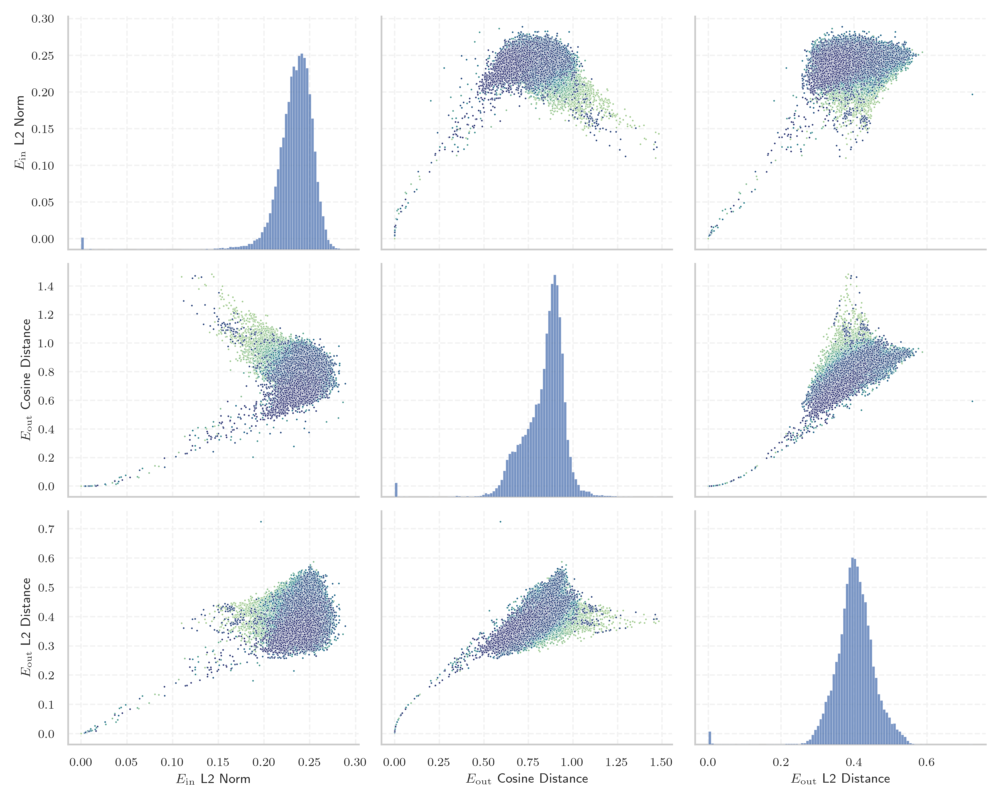

# Report for `upstage/SOLAR-10.7B-v1.0`

## Model info

* Tied embeddings: no
* LM head uses bias: no
* Indicator for under-trained tokens: E_{in} L2 Norm
  * Overall distribution 0.233 +/- 0.025
  * Token used for verification prompt building: `includegraphics`
  * Verification threshold: 0.190
  * Threshold for showing candidate under-trained tokens: 0.107
  * Median verified threshold (for bytes, unreachable and special tokens): 0.037
* Embeddings shape: (32000, 4096)
* Vocabulary size: 32000
  * Number of single byte tokens: 380, of which 141 below indicator threshold
  * Number of special tokens: 3, of which 0 below indicator threshold
  * Number of tested under-trained tokens: 638, 523 non-special, 51 below p = 0.01 threshold, 41 below soft indicator threshold

## Under-trained token indicators plot


## Verification plot


## Under-trained token verification results
41 entries below threshold of 0.107

|   token_id | token              |   indicator | max_prob                                                         | in_other_tokens                                                             |
|------------|--------------------|-------------|------------------------------------------------------------------|-----------------------------------------------------------------------------|
|      20418 | ````` ▁/**\r ````` |  0.00373846 | <span style='border: 1px solid rgb(169, 68, 66);'>3.8e-08</span> |                                                                             |
|      26636 | ````` });\r `````  |  0.00470908 | <span style='border: 1px solid rgb(169, 68, 66);'>4.9e-10</span> |                                                                             |
|      26407 | ````` };\r `````   |  0.0050243  | <span style='border: 1px solid rgb(169, 68, 66);'>7.7e-09</span> |                                                                             |
|      26392 | ````` ▁});\r ````` |  0.00529803 | <span style='border: 1px solid rgb(169, 68, 66);'>9.2e-11</span> |                                                                             |
|      26083 | ````` ▁//\r `````  |  0.00591912 | <span style='border: 1px solid rgb(169, 68, 66);'>3.6e-11</span> |                                                                             |
|      18759 | ````` ';\r `````   |  0.00594713 | <span style='border: 1px solid rgb(169, 68, 66);'>3.6e-11</span> |                                                                             |
|       9823 | ````` */\r `````   |  0.0071945  | <span style='border: 1px solid rgb(169, 68, 66);'>6.2e-11</span> |                                                                             |
|       7608 | ````` ▁*/\r `````  |  0.00811153 | <span style='border: 1px solid rgb(169, 68, 66);'>3e-09</span>   |                                                                             |
|      28171 | ````` ]);\r `````  |  0.00861516 | <span style='border: 1px solid rgb(169, 68, 66);'>8.1e-11</span> |                                                                             |
|      23139 | ````` ▁};\r `````  |  0.00877842 | <span style='border: 1px solid rgb(169, 68, 66);'>2.1e-09</span> |                                                                             |
|      15056 | ````` ());\r ````` |  0.00900373 | <span style='border: 1px solid rgb(169, 68, 66);'>1.7e-09</span> |                                                                             |
|      17695 | ````` },\r `````   |  0.00900494 | <span style='border: 1px solid rgb(169, 68, 66);'>2e-08</span>   | <span style='border: 1px solid rgb(169, 68, 66);'>````` ▁},\r `````</span>  |
|      12193 | ````` ▁);\r `````  |  0.00917036 | <span style='border: 1px solid rgb(169, 68, 66);'>1.2e-09</span> |                                                                             |
|      14756 | ````` /**\r `````  |  0.00998607 | <span style='border: 1px solid rgb(169, 68, 66);'>7.6e-10</span> | <span style='border: 1px solid rgb(169, 68, 66);'>````` ▁/**\r `````</span> |
|      16943 | ````` ');\r `````  |  0.0105091  | <span style='border: 1px solid rgb(169, 68, 66);'>1.8e-10</span> |                                                                             |
|      20692 | ````` ▁},\r `````  |  0.0106782  | <span style='border: 1px solid rgb(169, 68, 66);'>1.2e-10</span> |                                                                             |
|      10278 | ````` ',\r `````   |  0.0120642  | <span style='border: 1px solid rgb(169, 68, 66);'>1.4e-09</span> |                                                                             |
|      14420 | ````` ];\r `````   |  0.0151245  | <span style='border: 1px solid rgb(169, 68, 66);'>1.2e-08</span> |                                                                             |
|      18055 | ````` ){\r `````   |  0.01543    | <span style='border: 1px solid rgb(169, 68, 66);'>7.9e-10</span> |                                                                             |
|      31738 | ````` \uefc0 ````` |  0.0162754  | <span style='border: 1px solid rgb(169, 68, 66);'>1.8e-10</span> |                                                                             |
<details><summary>21 additional entries below threshold</summary>

|   token_id | token               |   indicator | max_prob                                                         | in_other_tokens                                                                                                                                                                                                                                                                                                                                                                                  |
|------------|---------------------|-------------|------------------------------------------------------------------|--------------------------------------------------------------------------------------------------------------------------------------------------------------------------------------------------------------------------------------------------------------------------------------------------------------------------------------------------------------------------------------------------|
|      14980 | ````` ">\r `````    |   0.0168083 | <span style='border: 1px solid rgb(169, 68, 66);'>9e-10</span>   |                                                                                                                                                                                                                                                                                                                                                                                                  |
|      30929 | ````` ᥀ `````       |   0.0180165 | <span style='border: 1px solid rgb(169, 68, 66);'>1.7e-09</span> |                                                                                                                                                                                                                                                                                                                                                                                                  |
|      22186 | ````` ')\r `````    |   0.0262392 | <span style='border: 1px solid rgb(169, 68, 66);'>3.5e-07</span> |                                                                                                                                                                                                                                                                                                                                                                                                  |
|      10939 | ````` ",\r `````    |   0.0269747 | <span style='border: 1px solid rgb(169, 68, 66);'>1.3e-07</span> |                                                                                                                                                                                                                                                                                                                                                                                                  |
|       4420 | ````` ();\r `````   |   0.034158  | <span style='border: 1px solid rgb(169, 68, 66);'>5.8e-06</span> |                                                                                                                                                                                                                                                                                                                                                                                                  |
|       9962 | ````` ()\r `````    |   0.0368519 | <span style='border: 1px solid rgb(169, 68, 66);'>6.2e-07</span> |                                                                                                                                                                                                                                                                                                                                                                                                  |
|      10941 | ````` ));\r `````   |   0.0381289 | <span style='border: 1px solid rgb(169, 68, 66);'>1.8e-07</span> | <span style='border: 1px solid rgb(169, 68, 66);'>````` ());\r `````</span>                                                                                                                                                                                                                                                                                                                      |
|      11880 | ````` ";\r `````    |   0.0400296 | <span style='border: 1px solid rgb(169, 68, 66);'>3.7e-08</span> |                                                                                                                                                                                                                                                                                                                                                                                                  |
|      23486 | ````` ),\r `````    |   0.04102   | <span style='border: 1px solid rgb(169, 68, 66);'>5e-06</span>   |                                                                                                                                                                                                                                                                                                                                                                                                  |
|      14619 | ````` ▁)\r `````    |   0.0418641 | <span style='border: 1px solid rgb(169, 68, 66);'>7.9e-07</span> |                                                                                                                                                                                                                                                                                                                                                                                                  |
|      17334 | ````` (\r `````     |   0.0436971 | <span style='border: 1px solid rgb(169, 68, 66);'>4.4e-08</span> |                                                                                                                                                                                                                                                                                                                                                                                                  |
|      16949 | ````` ")\r `````    |   0.0487248 | <span style='border: 1px solid rgb(169, 68, 66);'>1.5e-06</span> |                                                                                                                                                                                                                                                                                                                                                                                                  |
|       6913 | ````` ");\r `````   |   0.0615329 | <span style='border: 1px solid rgb(169, 68, 66);'>5.3e-10</span> |                                                                                                                                                                                                                                                                                                                                                                                                  |
|       4441 | ````` {\r `````     |   0.0629616 | <span style='border: 1px solid rgb(169, 68, 66);'>1.6e-09</span> | <span style='border: 1px solid rgb(169, 68, 66);'>````` ){\r `````</span>                                                                                                                                                                                                                                                                                                                        |
|      27732 | ````` '\r `````     |   0.0639409 | <span style='border: 1px solid rgb(169, 68, 66);'>2.4e-06</span> |                                                                                                                                                                                                                                                                                                                                                                                                  |
|      14668 | ````` ))\r `````    |   0.0670425 | <span style='border: 1px solid rgb(169, 68, 66);'>1.9e-08</span> |                                                                                                                                                                                                                                                                                                                                                                                                  |
|       3426 | ````` ▁}\r `````    |   0.0743393 | <span style='border: 1px solid rgb(169, 68, 66);'>1.4e-08</span> |                                                                                                                                                                                                                                                                                                                                                                                                  |
|       1761 | ````` );\r `````    |   0.0806924 | <span style='border: 1px solid rgb(169, 68, 66);'>4.1e-06</span> | <span style='border: 1px solid rgb(169, 68, 66);'>````` ();\r `````</span>, <span style='border: 1px solid rgb(169, 68, 66);'>````` ");\r `````</span>, <span style='border: 1px solid rgb(169, 68, 66);'>````` ));\r `````</span>, <span style='border: 1px solid rgb(169, 68, 66);'>````` ▁);\r `````</span>, <span style='border: 1px solid rgb(169, 68, 66);'>````` ());\r `````</span>, ... |
|       1969 | ````` ▁{\r `````    |   0.0849604 | <span style='border: 1px solid rgb(169, 68, 66);'>2.7e-05</span> |                                                                                                                                                                                                                                                                                                                                                                                                  |
|      26831 | ````` ▁febbra ````` |   0.0913581 | <span style='border: 1px solid rgb(169, 68, 66);'>5.1e-08</span> | ````` ▁febbraio `````                                                                                                                                                                                                                                                                                                                                                                            |
|      27456 | ````` :%.*]] `````  |   0.103579  | <span style='border: 1px solid rgb(40, 167, 69);'>0.1</span>     |                                                                                                                                                                                                                                                                                                                                                                                                  |
</details>
<details><summary>482 additional entries above threshold</summary>

|   token_id | token                     |   indicator | max_prob                                                         | in_other_tokens                                                                                                                                                                                                                                                                                                                                                                               |
|------------|---------------------------|-------------|------------------------------------------------------------------|-----------------------------------------------------------------------------------------------------------------------------------------------------------------------------------------------------------------------------------------------------------------------------------------------------------------------------------------------------------------------------------------------|
|       2519 | ````` }\r `````           |    0.106741 | <span style='border: 1px solid rgb(255, 145, 0);'>0.0036</span>  | <span style='border: 1px solid rgb(169, 68, 66);'>````` ▁}\r `````</span>                                                                                                                                                                                                                                                                                                                     |
|        272 | ````` ▁the `````          |    0.109894 | <span style='border: 1px solid rgb(40, 167, 69);'>1</span>       | <span style='border: 1px solid rgb(40, 167, 69);'>````` ▁they `````</span>, <span style='border: 1px solid rgb(40, 167, 69);'>````` ▁their `````</span>, ````` ▁them `````, <span style='border: 1px solid rgb(40, 167, 69);'>````` ▁there `````</span>, ````` ▁then `````, ...                                                                                                               |
|       3685 | ````` >\r `````           |    0.113333 | <span style='border: 1px solid rgb(169, 68, 66);'>3e-05</span>   | <span style='border: 1px solid rgb(169, 68, 66);'>````` ">\r `````</span>                                                                                                                                                                                                                                                                                                                     |
|      30813 | ````` ︙ `````            |    0.118815 | <span style='border: 1px solid rgb(40, 167, 69);'>1</span>       |                                                                                                                                                                                                                                                                                                                                                                                               |
|      31645 | ````` ≯ `````             |    0.118867 | <span style='border: 1px solid rgb(40, 167, 69);'>0.98</span>    |                                                                                                                                                                                                                                                                                                                                                                                               |
|      31656 | ````` ≮ `````             |    0.121645 | <span style='border: 1px solid rgb(40, 167, 69);'>0.97</span>    |                                                                                                                                                                                                                                                                                                                                                                                               |
|      18766 | ````` ]\r `````           |    0.121995 | <span style='border: 1px solid rgb(169, 68, 66);'>9.9e-06</span> |                                                                                                                                                                                                                                                                                                                                                                                               |
|      16724 | ````` tagHelper `````     |    0.124686 | <span style='border: 1px solid rgb(40, 167, 69);'>0.99</span>    |                                                                                                                                                                                                                                                                                                                                                                                               |
|      20358 | ````` ):\r `````          |    0.124732 | <span style='border: 1px solid rgb(169, 68, 66);'>1.8e-06</span> |                                                                                                                                                                                                                                                                                                                                                                                               |
|      15641 | ````` ▁uitgen `````       |    0.124997 | <span style='border: 1px solid rgb(169, 68, 66);'>3.4e-05</span> | ````` ▁uitgenodigd `````                                                                                                                                                                                                                                                                                                                                                                      |
|      11525 | ````` "\r `````           |    0.12777  | <span style='border: 1px solid rgb(169, 68, 66);'>2.7e-05</span> |                                                                                                                                                                                                                                                                                                                                                                                               |
|      16772 | ````` :%.* `````          |    0.128249 | <span style='border: 1px solid rgb(251, 189, 8);'>0.073</span>   | <span style='border: 1px solid rgb(40, 167, 69);'>````` :%.*]] `````</span>                                                                                                                                                                                                                                                                                                                   |
|        264 | ````` ▁a `````            |    0.128515 | <span style='border: 1px solid rgb(40, 167, 69);'>1</span>       | <span style='border: 1px solid rgb(40, 167, 69);'>````` ▁and `````</span>, <span style='border: 1px solid rgb(40, 167, 69);'>````` ▁al `````</span>, <span style='border: 1px solid rgb(40, 167, 69);'>````` ▁as `````</span>, <span style='border: 1px solid rgb(40, 167, 69);'>````` ▁an `````</span>, <span style='border: 1px solid rgb(40, 167, 69);'>````` ▁at `````</span>, ...        |
|        302 | ````` ▁of `````           |    0.128718 | <span style='border: 1px solid rgb(40, 167, 69);'>1</span>       | ````` ▁off `````, ````` ▁offer `````, ````` ▁often `````, ````` ▁offic `````, ````` ▁office `````, ...                                                                                                                                                                                                                                                                                        |
|      28705 | ````` ▁ `````             |    0.131578 | <span style='border: 1px solid rgb(40, 167, 69);'>1</span>       |                                                                                                                                                                                                                                                                                                                                                                                               |
|      10762 | ````` qpoint `````        |    0.13599  | <span style='border: 1px solid rgb(40, 167, 69);'>1</span>       | <span style='border: 1px solid rgb(40, 167, 69);'>````` pgfqpoint `````</span>                                                                                                                                                                                                                                                                                                                |
|        298 | ````` ▁to `````           |    0.136621 | <span style='border: 1px solid rgb(40, 167, 69);'>1</span>       | ````` ▁too `````, ````` ▁top `````, ````` ▁took `````, ````` ▁tot `````, ````` ▁told `````, ...                                                                                                                                                                                                                                                                                               |
|       1271 | ````` ;\r `````           |    0.137121 | <span style='border: 1px solid rgb(40, 167, 69);'>0.94</span>    | <span style='border: 1px solid rgb(169, 68, 66);'>````` );\r `````</span>, <span style='border: 1px solid rgb(169, 68, 66);'>````` ();\r `````</span>, <span style='border: 1px solid rgb(169, 68, 66);'>````` ");\r `````</span>, <span style='border: 1px solid rgb(169, 68, 66);'>````` ));\r `````</span>, <span style='border: 1px solid rgb(169, 68, 66);'>````` ";\r `````</span>, ... |
|      31932 | ````` ҽ `````             |    0.137767 | <span style='border: 1px solid rgb(40, 167, 69);'>1</span>       |                                                                                                                                                                                                                                                                                                                                                                                               |
|      14052 | ````` ▁Jahrhund `````     |    0.137769 | <span style='border: 1px solid rgb(255, 145, 0);'>0.0032</span>  | ````` ▁Jahrhundert `````, ````` ▁Jahrhunderts `````                                                                                                                                                                                                                                                                                                                                           |
|      31179 | ````` ┈ `````             |    0.139846 | <span style='border: 1px solid rgb(40, 167, 69);'>1</span>       |                                                                                                                                                                                                                                                                                                                                                                                               |
|      29934 | ````` ⣿ `````             |    0.140086 | <span style='border: 1px solid rgb(40, 167, 69);'>1</span>       |                                                                                                                                                                                                                                                                                                                                                                                               |
|        288 | ````` ing `````           |    0.140543 | <span style='border: 1px solid rgb(40, 167, 69);'>1</span>       | ````` ring `````, <span style='border: 1px solid rgb(40, 167, 69);'>````` ings `````</span>, ````` tring `````, ````` ning `````, <span style='border: 1px solid rgb(40, 167, 69);'>````` ating `````</span>, ...                                                                                                                                                                             |
|      30897 | ````` ⠄ `````             |    0.141828 | <span style='border: 1px solid rgb(40, 167, 69);'>0.99</span>    |                                                                                                                                                                                                                                                                                                                                                                                               |
|      31733 | ````` ⵙ `````             |    0.14194  | <span style='border: 1px solid rgb(40, 167, 69);'>0.78</span>    |                                                                                                                                                                                                                                                                                                                                                                                               |
|        297 | ````` ▁in `````           |    0.142941 | <span style='border: 1px solid rgb(40, 167, 69);'>1</span>       | ````` ▁int `````, ````` ▁into `````, ````` ▁inter `````, ````` ▁inst `````, ````` ▁incl `````, ...                                                                                                                                                                                                                                                                                            |
|      17779 | ````` ▁gepublice `````    |    0.143946 | <span style='border: 1px solid rgb(169, 68, 66);'>1.1e-06</span> | ````` ▁gepubliceerd `````                                                                                                                                                                                                                                                                                                                                                                     |
|      25833 | ````` >?[< `````          |    0.144418 | <span style='border: 1px solid rgb(251, 189, 8);'>0.076</span>   |                                                                                                                                                                                                                                                                                                                                                                                               |
|      13667 | ````` *\r `````           |    0.144653 | <span style='border: 1px solid rgb(40, 167, 69);'>0.64</span>    | <span style='border: 1px solid rgb(169, 68, 66);'>````` /**\r `````</span>, <span style='border: 1px solid rgb(169, 68, 66);'>````` ▁/**\r `````</span>                                                                                                                                                                                                                                       |
|        304 | ````` ▁and `````          |    0.144942 | <span style='border: 1px solid rgb(40, 167, 69);'>1</span>       | ````` ▁android `````, ````` ▁andere `````, ````` ▁anderen `````, ````` ▁ander `````, ````` ▁andra `````, ...                                                                                                                                                                                                                                                                                  |
|        262 | ````` in `````            |    0.146217 | <span style='border: 1px solid rgb(40, 167, 69);'>1</span>       | <span style='border: 1px solid rgb(40, 167, 69);'>````` ing `````</span>, <span style='border: 1px solid rgb(40, 167, 69);'>````` ▁in `````</span>, <span style='border: 1px solid rgb(40, 167, 69);'>````` ain `````</span>, <span style='border: 1px solid rgb(40, 167, 69);'>````` ine `````</span>, ````` int `````, ...                                                                  |
|      31853 | ````` ⇽ `````             |    0.146415 | <span style='border: 1px solid rgb(40, 167, 69);'>0.96</span>    |                                                                                                                                                                                                                                                                                                                                                                                               |
|      25900 | ````` iNdEx `````         |    0.147362 | <span style='border: 1px solid rgb(40, 167, 69);'>0.71</span>    |                                                                                                                                                                                                                                                                                                                                                                                               |
|        286 | ````` ed `````            |    0.148263 | <span style='border: 1px solid rgb(40, 167, 69);'>1</span>       | <span style='border: 1px solid rgb(40, 167, 69);'>````` ated `````</span>, ````` ied `````, ````` hed `````, ````` red `````, ````` ▁need `````, ...                                                                                                                                                                                                                                          |
|        263 | ````` er `````            |    0.148692 | <span style='border: 1px solid rgb(40, 167, 69);'>1</span>       | <span style='border: 1px solid rgb(40, 167, 69);'>````` ver `````</span>, <span style='border: 1px solid rgb(40, 167, 69);'>````` ter `````</span>, ````` ere `````, <span style='border: 1px solid rgb(40, 167, 69);'>````` ers `````</span>, ````` ser `````, ...                                                                                                                           |
|       7941 | ````` ICENSE `````        |    0.150263 | <span style='border: 1px solid rgb(40, 167, 69);'>0.99</span>    | ````` LICENSE `````, ````` ▁LICENSE `````                                                                                                                                                                                                                                                                                                                                                     |
|        274 | ````` es `````            |    0.150584 | <span style='border: 1px solid rgb(40, 167, 69);'>1</span>       | <span style='border: 1px solid rgb(40, 167, 69);'>````` est `````</span>, ````` ess `````, <span style='border: 1px solid rgb(40, 167, 69);'>````` res `````</span>, <span style='border: 1px solid rgb(40, 167, 69);'>````` ies `````</span>, ````` ▁res `````, ...                                                                                                                          |
|        266 | ````` on `````            |    0.150826 | <span style='border: 1px solid rgb(40, 167, 69);'>1</span>       | <span style='border: 1px solid rgb(40, 167, 69);'>````` ion `````</span>, <span style='border: 1px solid rgb(40, 167, 69);'>````` ation `````</span>, <span style='border: 1px solid rgb(40, 167, 69);'>````` ▁on `````</span>, ````` ▁con `````, ````` ction `````, ...                                                                                                                      |
|      19248 | ````` NdEx `````          |    0.150958 | <span style='border: 1px solid rgb(251, 189, 8);'>0.058</span>   | <span style='border: 1px solid rgb(40, 167, 69);'>````` iNdEx `````</span>                                                                                                                                                                                                                                                                                                                    |
|        415 | ````` ▁The `````          |    0.151321 | <span style='border: 1px solid rgb(40, 167, 69);'>1</span>       | <span style='border: 1px solid rgb(40, 167, 69);'>````` ▁They `````</span>, <span style='border: 1px solid rgb(40, 167, 69);'>````` ▁There `````</span>, ````` ▁Then `````, ````` ▁These `````, ````` ▁Their `````, ...                                                                                                                                                                       |
|        349 | ````` ▁is `````           |    0.151997 | <span style='border: 1px solid rgb(40, 167, 69);'>1</span>       | ````` ▁iss `````, ````` ▁ist `````, <span style='border: 1px solid rgb(40, 167, 69);'>````` ▁isn `````</span>, ````` ▁issue `````, ````` ▁issues `````, ...                                                                                                                                                                                                                                   |
|       4604 | ````` ,\r `````           |    0.152421 | <span style='border: 1px solid rgb(40, 167, 69);'>0.34</span>    | <span style='border: 1px solid rgb(169, 68, 66);'>````` ',\r `````</span>, <span style='border: 1px solid rgb(169, 68, 66);'>````` ",\r `````</span>, <span style='border: 1px solid rgb(169, 68, 66);'>````` },\r `````</span>, <span style='border: 1px solid rgb(169, 68, 66);'>````` ▁},\r `````</span>, <span style='border: 1px solid rgb(169, 68, 66);'>````` ),\r `````</span>        |
|        282 | ````` al `````            |    0.152801 | <span style='border: 1px solid rgb(40, 167, 69);'>1</span>       | <span style='border: 1px solid rgb(40, 167, 69);'>````` ▁al `````</span>, <span style='border: 1px solid rgb(40, 167, 69);'>````` all `````</span>, ````` ial `````, <span style='border: 1px solid rgb(40, 167, 69);'>````` ▁all `````</span>, <span style='border: 1px solid rgb(40, 167, 69);'>````` ally `````</span>, ...                                                                |
|        276 | ````` an `````            |    0.152839 | <span style='border: 1px solid rgb(40, 167, 69);'>1</span>       | <span style='border: 1px solid rgb(40, 167, 69);'>````` ▁and `````</span>, <span style='border: 1px solid rgb(40, 167, 69);'>````` and `````</span>, <span style='border: 1px solid rgb(40, 167, 69);'>````` ▁an `````</span>, <span style='border: 1px solid rgb(40, 167, 69);'>````` ant `````</span>, <span style='border: 1px solid rgb(40, 167, 69);'>````` ans `````</span>, ...        |
|      15500 | ````` itempty `````       |    0.152864 | <span style='border: 1px solid rgb(251, 189, 8);'>0.042</span>   | ````` omitempty `````                                                                                                                                                                                                                                                                                                                                                                         |
|        369 | ````` ▁that `````         |    0.15305  | <span style='border: 1px solid rgb(40, 167, 69);'>1</span>       | ````` ▁thats `````                                                                                                                                                                                                                                                                                                                                                                            |
|        354 | ````` ▁for `````          |    0.153148 | <span style='border: 1px solid rgb(40, 167, 69);'>1</span>       | ````` ▁form `````, ````` ▁fore `````, ````` ▁forward `````, ````` ▁force `````, ````` ▁former `````, ...                                                                                                                                                                                                                                                                                      |
|        269 | ````` en `````            |    0.153495 | <span style='border: 1px solid rgb(40, 167, 69);'>1</span>       | <span style='border: 1px solid rgb(40, 167, 69);'>````` ent `````</span>, <span style='border: 1px solid rgb(40, 167, 69);'>````` end `````</span>, <span style='border: 1px solid rgb(40, 167, 69);'>````` ment `````</span>, ````` ▁en `````, ````` hen `````, ...                                                                                                                          |
|      31841 | ````` ❒ `````             |    0.154195 | <span style='border: 1px solid rgb(40, 167, 69);'>1</span>       |                                                                                                                                                                                                                                                                                                                                                                                               |
|        395 | ````` ▁with `````         |    0.154231 | <span style='border: 1px solid rgb(40, 167, 69);'>1</span>       | ````` ▁without `````, ````` ▁within `````, ````` ▁withdraw `````, ````` ▁withd `````, ````` ▁withdrawal `````                                                                                                                                                                                                                                                                                 |
|        356 | ````` ▁on `````           |    0.154273 | <span style='border: 1px solid rgb(40, 167, 69);'>1</span>       | <span style='border: 1px solid rgb(40, 167, 69);'>````` ▁one `````</span>, ````` ▁only `````, ````` ▁once `````, ````` ▁online `````, ````` ▁ones `````, ...                                                                                                                                                                                                                                  |
|        404 | ````` ers `````           |    0.154308 | <span style='border: 1px solid rgb(40, 167, 69);'>1</span>       | ````` vers `````, ````` erson `````, ````` ▁person `````, <span style='border: 1px solid rgb(40, 167, 69);'>````` ters `````</span>, ````` ivers `````, ...                                                                                                                                                                                                                                   |
|        325 | ````` ▁( `````            |    0.154477 | <span style='border: 1px solid rgb(40, 167, 69);'>1</span>       | ````` ▁(! `````, ````` ▁(* `````, ````` ▁(( `````, ````` ▁() `````, ````` ▁($ `````, ...                                                                                                                                                                                                                                                                                                      |
|      30413 | ````` ⌁ `````             |    0.155226 | <span style='border: 1px solid rgb(40, 167, 69);'>1</span>       |                                                                                                                                                                                                                                                                                                                                                                                               |
|        378 | ````` ▁it `````           |    0.155861 | <span style='border: 1px solid rgb(40, 167, 69);'>1</span>       | ````` ▁its `````, ````` ▁item `````, ````` ▁itself `````, ````` ▁items `````, ````` ▁iter `````, ...                                                                                                                                                                                                                                                                                          |
|        315 | ````` ▁I `````            |    0.156091 | <span style='border: 1px solid rgb(40, 167, 69);'>1</span>       | <span style='border: 1px solid rgb(40, 167, 69);'>````` ▁In `````</span>, <span style='border: 1px solid rgb(40, 167, 69);'>````` ▁It `````</span>, <span style='border: 1px solid rgb(40, 167, 69);'>````` ▁If `````</span>, ````` ▁Is `````, ````` ▁Ind `````, ...                                                                                                                          |
|        278 | ````` is `````            |    0.156465 | <span style='border: 1px solid rgb(40, 167, 69);'>1</span>       | <span style='border: 1px solid rgb(40, 167, 69);'>````` ▁is `````</span>, <span style='border: 1px solid rgb(40, 167, 69);'>````` ist `````</span>, <span style='border: 1px solid rgb(40, 167, 69);'>````` ▁this `````</span>, <span style='border: 1px solid rgb(40, 167, 69);'>````` ▁his `````</span>, ````` ▁dis `````, ...                                                              |
|        271 | ````` or `````            |    0.157479 | <span style='border: 1px solid rgb(40, 167, 69);'>1</span>       | <span style='border: 1px solid rgb(40, 167, 69);'>````` ▁for `````</span>, ````` ort `````, ````` ore `````, <span style='border: 1px solid rgb(40, 167, 69);'>````` ▁or `````</span>, ````` port `````, ...                                                                                                                                                                                  |
|        301 | ````` el `````            |    0.158058 | <span style='border: 1px solid rgb(40, 167, 69);'>1</span>       | <span style='border: 1px solid rgb(40, 167, 69);'>````` ell `````</span>, ````` elf `````, ````` ▁el `````, ````` ely `````, ````` iel `````, ...                                                                                                                                                                                                                                             |
|        283 | ````` ar `````            |    0.158219 | <span style='border: 1px solid rgb(40, 167, 69);'>1</span>       | <span style='border: 1px solid rgb(40, 167, 69);'>````` art `````</span>, <span style='border: 1px solid rgb(40, 167, 69);'>````` ▁are `````</span>, <span style='border: 1px solid rgb(40, 167, 69);'>````` ard `````</span>, <span style='border: 1px solid rgb(40, 167, 69);'>````` are `````</span>, ````` ▁ar `````, ...                                                                 |
|        330 | ````` ▁A `````            |    0.158515 | <span style='border: 1px solid rgb(40, 167, 69);'>1</span>       | ````` ▁Al `````, ````` ▁Ar `````, ````` ▁And `````, ````` ▁An `````, <span style='border: 1px solid rgb(40, 167, 69);'>````` ▁As `````</span>, ...                                                                                                                                                                                                                                            |
|      31443 | ````` ⵏ `````             |    0.158625 | <span style='border: 1px solid rgb(251, 189, 8);'>0.08</span>    |                                                                                                                                                                                                                                                                                                                                                                                               |
|      31922 | ````` ⵓ `````             |    0.159048 | <span style='border: 1px solid rgb(251, 189, 8);'>0.098</span>   |                                                                                                                                                                                                                                                                                                                                                                                               |
|        477 | ````` ▁from `````         |    0.159264 | <span style='border: 1px solid rgb(40, 167, 69);'>1</span>       |                                                                                                                                                                                                                                                                                                                                                                                               |
|       1014 | ````` The `````           |    0.159276 | <span style='border: 1px solid rgb(40, 167, 69);'>1</span>       | <span style='border: 1px solid rgb(40, 167, 69);'>````` ▁They `````</span>, <span style='border: 1px solid rgb(40, 167, 69);'>````` ▁There `````</span>, ````` ▁Then `````, ````` ▁These `````, ````` There `````, ...                                                                                                                                                                        |
|      31363 | ````` \x85 `````          |    0.160241 | <span style='border: 1px solid rgb(40, 167, 69);'>0.99</span>    |                                                                                                                                                                                                                                                                                                                                                                                               |
|      30770 | ````` 🟡 `````            |    0.160806 | <span style='border: 1px solid rgb(40, 167, 69);'>1</span>       |                                                                                                                                                                                                                                                                                                                                                                                               |
|      30867 | ````` 🟠 `````            |    0.160939 | <span style='border: 1px solid rgb(40, 167, 69);'>1</span>       |                                                                                                                                                                                                                                                                                                                                                                                               |
|        390 | ````` ▁as `````           |    0.160964 | <span style='border: 1px solid rgb(40, 167, 69);'>1</span>       | ````` ▁ass `````, ````` ▁ask `````, ````` ▁assert `````, ````` ▁asked `````, ````` ▁associ `````, ...                                                                                                                                                                                                                                                                                         |
|        293 | ````` as `````            |    0.161069 | <span style='border: 1px solid rgb(40, 167, 69);'>1</span>       | <span style='border: 1px solid rgb(40, 167, 69);'>````` ▁as `````</span>, <span style='border: 1px solid rgb(40, 167, 69);'>````` ▁was `````</span>, ````` ass `````, <span style='border: 1px solid rgb(40, 167, 69);'>````` ast `````</span>, ````` ase `````, ...                                                                                                                          |
|        352 | ````` ation `````         |    0.161146 | <span style='border: 1px solid rgb(40, 167, 69);'>1</span>       | <span style='border: 1px solid rgb(40, 167, 69);'>````` ations `````</span>, ````` ational `````, ````` lation `````, ````` formation `````, ````` translation `````, ...                                                                                                                                                                                                                     |
|        318 | ````` ▁S `````            |    0.16117  | <span style='border: 1px solid rgb(40, 167, 69);'>1</span>       | ````` ▁St `````, <span style='border: 1px solid rgb(40, 167, 69);'>````` ▁She `````</span>, ````` ▁Se `````, <span style='border: 1px solid rgb(40, 167, 69);'>````` ▁Sh `````</span>, ````` ▁So `````, ...                                                                                                                                                                                   |
|        368 | ````` ▁you `````          |    0.161835 | <span style='border: 1px solid rgb(40, 167, 69);'>1</span>       | <span style='border: 1px solid rgb(40, 167, 69);'>````` ▁your `````</span>, ````` ▁young `````, ````` ▁yourself `````, ````` ▁youth `````, ````` ▁younger `````, ...                                                                                                                                                                                                                          |
|        345 | ````` ▁" `````            |    0.161977 | <span style='border: 1px solid rgb(40, 167, 69);'>1</span>       | ````` ▁""" `````, ````` ▁"\ `````, ````` ▁"< `````, ````` ▁"/ `````, ````` ▁"" `````, ...                                                                                                                                                                                                                                                                                                     |
|        279 | ````` it `````            |    0.162804 | <span style='border: 1px solid rgb(40, 167, 69);'>1</span>       | ````` ith `````, <span style='border: 1px solid rgb(40, 167, 69);'>````` ▁it `````</span>, <span style='border: 1px solid rgb(40, 167, 69);'>````` ▁with `````</span>, <span style='border: 1px solid rgb(40, 167, 69);'>````` ity `````</span>, <span style='border: 1px solid rgb(40, 167, 69);'>````` ite `````</span>, ...                                                                |
|      31895 | ````` ❍ `````             |    0.162996 | <span style='border: 1px solid rgb(40, 167, 69);'>1</span>       |                                                                                                                                                                                                                                                                                                                                                                                               |
|        294 | ````` ic `````            |    0.163098 | <span style='border: 1px solid rgb(40, 167, 69);'>1</span>       | ````` ice `````, ````` ich `````, ````` lic `````, ````` ublic `````, ````` ick `````, ...                                                                                                                                                                                                                                                                                                    |
|        725 | ````` ER `````            |    0.163121 | <span style='border: 1px solid rgb(40, 167, 69);'>1</span>       | ````` ERR `````, ````` VER `````, ````` ERT `````, ````` ERROR `````, ````` TER `````, ...                                                                                                                                                                                                                                                                                                    |
|        270 | ````` at `````            |    0.163315 | <span style='border: 1px solid rgb(40, 167, 69);'>1</span>       | <span style='border: 1px solid rgb(40, 167, 69);'>````` ation `````</span>, <span style='border: 1px solid rgb(40, 167, 69);'>````` ▁that `````</span>, <span style='border: 1px solid rgb(40, 167, 69);'>````` ate `````</span>, <span style='border: 1px solid rgb(40, 167, 69);'>````` ▁at `````</span>, ````` ath `````, ...                                                              |
|       2043 | ````` ING `````           |    0.163347 | <span style='border: 1px solid rgb(40, 167, 69);'>1</span>       | ````` STRING `````, ````` TING `````, ````` CLUDING `````, ````` WARNING `````, ````` SETTING `````, ...                                                                                                                                                                                                                                                                                      |
|        557 | ````` ), `````            |    0.163355 | <span style='border: 1px solid rgb(40, 167, 69);'>1</span>       | ````` (), `````, ````` "), `````, ````` '), `````, ````` ▁), `````, ````` }), `````, ...                                                                                                                                                                                                                                                                                                      |
|        400 | ````` ▁he `````           |    0.163435 | <span style='border: 1px solid rgb(40, 167, 69);'>1</span>       | <span style='border: 1px solid rgb(40, 167, 69);'>````` ▁her `````</span>, ````` ▁hel `````, ````` ▁here `````, ````` ▁help `````, ````` ▁head `````, ...                                                                                                                                                                                                                                     |
|      11167 | ````` ityEngine `````     |    0.163645 | <span style='border: 1px solid rgb(40, 167, 69);'>0.83</span>    | ````` ▁UnityEngine `````, ````` UnityEngine `````                                                                                                                                                                                                                                                                                                                                             |
|      12683 | ````` pgfpathlineto ````` |    0.16365  | <span style='border: 1px solid rgb(255, 145, 0);'>0.0045</span>  |                                                                                                                                                                                                                                                                                                                                                                                               |
|        403 | ````` ▁was `````          |    0.163851 | <span style='border: 1px solid rgb(40, 167, 69);'>1</span>       | <span style='border: 1px solid rgb(40, 167, 69);'>````` ▁wasn `````</span>, ````` ▁waste `````, ````` ▁wash `````, ````` ▁washing `````, ````` ▁washed `````, ...                                                                                                                                                                                                                             |
|        486 | ````` ▁by `````           |    0.163939 | <span style='border: 1px solid rgb(40, 167, 69);'>1</span>       | ````` ▁byte `````, ````` ▁bytes `````, ````` ▁byl `````, ````` ▁był `````, ````` ▁byla `````                                                                                                                                                                                                                                                                                                  |
|        299 | ````` et `````            |    0.164132 | <span style='border: 1px solid rgb(40, 167, 69);'>1</span>       | ````` get `````, ````` ▁return `````, <span style='border: 1px solid rgb(40, 167, 69);'>````` ▁get `````</span>, ````` set `````, ````` eth `````, ...                                                                                                                                                                                                                                        |
|      15630 | ````` odigd `````         |    0.164178 | <span style='border: 1px solid rgb(40, 167, 69);'>0.84</span>    | ````` ▁uitgenodigd `````                                                                                                                                                                                                                                                                                                                                                                      |
|        385 | ````` os `````            |    0.164389 | <span style='border: 1px solid rgb(40, 167, 69);'>1</span>       | ````` ost `````, ````` ose `````, ````` ▁pos `````, ````` pos `````, ````` ▁most `````, ...                                                                                                                                                                                                                                                                                                   |
|        611 | ````` ." `````            |    0.164587 | <span style='border: 1px solid rgb(40, 167, 69);'>1</span>       | ````` ..." `````, ````` .", `````, ````` ."); `````, ````` ▁." `````, ````` .""" `````, ...                                                                                                                                                                                                                                                                                                   |
|        380 | ````` ate `````           |    0.1647   | <span style='border: 1px solid rgb(40, 167, 69);'>1</span>       | <span style='border: 1px solid rgb(40, 167, 69);'>````` ated `````</span>, ````` ater `````, <span style='border: 1px solid rgb(40, 167, 69);'>````` ates `````</span>, ````` rivate `````, ````` date `````, ...                                                                                                                                                                             |
|      22803 | ````` .^{[ `````          |    0.164878 | <span style='border: 1px solid rgb(169, 68, 66);'>5.4e-06</span> |                                                                                                                                                                                                                                                                                                                                                                                               |
|        590 | ````` ▁they `````         |    0.165143 | <span style='border: 1px solid rgb(40, 167, 69);'>1</span>       |                                                                                                                                                                                                                                                                                                                                                                                               |
|        381 | ````` us `````            |    0.165233 | <span style='border: 1px solid rgb(40, 167, 69);'>1</span>       | ````` ust `````, ````` ▁us `````, ````` ous `````, ````` ▁just `````, ````` ause `````, ...                                                                                                                                                                                                                                                                                                   |
|        314 | ````` am `````            |    0.16528  | <span style='border: 1px solid rgb(40, 167, 69);'>1</span>       | ````` ame `````, ````` aram `````, ````` ▁am `````, ````` name `````, ````` Name `````, ...                                                                                                                                                                                                                                                                                                   |
|        412 | ````` ie `````            |    0.165365 | <span style='border: 1px solid rgb(40, 167, 69);'>1</span>       | <span style='border: 1px solid rgb(40, 167, 69);'>````` ies `````</span>, ````` ient `````, <span style='border: 1px solid rgb(40, 167, 69);'>````` ier `````</span>, ````` iel `````, ````` ied `````, ...                                                                                                                                                                                   |
|        267 | ````` re `````            |    0.165427 | <span style='border: 1px solid rgb(40, 167, 69);'>1</span>       | ````` ▁re `````, ````` ere `````, <span style='border: 1px solid rgb(40, 167, 69);'>````` res `````</span>, ````` ore `````, <span style='border: 1px solid rgb(40, 167, 69);'>````` ▁are `````</span>, ...                                                                                                                                                                                   |
|      30983 | ````` ڕ `````             |    0.165634 | <span style='border: 1px solid rgb(40, 167, 69);'>1</span>       |                                                                                                                                                                                                                                                                                                                                                                                               |
|        460 | ````` ▁are `````          |    0.165835 | <span style='border: 1px solid rgb(40, 167, 69);'>1</span>       | ````` ▁area `````, ````` ▁areas `````, <span style='border: 1px solid rgb(40, 167, 69);'>````` ▁aren `````</span>, ````` ▁arena `````                                                                                                                                                                                                                                                         |
|        438 | ````` ▁at `````           |    0.165934 | <span style='border: 1px solid rgb(40, 167, 69);'>1</span>       | ````` ▁att `````, ````` ▁attack `````, ````` ▁attempt `````, ````` ▁attention `````, ````` ▁attribute `````, ...                                                                                                                                                                                                                                                                              |
|        609 | ````` ). `````            |    0.165957 | <span style='border: 1px solid rgb(40, 167, 69);'>1</span>       | ````` (). `````, ````` "). `````, ````` '). `````, ````` }). `````, ````` )). `````, ...                                                                                                                                                                                                                                                                                                      |
|        320 | ````` ▁T `````            |    0.166183 | <span style='border: 1px solid rgb(40, 167, 69);'>1</span>       | <span style='border: 1px solid rgb(40, 167, 69);'>````` ▁The `````</span>, ````` ▁Th `````, <span style='border: 1px solid rgb(40, 167, 69);'>````` ▁This `````</span>, <span style='border: 1px solid rgb(40, 167, 69);'>````` ▁They `````</span>, ````` ▁Tr `````, ...                                                                                                                      |
|        291 | ````` le `````            |    0.166234 | <span style='border: 1px solid rgb(40, 167, 69);'>1</span>       | ````` ▁le `````, <span style='border: 1px solid rgb(40, 167, 69);'>````` able `````</span>, ````` ile `````, ````` ple `````, ````` lect `````, ...                                                                                                                                                                                                                                           |
|        351 | ````` ▁M `````            |    0.166236 | <span style='border: 1px solid rgb(40, 167, 69);'>1</span>       | ````` ▁Mar `````, <span style='border: 1px solid rgb(40, 167, 69);'>````` ▁My `````</span>, ````` ▁Man `````, <span style='border: 1px solid rgb(40, 167, 69);'>````` ▁May `````</span>, ````` ▁Me `````, ...                                                                                                                                                                                 |
|        949 | ````` ▁don `````          |    0.166531 | <span style='border: 1px solid rgb(40, 167, 69);'>1</span>       | ````` ▁done `````, ````` ▁dont `````, ````` ▁donde `````, ````` ▁donc `````, ````` ▁donne `````                                                                                                                                                                                                                                                                                               |
|        560 | ````` ▁In `````           |    0.166688 | <span style='border: 1px solid rgb(40, 167, 69);'>1</span>       | ````` ▁Ind `````, ````` ▁Inst `````, ````` ▁Intern `````, ````` ▁Inter `````, ````` ▁Int `````, ...                                                                                                                                                                                                                                                                                           |
|      31317 | ````` ⵉ `````             |    0.166983 | <span style='border: 1px solid rgb(40, 167, 69);'>0.66</span>    |                                                                                                                                                                                                                                                                                                                                                                                               |
|        497 | ````` ies `````           |    0.167166 | <span style='border: 1px solid rgb(40, 167, 69);'>1</span>       | ````` ities `````, ````` ries `````, ````` ories `````, ````` perties `````, ````` ▁series `````, ...                                                                                                                                                                                                                                                                                         |
|        334 | ````` ▁C `````            |    0.167278 | <span style='border: 1px solid rgb(40, 167, 69);'>1</span>       | ````` ▁Ch `````, ````` ▁Com `````, ````` ▁Con `````, ````` ▁Cl `````, ````` ▁Col `````, ...                                                                                                                                                                                                                                                                                                   |
|      31734 | ````` 丶 `````            |    0.167579 | <span style='border: 1px solid rgb(40, 167, 69);'>1</span>       |                                                                                                                                                                                                                                                                                                                                                                                               |
|        396 | ````` ▁an `````           |    0.16767  | <span style='border: 1px solid rgb(40, 167, 69);'>1</span>       | ````` ▁any `````, ````` ▁another `````, ````` ▁ann `````, ````` ▁anything `````, ````` ▁ant `````, ...                                                                                                                                                                                                                                                                                        |
|        524 | ````` ▁K `````            |    0.167765 | <span style='border: 1px solid rgb(40, 167, 69);'>1</span>       | ````` ▁King `````, ````` ▁Ke `````, ````` ▁Kl `````, ````` ▁Key `````, ````` ▁Kar `````, ...                                                                                                                                                                                                                                                                                                  |
|        456 | ````` ▁this `````         |    0.16785  | <span style='border: 1px solid rgb(40, 167, 69);'>1</span>       |                                                                                                                                                                                                                                                                                                                                                                                               |
|        515 | ````` ia `````            |    0.168043 | <span style='border: 1px solid rgb(40, 167, 69);'>1</span>       | <span style='border: 1px solid rgb(40, 167, 69);'>````` ian `````</span>, ````` ially `````, ````` ential `````, ````` aterial `````, ````` iam `````, ...                                                                                                                                                                                                                                    |
|      28593 | ````` pgfscope `````      |    0.16821  | <span style='border: 1px solid rgb(40, 167, 69);'>0.39</span>    |                                                                                                                                                                                                                                                                                                                                                                                               |
|        464 | ````` ▁' `````            |    0.168218 | <span style='border: 1px solid rgb(40, 167, 69);'>1</span>       | ````` ▁'./ `````, ````` ▁'/ `````, ````` ▁'@ `````, ````` ▁'\ `````, ````` ▁'< `````, ...                                                                                                                                                                                                                                                                                                     |
|        384 | ````` ▁D `````            |    0.168243 | <span style='border: 1px solid rgb(40, 167, 69);'>1</span>       | ````` ▁De `````, ````` ▁Do `````, ````` ▁Des `````, ````` ▁Die `````, ````` ▁Dr `````, ...                                                                                                                                                                                                                                                                                                    |
|        365 | ````` ▁B `````            |    0.168276 | <span style='border: 1px solid rgb(40, 167, 69);'>1</span>       | <span style='border: 1px solid rgb(40, 167, 69);'>````` ▁But `````</span>, ````` ▁Be `````, ````` ▁Br `````, ````` ▁Bl `````, ````` ▁By `````, ...                                                                                                                                                                                                                                            |
|        465 | ````` age `````           |    0.168405 | <span style='border: 1px solid rgb(40, 167, 69);'>1</span>       | ````` essage `````, ````` ages `````, ````` message `````, ````` ager `````, ````` aged `````, ...                                                                                                                                                                                                                                                                                            |
|        367 | ````` ▁P `````            |    0.168435 | <span style='border: 1px solid rgb(40, 167, 69);'>1</span>       | ````` ▁Pro `````, ````` ▁Pl `````, ````` ▁Pr `````, ````` ▁Ph `````, ````` ▁Par `````, ...                                                                                                                                                                                                                                                                                                    |
|        322 | ````` ot `````            |    0.16868  | <span style='border: 1px solid rgb(40, 167, 69);'>1</span>       | <span style='border: 1px solid rgb(40, 167, 69);'>````` ▁not `````</span>, ````` ▁other `````, ````` oth `````, ````` other `````, ````` ▁got `````, ...                                                                                                                                                                                                                                      |
|        382 | ````` ▁H `````            |    0.168683 | <span style='border: 1px solid rgb(40, 167, 69);'>1</span>       | <span style='border: 1px solid rgb(40, 167, 69);'>````` ▁He `````</span>, ````` ▁How `````, ````` ▁His `````, ````` ▁Her `````, ````` ▁However `````, ...                                                                                                                                                                                                                                     |
|        401 | ````` ▁F `````            |    0.16884  | <span style='border: 1px solid rgb(40, 167, 69);'>1</span>       | <span style='border: 1px solid rgb(40, 167, 69);'>````` ▁For `````</span>, ````` ▁Fr `````, ````` ▁Fl `````, <span style='border: 1px solid rgb(40, 167, 69);'>````` ▁From `````</span>, ````` ▁Fin `````, ...                                                                                                                                                                                |
|        478 | ````` ▁we `````           |    0.168947 | <span style='border: 1px solid rgb(40, 167, 69);'>1</span>       | <span style='border: 1px solid rgb(40, 167, 69);'>````` ▁were `````</span>, ````` ▁well `````, ````` ▁week `````, ````` ▁went `````, ````` ▁wer `````, ...                                                                                                                                                                                                                                    |
|        393 | ````` ▁L `````            |    0.169209 | <span style='border: 1px solid rgb(40, 167, 69);'>1</span>       | ````` ▁Le `````, ````` ▁La `````, ````` ▁License `````, ````` ▁Let `````, ````` ▁List `````, ...                                                                                                                                                                                                                                                                                              |
|      21259 | ````` \r\r `````          |    0.16931  | <span style='border: 1px solid rgb(40, 167, 69);'>0.48</span>    |                                                                                                                                                                                                                                                                                                                                                                                               |
|       1251 | ````` AN `````            |    0.169359 | <span style='border: 1px solid rgb(40, 167, 69);'>1</span>       | ````` ▁AN `````, ````` RAN `````, ````` AND `````, ````` ▁AND `````, ````` ▁ANY `````, ...                                                                                                                                                                                                                                                                                                    |
|        346 | ````` ly `````            |    0.169361 | <span style='border: 1px solid rgb(40, 167, 69);'>1</span>       | <span style='border: 1px solid rgb(40, 167, 69);'>````` ally `````</span>, ````` ely `````, ````` ▁only `````, ````` ily `````, ````` ually `````, ...                                                                                                                                                                                                                                        |
|        420 | ````` ▁G `````            |    0.169659 | <span style='border: 1px solid rgb(40, 167, 69);'>1</span>       | ````` ▁Gr `````, ````` ▁Ge `````, ````` ▁Gu `````, ````` ▁Get `````, ````` ▁God `````, ...                                                                                                                                                                                                                                                                                                    |
|        387 | ````` ▁- `````            |    0.169788 | <span style='border: 1px solid rgb(40, 167, 69);'>1</span>       | ````` ▁-- `````, ````` ▁-> `````, ````` ▁--> `````, ````` ▁-= `````, ````` ▁--- `````, ...                                                                                                                                                                                                                                                                                                    |
|        661 | ````` ▁It `````           |    0.170257 | <span style='border: 1px solid rgb(40, 167, 69);'>1</span>       | ````` ▁Ital `````, ````` ▁Its `````, ````` ▁Italian `````, ````` ▁Italy `````, ````` ▁Item `````, ...                                                                                                                                                                                                                                                                                         |
|        416 | ````` end `````           |    0.17029  | <span style='border: 1px solid rgb(40, 167, 69);'>1</span>       | ````` ▁end `````, ````` riend `````, ````` pend `````, ````` ▁friend `````, ````` ender `````, ...                                                                                                                                                                                                                                                                                            |
|        399 | ````` ▁R `````            |    0.17065  | <span style='border: 1px solid rgb(40, 167, 69);'>1</span>       | ````` ▁Re `````, ````` ▁Res `````, ````` ▁Reg `````, ````` ▁Rep `````, ````` ▁Rec `````, ...                                                                                                                                                                                                                                                                                                  |
|       1539 | ````` ▁didn `````         |    0.17085  | <span style='border: 1px solid rgb(40, 167, 69);'>1</span>       |                                                                                                                                                                                                                                                                                                                                                                                               |
|        316 | ````` ad `````            |    0.170995 | <span style='border: 1px solid rgb(40, 167, 69);'>1</span>       | <span style='border: 1px solid rgb(40, 167, 69);'>````` ▁had `````</span>, ````` ▁ad `````, ````` ade `````, ````` read `````, ````` ▁add `````, ...                                                                                                                                                                                                                                          |
|       1020 | ````` EN `````            |    0.171119 | <span style='border: 1px solid rgb(40, 167, 69);'>1</span>       | <span style='border: 1px solid rgb(40, 167, 69);'>````` ENT `````</span>, ````` END `````, ````` MENT `````, ````` ENSE `````, <span style='border: 1px solid rgb(40, 167, 69);'>````` ICENSE `````</span>, ...                                                                                                                                                                               |
|        313 | ````` id `````            |    0.171329 | <span style='border: 1px solid rgb(40, 167, 69);'>1</span>       | <span style='border: 1px solid rgb(40, 167, 69);'>````` ide `````</span>, <span style='border: 1px solid rgb(40, 167, 69);'>````` ▁said `````</span>, ````` oid `````, ````` ▁did `````, ````` ▁void `````, ...                                                                                                                                                                               |
|        391 | ````` and `````           |    0.171338 | <span style='border: 1px solid rgb(40, 167, 69);'>1</span>       | ````` ▁hand `````, ````` land `````, ````` stand `````, ````` ▁stand `````, ````` ands `````, ...                                                                                                                                                                                                                                                                                             |
|      26939 | ````` ▁invån `````        |    0.17158  | <span style='border: 1px solid rgb(251, 189, 8);'>0.013</span>   | ````` ▁invånare `````                                                                                                                                                                                                                                                                                                                                                                         |
|        659 | ````` ▁has `````          |    0.171705 | <span style='border: 1px solid rgb(40, 167, 69);'>1</span>       | ````` ▁hash `````, ````` ▁hasta `````, ````` ▁hasn `````, ````` ▁hast `````, ````` ▁hass `````                                                                                                                                                                                                                                                                                                |
|        321 | ````` im `````            |    0.17219  | <span style='border: 1px solid rgb(40, 167, 69);'>1</span>       | ````` ▁im `````, ````` ime `````, ````` ▁him `````, ````` ▁import `````, <span style='border: 1px solid rgb(40, 167, 69);'>````` ▁time `````</span>, ...                                                                                                                                                                                                                                      |
|        418 | ````` ▁N `````            |    0.172451 | <span style='border: 1px solid rgb(40, 167, 69);'>1</span>       | <span style='border: 1px solid rgb(40, 167, 69);'>````` ▁New `````</span>, <span style='border: 1px solid rgb(40, 167, 69);'>````` ▁No `````</span>, ````` ▁NULL `````, ````` ▁Not `````, ````` ▁Now `````, ...                                                                                                                                                                               |
|        541 | ````` ▁can `````          |    0.172482 | <span style='border: 1px solid rgb(40, 167, 69);'>1</span>       | ````` ▁cannot `````, ````` ▁candid `````, ````` ▁cant `````, ````` ▁cancer `````, ````` ▁candidate `````, ...                                                                                                                                                                                                                                                                                 |
|        440 | ````` ant `````           |    0.172541 | <span style='border: 1px solid rgb(40, 167, 69);'>1</span>       | ````` ▁want `````, ````` ants `````, ````` ante `````, ````` ▁important `````, ````` ▁wanted `````, ...                                                                                                                                                                                                                                                                                       |
|        394 | ````` ▁W `````            |    0.172555 | <span style='border: 1px solid rgb(40, 167, 69);'>1</span>       | <span style='border: 1px solid rgb(40, 167, 69);'>````` ▁We `````</span>, ````` ▁Wh `````, <span style='border: 1px solid rgb(40, 167, 69);'>````` ▁When `````</span>, <span style='border: 1px solid rgb(40, 167, 69);'>````` ▁What `````</span>, <span style='border: 1px solid rgb(40, 167, 69);'>````` ▁With `````</span>, ...                                                            |
|      31264 | ````` ⬛ `````            |    0.172567 | <span style='border: 1px solid rgb(40, 167, 69);'>1</span>       |                                                                                                                                                                                                                                                                                                                                                                                               |
|        338 | ````` ch `````            |    0.172749 | <span style='border: 1px solid rgb(40, 167, 69);'>1</span>       | ````` ▁ch `````, ````` ich `````, ````` ach `````, ````` che `````, <span style='border: 1px solid rgb(40, 167, 69);'>````` ▁which `````</span>, ...                                                                                                                                                                                                                                          |
|        324 | ````` ur `````            |    0.172766 | <span style='border: 1px solid rgb(40, 167, 69);'>1</span>       | ````` our `````, ````` urn `````, <span style='border: 1px solid rgb(40, 167, 69);'>````` ure `````</span>, ````` turn `````, <span style='border: 1px solid rgb(40, 167, 69);'>````` ▁your `````</span>, ...                                                                                                                                                                                 |
|        516 | ````` ▁his `````          |    0.172902 | <span style='border: 1px solid rgb(40, 167, 69);'>1</span>       | ````` ▁hist `````, ````` ▁history `````, ````` ▁histor `````, ````` ▁historical `````, ````` ▁historic `````, ...                                                                                                                                                                                                                                                                             |
|        309 | ````` il `````            |    0.172926 | <span style='border: 1px solid rgb(40, 167, 69);'>1</span>       | <span style='border: 1px solid rgb(40, 167, 69);'>````` ill `````</span>, ````` ile `````, ````` ail `````, <span style='border: 1px solid rgb(40, 167, 69);'>````` ▁will `````</span>, ````` ild `````, ...                                                                                                                                                                                  |
|       1263 | ````` ▁For `````          |    0.173028 | <span style='border: 1px solid rgb(40, 167, 69);'>1</span>       | ````` ▁Form `````, ````` ▁Fort `````, ````` ▁Fore `````, ````` ▁Force `````, ````` ▁Ford `````, ...                                                                                                                                                                                                                                                                                           |
|        764 | ````` ▁– `````            |    0.173141 | <span style='border: 1px solid rgb(40, 167, 69);'>1</span>       | ````` ▁–, `````                                                                                                                                                                                                                                                                                                                                                                               |
|       1086 | ````` AL `````            |    0.173149 | <span style='border: 1px solid rgb(40, 167, 69);'>1</span>       | ````` VAL `````, ````` ALL `````, ````` INVAL `````, ````` ALSE `````, ````` VALUE `````, ...                                                                                                                                                                                                                                                                                                 |
|       2255 | ````` ES `````            |    0.173197 | <span style='border: 1px solid rgb(40, 167, 69);'>1</span>       | ````` EST `````, ````` CESS `````, ````` TIES `````, ````` RES `````, ````` ▁WARRANTIES `````, ...                                                                                                                                                                                                                                                                                            |
|        491 | ````` ak `````            |    0.173364 | <span style='border: 1px solid rgb(40, 167, 69);'>1</span>       | ````` ake `````, <span style='border: 1px solid rgb(40, 167, 69);'>````` ▁make `````</span>, ````` reak `````, ````` aking `````, <span style='border: 1px solid rgb(40, 167, 69);'>````` ▁take `````</span>, ...                                                                                                                                                                             |
|        697 | ````` ations `````        |    0.173441 | <span style='border: 1px solid rgb(40, 167, 69);'>1</span>       | ````` ▁relations `````, ````` ▁relationship `````, ````` ulations `````, ````` ▁operations `````, ````` ifications `````, ...                                                                                                                                                                                                                                                                 |
|        383 | ````` um `````            |    0.173864 | <span style='border: 1px solid rgb(40, 167, 69);'>1</span>       | ````` umber `````, ````` ument `````, ````` ▁number `````, ````` umn `````, ````` sum `````, ...                                                                                                                                                                                                                                                                                              |
|      24713 | ````` vscale `````        |    0.173912 | <span style='border: 1px solid rgb(40, 167, 69);'>1</span>       |                                                                                                                                                                                                                                                                                                                                                                                               |
|        775 | ````` IN `````            |    0.173981 | <span style='border: 1px solid rgb(40, 167, 69);'>1</span>       | <span style='border: 1px solid rgb(40, 167, 69);'>````` ING `````</span>, ````` ▁IN `````, ````` INT `````, ````` INE `````, ````` IND `````, ...                                                                                                                                                                                                                                             |
|      10765 | ````` pgfqpoint `````     |    0.174124 | <span style='border: 1px solid rgb(40, 167, 69);'>0.33</span>    |                                                                                                                                                                                                                                                                                                                                                                                               |
|        360 | ````` ter `````           |    0.174161 | <span style='border: 1px solid rgb(40, 167, 69);'>1</span>       | ````` ▁inter `````, ````` ater `````, ````` fter `````, ````` tern `````, <span style='border: 1px solid rgb(40, 167, 69);'>````` ▁after `````</span>, ...                                                                                                                                                                                                                                    |
|        832 | ````` ON `````            |    0.174524 | <span style='border: 1px solid rgb(40, 167, 69);'>1</span>       | <span style='border: 1px solid rgb(40, 167, 69);'>````` ION `````</span>, ````` CON `````, ````` ▁CON `````, ````` SON `````, <span style='border: 1px solid rgb(40, 167, 69);'>````` ATION `````</span>, ...                                                                                                                                                                                 |
|      31469 | ````` ӏ `````             |    0.174635 | <span style='border: 1px solid rgb(40, 167, 69);'>0.92</span>    |                                                                                                                                                                                                                                                                                                                                                                                               |
|        532 | ````` to `````            |    0.174674 | <span style='border: 1px solid rgb(40, 167, 69);'>1</span>       | ````` ▁into `````, ````` ator `````, <span style='border: 1px solid rgb(40, 167, 69);'>````` ton `````</span>, ````` ▁too `````, ````` ustom `````, ...                                                                                                                                                                                                                                       |
|        370 | ````` un `````            |    0.174856 | <span style='border: 1px solid rgb(40, 167, 69);'>1</span>       | ````` ▁un `````, ````` ▁und `````, ````` ound `````, ````` ount `````, ````` ▁fun `````, ...                                                                                                                                                                                                                                                                                                  |
|       1017 | ````` OR `````            |    0.174957 | <span style='border: 1px solid rgb(40, 167, 69);'>1</span>       | ````` ORT `````, ````` ▁OR `````, ````` ERROR `````, ````` PORT `````, ````` ORD `````, ...                                                                                                                                                                                                                                                                                                   |
|        362 | ````` th `````            |    0.174964 | <span style='border: 1px solid rgb(40, 167, 69);'>1</span>       | <span style='border: 1px solid rgb(40, 167, 69);'>````` ▁that `````</span>, ````` ith `````, <span style='border: 1px solid rgb(40, 167, 69);'>````` ▁with `````</span>, <span style='border: 1px solid rgb(40, 167, 69);'>````` ▁this `````</span>, ````` ath `````, ...                                                                                                                     |
|       1725 | ````` ▁That `````         |    0.174981 | <span style='border: 1px solid rgb(40, 167, 69);'>1</span>       |                                                                                                                                                                                                                                                                                                                                                                                               |
|        473 | ````` ine `````           |    0.175017 | <span style='border: 1px solid rgb(40, 167, 69);'>1</span>       | ````` line `````, ````` ines `````, ````` ined `````, ````` ▁line `````, ````` iness `````, ...                                                                                                                                                                                                                                                                                               |
|       3174 | ````` )\r `````           |    0.175053 | <span style='border: 1px solid rgb(40, 167, 69);'>0.73</span>    | <span style='border: 1px solid rgb(169, 68, 66);'>````` ()\r `````</span>, <span style='border: 1px solid rgb(169, 68, 66);'>````` ▁)\r `````</span>, <span style='border: 1px solid rgb(169, 68, 66);'>````` ))\r `````</span>, <span style='border: 1px solid rgb(169, 68, 66);'>````` ")\r `````</span>, <span style='border: 1px solid rgb(169, 68, 66);'>````` ')\r `````</span>         |
|        816 | ````` ▁We `````           |    0.175055 | <span style='border: 1px solid rgb(40, 167, 69);'>1</span>       | ````` ▁West `````, ````` ▁Well `````, ````` ▁Web `````, ````` ▁Wed `````, ````` ▁Western `````, ...                                                                                                                                                                                                                                                                                           |
|        375 | ````` ab `````            |    0.175089 | <span style='border: 1px solid rgb(40, 167, 69);'>1</span>       | <span style='border: 1px solid rgb(40, 167, 69);'>````` able `````</span>, ````` ▁ab `````, <span style='border: 1px solid rgb(40, 167, 69);'>````` ▁about `````</span>, ````` abel `````, ````` label `````, ...                                                                                                                                                                             |
|      30832 | ````` 🟢 `````            |    0.175101 | <span style='border: 1px solid rgb(40, 167, 69);'>1</span>       |                                                                                                                                                                                                                                                                                                                                                                                               |
|       1294 | ````` man `````           |    0.175232 | <span style='border: 1px solid rgb(40, 167, 69);'>1</span>       | ````` ▁human `````, ````` ▁woman `````, ````` ▁command `````, ````` ▁performance `````, ````` Command `````, ...                                                                                                                                                                                                                                                                              |
|        459 | ````` ▁not `````          |    0.175288 | <span style='border: 1px solid rgb(40, 167, 69);'>1</span>       | ````` ▁nothing `````, ````` ▁note `````, ````` ▁notice `````, ````` ▁noticed `````, ````` ▁notes `````, ...                                                                                                                                                                                                                                                                                   |
|        361 | ````` ir `````            |    0.1753   | <span style='border: 1px solid rgb(40, 167, 69);'>1</span>       | ````` ire `````, <span style='border: 1px solid rgb(40, 167, 69);'>````` ▁their `````</span>, ````` irst `````, <span style='border: 1px solid rgb(40, 167, 69);'>````` ▁first `````</span>, ````` air `````, ...                                                                                                                                                                             |
|        339 | ````` ay `````            |    0.175314 | <span style='border: 1px solid rgb(40, 167, 69);'>1</span>       | ````` ays `````, ````` ray `````, ````` ▁may `````, ````` ▁way `````, ````` way `````, ...                                                                                                                                                                                                                                                                                                    |
|        296 | ````` ion `````           |    0.175446 | <span style='border: 1px solid rgb(40, 167, 69);'>1</span>       | <span style='border: 1px solid rgb(40, 167, 69);'>````` ation `````</span>, ````` ction `````, <span style='border: 1px solid rgb(40, 167, 69);'>````` ions `````</span>, ````` ition `````, <span style='border: 1px solid rgb(40, 167, 69);'>````` ations `````</span>, ...                                                                                                                 |
|        586 | ````` ▁my `````           |    0.175722 | <span style='border: 1px solid rgb(40, 167, 69);'>1</span>       | ````` ▁myself `````, ````` ▁myst `````, ````` ▁myth `````, ````` ▁myster `````, ````` ▁mystery `````, ...                                                                                                                                                                                                                                                                                     |
|        284 | ````` ▁p `````            |    0.175732 | <span style='border: 1px solid rgb(40, 167, 69);'>1</span>       | ````` ▁pro `````, ````` ▁pl `````, ````` ▁per `````, ````` ▁pre `````, ````` ▁pr `````, ...                                                                                                                                                                                                                                                                                                   |
|        308 | ````` ent `````           |    0.175772 | <span style='border: 1px solid rgb(40, 167, 69);'>1</span>       | <span style='border: 1px solid rgb(40, 167, 69);'>````` ment `````</span>, ````` ient `````, ````` ents `````, ````` ▁ent `````, ````` lement `````, ...                                                                                                                                                                                                                                      |
|        851 | ````` ▁This `````         |    0.17588  | <span style='border: 1px solid rgb(40, 167, 69);'>1</span>       |                                                                                                                                                                                                                                                                                                                                                                                               |
|        582 | ````` ▁up `````           |    0.175971 | <span style='border: 1px solid rgb(40, 167, 69);'>1</span>       | ````` ▁upon `````, ````` ▁update `````, ````` ▁upper `````, ````` ▁updated `````, ````` ▁updates `````, ...                                                                                                                                                                                                                                                                                   |
|        506 | ````` ▁have `````         |    0.176062 | <span style='border: 1px solid rgb(40, 167, 69);'>1</span>       | ````` ▁haven `````, ````` ▁havet `````                                                                                                                                                                                                                                                                                                                                                        |
|        323 | ````` ac `````            |    0.176094 | <span style='border: 1px solid rgb(40, 167, 69);'>1</span>       | ````` ack `````, ````` ace `````, ````` act `````, ````` ach `````, ````` ▁back `````, ...                                                                                                                                                                                                                                                                                                    |
|        300 | ````` om `````            |    0.17612  | <span style='border: 1px solid rgb(40, 167, 69);'>1</span>       | ````` ▁com `````, ````` rom `````, <span style='border: 1px solid rgb(40, 167, 69);'>````` ▁from `````</span>, ````` ome `````, ````` ▁comp `````, ...                                                                                                                                                                                                                                        |
|        413 | ````` ▁E `````            |    0.176161 | <span style='border: 1px solid rgb(40, 167, 69);'>1</span>       | ````` ▁Ex `````, ````` ▁En `````, ````` ▁El `````, ````` ▁Eng `````, ````` ▁Ed `````, ...                                                                                                                                                                                                                                                                                                     |
|       1002 | ````` ates `````          |    0.176195 | <span style='border: 1px solid rgb(40, 167, 69);'>1</span>       | ````` ▁States `````, ````` ▁states `````, ````` ▁latest `````, ````` ▁rates `````, ````` dates `````, ...                                                                                                                                                                                                                                                                                     |
|        657 | ````` In `````            |    0.176205 | <span style='border: 1px solid rgb(40, 167, 69);'>1</span>       | ````` ▁Ind `````, ````` Info `````, ````` Ind `````, ````` Index `````, ````` Int `````, ...                                                                                                                                                                                                                                                                                                  |
|        326 | ````` ig `````            |    0.176219 | <span style='border: 1px solid rgb(40, 167, 69);'>1</span>       | ````` ight `````, ````` ign `````, ````` fig `````, ````` igh `````, ````` ▁right `````, ...                                                                                                                                                                                                                                                                                                  |
|        374 | ````` est `````           |    0.176272 | <span style='border: 1px solid rgb(40, 167, 69);'>1</span>       | ````` ▁est `````, ````` ▁test `````, ````` ▁best `````, ````` test `````, ````` ▁quest `````, ...                                                                                                                                                                                                                                                                                             |
|        550 | ````` ▁V `````            |    0.176285 | <span style='border: 1px solid rgb(40, 167, 69);'>1</span>       | ````` ▁Ver `````, ````` ▁Val `````, ````` ▁Vol `````, ````` ▁Vir `````, ````` ▁Vis `````, ...                                                                                                                                                                                                                                                                                                 |
|        630 | ````` ▁she `````          |    0.176287 | <span style='border: 1px solid rgb(40, 167, 69);'>1</span>       | ````` ▁shel `````, ````` ▁shell `````, ````` ▁sheet `````, ````` ▁shelter `````, ````` ▁sheets `````, ...                                                                                                                                                                                                                                                                                     |
|        442 | ````` ▁or `````           |    0.17644  | <span style='border: 1px solid rgb(40, 167, 69);'>1</span>       | ````` ▁order `````, ````` ▁organ `````, ````` ▁orig `````, ````` ▁org `````, ````` ▁original `````, ...                                                                                                                                                                                                                                                                                       |
|        734 | ````` ors `````           |    0.176541 | <span style='border: 1px solid rgb(40, 167, 69);'>1</span>       | ````` ators `````, ````` ctors `````, ````` ▁worse `````, ````` ▁errors `````, ````` ▁horse `````, ...                                                                                                                                                                                                                                                                                        |
|        344 | ````` ); `````            |    0.176544 | <span style='border: 1px solid rgb(40, 167, 69);'>1</span>       | <span style='border: 1px solid rgb(40, 167, 69);'>````` (); `````</span>, ````` "); `````, ````` )); `````, ````` ()); `````, <span style='border: 1px solid rgb(169, 68, 66);'>````` );\r `````</span>, ...                                                                                                                                                                                  |
|        451 | ````` ▁O `````            |    0.17665  | <span style='border: 1px solid rgb(40, 167, 69);'>1</span>       | <span style='border: 1px solid rgb(40, 167, 69);'>````` ▁On `````</span>, ````` ▁Or `````, <span style='border: 1px solid rgb(40, 167, 69);'>````` ▁One `````</span>, ````` ▁Ob `````, ````` ▁Our `````, ...                                                                                                                                                                                  |
|        601 | ````` ated `````          |    0.176653 | <span style='border: 1px solid rgb(40, 167, 69);'>1</span>       | ````` ▁created `````, ````` ▁related `````, ````` dated `````, ````` ▁associated `````, ````` inated `````, ...                                                                                                                                                                                                                                                                               |
|        303 | ````` st `````            |    0.176697 | <span style='border: 1px solid rgb(40, 167, 69);'>1</span>       | ````` ▁st `````, <span style='border: 1px solid rgb(40, 167, 69);'>````` est `````</span>, <span style='border: 1px solid rgb(40, 167, 69);'>````` ist `````</span>, ````` ust `````, ````` ost `````, ...                                                                                                                                                                                    |
|       1791 | ````` ▁To `````           |    0.176791 | <span style='border: 1px solid rgb(40, 167, 69);'>1</span>       | ````` ▁Tom `````, ````` ▁Tor `````, ````` ▁Tod `````, ````` ▁Top `````, ````` ▁Tour `````, ...                                                                                                                                                                                                                                                                                                |
|        575 | ````` ▁out `````          |    0.177097 | <span style='border: 1px solid rgb(40, 167, 69);'>1</span>       | ````` ▁outside `````, ````` ▁output `````, ````` ▁outer `````, ````` ▁outcome `````, ````` ▁outdoor `````, ...                                                                                                                                                                                                                                                                                |
|        896 | ````` RE `````            |    0.177172 | <span style='border: 1px solid rgb(40, 167, 69);'>1</span>       | ````` ▁RE `````, ````` REG `````, ````` URE `````, ````` PRE `````, ````` ARE `````, ...                                                                                                                                                                                                                                                                                                      |
|        350 | ````` od `````            |    0.177225 | <span style='border: 1px solid rgb(40, 167, 69);'>1</span>       | ````` ode `````, ````` ▁mod `````, ````` ood `````, ````` ody `````, ````` ▁good `````, ...                                                                                                                                                                                                                                                                                                   |
|        328 | ````` ol `````            |    0.177372 | <span style='border: 1px solid rgb(40, 167, 69);'>1</span>       | ````` old `````, ````` oll `````, ````` ool `````, ````` ▁col `````, ````` ▁pol `````, ...                                                                                                                                                                                                                                                                                                    |
|        548 | ````` ", `````            |    0.177423 | <span style='border: 1px solid rgb(40, 167, 69);'>1</span>       | ````` "," `````, ````` ▁", `````, ````` ▁"", `````, ````` .", `````, ````` )", `````, ...                                                                                                                                                                                                                                                                                                     |
|        727 | ````` ▁time `````         |    0.177603 | <span style='border: 1px solid rgb(40, 167, 69);'>1</span>       | ````` ▁times `````, ````` ▁timeout `````, ````` ▁timer `````, ````` ▁timestamp `````                                                                                                                                                                                                                                                                                                          |
|       1087 | ````` AR `````            |    0.177652 | <span style='border: 1px solid rgb(40, 167, 69);'>1</span>       | ````` ART `````, ````` ▁AR `````, ````` ▁WAR `````, ````` ARE `````, ````` ▁WARRAN `````, ...                                                                                                                                                                                                                                                                                                 |
|       1906 | ````` ED `````            |    0.177773 | <span style='border: 1px solid rgb(40, 167, 69);'>1</span>       | ````` RED `````, ````` ATED `````, ````` LED `````, ````` ▁ED `````, ````` DED `````, ...                                                                                                                                                                                                                                                                                                     |
|        715 | ````` up `````            |    0.177792 | <span style='border: 1px solid rgb(40, 167, 69);'>1</span>       | ````` roup `````, ````` ▁sup `````, ````` ▁support `````, <span style='border: 1px solid rgb(40, 167, 69);'>````` ▁group `````</span>, ````` ▁super `````, ...                                                                                                                                                                                                                                |
|      10291 | ````` ERS `````           |    0.177827 | <span style='border: 1px solid rgb(40, 167, 69);'>1</span>       |                                                                                                                                                                                                                                                                                                                                                                                               |
|        567 | ````` ▁& `````            |    0.177916 | <span style='border: 1px solid rgb(40, 167, 69);'>1</span>       | ````` ▁&& `````, ````` ▁&= `````, ````` ▁&\ `````, ````` ▁&# `````, ````` ▁&=& `````, ...                                                                                                                                                                                                                                                                                                     |
|        311 | ````` ro `````            |    0.177961 | <span style='border: 1px solid rgb(40, 167, 69);'>1</span>       | ````` ▁pro `````, ````` rom `````, <span style='border: 1px solid rgb(40, 167, 69);'>````` ▁from `````</span>, ````` rou `````, ````` row `````, ...                                                                                                                                                                                                                                          |
|       4033 | ````` ▁OF `````           |    0.177971 | <span style='border: 1px solid rgb(40, 167, 69);'>1</span>       | ````` ▁OFF `````                                                                                                                                                                                                                                                                                                                                                                              |
|       1418 | ````` ▁On `````           |    0.178021 | <span style='border: 1px solid rgb(40, 167, 69);'>1</span>       | <span style='border: 1px solid rgb(40, 167, 69);'>````` ▁One `````</span>, ````` ▁Once `````, ````` ▁Only `````, ````` ▁Online `````, ````` ▁Ont `````, ...                                                                                                                                                                                                                                   |
|        862 | ````` ," `````            |    0.178056 | <span style='border: 1px solid rgb(40, 167, 69);'>1</span>       | ````` "," `````, ````` ▁"," `````                                                                                                                                                                                                                                                                                                                                                             |
|       1077 | ````` ating `````         |    0.178058 | <span style='border: 1px solid rgb(40, 167, 69);'>1</span>       | ````` ▁creating `````, ````` ▁dating `````, ````` ▁eating `````, ````` ▁operating `````, ````` inating `````, ...                                                                                                                                                                                                                                                                             |
|        392 | ````` ist `````           |    0.178295 | <span style='border: 1px solid rgb(40, 167, 69);'>1</span>       | ````` List `````, ````` ▁dist `````, ````` ▁list `````, ````` ister `````, ````` ists `````, ...                                                                                                                                                                                                                                                                                              |
|      23270 | ````` ByComparator `````  |    0.178327 | <span style='border: 1px solid rgb(40, 167, 69);'>0.99</span>    |                                                                                                                                                                                                                                                                                                                                                                                               |
|        347 | ````` ▁be `````           |    0.178334 | <span style='border: 1px solid rgb(40, 167, 69);'>1</span>       | ````` ▁been `````, ````` ▁bec `````, ````` ▁bet `````, ````` ▁because `````, ````` ▁before `````, ...                                                                                                                                                                                                                                                                                         |
|      31636 | ````` ⬜ `````            |    0.178441 | <span style='border: 1px solid rgb(40, 167, 69);'>1</span>       |                                                                                                                                                                                                                                                                                                                                                                                               |
|       1101 | ````` ... `````           |    0.178538 | <span style='border: 1px solid rgb(40, 167, 69);'>1</span>       | ````` .... `````, ````` ▁... `````, ````` ..." `````, ````` ........ `````, ````` ...) `````, ...                                                                                                                                                                                                                                                                                             |
|       2214 | ````` \\ `````            |    0.178953 | <span style='border: 1px solid rgb(40, 167, 69);'>1</span>       | ````` ▁\\ `````, ````` }\\ `````, ````` )\\ `````                                                                                                                                                                                                                                                                                                                                             |
|       3157 | ````` ▁isn `````          |    0.179005 | <span style='border: 1px solid rgb(40, 167, 69);'>1</span>       |                                                                                                                                                                                                                                                                                                                                                                                               |
|        472 | ````` ity `````           |    0.179155 | <span style='border: 1px solid rgb(40, 167, 69);'>1</span>       | ````` ility `````, ````` ality `````, ````` ability `````, ````` ivity `````, ````` ▁University `````, ...                                                                                                                                                                                                                                                                                    |
|        331 | ````` se `````            |    0.179155 | <span style='border: 1px solid rgb(40, 167, 69);'>1</span>       | ````` ▁se `````, ````` ser `````, ````` ase `````, ````` ose `````, ````` set `````, ...                                                                                                                                                                                                                                                                                                      |
|        366 | ````` em `````            |    0.179259 | <span style='border: 1px solid rgb(40, 167, 69);'>1</span>       | ````` ▁them `````, ````` ▁em `````, ````` ystem `````, ````` ▁rem `````, ````` lement `````, ...                                                                                                                                                                                                                                                                                              |
|      25471 | ````` +\_\ `````          |    0.179315 | <span style='border: 1px solid rgb(40, 167, 69);'>0.95</span>    | ````` \+\_\ `````                                                                                                                                                                                                                                                                                                                                                                             |
|       1136 | ````` ▁As `````           |    0.17935  | <span style='border: 1px solid rgb(40, 167, 69);'>1</span>       | ````` ▁Ass `````, ````` ▁Associ `````, ````` ▁Assert `````, ````` ▁Association `````, ````` ▁Ash `````, ...                                                                                                                                                                                                                                                                                   |
|        522 | ````` able `````          |    0.179436 | <span style='border: 1px solid rgb(40, 167, 69);'>1</span>       | ````` ailable `````, ````` ▁able `````, ````` ▁table `````, ````` ables `````, ````` table `````, ...                                                                                                                                                                                                                                                                                         |
|        290 | ````` ▁m `````            |    0.179505 | <span style='border: 1px solid rgb(40, 167, 69);'>1</span>       | <span style='border: 1px solid rgb(40, 167, 69);'>````` ▁me `````</span>, <span style='border: 1px solid rgb(40, 167, 69);'>````` ▁my `````</span>, <span style='border: 1px solid rgb(40, 167, 69);'>````` ▁man `````</span>, <span style='border: 1px solid rgb(40, 167, 69);'>````` ▁more `````</span>, ````` ▁mod `````, ...                                                              |
|        574 | ````` ▁your `````         |    0.179518 | <span style='border: 1px solid rgb(40, 167, 69);'>1</span>       | ````` ▁yourself `````, ````` ▁yours `````                                                                                                                                                                                                                                                                                                                                                     |
|        495 | ````` ive `````           |    0.17972  | <span style='border: 1px solid rgb(40, 167, 69);'>1</span>       | ````` ative `````, ````` ivers `````, ````` ives `````, ````` ived `````, ````` iver `````, ...                                                                                                                                                                                                                                                                                               |
|        693 | ````` ▁who `````          |    0.179735 | <span style='border: 1px solid rgb(40, 167, 69);'>1</span>       | ````` ▁whole `````, ````` ▁whose `````, ````` ▁whom `````, ````` ▁whoever `````, ````` ▁wholes `````                                                                                                                                                                                                                                                                                          |
|        277 | ````` ▁c `````            |    0.18003  | <span style='border: 1px solid rgb(40, 167, 69);'>1</span>       | ````` ▁con `````, ````` ▁com `````, ````` ▁ch `````, ````` ▁cl `````, <span style='border: 1px solid rgb(40, 167, 69);'>````` ▁can `````</span>, ...                                                                                                                                                                                                                                          |
|        410 | ````` op `````            |    0.180034 | <span style='border: 1px solid rgb(40, 167, 69);'>1</span>       | ````` ople `````, ````` ▁people `````, ````` ▁op `````, ````` rop `````, ````` ▁open `````, ...                                                                                                                                                                                                                                                                                               |
|        485 | ````` ne `````            |    0.180035 | <span style='border: 1px solid rgb(40, 167, 69);'>1</span>       | <span style='border: 1px solid rgb(40, 167, 69);'>````` one `````</span>, <span style='border: 1px solid rgb(40, 167, 69);'>````` ▁one `````</span>, <span style='border: 1px solid rgb(40, 167, 69);'>````` ▁new `````</span>, ````` ener `````, ````` ▁need `````, ...                                                                                                                      |
|        962 | ````` AT `````            |    0.180039 | <span style='border: 1px solid rgb(40, 167, 69);'>1</span>       | ````` ATE `````, <span style='border: 1px solid rgb(40, 167, 69);'>````` ATION `````</span>, ````` ATA `````, ````` STAT `````, ````` ATH `````, ...                                                                                                                                                                                                                                          |
|       1313 | ````` It `````            |    0.180091 | <span style='border: 1px solid rgb(40, 167, 69);'>1</span>       | ````` Item `````, ````` ▁Ital `````, ````` ▁Its `````, ````` Items `````, ````` Iter `````, ...                                                                                                                                                                                                                                                                                               |
|       1387 | ````` ▁There `````        |    0.18015  | <span style='border: 1px solid rgb(40, 167, 69);'>1</span>       | ````` ▁Therefore `````                                                                                                                                                                                                                                                                                                                                                                        |
|        628 | ````` ary `````           |    0.18017  | <span style='border: 1px solid rgb(40, 167, 69);'>1</span>       | ````` mary `````, ````` inary `````, ````` summary `````, ````` uary `````, ````` ibrary `````, ...                                                                                                                                                                                                                                                                                           |
|        424 | ````` te `````            |    0.180245 | <span style='border: 1px solid rgb(40, 167, 69);'>1</span>       | <span style='border: 1px solid rgb(40, 167, 69);'>````` ite `````</span>, <span style='border: 1px solid rgb(40, 167, 69);'>````` ated `````</span>, ````` ▁te `````, ````` text `````, ````` ▁inter `````, ...                                                                                                                                                                               |
|        414 | ````` ▁\ `````            |    0.180348 | <span style='border: 1px solid rgb(40, 167, 69);'>1</span>       | ````` ▁\\ `````, ````` ▁\, `````, ````` ▁\] `````, ````` ▁\[ `````, ````` ▁\" `````, ...                                                                                                                                                                                                                                                                                                      |
|        500 | ````` ▁U `````            |    0.180355 | <span style='border: 1px solid rgb(40, 167, 69);'>1</span>       | ````` ▁Un `````, ````` ▁User `````, ````` ▁US `````, ````` ▁Univers `````, ````` ▁University `````, ...                                                                                                                                                                                                                                                                                       |
|        624 | ````` ▁one `````          |    0.180468 | <span style='border: 1px solid rgb(40, 167, 69);'>1</span>       | ````` ▁ones `````                                                                                                                                                                                                                                                                                                                                                                             |
|        654 | ````` ▁were `````         |    0.180524 | <span style='border: 1px solid rgb(40, 167, 69);'>1</span>       | ````` ▁weren `````                                                                                                                                                                                                                                                                                                                                                                            |
|       2854 | ````` AM `````            |    0.180565 | <span style='border: 1px solid rgb(40, 167, 69);'>1</span>       | ````` NAME `````, ````` AME `````, ````` ▁AM `````, ````` PARAM `````, ````` AMP `````, ...                                                                                                                                                                                                                                                                                                   |
|        411 | ````` res `````           |    0.180593 | <span style='border: 1px solid rgb(40, 167, 69);'>1</span>       | ````` ▁res `````, ````` ress `````, ````` ▁result `````, <span style='border: 1px solid rgb(40, 167, 69);'>````` ures `````</span>, ````` ▁pres `````, ...                                                                                                                                                                                                                                    |
|        650 | ````` ▁He `````           |    0.180707 | <span style='border: 1px solid rgb(40, 167, 69);'>1</span>       | ````` ▁Her `````, ````` ▁Here `````, ````` ▁Hen `````, ````` ▁Hel `````, ````` ▁Health `````, ...                                                                                                                                                                                                                                                                                             |
|        753 | ````` ian `````           |    0.180717 | <span style='border: 1px solid rgb(40, 167, 69);'>1</span>       | ````` ians `````, ````` iant `````, ````` iance `````, ````` iano `````, ````` iana `````, ...                                                                                                                                                                                                                                                                                                |
|        995 | ````` ▁You `````          |    0.180755 | <span style='border: 1px solid rgb(40, 167, 69);'>1</span>       | ````` ▁Your `````, ````` ▁Young `````, ````` ▁YouTube `````, ````` ▁Youth `````                                                                                                                                                                                                                                                                                                               |
|        377 | ````` ap `````            |    0.180832 | <span style='border: 1px solid rgb(40, 167, 69);'>1</span>       | ````` app `````, ````` ▁app `````, ````` ▁ap `````, ````` rap `````, ````` apt `````, ...                                                                                                                                                                                                                                                                                                     |
|        622 | ````` ▁will `````         |    0.180838 | <span style='border: 1px solid rgb(40, 167, 69);'>1</span>       | ````` ▁willing `````                                                                                                                                                                                                                                                                                                                                                                          |
|        305 | ````` ▁l `````            |    0.180958 | <span style='border: 1px solid rgb(40, 167, 69);'>1</span>       | ````` ▁le `````, <span style='border: 1px solid rgb(40, 167, 69);'>````` ▁la `````</span>, ````` ▁li `````, <span style='border: 1px solid rgb(40, 167, 69);'>````` ▁like `````</span>, ````` ▁look `````, ...                                                                                                                                                                                |
|        265 | ````` he `````            |    0.180979 | <span style='border: 1px solid rgb(40, 167, 69);'>1</span>       | <span style='border: 1px solid rgb(40, 167, 69);'>````` ▁the `````</span>, <span style='border: 1px solid rgb(40, 167, 69);'>````` ▁he `````</span>, <span style='border: 1px solid rgb(40, 167, 69);'>````` ▁The `````</span>, ````` hen `````, <span style='border: 1px solid rgb(40, 167, 69);'>````` ▁her `````</span>, ...                                                               |
|        520 | ````` ra `````            |    0.181004 | <span style='border: 1px solid rgb(40, 167, 69);'>1</span>       | ````` aram `````, ````` ray `````, ````` param `````, ````` ▁trans `````, ````` rap `````, ...                                                                                                                                                                                                                                                                                                |
|       1180 | ````` LE `````            |    0.181085 | <span style='border: 1px solid rgb(40, 167, 69);'>1</span>       | ````` ABLE `````, ````` FILE `````, ````` ULE `````, ````` LECT `````, ````` LEN `````, ...                                                                                                                                                                                                                                                                                                   |
|        333 | ````` ve `````            |    0.181114 | <span style='border: 1px solid rgb(40, 167, 69);'>1</span>       | <span style='border: 1px solid rgb(40, 167, 69);'>````` ver `````</span>, ````` ave `````, <span style='border: 1px solid rgb(40, 167, 69);'>````` ive `````</span>, <span style='border: 1px solid rgb(40, 167, 69);'>````` ▁have `````</span>, ````` very `````, ...                                                                                                                        |
|        494 | ````` av `````            |    0.181134 | <span style='border: 1px solid rgb(40, 167, 69);'>1</span>       | <span style='border: 1px solid rgb(40, 167, 69);'>````` ▁have `````</span>, ````` ▁av `````, ````` aving `````, ````` ava `````, ````` ▁having `````, ...                                                                                                                                                                                                                                     |
|        466 | ````` ment `````          |    0.181255 | <span style='border: 1px solid rgb(40, 167, 69);'>1</span>       | ````` lement `````, ````` ement `````, ````` ument `````, ````` ments `````, ````` ament `````, ...                                                                                                                                                                                                                                                                                           |
|      27265 | ````` ▁SDValue `````      |    0.181441 | <span style='border: 1px solid rgb(40, 167, 69);'>0.94</span>    |                                                                                                                                                                                                                                                                                                                                                                                               |
|       1851 | ````` IS `````            |    0.181786 | <span style='border: 1px solid rgb(40, 167, 69);'>1</span>       | ````` ▁IS `````, ````` IST `````, ````` ▁ISBN `````, ````` DIS `````, ````` LIST `````, ...                                                                                                                                                                                                                                                                                                   |
|        643 | ````` ry `````            |    0.181963 | <span style='border: 1px solid rgb(40, 167, 69);'>1</span>       | ````` very `````, ````` ory `````, ````` ▁every `````, ````` ery `````, ````` ▁very `````, ...                                                                                                                                                                                                                                                                                                |
|        562 | ````` ▁but `````          |    0.181997 | <span style='border: 1px solid rgb(40, 167, 69);'>1</span>       | ````` ▁button `````, ````` ▁butter `````, ````` ▁buttons `````, ````` ▁butt `````                                                                                                                                                                                                                                                                                                             |
|       1306 | ````` ▁They `````         |    0.18212  | <span style='border: 1px solid rgb(40, 167, 69);'>1</span>       |                                                                                                                                                                                                                                                                                                                                                                                               |
|        488 | ````` ard `````           |    0.182169 | <span style='border: 1px solid rgb(40, 167, 69);'>1</span>       | ````` ward `````, ````` ▁hard `````, ````` ards `````, ````` wards `````, ````` ▁heard `````, ...                                                                                                                                                                                                                                                                                             |
|       2326 | ````` ▁With `````         |    0.182172 | <span style='border: 1px solid rgb(40, 167, 69);'>1</span>       | ````` ▁Without `````, ````` ▁Within `````                                                                                                                                                                                                                                                                                                                                                     |
|        509 | ````` ans `````           |    0.182245 | <span style='border: 1px solid rgb(40, 167, 69);'>1</span>       | ````` ▁trans `````, ````` trans `````, ````` translation `````, ````` ▁dans `````, ````` ▁means `````, ...                                                                                                                                                                                                                                                                                    |
|       1815 | ````` .' `````            |    0.182271 | <span style='border: 1px solid rgb(40, 167, 69);'>1</span>       | ````` .', `````, ````` ...' `````, ````` .\'" `````, ````` .'); `````                                                                                                                                                                                                                                                                                                                         |
|       1153 | ````` IT `````            |    0.182394 | <span style='border: 1px solid rgb(40, 167, 69);'>1</span>       | ````` ITY `````, ````` ITE `````, ````` ▁WIT `````, ````` ILITY `````, ````` BIT `````, ...                                                                                                                                                                                                                                                                                                   |
|        737 | ````` ▁like `````         |    0.18246  | <span style='border: 1px solid rgb(40, 167, 69);'>1</span>       | ````` ▁likely `````, ````` ▁liked `````, ````` ▁likes `````, ````` ▁likelihood `````, ````` ▁likewise `````                                                                                                                                                                                                                                                                                   |
|        684 | ````` ▁about `````        |    0.182554 | <span style='border: 1px solid rgb(40, 167, 69);'>1</span>       |                                                                                                                                                                                                                                                                                                                                                                                               |
|        475 | ````` ▁J `````            |    0.182695 | <span style='border: 1px solid rgb(40, 167, 69);'>1</span>       | ````` ▁John `````, ````` ▁Jan `````, ````` ▁Just `````, ````` ▁Je `````, ````` ▁Jah `````, ...                                                                                                                                                                                                                                                                                                |
|        357 | ````` ag `````            |    0.182707 | <span style='border: 1px solid rgb(40, 167, 69);'>1</span>       | <span style='border: 1px solid rgb(40, 167, 69);'>````` age `````</span>, ````` ▁ag `````, ````` essage `````, ````` ▁again `````, ````` ages `````, ...                                                                                                                                                                                                                                      |
|        652 | ````` ▁their `````        |    0.182708 | <span style='border: 1px solid rgb(40, 167, 69);'>1</span>       |                                                                                                                                                                                                                                                                                                                                                                                               |
|        985 | ````` ▁She `````          |    0.182765 | <span style='border: 1px solid rgb(40, 167, 69);'>1</span>       | ````` ▁Sher `````, ````` ▁Shel `````, ````` ▁Shell `````                                                                                                                                                                                                                                                                                                                                      |
|       1126 | ````` ins `````           |    0.182816 | <span style='border: 1px solid rgb(40, 167, 69);'>1</span>       | ````` ▁inst `````, ````` ▁ins `````, ````` ains `````, ````` ▁against `````, ````` ▁instance `````, ...                                                                                                                                                                                                                                                                                       |
|        405 | ````` ke `````            |    0.182889 | <span style='border: 1px solid rgb(40, 167, 69);'>1</span>       | ````` ake `````, <span style='border: 1px solid rgb(40, 167, 69);'>````` ▁like `````</span>, ````` ▁ke `````, <span style='border: 1px solid rgb(40, 167, 69);'>````` ▁make `````</span>, <span style='border: 1px solid rgb(40, 167, 69);'>````` ▁take `````</span>, ...                                                                                                                     |
|        594 | ````` ions `````          |    0.182917 | <span style='border: 1px solid rgb(40, 167, 69);'>1</span>       | <span style='border: 1px solid rgb(40, 167, 69);'>````` ations `````</span>, ````` ctions `````, ````` ptions `````, ````` itions `````, ````` ▁options `````, ...                                                                                                                                                                                                                            |
|        327 | ````` ▁= `````            |    0.182972 | <span style='border: 1px solid rgb(40, 167, 69);'>1</span>       | ````` ▁== `````, ````` ▁=> `````, ````` ▁=== `````, ````` ▁=\ `````, ````` ▁==> `````                                                                                                                                                                                                                                                                                                         |
|       1604 | ````` IC `````            |    0.183039 | <span style='border: 1px solid rgb(40, 167, 69);'>1</span>       | ````` ICE `````, <span style='border: 1px solid rgb(40, 167, 69);'>````` ICENSE `````</span>, ````` LICENSE `````, ````` DEVICE `````, ````` ▁PARTIC `````, ...                                                                                                                                                                                                                               |
|        846 | ````` ys `````            |    0.183127 | <span style='border: 1px solid rgb(40, 167, 69);'>1</span>       | ````` ystem `````, ````` ways `````, ````` ▁system `````, ````` ▁always `````, ````` ▁System `````, ...                                                                                                                                                                                                                                                                                       |
|        429 | ````` ▁$ `````            |    0.183182 | <span style='border: 1px solid rgb(40, 167, 69);'>1</span>       | ````` ▁$\ `````, ````` ▁$( `````, ````` ▁${\ `````, ````` ▁$$ `````, ````` ▁${ `````, ...                                                                                                                                                                                                                                                                                                     |
|       1009 | ````` of `````            |    0.183206 | <span style='border: 1px solid rgb(40, 167, 69);'>1</span>       | ````` off `````, ````` ▁prof `````, ````` ▁offer `````, ````` ▁often `````, ````` ▁soft `````, ...                                                                                                                                                                                                                                                                                            |
|        867 | ````` les `````           |    0.183218 | <span style='border: 1px solid rgb(40, 167, 69);'>1</span>       | ````` less `````, ````` ▁les `````, ````` ▁less `````, ````` ales `````, ````` ules `````, ...                                                                                                                                                                                                                                                                                                |
|       2109 | ````` AS `````            |    0.183271 | <span style='border: 1px solid rgb(40, 167, 69);'>1</span>       | ````` ASS `````, ````` ▁AS `````, ````` ▁ASS `````, ````` ▁ASSERT `````, ````` MASK `````, ...                                                                                                                                                                                                                                                                                                |
|        612 | ````` на `````            |    0.183289 | <span style='border: 1px solid rgb(40, 167, 69);'>1</span>       | <span style='border: 1px solid rgb(40, 167, 69);'>````` ▁на `````</span>, ````` она `````, ````` ная `````, ````` зна `````, ````` ▁насе `````, ...                                                                                                                                                                                                                                           |
|       2324 | ````` We `````            |    0.183294 | <span style='border: 1px solid rgb(40, 167, 69);'>1</span>       | ````` ▁West `````, ````` ▁Well `````, ````` Web `````, ````` ▁Web `````, ````` Well `````, ...                                                                                                                                                                                                                                                                                                |
|      31668 | ````` 刪 `````            |    0.183381 | <span style='border: 1px solid rgb(40, 167, 69);'>0.99</span>    |                                                                                                                                                                                                                                                                                                                                                                                               |
|       1040 | ````` ▁— `````            |    0.183389 | <span style='border: 1px solid rgb(40, 167, 69);'>1</span>       |                                                                                                                                                                                                                                                                                                                                                                                               |
|        912 | ````` ah `````            |    0.183421 | <span style='border: 1px solid rgb(40, 167, 69);'>1</span>       | ````` ▁Jah `````, ````` eah `````, ````` ▁ahead `````, ````` ▁Jahr `````, ````` ahl `````, ...                                                                                                                                                                                                                                                                                                |
|       1054 | ````` ▁Z `````            |    0.18349  | <span style='border: 1px solid rgb(40, 167, 69);'>1</span>       | ````` ▁Ze `````, ````` ▁Zeit `````, ````` ▁Zealand `````, ````` ▁Zwe `````, ````` ▁Zw `````, ...                                                                                                                                                                                                                                                                                              |
|       4866 | ````` ATION `````         |    0.183505 | <span style='border: 1px solid rgb(40, 167, 69);'>0.99</span>    | ````` ICATION `````                                                                                                                                                                                                                                                                                                                                                                           |
|        544 | ````` ▁all `````          |    0.183525 | <span style='border: 1px solid rgb(40, 167, 69);'>1</span>       | ````` ▁allow `````, ````` ▁allowed `````, ````` ▁allows `````, ````` ▁alla `````, ````` ▁alloc `````, ...                                                                                                                                                                                                                                                                                     |
|        487 | ````` per `````           |    0.183533 | <span style='border: 1px solid rgb(40, 167, 69);'>1</span>       | ````` ▁per `````, ````` ▁person `````, ````` ▁exper `````, ````` perty `````, ````` ▁oper `````, ...                                                                                                                                                                                                                                                                                          |
|        973 | ````` als `````           |    0.183628 | <span style='border: 1px solid rgb(40, 167, 69);'>1</span>       | ````` alse `````, ````` ▁false `````, ````` ▁als `````, ````` false `````, ````` Equals `````, ...                                                                                                                                                                                                                                                                                            |
|        353 | ````` ul `````            |    0.183629 | <span style='border: 1px solid rgb(40, 167, 69);'>1</span>       | ````` ould `````, ````` ult `````, ````` ull `````, ````` ▁would `````, ````` ▁could `````, ...                                                                                                                                                                                                                                                                                               |
|       2368 | ````` ▁doesn `````        |    0.183646 | <span style='border: 1px solid rgb(40, 167, 69);'>0.97</span>    |                                                                                                                                                                                                                                                                                                                                                                                               |
|        482 | ````` ure `````           |    0.183705 | <span style='border: 1px solid rgb(40, 167, 69);'>1</span>       | <span style='border: 1px solid rgb(40, 167, 69);'>````` ures `````</span>, ````` ature `````, ````` ▁sure `````, ````` ured `````, ````` atures `````, ...                                                                                                                                                                                                                                    |
|        538 | ````` one `````           |    0.183754 | <span style='border: 1px solid rgb(40, 167, 69);'>1</span>       | <span style='border: 1px solid rgb(40, 167, 69);'>````` ▁one `````</span>, ````` oney `````, ````` ▁done `````, ````` ione `````, ````` ones `````, ...                                                                                                                                                                                                                                       |
|       2980 | ````` EL `````            |    0.183782 | <span style='border: 1px solid rgb(40, 167, 69);'>1</span>       | ````` SELECT `````, ````` ELD `````, ````` FIELD `````, ````` VEL `````, ````` SEL `````, ...                                                                                                                                                                                                                                                                                                 |
|       2094 | ````` ET `````            |    0.183868 | <span style='border: 1px solid rgb(40, 167, 69);'>1</span>       | ````` SET `````, ````` GET `````, ````` NET `````, ````` RET `````, ````` LETE `````, ...                                                                                                                                                                                                                                                                                                     |
|       1824 | ````` ▁What `````         |    0.183887 | <span style='border: 1px solid rgb(40, 167, 69);'>1</span>       | ````` ▁Whatever `````                                                                                                                                                                                                                                                                                                                                                                         |
|        329 | ````` ut `````            |    0.183926 | <span style='border: 1px solid rgb(40, 167, 69);'>1</span>       | <span style='border: 1px solid rgb(40, 167, 69);'>````` out `````</span>, <span style='border: 1px solid rgb(40, 167, 69);'>````` ▁but `````</span>, <span style='border: 1px solid rgb(40, 167, 69);'>````` ▁out `````</span>, <span style='border: 1px solid rgb(40, 167, 69);'>````` ▁about `````</span>, ````` put `````, ...                                                             |
|      28786 | ````` т `````             |    0.183948 | <span style='border: 1px solid rgb(40, 167, 69);'>1</span>       |                                                                                                                                                                                                                                                                                                                                                                                               |
|       4529 | ````` ▁Of `````           |    0.183966 | <span style='border: 1px solid rgb(40, 167, 69);'>1</span>       | ````` ▁Office `````, ````` ▁Officer `````, ````` ▁Often `````, ````` ▁Official `````                                                                                                                                                                                                                                                                                                          |
|       1984 | ````` ▁My `````           |    0.183984 | <span style='border: 1px solid rgb(40, 167, 69);'>1</span>       | ````` ▁Myst `````                                                                                                                                                                                                                                                                                                                                                                             |
|        281 | ````` ▁d `````            |    0.184022 | <span style='border: 1px solid rgb(40, 167, 69);'>1</span>       | <span style='border: 1px solid rgb(40, 167, 69);'>````` ▁de `````</span>, <span style='border: 1px solid rgb(40, 167, 69);'>````` ▁do `````</span>, ````` ▁des `````, ````` ▁dis `````, ````` ▁def `````, ...                                                                                                                                                                                 |
|        513 | ````` ▁if `````           |    0.184033 | <span style='border: 1px solid rgb(40, 167, 69);'>1</span>       |                                                                                                                                                                                                                                                                                                                                                                                               |
|      29091 | ````` ↘ `````             |    0.184164 | <span style='border: 1px solid rgb(40, 167, 69);'>1</span>       |                                                                                                                                                                                                                                                                                                                                                                                               |
|        739 | ````` ▁when `````         |    0.184182 | <span style='border: 1px solid rgb(40, 167, 69);'>1</span>       | ````` ▁whenever `````                                                                                                                                                                                                                                                                                                                                                                         |
|       1038 | ````` ▁make `````         |    0.18419  | <span style='border: 1px solid rgb(40, 167, 69);'>1</span>       | ````` ▁makes `````, ````` ▁makeup `````, ````` ▁maker `````                                                                                                                                                                                                                                                                                                                                   |
|        559 | ````` ▁her `````          |    0.184217 | <span style='border: 1px solid rgb(40, 167, 69);'>1</span>       | ````` ▁here `````, ````` ▁hers `````, ````` ▁herself `````, ````` ▁hero `````, ````` ▁heritage `````, ...                                                                                                                                                                                                                                                                                     |
|        470 | ````` () `````            |    0.184261 | <span style='border: 1px solid rgb(40, 167, 69);'>1</span>       | <span style='border: 1px solid rgb(40, 167, 69);'>````` (); `````</span>, ````` (). `````, ````` (), `````, ````` ()); `````, ````` ()) `````, ...                                                                                                                                                                                                                                            |
|       1237 | ````` the `````           |    0.184277 | <span style='border: 1px solid rgb(40, 167, 69);'>1</span>       | ````` ▁another `````, ````` ither `````, ````` thers `````, ````` ▁either `````, ````` ▁together `````, ...                                                                                                                                                                                                                                                                                   |
|        749 | ````` ier `````           |    0.184358 | <span style='border: 1px solid rgb(40, 167, 69);'>1</span>       | ````` iers `````, ````` ifier `````, ````` rier `````, ````` arlier `````, ````` ▁earlier `````, ...                                                                                                                                                                                                                                                                                          |
|      15880 | ````` >:]< `````          |    0.184371 | <span style='border: 1px solid rgb(40, 167, 69);'>0.11</span>    |                                                                                                                                                                                                                                                                                                                                                                                               |
|        733 | ````` ▁[ `````            |    0.184376 | <span style='border: 1px solid rgb(40, 167, 69);'>1</span>       | ````` ▁[] `````, ````` ▁[' `````, ````` ▁[" `````, ````` ▁[[ `````, ````` ▁[]; `````, ...                                                                                                                                                                                                                                                                                                     |
|       1684 | ````` ▁When `````         |    0.184492 | <span style='border: 1px solid rgb(40, 167, 69);'>1</span>       | ````` ▁Whenever `````                                                                                                                                                                                                                                                                                                                                                                         |
|       1770 | ````` ▁No `````           |    0.18451  | <span style='border: 1px solid rgb(40, 167, 69);'>1</span>       | ````` ▁Not `````, ````` ▁Now `````, ````` ▁None `````, ````` ▁North `````, ````` ▁November `````, ...                                                                                                                                                                                                                                                                                         |
|       1976 | ````` You `````           |    0.184514 | <span style='border: 1px solid rgb(40, 167, 69);'>1</span>       | ````` ▁Your `````, ````` ▁Young `````, ````` Your `````, ````` ▁YouTube `````, ````` ▁Youth `````                                                                                                                                                                                                                                                                                             |
|       2047 | ````` ley `````           |    0.184533 | <span style='border: 1px solid rgb(40, 167, 69);'>1</span>       | ````` ▁Valley `````, ````` iley `````, ````` ▁valley `````, ````` ▁Stanley `````, ````` keley `````, ...                                                                                                                                                                                                                                                                                      |
|        626 | ````` ov `````            |    0.184563 | <span style='border: 1px solid rgb(40, 167, 69);'>1</span>       | ````` ove `````, <span style='border: 1px solid rgb(40, 167, 69);'>````` ▁over `````</span>, ````` ▁prov `````, ````` over `````, ````` ▁mov `````, ...                                                                                                                                                                                                                                       |
|        455 | ````` all `````           |    0.184572 | <span style='border: 1px solid rgb(40, 167, 69);'>1</span>       | <span style='border: 1px solid rgb(40, 167, 69);'>````` ▁all `````</span>, <span style='border: 1px solid rgb(40, 167, 69);'>````` ally `````</span>, ````` ▁call `````, ````` ually `````, ````` ▁really `````, ...                                                                                                                                                                          |
|       2723 | ````` ▁wasn `````         |    0.184588 | <span style='border: 1px solid rgb(40, 167, 69);'>0.99</span>    |                                                                                                                                                                                                                                                                                                                                                                                               |
|        596 | ````` ens `````           |    0.184695 | <span style='border: 1px solid rgb(40, 167, 69);'>1</span>       | ````` ense `````, ````` icense `````, ````` ▁License `````, ````` ension `````, ````` ▁sense `````, ...                                                                                                                                                                                                                                                                                       |
|        358 | ````` ce `````            |    0.184835 | <span style='border: 1px solid rgb(40, 167, 69);'>1</span>       | ````` ice `````, ````` ace `````, <span style='border: 1px solid rgb(40, 167, 69);'>````` ance `````</span>, ````` ence `````, ````` ource `````, ...                                                                                                                                                                                                                                         |
|        879 | ````` ▁year `````         |    0.184839 | <span style='border: 1px solid rgb(40, 167, 69);'>1</span>       | ````` ▁years `````                                                                                                                                                                                                                                                                                                                                                                            |
|        543 | ````` ▁la `````           |    0.184847 | <span style='border: 1px solid rgb(40, 167, 69);'>1</span>       | ````` ▁last `````, ````` ▁later `````, ````` ▁law `````, ````` ▁large `````, ````` ▁land `````, ...                                                                                                                                                                                                                                                                                           |
|       1370 | ````` ▁day `````          |    0.184861 | <span style='border: 1px solid rgb(40, 167, 69);'>1</span>       | ````` ▁days `````                                                                                                                                                                                                                                                                                                                                                                             |
|        773 | ````` ▁said `````         |    0.184873 | <span style='border: 1px solid rgb(40, 167, 69);'>1</span>       |                                                                                                                                                                                                                                                                                                                                                                                               |
|        742 | ````` ings `````          |    0.184924 | <span style='border: 1px solid rgb(40, 167, 69);'>1</span>       | ````` ▁things `````, ````` tings `````, ````` Settings `````, ````` settings `````, ````` ▁settings `````, ...                                                                                                                                                                                                                                                                                |
|       3840 | ````` That `````          |    0.184927 | <span style='border: 1px solid rgb(40, 167, 69);'>1</span>       | ````` ▁assertThat `````                                                                                                                                                                                                                                                                                                                                                                       |
|       2252 | ````` US `````            |    0.184981 | <span style='border: 1px solid rgb(40, 167, 69);'>1</span>       | ````` ▁USA `````, ````` USE `````, ````` STATUS `````, ````` UST `````, ````` USER `````, ...                                                                                                                                                                                                                                                                                                 |
|        647 | ````` ', `````            |    0.184991 | <span style='border: 1px solid rgb(40, 167, 69);'>1</span>       | ````` ',' `````, ````` ▁'', `````, <span style='border: 1px solid rgb(169, 68, 66);'>````` ',\r `````</span>, ````` .', `````, ````` ▁', `````, ...                                                                                                                                                                                                                                           |
|        813 | ````` ▁our `````          |    0.185042 | <span style='border: 1px solid rgb(40, 167, 69);'>1</span>       | ````` ▁ourselves `````, ````` ▁ours `````                                                                                                                                                                                                                                                                                                                                                     |
|        490 | ````` ge `````            |    0.185057 | <span style='border: 1px solid rgb(40, 167, 69);'>1</span>       | ````` get `````, <span style='border: 1px solid rgb(40, 167, 69);'>````` ▁get `````</span>, ````` essage `````, ````` ange `````, ````` ger `````, ...                                                                                                                                                                                                                                        |
|        625 | ````` ▁get `````          |    0.185165 | <span style='border: 1px solid rgb(40, 167, 69);'>1</span>       | ````` ▁getting `````, ````` ▁gets `````                                                                                                                                                                                                                                                                                                                                                       |
|        479 | ````` ell `````           |    0.185217 | <span style='border: 1px solid rgb(40, 167, 69);'>1</span>       | ````` ▁well `````, ````` ▁tell `````, ````` ella `````, ````` elle `````, ````` ▁della `````, ...                                                                                                                                                                                                                                                                                             |
|        261 | ````` ▁t `````            |    0.185222 | <span style='border: 1px solid rgb(40, 167, 69);'>1</span>       | <span style='border: 1px solid rgb(40, 167, 69);'>````` ▁the `````</span>, <span style='border: 1px solid rgb(40, 167, 69);'>````` ▁to `````</span>, ````` ▁th `````, <span style='border: 1px solid rgb(40, 167, 69);'>````` ▁that `````</span>, <span style='border: 1px solid rgb(40, 167, 69);'>````` ▁this `````</span>, ...                                                             |
|        317 | ````` ▁e `````            |    0.185241 | <span style='border: 1px solid rgb(40, 167, 69);'>1</span>       | ````` ▁ex `````, ````` ▁en `````, ````` ▁el `````, ````` ▁ev `````, ````` ▁em `````, ...                                                                                                                                                                                                                                                                                                      |
|       1110 | ````` ?" `````            |    0.185261 | <span style='border: 1px solid rgb(40, 167, 69);'>1</span>       |                                                                                                                                                                                                                                                                                                                                                                                               |
|        371 | ````` ▁{ `````            |    0.185286 | <span style='border: 1px solid rgb(40, 167, 69);'>1</span>       | <span style='border: 1px solid rgb(169, 68, 66);'>````` ▁{\r `````</span>, ````` ▁{\ `````, ````` ▁{} `````, ````` ▁{@ `````, ````` ▁{" `````, ...                                                                                                                                                                                                                                            |
|        450 | ````` de `````            |    0.185309 | <span style='border: 1px solid rgb(40, 167, 69);'>1</span>       | <span style='border: 1px solid rgb(40, 167, 69);'>````` ide `````</span>, ````` ode `````, ````` ▁des `````, ````` ade `````, ````` ▁def `````, ...                                                                                                                                                                                                                                           |
|       2287 | ````` ▁▁▁ `````           |    0.185357 | <span style='border: 1px solid rgb(40, 167, 69);'>1</span>       | ````` ▁▁▁▁▁▁▁▁▁ `````, <span style='border: 1px solid rgb(40, 167, 69);'>````` ▁▁▁▁▁▁▁ `````</span>, ````` ▁▁▁▁▁▁▁▁▁▁▁ `````                                                                                                                                                                                                                                                                  |
|       1053 | ````` ons `````           |    0.185474 | <span style='border: 1px solid rgb(40, 167, 69);'>1</span>       | ````` ▁cons `````, ````` ctions `````, ````` ponse `````, ````` ptions `````, ````` ▁consider `````, ...                                                                                                                                                                                                                                                                                      |
|        336 | ````` ow `````            |    0.185497 | <span style='border: 1px solid rgb(40, 167, 69);'>1</span>       | ````` own `````, ````` row `````, ````` ▁know `````, ````` ▁how `````, ````` ▁now `````, ...                                                                                                                                                                                                                                                                                                  |
|       1820 | ````` ▁book `````         |    0.185498 | <span style='border: 1px solid rgb(40, 167, 69);'>1</span>       | ````` ▁books `````, ````` ▁booking `````                                                                                                                                                                                                                                                                                                                                                      |
|       3672 | ````` ▁From `````         |    0.18554  | <span style='border: 1px solid rgb(40, 167, 69);'>1</span>       |                                                                                                                                                                                                                                                                                                                                                                                               |
|        373 | ````` ri `````            |    0.185609 | <span style='border: 1px solid rgb(40, 167, 69);'>1</span>       | ````` ring `````, ````` rib `````, ````` riv `````, ````` tring `````, ````` rit `````, ...                                                                                                                                                                                                                                                                                                   |
|      27916 | ````` ▁Marcatori `````    |    0.185708 | <span style='border: 1px solid rgb(40, 167, 69);'>0.95</span>    |                                                                                                                                                                                                                                                                                                                                                                                               |
|       1151 | ````` SE `````            |    0.185725 | <span style='border: 1px solid rgb(40, 167, 69);'>1</span>       | ````` SET `````, ````` ▁SE `````, ````` ALSE `````, ````` ENSE `````, <span style='border: 1px solid rgb(40, 167, 69);'>````` ICENSE `````</span>, ...                                                                                                                                                                                                                                        |
|       2071 | ````` ▁group `````        |    0.185774 | <span style='border: 1px solid rgb(40, 167, 69);'>1</span>       | ````` ▁groups `````, ````` ▁groupe `````                                                                                                                                                                                                                                                                                                                                                      |
|        425 | ````` ill `````           |    0.185784 | <span style='border: 1px solid rgb(40, 167, 69);'>1</span>       | <span style='border: 1px solid rgb(40, 167, 69);'>````` ▁will `````</span>, ````` ▁still `````, ````` ille `````, ````` ▁mill `````, ````` illed `````, ...                                                                                                                                                                                                                                   |
|        307 | ````` ▁n `````            |    0.185799 | <span style='border: 1px solid rgb(40, 167, 69);'>1</span>       | ````` ▁ne `````, <span style='border: 1px solid rgb(40, 167, 69);'>````` ▁not `````</span>, <span style='border: 1px solid rgb(40, 167, 69);'>````` ▁new `````</span>, <span style='border: 1px solid rgb(40, 167, 69);'>````` ▁no `````</span>, ````` ▁need `````, ...                                                                                                                       |
|        808 | ````` ▁set `````          |    0.185845 | <span style='border: 1px solid rgb(40, 167, 69);'>1</span>       | ````` ▁sett `````, ````` ▁setting `````, ````` ▁settings `````, ````` ▁sets `````, ````` ▁setup `````, ...                                                                                                                                                                                                                                                                                    |
|       1383 | ````` SS `````            |    0.186    | <span style='border: 1px solid rgb(40, 167, 69);'>1</span>       | ````` ASS `````, ````` CESS `````, ````` ▁ASS `````, ````` ▁ASSERT `````, ````` CCESS `````, ...                                                                                                                                                                                                                                                                                              |
|        426 | ````` ain `````           |    0.186014 | <span style='border: 1px solid rgb(40, 167, 69);'>1</span>       | ````` ▁again `````, ````` ains `````, ````` aint `````, ````` ained `````, ````` aining `````, ...                                                                                                                                                                                                                                                                                            |
|        736 | ````` ▁there `````        |    0.186068 | <span style='border: 1px solid rgb(40, 167, 69);'>1</span>       | ````` ▁therefore `````, ````` ▁thereby `````                                                                                                                                                                                                                                                                                                                                                  |
|      28821 | ````` — `````             |    0.1862   | <span style='border: 1px solid rgb(40, 167, 69);'>1</span>       |                                                                                                                                                                                                                                                                                                                                                                                               |
|       1074 | ````` ts `````            |    0.186234 | <span style='border: 1px solid rgb(40, 167, 69);'>1</span>       | ````` ments `````, <span style='border: 1px solid rgb(40, 167, 69);'>````` ats `````</span>, <span style='border: 1px solid rgb(40, 167, 69);'>````` ets `````</span>, ````` ants `````, ````` ists `````, ...                                                                                                                                                                                |
|        692 | ````` (); `````           |    0.186269 | <span style='border: 1px solid rgb(40, 167, 69);'>0.95</span>    | <span style='border: 1px solid rgb(169, 68, 66);'>````` ();\r `````</span>, ````` >(); `````, ````` <>(); `````, ````` ▁(); `````                                                                                                                                                                                                                                                             |
|       1450 | ````` ▁New `````          |    0.186297 | <span style='border: 1px solid rgb(40, 167, 69);'>1</span>       | ````` ▁News `````, ````` ▁Newton `````                                                                                                                                                                                                                                                                                                                                                        |
|       2565 | ````` For `````           |    0.186302 | <span style='border: 1px solid rgb(40, 167, 69);'>1</span>       | ````` ▁Form `````, ````` Format `````, ````` ▁Fort `````, ````` ▁Fore `````, ````` Forms `````, ...                                                                                                                                                                                                                                                                                           |
|        285 | ````` ▁f `````            |    0.186342 | <span style='border: 1px solid rgb(40, 167, 69);'>1</span>       | <span style='border: 1px solid rgb(40, 167, 69);'>````` ▁for `````</span>, <span style='border: 1px solid rgb(40, 167, 69);'>````` ▁from `````</span>, ````` ▁fe `````, ````` ▁fun `````, ````` ▁fin `````, ...                                                                                                                                                                               |
|        691 | ````` io `````            |    0.186347 | <span style='border: 1px solid rgb(40, 167, 69);'>1</span>       | <span style='border: 1px solid rgb(40, 167, 69);'>````` ations `````</span>, ````` ption `````, ````` ▁function `````, ````` ious `````, ````` ational `````, ...                                                                                                                                                                                                                             |
|      28854 | ````` · `````             |    0.18635  | <span style='border: 1px solid rgb(40, 167, 69);'>1</span>       |                                                                                                                                                                                                                                                                                                                                                                                               |
|        335 | ````` if `````            |    0.18648  | <span style='border: 1px solid rgb(40, 167, 69);'>1</span>       | <span style='border: 1px solid rgb(40, 167, 69);'>````` ▁if `````</span>, ````` ific `````, ````` ▁dif `````, ````` ife `````, ````` ▁differ `````, ...                                                                                                                                                                                                                                       |
|      31172 | ````` ┆ `````             |    0.186485 | <span style='border: 1px solid rgb(40, 167, 69);'>1</span>       |                                                                                                                                                                                                                                                                                                                                                                                               |
|       4135 | ````` '. `````            |    0.186511 | <span style='border: 1px solid rgb(40, 167, 69);'>1</span>       | ````` ▁'./ `````, ````` ('. `````, ````` ▁'../ `````, ````` ▁'. `````, ````` ▁'../../ `````, ...                                                                                                                                                                                                                                                                                              |
|        627 | ````` ▁Y `````            |    0.186604 | <span style='border: 1px solid rgb(40, 167, 69);'>1</span>       | <span style='border: 1px solid rgb(40, 167, 69);'>````` ▁You `````</span>, ````` ▁York `````, ````` ▁Your `````, ````` ▁Yes `````, ````` ▁Year `````, ...                                                                                                                                                                                                                                     |
|      12251 | ````` ября `````          |    0.186677 | <span style='border: 1px solid rgb(40, 167, 69);'>0.11</span>    | ````` ▁сентября `````, ````` ▁октября `````, ````` ▁ноября `````                                                                                                                                                                                                                                                                                                                              |
|        602 | ````` ang `````           |    0.18668  | <span style='border: 1px solid rgb(40, 167, 69);'>1</span>       | ````` ange `````, ````` ▁chang `````, ````` ▁change `````, ````` angu `````, ````` anguage `````, ...                                                                                                                                                                                                                                                                                         |
|        811 | ````` sh `````            |    0.18669  | <span style='border: 1px solid rgb(40, 167, 69);'>1</span>       | ````` ▁should `````, ````` ash `````, <span style='border: 1px solid rgb(40, 167, 69);'>````` ▁show `````</span>, ````` ush `````, ````` ished `````, ...                                                                                                                                                                                                                                     |
|       1063 | ````` ics `````           |    0.186759 | <span style='border: 1px solid rgb(40, 167, 69);'>1</span>       | ````` istics `````, ````` graphics `````, ````` rics `````, ````` includegraphics `````, ````` ▁politics `````, ...                                                                                                                                                                                                                                                                           |
|        690 | ````` ▁which `````        |    0.186945 | <span style='border: 1px solid rgb(40, 167, 69);'>1</span>       |                                                                                                                                                                                                                                                                                                                                                                                               |
|      26292 | ````` emperaturen `````   |    0.186964 | <span style='border: 1px solid rgb(40, 167, 69);'>0.79</span>    | ````` eltemperaturen `````                                                                                                                                                                                                                                                                                                                                                                    |
|        771 | ````` ▁work `````         |    0.187003 | <span style='border: 1px solid rgb(40, 167, 69);'>1</span>       | ````` ▁working `````, ````` ▁works `````, ````` ▁worked `````, ````` ▁workers `````, ````` ▁worker `````, ...                                                                                                                                                                                                                                                                                 |
|       1468 | ````` ets `````           |    0.187006 | <span style='border: 1px solid rgb(40, 167, 69);'>1</span>       | ````` ▁gets `````, ````` ▁sets `````, ````` sets `````, ````` lets `````, ````` ▁streets `````, ...                                                                                                                                                                                                                                                                                           |
|        745 | ````` ical `````          |    0.18704  | <span style='border: 1px solid rgb(40, 167, 69);'>1</span>       | ````` ically `````, ````` ▁political `````, ````` ological `````, ````` ▁physical `````, ````` ▁medical `````, ...                                                                                                                                                                                                                                                                            |
|        444 | ````` art `````           |    0.187114 | <span style='border: 1px solid rgb(40, 167, 69);'>1</span>       | ````` ▁part `````, ````` ▁start `````, ````` ▁art `````, ````` ▁partic `````, ````` part `````, ...                                                                                                                                                                                                                                                                                           |
|       1332 | ````` ized `````          |    0.187231 | <span style='border: 1px solid rgb(40, 167, 69);'>1</span>       | ````` ▁realized `````, ````` ialized `````, ````` ▁recognized `````, ````` ▁organized `````, ````` sized `````, ...                                                                                                                                                                                                                                                                           |
|       3728 | ````` VE `````            |    0.187332 | <span style='border: 1px solid rgb(40, 167, 69);'>1</span>       | ````` IVE `````, ````` VERSION `````, ````` EVENT `````, ````` VEL `````, ````` ACTIVE `````, ...                                                                                                                                                                                                                                                                                             |
|       1265 | ````` son `````           |    0.187373 | <span style='border: 1px solid rgb(40, 167, 69);'>1</span>       | ````` ▁person `````, ````` ason `````, ````` ▁son `````, ````` ison `````, ````` ▁reason `````, ...                                                                                                                                                                                                                                                                                           |
|       1158 | ````` ton `````           |    0.187489 | <span style='border: 1px solid rgb(40, 167, 69);'>1</span>       | ````` Button `````, ````` button `````, ````` ashington `````, ````` ▁Washington `````, ````` ▁button `````, ...                                                                                                                                                                                                                                                                              |
|        653 | ````` ize `````           |    0.187494 | <span style='border: 1px solid rgb(40, 167, 69);'>1</span>       | <span style='border: 1px solid rgb(40, 167, 69);'>````` ized `````</span>, ````` size `````, ````` ▁size `````, ````` Size `````, ````` izer `````, ...                                                                                                                                                                                                                                       |
|       1532 | ````` ters `````          |    0.187514 | <span style='border: 1px solid rgb(40, 167, 69);'>1</span>       | ````` eters `````, ````` ▁parameters `````, ````` acters `````, ````` ▁characters `````, ````` Parameters `````, ...                                                                                                                                                                                                                                                                          |
|       1841 | ````` AD `````            |    0.187581 | <span style='border: 1px solid rgb(40, 167, 69);'>1</span>       | ````` READ `````, ````` ▁AD `````, ````` LOAD `````, ````` ADD `````, ````` ADDR `````, ...                                                                                                                                                                                                                                                                                                   |
|       1380 | ````` ina `````           |    0.187662 | <span style='border: 1px solid rgb(40, 167, 69);'>1</span>       | ````` inal `````, ````` ▁final `````, ````` ination `````, ````` inary `````, ````` ▁original `````, ...                                                                                                                                                                                                                                                                                      |
|        547 | ````` ide `````           |    0.187737 | <span style='border: 1px solid rgb(40, 167, 69);'>1</span>       | ````` ident `````, ````` ider `````, ````` ▁ide `````, ````` ▁consider `````, ````` ides `````, ...                                                                                                                                                                                                                                                                                           |
|       6991 | ````` ▁TO `````           |    0.187756 | <span style='border: 1px solid rgb(40, 167, 69);'>1</span>       | ````` ▁TODO `````                                                                                                                                                                                                                                                                                                                                                                             |
|       2305 | ````` CH `````            |    0.187782 | <span style='border: 1px solid rgb(40, 167, 69);'>1</span>       | ````` ▁CH `````, ````` CHAN `````, ````` CHECK `````, ````` ▁CHECK `````, ````` CHAR `````, ...                                                                                                                                                                                                                                                                                               |
|        511 | ````` ▁do `````           |    0.187828 | <span style='border: 1px solid rgb(40, 167, 69);'>1</span>       | <span style='border: 1px solid rgb(40, 167, 69);'>````` ▁don `````</span>, ````` ▁down `````, <span style='border: 1px solid rgb(40, 167, 69);'>````` ▁does `````</span>, ````` ▁done `````, ````` ▁door `````, ...                                                                                                                                                                           |
|        767 | ````` ▁what `````         |    0.187858 | <span style='border: 1px solid rgb(40, 167, 69);'>1</span>       | ````` ▁whatever `````                                                                                                                                                                                                                                                                                                                                                                         |
|      15739 | ````` ▁beginnetje `````   |    0.187926 | <span style='border: 1px solid rgb(169, 68, 66);'>4.4e-09</span> |                                                                                                                                                                                                                                                                                                                                                                                               |
|        287 | ````` ▁b `````            |    0.187927 | <span style='border: 1px solid rgb(40, 167, 69);'>1</span>       | <span style='border: 1px solid rgb(40, 167, 69);'>````` ▁be `````</span>, <span style='border: 1px solid rgb(40, 167, 69);'>````` ▁by `````</span>, <span style='border: 1px solid rgb(40, 167, 69);'>````` ▁but `````</span>, ````` ▁been `````, ````` ▁bec `````, ...                                                                                                                       |
|        613 | ````` ▁i `````            |    0.187942 | <span style='border: 1px solid rgb(40, 167, 69);'>1</span>       | ````` ▁int `````, ````` ▁import `````, ````` ▁into `````, ````` ▁inter `````, ````` ▁its `````, ...                                                                                                                                                                                                                                                                                           |
|       1079 | ````` ner `````           |    0.187968 | <span style='border: 1px solid rgb(40, 167, 69);'>1</span>       | ````` ▁gener `````, ````` ainer `````, ````` ▁Gener `````, ````` ▁general `````, ````` ▁ener `````, ...                                                                                                                                                                                                                                                                                       |
|       1138 | ````` ID `````            |    0.187999 | <span style='border: 1px solid rgb(40, 167, 69);'>1</span>       | ````` ▁ID `````, ````` VID `````, ````` UID `````, ````` ▁COVID `````, ````` INVALID `````, ...                                                                                                                                                                                                                                                                                               |
|        319 | ````` ▁g `````            |    0.188003 | <span style='border: 1px solid rgb(40, 167, 69);'>1</span>       | ````` ▁go `````, <span style='border: 1px solid rgb(40, 167, 69);'>````` ▁get `````</span>, ````` ▁gr `````, ````` ▁gu `````, ````` ▁good `````, ...                                                                                                                                                                                                                                          |
|       1712 | ````` ▁three `````        |    0.188006 | <span style='border: 1px solid rgb(40, 167, 69);'>1</span>       |                                                                                                                                                                                                                                                                                                                                                                                               |
|        529 | ````` ast `````           |    0.188037 | <span style='border: 1px solid rgb(40, 167, 69);'>1</span>       | ````` ▁last `````, ````` aster `````, ````` ▁least `````, ````` ▁past `````, ````` cast `````, ...                                                                                                                                                                                                                                                                                            |
|        492 | ````` are `````           |    0.188112 | <span style='border: 1px solid rgb(40, 167, 69);'>1</span>       | ````` ared `````, ````` arent `````, ````` ▁care `````, ````` ware `````, ````` ▁parent `````, ...                                                                                                                                                                                                                                                                                            |
|        864 | ````` ise `````           |    0.188185 | <span style='border: 1px solid rgb(40, 167, 69);'>1</span>       | ````` ised `````, ````` wise `````, ````` ises `````, ````` aise `````, ````` ▁otherwise `````, ...                                                                                                                                                                                                                                                                                           |
|        386 | ````` pe `````            |    0.188194 | <span style='border: 1px solid rgb(40, 167, 69);'>1</span>       | <span style='border: 1px solid rgb(40, 167, 69);'>````` per `````</span>, ````` ype `````, ````` ▁per `````, ````` ▁pe `````, ````` pect `````, ...                                                                                                                                                                                                                                           |
|        389 | ````` ▁al `````           |    0.188207 | <span style='border: 1px solid rgb(40, 167, 69);'>1</span>       | <span style='border: 1px solid rgb(40, 167, 69);'>````` ▁all `````</span>, ````` ▁also `````, ````` ▁always `````, ````` ▁allow `````, ````` ▁already `````, ...                                                                                                                                                                                                                              |
|       1388 | ````` ▁take `````         |    0.188241 | <span style='border: 1px solid rgb(40, 167, 69);'>1</span>       | ````` ▁taken `````, ````` ▁takes `````                                                                                                                                                                                                                                                                                                                                                        |
|       1238 | ````` ures `````          |    0.188276 | <span style='border: 1px solid rgb(40, 167, 69);'>1</span>       | ````` atures `````, ````` ▁features `````, ````` ▁pictures `````, ````` ▁figures `````, ````` ▁measures `````, ...                                                                                                                                                                                                                                                                            |
|       1024 | ````` ▁after `````        |    0.188313 | <span style='border: 1px solid rgb(40, 167, 69);'>1</span>       | ````` ▁afternoon `````, ````` ▁afterwards `````, ````` ▁afterward `````                                                                                                                                                                                                                                                                                                                       |
|        680 | ````` ▁more `````         |    0.188318 | <span style='border: 1px solid rgb(40, 167, 69);'>1</span>       |                                                                                                                                                                                                                                                                                                                                                                                               |
|       1269 | ````` ▁made `````         |    0.188323 | <span style='border: 1px solid rgb(40, 167, 69);'>1</span>       |                                                                                                                                                                                                                                                                                                                                                                                               |
|       2530 | ````` ▁After `````        |    0.188353 | <span style='border: 1px solid rgb(40, 167, 69);'>1</span>       |                                                                                                                                                                                                                                                                                                                                                                                               |
|      20896 | ````` ▁Станов `````       |    0.188356 | <span style='border: 1px solid rgb(40, 167, 69);'>1</span>       | ````` ▁Становништво `````                                                                                                                                                                                                                                                                                                                                                                     |
|       7453 | ````` IE `````            |    0.188411 | <span style='border: 1px solid rgb(40, 167, 69);'>1</span>       | ````` TIES `````, ````` ▁WARRANTIES `````, ````` FIELD `````, ````` IES `````, ````` IENT `````, ...                                                                                                                                                                                                                                                                                          |
|        598 | ````` ob `````            |    0.188415 | <span style='border: 1px solid rgb(40, 167, 69);'>1</span>       | ````` ▁ob `````, ````` ▁object `````, ````` ▁proble `````, ````` obal `````, ````` ▁prob `````, ...                                                                                                                                                                                                                                                                                           |
|       2134 | ````` ▁house `````        |    0.188423 | <span style='border: 1px solid rgb(40, 167, 69);'>1</span>       | ````` ▁houses `````, ````` ▁household `````, ````` ▁households `````                                                                                                                                                                                                                                                                                                                          |
|       5405 | ````` ▁aren `````         |    0.188426 | <span style='border: 1px solid rgb(40, 167, 69);'>1</span>       | ````` ▁arena `````                                                                                                                                                                                                                                                                                                                                                                            |
|      28799 | ````` д `````             |    0.188497 | <span style='border: 1px solid rgb(40, 167, 69);'>1</span>       |                                                                                                                                                                                                                                                                                                                                                                                               |
|       3864 | ````` izing `````         |    0.188497 | <span style='border: 1px solid rgb(40, 167, 69);'>1</span>       | ````` ▁realizing `````, ````` ▁utilizing `````                                                                                                                                                                                                                                                                                                                                                |
|        633 | ````` ▁new `````          |    0.188527 | <span style='border: 1px solid rgb(40, 167, 69);'>1</span>       | ````` ▁news `````, ````` ▁newsp `````, ````` ▁newspaper `````, ````` ▁newly `````, ````` ▁newspapers `````, ...                                                                                                                                                                                                                                                                               |
|       2443 | ````` ee `````            |    0.188531 | <span style='border: 1px solid rgb(40, 167, 69);'>1</span>       | ````` ▁seen `````, ````` ▁meet `````, ````` reed `````, ````` ▁een `````, ````` leep `````, ...                                                                                                                                                                                                                                                                                               |
|        508 | ````` ip `````            |    0.188538 | <span style='border: 1px solid rgb(40, 167, 69);'>1</span>       | ````` hip `````, ````` cription `````, ````` ips `````, ````` cript `````, ````` incip `````, ...                                                                                                                                                                                                                                                                                             |
|       1794 | ````` ▁At `````           |    0.188558 | <span style='border: 1px solid rgb(40, 167, 69);'>1</span>       | ````` ▁Att `````, ````` ▁Atl `````, ````` ▁Atlantic `````, ````` ▁Attendance `````, ````` ▁Atlanta `````, ...                                                                                                                                                                                                                                                                                 |
|        476 | ````` og `````            |    0.188567 | <span style='border: 1px solid rgb(40, 167, 69);'>1</span>       | ````` olog `````, ````` log `````, ````` ▁program `````, ````` ▁log `````, ````` ology `````, ...                                                                                                                                                                                                                                                                                             |
|       2246 | ````` ▁May `````          |    0.188595 | <span style='border: 1px solid rgb(40, 167, 69);'>1</span>       | ````` ▁Maybe `````, ````` ▁Mayor `````                                                                                                                                                                                                                                                                                                                                                        |
|       1347 | ````` ▁show `````         |    0.188597 | <span style='border: 1px solid rgb(40, 167, 69);'>1</span>       | ````` ▁shows `````, ````` ▁shown `````, ````` ▁showed `````, ````` ▁showing `````, ````` ▁shower `````                                                                                                                                                                                                                                                                                        |
|       1046 | ````` its `````           |    0.188604 | <span style='border: 1px solid rgb(40, 167, 69);'>1</span>       | ````` ▁itself `````, ````` ▁benefits `````, ````` bits `````, ````` ▁units `````, ````` ▁bits `````, ...                                                                                                                                                                                                                                                                                      |
|        929 | ````` ▁на `````           |    0.188627 | <span style='border: 1px solid rgb(40, 167, 69);'>1</span>       | ````` ▁насе `````, ````` ▁нача `````, ````` ▁над `````, ````` ▁нау `````, ````` ▁най `````, ...                                                                                                                                                                                                                                                                                               |
|        553 | ````` ▁had `````          |    0.188737 | <span style='border: 1px solid rgb(40, 167, 69);'>1</span>       | ````` ▁hadn `````, ````` ▁hade `````                                                                                                                                                                                                                                                                                                                                                          |
|        617 | ````` ance `````          |    0.188795 | <span style='border: 1px solid rgb(40, 167, 69);'>1</span>       | ````` ances `````, ````` stance `````, ````` ▁instance `````, ````` anced `````, ````` Instance `````, ...                                                                                                                                                                                                                                                                                    |
|        295 | ````` ▁h `````            |    0.188821 | <span style='border: 1px solid rgb(40, 167, 69);'>1</span>       | <span style='border: 1px solid rgb(40, 167, 69);'>````` ▁he `````</span>, <span style='border: 1px solid rgb(40, 167, 69);'>````` ▁have `````</span>, <span style='border: 1px solid rgb(40, 167, 69);'>````` ▁his `````</span>, <span style='border: 1px solid rgb(40, 167, 69);'>````` ▁had `````</span>, <span style='border: 1px solid rgb(40, 167, 69);'>````` ▁her `````</span>, ...    |
|       1392 | ````` for `````           |    0.188823 | <span style='border: 1px solid rgb(40, 167, 69);'>1</span>       | ````` formation `````, ````` ▁information `````, ````` ▁perform `````, ````` ▁fore `````, ````` fort `````, ...                                                                                                                                                                                                                                                                               |
|       1403 | ````` by `````            |    0.188831 | <span style='border: 1px solid rgb(40, 167, 69);'>1</span>       | ````` aby `````, ````` byte `````, ````` ▁baby `````, ````` bytes `````, ````` ▁byte `````, ...                                                                                                                                                                                                                                                                                               |
|       3836 | ````` AY `````            |    0.188835 | <span style='border: 1px solid rgb(40, 167, 69);'>1</span>       | ````` RAY `````, ````` LAY `````, ````` PLAY `````, ````` ARRAY `````, ````` DAY `````, ...                                                                                                                                                                                                                                                                                                   |
|        268 | ````` ▁s `````            |    0.18884  | <span style='border: 1px solid rgb(40, 167, 69);'>1</span>       | ````` ▁st `````, ````` ▁se `````, ````` ▁sh `````, ````` ▁su `````, <span style='border: 1px solid rgb(40, 167, 69);'>````` ▁so `````</span>, ...                                                                                                                                                                                                                                             |
|        406 | ````` out `````           |    0.188856 | <span style='border: 1px solid rgb(40, 167, 69);'>1</span>       | <span style='border: 1px solid rgb(40, 167, 69);'>````` ▁out `````</span>, <span style='border: 1px solid rgb(40, 167, 69);'>````` ▁about `````</span>, ````` ▁without `````, ````` outh `````, ````` ayout `````, ...                                                                                                                                                                        |
|        789 | ````` ish `````           |    0.188904 | <span style='border: 1px solid rgb(40, 167, 69);'>1</span>       | ````` ished `````, ````` lish `````, ````` lished `````, ````` ▁English `````, ````` ▁British `````, ...                                                                                                                                                                                                                                                                                      |
|       1682 | ````` ▁All `````          |    0.188913 | <span style='border: 1px solid rgb(40, 167, 69);'>1</span>       | ````` ▁Allen `````, ````` ▁Alliance `````, ````` ▁Allow `````                                                                                                                                                                                                                                                                                                                                 |
|       1520 | ````` na `````            |    0.188941 | <span style='border: 1px solid rgb(40, 167, 69);'>1</span>       | ````` ▁una `````, ````` ▁na `````, ````` ination `````, ````` ana `````, ````` nal `````, ...                                                                                                                                                                                                                                                                                                 |
|      30660 | ````` ☽ `````             |    0.189054 | <span style='border: 1px solid rgb(40, 167, 69);'>1</span>       |                                                                                                                                                                                                                                                                                                                                                                                               |
|        708 | ````` ▁no `````           |    0.189054 | <span style='border: 1px solid rgb(40, 167, 69);'>1</span>       | ````` ▁now `````, ````` ▁non `````, ````` ▁nothing `````, ````` ▁node `````, ````` ▁nom `````, ...                                                                                                                                                                                                                                                                                            |
|        570 | ````` ite `````           |    0.189083 | <span style='border: 1px solid rgb(40, 167, 69);'>1</span>       | ````` ited `````, ````` iter `````, ````` item `````, ````` cite `````, ````` rite `````, ...                                                                                                                                                                                                                                                                                                 |
|        920 | ````` ST `````            |    0.189093 | <span style='border: 1px solid rgb(40, 167, 69);'>1</span>       | ````` STR `````, ````` ▁ST `````, ````` STAT `````, ````` EST `````, ````` IST `````, ...                                                                                                                                                                                                                                                                                                     |
|        443 | ````` ▁} `````            |    0.189174 | <span style='border: 1px solid rgb(40, 167, 69);'>1</span>       | ````` ▁}, `````, ````` ▁}; `````, ````` ▁}); `````, <span style='border: 1px solid rgb(169, 68, 66);'>````` ▁}\r `````</span>, ````` ▁}) `````, ...                                                                                                                                                                                                                                           |
|       3195 | ````` What `````          |    0.189191 | <span style='border: 1px solid rgb(40, 167, 69);'>1</span>       | ````` ▁Whatever `````                                                                                                                                                                                                                                                                                                                                                                         |
|       2431 | ````` ENT `````           |    0.189239 | <span style='border: 1px solid rgb(40, 167, 69);'>1</span>       | ````` MENT `````, ````` EVENT `````, ````` IENT `````, ````` ▁EVENT `````, ````` ENTRY `````, ...                                                                                                                                                                                                                                                                                             |
|        938 | ````` ▁use `````          |    0.189287 | <span style='border: 1px solid rgb(40, 167, 69);'>1</span>       | ````` ▁used `````, ````` ▁user `````, ````` ▁users `````, ````` ▁useful `````, ````` ▁uses `````, ...                                                                                                                                                                                                                                                                                         |
|      31024 | ````` ▓ `````             |    0.189295 | <span style='border: 1px solid rgb(40, 167, 69);'>1</span>       |                                                                                                                                                                                                                                                                                                                                                                                               |
|        578 | ````` ally `````          |    0.189296 | <span style='border: 1px solid rgb(40, 167, 69);'>1</span>       | ````` ually `````, ````` ▁really `````, ````` ially `````, ````` ically `````, ````` ▁actually `````, ...                                                                                                                                                                                                                                                                                     |
|        754 | ````` ▁over `````         |    0.189307 | <span style='border: 1px solid rgb(40, 167, 69);'>1</span>       | ````` ▁overall `````, ````` ▁override `````, ````` ▁overwhel `````, ````` ▁overs `````, ````` ▁overcome `````, ...                                                                                                                                                                                                                                                                            |
|       1702 | ````` ION `````           |    0.18931  | <span style='border: 1px solid rgb(40, 167, 69);'>1</span>       | <span style='border: 1px solid rgb(40, 167, 69);'>````` ATION `````</span>, ````` CTION `````, ````` ITION `````, ````` SION `````, ````` VERSION `````, ...                                                                                                                                                                                                                                  |
|       1295 | ````` ▁Sh `````           |    0.189351 | <span style='border: 1px solid rgb(40, 167, 69);'>1</span>       | ````` ▁Show `````, ````` ▁Sher `````, ````` ▁Should `````, ````` ▁Short `````, ````` ▁Shop `````, ...                                                                                                                                                                                                                                                                                         |
|        946 | ````` та `````            |    0.189356 | <span style='border: 1px solid rgb(40, 167, 69);'>1</span>       | ````` ста `````, ````` ▁та `````, ````` ▁ста `````, ````` став `````, ````` ▁так `````, ...                                                                                                                                                                                                                                                                                                   |
|        528 | ````` ▁me `````           |    0.189382 | <span style='border: 1px solid rgb(40, 167, 69);'>1</span>       | ````` ▁med `````, ````` ▁met `````, ````` ▁mem `````, ````` ▁men `````, ````` ▁method `````, ...                                                                                                                                                                                                                                                                                              |
|        579 | ````` ▁so `````           |    0.18952  | <span style='border: 1px solid rgb(40, 167, 69);'>1</span>       | ````` ▁some `````, ````` ▁som `````, ````` ▁something `````, ````` ▁soc `````, ````` ▁son `````, ...                                                                                                                                                                                                                                                                                          |
|       1449 | ````` ats `````           |    0.189576 | <span style='border: 1px solid rgb(40, 167, 69);'>1</span>       | ````` stats `````, ````` aats `````, ````` Stats `````, ````` ▁seats `````, ````` ▁stats `````, ...                                                                                                                                                                                                                                                                                           |
|       1235 | ````` ▁does `````         |    0.189624 | <span style='border: 1px solid rgb(40, 167, 69);'>1</span>       | <span style='border: 1px solid rgb(40, 167, 69);'>````` ▁doesn `````</span>                                                                                                                                                                                                                                                                                                                   |
|       2039 | ````` ▁game `````         |    0.189665 | <span style='border: 1px solid rgb(40, 167, 69);'>1</span>       | ````` ▁games `````                                                                                                                                                                                                                                                                                                                                                                            |
|       7408 | ````` IA `````            |    0.189679 | <span style='border: 1px solid rgb(40, 167, 69);'>1</span>       | ````` IAL `````, ````` CIAL `````, ````` ▁LIABILITY `````, ````` ▁CIA `````, ````` ENTIAL `````, ...                                                                                                                                                                                                                                                                                          |
|       5390 | ````` ▁▁▁▁▁▁▁ `````       |    0.189686 | <span style='border: 1px solid rgb(40, 167, 69);'>1</span>       | ````` ▁▁▁▁▁▁▁▁▁▁▁ `````                                                                                                                                                                                                                                                                                                                                                                       |
|      31731 | ````` Ӏ `````             |    0.189687 | <span style='border: 1px solid rgb(40, 167, 69);'>0.99</span>    |                                                                                                                                                                                                                                                                                                                                                                                               |
|        342 | ````` ▁\| `````           |    0.189719 | <span style='border: 1px solid rgb(40, 167, 69);'>1</span>       | ````` ▁\|\| `````, ````` ▁\|= `````, ````` ▁\|\ `````                                                                                                                                                                                                                                                                                                                                         |
|        343 | ````` ver `````           |    0.189743 | <span style='border: 1px solid rgb(40, 167, 69);'>1</span>       | ````` very `````, ````` vers `````, <span style='border: 1px solid rgb(40, 167, 69);'>````` ▁over `````</span>, ````` ▁every `````, ````` ▁very `````, ...                                                                                                                                                                                                                                    |
|       1047 | ````` ▁If `````           |    0.189813 | <span style='border: 1px solid rgb(40, 167, 69);'>1</span>       |                                                                                                                                                                                                                                                                                                                                                                                               |
|        917 | ````` ка `````            |    0.189876 | <span style='border: 1px solid rgb(40, 167, 69);'>1</span>       | ````` ▁ка `````, ````` ска `````, ````` ника `````, ````` ская `````, ````` ▁как `````, ...                                                                                                                                                                                                                                                                                                   |
|       3260 | ````` This `````          |    0.189916 | <span style='border: 1px solid rgb(40, 167, 69);'>1</span>       |                                                                                                                                                                                                                                                                                                                                                                                               |
|       1032 | ````` ▁see `````          |    0.189921 | <span style='border: 1px solid rgb(40, 167, 69);'>1</span>       | ````` ▁seem `````, ````` ▁seen `````, ````` ▁seemed `````, ````` ▁seems `````, ````` ▁seek `````, ...                                                                                                                                                                                                                                                                                         |
|      28878 | ````` … `````             |    0.189926 | <span style='border: 1px solid rgb(40, 167, 69);'>1</span>       |                                                                                                                                                                                                                                                                                                                                                                                               |
|       2486 | ````` On `````            |    0.189949 | <span style='border: 1px solid rgb(40, 167, 69);'>1</span>       | ````` ▁Once `````, ````` One `````, ````` ▁Only `````, ````` Only `````, ````` ▁Online `````, ...                                                                                                                                                                                                                                                                                             |
|        676 | ````` ▁man `````          |    0.189971 | <span style='border: 1px solid rgb(40, 167, 69);'>1</span>       | ````` ▁many `````, ````` ▁management `````, ````` ▁manufact `````, ````` ▁managed `````, ````` ▁manager `````, ...                                                                                                                                                                                                                                                                            |
|        340 | ````` ▁de `````           |    0.19003  | <span style='border: 1px solid rgb(40, 167, 69);'>1</span>       | ````` ▁des `````, ````` ▁def `````, ````` ▁del `````, ````` ▁der `````, ````` ▁det `````, ...                                                                                                                                                                                                                                                                                                 |
|       1990 | ````` UR `````            |    0.190054 | <span style='border: 1px solid rgb(40, 167, 69);'>1</span>       | ````` URL `````, ````` URE `````, ````` ▁URL `````, ````` URN `````, ````` ▁PUR `````, ...                                                                                                                                                                                                                                                                                                    |
|      31083 | ````` ᴛ `````             |    0.190076 | <span style='border: 1px solid rgb(40, 167, 69);'>0.99</span>    |                                                                                                                                                                                                                                                                                                                                                                                               |
|       1092 | ````` ▁But `````          |    0.190086 | <span style='border: 1px solid rgb(40, 167, 69);'>1</span>       | ````` ▁Button `````, ````` ▁Butler `````, ````` ▁Butter `````                                                                                                                                                                                                                                                                                                                                 |
|        907 | ````` ▁first `````        |    0.190112 | <span style='border: 1px solid rgb(40, 167, 69);'>1</span>       |                                                                                                                                                                                                                                                                                                                                                                                               |
|        446 | ````` ▁k `````            |    0.190124 | <span style='border: 1px solid rgb(40, 167, 69);'>1</span>       | ````` ▁kn `````, ````` ▁know `````, ````` ▁ke `````, ````` ▁keep `````, ````` ▁key `````, ...                                                                                                                                                                                                                                                                                                 |
|        970 | ````` ▁where `````        |    0.190189 | <span style='border: 1px solid rgb(40, 167, 69);'>1</span>       | ````` ▁whereas `````, ````` ▁wherever `````, ````` ▁wherein `````                                                                                                                                                                                                                                                                                                                             |
|        275 | ````` ▁w `````            |    0.190219 | <span style='border: 1px solid rgb(40, 167, 69);'>1</span>       | ````` ▁wh `````, <span style='border: 1px solid rgb(40, 167, 69);'>````` ▁with `````</span>, <span style='border: 1px solid rgb(40, 167, 69);'>````` ▁was `````</span>, <span style='border: 1px solid rgb(40, 167, 69);'>````` ▁we `````</span>, <span style='border: 1px solid rgb(40, 167, 69);'>````` ▁will `````</span>, ...                                                             |
|      28816 | ````` – `````             |    0.19022  | <span style='border: 1px solid rgb(40, 167, 69);'>1</span>       |                                                                                                                                                                                                                                                                                                                                                                                               |
|      28788 | ````` с `````             |    0.19025  | <span style='border: 1px solid rgb(40, 167, 69);'>1</span>       |                                                                                                                                                                                                                                                                                                                                                                                               |
|        665 | ````` ра `````            |    0.190277 | <span style='border: 1px solid rgb(40, 167, 69);'>1</span>       | ````` ▁ра `````, ````` гра `````, ````` ран `````, ````` ▁раз `````, ````` кра `````, ...                                                                                                                                                                                                                                                                                                     |
|       2387 | ````` ▁One `````          |    0.190289 | <span style='border: 1px solid rgb(40, 167, 69);'>1</span>       |                                                                                                                                                                                                                                                                                                                                                                                               |
|       1190 | ````` els `````           |    0.190426 | <span style='border: 1px solid rgb(40, 167, 69);'>1</span>       | ````` else `````, ````` ▁models `````, ````` ▁levels `````, ````` annels `````, ````` ▁els `````, ...                                                                                                                                                                                                                                                                                         |
</details>

## Byte tokens
141 entries below threshold of 0.037

|   token_id | token              |   indicator |   ord | hex   | byte_type   | reencoded               |
|------------|--------------------|-------------|-------|-------|-------------|-------------------------|
|          4 | ````` <0x01> ````` |           0 |     1 | 0x01  | ascii       | 29534: ````` \x01 ````` |
|          5 | ````` <0x02> ````` |           0 |     2 | 0x02  | ascii       | 30551: ````` \x02 ````` |
|          6 | ````` <0x03> ````` |           0 |     3 | 0x03  | ascii       | 30662: ````` \x03 ````` |
|          7 | ````` <0x04> ````` |           0 |     4 | 0x04  | ascii       | 30724: ````` \x04 ````` |
|          8 | ````` <0x05> ````` |           0 |     5 | 0x05  | ascii       | 30550: ````` \x05 ````` |
|          9 | ````` <0x06> ````` |           0 |     6 | 0x06  | ascii       | 30314: ````` \x06 ````` |
|         10 | ````` <0x07> ````` |           0 |     7 | 0x07  | ascii       | 30963: ````` \x07 ````` |
|         11 | ````` <0x08> ````` |           0 |     8 | 0x08  | ascii       | 31129: ````` \x08 ````` |
|         14 | ````` <0x0B> ````` |           0 |    11 | 0x0B  | ascii       | 30638: ````` \x0b ````` |
|         15 | ````` <0x0C> ````` |           0 |    12 | 0x0C  | ascii       | 29683: ````` \x0c ````` |
|         16 | ````` <0x0D> ````` |           0 |    13 | 0x0D  | ascii       | 28801: ````` \r `````   |
|         17 | ````` <0x0E> ````` |           0 |    14 | 0x0E  | ascii       | 30517: ````` \x0e ````` |
|         18 | ````` <0x0F> ````` |           0 |    15 | 0x0F  | ascii       | 30698: ````` \x0f ````` |
|         19 | ````` <0x10> ````` |           0 |    16 | 0x10  | ascii       | 30388: ````` \x10 ````` |
|         20 | ````` <0x11> ````` |           0 |    17 | 0x11  | ascii       | 30557: ````` \x11 ````` |
|         21 | ````` <0x12> ````` |           0 |    18 | 0x12  | ascii       | 30298: ````` \x12 ````` |
|         22 | ````` <0x13> ````` |           0 |    19 | 0x13  | ascii       | 30453: ````` \x13 ````` |
|         23 | ````` <0x14> ````` |           0 |    20 | 0x14  | ascii       | 30721: ````` \x14 ````` |
|         24 | ````` <0x15> ````` |           0 |    21 | 0x15  | ascii       | 30675: ````` \x15 ````` |
|         25 | ````` <0x16> ````` |           0 |    22 | 0x16  | ascii       | 30935: ````` \x16 ````` |
<details><summary>121 additional entries below threshold</summary>

|   token_id | token              |   indicator |   ord | hex   | byte_type   | reencoded               |
|------------|--------------------|-------------|-------|-------|-------------|-------------------------|
|         26 | ````` <0x17> ````` |   0         |    23 | 0x17  | ascii       | 30841: ````` \x17 ````` |
|         27 | ````` <0x18> ````` |   0         |    24 | 0x18  | ascii       | 30555: ````` \x18 ````` |
|         28 | ````` <0x19> ````` |   0         |    25 | 0x19  | ascii       | 30969: ````` \x19 ````` |
|         29 | ````` <0x1A> ````` |   0         |    26 | 0x1A  | ascii       | 30759: ````` \x1a ````` |
|         30 | ````` <0x1B> ````` |   0         |    27 | 0x1B  | ascii       | 30246: ````` \x1b ````` |
|         31 | ````` <0x1C> ````` |   0         |    28 | 0x1C  | ascii       | 31134: ````` \x1c ````` |
|         32 | ````` <0x1D> ````` |   0         |    29 | 0x1D  | ascii       | 31236: ````` \x1d ````` |
|         33 | ````` <0x1E> ````` |   0         |    30 | 0x1E  | ascii       | 31150: ````` \x1e ````` |
|         34 | ````` <0x1F> ````` |   0         |    31 | 0x1F  | ascii       | 31217: ````` \x1f ````` |
|         35 | ````` <0x20> ````` |   0         |    32 | 0x20  | ascii       | 28705: ````` ▁ `````    |
|         36 | ````` <0x21> ````` |   0         |    33 | 0x21  | ascii       | 28808: ````` ! `````    |
|         37 | ````` <0x22> ````` |   0         |    34 | 0x22  | ascii       | 28739: ````` " `````    |
|         38 | ````` <0x23> ````` |   0         |    35 | 0x23  | ascii       | 28771: ````` # `````    |
|         39 | ````` <0x24> ````` |   0         |    36 | 0x24  | ascii       | 28776: ````` $ `````    |
|         40 | ````` <0x25> ````` |   0         |    37 | 0x25  | ascii       | 28823: ````` % `````    |
|         41 | ````` <0x26> ````` |   0         |    38 | 0x26  | ascii       | 28800: ````` & `````    |
|         42 | ````` <0x27> ````` |   0         |    39 | 0x27  | ascii       | 28742: ````` ' `````    |
|         43 | ````` <0x28> ````` |   0         |    40 | 0x28  | ascii       | 28732: ````` ( `````    |
|         44 | ````` <0x29> ````` |   0         |    41 | 0x29  | ascii       | 28731: ````` ) `````    |
|         45 | ````` <0x2A> ````` |   0         |    42 | 0x2A  | ascii       | 28736: ````` * `````    |
|         46 | ````` <0x2B> ````` |   0         |    43 | 0x2B  | ascii       | 28806: ````` + `````    |
|         47 | ````` <0x2C> ````` |   0         |    44 | 0x2C  | ascii       | 28725: ````` , `````    |
|         48 | ````` <0x2D> ````` |   0         |    45 | 0x2D  | ascii       | 28733: ````` - `````    |
|         49 | ````` <0x2E> ````` |   0         |    46 | 0x2E  | ascii       | 28723: ````` . `````    |
|         50 | ````` <0x2F> ````` |   0         |    47 | 0x2F  | ascii       | 28748: ````` / `````    |
|         51 | ````` <0x30> ````` |   0         |    48 | 0x30  | ascii       | 28734: ````` 0 `````    |
|         52 | ````` <0x31> ````` |   0         |    49 | 0x31  | ascii       | 28740: ````` 1 `````    |
|         53 | ````` <0x32> ````` |   0         |    50 | 0x32  | ascii       | 28750: ````` 2 `````    |
|         54 | ````` <0x33> ````` |   0         |    51 | 0x33  | ascii       | 28770: ````` 3 `````    |
|         55 | ````` <0x34> ````` |   0         |    52 | 0x34  | ascii       | 28781: ````` 4 `````    |
|         56 | ````` <0x35> ````` |   0         |    53 | 0x35  | ascii       | 28782: ````` 5 `````    |
|         57 | ````` <0x36> ````` |   0         |    54 | 0x36  | ascii       | 28784: ````` 6 `````    |
|         58 | ````` <0x37> ````` |   0         |    55 | 0x37  | ascii       | 28787: ````` 7 `````    |
|         59 | ````` <0x38> ````` |   0         |    56 | 0x38  | ascii       | 28783: ````` 8 `````    |
|         60 | ````` <0x39> ````` |   0         |    57 | 0x39  | ascii       | 28774: ````` 9 `````    |
|         61 | ````` <0x3A> ````` |   0         |    58 | 0x3A  | ascii       | 28747: ````` : `````    |
|         62 | ````` <0x3B> ````` |   0         |    59 | 0x3B  | ascii       | 28745: ````` ; `````    |
|         63 | ````` <0x3C> ````` |   0         |    60 | 0x3C  | ascii       | 28789: ````` < `````    |
|         64 | ````` <0x3D> ````` |   0         |    61 | 0x3D  | ascii       | 28746: ````` = `````    |
|         65 | ````` <0x3E> ````` |   0         |    62 | 0x3E  | ascii       | 28767: ````` > `````    |
|         66 | ````` <0x3F> ````` |   0         |    63 | 0x3F  | ascii       | 28804: ````` ? `````    |
|         67 | ````` <0x40> ````` |   0         |    64 | 0x40  | ascii       | 28818: ````` @ `````    |
|         68 | ````` <0x41> ````` |   0         |    65 | 0x41  | ascii       | 28741: ````` A `````    |
|         69 | ````` <0x42> ````` |   0         |    66 | 0x42  | ascii       | 28760: ````` B `````    |
|         70 | ````` <0x43> ````` |   0         |    67 | 0x43  | ascii       | 28743: ````` C `````    |
|         71 | ````` <0x44> ````` |   0         |    68 | 0x44  | ascii       | 28757: ````` D `````    |
|         72 | ````` <0x45> ````` |   0         |    69 | 0x45  | ascii       | 28749: ````` E `````    |
|         73 | ````` <0x46> ````` |   0         |    70 | 0x46  | ascii       | 28765: ````` F `````    |
|         74 | ````` <0x47> ````` |   0         |    71 | 0x47  | ascii       | 28777: ````` G `````    |
|         75 | ````` <0x48> ````` |   0         |    72 | 0x48  | ascii       | 28769: ````` H `````    |
|         76 | ````` <0x49> ````` |   0         |    73 | 0x49  | ascii       | 28737: ````` I `````    |
|         77 | ````` <0x4A> ````` |   0         |    74 | 0x4A  | ascii       | 28798: ````` J `````    |
|         78 | ````` <0x4B> ````` |   0         |    75 | 0x4B  | ascii       | 28796: ````` K `````    |
|         79 | ````` <0x4C> ````` |   0         |    76 | 0x4C  | ascii       | 28758: ````` L `````    |
|         80 | ````` <0x4D> ````` |   0         |    77 | 0x4D  | ascii       | 28755: ````` M `````    |
|         81 | ````` <0x4E> ````` |   0         |    78 | 0x4E  | ascii       | 28759: ````` N `````    |
|         82 | ````` <0x4F> ````` |   0         |    79 | 0x4F  | ascii       | 28762: ````` O `````    |
|         83 | ````` <0x50> ````` |   0         |    80 | 0x50  | ascii       | 28753: ````` P `````    |
|         84 | ````` <0x51> ````` |   0         |    81 | 0x51  | ascii       | 28824: ````` Q `````    |
|         85 | ````` <0x52> ````` |   0         |    82 | 0x52  | ascii       | 28754: ````` R `````    |
|         86 | ````` <0x53> ````` |   0         |    83 | 0x53  | ascii       | 28735: ````` S `````    |
|         87 | ````` <0x54> ````` |   0         |    84 | 0x54  | ascii       | 28738: ````` T `````    |
|         88 | ````` <0x55> ````` |   0         |    85 | 0x55  | ascii       | 28779: ````` U `````    |
|         89 | ````` <0x56> ````` |   0         |    86 | 0x56  | ascii       | 28790: ````` V `````    |
|         90 | ````` <0x57> ````` |   0         |    87 | 0x57  | ascii       | 28780: ````` W `````    |
|         91 | ````` <0x58> ````` |   0         |    88 | 0x58  | ascii       | 28814: ````` X `````    |
|         92 | ````` <0x59> ````` |   0         |    89 | 0x59  | ascii       | 28802: ````` Y `````    |
|         93 | ````` <0x5A> ````` |   0         |    90 | 0x5A  | ascii       | 28828: ````` Z `````    |
|         94 | ````` <0x5B> ````` |   0         |    91 | 0x5B  | ascii       | 28792: ````` [ `````    |
|         95 | ````` <0x5C> ````` |   0         |    92 | 0x5C  | ascii       | 28756: ````` \ `````    |
|         96 | ````` <0x5D> ````` |   0         |    93 | 0x5D  | ascii       | 28793: ````` ] `````    |
|         97 | ````` <0x5E> ````` |   0         |    94 | 0x5E  | ascii       | 28815: ````` ^ `````    |
|         98 | ````` <0x5F> ````` |   0         |    95 | 0x5F  | ascii       | 28730: ````` _ `````    |
|         99 | ````` <0x60> ````` |   0         |    96 | 0x60  | ascii       | 28832: ````` ` `````    |
|        100 | ````` <0x61> ````` |   0         |    97 | 0x61  | ascii       | 28708: ````` a `````    |
|        101 | ````` <0x62> ````` |   0         |    98 | 0x62  | ascii       | 28726: ````` b `````    |
|        102 | ````` <0x63> ````` |   0         |    99 | 0x63  | ascii       | 28717: ````` c `````    |
|        103 | ````` <0x64> ````` |   0         |   100 | 0x64  | ascii       | 28715: ````` d `````    |
|        104 | ````` <0x65> ````` |   0         |   101 | 0x65  | ascii       | 28706: ````` e `````    |
|        105 | ````` <0x66> ````` |   0         |   102 | 0x66  | ascii       | 28722: ````` f `````    |
|        106 | ````` <0x67> ````` |   0         |   103 | 0x67  | ascii       | 28721: ````` g `````    |
|        107 | ````` <0x68> ````` |   0         |   104 | 0x68  | ascii       | 28716: ````` h `````    |
|        108 | ````` <0x69> ````` |   0         |   105 | 0x69  | ascii       | 28710: ````` i `````    |
|        109 | ````` <0x6A> ````` |   0         |   106 | 0x6A  | ascii       | 28768: ````` j `````    |
|        110 | ````` <0x6B> ````` |   0         |   107 | 0x6B  | ascii       | 28729: ````` k `````    |
|        111 | ````` <0x6C> ````` |   0         |   108 | 0x6C  | ascii       | 28714: ````` l `````    |
|        112 | ````` <0x6D> ````` |   0         |   109 | 0x6D  | ascii       | 28719: ````` m `````    |
|        113 | ````` <0x6E> ````` |   0         |   110 | 0x6E  | ascii       | 28711: ````` n `````    |
|        114 | ````` <0x6F> ````` |   0         |   111 | 0x6F  | ascii       | 28709: ````` o `````    |
|        115 | ````` <0x70> ````` |   0         |   112 | 0x70  | ascii       | 28720: ````` p `````    |
|        116 | ````` <0x71> ````` |   0         |   113 | 0x71  | ascii       | 28775: ````` q `````    |
|        117 | ````` <0x72> ````` |   0         |   114 | 0x72  | ascii       | 28712: ````` r `````    |
|        118 | ````` <0x73> ````` |   0         |   115 | 0x73  | ascii       | 28713: ````` s `````    |
|        119 | ````` <0x74> ````` |   0         |   116 | 0x74  | ascii       | 28707: ````` t `````    |
|        120 | ````` <0x75> ````` |   0         |   117 | 0x75  | ascii       | 28718: ````` u `````    |
|        121 | ````` <0x76> ````` |   0         |   118 | 0x76  | ascii       | 28728: ````` v `````    |
|        122 | ````` <0x77> ````` |   0         |   119 | 0x77  | ascii       | 28727: ````` w `````    |
|        123 | ````` <0x78> ````` |   0         |   120 | 0x78  | ascii       | 28744: ````` x `````    |
|        124 | ````` <0x79> ````` |   0         |   121 | 0x79  | ascii       | 28724: ````` y `````    |
|        125 | ````` <0x7A> ````` |   0         |   122 | 0x7A  | ascii       | 28764: ````` z `````    |
|        126 | ````` <0x7B> ````` |   0         |   123 | 0x7B  | ascii       | 28751: ````` { `````    |
|        127 | ````` <0x7C> ````` |   0         |   124 | 0x7C  | ascii       | 28766: ````` \| `````   |
|        128 | ````` <0x7D> ````` |   0         |   125 | 0x7D  | ascii       | 28752: ````` } `````    |
|        129 | ````` <0x7E> ````` |   0         |   126 | 0x7E  | ascii       | 28845: ````` ~ `````    |
|        130 | ````` <0x7F> ````` |   0         |   127 | 0x7F  | ascii       | 30982: ````` \x7f ````` |
|        195 | ````` <0xC0> ````` |   0         |   192 | 0xC0  | unused_utf8 |                         |
|        196 | ````` <0xC1> ````` |   0         |   193 | 0xC1  | unused_utf8 |                         |
|        197 | ````` <0xC2> ````` |   0         |   194 | 0xC2  | utf8        |                         |
|        198 | ````` <0xC3> ````` |   0         |   195 | 0xC3  | utf8        |                         |
|        248 | ````` <0xF5> ````` |   0         |   245 | 0xF5  | unused_utf8 |                         |
|        249 | ````` <0xF6> ````` |   0         |   246 | 0xF6  | unused_utf8 |                         |
|        250 | ````` <0xF7> ````` |   0         |   247 | 0xF7  | unused_utf8 |                         |
|        251 | ````` <0xF8> ````` |   0         |   248 | 0xF8  | unused_utf8 |                         |
|        252 | ````` <0xF9> ````` |   0         |   249 | 0xF9  | unused_utf8 |                         |
|        253 | ````` <0xFA> ````` |   0         |   250 | 0xFA  | unused_utf8 |                         |
|        254 | ````` <0xFB> ````` |   0         |   251 | 0xFB  | unused_utf8 |                         |
|        255 | ````` <0xFC> ````` |   0         |   252 | 0xFC  | unused_utf8 |                         |
|        256 | ````` <0xFD> ````` |   0         |   253 | 0xFD  | unused_utf8 |                         |
|        257 | ````` <0xFE> ````` |   0         |   254 | 0xFE  | unused_utf8 |                         |
|        258 | ````` <0xFF> ````` |   0         |   255 | 0xFF  | unused_utf8 |                         |
|      31134 | ````` \x1c `````   |   0.0368038 |    28 | 0x1C  | ascii       |                         |
</details>
<details><summary>239 additional entries above threshold</summary>

|   token_id | token              |   indicator |   ord | hex   | byte_type   |
|------------|--------------------|-------------|-------|-------|-------------|
|      31150 | ````` \x1e `````   |   0.0450276 |    30 | 0x1E  | ascii       |
|      31236 | ````` \x1d `````   |   0.053498  |    29 | 0x1D  | ascii       |
|      30638 | ````` \x0b `````   |   0.0910599 |    11 | 0x0B  | ascii       |
|      28740 | ````` 1 `````      |   0.112112  |    49 | 0x31  | ascii       |
|      30314 | ````` \x06 `````   |   0.113977  |     6 | 0x06  | ascii       |
|      30557 | ````` \x11 `````   |   0.115715  |    17 | 0x11  | ascii       |
|      30517 | ````` \x0e `````   |   0.115909  |    14 | 0x0E  | ascii       |
|      31217 | ````` \x1f `````   |   0.120243  |    31 | 0x1F  | ascii       |
|      28750 | ````` 2 `````      |   0.121088  |    50 | 0x32  | ascii       |
|      28723 | ````` . `````      |   0.121722  |    46 | 0x2E  | ascii       |
|      28725 | ````` , `````      |   0.124635  |    44 | 0x2C  | ascii       |
|      28734 | ````` 0 `````      |   0.126783  |    48 | 0x30  | ascii       |
|      30841 | ````` \x17 `````   |   0.129837  |    23 | 0x17  | ascii       |
|      28713 | ````` s `````      |   0.133873  |   115 | 0x73  | ascii       |
|         13 | ````` <0x0A> ````` |   0.135368  |    10 | 0x0A  | ascii       |
|        245 | ````` <0xF2> ````` |   0.1354    |   242 | 0xF2  | utf8        |
|      28742 | ````` ' `````      |   0.135452  |    39 | 0x27  | ascii       |
|      30675 | ````` \x15 `````   |   0.138129  |    21 | 0x15  | ascii       |
|      30935 | ````` \x16 `````   |   0.138257  |    22 | 0x16  | ascii       |
|      30453 | ````` \x13 `````   |   0.138315  |    19 | 0x13  | ascii       |
|      28731 | ````` ) `````      |   0.141147  |    41 | 0x29  | ascii       |
|      30698 | ````` \x0f `````   |   0.142611  |    15 | 0x0F  | ascii       |
|      28724 | ````` y `````      |   0.144768  |   121 | 0x79  | ascii       |
|      28747 | ````` : `````      |   0.14559   |    58 | 0x3A  | ascii       |
|      28770 | ````` 3 `````      |   0.14579   |    51 | 0x33  | ascii       |
|      28781 | ````` 4 `````      |   0.148588  |    52 | 0x34  | ascii       |
|          3 | ````` <0x00> ````` |   0.148749  |       | 0x00  | ascii       |
|      30963 | ````` \x07 `````   |   0.14883   |     7 | 0x07  | ascii       |
|        244 | ````` <0xF1> ````` |   0.149168  |   241 | 0xF1  | utf8        |
|      28708 | ````` a `````      |   0.149681  |    97 | 0x61  | ascii       |
|      28774 | ````` 9 `````      |   0.14993   |    57 | 0x39  | ascii       |
|      28710 | ````` i `````      |   0.149951  |   105 | 0x69  | ascii       |
|      29534 | ````` \x01 `````   |   0.150136  |     1 | 0x01  | ascii       |
|      28782 | ````` 5 `````      |   0.150428  |    53 | 0x35  | ascii       |
|      28733 | ````` - `````      |   0.150625  |    45 | 0x2D  | ascii       |
|      30298 | ````` \x12 `````   |   0.151309  |    18 | 0x12  | ascii       |
|      30721 | ````` \x14 `````   |   0.152866  |    20 | 0x14  | ascii       |
|      28717 | ````` c `````      |   0.153005  |    99 | 0x63  | ascii       |
|      30759 | ````` \x1a `````   |   0.153201  |    26 | 0x1A  | ascii       |
|      28735 | ````` S `````      |   0.153819  |    83 | 0x53  | ascii       |
|      28707 | ````` t `````      |   0.15399   |   116 | 0x74  | ascii       |
|      28783 | ````` 8 `````      |   0.15419   |    56 | 0x38  | ascii       |
|      28787 | ````` 7 `````      |   0.15433   |    55 | 0x37  | ascii       |
|      28709 | ````` o `````      |   0.155145  |   111 | 0x6F  | ascii       |
|      30724 | ````` \x04 `````   |   0.155599  |     4 | 0x04  | ascii       |
|      28784 | ````` 6 `````      |   0.155933  |    54 | 0x36  | ascii       |
|      28739 | ````` " `````      |   0.157042  |    34 | 0x22  | ascii       |
|      28706 | ````` e `````      |   0.157276  |   101 | 0x65  | ascii       |
|      28741 | ````` A `````      |   0.157851  |    65 | 0x41  | ascii       |
|      28719 | ````` m `````      |   0.157951  |   109 | 0x6D  | ascii       |
|      28718 | ````` u `````      |   0.158586  |   117 | 0x75  | ascii       |
|      28722 | ````` f `````      |   0.159957  |   102 | 0x66  | ascii       |
|      28764 | ````` z `````      |   0.160294  |   122 | 0x7A  | ascii       |
|      28729 | ````` k `````      |   0.160341  |   107 | 0x6B  | ascii       |
|      28711 | ````` n `````      |   0.160446  |   110 | 0x6E  | ascii       |
|      28715 | ````` d `````      |   0.160556  |   100 | 0x64  | ascii       |
|      28802 | ````` Y `````      |   0.160704  |    89 | 0x59  | ascii       |
|      28714 | ````` l `````      |   0.162416  |   108 | 0x6C  | ascii       |
|      28716 | ````` h `````      |   0.162635  |   104 | 0x68  | ascii       |
|      28726 | ````` b `````      |   0.162635  |    98 | 0x62  | ascii       |
|      30555 | ````` \x18 `````   |   0.162803  |    24 | 0x18  | ascii       |
|      28793 | ````` ] `````      |   0.163349  |    93 | 0x5D  | ascii       |
|      28743 | ````` C `````      |   0.163471  |    67 | 0x43  | ascii       |
|      28720 | ````` p `````      |   0.163559  |   112 | 0x70  | ascii       |
|      28737 | ````` I `````      |   0.163887  |    73 | 0x49  | ascii       |
|      28757 | ````` D `````      |   0.164079  |    68 | 0x44  | ascii       |
|      30551 | ````` \x02 `````   |   0.164092  |     2 | 0x02  | ascii       |
|      28755 | ````` M `````      |   0.164167  |    77 | 0x4D  | ascii       |
|      28727 | ````` w `````      |   0.164376  |   119 | 0x77  | ascii       |
|      28738 | ````` T `````      |   0.164454  |    84 | 0x54  | ascii       |
|      28712 | ````` r `````      |   0.164826  |   114 | 0x72  | ascii       |
|      28732 | ````` ( `````      |   0.165351  |    40 | 0x28  | ascii       |
|      28721 | ````` g `````      |   0.165434  |   103 | 0x67  | ascii       |
|      28752 | ````` } `````      |   0.16564   |   125 | 0x7D  | ascii       |
|      28769 | ````` H `````      |   0.166229  |    72 | 0x48  | ascii       |
|      28759 | ````` N `````      |   0.166543  |    78 | 0x4E  | ascii       |
|      28744 | ````` x `````      |   0.167064  |   120 | 0x78  | ascii       |
|      28748 | ````` / `````      |   0.167086  |    47 | 0x2F  | ascii       |
|      28728 | ````` v `````      |   0.167339  |   118 | 0x76  | ascii       |
|      28796 | ````` K `````      |   0.168099  |    75 | 0x4B  | ascii       |
|      28779 | ````` U `````      |   0.168541  |    85 | 0x55  | ascii       |
|      28765 | ````` F `````      |   0.168568  |    70 | 0x46  | ascii       |
|      28804 | ````` ? `````      |   0.168599  |    63 | 0x3F  | ascii       |
|      28749 | ````` E `````      |   0.168907  |    69 | 0x45  | ascii       |
|      28753 | ````` P `````      |   0.168973  |    80 | 0x50  | ascii       |
|      28777 | ````` G `````      |   0.169466  |    71 | 0x47  | ascii       |
|      30550 | ````` \x05 `````   |   0.170386  |     5 | 0x05  | ascii       |
|      28760 | ````` B `````      |   0.170471  |    66 | 0x42  | ascii       |
|      28758 | ````` L `````      |   0.170629  |    76 | 0x4C  | ascii       |
|      28754 | ````` R `````      |   0.170699  |    82 | 0x52  | ascii       |
|      28745 | ````` ; `````      |   0.170848  |    59 | 0x3B  | ascii       |
|      28808 | ````` ! `````      |   0.171192  |    33 | 0x21  | ascii       |
|      28762 | ````` O `````      |   0.171653  |    79 | 0x4F  | ascii       |
|         12 | ````` <0x09> ````` |   0.172038  |     9 | 0x09  | ascii       |
|      28780 | ````` W `````      |   0.173695  |    87 | 0x57  | ascii       |
|      28790 | ````` V `````      |   0.173757  |    86 | 0x56  | ascii       |
|      28730 | ````` _ `````      |   0.174359  |    95 | 0x5F  | ascii       |
|      28751 | ````` { `````      |   0.17455   |   123 | 0x7B  | ascii       |
|      28768 | ````` j `````      |   0.175026  |   106 | 0x6A  | ascii       |
|      28828 | ````` Z `````      |   0.176293  |    90 | 0x5A  | ascii       |
|      28767 | ````` > `````      |   0.177355  |    62 | 0x3E  | ascii       |
|      28756 | ````` \ `````      |   0.177907  |    92 | 0x5C  | ascii       |
|      28814 | ````` X `````      |   0.178632  |    88 | 0x58  | ascii       |
|      30969 | ````` \x19 `````   |   0.178799  |    25 | 0x19  | ascii       |
|      30388 | ````` \x10 `````   |   0.180109  |    16 | 0x10  | ascii       |
|      28798 | ````` J `````      |   0.180384  |    74 | 0x4A  | ascii       |
|      29683 | ````` \x0c `````   |   0.180744  |    12 | 0x0C  | ascii       |
|      28792 | ````` [ `````      |   0.185471  |    91 | 0x5B  | ascii       |
|      28775 | ````` q `````      |   0.186199  |   113 | 0x71  | ascii       |
|      28776 | ````` $ `````      |   0.18948   |    36 | 0x24  | ascii       |
|      30246 | ````` \x1b `````   |   0.18966   |    27 | 0x1B  | ascii       |
|      28746 | ````` = `````      |   0.190005  |    61 | 0x3D  | ascii       |
|      28824 | ````` Q `````      |   0.190226  |    81 | 0x51  | ascii       |
|      28736 | ````` * `````      |   0.191083  |    42 | 0x2A  | ascii       |
|        131 | ````` <0x80> ````` |   0.19166   |   128 | 0x80  | utf8        |
|      28771 | ````` # `````      |   0.196547  |    35 | 0x23  | ascii       |
|        224 | ````` <0xDD> ````` |   0.196867  |   221 | 0xDD  | utf8        |
|      28806 | ````` + `````      |   0.196905  |    43 | 0x2B  | ascii       |
|      31129 | ````` \x08 `````   |   0.199319  |     8 | 0x08  | ascii       |
|      30662 | ````` \x03 `````   |   0.19975   |     3 | 0x03  | ascii       |
|      28789 | ````` < `````      |   0.199986  |    60 | 0x3C  | ascii       |
|      28815 | ````` ^ `````      |   0.200229  |    94 | 0x5E  | ascii       |
|      28766 | ````` \| `````     |   0.201024  |   124 | 0x7C  | ascii       |
|        229 | ````` <0xE2> ````` |   0.202656  |   226 | 0xE2  | utf8        |
|      28845 | ````` ~ `````      |   0.203924  |   126 | 0x7E  | ascii       |
|      28823 | ````` % `````      |   0.206004  |    37 | 0x25  | ascii       |
|        233 | ````` <0xE6> ````` |   0.206713  |   230 | 0xE6  | utf8        |
|        137 | ````` <0x86> ````` |   0.209287  |   134 | 0x86  | utf8        |
|      28832 | ````` ` `````      |   0.210557  |    96 | 0x60  | ascii       |
|      28800 | ````` & `````      |   0.210583  |    38 | 0x26  | ascii       |
|        234 | ````` <0xE7> ````` |   0.211547  |   231 | 0xE7  | utf8        |
|        155 | ````` <0x98> ````` |   0.211721  |   152 | 0x98  | utf8        |
|        147 | ````` <0x90> ````` |   0.211741  |   144 | 0x90  | utf8        |
|        154 | ````` <0x97> ````` |   0.212123  |   151 | 0x97  | utf8        |
|        134 | ````` <0x83> ````` |   0.212411  |   131 | 0x83  | utf8        |
|        232 | ````` <0xE5> ````` |   0.213214  |   229 | 0xE5  | utf8        |
|        163 | ````` <0xA0> ````` |   0.214821  |   160 | 0xA0  | utf8        |
|      28818 | ````` @ `````      |   0.215361  |    64 | 0x40  | ascii       |
|        225 | ````` <0xDE> ````` |   0.215489  |   222 | 0xDE  | utf8        |
|        144 | ````` <0x8D> ````` |   0.215944  |   141 | 0x8D  | utf8        |
|        235 | ````` <0xE8> ````` |   0.216092  |   232 | 0xE8  | utf8        |
|        247 | ````` <0xF4> ````` |   0.216206  |   244 | 0xF4  | utf8        |
|        136 | ````` <0x85> ````` |   0.217382  |   133 | 0x85  | utf8        |
|        168 | ````` <0xA5> ````` |   0.217471  |   165 | 0xA5  | utf8        |
|        140 | ````` <0x89> ````` |   0.217839  |   137 | 0x89  | utf8        |
|        175 | ````` <0xAC> ````` |   0.218058  |   172 | 0xAC  | utf8        |
|        239 | ````` <0xEC> ````` |   0.218126  |   236 | 0xEC  | utf8        |
|        178 | ````` <0xAF> ````` |   0.218403  |   175 | 0xAF  | utf8        |
|        152 | ````` <0x95> ````` |   0.218497  |   149 | 0x95  | utf8        |
|        182 | ````` <0xB3> ````` |   0.21891   |   179 | 0xB3  | utf8        |
|        159 | ````` <0x9C> ````` |   0.219753  |   156 | 0x9C  | utf8        |
|        179 | ````` <0xB0> ````` |   0.219871  |   176 | 0xB0  | utf8        |
|        148 | ````` <0x91> ````` |   0.21993   |   145 | 0x91  | utf8        |
|        139 | ````` <0x88> ````` |   0.220217  |   136 | 0x88  | utf8        |
|        138 | ````` <0x87> ````` |   0.220922  |   135 | 0x87  | utf8        |
|        181 | ````` <0xB2> ````` |   0.220982  |   178 | 0xB2  | utf8        |
|        132 | ````` <0x81> ````` |   0.22131   |   129 | 0x81  | utf8        |
|        187 | ````` <0xB8> ````` |   0.221712  |   184 | 0xB8  | utf8        |
|        167 | ````` <0xA4> ````` |   0.221843  |   164 | 0xA4  | utf8        |
|        188 | ````` <0xB9> ````` |   0.222181  |   185 | 0xB9  | utf8        |
|        226 | ````` <0xDF> ````` |   0.222228  |   223 | 0xDF  | utf8        |
|        236 | ````` <0xE9> ````` |   0.222362  |   233 | 0xE9  | utf8        |
|        227 | ````` <0xE0> ````` |   0.222603  |   224 | 0xE0  | utf8        |
|        153 | ````` <0x96> ````` |   0.222675  |   150 | 0x96  | utf8        |
|        142 | ````` <0x8B> ````` |   0.222739  |   139 | 0x8B  | utf8        |
|        177 | ````` <0xAE> ````` |   0.222978  |   174 | 0xAE  | utf8        |
|        186 | ````` <0xB7> ````` |   0.223088  |   183 | 0xB7  | utf8        |
|        180 | ````` <0xB1> ````` |   0.22334   |   177 | 0xB1  | utf8        |
|        161 | ````` <0x9E> ````` |   0.22418   |   158 | 0x9E  | utf8        |
|        243 | ````` <0xF0> ````` |   0.224315  |   240 | 0xF0  | utf8        |
|        169 | ````` <0xA6> ````` |   0.224547  |   166 | 0xA6  | utf8        |
|        166 | ````` <0xA3> ````` |   0.224593  |   163 | 0xA3  | utf8        |
|        185 | ````` <0xB6> ````` |   0.224648  |   182 | 0xB6  | utf8        |
|        240 | ````` <0xED> ````` |   0.224904  |   237 | 0xED  | utf8        |
|        162 | ````` <0x9F> ````` |   0.225043  |   159 | 0x9F  | utf8        |
|        171 | ````` <0xA8> ````` |   0.225077  |   168 | 0xA8  | utf8        |
|        170 | ````` <0xA7> ````` |   0.225185  |   167 | 0xA7  | utf8        |
|        176 | ````` <0xAD> ````` |   0.225303  |   173 | 0xAD  | utf8        |
|        184 | ````` <0xB5> ````` |   0.225318  |   181 | 0xB5  | utf8        |
|        160 | ````` <0x9D> ````` |   0.225331  |   157 | 0x9D  | utf8        |
|        174 | ````` <0xAB> ````` |   0.225692  |   171 | 0xAB  | utf8        |
|        145 | ````` <0x8E> ````` |   0.225793  |   142 | 0x8E  | utf8        |
|        173 | ````` <0xAA> ````` |   0.225811  |   170 | 0xAA  | utf8        |
|        237 | ````` <0xEA> ````` |   0.226023  |   234 | 0xEA  | utf8        |
|        183 | ````` <0xB4> ````` |   0.226565  |   180 | 0xB4  | utf8        |
|        133 | ````` <0x82> ````` |   0.227502  |   130 | 0x82  | utf8        |
|        135 | ````` <0x84> ````` |   0.227565  |   132 | 0x84  | utf8        |
|        191 | ````` <0xBC> ````` |   0.227915  |   188 | 0xBC  | utf8        |
|        172 | ````` <0xA9> ````` |   0.228072  |   169 | 0xA9  | utf8        |
|        157 | ````` <0x9A> ````` |   0.228172  |   154 | 0x9A  | utf8        |
|        164 | ````` <0xA1> ````` |   0.228366  |   161 | 0xA1  | utf8        |
|        238 | ````` <0xEB> ````` |   0.228823  |   235 | 0xEB  | utf8        |
|        158 | ````` <0x9B> ````` |   0.229128  |   155 | 0x9B  | utf8        |
|        151 | ````` <0x94> ````` |   0.229187  |   148 | 0x94  | utf8        |
|        141 | ````` <0x8A> ````` |   0.229293  |   138 | 0x8A  | utf8        |
|        143 | ````` <0x8C> ````` |   0.22939   |   140 | 0x8C  | utf8        |
|        190 | ````` <0xBB> ````` |   0.229549  |   187 | 0xBB  | utf8        |
|        189 | ````` <0xBA> ````` |   0.229563  |   186 | 0xBA  | utf8        |
|        150 | ````` <0x93> ````` |   0.230031  |   147 | 0x93  | utf8        |
|        223 | ````` <0xDC> ````` |   0.230052  |   220 | 0xDC  | utf8        |
|        146 | ````` <0x8F> ````` |   0.23064   |   143 | 0x8F  | utf8        |
|        219 | ````` <0xD8> ````` |   0.230655  |   216 | 0xD8  | utf8        |
|        194 | ````` <0xBF> ````` |   0.230879  |   191 | 0xBF  | utf8        |
|        149 | ````` <0x92> ````` |   0.231139  |   146 | 0x92  | utf8        |
|        193 | ````` <0xBE> ````` |   0.231461  |   190 | 0xBE  | utf8        |
|        228 | ````` <0xE1> ````` |   0.232341  |   225 | 0xE1  | utf8        |
|        231 | ````` <0xE4> ````` |   0.232346  |   228 | 0xE4  | utf8        |
|        165 | ````` <0xA2> ````` |   0.232422  |   162 | 0xA2  | utf8        |
|      30982 | ````` \x7f `````   |   0.233374  |   127 | 0x7F  | ascii       |
|        216 | ````` <0xD5> ````` |   0.233894  |   213 | 0xD5  | utf8        |
|        156 | ````` <0x99> ````` |   0.233926  |   153 | 0x99  | utf8        |
|        221 | ````` <0xDA> ````` |   0.235467  |   218 | 0xDA  | utf8        |
|        192 | ````` <0xBD> ````` |   0.235776  |   189 | 0xBD  | utf8        |
|        201 | ````` <0xC6> ````` |   0.236365  |   198 | 0xC6  | utf8        |
|        213 | ````` <0xD2> ````` |   0.236376  |   210 | 0xD2  | utf8        |
|        230 | ````` <0xE3> ````` |   0.23708   |   227 | 0xE3  | utf8        |
|        211 | ````` <0xD0> ````` |   0.237558  |   208 | 0xD0  | utf8        |
|        212 | ````` <0xD1> ````` |   0.238147  |   209 | 0xD1  | utf8        |
|        242 | ````` <0xEF> ````` |   0.240282  |   239 | 0xEF  | utf8        |
|        215 | ````` <0xD4> ````` |   0.241198  |   212 | 0xD4  | utf8        |
|        208 | ````` <0xCD> ````` |   0.241453  |   205 | 0xCD  | utf8        |
|        246 | ````` <0xF3> ````` |   0.241964  |   243 | 0xF3  | utf8        |
|        218 | ````` <0xD7> ````` |   0.242317  |   215 | 0xD7  | utf8        |
|        220 | ````` <0xD9> ````` |   0.243263  |   217 | 0xD9  | utf8        |
|        214 | ````` <0xD3> ````` |   0.24491   |   211 | 0xD3  | utf8        |
|        222 | ````` <0xDB> ````` |   0.24508   |   219 | 0xDB  | utf8        |
|        209 | ````` <0xCE> ````` |   0.245122  |   206 | 0xCE  | utf8        |
|        241 | ````` <0xEE> ````` |   0.246793  |   238 | 0xEE  | utf8        |
|        217 | ````` <0xD6> ````` |   0.247746  |   214 | 0xD6  | utf8        |
|        210 | ````` <0xCF> ````` |   0.248796  |   207 | 0xCF  | utf8        |
|        203 | ````` <0xC8> ````` |   0.250128  |   200 | 0xC8  | utf8        |
|        207 | ````` <0xCC> ````` |   0.251091  |   204 | 0xCC  | utf8        |
|        202 | ````` <0xC7> ````` |   0.251669  |   199 | 0xC7  | utf8        |
|        204 | ````` <0xC9> ````` |   0.251686  |   201 | 0xC9  | utf8        |
|        199 | ````` <0xC4> ````` |   0.253087  |   196 | 0xC4  | utf8        |
|        206 | ````` <0xCB> ````` |   0.25396   |   203 | 0xCB  | utf8        |
|        200 | ````` <0xC5> ````` |   0.256267  |   197 | 0xC5  | utf8        |
|        205 | ````` <0xCA> ````` |   0.257697  |   202 | 0xCA  | utf8        |
|      28801 | ````` \r `````     |   0.262804  |    13 | 0x0D  | ascii       |
</details>

## Special tokens
0 entries below threshold of 0.037


<details><summary>3 additional entries above threshold</summary>

|   token_id | token             |   indicator | max_prob                                                         |
|------------|-------------------|-------------|------------------------------------------------------------------|
|          0 | ````` <unk> ````` |    0.146075 | <span style='border: 1px solid rgb(40, 167, 69);'>0.98</span>    |
|          2 | ````` </s> `````  |    0.18524  | <span style='border: 1px solid rgb(40, 167, 69);'>0.11</span>    |
|          1 | ````` <s> `````   |    0.185837 | <span style='border: 1px solid rgb(169, 68, 66);'>5.6e-06</span> |
</details>
