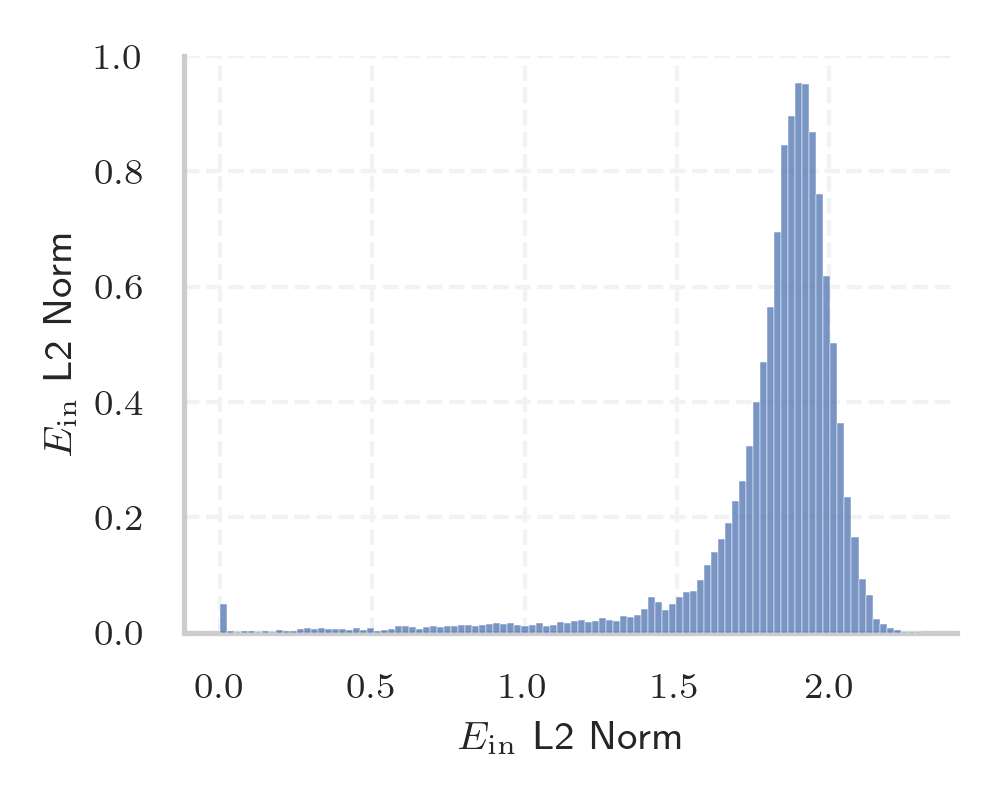
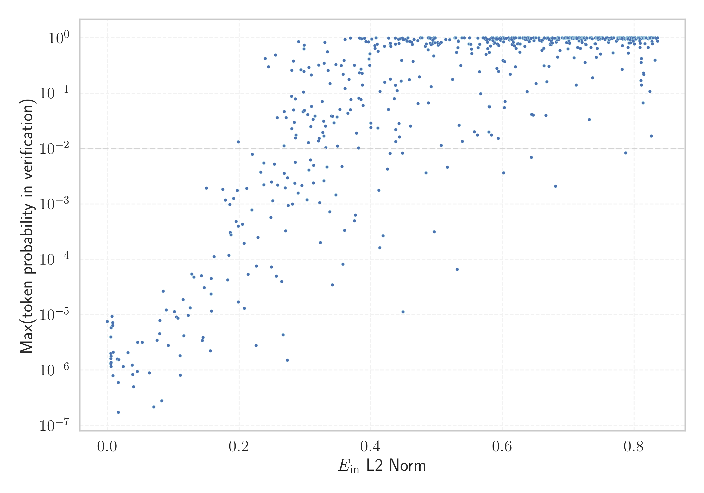

# Report for `upstage/solar-pro-preview-instruct`

## Model info

* Model Info: 
  * Tied embeddings: False
  * LM head uses bias: False
  * Embeddings shape: [32128, 5120]
* Tokenizer Info: 
  * Vocab Size: 32128
  * Tokenizer Class: LlamaTokenizer
  * Tokenizer Type: BPE
  * Bytes handling: Byte Fallback
  * Token for verification prompt building: includegraphics
  * Token id for verification prompt building: 7313
* Indicator summary: 
  * Indicator for under-trained tokens: E_{in} L2 Norm
  * Overall distribution: 1.806 +/- 0.288
* Detected Token Counts: 
  * Number of tested under-trained tokens: 639, 605 non-special, 127 below p = 0.01 threshold, 86 below soft indicator threshold
  * Number of single byte tokens: 351, of which 110 below indicator threshold
  * Number of special tokens: 0, of which 0 below indicator threshold

## Under-trained token indicators plot


## Verification plot


## Under-trained token verification results
86 entries below threshold of 0.259

|   token_id | token                       |   indicator | max_prob                                                         | in_other_tokens                                                                 |
|------------|-----------------------------|-------------|------------------------------------------------------------------|---------------------------------------------------------------------------------|
|      28653 | ````` ▁regnigaste `````     |  0.00508835 | <span style='border: 1px solid rgb(169, 68, 66);'>1.6e-06</span> |                                                                                 |
|      28574 | ````` ▁Mediabestanden ````` |  0.00523699 | <span style='border: 1px solid rgb(169, 68, 66);'>1.3e-06</span> |                                                                                 |
|      27918 | ````` ▁Хронологија `````    |  0.00527332 | <span style='border: 1px solid rgb(169, 68, 66);'>1.3e-06</span> |                                                                                 |
|      28649 | ````` ▁årsnederbörd `````   |  0.00528633 | <span style='border: 1px solid rgb(169, 68, 66);'>2e-06</span>   |                                                                                 |
|      20609 | ````` ▁Portály `````        |  0.00544552 | <span style='border: 1px solid rgb(169, 68, 66);'>1.2e-06</span> |                                                                                 |
|      11804 | ````` Архівовано `````      |  0.00555743 | <span style='border: 1px solid rgb(169, 68, 66);'>1.8e-06</span> |                                                                                 |
|      16110 | ````` ▁Спољашње `````       |  0.00568522 | <span style='border: 1px solid rgb(169, 68, 66);'>1.4e-06</span> |                                                                                 |
|      21836 | ````` ▁надморској `````     |  0.0082394  | <span style='border: 1px solid rgb(169, 68, 66);'>8e-07</span>   |                                                                                 |
|      20528 | ````` ▁autorytatywna `````  |  0.0147445  | <span style='border: 1px solid rgb(169, 68, 66);'>1.6e-06</span> |                                                                                 |
|      18051 | ````` ▁савезној `````       |  0.0166344  | <span style='border: 1px solid rgb(169, 68, 66);'>6e-07</span>   |                                                                                 |
|      27914 | ````` ▁archiválva `````     |  0.0167293  | <span style='border: 1px solid rgb(169, 68, 66);'>1.7e-07</span> |                                                                                 |
|      24294 | ````` Webachiv `````        |  0.0173146  | <span style='border: 1px solid rgb(169, 68, 66);'>1.5e-06</span> |                                                                                 |
|      27900 | ````` ▁eredetiből `````     |  0.0240176  | <span style='border: 1px solid rgb(169, 68, 66);'>1.2e-06</span> |                                                                                 |
|      26821 | ````` ▁Enllaços `````       |  0.0313604  | <span style='border: 1px solid rgb(169, 68, 66);'>2.1e-06</span> |                                                                                 |
|      16056 | ````` љашње `````           |  0.0375049  | <span style='border: 1px solid rgb(169, 68, 66);'>1.2e-06</span> | <span style='border: 1px solid rgb(169, 68, 66);'>````` ▁Спољашње `````</span>  |
|      28416 | ````` ▁Мексичка `````       |  0.0383723  | <span style='border: 1px solid rgb(169, 68, 66);'>8.4e-07</span> |                                                                                 |
|      21673 | ````` ▁висини `````         |  0.039741   | <span style='border: 1px solid rgb(169, 68, 66);'>5e-07</span>   |                                                                                 |
|      11766 | ````` хівовано `````        |  0.0453436  | <span style='border: 1px solid rgb(169, 68, 66);'>9.5e-07</span> | <span style='border: 1px solid rgb(169, 68, 66);'>````` Архівовано `````</span> |
|      26734 | ````` ▁Årsmed `````         |  0.0458914  | <span style='border: 1px solid rgb(169, 68, 66);'>3.2e-06</span> |                                                                                 |
|      23654 | ````` ▁dátummal `````       |  0.0528598  | <span style='border: 1px solid rgb(169, 68, 66);'>3.2e-06</span> |                                                                                 |
<details><summary>66 additional entries below threshold</summary>

|   token_id | token                      |   indicator | max_prob                                                         | in_other_tokens                                                                                                                                                                                                                                     |
|------------|----------------------------|-------------|------------------------------------------------------------------|-----------------------------------------------------------------------------------------------------------------------------------------------------------------------------------------------------------------------------------------------------|
|      23996 | ````` ▁живело `````        |   0.0636962 | <span style='border: 1px solid rgb(169, 68, 66);'>9e-07</span>   |                                                                                                                                                                                                                                                     |
|      28354 | ````` ▁Расподела `````     |   0.0703899 | <span style='border: 1px solid rgb(169, 68, 66);'>2.2e-07</span> |                                                                                                                                                                                                                                                     |
|      24401 | ````` ▁подацима `````      |   0.0755086 | <span style='border: 1px solid rgb(169, 68, 66);'>3.5e-06</span> |                                                                                                                                                                                                                                                     |
|      28650 | ````` ▁Genomsnittlig ````` |   0.0792403 | <span style='border: 1px solid rgb(169, 68, 66);'>4.5e-06</span> |                                                                                                                                                                                                                                                     |
|      22011 | ````` ▁насељу `````        |   0.079732  | <span style='border: 1px solid rgb(169, 68, 66);'>7.9e-06</span> |                                                                                                                                                                                                                                                     |
|       7784 | ````` ▁underarter `````    |   0.0826447 | <span style='border: 1px solid rgb(169, 68, 66);'>2.8e-07</span> |                                                                                                                                                                                                                                                     |
|      20486 | ````` tatywna `````        |   0.0846243 | <span style='border: 1px solid rgb(169, 68, 66);'>2.7e-05</span> | <span style='border: 1px solid rgb(169, 68, 66);'>````` ▁autorytatywna `````</span>                                                                                                                                                                 |
|      22835 | ````` ▁муніципалі `````    |   0.0894151 | <span style='border: 1px solid rgb(169, 68, 66);'>1.2e-05</span> |                                                                                                                                                                                                                                                     |
|      28623 | ````` ▁Genomsnitt `````    |   0.0925849 | <span style='border: 1px solid rgb(169, 68, 66);'>2.8e-06</span> | <span style='border: 1px solid rgb(169, 68, 66);'>````` ▁Genomsnittlig `````</span>                                                                                                                                                                 |
|      28642 | ````` ▁regnig `````        |   0.101749  | <span style='border: 1px solid rgb(169, 68, 66);'>1.1e-05</span> | <span style='border: 1px solid rgb(169, 68, 66);'>````` ▁regnigaste `````</span>                                                                                                                                                                    |
|       7651 | ````` ▁släktet `````       |   0.10508   | <span style='border: 1px solid rgb(169, 68, 66);'>9.1e-06</span> |                                                                                                                                                                                                                                                     |
|      24631 | ````` ▁Források `````      |   0.10705   | <span style='border: 1px solid rgb(169, 68, 66);'>8.7e-06</span> |                                                                                                                                                                                                                                                     |
|      26847 | ````` .:\u200a `````       |   0.11021   | <span style='border: 1px solid rgb(169, 68, 66);'>1.8e-06</span> |                                                                                                                                                                                                                                                     |
|      28647 | ````` ▁torraste `````      |   0.110564  | <span style='border: 1px solid rgb(169, 68, 66);'>8.1e-07</span> |                                                                                                                                                                                                                                                     |
|      17916 | ````` abestanden `````     |   0.114811  | <span style='border: 1px solid rgb(169, 68, 66);'>1.9e-05</span> | <span style='border: 1px solid rgb(169, 68, 66);'>````` ▁Mediabestanden `````</span>                                                                                                                                                                |
|      23406 | ````` ▁општини `````       |   0.115916  | <span style='border: 1px solid rgb(169, 68, 66);'>4.2e-06</span> |                                                                                                                                                                                                                                                     |
|      14562 | ````` ▁Посилання `````     |   0.122701  | <span style='border: 1px solid rgb(169, 68, 66);'>9.7e-06</span> |                                                                                                                                                                                                                                                     |
|      28263 | ````` ▁Odkazy `````        |   0.125807  | <span style='border: 1px solid rgb(169, 68, 66);'>1.3e-05</span> |                                                                                                                                                                                                                                                     |
|       9462 | ````` Hozzáférés `````     |   0.12816   | <span style='border: 1px solid rgb(169, 68, 66);'>5.4e-05</span> |                                                                                                                                                                                                                                                     |
|      23117 | ````` brázky `````         |   0.131311  | <span style='border: 1px solid rgb(169, 68, 66);'>4.8e-05</span> | <span style='border: 1px solid rgb(255, 145, 0);'>````` Obrázky `````</span>                                                                                                                                                                        |
|      20645 | ````` ▁Przypisy `````      |   0.142761  | <span style='border: 1px solid rgb(169, 68, 66);'>5.1e-05</span> |                                                                                                                                                                                                                                                     |
|      24029 | ````` ▁Jegyzetek `````     |   0.144322  | <span style='border: 1px solid rgb(169, 68, 66);'>3.4e-06</span> |                                                                                                                                                                                                                                                     |
|      23726 | ````` ▁насеља `````        |   0.145372  | <span style='border: 1px solid rgb(169, 68, 66);'>3.9e-06</span> |                                                                                                                                                                                                                                                     |
|      17981 | ````` ▁Externí `````       |   0.146903  | <span style='border: 1px solid rgb(169, 68, 66);'>3.1e-05</span> |                                                                                                                                                                                                                                                     |
|      23875 | ````` ▁Насеље `````        |   0.150351  | <span style='border: 1px solid rgb(255, 145, 0);'>0.0019</span>  |                                                                                                                                                                                                                                                     |
|      27645 | ````` ▁Попис `````         |   0.156455  | <span style='border: 1px solid rgb(169, 68, 66);'>2.2e-06</span> |                                                                                                                                                                                                                                                     |
|      20422 | ````` ніципалі `````       |   0.157428  | <span style='border: 1px solid rgb(169, 68, 66);'>2.4e-05</span> | <span style='border: 1px solid rgb(169, 68, 66);'>````` ▁муніципалі `````</span>                                                                                                                                                                    |
|      23715 | ````` ▁Källor `````        |   0.157608  | <span style='border: 1px solid rgb(169, 68, 66);'>4.5e-05</span> |                                                                                                                                                                                                                                                     |
|      20739 | ````` ▁надмор `````        |   0.15797   | <span style='border: 1px solid rgb(169, 68, 66);'>1.2e-05</span> | <span style='border: 1px solid rgb(169, 68, 66);'>````` ▁надморској `````</span>                                                                                                                                                                    |
|      11229 | ````` ▁становника `````    |   0.162022  | <span style='border: 1px solid rgb(169, 68, 66);'>0.00011</span> |                                                                                                                                                                                                                                                     |
|      12731 | ````` ederbörd `````       |   0.175326  | <span style='border: 1px solid rgb(255, 145, 0);'>0.0018</span>  | <span style='border: 1px solid rgb(169, 68, 66);'>````` ▁årsnederbörd `````</span>, <span style='border: 1px solid rgb(255, 145, 0);'>````` ▁nederbörd `````</span>, <span style='border: 1px solid rgb(169, 68, 66);'>````` nederbörd `````</span> |
|      18044 | ````` ▁Становништво `````  |   0.179037  | <span style='border: 1px solid rgb(255, 145, 0);'>0.0012</span>  |                                                                                                                                                                                                                                                     |
|       7718 | ````` ▁beskrevs `````      |   0.182743  | <span style='border: 1px solid rgb(169, 68, 66);'>4.3e-05</span> |                                                                                                                                                                                                                                                     |
|      19837 | ````` ▁Населення `````     |   0.184407  | <span style='border: 1px solid rgb(169, 68, 66);'>0.00012</span> |                                                                                                                                                                                                                                                     |
|      27610 | ````` ▁gminie `````        |   0.185854  | <span style='border: 1px solid rgb(169, 68, 66);'>0.00098</span> |                                                                                                                                                                                                                                                     |
|      25840 | ````` ▁државе `````        |   0.186622  | <span style='border: 1px solid rgb(169, 68, 66);'>0.00031</span> |                                                                                                                                                                                                                                                     |
|      28090 | ````` ▁Савезне `````       |   0.187729  | <span style='border: 1px solid rgb(169, 68, 66);'>0.00028</span> |                                                                                                                                                                                                                                                     |
|      10688 | ````` ▁gepublic `````      |   0.191768  | <span style='border: 1px solid rgb(255, 145, 0);'>0.0013</span>  | <span style='border: 1px solid rgb(251, 189, 8);'>````` ▁gepubliceerd `````</span>                                                                                                                                                                  |
|      28633 | ````` nederbörd `````      |   0.195451  | <span style='border: 1px solid rgb(169, 68, 66);'>0.00048</span> | <span style='border: 1px solid rgb(169, 68, 66);'>````` ▁årsnederbörd `````</span>                                                                                                                                                                  |
|      26675 | ````` ▁kallaste `````      |   0.197237  | <span style='border: 1px solid rgb(255, 145, 0);'>0.0017</span>  |                                                                                                                                                                                                                                                     |
|      23015 | ````` ▁tématu `````        |   0.198723  | <span style='border: 1px solid rgb(169, 68, 66);'>1.7e-05</span> |                                                                                                                                                                                                                                                     |
|      28791 | ````` ▁віці `````          |   0.198737  | <span style='border: 1px solid rgb(251, 189, 8);'>0.013</span>   |                                                                                                                                                                                                                                                     |
|      24971 | ````` ▁Джерела `````       |   0.198814  | <span style='border: 1px solid rgb(169, 68, 66);'>0.0004</span>  |                                                                                                                                                                                                                                                     |
|      14414 | ````` ▁Archivlink `````    |   0.205229  | <span style='border: 1px solid rgb(169, 68, 66);'>0.00043</span> |                                                                                                                                                                                                                                                     |
|      16916 | ````` ▁invån `````         |   0.207489  | <span style='border: 1px solid rgb(169, 68, 66);'>0.0002</span>  | <span style='border: 1px solid rgb(40, 167, 69);'>````` ▁invånare `````</span>                                                                                                                                                                      |
|      20568 | ````` ▁сайті `````         |   0.207847  | <span style='border: 1px solid rgb(169, 68, 66);'>1.3e-05</span> |                                                                                                                                                                                                                                                     |
|      23313 | ````` Obrázky `````        |   0.211625  | <span style='border: 1px solid rgb(255, 145, 0);'>0.0019</span>  |                                                                                                                                                                                                                                                     |
|      18140 | ````` rinningsområ `````   |   0.213591  | <span style='border: 1px solid rgb(169, 68, 66);'>5.4e-05</span> |                                                                                                                                                                                                                                                     |
|      18676 | ````` ніципа `````         |   0.219377  | <span style='border: 1px solid rgb(169, 68, 66);'>0.00078</span> | <span style='border: 1px solid rgb(169, 68, 66);'>````` ▁муніципалі `````</span>, <span style='border: 1px solid rgb(169, 68, 66);'>````` ніципалі `````</span>                                                                                     |
|      16068 | ````` eltemperaturen ````` |   0.219962  | <span style='border: 1px solid rgb(255, 145, 0);'>0.0079</span>  |                                                                                                                                                                                                                                                     |
|      23217 | ````` ▁zvuky `````         |   0.225762  | <span style='border: 1px solid rgb(169, 68, 66);'>2.8e-06</span> |                                                                                                                                                                                                                                                     |
|      26335 | ````` llaços `````         |   0.226313  | <span style='border: 1px solid rgb(169, 68, 66);'>7.6e-05</span> | <span style='border: 1px solid rgb(169, 68, 66);'>````` ▁Enllaços `````</span>                                                                                                                                                                      |
|      28365 | ````` ▁розташ `````        |   0.228651  | <span style='border: 1px solid rgb(169, 68, 66);'>0.00025</span> |                                                                                                                                                                                                                                                     |
|      18328 | ````` ▁trakten `````       |   0.233059  | <span style='border: 1px solid rgb(255, 145, 0);'>0.0038</span>  |                                                                                                                                                                                                                                                     |
|      26662 | ````` ▁varmaste `````      |   0.237473  | <span style='border: 1px solid rgb(255, 145, 0);'>0.0022</span>  |                                                                                                                                                                                                                                                     |
|      24097 | ````` ▁huvudstaden `````   |   0.23772   | <span style='border: 1px solid rgb(255, 145, 0);'>0.0055</span>  |                                                                                                                                                                                                                                                     |
|      31899 | ````` ⥤ `````              |   0.239883  | <span style='border: 1px solid rgb(40, 167, 69);'>0.42</span>    |                                                                                                                                                                                                                                                     |
|      27646 | ````` ▁július `````        |   0.244628  | <span style='border: 1px solid rgb(40, 167, 69);'>0.3</span>     |                                                                                                                                                                                                                                                     |
|      24852 | ````` ▁грудня `````        |   0.248384  | <span style='border: 1px solid rgb(169, 68, 66);'>0.00057</span> |                                                                                                                                                                                                                                                     |
|      22744 | ````` ▁település `````     |   0.248849  | <span style='border: 1px solid rgb(169, 68, 66);'>7.3e-05</span> |                                                                                                                                                                                                                                                     |
|      29451 | ````` ▁piłkar `````        |   0.24948   | <span style='border: 1px solid rgb(255, 145, 0);'>0.0025</span>  |                                                                                                                                                                                                                                                     |
|       9147 | ````` ozzáférés `````      |   0.251096  | <span style='border: 1px solid rgb(255, 145, 0);'>0.0011</span>  | <span style='border: 1px solid rgb(169, 68, 66);'>````` Hozzáférés `````</span>                                                                                                                                                                     |
|      27191 | ````` ▁szeptember `````    |   0.253619  | <span style='border: 1px solid rgb(255, 145, 0);'>0.0053</span>  |                                                                                                                                                                                                                                                     |
|      22945 | ````` ▁január `````        |   0.255233  | <span style='border: 1px solid rgb(40, 167, 69);'>0.49</span>    |                                                                                                                                                                                                                                                     |
|      17828 | ````` ▁држави `````        |   0.256497  | <span style='border: 1px solid rgb(169, 68, 66);'>5e-05</span>   |                                                                                                                                                                                                                                                     |
|       3798 | ````` oreferrer `````      |   0.258028  | <span style='border: 1px solid rgb(251, 189, 8);'>0.036</span>   | ````` noreferrer `````, ````` ▁noreferrer `````                                                                                                                                                                                                     |
</details>
<details><summary>519 additional entries above threshold</summary>

|   token_id | token                     |   indicator | max_prob                                                         | in_other_tokens                                                                                                                                                                                                                                                                         |
|------------|---------------------------|-------------|------------------------------------------------------------------|-----------------------------------------------------------------------------------------------------------------------------------------------------------------------------------------------------------------------------------------------------------------------------------------|
|      15887 | ````` ▁још `````          |    0.258757 | <span style='border: 1px solid rgb(255, 145, 0);'>0.0022</span>  |                                                                                                                                                                                                                                                                                         |
|      24576 | ````` ▁estaven `````      |    0.264553 | <span style='border: 1px solid rgb(169, 68, 66);'>4e-05</span>   |                                                                                                                                                                                                                                                                                         |
|      27061 | ````` ▁Резултати `````    |    0.266629 | <span style='border: 1px solid rgb(169, 68, 66);'>4.4e-06</span> |                                                                                                                                                                                                                                                                                         |
|      24675 | ````` ▁mistrzost `````    |    0.26816  | <span style='border: 1px solid rgb(251, 189, 8);'>0.011</span>   |                                                                                                                                                                                                                                                                                         |
|      25528 | ````` ▁серпня `````       |    0.268427 | <span style='border: 1px solid rgb(255, 145, 0);'>0.0036</span>  |                                                                                                                                                                                                                                                                                         |
|      25460 | ````` ▁жовтня `````       |    0.268706 | <span style='border: 1px solid rgb(251, 189, 8);'>0.047</span>   |                                                                                                                                                                                                                                                                                         |
|      28361 | ````` ▁Zobacz `````       |    0.270004 | <span style='border: 1px solid rgb(255, 145, 0);'>0.0019</span>  |                                                                                                                                                                                                                                                                                         |
|      22768 | ````` ▁жовт `````         |    0.270791 | <span style='border: 1px solid rgb(169, 68, 66);'>0.00033</span> | <span style='border: 1px solid rgb(251, 189, 8);'>````` ▁жовтня `````</span>                                                                                                                                                                                                            |
|      25145 | ````` ▁kwiet `````        |    0.271265 | <span style='border: 1px solid rgb(251, 189, 8);'>0.036</span>   | <span style='border: 1px solid rgb(40, 167, 69);'>````` ▁kwietnia `````</span>                                                                                                                                                                                                          |
|      15412 | ````` ▁zewnętrzne `````   |    0.273031 | <span style='border: 1px solid rgb(169, 68, 66);'>1.5e-06</span> |                                                                                                                                                                                                                                                                                         |
|      23767 | ````` egyzetek `````      |    0.273597 | <span style='border: 1px solid rgb(255, 145, 0);'>0.003</span>   | <span style='border: 1px solid rgb(169, 68, 66);'>````` ▁Jegyzetek `````</span>                                                                                                                                                                                                         |
|      25696 | ````` ▁роках `````        |    0.274695 | <span style='border: 1px solid rgb(169, 68, 66);'>0.00094</span> |                                                                                                                                                                                                                                                                                         |
|      26527 | ````` ▁червня `````       |    0.279755 | <span style='border: 1px solid rgb(251, 189, 8);'>0.088</span>   |                                                                                                                                                                                                                                                                                         |
|      13243 | ````` ▁länkar `````       |    0.280089 | <span style='border: 1px solid rgb(40, 167, 69);'>0.26</span>    |                                                                                                                                                                                                                                                                                         |
|      26643 | ````` ▁października ````` |    0.280129 | <span style='border: 1px solid rgb(251, 189, 8);'>0.023</span>   |                                                                                                                                                                                                                                                                                         |
|      27660 | ````` ckså `````          |    0.281071 | <span style='border: 1px solid rgb(255, 145, 0);'>0.001</span>   | <span style='border: 1px solid rgb(40, 167, 69);'>````` ▁också `````</span>                                                                                                                                                                                                             |
|      17871 | ````` ▁odkazy `````       |    0.28242  | <span style='border: 1px solid rgb(40, 167, 69);'>0.38</span>    |                                                                                                                                                                                                                                                                                         |
|      25564 | ````` ▁броја `````        |    0.282714 | <span style='border: 1px solid rgb(251, 189, 8);'>0.05</span>    |                                                                                                                                                                                                                                                                                         |
|      26334 | ````` ▁квітня `````       |    0.283991 | <span style='border: 1px solid rgb(251, 189, 8);'>0.03</span>    |                                                                                                                                                                                                                                                                                         |
|      22018 | ````` ▁wrześ `````        |    0.284648 | <span style='border: 1px solid rgb(255, 145, 0);'>0.0024</span>  | <span style='border: 1px solid rgb(169, 68, 66);'>````` ▁września `````</span>                                                                                                                                                                                                          |
|      24002 | ````` ▁stycznia `````     |    0.285335 | <span style='border: 1px solid rgb(251, 189, 8);'>0.079</span>   |                                                                                                                                                                                                                                                                                         |
|      23795 | ````` ▁paździer `````     |    0.285363 | <span style='border: 1px solid rgb(255, 145, 0);'>0.0057</span>  | <span style='border: 1px solid rgb(251, 189, 8);'>````` ▁października `````</span>                                                                                                                                                                                                      |
|      23105 | ````` ▁videa `````        |    0.285827 | <span style='border: 1px solid rgb(251, 189, 8);'>0.016</span>   |                                                                                                                                                                                                                                                                                         |
|      27124 | ````` ▁sierpnia `````     |    0.286255 | <span style='border: 1px solid rgb(251, 189, 8);'>0.018</span>   |                                                                                                                                                                                                                                                                                         |
|      26498 | ````` >\<^ `````          |    0.28972  | <span style='border: 1px solid rgb(255, 145, 0);'>0.0016</span>  |                                                                                                                                                                                                                                                                                         |
|      23247 | ````` ▁dátum `````        |    0.290403 | <span style='border: 1px solid rgb(40, 167, 69);'>0.85</span>    | <span style='border: 1px solid rgb(169, 68, 66);'>````` ▁dátummal `````</span>                                                                                                                                                                                                          |
|      24353 | ````` ▁článku `````       |    0.294051 | <span style='border: 1px solid rgb(40, 167, 69);'>0.27</span>    |                                                                                                                                                                                                                                                                                         |
|      23441 | ````` któber `````        |    0.295358 | <span style='border: 1px solid rgb(255, 145, 0);'>0.0022</span>  | <span style='border: 1px solid rgb(251, 189, 8);'>````` ▁október `````</span>                                                                                                                                                                                                           |
|      24708 | ````` ▁січня `````        |    0.297218 | <span style='border: 1px solid rgb(251, 189, 8);'>0.046</span>   |                                                                                                                                                                                                                                                                                         |
|      17076 | ````` ▁invånare `````     |    0.297845 | <span style='border: 1px solid rgb(40, 167, 69);'>0.11</span>    |                                                                                                                                                                                                                                                                                         |
|      12882 | ````` ITableView `````    |    0.298427 | <span style='border: 1px solid rgb(40, 167, 69);'>0.63</span>    | ````` ▁UITableView `````, ````` UITableView `````                                                                                                                                                                                                                                       |
|      28535 | ````` ▁február `````      |    0.298682 | <span style='border: 1px solid rgb(40, 167, 69);'>0.25</span>    |                                                                                                                                                                                                                                                                                         |
|      21858 | ````` archiviato `````    |    0.298833 | <span style='border: 1px solid rgb(40, 167, 69);'>0.73</span>    |                                                                                                                                                                                                                                                                                         |
|      29404 | ````` ▁lutego `````       |    0.299167 | <span style='border: 1px solid rgb(251, 189, 8);'>0.049</span>   |                                                                                                                                                                                                                                                                                         |
|      17299 | ````` ▁nederbörd `````    |    0.302979 | <span style='border: 1px solid rgb(255, 145, 0);'>0.0012</span>  |                                                                                                                                                                                                                                                                                         |
|      25229 | ````` лтати `````         |    0.304038 | <span style='border: 1px solid rgb(251, 189, 8);'>0.041</span>   | <span style='border: 1px solid rgb(169, 68, 66);'>````` ▁Резултати `````</span>                                                                                                                                                                                                         |
|      25563 | ````` ▁Після `````        |    0.305145 | <span style='border: 1px solid rgb(251, 189, 8);'>0.013</span>   |                                                                                                                                                                                                                                                                                         |
|      26908 | ````` ▁lipca `````        |    0.305875 | <span style='border: 1px solid rgb(255, 145, 0);'>0.0041</span>  |                                                                                                                                                                                                                                                                                         |
|      14572 | ````` шње `````           |    0.305996 | <span style='border: 1px solid rgb(40, 167, 69);'>0.29</span>    | <span style='border: 1px solid rgb(169, 68, 66);'>````` ▁Спољашње `````</span>, <span style='border: 1px solid rgb(169, 68, 66);'>````` љашње `````</span>                                                                                                                              |
|      13043 | ````` силання `````       |    0.308426 | <span style='border: 1px solid rgb(255, 145, 0);'>0.0063</span>  | <span style='border: 1px solid rgb(169, 68, 66);'>````` ▁Посилання `````</span>                                                                                                                                                                                                         |
|      24605 | ````` ▁március `````      |    0.308816 | <span style='border: 1px solid rgb(251, 189, 8);'>0.025</span>   |                                                                                                                                                                                                                                                                                         |
|      16651 | ````` ▁månaden `````      |    0.309537 | <span style='border: 1px solid rgb(40, 167, 69);'>0.21</span>    |                                                                                                                                                                                                                                                                                         |
|      28187 | ````` ▁április `````      |    0.309747 | <span style='border: 1px solid rgb(251, 189, 8);'>0.057</span>   |                                                                                                                                                                                                                                                                                         |
|      29079 | ````` ▁augusztus `````    |    0.312286 | <span style='border: 1px solid rgb(251, 189, 8);'>0.034</span>   |                                                                                                                                                                                                                                                                                         |
|      18030 | ````` ▁nyelven `````      |    0.312637 | <span style='border: 1px solid rgb(255, 145, 0);'>0.0024</span>  |                                                                                                                                                                                                                                                                                         |
|      13297 | ````` ісля `````          |    0.313194 | <span style='border: 1px solid rgb(255, 145, 0);'>0.005</span>   | <span style='border: 1px solid rgb(251, 189, 8);'>````` ▁Після `````</span>, <span style='border: 1px solid rgb(40, 167, 69);'>````` ▁після `````</span>                                                                                                                                |
|      23882 | ````` ▁október `````      |    0.315242 | <span style='border: 1px solid rgb(251, 189, 8);'>0.039</span>   |                                                                                                                                                                                                                                                                                         |
|      26502 | ````` ▁вересня `````      |    0.320562 | <span style='border: 1px solid rgb(251, 189, 8);'>0.014</span>   |                                                                                                                                                                                                                                                                                         |
|      26006 | ````` ensoort `````       |    0.320928 | <span style='border: 1px solid rgb(40, 167, 69);'>0.32</span>    |                                                                                                                                                                                                                                                                                         |
|      11193 | ````` ▁Normdaten `````    |    0.321528 | <span style='border: 1px solid rgb(251, 189, 8);'>0.015</span>   |                                                                                                                                                                                                                                                                                         |
|      14503 | ````` ▁насеље `````       |    0.322257 | <span style='border: 1px solid rgb(255, 145, 0);'>0.0011</span>  |                                                                                                                                                                                                                                                                                         |
|      21887 | ````` ▁складі `````       |    0.323296 | <span style='border: 1px solid rgb(169, 68, 66);'>0.0002</span>  |                                                                                                                                                                                                                                                                                         |
|      24309 | ````` ▁чемпі `````        |    0.326322 | <span style='border: 1px solid rgb(251, 189, 8);'>0.071</span>   |                                                                                                                                                                                                                                                                                         |
|      25069 | ````` $}}% `````          |    0.326998 | <span style='border: 1px solid rgb(251, 189, 8);'>0.02</span>    |                                                                                                                                                                                                                                                                                         |
|      28825 | ````` ▁інших `````        |    0.328478 | <span style='border: 1px solid rgb(251, 189, 8);'>0.031</span>   |                                                                                                                                                                                                                                                                                         |
|      28528 | ````` ▁која `````         |    0.328654 | <span style='border: 1px solid rgb(251, 189, 8);'>0.017</span>   |                                                                                                                                                                                                                                                                                         |
|      19735 | ````` ▁розта `````        |    0.328934 | <span style='border: 1px solid rgb(255, 145, 0);'>0.0026</span>  | <span style='border: 1px solid rgb(169, 68, 66);'>````` ▁розташ `````</span>                                                                                                                                                                                                            |
|      26457 | ````` ▁május `````        |    0.329159 | <span style='border: 1px solid rgb(40, 167, 69);'>0.35</span>    |                                                                                                                                                                                                                                                                                         |
|      28729 | ````` ▁június `````       |    0.330052 | <span style='border: 1px solid rgb(40, 167, 69);'>0.83</span>    |                                                                                                                                                                                                                                                                                         |
|      26199 | ````` ▁mieszkań `````     |    0.331467 | <span style='border: 1px solid rgb(251, 189, 8);'>0.026</span>   | <span style='border: 1px solid rgb(169, 68, 66);'>````` ▁mieszkańców `````</span>                                                                                                                                                                                                       |
|      26593 | ````` ▁отрима `````       |    0.331791 | <span style='border: 1px solid rgb(251, 189, 8);'>0.01</span>    |                                                                                                                                                                                                                                                                                         |
|      13040 | ````` ▁осіб `````         |    0.333487 | <span style='border: 1px solid rgb(255, 145, 0);'>0.0047</span>  |                                                                                                                                                                                                                                                                                         |
|      17398 | ````` ништво `````        |    0.333996 | <span style='border: 1px solid rgb(40, 167, 69);'>0.56</span>    | <span style='border: 1px solid rgb(255, 145, 0);'>````` ▁Становништво `````</span>                                                                                                                                                                                                      |
|      17270 | ````` ▁налази `````       |    0.335288 | <span style='border: 1px solid rgb(40, 167, 69);'>0.26</span>    |                                                                                                                                                                                                                                                                                         |
|      28589 | ````` ▁mieszkańców `````  |    0.337885 | <span style='border: 1px solid rgb(169, 68, 66);'>0.00072</span> |                                                                                                                                                                                                                                                                                         |
|      28294 | ````` usztus `````        |    0.338134 | <span style='border: 1px solid rgb(40, 167, 69);'>0.15</span>    | <span style='border: 1px solid rgb(251, 189, 8);'>````` ▁augusztus `````</span>                                                                                                                                                                                                         |
|      28182 | ````` ▁півні `````        |    0.340382 | <span style='border: 1px solid rgb(251, 189, 8);'>0.039</span>   |                                                                                                                                                                                                                                                                                         |
|      29640 | ````` ▁powiecie `````     |    0.341623 | <span style='border: 1px solid rgb(169, 68, 66);'>3.5e-05</span> |                                                                                                                                                                                                                                                                                         |
|      26444 | ````` ▁czerwca `````      |    0.342128 | <span style='border: 1px solid rgb(251, 189, 8);'>0.038</span>   |                                                                                                                                                                                                                                                                                         |
|      24951 | ````` ▁bazie `````        |    0.344136 | <span style='border: 1px solid rgb(251, 189, 8);'>0.029</span>   |                                                                                                                                                                                                                                                                                         |
|      29146 | ````` ▁філь `````         |    0.346887 | <span style='border: 1px solid rgb(40, 167, 69);'>0.33</span>    |                                                                                                                                                                                                                                                                                         |
|      27513 | ````` ▁півден `````       |    0.347123 | <span style='border: 1px solid rgb(255, 145, 0);'>0.0015</span>  |                                                                                                                                                                                                                                                                                         |
|      15022 | ````` ▁zewnętrz `````     |    0.348681 | <span style='border: 1px solid rgb(251, 189, 8);'>0.037</span>   | <span style='border: 1px solid rgb(169, 68, 66);'>````` ▁zewnętrzne `````</span>                                                                                                                                                                                                        |
|      28824 | ````` ▁које `````         |    0.349562 | <span style='border: 1px solid rgb(251, 189, 8);'>0.011</span>   |                                                                                                                                                                                                                                                                                         |
|      17391 | ````` ▁савез `````        |    0.353191 | <span style='border: 1px solid rgb(251, 189, 8);'>0.051</span>   | <span style='border: 1px solid rgb(169, 68, 66);'>````` ▁савезној `````</span>                                                                                                                                                                                                          |
|      26146 | ````` фіцій `````         |    0.355327 | <span style='border: 1px solid rgb(40, 167, 69);'>0.32</span>    |                                                                                                                                                                                                                                                                                         |
|      25454 | ````` ▁seizo `````        |    0.356288 | <span style='border: 1px solid rgb(255, 145, 0);'>0.0048</span>  | <span style='border: 1px solid rgb(40, 167, 69);'>````` ▁seizoen `````</span>                                                                                                                                                                                                           |
|      25298 | ````` ▁września `````     |    0.357801 | <span style='border: 1px solid rgb(169, 68, 66);'>8.2e-05</span> |                                                                                                                                                                                                                                                                                         |
|       7917 | ````` ▁listade `````      |    0.357991 | <span style='border: 1px solid rgb(40, 167, 69);'>0.22</span>    |                                                                                                                                                                                                                                                                                         |
|      27802 | ````` ▁kwietnia `````     |    0.359514 | <span style='border: 1px solid rgb(40, 167, 69);'>0.39</span>    |                                                                                                                                                                                                                                                                                         |
|      26773 | ````` ▁című `````         |    0.360138 | <span style='border: 1px solid rgb(169, 68, 66);'>0.00033</span> |                                                                                                                                                                                                                                                                                         |
|      12867 | ````` лання `````         |    0.360915 | <span style='border: 1px solid rgb(40, 167, 69);'>0.12</span>    | <span style='border: 1px solid rgb(255, 145, 0);'>````` силання `````</span>, <span style='border: 1px solid rgb(169, 68, 66);'>````` ▁Посилання `````</span>                                                                                                                           |
|      25248 | ````` xtart `````         |    0.361014 | <span style='border: 1px solid rgb(40, 167, 69);'>0.93</span>    |                                                                                                                                                                                                                                                                                         |
|      10711 | ````` ▁gepubliceerd ````` |    0.365    | <span style='border: 1px solid rgb(251, 189, 8);'>0.043</span>   |                                                                                                                                                                                                                                                                                         |
|      25726 | ````` ▁травня `````       |    0.367028 | <span style='border: 1px solid rgb(40, 167, 69);'>0.18</span>    |                                                                                                                                                                                                                                                                                         |
|      29409 | ````` ▁anglès `````       |    0.369147 | <span style='border: 1px solid rgb(40, 167, 69);'>0.99</span>    |                                                                                                                                                                                                                                                                                         |
|       7654 | ````` ▁beskre `````       |    0.369194 | <span style='border: 1px solid rgb(251, 189, 8);'>0.05</span>    | <span style='border: 1px solid rgb(169, 68, 66);'>````` ▁beskrevs `````</span>                                                                                                                                                                                                          |
|      26378 | ````` iből `````          |    0.369929 | <span style='border: 1px solid rgb(251, 189, 8);'>0.076</span>   | <span style='border: 1px solid rgb(169, 68, 66);'>````` ▁eredetiből `````</span>                                                                                                                                                                                                        |
|      14723 | ````` ingsområ `````      |    0.375235 | <span style='border: 1px solid rgb(40, 167, 69);'>0.32</span>    | <span style='border: 1px solid rgb(169, 68, 66);'>````` rinningsområ `````</span>                                                                                                                                                                                                       |
|       8554 | ````` ▁році `````         |    0.375253 | <span style='border: 1px solid rgb(169, 68, 66);'>0.0005</span>  |                                                                                                                                                                                                                                                                                         |
|      26106 | ````` ▁grudnia `````      |    0.37648  | <span style='border: 1px solid rgb(169, 68, 66);'>0.00063</span> |                                                                                                                                                                                                                                                                                         |
|      18675 | ````` ▁població `````     |    0.378409 | <span style='border: 1px solid rgb(251, 189, 8);'>0.019</span>   |                                                                                                                                                                                                                                                                                         |
|      19539 | ````` ▁demsel `````       |    0.381478 | <span style='border: 1px solid rgb(251, 189, 8);'>0.01</span>    | ````` ▁demselben `````                                                                                                                                                                                                                                                                  |
|      26194 | ````` ▁Савез `````        |    0.381889 | <span style='border: 1px solid rgb(251, 189, 8);'>0.081</span>   | <span style='border: 1px solid rgb(169, 68, 66);'>````` ▁Савезне `````</span>                                                                                                                                                                                                           |
|      29728 | ````` ▁później `````      |    0.382503 | <span style='border: 1px solid rgb(40, 167, 69);'>0.23</span>    |                                                                                                                                                                                                                                                                                         |
|      24291 | ````` IABot `````         |    0.383069 | <span style='border: 1px solid rgb(40, 167, 69);'>0.99</span>    |                                                                                                                                                                                                                                                                                         |
|      21209 | ````` ▁stycz `````        |    0.38506  | <span style='border: 1px solid rgb(251, 189, 8);'>0.077</span>   | <span style='border: 1px solid rgb(251, 189, 8);'>````` ▁stycznia `````</span>                                                                                                                                                                                                          |
|      26159 | ````` ▁listopada `````    |    0.385276 | <span style='border: 1px solid rgb(40, 167, 69);'>0.27</span>    |                                                                                                                                                                                                                                                                                         |
|      29255 | ````` ▁Tová `````         |    0.386118 | <span style='border: 1px solid rgb(40, 167, 69);'>0.96</span>    |                                                                                                                                                                                                                                                                                         |
|      22551 | ````` ▁квіт `````         |    0.386728 | <span style='border: 1px solid rgb(40, 167, 69);'>0.23</span>    | <span style='border: 1px solid rgb(251, 189, 8);'>````` ▁квітня `````</span>                                                                                                                                                                                                            |
|       8061 | ````` ▁године `````       |    0.387179 | <span style='border: 1px solid rgb(40, 167, 69);'>0.14</span>    |                                                                                                                                                                                                                                                                                         |
|      25283 | ````` ▁липня `````        |    0.388299 | <span style='border: 1px solid rgb(251, 189, 8);'>0.06</span>    |                                                                                                                                                                                                                                                                                         |
|      20072 | ````` ywna `````          |    0.39063  | <span style='border: 1px solid rgb(40, 167, 69);'>0.98</span>    | <span style='border: 1px solid rgb(169, 68, 66);'>````` tatywna `````</span>, <span style='border: 1px solid rgb(169, 68, 66);'>````` ▁autorytatywna `````</span>                                                                                                                       |
|      24696 | ````` ▁рік `````          |    0.392551 | <span style='border: 1px solid rgb(40, 167, 69);'>0.86</span>    |                                                                                                                                                                                                                                                                                         |
|       7172 | ````` ▁familjen `````     |    0.39667  | <span style='border: 1px solid rgb(40, 167, 69);'>0.85</span>    |                                                                                                                                                                                                                                                                                         |
|      28622 | ````` ▁seizoen `````      |    0.397229 | <span style='border: 1px solid rgb(40, 167, 69);'>0.42</span>    |                                                                                                                                                                                                                                                                                         |
|      21243 | ````` ▁eredet `````       |    0.398287 | <span style='border: 1px solid rgb(40, 167, 69);'>0.32</span>    | <span style='border: 1px solid rgb(169, 68, 66);'>````` ▁eredetiből `````</span>                                                                                                                                                                                                        |
|      15653 | ````` ској `````          |    0.398541 | <span style='border: 1px solid rgb(40, 167, 69);'>0.51</span>    | <span style='border: 1px solid rgb(169, 68, 66);'>````` ▁надморској `````</span>                                                                                                                                                                                                        |
|      18557 | ````` ▁člán `````         |    0.400033 | <span style='border: 1px solid rgb(251, 189, 8);'>0.024</span>   | <span style='border: 1px solid rgb(40, 167, 69);'>````` ▁článku `````</span>                                                                                                                                                                                                            |
|      31664 | ````` ߬ `````              |    0.400221 | <span style='border: 1px solid rgb(251, 189, 8);'>0.029</span>   |                                                                                                                                                                                                                                                                                         |
|      27929 | ````` ▁genomsnitt `````   |    0.401662 | <span style='border: 1px solid rgb(40, 167, 69);'>0.95</span>    |                                                                                                                                                                                                                                                                                         |
|      25247 | ````` ▁wieś `````         |    0.40609  | <span style='border: 1px solid rgb(40, 167, 69);'>0.72</span>    |                                                                                                                                                                                                                                                                                         |
|      28906 | ````` ▁листопада `````    |    0.406441 | <span style='border: 1px solid rgb(40, 167, 69);'>0.64</span>    |                                                                                                                                                                                                                                                                                         |
|      20448 | ````` ▁Kontrola `````     |    0.407886 | <span style='border: 1px solid rgb(40, 167, 69);'>1</span>       |                                                                                                                                                                                                                                                                                         |
|      17331 | ````` ▁Linki `````        |    0.409809 | <span style='border: 1px solid rgb(40, 167, 69);'>0.77</span>    |                                                                                                                                                                                                                                                                                         |
|      16910 | ````` ▁општи `````        |    0.410782 | <span style='border: 1px solid rgb(251, 189, 8);'>0.023</span>   | <span style='border: 1px solid rgb(169, 68, 66);'>````` ▁општини `````</span>                                                                                                                                                                                                           |
|      11635 | ````` ▁држа `````         |    0.411128 | <span style='border: 1px solid rgb(40, 167, 69);'>0.57</span>    | <span style='border: 1px solid rgb(169, 68, 66);'>````` ▁државе `````</span>, <span style='border: 1px solid rgb(169, 68, 66);'>````` ▁држави `````</span>                                                                                                                              |
|      14755 | ````` ewnętrz `````       |    0.412042 | <span style='border: 1px solid rgb(255, 145, 0);'>0.0018</span>  | <span style='border: 1px solid rgb(251, 189, 8);'>````` ▁zewnętrz `````</span>, <span style='border: 1px solid rgb(169, 68, 66);'>````` ▁zewnętrzne `````</span>                                                                                                                        |
|      26137 | ````` ▁információk `````  |    0.413483 | <span style='border: 1px solid rgb(169, 68, 66);'>0.00016</span> |                                                                                                                                                                                                                                                                                         |
|      26011 | ````` ▁Архивная `````     |    0.414    | <span style='border: 1px solid rgb(40, 167, 69);'>0.11</span>    |                                                                                                                                                                                                                                                                                         |
|      21498 | ````` ▁została `````      |    0.418704 | <span style='border: 1px solid rgb(169, 68, 66);'>0.00027</span> |                                                                                                                                                                                                                                                                                         |
|      10553 | ````` \<^ `````           |    0.420658 | <span style='border: 1px solid rgb(40, 167, 69);'>0.71</span>    | <span style='border: 1px solid rgb(255, 145, 0);'>````` >\<^ `````</span>                                                                                                                                                                                                               |
|      19209 | ````` ▁inwoners `````     |    0.421197 | <span style='border: 1px solid rgb(40, 167, 69);'>0.16</span>    |                                                                                                                                                                                                                                                                                         |
|      22636 | ````` rások `````         |    0.425339 | <span style='border: 1px solid rgb(255, 145, 0);'>0.0043</span>  | <span style='border: 1px solid rgb(169, 68, 66);'>````` ▁Források `````</span>                                                                                                                                                                                                          |
|      29679 | ````` ▁zespo `````        |    0.426805 | <span style='border: 1px solid rgb(251, 189, 8);'>0.051</span>   |                                                                                                                                                                                                                                                                                         |
|      22590 | ````` álva `````          |    0.427072 | <span style='border: 1px solid rgb(40, 167, 69);'>0.98</span>    | <span style='border: 1px solid rgb(169, 68, 66);'>````` ▁archiválva `````</span>                                                                                                                                                                                                        |
|      19082 | ````` ▁області `````      |    0.429347 | <span style='border: 1px solid rgb(40, 167, 69);'>0.77</span>    |                                                                                                                                                                                                                                                                                         |
|      14545 | ````` ewnę `````          |    0.429372 | <span style='border: 1px solid rgb(255, 145, 0);'>0.0082</span>  | <span style='border: 1px solid rgb(255, 145, 0);'>````` ewnętrz `````</span>, <span style='border: 1px solid rgb(251, 189, 8);'>````` ▁zewnętrz `````</span>, <span style='border: 1px solid rgb(169, 68, 66);'>````` ▁zewnętrzne `````</span>                                          |
|      15279 | ````` ▁који `````         |    0.429513 | <span style='border: 1px solid rgb(40, 167, 69);'>0.8</span>     |                                                                                                                                                                                                                                                                                         |
|      23280 | ````` ździer `````        |    0.429633 | <span style='border: 1px solid rgb(40, 167, 69);'>0.18</span>    | <span style='border: 1px solid rgb(251, 189, 8);'>````` ▁października `````</span>, <span style='border: 1px solid rgb(255, 145, 0);'>````` ▁paździer `````</span>                                                                                                                      |
|      21902 | ````` нії `````           |    0.430236 | <span style='border: 1px solid rgb(40, 167, 69);'>0.7</span>     |                                                                                                                                                                                                                                                                                         |
|      23046 | ````` ▁miejscowo `````    |    0.435542 | <span style='border: 1px solid rgb(251, 189, 8);'>0.08</span>    |                                                                                                                                                                                                                                                                                         |
|      13765 | ````` ▁пів `````          |    0.437086 | <span style='border: 1px solid rgb(40, 167, 69);'>0.99</span>    | <span style='border: 1px solid rgb(251, 189, 8);'>````` ▁півні `````</span>, <span style='border: 1px solid rgb(255, 145, 0);'>````` ▁півден `````</span>                                                                                                                               |
|      17467 | ````` ▁inwon `````        |    0.437379 | <span style='border: 1px solid rgb(40, 167, 69);'>0.76</span>    | <span style='border: 1px solid rgb(40, 167, 69);'>````` ▁inwoners `````</span>                                                                                                                                                                                                          |
|      20900 | ````` ostęp `````         |    0.437654 | <span style='border: 1px solid rgb(40, 167, 69);'>0.14</span>    | <span style='border: 1px solid rgb(40, 167, 69);'>````` dostęp `````</span>                                                                                                                                                                                                             |
|      28184 | ````` ▁цього `````        |    0.437826 | <span style='border: 1px solid rgb(251, 189, 8);'>0.013</span>   |                                                                                                                                                                                                                                                                                         |
|       6723 | ````` ▁ingår `````        |    0.437953 | <span style='border: 1px solid rgb(251, 189, 8);'>0.022</span>   |                                                                                                                                                                                                                                                                                         |
|      28531 | ````` ▁війни `````        |    0.440162 | <span style='border: 1px solid rgb(40, 167, 69);'>0.11</span>    |                                                                                                                                                                                                                                                                                         |
|      24493 | ````` ▁ње `````           |    0.441986 | <span style='border: 1px solid rgb(40, 167, 69);'>0.94</span>    |                                                                                                                                                                                                                                                                                         |
|      26948 | ````` ▁należ `````        |    0.442678 | <span style='border: 1px solid rgb(251, 189, 8);'>0.028</span>   |                                                                                                                                                                                                                                                                                         |
|      26853 | ````` ▁zdoby `````        |    0.442718 | <span style='border: 1px solid rgb(40, 167, 69);'>0.79</span>    |                                                                                                                                                                                                                                                                                         |
|      28372 | ````` ▁відбу `````        |    0.44344  | <span style='border: 1px solid rgb(251, 189, 8);'>0.016</span>   |                                                                                                                                                                                                                                                                                         |
|      24366 | ````` ▁sierp `````        |    0.444646 | <span style='border: 1px solid rgb(40, 167, 69);'>0.96</span>    | <span style='border: 1px solid rgb(251, 189, 8);'>````` ▁sierpnia `````</span>                                                                                                                                                                                                          |
|      23595 | ````` ▁працю `````        |    0.446005 | <span style='border: 1px solid rgb(40, 167, 69);'>0.16</span>    |                                                                                                                                                                                                                                                                                         |
|      26447 | ````` ▁amery `````        |    0.446696 | <span style='border: 1px solid rgb(40, 167, 69);'>0.39</span>    |                                                                                                                                                                                                                                                                                         |
|      22258 | ````` dostęp `````        |    0.447862 | <span style='border: 1px solid rgb(40, 167, 69);'>0.99</span>    |                                                                                                                                                                                                                                                                                         |
|      26573 | ````` ▁яких `````         |    0.44813  | <span style='border: 1px solid rgb(255, 145, 0);'>0.0083</span>  |                                                                                                                                                                                                                                                                                         |
|      20070 | ````` ▁autory `````       |    0.448869 | <span style='border: 1px solid rgb(40, 167, 69);'>0.95</span>    | <span style='border: 1px solid rgb(169, 68, 66);'>````` ▁autorytatywna `````</span>                                                                                                                                                                                                     |
|      24814 | ````` ▁információ `````   |    0.449062 | <span style='border: 1px solid rgb(169, 68, 66);'>1.1e-05</span> | <span style='border: 1px solid rgb(169, 68, 66);'>````` ▁információk `````</span>                                                                                                                                                                                                       |
|      27376 | ````` лії `````           |    0.45242  | <span style='border: 1px solid rgb(40, 167, 69);'>0.93</span>    |                                                                                                                                                                                                                                                                                         |
|      30994 | ````` 𝕜 `````             |    0.453756 | <span style='border: 1px solid rgb(40, 167, 69);'>0.95</span>    |                                                                                                                                                                                                                                                                                         |
|      25872 | ````` ▁жі `````           |    0.454925 | <span style='border: 1px solid rgb(40, 167, 69);'>0.87</span>    |                                                                                                                                                                                                                                                                                         |
|      13717 | ````` ној `````           |    0.45625  | <span style='border: 1px solid rgb(40, 167, 69);'>1</span>       | <span style='border: 1px solid rgb(169, 68, 66);'>````` ▁савезној `````</span>                                                                                                                                                                                                          |
|      24047 | ````` ▁póź `````          |    0.458608 | <span style='border: 1px solid rgb(40, 167, 69);'>0.18</span>    | <span style='border: 1px solid rgb(40, 167, 69);'>````` ▁później `````</span>                                                                                                                                                                                                           |
|      29608 | ````` ▁према `````        |    0.459031 | <span style='border: 1px solid rgb(40, 167, 69);'>0.86</span>    |                                                                                                                                                                                                                                                                                         |
|      29752 | ````` ńskim `````         |    0.460164 | <span style='border: 1px solid rgb(251, 189, 8);'>0.025</span>   |                                                                                                                                                                                                                                                                                         |
|      15242 | ````` ▁населення `````    |    0.461651 | <span style='border: 1px solid rgb(40, 167, 69);'>0.83</span>    |                                                                                                                                                                                                                                                                                         |
|      22123 | ````` ▁född `````         |    0.46316  | <span style='border: 1px solid rgb(40, 167, 69);'>0.76</span>    |                                                                                                                                                                                                                                                                                         |
|      29796 | ````` ським `````         |    0.464079 | <span style='border: 1px solid rgb(40, 167, 69);'>0.38</span>    |                                                                                                                                                                                                                                                                                         |
|      25858 | ````` ▁війсь `````        |    0.465659 | <span style='border: 1px solid rgb(40, 167, 69);'>0.93</span>    |                                                                                                                                                                                                                                                                                         |
|      26867 | ````` ▁збір `````         |    0.471388 | <span style='border: 1px solid rgb(40, 167, 69);'>0.89</span>    |                                                                                                                                                                                                                                                                                         |
|      26720 | ````` ▁використову `````  |    0.471732 | <span style='border: 1px solid rgb(251, 189, 8);'>0.065</span>   |                                                                                                                                                                                                                                                                                         |
|      13259 | ````` ▁міс `````          |    0.47377  | <span style='border: 1px solid rgb(40, 167, 69);'>0.2</span>     | <span style='border: 1px solid rgb(40, 167, 69);'>````` ▁місце `````</span>, <span style='border: 1px solid rgb(40, 167, 69);'>````` ▁міста `````</span>                                                                                                                                |
|      20798 | ````` ▁жов `````          |    0.475386 | <span style='border: 1px solid rgb(40, 167, 69);'>1</span>       | <span style='border: 1px solid rgb(169, 68, 66);'>````` ▁жовт `````</span>, <span style='border: 1px solid rgb(251, 189, 8);'>````` ▁жовтня `````</span>                                                                                                                                |
|       8806 | ````` ▁Archivado `````    |    0.477882 | <span style='border: 1px solid rgb(40, 167, 69);'>1</span>       |                                                                                                                                                                                                                                                                                         |
|      26782 | ````` ▁пописа `````       |    0.482781 | <span style='border: 1px solid rgb(40, 167, 69);'>0.7</span>     |                                                                                                                                                                                                                                                                                         |
|      19749 | ````` ▁викори `````       |    0.483997 | <span style='border: 1px solid rgb(255, 145, 0);'>0.0037</span>  | <span style='border: 1px solid rgb(251, 189, 8);'>````` ▁використову `````</span>                                                                                                                                                                                                       |
|      26497 | ````` ▁органі `````       |    0.484328 | <span style='border: 1px solid rgb(40, 167, 69);'>0.77</span>    |                                                                                                                                                                                                                                                                                         |
|      29669 | ````` engelsk `````       |    0.48714  | <span style='border: 1px solid rgb(40, 167, 69);'>1</span>       |                                                                                                                                                                                                                                                                                         |
|      29526 | ````` ▁столі `````        |    0.48718  | <span style='border: 1px solid rgb(40, 167, 69);'>0.61</span>    |                                                                                                                                                                                                                                                                                         |
|      22041 | ````` ▁stolet `````       |    0.487317 | <span style='border: 1px solid rgb(251, 189, 8);'>0.067</span>   | <span style='border: 1px solid rgb(251, 189, 8);'>````` ▁století `````</span>                                                                                                                                                                                                           |
|      19940 | ````` ▁ць `````           |    0.487636 | <span style='border: 1px solid rgb(40, 167, 69);'>1</span>       | <span style='border: 1px solid rgb(251, 189, 8);'>````` ▁цього `````</span>                                                                                                                                                                                                             |
|      18221 | ````` cowo `````          |    0.489379 | <span style='border: 1px solid rgb(40, 167, 69);'>1</span>       | <span style='border: 1px solid rgb(251, 189, 8);'>````` ▁miejscowo `````</span>                                                                                                                                                                                                         |
|      19904 | ````` ▁після `````        |    0.490124 | <span style='border: 1px solid rgb(40, 167, 69);'>0.8</span>     |                                                                                                                                                                                                                                                                                         |
|      23602 | ````` ▁pił `````          |    0.49068  | <span style='border: 1px solid rgb(40, 167, 69);'>0.98</span>    | <span style='border: 1px solid rgb(255, 145, 0);'>````` ▁piłkar `````</span>                                                                                                                                                                                                            |
|      28158 | ````` ▁północ `````       |    0.491495 | <span style='border: 1px solid rgb(40, 167, 69);'>0.13</span>    |                                                                                                                                                                                                                                                                                         |
|      20959 | ````` ällor `````         |    0.491774 | <span style='border: 1px solid rgb(40, 167, 69);'>0.75</span>    | <span style='border: 1px solid rgb(169, 68, 66);'>````` ▁Källor `````</span>                                                                                                                                                                                                            |
|      20271 | ````` ▁sezon `````        |    0.493712 | <span style='border: 1px solid rgb(40, 167, 69);'>0.95</span>    |                                                                                                                                                                                                                                                                                         |
|      11518 | ````` ▁geldig `````       |    0.494272 | <span style='border: 1px solid rgb(40, 167, 69);'>0.8</span>     |                                                                                                                                                                                                                                                                                         |
|      25191 | ````` ▁міста `````        |    0.494307 | <span style='border: 1px solid rgb(40, 167, 69);'>0.91</span>    |                                                                                                                                                                                                                                                                                         |
|      27312 | ````` ової `````          |    0.495496 | <span style='border: 1px solid rgb(40, 167, 69);'>0.47</span>    |                                                                                                                                                                                                                                                                                         |
|      10588 | ````` widet `````         |    0.495611 | <span style='border: 1px solid rgb(40, 167, 69);'>1</span>       | ````` widetilde `````                                                                                                                                                                                                                                                                   |
|      29084 | ````` ▁регі `````         |    0.496183 | <span style='border: 1px solid rgb(40, 167, 69);'>0.97</span>    |                                                                                                                                                                                                                                                                                         |
|      17047 | ````` omsnitt `````       |    0.496416 | <span style='border: 1px solid rgb(169, 68, 66);'>0.00031</span> | <span style='border: 1px solid rgb(169, 68, 66);'>````` ▁Genomsnitt `````</span>, <span style='border: 1px solid rgb(169, 68, 66);'>````` ▁Genomsnittlig `````</span>, <span style='border: 1px solid rgb(40, 167, 69);'>````` ▁genomsnitt `````</span>                                 |
|      24902 | ````` owała `````         |    0.497287 | <span style='border: 1px solid rgb(40, 167, 69);'>0.81</span>    |                                                                                                                                                                                                                                                                                         |
|      31483 | ````` ┈ `````             |    0.497693 | <span style='border: 1px solid rgb(40, 167, 69);'>1</span>       |                                                                                                                                                                                                                                                                                         |
|      21562 | ````` ▁zdob `````         |    0.501571 | <span style='border: 1px solid rgb(40, 167, 69);'>0.82</span>    | <span style='border: 1px solid rgb(40, 167, 69);'>````` ▁zdoby `````</span>                                                                                                                                                                                                             |
|      23866 | ````` ▁краї `````         |    0.502273 | <span style='border: 1px solid rgb(40, 167, 69);'>0.73</span>    |                                                                                                                                                                                                                                                                                         |
|      26711 | ````` gså `````           |    0.504539 | <span style='border: 1px solid rgb(40, 167, 69);'>0.79</span>    | ````` ▁også `````                                                                                                                                                                                                                                                                       |
|      21316 | ````` ▁чолові `````       |    0.506819 | <span style='border: 1px solid rgb(40, 167, 69);'>0.83</span>    |                                                                                                                                                                                                                                                                                         |
|      27038 | ````` ▁století `````      |    0.507058 | <span style='border: 1px solid rgb(251, 189, 8);'>0.011</span>   |                                                                                                                                                                                                                                                                                         |
|      26339 | ````` ▁нај `````          |    0.513613 | <span style='border: 1px solid rgb(40, 167, 69);'>0.93</span>    |                                                                                                                                                                                                                                                                                         |
|      28331 | ````` ▁Normdatei `````    |    0.516394 | <span style='border: 1px solid rgb(255, 145, 0);'>0.0046</span>  |                                                                                                                                                                                                                                                                                         |
|      29325 | ````` ▁ју `````           |    0.519833 | <span style='border: 1px solid rgb(40, 167, 69);'>0.93</span>    |                                                                                                                                                                                                                                                                                         |
|      28202 | ````` ▁Olympedia `````    |    0.523963 | <span style='border: 1px solid rgb(40, 167, 69);'>0.18</span>    |                                                                                                                                                                                                                                                                                         |
|      21407 | ````` ▁després `````      |    0.527569 | <span style='border: 1px solid rgb(40, 167, 69);'>1</span>       |                                                                                                                                                                                                                                                                                         |
|      25786 | ````` ▁geslacht `````     |    0.52919  | <span style='border: 1px solid rgb(40, 167, 69);'>1</span>       |                                                                                                                                                                                                                                                                                         |
|      21547 | ````` ській `````         |    0.530076 | <span style='border: 1px solid rgb(40, 167, 69);'>0.54</span>    |                                                                                                                                                                                                                                                                                         |
|      25052 | ````` ▁letech `````       |    0.531168 | <span style='border: 1px solid rgb(169, 68, 66);'>6.6e-05</span> |                                                                                                                                                                                                                                                                                         |
|      15394 | ````` usetts `````        |    0.532291 | <span style='border: 1px solid rgb(40, 167, 69);'>0.66</span>    | ````` ▁Massachusetts `````, ````` achusetts `````                                                                                                                                                                                                                                       |
|      23269 | ````` ције `````          |    0.533058 | <span style='border: 1px solid rgb(40, 167, 69);'>0.88</span>    |                                                                                                                                                                                                                                                                                         |
|      27071 | ````` ▁Історія `````      |    0.533168 | <span style='border: 1px solid rgb(40, 167, 69);'>0.86</span>    |                                                                                                                                                                                                                                                                                         |
|      16331 | ````` ▁także `````        |    0.533969 | <span style='border: 1px solid rgb(251, 189, 8);'>0.027</span>   |                                                                                                                                                                                                                                                                                         |
|      28458 | ````` ▁położ `````        |    0.536618 | <span style='border: 1px solid rgb(40, 167, 69);'>0.32</span>    |                                                                                                                                                                                                                                                                                         |
|      19196 | ````` ▁Према `````        |    0.538492 | <span style='border: 1px solid rgb(40, 167, 69);'>1</span>       |                                                                                                                                                                                                                                                                                         |
|      29780 | ````` ▁však `````         |    0.539214 | <span style='border: 1px solid rgb(251, 189, 8);'>0.013</span>   |                                                                                                                                                                                                                                                                                         |
|      26951 | ````` ▁oldal `````        |    0.542069 | <span style='border: 1px solid rgb(40, 167, 69);'>1</span>       |                                                                                                                                                                                                                                                                                         |
|      28275 | ````` ▁osób `````         |    0.549103 | <span style='border: 1px solid rgb(40, 167, 69);'>0.78</span>    |                                                                                                                                                                                                                                                                                         |
|      23742 | ````` њу `````            |    0.550031 | <span style='border: 1px solid rgb(40, 167, 69);'>0.99</span>    |                                                                                                                                                                                                                                                                                         |
|      23776 | ````` мії `````           |    0.552028 | <span style='border: 1px solid rgb(40, 167, 69);'>0.77</span>    |                                                                                                                                                                                                                                                                                         |
|      25625 | ````` ▁свої `````         |    0.552954 | <span style='border: 1px solid rgb(40, 167, 69);'>0.63</span>    |                                                                                                                                                                                                                                                                                         |
|      25425 | ````` ▁zawod `````        |    0.553195 | <span style='border: 1px solid rgb(40, 167, 69);'>0.52</span>    |                                                                                                                                                                                                                                                                                         |
|      20316 | ````` ▁również `````      |    0.557116 | <span style='border: 1px solid rgb(251, 189, 8);'>0.02</span>    |                                                                                                                                                                                                                                                                                         |
|      17638 | ````` ському `````        |    0.561754 | <span style='border: 1px solid rgb(251, 189, 8);'>0.018</span>   |                                                                                                                                                                                                                                                                                         |
|      31926 | ````` 𝓝 `````             |    0.562635 | <span style='border: 1px solid rgb(40, 167, 69);'>0.98</span>    |                                                                                                                                                                                                                                                                                         |
|      12149 | ````` ▁років `````        |    0.563064 | <span style='border: 1px solid rgb(40, 167, 69);'>0.66</span>    |                                                                                                                                                                                                                                                                                         |
|      28085 | ````` ▁utwor `````        |    0.564993 | <span style='border: 1px solid rgb(40, 167, 69);'>0.25</span>    |                                                                                                                                                                                                                                                                                         |
|      22460 | ````` нього `````         |    0.565276 | <span style='border: 1px solid rgb(40, 167, 69);'>0.77</span>    |                                                                                                                                                                                                                                                                                         |
|      25336 | ````` ▁територ `````      |    0.566937 | <span style='border: 1px solid rgb(251, 189, 8);'>0.098</span>   |                                                                                                                                                                                                                                                                                         |
|      20172 | ````` ▁Przyp `````        |    0.570584 | <span style='border: 1px solid rgb(40, 167, 69);'>1</span>       | <span style='border: 1px solid rgb(169, 68, 66);'>````` ▁Przypisy `````</span>                                                                                                                                                                                                          |
|      29203 | ````` ▁treball `````      |    0.570847 | <span style='border: 1px solid rgb(40, 167, 69);'>1</span>       |                                                                                                                                                                                                                                                                                         |
|      23259 | ````` ▁februari `````     |    0.574038 | <span style='border: 1px solid rgb(40, 167, 69);'>0.99</span>    |                                                                                                                                                                                                                                                                                         |
|      27277 | ````` ▁byly `````         |    0.574322 | <span style='border: 1px solid rgb(40, 167, 69);'>0.94</span>    |                                                                                                                                                                                                                                                                                         |
|      15610 | ````` ▁també `````        |    0.574448 | <span style='border: 1px solid rgb(40, 167, 69);'>1</span>       |                                                                                                                                                                                                                                                                                         |
|      23037 | ````` ▁відо `````         |    0.574953 | <span style='border: 1px solid rgb(40, 167, 69);'>0.51</span>    |                                                                                                                                                                                                                                                                                         |
|      26787 | ````` ▁główn `````        |    0.576591 | <span style='border: 1px solid rgb(40, 167, 69);'>0.94</span>    |                                                                                                                                                                                                                                                                                         |
|      16872 | ````` ▁місце `````        |    0.577321 | <span style='border: 1px solid rgb(40, 167, 69);'>0.83</span>    |                                                                                                                                                                                                                                                                                         |
|      24592 | ````` ▁powie `````        |    0.577687 | <span style='border: 1px solid rgb(40, 167, 69);'>0.64</span>    | <span style='border: 1px solid rgb(169, 68, 66);'>````` ▁powiecie `````</span>                                                                                                                                                                                                          |
|      20705 | ````` чної `````          |    0.579489 | <span style='border: 1px solid rgb(251, 189, 8);'>0.02</span>    |                                                                                                                                                                                                                                                                                         |
|      29789 | ````` ською `````         |    0.579757 | <span style='border: 1px solid rgb(251, 189, 8);'>0.058</span>   |                                                                                                                                                                                                                                                                                         |
|      16983 | ````` ▁też `````          |    0.580065 | <span style='border: 1px solid rgb(40, 167, 69);'>0.55</span>    |                                                                                                                                                                                                                                                                                         |
|      27417 | ````` ▁niemieck `````     |    0.580219 | <span style='border: 1px solid rgb(251, 189, 8);'>0.057</span>   |                                                                                                                                                                                                                                                                                         |
|      24177 | ````` ▁części `````       |    0.580468 | <span style='border: 1px solid rgb(40, 167, 69);'>0.94</span>    |                                                                                                                                                                                                                                                                                         |
|      25937 | ````` ▁okrę `````         |    0.581854 | <span style='border: 1px solid rgb(40, 167, 69);'>0.71</span>    |                                                                                                                                                                                                                                                                                         |
|      26659 | ````` ńskiej `````        |    0.583311 | <span style='border: 1px solid rgb(251, 189, 8);'>0.017</span>   |                                                                                                                                                                                                                                                                                         |
|      23518 | ````` obox `````          |    0.583483 | <span style='border: 1px solid rgb(40, 167, 69);'>1</span>       |                                                                                                                                                                                                                                                                                         |
|      28892 | ````` ▁Пів `````          |    0.584828 | <span style='border: 1px solid rgb(40, 167, 69);'>0.99</span>    |                                                                                                                                                                                                                                                                                         |
|      22857 | ````` ▁była `````         |    0.585339 | <span style='border: 1px solid rgb(40, 167, 69);'>0.89</span>    |                                                                                                                                                                                                                                                                                         |
|      27190 | ````` РСР `````           |    0.585736 | <span style='border: 1px solid rgb(40, 167, 69);'>1</span>       |                                                                                                                                                                                                                                                                                         |
|      16629 | ````` ▁який `````         |    0.587112 | <span style='border: 1px solid rgb(40, 167, 69);'>0.79</span>    |                                                                                                                                                                                                                                                                                         |
|      24908 | ````` ▁різ `````          |    0.588143 | <span style='border: 1px solid rgb(40, 167, 69);'>0.81</span>    |                                                                                                                                                                                                                                                                                         |
|      23543 | ````` ▁onderwerp `````    |    0.589822 | <span style='border: 1px solid rgb(40, 167, 69);'>0.98</span>    |                                                                                                                                                                                                                                                                                         |
|      15318 | ````` ▁він `````          |    0.590416 | <span style='border: 1px solid rgb(40, 167, 69);'>0.95</span>    |                                                                                                                                                                                                                                                                                         |
|      22254 | ````` ▁кіль `````         |    0.59087  | <span style='border: 1px solid rgb(40, 167, 69);'>0.94</span>    |                                                                                                                                                                                                                                                                                         |
|      20020 | ````` ▁také `````         |    0.591239 | <span style='border: 1px solid rgb(40, 167, 69);'>0.99</span>    |                                                                                                                                                                                                                                                                                         |
|      25526 | ````` цького `````        |    0.591357 | <span style='border: 1px solid rgb(40, 167, 69);'>0.28</span>    |                                                                                                                                                                                                                                                                                         |
|      27203 | ````` abgerufen `````     |    0.591814 | <span style='border: 1px solid rgb(40, 167, 69);'>1</span>       |                                                                                                                                                                                                                                                                                         |
|      26390 | ````` ▁następ `````       |    0.592163 | <span style='border: 1px solid rgb(40, 167, 69);'>0.77</span>    |                                                                                                                                                                                                                                                                                         |
|      26969 | ````` ▁segle `````        |    0.592311 | <span style='border: 1px solid rgb(40, 167, 69);'>0.95</span>    |                                                                                                                                                                                                                                                                                         |
|      15917 | ````` istrzost `````      |    0.593613 | <span style='border: 1px solid rgb(251, 189, 8);'>0.015</span>   | <span style='border: 1px solid rgb(251, 189, 8);'>````` ▁mistrzost `````</span>                                                                                                                                                                                                         |
|      25929 | ````` ництво `````        |    0.593909 | <span style='border: 1px solid rgb(40, 167, 69);'>0.25</span>    |                                                                                                                                                                                                                                                                                         |
|      11835 | ````` ▁вій `````          |    0.594209 | <span style='border: 1px solid rgb(40, 167, 69);'>0.73</span>    | <span style='border: 1px solid rgb(40, 167, 69);'>````` ▁війни `````</span>, <span style='border: 1px solid rgb(40, 167, 69);'>````` ▁війсь `````</span>                                                                                                                                |
|       7702 | ````` ▁daugh `````        |    0.596648 | <span style='border: 1px solid rgb(40, 167, 69);'>1</span>       | ````` ▁daughter `````, ````` ▁daughters `````                                                                                                                                                                                                                                           |
|      22620 | ````` ђу `````            |    0.597068 | <span style='border: 1px solid rgb(40, 167, 69);'>0.9</span>     |                                                                                                                                                                                                                                                                                         |
|      18985 | ````` ників `````         |    0.598387 | <span style='border: 1px solid rgb(40, 167, 69);'>0.96</span>    |                                                                                                                                                                                                                                                                                         |
|      27676 | ````` ▁рів `````          |    0.598672 | <span style='border: 1px solid rgb(40, 167, 69);'>0.96</span>    |                                                                                                                                                                                                                                                                                         |
|      18262 | ````` ▁listop `````       |    0.599831 | <span style='border: 1px solid rgb(40, 167, 69);'>1</span>       | <span style='border: 1px solid rgb(40, 167, 69);'>````` ▁listopada `````</span>                                                                                                                                                                                                         |
|      19251 | ````` ▁első `````         |    0.600713 | <span style='border: 1px solid rgb(40, 167, 69);'>0.39</span>    |                                                                                                                                                                                                                                                                                         |
|      19664 | ````` ▁пові `````         |    0.601662 | <span style='border: 1px solid rgb(40, 167, 69);'>0.85</span>    |                                                                                                                                                                                                                                                                                         |
|      27453 | ````` jící `````          |    0.601766 | <span style='border: 1px solid rgb(255, 145, 0);'>0.0037</span>  |                                                                                                                                                                                                                                                                                         |
|      21658 | ````` ▁czerw `````        |    0.601922 | <span style='border: 1px solid rgb(40, 167, 69);'>1</span>       | <span style='border: 1px solid rgb(251, 189, 8);'>````` ▁czerwca `````</span>                                                                                                                                                                                                           |
|      24487 | ````` дії `````           |    0.602074 | <span style='border: 1px solid rgb(40, 167, 69);'>0.99</span>    |                                                                                                                                                                                                                                                                                         |
|      22562 | ````` ▁znajdu `````       |    0.602867 | <span style='border: 1px solid rgb(251, 189, 8);'>0.055</span>   |                                                                                                                                                                                                                                                                                         |
|      29085 | ````` ▁świata `````       |    0.603328 | <span style='border: 1px solid rgb(40, 167, 69);'>0.37</span>    |                                                                                                                                                                                                                                                                                         |
|      21288 | ````` ▁її `````           |    0.603775 | <span style='border: 1px solid rgb(251, 189, 8);'>0.071</span>   |                                                                                                                                                                                                                                                                                         |
|      17264 | ````` кої `````           |    0.604341 | <span style='border: 1px solid rgb(40, 167, 69);'>0.97</span>    |                                                                                                                                                                                                                                                                                         |
|       9236 | ````` ▁pobla `````        |    0.605886 | <span style='border: 1px solid rgb(40, 167, 69);'>0.98</span>    | ````` ▁población `````, <span style='border: 1px solid rgb(251, 189, 8);'>````` ▁població `````</span>                                                                                                                                                                                  |
|      30772 | ````` ╌ `````             |    0.609229 | <span style='border: 1px solid rgb(40, 167, 69);'>1</span>       |                                                                                                                                                                                                                                                                                         |
|      29067 | ````` ▁další `````        |    0.611135 | <span style='border: 1px solid rgb(40, 167, 69);'>0.95</span>    |                                                                                                                                                                                                                                                                                         |
|      25297 | ````` ▁která `````        |    0.611756 | <span style='border: 1px solid rgb(40, 167, 69);'>0.22</span>    |                                                                                                                                                                                                                                                                                         |
|      27785 | ````` ▁fjär `````         |    0.612421 | <span style='border: 1px solid rgb(40, 167, 69);'>0.96</span>    |                                                                                                                                                                                                                                                                                         |
|      26937 | ````` ▁Він `````          |    0.613784 | <span style='border: 1px solid rgb(40, 167, 69);'>1</span>       |                                                                                                                                                                                                                                                                                         |
|      19306 | ````` ▁oktober `````      |    0.613921 | <span style='border: 1px solid rgb(40, 167, 69);'>1</span>       |                                                                                                                                                                                                                                                                                         |
|      16045 | ````` ▁miejsce `````      |    0.613984 | <span style='border: 1px solid rgb(40, 167, 69);'>0.93</span>    |                                                                                                                                                                                                                                                                                         |
|      15288 | ````` ▁januari `````      |    0.614104 | <span style='border: 1px solid rgb(40, 167, 69);'>0.98</span>    |                                                                                                                                                                                                                                                                                         |
|       6442 | ````` ostał `````         |    0.616368 | <span style='border: 1px solid rgb(40, 167, 69);'>0.83</span>    | <span style='border: 1px solid rgb(169, 68, 66);'>````` ▁została `````</span>, <span style='border: 1px solid rgb(40, 167, 69);'>````` ▁został `````</span>                                                                                                                             |
|      20721 | ````` ▁bezeichneter ````` |    0.61689  | <span style='border: 1px solid rgb(40, 167, 69);'>0.95</span>    |                                                                                                                                                                                                                                                                                         |
|      25172 | ````` ▁majd `````         |    0.617131 | <span style='border: 1px solid rgb(40, 167, 69);'>1</span>       |                                                                                                                                                                                                                                                                                         |
|      21093 | ````` ▁miesz `````        |    0.618095 | <span style='border: 1px solid rgb(40, 167, 69);'>0.72</span>    | <span style='border: 1px solid rgb(169, 68, 66);'>````` ▁mieszkańców `````</span>, <span style='border: 1px solid rgb(251, 189, 8);'>````` ▁mieszkań `````</span>                                                                                                                       |
|      28242 | ````` ített `````         |    0.619578 | <span style='border: 1px solid rgb(40, 167, 69);'>0.3</span>     |                                                                                                                                                                                                                                                                                         |
|      21949 | ````` ▁után `````         |    0.62084  | <span style='border: 1px solid rgb(40, 167, 69);'>0.64</span>    |                                                                                                                                                                                                                                                                                         |
|      29681 | ````` ▁přek `````         |    0.62276  | <span style='border: 1px solid rgb(40, 167, 69);'>0.78</span>    |                                                                                                                                                                                                                                                                                         |
|      15214 | ````` єю `````            |    0.623768 | <span style='border: 1px solid rgb(40, 167, 69);'>0.78</span>    |                                                                                                                                                                                                                                                                                         |
|      15208 | ````` чних `````          |    0.626406 | <span style='border: 1px solid rgb(40, 167, 69);'>0.55</span>    |                                                                                                                                                                                                                                                                                         |
|      26852 | ````` oemd `````          |    0.62666  | <span style='border: 1px solid rgb(40, 167, 69);'>0.77</span>    |                                                                                                                                                                                                                                                                                         |
|      10143 | ````` ▁wetenschapp `````  |    0.626871 | <span style='border: 1px solid rgb(40, 167, 69);'>1</span>       |                                                                                                                                                                                                                                                                                         |
|      27600 | ````` prilis `````        |    0.630725 | <span style='border: 1px solid rgb(40, 167, 69);'>1</span>       | <span style='border: 1px solid rgb(251, 189, 8);'>````` ▁április `````</span>                                                                                                                                                                                                           |
|      20716 | ````` ▁Begriffsklär ````` |    0.631147 | <span style='border: 1px solid rgb(40, 167, 69);'>0.99</span>    |                                                                                                                                                                                                                                                                                         |
|      29704 | ````` ▁miasta `````       |    0.633169 | <span style='border: 1px solid rgb(40, 167, 69);'>0.98</span>    |                                                                                                                                                                                                                                                                                         |
|      22943 | ````` ▁дія `````          |    0.633746 | <span style='border: 1px solid rgb(40, 167, 69);'>0.7</span>     |                                                                                                                                                                                                                                                                                         |
|      26715 | ````` єдна `````          |    0.633873 | <span style='border: 1px solid rgb(40, 167, 69);'>1</span>       |                                                                                                                                                                                                                                                                                         |
|      20100 | ````` ▁між `````          |    0.634969 | <span style='border: 1px solid rgb(40, 167, 69);'>0.93</span>    |                                                                                                                                                                                                                                                                                         |
|      27460 | ````` ▁tweede `````       |    0.63633  | <span style='border: 1px solid rgb(40, 167, 69);'>0.99</span>    |                                                                                                                                                                                                                                                                                         |
|      22994 | ````` ▁persones `````     |    0.636929 | <span style='border: 1px solid rgb(40, 167, 69);'>0.94</span>    |                                                                                                                                                                                                                                                                                         |
|      28498 | ````` ▁лютого `````       |    0.637526 | <span style='border: 1px solid rgb(40, 167, 69);'>0.11</span>    |                                                                                                                                                                                                                                                                                         |
|      29357 | ````` ację `````          |    0.638232 | <span style='border: 1px solid rgb(40, 167, 69);'>0.92</span>    |                                                                                                                                                                                                                                                                                         |
|      28617 | ````` ▁hrab `````         |    0.638251 | <span style='border: 1px solid rgb(40, 167, 69);'>1</span>       |                                                                                                                                                                                                                                                                                         |
|      23932 | ````` ▁Від `````          |    0.639863 | <span style='border: 1px solid rgb(40, 167, 69);'>1</span>       |                                                                                                                                                                                                                                                                                         |
|      26174 | ````` ▁szerint `````      |    0.640697 | <span style='border: 1px solid rgb(40, 167, 69);'>0.86</span>    |                                                                                                                                                                                                                                                                                         |
|      19115 | ````` ▁біль `````         |    0.642824 | <span style='border: 1px solid rgb(40, 167, 69);'>0.96</span>    |                                                                                                                                                                                                                                                                                         |
|      25377 | ````` ▁уні `````          |    0.642956 | <span style='border: 1px solid rgb(40, 167, 69);'>0.98</span>    | <span style='border: 1px solid rgb(251, 189, 8);'>````` ▁університе `````</span>                                                                                                                                                                                                        |
|      25199 | ````` ▁část `````         |    0.643502 | <span style='border: 1px solid rgb(40, 167, 69);'>0.98</span>    |                                                                                                                                                                                                                                                                                         |
|      12525 | ````` ▁latach `````       |    0.643762 | <span style='border: 1px solid rgb(255, 145, 0);'>0.0069</span>  |                                                                                                                                                                                                                                                                                         |
|      22811 | ````` ított `````         |    0.64426  | <span style='border: 1px solid rgb(251, 189, 8);'>0.042</span>   |                                                                                                                                                                                                                                                                                         |
|      29016 | ````` ▁університе `````   |    0.646637 | <span style='border: 1px solid rgb(251, 189, 8);'>0.04</span>    |                                                                                                                                                                                                                                                                                         |
|      23005 | ````` ▁має `````          |    0.647035 | <span style='border: 1px solid rgb(40, 167, 69);'>1</span>       |                                                                                                                                                                                                                                                                                         |
|      29843 | ````` ▁první `````        |    0.647906 | <span style='border: 1px solid rgb(40, 167, 69);'>0.89</span>    |                                                                                                                                                                                                                                                                                         |
|      22499 | ````` ▁cím `````          |    0.648112 | <span style='border: 1px solid rgb(40, 167, 69);'>0.99</span>    | <span style='border: 1px solid rgb(169, 68, 66);'>````` ▁című `````</span>                                                                                                                                                                                                              |
|      17145 | ````` ▁година `````       |    0.650751 | <span style='border: 1px solid rgb(40, 167, 69);'>1</span>       |                                                                                                                                                                                                                                                                                         |
|      26615 | ````` ivatal `````        |    0.650819 | <span style='border: 1px solid rgb(40, 167, 69);'>0.15</span>    |                                                                                                                                                                                                                                                                                         |
|      27851 | ````` ▁telt `````         |    0.655339 | <span style='border: 1px solid rgb(40, 167, 69);'>1</span>       |                                                                                                                                                                                                                                                                                         |
|      18646 | ````` ▁között `````       |    0.656049 | <span style='border: 1px solid rgb(40, 167, 69);'>0.9</span>     |                                                                                                                                                                                                                                                                                         |
|      29464 | ````` éső `````           |    0.659618 | <span style='border: 1px solid rgb(40, 167, 69);'>0.87</span>    |                                                                                                                                                                                                                                                                                         |
|      25093 | ````` шення `````         |    0.659989 | <span style='border: 1px solid rgb(40, 167, 69);'>0.59</span>    |                                                                                                                                                                                                                                                                                         |
|      26522 | ````` ▁száz `````         |    0.661025 | <span style='border: 1px solid rgb(40, 167, 69);'>0.91</span>    |                                                                                                                                                                                                                                                                                         |
|      12581 | ````` ських `````         |    0.662793 | <span style='border: 1px solid rgb(40, 167, 69);'>0.65</span>    |                                                                                                                                                                                                                                                                                         |
|      16687 | ````` ються `````         |    0.662945 | <span style='border: 1px solid rgb(40, 167, 69);'>0.31</span>    |                                                                                                                                                                                                                                                                                         |
|      21124 | ````` міні `````          |    0.663505 | <span style='border: 1px solid rgb(40, 167, 69);'>1</span>       |                                                                                                                                                                                                                                                                                         |
|       9611 | ````` ViewById `````      |    0.66699  | <span style='border: 1px solid rgb(40, 167, 69);'>0.99</span>    | ````` ▁findViewById `````, ````` findViewById `````                                                                                                                                                                                                                                     |
|      25684 | ````` ▁podczas `````      |    0.667533 | <span style='border: 1px solid rgb(40, 167, 69);'>0.16</span>    |                                                                                                                                                                                                                                                                                         |
|      12497 | ````` ▁Audiodateien ````` |    0.669254 | <span style='border: 1px solid rgb(40, 167, 69);'>0.99</span>    |                                                                                                                                                                                                                                                                                         |
|      31625 | ````` ൾ `````             |    0.670732 | <span style='border: 1px solid rgb(40, 167, 69);'>0.31</span>    |                                                                                                                                                                                                                                                                                         |
|      29597 | ````` ▁світ `````         |    0.670829 | <span style='border: 1px solid rgb(40, 167, 69);'>0.93</span>    |                                                                                                                                                                                                                                                                                         |
|      27936 | ````` ąpi `````           |    0.67243  | <span style='border: 1px solid rgb(40, 167, 69);'>0.76</span>    |                                                                                                                                                                                                                                                                                         |
|      24054 | ````` ▁powst `````        |    0.673934 | <span style='border: 1px solid rgb(40, 167, 69);'>0.84</span>    |                                                                                                                                                                                                                                                                                         |
|      22066 | ````` ▁їх `````           |    0.673939 | <span style='border: 1px solid rgb(40, 167, 69);'>0.75</span>    |                                                                                                                                                                                                                                                                                         |
|      26209 | ````` ▁skład `````        |    0.674114 | <span style='border: 1px solid rgb(40, 167, 69);'>0.88</span>    |                                                                                                                                                                                                                                                                                         |
|      19991 | ````` ▁полі `````         |    0.674898 | <span style='border: 1px solid rgb(40, 167, 69);'>0.99</span>    |                                                                                                                                                                                                                                                                                         |
|      16006 | ````` ,\u200e `````       |    0.675405 | <span style='border: 1px solid rgb(40, 167, 69);'>0.81</span>    |                                                                                                                                                                                                                                                                                         |
|      29549 | ````` ▁pels `````         |    0.676    | <span style='border: 1px solid rgb(40, 167, 69);'>1</span>       |                                                                                                                                                                                                                                                                                         |
|      18657 | ````` ▁znaj `````         |    0.676021 | <span style='border: 1px solid rgb(40, 167, 69);'>0.98</span>    | <span style='border: 1px solid rgb(251, 189, 8);'>````` ▁znajdu `````</span>                                                                                                                                                                                                            |
|      13570 | ````` ▁вико `````         |    0.680324 | <span style='border: 1px solid rgb(40, 167, 69);'>0.98</span>    | <span style='border: 1px solid rgb(251, 189, 8);'>````` ▁використову `````</span>, <span style='border: 1px solid rgb(255, 145, 0);'>````` ▁викори `````</span>                                                                                                                         |
|      23098 | ````` ()`]( `````         |    0.68057  | <span style='border: 1px solid rgb(255, 145, 0);'>0.0021</span>  |                                                                                                                                                                                                                                                                                         |
|       7227 | ````` ▁został `````       |    0.681472 | <span style='border: 1px solid rgb(40, 167, 69);'>0.84</span>    | <span style='border: 1px solid rgb(169, 68, 66);'>````` ▁została `````</span>                                                                                                                                                                                                           |
|      29555 | ````` ▁város `````        |    0.682861 | <span style='border: 1px solid rgb(40, 167, 69);'>0.91</span>    |                                                                                                                                                                                                                                                                                         |
|      11394 | ````` ▁був `````          |    0.683329 | <span style='border: 1px solid rgb(40, 167, 69);'>1</span>       |                                                                                                                                                                                                                                                                                         |
|      29571 | ````` ▁всі `````          |    0.683636 | <span style='border: 1px solid rgb(40, 167, 69);'>0.45</span>    |                                                                                                                                                                                                                                                                                         |
|      26899 | ````` ▁ciutat `````       |    0.683914 | <span style='border: 1px solid rgb(40, 167, 69);'>0.98</span>    |                                                                                                                                                                                                                                                                                         |
|      21232 | ````` ▁pół `````          |    0.685496 | <span style='border: 1px solid rgb(40, 167, 69);'>0.94</span>    | <span style='border: 1px solid rgb(40, 167, 69);'>````` ▁północ `````</span>                                                                                                                                                                                                            |
|      13606 | ````` oreign `````        |    0.685522 | <span style='border: 1px solid rgb(40, 167, 69);'>1</span>       | ````` Foreign `````, ````` ▁Foreign `````                                                                                                                                                                                                                                               |
|      21363 | ````` ▁сіль `````         |    0.687336 | <span style='border: 1px solid rgb(40, 167, 69);'>0.59</span>    |                                                                                                                                                                                                                                                                                         |
|      30879 | ````` Ћ `````             |    0.690443 | <span style='border: 1px solid rgb(40, 167, 69);'>1</span>       |                                                                                                                                                                                                                                                                                         |
|      28949 | ````` ▁prowad `````       |    0.693405 | <span style='border: 1px solid rgb(40, 167, 69);'>0.99</span>    |                                                                                                                                                                                                                                                                                         |
|      26657 | ````` ▁pierw `````        |    0.694295 | <span style='border: 1px solid rgb(40, 167, 69);'>1</span>       |                                                                                                                                                                                                                                                                                         |
|      26338 | ````` ▁Års `````          |    0.694986 | <span style='border: 1px solid rgb(40, 167, 69);'>1</span>       | <span style='border: 1px solid rgb(169, 68, 66);'>````` ▁Årsmed `````</span>                                                                                                                                                                                                            |
|      10164 | ````` loyee `````         |    0.695372 | <span style='border: 1px solid rgb(40, 167, 69);'>1</span>       | ````` ▁Employee `````, ````` ▁employee `````, ````` employee `````, ````` ▁employees `````, ````` Employee `````                                                                                                                                                                        |
|      18625 | ````` ▁který `````        |    0.697175 | <span style='border: 1px solid rgb(40, 167, 69);'>0.82</span>    |                                                                                                                                                                                                                                                                                         |
|      20857 | ````` ▁Ін `````           |    0.697805 | <span style='border: 1px solid rgb(40, 167, 69);'>1</span>       |                                                                                                                                                                                                                                                                                         |
|      28591 | ````` ~$\ `````           |    0.698994 | <span style='border: 1px solid rgb(40, 167, 69);'>1</span>       |                                                                                                                                                                                                                                                                                         |
|      28829 | ````` ▁Під `````          |    0.699381 | <span style='border: 1px solid rgb(40, 167, 69);'>0.63</span>    |                                                                                                                                                                                                                                                                                         |
|      21777 | ````` ▁wieku `````        |    0.700839 | <span style='border: 1px solid rgb(40, 167, 69);'>0.88</span>    |                                                                                                                                                                                                                                                                                         |
|      25415 | ````` ▁válto `````        |    0.701913 | <span style='border: 1px solid rgb(40, 167, 69);'>0.8</span>     |                                                                                                                                                                                                                                                                                         |
|       8129 | ````` ▁Abgerufen `````    |    0.701991 | <span style='border: 1px solid rgb(40, 167, 69);'>1</span>       |                                                                                                                                                                                                                                                                                         |
|      20306 | ````` zetek `````         |    0.704443 | <span style='border: 1px solid rgb(40, 167, 69);'>1</span>       | <span style='border: 1px solid rgb(169, 68, 66);'>````` ▁Jegyzetek `````</span>, <span style='border: 1px solid rgb(255, 145, 0);'>````` egyzetek `````</span>                                                                                                                          |
|      29791 | ````` iczn `````          |    0.70541  | <span style='border: 1px solid rgb(40, 167, 69);'>0.98</span>    |                                                                                                                                                                                                                                                                                         |
|      22202 | ````` ▁mely `````         |    0.705448 | <span style='border: 1px solid rgb(40, 167, 69);'>1</span>       |                                                                                                                                                                                                                                                                                         |
|      21169 | ````` ▁prüfe `````        |    0.706081 | <span style='border: 1px solid rgb(40, 167, 69);'>1</span>       |                                                                                                                                                                                                                                                                                         |
|      31311 | ````` Ű `````             |    0.708049 | <span style='border: 1px solid rgb(40, 167, 69);'>1</span>       |                                                                                                                                                                                                                                                                                         |
|       6870 | ````` ▁slä `````          |    0.708075 | <span style='border: 1px solid rgb(40, 167, 69);'>1</span>       | <span style='border: 1px solid rgb(169, 68, 66);'>````` ▁släktet `````</span>                                                                                                                                                                                                           |
|      18124 | ````` ▁gemeente `````     |    0.70851  | <span style='border: 1px solid rgb(40, 167, 69);'>1</span>       |                                                                                                                                                                                                                                                                                         |
|      27859 | ````` ▁związ `````        |    0.708791 | <span style='border: 1px solid rgb(40, 167, 69);'>0.44</span>    |                                                                                                                                                                                                                                                                                         |
|      24279 | ````` ▁rör `````          |    0.708889 | <span style='border: 1px solid rgb(40, 167, 69);'>0.99</span>    |                                                                                                                                                                                                                                                                                         |
|      17805 | ````` ▁równ `````         |    0.709069 | <span style='border: 1px solid rgb(40, 167, 69);'>0.97</span>    | <span style='border: 1px solid rgb(251, 189, 8);'>````` ▁również `````</span>                                                                                                                                                                                                           |
|      21765 | ````` ▁(\< `````          |    0.709374 | <span style='border: 1px solid rgb(40, 167, 69);'>1</span>       |                                                                                                                                                                                                                                                                                         |
|      28370 | ````` ▁svě `````          |    0.710029 | <span style='border: 1px solid rgb(40, 167, 69);'>1</span>       |                                                                                                                                                                                                                                                                                         |
|      16196 | ````` textt `````         |    0.710181 | <span style='border: 1px solid rgb(40, 167, 69);'>0.99</span>    | ````` texttt `````                                                                                                                                                                                                                                                                      |
|      25024 | ````` owano `````         |    0.712019 | <span style='border: 1px solid rgb(40, 167, 69);'>0.14</span>    |                                                                                                                                                                                                                                                                                         |
|      20453 | ````` ▁godine `````       |    0.712357 | <span style='border: 1px solid rgb(40, 167, 69);'>0.99</span>    |                                                                                                                                                                                                                                                                                         |
|      31808 | ````` എ `````             |    0.71281  | <span style='border: 1px solid rgb(40, 167, 69);'>0.97</span>    |                                                                                                                                                                                                                                                                                         |
|      16902 | ````` ▁які `````          |    0.714157 | <span style='border: 1px solid rgb(40, 167, 69);'>0.67</span>    |                                                                                                                                                                                                                                                                                         |
|      24680 | ````` ską `````           |    0.715272 | <span style='border: 1px solid rgb(40, 167, 69);'>1</span>       |                                                                                                                                                                                                                                                                                         |
|      24491 | ````` ských `````         |    0.71633  | <span style='border: 1px solid rgb(40, 167, 69);'>0.88</span>    |                                                                                                                                                                                                                                                                                         |
|      26685 | ````` ▁polski `````       |    0.717211 | <span style='border: 1px solid rgb(40, 167, 69);'>1</span>       |                                                                                                                                                                                                                                                                                         |
|      14291 | ````` ▁czę `````          |    0.718332 | <span style='border: 1px solid rgb(40, 167, 69);'>0.64</span>    | <span style='border: 1px solid rgb(40, 167, 69);'>````` ▁części `````</span>                                                                                                                                                                                                            |
|      29483 | ````` ▁katol `````        |    0.718905 | <span style='border: 1px solid rgb(40, 167, 69);'>0.98</span>    |                                                                                                                                                                                                                                                                                         |
|      28782 | ````` ▁pochod `````       |    0.720224 | <span style='border: 1px solid rgb(40, 167, 69);'>1</span>       |                                                                                                                                                                                                                                                                                         |
|      19240 | ````` ▁ім `````           |    0.720243 | <span style='border: 1px solid rgb(40, 167, 69);'>0.98</span>    |                                                                                                                                                                                                                                                                                         |
|      19938 | ````` ▁зі `````           |    0.72059  | <span style='border: 1px solid rgb(40, 167, 69);'>0.94</span>    |                                                                                                                                                                                                                                                                                         |
|      21284 | ````` ▁березня `````      |    0.720896 | <span style='border: 1px solid rgb(40, 167, 69);'>0.83</span>    |                                                                                                                                                                                                                                                                                         |
|      30300 | ````` Њ `````             |    0.722247 | <span style='border: 1px solid rgb(40, 167, 69);'>1</span>       |                                                                                                                                                                                                                                                                                         |
|        278 | ````` ▁the `````          |    0.724435 | <span style='border: 1px solid rgb(40, 167, 69);'>1</span>       | ````` ▁ther `````, ````` ▁then `````, ````` ▁there `````, ````` ▁therm `````, ````` ▁their `````, ...                                                                                                                                                                                   |
|      23104 | ````` ▁gdzie `````        |    0.72536  | <span style='border: 1px solid rgb(40, 167, 69);'>0.92</span>    |                                                                                                                                                                                                                                                                                         |
|      23341 | ````` jąc `````           |    0.725552 | <span style='border: 1px solid rgb(40, 167, 69);'>0.36</span>    |                                                                                                                                                                                                                                                                                         |
|      19853 | ````` ▁сві `````          |    0.725722 | <span style='border: 1px solid rgb(40, 167, 69);'>0.77</span>    | <span style='border: 1px solid rgb(40, 167, 69);'>````` ▁світ `````</span>                                                                                                                                                                                                              |
|      15272 | ````` ців `````           |    0.726173 | <span style='border: 1px solid rgb(40, 167, 69);'>0.97</span>    |                                                                                                                                                                                                                                                                                         |
|      22189 | ````` нення `````         |    0.726748 | <span style='border: 1px solid rgb(40, 167, 69);'>0.75</span>    |                                                                                                                                                                                                                                                                                         |
|      25319 | ````` talet `````         |    0.727535 | <span style='border: 1px solid rgb(40, 167, 69);'>1</span>       |                                                                                                                                                                                                                                                                                         |
|      28571 | ````` ▁augusti `````      |    0.728336 | <span style='border: 1px solid rgb(40, 167, 69);'>0.99</span>    |                                                                                                                                                                                                                                                                                         |
|      24949 | ````` ільки `````         |    0.731695 | <span style='border: 1px solid rgb(251, 189, 8);'>0.033</span>   |                                                                                                                                                                                                                                                                                         |
|      28471 | ````` зько `````          |    0.732863 | <span style='border: 1px solid rgb(40, 167, 69);'>1</span>       |                                                                                                                                                                                                                                                                                         |
|      24411 | ````` ▁Polsce `````       |    0.734212 | <span style='border: 1px solid rgb(40, 167, 69);'>0.67</span>    |                                                                                                                                                                                                                                                                                         |
|      28501 | ````` нім `````           |    0.735399 | <span style='border: 1px solid rgb(40, 167, 69);'>0.98</span>    |                                                                                                                                                                                                                                                                                         |
|      12479 | ````` ▁Audiod `````       |    0.735424 | <span style='border: 1px solid rgb(40, 167, 69);'>1</span>       | <span style='border: 1px solid rgb(40, 167, 69);'>````` ▁Audiodateien `````</span>                                                                                                                                                                                                      |
|      20963 | ````` ▁poł `````          |    0.73602  | <span style='border: 1px solid rgb(40, 167, 69);'>0.96</span>    | <span style='border: 1px solid rgb(40, 167, 69);'>````` ▁położ `````</span>                                                                                                                                                                                                             |
|      19815 | ````` ▁které `````        |    0.736796 | <span style='border: 1px solid rgb(40, 167, 69);'>0.19</span>    |                                                                                                                                                                                                                                                                                         |
|      21931 | ````` ▁rész `````         |    0.740596 | <span style='border: 1px solid rgb(40, 167, 69);'>0.78</span>    |                                                                                                                                                                                                                                                                                         |
|      27834 | ````` ▁också `````        |    0.741045 | <span style='border: 1px solid rgb(40, 167, 69);'>0.78</span>    |                                                                                                                                                                                                                                                                                         |
|      29631 | ````` ▁amerik `````       |    0.741098 | <span style='border: 1px solid rgb(40, 167, 69);'>1</span>       |                                                                                                                                                                                                                                                                                         |
|      21917 | ````` ępu `````           |    0.742693 | <span style='border: 1px solid rgb(40, 167, 69);'>0.44</span>    |                                                                                                                                                                                                                                                                                         |
|       9720 | ````` ▁eerst `````        |    0.742779 | <span style='border: 1px solid rgb(40, 167, 69);'>1</span>       | ````` ▁eerste `````                                                                                                                                                                                                                                                                     |
|      16022 | ````` kań `````           |    0.74333  | <span style='border: 1px solid rgb(40, 167, 69);'>1</span>       | <span style='border: 1px solid rgb(169, 68, 66);'>````` ▁mieszkańców `````</span>, <span style='border: 1px solid rgb(251, 189, 8);'>````` ▁mieszkań `````</span>                                                                                                                       |
|      28882 | ````` поді `````          |    0.744036 | <span style='border: 1px solid rgb(40, 167, 69);'>1</span>       |                                                                                                                                                                                                                                                                                         |
|      21390 | ````` ▁czł `````          |    0.744051 | <span style='border: 1px solid rgb(40, 167, 69);'>0.64</span>    |                                                                                                                                                                                                                                                                                         |
|      29031 | ````` оні `````           |    0.744739 | <span style='border: 1px solid rgb(40, 167, 69);'>0.99</span>    |                                                                                                                                                                                                                                                                                         |
|      21041 | ````` ▁jednak `````       |    0.745331 | <span style='border: 1px solid rgb(40, 167, 69);'>0.94</span>    |                                                                                                                                                                                                                                                                                         |
|      10287 | ````` eerd `````          |    0.745641 | <span style='border: 1px solid rgb(40, 167, 69);'>1</span>       | <span style='border: 1px solid rgb(251, 189, 8);'>````` ▁gepubliceerd `````</span>                                                                                                                                                                                                      |
|       9911 | ````` ▁рі `````           |    0.745903 | <span style='border: 1px solid rgb(40, 167, 69);'>0.99</span>    | <span style='border: 1px solid rgb(40, 167, 69);'>````` ▁рів `````</span>, <span style='border: 1px solid rgb(40, 167, 69);'>````` ▁різ `````</span>, <span style='border: 1px solid rgb(40, 167, 69);'>````` ▁рік `````</span>                                                         |
|       9604 | ````` ▁VIAF `````         |    0.747599 | <span style='border: 1px solid rgb(40, 167, 69);'>1</span>       |                                                                                                                                                                                                                                                                                         |
|      18787 | ````` ▁#!/ `````          |    0.748192 | <span style='border: 1px solid rgb(40, 167, 69);'>0.95</span>    |                                                                                                                                                                                                                                                                                         |
|       8786 | ````` ▁miejs `````        |    0.748966 | <span style='border: 1px solid rgb(40, 167, 69);'>0.51</span>    | <span style='border: 1px solid rgb(251, 189, 8);'>````` ▁miejscowo `````</span>, <span style='border: 1px solid rgb(40, 167, 69);'>````` ▁miejsce `````</span>                                                                                                                          |
|       6738 | ````` ▁któ `````          |    0.749672 | <span style='border: 1px solid rgb(40, 167, 69);'>0.98</span>    | ````` ▁które `````, ````` ▁który `````                                                                                                                                                                                                                                                  |
|      27653 | ````` ▁död `````          |    0.749807 | <span style='border: 1px solid rgb(40, 167, 69);'>1</span>       |                                                                                                                                                                                                                                                                                         |
|      24519 | ````` ▁csak `````         |    0.750229 | <span style='border: 1px solid rgb(40, 167, 69);'>0.97</span>    |                                                                                                                                                                                                                                                                                         |
|      29815 | ````` ▁między `````       |    0.751834 | <span style='border: 1px solid rgb(40, 167, 69);'>0.99</span>    |                                                                                                                                                                                                                                                                                         |
|      23865 | ````` ▁Ні `````           |    0.752169 | <span style='border: 1px solid rgb(40, 167, 69);'>1</span>       |                                                                                                                                                                                                                                                                                         |
|      28216 | ````` ných `````          |    0.752338 | <span style='border: 1px solid rgb(40, 167, 69);'>0.98</span>    |                                                                                                                                                                                                                                                                                         |
|      24100 | ````` ▁követ `````        |    0.752476 | <span style='border: 1px solid rgb(40, 167, 69);'>0.97</span>    |                                                                                                                                                                                                                                                                                         |
|      17539 | ````` ових `````          |    0.755578 | <span style='border: 1px solid rgb(40, 167, 69);'>0.94</span>    |                                                                                                                                                                                                                                                                                         |
|      14134 | ````` ▁även `````         |    0.757477 | <span style='border: 1px solid rgb(40, 167, 69);'>1</span>       |                                                                                                                                                                                                                                                                                         |
|      29249 | ````` ▁svensk `````       |    0.757851 | <span style='border: 1px solid rgb(40, 167, 69);'>1</span>       |                                                                                                                                                                                                                                                                                         |
|      21721 | ````` archivi `````       |    0.75919  | <span style='border: 1px solid rgb(40, 167, 69);'>1</span>       | <span style='border: 1px solid rgb(40, 167, 69);'>````` archiviato `````</span>                                                                                                                                                                                                         |
|       8770 | ````` .~\ `````           |    0.759335 | <span style='border: 1px solid rgb(40, 167, 69);'>0.99</span>    |                                                                                                                                                                                                                                                                                         |
|      22823 | ````` mathchar `````      |    0.761193 | <span style='border: 1px solid rgb(40, 167, 69);'>0.83</span>    |                                                                                                                                                                                                                                                                                         |
|      15245 | ````` ▁із `````           |    0.761755 | <span style='border: 1px solid rgb(40, 167, 69);'>0.97</span>    |                                                                                                                                                                                                                                                                                         |
|      27713 | ````` ▁świat `````        |    0.761966 | <span style='border: 1px solid rgb(40, 167, 69);'>0.91</span>    | <span style='border: 1px solid rgb(40, 167, 69);'>````` ▁świata `````</span>                                                                                                                                                                                                            |
|      27897 | ````` ším `````           |    0.763743 | <span style='border: 1px solid rgb(40, 167, 69);'>0.99</span>    |                                                                                                                                                                                                                                                                                         |
|      31477 | ````` ⸮ `````             |    0.765213 | <span style='border: 1px solid rgb(40, 167, 69);'>1</span>       |                                                                                                                                                                                                                                                                                         |
|      28092 | ````` ▁nazw `````         |    0.765764 | <span style='border: 1px solid rgb(40, 167, 69);'>1</span>       |                                                                                                                                                                                                                                                                                         |
|      26930 | ````` слід `````          |    0.766424 | <span style='border: 1px solid rgb(40, 167, 69);'>0.98</span>    |                                                                                                                                                                                                                                                                                         |
|      27609 | ````` ències `````        |    0.767987 | <span style='border: 1px solid rgb(40, 167, 69);'>0.53</span>    |                                                                                                                                                                                                                                                                                         |
|      12887 | ````` ▁ј `````            |    0.768854 | <span style='border: 1px solid rgb(40, 167, 69);'>1</span>       | <span style='border: 1px solid rgb(40, 167, 69);'>````` ▁ју `````</span>, <span style='border: 1px solid rgb(255, 145, 0);'>````` ▁још `````</span>                                                                                                                                     |
|      17577 | ````` ▁reprezent `````    |    0.772844 | <span style='border: 1px solid rgb(40, 167, 69);'>0.87</span>    |                                                                                                                                                                                                                                                                                         |
|      21057 | ````` біль `````          |    0.774486 | <span style='border: 1px solid rgb(40, 167, 69);'>1</span>       |                                                                                                                                                                                                                                                                                         |
|      27764 | ````` ▁talál `````        |    0.774486 | <span style='border: 1px solid rgb(40, 167, 69);'>0.93</span>    |                                                                                                                                                                                                                                                                                         |
|      22380 | ````` ▁kwam `````         |    0.774527 | <span style='border: 1px solid rgb(40, 167, 69);'>1</span>       |                                                                                                                                                                                                                                                                                         |
|      17597 | ````` ▁україн `````       |    0.775154 | <span style='border: 1px solid rgb(40, 167, 69);'>0.96</span>    |                                                                                                                                                                                                                                                                                         |
|      27638 | ````` ▁kró `````          |    0.7752   | <span style='border: 1px solid rgb(40, 167, 69);'>1</span>       |                                                                                                                                                                                                                                                                                         |
|      22504 | ````` ▁bylo `````         |    0.77548  | <span style='border: 1px solid rgb(40, 167, 69);'>1</span>       |                                                                                                                                                                                                                                                                                         |
|      21437 | ````` bráz `````          |    0.775602 | <span style='border: 1px solid rgb(40, 167, 69);'>0.96</span>    | <span style='border: 1px solid rgb(169, 68, 66);'>````` brázky `````</span>, <span style='border: 1px solid rgb(255, 145, 0);'>````` Obrázky `````</span>                                                                                                                               |
|      15984 | ````` ▁були `````         |    0.77636  | <span style='border: 1px solid rgb(40, 167, 69);'>0.99</span>    |                                                                                                                                                                                                                                                                                         |
|      24594 | ````` $}; `````           |    0.777501 | <span style='border: 1px solid rgb(40, 167, 69);'>0.97</span>    |                                                                                                                                                                                                                                                                                         |
|      27700 | ````` kiej `````          |    0.778196 | <span style='border: 1px solid rgb(40, 167, 69);'>1</span>       |                                                                                                                                                                                                                                                                                         |
|        660 | ````` ▁Q `````            |    0.778199 | <span style='border: 1px solid rgb(40, 167, 69);'>1</span>       | ````` ▁Quick `````, ````` ▁Question `````, ````` ▁Quando `````, ````` ▁Quebec `````, ````` ▁Qt `````, ...                                                                                                                                                                               |
|      11573 | ````` ▁był `````          |    0.778804 | <span style='border: 1px solid rgb(40, 167, 69);'>0.98</span>    | <span style='border: 1px solid rgb(40, 167, 69);'>````` ▁była `````</span>                                                                                                                                                                                                              |
|      31738 | ````` ✿ `````             |    0.781412 | <span style='border: 1px solid rgb(40, 167, 69);'>1</span>       |                                                                                                                                                                                                                                                                                         |
|      18485 | ````` ські `````          |    0.781714 | <span style='border: 1px solid rgb(40, 167, 69);'>0.27</span>    | <span style='border: 1px solid rgb(40, 167, 69);'>````` ській `````</span>                                                                                                                                                                                                              |
|      28346 | ````` ▁společ `````       |    0.782045 | <span style='border: 1px solid rgb(40, 167, 69);'>0.72</span>    |                                                                                                                                                                                                                                                                                         |
|      28317 | ````` ▁király `````       |    0.782346 | <span style='border: 1px solid rgb(40, 167, 69);'>0.95</span>    |                                                                                                                                                                                                                                                                                         |
|      18882 | ````` któ `````           |    0.783673 | <span style='border: 1px solid rgb(40, 167, 69);'>1</span>       | <span style='border: 1px solid rgb(251, 189, 8);'>````` ▁október `````</span>, <span style='border: 1px solid rgb(255, 145, 0);'>````` któber `````</span>                                                                                                                              |
|      14265 | ````` ▁nyel `````         |    0.785723 | <span style='border: 1px solid rgb(40, 167, 69);'>0.99</span>    | <span style='border: 1px solid rgb(255, 145, 0);'>````` ▁nyelven `````</span>                                                                                                                                                                                                           |
|      28142 | ````` ightarrow `````     |    0.786448 | <span style='border: 1px solid rgb(40, 167, 69);'>0.95</span>    | ````` trightarrow `````                                                                                                                                                                                                                                                                 |
|       6663 | ````` ▁Einzelnach `````   |    0.787275 | <span style='border: 1px solid rgb(255, 145, 0);'>0.0083</span>  | ````` ▁Einzelnachweise `````                                                                                                                                                                                                                                                            |
|      23564 | ````` ▁första `````       |    0.7879   | <span style='border: 1px solid rgb(40, 167, 69);'>0.98</span>    |                                                                                                                                                                                                                                                                                         |
|      23877 | ````` ▁jaren `````        |    0.788558 | <span style='border: 1px solid rgb(40, 167, 69);'>1</span>       |                                                                                                                                                                                                                                                                                         |
|      31589 | ````` ▇ `````             |    0.788933 | <span style='border: 1px solid rgb(40, 167, 69);'>0.99</span>    |                                                                                                                                                                                                                                                                                         |
|      31779 | ````` ➖ `````            |    0.789208 | <span style='border: 1px solid rgb(40, 167, 69);'>1</span>       |                                                                                                                                                                                                                                                                                         |
|      25788 | ````` ými `````           |    0.789546 | <span style='border: 1px solid rgb(40, 167, 69);'>0.97</span>    |                                                                                                                                                                                                                                                                                         |
|      19330 | ````` ▁Википеди `````     |    0.790298 | <span style='border: 1px solid rgb(40, 167, 69);'>0.95</span>    | ````` ▁Википедии `````                                                                                                                                                                                                                                                                  |
|      14041 | ````` ▁jego `````         |    0.79053  | <span style='border: 1px solid rgb(40, 167, 69);'>0.67</span>    |                                                                                                                                                                                                                                                                                         |
|      15105 | ````` owym `````          |    0.791103 | <span style='border: 1px solid rgb(40, 167, 69);'>0.53</span>    |                                                                                                                                                                                                                                                                                         |
|      27522 | ````` ových `````         |    0.791921 | <span style='border: 1px solid rgb(40, 167, 69);'>0.81</span>    |                                                                                                                                                                                                                                                                                         |
|       6224 | ````` {{ `````            |    0.792419 | <span style='border: 1px solid rgb(40, 167, 69);'>1</span>       | ````` ▁{{ `````, ````` _{{\ `````, ````` {{\ `````, ````` ={{ `````                                                                                                                                                                                                                     |
|      25509 | ````` ▁województ `````    |    0.794163 | <span style='border: 1px solid rgb(40, 167, 69);'>0.81</span>    |                                                                                                                                                                                                                                                                                         |
|      26389 | ````` ▁gebied `````       |    0.794987 | <span style='border: 1px solid rgb(40, 167, 69);'>1</span>       |                                                                                                                                                                                                                                                                                         |
|      17218 | ````` ▁či `````           |    0.795093 | <span style='border: 1px solid rgb(40, 167, 69);'>1</span>       |                                                                                                                                                                                                                                                                                         |
|      28364 | ````` ▁sjö `````          |    0.795874 | <span style='border: 1px solid rgb(40, 167, 69);'>1</span>       |                                                                                                                                                                                                                                                                                         |
|      31638 | ````` ൽ `````             |    0.795936 | <span style='border: 1px solid rgb(40, 167, 69);'>0.95</span>    |                                                                                                                                                                                                                                                                                         |
|      19801 | ````` ülés `````          |    0.795992 | <span style='border: 1px solid rgb(40, 167, 69);'>1</span>       | <span style='border: 1px solid rgb(169, 68, 66);'>````` ▁település `````</span>                                                                                                                                                                                                         |
|      29708 | ````` ▁AllMovie `````     |    0.796056 | <span style='border: 1px solid rgb(40, 167, 69);'>1</span>       |                                                                                                                                                                                                                                                                                         |
|      20855 | ````` ową `````           |    0.797993 | <span style='border: 1px solid rgb(40, 167, 69);'>0.95</span>    |                                                                                                                                                                                                                                                                                         |
|       6076 | ````` краї `````          |    0.798114 | <span style='border: 1px solid rgb(40, 167, 69);'>1</span>       | <span style='border: 1px solid rgb(40, 167, 69);'>````` ▁україн `````</span>, <span style='border: 1px solid rgb(40, 167, 69);'>````` ▁краї `````</span>, ````` ▁України `````, ````` країн `````, ````` ▁Украї `````                                                                   |
|      28261 | ````` ▁při `````          |    0.798391 | <span style='border: 1px solid rgb(40, 167, 69);'>0.87</span>    |                                                                                                                                                                                                                                                                                         |
|      22199 | ````` ńskiego `````       |    0.800454 | <span style='border: 1px solid rgb(40, 167, 69);'>0.78</span>    |                                                                                                                                                                                                                                                                                         |
|      28338 | ````` лін `````           |    0.80069  | <span style='border: 1px solid rgb(40, 167, 69);'>1</span>       |                                                                                                                                                                                                                                                                                         |
|      22852 | ````` ▁rozp `````         |    0.801428 | <span style='border: 1px solid rgb(40, 167, 69);'>0.98</span>    |                                                                                                                                                                                                                                                                                         |
|      26363 | ````` ▁azon `````         |    0.801729 | <span style='border: 1px solid rgb(40, 167, 69);'>1</span>       |                                                                                                                                                                                                                                                                                         |
|      12472 | ````` ateien `````        |    0.802519 | <span style='border: 1px solid rgb(40, 167, 69);'>0.95</span>    | <span style='border: 1px solid rgb(40, 167, 69);'>````` ▁Audiodateien `````</span>                                                                                                                                                                                                      |
|      25823 | ````` ▁spole `````        |    0.805314 | <span style='border: 1px solid rgb(40, 167, 69);'>1</span>       | <span style='border: 1px solid rgb(40, 167, 69);'>````` ▁společ `````</span>                                                                                                                                                                                                            |
|      29846 | ````` ▁lloc `````         |    0.805541 | <span style='border: 1px solid rgb(40, 167, 69);'>1</span>       |                                                                                                                                                                                                                                                                                         |
|      27452 | ````` ▁Київ `````         |    0.805799 | <span style='border: 1px solid rgb(40, 167, 69);'>1</span>       |                                                                                                                                                                                                                                                                                         |
|      15871 | ````` ▁везе `````         |    0.806885 | <span style='border: 1px solid rgb(40, 167, 69);'>1</span>       |                                                                                                                                                                                                                                                                                         |
|      18596 | ````` ципа `````          |    0.807424 | <span style='border: 1px solid rgb(40, 167, 69);'>0.99</span>    | ````` ниципа `````, ````` ▁муниципа `````, <span style='border: 1px solid rgb(169, 68, 66);'>````` ▁муніципалі `````</span>, <span style='border: 1px solid rgb(169, 68, 66);'>````` ніципалі `````</span>, <span style='border: 1px solid rgb(169, 68, 66);'>````` ніципа `````</span> |
|      27705 | ````` ▁tijdens `````      |    0.808604 | <span style='border: 1px solid rgb(40, 167, 69);'>0.88</span>    |                                                                                                                                                                                                                                                                                         |
|      26898 | ````` ▁világ `````        |    0.808807 | <span style='border: 1px solid rgb(40, 167, 69);'>0.67</span>    |                                                                                                                                                                                                                                                                                         |
|       9198 | ````` хів `````           |    0.808883 | <span style='border: 1px solid rgb(40, 167, 69);'>0.98</span>    | <span style='border: 1px solid rgb(169, 68, 66);'>````` хівовано `````</span>, <span style='border: 1px solid rgb(169, 68, 66);'>````` Архівовано `````</span>                                                                                                                          |
|      20214 | ````` ског `````          |    0.810207 | <span style='border: 1px solid rgb(40, 167, 69);'>0.17</span>    |                                                                                                                                                                                                                                                                                         |
|      22654 | ````` ▁több `````         |    0.81049  | <span style='border: 1px solid rgb(40, 167, 69);'>0.36</span>    |                                                                                                                                                                                                                                                                                         |
|      26741 | ````` ható `````          |    0.810523 | <span style='border: 1px solid rgb(40, 167, 69);'>1</span>       |                                                                                                                                                                                                                                                                                         |
|      20696 | ````` adratkil `````      |    0.810829 | <span style='border: 1px solid rgb(40, 167, 69);'>0.42</span>    | ````` adratkilometer `````                                                                                                                                                                                                                                                              |
|      19103 | ````` cció `````          |    0.81108  | <span style='border: 1px solid rgb(40, 167, 69);'>0.14</span>    | ````` ▁producción `````                                                                                                                                                                                                                                                                 |
|      24955 | ````` ▁bekend `````       |    0.811168 | <span style='border: 1px solid rgb(40, 167, 69);'>0.98</span>    |                                                                                                                                                                                                                                                                                         |
|      24805 | ````` ▁яка `````          |    0.813454 | <span style='border: 1px solid rgb(40, 167, 69);'>0.99</span>    |                                                                                                                                                                                                                                                                                         |
|       7022 | ````` ської `````         |    0.81352  | <span style='border: 1px solid rgb(251, 189, 8);'>0.067</span>   |                                                                                                                                                                                                                                                                                         |
|      31956 | ````` ഞ `````             |    0.813826 | <span style='border: 1px solid rgb(40, 167, 69);'>1</span>       |                                                                                                                                                                                                                                                                                         |
|      18810 | ````` ského `````         |    0.814121 | <span style='border: 1px solid rgb(40, 167, 69);'>0.23</span>    |                                                                                                                                                                                                                                                                                         |
|      22755 | ````` źdz `````           |    0.814519 | <span style='border: 1px solid rgb(40, 167, 69);'>0.22</span>    | <span style='border: 1px solid rgb(40, 167, 69);'>````` ździer `````</span>, <span style='border: 1px solid rgb(251, 189, 8);'>````` ▁października `````</span>, <span style='border: 1px solid rgb(255, 145, 0);'>````` ▁paździer `````</span>                                         |
|      28583 | ````` väst `````          |    0.815347 | <span style='border: 1px solid rgb(40, 167, 69);'>1</span>       |                                                                                                                                                                                                                                                                                         |
|      28021 | ````` ystycz `````        |    0.816251 | <span style='border: 1px solid rgb(40, 167, 69);'>0.78</span>    |                                                                                                                                                                                                                                                                                         |
|      29421 | ````` ▁csal `````         |    0.816395 | <span style='border: 1px solid rgb(40, 167, 69);'>1</span>       |                                                                                                                                                                                                                                                                                         |
|      12752 | ````` kazy `````          |    0.817644 | <span style='border: 1px solid rgb(40, 167, 69);'>1</span>       | <span style='border: 1px solid rgb(169, 68, 66);'>````` ▁Odkazy `````</span>, <span style='border: 1px solid rgb(40, 167, 69);'>````` ▁odkazy `````</span>                                                                                                                              |
|      30282 | ````` Џ `````             |    0.818178 | <span style='border: 1px solid rgb(40, 167, 69);'>1</span>       |                                                                                                                                                                                                                                                                                         |
|      24822 | ````` ząt `````           |    0.821309 | <span style='border: 1px solid rgb(40, 167, 69);'>0.67</span>    |                                                                                                                                                                                                                                                                                         |
|      18728 | ````` ▁dział `````        |    0.821611 | <span style='border: 1px solid rgb(40, 167, 69);'>0.96</span>    |                                                                                                                                                                                                                                                                                         |
|      20004 | ````` ▁ці `````           |    0.822292 | <span style='border: 1px solid rgb(40, 167, 69);'>1</span>       |                                                                                                                                                                                                                                                                                         |
|      24608 | ````` ▁музи `````         |    0.823768 | <span style='border: 1px solid rgb(40, 167, 69);'>1</span>       |                                                                                                                                                                                                                                                                                         |
|       8272 | ````` ється `````         |    0.823912 | <span style='border: 1px solid rgb(40, 167, 69);'>0.11</span>    |                                                                                                                                                                                                                                                                                         |
|       2781 | ````` ugust `````         |    0.824502 | <span style='border: 1px solid rgb(40, 167, 69);'>1</span>       | ````` ▁August `````, ````` August `````, ````` ▁august `````, <span style='border: 1px solid rgb(40, 167, 69);'>````` ▁augusti `````</span>                                                                                                                                             |
|      10001 | ````` citep `````         |    0.824987 | <span style='border: 1px solid rgb(40, 167, 69);'>1</span>       |                                                                                                                                                                                                                                                                                         |
|       8706 | ````` ozzá `````          |    0.825943 | <span style='border: 1px solid rgb(251, 189, 8);'>0.017</span>   | <span style='border: 1px solid rgb(255, 145, 0);'>````` ozzáférés `````</span>, <span style='border: 1px solid rgb(169, 68, 66);'>````` Hozzáférés `````</span>                                                                                                                         |
|      31626 | ````` ╣ `````             |    0.826279 | <span style='border: 1px solid rgb(40, 167, 69);'>1</span>       |                                                                                                                                                                                                                                                                                         |
|      26151 | ````` ází `````           |    0.826924 | <span style='border: 1px solid rgb(40, 167, 69);'>0.85</span>    |                                                                                                                                                                                                                                                                                         |
|      27025 | ````` ▁szó `````          |    0.827739 | <span style='border: 1px solid rgb(40, 167, 69);'>0.78</span>    |                                                                                                                                                                                                                                                                                         |
|      15186 | ````` ▁mån `````          |    0.828318 | <span style='border: 1px solid rgb(40, 167, 69);'>1</span>       | <span style='border: 1px solid rgb(40, 167, 69);'>````` ▁månaden `````</span>                                                                                                                                                                                                           |
|      29426 | ````` кономі `````        |    0.831691 | <span style='border: 1px solid rgb(40, 167, 69);'>0.4</span>     |                                                                                                                                                                                                                                                                                         |
|      24711 | ````` ▁zde `````          |    0.831878 | <span style='border: 1px solid rgb(40, 167, 69);'>1</span>       |                                                                                                                                                                                                                                                                                         |
|      17476 | ````` ▁mű `````           |    0.833119 | <span style='border: 1px solid rgb(40, 167, 69);'>0.98</span>    |                                                                                                                                                                                                                                                                                         |
|      17490 | ````` ▁као `````          |    0.833738 | <span style='border: 1px solid rgb(40, 167, 69);'>0.97</span>    |                                                                                                                                                                                                                                                                                         |
|      18143 | ````` ▁pierws `````       |    0.835425 | <span style='border: 1px solid rgb(40, 167, 69);'>0.87</span>    |                                                                                                                                                                                                                                                                                         |
|       6009 | ````` perties `````       |    0.835498 | <span style='border: 1px solid rgb(40, 167, 69);'>1</span>       | ````` ▁Properties `````, ````` properties `````, ````` Properties `````                                                                                                                                                                                                                 |
</details>

## Byte tokens
110 entries below threshold of 0.207

|   token_id | token              |   indicator |   ord | hex   | byte_type   | reencoded            |
|------------|--------------------|-------------|-------|-------|-------------|----------------------|
|         43 | ````` <0x28> ````` |  0.00499241 |    40 | 0x28  | ascii       | 29898: ````` ( ````` |
|        122 | ````` <0x77> ````` |  0.00501408 |   119 | 0x77  | ascii       | 29893: ````` w ````` |
|        124 | ````` <0x79> ````` |  0.00501631 |   121 | 0x79  | ascii       | 29891: ````` y ````` |
|         70 | ````` <0x43> ````` |  0.00501687 |    67 | 0x43  | ascii       | 29907: ````` C ````` |
|         68 | ````` <0x41> ````` |  0.00503051 |    65 | 0x41  | ascii       | 29909: ````` A ````` |
|         85 | ````` <0x52> ````` |  0.00503107 |    82 | 0x52  | ascii       | 29934: ````` R ````` |
|        101 | ````` <0x62> ````` |  0.00503733 |    98 | 0x62  | ascii       | 29890: ````` b ````` |
|         79 | ````` <0x4C> ````` |  0.00503964 |    76 | 0x4C  | ascii       | 29931: ````` L ````` |
|         81 | ````` <0x4E> ````` |  0.00504139 |    78 | 0x4E  | ascii       | 29940: ````` N ````` |
|        109 | ````` <0x6A> ````` |  0.00504371 |   106 | 0x6A  | ascii       | 29926: ````` j ````` |
|         54 | ````` <0x33> ````` |  0.00504686 |    51 | 0x33  | ascii       | 29941: ````` 3 ````` |
|         92 | ````` <0x59> ````` |  0.00504842 |    89 | 0x59  | ascii       | 29979: ````` Y ````` |
|         60 | ````` <0x39> ````` |  0.00505458 |    57 | 0x39  | ascii       | 29929: ````` 9 ````` |
|         51 | ````` <0x30> ````` |  0.00505495 |    48 | 0x30  | ascii       | 29900: ````` 0 ````` |
|        255 | ````` <0xFC> ````` |  0.00505717 |   252 | 0xFC  | unused_utf8 |                      |
|         35 | ````` <0x20> ````` |  0.0050576  |    32 | 0x20  | ascii       | 29871: ````` ▁ ````` |
|         72 | ````` <0x45> ````` |  0.00506128 |    69 | 0x45  | ascii       | 29923: ````` E ````` |
|         71 | ````` <0x44> ````` |  0.00506227 |    68 | 0x44  | ascii       | 29928: ````` D ````` |
|        196 | ````` <0xC1> ````` |  0.00506264 |   193 | 0xC1  | unused_utf8 |                      |
|         89 | ````` <0x56> ````` |  0.00506285 |    86 | 0x56  | ascii       | 29963: ````` V ````` |
<details><summary>90 additional entries below threshold</summary>

|   token_id | token              |   indicator |   ord | hex   | byte_type   | reencoded             |
|------------|--------------------|-------------|-------|-------|-------------|-----------------------|
|         49 | ````` <0x2E> ````` |  0.00506418 |    46 | 0x2E  | ascii       | 29889: ````` . `````  |
|         97 | ````` <0x5E> ````` |  0.00506484 |    94 | 0x5E  | ascii       | 29985: ````` ^ `````  |
|         73 | ````` <0x46> ````` |  0.00506577 |    70 | 0x46  | ascii       | 29943: ````` F `````  |
|        126 | ````` <0x7B> ````` |  0.00506619 |   123 | 0x7B  | ascii       | 29912: ````` { `````  |
|        254 | ````` <0xFB> ````` |  0.00506662 |   251 | 0xFB  | unused_utf8 |                       |
|        128 | ````` <0x7D> ````` |  0.00506728 |   125 | 0x7D  | ascii       | 29913: ````` } `````  |
|         67 | ````` <0x40> ````` |  0.00506875 |    64 | 0x40  | ascii       | 29992: ````` @ `````  |
|        107 | ````` <0x68> ````` |  0.00506973 |   104 | 0x68  | ascii       | 29882: ````` h `````  |
|        127 | ````` <0x7C> ````` |  0.00507099 |   124 | 0x7C  | ascii       | 29989: ````` \| ````` |
|         48 | ````` <0x2D> ````` |  0.00507106 |    45 | 0x2D  | ascii       | 29899: ````` - `````  |
|        250 | ````` <0xF7> ````` |  0.00507853 |   247 | 0xF7  | unused_utf8 |                       |
|        100 | ````` <0x61> ````` |  0.00507876 |    97 | 0x61  | ascii       | 29874: ````` a `````  |
|        121 | ````` <0x76> ````` |  0.00507975 |   118 | 0x76  | ascii       | 29894: ````` v `````  |
|         64 | ````` <0x3D> ````` |  0.00508218 |    61 | 0x3D  | ascii       | 29922: ````` = `````  |
|        248 | ````` <0xF5> ````` |  0.00508359 |   245 | 0xF5  | unused_utf8 |                       |
|        120 | ````` <0x75> ````` |  0.00508524 |   117 | 0x75  | ascii       | 29884: ````` u `````  |
|        106 | ````` <0x67> ````` |  0.00508603 |   103 | 0x67  | ascii       | 29887: ````` g `````  |
|         16 | ````` <0x0D> ````` |  0.0050861  |    13 | 0x0D  | ascii       | 30004: ````` \r ````` |
|         82 | ````` <0x4F> ````` |  0.00508775 |    79 | 0x4F  | ascii       | 29949: ````` O `````  |
|         38 | ````` <0x23> ````` |  0.00509069 |    35 | 0x23  | ascii       | 29937: ````` # `````  |
|        114 | ````` <0x6F> ````` |  0.00509171 |   111 | 0x6F  | ascii       | 29877: ````` o `````  |
|         66 | ````` <0x3F> ````` |  0.00509301 |    63 | 0x3F  | ascii       | 29973: ````` ? `````  |
|         44 | ````` <0x29> ````` |  0.00509387 |    41 | 0x29  | ascii       | 29897: ````` ) `````  |
|        251 | ````` <0xF8> ````` |  0.00509475 |   248 | 0xF8  | unused_utf8 |                       |
|         62 | ````` <0x3B> ````` |  0.00509546 |    59 | 0x3B  | ascii       | 29936: ````` ; `````  |
|         52 | ````` <0x31> ````` |  0.00509574 |    49 | 0x31  | ascii       | 29896: ````` 1 `````  |
|         41 | ````` <0x26> ````` |  0.00510083 |    38 | 0x26  | ascii       | 29987: ````` & `````  |
|         99 | ````` <0x60> ````` |  0.00510131 |    96 | 0x60  | ascii       | 29952: ````` ` `````  |
|         42 | ````` <0x27> ````` |  0.00510132 |    39 | 0x27  | ascii       | 29915: ````` ' `````  |
|        116 | ````` <0x71> ````` |  0.00510149 |   113 | 0x71  | ascii       | 29939: ````` q `````  |
|        258 | ````` <0xFF> ````` |  0.00510467 |   255 | 0xFF  | unused_utf8 |                       |
|         94 | ````` <0x5B> ````` |  0.00510513 |    91 | 0x5B  | ascii       | 29961: ````` [ `````  |
|         87 | ````` <0x54> ````` |  0.0051052  |    84 | 0x54  | ascii       | 29911: ````` T `````  |
|        117 | ````` <0x72> ````` |  0.00510539 |   114 | 0x72  | ascii       | 29878: ````` r `````  |
|         40 | ````` <0x25> ````` |  0.00510566 |    37 | 0x25  | ascii       | 29995: ````` % `````  |
|         75 | ````` <0x48> ````` |  0.00510642 |    72 | 0x48  | ascii       | 29950: ````` H `````  |
|        119 | ````` <0x74> ````` |  0.00510671 |   116 | 0x74  | ascii       | 29873: ````` t `````  |
|        111 | ````` <0x6C> ````` |  0.00510673 |   108 | 0x6C  | ascii       | 29880: ````` l `````  |
|        195 | ````` <0xC0> ````` |  0.00510739 |   192 | 0xC0  | unused_utf8 |                       |
|        110 | ````` <0x6B> ````` |  0.00510775 |   107 | 0x6B  | ascii       | 29895: ````` k `````  |
|         58 | ````` <0x37> ````` |  0.00510841 |    55 | 0x37  | ascii       | 29955: ````` 7 `````  |
|        253 | ````` <0xFA> ````` |  0.00510887 |   250 | 0xFA  | unused_utf8 |                       |
|         88 | ````` <0x55> ````` |  0.0051102  |    85 | 0x55  | ascii       | 29965: ````` U `````  |
|         69 | ````` <0x42> ````` |  0.0051115  |    66 | 0x42  | ascii       | 29933: ````` B `````  |
|         50 | ````` <0x2F> ````` |  0.0051121  |    47 | 0x2F  | ascii       | 29914: ````` / `````  |
|         96 | ````` <0x5D> ````` |  0.00511622 |    93 | 0x5D  | ascii       | 29962: ````` ] `````  |
|        249 | ````` <0xF6> ````` |  0.00511907 |   246 | 0xF6  | unused_utf8 |                       |
|         83 | ````` <0x50> ````` |  0.00512007 |    80 | 0x50  | ascii       | 29925: ````` P `````  |
|         39 | ````` <0x24> ````` |  0.00512299 |    36 | 0x24  | ascii       | 29938: ````` $ `````  |
|        105 | ````` <0x66> ````` |  0.00512363 |   102 | 0x66  | ascii       | 29888: ````` f `````  |
|         45 | ````` <0x2A> ````` |  0.0051243  |    42 | 0x2A  | ascii       | 29930: ````` * `````  |
|         57 | ````` <0x36> ````` |  0.00512484 |    54 | 0x36  | ascii       | 29953: ````` 6 `````  |
|         84 | ````` <0x51> ````` |  0.00512608 |    81 | 0x51  | ascii       | 29984: ````` Q `````  |
|         98 | ````` <0x5F> ````` |  0.00512714 |    95 | 0x5F  | ascii       | 29918: ````` _ `````  |
|         93 | ````` <0x5A> ````` |  0.00512813 |    90 | 0x5A  | ascii       | 29999: ````` Z `````  |
|        252 | ````` <0xF9> ````` |  0.00512923 |   249 | 0xF9  | unused_utf8 |                       |
|         53 | ````` <0x32> ````` |  0.00513112 |    50 | 0x32  | ascii       | 29906: ````` 2 `````  |
|         63 | ````` <0x3C> ````` |  0.00513165 |    60 | 0x3C  | ascii       | 29966: ````` < `````  |
|         55 | ````` <0x34> ````` |  0.0051324  |    52 | 0x34  | ascii       | 29946: ````` 4 `````  |
|        115 | ````` <0x70> ````` |  0.00513544 |   112 | 0x70  | ascii       | 29886: ````` p `````  |
|        113 | ````` <0x6E> ````` |  0.00513615 |   110 | 0x6E  | ascii       | 29876: ````` n `````  |
|         36 | ````` <0x21> ````` |  0.00513759 |    33 | 0x21  | ascii       | 29991: ````` ! `````  |
|         56 | ````` <0x35> ````` |  0.0051377  |    53 | 0x35  | ascii       | 29945: ````` 5 `````  |
|         86 | ````` <0x53> ````` |  0.00513877 |    83 | 0x53  | ascii       | 29903: ````` S `````  |
|         74 | ````` <0x47> ````` |  0.00513908 |    71 | 0x47  | ascii       | 29954: ````` G `````  |
|         80 | ````` <0x4D> ````` |  0.00513924 |    77 | 0x4D  | ascii       | 29924: ````` M `````  |
|         59 | ````` <0x38> ````` |  0.00514052 |    56 | 0x38  | ascii       | 29947: ````` 8 `````  |
|         91 | ````` <0x58> ````` |  0.00514329 |    88 | 0x58  | ascii       | 29990: ````` X `````  |
|         95 | ````` <0x5C> ````` |  0.00514787 |    92 | 0x5C  | ascii       | 29905: ````` \ `````  |
|        108 | ````` <0x69> ````` |  0.00515224 |   105 | 0x69  | ascii       | 29875: ````` i `````  |
|         61 | ````` <0x3A> ````` |  0.00515279 |    58 | 0x3A  | ascii       | 29901: ````` : `````  |
|         37 | ````` <0x22> ````` |  0.0051536  |    34 | 0x22  | ascii       | 29908: ````` " `````  |
|         46 | ````` <0x2B> ````` |  0.00515528 |    43 | 0x2B  | ascii       | 29974: ````` + `````  |
|        129 | ````` <0x7E> ````` |  0.00515863 |   126 | 0x7E  | ascii       | 30022: ````` ~ `````  |
|         77 | ````` <0x4A> ````` |  0.00516074 |    74 | 0x4A  | ascii       | 29967: ````` J `````  |
|        102 | ````` <0x63> ````` |  0.00516088 |    99 | 0x63  | ascii       | 29883: ````` c `````  |
|         65 | ````` <0x3E> ````` |  0.00516168 |    62 | 0x3E  | ascii       | 29958: ````` > `````  |
|        123 | ````` <0x78> ````` |  0.00516377 |   120 | 0x78  | ascii       | 29916: ````` x `````  |
|        256 | ````` <0xFD> ````` |  0.00517046 |   253 | 0xFD  | unused_utf8 |                       |
|        198 | ````` <0xC3> ````` |  0.00517117 |   195 | 0xC3  | utf8        |                       |
|         90 | ````` <0x57> ````` |  0.00517417 |    87 | 0x57  | ascii       | 29956: ````` W `````  |
|        118 | ````` <0x73> ````` |  0.00517972 |   115 | 0x73  | ascii       | 29879: ````` s `````  |
|         78 | ````` <0x4B> ````` |  0.00518037 |    75 | 0x4B  | ascii       | 29968: ````` K `````  |
|        103 | ````` <0x64> ````` |  0.00518046 |   100 | 0x64  | ascii       | 29881: ````` d `````  |
|        112 | ````` <0x6D> ````` |  0.0051869  |   109 | 0x6D  | ascii       | 29885: ````` m `````  |
|         76 | ````` <0x49> ````` |  0.00519254 |    73 | 0x49  | ascii       | 29902: ````` I `````  |
|         47 | ````` <0x2C> ````` |  0.0051964  |    44 | 0x2C  | ascii       | 29892: ````` , `````  |
|        125 | ````` <0x7A> ````` |  0.00520089 |   122 | 0x7A  | ascii       | 29920: ````` z `````  |
|        257 | ````` <0xFE> ````` |  0.00520832 |   254 | 0xFE  | unused_utf8 |                       |
|        104 | ````` <0x65> ````` |  0.00521099 |   101 | 0x65  | ascii       | 29872: ````` e `````  |
</details>
<details><summary>241 additional entries above threshold</summary>

|   token_id | token              |   indicator |   ord | hex   | byte_type   |
|------------|--------------------|-------------|-------|-------|-------------|
|        245 | ````` <0xF2> ````` |    0.293504 |   242 | 0xF2  | utf8        |
|        244 | ````` <0xF1> ````` |    0.453358 |   241 | 0xF1  | utf8        |
|         33 | ````` <0x1E> ````` |    0.589081 |    30 | 0x1E  | ascii       |
|         27 | ````` <0x18> ````` |    0.610824 |    24 | 0x18  | ascii       |
|         26 | ````` <0x17> ````` |    0.614489 |    23 | 0x17  | ascii       |
|         29 | ````` <0x1A> ````` |    0.619911 |    26 | 0x1A  | ascii       |
|          9 | ````` <0x06> ````` |    0.625131 |     6 | 0x06  | ascii       |
|         31 | ````` <0x1C> ````` |    0.643162 |    28 | 0x1C  | ascii       |
|         17 | ````` <0x0E> ````` |    0.663466 |    14 | 0x0E  | ascii       |
|         25 | ````` <0x16> ````` |    0.67528  |    22 | 0x16  | ascii       |
|         32 | ````` <0x1D> ````` |    0.684394 |    29 | 0x1D  | ascii       |
|         34 | ````` <0x1F> ````` |    0.704145 |    31 | 0x1F  | ascii       |
|          7 | ````` <0x04> ````` |    0.711577 |     4 | 0x04  | ascii       |
|          8 | ````` <0x05> ````` |    0.722378 |     5 | 0x05  | ascii       |
|         13 | ````` <0x0A> ````` |    0.723795 |    10 | 0x0A  | ascii       |
|         24 | ````` <0x15> ````` |    0.749075 |    21 | 0x15  | ascii       |
|         28 | ````` <0x19> ````` |    0.765144 |    25 | 0x19  | ascii       |
|         10 | ````` <0x07> ````` |    0.779927 |     7 | 0x07  | ascii       |
|         22 | ````` <0x13> ````` |    0.781472 |    19 | 0x13  | ascii       |
|         21 | ````` <0x12> ````` |    0.79421  |    18 | 0x12  | ascii       |
|         19 | ````` <0x10> ````` |    0.809064 |    16 | 0x10  | ascii       |
|         23 | ````` <0x14> ````` |    0.822348 |    20 | 0x14  | ascii       |
|         14 | ````` <0x0B> ````` |    0.828079 |    11 | 0x0B  | ascii       |
|         18 | ````` <0x0F> ````` |    0.864005 |    15 | 0x0F  | ascii       |
|        247 | ````` <0xF4> ````` |    0.865174 |   244 | 0xF4  | utf8        |
|        130 | ````` <0x7F> ````` |    0.882974 |   127 | 0x7F  | ascii       |
|      29889 | ````` . `````      |    0.898605 |    46 | 0x2E  | ascii       |
|         20 | ````` <0x11> ````` |    0.902433 |    17 | 0x11  | ascii       |
|          5 | ````` <0x02> ````` |    0.936996 |     2 | 0x02  | ascii       |
|         11 | ````` <0x08> ````` |    0.958187 |     8 | 0x08  | ascii       |
|        226 | ````` <0xDF> ````` |    1.00777  |   223 | 0xDF  | utf8        |
|      29892 | ````` , `````      |    1.03392  |    44 | 0x2C  | ascii       |
|          4 | ````` <0x01> ````` |    1.04775  |     1 | 0x01  | ascii       |
|          6 | ````` <0x03> ````` |    1.07079  |     3 | 0x03  | ascii       |
|         30 | ````` <0x1B> ````` |    1.11528  |    27 | 0x1B  | ascii       |
|      29901 | ````` : `````      |    1.17442  |    58 | 0x3A  | ascii       |
|        224 | ````` <0xDD> ````` |    1.19275  |   221 | 0xDD  | utf8        |
|        233 | ````` <0xE6> ````` |    1.19547  |   230 | 0xE6  | utf8        |
|      29906 | ````` 2 `````      |    1.24911  |    50 | 0x32  | ascii       |
|        211 | ````` <0xD0> ````` |    1.27647  |   208 | 0xD0  | utf8        |
|         12 | ````` <0x09> ````` |    1.28204  |     9 | 0x09  | ascii       |
|          3 | ````` <0x00> ````` |    1.29472  |       | 0x00  | ascii       |
|      29937 | ````` # `````      |    1.30156  |    35 | 0x23  | ascii       |
|      29879 | ````` s `````      |    1.31205  |   115 | 0x73  | ascii       |
|      29896 | ````` 1 `````      |    1.31274  |    49 | 0x31  | ascii       |
|         15 | ````` <0x0C> ````` |    1.32219  |    12 | 0x0C  | ascii       |
|        246 | ````` <0xF3> ````` |    1.33237  |   243 | 0xF3  | utf8        |
|      29900 | ````` 0 `````      |    1.34838  |    48 | 0x30  | ascii       |
|      29915 | ````` ' `````      |    1.37196  |    39 | 0x27  | ascii       |
|      29989 | ````` \| `````     |    1.37463  |   124 | 0x7C  | ascii       |
|      29873 | ````` t `````      |    1.3982   |   116 | 0x74  | ascii       |
|      29897 | ````` ) `````      |    1.41414  |    41 | 0x29  | ascii       |
|      29899 | ````` - `````      |    1.41765  |    45 | 0x2D  | ascii       |
|      29891 | ````` y `````      |    1.44119  |   121 | 0x79  | ascii       |
|      29874 | ````` a `````      |    1.46019  |    97 | 0x61  | ascii       |
|      29872 | ````` e `````      |    1.46758  |   101 | 0x65  | ascii       |
|      29995 | ````` % `````      |    1.47318  |    37 | 0x25  | ascii       |
|      29877 | ````` o `````      |    1.4767   |   111 | 0x6F  | ascii       |
|      29973 | ````` ? `````      |    1.47828  |    63 | 0x3F  | ascii       |
|      29876 | ````` n `````      |    1.48145  |   110 | 0x6E  | ascii       |
|      29875 | ````` i `````      |    1.48392  |   105 | 0x69  | ascii       |
|      29930 | ````` * `````      |    1.51579  |    42 | 0x2A  | ascii       |
|        225 | ````` <0xDE> ````` |    1.51742  |   222 | 0xDE  | utf8        |
|      29949 | ````` O `````      |    1.52357  |    79 | 0x4F  | ascii       |
|      29908 | ````` " `````      |    1.53608  |    34 | 0x22  | ascii       |
|      29961 | ````` [ `````      |    1.53887  |    91 | 0x5B  | ascii       |
|      29914 | ````` / `````      |    1.54092  |    47 | 0x2F  | ascii       |
|      29884 | ````` u `````      |    1.55233  |   117 | 0x75  | ascii       |
|      29885 | ````` m `````      |    1.55331  |   109 | 0x6D  | ascii       |
|      29883 | ````` c `````      |    1.5564   |    99 | 0x63  | ascii       |
|        235 | ````` <0xE8> ````` |    1.55691  |   232 | 0xE8  | utf8        |
|      29881 | ````` d `````      |    1.55883  |   100 | 0x64  | ascii       |
|      29918 | ````` _ `````      |    1.56153  |    95 | 0x5F  | ascii       |
|        232 | ````` <0xE5> ````` |    1.56896  |   229 | 0xE5  | utf8        |
|      29903 | ````` S `````      |    1.57168  |    83 | 0x53  | ascii       |
|      29878 | ````` r `````      |    1.57676  |   114 | 0x72  | ascii       |
|        215 | ````` <0xD4> ````` |    1.585    |   212 | 0xD4  | utf8        |
|      29936 | ````` ; `````      |    1.58575  |    59 | 0x3B  | ascii       |
|      29934 | ````` R `````      |    1.58911  |    82 | 0x52  | ascii       |
|      29905 | ````` \ `````      |    1.59235  |    92 | 0x5C  | ascii       |
|      29898 | ````` ( `````      |    1.59589  |    40 | 0x28  | ascii       |
|      29909 | ````` A `````      |    1.59611  |    65 | 0x41  | ascii       |
|      29902 | ````` I `````      |    1.59825  |    73 | 0x49  | ascii       |
|      29958 | ````` > `````      |    1.60472  |    62 | 0x3E  | ascii       |
|      29929 | ````` 9 `````      |    1.60606  |    57 | 0x39  | ascii       |
|      29886 | ````` p `````      |    1.60614  |   112 | 0x70  | ascii       |
|        209 | ````` <0xCE> ````` |    1.6062   |   206 | 0xCE  | utf8        |
|        219 | ````` <0xD8> ````` |    1.60674  |   216 | 0xD8  | utf8        |
|      29941 | ````` 3 `````      |    1.60898  |    51 | 0x33  | ascii       |
|      29962 | ````` ] `````      |    1.60987  |    93 | 0x5D  | ascii       |
|      29890 | ````` b `````      |    1.61639  |    98 | 0x62  | ascii       |
|      29953 | ````` 6 `````      |    1.61772  |    54 | 0x36  | ascii       |
|      29888 | ````` f `````      |    1.61861  |   102 | 0x66  | ascii       |
|        234 | ````` <0xE7> ````` |    1.62077  |   231 | 0xE7  | utf8        |
|        197 | ````` <0xC2> ````` |    1.62979  |   194 | 0xC2  | utf8        |
|        201 | ````` <0xC6> ````` |    1.63673  |   198 | 0xC6  | utf8        |
|        218 | ````` <0xD7> ````` |    1.63894  |   215 | 0xD7  | utf8        |
|        210 | ````` <0xCF> ````` |    1.64852  |   207 | 0xCF  | utf8        |
|      29916 | ````` x `````      |    1.64965  |   120 | 0x78  | ascii       |
|      29947 | ````` 8 `````      |    1.65278  |    56 | 0x38  | ascii       |
|      29880 | ````` l `````      |    1.65643  |   108 | 0x6C  | ascii       |
|      29946 | ````` 4 `````      |    1.65671  |    52 | 0x34  | ascii       |
|      29979 | ````` Y `````      |    1.65704  |    89 | 0x59  | ascii       |
|      29887 | ````` g `````      |    1.65944  |   103 | 0x67  | ascii       |
|      29945 | ````` 5 `````      |    1.66066  |    53 | 0x35  | ascii       |
|        222 | ````` <0xDB> ````` |    1.66124  |   219 | 0xDB  | utf8        |
|        241 | ````` <0xEE> ````` |    1.66169  |   238 | 0xEE  | utf8        |
|      29911 | ````` T `````      |    1.66359  |    84 | 0x54  | ascii       |
|      29974 | ````` + `````      |    1.66749  |    43 | 0x2B  | ascii       |
|      29882 | ````` h `````      |    1.66902  |   104 | 0x68  | ascii       |
|      29922 | ````` = `````      |    1.67792  |    61 | 0x3D  | ascii       |
|      29966 | ````` < `````      |    1.67989  |    60 | 0x3C  | ascii       |
|      29928 | ````` D `````      |    1.68295  |    68 | 0x44  | ascii       |
|      29894 | ````` v `````      |    1.68619  |   118 | 0x76  | ascii       |
|        158 | ````` <0x9B> ````` |    1.68691  |   155 | 0x9B  | utf8        |
|      29895 | ````` k `````      |    1.68825  |   107 | 0x6B  | ascii       |
|      29920 | ````` z `````      |    1.69649  |   122 | 0x7A  | ascii       |
|      29991 | ````` ! `````      |    1.69727  |    33 | 0x21  | ascii       |
|      29968 | ````` K `````      |    1.69916  |    75 | 0x4B  | ascii       |
|        139 | ````` <0x88> ````` |    1.70217  |   136 | 0x88  | utf8        |
|      29933 | ````` B `````      |    1.70394  |    66 | 0x42  | ascii       |
|      29923 | ````` E `````      |    1.7118   |    69 | 0x45  | ascii       |
|      29940 | ````` N `````      |    1.71185  |    78 | 0x4E  | ascii       |
|        221 | ````` <0xDA> ````` |    1.7119   |   218 | 0xDA  | utf8        |
|        212 | ````` <0xD1> ````` |    1.71422  |   209 | 0xD1  | utf8        |
|        213 | ````` <0xD2> ````` |    1.72087  |   210 | 0xD2  | utf8        |
|      29924 | ````` M `````      |    1.72101  |    77 | 0x4D  | ascii       |
|      29955 | ````` 7 `````      |    1.72235  |    55 | 0x37  | ascii       |
|      29925 | ````` P `````      |    1.72239  |    80 | 0x50  | ascii       |
|        208 | ````` <0xCD> ````` |    1.72297  |   205 | 0xCD  | utf8        |
|      29965 | ````` U `````      |    1.72333  |    85 | 0x55  | ascii       |
|      29913 | ````` } `````      |    1.72377  |   125 | 0x7D  | ascii       |
|        138 | ````` <0x87> ````` |    1.72422  |   135 | 0x87  | utf8        |
|      29907 | ````` C `````      |    1.73399  |    67 | 0x43  | ascii       |
|        149 | ````` <0x92> ````` |    1.73637  |   146 | 0x92  | utf8        |
|      29893 | ````` w `````      |    1.73959  |   119 | 0x77  | ascii       |
|        223 | ````` <0xDC> ````` |    1.74184  |   220 | 0xDC  | utf8        |
|        214 | ````` <0xD3> ````` |    1.75466  |   211 | 0xD3  | utf8        |
|        179 | ````` <0xB0> ````` |    1.76244  |   176 | 0xB0  | utf8        |
|      29954 | ````` G `````      |    1.76249  |    71 | 0x47  | ascii       |
|      29950 | ````` H `````      |    1.76366  |    72 | 0x48  | ascii       |
|      29956 | ````` W `````      |    1.76465  |    87 | 0x57  | ascii       |
|        236 | ````` <0xE9> ````` |    1.76513  |   233 | 0xE9  | utf8        |
|        137 | ````` <0x86> ````` |    1.76725  |   134 | 0x86  | utf8        |
|        199 | ````` <0xC4> ````` |    1.7679   |   196 | 0xC4  | utf8        |
|      29943 | ````` F `````      |    1.76849  |    70 | 0x46  | ascii       |
|      29938 | ````` $ `````      |    1.77777  |    36 | 0x24  | ascii       |
|        133 | ````` <0x82> ````` |    1.78077  |   130 | 0x82  | utf8        |
|        231 | ````` <0xE4> ````` |    1.78238  |   228 | 0xE4  | utf8        |
|        200 | ````` <0xC5> ````` |    1.78757  |   197 | 0xC5  | utf8        |
|      29912 | ````` { `````      |    1.78961  |   123 | 0x7B  | ascii       |
|      29990 | ````` X `````      |    1.7927   |    88 | 0x58  | ascii       |
|        162 | ````` <0x9F> ````` |    1.79321  |   159 | 0x9F  | utf8        |
|      29931 | ````` L `````      |    1.79553  |    76 | 0x4C  | ascii       |
|      29963 | ````` V `````      |    1.79925  |    86 | 0x56  | ascii       |
|        203 | ````` <0xC8> ````` |    1.80061  |   200 | 0xC8  | utf8        |
|        207 | ````` <0xCC> ````` |    1.80156  |   204 | 0xCC  | utf8        |
|        220 | ````` <0xD9> ````` |    1.80236  |   217 | 0xD9  | utf8        |
|        140 | ````` <0x89> ````` |    1.80849  |   137 | 0x89  | utf8        |
|        131 | ````` <0x80> ````` |    1.80937  |   128 | 0x80  | utf8        |
|        166 | ````` <0xA3> ````` |    1.81009  |   163 | 0xA3  | utf8        |
|        189 | ````` <0xBA> ````` |    1.81212  |   186 | 0xBA  | utf8        |
|        152 | ````` <0x95> ````` |    1.81777  |   149 | 0x95  | utf8        |
|        159 | ````` <0x9C> ````` |    1.81814  |   156 | 0x9C  | utf8        |
|        216 | ````` <0xD5> ````` |    1.82076  |   213 | 0xD5  | utf8        |
|        144 | ````` <0x8D> ````` |    1.82317  |   141 | 0x8D  | utf8        |
|        217 | ````` <0xD6> ````` |    1.82369  |   214 | 0xD6  | utf8        |
|        169 | ````` <0xA6> ````` |    1.82859  |   166 | 0xA6  | utf8        |
|        174 | ````` <0xAB> ````` |    1.83193  |   171 | 0xAB  | utf8        |
|        184 | ````` <0xB5> ````` |    1.83486  |   181 | 0xB5  | utf8        |
|        204 | ````` <0xC9> ````` |    1.83645  |   201 | 0xC9  | utf8        |
|        180 | ````` <0xB1> ````` |    1.84118  |   177 | 0xB1  | utf8        |
|        141 | ````` <0x8A> ````` |    1.84139  |   138 | 0x8A  | utf8        |
|      29999 | ````` Z `````      |    1.84261  |    90 | 0x5A  | ascii       |
|        242 | ````` <0xEF> ````` |    1.84356  |   239 | 0xEF  | utf8        |
|        172 | ````` <0xA9> ````` |    1.84515  |   169 | 0xA9  | utf8        |
|        205 | ````` <0xCA> ````` |    1.8463   |   202 | 0xCA  | utf8        |
|        132 | ````` <0x81> ````` |    1.84657  |   129 | 0x81  | utf8        |
|      29926 | ````` j `````      |    1.84684  |   106 | 0x6A  | ascii       |
|        193 | ````` <0xBE> ````` |    1.84778  |   190 | 0xBE  | utf8        |
|        178 | ````` <0xAF> ````` |    1.85411  |   175 | 0xAF  | utf8        |
|      29984 | ````` Q `````      |    1.85604  |    81 | 0x51  | ascii       |
|        135 | ````` <0x84> ````` |    1.85708  |   132 | 0x84  | utf8        |
|      29967 | ````` J `````      |    1.86033  |    74 | 0x4A  | ascii       |
|        194 | ````` <0xBF> ````` |    1.86056  |   191 | 0xBF  | utf8        |
|        165 | ````` <0xA2> ````` |    1.86273  |   162 | 0xA2  | utf8        |
|        185 | ````` <0xB6> ````` |    1.86423  |   182 | 0xB6  | utf8        |
|        202 | ````` <0xC7> ````` |    1.86467  |   199 | 0xC7  | utf8        |
|        191 | ````` <0xBC> ````` |    1.86607  |   188 | 0xBC  | utf8        |
|      29939 | ````` q `````      |    1.8669   |   113 | 0x71  | ascii       |
|        156 | ````` <0x99> ````` |    1.86775  |   153 | 0x99  | utf8        |
|        143 | ````` <0x8C> ````` |    1.86959  |   140 | 0x8C  | utf8        |
|        160 | ````` <0x9D> ````` |    1.86986  |   157 | 0x9D  | utf8        |
|        148 | ````` <0x91> ````` |    1.87011  |   145 | 0x91  | utf8        |
|        181 | ````` <0xB2> ````` |    1.871    |   178 | 0xB2  | utf8        |
|        182 | ````` <0xB3> ````` |    1.8721   |   179 | 0xB3  | utf8        |
|        153 | ````` <0x96> ````` |    1.87333  |   150 | 0x96  | utf8        |
|        154 | ````` <0x97> ````` |    1.87334  |   151 | 0x97  | utf8        |
|        206 | ````` <0xCB> ````` |    1.87705  |   203 | 0xCB  | utf8        |
|        187 | ````` <0xB8> ````` |    1.88379  |   184 | 0xB8  | utf8        |
|        150 | ````` <0x93> ````` |    1.88539  |   147 | 0x93  | utf8        |
|        229 | ````` <0xE2> ````` |    1.88643  |   226 | 0xE2  | utf8        |
|        230 | ````` <0xE3> ````` |    1.88651  |   227 | 0xE3  | utf8        |
|        161 | ````` <0x9E> ````` |    1.88837  |   158 | 0x9E  | utf8        |
|        177 | ````` <0xAE> ````` |    1.88841  |   174 | 0xAE  | utf8        |
|        173 | ````` <0xAA> ````` |    1.88915  |   170 | 0xAA  | utf8        |
|        145 | ````` <0x8E> ````` |    1.88983  |   142 | 0x8E  | utf8        |
|        175 | ````` <0xAC> ````` |    1.89226  |   172 | 0xAC  | utf8        |
|        192 | ````` <0xBD> ````` |    1.8928   |   189 | 0xBD  | utf8        |
|        134 | ````` <0x83> ````` |    1.89452  |   131 | 0x83  | utf8        |
|      29985 | ````` ^ `````      |    1.90198  |    94 | 0x5E  | ascii       |
|        183 | ````` <0xB4> ````` |    1.90603  |   180 | 0xB4  | utf8        |
|        142 | ````` <0x8B> ````` |    1.91377  |   139 | 0x8B  | utf8        |
|        227 | ````` <0xE0> ````` |    1.91764  |   224 | 0xE0  | utf8        |
|      30004 | ````` \r `````     |    1.91778  |    13 | 0x0D  | ascii       |
|        171 | ````` <0xA8> ````` |    1.91788  |   168 | 0xA8  | utf8        |
|      29987 | ````` & `````      |    1.91868  |    38 | 0x26  | ascii       |
|      29952 | ````` ` `````      |    1.91928  |    96 | 0x60  | ascii       |
|        167 | ````` <0xA4> ````` |    1.9203   |   164 | 0xA4  | utf8        |
|        157 | ````` <0x9A> ````` |    1.921    |   154 | 0x9A  | utf8        |
|        243 | ````` <0xF0> ````` |    1.92255  |   240 | 0xF0  | utf8        |
|      30022 | ````` ~ `````      |    1.92386  |   126 | 0x7E  | ascii       |
|        147 | ````` <0x90> ````` |    1.92424  |   144 | 0x90  | utf8        |
|        239 | ````` <0xEC> ````` |    1.92459  |   236 | 0xEC  | utf8        |
|        190 | ````` <0xBB> ````` |    1.92594  |   187 | 0xBB  | utf8        |
|        176 | ````` <0xAD> ````` |    1.92756  |   173 | 0xAD  | utf8        |
|        155 | ````` <0x98> ````` |    1.92769  |   152 | 0x98  | utf8        |
|        146 | ````` <0x8F> ````` |    1.92876  |   143 | 0x8F  | utf8        |
|      29992 | ````` @ `````      |    1.93014  |    64 | 0x40  | ascii       |
|        168 | ````` <0xA5> ````` |    1.93178  |   165 | 0xA5  | utf8        |
|        136 | ````` <0x85> ````` |    1.93899  |   133 | 0x85  | utf8        |
|        170 | ````` <0xA7> ````` |    1.9442   |   167 | 0xA7  | utf8        |
|        151 | ````` <0x94> ````` |    1.94463  |   148 | 0x94  | utf8        |
|        228 | ````` <0xE1> ````` |    1.95338  |   225 | 0xE1  | utf8        |
|        186 | ````` <0xB7> ````` |    1.95663  |   183 | 0xB7  | utf8        |
|        164 | ````` <0xA1> ````` |    1.97959  |   161 | 0xA1  | utf8        |
|        188 | ````` <0xB9> ````` |    1.98668  |   185 | 0xB9  | utf8        |
|        163 | ````` <0xA0> ````` |    1.99342  |   160 | 0xA0  | utf8        |
|        237 | ````` <0xEA> ````` |    2.01347  |   234 | 0xEA  | utf8        |
|        240 | ````` <0xED> ````` |    2.03104  |   237 | 0xED  | utf8        |
|        238 | ````` <0xEB> ````` |    2.05712  |   235 | 0xEB  | utf8        |
</details>

## Special tokens
11 entries below threshold of 0.207

|   token_id | token                           |   indicator | max_prob                                                         |
|------------|---------------------------------|-------------|------------------------------------------------------------------|
|      32011 | ````` <\|placeholder7\|> `````  |  0          | <span style='border: 1px solid rgb(169, 68, 66);'>7.5e-06</span> |
|      32013 | ````` <\|placeholder9\|> `````  |  0          | <span style='border: 1px solid rgb(169, 68, 66);'>7.5e-06</span> |
|      32015 | ````` <\|placeholder11\|> ````` |  0          | <span style='border: 1px solid rgb(169, 68, 66);'>7.5e-06</span> |
|      32014 | ````` <\|placeholder10\|> ````` |  0          | <span style='border: 1px solid rgb(169, 68, 66);'>7.5e-06</span> |
|      32012 | ````` <\|placeholder8\|> `````  |  0          | <span style='border: 1px solid rgb(169, 68, 66);'>7.5e-06</span> |
|      32002 | ````` <\|placeholder1\|> `````  |  0.00518204 | <span style='border: 1px solid rgb(169, 68, 66);'>4e-06</span>   |
|      32004 | ````` <\|placeholder3\|> `````  |  0.00563358 | <span style='border: 1px solid rgb(169, 68, 66);'>5.8e-06</span> |
|      32008 | ````` <\|placeholder5\|> `````  |  0.00710075 | <span style='border: 1px solid rgb(169, 68, 66);'>9.4e-06</span> |
|      32005 | ````` <\|placeholder4\|> `````  |  0.00804315 | <span style='border: 1px solid rgb(169, 68, 66);'>7.2e-06</span> |
|      32009 | ````` <\|placeholder6\|> `````  |  0.0081179  | <span style='border: 1px solid rgb(169, 68, 66);'>6.4e-06</span> |
|      32003 | ````` <\|placeholder2\|> `````  |  0.00871629 | <span style='border: 1px solid rgb(169, 68, 66);'>2.1e-06</span> |
<details><summary>120 additional entries above threshold</summary>

|   token_id | token                            |   indicator | max_prob                                                      |
|------------|----------------------------------|-------------|---------------------------------------------------------------|
|          2 | ````` <\|endoftext\|> `````      |    0.665841 | <span style='border: 1px solid rgb(251, 189, 8);'>0.04</span> |
|      32006 | ````` <\|system\|> `````         |    0.81324  | <span style='border: 1px solid rgb(40, 167, 69);'>1</span>    |
|      32083 | ````` <\|placeholder79\|> `````  |    1.37395  |                                                               |
|      32104 | ````` <\|placeholder100\|> ````` |    1.39054  |                                                               |
|      32034 | ````` <\|placeholder30\|> `````  |    1.39322  |                                                               |
|      32025 | ````` <\|placeholder21\|> `````  |    1.39516  |                                                               |
|      32085 | ````` <\|placeholder81\|> `````  |    1.39543  |                                                               |
|      32018 | ````` <\|placeholder14\|> `````  |    1.39846  |                                                               |
|      32098 | ````` <\|placeholder94\|> `````  |    1.39914  |                                                               |
|      32077 | ````` <\|placeholder73\|> `````  |    1.39939  |                                                               |
|      32040 | ````` <\|placeholder36\|> `````  |    1.39974  |                                                               |
|      32035 | ````` <\|placeholder31\|> `````  |    1.40067  |                                                               |
|      32050 | ````` <\|placeholder46\|> `````  |    1.40109  |                                                               |
|      32060 | ````` <\|placeholder56\|> `````  |    1.40117  |                                                               |
|      32023 | ````` <\|placeholder19\|> `````  |    1.40225  |                                                               |
|      32086 | ````` <\|placeholder82\|> `````  |    1.4026   |                                                               |
|      32087 | ````` <\|placeholder83\|> `````  |    1.40313  |                                                               |
|      32021 | ````` <\|placeholder17\|> `````  |    1.40438  |                                                               |
|      32081 | ````` <\|placeholder77\|> `````  |    1.40512  |                                                               |
|      32024 | ````` <\|placeholder20\|> `````  |    1.40679  |                                                               |
|      32065 | ````` <\|placeholder61\|> `````  |    1.40729  |                                                               |
|      32106 | ````` <\|placeholder102\|> ````` |    1.40769  |                                                               |
|      32047 | ````` <\|placeholder43\|> `````  |    1.40802  |                                                               |
|      32027 | ````` <\|placeholder23\|> `````  |    1.40805  |                                                               |
|      32091 | ````` <\|placeholder87\|> `````  |    1.40828  |                                                               |
|      32122 | ````` <\|placeholder118\|> ````` |    1.40842  |                                                               |
|      32095 | ````` <\|placeholder91\|> `````  |    1.41005  |                                                               |
|      32048 | ````` <\|placeholder44\|> `````  |    1.41016  |                                                               |
|      32100 | ````` <\|placeholder96\|> `````  |    1.41055  |                                                               |
|      32072 | ````` <\|placeholder68\|> `````  |    1.41062  |                                                               |
|      32037 | ````` <\|placeholder33\|> `````  |    1.41085  |                                                               |
|      32107 | ````` <\|placeholder103\|> ````` |    1.41088  |                                                               |
|      32042 | ````` <\|placeholder38\|> `````  |    1.41157  |                                                               |
|      32038 | ````` <\|placeholder34\|> `````  |    1.41175  |                                                               |
|      32043 | ````` <\|placeholder39\|> `````  |    1.41202  |                                                               |
|      32088 | ````` <\|placeholder84\|> `````  |    1.41257  |                                                               |
|      32124 | ````` <\|placeholder120\|> ````` |    1.41265  |                                                               |
|      32059 | ````` <\|placeholder55\|> `````  |    1.41372  |                                                               |
|      32029 | ````` <\|placeholder25\|> `````  |    1.41375  |                                                               |
|      32125 | ````` <\|placeholder121\|> ````` |    1.41449  |                                                               |
|      32020 | ````` <\|placeholder16\|> `````  |    1.41513  |                                                               |
|      32049 | ````` <\|placeholder45\|> `````  |    1.41513  |                                                               |
|      32101 | ````` <\|placeholder97\|> `````  |    1.4152   |                                                               |
|      32069 | ````` <\|placeholder65\|> `````  |    1.41525  |                                                               |
|      32082 | ````` <\|placeholder78\|> `````  |    1.41601  |                                                               |
|      32051 | ````` <\|placeholder47\|> `````  |    1.41607  |                                                               |
|      32093 | ````` <\|placeholder89\|> `````  |    1.41673  |                                                               |
|      32041 | ````` <\|placeholder37\|> `````  |    1.41708  |                                                               |
|      32096 | ````` <\|placeholder92\|> `````  |    1.41831  |                                                               |
|      32030 | ````` <\|placeholder26\|> `````  |    1.41905  |                                                               |
|      32064 | ````` <\|placeholder60\|> `````  |    1.4199   |                                                               |
|      32061 | ````` <\|placeholder57\|> `````  |    1.41992  |                                                               |
|      32102 | ````` <\|placeholder98\|> `````  |    1.42003  |                                                               |
|      32071 | ````` <\|placeholder67\|> `````  |    1.42038  |                                                               |
|      32117 | ````` <\|placeholder113\|> ````` |    1.42043  |                                                               |
|      32084 | ````` <\|placeholder80\|> `````  |    1.42087  |                                                               |
|      32057 | ````` <\|placeholder53\|> `````  |    1.42094  |                                                               |
|      32045 | ````` <\|placeholder41\|> `````  |    1.42107  |                                                               |
|      32039 | ````` <\|placeholder35\|> `````  |    1.4211   |                                                               |
|      32031 | ````` <\|placeholder27\|> `````  |    1.4212   |                                                               |
|      32090 | ````` <\|placeholder86\|> `````  |    1.42151  |                                                               |
|      32032 | ````` <\|placeholder28\|> `````  |    1.42364  |                                                               |
|      32094 | ````` <\|placeholder90\|> `````  |    1.42366  |                                                               |
|      32121 | ````` <\|placeholder117\|> ````` |    1.42378  |                                                               |
|      32079 | ````` <\|placeholder75\|> `````  |    1.42412  |                                                               |
|      32075 | ````` <\|placeholder71\|> `````  |    1.42426  |                                                               |
|      32053 | ````` <\|placeholder49\|> `````  |    1.42433  |                                                               |
|      32026 | ````` <\|placeholder22\|> `````  |    1.42462  |                                                               |
|      32120 | ````` <\|placeholder116\|> ````` |    1.42471  |                                                               |
|      32070 | ````` <\|placeholder66\|> `````  |    1.42475  |                                                               |
|      32112 | ````` <\|placeholder108\|> ````` |    1.4248   |                                                               |
|      32036 | ````` <\|placeholder32\|> `````  |    1.42513  |                                                               |
|      32052 | ````` <\|placeholder48\|> `````  |    1.42558  |                                                               |
|      32123 | ````` <\|placeholder119\|> ````` |    1.4264   |                                                               |
|      32113 | ````` <\|placeholder109\|> ````` |    1.42684  |                                                               |
|      32092 | ````` <\|placeholder88\|> `````  |    1.42692  |                                                               |
|      32058 | ````` <\|placeholder54\|> `````  |    1.42769  |                                                               |
|      32109 | ````` <\|placeholder105\|> ````` |    1.42787  |                                                               |
|      32068 | ````` <\|placeholder64\|> `````  |    1.42837  |                                                               |
|      32099 | ````` <\|placeholder95\|> `````  |    1.42844  |                                                               |
|      32103 | ````` <\|placeholder99\|> `````  |    1.42878  |                                                               |
|      32054 | ````` <\|placeholder50\|> `````  |    1.4293   |                                                               |
|      32067 | ````` <\|placeholder63\|> `````  |    1.42931  |                                                               |
|      32110 | ````` <\|placeholder106\|> ````` |    1.4304   |                                                               |
|      32111 | ````` <\|placeholder107\|> ````` |    1.43048  |                                                               |
|      32056 | ````` <\|placeholder52\|> `````  |    1.43064  |                                                               |
|      32127 | ````` <\|placeholder123\|> ````` |    1.43066  |                                                               |
|      32119 | ````` <\|placeholder115\|> ````` |    1.43076  |                                                               |
|      32019 | ````` <\|placeholder15\|> `````  |    1.43142  |                                                               |
|      32078 | ````` <\|placeholder74\|> `````  |    1.43167  |                                                               |
|      32055 | ````` <\|placeholder51\|> `````  |    1.43194  |                                                               |
|      32044 | ````` <\|placeholder40\|> `````  |    1.43204  |                                                               |
|      32016 | ````` <\|placeholder12\|> `````  |    1.43248  |                                                               |
|      32028 | ````` <\|placeholder24\|> `````  |    1.43287  |                                                               |
|      32074 | ````` <\|placeholder70\|> `````  |    1.43322  |                                                               |
|      32066 | ````` <\|placeholder62\|> `````  |    1.43334  |                                                               |
|      32114 | ````` <\|placeholder110\|> ````` |    1.43374  |                                                               |
|      32022 | ````` <\|placeholder18\|> `````  |    1.4342   |                                                               |
|      32076 | ````` <\|placeholder72\|> `````  |    1.43447  |                                                               |
|      32105 | ````` <\|placeholder101\|> ````` |    1.43726  |                                                               |
|      32046 | ````` <\|placeholder42\|> `````  |    1.43727  |                                                               |
|      32017 | ````` <\|placeholder13\|> `````  |    1.43854  |                                                               |
|      32116 | ````` <\|placeholder112\|> ````` |    1.43956  |                                                               |
|      32073 | ````` <\|placeholder69\|> `````  |    1.43964  |                                                               |
|      32062 | ````` <\|placeholder58\|> `````  |    1.43972  |                                                               |
|      32118 | ````` <\|placeholder114\|> ````` |    1.44062  |                                                               |
|      32080 | ````` <\|placeholder76\|> `````  |    1.44064  |                                                               |
|      32108 | ````` <\|placeholder104\|> ````` |    1.44131  |                                                               |
|      32033 | ````` <\|placeholder29\|> `````  |    1.44214  |                                                               |
|      32097 | ````` <\|placeholder93\|> `````  |    1.44418  |                                                               |
|      32126 | ````` <\|placeholder122\|> ````` |    1.44428  |                                                               |
|      32115 | ````` <\|placeholder111\|> ````` |    1.44568  |                                                               |
|      32089 | ````` <\|placeholder85\|> `````  |    1.44631  |                                                               |
|      32063 | ````` <\|placeholder59\|> `````  |    1.44859  |                                                               |
|      32007 | ````` <\|im_end\|> `````         |    1.70459  |                                                               |
|      32001 | ````` <\|assistant\|> `````      |    1.72223  |                                                               |
|      32010 | ````` <\|im_start\|> `````       |    1.74158  |                                                               |
|      32000 | ````` <\|end\|> `````            |    1.75736  |                                                               |
|          1 | ````` <\|startoftext\|> `````    |    1.80337  |                                                               |
|          0 | ````` <unk> `````                |    1.86599  |                                                               |
</details>
