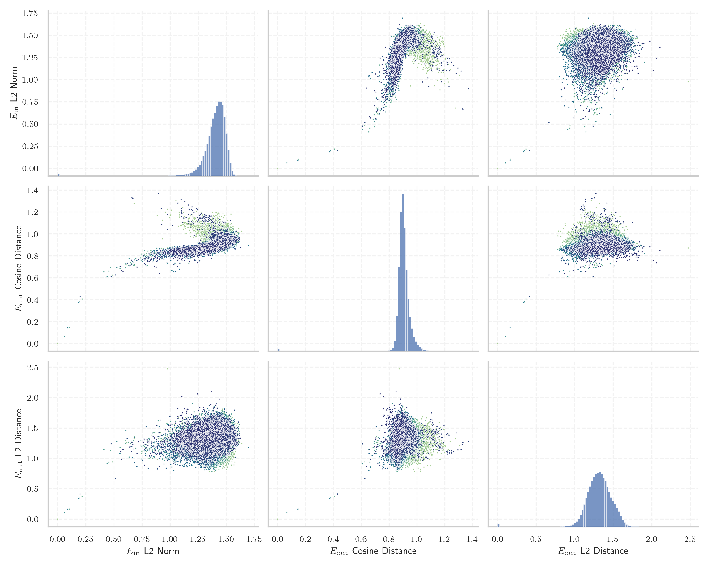

# Report for `utter-project/EuroLLM-1.7B`

## Model info

* Model Info: 
  * Tied embeddings: False
  * LM head uses bias: False
  * Embeddings shape: [128000, 2048]
* Tokenizer Info: 
  * Vocab Size: 128000
  * Tokenizer Class: LlamaTokenizer
  * Tokenizer Type: BPE
  * Bytes handling: Byte Fallback
  * Token for verification prompt building: includegraphics
  * Token id for verification prompt building: 8997
* Indicator summary: 
  * Indicator for under-trained tokens: E_{in} L2 Norm
  * Overall distribution: 1.399 +/- 0.114
* Detected Token Counts: 
  * Number of tested under-trained tokens: 2559, 2260 non-special, 101 below p = 0.01 threshold, 11 below soft indicator threshold
  * Number of single byte tokens: 354, of which 120 below indicator threshold
  * Number of special tokens: 1, of which 0 below indicator threshold
  * Number of non-single-byte unreachable tokens: 1, of which 0 below indicator threshold

## Under-trained token indicators plot


## Verification plot


## Under-trained token verification results
11 entries below threshold of 0.475

|   token_id | token                       |   indicator | max_prob                                                         | in_other_tokens                                                                                                                                                                                                                                                                                                                                               |
|------------|-----------------------------|-------------|------------------------------------------------------------------|---------------------------------------------------------------------------------------------------------------------------------------------------------------------------------------------------------------------------------------------------------------------------------------------------------------------------------------------------------------|
|      56539 | ````` funsio `````          |   0.0607532 | <span style='border: 1px solid rgb(169, 68, 66);'>0.00043</span> |                                                                                                                                                                                                                                                                                                                                                               |
|      75613 | ````` urasGeneral `````     |   0.091315  | <span style='border: 1px solid rgb(169, 68, 66);'>0.00032</span> | <span style='border: 1px solid rgb(40, 167, 69);'>````` FacturasGeneral `````</span>                                                                                                                                                                                                                                                                          |
|      35236 | ````` ▁funsio `````         |   0.10297   | <span style='border: 1px solid rgb(251, 189, 8);'>0.025</span>   |                                                                                                                                                                                                                                                                                                                                                               |
|      77603 | ````` FacturasGeneral ````` |   0.186482  | <span style='border: 1px solid rgb(40, 167, 69);'>0.75</span>    |                                                                                                                                                                                                                                                                                                                                                               |
|      58072 | ````` ▁momč `````           |   0.197107  | <span style='border: 1px solid rgb(169, 68, 66);'>1.1e-05</span> | <span style='border: 1px solid rgb(251, 189, 8);'>````` ▁momčadi `````</span>, <span style='border: 1px solid rgb(40, 167, 69);'>````` ▁momčad `````</span>                                                                                                                                                                                                   |
|     114185 | ````` asaíne `````          |   0.199322  | <span style='border: 1px solid rgb(169, 68, 66);'>9.1e-09</span> | <span style='border: 1px solid rgb(255, 145, 0);'>````` asaíneonna `````</span>                                                                                                                                                                                                                                                                               |
|      26610 | ````` jetain `````          |   0.217722  | <span style='border: 1px solid rgb(169, 68, 66);'>4.1e-05</span> | ````` ▁dvejetain `````, <span style='border: 1px solid rgb(255, 145, 0);'>````` vejetain `````</span>, <span style='border: 1px solid rgb(40, 167, 69);'>````` ▁dvejetainių `````</span>, <span style='border: 1px solid rgb(40, 167, 69);'>````` ▁Dvejetain `````</span>, <span style='border: 1px solid rgb(40, 167, 69);'>````` ▁dvejetainiai `````</span> |
|      43175 | ````` ▁compéten `````       |   0.410877  | <span style='border: 1px solid rgb(169, 68, 66);'>0.00091</span> | ````` ▁compétences `````, ````` ▁compétence `````                                                                                                                                                                                                                                                                                                             |
|      56988 | ````` ▁meais `````          |   0.439491  | <span style='border: 1px solid rgb(169, 68, 66);'>0.00062</span> | <span style='border: 1px solid rgb(40, 167, 69);'>````` ▁meaisín `````</span>, <span style='border: 1px solid rgb(251, 189, 8);'>````` ▁meaisíní `````</span>                                                                                                                                                                                                 |
|      33200 | ````` ħtie `````            |   0.454049  | <span style='border: 1px solid rgb(169, 68, 66);'>1.2e-07</span> | ````` ħtieġ `````, <span style='border: 1px solid rgb(40, 167, 69);'>````` ħtieġa `````</span>, ````` ▁meħtieġa `````, ````` ▁jeħtieġ `````                                                                                                                                                                                                                   |
|      37963 | ````` ▁voormal `````        |   0.469258  | <span style='border: 1px solid rgb(255, 145, 0);'>0.0021</span>  | ````` ▁voormalige `````, ````` ▁voormalig `````                                                                                                                                                                                                                                                                                                               |
<details><summary>2249 additional entries above threshold</summary>

|   token_id | token                                |   indicator | max_prob                                                         | in_other_tokens                                                                                                                                                                                                                                                                                                                                                                                                       |
|------------|--------------------------------------|-------------|------------------------------------------------------------------|-----------------------------------------------------------------------------------------------------------------------------------------------------------------------------------------------------------------------------------------------------------------------------------------------------------------------------------------------------------------------------------------------------------------------|
|     113503 | ````` XHCI `````                     |    0.47541  | <span style='border: 1px solid rgb(40, 167, 69);'>0.98</span>    |                                                                                                                                                                                                                                                                                                                                                                                                                       |
|      16962 | ````` ▁úsá `````                     |    0.486429 | <span style='border: 1px solid rgb(251, 189, 8);'>0.02</span>    | ````` ▁úsáid `````, ````` ▁úsáide `````, ````` ▁úsáidtear `````, <span style='border: 1px solid rgb(251, 189, 8);'>````` ▁úsáideoirí `````</span>                                                                                                                                                                                                                                                                     |
|     114081 | ````` iċli `````                     |    0.514878 | <span style='border: 1px solid rgb(169, 68, 66);'>8e-07</span>   | ````` ▁diffiċli `````                                                                                                                                                                                                                                                                                                                                                                                                 |
|      57615 | ````` байджа `````                   |    0.525312 | <span style='border: 1px solid rgb(40, 167, 69);'>1</span>       | ````` зербайджа `````, ````` ▁Азербайджа `````                                                                                                                                                                                                                                                                                                                                                                        |
|      71528 | ````` ovoza `````                    |    0.55358  | <span style='border: 1px solid rgb(40, 167, 69);'>0.21</span>    | <span style='border: 1px solid rgb(40, 167, 69);'>````` ▁kolovoza `````</span>                                                                                                                                                                                                                                                                                                                                        |
|      36239 | ````` ▁wewnę `````                   |    0.554624 | <span style='border: 1px solid rgb(40, 167, 69);'>0.65</span>    | ````` ▁wewnętrz `````, ````` ▁wewnętrznych `````, ````` ▁wewnętr `````                                                                                                                                                                                                                                                                                                                                                |
|     127930 | ````` 鋂 `````                       |    0.559943 | <span style='border: 1px solid rgb(40, 167, 69);'>0.99</span>    |                                                                                                                                                                                                                                                                                                                                                                                                                       |
|     124553 | ````` ᅲ `````                         |    0.567668 | <span style='border: 1px solid rgb(40, 167, 69);'>0.99</span>    |                                                                                                                                                                                                                                                                                                                                                                                                                       |
|     126623 | ````` ᅠ `````                         |    0.581044 | <span style='border: 1px solid rgb(40, 167, 69);'>1</span>       |                                                                                                                                                                                                                                                                                                                                                                                                                       |
|      40900 | ````` ▁catholi `````                 |    0.603107 | <span style='border: 1px solid rgb(40, 167, 69);'>0.62</span>    | ````` ▁catholique `````, ````` ▁catholiques `````                                                                                                                                                                                                                                                                                                                                                                     |
|      25481 | ````` ▁máqu `````                    |    0.605574 | <span style='border: 1px solid rgb(255, 145, 0);'>0.01</span>    | ````` ▁máquina `````, ````` ▁máquinas `````                                                                                                                                                                                                                                                                                                                                                                           |
|      61232 | ````` ▁récem `````                   |    0.606147 | <span style='border: 1px solid rgb(251, 189, 8);'>0.081</span>   | ````` ▁récemment `````                                                                                                                                                                                                                                                                                                                                                                                                |
|       8477 | ````` ▁tiegħ `````                   |    0.615233 | <span style='border: 1px solid rgb(40, 167, 69);'>0.16</span>    | ````` ▁tiegħu `````, ````` ▁tiegħek `````, ````` ▁tiegħi `````                                                                                                                                                                                                                                                                                                                                                        |
|     111374 | ````` ▁різнома `````                 |    0.617654 | <span style='border: 1px solid rgb(251, 189, 8);'>0.037</span>   | ````` ▁різномані `````                                                                                                                                                                                                                                                                                                                                                                                                |
|      36136 | ````` ▁statunit `````                |    0.627543 | <span style='border: 1px solid rgb(251, 189, 8);'>0.057</span>   | ````` ▁statunitense `````, ````` ▁statunitensi `````                                                                                                                                                                                                                                                                                                                                                                  |
|      59141 | ````` ▁lekkoat `````                 |    0.635072 | <span style='border: 1px solid rgb(251, 189, 8);'>0.051</span>   | ````` ▁lekkoatleta `````, ````` ▁lekkoatlet `````                                                                                                                                                                                                                                                                                                                                                                     |
|     127428 | ````` 鑭 `````                       |    0.640391 | <span style='border: 1px solid rgb(40, 167, 69);'>1</span>       |                                                                                                                                                                                                                                                                                                                                                                                                                       |
|     127363 | ````` 錒 `````                       |    0.648528 | <span style='border: 1px solid rgb(40, 167, 69);'>1</span>       |                                                                                                                                                                                                                                                                                                                                                                                                                       |
|      37962 | ````` ▁herramient `````              |    0.64913  | <span style='border: 1px solid rgb(40, 167, 69);'>0.32</span>    | ````` ▁herramientas `````, ````` ▁herramienta `````                                                                                                                                                                                                                                                                                                                                                                   |
|     123820 | ````` 겪 `````                       |    0.653935 | <span style='border: 1px solid rgb(40, 167, 69);'>0.99</span>    |                                                                                                                                                                                                                                                                                                                                                                                                                       |
|     104800 | ````` ipeas `````                    |    0.659478 | <span style='border: 1px solid rgb(40, 167, 69);'>0.96</span>    | <span style='border: 1px solid rgb(40, 167, 69);'>````` ipeasóid `````</span>                                                                                                                                                                                                                                                                                                                                         |
|      29142 | ````` ▁Einwo `````                   |    0.659635 | <span style='border: 1px solid rgb(40, 167, 69);'>1</span>       | ````` ▁Einwohner `````, <span style='border: 1px solid rgb(40, 167, 69);'>````` ▁Einwohn `````</span>, ````` ▁Einwohnern `````                                                                                                                                                                                                                                                                                        |
|      83678 | ````` ριλίου `````                   |    0.66351  | <span style='border: 1px solid rgb(251, 189, 8);'>0.03</span>    | <span style='border: 1px solid rgb(40, 167, 69);'>````` ▁Απριλίου `````</span>                                                                                                                                                                                                                                                                                                                                        |
|      35189 | ````` ▁lesqu `````                   |    0.672298 | <span style='border: 1px solid rgb(255, 145, 0);'>0.0018</span>  | ````` ▁lesquels `````, ````` ▁lesquelles `````                                                                                                                                                                                                                                                                                                                                                                        |
|     127037 | ````` 釷 `````                       |    0.676142 | <span style='border: 1px solid rgb(40, 167, 69);'>1</span>       |                                                                                                                                                                                                                                                                                                                                                                                                                       |
|      23987 | ````` ▁대한민 `````                  |    0.680278 | <span style='border: 1px solid rgb(40, 167, 69);'>1</span>       | ````` ▁대한민국 `````, ````` ▁대한민국의 `````                                                                                                                                                                                                                                                                                                                                                                        |
|      44802 | ````` etilde `````                   |    0.680293 | <span style='border: 1px solid rgb(40, 167, 69);'>1</span>       | ````` widetilde `````                                                                                                                                                                                                                                                                                                                                                                                                 |
|      96356 | ````` wajcar `````                   |    0.684817 | <span style='border: 1px solid rgb(169, 68, 66);'>0.00061</span> | ````` ▁szwajcar `````                                                                                                                                                                                                                                                                                                                                                                                                 |
|      96806 | ````` слідок `````                   |    0.685285 | <span style='border: 1px solid rgb(40, 167, 69);'>1</span>       | ````` наслідок `````                                                                                                                                                                                                                                                                                                                                                                                                  |
|      43400 | ````` لسط `````                      |    0.695189 | <span style='border: 1px solid rgb(40, 167, 69);'>0.97</span>    | ````` ▁الفلسط `````, ````` ▁فلسط `````, ````` ▁الفلسطيني `````                                                                                                                                                                                                                                                                                                                                                        |
|      96555 | ````` ustizz `````                   |    0.704013 | <span style='border: 1px solid rgb(255, 145, 0);'>0.0099</span>  | <span style='border: 1px solid rgb(251, 189, 8);'>````` ustizzja `````</span>                                                                                                                                                                                                                                                                                                                                         |
|     123648 | ````` ᄏ `````                       |    0.705089 | <span style='border: 1px solid rgb(40, 167, 69);'>0.98</span>    |                                                                                                                                                                                                                                                                                                                                                                                                                       |
|     127568 | ````` 鈹 `````                       |    0.717207 | <span style='border: 1px solid rgb(40, 167, 69);'>1</span>       |                                                                                                                                                                                                                                                                                                                                                                                                                       |
|      33528 | ````` ▁экспе `````                   |    0.739083 | <span style='border: 1px solid rgb(40, 167, 69);'>0.98</span>    | ````` ▁экспер `````, ````` ▁экспери `````, ````` ▁экспеди `````, ````` ▁эксперимента `````                                                                                                                                                                                                                                                                                                                            |
|      42899 | ````` hodox `````                    |    0.739863 | <span style='border: 1px solid rgb(40, 167, 69);'>0.12</span>    | ````` ▁orthodox `````, ````` ▁Orthodox `````, ````` orthodox `````                                                                                                                                                                                                                                                                                                                                                    |
|      56755 | ````` ▁čty `````                     |    0.740958 | <span style='border: 1px solid rgb(40, 167, 69);'>0.42</span>    | ````` ▁čtyř `````, ````` ▁čtyři `````                                                                                                                                                                                                                                                                                                                                                                                 |
|      37778 | ````` ▁malatt `````                  |    0.741152 | <span style='border: 1px solid rgb(40, 167, 69);'>0.76</span>    | ````` ▁malattia `````, ````` ▁malattie `````                                                                                                                                                                                                                                                                                                                                                                          |
|      20940 | ````` ▁większo `````                 |    0.744293 | <span style='border: 1px solid rgb(40, 167, 69);'>0.37</span>    | ````` ▁większość `````, ````` ▁większości `````                                                                                                                                                                                                                                                                                                                                                                       |
|      21273 | ````` ▁liječen `````                 |    0.748359 | <span style='border: 1px solid rgb(40, 167, 69);'>0.29</span>    | <span style='border: 1px solid rgb(40, 167, 69);'>````` ▁liječenje `````</span>, <span style='border: 1px solid rgb(40, 167, 69);'>````` ▁liječenja `````</span>, <span style='border: 1px solid rgb(40, 167, 69);'>````` ▁liječenju `````</span>                                                                                                                                                                     |
|     100504 | ````` ▁priopćen `````                |    0.752047 | <span style='border: 1px solid rgb(40, 167, 69);'>0.63</span>    |                                                                                                                                                                                                                                                                                                                                                                                                                       |
|      81466 | ````` anáir `````                    |    0.755284 | <span style='border: 1px solid rgb(251, 189, 8);'>0.037</span>   | <span style='border: 1px solid rgb(40, 167, 69);'>````` ▁Eanáir `````</span>                                                                                                                                                                                                                                                                                                                                          |
|      20375 | ````` ▁técn `````                    |    0.758134 | <span style='border: 1px solid rgb(40, 167, 69);'>0.48</span>    | ````` ▁técnica `````, ````` ▁técnicas `````, ````` ▁técnico `````, ````` ▁técnicos `````                                                                                                                                                                                                                                                                                                                              |
|      33141 | ````` ▁propried `````                |    0.760997 | <span style='border: 1px solid rgb(40, 167, 69);'>0.17</span>    | ````` ▁propriedade `````, ````` ▁propriedades `````                                                                                                                                                                                                                                                                                                                                                                   |
|     127913 | ````` 鸮 `````                       |    0.761188 | <span style='border: 1px solid rgb(40, 167, 69);'>0.99</span>    |                                                                                                                                                                                                                                                                                                                                                                                                                       |
|     127865 | ````` 闐 `````                       |    0.768232 | <span style='border: 1px solid rgb(40, 167, 69);'>0.91</span>    |                                                                                                                                                                                                                                                                                                                                                                                                                       |
|      43083 | ````` ▁siječn `````                  |    0.769957 | <span style='border: 1px solid rgb(251, 189, 8);'>0.07</span>    | <span style='border: 1px solid rgb(40, 167, 69);'>````` ▁siječnja `````</span>                                                                                                                                                                                                                                                                                                                                        |
|     126543 | ````` ᅮ `````                         |    0.770649 | <span style='border: 1px solid rgb(40, 167, 69);'>0.92</span>    |                                                                                                                                                                                                                                                                                                                                                                                                                       |
|     115183 | ````` ▁Predsjednik `````             |    0.771523 | <span style='border: 1px solid rgb(40, 167, 69);'>0.97</span>    |                                                                                                                                                                                                                                                                                                                                                                                                                       |
|      46045 | ````` ▁véhic `````                   |    0.773458 | <span style='border: 1px solid rgb(40, 167, 69);'>0.33</span>    | ````` ▁véhicules `````, ````` ▁véhicule `````                                                                                                                                                                                                                                                                                                                                                                         |
|      26244 | ````` ▁núcle `````                   |    0.773546 | <span style='border: 1px solid rgb(40, 167, 69);'>0.96</span>    | ````` ▁núcleo `````, ````` ▁núcleos `````                                                                                                                                                                                                                                                                                                                                                                             |
|      88379 | ````` únasa `````                    |    0.776883 | <span style='border: 1px solid rgb(251, 189, 8);'>0.095</span>   | <span style='border: 1px solid rgb(40, 167, 69);'>````` ▁Lúnasa `````</span>                                                                                                                                                                                                                                                                                                                                          |
|     117498 | ````` ▁Breata `````                  |    0.777129 | <span style='border: 1px solid rgb(251, 189, 8);'>0.058</span>   | ````` ▁Breataine `````                                                                                                                                                                                                                                                                                                                                                                                                |
|      90808 | ````` ▁Nazzjonal `````               |    0.779682 | <span style='border: 1px solid rgb(251, 189, 8);'>0.045</span>   | <span style='border: 1px solid rgb(40, 167, 69);'>````` ▁Nazzjonalista `````</span>, ````` ▁Nazzjonali `````                                                                                                                                                                                                                                                                                                          |
|      76150 | ````` rojām `````                    |    0.780044 | <span style='border: 1px solid rgb(255, 145, 0);'>0.0011</span>  | <span style='border: 1px solid rgb(40, 167, 69);'>````` oprojām `````</span>, ````` ▁joprojām `````                                                                                                                                                                                                                                                                                                                   |
|      25253 | ````` sięb `````                     |    0.781098 | <span style='border: 1px solid rgb(40, 167, 69);'>0.43</span>    | ````` siębior `````, ````` ▁przedsiębior `````                                                                                                                                                                                                                                                                                                                                                                        |
|     123817 | ````` 펼 `````                       |    0.781432 | <span style='border: 1px solid rgb(40, 167, 69);'>0.99</span>    |                                                                                                                                                                                                                                                                                                                                                                                                                       |
|      99868 | ````` \u200d\u200d\u200d\u200d ````` |    0.785559 | <span style='border: 1px solid rgb(40, 167, 69);'>0.99</span>    |                                                                                                                                                                                                                                                                                                                                                                                                                       |
|      13127 | ````` ▁películ `````                 |    0.789047 | <span style='border: 1px solid rgb(40, 167, 69);'>0.17</span>    | ````` ▁película `````, ````` ▁películas `````                                                                                                                                                                                                                                                                                                                                                                         |
|     109078 | ````` ▁एक्स्प `````                    |    0.789514 | <span style='border: 1px solid rgb(40, 167, 69);'>0.89</span>    | <span style='border: 1px solid rgb(40, 167, 69);'>````` ▁एक्स्प्रेस `````</span>                                                                                                                                                                                                                                                                                                                                          |
|      24879 | ````` ▁ragaz `````                   |    0.791435 | <span style='border: 1px solid rgb(40, 167, 69);'>0.95</span>    | ````` ▁ragazzi `````, ````` ▁ragazza `````, ````` ▁ragazzo `````, ````` ▁ragazze `````                                                                                                                                                                                                                                                                                                                                |
|      22597 | ````` iluppo `````                   |    0.792354 | <span style='border: 1px solid rgb(40, 167, 69);'>0.36</span>    | ````` ▁sviluppo `````                                                                                                                                                                                                                                                                                                                                                                                                 |
|      34799 | ````` μβρίου `````                   |    0.793465 | <span style='border: 1px solid rgb(40, 167, 69);'>0.6</span>     | <span style='border: 1px solid rgb(40, 167, 69);'>````` ▁Σεπτεμβρίου `````</span>, <span style='border: 1px solid rgb(40, 167, 69);'>````` ▁Νοεμβρίου `````</span>, <span style='border: 1px solid rgb(40, 167, 69);'>````` ▁Δεκεμβρίου `````</span>                                                                                                                                                                  |
|     127077 | ````` ӗ `````                        |    0.794209 | <span style='border: 1px solid rgb(40, 167, 69);'>0.98</span>    |                                                                                                                                                                                                                                                                                                                                                                                                                       |
|      70847 | ````` véken `````                    |    0.795313 | <span style='border: 1px solid rgb(40, 167, 69);'>0.82</span>    | ````` ▁tevéken `````, ````` ▁tevékenység `````                                                                                                                                                                                                                                                                                                                                                                        |
|     127890 | ````` 븀 `````                       |    0.796816 | <span style='border: 1px solid rgb(40, 167, 69);'>0.99</span>    |                                                                                                                                                                                                                                                                                                                                                                                                                       |
|      40824 | ````` ▁ettev `````                   |    0.799235 | <span style='border: 1px solid rgb(40, 167, 69);'>0.85</span>    | ````` ▁ettevõ `````, ````` ▁ettevõt `````                                                                                                                                                                                                                                                                                                                                                                             |
|     125142 | ````` ḃ `````                        |    0.802496 | <span style='border: 1px solid rgb(40, 167, 69);'>0.99</span>    |                                                                                                                                                                                                                                                                                                                                                                                                                       |
|      27644 | ````` ▁indúst `````                  |    0.80264  | <span style='border: 1px solid rgb(40, 167, 69);'>0.95</span>    | ````` ▁indústria `````, ````` ▁indústrias `````                                                                                                                                                                                                                                                                                                                                                                       |
|     103049 | ````` egħdin `````                   |    0.805699 | <span style='border: 1px solid rgb(169, 68, 66);'>0.00044</span> | ````` ▁qegħdin `````                                                                                                                                                                                                                                                                                                                                                                                                  |
|      79819 | ````` ▁Μαΐ `````                     |    0.806006 | <span style='border: 1px solid rgb(40, 167, 69);'>0.99</span>    | <span style='border: 1px solid rgb(40, 167, 69);'>````` ▁Μαΐου `````</span>                                                                                                                                                                                                                                                                                                                                           |
|      42591 | ````` ▁indivídu `````                |    0.81099  | <span style='border: 1px solid rgb(40, 167, 69);'>0.84</span>    | ````` ▁indivíduos `````, ````` ▁indivíduo `````                                                                                                                                                                                                                                                                                                                                                                       |
|     127707 | ````` 鰂 `````                       |    0.81107  | <span style='border: 1px solid rgb(40, 167, 69);'>1</span>       |                                                                                                                                                                                                                                                                                                                                                                                                                       |
|      98645 | ````` hvezd `````                    |    0.811133 | <span style='border: 1px solid rgb(40, 167, 69);'>1</span>       | <span style='border: 1px solid rgb(40, 167, 69);'>````` ▁súhvezd `````</span>                                                                                                                                                                                                                                                                                                                                         |
|     123885 | ````` 圾 `````                       |    0.811729 | <span style='border: 1px solid rgb(40, 167, 69);'>1</span>       |                                                                                                                                                                                                                                                                                                                                                                                                                       |
|      24041 | ````` ▁niektó `````                  |    0.812109 | <span style='border: 1px solid rgb(40, 167, 69);'>0.66</span>    | ````` ▁niektórych `````, ````` ▁niektóre `````                                                                                                                                                                                                                                                                                                                                                                        |
|     100986 | ````` ▁istaknuo `````                |    0.812437 | <span style='border: 1px solid rgb(251, 189, 8);'>0.025</span>   |                                                                                                                                                                                                                                                                                                                                                                                                                       |
|      34667 | ````` ▁razdob `````                  |    0.814008 | <span style='border: 1px solid rgb(40, 167, 69);'>0.33</span>    | <span style='border: 1px solid rgb(40, 167, 69);'>````` ▁razdoblju `````</span>, <span style='border: 1px solid rgb(40, 167, 69);'>````` ▁razdoblja `````</span>, <span style='border: 1px solid rgb(40, 167, 69);'>````` ▁razdoblje `````</span>                                                                                                                                                                     |
|      98843 | ````` uniden `````                   |    0.81419  | <span style='border: 1px solid rgb(40, 167, 69);'>0.97</span>    | ````` ▁estatuniden `````                                                                                                                                                                                                                                                                                                                                                                                              |
|     127866 | ````` ᄌ `````                       |    0.814483 | <span style='border: 1px solid rgb(40, 167, 69);'>0.98</span>    |                                                                                                                                                                                                                                                                                                                                                                                                                       |
|      28563 | ````` ikuuta `````                   |    0.814622 | <span style='border: 1px solid rgb(40, 167, 69);'>0.76</span>    | ````` ▁tammikuuta `````, <span style='border: 1px solid rgb(40, 167, 69);'>````` ▁huhtikuuta `````</span>, <span style='border: 1px solid rgb(40, 167, 69);'>````` ▁helmikuuta `````</span>                                                                                                                                                                                                                           |
|     127818 | ````` 栱 `````                       |    0.823271 | <span style='border: 1px solid rgb(40, 167, 69);'>1</span>       |                                                                                                                                                                                                                                                                                                                                                                                                                       |
|      40227 | ````` iječn `````                    |    0.82556  | <span style='border: 1px solid rgb(251, 189, 8);'>0.044</span>   | <span style='border: 1px solid rgb(251, 189, 8);'>````` ▁siječn `````</span>, <span style='border: 1px solid rgb(40, 167, 69);'>````` ▁siječnja `````</span>, <span style='border: 1px solid rgb(40, 167, 69);'>````` ▁liječnika `````</span>, <span style='border: 1px solid rgb(40, 167, 69);'>````` ▁liječnik `````</span>                                                                                         |
|      12098 | ````` ▁сист `````                    |    0.82604  | <span style='border: 1px solid rgb(40, 167, 69);'>1</span>       | ````` ▁система `````, ````` ▁системы `````, ````` ▁систем `````, ````` ▁систему `````, ````` ▁системи `````, ...                                                                                                                                                                                                                                                                                                      |
|      22708 | ````` ▁февра `````                   |    0.827528 | <span style='border: 1px solid rgb(40, 167, 69);'>0.95</span>    | ````` ▁февраля `````, <span style='border: 1px solid rgb(40, 167, 69);'>````` ▁феврале `````</span>                                                                                                                                                                                                                                                                                                                   |
|     125378 | ````` ṫ `````                        |    0.830397 | <span style='border: 1px solid rgb(40, 167, 69);'>0.99</span>    |                                                                                                                                                                                                                                                                                                                                                                                                                       |
|     108957 | ````` 土耳 `````                     |    0.831921 | <span style='border: 1px solid rgb(40, 167, 69);'>0.79</span>    | ````` 土耳其 `````                                                                                                                                                                                                                                                                                                                                                                                                    |
|     106829 | ````` ▁živjeti `````                 |    0.834198 | <span style='border: 1px solid rgb(40, 167, 69);'>0.96</span>    |                                                                                                                                                                                                                                                                                                                                                                                                                       |
|     115580 | ````` ▁lionsa `````                  |    0.834585 | <span style='border: 1px solid rgb(40, 167, 69);'>0.2</span>     |                                                                                                                                                                                                                                                                                                                                                                                                                       |
|      83332 | ````` ▁Σεπτε `````                   |    0.835536 | <span style='border: 1px solid rgb(40, 167, 69);'>0.58</span>    | <span style='border: 1px solid rgb(40, 167, 69);'>````` ▁Σεπτεμβρίου `````</span>                                                                                                                                                                                                                                                                                                                                     |
|      14703 | ````` jourd `````                    |    0.837094 | <span style='border: 1px solid rgb(40, 167, 69);'>0.99</span>    | ````` ▁aujourd `````, ````` ujourd `````, ````` ▁Aujourd `````, ````` aujourd `````                                                                                                                                                                                                                                                                                                                                   |
|     127591 | ````` 儁 `````                       |    0.837455 | <span style='border: 1px solid rgb(40, 167, 69);'>1</span>       |                                                                                                                                                                                                                                                                                                                                                                                                                       |
|      30536 | ````` ajjiż `````                    |    0.841603 | <span style='border: 1px solid rgb(169, 68, 66);'>0.00049</span> | ````` pajjiż `````, <span style='border: 1px solid rgb(169, 68, 66);'>````` ajjiżi `````</span>, ````` ▁pajjiż `````, <span style='border: 1px solid rgb(40, 167, 69);'>````` pajjiżi `````</span>, <span style='border: 1px solid rgb(251, 189, 8);'>````` ▁pajjiżi `````</span>                                                                                                                                     |
|      92990 | ````` ▁Aibre `````                   |    0.842652 | <span style='border: 1px solid rgb(40, 167, 69);'>0.96</span>    | <span style='border: 1px solid rgb(40, 167, 69);'>````` ▁Aibreán `````</span>                                                                                                                                                                                                                                                                                                                                         |
|      33018 | ````` áinig `````                    |    0.843789 | <span style='border: 1px solid rgb(40, 167, 69);'>0.1</span>     | ````` ▁tháinig `````, ````` ▁Tháinig `````                                                                                                                                                                                                                                                                                                                                                                            |
|      86221 | ````` iezd `````                     |    0.844679 | <span style='border: 1px solid rgb(40, 167, 69);'>0.98</span>    | ````` ▁hviezd `````                                                                                                                                                                                                                                                                                                                                                                                                   |
|      72276 | ````` ▁sgk `````                     |    0.84616  | <span style='border: 1px solid rgb(40, 167, 69);'>0.99</span>    |                                                                                                                                                                                                                                                                                                                                                                                                                       |
|     125123 | ````` ḋ `````                        |    0.846777 | <span style='border: 1px solid rgb(40, 167, 69);'>0.98</span>    |                                                                                                                                                                                                                                                                                                                                                                                                                       |
|     127398 | ````` 霑 `````                       |    0.847812 | <span style='border: 1px solid rgb(40, 167, 69);'>1</span>       |                                                                                                                                                                                                                                                                                                                                                                                                                       |
|      86492 | ````` ▁prosvjed `````                |    0.852176 | <span style='border: 1px solid rgb(40, 167, 69);'>1</span>       |                                                                                                                                                                                                                                                                                                                                                                                                                       |
|      25857 | ````` ▁britanni `````                |    0.853813 | <span style='border: 1px solid rgb(40, 167, 69);'>0.75</span>    | ````` ▁britannique `````, ````` ▁britannico `````, ````` ▁britanniques `````, ````` ▁britannica `````                                                                                                                                                                                                                                                                                                                 |
|      45108 | ````` kiezingen `````                |    0.854341 | <span style='border: 1px solid rgb(255, 145, 0);'>0.0063</span>  | ````` ▁verkiezingen `````, ````` verkiezingen `````                                                                                                                                                                                                                                                                                                                                                                   |
|      73598 | ````` ▁laikot `````                  |    0.854816 | <span style='border: 1px solid rgb(251, 189, 8);'>0.013</span>   | ````` ▁laikotarp `````                                                                                                                                                                                                                                                                                                                                                                                                |
|     127009 | ````` ᄃ `````                       |    0.855184 | <span style='border: 1px solid rgb(40, 167, 69);'>0.97</span>    |                                                                                                                                                                                                                                                                                                                                                                                                                       |
|     109842 | ````` ▁cijelog `````                 |    0.855405 | <span style='border: 1px solid rgb(251, 189, 8);'>0.014</span>   |                                                                                                                                                                                                                                                                                                                                                                                                                       |
|      11193 | ````` країн `````                    |    0.856479 | <span style='border: 1px solid rgb(40, 167, 69);'>1</span>       | ````` ▁україн `````, ````` ▁України `````, ````` ▁Україні `````, ````` ▁Україн `````, ````` ▁країни `````, ...                                                                                                                                                                                                                                                                                                        |
|     124288 | ````` ᄒ `````                       |    0.858403 | <span style='border: 1px solid rgb(40, 167, 69);'>0.96</span>    |                                                                                                                                                                                                                                                                                                                                                                                                                       |
|      54748 | ````` ▁kazao `````                   |    0.859378 | <span style='border: 1px solid rgb(251, 189, 8);'>0.013</span>   |                                                                                                                                                                                                                                                                                                                                                                                                                       |
|      14131 | ````` ▁społ `````                    |    0.859736 | <span style='border: 1px solid rgb(40, 167, 69);'>0.87</span>    | ````` ▁społecz `````, ````` ▁społec `````, ````` ▁społecze `````, ````` ▁społeczności `````, ````` ▁społeczeństwa `````, ...                                                                                                                                                                                                                                                                                          |
|      78708 | ````` трално `````                   |    0.859924 | <span style='border: 1px solid rgb(255, 145, 0);'>0.0011</span>  | ````` ▁Неутрално `````                                                                                                                                                                                                                                                                                                                                                                                                |
|     127238 | ````` \ue6e7 `````                   |    0.860138 | <span style='border: 1px solid rgb(40, 167, 69);'>0.86</span>    |                                                                                                                                                                                                                                                                                                                                                                                                                       |
|      48448 | ````` ▁γλώ `````                     |    0.86137  | <span style='border: 1px solid rgb(40, 167, 69);'>0.61</span>    | ````` ▁γλώσσα `````, ````` ▁γλώσσ `````                                                                                                                                                                                                                                                                                                                                                                               |
|      41187 | ````` ▁évén `````                    |    0.862642 | <span style='border: 1px solid rgb(251, 189, 8);'>0.068</span>   | ````` ▁événements `````, ````` ▁événement `````                                                                                                                                                                                                                                                                                                                                                                       |
|      84261 | ````` ▁Αυγού `````                   |    0.862812 | <span style='border: 1px solid rgb(40, 167, 69);'>0.95</span>    | <span style='border: 1px solid rgb(40, 167, 69);'>````` ▁Αυγούστου `````</span>                                                                                                                                                                                                                                                                                                                                       |
|     127517 | ````` ᄉ `````                       |    0.865024 | <span style='border: 1px solid rgb(40, 167, 69);'>0.98</span>    |                                                                                                                                                                                                                                                                                                                                                                                                                       |
|      84070 | ````` τωβ `````                      |    0.868763 | <span style='border: 1px solid rgb(40, 167, 69);'>0.39</span>    | <span style='border: 1px solid rgb(40, 167, 69);'>````` ▁Οκτωβ `````</span>, ````` ▁Οκτωβρίου `````                                                                                                                                                                                                                                                                                                                   |
|      43078 | ````` ▁ožuj `````                    |    0.869912 | <span style='border: 1px solid rgb(40, 167, 69);'>0.99</span>    | <span style='border: 1px solid rgb(40, 167, 69);'>````` ▁ožujka `````</span>                                                                                                                                                                                                                                                                                                                                          |
|     117035 | ````` ▁uspjeh `````                  |    0.872586 | <span style='border: 1px solid rgb(40, 167, 69);'>0.25</span>    |                                                                                                                                                                                                                                                                                                                                                                                                                       |
|     127614 | ````` ᄅ `````                       |    0.874046 | <span style='border: 1px solid rgb(40, 167, 69);'>0.95</span>    |                                                                                                                                                                                                                                                                                                                                                                                                                       |
|     127383 | ````` 鞨 `````                       |    0.87443  | <span style='border: 1px solid rgb(40, 167, 69);'>0.99</span>    |                                                                                                                                                                                                                                                                                                                                                                                                                       |
|     106275 | ````` ▁álb `````                     |    0.875836 | <span style='border: 1px solid rgb(40, 167, 69);'>0.91</span>    | ````` ▁álbuns `````                                                                                                                                                                                                                                                                                                                                                                                                   |
|      20025 | ````` ßerdem `````                   |    0.876036 | <span style='border: 1px solid rgb(255, 145, 0);'>0.0075</span>  | ````` ▁Außerdem `````, ````` ▁außerdem `````                                                                                                                                                                                                                                                                                                                                                                          |
|     127922 | ````` 💞 `````                       |    0.877276 | <span style='border: 1px solid rgb(40, 167, 69);'>0.99</span>    |                                                                                                                                                                                                                                                                                                                                                                                                                       |
|     127178 | ````` ᅵ `````                         |    0.877779 | <span style='border: 1px solid rgb(40, 167, 69);'>0.98</span>    |                                                                                                                                                                                                                                                                                                                                                                                                                       |
|     127403 | ````` 靺 `````                       |    0.878448 | <span style='border: 1px solid rgb(40, 167, 69);'>0.97</span>    |                                                                                                                                                                                                                                                                                                                                                                                                                       |
|      96349 | ````` ▁priekšs `````                 |    0.879648 | <span style='border: 1px solid rgb(40, 167, 69);'>0.25</span>    | ````` ▁priekšsēd `````                                                                                                                                                                                                                                                                                                                                                                                                |
|     127745 | ````` 烴 `````                       |    0.87991  | <span style='border: 1px solid rgb(40, 167, 69);'>0.99</span>    |                                                                                                                                                                                                                                                                                                                                                                                                                       |
|      48211 | ````` ▁vantag `````                  |    0.881865 | <span style='border: 1px solid rgb(251, 189, 8);'>0.04</span>    | ````` ▁vantaggio `````, ````` ▁vantaggi `````, ````` ▁vantagem `````, ````` ▁vantagens `````                                                                                                                                                                                                                                                                                                                          |
|      42434 | ````` ómhair `````                   |    0.88319  | <span style='border: 1px solid rgb(40, 167, 69);'>0.18</span>    | ````` ▁Fómhair `````                                                                                                                                                                                                                                                                                                                                                                                                  |
|     115722 | ````` ▁diljem `````                  |    0.883805 | <span style='border: 1px solid rgb(251, 189, 8);'>0.025</span>   |                                                                                                                                                                                                                                                                                                                                                                                                                       |
|        557 | ````` ▁the `````                     |    0.884495 | <span style='border: 1px solid rgb(40, 167, 69);'>1</span>       | ````` ▁their `````, ````` ▁they `````, ````` ▁there `````, ````` ▁these `````, ````` ▁them `````, ...                                                                                                                                                                                                                                                                                                                 |
|     127116 | ````` ᄂ `````                       |    0.884549 | <span style='border: 1px solid rgb(40, 167, 69);'>0.93</span>    |                                                                                                                                                                                                                                                                                                                                                                                                                       |
|     110548 | ````` ▁glazbe `````                  |    0.885005 | <span style='border: 1px solid rgb(40, 167, 69);'>0.55</span>    |                                                                                                                                                                                                                                                                                                                                                                                                                       |
|      99694 | ````` ważi `````                     |    0.88566  | <span style='border: 1px solid rgb(40, 167, 69);'>0.13</span>    | <span style='border: 1px solid rgb(251, 189, 8);'>````` ▁kważi `````</span>                                                                                                                                                                                                                                                                                                                                           |
|     109924 | ````` oineamh `````                  |    0.885698 | <span style='border: 1px solid rgb(169, 68, 66);'>0.00033</span> | ````` ▁smaoineamh `````                                                                                                                                                                                                                                                                                                                                                                                               |
|     109220 | ````` ▁prijedlog `````               |    0.88759  | <span style='border: 1px solid rgb(40, 167, 69);'>1</span>       |                                                                                                                                                                                                                                                                                                                                                                                                                       |
|      93707 | ````` észnő `````                    |    0.887642 | <span style='border: 1px solid rgb(255, 145, 0);'>0.0064</span>  | ````` ▁színésznő `````                                                                                                                                                                                                                                                                                                                                                                                                |
|     126697 | ````` ᅳ `````                         |    0.888821 | <span style='border: 1px solid rgb(40, 167, 69);'>0.78</span>    |                                                                                                                                                                                                                                                                                                                                                                                                                       |
|     112536 | ````` ▁vone `````                    |    0.891936 | <span style='border: 1px solid rgb(40, 167, 69);'>0.94</span>    | ````` ▁voneinander `````                                                                                                                                                                                                                                                                                                                                                                                              |
|      71902 | ````` ▁prijed `````                  |    0.892522 | <span style='border: 1px solid rgb(40, 167, 69);'>0.99</span>    | <span style='border: 1px solid rgb(40, 167, 69);'>````` ▁prijedlog `````</span>                                                                                                                                                                                                                                                                                                                                       |
|      43832 | ````` namelijk `````                 |    0.893613 | <span style='border: 1px solid rgb(40, 167, 69);'>0.11</span>    | ````` ▁voornamelijk `````                                                                                                                                                                                                                                                                                                                                                                                             |
|      84818 | ````` ▁Οκτωβ `````                   |    0.893698 | <span style='border: 1px solid rgb(40, 167, 69);'>0.94</span>    | ````` ▁Οκτωβρίου `````                                                                                                                                                                                                                                                                                                                                                                                                |
|      39003 | ````` ▁będz `````                    |    0.89379  | <span style='border: 1px solid rgb(40, 167, 69);'>0.85</span>    | ````` ▁będziemy `````, ````` ▁będziesz `````                                                                                                                                                                                                                                                                                                                                                                          |
|     116905 | ````` iemożli `````                  |    0.895549 | <span style='border: 1px solid rgb(40, 167, 69);'>0.92</span>    | ````` ▁uniemożli `````                                                                                                                                                                                                                                                                                                                                                                                                |
|     119715 | ````` ▁ `````                        |    0.896335 | <span style='border: 1px solid rgb(40, 167, 69);'>1</span>       |                                                                                                                                                                                                                                                                                                                                                                                                                       |
|      12805 | ````` ▁socied `````                  |    0.897436 | <span style='border: 1px solid rgb(251, 189, 8);'>0.061</span>   | ````` ▁sociedade `````, ````` ▁sociedad `````, ````` ▁sociedades `````                                                                                                                                                                                                                                                                                                                                                |
|      85411 | ````` ▁Νοε `````                     |    0.898217 | <span style='border: 1px solid rgb(40, 167, 69);'>0.99</span>    | <span style='border: 1px solid rgb(40, 167, 69);'>````` ▁Νοεμβρίου `````</span>                                                                                                                                                                                                                                                                                                                                       |
|     127947 | ````` 筲 `````                       |    0.899334 | <span style='border: 1px solid rgb(40, 167, 69);'>1</span>       |                                                                                                                                                                                                                                                                                                                                                                                                                       |
|      74349 | ````` endemain `````                 |    0.899414 | <span style='border: 1px solid rgb(40, 167, 69);'>0.31</span>    | ````` ▁lendemain `````                                                                                                                                                                                                                                                                                                                                                                                                |
|      38397 | ````` ▁októ `````                    |    0.899724 | <span style='border: 1px solid rgb(40, 167, 69);'>0.95</span>    | ````` ▁október `````, <span style='border: 1px solid rgb(40, 167, 69);'>````` ▁októbra `````</span>                                                                                                                                                                                                                                                                                                                   |
|     100824 | ````` ▁liječiti `````                |    0.900856 | <span style='border: 1px solid rgb(40, 167, 69);'>0.91</span>    |                                                                                                                                                                                                                                                                                                                                                                                                                       |
|      40270 | ````` ▁Władys `````                  |    0.901308 | <span style='border: 1px solid rgb(40, 167, 69);'>0.95</span>    | ````` ▁Władysław `````, ````` ▁Władysława `````                                                                                                                                                                                                                                                                                                                                                                       |
|      92635 | ````` šetkým `````                   |    0.902282 | <span style='border: 1px solid rgb(251, 189, 8);'>0.028</span>   | <span style='border: 1px solid rgb(255, 145, 0);'>````` ovšetkým `````</span>, ````` ▁predovšetkým `````                                                                                                                                                                                                                                                                                                              |
|     127487 | ````` ⇆ `````                        |    0.902881 | <span style='border: 1px solid rgb(40, 167, 69);'>1</span>       |                                                                                                                                                                                                                                                                                                                                                                                                                       |
|     127355 | ````` ᄀ `````                       |    0.903154 | <span style='border: 1px solid rgb(40, 167, 69);'>0.96</span>    |                                                                                                                                                                                                                                                                                                                                                                                                                       |
|      48458 | ````` αρίου `````                    |    0.9039   | <span style='border: 1px solid rgb(40, 167, 69);'>0.49</span>    | <span style='border: 1px solid rgb(40, 167, 69);'>````` ▁Ιανουαρίου `````</span>, <span style='border: 1px solid rgb(40, 167, 69);'>````` ▁Φεβρουαρίου `````</span>                                                                                                                                                                                                                                                   |
|      98105 | ````` ▁momčadi `````                 |    0.904342 | <span style='border: 1px solid rgb(251, 189, 8);'>0.017</span>   |                                                                                                                                                                                                                                                                                                                                                                                                                       |
|     126956 | ````` 눉 `````                       |    0.904521 | <span style='border: 1px solid rgb(255, 145, 0);'>0.0048</span>  |                                                                                                                                                                                                                                                                                                                                                                                                                       |
|      76446 | ````` ▁Φεβ `````                     |    0.904991 | <span style='border: 1px solid rgb(40, 167, 69);'>0.67</span>    | <span style='border: 1px solid rgb(40, 167, 69);'>````` ▁Φεβρου `````</span>, <span style='border: 1px solid rgb(40, 167, 69);'>````` ▁Φεβρουαρίου `````</span>                                                                                                                                                                                                                                                       |
|      94116 | ````` ollaig `````                   |    0.908822 | <span style='border: 1px solid rgb(40, 167, 69);'>0.12</span>    | ````` ▁Nollaig `````                                                                                                                                                                                                                                                                                                                                                                                                  |
|     108160 | ````` ▁zemalja `````                 |    0.909866 | <span style='border: 1px solid rgb(40, 167, 69);'>0.7</span>     |                                                                                                                                                                                                                                                                                                                                                                                                                       |
|      90732 | ````` ▁अतिरिक `````                    |    0.910335 | <span style='border: 1px solid rgb(40, 167, 69);'>0.82</span>    | ````` ▁अतिरिक्त `````                                                                                                                                                                                                                                                                                                                                                                                                    |
|     126940 | ````` ✠ `````                        |    0.910593 | <span style='border: 1px solid rgb(40, 167, 69);'>1</span>       |                                                                                                                                                                                                                                                                                                                                                                                                                       |
|     123878 | ````` 垃 `````                       |    0.911165 | <span style='border: 1px solid rgb(40, 167, 69);'>0.99</span>    |                                                                                                                                                                                                                                                                                                                                                                                                                       |
|      74482 | ````` ywatel `````                   |    0.912646 | <span style='border: 1px solid rgb(251, 189, 8);'>0.063</span>   | ````` ▁obywatel `````, ````` ▁obywateli `````                                                                                                                                                                                                                                                                                                                                                                         |
|     105442 | ````` ▁momčad `````                  |    0.914857 | <span style='border: 1px solid rgb(40, 167, 69);'>0.32</span>    |                                                                                                                                                                                                                                                                                                                                                                                                                       |
|      20541 | ````` ▁sempl `````                   |    0.915767 | <span style='border: 1px solid rgb(40, 167, 69);'>0.78</span>    | ````` ▁semplice `````, ````` ▁semplic `````, ````` ▁semplicemente `````, ````` ▁sempli `````, ````` ▁semplici `````                                                                                                                                                                                                                                                                                                   |
|      66049 | ````` ▁zrakop `````                  |    0.916295 | <span style='border: 1px solid rgb(40, 167, 69);'>0.32</span>    | <span style='border: 1px solid rgb(40, 167, 69);'>````` ▁zrakoplov `````</span>                                                                                                                                                                                                                                                                                                                                       |
|     127805 | ````` 楨 `````                       |    0.917462 | <span style='border: 1px solid rgb(40, 167, 69);'>0.99</span>    |                                                                                                                                                                                                                                                                                                                                                                                                                       |
|      37122 | ````` ublike `````                   |    0.919014 | <span style='border: 1px solid rgb(40, 167, 69);'>0.62</span>    | ````` ▁Republike `````, ````` ▁republike `````                                                                                                                                                                                                                                                                                                                                                                        |
|      15116 | ````` ▁belangrij `````               |    0.919579 | <span style='border: 1px solid rgb(251, 189, 8);'>0.058</span>   | ````` ▁belangrijk `````, ````` ▁belangrijke `````, ````` ▁belangrijkste `````                                                                                                                                                                                                                                                                                                                                         |
|     126047 | ````` ᄋ `````                       |    0.920335 | <span style='border: 1px solid rgb(40, 167, 69);'>0.98</span>    |                                                                                                                                                                                                                                                                                                                                                                                                                       |
|     127264 | ````` 瘧 `````                       |    0.920647 | <span style='border: 1px solid rgb(40, 167, 69);'>1</span>       |                                                                                                                                                                                                                                                                                                                                                                                                                       |
|     116170 | ````` ▁uvjete `````                  |    0.921983 | <span style='border: 1px solid rgb(251, 189, 8);'>0.067</span>   |                                                                                                                                                                                                                                                                                                                                                                                                                       |
|     111345 | ````` ▁साम्राज `````                    |    0.922215 | <span style='border: 1px solid rgb(40, 167, 69);'>0.97</span>    | ````` ▁साम्राज्य `````                                                                                                                                                                                                                                                                                                                                                                                                    |
|     114792 | ````` ▁odluku `````                  |    0.922321 | <span style='border: 1px solid rgb(40, 167, 69);'>0.24</span>    |                                                                                                                                                                                                                                                                                                                                                                                                                       |
|      40348 | ````` ▁semelh `````                  |    0.922805 | <span style='border: 1px solid rgb(40, 167, 69);'>0.83</span>    | ````` ▁semelhante `````, ````` ▁semelhantes `````                                                                                                                                                                                                                                                                                                                                                                     |
|      63389 | ````` ▁Predsjed `````                |    0.923418 | <span style='border: 1px solid rgb(40, 167, 69);'>0.15</span>    | <span style='border: 1px solid rgb(40, 167, 69);'>````` ▁Predsjednik `````</span>                                                                                                                                                                                                                                                                                                                                     |
|     119876 | ````` 、 `````                       |    0.925116 | <span style='border: 1px solid rgb(40, 167, 69);'>0.99</span>    |                                                                                                                                                                                                                                                                                                                                                                                                                       |
|     123920 | ````` 훨 `````                       |    0.925469 | <span style='border: 1px solid rgb(40, 167, 69);'>0.26</span>    |                                                                                                                                                                                                                                                                                                                                                                                                                       |
|      55423 | ````` tanii `````                    |    0.925813 | <span style='border: 1px solid rgb(40, 167, 69);'>0.71</span>    | ````` ▁Brytanii `````                                                                                                                                                                                                                                                                                                                                                                                                 |
|      85330 | ````` ▁izcīnī `````                  |    0.927823 | <span style='border: 1px solid rgb(40, 167, 69);'>0.4</span>     | <span style='border: 1px solid rgb(40, 167, 69);'>````` ▁izcīnīja `````</span>                                                                                                                                                                                                                                                                                                                                        |
|     113303 | ````` ▁cijele `````                  |    0.927881 | <span style='border: 1px solid rgb(251, 189, 8);'>0.012</span>   |                                                                                                                                                                                                                                                                                                                                                                                                                       |
|     104314 | ````` scoil `````                    |    0.92815  | <span style='border: 1px solid rgb(40, 167, 69);'>1</span>       | ````` ▁Ollscoil `````                                                                                                                                                                                                                                                                                                                                                                                                 |
|      57680 | ````` ghilterra `````                |    0.928454 | <span style='border: 1px solid rgb(251, 189, 8);'>0.011</span>   | ````` Inghilterra `````, ````` ▁Inghilterra `````                                                                                                                                                                                                                                                                                                                                                                     |
|     112710 | ````` ▁uvjeren `````                 |    0.928682 | <span style='border: 1px solid rgb(40, 167, 69);'>0.91</span>    |                                                                                                                                                                                                                                                                                                                                                                                                                       |
|      99598 | ````` ▁seniūnait `````               |    0.929689 | <span style='border: 1px solid rgb(40, 167, 69);'>0.98</span>    | <span style='border: 1px solid rgb(40, 167, 69);'>````` ▁seniūnaitija `````</span>                                                                                                                                                                                                                                                                                                                                    |
|      24484 | ````` ięcy `````                     |    0.929729 | <span style='border: 1px solid rgb(40, 167, 69);'>0.3</span>     | ````` ▁tysięcy `````, ````` ▁miesięcy `````                                                                                                                                                                                                                                                                                                                                                                           |
|     113775 | ````` ▁seniūnaitija `````            |    0.930766 | <span style='border: 1px solid rgb(40, 167, 69);'>0.32</span>    |                                                                                                                                                                                                                                                                                                                                                                                                                       |
|      47537 | ````` ddiem `````                    |    0.93128  | <span style='border: 1px solid rgb(255, 145, 0);'>0.0049</span>  | ````` ▁quddiem `````, <span style='border: 1px solid rgb(40, 167, 69);'>````` ħaddiema `````</span>                                                                                                                                                                                                                                                                                                                   |
|        711 | ````` .\ `````                       |    0.931641 | <span style='border: 1px solid rgb(40, 167, 69);'>0.97</span>    | ````` ...\ `````, ````` ).\ `````, ````` ..\ `````, ````` ▁...\ `````, ````` ”.\ `````, ...                                                                                                                                                                                                                                                                                                                           |
|      90880 | ````` aspē `````                     |    0.932581 | <span style='border: 1px solid rgb(40, 167, 69);'>0.85</span>    | <span style='border: 1px solid rgb(40, 167, 69);'>````` ▁karaspē `````</span>                                                                                                                                                                                                                                                                                                                                         |
|      75009 | ````` ▁tisuća `````                  |    0.932735 | <span style='border: 1px solid rgb(40, 167, 69);'>0.99</span>    |                                                                                                                                                                                                                                                                                                                                                                                                                       |
|     115545 | ````` ▁odvjet `````                  |    0.934331 | <span style='border: 1px solid rgb(40, 167, 69);'>0.98</span>    |                                                                                                                                                                                                                                                                                                                                                                                                                       |
|      72796 | ````` jeću `````                     |    0.934918 | <span style='border: 1px solid rgb(40, 167, 69);'>0.93</span>    | <span style='border: 1px solid rgb(40, 167, 69);'>````` ▁stoljeću `````</span>                                                                                                                                                                                                                                                                                                                                        |
|      35890 | ````` ▁twier `````                   |    0.935855 | <span style='border: 1px solid rgb(40, 167, 69);'>0.96</span>    | ````` ▁twierd `````, ````` ▁twierdzi `````, ````` ▁twierdz `````                                                                                                                                                                                                                                                                                                                                                      |
|     109150 | ````` ▁훨 `````                      |    0.935916 | <span style='border: 1px solid rgb(40, 167, 69);'>1</span>       | ````` ▁훨씬 `````                                                                                                                                                                                                                                                                                                                                                                                                     |
|      72337 | ````` unkwe `````                    |    0.936441 | <span style='border: 1px solid rgb(40, 167, 69);'>0.99</span>    | <span style='border: 1px solid rgb(251, 189, 8);'>````` ▁kwalunkwe `````</span>                                                                                                                                                                                                                                                                                                                                       |
|     127038 | ````` 餾 `````                       |    0.936726 | <span style='border: 1px solid rgb(40, 167, 69);'>0.99</span>    |                                                                                                                                                                                                                                                                                                                                                                                                                       |
|      27298 | ````` ▁enfermed `````                |    0.937045 | <span style='border: 1px solid rgb(40, 167, 69);'>0.73</span>    | ````` ▁enfermedad `````, ````` ▁enfermedades `````                                                                                                                                                                                                                                                                                                                                                                    |
|      90056 | ````` áború `````                    |    0.938436 | <span style='border: 1px solid rgb(251, 189, 8);'>0.073</span>   | ````` ▁világháború `````                                                                                                                                                                                                                                                                                                                                                                                              |
|     105188 | ````` ▁ministar `````                |    0.938599 | <span style='border: 1px solid rgb(40, 167, 69);'>0.92</span>    |                                                                                                                                                                                                                                                                                                                                                                                                                       |
|      95008 | ````` ▁prinċip `````                 |    0.939368 | <span style='border: 1px solid rgb(255, 145, 0);'>0.0022</span>  | <span style='border: 1px solid rgb(251, 189, 8);'>````` ▁prinċipali `````</span>                                                                                                                                                                                                                                                                                                                                      |
|      59577 | ````` léans `````                    |    0.940347 | <span style='border: 1px solid rgb(40, 167, 69);'>0.97</span>    | ````` Orléans `````, ````` ▁Orléans `````                                                                                                                                                                                                                                                                                                                                                                             |
|     127638 | ````` 煬 `````                       |    0.940547 | <span style='border: 1px solid rgb(40, 167, 69);'>1</span>       |                                                                                                                                                                                                                                                                                                                                                                                                                       |
|      80548 | ````` 毛泽 `````                     |    0.940554 | <span style='border: 1px solid rgb(40, 167, 69);'>1</span>       | ````` 毛泽东 `````                                                                                                                                                                                                                                                                                                                                                                                                    |
|     108817 | ````` onačel `````                   |    0.941902 | <span style='border: 1px solid rgb(251, 189, 8);'>0.075</span>   |                                                                                                                                                                                                                                                                                                                                                                                                                       |
|     109303 | ````` órnia `````                    |    0.942139 | <span style='border: 1px solid rgb(251, 189, 8);'>0.061</span>   | ````` ▁Califórnia `````                                                                                                                                                                                                                                                                                                                                                                                               |
|      46156 | ````` unsill `````                   |    0.942453 | <span style='border: 1px solid rgb(40, 167, 69);'>0.7</span>     | ````` Kunsill `````                                                                                                                                                                                                                                                                                                                                                                                                   |
|      97096 | ````` ▁natjecanja `````              |    0.942811 | <span style='border: 1px solid rgb(40, 167, 69);'>0.72</span>    |                                                                                                                                                                                                                                                                                                                                                                                                                       |
|     113849 | ````` ▁liječenju `````               |    0.942957 | <span style='border: 1px solid rgb(40, 167, 69);'>0.99</span>    |                                                                                                                                                                                                                                                                                                                                                                                                                       |
|     127390 | ````` 鵑 `````                       |    0.943005 | <span style='border: 1px solid rgb(40, 167, 69);'>0.99</span>    |                                                                                                                                                                                                                                                                                                                                                                                                                       |
|     126754 | ````` 嫻 `````                       |    0.943298 | <span style='border: 1px solid rgb(40, 167, 69);'>0.99</span>    |                                                                                                                                                                                                                                                                                                                                                                                                                       |
|      76402 | ````` томври `````                   |    0.94448  | <span style='border: 1px solid rgb(251, 189, 8);'>0.019</span>   | ````` ▁октомври `````                                                                                                                                                                                                                                                                                                                                                                                                 |
|      52621 | ````` ▁najvi `````                   |    0.945546 | <span style='border: 1px solid rgb(40, 167, 69);'>0.64</span>    | ````` ▁najviše `````, ````` ▁najviac `````, ````` ▁najviš `````                                                                                                                                                                                                                                                                                                                                                       |
|      85559 | ````` ▁Δεκε `````                    |    0.945725 | <span style='border: 1px solid rgb(40, 167, 69);'>0.98</span>    | <span style='border: 1px solid rgb(40, 167, 69);'>````` ▁Δεκεμβρίου `````</span>                                                                                                                                                                                                                                                                                                                                      |
|      46901 | ````` ajjiżi `````                   |    0.947375 | <span style='border: 1px solid rgb(169, 68, 66);'>0.0007</span>  | <span style='border: 1px solid rgb(40, 167, 69);'>````` pajjiżi `````</span>, <span style='border: 1px solid rgb(251, 189, 8);'>````` ▁pajjiżi `````</span>                                                                                                                                                                                                                                                           |
|      53043 | ````` ▁संस्क `````                     |    0.948698 | <span style='border: 1px solid rgb(40, 167, 69);'>1</span>       | ````` ▁संस्कृत `````, ````` ▁संस्कृति `````                                                                                                                                                                                                                                                                                                                                                                                  |
|      66078 | ````` ▁predsjednika `````            |    0.948719 | <span style='border: 1px solid rgb(40, 167, 69);'>0.37</span>    |                                                                                                                                                                                                                                                                                                                                                                                                                       |
|      31367 | ````` ▁zabez `````                   |    0.948879 | <span style='border: 1px solid rgb(255, 145, 0);'>0.0051</span>  | ````` ▁zabezpie `````, ````` ▁zabezpeč `````, ````` ▁zabezpe `````                                                                                                                                                                                                                                                                                                                                                    |
|      32684 | ````` ябре `````                     |    0.949207 | <span style='border: 1px solid rgb(40, 167, 69);'>0.43</span>    | ````` ▁сентябре `````, <span style='border: 1px solid rgb(40, 167, 69);'>````` ▁октябре `````</span>, <span style='border: 1px solid rgb(40, 167, 69);'>````` ▁ноябре `````</span>                                                                                                                                                                                                                                    |
|     113601 | ````` ▁zenes `````                   |    0.949314 | <span style='border: 1px solid rgb(40, 167, 69);'>0.97</span>    | <span style='border: 1px solid rgb(40, 167, 69);'>````` ▁zeneszerző `````</span>                                                                                                                                                                                                                                                                                                                                      |
|     127864 | ````` 釗 `````                       |    0.949376 | <span style='border: 1px solid rgb(40, 167, 69);'>0.99</span>    |                                                                                                                                                                                                                                                                                                                                                                                                                       |
|     119632 | ````` ▁uspješno `````                |    0.950108 | <span style='border: 1px solid rgb(40, 167, 69);'>0.72</span>    |                                                                                                                                                                                                                                                                                                                                                                                                                       |
|     102919 | ````` ▁vijeća `````                  |    0.951792 | <span style='border: 1px solid rgb(251, 189, 8);'>0.058</span>   |                                                                                                                                                                                                                                                                                                                                                                                                                       |
|      75718 | ````` wentual `````                  |    0.952025 | <span style='border: 1px solid rgb(40, 167, 69);'>0.4</span>     | ````` ▁ewentual `````                                                                                                                                                                                                                                                                                                                                                                                                 |
|     109289 | ````` nostima `````                  |    0.953697 | <span style='border: 1px solid rgb(40, 167, 69);'>0.36</span>    |                                                                                                                                                                                                                                                                                                                                                                                                                       |
|     109393 | ````` újo `````                      |    0.953997 | <span style='border: 1px solid rgb(40, 167, 69);'>0.66</span>    | ````` ▁Araújo `````                                                                                                                                                                                                                                                                                                                                                                                                   |
|     125361 | ````` 鈾 `````                       |    0.955494 | <span style='border: 1px solid rgb(40, 167, 69);'>0.83</span>    |                                                                                                                                                                                                                                                                                                                                                                                                                       |
|      54996 | ````` ▁Cumhuri `````                 |    0.957719 | <span style='border: 1px solid rgb(40, 167, 69);'>0.97</span>    | ````` ▁Cumhuriyet `````, ````` ▁Cumhuriyeti `````                                                                                                                                                                                                                                                                                                                                                                     |
|      49698 | ````` 生年不明 `````                 |    0.958    | <span style='border: 1px solid rgb(40, 167, 69);'>0.14</span>    |                                                                                                                                                                                                                                                                                                                                                                                                                       |
|        603 | ````` ▁and `````                     |    0.958138 | <span style='border: 1px solid rgb(40, 167, 69);'>1</span>       | ````` ▁andere `````, ````` ▁anderen `````, ````` ▁ander `````, ````` ▁andre `````, ````` ▁anders `````, ...                                                                                                                                                                                                                                                                                                           |
|      89854 | ````` istiċi `````                   |    0.959278 | <span style='border: 1px solid rgb(40, 167, 69);'>0.12</span>    | <span style='border: 1px solid rgb(255, 145, 0);'>````` atteristiċi `````</span>                                                                                                                                                                                                                                                                                                                                      |
|      39848 | ````` õttu `````                     |    0.959999 | <span style='border: 1px solid rgb(40, 167, 69);'>0.95</span>    | <span style='border: 1px solid rgb(251, 189, 8);'>````` etõttu `````</span>, ````` ▁seetõttu `````, ````` ▁Seetõttu `````, ````` ▁mistõttu `````                                                                                                                                                                                                                                                                      |
|     114582 | ````` nijih `````                    |    0.960013 | <span style='border: 1px solid rgb(40, 167, 69);'>0.71</span>    |                                                                                                                                                                                                                                                                                                                                                                                                                       |
|     126667 | ````` ӑ `````                        |    0.960019 | <span style='border: 1px solid rgb(40, 167, 69);'>0.95</span>    |                                                                                                                                                                                                                                                                                                                                                                                                                       |
|      92605 | ````` ▁lijekove `````                |    0.960229 | <span style='border: 1px solid rgb(40, 167, 69);'>0.81</span>    |                                                                                                                                                                                                                                                                                                                                                                                                                       |
|      59153 | ````` áirí `````                     |    0.960608 | <span style='border: 1px solid rgb(40, 167, 69);'>0.76</span>    | <span style='border: 1px solid rgb(40, 167, 69);'>````` áiríre `````</span>, ````` áirítear `````                                                                                                                                                                                                                                                                                                                     |
|      74377 | ````` ġett `````                     |    0.960685 | <span style='border: 1px solid rgb(40, 167, 69);'>0.3</span>     | ````` ġġetti `````, ````` ġġett `````, <span style='border: 1px solid rgb(40, 167, 69);'>````` proġett `````</span>, <span style='border: 1px solid rgb(251, 189, 8);'>````` ġetti `````</span>                                                                                                                                                                                                                       |
|      98546 | ````` ロッパ `````                   |    0.960725 | <span style='border: 1px solid rgb(40, 167, 69);'>1</span>       | ````` ヨーロッパ `````                                                                                                                                                                                                                                                                                                                                                                                                |
|     104977 | ````` 찬가지 `````                   |    0.961078 | <span style='border: 1px solid rgb(251, 189, 8);'>0.04</span>    | ````` ▁마찬가지 `````                                                                                                                                                                                                                                                                                                                                                                                                 |
|      62027 | ````` ▁uspje `````                   |    0.961107 | <span style='border: 1px solid rgb(40, 167, 69);'>0.7</span>     | <span style='border: 1px solid rgb(40, 167, 69);'>````` ▁uspjeh `````</span>, <span style='border: 1px solid rgb(40, 167, 69);'>````` ▁uspješno `````</span>                                                                                                                                                                                                                                                          |
|      60803 | ````` ▁राजनी `````                     |    0.961112 | <span style='border: 1px solid rgb(40, 167, 69);'>0.7</span>     | ````` ▁राजनीतिक `````, ````` ▁राजनीति `````                                                                                                                                                                                                                                                                                                                                                                                 |
|     122467 | ````` 얻 `````                       |    0.961156 | <span style='border: 1px solid rgb(40, 167, 69);'>0.92</span>    |                                                                                                                                                                                                                                                                                                                                                                                                                       |
|      89615 | ````` esù `````                      |    0.962159 | <span style='border: 1px solid rgb(255, 145, 0);'>0.0082</span>  | ````` ▁Ġesù `````                                                                                                                                                                                                                                                                                                                                                                                                     |
|      41711 | ````` ▁neighb `````                  |    0.962456 | <span style='border: 1px solid rgb(40, 167, 69);'>1</span>       | ````` ▁neighbors `````, ````` ▁neighboring `````, ````` ▁neighbourhood `````, ````` ▁neighbouring `````, ````` ▁neighbours `````                                                                                                                                                                                                                                                                                      |
|      86720 | ````` énez `````                     |    0.963189 | <span style='border: 1px solid rgb(40, 167, 69);'>0.96</span>    | ````` ▁Jiménez `````                                                                                                                                                                                                                                                                                                                                                                                                  |
|      78478 | ````` ródeł `````                    |    0.963666 | <span style='border: 1px solid rgb(40, 167, 69);'>0.7</span>     | ````` ▁źródeł `````                                                                                                                                                                                                                                                                                                                                                                                                   |
|      95910 | ````` ▁osobi `````                   |    0.963904 | <span style='border: 1px solid rgb(255, 145, 0);'>0.0073</span>  | <span style='border: 1px solid rgb(251, 189, 8);'>````` ▁osobito `````</span>, ````` ▁osobiste `````, ````` ▁osobiście `````                                                                                                                                                                                                                                                                                          |
|     100629 | ````` ▁stoljeću `````                |    0.964401 | <span style='border: 1px solid rgb(40, 167, 69);'>0.17</span>    |                                                                                                                                                                                                                                                                                                                                                                                                                       |
|      48590 | ````` ▁djec `````                    |    0.96479  | <span style='border: 1px solid rgb(40, 167, 69);'>0.89</span>    | ````` ▁djece `````, <span style='border: 1px solid rgb(40, 167, 69);'>````` ▁djecu `````</span>, <span style='border: 1px solid rgb(40, 167, 69);'>````` ▁djeca `````</span>                                                                                                                                                                                                                                          |
|      28111 | ````` ogħol `````                    |    0.965451 | <span style='border: 1px solid rgb(255, 145, 0);'>0.0052</span>  | ````` xogħol `````, <span style='border: 1px solid rgb(40, 167, 69);'>````` ▁xogħol `````</span>                                                                                                                                                                                                                                                                                                                      |
|     112763 | ````` 墨西 `````                     |    0.966361 | <span style='border: 1px solid rgb(40, 167, 69);'>0.98</span>    | ````` 墨西哥 `````                                                                                                                                                                                                                                                                                                                                                                                                    |
|      76284 | ````` ▁veljače `````                 |    0.96844  | <span style='border: 1px solid rgb(40, 167, 69);'>0.67</span>    |                                                                                                                                                                                                                                                                                                                                                                                                                       |
|     107361 | ````` ▁ulogu `````                   |    0.968453 | <span style='border: 1px solid rgb(40, 167, 69);'>0.5</span>     |                                                                                                                                                                                                                                                                                                                                                                                                                       |
|     109746 | ````` ▁enerxía `````                 |    0.968482 | <span style='border: 1px solid rgb(40, 167, 69);'>0.11</span>    |                                                                                                                                                                                                                                                                                                                                                                                                                       |
|      86637 | ````` ▁lijekovi `````                |    0.970646 | <span style='border: 1px solid rgb(40, 167, 69);'>0.88</span>    |                                                                                                                                                                                                                                                                                                                                                                                                                       |
|      28636 | ````` ▁Bratis `````                  |    0.970749 | <span style='border: 1px solid rgb(40, 167, 69);'>0.99</span>    | ````` ▁Bratislava `````, ````` ▁Bratislave `````, ````` ▁Bratislav `````                                                                                                                                                                                                                                                                                                                                              |
|     127779 | ````` ┈ `````                        |    0.970931 | <span style='border: 1px solid rgb(40, 167, 69);'>1</span>       |                                                                                                                                                                                                                                                                                                                                                                                                                       |
|     127902 | ````` 쾰 `````                       |    0.972548 | <span style='border: 1px solid rgb(40, 167, 69);'>0.99</span>    |                                                                                                                                                                                                                                                                                                                                                                                                                       |
|     127094 | ````` 鉑 `````                       |    0.972742 | <span style='border: 1px solid rgb(40, 167, 69);'>0.99</span>    |                                                                                                                                                                                                                                                                                                                                                                                                                       |
|       9858 | ````` ▁njeg `````                    |    0.972867 | <span style='border: 1px solid rgb(40, 167, 69);'>1</span>       | ````` ▁njegov `````, ````` ▁njegova `````, ````` ▁njegove `````, ````` ▁njegovo `````, ````` ▁njega `````, ...                                                                                                                                                                                                                                                                                                        |
|     115747 | ````` ▁snaga `````                   |    0.973031 | <span style='border: 1px solid rgb(40, 167, 69);'>0.6</span>     |                                                                                                                                                                                                                                                                                                                                                                                                                       |
|      98710 | ````` żejjed `````                   |    0.97321  | <span style='border: 1px solid rgb(251, 189, 8);'>0.018</span>   | ````` ▁biżżejjed `````                                                                                                                                                                                                                                                                                                                                                                                                |
|      51984 | ````` ▁siječnja `````                |    0.973276 | <span style='border: 1px solid rgb(40, 167, 69);'>0.85</span>    |                                                                                                                                                                                                                                                                                                                                                                                                                       |
|      31115 | ````` ▁indígen `````                 |    0.973861 | <span style='border: 1px solid rgb(40, 167, 69);'>0.77</span>    | ````` ▁indígenas `````, ````` ▁indígena `````                                                                                                                                                                                                                                                                                                                                                                         |
|      81168 | ````` तेमाल `````                      |    0.97388  | <span style='border: 1px solid rgb(40, 167, 69);'>0.9</span>     | ````` ▁इस्तेमाल `````                                                                                                                                                                                                                                                                                                                                                                                                    |
|        520 | ````` ▁a `````                       |    0.973929 | <span style='border: 1px solid rgb(40, 167, 69);'>0.99</span>    | ````` ▁an `````, <span style='border: 1px solid rgb(40, 167, 69);'>````` ▁and `````</span>, ````` ▁al `````, <span style='border: 1px solid rgb(40, 167, 69);'>````` ▁as `````</span>, ````` ▁at `````, ...                                                                                                                                                                                                           |
|     120002 | ````` ، `````                        |    0.97419  | <span style='border: 1px solid rgb(251, 189, 8);'>0.089</span>   |                                                                                                                                                                                                                                                                                                                                                                                                                       |
|       8490 | ````` ▁españ `````                   |    0.974306 | <span style='border: 1px solid rgb(40, 167, 69);'>0.85</span>    | ````` ▁español `````, ````` ▁española `````, ````` ▁españoles `````, ````` ▁españolas `````                                                                                                                                                                                                                                                                                                                           |
|      62335 | ````` ▁priop `````                   |    0.974611 | <span style='border: 1px solid rgb(40, 167, 69);'>0.87</span>    | <span style='border: 1px solid rgb(40, 167, 69);'>````` ▁priopćen `````</span>                                                                                                                                                                                                                                                                                                                                        |
|      27966 | ````` ▁weap `````                    |    0.974804 | <span style='border: 1px solid rgb(40, 167, 69);'>0.98</span>    | ````` ▁weapons `````, ````` ▁weapon `````                                                                                                                                                                                                                                                                                                                                                                             |
|       6662 | ````` ▁pierws `````                  |    0.974966 | <span style='border: 1px solid rgb(40, 167, 69);'>0.24</span>    | ````` ▁pierwszy `````, ````` ▁pierwsze `````, ````` ▁pierwszej `````, ````` ▁pierwszym `````, ````` ▁pierwszych `````, ...                                                                                                                                                                                                                                                                                            |
|      66069 | ````` béco `````                     |    0.976572 | <span style='border: 1px solid rgb(40, 167, 69);'>0.67</span>    | ````` ▁québéco `````, ````` ▁québécois `````                                                                                                                                                                                                                                                                                                                                                                          |
|      77963 | ````` vreden `````                   |    0.977165 | <span style='border: 1px solid rgb(40, 167, 69);'>0.95</span>    | ````` ▁tevreden `````                                                                                                                                                                                                                                                                                                                                                                                                 |
|      82891 | ````` ётр `````                      |    0.978747 | <span style='border: 1px solid rgb(251, 189, 8);'>0.064</span>   | ````` ▁Пётр `````                                                                                                                                                                                                                                                                                                                                                                                                     |
|      77811 | ````` ▁mbli `````                    |    0.978874 | <span style='border: 1px solid rgb(40, 167, 69);'>0.2</span>     | <span style='border: 1px solid rgb(251, 189, 8);'>````` ▁mbliana `````</span>                                                                                                                                                                                                                                                                                                                                         |
|      54767 | ````` zędu `````                     |    0.978927 | <span style='border: 1px solid rgb(40, 167, 69);'>0.15</span>    | ````` ▁rzędu `````, ````` ▁urzędu `````                                                                                                                                                                                                                                                                                                                                                                               |
|     104730 | ````` ▁djelo `````                   |    0.980259 | <span style='border: 1px solid rgb(40, 167, 69);'>0.91</span>    |                                                                                                                                                                                                                                                                                                                                                                                                                       |
|      35564 | ````` ▁опубли `````                  |    0.980487 | <span style='border: 1px solid rgb(40, 167, 69);'>0.35</span>    | ````` ▁опублико `````, ````` ▁опубликова `````, ````` ▁опубликован `````                                                                                                                                                                                                                                                                                                                                              |
|     127465 | ````` 齣 `````                       |    0.980801 | <span style='border: 1px solid rgb(40, 167, 69);'>1</span>       |                                                                                                                                                                                                                                                                                                                                                                                                                       |
|      42467 | ````` ▁víct `````                    |    0.981254 | <span style='border: 1px solid rgb(40, 167, 69);'>0.67</span>    | ````` ▁víctimas `````, ````` ▁víctima `````                                                                                                                                                                                                                                                                                                                                                                           |
|      58503 | ````` ▁liječnika `````               |    0.982789 | <span style='border: 1px solid rgb(40, 167, 69);'>0.76</span>    |                                                                                                                                                                                                                                                                                                                                                                                                                       |
|      82493 | ````` ▁tijelu `````                  |    0.982929 | <span style='border: 1px solid rgb(40, 167, 69);'>0.56</span>    |                                                                                                                                                                                                                                                                                                                                                                                                                       |
|      57501 | ````` ▁dhia `````                    |    0.983154 | <span style='border: 1px solid rgb(40, 167, 69);'>0.99</span>    | ````` ▁dhiaidh `````                                                                                                                                                                                                                                                                                                                                                                                                  |
|      82822 | ````` ▁dizz `````                    |    0.983446 | <span style='border: 1px solid rgb(40, 167, 69);'>0.99</span>    | ````` ▁dizziness `````                                                                                                                                                                                                                                                                                                                                                                                                |
|     127709 | ````` ҫ `````                        |    0.983556 | <span style='border: 1px solid rgb(40, 167, 69);'>0.99</span>    |                                                                                                                                                                                                                                                                                                                                                                                                                       |
|     100867 | ````` ▁преименува `````              |    0.984596 | <span style='border: 1px solid rgb(40, 167, 69);'>0.29</span>    |                                                                                                                                                                                                                                                                                                                                                                                                                       |
|      54885 | ````` ▁ožujka `````                  |    0.984611 | <span style='border: 1px solid rgb(40, 167, 69);'>0.52</span>    |                                                                                                                                                                                                                                                                                                                                                                                                                       |
|      99752 | ````` èct `````                      |    0.985795 | <span style='border: 1px solid rgb(40, 167, 69);'>0.99</span>    | <span style='border: 1px solid rgb(40, 167, 69);'>````` ▁elèct `````</span>                                                                                                                                                                                                                                                                                                                                           |
|      55517 | ````` ▁árv `````                     |    0.987179 | <span style='border: 1px solid rgb(40, 167, 69);'>0.96</span>    | ````` ▁árvores `````, ````` ▁árvore `````                                                                                                                                                                                                                                                                                                                                                                             |
|      64930 | ````` ▁gjel `````                    |    0.987292 | <span style='border: 1px solid rgb(40, 167, 69);'>0.99</span>    | ````` ▁gjelder `````                                                                                                                                                                                                                                                                                                                                                                                                  |
|     127593 | ````` 堃 `````                       |    0.98759  | <span style='border: 1px solid rgb(40, 167, 69);'>1</span>       |                                                                                                                                                                                                                                                                                                                                                                                                                       |
|     113606 | ````` ▁promjena `````                |    0.987597 | <span style='border: 1px solid rgb(40, 167, 69);'>0.47</span>    |                                                                                                                                                                                                                                                                                                                                                                                                                       |
|     127547 | ````` 铯 `````                       |    0.988809 | <span style='border: 1px solid rgb(40, 167, 69);'>1</span>       |                                                                                                                                                                                                                                                                                                                                                                                                                       |
|      58421 | ````` ньше `````                     |    0.988861 | <span style='border: 1px solid rgb(40, 167, 69);'>0.81</span>    | ````` ▁раньше `````                                                                                                                                                                                                                                                                                                                                                                                                   |
|     118420 | ````` ▁najveći `````                 |    0.989352 | <span style='border: 1px solid rgb(40, 167, 69);'>0.46</span>    |                                                                                                                                                                                                                                                                                                                                                                                                                       |
|      80253 | ````` ▁natje `````                   |    0.989865 | <span style='border: 1px solid rgb(40, 167, 69);'>0.35</span>    | <span style='border: 1px solid rgb(40, 167, 69);'>````` ▁natjecanja `````</span>                                                                                                                                                                                                                                                                                                                                      |
|      82596 | ````` ▁razdoblja `````               |    0.991058 | <span style='border: 1px solid rgb(40, 167, 69);'>0.39</span>    |                                                                                                                                                                                                                                                                                                                                                                                                                       |
|     127528 | ````` 迺 `````                       |    0.991327 | <span style='border: 1px solid rgb(40, 167, 69);'>0.99</span>    |                                                                                                                                                                                                                                                                                                                                                                                                                       |
|      91512 | ````` ▁svjes `````                   |    0.991373 | <span style='border: 1px solid rgb(40, 167, 69);'>0.97</span>    |                                                                                                                                                                                                                                                                                                                                                                                                                       |
|      98704 | ````` ▁proxectos `````               |    0.991403 | <span style='border: 1px solid rgb(40, 167, 69);'>0.14</span>    |                                                                                                                                                                                                                                                                                                                                                                                                                       |
|     127067 | ````` 頡 `````                       |    0.99263  | <span style='border: 1px solid rgb(40, 167, 69);'>1</span>       |                                                                                                                                                                                                                                                                                                                                                                                                                       |
|     127713 | ````` 毆 `````                       |    0.993218 | <span style='border: 1px solid rgb(40, 167, 69);'>1</span>       |                                                                                                                                                                                                                                                                                                                                                                                                                       |
|        589 | ````` ▁of `````                      |    0.993479 | <span style='border: 1px solid rgb(40, 167, 69);'>1</span>       | ````` ▁off `````, ````` ▁often `````, ````` ▁offic `````, ````` ▁offer `````, ````` ▁oficial `````, ...                                                                                                                                                                                                                                                                                                               |
|      86901 | ````` ▁jgħix `````                   |    0.993886 | <span style='border: 1px solid rgb(255, 145, 0);'>0.0016</span>  | <span style='border: 1px solid rgb(251, 189, 8);'>````` ▁jgħixu `````</span>                                                                                                                                                                                                                                                                                                                                          |
|      91704 | ````` ▁uvjetima `````                |    0.993902 | <span style='border: 1px solid rgb(40, 167, 69);'>0.45</span>    |                                                                                                                                                                                                                                                                                                                                                                                                                       |
|      65365 | ````` rancūz `````                   |    0.994184 | <span style='border: 1px solid rgb(255, 145, 0);'>0.0046</span>  | ````` ▁Prancūz `````, ````` ▁Prancūzijos `````                                                                                                                                                                                                                                                                                                                                                                        |
|      38297 | ````` ▁выи `````                     |    0.994657 | <span style='border: 1px solid rgb(40, 167, 69);'>0.42</span>    | ````` ▁выигра `````, ````` ▁выигры `````                                                                                                                                                                                                                                                                                                                                                                              |
|      62160 | ````` ▁liječnik `````                |    0.99511  | <span style='border: 1px solid rgb(40, 167, 69);'>0.94</span>    |                                                                                                                                                                                                                                                                                                                                                                                                                       |
|      98490 | ````` kanaście `````                 |    0.995285 | <span style='border: 1px solid rgb(251, 189, 8);'>0.013</span>   | ````` ▁kilkanaście `````                                                                                                                                                                                                                                                                                                                                                                                              |
|     126609 | ````` 鵰 `````                       |    0.99545  | <span style='border: 1px solid rgb(40, 167, 69);'>1</span>       |                                                                                                                                                                                                                                                                                                                                                                                                                       |
|      59465 | ````` ▁vjerojat `````                |    0.995552 | <span style='border: 1px solid rgb(40, 167, 69);'>0.78</span>    | <span style='border: 1px solid rgb(40, 167, 69);'>````` ▁vjerojatno `````</span>                                                                                                                                                                                                                                                                                                                                      |
|      76993 | ````` aaegu `````                    |    0.996329 | <span style='border: 1px solid rgb(251, 189, 8);'>0.023</span>   | ````` ▁peaaegu `````                                                                                                                                                                                                                                                                                                                                                                                                  |
|      99633 | ````` ▁lijeka `````                  |    0.996745 | <span style='border: 1px solid rgb(40, 167, 69);'>0.78</span>    |                                                                                                                                                                                                                                                                                                                                                                                                                       |
|     107956 | ````` ievelijk `````                 |    0.996875 | <span style='border: 1px solid rgb(255, 145, 0);'>0.003</span>   | ````` ▁respectievelijk `````                                                                                                                                                                                                                                                                                                                                                                                          |
|     112866 | ````` seamnă `````                   |    0.997443 | <span style='border: 1px solid rgb(40, 167, 69);'>0.11</span>    | ````` ▁înseamnă `````                                                                                                                                                                                                                                                                                                                                                                                                 |
|      66751 | ````` ▁istra `````                   |    0.997537 | <span style='border: 1px solid rgb(40, 167, 69);'>1</span>       | <span style='border: 1px solid rgb(40, 167, 69);'>````` ▁istraživ `````</span>, <span style='border: 1px solid rgb(40, 167, 69);'>````` ▁istraž `````</span>                                                                                                                                                                                                                                                          |
|       8995 | ````` egraphics `````                |    0.997569 | <span style='border: 1px solid rgb(40, 167, 69);'>0.99</span>    | ````` includegraphics `````                                                                                                                                                                                                                                                                                                                                                                                           |
|     102727 | ````` ▁Επό `````                     |    0.997676 | <span style='border: 1px solid rgb(40, 167, 69);'>0.45</span>    | <span style='border: 1px solid rgb(40, 167, 69);'>````` ▁Επόμενο `````</span>                                                                                                                                                                                                                                                                                                                                         |
|      79509 | ````` ▁prosinca `````                |    0.997792 | <span style='border: 1px solid rgb(40, 167, 69);'>0.25</span>    |                                                                                                                                                                                                                                                                                                                                                                                                                       |
|      73814 | ````` ħtieġa `````                   |    0.997877 | <span style='border: 1px solid rgb(40, 167, 69);'>0.36</span>    | ````` ▁meħtieġa `````                                                                                                                                                                                                                                                                                                                                                                                                 |
|     127529 | ````` 鄴 `````                       |    0.997965 | <span style='border: 1px solid rgb(40, 167, 69);'>1</span>       |                                                                                                                                                                                                                                                                                                                                                                                                                       |
|     110749 | ````` क्टूबर `````                     |    0.99801  | <span style='border: 1px solid rgb(169, 68, 66);'>0.0006</span>  | ````` ▁अक्टूबर `````                                                                                                                                                                                                                                                                                                                                                                                                    |
|      54740 | ````` ぞれ `````                     |    0.998513 | <span style='border: 1px solid rgb(40, 167, 69);'>0.91</span>    | ````` それぞれ `````                                                                                                                                                                                                                                                                                                                                                                                                  |
|     127380 | ````` ₴ `````                        |    0.998647 | <span style='border: 1px solid rgb(40, 167, 69);'>1</span>       |                                                                                                                                                                                                                                                                                                                                                                                                                       |
|      99854 | ````` enerġija `````                 |    0.99972  | <span style='border: 1px solid rgb(255, 145, 0);'>0.0025</span>  |                                                                                                                                                                                                                                                                                                                                                                                                                       |
|     107220 | ````` adhom `````                    |    0.999754 | <span style='border: 1px solid rgb(40, 167, 69);'>0.98</span>    | ````` ▁għadhom `````                                                                                                                                                                                                                                                                                                                                                                                                  |
|      88721 | ````` ▁uključu `````                 |    1.00041  | <span style='border: 1px solid rgb(40, 167, 69);'>0.68</span>    | <span style='border: 1px solid rgb(40, 167, 69);'>````` ▁uključujući `````</span>                                                                                                                                                                                                                                                                                                                                     |
|        591 | ````` ▁to `````                      |    1.00046  | <span style='border: 1px solid rgb(40, 167, 69);'>1</span>       | ````` ▁tot `````, ````` ▁tod `````, ````` ▁total `````, ````` ▁tom `````, ````` ▁tor `````, ...                                                                                                                                                                                                                                                                                                                       |
|      88548 | ````` lavnom `````                   |    1.00068  | <span style='border: 1px solid rgb(40, 167, 69);'>0.29</span>    | <span style='border: 1px solid rgb(40, 167, 69);'>````` ▁uglavnom `````</span>                                                                                                                                                                                                                                                                                                                                        |
|      92758 | ````` ▁utakm `````                   |    1.00144  | <span style='border: 1px solid rgb(40, 167, 69);'>0.13</span>    |                                                                                                                                                                                                                                                                                                                                                                                                                       |
|     110837 | ````` ▁tvrtka `````                  |    1.00161  | <span style='border: 1px solid rgb(40, 167, 69);'>0.91</span>    |                                                                                                                                                                                                                                                                                                                                                                                                                       |
|     127554 | ````` 殭 `````                       |    1.00194  | <span style='border: 1px solid rgb(40, 167, 69);'>1</span>       |                                                                                                                                                                                                                                                                                                                                                                                                                       |
|     106079 | ````` ▁razdoblje `````               |    1.00199  | <span style='border: 1px solid rgb(40, 167, 69);'>0.97</span>    |                                                                                                                                                                                                                                                                                                                                                                                                                       |
|     127935 | ````` 嘧 `````                       |    1.00246  | <span style='border: 1px solid rgb(40, 167, 69);'>0.97</span>    |                                                                                                                                                                                                                                                                                                                                                                                                                       |
|      36092 | ````` ▁Københav `````                |    1.00266  | <span style='border: 1px solid rgb(40, 167, 69);'>0.99</span>    | ````` ▁København `````, ````` ▁Københavns `````                                                                                                                                                                                                                                                                                                                                                                       |
|      82465 | ````` altaine `````                  |    1.00277  | <span style='border: 1px solid rgb(255, 145, 0);'>0.0042</span>  | <span style='border: 1px solid rgb(40, 167, 69);'>````` ▁Bealtaine `````</span>                                                                                                                                                                                                                                                                                                                                       |
|      48654 | ````` ▁Hrv `````                     |    1.004    | <span style='border: 1px solid rgb(40, 167, 69);'>0.99</span>    | <span style='border: 1px solid rgb(40, 167, 69);'>````` ▁Hrvata `````</span>, <span style='border: 1px solid rgb(40, 167, 69);'>````` ▁Hrvatsku `````</span>, ````` ▁Hrvatski `````, <span style='border: 1px solid rgb(40, 167, 69);'>````` ▁Hrvatskog `````</span>, <span style='border: 1px solid rgb(40, 167, 69);'>````` ▁Hrvati `````</span>                                                                    |
|      96289 | ````` ▁construción `````             |    1.00434  | <span style='border: 1px solid rgb(40, 167, 69);'>0.13</span>    |                                                                                                                                                                                                                                                                                                                                                                                                                       |
|     111725 | ````` ▁prvog `````                   |    1.00436  | <span style='border: 1px solid rgb(40, 167, 69);'>0.83</span>    |                                                                                                                                                                                                                                                                                                                                                                                                                       |
|     111666 | ````` ▁kojemu `````                  |    1.0044   | <span style='border: 1px solid rgb(40, 167, 69);'>0.6</span>     |                                                                                                                                                                                                                                                                                                                                                                                                                       |
|      49397 | ````` ▁reiv `````                    |    1.0046   | <span style='border: 1px solid rgb(40, 167, 69);'>0.71</span>    | ````` ▁reivindic `````, ````` ▁reivind `````                                                                                                                                                                                                                                                                                                                                                                          |
|      88743 | ````` руари `````                    |    1.00504  | <span style='border: 1px solid rgb(40, 167, 69);'>0.29</span>    | ````` ▁февруари `````                                                                                                                                                                                                                                                                                                                                                                                                 |
|     112248 | ````` ▁općina `````                  |    1.00514  | <span style='border: 1px solid rgb(40, 167, 69);'>0.78</span>    |                                                                                                                                                                                                                                                                                                                                                                                                                       |
|      89855 | ````` çalves `````                   |    1.00545  | <span style='border: 1px solid rgb(251, 189, 8);'>0.03</span>    | ````` ▁Gonçalves `````                                                                                                                                                                                                                                                                                                                                                                                                |
|     104512 | ````` ▁neovis `````                  |    1.00561  | <span style='border: 1px solid rgb(40, 167, 69);'>0.99</span>    |                                                                                                                                                                                                                                                                                                                                                                                                                       |
|     127165 | ````` ʉ `````                        |    1.00624  | <span style='border: 1px solid rgb(40, 167, 69);'>1</span>       |                                                                                                                                                                                                                                                                                                                                                                                                                       |
|     111445 | ````` ▁ukupno `````                  |    1.00705  | <span style='border: 1px solid rgb(40, 167, 69);'>0.62</span>    |                                                                                                                                                                                                                                                                                                                                                                                                                       |
|      57919 | ````` ▁rujna `````                   |    1.00793  | <span style='border: 1px solid rgb(40, 167, 69);'>0.27</span>    |                                                                                                                                                                                                                                                                                                                                                                                                                       |
|      73407 | ````` ▁mjeseca `````                 |    1.00796  | <span style='border: 1px solid rgb(40, 167, 69);'>0.78</span>    |                                                                                                                                                                                                                                                                                                                                                                                                                       |
|      54788 | ````` ▁símbol `````                  |    1.00801  | <span style='border: 1px solid rgb(40, 167, 69);'>0.77</span>    | ````` ▁símbolos `````                                                                                                                                                                                                                                                                                                                                                                                                 |
|     111169 | ````` ▁veći `````                    |    1.00944  | <span style='border: 1px solid rgb(40, 167, 69);'>0.99</span>    |                                                                                                                                                                                                                                                                                                                                                                                                                       |
|        559 | ````` ▁in `````                      |    1.01055  | <span style='border: 1px solid rgb(40, 167, 69);'>1</span>       | ````` ▁inter `````, ````` ▁ind `````, ````` ▁inf `````, ````` ▁int `````, ````` ▁inc `````, ...                                                                                                                                                                                                                                                                                                                       |
|      94853 | ````` ovšetkým `````                 |    1.0108   | <span style='border: 1px solid rgb(255, 145, 0);'>0.0034</span>  | ````` ▁predovšetkým `````                                                                                                                                                                                                                                                                                                                                                                                             |
|      62348 | ````` ▁diġ `````                     |    1.01097  | <span style='border: 1px solid rgb(40, 167, 69);'>0.82</span>    | <span style='border: 1px solid rgb(251, 189, 8);'>````` ▁diġà `````</span>                                                                                                                                                                                                                                                                                                                                            |
|      72541 | ````` ▁kolovoza `````                |    1.01122  | <span style='border: 1px solid rgb(40, 167, 69);'>0.29</span>    |                                                                                                                                                                                                                                                                                                                                                                                                                       |
|      72304 | ````` ▁uklju `````                   |    1.0116   | <span style='border: 1px solid rgb(40, 167, 69);'>0.29</span>    | <span style='border: 1px solid rgb(40, 167, 69);'>````` ▁uključu `````</span>, <span style='border: 1px solid rgb(40, 167, 69);'>````` ▁uključujući `````</span>                                                                                                                                                                                                                                                      |
|      55481 | ````` ▁lipnja `````                  |    1.01173  | <span style='border: 1px solid rgb(40, 167, 69);'>0.68</span>    |                                                                                                                                                                                                                                                                                                                                                                                                                       |
|      25216 | ````` ześnie `````                   |    1.01182  | <span style='border: 1px solid rgb(169, 68, 66);'>0.00082</span> | ````` nocześnie `````, ````` ▁jednocześnie `````, ````` cześnie `````, ````` cześniej `````, ````` ▁Jednocześnie `````                                                                                                                                                                                                                                                                                                |
|      20316 | ````` ▁svij `````                    |    1.01182  | <span style='border: 1px solid rgb(40, 167, 69);'>0.99</span>    | <span style='border: 1px solid rgb(40, 167, 69);'>````` ▁svijeta `````</span>, <span style='border: 1px solid rgb(40, 167, 69);'>````` ▁svijetu `````</span>, ````` ▁svijet `````                                                                                                                                                                                                                                     |
|      37462 | ````` zystać `````                   |    1.01226  | <span style='border: 1px solid rgb(40, 167, 69);'>0.91</span>    | ````` ▁korzystać `````, ````` ▁skorzystać `````, ````` ▁wykorzystać `````                                                                                                                                                                                                                                                                                                                                             |
|     106898 | ````` ▁mjera `````                   |    1.01308  | <span style='border: 1px solid rgb(40, 167, 69);'>0.99</span>    |                                                                                                                                                                                                                                                                                                                                                                                                                       |
|     127744 | ````` 濬 `````                       |    1.01326  | <span style='border: 1px solid rgb(40, 167, 69);'>1</span>       |                                                                                                                                                                                                                                                                                                                                                                                                                       |
|      90300 | ````` észn `````                     |    1.01328  | <span style='border: 1px solid rgb(40, 167, 69);'>0.51</span>    | <span style='border: 1px solid rgb(255, 145, 0);'>````` észnő `````</span>, ````` ▁színésznő `````                                                                                                                                                                                                                                                                                                                    |
|      99068 | ````` ▁početka `````                 |    1.01355  | <span style='border: 1px solid rgb(40, 167, 69);'>0.64</span>    |                                                                                                                                                                                                                                                                                                                                                                                                                       |
|      95640 | ````` ▁uopće `````                   |    1.01374  | <span style='border: 1px solid rgb(40, 167, 69);'>0.14</span>    |                                                                                                                                                                                                                                                                                                                                                                                                                       |
|     105820 | ````` zymu `````                     |    1.01384  | <span style='border: 1px solid rgb(40, 167, 69);'>0.9</span>     | <span style='border: 1px solid rgb(40, 167, 69);'>````` ▁Rzymu `````</span>                                                                                                                                                                                                                                                                                                                                           |
|      10137 | ````` ▁listop `````                  |    1.01391  | <span style='border: 1px solid rgb(40, 167, 69);'>0.94</span>    | ````` ▁listopada `````, ````` ▁listopadu `````, ````` ▁listopadzie `````, ````` ▁listopad `````                                                                                                                                                                                                                                                                                                                       |
|      64870 | ````` ▁uvjet `````                   |    1.01396  | <span style='border: 1px solid rgb(40, 167, 69);'>0.98</span>    | <span style='border: 1px solid rgb(40, 167, 69);'>````` ▁uvjetima `````</span>, <span style='border: 1px solid rgb(251, 189, 8);'>````` ▁uvjete `````</span>                                                                                                                                                                                                                                                          |
|     124955 | ````` \u2029 `````                   |    1.01397  | <span style='border: 1px solid rgb(40, 167, 69);'>1</span>       |                                                                                                                                                                                                                                                                                                                                                                                                                       |
|      73414 | ````` 早餐加盟 `````                 |    1.01442  | <span style='border: 1px solid rgb(255, 145, 0);'>0.0086</span>  |                                                                                                                                                                                                                                                                                                                                                                                                                       |
|      98445 | ````` ▁talijan `````                 |    1.01447  | <span style='border: 1px solid rgb(40, 167, 69);'>0.23</span>    |                                                                                                                                                                                                                                                                                                                                                                                                                       |
|     111183 | ````` ▁meaisíní `````                |    1.01521  | <span style='border: 1px solid rgb(251, 189, 8);'>0.067</span>   |                                                                                                                                                                                                                                                                                                                                                                                                                       |
|      66682 | ````` ▁obxect `````                  |    1.01533  | <span style='border: 1px solid rgb(40, 167, 69);'>0.91</span>    | ````` ▁obxectivo `````                                                                                                                                                                                                                                                                                                                                                                                                |
|      72813 | ````` arsanta `````                  |    1.01533  | <span style='border: 1px solid rgb(40, 167, 69);'>0.37</span>    | ````` ▁pearsanta `````                                                                                                                                                                                                                                                                                                                                                                                                |
|      20756 | ````` ▁miem `````                    |    1.01556  | <span style='border: 1px solid rgb(40, 167, 69);'>0.98</span>    | ````` ▁miembros `````, ````` ▁miembro `````                                                                                                                                                                                                                                                                                                                                                                           |
|       6364 | ````` ▁númer `````                   |    1.01591  | <span style='border: 1px solid rgb(40, 167, 69);'>0.86</span>    | ````` ▁número `````, ````` ▁números `````                                                                                                                                                                                                                                                                                                                                                                             |
|     127964 | ````` 镧 `````                       |    1.01609  | <span style='border: 1px solid rgb(40, 167, 69);'>0.99</span>    |                                                                                                                                                                                                                                                                                                                                                                                                                       |
|     102557 | ````` ▁djeluje `````                 |    1.01668  | <span style='border: 1px solid rgb(40, 167, 69);'>0.44</span>    |                                                                                                                                                                                                                                                                                                                                                                                                                       |
|     114093 | ````` mærksom `````                  |    1.01685  | <span style='border: 1px solid rgb(255, 145, 0);'>0.0054</span>  | ````` ▁opmærksom `````                                                                                                                                                                                                                                                                                                                                                                                                |
|      59310 | ````` ▁srpnja `````                  |    1.01693  | <span style='border: 1px solid rgb(40, 167, 69);'>0.85</span>    |                                                                                                                                                                                                                                                                                                                                                                                                                       |
|      92101 | ````` ▁Yhdysvallo `````              |    1.0175   | <span style='border: 1px solid rgb(251, 189, 8);'>0.014</span>   | ````` ▁Yhdysvalloissa `````                                                                                                                                                                                                                                                                                                                                                                                           |
|      54259 | ````` 화국 `````                     |    1.01754  | <span style='border: 1px solid rgb(40, 167, 69);'>0.86</span>    | ````` 공화국 `````, ````` ▁공화국 `````                                                                                                                                                                                                                                                                                                                                                                               |
|     127572 | ````` 뮴 `````                       |    1.01772  | <span style='border: 1px solid rgb(40, 167, 69);'>0.91</span>    |                                                                                                                                                                                                                                                                                                                                                                                                                       |
|     127658 | ````` 攏 `````                       |    1.01772  | <span style='border: 1px solid rgb(40, 167, 69);'>0.97</span>    |                                                                                                                                                                                                                                                                                                                                                                                                                       |
|     127770 | ````` 蔔 `````                       |    1.01813  | <span style='border: 1px solid rgb(40, 167, 69);'>1</span>       |                                                                                                                                                                                                                                                                                                                                                                                                                       |
|      51791 | ````` rótce `````                    |    1.01837  | <span style='border: 1px solid rgb(169, 68, 66);'>0.00044</span> | ````` ▁wkrótce `````, <span style='border: 1px solid rgb(251, 189, 8);'>````` krótce `````</span>, ````` ▁Wkrótce `````                                                                                                                                                                                                                                                                                               |
|     127373 | ````` 鈺 `````                       |    1.0186   | <span style='border: 1px solid rgb(40, 167, 69);'>0.99</span>    |                                                                                                                                                                                                                                                                                                                                                                                                                       |
|     126939 | ````` ѧ `````                        |    1.01932  | <span style='border: 1px solid rgb(40, 167, 69);'>0.95</span>    |                                                                                                                                                                                                                                                                                                                                                                                                                       |
|     108286 | ````` ▁movemento `````               |    1.01934  | <span style='border: 1px solid rgb(40, 167, 69);'>0.51</span>    |                                                                                                                                                                                                                                                                                                                                                                                                                       |
|      97759 | ````` ħaddiema `````                 |    1.01949  | <span style='border: 1px solid rgb(40, 167, 69);'>0.6</span>     |                                                                                                                                                                                                                                                                                                                                                                                                                       |
|     103199 | ````` proġett `````                  |    1.01971  | <span style='border: 1px solid rgb(40, 167, 69);'>0.54</span>    |                                                                                                                                                                                                                                                                                                                                                                                                                       |
|     119867 | ````` 。 `````                       |    1.01986  | <span style='border: 1px solid rgb(40, 167, 69);'>0.99</span>    |                                                                                                                                                                                                                                                                                                                                                                                                                       |
|     124086 | ````` 끊 `````                       |    1.02004  | <span style='border: 1px solid rgb(40, 167, 69);'>0.98</span>    |                                                                                                                                                                                                                                                                                                                                                                                                                       |
|      93483 | ````` ▁relix `````                   |    1.02119  | <span style='border: 1px solid rgb(40, 167, 69);'>0.86</span>    |                                                                                                                                                                                                                                                                                                                                                                                                                       |
|      55053 | ````` に登場するキャラクター `````   |    1.0212   | <span style='border: 1px solid rgb(251, 189, 8);'>0.035</span>   |                                                                                                                                                                                                                                                                                                                                                                                                                       |
|      45641 | ````` ▁liječenja `````               |    1.02132  | <span style='border: 1px solid rgb(40, 167, 69);'>0.86</span>    |                                                                                                                                                                                                                                                                                                                                                                                                                       |
|     104103 | ````` ▁imala `````                   |    1.02132  | <span style='border: 1px solid rgb(40, 167, 69);'>0.49</span>    |                                                                                                                                                                                                                                                                                                                                                                                                                       |
|     124684 | ````` ᆞ `````                         |    1.02191  | <span style='border: 1px solid rgb(40, 167, 69);'>0.92</span>    |                                                                                                                                                                                                                                                                                                                                                                                                                       |
|      87331 | ````` ▁aangeb `````                  |    1.02195  | <span style='border: 1px solid rgb(40, 167, 69);'>0.75</span>    | ````` ▁aangeboden `````                                                                                                                                                                                                                                                                                                                                                                                               |
|     107790 | ````` ▁igrexa `````                  |    1.02199  | <span style='border: 1px solid rgb(40, 167, 69);'>0.64</span>    |                                                                                                                                                                                                                                                                                                                                                                                                                       |
|     126957 | ````` 쑨 `````                       |    1.0221   | <span style='border: 1px solid rgb(40, 167, 69);'>0.94</span>    |                                                                                                                                                                                                                                                                                                                                                                                                                       |
|     127619 | ````` 鉀 `````                       |    1.02247  | <span style='border: 1px solid rgb(40, 167, 69);'>0.97</span>    |                                                                                                                                                                                                                                                                                                                                                                                                                       |
|      31442 | ````` ewġ `````                      |    1.0227   | <span style='border: 1px solid rgb(40, 167, 69);'>0.18</span>    | ````` żewġ `````, ````` ▁żewġ `````                                                                                                                                                                                                                                                                                                                                                                                   |
|     127889 | ````` 獠 `````                       |    1.02294  | <span style='border: 1px solid rgb(40, 167, 69);'>1</span>       |                                                                                                                                                                                                                                                                                                                                                                                                                       |
|     108668 | ````` ▁nalaze `````                  |    1.02325  | <span style='border: 1px solid rgb(40, 167, 69);'>0.21</span>    |                                                                                                                                                                                                                                                                                                                                                                                                                       |
|     113850 | ````` produzzjoni `````              |    1.02377  | <span style='border: 1px solid rgb(251, 189, 8);'>0.056</span>   |                                                                                                                                                                                                                                                                                                                                                                                                                       |
|      49642 | ````` ▁tjedna `````                  |    1.02398  | <span style='border: 1px solid rgb(40, 167, 69);'>0.37</span>    |                                                                                                                                                                                                                                                                                                                                                                                                                       |
|      68901 | ````` ytecie `````                   |    1.02447  | <span style='border: 1px solid rgb(251, 189, 8);'>0.055</span>   | ````` ▁Uniwersytecie `````                                                                                                                                                                                                                                                                                                                                                                                            |
|      45894 | ````` вичай `````                    |    1.02532  | <span style='border: 1px solid rgb(251, 189, 8);'>0.012</span>   | ````` звичай `````, ````` вичайно `````, ````` ▁звичай `````                                                                                                                                                                                                                                                                                                                                                          |
|     127789 | ````` 詛 `````                       |    1.02546  | <span style='border: 1px solid rgb(40, 167, 69);'>1</span>       |                                                                                                                                                                                                                                                                                                                                                                                                                       |
|      74009 | ````` ουνίου `````                   |    1.02585  | <span style='border: 1px solid rgb(40, 167, 69);'>0.79</span>    | <span style='border: 1px solid rgb(40, 167, 69);'>````` ▁Ιουνίου `````</span>                                                                                                                                                                                                                                                                                                                                         |
|      93490 | ````` ктак `````                     |    1.02628  | <span style='border: 1px solid rgb(251, 189, 8);'>0.043</span>   | ````` ▁спектак `````                                                                                                                                                                                                                                                                                                                                                                                                  |
|      34324 | ````` ▁tvrt `````                    |    1.02689  | <span style='border: 1px solid rgb(40, 167, 69);'>0.87</span>    | <span style='border: 1px solid rgb(40, 167, 69);'>````` ▁tvrtke `````</span>, <span style='border: 1px solid rgb(40, 167, 69);'>````` ▁tvrtka `````</span>                                                                                                                                                                                                                                                            |
|      19982 | ````` ▁Ewrop `````                   |    1.02708  | <span style='border: 1px solid rgb(40, 167, 69);'>0.66</span>    | ````` ▁Ewropea `````, ````` ▁Ewropew `````, <span style='border: 1px solid rgb(40, 167, 69);'>````` ▁Ewropej `````</span>                                                                                                                                                                                                                                                                                             |
|       3459 | ````` ▁которы `````                  |    1.02856  | <span style='border: 1px solid rgb(251, 189, 8);'>0.059</span>   | ````` ▁которые `````, ````` ▁который `````, ````` ▁которых `````, ````` ▁которым `````, ````` ▁которыми `````                                                                                                                                                                                                                                                                                                         |
|     108990 | ````` ljuje `````                    |    1.02869  | <span style='border: 1px solid rgb(255, 145, 0);'>0.0049</span>  |                                                                                                                                                                                                                                                                                                                                                                                                                       |
|     101859 | ````` imarães `````                  |    1.02872  | <span style='border: 1px solid rgb(251, 189, 8);'>0.038</span>   | ````` ▁Guimarães `````                                                                                                                                                                                                                                                                                                                                                                                                |
|     109505 | ````` ▁uvjer `````                   |    1.02874  | <span style='border: 1px solid rgb(40, 167, 69);'>0.9</span>     | <span style='border: 1px solid rgb(40, 167, 69);'>````` ▁uvjeren `````</span>                                                                                                                                                                                                                                                                                                                                         |
|     127657 | ````` 勛 `````                       |    1.02914  | <span style='border: 1px solid rgb(40, 167, 69);'>1</span>       |                                                                                                                                                                                                                                                                                                                                                                                                                       |
|     127973 | ````` 癱 `````                       |    1.02935  | <span style='border: 1px solid rgb(40, 167, 69);'>0.99</span>    |                                                                                                                                                                                                                                                                                                                                                                                                                       |
|     126919 | ````` 轅 `````                       |    1.02946  | <span style='border: 1px solid rgb(40, 167, 69);'>0.99</span>    |                                                                                                                                                                                                                                                                                                                                                                                                                       |
|     127630 | ````` 靂 `````                       |    1.02967  | <span style='border: 1px solid rgb(40, 167, 69);'>0.45</span>    |                                                                                                                                                                                                                                                                                                                                                                                                                       |
|      86847 | ````` ▁pjesme `````                  |    1.03011  | <span style='border: 1px solid rgb(40, 167, 69);'>0.93</span>    |                                                                                                                                                                                                                                                                                                                                                                                                                       |
|     108073 | ````` ijskog `````                   |    1.03026  | <span style='border: 1px solid rgb(251, 189, 8);'>0.061</span>   |                                                                                                                                                                                                                                                                                                                                                                                                                       |
|     105280 | ````` ▁različitih `````              |    1.0303   | <span style='border: 1px solid rgb(40, 167, 69);'>0.62</span>    |                                                                                                                                                                                                                                                                                                                                                                                                                       |
|      27602 | ````` ▁povij `````                   |    1.03064  | <span style='border: 1px solid rgb(40, 167, 69);'>0.69</span>    | <span style='border: 1px solid rgb(40, 167, 69);'>````` ▁povijesti `````</span>, <span style='border: 1px solid rgb(40, 167, 69);'>````` ▁povijest `````</span>, <span style='border: 1px solid rgb(40, 167, 69);'>````` ▁povijes `````</span>                                                                                                                                                                        |
|      45740 | ````` ември `````                    |    1.03099  | <span style='border: 1px solid rgb(255, 145, 0);'>0.0095</span>  | <span style='border: 1px solid rgb(251, 189, 8);'>````` тември `````</span>, ````` ▁септември `````, ````` ▁ноември `````, ````` ▁декември `````                                                                                                                                                                                                                                                                      |
|     102900 | ````` sitwazzjoni `````              |    1.03102  | <span style='border: 1px solid rgb(40, 167, 69);'>0.12</span>    |                                                                                                                                                                                                                                                                                                                                                                                                                       |
|      70189 | ````` ▁ndia `````                    |    1.03154  | <span style='border: 1px solid rgb(40, 167, 69);'>0.79</span>    | ````` ▁ndiaidh `````                                                                                                                                                                                                                                                                                                                                                                                                  |
|     127734 | ````` 妤 `````                       |    1.03168  | <span style='border: 1px solid rgb(40, 167, 69);'>1</span>       |                                                                                                                                                                                                                                                                                                                                                                                                                       |
|      68028 | ````` ाजपा `````                       |    1.03208  | <span style='border: 1px solid rgb(40, 167, 69);'>0.54</span>    | ````` ▁भाजपा `````                                                                                                                                                                                                                                                                                                                                                                                                      |
|      65709 | ````` ▁mjeseci `````                 |    1.03208  | <span style='border: 1px solid rgb(40, 167, 69);'>0.8</span>     |                                                                                                                                                                                                                                                                                                                                                                                                                       |
|      83686 | ````` 早点加盟 `````                 |    1.03213  | <span style='border: 1px solid rgb(169, 68, 66);'>0.00071</span> |                                                                                                                                                                                                                                                                                                                                                                                                                       |
|      44676 | ````` ▁svib `````                    |    1.03232  | <span style='border: 1px solid rgb(40, 167, 69);'>0.95</span>    | <span style='border: 1px solid rgb(40, 167, 69);'>````` ▁svibnja `````</span>                                                                                                                                                                                                                                                                                                                                         |
|      99921 | ````` ▁dijela `````                  |    1.03255  | <span style='border: 1px solid rgb(40, 167, 69);'>0.98</span>    |                                                                                                                                                                                                                                                                                                                                                                                                                       |
|     107527 | ````` петров `````                   |    1.03261  | <span style='border: 1px solid rgb(40, 167, 69);'>0.82</span>    | ````` пропетров `````                                                                                                                                                                                                                                                                                                                                                                                                 |
|     117237 | ````` tembru `````                   |    1.03277  | <span style='border: 1px solid rgb(251, 189, 8);'>0.015</span>   |                                                                                                                                                                                                                                                                                                                                                                                                                       |
|      69129 | ````` ▁trudnoće `````                |    1.033    | <span style='border: 1px solid rgb(40, 167, 69);'>0.84</span>    |                                                                                                                                                                                                                                                                                                                                                                                                                       |
|     127962 | ````` 蜴 `````                       |    1.03313  | <span style='border: 1px solid rgb(40, 167, 69);'>0.87</span>    |                                                                                                                                                                                                                                                                                                                                                                                                                       |
|     106199 | ````` върх `````                     |    1.03361  | <span style='border: 1px solid rgb(40, 167, 69);'>0.4</span>     | ````` ▁повърх `````                                                                                                                                                                                                                                                                                                                                                                                                   |
|     102789 | ````` ▁povijes `````                 |    1.03384  | <span style='border: 1px solid rgb(40, 167, 69);'>0.14</span>    |                                                                                                                                                                                                                                                                                                                                                                                                                       |
|      96868 | ````` ▁gewij `````                   |    1.03406  | <span style='border: 1px solid rgb(40, 167, 69);'>0.97</span>    | <span style='border: 1px solid rgb(40, 167, 69);'>````` ▁gewijzig `````</span>, ````` ▁gewijzigd `````                                                                                                                                                                                                                                                                                                                |
|     110493 | ````` werkelijk `````                |    1.03423  | <span style='border: 1px solid rgb(40, 167, 69);'>1</span>       | ````` ▁daadwerkelijk `````                                                                                                                                                                                                                                                                                                                                                                                            |
|     109726 | ````` īlī `````                      |    1.03472  | <span style='border: 1px solid rgb(40, 167, 69);'>0.99</span>    | <span style='border: 1px solid rgb(40, 167, 69);'>````` ▁aprīlī `````</span>                                                                                                                                                                                                                                                                                                                                          |
|      58982 | ````` ▁uspješ `````                  |    1.03511  | <span style='border: 1px solid rgb(40, 167, 69);'>0.93</span>    | <span style='border: 1px solid rgb(40, 167, 69);'>````` ▁uspješno `````</span>                                                                                                                                                                                                                                                                                                                                        |
|      64625 | ````` ▁lijekova `````                |    1.03531  | <span style='border: 1px solid rgb(40, 167, 69);'>0.66</span>    |                                                                                                                                                                                                                                                                                                                                                                                                                       |
|      61919 | ````` ▁travnja `````                 |    1.03532  | <span style='border: 1px solid rgb(40, 167, 69);'>0.68</span>    |                                                                                                                                                                                                                                                                                                                                                                                                                       |
|     104052 | ````` ▁escriptor `````               |    1.03554  | <span style='border: 1px solid rgb(40, 167, 69);'>0.89</span>    |                                                                                                                                                                                                                                                                                                                                                                                                                       |
|      76134 | ````` ▁produción `````               |    1.03619  | <span style='border: 1px solid rgb(251, 189, 8);'>0.026</span>   |                                                                                                                                                                                                                                                                                                                                                                                                                       |
|     127834 | ````` 愍 `````                       |    1.03633  | <span style='border: 1px solid rgb(40, 167, 69);'>1</span>       |                                                                                                                                                                                                                                                                                                                                                                                                                       |
|      17778 | ````` ▁nuest `````                   |    1.03638  | <span style='border: 1px solid rgb(40, 167, 69);'>0.96</span>    | ````` ▁nuestra `````, ````` ▁nuestros `````, ````` ▁nuestras `````                                                                                                                                                                                                                                                                                                                                                    |
|     102745 | ````` ▁vrijednosti `````             |    1.03703  | <span style='border: 1px solid rgb(40, 167, 69);'>0.95</span>    |                                                                                                                                                                                                                                                                                                                                                                                                                       |
|      41551 | ````` ▁Uniwersyt `````               |    1.03729  | <span style='border: 1px solid rgb(40, 167, 69);'>0.67</span>    | ````` ▁Uniwersytetu `````, ````` ▁Uniwersytecie `````, ````` ▁Uniwersytet `````                                                                                                                                                                                                                                                                                                                                       |
|     119035 | ````` ▁elèct `````                   |    1.03734  | <span style='border: 1px solid rgb(40, 167, 69);'>0.81</span>    |                                                                                                                                                                                                                                                                                                                                                                                                                       |
|      92959 | ````` ▁početkom `````                |    1.03734  | <span style='border: 1px solid rgb(40, 167, 69);'>0.29</span>    |                                                                                                                                                                                                                                                                                                                                                                                                                       |
|      98274 | ````` pflichtet `````                |    1.03745  | <span style='border: 1px solid rgb(40, 167, 69);'>0.79</span>    | ````` ▁verpflichtet `````                                                                                                                                                                                                                                                                                                                                                                                             |
|      80511 | ````` ▁razdoblju `````               |    1.03776  | <span style='border: 1px solid rgb(40, 167, 69);'>0.74</span>    |                                                                                                                                                                                                                                                                                                                                                                                                                       |
|      71621 | ````` bhne `````                     |    1.03779  | <span style='border: 1px solid rgb(40, 167, 69);'>0.69</span>    | ````` ▁scríbhne `````                                                                                                                                                                                                                                                                                                                                                                                                 |
|      83688 | ````` ▁uralk `````                   |    1.03785  | <span style='border: 1px solid rgb(40, 167, 69);'>0.99</span>    | ````` ▁uralkod `````                                                                                                                                                                                                                                                                                                                                                                                                  |
|     126803 | ````` 謨 `````                       |    1.03839  | <span style='border: 1px solid rgb(40, 167, 69);'>0.99</span>    |                                                                                                                                                                                                                                                                                                                                                                                                                       |
|     108243 | ````` paniji `````                   |    1.0387   | <span style='border: 1px solid rgb(40, 167, 69);'>0.31</span>    |                                                                                                                                                                                                                                                                                                                                                                                                                       |
|     124036 | ````` 맺 `````                       |    1.03877  | <span style='border: 1px solid rgb(40, 167, 69);'>0.99</span>    |                                                                                                                                                                                                                                                                                                                                                                                                                       |
|     110172 | ````` ▁øya `````                     |    1.03922  | <span style='border: 1px solid rgb(40, 167, 69);'>0.89</span>    |                                                                                                                                                                                                                                                                                                                                                                                                                       |
|     102277 | ````` ▁móz `````                     |    1.03926  | <span style='border: 1px solid rgb(40, 167, 69);'>0.24</span>    | ````` ▁mózgu `````                                                                                                                                                                                                                                                                                                                                                                                                    |
|     127356 | ````` 溼 `````                       |    1.03943  | <span style='border: 1px solid rgb(40, 167, 69);'>0.98</span>    |                                                                                                                                                                                                                                                                                                                                                                                                                       |
|     107505 | ````` ▁uitgez `````                  |    1.03954  | <span style='border: 1px solid rgb(40, 167, 69);'>0.88</span>    | ````` ▁uitgezonden `````                                                                                                                                                                                                                                                                                                                                                                                              |
|     127981 | ````` ᛁ `````                        |    1.03991  | <span style='border: 1px solid rgb(40, 167, 69);'>0.83</span>    |                                                                                                                                                                                                                                                                                                                                                                                                                       |
|      79999 | ````` ▁преимену `````                |    1.03992  | <span style='border: 1px solid rgb(40, 167, 69);'>0.29</span>    | <span style='border: 1px solid rgb(40, 167, 69);'>````` ▁преименува `````</span>                                                                                                                                                                                                                                                                                                                                      |
|      57802 | ````` ▁povijesti `````               |    1.03998  | <span style='border: 1px solid rgb(40, 167, 69);'>0.93</span>    |                                                                                                                                                                                                                                                                                                                                                                                                                       |
|      18414 | ````` kuuta `````                    |    1.03999  | <span style='border: 1px solid rgb(40, 167, 69);'>0.98</span>    | <span style='border: 1px solid rgb(40, 167, 69);'>````` ikuuta `````</span>, ````` ▁tammikuuta `````, <span style='border: 1px solid rgb(40, 167, 69);'>````` ▁joulukuuta `````</span>, <span style='border: 1px solid rgb(40, 167, 69);'>````` ▁maaliskuuta `````</span>, <span style='border: 1px solid rgb(40, 167, 69);'>````` ▁lokakuuta `````</span>, ...                                                       |
|      98252 | ````` öin `````                      |    1.0404   | <span style='border: 1px solid rgb(40, 167, 69);'>0.97</span>    | ````` ällöin `````                                                                                                                                                                                                                                                                                                                                                                                                    |
|      58544 | ````` anuarie `````                  |    1.04065  | <span style='border: 1px solid rgb(40, 167, 69);'>0.38</span>    | ````` ▁ianuarie `````                                                                                                                                                                                                                                                                                                                                                                                                 |
|     111291 | ````` ▁hrvatskom `````               |    1.041    | <span style='border: 1px solid rgb(40, 167, 69);'>0.84</span>    |                                                                                                                                                                                                                                                                                                                                                                                                                       |
|      96792 | ````` ▁osobito `````                 |    1.04113  | <span style='border: 1px solid rgb(251, 189, 8);'>0.079</span>   |                                                                                                                                                                                                                                                                                                                                                                                                                       |
|      97894 | ````` ▁Hrvatsku `````                |    1.04122  | <span style='border: 1px solid rgb(40, 167, 69);'>0.31</span>    |                                                                                                                                                                                                                                                                                                                                                                                                                       |
|      96798 | ````` τίον `````                     |    1.04187  | <span style='border: 1px solid rgb(40, 167, 69);'>0.18</span>    | ````` ▁εναντίον `````                                                                                                                                                                                                                                                                                                                                                                                                 |
|      84111 | ````` ▁međunarod `````               |    1.0419   | <span style='border: 1px solid rgb(40, 167, 69);'>0.27</span>    |                                                                                                                                                                                                                                                                                                                                                                                                                       |
|      72789 | ````` vejetain `````                 |    1.04202  | <span style='border: 1px solid rgb(255, 145, 0);'>0.0014</span>  | <span style='border: 1px solid rgb(40, 167, 69);'>````` ▁dvejetainių `````</span>, <span style='border: 1px solid rgb(40, 167, 69);'>````` ▁Dvejetain `````</span>, <span style='border: 1px solid rgb(40, 167, 69);'>````` ▁dvejetainiai `````</span>                                                                                                                                                                |
|     124038 | ````` 촬 `````                       |    1.04278  | <span style='border: 1px solid rgb(40, 167, 69);'>1</span>       |                                                                                                                                                                                                                                                                                                                                                                                                                       |
|      59736 | ````` öglicht `````                  |    1.04304  | <span style='border: 1px solid rgb(251, 189, 8);'>0.044</span>   | ````` ▁ermöglicht `````                                                                                                                                                                                                                                                                                                                                                                                               |
|      71032 | ````` ▁faċ `````                     |    1.04335  | <span style='border: 1px solid rgb(169, 68, 66);'>0.00088</span> | ````` ▁faċli `````                                                                                                                                                                                                                                                                                                                                                                                                    |
|      41244 | ````` ▁mjest `````                   |    1.04362  | <span style='border: 1px solid rgb(40, 167, 69);'>0.87</span>    | ````` ▁mjesta `````, <span style='border: 1px solid rgb(40, 167, 69);'>````` ▁mjestu `````</span>                                                                                                                                                                                                                                                                                                                     |
|      89538 | ````` ▁možemo `````                  |    1.04377  | <span style='border: 1px solid rgb(40, 167, 69);'>0.98</span>    |                                                                                                                                                                                                                                                                                                                                                                                                                       |
|      96405 | ````` ▁天天中彩票 `````              |    1.0439   | <span style='border: 1px solid rgb(251, 189, 8);'>0.028</span>   |                                                                                                                                                                                                                                                                                                                                                                                                                       |
|      61194 | ````` ▁Особ `````                    |    1.04435  | <span style='border: 1px solid rgb(40, 167, 69);'>1</span>       | ````` ▁Особенно `````, ````` ▁Особен `````                                                                                                                                                                                                                                                                                                                                                                            |
|     126114 | ````` 鯊 `````                       |    1.04453  | <span style='border: 1px solid rgb(40, 167, 69);'>1</span>       |                                                                                                                                                                                                                                                                                                                                                                                                                       |
|      83138 | ````` istgħu `````                   |    1.04457  | <span style='border: 1px solid rgb(251, 189, 8);'>0.029</span>   | <span style='border: 1px solid rgb(255, 145, 0);'>````` ▁nistgħu `````</span>                                                                                                                                                                                                                                                                                                                                         |
|      66941 | ````` дьми `````                     |    1.0448   | <span style='border: 1px solid rgb(40, 167, 69);'>0.72</span>    | ````` ▁людьми `````                                                                                                                                                                                                                                                                                                                                                                                                   |
|      15746 | ````` ▁próp `````                    |    1.04485  | <span style='border: 1px solid rgb(40, 167, 69);'>0.97</span>    | ````` ▁próprio `````, ````` ▁própria `````, ````` ▁próprios `````, ````` ▁próprias `````                                                                                                                                                                                                                                                                                                                              |
|      93168 | ````` утбу `````                     |    1.045    | <span style='border: 1px solid rgb(40, 167, 69);'>0.15</span>    | ````` ▁ноутбу `````                                                                                                                                                                                                                                                                                                                                                                                                   |
|     110973 | ````` ▁općini `````                  |    1.04559  | <span style='border: 1px solid rgb(251, 189, 8);'>0.026</span>   |                                                                                                                                                                                                                                                                                                                                                                                                                       |
|      84167 | ````` okārt `````                    |    1.04647  | <span style='border: 1px solid rgb(251, 189, 8);'>0.058</span>   | ````` ▁galvenokārt `````                                                                                                                                                                                                                                                                                                                                                                                              |
|      50334 | ````` seteq `````                    |    1.04654  | <span style='border: 1px solid rgb(40, 167, 69);'>1</span>       | ````` subseteq `````                                                                                                                                                                                                                                                                                                                                                                                                  |
|     111356 | ````` ġetti `````                    |    1.04668  | <span style='border: 1px solid rgb(251, 189, 8);'>0.023</span>   |                                                                                                                                                                                                                                                                                                                                                                                                                       |
|      36582 | ````` orith `````                    |    1.0469   | <span style='border: 1px solid rgb(40, 167, 69);'>0.99</span>    | ````` ▁Algorith `````, ````` ▁Algorithm `````, ````` algorith `````                                                                                                                                                                                                                                                                                                                                                   |
|      97466 | ````` ylaxis `````                   |    1.04699  | <span style='border: 1px solid rgb(40, 167, 69);'>0.7</span>     | ````` ▁prophylaxis `````                                                                                                                                                                                                                                                                                                                                                                                              |
|      86408 | ````` ▁utjecaj `````                 |    1.04746  | <span style='border: 1px solid rgb(40, 167, 69);'>0.96</span>    |                                                                                                                                                                                                                                                                                                                                                                                                                       |
|     103277 | ````` ▁Aibreán `````                 |    1.04758  | <span style='border: 1px solid rgb(40, 167, 69);'>0.9</span>     |                                                                                                                                                                                                                                                                                                                                                                                                                       |
|     113216 | ````` ▁भवि `````                      |    1.04798  | <span style='border: 1px solid rgb(40, 167, 69);'>0.97</span>    | ````` ▁भविष्य `````                                                                                                                                                                                                                                                                                                                                                                                                     |
|      22696 | ````` ▁wicht `````                   |    1.04807  | <span style='border: 1px solid rgb(40, 167, 69);'>0.87</span>    | ````` ▁wichtige `````, ````` ▁wichtigsten `````, ````` ▁wichtiger `````, ````` ▁wichtigen `````, ````` ▁wichtigste `````                                                                                                                                                                                                                                                                                              |
|      55973 | ````` ankollu `````                  |    1.04816  | <span style='border: 1px solid rgb(169, 68, 66);'>0.00025</span> | <span style='border: 1px solid rgb(255, 145, 0);'>````` ▁Madankollu `````</span>                                                                                                                                                                                                                                                                                                                                      |
|      72878 | ````` ▁djela `````                   |    1.04828  | <span style='border: 1px solid rgb(40, 167, 69);'>0.94</span>    |                                                                                                                                                                                                                                                                                                                                                                                                                       |
|     127267 | ````` 꿨 `````                       |    1.04832  | <span style='border: 1px solid rgb(40, 167, 69);'>0.48</span>    |                                                                                                                                                                                                                                                                                                                                                                                                                       |
|     127496 | ````` 💛 `````                       |    1.04835  | <span style='border: 1px solid rgb(40, 167, 69);'>0.99</span>    |                                                                                                                                                                                                                                                                                                                                                                                                                       |
|     127610 | ````` 饑 `````                       |    1.04884  | <span style='border: 1px solid rgb(40, 167, 69);'>0.99</span>    |                                                                                                                                                                                                                                                                                                                                                                                                                       |
|      85309 | ````` hulgas `````                   |    1.04937  | <span style='border: 1px solid rgb(40, 167, 69);'>0.39</span>    | ````` ▁sealhulgas `````, ````` ▁hulgas `````                                                                                                                                                                                                                                                                                                                                                                          |
|      11739 | ````` ▁decreas `````                 |    1.04954  | <span style='border: 1px solid rgb(40, 167, 69);'>0.99</span>    | ````` ▁decrease `````, ````` ▁decreased `````, ````` ▁decreases `````, ````` ▁decreasing `````                                                                                                                                                                                                                                                                                                                        |
|      39996 | ````` ▁éags `````                    |    1.04964  | <span style='border: 1px solid rgb(40, 167, 69);'>0.46</span>    | ````` ▁éagsúla `````                                                                                                                                                                                                                                                                                                                                                                                                  |
|      97596 | ````` ▁uglavnom `````                |    1.04972  | <span style='border: 1px solid rgb(40, 167, 69);'>0.68</span>    |                                                                                                                                                                                                                                                                                                                                                                                                                       |
|      74049 | ````` ▁espany `````                  |    1.04973  | <span style='border: 1px solid rgb(251, 189, 8);'>0.013</span>   | ````` ▁espanyol `````, <span style='border: 1px solid rgb(169, 68, 66);'>````` ▁espanyola `````</span>                                                                                                                                                                                                                                                                                                                |
|     116122 | ````` aquestes `````                 |    1.04987  | <span style='border: 1px solid rgb(40, 167, 69);'>0.75</span>    |                                                                                                                                                                                                                                                                                                                                                                                                                       |
|      69102 | ````` ▁ukup `````                    |    1.04996  | <span style='border: 1px solid rgb(40, 167, 69);'>0.89</span>    | <span style='border: 1px solid rgb(40, 167, 69);'>````` ▁ukupno `````</span>                                                                                                                                                                                                                                                                                                                                          |
|      42864 | ````` żonn `````                     |    1.04999  | <span style='border: 1px solid rgb(255, 145, 0);'>0.0086</span>  | ````` ▁bżonn `````                                                                                                                                                                                                                                                                                                                                                                                                    |
|     104635 | ````` ▁Meitheamh `````               |    1.05011  | <span style='border: 1px solid rgb(40, 167, 69);'>0.92</span>    |                                                                                                                                                                                                                                                                                                                                                                                                                       |
|      24208 | ````` ▁Bevölker `````                |    1.05011  | <span style='border: 1px solid rgb(40, 167, 69);'>0.94</span>    | ````` ▁Bevölkerung `````, ````` ▁Bevölkerungs `````                                                                                                                                                                                                                                                                                                                                                                   |
|      77649 | ````` idirbti `````                  |    1.05018  | <span style='border: 1px solid rgb(40, 167, 69);'>0.78</span>    | ````` ▁užsidirbti `````                                                                                                                                                                                                                                                                                                                                                                                               |
|        585 | ````` ▁( `````                       |    1.05027  | <span style='border: 1px solid rgb(40, 167, 69);'>1</span>       | ````` ▁(† `````, ````` ▁(* `````, ````` ▁() `````, ````` ▁(\ `````, ````` ▁(" `````, ...                                                                                                                                                                                                                                                                                                                              |
|      35692 | ````` među `````                     |    1.05027  | <span style='border: 1px solid rgb(40, 167, 69);'>0.69</span>    | ````` ▁između `````, ````` ▁među `````, <span style='border: 1px solid rgb(40, 167, 69);'>````` ▁međunarod `````</span>                                                                                                                                                                                                                                                                                               |
|     127563 | ````` 뀔 `````                       |    1.05051  | <span style='border: 1px solid rgb(40, 167, 69);'>0.93</span>    |                                                                                                                                                                                                                                                                                                                                                                                                                       |
|     101561 | ````` ▁països `````                  |    1.05057  | <span style='border: 1px solid rgb(40, 167, 69);'>0.53</span>    |                                                                                                                                                                                                                                                                                                                                                                                                                       |
|      45173 | ````` ▁milijuna `````                |    1.05077  | <span style='border: 1px solid rgb(40, 167, 69);'>0.97</span>    |                                                                                                                                                                                                                                                                                                                                                                                                                       |
|      49658 | ````` nicima `````                   |    1.05096  | <span style='border: 1px solid rgb(40, 167, 69);'>0.61</span>    |                                                                                                                                                                                                                                                                                                                                                                                                                       |
|      93871 | ````` ▁učinak `````                  |    1.05114  | <span style='border: 1px solid rgb(40, 167, 69);'>0.82</span>    |                                                                                                                                                                                                                                                                                                                                                                                                                       |
|     104631 | ````` ▁djeteta `````                 |    1.05116  | <span style='border: 1px solid rgb(40, 167, 69);'>0.84</span>    |                                                                                                                                                                                                                                                                                                                                                                                                                       |
|     113792 | ````` ▁pitanja `````                 |    1.05126  | <span style='border: 1px solid rgb(40, 167, 69);'>0.98</span>    |                                                                                                                                                                                                                                                                                                                                                                                                                       |
|     109088 | ````` applikazzjoni `````            |    1.05128  | <span style='border: 1px solid rgb(251, 189, 8);'>0.019</span>   |                                                                                                                                                                                                                                                                                                                                                                                                                       |
|     105533 | ````` ▁snage `````                   |    1.05157  | <span style='border: 1px solid rgb(40, 167, 69);'>0.59</span>    |                                                                                                                                                                                                                                                                                                                                                                                                                       |
|     117573 | ````` ▁referència `````              |    1.05194  | <span style='border: 1px solid rgb(40, 167, 69);'>0.59</span>    |                                                                                                                                                                                                                                                                                                                                                                                                                       |
|     127586 | ````` 탔 `````                       |    1.05199  | <span style='border: 1px solid rgb(40, 167, 69);'>0.98</span>    |                                                                                                                                                                                                                                                                                                                                                                                                                       |
|      74874 | ````` ▁promjene `````                |    1.05203  | <span style='border: 1px solid rgb(40, 167, 69);'>0.53</span>    |                                                                                                                                                                                                                                                                                                                                                                                                                       |
|     113941 | ````` ▁mbagħad `````                 |    1.05204  | <span style='border: 1px solid rgb(251, 189, 8);'>0.016</span>   |                                                                                                                                                                                                                                                                                                                                                                                                                       |
|     113012 | ````` settur `````                   |    1.05206  | <span style='border: 1px solid rgb(40, 167, 69);'>0.55</span>    |                                                                                                                                                                                                                                                                                                                                                                                                                       |
|     116448 | ````` ▁cijeli `````                  |    1.05227  | <span style='border: 1px solid rgb(40, 167, 69);'>0.47</span>    |                                                                                                                                                                                                                                                                                                                                                                                                                       |
|      60708 | ````` ▁преды `````                   |    1.05277  | <span style='border: 1px solid rgb(40, 167, 69);'>0.77</span>    | ````` ▁предыду `````                                                                                                                                                                                                                                                                                                                                                                                                  |
|      87340 | ````` lijden `````                   |    1.05278  | <span style='border: 1px solid rgb(40, 167, 69);'>1</span>       | ````` ▁overlijden `````                                                                                                                                                                                                                                                                                                                                                                                               |
|     110916 | ````` ▁presència `````               |    1.0532   | <span style='border: 1px solid rgb(40, 167, 69);'>0.23</span>    |                                                                                                                                                                                                                                                                                                                                                                                                                       |
|     125736 | ````` 滙 `````                       |    1.05342  | <span style='border: 1px solid rgb(40, 167, 69);'>0.99</span>    |                                                                                                                                                                                                                                                                                                                                                                                                                       |
|      83385 | ````` ▁vidjeti `````                 |    1.05359  | <span style='border: 1px solid rgb(40, 167, 69);'>0.96</span>    |                                                                                                                                                                                                                                                                                                                                                                                                                       |
|     127245 | ````` 綢 `````                       |    1.05361  | <span style='border: 1px solid rgb(40, 167, 69);'>1</span>       |                                                                                                                                                                                                                                                                                                                                                                                                                       |
|     125875 | ````` ▋ `````                        |    1.05363  | <span style='border: 1px solid rgb(40, 167, 69);'>1</span>       |                                                                                                                                                                                                                                                                                                                                                                                                                       |
|      87392 | ````` itianta `````                  |    1.05368  | <span style='border: 1px solid rgb(40, 167, 69);'>0.81</span>    | <span style='border: 1px solid rgb(40, 167, 69);'>````` ▁coitianta `````</span>                                                                                                                                                                                                                                                                                                                                       |
|      59018 | ````` ▁svibnja `````                 |    1.05373  | <span style='border: 1px solid rgb(40, 167, 69);'>0.62</span>    |                                                                                                                                                                                                                                                                                                                                                                                                                       |
|      71570 | ````` ▁ηθο `````                     |    1.05379  | <span style='border: 1px solid rgb(40, 167, 69);'>0.85</span>    | <span style='border: 1px solid rgb(40, 167, 69);'>````` ▁ηθοποι `````</span>, ````` ▁ηθοποιός `````                                                                                                                                                                                                                                                                                                                   |
|     127976 | ````` 鬍 `````                       |    1.05401  | <span style='border: 1px solid rgb(40, 167, 69);'>0.98</span>    |                                                                                                                                                                                                                                                                                                                                                                                                                       |
|     127721 | ````` 鄯 `````                       |    1.05403  | <span style='border: 1px solid rgb(40, 167, 69);'>0.99</span>    |                                                                                                                                                                                                                                                                                                                                                                                                                       |
|     108740 | ````` ▁oruž `````                    |    1.05418  | <span style='border: 1px solid rgb(40, 167, 69);'>0.97</span>    |                                                                                                                                                                                                                                                                                                                                                                                                                       |
|      72136 | ````` ▁vjerojatno `````              |    1.05429  | <span style='border: 1px solid rgb(40, 167, 69);'>0.49</span>    |                                                                                                                                                                                                                                                                                                                                                                                                                       |
|     127663 | ````` 誣 `````                       |    1.05461  | <span style='border: 1px solid rgb(40, 167, 69);'>0.88</span>    |                                                                                                                                                                                                                                                                                                                                                                                                                       |
|      93195 | ````` näkö `````                     |    1.05497  | <span style='border: 1px solid rgb(40, 167, 69);'>0.97</span>    | ````` ▁todennäkö `````                                                                                                                                                                                                                                                                                                                                                                                                |
|     127661 | ````` 燊 `````                       |    1.05513  | <span style='border: 1px solid rgb(40, 167, 69);'>1</span>       |                                                                                                                                                                                                                                                                                                                                                                                                                       |
|      80675 | ````` skę `````                      |    1.05529  | <span style='border: 1px solid rgb(40, 167, 69);'>0.94</span>    | ````` ▁Polskę `````                                                                                                                                                                                                                                                                                                                                                                                                   |
|     126544 | ````` 铉 `````                       |    1.05544  | <span style='border: 1px solid rgb(40, 167, 69);'>0.93</span>    |                                                                                                                                                                                                                                                                                                                                                                                                                       |
|     127053 | ````` 뤘 `````                       |    1.05574  | <span style='border: 1px solid rgb(40, 167, 69);'>0.6</span>     |                                                                                                                                                                                                                                                                                                                                                                                                                       |
|     102996 | ````` ▁Storbritannia `````           |    1.05581  | <span style='border: 1px solid rgb(40, 167, 69);'>0.93</span>    |                                                                                                                                                                                                                                                                                                                                                                                                                       |
|      91156 | ````` ▁desenvolupament `````         |    1.05586  | <span style='border: 1px solid rgb(251, 189, 8);'>0.062</span>   |                                                                                                                                                                                                                                                                                                                                                                                                                       |
|     127924 | ````` ṉ `````                        |    1.05599  | <span style='border: 1px solid rgb(40, 167, 69);'>0.97</span>    |                                                                                                                                                                                                                                                                                                                                                                                                                       |
|     116171 | ````` ▁Francus `````                 |    1.0563   | <span style='border: 1px solid rgb(40, 167, 69);'>0.99</span>    |                                                                                                                                                                                                                                                                                                                                                                                                                       |
|     127458 | ````` 슭 `````                       |    1.05701  | <span style='border: 1px solid rgb(40, 167, 69);'>0.99</span>    |                                                                                                                                                                                                                                                                                                                                                                                                                       |
|      89447 | ````` ▁dobio `````                   |    1.0573   | <span style='border: 1px solid rgb(40, 167, 69);'>0.63</span>    |                                                                                                                                                                                                                                                                                                                                                                                                                       |
|      37161 | ````` брита `````                    |    1.05735  | <span style='border: 1px solid rgb(40, 167, 69);'>1</span>       | <span style='border: 1px solid rgb(40, 167, 69);'>````` ▁Великобрита `````</span>, ````` ▁Великобритании `````, ````` ▁Великобритания `````                                                                                                                                                                                                                                                                           |
|      42468 | ````` ▁entdec `````                  |    1.05738  | <span style='border: 1px solid rgb(40, 167, 69);'>0.56</span>    | ````` ▁entdeckt `````, ````` ▁entdecken `````, ````` ▁entdeck `````                                                                                                                                                                                                                                                                                                                                                   |
|     125826 | ````` 渑 `````                       |    1.05746  | <span style='border: 1px solid rgb(40, 167, 69);'>1</span>       |                                                                                                                                                                                                                                                                                                                                                                                                                       |
|     101475 | ````` emplaz `````                   |    1.05752  | <span style='border: 1px solid rgb(40, 167, 69);'>0.96</span>    | ````` ▁reemplaz `````                                                                                                                                                                                                                                                                                                                                                                                                 |
|      80728 | ````` ▁internazzjonali `````         |    1.05756  | <span style='border: 1px solid rgb(40, 167, 69);'>0.31</span>    |                                                                                                                                                                                                                                                                                                                                                                                                                       |
|      67146 | ````` ▁glazben `````                 |    1.05764  | <span style='border: 1px solid rgb(40, 167, 69);'>0.8</span>     |                                                                                                                                                                                                                                                                                                                                                                                                                       |
|      45381 | ````` РСР `````                      |    1.05788  | <span style='border: 1px solid rgb(40, 167, 69);'>0.99</span>    | ````` ▁СРСР `````, ````` ▁УРСР `````                                                                                                                                                                                                                                                                                                                                                                                  |
|     126670 | ````` 檸 `````                       |    1.058    | <span style='border: 1px solid rgb(40, 167, 69);'>1</span>       |                                                                                                                                                                                                                                                                                                                                                                                                                       |
|     127299 | ````` 囑 `````                       |    1.05802  | <span style='border: 1px solid rgb(40, 167, 69);'>0.93</span>    |                                                                                                                                                                                                                                                                                                                                                                                                                       |
|     127043 | ````` 檳 `````                       |    1.05826  | <span style='border: 1px solid rgb(40, 167, 69);'>1</span>       |                                                                                                                                                                                                                                                                                                                                                                                                                       |
|      88436 | ````` ▁mogao `````                   |    1.05839  | <span style='border: 1px solid rgb(40, 167, 69);'>0.88</span>    |                                                                                                                                                                                                                                                                                                                                                                                                                       |
|      67995 | ````` ▁яну `````                     |    1.05847  | <span style='border: 1px solid rgb(40, 167, 69);'>0.99</span>    | ````` ▁януари `````                                                                                                                                                                                                                                                                                                                                                                                                   |
|     126953 | ````` 鎳 `````                       |    1.05865  | <span style='border: 1px solid rgb(40, 167, 69);'>0.99</span>    |                                                                                                                                                                                                                                                                                                                                                                                                                       |
|      75788 | ````` ūnait `````                    |    1.05905  | <span style='border: 1px solid rgb(40, 167, 69);'>0.24</span>    | <span style='border: 1px solid rgb(40, 167, 69);'>````` ▁seniūnait `````</span>, <span style='border: 1px solid rgb(40, 167, 69);'>````` ▁seniūnaitija `````</span>                                                                                                                                                                                                                                                   |
|      16826 | ````` ▁możliwo `````                 |    1.05907  | <span style='border: 1px solid rgb(40, 167, 69);'>0.95</span>    | ````` ▁możliwości `````, ````` ▁możliwość `````                                                                                                                                                                                                                                                                                                                                                                       |
|      61807 | ````` oguć `````                     |    1.05909  | <span style='border: 1px solid rgb(40, 167, 69);'>0.16</span>    | ````` ▁omoguć `````                                                                                                                                                                                                                                                                                                                                                                                                   |
|      48765 | ````` ▁pauv `````                    |    1.05912  | <span style='border: 1px solid rgb(40, 167, 69);'>1</span>       | ````` ▁pauvres `````, ````` ▁pauvreté `````                                                                                                                                                                                                                                                                                                                                                                           |
|      54088 | ````` ħrajn `````                    |    1.05927  | <span style='border: 1px solid rgb(251, 189, 8);'>0.042</span>   | ````` ▁oħrajn `````                                                                                                                                                                                                                                                                                                                                                                                                   |
|     127921 | ````` 괌 `````                       |    1.05955  | <span style='border: 1px solid rgb(40, 167, 69);'>1</span>       |                                                                                                                                                                                                                                                                                                                                                                                                                       |
|      85357 | ````` μεις `````                     |    1.0596   | <span style='border: 1px solid rgb(40, 167, 69);'>0.91</span>    | ````` ▁δυνάμεις `````                                                                                                                                                                                                                                                                                                                                                                                                 |
|     127011 | ````` 彧 `````                       |    1.05987  | <span style='border: 1px solid rgb(40, 167, 69);'>1</span>       |                                                                                                                                                                                                                                                                                                                                                                                                                       |
|     126887 | ````` ▀ `````                        |    1.06008  | <span style='border: 1px solid rgb(40, 167, 69);'>1</span>       |                                                                                                                                                                                                                                                                                                                                                                                                                       |
|      99038 | ````` ूबर `````                       |    1.06015  | <span style='border: 1px solid rgb(40, 167, 69);'>0.61</span>    | <span style='border: 1px solid rgb(169, 68, 66);'>````` क्टूबर `````</span>, ````` ▁अक्टूबर `````                                                                                                                                                                                                                                                                                                                         |
|     113760 | ````` persuna `````                  |    1.06028  | <span style='border: 1px solid rgb(40, 167, 69);'>0.19</span>    |                                                                                                                                                                                                                                                                                                                                                                                                                       |
|      92960 | ````` ▁županije `````                |    1.0611   | <span style='border: 1px solid rgb(40, 167, 69);'>0.6</span>     |                                                                                                                                                                                                                                                                                                                                                                                                                       |
|      87519 | ````` ▁comezou `````                 |    1.06128  | <span style='border: 1px solid rgb(40, 167, 69);'>0.68</span>    |                                                                                                                                                                                                                                                                                                                                                                                                                       |
|      92471 | ````` miż `````                      |    1.06142  | <span style='border: 1px solid rgb(40, 167, 69);'>0.86</span>    | <span style='border: 1px solid rgb(169, 68, 66);'>````` ▁miżuri `````</span>, <span style='border: 1px solid rgb(251, 189, 8);'>````` miżuri `````</span>                                                                                                                                                                                                                                                             |
|     100221 | ````` ▁karij `````                   |    1.06142  | <span style='border: 1px solid rgb(40, 167, 69);'>0.99</span>    |                                                                                                                                                                                                                                                                                                                                                                                                                       |
|      31821 | ````` ▁памя `````                    |    1.06151  | <span style='border: 1px solid rgb(40, 167, 69);'>0.96</span>    | ````` ▁памят `````, ````` ▁памяти `````, ````` ▁память `````, ````` ▁памятник `````                                                                                                                                                                                                                                                                                                                                   |
|      70877 | ````` endeels `````                  |    1.06168  | <span style='border: 1px solid rgb(40, 167, 69);'>0.39</span>    | ````` ▁grotendeels `````                                                                                                                                                                                                                                                                                                                                                                                              |
|      16252 | ````` ▁područ `````                  |    1.06174  | <span style='border: 1px solid rgb(40, 167, 69);'>0.91</span>    | ````` ▁području `````, <span style='border: 1px solid rgb(40, 167, 69);'>````` ▁područja `````</span>, <span style='border: 1px solid rgb(40, 167, 69);'>````` ▁područje `````</span>                                                                                                                                                                                                                                 |
|      82641 | ````` ▁povijest `````                |    1.0618   | <span style='border: 1px solid rgb(40, 167, 69);'>0.96</span>    |                                                                                                                                                                                                                                                                                                                                                                                                                       |
|      69212 | ````` ▁jūn `````                     |    1.06185  | <span style='border: 1px solid rgb(40, 167, 69);'>0.91</span>    | <span style='border: 1px solid rgb(40, 167, 69);'>````` ▁jūnijā `````</span>                                                                                                                                                                                                                                                                                                                                          |
|      40814 | ````` ónaí `````                     |    1.06192  | <span style='border: 1px solid rgb(40, 167, 69);'>0.51</span>    | ````` ▁gcónaí `````                                                                                                                                                                                                                                                                                                                                                                                                   |
|     100222 | ````` ▁pjeva `````                   |    1.06224  | <span style='border: 1px solid rgb(40, 167, 69);'>0.94</span>    |                                                                                                                                                                                                                                                                                                                                                                                                                       |
|     116906 | ````` ▁troben `````                  |    1.06269  | <span style='border: 1px solid rgb(40, 167, 69);'>0.85</span>    |                                                                                                                                                                                                                                                                                                                                                                                                                       |
|     127929 | ````` 軀 `````                       |    1.06269  | <span style='border: 1px solid rgb(40, 167, 69);'>0.97</span>    |                                                                                                                                                                                                                                                                                                                                                                                                                       |
|     119331 | ````` miżuri `````                   |    1.06288  | <span style='border: 1px solid rgb(251, 189, 8);'>0.096</span>   |                                                                                                                                                                                                                                                                                                                                                                                                                       |
|      24015 | ````` ništ `````                     |    1.0629   | <span style='border: 1px solid rgb(40, 167, 69);'>0.96</span>    | ````` ništva `````, ````` ništvo `````, <span style='border: 1px solid rgb(40, 167, 69);'>````` ▁stanovništva `````</span>, <span style='border: 1px solid rgb(40, 167, 69);'>````` ▁ništa `````</span>, <span style='border: 1px solid rgb(40, 167, 69);'>````` ništvu `````</span>                                                                                                                                  |
|     116591 | ````` itzats `````                   |    1.06316  | <span style='border: 1px solid rgb(40, 167, 69);'>0.79</span>    |                                                                                                                                                                                                                                                                                                                                                                                                                       |
|     118730 | ````` ▁úsáideoirí `````              |    1.06338  | <span style='border: 1px solid rgb(251, 189, 8);'>0.011</span>   |                                                                                                                                                                                                                                                                                                                                                                                                                       |
|      27466 | ````` ▁propied `````                 |    1.06342  | <span style='border: 1px solid rgb(40, 167, 69);'>0.87</span>    | ````` ▁propiedad `````, ````` ▁propiedades `````                                                                                                                                                                                                                                                                                                                                                                      |
|      94295 | ````` ijeke `````                    |    1.06371  | <span style='border: 1px solid rgb(40, 167, 69);'>0.76</span>    |                                                                                                                                                                                                                                                                                                                                                                                                                       |
|     127014 | ````` 斃 `````                       |    1.06378  | <span style='border: 1px solid rgb(40, 167, 69);'>0.99</span>    |                                                                                                                                                                                                                                                                                                                                                                                                                       |
|     127991 | ````` 嶄 `````                       |    1.06382  | <span style='border: 1px solid rgb(40, 167, 69);'>0.98</span>    |                                                                                                                                                                                                                                                                                                                                                                                                                       |
|     126533 | ````` 鎊 `````                       |    1.06392  | <span style='border: 1px solid rgb(40, 167, 69);'>0.97</span>    |                                                                                                                                                                                                                                                                                                                                                                                                                       |
|      63772 | ````` pjūčio `````                   |    1.06395  | <span style='border: 1px solid rgb(251, 189, 8);'>0.014</span>   | ````` ▁rugpjūčio `````                                                                                                                                                                                                                                                                                                                                                                                                |
|     116168 | ````` ▁pasou `````                   |    1.06406  | <span style='border: 1px solid rgb(40, 167, 69);'>0.13</span>    |                                                                                                                                                                                                                                                                                                                                                                                                                       |
|     115725 | ````` ▁postroj `````                 |    1.06456  | <span style='border: 1px solid rgb(40, 167, 69);'>0.96</span>    |                                                                                                                                                                                                                                                                                                                                                                                                                       |
|     126563 | ````` 눇 `````                       |    1.06457  | <span style='border: 1px solid rgb(169, 68, 66);'>0.00022</span> |                                                                                                                                                                                                                                                                                                                                                                                                                       |
|      54600 | ````` στόσο `````                    |    1.0646   | <span style='border: 1px solid rgb(169, 68, 66);'>1.3e-05</span> | ````` ▁Ωστόσο `````, ````` ▁ωστόσο `````                                                                                                                                                                                                                                                                                                                                                                              |
|      30731 | ````` ysvalt `````                   |    1.06482  | <span style='border: 1px solid rgb(251, 189, 8);'>0.04</span>    | ````` ▁yhdysvalt `````, ````` ▁Yhdysvaltain `````                                                                                                                                                                                                                                                                                                                                                                     |
|      70490 | ````` awtor `````                    |    1.06532  | <span style='border: 1px solid rgb(251, 189, 8);'>0.062</span>   | <span style='border: 1px solid rgb(40, 167, 69);'>````` awtoritajiet `````</span>                                                                                                                                                                                                                                                                                                                                     |
|      97166 | ````` ▁zrakoplov `````               |    1.06547  | <span style='border: 1px solid rgb(40, 167, 69);'>1</span>       |                                                                                                                                                                                                                                                                                                                                                                                                                       |
|     126793 | ````` 鈉 `````                       |    1.06554  | <span style='border: 1px solid rgb(40, 167, 69);'>0.95</span>    |                                                                                                                                                                                                                                                                                                                                                                                                                       |
|     101342 | ````` ▁producció `````               |    1.06567  | <span style='border: 1px solid rgb(255, 145, 0);'>0.0039</span>  |                                                                                                                                                                                                                                                                                                                                                                                                                       |
|     109960 | ````` ▁एक्स्प्रेस `````                  |    1.06581  | <span style='border: 1px solid rgb(40, 167, 69);'>0.13</span>    |                                                                                                                                                                                                                                                                                                                                                                                                                       |
|      93125 | ````` θλημα `````                    |    1.06585  | <span style='border: 1px solid rgb(40, 167, 69);'>0.37</span>    | ````` τάθλημα `````                                                                                                                                                                                                                                                                                                                                                                                                   |
|     115894 | ````` ▁umjesto `````                 |    1.06588  | <span style='border: 1px solid rgb(40, 167, 69);'>0.77</span>    |                                                                                                                                                                                                                                                                                                                                                                                                                       |
|      60383 | ````` iembrie `````                  |    1.06601  | <span style='border: 1px solid rgb(169, 68, 66);'>0.00053</span> | ````` ▁noiembrie `````                                                                                                                                                                                                                                                                                                                                                                                                |
|      85696 | ````` ▁tilsvar `````                 |    1.06602  | <span style='border: 1px solid rgb(40, 167, 69);'>1</span>       | ````` ▁tilsvarende `````                                                                                                                                                                                                                                                                                                                                                                                              |
|      81205 | ````` ▁općine `````                  |    1.06611  | <span style='border: 1px solid rgb(40, 167, 69);'>0.25</span>    |                                                                                                                                                                                                                                                                                                                                                                                                                       |
|     127567 | ````` 襪 `````                       |    1.06629  | <span style='border: 1px solid rgb(40, 167, 69);'>1</span>       |                                                                                                                                                                                                                                                                                                                                                                                                                       |
|      16806 | ````` ▁kuiten `````                  |    1.06636  | <span style='border: 1px solid rgb(40, 167, 69);'>0.87</span>    | ````` ▁kuitenkin `````, ````` ▁kuitenkaan `````                                                                                                                                                                                                                                                                                                                                                                       |
|     127937 | ````` 氹 `````                       |    1.06668  | <span style='border: 1px solid rgb(40, 167, 69);'>1</span>       |                                                                                                                                                                                                                                                                                                                                                                                                                       |
|     127464 | ````` 鉗 `````                       |    1.06675  | <span style='border: 1px solid rgb(40, 167, 69);'>0.99</span>    |                                                                                                                                                                                                                                                                                                                                                                                                                       |
|      25390 | ````` ▁mjes `````                    |    1.06683  | <span style='border: 1px solid rgb(40, 167, 69);'>0.21</span>    | ````` ▁mjesto `````, <span style='border: 1px solid rgb(40, 167, 69);'>````` ▁mjest `````</span>, ````` ▁mjesta `````, <span style='border: 1px solid rgb(40, 167, 69);'>````` ▁mjestu `````</span>, <span style='border: 1px solid rgb(40, 167, 69);'>````` ▁mjeseci `````</span>, ...                                                                                                                               |
|     115049 | ````` ▁veciños `````                 |    1.06702  | <span style='border: 1px solid rgb(40, 167, 69);'>0.97</span>    |                                                                                                                                                                                                                                                                                                                                                                                                                       |
|     108344 | ````` ▁imali `````                   |    1.06706  | <span style='border: 1px solid rgb(40, 167, 69);'>0.34</span>    |                                                                                                                                                                                                                                                                                                                                                                                                                       |
|      94055 | ````` egħ `````                      |    1.06732  | <span style='border: 1px solid rgb(40, 167, 69);'>0.89</span>    | <span style='border: 1px solid rgb(169, 68, 66);'>````` egħdin `````</span>, ````` ▁qegħdin `````, <span style='border: 1px solid rgb(40, 167, 69);'>````` ▁miegħ `````</span>, ````` ▁qiegħed `````                                                                                                                                                                                                                  |
|     114043 | ````` ▁Hrvati `````                  |    1.06751  | <span style='border: 1px solid rgb(40, 167, 69);'>0.94</span>    |                                                                                                                                                                                                                                                                                                                                                                                                                       |
|      91627 | ````` اطق `````                      |    1.06754  | <span style='border: 1px solid rgb(40, 167, 69);'>0.14</span>    | ````` ▁مناطق `````                                                                                                                                                                                                                                                                                                                                                                                                    |
|      99985 | ````` middell `````                  |    1.06772  | <span style='border: 1px solid rgb(40, 167, 69);'>0.96</span>    | ````` ▁onmiddell `````                                                                                                                                                                                                                                                                                                                                                                                                |
|      13331 | ````` ▁touj `````                    |    1.06772  | <span style='border: 1px solid rgb(40, 167, 69);'>0.75</span>    | ````` ▁toujours `````                                                                                                                                                                                                                                                                                                                                                                                                 |
|     123700 | ````` 😀 `````                       |    1.06788  | <span style='border: 1px solid rgb(40, 167, 69);'>0.99</span>    |                                                                                                                                                                                                                                                                                                                                                                                                                       |
|      54227 | ````` etõttu `````                   |    1.06811  | <span style='border: 1px solid rgb(251, 189, 8);'>0.027</span>   | ````` ▁seetõttu `````, ````` ▁Seetõttu `````                                                                                                                                                                                                                                                                                                                                                                          |
|     126997 | ````` 🤣 `````                       |    1.06815  | <span style='border: 1px solid rgb(40, 167, 69);'>0.99</span>    |                                                                                                                                                                                                                                                                                                                                                                                                                       |
|      37154 | ````` ħajr `````                     |    1.0682   | <span style='border: 1px solid rgb(255, 145, 0);'>0.0081</span>  | ````` ▁mingħajr `````                                                                                                                                                                                                                                                                                                                                                                                                 |
|     112222 | ````` ▁miżuri `````                  |    1.0684   | <span style='border: 1px solid rgb(169, 68, 66);'>0.00098</span> |                                                                                                                                                                                                                                                                                                                                                                                                                       |
|      91489 | ````` ▁reći `````                    |    1.06849  | <span style='border: 1px solid rgb(40, 167, 69);'>0.82</span>    |                                                                                                                                                                                                                                                                                                                                                                                                                       |
|      94824 | ````` ċerka `````                    |    1.06879  | <span style='border: 1px solid rgb(255, 145, 0);'>0.0024</span>  |                                                                                                                                                                                                                                                                                                                                                                                                                       |
|     119024 | ````` 』) `````                      |    1.06893  | <span style='border: 1px solid rgb(251, 189, 8);'>0.083</span>   |                                                                                                                                                                                                                                                                                                                                                                                                                       |
|      63795 | ````` ▁djelat `````                  |    1.06901  | <span style='border: 1px solid rgb(40, 167, 69);'>0.95</span>    |                                                                                                                                                                                                                                                                                                                                                                                                                       |
|     100084 | ````` варин `````                    |    1.06903  | <span style='border: 1px solid rgb(40, 167, 69);'>0.95</span>    | ````` ▁тварин `````                                                                                                                                                                                                                                                                                                                                                                                                   |
|     118656 | ````` ▁drugom `````                  |    1.06917  | <span style='border: 1px solid rgb(40, 167, 69);'>0.41</span>    |                                                                                                                                                                                                                                                                                                                                                                                                                       |
|     127843 | ````` 嵇 `````                       |    1.06934  | <span style='border: 1px solid rgb(40, 167, 69);'>1</span>       |                                                                                                                                                                                                                                                                                                                                                                                                                       |
|      75988 | ````` ▁vokie `````                   |    1.06941  | <span style='border: 1px solid rgb(40, 167, 69);'>0.24</span>    | ````` ▁vokiečių `````                                                                                                                                                                                                                                                                                                                                                                                                 |
|     100419 | ````` ▁doći `````                    |    1.06953  | <span style='border: 1px solid rgb(40, 167, 69);'>0.99</span>    |                                                                                                                                                                                                                                                                                                                                                                                                                       |
|     127556 | ````` 碲 `````                       |    1.06959  | <span style='border: 1px solid rgb(40, 167, 69);'>1</span>       |                                                                                                                                                                                                                                                                                                                                                                                                                       |
|      79572 | ````` huine `````                    |    1.0696   | <span style='border: 1px solid rgb(40, 167, 69);'>0.76</span>    | ````` ▁dhuine `````                                                                                                                                                                                                                                                                                                                                                                                                   |
|     127688 | ````` 鐨 `````                       |    1.06962  | <span style='border: 1px solid rgb(40, 167, 69);'>1</span>       |                                                                                                                                                                                                                                                                                                                                                                                                                       |
|      82156 | ````` ▁nedjel `````                  |    1.07007  | <span style='border: 1px solid rgb(40, 167, 69);'>0.86</span>    |                                                                                                                                                                                                                                                                                                                                                                                                                       |
|      44830 | ````` ▁predsjednik `````             |    1.07035  | <span style='border: 1px solid rgb(40, 167, 69);'>0.73</span>    | <span style='border: 1px solid rgb(40, 167, 69);'>````` ▁predsjednika `````</span>                                                                                                                                                                                                                                                                                                                                    |
|       2713 | ````` owever `````                   |    1.07051  | <span style='border: 1px solid rgb(251, 189, 8);'>0.098</span>   | ````` ▁However `````, ````` ▁however `````, ````` however `````, ````` However `````                                                                                                                                                                                                                                                                                                                                  |
|     123580 | ````` 옮 `````                       |    1.07078  | <span style='border: 1px solid rgb(40, 167, 69);'>0.99</span>    |                                                                                                                                                                                                                                                                                                                                                                                                                       |
|     127436 | ````` 軾 `````                       |    1.07083  | <span style='border: 1px solid rgb(40, 167, 69);'>0.99</span>    |                                                                                                                                                                                                                                                                                                                                                                                                                       |
|      79868 | ````` ▁finanzjar `````               |    1.07094  | <span style='border: 1px solid rgb(40, 167, 69);'>0.93</span>    |                                                                                                                                                                                                                                                                                                                                                                                                                       |
|     100044 | ````` ▁njezin `````                  |    1.07101  | <span style='border: 1px solid rgb(40, 167, 69);'>0.9</span>     |                                                                                                                                                                                                                                                                                                                                                                                                                       |
|     110181 | ````` sigurtà `````                  |    1.07116  | <span style='border: 1px solid rgb(251, 189, 8);'>0.015</span>   |                                                                                                                                                                                                                                                                                                                                                                                                                       |
|     127259 | ````` 埕 `````                       |    1.07144  | <span style='border: 1px solid rgb(40, 167, 69);'>1</span>       |                                                                                                                                                                                                                                                                                                                                                                                                                       |
|      70790 | ````` ▁tvrtke `````                  |    1.07151  | <span style='border: 1px solid rgb(40, 167, 69);'>0.47</span>    |                                                                                                                                                                                                                                                                                                                                                                                                                       |
|      59427 | ````` ФСР `````                      |    1.07157  | <span style='border: 1px solid rgb(40, 167, 69);'>1</span>       | ````` ▁РСФСР `````                                                                                                                                                                                                                                                                                                                                                                                                    |
|     112776 | ````` ▁qalet `````                   |    1.07218  | <span style='border: 1px solid rgb(40, 167, 69);'>0.46</span>    |                                                                                                                                                                                                                                                                                                                                                                                                                       |
|     127919 | ````` 崂 `````                       |    1.07223  | <span style='border: 1px solid rgb(40, 167, 69);'>1</span>       |                                                                                                                                                                                                                                                                                                                                                                                                                       |
|      36794 | ````` ▁ferrament `````               |    1.0724   | <span style='border: 1px solid rgb(40, 167, 69);'>0.91</span>    | ````` ▁ferramentas `````, ````` ▁ferramenta `````                                                                                                                                                                                                                                                                                                                                                                     |
|     127449 | ````` 孀 `````                       |    1.07262  | <span style='border: 1px solid rgb(40, 167, 69);'>0.97</span>    |                                                                                                                                                                                                                                                                                                                                                                                                                       |
|     127338 | ````` 氡 `````                       |    1.07301  | <span style='border: 1px solid rgb(40, 167, 69);'>1</span>       |                                                                                                                                                                                                                                                                                                                                                                                                                       |
|     110660 | ````` ▁potpis `````                  |    1.07332  | <span style='border: 1px solid rgb(40, 167, 69);'>0.94</span>    |                                                                                                                                                                                                                                                                                                                                                                                                                       |
|      52947 | ````` ▁svijeta `````                 |    1.07346  | <span style='border: 1px solid rgb(40, 167, 69);'>0.26</span>    |                                                                                                                                                                                                                                                                                                                                                                                                                       |
|        524 | ````` es `````                       |    1.07368  | <span style='border: 1px solid rgb(40, 167, 69);'>1</span>       | ````` est `````, ````` ess `````, ````` ▁des `````, ````` ▁es `````, ````` ies `````, ...                                                                                                                                                                                                                                                                                                                             |
|     127759 | ````` 衮 `````                       |    1.07375  | <span style='border: 1px solid rgb(40, 167, 69);'>0.99</span>    |                                                                                                                                                                                                                                                                                                                                                                                                                       |
|     103128 | ````` gbaar `````                    |    1.07381  | <span style='border: 1px solid rgb(251, 189, 8);'>0.057</span>   | ````` ▁verkrijgbaar `````                                                                                                                                                                                                                                                                                                                                                                                             |
|      21102 | ````` ▁liječ `````                   |    1.07395  | <span style='border: 1px solid rgb(40, 167, 69);'>0.98</span>    | <span style='border: 1px solid rgb(40, 167, 69);'>````` ▁liječen `````</span>, <span style='border: 1px solid rgb(40, 167, 69);'>````` ▁liječenje `````</span>, <span style='border: 1px solid rgb(40, 167, 69);'>````` ▁liječenja `````</span>, <span style='border: 1px solid rgb(40, 167, 69);'>````` ▁liječnika `````</span>, <span style='border: 1px solid rgb(40, 167, 69);'>````` ▁liječnik `````</span>, ... |
|      55135 | ````` ▁svijetu `````                 |    1.07414  | <span style='border: 1px solid rgb(40, 167, 69);'>0.68</span>    |                                                                                                                                                                                                                                                                                                                                                                                                                       |
|     108213 | ````` ▁svake `````                   |    1.07443  | <span style='border: 1px solid rgb(251, 189, 8);'>0.055</span>   |                                                                                                                                                                                                                                                                                                                                                                                                                       |
|      34932 | ````` ▁можу `````                    |    1.07452  | <span style='border: 1px solid rgb(40, 167, 69);'>0.8</span>     | ````` ▁можуть `````                                                                                                                                                                                                                                                                                                                                                                                                   |
|     127895 | ````` 覓 `````                       |    1.07457  | <span style='border: 1px solid rgb(40, 167, 69);'>0.99</span>    |                                                                                                                                                                                                                                                                                                                                                                                                                       |
|     111385 | ````` πρεπε `````                    |    1.0747   | <span style='border: 1px solid rgb(40, 167, 69);'>0.99</span>    | ````` ▁έπρεπε `````                                                                                                                                                                                                                                                                                                                                                                                                   |
|     109713 | ````` arzysta `````                  |    1.07471  | <span style='border: 1px solid rgb(40, 167, 69);'>0.93</span>    | <span style='border: 1px solid rgb(40, 167, 69);'>````` ▁scenarzysta `````</span>                                                                                                                                                                                                                                                                                                                                     |
|     127352 | ````` 婭 `````                       |    1.07477  | <span style='border: 1px solid rgb(40, 167, 69);'>0.96</span>    |                                                                                                                                                                                                                                                                                                                                                                                                                       |
|     127217 | ````` 橢 `````                       |    1.07477  | <span style='border: 1px solid rgb(40, 167, 69);'>0.92</span>    |                                                                                                                                                                                                                                                                                                                                                                                                                       |
|      94674 | ````` ▁pajjiżi `````                 |    1.07483  | <span style='border: 1px solid rgb(251, 189, 8);'>0.031</span>   |                                                                                                                                                                                                                                                                                                                                                                                                                       |
|      79061 | ````` ▁servizo `````                 |    1.07494  | <span style='border: 1px solid rgb(40, 167, 69);'>0.8</span>     |                                                                                                                                                                                                                                                                                                                                                                                                                       |
|     107341 | ````` ▁eleccións `````               |    1.07547  | <span style='border: 1px solid rgb(251, 189, 8);'>0.076</span>   |                                                                                                                                                                                                                                                                                                                                                                                                                       |
|      52489 | ````` могою `````                    |    1.0755   | <span style='border: 1px solid rgb(251, 189, 8);'>0.044</span>   | ````` ▁допомогою `````                                                                                                                                                                                                                                                                                                                                                                                                |
|     118952 | ````` antilainen `````               |    1.07558  | <span style='border: 1px solid rgb(251, 189, 8);'>0.022</span>   |                                                                                                                                                                                                                                                                                                                                                                                                                       |
|     123701 | ````` 잃 `````                       |    1.07598  | <span style='border: 1px solid rgb(40, 167, 69);'>0.95</span>    |                                                                                                                                                                                                                                                                                                                                                                                                                       |
|      91395 | ````` ▁svjetskog `````               |    1.07614  | <span style='border: 1px solid rgb(40, 167, 69);'>0.25</span>    |                                                                                                                                                                                                                                                                                                                                                                                                                       |
|      88526 | ````` roupe `````                    |    1.07621  | <span style='border: 1px solid rgb(40, 167, 69);'>0.99</span>    | ````` ▁regroupe `````, ````` ▁troupe `````                                                                                                                                                                                                                                                                                                                                                                            |
|      50833 | ````` iemeļ `````                    |    1.07623  | <span style='border: 1px solid rgb(255, 145, 0);'>0.0037</span>  | ````` ▁Ziemeļ `````, ````` ▁ziemeļ `````                                                                                                                                                                                                                                                                                                                                                                              |
|     112013 | ````` omszéd `````                   |    1.07626  | <span style='border: 1px solid rgb(255, 145, 0);'>0.0034</span>  | ````` ▁szomszéd `````                                                                                                                                                                                                                                                                                                                                                                                                 |
|     102724 | ````` łaja `````                     |    1.07637  | <span style='border: 1px solid rgb(251, 189, 8);'>0.087</span>   | ````` ▁Mikołaja `````                                                                                                                                                                                                                                                                                                                                                                                                 |
|      83442 | ````` ▁उम्मी `````                     |    1.0767   | <span style='border: 1px solid rgb(40, 167, 69);'>0.91</span>    | ````` ▁उम्मीद `````                                                                                                                                                                                                                                                                                                                                                                                                     |
|     111582 | ````` ▁engles `````                  |    1.07682  | <span style='border: 1px solid rgb(40, 167, 69);'>0.85</span>    |                                                                                                                                                                                                                                                                                                                                                                                                                       |
|      74331 | ````` ▁zapovjed `````                |    1.07683  | <span style='border: 1px solid rgb(40, 167, 69);'>0.99</span>    |                                                                                                                                                                                                                                                                                                                                                                                                                       |
|     117295 | ````` ▁realitat `````                |    1.07708  | <span style='border: 1px solid rgb(40, 167, 69);'>0.92</span>    |                                                                                                                                                                                                                                                                                                                                                                                                                       |
|      78883 | ````` ▁sveučili `````                |    1.07719  | <span style='border: 1px solid rgb(40, 167, 69);'>0.85</span>    |                                                                                                                                                                                                                                                                                                                                                                                                                       |
|     107103 | ````` tació `````                    |    1.07766  | <span style='border: 1px solid rgb(40, 167, 69);'>0.9</span>     | ````` ▁documentación `````                                                                                                                                                                                                                                                                                                                                                                                            |
|     117388 | ````` ▁pedagogas `````               |    1.07769  | <span style='border: 1px solid rgb(40, 167, 69);'>0.99</span>    |                                                                                                                                                                                                                                                                                                                                                                                                                       |
|     125843 | ````` 苻 `````                       |    1.07795  | <span style='border: 1px solid rgb(40, 167, 69);'>1</span>       |                                                                                                                                                                                                                                                                                                                                                                                                                       |
|      16736 | ````` ्ञ `````                        |    1.07804  | <span style='border: 1px solid rgb(40, 167, 69);'>0.64</span>    | ````` ज्ञ `````, ````` ज्ञान `````, ````` ▁ज्ञ `````, ````` ▁विज्ञान `````, ````` ▁ज्ञान `````, ...                                                                                                                                                                                                                                                                                                                            |
|      61236 | ````` ▁miljoona `````                |    1.07822  | <span style='border: 1px solid rgb(40, 167, 69);'>0.55</span>    | ````` ▁miljoonaa `````                                                                                                                                                                                                                                                                                                                                                                                                |
|     125726 | ````` 뉜 `````                       |    1.07881  | <span style='border: 1px solid rgb(40, 167, 69);'>0.22</span>    |                                                                                                                                                                                                                                                                                                                                                                                                                       |
|        543 | ````` ▁de `````                      |    1.07905  | <span style='border: 1px solid rgb(40, 167, 69);'>1</span>       | ````` ▁del `````, ````` ▁des `````, ````` ▁der `````, ````` ▁den `````, ````` ▁dem `````, ...                                                                                                                                                                                                                                                                                                                         |
|     124107 | ````` 肪 `````                       |    1.07929  | <span style='border: 1px solid rgb(40, 167, 69);'>0.96</span>    |                                                                                                                                                                                                                                                                                                                                                                                                                       |
|      63769 | ````` ▁janvār `````                  |    1.07948  | <span style='border: 1px solid rgb(40, 167, 69);'>0.8</span>     | <span style='border: 1px solid rgb(40, 167, 69);'>````` ▁janvārī `````</span>                                                                                                                                                                                                                                                                                                                                         |
|     107398 | ````` ▁gadsimtā `````                |    1.07953  | <span style='border: 1px solid rgb(40, 167, 69);'>0.91</span>    |                                                                                                                                                                                                                                                                                                                                                                                                                       |
|      33774 | ````` ▁χαρακ `````                   |    1.07968  | <span style='border: 1px solid rgb(40, 167, 69);'>0.91</span>    | ````` ▁χαρακτη `````, ````` ▁χαρακτηρισ `````, ````` ▁χαρακτή `````                                                                                                                                                                                                                                                                                                                                                   |
|      73881 | ````` ilíb `````                     |    1.07978  | <span style='border: 1px solid rgb(40, 167, 69);'>0.71</span>    | ````` ilíbrio `````, ````` ▁equilíbrio `````                                                                                                                                                                                                                                                                                                                                                                          |
|      16323 | ````` ▁bhl `````                     |    1.07997  | <span style='border: 1px solid rgb(40, 167, 69);'>0.99</span>    | ````` ▁bhliain `````                                                                                                                                                                                                                                                                                                                                                                                                  |
|      37507 | ````` estety `````                   |    1.08042  | <span style='border: 1px solid rgb(40, 167, 69);'>0.95</span>    | ````` ▁niestety `````, ````` ▁Niestety `````                                                                                                                                                                                                                                                                                                                                                                          |
|      85515 | ````` براير `````                    |    1.08091  | <span style='border: 1px solid rgb(40, 167, 69);'>0.95</span>    | ````` ▁فبراير `````                                                                                                                                                                                                                                                                                                                                                                                                   |
|     127100 | ````` 畲 `````                       |    1.08093  | <span style='border: 1px solid rgb(40, 167, 69);'>1</span>       |                                                                                                                                                                                                                                                                                                                                                                                                                       |
|      87258 | ````` ιναι `````                     |    1.08096  | <span style='border: 1px solid rgb(40, 167, 69);'>0.94</span>    | ````` ▁ειναι `````                                                                                                                                                                                                                                                                                                                                                                                                    |
|     127274 | ````` 😘 `````                       |    1.08098  | <span style='border: 1px solid rgb(40, 167, 69);'>0.95</span>    |                                                                                                                                                                                                                                                                                                                                                                                                                       |
|      73027 | ````` ▁xaneiro `````                 |    1.08101  | <span style='border: 1px solid rgb(40, 167, 69);'>0.99</span>    |                                                                                                                                                                                                                                                                                                                                                                                                                       |
|      89185 | ````` ♀♀♀♀ `````                     |    1.0811   | <span style='border: 1px solid rgb(40, 167, 69);'>0.94</span>    |                                                                                                                                                                                                                                                                                                                                                                                                                       |
|     114457 | ````` ▁dereitos `````                |    1.08112  | <span style='border: 1px solid rgb(40, 167, 69);'>0.61</span>    |                                                                                                                                                                                                                                                                                                                                                                                                                       |
|     105099 | ````` layst `````                    |    1.08114  | <span style='border: 1px solid rgb(40, 167, 69);'>0.96</span>    | ````` laystyle `````, ````` displaystyle `````                                                                                                                                                                                                                                                                                                                                                                        |
|      50643 | ````` ovjek `````                    |    1.08115  | <span style='border: 1px solid rgb(40, 167, 69);'>0.98</span>    | ````` ▁čovjek `````                                                                                                                                                                                                                                                                                                                                                                                                   |
|     127784 | ````` 翦 `````                       |    1.08115  | <span style='border: 1px solid rgb(40, 167, 69);'>0.99</span>    |                                                                                                                                                                                                                                                                                                                                                                                                                       |
|      99495 | ````` ндент `````                    |    1.08119  | <span style='border: 1px solid rgb(40, 167, 69);'>0.71</span>    | ````` спондент `````                                                                                                                                                                                                                                                                                                                                                                                                  |
|      53313 | ````` nisja `````                    |    1.08122  | <span style='border: 1px solid rgb(40, 167, 69);'>0.12</span>    | ````` Knisja `````                                                                                                                                                                                                                                                                                                                                                                                                    |
|      37253 | ````` aczego `````                   |    1.08136  | <span style='border: 1px solid rgb(40, 167, 69);'>0.31</span>    | ````` ▁dlaczego `````, ````` laczego `````, ````` ▁Dlaczego `````                                                                                                                                                                                                                                                                                                                                                     |
|     127738 | ````` 셴 `````                       |    1.08138  | <span style='border: 1px solid rgb(40, 167, 69);'>0.99</span>    |                                                                                                                                                                                                                                                                                                                                                                                                                       |
|     126238 | ````` 莖 `````                       |    1.08144  | <span style='border: 1px solid rgb(40, 167, 69);'>0.99</span>    |                                                                                                                                                                                                                                                                                                                                                                                                                       |
|     127995 | ````` 輾 `````                       |    1.08144  | <span style='border: 1px solid rgb(40, 167, 69);'>0.98</span>    |                                                                                                                                                                                                                                                                                                                                                                                                                       |
|      88978 | ````` ▁najav `````                   |    1.08159  | <span style='border: 1px solid rgb(40, 167, 69);'>0.96</span>    |                                                                                                                                                                                                                                                                                                                                                                                                                       |
|      91948 | ````` ▁zagreba `````                 |    1.08162  | <span style='border: 1px solid rgb(40, 167, 69);'>0.94</span>    |                                                                                                                                                                                                                                                                                                                                                                                                                       |
|     127985 | ````` 涮 `````                       |    1.08192  | <span style='border: 1px solid rgb(40, 167, 69);'>0.99</span>    |                                                                                                                                                                                                                                                                                                                                                                                                                       |
|     127870 | ````` 賂 `````                       |    1.08206  | <span style='border: 1px solid rgb(40, 167, 69);'>0.92</span>    |                                                                                                                                                                                                                                                                                                                                                                                                                       |
|      45317 | ````` 年逝世 `````                   |    1.08213  | <span style='border: 1px solid rgb(40, 167, 69);'>0.17</span>    |                                                                                                                                                                                                                                                                                                                                                                                                                       |
|      86819 | ````` скохозяй `````                 |    1.08223  | <span style='border: 1px solid rgb(251, 189, 8);'>0.016</span>   | ````` ▁сельскохозяй `````                                                                                                                                                                                                                                                                                                                                                                                             |
|      77607 | ````` ▁Φεβρου `````                  |    1.08234  | <span style='border: 1px solid rgb(40, 167, 69);'>0.73</span>    | <span style='border: 1px solid rgb(40, 167, 69);'>````` ▁Φεβρουαρίου `````</span>                                                                                                                                                                                                                                                                                                                                     |
|     110280 | ````` 랫폼 `````                     |    1.08259  | <span style='border: 1px solid rgb(169, 68, 66);'>0.00024</span> | ````` ▁플랫폼 `````                                                                                                                                                                                                                                                                                                                                                                                                   |
|      74587 | ````` ▁hrvatskog `````               |    1.0826   | <span style='border: 1px solid rgb(40, 167, 69);'>0.56</span>    |                                                                                                                                                                                                                                                                                                                                                                                                                       |
|     127592 | ````` 呤 `````                       |    1.08292  | <span style='border: 1px solid rgb(40, 167, 69);'>0.98</span>    |                                                                                                                                                                                                                                                                                                                                                                                                                       |
|     107486 | ````` ▁xestión `````                 |    1.08317  | <span style='border: 1px solid rgb(40, 167, 69);'>0.97</span>    |                                                                                                                                                                                                                                                                                                                                                                                                                       |
|     115945 | ````` irġiel `````                   |    1.0832   | <span style='border: 1px solid rgb(40, 167, 69);'>0.56</span>    |                                                                                                                                                                                                                                                                                                                                                                                                                       |
|     127640 | ````` 箏 `````                       |    1.0833   | <span style='border: 1px solid rgb(40, 167, 69);'>1</span>       |                                                                                                                                                                                                                                                                                                                                                                                                                       |
|     109767 | ````` aranki `````                   |    1.08335  | <span style='border: 1px solid rgb(40, 167, 69);'>0.83</span>    | ````` ▁savaranki `````                                                                                                                                                                                                                                                                                                                                                                                                |
|      68690 | ````` 越来 `````                     |    1.08336  | <span style='border: 1px solid rgb(40, 167, 69);'>0.94</span>    | ````` 越来越 `````                                                                                                                                                                                                                                                                                                                                                                                                    |
|      84365 | ````` ▁mjere `````                   |    1.08338  | <span style='border: 1px solid rgb(40, 167, 69);'>0.64</span>    |                                                                                                                                                                                                                                                                                                                                                                                                                       |
|      81838 | ````` ▁moći `````                    |    1.08345  | <span style='border: 1px solid rgb(40, 167, 69);'>0.89</span>    |                                                                                                                                                                                                                                                                                                                                                                                                                       |
|      78249 | ````` плоть `````                    |    1.08345  | <span style='border: 1px solid rgb(40, 167, 69);'>0.99</span>    | ````` ▁вплоть `````                                                                                                                                                                                                                                                                                                                                                                                                   |
|        656 | ````` ▁is `````                      |    1.08347  | <span style='border: 1px solid rgb(40, 167, 69);'>1</span>       | ````` ▁ist `````, ````` ▁iss `````, ````` ▁isso `````, ````` ▁ise `````, ````` ▁isol `````, ...                                                                                                                                                                                                                                                                                                                       |
|        667 | ````` ▁for `````                     |    1.0835   | <span style='border: 1px solid rgb(40, 167, 69);'>1</span>       | ````` ▁form `````, ````` ▁forma `````, ````` ▁fort `````, ````` ▁foram `````, ````` ▁formation `````, ...                                                                                                                                                                                                                                                                                                             |
|      16548 | ````` erdings `````                  |    1.08359  | <span style='border: 1px solid rgb(40, 167, 69);'>0.61</span>    | ````` ▁allerdings `````, ````` ▁Allerdings `````                                                                                                                                                                                                                                                                                                                                                                      |
|     127479 | ````` 镓 `````                       |    1.08374  | <span style='border: 1px solid rgb(40, 167, 69);'>1</span>       |                                                                                                                                                                                                                                                                                                                                                                                                                       |
|      59328 | ````` ônibus `````                   |    1.08391  | <span style='border: 1px solid rgb(40, 167, 69);'>1</span>       | ````` ▁ônibus `````                                                                                                                                                                                                                                                                                                                                                                                                   |
|     108897 | ````` ▁imaxe `````                   |    1.08393  | <span style='border: 1px solid rgb(40, 167, 69);'>0.9</span>     |                                                                                                                                                                                                                                                                                                                                                                                                                       |
|      18906 | ````` ▁côt `````                     |    1.08416  | <span style='border: 1px solid rgb(40, 167, 69);'>0.99</span>    | ````` ▁côté `````, ````` ▁côte `````, ````` ▁côtés `````, ````` ▁côtes `````                                                                                                                                                                                                                                                                                                                                          |
|     126384 | ````` 壟 `````                       |    1.08431  | <span style='border: 1px solid rgb(40, 167, 69);'>0.99</span>    |                                                                                                                                                                                                                                                                                                                                                                                                                       |
|      16432 | ````` ▁ць `````                      |    1.08453  | <span style='border: 1px solid rgb(40, 167, 69);'>0.99</span>    | ````` ▁цього `````, ````` ▁цьому `````                                                                                                                                                                                                                                                                                                                                                                                |
|     127377 | ````` 枓 `````                       |    1.0846   | <span style='border: 1px solid rgb(40, 167, 69);'>0.98</span>    |                                                                                                                                                                                                                                                                                                                                                                                                                       |
|     113582 | ````` ▁simplí `````                  |    1.08476  | <span style='border: 1px solid rgb(251, 189, 8);'>0.068</span>   |                                                                                                                                                                                                                                                                                                                                                                                                                       |
|     127629 | ````` 雒 `````                       |    1.08528  | <span style='border: 1px solid rgb(40, 167, 69);'>1</span>       |                                                                                                                                                                                                                                                                                                                                                                                                                       |
|      87145 | ````` itivement `````                |    1.0853   | <span style='border: 1px solid rgb(251, 189, 8);'>0.026</span>   | ````` ▁définitivement `````                                                                                                                                                                                                                                                                                                                                                                                           |
|      77135 | ````` oprojām `````                  |    1.08537  | <span style='border: 1px solid rgb(40, 167, 69);'>0.19</span>    | ````` ▁joprojām `````                                                                                                                                                                                                                                                                                                                                                                                                 |
|     118628 | ````` ▁actualment `````              |    1.08554  | <span style='border: 1px solid rgb(40, 167, 69);'>0.87</span>    |                                                                                                                                                                                                                                                                                                                                                                                                                       |
|      88956 | ````` ▁imre `````                    |    1.08555  | <span style='border: 1px solid rgb(40, 167, 69);'>1</span>       | <span style='border: 1px solid rgb(40, 167, 69);'>````` ▁imreoir `````</span>                                                                                                                                                                                                                                                                                                                                         |
|     115413 | ````` ▁aprīlī `````                  |    1.08556  | <span style='border: 1px solid rgb(40, 167, 69);'>0.95</span>    |                                                                                                                                                                                                                                                                                                                                                                                                                       |
|     108501 | ````` ċembru `````                   |    1.08574  | <span style='border: 1px solid rgb(169, 68, 66);'>0.00021</span> |                                                                                                                                                                                                                                                                                                                                                                                                                       |
|     107924 | ````` krótce `````                   |    1.08579  | <span style='border: 1px solid rgb(251, 189, 8);'>0.032</span>   | ````` ▁Wkrótce `````                                                                                                                                                                                                                                                                                                                                                                                                  |
|     127951 | ````` 餵 `````                       |    1.08583  | <span style='border: 1px solid rgb(40, 167, 69);'>1</span>       |                                                                                                                                                                                                                                                                                                                                                                                                                       |
|      67458 | ````` ▁njema `````                   |    1.08591  | <span style='border: 1px solid rgb(40, 167, 69);'>0.18</span>    |                                                                                                                                                                                                                                                                                                                                                                                                                       |
|      40952 | ````` ▁tová `````                    |    1.08592  | <span style='border: 1px solid rgb(40, 167, 69);'>0.99</span>    | ````` ▁tovább `````, ````` ▁további `````                                                                                                                                                                                                                                                                                                                                                                             |
|      79467 | ````` icima `````                    |    1.08597  | <span style='border: 1px solid rgb(40, 167, 69);'>0.81</span>    |                                                                                                                                                                                                                                                                                                                                                                                                                       |
|     105319 | ````` ▁dereito `````                 |    1.08599  | <span style='border: 1px solid rgb(40, 167, 69);'>0.26</span>    | <span style='border: 1px solid rgb(40, 167, 69);'>````` ▁dereitos `````</span>                                                                                                                                                                                                                                                                                                                                        |
|     108828 | ````` ▁gràcies `````                 |    1.08629  | <span style='border: 1px solid rgb(40, 167, 69);'>0.74</span>    |                                                                                                                                                                                                                                                                                                                                                                                                                       |
|      70065 | ````` ▁februār `````                 |    1.08636  | <span style='border: 1px solid rgb(40, 167, 69);'>0.82</span>    | <span style='border: 1px solid rgb(40, 167, 69);'>````` ▁februārī `````</span>                                                                                                                                                                                                                                                                                                                                        |
|      39099 | ````` ▁natjec `````                  |    1.08655  | <span style='border: 1px solid rgb(40, 167, 69);'>0.98</span>    | <span style='border: 1px solid rgb(40, 167, 69);'>````` ▁natjecanja `````</span>                                                                                                                                                                                                                                                                                                                                      |
|      61881 | ````` futebol `````                  |    1.08657  | <span style='border: 1px solid rgb(40, 167, 69);'>1</span>       | ````` futebolista `````                                                                                                                                                                                                                                                                                                                                                                                               |
|      85427 | ````` ejje `````                     |    1.08682  | <span style='border: 1px solid rgb(40, 167, 69);'>1</span>       | <span style='border: 1px solid rgb(169, 68, 66);'>````` ejjeż `````</span>, <span style='border: 1px solid rgb(251, 189, 8);'>````` żejjed `````</span>, ````` ▁biżżejjed `````                                                                                                                                                                                                                                       |
|      68667 | ````` ▁Međutim `````                 |    1.08684  | <span style='border: 1px solid rgb(40, 167, 69);'>0.76</span>    |                                                                                                                                                                                                                                                                                                                                                                                                                       |
|     106164 | ````` ▁gairebé `````                 |    1.08685  | <span style='border: 1px solid rgb(40, 167, 69);'>0.55</span>    |                                                                                                                                                                                                                                                                                                                                                                                                                       |
|      61900 | ````` ▁homena `````                  |    1.08697  | <span style='border: 1px solid rgb(40, 167, 69);'>0.19</span>    | ````` ▁homenaje `````, ````` ▁homenage `````                                                                                                                                                                                                                                                                                                                                                                          |
|     127073 | ````` 紝 `````                       |    1.08708  | <span style='border: 1px solid rgb(40, 167, 69);'>0.93</span>    |                                                                                                                                                                                                                                                                                                                                                                                                                       |
|     127723 | ````` 😭 `````                       |    1.08716  | <span style='border: 1px solid rgb(40, 167, 69);'>1</span>       |                                                                                                                                                                                                                                                                                                                                                                                                                       |
|     125717 | ````` 卐 `````                       |    1.08722  | <span style='border: 1px solid rgb(40, 167, 69);'>1</span>       |                                                                                                                                                                                                                                                                                                                                                                                                                       |
|      97208 | ````` ▁kršć `````                    |    1.08751  | <span style='border: 1px solid rgb(40, 167, 69);'>0.96</span>    |                                                                                                                                                                                                                                                                                                                                                                                                                       |
|      55814 | ````` ▁timpe `````                   |    1.08761  | <span style='border: 1px solid rgb(40, 167, 69);'>0.99</span>    | ````` ▁timpeall `````                                                                                                                                                                                                                                                                                                                                                                                                 |
|      68803 | ````` 혔다 `````                     |    1.08774  | <span style='border: 1px solid rgb(40, 167, 69);'>0.84</span>    | ````` ▁밝혔다 `````                                                                                                                                                                                                                                                                                                                                                                                                   |
|     127886 | ````` ✚ `````                        |    1.08785  | <span style='border: 1px solid rgb(40, 167, 69);'>1</span>       |                                                                                                                                                                                                                                                                                                                                                                                                                       |
|     127848 | ````` 옙 `````                       |    1.08838  | <span style='border: 1px solid rgb(40, 167, 69);'>0.99</span>    |                                                                                                                                                                                                                                                                                                                                                                                                                       |
|      98672 | ````` ▁milliún `````                 |    1.08847  | <span style='border: 1px solid rgb(40, 167, 69);'>0.97</span>    |                                                                                                                                                                                                                                                                                                                                                                                                                       |
|     112750 | ````` ambjent `````                  |    1.08852  | <span style='border: 1px solid rgb(40, 167, 69);'>0.36</span>    |                                                                                                                                                                                                                                                                                                                                                                                                                       |
|     111103 | ````` ġju `````                      |    1.08867  | <span style='border: 1px solid rgb(40, 167, 69);'>0.9</span>     |                                                                                                                                                                                                                                                                                                                                                                                                                       |
|     127813 | ````` 薑 `````                       |    1.08868  | <span style='border: 1px solid rgb(40, 167, 69);'>0.99</span>    |                                                                                                                                                                                                                                                                                                                                                                                                                       |
|     100273 | ````` ▁algunhas `````                |    1.08889  | <span style='border: 1px solid rgb(40, 167, 69);'>0.96</span>    |                                                                                                                                                                                                                                                                                                                                                                                                                       |
|     126324 | ````` 譴 `````                       |    1.08896  | <span style='border: 1px solid rgb(40, 167, 69);'>1</span>       |                                                                                                                                                                                                                                                                                                                                                                                                                       |
|     127817 | ````` 嘌 `````                       |    1.08899  | <span style='border: 1px solid rgb(40, 167, 69);'>1</span>       |                                                                                                                                                                                                                                                                                                                                                                                                                       |
|     127596 | ````` 誡 `````                       |    1.08904  | <span style='border: 1px solid rgb(40, 167, 69);'>0.98</span>    |                                                                                                                                                                                                                                                                                                                                                                                                                       |
|      91514 | ````` áideoirí `````                 |    1.08918  | <span style='border: 1px solid rgb(251, 189, 8);'>0.022</span>   | <span style='border: 1px solid rgb(251, 189, 8);'>````` ▁úsáideoirí `````</span>                                                                                                                                                                                                                                                                                                                                      |
|     118444 | ````` ▁Dende `````                   |    1.08923  | <span style='border: 1px solid rgb(40, 167, 69);'>0.93</span>    |                                                                                                                                                                                                                                                                                                                                                                                                                       |
|       9673 | ````` ▁despu `````                   |    1.08995  | <span style='border: 1px solid rgb(40, 167, 69);'>0.44</span>    | ````` ▁después `````                                                                                                                                                                                                                                                                                                                                                                                                  |
|     109987 | ````` ▁prvaka `````                  |    1.09004  | <span style='border: 1px solid rgb(40, 167, 69);'>0.91</span>    |                                                                                                                                                                                                                                                                                                                                                                                                                       |
|     108703 | ````` 시켰다 `````                   |    1.09018  | <span style='border: 1px solid rgb(40, 167, 69);'>0.89</span>    |                                                                                                                                                                                                                                                                                                                                                                                                                       |
|     114501 | ````` ljaju `````                    |    1.09028  | <span style='border: 1px solid rgb(40, 167, 69);'>0.98</span>    |                                                                                                                                                                                                                                                                                                                                                                                                                       |
|     106486 | ````` ▁pisarka `````                 |    1.09037  | <span style='border: 1px solid rgb(40, 167, 69);'>1</span>       |                                                                                                                                                                                                                                                                                                                                                                                                                       |
|      55830 | ````` γκόσμ `````                    |    1.09057  | <span style='border: 1px solid rgb(40, 167, 69);'>0.17</span>    | ````` ▁Παγκόσμ `````, ````` ▁παγκόσμ `````                                                                                                                                                                                                                                                                                                                                                                            |
|     127998 | ````` 淦 `````                       |    1.09057  | <span style='border: 1px solid rgb(40, 167, 69);'>1</span>       |                                                                                                                                                                                                                                                                                                                                                                                                                       |
|     102743 | ````` ▁Hrvatskog `````               |    1.09066  | <span style='border: 1px solid rgb(40, 167, 69);'>0.27</span>    |                                                                                                                                                                                                                                                                                                                                                                                                                       |
|      92167 | ````` drittijiet `````               |    1.09078  | <span style='border: 1px solid rgb(40, 167, 69);'>0.75</span>    |                                                                                                                                                                                                                                                                                                                                                                                                                       |
|     108088 | ````` ▁dvejetainiai `````            |    1.09084  | <span style='border: 1px solid rgb(40, 167, 69);'>0.88</span>    |                                                                                                                                                                                                                                                                                                                                                                                                                       |
|     126707 | ````` 췄 `````                       |    1.09089  | <span style='border: 1px solid rgb(40, 167, 69);'>0.43</span>    |                                                                                                                                                                                                                                                                                                                                                                                                                       |
|      72139 | ````` ▁postao `````                  |    1.09089  | <span style='border: 1px solid rgb(40, 167, 69);'>0.7</span>     |                                                                                                                                                                                                                                                                                                                                                                                                                       |
|     127883 | ````` 鱷 `````                       |    1.09115  | <span style='border: 1px solid rgb(40, 167, 69);'>0.99</span>    |                                                                                                                                                                                                                                                                                                                                                                                                                       |
|      93094 | ````` ▁Iúil `````                    |    1.09135  | <span style='border: 1px solid rgb(40, 167, 69);'>0.9</span>     |                                                                                                                                                                                                                                                                                                                                                                                                                       |
|      89591 | ````` ▁Ewropej `````                 |    1.09138  | <span style='border: 1px solid rgb(40, 167, 69);'>0.34</span>    |                                                                                                                                                                                                                                                                                                                                                                                                                       |
|     118043 | ````` ništvu `````                   |    1.09146  | <span style='border: 1px solid rgb(40, 167, 69);'>0.14</span>    |                                                                                                                                                                                                                                                                                                                                                                                                                       |
|      20210 | ````` ▁fregues `````                 |    1.09149  | <span style='border: 1px solid rgb(40, 167, 69);'>1</span>       | ````` ▁freguesia `````, ````` ▁freguesias `````                                                                                                                                                                                                                                                                                                                                                                       |
|     114824 | ````` ćenja `````                    |    1.09158  | <span style='border: 1px solid rgb(40, 167, 69);'>0.87</span>    |                                                                                                                                                                                                                                                                                                                                                                                                                       |
|     102824 | ````` perjodu `````                  |    1.09166  | <span style='border: 1px solid rgb(40, 167, 69);'>0.16</span>    |                                                                                                                                                                                                                                                                                                                                                                                                                       |
|      64192 | ````` onkelijke `````                |    1.09172  | <span style='border: 1px solid rgb(255, 145, 0);'>0.002</span>   | ````` ▁oorspronkelijke `````                                                                                                                                                                                                                                                                                                                                                                                          |
|     127928 | ````` 絃 `````                       |    1.09184  | <span style='border: 1px solid rgb(40, 167, 69);'>1</span>       |                                                                                                                                                                                                                                                                                                                                                                                                                       |
|      99662 | ````` iċjali `````                   |    1.09185  | <span style='border: 1px solid rgb(251, 189, 8);'>0.035</span>   |                                                                                                                                                                                                                                                                                                                                                                                                                       |
|      50965 | ````` туга `````                     |    1.09185  | <span style='border: 1px solid rgb(40, 167, 69);'>0.96</span>    | ````` ▁Португа `````, ````` ▁португа `````                                                                                                                                                                                                                                                                                                                                                                            |
|     127959 | ````` 竄 `````                       |    1.092    | <span style='border: 1px solid rgb(40, 167, 69);'>1</span>       |                                                                                                                                                                                                                                                                                                                                                                                                                       |
|     127999 | ````` 瑣 `````                       |    1.092    | <span style='border: 1px solid rgb(40, 167, 69);'>0.99</span>    |                                                                                                                                                                                                                                                                                                                                                                                                                       |
|     127473 | ````` 樁 `````                       |    1.09206  | <span style='border: 1px solid rgb(40, 167, 69);'>0.94</span>    |                                                                                                                                                                                                                                                                                                                                                                                                                       |
|     107423 | ````` ▁Barcell `````                 |    1.09207  | <span style='border: 1px solid rgb(40, 167, 69);'>0.99</span>    | ````` ▁Barcellona `````                                                                                                                                                                                                                                                                                                                                                                                               |
|      73237 | ````` nezeu `````                    |    1.09208  | <span style='border: 1px solid rgb(40, 167, 69);'>0.13</span>    | ````` ▁Dumnezeu `````                                                                                                                                                                                                                                                                                                                                                                                                 |
|     127576 | ````` 粲 `````                       |    1.09208  | <span style='border: 1px solid rgb(40, 167, 69);'>0.99</span>    |                                                                                                                                                                                                                                                                                                                                                                                                                       |
|      82244 | ````` ченка `````                    |    1.09216  | <span style='border: 1px solid rgb(40, 167, 69);'>0.8</span>     | ````` ▁Шевченка `````                                                                                                                                                                                                                                                                                                                                                                                                 |
|     123928 | ````` 娛 `````                       |    1.0922   | <span style='border: 1px solid rgb(40, 167, 69);'>1</span>       |                                                                                                                                                                                                                                                                                                                                                                                                                       |
|        756 | ````` ▁that `````                    |    1.09228  | <span style='border: 1px solid rgb(40, 167, 69);'>1</span>       |                                                                                                                                                                                                                                                                                                                                                                                                                       |
|      70405 | ````` ▁zaled `````                   |    1.09263  | <span style='border: 1px solid rgb(40, 167, 69);'>0.66</span>    | ````` ▁zaledwie `````                                                                                                                                                                                                                                                                                                                                                                                                 |
|      81969 | ````` ▁febreiro `````                |    1.09302  | <span style='border: 1px solid rgb(40, 167, 69);'>0.98</span>    |                                                                                                                                                                                                                                                                                                                                                                                                                       |
|      29009 | ````` jeća `````                     |    1.09311  | <span style='border: 1px solid rgb(40, 167, 69);'>0.17</span>    | <span style='border: 1px solid rgb(40, 167, 69);'>````` ▁stoljeća `````</span>, <span style='border: 1px solid rgb(40, 167, 69);'>````` ▁osjeća `````</span>, <span style='border: 1px solid rgb(251, 189, 8);'>````` ▁vijeća `````</span>, <span style='border: 1px solid rgb(40, 167, 69);'>````` ijeća `````</span>                                                                                                |
|     111129 | ````` ▁augustā `````                 |    1.09322  | <span style='border: 1px solid rgb(40, 167, 69);'>0.99</span>    |                                                                                                                                                                                                                                                                                                                                                                                                                       |
|     100209 | ````` ▁suíomhanna `````              |    1.09333  | <span style='border: 1px solid rgb(251, 189, 8);'>0.067</span>   |                                                                                                                                                                                                                                                                                                                                                                                                                       |
|      76670 | ````` ïnv `````                      |    1.09348  | <span style='border: 1px solid rgb(40, 167, 69);'>0.66</span>    | ````` ▁beïnv `````, ````` ▁beïnvloed `````                                                                                                                                                                                                                                                                                                                                                                            |
|      75793 | ````` ▁ηθοποι `````                  |    1.09349  | <span style='border: 1px solid rgb(40, 167, 69);'>0.7</span>     | ````` ▁ηθοποιός `````                                                                                                                                                                                                                                                                                                                                                                                                 |
|      79398 | ````` ▁dhátú `````                   |    1.09351  | <span style='border: 1px solid rgb(40, 167, 69);'>0.6</span>     |                                                                                                                                                                                                                                                                                                                                                                                                                       |
|     103988 | ````` avanju `````                   |    1.09376  | <span style='border: 1px solid rgb(251, 189, 8);'>0.069</span>   |                                                                                                                                                                                                                                                                                                                                                                                                                       |
|     104888 | ````` níctvom `````                  |    1.09378  | <span style='border: 1px solid rgb(255, 145, 0);'>0.0051</span>  | ````` ▁prostredníctvom `````                                                                                                                                                                                                                                                                                                                                                                                          |
|     127847 | ````` 轎 `````                       |    1.09395  | <span style='border: 1px solid rgb(40, 167, 69);'>0.98</span>    |                                                                                                                                                                                                                                                                                                                                                                                                                       |
|      64359 | ````` kričio `````                   |    1.094    | <span style='border: 1px solid rgb(255, 145, 0);'>0.0036</span>  | ````` ▁lapkričio `````                                                                                                                                                                                                                                                                                                                                                                                                |
|      57258 | ````` ombrie `````                   |    1.09404  | <span style='border: 1px solid rgb(40, 167, 69);'>0.85</span>    | ````` ▁octombrie `````                                                                                                                                                                                                                                                                                                                                                                                                |
|      94796 | ````` zmán `````                     |    1.09409  | <span style='border: 1px solid rgb(40, 167, 69);'>0.84</span>    | ````` ▁Guzmán `````                                                                                                                                                                                                                                                                                                                                                                                                   |
|      84557 | ````` qasam `````                    |    1.09414  | <span style='border: 1px solid rgb(40, 167, 69);'>0.93</span>    |                                                                                                                                                                                                                                                                                                                                                                                                                       |
|      45797 | ````` ▁obyv `````                    |    1.09442  | <span style='border: 1px solid rgb(40, 167, 69);'>0.97</span>    | ````` ▁obyvatel `````, ````` ▁obyvateľov `````, ````` ▁obyvateľ `````                                                                                                                                                                                                                                                                                                                                                 |
|      76100 | ````` ▁imao `````                    |    1.0945   | <span style='border: 1px solid rgb(40, 167, 69);'>0.73</span>    |                                                                                                                                                                                                                                                                                                                                                                                                                       |
|      88998 | ````` ▁chlu `````                    |    1.09472  | <span style='border: 1px solid rgb(40, 167, 69);'>0.57</span>    | <span style='border: 1px solid rgb(40, 167, 69);'>````` ▁chluiche `````</span>                                                                                                                                                                                                                                                                                                                                        |
|     127538 | ````` 郢 `````                       |    1.09483  | <span style='border: 1px solid rgb(40, 167, 69);'>1</span>       |                                                                                                                                                                                                                                                                                                                                                                                                                       |
|      95298 | ````` ildup `````                    |    1.09488  | <span style='border: 1px solid rgb(251, 189, 8);'>0.072</span>   | ````` ▁buildup `````                                                                                                                                                                                                                                                                                                                                                                                                  |
|      31736 | ````` ▁órg `````                     |    1.09488  | <span style='border: 1px solid rgb(40, 167, 69);'>0.98</span>    | ````` ▁órgãos `````, ````` ▁órgão `````, ````` ▁órgano `````, ````` ▁órganos `````                                                                                                                                                                                                                                                                                                                                    |
|     105317 | ````` ▁jūlijā `````                  |    1.09511  | <span style='border: 1px solid rgb(40, 167, 69);'>0.84</span>    |                                                                                                                                                                                                                                                                                                                                                                                                                       |
|      70472 | ````` amiselt `````                  |    1.09515  | <span style='border: 1px solid rgb(251, 189, 8);'>0.014</span>   | ````` ▁peamiselt `````                                                                                                                                                                                                                                                                                                                                                                                                |
|      24650 | ````` ▁licha `````                   |    1.09529  | <span style='border: 1px solid rgb(40, 167, 69);'>0.97</span>    | ````` ▁lichaam `````, ````` ▁lichaams `````                                                                                                                                                                                                                                                                                                                                                                           |
|      66913 | ````` ikāņu `````                    |    1.09533  | <span style='border: 1px solid rgb(40, 167, 69);'>0.97</span>    | ````` ▁amerikāņu `````                                                                                                                                                                                                                                                                                                                                                                                                |
|      85767 | ````` ▁tjedan `````                  |    1.09548  | <span style='border: 1px solid rgb(40, 167, 69);'>0.91</span>    |                                                                                                                                                                                                                                                                                                                                                                                                                       |
|     127204 | ````` 啶 `````                       |    1.09571  | <span style='border: 1px solid rgb(40, 167, 69);'>0.99</span>    |                                                                                                                                                                                                                                                                                                                                                                                                                       |
|     115952 | ````` ▁grazas `````                  |    1.09576  | <span style='border: 1px solid rgb(40, 167, 69);'>0.87</span>    |                                                                                                                                                                                                                                                                                                                                                                                                                       |
|     119246 | ````` ▁drabi `````                   |    1.09584  | <span style='border: 1px solid rgb(251, 189, 8);'>0.011</span>   |                                                                                                                                                                                                                                                                                                                                                                                                                       |
|     117593 | ````` ▁juulil `````                  |    1.09585  | <span style='border: 1px solid rgb(40, 167, 69);'>0.74</span>    |                                                                                                                                                                                                                                                                                                                                                                                                                       |
|     127203 | ````` 鉉 `````                       |    1.09603  | <span style='border: 1px solid rgb(40, 167, 69);'>0.99</span>    |                                                                                                                                                                                                                                                                                                                                                                                                                       |
|     127301 | ````` 舫 `````                       |    1.09604  | <span style='border: 1px solid rgb(40, 167, 69);'>0.99</span>    |                                                                                                                                                                                                                                                                                                                                                                                                                       |
|     127645 | ````` 镕 `````                       |    1.09607  | <span style='border: 1px solid rgb(40, 167, 69);'>1</span>       |                                                                                                                                                                                                                                                                                                                                                                                                                       |
|        832 | ````` ). `````                       |    1.09609  | <span style='border: 1px solid rgb(40, 167, 69);'>0.61</span>    | ````` ).\ `````, ````` ▁). `````, ````` .). `````, ````` }). `````, ````` "). `````, ...                                                                                                                                                                                                                                                                                                                              |
|      46751 | ````` ▁sliot `````                   |    1.09611  | <span style='border: 1px solid rgb(40, 167, 69);'>0.96</span>    | ````` ▁sliotán `````                                                                                                                                                                                                                                                                                                                                                                                                  |
|     127408 | ````` 💚 `````                       |    1.09618  | <span style='border: 1px solid rgb(40, 167, 69);'>0.98</span>    |                                                                                                                                                                                                                                                                                                                                                                                                                       |
|      22722 | ````` evereiro `````                 |    1.09623  | <span style='border: 1px solid rgb(251, 189, 8);'>0.013</span>   | ````` ▁fevereiro `````, ````` ▁Fevereiro `````                                                                                                                                                                                                                                                                                                                                                                        |
|     105084 | ````` ▁oktobrī `````                 |    1.09631  | <span style='border: 1px solid rgb(40, 167, 69);'>0.64</span>    |                                                                                                                                                                                                                                                                                                                                                                                                                       |
|     127393 | ````` 瑋 `````                       |    1.09652  | <span style='border: 1px solid rgb(40, 167, 69);'>1</span>       |                                                                                                                                                                                                                                                                                                                                                                                                                       |
|      96147 | ````` ▁Deputación `````              |    1.09664  | <span style='border: 1px solid rgb(40, 167, 69);'>0.97</span>    |                                                                                                                                                                                                                                                                                                                                                                                                                       |
|     127716 | ````` 촨 `````                       |    1.09671  | <span style='border: 1px solid rgb(40, 167, 69);'>0.99</span>    |                                                                                                                                                                                                                                                                                                                                                                                                                       |
|      86393 | ````` ▁Νοεμβρίου `````               |    1.09676  | <span style='border: 1px solid rgb(40, 167, 69);'>0.87</span>    |                                                                                                                                                                                                                                                                                                                                                                                                                       |
|     114724 | ````` ogodiš `````                   |    1.09689  | <span style='border: 1px solid rgb(40, 167, 69);'>0.54</span>    |                                                                                                                                                                                                                                                                                                                                                                                                                       |
|     127127 | ````` 儉 `````                       |    1.09693  | <span style='border: 1px solid rgb(40, 167, 69);'>0.99</span>    |                                                                                                                                                                                                                                                                                                                                                                                                                       |
|      42926 | ````` ▁liječenje `````               |    1.09716  | <span style='border: 1px solid rgb(40, 167, 69);'>0.95</span>    |                                                                                                                                                                                                                                                                                                                                                                                                                       |
|     127692 | ````` 蠶 `````                       |    1.09722  | <span style='border: 1px solid rgb(40, 167, 69);'>0.99</span>    |                                                                                                                                                                                                                                                                                                                                                                                                                       |
|      99066 | ````` ▁Feabhra `````                 |    1.09723  | <span style='border: 1px solid rgb(40, 167, 69);'>0.95</span>    |                                                                                                                                                                                                                                                                                                                                                                                                                       |
|     127831 | ````` 駝 `````                       |    1.09727  | <span style='border: 1px solid rgb(40, 167, 69);'>1</span>       |                                                                                                                                                                                                                                                                                                                                                                                                                       |
|     117837 | ````` ovića `````                    |    1.09729  | <span style='border: 1px solid rgb(40, 167, 69);'>0.97</span>    |                                                                                                                                                                                                                                                                                                                                                                                                                       |
|     126094 | ````` ̋ `````                         |    1.0973   | <span style='border: 1px solid rgb(40, 167, 69);'>1</span>       |                                                                                                                                                                                                                                                                                                                                                                                                                       |
|     117825 | ````` ▁septembris `````              |    1.09734  | <span style='border: 1px solid rgb(40, 167, 69);'>0.72</span>    |                                                                                                                                                                                                                                                                                                                                                                                                                       |
|      28072 | ````` usetts `````                   |    1.09742  | <span style='border: 1px solid rgb(251, 189, 8);'>0.091</span>   | ````` achusetts `````, ````` ▁Massachusetts `````                                                                                                                                                                                                                                                                                                                                                                     |
|     102766 | ````` ▁stanovništva `````            |    1.09755  | <span style='border: 1px solid rgb(40, 167, 69);'>0.34</span>    |                                                                                                                                                                                                                                                                                                                                                                                                                       |
|      61394 | ````` asaíneo `````                  |    1.09778  | <span style='border: 1px solid rgb(251, 189, 8);'>0.059</span>   | <span style='border: 1px solid rgb(40, 167, 69);'>````` ▁ceasaíneo `````</span>, <span style='border: 1px solid rgb(255, 145, 0);'>````` asaíneonna `````</span>                                                                                                                                                                                                                                                      |
|      80647 | ````` dmu `````                      |    1.09782  | <span style='border: 1px solid rgb(40, 167, 69);'>1</span>       | ````` ▁jaħdmu `````                                                                                                                                                                                                                                                                                                                                                                                                   |
|      90537 | ````` ▁povjeren `````                |    1.09783  | <span style='border: 1px solid rgb(251, 189, 8);'>0.086</span>   |                                                                                                                                                                                                                                                                                                                                                                                                                       |
|      99209 | ````` ▁ġdida `````                   |    1.09785  | <span style='border: 1px solid rgb(40, 167, 69);'>0.89</span>    |                                                                                                                                                                                                                                                                                                                                                                                                                       |
|      84342 | ````` ġiel `````                     |    1.09786  | <span style='border: 1px solid rgb(251, 189, 8);'>0.099</span>   | <span style='border: 1px solid rgb(40, 167, 69);'>````` irġiel `````</span>                                                                                                                                                                                                                                                                                                                                           |
|     112122 | ````` ▁Mađ `````                     |    1.09849  | <span style='border: 1px solid rgb(40, 167, 69);'>0.97</span>    |                                                                                                                                                                                                                                                                                                                                                                                                                       |
|     105817 | ````` ćim `````                      |    1.09856  | <span style='border: 1px solid rgb(40, 167, 69);'>0.82</span>    |                                                                                                                                                                                                                                                                                                                                                                                                                       |
|     127336 | ````` 锑 `````                       |    1.09882  | <span style='border: 1px solid rgb(40, 167, 69);'>0.99</span>    |                                                                                                                                                                                                                                                                                                                                                                                                                       |
|     102968 | ````` ▁janvārī `````                 |    1.09896  | <span style='border: 1px solid rgb(40, 167, 69);'>0.87</span>    |                                                                                                                                                                                                                                                                                                                                                                                                                       |
|     106775 | ````` ▁Сева `````                    |    1.09917  | <span style='border: 1px solid rgb(40, 167, 69);'>0.99</span>    | ````` ▁Севасто `````                                                                                                                                                                                                                                                                                                                                                                                                  |
|      85092 | ````` ▁četvr `````                   |    1.09918  | <span style='border: 1px solid rgb(40, 167, 69);'>0.8</span>     |                                                                                                                                                                                                                                                                                                                                                                                                                       |
|      95725 | ````` ejjeż `````                    |    1.0993   | <span style='border: 1px solid rgb(169, 68, 66);'>0.00056</span> |                                                                                                                                                                                                                                                                                                                                                                                                                       |
|     113729 | ````` ▁temelju `````                 |    1.09938  | <span style='border: 1px solid rgb(40, 167, 69);'>0.27</span>    |                                                                                                                                                                                                                                                                                                                                                                                                                       |
|     110775 | ````` ▁prinċipali `````              |    1.09973  | <span style='border: 1px solid rgb(251, 189, 8);'>0.054</span>   |                                                                                                                                                                                                                                                                                                                                                                                                                       |
|     126645 | ````` 侖 `````                       |    1.09985  | <span style='border: 1px solid rgb(40, 167, 69);'>0.99</span>    |                                                                                                                                                                                                                                                                                                                                                                                                                       |
|     127680 | ````` 📢 `````                       |    1.09998  | <span style='border: 1px solid rgb(40, 167, 69);'>0.99</span>    |                                                                                                                                                                                                                                                                                                                                                                                                                       |
|      37956 | ````` ritannien `````                |    1.1      | <span style='border: 1px solid rgb(251, 189, 8);'>0.077</span>   | <span style='border: 1px solid rgb(40, 167, 69);'>````` britannien `````</span>, ````` ▁Großbritannien `````, ````` ▁Storbritannien `````                                                                                                                                                                                                                                                                             |
|      87955 | ````` enzoll `````                   |    1.10005  | <span style='border: 1px solid rgb(40, 167, 69);'>0.79</span>    | ````` enzollern `````, ````` ▁Hohenzollern `````                                                                                                                                                                                                                                                                                                                                                                      |
|      99196 | ````` ▁ewlenin `````                 |    1.10042  | <span style='border: 1px solid rgb(40, 167, 69);'>0.64</span>    |                                                                                                                                                                                                                                                                                                                                                                                                                       |
|     108102 | ````` nóstwo `````                   |    1.10047  | <span style='border: 1px solid rgb(255, 145, 0);'>0.0053</span>  | ````` ▁mnóstwo `````                                                                                                                                                                                                                                                                                                                                                                                                  |
|     117507 | ````` industrija `````               |    1.10079  | <span style='border: 1px solid rgb(40, 167, 69);'>0.92</span>    |                                                                                                                                                                                                                                                                                                                                                                                                                       |
|      87000 | ````` jevima `````                   |    1.1008   | <span style='border: 1px solid rgb(40, 167, 69);'>0.9</span>     |                                                                                                                                                                                                                                                                                                                                                                                                                       |
|     104329 | ````` ▁résoud `````                  |    1.10091  | <span style='border: 1px solid rgb(40, 167, 69);'>0.52</span>    | ````` ▁résoudre `````                                                                                                                                                                                                                                                                                                                                                                                                 |
|      80976 | ````` ▁rexión `````                  |    1.10111  | <span style='border: 1px solid rgb(251, 189, 8);'>0.064</span>   |                                                                                                                                                                                                                                                                                                                                                                                                                       |
|      55768 | ````` ιαί `````                      |    1.10113  | <span style='border: 1px solid rgb(40, 167, 69);'>0.99</span>    | ````` ▁ιδιαί `````, ````` ▁ιδιαίτερα `````                                                                                                                                                                                                                                                                                                                                                                            |
|      42778 | ````` ▁stoljeća `````                |    1.10126  | <span style='border: 1px solid rgb(40, 167, 69);'>0.98</span>    |                                                                                                                                                                                                                                                                                                                                                                                                                       |
|     116338 | ````` ▁februārī `````                |    1.10141  | <span style='border: 1px solid rgb(40, 167, 69);'>0.97</span>    |                                                                                                                                                                                                                                                                                                                                                                                                                       |
|        579 | ````` ing `````                      |    1.10165  | <span style='border: 1px solid rgb(40, 167, 69);'>0.99</span>    | ````` ings `````, ````` ning `````, ````` ingen `````, ````` ating `````, ````` owing `````, ...                                                                                                                                                                                                                                                                                                                      |
|     127598 | ````` 💋 `````                       |    1.10174  | <span style='border: 1px solid rgb(40, 167, 69);'>1</span>       |                                                                                                                                                                                                                                                                                                                                                                                                                       |
|      92633 | ````` 人民共和國 `````               |    1.10188  | <span style='border: 1px solid rgb(40, 167, 69);'>0.95</span>    | ````` 中華人民共和國 `````                                                                                                                                                                                                                                                                                                                                                                                            |
|      41827 | ````` ▁goberno `````                 |    1.10189  | <span style='border: 1px solid rgb(40, 167, 69);'>0.25</span>    |                                                                                                                                                                                                                                                                                                                                                                                                                       |
|      85782 | ````` ▁choinne `````                 |    1.1019   | <span style='border: 1px solid rgb(40, 167, 69);'>0.86</span>    | <span style='border: 1px solid rgb(40, 167, 69);'>````` ▁choinneáil `````</span>                                                                                                                                                                                                                                                                                                                                      |
|      69474 | ````` ▁područje `````                |    1.10193  | <span style='border: 1px solid rgb(40, 167, 69);'>0.35</span>    |                                                                                                                                                                                                                                                                                                                                                                                                                       |
|     111162 | ````` ixxu `````                     |    1.10212  | <span style='border: 1px solid rgb(40, 167, 69);'>0.75</span>    |                                                                                                                                                                                                                                                                                                                                                                                                                       |
|      58076 | ````` ▁millóns `````                 |    1.10218  | <span style='border: 1px solid rgb(40, 167, 69);'>0.94</span>    |                                                                                                                                                                                                                                                                                                                                                                                                                       |
|     111557 | ````` ▁premierem `````               |    1.1023   | <span style='border: 1px solid rgb(40, 167, 69);'>0.92</span>    |                                                                                                                                                                                                                                                                                                                                                                                                                       |
|     127225 | ````` 薨 `````                       |    1.10245  | <span style='border: 1px solid rgb(40, 167, 69);'>0.99</span>    |                                                                                                                                                                                                                                                                                                                                                                                                                       |
|     116615 | ````` ▁Lije `````                    |    1.10249  | <span style='border: 1px solid rgb(40, 167, 69);'>1</span>       |                                                                                                                                                                                                                                                                                                                                                                                                                       |
|     125819 | ````` 磡 `````                       |    1.10251  | <span style='border: 1px solid rgb(40, 167, 69);'>0.91</span>    |                                                                                                                                                                                                                                                                                                                                                                                                                       |
|      23304 | ````` ंत्री `````                       |    1.10253  | <span style='border: 1px solid rgb(40, 167, 69);'>0.98</span>    | ````` मंत्री `````, ````` ▁मंत्री `````, ````` ▁मुख्यमंत्री `````, ````` ▁प्रधानमंत्री `````                                                                                                                                                                                                                                                                                                                                          |
|      67030 | ````` wazzjoni `````                 |    1.10254  | <span style='border: 1px solid rgb(255, 145, 0);'>0.0047</span>  | <span style='border: 1px solid rgb(40, 167, 69);'>````` sitwazzjoni `````</span>                                                                                                                                                                                                                                                                                                                                      |
|      84639 | ````` ▁Ministar `````                |    1.10271  | <span style='border: 1px solid rgb(40, 167, 69);'>0.96</span>    |                                                                                                                                                                                                                                                                                                                                                                                                                       |
|     119226 | ````` ▁novembris `````               |    1.10272  | <span style='border: 1px solid rgb(40, 167, 69);'>0.75</span>    |                                                                                                                                                                                                                                                                                                                                                                                                                       |
|      93888 | ````` likwid `````                   |    1.10302  | <span style='border: 1px solid rgb(40, 167, 69);'>0.98</span>    | ````` ▁zlikwid `````                                                                                                                                                                                                                                                                                                                                                                                                  |
|     114316 | ````` asaíneonna `````               |    1.10307  | <span style='border: 1px solid rgb(255, 145, 0);'>0.0021</span>  |                                                                                                                                                                                                                                                                                                                                                                                                                       |
|      77121 | ````` ▁moltes `````                  |    1.10314  | <span style='border: 1px solid rgb(40, 167, 69);'>0.23</span>    |                                                                                                                                                                                                                                                                                                                                                                                                                       |
|      84304 | ````` ▁ovdje `````                   |    1.10347  | <span style='border: 1px solid rgb(40, 167, 69);'>0.89</span>    |                                                                                                                                                                                                                                                                                                                                                                                                                       |
|     127176 | ````` 🔸 `````                       |    1.10349  | <span style='border: 1px solid rgb(40, 167, 69);'>1</span>       |                                                                                                                                                                                                                                                                                                                                                                                                                       |
|      86632 | ````` ijeku `````                    |    1.10351  | <span style='border: 1px solid rgb(40, 167, 69);'>0.69</span>    |                                                                                                                                                                                                                                                                                                                                                                                                                       |
|      97314 | ````` ▁opcionų `````                 |    1.10353  | <span style='border: 1px solid rgb(40, 167, 69);'>0.89</span>    |                                                                                                                                                                                                                                                                                                                                                                                                                       |
|     127508 | ````` 鞑 `````                       |    1.10357  | <span style='border: 1px solid rgb(40, 167, 69);'>1</span>       |                                                                                                                                                                                                                                                                                                                                                                                                                       |
|     104270 | ````` ijeća `````                    |    1.10357  | <span style='border: 1px solid rgb(40, 167, 69);'>0.51</span>    |                                                                                                                                                                                                                                                                                                                                                                                                                       |
|     126883 | ````` 샀 `````                       |    1.10367  | <span style='border: 1px solid rgb(40, 167, 69);'>0.85</span>    |                                                                                                                                                                                                                                                                                                                                                                                                                       |
|      94725 | ````` ису `````                      |    1.10373  | <span style='border: 1px solid rgb(40, 167, 69);'>0.95</span>    | ````` ▁Иису `````                                                                                                                                                                                                                                                                                                                                                                                                     |
|     127858 | ````` 龔 `````                       |    1.10374  | <span style='border: 1px solid rgb(40, 167, 69);'>1</span>       |                                                                                                                                                                                                                                                                                                                                                                                                                       |
|      72127 | ````` ćih `````                      |    1.10404  | <span style='border: 1px solid rgb(40, 167, 69);'>0.77</span>    |                                                                                                                                                                                                                                                                                                                                                                                                                       |
|     102337 | ````` kumpanija `````                |    1.10411  | <span style='border: 1px solid rgb(40, 167, 69);'>0.76</span>    |                                                                                                                                                                                                                                                                                                                                                                                                                       |
|     127812 | ````` 膩 `````                       |    1.1042   | <span style='border: 1px solid rgb(40, 167, 69);'>0.99</span>    |                                                                                                                                                                                                                                                                                                                                                                                                                       |
|     127381 | ````` 暱 `````                       |    1.10425  | <span style='border: 1px solid rgb(40, 167, 69);'>0.99</span>    |                                                                                                                                                                                                                                                                                                                                                                                                                       |
|      67692 | ````` ▁Njema `````                   |    1.10427  | <span style='border: 1px solid rgb(40, 167, 69);'>0.43</span>    |                                                                                                                                                                                                                                                                                                                                                                                                                       |
|     127899 | ````` 슛 `````                       |    1.10432  | <span style='border: 1px solid rgb(40, 167, 69);'>1</span>       |                                                                                                                                                                                                                                                                                                                                                                                                                       |
|     118049 | ````` ▁märtsil `````                 |    1.10446  | <span style='border: 1px solid rgb(40, 167, 69);'>0.99</span>    |                                                                                                                                                                                                                                                                                                                                                                                                                       |
|     107977 | ````` ▁smanj `````                   |    1.10452  | <span style='border: 1px solid rgb(40, 167, 69);'>0.67</span>    |                                                                                                                                                                                                                                                                                                                                                                                                                       |
|      85788 | ````` ▁dvejetainių `````             |    1.10471  | <span style='border: 1px solid rgb(40, 167, 69);'>0.66</span>    |                                                                                                                                                                                                                                                                                                                                                                                                                       |
|     103014 | ````` ▁austriacki `````              |    1.1049   | <span style='border: 1px solid rgb(40, 167, 69);'>0.87</span>    |                                                                                                                                                                                                                                                                                                                                                                                                                       |
|     114512 | ````` ▁moraju `````                  |    1.10494  | <span style='border: 1px solid rgb(40, 167, 69);'>0.9</span>     |                                                                                                                                                                                                                                                                                                                                                                                                                       |
|      97010 | ````` ▁societat `````                |    1.10506  | <span style='border: 1px solid rgb(40, 167, 69);'>0.25</span>    |                                                                                                                                                                                                                                                                                                                                                                                                                       |
|      80322 | ````` ▁Hrvata `````                  |    1.10508  | <span style='border: 1px solid rgb(40, 167, 69);'>0.73</span>    |                                                                                                                                                                                                                                                                                                                                                                                                                       |
|      58869 | ````` ajnuna `````                   |    1.10513  | <span style='border: 1px solid rgb(255, 145, 0);'>0.0044</span>  | <span style='border: 1px solid rgb(40, 167, 69);'>````` għajnuna `````</span>                                                                                                                                                                                                                                                                                                                                         |
|     127044 | ````` 瀋 `````                       |    1.10521  | <span style='border: 1px solid rgb(40, 167, 69);'>1</span>       |                                                                                                                                                                                                                                                                                                                                                                                                                       |
|     126473 | ````` 醣 `````                       |    1.10522  | <span style='border: 1px solid rgb(40, 167, 69);'>0.97</span>    |                                                                                                                                                                                                                                                                                                                                                                                                                       |
|     127743 | ````` 擄 `````                       |    1.1055   | <span style='border: 1px solid rgb(40, 167, 69);'>0.99</span>    |                                                                                                                                                                                                                                                                                                                                                                                                                       |
|      34947 | ````` ▁newsp `````                   |    1.10552  | <span style='border: 1px solid rgb(40, 167, 69);'>0.99</span>    | ````` ▁newspaper `````, ````` ▁newspapers `````                                                                                                                                                                                                                                                                                                                                                                       |
|     127551 | ````` 晝 `````                       |    1.10557  | <span style='border: 1px solid rgb(40, 167, 69);'>0.98</span>    |                                                                                                                                                                                                                                                                                                                                                                                                                       |
|     100994 | ````` ätere `````                    |    1.10564  | <span style='border: 1px solid rgb(251, 189, 8);'>0.043</span>   | ````` ▁spätere `````                                                                                                                                                                                                                                                                                                                                                                                                  |
|     127829 | ````` 隍 `````                       |    1.10571  | <span style='border: 1px solid rgb(40, 167, 69);'>1</span>       |                                                                                                                                                                                                                                                                                                                                                                                                                       |
|     107020 | ````` ▁espanyola `````               |    1.1058   | <span style='border: 1px solid rgb(169, 68, 66);'>0.0006</span>  |                                                                                                                                                                                                                                                                                                                                                                                                                       |
|     127740 | ````` Ќ `````                        |    1.10592  | <span style='border: 1px solid rgb(40, 167, 69);'>0.99</span>    |                                                                                                                                                                                                                                                                                                                                                                                                                       |
|     115663 | ````` Renju `````                    |    1.10598  | <span style='border: 1px solid rgb(40, 167, 69);'>0.97</span>    |                                                                                                                                                                                                                                                                                                                                                                                                                       |
|      95790 | ````` ▁igrzy `````                   |    1.10602  | <span style='border: 1px solid rgb(40, 167, 69);'>0.98</span>    | ````` ▁igrzysk `````                                                                                                                                                                                                                                                                                                                                                                                                  |
|     101410 | ````` ▁decembrī `````                |    1.1061   | <span style='border: 1px solid rgb(40, 167, 69);'>0.98</span>    |                                                                                                                                                                                                                                                                                                                                                                                                                       |
|     126304 | ````` ͜ `````                         |    1.10625  | <span style='border: 1px solid rgb(40, 167, 69);'>1</span>       |                                                                                                                                                                                                                                                                                                                                                                                                                       |
|     119579 | ````` ▁augustil `````                |    1.10633  | <span style='border: 1px solid rgb(40, 167, 69);'>0.29</span>    |                                                                                                                                                                                                                                                                                                                                                                                                                       |
|      70271 | ````` ▁jinkl `````                   |    1.10639  | <span style='border: 1px solid rgb(251, 189, 8);'>0.04</span>    | <span style='border: 1px solid rgb(251, 189, 8);'>````` ▁jinkludu `````</span>                                                                                                                                                                                                                                                                                                                                        |
|        555 | ````` ed `````                       |    1.10657  | <span style='border: 1px solid rgb(40, 167, 69);'>1</span>       | ````` ▁med `````, ````` ied `````, ````` ated `````, ````` red `````, ````` ▁ed `````, ...                                                                                                                                                                                                                                                                                                                            |
|      46003 | ````` irbh `````                     |    1.10659  | <span style='border: 1px solid rgb(40, 167, 69);'>0.85</span>    | ````` irbhís `````, <span style='border: 1px solid rgb(40, 167, 69);'>````` ▁seirbhís `````</span>, ````` ▁seirbhísí `````                                                                                                                                                                                                                                                                                            |
|     116431 | ````` ▁Ovaj `````                    |    1.10668  | <span style='border: 1px solid rgb(40, 167, 69);'>0.82</span>    |                                                                                                                                                                                                                                                                                                                                                                                                                       |
|     127698 | ````` 璜 `````                       |    1.10669  | <span style='border: 1px solid rgb(40, 167, 69);'>0.99</span>    |                                                                                                                                                                                                                                                                                                                                                                                                                       |
|      78063 | ````` ▁algunes `````                 |    1.10674  | <span style='border: 1px solid rgb(40, 167, 69);'>0.16</span>    |                                                                                                                                                                                                                                                                                                                                                                                                                       |
|      54619 | ````` ▁vije `````                    |    1.10687  | <span style='border: 1px solid rgb(40, 167, 69);'>0.26</span>    | <span style='border: 1px solid rgb(251, 189, 8);'>````` ▁vijeća `````</span>                                                                                                                                                                                                                                                                                                                                          |
|      91251 | ````` bniedem `````                  |    1.10687  | <span style='border: 1px solid rgb(40, 167, 69);'>0.61</span>    |                                                                                                                                                                                                                                                                                                                                                                                                                       |
|      19818 | ````` ▁noss `````                    |    1.10689  | <span style='border: 1px solid rgb(40, 167, 69);'>0.99</span>    | ````` ▁nosso `````, ````` ▁nossa `````, ````` ▁nossos `````, ````` ▁nossas `````                                                                                                                                                                                                                                                                                                                                      |
|      21390 | ````` ▁nouv `````                    |    1.10691  | <span style='border: 1px solid rgb(40, 167, 69);'>0.99</span>    | ````` ▁nouvelles `````, ````` ▁nouveaux `````, ````` ▁nouvel `````                                                                                                                                                                                                                                                                                                                                                    |
|     103470 | ````` ▁matematyk `````               |    1.10698  | <span style='border: 1px solid rgb(40, 167, 69);'>0.28</span>    |                                                                                                                                                                                                                                                                                                                                                                                                                       |
|     127758 | ````` 癮 `````                       |    1.10706  | <span style='border: 1px solid rgb(40, 167, 69);'>0.99</span>    |                                                                                                                                                                                                                                                                                                                                                                                                                       |
|     127863 | ````` 砝 `````                       |    1.10726  | <span style='border: 1px solid rgb(40, 167, 69);'>0.99</span>    |                                                                                                                                                                                                                                                                                                                                                                                                                       |
|     101068 | ````` ▁određen `````                 |    1.10752  | <span style='border: 1px solid rgb(40, 167, 69);'>0.89</span>    |                                                                                                                                                                                                                                                                                                                                                                                                                       |
|     126847 | ````` 埤 `````                       |    1.10753  | <span style='border: 1px solid rgb(40, 167, 69);'>1</span>       |                                                                                                                                                                                                                                                                                                                                                                                                                       |
|      53926 | ````` ▁touk `````                    |    1.10759  | <span style='border: 1px solid rgb(40, 167, 69);'>1</span>       | ````` ▁toukoku `````, <span style='border: 1px solid rgb(40, 167, 69);'>````` ▁toukokuuta `````</span>                                                                                                                                                                                                                                                                                                                |
|     108129 | ````` ▁sedam `````                   |    1.10762  | <span style='border: 1px solid rgb(40, 167, 69);'>0.5</span>     |                                                                                                                                                                                                                                                                                                                                                                                                                       |
|      69149 | ````` xtie `````                     |    1.10784  | <span style='border: 1px solid rgb(40, 167, 69);'>0.99</span>    | ````` xtieq `````, ````` ▁extiende `````                                                                                                                                                                                                                                                                                                                                                                              |
|      68782 | ````` alkemm `````                   |    1.10799  | <span style='border: 1px solid rgb(169, 68, 66);'>9.3e-05</span> | <span style='border: 1px solid rgb(169, 68, 66);'>````` ▁għalkemm `````</span>                                                                                                                                                                                                                                                                                                                                        |
|      69918 | ````` ▁dijelu `````                  |    1.10801  | <span style='border: 1px solid rgb(40, 167, 69);'>0.91</span>    |                                                                                                                                                                                                                                                                                                                                                                                                                       |
|      79196 | ````` ▁stanovnika `````              |    1.10801  | <span style='border: 1px solid rgb(40, 167, 69);'>0.92</span>    |                                                                                                                                                                                                                                                                                                                                                                                                                       |
|     127722 | ````` 😦 `````                       |    1.10808  | <span style='border: 1px solid rgb(40, 167, 69);'>1</span>       |                                                                                                                                                                                                                                                                                                                                                                                                                       |
|      86291 | ````` ▁शता `````                      |    1.10809  | <span style='border: 1px solid rgb(40, 167, 69);'>1</span>       | ````` ▁शताब्दी `````                                                                                                                                                                                                                                                                                                                                                                                                     |
|      92766 | ````` ▁Φεβρουαρίου `````             |    1.10814  | <span style='border: 1px solid rgb(40, 167, 69);'>0.83</span>    |                                                                                                                                                                                                                                                                                                                                                                                                                       |
|      98014 | ````` 대한민국의 `````               |    1.10824  | <span style='border: 1px solid rgb(40, 167, 69);'>0.93</span>    |                                                                                                                                                                                                                                                                                                                                                                                                                       |
|      29743 | ````` ļuva `````                     |    1.10828  | <span style='border: 1px solid rgb(40, 167, 69);'>0.35</span>    | ````` ▁kļuva `````                                                                                                                                                                                                                                                                                                                                                                                                    |
|     119638 | ````` ▁błogosławiony `````           |    1.10857  | <span style='border: 1px solid rgb(40, 167, 69);'>0.96</span>    |                                                                                                                                                                                                                                                                                                                                                                                                                       |
|      60867 | ````` pjū `````                      |    1.1087   | <span style='border: 1px solid rgb(40, 167, 69);'>0.4</span>     | <span style='border: 1px solid rgb(251, 189, 8);'>````` pjūčio `````</span>, ````` ▁rugpjūčio `````                                                                                                                                                                                                                                                                                                                   |
|     108372 | ````` ▁atmós `````                   |    1.10872  | <span style='border: 1px solid rgb(40, 167, 69);'>0.97</span>    | ````` ▁atmósfera `````                                                                                                                                                                                                                                                                                                                                                                                                |
|     127733 | ````` 倆 `````                       |    1.10874  | <span style='border: 1px solid rgb(40, 167, 69);'>0.99</span>    |                                                                                                                                                                                                                                                                                                                                                                                                                       |
|     108843 | ````` numru `````                    |    1.10882  | <span style='border: 1px solid rgb(40, 167, 69);'>0.96</span>    |                                                                                                                                                                                                                                                                                                                                                                                                                       |
|      88817 | ````` ссорти `````                   |    1.10883  | <span style='border: 1px solid rgb(40, 167, 69);'>0.22</span>    | ````` ▁ассорти `````                                                                                                                                                                                                                                                                                                                                                                                                  |
|      81994 | ````` ▁dtug `````                    |    1.10889  | <span style='border: 1px solid rgb(40, 167, 69);'>0.92</span>    | ````` ▁dtugtar `````                                                                                                                                                                                                                                                                                                                                                                                                  |
|       9352 | ````` ▁bhfu `````                    |    1.10892  | <span style='border: 1px solid rgb(169, 68, 66);'>0.00015</span> | ````` ▁bhfuil `````                                                                                                                                                                                                                                                                                                                                                                                                   |
|     127855 | ````` 稟 `````                       |    1.10896  | <span style='border: 1px solid rgb(40, 167, 69);'>1</span>       |                                                                                                                                                                                                                                                                                                                                                                                                                       |
|     126317 | ````` ѵ `````                        |    1.10943  | <span style='border: 1px solid rgb(40, 167, 69);'>0.99</span>    |                                                                                                                                                                                                                                                                                                                                                                                                                       |
|      48734 | ````` ▁atja `````                    |    1.10945  | <span style='border: 1px solid rgb(40, 167, 69);'>0.53</span>    | ````` ▁atjauno `````, ````` ▁atjaun `````                                                                                                                                                                                                                                                                                                                                                                             |
|      55124 | ````` ▁soċjali `````                 |    1.10959  | <span style='border: 1px solid rgb(40, 167, 69);'>0.13</span>    |                                                                                                                                                                                                                                                                                                                                                                                                                       |
|     106731 | ````` ▁Επόμενο `````                 |    1.10961  | <span style='border: 1px solid rgb(40, 167, 69);'>0.23</span>    |                                                                                                                                                                                                                                                                                                                                                                                                                       |
|     105377 | ````` ▁septembrī `````               |    1.10961  | <span style='border: 1px solid rgb(40, 167, 69);'>0.97</span>    |                                                                                                                                                                                                                                                                                                                                                                                                                       |
|      84168 | ````` maksas `````                   |    1.10969  | <span style='border: 1px solid rgb(40, 167, 69);'>0.99</span>    | ````` ▁bezmaksas `````                                                                                                                                                                                                                                                                                                                                                                                                |
|     127652 | ````` 寢 `````                       |    1.1098   | <span style='border: 1px solid rgb(40, 167, 69);'>0.98</span>    |                                                                                                                                                                                                                                                                                                                                                                                                                       |
|     109369 | ````` ▁Dúirt `````                   |    1.10993  | <span style='border: 1px solid rgb(40, 167, 69);'>0.73</span>    |                                                                                                                                                                                                                                                                                                                                                                                                                       |
|     106850 | ````` ▁iznos `````                   |    1.11001  | <span style='border: 1px solid rgb(40, 167, 69);'>0.98</span>    |                                                                                                                                                                                                                                                                                                                                                                                                                       |
|      10891 | ````` ▁каж `````                     |    1.1103   | <span style='border: 1px solid rgb(40, 167, 69);'>0.45</span>    | ````` ▁каждый `````, ````` ▁каждо `````, ````` ▁каждого `````, ````` ▁каждой `````, ````` ▁кажется `````, ...                                                                                                                                                                                                                                                                                                         |
|     127916 | ````` ⇌ `````                        |    1.11036  | <span style='border: 1px solid rgb(40, 167, 69);'>1</span>       |                                                                                                                                                                                                                                                                                                                                                                                                                       |
|     127344 | ````` 💙 `````                       |    1.11044  | <span style='border: 1px solid rgb(40, 167, 69);'>0.99</span>    |                                                                                                                                                                                                                                                                                                                                                                                                                       |
|     109740 | ````` ▁kirken `````                  |    1.11054  | <span style='border: 1px solid rgb(40, 167, 69);'>0.99</span>    |                                                                                                                                                                                                                                                                                                                                                                                                                       |
|      79486 | ````` ▁buduć `````                   |    1.11061  | <span style='border: 1px solid rgb(40, 167, 69);'>0.93</span>    |                                                                                                                                                                                                                                                                                                                                                                                                                       |
|      14322 | ````` ▁miejs `````                   |    1.11062  | <span style='border: 1px solid rgb(40, 167, 69);'>0.88</span>    | ````` ▁miejscu `````, ````` ▁miejsca `````, ````` ▁miejscowości `````, ````` ▁miejscach `````, ````` ▁miejskie `````, ...                                                                                                                                                                                                                                                                                             |
|     127483 | ````` 崧 `````                       |    1.11075  | <span style='border: 1px solid rgb(40, 167, 69);'>1</span>       |                                                                                                                                                                                                                                                                                                                                                                                                                       |
|     105008 | ````` िटिश `````                       |    1.11082  | <span style='border: 1px solid rgb(251, 189, 8);'>0.015</span>   | ````` ▁ब्रिटिश `````                                                                                                                                                                                                                                                                                                                                                                                                     |
|      87456 | ````` ▁activitats `````              |    1.11087  | <span style='border: 1px solid rgb(40, 167, 69);'>0.97</span>    |                                                                                                                                                                                                                                                                                                                                                                                                                       |
|      89349 | ````` għajnuna `````                 |    1.11092  | <span style='border: 1px solid rgb(40, 167, 69);'>0.23</span>    |                                                                                                                                                                                                                                                                                                                                                                                                                       |
|      74461 | ````` ▁Iako `````                    |    1.11094  | <span style='border: 1px solid rgb(40, 167, 69);'>0.88</span>    |                                                                                                                                                                                                                                                                                                                                                                                                                       |
|     127488 | ````` 炀 `````                       |    1.111    | <span style='border: 1px solid rgb(40, 167, 69);'>0.96</span>    |                                                                                                                                                                                                                                                                                                                                                                                                                       |
|     109667 | ````` ▁spillere `````                |    1.11111  | <span style='border: 1px solid rgb(40, 167, 69);'>0.95</span>    |                                                                                                                                                                                                                                                                                                                                                                                                                       |
|      98771 | ````` ivao `````                     |    1.11126  | <span style='border: 1px solid rgb(40, 167, 69);'>0.99</span>    |                                                                                                                                                                                                                                                                                                                                                                                                                       |
|     126874 | ````` 擱 `````                       |    1.11137  | <span style='border: 1px solid rgb(40, 167, 69);'>0.99</span>    |                                                                                                                                                                                                                                                                                                                                                                                                                       |
|     127952 | ````` 駭 `````                       |    1.11144  | <span style='border: 1px solid rgb(40, 167, 69);'>1</span>       |                                                                                                                                                                                                                                                                                                                                                                                                                       |
|     105776 | ````` ▁rijet `````                   |    1.11149  | <span style='border: 1px solid rgb(40, 167, 69);'>0.94</span>    |                                                                                                                                                                                                                                                                                                                                                                                                                       |
|     127749 | ````` 🤗 `````                       |    1.1115   | <span style='border: 1px solid rgb(40, 167, 69);'>0.98</span>    |                                                                                                                                                                                                                                                                                                                                                                                                                       |
|     127852 | ````` 陞 `````                       |    1.11153  | <span style='border: 1px solid rgb(40, 167, 69);'>1</span>       |                                                                                                                                                                                                                                                                                                                                                                                                                       |
|        534 | ````` ▁▁ `````                       |    1.11166  | <span style='border: 1px solid rgb(40, 167, 69);'>1</span>       | ````` ▁▁▁▁ `````, ````` ▁▁▁▁▁▁▁▁ `````, ````` ▁▁▁▁▁▁▁▁▁▁▁▁▁▁▁▁ `````, ````` ▁▁▁▁▁▁ `````, ````` ▁▁▁ `````, ...                                                                                                                                                                                                                                                                                                        |
|     127054 | ````` 💜 `````                       |    1.1117   | <span style='border: 1px solid rgb(40, 167, 69);'>0.93</span>    |                                                                                                                                                                                                                                                                                                                                                                                                                       |
|      33039 | ````` ▁όλ `````                      |    1.11171  | <span style='border: 1px solid rgb(40, 167, 69);'>0.9</span>     | ````` ▁όλα `````, ````` ▁όλες `````, ````` ▁όλοι `````, ````` ▁όλους `````, ````` ▁όλη `````, ...                                                                                                                                                                                                                                                                                                                     |
|     108701 | ````` ātē `````                      |    1.112    | <span style='border: 1px solid rgb(40, 167, 69);'>1</span>       |                                                                                                                                                                                                                                                                                                                                                                                                                       |
|      21351 | ````` ▁predsjed `````                |    1.11207  | <span style='border: 1px solid rgb(40, 167, 69);'>0.22</span>    | <span style='border: 1px solid rgb(40, 167, 69);'>````` ▁predsjednik `````</span>, <span style='border: 1px solid rgb(40, 167, 69);'>````` ▁predsjednika `````</span>                                                                                                                                                                                                                                                 |
|      95367 | ````` ▁Iżda `````                    |    1.11222  | <span style='border: 1px solid rgb(251, 189, 8);'>0.059</span>   |                                                                                                                                                                                                                                                                                                                                                                                                                       |
|     105964 | ````` ▁jūnijā `````                  |    1.11234  | <span style='border: 1px solid rgb(40, 167, 69);'>0.94</span>    |                                                                                                                                                                                                                                                                                                                                                                                                                       |
|     100933 | ````` ▁beë `````                     |    1.11239  | <span style='border: 1px solid rgb(40, 167, 69);'>0.51</span>    | ````` ▁beëind `````                                                                                                                                                                                                                                                                                                                                                                                                   |
|     127654 | ````` 耒 `````                       |    1.11241  | <span style='border: 1px solid rgb(40, 167, 69);'>1</span>       |                                                                                                                                                                                                                                                                                                                                                                                                                       |
|      50647 | ````` ▁υπή `````                     |    1.11255  | <span style='border: 1px solid rgb(40, 167, 69);'>0.13</span>    | <span style='border: 1px solid rgb(40, 167, 69);'>````` ▁υπήρ `````</span>, ````` ▁υπήρχ `````, ````` ▁υπήρξε `````                                                                                                                                                                                                                                                                                                   |
|     126840 | ````` 놨 `````                       |    1.11262  | <span style='border: 1px solid rgb(40, 167, 69);'>0.98</span>    |                                                                                                                                                                                                                                                                                                                                                                                                                       |
|     104155 | ````` ▁súhvezd `````                 |    1.11264  | <span style='border: 1px solid rgb(40, 167, 69);'>0.96</span>    |                                                                                                                                                                                                                                                                                                                                                                                                                       |
|     118776 | ````` ▁bismo `````                   |    1.11272  | <span style='border: 1px solid rgb(40, 167, 69);'>0.86</span>    |                                                                                                                                                                                                                                                                                                                                                                                                                       |
|     127494 | ````` 筍 `````                       |    1.11273  | <span style='border: 1px solid rgb(40, 167, 69);'>1</span>       |                                                                                                                                                                                                                                                                                                                                                                                                                       |
|     127185 | ````` 鋰 `````                       |    1.11277  | <span style='border: 1px solid rgb(40, 167, 69);'>0.99</span>    |                                                                                                                                                                                                                                                                                                                                                                                                                       |
|      72375 | ````` zdłuż `````                    |    1.11279  | <span style='border: 1px solid rgb(255, 145, 0);'>0.0068</span>  | ````` ▁wzdłuż `````                                                                                                                                                                                                                                                                                                                                                                                                   |
|      96765 | ````` ▁дробилка `````                |    1.11321  | <span style='border: 1px solid rgb(40, 167, 69);'>0.93</span>    |                                                                                                                                                                                                                                                                                                                                                                                                                       |
|     103030 | ````` abbiltà `````                  |    1.11324  | <span style='border: 1px solid rgb(40, 167, 69);'>0.57</span>    |                                                                                                                                                                                                                                                                                                                                                                                                                       |
|     105395 | ````` ▁unutar `````                  |    1.11325  | <span style='border: 1px solid rgb(40, 167, 69);'>0.61</span>    | <span style='border: 1px solid rgb(40, 167, 69);'>````` ▁unutarn `````</span>                                                                                                                                                                                                                                                                                                                                         |
|     102012 | ````` ▁Nru `````                     |    1.11329  | <span style='border: 1px solid rgb(40, 167, 69);'>1</span>       |                                                                                                                                                                                                                                                                                                                                                                                                                       |
|     104194 | ````` ▁axuda `````                   |    1.11349  | <span style='border: 1px solid rgb(40, 167, 69);'>0.79</span>    |                                                                                                                                                                                                                                                                                                                                                                                                                       |
|      55447 | ````` ध्यम `````                      |    1.1135   | <span style='border: 1px solid rgb(40, 167, 69);'>0.45</span>    | ````` ▁माध्यम `````                                                                                                                                                                                                                                                                                                                                                                                                     |
|     115879 | ````` onoxx `````                    |    1.11351  | <span style='border: 1px solid rgb(251, 189, 8);'>0.082</span>   |                                                                                                                                                                                                                                                                                                                                                                                                                       |
|     127914 | ````` 랠 `````                       |    1.11353  | <span style='border: 1px solid rgb(40, 167, 69);'>0.94</span>    |                                                                                                                                                                                                                                                                                                                                                                                                                       |
|     126991 | ````` 蔥 `````                       |    1.11357  | <span style='border: 1px solid rgb(40, 167, 69);'>0.99</span>    |                                                                                                                                                                                                                                                                                                                                                                                                                       |
|     103068 | ````` istorja `````                  |    1.11362  | <span style='border: 1px solid rgb(40, 167, 69);'>0.23</span>    |                                                                                                                                                                                                                                                                                                                                                                                                                       |
|     126231 | ````` \u202e `````                   |    1.11369  | <span style='border: 1px solid rgb(40, 167, 69);'>1</span>       |                                                                                                                                                                                                                                                                                                                                                                                                                       |
|     127081 | ````` ▬ `````                        |    1.11374  | <span style='border: 1px solid rgb(40, 167, 69);'>1</span>       |                                                                                                                                                                                                                                                                                                                                                                                                                       |
|     114592 | ````` ▁vargon `````                  |    1.11405  | <span style='border: 1px solid rgb(40, 167, 69);'>0.96</span>    |                                                                                                                                                                                                                                                                                                                                                                                                                       |
|     127188 | ````` 跆 `````                       |    1.11416  | <span style='border: 1px solid rgb(40, 167, 69);'>1</span>       |                                                                                                                                                                                                                                                                                                                                                                                                                       |
|     127832 | ````` 俚 `````                       |    1.11432  | <span style='border: 1px solid rgb(40, 167, 69);'>1</span>       |                                                                                                                                                                                                                                                                                                                                                                                                                       |
|     126866 | ````` 靼 `````                       |    1.11445  | <span style='border: 1px solid rgb(40, 167, 69);'>0.99</span>    |                                                                                                                                                                                                                                                                                                                                                                                                                       |
|      98131 | ````` baħar `````                    |    1.11446  | <span style='border: 1px solid rgb(40, 167, 69);'>0.66</span>    |                                                                                                                                                                                                                                                                                                                                                                                                                       |
|      75909 | ````` ▁servizos `````                |    1.11466  | <span style='border: 1px solid rgb(40, 167, 69);'>0.68</span>    |                                                                                                                                                                                                                                                                                                                                                                                                                       |
|     108540 | ````` ètic `````                     |    1.11483  | <span style='border: 1px solid rgb(40, 167, 69);'>0.86</span>    |                                                                                                                                                                                                                                                                                                                                                                                                                       |
|     109997 | ````` ▁EEU `````                     |    1.11488  | <span style='border: 1px solid rgb(40, 167, 69);'>0.99</span>    | ````` ▁EEUU `````                                                                                                                                                                                                                                                                                                                                                                                                     |
|      44633 | ````` sjed `````                     |    1.11489  | <span style='border: 1px solid rgb(40, 167, 69);'>1</span>       | <span style='border: 1px solid rgb(40, 167, 69);'>````` ▁predsjednik `````</span>, <span style='border: 1px solid rgb(40, 167, 69);'>````` ▁Predsjed `````</span>, <span style='border: 1px solid rgb(40, 167, 69);'>````` ▁predsjednika `````</span>, <span style='border: 1px solid rgb(40, 167, 69);'>````` ▁Predsjednik `````</span>                                                                              |
|      79115 | ````` ètica `````                    |    1.11494  | <span style='border: 1px solid rgb(40, 167, 69);'>0.85</span>    |                                                                                                                                                                                                                                                                                                                                                                                                                       |
|      42317 | ````` ▁utjec `````                   |    1.11498  | <span style='border: 1px solid rgb(40, 167, 69);'>0.84</span>    | <span style='border: 1px solid rgb(40, 167, 69);'>````` ▁utjecaj `````</span>                                                                                                                                                                                                                                                                                                                                         |
|      88064 | ````` ijeti `````                    |    1.11507  | <span style='border: 1px solid rgb(40, 167, 69);'>0.71</span>    |                                                                                                                                                                                                                                                                                                                                                                                                                       |
|      83409 | ````` ▁pobjed `````                  |    1.11507  | <span style='border: 1px solid rgb(40, 167, 69);'>1</span>       |                                                                                                                                                                                                                                                                                                                                                                                                                       |
|     114230 | ````` ▁scenarzysta `````             |    1.11511  | <span style='border: 1px solid rgb(40, 167, 69);'>0.96</span>    |                                                                                                                                                                                                                                                                                                                                                                                                                       |
|     116030 | ````` ▁jgħixu `````                  |    1.11512  | <span style='border: 1px solid rgb(251, 189, 8);'>0.021</span>   |                                                                                                                                                                                                                                                                                                                                                                                                                       |
|      86456 | ````` ▁sustava `````                 |    1.11513  | <span style='border: 1px solid rgb(40, 167, 69);'>0.9</span>     |                                                                                                                                                                                                                                                                                                                                                                                                                       |
|     108629 | ````` ▁oriġ `````                    |    1.11517  | <span style='border: 1px solid rgb(40, 167, 69);'>0.57</span>    |                                                                                                                                                                                                                                                                                                                                                                                                                       |
|      78024 | ````` êmement `````                  |    1.11545  | <span style='border: 1px solid rgb(40, 167, 69);'>0.12</span>    | ````` ▁extrêmement `````                                                                                                                                                                                                                                                                                                                                                                                              |
|        542 | ````` as `````                       |    1.11547  | <span style='border: 1px solid rgb(40, 167, 69);'>1</span>       | <span style='border: 1px solid rgb(40, 167, 69);'>````` ▁as `````</span>, ````` ast `````, ````` ass `````, ````` ▁was `````, ````` ase `````, ...                                                                                                                                                                                                                                                                    |
|     127828 | ````` 阆 `````                       |    1.11565  | <span style='border: 1px solid rgb(40, 167, 69);'>1</span>       |                                                                                                                                                                                                                                                                                                                                                                                                                       |
|     113845 | ````` ▁Aastatel `````                |    1.1157   | <span style='border: 1px solid rgb(40, 167, 69);'>0.11</span>    |                                                                                                                                                                                                                                                                                                                                                                                                                       |
|      75855 | ````` žast `````                     |    1.11573  | <span style='border: 1px solid rgb(40, 167, 69);'>0.59</span>    | ````` ▁priežast `````                                                                                                                                                                                                                                                                                                                                                                                                 |
|      82130 | ````` đeno `````                     |    1.11577  | <span style='border: 1px solid rgb(251, 189, 8);'>0.037</span>   |                                                                                                                                                                                                                                                                                                                                                                                                                       |
|     126878 | ````` 鈦 `````                       |    1.11583  | <span style='border: 1px solid rgb(40, 167, 69);'>0.97</span>    |                                                                                                                                                                                                                                                                                                                                                                                                                       |
|     116385 | ````` ksjoner `````                  |    1.11597  | <span style='border: 1px solid rgb(40, 167, 69);'>0.37</span>    |                                                                                                                                                                                                                                                                                                                                                                                                                       |
|     127062 | ````` 崁 `````                       |    1.11598  | <span style='border: 1px solid rgb(40, 167, 69);'>0.99</span>    |                                                                                                                                                                                                                                                                                                                                                                                                                       |
|     123113 | ````` 苹 `````                       |    1.11606  | <span style='border: 1px solid rgb(40, 167, 69);'>0.99</span>    |                                                                                                                                                                                                                                                                                                                                                                                                                       |
|       9542 | ````` ashington `````                |    1.11608  | <span style='border: 1px solid rgb(40, 167, 69);'>0.27</span>    | ````` ▁Washington `````, ````` Washington `````                                                                                                                                                                                                                                                                                                                                                                       |
|      93567 | ````` omlán `````                    |    1.11616  | <span style='border: 1px solid rgb(251, 189, 8);'>0.019</span>   | ````` ▁hiomlán `````                                                                                                                                                                                                                                                                                                                                                                                                  |
|     117530 | ````` ▁istraž `````                  |    1.11625  | <span style='border: 1px solid rgb(40, 167, 69);'>0.73</span>    |                                                                                                                                                                                                                                                                                                                                                                                                                       |
|        521 | ````` in `````                       |    1.11631  | <span style='border: 1px solid rgb(40, 167, 69);'>1</span>       | <span style='border: 1px solid rgb(40, 167, 69);'>````` ▁in `````</span>, <span style='border: 1px solid rgb(40, 167, 69);'>````` ing `````</span>, ````` ine `````, ````` ind `````, ````` ina `````, ...                                                                                                                                                                                                            |
|     127860 | ````` 哔 `````                       |    1.11637  | <span style='border: 1px solid rgb(40, 167, 69);'>1</span>       |                                                                                                                                                                                                                                                                                                                                                                                                                       |
|     127748 | ````` 웁 `````                       |    1.1164   | <span style='border: 1px solid rgb(40, 167, 69);'>0.99</span>    |                                                                                                                                                                                                                                                                                                                                                                                                                       |
|     107627 | ````` boljš `````                    |    1.11643  | <span style='border: 1px solid rgb(40, 167, 69);'>0.98</span>    | ````` ▁izboljš `````                                                                                                                                                                                                                                                                                                                                                                                                  |
|      99898 | ````` ▁conxunto `````                |    1.11666  | <span style='border: 1px solid rgb(40, 167, 69);'>0.9</span>     |                                                                                                                                                                                                                                                                                                                                                                                                                       |
|     112990 | ````` ▁prolje `````                  |    1.11667  | <span style='border: 1px solid rgb(40, 167, 69);'>0.64</span>    |                                                                                                                                                                                                                                                                                                                                                                                                                       |
|      90236 | ````` ▁grups `````                   |    1.11671  | <span style='border: 1px solid rgb(40, 167, 69);'>0.75</span>    |                                                                                                                                                                                                                                                                                                                                                                                                                       |
|     117266 | ````` ▁parinkčių `````               |    1.11684  | <span style='border: 1px solid rgb(40, 167, 69);'>1</span>       |                                                                                                                                                                                                                                                                                                                                                                                                                       |
|     106073 | ````` ▁godini `````                  |    1.11685  | <span style='border: 1px solid rgb(40, 167, 69);'>0.97</span>    |                                                                                                                                                                                                                                                                                                                                                                                                                       |
|     117779 | ````` ▁doncs `````                   |    1.11686  | <span style='border: 1px solid rgb(40, 167, 69);'>0.27</span>    |                                                                                                                                                                                                                                                                                                                                                                                                                       |
|      97874 | ````` ▁Nobelin `````                 |    1.11689  | <span style='border: 1px solid rgb(40, 167, 69);'>0.91</span>    |                                                                                                                                                                                                                                                                                                                                                                                                                       |
|      94920 | ````` anjima `````                   |    1.11694  | <span style='border: 1px solid rgb(40, 167, 69);'>0.22</span>    |                                                                                                                                                                                                                                                                                                                                                                                                                       |
|      43719 | ````` तिहास `````                      |    1.11699  | <span style='border: 1px solid rgb(251, 189, 8);'>0.085</span>   | ````` ▁इतिहास `````, ````` तिहासिक `````                                                                                                                                                                                                                                                                                                                                                                                   |
|     127604 | ````` 펭 `````                       |    1.11703  | <span style='border: 1px solid rgb(40, 167, 69);'>0.99</span>    |                                                                                                                                                                                                                                                                                                                                                                                                                       |
|      98469 | ````` izzjonali `````                |    1.11704  | <span style='border: 1px solid rgb(251, 189, 8);'>0.06</span>    |                                                                                                                                                                                                                                                                                                                                                                                                                       |
|      69770 | ````` ▁jintu `````                   |    1.11714  | <span style='border: 1px solid rgb(40, 167, 69);'>0.45</span>    | ````` ▁jintuża `````                                                                                                                                                                                                                                                                                                                                                                                                  |
|      71258 | ````` ykloje `````                   |    1.11715  | <span style='border: 1px solid rgb(40, 167, 69);'>0.78</span>    | <span style='border: 1px solid rgb(40, 167, 69);'>````` ▁mokykloje `````</span>                                                                                                                                                                                                                                                                                                                                       |
|     127391 | ````` 촘 `````                       |    1.11716  | <span style='border: 1px solid rgb(40, 167, 69);'>0.96</span>    |                                                                                                                                                                                                                                                                                                                                                                                                                       |
|     127735 | ````` 柩 `````                       |    1.1172   | <span style='border: 1px solid rgb(40, 167, 69);'>1</span>       |                                                                                                                                                                                                                                                                                                                                                                                                                       |
|     106856 | ````` ▁juunil `````                  |    1.11726  | <span style='border: 1px solid rgb(40, 167, 69);'>0.14</span>    |                                                                                                                                                                                                                                                                                                                                                                                                                       |
|      93482 | ````` ▁ipak `````                    |    1.11728  | <span style='border: 1px solid rgb(40, 167, 69);'>0.75</span>    |                                                                                                                                                                                                                                                                                                                                                                                                                       |
|      78248 | ````` liono `````                    |    1.11734  | <span style='border: 1px solid rgb(40, 167, 69);'>0.77</span>    | ````` ▁vogliono `````                                                                                                                                                                                                                                                                                                                                                                                                 |
|      82329 | ````` oeurop `````                   |    1.11734  | <span style='border: 1px solid rgb(40, 167, 69);'>0.97</span>    | ````` ▁indoeurop `````                                                                                                                                                                                                                                                                                                                                                                                                |
|        815 | ````` ▁" `````                       |    1.1174   | <span style='border: 1px solid rgb(40, 167, 69);'>1</span>       | ````` ▁""" `````, ````` ▁"... `````, ````` ▁". `````, ````` ▁", `````, ````` ▁"\ `````, ...                                                                                                                                                                                                                                                                                                                           |
|      78981 | ````` nessä `````                    |    1.11743  | <span style='border: 1px solid rgb(40, 167, 69);'>0.11</span>    | ````` ▁mennessä `````                                                                                                                                                                                                                                                                                                                                                                                                 |
|     126806 | ````` 瑩 `````                       |    1.11744  | <span style='border: 1px solid rgb(40, 167, 69);'>1</span>       |                                                                                                                                                                                                                                                                                                                                                                                                                       |
|      88662 | ````` ▁naselja `````                 |    1.11749  | <span style='border: 1px solid rgb(40, 167, 69);'>0.82</span>    |                                                                                                                                                                                                                                                                                                                                                                                                                       |
|      38799 | ````` irithe `````                   |    1.11752  | <span style='border: 1px solid rgb(40, 167, 69);'>0.98</span>    | ````` ▁áirithe `````, ````` ▁háirithe `````                                                                                                                                                                                                                                                                                                                                                                           |
|      89326 | ````` ▁ciutad `````                  |    1.11764  | <span style='border: 1px solid rgb(40, 167, 69);'>0.97</span>    |                                                                                                                                                                                                                                                                                                                                                                                                                       |
|     110180 | ````` ksjonen `````                  |    1.11765  | <span style='border: 1px solid rgb(40, 167, 69);'>0.91</span>    |                                                                                                                                                                                                                                                                                                                                                                                                                       |
|     127762 | ````` 츰 `````                       |    1.11767  | <span style='border: 1px solid rgb(40, 167, 69);'>0.94</span>    |                                                                                                                                                                                                                                                                                                                                                                                                                       |
|     127401 | ````` 挾 `````                       |    1.11776  | <span style='border: 1px solid rgb(40, 167, 69);'>0.98</span>    |                                                                                                                                                                                                                                                                                                                                                                                                                       |
|        772 | ````` ate `````                      |    1.11784  | <span style='border: 1px solid rgb(40, 167, 69);'>1</span>       | ````` ater `````, ````` ated `````, ````` ates `````, ````` ▁mater `````, ````` aten `````, ...                                                                                                                                                                                                                                                                                                                       |
|      83296 | ````` paravant `````                 |    1.11792  | <span style='border: 1px solid rgb(255, 145, 0);'>0.0083</span>  | ````` ▁auparavant `````                                                                                                                                                                                                                                                                                                                                                                                               |
|      82399 | ````` aois `````                     |    1.11805  | <span style='border: 1px solid rgb(40, 167, 69);'>0.96</span>    | ````` ▁aois `````                                                                                                                                                                                                                                                                                                                                                                                                     |
|      89490 | ````` ▁феврале `````                 |    1.11822  | <span style='border: 1px solid rgb(40, 167, 69);'>0.73</span>    |                                                                                                                                                                                                                                                                                                                                                                                                                       |
|     101846 | ````` ▁gewijzig `````                |    1.1184   | <span style='border: 1px solid rgb(40, 167, 69);'>0.37</span>    | ````` ▁gewijzigd `````                                                                                                                                                                                                                                                                                                                                                                                                |
|     107160 | ````` ▁gospodarstva `````            |    1.1185   | <span style='border: 1px solid rgb(40, 167, 69);'>0.59</span>    |                                                                                                                                                                                                                                                                                                                                                                                                                       |
|     127022 | ````` 嘯 `````                       |    1.11886  | <span style='border: 1px solid rgb(40, 167, 69);'>0.99</span>    |                                                                                                                                                                                                                                                                                                                                                                                                                       |
|     112267 | ````` ▁vadovavo `````                |    1.11913  | <span style='border: 1px solid rgb(40, 167, 69);'>0.86</span>    |                                                                                                                                                                                                                                                                                                                                                                                                                       |
|      78795 | ````` бто `````                      |    1.11918  | <span style='border: 1px solid rgb(40, 167, 69);'>0.91</span>    | ````` ▁тобто `````                                                                                                                                                                                                                                                                                                                                                                                                    |
|     126962 | ````` 蟬 `````                       |    1.11937  | <span style='border: 1px solid rgb(40, 167, 69);'>1</span>       |                                                                                                                                                                                                                                                                                                                                                                                                                       |
|      87187 | ````` ▁βιβλ `````                    |    1.11947  | <span style='border: 1px solid rgb(40, 167, 69);'>0.93</span>    | ````` ▁βιβλίο `````                                                                                                                                                                                                                                                                                                                                                                                                   |
|     126252 | ````` 犧 `````                       |    1.11954  | <span style='border: 1px solid rgb(40, 167, 69);'>0.98</span>    |                                                                                                                                                                                                                                                                                                                                                                                                                       |
|        531 | ````` is `````                       |    1.11969  | <span style='border: 1px solid rgb(40, 167, 69);'>1</span>       | ````` ist `````, <span style='border: 1px solid rgb(40, 167, 69);'>````` ▁is `````</span>, ````` iss `````, ````` ▁dis `````, ````` ise `````, ...                                                                                                                                                                                                                                                                    |
|      77521 | ````` ▁perfett `````                 |    1.11991  | <span style='border: 1px solid rgb(40, 167, 69);'>0.59</span>    | ````` ▁perfetto `````, ````` ▁perfetta `````, ````` ▁perfettamente `````                                                                                                                                                                                                                                                                                                                                              |
|     105898 | ````` ▁concellos `````               |    1.12     | <span style='border: 1px solid rgb(40, 167, 69);'>0.95</span>    |                                                                                                                                                                                                                                                                                                                                                                                                                       |
|     100669 | ````` unikazzjoni `````              |    1.12001  | <span style='border: 1px solid rgb(251, 189, 8);'>0.037</span>   |                                                                                                                                                                                                                                                                                                                                                                                                                       |
|      67934 | ````` niedem `````                   |    1.12008  | <span style='border: 1px solid rgb(251, 189, 8);'>0.078</span>   | <span style='border: 1px solid rgb(40, 167, 69);'>````` bniedem `````</span>                                                                                                                                                                                                                                                                                                                                          |
|     127766 | ````` Ἁ `````                        |    1.1201   | <span style='border: 1px solid rgb(40, 167, 69);'>0.99</span>    |                                                                                                                                                                                                                                                                                                                                                                                                                       |
|      63549 | ````` ▁ġodda `````                   |    1.12015  | <span style='border: 1px solid rgb(40, 167, 69);'>0.96</span>    |                                                                                                                                                                                                                                                                                                                                                                                                                       |
|     113745 | ````` škog `````                     |    1.12018  | <span style='border: 1px solid rgb(40, 167, 69);'>0.51</span>    |                                                                                                                                                                                                                                                                                                                                                                                                                       |
|     108849 | ````` ▁trebao `````                  |    1.1203   | <span style='border: 1px solid rgb(40, 167, 69);'>0.79</span>    |                                                                                                                                                                                                                                                                                                                                                                                                                       |
|      63737 | ````` jalment `````                  |    1.12038  | <span style='border: 1px solid rgb(251, 189, 8);'>0.036</span>   | <span style='border: 1px solid rgb(40, 167, 69);'>````` ▁speċjalment `````</span>                                                                                                                                                                                                                                                                                                                                     |
|      73164 | ````` ▁decembro `````                |    1.12039  | <span style='border: 1px solid rgb(40, 167, 69);'>0.98</span>    |                                                                                                                                                                                                                                                                                                                                                                                                                       |
|      48040 | ````` ▁anbe `````                    |    1.12046  | <span style='border: 1px solid rgb(40, 167, 69);'>0.96</span>    | ````` ▁anbefal `````, ````` ▁anbef `````                                                                                                                                                                                                                                                                                                                                                                              |
|     118954 | ````` ▁veebruaril `````              |    1.12053  | <span style='border: 1px solid rgb(40, 167, 69);'>0.68</span>    |                                                                                                                                                                                                                                                                                                                                                                                                                       |
|      86158 | ````` ▁setmana `````                 |    1.12062  | <span style='border: 1px solid rgb(40, 167, 69);'>0.21</span>    |                                                                                                                                                                                                                                                                                                                                                                                                                       |
|     115528 | ````` ▁veï `````                     |    1.12068  | <span style='border: 1px solid rgb(40, 167, 69);'>0.96</span>    |                                                                                                                                                                                                                                                                                                                                                                                                                       |
|      97133 | ````` índo `````                     |    1.12081  | <span style='border: 1px solid rgb(40, 167, 69);'>0.89</span>    |                                                                                                                                                                                                                                                                                                                                                                                                                       |
|      28617 | ````` missjoni `````                 |    1.12084  | <span style='border: 1px solid rgb(40, 167, 69);'>0.68</span>    | ````` Kummissjoni `````                                                                                                                                                                                                                                                                                                                                                                                               |
|      53362 | ````` हित्य `````                      |    1.12085  | <span style='border: 1px solid rgb(40, 167, 69);'>0.1</span>     | ````` ▁साहित्य `````                                                                                                                                                                                                                                                                                                                                                                                                     |
|     102725 | ````` ानीय `````                       |    1.12109  | <span style='border: 1px solid rgb(40, 167, 69);'>0.94</span>    | ````` ▁स्थानीय `````                                                                                                                                                                                                                                                                                                                                                                                                     |
|      61151 | ````` Ewropa `````                   |    1.12122  | <span style='border: 1px solid rgb(40, 167, 69);'>0.25</span>    |                                                                                                                                                                                                                                                                                                                                                                                                                       |
|     114861 | ````` ▁jõgi `````                    |    1.12129  | <span style='border: 1px solid rgb(40, 167, 69);'>0.98</span>    |                                                                                                                                                                                                                                                                                                                                                                                                                       |
|     116847 | ````` ▁aonair `````                  |    1.12136  | <span style='border: 1px solid rgb(40, 167, 69);'>0.68</span>    |                                                                                                                                                                                                                                                                                                                                                                                                                       |
|     103105 | ````` érrez `````                    |    1.12145  | <span style='border: 1px solid rgb(40, 167, 69);'>0.23</span>    | ````` ▁Gutiérrez `````                                                                                                                                                                                                                                                                                                                                                                                                |
|     126849 | ````` 鹵 `````                       |    1.12157  | <span style='border: 1px solid rgb(40, 167, 69);'>0.97</span>    |                                                                                                                                                                                                                                                                                                                                                                                                                       |
|      53659 | ````` ▁tijelo `````                  |    1.1216   | <span style='border: 1px solid rgb(40, 167, 69);'>0.8</span>     |                                                                                                                                                                                                                                                                                                                                                                                                                       |
|     108362 | ````` ▁condicions `````              |    1.12162  | <span style='border: 1px solid rgb(40, 167, 69);'>0.71</span>    |                                                                                                                                                                                                                                                                                                                                                                                                                       |
|      90804 | ````` ▁meaisín `````                 |    1.12165  | <span style='border: 1px solid rgb(40, 167, 69);'>0.69</span>    | <span style='border: 1px solid rgb(251, 189, 8);'>````` ▁meaisíní `````</span>                                                                                                                                                                                                                                                                                                                                        |
|      77007 | ````` ▁znači `````                   |    1.12165  | <span style='border: 1px solid rgb(40, 167, 69);'>0.96</span>    |                                                                                                                                                                                                                                                                                                                                                                                                                       |
|     127539 | ````` 頤 `````                       |    1.12166  | <span style='border: 1px solid rgb(40, 167, 69);'>1</span>       |                                                                                                                                                                                                                                                                                                                                                                                                                       |
|      88272 | ````` ▁svom `````                    |    1.12177  | <span style='border: 1px solid rgb(40, 167, 69);'>0.74</span>    |                                                                                                                                                                                                                                                                                                                                                                                                                       |
|     117348 | ````` ▁zpěvák `````                  |    1.12213  | <span style='border: 1px solid rgb(40, 167, 69);'>0.96</span>    |                                                                                                                                                                                                                                                                                                                                                                                                                       |
|        611 | ````` ▁en `````                      |    1.12216  | <span style='border: 1px solid rgb(40, 167, 69);'>1</span>       | ````` ▁ent `````, ````` ▁entre `````, ````` ▁enc `````, ````` ▁end `````, ````` ▁energ `````, ...                                                                                                                                                                                                                                                                                                                     |
|     114261 | ````` popolazzjoni `````             |    1.12224  | <span style='border: 1px solid rgb(40, 167, 69);'>0.14</span>    |                                                                                                                                                                                                                                                                                                                                                                                                                       |
|     127728 | ````` 쾨 `````                       |    1.12226  | <span style='border: 1px solid rgb(40, 167, 69);'>0.99</span>    |                                                                                                                                                                                                                                                                                                                                                                                                                       |
|     127793 | ````` ా `````                         |    1.12227  | <span style='border: 1px solid rgb(40, 167, 69);'>0.57</span>    |                                                                                                                                                                                                                                                                                                                                                                                                                       |
|      96620 | ````` żempju `````                   |    1.12227  | <span style='border: 1px solid rgb(40, 167, 69);'>0.13</span>    |                                                                                                                                                                                                                                                                                                                                                                                                                       |
|      95453 | ````` ▁Despois `````                 |    1.12233  | <span style='border: 1px solid rgb(40, 167, 69);'>0.33</span>    |                                                                                                                                                                                                                                                                                                                                                                                                                       |
|      79301 | ````` itzada `````                   |    1.12237  | <span style='border: 1px solid rgb(40, 167, 69);'>0.83</span>    |                                                                                                                                                                                                                                                                                                                                                                                                                       |
|      93361 | ````` ▁męczen `````                  |    1.12242  | <span style='border: 1px solid rgb(40, 167, 69);'>1</span>       | <span style='border: 1px solid rgb(40, 167, 69);'>````` ▁męczennik `````</span>                                                                                                                                                                                                                                                                                                                                       |
|     111826 | ````` ▁početku `````                 |    1.12245  | <span style='border: 1px solid rgb(40, 167, 69);'>0.28</span>    |                                                                                                                                                                                                                                                                                                                                                                                                                       |
|     127796 | ````` 歎 `````                       |    1.12251  | <span style='border: 1px solid rgb(40, 167, 69);'>0.99</span>    |                                                                                                                                                                                                                                                                                                                                                                                                                       |
|     113146 | ````` ▁karalis `````                 |    1.12256  | <span style='border: 1px solid rgb(40, 167, 69);'>0.93</span>    |                                                                                                                                                                                                                                                                                                                                                                                                                       |
|      97468 | ````` ▁djeca `````                   |    1.12266  | <span style='border: 1px solid rgb(40, 167, 69);'>0.82</span>    |                                                                                                                                                                                                                                                                                                                                                                                                                       |
|      81617 | ````` ▁Sveučili `````                |    1.1227   | <span style='border: 1px solid rgb(40, 167, 69);'>0.97</span>    |                                                                                                                                                                                                                                                                                                                                                                                                                       |
|     127760 | ````` 謁 `````                       |    1.1227   | <span style='border: 1px solid rgb(40, 167, 69);'>1</span>       |                                                                                                                                                                                                                                                                                                                                                                                                                       |
|      88138 | ````` ▁calidade `````                |    1.12272  | <span style='border: 1px solid rgb(40, 167, 69);'>0.15</span>    |                                                                                                                                                                                                                                                                                                                                                                                                                       |
|     127884 | ````` ʕ `````                        |    1.12286  | <span style='border: 1px solid rgb(40, 167, 69);'>0.99</span>    |                                                                                                                                                                                                                                                                                                                                                                                                                       |
|        574 | ````` te `````                       |    1.12287  | <span style='border: 1px solid rgb(40, 167, 69);'>1</span>       | ````` ter `````, <span style='border: 1px solid rgb(40, 167, 69);'>````` ate `````</span>, ````` ten `````, ````` ▁te `````, ````` ente `````, ...                                                                                                                                                                                                                                                                    |
|     123998 | ````` 짧 `````                       |    1.12296  | <span style='border: 1px solid rgb(40, 167, 69);'>0.98</span>    |                                                                                                                                                                                                                                                                                                                                                                                                                       |
|      74586 | ````` ▁elokuuta `````                |    1.12299  | <span style='border: 1px solid rgb(40, 167, 69);'>0.96</span>    |                                                                                                                                                                                                                                                                                                                                                                                                                       |
|      72428 | ````` ▁kbir `````                    |    1.12302  | <span style='border: 1px solid rgb(40, 167, 69);'>0.99</span>    |                                                                                                                                                                                                                                                                                                                                                                                                                       |
|      76918 | ````` ▁període `````                 |    1.12305  | <span style='border: 1px solid rgb(255, 145, 0);'>0.0017</span>  |                                                                                                                                                                                                                                                                                                                                                                                                                       |
|     127342 | ````` 鈕 `````                       |    1.12312  | <span style='border: 1px solid rgb(40, 167, 69);'>1</span>       |                                                                                                                                                                                                                                                                                                                                                                                                                       |
|      93372 | ````` rufa `````                     |    1.12315  | <span style='border: 1px solid rgb(40, 167, 69);'>0.96</span>    | ````` ▁magħrufa `````                                                                                                                                                                                                                                                                                                                                                                                                 |
|     127601 | ````` 璟 `````                       |    1.12318  | <span style='border: 1px solid rgb(40, 167, 69);'>1</span>       |                                                                                                                                                                                                                                                                                                                                                                                                                       |
|      75139 | ````` għażagħ `````                  |    1.12319  | <span style='border: 1px solid rgb(40, 167, 69);'>0.59</span>    |                                                                                                                                                                                                                                                                                                                                                                                                                       |
|      95239 | ````` ▁Rzes `````                    |    1.1232   | <span style='border: 1px solid rgb(40, 167, 69);'>0.99</span>    | ````` ▁Rzesz `````, ````` ▁Rzeszy `````                                                                                                                                                                                                                                                                                                                                                                               |
|     127700 | ````` 퓌 `````                       |    1.12339  | <span style='border: 1px solid rgb(40, 167, 69);'>0.97</span>    |                                                                                                                                                                                                                                                                                                                                                                                                                       |
|      86003 | ````` ▁październiku `````            |    1.12345  | <span style='border: 1px solid rgb(40, 167, 69);'>0.4</span>     |                                                                                                                                                                                                                                                                                                                                                                                                                       |
|      13413 | ````` utebol `````                   |    1.12346  | <span style='border: 1px solid rgb(40, 167, 69);'>0.21</span>    | ````` ▁futebol `````, ````` ▁futebolista `````, ````` ▁Futebol `````, <span style='border: 1px solid rgb(40, 167, 69);'>````` futebol `````</span>, ````` futebolista `````                                                                                                                                                                                                                                           |
|     126833 | ````` 澀 `````                       |    1.12348  | <span style='border: 1px solid rgb(40, 167, 69);'>1</span>       |                                                                                                                                                                                                                                                                                                                                                                                                                       |
|     103294 | ````` ▁Carneg `````                  |    1.1235   | <span style='border: 1px solid rgb(40, 167, 69);'>0.99</span>    | ````` ▁Carnegie `````                                                                                                                                                                                                                                                                                                                                                                                                 |
|      68860 | ````` hachtach `````                 |    1.12355  | <span style='border: 1px solid rgb(255, 145, 0);'>0.0063</span>  | <span style='border: 1px solid rgb(40, 167, 69);'>````` ▁tábhachtach `````</span>                                                                                                                                                                                                                                                                                                                                     |
|      25426 | ````` uês `````                      |    1.12355  | <span style='border: 1px solid rgb(40, 167, 69);'>0.83</span>    | ````` ▁português `````, ````` ▁Português `````                                                                                                                                                                                                                                                                                                                                                                        |
|        681 | ````` ▁on `````                      |    1.1236   | <span style='border: 1px solid rgb(40, 167, 69);'>1</span>       | ````` ▁one `````, ````` ▁only `````, ````` ▁ont `````, ````` ▁onder `````, ````` ▁online `````, ...                                                                                                                                                                                                                                                                                                                   |
|     108032 | ````` ellschaften `````              |    1.1237   | <span style='border: 1px solid rgb(255, 145, 0);'>0.0055</span>  | ````` gesellschaften `````                                                                                                                                                                                                                                                                                                                                                                                            |
|      89544 | ````` ▁kwietniu `````                |    1.12371  | <span style='border: 1px solid rgb(40, 167, 69);'>0.41</span>    |                                                                                                                                                                                                                                                                                                                                                                                                                       |
|     115488 | ````` ▁septembril `````              |    1.12381  | <span style='border: 1px solid rgb(40, 167, 69);'>0.49</span>    |                                                                                                                                                                                                                                                                                                                                                                                                                       |
|      77461 | ````` تمبر `````                     |    1.124    | <span style='border: 1px solid rgb(40, 167, 69);'>0.8</span>     | ````` ▁سبتمبر `````                                                                                                                                                                                                                                                                                                                                                                                                   |
|      89260 | ````` ▁Deireadh `````                |    1.1242   | <span style='border: 1px solid rgb(40, 167, 69);'>0.99</span>    |                                                                                                                                                                                                                                                                                                                                                                                                                       |
|      50613 | ````` windigkeit `````               |    1.12422  | <span style='border: 1px solid rgb(40, 167, 69);'>0.21</span>    | ````` geschwindigkeit `````, ````` ▁Geschwindigkeit `````                                                                                                                                                                                                                                                                                                                                                             |
|      80798 | ````` proċess `````                  |    1.12422  | <span style='border: 1px solid rgb(40, 167, 69);'>0.34</span>    |                                                                                                                                                                                                                                                                                                                                                                                                                       |
|     114725 | ````` poznat `````                   |    1.12434  | <span style='border: 1px solid rgb(40, 167, 69);'>0.97</span>    |                                                                                                                                                                                                                                                                                                                                                                                                                       |
|      88273 | ````` ▁июне `````                    |    1.1244   | <span style='border: 1px solid rgb(40, 167, 69);'>0.82</span>    |                                                                                                                                                                                                                                                                                                                                                                                                                       |
|      34575 | ````` ▁inev `````                    |    1.12446  | <span style='border: 1px solid rgb(40, 167, 69);'>0.99</span>    | ````` ▁inevit `````, ````` ▁inevitable `````                                                                                                                                                                                                                                                                                                                                                                          |
|      58459 | ````` ▁pouv `````                    |    1.12463  | <span style='border: 1px solid rgb(40, 167, 69);'>0.96</span>    | ````` ▁pouvant `````, ````` ▁pouvoirs `````, ````` ▁pouvons `````, ````` ▁pouvaient `````                                                                                                                                                                                                                                                                                                                             |
|      17829 | ````` ħra `````                      |    1.12467  | <span style='border: 1px solid rgb(40, 167, 69);'>0.81</span>    | ````` ▁oħra `````, <span style='border: 1px solid rgb(251, 189, 8);'>````` ħrajn `````</span>, ````` oħra `````, ````` ▁oħrajn `````                                                                                                                                                                                                                                                                                  |
|     118922 | ````` ▁sábháilte `````               |    1.1247   | <span style='border: 1px solid rgb(40, 167, 69);'>0.27</span>    |                                                                                                                                                                                                                                                                                                                                                                                                                       |
|     101277 | ````` ▁sovint `````                  |    1.12482  | <span style='border: 1px solid rgb(40, 167, 69);'>0.89</span>    |                                                                                                                                                                                                                                                                                                                                                                                                                       |
|     127147 | ````` ⭕ `````                       |    1.12494  | <span style='border: 1px solid rgb(40, 167, 69);'>1</span>       |                                                                                                                                                                                                                                                                                                                                                                                                                       |
|     109737 | ````` ▁kważi `````                   |    1.12495  | <span style='border: 1px solid rgb(251, 189, 8);'>0.035</span>   |                                                                                                                                                                                                                                                                                                                                                                                                                       |
|     106024 | ````` ▁armijas `````                 |    1.125    | <span style='border: 1px solid rgb(40, 167, 69);'>0.14</span>    |                                                                                                                                                                                                                                                                                                                                                                                                                       |
|      91343 | ````` ▁publicysta `````              |    1.12515  | <span style='border: 1px solid rgb(40, 167, 69);'>0.99</span>    |                                                                                                                                                                                                                                                                                                                                                                                                                       |
|     118655 | ````` ▁Rusija `````                  |    1.12517  | <span style='border: 1px solid rgb(40, 167, 69);'>0.55</span>    |                                                                                                                                                                                                                                                                                                                                                                                                                       |
|      90372 | ````` стрее `````                    |    1.12523  | <span style='border: 1px solid rgb(40, 167, 69);'>0.46</span>    | ````` ▁быстрее `````                                                                                                                                                                                                                                                                                                                                                                                                  |
|     110447 | ````` ▁raditi `````                  |    1.12536  | <span style='border: 1px solid rgb(40, 167, 69);'>0.97</span>    |                                                                                                                                                                                                                                                                                                                                                                                                                       |
|      83976 | ````` тьми `````                     |    1.12546  | <span style='border: 1px solid rgb(40, 167, 69);'>0.62</span>    | ````` ▁детьми `````                                                                                                                                                                                                                                                                                                                                                                                                   |
|      72311 | ````` ▁серьё `````                   |    1.1255   | <span style='border: 1px solid rgb(40, 167, 69);'>0.63</span>    | ````` ▁серьёз `````                                                                                                                                                                                                                                                                                                                                                                                                   |
|      47008 | ````` ▁područja `````                |    1.12557  | <span style='border: 1px solid rgb(40, 167, 69);'>0.37</span>    |                                                                                                                                                                                                                                                                                                                                                                                                                       |
|     126035 | ````` 鹼 `````                       |    1.12573  | <span style='border: 1px solid rgb(40, 167, 69);'>0.99</span>    |                                                                                                                                                                                                                                                                                                                                                                                                                       |
|     119288 | ````` ▁actualidade `````             |    1.12576  | <span style='border: 1px solid rgb(40, 167, 69);'>0.93</span>    |                                                                                                                                                                                                                                                                                                                                                                                                                       |
|     102219 | ````` 日軍 `````                     |    1.12577  | <span style='border: 1px solid rgb(40, 167, 69);'>0.94</span>    |                                                                                                                                                                                                                                                                                                                                                                                                                       |
|     101156 | ````` idelijke `````                 |    1.1258   | <span style='border: 1px solid rgb(40, 167, 69);'>0.84</span>    | ````` ▁duidelijke `````                                                                                                                                                                                                                                                                                                                                                                                               |
|     103153 | ````` стеза `````                    |    1.12583  | <span style='border: 1px solid rgb(40, 167, 69);'>0.84</span>    | ````` ▁състеза `````                                                                                                                                                                                                                                                                                                                                                                                                  |
|      98848 | ````` deċiżjoni `````                |    1.12591  | <span style='border: 1px solid rgb(40, 167, 69);'>0.8</span>     |                                                                                                                                                                                                                                                                                                                                                                                                                       |
|      97730 | ````` ebbels `````                   |    1.12591  | <span style='border: 1px solid rgb(40, 167, 69);'>0.78</span>    | ````` ▁Goebbels `````                                                                                                                                                                                                                                                                                                                                                                                                 |
|        532 | ````` at `````                       |    1.12594  | <span style='border: 1px solid rgb(40, 167, 69);'>1</span>       | ````` ation `````, ````` ▁at `````, <span style='border: 1px solid rgb(40, 167, 69);'>````` ▁that `````</span>, <span style='border: 1px solid rgb(40, 167, 69);'>````` ate `````</span>, ````` rat `````, ...                                                                                                                                                                                                        |
|     122263 | ````` 됩 `````                       |    1.12618  | <span style='border: 1px solid rgb(40, 167, 69);'>0.24</span>    |                                                                                                                                                                                                                                                                                                                                                                                                                       |
|     103177 | ````` ▁sèrie `````                   |    1.12633  | <span style='border: 1px solid rgb(40, 167, 69);'>0.35</span>    |                                                                                                                                                                                                                                                                                                                                                                                                                       |
|     118488 | ````` oireachta `````                |    1.12655  | <span style='border: 1px solid rgb(40, 167, 69);'>0.72</span>    |                                                                                                                                                                                                                                                                                                                                                                                                                       |
|      96204 | ````` ▁coñecido `````                |    1.12659  | <span style='border: 1px solid rgb(251, 189, 8);'>0.064</span>   |                                                                                                                                                                                                                                                                                                                                                                                                                       |
|     125936 | ````` 贛 `````                       |    1.1266   | <span style='border: 1px solid rgb(40, 167, 69);'>0.99</span>    |                                                                                                                                                                                                                                                                                                                                                                                                                       |
|      98421 | ````` ▁сосре `````                   |    1.12663  | <span style='border: 1px solid rgb(40, 167, 69);'>0.96</span>    | ````` ▁сосредото `````                                                                                                                                                                                                                                                                                                                                                                                                |
|     107459 | ````` lēts `````                     |    1.12663  | <span style='border: 1px solid rgb(40, 167, 69);'>0.95</span>    |                                                                                                                                                                                                                                                                                                                                                                                                                       |
|     112024 | ````` ▁direcció `````                |    1.12675  | <span style='border: 1px solid rgb(40, 167, 69);'>0.83</span>    |                                                                                                                                                                                                                                                                                                                                                                                                                       |
|      85899 | ````` ▁situació `````                |    1.12676  | <span style='border: 1px solid rgb(40, 167, 69);'>0.84</span>    |                                                                                                                                                                                                                                                                                                                                                                                                                       |
|      43724 | ````` għaż `````                     |    1.1268   | <span style='border: 1px solid rgb(40, 167, 69);'>0.38</span>    | <span style='border: 1px solid rgb(40, 167, 69);'>````` għażagħ `````</span>, ````` ▁għaż `````, <span style='border: 1px solid rgb(40, 167, 69);'>````` għażla `````</span>                                                                                                                                                                                                                                          |
|      94066 | ````` ódios `````                    |    1.12682  | <span style='border: 1px solid rgb(40, 167, 69);'>0.99</span>    | ````` ▁episódios `````                                                                                                                                                                                                                                                                                                                                                                                                |
|      72352 | ````` ▁hrvatskih `````               |    1.12696  | <span style='border: 1px solid rgb(40, 167, 69);'>0.98</span>    |                                                                                                                                                                                                                                                                                                                                                                                                                       |
|     106638 | ````` ▁speċjali `````                |    1.12698  | <span style='border: 1px solid rgb(40, 167, 69);'>0.47</span>    |                                                                                                                                                                                                                                                                                                                                                                                                                       |
|     127621 | ````` 歙 `````                       |    1.12712  | <span style='border: 1px solid rgb(40, 167, 69);'>1</span>       |                                                                                                                                                                                                                                                                                                                                                                                                                       |
|      61923 | ````` ewijk `````                    |    1.12721  | <span style='border: 1px solid rgb(40, 167, 69);'>0.84</span>    | ````` ▁Lodewijk `````                                                                                                                                                                                                                                                                                                                                                                                                 |
|     127620 | ````` ર `````                        |    1.12722  | <span style='border: 1px solid rgb(40, 167, 69);'>0.99</span>    |                                                                                                                                                                                                                                                                                                                                                                                                                       |
|     105503 | ````` вокуп `````                    |    1.12725  | <span style='border: 1px solid rgb(40, 167, 69);'>0.61</span>    | ````` ▁совокуп `````                                                                                                                                                                                                                                                                                                                                                                                                  |
|     126464 | ````` 褲 `````                       |    1.12741  | <span style='border: 1px solid rgb(40, 167, 69);'>0.99</span>    |                                                                                                                                                                                                                                                                                                                                                                                                                       |
|      25972 | ````` ▁राष्ट `````                     |    1.12764  | <span style='border: 1px solid rgb(40, 167, 69);'>0.95</span>    | ````` ▁राष्ट्र `````, ````` ▁राष्ट्रीय `````, ````` ▁राष्ट्रपति `````                                                                                                                                                                                                                                                                                                                                                            |
|     100470 | ````` ▁Stoga `````                   |    1.12764  | <span style='border: 1px solid rgb(40, 167, 69);'>0.79</span>    |                                                                                                                                                                                                                                                                                                                                                                                                                       |
|      39315 | ````` ▁स्थाप `````                     |    1.12767  | <span style='border: 1px solid rgb(40, 167, 69);'>0.8</span>     | ````` ▁स्थापना `````, ````` ▁स्थापित `````                                                                                                                                                                                                                                                                                                                                                                                  |
|        807 | ````` ▁with `````                    |    1.12768  | <span style='border: 1px solid rgb(40, 167, 69);'>1</span>       | ````` ▁within `````, ````` ▁without `````, ````` ▁withdraw `````, ````` ▁withdrawal `````                                                                                                                                                                                                                                                                                                                             |
|      51017 | ````` ▁Итали `````                   |    1.12775  | <span style='border: 1px solid rgb(40, 167, 69);'>0.74</span>    | ````` ▁Италии `````, ````` ▁Италия `````                                                                                                                                                                                                                                                                                                                                                                              |
|      63869 | ````` тември `````                   |    1.12776  | <span style='border: 1px solid rgb(251, 189, 8);'>0.097</span>   | ````` ▁септември `````                                                                                                                                                                                                                                                                                                                                                                                                |
|      97494 | ````` ▁ću `````                      |    1.1278   | <span style='border: 1px solid rgb(40, 167, 69);'>0.99</span>    |                                                                                                                                                                                                                                                                                                                                                                                                                       |
|      58096 | ````` ▁Meirice `````                 |    1.1278   | <span style='border: 1px solid rgb(40, 167, 69);'>0.69</span>    | ````` ▁Meiriceánach `````                                                                                                                                                                                                                                                                                                                                                                                             |
|     126912 | ````` 沭 `````                       |    1.12787  | <span style='border: 1px solid rgb(40, 167, 69);'>1</span>       |                                                                                                                                                                                                                                                                                                                                                                                                                       |
|     126994 | ````` 珲 `````                       |    1.12789  | <span style='border: 1px solid rgb(40, 167, 69);'>1</span>       |                                                                                                                                                                                                                                                                                                                                                                                                                       |
|     103598 | ````` йтинг `````                    |    1.12793  | <span style='border: 1px solid rgb(40, 167, 69);'>0.64</span>    | ````` ▁рейтинг `````                                                                                                                                                                                                                                                                                                                                                                                                  |
|     110426 | ````` ▁condicións `````              |    1.12794  | <span style='border: 1px solid rgb(40, 167, 69);'>0.29</span>    |                                                                                                                                                                                                                                                                                                                                                                                                                       |
|      80448 | ````` čeo `````                      |    1.12795  | <span style='border: 1px solid rgb(40, 167, 69);'>0.78</span>    |                                                                                                                                                                                                                                                                                                                                                                                                                       |
|     104445 | ````` ▁Γερμανία `````                |    1.12804  | <span style='border: 1px solid rgb(40, 167, 69);'>0.81</span>    |                                                                                                                                                                                                                                                                                                                                                                                                                       |
|        547 | ````` os `````                       |    1.1281   | <span style='border: 1px solid rgb(40, 167, 69);'>0.99</span>    | ````` ost `````, ````` ▁pos `````, ````` ▁os `````, ````` ▁los `````, ````` ose `````, ...                                                                                                                                                                                                                                                                                                                            |
|     127825 | ````` 桢 `````                       |    1.12817  | <span style='border: 1px solid rgb(40, 167, 69);'>1</span>       |                                                                                                                                                                                                                                                                                                                                                                                                                       |
|      94187 | ````` ▁kostola `````                 |    1.12822  | <span style='border: 1px solid rgb(40, 167, 69);'>0.88</span>    |                                                                                                                                                                                                                                                                                                                                                                                                                       |
|      87313 | ````` ▁jeziku `````                  |    1.12824  | <span style='border: 1px solid rgb(40, 167, 69);'>0.78</span>    |                                                                                                                                                                                                                                                                                                                                                                                                                       |
|      79174 | ````` ▁persoal `````                 |    1.12851  | <span style='border: 1px solid rgb(40, 167, 69);'>0.98</span>    |                                                                                                                                                                                                                                                                                                                                                                                                                       |
|     126537 | ````` 鈔 `````                       |    1.12853  | <span style='border: 1px solid rgb(40, 167, 69);'>0.99</span>    |                                                                                                                                                                                                                                                                                                                                                                                                                       |
|      92169 | ````` athyroidism `````              |    1.12862  | <span style='border: 1px solid rgb(169, 68, 66);'>0.00093</span> | ````` parathyroidism `````                                                                                                                                                                                                                                                                                                                                                                                            |
|      89000 | ````` валася `````                   |    1.12878  | <span style='border: 1px solid rgb(40, 167, 69);'>0.38</span>    |                                                                                                                                                                                                                                                                                                                                                                                                                       |
|      93465 | ````` ▁неред `````                   |    1.12878  | <span style='border: 1px solid rgb(40, 167, 69);'>0.9</span>     | ````` ▁нередко `````                                                                                                                                                                                                                                                                                                                                                                                                  |
|     102681 | ````` ▁Впер `````                    |    1.12889  | <span style='border: 1px solid rgb(40, 167, 69);'>0.99</span>    | ````` ▁Впервые `````                                                                                                                                                                                                                                                                                                                                                                                                  |
|      68744 | ````` ▁sprije `````                  |    1.12892  | <span style='border: 1px solid rgb(40, 167, 69);'>0.41</span>    |                                                                                                                                                                                                                                                                                                                                                                                                                       |
|        693 | ````` ▁as `````                      |    1.12896  | <span style='border: 1px solid rgb(40, 167, 69);'>1</span>       | ````` ▁ass `````, ````` ▁associ `````, ````` ▁ast `````, ````` ▁associated `````, ````` ▁assess `````, ...                                                                                                                                                                                                                                                                                                            |
|      88131 | ````` ▁июле `````                    |    1.12906  | <span style='border: 1px solid rgb(40, 167, 69);'>0.63</span>    |                                                                                                                                                                                                                                                                                                                                                                                                                       |
|     127462 | ````` 撈 `````                       |    1.12915  | <span style='border: 1px solid rgb(40, 167, 69);'>0.99</span>    |                                                                                                                                                                                                                                                                                                                                                                                                                       |
|      80845 | ````` ▁Μαΐου `````                   |    1.12919  | <span style='border: 1px solid rgb(40, 167, 69);'>0.92</span>    |                                                                                                                                                                                                                                                                                                                                                                                                                       |
|     100649 | ````` jerojat `````                  |    1.12922  | <span style='border: 1px solid rgb(40, 167, 69);'>0.72</span>    |                                                                                                                                                                                                                                                                                                                                                                                                                       |
|     127089 | ````` 廁 `````                       |    1.12927  | <span style='border: 1px solid rgb(40, 167, 69);'>1</span>       |                                                                                                                                                                                                                                                                                                                                                                                                                       |
|     127731 | ````` ు `````                         |    1.12929  | <span style='border: 1px solid rgb(40, 167, 69);'>0.94</span>    |                                                                                                                                                                                                                                                                                                                                                                                                                       |
|     127349 | ````` 嫔 `````                       |    1.12941  | <span style='border: 1px solid rgb(40, 167, 69);'>0.98</span>    |                                                                                                                                                                                                                                                                                                                                                                                                                       |
|      90527 | ````` háilte `````                   |    1.12944  | <span style='border: 1px solid rgb(40, 167, 69);'>0.56</span>    | <span style='border: 1px solid rgb(40, 167, 69);'>````` ▁sábháilte `````</span>                                                                                                                                                                                                                                                                                                                                       |
|      87155 | ````` ▁tajba `````                   |    1.1295   | <span style='border: 1px solid rgb(40, 167, 69);'>0.81</span>    |                                                                                                                                                                                                                                                                                                                                                                                                                       |
|      57795 | ````` ▁istak `````                   |    1.12952  | <span style='border: 1px solid rgb(40, 167, 69);'>0.97</span>    | <span style='border: 1px solid rgb(251, 189, 8);'>````` ▁istaknuo `````</span>                                                                                                                                                                                                                                                                                                                                        |
|      88041 | ````` ▁Δεκεμβρίου `````              |    1.12958  | <span style='border: 1px solid rgb(40, 167, 69);'>0.89</span>    |                                                                                                                                                                                                                                                                                                                                                                                                                       |
|      93745 | ````` ▁chruthú `````                 |    1.1296   | <span style='border: 1px solid rgb(40, 167, 69);'>0.94</span>    |                                                                                                                                                                                                                                                                                                                                                                                                                       |
|      74405 | ````` žioje `````                    |    1.12965  | <span style='border: 1px solid rgb(40, 167, 69);'>0.27</span>    | ````` ▁pradžioje `````                                                                                                                                                                                                                                                                                                                                                                                                |
|      86020 | ````` kedy `````                     |    1.12969  | <span style='border: 1px solid rgb(40, 167, 69);'>1</span>       | ````` ▁niekedy `````                                                                                                                                                                                                                                                                                                                                                                                                  |
|     107772 | ````` ▁svakodnev `````               |    1.12974  | <span style='border: 1px solid rgb(40, 167, 69);'>0.98</span>    |                                                                                                                                                                                                                                                                                                                                                                                                                       |
|      86065 | ````` bhre `````                     |    1.13007  | <span style='border: 1px solid rgb(40, 167, 69);'>1</span>       | ````` bhreith `````                                                                                                                                                                                                                                                                                                                                                                                                   |
|     127454 | ````` 愷 `````                       |    1.13014  | <span style='border: 1px solid rgb(40, 167, 69);'>1</span>       |                                                                                                                                                                                                                                                                                                                                                                                                                       |
|     127747 | ````` 씁 `````                       |    1.13022  | <span style='border: 1px solid rgb(40, 167, 69);'>0.95</span>    |                                                                                                                                                                                                                                                                                                                                                                                                                       |
|     127953 | ````` 髻 `````                       |    1.1303   | <span style='border: 1px solid rgb(40, 167, 69);'>1</span>       |                                                                                                                                                                                                                                                                                                                                                                                                                       |
|      93875 | ````` ▁mokyklą `````                 |    1.1303   | <span style='border: 1px solid rgb(40, 167, 69);'>0.81</span>    |                                                                                                                                                                                                                                                                                                                                                                                                                       |
|     103781 | ````` ▁novembrī `````                |    1.13042  | <span style='border: 1px solid rgb(40, 167, 69);'>0.96</span>    |                                                                                                                                                                                                                                                                                                                                                                                                                       |
|     127163 | ````` 惇 `````                       |    1.13047  | <span style='border: 1px solid rgb(40, 167, 69);'>1</span>       |                                                                                                                                                                                                                                                                                                                                                                                                                       |
|      84129 | ````` ivši `````                     |    1.1305   | <span style='border: 1px solid rgb(251, 189, 8);'>0.07</span>    |                                                                                                                                                                                                                                                                                                                                                                                                                       |
|     127209 | ````` 埗 `````                       |    1.13051  | <span style='border: 1px solid rgb(40, 167, 69);'>0.94</span>    |                                                                                                                                                                                                                                                                                                                                                                                                                       |
|     111248 | ````` ▁speċjalment `````             |    1.13053  | <span style='border: 1px solid rgb(40, 167, 69);'>0.16</span>    |                                                                                                                                                                                                                                                                                                                                                                                                                       |
|      80324 | ````` ▁mjesec `````                  |    1.13057  | <span style='border: 1px solid rgb(40, 167, 69);'>0.99</span>    |                                                                                                                                                                                                                                                                                                                                                                                                                       |
|     126718 | ````` 緝 `````                       |    1.13069  | <span style='border: 1px solid rgb(40, 167, 69);'>1</span>       |                                                                                                                                                                                                                                                                                                                                                                                                                       |
|      83426 | ````` ▁učiniti `````                 |    1.13088  | <span style='border: 1px solid rgb(40, 167, 69);'>0.71</span>    |                                                                                                                                                                                                                                                                                                                                                                                                                       |
|     112465 | ````` ▁funció `````                  |    1.1309   | <span style='border: 1px solid rgb(40, 167, 69);'>0.2</span>     |                                                                                                                                                                                                                                                                                                                                                                                                                       |
|      76125 | ````` □□□□ `````                     |    1.13099  | <span style='border: 1px solid rgb(40, 167, 69);'>0.99</span>    |                                                                                                                                                                                                                                                                                                                                                                                                                       |
|     109715 | ````` ittivat `````                  |    1.131    | <span style='border: 1px solid rgb(251, 189, 8);'>0.037</span>   |                                                                                                                                                                                                                                                                                                                                                                                                                       |
|      99100 | ````` täjä `````                     |    1.13106  | <span style='border: 1px solid rgb(40, 167, 69);'>0.13</span>    |                                                                                                                                                                                                                                                                                                                                                                                                                       |
|      46971 | ````` ▁διάρκ `````                   |    1.13116  | <span style='border: 1px solid rgb(40, 167, 69);'>0.94</span>    | ````` ▁διάρκεια `````                                                                                                                                                                                                                                                                                                                                                                                                 |
|      74468 | ````` كتوبر `````                    |    1.13116  | <span style='border: 1px solid rgb(40, 167, 69);'>0.13</span>    | ````` ▁أكتوبر `````                                                                                                                                                                                                                                                                                                                                                                                                   |
|      90354 | ````` ▁Lúnasa `````                  |    1.13144  | <span style='border: 1px solid rgb(40, 167, 69);'>1</span>       |                                                                                                                                                                                                                                                                                                                                                                                                                       |
|      66883 | ````` ▁Madankollu `````              |    1.13151  | <span style='border: 1px solid rgb(255, 145, 0);'>0.0079</span>  |                                                                                                                                                                                                                                                                                                                                                                                                                       |
|     101115 | ````` awtoritajiet `````             |    1.13159  | <span style='border: 1px solid rgb(40, 167, 69);'>0.19</span>    |                                                                                                                                                                                                                                                                                                                                                                                                                       |
|     127307 | ````` 氙 `````                       |    1.13162  | <span style='border: 1px solid rgb(40, 167, 69);'>1</span>       |                                                                                                                                                                                                                                                                                                                                                                                                                       |
|      52862 | ````` ▁cijel `````                   |    1.13167  | <span style='border: 1px solid rgb(40, 167, 69);'>0.5</span>     | <span style='border: 1px solid rgb(251, 189, 8);'>````` ▁cijelog `````</span>, <span style='border: 1px solid rgb(251, 189, 8);'>````` ▁cijele `````</span>, <span style='border: 1px solid rgb(40, 167, 69);'>````` ▁cijeli `````</span>                                                                                                                                                                             |
|     102352 | ````` ▁maijā `````                   |    1.13167  | <span style='border: 1px solid rgb(40, 167, 69);'>0.88</span>    |                                                                                                                                                                                                                                                                                                                                                                                                                       |
|      94540 | ````` ▁przeciwie `````               |    1.13183  | <span style='border: 1px solid rgb(40, 167, 69);'>0.99</span>    | ````` ▁przeciwieństwie `````                                                                                                                                                                                                                                                                                                                                                                                          |
|     125927 | ````` 傀 `````                       |    1.13195  | <span style='border: 1px solid rgb(40, 167, 69);'>1</span>       |                                                                                                                                                                                                                                                                                                                                                                                                                       |
|      66754 | ````` ▁toegep `````                  |    1.13198  | <span style='border: 1px solid rgb(40, 167, 69);'>0.81</span>    | ````` ▁toegepast `````                                                                                                                                                                                                                                                                                                                                                                                                |
|      84139 | ````` ologije `````                  |    1.13199  | <span style='border: 1px solid rgb(40, 167, 69);'>0.79</span>    |                                                                                                                                                                                                                                                                                                                                                                                                                       |
|     127653 | ````` 滸 `````                       |    1.13202  | <span style='border: 1px solid rgb(40, 167, 69);'>0.99</span>    |                                                                                                                                                                                                                                                                                                                                                                                                                       |
|      90312 | ````` ▁oktoober `````                |    1.13218  | <span style='border: 1px solid rgb(40, 167, 69);'>0.84</span>    |                                                                                                                                                                                                                                                                                                                                                                                                                       |
|      87415 | ````` đuje `````                     |    1.13238  | <span style='border: 1px solid rgb(251, 189, 8);'>0.079</span>   |                                                                                                                                                                                                                                                                                                                                                                                                                       |
|      20996 | ````` ▁contex `````                  |    1.1324   | <span style='border: 1px solid rgb(40, 167, 69);'>0.99</span>    | ````` ▁contexto `````, ````` ▁contexte `````, ````` ▁contexts `````, ````` ▁contextual `````                                                                                                                                                                                                                                                                                                                          |
|     127861 | ````` 枋 `````                       |    1.13257  | <span style='border: 1px solid rgb(40, 167, 69);'>0.99</span>    |                                                                                                                                                                                                                                                                                                                                                                                                                       |
|      42164 | ````` imkien `````                   |    1.13264  | <span style='border: 1px solid rgb(40, 167, 69);'>0.76</span>    | ````` ▁flimkien `````                                                                                                                                                                                                                                                                                                                                                                                                 |
|      99852 | ````` ▁osjeća `````                  |    1.13265  | <span style='border: 1px solid rgb(40, 167, 69);'>0.61</span>    |                                                                                                                                                                                                                                                                                                                                                                                                                       |
|      98798 | ````` λάχιστον `````                 |    1.13267  | <span style='border: 1px solid rgb(40, 167, 69);'>0.95</span>    | ````` ▁τουλάχιστον `````                                                                                                                                                                                                                                                                                                                                                                                              |
|      93437 | ````` ▁aryst `````                   |    1.1328   | <span style='border: 1px solid rgb(40, 167, 69);'>0.89</span>    | ````` ▁arystokrat `````                                                                                                                                                                                                                                                                                                                                                                                               |
|     105885 | ````` ▁filla `````                   |    1.13284  | <span style='border: 1px solid rgb(40, 167, 69);'>0.91</span>    |                                                                                                                                                                                                                                                                                                                                                                                                                       |
|     112058 | ````` ▁chluiche `````                |    1.13285  | <span style='border: 1px solid rgb(40, 167, 69);'>0.95</span>    |                                                                                                                                                                                                                                                                                                                                                                                                                       |
|     108355 | ````` ▁yhtyeen `````                 |    1.13286  | <span style='border: 1px solid rgb(40, 167, 69);'>0.67</span>    |                                                                                                                                                                                                                                                                                                                                                                                                                       |
|        649 | ````` ers `````                      |    1.13292  | <span style='border: 1px solid rgb(40, 167, 69);'>0.99</span>    | ````` ▁pers `````, ````` ivers `````, ````` ▁vers `````, ````` ▁person `````, ````` vers `````, ...                                                                                                                                                                                                                                                                                                                   |
|      81130 | ````` ▁segona `````                  |    1.13292  | <span style='border: 1px solid rgb(40, 167, 69);'>0.82</span>    |                                                                                                                                                                                                                                                                                                                                                                                                                       |
|      90890 | ````` ▁poslije `````                 |    1.13298  | <span style='border: 1px solid rgb(40, 167, 69);'>0.94</span>    |                                                                                                                                                                                                                                                                                                                                                                                                                       |
|      68635 | ````` ïsos `````                     |    1.13298  | <span style='border: 1px solid rgb(40, 167, 69);'>0.17</span>    | <span style='border: 1px solid rgb(40, 167, 69);'>````` ▁països `````</span>                                                                                                                                                                                                                                                                                                                                          |
|     118388 | ````` ▁Γαλλία `````                  |    1.13308  | <span style='border: 1px solid rgb(40, 167, 69);'>0.7</span>     |                                                                                                                                                                                                                                                                                                                                                                                                                       |
|      97215 | ````` ▁karaspē `````                 |    1.13312  | <span style='border: 1px solid rgb(40, 167, 69);'>0.96</span>    |                                                                                                                                                                                                                                                                                                                                                                                                                       |
|      77290 | ````` ▁sluča `````                   |    1.1332   | <span style='border: 1px solid rgb(40, 167, 69);'>0.89</span>    |                                                                                                                                                                                                                                                                                                                                                                                                                       |
|     116581 | ````` wiż `````                      |    1.13327  | <span style='border: 1px solid rgb(40, 167, 69);'>0.81</span>    |                                                                                                                                                                                                                                                                                                                                                                                                                       |
|     103116 | ````` ▁għalkemm `````                |    1.13329  | <span style='border: 1px solid rgb(169, 68, 66);'>0.00062</span> |                                                                                                                                                                                                                                                                                                                                                                                                                       |
|      10209 | ````` ijekom `````                   |    1.13347  | <span style='border: 1px solid rgb(40, 167, 69);'>0.54</span>    | ````` ▁tijekom `````, <span style='border: 1px solid rgb(40, 167, 69);'>````` ▁Tijekom `````</span>                                                                                                                                                                                                                                                                                                                   |
|     105227 | ````` ▁martā `````                   |    1.13347  | <span style='border: 1px solid rgb(40, 167, 69);'>0.65</span>    |                                                                                                                                                                                                                                                                                                                                                                                                                       |
|      43591 | ````` ▁rekao `````                   |    1.13354  | <span style='border: 1px solid rgb(40, 167, 69);'>0.94</span>    |                                                                                                                                                                                                                                                                                                                                                                                                                       |
|      69176 | ````` ictre `````                    |    1.13368  | <span style='border: 1px solid rgb(40, 167, 69);'>0.98</span>    | ````` ▁leictre `````                                                                                                                                                                                                                                                                                                                                                                                                  |
|        518 | ````` er `````                       |    1.13371  | <span style='border: 1px solid rgb(40, 167, 69);'>1</span>       | ````` ter `````, <span style='border: 1px solid rgb(40, 167, 69);'>````` ers `````</span>, ````` ere `````, ````` ver `````, ````` ▁per `````, ...                                                                                                                                                                                                                                                                    |
|     104706 | ````` ▁mitjana `````                 |    1.13376  | <span style='border: 1px solid rgb(40, 167, 69);'>1</span>       |                                                                                                                                                                                                                                                                                                                                                                                                                       |
|     112923 | ````` ▁llocs `````                   |    1.13382  | <span style='border: 1px solid rgb(40, 167, 69);'>0.98</span>    |                                                                                                                                                                                                                                                                                                                                                                                                                       |
|     127810 | ````` 疚 `````                       |    1.13385  | <span style='border: 1px solid rgb(40, 167, 69);'>0.87</span>    |                                                                                                                                                                                                                                                                                                                                                                                                                       |
|      98920 | ````` ▁mijen `````                   |    1.13386  | <span style='border: 1px solid rgb(40, 167, 69);'>0.95</span>    |                                                                                                                                                                                                                                                                                                                                                                                                                       |
|      79440 | ````` θυπουργ `````                  |    1.13387  | <span style='border: 1px solid rgb(251, 189, 8);'>0.023</span>   | ````` ▁πρωθυπουργ `````                                                                                                                                                                                                                                                                                                                                                                                               |
|      92887 | ````` íam `````                      |    1.13393  | <span style='border: 1px solid rgb(40, 167, 69);'>0.98</span>    |                                                                                                                                                                                                                                                                                                                                                                                                                       |
|      98971 | ````` ▁απόφα `````                   |    1.13398  | <span style='border: 1px solid rgb(40, 167, 69);'>0.5</span>     | ````` ▁απόφαση `````                                                                                                                                                                                                                                                                                                                                                                                                  |
|     118545 | ````` prodott `````                  |    1.13398  | <span style='border: 1px solid rgb(40, 167, 69);'>0.94</span>    |                                                                                                                                                                                                                                                                                                                                                                                                                       |
|     114091 | ````` ▁xhur `````                    |    1.13407  | <span style='border: 1px solid rgb(40, 167, 69);'>0.78</span>    |                                                                                                                                                                                                                                                                                                                                                                                                                       |
|        538 | ````` it `````                       |    1.13413  | <span style='border: 1px solid rgb(40, 167, 69);'>1</span>       | ````` ith `````, <span style='border: 1px solid rgb(40, 167, 69);'>````` ▁with `````</span>, ````` ▁it `````, ````` ite `````, ````` ity `````, ...                                                                                                                                                                                                                                                                   |
|      85978 | ````` ▁умова `````                   |    1.13415  | <span style='border: 1px solid rgb(40, 167, 69);'>0.89</span>    | ````` ▁умовах `````                                                                                                                                                                                                                                                                                                                                                                                                   |
|     127511 | ````` 綬 `````                       |    1.13417  | <span style='border: 1px solid rgb(40, 167, 69);'>0.97</span>    |                                                                                                                                                                                                                                                                                                                                                                                                                       |
|     126903 | ````` 鈣 `````                       |    1.13442  | <span style='border: 1px solid rgb(40, 167, 69);'>0.99</span>    |                                                                                                                                                                                                                                                                                                                                                                                                                       |
|     127696 | ````` 夔 `````                       |    1.13445  | <span style='border: 1px solid rgb(40, 167, 69);'>1</span>       |                                                                                                                                                                                                                                                                                                                                                                                                                       |
|      98522 | ````` ▁aconseguir `````              |    1.13449  | <span style='border: 1px solid rgb(40, 167, 69);'>0.11</span>    |                                                                                                                                                                                                                                                                                                                                                                                                                       |
|     127971 | ````` 撓 `````                       |    1.13449  | <span style='border: 1px solid rgb(40, 167, 69);'>1</span>       |                                                                                                                                                                                                                                                                                                                                                                                                                       |
|      65625 | ````` раздо `````                    |    1.13453  | <span style='border: 1px solid rgb(40, 167, 69);'>0.68</span>    | ````` ▁гораздо `````                                                                                                                                                                                                                                                                                                                                                                                                  |
|     110242 | ````` ▁ranskalainen `````            |    1.13456  | <span style='border: 1px solid rgb(251, 189, 8);'>0.01</span>    |                                                                                                                                                                                                                                                                                                                                                                                                                       |
|      46715 | ````` ρίως `````                     |    1.1346   | <span style='border: 1px solid rgb(40, 167, 69);'>0.49</span>    | ````` ▁κυρίως `````                                                                                                                                                                                                                                                                                                                                                                                                   |
|     103913 | ````` radarb `````                   |    1.13462  | <span style='border: 1px solid rgb(40, 167, 69);'>0.99</span>    | ````` ▁bendradarb `````                                                                                                                                                                                                                                                                                                                                                                                               |
|     127106 | ````` ▓ `````                        |    1.13469  | <span style='border: 1px solid rgb(40, 167, 69);'>0.99</span>    |                                                                                                                                                                                                                                                                                                                                                                                                                       |
|      87077 | ````` ▁lipcu `````                   |    1.13471  | <span style='border: 1px solid rgb(251, 189, 8);'>0.089</span>   |                                                                                                                                                                                                                                                                                                                                                                                                                       |
|     127871 | ````` 뇽 `````                       |    1.13478  | <span style='border: 1px solid rgb(40, 167, 69);'>0.99</span>    |                                                                                                                                                                                                                                                                                                                                                                                                                       |
|     114862 | ````` ▁ħdan `````                    |    1.13483  | <span style='border: 1px solid rgb(255, 145, 0);'>0.0019</span>  |                                                                                                                                                                                                                                                                                                                                                                                                                       |
|      82704 | ````` àtic `````                     |    1.13495  | <span style='border: 1px solid rgb(40, 167, 69);'>0.97</span>    | <span style='border: 1px solid rgb(40, 167, 69);'>````` àtica `````</span>                                                                                                                                                                                                                                                                                                                                            |
|     126643 | ````` 뒀 `````                       |    1.13498  | <span style='border: 1px solid rgb(40, 167, 69);'>0.72</span>    |                                                                                                                                                                                                                                                                                                                                                                                                                       |
|     113377 | ````` ▁bhuaigh `````                 |    1.13508  | <span style='border: 1px solid rgb(40, 167, 69);'>0.63</span>    |                                                                                                                                                                                                                                                                                                                                                                                                                       |
|     114448 | ````` ▁Scors `````                   |    1.13508  | <span style='border: 1px solid rgb(40, 167, 69);'>1</span>       | ````` ▁Scorsese `````                                                                                                                                                                                                                                                                                                                                                                                                 |
|      65384 | ````` ▁Opć `````                     |    1.13512  | <span style='border: 1px solid rgb(40, 167, 69);'>0.94</span>    |                                                                                                                                                                                                                                                                                                                                                                                                                       |
|      91464 | ````` ▁iako `````                    |    1.13518  | <span style='border: 1px solid rgb(40, 167, 69);'>0.25</span>    |                                                                                                                                                                                                                                                                                                                                                                                                                       |
|     119582 | ````` ▁ekonomista `````              |    1.13528  | <span style='border: 1px solid rgb(40, 167, 69);'>0.99</span>    |                                                                                                                                                                                                                                                                                                                                                                                                                       |
|      47831 | ````` ▁desenvolup `````              |    1.13528  | <span style='border: 1px solid rgb(40, 167, 69);'>0.99</span>    | <span style='border: 1px solid rgb(251, 189, 8);'>````` ▁desenvolupament `````</span>                                                                                                                                                                                                                                                                                                                                 |
|     105242 | ````` ▁júla `````                    |    1.13532  | <span style='border: 1px solid rgb(40, 167, 69);'>0.51</span>    |                                                                                                                                                                                                                                                                                                                                                                                                                       |
|      75773 | ````` ▁szwedz `````                  |    1.13539  | <span style='border: 1px solid rgb(251, 189, 8);'>0.018</span>   | ````` ▁szwedzki `````                                                                                                                                                                                                                                                                                                                                                                                                 |
|      80910 | ````` ▁imati `````                   |    1.13541  | <span style='border: 1px solid rgb(40, 167, 69);'>0.94</span>    |                                                                                                                                                                                                                                                                                                                                                                                                                       |
|      46079 | ````` ▁veebru `````                  |    1.13543  | <span style='border: 1px solid rgb(40, 167, 69);'>0.31</span>    | <span style='border: 1px solid rgb(40, 167, 69);'>````` ▁veebruar `````</span>, <span style='border: 1px solid rgb(40, 167, 69);'>````` ▁veebruaril `````</span>                                                                                                                                                                                                                                                      |
|      90363 | ````` íu `````                       |    1.13544  | <span style='border: 1px solid rgb(40, 167, 69);'>0.96</span>    |                                                                                                                                                                                                                                                                                                                                                                                                                       |
|     101645 | ````` ▁Париже `````                  |    1.13544  | <span style='border: 1px solid rgb(40, 167, 69);'>0.14</span>    |                                                                                                                                                                                                                                                                                                                                                                                                                       |
|      83762 | ````` ummerċ `````                   |    1.1355   | <span style='border: 1px solid rgb(169, 68, 66);'>0.00021</span> | ````` kummerċ `````                                                                                                                                                                                                                                                                                                                                                                                                   |
|      56115 | ````` дям `````                      |    1.13553  | <span style='border: 1px solid rgb(40, 167, 69);'>0.3</span>     | ````` ▁людям `````                                                                                                                                                                                                                                                                                                                                                                                                    |
|     110046 | ````` ▁uzvarēja `````                |    1.13554  | <span style='border: 1px solid rgb(40, 167, 69);'>0.4</span>     |                                                                                                                                                                                                                                                                                                                                                                                                                       |
|     116099 | ````` ▁jaanuaril `````               |    1.13555  | <span style='border: 1px solid rgb(40, 167, 69);'>0.28</span>    |                                                                                                                                                                                                                                                                                                                                                                                                                       |
|      70459 | ````` liġi `````                     |    1.13558  | <span style='border: 1px solid rgb(40, 167, 69);'>0.57</span>    |                                                                                                                                                                                                                                                                                                                                                                                                                       |
|     127389 | ````` 祜 `````                       |    1.13561  | <span style='border: 1px solid rgb(40, 167, 69);'>1</span>       |                                                                                                                                                                                                                                                                                                                                                                                                                       |
|      57336 | ````` prilis `````                   |    1.13593  | <span style='border: 1px solid rgb(40, 167, 69);'>0.97</span>    | ````` ▁április `````                                                                                                                                                                                                                                                                                                                                                                                                  |
|      71651 | ````` ▁marraskuuta `````             |    1.13599  | <span style='border: 1px solid rgb(40, 167, 69);'>0.99</span>    |                                                                                                                                                                                                                                                                                                                                                                                                                       |
|     127315 | ````` 冪 `````                       |    1.13601  | <span style='border: 1px solid rgb(40, 167, 69);'>0.99</span>    |                                                                                                                                                                                                                                                                                                                                                                                                                       |
|      61023 | ````` ▁escript `````                 |    1.13603  | <span style='border: 1px solid rgb(40, 167, 69);'>0.99</span>    | <span style='border: 1px solid rgb(40, 167, 69);'>````` ▁escriptor `````</span>                                                                                                                                                                                                                                                                                                                                       |
|      66138 | ````` čkim `````                     |    1.13615  | <span style='border: 1px solid rgb(251, 189, 8);'>0.044</span>   |                                                                                                                                                                                                                                                                                                                                                                                                                       |
|      56450 | ````` ванович `````                  |    1.13619  | <span style='border: 1px solid rgb(40, 167, 69);'>0.78</span>    | ````` ▁Иванович `````                                                                                                                                                                                                                                                                                                                                                                                                 |
|     100924 | ````` ▁здравоохра `````              |    1.1363   | <span style='border: 1px solid rgb(40, 167, 69);'>0.86</span>    | ````` ▁здравоохранения `````                                                                                                                                                                                                                                                                                                                                                                                          |
|      83833 | ````` ▁Σεπτεμβρίου `````             |    1.13646  | <span style='border: 1px solid rgb(40, 167, 69);'>0.74</span>    |                                                                                                                                                                                                                                                                                                                                                                                                                       |
|      71337 | ````` ▁toukokuuta `````              |    1.13646  | <span style='border: 1px solid rgb(40, 167, 69);'>0.91</span>    |                                                                                                                                                                                                                                                                                                                                                                                                                       |
|      72280 | ````` ▁vojske `````                  |    1.13649  | <span style='border: 1px solid rgb(40, 167, 69);'>0.48</span>    |                                                                                                                                                                                                                                                                                                                                                                                                                       |
|     108193 | ````` ▁Προηγούμενο `````             |    1.1365   | <span style='border: 1px solid rgb(251, 189, 8);'>0.073</span>   |                                                                                                                                                                                                                                                                                                                                                                                                                       |
|     116559 | ````` ħl `````                       |    1.13651  | <span style='border: 1px solid rgb(40, 167, 69);'>0.29</span>    |                                                                                                                                                                                                                                                                                                                                                                                                                       |
|     113197 | ````` església `````                 |    1.1366   | <span style='border: 1px solid rgb(40, 167, 69);'>0.95</span>    |                                                                                                                                                                                                                                                                                                                                                                                                                       |
|     112840 | ````` ▁možda `````                   |    1.13672  | <span style='border: 1px solid rgb(40, 167, 69);'>0.42</span>    |                                                                                                                                                                                                                                                                                                                                                                                                                       |
|      77535 | ````` ιώργ `````                     |    1.13675  | <span style='border: 1px solid rgb(251, 189, 8);'>0.066</span>   | ````` ▁Γιώργ `````                                                                                                                                                                                                                                                                                                                                                                                                    |
|     126868 | ````` 丐 `````                       |    1.1368   | <span style='border: 1px solid rgb(40, 167, 69);'>1</span>       |                                                                                                                                                                                                                                                                                                                                                                                                                       |
|      93613 | ````` ġijiet `````                   |    1.1368   | <span style='border: 1px solid rgb(40, 167, 69);'>0.42</span>    |                                                                                                                                                                                                                                                                                                                                                                                                                       |
|      96579 | ````` ▁saksalainen `````             |    1.13682  | <span style='border: 1px solid rgb(40, 167, 69);'>0.6</span>     |                                                                                                                                                                                                                                                                                                                                                                                                                       |
|      96937 | ````` ▁rytus `````                   |    1.13688  | <span style='border: 1px solid rgb(40, 167, 69);'>0.12</span>    |                                                                                                                                                                                                                                                                                                                                                                                                                       |
|      77546 | ````` ▁Ιουνίου `````                 |    1.13693  | <span style='border: 1px solid rgb(40, 167, 69);'>0.98</span>    |                                                                                                                                                                                                                                                                                                                                                                                                                       |
|      72298 | ````` ▁zajedno `````                 |    1.13699  | <span style='border: 1px solid rgb(40, 167, 69);'>0.42</span>    |                                                                                                                                                                                                                                                                                                                                                                                                                       |
|      83940 | ````` ▁pàg `````                     |    1.13702  | <span style='border: 1px solid rgb(40, 167, 69);'>0.99</span>    | ````` ▁pàgina `````                                                                                                                                                                                                                                                                                                                                                                                                   |
|      80989 | ````` ▁persuni `````                 |    1.13712  | <span style='border: 1px solid rgb(40, 167, 69);'>0.47</span>    |                                                                                                                                                                                                                                                                                                                                                                                                                       |
|      92939 | ````` ▁isključ `````                 |    1.13715  | <span style='border: 1px solid rgb(40, 167, 69);'>0.95</span>    |                                                                                                                                                                                                                                                                                                                                                                                                                       |
|      74946 | ````` ziehungsweise `````            |    1.13717  | <span style='border: 1px solid rgb(40, 167, 69);'>0.44</span>    | ````` ▁beziehungsweise `````                                                                                                                                                                                                                                                                                                                                                                                          |
|      87296 | ````` ▁relació `````                 |    1.13734  | <span style='border: 1px solid rgb(40, 167, 69);'>0.89</span>    |                                                                                                                                                                                                                                                                                                                                                                                                                       |
|      93837 | ````` ▁važno `````                   |    1.13737  | <span style='border: 1px solid rgb(40, 167, 69);'>0.73</span>    |                                                                                                                                                                                                                                                                                                                                                                                                                       |
|     127506 | ````` 謗 `````                       |    1.13737  | <span style='border: 1px solid rgb(40, 167, 69);'>1</span>       |                                                                                                                                                                                                                                                                                                                                                                                                                       |
|      84631 | ````` ▁storočí `````                 |    1.13758  | <span style='border: 1px solid rgb(40, 167, 69);'>0.55</span>    |                                                                                                                                                                                                                                                                                                                                                                                                                       |
|      72968 | ````` uthú `````                     |    1.13765  | <span style='border: 1px solid rgb(40, 167, 69);'>0.23</span>    | <span style='border: 1px solid rgb(40, 167, 69);'>````` ▁chruthú `````</span>                                                                                                                                                                                                                                                                                                                                         |
|     126240 | ````` 晷 `````                       |    1.13771  | <span style='border: 1px solid rgb(40, 167, 69);'>0.97</span>    |                                                                                                                                                                                                                                                                                                                                                                                                                       |
|      90509 | ````` ▁uzim `````                    |    1.13792  | <span style='border: 1px solid rgb(40, 167, 69);'>0.7</span>     |                                                                                                                                                                                                                                                                                                                                                                                                                       |
|     102238 | ````` ▁pastatyta `````               |    1.13814  | <span style='border: 1px solid rgb(40, 167, 69);'>0.84</span>    |                                                                                                                                                                                                                                                                                                                                                                                                                       |
|     108117 | ````` ▁prezidents `````              |    1.13817  | <span style='border: 1px solid rgb(40, 167, 69);'>0.7</span>     |                                                                                                                                                                                                                                                                                                                                                                                                                       |
|     113119 | ````` ▁opprettet `````               |    1.1382   | <span style='border: 1px solid rgb(40, 167, 69);'>1</span>       |                                                                                                                                                                                                                                                                                                                                                                                                                       |
|      64431 | ````` ▁izcī `````                    |    1.13831  | <span style='border: 1px solid rgb(251, 189, 8);'>0.012</span>   | <span style='border: 1px solid rgb(40, 167, 69);'>````` ▁izcīnī `````</span>, <span style='border: 1px solid rgb(40, 167, 69);'>````` ▁izcīnīja `````</span>                                                                                                                                                                                                                                                          |
|     127457 | ````` 醴 `````                       |    1.13838  | <span style='border: 1px solid rgb(40, 167, 69);'>1</span>       |                                                                                                                                                                                                                                                                                                                                                                                                                       |
|      95996 | ````` ▁peress `````                  |    1.13844  | <span style='border: 1px solid rgb(40, 167, 69);'>0.16</span>    |                                                                                                                                                                                                                                                                                                                                                                                                                       |
|      61299 | ````` ósł `````                      |    1.13844  | <span style='border: 1px solid rgb(40, 167, 69);'>0.34</span>    | ````` niósł `````, ````` iósł `````                                                                                                                                                                                                                                                                                                                                                                                   |
|      95175 | ````` ▁persoa `````                  |    1.13846  | <span style='border: 1px solid rgb(40, 167, 69);'>0.43</span>    |                                                                                                                                                                                                                                                                                                                                                                                                                       |
|     127350 | ````` 邳 `````                       |    1.13849  | <span style='border: 1px solid rgb(40, 167, 69);'>1</span>       |                                                                                                                                                                                                                                                                                                                                                                                                                       |
|      87116 | ````` footnotes `````                |    1.13852  | <span style='border: 1px solid rgb(40, 167, 69);'>1</span>       | ````` footnotesize `````                                                                                                                                                                                                                                                                                                                                                                                              |
|      72041 | ````` Ajuntament `````               |    1.13862  | <span style='border: 1px solid rgb(40, 167, 69);'>0.96</span>    |                                                                                                                                                                                                                                                                                                                                                                                                                       |
|     119664 | ````` ▁laimėjo `````                 |    1.13881  | <span style='border: 1px solid rgb(40, 167, 69);'>0.76</span>    |                                                                                                                                                                                                                                                                                                                                                                                                                       |
|      47037 | ````` ▁cyw `````                     |    1.13889  | <span style='border: 1px solid rgb(40, 167, 69);'>0.98</span>    | ````` ▁cywil `````, ````` ▁cywiliz `````                                                                                                                                                                                                                                                                                                                                                                              |
|      47998 | ````` кульп `````                    |    1.13907  | <span style='border: 1px solid rgb(251, 189, 8);'>0.062</span>   | ````` ▁скульп `````                                                                                                                                                                                                                                                                                                                                                                                                   |
|     105331 | ````` жнему `````                    |    1.13911  | <span style='border: 1px solid rgb(40, 167, 69);'>0.84</span>    | ````` прежнему `````                                                                                                                                                                                                                                                                                                                                                                                                  |
|      66689 | ````` ▁mitjan `````                  |    1.13914  | <span style='border: 1px solid rgb(40, 167, 69);'>0.91</span>    | <span style='border: 1px solid rgb(40, 167, 69);'>````` ▁mitjançant `````</span>, <span style='border: 1px solid rgb(40, 167, 69);'>````` ▁mitjana `````</span>, ````` ▁mitjans `````                                                                                                                                                                                                                                 |
|     127266 | ````` 鋅 `````                       |    1.13927  | <span style='border: 1px solid rgb(40, 167, 69);'>0.93</span>    |                                                                                                                                                                                                                                                                                                                                                                                                                       |
|      58962 | ````` ijom `````                     |    1.13945  | <span style='border: 1px solid rgb(40, 167, 69);'>0.99</span>    |                                                                                                                                                                                                                                                                                                                                                                                                                       |
|      59248 | ````` ▁veroorza `````                |    1.13963  | <span style='border: 1px solid rgb(40, 167, 69);'>0.24</span>    | ````` ▁veroorzaakt `````, ````` ▁veroorzaken `````                                                                                                                                                                                                                                                                                                                                                                    |
|     113664 | ````` ▁åpnet `````                   |    1.13964  | <span style='border: 1px solid rgb(40, 167, 69);'>0.94</span>    |                                                                                                                                                                                                                                                                                                                                                                                                                       |
|      78946 | ````` igoje `````                    |    1.1397   | <span style='border: 1px solid rgb(40, 167, 69);'>0.52</span>    | ````` ▁pabaigoje `````                                                                                                                                                                                                                                                                                                                                                                                                |
|      91698 | ````` ▁Δημή `````                    |    1.13976  | <span style='border: 1px solid rgb(40, 167, 69);'>0.94</span>    | ````` ▁Δημήτ `````                                                                                                                                                                                                                                                                                                                                                                                                    |
|     126963 | ````` 톈 `````                       |    1.13981  | <span style='border: 1px solid rgb(40, 167, 69);'>0.95</span>    |                                                                                                                                                                                                                                                                                                                                                                                                                       |
|     111793 | ````` ▁nistgħu `````                 |    1.13986  | <span style='border: 1px solid rgb(255, 145, 0);'>0.002</span>   |                                                                                                                                                                                                                                                                                                                                                                                                                       |
|      81319 | ````` informazzjoni `````            |    1.13993  | <span style='border: 1px solid rgb(40, 167, 69);'>0.68</span>    |                                                                                                                                                                                                                                                                                                                                                                                                                       |
|     127754 | ````` 脩 `````                       |    1.13998  | <span style='border: 1px solid rgb(40, 167, 69);'>1</span>       |                                                                                                                                                                                                                                                                                                                                                                                                                       |
|     127635 | ````` ܐ `````                        |    1.14003  | <span style='border: 1px solid rgb(40, 167, 69);'>0.94</span>    |                                                                                                                                                                                                                                                                                                                                                                                                                       |
|      94848 | ````` ódáil `````                    |    1.14005  | <span style='border: 1px solid rgb(251, 189, 8);'>0.077</span>   |                                                                                                                                                                                                                                                                                                                                                                                                                       |
|      58756 | ````` ▁stručn `````                  |    1.14016  | <span style='border: 1px solid rgb(40, 167, 69);'>0.97</span>    |                                                                                                                                                                                                                                                                                                                                                                                                                       |
|      47228 | ````` enerali `````                  |    1.14017  | <span style='border: 1px solid rgb(251, 189, 8);'>0.013</span>   | ````` ▁Generalitat `````, ````` ▁generalization `````, <span style='border: 1px solid rgb(255, 145, 0);'>````` ▁ġenerali `````</span>, ````` ▁generaliz `````, ````` ▁generali `````, ...                                                                                                                                                                                                                             |
|      45137 | ````` ▁Tijekom `````                 |    1.14025  | <span style='border: 1px solid rgb(40, 167, 69);'>0.16</span>    |                                                                                                                                                                                                                                                                                                                                                                                                                       |
|      89973 | ````` ▁prozaik `````                 |    1.14029  | <span style='border: 1px solid rgb(40, 167, 69);'>0.94</span>    |                                                                                                                                                                                                                                                                                                                                                                                                                       |
|     115717 | ````` ▁ništa `````                   |    1.14032  | <span style='border: 1px solid rgb(40, 167, 69);'>0.61</span>    |                                                                                                                                                                                                                                                                                                                                                                                                                       |
|      71158 | ````` jodu `````                     |    1.14056  | <span style='border: 1px solid rgb(40, 167, 69);'>0.98</span>    | <span style='border: 1px solid rgb(40, 167, 69);'>````` perjodu `````</span>                                                                                                                                                                                                                                                                                                                                          |
|      98412 | ````` nske `````                     |    1.14057  | <span style='border: 1px solid rgb(40, 167, 69);'>0.84</span>    | ````` ▁ønsket `````, ````` ▁ženske `````, ````` enskej `````, ````` ▁Danske `````, ````` ▁slovenskej `````, ...                                                                                                                                                                                                                                                                                                       |
|      72457 | ````` ▁desenvolvemento `````         |    1.14065  | <span style='border: 1px solid rgb(40, 167, 69);'>0.9</span>     |                                                                                                                                                                                                                                                                                                                                                                                                                       |
|      88574 | ````` жидан `````                    |    1.14076  | <span style='border: 1px solid rgb(40, 167, 69);'>0.49</span>    | ````` ▁неожидан `````                                                                                                                                                                                                                                                                                                                                                                                                 |
|     118029 | ````` ▁hrvatska `````                |    1.14078  | <span style='border: 1px solid rgb(40, 167, 69);'>0.96</span>    |                                                                                                                                                                                                                                                                                                                                                                                                                       |
|       2666 | ````` ?\ `````                       |    1.14079  | <span style='border: 1px solid rgb(40, 167, 69);'>0.99</span>    | ````` ▁?\ `````, ````` ??\ `````                                                                                                                                                                                                                                                                                                                                                                                      |
|      57091 | ````` ▁kasnije `````                 |    1.1409   | <span style='border: 1px solid rgb(40, 167, 69);'>0.84</span>    |                                                                                                                                                                                                                                                                                                                                                                                                                       |
|     111940 | ````` ▁jinkludu `````                |    1.14103  | <span style='border: 1px solid rgb(251, 189, 8);'>0.091</span>   |                                                                                                                                                                                                                                                                                                                                                                                                                       |
|      94550 | ````` ▁cimit `````                   |    1.14104  | <span style='border: 1px solid rgb(40, 167, 69);'>0.9</span>     | ````` ▁cimitero `````                                                                                                                                                                                                                                                                                                                                                                                                 |
|     103711 | ````` ▁kirjanik `````                |    1.14105  | <span style='border: 1px solid rgb(40, 167, 69);'>0.92</span>    |                                                                                                                                                                                                                                                                                                                                                                                                                       |
|      72778 | ````` uega `````                     |    1.14113  | <span style='border: 1px solid rgb(40, 167, 69);'>0.55</span>    | ````` ▁Noruega `````                                                                                                                                                                                                                                                                                                                                                                                                  |
|     126116 | ````` 樑 `````                       |    1.1412   | <span style='border: 1px solid rgb(40, 167, 69);'>1</span>       |                                                                                                                                                                                                                                                                                                                                                                                                                       |
|      82951 | ````` iteindelijk `````              |    1.14123  | <span style='border: 1px solid rgb(40, 167, 69);'>0.49</span>    | ````` ▁Uiteindelijk `````                                                                                                                                                                                                                                                                                                                                                                                             |
|      19261 | ````` ▁апре `````                    |    1.14132  | <span style='border: 1px solid rgb(40, 167, 69);'>0.83</span>    | ````` ▁апреля `````, <span style='border: 1px solid rgb(40, 167, 69);'>````` ▁апреле `````</span>                                                                                                                                                                                                                                                                                                                     |
|     102287 | ````` servizz `````                  |    1.14134  | <span style='border: 1px solid rgb(40, 167, 69);'>0.51</span>    |                                                                                                                                                                                                                                                                                                                                                                                                                       |
|      74833 | ````` ▁huhtikuuta `````              |    1.1414   | <span style='border: 1px solid rgb(40, 167, 69);'>0.93</span>    |                                                                                                                                                                                                                                                                                                                                                                                                                       |
|      55654 | ````` usztus `````                   |    1.14143  | <span style='border: 1px solid rgb(40, 167, 69);'>0.7</span>     | ````` ▁augusztus `````                                                                                                                                                                                                                                                                                                                                                                                                |
|     123837 | ````` 啡 `````                       |    1.14146  | <span style='border: 1px solid rgb(40, 167, 69);'>1</span>       |                                                                                                                                                                                                                                                                                                                                                                                                                       |
|     119834 | ````` ’ `````                        |    1.14148  | <span style='border: 1px solid rgb(40, 167, 69);'>0.98</span>    |                                                                                                                                                                                                                                                                                                                                                                                                                       |
|      60108 | ````` ▁Berlus `````                  |    1.14148  | <span style='border: 1px solid rgb(40, 167, 69);'>0.96</span>    | ````` ▁Berlusconi `````                                                                                                                                                                                                                                                                                                                                                                                               |
|        564 | ````` us `````                       |    1.14158  | <span style='border: 1px solid rgb(40, 167, 69);'>1</span>       | ````` ust `````, ````` ▁us `````, ````` use `````, ````` uss `````, ````` ▁aus `````, ...                                                                                                                                                                                                                                                                                                                             |
|      95280 | ````` esaist `````                   |    1.14159  | <span style='border: 1px solid rgb(251, 189, 8);'>0.014</span>   | ````` ▁iesaist `````                                                                                                                                                                                                                                                                                                                                                                                                  |
|     109268 | ````` ▁choinneáil `````              |    1.14162  | <span style='border: 1px solid rgb(40, 167, 69);'>0.6</span>     |                                                                                                                                                                                                                                                                                                                                                                                                                       |
|      73115 | ````` ▁osigur `````                  |    1.14175  | <span style='border: 1px solid rgb(40, 167, 69);'>0.93</span>    |                                                                                                                                                                                                                                                                                                                                                                                                                       |
|     119686 | ````` ćenje `````                    |    1.14176  | <span style='border: 1px solid rgb(40, 167, 69);'>0.5</span>     |                                                                                                                                                                                                                                                                                                                                                                                                                       |
|     106499 | ````` ġiż `````                      |    1.14176  | <span style='border: 1px solid rgb(40, 167, 69);'>0.61</span>    |                                                                                                                                                                                                                                                                                                                                                                                                                       |
|        528 | ````` ar `````                       |    1.14183  | <span style='border: 1px solid rgb(40, 167, 69);'>1</span>       | ````` ▁par `````, ````` ▁ar `````, ````` are `````, ````` ard `````, ````` art `````, ...                                                                                                                                                                                                                                                                                                                             |
|      97420 | ````` ▁Već `````                     |    1.14183  | <span style='border: 1px solid rgb(40, 167, 69);'>0.79</span>    |                                                                                                                                                                                                                                                                                                                                                                                                                       |
|     115990 | ````` ificació `````                 |    1.14184  | <span style='border: 1px solid rgb(40, 167, 69);'>0.8</span>     |                                                                                                                                                                                                                                                                                                                                                                                                                       |
|      35032 | ````` ▁अच्छ `````                     |    1.14185  | <span style='border: 1px solid rgb(40, 167, 69);'>1</span>       | ````` ▁अच्छा `````, ````` ▁अच्छी `````, ````` ▁अच्छे `````                                                                                                                                                                                                                                                                                                                                                                  |
|     110554 | ````` ▁holenderski `````             |    1.14197  | <span style='border: 1px solid rgb(40, 167, 69);'>0.39</span>    |                                                                                                                                                                                                                                                                                                                                                                                                                       |
|      13974 | ````` ▁circumst `````                |    1.14203  | <span style='border: 1px solid rgb(40, 167, 69);'>0.98</span>    | ````` ▁circumstances `````, ````` ▁circumstance `````                                                                                                                                                                                                                                                                                                                                                                 |
|       4757 | ````` úbl `````                      |    1.14216  | <span style='border: 1px solid rgb(40, 167, 69);'>0.43</span>    | ````` ública `````, ````` úblico `````, ````` ▁público `````, ````` úblic `````, ````` ▁República `````, ...                                                                                                                                                                                                                                                                                                          |
|      64843 | ````` vedra `````                    |    1.14246  | <span style='border: 1px solid rgb(40, 167, 69);'>0.98</span>    | ````` ▁Pontevedra `````                                                                                                                                                                                                                                                                                                                                                                                               |
|     113901 | ````` ▁ežero `````                   |    1.14251  | <span style='border: 1px solid rgb(40, 167, 69);'>0.89</span>    |                                                                                                                                                                                                                                                                                                                                                                                                                       |
|      89522 | ````` ▁изнача `````                  |    1.14256  | <span style='border: 1px solid rgb(40, 167, 69);'>1</span>       | ````` ▁изначально `````                                                                                                                                                                                                                                                                                                                                                                                               |
|     111281 | ````` arfien `````                   |    1.14266  | <span style='border: 1px solid rgb(255, 145, 0);'>0.0091</span>  |                                                                                                                                                                                                                                                                                                                                                                                                                       |
|     126971 | ````` 綽 `````                       |    1.1427   | <span style='border: 1px solid rgb(40, 167, 69);'>1</span>       |                                                                                                                                                                                                                                                                                                                                                                                                                       |
|      79783 | ````` pajjiżi `````                  |    1.14275  | <span style='border: 1px solid rgb(40, 167, 69);'>0.31</span>    | <span style='border: 1px solid rgb(251, 189, 8);'>````` ▁pajjiżi `````</span>                                                                                                                                                                                                                                                                                                                                         |
|      95814 | ````` ▁činjen `````                  |    1.14295  | <span style='border: 1px solid rgb(40, 167, 69);'>0.95</span>    |                                                                                                                                                                                                                                                                                                                                                                                                                       |
|      69864 | ````` ▁xuño `````                    |    1.143    | <span style='border: 1px solid rgb(40, 167, 69);'>0.99</span>    |                                                                                                                                                                                                                                                                                                                                                                                                                       |
|        517 | ````` en `````                       |    1.143    | <span style='border: 1px solid rgb(40, 167, 69);'>1</span>       | <span style='border: 1px solid rgb(40, 167, 69);'>````` ent `````</span>, <span style='border: 1px solid rgb(40, 167, 69);'>````` ▁en `````</span>, ````` end `````, ````` ens `````, ````` ment `````, ...                                                                                                                                                                                                           |
|     116621 | ````` ▁skjed `````                   |    1.14304  | <span style='border: 1px solid rgb(40, 167, 69);'>0.97</span>    |                                                                                                                                                                                                                                                                                                                                                                                                                       |
|      53339 | ````` biltà `````                    |    1.14305  | <span style='border: 1px solid rgb(40, 167, 69);'>0.15</span>    | <span style='border: 1px solid rgb(40, 167, 69);'>````` abbiltà `````</span>                                                                                                                                                                                                                                                                                                                                          |
|      89066 | ````` ornais `````                   |    1.14306  | <span style='border: 1px solid rgb(40, 167, 69);'>0.85</span>    | ````` ▁jornais `````                                                                                                                                                                                                                                                                                                                                                                                                  |
|     113148 | ````` ▁nóiméad `````                 |    1.14319  | <span style='border: 1px solid rgb(40, 167, 69);'>1</span>       |                                                                                                                                                                                                                                                                                                                                                                                                                       |
|     126237 | ````` 墮 `````                       |    1.1433   | <span style='border: 1px solid rgb(40, 167, 69);'>0.98</span>    |                                                                                                                                                                                                                                                                                                                                                                                                                       |
|      80916 | ````` سمبر `````                     |    1.14338  | <span style='border: 1px solid rgb(40, 167, 69);'>0.3</span>     | ````` ▁ديسمبر `````                                                                                                                                                                                                                                                                                                                                                                                                   |
|      99020 | ````` ▁optu `````                    |    1.1434   | <span style='border: 1px solid rgb(40, 167, 69);'>0.8</span>     |                                                                                                                                                                                                                                                                                                                                                                                                                       |
|      31068 | ````` ▁opć `````                     |    1.14341  | <span style='border: 1px solid rgb(40, 167, 69);'>0.89</span>    | <span style='border: 1px solid rgb(40, 167, 69);'>````` ▁općine `````</span>, <span style='border: 1px solid rgb(251, 189, 8);'>````` ▁općini `````</span>, <span style='border: 1px solid rgb(40, 167, 69);'>````` ▁općina `````</span>                                                                                                                                                                              |
|     125996 | ````` ┴ `````                        |    1.14346  | <span style='border: 1px solid rgb(40, 167, 69);'>1</span>       |                                                                                                                                                                                                                                                                                                                                                                                                                       |
|     117441 | ````` partijiet `````                |    1.14348  | <span style='border: 1px solid rgb(40, 167, 69);'>0.55</span>    |                                                                                                                                                                                                                                                                                                                                                                                                                       |
|      64017 | ````` roduceerd `````                |    1.14349  | <span style='border: 1px solid rgb(40, 167, 69);'>0.16</span>    | ````` ▁geproduceerd `````                                                                                                                                                                                                                                                                                                                                                                                             |
|      85578 | ````` olaik `````                    |    1.14351  | <span style='border: 1px solid rgb(40, 167, 69);'>1</span>       | ````` iuolaik `````                                                                                                                                                                                                                                                                                                                                                                                                   |
|     115511 | ````` ▁fosthom `````                 |    1.14353  | <span style='border: 1px solid rgb(169, 68, 66);'>0.00042</span> |                                                                                                                                                                                                                                                                                                                                                                                                                       |
|      62527 | ````` ▁hrvatske `````                |    1.14369  | <span style='border: 1px solid rgb(40, 167, 69);'>0.98</span>    |                                                                                                                                                                                                                                                                                                                                                                                                                       |
|      90221 | ````` ▁svojoj `````                  |    1.14372  | <span style='border: 1px solid rgb(40, 167, 69);'>0.65</span>    |                                                                                                                                                                                                                                                                                                                                                                                                                       |
|     127470 | ````` 샨 `````                       |    1.14373  | <span style='border: 1px solid rgb(40, 167, 69);'>0.99</span>    |                                                                                                                                                                                                                                                                                                                                                                                                                       |
|      18668 | ````` ▁lijek `````                   |    1.14373  | <span style='border: 1px solid rgb(40, 167, 69);'>0.97</span>    | <span style='border: 1px solid rgb(40, 167, 69);'>````` ▁lijekova `````</span>, <span style='border: 1px solid rgb(40, 167, 69);'>````` ▁lijekovi `````</span>, <span style='border: 1px solid rgb(40, 167, 69);'>````` ▁lijekove `````</span>, <span style='border: 1px solid rgb(40, 167, 69);'>````` ▁lijeka `````</span>                                                                                          |
|      32150 | ````` ▁Yhdys `````                   |    1.14376  | <span style='border: 1px solid rgb(40, 167, 69);'>1</span>       | ````` ▁Yhdysval `````, ````` ▁Yhdysvaltain `````, <span style='border: 1px solid rgb(251, 189, 8);'>````` ▁Yhdysvallo `````</span>, ````` ▁Yhdysvalloissa `````                                                                                                                                                                                                                                                       |
|      33276 | ````` xía `````                      |    1.14381  | <span style='border: 1px solid rgb(40, 167, 69);'>0.76</span>    | ````` oloxía `````, <span style='border: 1px solid rgb(40, 167, 69);'>````` ▁enerxía `````</span>                                                                                                                                                                                                                                                                                                                     |
|      94887 | ````` ▁britisk `````                 |    1.14388  | <span style='border: 1px solid rgb(40, 167, 69);'>0.96</span>    |                                                                                                                                                                                                                                                                                                                                                                                                                       |
|      72685 | ````` ▁heinäkuuta `````              |    1.14393  | <span style='border: 1px solid rgb(40, 167, 69);'>0.86</span>    |                                                                                                                                                                                                                                                                                                                                                                                                                       |
|      59361 | ````` твра `````                     |    1.14393  | <span style='border: 1px solid rgb(251, 189, 8);'>0.042</span>   | ````` ▁предотвра `````                                                                                                                                                                                                                                                                                                                                                                                                |
|     127824 | ````` 剎 `````                       |    1.14394  | <span style='border: 1px solid rgb(40, 167, 69);'>0.99</span>    |                                                                                                                                                                                                                                                                                                                                                                                                                       |
|     111876 | ````` ▁camiño `````                  |    1.14399  | <span style='border: 1px solid rgb(40, 167, 69);'>0.98</span>    |                                                                                                                                                                                                                                                                                                                                                                                                                       |
|     127255 | ````` 謊 `````                       |    1.14404  | <span style='border: 1px solid rgb(40, 167, 69);'>0.99</span>    |                                                                                                                                                                                                                                                                                                                                                                                                                       |
|      94028 | ````` ▁lutym `````                   |    1.14405  | <span style='border: 1px solid rgb(40, 167, 69);'>0.31</span>    |                                                                                                                                                                                                                                                                                                                                                                                                                       |
|      82506 | ````` ▁miljun `````                  |    1.1441   | <span style='border: 1px solid rgb(40, 167, 69);'>0.14</span>    |                                                                                                                                                                                                                                                                                                                                                                                                                       |
|     126017 | ````` 컸 `````                       |    1.1441   | <span style='border: 1px solid rgb(40, 167, 69);'>0.77</span>    |                                                                                                                                                                                                                                                                                                                                                                                                                       |
|      41958 | ````` ageal `````                    |    1.14418  | <span style='border: 1px solid rgb(40, 167, 69);'>0.85</span>    | ````` ▁esophageal `````, ````` ophageal `````                                                                                                                                                                                                                                                                                                                                                                         |
|      24662 | ````` ▁tjed `````                    |    1.14418  | <span style='border: 1px solid rgb(40, 167, 69);'>0.93</span>    | <span style='border: 1px solid rgb(40, 167, 69);'>````` ▁tjedna `````</span>, <span style='border: 1px solid rgb(40, 167, 69);'>````` ▁tjedan `````</span>                                                                                                                                                                                                                                                            |
|     127675 | ````` 璽 `````                       |    1.14421  | <span style='border: 1px solid rgb(40, 167, 69);'>1</span>       |                                                                                                                                                                                                                                                                                                                                                                                                                       |
|     125909 | ````` 塢 `````                       |    1.14421  | <span style='border: 1px solid rgb(40, 167, 69);'>1</span>       |                                                                                                                                                                                                                                                                                                                                                                                                                       |
|      19247 | ````` ▁quím `````                    |    1.14424  | <span style='border: 1px solid rgb(40, 167, 69);'>0.81</span>    | ````` ▁química `````, ````` ▁químico `````, ````` ▁químicos `````, ````` ▁químicas `````                                                                                                                                                                                                                                                                                                                              |
|     127475 | ````` 😆 `````                       |    1.14436  | <span style='border: 1px solid rgb(40, 167, 69);'>0.99</span>    |                                                                                                                                                                                                                                                                                                                                                                                                                       |
|     127694 | ````` 빽 `````                       |    1.14452  | <span style='border: 1px solid rgb(40, 167, 69);'>0.99</span>    |                                                                                                                                                                                                                                                                                                                                                                                                                       |
|      70543 | ````` ▁lokakuuta `````               |    1.14453  | <span style='border: 1px solid rgb(40, 167, 69);'>0.96</span>    |                                                                                                                                                                                                                                                                                                                                                                                                                       |
|      28035 | ````` ▁mexic `````                   |    1.14453  | <span style='border: 1px solid rgb(40, 167, 69);'>0.73</span>    | ````` ▁mexicano `````, ````` ▁mexicana `````, ````` ▁mexicanos `````                                                                                                                                                                                                                                                                                                                                                  |
|     112875 | ````` ▁imreoir `````                 |    1.14459  | <span style='border: 1px solid rgb(40, 167, 69);'>0.85</span>    |                                                                                                                                                                                                                                                                                                                                                                                                                       |
|      78280 | ````` đeni `````                     |    1.14467  | <span style='border: 1px solid rgb(40, 167, 69);'>0.35</span>    |                                                                                                                                                                                                                                                                                                                                                                                                                       |
|        879 | ````` ▁are `````                     |    1.1449   | <span style='border: 1px solid rgb(40, 167, 69);'>1</span>       | ````` ▁area `````, ````` ▁areas `````, ````` ▁aren `````, ````` ▁aree `````, ````` ▁areng `````, ...                                                                                                                                                                                                                                                                                                                  |
|     127072 | ````` 猷 `````                       |    1.14492  | <span style='border: 1px solid rgb(40, 167, 69);'>1</span>       |                                                                                                                                                                                                                                                                                                                                                                                                                       |
|     126453 | ````` 😁 `````                       |    1.14507  | <span style='border: 1px solid rgb(40, 167, 69);'>0.99</span>    |                                                                                                                                                                                                                                                                                                                                                                                                                       |
|      93167 | ````` ümpi `````                     |    1.14508  | <span style='border: 1px solid rgb(40, 167, 69);'>0.54</span>    | ````` ümpiamäng `````                                                                                                                                                                                                                                                                                                                                                                                                 |
|     122839 | ````` 😉 `````                       |    1.14508  | <span style='border: 1px solid rgb(40, 167, 69);'>0.98</span>    |                                                                                                                                                                                                                                                                                                                                                                                                                       |
|      86828 | ````` ▁entón `````                   |    1.14512  | <span style='border: 1px solid rgb(40, 167, 69);'>0.69</span>    |                                                                                                                                                                                                                                                                                                                                                                                                                       |
|      95774 | ````` acció `````                    |    1.14522  | <span style='border: 1px solid rgb(40, 167, 69);'>0.13</span>    | ````` ▁interacción `````                                                                                                                                                                                                                                                                                                                                                                                              |
|        529 | ````` or `````                       |    1.14527  | <span style='border: 1px solid rgb(40, 167, 69);'>1</span>       | <span style='border: 1px solid rgb(40, 167, 69);'>````` ▁for `````</span>, ````` ort `````, ````` ▁or `````, ````` for `````, ````` ord `````, ...                                                                                                                                                                                                                                                                    |
|     119257 | ````` ▁februára `````                |    1.14528  | <span style='border: 1px solid rgb(40, 167, 69);'>0.56</span>    |                                                                                                                                                                                                                                                                                                                                                                                                                       |
|     126164 | ````` 殲 `````                       |    1.14529  | <span style='border: 1px solid rgb(40, 167, 69);'>1</span>       |                                                                                                                                                                                                                                                                                                                                                                                                                       |
|      63310 | ````` ▁sjever `````                  |    1.14535  | <span style='border: 1px solid rgb(40, 167, 69);'>1</span>       |                                                                                                                                                                                                                                                                                                                                                                                                                       |
|      70128 | ````` ▁partikolari `````             |    1.14547  | <span style='border: 1px solid rgb(40, 167, 69);'>0.28</span>    |                                                                                                                                                                                                                                                                                                                                                                                                                       |
|     119151 | ````` ▁airgid `````                  |    1.14548  | <span style='border: 1px solid rgb(40, 167, 69);'>0.98</span>    |                                                                                                                                                                                                                                                                                                                                                                                                                       |
|      87818 | ````` ▁ноябре `````                  |    1.14551  | <span style='border: 1px solid rgb(40, 167, 69);'>0.43</span>    |                                                                                                                                                                                                                                                                                                                                                                                                                       |
|      65868 | ````` ▁Šiaur `````                   |    1.14558  | <span style='border: 1px solid rgb(40, 167, 69);'>0.92</span>    | ````` ▁Šiaurės `````                                                                                                                                                                                                                                                                                                                                                                                                  |
|      81915 | ````` ▁naroda `````                  |    1.1456   | <span style='border: 1px solid rgb(40, 167, 69);'>0.95</span>    |                                                                                                                                                                                                                                                                                                                                                                                                                       |
|      81768 | ````` ▁sajandil `````                |    1.14572  | <span style='border: 1px solid rgb(40, 167, 69);'>0.89</span>    |                                                                                                                                                                                                                                                                                                                                                                                                                       |
|     104128 | ````` úpiter `````                   |    1.14573  | <span style='border: 1px solid rgb(251, 189, 8);'>0.019</span>   | ````` ▁Júpiter `````                                                                                                                                                                                                                                                                                                                                                                                                  |
|      93216 | ````` ▁izab `````                    |    1.14575  | <span style='border: 1px solid rgb(40, 167, 69);'>0.95</span>    |                                                                                                                                                                                                                                                                                                                                                                                                                       |
|      97877 | ````` 色列 `````                     |    1.14581  | <span style='border: 1px solid rgb(40, 167, 69);'>0.75</span>    | ````` 以色列 `````                                                                                                                                                                                                                                                                                                                                                                                                    |
|      66491 | ````` ▁Ιανου `````                   |    1.14582  | <span style='border: 1px solid rgb(40, 167, 69);'>0.68</span>    | <span style='border: 1px solid rgb(40, 167, 69);'>````` ▁Ιανουαρίου `````</span>                                                                                                                                                                                                                                                                                                                                      |
|     126193 | ````` 欖 `````                       |    1.14583  | <span style='border: 1px solid rgb(40, 167, 69);'>0.99</span>    |                                                                                                                                                                                                                                                                                                                                                                                                                       |
|     126660 | ````` 繹 `````                       |    1.14584  | <span style='border: 1px solid rgb(40, 167, 69);'>0.99</span>    |                                                                                                                                                                                                                                                                                                                                                                                                                       |
|     125636 | ````` 壢 `````                       |    1.14593  | <span style='border: 1px solid rgb(40, 167, 69);'>0.9</span>     |                                                                                                                                                                                                                                                                                                                                                                                                                       |
|      13274 | ````` ▁crít `````                    |    1.14599  | <span style='border: 1px solid rgb(40, 167, 69);'>0.99</span>    | ````` ▁crítica `````, ````` ▁críticas `````, ````` ▁crítico `````, ````` ▁críticos `````                                                                                                                                                                                                                                                                                                                              |
|      25316 | ````` ▁próxim `````                  |    1.14602  | <span style='border: 1px solid rgb(40, 167, 69);'>1</span>       | ````` ▁próxima `````, ````` ▁próximos `````, ````` ▁próximas `````                                                                                                                                                                                                                                                                                                                                                    |
|     102205 | ````` kbira `````                    |    1.14604  | <span style='border: 1px solid rgb(40, 167, 69);'>0.92</span>    |                                                                                                                                                                                                                                                                                                                                                                                                                       |
|      78664 | ````` iegħed `````                   |    1.14605  | <span style='border: 1px solid rgb(40, 167, 69);'>0.11</span>    | ````` ▁qiegħed `````                                                                                                                                                                                                                                                                                                                                                                                                  |
|     115140 | ````` ▁Danas `````                   |    1.14607  | <span style='border: 1px solid rgb(40, 167, 69);'>0.97</span>    |                                                                                                                                                                                                                                                                                                                                                                                                                       |
|     127269 | ````` ા `````                         |    1.14616  | <span style='border: 1px solid rgb(40, 167, 69);'>0.56</span>    |                                                                                                                                                                                                                                                                                                                                                                                                                       |
|      84435 | ````` jectiu `````                   |    1.1462   | <span style='border: 1px solid rgb(40, 167, 69);'>0.14</span>    |                                                                                                                                                                                                                                                                                                                                                                                                                       |
|      92161 | ````` ijenti `````                   |    1.14641  | <span style='border: 1px solid rgb(40, 167, 69);'>0.37</span>    |                                                                                                                                                                                                                                                                                                                                                                                                                       |
|      86911 | ````` ćem `````                      |    1.14642  | <span style='border: 1px solid rgb(40, 167, 69);'>0.69</span>    |                                                                                                                                                                                                                                                                                                                                                                                                                       |
|     110610 | ````` ▁léi `````                     |    1.14642  | <span style='border: 1px solid rgb(40, 167, 69);'>0.97</span>    |                                                                                                                                                                                                                                                                                                                                                                                                                       |
|      83032 | ````` ाजिक `````                       |    1.14646  | <span style='border: 1px solid rgb(40, 167, 69);'>0.84</span>    | ````` ▁सामाजिक `````                                                                                                                                                                                                                                                                                                                                                                                                     |
|     100946 | ````` ▁productes `````               |    1.14649  | <span style='border: 1px solid rgb(40, 167, 69);'>0.98</span>    |                                                                                                                                                                                                                                                                                                                                                                                                                       |
|       3470 | ````` ющи `````                      |    1.14651  | <span style='border: 1px solid rgb(40, 167, 69);'>0.98</span>    | ````` ющих `````, ````` ющие `````, ````` ющий `````, ````` ющим `````, ````` ющими `````, ...                                                                                                                                                                                                                                                                                                                        |
|      47029 | ````` ▁pobli `````                   |    1.14662  | <span style='border: 1px solid rgb(251, 189, 8);'>0.052</span>   | ````` ▁pobliżu `````                                                                                                                                                                                                                                                                                                                                                                                                  |
|      93318 | ````` ▁fillo `````                   |    1.14663  | <span style='border: 1px solid rgb(40, 167, 69);'>0.93</span>    |                                                                                                                                                                                                                                                                                                                                                                                                                       |
|     127331 | ````` 😅 `````                       |    1.14669  | <span style='border: 1px solid rgb(40, 167, 69);'>0.99</span>    |                                                                                                                                                                                                                                                                                                                                                                                                                       |
|     127480 | ````` \uf02d `````                   |    1.14681  | <span style='border: 1px solid rgb(40, 167, 69);'>0.99</span>    |                                                                                                                                                                                                                                                                                                                                                                                                                       |
|     116937 | ````` áiríre `````                   |    1.14686  | <span style='border: 1px solid rgb(40, 167, 69);'>0.18</span>    |                                                                                                                                                                                                                                                                                                                                                                                                                       |
|     104683 | ````` ▁Občini `````                  |    1.14698  | <span style='border: 1px solid rgb(40, 167, 69);'>0.27</span>    |                                                                                                                                                                                                                                                                                                                                                                                                                       |
|      92363 | ````` ničke `````                    |    1.14701  | <span style='border: 1px solid rgb(40, 167, 69);'>0.4</span>     |                                                                                                                                                                                                                                                                                                                                                                                                                       |
|     106627 | ````` reżent `````                   |    1.14705  | <span style='border: 1px solid rgb(255, 145, 0);'>0.0081</span>  |                                                                                                                                                                                                                                                                                                                                                                                                                       |
|     104399 | ````` ▁męczennik `````               |    1.1471   | <span style='border: 1px solid rgb(40, 167, 69);'>0.98</span>    |                                                                                                                                                                                                                                                                                                                                                                                                                       |
|      50626 | ````` ंग्रेस `````                      |    1.14714  | <span style='border: 1px solid rgb(251, 189, 8);'>0.052</span>   | ````` ▁कांग्रेस `````                                                                                                                                                                                                                                                                                                                                                                                                     |
|      68492 | ````` ▁aquestes `````                |    1.14717  | <span style='border: 1px solid rgb(255, 145, 0);'>0.0095</span>  |                                                                                                                                                                                                                                                                                                                                                                                                                       |
|     126935 | ````` ☐ `````                        |    1.14728  | <span style='border: 1px solid rgb(40, 167, 69);'>1</span>       |                                                                                                                                                                                                                                                                                                                                                                                                                       |
|      85901 | ````` 共產 `````                     |    1.14741  | <span style='border: 1px solid rgb(40, 167, 69);'>1</span>       | ````` 共產黨 `````                                                                                                                                                                                                                                                                                                                                                                                                    |
|     103938 | ````` ▁vakarus `````                 |    1.14745  | <span style='border: 1px solid rgb(40, 167, 69);'>0.36</span>    |                                                                                                                                                                                                                                                                                                                                                                                                                       |
|     107854 | ````` ▁Frankrig `````                |    1.14748  | <span style='border: 1px solid rgb(40, 167, 69);'>0.88</span>    |                                                                                                                                                                                                                                                                                                                                                                                                                       |
|      94617 | ````` ▁verjaard `````                |    1.14752  | <span style='border: 1px solid rgb(40, 167, 69);'>0.96</span>    | ````` ▁verjaardag `````                                                                                                                                                                                                                                                                                                                                                                                               |
|      69876 | ````` ▁mateixa `````                 |    1.14766  | <span style='border: 1px solid rgb(40, 167, 69);'>0.49</span>    |                                                                                                                                                                                                                                                                                                                                                                                                                       |
|     108318 | ````` Józef `````                    |    1.14766  | <span style='border: 1px solid rgb(40, 167, 69);'>0.99</span>    |                                                                                                                                                                                                                                                                                                                                                                                                                       |
|     100820 | ````` adament `````                  |    1.14776  | <span style='border: 1px solid rgb(40, 167, 69);'>0.5</span>     |                                                                                                                                                                                                                                                                                                                                                                                                                       |
|     127651 | ````` 媲 `````                       |    1.14785  | <span style='border: 1px solid rgb(40, 167, 69);'>1</span>       |                                                                                                                                                                                                                                                                                                                                                                                                                       |
|      62876 | ````` ybėje `````                    |    1.14794  | <span style='border: 1px solid rgb(251, 189, 8);'>0.017</span>   | ````` ▁savivaldybėje `````                                                                                                                                                                                                                                                                                                                                                                                            |
|      94086 | ````` ▁ruský `````                   |    1.14799  | <span style='border: 1px solid rgb(40, 167, 69);'>0.53</span>    |                                                                                                                                                                                                                                                                                                                                                                                                                       |
|     126439 | ````` 黜 `````                       |    1.14803  | <span style='border: 1px solid rgb(40, 167, 69);'>0.99</span>    |                                                                                                                                                                                                                                                                                                                                                                                                                       |
|      66792 | ````` řejm `````                     |    1.14811  | <span style='border: 1px solid rgb(40, 167, 69);'>0.33</span>    | ````` řejmě `````                                                                                                                                                                                                                                                                                                                                                                                                     |
|     114875 | ````` ▁javnosti `````                |    1.14814  | <span style='border: 1px solid rgb(40, 167, 69);'>0.97</span>    |                                                                                                                                                                                                                                                                                                                                                                                                                       |
|      96016 | ````` november `````                 |    1.14816  | <span style='border: 1px solid rgb(40, 167, 69);'>0.99</span>    |                                                                                                                                                                                                                                                                                                                                                                                                                       |
|      89035 | ````` ▁υπήρ `````                    |    1.14817  | <span style='border: 1px solid rgb(40, 167, 69);'>0.94</span>    | ````` ▁υπήρχ `````, ````` ▁υπήρξε `````                                                                                                                                                                                                                                                                                                                                                                               |
|     127851 | ````` 蠣 `````                       |    1.14819  | <span style='border: 1px solid rgb(40, 167, 69);'>1</span>       |                                                                                                                                                                                                                                                                                                                                                                                                                       |
|     127737 | ````` 뺀 `````                       |    1.14824  | <span style='border: 1px solid rgb(40, 167, 69);'>0.94</span>    |                                                                                                                                                                                                                                                                                                                                                                                                                       |
|      46690 | ````` ▁gebase `````                  |    1.14844  | <span style='border: 1px solid rgb(40, 167, 69);'>0.79</span>    | ````` ▁gebaseerd `````                                                                                                                                                                                                                                                                                                                                                                                                |
|     127624 | ````` 鹘 `````                       |    1.14848  | <span style='border: 1px solid rgb(40, 167, 69);'>1</span>       |                                                                                                                                                                                                                                                                                                                                                                                                                       |
|     127229 | ````` ❱ `````                        |    1.1485   | <span style='border: 1px solid rgb(40, 167, 69);'>1</span>       |                                                                                                                                                                                                                                                                                                                                                                                                                       |
|     118534 | ````` ▁ovu `````                     |    1.14851  | <span style='border: 1px solid rgb(40, 167, 69);'>0.93</span>    |                                                                                                                                                                                                                                                                                                                                                                                                                       |
|      83511 | ````` olóx `````                     |    1.14851  | <span style='border: 1px solid rgb(40, 167, 69);'>0.99</span>    |                                                                                                                                                                                                                                                                                                                                                                                                                       |
|     127907 | ````` Ὅ `````                        |    1.14858  | <span style='border: 1px solid rgb(40, 167, 69);'>0.85</span>    |                                                                                                                                                                                                                                                                                                                                                                                                                       |
|     114235 | ````` dawl `````                     |    1.14867  | <span style='border: 1px solid rgb(40, 167, 69);'>0.99</span>    |                                                                                                                                                                                                                                                                                                                                                                                                                       |
|     127555 | ````` 焘 `````                       |    1.14868  | <span style='border: 1px solid rgb(40, 167, 69);'>0.99</span>    |                                                                                                                                                                                                                                                                                                                                                                                                                       |
|     126772 | ````` 洙 `````                       |    1.14873  | <span style='border: 1px solid rgb(40, 167, 69);'>1</span>       |                                                                                                                                                                                                                                                                                                                                                                                                                       |
|     127033 | ````` 🏼 `````                         |    1.14875  | <span style='border: 1px solid rgb(40, 167, 69);'>0.85</span>    |                                                                                                                                                                                                                                                                                                                                                                                                                       |
|      58573 | ````` ▁उपल `````                     |    1.14876  | <span style='border: 1px solid rgb(40, 167, 69);'>1</span>       | ````` ▁उपलब् `````, ````` ▁उपलब्ध `````                                                                                                                                                                                                                                                                                                                                                                                 |
|      82738 | ````` ▁октябре `````                 |    1.14887  | <span style='border: 1px solid rgb(40, 167, 69);'>0.56</span>    |                                                                                                                                                                                                                                                                                                                                                                                                                       |
|     126294 | ````` 壩 `````                       |    1.14904  | <span style='border: 1px solid rgb(40, 167, 69);'>0.98</span>    |                                                                                                                                                                                                                                                                                                                                                                                                                       |
|     127989 | ````` 雫 `````                       |    1.14905  | <span style='border: 1px solid rgb(40, 167, 69);'>1</span>       |                                                                                                                                                                                                                                                                                                                                                                                                                       |
|     118312 | ````` ▁mañá `````                    |    1.14925  | <span style='border: 1px solid rgb(251, 189, 8);'>0.05</span>    |                                                                                                                                                                                                                                                                                                                                                                                                                       |
|      58133 | ````` bagħad `````                   |    1.14938  | <span style='border: 1px solid rgb(251, 189, 8);'>0.017</span>   | <span style='border: 1px solid rgb(251, 189, 8);'>````` ▁mbagħad `````</span>                                                                                                                                                                                                                                                                                                                                         |
|      69858 | ````` èixer `````                    |    1.14938  | <span style='border: 1px solid rgb(40, 167, 69);'>0.44</span>    |                                                                                                                                                                                                                                                                                                                                                                                                                       |
|      85303 | ````` ▁апреле `````                  |    1.14962  | <span style='border: 1px solid rgb(40, 167, 69);'>0.59</span>    |                                                                                                                                                                                                                                                                                                                                                                                                                       |
|      83168 | ````` зніше `````                    |    1.14968  | <span style='border: 1px solid rgb(255, 145, 0);'>0.0072</span>  | ````` ▁пізніше `````                                                                                                                                                                                                                                                                                                                                                                                                  |
|     110270 | ````` ▁ihmistä `````                 |    1.14971  | <span style='border: 1px solid rgb(40, 167, 69);'>0.98</span>    |                                                                                                                                                                                                                                                                                                                                                                                                                       |
|      88090 | ````` ▁njima `````                   |    1.14974  | <span style='border: 1px solid rgb(251, 189, 8);'>0.017</span>   |                                                                                                                                                                                                                                                                                                                                                                                                                       |
|      88167 | ````` følgelig `````                 |    1.14977  | <span style='border: 1px solid rgb(251, 189, 8);'>0.038</span>   | ````` ▁selvfølgelig `````                                                                                                                                                                                                                                                                                                                                                                                             |
|        525 | ````` on `````                       |    1.14989  | <span style='border: 1px solid rgb(40, 167, 69);'>0.99</span>    | ````` ion `````, ````` ▁con `````, ````` ation `````, <span style='border: 1px solid rgb(40, 167, 69);'>````` ▁on `````</span>, ````` ond `````, ...                                                                                                                                                                                                                                                                  |
|      87260 | ````` iméad `````                    |    1.14998  | <span style='border: 1px solid rgb(40, 167, 69);'>0.9</span>     | <span style='border: 1px solid rgb(40, 167, 69);'>````` ▁nóiméad `````</span>                                                                                                                                                                                                                                                                                                                                         |
|      84207 | ````` đene `````                     |    1.15002  | <span style='border: 1px solid rgb(40, 167, 69);'>0.48</span>    |                                                                                                                                                                                                                                                                                                                                                                                                                       |
|      60284 | ````` empju `````                    |    1.15011  | <span style='border: 1px solid rgb(40, 167, 69);'>0.16</span>    | <span style='border: 1px solid rgb(40, 167, 69);'>````` żempju `````</span>                                                                                                                                                                                                                                                                                                                                           |
|     116771 | ````` ilaires `````                  |    1.15016  | <span style='border: 1px solid rgb(40, 167, 69);'>0.93</span>    | ````` ▁similaires `````                                                                                                                                                                                                                                                                                                                                                                                               |
|     104995 | ````` jazzjoni `````                 |    1.15035  | <span style='border: 1px solid rgb(251, 189, 8);'>0.048</span>   |                                                                                                                                                                                                                                                                                                                                                                                                                       |
|      55820 | ````` čaju `````                     |    1.15059  | <span style='border: 1px solid rgb(40, 167, 69);'>0.93</span>    | ````` ▁slučaju `````                                                                                                                                                                                                                                                                                                                                                                                                  |
|     107427 | ````` ▁policija `````                |    1.15069  | <span style='border: 1px solid rgb(40, 167, 69);'>0.69</span>    |                                                                                                                                                                                                                                                                                                                                                                                                                       |
|      89610 | ````` ▁detsember `````               |    1.1507   | <span style='border: 1px solid rgb(40, 167, 69);'>0.4</span>     |                                                                                                                                                                                                                                                                                                                                                                                                                       |
|      90359 | ````` ▁mbliana `````                 |    1.15073  | <span style='border: 1px solid rgb(251, 189, 8);'>0.091</span>   |                                                                                                                                                                                                                                                                                                                                                                                                                       |
|     110861 | ````` ровались `````                 |    1.15074  | <span style='border: 1px solid rgb(40, 167, 69);'>0.3</span>     |                                                                                                                                                                                                                                                                                                                                                                                                                       |
|      80508 | ````` ▁czerwcu `````                 |    1.15075  | <span style='border: 1px solid rgb(40, 167, 69);'>0.88</span>    |                                                                                                                                                                                                                                                                                                                                                                                                                       |
|      79420 | ````` ▁għaliex `````                 |    1.15076  | <span style='border: 1px solid rgb(40, 167, 69);'>0.54</span>    |                                                                                                                                                                                                                                                                                                                                                                                                                       |
|      96007 | ````` țione `````                    |    1.15078  | <span style='border: 1px solid rgb(251, 189, 8);'>0.097</span>   | ````` ționează `````                                                                                                                                                                                                                                                                                                                                                                                                  |
|     119487 | ````` ▁manželka `````                |    1.15088  | <span style='border: 1px solid rgb(40, 167, 69);'>1</span>       |                                                                                                                                                                                                                                                                                                                                                                                                                       |
|     127730 | ````` ী `````                         |    1.15091  | <span style='border: 1px solid rgb(40, 167, 69);'>0.84</span>    |                                                                                                                                                                                                                                                                                                                                                                                                                       |
|     105725 | ````` ipeasóid `````                 |    1.151    | <span style='border: 1px solid rgb(40, 167, 69);'>0.34</span>    |                                                                                                                                                                                                                                                                                                                                                                                                                       |
|      84926 | ````` cką `````                      |    1.15105  | <span style='border: 1px solid rgb(40, 167, 69);'>0.42</span>    |                                                                                                                                                                                                                                                                                                                                                                                                                       |
|     116888 | ````` ▁zeneszerző `````              |    1.15106  | <span style='border: 1px solid rgb(40, 167, 69);'>0.98</span>    |                                                                                                                                                                                                                                                                                                                                                                                                                       |
|     127078 | ````` 咤 `````                       |    1.15117  | <span style='border: 1px solid rgb(40, 167, 69);'>1</span>       |                                                                                                                                                                                                                                                                                                                                                                                                                       |
|      16859 | ````` ▁жур `````                     |    1.1513   | <span style='border: 1px solid rgb(40, 167, 69);'>0.99</span>    | ````` ▁журна `````, ````` ▁журнали `````, ````` ▁журнал `````, ````` ▁журнала `````, ````` ▁журналі `````, ...                                                                                                                                                                                                                                                                                                        |
|      58396 | ````` ▁huht `````                    |    1.15135  | <span style='border: 1px solid rgb(40, 167, 69);'>0.99</span>    | <span style='border: 1px solid rgb(40, 167, 69);'>````` ▁huhtikuuta `````</span>                                                                                                                                                                                                                                                                                                                                      |
|     127164 | ````` ɲ `````                        |    1.15144  | <span style='border: 1px solid rgb(40, 167, 69);'>1</span>       |                                                                                                                                                                                                                                                                                                                                                                                                                       |
|      34622 | ````` ▁platel `````                  |    1.15148  | <span style='border: 1px solid rgb(40, 167, 69);'>1</span>       | ````` ▁platelet `````, ````` ▁platelets `````                                                                                                                                                                                                                                                                                                                                                                         |
|      93565 | ````` úen `````                      |    1.1515   | <span style='border: 1px solid rgb(40, 167, 69);'>0.87</span>    |                                                                                                                                                                                                                                                                                                                                                                                                                       |
|     112679 | ````` ▁spēlēja `````                 |    1.15156  | <span style='border: 1px solid rgb(40, 167, 69);'>0.75</span>    |                                                                                                                                                                                                                                                                                                                                                                                                                       |
|     127857 | ````` 鬚 `````                       |    1.15158  | <span style='border: 1px solid rgb(40, 167, 69);'>0.98</span>    |                                                                                                                                                                                                                                                                                                                                                                                                                       |
|      98318 | ````` ciji `````                     |    1.15163  | <span style='border: 1px solid rgb(40, 167, 69);'>0.28</span>    |                                                                                                                                                                                                                                                                                                                                                                                                                       |
|     101540 | ````` ▁tempada `````                 |    1.15165  | <span style='border: 1px solid rgb(40, 167, 69);'>0.41</span>    |                                                                                                                                                                                                                                                                                                                                                                                                                       |
|     115944 | ````` ▁tríú `````                    |    1.15167  | <span style='border: 1px solid rgb(40, 167, 69);'>0.51</span>    |                                                                                                                                                                                                                                                                                                                                                                                                                       |
|     119665 | ````` ▁unutarn `````                 |    1.15186  | <span style='border: 1px solid rgb(40, 167, 69);'>0.52</span>    |                                                                                                                                                                                                                                                                                                                                                                                                                       |
|     103451 | ````` ▁tagħti `````                  |    1.15187  | <span style='border: 1px solid rgb(251, 189, 8);'>0.079</span>   |                                                                                                                                                                                                                                                                                                                                                                                                                       |
|      89155 | ````` ▁juun `````                    |    1.15191  | <span style='border: 1px solid rgb(40, 167, 69);'>0.91</span>    | <span style='border: 1px solid rgb(40, 167, 69);'>````` ▁juunil `````</span>                                                                                                                                                                                                                                                                                                                                          |
|     100664 | ````` ccions `````                   |    1.15195  | <span style='border: 1px solid rgb(40, 167, 69);'>0.93</span>    | <span style='border: 1px solid rgb(40, 167, 69);'>````` ▁eleccions `````</span>                                                                                                                                                                                                                                                                                                                                       |
|      69231 | ````` ▁liña `````                    |    1.15202  | <span style='border: 1px solid rgb(40, 167, 69);'>0.31</span>    |                                                                                                                                                                                                                                                                                                                                                                                                                       |
|     112898 | ````` ▁jagħtu `````                  |    1.15211  | <span style='border: 1px solid rgb(40, 167, 69);'>0.16</span>    |                                                                                                                                                                                                                                                                                                                                                                                                                       |
|      83305 | ````` ▁Eanáir `````                  |    1.15213  | <span style='border: 1px solid rgb(40, 167, 69);'>0.81</span>    |                                                                                                                                                                                                                                                                                                                                                                                                                       |
|      63620 | ````` embru `````                    |    1.15216  | <span style='border: 1px solid rgb(40, 167, 69);'>0.96</span>    | <span style='border: 1px solid rgb(169, 68, 66);'>````` ċembru `````</span>, <span style='border: 1px solid rgb(40, 167, 69);'>````` ▁Membru `````</span>, <span style='border: 1px solid rgb(251, 189, 8);'>````` tembru `````</span>                                                                                                                                                                                |
|      79668 | ````` taña `````                     |    1.1522   | <span style='border: 1px solid rgb(40, 167, 69);'>0.75</span>    | ````` ▁montañas `````, ````` ▁Bretaña `````                                                                                                                                                                                                                                                                                                                                                                           |
|     127597 | ````` 윅 `````                       |    1.15222  | <span style='border: 1px solid rgb(40, 167, 69);'>0.83</span>    |                                                                                                                                                                                                                                                                                                                                                                                                                       |
|      77278 | ````` ▁grà `````                     |    1.15227  | <span style='border: 1px solid rgb(40, 167, 69);'>0.8</span>     | <span style='border: 1px solid rgb(40, 167, 69);'>````` ▁gràcies `````</span>                                                                                                                                                                                                                                                                                                                                         |
|     118041 | ````` ▁otkr `````                    |    1.15243  | <span style='border: 1px solid rgb(40, 167, 69);'>0.79</span>    |                                                                                                                                                                                                                                                                                                                                                                                                                       |
|     127427 | ````` 諺 `````                       |    1.15243  | <span style='border: 1px solid rgb(40, 167, 69);'>1</span>       |                                                                                                                                                                                                                                                                                                                                                                                                                       |
|      78930 | ````` λληνες `````                   |    1.15248  | <span style='border: 1px solid rgb(40, 167, 69);'>0.94</span>    | ````` ▁Έλληνες `````                                                                                                                                                                                                                                                                                                                                                                                                  |
|      93690 | ````` ▁októbra `````                 |    1.15251  | <span style='border: 1px solid rgb(40, 167, 69);'>0.46</span>    |                                                                                                                                                                                                                                                                                                                                                                                                                       |
|     127571 | ````` 喆 `````                       |    1.15251  | <span style='border: 1px solid rgb(40, 167, 69);'>1</span>       |                                                                                                                                                                                                                                                                                                                                                                                                                       |
|     127468 | ````` 镭 `````                       |    1.15259  | <span style='border: 1px solid rgb(40, 167, 69);'>1</span>       |                                                                                                                                                                                                                                                                                                                                                                                                                       |
|     107300 | ````` ▁nucli `````                   |    1.15261  | <span style='border: 1px solid rgb(40, 167, 69);'>0.94</span>    |                                                                                                                                                                                                                                                                                                                                                                                                                       |
|     127351 | ````` 駱 `````                       |    1.15264  | <span style='border: 1px solid rgb(40, 167, 69);'>0.99</span>    |                                                                                                                                                                                                                                                                                                                                                                                                                       |
|      72154 | ````` gvern `````                    |    1.15271  | <span style='border: 1px solid rgb(40, 167, 69);'>0.97</span>    |                                                                                                                                                                                                                                                                                                                                                                                                                       |
|      63459 | ````` skje `````                     |    1.15275  | <span style='border: 1px solid rgb(40, 167, 69);'>0.99</span>    | ````` ▁forskjellige `````, ````` ▁kanskje `````, ````` ▁skjer `````, <span style='border: 1px solid rgb(40, 167, 69);'>````` ▁skjed `````</span>                                                                                                                                                                                                                                                                      |
|     127133 | ````` 늪 `````                       |    1.15276  | <span style='border: 1px solid rgb(40, 167, 69);'>1</span>       |                                                                                                                                                                                                                                                                                                                                                                                                                       |
|      24679 | ````` ▁seiz `````                    |    1.15276  | <span style='border: 1px solid rgb(40, 167, 69);'>1</span>       | ````` ▁seizures `````, ````` ▁seizoen `````, ````` ▁seized `````, ````` ▁seizure `````, ````` ▁seize `````                                                                                                                                                                                                                                                                                                            |
|      75920 | ````` ▁stoletju `````                |    1.15278  | <span style='border: 1px solid rgb(40, 167, 69);'>0.67</span>    |                                                                                                                                                                                                                                                                                                                                                                                                                       |
|      49786 | ````` ωνσταν `````                   |    1.15278  | <span style='border: 1px solid rgb(40, 167, 69);'>0.34</span>    | ````` ▁Κωνσταν `````                                                                                                                                                                                                                                                                                                                                                                                                  |
|      75194 | ````` ▁helmikuuta `````              |    1.15287  | <span style='border: 1px solid rgb(40, 167, 69);'>0.95</span>    |                                                                                                                                                                                                                                                                                                                                                                                                                       |
|     115810 | ````` ▁Membru `````                  |    1.15288  | <span style='border: 1px solid rgb(40, 167, 69);'>0.97</span>    |                                                                                                                                                                                                                                                                                                                                                                                                                       |
|      69959 | ````` ▁maaliskuuta `````             |    1.15298  | <span style='border: 1px solid rgb(40, 167, 69);'>0.94</span>    |                                                                                                                                                                                                                                                                                                                                                                                                                       |
|     107500 | ````` angacha `````                  |    1.15299  | <span style='border: 1px solid rgb(40, 167, 69);'>0.63</span>    |                                                                                                                                                                                                                                                                                                                                                                                                                       |
|      52421 | ````` ▁valod `````                   |    1.153    | <span style='border: 1px solid rgb(40, 167, 69);'>0.99</span>    | ````` ▁valodā `````, ````` ▁valodas `````                                                                                                                                                                                                                                                                                                                                                                             |
|     116010 | ````` ònim `````                     |    1.15301  | <span style='border: 1px solid rgb(40, 167, 69);'>0.8</span>     |                                                                                                                                                                                                                                                                                                                                                                                                                       |
|      74329 | ````` ▁Grieken `````                 |    1.15325  | <span style='border: 1px solid rgb(40, 167, 69);'>0.19</span>    | ````` ▁Griekenland `````                                                                                                                                                                                                                                                                                                                                                                                              |
|      75607 | ````` àries `````                    |    1.15326  | <span style='border: 1px solid rgb(40, 167, 69);'>0.95</span>    |                                                                                                                                                                                                                                                                                                                                                                                                                       |
|      94772 | ````` avyzd `````                    |    1.15329  | <span style='border: 1px solid rgb(40, 167, 69);'>0.25</span>    | ````` ▁pavyzdžiui `````, ````` avyzdžiui `````                                                                                                                                                                                                                                                                                                                                                                        |
|      83112 | ````` ▁línia `````                   |    1.15338  | <span style='border: 1px solid rgb(40, 167, 69);'>0.46</span>    |                                                                                                                                                                                                                                                                                                                                                                                                                       |
|     126507 | ````` 攔 `````                       |    1.15344  | <span style='border: 1px solid rgb(40, 167, 69);'>0.99</span>    |                                                                                                                                                                                                                                                                                                                                                                                                                       |
|      28240 | ````` ▁ομά `````                     |    1.15349  | <span style='border: 1px solid rgb(40, 167, 69);'>0.97</span>    | ````` ▁ομάδα `````, ````` ▁ομάδες `````, ````` ▁ομάδας `````                                                                                                                                                                                                                                                                                                                                                          |
|     127710 | ````` ာ `````                         |    1.15349  | <span style='border: 1px solid rgb(40, 167, 69);'>0.11</span>    |                                                                                                                                                                                                                                                                                                                                                                                                                       |
|     102327 | ````` барди `````                    |    1.15349  | <span style='border: 1px solid rgb(40, 167, 69);'>0.37</span>    | ````` ▁бомбарди `````                                                                                                                                                                                                                                                                                                                                                                                                 |
|     127369 | ````` \uf0fc `````                   |    1.15351  | <span style='border: 1px solid rgb(40, 167, 69);'>1</span>       |                                                                                                                                                                                                                                                                                                                                                                                                                       |
|      74380 | ````` ▁Meán `````                    |    1.15352  | <span style='border: 1px solid rgb(40, 167, 69);'>0.99</span>    |                                                                                                                                                                                                                                                                                                                                                                                                                       |
|     117773 | ````` яват `````                     |    1.15364  | <span style='border: 1px solid rgb(40, 167, 69);'>0.88</span>    |                                                                                                                                                                                                                                                                                                                                                                                                                       |
|     127726 | ````` 琮 `````                       |    1.15371  | <span style='border: 1px solid rgb(40, 167, 69);'>0.99</span>    |                                                                                                                                                                                                                                                                                                                                                                                                                       |
|     100636 | ````` ▁mná `````                     |    1.15373  | <span style='border: 1px solid rgb(40, 167, 69);'>0.76</span>    |                                                                                                                                                                                                                                                                                                                                                                                                                       |
|      73856 | ````` ▁algúns `````                  |    1.15375  | <span style='border: 1px solid rgb(40, 167, 69);'>0.93</span>    |                                                                                                                                                                                                                                                                                                                                                                                                                       |
|      42751 | ````` úns `````                      |    1.15381  | <span style='border: 1px solid rgb(40, 167, 69);'>0.94</span>    | <span style='border: 1px solid rgb(40, 167, 69);'>````` ▁algúns `````</span>                                                                                                                                                                                                                                                                                                                                          |
|     127806 | ````` 湟 `````                       |    1.15382  | <span style='border: 1px solid rgb(40, 167, 69);'>1</span>       |                                                                                                                                                                                                                                                                                                                                                                                                                       |
|      74963 | ````` र्ती `````                       |    1.15383  | <span style='border: 1px solid rgb(40, 167, 69);'>0.96</span>    | ````` ▁भर्ती `````                                                                                                                                                                                                                                                                                                                                                                                                      |
|      71091 | ````` ▁kesäkuuta `````               |    1.15388  | <span style='border: 1px solid rgb(40, 167, 69);'>0.86</span>    |                                                                                                                                                                                                                                                                                                                                                                                                                       |
|     119310 | ````` ▁inclou `````                  |    1.15393  | <span style='border: 1px solid rgb(40, 167, 69);'>0.79</span>    |                                                                                                                                                                                                                                                                                                                                                                                                                       |
|     127302 | ````` 隴 `````                       |    1.15395  | <span style='border: 1px solid rgb(40, 167, 69);'>0.99</span>    |                                                                                                                                                                                                                                                                                                                                                                                                                       |
|      49070 | ````` byggere `````                  |    1.15399  | <span style='border: 1px solid rgb(40, 167, 69);'>0.72</span>    | ````` ▁innbyggere `````, ````` ▁indbyggere `````                                                                                                                                                                                                                                                                                                                                                                      |
|     127954 | ````` 麿 `````                       |    1.154    | <span style='border: 1px solid rgb(40, 167, 69);'>1</span>       |                                                                                                                                                                                                                                                                                                                                                                                                                       |
|     126778 | ````` 繆 `````                       |    1.15403  | <span style='border: 1px solid rgb(40, 167, 69);'>1</span>       |                                                                                                                                                                                                                                                                                                                                                                                                                       |
|      96069 | ````` ▁politiķis `````               |    1.15411  | <span style='border: 1px solid rgb(40, 167, 69);'>0.91</span>    |                                                                                                                                                                                                                                                                                                                                                                                                                       |
|     100388 | ````` ▁treneris `````                |    1.15414  | <span style='border: 1px solid rgb(40, 167, 69);'>0.88</span>    |                                                                                                                                                                                                                                                                                                                                                                                                                       |
|      76036 | ````` ▁básník `````                  |    1.15416  | <span style='border: 1px solid rgb(40, 167, 69);'>1</span>       |                                                                                                                                                                                                                                                                                                                                                                                                                       |
|      98464 | ````` ▁нових `````                   |    1.15429  | <span style='border: 1px solid rgb(40, 167, 69);'>0.97</span>    |                                                                                                                                                                                                                                                                                                                                                                                                                       |
|     111389 | ````` ▁новий `````                   |    1.1543   | <span style='border: 1px solid rgb(40, 167, 69);'>0.97</span>    |                                                                                                                                                                                                                                                                                                                                                                                                                       |
|      90743 | ````` λεις `````                     |    1.15432  | <span style='border: 1px solid rgb(40, 167, 69);'>0.57</span>    | ````` ▁πόλεις `````                                                                                                                                                                                                                                                                                                                                                                                                   |
|     127840 | ````` 跤 `````                       |    1.15433  | <span style='border: 1px solid rgb(40, 167, 69);'>0.99</span>    |                                                                                                                                                                                                                                                                                                                                                                                                                       |
|       9139 | ````` ября `````                     |    1.15434  | <span style='border: 1px solid rgb(40, 167, 69);'>0.42</span>    | ````` ▁сентября `````, ````` ▁октября `````, ````` ▁ноября `````                                                                                                                                                                                                                                                                                                                                                      |
|      77333 | ````` familja `````                  |    1.15438  | <span style='border: 1px solid rgb(251, 189, 8);'>0.077</span>   |                                                                                                                                                                                                                                                                                                                                                                                                                       |
|      76583 | ````` ровала `````                   |    1.15441  | <span style='border: 1px solid rgb(40, 167, 69);'>0.87</span>    |                                                                                                                                                                                                                                                                                                                                                                                                                       |
|      97530 | ````` udeerde `````                  |    1.15443  | <span style='border: 1px solid rgb(40, 167, 69);'>0.43</span>    | ````` ▁studeerde `````                                                                                                                                                                                                                                                                                                                                                                                                |
|     127289 | ````` 餡 `````                       |    1.15447  | <span style='border: 1px solid rgb(40, 167, 69);'>1</span>       |                                                                                                                                                                                                                                                                                                                                                                                                                       |
|      90550 | ````` ▁djecu `````                   |    1.1545   | <span style='border: 1px solid rgb(40, 167, 69);'>0.88</span>    |                                                                                                                                                                                                                                                                                                                                                                                                                       |
|      94151 | ````` ▁juul `````                    |    1.15454  | <span style='border: 1px solid rgb(40, 167, 69);'>0.99</span>    | <span style='border: 1px solid rgb(40, 167, 69);'>````` ▁juulil `````</span>                                                                                                                                                                                                                                                                                                                                          |
|      87749 | ````` ▁sierpniu `````                |    1.15464  | <span style='border: 1px solid rgb(40, 167, 69);'>0.28</span>    |                                                                                                                                                                                                                                                                                                                                                                                                                       |
|      93025 | ````` ▁čega `````                    |    1.15468  | <span style='border: 1px solid rgb(40, 167, 69);'>0.79</span>    |                                                                                                                                                                                                                                                                                                                                                                                                                       |
|      33975 | ````` سرائ `````                     |    1.15495  | <span style='border: 1px solid rgb(40, 167, 69);'>0.96</span>    | ````` سرائيل `````, ````` ▁إسرائيل `````, ````` سرائيلي `````                                                                                                                                                                                                                                                                                                                                                         |
|     109936 | ````` ▁европейских `````             |    1.15499  | <span style='border: 1px solid rgb(40, 167, 69);'>0.86</span>    |                                                                                                                                                                                                                                                                                                                                                                                                                       |
|      54471 | ````` itzat `````                    |    1.155    | <span style='border: 1px solid rgb(40, 167, 69);'>1</span>       | <span style='border: 1px solid rgb(40, 167, 69);'>````` itzats `````</span>                                                                                                                                                                                                                                                                                                                                           |
|     126748 | ````` 蠟 `````                       |    1.15505  | <span style='border: 1px solid rgb(40, 167, 69);'>0.99</span>    |                                                                                                                                                                                                                                                                                                                                                                                                                       |
|      78579 | ````` đenja `````                    |    1.15511  | <span style='border: 1px solid rgb(40, 167, 69);'>0.49</span>    |                                                                                                                                                                                                                                                                                                                                                                                                                       |
|     126358 | ````` 闢 `````                       |    1.15515  | <span style='border: 1px solid rgb(40, 167, 69);'>0.99</span>    |                                                                                                                                                                                                                                                                                                                                                                                                                       |
|      74649 | ````` ▁Així `````                    |    1.15526  | <span style='border: 1px solid rgb(40, 167, 69);'>0.63</span>    |                                                                                                                                                                                                                                                                                                                                                                                                                       |
|     126855 | ````` 瑤 `````                       |    1.15538  | <span style='border: 1px solid rgb(40, 167, 69);'>0.99</span>    |                                                                                                                                                                                                                                                                                                                                                                                                                       |
|      12665 | ````` ▁siè `````                     |    1.15542  | <span style='border: 1px solid rgb(40, 167, 69);'>0.85</span>    | ````` ▁siècle `````, ````` ▁siège `````, ````` ▁siècles `````, ````` ▁sièges `````                                                                                                                                                                                                                                                                                                                                    |
|      84275 | ````` κράτο `````                    |    1.15545  | <span style='border: 1px solid rgb(40, 167, 69);'>0.49</span>    | ````` ▁κράτος `````, <span style='border: 1px solid rgb(40, 167, 69);'>````` ▁αυτοκράτο `````</span>                                                                                                                                                                                                                                                                                                                  |
|      81644 | ````` ▁Ιουλίου `````                 |    1.15548  | <span style='border: 1px solid rgb(40, 167, 69);'>0.9</span>     |                                                                                                                                                                                                                                                                                                                                                                                                                       |
|     127196 | ````` 澧 `````                       |    1.1555   | <span style='border: 1px solid rgb(40, 167, 69);'>1</span>       |                                                                                                                                                                                                                                                                                                                                                                                                                       |
|      94638 | ````` awdex `````                    |    1.1557   | <span style='border: 1px solid rgb(40, 167, 69);'>0.99</span>    |                                                                                                                                                                                                                                                                                                                                                                                                                       |
|     108840 | ````` ρμην `````                     |    1.15573  | <span style='border: 1px solid rgb(40, 167, 69);'>0.64</span>    | ````` ▁ερμην `````                                                                                                                                                                                                                                                                                                                                                                                                    |
|     116980 | ````` ▁Skont `````                   |    1.15582  | <span style='border: 1px solid rgb(40, 167, 69);'>0.98</span>    |                                                                                                                                                                                                                                                                                                                                                                                                                       |
|      72421 | ````` странён `````                  |    1.15585  | <span style='border: 1px solid rgb(40, 167, 69);'>0.15</span>    | ````` ▁распространён `````                                                                                                                                                                                                                                                                                                                                                                                            |
|     127177 | ````` 캅 `````                       |    1.1559   | <span style='border: 1px solid rgb(40, 167, 69);'>1</span>       |                                                                                                                                                                                                                                                                                                                                                                                                                       |
|      97193 | ````` razzjoni `````                 |    1.15598  | <span style='border: 1px solid rgb(40, 167, 69);'>0.25</span>    |                                                                                                                                                                                                                                                                                                                                                                                                                       |
|     127090 | ````` 暉 `````                       |    1.156    | <span style='border: 1px solid rgb(40, 167, 69);'>1</span>       |                                                                                                                                                                                                                                                                                                                                                                                                                       |
|      40888 | ````` ▁uitgebre `````                |    1.15614  | <span style='border: 1px solid rgb(251, 189, 8);'>0.063</span>   | ````` ▁uitgebreid `````, ````` ▁uitgebreide `````                                                                                                                                                                                                                                                                                                                                                                     |
|      68548 | ````` tfal `````                     |    1.15621  | <span style='border: 1px solid rgb(40, 167, 69);'>1</span>       | ````` Westfalen `````                                                                                                                                                                                                                                                                                                                                                                                                 |
|      99640 | ````` bażi `````                     |    1.15623  | <span style='border: 1px solid rgb(40, 167, 69);'>0.44</span>    |                                                                                                                                                                                                                                                                                                                                                                                                                       |
|      42603 | ````` ▁papie `````                   |    1.15623  | <span style='border: 1px solid rgb(40, 167, 69);'>0.74</span>    | ````` ▁papieża `````, ````` ▁papież `````                                                                                                                                                                                                                                                                                                                                                                             |
|      98481 | ````` ▁żgħ `````                     |    1.15628  | <span style='border: 1px solid rgb(40, 167, 69);'>0.95</span>    |                                                                                                                                                                                                                                                                                                                                                                                                                       |
|      58321 | ````` ▁γυνα `````                    |    1.15642  | <span style='border: 1px solid rgb(40, 167, 69);'>0.85</span>    | ````` ▁γυναίκες `````, ````` ▁γυναίκα `````, ````` ▁γυναι `````                                                                                                                                                                                                                                                                                                                                                       |
|     102582 | ````` amäng `````                    |    1.15647  | <span style='border: 1px solid rgb(40, 167, 69);'>0.92</span>    | ````` ümpiamäng `````                                                                                                                                                                                                                                                                                                                                                                                                 |
|      95681 | ````` ▁Hinden `````                  |    1.15652  | <span style='border: 1px solid rgb(40, 167, 69);'>0.99</span>    | ````` ▁Hindenburg `````                                                                                                                                                                                                                                                                                                                                                                                               |
|     106672 | ````` ▁jieħu `````                   |    1.15659  | <span style='border: 1px solid rgb(251, 189, 8);'>0.031</span>   |                                                                                                                                                                                                                                                                                                                                                                                                                       |
|        563 | ````` ie `````                       |    1.15659  | <span style='border: 1px solid rgb(40, 167, 69);'>1</span>       | ````` ier `````, ````` ien `````, ````` ▁die `````, ````` ies `````, ````` iel `````, ...                                                                                                                                                                                                                                                                                                                             |
|      16611 | ````` ▁эф `````                      |    1.1566   | <span style='border: 1px solid rgb(40, 167, 69);'>0.98</span>    | ````` ▁эффектив `````, ````` ▁эффек `````, ````` ▁эффект `````, ````` ▁эфи `````                                                                                                                                                                                                                                                                                                                                      |
|      94822 | ````` behu `````                     |    1.15661  | <span style='border: 1px solid rgb(40, 167, 69);'>1</span>       | ````` ▁priebehu `````                                                                                                                                                                                                                                                                                                                                                                                                 |
|     121972 | ````` 🙂 `````                       |    1.15666  | <span style='border: 1px solid rgb(40, 167, 69);'>0.99</span>    |                                                                                                                                                                                                                                                                                                                                                                                                                       |
|      51146 | ````` ▁surad `````                   |    1.15675  | <span style='border: 1px solid rgb(40, 167, 69);'>0.99</span>    |                                                                                                                                                                                                                                                                                                                                                                                                                       |
|      95266 | ````` ▁voltant `````                 |    1.15683  | <span style='border: 1px solid rgb(40, 167, 69);'>0.42</span>    |                                                                                                                                                                                                                                                                                                                                                                                                                       |
|     110011 | ````` negozju `````                  |    1.1569   | <span style='border: 1px solid rgb(40, 167, 69);'>0.55</span>    |                                                                                                                                                                                                                                                                                                                                                                                                                       |
|        797 | ````` ), `````                       |    1.15698  | <span style='border: 1px solid rgb(40, 167, 69);'>0.95</span>    | ````` .), `````, ````` ▁(), `````, ````` }), `````, ````` "), `````, ````` %), `````, ...                                                                                                                                                                                                                                                                                                                             |
|     127854 | ````` 昶 `````                       |    1.157    | <span style='border: 1px solid rgb(40, 167, 69);'>1</span>       |                                                                                                                                                                                                                                                                                                                                                                                                                       |
|     117789 | ````` ▁chéanna `````                 |    1.15717  | <span style='border: 1px solid rgb(251, 189, 8);'>0.043</span>   |                                                                                                                                                                                                                                                                                                                                                                                                                       |
|     115155 | ````` ▁aktieris `````                |    1.15721  | <span style='border: 1px solid rgb(40, 167, 69);'>1</span>       |                                                                                                                                                                                                                                                                                                                                                                                                                       |
|     111894 | ````` nený `````                     |    1.15721  | <span style='border: 1px solid rgb(40, 167, 69);'>0.28</span>    |                                                                                                                                                                                                                                                                                                                                                                                                                       |
|        551 | ````` et `````                       |    1.15725  | <span style='border: 1px solid rgb(40, 167, 69);'>0.99</span>    | ````` ▁et `````, ````` iet `````, ````` ▁met `````, ````` ▁het `````, ````` ett `````, ...                                                                                                                                                                                                                                                                                                                            |
|      84583 | ````` ▁Sovjetunionen `````           |    1.15734  | <span style='border: 1px solid rgb(40, 167, 69);'>0.99</span>    |                                                                                                                                                                                                                                                                                                                                                                                                                       |
|     108980 | ````` ▁fheiceáil `````               |    1.15735  | <span style='border: 1px solid rgb(40, 167, 69);'>0.14</span>    |                                                                                                                                                                                                                                                                                                                                                                                                                       |
|      74679 | ````` ▁istraživ `````                |    1.15736  | <span style='border: 1px solid rgb(40, 167, 69);'>0.9</span>     |                                                                                                                                                                                                                                                                                                                                                                                                                       |
|     126891 | ````` 鹹 `````                       |    1.15737  | <span style='border: 1px solid rgb(40, 167, 69);'>0.99</span>    |                                                                                                                                                                                                                                                                                                                                                                                                                       |
|      74071 | ````` ▁tliet `````                   |    1.1574   | <span style='border: 1px solid rgb(40, 167, 69);'>0.71</span>    |                                                                                                                                                                                                                                                                                                                                                                                                                       |
|      83276 | ````` ▁autocoureur `````             |    1.15744  | <span style='border: 1px solid rgb(40, 167, 69);'>0.49</span>    |                                                                                                                                                                                                                                                                                                                                                                                                                       |
|      50726 | ````` ▁tijela `````                  |    1.15745  | <span style='border: 1px solid rgb(40, 167, 69);'>0.86</span>    |                                                                                                                                                                                                                                                                                                                                                                                                                       |
|      76000 | ````` ▁seirbhís `````                |    1.15755  | <span style='border: 1px solid rgb(40, 167, 69);'>0.54</span>    | ````` ▁seirbhísí `````                                                                                                                                                                                                                                                                                                                                                                                                |
|     127131 | ````` 謬 `````                       |    1.15762  | <span style='border: 1px solid rgb(40, 167, 69);'>1</span>       |                                                                                                                                                                                                                                                                                                                                                                                                                       |
|     113830 | ````` uivat `````                    |    1.15764  | <span style='border: 1px solid rgb(40, 167, 69);'>0.36</span>    |                                                                                                                                                                                                                                                                                                                                                                                                                       |
|     125838 | ````` ☉ `````                        |    1.15766  | <span style='border: 1px solid rgb(40, 167, 69);'>0.98</span>    |                                                                                                                                                                                                                                                                                                                                                                                                                       |
|     100642 | ````` ▁jsir `````                    |    1.15789  | <span style='border: 1px solid rgb(255, 145, 0);'>0.009</span>   |                                                                                                                                                                                                                                                                                                                                                                                                                       |
|     115038 | ````` ācijām `````                   |    1.15789  | <span style='border: 1px solid rgb(40, 167, 69);'>0.81</span>    |                                                                                                                                                                                                                                                                                                                                                                                                                       |
|     127910 | ````` 碇 `````                       |    1.15791  | <span style='border: 1px solid rgb(40, 167, 69);'>1</span>       |                                                                                                                                                                                                                                                                                                                                                                                                                       |
|     126301 | ````` 竇 `````                       |    1.15791  | <span style='border: 1px solid rgb(40, 167, 69);'>1</span>       |                                                                                                                                                                                                                                                                                                                                                                                                                       |
|      64309 | ````` ▁llengua `````                 |    1.15807  | <span style='border: 1px solid rgb(40, 167, 69);'>0.96</span>    |                                                                                                                                                                                                                                                                                                                                                                                                                       |
|     127673 | ````` 嵊 `````                       |    1.15822  | <span style='border: 1px solid rgb(40, 167, 69);'>1</span>       |                                                                                                                                                                                                                                                                                                                                                                                                                       |
|      87109 | ````` 古屋 `````                     |    1.15825  | <span style='border: 1px solid rgb(40, 167, 69);'>0.99</span>    | ````` 名古屋 `````                                                                                                                                                                                                                                                                                                                                                                                                    |
|      90731 | ````` ▁obres `````                   |    1.15833  | <span style='border: 1px solid rgb(40, 167, 69);'>0.58</span>    |                                                                                                                                                                                                                                                                                                                                                                                                                       |
|     112152 | ````` ссуа `````                     |    1.15835  | <span style='border: 1px solid rgb(40, 167, 69);'>0.12</span>    |                                                                                                                                                                                                                                                                                                                                                                                                                       |
|     107923 | ````` elsene `````                   |    1.15846  | <span style='border: 1px solid rgb(40, 167, 69);'>0.97</span>    |                                                                                                                                                                                                                                                                                                                                                                                                                       |
|     127671 | ````` Ἔ `````                        |    1.15847  | <span style='border: 1px solid rgb(40, 167, 69);'>0.92</span>    |                                                                                                                                                                                                                                                                                                                                                                                                                       |
|      96010 | ````` ▁Cando `````                   |    1.15848  | <span style='border: 1px solid rgb(40, 167, 69);'>0.98</span>    |                                                                                                                                                                                                                                                                                                                                                                                                                       |
|      85999 | ````` ▁кладби `````                  |    1.1586   | <span style='border: 1px solid rgb(40, 167, 69);'>0.7</span>     | ````` ▁кладбище `````                                                                                                                                                                                                                                                                                                                                                                                                 |
|      62397 | ````` unarod `````                   |    1.15865  | <span style='border: 1px solid rgb(40, 167, 69);'>1</span>       | <span style='border: 1px solid rgb(40, 167, 69);'>````` ▁međunarod `````</span>                                                                                                                                                                                                                                                                                                                                       |
|     127565 | ````` 晁 `````                       |    1.15866  | <span style='border: 1px solid rgb(40, 167, 69);'>1</span>       |                                                                                                                                                                                                                                                                                                                                                                                                                       |
|      99037 | ````` वुड `````                       |    1.15875  | <span style='border: 1px solid rgb(40, 167, 69);'>0.6</span>     | ````` लीवुड `````                                                                                                                                                                                                                                                                                                                                                                                                       |
|      28056 | ````` zzjonali `````                 |    1.15877  | <span style='border: 1px solid rgb(40, 167, 69);'>0.2</span>     | <span style='border: 1px solid rgb(40, 167, 69);'>````` ▁nazzjonali `````</span>, <span style='border: 1px solid rgb(40, 167, 69);'>````` ▁internazzjonali `````</span>, <span style='border: 1px solid rgb(40, 167, 69);'>````` ▁Nazzjonalista `````</span>, <span style='border: 1px solid rgb(251, 189, 8);'>````` izzjonali `````</span>, ````` ▁Nazzjonali `````                                                 |
|     108118 | ````` ▁Αμερικανός `````              |    1.1588   | <span style='border: 1px solid rgb(40, 167, 69);'>0.61</span>    |                                                                                                                                                                                                                                                                                                                                                                                                                       |
|      40469 | ````` ▁αιώ `````                     |    1.15886  | <span style='border: 1px solid rgb(40, 167, 69);'>0.52</span>    | ````` ▁αιώνα `````                                                                                                                                                                                                                                                                                                                                                                                                    |
|      59386 | ````` ▁Româ `````                    |    1.15886  | <span style='border: 1px solid rgb(40, 167, 69);'>1</span>       | ````` ▁României `````, ````` ▁Române `````                                                                                                                                                                                                                                                                                                                                                                            |
|      63618 | ````` ovao `````                     |    1.15895  | <span style='border: 1px solid rgb(40, 167, 69);'>0.94</span>    |                                                                                                                                                                                                                                                                                                                                                                                                                       |
|      86943 | ````` servizzi `````                 |    1.15899  | <span style='border: 1px solid rgb(40, 167, 69);'>0.66</span>    |                                                                                                                                                                                                                                                                                                                                                                                                                       |
|      93529 | ````` ▁coses `````                   |    1.1591   | <span style='border: 1px solid rgb(40, 167, 69);'>0.99</span>    |                                                                                                                                                                                                                                                                                                                                                                                                                       |
|     104505 | ````` bbili `````                    |    1.15921  | <span style='border: 1px solid rgb(251, 189, 8);'>0.029</span>   |                                                                                                                                                                                                                                                                                                                                                                                                                       |
|     112400 | ````` ħloq `````                     |    1.15926  | <span style='border: 1px solid rgb(251, 189, 8);'>0.085</span>   |                                                                                                                                                                                                                                                                                                                                                                                                                       |
|      40741 | ````` azao `````                     |    1.15926  | <span style='border: 1px solid rgb(40, 167, 69);'>0.93</span>    | <span style='border: 1px solid rgb(251, 189, 8);'>````` ▁kazao `````</span>                                                                                                                                                                                                                                                                                                                                           |
|     110652 | ````` ▁Rzymu `````                   |    1.15935  | <span style='border: 1px solid rgb(40, 167, 69);'>0.47</span>    |                                                                                                                                                                                                                                                                                                                                                                                                                       |
|     118103 | ````` ējusi `````                    |    1.15936  | <span style='border: 1px solid rgb(40, 167, 69);'>0.36</span>    |                                                                                                                                                                                                                                                                                                                                                                                                                       |
|      77256 | ````` ▁zangeres `````                |    1.15938  | <span style='border: 1px solid rgb(40, 167, 69);'>1</span>       |                                                                                                                                                                                                                                                                                                                                                                                                                       |
|     102439 | ````` ▁għandna `````                 |    1.1594   | <span style='border: 1px solid rgb(40, 167, 69);'>0.52</span>    |                                                                                                                                                                                                                                                                                                                                                                                                                       |
|     113837 | ````` ▁ilgio `````                   |    1.15957  | <span style='border: 1px solid rgb(40, 167, 69);'>0.98</span>    |                                                                                                                                                                                                                                                                                                                                                                                                                       |
|     127867 | ````` 浠 `````                       |    1.15963  | <span style='border: 1px solid rgb(40, 167, 69);'>1</span>       |                                                                                                                                                                                                                                                                                                                                                                                                                       |
|      78951 | ````` ▁kwalunkwe `````               |    1.15968  | <span style='border: 1px solid rgb(251, 189, 8);'>0.035</span>   |                                                                                                                                                                                                                                                                                                                                                                                                                       |
|     109452 | ````` ▁nosos `````                   |    1.1597   | <span style='border: 1px solid rgb(40, 167, 69);'>0.66</span>    |                                                                                                                                                                                                                                                                                                                                                                                                                       |
|      74836 | ````` ecji `````                     |    1.15971  | <span style='border: 1px solid rgb(40, 167, 69);'>0.49</span>    | ````` ▁Szwecji `````, ````` ▁Grecji `````                                                                                                                                                                                                                                                                                                                                                                             |
|     127588 | ````` 瞞 `````                       |    1.15975  | <span style='border: 1px solid rgb(40, 167, 69);'>1</span>       |                                                                                                                                                                                                                                                                                                                                                                                                                       |
|     116358 | ````` ▁królem `````                  |    1.15978  | <span style='border: 1px solid rgb(40, 167, 69);'>0.99</span>    |                                                                                                                                                                                                                                                                                                                                                                                                                       |
|     106245 | ````` ▁aastani `````                 |    1.15978  | <span style='border: 1px solid rgb(40, 167, 69);'>0.14</span>    |                                                                                                                                                                                                                                                                                                                                                                                                                       |
|      77237 | ````` ▁авст `````                    |    1.15979  | <span style='border: 1px solid rgb(40, 167, 69);'>0.86</span>    | ````` ▁австрий `````                                                                                                                                                                                                                                                                                                                                                                                                  |
|      70696 | ````` ▁багать `````                  |    1.15988  | <span style='border: 1px solid rgb(40, 167, 69);'>0.82</span>    | ````` ▁багатьох `````                                                                                                                                                                                                                                                                                                                                                                                                 |
|      84520 | ````` ▁zago `````                    |    1.1599   | <span style='border: 1px solid rgb(40, 167, 69);'>0.99</span>    | ````` ▁zagotav `````, ````` ▁zagotov `````                                                                                                                                                                                                                                                                                                                                                                            |
|     127920 | ````` 珞 `````                       |    1.15991  | <span style='border: 1px solid rgb(40, 167, 69);'>1</span>       |                                                                                                                                                                                                                                                                                                                                                                                                                       |
|      36208 | ````` ħor `````                      |    1.15999  | <span style='border: 1px solid rgb(40, 167, 69);'>0.92</span>    | ````` ▁ieħor `````                                                                                                                                                                                                                                                                                                                                                                                                    |
|        971 | ````` ▁“ `````                       |    1.16006  | <span style='border: 1px solid rgb(40, 167, 69);'>0.97</span>    | ````` ▁“_ `````, ````` ▁“‘ `````                                                                                                                                                                                                                                                                                                                                                                                      |
|     109481 | ````` ▁għamel `````                  |    1.16017  | <span style='border: 1px solid rgb(40, 167, 69);'>0.55</span>    |                                                                                                                                                                                                                                                                                                                                                                                                                       |
|      90262 | ````` ▁Отзы `````                    |    1.16017  | <span style='border: 1px solid rgb(40, 167, 69);'>0.91</span>    | ````` ▁Отзывы `````                                                                                                                                                                                                                                                                                                                                                                                                   |
|      97710 | ````` ▁Vlade `````                   |    1.16018  | <span style='border: 1px solid rgb(40, 167, 69);'>0.99</span>    |                                                                                                                                                                                                                                                                                                                                                                                                                       |
|      99962 | ````` uretat `````                   |    1.16025  | <span style='border: 1px solid rgb(40, 167, 69);'>0.21</span>    |                                                                                                                                                                                                                                                                                                                                                                                                                       |
|     125601 | ````` Ў `````                        |    1.16031  | <span style='border: 1px solid rgb(40, 167, 69);'>1</span>       |                                                                                                                                                                                                                                                                                                                                                                                                                       |
|      74456 | ````` ▁començar `````                |    1.16032  | <span style='border: 1px solid rgb(40, 167, 69);'>0.41</span>    |                                                                                                                                                                                                                                                                                                                                                                                                                       |
|     110658 | ````` ▁apríla `````                  |    1.16033  | <span style='border: 1px solid rgb(40, 167, 69);'>0.37</span>    |                                                                                                                                                                                                                                                                                                                                                                                                                       |
|      96107 | ````` фикси `````                    |    1.1604   | <span style='border: 1px solid rgb(40, 167, 69);'>0.98</span>    | ````` ▁зафикси `````                                                                                                                                                                                                                                                                                                                                                                                                  |
|      49799 | ````` ▁tisu `````                    |    1.16042  | <span style='border: 1px solid rgb(40, 167, 69);'>0.58</span>    | <span style='border: 1px solid rgb(40, 167, 69);'>````` ▁tisuća `````</span>                                                                                                                                                                                                                                                                                                                                          |
|        588 | ````` ia `````                       |    1.16046  | <span style='border: 1px solid rgb(40, 167, 69);'>0.99</span>    | ````` ial `````, ````` ian `````, ````` cia `````, ````` cial `````, ````` ania `````, ...                                                                                                                                                                                                                                                                                                                            |
|     113854 | ````` ▁prezydentem `````             |    1.16071  | <span style='border: 1px solid rgb(40, 167, 69);'>0.94</span>    |                                                                                                                                                                                                                                                                                                                                                                                                                       |
|     115574 | ````` ▁țării `````                   |    1.16075  | <span style='border: 1px solid rgb(40, 167, 69);'>0.97</span>    |                                                                                                                                                                                                                                                                                                                                                                                                                       |
|     111783 | ````` ▁daljn `````                   |    1.16079  | <span style='border: 1px solid rgb(251, 189, 8);'>0.098</span>   |                                                                                                                                                                                                                                                                                                                                                                                                                       |
|      41579 | ````` ywidual `````                  |    1.16084  | <span style='border: 1px solid rgb(251, 189, 8);'>0.022</span>   | ````` ▁indywidual `````                                                                                                                                                                                                                                                                                                                                                                                               |
|     117326 | ````` ▁coitianta `````               |    1.16097  | <span style='border: 1px solid rgb(40, 167, 69);'>0.98</span>    |                                                                                                                                                                                                                                                                                                                                                                                                                       |
|      94696 | ````` żira `````                     |    1.16115  | <span style='border: 1px solid rgb(255, 145, 0);'>0.0061</span>  |                                                                                                                                                                                                                                                                                                                                                                                                                       |
|     115191 | ````` емую `````                     |    1.16118  | <span style='border: 1px solid rgb(40, 167, 69);'>0.95</span>    |                                                                                                                                                                                                                                                                                                                                                                                                                       |
|     117523 | ````` ▁tgħid `````                   |    1.16119  | <span style='border: 1px solid rgb(40, 167, 69);'>0.92</span>    |                                                                                                                                                                                                                                                                                                                                                                                                                       |
|      71643 | ````` ▁syyskuuta `````               |    1.16123  | <span style='border: 1px solid rgb(40, 167, 69);'>0.89</span>    |                                                                                                                                                                                                                                                                                                                                                                                                                       |
|     101954 | ````` ▁kellha `````                  |    1.16126  | <span style='border: 1px solid rgb(40, 167, 69);'>0.74</span>    |                                                                                                                                                                                                                                                                                                                                                                                                                       |
|     127275 | ````` Ὀ `````                        |    1.16134  | <span style='border: 1px solid rgb(40, 167, 69);'>0.91</span>    |                                                                                                                                                                                                                                                                                                                                                                                                                       |
|      69363 | ````` ▁joulukuuta `````              |    1.16135  | <span style='border: 1px solid rgb(40, 167, 69);'>0.79</span>    |                                                                                                                                                                                                                                                                                                                                                                                                                       |
|     116153 | ````` ▁gesticht `````                |    1.16137  | <span style='border: 1px solid rgb(40, 167, 69);'>0.99</span>    |                                                                                                                                                                                                                                                                                                                                                                                                                       |
|      19322 | ````` đer `````                      |    1.16144  | <span style='border: 1px solid rgb(40, 167, 69);'>0.94</span>    | ````` ▁također `````, ````` ▁Također `````                                                                                                                                                                                                                                                                                                                                                                            |
|     110528 | ````` ▁historiske `````              |    1.16144  | <span style='border: 1px solid rgb(40, 167, 69);'>0.87</span>    |                                                                                                                                                                                                                                                                                                                                                                                                                       |
|     127199 | ````` 婢 `````                       |    1.16147  | <span style='border: 1px solid rgb(40, 167, 69);'>1</span>       |                                                                                                                                                                                                                                                                                                                                                                                                                       |
|      79142 | ````` zju `````                      |    1.1615   | <span style='border: 1px solid rgb(40, 167, 69);'>0.97</span>    | <span style='border: 1px solid rgb(40, 167, 69);'>````` negozju `````</span>                                                                                                                                                                                                                                                                                                                                          |
|      86384 | ````` ▁saret `````                   |    1.16156  | <span style='border: 1px solid rgb(40, 167, 69);'>0.82</span>    |                                                                                                                                                                                                                                                                                                                                                                                                                       |
|      81048 | ````` ▁mitjançant `````              |    1.16158  | <span style='border: 1px solid rgb(40, 167, 69);'>0.89</span>    |                                                                                                                                                                                                                                                                                                                                                                                                                       |
|      52823 | ````` ▁momen `````                   |    1.16167  | <span style='border: 1px solid rgb(40, 167, 69);'>1</span>       | ````` ▁momencie `````, ````` ▁momenti `````, ````` ▁momentu `````, ````` ▁momenteel `````, ````` ▁momentul `````                                                                                                                                                                                                                                                                                                      |
|     122357 | ````` 밝 `````                       |    1.16185  | <span style='border: 1px solid rgb(40, 167, 69);'>0.99</span>    |                                                                                                                                                                                                                                                                                                                                                                                                                       |
|      81847 | ````` livell `````                   |    1.16186  | <span style='border: 1px solid rgb(40, 167, 69);'>0.97</span>    | ````` ▁livell `````                                                                                                                                                                                                                                                                                                                                                                                                   |
|      83979 | ````` ▁开元棋牌 `````                |    1.16191  | <span style='border: 1px solid rgb(40, 167, 69);'>0.17</span>    |                                                                                                                                                                                                                                                                                                                                                                                                                       |
|      56357 | ````` сориа `````                    |    1.16191  | <span style='border: 1px solid rgb(251, 189, 8);'>0.049</span>   | ````` ▁псориа `````, ````` ▁псориазис `````                                                                                                                                                                                                                                                                                                                                                                           |
|     113818 | ````` ▁obliku `````                  |    1.16192  | <span style='border: 1px solid rgb(40, 167, 69);'>0.85</span>    |                                                                                                                                                                                                                                                                                                                                                                                                                       |
|      36579 | ````` ▁hÉ `````                      |    1.16193  | <span style='border: 1px solid rgb(40, 167, 69);'>0.92</span>    | ````` ▁hÉireann `````                                                                                                                                                                                                                                                                                                                                                                                                 |
|     127628 | ````` 钯 `````                       |    1.16208  | <span style='border: 1px solid rgb(40, 167, 69);'>0.99</span>    |                                                                                                                                                                                                                                                                                                                                                                                                                       |
|      97963 | ````` ▁utviklet `````                |    1.16208  | <span style='border: 1px solid rgb(40, 167, 69);'>1</span>       |                                                                                                                                                                                                                                                                                                                                                                                                                       |
|     115883 | ````` ▁jibqa `````                   |    1.16208  | <span style='border: 1px solid rgb(40, 167, 69);'>0.12</span>    |                                                                                                                                                                                                                                                                                                                                                                                                                       |
|      57196 | ````` ▁događ `````                   |    1.16212  | <span style='border: 1px solid rgb(40, 167, 69);'>1</span>       |                                                                                                                                                                                                                                                                                                                                                                                                                       |
|     107283 | ````` ▁eleccions `````               |    1.16218  | <span style='border: 1px solid rgb(40, 167, 69);'>0.69</span>    |                                                                                                                                                                                                                                                                                                                                                                                                                       |
|      39512 | ````` ▁оке `````                     |    1.16235  | <span style='border: 1px solid rgb(40, 167, 69);'>0.95</span>    | ````` ▁океа `````, ````` ▁океан `````, ````` ▁океана `````                                                                                                                                                                                                                                                                                                                                                            |
|     127912 | ````` 躊 `````                       |    1.16247  | <span style='border: 1px solid rgb(40, 167, 69);'>0.88</span>    |                                                                                                                                                                                                                                                                                                                                                                                                                       |
|      90099 | ````` ▁dátaithe `````                |    1.16251  | <span style='border: 1px solid rgb(251, 189, 8);'>0.039</span>   |                                                                                                                                                                                                                                                                                                                                                                                                                       |
|      92497 | ````` ▁Aínda `````                   |    1.16258  | <span style='border: 1px solid rgb(40, 167, 69);'>0.33</span>    |                                                                                                                                                                                                                                                                                                                                                                                                                       |
|      74985 | ````` ▁sexa `````                    |    1.16266  | <span style='border: 1px solid rgb(40, 167, 69);'>0.36</span>    |                                                                                                                                                                                                                                                                                                                                                                                                                       |
|     109539 | ````` websajt `````                  |    1.16285  | <span style='border: 1px solid rgb(251, 189, 8);'>0.012</span>   |                                                                                                                                                                                                                                                                                                                                                                                                                       |
|      71966 | ````` ychmiast `````                 |    1.16294  | <span style='border: 1px solid rgb(169, 68, 66);'>0.0005</span>  | ````` ▁natychmiast `````                                                                                                                                                                                                                                                                                                                                                                                              |
|     127769 | ````` 碉 `````                       |    1.163    | <span style='border: 1px solid rgb(40, 167, 69);'>1</span>       |                                                                                                                                                                                                                                                                                                                                                                                                                       |
|      13500 | ````` egól `````                     |    1.16305  | <span style='border: 1px solid rgb(40, 167, 69);'>0.95</span>    | ````` ▁szczegól `````, ````` ▁szczególnie `````, ````` zczegól `````, ````` ▁poszczegól `````, ````` ▁poszczególnych `````, ...                                                                                                                                                                                                                                                                                       |
|      55759 | ````` ▁prosv `````                   |    1.16305  | <span style='border: 1px solid rgb(40, 167, 69);'>0.99</span>    | <span style='border: 1px solid rgb(40, 167, 69);'>````` ▁prosvjed `````</span>                                                                                                                                                                                                                                                                                                                                        |
|      86114 | ````` ▁tèc `````                     |    1.16307  | <span style='border: 1px solid rgb(40, 167, 69);'>0.41</span>    |                                                                                                                                                                                                                                                                                                                                                                                                                       |
|      53859 | ````` ▁yhtye `````                   |    1.16312  | <span style='border: 1px solid rgb(40, 167, 69);'>0.92</span>    | <span style='border: 1px solid rgb(40, 167, 69);'>````` ▁yhtyeen `````</span>                                                                                                                                                                                                                                                                                                                                         |
|      85174 | ````` ▁diġà `````                    |    1.16313  | <span style='border: 1px solid rgb(251, 189, 8);'>0.055</span>   |                                                                                                                                                                                                                                                                                                                                                                                                                       |
|     103546 | ````` jaci `````                     |    1.16317  | <span style='border: 1px solid rgb(40, 167, 69);'>0.99</span>    |                                                                                                                                                                                                                                                                                                                                                                                                                       |
|     115605 | ````` ▁mogla `````                   |    1.16317  | <span style='border: 1px solid rgb(40, 167, 69);'>0.95</span>    |                                                                                                                                                                                                                                                                                                                                                                                                                       |
|     112626 | ````` ▁местността `````              |    1.16324  | <span style='border: 1px solid rgb(40, 167, 69);'>0.82</span>    |                                                                                                                                                                                                                                                                                                                                                                                                                       |
|     127137 | ````` 鑿 `````                       |    1.16324  | <span style='border: 1px solid rgb(40, 167, 69);'>1</span>       |                                                                                                                                                                                                                                                                                                                                                                                                                       |
|     127669 | ````` 뎌 `````                       |    1.16336  | <span style='border: 1px solid rgb(40, 167, 69);'>0.71</span>    |                                                                                                                                                                                                                                                                                                                                                                                                                       |
|      78210 | ````` 中彩票 `````                   |    1.16345  | <span style='border: 1px solid rgb(40, 167, 69);'>0.98</span>    | <span style='border: 1px solid rgb(251, 189, 8);'>````` ▁天天中彩票 `````</span>                                                                                                                                                                                                                                                                                                                                      |
|     117889 | ````` ▁seguridade `````              |    1.1635   | <span style='border: 1px solid rgb(40, 167, 69);'>0.87</span>    |                                                                                                                                                                                                                                                                                                                                                                                                                       |
|     126585 | ````` 傣 `````                       |    1.16356  | <span style='border: 1px solid rgb(40, 167, 69);'>1</span>       |                                                                                                                                                                                                                                                                                                                                                                                                                       |
|      95028 | ````` ▁Aħna `````                    |    1.16357  | <span style='border: 1px solid rgb(40, 167, 69);'>0.86</span>    |                                                                                                                                                                                                                                                                                                                                                                                                                       |
|      88176 | ````` еруса `````                    |    1.16369  | <span style='border: 1px solid rgb(40, 167, 69);'>0.82</span>    | ````` ▁Иеруса `````                                                                                                                                                                                                                                                                                                                                                                                                   |
|      80218 | ````` ▁Ιανουαρίου `````              |    1.1637   | <span style='border: 1px solid rgb(40, 167, 69);'>0.71</span>    |                                                                                                                                                                                                                                                                                                                                                                                                                       |
|      58749 | ````` ▁zapov `````                   |    1.16379  | <span style='border: 1px solid rgb(40, 167, 69);'>0.93</span>    | <span style='border: 1px solid rgb(40, 167, 69);'>````` ▁zapovjed `````</span>                                                                                                                                                                                                                                                                                                                                        |
|      78252 | ````` ▁poduz `````                   |    1.16386  | <span style='border: 1px solid rgb(40, 167, 69);'>0.99</span>    |                                                                                                                                                                                                                                                                                                                                                                                                                       |
|     127013 | ````` 惱 `````                       |    1.16387  | <span style='border: 1px solid rgb(40, 167, 69);'>0.98</span>    |                                                                                                                                                                                                                                                                                                                                                                                                                       |
|      97672 | ````` ▁izcīnīja `````                |    1.16392  | <span style='border: 1px solid rgb(40, 167, 69);'>0.62</span>    |                                                                                                                                                                                                                                                                                                                                                                                                                       |
|     103703 | ````` uania `````                    |    1.16393  | <span style='border: 1px solid rgb(40, 167, 69);'>0.57</span>    | ````` ▁Lithuania `````                                                                                                                                                                                                                                                                                                                                                                                                |
|     127911 | ````` 誹 `````                       |    1.16395  | <span style='border: 1px solid rgb(40, 167, 69);'>1</span>       |                                                                                                                                                                                                                                                                                                                                                                                                                       |
|     113831 | ````` ▁Níor `````                    |    1.16401  | <span style='border: 1px solid rgb(40, 167, 69);'>0.78</span>    |                                                                                                                                                                                                                                                                                                                                                                                                                       |
|     127158 | ````` 邕 `````                       |    1.16402  | <span style='border: 1px solid rgb(40, 167, 69);'>1</span>       |                                                                                                                                                                                                                                                                                                                                                                                                                       |
|      87199 | ````` ▁spisovateľ `````              |    1.16418  | <span style='border: 1px solid rgb(40, 167, 69);'>0.99</span>    |                                                                                                                                                                                                                                                                                                                                                                                                                       |
|     101120 | ````` ístic `````                    |    1.16421  | <span style='border: 1px solid rgb(40, 167, 69);'>0.93</span>    |                                                                                                                                                                                                                                                                                                                                                                                                                       |
|     118298 | ````` ▁politycznej `````             |    1.16424  | <span style='border: 1px solid rgb(40, 167, 69);'>0.94</span>    |                                                                                                                                                                                                                                                                                                                                                                                                                       |
|      80955 | ````` ▁uirthi `````                  |    1.16433  | <span style='border: 1px solid rgb(40, 167, 69);'>0.15</span>    |                                                                                                                                                                                                                                                                                                                                                                                                                       |
|      95394 | ````` ▁kbar `````                    |    1.16445  | <span style='border: 1px solid rgb(40, 167, 69);'>0.99</span>    |                                                                                                                                                                                                                                                                                                                                                                                                                       |
|     127887 | ````` 孛 `````                       |    1.16446  | <span style='border: 1px solid rgb(40, 167, 69);'>0.99</span>    |                                                                                                                                                                                                                                                                                                                                                                                                                       |
|      78813 | ````` ijeniti `````                  |    1.1645   | <span style='border: 1px solid rgb(40, 167, 69);'>0.56</span>    |                                                                                                                                                                                                                                                                                                                                                                                                                       |
|      84035 | ````` ▁Απριλίου `````                |    1.16451  | <span style='border: 1px solid rgb(40, 167, 69);'>0.63</span>    |                                                                                                                                                                                                                                                                                                                                                                                                                       |
|     127668 | ````` 彿 `````                       |    1.16455  | <span style='border: 1px solid rgb(40, 167, 69);'>0.99</span>    |                                                                                                                                                                                                                                                                                                                                                                                                                       |
|      80020 | ````` ▁espazo `````                  |    1.16456  | <span style='border: 1px solid rgb(40, 167, 69);'>0.51</span>    |                                                                                                                                                                                                                                                                                                                                                                                                                       |
|     127660 | ````` 憬 `````                       |    1.16468  | <span style='border: 1px solid rgb(40, 167, 69);'>1</span>       |                                                                                                                                                                                                                                                                                                                                                                                                                       |
|     112572 | ````` ▁slikar `````                  |    1.16471  | <span style='border: 1px solid rgb(40, 167, 69);'>0.99</span>    |                                                                                                                                                                                                                                                                                                                                                                                                                       |
|      92565 | ````` qorti `````                    |    1.16479  | <span style='border: 1px solid rgb(40, 167, 69);'>0.35</span>    |                                                                                                                                                                                                                                                                                                                                                                                                                       |
|     118411 | ````` għażla `````                   |    1.16484  | <span style='border: 1px solid rgb(40, 167, 69);'>0.36</span>    |                                                                                                                                                                                                                                                                                                                                                                                                                       |
|        587 | ````` em `````                       |    1.16499  | <span style='border: 1px solid rgb(40, 167, 69);'>1</span>       | ````` ▁em `````, ````` ement `````, ````` tem `````, ````` iem `````, ````` ▁tem `````, ...                                                                                                                                                                                                                                                                                                                           |
|     127830 | ````` 颚 `````                       |    1.16499  | <span style='border: 1px solid rgb(40, 167, 69);'>0.98</span>    |                                                                                                                                                                                                                                                                                                                                                                                                                       |
|      98742 | ````` ▁potpuno `````                 |    1.16504  | <span style='border: 1px solid rgb(40, 167, 69);'>0.43</span>    |                                                                                                                                                                                                                                                                                                                                                                                                                       |
|      84323 | ````` ístiques `````                 |    1.16507  | <span style='border: 1px solid rgb(251, 189, 8);'>0.068</span>   |                                                                                                                                                                                                                                                                                                                                                                                                                       |
|     117690 | ````` ▁ceithre `````                 |    1.16508  | <span style='border: 1px solid rgb(40, 167, 69);'>0.87</span>    |                                                                                                                                                                                                                                                                                                                                                                                                                       |
|     127625 | ````` 尙 `````                       |    1.16511  | <span style='border: 1px solid rgb(40, 167, 69);'>0.97</span>    |                                                                                                                                                                                                                                                                                                                                                                                                                       |
|     111051 | ````` viż `````                      |    1.16513  | <span style='border: 1px solid rgb(40, 167, 69);'>0.9</span>     |                                                                                                                                                                                                                                                                                                                                                                                                                       |
|     112286 | ````` ▁Béarla `````                  |    1.16515  | <span style='border: 1px solid rgb(40, 167, 69);'>0.98</span>    |                                                                                                                                                                                                                                                                                                                                                                                                                       |
|      32519 | ````` ♀♀ `````                       |    1.16519  | <span style='border: 1px solid rgb(40, 167, 69);'>0.99</span>    | <span style='border: 1px solid rgb(40, 167, 69);'>````` ♀♀♀♀ `````</span>                                                                                                                                                                                                                                                                                                                                             |
|     127484 | ````` 酗 `````                       |    1.16524  | <span style='border: 1px solid rgb(40, 167, 69);'>0.96</span>    |                                                                                                                                                                                                                                                                                                                                                                                                                       |
|     126850 | ````` 띤 `````                       |    1.16524  | <span style='border: 1px solid rgb(40, 167, 69);'>0.93</span>    |                                                                                                                                                                                                                                                                                                                                                                                                                       |
|     127228 | ````` 漯 `````                       |    1.16529  | <span style='border: 1px solid rgb(40, 167, 69);'>1</span>       |                                                                                                                                                                                                                                                                                                                                                                                                                       |
|     122043 | ````` 础 `````                       |    1.16531  | <span style='border: 1px solid rgb(40, 167, 69);'>1</span>       |                                                                                                                                                                                                                                                                                                                                                                                                                       |
|      97161 | ````` atasaray `````                 |    1.16533  | <span style='border: 1px solid rgb(255, 145, 0);'>0.0027</span>  | ````` ▁Galatasaray `````                                                                                                                                                                                                                                                                                                                                                                                              |
|      53739 | ````` pieza `````                    |    1.16533  | <span style='border: 1px solid rgb(40, 167, 69);'>1</span>       | ````` ▁piezas `````, ````` ▁empieza `````, ````` ▁pieza `````, ````` ▁limpieza `````                                                                                                                                                                                                                                                                                                                                  |
|      76784 | ````` ▁зар `````                     |    1.16533  | <span style='border: 1px solid rgb(40, 167, 69);'>0.99</span>    | ````` ▁заря `````, ````` ▁зарпла `````, ````` ▁зараз `````, ````` ▁заряд `````, ````` ▁зарубе `````, ...                                                                                                                                                                                                                                                                                                              |
|     126828 | ````` 溧 `````                       |    1.16538  | <span style='border: 1px solid rgb(40, 167, 69);'>1</span>       |                                                                                                                                                                                                                                                                                                                                                                                                                       |
|     119530 | ````` jenim `````                    |    1.16543  | <span style='border: 1px solid rgb(40, 167, 69);'>0.88</span>    |                                                                                                                                                                                                                                                                                                                                                                                                                       |
|     127214 | ````` 疡 `````                       |    1.16552  | <span style='border: 1px solid rgb(40, 167, 69);'>0.97</span>    |                                                                                                                                                                                                                                                                                                                                                                                                                       |
|     116344 | ````` ▁tábhachtach `````             |    1.16552  | <span style='border: 1px solid rgb(40, 167, 69);'>0.85</span>    |                                                                                                                                                                                                                                                                                                                                                                                                                       |
|      83157 | ````` ▁cesarza `````                 |    1.16555  | <span style='border: 1px solid rgb(40, 167, 69);'>0.99</span>    |                                                                                                                                                                                                                                                                                                                                                                                                                       |
|      47694 | ````` культе `````                   |    1.16558  | <span style='border: 1px solid rgb(40, 167, 69);'>0.82</span>    | ````` ▁факульте `````, ````` ▁факультет `````                                                                                                                                                                                                                                                                                                                                                                         |
|      76061 | ````` àc `````                       |    1.16568  | <span style='border: 1px solid rgb(40, 167, 69);'>0.92</span>    | ````` ▁caràc `````, <span style='border: 1px solid rgb(40, 167, 69);'>````` ▁gràcies `````</span>                                                                                                                                                                                                                                                                                                                     |
|     112730 | ````` alderen `````                  |    1.1658   | <span style='border: 1px solid rgb(40, 167, 69);'>0.99</span>    |                                                                                                                                                                                                                                                                                                                                                                                                                       |
|     112004 | ````` 政權 `````                     |    1.16581  | <span style='border: 1px solid rgb(40, 167, 69);'>0.99</span>    |                                                                                                                                                                                                                                                                                                                                                                                                                       |
|     122435 | ````` 圳 `````                       |    1.16583  | <span style='border: 1px solid rgb(40, 167, 69);'>1</span>       |                                                                                                                                                                                                                                                                                                                                                                                                                       |
|      49099 | ````` hachta `````                   |    1.16584  | <span style='border: 1px solid rgb(251, 189, 8);'>0.057</span>   | <span style='border: 1px solid rgb(255, 145, 0);'>````` hachtach `````</span>, <span style='border: 1px solid rgb(40, 167, 69);'>````` ▁tábhachtach `````</span>                                                                                                                                                                                                                                                      |
|      97091 | ````` ▁gyveno `````                  |    1.16598  | <span style='border: 1px solid rgb(40, 167, 69);'>0.97</span>    |                                                                                                                                                                                                                                                                                                                                                                                                                       |
|     103227 | ````` ▁laulaja `````                 |    1.1662   | <span style='border: 1px solid rgb(40, 167, 69);'>0.99</span>    |                                                                                                                                                                                                                                                                                                                                                                                                                       |
|     110025 | ````` Igre `````                     |    1.16624  | <span style='border: 1px solid rgb(40, 167, 69);'>1</span>       |                                                                                                                                                                                                                                                                                                                                                                                                                       |
|     127755 | ````` 螃 `````                       |    1.16625  | <span style='border: 1px solid rgb(40, 167, 69);'>1</span>       |                                                                                                                                                                                                                                                                                                                                                                                                                       |
|     118514 | ````` ▁Senere `````                  |    1.16643  | <span style='border: 1px solid rgb(40, 167, 69);'>0.8</span>     |                                                                                                                                                                                                                                                                                                                                                                                                                       |
|      74781 | ````` лию `````                      |    1.16647  | <span style='border: 1px solid rgb(40, 167, 69);'>0.94</span>    |                                                                                                                                                                                                                                                                                                                                                                                                                       |
|     112479 | ````` issió `````                    |    1.16649  | <span style='border: 1px solid rgb(40, 167, 69);'>0.66</span>    |                                                                                                                                                                                                                                                                                                                                                                                                                       |
|        575 | ````` am `````                       |    1.16657  | <span style='border: 1px solid rgb(40, 167, 69);'>1</span>       | ````` ▁am `````, ````` ram `````, ````` amb `````, ````` amp `````, ````` ame `````, ...                                                                                                                                                                                                                                                                                                                              |
|      92486 | ````` зже `````                      |    1.16657  | <span style='border: 1px solid rgb(40, 167, 69);'>0.79</span>    | ````` ▁Позже `````                                                                                                                                                                                                                                                                                                                                                                                                    |
|     127648 | ````` 钼 `````                       |    1.1666   | <span style='border: 1px solid rgb(40, 167, 69);'>1</span>       |                                                                                                                                                                                                                                                                                                                                                                                                                       |
|     110337 | ````` ▁smije `````                   |    1.16666  | <span style='border: 1px solid rgb(40, 167, 69);'>0.92</span>    |                                                                                                                                                                                                                                                                                                                                                                                                                       |
|     111497 | ````` ▁disseny `````                 |    1.16671  | <span style='border: 1px solid rgb(40, 167, 69);'>0.97</span>    |                                                                                                                                                                                                                                                                                                                                                                                                                       |
|     127662 | ````` 詭 `````                       |    1.16698  | <span style='border: 1px solid rgb(40, 167, 69);'>1</span>       |                                                                                                                                                                                                                                                                                                                                                                                                                       |
|     127179 | ````` ░ `````                        |    1.16699  | <span style='border: 1px solid rgb(40, 167, 69);'>0.99</span>    |                                                                                                                                                                                                                                                                                                                                                                                                                       |
|     106004 | ````` ▁Neuvostoliiton `````          |    1.16699  | <span style='border: 1px solid rgb(40, 167, 69);'>0.85</span>    |                                                                                                                                                                                                                                                                                                                                                                                                                       |
|     126337 | ````` 禱 `````                       |    1.16703  | <span style='border: 1px solid rgb(40, 167, 69);'>0.99</span>    |                                                                                                                                                                                                                                                                                                                                                                                                                       |
|     110944 | ````` ▁pilsētu `````                 |    1.16704  | <span style='border: 1px solid rgb(40, 167, 69);'>0.97</span>    |                                                                                                                                                                                                                                                                                                                                                                                                                       |
|      74660 | ````` ▁histò `````                   |    1.16706  | <span style='border: 1px solid rgb(40, 167, 69);'>0.83</span>    |                                                                                                                                                                                                                                                                                                                                                                                                                       |
|      87765 | ````` Stanisław `````                |    1.16709  | <span style='border: 1px solid rgb(40, 167, 69);'>0.98</span>    |                                                                                                                                                                                                                                                                                                                                                                                                                       |
|     112464 | ````` ▁Egiptu `````                  |    1.16714  | <span style='border: 1px solid rgb(40, 167, 69);'>0.9</span>     |                                                                                                                                                                                                                                                                                                                                                                                                                       |
|     126854 | ````` 琰 `````                       |    1.16715  | <span style='border: 1px solid rgb(40, 167, 69);'>0.99</span>    |                                                                                                                                                                                                                                                                                                                                                                                                                       |
|      88321 | ````` ▁služben `````                 |    1.16715  | <span style='border: 1px solid rgb(40, 167, 69);'>0.65</span>    |                                                                                                                                                                                                                                                                                                                                                                                                                       |
|      57060 | ````` ▁aquests `````                 |    1.16716  | <span style='border: 1px solid rgb(40, 167, 69);'>0.81</span>    |                                                                                                                                                                                                                                                                                                                                                                                                                       |
|     119111 | ````` ▁tmur `````                    |    1.16721  | <span style='border: 1px solid rgb(251, 189, 8);'>0.089</span>   |                                                                                                                                                                                                                                                                                                                                                                                                                       |
|      39646 | ````` ▁Великобрита `````             |    1.16721  | <span style='border: 1px solid rgb(40, 167, 69);'>0.94</span>    | ````` ▁Великобритании `````, ````` ▁Великобритания `````                                                                                                                                                                                                                                                                                                                                                              |
|     103007 | ````` ▁aċċess `````                  |    1.16723  | <span style='border: 1px solid rgb(255, 145, 0);'>0.0072</span>  |                                                                                                                                                                                                                                                                                                                                                                                                                       |
|     100434 | ````` ustizzja `````                 |    1.16735  | <span style='border: 1px solid rgb(251, 189, 8);'>0.021</span>   |                                                                                                                                                                                                                                                                                                                                                                                                                       |
|     125658 | ````` 꼈 `````                       |    1.16736  | <span style='border: 1px solid rgb(40, 167, 69);'>0.84</span>    |                                                                                                                                                                                                                                                                                                                                                                                                                       |
|      96678 | ````` vjaġġ `````                    |    1.16736  | <span style='border: 1px solid rgb(40, 167, 69);'>0.3</span>     |                                                                                                                                                                                                                                                                                                                                                                                                                       |
|     102774 | ````` льною `````                    |    1.16741  | <span style='border: 1px solid rgb(40, 167, 69);'>0.87</span>    |                                                                                                                                                                                                                                                                                                                                                                                                                       |
|     126712 | ````` 潑 `````                       |    1.16749  | <span style='border: 1px solid rgb(40, 167, 69);'>0.98</span>    |                                                                                                                                                                                                                                                                                                                                                                                                                       |
|     127724 | ````` 呗 `````                       |    1.16752  | <span style='border: 1px solid rgb(40, 167, 69);'>0.99</span>    |                                                                                                                                                                                                                                                                                                                                                                                                                       |
|     105991 | ````` ighetene `````                 |    1.16756  | <span style='border: 1px solid rgb(40, 167, 69);'>0.57</span>    |                                                                                                                                                                                                                                                                                                                                                                                                                       |
|      70589 | ````` nictwem `````                  |    1.16756  | <span style='border: 1px solid rgb(40, 167, 69);'>0.48</span>    | ````` ▁pośrednictwem `````                                                                                                                                                                                                                                                                                                                                                                                            |
|      39467 | ````` ▁İng `````                     |    1.16763  | <span style='border: 1px solid rgb(40, 167, 69);'>0.52</span>    | ````` ▁İngiliz `````, ````` ▁İngiltere `````, ````` ▁İngilizce `````                                                                                                                                                                                                                                                                                                                                                  |
|      28924 | ````` ▁κυβ `````                     |    1.16764  | <span style='border: 1px solid rgb(40, 167, 69);'>0.96</span>    | ````` ▁κυβέρνη `````, ````` ▁κυβέρνηση `````, ````` ▁κυβερ `````                                                                                                                                                                                                                                                                                                                                                      |
|     105916 | ````` ▁tinsab `````                  |    1.16764  | <span style='border: 1px solid rgb(40, 167, 69);'>0.89</span>    |                                                                                                                                                                                                                                                                                                                                                                                                                       |
|     115291 | ````` ▁oíche `````                   |    1.16767  | <span style='border: 1px solid rgb(40, 167, 69);'>0.77</span>    |                                                                                                                                                                                                                                                                                                                                                                                                                       |
|     108683 | ````` maņu `````                     |    1.16778  | <span style='border: 1px solid rgb(40, 167, 69);'>0.26</span>    |                                                                                                                                                                                                                                                                                                                                                                                                                       |
|     127241 | ````` 檻 `````                       |    1.1678   | <span style='border: 1px solid rgb(40, 167, 69);'>1</span>       |                                                                                                                                                                                                                                                                                                                                                                                                                       |
|     101417 | ````` шкан `````                     |    1.1678   | <span style='border: 1px solid rgb(40, 167, 69);'>0.98</span>    | ````` ▁мешкан `````                                                                                                                                                                                                                                                                                                                                                                                                   |
|     127417 | ````` 灑 `````                       |    1.16781  | <span style='border: 1px solid rgb(40, 167, 69);'>1</span>       |                                                                                                                                                                                                                                                                                                                                                                                                                       |
|     118929 | ````` ▁qü `````                      |    1.1679   | <span style='border: 1px solid rgb(40, 167, 69);'>0.99</span>    |                                                                                                                                                                                                                                                                                                                                                                                                                       |
|      40635 | ````` ▁Veröff `````                  |    1.16793  | <span style='border: 1px solid rgb(40, 167, 69);'>0.98</span>    | ````` ▁Veröffentlicht `````, ````` ▁Veröffentlich `````                                                                                                                                                                                                                                                                                                                                                               |
|      98773 | ````` ettaq `````                    |    1.16796  | <span style='border: 1px solid rgb(255, 145, 0);'>0.0071</span>  |                                                                                                                                                                                                                                                                                                                                                                                                                       |
|      91528 | ````` ▁marec `````                   |    1.16799  | <span style='border: 1px solid rgb(40, 167, 69);'>0.78</span>    |                                                                                                                                                                                                                                                                                                                                                                                                                       |
|     102759 | ````` istjoni `````                  |    1.16805  | <span style='border: 1px solid rgb(255, 145, 0);'>0.0033</span>  |                                                                                                                                                                                                                                                                                                                                                                                                                       |
|        533 | ````` al `````                       |    1.16807  | <span style='border: 1px solid rgb(40, 167, 69);'>1</span>       | ````` ▁al `````, ````` all `````, ````` ale `````, ````` ial `````, ````` ical `````, ...                                                                                                                                                                                                                                                                                                                             |
|      86588 | ````` vaigžd `````                   |    1.16812  | <span style='border: 1px solid rgb(169, 68, 66);'>0.00012</span> | ````` ▁žvaigžd `````                                                                                                                                                                                                                                                                                                                                                                                                  |
|     127152 | ````` 攬 `````                       |    1.16821  | <span style='border: 1px solid rgb(40, 167, 69);'>1</span>       |                                                                                                                                                                                                                                                                                                                                                                                                                       |
|     118724 | ````` ▁pôvodne `````                 |    1.16824  | <span style='border: 1px solid rgb(40, 167, 69);'>0.91</span>    |                                                                                                                                                                                                                                                                                                                                                                                                                       |
|      91282 | ````` ▁įkur `````                    |    1.1683   | <span style='border: 1px solid rgb(40, 167, 69);'>0.97</span>    | ````` ▁įkurta `````                                                                                                                                                                                                                                                                                                                                                                                                   |
|      96149 | ````` ▁pirmininkas `````             |    1.16846  | <span style='border: 1px solid rgb(40, 167, 69);'>0.99</span>    |                                                                                                                                                                                                                                                                                                                                                                                                                       |
|     119065 | ````` ▁милиона `````                 |    1.16849  | <span style='border: 1px solid rgb(40, 167, 69);'>0.73</span>    |                                                                                                                                                                                                                                                                                                                                                                                                                       |
|     126364 | ````` 鈞 `````                       |    1.16849  | <span style='border: 1px solid rgb(40, 167, 69);'>1</span>       |                                                                                                                                                                                                                                                                                                                                                                                                                       |
|     126742 | ````` 豎 `````                       |    1.16852  | <span style='border: 1px solid rgb(40, 167, 69);'>0.99</span>    |                                                                                                                                                                                                                                                                                                                                                                                                                       |
|      72590 | ````` ifeje `````                    |    1.16863  | <span style='border: 1px solid rgb(40, 167, 69);'>0.53</span>    | ````` ▁kifeje `````                                                                                                                                                                                                                                                                                                                                                                                                   |
|      96283 | ````` ▁inkluż `````                  |    1.16865  | <span style='border: 1px solid rgb(40, 167, 69);'>0.98</span>    |                                                                                                                                                                                                                                                                                                                                                                                                                       |
|     127031 | ````` 鞅 `````                       |    1.1687   | <span style='border: 1px solid rgb(40, 167, 69);'>0.99</span>    |                                                                                                                                                                                                                                                                                                                                                                                                                       |
|      65706 | ````` aigua `````                    |    1.16873  | <span style='border: 1px solid rgb(40, 167, 69);'>0.96</span>    |                                                                                                                                                                                                                                                                                                                                                                                                                       |
|      46325 | ````` ▁obx `````                     |    1.16884  | <span style='border: 1px solid rgb(40, 167, 69);'>0.96</span>    | <span style='border: 1px solid rgb(40, 167, 69);'>````` ▁obxect `````</span>, ````` ▁obxectivo `````                                                                                                                                                                                                                                                                                                                  |
|     119165 | ````` ▁αυτοκράτο `````               |    1.16886  | <span style='border: 1px solid rgb(40, 167, 69);'>0.54</span>    |                                                                                                                                                                                                                                                                                                                                                                                                                       |
|     101428 | ````` ▁bhaile `````                  |    1.16887  | <span style='border: 1px solid rgb(40, 167, 69);'>0.89</span>    |                                                                                                                                                                                                                                                                                                                                                                                                                       |
|     127945 | ````` 昀 `````                       |    1.16891  | <span style='border: 1px solid rgb(40, 167, 69);'>0.99</span>    |                                                                                                                                                                                                                                                                                                                                                                                                                       |
|     115234 | ````` ▁sønn `````                    |    1.16892  | <span style='border: 1px solid rgb(40, 167, 69);'>0.96</span>    |                                                                                                                                                                                                                                                                                                                                                                                                                       |
|     107668 | ````` ▁pietvak `````                 |    1.16893  | <span style='border: 1px solid rgb(40, 167, 69);'>0.99</span>    |                                                                                                                                                                                                                                                                                                                                                                                                                       |
|     126589 | ````` 鎭 `````                       |    1.16893  | <span style='border: 1px solid rgb(40, 167, 69);'>0.97</span>    |                                                                                                                                                                                                                                                                                                                                                                                                                       |
|      47158 | ````` waqt `````                     |    1.16896  | <span style='border: 1px solid rgb(40, 167, 69);'>1</span>       | ````` ▁waqt `````, ````` ▁filwaqt `````                                                                                                                                                                                                                                                                                                                                                                               |
|     108876 | ````` ▁høyere `````                  |    1.16901  | <span style='border: 1px solid rgb(40, 167, 69);'>0.78</span>    |                                                                                                                                                                                                                                                                                                                                                                                                                       |
|      61114 | ````` ▁jūl `````                     |    1.16905  | <span style='border: 1px solid rgb(40, 167, 69);'>0.63</span>    | <span style='border: 1px solid rgb(40, 167, 69);'>````` ▁jūlijā `````</span>                                                                                                                                                                                                                                                                                                                                          |
|     114231 | ````` ▁uključujući `````             |    1.16907  | <span style='border: 1px solid rgb(40, 167, 69);'>0.36</span>    |                                                                                                                                                                                                                                                                                                                                                                                                                       |
|      91657 | ````` ▁chathair `````                |    1.16916  | <span style='border: 1px solid rgb(40, 167, 69);'>0.35</span>    |                                                                                                                                                                                                                                                                                                                                                                                                                       |
|     114943 | ````` ▁večinoma `````                |    1.16916  | <span style='border: 1px solid rgb(40, 167, 69);'>0.91</span>    |                                                                                                                                                                                                                                                                                                                                                                                                                       |
|     126151 | ````` ʖ `````                        |    1.1692   | <span style='border: 1px solid rgb(40, 167, 69);'>0.9</span>     |                                                                                                                                                                                                                                                                                                                                                                                                                       |
|      72720 | ````` ▁sezonā `````                  |    1.16921  | <span style='border: 1px solid rgb(40, 167, 69);'>0.98</span>    |                                                                                                                                                                                                                                                                                                                                                                                                                       |
|     114312 | ````` ▁партії `````                  |    1.16928  | <span style='border: 1px solid rgb(40, 167, 69);'>0.98</span>    |                                                                                                                                                                                                                                                                                                                                                                                                                       |
|     126331 | ````` 闡 `````                       |    1.16939  | <span style='border: 1px solid rgb(40, 167, 69);'>1</span>       |                                                                                                                                                                                                                                                                                                                                                                                                                       |
|      63764 | ````` niji `````                     |    1.16941  | <span style='border: 1px solid rgb(40, 167, 69);'>0.95</span>    | <span style='border: 1px solid rgb(40, 167, 69);'>````` paniji `````</span>, <span style='border: 1px solid rgb(40, 167, 69);'>````` nijih `````</span>                                                                                                                                                                                                                                                               |
|      54439 | ````` ômetros `````                  |    1.16947  | <span style='border: 1px solid rgb(40, 167, 69);'>0.93</span>    | ````` ▁quilômetros `````                                                                                                                                                                                                                                                                                                                                                                                              |
|      72198 | ````` ▁internasjon `````             |    1.1695   | <span style='border: 1px solid rgb(40, 167, 69);'>0.97</span>    | ````` ▁internasjonale `````                                                                                                                                                                                                                                                                                                                                                                                           |
|      75453 | ````` ▁żydowskiego `````             |    1.16953  | <span style='border: 1px solid rgb(40, 167, 69);'>0.99</span>    |                                                                                                                                                                                                                                                                                                                                                                                                                       |
|      64471 | ````` ▁koristiti `````               |    1.16955  | <span style='border: 1px solid rgb(40, 167, 69);'>0.72</span>    |                                                                                                                                                                                                                                                                                                                                                                                                                       |
|     103665 | ````` ▁gnéithe `````                 |    1.1696   | <span style='border: 1px solid rgb(40, 167, 69);'>0.65</span>    |                                                                                                                                                                                                                                                                                                                                                                                                                       |
|      81102 | ````` ▁августе `````                 |    1.16961  | <span style='border: 1px solid rgb(40, 167, 69);'>0.83</span>    |                                                                                                                                                                                                                                                                                                                                                                                                                       |
|      52712 | ````` oluogo `````                   |    1.16964  | <span style='border: 1px solid rgb(40, 167, 69);'>0.57</span>    | ````` ▁capoluogo `````                                                                                                                                                                                                                                                                                                                                                                                                |
|      94735 | ````` ▁Vėliau `````                  |    1.16972  | <span style='border: 1px solid rgb(40, 167, 69);'>0.69</span>    |                                                                                                                                                                                                                                                                                                                                                                                                                       |
|      90368 | ````` ркут `````                     |    1.16974  | <span style='border: 1px solid rgb(40, 167, 69);'>0.94</span>    | ````` ▁Иркут `````                                                                                                                                                                                                                                                                                                                                                                                                    |
|     127974 | ````` 羔 `````                       |    1.16975  | <span style='border: 1px solid rgb(40, 167, 69);'>1</span>       |                                                                                                                                                                                                                                                                                                                                                                                                                       |
|     100034 | ````` inqas `````                    |    1.1698   | <span style='border: 1px solid rgb(40, 167, 69);'>0.97</span>    | ````` ▁inqas `````                                                                                                                                                                                                                                                                                                                                                                                                    |
|     102102 | ````` ànic `````                     |    1.16981  | <span style='border: 1px solid rgb(40, 167, 69);'>0.65</span>    |                                                                                                                                                                                                                                                                                                                                                                                                                       |
|      87697 | ````` żb `````                       |    1.16983  | <span style='border: 1px solid rgb(40, 167, 69);'>0.84</span>    | ````` ▁Elżb `````, ````` ▁służb `````                                                                                                                                                                                                                                                                                                                                                                                 |
|     125701 | ````` 鞏 `````                       |    1.16988  | <span style='border: 1px solid rgb(40, 167, 69);'>0.99</span>    |                                                                                                                                                                                                                                                                                                                                                                                                                       |
|      65405 | ````` uveni `````                    |    1.16995  | <span style='border: 1px solid rgb(40, 167, 69);'>0.91</span>    | ````` ▁aptuveni `````, ````` ▁souvenir `````, ````` ▁juvenil `````                                                                                                                                                                                                                                                                                                                                                    |
|      54863 | ````` egužės `````                   |    1.16996  | <span style='border: 1px solid rgb(255, 145, 0);'>0.0042</span>  | ````` ▁gegužės `````                                                                                                                                                                                                                                                                                                                                                                                                  |
|     114532 | ````` fittex `````                   |    1.17     | <span style='border: 1px solid rgb(40, 167, 69);'>0.7</span>     |                                                                                                                                                                                                                                                                                                                                                                                                                       |
|     111001 | ````` ▁preuz `````                   |    1.17     | <span style='border: 1px solid rgb(40, 167, 69);'>0.94</span>    |                                                                                                                                                                                                                                                                                                                                                                                                                       |
|     112915 | ````` annië `````                    |    1.17005  | <span style='border: 1px solid rgb(40, 167, 69);'>0.29</span>    |                                                                                                                                                                                                                                                                                                                                                                                                                       |
|     127811 | ````` 紘 `````                       |    1.17007  | <span style='border: 1px solid rgb(40, 167, 69);'>1</span>       |                                                                                                                                                                                                                                                                                                                                                                                                                       |
|      45358 | ````` ▁fenó `````                    |    1.17009  | <span style='border: 1px solid rgb(40, 167, 69);'>0.99</span>    | ````` ▁fenómeno `````, ````` ▁fenómenos `````                                                                                                                                                                                                                                                                                                                                                                         |
|     105774 | ````` ▁izlož `````                   |    1.17009  | <span style='border: 1px solid rgb(40, 167, 69);'>0.92</span>    |                                                                                                                                                                                                                                                                                                                                                                                                                       |
|      95449 | ````` ▁изток `````                   |    1.1701   | <span style='border: 1px solid rgb(40, 167, 69);'>0.97</span>    |                                                                                                                                                                                                                                                                                                                                                                                                                       |
|     105223 | ````` ▁isir `````                    |    1.17021  | <span style='border: 1px solid rgb(40, 167, 69);'>1</span>       |                                                                                                                                                                                                                                                                                                                                                                                                                       |
|        578 | ````` le `````                       |    1.17022  | <span style='border: 1px solid rgb(40, 167, 69);'>1</span>       | ````` ▁le `````, ````` ale `````, ````` ▁les `````, ````` ile `````, ````` ele `````, ...                                                                                                                                                                                                                                                                                                                             |
|        527 | ````` an `````                       |    1.17024  | <span style='border: 1px solid rgb(40, 167, 69);'>1</span>       | ````` ▁an `````, <span style='border: 1px solid rgb(40, 167, 69);'>````` ▁and `````</span>, ````` and `````, ````` ant `````, ````` ran `````, ...                                                                                                                                                                                                                                                                    |
|      78471 | ````` ▁politinis `````               |    1.17025  | <span style='border: 1px solid rgb(40, 167, 69);'>0.16</span>    |                                                                                                                                                                                                                                                                                                                                                                                                                       |
|     102680 | ````` ▁ssir `````                    |    1.17031  | <span style='border: 1px solid rgb(40, 167, 69);'>0.93</span>    |                                                                                                                                                                                                                                                                                                                                                                                                                       |
|        880 | ````` ada `````                      |    1.1704   | <span style='border: 1px solid rgb(40, 167, 69);'>1</span>       | ````` adas `````, ````` rada `````, ````` ▁cada `````, ````` ▁gada `````, ````` ▁nada `````, ...                                                                                                                                                                                                                                                                                                                      |
|      42349 | ````` aciju `````                    |    1.17044  | <span style='border: 1px solid rgb(40, 167, 69);'>0.53</span>    |                                                                                                                                                                                                                                                                                                                                                                                                                       |
|      90622 | ````` proċed `````                   |    1.17054  | <span style='border: 1px solid rgb(40, 167, 69);'>0.49</span>    |                                                                                                                                                                                                                                                                                                                                                                                                                       |
|      92955 | ````` ▁għolja `````                  |    1.17059  | <span style='border: 1px solid rgb(40, 167, 69);'>0.61</span>    |                                                                                                                                                                                                                                                                                                                                                                                                                       |
|      88664 | ````` ▁mokykloje `````               |    1.17064  | <span style='border: 1px solid rgb(40, 167, 69);'>0.17</span>    |                                                                                                                                                                                                                                                                                                                                                                                                                       |
|      98866 | ````` ▁teritoriju `````              |    1.17072  | <span style='border: 1px solid rgb(40, 167, 69);'>0.78</span>    |                                                                                                                                                                                                                                                                                                                                                                                                                       |
|      21260 | ````` braio `````                    |    1.17079  | <span style='border: 1px solid rgb(40, 167, 69);'>0.63</span>    | ````` ▁febbraio `````, ````` ▁Febbraio `````                                                                                                                                                                                                                                                                                                                                                                          |
|      18844 | ````` ▁prezy `````                   |    1.17083  | <span style='border: 1px solid rgb(40, 167, 69);'>0.99</span>    | ````` ▁prezydent `````, ````` ▁prezydenta `````, ````` ▁prezyden `````, <span style='border: 1px solid rgb(40, 167, 69);'>````` ▁prezydentem `````</span>                                                                                                                                                                                                                                                             |
|     127814 | ````` 鷗 `````                       |    1.17094  | <span style='border: 1px solid rgb(40, 167, 69);'>1</span>       |                                                                                                                                                                                                                                                                                                                                                                                                                       |
|     127519 | ````` 氾 `````                       |    1.171    | <span style='border: 1px solid rgb(40, 167, 69);'>1</span>       |                                                                                                                                                                                                                                                                                                                                                                                                                       |
|     107235 | ````` ▁Prantsusmaa `````             |    1.17103  | <span style='border: 1px solid rgb(255, 145, 0);'>0.0036</span>  |                                                                                                                                                                                                                                                                                                                                                                                                                       |
|     127474 | ````` 귄 `````                       |    1.17111  | <span style='border: 1px solid rgb(40, 167, 69);'>1</span>       |                                                                                                                                                                                                                                                                                                                                                                                                                       |
|      52743 | ````` ▁veebruar `````                |    1.17117  | <span style='border: 1px solid rgb(40, 167, 69);'>0.44</span>    | <span style='border: 1px solid rgb(40, 167, 69);'>````` ▁veebruaril `````</span>                                                                                                                                                                                                                                                                                                                                      |
|     127637 | ````` 瀉 `````                       |    1.17121  | <span style='border: 1px solid rgb(40, 167, 69);'>1</span>       |                                                                                                                                                                                                                                                                                                                                                                                                                       |
|      89807 | ````` ▁Filad `````                   |    1.17126  | <span style='border: 1px solid rgb(40, 167, 69);'>0.98</span>    | ````` ▁Filadelf `````                                                                                                                                                                                                                                                                                                                                                                                                 |
|     105088 | ````` ▁Ġenerali `````                |    1.17126  | <span style='border: 1px solid rgb(40, 167, 69);'>0.34</span>    |                                                                                                                                                                                                                                                                                                                                                                                                                       |
|      83579 | ````` àtica `````                    |    1.17132  | <span style='border: 1px solid rgb(40, 167, 69);'>0.96</span>    |                                                                                                                                                                                                                                                                                                                                                                                                                       |
|     126298 | ````` 誅 `````                       |    1.17138  | <span style='border: 1px solid rgb(40, 167, 69);'>0.99</span>    |                                                                                                                                                                                                                                                                                                                                                                                                                       |
|     127173 | ````` 洮 `````                       |    1.1714   | <span style='border: 1px solid rgb(40, 167, 69);'>1</span>       |                                                                                                                                                                                                                                                                                                                                                                                                                       |
|     126764 | ````` \x9e `````                     |    1.1714   | <span style='border: 1px solid rgb(40, 167, 69);'>0.96</span>    |                                                                                                                                                                                                                                                                                                                                                                                                                       |
|      64410 | ````` ▁maioría `````                 |    1.17141  | <span style='border: 1px solid rgb(40, 167, 69);'>0.21</span>    |                                                                                                                                                                                                                                                                                                                                                                                                                       |
|     109428 | ````` ▁ūdeni `````                   |    1.17142  | <span style='border: 1px solid rgb(40, 167, 69);'>0.96</span>    |                                                                                                                                                                                                                                                                                                                                                                                                                       |
|     105686 | ````` ▁εβδο `````                    |    1.17155  | <span style='border: 1px solid rgb(40, 167, 69);'>0.75</span>    | ````` ▁εβδομά `````                                                                                                                                                                                                                                                                                                                                                                                                   |
|        609 | ````` ▁la `````                      |    1.17157  | <span style='border: 1px solid rgb(40, 167, 69);'>0.99</span>    | ````` ▁las `````, ````` ▁lat `````, ````` ▁lar `````, ````` ▁lang `````, ````` ▁land `````, ...                                                                                                                                                                                                                                                                                                                       |
|      65511 | ````` ▁imirt `````                   |    1.17157  | <span style='border: 1px solid rgb(40, 167, 69);'>0.6</span>     |                                                                                                                                                                                                                                                                                                                                                                                                                       |
|      99986 | ````` ▁kuljum `````                  |    1.17181  | <span style='border: 1px solid rgb(40, 167, 69);'>0.45</span>    |                                                                                                                                                                                                                                                                                                                                                                                                                       |
|      96588 | ````` ▁juridi `````                  |    1.17182  | <span style='border: 1px solid rgb(40, 167, 69);'>0.82</span>    | ````` ▁juridiques `````                                                                                                                                                                                                                                                                                                                                                                                               |
|     127683 | ````` 曬 `````                       |    1.17185  | <span style='border: 1px solid rgb(40, 167, 69);'>0.96</span>    |                                                                                                                                                                                                                                                                                                                                                                                                                       |
|      53680 | ````` alpoj `````                    |    1.17191  | <span style='border: 1px solid rgb(255, 145, 0);'>0.003</span>   | ````` ▁pakalpoj `````, ````` ▁pakalpojumu `````                                                                                                                                                                                                                                                                                                                                                                       |
|      97235 | ````` ▁Jugoslavije `````             |    1.17193  | <span style='border: 1px solid rgb(40, 167, 69);'>0.84</span>    |                                                                                                                                                                                                                                                                                                                                                                                                                       |
|      89858 | ````` ▁knjige `````                  |    1.17196  | <span style='border: 1px solid rgb(40, 167, 69);'>0.16</span>    |                                                                                                                                                                                                                                                                                                                                                                                                                       |
|     127279 | ````` 熾 `````                       |    1.172    | <span style='border: 1px solid rgb(40, 167, 69);'>0.98</span>    |                                                                                                                                                                                                                                                                                                                                                                                                                       |
|      48547 | ````` raidh `````                    |    1.17201  | <span style='border: 1px solid rgb(40, 167, 69);'>0.99</span>    | ````` ▁iarraidh `````                                                                                                                                                                                                                                                                                                                                                                                                 |
|      86693 | ````` ▁pitanje `````                 |    1.17203  | <span style='border: 1px solid rgb(40, 167, 69);'>0.99</span>    |                                                                                                                                                                                                                                                                                                                                                                                                                       |
|     127878 | ````` 桅 `````                       |    1.17209  | <span style='border: 1px solid rgb(40, 167, 69);'>0.98</span>    |                                                                                                                                                                                                                                                                                                                                                                                                                       |
|      61406 | ````` britannien `````               |    1.17212  | <span style='border: 1px solid rgb(40, 167, 69);'>0.65</span>    | ````` ▁Großbritannien `````, ````` ▁Storbritannien `````                                                                                                                                                                                                                                                                                                                                                              |
|     126776 | ````` 聶 `````                       |    1.17225  | <span style='border: 1px solid rgb(40, 167, 69);'>1</span>       |                                                                                                                                                                                                                                                                                                                                                                                                                       |
|     127395 | ````` ̪ `````                         |    1.17225  | <span style='border: 1px solid rgb(40, 167, 69);'>0.99</span>    |                                                                                                                                                                                                                                                                                                                                                                                                                       |
|      64389 | ````` ċiż `````                      |    1.17227  | <span style='border: 1px solid rgb(40, 167, 69);'>0.82</span>    | <span style='border: 1px solid rgb(40, 167, 69);'>````` deċiżjoni `````</span>                                                                                                                                                                                                                                                                                                                                        |
|     123166 | ````` 맡 `````                       |    1.17239  | <span style='border: 1px solid rgb(40, 167, 69);'>0.99</span>    |                                                                                                                                                                                                                                                                                                                                                                                                                       |
|     127682 | ````` ర `````                        |    1.17244  | <span style='border: 1px solid rgb(40, 167, 69);'>0.99</span>    |                                                                                                                                                                                                                                                                                                                                                                                                                       |
|     127122 | ````` 벚 `````                       |    1.17249  | <span style='border: 1px solid rgb(40, 167, 69);'>0.99</span>    |                                                                                                                                                                                                                                                                                                                                                                                                                       |
|      69120 | ````` depodob `````                  |    1.17264  | <span style='border: 1px solid rgb(40, 167, 69);'>0.26</span>    | ````` ▁pravdepodob `````, ````` ▁pravdepodobne `````                                                                                                                                                                                                                                                                                                                                                                  |
|      57156 | ````` ▁ciut `````                    |    1.17268  | <span style='border: 1px solid rgb(40, 167, 69);'>0.97</span>    | <span style='border: 1px solid rgb(40, 167, 69);'>````` ▁ciutad `````</span>                                                                                                                                                                                                                                                                                                                                          |
|      88860 | ````` różnic `````                   |    1.17268  | <span style='border: 1px solid rgb(40, 167, 69);'>0.92</span>    | ````` ▁zróżnic `````                                                                                                                                                                                                                                                                                                                                                                                                  |
|        822 | ````` ▁by `````                      |    1.17275  | <span style='border: 1px solid rgb(40, 167, 69);'>1</span>       | ````` ▁był `````, ````` ▁być `````, ````` ▁było `````, ````` ▁była `````, ````` ▁byl `````, ...                                                                                                                                                                                                                                                                                                                       |
|      90416 | ````` ▁पंजा `````                      |    1.17277  | <span style='border: 1px solid rgb(40, 167, 69);'>0.99</span>    | ````` ▁पंजाब `````                                                                                                                                                                                                                                                                                                                                                                                                      |
|      57004 | ````` ħi `````                       |    1.17279  | <span style='border: 1px solid rgb(40, 167, 69);'>0.98</span>    | ````` ħin `````, ````` ▁jgħid `````, ````` ▁tiegħi `````, ````` ħid `````, ````` ▁sħi `````, ...                                                                                                                                                                                                                                                                                                                      |
|      85324 | ````` ▁ġdid `````                    |    1.1728   | <span style='border: 1px solid rgb(40, 167, 69);'>0.97</span>    | <span style='border: 1px solid rgb(40, 167, 69);'>````` ▁ġdida `````</span>                                                                                                                                                                                                                                                                                                                                           |
|      96090 | ````` ▁svega `````                   |    1.17282  | <span style='border: 1px solid rgb(40, 167, 69);'>0.95</span>    |                                                                                                                                                                                                                                                                                                                                                                                                                       |
|     110878 | ````` ▁nekim `````                   |    1.17289  | <span style='border: 1px solid rgb(40, 167, 69);'>0.93</span>    |                                                                                                                                                                                                                                                                                                                                                                                                                       |
|      52787 | ````` ▁nazzjonali `````              |    1.173    | <span style='border: 1px solid rgb(40, 167, 69);'>0.2</span>     |                                                                                                                                                                                                                                                                                                                                                                                                                       |
|     114484 | ````` ▁malajr `````                  |    1.173    | <span style='border: 1px solid rgb(40, 167, 69);'>0.62</span>    |                                                                                                                                                                                                                                                                                                                                                                                                                       |
|     113689 | ````` ▁miegħ `````                   |    1.17305  | <span style='border: 1px solid rgb(40, 167, 69);'>0.86</span>    |                                                                                                                                                                                                                                                                                                                                                                                                                       |
|      80099 | ````` úrtha `````                    |    1.17307  | <span style='border: 1px solid rgb(40, 167, 69);'>0.55</span>    |                                                                                                                                                                                                                                                                                                                                                                                                                       |
|      81036 | ````` pożizzjoni `````               |    1.17308  | <span style='border: 1px solid rgb(40, 167, 69);'>0.44</span>    |                                                                                                                                                                                                                                                                                                                                                                                                                       |
|     125526 | ````` 廂 `````                       |    1.17331  | <span style='border: 1px solid rgb(40, 167, 69);'>0.98</span>    |                                                                                                                                                                                                                                                                                                                                                                                                                       |
|      72349 | ````` зантий `````                   |    1.17334  | <span style='border: 1px solid rgb(251, 189, 8);'>0.028</span>   | ````` ▁византий `````                                                                                                                                                                                                                                                                                                                                                                                                 |
|      86589 | ````` ▁hores `````                   |    1.17334  | <span style='border: 1px solid rgb(40, 167, 69);'>0.92</span>    |                                                                                                                                                                                                                                                                                                                                                                                                                       |
|      28972 | ````` ibbli `````                    |    1.17337  | <span style='border: 1px solid rgb(40, 167, 69);'>0.96</span>    | ````` ▁disponibbli `````, ````` ▁possibbli `````                                                                                                                                                                                                                                                                                                                                                                      |
|     127005 | ````` 繡 `````                       |    1.17337  | <span style='border: 1px solid rgb(40, 167, 69);'>0.99</span>    |                                                                                                                                                                                                                                                                                                                                                                                                                       |
|      81868 | ````` ▁styczniu `````                |    1.17338  | <span style='border: 1px solid rgb(40, 167, 69);'>0.41</span>    |                                                                                                                                                                                                                                                                                                                                                                                                                       |
|      57215 | ````` plyv `````                     |    1.17339  | <span style='border: 1px solid rgb(40, 167, 69);'>0.98</span>    | ````` ▁ovplyv `````, ````` ▁vplyv `````                                                                                                                                                                                                                                                                                                                                                                               |
|     127768 | ````` 浔 `````                       |    1.17342  | <span style='border: 1px solid rgb(40, 167, 69);'>1</span>       |                                                                                                                                                                                                                                                                                                                                                                                                                       |
|     118294 | ````` ▁teachta `````                 |    1.17344  | <span style='border: 1px solid rgb(40, 167, 69);'>0.91</span>    |                                                                                                                                                                                                                                                                                                                                                                                                                       |
|     116048 | ````` 演唱會 `````                   |    1.17349  | <span style='border: 1px solid rgb(40, 167, 69);'>0.98</span>    |                                                                                                                                                                                                                                                                                                                                                                                                                       |
|      61880 | ````` ▁xullo `````                   |    1.17352  | <span style='border: 1px solid rgb(40, 167, 69);'>0.99</span>    |                                                                                                                                                                                                                                                                                                                                                                                                                       |
|     127564 | ````` 僖 `````                       |    1.17352  | <span style='border: 1px solid rgb(40, 167, 69);'>1</span>       |                                                                                                                                                                                                                                                                                                                                                                                                                       |
|      50464 | ````` ▁Madagas `````                 |    1.17356  | <span style='border: 1px solid rgb(40, 167, 69);'>1</span>       | ````` ▁Madagascar `````, ````` ▁Madagaskar `````                                                                                                                                                                                                                                                                                                                                                                      |
|     127967 | ````` 핌 `````                       |    1.1736   | <span style='border: 1px solid rgb(40, 167, 69);'>0.98</span>    |                                                                                                                                                                                                                                                                                                                                                                                                                       |
|        751 | ````` ▁- `````                       |    1.17368  | <span style='border: 1px solid rgb(40, 167, 69);'>1</span>       | ````` ▁-- `````, ````` ▁-\ `````, ````` ▁-> `````, ````` ▁--- `````, ````` ▁-, `````                                                                                                                                                                                                                                                                                                                                  |
|     107273 | ````` pazjenti `````                 |    1.17379  | <span style='border: 1px solid rgb(255, 145, 0);'>0.0072</span>  |                                                                                                                                                                                                                                                                                                                                                                                                                       |
|     127550 | ````` 冼 `````                       |    1.1739   | <span style='border: 1px solid rgb(40, 167, 69);'>1</span>       |                                                                                                                                                                                                                                                                                                                                                                                                                       |
|      92778 | ````` धुनिक `````                      |    1.17393  | <span style='border: 1px solid rgb(169, 68, 66);'>0.00032</span> | ````` ▁आधुनिक `````                                                                                                                                                                                                                                                                                                                                                                                                     |
|     126779 | ````` 銹 `````                       |    1.17394  | <span style='border: 1px solid rgb(40, 167, 69);'>1</span>       |                                                                                                                                                                                                                                                                                                                                                                                                                       |
|      80646 | ````` 시켰 `````                     |    1.17405  | <span style='border: 1px solid rgb(40, 167, 69);'>0.94</span>    | <span style='border: 1px solid rgb(40, 167, 69);'>````` 시켰다 `````</span>                                                                                                                                                                                                                                                                                                                                           |
|      45064 | ````` kelijk `````                   |    1.17415  | <span style='border: 1px solid rgb(40, 167, 69);'>0.96</span>    | ````` ▁makkelijk `````, ````` ▁afhankelijk `````, ````` ▁onafhankelijk `````, ````` onkelijk `````, <span style='border: 1px solid rgb(255, 145, 0);'>````` onkelijke `````</span>, ...                                                                                                                                                                                                                               |
|     101725 | ````` ▁francez `````                 |    1.17415  | <span style='border: 1px solid rgb(251, 189, 8);'>0.035</span>   |                                                                                                                                                                                                                                                                                                                                                                                                                       |
|      60905 | ````` ▁tobac `````                   |    1.17417  | <span style='border: 1px solid rgb(40, 167, 69);'>0.99</span>    | ````` ▁tobacco `````                                                                                                                                                                                                                                                                                                                                                                                                  |
|     119052 | ````` għux `````                     |    1.17419  | <span style='border: 1px solid rgb(40, 167, 69);'>0.19</span>    |                                                                                                                                                                                                                                                                                                                                                                                                                       |
|     105914 | ````` ▁трьох `````                   |    1.17426  | <span style='border: 1px solid rgb(40, 167, 69);'>0.97</span>    |                                                                                                                                                                                                                                                                                                                                                                                                                       |
|     111312 | ````` ▁Itaalia `````                 |    1.17436  | <span style='border: 1px solid rgb(251, 189, 8);'>0.02</span>    |                                                                                                                                                                                                                                                                                                                                                                                                                       |
|      79797 | ````` ▁vojny `````                   |    1.1744   | <span style='border: 1px solid rgb(40, 167, 69);'>0.9</span>     |                                                                                                                                                                                                                                                                                                                                                                                                                       |
|      97153 | ````` ājus `````                     |    1.17453  | <span style='border: 1px solid rgb(40, 167, 69);'>0.84</span>    |                                                                                                                                                                                                                                                                                                                                                                                                                       |
|      87284 | ````` kejja `````                    |    1.17453  | <span style='border: 1px solid rgb(251, 189, 8);'>0.017</span>   |                                                                                                                                                                                                                                                                                                                                                                                                                       |
|      52071 | ````` użu `````                      |    1.17454  | <span style='border: 1px solid rgb(40, 167, 69);'>0.99</span>    |                                                                                                                                                                                                                                                                                                                                                                                                                       |
|     126587 | ````` 훤 `````                       |    1.17461  | <span style='border: 1px solid rgb(40, 167, 69);'>1</span>       |                                                                                                                                                                                                                                                                                                                                                                                                                       |
|      79602 | ````` vainc `````                    |    1.17463  | <span style='border: 1px solid rgb(40, 167, 69);'>1</span>       | ````` ▁convainc `````                                                                                                                                                                                                                                                                                                                                                                                                 |
|      98032 | ````` niła `````                     |    1.17466  | <span style='border: 1px solid rgb(40, 167, 69);'>0.9</span>     |                                                                                                                                                                                                                                                                                                                                                                                                                       |
|      36344 | ````` роприя `````                   |    1.17468  | <span style='border: 1px solid rgb(251, 189, 8);'>0.031</span>   | ````` ▁мероприя `````, ````` ▁мероприятия `````, ````` ▁мероприятий `````                                                                                                                                                                                                                                                                                                                                             |
|      92545 | ````` ▁politycznych `````            |    1.1748   | <span style='border: 1px solid rgb(40, 167, 69);'>0.98</span>    |                                                                                                                                                                                                                                                                                                                                                                                                                       |
|      95507 | ````` 구하고 `````                   |    1.17484  | <span style='border: 1px solid rgb(40, 167, 69);'>0.89</span>    | ````` ▁불구하고 `````                                                                                                                                                                                                                                                                                                                                                                                                 |
|     119217 | ````` ▁Italiji `````                 |    1.17489  | <span style='border: 1px solid rgb(40, 167, 69);'>0.46</span>    |                                                                                                                                                                                                                                                                                                                                                                                                                       |
|     104042 | ````` ▁Άρης `````                    |    1.17492  | <span style='border: 1px solid rgb(40, 167, 69);'>0.96</span>    |                                                                                                                                                                                                                                                                                                                                                                                                                       |
|     118394 | ````` ▁daktaras `````                |    1.17494  | <span style='border: 1px solid rgb(40, 167, 69);'>0.95</span>    |                                                                                                                                                                                                                                                                                                                                                                                                                       |
|     116392 | ````` ▁Lielbrit `````                |    1.17495  | <span style='border: 1px solid rgb(40, 167, 69);'>0.21</span>    |                                                                                                                                                                                                                                                                                                                                                                                                                       |
|     117317 | ````` ▁allura `````                  |    1.17496  | <span style='border: 1px solid rgb(40, 167, 69);'>0.25</span>    |                                                                                                                                                                                                                                                                                                                                                                                                                       |
|     112518 | ````` ▁Amerike `````                 |    1.17497  | <span style='border: 1px solid rgb(40, 167, 69);'>0.92</span>    |                                                                                                                                                                                                                                                                                                                                                                                                                       |
|     102635 | ````` ▁oktobra `````                 |    1.17499  | <span style='border: 1px solid rgb(40, 167, 69);'>0.8</span>     |                                                                                                                                                                                                                                                                                                                                                                                                                       |
|     111712 | ````` 條約 `````                     |    1.175    | <span style='border: 1px solid rgb(40, 167, 69);'>1</span>       |                                                                                                                                                                                                                                                                                                                                                                                                                       |
|     126548 | ````` 闆 `````                       |    1.17502  | <span style='border: 1px solid rgb(40, 167, 69);'>0.94</span>    |                                                                                                                                                                                                                                                                                                                                                                                                                       |
|      30190 | ````` ▁oorspr `````                  |    1.17506  | <span style='border: 1px solid rgb(40, 167, 69);'>1</span>       | ````` ▁oorspronkelijke `````, ````` ▁oorspronkelijk `````, ````` ▁oorsprong `````                                                                                                                                                                                                                                                                                                                                     |
|      87285 | ````` ▁kuće `````                    |    1.17506  | <span style='border: 1px solid rgb(40, 167, 69);'>0.95</span>    |                                                                                                                                                                                                                                                                                                                                                                                                                       |
|     100623 | ````` ifieri `````                   |    1.17512  | <span style='border: 1px solid rgb(40, 167, 69);'>0.36</span>    |                                                                                                                                                                                                                                                                                                                                                                                                                       |
|     112363 | ````` ▁pealinn `````                 |    1.17513  | <span style='border: 1px solid rgb(40, 167, 69);'>0.99</span>    |                                                                                                                                                                                                                                                                                                                                                                                                                       |
|     119472 | ````` ▁guva `````                    |    1.17514  | <span style='border: 1px solid rgb(40, 167, 69);'>0.93</span>    |                                                                                                                                                                                                                                                                                                                                                                                                                       |
|      83061 | ````` ▁juuli `````                   |    1.17515  | <span style='border: 1px solid rgb(40, 167, 69);'>0.75</span>    | <span style='border: 1px solid rgb(40, 167, 69);'>````` ▁juulil `````</span>                                                                                                                                                                                                                                                                                                                                          |
|     118288 | ````` ▁junija `````                  |    1.17524  | <span style='border: 1px solid rgb(40, 167, 69);'>0.8</span>     |                                                                                                                                                                                                                                                                                                                                                                                                                       |
|      83776 | ````` ▁llibre `````                  |    1.17527  | <span style='border: 1px solid rgb(40, 167, 69);'>0.95</span>    |                                                                                                                                                                                                                                                                                                                                                                                                                       |
|      40540 | ````` ▁狗万 `````                    |    1.17538  | <span style='border: 1px solid rgb(40, 167, 69);'>0.65</span>    |                                                                                                                                                                                                                                                                                                                                                                                                                       |
|      96202 | ````` ▁electrò `````                 |    1.17538  | <span style='border: 1px solid rgb(40, 167, 69);'>0.92</span>    |                                                                                                                                                                                                                                                                                                                                                                                                                       |
|     111357 | ````` льним `````                    |    1.17542  | <span style='border: 1px solid rgb(40, 167, 69);'>0.68</span>    |                                                                                                                                                                                                                                                                                                                                                                                                                       |
|      91603 | ````` ▁bažnyčios `````               |    1.17545  | <span style='border: 1px solid rgb(40, 167, 69);'>0.9</span>     |                                                                                                                                                                                                                                                                                                                                                                                                                       |
|      68895 | ````` ▁europeus `````                |    1.17548  | <span style='border: 1px solid rgb(40, 167, 69);'>0.99</span>    |                                                                                                                                                                                                                                                                                                                                                                                                                       |
|     110807 | ````` Espanya `````                  |    1.17549  | <span style='border: 1px solid rgb(40, 167, 69);'>0.94</span>    |                                                                                                                                                                                                                                                                                                                                                                                                                       |
|     119488 | ````` ▁markedet `````                |    1.1755   | <span style='border: 1px solid rgb(40, 167, 69);'>0.88</span>    |                                                                                                                                                                                                                                                                                                                                                                                                                       |
|      58830 | ````` đena `````                     |    1.17555  | <span style='border: 1px solid rgb(251, 189, 8);'>0.083</span>   |                                                                                                                                                                                                                                                                                                                                                                                                                       |
|     108259 | ````` ▁Αυτοκρατο `````               |    1.17565  | <span style='border: 1px solid rgb(40, 167, 69);'>0.94</span>    |                                                                                                                                                                                                                                                                                                                                                                                                                       |
|      80101 | ````` tevano `````                   |    1.17567  | <span style='border: 1px solid rgb(40, 167, 69);'>0.25</span>    | ````` ▁potevano `````                                                                                                                                                                                                                                                                                                                                                                                                 |
|      63962 | ````` ▁wykładowca `````              |    1.1757   | <span style='border: 1px solid rgb(40, 167, 69);'>0.98</span>    |                                                                                                                                                                                                                                                                                                                                                                                                                       |
|     123488 | ````` 슷 `````                       |    1.17572  | <span style='border: 1px solid rgb(40, 167, 69);'>0.97</span>    |                                                                                                                                                                                                                                                                                                                                                                                                                       |
|     127139 | ````` 瀾 `````                       |    1.17572  | <span style='border: 1px solid rgb(40, 167, 69);'>0.99</span>    |                                                                                                                                                                                                                                                                                                                                                                                                                       |
|      25845 | ````` útbol `````                    |    1.17577  | <span style='border: 1px solid rgb(40, 167, 69);'>0.45</span>    | ````` ▁fútbol `````, ````` ▁Fútbol `````                                                                                                                                                                                                                                                                                                                                                                              |
|      76635 | ````` jesto `````                    |    1.17586  | <span style='border: 1px solid rgb(40, 167, 69);'>0.96</span>    | <span style='border: 1px solid rgb(40, 167, 69);'>````` ▁umjesto `````</span>                                                                                                                                                                                                                                                                                                                                         |
|      81456 | ````` ▁xogħol `````                  |    1.17591  | <span style='border: 1px solid rgb(40, 167, 69);'>0.91</span>    |                                                                                                                                                                                                                                                                                                                                                                                                                       |
|      33222 | ````` ▁knji `````                    |    1.17591  | <span style='border: 1px solid rgb(40, 167, 69);'>0.45</span>    | ````` ▁književ `````, ````` ▁knjiž `````, ````` ▁knjiga `````, <span style='border: 1px solid rgb(40, 167, 69);'>````` ▁knjige `````</span>                                                                                                                                                                                                                                                                           |
|      53371 | ````` ▁mjestu `````                  |    1.17592  | <span style='border: 1px solid rgb(40, 167, 69);'>0.88</span>    |                                                                                                                                                                                                                                                                                                                                                                                                                       |
|      26386 | ````` akespe `````                   |    1.17593  | <span style='border: 1px solid rgb(40, 167, 69);'>0.8</span>     | ````` akespeare `````, ````` ▁Shakespeare `````                                                                                                                                                                                                                                                                                                                                                                       |
|     127430 | ````` 痪 `````                       |    1.17598  | <span style='border: 1px solid rgb(40, 167, 69);'>0.79</span>    |                                                                                                                                                                                                                                                                                                                                                                                                                       |
|      98388 | ````` ▁dyplomata `````               |    1.17602  | <span style='border: 1px solid rgb(40, 167, 69);'>0.92</span>    |                                                                                                                                                                                                                                                                                                                                                                                                                       |
|      77869 | ````` ▁червня `````                  |    1.17609  | <span style='border: 1px solid rgb(40, 167, 69);'>0.86</span>    |                                                                                                                                                                                                                                                                                                                                                                                                                       |
|      76533 | ````` ▁planétka `````                |    1.17612  | <span style='border: 1px solid rgb(40, 167, 69);'>0.49</span>    |                                                                                                                                                                                                                                                                                                                                                                                                                       |
|      43147 | ````` owiek `````                    |    1.17612  | <span style='border: 1px solid rgb(40, 167, 69);'>0.9</span>     | ````` ▁człowiek `````                                                                                                                                                                                                                                                                                                                                                                                                 |
|      97780 | ````` беки `````                     |    1.17614  | <span style='border: 1px solid rgb(40, 167, 69);'>0.95</span>    | ````` ▁Узбеки `````                                                                                                                                                                                                                                                                                                                                                                                                   |
|     127846 | ````` 蟒 `````                       |    1.17614  | <span style='border: 1px solid rgb(40, 167, 69);'>1</span>       |                                                                                                                                                                                                                                                                                                                                                                                                                       |
|     127239 | ````` 婕 `````                       |    1.17615  | <span style='border: 1px solid rgb(40, 167, 69);'>1</span>       |                                                                                                                                                                                                                                                                                                                                                                                                                       |
|      54540 | ````` ▁nábo `````                    |    1.17628  | <span style='border: 1px solid rgb(40, 167, 69);'>0.93</span>    | ````` ▁nábož `````, ````` ▁nábožen `````                                                                                                                                                                                                                                                                                                                                                                              |
|      74899 | ````` jšie `````                     |    1.17631  | <span style='border: 1px solid rgb(40, 167, 69);'>0.15</span>    | ````` astejšie `````                                                                                                                                                                                                                                                                                                                                                                                                  |
|      76990 | ````` ▁unterscheid `````             |    1.17631  | <span style='border: 1px solid rgb(40, 167, 69);'>0.97</span>    | ````` ▁unterscheidet `````                                                                                                                                                                                                                                                                                                                                                                                            |
|      87090 | ````` ▁minū `````                    |    1.17635  | <span style='border: 1px solid rgb(40, 167, 69);'>0.93</span>    | ````` ▁minūtes `````                                                                                                                                                                                                                                                                                                                                                                                                  |
|     119756 | ````` é `````                        |    1.17637  | <span style='border: 1px solid rgb(40, 167, 69);'>0.99</span>    |                                                                                                                                                                                                                                                                                                                                                                                                                       |
|      66115 | ````` ▁krigen `````                  |    1.17646  | <span style='border: 1px solid rgb(40, 167, 69);'>0.97</span>    |                                                                                                                                                                                                                                                                                                                                                                                                                       |
|        553 | ````` il `````                       |    1.17651  | <span style='border: 1px solid rgb(40, 167, 69);'>0.99</span>    | ````` ill `````, ````` ▁il `````, ````` ile `````, ````` ili `````, ````` ▁fil `````, ...                                                                                                                                                                                                                                                                                                                             |
|     106821 | ````` ваемых `````                   |    1.17655  | <span style='border: 1px solid rgb(40, 167, 69);'>0.89</span>    |                                                                                                                                                                                                                                                                                                                                                                                                                       |
|      26635 | ````` Петербур `````                 |    1.17671  | <span style='border: 1px solid rgb(40, 167, 69);'>0.99</span>    | ````` Петербург `````, ````` ▁Петербур `````, ````` Петербурге `````, ````` ▁Петербург `````, ````` Петербурга `````                                                                                                                                                                                                                                                                                                  |
|     100835 | ````` álnym `````                    |    1.17672  | <span style='border: 1px solid rgb(40, 167, 69);'>0.22</span>    |                                                                                                                                                                                                                                                                                                                                                                                                                       |
|      50500 | ````` ğmen `````                     |    1.17677  | <span style='border: 1px solid rgb(40, 167, 69);'>0.76</span>    | ````` ▁rağmen `````                                                                                                                                                                                                                                                                                                                                                                                                   |
|     126480 | ````` 崑 `````                       |    1.17695  | <span style='border: 1px solid rgb(40, 167, 69);'>1</span>       |                                                                                                                                                                                                                                                                                                                                                                                                                       |
|     127980 | ````` 軋 `````                       |    1.17696  | <span style='border: 1px solid rgb(40, 167, 69);'>1</span>       |                                                                                                                                                                                                                                                                                                                                                                                                                       |
|      91787 | ````` ▁ceasaíneo `````               |    1.17697  | <span style='border: 1px solid rgb(40, 167, 69);'>0.62</span>    |                                                                                                                                                                                                                                                                                                                                                                                                                       |
|     109110 | ````` ▁jidher `````                  |    1.17698  | <span style='border: 1px solid rgb(251, 189, 8);'>0.038</span>   |                                                                                                                                                                                                                                                                                                                                                                                                                       |
|     111774 | ````` ▁использоваться `````          |    1.17698  | <span style='border: 1px solid rgb(40, 167, 69);'>0.76</span>    |                                                                                                                                                                                                                                                                                                                                                                                                                       |
|     111769 | ````` ▁Наприклад `````               |    1.17699  | <span style='border: 1px solid rgb(40, 167, 69);'>0.12</span>    |                                                                                                                                                                                                                                                                                                                                                                                                                       |
|      18339 | ````` ▁транспо `````                 |    1.17699  | <span style='border: 1px solid rgb(40, 167, 69);'>0.86</span>    | ````` ▁транспорт `````, ````` ▁транспор `````, ````` ▁транспорта `````                                                                                                                                                                                                                                                                                                                                                |
|     100628 | ````` ▁teatre `````                  |    1.17705  | <span style='border: 1px solid rgb(40, 167, 69);'>0.92</span>    |                                                                                                                                                                                                                                                                                                                                                                                                                       |
|      89492 | ````` ▁Bealtaine `````               |    1.17708  | <span style='border: 1px solid rgb(40, 167, 69);'>0.99</span>    |                                                                                                                                                                                                                                                                                                                                                                                                                       |
|      84705 | ````` ▁samolotów `````               |    1.17709  | <span style='border: 1px solid rgb(40, 167, 69);'>0.98</span>    |                                                                                                                                                                                                                                                                                                                                                                                                                       |
|     109518 | ````` ▁feiceáil `````                |    1.17711  | <span style='border: 1px solid rgb(40, 167, 69);'>0.34</span>    |                                                                                                                                                                                                                                                                                                                                                                                                                       |
|      29589 | ````` ▁δημι `````                    |    1.17716  | <span style='border: 1px solid rgb(40, 167, 69);'>0.89</span>    | ````` ▁δημιουργ `````, ````` ▁δημιουργία `````                                                                                                                                                                                                                                                                                                                                                                        |
|      55875 | ````` ▁lokaku `````                  |    1.17718  | <span style='border: 1px solid rgb(40, 167, 69);'>0.65</span>    | <span style='border: 1px solid rgb(40, 167, 69);'>````` ▁lokakuuta `````</span>                                                                                                                                                                                                                                                                                                                                       |
|     127708 | ````` 鹦 `````                       |    1.17721  | <span style='border: 1px solid rgb(40, 167, 69);'>1</span>       |                                                                                                                                                                                                                                                                                                                                                                                                                       |
|        556 | ````` ent `````                      |    1.17723  | <span style='border: 1px solid rgb(40, 167, 69);'>1</span>       | ````` ment `````, ````` ente `````, ````` ement `````, ````` ▁ent `````, ````` ento `````, ...                                                                                                                                                                                                                                                                                                                        |
|      83787 | ````` سطس `````                      |    1.17724  | <span style='border: 1px solid rgb(40, 167, 69);'>0.11</span>    | ````` ▁أغسطس `````                                                                                                                                                                                                                                                                                                                                                                                                    |
|      99547 | ````` ▁likevel `````                 |    1.17724  | <span style='border: 1px solid rgb(40, 167, 69);'>0.74</span>    |                                                                                                                                                                                                                                                                                                                                                                                                                       |
|     110356 | ````` triq `````                     |    1.17725  | <span style='border: 1px solid rgb(40, 167, 69);'>1</span>       |                                                                                                                                                                                                                                                                                                                                                                                                                       |
|      97669 | ````` ▁tracta `````                  |    1.17729  | <span style='border: 1px solid rgb(40, 167, 69);'>0.78</span>    |                                                                                                                                                                                                                                                                                                                                                                                                                       |
|      86446 | ````` ▁Dvejetain `````               |    1.17734  | <span style='border: 1px solid rgb(40, 167, 69);'>0.39</span>    |                                                                                                                                                                                                                                                                                                                                                                                                                       |
|      85217 | ````` ▁Αυγούστου `````               |    1.17741  | <span style='border: 1px solid rgb(40, 167, 69);'>0.93</span>    |                                                                                                                                                                                                                                                                                                                                                                                                                       |
|     127827 | ````` 烨 `````                       |    1.17742  | <span style='border: 1px solid rgb(40, 167, 69);'>1</span>       |                                                                                                                                                                                                                                                                                                                                                                                                                       |
|      97514 | ````` ▁волосы `````                  |    1.17744  | <span style='border: 1px solid rgb(40, 167, 69);'>0.95</span>    |                                                                                                                                                                                                                                                                                                                                                                                                                       |
|      98540 | ````` ▁sentrum `````                 |    1.17751  | <span style='border: 1px solid rgb(40, 167, 69);'>0.95</span>    |                                                                                                                                                                                                                                                                                                                                                                                                                       |
|     118706 | ````` ціями `````                    |    1.17763  | <span style='border: 1px solid rgb(40, 167, 69);'>0.19</span>    |                                                                                                                                                                                                                                                                                                                                                                                                                       |
|      89575 | ````` ▁kralja `````                  |    1.17766  | <span style='border: 1px solid rgb(40, 167, 69);'>0.95</span>    |                                                                                                                                                                                                                                                                                                                                                                                                                       |
|     103051 | ````` ▁anuas `````                   |    1.17767  | <span style='border: 1px solid rgb(40, 167, 69);'>0.93</span>    |                                                                                                                                                                                                                                                                                                                                                                                                                       |
|      64826 | ````` ▁tivo `````                    |    1.17773  | <span style='border: 1px solid rgb(40, 167, 69);'>0.98</span>    |                                                                                                                                                                                                                                                                                                                                                                                                                       |
|      45987 | ````` ikolu `````                    |    1.17781  | <span style='border: 1px solid rgb(40, 167, 69);'>0.91</span>    | ````` Artikolu `````                                                                                                                                                                                                                                                                                                                                                                                                  |
|     127562 | ````` 訛 `````                       |    1.17795  | <span style='border: 1px solid rgb(40, 167, 69);'>1</span>       |                                                                                                                                                                                                                                                                                                                                                                                                                       |
|      81287 | ````` торів `````                    |    1.17801  | <span style='border: 1px solid rgb(40, 167, 69);'>0.96</span>    |                                                                                                                                                                                                                                                                                                                                                                                                                       |
|      98083 | ````` ▁Einwohn `````                 |    1.17808  | <span style='border: 1px solid rgb(40, 167, 69);'>0.95</span>    | ````` ▁Einwohnern `````                                                                                                                                                                                                                                                                                                                                                                                               |
|     127109 | ````` 逵 `````                       |    1.17813  | <span style='border: 1px solid rgb(40, 167, 69);'>0.99</span>    |                                                                                                                                                                                                                                                                                                                                                                                                                       |
|      93555 | ````` ▁Rzymie `````                  |    1.17817  | <span style='border: 1px solid rgb(40, 167, 69);'>0.23</span>    |                                                                                                                                                                                                                                                                                                                                                                                                                       |
|     101848 | ````` ▁працював `````                |    1.17818  | <span style='border: 1px solid rgb(40, 167, 69);'>0.96</span>    |                                                                                                                                                                                                                                                                                                                                                                                                                       |
|      93111 | ````` ciją `````                     |    1.17818  | <span style='border: 1px solid rgb(251, 189, 8);'>0.046</span>   |                                                                                                                                                                                                                                                                                                                                                                                                                       |
|     109549 | ````` ▁njihovih `````                |    1.1782   | <span style='border: 1px solid rgb(40, 167, 69);'>0.85</span>    |                                                                                                                                                                                                                                                                                                                                                                                                                       |
|     127799 | ````` 螂 `````                       |    1.17823  | <span style='border: 1px solid rgb(40, 167, 69);'>0.98</span>    |                                                                                                                                                                                                                                                                                                                                                                                                                       |
|     111005 | ````` ▁mokėsi `````                  |    1.17826  | <span style='border: 1px solid rgb(40, 167, 69);'>0.41</span>    |                                                                                                                                                                                                                                                                                                                                                                                                                       |
|      57879 | ````` ▁catro `````                   |    1.17827  | <span style='border: 1px solid rgb(40, 167, 69);'>0.88</span>    |                                                                                                                                                                                                                                                                                                                                                                                                                       |
|     109304 | ````` жават `````                    |    1.1783   | <span style='border: 1px solid rgb(40, 167, 69);'>0.98</span>    |                                                                                                                                                                                                                                                                                                                                                                                                                       |
|     114644 | ````` racije `````                   |    1.17836  | <span style='border: 1px solid rgb(40, 167, 69);'>0.4</span>     |                                                                                                                                                                                                                                                                                                                                                                                                                       |
|      51583 | ````` ▁vjež `````                    |    1.17838  | <span style='border: 1px solid rgb(40, 167, 69);'>0.97</span>    |                                                                                                                                                                                                                                                                                                                                                                                                                       |
|      88461 | ````` ggal `````                     |    1.17841  | <span style='border: 1px solid rgb(40, 167, 69);'>0.99</span>    | ````` ággal `````                                                                                                                                                                                                                                                                                                                                                                                                     |
|     109747 | ````` ▁kristne `````                 |    1.17849  | <span style='border: 1px solid rgb(40, 167, 69);'>1</span>       |                                                                                                                                                                                                                                                                                                                                                                                                                       |
|      73722 | ````` ▁ġenerali `````                |    1.17865  | <span style='border: 1px solid rgb(255, 145, 0);'>0.0086</span>  |                                                                                                                                                                                                                                                                                                                                                                                                                       |
|     102418 | ````` náisiúnta `````                |    1.17866  | <span style='border: 1px solid rgb(40, 167, 69);'>0.84</span>    |                                                                                                                                                                                                                                                                                                                                                                                                                       |
|     126569 | ````` 幟 `````                       |    1.1787   | <span style='border: 1px solid rgb(40, 167, 69);'>1</span>       |                                                                                                                                                                                                                                                                                                                                                                                                                       |
|     117477 | ````` atteristiċi `````              |    1.17873  | <span style='border: 1px solid rgb(255, 145, 0);'>0.0028</span>  |                                                                                                                                                                                                                                                                                                                                                                                                                       |
|     106616 | ````` ▁vestlige `````                |    1.17879  | <span style='border: 1px solid rgb(40, 167, 69);'>0.99</span>    |                                                                                                                                                                                                                                                                                                                                                                                                                       |
|     119404 | ````` ▁eagra `````                   |    1.17881  | <span style='border: 1px solid rgb(40, 167, 69);'>0.95</span>    |                                                                                                                                                                                                                                                                                                                                                                                                                       |
|     115180 | ````` ▁samoloty `````                |    1.17888  | <span style='border: 1px solid rgb(40, 167, 69);'>0.99</span>    |                                                                                                                                                                                                                                                                                                                                                                                                                       |
|        682 | ````` ▁que `````                     |    1.17895  | <span style='border: 1px solid rgb(40, 167, 69);'>0.99</span>    | ````` ▁quest `````, ````` ▁questo `````, ````` ▁quel `````, ````` ▁question `````, ````` ▁questa `````, ...                                                                                                                                                                                                                                                                                                           |
|     125765 | ````` 閔 `````                       |    1.17896  | <span style='border: 1px solid rgb(40, 167, 69);'>1</span>       |                                                                                                                                                                                                                                                                                                                                                                                                                       |
|       9769 | ````` ▁américa `````                 |    1.17897  | <span style='border: 1px solid rgb(40, 167, 69);'>0.96</span>    | ````` ▁américain `````, ````` ▁américaine `````, ````` ▁américains `````, ````` ▁américaines `````                                                                                                                                                                                                                                                                                                                    |
|     103608 | ````` ▁Bhaile `````                  |    1.17902  | <span style='border: 1px solid rgb(40, 167, 69);'>0.89</span>    |                                                                                                                                                                                                                                                                                                                                                                                                                       |
|      85583 | ````` ▁svaki `````                   |    1.17907  | <span style='border: 1px solid rgb(40, 167, 69);'>0.74</span>    |                                                                                                                                                                                                                                                                                                                                                                                                                       |
|     109419 | ````` seħħ `````                     |    1.17915  | <span style='border: 1px solid rgb(40, 167, 69);'>0.37</span>    |                                                                                                                                                                                                                                                                                                                                                                                                                       |
|     109414 | ````` ▁óg `````                      |    1.17915  | <span style='border: 1px solid rgb(40, 167, 69);'>0.98</span>    |                                                                                                                                                                                                                                                                                                                                                                                                                       |
|     127781 | ````` 栩 `````                       |    1.17916  | <span style='border: 1px solid rgb(40, 167, 69);'>1</span>       |                                                                                                                                                                                                                                                                                                                                                                                                                       |
|     115353 | ````` ▁krytyk `````                  |    1.17916  | <span style='border: 1px solid rgb(40, 167, 69);'>0.76</span>    |                                                                                                                                                                                                                                                                                                                                                                                                                       |
|     115106 | ````` ▁galvaspils `````              |    1.17918  | <span style='border: 1px solid rgb(40, 167, 69);'>0.61</span>    |                                                                                                                                                                                                                                                                                                                                                                                                                       |
|        894 | ````` of `````                       |    1.17921  | <span style='border: 1px solid rgb(40, 167, 69);'>1</span>       | ````` ▁prof `````, ````` ▁profess `````, ````` ▁off `````, ````` off `````, ````` ▁professional `````, ...                                                                                                                                                                                                                                                                                                            |
|      62881 | ````` ▁història `````                |    1.17921  | <span style='border: 1px solid rgb(40, 167, 69);'>0.87</span>    |                                                                                                                                                                                                                                                                                                                                                                                                                       |
|      63349 | ````` ▁prawid `````                  |    1.17926  | <span style='border: 1px solid rgb(40, 167, 69);'>0.99</span>    | ````` ▁prawidł `````                                                                                                                                                                                                                                                                                                                                                                                                  |
|     126313 | ````` 驟 `````                       |    1.17935  | <span style='border: 1px solid rgb(40, 167, 69);'>0.98</span>    |                                                                                                                                                                                                                                                                                                                                                                                                                       |
|     113508 | ````` ānija `````                    |    1.17937  | <span style='border: 1px solid rgb(40, 167, 69);'>0.6</span>     |                                                                                                                                                                                                                                                                                                                                                                                                                       |
|     127040 | ````` Ἄ `````                        |    1.17938  | <span style='border: 1px solid rgb(40, 167, 69);'>0.94</span>    |                                                                                                                                                                                                                                                                                                                                                                                                                       |
|      96633 | ````` ▁Nazzjonalista `````           |    1.17942  | <span style='border: 1px solid rgb(40, 167, 69);'>0.34</span>    |                                                                                                                                                                                                                                                                                                                                                                                                                       |
</details>

## Byte tokens
120 entries below threshold of 1.066

|   token_id | token              |   indicator |   ord | hex   | byte_type   | reencoded             |
|------------|--------------------|-------------|-------|-------|-------------|-----------------------|
|        346 | ````` <0x55> ````` | 0.000150553 |    85 | 0x55  | ascii       | 119830: ````` U ````` |
|        384 | ````` <0x7B> ````` | 0.000150566 |   123 | 0x7B  | ascii       | 119828: ````` { ````` |
|        338 | ````` <0x4D> ````` | 0.000150676 |    77 | 0x4D  | ascii       | 119770: ````` M ````` |
|        366 | ````` <0x69> ````` | 0.000151151 |   105 | 0x69  | ascii       | 119718: ````` i ````` |
|        362 | ````` <0x65> ````` | 0.000151514 |   101 | 0x65  | ascii       | 119716: ````` e ````` |
|        315 | ````` <0x36> ````` | 0.000152729 |    54 | 0x36  | ascii       | 119805: ````` 6 ````` |
|        319 | ````` <0x3A> ````` | 0.00015282  |    58 | 0x3A  | ascii       | 119782: ````` : ````` |
|        335 | ````` <0x4A> ````` | 0.000152908 |    74 | 0x4A  | ascii       | 119820: ````` J ````` |
|        341 | ````` <0x50> ````` | 0.000153085 |    80 | 0x50  | ascii       | 119769: ````` P ````` |
|        373 | ````` <0x70> ````` | 0.00015318  |   112 | 0x70  | ascii       | 119730: ````` p ````` |
|        336 | ````` <0x4B> ````` | 0.000153787 |    75 | 0x4B  | ascii       | 119804: ````` K ````` |
|        330 | ````` <0x45> ````` | 0.000153884 |    69 | 0x45  | ascii       | 119775: ````` E ````` |
|        299 | ````` <0x26> ````` | 0.000153955 |    38 | 0x26  | ascii       | 119945: ````` & ````` |
|        340 | ````` <0x4F> ````` | 0.000154011 |    79 | 0x4F  | ascii       | 119802: ````` O ````` |
|        296 | ````` <0x23> ````` | 0.000154265 |    35 | 0x23  | ascii       | 120135: ````` # ````` |
|        318 | ````` <0x39> ````` | 0.000154479 |    57 | 0x39  | ascii       | 119772: ````` 9 ````` |
|        323 | ````` <0x3E> ````` | 0.000154527 |    62 | 0x3E  | ascii       | 120057: ````` > ````` |
|        310 | ````` <0x31> ````` | 0.000154533 |    49 | 0x31  | ascii       | 119749: ````` 1 ````` |
|        376 | ````` <0x73> ````` | 0.000154611 |   115 | 0x73  | ascii       | 119723: ````` s ````` |
|        317 | ````` <0x38> ````` | 0.000154834 |    56 | 0x38  | ascii       | 119793: ````` 8 ````` |
<details><summary>100 additional entries below threshold</summary>

|   token_id | token              |   indicator |   ord | hex   | byte_type   | reencoded                |
|------------|--------------------|-------------|-------|-------|-------------|--------------------------|
|        329 | ````` <0x44> ````` | 0.000154885 |    68 | 0x44  | ascii       | 119774: ````` D `````    |
|        348 | ````` <0x57> ````` | 0.00015489  |    87 | 0x57  | ascii       | 119812: ````` W `````    |
|        363 | ````` <0x66> ````` | 0.000154899 |   102 | 0x66  | ascii       | 119737: ````` f `````    |
|        513 | ````` <0xFC> ````` | 0.000154916 |   252 | 0xFC  | unused_utf8 |                          |
|        370 | ````` <0x6D> ````` | 0.000155309 |   109 | 0x6D  | ascii       | 119728: ````` m `````    |
|        328 | ````` <0x43> ````` | 0.000155339 |    67 | 0x43  | ascii       | 119771: ````` C `````    |
|        326 | ````` <0x41> ````` | 0.000155529 |    65 | 0x41  | ascii       | 119758: ````` A `````    |
|        512 | ````` <0xFB> ````` | 0.000155604 |   251 | 0xFB  | unused_utf8 |                          |
|        385 | ````` <0x7C> ````` | 0.000155625 |   124 | 0x7C  | ascii       | 119920: ````` \| `````   |
|        379 | ````` <0x76> ````` | 0.000155658 |   118 | 0x76  | ascii       | 119734: ````` v `````    |
|        334 | ````` <0x49> ````` | 0.000155664 |    73 | 0x49  | ascii       | 119768: ````` I `````    |
|        355 | ````` <0x5E> ````` | 0.000155727 |    94 | 0x5E  | ascii       | 119952: ````` ^ `````    |
|        311 | ````` <0x32> ````` | 0.000155943 |    50 | 0x32  | ascii       | 119759: ````` 2 `````    |
|        309 | ````` <0x30> ````` | 0.000155978 |    48 | 0x30  | ascii       | 119752: ````` 0 `````    |
|        305 | ````` <0x2C> ````` | 0.000155989 |    44 | 0x2C  | ascii       | 119732: ````` , `````    |
|        353 | ````` <0x5C> ````` | 0.000155992 |    92 | 0x5C  | ascii       | 119765: ````` \ `````    |
|        382 | ````` <0x79> ````` | 0.000156002 |   121 | 0x79  | ascii       | 119738: ````` y `````    |
|        303 | ````` <0x2A> ````` | 0.000156058 |    42 | 0x2A  | ascii       | 119997: ````` * `````    |
|        456 | ````` <0xC3> ````` | 0.000156105 |   195 | 0xC3  | utf8        |                          |
|        352 | ````` <0x5B> ````` | 0.000156158 |    91 | 0x5B  | ascii       | 119980: ````` [ `````    |
|        510 | ````` <0xF9> ````` | 0.000156178 |   249 | 0xF9  | unused_utf8 |                          |
|        378 | ````` <0x75> ````` | 0.000156193 |   117 | 0x75  | ascii       | 119726: ````` u `````    |
|        369 | ````` <0x6C> ````` | 0.000156287 |   108 | 0x6C  | ascii       | 119724: ````` l `````    |
|        516 | ````` <0xFF> ````` | 0.000156289 |   255 | 0xFF  | unused_utf8 |                          |
|        350 | ````` <0x59> ````` | 0.000156299 |    89 | 0x59  | ascii       | 119928: ````` Y `````    |
|        312 | ````` <0x33> ````` | 0.000156305 |    51 | 0x33  | ascii       | 119790: ````` 3 `````    |
|        347 | ````` <0x56> ````` | 0.000156373 |    86 | 0x56  | ascii       | 119807: ````` V `````    |
|        300 | ````` <0x27> ````` | 0.000156489 |    39 | 0x27  | ascii       | 119792: ````` ' `````    |
|        304 | ````` <0x2B> ````` | 0.000156527 |    43 | 0x2B  | ascii       | 119994: ````` + `````    |
|        313 | ````` <0x34> ````` | 0.000156537 |    52 | 0x34  | ascii       | 119799: ````` 4 `````    |
|        381 | ````` <0x78> ````` | 0.000156616 |   120 | 0x78  | ascii       | 119778: ````` x `````    |
|        321 | ````` <0x3C> ````` | 0.000156644 |    60 | 0x3C  | ascii       | 120155: ````` < `````    |
|        327 | ````` <0x42> ````` | 0.000156674 |    66 | 0x42  | ascii       | 119776: ````` B `````    |
|        325 | ````` <0x40> ````` | 0.000156831 |    64 | 0x40  | ascii       | 120286: ````` @ `````    |
|        344 | ````` <0x53> ````` | 0.000156849 |    83 | 0x53  | ascii       | 119755: ````` S `````    |
|        367 | ````` <0x6A> ````` | 0.000156875 |   106 | 0x6A  | ascii       | 119744: ````` j `````    |
|        511 | ````` <0xFA> ````` | 0.000157028 |   250 | 0xFA  | unused_utf8 |                          |
|        383 | ````` <0x7A> ````` | 0.000157051 |   122 | 0x7A  | ascii       | 119740: ````` z `````    |
|        365 | ````` <0x68> ````` | 0.000157079 |   104 | 0x68  | ascii       | 119729: ````` h `````    |
|        356 | ````` <0x5F> ````` | 0.000157132 |    95 | 0x5F  | ascii       | 119839: ````` _ `````    |
|        316 | ````` <0x37> ````` | 0.00015714  |    55 | 0x37  | ascii       | 119806: ````` 7 `````    |
|        337 | ````` <0x4C> ````` | 0.00015715  |    76 | 0x4C  | ascii       | 119779: ````` L `````    |
|        357 | ````` <0x60> ````` | 0.000157286 |    96 | 0x60  | ascii       | 120355: ````` ` `````    |
|        374 | ````` <0x71> ````` | 0.000157301 |   113 | 0x71  | ascii       | 119764: ````` q `````    |
|        364 | ````` <0x67> ````` | 0.000157325 |   103 | 0x67  | ascii       | 119731: ````` g `````    |
|        273 | ````` <0x0C> ````` | 0.000157345 |    12 | 0x0C  | ascii       | 127915: ````` \x0c ````` |
|        293 | ````` <0x20> ````` | 0.000157412 |    32 | 0x20  | ascii       | 119715: ````` ▁ `````    |
|        333 | ````` <0x48> ````` | 0.000157644 |    72 | 0x48  | ascii       | 119795: ````` H `````    |
|        302 | ````` <0x29> ````` | 0.0001577   |    41 | 0x29  | ascii       | 119762: ````` ) `````    |
|        345 | ````` <0x54> ````` | 0.000157865 |    84 | 0x54  | ascii       | 119766: ````` T `````    |
|        515 | ````` <0xFE> ````` | 0.000157981 |   254 | 0xFE  | unused_utf8 |                          |
|        332 | ````` <0x47> ````` | 0.000158239 |    71 | 0x47  | ascii       | 119796: ````` G `````    |
|        361 | ````` <0x64> ````` | 0.000158293 |   100 | 0x64  | ascii       | 119725: ````` d `````    |
|        308 | ````` <0x2F> ````` | 0.000158306 |    47 | 0x2F  | ascii       | 119858: ````` / `````    |
|        292 | ````` <0x1F> ````` | 0.000158338 |    31 | 0x1F  | ascii       | 127739: ````` \x1f ````` |
|        339 | ````` <0x4E> ````` | 0.000158457 |    78 | 0x4E  | ascii       | 119787: ````` N `````    |
|        320 | ````` <0x3B> ````` | 0.000158511 |    59 | 0x3B  | ascii       | 119852: ````` ; `````    |
|        368 | ````` <0x6B> ````` | 0.00015856  |   107 | 0x6B  | ascii       | 119733: ````` k `````    |
|        507 | ````` <0xF6> ````` | 0.000158566 |   246 | 0xF6  | unused_utf8 |                          |
|        306 | ````` <0x2D> ````` | 0.000158598 |    45 | 0x2D  | ascii       | 119754: ````` - `````    |
|        331 | ````` <0x46> ````` | 0.00015861  |    70 | 0x46  | ascii       | 119794: ````` F `````    |
|        301 | ````` <0x28> ````` | 0.00015864  |    40 | 0x28  | ascii       | 119763: ````` ( `````    |
|        508 | ````` <0xF7> ````` | 0.000158794 |   247 | 0xF7  | unused_utf8 |                          |
|        360 | ````` <0x63> ````` | 0.000158862 |    99 | 0x63  | ascii       | 119727: ````` c `````    |
|        453 | ````` <0xC0> ````` | 0.000159183 |   192 | 0xC0  | unused_utf8 |                          |
|        454 | ````` <0xC1> ````` | 0.000159282 |   193 | 0xC1  | unused_utf8 |                          |
|        297 | ````` <0x24> ````` | 0.000159306 |    36 | 0x24  | ascii       | 119822: ````` $ `````    |
|        269 | ````` <0x08> ````` | 0.000159367 |     8 | 0x08  | ascii       | 127515: ````` \x08 ````` |
|        298 | ````` <0x25> ````` | 0.000159395 |    37 | 0x25  | ascii       | 119941: ````` % `````    |
|        268 | ````` <0x07> ````` | 0.000159493 |     7 | 0x07  | ascii       | 126478: ````` \x07 ````` |
|        322 | ````` <0x3D> ````` | 0.00015959  |    61 | 0x3D  | ascii       | 119926: ````` = `````    |
|        506 | ````` <0xF5> ````` | 0.000159622 |   245 | 0xF5  | unused_utf8 |                          |
|        307 | ````` <0x2E> ````` | 0.000159699 |    46 | 0x2E  | ascii       | 119735: ````` . `````    |
|        358 | ````` <0x61> ````` | 0.00015971  |    97 | 0x61  | ascii       | 119717: ````` a `````    |
|        314 | ````` <0x35> ````` | 0.000159863 |    53 | 0x35  | ascii       | 119791: ````` 5 `````    |
|        375 | ````` <0x72> ````` | 0.000160078 |   114 | 0x72  | ascii       | 119722: ````` r `````    |
|        354 | ````` <0x5D> ````` | 0.000160147 |    93 | 0x5D  | ascii       | 119979: ````` ] `````    |
|        349 | ````` <0x58> ````` | 0.000160236 |    88 | 0x58  | ascii       | 119931: ````` X `````    |
|        343 | ````` <0x52> ````` | 0.000160256 |    82 | 0x52  | ascii       | 119785: ````` R `````    |
|        295 | ````` <0x22> ````` | 0.00016034  |    34 | 0x22  | ascii       | 119813: ````` " `````    |
|        387 | ````` <0x7E> ````` | 0.000160362 |   126 | 0x7E  | ascii       | 120038: ````` ~ `````    |
|        351 | ````` <0x5A> ````` | 0.000160468 |    90 | 0x5A  | ascii       | 119874: ````` Z `````    |
|        342 | ````` <0x51> ````` | 0.000160472 |    81 | 0x51  | ascii       | 119961: ````` Q `````    |
|        386 | ````` <0x7D> ````` | 0.000160632 |   125 | 0x7D  | ascii       | 119829: ````` } `````    |
|        377 | ````` <0x74> ````` | 0.000160665 |   116 | 0x74  | ascii       | 119721: ````` t `````    |
|        372 | ````` <0x6F> ````` | 0.000160684 |   111 | 0x6F  | ascii       | 119720: ````` o `````    |
|        371 | ````` <0x6E> ````` | 0.000160759 |   110 | 0x6E  | ascii       | 119719: ````` n `````    |
|        509 | ````` <0xF8> ````` | 0.000160818 |   248 | 0xF8  | unused_utf8 |                          |
|        380 | ````` <0x77> ````` | 0.000161466 |   119 | 0x77  | ascii       | 119741: ````` w `````    |
|        324 | ````` <0x3F> ````` | 0.000161788 |    63 | 0x3F  | ascii       | 119882: ````` ? `````    |
|        514 | ````` <0xFD> ````` | 0.000162028 |   253 | 0xFD  | unused_utf8 |                          |
|        359 | ````` <0x62> ````` | 0.000163305 |    98 | 0x62  | ascii       | 119736: ````` b `````    |
|        294 | ````` <0x21> ````` | 0.000163937 |    33 | 0x21  | ascii       | 119906: ````` ! `````    |
|     119732 | ````` , `````      | 0.660469    |    44 | 0x2C  | ascii       |                          |
|     119735 | ````` . `````      | 0.668391    |    46 | 0x2E  | ascii       |                          |
|        271 | ````` <0x0A> ````` | 0.679881    |    10 | 0x0A  | ascii       |                          |
|     119782 | ````` : `````      | 0.920423    |    58 | 0x3A  | ascii       |                          |
|        401 | ````` <0x8C> ````` | 0.929337    |   140 | 0x8C  | utf8        |                          |
|     119765 | ````` \ `````      | 0.975955    |    92 | 0x5C  | ascii       |                          |
|        272 | ````` <0x0B> ````` | 1.03585     |    11 | 0x0B  | ascii       |                          |
</details>
<details><summary>234 additional entries above threshold</summary>

|   token_id | token              |   indicator |   ord | hex   | byte_type   |
|------------|--------------------|-------------|-------|-------|-------------|
|     119754 | ````` - `````      |     1.06845 |    45 | 0x2D  | ascii       |
|        505 | ````` <0xF4> ````` |     1.07408 |   244 | 0xF4  | utf8        |
|        503 | ````` <0xF2> ````` |     1.07567 |   242 | 0xF2  | utf8        |
|     119749 | ````` 1 `````      |     1.09654 |    49 | 0x31  | ascii       |
|     119752 | ````` 0 `````      |     1.09913 |    48 | 0x30  | ascii       |
|     119813 | ````` " `````      |     1.09987 |    34 | 0x22  | ascii       |
|     119792 | ````` ' `````      |     1.10002 |    39 | 0x27  | ascii       |
|     119762 | ````` ) `````      |     1.10254 |    41 | 0x29  | ascii       |
|     119852 | ````` ; `````      |     1.10443 |    59 | 0x3B  | ascii       |
|     119723 | ````` s `````      |     1.1086  |   115 | 0x73  | ascii       |
|        284 | ````` <0x17> ````` |     1.11336 |    23 | 0x17  | ascii       |
|        289 | ````` <0x1C> ````` |     1.11472 |    28 | 0x1C  | ascii       |
|     119719 | ````` n `````      |     1.12012 |   110 | 0x6E  | ascii       |
|        278 | ````` <0x11> ````` |     1.12734 |    17 | 0x11  | ascii       |
|        286 | ````` <0x19> ````` |     1.12849 |    25 | 0x19  | ascii       |
|     119759 | ````` 2 `````      |     1.13005 |    50 | 0x32  | ascii       |
|        291 | ````` <0x1E> ````` |     1.13216 |    30 | 0x1E  | ascii       |
|        283 | ````` <0x16> ````` |     1.13278 |    22 | 0x16  | ascii       |
|        282 | ````` <0x15> ````` |     1.13358 |    21 | 0x15  | ascii       |
|        290 | ````` <0x1D> ````` |     1.14395 |    29 | 0x1D  | ascii       |
|        287 | ````` <0x1A> ````` |     1.14696 |    26 | 0x1A  | ascii       |
|        275 | ````` <0x0E> ````` |     1.14753 |    14 | 0x0E  | ascii       |
|        279 | ````` <0x12> ````` |     1.1536  |    18 | 0x12  | ascii       |
|     119720 | ````` o `````      |     1.15444 |   111 | 0x6F  | ascii       |
|     119718 | ````` i `````      |     1.1549  |   105 | 0x69  | ascii       |
|     119717 | ````` a `````      |     1.15837 |    97 | 0x61  | ascii       |
|     119790 | ````` 3 `````      |     1.15932 |    51 | 0x33  | ascii       |
|     119738 | ````` y `````      |     1.15937 |   121 | 0x79  | ascii       |
|     119882 | ````` ? `````      |     1.16117 |    63 | 0x3F  | ascii       |
|     119726 | ````` u `````      |     1.16275 |   117 | 0x75  | ascii       |
|        285 | ````` <0x18> ````` |     1.16478 |    24 | 0x18  | ascii       |
|     119772 | ````` 9 `````      |     1.16806 |    57 | 0x39  | ascii       |
|        276 | ````` <0x0F> ````` |     1.1702  |    15 | 0x0F  | ascii       |
|        261 | ````` <0x00> ````` |     1.17135 |       | 0x00  | ascii       |
|        280 | ````` <0x13> ````` |     1.17248 |    19 | 0x13  | ascii       |
|        477 | ````` <0xD8> ````` |     1.17342 |   216 | 0xD8  | utf8        |
|        267 | ````` <0x06> ````` |     1.17652 |     6 | 0x06  | ascii       |
|        265 | ````` <0x04> ````` |     1.1799  |     4 | 0x04  | ascii       |
|     119906 | ````` ! `````      |     1.18722 |    33 | 0x21  | ascii       |
|     119763 | ````` ( `````      |     1.18937 |    40 | 0x28  | ascii       |
|     119721 | ````` t `````      |     1.19171 |   116 | 0x74  | ascii       |
|     119799 | ````` 4 `````      |     1.19316 |    52 | 0x34  | ascii       |
|     119791 | ````` 5 `````      |     1.19707 |    53 | 0x35  | ascii       |
|     119793 | ````` 8 `````      |     1.19852 |    56 | 0x38  | ascii       |
|     119716 | ````` e `````      |     1.20087 |   101 | 0x65  | ascii       |
|        277 | ````` <0x10> ````` |     1.20871 |    16 | 0x10  | ascii       |
|     119858 | ````` / `````      |     1.21045 |    47 | 0x2F  | ascii       |
|        266 | ````` <0x05> ````` |     1.21884 |     5 | 0x05  | ascii       |
|        281 | ````` <0x14> ````` |     1.22611 |    20 | 0x14  | ascii       |
|        482 | ````` <0xDD> ````` |     1.22979 |   221 | 0xDD  | utf8        |
|        270 | ````` <0x09> ````` |     1.23306 |     9 | 0x09  | ascii       |
|     119805 | ````` 6 `````      |     1.23529 |    54 | 0x36  | ascii       |
|     119768 | ````` I `````      |     1.23976 |    73 | 0x49  | ascii       |
|        483 | ````` <0xDE> ````` |     1.2403  |   222 | 0xDE  | utf8        |
|        262 | ````` <0x01> ````` |     1.24031 |     1 | 0x01  | ascii       |
|     119806 | ````` 7 `````      |     1.24209 |    55 | 0x37  | ascii       |
|     119740 | ````` z `````      |     1.2442  |   122 | 0x7A  | ascii       |
|     119733 | ````` k `````      |     1.24708 |   107 | 0x6B  | ascii       |
|     119725 | ````` d `````      |     1.25252 |   100 | 0x64  | ascii       |
|     119728 | ````` m `````      |     1.2574  |   109 | 0x6D  | ascii       |
|     119758 | ````` A `````      |     1.25795 |    65 | 0x41  | ascii       |
|     119729 | ````` h `````      |     1.25991 |   104 | 0x68  | ascii       |
|     126478 | ````` \x07 `````   |     1.26044 |     7 | 0x07  | ascii       |
|     127739 | ````` \x1f `````   |     1.26072 |    31 | 0x1F  | ascii       |
|     119724 | ````` l `````      |     1.26182 |   108 | 0x6C  | ascii       |
|     119727 | ````` c `````      |     1.26415 |    99 | 0x63  | ascii       |
|     119755 | ````` S `````      |     1.26594 |    83 | 0x53  | ascii       |
|     127515 | ````` \x08 `````   |     1.26945 |     8 | 0x08  | ascii       |
|     119734 | ````` v `````      |     1.27174 |   118 | 0x76  | ascii       |
|     119766 | ````` T `````      |     1.27529 |    84 | 0x54  | ascii       |
|        502 | ````` <0xF1> ````` |     1.28131 |   241 | 0xF1  | utf8        |
|        469 | ````` <0xD0> ````` |     1.28189 |   208 | 0xD0  | utf8        |
|     119730 | ````` p `````      |     1.28353 |   112 | 0x70  | ascii       |
|     119928 | ````` Y `````      |     1.28548 |    89 | 0x59  | ascii       |
|     119775 | ````` E `````      |     1.2855  |    69 | 0x45  | ascii       |
|        263 | ````` <0x02> ````` |     1.28577 |     2 | 0x02  | ascii       |
|     119830 | ````` U `````      |     1.28591 |    85 | 0x55  | ascii       |
|        484 | ````` <0xDF> ````` |     1.28747 |   223 | 0xDF  | utf8        |
|        504 | ````` <0xF3> ````` |     1.28976 |   243 | 0xF3  | utf8        |
|     119722 | ````` r `````      |     1.29196 |   114 | 0x72  | ascii       |
|     119979 | ````` ] `````      |     1.29275 |    93 | 0x5D  | ascii       |
|     119737 | ````` f `````      |     1.29982 |   102 | 0x66  | ascii       |
|     119804 | ````` K `````      |     1.29993 |    75 | 0x4B  | ascii       |
|     119802 | ````` O `````      |     1.30196 |    79 | 0x4F  | ascii       |
|     119736 | ````` b `````      |     1.30352 |    98 | 0x62  | ascii       |
|     119829 | ````` } `````      |     1.30367 |   125 | 0x7D  | ascii       |
|     119776 | ````` B `````      |     1.30664 |    66 | 0x42  | ascii       |
|        388 | ````` <0x7F> ````` |     1.30718 |   127 | 0x7F  | ascii       |
|     119744 | ````` j `````      |     1.30786 |   106 | 0x6A  | ascii       |
|        264 | ````` <0x03> ````` |     1.30811 |     3 | 0x03  | ascii       |
|     119731 | ````` g `````      |     1.30821 |   103 | 0x67  | ascii       |
|     119774 | ````` D `````      |     1.30849 |    68 | 0x44  | ascii       |
|     119794 | ````` F `````      |     1.30917 |    70 | 0x46  | ascii       |
|     119828 | ````` { `````      |     1.30993 |   123 | 0x7B  | ascii       |
|     119741 | ````` w `````      |     1.314   |   119 | 0x77  | ascii       |
|        481 | ````` <0xDC> ````` |     1.31781 |   220 | 0xDC  | utf8        |
|     119787 | ````` N `````      |     1.31865 |    78 | 0x4E  | ascii       |
|     119770 | ````` M `````      |     1.31881 |    77 | 0x4D  | ascii       |
|        288 | ````` <0x1B> ````` |     1.32107 |    27 | 0x1B  | ascii       |
|     119997 | ````` * `````      |     1.32635 |    42 | 0x2A  | ascii       |
|        427 | ````` <0xA6> ````` |     1.32816 |   166 | 0xA6  | utf8        |
|     119874 | ````` Z `````      |     1.33535 |    90 | 0x5A  | ascii       |
|     119778 | ````` x `````      |     1.33858 |   120 | 0x78  | ascii       |
|     119796 | ````` G `````      |     1.34222 |    71 | 0x47  | ascii       |
|     119785 | ````` R `````      |     1.34301 |    82 | 0x52  | ascii       |
|     119769 | ````` P `````      |     1.34498 |    80 | 0x50  | ascii       |
|     119839 | ````` _ `````      |     1.34532 |    95 | 0x5F  | ascii       |
|     119771 | ````` C `````      |     1.3469  |    67 | 0x43  | ascii       |
|        457 | ````` <0xC4> ````` |     1.34719 |   196 | 0xC4  | utf8        |
|     119980 | ````` [ `````      |     1.3477  |    91 | 0x5B  | ascii       |
|     127915 | ````` \x0c `````   |     1.3478  |    12 | 0x0C  | ascii       |
|     119807 | ````` V `````      |     1.34842 |    86 | 0x56  | ascii       |
|     119779 | ````` L `````      |     1.35783 |    76 | 0x4C  | ascii       |
|     119820 | ````` J `````      |     1.35853 |    74 | 0x4A  | ascii       |
|     119822 | ````` $ `````      |     1.36255 |    36 | 0x24  | ascii       |
|        461 | ````` <0xC8> ````` |     1.36419 |   200 | 0xC8  | utf8        |
|     119795 | ````` H `````      |     1.36702 |    72 | 0x48  | ascii       |
|     119926 | ````` = `````      |     1.36805 |    61 | 0x3D  | ascii       |
|     119952 | ````` ^ `````      |     1.37009 |    94 | 0x5E  | ascii       |
|     120057 | ````` > `````      |     1.37503 |    62 | 0x3E  | ascii       |
|        471 | ````` <0xD2> ````` |     1.3774  |   210 | 0xD2  | utf8        |
|        466 | ````` <0xCD> ````` |     1.37755 |   205 | 0xCD  | utf8        |
|        459 | ````` <0xC6> ````` |     1.37833 |   198 | 0xC6  | utf8        |
|        478 | ````` <0xD9> ````` |     1.37981 |   217 | 0xD9  | utf8        |
|     119812 | ````` W `````      |     1.38306 |    87 | 0x57  | ascii       |
|     119920 | ````` \| `````     |     1.3851  |   124 | 0x7C  | ascii       |
|        449 | ````` <0xBC> ````` |     1.38546 |   188 | 0xBC  | utf8        |
|        472 | ````` <0xD3> ````` |     1.38883 |   211 | 0xD3  | utf8        |
|        421 | ````` <0xA0> ````` |     1.39508 |   160 | 0xA0  | utf8        |
|        470 | ````` <0xD1> ````` |     1.4032  |   209 | 0xD1  | utf8        |
|     119994 | ````` + `````      |     1.40399 |    43 | 0x2B  | ascii       |
|     119931 | ````` X `````      |     1.40457 |    88 | 0x58  | ascii       |
|        473 | ````` <0xD4> ````` |     1.40947 |   212 | 0xD4  | utf8        |
|        479 | ````` <0xDA> ````` |     1.41372 |   218 | 0xDA  | utf8        |
|        460 | ````` <0xC7> ````` |     1.4174  |   199 | 0xC7  | utf8        |
|        476 | ````` <0xD7> ````` |     1.42652 |   215 | 0xD7  | utf8        |
|     119764 | ````` q `````      |     1.42826 |   113 | 0x71  | ascii       |
|     120135 | ````` # `````      |     1.43202 |    35 | 0x23  | ascii       |
|        500 | ````` <0xEF> ````` |     1.43402 |   239 | 0xEF  | utf8        |
|        274 | ````` <0x0D> ````` |     1.43437 |    13 | 0x0D  | ascii       |
|     119945 | ````` & `````      |     1.4357  |    38 | 0x26  | ascii       |
|     120038 | ````` ~ `````      |     1.43729 |   126 | 0x7E  | ascii       |
|        440 | ````` <0xB3> ````` |     1.43748 |   179 | 0xB3  | utf8        |
|        468 | ````` <0xCF> ````` |     1.4384  |   207 | 0xCF  | utf8        |
|     119961 | ````` Q `````      |     1.43869 |    81 | 0x51  | ascii       |
|        441 | ````` <0xB4> ````` |     1.43936 |   180 | 0xB4  | utf8        |
|        458 | ````` <0xC5> ````` |     1.44251 |   197 | 0xC5  | utf8        |
|        463 | ````` <0xCA> ````` |     1.45018 |   202 | 0xCA  | utf8        |
|        389 | ````` <0x80> ````` |     1.45116 |   128 | 0x80  | utf8        |
|        474 | ````` <0xD5> ````` |     1.45491 |   213 | 0xD5  | utf8        |
|        423 | ````` <0xA2> ````` |     1.45632 |   162 | 0xA2  | utf8        |
|        416 | ````` <0x9B> ````` |     1.45664 |   155 | 0x9B  | utf8        |
|        415 | ````` <0x9A> ````` |     1.45703 |   154 | 0x9A  | utf8        |
|        475 | ````` <0xD6> ````` |     1.45839 |   214 | 0xD6  | utf8        |
|        467 | ````` <0xCE> ````` |     1.45925 |   206 | 0xCE  | utf8        |
|        462 | ````` <0xC9> ````` |     1.46113 |   201 | 0xC9  | utf8        |
|        398 | ````` <0x89> ````` |     1.46265 |   137 | 0x89  | utf8        |
|        414 | ````` <0x99> ````` |     1.46344 |   153 | 0x99  | utf8        |
|     120355 | ````` ` `````      |     1.46742 |    96 | 0x60  | ascii       |
|        412 | ````` <0x97> ````` |     1.47416 |   151 | 0x97  | utf8        |
|        447 | ````` <0xBA> ````` |     1.47508 |   186 | 0xBA  | utf8        |
|        410 | ````` <0x95> ````` |     1.47693 |   149 | 0x95  | utf8        |
|        397 | ````` <0x88> ````` |     1.47951 |   136 | 0x88  | utf8        |
|        442 | ````` <0xB5> ````` |     1.48024 |   181 | 0xB5  | utf8        |
|        451 | ````` <0xBE> ````` |     1.48113 |   190 | 0xBE  | utf8        |
|        446 | ````` <0xB9> ````` |     1.48358 |   185 | 0xB9  | utf8        |
|        455 | ````` <0xC2> ````` |     1.48396 |   194 | 0xC2  | utf8        |
|     120155 | ````` < `````      |     1.48661 |    60 | 0x3C  | ascii       |
|        417 | ````` <0x9C> ````` |     1.4871  |   156 | 0x9C  | utf8        |
|        391 | ````` <0x82> ````` |     1.48801 |   130 | 0x82  | utf8        |
|        439 | ````` <0xB2> ````` |     1.48968 |   178 | 0xB2  | utf8        |
|        499 | ````` <0xEE> ````` |     1.49004 |   238 | 0xEE  | utf8        |
|        424 | ````` <0xA3> ````` |     1.49083 |   163 | 0xA3  | utf8        |
|        465 | ````` <0xCC> ````` |     1.4912  |   204 | 0xCC  | utf8        |
|        408 | ````` <0x93> ````` |     1.49215 |   147 | 0x93  | utf8        |
|     119941 | ````` % `````      |     1.49267 |    37 | 0x25  | ascii       |
|        404 | ````` <0x8F> ````` |     1.4934  |   143 | 0x8F  | utf8        |
|        443 | ````` <0xB6> ````` |     1.49381 |   182 | 0xB6  | utf8        |
|        402 | ````` <0x8D> ````` |     1.4972  |   141 | 0x8D  | utf8        |
|        480 | ````` <0xDB> ````` |     1.49751 |   219 | 0xDB  | utf8        |
|        450 | ````` <0xBD> ````` |     1.50222 |   189 | 0xBD  | utf8        |
|        409 | ````` <0x94> ````` |     1.50578 |   148 | 0x94  | utf8        |
|        422 | ````` <0xA1> ````` |     1.50578 |   161 | 0xA1  | utf8        |
|        406 | ````` <0x91> ````` |     1.5093  |   145 | 0x91  | utf8        |
|        419 | ````` <0x9E> ````` |     1.50977 |   158 | 0x9E  | utf8        |
|        403 | ````` <0x8E> ````` |     1.51195 |   142 | 0x8E  | utf8        |
|        418 | ````` <0x9D> ````` |     1.51198 |   157 | 0x9D  | utf8        |
|     120286 | ````` @ `````      |     1.51284 |    64 | 0x40  | ascii       |
|        407 | ````` <0x92> ````` |     1.51316 |   146 | 0x92  | utf8        |
|        436 | ````` <0xAF> ````` |     1.51342 |   175 | 0xAF  | utf8        |
|        411 | ````` <0x96> ````` |     1.51426 |   150 | 0x96  | utf8        |
|        435 | ````` <0xAE> ````` |     1.5152  |   174 | 0xAE  | utf8        |
|        390 | ````` <0x81> ````` |     1.51598 |   129 | 0x81  | utf8        |
|        444 | ````` <0xB7> ````` |     1.51715 |   183 | 0xB7  | utf8        |
|        400 | ````` <0x8B> ````` |     1.51738 |   139 | 0x8B  | utf8        |
|        438 | ````` <0xB1> ````` |     1.51833 |   177 | 0xB1  | utf8        |
|        437 | ````` <0xB0> ````` |     1.51959 |   176 | 0xB0  | utf8        |
|        434 | ````` <0xAD> ````` |     1.51985 |   173 | 0xAD  | utf8        |
|        429 | ````` <0xA8> ````` |     1.52004 |   168 | 0xA8  | utf8        |
|        413 | ````` <0x98> ````` |     1.52031 |   152 | 0x98  | utf8        |
|        425 | ````` <0xA4> ````` |     1.52101 |   164 | 0xA4  | utf8        |
|        428 | ````` <0xA7> ````` |     1.52105 |   167 | 0xA7  | utf8        |
|        426 | ````` <0xA5> ````` |     1.52131 |   165 | 0xA5  | utf8        |
|        445 | ````` <0xB8> ````` |     1.52445 |   184 | 0xB8  | utf8        |
|        399 | ````` <0x8A> ````` |     1.52705 |   138 | 0x8A  | utf8        |
|        433 | ````` <0xAC> ````` |     1.52868 |   172 | 0xAC  | utf8        |
|        495 | ````` <0xEA> ````` |     1.53084 |   234 | 0xEA  | utf8        |
|        396 | ````` <0x87> ````` |     1.53105 |   135 | 0x87  | utf8        |
|        431 | ````` <0xAA> ````` |     1.53174 |   170 | 0xAA  | utf8        |
|        405 | ````` <0x90> ````` |     1.53226 |   144 | 0x90  | utf8        |
|        395 | ````` <0x86> ````` |     1.53279 |   134 | 0x86  | utf8        |
|        464 | ````` <0xCB> ````` |     1.53318 |   203 | 0xCB  | utf8        |
|        432 | ````` <0xAB> ````` |     1.5373  |   171 | 0xAB  | utf8        |
|        489 | ````` <0xE4> ````` |     1.53875 |   228 | 0xE4  | utf8        |
|        487 | ````` <0xE2> ````` |     1.53887 |   226 | 0xE2  | utf8        |
|        393 | ````` <0x84> ````` |     1.54281 |   132 | 0x84  | utf8        |
|        498 | ````` <0xED> ````` |     1.54434 |   237 | 0xED  | utf8        |
|        448 | ````` <0xBB> ````` |     1.54641 |   187 | 0xBB  | utf8        |
|        452 | ````` <0xBF> ````` |     1.54938 |   191 | 0xBF  | utf8        |
|        493 | ````` <0xE8> ````` |     1.55257 |   232 | 0xE8  | utf8        |
|        420 | ````` <0x9F> ````` |     1.55338 |   159 | 0x9F  | utf8        |
|        392 | ````` <0x83> ````` |     1.55339 |   131 | 0x83  | utf8        |
|        497 | ````` <0xEC> ````` |     1.55548 |   236 | 0xEC  | utf8        |
|        494 | ````` <0xE9> ````` |     1.55679 |   233 | 0xE9  | utf8        |
|        488 | ````` <0xE3> ````` |     1.55749 |   227 | 0xE3  | utf8        |
|        394 | ````` <0x85> ````` |     1.55789 |   133 | 0x85  | utf8        |
|        501 | ````` <0xF0> ````` |     1.56177 |   240 | 0xF0  | utf8        |
|        496 | ````` <0xEB> ````` |     1.56394 |   235 | 0xEB  | utf8        |
|        430 | ````` <0xA9> ````` |     1.57172 |   169 | 0xA9  | utf8        |
|        492 | ````` <0xE7> ````` |     1.58244 |   231 | 0xE7  | utf8        |
|        491 | ````` <0xE6> ````` |     1.58554 |   230 | 0xE6  | utf8        |
|        490 | ````` <0xE5> ````` |     1.60745 |   229 | 0xE5  | utf8        |
|        486 | ````` <0xE1> ````` |     1.60786 |   225 | 0xE1  | utf8        |
|        485 | ````` <0xE0> ````` |     1.6349  |   224 | 0xE0  | utf8        |
</details>

## Special tokens
261 entries below threshold of 1.066

|   token_id | token                      |   indicator | max_prob                                                         |
|------------|----------------------------|-------------|------------------------------------------------------------------|
|        123 | ````` <extra_id_118> ````` | 0.000151795 | <span style='border: 1px solid rgb(169, 68, 66);'>1.1e-08</span> |
|        214 | ````` <extra_id_209> ````` | 0.000151952 | <span style='border: 1px solid rgb(169, 68, 66);'>1.1e-08</span> |
|        206 | ````` <extra_id_201> ````` | 0.000152535 | <span style='border: 1px solid rgb(169, 68, 66);'>1.1e-08</span> |
|        104 | ````` <extra_id_99> `````  | 0.000152541 | <span style='border: 1px solid rgb(169, 68, 66);'>1.1e-08</span> |
|        220 | ````` <extra_id_215> ````` | 0.000152555 | <span style='border: 1px solid rgb(169, 68, 66);'>1.1e-08</span> |
|        164 | ````` <extra_id_159> ````` | 0.000152687 | <span style='border: 1px solid rgb(169, 68, 66);'>1.1e-08</span> |
|        254 | ````` <extra_id_249> ````` | 0.000152697 | <span style='border: 1px solid rgb(169, 68, 66);'>1.1e-08</span> |
|        208 | ````` <extra_id_203> ````` | 0.000152903 | <span style='border: 1px solid rgb(169, 68, 66);'>1.1e-08</span> |
|        112 | ````` <extra_id_107> ````` | 0.000153096 | <span style='border: 1px solid rgb(169, 68, 66);'>1.1e-08</span> |
|        140 | ````` <extra_id_135> ````` | 0.000153185 | <span style='border: 1px solid rgb(169, 68, 66);'>1.1e-08</span> |
|        101 | ````` <extra_id_96> `````  | 0.000153276 | <span style='border: 1px solid rgb(169, 68, 66);'>1.2e-08</span> |
|        225 | ````` <extra_id_220> ````` | 0.000153321 | <span style='border: 1px solid rgb(169, 68, 66);'>1.1e-08</span> |
|         96 | ````` <extra_id_91> `````  | 0.000153463 | <span style='border: 1px solid rgb(169, 68, 66);'>1.1e-08</span> |
|        135 | ````` <extra_id_130> ````` | 0.000153482 | <span style='border: 1px solid rgb(169, 68, 66);'>1.1e-08</span> |
|        237 | ````` <extra_id_232> ````` | 0.000153542 | <span style='border: 1px solid rgb(169, 68, 66);'>1.1e-08</span> |
|         76 | ````` <extra_id_71> `````  | 0.000153544 | <span style='border: 1px solid rgb(169, 68, 66);'>1.1e-08</span> |
|         30 | ````` <extra_id_25> `````  | 0.000153808 | <span style='border: 1px solid rgb(169, 68, 66);'>1.1e-08</span> |
|         58 | ````` <extra_id_53> `````  | 0.000153842 | <span style='border: 1px solid rgb(169, 68, 66);'>1.1e-08</span> |
|         44 | ````` <extra_id_39> `````  | 0.000153979 | <span style='border: 1px solid rgb(169, 68, 66);'>1.1e-08</span> |
|        248 | ````` <extra_id_243> ````` | 0.000153982 | <span style='border: 1px solid rgb(169, 68, 66);'>1.1e-08</span> |
<details><summary>241 additional entries below threshold</summary>

|   token_id | token                      |   indicator | max_prob                                                         |
|------------|----------------------------|-------------|------------------------------------------------------------------|
|        204 | ````` <extra_id_199> ````` | 0.000154017 | <span style='border: 1px solid rgb(169, 68, 66);'>1.1e-08</span> |
|        165 | ````` <extra_id_160> ````` | 0.000154085 | <span style='border: 1px solid rgb(169, 68, 66);'>1.1e-08</span> |
|        244 | ````` <extra_id_239> ````` | 0.000154132 | <span style='border: 1px solid rgb(169, 68, 66);'>1.1e-08</span> |
|         92 | ````` <extra_id_87> `````  | 0.000154156 | <span style='border: 1px solid rgb(169, 68, 66);'>1.1e-08</span> |
|         78 | ````` <extra_id_73> `````  | 0.000154214 | <span style='border: 1px solid rgb(169, 68, 66);'>1.1e-08</span> |
|        136 | ````` <extra_id_131> ````` | 0.000154312 | <span style='border: 1px solid rgb(169, 68, 66);'>1.1e-08</span> |
|        118 | ````` <extra_id_113> ````` | 0.000154335 | <span style='border: 1px solid rgb(169, 68, 66);'>1.1e-08</span> |
|        184 | ````` <extra_id_179> ````` | 0.00015434  | <span style='border: 1px solid rgb(169, 68, 66);'>1.1e-08</span> |
|         93 | ````` <extra_id_88> `````  | 0.000154391 | <span style='border: 1px solid rgb(169, 68, 66);'>1.1e-08</span> |
|         54 | ````` <extra_id_49> `````  | 0.000154447 | <span style='border: 1px solid rgb(169, 68, 66);'>1.1e-08</span> |
|         46 | ````` <extra_id_41> `````  | 0.000154468 | <span style='border: 1px solid rgb(169, 68, 66);'>1.1e-08</span> |
|         79 | ````` <extra_id_74> `````  | 0.0001545   | <span style='border: 1px solid rgb(169, 68, 66);'>1.1e-08</span> |
|        181 | ````` <extra_id_176> ````` | 0.000154502 | <span style='border: 1px solid rgb(169, 68, 66);'>1.1e-08</span> |
|         59 | ````` <extra_id_54> `````  | 0.000154544 | <span style='border: 1px solid rgb(169, 68, 66);'>1.1e-08</span> |
|         14 | ````` <extra_id_9> `````   | 0.000154563 | <span style='border: 1px solid rgb(169, 68, 66);'>1.1e-08</span> |
|        191 | ````` <extra_id_186> ````` | 0.000154581 | <span style='border: 1px solid rgb(169, 68, 66);'>1.1e-08</span> |
|        106 | ````` <extra_id_101> ````` | 0.000154599 | <span style='border: 1px solid rgb(169, 68, 66);'>1.1e-08</span> |
|        256 | ````` <extra_id_251> ````` | 0.000154612 | <span style='border: 1px solid rgb(169, 68, 66);'>1.1e-08</span> |
|        158 | ````` <extra_id_153> ````` | 0.000154623 | <span style='border: 1px solid rgb(169, 68, 66);'>1.1e-08</span> |
|        110 | ````` <extra_id_105> ````` | 0.000154637 | <span style='border: 1px solid rgb(169, 68, 66);'>1.1e-08</span> |
|         86 | ````` <extra_id_81> `````  | 0.000154684 | <span style='border: 1px solid rgb(169, 68, 66);'>1.1e-08</span> |
|         13 | ````` <extra_id_8> `````   | 0.000154747 | <span style='border: 1px solid rgb(169, 68, 66);'>1.1e-08</span> |
|         19 | ````` <extra_id_14> `````  | 0.000154749 | <span style='border: 1px solid rgb(169, 68, 66);'>1.1e-08</span> |
|         97 | ````` <extra_id_92> `````  | 0.000154756 | <span style='border: 1px solid rgb(169, 68, 66);'>1.1e-08</span> |
|        186 | ````` <extra_id_181> ````` | 0.000154821 | <span style='border: 1px solid rgb(169, 68, 66);'>1.1e-08</span> |
|         49 | ````` <extra_id_44> `````  | 0.000154846 | <span style='border: 1px solid rgb(169, 68, 66);'>1.1e-08</span> |
|         90 | ````` <extra_id_85> `````  | 0.000154847 | <span style='border: 1px solid rgb(169, 68, 66);'>1.1e-08</span> |
|        125 | ````` <extra_id_120> ````` | 0.00015491  | <span style='border: 1px solid rgb(169, 68, 66);'>1.1e-08</span> |
|        222 | ````` <extra_id_217> ````` | 0.000154957 | <span style='border: 1px solid rgb(169, 68, 66);'>1.1e-08</span> |
|        152 | ````` <extra_id_147> ````` | 0.000154993 | <span style='border: 1px solid rgb(169, 68, 66);'>1.1e-08</span> |
|          9 | ````` <extra_id_4> `````   | 0.000155011 | <span style='border: 1px solid rgb(169, 68, 66);'>1.1e-08</span> |
|        129 | ````` <extra_id_124> ````` | 0.000155027 | <span style='border: 1px solid rgb(169, 68, 66);'>1.1e-08</span> |
|        198 | ````` <extra_id_193> ````` | 0.000155083 | <span style='border: 1px solid rgb(169, 68, 66);'>1.1e-08</span> |
|         83 | ````` <extra_id_78> `````  | 0.00015512  | <span style='border: 1px solid rgb(169, 68, 66);'>1.1e-08</span> |
|        141 | ````` <extra_id_136> ````` | 0.000155122 | <span style='border: 1px solid rgb(169, 68, 66);'>1.1e-08</span> |
|        137 | ````` <extra_id_132> ````` | 0.000155124 | <span style='border: 1px solid rgb(169, 68, 66);'>1.1e-08</span> |
|        226 | ````` <extra_id_221> ````` | 0.000155166 | <span style='border: 1px solid rgb(169, 68, 66);'>1.1e-08</span> |
|         61 | ````` <extra_id_56> `````  | 0.000155167 | <span style='border: 1px solid rgb(169, 68, 66);'>1.1e-08</span> |
|        149 | ````` <extra_id_144> ````` | 0.000155193 | <span style='border: 1px solid rgb(169, 68, 66);'>1.1e-08</span> |
|         40 | ````` <extra_id_35> `````  | 0.000155214 | <span style='border: 1px solid rgb(169, 68, 66);'>1.1e-08</span> |
|         70 | ````` <extra_id_65> `````  | 0.000155301 | <span style='border: 1px solid rgb(169, 68, 66);'>1.1e-08</span> |
|         95 | ````` <extra_id_90> `````  | 0.000155301 | <span style='border: 1px solid rgb(169, 68, 66);'>1.1e-08</span> |
|         94 | ````` <extra_id_89> `````  | 0.00015537  | <span style='border: 1px solid rgb(169, 68, 66);'>1.1e-08</span> |
|          7 | ````` <extra_id_2> `````   | 0.000155465 | <span style='border: 1px solid rgb(169, 68, 66);'>1.1e-08</span> |
|        235 | ````` <extra_id_230> ````` | 0.000155495 | <span style='border: 1px solid rgb(169, 68, 66);'>1.1e-08</span> |
|         11 | ````` <extra_id_6> `````   | 0.000155534 | <span style='border: 1px solid rgb(169, 68, 66);'>1.1e-08</span> |
|        139 | ````` <extra_id_134> ````` | 0.000155561 | <span style='border: 1px solid rgb(169, 68, 66);'>1.1e-08</span> |
|        128 | ````` <extra_id_123> ````` | 0.000155635 | <span style='border: 1px solid rgb(169, 68, 66);'>1.1e-08</span> |
|        124 | ````` <extra_id_119> ````` | 0.00015568  | <span style='border: 1px solid rgb(169, 68, 66);'>1.1e-08</span> |
|        148 | ````` <extra_id_143> ````` | 0.000155732 | <span style='border: 1px solid rgb(169, 68, 66);'>1.1e-08</span> |
|        240 | ````` <extra_id_235> ````` | 0.000155744 | <span style='border: 1px solid rgb(169, 68, 66);'>1.1e-08</span> |
|        119 | ````` <extra_id_114> ````` | 0.000155749 | <span style='border: 1px solid rgb(169, 68, 66);'>1.1e-08</span> |
|         32 | ````` <extra_id_27> `````  | 0.000155766 | <span style='border: 1px solid rgb(169, 68, 66);'>1.1e-08</span> |
|         41 | ````` <extra_id_36> `````  | 0.000155794 | <span style='border: 1px solid rgb(169, 68, 66);'>1.1e-08</span> |
|         65 | ````` <extra_id_60> `````  | 0.000155813 | <span style='border: 1px solid rgb(169, 68, 66);'>1.1e-08</span> |
|         52 | ````` <extra_id_47> `````  | 0.000155847 | <span style='border: 1px solid rgb(169, 68, 66);'>1.1e-08</span> |
|        218 | ````` <extra_id_213> ````` | 0.000155847 | <span style='border: 1px solid rgb(169, 68, 66);'>1.1e-08</span> |
|          3 | ````` <\|im_start\|> ````` | 0.000155892 |                                                                  |
|        103 | ````` <extra_id_98> `````  | 0.000155998 | <span style='border: 1px solid rgb(169, 68, 66);'>1.1e-08</span> |
|         71 | ````` <extra_id_66> `````  | 0.000156098 | <span style='border: 1px solid rgb(169, 68, 66);'>1.1e-08</span> |
|        192 | ````` <extra_id_187> ````` | 0.000156141 | <span style='border: 1px solid rgb(169, 68, 66);'>1.1e-08</span> |
|        180 | ````` <extra_id_175> ````` | 0.000156212 | <span style='border: 1px solid rgb(169, 68, 66);'>1.1e-08</span> |
|        102 | ````` <extra_id_97> `````  | 0.000156227 | <span style='border: 1px solid rgb(169, 68, 66);'>1.1e-08</span> |
|        178 | ````` <extra_id_173> ````` | 0.000156239 | <span style='border: 1px solid rgb(169, 68, 66);'>1.1e-08</span> |
|        199 | ````` <extra_id_194> ````` | 0.00015626  | <span style='border: 1px solid rgb(169, 68, 66);'>1.1e-08</span> |
|        144 | ````` <extra_id_139> ````` | 0.000156263 | <span style='border: 1px solid rgb(169, 68, 66);'>1.1e-08</span> |
|         18 | ````` <extra_id_13> `````  | 0.000156327 | <span style='border: 1px solid rgb(169, 68, 66);'>1.1e-08</span> |
|         33 | ````` <extra_id_28> `````  | 0.000156337 | <span style='border: 1px solid rgb(169, 68, 66);'>1.1e-08</span> |
|         42 | ````` <extra_id_37> `````  | 0.00015635  | <span style='border: 1px solid rgb(169, 68, 66);'>1.1e-08</span> |
|        241 | ````` <extra_id_236> ````` | 0.000156356 | <span style='border: 1px solid rgb(169, 68, 66);'>1.1e-08</span> |
|        156 | ````` <extra_id_151> ````` | 0.000156361 | <span style='border: 1px solid rgb(169, 68, 66);'>1.1e-08</span> |
|          6 | ````` <extra_id_1> `````   | 0.000156374 | <span style='border: 1px solid rgb(169, 68, 66);'>1.1e-08</span> |
|         51 | ````` <extra_id_46> `````  | 0.000156402 | <span style='border: 1px solid rgb(169, 68, 66);'>1.1e-08</span> |
|        205 | ````` <extra_id_200> ````` | 0.000156516 | <span style='border: 1px solid rgb(169, 68, 66);'>1.1e-08</span> |
|        167 | ````` <extra_id_162> ````` | 0.00015655  | <span style='border: 1px solid rgb(169, 68, 66);'>1.1e-08</span> |
|        183 | ````` <extra_id_178> ````` | 0.000156558 | <span style='border: 1px solid rgb(169, 68, 66);'>1.1e-08</span> |
|        232 | ````` <extra_id_227> ````` | 0.000156567 | <span style='border: 1px solid rgb(169, 68, 66);'>1.1e-08</span> |
|        157 | ````` <extra_id_152> ````` | 0.000156628 | <span style='border: 1px solid rgb(169, 68, 66);'>1.1e-08</span> |
|        150 | ````` <extra_id_145> ````` | 0.00015665  | <span style='border: 1px solid rgb(169, 68, 66);'>1.1e-08</span> |
|        174 | ````` <extra_id_169> ````` | 0.000156674 | <span style='border: 1px solid rgb(169, 68, 66);'>1.1e-08</span> |
|         16 | ````` <extra_id_11> `````  | 0.000156687 | <span style='border: 1px solid rgb(169, 68, 66);'>1.1e-08</span> |
|        257 | ````` <extra_id_252> ````` | 0.000156718 | <span style='border: 1px solid rgb(169, 68, 66);'>1.1e-08</span> |
|        115 | ````` <extra_id_110> ````` | 0.000156761 | <span style='border: 1px solid rgb(169, 68, 66);'>1.1e-08</span> |
|         50 | ````` <extra_id_45> `````  | 0.000156813 | <span style='border: 1px solid rgb(169, 68, 66);'>1.1e-08</span> |
|        239 | ````` <extra_id_234> ````` | 0.000156816 | <span style='border: 1px solid rgb(169, 68, 66);'>1.1e-08</span> |
|        182 | ````` <extra_id_177> ````` | 0.000156831 | <span style='border: 1px solid rgb(169, 68, 66);'>1.1e-08</span> |
|         73 | ````` <extra_id_68> `````  | 0.000157029 | <span style='border: 1px solid rgb(169, 68, 66);'>1.1e-08</span> |
|        215 | ````` <extra_id_210> ````` | 0.000157051 | <span style='border: 1px solid rgb(169, 68, 66);'>1.1e-08</span> |
|        130 | ````` <extra_id_125> ````` | 0.000157053 | <span style='border: 1px solid rgb(169, 68, 66);'>1.1e-08</span> |
|         85 | ````` <extra_id_80> `````  | 0.000157079 | <span style='border: 1px solid rgb(169, 68, 66);'>1.1e-08</span> |
|        223 | ````` <extra_id_218> ````` | 0.000157112 | <span style='border: 1px solid rgb(169, 68, 66);'>1.1e-08</span> |
|        131 | ````` <extra_id_126> ````` | 0.000157154 | <span style='border: 1px solid rgb(169, 68, 66);'>1.1e-08</span> |
|        201 | ````` <extra_id_196> ````` | 0.000157167 | <span style='border: 1px solid rgb(169, 68, 66);'>1.1e-08</span> |
|        253 | ````` <extra_id_248> ````` | 0.000157172 | <span style='border: 1px solid rgb(169, 68, 66);'>1.1e-08</span> |
|        188 | ````` <extra_id_183> ````` | 0.000157209 | <span style='border: 1px solid rgb(169, 68, 66);'>1.1e-08</span> |
|         26 | ````` <extra_id_21> `````  | 0.000157216 | <span style='border: 1px solid rgb(169, 68, 66);'>1.1e-08</span> |
|        247 | ````` <extra_id_242> ````` | 0.00015725  | <span style='border: 1px solid rgb(169, 68, 66);'>1.1e-08</span> |
|        213 | ````` <extra_id_208> ````` | 0.000157323 | <span style='border: 1px solid rgb(169, 68, 66);'>1.1e-08</span> |
|        219 | ````` <extra_id_214> ````` | 0.000157327 | <span style='border: 1px solid rgb(169, 68, 66);'>1.1e-08</span> |
|         27 | ````` <extra_id_22> `````  | 0.000157352 | <span style='border: 1px solid rgb(169, 68, 66);'>1.1e-08</span> |
|        153 | ````` <extra_id_148> ````` | 0.000157358 | <span style='border: 1px solid rgb(169, 68, 66);'>1.1e-08</span> |
|        260 | ````` <extra_id_255> ````` | 0.00015736  | <span style='border: 1px solid rgb(169, 68, 66);'>1.1e-08</span> |
|        166 | ````` <extra_id_161> ````` | 0.000157377 | <span style='border: 1px solid rgb(169, 68, 66);'>1.1e-08</span> |
|        105 | ````` <extra_id_100> ````` | 0.00015739  | <span style='border: 1px solid rgb(169, 68, 66);'>1.1e-08</span> |
|        126 | ````` <extra_id_121> ````` | 0.000157421 | <span style='border: 1px solid rgb(169, 68, 66);'>1.1e-08</span> |
|        168 | ````` <extra_id_163> ````` | 0.000157435 | <span style='border: 1px solid rgb(169, 68, 66);'>1.1e-08</span> |
|        122 | ````` <extra_id_117> ````` | 0.000157446 | <span style='border: 1px solid rgb(169, 68, 66);'>1.1e-08</span> |
|        231 | ````` <extra_id_226> ````` | 0.000157467 | <span style='border: 1px solid rgb(169, 68, 66);'>1.1e-08</span> |
|        211 | ````` <extra_id_206> ````` | 0.00015751  | <span style='border: 1px solid rgb(169, 68, 66);'>1.1e-08</span> |
|        111 | ````` <extra_id_106> ````` | 0.000157522 | <span style='border: 1px solid rgb(169, 68, 66);'>1.1e-08</span> |
|         35 | ````` <extra_id_30> `````  | 0.000157537 | <span style='border: 1px solid rgb(169, 68, 66);'>1.1e-08</span> |
|        108 | ````` <extra_id_103> ````` | 0.000157558 | <span style='border: 1px solid rgb(169, 68, 66);'>1.1e-08</span> |
|        216 | ````` <extra_id_211> ````` | 0.00015756  | <span style='border: 1px solid rgb(169, 68, 66);'>1.1e-08</span> |
|        193 | ````` <extra_id_188> ````` | 0.000157578 | <span style='border: 1px solid rgb(169, 68, 66);'>1.1e-08</span> |
|        179 | ````` <extra_id_174> ````` | 0.000157609 | <span style='border: 1px solid rgb(169, 68, 66);'>1.1e-08</span> |
|         81 | ````` <extra_id_76> `````  | 0.000157638 | <span style='border: 1px solid rgb(169, 68, 66);'>1.1e-08</span> |
|        155 | ````` <extra_id_150> ````` | 0.000157677 | <span style='border: 1px solid rgb(169, 68, 66);'>1.1e-08</span> |
|        159 | ````` <extra_id_154> ````` | 0.00015775  | <span style='border: 1px solid rgb(169, 68, 66);'>1.2e-08</span> |
|        109 | ````` <extra_id_104> ````` | 0.000157763 | <span style='border: 1px solid rgb(169, 68, 66);'>1.1e-08</span> |
|        189 | ````` <extra_id_184> ````` | 0.000157795 | <span style='border: 1px solid rgb(169, 68, 66);'>1.1e-08</span> |
|        234 | ````` <extra_id_229> ````` | 0.000157818 | <span style='border: 1px solid rgb(169, 68, 66);'>1.1e-08</span> |
|        233 | ````` <extra_id_228> ````` | 0.000157849 | <span style='border: 1px solid rgb(169, 68, 66);'>1.1e-08</span> |
|        258 | ````` <extra_id_253> ````` | 0.000157869 | <span style='border: 1px solid rgb(169, 68, 66);'>1.1e-08</span> |
|        200 | ````` <extra_id_195> ````` | 0.000157876 | <span style='border: 1px solid rgb(169, 68, 66);'>1.1e-08</span> |
|         84 | ````` <extra_id_79> `````  | 0.000157979 | <span style='border: 1px solid rgb(169, 68, 66);'>1.1e-08</span> |
|        229 | ````` <extra_id_224> ````` | 0.000158037 | <span style='border: 1px solid rgb(169, 68, 66);'>1.1e-08</span> |
|        202 | ````` <extra_id_197> ````` | 0.000158048 | <span style='border: 1px solid rgb(169, 68, 66);'>1.1e-08</span> |
|        163 | ````` <extra_id_158> ````` | 0.000158079 | <span style='border: 1px solid rgb(169, 68, 66);'>1.1e-08</span> |
|        245 | ````` <extra_id_240> ````` | 0.000158094 | <span style='border: 1px solid rgb(169, 68, 66);'>1.1e-08</span> |
|         37 | ````` <extra_id_32> `````  | 0.000158144 | <span style='border: 1px solid rgb(169, 68, 66);'>1.1e-08</span> |
|         23 | ````` <extra_id_18> `````  | 0.000158153 | <span style='border: 1px solid rgb(169, 68, 66);'>1.1e-08</span> |
|        161 | ````` <extra_id_156> ````` | 0.000158168 | <span style='border: 1px solid rgb(169, 68, 66);'>1.1e-08</span> |
|        146 | ````` <extra_id_141> ````` | 0.000158181 | <span style='border: 1px solid rgb(169, 68, 66);'>1.1e-08</span> |
|        230 | ````` <extra_id_225> ````` | 0.000158213 | <span style='border: 1px solid rgb(169, 68, 66);'>1.1e-08</span> |
|        243 | ````` <extra_id_238> ````` | 0.000158286 | <span style='border: 1px solid rgb(169, 68, 66);'>1.1e-08</span> |
|        142 | ````` <extra_id_137> ````` | 0.000158349 | <span style='border: 1px solid rgb(169, 68, 66);'>1.1e-08</span> |
|         75 | ````` <extra_id_70> `````  | 0.000158353 | <span style='border: 1px solid rgb(169, 68, 66);'>1.1e-08</span> |
|        209 | ````` <extra_id_204> ````` | 0.000158371 | <span style='border: 1px solid rgb(169, 68, 66);'>1.1e-08</span> |
|         39 | ````` <extra_id_34> `````  | 0.000158395 | <span style='border: 1px solid rgb(169, 68, 66);'>1.1e-08</span> |
|        217 | ````` <extra_id_212> ````` | 0.000158404 | <span style='border: 1px solid rgb(169, 68, 66);'>1.1e-08</span> |
|        250 | ````` <extra_id_245> ````` | 0.000158429 | <span style='border: 1px solid rgb(169, 68, 66);'>1.1e-08</span> |
|        238 | ````` <extra_id_233> ````` | 0.000158495 | <span style='border: 1px solid rgb(169, 68, 66);'>1.1e-08</span> |
|        194 | ````` <extra_id_189> ````` | 0.000158544 | <span style='border: 1px solid rgb(169, 68, 66);'>1.1e-08</span> |
|        195 | ````` <extra_id_190> ````` | 0.000158548 | <span style='border: 1px solid rgb(169, 68, 66);'>1.1e-08</span> |
|        116 | ````` <extra_id_111> ````` | 0.000158581 | <span style='border: 1px solid rgb(169, 68, 66);'>1.1e-08</span> |
|         63 | ````` <extra_id_58> `````  | 0.000158612 | <span style='border: 1px solid rgb(169, 68, 66);'>1.1e-08</span> |
|         62 | ````` <extra_id_57> `````  | 0.000158635 | <span style='border: 1px solid rgb(169, 68, 66);'>1.1e-08</span> |
|         67 | ````` <extra_id_62> `````  | 0.000158674 | <span style='border: 1px solid rgb(169, 68, 66);'>1.1e-08</span> |
|         24 | ````` <extra_id_19> `````  | 0.000158696 | <span style='border: 1px solid rgb(169, 68, 66);'>1.1e-08</span> |
|         56 | ````` <extra_id_51> `````  | 0.000158716 | <span style='border: 1px solid rgb(169, 68, 66);'>1.1e-08</span> |
|         74 | ````` <extra_id_69> `````  | 0.00015882  | <span style='border: 1px solid rgb(169, 68, 66);'>1.1e-08</span> |
|        169 | ````` <extra_id_164> ````` | 0.000158853 | <span style='border: 1px solid rgb(169, 68, 66);'>1.1e-08</span> |
|        212 | ````` <extra_id_207> ````` | 0.000158897 | <span style='border: 1px solid rgb(169, 68, 66);'>1.1e-08</span> |
|         53 | ````` <extra_id_48> `````  | 0.000158922 | <span style='border: 1px solid rgb(169, 68, 66);'>1.1e-08</span> |
|         47 | ````` <extra_id_42> `````  | 0.000158925 | <span style='border: 1px solid rgb(169, 68, 66);'>1.1e-08</span> |
|        190 | ````` <extra_id_185> ````` | 0.000158928 | <span style='border: 1px solid rgb(169, 68, 66);'>1.1e-08</span> |
|         34 | ````` <extra_id_29> `````  | 0.000158929 | <span style='border: 1px solid rgb(169, 68, 66);'>1.1e-08</span> |
|         28 | ````` <extra_id_23> `````  | 0.000158933 | <span style='border: 1px solid rgb(169, 68, 66);'>1.1e-08</span> |
|         69 | ````` <extra_id_64> `````  | 0.000158964 | <span style='border: 1px solid rgb(169, 68, 66);'>1.1e-08</span> |
|        172 | ````` <extra_id_167> ````` | 0.000158981 | <span style='border: 1px solid rgb(169, 68, 66);'>1.1e-08</span> |
|         98 | ````` <extra_id_93> `````  | 0.000159002 | <span style='border: 1px solid rgb(169, 68, 66);'>1.1e-08</span> |
|        224 | ````` <extra_id_219> ````` | 0.000159053 | <span style='border: 1px solid rgb(169, 68, 66);'>1.1e-08</span> |
|         60 | ````` <extra_id_55> `````  | 0.000159105 | <span style='border: 1px solid rgb(169, 68, 66);'>1.1e-08</span> |
|         29 | ````` <extra_id_24> `````  | 0.000159151 | <span style='border: 1px solid rgb(169, 68, 66);'>1.1e-08</span> |
|        114 | ````` <extra_id_109> ````` | 0.000159167 | <span style='border: 1px solid rgb(169, 68, 66);'>1.1e-08</span> |
|         20 | ````` <extra_id_15> `````  | 0.000159208 | <span style='border: 1px solid rgb(169, 68, 66);'>1.1e-08</span> |
|         25 | ````` <extra_id_20> `````  | 0.000159216 | <span style='border: 1px solid rgb(169, 68, 66);'>1.1e-08</span> |
|        162 | ````` <extra_id_157> ````` | 0.000159283 | <span style='border: 1px solid rgb(169, 68, 66);'>1.1e-08</span> |
|        249 | ````` <extra_id_244> ````` | 0.000159289 | <span style='border: 1px solid rgb(169, 68, 66);'>1.1e-08</span> |
|        251 | ````` <extra_id_246> ````` | 0.000159337 | <span style='border: 1px solid rgb(169, 68, 66);'>1.1e-08</span> |
|        197 | ````` <extra_id_192> ````` | 0.000159437 | <span style='border: 1px solid rgb(169, 68, 66);'>1.1e-08</span> |
|        185 | ````` <extra_id_180> ````` | 0.000159469 | <span style='border: 1px solid rgb(169, 68, 66);'>1.1e-08</span> |
|        175 | ````` <extra_id_170> ````` | 0.000159507 | <span style='border: 1px solid rgb(169, 68, 66);'>1.1e-08</span> |
|        259 | ````` <extra_id_254> ````` | 0.000159526 | <span style='border: 1px solid rgb(169, 68, 66);'>1.1e-08</span> |
|        121 | ````` <extra_id_116> ````` | 0.000159624 | <span style='border: 1px solid rgb(169, 68, 66);'>1.1e-08</span> |
|        227 | ````` <extra_id_222> ````` | 0.000159679 | <span style='border: 1px solid rgb(169, 68, 66);'>1.1e-08</span> |
|         80 | ````` <extra_id_75> `````  | 0.000159692 | <span style='border: 1px solid rgb(169, 68, 66);'>1.1e-08</span> |
|        127 | ````` <extra_id_122> ````` | 0.000159719 | <span style='border: 1px solid rgb(169, 68, 66);'>1.1e-08</span> |
|        196 | ````` <extra_id_191> ````` | 0.000159753 | <span style='border: 1px solid rgb(169, 68, 66);'>1.1e-08</span> |
|         88 | ````` <extra_id_83> `````  | 0.00015976  | <span style='border: 1px solid rgb(169, 68, 66);'>1.1e-08</span> |
|         22 | ````` <extra_id_17> `````  | 0.000159841 | <span style='border: 1px solid rgb(169, 68, 66);'>1.1e-08</span> |
|         15 | ````` <extra_id_10> `````  | 0.000159894 | <span style='border: 1px solid rgb(169, 68, 66);'>1.1e-08</span> |
|        242 | ````` <extra_id_237> ````` | 0.000159899 | <span style='border: 1px solid rgb(169, 68, 66);'>1.1e-08</span> |
|        203 | ````` <extra_id_198> ````` | 0.00015998  | <span style='border: 1px solid rgb(169, 68, 66);'>1.1e-08</span> |
|        236 | ````` <extra_id_231> ````` | 0.000159996 | <span style='border: 1px solid rgb(169, 68, 66);'>1.1e-08</span> |
|        210 | ````` <extra_id_205> ````` | 0.00016007  | <span style='border: 1px solid rgb(169, 68, 66);'>1.1e-08</span> |
|        117 | ````` <extra_id_112> ````` | 0.000160091 | <span style='border: 1px solid rgb(169, 68, 66);'>1.1e-08</span> |
|         57 | ````` <extra_id_52> `````  | 0.000160102 | <span style='border: 1px solid rgb(169, 68, 66);'>1.1e-08</span> |
|        252 | ````` <extra_id_247> ````` | 0.000160104 | <span style='border: 1px solid rgb(169, 68, 66);'>1.1e-08</span> |
|         99 | ````` <extra_id_94> `````  | 0.000160112 | <span style='border: 1px solid rgb(169, 68, 66);'>1.1e-08</span> |
|        145 | ````` <extra_id_140> ````` | 0.000160136 | <span style='border: 1px solid rgb(169, 68, 66);'>1.1e-08</span> |
|        154 | ````` <extra_id_149> ````` | 0.000160202 | <span style='border: 1px solid rgb(169, 68, 66);'>1.2e-08</span> |
|        171 | ````` <extra_id_166> ````` | 0.000160258 | <span style='border: 1px solid rgb(169, 68, 66);'>1.1e-08</span> |
|        100 | ````` <extra_id_95> `````  | 0.00016043  | <span style='border: 1px solid rgb(169, 68, 66);'>1.1e-08</span> |
|         68 | ````` <extra_id_63> `````  | 0.00016046  | <span style='border: 1px solid rgb(169, 68, 66);'>1.1e-08</span> |
|        177 | ````` <extra_id_172> ````` | 0.000160468 | <span style='border: 1px solid rgb(169, 68, 66);'>1.1e-08</span> |
|         45 | ````` <extra_id_40> `````  | 0.000160479 | <span style='border: 1px solid rgb(169, 68, 66);'>1.1e-08</span> |
|         89 | ````` <extra_id_84> `````  | 0.000160543 | <span style='border: 1px solid rgb(169, 68, 66);'>1.1e-08</span> |
|         87 | ````` <extra_id_82> `````  | 0.000160558 | <span style='border: 1px solid rgb(169, 68, 66);'>1.1e-08</span> |
|         38 | ````` <extra_id_33> `````  | 0.000160583 | <span style='border: 1px solid rgb(169, 68, 66);'>1.1e-08</span> |
|        143 | ````` <extra_id_138> ````` | 0.00016063  | <span style='border: 1px solid rgb(169, 68, 66);'>1.1e-08</span> |
|         36 | ````` <extra_id_31> `````  | 0.000160763 | <span style='border: 1px solid rgb(169, 68, 66);'>1.1e-08</span> |
|        134 | ````` <extra_id_129> ````` | 0.000160899 | <span style='border: 1px solid rgb(169, 68, 66);'>1.1e-08</span> |
|         43 | ````` <extra_id_38> `````  | 0.000160981 | <span style='border: 1px solid rgb(169, 68, 66);'>1.1e-08</span> |
|        246 | ````` <extra_id_241> ````` | 0.000161018 | <span style='border: 1px solid rgb(169, 68, 66);'>1.1e-08</span> |
|        176 | ````` <extra_id_171> ````` | 0.000161243 | <span style='border: 1px solid rgb(169, 68, 66);'>1.1e-08</span> |
|         31 | ````` <extra_id_26> `````  | 0.0001613   | <span style='border: 1px solid rgb(169, 68, 66);'>1.1e-08</span> |
|          4 | ````` <\|im_end\|> `````   | 0.000161343 |                                                                  |
|        170 | ````` <extra_id_165> ````` | 0.000161397 | <span style='border: 1px solid rgb(169, 68, 66);'>1.1e-08</span> |
|        120 | ````` <extra_id_115> ````` | 0.000161465 | <span style='border: 1px solid rgb(169, 68, 66);'>1.1e-08</span> |
|        221 | ````` <extra_id_216> ````` | 0.000161477 | <span style='border: 1px solid rgb(169, 68, 66);'>1.1e-08</span> |
|          8 | ````` <extra_id_3> `````   | 0.000161513 | <span style='border: 1px solid rgb(169, 68, 66);'>1.1e-08</span> |
|         10 | ````` <extra_id_5> `````   | 0.000161548 | <span style='border: 1px solid rgb(169, 68, 66);'>1.1e-08</span> |
|        160 | ````` <extra_id_155> ````` | 0.000161587 | <span style='border: 1px solid rgb(169, 68, 66);'>1.1e-08</span> |
|          5 | ````` <extra_id_0> `````   | 0.000161617 | <span style='border: 1px solid rgb(169, 68, 66);'>1.1e-08</span> |
|        207 | ````` <extra_id_202> ````` | 0.000161703 | <span style='border: 1px solid rgb(169, 68, 66);'>1.1e-08</span> |
|        255 | ````` <extra_id_250> ````` | 0.000161708 | <span style='border: 1px solid rgb(169, 68, 66);'>1.1e-08</span> |
|        138 | ````` <extra_id_133> ````` | 0.000161776 | <span style='border: 1px solid rgb(169, 68, 66);'>1.1e-08</span> |
|         12 | ````` <extra_id_7> `````   | 0.000161781 | <span style='border: 1px solid rgb(169, 68, 66);'>1.1e-08</span> |
|        107 | ````` <extra_id_102> ````` | 0.000161995 | <span style='border: 1px solid rgb(169, 68, 66);'>1.1e-08</span> |
|         66 | ````` <extra_id_61> `````  | 0.000162016 | <span style='border: 1px solid rgb(169, 68, 66);'>1.1e-08</span> |
|         64 | ````` <extra_id_59> `````  | 0.000162064 | <span style='border: 1px solid rgb(169, 68, 66);'>1.1e-08</span> |
|        133 | ````` <extra_id_128> ````` | 0.000162151 | <span style='border: 1px solid rgb(169, 68, 66);'>1.1e-08</span> |
|        132 | ````` <extra_id_127> ````` | 0.00016226  | <span style='border: 1px solid rgb(169, 68, 66);'>1.1e-08</span> |
|         72 | ````` <extra_id_67> `````  | 0.000162282 | <span style='border: 1px solid rgb(169, 68, 66);'>1.1e-08</span> |
|        151 | ````` <extra_id_146> ````` | 0.000162282 | <span style='border: 1px solid rgb(169, 68, 66);'>1.1e-08</span> |
|        228 | ````` <extra_id_223> ````` | 0.000162434 | <span style='border: 1px solid rgb(169, 68, 66);'>1.1e-08</span> |
|         91 | ````` <extra_id_86> `````  | 0.000162442 | <span style='border: 1px solid rgb(169, 68, 66);'>1.1e-08</span> |
|        173 | ````` <extra_id_168> ````` | 0.000162505 | <span style='border: 1px solid rgb(169, 68, 66);'>1.1e-08</span> |
|         82 | ````` <extra_id_77> `````  | 0.000162623 | <span style='border: 1px solid rgb(169, 68, 66);'>1.1e-08</span> |
|        147 | ````` <extra_id_142> ````` | 0.000162677 | <span style='border: 1px solid rgb(169, 68, 66);'>1.1e-08</span> |
|        187 | ````` <extra_id_182> ````` | 0.000162689 | <span style='border: 1px solid rgb(169, 68, 66);'>1.1e-08</span> |
|         55 | ````` <extra_id_50> `````  | 0.00016286  | <span style='border: 1px solid rgb(169, 68, 66);'>1.1e-08</span> |
|         77 | ````` <extra_id_72> `````  | 0.000162872 | <span style='border: 1px solid rgb(169, 68, 66);'>1.1e-08</span> |
|         48 | ````` <extra_id_43> `````  | 0.00016333  | <span style='border: 1px solid rgb(169, 68, 66);'>1.1e-08</span> |
|         17 | ````` <extra_id_12> `````  | 0.000163558 | <span style='border: 1px solid rgb(169, 68, 66);'>1.1e-08</span> |
|         21 | ````` <extra_id_16> `````  | 0.000164425 | <span style='border: 1px solid rgb(169, 68, 66);'>1.1e-08</span> |
|        113 | ````` <extra_id_108> ````` | 0.000164672 | <span style='border: 1px solid rgb(169, 68, 66);'>1.1e-08</span> |
|          1 | ````` <s> `````            | 0.97711     | <span style='border: 1px solid rgb(40, 167, 69);'>0.13</span>    |
|          0 | ````` <unk> `````          | 0.987323    | <span style='border: 1px solid rgb(40, 167, 69);'>1</span>       |
|          2 | ````` </s> `````           | 1.00525     | <span style='border: 1px solid rgb(251, 189, 8);'>0.041</span>   |
</details>


## Unreachable tokens
0 entries below threshold of 1.066


<details><summary>1 additional entries above threshold</summary>

|   token_id | token           |   indicator | reencoded                                    |
|------------|-----------------|-------------|----------------------------------------------|
|       1080 | ````` ... ````` |     1.28715 | 119913: ````` « `````, 1080: ````` ... ````` |
</details>
