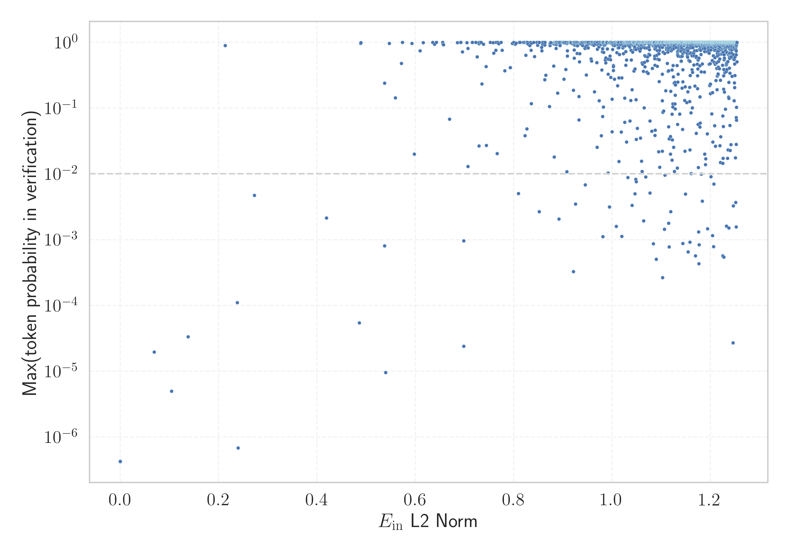

# Report for `utter-project/EuroLLM-9B`

## Model info

* Model Info: 
  * Tied embeddings: False
  * LM head uses bias: False
  * Embeddings shape: [128000, 4096]
* Tokenizer Info: 
  * Vocab Size: 128000
  * Tokenizer Class: LlamaTokenizer
  * Tokenizer Type: BPE
  * Bytes handling: Byte Fallback
  * Token for verification prompt building: includegraphics
  * Token id for verification prompt building: 8997
* Indicator summary: 
  * Indicator for under-trained tokens: E_{in} L2 Norm
  * Overall distribution: 1.663 +/- 0.192
* Detected Token Counts: 
  * Number of tested under-trained tokens: 2559, 2288 non-special, 60 below p = 0.01 threshold, 11 below soft indicator threshold
  * Number of single byte tokens: 354, of which 117 below indicator threshold
  * Number of special tokens: 1, of which 0 below indicator threshold
  * Number of non-single-byte unreachable tokens: 1, of which 0 below indicator threshold

## Under-trained token indicators plot


## Verification plot


## Under-trained token verification results
11 entries below threshold of 0.537

|   token_id | token                       |   indicator | max_prob                                                         | in_other_tokens                                                                                                                                                                                                                                                                                                                                                                                                        |
|------------|-----------------------------|-------------|------------------------------------------------------------------|------------------------------------------------------------------------------------------------------------------------------------------------------------------------------------------------------------------------------------------------------------------------------------------------------------------------------------------------------------------------------------------------------------------------|
|      56539 | ````` funsio `````          |   0.0688092 | <span style='border: 1px solid rgb(169, 68, 66);'>2e-05</span>   |                                                                                                                                                                                                                                                                                                                                                                                                                        |
|      75613 | ````` urasGeneral `````     |   0.104158  | <span style='border: 1px solid rgb(169, 68, 66);'>5e-06</span>   | <span style='border: 1px solid rgb(40, 167, 69);'>````` FacturasGeneral `````</span>                                                                                                                                                                                                                                                                                                                                   |
|      35236 | ````` ▁funsio `````         |   0.137954  | <span style='border: 1px solid rgb(169, 68, 66);'>3.3e-05</span> |                                                                                                                                                                                                                                                                                                                                                                                                                        |
|      77603 | ````` FacturasGeneral ````` |   0.213124  | <span style='border: 1px solid rgb(40, 167, 69);'>0.89</span>    |                                                                                                                                                                                                                                                                                                                                                                                                                        |
|      58072 | ````` ▁momč `````           |   0.237855  | <span style='border: 1px solid rgb(169, 68, 66);'>0.00011</span> | <span style='border: 1px solid rgb(40, 167, 69);'>````` ▁momčadi `````</span>, <span style='border: 1px solid rgb(40, 167, 69);'>````` ▁momčad `````</span>                                                                                                                                                                                                                                                            |
|     114185 | ````` asaíne `````          |   0.239361  | <span style='border: 1px solid rgb(169, 68, 66);'>6.8e-07</span> | <span style='border: 1px solid rgb(169, 68, 66);'>````` asaíneonna `````</span>                                                                                                                                                                                                                                                                                                                                        |
|      26610 | ````` jetain `````          |   0.272394  | <span style='border: 1px solid rgb(255, 145, 0);'>0.0047</span>  | <span style='border: 1px solid rgb(40, 167, 69);'>````` ▁dvejetain `````</span>, <span style='border: 1px solid rgb(255, 145, 0);'>````` vejetain `````</span>, <span style='border: 1px solid rgb(40, 167, 69);'>````` ▁dvejetainių `````</span>, <span style='border: 1px solid rgb(40, 167, 69);'>````` ▁Dvejetain `````</span>, <span style='border: 1px solid rgb(40, 167, 69);'>````` ▁dvejetainiai `````</span> |
|      43175 | ````` ▁compéten `````       |   0.419309  | <span style='border: 1px solid rgb(255, 145, 0);'>0.0021</span>  | ````` ▁compétences `````, ````` ▁compétence `````                                                                                                                                                                                                                                                                                                                                                                      |
|      33200 | ````` ħtie `````            |   0.485839  | <span style='border: 1px solid rgb(169, 68, 66);'>5.4e-05</span> | ````` ħtieġ `````, <span style='border: 1px solid rgb(40, 167, 69);'>````` ħtieġa `````</span>, <span style='border: 1px solid rgb(40, 167, 69);'>````` ▁meħtieġa `````</span>, ````` ▁jeħtieġ `````                                                                                                                                                                                                                   |
|      56988 | ````` ▁meais `````          |   0.488893  | <span style='border: 1px solid rgb(40, 167, 69);'>0.96</span>    | <span style='border: 1px solid rgb(40, 167, 69);'>````` ▁meaisín `````</span>, <span style='border: 1px solid rgb(40, 167, 69);'>````` ▁meaisíní `````</span>                                                                                                                                                                                                                                                          |
|      16962 | ````` ▁úsá `````            |   0.489419  | <span style='border: 1px solid rgb(40, 167, 69);'>0.98</span>    | ````` ▁úsáid `````, ````` ▁úsáide `````, <span style='border: 1px solid rgb(40, 167, 69);'>````` ▁úsáidtear `````</span>, <span style='border: 1px solid rgb(40, 167, 69);'>````` ▁úsáideoirí `````</span>                                                                                                                                                                                                             |
<details><summary>2277 additional entries above threshold</summary>

|   token_id | token                                |   indicator | max_prob                                                         | in_other_tokens                                                                                                                                                                                                                                                                                                                                                                                                          |
|------------|--------------------------------------|-------------|------------------------------------------------------------------|--------------------------------------------------------------------------------------------------------------------------------------------------------------------------------------------------------------------------------------------------------------------------------------------------------------------------------------------------------------------------------------------------------------------------|
|      37963 | ````` ▁voormal `````                 |    0.537434 | <span style='border: 1px solid rgb(169, 68, 66);'>0.00081</span> | ````` ▁voormalige `````, ````` ▁voormalig `````                                                                                                                                                                                                                                                                                                                                                                          |
|     113503 | ````` XHCI `````                     |    0.537517 | <span style='border: 1px solid rgb(40, 167, 69);'>0.24</span>    |                                                                                                                                                                                                                                                                                                                                                                                                                          |
|     114081 | ````` iċli `````                     |    0.539734 | <span style='border: 1px solid rgb(169, 68, 66);'>9.6e-06</span> | <span style='border: 1px solid rgb(169, 68, 66);'>````` ▁diffiċli `````</span>                                                                                                                                                                                                                                                                                                                                           |
|      57615 | ````` байджа `````                   |    0.547204 | <span style='border: 1px solid rgb(40, 167, 69);'>0.96</span>    | ````` зербайджа `````, ````` ▁Азербайджа `````                                                                                                                                                                                                                                                                                                                                                                           |
|      36239 | ````` ▁wewnę `````                   |    0.559108 | <span style='border: 1px solid rgb(40, 167, 69);'>0.14</span>    | ````` ▁wewnętrz `````, ````` ▁wewnętrznych `````, ````` ▁wewnętr `````                                                                                                                                                                                                                                                                                                                                                   |
|      71528 | ````` ovoza `````                    |    0.571637 | <span style='border: 1px solid rgb(40, 167, 69);'>0.48</span>    | <span style='border: 1px solid rgb(40, 167, 69);'>````` ▁kolovoza `````</span>                                                                                                                                                                                                                                                                                                                                           |
|     124553 | ````` ᅲ `````                         |    0.57366  | <span style='border: 1px solid rgb(40, 167, 69);'>1</span>       |                                                                                                                                                                                                                                                                                                                                                                                                                          |
|      40900 | ````` ▁catholi `````                 |    0.592693 | <span style='border: 1px solid rgb(40, 167, 69);'>0.96</span>    | ````` ▁catholique `````, ````` ▁catholiques `````                                                                                                                                                                                                                                                                                                                                                                        |
|      59141 | ````` ▁lekkoat `````                 |    0.597534 | <span style='border: 1px solid rgb(251, 189, 8);'>0.02</span>    | ````` ▁lekkoatleta `````, ````` ▁lekkoatlet `````                                                                                                                                                                                                                                                                                                                                                                        |
|      61232 | ````` ▁récem `````                   |    0.60949  | <span style='border: 1px solid rgb(40, 167, 69);'>0.75</span>    | ````` ▁récemment `````                                                                                                                                                                                                                                                                                                                                                                                                   |
|      25481 | ````` ▁máqu `````                    |    0.615809 | <span style='border: 1px solid rgb(40, 167, 69);'>0.99</span>    | ````` ▁máquina `````, ````` ▁máquinas `````                                                                                                                                                                                                                                                                                                                                                                              |
|      37962 | ````` ▁herramient `````              |    0.63507  | <span style='border: 1px solid rgb(40, 167, 69);'>1</span>       | ````` ▁herramientas `````, ````` ▁herramienta `````                                                                                                                                                                                                                                                                                                                                                                      |
|      36136 | ````` ▁statunit `````                |    0.638937 | <span style='border: 1px solid rgb(40, 167, 69);'>0.94</span>    | ````` ▁statunitense `````, ````` ▁statunitensi `````                                                                                                                                                                                                                                                                                                                                                                     |
|     126623 | ````` ᅠ `````                         |    0.642646 | <span style='border: 1px solid rgb(40, 167, 69);'>1</span>       |                                                                                                                                                                                                                                                                                                                                                                                                                          |
|     127930 | ````` 鋂 `````                       |    0.655352 | <span style='border: 1px solid rgb(40, 167, 69);'>1</span>       |                                                                                                                                                                                                                                                                                                                                                                                                                          |
|     117498 | ````` ▁Breata `````                  |    0.656157 | <span style='border: 1px solid rgb(40, 167, 69);'>0.94</span>    | ````` ▁Breataine `````                                                                                                                                                                                                                                                                                                                                                                                                   |
|     111374 | ````` ▁різнома `````                 |    0.657297 | <span style='border: 1px solid rgb(40, 167, 69);'>0.92</span>    | ````` ▁різномані `````                                                                                                                                                                                                                                                                                                                                                                                                   |
|      35189 | ````` ▁lesqu `````                   |    0.669404 | <span style='border: 1px solid rgb(251, 189, 8);'>0.068</span>   | ````` ▁lesquels `````, ````` ▁lesquelles `````                                                                                                                                                                                                                                                                                                                                                                           |
|     123820 | ````` 겪 `````                       |    0.685661 | <span style='border: 1px solid rgb(40, 167, 69);'>0.99</span>    |                                                                                                                                                                                                                                                                                                                                                                                                                          |
|      33528 | ````` ▁экспе `````                   |    0.691583 | <span style='border: 1px solid rgb(40, 167, 69);'>1</span>       | ````` ▁экспер `````, ````` ▁экспери `````, ````` ▁экспеди `````, ````` ▁эксперимента `````                                                                                                                                                                                                                                                                                                                               |
|      83678 | ````` ριλίου `````                   |    0.692549 | <span style='border: 1px solid rgb(40, 167, 69);'>0.99</span>    | ````` ▁Απριλίου `````                                                                                                                                                                                                                                                                                                                                                                                                    |
|      29142 | ````` ▁Einwo `````                   |    0.695397 | <span style='border: 1px solid rgb(40, 167, 69);'>0.72</span>    | ````` ▁Einwohner `````, ````` ▁Einwohn `````, ````` ▁Einwohnern `````                                                                                                                                                                                                                                                                                                                                                    |
|       8477 | ````` ▁tiegħ `````                   |    0.698318 | <span style='border: 1px solid rgb(169, 68, 66);'>0.00096</span> | ````` ▁tiegħu `````, ````` ▁tiegħek `````, ````` ▁tiegħi `````                                                                                                                                                                                                                                                                                                                                                           |
|      96356 | ````` wajcar `````                   |    0.698344 | <span style='border: 1px solid rgb(169, 68, 66);'>2.4e-05</span> | ````` ▁szwajcar `````                                                                                                                                                                                                                                                                                                                                                                                                    |
|     104800 | ````` ipeas `````                    |    0.704535 | <span style='border: 1px solid rgb(40, 167, 69);'>0.99</span>    | <span style='border: 1px solid rgb(40, 167, 69);'>````` ipeasóid `````</span>                                                                                                                                                                                                                                                                                                                                            |
|      20940 | ````` ▁większo `````                 |    0.706837 | <span style='border: 1px solid rgb(251, 189, 8);'>0.013</span>   | ````` ▁większość `````, ````` ▁większości `````                                                                                                                                                                                                                                                                                                                                                                          |
|      96806 | ````` слідок `````                   |    0.707092 | <span style='border: 1px solid rgb(40, 167, 69);'>0.8</span>     | ````` наслідок `````                                                                                                                                                                                                                                                                                                                                                                                                     |
|      43400 | ````` لسط `````                      |    0.715685 | <span style='border: 1px solid rgb(40, 167, 69);'>1</span>       | ````` ▁الفلسط `````, ````` ▁فلسط `````, ````` ▁الفلسطيني `````                                                                                                                                                                                                                                                                                                                                                           |
|      44802 | ````` etilde `````                   |    0.722675 | <span style='border: 1px solid rgb(40, 167, 69);'>1</span>       | ````` widetilde `````                                                                                                                                                                                                                                                                                                                                                                                                    |
|      81466 | ````` anáir `````                    |    0.725327 | <span style='border: 1px solid rgb(40, 167, 69);'>0.6</span>     | <span style='border: 1px solid rgb(40, 167, 69);'>````` ▁Eanáir `````</span>                                                                                                                                                                                                                                                                                                                                             |
|      96555 | ````` ustizz `````                   |    0.729102 | <span style='border: 1px solid rgb(251, 189, 8);'>0.027</span>   | <span style='border: 1px solid rgb(40, 167, 69);'>````` ustizzja `````</span>                                                                                                                                                                                                                                                                                                                                            |
|      21273 | ````` ▁liječen `````                 |    0.729517 | <span style='border: 1px solid rgb(40, 167, 69);'>0.96</span>    | <span style='border: 1px solid rgb(40, 167, 69);'>````` ▁liječenje `````</span>, <span style='border: 1px solid rgb(40, 167, 69);'>````` ▁liječenja `````</span>, <span style='border: 1px solid rgb(40, 167, 69);'>````` ▁liječenju `````</span>                                                                                                                                                                        |
|     127428 | ````` 鑭 `````                       |    0.729952 | <span style='border: 1px solid rgb(40, 167, 69);'>1</span>       |                                                                                                                                                                                                                                                                                                                                                                                                                          |
|     127363 | ````` 錒 `````                       |    0.733217 | <span style='border: 1px solid rgb(40, 167, 69);'>1</span>       |                                                                                                                                                                                                                                                                                                                                                                                                                          |
|     123648 | ````` ᄏ `````                       |    0.733614 | <span style='border: 1px solid rgb(40, 167, 69);'>1</span>       |                                                                                                                                                                                                                                                                                                                                                                                                                          |
|     100504 | ````` ▁priopćen `````                |    0.735009 | <span style='border: 1px solid rgb(40, 167, 69);'>0.23</span>    |                                                                                                                                                                                                                                                                                                                                                                                                                          |
|      20375 | ````` ▁técn `````                    |    0.738207 | <span style='border: 1px solid rgb(40, 167, 69);'>0.94</span>    | ````` ▁técnica `````, ````` ▁técnicas `````, ````` ▁técnico `````, ````` ▁técnicos `````                                                                                                                                                                                                                                                                                                                                 |
|      88379 | ````` únasa `````                    |    0.743536 | <span style='border: 1px solid rgb(40, 167, 69);'>0.43</span>    | <span style='border: 1px solid rgb(40, 167, 69);'>````` ▁Lúnasa `````</span>                                                                                                                                                                                                                                                                                                                                             |
|      43083 | ````` ▁siječn `````                  |    0.744525 | <span style='border: 1px solid rgb(251, 189, 8);'>0.027</span>   | <span style='border: 1px solid rgb(40, 167, 69);'>````` ▁siječnja `````</span>                                                                                                                                                                                                                                                                                                                                           |
|      23987 | ````` ▁대한민 `````                  |    0.752271 | <span style='border: 1px solid rgb(40, 167, 69);'>1</span>       | ````` ▁대한민국 `````, ````` ▁대한민국의 `````                                                                                                                                                                                                                                                                                                                                                                           |
|      27644 | ````` ▁indúst `````                  |    0.758117 | <span style='border: 1px solid rgb(40, 167, 69);'>0.99</span>    | ````` ▁indústria `````, ````` ▁indústrias `````                                                                                                                                                                                                                                                                                                                                                                          |
|     109078 | ````` ▁एक्स्प `````                    |    0.759383 | <span style='border: 1px solid rgb(40, 167, 69);'>0.68</span>    | <span style='border: 1px solid rgb(40, 167, 69);'>````` ▁एक्स्प्रेस `````</span>                                                                                                                                                                                                                                                                                                                                             |
|      37778 | ````` ▁malatt `````                  |    0.763632 | <span style='border: 1px solid rgb(40, 167, 69);'>0.75</span>    | ````` ▁malattia `````, ````` ▁malattie `````                                                                                                                                                                                                                                                                                                                                                                             |
|     115183 | ````` ▁Predsjednik `````             |    0.76423  | <span style='border: 1px solid rgb(40, 167, 69);'>1</span>       |                                                                                                                                                                                                                                                                                                                                                                                                                          |
|      40824 | ````` ▁ettev `````                   |    0.766218 | <span style='border: 1px solid rgb(251, 189, 8);'>0.02</span>    | ````` ▁ettevõ `````, ````` ▁ettevõt `````                                                                                                                                                                                                                                                                                                                                                                                |
|     127037 | ````` 釷 `````                       |    0.767412 | <span style='border: 1px solid rgb(40, 167, 69);'>1</span>       |                                                                                                                                                                                                                                                                                                                                                                                                                          |
|      78708 | ````` трално `````                   |    0.76947  | <span style='border: 1px solid rgb(40, 167, 69);'>0.95</span>    | ````` ▁Неутрално `````                                                                                                                                                                                                                                                                                                                                                                                                   |
|      33141 | ````` ▁propried `````                |    0.776452 | <span style='border: 1px solid rgb(40, 167, 69);'>0.76</span>    | ````` ▁propriedade `````, ````` ▁propriedades `````                                                                                                                                                                                                                                                                                                                                                                      |
|      56755 | ````` ▁čty `````                     |    0.781539 | <span style='border: 1px solid rgb(40, 167, 69);'>0.37</span>    | ````` ▁čtyř `````, ````` ▁čtyři `````                                                                                                                                                                                                                                                                                                                                                                                    |
|     100986 | ````` ▁istaknuo `````                |    0.793021 | <span style='border: 1px solid rgb(40, 167, 69);'>0.41</span>    |                                                                                                                                                                                                                                                                                                                                                                                                                          |
|      42899 | ````` hodox `````                    |    0.79706  | <span style='border: 1px solid rgb(40, 167, 69);'>0.96</span>    | ````` ▁orthodox `````, ````` ▁Orthodox `````, ````` orthodox `````                                                                                                                                                                                                                                                                                                                                                       |
|     126543 | ````` ᅮ `````                         |    0.800123 | <span style='border: 1px solid rgb(40, 167, 69);'>1</span>       |                                                                                                                                                                                                                                                                                                                                                                                                                          |
|      13127 | ````` ▁películ `````                 |    0.803343 | <span style='border: 1px solid rgb(40, 167, 69);'>0.93</span>    | ````` ▁película `````, ````` ▁películas `````                                                                                                                                                                                                                                                                                                                                                                            |
|      90808 | ````` ▁Nazzjonal `````               |    0.804577 | <span style='border: 1px solid rgb(40, 167, 69);'>0.97</span>    | ````` ▁Nazzjonalista `````, <span style='border: 1px solid rgb(40, 167, 69);'>````` ▁Nazzjonali `````</span>                                                                                                                                                                                                                                                                                                             |
|      54748 | ````` ▁kazao `````                   |    0.8094   | <span style='border: 1px solid rgb(255, 145, 0);'>0.005</span>   |                                                                                                                                                                                                                                                                                                                                                                                                                          |
|      26244 | ````` ▁núcle `````                   |    0.812592 | <span style='border: 1px solid rgb(40, 167, 69);'>1</span>       | ````` ▁núcleo `````, ````` ▁núcleos `````                                                                                                                                                                                                                                                                                                                                                                                |
|      46045 | ````` ▁véhic `````                   |    0.812637 | <span style='border: 1px solid rgb(40, 167, 69);'>1</span>       | ````` ▁véhicules `````, ````` ▁véhicule `````                                                                                                                                                                                                                                                                                                                                                                            |
|      42591 | ````` ▁indivídu `````                |    0.819828 | <span style='border: 1px solid rgb(40, 167, 69);'>1</span>       | ````` ▁indivíduos `````, ````` ▁indivíduo `````                                                                                                                                                                                                                                                                                                                                                                          |
|     123817 | ````` 펼 `````                       |    0.822533 | <span style='border: 1px solid rgb(40, 167, 69);'>1</span>       |                                                                                                                                                                                                                                                                                                                                                                                                                          |
|     103049 | ````` egħdin `````                   |    0.823108 | <span style='border: 1px solid rgb(251, 189, 8);'>0.038</span>   | ````` ▁qegħdin `````                                                                                                                                                                                                                                                                                                                                                                                                     |
|     109842 | ````` ▁cijelog `````                 |    0.824677 | <span style='border: 1px solid rgb(40, 167, 69);'>0.63</span>    |                                                                                                                                                                                                                                                                                                                                                                                                                          |
|      12098 | ````` ▁сист `````                    |    0.825322 | <span style='border: 1px solid rgb(40, 167, 69);'>1</span>       | ````` ▁система `````, ````` ▁системы `````, ````` ▁систем `````, ````` ▁систему `````, ````` ▁системи `````, ...                                                                                                                                                                                                                                                                                                         |
|     106829 | ````` ▁živjeti `````                 |    0.826434 | <span style='border: 1px solid rgb(40, 167, 69);'>1</span>       |                                                                                                                                                                                                                                                                                                                                                                                                                          |
|      76150 | ````` rojām `````                    |    0.826544 | <span style='border: 1px solid rgb(251, 189, 8);'>0.049</span>   | <span style='border: 1px solid rgb(251, 189, 8);'>````` oprojām `````</span>, ````` ▁joprojām `````                                                                                                                                                                                                                                                                                                                      |
|      22708 | ````` ▁февра `````                   |    0.827503 | <span style='border: 1px solid rgb(40, 167, 69);'>1</span>       | ````` ▁февраля `````, <span style='border: 1px solid rgb(40, 167, 69);'>````` ▁феврале `````</span>                                                                                                                                                                                                                                                                                                                      |
|      98645 | ````` hvezd `````                    |    0.827718 | <span style='border: 1px solid rgb(40, 167, 69);'>1</span>       | <span style='border: 1px solid rgb(40, 167, 69);'>````` ▁súhvezd `````</span>                                                                                                                                                                                                                                                                                                                                            |
|      25253 | ````` sięb `````                     |    0.828659 | <span style='border: 1px solid rgb(40, 167, 69);'>0.94</span>    | ````` siębior `````, ````` ▁przedsiębior `````                                                                                                                                                                                                                                                                                                                                                                           |
|      28563 | ````` ikuuta `````                   |    0.832682 | <span style='border: 1px solid rgb(40, 167, 69);'>0.9</span>     | <span style='border: 1px solid rgb(40, 167, 69);'>````` ▁tammikuuta `````</span>, <span style='border: 1px solid rgb(40, 167, 69);'>````` ▁huhtikuuta `````</span>, <span style='border: 1px solid rgb(40, 167, 69);'>````` ▁helmikuuta `````</span>                                                                                                                                                                     |
|     127568 | ````` 鈹 `````                       |    0.834368 | <span style='border: 1px solid rgb(40, 167, 69);'>1</span>       |                                                                                                                                                                                                                                                                                                                                                                                                                          |
|      34799 | ````` μβρίου `````                   |    0.835213 | <span style='border: 1px solid rgb(40, 167, 69);'>0.76</span>    | ````` ▁Σεπτεμβρίου `````, <span style='border: 1px solid rgb(40, 167, 69);'>````` ▁Νοεμβρίου `````</span>, <span style='border: 1px solid rgb(40, 167, 69);'>````` ▁Δεκεμβρίου `````</span>                                                                                                                                                                                                                              |
|      92635 | ````` šetkým `````                   |    0.835634 | <span style='border: 1px solid rgb(40, 167, 69);'>0.12</span>    | <span style='border: 1px solid rgb(40, 167, 69);'>````` ovšetkým `````</span>, ````` ▁predovšetkým `````                                                                                                                                                                                                                                                                                                                 |
|     116905 | ````` iemożli `````                  |    0.836352 | <span style='border: 1px solid rgb(40, 167, 69);'>0.97</span>    | ````` ▁uniemożli `````                                                                                                                                                                                                                                                                                                                                                                                                   |
|      38397 | ````` ▁októ `````                    |    0.840536 | <span style='border: 1px solid rgb(40, 167, 69);'>0.99</span>    | ````` ▁október `````, <span style='border: 1px solid rgb(40, 167, 69);'>````` ▁októbra `````</span>                                                                                                                                                                                                                                                                                                                      |
|     115580 | ````` ▁lionsa `````                  |    0.842354 | <span style='border: 1px solid rgb(40, 167, 69);'>0.61</span>    |                                                                                                                                                                                                                                                                                                                                                                                                                          |
|      14703 | ````` jourd `````                    |    0.84701  | <span style='border: 1px solid rgb(40, 167, 69);'>1</span>       | ````` ▁aujourd `````, ````` ujourd `````, ````` ▁Aujourd `````, ````` aujourd `````                                                                                                                                                                                                                                                                                                                                      |
|      24041 | ````` ▁niektó `````                  |    0.848551 | <span style='border: 1px solid rgb(40, 167, 69);'>0.9</span>     | ````` ▁niektórych `````, ````` ▁niektóre `````                                                                                                                                                                                                                                                                                                                                                                           |
|      24879 | ````` ▁ragaz `````                   |    0.851253 | <span style='border: 1px solid rgb(40, 167, 69);'>0.99</span>    | ````` ▁ragazzi `````, ````` ▁ragazza `````, ````` ▁ragazzo `````, ````` ▁ragazze `````                                                                                                                                                                                                                                                                                                                                   |
|     127913 | ````` 鸮 `````                       |    0.851462 | <span style='border: 1px solid rgb(40, 167, 69);'>1</span>       |                                                                                                                                                                                                                                                                                                                                                                                                                          |
|      30536 | ````` ajjiż `````                    |    0.851598 | <span style='border: 1px solid rgb(255, 145, 0);'>0.0027</span>  | ````` pajjiż `````, <span style='border: 1px solid rgb(255, 145, 0);'>````` ajjiżi `````</span>, ````` ▁pajjiż `````, <span style='border: 1px solid rgb(40, 167, 69);'>````` pajjiżi `````</span>, <span style='border: 1px solid rgb(40, 167, 69);'>````` ▁pajjiżi `````</span>                                                                                                                                        |
|      79819 | ````` ▁Μαΐ `````                     |    0.851654 | <span style='border: 1px solid rgb(40, 167, 69);'>1</span>       | ````` ▁Μαΐου `````                                                                                                                                                                                                                                                                                                                                                                                                       |
|      70847 | ````` véken `````                    |    0.85686  | <span style='border: 1px solid rgb(40, 167, 69);'>0.84</span>    | ````` ▁tevéken `````, ````` ▁tevékenység `````                                                                                                                                                                                                                                                                                                                                                                           |
|      95008 | ````` ▁prinċip `````                 |    0.85696  | <span style='border: 1px solid rgb(40, 167, 69);'>0.75</span>    | <span style='border: 1px solid rgb(251, 189, 8);'>````` ▁prinċipali `````</span>                                                                                                                                                                                                                                                                                                                                         |
|      98843 | ````` uniden `````                   |    0.858031 | <span style='border: 1px solid rgb(40, 167, 69);'>1</span>       | <span style='border: 1px solid rgb(40, 167, 69);'>````` ▁estatuniden `````</span>                                                                                                                                                                                                                                                                                                                                        |
|      86492 | ````` ▁prosvjed `````                |    0.858682 | <span style='border: 1px solid rgb(40, 167, 69);'>0.93</span>    |                                                                                                                                                                                                                                                                                                                                                                                                                          |
|     127890 | ````` 븀 `````                       |    0.859812 | <span style='border: 1px solid rgb(40, 167, 69);'>1</span>       |                                                                                                                                                                                                                                                                                                                                                                                                                          |
|      40227 | ````` iječn `````                    |    0.862918 | <span style='border: 1px solid rgb(40, 167, 69);'>0.27</span>    | <span style='border: 1px solid rgb(251, 189, 8);'>````` ▁siječn `````</span>, <span style='border: 1px solid rgb(40, 167, 69);'>````` ▁siječnja `````</span>, <span style='border: 1px solid rgb(40, 167, 69);'>````` ▁liječnika `````</span>, <span style='border: 1px solid rgb(40, 167, 69);'>````` ▁liječnik `````</span>                                                                                            |
|      20025 | ````` ßerdem `````                   |    0.863188 | <span style='border: 1px solid rgb(40, 167, 69);'>0.91</span>    | ````` ▁Außerdem `````, ````` ▁außerdem `````                                                                                                                                                                                                                                                                                                                                                                             |
|      92990 | ````` ▁Aibre `````                   |    0.863461 | <span style='border: 1px solid rgb(40, 167, 69);'>1</span>       | <span style='border: 1px solid rgb(40, 167, 69);'>````` ▁Aibreán `````</span>                                                                                                                                                                                                                                                                                                                                            |
|      73598 | ````` ▁laikot `````                  |    0.865282 | <span style='border: 1px solid rgb(40, 167, 69);'>0.32</span>    | ````` ▁laikotarp `````                                                                                                                                                                                                                                                                                                                                                                                                   |
|      33018 | ````` áinig `````                    |    0.872775 | <span style='border: 1px solid rgb(40, 167, 69);'>0.11</span>    | ````` ▁tháinig `````, ````` ▁Tháinig `````                                                                                                                                                                                                                                                                                                                                                                               |
|      24484 | ````` ięcy `````                     |    0.873482 | <span style='border: 1px solid rgb(40, 167, 69);'>0.89</span>    | ````` ▁tysięcy `````, ````` ▁miesięcy `````                                                                                                                                                                                                                                                                                                                                                                              |
|      75009 | ````` ▁tisuća `````                  |    0.873687 | <span style='border: 1px solid rgb(40, 167, 69);'>0.97</span>    |                                                                                                                                                                                                                                                                                                                                                                                                                          |
|     117035 | ````` ▁uspjeh `````                  |    0.875263 | <span style='border: 1px solid rgb(40, 167, 69);'>0.99</span>    |                                                                                                                                                                                                                                                                                                                                                                                                                          |
|     116170 | ````` ▁uvjete `````                  |    0.875533 | <span style='border: 1px solid rgb(40, 167, 69);'>0.99</span>    |                                                                                                                                                                                                                                                                                                                                                                                                                          |
|      83332 | ````` ▁Σεπτε `````                   |    0.881128 | <span style='border: 1px solid rgb(40, 167, 69);'>0.43</span>    | ````` ▁Σεπτεμβρίου `````                                                                                                                                                                                                                                                                                                                                                                                                 |
|      63389 | ````` ▁Predsjed `````                |    0.881669 | <span style='border: 1px solid rgb(40, 167, 69);'>0.95</span>    | <span style='border: 1px solid rgb(40, 167, 69);'>````` ▁Predsjednik `````</span>                                                                                                                                                                                                                                                                                                                                        |
|      86221 | ````` iezd `````                     |    0.882107 | <span style='border: 1px solid rgb(40, 167, 69);'>1</span>       | ````` ▁hviezd `````                                                                                                                                                                                                                                                                                                                                                                                                      |
|      99694 | ````` ważi `````                     |    0.882125 | <span style='border: 1px solid rgb(251, 189, 8);'>0.018</span>   | <span style='border: 1px solid rgb(40, 167, 69);'>````` ▁kważi `````</span>                                                                                                                                                                                                                                                                                                                                              |
|      90056 | ````` áború `````                    |    0.883715 | <span style='border: 1px solid rgb(40, 167, 69);'>0.98</span>    | ````` ▁világháború `````                                                                                                                                                                                                                                                                                                                                                                                                 |
|      43078 | ````` ▁ožuj `````                    |    0.883941 | <span style='border: 1px solid rgb(40, 167, 69);'>0.99</span>    | <span style='border: 1px solid rgb(40, 167, 69);'>````` ▁ožujka `````</span>                                                                                                                                                                                                                                                                                                                                             |
|     127865 | ````` 闐 `````                       |    0.884008 | <span style='border: 1px solid rgb(40, 167, 69);'>1</span>       |                                                                                                                                                                                                                                                                                                                                                                                                                          |
|      84818 | ````` ▁Οκτωβ `````                   |    0.884308 | <span style='border: 1px solid rgb(40, 167, 69);'>1</span>       | ````` ▁Οκτωβρίου `````                                                                                                                                                                                                                                                                                                                                                                                                   |
|      84070 | ````` τωβ `````                      |    0.885107 | <span style='border: 1px solid rgb(40, 167, 69);'>0.99</span>    | <span style='border: 1px solid rgb(40, 167, 69);'>````` ▁Οκτωβ `````</span>, ````` ▁Οκτωβρίου `````                                                                                                                                                                                                                                                                                                                      |
|     113849 | ````` ▁liječenju `````               |    0.885785 | <span style='border: 1px solid rgb(40, 167, 69);'>1</span>       |                                                                                                                                                                                                                                                                                                                                                                                                                          |
|     127707 | ````` 鰂 `````                       |    0.885895 | <span style='border: 1px solid rgb(40, 167, 69);'>1</span>       |                                                                                                                                                                                                                                                                                                                                                                                                                          |
|     108957 | ````` 土耳 `````                     |    0.885954 | <span style='border: 1px solid rgb(40, 167, 69);'>1</span>       | ````` 土耳其 `````                                                                                                                                                                                                                                                                                                                                                                                                       |
|      48448 | ````` ▁γλώ `````                     |    0.886055 | <span style='border: 1px solid rgb(40, 167, 69);'>0.99</span>    | ````` ▁γλώσσα `````, ````` ▁γλώσσ `````                                                                                                                                                                                                                                                                                                                                                                                  |
|      76284 | ````` ▁veljače `````                 |    0.886191 | <span style='border: 1px solid rgb(40, 167, 69);'>0.81</span>    |                                                                                                                                                                                                                                                                                                                                                                                                                          |
|     123885 | ````` 圾 `````                       |    0.886574 | <span style='border: 1px solid rgb(40, 167, 69);'>1</span>       |                                                                                                                                                                                                                                                                                                                                                                                                                          |
|      22597 | ````` iluppo `````                   |    0.886717 | <span style='border: 1px solid rgb(40, 167, 69);'>0.93</span>    | ````` ▁sviluppo `````                                                                                                                                                                                                                                                                                                                                                                                                    |
|     110548 | ````` ▁glazbe `````                  |    0.888422 | <span style='border: 1px solid rgb(40, 167, 69);'>0.97</span>    |                                                                                                                                                                                                                                                                                                                                                                                                                          |
|     127077 | ````` ӗ `````                        |    0.888554 | <span style='border: 1px solid rgb(40, 167, 69);'>1</span>       |                                                                                                                                                                                                                                                                                                                                                                                                                          |
|      76402 | ````` томври `````                   |    0.889345 | <span style='border: 1px solid rgb(40, 167, 69);'>0.17</span>    | ````` ▁октомври `````                                                                                                                                                                                                                                                                                                                                                                                                    |
|      35564 | ````` ▁опубли `````                  |    0.890508 | <span style='border: 1px solid rgb(40, 167, 69);'>1</span>       | ````` ▁опублико `````, ````` ▁опубликова `````, ````` ▁опубликован `````                                                                                                                                                                                                                                                                                                                                                 |
|      45108 | ````` kiezingen `````                |    0.891713 | <span style='border: 1px solid rgb(255, 145, 0);'>0.0021</span>  | ````` ▁verkiezingen `````, ````` verkiezingen `````                                                                                                                                                                                                                                                                                                                                                                      |
|      71902 | ````` ▁prijed `````                  |    0.891795 | <span style='border: 1px solid rgb(40, 167, 69);'>0.99</span>    | <span style='border: 1px solid rgb(40, 167, 69);'>````` ▁prijedlog `````</span>                                                                                                                                                                                                                                                                                                                                          |
|      11193 | ````` країн `````                    |    0.892309 | <span style='border: 1px solid rgb(40, 167, 69);'>1</span>       | ````` ▁україн `````, ````` ▁України `````, ````` ▁Україні `````, ````` ▁Україн `````, ````` ▁країни `````, ...                                                                                                                                                                                                                                                                                                           |
|     114792 | ````` ▁odluku `````                  |    0.893928 | <span style='border: 1px solid rgb(40, 167, 69);'>0.9</span>     |                                                                                                                                                                                                                                                                                                                                                                                                                          |
|      25857 | ````` ▁britanni `````                |    0.894219 | <span style='border: 1px solid rgb(40, 167, 69);'>1</span>       | ````` ▁britannique `````, ````` ▁britannico `````, ````` ▁britanniques `````, ````` ▁britannica `````                                                                                                                                                                                                                                                                                                                    |
|      41187 | ````` ▁évén `````                    |    0.897009 | <span style='border: 1px solid rgb(40, 167, 69);'>1</span>       | ````` ▁événements `````, ````` ▁événement `````                                                                                                                                                                                                                                                                                                                                                                          |
|     127922 | ````` 💞 `````                       |    0.89918  | <span style='border: 1px solid rgb(40, 167, 69);'>1</span>       |                                                                                                                                                                                                                                                                                                                                                                                                                          |
|     127866 | ````` ᄌ `````                       |    0.899385 | <span style='border: 1px solid rgb(40, 167, 69);'>1</span>       |                                                                                                                                                                                                                                                                                                                                                                                                                          |
|     112710 | ````` ▁uvjeren `````                 |    0.899908 | <span style='border: 1px solid rgb(40, 167, 69);'>1</span>       |                                                                                                                                                                                                                                                                                                                                                                                                                          |
|     105188 | ````` ▁ministar `````                |    0.900095 | <span style='border: 1px solid rgb(40, 167, 69);'>1</span>       |                                                                                                                                                                                                                                                                                                                                                                                                                          |
|     125142 | ````` ḃ `````                        |    0.901183 | <span style='border: 1px solid rgb(40, 167, 69);'>1</span>       |                                                                                                                                                                                                                                                                                                                                                                                                                          |
|      76446 | ````` ▁Φεβ `````                     |    0.901689 | <span style='border: 1px solid rgb(40, 167, 69);'>1</span>       | <span style='border: 1px solid rgb(40, 167, 69);'>````` ▁Φεβρου `````</span>, <span style='border: 1px solid rgb(40, 167, 69);'>````` ▁Φεβρουαρίου `````</span>                                                                                                                                                                                                                                                          |
|     106275 | ````` ▁álb `````                     |    0.902067 | <span style='border: 1px solid rgb(40, 167, 69);'>0.99</span>    | <span style='border: 1px solid rgb(40, 167, 69);'>````` ▁álbuns `````</span>                                                                                                                                                                                                                                                                                                                                             |
|      34667 | ````` ▁razdob `````                  |    0.902159 | <span style='border: 1px solid rgb(40, 167, 69);'>0.28</span>    | <span style='border: 1px solid rgb(40, 167, 69);'>````` ▁razdoblju `````</span>, <span style='border: 1px solid rgb(40, 167, 69);'>````` ▁razdoblja `````</span>, <span style='border: 1px solid rgb(40, 167, 69);'>````` ▁razdoblje `````</span>                                                                                                                                                                        |
|      40348 | ````` ▁semelh `````                  |    0.904745 | <span style='border: 1px solid rgb(40, 167, 69);'>0.98</span>    | ````` ▁semelhante `````, ````` ▁semelhantes `````                                                                                                                                                                                                                                                                                                                                                                        |
|      74482 | ````` ywatel `````                   |    0.905955 | <span style='border: 1px solid rgb(40, 167, 69);'>0.39</span>    | ````` ▁obywatel `````, ````` ▁obywateli `````                                                                                                                                                                                                                                                                                                                                                                            |
|      32684 | ````` ябре `````                     |    0.905974 | <span style='border: 1px solid rgb(40, 167, 69);'>0.99</span>    | ````` ▁сентябре `````, <span style='border: 1px solid rgb(40, 167, 69);'>````` ▁октябре `````</span>, <span style='border: 1px solid rgb(40, 167, 69);'>````` ▁ноябре `````</span>                                                                                                                                                                                                                                       |
|     115722 | ````` ▁diljem `````                  |    0.907931 | <span style='border: 1px solid rgb(251, 189, 8);'>0.011</span>   |                                                                                                                                                                                                                                                                                                                                                                                                                          |
|      88743 | ````` руари `````                    |    0.90874  | <span style='border: 1px solid rgb(40, 167, 69);'>0.96</span>    | ````` ▁февруари `````                                                                                                                                                                                                                                                                                                                                                                                                    |
|      57680 | ````` ghilterra `````                |    0.909121 | <span style='border: 1px solid rgb(40, 167, 69);'>0.62</span>    | ````` Inghilterra `````, ````` ▁Inghilterra `````                                                                                                                                                                                                                                                                                                                                                                        |
|     108160 | ````` ▁zemalja `````                 |    0.909125 | <span style='border: 1px solid rgb(40, 167, 69);'>0.75</span>    |                                                                                                                                                                                                                                                                                                                                                                                                                          |
|      37122 | ````` ublike `````                   |    0.910281 | <span style='border: 1px solid rgb(40, 167, 69);'>0.98</span>    | ````` ▁Republike `````, ````` ▁republike `````                                                                                                                                                                                                                                                                                                                                                                           |
|     127383 | ````` 鞨 `````                       |    0.910853 | <span style='border: 1px solid rgb(40, 167, 69);'>1</span>       |                                                                                                                                                                                                                                                                                                                                                                                                                          |
|      99868 | ````` \u200d\u200d\u200d\u200d ````` |    0.912744 | <span style='border: 1px solid rgb(40, 167, 69);'>0.99</span>    |                                                                                                                                                                                                                                                                                                                                                                                                                          |
|      55423 | ````` tanii `````                    |    0.913641 | <span style='border: 1px solid rgb(40, 167, 69);'>1</span>       | ````` ▁Brytanii `````                                                                                                                                                                                                                                                                                                                                                                                                    |
|      85411 | ````` ▁Νοε `````                     |    0.914366 | <span style='border: 1px solid rgb(40, 167, 69);'>1</span>       | <span style='border: 1px solid rgb(40, 167, 69);'>````` ▁Νοεμβρίου `````</span>                                                                                                                                                                                                                                                                                                                                          |
|     125123 | ````` ḋ `````                        |    0.915526 | <span style='border: 1px solid rgb(40, 167, 69);'>1</span>       |                                                                                                                                                                                                                                                                                                                                                                                                                          |
|      42467 | ````` ▁víct `````                    |    0.915918 | <span style='border: 1px solid rgb(40, 167, 69);'>0.98</span>    | ````` ▁víctimas `````, ````` ▁víctima `````                                                                                                                                                                                                                                                                                                                                                                              |
|     127818 | ````` 栱 `````                       |    0.916009 | <span style='border: 1px solid rgb(40, 167, 69);'>1</span>       |                                                                                                                                                                                                                                                                                                                                                                                                                          |
|      40270 | ````` ▁Władys `````                  |    0.916306 | <span style='border: 1px solid rgb(40, 167, 69);'>0.99</span>    | ````` ▁Władysław `````, ````` ▁Władysława `````                                                                                                                                                                                                                                                                                                                                                                          |
|     109220 | ````` ▁prijedlog `````               |    0.919664 | <span style='border: 1px solid rgb(40, 167, 69);'>0.95</span>    |                                                                                                                                                                                                                                                                                                                                                                                                                          |
|     109924 | ````` oineamh `````                  |    0.92117  | <span style='border: 1px solid rgb(169, 68, 66);'>0.00033</span> | ````` ▁smaoineamh `````                                                                                                                                                                                                                                                                                                                                                                                                  |
|     127178 | ````` ᅵ `````                         |    0.921262 | <span style='border: 1px solid rgb(40, 167, 69);'>0.98</span>    |                                                                                                                                                                                                                                                                                                                                                                                                                          |
|      31367 | ````` ▁zabez `````                   |    0.921322 | <span style='border: 1px solid rgb(40, 167, 69);'>0.19</span>    | ````` ▁zabezpie `````, ````` ▁zabezpeč `````, ````` ▁zabezpe `````                                                                                                                                                                                                                                                                                                                                                       |
|      84261 | ````` ▁Αυγού `````                   |    0.922054 | <span style='border: 1px solid rgb(40, 167, 69);'>1</span>       | ````` ▁Αυγούστου `````                                                                                                                                                                                                                                                                                                                                                                                                   |
|     125378 | ````` ṫ `````                        |    0.922362 | <span style='border: 1px solid rgb(40, 167, 69);'>1</span>       |                                                                                                                                                                                                                                                                                                                                                                                                                          |
|      72796 | ````` jeću `````                     |    0.92275  | <span style='border: 1px solid rgb(40, 167, 69);'>0.76</span>    | <span style='border: 1px solid rgb(40, 167, 69);'>````` ▁stoljeću `````</span>                                                                                                                                                                                                                                                                                                                                           |
|      72276 | ````` ▁sgk `````                     |    0.922769 | <span style='border: 1px solid rgb(40, 167, 69);'>0.98</span>    |                                                                                                                                                                                                                                                                                                                                                                                                                          |
|     127238 | ````` \ue6e7 `````                   |    0.922949 | <span style='border: 1px solid rgb(40, 167, 69);'>1</span>       |                                                                                                                                                                                                                                                                                                                                                                                                                          |
|      96349 | ````` ▁priekšs `````                 |    0.923099 | <span style='border: 1px solid rgb(40, 167, 69);'>0.57</span>    | ````` ▁priekšsēd `````                                                                                                                                                                                                                                                                                                                                                                                                   |
|      14131 | ````` ▁społ `````                    |    0.924049 | <span style='border: 1px solid rgb(40, 167, 69);'>0.91</span>    | ````` ▁społecz `````, ````` ▁społec `````, ````` ▁społecze `````, ````` ▁społeczności `````, ````` ▁społeczeństwa `````, ...                                                                                                                                                                                                                                                                                             |
|      39003 | ````` ▁będz `````                    |    0.924455 | <span style='border: 1px solid rgb(40, 167, 69);'>0.98</span>    | ````` ▁będziemy `````, ````` ▁będziesz `````                                                                                                                                                                                                                                                                                                                                                                             |
|      46901 | ````` ajjiżi `````                   |    0.925817 | <span style='border: 1px solid rgb(255, 145, 0);'>0.0035</span>  | <span style='border: 1px solid rgb(40, 167, 69);'>````` pajjiżi `````</span>, <span style='border: 1px solid rgb(40, 167, 69);'>````` ▁pajjiżi `````</span>                                                                                                                                                                                                                                                              |
|      20541 | ````` ▁sempl `````                   |    0.927388 | <span style='border: 1px solid rgb(40, 167, 69);'>1</span>       | ````` ▁semplice `````, ````` ▁semplic `````, ````` ▁semplicemente `````, ````` ▁sempli `````, ````` ▁semplici `````                                                                                                                                                                                                                                                                                                      |
|     104314 | ````` scoil `````                    |    0.928209 | <span style='border: 1px solid rgb(40, 167, 69);'>1</span>       | <span style='border: 1px solid rgb(40, 167, 69);'>````` ▁Ollscoil `````</span>                                                                                                                                                                                                                                                                                                                                           |
|     108817 | ````` onačel `````                   |    0.928791 | <span style='border: 1px solid rgb(40, 167, 69);'>0.68</span>    |                                                                                                                                                                                                                                                                                                                                                                                                                          |
|     115545 | ````` ▁odvjet `````                  |    0.928882 | <span style='border: 1px solid rgb(40, 167, 69);'>0.89</span>    |                                                                                                                                                                                                                                                                                                                                                                                                                          |
|      12805 | ````` ▁socied `````                  |    0.929923 | <span style='border: 1px solid rgb(40, 167, 69);'>0.9</span>     | ````` ▁sociedade `````, ````` ▁sociedad `````, ````` ▁sociedades `````                                                                                                                                                                                                                                                                                                                                                   |
|      43832 | ````` namelijk `````                 |    0.930654 | <span style='border: 1px solid rgb(40, 167, 69);'>0.99</span>    | ````` ▁voornamelijk `````                                                                                                                                                                                                                                                                                                                                                                                                |
|      85330 | ````` ▁izcīnī `````                  |    0.931961 | <span style='border: 1px solid rgb(40, 167, 69);'>0.97</span>    | <span style='border: 1px solid rgb(40, 167, 69);'>````` ▁izcīnīja `````</span>                                                                                                                                                                                                                                                                                                                                           |
|      62027 | ````` ▁uspje `````                   |    0.93233  | <span style='border: 1px solid rgb(40, 167, 69);'>0.15</span>    | <span style='border: 1px solid rgb(40, 167, 69);'>````` ▁uspjeh `````</span>, <span style='border: 1px solid rgb(40, 167, 69);'>````` ▁uspješno `````</span>                                                                                                                                                                                                                                                             |
|      48211 | ````` ▁vantag `````                  |    0.93277  | <span style='border: 1px solid rgb(251, 189, 8);'>0.066</span>   | ````` ▁vantaggio `````, ````` ▁vantaggi `````, ````` ▁vantagem `````, ````` ▁vantagens `````                                                                                                                                                                                                                                                                                                                             |
|      99752 | ````` èct `````                      |    0.933022 | <span style='border: 1px solid rgb(40, 167, 69);'>0.97</span>    | <span style='border: 1px solid rgb(40, 167, 69);'>````` ▁elèct `````</span>                                                                                                                                                                                                                                                                                                                                              |
|      25216 | ````` ześnie `````                   |    0.933718 | <span style='border: 1px solid rgb(40, 167, 69);'>0.51</span>    | ````` nocześnie `````, ````` ▁jednocześnie `````, ````` cześnie `````, ````` cześniej `````, ````` ▁Jednocześnie `````                                                                                                                                                                                                                                                                                                   |
|     119632 | ````` ▁uspješno `````                |    0.934218 | <span style='border: 1px solid rgb(40, 167, 69);'>0.67</span>    |                                                                                                                                                                                                                                                                                                                                                                                                                          |
|     100629 | ````` ▁stoljeću `````                |    0.934552 | <span style='border: 1px solid rgb(40, 167, 69);'>0.95</span>    |                                                                                                                                                                                                                                                                                                                                                                                                                          |
|      89615 | ````` esù `````                      |    0.935377 | <span style='border: 1px solid rgb(40, 167, 69);'>0.98</span>    | <span style='border: 1px solid rgb(40, 167, 69);'>````` ▁Ġesù `````</span>                                                                                                                                                                                                                                                                                                                                               |
|      31115 | ````` ▁indígen `````                 |    0.935532 | <span style='border: 1px solid rgb(40, 167, 69);'>0.98</span>    | ````` ▁indígenas `````, ````` ▁indígena `````                                                                                                                                                                                                                                                                                                                                                                            |
|      27298 | ````` ▁enfermed `````                |    0.936149 | <span style='border: 1px solid rgb(40, 167, 69);'>0.95</span>    | ````` ▁enfermedad `````, ````` ▁enfermedades `````                                                                                                                                                                                                                                                                                                                                                                       |
|      66078 | ````` ▁predsjednika `````            |    0.937063 | <span style='border: 1px solid rgb(40, 167, 69);'>0.94</span>    |                                                                                                                                                                                                                                                                                                                                                                                                                          |
|      48458 | ````` αρίου `````                    |    0.93804  | <span style='border: 1px solid rgb(40, 167, 69);'>1</span>       | <span style='border: 1px solid rgb(40, 167, 69);'>````` ▁Ιανουαρίου `````</span>, <span style='border: 1px solid rgb(40, 167, 69);'>````` ▁Φεβρουαρίου `````</span>                                                                                                                                                                                                                                                      |
|     114582 | ````` nijih `````                    |    0.939535 | <span style='border: 1px solid rgb(40, 167, 69);'>1</span>       |                                                                                                                                                                                                                                                                                                                                                                                                                          |
|      66069 | ````` béco `````                     |    0.940216 | <span style='border: 1px solid rgb(40, 167, 69);'>0.9</span>     | ````` ▁québéco `````, ````` ▁québécois `````                                                                                                                                                                                                                                                                                                                                                                             |
|     119035 | ````` ▁elèct `````                   |    0.940259 | <span style='border: 1px solid rgb(40, 167, 69);'>0.98</span>    |                                                                                                                                                                                                                                                                                                                                                                                                                          |
|     100824 | ````` ▁liječiti `````                |    0.942832 | <span style='border: 1px solid rgb(40, 167, 69);'>0.99</span>    |                                                                                                                                                                                                                                                                                                                                                                                                                          |
|     112536 | ````` ▁vone `````                    |    0.944379 | <span style='border: 1px solid rgb(40, 167, 69);'>1</span>       | ````` ▁voneinander `````                                                                                                                                                                                                                                                                                                                                                                                                 |
|      74349 | ````` endemain `````                 |    0.944624 | <span style='border: 1px solid rgb(40, 167, 69);'>0.83</span>    | ````` ▁lendemain `````                                                                                                                                                                                                                                                                                                                                                                                                   |
|      37462 | ````` zystać `````                   |    0.944897 | <span style='border: 1px solid rgb(40, 167, 69);'>0.81</span>    | ````` ▁korzystać `````, ````` ▁skorzystać `````, ````` ▁wykorzystać `````                                                                                                                                                                                                                                                                                                                                                |
|      94116 | ````` ollaig `````                   |    0.945132 | <span style='border: 1px solid rgb(255, 145, 0);'>0.0068</span>  | ````` ▁Nollaig `````                                                                                                                                                                                                                                                                                                                                                                                                     |
|       3459 | ````` ▁которы `````                  |    0.94607  | <span style='border: 1px solid rgb(40, 167, 69);'>0.99</span>    | ````` ▁которые `````, ````` ▁который `````, ````` ▁которых `````, ````` ▁которым `````, ````` ▁которыми `````                                                                                                                                                                                                                                                                                                            |
|      79509 | ````` ▁prosinca `````                |    0.946276 | <span style='border: 1px solid rgb(40, 167, 69);'>0.86</span>    |                                                                                                                                                                                                                                                                                                                                                                                                                          |
|      90732 | ````` ▁अतिरिक `````                    |    0.946434 | <span style='border: 1px solid rgb(40, 167, 69);'>1</span>       | ````` ▁अतिरिक्त `````                                                                                                                                                                                                                                                                                                                                                                                                       |
|      72337 | ````` unkwe `````                    |    0.94741  | <span style='border: 1px solid rgb(40, 167, 69);'>1</span>       | <span style='border: 1px solid rgb(40, 167, 69);'>````` ▁kwalunkwe `````</span>                                                                                                                                                                                                                                                                                                                                          |
|      89854 | ````` istiċi `````                   |    0.947464 | <span style='border: 1px solid rgb(40, 167, 69);'>0.32</span>    | <span style='border: 1px solid rgb(255, 145, 0);'>````` atteristiċi `````</span>                                                                                                                                                                                                                                                                                                                                         |
|     116122 | ````` aquestes `````                 |    0.949028 | <span style='border: 1px solid rgb(40, 167, 69);'>0.92</span>    |                                                                                                                                                                                                                                                                                                                                                                                                                          |
|     104052 | ````` ▁escriptor `````               |    0.94932  | <span style='border: 1px solid rgb(40, 167, 69);'>0.99</span>    |                                                                                                                                                                                                                                                                                                                                                                                                                          |
|      41711 | ````` ▁neighb `````                  |    0.949585 | <span style='border: 1px solid rgb(40, 167, 69);'>1</span>       | ````` ▁neighbors `````, ````` ▁neighboring `````, ````` ▁neighbourhood `````, ````` ▁neighbouring `````, ````` ▁neighbours `````                                                                                                                                                                                                                                                                                         |
|     104655 | ````` aquests `````                  |    0.950094 | <span style='border: 1px solid rgb(40, 167, 69);'>0.99</span>    |                                                                                                                                                                                                                                                                                                                                                                                                                          |
|      66049 | ````` ▁zrakop `````                  |    0.951105 | <span style='border: 1px solid rgb(40, 167, 69);'>0.82</span>    | <span style='border: 1px solid rgb(40, 167, 69);'>````` ▁zrakoplov `````</span>                                                                                                                                                                                                                                                                                                                                          |
|     113601 | ````` ▁zenes `````                   |    0.951698 | <span style='border: 1px solid rgb(40, 167, 69);'>1</span>       | <span style='border: 1px solid rgb(40, 167, 69);'>````` ▁zeneszerző `````</span>                                                                                                                                                                                                                                                                                                                                         |
|     118420 | ````` ▁najveći `````                 |    0.954928 | <span style='border: 1px solid rgb(40, 167, 69);'>0.95</span>    |                                                                                                                                                                                                                                                                                                                                                                                                                          |
|     110837 | ````` ▁tvrtka `````                  |    0.955668 | <span style='border: 1px solid rgb(40, 167, 69);'>1</span>       |                                                                                                                                                                                                                                                                                                                                                                                                                          |
|      54885 | ````` ▁ožujka `````                  |    0.956987 | <span style='border: 1px solid rgb(40, 167, 69);'>0.56</span>    |                                                                                                                                                                                                                                                                                                                                                                                                                          |
|      58421 | ````` ньше `````                     |    0.957061 | <span style='border: 1px solid rgb(40, 167, 69);'>0.97</span>    | ````` ▁раньше `````                                                                                                                                                                                                                                                                                                                                                                                                      |
|     127614 | ````` ᄅ `````                       |    0.958134 | <span style='border: 1px solid rgb(40, 167, 69);'>1</span>       |                                                                                                                                                                                                                                                                                                                                                                                                                          |
|      98105 | ````` ▁momčadi `````                 |    0.958391 | <span style='border: 1px solid rgb(40, 167, 69);'>0.52</span>    |                                                                                                                                                                                                                                                                                                                                                                                                                          |
|      75718 | ````` wentual `````                  |    0.958537 | <span style='border: 1px solid rgb(40, 167, 69);'>0.96</span>    | ````` ▁ewentual `````                                                                                                                                                                                                                                                                                                                                                                                                    |
|     123920 | ````` 훨 `````                       |    0.95925  | <span style='border: 1px solid rgb(40, 167, 69);'>0.99</span>    |                                                                                                                                                                                                                                                                                                                                                                                                                          |
|     105442 | ````` ▁momčad `````                  |    0.959597 | <span style='border: 1px solid rgb(40, 167, 69);'>0.92</span>    |                                                                                                                                                                                                                                                                                                                                                                                                                          |
|      95910 | ````` ▁osobi `````                   |    0.959695 | <span style='border: 1px solid rgb(40, 167, 69);'>0.95</span>    | <span style='border: 1px solid rgb(40, 167, 69);'>````` ▁osobito `````</span>, ````` ▁osobiste `````, ````` ▁osobiście `````                                                                                                                                                                                                                                                                                             |
|     107361 | ````` ▁ulogu `````                   |    0.960988 | <span style='border: 1px solid rgb(40, 167, 69);'>0.96</span>    |                                                                                                                                                                                                                                                                                                                                                                                                                          |
|      42434 | ````` ómhair `````                   |    0.962236 | <span style='border: 1px solid rgb(40, 167, 69);'>0.97</span>    | ````` ▁Fómhair `````                                                                                                                                                                                                                                                                                                                                                                                                     |
|      66682 | ````` ▁obxect `````                  |    0.963275 | <span style='border: 1px solid rgb(40, 167, 69);'>0.9</span>     | <span style='border: 1px solid rgb(40, 167, 69);'>````` ▁obxectivo `````</span>                                                                                                                                                                                                                                                                                                                                          |
|     113303 | ````` ▁cijele `````                  |    0.963835 | <span style='border: 1px solid rgb(40, 167, 69);'>0.18</span>    |                                                                                                                                                                                                                                                                                                                                                                                                                          |
|     100946 | ````` ▁productes `````               |    0.964042 | <span style='border: 1px solid rgb(40, 167, 69);'>1</span>       |                                                                                                                                                                                                                                                                                                                                                                                                                          |
|     127403 | ````` 靺 `````                       |    0.96449  | <span style='border: 1px solid rgb(40, 167, 69);'>1</span>       |                                                                                                                                                                                                                                                                                                                                                                                                                          |
|      97096 | ````` ▁natjecanja `````              |    0.966161 | <span style='border: 1px solid rgb(40, 167, 69);'>1</span>       |                                                                                                                                                                                                                                                                                                                                                                                                                          |
|      58503 | ````` ▁liječnika `````               |    0.966656 | <span style='border: 1px solid rgb(40, 167, 69);'>0.95</span>    |                                                                                                                                                                                                                                                                                                                                                                                                                          |
|      51984 | ````` ▁siječnja `````                |    0.968791 | <span style='border: 1px solid rgb(40, 167, 69);'>0.49</span>    |                                                                                                                                                                                                                                                                                                                                                                                                                          |
|     127487 | ````` ⇆ `````                        |    0.969369 | <span style='border: 1px solid rgb(40, 167, 69);'>1</span>       |                                                                                                                                                                                                                                                                                                                                                                                                                          |
|     126956 | ````` 눉 `````                       |    0.969496 | <span style='border: 1px solid rgb(251, 189, 8);'>0.025</span>   |                                                                                                                                                                                                                                                                                                                                                                                                                          |
|     109746 | ````` ▁enerxía `````                 |    0.97023  | <span style='border: 1px solid rgb(40, 167, 69);'>0.79</span>    |                                                                                                                                                                                                                                                                                                                                                                                                                          |
|     122467 | ````` 얻 `````                       |    0.97045  | <span style='border: 1px solid rgb(40, 167, 69);'>1</span>       |                                                                                                                                                                                                                                                                                                                                                                                                                          |
|      52621 | ````` ▁najvi `````                   |    0.971092 | <span style='border: 1px solid rgb(40, 167, 69);'>0.91</span>    | ````` ▁najviše `````, ````` ▁najviac `````, ````` ▁najviš `````                                                                                                                                                                                                                                                                                                                                                          |
|      99633 | ````` ▁lijeka `````                  |    0.973048 | <span style='border: 1px solid rgb(40, 167, 69);'>0.86</span>    |                                                                                                                                                                                                                                                                                                                                                                                                                          |
|      48590 | ````` ▁djec `````                    |    0.973171 | <span style='border: 1px solid rgb(40, 167, 69);'>0.86</span>    | ````` ▁djece `````, <span style='border: 1px solid rgb(40, 167, 69);'>````` ▁djecu `````</span>, <span style='border: 1px solid rgb(40, 167, 69);'>````` ▁djeca `````</span>                                                                                                                                                                                                                                             |
|      57919 | ````` ▁rujna `````                   |    0.973899 | <span style='border: 1px solid rgb(40, 167, 69);'>0.13</span>    |                                                                                                                                                                                                                                                                                                                                                                                                                          |
|      92605 | ````` ▁lijekove `````                |    0.974055 | <span style='border: 1px solid rgb(40, 167, 69);'>0.99</span>    |                                                                                                                                                                                                                                                                                                                                                                                                                          |
|       6662 | ````` ▁pierws `````                  |    0.974423 | <span style='border: 1px solid rgb(40, 167, 69);'>0.95</span>    | ````` ▁pierwszy `````, ````` ▁pierwsze `````, ````` ▁pierwszej `````, ````` ▁pierwszym `````, ````` ▁pierwszych `````, ...                                                                                                                                                                                                                                                                                               |
|      55481 | ````` ▁lipnja `````                  |    0.976594 | <span style='border: 1px solid rgb(40, 167, 69);'>0.92</span>    |                                                                                                                                                                                                                                                                                                                                                                                                                          |
|     127572 | ````` 뮴 `````                       |    0.977088 | <span style='border: 1px solid rgb(40, 167, 69);'>0.94</span>    |                                                                                                                                                                                                                                                                                                                                                                                                                          |
|      70189 | ````` ▁ndia `````                    |    0.977873 | <span style='border: 1px solid rgb(40, 167, 69);'>1</span>       | ````` ▁ndiaidh `````                                                                                                                                                                                                                                                                                                                                                                                                     |
|     126697 | ````` ᅳ `````                         |    0.977916 | <span style='border: 1px solid rgb(40, 167, 69);'>1</span>       |                                                                                                                                                                                                                                                                                                                                                                                                                          |
|      93707 | ````` észnő `````                    |    0.97795  | <span style='border: 1px solid rgb(251, 189, 8);'>0.038</span>   | ````` ▁színésznő `````                                                                                                                                                                                                                                                                                                                                                                                                   |
|      15116 | ````` ▁belangrij `````               |    0.979322 | <span style='border: 1px solid rgb(40, 167, 69);'>0.38</span>    | ````` ▁belangrijk `````, ````` ▁belangrijke `````, ````` ▁belangrijkste `````                                                                                                                                                                                                                                                                                                                                            |
|     111445 | ````` ▁ukupno `````                  |    0.979653 | <span style='border: 1px solid rgb(40, 167, 69);'>1</span>       |                                                                                                                                                                                                                                                                                                                                                                                                                          |
|      22722 | ````` evereiro `````                 |    0.979878 | <span style='border: 1px solid rgb(40, 167, 69);'>0.97</span>    | ````` ▁fevereiro `````, ````` ▁Fevereiro `````                                                                                                                                                                                                                                                                                                                                                                           |
|      59018 | ````` ▁svibnja `````                 |    0.979977 | <span style='border: 1px solid rgb(40, 167, 69);'>0.72</span>    |                                                                                                                                                                                                                                                                                                                                                                                                                          |
|      77963 | ````` vreden `````                   |    0.980218 | <span style='border: 1px solid rgb(40, 167, 69);'>1</span>       | ````` ▁tevreden `````                                                                                                                                                                                                                                                                                                                                                                                                    |
|     127009 | ````` ᄃ `````                       |    0.980366 | <span style='border: 1px solid rgb(40, 167, 69);'>1</span>       |                                                                                                                                                                                                                                                                                                                                                                                                                          |
|      98445 | ````` ▁talijan `````                 |    0.980528 | <span style='border: 1px solid rgb(251, 189, 8);'>0.074</span>   |                                                                                                                                                                                                                                                                                                                                                                                                                          |
|      65365 | ````` rancūz `````                   |    0.980931 | <span style='border: 1px solid rgb(40, 167, 69);'>0.8</span>     | <span style='border: 1px solid rgb(40, 167, 69);'>````` ▁Prancūz `````</span>, <span style='border: 1px solid rgb(40, 167, 69);'>````` ▁Prancūzijos `````</span>                                                                                                                                                                                                                                                         |
|     127398 | ````` 霑 `````                       |    0.980965 | <span style='border: 1px solid rgb(40, 167, 69);'>1</span>       |                                                                                                                                                                                                                                                                                                                                                                                                                          |
|      47537 | ````` ddiem `````                    |    0.981218 | <span style='border: 1px solid rgb(255, 145, 0);'>0.0011</span>  | ````` ▁quddiem `````, <span style='border: 1px solid rgb(40, 167, 69);'>````` ħaddiema `````</span>                                                                                                                                                                                                                                                                                                                      |
|     127591 | ````` 儁 `````                       |    0.981702 | <span style='border: 1px solid rgb(40, 167, 69);'>1</span>       |                                                                                                                                                                                                                                                                                                                                                                                                                          |
|     118656 | ````` ▁drugom `````                  |    0.982234 | <span style='border: 1px solid rgb(40, 167, 69);'>0.1</span>     |                                                                                                                                                                                                                                                                                                                                                                                                                          |
|      65709 | ````` ▁mjeseci `````                 |    0.982283 | <span style='border: 1px solid rgb(40, 167, 69);'>0.97</span>    |                                                                                                                                                                                                                                                                                                                                                                                                                          |
|     111725 | ````` ▁prvog `````                   |    0.982876 | <span style='border: 1px solid rgb(40, 167, 69);'>0.99</span>    |                                                                                                                                                                                                                                                                                                                                                                                                                          |
|     127947 | ````` 筲 `````                       |    0.982887 | <span style='border: 1px solid rgb(40, 167, 69);'>1</span>       |                                                                                                                                                                                                                                                                                                                                                                                                                          |
|      59736 | ````` öglicht `````                  |    0.983001 | <span style='border: 1px solid rgb(40, 167, 69);'>0.7</span>     | ````` ▁ermöglicht `````                                                                                                                                                                                                                                                                                                                                                                                                  |
|      98704 | ````` ▁proxectos `````               |    0.983652 | <span style='border: 1px solid rgb(40, 167, 69);'>0.9</span>     |                                                                                                                                                                                                                                                                                                                                                                                                                          |
|      67995 | ````` ▁яну `````                     |    0.985772 | <span style='border: 1px solid rgb(40, 167, 69);'>1</span>       | ````` ▁януари `````                                                                                                                                                                                                                                                                                                                                                                                                      |
|      72304 | ````` ▁uklju `````                   |    0.985961 | <span style='border: 1px solid rgb(40, 167, 69);'>0.54</span>    | <span style='border: 1px solid rgb(40, 167, 69);'>````` ▁uključu `````</span>, <span style='border: 1px solid rgb(40, 167, 69);'>````` ▁uključujući `````</span>                                                                                                                                                                                                                                                         |
|     105280 | ````` ▁različitih `````              |    0.986215 | <span style='border: 1px solid rgb(40, 167, 69);'>0.92</span>    |                                                                                                                                                                                                                                                                                                                                                                                                                          |
|      31736 | ````` ▁órg `````                     |    0.986776 | <span style='border: 1px solid rgb(40, 167, 69);'>0.94</span>    | ````` ▁órgãos `````, ````` ▁órgão `````, ````` ▁órgano `````, ````` ▁órganos `````                                                                                                                                                                                                                                                                                                                                       |
|      68901 | ````` ytecie `````                   |    0.986831 | <span style='border: 1px solid rgb(40, 167, 69);'>0.49</span>    | ````` ▁Uniwersytecie `````                                                                                                                                                                                                                                                                                                                                                                                               |
|     113606 | ````` ▁promjena `````                |    0.986849 | <span style='border: 1px solid rgb(40, 167, 69);'>1</span>       |                                                                                                                                                                                                                                                                                                                                                                                                                          |
|      77811 | ````` ▁mbli `````                    |    0.987222 | <span style='border: 1px solid rgb(40, 167, 69);'>0.58</span>    | ````` ▁mbliana `````                                                                                                                                                                                                                                                                                                                                                                                                     |
|     111169 | ````` ▁veći `````                    |    0.987531 | <span style='border: 1px solid rgb(40, 167, 69);'>1</span>       |                                                                                                                                                                                                                                                                                                                                                                                                                          |
|      90880 | ````` aspē `````                     |    0.987857 | <span style='border: 1px solid rgb(40, 167, 69);'>0.99</span>    | <span style='border: 1px solid rgb(40, 167, 69);'>````` ▁karaspē `````</span>                                                                                                                                                                                                                                                                                                                                            |
|      81969 | ````` ▁febreiro `````                |    0.987959 | <span style='border: 1px solid rgb(40, 167, 69);'>0.97</span>    |                                                                                                                                                                                                                                                                                                                                                                                                                          |
|     127116 | ````` ᄂ `````                       |    0.988205 | <span style='border: 1px solid rgb(40, 167, 69);'>1</span>       |                                                                                                                                                                                                                                                                                                                                                                                                                          |
|      19982 | ````` ▁Ewrop `````                   |    0.988435 | <span style='border: 1px solid rgb(40, 167, 69);'>0.99</span>    | ````` ▁Ewropea `````, <span style='border: 1px solid rgb(40, 167, 69);'>````` ▁Ewropew `````</span>, <span style='border: 1px solid rgb(40, 167, 69);'>````` ▁Ewropej `````</span>                                                                                                                                                                                                                                       |
|      41551 | ````` ▁Uniwersyt `````               |    0.988557 | <span style='border: 1px solid rgb(40, 167, 69);'>0.99</span>    | ````` ▁Uniwersytetu `````, ````` ▁Uniwersytecie `````, ````` ▁Uniwersytet `````                                                                                                                                                                                                                                                                                                                                          |
|     101561 | ````` ▁països `````                  |    0.98875  | <span style='border: 1px solid rgb(40, 167, 69);'>1</span>       |                                                                                                                                                                                                                                                                                                                                                                                                                          |
|      64930 | ````` ▁gjel `````                    |    0.98928  | <span style='border: 1px solid rgb(40, 167, 69);'>0.98</span>    | ````` ▁gjelder `````                                                                                                                                                                                                                                                                                                                                                                                                     |
|     106731 | ````` ▁Επόμενο `````                 |    0.989847 | <span style='border: 1px solid rgb(40, 167, 69);'>1</span>       |                                                                                                                                                                                                                                                                                                                                                                                                                          |
|      45740 | ````` ември `````                    |    0.990391 | <span style='border: 1px solid rgb(40, 167, 69);'>0.79</span>    | <span style='border: 1px solid rgb(251, 189, 8);'>````` тември `````</span>, ````` ▁септември `````, ````` ▁ноември `````, <span style='border: 1px solid rgb(40, 167, 69);'>````` ▁декември `````</span>                                                                                                                                                                                                                |
|      72541 | ````` ▁kolovoza `````                |    0.991874 | <span style='border: 1px solid rgb(40, 167, 69);'>0.33</span>    |                                                                                                                                                                                                                                                                                                                                                                                                                          |
|      98710 | ````` żejjed `````                   |    0.991967 | <span style='border: 1px solid rgb(251, 189, 8);'>0.01</span>    | <span style='border: 1px solid rgb(40, 167, 69);'>````` ▁biżżejjed `````</span>                                                                                                                                                                                                                                                                                                                                          |
|      82465 | ````` altaine `````                  |    0.992562 | <span style='border: 1px solid rgb(40, 167, 69);'>0.55</span>    | <span style='border: 1px solid rgb(40, 167, 69);'>````` ▁Bealtaine `````</span>                                                                                                                                                                                                                                                                                                                                          |
|      35890 | ````` ▁twier `````                   |    0.99366  | <span style='border: 1px solid rgb(40, 167, 69);'>0.99</span>    | ````` ▁twierd `````, ````` ▁twierdzi `````, ````` ▁twierdz `````                                                                                                                                                                                                                                                                                                                                                         |
|       8490 | ````` ▁españ `````                   |    0.993909 | <span style='border: 1px solid rgb(40, 167, 69);'>0.99</span>    | ````` ▁español `````, ````` ▁española `````, ````` ▁españoles `````, ````` ▁españolas `````                                                                                                                                                                                                                                                                                                                              |
|      54996 | ````` ▁Cumhuri `````                 |    0.995251 | <span style='border: 1px solid rgb(40, 167, 69);'>1</span>       | ````` ▁Cumhuriyet `````, ````` ▁Cumhuriyeti `````                                                                                                                                                                                                                                                                                                                                                                        |
|      59465 | ````` ▁vjerojat `````                |    0.995575 | <span style='border: 1px solid rgb(40, 167, 69);'>1</span>       | <span style='border: 1px solid rgb(40, 167, 69);'>````` ▁vjerojatno `````</span>                                                                                                                                                                                                                                                                                                                                         |
|      82493 | ````` ▁tijelu `````                  |    0.995662 | <span style='border: 1px solid rgb(40, 167, 69);'>0.62</span>    |                                                                                                                                                                                                                                                                                                                                                                                                                          |
|      91395 | ````` ▁svjetskog `````               |    0.996463 | <span style='border: 1px solid rgb(40, 167, 69);'>0.55</span>    |                                                                                                                                                                                                                                                                                                                                                                                                                          |
|      62160 | ````` ▁liječnik `````                |    0.99711  | <span style='border: 1px solid rgb(40, 167, 69);'>0.29</span>    |                                                                                                                                                                                                                                                                                                                                                                                                                          |
|     127517 | ````` ᄉ `````                       |    0.997238 | <span style='border: 1px solid rgb(40, 167, 69);'>1</span>       |                                                                                                                                                                                                                                                                                                                                                                                                                          |
|     106199 | ````` върх `````                     |    0.99761  | <span style='border: 1px solid rgb(40, 167, 69);'>0.99</span>    | ````` ▁повърх `````                                                                                                                                                                                                                                                                                                                                                                                                      |
|      70065 | ````` ▁februār `````                 |    0.998247 | <span style='border: 1px solid rgb(40, 167, 69);'>0.96</span>    | <span style='border: 1px solid rgb(40, 167, 69);'>````` ▁februārī `````</span>                                                                                                                                                                                                                                                                                                                                           |
|      62335 | ````` ▁priop `````                   |    0.999091 | <span style='border: 1px solid rgb(40, 167, 69);'>0.99</span>    | <span style='border: 1px solid rgb(40, 167, 69);'>````` ▁priopćen `````</span>                                                                                                                                                                                                                                                                                                                                           |
|      93490 | ````` ктак `````                     |    0.999698 | <span style='border: 1px solid rgb(40, 167, 69);'>0.96</span>    | ````` ▁спектак `````                                                                                                                                                                                                                                                                                                                                                                                                     |
|      97894 | ````` ▁Hrvatsku `````                |    0.999776 | <span style='border: 1px solid rgb(40, 167, 69);'>0.14</span>    |                                                                                                                                                                                                                                                                                                                                                                                                                          |
|      49658 | ````` nicima `````                   |    0.999845 | <span style='border: 1px solid rgb(251, 189, 8);'>0.044</span>   |                                                                                                                                                                                                                                                                                                                                                                                                                          |
|     113012 | ````` settur `````                   |    1.00023  | <span style='border: 1px solid rgb(40, 167, 69);'>0.97</span>    |                                                                                                                                                                                                                                                                                                                                                                                                                          |
|      59310 | ````` ▁srpnja `````                  |    1.00111  | <span style='border: 1px solid rgb(40, 167, 69);'>0.78</span>    |                                                                                                                                                                                                                                                                                                                                                                                                                          |
|     104977 | ````` 찬가지 `````                   |    1.00114  | <span style='border: 1px solid rgb(40, 167, 69);'>0.99</span>    | ````` ▁마찬가지 `````                                                                                                                                                                                                                                                                                                                                                                                                    |
|      91512 | ````` ▁svjes `````                   |    1.0017   | <span style='border: 1px solid rgb(40, 167, 69);'>0.97</span>    |                                                                                                                                                                                                                                                                                                                                                                                                                          |
|      62348 | ````` ▁diġ `````                     |    1.00233  | <span style='border: 1px solid rgb(40, 167, 69);'>0.9</span>     | <span style='border: 1px solid rgb(40, 167, 69);'>````` ▁diġà `````</span>                                                                                                                                                                                                                                                                                                                                               |
|     109289 | ````` nostima `````                  |    1.00237  | <span style='border: 1px solid rgb(40, 167, 69);'>0.37</span>    |                                                                                                                                                                                                                                                                                                                                                                                                                          |
|      88721 | ````` ▁uključu `````                 |    1.00244  | <span style='border: 1px solid rgb(40, 167, 69);'>0.45</span>    | <span style='border: 1px solid rgb(40, 167, 69);'>````` ▁uključujući `````</span>                                                                                                                                                                                                                                                                                                                                        |
|     102919 | ````` ▁vijeća `````                  |    1.00269  | <span style='border: 1px solid rgb(40, 167, 69);'>0.43</span>    |                                                                                                                                                                                                                                                                                                                                                                                                                          |
|      91704 | ````` ▁uvjetima `````                |    1.00358  | <span style='border: 1px solid rgb(40, 167, 69);'>0.91</span>    |                                                                                                                                                                                                                                                                                                                                                                                                                          |
|     102789 | ````` ▁povijes `````                 |    1.00461  | <span style='border: 1px solid rgb(40, 167, 69);'>0.27</span>    |                                                                                                                                                                                                                                                                                                                                                                                                                          |
|     106079 | ````` ▁razdoblje `````               |    1.00464  | <span style='border: 1px solid rgb(40, 167, 69);'>0.99</span>    |                                                                                                                                                                                                                                                                                                                                                                                                                          |
|     127264 | ````` 瘧 `````                       |    1.00472  | <span style='border: 1px solid rgb(40, 167, 69);'>1</span>       |                                                                                                                                                                                                                                                                                                                                                                                                                          |
|      99921 | ````` ▁dijela `````                  |    1.00501  | <span style='border: 1px solid rgb(40, 167, 69);'>0.9</span>     |                                                                                                                                                                                                                                                                                                                                                                                                                          |
|      81168 | ````` तेमाल `````                      |    1.00564  | <span style='border: 1px solid rgb(40, 167, 69);'>1</span>       | ````` ▁इस्तेमाल `````                                                                                                                                                                                                                                                                                                                                                                                                       |
|     102727 | ````` ▁Επό `````                     |    1.0066   | <span style='border: 1px solid rgb(40, 167, 69);'>0.93</span>    | <span style='border: 1px solid rgb(40, 167, 69);'>````` ▁Επόμενο `````</span>                                                                                                                                                                                                                                                                                                                                            |
|      87456 | ````` ▁activitats `````              |    1.00723  | <span style='border: 1px solid rgb(40, 167, 69);'>1</span>       |                                                                                                                                                                                                                                                                                                                                                                                                                          |
|     127038 | ````` 餾 `````                       |    1.0082   | <span style='border: 1px solid rgb(40, 167, 69);'>0.99</span>    |                                                                                                                                                                                                                                                                                                                                                                                                                          |
|     116448 | ````` ▁cijeli `````                  |    1.00845  | <span style='border: 1px solid rgb(40, 167, 69);'>0.99</span>    |                                                                                                                                                                                                                                                                                                                                                                                                                          |
|      72789 | ````` vejetain `````                 |    1.0085   | <span style='border: 1px solid rgb(255, 145, 0);'>0.0016</span>  | <span style='border: 1px solid rgb(40, 167, 69);'>````` ▁dvejetainių `````</span>, <span style='border: 1px solid rgb(40, 167, 69);'>````` ▁Dvejetain `````</span>, <span style='border: 1px solid rgb(40, 167, 69);'>````` ▁dvejetainiai `````</span>                                                                                                                                                                   |
|      99598 | ````` ▁seniūnait `````               |    1.00931  | <span style='border: 1px solid rgb(40, 167, 69);'>0.7</span>     | <span style='border: 1px solid rgb(40, 167, 69);'>````` ▁seniūnaitija `````</span>                                                                                                                                                                                                                                                                                                                                       |
|     106164 | ````` ▁gairebé `````                 |    1.01     | <span style='border: 1px solid rgb(40, 167, 69);'>1</span>       |                                                                                                                                                                                                                                                                                                                                                                                                                          |
|      82596 | ````` ▁razdoblja `````               |    1.01039  | <span style='border: 1px solid rgb(40, 167, 69);'>0.93</span>    |                                                                                                                                                                                                                                                                                                                                                                                                                          |
|     126047 | ````` ᄋ `````                       |    1.01094  | <span style='border: 1px solid rgb(40, 167, 69);'>1</span>       |                                                                                                                                                                                                                                                                                                                                                                                                                          |
|     123878 | ````` 垃 `````                       |    1.0111   | <span style='border: 1px solid rgb(40, 167, 69);'>1</span>       |                                                                                                                                                                                                                                                                                                                                                                                                                          |
|      76993 | ````` aaegu `````                    |    1.01125  | <span style='border: 1px solid rgb(40, 167, 69);'>0.22</span>    | ````` ▁peaaegu `````                                                                                                                                                                                                                                                                                                                                                                                                     |
|     102557 | ````` ▁djeluje `````                 |    1.01134  | <span style='border: 1px solid rgb(40, 167, 69);'>0.99</span>    |                                                                                                                                                                                                                                                                                                                                                                                                                          |
|      54788 | ````` ▁símbol `````                  |    1.01141  | <span style='border: 1px solid rgb(40, 167, 69);'>0.99</span>    | ````` ▁símbolos `````                                                                                                                                                                                                                                                                                                                                                                                                    |
|     100221 | ````` ▁karij `````                   |    1.01147  | <span style='border: 1px solid rgb(40, 167, 69);'>0.93</span>    |                                                                                                                                                                                                                                                                                                                                                                                                                          |
|     124288 | ````` ᄒ `````                       |    1.0119   | <span style='border: 1px solid rgb(40, 167, 69);'>1</span>       |                                                                                                                                                                                                                                                                                                                                                                                                                          |
|      74049 | ````` ▁espany `````                  |    1.01203  | <span style='border: 1px solid rgb(40, 167, 69);'>0.83</span>    | <span style='border: 1px solid rgb(40, 167, 69);'>````` ▁espanyol `````</span>, <span style='border: 1px solid rgb(40, 167, 69);'>````` ▁espanyola `````</span>                                                                                                                                                                                                                                                          |
|     111345 | ````` ▁साम्राज `````                    |    1.0125   | <span style='border: 1px solid rgb(40, 167, 69);'>1</span>       | ````` ▁साम्राज्य `````                                                                                                                                                                                                                                                                                                                                                                                                       |
|      58982 | ````` ▁uspješ `````                  |    1.0136   | <span style='border: 1px solid rgb(40, 167, 69);'>0.29</span>    | <span style='border: 1px solid rgb(40, 167, 69);'>````` ▁uspješno `````</span>                                                                                                                                                                                                                                                                                                                                           |
|     109393 | ````` újo `````                      |    1.01396  | <span style='border: 1px solid rgb(40, 167, 69);'>1</span>       | ````` ▁Araújo `````                                                                                                                                                                                                                                                                                                                                                                                                      |
|      94295 | ````` ijeke `````                    |    1.01397  | <span style='border: 1px solid rgb(40, 167, 69);'>0.83</span>    |                                                                                                                                                                                                                                                                                                                                                                                                                          |
|      70271 | ````` ▁jinkl `````                   |    1.01401  | <span style='border: 1px solid rgb(251, 189, 8);'>0.015</span>   | <span style='border: 1px solid rgb(40, 167, 69);'>````` ▁jinkludu `````</span>                                                                                                                                                                                                                                                                                                                                           |
|      54767 | ````` zędu `````                     |    1.01471  | <span style='border: 1px solid rgb(40, 167, 69);'>0.65</span>    | ````` ▁rzędu `````, ````` ▁urzędu `````                                                                                                                                                                                                                                                                                                                                                                                  |
|      73407 | ````` ▁mjeseca `````                 |    1.01712  | <span style='border: 1px solid rgb(40, 167, 69);'>0.93</span>    |                                                                                                                                                                                                                                                                                                                                                                                                                          |
|      60803 | ````` ▁राजनी `````                     |    1.01776  | <span style='border: 1px solid rgb(40, 167, 69);'>1</span>       | ````` ▁राजनीतिक `````, ````` ▁राजनीति `````                                                                                                                                                                                                                                                                                                                                                                                    |
|     127745 | ````` 烴 `````                       |    1.01852  | <span style='border: 1px solid rgb(40, 167, 69);'>1</span>       |                                                                                                                                                                                                                                                                                                                                                                                                                          |
|      90300 | ````` észn `````                     |    1.01869  | <span style='border: 1px solid rgb(251, 189, 8);'>0.043</span>   | <span style='border: 1px solid rgb(251, 189, 8);'>````` észnő `````</span>, ````` ▁színésznő `````                                                                                                                                                                                                                                                                                                                       |
|     104730 | ````` ▁djelo `````                   |    1.01903  | <span style='border: 1px solid rgb(40, 167, 69);'>1</span>       |                                                                                                                                                                                                                                                                                                                                                                                                                          |
|     127355 | ````` ᄀ `````                       |    1.01906  | <span style='border: 1px solid rgb(40, 167, 69);'>1</span>       |                                                                                                                                                                                                                                                                                                                                                                                                                          |
|     110749 | ````` क्टूबर `````                     |    1.01947  | <span style='border: 1px solid rgb(40, 167, 69);'>0.29</span>    | ````` ▁अक्टूबर `````                                                                                                                                                                                                                                                                                                                                                                                                       |
|     102900 | ````` sitwazzjoni `````              |    1.01954  | <span style='border: 1px solid rgb(255, 145, 0);'>0.0011</span>  |                                                                                                                                                                                                                                                                                                                                                                                                                          |
|      41244 | ````` ▁mjest `````                   |    1.02161  | <span style='border: 1px solid rgb(40, 167, 69);'>0.83</span>    | ````` ▁mjesta `````, ````` ▁mjestu `````                                                                                                                                                                                                                                                                                                                                                                                 |
|      59577 | ````` léans `````                    |    1.02169  | <span style='border: 1px solid rgb(40, 167, 69);'>1</span>       | ````` Orléans `````, ````` ▁Orléans `````                                                                                                                                                                                                                                                                                                                                                                                |
|      93483 | ````` ▁relix `````                   |    1.02198  | <span style='border: 1px solid rgb(40, 167, 69);'>0.88</span>    |                                                                                                                                                                                                                                                                                                                                                                                                                          |
|      28072 | ````` usetts `````                   |    1.02205  | <span style='border: 1px solid rgb(40, 167, 69);'>0.94</span>    | ````` achusetts `````, ````` ▁Massachusetts `````                                                                                                                                                                                                                                                                                                                                                                        |
|      61919 | ````` ▁travnja `````                 |    1.02286  | <span style='border: 1px solid rgb(40, 167, 69);'>0.67</span>    |                                                                                                                                                                                                                                                                                                                                                                                                                          |
|     110172 | ````` ▁øya `````                     |    1.02369  | <span style='border: 1px solid rgb(40, 167, 69);'>0.87</span>    |                                                                                                                                                                                                                                                                                                                                                                                                                          |
|      85092 | ````` ▁četvr `````                   |    1.02371  | <span style='border: 1px solid rgb(40, 167, 69);'>0.99</span>    |                                                                                                                                                                                                                                                                                                                                                                                                                          |
|     107486 | ````` ▁xestión `````                 |    1.02421  | <span style='border: 1px solid rgb(40, 167, 69);'>0.99</span>    |                                                                                                                                                                                                                                                                                                                                                                                                                          |
|     116906 | ````` ▁troben `````                  |    1.02444  | <span style='border: 1px solid rgb(40, 167, 69);'>0.97</span>    |                                                                                                                                                                                                                                                                                                                                                                                                                          |
|       6364 | ````` ▁númer `````                   |    1.02454  | <span style='border: 1px solid rgb(40, 167, 69);'>1</span>       | ````` ▁número `````, ````` ▁números `````                                                                                                                                                                                                                                                                                                                                                                                |
|      42468 | ````` ▁entdec `````                  |    1.02469  | <span style='border: 1px solid rgb(40, 167, 69);'>0.99</span>    | ````` ▁entdeckt `````, ````` ▁entdecken `````, ````` ▁entdeck `````                                                                                                                                                                                                                                                                                                                                                      |
|      88548 | ````` lavnom `````                   |    1.02493  | <span style='border: 1px solid rgb(40, 167, 69);'>0.98</span>    | <span style='border: 1px solid rgb(40, 167, 69);'>````` ▁uglavnom `````</span>                                                                                                                                                                                                                                                                                                                                           |
|     117237 | ````` tembru `````                   |    1.02542  | <span style='border: 1px solid rgb(40, 167, 69);'>0.14</span>    |                                                                                                                                                                                                                                                                                                                                                                                                                          |
|      28111 | ````` ogħol `````                    |    1.02563  | <span style='border: 1px solid rgb(251, 189, 8);'>0.061</span>   | ````` xogħol `````, ````` ▁xogħol `````                                                                                                                                                                                                                                                                                                                                                                                  |
|      72813 | ````` arsanta `````                  |    1.02648  | <span style='border: 1px solid rgb(40, 167, 69);'>0.88</span>    | <span style='border: 1px solid rgb(251, 189, 8);'>````` ▁pearsanta `````</span>                                                                                                                                                                                                                                                                                                                                          |
|     109303 | ````` órnia `````                    |    1.02649  | <span style='border: 1px solid rgb(40, 167, 69);'>1</span>       | ````` ▁Califórnia `````                                                                                                                                                                                                                                                                                                                                                                                                  |
|      46156 | ````` unsill `````                   |    1.02685  | <span style='border: 1px solid rgb(40, 167, 69);'>0.96</span>    | ````` Kunsill `````                                                                                                                                                                                                                                                                                                                                                                                                      |
|      89538 | ````` ▁možemo `````                  |    1.02687  | <span style='border: 1px solid rgb(40, 167, 69);'>0.99</span>    |                                                                                                                                                                                                                                                                                                                                                                                                                          |
|      74009 | ````` ουνίου `````                   |    1.0271   | <span style='border: 1px solid rgb(40, 167, 69);'>1</span>       | <span style='border: 1px solid rgb(40, 167, 69);'>````` ▁Ιουνίου `````</span>                                                                                                                                                                                                                                                                                                                                            |
|      92959 | ````` ▁početkom `````                |    1.02751  | <span style='border: 1px solid rgb(40, 167, 69);'>0.99</span>    |                                                                                                                                                                                                                                                                                                                                                                                                                          |
|      82891 | ````` ётр `````                      |    1.02767  | <span style='border: 1px solid rgb(40, 167, 69);'>0.72</span>    | ````` ▁Пётр `````                                                                                                                                                                                                                                                                                                                                                                                                        |
|     104103 | ````` ▁imala `````                   |    1.02777  | <span style='border: 1px solid rgb(40, 167, 69);'>0.45</span>    |                                                                                                                                                                                                                                                                                                                                                                                                                          |
|     108362 | ````` ▁condicions `````              |    1.02827  | <span style='border: 1px solid rgb(40, 167, 69);'>1</span>       |                                                                                                                                                                                                                                                                                                                                                                                                                          |
|     114512 | ````` ▁moraju `````                  |    1.0288   | <span style='border: 1px solid rgb(40, 167, 69);'>0.99</span>    |                                                                                                                                                                                                                                                                                                                                                                                                                          |
|      98490 | ````` kanaście `````                 |    1.02928  | <span style='border: 1px solid rgb(40, 167, 69);'>0.54</span>    | ````` ▁kilkanaście `````                                                                                                                                                                                                                                                                                                                                                                                                 |
|     111356 | ````` ġetti `````                    |    1.02929  | <span style='border: 1px solid rgb(251, 189, 8);'>0.031</span>   |                                                                                                                                                                                                                                                                                                                                                                                                                          |
|     107220 | ````` adhom `````                    |    1.0293   | <span style='border: 1px solid rgb(40, 167, 69);'>1</span>       | ````` ▁għadhom `````                                                                                                                                                                                                                                                                                                                                                                                                     |
|      74377 | ````` ġett `````                     |    1.02945  | <span style='border: 1px solid rgb(40, 167, 69);'>1</span>       | <span style='border: 1px solid rgb(40, 167, 69);'>````` ġġetti `````</span>, ````` ġġett `````, <span style='border: 1px solid rgb(40, 167, 69);'>````` proġett `````</span>, <span style='border: 1px solid rgb(251, 189, 8);'>````` ġetti `````</span>                                                                                                                                                                 |
|     127688 | ````` 鐨 `````                       |    1.02953  | <span style='border: 1px solid rgb(40, 167, 69);'>1</span>       |                                                                                                                                                                                                                                                                                                                                                                                                                          |
|      82822 | ````` ▁dizz `````                    |    1.03059  | <span style='border: 1px solid rgb(40, 167, 69);'>1</span>       | ````` ▁dizziness `````                                                                                                                                                                                                                                                                                                                                                                                                   |
|     100044 | ````` ▁njezin `````                  |    1.03065  | <span style='border: 1px solid rgb(40, 167, 69);'>0.99</span>    |                                                                                                                                                                                                                                                                                                                                                                                                                          |
|     102277 | ````` ▁móz `````                     |    1.03114  | <span style='border: 1px solid rgb(40, 167, 69);'>0.99</span>    | ````` ▁mózgu `````                                                                                                                                                                                                                                                                                                                                                                                                       |
|      73814 | ````` ħtieġa `````                   |    1.03151  | <span style='border: 1px solid rgb(40, 167, 69);'>1</span>       | <span style='border: 1px solid rgb(40, 167, 69);'>````` ▁meħtieġa `````</span>                                                                                                                                                                                                                                                                                                                                           |
|     107956 | ````` ievelijk `````                 |    1.03219  | <span style='border: 1px solid rgb(255, 145, 0);'>0.0089</span>  | ````` ▁respectievelijk `````                                                                                                                                                                                                                                                                                                                                                                                             |
|       9858 | ````` ▁njeg `````                    |    1.03232  | <span style='border: 1px solid rgb(40, 167, 69);'>0.92</span>    | ````` ▁njegov `````, ````` ▁njegova `````, ````` ▁njegove `````, ````` ▁njegovo `````, ````` ▁njega `````, ...                                                                                                                                                                                                                                                                                                           |
|      86901 | ````` ▁jgħix `````                   |    1.0325   | <span style='border: 1px solid rgb(40, 167, 69);'>0.98</span>    | <span style='border: 1px solid rgb(169, 68, 66);'>````` ▁jgħixu `````</span>                                                                                                                                                                                                                                                                                                                                             |
|      57501 | ````` ▁dhia `````                    |    1.03344  | <span style='border: 1px solid rgb(40, 167, 69);'>1</span>       | ````` ▁dhiaidh `````                                                                                                                                                                                                                                                                                                                                                                                                     |
|      58544 | ````` anuarie `````                  |    1.0336   | <span style='border: 1px solid rgb(40, 167, 69);'>0.89</span>    | ````` ▁ianuarie `````                                                                                                                                                                                                                                                                                                                                                                                                    |
|      73027 | ````` ▁xaneiro `````                 |    1.03416  | <span style='border: 1px solid rgb(40, 167, 69);'>0.99</span>    |                                                                                                                                                                                                                                                                                                                                                                                                                          |
|     109150 | ````` ▁훨 `````                      |    1.03425  | <span style='border: 1px solid rgb(40, 167, 69);'>1</span>       | ````` ▁훨씬 `````                                                                                                                                                                                                                                                                                                                                                                                                        |
|      39848 | ````` õttu `````                     |    1.0347   | <span style='border: 1px solid rgb(40, 167, 69);'>0.99</span>    | <span style='border: 1px solid rgb(251, 189, 8);'>````` etõttu `````</span>, ````` ▁seetõttu `````, ````` ▁Seetõttu `````, ````` ▁mistõttu `````                                                                                                                                                                                                                                                                         |
|     118628 | ````` ▁actualment `````              |    1.0349   | <span style='border: 1px solid rgb(40, 167, 69);'>1</span>       |                                                                                                                                                                                                                                                                                                                                                                                                                          |
|     110916 | ````` ▁presència `````               |    1.03566  | <span style='border: 1px solid rgb(40, 167, 69);'>0.85</span>    |                                                                                                                                                                                                                                                                                                                                                                                                                          |
|      93168 | ````` утбу `````                     |    1.0359   | <span style='border: 1px solid rgb(40, 167, 69);'>0.87</span>    | ````` ▁ноутбу `````                                                                                                                                                                                                                                                                                                                                                                                                      |
|      45641 | ````` ▁liječenja `````               |    1.03606  | <span style='border: 1px solid rgb(40, 167, 69);'>0.99</span>    |                                                                                                                                                                                                                                                                                                                                                                                                                          |
|     111666 | ````` ▁kojemu `````                  |    1.03642  | <span style='border: 1px solid rgb(251, 189, 8);'>0.064</span>   |                                                                                                                                                                                                                                                                                                                                                                                                                          |
|      66751 | ````` ▁istra `````                   |    1.03679  | <span style='border: 1px solid rgb(40, 167, 69);'>1</span>       | <span style='border: 1px solid rgb(40, 167, 69);'>````` ▁istraživ `````</span>, <span style='border: 1px solid rgb(40, 167, 69);'>````` ▁istraž `````</span>                                                                                                                                                                                                                                                             |
|      28636 | ````` ▁Bratis `````                  |    1.03679  | <span style='border: 1px solid rgb(40, 167, 69);'>1</span>       | ````` ▁Bratislava `````, ````` ▁Bratislave `````, ````` ▁Bratislav `````                                                                                                                                                                                                                                                                                                                                                 |
|      92101 | ````` ▁Yhdysvallo `````              |    1.0369   | <span style='border: 1px solid rgb(40, 167, 69);'>0.97</span>    | ````` ▁Yhdysvalloissa `````                                                                                                                                                                                                                                                                                                                                                                                              |
|      84168 | ````` maksas `````                   |    1.03733  | <span style='border: 1px solid rgb(40, 167, 69);'>1</span>       | ````` ▁bezmaksas `````                                                                                                                                                                                                                                                                                                                                                                                                   |
|      48654 | ````` ▁Hrv `````                     |    1.03739  | <span style='border: 1px solid rgb(40, 167, 69);'>1</span>       | <span style='border: 1px solid rgb(40, 167, 69);'>````` ▁Hrvata `````</span>, <span style='border: 1px solid rgb(40, 167, 69);'>````` ▁Hrvatsku `````</span>, ````` ▁Hrvatski `````, <span style='border: 1px solid rgb(40, 167, 69);'>````` ▁Hrvatskog `````</span>, <span style='border: 1px solid rgb(40, 167, 69);'>````` ▁Hrvati `````</span>                                                                       |
|      87331 | ````` ▁aangeb `````                  |    1.03756  | <span style='border: 1px solid rgb(40, 167, 69);'>1</span>       | ````` ▁aangeboden `````                                                                                                                                                                                                                                                                                                                                                                                                  |
|     119331 | ````` miżuri `````                   |    1.03791  | <span style='border: 1px solid rgb(40, 167, 69);'>0.13</span>    |                                                                                                                                                                                                                                                                                                                                                                                                                          |
|       2713 | ````` owever `````                   |    1.03818  | <span style='border: 1px solid rgb(40, 167, 69);'>0.76</span>    | ````` ▁However `````, ````` ▁however `````, ````` however `````, ````` However `````                                                                                                                                                                                                                                                                                                                                     |
|      60383 | ````` iembrie `````                  |    1.03831  | <span style='border: 1px solid rgb(40, 167, 69);'>1</span>       | ````` ▁noiembrie `````                                                                                                                                                                                                                                                                                                                                                                                                   |
|      49397 | ````` ▁reiv `````                    |    1.03886  | <span style='border: 1px solid rgb(40, 167, 69);'>0.96</span>    | ````` ▁reivindic `````, ````` ▁reivind `````                                                                                                                                                                                                                                                                                                                                                                             |
|      45173 | ````` ▁milijuna `````                |    1.039    | <span style='border: 1px solid rgb(40, 167, 69);'>0.92</span>    |                                                                                                                                                                                                                                                                                                                                                                                                                          |
|      70490 | ````` awtor `````                    |    1.03921  | <span style='border: 1px solid rgb(40, 167, 69);'>0.54</span>    | <span style='border: 1px solid rgb(40, 167, 69);'>````` awtoritajiet `````</span>                                                                                                                                                                                                                                                                                                                                        |
|     127709 | ````` ҫ `````                        |    1.04002  | <span style='border: 1px solid rgb(40, 167, 69);'>1</span>       |                                                                                                                                                                                                                                                                                                                                                                                                                          |
|      92758 | ````` ▁utakm `````                   |    1.04054  | <span style='border: 1px solid rgb(40, 167, 69);'>0.19</span>    |                                                                                                                                                                                                                                                                                                                                                                                                                          |
|      63772 | ````` pjūčio `````                   |    1.04061  | <span style='border: 1px solid rgb(255, 145, 0);'>0.0033</span>  | <span style='border: 1px solid rgb(40, 167, 69);'>````` ▁rugpjūčio `````</span>                                                                                                                                                                                                                                                                                                                                          |
|     126667 | ````` ӑ `````                        |    1.04103  | <span style='border: 1px solid rgb(40, 167, 69);'>1</span>       |                                                                                                                                                                                                                                                                                                                                                                                                                          |
|     115952 | ````` ▁grazas `````                  |    1.04155  | <span style='border: 1px solid rgb(40, 167, 69);'>0.99</span>    |                                                                                                                                                                                                                                                                                                                                                                                                                          |
|      49642 | ````` ▁tjedna `````                  |    1.04169  | <span style='border: 1px solid rgb(40, 167, 69);'>0.71</span>    |                                                                                                                                                                                                                                                                                                                                                                                                                          |
|      27466 | ````` ▁propied `````                 |    1.04174  | <span style='border: 1px solid rgb(40, 167, 69);'>0.91</span>    | ````` ▁propiedad `````, ````` ▁propiedades `````                                                                                                                                                                                                                                                                                                                                                                         |
|      44830 | ````` ▁predsjednik `````             |    1.04187  | <span style='border: 1px solid rgb(40, 167, 69);'>0.93</span>    | <span style='border: 1px solid rgb(40, 167, 69);'>````` ▁predsjednika `````</span>                                                                                                                                                                                                                                                                                                                                       |
|     100222 | ````` ▁pjeva `````                   |    1.04237  | <span style='border: 1px solid rgb(40, 167, 69);'>1</span>       |                                                                                                                                                                                                                                                                                                                                                                                                                          |
|     106898 | ````` ▁mjera `````                   |    1.04239  | <span style='border: 1px solid rgb(40, 167, 69);'>0.99</span>    |                                                                                                                                                                                                                                                                                                                                                                                                                          |
|     108668 | ````` ▁nalaze `````                  |    1.04252  | <span style='border: 1px solid rgb(40, 167, 69);'>1</span>       |                                                                                                                                                                                                                                                                                                                                                                                                                          |
|     112222 | ````` ▁miżuri `````                  |    1.0431   | <span style='border: 1px solid rgb(40, 167, 69);'>0.89</span>    |                                                                                                                                                                                                                                                                                                                                                                                                                          |
|      13331 | ````` ▁touj `````                    |    1.04343  | <span style='border: 1px solid rgb(40, 167, 69);'>0.98</span>    | ````` ▁toujours `````                                                                                                                                                                                                                                                                                                                                                                                                    |
|      98546 | ````` ロッパ `````                   |    1.04346  | <span style='border: 1px solid rgb(40, 167, 69);'>1</span>       | ````` ヨーロッパ `````                                                                                                                                                                                                                                                                                                                                                                                                   |
|     101342 | ````` ▁producció `````               |    1.04349  | <span style='border: 1px solid rgb(40, 167, 69);'>0.99</span>    |                                                                                                                                                                                                                                                                                                                                                                                                                          |
|      98252 | ````` öin `````                      |    1.04353  | <span style='border: 1px solid rgb(40, 167, 69);'>1</span>       | ````` ällöin `````                                                                                                                                                                                                                                                                                                                                                                                                       |
|     111582 | ````` ▁engles `````                  |    1.04414  | <span style='border: 1px solid rgb(40, 167, 69);'>0.98</span>    |                                                                                                                                                                                                                                                                                                                                                                                                                          |
|     126940 | ````` ✠ `````                        |    1.04419  | <span style='border: 1px solid rgb(40, 167, 69);'>1</span>       |                                                                                                                                                                                                                                                                                                                                                                                                                          |
|      20316 | ````` ▁svij `````                    |    1.04438  | <span style='border: 1px solid rgb(40, 167, 69);'>1</span>       | <span style='border: 1px solid rgb(40, 167, 69);'>````` ▁svijeta `````</span>, <span style='border: 1px solid rgb(40, 167, 69);'>````` ▁svijetu `````</span>, ````` ▁svijet `````                                                                                                                                                                                                                                        |
|     108286 | ````` ▁movemento `````               |    1.0445   | <span style='border: 1px solid rgb(40, 167, 69);'>0.37</span>    |                                                                                                                                                                                                                                                                                                                                                                                                                          |
|      98274 | ````` pflichtet `````                |    1.04503  | <span style='border: 1px solid rgb(40, 167, 69);'>0.87</span>    | ````` ▁verpflichtet `````                                                                                                                                                                                                                                                                                                                                                                                                |
|     109505 | ````` ▁uvjer `````                   |    1.04593  | <span style='border: 1px solid rgb(40, 167, 69);'>0.78</span>    | <span style='border: 1px solid rgb(40, 167, 69);'>````` ▁uvjeren `````</span>                                                                                                                                                                                                                                                                                                                                            |
|      95640 | ````` ▁uopće `````                   |    1.04597  | <span style='border: 1px solid rgb(40, 167, 69);'>0.99</span>    |                                                                                                                                                                                                                                                                                                                                                                                                                          |
|      76134 | ````` ▁produción `````               |    1.046    | <span style='border: 1px solid rgb(40, 167, 69);'>0.86</span>    |                                                                                                                                                                                                                                                                                                                                                                                                                          |
|      38297 | ````` ▁выи `````                     |    1.04605  | <span style='border: 1px solid rgb(40, 167, 69);'>0.85</span>    | ````` ▁выигра `````, ````` ▁выигры `````                                                                                                                                                                                                                                                                                                                                                                                 |
|      94824 | ````` ċerka `````                    |    1.04647  | <span style='border: 1px solid rgb(255, 145, 0);'>0.005</span>   |                                                                                                                                                                                                                                                                                                                                                                                                                          |
|      80253 | ````` ▁natje `````                   |    1.04664  | <span style='border: 1px solid rgb(40, 167, 69);'>0.39</span>    | <span style='border: 1px solid rgb(40, 167, 69);'>````` ▁natjecanja `````</span>                                                                                                                                                                                                                                                                                                                                         |
|     115747 | ````` ▁snaga `````                   |    1.04688  | <span style='border: 1px solid rgb(40, 167, 69);'>1</span>       |                                                                                                                                                                                                                                                                                                                                                                                                                          |
|     112763 | ````` 墨西 `````                     |    1.04757  | <span style='border: 1px solid rgb(40, 167, 69);'>1</span>       | ````` 墨西哥 `````                                                                                                                                                                                                                                                                                                                                                                                                       |
|     116168 | ````` ▁pasou `````                   |    1.04791  | <span style='border: 1px solid rgb(255, 145, 0);'>0.0082</span>  |                                                                                                                                                                                                                                                                                                                                                                                                                          |
|      96289 | ````` ▁construción `````             |    1.04855  | <span style='border: 1px solid rgb(40, 167, 69);'>0.78</span>    |                                                                                                                                                                                                                                                                                                                                                                                                                          |
|      71032 | ````` ▁faċ `````                     |    1.0487   | <span style='border: 1px solid rgb(40, 167, 69);'>0.13</span>    | ````` ▁faċli `````                                                                                                                                                                                                                                                                                                                                                                                                       |
|     114457 | ````` ▁dereitos `````                |    1.0489   | <span style='border: 1px solid rgb(251, 189, 8);'>0.034</span>   |                                                                                                                                                                                                                                                                                                                                                                                                                          |
|     102996 | ````` ▁Storbritannia `````           |    1.04893  | <span style='border: 1px solid rgb(40, 167, 69);'>1</span>       |                                                                                                                                                                                                                                                                                                                                                                                                                          |
|     100273 | ````` ▁algunhas `````                |    1.04911  | <span style='border: 1px solid rgb(255, 145, 0);'>0.0076</span>  |                                                                                                                                                                                                                                                                                                                                                                                                                          |
|     108073 | ````` ijskog `````                   |    1.04923  | <span style='border: 1px solid rgb(40, 167, 69);'>0.96</span>    |                                                                                                                                                                                                                                                                                                                                                                                                                          |
|     104512 | ````` ▁neovis `````                  |    1.04979  | <span style='border: 1px solid rgb(40, 167, 69);'>0.97</span>    |                                                                                                                                                                                                                                                                                                                                                                                                                          |
|     127380 | ````` ₴ `````                        |    1.04986  | <span style='border: 1px solid rgb(40, 167, 69);'>1</span>       |                                                                                                                                                                                                                                                                                                                                                                                                                          |
|     127356 | ````` 溼 `````                       |    1.05006  | <span style='border: 1px solid rgb(40, 167, 69);'>1</span>       |                                                                                                                                                                                                                                                                                                                                                                                                                          |
|      27966 | ````` ▁weap `````                    |    1.05061  | <span style='border: 1px solid rgb(40, 167, 69);'>0.99</span>    | ````` ▁weapons `````, ````` ▁weapon `````                                                                                                                                                                                                                                                                                                                                                                                |
|     117507 | ````` industrija `````               |    1.05061  | <span style='border: 1px solid rgb(40, 167, 69);'>0.97</span>    |                                                                                                                                                                                                                                                                                                                                                                                                                          |
|     104631 | ````` ▁djeteta `````                 |    1.05061  | <span style='border: 1px solid rgb(40, 167, 69);'>0.98</span>    |                                                                                                                                                                                                                                                                                                                                                                                                                          |
|      55517 | ````` ▁árv `````                     |    1.05086  | <span style='border: 1px solid rgb(40, 167, 69);'>1</span>       | ````` ▁árvores `````, ````` ▁árvore `````                                                                                                                                                                                                                                                                                                                                                                                |
|      15746 | ````` ▁próp `````                    |    1.05095  | <span style='border: 1px solid rgb(40, 167, 69);'>1</span>       | ````` ▁próprio `````, ````` ▁própria `````, ````` ▁próprios `````, ````` ▁próprias `````                                                                                                                                                                                                                                                                                                                                 |
|      35692 | ````` među `````                     |    1.05124  | <span style='border: 1px solid rgb(40, 167, 69);'>0.97</span>    | ````` ▁između `````, ````` ▁među `````, <span style='border: 1px solid rgb(40, 167, 69);'>````` ▁međunarod `````</span>                                                                                                                                                                                                                                                                                                  |
|      99854 | ````` enerġija `````                 |    1.05149  | <span style='border: 1px solid rgb(251, 189, 8);'>0.049</span>   |                                                                                                                                                                                                                                                                                                                                                                                                                          |
|      69129 | ````` ▁trudnoće `````                |    1.05174  | <span style='border: 1px solid rgb(40, 167, 69);'>0.99</span>    |                                                                                                                                                                                                                                                                                                                                                                                                                          |
|     104635 | ````` ▁Meitheamh `````               |    1.05183  | <span style='border: 1px solid rgb(40, 167, 69);'>1</span>       |                                                                                                                                                                                                                                                                                                                                                                                                                          |
|     127981 | ````` ᛁ `````                        |    1.05197  | <span style='border: 1px solid rgb(40, 167, 69);'>0.94</span>    |                                                                                                                                                                                                                                                                                                                                                                                                                          |
|      53043 | ````` ▁संस्क `````                     |    1.05294  | <span style='border: 1px solid rgb(40, 167, 69);'>0.99</span>    | ````` ▁संस्कृत `````, ````` ▁संस्कृति `````                                                                                                                                                                                                                                                                                                                                                                                     |
|     117295 | ````` ▁realitat `````                |    1.05302  | <span style='border: 1px solid rgb(40, 167, 69);'>1</span>       |                                                                                                                                                                                                                                                                                                                                                                                                                          |
|      88436 | ````` ▁mogao `````                   |    1.05308  | <span style='border: 1px solid rgb(40, 167, 69);'>1</span>       |                                                                                                                                                                                                                                                                                                                                                                                                                          |
|     127902 | ````` 쾰 `````                       |    1.05308  | <span style='border: 1px solid rgb(40, 167, 69);'>1</span>       |                                                                                                                                                                                                                                                                                                                                                                                                                          |
|      55135 | ````` ▁svijetu `````                 |    1.0534   | <span style='border: 1px solid rgb(40, 167, 69);'>0.99</span>    |                                                                                                                                                                                                                                                                                                                                                                                                                          |
|     109713 | ````` arzysta `````                  |    1.05354  | <span style='border: 1px solid rgb(40, 167, 69);'>0.82</span>    | <span style='border: 1px solid rgb(40, 167, 69);'>````` ▁scenarzysta `````</span>                                                                                                                                                                                                                                                                                                                                        |
|      64870 | ````` ▁uvjet `````                   |    1.05401  | <span style='border: 1px solid rgb(40, 167, 69);'>1</span>       | <span style='border: 1px solid rgb(40, 167, 69);'>````` ▁uvjetima `````</span>, <span style='border: 1px solid rgb(40, 167, 69);'>````` ▁uvjete `````</span>                                                                                                                                                                                                                                                             |
|     112866 | ````` seamnă `````                   |    1.05438  | <span style='border: 1px solid rgb(40, 167, 69);'>0.79</span>    | ````` ▁înseamnă `````                                                                                                                                                                                                                                                                                                                                                                                                    |
|     108243 | ````` paniji `````                   |    1.05439  | <span style='border: 1px solid rgb(40, 167, 69);'>0.94</span>    |                                                                                                                                                                                                                                                                                                                                                                                                                          |
|      37161 | ````` брита `````                    |    1.05579  | <span style='border: 1px solid rgb(40, 167, 69);'>1</span>       | ````` ▁Великобрита `````, ````` ▁Великобритании `````, ````` ▁Великобритания `````                                                                                                                                                                                                                                                                                                                                       |
|      67146 | ````` ▁glazben `````                 |    1.05584  | <span style='border: 1px solid rgb(40, 167, 69);'>0.98</span>    |                                                                                                                                                                                                                                                                                                                                                                                                                          |
|      97208 | ````` ▁kršć `````                    |    1.05588  | <span style='border: 1px solid rgb(40, 167, 69);'>0.94</span>    |                                                                                                                                                                                                                                                                                                                                                                                                                          |
|     113775 | ````` ▁seniūnaitija `````            |    1.0562   | <span style='border: 1px solid rgb(40, 167, 69);'>0.89</span>    |                                                                                                                                                                                                                                                                                                                                                                                                                          |
|      63769 | ````` ▁janvār `````                  |    1.05642  | <span style='border: 1px solid rgb(40, 167, 69);'>0.94</span>    | <span style='border: 1px solid rgb(40, 167, 69);'>````` ▁janvārī `````</span>                                                                                                                                                                                                                                                                                                                                            |
|      69864 | ````` ▁xuño `````                    |    1.05663  | <span style='border: 1px solid rgb(40, 167, 69);'>0.97</span>    |                                                                                                                                                                                                                                                                                                                                                                                                                          |
|      52489 | ````` могою `````                    |    1.05672  | <span style='border: 1px solid rgb(40, 167, 69);'>0.74</span>    | ````` ▁допомогою `````                                                                                                                                                                                                                                                                                                                                                                                                   |
|      69212 | ````` ▁jūn `````                     |    1.05673  | <span style='border: 1px solid rgb(40, 167, 69);'>0.99</span>    | <span style='border: 1px solid rgb(40, 167, 69);'>````` ▁jūnijā `````</span>                                                                                                                                                                                                                                                                                                                                             |
|      61194 | ````` ▁Особ `````                    |    1.05692  | <span style='border: 1px solid rgb(40, 167, 69);'>1</span>       | ````` ▁Особенно `````, ````` ▁Особен `````                                                                                                                                                                                                                                                                                                                                                                               |
|      73414 | ````` 早餐加盟 `````                 |    1.05747  | <span style='border: 1px solid rgb(251, 189, 8);'>0.035</span>   |                                                                                                                                                                                                                                                                                                                                                                                                                          |
|      84111 | ````` ▁međunarod `````               |    1.05776  | <span style='border: 1px solid rgb(40, 167, 69);'>0.98</span>    |                                                                                                                                                                                                                                                                                                                                                                                                                          |
|      50833 | ````` iemeļ `````                    |    1.05817  | <span style='border: 1px solid rgb(40, 167, 69);'>0.81</span>    | ````` ▁Ziemeļ `````, ````` ▁ziemeļ `````                                                                                                                                                                                                                                                                                                                                                                                 |
|     111162 | ````` ixxu `````                     |    1.05835  | <span style='border: 1px solid rgb(40, 167, 69);'>0.99</span>    |                                                                                                                                                                                                                                                                                                                                                                                                                          |
|      75909 | ````` ▁servizos `````                |    1.05922  | <span style='border: 1px solid rgb(40, 167, 69);'>0.9</span>     |                                                                                                                                                                                                                                                                                                                                                                                                                          |
|      84639 | ````` ▁Ministar `````                |    1.05941  | <span style='border: 1px solid rgb(40, 167, 69);'>0.99</span>    |                                                                                                                                                                                                                                                                                                                                                                                                                          |
|      78478 | ````` ródeł `````                    |    1.05967  | <span style='border: 1px solid rgb(40, 167, 69);'>0.93</span>    | ````` ▁źródeł `````                                                                                                                                                                                                                                                                                                                                                                                                      |
|      61807 | ````` oguć `````                     |    1.0597   | <span style='border: 1px solid rgb(251, 189, 8);'>0.016</span>   | ````` ▁omoguć `````                                                                                                                                                                                                                                                                                                                                                                                                      |
|     127638 | ````` 煬 `````                       |    1.06008  | <span style='border: 1px solid rgb(40, 167, 69);'>1</span>       |                                                                                                                                                                                                                                                                                                                                                                                                                          |
|      85559 | ````` ▁Δεκε `````                    |    1.06081  | <span style='border: 1px solid rgb(40, 167, 69);'>1</span>       | <span style='border: 1px solid rgb(40, 167, 69);'>````` ▁Δεκεμβρίου `````</span>                                                                                                                                                                                                                                                                                                                                         |
|     127563 | ````` 뀔 `````                       |    1.06101  | <span style='border: 1px solid rgb(40, 167, 69);'>0.99</span>    |                                                                                                                                                                                                                                                                                                                                                                                                                          |
|      31442 | ````` ewġ `````                      |    1.06105  | <span style='border: 1px solid rgb(40, 167, 69);'>0.49</span>    | ````` żewġ `````, ````` ▁żewġ `````                                                                                                                                                                                                                                                                                                                                                                                      |
|      37956 | ````` ritannien `````                |    1.06106  | <span style='border: 1px solid rgb(251, 189, 8);'>0.011</span>   | <span style='border: 1px solid rgb(40, 167, 69);'>````` britannien `````</span>, ````` ▁Großbritannien `````, ````` ▁Storbritannien `````                                                                                                                                                                                                                                                                                |
|      80511 | ````` ▁razdoblju `````               |    1.06113  | <span style='border: 1px solid rgb(40, 167, 69);'>0.98</span>    |                                                                                                                                                                                                                                                                                                                                                                                                                          |
|      24208 | ````` ▁Bevölker `````                |    1.06145  | <span style='border: 1px solid rgb(40, 167, 69);'>0.99</span>    | ````` ▁Bevölkerung `````, ````` ▁Bevölkerungs `````                                                                                                                                                                                                                                                                                                                                                                      |
|      86158 | ````` ▁setmana `````                 |    1.06162  | <span style='border: 1px solid rgb(40, 167, 69);'>0.99</span>    |                                                                                                                                                                                                                                                                                                                                                                                                                          |
|     114093 | ````` mærksom `````                  |    1.0617   | <span style='border: 1px solid rgb(40, 167, 69);'>0.46</span>    | ````` ▁opmærksom `````                                                                                                                                                                                                                                                                                                                                                                                                   |
|      80548 | ````` 毛泽 `````                     |    1.0619   | <span style='border: 1px solid rgb(40, 167, 69);'>1</span>       | ````` 毛泽东 `````                                                                                                                                                                                                                                                                                                                                                                                                       |
|     113792 | ````` ▁pitanja `````                 |    1.06219  | <span style='border: 1px solid rgb(40, 167, 69);'>1</span>       |                                                                                                                                                                                                                                                                                                                                                                                                                          |
|     102745 | ````` ▁vrijednosti `````             |    1.06253  | <span style='border: 1px solid rgb(40, 167, 69);'>1</span>       |                                                                                                                                                                                                                                                                                                                                                                                                                          |
|      80675 | ````` skę `````                      |    1.06323  | <span style='border: 1px solid rgb(40, 167, 69);'>1</span>       | ````` ▁Polskę `````                                                                                                                                                                                                                                                                                                                                                                                                      |
|     113850 | ````` produzzjoni `````              |    1.06367  | <span style='border: 1px solid rgb(40, 167, 69);'>0.36</span>    |                                                                                                                                                                                                                                                                                                                                                                                                                          |
|     109088 | ````` applikazzjoni `````            |    1.06389  | <span style='border: 1px solid rgb(40, 167, 69);'>0.97</span>    |                                                                                                                                                                                                                                                                                                                                                                                                                          |
|      93871 | ````` ▁učinak `````                  |    1.064    | <span style='border: 1px solid rgb(40, 167, 69);'>0.84</span>    |                                                                                                                                                                                                                                                                                                                                                                                                                          |
|     102743 | ````` ▁Hrvatskog `````               |    1.06402  | <span style='border: 1px solid rgb(40, 167, 69);'>0.99</span>    |                                                                                                                                                                                                                                                                                                                                                                                                                          |
|      83686 | ````` 早点加盟 `````                 |    1.06426  | <span style='border: 1px solid rgb(255, 145, 0);'>0.0019</span>  |                                                                                                                                                                                                                                                                                                                                                                                                                          |
|     105820 | ````` zymu `````                     |    1.06439  | <span style='border: 1px solid rgb(40, 167, 69);'>1</span>       | <span style='border: 1px solid rgb(40, 167, 69);'>````` ▁Rzymu `````</span>                                                                                                                                                                                                                                                                                                                                              |
|      77121 | ````` ▁moltes `````                  |    1.06466  | <span style='border: 1px solid rgb(40, 167, 69);'>0.99</span>    |                                                                                                                                                                                                                                                                                                                                                                                                                          |
|      67030 | ````` wazzjoni `````                 |    1.06491  | <span style='border: 1px solid rgb(40, 167, 69);'>0.1</span>     | <span style='border: 1px solid rgb(255, 145, 0);'>````` sitwazzjoni `````</span>                                                                                                                                                                                                                                                                                                                                         |
|      86720 | ````` énez `````                     |    1.06544  | <span style='border: 1px solid rgb(40, 167, 69);'>0.94</span>    | ````` ▁Jiménez `````                                                                                                                                                                                                                                                                                                                                                                                                     |
|      87519 | ````` ▁comezou `````                 |    1.06546  | <span style='border: 1px solid rgb(40, 167, 69);'>0.94</span>    |                                                                                                                                                                                                                                                                                                                                                                                                                          |
|      73881 | ````` ilíb `````                     |    1.06584  | <span style='border: 1px solid rgb(40, 167, 69);'>0.5</span>     | ````` ilíbrio `````, ````` ▁equilíbrio `````                                                                                                                                                                                                                                                                                                                                                                             |
|     111183 | ````` ▁meaisíní `````                |    1.06608  | <span style='border: 1px solid rgb(40, 167, 69);'>0.95</span>    |                                                                                                                                                                                                                                                                                                                                                                                                                          |
|     117573 | ````` ▁referència `````              |    1.06615  | <span style='border: 1px solid rgb(40, 167, 69);'>1</span>       |                                                                                                                                                                                                                                                                                                                                                                                                                          |
|     127779 | ````` ┈ `````                        |    1.06623  | <span style='border: 1px solid rgb(40, 167, 69);'>1</span>       |                                                                                                                                                                                                                                                                                                                                                                                                                          |
|      67458 | ````` ▁njema `````                   |    1.0665   | <span style='border: 1px solid rgb(40, 167, 69);'>0.63</span>    |                                                                                                                                                                                                                                                                                                                                                                                                                          |
|      68028 | ````` ाजपा `````                       |    1.06652  | <span style='border: 1px solid rgb(40, 167, 69);'>0.42</span>    | ````` ▁भाजपा `````                                                                                                                                                                                                                                                                                                                                                                                                         |
|      80728 | ````` ▁internazzjonali `````         |    1.06704  | <span style='border: 1px solid rgb(40, 167, 69);'>0.82</span>    |                                                                                                                                                                                                                                                                                                                                                                                                                          |
|     105099 | ````` layst `````                    |    1.06711  | <span style='border: 1px solid rgb(40, 167, 69);'>1</span>       | ````` laystyle `````, ````` displaystyle `````                                                                                                                                                                                                                                                                                                                                                                           |
|      86847 | ````` ▁pjesme `````                  |    1.06749  | <span style='border: 1px solid rgb(40, 167, 69);'>1</span>       |                                                                                                                                                                                                                                                                                                                                                                                                                          |
|      92960 | ````` ▁županije `````                |    1.06754  | <span style='border: 1px solid rgb(40, 167, 69);'>0.99</span>    |                                                                                                                                                                                                                                                                                                                                                                                                                          |
|      17778 | ````` ▁nuest `````                   |    1.06771  | <span style='border: 1px solid rgb(40, 167, 69);'>1</span>       | ````` ▁nuestra `````, ````` ▁nuestros `````, ````` ▁nuestras `````                                                                                                                                                                                                                                                                                                                                                       |
|      82156 | ````` ▁nedjel `````                  |    1.06788  | <span style='border: 1px solid rgb(40, 167, 69);'>0.61</span>    |                                                                                                                                                                                                                                                                                                                                                                                                                          |
|     108501 | ````` ċembru `````                   |    1.06831  | <span style='border: 1px solid rgb(255, 145, 0);'>0.009</span>   |                                                                                                                                                                                                                                                                                                                                                                                                                          |
|      20756 | ````` ▁miem `````                    |    1.06835  | <span style='border: 1px solid rgb(40, 167, 69);'>1</span>       | ````` ▁miembros `````, ````` ▁miembro `````                                                                                                                                                                                                                                                                                                                                                                              |
|     127723 | ````` 😭 `````                       |    1.06859  | <span style='border: 1px solid rgb(40, 167, 69);'>1</span>       |                                                                                                                                                                                                                                                                                                                                                                                                                          |
|      36092 | ````` ▁Københav `````                |    1.06866  | <span style='border: 1px solid rgb(40, 167, 69);'>1</span>       | ````` ▁København `````, ````` ▁Københavns `````                                                                                                                                                                                                                                                                                                                                                                          |
|      79486 | ````` ▁buduć `````                   |    1.06873  | <span style='border: 1px solid rgb(40, 167, 69);'>0.99</span>    |                                                                                                                                                                                                                                                                                                                                                                                                                          |
|      69102 | ````` ▁ukup `````                    |    1.06934  | <span style='border: 1px solid rgb(40, 167, 69);'>0.97</span>    | <span style='border: 1px solid rgb(40, 167, 69);'>````` ▁ukupno `````</span>                                                                                                                                                                                                                                                                                                                                             |
|     105084 | ````` ▁oktobrī `````                 |    1.06966  | <span style='border: 1px solid rgb(40, 167, 69);'>1</span>       |                                                                                                                                                                                                                                                                                                                                                                                                                          |
|      78063 | ````` ▁algunes `````                 |    1.0701   | <span style='border: 1px solid rgb(40, 167, 69);'>1</span>       |                                                                                                                                                                                                                                                                                                                                                                                                                          |
|      37253 | ````` aczego `````                   |    1.0702   | <span style='border: 1px solid rgb(40, 167, 69);'>1</span>       | ````` ▁dlaczego `````, ````` laczego `````, ````` ▁Dlaczego `````                                                                                                                                                                                                                                                                                                                                                        |
|     111291 | ````` ▁hrvatskom `````               |    1.07051  | <span style='border: 1px solid rgb(40, 167, 69);'>0.35</span>    |                                                                                                                                                                                                                                                                                                                                                                                                                          |
|      85899 | ````` ▁situació `````                |    1.07092  | <span style='border: 1px solid rgb(40, 167, 69);'>0.83</span>    |                                                                                                                                                                                                                                                                                                                                                                                                                          |
|     126533 | ````` 鎊 `````                       |    1.07129  | <span style='border: 1px solid rgb(40, 167, 69);'>1</span>       |                                                                                                                                                                                                                                                                                                                                                                                                                          |
|     102724 | ````` łaja `````                     |    1.07158  | <span style='border: 1px solid rgb(40, 167, 69);'>1</span>       | ````` ▁Mikołaja `````                                                                                                                                                                                                                                                                                                                                                                                                    |
|      92471 | ````` miż `````                      |    1.07162  | <span style='border: 1px solid rgb(40, 167, 69);'>0.52</span>    | <span style='border: 1px solid rgb(40, 167, 69);'>````` ▁miżuri `````</span>, <span style='border: 1px solid rgb(40, 167, 69);'>````` miżuri `````</span>                                                                                                                                                                                                                                                                |
|     111557 | ````` ▁premierem `````               |    1.07195  | <span style='border: 1px solid rgb(40, 167, 69);'>0.97</span>    |                                                                                                                                                                                                                                                                                                                                                                                                                          |
|      37154 | ````` ħajr `````                     |    1.07226  | <span style='border: 1px solid rgb(40, 167, 69);'>0.6</span>     | ````` ▁mingħajr `````                                                                                                                                                                                                                                                                                                                                                                                                    |
|      96202 | ````` ▁electrò `````                 |    1.07245  | <span style='border: 1px solid rgb(40, 167, 69);'>0.98</span>    |                                                                                                                                                                                                                                                                                                                                                                                                                          |
|     127770 | ````` 蔔 `````                       |    1.07291  | <span style='border: 1px solid rgb(40, 167, 69);'>1</span>       |                                                                                                                                                                                                                                                                                                                                                                                                                          |
|      87258 | ````` ιναι `````                     |    1.07321  | <span style='border: 1px solid rgb(40, 167, 69);'>0.97</span>    | ````` ▁ειναι `````                                                                                                                                                                                                                                                                                                                                                                                                       |
|     112248 | ````` ▁općina `````                  |    1.07333  | <span style='border: 1px solid rgb(40, 167, 69);'>1</span>       |                                                                                                                                                                                                                                                                                                                                                                                                                          |
|      83138 | ````` istgħu `````                   |    1.07345  | <span style='border: 1px solid rgb(40, 167, 69);'>0.34</span>    | <span style='border: 1px solid rgb(40, 167, 69);'>````` ▁nistgħu `````</span>                                                                                                                                                                                                                                                                                                                                            |
|      91156 | ````` ▁desenvolupament `````         |    1.07349  | <span style='border: 1px solid rgb(40, 167, 69);'>1</span>       |                                                                                                                                                                                                                                                                                                                                                                                                                          |
|     106323 | ````` स्टेशन `````                     |    1.07434  | <span style='border: 1px solid rgb(40, 167, 69);'>1</span>       |                                                                                                                                                                                                                                                                                                                                                                                                                          |
|      99068 | ````` ▁početka `````                 |    1.07451  | <span style='border: 1px solid rgb(40, 167, 69);'>0.98</span>    |                                                                                                                                                                                                                                                                                                                                                                                                                          |
|     107505 | ````` ▁uitgez `````                  |    1.07456  | <span style='border: 1px solid rgb(40, 167, 69);'>0.66</span>    | ````` ▁uitgezonden `````                                                                                                                                                                                                                                                                                                                                                                                                 |
|     108740 | ````` ▁oruž `````                    |    1.07464  | <span style='border: 1px solid rgb(40, 167, 69);'>0.97</span>    |                                                                                                                                                                                                                                                                                                                                                                                                                          |
|     127267 | ````` 꿨 `````                       |    1.0749   | <span style='border: 1px solid rgb(40, 167, 69);'>0.85</span>    |                                                                                                                                                                                                                                                                                                                                                                                                                          |
|     126754 | ````` 嫻 `````                       |    1.07541  | <span style='border: 1px solid rgb(40, 167, 69);'>1</span>       |                                                                                                                                                                                                                                                                                                                                                                                                                          |
|      92161 | ````` ijenti `````                   |    1.07578  | <span style='border: 1px solid rgb(40, 167, 69);'>0.77</span>    |                                                                                                                                                                                                                                                                                                                                                                                                                          |
|      34324 | ````` ▁tvrt `````                    |    1.07578  | <span style='border: 1px solid rgb(40, 167, 69);'>0.93</span>    | <span style='border: 1px solid rgb(40, 167, 69);'>````` ▁tvrtke `````</span>, <span style='border: 1px solid rgb(40, 167, 69);'>````` ▁tvrtka `````</span>                                                                                                                                                                                                                                                               |
|     110660 | ````` ▁potpis `````                  |    1.07632  | <span style='border: 1px solid rgb(40, 167, 69);'>0.64</span>    |                                                                                                                                                                                                                                                                                                                                                                                                                          |
|      59328 | ````` ônibus `````                   |    1.07651  | <span style='border: 1px solid rgb(40, 167, 69);'>0.99</span>    | ````` ▁ônibus `````                                                                                                                                                                                                                                                                                                                                                                                                      |
|     127547 | ````` 铯 `````                       |    1.07661  | <span style='border: 1px solid rgb(40, 167, 69);'>1</span>       |                                                                                                                                                                                                                                                                                                                                                                                                                          |
|     115049 | ````` ▁veciños `````                 |    1.07683  | <span style='border: 1px solid rgb(40, 167, 69);'>0.98</span>    |                                                                                                                                                                                                                                                                                                                                                                                                                          |
|      51791 | ````` rótce `````                    |    1.07689  | <span style='border: 1px solid rgb(255, 145, 0);'>0.0051</span>  | ````` ▁wkrótce `````, <span style='border: 1px solid rgb(251, 189, 8);'>````` krótce `````</span>, ````` ▁Wkrótce `````                                                                                                                                                                                                                                                                                                  |
|      91514 | ````` áideoirí `````                 |    1.07712  | <span style='border: 1px solid rgb(251, 189, 8);'>0.064</span>   | <span style='border: 1px solid rgb(40, 167, 69);'>````` ▁úsáideoirí `````</span>                                                                                                                                                                                                                                                                                                                                         |
|      83385 | ````` ▁vidjeti `````                 |    1.07787  | <span style='border: 1px solid rgb(40, 167, 69);'>0.97</span>    |                                                                                                                                                                                                                                                                                                                                                                                                                          |
|      86408 | ````` ▁utjecaj `````                 |    1.07888  | <span style='border: 1px solid rgb(40, 167, 69);'>0.97</span>    |                                                                                                                                                                                                                                                                                                                                                                                                                          |
|      21102 | ````` ▁liječ `````                   |    1.07888  | <span style='border: 1px solid rgb(40, 167, 69);'>0.96</span>    | <span style='border: 1px solid rgb(40, 167, 69);'>````` ▁liječen `````</span>, <span style='border: 1px solid rgb(40, 167, 69);'>````` ▁liječenje `````</span>, <span style='border: 1px solid rgb(40, 167, 69);'>````` ▁liječenja `````</span>, <span style='border: 1px solid rgb(40, 167, 69);'>````` ▁liječnika `````</span>, <span style='border: 1px solid rgb(40, 167, 69);'>````` ▁liječnik `````</span>, ...    |
|      11739 | ````` ▁decreas `````                 |    1.07912  | <span style='border: 1px solid rgb(40, 167, 69);'>1</span>       | ````` ▁decrease `````, ````` ▁decreased `````, ````` ▁decreases `````, ````` ▁decreasing `````                                                                                                                                                                                                                                                                                                                           |
|     127964 | ````` 镧 `````                       |    1.07933  | <span style='border: 1px solid rgb(40, 167, 69);'>1</span>       |                                                                                                                                                                                                                                                                                                                                                                                                                          |
|     108990 | ````` ljuje `````                    |    1.07975  | <span style='border: 1px solid rgb(40, 167, 69);'>0.99</span>    |                                                                                                                                                                                                                                                                                                                                                                                                                          |
|      86637 | ````` ▁lijekovi `````                |    1.0799   | <span style='border: 1px solid rgb(40, 167, 69);'>1</span>       |                                                                                                                                                                                                                                                                                                                                                                                                                          |
|      57258 | ````` ombrie `````                   |    1.08004  | <span style='border: 1px solid rgb(40, 167, 69);'>1</span>       | ````` ▁octombrie `````                                                                                                                                                                                                                                                                                                                                                                                                   |
|      99495 | ````` ндент `````                    |    1.0805   | <span style='border: 1px solid rgb(40, 167, 69);'>0.96</span>    | ````` спондент `````                                                                                                                                                                                                                                                                                                                                                                                                     |
|      92167 | ````` drittijiet `````               |    1.0807   | <span style='border: 1px solid rgb(251, 189, 8);'>0.044</span>   |                                                                                                                                                                                                                                                                                                                                                                                                                          |
|      22696 | ````` ▁wicht `````                   |    1.08138  | <span style='border: 1px solid rgb(40, 167, 69);'>0.99</span>    | ````` ▁wichtige `````, ````` ▁wichtigsten `````, ````` ▁wichtiger `````, ````` ▁wichtigen `````, ````` ▁wichtigste `````                                                                                                                                                                                                                                                                                                 |
|      16826 | ````` ▁możliwo `````                 |    1.08168  | <span style='border: 1px solid rgb(40, 167, 69);'>0.4</span>     | ````` ▁możliwości `````, ````` ▁możliwość `````                                                                                                                                                                                                                                                                                                                                                                          |
|      16323 | ````` ▁bhl `````                     |    1.08235  | <span style='border: 1px solid rgb(40, 167, 69);'>1</span>       | ````` ▁bhliain `````                                                                                                                                                                                                                                                                                                                                                                                                     |
|     103199 | ````` proġett `````                  |    1.08248  | <span style='border: 1px solid rgb(40, 167, 69);'>0.99</span>    |                                                                                                                                                                                                                                                                                                                                                                                                                          |
|      37507 | ````` estety `````                   |    1.08277  | <span style='border: 1px solid rgb(40, 167, 69);'>0.98</span>    | ````` ▁niestety `````, ````` ▁Niestety `````                                                                                                                                                                                                                                                                                                                                                                             |
|      87340 | ````` lijden `````                   |    1.08301  | <span style='border: 1px solid rgb(40, 167, 69);'>1</span>       | ````` ▁overlijden `````                                                                                                                                                                                                                                                                                                                                                                                                  |
|      54740 | ````` ぞれ `````                     |    1.08308  | <span style='border: 1px solid rgb(40, 167, 69);'>0.98</span>    | ````` それぞれ `````                                                                                                                                                                                                                                                                                                                                                                                                     |
|     119024 | ````` 』) `````                      |    1.08317  | <span style='border: 1px solid rgb(40, 167, 69);'>0.94</span>    |                                                                                                                                                                                                                                                                                                                                                                                                                          |
|     116338 | ````` ▁februārī `````                |    1.08337  | <span style='border: 1px solid rgb(40, 167, 69);'>1</span>       |                                                                                                                                                                                                                                                                                                                                                                                                                          |
|     104702 | ````` ▁havien `````                  |    1.08355  | <span style='border: 1px solid rgb(40, 167, 69);'>0.89</span>    |                                                                                                                                                                                                                                                                                                                                                                                                                          |
|     107341 | ````` ▁eleccións `````               |    1.08356  | <span style='border: 1px solid rgb(40, 167, 69);'>0.98</span>    |                                                                                                                                                                                                                                                                                                                                                                                                                          |
|      40952 | ````` ▁tová `````                    |    1.08378  | <span style='border: 1px solid rgb(40, 167, 69);'>0.95</span>    | ````` ▁tovább `````, ````` ▁további `````                                                                                                                                                                                                                                                                                                                                                                                |
|     112776 | ````` ▁qalet `````                   |    1.08397  | <span style='border: 1px solid rgb(40, 167, 69);'>0.96</span>    |                                                                                                                                                                                                                                                                                                                                                                                                                          |
|      68782 | ````` alkemm `````                   |    1.084    | <span style='border: 1px solid rgb(169, 68, 66);'>0.00087</span> | <span style='border: 1px solid rgb(40, 167, 69);'>````` ▁għalkemm `````</span>                                                                                                                                                                                                                                                                                                                                           |
|      57802 | ````` ▁povijesti `````               |    1.08406  | <span style='border: 1px solid rgb(40, 167, 69);'>1</span>       |                                                                                                                                                                                                                                                                                                                                                                                                                          |
|      99985 | ````` middell `````                  |    1.08453  | <span style='border: 1px solid rgb(40, 167, 69);'>1</span>       | ````` ▁onmiddell `````                                                                                                                                                                                                                                                                                                                                                                                                   |
|      25390 | ````` ▁mjes `````                    |    1.0847   | <span style='border: 1px solid rgb(40, 167, 69);'>0.92</span>    | ````` ▁mjesto `````, <span style='border: 1px solid rgb(40, 167, 69);'>````` ▁mjest `````</span>, ````` ▁mjesta `````, ````` ▁mjestu `````, <span style='border: 1px solid rgb(40, 167, 69);'>````` ▁mjeseci `````</span>, ...                                                                                                                                                                                           |
|      64625 | ````` ▁lijekova `````                |    1.08502  | <span style='border: 1px solid rgb(40, 167, 69);'>0.9</span>     |                                                                                                                                                                                                                                                                                                                                                                                                                          |
|      87000 | ````` jevima `````                   |    1.08503  | <span style='border: 1px solid rgb(40, 167, 69);'>0.92</span>    |                                                                                                                                                                                                                                                                                                                                                                                                                          |
|      98469 | ````` izzjonali `````                |    1.08511  | <span style='border: 1px solid rgb(40, 167, 69);'>0.89</span>    |                                                                                                                                                                                                                                                                                                                                                                                                                          |
|     125361 | ````` 鈾 `````                       |    1.08512  | <span style='border: 1px solid rgb(40, 167, 69);'>0.99</span>    |                                                                                                                                                                                                                                                                                                                                                                                                                          |
|      76670 | ````` ïnv `````                      |    1.0853   | <span style='border: 1px solid rgb(40, 167, 69);'>0.98</span>    | ````` ▁beïnv `````, ````` ▁beïnvloed `````                                                                                                                                                                                                                                                                                                                                                                               |
|     127094 | ````` 鉑 `````                       |    1.08547  | <span style='border: 1px solid rgb(40, 167, 69);'>1</span>       |                                                                                                                                                                                                                                                                                                                                                                                                                          |
|      59153 | ````` áirí `````                     |    1.08581  | <span style='border: 1px solid rgb(40, 167, 69);'>0.94</span>    | ````` áiríre `````, ````` áirítear `````                                                                                                                                                                                                                                                                                                                                                                                 |
|     127554 | ````` 殭 `````                       |    1.08591  | <span style='border: 1px solid rgb(40, 167, 69);'>1</span>       |                                                                                                                                                                                                                                                                                                                                                                                                                          |
|     107103 | ````` tació `````                    |    1.08617  | <span style='border: 1px solid rgb(40, 167, 69);'>1</span>       | ````` ▁documentación `````                                                                                                                                                                                                                                                                                                                                                                                               |
|     113216 | ````` ▁भवि `````                      |    1.08632  | <span style='border: 1px solid rgb(40, 167, 69);'>1</span>       | ````` ▁भविष्य `````                                                                                                                                                                                                                                                                                                                                                                                                        |
|     100867 | ````` ▁преименува `````              |    1.08636  | <span style='border: 1px solid rgb(40, 167, 69);'>0.97</span>    |                                                                                                                                                                                                                                                                                                                                                                                                                          |
|      46079 | ````` ▁veebru `````                  |    1.08649  | <span style='border: 1px solid rgb(40, 167, 69);'>0.56</span>    | <span style='border: 1px solid rgb(40, 167, 69);'>````` ▁veebruar `````</span>, <span style='border: 1px solid rgb(40, 167, 69);'>````` ▁veebruaril `````</span>                                                                                                                                                                                                                                                         |
|     127864 | ````` 釗 `````                       |    1.08664  | <span style='border: 1px solid rgb(40, 167, 69);'>1</span>       |                                                                                                                                                                                                                                                                                                                                                                                                                          |
|      94853 | ````` ovšetkým `````                 |    1.08676  | <span style='border: 1px solid rgb(40, 167, 69);'>0.99</span>    | ````` ▁predovšetkým `````                                                                                                                                                                                                                                                                                                                                                                                                |
|      79999 | ````` ▁преимену `````                |    1.0868   | <span style='border: 1px solid rgb(40, 167, 69);'>0.62</span>    | <span style='border: 1px solid rgb(40, 167, 69);'>````` ▁преименува `````</span>                                                                                                                                                                                                                                                                                                                                         |
|      90312 | ````` ▁oktoober `````                |    1.08681  | <span style='border: 1px solid rgb(40, 167, 69);'>1</span>       |                                                                                                                                                                                                                                                                                                                                                                                                                          |
|     102766 | ````` ▁stanovništva `````            |    1.08684  | <span style='border: 1px solid rgb(40, 167, 69);'>0.83</span>    |                                                                                                                                                                                                                                                                                                                                                                                                                          |
|      79061 | ````` ▁servizo `````                 |    1.08712  | <span style='border: 1px solid rgb(40, 167, 69);'>0.45</span>    |                                                                                                                                                                                                                                                                                                                                                                                                                          |
|     110973 | ````` ▁općini `````                  |    1.08724  | <span style='border: 1px solid rgb(251, 189, 8);'>0.038</span>   |                                                                                                                                                                                                                                                                                                                                                                                                                          |
|      84342 | ````` ġiel `````                     |    1.08731  | <span style='border: 1px solid rgb(40, 167, 69);'>0.79</span>    | <span style='border: 1px solid rgb(40, 167, 69);'>````` irġiel `````</span>                                                                                                                                                                                                                                                                                                                                              |
|     114724 | ````` ogodiš `````                   |    1.08765  | <span style='border: 1px solid rgb(40, 167, 69);'>0.9</span>     |                                                                                                                                                                                                                                                                                                                                                                                                                          |
|      69770 | ````` ▁jintu `````                   |    1.08779  | <span style='border: 1px solid rgb(251, 189, 8);'>0.046</span>   | ````` ▁jintuża `````                                                                                                                                                                                                                                                                                                                                                                                                     |
|      29009 | ````` jeća `````                     |    1.08795  | <span style='border: 1px solid rgb(40, 167, 69);'>0.89</span>    | <span style='border: 1px solid rgb(40, 167, 69);'>````` ▁stoljeća `````</span>, <span style='border: 1px solid rgb(40, 167, 69);'>````` ▁osjeća `````</span>, <span style='border: 1px solid rgb(40, 167, 69);'>````` ▁vijeća `````</span>, <span style='border: 1px solid rgb(40, 167, 69);'>````` ijeća `````</span>                                                                                                   |
|      73164 | ````` ▁decembro `````                |    1.08859  | <span style='border: 1px solid rgb(40, 167, 69);'>0.84</span>    |                                                                                                                                                                                                                                                                                                                                                                                                                          |
|      58076 | ````` ▁millóns `````                 |    1.08939  | <span style='border: 1px solid rgb(40, 167, 69);'>0.98</span>    |                                                                                                                                                                                                                                                                                                                                                                                                                          |
|      55973 | ````` ankollu `````                  |    1.08957  | <span style='border: 1px solid rgb(169, 68, 66);'>0.0005</span>  | <span style='border: 1px solid rgb(40, 167, 69);'>````` ▁Madankollu `````</span>                                                                                                                                                                                                                                                                                                                                         |
|     111129 | ````` ▁augustā `````                 |    1.08985  | <span style='border: 1px solid rgb(40, 167, 69);'>1</span>       |                                                                                                                                                                                                                                                                                                                                                                                                                          |
|      85357 | ````` μεις `````                     |    1.09001  | <span style='border: 1px solid rgb(40, 167, 69);'>0.97</span>    | ````` ▁δυνάμεις `````                                                                                                                                                                                                                                                                                                                                                                                                    |
|      78981 | ````` nessä `````                    |    1.0902   | <span style='border: 1px solid rgb(40, 167, 69);'>0.95</span>    | ````` ▁mennessä `````                                                                                                                                                                                                                                                                                                                                                                                                    |
|     115879 | ````` onoxx `````                    |    1.09031  | <span style='border: 1px solid rgb(40, 167, 69);'>0.88</span>    |                                                                                                                                                                                                                                                                                                                                                                                                                          |
|      24015 | ````` ništ `````                     |    1.09057  | <span style='border: 1px solid rgb(40, 167, 69);'>0.99</span>    | ````` ništva `````, ````` ništvo `````, <span style='border: 1px solid rgb(40, 167, 69);'>````` ▁stanovništva `````</span>, <span style='border: 1px solid rgb(40, 167, 69);'>````` ▁ništa `````</span>, <span style='border: 1px solid rgb(40, 167, 69);'>````` ništvu `````</span>                                                                                                                                     |
|      93195 | ````` näkö `````                     |    1.0907   | <span style='border: 1px solid rgb(40, 167, 69);'>1</span>       | ````` ▁todennäkö `````                                                                                                                                                                                                                                                                                                                                                                                                   |
|     118730 | ````` ▁úsáideoirí `````              |    1.09082  | <span style='border: 1px solid rgb(40, 167, 69);'>0.63</span>    |                                                                                                                                                                                                                                                                                                                                                                                                                          |
|     125736 | ````` 滙 `````                       |    1.09111  | <span style='border: 1px solid rgb(40, 167, 69);'>1</span>       |                                                                                                                                                                                                                                                                                                                                                                                                                          |
|      84365 | ````` ▁mjere `````                   |    1.09175  | <span style='border: 1px solid rgb(40, 167, 69);'>0.43</span>    |                                                                                                                                                                                                                                                                                                                                                                                                                          |
|      83688 | ````` ▁uralk `````                   |    1.09213  | <span style='border: 1px solid rgb(40, 167, 69);'>1</span>       | ````` ▁uralkod `````                                                                                                                                                                                                                                                                                                                                                                                                     |
|       9673 | ````` ▁despu `````                   |    1.09217  | <span style='border: 1px solid rgb(40, 167, 69);'>0.75</span>    | ````` ▁después `````                                                                                                                                                                                                                                                                                                                                                                                                     |
|      75773 | ````` ▁szwedz `````                  |    1.09284  | <span style='border: 1px solid rgb(40, 167, 69);'>0.55</span>    | <span style='border: 1px solid rgb(40, 167, 69);'>````` ▁szwedzki `````</span>                                                                                                                                                                                                                                                                                                                                           |
|     124086 | ````` 끊 `````                       |    1.09358  | <span style='border: 1px solid rgb(40, 167, 69);'>1</span>       |                                                                                                                                                                                                                                                                                                                                                                                                                          |
|      69176 | ````` ictre `````                    |    1.09395  | <span style='border: 1px solid rgb(40, 167, 69);'>1</span>       | ````` ▁leictre `````                                                                                                                                                                                                                                                                                                                                                                                                     |
|      99066 | ````` ▁Feabhra `````                 |    1.09398  | <span style='border: 1px solid rgb(40, 167, 69);'>0.97</span>    |                                                                                                                                                                                                                                                                                                                                                                                                                          |
|     109726 | ````` īlī `````                      |    1.09399  | <span style='border: 1px solid rgb(40, 167, 69);'>0.91</span>    | <span style='border: 1px solid rgb(40, 167, 69);'>````` ▁aprīlī `````</span>                                                                                                                                                                                                                                                                                                                                             |
|     107924 | ````` krótce `````                   |    1.09437  | <span style='border: 1px solid rgb(251, 189, 8);'>0.022</span>   | ````` ▁Wkrótce `````                                                                                                                                                                                                                                                                                                                                                                                                     |
|      10137 | ````` ▁listop `````                  |    1.09457  | <span style='border: 1px solid rgb(40, 167, 69);'>0.99</span>    | ````` ▁listopada `````, ````` ▁listopadu `````, <span style='border: 1px solid rgb(40, 167, 69);'>````` ▁listopadzie `````</span>, ````` ▁listopad `````                                                                                                                                                                                                                                                                 |
|      70790 | ````` ▁tvrtke `````                  |    1.09457  | <span style='border: 1px solid rgb(40, 167, 69);'>0.96</span>    |                                                                                                                                                                                                                                                                                                                                                                                                                          |
|     127528 | ````` 迺 `````                       |    1.09459  | <span style='border: 1px solid rgb(40, 167, 69);'>1</span>       |                                                                                                                                                                                                                                                                                                                                                                                                                          |
|      86114 | ````` ▁tèc `````                     |    1.09459  | <span style='border: 1px solid rgb(40, 167, 69);'>0.89</span>    |                                                                                                                                                                                                                                                                                                                                                                                                                          |
|      74874 | ````` ▁promjene `````                |    1.09469  | <span style='border: 1px solid rgb(40, 167, 69);'>0.99</span>    |                                                                                                                                                                                                                                                                                                                                                                                                                          |
|     127274 | ````` 😘 `````                       |    1.09482  | <span style='border: 1px solid rgb(40, 167, 69);'>1</span>       |                                                                                                                                                                                                                                                                                                                                                                                                                          |
|     127496 | ````` 💛 `````                       |    1.09484  | <span style='border: 1px solid rgb(40, 167, 69);'>1</span>       |                                                                                                                                                                                                                                                                                                                                                                                                                          |
|     118312 | ````` ▁mañá `````                    |    1.09497  | <span style='border: 1px solid rgb(40, 167, 69);'>0.67</span>    |                                                                                                                                                                                                                                                                                                                                                                                                                          |
|      36794 | ````` ▁ferrament `````               |    1.09505  | <span style='border: 1px solid rgb(40, 167, 69);'>1</span>       | ````` ▁ferramentas `````, ````` ▁ferramenta `````                                                                                                                                                                                                                                                                                                                                                                        |
|     127054 | ````` 💜 `````                       |    1.09535  | <span style='border: 1px solid rgb(40, 167, 69);'>1</span>       |                                                                                                                                                                                                                                                                                                                                                                                                                          |
|     107790 | ````` ▁igrexa `````                  |    1.0954   | <span style='border: 1px solid rgb(40, 167, 69);'>0.54</span>    |                                                                                                                                                                                                                                                                                                                                                                                                                          |
|     118776 | ````` ▁bismo `````                   |    1.0954   | <span style='border: 1px solid rgb(40, 167, 69);'>0.99</span>    |                                                                                                                                                                                                                                                                                                                                                                                                                          |
|      79868 | ````` ▁finanzjar `````               |    1.0958   | <span style='border: 1px solid rgb(40, 167, 69);'>0.25</span>    |                                                                                                                                                                                                                                                                                                                                                                                                                          |
|     127377 | ````` 枓 `````                       |    1.09582  | <span style='border: 1px solid rgb(40, 167, 69);'>1</span>       |                                                                                                                                                                                                                                                                                                                                                                                                                          |
|      77521 | ````` ▁perfett `````                 |    1.09634  | <span style='border: 1px solid rgb(40, 167, 69);'>0.75</span>    | ````` ▁perfetto `````, ````` ▁perfetta `````, ````` ▁perfettamente `````                                                                                                                                                                                                                                                                                                                                                 |
|     103128 | ````` gbaar `````                    |    1.09682  | <span style='border: 1px solid rgb(251, 189, 8);'>0.013</span>   | ````` ▁verkrijgbaar `````                                                                                                                                                                                                                                                                                                                                                                                                |
|     110426 | ````` ▁condicións `````              |    1.09683  | <span style='border: 1px solid rgb(40, 167, 69);'>0.99</span>    |                                                                                                                                                                                                                                                                                                                                                                                                                          |
|     108828 | ````` ▁gràcies `````                 |    1.0969   | <span style='border: 1px solid rgb(40, 167, 69);'>1</span>       |                                                                                                                                                                                                                                                                                                                                                                                                                          |
|     127053 | ````` 뤘 `````                       |    1.09721  | <span style='border: 1px solid rgb(40, 167, 69);'>0.84</span>    |                                                                                                                                                                                                                                                                                                                                                                                                                          |
|     119257 | ````` ▁februára `````                |    1.09729  | <span style='border: 1px solid rgb(40, 167, 69);'>0.97</span>    |                                                                                                                                                                                                                                                                                                                                                                                                                          |
|     117388 | ````` ▁pedagogas `````               |    1.09749  | <span style='border: 1px solid rgb(40, 167, 69);'>0.99</span>    |                                                                                                                                                                                                                                                                                                                                                                                                                          |
|      91948 | ````` ▁zagreba `````                 |    1.09795  | <span style='border: 1px solid rgb(40, 167, 69);'>0.99</span>    |                                                                                                                                                                                                                                                                                                                                                                                                                          |
|     103277 | ````` ▁Aibreán `````                 |    1.09796  | <span style='border: 1px solid rgb(40, 167, 69);'>0.96</span>    |                                                                                                                                                                                                                                                                                                                                                                                                                          |
|      28617 | ````` missjoni `````                 |    1.09813  | <span style='border: 1px solid rgb(40, 167, 69);'>1</span>       | ````` Kummissjoni `````                                                                                                                                                                                                                                                                                                                                                                                                  |
|      68803 | ````` 혔다 `````                     |    1.09866  | <span style='border: 1px solid rgb(40, 167, 69);'>0.99</span>    | ````` ▁밝혔다 `````                                                                                                                                                                                                                                                                                                                                                                                                      |
|      48765 | ````` ▁pauv `````                    |    1.09909  | <span style='border: 1px solid rgb(40, 167, 69);'>1</span>       | ````` ▁pauvres `````, ````` ▁pauvreté `````                                                                                                                                                                                                                                                                                                                                                                              |
|     113745 | ````` škog `````                     |    1.09963  | <span style='border: 1px solid rgb(40, 167, 69);'>0.93</span>    |                                                                                                                                                                                                                                                                                                                                                                                                                          |
|      67692 | ````` ▁Njema `````                   |    1.1002   | <span style='border: 1px solid rgb(40, 167, 69);'>0.97</span>    |                                                                                                                                                                                                                                                                                                                                                                                                                          |
|      94187 | ````` ▁kostola `````                 |    1.10041  | <span style='border: 1px solid rgb(40, 167, 69);'>0.97</span>    |                                                                                                                                                                                                                                                                                                                                                                                                                          |
|     105319 | ````` ▁dereito `````                 |    1.10053  | <span style='border: 1px solid rgb(40, 167, 69);'>0.98</span>    | <span style='border: 1px solid rgb(251, 189, 8);'>````` ▁dereitos `````</span>                                                                                                                                                                                                                                                                                                                                           |
|     104706 | ````` ▁mitjana `````                 |    1.10074  | <span style='border: 1px solid rgb(40, 167, 69);'>1</span>       |                                                                                                                                                                                                                                                                                                                                                                                                                          |
|      83305 | ````` ▁Eanáir `````                  |    1.10096  | <span style='border: 1px solid rgb(40, 167, 69);'>0.96</span>    |                                                                                                                                                                                                                                                                                                                                                                                                                          |
|     126997 | ````` 🤣 `````                       |    1.10134  | <span style='border: 1px solid rgb(40, 167, 69);'>1</span>       |                                                                                                                                                                                                                                                                                                                                                                                                                          |
|      78883 | ````` ▁sveučili `````                |    1.1014   | <span style='border: 1px solid rgb(40, 167, 69);'>0.97</span>    |                                                                                                                                                                                                                                                                                                                                                                                                                          |
|      72311 | ````` ▁серьё `````                   |    1.10159  | <span style='border: 1px solid rgb(40, 167, 69);'>1</span>       | ````` ▁серьёз `````                                                                                                                                                                                                                                                                                                                                                                                                      |
|     127593 | ````` 堃 `````                       |    1.10163  | <span style='border: 1px solid rgb(40, 167, 69);'>1</span>       |                                                                                                                                                                                                                                                                                                                                                                                                                          |
|      89855 | ````` çalves `````                   |    1.10176  | <span style='border: 1px solid rgb(40, 167, 69);'>0.99</span>    | ````` ▁Gonçalves `````                                                                                                                                                                                                                                                                                                                                                                                                   |
|      79572 | ````` huine `````                    |    1.10197  | <span style='border: 1px solid rgb(40, 167, 69);'>0.99</span>    | ````` ▁dhuine `````                                                                                                                                                                                                                                                                                                                                                                                                      |
|     106627 | ````` reżent `````                   |    1.102    | <span style='border: 1px solid rgb(251, 189, 8);'>0.022</span>   |                                                                                                                                                                                                                                                                                                                                                                                                                          |
|      85767 | ````` ▁tjedan `````                  |    1.10202  | <span style='border: 1px solid rgb(40, 167, 69);'>0.96</span>    |                                                                                                                                                                                                                                                                                                                                                                                                                          |
|     105008 | ````` िटिश `````                       |    1.10208  | <span style='border: 1px solid rgb(40, 167, 69);'>0.33</span>    | ````` ▁ब्रिटिश `````                                                                                                                                                                                                                                                                                                                                                                                                        |
|     100669 | ````` unikazzjoni `````              |    1.10213  | <span style='border: 1px solid rgb(40, 167, 69);'>0.13</span>    |                                                                                                                                                                                                                                                                                                                                                                                                                          |
|     106486 | ````` ▁pisarka `````                 |    1.10226  | <span style='border: 1px solid rgb(40, 167, 69);'>1</span>       |                                                                                                                                                                                                                                                                                                                                                                                                                          |
|      74587 | ````` ▁hrvatskog `````               |    1.10231  | <span style='border: 1px solid rgb(40, 167, 69);'>0.84</span>    |                                                                                                                                                                                                                                                                                                                                                                                                                          |
|      96405 | ````` ▁天天中彩票 `````              |    1.10248  | <span style='border: 1px solid rgb(169, 68, 66);'>0.00027</span> |                                                                                                                                                                                                                                                                                                                                                                                                                          |
|      81617 | ````` ▁Sveučili `````                |    1.10249  | <span style='border: 1px solid rgb(40, 167, 69);'>0.99</span>    |                                                                                                                                                                                                                                                                                                                                                                                                                          |
|     127713 | ````` 毆 `````                       |    1.10317  | <span style='border: 1px solid rgb(40, 167, 69);'>1</span>       |                                                                                                                                                                                                                                                                                                                                                                                                                          |
|      54259 | ````` 화국 `````                     |    1.10323  | <span style='border: 1px solid rgb(40, 167, 69);'>1</span>       | ````` 공화국 `````, ````` ▁공화국 `````                                                                                                                                                                                                                                                                                                                                                                                  |
|      89447 | ````` ▁dobio `````                   |    1.10329  | <span style='border: 1px solid rgb(40, 167, 69);'>0.99</span>    |                                                                                                                                                                                                                                                                                                                                                                                                                          |
|      39996 | ````` ▁éags `````                    |    1.1034   | <span style='border: 1px solid rgb(251, 189, 8);'>0.086</span>   | ````` ▁éagsúla `````                                                                                                                                                                                                                                                                                                                                                                                                     |
|      81130 | ````` ▁segona `````                  |    1.1035   | <span style='border: 1px solid rgb(40, 167, 69);'>0.99</span>    |                                                                                                                                                                                                                                                                                                                                                                                                                          |
|      55053 | ````` に登場するキャラクター `````   |    1.10356  | <span style='border: 1px solid rgb(40, 167, 69);'>1</span>       |                                                                                                                                                                                                                                                                                                                                                                                                                          |
|      77649 | ````` idirbti `````                  |    1.10369  | <span style='border: 1px solid rgb(40, 167, 69);'>0.71</span>    | ````` ▁užsidirbti `````                                                                                                                                                                                                                                                                                                                                                                                                  |
|     107627 | ````` boljš `````                    |    1.10455  | <span style='border: 1px solid rgb(40, 167, 69);'>0.97</span>    | ````` ▁izboljš `````                                                                                                                                                                                                                                                                                                                                                                                                     |
|     125726 | ````` 뉜 `````                       |    1.10461  | <span style='border: 1px solid rgb(251, 189, 8);'>0.091</span>   |                                                                                                                                                                                                                                                                                                                                                                                                                          |
|      96792 | ````` ▁osobito `````                 |    1.10467  | <span style='border: 1px solid rgb(40, 167, 69);'>0.97</span>    |                                                                                                                                                                                                                                                                                                                                                                                                                          |
|      85696 | ````` ▁tilsvar `````                 |    1.1056   | <span style='border: 1px solid rgb(40, 167, 69);'>1</span>       | ````` ▁tilsvarende `````                                                                                                                                                                                                                                                                                                                                                                                                 |
|      55814 | ````` ▁timpe `````                   |    1.10621  | <span style='border: 1px solid rgb(40, 167, 69);'>0.92</span>    | ````` ▁timpeall `````                                                                                                                                                                                                                                                                                                                                                                                                    |
|      64359 | ````` kričio `````                   |    1.10637  | <span style='border: 1px solid rgb(255, 145, 0);'>0.0014</span>  | <span style='border: 1px solid rgb(40, 167, 69);'>````` ▁lapkričio `````</span>                                                                                                                                                                                                                                                                                                                                          |
|      88817 | ````` ссорти `````                   |    1.10678  | <span style='border: 1px solid rgb(40, 167, 69);'>0.68</span>    | ````` ▁ассорти `````                                                                                                                                                                                                                                                                                                                                                                                                     |
|     114043 | ````` ▁Hrvati `````                  |    1.10688  | <span style='border: 1px solid rgb(40, 167, 69);'>0.99</span>    |                                                                                                                                                                                                                                                                                                                                                                                                                          |
|      90537 | ````` ▁povjeren `````                |    1.10703  | <span style='border: 1px solid rgb(40, 167, 69);'>0.99</span>    |                                                                                                                                                                                                                                                                                                                                                                                                                          |
|     101475 | ````` emplaz `````                   |    1.10728  | <span style='border: 1px solid rgb(40, 167, 69);'>1</span>       | ````` ▁reemplaz `````                                                                                                                                                                                                                                                                                                                                                                                                    |
|      42864 | ````` żonn `````                     |    1.10757  | <span style='border: 1px solid rgb(255, 145, 0);'>0.0096</span>  | ````` ▁bżonn `````                                                                                                                                                                                                                                                                                                                                                                                                       |
|      66941 | ````` дьми `````                     |    1.10769  | <span style='border: 1px solid rgb(40, 167, 69);'>0.99</span>    | ````` ▁людьми `````                                                                                                                                                                                                                                                                                                                                                                                                      |
|     127465 | ````` 齣 `````                       |    1.10783  | <span style='border: 1px solid rgb(40, 167, 69);'>1</span>       |                                                                                                                                                                                                                                                                                                                                                                                                                          |
|     101068 | ````` ▁određen `````                 |    1.10814  | <span style='border: 1px solid rgb(40, 167, 69);'>1</span>       |                                                                                                                                                                                                                                                                                                                                                                                                                          |
|     126304 | ````` ͜ `````                         |    1.10856  | <span style='border: 1px solid rgb(40, 167, 69);'>1</span>       |                                                                                                                                                                                                                                                                                                                                                                                                                          |
|     105317 | ````` ▁jūlijā `````                  |    1.10875  | <span style='border: 1px solid rgb(40, 167, 69);'>1</span>       |                                                                                                                                                                                                                                                                                                                                                                                                                          |
|     127805 | ````` 楨 `````                       |    1.10881  | <span style='border: 1px solid rgb(40, 167, 69);'>1</span>       |                                                                                                                                                                                                                                                                                                                                                                                                                          |
|      76100 | ````` ▁imao `````                    |    1.10884  | <span style='border: 1px solid rgb(40, 167, 69);'>0.18</span>    |                                                                                                                                                                                                                                                                                                                                                                                                                          |
|     127390 | ````` 鵑 `````                       |    1.10895  | <span style='border: 1px solid rgb(40, 167, 69);'>1</span>       |                                                                                                                                                                                                                                                                                                                                                                                                                          |
|      98672 | ````` ▁milliún `````                 |    1.10936  | <span style='border: 1px solid rgb(40, 167, 69);'>1</span>       |                                                                                                                                                                                                                                                                                                                                                                                                                          |
|      50643 | ````` ovjek `````                    |    1.10956  | <span style='border: 1px solid rgb(40, 167, 69);'>1</span>       | ````` ▁čovjek `````                                                                                                                                                                                                                                                                                                                                                                                                      |
|      45797 | ````` ▁obyv `````                    |    1.10989  | <span style='border: 1px solid rgb(40, 167, 69);'>1</span>       | ````` ▁obyvatel `````, ````` ▁obyvateľov `````, ````` ▁obyvateľ `````                                                                                                                                                                                                                                                                                                                                                    |
|      75988 | ````` ▁vokie `````                   |    1.11024  | <span style='border: 1px solid rgb(40, 167, 69);'>0.82</span>    | ````` ▁vokiečių `````                                                                                                                                                                                                                                                                                                                                                                                                    |
|      74649 | ````` ▁Així `````                    |    1.11058  | <span style='border: 1px solid rgb(40, 167, 69);'>0.99</span>    |                                                                                                                                                                                                                                                                                                                                                                                                                          |
|      87392 | ````` itianta `````                  |    1.11078  | <span style='border: 1px solid rgb(40, 167, 69);'>0.78</span>    | <span style='border: 1px solid rgb(40, 167, 69);'>````` ▁coitianta `````</span>                                                                                                                                                                                                                                                                                                                                          |
|      44676 | ````` ▁svib `````                    |    1.11138  | <span style='border: 1px solid rgb(40, 167, 69);'>1</span>       | <span style='border: 1px solid rgb(40, 167, 69);'>````` ▁svibnja `````</span>                                                                                                                                                                                                                                                                                                                                            |
|      73111 | ````` ▁Goberno `````                 |    1.11143  | <span style='border: 1px solid rgb(40, 167, 69);'>0.95</span>    |                                                                                                                                                                                                                                                                                                                                                                                                                          |
|     115810 | ````` ▁Membru `````                  |    1.11144  | <span style='border: 1px solid rgb(40, 167, 69);'>1</span>       |                                                                                                                                                                                                                                                                                                                                                                                                                          |
|      90236 | ````` ▁grups `````                   |    1.11173  | <span style='border: 1px solid rgb(40, 167, 69);'>1</span>       |                                                                                                                                                                                                                                                                                                                                                                                                                          |
|      75855 | ````` žast `````                     |    1.11175  | <span style='border: 1px solid rgb(40, 167, 69);'>0.98</span>    | ````` ▁priežast `````                                                                                                                                                                                                                                                                                                                                                                                                    |
|     115894 | ````` ▁umjesto `````                 |    1.11192  | <span style='border: 1px solid rgb(40, 167, 69);'>1</span>       |                                                                                                                                                                                                                                                                                                                                                                                                                          |
|     124955 | ````` \u2029 `````                   |    1.11196  | <span style='border: 1px solid rgb(40, 167, 69);'>1</span>       |                                                                                                                                                                                                                                                                                                                                                                                                                          |
|      87503 | ````` ▁obxectivo `````               |    1.11244  | <span style='border: 1px solid rgb(40, 167, 69);'>1</span>       |                                                                                                                                                                                                                                                                                                                                                                                                                          |
|      86819 | ````` скохозяй `````                 |    1.11248  | <span style='border: 1px solid rgb(40, 167, 69);'>0.48</span>    | ````` ▁сельскохозяй `````                                                                                                                                                                                                                                                                                                                                                                                                |
|     116431 | ````` ▁Ovaj `````                    |    1.11275  | <span style='border: 1px solid rgb(40, 167, 69);'>0.98</span>    |                                                                                                                                                                                                                                                                                                                                                                                                                          |
|     108213 | ````` ▁svake `````                   |    1.11282  | <span style='border: 1px solid rgb(40, 167, 69);'>0.8</span>     |                                                                                                                                                                                                                                                                                                                                                                                                                          |
|      91489 | ````` ▁reći `````                    |    1.11316  | <span style='border: 1px solid rgb(40, 167, 69);'>1</span>       |                                                                                                                                                                                                                                                                                                                                                                                                                          |
|      82130 | ````` đeno `````                     |    1.11325  | <span style='border: 1px solid rgb(40, 167, 69);'>0.71</span>    |                                                                                                                                                                                                                                                                                                                                                                                                                          |
|      43591 | ````` ▁rekao `````                   |    1.11351  | <span style='border: 1px solid rgb(40, 167, 69);'>1</span>       |                                                                                                                                                                                                                                                                                                                                                                                                                          |
|     123701 | ````` 잃 `````                       |    1.11369  | <span style='border: 1px solid rgb(40, 167, 69);'>1</span>       |                                                                                                                                                                                                                                                                                                                                                                                                                          |
|      83940 | ````` ▁pàg `````                     |    1.11373  | <span style='border: 1px solid rgb(40, 167, 69);'>1</span>       | <span style='border: 1px solid rgb(40, 167, 69);'>````` ▁pàgina `````</span>                                                                                                                                                                                                                                                                                                                                             |
|     104270 | ````` ijeća `````                    |    1.11387  | <span style='border: 1px solid rgb(40, 167, 69);'>0.36</span>    |                                                                                                                                                                                                                                                                                                                                                                                                                          |
|      79115 | ````` ètica `````                    |    1.1139   | <span style='border: 1px solid rgb(40, 167, 69);'>0.98</span>    |                                                                                                                                                                                                                                                                                                                                                                                                                          |
|     127610 | ````` 饑 `````                       |    1.11431  | <span style='border: 1px solid rgb(40, 167, 69);'>1</span>       |                                                                                                                                                                                                                                                                                                                                                                                                                          |
|     114091 | ````` ▁xhur `````                    |    1.11441  | <span style='border: 1px solid rgb(40, 167, 69);'>0.88</span>    |                                                                                                                                                                                                                                                                                                                                                                                                                          |
|      84167 | ````` okārt `````                    |    1.11465  | <span style='border: 1px solid rgb(255, 145, 0);'>0.0018</span>  | ````` ▁galvenokārt `````                                                                                                                                                                                                                                                                                                                                                                                                 |
|      27602 | ````` ▁povij `````                   |    1.11467  | <span style='border: 1px solid rgb(40, 167, 69);'>0.37</span>    | <span style='border: 1px solid rgb(40, 167, 69);'>````` ▁povijesti `````</span>, <span style='border: 1px solid rgb(40, 167, 69);'>````` ▁povijest `````</span>, <span style='border: 1px solid rgb(40, 167, 69);'>````` ▁povijes `````</span>                                                                                                                                                                           |
|      78024 | ````` êmement `````                  |    1.11469  | <span style='border: 1px solid rgb(251, 189, 8);'>0.052</span>   | ````` ▁extrêmement `````                                                                                                                                                                                                                                                                                                                                                                                                 |
|      91627 | ````` اطق `````                      |    1.11477  | <span style='border: 1px solid rgb(40, 167, 69);'>0.78</span>    | ````` ▁مناطق `````                                                                                                                                                                                                                                                                                                                                                                                                       |
|      49698 | ````` 生年不明 `````                 |    1.11497  | <span style='border: 1px solid rgb(40, 167, 69);'>0.96</span>    |                                                                                                                                                                                                                                                                                                                                                                                                                          |
|      83409 | ````` ▁pobjed `````                  |    1.11504  | <span style='border: 1px solid rgb(40, 167, 69);'>1</span>       |                                                                                                                                                                                                                                                                                                                                                                                                                          |
|     108129 | ````` ▁sedam `````                   |    1.11507  | <span style='border: 1px solid rgb(40, 167, 69);'>0.82</span>    |                                                                                                                                                                                                                                                                                                                                                                                                                          |
|      34932 | ````` ▁можу `````                    |    1.11507  | <span style='border: 1px solid rgb(40, 167, 69);'>1</span>       | ````` ▁можуть `````                                                                                                                                                                                                                                                                                                                                                                                                      |
|      93094 | ````` ▁Iúil `````                    |    1.11525  | <span style='border: 1px solid rgb(40, 167, 69);'>0.96</span>    |                                                                                                                                                                                                                                                                                                                                                                                                                          |
|      91816 | ````` ▁sobretot `````                |    1.11532  | <span style='border: 1px solid rgb(40, 167, 69);'>1</span>       |                                                                                                                                                                                                                                                                                                                                                                                                                          |
|      72136 | ````` ▁vjerojatno `````              |    1.11539  | <span style='border: 1px solid rgb(40, 167, 69);'>0.93</span>    |                                                                                                                                                                                                                                                                                                                                                                                                                          |
|      97759 | ````` ħaddiema `````                 |    1.11574  | <span style='border: 1px solid rgb(40, 167, 69);'>0.98</span>    |                                                                                                                                                                                                                                                                                                                                                                                                                          |
|       9352 | ````` ▁bhfu `````                    |    1.11583  | <span style='border: 1px solid rgb(169, 68, 66);'>0.00078</span> | ````` ▁bhfuil `````                                                                                                                                                                                                                                                                                                                                                                                                      |
|     118952 | ````` antilainen `````               |    1.11607  | <span style='border: 1px solid rgb(251, 189, 8);'>0.034</span>   |                                                                                                                                                                                                                                                                                                                                                                                                                          |
|     105377 | ````` ▁septembrī `````               |    1.11612  | <span style='border: 1px solid rgb(40, 167, 69);'>1</span>       |                                                                                                                                                                                                                                                                                                                                                                                                                          |
|      93125 | ````` θλημα `````                    |    1.11643  | <span style='border: 1px solid rgb(40, 167, 69);'>0.98</span>    | ````` τάθλημα `````                                                                                                                                                                                                                                                                                                                                                                                                      |
|      75607 | ````` àries `````                    |    1.11702  | <span style='border: 1px solid rgb(40, 167, 69);'>1</span>       |                                                                                                                                                                                                                                                                                                                                                                                                                          |
|     117825 | ````` ▁septembris `````              |    1.11727  | <span style='border: 1px solid rgb(40, 167, 69);'>0.99</span>    |                                                                                                                                                                                                                                                                                                                                                                                                                          |
|     126609 | ````` 鵰 `````                       |    1.11797  | <span style='border: 1px solid rgb(40, 167, 69);'>1</span>       |                                                                                                                                                                                                                                                                                                                                                                                                                          |
|     114824 | ````` ćenja `````                    |    1.11801  | <span style='border: 1px solid rgb(40, 167, 69);'>0.91</span>    |                                                                                                                                                                                                                                                                                                                                                                                                                          |
|      97133 | ````` índo `````                     |    1.11805  | <span style='border: 1px solid rgb(40, 167, 69);'>0.98</span>    |                                                                                                                                                                                                                                                                                                                                                                                                                          |
|     105533 | ````` ▁snage `````                   |    1.11834  | <span style='border: 1px solid rgb(40, 167, 69);'>0.99</span>    |                                                                                                                                                                                                                                                                                                                                                                                                                          |
|     105898 | ````` ▁concellos `````               |    1.11838  | <span style='border: 1px solid rgb(40, 167, 69);'>1</span>       |                                                                                                                                                                                                                                                                                                                                                                                                                          |
|     112024 | ````` ▁direcció `````                |    1.11852  | <span style='border: 1px solid rgb(40, 167, 69);'>0.98</span>    |                                                                                                                                                                                                                                                                                                                                                                                                                          |
|      45894 | ````` вичай `````                    |    1.11862  | <span style='border: 1px solid rgb(251, 189, 8);'>0.037</span>   | ````` звичай `````, ````` вичайно `````, ````` ▁звичай `````                                                                                                                                                                                                                                                                                                                                                             |
|     110181 | ````` sigurtà `````                  |    1.11868  | <span style='border: 1px solid rgb(40, 167, 69);'>0.99</span>    |                                                                                                                                                                                                                                                                                                                                                                                                                          |
|      68667 | ````` ▁Međutim `````                 |    1.11878  | <span style='border: 1px solid rgb(40, 167, 69);'>0.84</span>    |                                                                                                                                                                                                                                                                                                                                                                                                                          |
|     111248 | ````` ▁speċjalment `````             |    1.11888  | <span style='border: 1px solid rgb(251, 189, 8);'>0.02</span>    |                                                                                                                                                                                                                                                                                                                                                                                                                          |
|      61900 | ````` ▁homena `````                  |    1.11894  | <span style='border: 1px solid rgb(40, 167, 69);'>0.18</span>    | ````` ▁homenaje `````, ````` ▁homenage `````                                                                                                                                                                                                                                                                                                                                                                             |
|     119867 | ````` 。 `````                       |    1.11906  | <span style='border: 1px solid rgb(40, 167, 69);'>1</span>       |                                                                                                                                                                                                                                                                                                                                                                                                                          |
|      97874 | ````` ▁Nobelin `````                 |    1.11908  | <span style='border: 1px solid rgb(40, 167, 69);'>1</span>       |                                                                                                                                                                                                                                                                                                                                                                                                                          |
|     119226 | ````` ▁novembris `````               |    1.11922  | <span style='border: 1px solid rgb(40, 167, 69);'>0.99</span>    |                                                                                                                                                                                                                                                                                                                                                                                                                          |
|      58869 | ````` ajnuna `````                   |    1.11939  | <span style='border: 1px solid rgb(255, 145, 0);'>0.0027</span>  | <span style='border: 1px solid rgb(40, 167, 69);'>````` għajnuna `````</span>                                                                                                                                                                                                                                                                                                                                            |
|      89591 | ````` ▁Ewropej `````                 |    1.11946  | <span style='border: 1px solid rgb(40, 167, 69);'>0.96</span>    |                                                                                                                                                                                                                                                                                                                                                                                                                          |
|      71621 | ````` bhne `````                     |    1.11967  | <span style='border: 1px solid rgb(40, 167, 69);'>1</span>       | <span style='border: 1px solid rgb(40, 167, 69);'>````` ▁scríbhne `````</span>                                                                                                                                                                                                                                                                                                                                           |
|      93529 | ````` ▁coses `````                   |    1.1197   | <span style='border: 1px solid rgb(40, 167, 69);'>1</span>       |                                                                                                                                                                                                                                                                                                                                                                                                                          |
|      95453 | ````` ▁Despois `````                 |    1.12005  | <span style='border: 1px solid rgb(40, 167, 69);'>0.96</span>    |                                                                                                                                                                                                                                                                                                                                                                                                                          |
|     101410 | ````` ▁decembrī `````                |    1.12009  | <span style='border: 1px solid rgb(40, 167, 69);'>1</span>       |                                                                                                                                                                                                                                                                                                                                                                                                                          |
|     127529 | ````` 鄴 `````                       |    1.12022  | <span style='border: 1px solid rgb(40, 167, 69);'>1</span>       |                                                                                                                                                                                                                                                                                                                                                                                                                          |
|      45381 | ````` РСР `````                      |    1.12033  | <span style='border: 1px solid rgb(40, 167, 69);'>1</span>       | ````` ▁СРСР `````, ````` ▁УРСР `````                                                                                                                                                                                                                                                                                                                                                                                     |
|      54088 | ````` ħrajn `````                    |    1.12034  | <span style='border: 1px solid rgb(40, 167, 69);'>0.9</span>     | ````` ▁oħrajn `````                                                                                                                                                                                                                                                                                                                                                                                                      |
|     102968 | ````` ▁janvārī `````                 |    1.12035  | <span style='border: 1px solid rgb(40, 167, 69);'>0.99</span>    |                                                                                                                                                                                                                                                                                                                                                                                                                          |
|      41958 | ````` ageal `````                    |    1.12038  | <span style='border: 1px solid rgb(40, 167, 69);'>1</span>       | ````` ▁esophageal `````, ````` ophageal `````                                                                                                                                                                                                                                                                                                                                                                            |
|      61299 | ````` ósł `````                      |    1.12039  | <span style='border: 1px solid rgb(40, 167, 69);'>0.74</span>    | ````` niósł `````, ````` iósł `````                                                                                                                                                                                                                                                                                                                                                                                      |
|      76918 | ````` ▁període `````                 |    1.12055  | <span style='border: 1px solid rgb(40, 167, 69);'>0.92</span>    |                                                                                                                                                                                                                                                                                                                                                                                                                          |
|     115413 | ````` ▁aprīlī `````                  |    1.1207   | <span style='border: 1px solid rgb(40, 167, 69);'>1</span>       |                                                                                                                                                                                                                                                                                                                                                                                                                          |
|     110700 | ````` nHotel `````                   |    1.12088  | <span style='border: 1px solid rgb(40, 167, 69);'>1</span>       |                                                                                                                                                                                                                                                                                                                                                                                                                          |
|      96204 | ````` ▁coñecido `````                |    1.121    | <span style='border: 1px solid rgb(40, 167, 69);'>1</span>       |                                                                                                                                                                                                                                                                                                                                                                                                                          |
|     108629 | ````` ▁oriġ `````                    |    1.12121  | <span style='border: 1px solid rgb(40, 167, 69);'>1</span>       |                                                                                                                                                                                                                                                                                                                                                                                                                          |
|      79196 | ````` ▁stanovnika `````              |    1.12135  | <span style='border: 1px solid rgb(40, 167, 69);'>0.89</span>    |                                                                                                                                                                                                                                                                                                                                                                                                                          |
|      89326 | ````` ▁ciutad `````                  |    1.1214   | <span style='border: 1px solid rgb(40, 167, 69);'>1</span>       |                                                                                                                                                                                                                                                                                                                                                                                                                          |
|     115528 | ````` ▁veï `````                     |    1.12146  | <span style='border: 1px solid rgb(40, 167, 69);'>0.99</span>    |                                                                                                                                                                                                                                                                                                                                                                                                                          |
|     113197 | ````` església `````                 |    1.12157  | <span style='border: 1px solid rgb(40, 167, 69);'>0.97</span>    |                                                                                                                                                                                                                                                                                                                                                                                                                          |
|     127217 | ````` 橢 `````                       |    1.12174  | <span style='border: 1px solid rgb(40, 167, 69);'>0.94</span>    |                                                                                                                                                                                                                                                                                                                                                                                                                          |
|     105817 | ````` ćim `````                      |    1.12182  | <span style='border: 1px solid rgb(251, 189, 8);'>0.081</span>   |                                                                                                                                                                                                                                                                                                                                                                                                                          |
|      95725 | ````` ejjeż `````                    |    1.12182  | <span style='border: 1px solid rgb(251, 189, 8);'>0.016</span>   |                                                                                                                                                                                                                                                                                                                                                                                                                          |
|     101115 | ````` awtoritajiet `````             |    1.1219   | <span style='border: 1px solid rgb(40, 167, 69);'>0.38</span>    |                                                                                                                                                                                                                                                                                                                                                                                                                          |
|      85309 | ````` hulgas `````                   |    1.12191  | <span style='border: 1px solid rgb(40, 167, 69);'>1</span>       | ````` ▁sealhulgas `````, ````` ▁hulgas `````                                                                                                                                                                                                                                                                                                                                                                             |
|      52947 | ````` ▁svijeta `````                 |    1.12191  | <span style='border: 1px solid rgb(40, 167, 69);'>0.95</span>    |                                                                                                                                                                                                                                                                                                                                                                                                                          |
|      94725 | ````` ису `````                      |    1.12202  | <span style='border: 1px solid rgb(40, 167, 69);'>1</span>       | ````` ▁Иису `````                                                                                                                                                                                                                                                                                                                                                                                                        |
|     127436 | ````` 軾 `````                       |    1.12221  | <span style='border: 1px solid rgb(40, 167, 69);'>1</span>       |                                                                                                                                                                                                                                                                                                                                                                                                                          |
|      70472 | ````` amiselt `````                  |    1.1224   | <span style='border: 1px solid rgb(251, 189, 8);'>0.033</span>   | ````` ▁peamiselt `````                                                                                                                                                                                                                                                                                                                                                                                                   |
|      72878 | ````` ▁djela `````                   |    1.12246  | <span style='border: 1px solid rgb(40, 167, 69);'>0.78</span>    |                                                                                                                                                                                                                                                                                                                                                                                                                          |
|      60708 | ````` ▁преды `````                   |    1.12275  | <span style='border: 1px solid rgb(40, 167, 69);'>1</span>       | ````` ▁предыду `````                                                                                                                                                                                                                                                                                                                                                                                                     |
|      99662 | ````` iċjali `````                   |    1.12339  | <span style='border: 1px solid rgb(40, 167, 69);'>0.12</span>    |                                                                                                                                                                                                                                                                                                                                                                                                                          |
|      97596 | ````` ▁uglavnom `````                |    1.12344  | <span style='border: 1px solid rgb(40, 167, 69);'>0.98</span>    |                                                                                                                                                                                                                                                                                                                                                                                                                          |
|      30731 | ````` ysvalt `````                   |    1.12348  | <span style='border: 1px solid rgb(40, 167, 69);'>0.1</span>     | ````` ▁yhdysvalt `````, ````` ▁Yhdysvaltain `````                                                                                                                                                                                                                                                                                                                                                                        |
|      90372 | ````` стрее `````                    |    1.12375  | <span style='border: 1px solid rgb(40, 167, 69);'>1</span>       | ````` ▁быстрее `````                                                                                                                                                                                                                                                                                                                                                                                                     |
|     114501 | ````` ljaju `````                    |    1.12381  | <span style='border: 1px solid rgb(40, 167, 69);'>0.44</span>    |                                                                                                                                                                                                                                                                                                                                                                                                                          |
|     100419 | ````` ▁doći `````                    |    1.12392  | <span style='border: 1px solid rgb(40, 167, 69);'>0.99</span>    |                                                                                                                                                                                                                                                                                                                                                                                                                          |
|     103014 | ````` ▁austriacki `````              |    1.12402  | <span style='border: 1px solid rgb(40, 167, 69);'>1</span>       |                                                                                                                                                                                                                                                                                                                                                                                                                          |
|     117441 | ````` partijiet `````                |    1.12413  | <span style='border: 1px solid rgb(40, 167, 69);'>0.87</span>    |                                                                                                                                                                                                                                                                                                                                                                                                                          |
|      61881 | ````` futebol `````                  |    1.12422  | <span style='border: 1px solid rgb(40, 167, 69);'>1</span>       | ````` futebolista `````                                                                                                                                                                                                                                                                                                                                                                                                  |
|      61114 | ````` ▁jūl `````                     |    1.12427  | <span style='border: 1px solid rgb(40, 167, 69);'>0.96</span>    | <span style='border: 1px solid rgb(40, 167, 69);'>````` ▁jūlijā `````</span>                                                                                                                                                                                                                                                                                                                                             |
|     103470 | ````` ▁matematyk `````               |    1.12431  | <span style='border: 1px solid rgb(40, 167, 69);'>1</span>       |                                                                                                                                                                                                                                                                                                                                                                                                                          |
|      31821 | ````` ▁памя `````                    |    1.1244   | <span style='border: 1px solid rgb(40, 167, 69);'>0.97</span>    | ````` ▁памят `````, ````` ▁памяти `````, ````` ▁память `````, ````` ▁памятник `````                                                                                                                                                                                                                                                                                                                                      |
|     106499 | ````` ġiż `````                      |    1.12459  | <span style='border: 1px solid rgb(40, 167, 69);'>0.3</span>     |                                                                                                                                                                                                                                                                                                                                                                                                                          |
|     124038 | ````` 촬 `````                       |    1.12501  | <span style='border: 1px solid rgb(40, 167, 69);'>1</span>       |                                                                                                                                                                                                                                                                                                                                                                                                                          |
|      88998 | ````` ▁chlu `````                    |    1.12516  | <span style='border: 1px solid rgb(40, 167, 69);'>0.94</span>    | <span style='border: 1px solid rgb(40, 167, 69);'>````` ▁chluiche `````</span>                                                                                                                                                                                                                                                                                                                                           |
|      96620 | ````` żempju `````                   |    1.12525  | <span style='border: 1px solid rgb(251, 189, 8);'>0.026</span>   |                                                                                                                                                                                                                                                                                                                                                                                                                          |
|      66138 | ````` čkim `````                     |    1.12543  | <span style='border: 1px solid rgb(40, 167, 69);'>0.89</span>    |                                                                                                                                                                                                                                                                                                                                                                                                                          |
|      86444 | ````` ▁següent `````                 |    1.12562  | <span style='border: 1px solid rgb(40, 167, 69);'>0.98</span>    |                                                                                                                                                                                                                                                                                                                                                                                                                          |
|      95175 | ````` ▁persoa `````                  |    1.12562  | <span style='border: 1px solid rgb(40, 167, 69);'>1</span>       |                                                                                                                                                                                                                                                                                                                                                                                                                          |
|      88138 | ````` ▁calidade `````                |    1.1258   | <span style='border: 1px solid rgb(40, 167, 69);'>0.99</span>    |                                                                                                                                                                                                                                                                                                                                                                                                                          |
|      99898 | ````` ▁conxunto `````                |    1.12585  | <span style='border: 1px solid rgb(40, 167, 69);'>0.81</span>    |                                                                                                                                                                                                                                                                                                                                                                                                                          |
|      55830 | ````` γκόσμ `````                    |    1.12595  | <span style='border: 1px solid rgb(40, 167, 69);'>0.24</span>    | ````` ▁Παγκόσμ `````, ````` ▁παγκόσμ `````                                                                                                                                                                                                                                                                                                                                                                               |
|     107772 | ````` ▁svakodnev `````               |    1.12603  | <span style='border: 1px solid rgb(40, 167, 69);'>0.92</span>    |                                                                                                                                                                                                                                                                                                                                                                                                                          |
|     102337 | ````` kumpanija `````                |    1.12626  | <span style='border: 1px solid rgb(40, 167, 69);'>1</span>       |                                                                                                                                                                                                                                                                                                                                                                                                                          |
|     124036 | ````` 맺 `````                       |    1.12636  | <span style='border: 1px solid rgb(40, 167, 69);'>1</span>       |                                                                                                                                                                                                                                                                                                                                                                                                                          |
|      74336 | ````` ▁serveis `````                 |    1.12638  | <span style='border: 1px solid rgb(40, 167, 69);'>1</span>       |                                                                                                                                                                                                                                                                                                                                                                                                                          |
|      75788 | ````` ūnait `````                    |    1.12643  | <span style='border: 1px solid rgb(40, 167, 69);'>0.89</span>    | <span style='border: 1px solid rgb(40, 167, 69);'>````` ▁seniūnait `````</span>, <span style='border: 1px solid rgb(40, 167, 69);'>````` ▁seniūnaitija `````</span>                                                                                                                                                                                                                                                      |
|      88526 | ````` roupe `````                    |    1.1268   | <span style='border: 1px solid rgb(40, 167, 69);'>1</span>       | ````` ▁regroupe `````, ````` ▁troupe `````                                                                                                                                                                                                                                                                                                                                                                               |
|     108102 | ````` nóstwo `````                   |    1.12689  | <span style='border: 1px solid rgb(251, 189, 8);'>0.011</span>   | ````` ▁mnóstwo `````                                                                                                                                                                                                                                                                                                                                                                                                     |
|     114230 | ````` ▁scenarzysta `````             |    1.12708  | <span style='border: 1px solid rgb(40, 167, 69);'>1</span>       |                                                                                                                                                                                                                                                                                                                                                                                                                          |
|      81816 | ````` ▁segon `````                   |    1.12733  | <span style='border: 1px solid rgb(40, 167, 69);'>1</span>       |                                                                                                                                                                                                                                                                                                                                                                                                                          |
|      94055 | ````` egħ `````                      |    1.1275   | <span style='border: 1px solid rgb(40, 167, 69);'>0.12</span>    | <span style='border: 1px solid rgb(251, 189, 8);'>````` egħdin `````</span>, ````` ▁qegħdin `````, <span style='border: 1px solid rgb(40, 167, 69);'>````` ▁miegħ `````</span>, ````` ▁qiegħed `````                                                                                                                                                                                                                     |
|     101859 | ````` imarães `````                  |    1.12772  | <span style='border: 1px solid rgb(40, 167, 69);'>0.25</span>    | ````` ▁Guimarães `````                                                                                                                                                                                                                                                                                                                                                                                                   |
|      94200 | ````` ▁Segons `````                  |    1.1278   | <span style='border: 1px solid rgb(40, 167, 69);'>1</span>       |                                                                                                                                                                                                                                                                                                                                                                                                                          |
|      98017 | ````` ▁drets `````                   |    1.12791  | <span style='border: 1px solid rgb(40, 167, 69);'>0.98</span>    |                                                                                                                                                                                                                                                                                                                                                                                                                          |
|      81838 | ````` ▁moći `````                    |    1.128    | <span style='border: 1px solid rgb(40, 167, 69);'>1</span>       |                                                                                                                                                                                                                                                                                                                                                                                                                          |
|     102824 | ````` perjodu `````                  |    1.12823  | <span style='border: 1px solid rgb(251, 189, 8);'>0.098</span>   |                                                                                                                                                                                                                                                                                                                                                                                                                          |
|     105964 | ````` ▁jūnijā `````                  |    1.12829  | <span style='border: 1px solid rgb(40, 167, 69);'>1</span>       |                                                                                                                                                                                                                                                                                                                                                                                                                          |
|      21351 | ````` ▁predsjed `````                |    1.12829  | <span style='border: 1px solid rgb(40, 167, 69);'>0.16</span>    | <span style='border: 1px solid rgb(40, 167, 69);'>````` ▁predsjednik `````</span>, <span style='border: 1px solid rgb(40, 167, 69);'>````` ▁predsjednika `````</span>                                                                                                                                                                                                                                                    |
|      78813 | ````` ijeniti `````                  |    1.12868  | <span style='border: 1px solid rgb(40, 167, 69);'>0.23</span>    |                                                                                                                                                                                                                                                                                                                                                                                                                          |
|     108117 | ````` ▁prezidents `````              |    1.12897  | <span style='border: 1px solid rgb(40, 167, 69);'>1</span>       |                                                                                                                                                                                                                                                                                                                                                                                                                          |
|       8995 | ````` egraphics `````                |    1.12917  | <span style='border: 1px solid rgb(40, 167, 69);'>1</span>       | ````` includegraphics `````                                                                                                                                                                                                                                                                                                                                                                                              |
|     126953 | ````` 鎳 `````                       |    1.1292   | <span style='border: 1px solid rgb(40, 167, 69);'>1</span>       |                                                                                                                                                                                                                                                                                                                                                                                                                          |
|     126151 | ````` ʖ `````                        |    1.12944  | <span style='border: 1px solid rgb(40, 167, 69);'>1</span>       |                                                                                                                                                                                                                                                                                                                                                                                                                          |
|      50647 | ````` ▁υπή `````                     |    1.12947  | <span style='border: 1px solid rgb(40, 167, 69);'>1</span>       | ````` ▁υπήρ `````, ````` ▁υπήρχ `````, ````` ▁υπήρξε `````                                                                                                                                                                                                                                                                                                                                                               |
|     126707 | ````` 췄 `````                       |    1.1299   | <span style='border: 1px solid rgb(40, 167, 69);'>0.83</span>    |                                                                                                                                                                                                                                                                                                                                                                                                                          |
|      99209 | ````` ▁ġdida `````                   |    1.12992  | <span style='border: 1px solid rgb(40, 167, 69);'>0.96</span>    |                                                                                                                                                                                                                                                                                                                                                                                                                          |
|     104329 | ````` ▁résoud `````                  |    1.13011  | <span style='border: 1px solid rgb(40, 167, 69);'>1</span>       | ````` ▁résoudre `````                                                                                                                                                                                                                                                                                                                                                                                                    |
|      80448 | ````` čeo `````                      |    1.13018  | <span style='border: 1px solid rgb(40, 167, 69);'>1</span>       |                                                                                                                                                                                                                                                                                                                                                                                                                          |
|       9542 | ````` ashington `````                |    1.13032  | <span style='border: 1px solid rgb(40, 167, 69);'>0.98</span>    | ````` ▁Washington `````, ````` Washington `````                                                                                                                                                                                                                                                                                                                                                                          |
|      72139 | ````` ▁postao `````                  |    1.13084  | <span style='border: 1px solid rgb(40, 167, 69);'>1</span>       |                                                                                                                                                                                                                                                                                                                                                                                                                          |
|     127738 | ````` 셴 `````                       |    1.13107  | <span style='border: 1px solid rgb(40, 167, 69);'>1</span>       |                                                                                                                                                                                                                                                                                                                                                                                                                          |
|     127556 | ````` 碲 `````                       |    1.13165  | <span style='border: 1px solid rgb(40, 167, 69);'>1</span>       |                                                                                                                                                                                                                                                                                                                                                                                                                          |
|      81319 | ````` informazzjoni `````            |    1.13171  | <span style='border: 1px solid rgb(40, 167, 69);'>1</span>       |                                                                                                                                                                                                                                                                                                                                                                                                                          |
|     127645 | ````` 镕 `````                       |    1.13185  | <span style='border: 1px solid rgb(40, 167, 69);'>1</span>       |                                                                                                                                                                                                                                                                                                                                                                                                                          |
|      93690 | ````` ▁októbra `````                 |    1.13188  | <span style='border: 1px solid rgb(40, 167, 69);'>0.99</span>    |                                                                                                                                                                                                                                                                                                                                                                                                                          |
|     106850 | ````` ▁iznos `````                   |    1.13193  | <span style='border: 1px solid rgb(40, 167, 69);'>1</span>       |                                                                                                                                                                                                                                                                                                                                                                                                                          |
|     110447 | ````` ▁raditi `````                  |    1.13195  | <span style='border: 1px solid rgb(40, 167, 69);'>1</span>       |                                                                                                                                                                                                                                                                                                                                                                                                                          |
|     104194 | ````` ▁axuda `````                   |    1.13212  | <span style='border: 1px solid rgb(40, 167, 69);'>0.44</span>    |                                                                                                                                                                                                                                                                                                                                                                                                                          |
|      94674 | ````` ▁pajjiżi `````                 |    1.13216  | <span style='border: 1px solid rgb(40, 167, 69);'>0.95</span>    |                                                                                                                                                                                                                                                                                                                                                                                                                          |
|      90527 | ````` háilte `````                   |    1.1325   | <span style='border: 1px solid rgb(251, 189, 8);'>0.012</span>   | <span style='border: 1px solid rgb(255, 145, 0);'>````` ▁sábháilte `````</span>                                                                                                                                                                                                                                                                                                                                          |
|      21390 | ````` ▁nouv `````                    |    1.13252  | <span style='border: 1px solid rgb(40, 167, 69);'>1</span>       | ````` ▁nouvelles `````, ````` ▁nouveaux `````, ````` ▁nouvel `````                                                                                                                                                                                                                                                                                                                                                       |
|     127619 | ````` 鉀 `````                       |    1.13277  | <span style='border: 1px solid rgb(40, 167, 69);'>1</span>       |                                                                                                                                                                                                                                                                                                                                                                                                                          |
|      83976 | ````` тьми `````                     |    1.13283  | <span style='border: 1px solid rgb(40, 167, 69);'>0.71</span>    | ````` ▁детьми `````                                                                                                                                                                                                                                                                                                                                                                                                      |
|     126563 | ````` 눇 `````                       |    1.13283  | <span style='border: 1px solid rgb(251, 189, 8);'>0.057</span>   |                                                                                                                                                                                                                                                                                                                                                                                                                          |
|     113760 | ````` persuna `````                  |    1.13298  | <span style='border: 1px solid rgb(40, 167, 69);'>0.73</span>    |                                                                                                                                                                                                                                                                                                                                                                                                                          |
|      44633 | ````` sjed `````                     |    1.13303  | <span style='border: 1px solid rgb(40, 167, 69);'>1</span>       | <span style='border: 1px solid rgb(40, 167, 69);'>````` ▁predsjednik `````</span>, <span style='border: 1px solid rgb(40, 167, 69);'>````` ▁Predsjed `````</span>, <span style='border: 1px solid rgb(40, 167, 69);'>````` ▁predsjednika `````</span>, <span style='border: 1px solid rgb(40, 167, 69);'>````` ▁Predsjednik `````</span>                                                                                 |
|      81205 | ````` ▁općine `````                  |    1.13306  | <span style='border: 1px solid rgb(40, 167, 69);'>0.65</span>    |                                                                                                                                                                                                                                                                                                                                                                                                                          |
|      62878 | ````` ▁econò `````                   |    1.13326  | <span style='border: 1px solid rgb(40, 167, 69);'>0.99</span>    |                                                                                                                                                                                                                                                                                                                                                                                                                          |
|     126793 | ````` 鈉 `````                       |    1.13343  | <span style='border: 1px solid rgb(40, 167, 69);'>1</span>       |                                                                                                                                                                                                                                                                                                                                                                                                                          |
|     102456 | ````` ▁formació `````                |    1.13352  | <span style='border: 1px solid rgb(40, 167, 69);'>1</span>       |                                                                                                                                                                                                                                                                                                                                                                                                                          |
|      84207 | ````` đene `````                     |    1.13358  | <span style='border: 1px solid rgb(40, 167, 69);'>0.98</span>    |                                                                                                                                                                                                                                                                                                                                                                                                                          |
|      97010 | ````` ▁societat `````                |    1.13365  | <span style='border: 1px solid rgb(40, 167, 69);'>1</span>       |                                                                                                                                                                                                                                                                                                                                                                                                                          |
|      72127 | ````` ćih `````                      |    1.13375  | <span style='border: 1px solid rgb(40, 167, 69);'>0.25</span>    |                                                                                                                                                                                                                                                                                                                                                                                                                          |
|     123700 | ````` 😀 `````                       |    1.13399  | <span style='border: 1px solid rgb(40, 167, 69);'>1</span>       |                                                                                                                                                                                                                                                                                                                                                                                                                          |
|     100664 | ````` ccions `````                   |    1.1341   | <span style='border: 1px solid rgb(40, 167, 69);'>0.99</span>    | <span style='border: 1px solid rgb(40, 167, 69);'>````` ▁eleccions `````</span>                                                                                                                                                                                                                                                                                                                                          |
|      80020 | ````` ▁espazo `````                  |    1.13413  | <span style='border: 1px solid rgb(40, 167, 69);'>0.62</span>    |                                                                                                                                                                                                                                                                                                                                                                                                                          |
|      99038 | ````` ूबर `````                       |    1.13417  | <span style='border: 1px solid rgb(40, 167, 69);'>1</span>       | <span style='border: 1px solid rgb(40, 167, 69);'>````` क्टूबर `````</span>, ````` ▁अक्टूबर `````                                                                                                                                                                                                                                                                                                                            |
|      79174 | ````` ▁persoal `````                 |    1.13423  | <span style='border: 1px solid rgb(40, 167, 69);'>0.33</span>    |                                                                                                                                                                                                                                                                                                                                                                                                                          |
|      94151 | ````` ▁juul `````                    |    1.13466  | <span style='border: 1px solid rgb(40, 167, 69);'>1</span>       | <span style='border: 1px solid rgb(40, 167, 69);'>````` ▁juulil `````</span>                                                                                                                                                                                                                                                                                                                                             |
|     118706 | ````` ціями `````                    |    1.13474  | <span style='border: 1px solid rgb(40, 167, 69);'>1</span>       |                                                                                                                                                                                                                                                                                                                                                                                                                          |
|     108344 | ````` ▁imali `````                   |    1.13494  | <span style='border: 1px solid rgb(40, 167, 69);'>0.74</span>    |                                                                                                                                                                                                                                                                                                                                                                                                                          |
|      84323 | ````` ístiques `````                 |    1.13499  | <span style='border: 1px solid rgb(40, 167, 69);'>0.8</span>     |                                                                                                                                                                                                                                                                                                                                                                                                                          |
|      58096 | ````` ▁Meirice `````                 |    1.13535  | <span style='border: 1px solid rgb(40, 167, 69);'>0.91</span>    | ````` ▁Meiriceánach `````                                                                                                                                                                                                                                                                                                                                                                                                |
|     105983 | ````` ▁júna `````                    |    1.13541  | <span style='border: 1px solid rgb(40, 167, 69);'>0.92</span>    |                                                                                                                                                                                                                                                                                                                                                                                                                          |
|      92939 | ````` ▁isključ `````                 |    1.13577  | <span style='border: 1px solid rgb(40, 167, 69);'>1</span>       |                                                                                                                                                                                                                                                                                                                                                                                                                          |
|     123580 | ````` 옮 `````                       |    1.13582  | <span style='border: 1px solid rgb(40, 167, 69);'>1</span>       |                                                                                                                                                                                                                                                                                                                                                                                                                          |
|     115945 | ````` irġiel `````                   |    1.13584  | <span style='border: 1px solid rgb(40, 167, 69);'>0.86</span>    |                                                                                                                                                                                                                                                                                                                                                                                                                          |
|     118545 | ````` prodott `````                  |    1.13585  | <span style='border: 1px solid rgb(40, 167, 69);'>1</span>       |                                                                                                                                                                                                                                                                                                                                                                                                                          |
|     116824 | ````` Iż `````                       |    1.13623  | <span style='border: 1px solid rgb(40, 167, 69);'>1</span>       |                                                                                                                                                                                                                                                                                                                                                                                                                          |
|      68635 | ````` ïsos `````                     |    1.13633  | <span style='border: 1px solid rgb(40, 167, 69);'>0.95</span>    | <span style='border: 1px solid rgb(40, 167, 69);'>````` ▁països `````</span>                                                                                                                                                                                                                                                                                                                                             |
|     114261 | ````` popolazzjoni `````             |    1.13642  | <span style='border: 1px solid rgb(40, 167, 69);'>0.92</span>    |                                                                                                                                                                                                                                                                                                                                                                                                                          |
|     111793 | ````` ▁nistgħu `````                 |    1.13646  | <span style='border: 1px solid rgb(40, 167, 69);'>0.96</span>    |                                                                                                                                                                                                                                                                                                                                                                                                                          |
|     115155 | ````` ▁aktieris `````                |    1.13653  | <span style='border: 1px solid rgb(40, 167, 69);'>1</span>       |                                                                                                                                                                                                                                                                                                                                                                                                                          |
|     107020 | ````` ▁espanyola `````               |    1.13677  | <span style='border: 1px solid rgb(40, 167, 69);'>0.99</span>    |                                                                                                                                                                                                                                                                                                                                                                                                                          |
|     119579 | ````` ▁augustil `````                |    1.1368   | <span style='border: 1px solid rgb(40, 167, 69);'>0.97</span>    |                                                                                                                                                                                                                                                                                                                                                                                                                          |
|     115990 | ````` ificació `````                 |    1.13692  | <span style='border: 1px solid rgb(40, 167, 69);'>0.9</span>     |                                                                                                                                                                                                                                                                                                                                                                                                                          |
|      82704 | ````` àtic `````                     |    1.13694  | <span style='border: 1px solid rgb(40, 167, 69);'>1</span>       | <span style='border: 1px solid rgb(40, 167, 69);'>````` àtica `````</span>                                                                                                                                                                                                                                                                                                                                               |
|     127935 | ````` 嘧 `````                       |    1.13706  | <span style='border: 1px solid rgb(40, 167, 69);'>0.99</span>    |                                                                                                                                                                                                                                                                                                                                                                                                                          |
|     116171 | ````` ▁Francus `````                 |    1.13719  | <span style='border: 1px solid rgb(40, 167, 69);'>1</span>       |                                                                                                                                                                                                                                                                                                                                                                                                                          |
|     127924 | ````` ṉ `````                        |    1.1372   | <span style='border: 1px solid rgb(40, 167, 69);'>1</span>       |                                                                                                                                                                                                                                                                                                                                                                                                                          |
|     107459 | ````` lēts `````                     |    1.13732  | <span style='border: 1px solid rgb(40, 167, 69);'>1</span>       |                                                                                                                                                                                                                                                                                                                                                                                                                          |
|      42317 | ````` ▁utjec `````                   |    1.13743  | <span style='border: 1px solid rgb(251, 189, 8);'>0.081</span>   | <span style='border: 1px solid rgb(40, 167, 69);'>````` ▁utjecaj `````</span>                                                                                                                                                                                                                                                                                                                                            |
|      99196 | ````` ▁ewlenin `````                 |    1.13755  | <span style='border: 1px solid rgb(40, 167, 69);'>0.99</span>    |                                                                                                                                                                                                                                                                                                                                                                                                                          |
|     100649 | ````` jerojat `````                  |    1.13762  | <span style='border: 1px solid rgb(251, 189, 8);'>0.081</span>   |                                                                                                                                                                                                                                                                                                                                                                                                                          |
|      68492 | ````` ▁aquestes `````                |    1.13767  | <span style='border: 1px solid rgb(40, 167, 69);'>0.98</span>    |                                                                                                                                                                                                                                                                                                                                                                                                                          |
|      18906 | ````` ▁côt `````                     |    1.1377   | <span style='border: 1px solid rgb(40, 167, 69);'>1</span>       | ````` ▁côté `````, ````` ▁côte `````, ````` ▁côtés `````, ````` ▁côtes `````                                                                                                                                                                                                                                                                                                                                             |
|     107977 | ````` ▁smanj `````                   |    1.13777  | <span style='border: 1px solid rgb(40, 167, 69);'>0.97</span>    |                                                                                                                                                                                                                                                                                                                                                                                                                          |
|      75081 | ````` áronse `````                   |    1.13806  | <span style='border: 1px solid rgb(40, 167, 69);'>0.98</span>    |                                                                                                                                                                                                                                                                                                                                                                                                                          |
|      97494 | ````` ▁ću `````                      |    1.13818  | <span style='border: 1px solid rgb(40, 167, 69);'>1</span>       |                                                                                                                                                                                                                                                                                                                                                                                                                          |
|     105242 | ````` ▁júla `````                    |    1.13819  | <span style='border: 1px solid rgb(40, 167, 69);'>0.74</span>    |                                                                                                                                                                                                                                                                                                                                                                                                                          |
|      72352 | ````` ▁hrvatskih `````               |    1.13832  | <span style='border: 1px solid rgb(40, 167, 69);'>0.97</span>    |                                                                                                                                                                                                                                                                                                                                                                                                                          |
|     115663 | ````` Renju `````                    |    1.13838  | <span style='border: 1px solid rgb(40, 167, 69);'>1</span>       |                                                                                                                                                                                                                                                                                                                                                                                                                          |
|      79467 | ````` icima `````                    |    1.13845  | <span style='border: 1px solid rgb(40, 167, 69);'>0.98</span>    |                                                                                                                                                                                                                                                                                                                                                                                                                          |
|      16548 | ````` erdings `````                  |    1.13846  | <span style='border: 1px solid rgb(40, 167, 69);'>0.99</span>    | ````` ▁allerdings `````, ````` ▁Allerdings `````                                                                                                                                                                                                                                                                                                                                                                         |
|      69918 | ````` ▁dijelu `````                  |    1.13882  | <span style='border: 1px solid rgb(40, 167, 69);'>0.6</span>     |                                                                                                                                                                                                                                                                                                                                                                                                                          |
|     109452 | ````` ▁nosos `````                   |    1.1389   | <span style='border: 1px solid rgb(40, 167, 69);'>0.9</span>     |                                                                                                                                                                                                                                                                                                                                                                                                                          |
|     127889 | ````` 獠 `````                       |    1.1389   | <span style='border: 1px solid rgb(40, 167, 69);'>1</span>       |                                                                                                                                                                                                                                                                                                                                                                                                                          |
|     108701 | ````` ātē `````                      |    1.13896  | <span style='border: 1px solid rgb(40, 167, 69);'>1</span>       |                                                                                                                                                                                                                                                                                                                                                                                                                          |
|     115488 | ````` ▁septembril `````              |    1.139    | <span style='border: 1px solid rgb(40, 167, 69);'>0.94</span>    |                                                                                                                                                                                                                                                                                                                                                                                                                          |
|      16806 | ````` ▁kuiten `````                  |    1.13912  | <span style='border: 1px solid rgb(40, 167, 69);'>0.99</span>    | ````` ▁kuitenkin `````, ````` ▁kuitenkaan `````                                                                                                                                                                                                                                                                                                                                                                          |
|     127165 | ````` ʉ `````                        |    1.13914  | <span style='border: 1px solid rgb(40, 167, 69);'>1</span>       |                                                                                                                                                                                                                                                                                                                                                                                                                          |
|     111103 | ````` ġju `````                      |    1.13941  | <span style='border: 1px solid rgb(40, 167, 69);'>1</span>       |                                                                                                                                                                                                                                                                                                                                                                                                                          |
|     112465 | ````` ▁funció `````                  |    1.13954  | <span style='border: 1px solid rgb(40, 167, 69);'>0.98</span>    |                                                                                                                                                                                                                                                                                                                                                                                                                          |
|      16252 | ````` ▁područ `````                  |    1.13957  | <span style='border: 1px solid rgb(40, 167, 69);'>0.86</span>    | ````` ▁području `````, <span style='border: 1px solid rgb(40, 167, 69);'>````` ▁područja `````</span>, <span style='border: 1px solid rgb(40, 167, 69);'>````` ▁područje `````</span>                                                                                                                                                                                                                                    |
|      18414 | ````` kuuta `````                    |    1.1398   | <span style='border: 1px solid rgb(40, 167, 69);'>1</span>       | <span style='border: 1px solid rgb(40, 167, 69);'>````` ikuuta `````</span>, <span style='border: 1px solid rgb(40, 167, 69);'>````` ▁tammikuuta `````</span>, <span style='border: 1px solid rgb(40, 167, 69);'>````` ▁joulukuuta `````</span>, <span style='border: 1px solid rgb(40, 167, 69);'>````` ▁maaliskuuta `````</span>, <span style='border: 1px solid rgb(40, 167, 69);'>````` ▁lokakuuta `````</span>, ... |
|     117593 | ````` ▁juulil `````                  |    1.13981  | <span style='border: 1px solid rgb(40, 167, 69);'>0.73</span>    |                                                                                                                                                                                                                                                                                                                                                                                                                          |
|     105776 | ````` ▁rijet `````                   |    1.13993  | <span style='border: 1px solid rgb(40, 167, 69);'>0.99</span>    |                                                                                                                                                                                                                                                                                                                                                                                                                          |
|      41579 | ````` ywidual `````                  |    1.14021  | <span style='border: 1px solid rgb(40, 167, 69);'>0.51</span>    | ````` ▁indywidual `````                                                                                                                                                                                                                                                                                                                                                                                                  |
|      85515 | ````` براير `````                    |    1.14028  | <span style='border: 1px solid rgb(40, 167, 69);'>0.99</span>    | ````` ▁فبراير `````                                                                                                                                                                                                                                                                                                                                                                                                      |
|      87090 | ````` ▁minū `````                    |    1.1403   | <span style='border: 1px solid rgb(40, 167, 69);'>1</span>       | ````` ▁minūtes `````                                                                                                                                                                                                                                                                                                                                                                                                     |
|      99852 | ````` ▁osjeća `````                  |    1.14035  | <span style='border: 1px solid rgb(40, 167, 69);'>1</span>       |                                                                                                                                                                                                                                                                                                                                                                                                                          |
|      57060 | ````` ▁aquests `````                 |    1.14078  | <span style='border: 1px solid rgb(40, 167, 69);'>1</span>       |                                                                                                                                                                                                                                                                                                                                                                                                                          |
|      73237 | ````` nezeu `````                    |    1.14082  | <span style='border: 1px solid rgb(40, 167, 69);'>0.52</span>    | ````` ▁Dumnezeu `````                                                                                                                                                                                                                                                                                                                                                                                                    |
|     103864 | ````` ▁caràc `````                   |    1.14084  | <span style='border: 1px solid rgb(40, 167, 69);'>0.86</span>    |                                                                                                                                                                                                                                                                                                                                                                                                                          |
|      10891 | ````` ▁каж `````                     |    1.14091  | <span style='border: 1px solid rgb(40, 167, 69);'>0.97</span>    | ````` ▁каждый `````, ````` ▁каждо `````, ````` ▁каждого `````, ````` ▁каждой `````, ````` ▁кажется `````, ...                                                                                                                                                                                                                                                                                                            |
|      81213 | ````` ▁serà `````                    |    1.1412   | <span style='border: 1px solid rgb(40, 167, 69);'>1</span>       |                                                                                                                                                                                                                                                                                                                                                                                                                          |
|     106073 | ````` ▁godini `````                  |    1.14157  | <span style='border: 1px solid rgb(40, 167, 69);'>0.8</span>     |                                                                                                                                                                                                                                                                                                                                                                                                                          |
|      69474 | ````` ▁područje `````                |    1.14193  | <span style='border: 1px solid rgb(40, 167, 69);'>1</span>       |                                                                                                                                                                                                                                                                                                                                                                                                                          |
|      72041 | ````` Ajuntament `````               |    1.14205  | <span style='border: 1px solid rgb(40, 167, 69);'>1</span>       |                                                                                                                                                                                                                                                                                                                                                                                                                          |
|      57336 | ````` prilis `````                   |    1.14209  | <span style='border: 1px solid rgb(40, 167, 69);'>1</span>       | ````` ▁április `````                                                                                                                                                                                                                                                                                                                                                                                                     |
|      96868 | ````` ▁gewij `````                   |    1.14211  | <span style='border: 1px solid rgb(40, 167, 69);'>1</span>       | <span style='border: 1px solid rgb(40, 167, 69);'>````` ▁gewijzig `````</span>, ````` ▁gewijzigd `````                                                                                                                                                                                                                                                                                                                   |
|     108540 | ````` ètic `````                     |    1.14212  | <span style='border: 1px solid rgb(40, 167, 69);'>0.97</span>    |                                                                                                                                                                                                                                                                                                                                                                                                                          |
|     104888 | ````` níctvom `````                  |    1.1422   | <span style='border: 1px solid rgb(40, 167, 69);'>0.2</span>     | ````` ▁prostredníctvom `````                                                                                                                                                                                                                                                                                                                                                                                             |
|      61880 | ````` ▁xullo `````                   |    1.14229  | <span style='border: 1px solid rgb(40, 167, 69);'>0.97</span>    |                                                                                                                                                                                                                                                                                                                                                                                                                          |
|     118043 | ````` ništvu `````                   |    1.14234  | <span style='border: 1px solid rgb(40, 167, 69);'>0.61</span>    |                                                                                                                                                                                                                                                                                                                                                                                                                          |
|     100820 | ````` adament `````                  |    1.14281  | <span style='border: 1px solid rgb(40, 167, 69);'>0.98</span>    |                                                                                                                                                                                                                                                                                                                                                                                                                          |
|      50965 | ````` туга `````                     |    1.14309  | <span style='border: 1px solid rgb(40, 167, 69);'>1</span>       | ````` ▁Португа `````, ````` ▁португа `````                                                                                                                                                                                                                                                                                                                                                                               |
|     107527 | ````` петров `````                   |    1.14311  | <span style='border: 1px solid rgb(40, 167, 69);'>1</span>       | ````` пропетров `````                                                                                                                                                                                                                                                                                                                                                                                                    |
|      53339 | ````` biltà `````                    |    1.14326  | <span style='border: 1px solid rgb(251, 189, 8);'>0.048</span>   | <span style='border: 1px solid rgb(40, 167, 69);'>````` abbiltà `````</span>                                                                                                                                                                                                                                                                                                                                             |
|      71158 | ````` jodu `````                     |    1.1434   | <span style='border: 1px solid rgb(40, 167, 69);'>0.96</span>    | <span style='border: 1px solid rgb(251, 189, 8);'>````` perjodu `````</span>                                                                                                                                                                                                                                                                                                                                             |
|     102287 | ````` servizz `````                  |    1.14346  | <span style='border: 1px solid rgb(40, 167, 69);'>1</span>       |                                                                                                                                                                                                                                                                                                                                                                                                                          |
|      67934 | ````` niedem `````                   |    1.14358  | <span style='border: 1px solid rgb(40, 167, 69);'>0.68</span>    | <span style='border: 1px solid rgb(40, 167, 69);'>````` bniedem `````</span>                                                                                                                                                                                                                                                                                                                                             |
|      29743 | ````` ļuva `````                     |    1.14362  | <span style='border: 1px solid rgb(40, 167, 69);'>0.25</span>    | ````` ▁kļuva `````                                                                                                                                                                                                                                                                                                                                                                                                       |
|      41827 | ````` ▁goberno `````                 |    1.14384  | <span style='border: 1px solid rgb(40, 167, 69);'>0.38</span>    |                                                                                                                                                                                                                                                                                                                                                                                                                          |
|      73856 | ````` ▁algúns `````                  |    1.14391  | <span style='border: 1px solid rgb(169, 68, 66);'>0.00088</span> |                                                                                                                                                                                                                                                                                                                                                                                                                          |
|      77607 | ````` ▁Φεβρου `````                  |    1.14418  | <span style='border: 1px solid rgb(40, 167, 69);'>1</span>       | <span style='border: 1px solid rgb(40, 167, 69);'>````` ▁Φεβρουαρίου `````</span>                                                                                                                                                                                                                                                                                                                                        |
|     111876 | ````` ▁camiño `````                  |    1.14476  | <span style='border: 1px solid rgb(40, 167, 69);'>0.99</span>    |                                                                                                                                                                                                                                                                                                                                                                                                                          |
|     108843 | ````` numru `````                    |    1.14485  | <span style='border: 1px solid rgb(40, 167, 69);'>1</span>       |                                                                                                                                                                                                                                                                                                                                                                                                                          |
|     100994 | ````` ätere `````                    |    1.14487  | <span style='border: 1px solid rgb(40, 167, 69);'>0.77</span>    | ````` ▁spätere `````                                                                                                                                                                                                                                                                                                                                                                                                     |
|     101156 | ````` idelijke `````                 |    1.14513  | <span style='border: 1px solid rgb(40, 167, 69);'>0.93</span>    | ````` ▁duidelijke `````                                                                                                                                                                                                                                                                                                                                                                                                  |
|     116099 | ````` ▁jaanuaril `````               |    1.14536  | <span style='border: 1px solid rgb(40, 167, 69);'>0.89</span>    |                                                                                                                                                                                                                                                                                                                                                                                                                          |
|      93372 | ````` rufa `````                     |    1.14571  | <span style='border: 1px solid rgb(40, 167, 69);'>1</span>       | ````` ▁magħrufa `````                                                                                                                                                                                                                                                                                                                                                                                                    |
|      84435 | ````` jectiu `````                   |    1.14577  | <span style='border: 1px solid rgb(40, 167, 69);'>0.89</span>    |                                                                                                                                                                                                                                                                                                                                                                                                                          |
|     127663 | ````` 誣 `````                       |    1.14605  | <span style='border: 1px solid rgb(40, 167, 69);'>1</span>       |                                                                                                                                                                                                                                                                                                                                                                                                                          |
|     127973 | ````` 癱 `````                       |    1.14626  | <span style='border: 1px solid rgb(40, 167, 69);'>1</span>       |                                                                                                                                                                                                                                                                                                                                                                                                                          |
|     107398 | ````` ▁gadsimtā `````                |    1.14629  | <span style='border: 1px solid rgb(40, 167, 69);'>1</span>       |                                                                                                                                                                                                                                                                                                                                                                                                                          |
|      71570 | ````` ▁ηθο `````                     |    1.1463   | <span style='border: 1px solid rgb(40, 167, 69);'>0.94</span>    | <span style='border: 1px solid rgb(40, 167, 69);'>````` ▁ηθοποι `````</span>, ````` ▁ηθοποιός `````                                                                                                                                                                                                                                                                                                                      |
|     109667 | ````` ▁spillere `````                |    1.1464   | <span style='border: 1px solid rgb(40, 167, 69);'>1</span>       |                                                                                                                                                                                                                                                                                                                                                                                                                          |
|      83296 | ````` paravant `````                 |    1.14665  | <span style='border: 1px solid rgb(40, 167, 69);'>0.71</span>    | ````` ▁auparavant `````                                                                                                                                                                                                                                                                                                                                                                                                  |
|     112875 | ````` ▁imreoir `````                 |    1.14674  | <span style='border: 1px solid rgb(40, 167, 69);'>0.98</span>    |                                                                                                                                                                                                                                                                                                                                                                                                                          |
|     102012 | ````` ▁Nru `````                     |    1.14677  | <span style='border: 1px solid rgb(40, 167, 69);'>1</span>       |                                                                                                                                                                                                                                                                                                                                                                                                                          |
|      10209 | ````` ijekom `````                   |    1.14679  | <span style='border: 1px solid rgb(40, 167, 69);'>0.93</span>    | ````` ▁tijekom `````, <span style='border: 1px solid rgb(40, 167, 69);'>````` ▁Tijekom `````</span>                                                                                                                                                                                                                                                                                                                      |
|     103988 | ````` avanju `````                   |    1.14686  | <span style='border: 1px solid rgb(40, 167, 69);'>0.72</span>    |                                                                                                                                                                                                                                                                                                                                                                                                                          |
|      74461 | ````` ▁Iako `````                    |    1.14687  | <span style='border: 1px solid rgb(40, 167, 69);'>0.98</span>    |                                                                                                                                                                                                                                                                                                                                                                                                                          |
|     113582 | ````` ▁simplí `````                  |    1.14689  | <span style='border: 1px solid rgb(40, 167, 69);'>0.98</span>    |                                                                                                                                                                                                                                                                                                                                                                                                                          |
|      42926 | ````` ▁liječenje `````               |    1.14692  | <span style='border: 1px solid rgb(40, 167, 69);'>1</span>       |                                                                                                                                                                                                                                                                                                                                                                                                                          |
|      96147 | ````` ▁Deputación `````              |    1.14694  | <span style='border: 1px solid rgb(40, 167, 69);'>0.96</span>    |                                                                                                                                                                                                                                                                                                                                                                                                                          |
|     127479 | ````` 镓 `````                       |    1.14704  | <span style='border: 1px solid rgb(40, 167, 69);'>1</span>       |                                                                                                                                                                                                                                                                                                                                                                                                                          |
|      91871 | ````` ració `````                    |    1.14724  | <span style='border: 1px solid rgb(40, 167, 69);'>0.99</span>    | ````` ▁elaboración `````, ````` ▁preparación `````, ````` ▁integración `````, ````` ▁separación `````, ````` ▁decoración `````, ...                                                                                                                                                                                                                                                                                      |
|      94887 | ````` ▁britisk `````                 |    1.14739  | <span style='border: 1px solid rgb(40, 167, 69);'>1</span>       |                                                                                                                                                                                                                                                                                                                                                                                                                          |
|      87145 | ````` itivement `````                |    1.14742  | <span style='border: 1px solid rgb(40, 167, 69);'>0.13</span>    | ````` ▁définitivement `````                                                                                                                                                                                                                                                                                                                                                                                              |
|      79783 | ````` pajjiżi `````                  |    1.148    | <span style='border: 1px solid rgb(40, 167, 69);'>0.77</span>    | <span style='border: 1px solid rgb(40, 167, 69);'>````` ▁pajjiżi `````</span>                                                                                                                                                                                                                                                                                                                                            |
|      34947 | ````` ▁newsp `````                   |    1.14803  | <span style='border: 1px solid rgb(40, 167, 69);'>1</span>       | ````` ▁newspaper `````, ````` ▁newspapers `````                                                                                                                                                                                                                                                                                                                                                                          |
|      77135 | ````` oprojām `````                  |    1.14805  | <span style='border: 1px solid rgb(251, 189, 8);'>0.022</span>   | ````` ▁joprojām `````                                                                                                                                                                                                                                                                                                                                                                                                    |
|      88956 | ````` ▁imre `````                    |    1.14815  | <span style='border: 1px solid rgb(40, 167, 69);'>1</span>       | <span style='border: 1px solid rgb(40, 167, 69);'>````` ▁imreoir `````</span>                                                                                                                                                                                                                                                                                                                                            |
|     111385 | ````` πρεπε `````                    |    1.14841  | <span style='border: 1px solid rgb(40, 167, 69);'>0.99</span>    | ````` ▁έπρεπε `````                                                                                                                                                                                                                                                                                                                                                                                                      |
|     110493 | ````` werkelijk `````                |    1.14847  | <span style='border: 1px solid rgb(40, 167, 69);'>1</span>       | ````` ▁daadwerkelijk `````                                                                                                                                                                                                                                                                                                                                                                                               |
|     106856 | ````` ▁juunil `````                  |    1.14868  | <span style='border: 1px solid rgb(40, 167, 69);'>0.21</span>    |                                                                                                                                                                                                                                                                                                                                                                                                                          |
|     116615 | ````` ▁Lije `````                    |    1.14879  | <span style='border: 1px solid rgb(40, 167, 69);'>1</span>       |                                                                                                                                                                                                                                                                                                                                                                                                                          |
|      16432 | ````` ▁ць `````                      |    1.14881  | <span style='border: 1px solid rgb(40, 167, 69);'>1</span>       | ````` ▁цього `````, ````` ▁цьому `````                                                                                                                                                                                                                                                                                                                                                                                   |
|     110554 | ````` ▁holenderski `````             |    1.14905  | <span style='border: 1px solid rgb(40, 167, 69);'>1</span>       |                                                                                                                                                                                                                                                                                                                                                                                                                          |
|     127586 | ````` 탔 `````                       |    1.14906  | <span style='border: 1px solid rgb(40, 167, 69);'>1</span>       |                                                                                                                                                                                                                                                                                                                                                                                                                          |
|      63737 | ````` jalment `````                  |    1.14906  | <span style='border: 1px solid rgb(255, 145, 0);'>0.0049</span>  | <span style='border: 1px solid rgb(251, 189, 8);'>````` ▁speċjalment `````</span>                                                                                                                                                                                                                                                                                                                                        |
|      65625 | ````` раздо `````                    |    1.14932  | <span style='border: 1px solid rgb(40, 167, 69);'>0.98</span>    | ````` ▁гораздо `````                                                                                                                                                                                                                                                                                                                                                                                                     |
|     110658 | ````` ▁apríla `````                  |    1.1494   | <span style='border: 1px solid rgb(40, 167, 69);'>0.95</span>    |                                                                                                                                                                                                                                                                                                                                                                                                                          |
|      86632 | ````` ijeku `````                    |    1.14942  | <span style='border: 1px solid rgb(40, 167, 69);'>0.99</span>    |                                                                                                                                                                                                                                                                                                                                                                                                                          |
|      59366 | ````` ▁juliol `````                  |    1.14952  | <span style='border: 1px solid rgb(40, 167, 69);'>0.99</span>    |                                                                                                                                                                                                                                                                                                                                                                                                                          |
|      94066 | ````` ódios `````                    |    1.1496   | <span style='border: 1px solid rgb(40, 167, 69);'>1</span>       | ````` ▁episódios `````                                                                                                                                                                                                                                                                                                                                                                                                   |
|      66913 | ````` ikāņu `````                    |    1.14988  | <span style='border: 1px solid rgb(40, 167, 69);'>0.98</span>    | ````` ▁amerikāņu `````                                                                                                                                                                                                                                                                                                                                                                                                   |
|     119665 | ````` ▁unutarn `````                 |    1.1499   | <span style='border: 1px solid rgb(40, 167, 69);'>0.96</span>    |                                                                                                                                                                                                                                                                                                                                                                                                                          |
|     113146 | ````` ▁karalis `````                 |    1.14995  | <span style='border: 1px solid rgb(40, 167, 69);'>0.99</span>    |                                                                                                                                                                                                                                                                                                                                                                                                                          |
|      94796 | ````` zmán `````                     |    1.15015  | <span style='border: 1px solid rgb(40, 167, 69);'>0.98</span>    | ````` ▁Guzmán `````                                                                                                                                                                                                                                                                                                                                                                                                      |
|      78248 | ````` liono `````                    |    1.15032  | <span style='border: 1px solid rgb(40, 167, 69);'>0.99</span>    | ````` ▁vogliono `````                                                                                                                                                                                                                                                                                                                                                                                                    |
|      96798 | ````` τίον `````                     |    1.15033  | <span style='border: 1px solid rgb(40, 167, 69);'>0.99</span>    | ````` ▁εναντίον `````                                                                                                                                                                                                                                                                                                                                                                                                    |
|      61236 | ````` ▁miljoona `````                |    1.15061  | <span style='border: 1px solid rgb(40, 167, 69);'>1</span>       | ````` ▁miljoonaa `````                                                                                                                                                                                                                                                                                                                                                                                                   |
|      74660 | ````` ▁histò `````                   |    1.15073  | <span style='border: 1px solid rgb(40, 167, 69);'>0.99</span>    |                                                                                                                                                                                                                                                                                                                                                                                                                          |
|     124684 | ````` ᆞ `````                         |    1.15079  | <span style='border: 1px solid rgb(40, 167, 69);'>0.99</span>    |                                                                                                                                                                                                                                                                                                                                                                                                                          |
|     100084 | ````` варин `````                    |    1.15089  | <span style='border: 1px solid rgb(40, 167, 69);'>1</span>       | ````` ▁тварин `````                                                                                                                                                                                                                                                                                                                                                                                                      |
|     127789 | ````` 詛 `````                       |    1.15117  | <span style='border: 1px solid rgb(40, 167, 69);'>1</span>       |                                                                                                                                                                                                                                                                                                                                                                                                                          |
|      70877 | ````` endeels `````                  |    1.15139  | <span style='border: 1px solid rgb(40, 167, 69);'>0.76</span>    | ````` ▁grotendeels `````                                                                                                                                                                                                                                                                                                                                                                                                 |
|      96937 | ````` ▁rytus `````                   |    1.15143  | <span style='border: 1px solid rgb(40, 167, 69);'>0.82</span>    |                                                                                                                                                                                                                                                                                                                                                                                                                          |
|     119638 | ````` ▁błogosławiony `````           |    1.15157  | <span style='border: 1px solid rgb(40, 167, 69);'>1</span>       |                                                                                                                                                                                                                                                                                                                                                                                                                          |
|      49799 | ````` ▁tisu `````                    |    1.15157  | <span style='border: 1px solid rgb(40, 167, 69);'>0.81</span>    | <span style='border: 1px solid rgb(40, 167, 69);'>````` ▁tisuća `````</span>                                                                                                                                                                                                                                                                                                                                             |
|      84304 | ````` ▁ovdje `````                   |    1.1516   | <span style='border: 1px solid rgb(40, 167, 69);'>1</span>       |                                                                                                                                                                                                                                                                                                                                                                                                                          |
|      36582 | ````` orith `````                    |    1.15167  | <span style='border: 1px solid rgb(40, 167, 69);'>1</span>       | ````` ▁Algorith `````, ````` ▁Algorithm `````, ````` algorith `````                                                                                                                                                                                                                                                                                                                                                      |
|      82329 | ````` oeurop `````                   |    1.15175  | <span style='border: 1px solid rgb(40, 167, 69);'>1</span>       | ````` ▁indoeurop `````                                                                                                                                                                                                                                                                                                                                                                                                   |
|      18339 | ````` ▁транспо `````                 |    1.15196  | <span style='border: 1px solid rgb(40, 167, 69);'>1</span>       | ````` ▁транспорт `````, ````` ▁транспор `````, ````` ▁транспорта `````                                                                                                                                                                                                                                                                                                                                                   |
|      92497 | ````` ▁Aínda `````                   |    1.15197  | <span style='border: 1px solid rgb(40, 167, 69);'>0.12</span>    |                                                                                                                                                                                                                                                                                                                                                                                                                          |
|     108897 | ````` ▁imaxe `````                   |    1.15202  | <span style='border: 1px solid rgb(40, 167, 69);'>0.99</span>    |                                                                                                                                                                                                                                                                                                                                                                                                                          |
|      93613 | ````` ġijiet `````                   |    1.15209  | <span style='border: 1px solid rgb(40, 167, 69);'>0.68</span>    |                                                                                                                                                                                                                                                                                                                                                                                                                          |
|      13274 | ````` ▁crít `````                    |    1.15212  | <span style='border: 1px solid rgb(40, 167, 69);'>1</span>       | ````` ▁crítica `````, ````` ▁críticas `````, ````` ▁crítico `````, ````` ▁críticos `````                                                                                                                                                                                                                                                                                                                                 |
|      57091 | ````` ▁kasnije `````                 |    1.15223  | <span style='border: 1px solid rgb(40, 167, 69);'>1</span>       |                                                                                                                                                                                                                                                                                                                                                                                                                          |
|     110180 | ````` ksjonen `````                  |    1.15229  | <span style='border: 1px solid rgb(40, 167, 69);'>1</span>       |                                                                                                                                                                                                                                                                                                                                                                                                                          |
|     127245 | ````` 綢 `````                       |    1.15229  | <span style='border: 1px solid rgb(40, 167, 69);'>1</span>       |                                                                                                                                                                                                                                                                                                                                                                                                                          |
|     127991 | ````` 嶄 `````                       |    1.1523   | <span style='border: 1px solid rgb(40, 167, 69);'>1</span>       |                                                                                                                                                                                                                                                                                                                                                                                                                          |
|      86911 | ````` ćem `````                      |    1.15234  | <span style='border: 1px solid rgb(40, 167, 69);'>0.76</span>    |                                                                                                                                                                                                                                                                                                                                                                                                                          |
|      36579 | ````` ▁hÉ `````                      |    1.15235  | <span style='border: 1px solid rgb(40, 167, 69);'>0.99</span>    | ````` ▁hÉireann `````                                                                                                                                                                                                                                                                                                                                                                                                    |
|     108372 | ````` ▁atmós `````                   |    1.1525   | <span style='border: 1px solid rgb(40, 167, 69);'>0.99</span>    | ````` ▁atmósfera `````                                                                                                                                                                                                                                                                                                                                                                                                   |
|      88978 | ````` ▁najav `````                   |    1.1526   | <span style='border: 1px solid rgb(40, 167, 69);'>0.95</span>    |                                                                                                                                                                                                                                                                                                                                                                                                                          |
|     115605 | ````` ▁mogla `````                   |    1.15268  | <span style='border: 1px solid rgb(40, 167, 69);'>0.99</span>    |                                                                                                                                                                                                                                                                                                                                                                                                                          |
|     103938 | ````` ▁vakarus `````                 |    1.15278  | <span style='border: 1px solid rgb(40, 167, 69);'>0.62</span>    |                                                                                                                                                                                                                                                                                                                                                                                                                          |
|     127916 | ````` ⇌ `````                        |    1.15287  | <span style='border: 1px solid rgb(40, 167, 69);'>1</span>       |                                                                                                                                                                                                                                                                                                                                                                                                                          |
|      65706 | ````` aigua `````                    |    1.15289  | <span style='border: 1px solid rgb(40, 167, 69);'>1</span>       |                                                                                                                                                                                                                                                                                                                                                                                                                          |
|      97166 | ````` ▁zrakoplov `````               |    1.15292  | <span style='border: 1px solid rgb(40, 167, 69);'>1</span>       |                                                                                                                                                                                                                                                                                                                                                                                                                          |
|     127598 | ````` 💋 `````                       |    1.15305  | <span style='border: 1px solid rgb(40, 167, 69);'>1</span>       |                                                                                                                                                                                                                                                                                                                                                                                                                          |
|     112013 | ````` omszéd `````                   |    1.15325  | <span style='border: 1px solid rgb(40, 167, 69);'>0.99</span>    | ````` ▁szomszéd `````                                                                                                                                                                                                                                                                                                                                                                                                    |
|      90221 | ````` ▁svojoj `````                  |    1.15336  | <span style='border: 1px solid rgb(40, 167, 69);'>0.84</span>    |                                                                                                                                                                                                                                                                                                                                                                                                                          |
|      78946 | ````` igoje `````                    |    1.15344  | <span style='border: 1px solid rgb(40, 167, 69);'>0.6</span>     | ````` ▁pabaigoje `````                                                                                                                                                                                                                                                                                                                                                                                                   |
|      62397 | ````` unarod `````                   |    1.15345  | <span style='border: 1px solid rgb(40, 167, 69);'>0.92</span>    | <span style='border: 1px solid rgb(40, 167, 69);'>````` ▁međunarod `````</span>                                                                                                                                                                                                                                                                                                                                          |
|      63549 | ````` ▁ġodda `````                   |    1.15346  | <span style='border: 1px solid rgb(40, 167, 69);'>0.97</span>    |                                                                                                                                                                                                                                                                                                                                                                                                                          |
|     127734 | ````` 妤 `````                       |    1.1535   | <span style='border: 1px solid rgb(40, 167, 69);'>1</span>       |                                                                                                                                                                                                                                                                                                                                                                                                                          |
|      40635 | ````` ▁Veröff `````                  |    1.15351  | <span style='border: 1px solid rgb(40, 167, 69);'>0.97</span>    | ````` ▁Veröffentlicht `````, ````` ▁Veröffentlich `````                                                                                                                                                                                                                                                                                                                                                                  |
|      88176 | ````` еруса `````                    |    1.15356  | <span style='border: 1px solid rgb(40, 167, 69);'>1</span>       | ````` ▁Иеруса `````                                                                                                                                                                                                                                                                                                                                                                                                      |
|      63795 | ````` ▁djelat `````                  |    1.1536   | <span style='border: 1px solid rgb(40, 167, 69);'>1</span>       |                                                                                                                                                                                                                                                                                                                                                                                                                          |
|      86943 | ````` servizzi `````                 |    1.15378  | <span style='border: 1px solid rgb(40, 167, 69);'>1</span>       |                                                                                                                                                                                                                                                                                                                                                                                                                          |
|     112479 | ````` issió `````                    |    1.15381  | <span style='border: 1px solid rgb(40, 167, 69);'>0.91</span>    |                                                                                                                                                                                                                                                                                                                                                                                                                          |
|      89155 | ````` ▁juun `````                    |    1.1539   | <span style='border: 1px solid rgb(40, 167, 69);'>0.98</span>    | <span style='border: 1px solid rgb(40, 167, 69);'>````` ▁juunil `````</span>                                                                                                                                                                                                                                                                                                                                             |
|      54953 | ````` ċiżjoni `````                  |    1.15409  | <span style='border: 1px solid rgb(40, 167, 69);'>0.74</span>    | <span style='border: 1px solid rgb(40, 167, 69);'>````` deċiżjoni `````</span>                                                                                                                                                                                                                                                                                                                                           |
|      79398 | ````` ▁dhátú `````                   |    1.15417  | <span style='border: 1px solid rgb(40, 167, 69);'>0.18</span>    |                                                                                                                                                                                                                                                                                                                                                                                                                          |
|      52862 | ````` ▁cijel `````                   |    1.15448  | <span style='border: 1px solid rgb(40, 167, 69);'>0.95</span>    | <span style='border: 1px solid rgb(40, 167, 69);'>````` ▁cijelog `````</span>, <span style='border: 1px solid rgb(40, 167, 69);'>````` ▁cijele `````</span>, <span style='border: 1px solid rgb(40, 167, 69);'>````` ▁cijeli `````</span>                                                                                                                                                                                |
|      61394 | ````` asaíneo `````                  |    1.15452  | <span style='border: 1px solid rgb(169, 68, 66);'>0.00065</span> | ````` ▁ceasaíneo `````, <span style='border: 1px solid rgb(169, 68, 66);'>````` asaíneonna `````</span>                                                                                                                                                                                                                                                                                                                  |
|     105395 | ````` ▁unutar `````                  |    1.15458  | <span style='border: 1px solid rgb(40, 167, 69);'>0.99</span>    | <span style='border: 1px solid rgb(40, 167, 69);'>````` ▁unutarn `````</span>                                                                                                                                                                                                                                                                                                                                            |
|      60867 | ````` pjū `````                      |    1.15471  | <span style='border: 1px solid rgb(40, 167, 69);'>1</span>       | <span style='border: 1px solid rgb(255, 145, 0);'>````` pjūčio `````</span>, <span style='border: 1px solid rgb(40, 167, 69);'>````` ▁rugpjūčio `````</span>                                                                                                                                                                                                                                                             |
|     100131 | ````` ▁meħtieġa `````                |    1.15476  | <span style='border: 1px solid rgb(40, 167, 69);'>1</span>       |                                                                                                                                                                                                                                                                                                                                                                                                                          |
|      57166 | ````` ▁setembre `````                |    1.15476  | <span style='border: 1px solid rgb(40, 167, 69);'>0.99</span>    |                                                                                                                                                                                                                                                                                                                                                                                                                          |
|     109767 | ````` aranki `````                   |    1.1548   | <span style='border: 1px solid rgb(40, 167, 69);'>0.99</span>    | ````` ▁savaranki `````                                                                                                                                                                                                                                                                                                                                                                                                   |
|      42778 | ````` ▁stoljeća `````                |    1.15486  | <span style='border: 1px solid rgb(40, 167, 69);'>0.94</span>    |                                                                                                                                                                                                                                                                                                                                                                                                                          |
|     112750 | ````` ambjent `````                  |    1.15502  | <span style='border: 1px solid rgb(40, 167, 69);'>0.95</span>    |                                                                                                                                                                                                                                                                                                                                                                                                                          |
|      46751 | ````` ▁sliot `````                   |    1.15508  | <span style='border: 1px solid rgb(40, 167, 69);'>0.94</span>    | ````` ▁sliotán `````                                                                                                                                                                                                                                                                                                                                                                                                     |
|     117285 | ````` ▁pàgina `````                  |    1.15516  | <span style='border: 1px solid rgb(40, 167, 69);'>0.99</span>    |                                                                                                                                                                                                                                                                                                                                                                                                                          |
|      31068 | ````` ▁opć `````                     |    1.15551  | <span style='border: 1px solid rgb(40, 167, 69);'>0.93</span>    | <span style='border: 1px solid rgb(40, 167, 69);'>````` ▁općine `````</span>, <span style='border: 1px solid rgb(251, 189, 8);'>````` ▁općini `````</span>, <span style='border: 1px solid rgb(40, 167, 69);'>````` ▁općina `````</span>                                                                                                                                                                                 |
|     106813 | ````` лём `````                      |    1.15579  | <span style='border: 1px solid rgb(40, 167, 69);'>1</span>       |                                                                                                                                                                                                                                                                                                                                                                                                                          |
|     118049 | ````` ▁märtsil `````                 |    1.15586  | <span style='border: 1px solid rgb(40, 167, 69);'>0.99</span>    |                                                                                                                                                                                                                                                                                                                                                                                                                          |
|      83442 | ````` ▁उम्मी `````                     |    1.15596  | <span style='border: 1px solid rgb(40, 167, 69);'>0.99</span>    | ````` ▁उम्मीद `````                                                                                                                                                                                                                                                                                                                                                                                                        |
|      85427 | ````` ejje `````                     |    1.15601  | <span style='border: 1px solid rgb(40, 167, 69);'>1</span>       | <span style='border: 1px solid rgb(251, 189, 8);'>````` ejjeż `````</span>, <span style='border: 1px solid rgb(251, 189, 8);'>````` żejjed `````</span>, <span style='border: 1px solid rgb(40, 167, 69);'>````` ▁biżżejjed `````</span>                                                                                                                                                                                 |
|      74468 | ````` كتوبر `````                    |    1.15608  | <span style='border: 1px solid rgb(40, 167, 69);'>0.53</span>    | ````` ▁أكتوبر `````                                                                                                                                                                                                                                                                                                                                                                                                      |
|       4757 | ````` úbl `````                      |    1.15615  | <span style='border: 1px solid rgb(40, 167, 69);'>1</span>       | ````` ública `````, ````` úblico `````, ````` ▁público `````, ````` úblic `````, ````` ▁República `````, ...                                                                                                                                                                                                                                                                                                             |
|      62527 | ````` ▁hrvatske `````                |    1.15629  | <span style='border: 1px solid rgb(40, 167, 69);'>1</span>       |                                                                                                                                                                                                                                                                                                                                                                                                                          |
|      14322 | ````` ▁miejs `````                   |    1.15629  | <span style='border: 1px solid rgb(40, 167, 69);'>0.99</span>    | ````` ▁miejscu `````, ````` ▁miejsca `````, ````` ▁miejscowości `````, ````` ▁miejscach `````, ````` ▁miejskie `````, ...                                                                                                                                                                                                                                                                                                |
|      90731 | ````` ▁obres `````                   |    1.1569   | <span style='border: 1px solid rgb(40, 167, 69);'>0.99</span>    |                                                                                                                                                                                                                                                                                                                                                                                                                          |
|      77461 | ````` تمبر `````                     |    1.15735  | <span style='border: 1px solid rgb(40, 167, 69);'>1</span>       | ````` ▁سبتمبر `````                                                                                                                                                                                                                                                                                                                                                                                                      |
|     103598 | ````` йтинг `````                    |    1.15748  | <span style='border: 1px solid rgb(40, 167, 69);'>1</span>       | ````` ▁рейтинг `````                                                                                                                                                                                                                                                                                                                                                                                                     |
|     109539 | ````` websajt `````                  |    1.15749  | <span style='border: 1px solid rgb(40, 167, 69);'>0.98</span>    |                                                                                                                                                                                                                                                                                                                                                                                                                          |
|      55124 | ````` ▁soċjali `````                 |    1.15759  | <span style='border: 1px solid rgb(40, 167, 69);'>0.83</span>    |                                                                                                                                                                                                                                                                                                                                                                                                                          |
|     116591 | ````` itzats `````                   |    1.15777  | <span style='border: 1px solid rgb(40, 167, 69);'>0.93</span>    |                                                                                                                                                                                                                                                                                                                                                                                                                          |
|     104995 | ````` jazzjoni `````                 |    1.15778  | <span style='border: 1px solid rgb(40, 167, 69);'>0.68</span>    |                                                                                                                                                                                                                                                                                                                                                                                                                          |
|      69149 | ````` xtie `````                     |    1.15783  | <span style='border: 1px solid rgb(40, 167, 69);'>1</span>       | ````` xtieq `````, ````` ▁extiende `````                                                                                                                                                                                                                                                                                                                                                                                 |
|      45317 | ````` 年逝世 `````                   |    1.15787  | <span style='border: 1px solid rgb(40, 167, 69);'>0.13</span>    |                                                                                                                                                                                                                                                                                                                                                                                                                          |
|      66439 | ````` динён `````                    |    1.15794  | <span style='border: 1px solid rgb(40, 167, 69);'>0.21</span>    | ````` единён `````                                                                                                                                                                                                                                                                                                                                                                                                       |
|     127067 | ````` 頡 `````                       |    1.15803  | <span style='border: 1px solid rgb(40, 167, 69);'>1</span>       |                                                                                                                                                                                                                                                                                                                                                                                                                          |
|      68744 | ````` ▁sprije `````                  |    1.15823  | <span style='border: 1px solid rgb(251, 189, 8);'>0.023</span>   |                                                                                                                                                                                                                                                                                                                                                                                                                          |
|     113818 | ````` ▁obliku `````                  |    1.15823  | <span style='border: 1px solid rgb(40, 167, 69);'>0.52</span>    |                                                                                                                                                                                                                                                                                                                                                                                                                          |
|     123998 | ````` 짧 `````                       |    1.1583   | <span style='border: 1px solid rgb(40, 167, 69);'>1</span>       |                                                                                                                                                                                                                                                                                                                                                                                                                          |
|      40814 | ````` ónaí `````                     |    1.15833  | <span style='border: 1px solid rgb(169, 68, 66);'>0.00092</span> | ````` ▁gcónaí `````                                                                                                                                                                                                                                                                                                                                                                                                      |
|     127073 | ````` 紝 `````                       |    1.15848  | <span style='border: 1px solid rgb(40, 167, 69);'>1</span>       |                                                                                                                                                                                                                                                                                                                                                                                                                          |
|     116559 | ````` ħl `````                       |    1.15852  | <span style='border: 1px solid rgb(40, 167, 69);'>0.31</span>    |                                                                                                                                                                                                                                                                                                                                                                                                                          |
|      43724 | ````` għaż `````                     |    1.15856  | <span style='border: 1px solid rgb(40, 167, 69);'>0.95</span>    | <span style='border: 1px solid rgb(40, 167, 69);'>````` għażagħ `````</span>, ````` ▁għaż `````, <span style='border: 1px solid rgb(40, 167, 69);'>````` għażla `````</span>                                                                                                                                                                                                                                             |
|      55768 | ````` ιαί `````                      |    1.15865  | <span style='border: 1px solid rgb(40, 167, 69);'>1</span>       | ````` ▁ιδιαί `````, ````` ▁ιδιαίτερα `````                                                                                                                                                                                                                                                                                                                                                                               |
|     126317 | ````` ѵ `````                        |    1.1587   | <span style='border: 1px solid rgb(40, 167, 69);'>1</span>       |                                                                                                                                                                                                                                                                                                                                                                                                                          |
|      88064 | ````` ijeti `````                    |    1.15875  | <span style='border: 1px solid rgb(40, 167, 69);'>0.98</span>    |                                                                                                                                                                                                                                                                                                                                                                                                                          |
|     126544 | ````` 铉 `````                       |    1.15885  | <span style='border: 1px solid rgb(40, 167, 69);'>1</span>       |                                                                                                                                                                                                                                                                                                                                                                                                                          |
|      85303 | ````` ▁апреле `````                  |    1.1592   | <span style='border: 1px solid rgb(40, 167, 69);'>0.98</span>    |                                                                                                                                                                                                                                                                                                                                                                                                                          |
|     103030 | ````` abbiltà `````                  |    1.15926  | <span style='border: 1px solid rgb(40, 167, 69);'>0.94</span>    |                                                                                                                                                                                                                                                                                                                                                                                                                          |
|      58991 | ````` ▁desembre `````                |    1.15932  | <span style='border: 1px solid rgb(40, 167, 69);'>1</span>       |                                                                                                                                                                                                                                                                                                                                                                                                                          |
|     105227 | ````` ▁martā `````                   |    1.15957  | <span style='border: 1px solid rgb(40, 167, 69);'>1</span>       |                                                                                                                                                                                                                                                                                                                                                                                                                          |
|     108849 | ````` ▁trebao `````                  |    1.15962  | <span style='border: 1px solid rgb(40, 167, 69);'>0.97</span>    |                                                                                                                                                                                                                                                                                                                                                                                                                          |
|     126670 | ````` 檸 `````                       |    1.15992  | <span style='border: 1px solid rgb(40, 167, 69);'>1</span>       |                                                                                                                                                                                                                                                                                                                                                                                                                          |
|      45686 | ````` Istati `````                   |    1.15992  | <span style='border: 1px solid rgb(40, 167, 69);'>0.69</span>    |                                                                                                                                                                                                                                                                                                                                                                                                                          |
|      66689 | ````` ▁mitjan `````                  |    1.15998  | <span style='border: 1px solid rgb(40, 167, 69);'>0.89</span>    | <span style='border: 1px solid rgb(40, 167, 69);'>````` ▁mitjançant `````</span>, <span style='border: 1px solid rgb(40, 167, 69);'>````` ▁mitjana `````</span>, <span style='border: 1px solid rgb(40, 167, 69);'>````` ▁mitjans `````</span>                                                                                                                                                                           |
|      82641 | ````` ▁povijest `````                |    1.1601   | <span style='border: 1px solid rgb(40, 167, 69);'>1</span>       |                                                                                                                                                                                                                                                                                                                                                                                                                          |
|      54600 | ````` στόσο `````                    |    1.1601   | <span style='border: 1px solid rgb(251, 189, 8);'>0.085</span>   | ````` ▁Ωστόσο `````, ````` ▁ωστόσο `````                                                                                                                                                                                                                                                                                                                                                                                 |
|      70826 | ````` ▁desember `````                |    1.16017  | <span style='border: 1px solid rgb(40, 167, 69);'>1</span>       |                                                                                                                                                                                                                                                                                                                                                                                                                          |
|      55820 | ````` čaju `````                     |    1.16023  | <span style='border: 1px solid rgb(40, 167, 69);'>1</span>       | ````` ▁slučaju `````                                                                                                                                                                                                                                                                                                                                                                                                     |
|     127962 | ````` 蜴 `````                       |    1.16032  | <span style='border: 1px solid rgb(40, 167, 69);'>1</span>       |                                                                                                                                                                                                                                                                                                                                                                                                                          |
|      95814 | ````` ▁činjen `````                  |    1.16065  | <span style='border: 1px solid rgb(40, 167, 69);'>0.83</span>    |                                                                                                                                                                                                                                                                                                                                                                                                                          |
|      84631 | ````` ▁storočí `````                 |    1.16074  | <span style='border: 1px solid rgb(40, 167, 69);'>0.99</span>    |                                                                                                                                                                                                                                                                                                                                                                                                                          |
|     125717 | ````` 卐 `````                       |    1.16102  | <span style='border: 1px solid rgb(40, 167, 69);'>1</span>       |                                                                                                                                                                                                                                                                                                                                                                                                                          |
|      63869 | ````` тември `````                   |    1.16104  | <span style='border: 1px solid rgb(251, 189, 8);'>0.01</span>    | ````` ▁септември `````                                                                                                                                                                                                                                                                                                                                                                                                   |
|     116385 | ````` ksjoner `````                  |    1.16147  | <span style='border: 1px solid rgb(40, 167, 69);'>0.97</span>    |                                                                                                                                                                                                                                                                                                                                                                                                                          |
|      89610 | ````` ▁detsember `````               |    1.16175  | <span style='border: 1px solid rgb(40, 167, 69);'>1</span>       |                                                                                                                                                                                                                                                                                                                                                                                                                          |
|     117530 | ````` ▁istraž `````                  |    1.16178  | <span style='border: 1px solid rgb(40, 167, 69);'>1</span>       |                                                                                                                                                                                                                                                                                                                                                                                                                          |
|     105885 | ````` ▁filla `````                   |    1.16193  | <span style='border: 1px solid rgb(40, 167, 69);'>0.96</span>    |                                                                                                                                                                                                                                                                                                                                                                                                                          |
|     127680 | ````` 📢 `````                       |    1.16217  | <span style='border: 1px solid rgb(40, 167, 69);'>1</span>       |                                                                                                                                                                                                                                                                                                                                                                                                                          |
|     107300 | ````` ▁nucli `````                   |    1.1622   | <span style='border: 1px solid rgb(40, 167, 69);'>0.99</span>    |                                                                                                                                                                                                                                                                                                                                                                                                                          |
|     127976 | ````` 鬍 `````                       |    1.16222  | <span style='border: 1px solid rgb(40, 167, 69);'>1</span>       |                                                                                                                                                                                                                                                                                                                                                                                                                          |
|      95774 | ````` acció `````                    |    1.16229  | <span style='border: 1px solid rgb(40, 167, 69);'>0.62</span>    | ````` ▁interacción `````                                                                                                                                                                                                                                                                                                                                                                                                 |
|      74586 | ````` ▁elokuuta `````                |    1.16243  | <span style='border: 1px solid rgb(40, 167, 69);'>1</span>       |                                                                                                                                                                                                                                                                                                                                                                                                                          |
|      47037 | ````` ▁cyw `````                     |    1.16259  | <span style='border: 1px solid rgb(40, 167, 69);'>1</span>       | ````` ▁cywil `````, ````` ▁cywiliz `````                                                                                                                                                                                                                                                                                                                                                                                 |
|      97193 | ````` razzjoni `````                 |    1.1626   | <span style='border: 1px solid rgb(40, 167, 69);'>0.38</span>    |                                                                                                                                                                                                                                                                                                                                                                                                                          |
|      79440 | ````` θυπουργ `````                  |    1.16261  | <span style='border: 1px solid rgb(40, 167, 69);'>0.97</span>    | ````` ▁πρωθυπουργ `````                                                                                                                                                                                                                                                                                                                                                                                                  |
|      80916 | ````` سمبر `````                     |    1.16261  | <span style='border: 1px solid rgb(40, 167, 69);'>0.96</span>    | ````` ▁ديسمبر `````                                                                                                                                                                                                                                                                                                                                                                                                      |
|      57795 | ````` ▁istak `````                   |    1.16277  | <span style='border: 1px solid rgb(40, 167, 69);'>0.99</span>    | <span style='border: 1px solid rgb(40, 167, 69);'>````` ▁istaknuo `````</span>                                                                                                                                                                                                                                                                                                                                           |
|     115353 | ````` ▁krytyk `````                  |    1.16291  | <span style='border: 1px solid rgb(40, 167, 69);'>1</span>       |                                                                                                                                                                                                                                                                                                                                                                                                                          |
|      77333 | ````` familja `````                  |    1.16295  | <span style='border: 1px solid rgb(40, 167, 69);'>0.1</span>     |                                                                                                                                                                                                                                                                                                                                                                                                                          |
|     114528 | ````` ▁Scrí `````                    |    1.16334  | <span style='border: 1px solid rgb(40, 167, 69);'>1</span>       |                                                                                                                                                                                                                                                                                                                                                                                                                          |
|     112058 | ````` ▁chluiche `````                |    1.1634   | <span style='border: 1px solid rgb(40, 167, 69);'>0.99</span>    |                                                                                                                                                                                                                                                                                                                                                                                                                          |
|      53313 | ````` nisja `````                    |    1.16345  | <span style='border: 1px solid rgb(40, 167, 69);'>0.92</span>    | ````` Knisja `````                                                                                                                                                                                                                                                                                                                                                                                                       |
|     110280 | ````` 랫폼 `````                     |    1.1635   | <span style='border: 1px solid rgb(40, 167, 69);'>0.35</span>    | ````` ▁플랫폼 `````                                                                                                                                                                                                                                                                                                                                                                                                      |
|      20210 | ````` ▁fregues `````                 |    1.16354  | <span style='border: 1px solid rgb(40, 167, 69);'>1</span>       | ````` ▁freguesia `````, ````` ▁freguesias `````                                                                                                                                                                                                                                                                                                                                                                          |
|     100388 | ````` ▁treneris `````                |    1.16364  | <span style='border: 1px solid rgb(40, 167, 69);'>0.98</span>    |                                                                                                                                                                                                                                                                                                                                                                                                                          |
|      75793 | ````` ▁ηθοποι `````                  |    1.16411  | <span style='border: 1px solid rgb(40, 167, 69);'>0.83</span>    | ````` ▁ηθοποιός `````                                                                                                                                                                                                                                                                                                                                                                                                    |
|      72193 | ````` ськими `````                   |    1.16434  | <span style='border: 1px solid rgb(40, 167, 69);'>0.69</span>    |                                                                                                                                                                                                                                                                                                                                                                                                                          |
|     117779 | ````` ▁doncs `````                   |    1.16444  | <span style='border: 1px solid rgb(40, 167, 69);'>0.99</span>    |                                                                                                                                                                                                                                                                                                                                                                                                                          |
|      70543 | ````` ▁lokakuuta `````               |    1.16446  | <span style='border: 1px solid rgb(40, 167, 69);'>1</span>       |                                                                                                                                                                                                                                                                                                                                                                                                                          |
|      66883 | ````` ▁Madankollu `````              |    1.16456  | <span style='border: 1px solid rgb(40, 167, 69);'>1</span>       |                                                                                                                                                                                                                                                                                                                                                                                                                          |
|      51017 | ````` ▁Итали `````                   |    1.16516  | <span style='border: 1px solid rgb(40, 167, 69);'>0.99</span>    | ````` ▁Италии `````, ````` ▁Италия `````                                                                                                                                                                                                                                                                                                                                                                                 |
|      87199 | ````` ▁spisovateľ `````              |    1.16523  | <span style='border: 1px solid rgb(40, 167, 69);'>0.98</span>    |                                                                                                                                                                                                                                                                                                                                                                                                                          |
|      90622 | ````` proċed `````                   |    1.16528  | <span style='border: 1px solid rgb(40, 167, 69);'>0.96</span>    |                                                                                                                                                                                                                                                                                                                                                                                                                          |
|     112464 | ````` ▁Egiptu `````                  |    1.16562  | <span style='border: 1px solid rgb(40, 167, 69);'>0.98</span>    |                                                                                                                                                                                                                                                                                                                                                                                                                          |
|     116581 | ````` wiż `````                      |    1.16562  | <span style='border: 1px solid rgb(40, 167, 69);'>0.68</span>    |                                                                                                                                                                                                                                                                                                                                                                                                                          |
|      82506 | ````` ▁miljun `````                  |    1.1657   | <span style='border: 1px solid rgb(40, 167, 69);'>0.99</span>    |                                                                                                                                                                                                                                                                                                                                                                                                                          |
|     126939 | ````` ѧ `````                        |    1.16585  | <span style='border: 1px solid rgb(40, 167, 69);'>1</span>       |                                                                                                                                                                                                                                                                                                                                                                                                                          |
|      85701 | ````` ▁disponibbli `````             |    1.16631  | <span style='border: 1px solid rgb(40, 167, 69);'>0.45</span>    |                                                                                                                                                                                                                                                                                                                                                                                                                          |
|     126529 | ````` 듐 `````                       |    1.16634  | <span style='border: 1px solid rgb(40, 167, 69);'>0.99</span>    |                                                                                                                                                                                                                                                                                                                                                                                                                          |
|     125875 | ````` ▋ `````                        |    1.16635  | <span style='border: 1px solid rgb(40, 167, 69);'>1</span>       |                                                                                                                                                                                                                                                                                                                                                                                                                          |
|      88574 | ````` жидан `````                    |    1.16636  | <span style='border: 1px solid rgb(40, 167, 69);'>0.62</span>    | ````` ▁неожидан `````                                                                                                                                                                                                                                                                                                                                                                                                    |
|     119582 | ````` ▁ekonomista `````              |    1.1664   | <span style='border: 1px solid rgb(40, 167, 69);'>0.97</span>    |                                                                                                                                                                                                                                                                                                                                                                                                                          |
|      19247 | ````` ▁quím `````                    |    1.16714  | <span style='border: 1px solid rgb(40, 167, 69);'>1</span>       | ````` ▁química `````, ````` ▁químico `````, ````` ▁químicos `````, ````` ▁químicas `````                                                                                                                                                                                                                                                                                                                                 |
|      47541 | ````` čkoj `````                     |    1.1675   | <span style='border: 1px solid rgb(40, 167, 69);'>0.98</span>    |                                                                                                                                                                                                                                                                                                                                                                                                                          |
|      74456 | ````` ▁començar `````                |    1.16775  | <span style='border: 1px solid rgb(40, 167, 69);'>0.99</span>    |                                                                                                                                                                                                                                                                                                                                                                                                                          |
|     113664 | ````` ▁åpnet `````                   |    1.16782  | <span style='border: 1px solid rgb(40, 167, 69);'>1</span>       |                                                                                                                                                                                                                                                                                                                                                                                                                          |
|     127344 | ````` 💙 `````                       |    1.16795  | <span style='border: 1px solid rgb(40, 167, 69);'>1</span>       |                                                                                                                                                                                                                                                                                                                                                                                                                          |
|     113941 | ````` ▁mbagħad `````                 |    1.16796  | <span style='border: 1px solid rgb(40, 167, 69);'>0.74</span>    |                                                                                                                                                                                                                                                                                                                                                                                                                          |
|     110861 | ````` ровались `````                 |    1.16797  | <span style='border: 1px solid rgb(40, 167, 69);'>1</span>       |                                                                                                                                                                                                                                                                                                                                                                                                                          |
|      50334 | ````` seteq `````                    |    1.16798  | <span style='border: 1px solid rgb(40, 167, 69);'>1</span>       | ````` subseteq `````                                                                                                                                                                                                                                                                                                                                                                                                     |
|     127870 | ````` 賂 `````                       |    1.16799  | <span style='border: 1px solid rgb(40, 167, 69);'>1</span>       |                                                                                                                                                                                                                                                                                                                                                                                                                          |
|      58113 | ````` ▁segü `````                    |    1.16808  | <span style='border: 1px solid rgb(40, 167, 69);'>0.92</span>    | <span style='border: 1px solid rgb(40, 167, 69);'>````` ▁següent `````</span>                                                                                                                                                                                                                                                                                                                                            |
|     119310 | ````` ▁inclou `````                  |    1.16828  | <span style='border: 1px solid rgb(40, 167, 69);'>1</span>       |                                                                                                                                                                                                                                                                                                                                                                                                                          |
|     119217 | ````` ▁Italiji `````                 |    1.16833  | <span style='border: 1px solid rgb(40, 167, 69);'>0.22</span>    |                                                                                                                                                                                                                                                                                                                                                                                                                          |
|     101540 | ````` ▁tempada `````                 |    1.1684   | <span style='border: 1px solid rgb(40, 167, 69);'>1</span>       |                                                                                                                                                                                                                                                                                                                                                                                                                          |
|      61023 | ````` ▁escript `````                 |    1.16845  | <span style='border: 1px solid rgb(40, 167, 69);'>0.99</span>    | <span style='border: 1px solid rgb(40, 167, 69);'>````` ▁escriptor `````</span>                                                                                                                                                                                                                                                                                                                                          |
|      77278 | ````` ▁grà `````                     |    1.16872  | <span style='border: 1px solid rgb(40, 167, 69);'>0.99</span>    | <span style='border: 1px solid rgb(40, 167, 69);'>````` ▁gràcies `````</span>                                                                                                                                                                                                                                                                                                                                            |
|      78249 | ````` плоть `````                    |    1.16886  | <span style='border: 1px solid rgb(40, 167, 69);'>1</span>       | ````` ▁вплоть `````                                                                                                                                                                                                                                                                                                                                                                                                      |
|     113854 | ````` ▁prezydentem `````             |    1.16886  | <span style='border: 1px solid rgb(40, 167, 69);'>0.96</span>    |                                                                                                                                                                                                                                                                                                                                                                                                                          |
|      84129 | ````` ivši `````                     |    1.16918  | <span style='border: 1px solid rgb(40, 167, 69);'>0.99</span>    |                                                                                                                                                                                                                                                                                                                                                                                                                          |
|     106638 | ````` ▁speċjali `````                |    1.16936  | <span style='border: 1px solid rgb(169, 68, 66);'>0.00057</span> |                                                                                                                                                                                                                                                                                                                                                                                                                          |
|      89185 | ````` ♀♀♀♀ `````                     |    1.16937  | <span style='border: 1px solid rgb(40, 167, 69);'>0.98</span>    |                                                                                                                                                                                                                                                                                                                                                                                                                          |
|     108472 | ````` ▁joff `````                    |    1.16938  | <span style='border: 1px solid rgb(40, 167, 69);'>0.99</span>    |                                                                                                                                                                                                                                                                                                                                                                                                                          |
|      93875 | ````` ▁mokyklą `````                 |    1.16954  | <span style='border: 1px solid rgb(40, 167, 69);'>1</span>       |                                                                                                                                                                                                                                                                                                                                                                                                                          |
|     106317 | ````` тными `````                    |    1.16955  | <span style='border: 1px solid rgb(40, 167, 69);'>0.88</span>    |                                                                                                                                                                                                                                                                                                                                                                                                                          |
|      63310 | ````` ▁sjever `````                  |    1.16977  | <span style='border: 1px solid rgb(40, 167, 69);'>0.89</span>    |                                                                                                                                                                                                                                                                                                                                                                                                                          |
|      98848 | ````` deċiżjoni `````                |    1.1702   | <span style='border: 1px solid rgb(40, 167, 69);'>0.99</span>    |                                                                                                                                                                                                                                                                                                                                                                                                                          |
|      62881 | ````` ▁història `````                |    1.17023  | <span style='border: 1px solid rgb(40, 167, 69);'>1</span>       |                                                                                                                                                                                                                                                                                                                                                                                                                          |
|      58459 | ````` ▁pouv `````                    |    1.17027  | <span style='border: 1px solid rgb(40, 167, 69);'>0.95</span>    | ````` ▁pouvant `````, ````` ▁pouvoirs `````, ````` ▁pouvons `````, ````` ▁pouvaient `````                                                                                                                                                                                                                                                                                                                                |
|     113845 | ````` ▁Aastatel `````                |    1.17059  | <span style='border: 1px solid rgb(40, 167, 69);'>0.59</span>    |                                                                                                                                                                                                                                                                                                                                                                                                                          |
|      49786 | ````` ωνσταν `````                   |    1.17068  | <span style='border: 1px solid rgb(40, 167, 69);'>0.88</span>    | ````` ▁Κωνσταν `````                                                                                                                                                                                                                                                                                                                                                                                                     |
|     113901 | ````` ▁ežero `````                   |    1.17098  | <span style='border: 1px solid rgb(40, 167, 69);'>1</span>       |                                                                                                                                                                                                                                                                                                                                                                                                                          |
|     127661 | ````` 燊 `````                       |    1.17115  | <span style='border: 1px solid rgb(40, 167, 69);'>1</span>       |                                                                                                                                                                                                                                                                                                                                                                                                                          |
|     127740 | ````` Ќ `````                        |    1.17115  | <span style='border: 1px solid rgb(40, 167, 69);'>1</span>       |                                                                                                                                                                                                                                                                                                                                                                                                                          |
|     127951 | ````` 餵 `````                       |    1.17115  | <span style='border: 1px solid rgb(40, 167, 69);'>1</span>       |                                                                                                                                                                                                                                                                                                                                                                                                                          |
|      69231 | ````` ▁liña `````                    |    1.17115  | <span style='border: 1px solid rgb(40, 167, 69);'>0.61</span>    |                                                                                                                                                                                                                                                                                                                                                                                                                          |
|     127721 | ````` 鄯 `````                       |    1.17127  | <span style='border: 1px solid rgb(40, 167, 69);'>1</span>       |                                                                                                                                                                                                                                                                                                                                                                                                                          |
|      79301 | ````` itzada `````                   |    1.17129  | <span style='border: 1px solid rgb(251, 189, 8);'>0.041</span>   |                                                                                                                                                                                                                                                                                                                                                                                                                          |
|     103913 | ````` radarb `````                   |    1.1714   | <span style='border: 1px solid rgb(40, 167, 69);'>0.95</span>    | ````` ▁bendradarb `````                                                                                                                                                                                                                                                                                                                                                                                                  |
|      85788 | ````` ▁dvejetainių `````             |    1.17147  | <span style='border: 1px solid rgb(40, 167, 69);'>1</span>       |                                                                                                                                                                                                                                                                                                                                                                                                                          |
|      95367 | ````` ▁Iżda `````                    |    1.17171  | <span style='border: 1px solid rgb(40, 167, 69);'>0.94</span>    |                                                                                                                                                                                                                                                                                                                                                                                                                          |
|     126883 | ````` 샀 `````                       |    1.17183  | <span style='border: 1px solid rgb(40, 167, 69);'>1</span>       |                                                                                                                                                                                                                                                                                                                                                                                                                          |
|     114725 | ````` poznat `````                   |    1.17189  | <span style='border: 1px solid rgb(40, 167, 69);'>1</span>       |                                                                                                                                                                                                                                                                                                                                                                                                                          |
|      54619 | ````` ▁vije `````                    |    1.17199  | <span style='border: 1px solid rgb(40, 167, 69);'>0.75</span>    | <span style='border: 1px solid rgb(40, 167, 69);'>````` ▁vijeća `````</span>                                                                                                                                                                                                                                                                                                                                             |
|      93888 | ````` likwid `````                   |    1.17201  | <span style='border: 1px solid rgb(40, 167, 69);'>0.98</span>    | ````` ▁zlikwid `````                                                                                                                                                                                                                                                                                                                                                                                                     |
|      87476 | ````` ċità `````                     |    1.17202  | <span style='border: 1px solid rgb(40, 167, 69);'>0.88</span>    |                                                                                                                                                                                                                                                                                                                                                                                                                          |
|     127458 | ````` 슭 `````                       |    1.17221  | <span style='border: 1px solid rgb(40, 167, 69);'>1</span>       |                                                                                                                                                                                                                                                                                                                                                                                                                          |
|     127408 | ````` 💚 `````                       |    1.1723   | <span style='border: 1px solid rgb(40, 167, 69);'>1</span>       |                                                                                                                                                                                                                                                                                                                                                                                                                          |
|      66491 | ````` ▁Ιανου `````                   |    1.17236  | <span style='border: 1px solid rgb(40, 167, 69);'>1</span>       | <span style='border: 1px solid rgb(40, 167, 69);'>````` ▁Ιανουαρίου `````</span>                                                                                                                                                                                                                                                                                                                                         |
|      85978 | ````` ▁умова `````                   |    1.17246  | <span style='border: 1px solid rgb(40, 167, 69);'>1</span>       | ````` ▁умовах `````                                                                                                                                                                                                                                                                                                                                                                                                      |
|      87868 | ````` ▁Això `````                    |    1.17258  | <span style='border: 1px solid rgb(40, 167, 69);'>0.97</span>    |                                                                                                                                                                                                                                                                                                                                                                                                                          |
|      52823 | ````` ▁momen `````                   |    1.17274  | <span style='border: 1px solid rgb(40, 167, 69);'>1</span>       | ````` ▁momencie `````, ````` ▁momenti `````, ````` ▁momentu `````, ````` ▁momenteel `````, ````` ▁momentul `````                                                                                                                                                                                                                                                                                                         |
|     127914 | ````` 랠 `````                       |    1.17296  | <span style='border: 1px solid rgb(40, 167, 69);'>1</span>       |                                                                                                                                                                                                                                                                                                                                                                                                                          |
|     109987 | ````` ▁prvaka `````                  |    1.17302  | <span style='border: 1px solid rgb(40, 167, 69);'>0.47</span>    |                                                                                                                                                                                                                                                                                                                                                                                                                          |
|      65384 | ````` ▁Opć `````                     |    1.17303  | <span style='border: 1px solid rgb(40, 167, 69);'>1</span>       |                                                                                                                                                                                                                                                                                                                                                                                                                          |
|     102352 | ````` ▁maijā `````                   |    1.17327  | <span style='border: 1px solid rgb(40, 167, 69);'>1</span>       |                                                                                                                                                                                                                                                                                                                                                                                                                          |
|     110242 | ````` ▁ranskalainen `````            |    1.17333  | <span style='border: 1px solid rgb(40, 167, 69);'>0.93</span>    |                                                                                                                                                                                                                                                                                                                                                                                                                          |
|      86456 | ````` ▁sustava `````                 |    1.17341  | <span style='border: 1px solid rgb(40, 167, 69);'>0.99</span>    |                                                                                                                                                                                                                                                                                                                                                                                                                          |
|     102681 | ````` ▁Впер `````                    |    1.17343  | <span style='border: 1px solid rgb(40, 167, 69);'>1</span>       | ````` ▁Впервые `````                                                                                                                                                                                                                                                                                                                                                                                                     |
|      93361 | ````` ▁męczen `````                  |    1.17349  | <span style='border: 1px solid rgb(40, 167, 69);'>0.99</span>    | ````` ▁męczennik `````                                                                                                                                                                                                                                                                                                                                                                                                   |
|     113544 | ````` nDette `````                   |    1.17355  | <span style='border: 1px solid rgb(40, 167, 69);'>0.2</span>     |                                                                                                                                                                                                                                                                                                                                                                                                                          |
|      55654 | ````` usztus `````                   |    1.17371  | <span style='border: 1px solid rgb(40, 167, 69);'>0.31</span>    | ````` ▁augusztus `````                                                                                                                                                                                                                                                                                                                                                                                                   |
|     119715 | ````` ▁ `````                        |    1.17376  | <span style='border: 1px solid rgb(40, 167, 69);'>0.99</span>    |                                                                                                                                                                                                                                                                                                                                                                                                                          |
|     113738 | ````` ▁internasjonale `````          |    1.17385  | <span style='border: 1px solid rgb(40, 167, 69);'>0.99</span>    |                                                                                                                                                                                                                                                                                                                                                                                                                          |
|     100933 | ````` ▁beë `````                     |    1.17397  | <span style='border: 1px solid rgb(40, 167, 69);'>0.99</span>    | ````` ▁beëind `````                                                                                                                                                                                                                                                                                                                                                                                                      |
|      65975 | ````` ▁Aħ `````                      |    1.17408  | <span style='border: 1px solid rgb(40, 167, 69);'>1</span>       | <span style='border: 1px solid rgb(40, 167, 69);'>````` ▁Aħna `````</span>                                                                                                                                                                                                                                                                                                                                               |
|      93167 | ````` ümpi `````                     |    1.1741   | <span style='border: 1px solid rgb(40, 167, 69);'>0.95</span>    | ````` ümpiamäng `````                                                                                                                                                                                                                                                                                                                                                                                                    |
|      96007 | ````` țione `````                    |    1.17416  | <span style='border: 1px solid rgb(40, 167, 69);'>0.4</span>     | ````` ționează `````                                                                                                                                                                                                                                                                                                                                                                                                     |
|      33039 | ````` ▁όλ `````                      |    1.1742   | <span style='border: 1px solid rgb(40, 167, 69);'>1</span>       | ````` ▁όλα `````, ````` ▁όλες `````, ````` ▁όλοι `````, ````` ▁όλους `````, ````` ▁όλη `````, ...                                                                                                                                                                                                                                                                                                                        |
|      89349 | ````` għajnuna `````                 |    1.17422  | <span style='border: 1px solid rgb(40, 167, 69);'>0.98</span>    |                                                                                                                                                                                                                                                                                                                                                                                                                          |
|      98481 | ````` ▁żgħ `````                     |    1.17449  | <span style='border: 1px solid rgb(40, 167, 69);'>1</span>       |                                                                                                                                                                                                                                                                                                                                                                                                                          |
|      30190 | ````` ▁oorspr `````                  |    1.17449  | <span style='border: 1px solid rgb(40, 167, 69);'>0.99</span>    | ````` ▁oorspronkelijke `````, ````` ▁oorspronkelijk `````, ````` ▁oorsprong `````                                                                                                                                                                                                                                                                                                                                        |
|     109369 | ````` ▁Dúirt `````                   |    1.17464  | <span style='border: 1px solid rgb(40, 167, 69);'>0.97</span>    |                                                                                                                                                                                                                                                                                                                                                                                                                          |
|      55464 | ````` ▁moitos `````                  |    1.17473  | <span style='border: 1px solid rgb(40, 167, 69);'>1</span>       |                                                                                                                                                                                                                                                                                                                                                                                                                          |
|     111270 | ````` ▁prvenstva `````               |    1.17483  | <span style='border: 1px solid rgb(40, 167, 69);'>0.97</span>    |                                                                                                                                                                                                                                                                                                                                                                                                                          |
|     108032 | ````` ellschaften `````              |    1.17494  | <span style='border: 1px solid rgb(251, 189, 8);'>0.056</span>   | ````` gesellschaften `````                                                                                                                                                                                                                                                                                                                                                                                               |
|     107854 | ````` ▁Frankrig `````                |    1.17494  | <span style='border: 1px solid rgb(40, 167, 69);'>1</span>       |                                                                                                                                                                                                                                                                                                                                                                                                                          |
|     127919 | ````` 崂 `````                       |    1.17498  | <span style='border: 1px solid rgb(40, 167, 69);'>1</span>       |                                                                                                                                                                                                                                                                                                                                                                                                                          |
|     100434 | ````` ustizzja `````                 |    1.17506  | <span style='border: 1px solid rgb(40, 167, 69);'>0.54</span>    |                                                                                                                                                                                                                                                                                                                                                                                                                          |
|     111940 | ````` ▁jinkludu `````                |    1.17512  | <span style='border: 1px solid rgb(40, 167, 69);'>0.94</span>    |                                                                                                                                                                                                                                                                                                                                                                                                                          |
|     118688 | ````` ▁mitjans `````                 |    1.17513  | <span style='border: 1px solid rgb(40, 167, 69);'>1</span>       |                                                                                                                                                                                                                                                                                                                                                                                                                          |
|     116362 | ````` ствовало `````                 |    1.17521  | <span style='border: 1px solid rgb(40, 167, 69);'>0.98</span>    |                                                                                                                                                                                                                                                                                                                                                                                                                          |
|      54227 | ````` etõttu `````                   |    1.17532  | <span style='border: 1px solid rgb(251, 189, 8);'>0.013</span>   | ````` ▁seetõttu `````, ````` ▁Seetõttu `````                                                                                                                                                                                                                                                                                                                                                                             |
|     126919 | ````` 轅 `````                       |    1.17537  | <span style='border: 1px solid rgb(40, 167, 69);'>1</span>       |                                                                                                                                                                                                                                                                                                                                                                                                                          |
|     108088 | ````` ▁dvejetainiai `````            |    1.1754   | <span style='border: 1px solid rgb(40, 167, 69);'>1</span>       |                                                                                                                                                                                                                                                                                                                                                                                                                          |
|      86552 | ````` ▁avui `````                    |    1.17549  | <span style='border: 1px solid rgb(40, 167, 69);'>1</span>       |                                                                                                                                                                                                                                                                                                                                                                                                                          |
|      89490 | ````` ▁феврале `````                 |    1.17558  | <span style='border: 1px solid rgb(40, 167, 69);'>0.99</span>    |                                                                                                                                                                                                                                                                                                                                                                                                                          |
|     112152 | ````` ссуа `````                     |    1.17565  | <span style='border: 1px solid rgb(40, 167, 69);'>0.96</span>    |                                                                                                                                                                                                                                                                                                                                                                                                                          |
|     127766 | ````` Ἁ `````                        |    1.17578  | <span style='border: 1px solid rgb(40, 167, 69);'>1</span>       |                                                                                                                                                                                                                                                                                                                                                                                                                          |
|      84473 | ````` reżenta `````                  |    1.17579  | <span style='border: 1px solid rgb(255, 145, 0);'>0.0013</span>  |                                                                                                                                                                                                                                                                                                                                                                                                                          |
|      53926 | ````` ▁touk `````                    |    1.17596  | <span style='border: 1px solid rgb(40, 167, 69);'>1</span>       | <span style='border: 1px solid rgb(40, 167, 69);'>````` ▁toukoku `````</span>, <span style='border: 1px solid rgb(40, 167, 69);'>````` ▁toukokuuta `````</span>                                                                                                                                                                                                                                                          |
|     114316 | ````` asaíneonna `````               |    1.17616  | <span style='border: 1px solid rgb(169, 68, 66);'>0.00043</span> |                                                                                                                                                                                                                                                                                                                                                                                                                          |
|     115725 | ````` ▁postroj `````                 |    1.17631  | <span style='border: 1px solid rgb(40, 167, 69);'>1</span>       |                                                                                                                                                                                                                                                                                                                                                                                                                          |
|      28056 | ````` zzjonali `````                 |    1.17665  | <span style='border: 1px solid rgb(40, 167, 69);'>0.57</span>    | <span style='border: 1px solid rgb(40, 167, 69);'>````` ▁nazzjonali `````</span>, <span style='border: 1px solid rgb(40, 167, 69);'>````` ▁internazzjonali `````</span>, ````` ▁Nazzjonalista `````, <span style='border: 1px solid rgb(40, 167, 69);'>````` izzjonali `````</span>, <span style='border: 1px solid rgb(40, 167, 69);'>````` ▁Nazzjonali `````</span>                                                    |
|      53659 | ````` ▁tijelo `````                  |    1.17674  | <span style='border: 1px solid rgb(40, 167, 69);'>1</span>       |                                                                                                                                                                                                                                                                                                                                                                                                                          |
|     115669 | ````` ▁diffiċli `````                |    1.17675  | <span style='border: 1px solid rgb(169, 68, 66);'>0.00084</span> |                                                                                                                                                                                                                                                                                                                                                                                                                          |
|      82867 | ````` ▁njez `````                    |    1.17694  | <span style='border: 1px solid rgb(40, 167, 69);'>0.77</span>    | <span style='border: 1px solid rgb(40, 167, 69);'>````` ▁njezin `````</span>                                                                                                                                                                                                                                                                                                                                             |
|      93437 | ````` ▁aryst `````                   |    1.177    | <span style='border: 1px solid rgb(40, 167, 69);'>0.99</span>    | ````` ▁arystokrat `````                                                                                                                                                                                                                                                                                                                                                                                                  |
|      80322 | ````` ▁Hrvata `````                  |    1.1771   | <span style='border: 1px solid rgb(40, 167, 69);'>0.98</span>    |                                                                                                                                                                                                                                                                                                                                                                                                                          |
|      98535 | ````` ▁jaħdmu `````                  |    1.17718  | <span style='border: 1px solid rgb(40, 167, 69);'>0.99</span>    |                                                                                                                                                                                                                                                                                                                                                                                                                          |
|      89544 | ````` ▁kwietniu `````                |    1.17738  | <span style='border: 1px solid rgb(40, 167, 69);'>0.95</span>    |                                                                                                                                                                                                                                                                                                                                                                                                                          |
|      84093 | ````` ▁grudniu `````                 |    1.17743  | <span style='border: 1px solid rgb(40, 167, 69);'>0.98</span>    |                                                                                                                                                                                                                                                                                                                                                                                                                          |
|     104650 | ````` iserte `````                   |    1.17752  | <span style='border: 1px solid rgb(40, 167, 69);'>0.98</span>    |                                                                                                                                                                                                                                                                                                                                                                                                                          |
|      77237 | ````` ▁авст `````                    |    1.17754  | <span style='border: 1px solid rgb(40, 167, 69);'>0.99</span>    | ````` ▁австрий `````                                                                                                                                                                                                                                                                                                                                                                                                     |
|      94304 | ````` ▁possibbli `````               |    1.1776   | <span style='border: 1px solid rgb(40, 167, 69);'>1</span>       |                                                                                                                                                                                                                                                                                                                                                                                                                          |
|      98412 | ````` nske `````                     |    1.17774  | <span style='border: 1px solid rgb(40, 167, 69);'>1</span>       | ````` ▁ønsket `````, ````` ▁ženske `````, ````` enskej `````, ````` ▁Danske `````, ````` ▁slovenskej `````, ...                                                                                                                                                                                                                                                                                                          |
|     122263 | ````` 됩 `````                       |    1.17792  | <span style='border: 1px solid rgb(40, 167, 69);'>0.79</span>    |                                                                                                                                                                                                                                                                                                                                                                                                                          |
|      43147 | ````` owiek `````                    |    1.17812  | <span style='border: 1px solid rgb(40, 167, 69);'>0.99</span>    | ````` ▁człowiek `````                                                                                                                                                                                                                                                                                                                                                                                                    |
|      89575 | ````` ▁kralja `````                  |    1.17814  | <span style='border: 1px solid rgb(40, 167, 69);'>0.98</span>    |                                                                                                                                                                                                                                                                                                                                                                                                                          |
|      72375 | ````` zdłuż `````                    |    1.1784   | <span style='border: 1px solid rgb(251, 189, 8);'>0.052</span>   | ````` ▁wzdłuż `````                                                                                                                                                                                                                                                                                                                                                                                                      |
|     107273 | ````` pazjenti `````                 |    1.17841  | <span style='border: 1px solid rgb(40, 167, 69);'>0.44</span>    |                                                                                                                                                                                                                                                                                                                                                                                                                          |
|      83168 | ````` зніше `````                    |    1.17841  | <span style='border: 1px solid rgb(40, 167, 69);'>0.15</span>    | ````` ▁пізніше `````                                                                                                                                                                                                                                                                                                                                                                                                     |
|      57570 | ````` ▁juny `````                    |    1.17843  | <span style='border: 1px solid rgb(40, 167, 69);'>1</span>       |                                                                                                                                                                                                                                                                                                                                                                                                                          |
|      64192 | ````` onkelijke `````                |    1.17851  | <span style='border: 1px solid rgb(40, 167, 69);'>0.96</span>    | ````` ▁oorspronkelijke `````                                                                                                                                                                                                                                                                                                                                                                                             |
|     111783 | ````` ▁daljn `````                   |    1.17852  | <span style='border: 1px solid rgb(40, 167, 69);'>0.15</span>    |                                                                                                                                                                                                                                                                                                                                                                                                                          |
|      72457 | ````` ▁desenvolvemento `````         |    1.1788   | <span style='border: 1px solid rgb(40, 167, 69);'>0.88</span>    |                                                                                                                                                                                                                                                                                                                                                                                                                          |
|     108065 | ````` rała `````                     |    1.17897  | <span style='border: 1px solid rgb(40, 167, 69);'>1</span>       | ````` ▁generała `````                                                                                                                                                                                                                                                                                                                                                                                                    |
|      80976 | ````` ▁rexión `````                  |    1.17923  | <span style='border: 1px solid rgb(251, 189, 8);'>0.059</span>   |                                                                                                                                                                                                                                                                                                                                                                                                                          |
|      71091 | ````` ▁kesäkuuta `````               |    1.1794   | <span style='border: 1px solid rgb(40, 167, 69);'>0.99</span>    |                                                                                                                                                                                                                                                                                                                                                                                                                          |
|      75194 | ````` ▁helmikuuta `````              |    1.17947  | <span style='border: 1px solid rgb(40, 167, 69);'>0.99</span>    |                                                                                                                                                                                                                                                                                                                                                                                                                          |
|     127848 | ````` 옙 `````                       |    1.17961  | <span style='border: 1px solid rgb(40, 167, 69);'>1</span>       |                                                                                                                                                                                                                                                                                                                                                                                                                          |
|     119246 | ````` ▁drabi `````                   |    1.17968  | <span style='border: 1px solid rgb(40, 167, 69);'>0.99</span>    |                                                                                                                                                                                                                                                                                                                                                                                                                          |
|     126840 | ````` 놨 `````                       |    1.17977  | <span style='border: 1px solid rgb(40, 167, 69);'>0.82</span>    |                                                                                                                                                                                                                                                                                                                                                                                                                          |
|      93312 | ````` ànica `````                    |    1.17984  | <span style='border: 1px solid rgb(40, 167, 69);'>0.96</span>    |                                                                                                                                                                                                                                                                                                                                                                                                                          |
|      45137 | ````` ▁Tijekom `````                 |    1.17989  | <span style='border: 1px solid rgb(40, 167, 69);'>0.76</span>    |                                                                                                                                                                                                                                                                                                                                                                                                                          |
|      80324 | ````` ▁mjesec `````                  |    1.18017  | <span style='border: 1px solid rgb(40, 167, 69);'>0.98</span>    |                                                                                                                                                                                                                                                                                                                                                                                                                          |
|      95790 | ````` ▁igrzy `````                   |    1.18035  | <span style='border: 1px solid rgb(40, 167, 69);'>1</span>       | ````` ▁igrzysk `````                                                                                                                                                                                                                                                                                                                                                                                                     |
|      82738 | ````` ▁октябре `````                 |    1.18038  | <span style='border: 1px solid rgb(40, 167, 69);'>0.96</span>    |                                                                                                                                                                                                                                                                                                                                                                                                                          |
|     127743 | ````` 擄 `````                       |    1.18042  | <span style='border: 1px solid rgb(40, 167, 69);'>1</span>       |                                                                                                                                                                                                                                                                                                                                                                                                                          |
|      97420 | ````` ▁Već `````                     |    1.18047  | <span style='border: 1px solid rgb(40, 167, 69);'>1</span>       |                                                                                                                                                                                                                                                                                                                                                                                                                          |
|     127630 | ````` 靂 `````                       |    1.18074  | <span style='border: 1px solid rgb(40, 167, 69);'>0.97</span>    |                                                                                                                                                                                                                                                                                                                                                                                                                          |
|     104505 | ````` bbili `````                    |    1.18081  | <span style='border: 1px solid rgb(40, 167, 69);'>0.66</span>    |                                                                                                                                                                                                                                                                                                                                                                                                                          |
|     105331 | ````` жнему `````                    |    1.18083  | <span style='border: 1px solid rgb(40, 167, 69);'>0.99</span>    | ````` прежнему `````                                                                                                                                                                                                                                                                                                                                                                                                     |
|     117348 | ````` ▁zpěvák `````                  |    1.18099  | <span style='border: 1px solid rgb(40, 167, 69);'>1</span>       |                                                                                                                                                                                                                                                                                                                                                                                                                          |
|     100209 | ````` ▁suíomhanna `````              |    1.18109  | <span style='border: 1px solid rgb(40, 167, 69);'>0.36</span>    |                                                                                                                                                                                                                                                                                                                                                                                                                          |
|      86588 | ````` vaigžd `````                   |    1.18109  | <span style='border: 1px solid rgb(40, 167, 69);'>0.95</span>    | ````` ▁žvaigžd `````                                                                                                                                                                                                                                                                                                                                                                                                     |
|      97468 | ````` ▁djeca `````                   |    1.18109  | <span style='border: 1px solid rgb(40, 167, 69);'>1</span>       |                                                                                                                                                                                                                                                                                                                                                                                                                          |
|      90354 | ````` ▁Lúnasa `````                  |    1.18125  | <span style='border: 1px solid rgb(40, 167, 69);'>1</span>       |                                                                                                                                                                                                                                                                                                                                                                                                                          |
|     127834 | ````` 愍 `````                       |    1.18128  | <span style='border: 1px solid rgb(40, 167, 69);'>1</span>       |                                                                                                                                                                                                                                                                                                                                                                                                                          |
|      36895 | ````` ▁agrí `````                    |    1.18128  | <span style='border: 1px solid rgb(40, 167, 69);'>1</span>       | ````` ▁agrícola `````, ````` ▁agrícolas `````                                                                                                                                                                                                                                                                                                                                                                            |
|      13413 | ````` utebol `````                   |    1.18135  | <span style='border: 1px solid rgb(255, 145, 0);'>0.0099</span>  | ````` ▁futebol `````, ````` ▁futebolista `````, ````` ▁Futebol `````, <span style='border: 1px solid rgb(40, 167, 69);'>````` futebol `````</span>, ````` futebolista `````                                                                                                                                                                                                                                              |
|      85123 | ````` ▁gañ `````                     |    1.18152  | <span style='border: 1px solid rgb(40, 167, 69);'>1</span>       |                                                                                                                                                                                                                                                                                                                                                                                                                          |
|      87116 | ````` footnotes `````                |    1.18154  | <span style='border: 1px solid rgb(40, 167, 69);'>1</span>       | ````` footnotesize `````                                                                                                                                                                                                                                                                                                                                                                                                 |
|      16611 | ````` ▁эф `````                      |    1.18156  | <span style='border: 1px solid rgb(40, 167, 69);'>1</span>       | ````` ▁эффектив `````, ````` ▁эффек `````, ````` ▁эффект `````, ````` ▁эфи `````                                                                                                                                                                                                                                                                                                                                         |
|     118954 | ````` ▁veebruaril `````              |    1.18169  | <span style='border: 1px solid rgb(40, 167, 69);'>0.87</span>    |                                                                                                                                                                                                                                                                                                                                                                                                                          |
|      13974 | ````` ▁circumst `````                |    1.18174  | <span style='border: 1px solid rgb(40, 167, 69);'>1</span>       | ````` ▁circumstances `````, ````` ▁circumstance `````                                                                                                                                                                                                                                                                                                                                                                    |
|     127484 | ````` 酗 `````                       |    1.18184  | <span style='border: 1px solid rgb(40, 167, 69);'>1</span>       |                                                                                                                                                                                                                                                                                                                                                                                                                          |
|      51818 | ````` ▁coneg `````                   |    1.18187  | <span style='border: 1px solid rgb(40, 167, 69);'>0.99</span>    | <span style='border: 1px solid rgb(40, 167, 69);'>````` ▁conegut `````</span>                                                                                                                                                                                                                                                                                                                                            |
|      24662 | ````` ▁tjed `````                    |    1.18221  | <span style='border: 1px solid rgb(40, 167, 69);'>0.98</span>    | <span style='border: 1px solid rgb(40, 167, 69);'>````` ▁tjedna `````</span>, <span style='border: 1px solid rgb(40, 167, 69);'>````` ▁tjedan `````</span>                                                                                                                                                                                                                                                               |
|      47831 | ````` ▁desenvolup `````              |    1.18223  | <span style='border: 1px solid rgb(40, 167, 69);'>0.97</span>    | <span style='border: 1px solid rgb(40, 167, 69);'>````` ▁desenvolupament `````</span>                                                                                                                                                                                                                                                                                                                                    |
|     107283 | ````` ▁eleccions `````               |    1.18235  | <span style='border: 1px solid rgb(40, 167, 69);'>1</span>       |                                                                                                                                                                                                                                                                                                                                                                                                                          |
|      52743 | ````` ▁veebruar `````                |    1.18239  | <span style='border: 1px solid rgb(40, 167, 69);'>1</span>       | <span style='border: 1px solid rgb(40, 167, 69);'>````` ▁veebruaril `````</span>                                                                                                                                                                                                                                                                                                                                         |
|     103781 | ````` ▁novembrī `````                |    1.18246  | <span style='border: 1px solid rgb(40, 167, 69);'>1</span>       |                                                                                                                                                                                                                                                                                                                                                                                                                          |
|      69876 | ````` ▁mateixa `````                 |    1.18248  | <span style='border: 1px solid rgb(40, 167, 69);'>0.97</span>    |                                                                                                                                                                                                                                                                                                                                                                                                                          |
|      64619 | ````` ▁febrer `````                  |    1.1825   | <span style='border: 1px solid rgb(40, 167, 69);'>0.99</span>    |                                                                                                                                                                                                                                                                                                                                                                                                                          |
|     127744 | ````` 濬 `````                       |    1.18254  | <span style='border: 1px solid rgb(40, 167, 69);'>1</span>       |                                                                                                                                                                                                                                                                                                                                                                                                                          |
|      98464 | ````` ▁нових `````                   |    1.18274  | <span style='border: 1px solid rgb(40, 167, 69);'>1</span>       |                                                                                                                                                                                                                                                                                                                                                                                                                          |
|      63620 | ````` embru `````                    |    1.18287  | <span style='border: 1px solid rgb(40, 167, 69);'>1</span>       | <span style='border: 1px solid rgb(255, 145, 0);'>````` ċembru `````</span>, <span style='border: 1px solid rgb(40, 167, 69);'>````` ▁Membru `````</span>, <span style='border: 1px solid rgb(40, 167, 69);'>````` tembru `````</span>                                                                                                                                                                                   |
|      50626 | ````` ंग्रेस `````                      |    1.18303  | <span style='border: 1px solid rgb(40, 167, 69);'>0.97</span>    | ````` ▁कांग्रेस `````                                                                                                                                                                                                                                                                                                                                                                                                        |
|     111357 | ````` льним `````                    |    1.18304  | <span style='border: 1px solid rgb(40, 167, 69);'>0.9</span>     |                                                                                                                                                                                                                                                                                                                                                                                                                          |
|     118922 | ````` ▁sábháilte `````               |    1.1831   | <span style='border: 1px solid rgb(255, 145, 0);'>0.0039</span>  |                                                                                                                                                                                                                                                                                                                                                                                                                          |
|     103153 | ````` стеза `````                    |    1.18331  | <span style='border: 1px solid rgb(40, 167, 69);'>0.92</span>    | ````` ▁състеза `````                                                                                                                                                                                                                                                                                                                                                                                                     |
|     127937 | ````` 氹 `````                       |    1.18335  | <span style='border: 1px solid rgb(40, 167, 69);'>1</span>       |                                                                                                                                                                                                                                                                                                                                                                                                                          |
|      42603 | ````` ▁papie `````                   |    1.18335  | <span style='border: 1px solid rgb(40, 167, 69);'>0.98</span>    | ````` ▁papieża `````, ````` ▁papież `````                                                                                                                                                                                                                                                                                                                                                                                |
|      80955 | ````` ▁uirthi `````                  |    1.18336  | <span style='border: 1px solid rgb(40, 167, 69);'>1</span>       |                                                                                                                                                                                                                                                                                                                                                                                                                          |
|     100835 | ````` álnym `````                    |    1.18341  | <span style='border: 1px solid rgb(40, 167, 69);'>0.47</span>    |                                                                                                                                                                                                                                                                                                                                                                                                                          |
|      92633 | ````` 人民共和國 `````               |    1.18355  | <span style='border: 1px solid rgb(40, 167, 69);'>0.98</span>    | ````` 中華人民共和國 `````                                                                                                                                                                                                                                                                                                                                                                                               |
|     106799 | ````` ▁Prije `````                   |    1.18355  | <span style='border: 1px solid rgb(40, 167, 69);'>1</span>       |                                                                                                                                                                                                                                                                                                                                                                                                                          |
|      71643 | ````` ▁syyskuuta `````               |    1.18367  | <span style='border: 1px solid rgb(40, 167, 69);'>0.97</span>    |                                                                                                                                                                                                                                                                                                                                                                                                                          |
|      70696 | ````` ▁багать `````                  |    1.18379  | <span style='border: 1px solid rgb(40, 167, 69);'>0.87</span>    | ````` ▁багатьох `````                                                                                                                                                                                                                                                                                                                                                                                                    |
|      76221 | ````` unionen `````                  |    1.18383  | <span style='border: 1px solid rgb(40, 167, 69);'>1</span>       | ````` ▁Sovjetunionen `````                                                                                                                                                                                                                                                                                                                                                                                               |
|      92509 | ````` ▁tradisjon `````               |    1.18392  | <span style='border: 1px solid rgb(40, 167, 69);'>1</span>       |                                                                                                                                                                                                                                                                                                                                                                                                                          |
|      39512 | ````` ▁оке `````                     |    1.18447  | <span style='border: 1px solid rgb(40, 167, 69);'>0.84</span>    | ````` ▁океа `````, ````` ▁океан `````, ````` ▁океана `````                                                                                                                                                                                                                                                                                                                                                               |
|      98771 | ````` ivao `````                     |    1.18452  | <span style='border: 1px solid rgb(40, 167, 69);'>1</span>       |                                                                                                                                                                                                                                                                                                                                                                                                                          |
|      60842 | ````` glésia `````                   |    1.18458  | <span style='border: 1px solid rgb(40, 167, 69);'>0.99</span>    | <span style='border: 1px solid rgb(40, 167, 69);'>````` església `````</span>                                                                                                                                                                                                                                                                                                                                            |
|     127728 | ````` 쾨 `````                       |    1.18459  | <span style='border: 1px solid rgb(40, 167, 69);'>1</span>       |                                                                                                                                                                                                                                                                                                                                                                                                                          |
|      86115 | ````` ființ `````                    |    1.18464  | <span style='border: 1px solid rgb(40, 167, 69);'>1</span>       | ````` ▁înființ `````                                                                                                                                                                                                                                                                                                                                                                                                     |
|     107435 | ````` ▁camí `````                    |    1.18474  | <span style='border: 1px solid rgb(40, 167, 69);'>1</span>       |                                                                                                                                                                                                                                                                                                                                                                                                                          |
|      80798 | ````` proċess `````                  |    1.18496  | <span style='border: 1px solid rgb(40, 167, 69);'>0.81</span>    |                                                                                                                                                                                                                                                                                                                                                                                                                          |
|      87415 | ````` đuje `````                     |    1.18502  | <span style='border: 1px solid rgb(40, 167, 69);'>0.96</span>    |                                                                                                                                                                                                                                                                                                                                                                                                                          |
|      38799 | ````` irithe `````                   |    1.18512  | <span style='border: 1px solid rgb(40, 167, 69);'>0.96</span>    | ````` ▁áirithe `````, ````` ▁háirithe `````                                                                                                                                                                                                                                                                                                                                                                              |
|      71258 | ````` ykloje `````                   |    1.18518  | <span style='border: 1px solid rgb(40, 167, 69);'>0.92</span>    | ````` ▁mokykloje `````                                                                                                                                                                                                                                                                                                                                                                                                   |
|     117837 | ````` ovića `````                    |    1.1852   | <span style='border: 1px solid rgb(40, 167, 69);'>1</span>       |                                                                                                                                                                                                                                                                                                                                                                                                                          |
|      28035 | ````` ▁mexic `````                   |    1.18533  | <span style='border: 1px solid rgb(40, 167, 69);'>1</span>       | ````` ▁mexicano `````, ````` ▁mexicana `````, ````` ▁mexicanos `````                                                                                                                                                                                                                                                                                                                                                     |
|     118488 | ````` oireachta `````                |    1.18542  | <span style='border: 1px solid rgb(40, 167, 69);'>0.99</span>    |                                                                                                                                                                                                                                                                                                                                                                                                                          |
|      75139 | ````` għażagħ `````                  |    1.18567  | <span style='border: 1px solid rgb(40, 167, 69);'>0.81</span>    |                                                                                                                                                                                                                                                                                                                                                                                                                          |
|     127373 | ````` 鈺 `````                       |    1.18567  | <span style='border: 1px solid rgb(40, 167, 69);'>1</span>       |                                                                                                                                                                                                                                                                                                                                                                                                                          |
|     127014 | ````` 斃 `````                       |    1.18569  | <span style='border: 1px solid rgb(40, 167, 69);'>1</span>       |                                                                                                                                                                                                                                                                                                                                                                                                                          |
|     112923 | ````` ▁llocs `````                   |    1.1857   | <span style='border: 1px solid rgb(40, 167, 69);'>1</span>       |                                                                                                                                                                                                                                                                                                                                                                                                                          |
|     127658 | ````` 攏 `````                       |    1.18576  | <span style='border: 1px solid rgb(40, 167, 69);'>1</span>       |                                                                                                                                                                                                                                                                                                                                                                                                                          |
|      85506 | ````` ▁començ `````                  |    1.18588  | <span style='border: 1px solid rgb(40, 167, 69);'>0.99</span>    |                                                                                                                                                                                                                                                                                                                                                                                                                          |
|     108822 | ````` ▁lliure `````                  |    1.18599  | <span style='border: 1px solid rgb(40, 167, 69);'>1</span>       |                                                                                                                                                                                                                                                                                                                                                                                                                          |
|      76376 | ````` rīd `````                      |    1.18604  | <span style='border: 1px solid rgb(40, 167, 69);'>1</span>       | ````` obrīd `````, ````` ▁brīd `````                                                                                                                                                                                                                                                                                                                                                                                     |
|      96107 | ````` фикси `````                    |    1.1862   | <span style='border: 1px solid rgb(40, 167, 69);'>1</span>       | ````` ▁зафикси `````                                                                                                                                                                                                                                                                                                                                                                                                     |
|      72267 | ````` возгла `````                   |    1.18622  | <span style='border: 1px solid rgb(40, 167, 69);'>0.99</span>    | ````` ▁провозгла `````                                                                                                                                                                                                                                                                                                                                                                                                   |
|      48734 | ````` ▁atja `````                    |    1.18629  | <span style='border: 1px solid rgb(40, 167, 69);'>1</span>       | ````` ▁atjauno `````, ````` ▁atjaun `````                                                                                                                                                                                                                                                                                                                                                                                |
|      78210 | ````` 中彩票 `````                   |    1.18629  | <span style='border: 1px solid rgb(40, 167, 69);'>1</span>       | <span style='border: 1px solid rgb(169, 68, 66);'>````` ▁天天中彩票 `````</span>                                                                                                                                                                                                                                                                                                                                         |
|      88273 | ````` ▁июне `````                    |    1.18636  | <span style='border: 1px solid rgb(40, 167, 69);'>0.97</span>    |                                                                                                                                                                                                                                                                                                                                                                                                                          |
|     125636 | ````` 壢 `````                       |    1.18645  | <span style='border: 1px solid rgb(40, 167, 69);'>1</span>       |                                                                                                                                                                                                                                                                                                                                                                                                                          |
|      47008 | ````` ▁područja `````                |    1.18647  | <span style='border: 1px solid rgb(40, 167, 69);'>0.99</span>    |                                                                                                                                                                                                                                                                                                                                                                                                                          |
|      97395 | ````` ▁Francijas `````               |    1.18656  | <span style='border: 1px solid rgb(40, 167, 69);'>0.99</span>    |                                                                                                                                                                                                                                                                                                                                                                                                                          |
|     103116 | ````` ▁għalkemm `````                |    1.18657  | <span style='border: 1px solid rgb(40, 167, 69);'>0.96</span>    |                                                                                                                                                                                                                                                                                                                                                                                                                          |
|      95028 | ````` ▁Aħna `````                    |    1.18661  | <span style='border: 1px solid rgb(40, 167, 69);'>1</span>       |                                                                                                                                                                                                                                                                                                                                                                                                                          |
|     101645 | ````` ▁Париже `````                  |    1.18662  | <span style='border: 1px solid rgb(40, 167, 69);'>0.95</span>    |                                                                                                                                                                                                                                                                                                                                                                                                                          |
|     127929 | ````` 軀 `````                       |    1.18675  | <span style='border: 1px solid rgb(40, 167, 69);'>1</span>       |                                                                                                                                                                                                                                                                                                                                                                                                                          |
|     100924 | ````` ▁здравоохра `````              |    1.18675  | <span style='border: 1px solid rgb(40, 167, 69);'>1</span>       | ````` ▁здравоохранения `````                                                                                                                                                                                                                                                                                                                                                                                             |
|      84926 | ````` cką `````                      |    1.1869   | <span style='border: 1px solid rgb(40, 167, 69);'>0.99</span>    |                                                                                                                                                                                                                                                                                                                                                                                                                          |
|      93750 | ````` ▁construcció `````             |    1.18701  | <span style='border: 1px solid rgb(40, 167, 69);'>0.96</span>    |                                                                                                                                                                                                                                                                                                                                                                                                                          |
|      92363 | ````` ničke `````                    |    1.1871   | <span style='border: 1px solid rgb(40, 167, 69);'>0.99</span>    |                                                                                                                                                                                                                                                                                                                                                                                                                          |
|      78579 | ````` đenja `````                    |    1.18715  | <span style='border: 1px solid rgb(40, 167, 69);'>0.88</span>    |                                                                                                                                                                                                                                                                                                                                                                                                                          |
|      92766 | ````` ▁Φεβρουαρίου `````             |    1.18736  | <span style='border: 1px solid rgb(40, 167, 69);'>0.99</span>    |                                                                                                                                                                                                                                                                                                                                                                                                                          |
|      94550 | ````` ▁cimit `````                   |    1.18747  | <span style='border: 1px solid rgb(40, 167, 69);'>1</span>       | ````` ▁cimitero `````                                                                                                                                                                                                                                                                                                                                                                                                    |
|      92882 | ````` ▁innbyggere `````              |    1.18748  | <span style='border: 1px solid rgb(40, 167, 69);'>1</span>       |                                                                                                                                                                                                                                                                                                                                                                                                                          |
|      86744 | ````` ▁jipprov `````                 |    1.18751  | <span style='border: 1px solid rgb(40, 167, 69);'>0.99</span>    |                                                                                                                                                                                                                                                                                                                                                                                                                          |
|     112993 | ````` ▁Njegova `````                 |    1.18772  | <span style='border: 1px solid rgb(40, 167, 69);'>0.97</span>    |                                                                                                                                                                                                                                                                                                                                                                                                                          |
|     101846 | ````` ▁gewijzig `````                |    1.18778  | <span style='border: 1px solid rgb(40, 167, 69);'>0.98</span>    | ````` ▁gewijzigd `````                                                                                                                                                                                                                                                                                                                                                                                                   |
|      47998 | ````` кульп `````                    |    1.18781  | <span style='border: 1px solid rgb(40, 167, 69);'>0.35</span>    | ````` ▁скульп `````                                                                                                                                                                                                                                                                                                                                                                                                      |
|     119288 | ````` ▁actualidade `````             |    1.18783  | <span style='border: 1px solid rgb(40, 167, 69);'>1</span>       |                                                                                                                                                                                                                                                                                                                                                                                                                          |
|      96579 | ````` ▁saksalainen `````             |    1.18784  | <span style='border: 1px solid rgb(40, 167, 69);'>0.87</span>    |                                                                                                                                                                                                                                                                                                                                                                                                                          |
|      86065 | ````` bhre `````                     |    1.18785  | <span style='border: 1px solid rgb(40, 167, 69);'>1</span>       | ````` bhreith `````                                                                                                                                                                                                                                                                                                                                                                                                      |
|     127899 | ````` 슛 `````                       |    1.18788  | <span style='border: 1px solid rgb(40, 167, 69);'>1</span>       |                                                                                                                                                                                                                                                                                                                                                                                                                          |
|     119216 | ````` iskajās `````                  |    1.188    | <span style='border: 1px solid rgb(251, 189, 8);'>0.02</span>    |                                                                                                                                                                                                                                                                                                                                                                                                                          |
|     118655 | ````` ▁Rusija `````                  |    1.18805  | <span style='border: 1px solid rgb(40, 167, 69);'>0.91</span>    |                                                                                                                                                                                                                                                                                                                                                                                                                          |
|      39099 | ````` ▁natjec `````                  |    1.18808  | <span style='border: 1px solid rgb(40, 167, 69);'>0.97</span>    | <span style='border: 1px solid rgb(40, 167, 69);'>````` ▁natjecanja `````</span>                                                                                                                                                                                                                                                                                                                                         |
|     111497 | ````` ▁disseny `````                 |    1.18812  | <span style='border: 1px solid rgb(40, 167, 69);'>1</span>       |                                                                                                                                                                                                                                                                                                                                                                                                                          |
|     126094 | ````` ̋ `````                         |    1.18816  | <span style='border: 1px solid rgb(40, 167, 69);'>1</span>       |                                                                                                                                                                                                                                                                                                                                                                                                                          |
|     126643 | ````` 뒀 `````                       |    1.18829  | <span style='border: 1px solid rgb(40, 167, 69);'>0.96</span>    |                                                                                                                                                                                                                                                                                                                                                                                                                          |
|      73561 | ````` izzazzjoni `````               |    1.18833  | <span style='border: 1px solid rgb(40, 167, 69);'>0.72</span>    |                                                                                                                                                                                                                                                                                                                                                                                                                          |
|     126887 | ````` ▀ `````                        |    1.18854  | <span style='border: 1px solid rgb(40, 167, 69);'>1</span>       |                                                                                                                                                                                                                                                                                                                                                                                                                          |
|     115370 | ````` riure `````                    |    1.18863  | <span style='border: 1px solid rgb(40, 167, 69);'>1</span>       |                                                                                                                                                                                                                                                                                                                                                                                                                          |
|      83061 | ````` ▁juuli `````                   |    1.18863  | <span style='border: 1px solid rgb(40, 167, 69);'>0.95</span>    | <span style='border: 1px solid rgb(40, 167, 69);'>````` ▁juulil `````</span>                                                                                                                                                                                                                                                                                                                                             |
|     119409 | ````` Kumitat `````                  |    1.18868  | <span style='border: 1px solid rgb(40, 167, 69);'>0.98</span>    |                                                                                                                                                                                                                                                                                                                                                                                                                          |
|      42164 | ````` imkien `````                   |    1.18876  | <span style='border: 1px solid rgb(40, 167, 69);'>0.94</span>    | ````` ▁flimkien `````                                                                                                                                                                                                                                                                                                                                                                                                    |
|     116092 | ````` ▁Consello `````                |    1.1888   | <span style='border: 1px solid rgb(40, 167, 69);'>0.81</span>    |                                                                                                                                                                                                                                                                                                                                                                                                                          |
|     103177 | ````` ▁sèrie `````                   |    1.18881  | <span style='border: 1px solid rgb(40, 167, 69);'>0.96</span>    |                                                                                                                                                                                                                                                                                                                                                                                                                          |
|     109936 | ````` ▁европейских `````             |    1.18897  | <span style='border: 1px solid rgb(40, 167, 69);'>1</span>       |                                                                                                                                                                                                                                                                                                                                                                                                                          |
|      59427 | ````` ФСР `````                      |    1.18917  | <span style='border: 1px solid rgb(40, 167, 69);'>1</span>       | ````` ▁РСФСР `````                                                                                                                                                                                                                                                                                                                                                                                                       |
|     103703 | ````` uania `````                    |    1.18922  | <span style='border: 1px solid rgb(40, 167, 69);'>0.99</span>    | ````` ▁Lithuania `````                                                                                                                                                                                                                                                                                                                                                                                                   |
|      56357 | ````` сориа `````                    |    1.18923  | <span style='border: 1px solid rgb(40, 167, 69);'>0.98</span>    | ````` ▁псориа `````, ````` ▁псориазис `````                                                                                                                                                                                                                                                                                                                                                                              |
|      33774 | ````` ▁χαρακ `````                   |    1.18931  | <span style='border: 1px solid rgb(40, 167, 69);'>1</span>       | ````` ▁χαρακτη `````, ````` ▁χαρακτηρισ `````, ````` ▁χαρακτή `````                                                                                                                                                                                                                                                                                                                                                      |
|     104066 | ````` ▁czeski `````                  |    1.18984  | <span style='border: 1px solid rgb(40, 167, 69);'>1</span>       |                                                                                                                                                                                                                                                                                                                                                                                                                          |
|     127995 | ````` 輾 `````                       |    1.18985  | <span style='border: 1px solid rgb(40, 167, 69);'>1</span>       |                                                                                                                                                                                                                                                                                                                                                                                                                          |
|     100470 | ````` ▁Stoga `````                   |    1.18991  | <span style='border: 1px solid rgb(40, 167, 69);'>1</span>       |                                                                                                                                                                                                                                                                                                                                                                                                                          |
|      54863 | ````` egužės `````                   |    1.18997  | <span style='border: 1px solid rgb(251, 189, 8);'>0.014</span>   | ````` ▁gegužės `````                                                                                                                                                                                                                                                                                                                                                                                                     |
|     112400 | ````` ħloq `````                     |    1.19012  | <span style='border: 1px solid rgb(251, 189, 8);'>0.017</span>   |                                                                                                                                                                                                                                                                                                                                                                                                                          |
|     111001 | ````` ▁preuz `````                   |    1.19028  | <span style='border: 1px solid rgb(40, 167, 69);'>1</span>       |                                                                                                                                                                                                                                                                                                                                                                                                                          |
|     101725 | ````` ▁francez `````                 |    1.19034  | <span style='border: 1px solid rgb(40, 167, 69);'>1</span>       |                                                                                                                                                                                                                                                                                                                                                                                                                          |
|     127299 | ````` 囑 `````                       |    1.19052  | <span style='border: 1px solid rgb(40, 167, 69);'>0.99</span>    |                                                                                                                                                                                                                                                                                                                                                                                                                          |
|     103294 | ````` ▁Carneg `````                  |    1.19068  | <span style='border: 1px solid rgb(40, 167, 69);'>1</span>       | ````` ▁Carnegie `````                                                                                                                                                                                                                                                                                                                                                                                                    |
|      74945 | ````` ▁polític `````                 |    1.19078  | <span style='border: 1px solid rgb(40, 167, 69);'>0.99</span>    |                                                                                                                                                                                                                                                                                                                                                                                                                          |
|      43719 | ````` तिहास `````                      |    1.19082  | <span style='border: 1px solid rgb(40, 167, 69);'>0.98</span>    | ````` ▁इतिहास `````, ````` तिहासिक `````                                                                                                                                                                                                                                                                                                                                                                                      |
|     108132 | ````` ▁Njegov `````                  |    1.19083  | <span style='border: 1px solid rgb(40, 167, 69);'>0.96</span>    | <span style='border: 1px solid rgb(40, 167, 69);'>````` ▁Njegova `````</span>                                                                                                                                                                                                                                                                                                                                            |
|      72198 | ````` ▁internasjon `````             |    1.19087  | <span style='border: 1px solid rgb(40, 167, 69);'>1</span>       | <span style='border: 1px solid rgb(40, 167, 69);'>````` ▁internasjonale `````</span>                                                                                                                                                                                                                                                                                                                                     |
|      72778 | ````` uega `````                     |    1.19098  | <span style='border: 1px solid rgb(40, 167, 69);'>1</span>       | ````` ▁Noruega `````                                                                                                                                                                                                                                                                                                                                                                                                     |
|      67685 | ````` ▁četiri `````                  |    1.1911   | <span style='border: 1px solid rgb(40, 167, 69);'>1</span>       |                                                                                                                                                                                                                                                                                                                                                                                                                          |
|      87818 | ````` ▁ноябре `````                  |    1.19165  | <span style='border: 1px solid rgb(40, 167, 69);'>0.94</span>    |                                                                                                                                                                                                                                                                                                                                                                                                                          |
|     127749 | ````` 🤗 `````                       |    1.19173  | <span style='border: 1px solid rgb(40, 167, 69);'>1</span>       |                                                                                                                                                                                                                                                                                                                                                                                                                          |
|     110759 | ````` ▁biżżejjed `````               |    1.19185  | <span style='border: 1px solid rgb(40, 167, 69);'>1</span>       |                                                                                                                                                                                                                                                                                                                                                                                                                          |
|      87697 | ````` żb `````                       |    1.192    | <span style='border: 1px solid rgb(40, 167, 69);'>0.99</span>    | ````` ▁Elżb `````, ````` ▁służb `````                                                                                                                                                                                                                                                                                                                                                                                    |
|      97314 | ````` ▁opcionų `````                 |    1.19213  | <span style='border: 1px solid rgb(40, 167, 69);'>1</span>       |                                                                                                                                                                                                                                                                                                                                                                                                                          |
|     101277 | ````` ▁sovint `````                  |    1.19216  | <span style='border: 1px solid rgb(40, 167, 69);'>1</span>       |                                                                                                                                                                                                                                                                                                                                                                                                                          |
|      26635 | ````` Петербур `````                 |    1.19223  | <span style='border: 1px solid rgb(40, 167, 69);'>1</span>       | ````` Петербург `````, ````` ▁Петербур `````, ````` Петербурге `````, ````` ▁Петербург `````, ````` Петербурга `````                                                                                                                                                                                                                                                                                                     |
|      96498 | ````` ▁conegut `````                 |    1.1924   | <span style='border: 1px solid rgb(40, 167, 69);'>1</span>       |                                                                                                                                                                                                                                                                                                                                                                                                                          |
|     114448 | ````` ▁Scors `````                   |    1.1924   | <span style='border: 1px solid rgb(40, 167, 69);'>1</span>       | ````` ▁Scorsese `````                                                                                                                                                                                                                                                                                                                                                                                                    |
|     109715 | ````` ittivat `````                  |    1.19245  | <span style='border: 1px solid rgb(40, 167, 69);'>0.99</span>    |                                                                                                                                                                                                                                                                                                                                                                                                                          |
|      69678 | ````` ▁georgan `````                 |    1.19247  | <span style='border: 1px solid rgb(40, 167, 69);'>0.98</span>    | ````` ▁georganiseerd `````                                                                                                                                                                                                                                                                                                                                                                                               |
|      80770 | ````` ▁korišten `````                |    1.19252  | <span style='border: 1px solid rgb(40, 167, 69);'>1</span>       |                                                                                                                                                                                                                                                                                                                                                                                                                          |
|     118444 | ````` ▁Dende `````                   |    1.19257  | <span style='border: 1px solid rgb(40, 167, 69);'>1</span>       |                                                                                                                                                                                                                                                                                                                                                                                                                          |
|     114148 | ````` ▁trád `````                    |    1.19268  | <span style='border: 1px solid rgb(40, 167, 69);'>1</span>       |                                                                                                                                                                                                                                                                                                                                                                                                                          |
|     126252 | ````` 犧 `````                       |    1.19287  | <span style='border: 1px solid rgb(40, 167, 69);'>0.98</span>    |                                                                                                                                                                                                                                                                                                                                                                                                                          |
|     112735 | ````` ▁составила `````               |    1.19305  | <span style='border: 1px solid rgb(40, 167, 69);'>1</span>       |                                                                                                                                                                                                                                                                                                                                                                                                                          |
|     111826 | ````` ▁početku `````                 |    1.19314  | <span style='border: 1px solid rgb(40, 167, 69);'>0.87</span>    |                                                                                                                                                                                                                                                                                                                                                                                                                          |
|     115234 | ````` ▁sønn `````                    |    1.19315  | <span style='border: 1px solid rgb(40, 167, 69);'>1</span>       |                                                                                                                                                                                                                                                                                                                                                                                                                          |
|     127886 | ````` ✚ `````                        |    1.1933   | <span style='border: 1px solid rgb(40, 167, 69);'>1</span>       |                                                                                                                                                                                                                                                                                                                                                                                                                          |
|      96149 | ````` ▁pirmininkas `````             |    1.19336  | <span style='border: 1px solid rgb(40, 167, 69);'>0.99</span>    |                                                                                                                                                                                                                                                                                                                                                                                                                          |
|     119238 | ````` ▁tuża `````                    |    1.19338  | <span style='border: 1px solid rgb(40, 167, 69);'>0.97</span>    |                                                                                                                                                                                                                                                                                                                                                                                                                          |
|      48318 | ````` біт `````                      |    1.19339  | <span style='border: 1px solid rgb(40, 167, 69);'>1</span>       | ````` ▁робіт `````, ````` робіт `````                                                                                                                                                                                                                                                                                                                                                                                    |
|      80989 | ````` ▁persuni `````                 |    1.19341  | <span style='border: 1px solid rgb(40, 167, 69);'>0.96</span>    |                                                                                                                                                                                                                                                                                                                                                                                                                          |
|     108692 | ````` ▁supón `````                   |    1.19341  | <span style='border: 1px solid rgb(40, 167, 69);'>0.98</span>    |                                                                                                                                                                                                                                                                                                                                                                                                                          |
|      86828 | ````` ▁entón `````                   |    1.19348  | <span style='border: 1px solid rgb(251, 189, 8);'>0.041</span>   |                                                                                                                                                                                                                                                                                                                                                                                                                          |
|      98920 | ````` ▁mijen `````                   |    1.19351  | <span style='border: 1px solid rgb(40, 167, 69);'>1</span>       |                                                                                                                                                                                                                                                                                                                                                                                                                          |
|     127338 | ````` 氡 `````                       |    1.19351  | <span style='border: 1px solid rgb(40, 167, 69);'>1</span>       |                                                                                                                                                                                                                                                                                                                                                                                                                          |
|      87285 | ````` ▁kuće `````                    |    1.19352  | <span style='border: 1px solid rgb(40, 167, 69);'>1</span>       |                                                                                                                                                                                                                                                                                                                                                                                                                          |
|      75732 | ````` ▁priemerom `````               |    1.19353  | <span style='border: 1px solid rgb(40, 167, 69);'>0.91</span>    |                                                                                                                                                                                                                                                                                                                                                                                                                          |
|     105991 | ````` ighetene `````                 |    1.19354  | <span style='border: 1px solid rgb(40, 167, 69);'>0.73</span>    |                                                                                                                                                                                                                                                                                                                                                                                                                          |
|      87187 | ````` ▁βιβλ `````                    |    1.19355  | <span style='border: 1px solid rgb(40, 167, 69);'>1</span>       | ````` ▁βιβλίο `````                                                                                                                                                                                                                                                                                                                                                                                                      |
|     116980 | ````` ▁Skont `````                   |    1.19369  | <span style='border: 1px solid rgb(40, 167, 69);'>1</span>       |                                                                                                                                                                                                                                                                                                                                                                                                                          |
|      45551 | ````` ▁Испа `````                    |    1.1937   | <span style='border: 1px solid rgb(40, 167, 69);'>1</span>       | ````` ▁Испании `````, ````` ▁Испания `````                                                                                                                                                                                                                                                                                                                                                                               |
|     127464 | ````` 鉗 `````                       |    1.19371  | <span style='border: 1px solid rgb(40, 167, 69);'>0.98</span>    |                                                                                                                                                                                                                                                                                                                                                                                                                          |
|      26386 | ````` akespe `````                   |    1.19384  | <span style='border: 1px solid rgb(40, 167, 69);'>0.91</span>    | ````` akespeare `````, ````` ▁Shakespeare `````                                                                                                                                                                                                                                                                                                                                                                          |
|      69959 | ````` ▁maaliskuuta `````             |    1.19392  | <span style='border: 1px solid rgb(40, 167, 69);'>1</span>       |                                                                                                                                                                                                                                                                                                                                                                                                                          |
|      65098 | ````` чними `````                    |    1.19403  | <span style='border: 1px solid rgb(40, 167, 69);'>0.97</span>    |                                                                                                                                                                                                                                                                                                                                                                                                                          |
|     127812 | ````` 膩 `````                       |    1.19406  | <span style='border: 1px solid rgb(40, 167, 69);'>1</span>       |                                                                                                                                                                                                                                                                                                                                                                                                                          |
|     115180 | ````` ▁samoloty `````                |    1.19409  | <span style='border: 1px solid rgb(40, 167, 69);'>1</span>       |                                                                                                                                                                                                                                                                                                                                                                                                                          |
|      98798 | ````` λάχιστον `````                 |    1.19411  | <span style='border: 1px solid rgb(40, 167, 69);'>0.91</span>    | ````` ▁τουλάχιστον `````                                                                                                                                                                                                                                                                                                                                                                                                 |
|     117477 | ````` atteristiċi `````              |    1.19413  | <span style='border: 1px solid rgb(255, 145, 0);'>0.0015</span>  |                                                                                                                                                                                                                                                                                                                                                                                                                          |
|      99100 | ````` täjä `````                     |    1.19419  | <span style='border: 1px solid rgb(40, 167, 69);'>1</span>       |                                                                                                                                                                                                                                                                                                                                                                                                                          |
|     113377 | ````` ▁bhuaigh `````                 |    1.19423  | <span style='border: 1px solid rgb(40, 167, 69);'>1</span>       |                                                                                                                                                                                                                                                                                                                                                                                                                          |
|      76000 | ````` ▁seirbhís `````                |    1.1944   | <span style='border: 1px solid rgb(40, 167, 69);'>0.92</span>    | <span style='border: 1px solid rgb(40, 167, 69);'>````` ▁seirbhísí `````</span>                                                                                                                                                                                                                                                                                                                                          |
|     114826 | ````` ▁preż `````                    |    1.19442  | <span style='border: 1px solid rgb(40, 167, 69);'>0.82</span>    |                                                                                                                                                                                                                                                                                                                                                                                                                          |
|      56115 | ````` дям `````                      |    1.1947   | <span style='border: 1px solid rgb(40, 167, 69);'>0.92</span>    | ````` ▁людям `````                                                                                                                                                                                                                                                                                                                                                                                                       |
|     127722 | ````` 😦 `````                       |    1.19482  | <span style='border: 1px solid rgb(40, 167, 69);'>1</span>       |                                                                                                                                                                                                                                                                                                                                                                                                                          |
|     126114 | ````` 鯊 `````                       |    1.19484  | <span style='border: 1px solid rgb(40, 167, 69);'>1</span>       |                                                                                                                                                                                                                                                                                                                                                                                                                          |
|      72685 | ````` ▁heinäkuuta `````              |    1.19485  | <span style='border: 1px solid rgb(40, 167, 69);'>0.99</span>    |                                                                                                                                                                                                                                                                                                                                                                                                                          |
|      87749 | ````` ▁sierpniu `````                |    1.19508  | <span style='border: 1px solid rgb(40, 167, 69);'>1</span>       |                                                                                                                                                                                                                                                                                                                                                                                                                          |
|      61406 | ````` britannien `````               |    1.19511  | <span style='border: 1px solid rgb(40, 167, 69);'>0.86</span>    | ````` ▁Großbritannien `````, ````` ▁Storbritannien `````                                                                                                                                                                                                                                                                                                                                                                 |
|     110610 | ````` ▁léi `````                     |    1.19523  | <span style='border: 1px solid rgb(40, 167, 69);'>0.98</span>    |                                                                                                                                                                                                                                                                                                                                                                                                                          |
|      95298 | ````` ildup `````                    |    1.19549  | <span style='border: 1px solid rgb(40, 167, 69);'>0.86</span>    | ````` ▁buildup `````                                                                                                                                                                                                                                                                                                                                                                                                     |
|      94086 | ````` ▁ruský `````                   |    1.19555  | <span style='border: 1px solid rgb(40, 167, 69);'>0.98</span>    |                                                                                                                                                                                                                                                                                                                                                                                                                          |
|     127817 | ````` 嘌 `````                       |    1.19585  | <span style='border: 1px solid rgb(40, 167, 69);'>1</span>       |                                                                                                                                                                                                                                                                                                                                                                                                                          |
|      68860 | ````` hachtach `````                 |    1.19604  | <span style='border: 1px solid rgb(40, 167, 69);'>0.96</span>    | <span style='border: 1px solid rgb(40, 167, 69);'>````` ▁tábhachtach `````</span>                                                                                                                                                                                                                                                                                                                                        |
|      91251 | ````` bniedem `````                  |    1.19608  | <span style='border: 1px solid rgb(40, 167, 69);'>0.83</span>    |                                                                                                                                                                                                                                                                                                                                                                                                                          |
|      98971 | ````` ▁απόφα `````                   |    1.19609  | <span style='border: 1px solid rgb(40, 167, 69);'>0.97</span>    | ````` ▁απόφαση `````                                                                                                                                                                                                                                                                                                                                                                                                     |
|     127657 | ````` 勛 `````                       |    1.19611  | <span style='border: 1px solid rgb(40, 167, 69);'>0.99</span>    |                                                                                                                                                                                                                                                                                                                                                                                                                          |
|      92705 | ````` ▁żvilupp `````                 |    1.19612  | <span style='border: 1px solid rgb(40, 167, 69);'>0.99</span>    |                                                                                                                                                                                                                                                                                                                                                                                                                          |
|      45358 | ````` ▁fenó `````                    |    1.19616  | <span style='border: 1px solid rgb(40, 167, 69);'>1</span>       | ````` ▁fenómeno `````, ````` ▁fenómenos `````                                                                                                                                                                                                                                                                                                                                                                            |
|     115102 | ````` ▁Америке `````                 |    1.19626  | <span style='border: 1px solid rgb(40, 167, 69);'>0.99</span>    |                                                                                                                                                                                                                                                                                                                                                                                                                          |
|      98318 | ````` ciji `````                     |    1.19629  | <span style='border: 1px solid rgb(40, 167, 69);'>0.76</span>    |                                                                                                                                                                                                                                                                                                                                                                                                                          |
|     115191 | ````` емую `````                     |    1.19635  | <span style='border: 1px solid rgb(40, 167, 69);'>0.95</span>    |                                                                                                                                                                                                                                                                                                                                                                                                                          |
|      88321 | ````` ▁služben `````                 |    1.19638  | <span style='border: 1px solid rgb(40, 167, 69);'>0.94</span>    |                                                                                                                                                                                                                                                                                                                                                                                                                          |
|     125826 | ````` 渑 `````                       |    1.19651  | <span style='border: 1px solid rgb(40, 167, 69);'>1</span>       |                                                                                                                                                                                                                                                                                                                                                                                                                          |
|      64309 | ````` ▁llengua `````                 |    1.19672  | <span style='border: 1px solid rgb(40, 167, 69);'>1</span>       |                                                                                                                                                                                                                                                                                                                                                                                                                          |
|     119408 | ````` ▁velge `````                   |    1.19675  | <span style='border: 1px solid rgb(40, 167, 69);'>1</span>       |                                                                                                                                                                                                                                                                                                                                                                                                                          |
|      63459 | ````` skje `````                     |    1.19676  | <span style='border: 1px solid rgb(40, 167, 69);'>1</span>       | ````` ▁forskjellige `````, ````` ▁kanskje `````, ````` ▁skjer `````, <span style='border: 1px solid rgb(40, 167, 69);'>````` ▁skjed `````</span>                                                                                                                                                                                                                                                                         |
|      42356 | ````` ▁poboación `````               |    1.19678  | <span style='border: 1px solid rgb(40, 167, 69);'>1</span>       |                                                                                                                                                                                                                                                                                                                                                                                                                          |
|      86020 | ````` kedy `````                     |    1.19691  | <span style='border: 1px solid rgb(40, 167, 69);'>1</span>       | ````` ▁niekedy `````                                                                                                                                                                                                                                                                                                                                                                                                     |
|      87296 | ````` ▁relació `````                 |    1.19695  | <span style='border: 1px solid rgb(40, 167, 69);'>1</span>       |                                                                                                                                                                                                                                                                                                                                                                                                                          |
|      91252 | ````` ningene `````                  |    1.1971   | <span style='border: 1px solid rgb(40, 167, 69);'>0.93</span>    |                                                                                                                                                                                                                                                                                                                                                                                                                          |
|      33975 | ````` سرائ `````                     |    1.19726  | <span style='border: 1px solid rgb(40, 167, 69);'>0.99</span>    | ````` سرائيل `````, ````` ▁إسرائيل `````, ````` سرائيلي `````                                                                                                                                                                                                                                                                                                                                                            |
|     118041 | ````` ▁otkr `````                    |    1.19728  | <span style='border: 1px solid rgb(40, 167, 69);'>0.68</span>    |                                                                                                                                                                                                                                                                                                                                                                                                                          |
|      90509 | ````` ▁uzim `````                    |    1.19739  | <span style='border: 1px solid rgb(40, 167, 69);'>0.97</span>    |                                                                                                                                                                                                                                                                                                                                                                                                                          |
|     127475 | ````` 😆 `````                       |    1.1974   | <span style='border: 1px solid rgb(40, 167, 69);'>1</span>       |                                                                                                                                                                                                                                                                                                                                                                                                                          |
|      94848 | ````` ódáil `````                    |    1.19752  | <span style='border: 1px solid rgb(40, 167, 69);'>0.47</span>    |                                                                                                                                                                                                                                                                                                                                                                                                                          |
|      94028 | ````` ▁lutym `````                   |    1.19781  | <span style='border: 1px solid rgb(40, 167, 69);'>0.95</span>    |                                                                                                                                                                                                                                                                                                                                                                                                                          |
|     108193 | ````` ▁Προηγούμενο `````             |    1.19781  | <span style='border: 1px solid rgb(40, 167, 69);'>0.93</span>    |                                                                                                                                                                                                                                                                                                                                                                                                                          |
|     113017 | ````` ▁anglès `````                  |    1.19797  | <span style='border: 1px solid rgb(40, 167, 69);'>1</span>       |                                                                                                                                                                                                                                                                                                                                                                                                                          |
|     110270 | ````` ▁ihmistä `````                 |    1.19822  | <span style='border: 1px solid rgb(40, 167, 69);'>1</span>       |                                                                                                                                                                                                                                                                                                                                                                                                                          |
|      51579 | ````` iddels `````                   |    1.1983   | <span style='border: 1px solid rgb(40, 167, 69);'>1</span>       | ````` ▁inmiddels `````                                                                                                                                                                                                                                                                                                                                                                                                   |
|      90099 | ````` ▁dátaithe `````                |    1.1983   | <span style='border: 1px solid rgb(40, 167, 69);'>0.22</span>    |                                                                                                                                                                                                                                                                                                                                                                                                                          |
|      86983 | ````` ▁Montp `````                   |    1.19831  | <span style='border: 1px solid rgb(40, 167, 69);'>1</span>       | ````` ▁Montpellier `````                                                                                                                                                                                                                                                                                                                                                                                                 |
|      53875 | ````` ▁mulleres `````                |    1.19838  | <span style='border: 1px solid rgb(40, 167, 69);'>0.98</span>    |                                                                                                                                                                                                                                                                                                                                                                                                                          |
|       9139 | ````` ября `````                     |    1.19869  | <span style='border: 1px solid rgb(40, 167, 69);'>0.96</span>    | ````` ▁сентября `````, ````` ▁октября `````, ````` ▁ноября `````                                                                                                                                                                                                                                                                                                                                                         |
|      51580 | ````` ▁Aquesta `````                 |    1.19884  | <span style='border: 1px solid rgb(40, 167, 69);'>1</span>       |                                                                                                                                                                                                                                                                                                                                                                                                                          |
|      97466 | ````` ylaxis `````                   |    1.19889  | <span style='border: 1px solid rgb(40, 167, 69);'>0.96</span>    | ````` ▁prophylaxis `````                                                                                                                                                                                                                                                                                                                                                                                                 |
|     127921 | ````` 괌 `````                       |    1.19897  | <span style='border: 1px solid rgb(40, 167, 69);'>1</span>       |                                                                                                                                                                                                                                                                                                                                                                                                                          |
|     112679 | ````` ▁spēlēja `````                 |    1.19902  | <span style='border: 1px solid rgb(40, 167, 69);'>0.94</span>    |                                                                                                                                                                                                                                                                                                                                                                                                                          |
|      69023 | ````` ▁ćemo `````                    |    1.19903  | <span style='border: 1px solid rgb(40, 167, 69);'>0.98</span>    |                                                                                                                                                                                                                                                                                                                                                                                                                          |
|      23304 | ````` ंत्री `````                       |    1.19904  | <span style='border: 1px solid rgb(40, 167, 69);'>0.98</span>    | ````` मंत्री `````, ````` ▁मंत्री `````, ````` ▁मुख्यमंत्री `````, ````` ▁प्रधानमंत्री `````                                                                                                                                                                                                                                                                                                                                             |
|       3470 | ````` ющи `````                      |    1.19904  | <span style='border: 1px solid rgb(40, 167, 69);'>0.97</span>    | ````` ющих `````, ````` ющие `````, ````` ющий `````, ````` ющим `````, ````` ющими `````, ...                                                                                                                                                                                                                                                                                                                           |
|      93565 | ````` úen `````                      |    1.19907  | <span style='border: 1px solid rgb(40, 167, 69);'>1</span>       |                                                                                                                                                                                                                                                                                                                                                                                                                          |
|      21260 | ````` braio `````                    |    1.19914  | <span style='border: 1px solid rgb(40, 167, 69);'>1</span>       | ````` ▁febbraio `````, ````` ▁Febbraio `````                                                                                                                                                                                                                                                                                                                                                                             |
|      92565 | ````` qorti `````                    |    1.19923  | <span style='border: 1px solid rgb(40, 167, 69);'>0.47</span>    |                                                                                                                                                                                                                                                                                                                                                                                                                          |
|      55029 | ````` ▁març `````                    |    1.19926  | <span style='border: 1px solid rgb(40, 167, 69);'>1</span>       |                                                                                                                                                                                                                                                                                                                                                                                                                          |
|      24679 | ````` ▁seiz `````                    |    1.19934  | <span style='border: 1px solid rgb(40, 167, 69);'>1</span>       | ````` ▁seizures `````, ````` ▁seizoen `````, ````` ▁seized `````, ````` ▁seizure `````, ````` ▁seize `````                                                                                                                                                                                                                                                                                                               |
|      89995 | ````` ▁rugpjūčio `````               |    1.19936  | <span style='border: 1px solid rgb(40, 167, 69);'>1</span>       |                                                                                                                                                                                                                                                                                                                                                                                                                          |
|      86752 | ````` égias `````                    |    1.19962  | <span style='border: 1px solid rgb(40, 167, 69);'>0.99</span>    | ````` ▁estratégias `````                                                                                                                                                                                                                                                                                                                                                                                                 |
|      75571 | ````` ixement `````                  |    1.19963  | <span style='border: 1px solid rgb(40, 167, 69);'>0.23</span>    |                                                                                                                                                                                                                                                                                                                                                                                                                          |
|     108980 | ````` ▁fheiceáil `````               |    1.19972  | <span style='border: 1px solid rgb(40, 167, 69);'>0.17</span>    |                                                                                                                                                                                                                                                                                                                                                                                                                          |
|     114231 | ````` ▁uključujući `````             |    1.20004  | <span style='border: 1px solid rgb(40, 167, 69);'>0.23</span>    |                                                                                                                                                                                                                                                                                                                                                                                                                          |
|      61151 | ````` Ewropa `````                   |    1.20018  | <span style='border: 1px solid rgb(40, 167, 69);'>0.84</span>    |                                                                                                                                                                                                                                                                                                                                                                                                                          |
|      87077 | ````` ▁lipcu `````                   |    1.20022  | <span style='border: 1px solid rgb(40, 167, 69);'>0.76</span>    |                                                                                                                                                                                                                                                                                                                                                                                                                          |
|      72968 | ````` uthú `````                     |    1.20043  | <span style='border: 1px solid rgb(40, 167, 69);'>0.96</span>    | ````` ▁chruthú `````                                                                                                                                                                                                                                                                                                                                                                                                     |
|     109740 | ````` ▁kirken `````                  |    1.20058  | <span style='border: 1px solid rgb(40, 167, 69);'>1</span>       |                                                                                                                                                                                                                                                                                                                                                                                                                          |
|      97672 | ````` ▁izcīnīja `````                |    1.2006   | <span style='border: 1px solid rgb(40, 167, 69);'>0.99</span>    |                                                                                                                                                                                                                                                                                                                                                                                                                          |
|     119151 | ````` ▁airgid `````                  |    1.20064  | <span style='border: 1px solid rgb(40, 167, 69);'>0.98</span>    |                                                                                                                                                                                                                                                                                                                                                                                                                          |
|      83055 | ````` vać `````                      |    1.20084  | <span style='border: 1px solid rgb(40, 167, 69);'>0.99</span>    |                                                                                                                                                                                                                                                                                                                                                                                                                          |
|     112915 | ````` annië `````                    |    1.20088  | <span style='border: 1px solid rgb(255, 145, 0);'>0.0091</span>  |                                                                                                                                                                                                                                                                                                                                                                                                                          |
|      98522 | ````` ▁aconseguir `````              |    1.20095  | <span style='border: 1px solid rgb(40, 167, 69);'>0.99</span>    |                                                                                                                                                                                                                                                                                                                                                                                                                          |
|     108318 | ````` Józef `````                    |    1.20099  | <span style='border: 1px solid rgb(40, 167, 69);'>1</span>       |                                                                                                                                                                                                                                                                                                                                                                                                                          |
|     108951 | ````` ▁coñecer `````                 |    1.20118  | <span style='border: 1px solid rgb(40, 167, 69);'>1</span>       |                                                                                                                                                                                                                                                                                                                                                                                                                          |
|     117266 | ````` ▁parinkčių `````               |    1.20122  | <span style='border: 1px solid rgb(40, 167, 69);'>1</span>       |                                                                                                                                                                                                                                                                                                                                                                                                                          |
|     127716 | ````` 촨 `````                       |    1.20123  | <span style='border: 1px solid rgb(40, 167, 69);'>1</span>       |                                                                                                                                                                                                                                                                                                                                                                                                                          |
|     102725 | ````` ानीय `````                       |    1.20127  | <span style='border: 1px solid rgb(40, 167, 69);'>1</span>       | ````` ▁स्थानीय `````                                                                                                                                                                                                                                                                                                                                                                                                        |
|     116621 | ````` ▁skjed `````                   |    1.20139  | <span style='border: 1px solid rgb(40, 167, 69);'>1</span>       |                                                                                                                                                                                                                                                                                                                                                                                                                          |
|      47705 | ````` ▁Ewropew `````                 |    1.20141  | <span style='border: 1px solid rgb(40, 167, 69);'>0.98</span>    |                                                                                                                                                                                                                                                                                                                                                                                                                          |
|      86693 | ````` ▁pitanje `````                 |    1.20165  | <span style='border: 1px solid rgb(40, 167, 69);'>1</span>       |                                                                                                                                                                                                                                                                                                                                                                                                                          |
|      55447 | ````` ध्यम `````                      |    1.20168  | <span style='border: 1px solid rgb(40, 167, 69);'>0.98</span>    | ````` ▁माध्यम `````                                                                                                                                                                                                                                                                                                                                                                                                        |
|     127352 | ````` 婭 `````                       |    1.20173  | <span style='border: 1px solid rgb(40, 167, 69);'>0.85</span>    |                                                                                                                                                                                                                                                                                                                                                                                                                          |
|     118286 | ````` ▁fundou `````                  |    1.20189  | <span style='border: 1px solid rgb(40, 167, 69);'>1</span>       |                                                                                                                                                                                                                                                                                                                                                                                                                          |
|     108355 | ````` ▁yhtyeen `````                 |    1.20209  | <span style='border: 1px solid rgb(40, 167, 69);'>0.96</span>    |                                                                                                                                                                                                                                                                                                                                                                                                                          |
|      59386 | ````` ▁Româ `````                    |    1.20209  | <span style='border: 1px solid rgb(40, 167, 69);'>1</span>       | ````` ▁României `````, ````` ▁Române `````                                                                                                                                                                                                                                                                                                                                                                               |
|      61790 | ````` ▁německý `````                 |    1.20213  | <span style='border: 1px solid rgb(40, 167, 69);'>1</span>       |                                                                                                                                                                                                                                                                                                                                                                                                                          |
|     110337 | ````` ▁smije `````                   |    1.2022   | <span style='border: 1px solid rgb(40, 167, 69);'>0.98</span>    |                                                                                                                                                                                                                                                                                                                                                                                                                          |
|      58830 | ````` đena `````                     |    1.20258  | <span style='border: 1px solid rgb(40, 167, 69);'>0.85</span>    |                                                                                                                                                                                                                                                                                                                                                                                                                          |
|     127860 | ````` 哔 `````                       |    1.2026   | <span style='border: 1px solid rgb(40, 167, 69);'>1</span>       |                                                                                                                                                                                                                                                                                                                                                                                                                          |
|     113729 | ````` ▁temelju `````                 |    1.2027   | <span style='border: 1px solid rgb(251, 189, 8);'>0.081</span>   |                                                                                                                                                                                                                                                                                                                                                                                                                          |
|      64471 | ````` ▁koristiti `````               |    1.20271  | <span style='border: 1px solid rgb(40, 167, 69);'>0.99</span>    |                                                                                                                                                                                                                                                                                                                                                                                                                          |
|     112267 | ````` ▁vadovavo `````                |    1.20274  | <span style='border: 1px solid rgb(40, 167, 69);'>1</span>       |                                                                                                                                                                                                                                                                                                                                                                                                                          |
|      75205 | ````` ▁Estats `````                  |    1.20278  | <span style='border: 1px solid rgb(40, 167, 69);'>1</span>       |                                                                                                                                                                                                                                                                                                                                                                                                                          |
|     127011 | ````` 彧 `````                       |    1.20278  | <span style='border: 1px solid rgb(40, 167, 69);'>1</span>       |                                                                                                                                                                                                                                                                                                                                                                                                                          |
|     106267 | ````` ▁näitleja `````                |    1.2029   | <span style='border: 1px solid rgb(40, 167, 69);'>1</span>       |                                                                                                                                                                                                                                                                                                                                                                                                                          |
|      86589 | ````` ▁hores `````                   |    1.20296  | <span style='border: 1px solid rgb(40, 167, 69);'>1</span>       |                                                                                                                                                                                                                                                                                                                                                                                                                          |
|      12932 | ````` ▁nuev `````                    |    1.20321  | <span style='border: 1px solid rgb(40, 167, 69);'>1</span>       | ````` ▁nueva `````, ````` ▁nuevos `````, ````` ▁nuevas `````, ````` ▁nueve `````, ````` ▁nuevamente `````                                                                                                                                                                                                                                                                                                                |
|      68690 | ````` 越来 `````                     |    1.20328  | <span style='border: 1px solid rgb(40, 167, 69);'>1</span>       | ````` 越来越 `````                                                                                                                                                                                                                                                                                                                                                                                                       |
|     114484 | ````` ▁malajr `````                  |    1.20334  | <span style='border: 1px solid rgb(40, 167, 69);'>0.98</span>    |                                                                                                                                                                                                                                                                                                                                                                                                                          |
|      48040 | ````` ▁anbe `````                    |    1.20353  | <span style='border: 1px solid rgb(40, 167, 69);'>1</span>       | ````` ▁anbefal `````, ````` ▁anbef `````                                                                                                                                                                                                                                                                                                                                                                                 |
|     110807 | ````` Espanya `````                  |    1.20355  | <span style='border: 1px solid rgb(40, 167, 69);'>1</span>       |                                                                                                                                                                                                                                                                                                                                                                                                                          |
|      86003 | ````` ▁październiku `````            |    1.20361  | <span style='border: 1px solid rgb(40, 167, 69);'>0.98</span>    |                                                                                                                                                                                                                                                                                                                                                                                                                          |
|     109487 | ````` ▁jednostav `````               |    1.20363  | <span style='border: 1px solid rgb(40, 167, 69);'>1</span>       |                                                                                                                                                                                                                                                                                                                                                                                                                          |
|      85630 | ````` ▁Ägyp `````                    |    1.20372  | <span style='border: 1px solid rgb(40, 167, 69);'>0.99</span>    | ````` ▁Ägypten `````                                                                                                                                                                                                                                                                                                                                                                                                     |
|      78252 | ````` ▁poduz `````                   |    1.2038   | <span style='border: 1px solid rgb(40, 167, 69);'>0.99</span>    |                                                                                                                                                                                                                                                                                                                                                                                                                          |
|     107160 | ````` ▁gospodarstva `````            |    1.20385  | <span style='border: 1px solid rgb(40, 167, 69);'>0.53</span>    |                                                                                                                                                                                                                                                                                                                                                                                                                          |
|      95449 | ````` ▁изток `````                   |    1.20406  | <span style='border: 1px solid rgb(40, 167, 69);'>1</span>       |                                                                                                                                                                                                                                                                                                                                                                                                                          |
|      94540 | ````` ▁przeciwie `````               |    1.20415  | <span style='border: 1px solid rgb(40, 167, 69);'>0.98</span>    | ````` ▁przeciwieństwie `````                                                                                                                                                                                                                                                                                                                                                                                             |
|     127999 | ````` 瑣 `````                       |    1.20415  | <span style='border: 1px solid rgb(40, 167, 69);'>1</span>       |                                                                                                                                                                                                                                                                                                                                                                                                                          |
|      50613 | ````` windigkeit `````               |    1.20418  | <span style='border: 1px solid rgb(255, 145, 0);'>0.0012</span>  | ````` geschwindigkeit `````, ````` ▁Geschwindigkeit `````                                                                                                                                                                                                                                                                                                                                                                |
|      55759 | ````` ▁prosv `````                   |    1.2042   | <span style='border: 1px solid rgb(40, 167, 69);'>0.99</span>    | <span style='border: 1px solid rgb(40, 167, 69);'>````` ▁prosvjed `````</span>                                                                                                                                                                                                                                                                                                                                           |
|      69120 | ````` depodob `````                  |    1.20422  | <span style='border: 1px solid rgb(40, 167, 69);'>0.17</span>    | ````` ▁pravdepodob `````, ````` ▁pravdepodobne `````                                                                                                                                                                                                                                                                                                                                                                     |
|     126453 | ````` 😁 `````                       |    1.20425  | <span style='border: 1px solid rgb(40, 167, 69);'>1</span>       |                                                                                                                                                                                                                                                                                                                                                                                                                          |
|     126324 | ````` 譴 `````                       |    1.2043   | <span style='border: 1px solid rgb(40, 167, 69);'>1</span>       |                                                                                                                                                                                                                                                                                                                                                                                                                          |
|      81053 | ````` ▁měs `````                     |    1.2045   | <span style='border: 1px solid rgb(40, 167, 69);'>1</span>       | ````` ▁městě `````, ````` ▁měsíc `````, ````` ▁měsí `````                                                                                                                                                                                                                                                                                                                                                                |
|     127043 | ````` 檳 `````                       |    1.2045   | <span style='border: 1px solid rgb(40, 167, 69);'>1</span>       |                                                                                                                                                                                                                                                                                                                                                                                                                          |
|      74833 | ````` ▁huhtikuuta `````              |    1.20452  | <span style='border: 1px solid rgb(40, 167, 69);'>0.99</span>    |                                                                                                                                                                                                                                                                                                                                                                                                                          |
|     111521 | ````` ▁tibda `````                   |    1.20455  | <span style='border: 1px solid rgb(40, 167, 69);'>0.99</span>    |                                                                                                                                                                                                                                                                                                                                                                                                                          |
|     127449 | ````` 孀 `````                       |    1.20455  | <span style='border: 1px solid rgb(40, 167, 69);'>1</span>       |                                                                                                                                                                                                                                                                                                                                                                                                                          |
|      80910 | ````` ▁imati `````                   |    1.20468  | <span style='border: 1px solid rgb(40, 167, 69);'>0.9</span>     |                                                                                                                                                                                                                                                                                                                                                                                                                          |
|     110775 | ````` ▁prinċipali `````              |    1.20473  | <span style='border: 1px solid rgb(251, 189, 8);'>0.03</span>    |                                                                                                                                                                                                                                                                                                                                                                                                                          |
|     118288 | ````` ▁junija `````                  |    1.20492  | <span style='border: 1px solid rgb(40, 167, 69);'>0.99</span>    |                                                                                                                                                                                                                                                                                                                                                                                                                          |
|     127567 | ````` 襪 `````                       |    1.20506  | <span style='border: 1px solid rgb(40, 167, 69);'>1</span>       |                                                                                                                                                                                                                                                                                                                                                                                                                          |
|      96765 | ````` ▁дробилка `````                |    1.2054   | <span style='border: 1px solid rgb(40, 167, 69);'>1</span>       |                                                                                                                                                                                                                                                                                                                                                                                                                          |
|     112898 | ````` ▁jagħtu `````                  |    1.20541  | <span style='border: 1px solid rgb(40, 167, 69);'>0.9</span>     |                                                                                                                                                                                                                                                                                                                                                                                                                          |
|      74679 | ````` ▁istraživ `````                |    1.20544  | <span style='border: 1px solid rgb(40, 167, 69);'>0.91</span>    |                                                                                                                                                                                                                                                                                                                                                                                                                          |
|      95239 | ````` ▁Rzes `````                    |    1.20549  | <span style='border: 1px solid rgb(40, 167, 69);'>1</span>       | ````` ▁Rzesz `````, ````` ▁Rzeszy `````                                                                                                                                                                                                                                                                                                                                                                                  |
|      96016 | ````` november `````                 |    1.20564  | <span style='border: 1px solid rgb(40, 167, 69);'>1</span>       |                                                                                                                                                                                                                                                                                                                                                                                                                          |
|     104024 | ````` ▁nasjonal `````                |    1.20571  | <span style='border: 1px solid rgb(40, 167, 69);'>1</span>       |                                                                                                                                                                                                                                                                                                                                                                                                                          |
|      80954 | ````` ▁phró `````                    |    1.20572  | <span style='border: 1px solid rgb(40, 167, 69);'>0.62</span>    |                                                                                                                                                                                                                                                                                                                                                                                                                          |
|      95266 | ````` ▁voltant `````                 |    1.20577  | <span style='border: 1px solid rgb(40, 167, 69);'>0.91</span>    |                                                                                                                                                                                                                                                                                                                                                                                                                          |
|     127912 | ````` 躊 `````                       |    1.20582  | <span style='border: 1px solid rgb(40, 167, 69);'>1</span>       |                                                                                                                                                                                                                                                                                                                                                                                                                          |
|     127331 | ````` 😅 `````                       |    1.20591  | <span style='border: 1px solid rgb(40, 167, 69);'>1</span>       |                                                                                                                                                                                                                                                                                                                                                                                                                          |
|     126957 | ````` 쑨 `````                       |    1.20591  | <span style='border: 1px solid rgb(40, 167, 69);'>1</span>       |                                                                                                                                                                                                                                                                                                                                                                                                                          |
|      67979 | ````` iżvilupp `````                 |    1.20592  | <span style='border: 1px solid rgb(40, 167, 69);'>0.96</span>    |                                                                                                                                                                                                                                                                                                                                                                                                                          |
|      60108 | ````` ▁Berlus `````                  |    1.20594  | <span style='border: 1px solid rgb(40, 167, 69);'>0.99</span>    | ````` ▁Berlusconi `````                                                                                                                                                                                                                                                                                                                                                                                                  |
|      92166 | ````` ▁americká `````                |    1.20596  | <span style='border: 1px solid rgb(40, 167, 69);'>0.91</span>    |                                                                                                                                                                                                                                                                                                                                                                                                                          |
|      93482 | ````` ▁ipak `````                    |    1.2061   | <span style='border: 1px solid rgb(40, 167, 69);'>0.99</span>    |                                                                                                                                                                                                                                                                                                                                                                                                                          |
|     119052 | ````` għux `````                     |    1.20613  | <span style='border: 1px solid rgb(169, 68, 66);'>0.00078</span> |                                                                                                                                                                                                                                                                                                                                                                                                                          |
|      57879 | ````` ▁catro `````                   |    1.20624  | <span style='border: 1px solid rgb(40, 167, 69);'>1</span>       |                                                                                                                                                                                                                                                                                                                                                                                                                          |
|      69588 | ````` чём `````                      |    1.20636  | <span style='border: 1px solid rgb(40, 167, 69);'>1</span>       | ````` ▁причём `````                                                                                                                                                                                                                                                                                                                                                                                                      |
|      24650 | ````` ▁licha `````                   |    1.20652  | <span style='border: 1px solid rgb(40, 167, 69);'>1</span>       | ````` ▁lichaam `````, ````` ▁lichaams `````                                                                                                                                                                                                                                                                                                                                                                              |
|     127895 | ````` 覓 `````                       |    1.2066   | <span style='border: 1px solid rgb(40, 167, 69);'>0.99</span>    |                                                                                                                                                                                                                                                                                                                                                                                                                          |
|       9769 | ````` ▁américa `````                 |    1.20662  | <span style='border: 1px solid rgb(40, 167, 69);'>1</span>       | ````` ▁américain `````, ````` ▁américaine `````, ````` ▁américains `````, ````` ▁américaines `````                                                                                                                                                                                                                                                                                                                       |
|      72298 | ````` ▁zajedno `````                 |    1.20665  | <span style='border: 1px solid rgb(40, 167, 69);'>0.94</span>    |                                                                                                                                                                                                                                                                                                                                                                                                                          |
|     103007 | ````` ▁aċċess `````                  |    1.20666  | <span style='border: 1px solid rgb(40, 167, 69);'>0.97</span>    |                                                                                                                                                                                                                                                                                                                                                                                                                          |
|     113040 | ````` ▁erlä `````                    |    1.20667  | <span style='border: 1px solid rgb(40, 167, 69);'>0.93</span>    | ````` ▁erläut `````                                                                                                                                                                                                                                                                                                                                                                                                      |
|      69363 | ````` ▁joulukuuta `````              |    1.20684  | <span style='border: 1px solid rgb(40, 167, 69);'>0.99</span>    |                                                                                                                                                                                                                                                                                                                                                                                                                          |
|      85429 | ````` ċċju `````                     |    1.20686  | <span style='border: 1px solid rgb(255, 145, 0);'>0.007</span>   |                                                                                                                                                                                                                                                                                                                                                                                                                          |
|      84557 | ````` qasam `````                    |    1.20692  | <span style='border: 1px solid rgb(40, 167, 69);'>0.95</span>    |                                                                                                                                                                                                                                                                                                                                                                                                                          |
|     113830 | ````` uivat `````                    |    1.20694  | <span style='border: 1px solid rgb(40, 167, 69);'>0.81</span>    |                                                                                                                                                                                                                                                                                                                                                                                                                          |
|     105686 | ````` ▁εβδο `````                    |    1.20715  | <span style='border: 1px solid rgb(40, 167, 69);'>1</span>       | ````` ▁εβδομά `````                                                                                                                                                                                                                                                                                                                                                                                                      |
|      25113 | ````` рёх `````                      |    1.20716  | <span style='border: 1px solid rgb(40, 167, 69);'>0.97</span>    | ````` ▁трёх `````, ````` ▁четырёх `````                                                                                                                                                                                                                                                                                                                                                                                  |
|      79609 | ````` ▁juuni `````                   |    1.20734  | <span style='border: 1px solid rgb(40, 167, 69);'>0.99</span>    | <span style='border: 1px solid rgb(40, 167, 69);'>````` ▁juunil `````</span>                                                                                                                                                                                                                                                                                                                                             |
|     106290 | ````` entrali `````                  |    1.20734  | <span style='border: 1px solid rgb(40, 167, 69);'>0.49</span>    | ````` ▁centrali `````                                                                                                                                                                                                                                                                                                                                                                                                    |
|      86560 | ````` ▁servei `````                  |    1.20736  | <span style='border: 1px solid rgb(40, 167, 69);'>0.97</span>    |                                                                                                                                                                                                                                                                                                                                                                                                                          |
|     127336 | ````` 锑 `````                       |    1.20737  | <span style='border: 1px solid rgb(40, 167, 69);'>1</span>       |                                                                                                                                                                                                                                                                                                                                                                                                                          |
|      13474 | ````` вропе `````                    |    1.20738  | <span style='border: 1px solid rgb(40, 167, 69);'>0.96</span>    | ````` вропей `````, ````` ▁европей `````, ````` ▁Европе `````, ````` ▁Европей `````, ````` ▁європей `````, ...                                                                                                                                                                                                                                                                                                           |
|      33276 | ````` xía `````                      |    1.20769  | <span style='border: 1px solid rgb(40, 167, 69);'>0.99</span>    | ````` oloxía `````, <span style='border: 1px solid rgb(40, 167, 69);'>````` ▁enerxía `````</span>                                                                                                                                                                                                                                                                                                                        |
|     106024 | ````` ▁armijas `````                 |    1.20773  | <span style='border: 1px solid rgb(40, 167, 69);'>1</span>       |                                                                                                                                                                                                                                                                                                                                                                                                                          |
|      85901 | ````` 共產 `````                     |    1.20774  | <span style='border: 1px solid rgb(40, 167, 69);'>1</span>       | ````` 共產黨 `````                                                                                                                                                                                                                                                                                                                                                                                                       |
|      60284 | ````` empju `````                    |    1.20776  | <span style='border: 1px solid rgb(40, 167, 69);'>0.95</span>    | <span style='border: 1px solid rgb(251, 189, 8);'>````` żempju `````</span>                                                                                                                                                                                                                                                                                                                                              |
|      82399 | ````` aois `````                     |    1.2078   | <span style='border: 1px solid rgb(40, 167, 69);'>1</span>       | ````` ▁aois `````                                                                                                                                                                                                                                                                                                                                                                                                        |
|      19818 | ````` ▁noss `````                    |    1.20784  | <span style='border: 1px solid rgb(40, 167, 69);'>1</span>       | ````` ▁nosso `````, ````` ▁nossa `````, ````` ▁nossos `````, ````` ▁nossas `````                                                                                                                                                                                                                                                                                                                                         |
|      46971 | ````` ▁διάρκ `````                   |    1.20784  | <span style='border: 1px solid rgb(40, 167, 69);'>1</span>       | ````` ▁διάρκεια `````                                                                                                                                                                                                                                                                                                                                                                                                    |
|      74327 | ````` ▁kompi `````                   |    1.20788  | <span style='border: 1px solid rgb(40, 167, 69);'>0.97</span>    | ````` ▁kompiuter `````, ````` ▁kompil `````                                                                                                                                                                                                                                                                                                                                                                              |
|      55875 | ````` ▁lokaku `````                  |    1.2081   | <span style='border: 1px solid rgb(40, 167, 69);'>0.76</span>    | <span style='border: 1px solid rgb(40, 167, 69);'>````` ▁lokakuuta `````</span>                                                                                                                                                                                                                                                                                                                                          |
|      43016 | ````` ċess `````                     |    1.20818  | <span style='border: 1px solid rgb(40, 167, 69);'>0.88</span>    | <span style='border: 1px solid rgb(40, 167, 69);'>````` proċess `````</span>, <span style='border: 1px solid rgb(40, 167, 69);'>````` ▁aċċess `````</span>                                                                                                                                                                                                                                                               |
|     116010 | ````` ònim `````                     |    1.20821  | <span style='border: 1px solid rgb(40, 167, 69);'>1</span>       |                                                                                                                                                                                                                                                                                                                                                                                                                          |
|     113119 | ````` ▁opprettet `````               |    1.20827  | <span style='border: 1px solid rgb(40, 167, 69);'>1</span>       |                                                                                                                                                                                                                                                                                                                                                                                                                          |
|     106775 | ````` ▁Сева `````                    |    1.20827  | <span style='border: 1px solid rgb(40, 167, 69);'>1</span>       | ````` ▁Севасто `````                                                                                                                                                                                                                                                                                                                                                                                                     |
|      68376 | ````` ▁majoria `````                 |    1.20831  | <span style='border: 1px solid rgb(251, 189, 8);'>0.054</span>   |                                                                                                                                                                                                                                                                                                                                                                                                                          |
|      65868 | ````` ▁Šiaur `````                   |    1.20835  | <span style='border: 1px solid rgb(40, 167, 69);'>0.99</span>    | ````` ▁Šiaurės `````                                                                                                                                                                                                                                                                                                                                                                                                     |
|      40888 | ````` ▁uitgebre `````                |    1.20842  | <span style='border: 1px solid rgb(40, 167, 69);'>0.92</span>    | ````` ▁uitgebreid `````, ````` ▁uitgebreide `````                                                                                                                                                                                                                                                                                                                                                                        |
|     118929 | ````` ▁qü `````                      |    1.20844  | <span style='border: 1px solid rgb(40, 167, 69);'>1</span>       |                                                                                                                                                                                                                                                                                                                                                                                                                          |
|     126384 | ````` 壟 `````                       |    1.20846  | <span style='border: 1px solid rgb(40, 167, 69);'>1</span>       |                                                                                                                                                                                                                                                                                                                                                                                                                          |
|      76533 | ````` ▁planétka `````                |    1.20848  | <span style='border: 1px solid rgb(40, 167, 69);'>0.89</span>    |                                                                                                                                                                                                                                                                                                                                                                                                                          |
|      75100 | ````` ▁vegades `````                 |    1.20859  | <span style='border: 1px solid rgb(40, 167, 69);'>1</span>       |                                                                                                                                                                                                                                                                                                                                                                                                                          |
|     127188 | ````` 跆 `````                       |    1.2087   | <span style='border: 1px solid rgb(40, 167, 69);'>1</span>       |                                                                                                                                                                                                                                                                                                                                                                                                                          |
|      65096 | ````` soċ `````                      |    1.20875  | <span style='border: 1px solid rgb(40, 167, 69);'>0.99</span>    |                                                                                                                                                                                                                                                                                                                                                                                                                          |
|      90743 | ````` λεις `````                     |    1.2088   | <span style='border: 1px solid rgb(40, 167, 69);'>1</span>       | ````` ▁πόλεις `````                                                                                                                                                                                                                                                                                                                                                                                                      |
|     102102 | ````` ànic `````                     |    1.2089   | <span style='border: 1px solid rgb(40, 167, 69);'>0.96</span>    |                                                                                                                                                                                                                                                                                                                                                                                                                          |
|     110528 | ````` ▁historiske `````              |    1.20898  | <span style='border: 1px solid rgb(40, 167, 69);'>1</span>       |                                                                                                                                                                                                                                                                                                                                                                                                                          |
|     118935 | ````` skemu `````                    |    1.20905  | <span style='border: 1px solid rgb(40, 167, 69);'>0.59</span>    |                                                                                                                                                                                                                                                                                                                                                                                                                          |
|     118029 | ````` ▁hrvatska `````                |    1.20914  | <span style='border: 1px solid rgb(40, 167, 69);'>1</span>       |                                                                                                                                                                                                                                                                                                                                                                                                                          |
|      54439 | ````` ômetros `````                  |    1.20916  | <span style='border: 1px solid rgb(40, 167, 69);'>1</span>       | ````` ▁quilômetros `````                                                                                                                                                                                                                                                                                                                                                                                                 |
|      96802 | ````` tenut `````                    |    1.20918  | <span style='border: 1px solid rgb(40, 167, 69);'>1</span>       | ````` ▁tenuta `````, ````` ▁sostenuto `````                                                                                                                                                                                                                                                                                                                                                                              |
|      66754 | ````` ▁toegep `````                  |    1.2092   | <span style='border: 1px solid rgb(40, 167, 69);'>0.97</span>    | ````` ▁toegepast `````                                                                                                                                                                                                                                                                                                                                                                                                   |
|      83172 | ````` ▁nostres `````                 |    1.2093   | <span style='border: 1px solid rgb(40, 167, 69);'>0.99</span>    |                                                                                                                                                                                                                                                                                                                                                                                                                          |
|     110330 | ````` zyły `````                     |    1.20944  | <span style='border: 1px solid rgb(40, 167, 69);'>0.47</span>    |                                                                                                                                                                                                                                                                                                                                                                                                                          |
|      83979 | ````` ▁开元棋牌 `````                |    1.20948  | <span style='border: 1px solid rgb(40, 167, 69);'>0.99</span>    |                                                                                                                                                                                                                                                                                                                                                                                                                          |
|      96591 | ````` ▁іншими `````                  |    1.2095   | <span style='border: 1px solid rgb(40, 167, 69);'>0.97</span>    |                                                                                                                                                                                                                                                                                                                                                                                                                          |
|      94661 | ````` ardzo `````                    |    1.20951  | <span style='border: 1px solid rgb(40, 167, 69);'>1</span>       | <span style='border: 1px solid rgb(251, 189, 8);'>````` nBardzo `````</span>                                                                                                                                                                                                                                                                                                                                             |
|     115944 | ````` ▁tríú `````                    |    1.20966  | <span style='border: 1px solid rgb(40, 167, 69);'>0.85</span>    |                                                                                                                                                                                                                                                                                                                                                                                                                          |
|      85324 | ````` ▁ġdid `````                    |    1.20977  | <span style='border: 1px solid rgb(40, 167, 69);'>0.98</span>    | <span style='border: 1px solid rgb(40, 167, 69);'>````` ▁ġdida `````</span>                                                                                                                                                                                                                                                                                                                                              |
|     118534 | ````` ▁ovu `````                     |    1.20981  | <span style='border: 1px solid rgb(40, 167, 69);'>1</span>       |                                                                                                                                                                                                                                                                                                                                                                                                                          |
|     104128 | ````` úpiter `````                   |    1.21002  | <span style='border: 1px solid rgb(251, 189, 8);'>0.026</span>   | ````` ▁Júpiter `````                                                                                                                                                                                                                                                                                                                                                                                                     |
|     103546 | ````` jaci `````                     |    1.21003  | <span style='border: 1px solid rgb(40, 167, 69);'>1</span>       |                                                                                                                                                                                                                                                                                                                                                                                                                          |
|      33651 | ````` ▁thab `````                    |    1.21005  | <span style='border: 1px solid rgb(40, 167, 69);'>1</span>       | ````` ▁thabhairt `````                                                                                                                                                                                                                                                                                                                                                                                                   |
|      87955 | ````` enzoll `````                   |    1.21006  | <span style='border: 1px solid rgb(40, 167, 69);'>0.77</span>    | ````` enzollern `````, ````` ▁Hohenzollern `````                                                                                                                                                                                                                                                                                                                                                                         |
|      19261 | ````` ▁апре `````                    |    1.21008  | <span style='border: 1px solid rgb(40, 167, 69);'>1</span>       | ````` ▁апреля `````, <span style='border: 1px solid rgb(40, 167, 69);'>````` ▁апреле `````</span>                                                                                                                                                                                                                                                                                                                        |
|     102418 | ````` náisiúnta `````                |    1.21028  | <span style='border: 1px solid rgb(40, 167, 69);'>0.99</span>    |                                                                                                                                                                                                                                                                                                                                                                                                                          |
|      50570 | ````` ▁També `````                   |    1.21046  | <span style='border: 1px solid rgb(40, 167, 69);'>1</span>       |                                                                                                                                                                                                                                                                                                                                                                                                                          |
|      67341 | ````` ▁moitas `````                  |    1.21047  | <span style='border: 1px solid rgb(40, 167, 69);'>0.94</span>    |                                                                                                                                                                                                                                                                                                                                                                                                                          |
|      81915 | ````` ▁naroda `````                  |    1.21053  | <span style='border: 1px solid rgb(40, 167, 69);'>0.99</span>    |                                                                                                                                                                                                                                                                                                                                                                                                                          |
|      98742 | ````` ▁potpuno `````                 |    1.21066  | <span style='border: 1px solid rgb(40, 167, 69);'>0.91</span>    |                                                                                                                                                                                                                                                                                                                                                                                                                          |
|     109737 | ````` ▁kważi `````                   |    1.21085  | <span style='border: 1px solid rgb(40, 167, 69);'>0.87</span>    |                                                                                                                                                                                                                                                                                                                                                                                                                          |
|      95280 | ````` esaist `````                   |    1.21101  | <span style='border: 1px solid rgb(40, 167, 69);'>0.26</span>    | ````` ▁iesaist `````                                                                                                                                                                                                                                                                                                                                                                                                     |
|      84705 | ````` ▁samolotów `````               |    1.21115  | <span style='border: 1px solid rgb(40, 167, 69);'>0.99</span>    |                                                                                                                                                                                                                                                                                                                                                                                                                          |
|      25426 | ````` uês `````                      |    1.21149  | <span style='border: 1px solid rgb(40, 167, 69);'>1</span>       | ````` ▁português `````, ````` ▁Português `````                                                                                                                                                                                                                                                                                                                                                                           |
|      20996 | ````` ▁contex `````                  |    1.21162  | <span style='border: 1px solid rgb(40, 167, 69);'>1</span>       | ````` ▁contexto `````, ````` ▁contexte `````, ````` ▁contexts `````, ````` ▁contextual `````                                                                                                                                                                                                                                                                                                                             |
|     124107 | ````` 肪 `````                       |    1.21177  | <span style='border: 1px solid rgb(40, 167, 69);'>1</span>       |                                                                                                                                                                                                                                                                                                                                                                                                                          |
|      86217 | ````` ▁čempionātā `````              |    1.2118   | <span style='border: 1px solid rgb(40, 167, 69);'>1</span>       |                                                                                                                                                                                                                                                                                                                                                                                                                          |
|      98014 | ````` 대한민국의 `````               |    1.21181  | <span style='border: 1px solid rgb(40, 167, 69);'>0.92</span>    |                                                                                                                                                                                                                                                                                                                                                                                                                          |
|     127985 | ````` 涮 `````                       |    1.21183  | <span style='border: 1px solid rgb(40, 167, 69);'>1</span>       |                                                                                                                                                                                                                                                                                                                                                                                                                          |
|     110025 | ````` Igre `````                     |    1.21196  | <span style='border: 1px solid rgb(40, 167, 69);'>1</span>       |                                                                                                                                                                                                                                                                                                                                                                                                                          |
|      71651 | ````` ▁marraskuuta `````             |    1.21208  | <span style='border: 1px solid rgb(40, 167, 69);'>1</span>       |                                                                                                                                                                                                                                                                                                                                                                                                                          |
|      17947 | ````` ▁Frankr `````                  |    1.21216  | <span style='border: 1px solid rgb(40, 167, 69);'>0.99</span>    | ````` ▁Frankreich `````, ````` ▁Frankrijk `````, ````` ▁Frankrike `````, <span style='border: 1px solid rgb(40, 167, 69);'>````` ▁Frankrig `````</span>                                                                                                                                                                                                                                                                  |
|      99962 | ````` uretat `````                   |    1.21249  | <span style='border: 1px solid rgb(40, 167, 69);'>0.49</span>    |                                                                                                                                                                                                                                                                                                                                                                                                                          |
|      85174 | ````` ▁diġà `````                    |    1.21253  | <span style='border: 1px solid rgb(40, 167, 69);'>0.49</span>    |                                                                                                                                                                                                                                                                                                                                                                                                                          |
|      99020 | ````` ▁optu `````                    |    1.21259  | <span style='border: 1px solid rgb(40, 167, 69);'>0.91</span>    |                                                                                                                                                                                                                                                                                                                                                                                                                          |
|     110652 | ````` ▁Rzymu `````                   |    1.21272  | <span style='border: 1px solid rgb(40, 167, 69);'>0.99</span>    |                                                                                                                                                                                                                                                                                                                                                                                                                          |
|      58756 | ````` ▁stručn `````                  |    1.21294  | <span style='border: 1px solid rgb(40, 167, 69);'>0.4</span>     |                                                                                                                                                                                                                                                                                                                                                                                                                          |
|     104683 | ````` ▁Občini `````                  |    1.21306  | <span style='border: 1px solid rgb(40, 167, 69);'>0.19</span>    |                                                                                                                                                                                                                                                                                                                                                                                                                          |
|     127185 | ````` 鋰 `````                       |    1.21306  | <span style='border: 1px solid rgb(40, 167, 69);'>1</span>       |                                                                                                                                                                                                                                                                                                                                                                                                                          |
|     119404 | ````` ▁eagra `````                   |    1.21323  | <span style='border: 1px solid rgb(40, 167, 69);'>0.73</span>    |                                                                                                                                                                                                                                                                                                                                                                                                                          |
|     100628 | ````` ▁teatre `````                  |    1.21362  | <span style='border: 1px solid rgb(40, 167, 69);'>0.99</span>    |                                                                                                                                                                                                                                                                                                                                                                                                                          |
|      92425 | ````` ▁riż `````                     |    1.21374  | <span style='border: 1px solid rgb(40, 167, 69);'>0.67</span>    |                                                                                                                                                                                                                                                                                                                                                                                                                          |
|      69858 | ````` èixer `````                    |    1.21375  | <span style='border: 1px solid rgb(40, 167, 69);'>1</span>       |                                                                                                                                                                                                                                                                                                                                                                                                                          |
|      98421 | ````` ▁сосре `````                   |    1.21397  | <span style='border: 1px solid rgb(40, 167, 69);'>0.99</span>    | ````` ▁сосредото `````                                                                                                                                                                                                                                                                                                                                                                                                   |
|      88090 | ````` ▁njima `````                   |    1.21398  | <span style='border: 1px solid rgb(40, 167, 69);'>0.31</span>    |                                                                                                                                                                                                                                                                                                                                                                                                                          |
|      72720 | ````` ▁sezonā `````                  |    1.21403  | <span style='border: 1px solid rgb(40, 167, 69);'>1</span>       |                                                                                                                                                                                                                                                                                                                                                                                                                          |
|      70254 | ````` ▁Prancūz `````                 |    1.21403  | <span style='border: 1px solid rgb(40, 167, 69);'>1</span>       | <span style='border: 1px solid rgb(40, 167, 69);'>````` ▁Prancūzijos `````</span>                                                                                                                                                                                                                                                                                                                                        |
|      83426 | ````` ▁učiniti `````                 |    1.21406  | <span style='border: 1px solid rgb(40, 167, 69);'>1</span>       |                                                                                                                                                                                                                                                                                                                                                                                                                          |
|      83032 | ````` ाजिक `````                       |    1.21412  | <span style='border: 1px solid rgb(40, 167, 69);'>1</span>       | ````` ▁सामाजिक `````                                                                                                                                                                                                                                                                                                                                                                                                        |
|      96061 | ````` тивних `````                   |    1.21417  | <span style='border: 1px solid rgb(40, 167, 69);'>0.62</span>    |                                                                                                                                                                                                                                                                                                                                                                                                                          |
|     116888 | ````` ▁zeneszerző `````              |    1.21425  | <span style='border: 1px solid rgb(40, 167, 69);'>1</span>       |                                                                                                                                                                                                                                                                                                                                                                                                                          |
|      86446 | ````` ▁Dvejetain `````               |    1.21426  | <span style='border: 1px solid rgb(40, 167, 69);'>1</span>       |                                                                                                                                                                                                                                                                                                                                                                                                                          |
|      88041 | ````` ▁Δεκεμβρίου `````              |    1.21426  | <span style='border: 1px solid rgb(40, 167, 69);'>0.91</span>    |                                                                                                                                                                                                                                                                                                                                                                                                                          |
|      90262 | ````` ▁Отзы `````                    |    1.21434  | <span style='border: 1px solid rgb(40, 167, 69);'>1</span>       | ````` ▁Отзывы `````                                                                                                                                                                                                                                                                                                                                                                                                      |
|      97963 | ````` ▁utviklet `````                |    1.21445  | <span style='border: 1px solid rgb(40, 167, 69);'>1</span>       |                                                                                                                                                                                                                                                                                                                                                                                                                          |
|     127266 | ````` 鋅 `````                       |    1.21447  | <span style='border: 1px solid rgb(40, 167, 69);'>0.96</span>    |                                                                                                                                                                                                                                                                                                                                                                                                                          |
|     103329 | ````` ▁noves `````                   |    1.21458  | <span style='border: 1px solid rgb(40, 167, 69);'>1</span>       |                                                                                                                                                                                                                                                                                                                                                                                                                          |
|      89973 | ````` ▁prozaik `````                 |    1.21459  | <span style='border: 1px solid rgb(40, 167, 69);'>0.99</span>    |                                                                                                                                                                                                                                                                                                                                                                                                                          |
|     108876 | ````` ▁høyere `````                  |    1.21466  | <span style='border: 1px solid rgb(40, 167, 69);'>1</span>       |                                                                                                                                                                                                                                                                                                                                                                                                                          |
|      88131 | ````` ▁июле `````                    |    1.21475  | <span style='border: 1px solid rgb(40, 167, 69);'>0.98</span>    |                                                                                                                                                                                                                                                                                                                                                                                                                          |
|      83377 | ````` ▁Zwią `````                    |    1.21481  | <span style='border: 1px solid rgb(40, 167, 69);'>0.98</span>    | ````` ▁Związek `````                                                                                                                                                                                                                                                                                                                                                                                                     |
|      33222 | ````` ▁knji `````                    |    1.21486  | <span style='border: 1px solid rgb(40, 167, 69);'>1</span>       | ````` ▁književ `````, ````` ▁knjiž `````, ````` ▁knjiga `````, ````` ▁knjige `````                                                                                                                                                                                                                                                                                                                                       |
|      62876 | ````` ybėje `````                    |    1.21487  | <span style='border: 1px solid rgb(40, 167, 69);'>0.79</span>    | ````` ▁savivaldybėje `````                                                                                                                                                                                                                                                                                                                                                                                               |
|      52787 | ````` ▁nazzjonali `````              |    1.21488  | <span style='border: 1px solid rgb(40, 167, 69);'>0.96</span>    |                                                                                                                                                                                                                                                                                                                                                                                                                          |
|     127700 | ````` 퓌 `````                       |    1.21488  | <span style='border: 1px solid rgb(40, 167, 69);'>1</span>       |                                                                                                                                                                                                                                                                                                                                                                                                                          |
|      78280 | ````` đeni `````                     |    1.21494  | <span style='border: 1px solid rgb(40, 167, 69);'>1</span>       |                                                                                                                                                                                                                                                                                                                                                                                                                          |
|      97385 | ````` olució `````                   |    1.21504  | <span style='border: 1px solid rgb(40, 167, 69);'>0.99</span>    |                                                                                                                                                                                                                                                                                                                                                                                                                          |
|      74946 | ````` ziehungsweise `````            |    1.21507  | <span style='border: 1px solid rgb(40, 167, 69);'>0.85</span>    | ````` ▁beziehungsweise `````                                                                                                                                                                                                                                                                                                                                                                                             |
|      93567 | ````` omlán `````                    |    1.21509  | <span style='border: 1px solid rgb(40, 167, 69);'>0.93</span>    | <span style='border: 1px solid rgb(251, 189, 8);'>````` ▁hiomlán `````</span>                                                                                                                                                                                                                                                                                                                                            |
|     110046 | ````` ▁uzvarēja `````                |    1.21535  | <span style='border: 1px solid rgb(40, 167, 69);'>1</span>       |                                                                                                                                                                                                                                                                                                                                                                                                                          |
|      85368 | ````` ▁njegovih `````                |    1.21542  | <span style='border: 1px solid rgb(40, 167, 69);'>0.94</span>    |                                                                                                                                                                                                                                                                                                                                                                                                                          |
|      64410 | ````` ▁maioría `````                 |    1.21544  | <span style='border: 1px solid rgb(40, 167, 69);'>0.32</span>    |                                                                                                                                                                                                                                                                                                                                                                                                                          |
|      88063 | ````` ajiet `````                    |    1.21547  | <span style='border: 1px solid rgb(40, 167, 69);'>0.33</span>    | <span style='border: 1px solid rgb(40, 167, 69);'>````` awtoritajiet `````</span>                                                                                                                                                                                                                                                                                                                                        |
|     107523 | ````` ▁ells `````                    |    1.2155   | <span style='border: 1px solid rgb(40, 167, 69);'>0.99</span>    |                                                                                                                                                                                                                                                                                                                                                                                                                          |
|     118661 | ````` ▁dovoljno `````                |    1.21565  | <span style='border: 1px solid rgb(40, 167, 69);'>0.95</span>    |                                                                                                                                                                                                                                                                                                                                                                                                                          |
|      64431 | ````` ▁izcī `````                    |    1.21575  | <span style='border: 1px solid rgb(40, 167, 69);'>0.81</span>    | <span style='border: 1px solid rgb(40, 167, 69);'>````` ▁izcīnī `````</span>, <span style='border: 1px solid rgb(40, 167, 69);'>````` ▁izcīnīja `````</span>                                                                                                                                                                                                                                                             |
|      92175 | ````` aduais `````                   |    1.21581  | <span style='border: 1px solid rgb(40, 167, 69);'>0.74</span>    | ````` ▁estaduais `````                                                                                                                                                                                                                                                                                                                                                                                                   |
|      78795 | ````` бто `````                      |    1.21585  | <span style='border: 1px solid rgb(40, 167, 69);'>1</span>       | ````` ▁тобто `````                                                                                                                                                                                                                                                                                                                                                                                                       |
|      25972 | ````` ▁राष्ट `````                     |    1.21609  | <span style='border: 1px solid rgb(40, 167, 69);'>1</span>       | ````` ▁राष्ट्र `````, ````` ▁राष्ट्रीय `````, ````` ▁राष्ट्रपति `````                                                                                                                                                                                                                                                                                                                                                               |
|      74405 | ````` žioje `````                    |    1.21615  | <span style='border: 1px solid rgb(40, 167, 69);'>0.42</span>    | ````` ▁pradžioje `````                                                                                                                                                                                                                                                                                                                                                                                                   |
|     125936 | ````` 贛 `````                       |    1.21627  | <span style='border: 1px solid rgb(40, 167, 69);'>1</span>       |                                                                                                                                                                                                                                                                                                                                                                                                                          |
|      83511 | ````` olóx `````                     |    1.21635  | <span style='border: 1px solid rgb(40, 167, 69);'>0.51</span>    |                                                                                                                                                                                                                                                                                                                                                                                                                          |
|      52377 | ````` ▁proxecto `````                |    1.21635  | <span style='border: 1px solid rgb(40, 167, 69);'>0.94</span>    | <span style='border: 1px solid rgb(40, 167, 69);'>````` ▁proxectos `````</span>                                                                                                                                                                                                                                                                                                                                          |
|     123928 | ````` 娛 `````                       |    1.21641  | <span style='border: 1px solid rgb(40, 167, 69);'>1</span>       |                                                                                                                                                                                                                                                                                                                                                                                                                          |
|     119488 | ````` ▁markedet `````                |    1.21647  | <span style='border: 1px solid rgb(40, 167, 69);'>1</span>       |                                                                                                                                                                                                                                                                                                                                                                                                                          |
|     114802 | ````` úpil `````                     |    1.21653  | <span style='border: 1px solid rgb(40, 167, 69);'>0.98</span>    |                                                                                                                                                                                                                                                                                                                                                                                                                          |
|     105337 | ````` nejših `````                   |    1.21661  | <span style='border: 1px solid rgb(40, 167, 69);'>0.9</span>     |                                                                                                                                                                                                                                                                                                                                                                                                                          |
|      35399 | ````` ▁célè `````                    |    1.21663  | <span style='border: 1px solid rgb(40, 167, 69);'>0.92</span>    | ````` ▁célèbre `````, ````` ▁célèbres `````                                                                                                                                                                                                                                                                                                                                                                              |
|     110011 | ````` negozju `````                  |    1.21675  | <span style='border: 1px solid rgb(40, 167, 69);'>0.98</span>    |                                                                                                                                                                                                                                                                                                                                                                                                                          |
|     107427 | ````` ▁policija `````                |    1.21681  | <span style='border: 1px solid rgb(40, 167, 69);'>0.98</span>    |                                                                                                                                                                                                                                                                                                                                                                                                                          |
|     116954 | ````` ▁inkludert `````               |    1.21695  | <span style='border: 1px solid rgb(40, 167, 69);'>0.97</span>    |                                                                                                                                                                                                                                                                                                                                                                                                                          |
|     100424 | ````` ▁Regne `````                   |    1.21698  | <span style='border: 1px solid rgb(40, 167, 69);'>1</span>       |                                                                                                                                                                                                                                                                                                                                                                                                                          |
|      59523 | ````` ▁mentres `````                 |    1.21711  | <span style='border: 1px solid rgb(40, 167, 69);'>1</span>       |                                                                                                                                                                                                                                                                                                                                                                                                                          |
|      98049 | ````` èrica `````                    |    1.21716  | <span style='border: 1px solid rgb(40, 167, 69);'>1</span>       |                                                                                                                                                                                                                                                                                                                                                                                                                          |
|      22539 | ````` ċjali `````                    |    1.21723  | <span style='border: 1px solid rgb(40, 167, 69);'>0.8</span>     | <span style='border: 1px solid rgb(40, 167, 69);'>````` ▁soċjali `````</span>, <span style='border: 1px solid rgb(40, 167, 69);'>````` iċjali `````</span>, <span style='border: 1px solid rgb(169, 68, 66);'>````` ▁speċjali `````</span>                                                                                                                                                                               |
|      85583 | ````` ▁svaki `````                   |    1.21723  | <span style='border: 1px solid rgb(40, 167, 69);'>1</span>       |                                                                                                                                                                                                                                                                                                                                                                                                                          |
|      96588 | ````` ▁juridi `````                  |    1.21733  | <span style='border: 1px solid rgb(40, 167, 69);'>0.98</span>    | ````` ▁juridiques `````                                                                                                                                                                                                                                                                                                                                                                                                  |
|     117924 | ````` niły `````                     |    1.21744  | <span style='border: 1px solid rgb(40, 167, 69);'>0.97</span>    |                                                                                                                                                                                                                                                                                                                                                                                                                          |
|     116386 | ````` kummerċ `````                  |    1.2179   | <span style='border: 1px solid rgb(40, 167, 69);'>0.65</span>    |                                                                                                                                                                                                                                                                                                                                                                                                                          |
|      91464 | ````` ▁iako `````                    |    1.218    | <span style='border: 1px solid rgb(40, 167, 69);'>0.81</span>    |                                                                                                                                                                                                                                                                                                                                                                                                                          |
|     126473 | ````` 醣 `````                       |    1.21804  | <span style='border: 1px solid rgb(40, 167, 69);'>1</span>       |                                                                                                                                                                                                                                                                                                                                                                                                                          |
|     127225 | ````` 薨 `````                       |    1.21805  | <span style='border: 1px solid rgb(40, 167, 69);'>1</span>       |                                                                                                                                                                                                                                                                                                                                                                                                                          |
|      64632 | ````` ▁tammikuuta `````              |    1.21815  | <span style='border: 1px solid rgb(40, 167, 69);'>0.99</span>    |                                                                                                                                                                                                                                                                                                                                                                                                                          |
|     119664 | ````` ▁laimėjo `````                 |    1.21817  | <span style='border: 1px solid rgb(40, 167, 69);'>1</span>       |                                                                                                                                                                                                                                                                                                                                                                                                                          |
|      94822 | ````` behu `````                     |    1.21819  | <span style='border: 1px solid rgb(40, 167, 69);'>1</span>       | ````` ▁priebehu `````                                                                                                                                                                                                                                                                                                                                                                                                    |
|     103227 | ````` ▁laulaja `````                 |    1.2182   | <span style='border: 1px solid rgb(40, 167, 69);'>1</span>       |                                                                                                                                                                                                                                                                                                                                                                                                                          |
|     108230 | ````` ▁jż `````                      |    1.21824  | <span style='border: 1px solid rgb(40, 167, 69);'>0.87</span>    |                                                                                                                                                                                                                                                                                                                                                                                                                          |
|      76061 | ````` àc `````                       |    1.21825  | <span style='border: 1px solid rgb(40, 167, 69);'>0.98</span>    | <span style='border: 1px solid rgb(40, 167, 69);'>````` ▁caràc `````</span>, <span style='border: 1px solid rgb(40, 167, 69);'>````` ▁gràcies `````</span>                                                                                                                                                                                                                                                               |
|     111051 | ````` viż `````                      |    1.21831  | <span style='border: 1px solid rgb(40, 167, 69);'>1</span>       |                                                                                                                                                                                                                                                                                                                                                                                                                          |
|      99840 | ````` konċ `````                     |    1.21832  | <span style='border: 1px solid rgb(40, 167, 69);'>0.4</span>     |                                                                                                                                                                                                                                                                                                                                                                                                                          |
|      78930 | ````` λληνες `````                   |    1.2185   | <span style='border: 1px solid rgb(40, 167, 69);'>0.99</span>    | ````` ▁Έλληνες `````                                                                                                                                                                                                                                                                                                                                                                                                     |
|      86105 | ````` Regolament `````               |    1.21851  | <span style='border: 1px solid rgb(40, 167, 69);'>1</span>       |                                                                                                                                                                                                                                                                                                                                                                                                                          |
|     110124 | ````` pubbl `````                    |    1.21851  | <span style='border: 1px solid rgb(40, 167, 69);'>1</span>       |                                                                                                                                                                                                                                                                                                                                                                                                                          |
|      48547 | ````` raidh `````                    |    1.21861  | <span style='border: 1px solid rgb(40, 167, 69);'>1</span>       | ````` ▁iarraidh `````                                                                                                                                                                                                                                                                                                                                                                                                    |
|      77546 | ````` ▁Ιουνίου `````                 |    1.21876  | <span style='border: 1px solid rgb(40, 167, 69);'>1</span>       |                                                                                                                                                                                                                                                                                                                                                                                                                          |
|      89338 | ````` ▁eċċ `````                     |    1.21885  | <span style='border: 1px solid rgb(40, 167, 69);'>0.96</span>    |                                                                                                                                                                                                                                                                                                                                                                                                                          |
|      38671 | ````` ▁oploss `````                  |    1.21886  | <span style='border: 1px solid rgb(40, 167, 69);'>1</span>       | ````` ▁oplossing `````, ````` ▁oplossingen `````                                                                                                                                                                                                                                                                                                                                                                         |
|      53848 | ````` Unjoni `````                   |    1.21891  | <span style='border: 1px solid rgb(40, 167, 69);'>0.56</span>    |                                                                                                                                                                                                                                                                                                                                                                                                                          |
|     127692 | ````` 蠶 `````                       |    1.21896  | <span style='border: 1px solid rgb(40, 167, 69);'>0.99</span>    |                                                                                                                                                                                                                                                                                                                                                                                                                          |
|     105503 | ````` вокуп `````                    |    1.21905  | <span style='border: 1px solid rgb(251, 189, 8);'>0.027</span>   | ````` ▁совокуп `````                                                                                                                                                                                                                                                                                                                                                                                                     |
|     116771 | ````` ilaires `````                  |    1.21912  | <span style='border: 1px solid rgb(40, 167, 69);'>1</span>       | ````` ▁similaires `````                                                                                                                                                                                                                                                                                                                                                                                                  |
|      97780 | ````` беки `````                     |    1.21918  | <span style='border: 1px solid rgb(40, 167, 69);'>1</span>       | ````` ▁Узбеки `````                                                                                                                                                                                                                                                                                                                                                                                                      |
|      57733 | ````` pidamente `````                |    1.21921  | <span style='border: 1px solid rgb(40, 167, 69);'>1</span>       | ````` ▁rápidamente `````                                                                                                                                                                                                                                                                                                                                                                                                 |
|      55489 | ````` terech `````                   |    1.21929  | <span style='border: 1px solid rgb(40, 167, 69);'>1</span>       | ````` ▁czterech `````                                                                                                                                                                                                                                                                                                                                                                                                    |
|     115828 | ````` wiło `````                     |    1.21932  | <span style='border: 1px solid rgb(40, 167, 69);'>0.96</span>    |                                                                                                                                                                                                                                                                                                                                                                                                                          |
|     127176 | ````` 🔸 `````                       |    1.21941  | <span style='border: 1px solid rgb(40, 167, 69);'>1</span>       |                                                                                                                                                                                                                                                                                                                                                                                                                          |
|     119686 | ````` ćenje `````                    |    1.21951  | <span style='border: 1px solid rgb(40, 167, 69);'>1</span>       |                                                                                                                                                                                                                                                                                                                                                                                                                          |
|      97544 | ````` iranih `````                   |    1.21951  | <span style='border: 1px solid rgb(40, 167, 69);'>1</span>       |                                                                                                                                                                                                                                                                                                                                                                                                                          |
|      91591 | ````` жными `````                    |    1.21955  | <span style='border: 1px solid rgb(40, 167, 69);'>1</span>       |                                                                                                                                                                                                                                                                                                                                                                                                                          |
|      79992 | ````` ▁haois `````                   |    1.21959  | <span style='border: 1px solid rgb(40, 167, 69);'>1</span>       |                                                                                                                                                                                                                                                                                                                                                                                                                          |
|      91528 | ````` ▁marec `````                   |    1.21978  | <span style='border: 1px solid rgb(40, 167, 69);'>0.99</span>    |                                                                                                                                                                                                                                                                                                                                                                                                                          |
|      77535 | ````` ιώργ `````                     |    1.21998  | <span style='border: 1px solid rgb(40, 167, 69);'>0.96</span>    | ````` ▁Γιώργ `````                                                                                                                                                                                                                                                                                                                                                                                                       |
|     109284 | ````` ▁eldre `````                   |    1.22001  | <span style='border: 1px solid rgb(40, 167, 69);'>1</span>       |                                                                                                                                                                                                                                                                                                                                                                                                                          |
|     127813 | ````` 薑 `````                       |    1.22002  | <span style='border: 1px solid rgb(40, 167, 69);'>1</span>       |                                                                                                                                                                                                                                                                                                                                                                                                                          |
|      28496 | ````` ногда `````                    |    1.22008  | <span style='border: 1px solid rgb(40, 167, 69);'>0.26</span>    | ````` ▁иногда `````, ````` ▁Иногда `````                                                                                                                                                                                                                                                                                                                                                                                 |
|      38234 | ````` приєм `````                    |    1.22011  | <span style='border: 1px solid rgb(40, 167, 69);'>0.99</span>    | ````` ▁підприєм `````, ````` ▁підприємства `````                                                                                                                                                                                                                                                                                                                                                                         |
|      47800 | ````` nJeg `````                     |    1.22014  | <span style='border: 1px solid rgb(251, 189, 8);'>0.015</span>   |                                                                                                                                                                                                                                                                                                                                                                                                                          |
|     111389 | ````` ▁новий `````                   |    1.22021  | <span style='border: 1px solid rgb(40, 167, 69);'>1</span>       |                                                                                                                                                                                                                                                                                                                                                                                                                          |
|      77007 | ````` ▁znači `````                   |    1.22026  | <span style='border: 1px solid rgb(40, 167, 69);'>0.99</span>    |                                                                                                                                                                                                                                                                                                                                                                                                                          |
|      46003 | ````` irbh `````                     |    1.22031  | <span style='border: 1px solid rgb(40, 167, 69);'>1</span>       | ````` irbhís `````, <span style='border: 1px solid rgb(40, 167, 69);'>````` ▁seirbhís `````</span>, <span style='border: 1px solid rgb(40, 167, 69);'>````` ▁seirbhísí `````</span>                                                                                                                                                                                                                                      |
|      54456 | ````` ▁obitelj `````                 |    1.22045  | <span style='border: 1px solid rgb(40, 167, 69);'>1</span>       |                                                                                                                                                                                                                                                                                                                                                                                                                          |
|      92780 | ````` ▁Ġesù `````                    |    1.22046  | <span style='border: 1px solid rgb(40, 167, 69);'>0.99</span>    |                                                                                                                                                                                                                                                                                                                                                                                                                          |
|      34622 | ````` ▁platel `````                  |    1.22048  | <span style='border: 1px solid rgb(40, 167, 69);'>1</span>       | ````` ▁platelet `````, ````` ▁platelets `````                                                                                                                                                                                                                                                                                                                                                                            |
|      43057 | ````` тальян `````                   |    1.2205   | <span style='border: 1px solid rgb(40, 167, 69);'>0.84</span>    | ````` ▁итальян `````, <span style='border: 1px solid rgb(40, 167, 69);'>````` ▁итальянский `````</span>                                                                                                                                                                                                                                                                                                                  |
|      16848 | ````` ▁авгу `````                    |    1.22056  | <span style='border: 1px solid rgb(40, 167, 69);'>1</span>       | ````` ▁августа `````, ````` ▁август `````, <span style='border: 1px solid rgb(40, 167, 69);'>````` ▁августе `````</span>                                                                                                                                                                                                                                                                                                 |
|      82951 | ````` iteindelijk `````              |    1.22059  | <span style='border: 1px solid rgb(251, 189, 8);'>0.037</span>   | ````` ▁Uiteindelijk `````                                                                                                                                                                                                                                                                                                                                                                                                |
|     100321 | ````` ▁niemieckie `````              |    1.22066  | <span style='border: 1px solid rgb(40, 167, 69);'>1</span>       |                                                                                                                                                                                                                                                                                                                                                                                                                          |
|     106840 | ````` ▁dèc `````                     |    1.2207   | <span style='border: 1px solid rgb(40, 167, 69);'>0.98</span>    |                                                                                                                                                                                                                                                                                                                                                                                                                          |
|      55975 | ````` njeg `````                     |    1.22076  | <span style='border: 1px solid rgb(40, 167, 69);'>1</span>       | ````` ▁njega `````, ````` njega `````, ````` ▁njegovi `````, <span style='border: 1px solid rgb(40, 167, 69);'>````` ▁njegovih `````</span>                                                                                                                                                                                                                                                                              |
|      97710 | ````` ▁Vlade `````                   |    1.22085  | <span style='border: 1px solid rgb(40, 167, 69);'>1</span>       |                                                                                                                                                                                                                                                                                                                                                                                                                          |
|      50562 | ````` osoof `````                    |    1.22088  | <span style='border: 1px solid rgb(40, 167, 69);'>1</span>       | ````` ▁filosoof `````                                                                                                                                                                                                                                                                                                                                                                                                    |
|     119124 | ````` рованием `````                 |    1.22099  | <span style='border: 1px solid rgb(40, 167, 69);'>1</span>       |                                                                                                                                                                                                                                                                                                                                                                                                                          |
|      80237 | ````` ▁prà `````                     |    1.22127  | <span style='border: 1px solid rgb(40, 167, 69);'>1</span>       |                                                                                                                                                                                                                                                                                                                                                                                                                          |
|      79142 | ````` zju `````                      |    1.22137  | <span style='border: 1px solid rgb(40, 167, 69);'>1</span>       | <span style='border: 1px solid rgb(40, 167, 69);'>````` negozju `````</span>                                                                                                                                                                                                                                                                                                                                             |
|      92887 | ````` íam `````                      |    1.2214   | <span style='border: 1px solid rgb(40, 167, 69);'>1</span>       |                                                                                                                                                                                                                                                                                                                                                                                                                          |
|      97877 | ````` 色列 `````                     |    1.22141  | <span style='border: 1px solid rgb(40, 167, 69);'>1</span>       | ````` 以色列 `````                                                                                                                                                                                                                                                                                                                                                                                                       |
|      93318 | ````` ▁fillo `````                   |    1.22145  | <span style='border: 1px solid rgb(40, 167, 69);'>0.96</span>    |                                                                                                                                                                                                                                                                                                                                                                                                                          |
|      99640 | ````` bażi `````                     |    1.22145  | <span style='border: 1px solid rgb(40, 167, 69);'>0.98</span>    |                                                                                                                                                                                                                                                                                                                                                                                                                          |
|      57044 | ````` ▁sezone `````                  |    1.22172  | <span style='border: 1px solid rgb(40, 167, 69);'>0.92</span>    |                                                                                                                                                                                                                                                                                                                                                                                                                          |
|     106930 | ````` ▁hverandre `````               |    1.22173  | <span style='border: 1px solid rgb(40, 167, 69);'>0.67</span>    |                                                                                                                                                                                                                                                                                                                                                                                                                          |
|      94617 | ````` ▁verjaard `````                |    1.22194  | <span style='border: 1px solid rgb(40, 167, 69);'>1</span>       | ````` ▁verjaardag `````                                                                                                                                                                                                                                                                                                                                                                                                  |
|     117773 | ````` яват `````                     |    1.22194  | <span style='border: 1px solid rgb(40, 167, 69);'>0.98</span>    |                                                                                                                                                                                                                                                                                                                                                                                                                          |
|     102582 | ````` amäng `````                    |    1.22197  | <span style='border: 1px solid rgb(40, 167, 69);'>0.95</span>    | ````` ümpiamäng `````                                                                                                                                                                                                                                                                                                                                                                                                    |
|     119286 | ````` ▁francúzsky `````              |    1.22203  | <span style='border: 1px solid rgb(40, 167, 69);'>1</span>       |                                                                                                                                                                                                                                                                                                                                                                                                                          |
|      81994 | ````` ▁dtug `````                    |    1.22215  | <span style='border: 1px solid rgb(40, 167, 69);'>0.77</span>    | ````` ▁dtugtar `````                                                                                                                                                                                                                                                                                                                                                                                                     |
|     116924 | ````` žiti `````                     |    1.22217  | <span style='border: 1px solid rgb(40, 167, 69);'>0.99</span>    |                                                                                                                                                                                                                                                                                                                                                                                                                          |
|      52305 | ````` ▁Towarzyst `````               |    1.2222   | <span style='border: 1px solid rgb(40, 167, 69);'>0.95</span>    | ````` ▁Towarzystwa `````, ````` ▁Towarzystwo `````                                                                                                                                                                                                                                                                                                                                                                       |
|     127275 | ````` Ὀ `````                        |    1.22224  | <span style='border: 1px solid rgb(40, 167, 69);'>1</span>       |                                                                                                                                                                                                                                                                                                                                                                                                                          |
|     115038 | ````` ācijām `````                   |    1.22228  | <span style='border: 1px solid rgb(40, 167, 69);'>0.98</span>    |                                                                                                                                                                                                                                                                                                                                                                                                                          |
|      42349 | ````` aciju `````                    |    1.22229  | <span style='border: 1px solid rgb(40, 167, 69);'>0.94</span>    |                                                                                                                                                                                                                                                                                                                                                                                                                          |
|      70128 | ````` ▁partikolari `````             |    1.2227   | <span style='border: 1px solid rgb(40, 167, 69);'>0.67</span>    |                                                                                                                                                                                                                                                                                                                                                                                                                          |
|      98540 | ````` ▁sentrum `````                 |    1.22277  | <span style='border: 1px solid rgb(40, 167, 69);'>0.99</span>    |                                                                                                                                                                                                                                                                                                                                                                                                                          |
|     112508 | ````` ▁bitwa `````                   |    1.22277  | <span style='border: 1px solid rgb(40, 167, 69);'>1</span>       |                                                                                                                                                                                                                                                                                                                                                                                                                          |
|     105774 | ````` ▁izlož `````                   |    1.22281  | <span style='border: 1px solid rgb(40, 167, 69);'>0.99</span>    |                                                                                                                                                                                                                                                                                                                                                                                                                          |
|      80320 | ````` ▁segle `````                   |    1.22295  | <span style='border: 1px solid rgb(40, 167, 69);'>0.99</span>    |                                                                                                                                                                                                                                                                                                                                                                                                                          |
|      97669 | ````` ▁tracta `````                  |    1.22324  | <span style='border: 1px solid rgb(40, 167, 69);'>0.99</span>    |                                                                                                                                                                                                                                                                                                                                                                                                                          |
|     127952 | ````` 駭 `````                       |    1.22329  | <span style='border: 1px solid rgb(40, 167, 69);'>1</span>       |                                                                                                                                                                                                                                                                                                                                                                                                                          |
|      83787 | ````` سطس `````                      |    1.22332  | <span style='border: 1px solid rgb(40, 167, 69);'>0.97</span>    | ````` ▁أغسطس `````                                                                                                                                                                                                                                                                                                                                                                                                       |
|      71337 | ````` ▁toukokuuta `````              |    1.22346  | <span style='border: 1px solid rgb(40, 167, 69);'>1</span>       |                                                                                                                                                                                                                                                                                                                                                                                                                          |
|      58103 | ````` ċer `````                      |    1.22349  | <span style='border: 1px solid rgb(40, 167, 69);'>0.98</span>    | <span style='border: 1px solid rgb(255, 145, 0);'>````` ċerka `````</span>                                                                                                                                                                                                                                                                                                                                               |
|      13064 | ````` ▁thous `````                   |    1.22353  | <span style='border: 1px solid rgb(40, 167, 69);'>1</span>       | ````` ▁thousand `````, ````` ▁thousands `````                                                                                                                                                                                                                                                                                                                                                                            |
|     113429 | ````` ▁Ollscoil `````                |    1.22369  | <span style='border: 1px solid rgb(40, 167, 69);'>0.99</span>    |                                                                                                                                                                                                                                                                                                                                                                                                                          |
|     107500 | ````` angacha `````                  |    1.22404  | <span style='border: 1px solid rgb(40, 167, 69);'>0.88</span>    |                                                                                                                                                                                                                                                                                                                                                                                                                          |
|      76990 | ````` ▁unterscheid `````             |    1.22407  | <span style='border: 1px solid rgb(40, 167, 69);'>1</span>       | ````` ▁unterscheidet `````                                                                                                                                                                                                                                                                                                                                                                                               |
|     113831 | ````` ▁Níor `````                    |    1.22424  | <span style='border: 1px solid rgb(40, 167, 69);'>0.79</span>    |                                                                                                                                                                                                                                                                                                                                                                                                                          |
|     115812 | ````` ▁ljubav `````                  |    1.22433  | <span style='border: 1px solid rgb(40, 167, 69);'>0.99</span>    |                                                                                                                                                                                                                                                                                                                                                                                                                          |
|     104459 | ````` ▁inqas `````                   |    1.22438  | <span style='border: 1px solid rgb(40, 167, 69);'>0.7</span>     |                                                                                                                                                                                                                                                                                                                                                                                                                          |
|      85782 | ````` ▁choinne `````                 |    1.22443  | <span style='border: 1px solid rgb(40, 167, 69);'>0.94</span>    | ````` ▁choinneáil `````                                                                                                                                                                                                                                                                                                                                                                                                  |
|     127871 | ````` 뇽 `````                       |    1.22451  | <span style='border: 1px solid rgb(40, 167, 69);'>0.99</span>    |                                                                                                                                                                                                                                                                                                                                                                                                                          |
|      54471 | ````` itzat `````                    |    1.22453  | <span style='border: 1px solid rgb(40, 167, 69);'>0.92</span>    | <span style='border: 1px solid rgb(40, 167, 69);'>````` itzats `````</span>                                                                                                                                                                                                                                                                                                                                              |
|      86345 | ````` ▁kojih `````                   |    1.22465  | <span style='border: 1px solid rgb(40, 167, 69);'>0.45</span>    |                                                                                                                                                                                                                                                                                                                                                                                                                          |
|      54089 | ````` ▁Tamén `````                   |    1.22466  | <span style='border: 1px solid rgb(40, 167, 69);'>1</span>       |                                                                                                                                                                                                                                                                                                                                                                                                                          |
|      64868 | ````` κανε `````                     |    1.22472  | <span style='border: 1px solid rgb(40, 167, 69);'>1</span>       | ````` ▁έκανε `````, ````` ▁κανείς `````                                                                                                                                                                                                                                                                                                                                                                                  |
|      57363 | ````` ▁kardyna `````                 |    1.22474  | <span style='border: 1px solid rgb(40, 167, 69);'>0.99</span>    | ````` ▁kardynał `````                                                                                                                                                                                                                                                                                                                                                                                                    |
|     110513 | ````` ▁réigi `````                   |    1.22484  | <span style='border: 1px solid rgb(251, 189, 8);'>0.076</span>   |                                                                                                                                                                                                                                                                                                                                                                                                                          |
|     118388 | ````` ▁Γαλλία `````                  |    1.22492  | <span style='border: 1px solid rgb(40, 167, 69);'>0.81</span>    |                                                                                                                                                                                                                                                                                                                                                                                                                          |
|     127762 | ````` 츰 `````                       |    1.22503  | <span style='border: 1px solid rgb(40, 167, 69);'>1</span>       |                                                                                                                                                                                                                                                                                                                                                                                                                          |
|      97091 | ````` ▁gyveno `````                  |    1.22503  | <span style='border: 1px solid rgb(40, 167, 69);'>0.96</span>    |                                                                                                                                                                                                                                                                                                                                                                                                                          |
|     126238 | ````` 莖 `````                       |    1.22509  | <span style='border: 1px solid rgb(40, 167, 69);'>1</span>       |                                                                                                                                                                                                                                                                                                                                                                                                                          |
|      71966 | ````` ychmiast `````                 |    1.22514  | <span style='border: 1px solid rgb(251, 189, 8);'>0.014</span>   | ````` ▁natychmiast `````                                                                                                                                                                                                                                                                                                                                                                                                 |
|      59732 | ````` ptsächlich `````               |    1.22519  | <span style='border: 1px solid rgb(169, 68, 66);'>0.00057</span> | ````` ▁hauptsächlich `````                                                                                                                                                                                                                                                                                                                                                                                               |
|     117326 | ````` ▁coitianta `````               |    1.2252   | <span style='border: 1px solid rgb(40, 167, 69);'>1</span>       |                                                                                                                                                                                                                                                                                                                                                                                                                          |
|      94818 | ````` ▁Wyświetleń `````              |    1.2254   | <span style='border: 1px solid rgb(40, 167, 69);'>0.94</span>    |                                                                                                                                                                                                                                                                                                                                                                                                                          |
|      73722 | ````` ▁ġenerali `````                |    1.2254   | <span style='border: 1px solid rgb(40, 167, 69);'>0.87</span>    |                                                                                                                                                                                                                                                                                                                                                                                                                          |
|      94629 | ````` icznymi `````                  |    1.22551  | <span style='border: 1px solid rgb(40, 167, 69);'>0.71</span>    |                                                                                                                                                                                                                                                                                                                                                                                                                          |
|     120013 | ````` । `````                        |    1.22551  | <span style='border: 1px solid rgb(40, 167, 69);'>0.88</span>    |                                                                                                                                                                                                                                                                                                                                                                                                                          |
|     115106 | ````` ▁galvaspils `````              |    1.22562  | <span style='border: 1px solid rgb(40, 167, 69);'>1</span>       |                                                                                                                                                                                                                                                                                                                                                                                                                          |
|     127127 | ````` 儉 `````                       |    1.22565  | <span style='border: 1px solid rgb(40, 167, 69);'>1</span>       |                                                                                                                                                                                                                                                                                                                                                                                                                          |
|      81314 | ````` ▁xente `````                   |    1.22572  | <span style='border: 1px solid rgb(40, 167, 69);'>1</span>       |                                                                                                                                                                                                                                                                                                                                                                                                                          |
|      50726 | ````` ▁tijela `````                  |    1.22576  | <span style='border: 1px solid rgb(40, 167, 69);'>0.9</span>     |                                                                                                                                                                                                                                                                                                                                                                                                                          |
|      68109 | ````` ▁kazino `````                  |    1.22584  | <span style='border: 1px solid rgb(40, 167, 69);'>1</span>       |                                                                                                                                                                                                                                                                                                                                                                                                                          |
|      70459 | ````` liġi `````                     |    1.22585  | <span style='border: 1px solid rgb(251, 189, 8);'>0.017</span>   |                                                                                                                                                                                                                                                                                                                                                                                                                          |
|      32519 | ````` ♀♀ `````                       |    1.22596  | <span style='border: 1px solid rgb(40, 167, 69);'>1</span>       | <span style='border: 1px solid rgb(40, 167, 69);'>````` ♀♀♀♀ `````</span>                                                                                                                                                                                                                                                                                                                                                |
|      88167 | ````` følgelig `````                 |    1.22607  | <span style='border: 1px solid rgb(251, 189, 8);'>0.053</span>   | ````` ▁selvfølgelig `````                                                                                                                                                                                                                                                                                                                                                                                                |
|      90890 | ````` ▁poslije `````                 |    1.2261   | <span style='border: 1px solid rgb(40, 167, 69);'>1</span>       |                                                                                                                                                                                                                                                                                                                                                                                                                          |
|     112734 | ````` ▁úsáidtear `````               |    1.22629  | <span style='border: 1px solid rgb(40, 167, 69);'>0.95</span>    |                                                                                                                                                                                                                                                                                                                                                                                                                          |
|     115574 | ````` ▁țării `````                   |    1.22641  | <span style='border: 1px solid rgb(40, 167, 69);'>0.96</span>    |                                                                                                                                                                                                                                                                                                                                                                                                                          |
|      74899 | ````` jšie `````                     |    1.22647  | <span style='border: 1px solid rgb(40, 167, 69);'>0.19</span>    | ````` astejšie `````                                                                                                                                                                                                                                                                                                                                                                                                     |
|      66792 | ````` řejm `````                     |    1.22652  | <span style='border: 1px solid rgb(40, 167, 69);'>0.31</span>    | ````` řejmě `````                                                                                                                                                                                                                                                                                                                                                                                                        |
|     119065 | ````` ▁милиона `````                 |    1.22652  | <span style='border: 1px solid rgb(40, 167, 69);'>0.95</span>    |                                                                                                                                                                                                                                                                                                                                                                                                                          |
|      93498 | ````` ▁līgas `````                   |    1.22672  | <span style='border: 1px solid rgb(40, 167, 69);'>1</span>       |                                                                                                                                                                                                                                                                                                                                                                                                                          |
|      96090 | ````` ▁svega `````                   |    1.22675  | <span style='border: 1px solid rgb(40, 167, 69);'>1</span>       |                                                                                                                                                                                                                                                                                                                                                                                                                          |
|     103068 | ````` istorja `````                  |    1.22676  | <span style='border: 1px solid rgb(40, 167, 69);'>0.96</span>    |                                                                                                                                                                                                                                                                                                                                                                                                                          |
|      83768 | ````` ▁espanyol `````                |    1.22676  | <span style='border: 1px solid rgb(40, 167, 69);'>0.98</span>    | <span style='border: 1px solid rgb(40, 167, 69);'>````` ▁espanyola `````</span>                                                                                                                                                                                                                                                                                                                                          |
|     109701 | ````` ceho `````                     |    1.22683  | <span style='border: 1px solid rgb(40, 167, 69);'>0.39</span>    |                                                                                                                                                                                                                                                                                                                                                                                                                          |
|      47694 | ````` культе `````                   |    1.22683  | <span style='border: 1px solid rgb(40, 167, 69);'>1</span>       | ````` ▁факульте `````, ````` ▁факультет `````                                                                                                                                                                                                                                                                                                                                                                            |
|      58396 | ````` ▁huht `````                    |    1.22689  | <span style='border: 1px solid rgb(40, 167, 69);'>0.99</span>    | <span style='border: 1px solid rgb(40, 167, 69);'>````` ▁huhtikuuta `````</span>                                                                                                                                                                                                                                                                                                                                         |
|      76483 | ````` ▁senón `````                   |    1.22692  | <span style='border: 1px solid rgb(40, 167, 69);'>0.99</span>    |                                                                                                                                                                                                                                                                                                                                                                                                                          |
|      96421 | ````` habt `````                     |    1.22694  | <span style='border: 1px solid rgb(40, 167, 69);'>1</span>       | ````` ▁gehabt `````                                                                                                                                                                                                                                                                                                                                                                                                      |
|      67156 | ````` ivament `````                  |    1.22694  | <span style='border: 1px solid rgb(40, 167, 69);'>0.98</span>    | ````` ▁esclusivamente `````, ````` ▁rispettivamente `````, ````` ▁Successivamente `````, ````` ▁effettivamente `````                                                                                                                                                                                                                                                                                                     |
|     109789 | ````` ▁lles `````                    |    1.22697  | <span style='border: 1px solid rgb(40, 167, 69);'>1</span>       |                                                                                                                                                                                                                                                                                                                                                                                                                          |
|      77891 | ````` рьох `````                     |    1.227    | <span style='border: 1px solid rgb(40, 167, 69);'>0.39</span>    | ````` ▁трьох `````                                                                                                                                                                                                                                                                                                                                                                                                       |
|      87155 | ````` ▁tajba `````                   |    1.22709  | <span style='border: 1px solid rgb(40, 167, 69);'>1</span>       |                                                                                                                                                                                                                                                                                                                                                                                                                          |
|     102759 | ````` istjoni `````                  |    1.22712  | <span style='border: 1px solid rgb(169, 68, 66);'>0.00054</span> |                                                                                                                                                                                                                                                                                                                                                                                                                          |
|      76635 | ````` jesto `````                    |    1.22724  | <span style='border: 1px solid rgb(40, 167, 69);'>0.96</span>    | <span style='border: 1px solid rgb(40, 167, 69);'>````` ▁umjesto `````</span>                                                                                                                                                                                                                                                                                                                                            |
|      97776 | ````` alną `````                     |    1.22732  | <span style='border: 1px solid rgb(40, 167, 69);'>1</span>       |                                                                                                                                                                                                                                                                                                                                                                                                                          |
|      46325 | ````` ▁obx `````                     |    1.2274   | <span style='border: 1px solid rgb(40, 167, 69);'>1</span>       | <span style='border: 1px solid rgb(40, 167, 69);'>````` ▁obxect `````</span>, <span style='border: 1px solid rgb(40, 167, 69);'>````` ▁obxectivo `````</span>                                                                                                                                                                                                                                                            |
|     104651 | ````` ▁Jorku `````                   |    1.2275   | <span style='border: 1px solid rgb(40, 167, 69);'>0.83</span>    |                                                                                                                                                                                                                                                                                                                                                                                                                          |
|      71560 | ````` ecemento `````                 |    1.22752  | <span style='border: 1px solid rgb(40, 167, 69);'>0.55</span>    |                                                                                                                                                                                                                                                                                                                                                                                                                          |
|     107382 | ````` ▁bpr `````                     |    1.22754  | <span style='border: 1px solid rgb(40, 167, 69);'>1</span>       |                                                                                                                                                                                                                                                                                                                                                                                                                          |
|     108895 | ````` velopp `````                   |    1.22758  | <span style='border: 1px solid rgb(40, 167, 69);'>0.95</span>    | ````` veloppement `````                                                                                                                                                                                                                                                                                                                                                                                                  |
|      80647 | ````` dmu `````                      |    1.22761  | <span style='border: 1px solid rgb(40, 167, 69);'>1</span>       | <span style='border: 1px solid rgb(40, 167, 69);'>````` ▁jaħdmu `````</span>                                                                                                                                                                                                                                                                                                                                             |
|     127793 | ````` ా `````                         |    1.22767  | <span style='border: 1px solid rgb(40, 167, 69);'>0.81</span>    |                                                                                                                                                                                                                                                                                                                                                                                                                          |
|      30907 | ````` дераль `````                   |    1.22771  | <span style='border: 1px solid rgb(40, 167, 69);'>0.65</span>    | ````` ▁федераль `````, ````` ▁Федераль `````                                                                                                                                                                                                                                                                                                                                                                             |
|     114312 | ````` ▁партії `````                  |    1.22775  | <span style='border: 1px solid rgb(40, 167, 69);'>1</span>       |                                                                                                                                                                                                                                                                                                                                                                                                                          |
|     101848 | ````` ▁працював `````                |    1.22775  | <span style='border: 1px solid rgb(40, 167, 69);'>1</span>       |                                                                                                                                                                                                                                                                                                                                                                                                                          |
|      87765 | ````` Stanisław `````                |    1.22784  | <span style='border: 1px solid rgb(40, 167, 69);'>1</span>       |                                                                                                                                                                                                                                                                                                                                                                                                                          |
|     102327 | ````` барди `````                    |    1.2279   | <span style='border: 1px solid rgb(40, 167, 69);'>1</span>       | ````` ▁бомбарди `````                                                                                                                                                                                                                                                                                                                                                                                                    |
|     112990 | ````` ▁prolje `````                  |    1.22791  | <span style='border: 1px solid rgb(40, 167, 69);'>0.8</span>     |                                                                                                                                                                                                                                                                                                                                                                                                                          |
|     126240 | ````` 晷 `````                       |    1.22805  | <span style='border: 1px solid rgb(40, 167, 69);'>1</span>       |                                                                                                                                                                                                                                                                                                                                                                                                                          |
|      86393 | ````` ▁Νοεμβρίου `````               |    1.22813  | <span style='border: 1px solid rgb(40, 167, 69);'>1</span>       |                                                                                                                                                                                                                                                                                                                                                                                                                          |
|      84520 | ````` ▁zago `````                    |    1.22814  | <span style='border: 1px solid rgb(40, 167, 69);'>0.99</span>    | ````` ▁zagotav `````, ````` ▁zagotov `````                                                                                                                                                                                                                                                                                                                                                                               |
|      94772 | ````` avyzd `````                    |    1.2282   | <span style='border: 1px solid rgb(40, 167, 69);'>0.18</span>    | ````` ▁pavyzdžiui `````, ````` avyzdžiui `````                                                                                                                                                                                                                                                                                                                                                                           |
|     118298 | ````` ▁politycznej `````             |    1.22822  | <span style='border: 1px solid rgb(40, 167, 69);'>1</span>       |                                                                                                                                                                                                                                                                                                                                                                                                                          |
|      97153 | ````` ājus `````                     |    1.22826  | <span style='border: 1px solid rgb(40, 167, 69);'>1</span>       |                                                                                                                                                                                                                                                                                                                                                                                                                          |
|      75703 | ````` ▁декабре `````                 |    1.22829  | <span style='border: 1px solid rgb(40, 167, 69);'>0.84</span>    |                                                                                                                                                                                                                                                                                                                                                                                                                          |
|      12739 | ````` ▁pubbl `````                   |    1.22834  | <span style='border: 1px solid rgb(40, 167, 69);'>0.87</span>    | ````` ▁pubblico `````, ````` ▁pubblicato `````, ````` ▁pubblica `````, ````` ▁pubblici `````, ````` ▁pubblicazione `````, ...                                                                                                                                                                                                                                                                                            |
|      78926 | ````` ▁Myan `````                    |    1.22839  | <span style='border: 1px solid rgb(40, 167, 69);'>1</span>       | ````` ▁Myanmar `````                                                                                                                                                                                                                                                                                                                                                                                                     |
|     116344 | ````` ▁tábhachtach `````             |    1.22843  | <span style='border: 1px solid rgb(40, 167, 69);'>0.98</span>    |                                                                                                                                                                                                                                                                                                                                                                                                                          |
|      69760 | ````` ▁espanh `````                  |    1.22848  | <span style='border: 1px solid rgb(40, 167, 69);'>0.57</span>    | ````` ▁espanhola `````                                                                                                                                                                                                                                                                                                                                                                                                   |
|      89785 | ````` ▁nabíz `````                   |    1.22856  | <span style='border: 1px solid rgb(40, 167, 69);'>0.98</span>    | ````` ▁nabízí `````                                                                                                                                                                                                                                                                                                                                                                                                      |
|     122839 | ````` 😉 `````                       |    1.22859  | <span style='border: 1px solid rgb(40, 167, 69);'>1</span>       |                                                                                                                                                                                                                                                                                                                                                                                                                          |
|     113689 | ````` ▁miegħ `````                   |    1.22864  | <span style='border: 1px solid rgb(40, 167, 69);'>1</span>       |                                                                                                                                                                                                                                                                                                                                                                                                                          |
|      93241 | ````` ▁szwedzki `````                |    1.22868  | <span style='border: 1px solid rgb(40, 167, 69);'>0.94</span>    |                                                                                                                                                                                                                                                                                                                                                                                                                          |
|     126874 | ````` 擱 `````                       |    1.2287   | <span style='border: 1px solid rgb(40, 167, 69);'>0.99</span>    |                                                                                                                                                                                                                                                                                                                                                                                                                          |
|     126803 | ````` 謨 `````                       |    1.2288   | <span style='border: 1px solid rgb(40, 167, 69);'>1</span>       |                                                                                                                                                                                                                                                                                                                                                                                                                          |
|     127671 | ````` Ἔ `````                        |    1.22902  | <span style='border: 1px solid rgb(40, 167, 69);'>1</span>       |                                                                                                                                                                                                                                                                                                                                                                                                                          |
|      49216 | ````` aquesta `````                  |    1.22905  | <span style='border: 1px solid rgb(40, 167, 69);'>1</span>       |                                                                                                                                                                                                                                                                                                                                                                                                                          |
|      97530 | ````` udeerde `````                  |    1.22916  | <span style='border: 1px solid rgb(40, 167, 69);'>0.8</span>     | ````` ▁studeerde `````                                                                                                                                                                                                                                                                                                                                                                                                   |
|      93555 | ````` ▁Rzymie `````                  |    1.22921  | <span style='border: 1px solid rgb(40, 167, 69);'>0.96</span>    |                                                                                                                                                                                                                                                                                                                                                                                                                          |
|      70405 | ````` ▁zaled `````                   |    1.22926  | <span style='border: 1px solid rgb(40, 167, 69);'>0.35</span>    | ````` ▁zaledwie `````                                                                                                                                                                                                                                                                                                                                                                                                    |
|      96069 | ````` ▁politiķis `````               |    1.22926  | <span style='border: 1px solid rgb(40, 167, 69);'>1</span>       |                                                                                                                                                                                                                                                                                                                                                                                                                          |
|      46036 | ````` ρωπα `````                     |    1.22931  | <span style='border: 1px solid rgb(40, 167, 69);'>0.82</span>    | ````` ▁Ευρωπα `````, ````` ▁ευρωπα `````                                                                                                                                                                                                                                                                                                                                                                                 |
|     127040 | ````` Ἄ `````                        |    1.22945  | <span style='border: 1px solid rgb(40, 167, 69);'>0.99</span>    |                                                                                                                                                                                                                                                                                                                                                                                                                          |
|      83112 | ````` ▁línia `````                   |    1.2296   | <span style='border: 1px solid rgb(40, 167, 69);'>0.99</span>    |                                                                                                                                                                                                                                                                                                                                                                                                                          |
|      74805 | ````` manjš `````                    |    1.22979  | <span style='border: 1px solid rgb(40, 167, 69);'>0.9</span>     | ````` ▁zmanjš `````                                                                                                                                                                                                                                                                                                                                                                                                      |
|      49159 | ````` ▁jaanuar `````                 |    1.22987  | <span style='border: 1px solid rgb(40, 167, 69);'>0.99</span>    | <span style='border: 1px solid rgb(40, 167, 69);'>````` ▁jaanuaril `````</span>                                                                                                                                                                                                                                                                                                                                          |
|      57922 | ````` ▁informació `````              |    1.23003  | <span style='border: 1px solid rgb(40, 167, 69);'>1</span>       |                                                                                                                                                                                                                                                                                                                                                                                                                          |
|     118551 | ````` ▁живеят `````                  |    1.23007  | <span style='border: 1px solid rgb(40, 167, 69);'>1</span>       |                                                                                                                                                                                                                                                                                                                                                                                                                          |
|     104472 | ````` ▁miljonit `````                |    1.23016  | <span style='border: 1px solid rgb(40, 167, 69);'>0.76</span>    |                                                                                                                                                                                                                                                                                                                                                                                                                          |
|      18668 | ````` ▁lijek `````                   |    1.23023  | <span style='border: 1px solid rgb(40, 167, 69);'>0.98</span>    | <span style='border: 1px solid rgb(40, 167, 69);'>````` ▁lijekova `````</span>, <span style='border: 1px solid rgb(40, 167, 69);'>````` ▁lijekovi `````</span>, <span style='border: 1px solid rgb(40, 167, 69);'>````` ▁lijekove `````</span>, <span style='border: 1px solid rgb(40, 167, 69);'>````` ▁lijeka `````</span>                                                                                             |
|      94925 | ````` ▁Polijas `````                 |    1.23033  | <span style='border: 1px solid rgb(251, 189, 8);'>0.096</span>   |                                                                                                                                                                                                                                                                                                                                                                                                                          |
|     127508 | ````` 鞑 `````                       |    1.23037  | <span style='border: 1px solid rgb(40, 167, 69);'>1</span>       |                                                                                                                                                                                                                                                                                                                                                                                                                          |
|      87980 | ````` ▁Għalhekk `````                |    1.23039  | <span style='border: 1px solid rgb(40, 167, 69);'>0.99</span>    |                                                                                                                                                                                                                                                                                                                                                                                                                          |
|      18009 | ````` ▁сент `````                    |    1.23053  | <span style='border: 1px solid rgb(40, 167, 69);'>1</span>       | ````` ▁сентября `````, ````` ▁сентябре `````                                                                                                                                                                                                                                                                                                                                                                             |
|     106765 | ````` ▁seirbhísí `````               |    1.23055  | <span style='border: 1px solid rgb(40, 167, 69);'>0.83</span>    |                                                                                                                                                                                                                                                                                                                                                                                                                          |
|     116358 | ````` ▁królem `````                  |    1.23085  | <span style='border: 1px solid rgb(40, 167, 69);'>0.98</span>    |                                                                                                                                                                                                                                                                                                                                                                                                                          |
|      24286 | ````` ▁большин `````                 |    1.23085  | <span style='border: 1px solid rgb(40, 167, 69);'>1</span>       | ````` ▁большинство `````, ````` ▁большинстве `````, ````` ▁большинства `````                                                                                                                                                                                                                                                                                                                                             |
|     106929 | ````` ▁prosjekt `````                |    1.23095  | <span style='border: 1px solid rgb(40, 167, 69);'>1</span>       |                                                                                                                                                                                                                                                                                                                                                                                                                          |
|      98754 | ````` ▁mája `````                    |    1.231    | <span style='border: 1px solid rgb(40, 167, 69);'>0.99</span>    |                                                                                                                                                                                                                                                                                                                                                                                                                          |
|      96526 | ````` èria `````                     |    1.231    | <span style='border: 1px solid rgb(40, 167, 69);'>0.99</span>    |                                                                                                                                                                                                                                                                                                                                                                                                                          |
|      50430 | ````` 班牙 `````                     |    1.23103  | <span style='border: 1px solid rgb(40, 167, 69);'>0.94</span>    | ````` 西班牙 `````                                                                                                                                                                                                                                                                                                                                                                                                       |
|      95361 | ````` ciła `````                     |    1.23118  | <span style='border: 1px solid rgb(40, 167, 69);'>0.74</span>    |                                                                                                                                                                                                                                                                                                                                                                                                                          |
|      57087 | ````` ▁crk `````                     |    1.23133  | <span style='border: 1px solid rgb(40, 167, 69);'>0.99</span>    |                                                                                                                                                                                                                                                                                                                                                                                                                          |
|      35391 | ````` ▁الأمري `````                  |    1.23134  | <span style='border: 1px solid rgb(40, 167, 69);'>1</span>       | ````` ▁الأمريكية `````, ````` ▁الأمريكي `````                                                                                                                                                                                                                                                                                                                                                                            |
|      75089 | ````` preż `````                     |    1.23134  | <span style='border: 1px solid rgb(40, 167, 69);'>0.99</span>    | <span style='border: 1px solid rgb(40, 167, 69);'>````` ▁preż `````</span>                                                                                                                                                                                                                                                                                                                                               |
|     127437 | ````` Ἱ `````                        |    1.23156  | <span style='border: 1px solid rgb(40, 167, 69);'>1</span>       |                                                                                                                                                                                                                                                                                                                                                                                                                          |
|     116499 | ````` рных `````                     |    1.23158  | <span style='border: 1px solid rgb(40, 167, 69);'>1</span>       |                                                                                                                                                                                                                                                                                                                                                                                                                          |
|      84638 | ````` ▁alemães `````                 |    1.23171  | <span style='border: 1px solid rgb(40, 167, 69);'>1</span>       |                                                                                                                                                                                                                                                                                                                                                                                                                          |
|     109997 | ````` ▁EEU `````                     |    1.2318   | <span style='border: 1px solid rgb(40, 167, 69);'>1</span>       | ````` ▁EEUU `````                                                                                                                                                                                                                                                                                                                                                                                                        |
|      16027 | ````` спубли `````                   |    1.23185  | <span style='border: 1px solid rgb(40, 167, 69);'>0.45</span>    | ````` ▁Республи `````, ````` ▁республи `````, ````` ▁Республики `````, ````` ▁республики `````, ````` ▁Республика `````                                                                                                                                                                                                                                                                                                  |
|      98131 | ````` baħar `````                    |    1.23186  | <span style='border: 1px solid rgb(40, 167, 69);'>0.36</span>    |                                                                                                                                                                                                                                                                                                                                                                                                                          |
|      87934 | ````` sajt `````                     |    1.23192  | <span style='border: 1px solid rgb(40, 167, 69);'>1</span>       | <span style='border: 1px solid rgb(40, 167, 69);'>````` websajt `````</span>                                                                                                                                                                                                                                                                                                                                             |
|      86364 | ````` itiúil `````                   |    1.23217  | <span style='border: 1px solid rgb(40, 167, 69);'>0.46</span>    |                                                                                                                                                                                                                                                                                                                                                                                                                          |
|      67541 | ````` zikas `````                    |    1.23222  | <span style='border: 1px solid rgb(40, 167, 69);'>1</span>       | ````` ▁mūzikas `````                                                                                                                                                                                                                                                                                                                                                                                                     |
|      99986 | ````` ▁kuljum `````                  |    1.23237  | <span style='border: 1px solid rgb(40, 167, 69);'>0.99</span>    |                                                                                                                                                                                                                                                                                                                                                                                                                          |
|      35032 | ````` ▁अच्छ `````                     |    1.23241  | <span style='border: 1px solid rgb(40, 167, 69);'>1</span>       | ````` ▁अच्छा `````, ````` ▁अच्छी `````, ````` ▁अच्छे `````                                                                                                                                                                                                                                                                                                                                                                     |
|     119530 | ````` jenim `````                    |    1.23241  | <span style='border: 1px solid rgb(40, 167, 69);'>0.94</span>    |                                                                                                                                                                                                                                                                                                                                                                                                                          |
|      84380 | ````` ▁scríbhne `````                |    1.23241  | <span style='border: 1px solid rgb(40, 167, 69);'>0.91</span>    |                                                                                                                                                                                                                                                                                                                                                                                                                          |
|     107473 | ````` ційної `````                   |    1.23247  | <span style='border: 1px solid rgb(40, 167, 69);'>0.92</span>    |                                                                                                                                                                                                                                                                                                                                                                                                                          |
|      88662 | ````` ▁naselja `````                 |    1.23259  | <span style='border: 1px solid rgb(40, 167, 69);'>1</span>       |                                                                                                                                                                                                                                                                                                                                                                                                                          |
|      93417 | ````` okaliz `````                   |    1.23264  | <span style='border: 1px solid rgb(40, 167, 69);'>0.98</span>    | ````` ▁zlokaliz `````, ````` ▁lokalizacji `````                                                                                                                                                                                                                                                                                                                                                                          |
|     103529 | ````` ▁turnī `````                   |    1.23264  | <span style='border: 1px solid rgb(40, 167, 69);'>0.47</span>    |                                                                                                                                                                                                                                                                                                                                                                                                                          |
|      76131 | ````` ▁біблі `````                   |    1.23268  | <span style='border: 1px solid rgb(40, 167, 69);'>1</span>       | ````` ▁бібліоте `````                                                                                                                                                                                                                                                                                                                                                                                                    |
|     127044 | ````` 瀋 `````                       |    1.23271  | <span style='border: 1px solid rgb(40, 167, 69);'>1</span>       |                                                                                                                                                                                                                                                                                                                                                                                                                          |
|     109706 | ````` níkom `````                    |    1.23274  | <span style='border: 1px solid rgb(40, 167, 69);'>0.96</span>    |                                                                                                                                                                                                                                                                                                                                                                                                                          |
|     114862 | ````` ▁ħdan `````                    |    1.23275  | <span style='border: 1px solid rgb(255, 145, 0);'>0.0016</span>  |                                                                                                                                                                                                                                                                                                                                                                                                                          |
|      68734 | ````` ▁projecte `````                |    1.23279  | <span style='border: 1px solid rgb(40, 167, 69);'>0.84</span>    | ````` ▁projecten `````                                                                                                                                                                                                                                                                                                                                                                                                   |
|      87260 | ````` iméad `````                    |    1.23293  | <span style='border: 1px solid rgb(40, 167, 69);'>0.94</span>    | <span style='border: 1px solid rgb(40, 167, 69);'>````` ▁nóiméad `````</span>                                                                                                                                                                                                                                                                                                                                            |
|     115717 | ````` ▁ništa `````                   |    1.23296  | <span style='border: 1px solid rgb(40, 167, 69);'>0.99</span>    |                                                                                                                                                                                                                                                                                                                                                                                                                          |
|     103711 | ````` ▁kirjanik `````                |    1.23308  | <span style='border: 1px solid rgb(40, 167, 69);'>1</span>       |                                                                                                                                                                                                                                                                                                                                                                                                                          |
|      16736 | ````` ्ञ `````                        |    1.23319  | <span style='border: 1px solid rgb(40, 167, 69);'>0.94</span>    | ````` ज्ञ `````, ````` ज्ञान `````, ````` ▁ज्ञ `````, ````` ▁विज्ञान `````, ````` ▁ज्ञान `````, ...                                                                                                                                                                                                                                                                                                                               |
|     111834 | ````` ▁Prancūzijos `````             |    1.23321  | <span style='border: 1px solid rgb(40, 167, 69);'>0.97</span>    |                                                                                                                                                                                                                                                                                                                                                                                                                          |
|      80381 | ````` ômage `````                    |    1.23331  | <span style='border: 1px solid rgb(40, 167, 69);'>0.49</span>    | ````` ▁chômage `````                                                                                                                                                                                                                                                                                                                                                                                                     |
|      90550 | ````` ▁djecu `````                   |    1.23334  | <span style='border: 1px solid rgb(40, 167, 69);'>0.99</span>    |                                                                                                                                                                                                                                                                                                                                                                                                                          |
|     127592 | ````` 呤 `````                       |    1.23335  | <span style='border: 1px solid rgb(40, 167, 69);'>1</span>       |                                                                                                                                                                                                                                                                                                                                                                                                                          |
|     105252 | ````` ▁svetovej `````                |    1.23338  | <span style='border: 1px solid rgb(40, 167, 69);'>0.39</span>    |                                                                                                                                                                                                                                                                                                                                                                                                                          |
|     109845 | ````` ▁organizacije `````            |    1.23343  | <span style='border: 1px solid rgb(40, 167, 69);'>0.99</span>    |                                                                                                                                                                                                                                                                                                                                                                                                                          |
|      83341 | ````` ▁odmah `````                   |    1.23345  | <span style='border: 1px solid rgb(40, 167, 69);'>0.86</span>    |                                                                                                                                                                                                                                                                                                                                                                                                                          |
|     114592 | ````` ▁vargon `````                  |    1.23351  | <span style='border: 1px solid rgb(40, 167, 69);'>1</span>       |                                                                                                                                                                                                                                                                                                                                                                                                                          |
|      73369 | ````` naqq `````                     |    1.23352  | <span style='border: 1px solid rgb(40, 167, 69);'>0.86</span>    | ````` naqqis `````                                                                                                                                                                                                                                                                                                                                                                                                       |
|     127381 | ````` 暱 `````                       |    1.23358  | <span style='border: 1px solid rgb(40, 167, 69);'>1</span>       |                                                                                                                                                                                                                                                                                                                                                                                                                          |
|      83157 | ````` ▁cesarza `````                 |    1.23361  | <span style='border: 1px solid rgb(40, 167, 69);'>0.97</span>    |                                                                                                                                                                                                                                                                                                                                                                                                                          |
|      91968 | ````` ▁lapkričio `````               |    1.23372  | <span style='border: 1px solid rgb(40, 167, 69);'>1</span>       |                                                                                                                                                                                                                                                                                                                                                                                                                          |
|      78951 | ````` ▁kwalunkwe `````               |    1.23383  | <span style='border: 1px solid rgb(40, 167, 69);'>0.7</span>     |                                                                                                                                                                                                                                                                                                                                                                                                                          |
|      48399 | ````` ogrā `````                     |    1.23393  | <span style='border: 1px solid rgb(40, 167, 69);'>0.99</span>    | ````` ogrāf `````                                                                                                                                                                                                                                                                                                                                                                                                        |
|     126878 | ````` 鈦 `````                       |    1.23393  | <span style='border: 1px solid rgb(40, 167, 69);'>1</span>       |                                                                                                                                                                                                                                                                                                                                                                                                                          |
|      80508 | ````` ▁czerwcu `````                 |    1.23397  | <span style='border: 1px solid rgb(40, 167, 69);'>0.97</span>    |                                                                                                                                                                                                                                                                                                                                                                                                                          |
|      51541 | ````` ▁svih `````                    |    1.23398  | <span style='border: 1px solid rgb(40, 167, 69);'>0.97</span>    |                                                                                                                                                                                                                                                                                                                                                                                                                          |
|      92860 | ````` ▁britânica `````               |    1.23406  | <span style='border: 1px solid rgb(40, 167, 69);'>1</span>       |                                                                                                                                                                                                                                                                                                                                                                                                                          |
|     112611 | ````` ваны `````                     |    1.23411  | <span style='border: 1px solid rgb(40, 167, 69);'>1</span>       |                                                                                                                                                                                                                                                                                                                                                                                                                          |
|     119643 | ````` wiły `````                     |    1.23444  | <span style='border: 1px solid rgb(40, 167, 69);'>0.99</span>    |                                                                                                                                                                                                                                                                                                                                                                                                                          |
|     126645 | ````` 侖 `````                       |    1.23444  | <span style='border: 1px solid rgb(40, 167, 69);'>1</span>       |                                                                                                                                                                                                                                                                                                                                                                                                                          |
|      77869 | ````` ▁червня `````                  |    1.23446  | <span style='border: 1px solid rgb(40, 167, 69);'>0.99</span>    |                                                                                                                                                                                                                                                                                                                                                                                                                          |
|      87313 | ````` ▁jeziku `````                  |    1.23454  | <span style='border: 1px solid rgb(40, 167, 69);'>1</span>       |                                                                                                                                                                                                                                                                                                                                                                                                                          |
|      89066 | ````` ornais `````                   |    1.23457  | <span style='border: 1px solid rgb(40, 167, 69);'>0.97</span>    | ````` ▁jornais `````                                                                                                                                                                                                                                                                                                                                                                                                     |
|      52421 | ````` ▁valod `````                   |    1.23465  | <span style='border: 1px solid rgb(40, 167, 69);'>1</span>       | ````` ▁valodā `````, ````` ▁valodas `````                                                                                                                                                                                                                                                                                                                                                                                |
|      94696 | ````` żira `````                     |    1.23473  | <span style='border: 1px solid rgb(40, 167, 69);'>0.98</span>    |                                                                                                                                                                                                                                                                                                                                                                                                                          |
|     107225 | ````` nBardzo `````                  |    1.2349   | <span style='border: 1px solid rgb(251, 189, 8);'>0.017</span>   |                                                                                                                                                                                                                                                                                                                                                                                                                          |
|      82244 | ````` ченка `````                    |    1.23491  | <span style='border: 1px solid rgb(40, 167, 69);'>0.99</span>    | ````` ▁Шевченка `````                                                                                                                                                                                                                                                                                                                                                                                                    |
|      74090 | ````` ▁albuma `````                  |    1.23497  | <span style='border: 1px solid rgb(40, 167, 69);'>1</span>       |                                                                                                                                                                                                                                                                                                                                                                                                                          |
|      74836 | ````` ecji `````                     |    1.23497  | <span style='border: 1px solid rgb(40, 167, 69);'>0.92</span>    | ````` ▁Szwecji `````, ````` ▁Grecji `````                                                                                                                                                                                                                                                                                                                                                                                |
|      12665 | ````` ▁siè `````                     |    1.23499  | <span style='border: 1px solid rgb(40, 167, 69);'>0.99</span>    | ````` ▁siècle `````, ````` ▁siège `````, ````` ▁siècles `````, ````` ▁sièges `````                                                                                                                                                                                                                                                                                                                                       |
|      89153 | ````` ▁€\ `````                      |    1.235    | <span style='border: 1px solid rgb(40, 167, 69);'>0.98</span>    |                                                                                                                                                                                                                                                                                                                                                                                                                          |
|      75453 | ````` ▁żydowskiego `````             |    1.23501  | <span style='border: 1px solid rgb(40, 167, 69);'>1</span>       |                                                                                                                                                                                                                                                                                                                                                                                                                          |
|      45724 | ````` arzyst `````                   |    1.23504  | <span style='border: 1px solid rgb(40, 167, 69);'>1</span>       | <span style='border: 1px solid rgb(40, 167, 69);'>````` ▁Towarzyst `````</span>, ````` ▁Towarzystwa `````, <span style='border: 1px solid rgb(40, 167, 69);'>````` arzysta `````</span>, <span style='border: 1px solid rgb(40, 167, 69);'>````` ▁scenarzysta `````</span>, ````` ▁towarzyst `````, ...                                                                                                                  |
|      96678 | ````` vjaġġ `````                    |    1.23524  | <span style='border: 1px solid rgb(40, 167, 69);'>0.51</span>    |                                                                                                                                                                                                                                                                                                                                                                                                                          |
|      81356 | ````` ▁godinu `````                  |    1.23528  | <span style='border: 1px solid rgb(40, 167, 69);'>0.92</span>    |                                                                                                                                                                                                                                                                                                                                                                                                                          |
|     115096 | ````` ▁Eiropā `````                  |    1.23537  | <span style='border: 1px solid rgb(40, 167, 69);'>0.96</span>    |                                                                                                                                                                                                                                                                                                                                                                                                                          |
|     111747 | ````` íron `````                     |    1.23553  | <span style='border: 1px solid rgb(40, 167, 69);'>0.99</span>    |                                                                                                                                                                                                                                                                                                                                                                                                                          |
|      17829 | ````` ħra `````                      |    1.23554  | <span style='border: 1px solid rgb(40, 167, 69);'>0.99</span>    | ````` ▁oħra `````, <span style='border: 1px solid rgb(40, 167, 69);'>````` ħrajn `````</span>, ````` oħra `````, ````` ▁oħrajn `````                                                                                                                                                                                                                                                                                     |
|     101699 | ````` ▁láidir `````                  |    1.23558  | <span style='border: 1px solid rgb(40, 167, 69);'>1</span>       |                                                                                                                                                                                                                                                                                                                                                                                                                          |
|      81102 | ````` ▁августе `````                 |    1.2356   | <span style='border: 1px solid rgb(40, 167, 69);'>0.98</span>    |                                                                                                                                                                                                                                                                                                                                                                                                                          |
|     107520 | ````` ▁Úsá `````                     |    1.23568  | <span style='border: 1px solid rgb(40, 167, 69);'>1</span>       |                                                                                                                                                                                                                                                                                                                                                                                                                          |
|      78664 | ````` iegħed `````                   |    1.23568  | <span style='border: 1px solid rgb(251, 189, 8);'>0.023</span>   | ````` ▁qiegħed `````                                                                                                                                                                                                                                                                                                                                                                                                     |
|        711 | ````` .\ `````                       |    1.2357   | <span style='border: 1px solid rgb(40, 167, 69);'>1</span>       | ````` ...\ `````, ````` ).\ `````, ````` ..\ `````, ````` ▁...\ `````, ````` ”.\ `````, ...                                                                                                                                                                                                                                                                                                                              |
|     107522 | ````` āliem `````                    |    1.23571  | <span style='border: 1px solid rgb(40, 167, 69);'>0.88</span>    |                                                                                                                                                                                                                                                                                                                                                                                                                          |
|     102205 | ````` kbira `````                    |    1.23575  | <span style='border: 1px solid rgb(40, 167, 69);'>1</span>       |                                                                                                                                                                                                                                                                                                                                                                                                                          |
|      43341 | ````` ▁Киє `````                     |    1.2358   | <span style='border: 1px solid rgb(40, 167, 69);'>1</span>       | ````` ▁Києві `````, ````` ▁Києва `````                                                                                                                                                                                                                                                                                                                                                                                   |
|     102680 | ````` ▁ssir `````                    |    1.2358   | <span style='border: 1px solid rgb(40, 167, 69);'>0.99</span>    |                                                                                                                                                                                                                                                                                                                                                                                                                          |
|      95507 | ````` 구하고 `````                   |    1.23583  | <span style='border: 1px solid rgb(40, 167, 69);'>0.96</span>    | ````` ▁불구하고 `````                                                                                                                                                                                                                                                                                                                                                                                                    |
|      65298 | ````` ▁iċ `````                      |    1.23592  | <span style='border: 1px solid rgb(40, 167, 69);'>0.99</span>    |                                                                                                                                                                                                                                                                                                                                                                                                                          |
|      34575 | ````` ▁inev `````                    |    1.23595  | <span style='border: 1px solid rgb(40, 167, 69);'>0.99</span>    | ````` ▁inevit `````, ````` ▁inevitable `````                                                                                                                                                                                                                                                                                                                                                                             |
|     127911 | ````` 誹 `````                       |    1.23597  | <span style='border: 1px solid rgb(40, 167, 69);'>1</span>       |                                                                                                                                                                                                                                                                                                                                                                                                                          |
|     127784 | ````` 翦 `````                       |    1.23604  | <span style='border: 1px solid rgb(40, 167, 69);'>1</span>       |                                                                                                                                                                                                                                                                                                                                                                                                                          |
|     110483 | ````` ▁ozbil `````                   |    1.2361   | <span style='border: 1px solid rgb(40, 167, 69);'>0.97</span>    |                                                                                                                                                                                                                                                                                                                                                                                                                          |
|     127735 | ````` 柩 `````                       |    1.23617  | <span style='border: 1px solid rgb(40, 167, 69);'>1</span>       |                                                                                                                                                                                                                                                                                                                                                                                                                          |
|     103451 | ````` ▁tagħti `````                  |    1.23623  | <span style='border: 1px solid rgb(40, 167, 69);'>0.65</span>    |                                                                                                                                                                                                                                                                                                                                                                                                                          |
|      47029 | ````` ▁pobli `````                   |    1.23632  | <span style='border: 1px solid rgb(40, 167, 69);'>0.97</span>    | ````` ▁pobliżu `````                                                                                                                                                                                                                                                                                                                                                                                                     |
|      83776 | ````` ▁llibre `````                  |    1.23639  | <span style='border: 1px solid rgb(40, 167, 69);'>1</span>       |                                                                                                                                                                                                                                                                                                                                                                                                                          |
|     119477 | ````` ▁znati `````                   |    1.23642  | <span style='border: 1px solid rgb(40, 167, 69);'>0.98</span>    |                                                                                                                                                                                                                                                                                                                                                                                                                          |
|      51024 | ````` untament `````                 |    1.23664  | <span style='border: 1px solid rgb(40, 167, 69);'>0.15</span>    | ````` ▁juntamente `````, <span style='border: 1px solid rgb(40, 167, 69);'>````` Ajuntament `````</span>, ````` ▁appuntamento `````                                                                                                                                                                                                                                                                                      |
|      91632 | ````` owałam `````                   |    1.23696  | <span style='border: 1px solid rgb(40, 167, 69);'>1</span>       |                                                                                                                                                                                                                                                                                                                                                                                                                          |
|      28240 | ````` ▁ομά `````                     |    1.23698  | <span style='border: 1px solid rgb(40, 167, 69);'>0.99</span>    | ````` ▁ομάδα `````, ````` ▁ομάδες `````, ````` ▁ομάδας `````                                                                                                                                                                                                                                                                                                                                                             |
|      72428 | ````` ▁kbir `````                    |    1.237    | <span style='border: 1px solid rgb(40, 167, 69);'>0.99</span>    |                                                                                                                                                                                                                                                                                                                                                                                                                          |
|     125819 | ````` 磡 `````                       |    1.23709  | <span style='border: 1px solid rgb(40, 167, 69);'>1</span>       |                                                                                                                                                                                                                                                                                                                                                                                                                          |
|      92734 | ````` ġġetti `````                   |    1.23713  | <span style='border: 1px solid rgb(40, 167, 69);'>0.14</span>    |                                                                                                                                                                                                                                                                                                                                                                                                                          |
|     127473 | ````` 樁 `````                       |    1.23714  | <span style='border: 1px solid rgb(40, 167, 69);'>1</span>       |                                                                                                                                                                                                                                                                                                                                                                                                                          |
|      44414 | ````` ▁obitelji `````                |    1.23714  | <span style='border: 1px solid rgb(40, 167, 69);'>0.96</span>    |                                                                                                                                                                                                                                                                                                                                                                                                                          |
|      27053 | ````` ристову `````                  |    1.23733  | <span style='border: 1px solid rgb(40, 167, 69);'>1</span>       | ````` ▁використову `````, ````` ▁використовувати `````                                                                                                                                                                                                                                                                                                                                                                   |
|      50823 | ````` ukārt `````                    |    1.23734  | <span style='border: 1px solid rgb(255, 145, 0);'>0.0015</span>  | ````` ▁savukārt `````, ````` ▁Savukārt `````                                                                                                                                                                                                                                                                                                                                                                             |
|     109419 | ````` seħħ `````                     |    1.2374   | <span style='border: 1px solid rgb(40, 167, 69);'>0.25</span>    |                                                                                                                                                                                                                                                                                                                                                                                                                          |
|      78404 | ````` рией `````                     |    1.23747  | <span style='border: 1px solid rgb(40, 167, 69);'>0.99</span>    |                                                                                                                                                                                                                                                                                                                                                                                                                          |
|     125658 | ````` 꼈 `````                       |    1.23748  | <span style='border: 1px solid rgb(40, 167, 69);'>0.95</span>    |                                                                                                                                                                                                                                                                                                                                                                                                                          |
|      59248 | ````` ▁veroorza `````                |    1.2375   | <span style='border: 1px solid rgb(40, 167, 69);'>0.99</span>    | ````` ▁veroorzaakt `````, ````` ▁veroorzaken `````                                                                                                                                                                                                                                                                                                                                                                       |
|      97514 | ````` ▁волосы `````                  |    1.23767  | <span style='border: 1px solid rgb(40, 167, 69);'>1</span>       |                                                                                                                                                                                                                                                                                                                                                                                                                          |
|      81687 | ````` ▁серпня `````                  |    1.23769  | <span style='border: 1px solid rgb(40, 167, 69);'>0.96</span>    |                                                                                                                                                                                                                                                                                                                                                                                                                          |
|     127863 | ````` 砝 `````                       |    1.23777  | <span style='border: 1px solid rgb(40, 167, 69);'>1</span>       |                                                                                                                                                                                                                                                                                                                                                                                                                          |
|      84739 | ````` ycznymi `````                  |    1.23781  | <span style='border: 1px solid rgb(40, 167, 69);'>0.98</span>    |                                                                                                                                                                                                                                                                                                                                                                                                                          |
|     113837 | ````` ▁ilgio `````                   |    1.23784  | <span style='border: 1px solid rgb(40, 167, 69);'>1</span>       |                                                                                                                                                                                                                                                                                                                                                                                                                          |
|     109960 | ````` ▁एक्स्प्रेस `````                  |    1.23795  | <span style='border: 1px solid rgb(40, 167, 69);'>0.67</span>    |                                                                                                                                                                                                                                                                                                                                                                                                                          |
|     113633 | ````` Wład `````                     |    1.23818  | <span style='border: 1px solid rgb(40, 167, 69);'>1</span>       |                                                                                                                                                                                                                                                                                                                                                                                                                          |
|     119236 | ````` nMijn `````                    |    1.23831  | <span style='border: 1px solid rgb(40, 167, 69);'>0.99</span>    |                                                                                                                                                                                                                                                                                                                                                                                                                          |
|      83969 | ````` ▁Paryżu `````                  |    1.23833  | <span style='border: 1px solid rgb(40, 167, 69);'>0.98</span>    |                                                                                                                                                                                                                                                                                                                                                                                                                          |
|     118411 | ````` għażla `````                   |    1.23835  | <span style='border: 1px solid rgb(40, 167, 69);'>0.59</span>    |                                                                                                                                                                                                                                                                                                                                                                                                                          |
|      59361 | ````` твра `````                     |    1.23847  | <span style='border: 1px solid rgb(40, 167, 69);'>0.41</span>    | ````` ▁предотвра `````                                                                                                                                                                                                                                                                                                                                                                                                   |
|     108118 | ````` ▁Αμερικανός `````              |    1.2385   | <span style='border: 1px solid rgb(40, 167, 69);'>0.84</span>    |                                                                                                                                                                                                                                                                                                                                                                                                                          |
|      83047 | ````` ▁tjel `````                    |    1.23851  | <span style='border: 1px solid rgb(40, 167, 69);'>1</span>       |                                                                                                                                                                                                                                                                                                                                                                                                                          |
|      89194 | ````` ▁listopadzie `````             |    1.23855  | <span style='border: 1px solid rgb(40, 167, 69);'>0.96</span>    |                                                                                                                                                                                                                                                                                                                                                                                                                          |
|      53739 | ````` pieza `````                    |    1.23875  | <span style='border: 1px solid rgb(40, 167, 69);'>1</span>       | ````` ▁piezas `````, ````` ▁empieza `````, ````` ▁pieza `````, ````` ▁limpieza `````                                                                                                                                                                                                                                                                                                                                     |
|      94920 | ````` anjima `````                   |    1.23881  | <span style='border: 1px solid rgb(40, 167, 69);'>1</span>       |                                                                                                                                                                                                                                                                                                                                                                                                                          |
|      16859 | ````` ▁жур `````                     |    1.23882  | <span style='border: 1px solid rgb(40, 167, 69);'>1</span>       | ````` ▁журна `````, ````` ▁журнали `````, ````` ▁журнал `````, ````` ▁журнала `````, ````` ▁журналі `````, ...                                                                                                                                                                                                                                                                                                           |
|      64017 | ````` roduceerd `````                |    1.23883  | <span style='border: 1px solid rgb(40, 167, 69);'>0.57</span>    | ````` ▁geproduceerd `````                                                                                                                                                                                                                                                                                                                                                                                                |
|      80101 | ````` tevano `````                   |    1.23887  | <span style='border: 1px solid rgb(40, 167, 69);'>0.68</span>    | ````` ▁potevano `````                                                                                                                                                                                                                                                                                                                                                                                                    |
|      13500 | ````` egól `````                     |    1.23891  | <span style='border: 1px solid rgb(40, 167, 69);'>0.97</span>    | ````` ▁szczegól `````, ````` ▁szczególnie `````, ````` zczegól `````, ````` ▁poszczegól `````, ````` ▁poszczególnych `````, ...                                                                                                                                                                                                                                                                                          |
|      81058 | ````` ▁orixe `````                   |    1.23896  | <span style='border: 1px solid rgb(40, 167, 69);'>0.94</span>    |                                                                                                                                                                                                                                                                                                                                                                                                                          |
|     127747 | ````` 씁 `````                       |    1.23897  | <span style='border: 1px solid rgb(40, 167, 69);'>1</span>       |                                                                                                                                                                                                                                                                                                                                                                                                                          |
|      50464 | ````` ▁Madagas `````                 |    1.23898  | <span style='border: 1px solid rgb(40, 167, 69);'>1</span>       | ````` ▁Madagascar `````, ````` ▁Madagaskar `````                                                                                                                                                                                                                                                                                                                                                                         |
|      90804 | ````` ▁meaisín `````                 |    1.23901  | <span style='border: 1px solid rgb(40, 167, 69);'>0.99</span>    | <span style='border: 1px solid rgb(40, 167, 69);'>````` ▁meaisíní `````</span>                                                                                                                                                                                                                                                                                                                                           |
|      92804 | ````` venih `````                    |    1.23902  | <span style='border: 1px solid rgb(40, 167, 69);'>0.69</span>    |                                                                                                                                                                                                                                                                                                                                                                                                                          |
|     126017 | ````` 컸 `````                       |    1.23906  | <span style='border: 1px solid rgb(40, 167, 69);'>1</span>       |                                                                                                                                                                                                                                                                                                                                                                                                                          |
|      74331 | ````` ▁zapovjed `````                |    1.23921  | <span style='border: 1px solid rgb(40, 167, 69);'>1</span>       |                                                                                                                                                                                                                                                                                                                                                                                                                          |
|      71255 | ````` ▁Prantsus `````                |    1.23932  | <span style='border: 1px solid rgb(40, 167, 69);'>0.77</span>    | <span style='border: 1px solid rgb(40, 167, 69);'>````` ▁Prantsusmaa `````</span>                                                                                                                                                                                                                                                                                                                                        |
|      77290 | ````` ▁sluča `````                   |    1.23936  | <span style='border: 1px solid rgb(40, 167, 69);'>0.79</span>    |                                                                                                                                                                                                                                                                                                                                                                                                                          |
|      57215 | ````` plyv `````                     |    1.2394   | <span style='border: 1px solid rgb(40, 167, 69);'>1</span>       | ````` ▁ovplyv `````, ````` ▁vplyv `````                                                                                                                                                                                                                                                                                                                                                                                  |
|     127668 | ````` 彿 `````                       |    1.23942  | <span style='border: 1px solid rgb(40, 167, 69);'>1</span>       |                                                                                                                                                                                                                                                                                                                                                                                                                          |
|     116593 | ````` ājumus `````                   |    1.23951  | <span style='border: 1px solid rgb(40, 167, 69);'>0.34</span>    |                                                                                                                                                                                                                                                                                                                                                                                                                          |
|     104042 | ````` ▁Άρης `````                    |    1.23953  | <span style='border: 1px solid rgb(40, 167, 69);'>0.99</span>    |                                                                                                                                                                                                                                                                                                                                                                                                                          |
|      90945 | ````` ▁порів `````                   |    1.23965  | <span style='border: 1px solid rgb(40, 167, 69);'>1</span>       | ````` ▁порівня `````                                                                                                                                                                                                                                                                                                                                                                                                     |
|     114915 | ````` ▁tradições `````               |    1.23969  | <span style='border: 1px solid rgb(40, 167, 69);'>1</span>       |                                                                                                                                                                                                                                                                                                                                                                                                                          |
|     102566 | ````` ▁Biex `````                    |    1.23971  | <span style='border: 1px solid rgb(40, 167, 69);'>1</span>       |                                                                                                                                                                                                                                                                                                                                                                                                                          |
|      47228 | ````` enerali `````                  |    1.23976  | <span style='border: 1px solid rgb(251, 189, 8);'>0.055</span>   | ````` ▁Generalitat `````, ````` ▁generalization `````, <span style='border: 1px solid rgb(40, 167, 69);'>````` ▁ġenerali `````</span>, ````` ▁generaliz `````, ````` ▁generali `````, ...                                                                                                                                                                                                                                |
|      51110 | ````` ärel `````                     |    1.23977  | <span style='border: 1px solid rgb(40, 167, 69);'>1</span>       | ````` ejärel `````, ````` ▁järel `````, ````` ▁seejärel `````                                                                                                                                                                                                                                                                                                                                                            |
|      81048 | ````` ▁mitjançant `````              |    1.23982  | <span style='border: 1px solid rgb(40, 167, 69);'>1</span>       |                                                                                                                                                                                                                                                                                                                                                                                                                          |
|     112140 | ````` ▁hiomlán `````                 |    1.24009  | <span style='border: 1px solid rgb(251, 189, 8);'>0.023</span>   |                                                                                                                                                                                                                                                                                                                                                                                                                          |
|      73205 | ````` ▁wewną `````                   |    1.2401   | <span style='border: 1px solid rgb(40, 167, 69);'>1</span>       | ````` ▁wewnątrz `````                                                                                                                                                                                                                                                                                                                                                                                                    |
|      98866 | ````` ▁teritoriju `````              |    1.24018  | <span style='border: 1px solid rgb(40, 167, 69);'>1</span>       |                                                                                                                                                                                                                                                                                                                                                                                                                          |
|      94293 | ````` álnu `````                     |    1.2402   | <span style='border: 1px solid rgb(40, 167, 69);'>0.92</span>    |                                                                                                                                                                                                                                                                                                                                                                                                                          |
|      93216 | ````` ▁izab `````                    |    1.24034  | <span style='border: 1px solid rgb(40, 167, 69);'>0.98</span>    |                                                                                                                                                                                                                                                                                                                                                                                                                          |
|     119566 | ````` ▁álbuns `````                  |    1.24035  | <span style='border: 1px solid rgb(40, 167, 69);'>1</span>       |                                                                                                                                                                                                                                                                                                                                                                                                                          |
|      46556 | ````` ▁Aquest `````                  |    1.24045  | <span style='border: 1px solid rgb(40, 167, 69);'>1</span>       | <span style='border: 1px solid rgb(40, 167, 69);'>````` ▁Aquesta `````</span>                                                                                                                                                                                                                                                                                                                                            |
|      74071 | ````` ▁tliet `````                   |    1.24056  | <span style='border: 1px solid rgb(40, 167, 69);'>0.92</span>    |                                                                                                                                                                                                                                                                                                                                                                                                                          |
|     112840 | ````` ▁možda `````                   |    1.24058  | <span style='border: 1px solid rgb(40, 167, 69);'>0.97</span>    |                                                                                                                                                                                                                                                                                                                                                                                                                          |
|       4098 | ````` ▁increas `````                 |    1.24059  | <span style='border: 1px solid rgb(40, 167, 69);'>1</span>       | ````` ▁increased `````, ````` ▁increase `````, ````` ▁increasing `````, ````` ▁increases `````, ````` ▁increasingly `````                                                                                                                                                                                                                                                                                                |
|       9827 | ````` ▁téc `````                     |    1.2406   | <span style='border: 1px solid rgb(40, 167, 69);'>1</span>       | <span style='border: 1px solid rgb(40, 167, 69);'>````` ▁técn `````</span>, ````` ▁técnica `````, ````` ▁técnicas `````, ````` ▁técnico `````, ````` ▁técnicos `````                                                                                                                                                                                                                                                     |
|      95786 | ````` змов `````                     |    1.24071  | <span style='border: 1px solid rgb(40, 167, 69);'>1</span>       |                                                                                                                                                                                                                                                                                                                                                                                                                          |
|      76344 | ````` rodę `````                     |    1.24082  | <span style='border: 1px solid rgb(40, 167, 69);'>0.93</span>    | ````` ▁nagrodę `````                                                                                                                                                                                                                                                                                                                                                                                                     |
|      97161 | ````` atasaray `````                 |    1.24082  | <span style='border: 1px solid rgb(40, 167, 69);'>0.95</span>    | ````` ▁Galatasaray `````                                                                                                                                                                                                                                                                                                                                                                                                 |
|     108703 | ````` 시켰다 `````                   |    1.24087  | <span style='border: 1px solid rgb(40, 167, 69);'>0.98</span>    |                                                                                                                                                                                                                                                                                                                                                                                                                          |
|     107423 | ````` ▁Barcell `````                 |    1.24088  | <span style='border: 1px solid rgb(40, 167, 69);'>1</span>       | ````` ▁Barcellona `````                                                                                                                                                                                                                                                                                                                                                                                                  |
|     125413 | ````` 녔 `````                       |    1.24089  | <span style='border: 1px solid rgb(40, 167, 69);'>0.99</span>    |                                                                                                                                                                                                                                                                                                                                                                                                                          |
|      96345 | ````` ▁otoka `````                   |    1.24095  | <span style='border: 1px solid rgb(40, 167, 69);'>1</span>       |                                                                                                                                                                                                                                                                                                                                                                                                                          |
|     110529 | ````` ▁amerykańskich `````           |    1.24095  | <span style='border: 1px solid rgb(40, 167, 69);'>0.98</span>    |                                                                                                                                                                                                                                                                                                                                                                                                                          |
|     106698 | ````` ▁Bosne `````                   |    1.24098  | <span style='border: 1px solid rgb(40, 167, 69);'>1</span>       |                                                                                                                                                                                                                                                                                                                                                                                                                          |
|     109300 | ````` ània `````                     |    1.24099  | <span style='border: 1px solid rgb(40, 167, 69);'>1</span>       |                                                                                                                                                                                                                                                                                                                                                                                                                          |
|     127228 | ````` 漯 `````                       |    1.24105  | <span style='border: 1px solid rgb(40, 167, 69);'>1</span>       |                                                                                                                                                                                                                                                                                                                                                                                                                          |
|      91288 | ````` istrazzjoni `````              |    1.24115  | <span style='border: 1px solid rgb(40, 167, 69);'>0.88</span>    |                                                                                                                                                                                                                                                                                                                                                                                                                          |
|      75024 | ````` ▁звё `````                     |    1.24122  | <span style='border: 1px solid rgb(40, 167, 69);'>1</span>       | ````` ▁звёзд `````                                                                                                                                                                                                                                                                                                                                                                                                       |
|     110944 | ````` ▁pilsētu `````                 |    1.24122  | <span style='border: 1px solid rgb(40, 167, 69);'>0.99</span>    |                                                                                                                                                                                                                                                                                                                                                                                                                          |
|     107235 | ````` ▁Prantsusmaa `````             |    1.24131  | <span style='border: 1px solid rgb(40, 167, 69);'>1</span>       |                                                                                                                                                                                                                                                                                                                                                                                                                          |
|      94551 | ````` ▁numru `````                   |    1.24138  | <span style='border: 1px solid rgb(40, 167, 69);'>1</span>       |                                                                                                                                                                                                                                                                                                                                                                                                                          |
|     127033 | ````` 🏼 `````                         |    1.24138  | <span style='border: 1px solid rgb(40, 167, 69);'>1</span>       |                                                                                                                                                                                                                                                                                                                                                                                                                          |
|      97298 | ````` ▁политических `````            |    1.24145  | <span style='border: 1px solid rgb(40, 167, 69);'>1</span>       |                                                                                                                                                                                                                                                                                                                                                                                                                          |
|      68548 | ````` tfal `````                     |    1.24152  | <span style='border: 1px solid rgb(40, 167, 69);'>1</span>       | ````` Westfalen `````                                                                                                                                                                                                                                                                                                                                                                                                    |
|     118724 | ````` ▁pôvodne `````                 |    1.24153  | <span style='border: 1px solid rgb(40, 167, 69);'>1</span>       |                                                                                                                                                                                                                                                                                                                                                                                                                          |
|     112122 | ````` ▁Mađ `````                     |    1.24154  | <span style='border: 1px solid rgb(40, 167, 69);'>0.99</span>    |                                                                                                                                                                                                                                                                                                                                                                                                                          |
|     117299 | ````` ▁electrones `````              |    1.24159  | <span style='border: 1px solid rgb(40, 167, 69);'>1</span>       |                                                                                                                                                                                                                                                                                                                                                                                                                          |
|      74714 | ````` ▁́s `````                       |    1.24167  | <span style='border: 1px solid rgb(40, 167, 69);'>1</span>       |                                                                                                                                                                                                                                                                                                                                                                                                                          |
|      80218 | ````` ▁Ιανουαρίου `````              |    1.24179  | <span style='border: 1px solid rgb(40, 167, 69);'>1</span>       |                                                                                                                                                                                                                                                                                                                                                                                                                          |
|      84139 | ````` ologije `````                  |    1.24183  | <span style='border: 1px solid rgb(251, 189, 8);'>0.028</span>   |                                                                                                                                                                                                                                                                                                                                                                                                                          |
|     113808 | ````` arzem `````                    |    1.24186  | <span style='border: 1px solid rgb(40, 167, 69);'>1</span>       |                                                                                                                                                                                                                                                                                                                                                                                                                          |
|      33171 | ````` ▁aħ `````                      |    1.24193  | <span style='border: 1px solid rgb(40, 167, 69);'>0.99</span>    | ````` ▁aħna `````, ````` ▁aħjar `````                                                                                                                                                                                                                                                                                                                                                                                    |
|      93104 | ````` ▁partijas `````                |    1.24211  | <span style='border: 1px solid rgb(40, 167, 69);'>1</span>       |                                                                                                                                                                                                                                                                                                                                                                                                                          |
|      81768 | ````` ▁sajandil `````                |    1.24215  | <span style='border: 1px solid rgb(40, 167, 69);'>1</span>       |                                                                                                                                                                                                                                                                                                                                                                                                                          |
|      76530 | ````` ▁квітня `````                  |    1.24218  | <span style='border: 1px solid rgb(40, 167, 69);'>1</span>       |                                                                                                                                                                                                                                                                                                                                                                                                                          |
|     117357 | ````` ▁итальянский `````             |    1.24223  | <span style='border: 1px solid rgb(40, 167, 69);'>1</span>       |                                                                                                                                                                                                                                                                                                                                                                                                                          |
|     113334 | ````` igiúil `````                   |    1.24228  | <span style='border: 1px solid rgb(40, 167, 69);'>0.6</span>     |                                                                                                                                                                                                                                                                                                                                                                                                                          |
|     117391 | ````` ▁популярность `````            |    1.24229  | <span style='border: 1px solid rgb(40, 167, 69);'>1</span>       |                                                                                                                                                                                                                                                                                                                                                                                                                          |
|      38528 | ````` ▁kte `````                     |    1.24236  | <span style='border: 1px solid rgb(40, 167, 69);'>1</span>       | ````` ▁kteří `````, ````` ▁kterou `````, ````` ▁kterých `````, ````` ▁kterým `````, ````` ▁kterém `````                                                                                                                                                                                                                                                                                                                  |
|     105725 | ````` ipeasóid `````                 |    1.24239  | <span style='border: 1px solid rgb(40, 167, 69);'>0.8</span>     |                                                                                                                                                                                                                                                                                                                                                                                                                          |
|     100233 | ````` ującą `````                    |    1.24253  | <span style='border: 1px solid rgb(40, 167, 69);'>0.69</span>    |                                                                                                                                                                                                                                                                                                                                                                                                                          |
|     118394 | ````` ▁daktaras `````                |    1.24255  | <span style='border: 1px solid rgb(40, 167, 69);'>1</span>       |                                                                                                                                                                                                                                                                                                                                                                                                                          |
|      38932 | ````` 狗万 `````                     |    1.24257  | <span style='border: 1px solid rgb(40, 167, 69);'>1</span>       | ````` ▁狗万 `````                                                                                                                                                                                                                                                                                                                                                                                                        |
|     127652 | ````` 寢 `````                       |    1.24269  | <span style='border: 1px solid rgb(40, 167, 69);'>1</span>       |                                                                                                                                                                                                                                                                                                                                                                                                                          |
|      81333 | ````` poñ `````                      |    1.24278  | <span style='border: 1px solid rgb(40, 167, 69);'>0.76</span>    | <span style='border: 1px solid rgb(40, 167, 69);'>````` ▁poñ `````</span>                                                                                                                                                                                                                                                                                                                                                |
|      70800 | ````` ρεταν `````                    |    1.2428   | <span style='border: 1px solid rgb(40, 167, 69);'>0.98</span>    | ````` ▁Βρεταν `````                                                                                                                                                                                                                                                                                                                                                                                                      |
|     111289 | ````` Direttiva `````                |    1.24299  | <span style='border: 1px solid rgb(40, 167, 69);'>0.99</span>    |                                                                                                                                                                                                                                                                                                                                                                                                                          |
|      89260 | ````` ▁Deireadh `````                |    1.24309  | <span style='border: 1px solid rgb(40, 167, 69);'>1</span>       |                                                                                                                                                                                                                                                                                                                                                                                                                          |
|      89426 | ````` ▁dicir `````                   |    1.24315  | <span style='border: 1px solid rgb(40, 167, 69);'>0.95</span>    |                                                                                                                                                                                                                                                                                                                                                                                                                          |
|      44087 | ````` ▁powy `````                    |    1.24316  | <span style='border: 1px solid rgb(40, 167, 69);'>1</span>       | ````` ▁powyżej `````, ````` ▁powyż `````                                                                                                                                                                                                                                                                                                                                                                                 |
|      91657 | ````` ▁chathair `````                |    1.24324  | <span style='border: 1px solid rgb(40, 167, 69);'>0.77</span>    |                                                                                                                                                                                                                                                                                                                                                                                                                          |
|      60905 | ````` ▁tobac `````                   |    1.24324  | <span style='border: 1px solid rgb(40, 167, 69);'>1</span>       | ````` ▁tobacco `````                                                                                                                                                                                                                                                                                                                                                                                                     |
|      93025 | ````` ▁čega `````                    |    1.24334  | <span style='border: 1px solid rgb(40, 167, 69);'>0.99</span>    |                                                                                                                                                                                                                                                                                                                                                                                                                          |
|     113167 | ````` rijed `````                    |    1.24344  | <span style='border: 1px solid rgb(40, 167, 69);'>0.92</span>    |                                                                                                                                                                                                                                                                                                                                                                                                                          |
|      65301 | ````` ijent `````                    |    1.24361  | <span style='border: 1px solid rgb(40, 167, 69);'>0.98</span>    | <span style='border: 1px solid rgb(40, 167, 69);'>````` ijenti `````</span>                                                                                                                                                                                                                                                                                                                                              |
|      91784 | ````` ▁kulħadd `````                 |    1.24364  | <span style='border: 1px solid rgb(40, 167, 69);'>0.98</span>    |                                                                                                                                                                                                                                                                                                                                                                                                                          |
|     110725 | ````` ślił `````                     |    1.24392  | <span style='border: 1px solid rgb(40, 167, 69);'>0.31</span>    |                                                                                                                                                                                                                                                                                                                                                                                                                          |
|      96730 | ````` ▁poñ `````                     |    1.24409  | <span style='border: 1px solid rgb(40, 167, 69);'>1</span>       |                                                                                                                                                                                                                                                                                                                                                                                                                          |
|     127909 | ````` 熠 `````                       |    1.24409  | <span style='border: 1px solid rgb(40, 167, 69);'>1</span>       |                                                                                                                                                                                                                                                                                                                                                                                                                          |
|      98979 | ````` ▁galegos `````                 |    1.24409  | <span style='border: 1px solid rgb(40, 167, 69);'>1</span>       |                                                                                                                                                                                                                                                                                                                                                                                                                          |
|       6536 | ````` ▁któr `````                    |    1.24411  | <span style='border: 1px solid rgb(40, 167, 69);'>0.94</span>    | ````` ▁która `````, ````` ▁których `````, ````` ▁którym `````, ````` ▁której `````, ````` ▁którzy `````, ...                                                                                                                                                                                                                                                                                                             |
|     127062 | ````` 崁 `````                       |    1.24432  | <span style='border: 1px solid rgb(40, 167, 69);'>1</span>       |                                                                                                                                                                                                                                                                                                                                                                                                                          |
|     102744 | ````` ▁estatuniden `````             |    1.24435  | <span style='border: 1px solid rgb(40, 167, 69);'>1</span>       |                                                                                                                                                                                                                                                                                                                                                                                                                          |
|     127796 | ````` 歎 `````                       |    1.24442  | <span style='border: 1px solid rgb(40, 167, 69);'>1</span>       |                                                                                                                                                                                                                                                                                                                                                                                                                          |
|     116847 | ````` ▁aonair `````                  |    1.24445  | <span style='border: 1px solid rgb(40, 167, 69);'>0.89</span>    |                                                                                                                                                                                                                                                                                                                                                                                                                          |
|     104445 | ````` ▁Γερμανία `````                |    1.24451  | <span style='border: 1px solid rgb(40, 167, 69);'>0.91</span>    |                                                                                                                                                                                                                                                                                                                                                                                                                          |
|      54465 | ````` niei `````                     |    1.24451  | <span style='border: 1px solid rgb(40, 167, 69);'>1</span>       | ````` ▁României `````, ````` aniei `````                                                                                                                                                                                                                                                                                                                                                                                 |
|      88272 | ````` ▁svom `````                    |    1.24455  | <span style='border: 1px solid rgb(40, 167, 69);'>0.84</span>    |                                                                                                                                                                                                                                                                                                                                                                                                                          |
|     107923 | ````` elsene `````                   |    1.24456  | <span style='border: 1px solid rgb(40, 167, 69);'>0.97</span>    |                                                                                                                                                                                                                                                                                                                                                                                                                          |
|      95996 | ````` ▁peress `````                  |    1.24464  | <span style='border: 1px solid rgb(40, 167, 69);'>0.89</span>    |                                                                                                                                                                                                                                                                                                                                                                                                                          |
|     118514 | ````` ▁Senere `````                  |    1.2448   | <span style='border: 1px solid rgb(40, 167, 69);'>0.99</span>    |                                                                                                                                                                                                                                                                                                                                                                                                                          |
|      58573 | ````` ▁उपल `````                     |    1.24486  | <span style='border: 1px solid rgb(40, 167, 69);'>1</span>       | ````` ▁उपलब् `````, ````` ▁उपलब्ध `````                                                                                                                                                                                                                                                                                                                                                                                    |
|     127748 | ````` 웁 `````                       |    1.2449   | <span style='border: 1px solid rgb(40, 167, 69);'>1</span>       |                                                                                                                                                                                                                                                                                                                                                                                                                          |
|      81868 | ````` ▁styczniu `````                |    1.24495  | <span style='border: 1px solid rgb(40, 167, 69);'>1</span>       |                                                                                                                                                                                                                                                                                                                                                                                                                          |
|     103871 | ````` ▁italský `````                 |    1.24499  | <span style='border: 1px solid rgb(40, 167, 69);'>0.96</span>    |                                                                                                                                                                                                                                                                                                                                                                                                                          |
|     116490 | ````` ▁Её `````                      |    1.24502  | <span style='border: 1px solid rgb(40, 167, 69);'>1</span>       |                                                                                                                                                                                                                                                                                                                                                                                                                          |
|      88625 | ````` Ministru `````                 |    1.24518  | <span style='border: 1px solid rgb(40, 167, 69);'>1</span>       |                                                                                                                                                                                                                                                                                                                                                                                                                          |
|     113508 | ````` ānija `````                    |    1.24523  | <span style='border: 1px solid rgb(40, 167, 69);'>1</span>       |                                                                                                                                                                                                                                                                                                                                                                                                                          |
|     127393 | ````` 瑋 `````                       |    1.24524  | <span style='border: 1px solid rgb(40, 167, 69);'>1</span>       |                                                                                                                                                                                                                                                                                                                                                                                                                          |
|     118986 | ````` тельностью `````               |    1.24536  | <span style='border: 1px solid rgb(40, 167, 69);'>1</span>       |                                                                                                                                                                                                                                                                                                                                                                                                                          |
|     127596 | ````` 誡 `````                       |    1.2454   | <span style='border: 1px solid rgb(40, 167, 69);'>1</span>       |                                                                                                                                                                                                                                                                                                                                                                                                                          |
|      76784 | ````` ▁зар `````                     |    1.24541  | <span style='border: 1px solid rgb(40, 167, 69);'>1</span>       | ````` ▁заря `````, ````` ▁зарпла `````, ````` ▁зараз `````, ````` ▁заряд `````, ````` ▁зарубе `````, ...                                                                                                                                                                                                                                                                                                                 |
|      81847 | ````` livell `````                   |    1.24552  | <span style='border: 1px solid rgb(40, 167, 69);'>1</span>       | ````` ▁livell `````                                                                                                                                                                                                                                                                                                                                                                                                      |
|      78823 | ````` bigniew `````                  |    1.24563  | <span style='border: 1px solid rgb(40, 167, 69);'>0.99</span>    | ````` ▁Zbigniew `````                                                                                                                                                                                                                                                                                                                                                                                                    |
|      47248 | ````` rodze `````                    |    1.24566  | <span style='border: 1px solid rgb(40, 167, 69);'>0.98</span>    | ````` ▁drodze `````, ````` rodzenia `````                                                                                                                                                                                                                                                                                                                                                                                |
|     114861 | ````` ▁jõgi `````                    |    1.24574  | <span style='border: 1px solid rgb(40, 167, 69);'>0.99</span>    |                                                                                                                                                                                                                                                                                                                                                                                                                          |
|      88725 | ````` ▁partijos `````                |    1.24576  | <span style='border: 1px solid rgb(40, 167, 69);'>0.99</span>    |                                                                                                                                                                                                                                                                                                                                                                                                                          |
|      93111 | ````` ciją `````                     |    1.24577  | <span style='border: 1px solid rgb(40, 167, 69);'>0.99</span>    |                                                                                                                                                                                                                                                                                                                                                                                                                          |
|      49070 | ````` byggere `````                  |    1.24578  | <span style='border: 1px solid rgb(40, 167, 69);'>1</span>       | <span style='border: 1px solid rgb(40, 167, 69);'>````` ▁innbyggere `````</span>, ````` ▁indbyggere `````                                                                                                                                                                                                                                                                                                                |
|     118294 | ````` ▁teachta `````                 |    1.24586  | <span style='border: 1px solid rgb(40, 167, 69);'>0.98</span>    |                                                                                                                                                                                                                                                                                                                                                                                                                          |
|     116030 | ````` ▁jgħixu `````                  |    1.24586  | <span style='border: 1px solid rgb(169, 68, 66);'>2.7e-05</span> |                                                                                                                                                                                                                                                                                                                                                                                                                          |
|     127100 | ````` 畲 `````                       |    1.24589  | <span style='border: 1px solid rgb(40, 167, 69);'>1</span>       |                                                                                                                                                                                                                                                                                                                                                                                                                          |
|     102635 | ````` ▁oktobra `````                 |    1.24592  | <span style='border: 1px solid rgb(40, 167, 69);'>0.95</span>    |                                                                                                                                                                                                                                                                                                                                                                                                                          |
|      25316 | ````` ▁próxim `````                  |    1.24606  | <span style='border: 1px solid rgb(40, 167, 69);'>1</span>       | ````` ▁próxima `````, ````` ▁próximos `````, ````` ▁próximas `````                                                                                                                                                                                                                                                                                                                                                       |
|     122988 | ````` 룹 `````                       |    1.24621  | <span style='border: 1px solid rgb(40, 167, 69);'>1</span>       |                                                                                                                                                                                                                                                                                                                                                                                                                          |
|     105088 | ````` ▁Ġenerali `````                |    1.24622  | <span style='border: 1px solid rgb(40, 167, 69);'>0.65</span>    |                                                                                                                                                                                                                                                                                                                                                                                                                          |
|     112415 | ````` ▁вторая `````                  |    1.24626  | <span style='border: 1px solid rgb(40, 167, 69);'>1</span>       |                                                                                                                                                                                                                                                                                                                                                                                                                          |
|      91343 | ````` ▁publicysta `````              |    1.24637  | <span style='border: 1px solid rgb(40, 167, 69);'>0.96</span>    |                                                                                                                                                                                                                                                                                                                                                                                                                          |
|     110843 | ````` ▁популярных `````              |    1.24639  | <span style='border: 1px solid rgb(40, 167, 69);'>1</span>       |                                                                                                                                                                                                                                                                                                                                                                                                                          |
|      91698 | ````` ▁Δημή `````                    |    1.24647  | <span style='border: 1px solid rgb(40, 167, 69);'>1</span>       | ````` ▁Δημήτ `````                                                                                                                                                                                                                                                                                                                                                                                                       |
|     127514 | ````` 💖 `````                       |    1.24649  | <span style='border: 1px solid rgb(40, 167, 69);'>1</span>       |                                                                                                                                                                                                                                                                                                                                                                                                                          |
|      99141 | ````` werra `````                    |    1.2465   | <span style='border: 1px solid rgb(40, 167, 69);'>0.99</span>    |                                                                                                                                                                                                                                                                                                                                                                                                                          |
|      81359 | ````` ▁musicais `````                |    1.2465   | <span style='border: 1px solid rgb(40, 167, 69);'>1</span>       |                                                                                                                                                                                                                                                                                                                                                                                                                          |
|      30948 | ````` íncipe `````                   |    1.24656  | <span style='border: 1px solid rgb(40, 167, 69);'>0.99</span>    | ````` ▁príncipe `````, ````` ▁Príncipe `````                                                                                                                                                                                                                                                                                                                                                                             |
|     127828 | ````` 阆 `````                       |    1.24657  | <span style='border: 1px solid rgb(40, 167, 69);'>1</span>       |                                                                                                                                                                                                                                                                                                                                                                                                                          |
|     113838 | ````` ▁армії `````                   |    1.24666  | <span style='border: 1px solid rgb(40, 167, 69);'>1</span>       |                                                                                                                                                                                                                                                                                                                                                                                                                          |
|      87284 | ````` kejja `````                    |    1.24668  | <span style='border: 1px solid rgb(255, 145, 0);'>0.0033</span>  |                                                                                                                                                                                                                                                                                                                                                                                                                          |
|      86291 | ````` ▁शता `````                      |    1.24674  | <span style='border: 1px solid rgb(40, 167, 69);'>1</span>       | ````` ▁शताब्दी `````                                                                                                                                                                                                                                                                                                                                                                                                        |
|     115849 | ````` nOnze `````                    |    1.24677  | <span style='border: 1px solid rgb(40, 167, 69);'>0.83</span>    |                                                                                                                                                                                                                                                                                                                                                                                                                          |
|     127551 | ````` 晝 `````                       |    1.24682  | <span style='border: 1px solid rgb(40, 167, 69);'>1</span>       |                                                                                                                                                                                                                                                                                                                                                                                                                          |
|      64843 | ````` vedra `````                    |    1.24689  | <span style='border: 1px solid rgb(40, 167, 69);'>1</span>       | ````` ▁Pontevedra `````                                                                                                                                                                                                                                                                                                                                                                                                  |
|     127302 | ````` 隴 `````                       |    1.24689  | <span style='border: 1px solid rgb(40, 167, 69);'>1</span>       |                                                                                                                                                                                                                                                                                                                                                                                                                          |
|      41974 | ````` ċed `````                      |    1.24701  | <span style='border: 1px solid rgb(40, 167, 69);'>0.99</span>    | <span style='border: 1px solid rgb(40, 167, 69);'>````` proċed `````</span>                                                                                                                                                                                                                                                                                                                                              |
|      86118 | ````` ▁Zbog `````                    |    1.24701  | <span style='border: 1px solid rgb(40, 167, 69);'>0.99</span>    |                                                                                                                                                                                                                                                                                                                                                                                                                          |
|      28924 | ````` ▁κυβ `````                     |    1.24712  | <span style='border: 1px solid rgb(40, 167, 69);'>1</span>       | ````` ▁κυβέρνη `````, ````` ▁κυβέρνηση `````, ````` ▁κυβερ `````                                                                                                                                                                                                                                                                                                                                                         |
|      68936 | ````` ▁conx `````                    |    1.24713  | <span style='border: 1px solid rgb(40, 167, 69);'>1</span>       | <span style='border: 1px solid rgb(40, 167, 69);'>````` ▁conxunto `````</span>                                                                                                                                                                                                                                                                                                                                           |
|      75920 | ````` ▁stoletju `````                |    1.24723  | <span style='border: 1px solid rgb(40, 167, 69);'>0.55</span>    |                                                                                                                                                                                                                                                                                                                                                                                                                          |
|     111064 | ````` ▁армию `````                   |    1.24727  | <span style='border: 1px solid rgb(40, 167, 69);'>1</span>       |                                                                                                                                                                                                                                                                                                                                                                                                                          |
|      86092 | ````` ▁декември `````                |    1.24731  | <span style='border: 1px solid rgb(40, 167, 69);'>1</span>       |                                                                                                                                                                                                                                                                                                                                                                                                                          |
|     114085 | ````` ▁Sje `````                     |    1.24733  | <span style='border: 1px solid rgb(40, 167, 69);'>1</span>       |                                                                                                                                                                                                                                                                                                                                                                                                                          |
|     125909 | ````` 塢 `````                       |    1.24739  | <span style='border: 1px solid rgb(40, 167, 69);'>1</span>       |                                                                                                                                                                                                                                                                                                                                                                                                                          |
|     112363 | ````` ▁pealinn `````                 |    1.24747  | <span style='border: 1px solid rgb(40, 167, 69);'>1</span>       |                                                                                                                                                                                                                                                                                                                                                                                                                          |
|     126464 | ````` 褲 `````                       |    1.24747  | <span style='border: 1px solid rgb(40, 167, 69);'>1</span>       |                                                                                                                                                                                                                                                                                                                                                                                                                          |
|     103264 | ````` ▁ġen `````                     |    1.24756  | <span style='border: 1px solid rgb(40, 167, 69);'>0.94</span>    |                                                                                                                                                                                                                                                                                                                                                                                                                          |
|     127654 | ````` 耒 `````                       |    1.24756  | <span style='border: 1px solid rgb(40, 167, 69);'>1</span>       |                                                                                                                                                                                                                                                                                                                                                                                                                          |
|      81036 | ````` pożizzjoni `````               |    1.24767  | <span style='border: 1px solid rgb(40, 167, 69);'>0.99</span>    |                                                                                                                                                                                                                                                                                                                                                                                                                          |
|     104155 | ````` ▁súhvezd `````                 |    1.24771  | <span style='border: 1px solid rgb(40, 167, 69);'>0.94</span>    |                                                                                                                                                                                                                                                                                                                                                                                                                          |
|      45987 | ````` ikolu `````                    |    1.24779  | <span style='border: 1px solid rgb(40, 167, 69);'>1</span>       | <span style='border: 1px solid rgb(40, 167, 69);'>````` Artikolu `````</span>                                                                                                                                                                                                                                                                                                                                            |
|      49099 | ````` hachta `````                   |    1.24781  | <span style='border: 1px solid rgb(40, 167, 69);'>0.88</span>    | <span style='border: 1px solid rgb(40, 167, 69);'>````` hachtach `````</span>, <span style='border: 1px solid rgb(40, 167, 69);'>````` ▁tábhachtach `````</span>                                                                                                                                                                                                                                                         |
|      44459 | ````` ▁näyttelij `````               |    1.24784  | <span style='border: 1px solid rgb(40, 167, 69);'>1</span>       | ````` ▁näyttelijä `````                                                                                                                                                                                                                                                                                                                                                                                                  |
|     115367 | ````` pjan `````                     |    1.24788  | <span style='border: 1px solid rgb(40, 167, 69);'>0.99</span>    |                                                                                                                                                                                                                                                                                                                                                                                                                          |
|      48390 | ````` ▁Zagrebu `````                 |    1.24793  | <span style='border: 1px solid rgb(40, 167, 69);'>0.96</span>    |                                                                                                                                                                                                                                                                                                                                                                                                                          |
|     105514 | ````` ▁Áustria `````                 |    1.24794  | <span style='border: 1px solid rgb(40, 167, 69);'>1</span>       |                                                                                                                                                                                                                                                                                                                                                                                                                          |
|      55096 | ````` ▁honder `````                  |    1.24801  | <span style='border: 1px solid rgb(40, 167, 69);'>0.83</span>    | ````` ▁honderd `````, ````` ▁honderden `````                                                                                                                                                                                                                                                                                                                                                                             |
|     109047 | ````` raali `````                    |    1.24815  | <span style='border: 1px solid rgb(40, 167, 69);'>1</span>       |                                                                                                                                                                                                                                                                                                                                                                                                                          |
|     111312 | ````` ▁Itaalia `````                 |    1.24815  | <span style='border: 1px solid rgb(40, 167, 69);'>0.13</span>    |                                                                                                                                                                                                                                                                                                                                                                                                                          |
|     119165 | ````` ▁αυτοκράτο `````               |    1.24818  | <span style='border: 1px solid rgb(40, 167, 69);'>0.99</span>    |                                                                                                                                                                                                                                                                                                                                                                                                                          |
|      56557 | ````` ▁hoxe `````                    |    1.24819  | <span style='border: 1px solid rgb(40, 167, 69);'>0.55</span>    |                                                                                                                                                                                                                                                                                                                                                                                                                          |
|     127209 | ````` 埗 `````                       |    1.2482   | <span style='border: 1px solid rgb(40, 167, 69);'>1</span>       |                                                                                                                                                                                                                                                                                                                                                                                                                          |
|     101120 | ````` ístic `````                    |    1.24836  | <span style='border: 1px solid rgb(40, 167, 69);'>0.95</span>    |                                                                                                                                                                                                                                                                                                                                                                                                                          |
|      72349 | ````` зантий `````                   |    1.24855  | <span style='border: 1px solid rgb(40, 167, 69);'>0.24</span>    | ````` ▁византий `````                                                                                                                                                                                                                                                                                                                                                                                                    |
|      63382 | ````` 탈리아 `````                   |    1.24865  | <span style='border: 1px solid rgb(40, 167, 69);'>0.99</span>    | ````` ▁이탈리아 `````                                                                                                                                                                                                                                                                                                                                                                                                    |
|      42751 | ````` úns `````                      |    1.24874  | <span style='border: 1px solid rgb(40, 167, 69);'>1</span>       | <span style='border: 1px solid rgb(169, 68, 66);'>````` ▁algúns `````</span>                                                                                                                                                                                                                                                                                                                                             |
|     103665 | ````` ▁gnéithe `````                 |    1.24885  | <span style='border: 1px solid rgb(40, 167, 69);'>0.98</span>    |                                                                                                                                                                                                                                                                                                                                                                                                                          |
|      35923 | ````` ▁dvejetain `````               |    1.24886  | <span style='border: 1px solid rgb(40, 167, 69);'>1</span>       | <span style='border: 1px solid rgb(40, 167, 69);'>````` ▁dvejetainių `````</span>, <span style='border: 1px solid rgb(40, 167, 69);'>````` ▁dvejetainiai `````</span>                                                                                                                                                                                                                                                    |
|      52164 | ````` ▁ghl `````                     |    1.24891  | <span style='border: 1px solid rgb(40, 167, 69);'>0.99</span>    | ````` ▁ghlac `````                                                                                                                                                                                                                                                                                                                                                                                                       |
|      89492 | ````` ▁Bealtaine `````               |    1.24896  | <span style='border: 1px solid rgb(40, 167, 69);'>1</span>       |                                                                                                                                                                                                                                                                                                                                                                                                                          |
|      56491 | ````` atelja `````                   |    1.24904  | <span style='border: 1px solid rgb(40, 167, 69);'>0.99</span>    |                                                                                                                                                                                                                                                                                                                                                                                                                          |
|      26685 | ````` ▁wewn `````                    |    1.24904  | <span style='border: 1px solid rgb(40, 167, 69);'>0.99</span>    | <span style='border: 1px solid rgb(40, 167, 69);'>````` ▁wewnę `````</span>, ````` ▁wewnętrz `````, <span style='border: 1px solid rgb(40, 167, 69);'>````` ▁wewną `````</span>, ````` ▁wewnątrz `````, ````` ▁wewnętrznych `````, ...                                                                                                                                                                                   |
|      76154 | ````` ▁липня `````                   |    1.24906  | <span style='border: 1px solid rgb(40, 167, 69);'>1</span>       |                                                                                                                                                                                                                                                                                                                                                                                                                          |
|     110356 | ````` triq `````                     |    1.24911  | <span style='border: 1px solid rgb(40, 167, 69);'>1</span>       |                                                                                                                                                                                                                                                                                                                                                                                                                          |
|      44699 | ````` ▁speċ `````                    |    1.24913  | <span style='border: 1px solid rgb(40, 167, 69);'>1</span>       | <span style='border: 1px solid rgb(169, 68, 66);'>````` ▁speċjali `````</span>, <span style='border: 1px solid rgb(251, 189, 8);'>````` ▁speċjalment `````</span>                                                                                                                                                                                                                                                        |
|      38238 | ````` rivain `````                   |    1.24913  | <span style='border: 1px solid rgb(40, 167, 69);'>1</span>       | ````` ▁écrivain `````, ````` écrivain `````                                                                                                                                                                                                                                                                                                                                                                              |
|     112943 | ````` cijām `````                    |    1.24914  | <span style='border: 1px solid rgb(40, 167, 69);'>0.95</span>    | <span style='border: 1px solid rgb(40, 167, 69);'>````` ācijām `````</span>                                                                                                                                                                                                                                                                                                                                              |
|     126994 | ````` 珲 `````                       |    1.24925  | <span style='border: 1px solid rgb(40, 167, 69);'>1</span>       |                                                                                                                                                                                                                                                                                                                                                                                                                          |
|     101503 | ````` ▁Nazzjonali `````              |    1.24928  | <span style='border: 1px solid rgb(40, 167, 69);'>0.47</span>    |                                                                                                                                                                                                                                                                                                                                                                                                                          |
|      53680 | ````` alpoj `````                    |    1.24933  | <span style='border: 1px solid rgb(40, 167, 69);'>0.21</span>    | ````` ▁pakalpoj `````, ````` ▁pakalpojumu `````                                                                                                                                                                                                                                                                                                                                                                          |
|      97215 | ````` ▁karaspē `````                 |    1.24937  | <span style='border: 1px solid rgb(40, 167, 69);'>1</span>       |                                                                                                                                                                                                                                                                                                                                                                                                                          |
|      98032 | ````` niła `````                     |    1.24947  | <span style='border: 1px solid rgb(40, 167, 69);'>0.94</span>    |                                                                                                                                                                                                                                                                                                                                                                                                                          |
|      98362 | ````` дневно `````                   |    1.24956  | <span style='border: 1px solid rgb(40, 167, 69);'>1</span>       | ````` ▁ежедневно `````                                                                                                                                                                                                                                                                                                                                                                                                   |
|      66667 | ````` ▁svjed `````                   |    1.24959  | <span style='border: 1px solid rgb(40, 167, 69);'>0.59</span>    |                                                                                                                                                                                                                                                                                                                                                                                                                          |
|      96795 | ````` covo `````                     |    1.24963  | <span style='border: 1px solid rgb(40, 167, 69);'>1</span>       | ````` ivescovo `````                                                                                                                                                                                                                                                                                                                                                                                                     |
|     127259 | ````` 埕 `````                       |    1.24964  | <span style='border: 1px solid rgb(40, 167, 69);'>1</span>       |                                                                                                                                                                                                                                                                                                                                                                                                                          |
|      82023 | ````` ▁njemu `````                   |    1.24969  | <span style='border: 1px solid rgb(40, 167, 69);'>0.31</span>    |                                                                                                                                                                                                                                                                                                                                                                                                                          |
|      95256 | ````` anymi `````                    |    1.2497   | <span style='border: 1px solid rgb(40, 167, 69);'>0.98</span>    |                                                                                                                                                                                                                                                                                                                                                                                                                          |
|      52673 | ````` ▁секу `````                    |    1.24971  | <span style='border: 1px solid rgb(40, 167, 69);'>1</span>       | ````` ▁секун `````, ````` ▁секунд `````                                                                                                                                                                                                                                                                                                                                                                                  |
|      14342 | ````` anamh `````                    |    1.24972  | <span style='border: 1px solid rgb(40, 167, 69);'>0.95</span>    | ````` ▁dhéanamh `````, ````` ▁déanamh `````                                                                                                                                                                                                                                                                                                                                                                              |
|      89683 | ````` ▁upės `````                    |    1.24973  | <span style='border: 1px solid rgb(40, 167, 69);'>1</span>       |                                                                                                                                                                                                                                                                                                                                                                                                                          |
|      65131 | ````` дента `````                    |    1.24974  | <span style='border: 1px solid rgb(40, 167, 69);'>0.78</span>    | ````` ▁Президента `````                                                                                                                                                                                                                                                                                                                                                                                                  |
|      63764 | ````` niji `````                     |    1.24992  | <span style='border: 1px solid rgb(40, 167, 69);'>1</span>       | <span style='border: 1px solid rgb(40, 167, 69);'>````` paniji `````</span>, <span style='border: 1px solid rgb(40, 167, 69);'>````` nijih `````</span>                                                                                                                                                                                                                                                                  |
|     119460 | ````` ▁исторических `````            |    1.25012  | <span style='border: 1px solid rgb(40, 167, 69);'>1</span>       |                                                                                                                                                                                                                                                                                                                                                                                                                          |
|      57156 | ````` ▁ciut `````                    |    1.25024  | <span style='border: 1px solid rgb(40, 167, 69);'>0.98</span>    | <span style='border: 1px solid rgb(40, 167, 69);'>````` ▁ciutad `````</span>                                                                                                                                                                                                                                                                                                                                             |
|     111712 | ````` 條約 `````                     |    1.25029  | <span style='border: 1px solid rgb(40, 167, 69);'>0.99</span>    |                                                                                                                                                                                                                                                                                                                                                                                                                          |
|     127629 | ````` 雒 `````                       |    1.2503   | <span style='border: 1px solid rgb(40, 167, 69);'>1</span>       |                                                                                                                                                                                                                                                                                                                                                                                                                          |
|      16215 | ````` ▁Бълга `````                   |    1.25036  | <span style='border: 1px solid rgb(40, 167, 69);'>1</span>       | ````` ▁България `````, ````` ▁Българ `````                                                                                                                                                                                                                                                                                                                                                                               |
|      90432 | ````` iltere `````                   |    1.25051  | <span style='border: 1px solid rgb(40, 167, 69);'>0.96</span>    | ````` ▁İngiltere `````, ````` ▁filtered `````                                                                                                                                                                                                                                                                                                                                                                            |
|     127959 | ````` 竄 `````                       |    1.25052  | <span style='border: 1px solid rgb(40, 167, 69);'>1</span>       |                                                                                                                                                                                                                                                                                                                                                                                                                          |
|     103191 | ````` wieġ `````                     |    1.25052  | <span style='border: 1px solid rgb(251, 189, 8);'>0.018</span>   |                                                                                                                                                                                                                                                                                                                                                                                                                          |
|     100351 | ````` ссёр `````                     |    1.25055  | <span style='border: 1px solid rgb(40, 167, 69);'>0.98</span>    |                                                                                                                                                                                                                                                                                                                                                                                                                          |
|      16536 | ````` jonali `````                   |    1.25056  | <span style='border: 1px solid rgb(40, 167, 69);'>0.9</span>     | <span style='border: 1px solid rgb(40, 167, 69);'>````` zzjonali `````</span>, <span style='border: 1px solid rgb(40, 167, 69);'>````` ▁nazzjonali `````</span>, <span style='border: 1px solid rgb(40, 167, 69);'>````` ▁internazzjonali `````</span>, ````` ▁Nazzjonalista `````, <span style='border: 1px solid rgb(40, 167, 69);'>````` izzjonali `````</span>, ...                                                  |
|     103608 | ````` ▁Bhaile `````                  |    1.25058  | <span style='border: 1px solid rgb(40, 167, 69);'>0.99</span>    |                                                                                                                                                                                                                                                                                                                                                                                                                          |
|     111025 | ````` ▁saivat `````                  |    1.25062  | <span style='border: 1px solid rgb(40, 167, 69);'>1</span>       |                                                                                                                                                                                                                                                                                                                                                                                                                          |
|     111474 | ````` ▁Europoje `````                |    1.25077  | <span style='border: 1px solid rgb(40, 167, 69);'>0.99</span>    |                                                                                                                                                                                                                                                                                                                                                                                                                          |
|      74626 | ````` эффици `````                   |    1.25077  | <span style='border: 1px solid rgb(40, 167, 69);'>0.97</span>    | ````` ▁коэффици `````                                                                                                                                                                                                                                                                                                                                                                                                    |
|      96196 | ````` ▁miałam `````                  |    1.25083  | <span style='border: 1px solid rgb(40, 167, 69);'>1</span>       |                                                                                                                                                                                                                                                                                                                                                                                                                          |
|      44009 | ````` ďar `````                      |    1.25084  | <span style='border: 1px solid rgb(40, 167, 69);'>0.9</span>     | ````` ▁maďar `````, ````` ▁Maďar `````                                                                                                                                                                                                                                                                                                                                                                                   |
|     109458 | ````` ▁prijev `````                  |    1.25086  | <span style='border: 1px solid rgb(40, 167, 69);'>1</span>       |                                                                                                                                                                                                                                                                                                                                                                                                                          |
|     103876 | ````` ▁inneholder `````              |    1.25094  | <span style='border: 1px solid rgb(40, 167, 69);'>1</span>       |                                                                                                                                                                                                                                                                                                                                                                                                                          |
|      54450 | ````` żmu `````                      |    1.25096  | <span style='border: 1px solid rgb(40, 167, 69);'>0.91</span>    |                                                                                                                                                                                                                                                                                                                                                                                                                          |
|      94988 | ````` ▁Svjet `````                   |    1.25102  | <span style='border: 1px solid rgb(40, 167, 69);'>1</span>       |                                                                                                                                                                                                                                                                                                                                                                                                                          |
|      79602 | ````` vainc `````                    |    1.25105  | <span style='border: 1px solid rgb(40, 167, 69);'>1</span>       | ````` ▁convainc `````                                                                                                                                                                                                                                                                                                                                                                                                    |
|     107400 | ````` ▁Australië `````               |    1.25105  | <span style='border: 1px solid rgb(40, 167, 69);'>1</span>       |                                                                                                                                                                                                                                                                                                                                                                                                                          |
|      83762 | ````` ummerċ `````                   |    1.25108  | <span style='border: 1px solid rgb(255, 145, 0);'>0.0037</span>  | <span style='border: 1px solid rgb(40, 167, 69);'>````` kummerċ `````</span>                                                                                                                                                                                                                                                                                                                                             |
|     126991 | ````` 蔥 `````                       |    1.25113  | <span style='border: 1px solid rgb(40, 167, 69);'>1</span>       |                                                                                                                                                                                                                                                                                                                                                                                                                          |
|     114307 | ````` ▁ćete `````                    |    1.25117  | <span style='border: 1px solid rgb(40, 167, 69);'>0.94</span>    |                                                                                                                                                                                                                                                                                                                                                                                                                          |
|      89000 | ````` валася `````                   |    1.25118  | <span style='border: 1px solid rgb(40, 167, 69);'>1</span>       |                                                                                                                                                                                                                                                                                                                                                                                                                          |
|     117061 | ````` ▁grúpa `````                   |    1.25135  | <span style='border: 1px solid rgb(40, 167, 69);'>0.88</span>    |                                                                                                                                                                                                                                                                                                                                                                                                                          |
|      84374 | ````` ▁днів `````                    |    1.25136  | <span style='border: 1px solid rgb(40, 167, 69);'>1</span>       |                                                                                                                                                                                                                                                                                                                                                                                                                          |
|     113148 | ````` ▁nóiméad `````                 |    1.25151  | <span style='border: 1px solid rgb(40, 167, 69);'>0.99</span>    |                                                                                                                                                                                                                                                                                                                                                                                                                          |
|     117789 | ````` ▁chéanna `````                 |    1.25158  | <span style='border: 1px solid rgb(40, 167, 69);'>0.96</span>    |                                                                                                                                                                                                                                                                                                                                                                                                                          |
|      80646 | ````` 시켰 `````                     |    1.25163  | <span style='border: 1px solid rgb(40, 167, 69);'>1</span>       | <span style='border: 1px solid rgb(40, 167, 69);'>````` 시켰다 `````</span>                                                                                                                                                                                                                                                                                                                                              |
|      92405 | ````` ▁kjente `````                  |    1.25171  | <span style='border: 1px solid rgb(40, 167, 69);'>0.99</span>    |                                                                                                                                                                                                                                                                                                                                                                                                                          |
|      98732 | ````` мекер `````                    |    1.25175  | <span style='border: 1px solid rgb(40, 167, 69);'>1</span>       |                                                                                                                                                                                                                                                                                                                                                                                                                          |
|      57004 | ````` ħi `````                       |    1.25186  | <span style='border: 1px solid rgb(40, 167, 69);'>0.99</span>    | ````` ħin `````, ````` ▁jgħid `````, ````` ▁tiegħi `````, ````` ħid `````, ````` ▁sħi `````, ...                                                                                                                                                                                                                                                                                                                         |
|      66376 | ````` тії `````                      |    1.25191  | <span style='border: 1px solid rgb(40, 167, 69);'>0.96</span>    | <span style='border: 1px solid rgb(40, 167, 69);'>````` ▁партії `````</span>                                                                                                                                                                                                                                                                                                                                             |
|      10327 | ````` ▁wła `````                     |    1.25191  | <span style='border: 1px solid rgb(40, 167, 69);'>0.95</span>    | ````` ▁włas `````, ````` ▁wład `````, ````` ▁właśnie `````, ````` ▁właści `````, ````` ▁właśc `````, ...                                                                                                                                                                                                                                                                                                                 |
|     127325 | ````` 😄 `````                       |    1.25194  | <span style='border: 1px solid rgb(40, 167, 69);'>1</span>       |                                                                                                                                                                                                                                                                                                                                                                                                                          |
|      64389 | ````` ċiż `````                      |    1.25199  | <span style='border: 1px solid rgb(40, 167, 69);'>0.77</span>    | <span style='border: 1px solid rgb(40, 167, 69);'>````` deċiżjoni `````</span>                                                                                                                                                                                                                                                                                                                                           |
|     119239 | ````` ▁vārt `````                    |    1.25205  | <span style='border: 1px solid rgb(40, 167, 69);'>0.99</span>    |                                                                                                                                                                                                                                                                                                                                                                                                                          |
|     103410 | ````` вшую `````                     |    1.25208  | <span style='border: 1px solid rgb(40, 167, 69);'>0.65</span>    |                                                                                                                                                                                                                                                                                                                                                                                                                          |
|     127597 | ````` 윅 `````                       |    1.25216  | <span style='border: 1px solid rgb(40, 167, 69);'>1</span>       |                                                                                                                                                                                                                                                                                                                                                                                                                          |
|     127307 | ````` 氙 `````                       |    1.25218  | <span style='border: 1px solid rgb(40, 167, 69);'>0.99</span>    |                                                                                                                                                                                                                                                                                                                                                                                                                          |
|      96790 | ````` ▁japonês `````                 |    1.25221  | <span style='border: 1px solid rgb(40, 167, 69);'>1</span>       |                                                                                                                                                                                                                                                                                                                                                                                                                          |
|     108683 | ````` maņu `````                     |    1.25221  | <span style='border: 1px solid rgb(40, 167, 69);'>0.94</span>    |                                                                                                                                                                                                                                                                                                                                                                                                                          |
|     110193 | ````` zyło `````                     |    1.25223  | <span style='border: 1px solid rgb(40, 167, 69);'>0.87</span>    |                                                                                                                                                                                                                                                                                                                                                                                                                          |
|      67290 | ````` λυμπ `````                     |    1.25224  | <span style='border: 1px solid rgb(40, 167, 69);'>1</span>       | ````` ▁Ολυμπ `````                                                                                                                                                                                                                                                                                                                                                                                                       |
|      74450 | ````` jącymi `````                   |    1.25227  | <span style='border: 1px solid rgb(40, 167, 69);'>0.98</span>    |                                                                                                                                                                                                                                                                                                                                                                                                                          |
|     105126 | ````` ▁substituído `````             |    1.25229  | <span style='border: 1px solid rgb(40, 167, 69);'>1</span>       |                                                                                                                                                                                                                                                                                                                                                                                                                          |
|      79668 | ````` taña `````                     |    1.25231  | <span style='border: 1px solid rgb(40, 167, 69);'>0.99</span>    | ````` ▁montañas `````, ````` ▁Bretaña `````                                                                                                                                                                                                                                                                                                                                                                              |
|      90368 | ````` ркут `````                     |    1.25232  | <span style='border: 1px solid rgb(40, 167, 69);'>1</span>       | ````` ▁Иркут `````                                                                                                                                                                                                                                                                                                                                                                                                       |
|      85578 | ````` olaik `````                    |    1.25234  | <span style='border: 1px solid rgb(40, 167, 69);'>1</span>       | ````` iuolaik `````                                                                                                                                                                                                                                                                                                                                                                                                      |
|      84275 | ````` κράτο `````                    |    1.25235  | <span style='border: 1px solid rgb(40, 167, 69);'>0.74</span>    | ````` ▁κράτος `````, <span style='border: 1px solid rgb(40, 167, 69);'>````` ▁αυτοκράτο `````</span>                                                                                                                                                                                                                                                                                                                     |
|      57370 | ````` Artikolu `````                 |    1.2524   | <span style='border: 1px solid rgb(40, 167, 69);'>0.89</span>    |                                                                                                                                                                                                                                                                                                                                                                                                                          |
|      58133 | ````` bagħad `````                   |    1.25245  | <span style='border: 1px solid rgb(255, 145, 0);'>0.0016</span>  | <span style='border: 1px solid rgb(40, 167, 69);'>````` ▁mbagħad `````</span>                                                                                                                                                                                                                                                                                                                                            |
|      37915 | ````` ▁persones `````                |    1.25248  | <span style='border: 1px solid rgb(40, 167, 69);'>0.99</span>    |                                                                                                                                                                                                                                                                                                                                                                                                                          |
|      75390 | ````` ційних `````                   |    1.25251  | <span style='border: 1px solid rgb(40, 167, 69);'>0.94</span>    |                                                                                                                                                                                                                                                                                                                                                                                                                          |
|      93106 | ````` ▁pearsanta `````               |    1.25253  | <span style='border: 1px solid rgb(251, 189, 8);'>0.028</span>   |                                                                                                                                                                                                                                                                                                                                                                                                                          |
|      92135 | ````` ▁szemp `````                   |    1.25255  | <span style='border: 1px solid rgb(40, 167, 69);'>1</span>       | ````` ▁szempont `````                                                                                                                                                                                                                                                                                                                                                                                                    |
|      65308 | ````` фраструк `````                 |    1.25259  | <span style='border: 1px solid rgb(251, 189, 8);'>0.072</span>   | ````` ▁инфраструк `````                                                                                                                                                                                                                                                                                                                                                                                                  |
|      76692 | ````` nątrz `````                    |    1.25264  | <span style='border: 1px solid rgb(251, 189, 8);'>0.065</span>   | ````` ▁wewnątrz `````, ````` ▁zewnątrz `````                                                                                                                                                                                                                                                                                                                                                                             |
|     101993 | ````` ▁cousas `````                  |    1.25271  | <span style='border: 1px solid rgb(40, 167, 69);'>0.99</span>    |                                                                                                                                                                                                                                                                                                                                                                                                                          |
|      58749 | ````` ▁zapov `````                   |    1.25273  | <span style='border: 1px solid rgb(40, 167, 69);'>1</span>       | <span style='border: 1px solid rgb(40, 167, 69);'>````` ▁zapovjed `````</span>                                                                                                                                                                                                                                                                                                                                           |
|      79073 | ````` baż `````                      |    1.2528   | <span style='border: 1px solid rgb(40, 167, 69);'>1</span>       | <span style='border: 1px solid rgb(40, 167, 69);'>````` bażi `````</span>                                                                                                                                                                                                                                                                                                                                                |
|     125115 | ````` ԁ `````                        |    1.25292  | <span style='border: 1px solid rgb(40, 167, 69);'>1</span>       |                                                                                                                                                                                                                                                                                                                                                                                                                          |
|     108115 | ````` ▁japoński `````                |    1.25301  | <span style='border: 1px solid rgb(40, 167, 69);'>1</span>       |                                                                                                                                                                                                                                                                                                                                                                                                                          |
|      98098 | ````` zkiego `````                   |    1.25302  | <span style='border: 1px solid rgb(40, 167, 69);'>0.93</span>    |                                                                                                                                                                                                                                                                                                                                                                                                                          |
|     127620 | ````` ર `````                        |    1.25306  | <span style='border: 1px solid rgb(40, 167, 69);'>1</span>       |                                                                                                                                                                                                                                                                                                                                                                                                                          |
|      80734 | ````` ▁obiljež `````                 |    1.25306  | <span style='border: 1px solid rgb(40, 167, 69);'>0.99</span>    |                                                                                                                                                                                                                                                                                                                                                                                                                          |
|      66967 | ````` спублі `````                   |    1.25306  | <span style='border: 1px solid rgb(40, 167, 69);'>0.1</span>     | ````` ▁Республі `````                                                                                                                                                                                                                                                                                                                                                                                                    |
|      77256 | ````` ▁zangeres `````                |    1.25309  | <span style='border: 1px solid rgb(40, 167, 69);'>1</span>       |                                                                                                                                                                                                                                                                                                                                                                                                                          |
|      46690 | ````` ▁gebase `````                  |    1.25326  | <span style='border: 1px solid rgb(40, 167, 69);'>0.99</span>    | ````` ▁gebaseerd `````                                                                                                                                                                                                                                                                                                                                                                                                   |
|     102970 | ````` ▁частину `````                 |    1.25338  | <span style='border: 1px solid rgb(40, 167, 69);'>0.99</span>    |                                                                                                                                                                                                                                                                                                                                                                                                                          |
|      99547 | ````` ▁likevel `````                 |    1.2534   | <span style='border: 1px solid rgb(40, 167, 69);'>0.99</span>    |                                                                                                                                                                                                                                                                                                                                                                                                                          |
|      30116 | ````` ▁sudjel `````                  |    1.25348  | <span style='border: 1px solid rgb(40, 167, 69);'>1</span>       |                                                                                                                                                                                                                                                                                                                                                                                                                          |
|      83579 | ````` àtica `````                    |    1.25349  | <span style='border: 1px solid rgb(40, 167, 69);'>0.99</span>    |                                                                                                                                                                                                                                                                                                                                                                                                                          |
|      80022 | ````` ▁kvinner `````                 |    1.25352  | <span style='border: 1px solid rgb(40, 167, 69);'>1</span>       |                                                                                                                                                                                                                                                                                                                                                                                                                          |
|      54749 | ````` ▁toukoku `````                 |    1.25354  | <span style='border: 1px solid rgb(40, 167, 69);'>0.98</span>    | <span style='border: 1px solid rgb(40, 167, 69);'>````` ▁toukokuuta `````</span>                                                                                                                                                                                                                                                                                                                                         |
|     127847 | ````` 轎 `````                       |    1.25375  | <span style='border: 1px solid rgb(40, 167, 69);'>1</span>       |                                                                                                                                                                                                                                                                                                                                                                                                                          |
|     127391 | ````` 촘 `````                       |    1.25382  | <span style='border: 1px solid rgb(40, 167, 69);'>1</span>       |                                                                                                                                                                                                                                                                                                                                                                                                                          |
|     100642 | ````` ▁jsir `````                    |    1.25383  | <span style='border: 1px solid rgb(40, 167, 69);'>0.5</span>     |                                                                                                                                                                                                                                                                                                                                                                                                                          |
</details>

## Byte tokens
117 entries below threshold of 1.087

|   token_id | token              |   indicator |   ord | hex   | byte_type   | reencoded             |
|------------|--------------------|-------------|-------|-------|-------------|-----------------------|
|        294 | ````` <0x21> ````` | 9.46444e-05 |    33 | 0x21  | ascii       | 119906: ````` ! ````` |
|        315 | ````` <0x36> ````` | 9.47728e-05 |    54 | 0x36  | ascii       | 119805: ````` 6 ````` |
|        307 | ````` <0x2E> ````` | 9.56863e-05 |    46 | 0x2E  | ascii       | 119735: ````` . ````` |
|        333 | ````` <0x48> ````` | 9.60606e-05 |    72 | 0x48  | ascii       | 119795: ````` H ````` |
|        349 | ````` <0x58> ````` | 9.60758e-05 |    88 | 0x58  | ascii       | 119931: ````` X ````` |
|        335 | ````` <0x4A> ````` | 9.61211e-05 |    74 | 0x4A  | ascii       | 119820: ````` J ````` |
|        325 | ````` <0x40> ````` | 9.61743e-05 |    64 | 0x40  | ascii       | 120286: ````` @ ````` |
|        298 | ````` <0x25> ````` | 9.63144e-05 |    37 | 0x25  | ascii       | 119941: ````` % ````` |
|        380 | ````` <0x77> ````` | 9.64133e-05 |   119 | 0x77  | ascii       | 119741: ````` w ````` |
|        367 | ````` <0x6A> ````` | 9.64458e-05 |   106 | 0x6A  | ascii       | 119744: ````` j ````` |
|        317 | ````` <0x38> ````` | 9.64621e-05 |    56 | 0x38  | ascii       | 119793: ````` 8 ````` |
|        346 | ````` <0x55> ````` | 9.6664e-05  |    85 | 0x55  | ascii       | 119830: ````` U ````` |
|        296 | ````` <0x23> ````` | 9.68478e-05 |    35 | 0x23  | ascii       | 120135: ````` # ````` |
|        507 | ````` <0xF6> ````` | 9.69337e-05 |   246 | 0xF6  | unused_utf8 |                       |
|        304 | ````` <0x2B> ````` | 9.69781e-05 |    43 | 0x2B  | ascii       | 119994: ````` + ````` |
|        366 | ````` <0x69> ````` | 9.71291e-05 |   105 | 0x69  | ascii       | 119718: ````` i ````` |
|        331 | ````` <0x46> ````` | 9.71732e-05 |    70 | 0x46  | ascii       | 119794: ````` F ````` |
|        454 | ````` <0xC1> ````` | 9.71943e-05 |   193 | 0xC1  | unused_utf8 |                       |
|        351 | ````` <0x5A> ````` | 9.73125e-05 |    90 | 0x5A  | ascii       | 119874: ````` Z ````` |
|        302 | ````` <0x29> ````` | 9.73154e-05 |    41 | 0x29  | ascii       | 119762: ````` ) ````` |
<details><summary>97 additional entries below threshold</summary>

|   token_id | token              |   indicator |   ord | hex   | byte_type   | reencoded                |
|------------|--------------------|-------------|-------|-------|-------------|--------------------------|
|        379 | ````` <0x76> ````` | 9.73308e-05 |   118 | 0x76  | ascii       | 119734: ````` v `````    |
|        309 | ````` <0x30> ````` | 9.73379e-05 |    48 | 0x30  | ascii       | 119752: ````` 0 `````    |
|        369 | ````` <0x6C> ````` | 9.73479e-05 |   108 | 0x6C  | ascii       | 119724: ````` l `````    |
|        322 | ````` <0x3D> ````` | 9.73896e-05 |    61 | 0x3D  | ascii       | 119926: ````` = `````    |
|        509 | ````` <0xF8> ````` | 9.74023e-05 |   248 | 0xF8  | unused_utf8 |                          |
|        506 | ````` <0xF5> ````` | 9.74091e-05 |   245 | 0xF5  | unused_utf8 |                          |
|        318 | ````` <0x39> ````` | 9.74107e-05 |    57 | 0x39  | ascii       | 119772: ````` 9 `````    |
|        273 | ````` <0x0C> ````` | 9.7434e-05  |    12 | 0x0C  | ascii       | 127915: ````` \x0c ````` |
|        343 | ````` <0x52> ````` | 9.74488e-05 |    82 | 0x52  | ascii       | 119785: ````` R `````    |
|        345 | ````` <0x54> ````` | 9.74495e-05 |    84 | 0x54  | ascii       | 119766: ````` T `````    |
|        332 | ````` <0x47> ````` | 9.75304e-05 |    71 | 0x47  | ascii       | 119796: ````` G `````    |
|        512 | ````` <0xFB> ````` | 9.75383e-05 |   251 | 0xFB  | unused_utf8 |                          |
|        372 | ````` <0x6F> ````` | 9.76071e-05 |   111 | 0x6F  | ascii       | 119720: ````` o `````    |
|        334 | ````` <0x49> ````` | 9.76948e-05 |    73 | 0x49  | ascii       | 119768: ````` I `````    |
|        339 | ````` <0x4E> ````` | 9.77072e-05 |    78 | 0x4E  | ascii       | 119787: ````` N `````    |
|        387 | ````` <0x7E> ````` | 9.77284e-05 |   126 | 0x7E  | ascii       | 120038: ````` ~ `````    |
|        308 | ````` <0x2F> ````` | 9.779e-05   |    47 | 0x2F  | ascii       | 119858: ````` / `````    |
|        359 | ````` <0x62> ````` | 9.78208e-05 |    98 | 0x62  | ascii       | 119736: ````` b `````    |
|        301 | ````` <0x28> ````` | 9.785e-05   |    40 | 0x28  | ascii       | 119763: ````` ( `````    |
|        362 | ````` <0x65> ````` | 9.7853e-05  |   101 | 0x65  | ascii       | 119716: ````` e `````    |
|        323 | ````` <0x3E> ````` | 9.7858e-05  |    62 | 0x3E  | ascii       | 120057: ````` > `````    |
|        355 | ````` <0x5E> ````` | 9.79665e-05 |    94 | 0x5E  | ascii       | 119952: ````` ^ `````    |
|        364 | ````` <0x67> ````` | 9.79776e-05 |   103 | 0x67  | ascii       | 119731: ````` g `````    |
|        330 | ````` <0x45> ````` | 9.7992e-05  |    69 | 0x45  | ascii       | 119775: ````` E `````    |
|        340 | ````` <0x4F> ````` | 9.80268e-05 |    79 | 0x4F  | ascii       | 119802: ````` O `````    |
|        376 | ````` <0x73> ````` | 9.80397e-05 |   115 | 0x73  | ascii       | 119723: ````` s `````    |
|        384 | ````` <0x7B> ````` | 9.80591e-05 |   123 | 0x7B  | ascii       | 119828: ````` { `````    |
|        311 | ````` <0x32> ````` | 9.80605e-05 |    50 | 0x32  | ascii       | 119759: ````` 2 `````    |
|        313 | ````` <0x34> ````` | 9.80888e-05 |    52 | 0x34  | ascii       | 119799: ````` 4 `````    |
|        378 | ````` <0x75> ````` | 9.81038e-05 |   117 | 0x75  | ascii       | 119726: ````` u `````    |
|        385 | ````` <0x7C> ````` | 9.8122e-05  |   124 | 0x7C  | ascii       | 119920: ````` \| `````   |
|        305 | ````` <0x2C> ````` | 9.81248e-05 |    44 | 0x2C  | ascii       | 119732: ````` , `````    |
|        306 | ````` <0x2D> ````` | 9.81387e-05 |    45 | 0x2D  | ascii       | 119754: ````` - `````    |
|        299 | ````` <0x26> ````` | 9.8151e-05  |    38 | 0x26  | ascii       | 119945: ````` & `````    |
|        324 | ````` <0x3F> ````` | 9.81714e-05 |    63 | 0x3F  | ascii       | 119882: ````` ? `````    |
|        269 | ````` <0x08> ````` | 9.82002e-05 |     8 | 0x08  | ascii       | 127515: ````` \x08 ````` |
|        373 | ````` <0x70> ````` | 9.82584e-05 |   112 | 0x70  | ascii       | 119730: ````` p `````    |
|        352 | ````` <0x5B> ````` | 9.83135e-05 |    91 | 0x5B  | ascii       | 119980: ````` [ `````    |
|        314 | ````` <0x35> ````` | 9.83263e-05 |    53 | 0x35  | ascii       | 119791: ````` 5 `````    |
|        356 | ````` <0x5F> ````` | 9.83378e-05 |    95 | 0x5F  | ascii       | 119839: ````` _ `````    |
|        344 | ````` <0x53> ````` | 9.83479e-05 |    83 | 0x53  | ascii       | 119755: ````` S `````    |
|        348 | ````` <0x57> ````` | 9.83559e-05 |    87 | 0x57  | ascii       | 119812: ````` W `````    |
|        297 | ````` <0x24> ````` | 9.83825e-05 |    36 | 0x24  | ascii       | 119822: ````` $ `````    |
|        514 | ````` <0xFD> ````` | 9.83965e-05 |   253 | 0xFD  | unused_utf8 |                          |
|        510 | ````` <0xF9> ````` | 9.83995e-05 |   249 | 0xF9  | unused_utf8 |                          |
|        375 | ````` <0x72> ````` | 9.84313e-05 |   114 | 0x72  | ascii       | 119722: ````` r `````    |
|        368 | ````` <0x6B> ````` | 9.84685e-05 |   107 | 0x6B  | ascii       | 119733: ````` k `````    |
|        292 | ````` <0x1F> ````` | 9.84715e-05 |    31 | 0x1F  | ascii       | 127739: ````` \x1f ````` |
|        516 | ````` <0xFF> ````` | 9.85771e-05 |   255 | 0xFF  | unused_utf8 |                          |
|        350 | ````` <0x59> ````` | 9.85884e-05 |    89 | 0x59  | ascii       | 119928: ````` Y `````    |
|        319 | ````` <0x3A> ````` | 9.86263e-05 |    58 | 0x3A  | ascii       | 119782: ````` : `````    |
|        365 | ````` <0x68> ````` | 9.86324e-05 |   104 | 0x68  | ascii       | 119729: ````` h `````    |
|        320 | ````` <0x3B> ````` | 9.86338e-05 |    59 | 0x3B  | ascii       | 119852: ````` ; `````    |
|        329 | ````` <0x44> ````` | 9.86561e-05 |    68 | 0x44  | ascii       | 119774: ````` D `````    |
|        361 | ````` <0x64> ````` | 9.86706e-05 |   100 | 0x64  | ascii       | 119725: ````` d `````    |
|        381 | ````` <0x78> ````` | 9.86859e-05 |   120 | 0x78  | ascii       | 119778: ````` x `````    |
|        321 | ````` <0x3C> ````` | 9.86901e-05 |    60 | 0x3C  | ascii       | 120155: ````` < `````    |
|        515 | ````` <0xFE> ````` | 9.8704e-05  |   254 | 0xFE  | unused_utf8 |                          |
|        293 | ````` <0x20> ````` | 9.87058e-05 |    32 | 0x20  | ascii       | 119715: ````` ▁ `````    |
|        341 | ````` <0x50> ````` | 9.87219e-05 |    80 | 0x50  | ascii       | 119769: ````` P `````    |
|        453 | ````` <0xC0> ````` | 9.87348e-05 |   192 | 0xC0  | unused_utf8 |                          |
|        337 | ````` <0x4C> ````` | 9.87981e-05 |    76 | 0x4C  | ascii       | 119779: ````` L `````    |
|        310 | ````` <0x31> ````` | 9.88151e-05 |    49 | 0x31  | ascii       | 119749: ````` 1 `````    |
|        511 | ````` <0xFA> ````` | 9.88159e-05 |   250 | 0xFA  | unused_utf8 |                          |
|        347 | ````` <0x56> ````` | 9.88771e-05 |    86 | 0x56  | ascii       | 119807: ````` V `````    |
|        508 | ````` <0xF7> ````` | 9.888e-05   |   247 | 0xF7  | unused_utf8 |                          |
|        513 | ````` <0xFC> ````` | 9.89132e-05 |   252 | 0xFC  | unused_utf8 |                          |
|        371 | ````` <0x6E> ````` | 9.89143e-05 |   110 | 0x6E  | ascii       | 119719: ````` n `````    |
|        303 | ````` <0x2A> ````` | 9.89393e-05 |    42 | 0x2A  | ascii       | 119997: ````` * `````    |
|        353 | ````` <0x5C> ````` | 9.89396e-05 |    92 | 0x5C  | ascii       | 119765: ````` \ `````    |
|        358 | ````` <0x61> ````` | 9.8977e-05  |    97 | 0x61  | ascii       | 119717: ````` a `````    |
|        312 | ````` <0x33> ````` | 9.89912e-05 |    51 | 0x33  | ascii       | 119790: ````` 3 `````    |
|        383 | ````` <0x7A> ````` | 9.90015e-05 |   122 | 0x7A  | ascii       | 119740: ````` z `````    |
|        300 | ````` <0x27> ````` | 9.90079e-05 |    39 | 0x27  | ascii       | 119792: ````` ' `````    |
|        370 | ````` <0x6D> ````` | 9.90097e-05 |   109 | 0x6D  | ascii       | 119728: ````` m `````    |
|        268 | ````` <0x07> ````` | 9.90334e-05 |     7 | 0x07  | ascii       | 126478: ````` \x07 ````` |
|        336 | ````` <0x4B> ````` | 9.90698e-05 |    75 | 0x4B  | ascii       | 119804: ````` K `````    |
|        328 | ````` <0x43> ````` | 9.90852e-05 |    67 | 0x43  | ascii       | 119771: ````` C `````    |
|        382 | ````` <0x79> ````` | 9.90919e-05 |   121 | 0x79  | ascii       | 119738: ````` y `````    |
|        338 | ````` <0x4D> ````` | 9.91946e-05 |    77 | 0x4D  | ascii       | 119770: ````` M `````    |
|        295 | ````` <0x22> ````` | 9.93469e-05 |    34 | 0x22  | ascii       | 119813: ````` " `````    |
|        377 | ````` <0x74> ````` | 9.93672e-05 |   116 | 0x74  | ascii       | 119721: ````` t `````    |
|        456 | ````` <0xC3> ````` | 9.93824e-05 |   195 | 0xC3  | utf8        |                          |
|        316 | ````` <0x37> ````` | 9.94454e-05 |    55 | 0x37  | ascii       | 119806: ````` 7 `````    |
|        357 | ````` <0x60> ````` | 9.94835e-05 |    96 | 0x60  | ascii       | 120355: ````` ` `````    |
|        326 | ````` <0x41> ````` | 9.9544e-05  |    65 | 0x41  | ascii       | 119758: ````` A `````    |
|        386 | ````` <0x7D> ````` | 9.98344e-05 |   125 | 0x7D  | ascii       | 119829: ````` } `````    |
|        374 | ````` <0x71> ````` | 9.98557e-05 |   113 | 0x71  | ascii       | 119764: ````` q `````    |
|        360 | ````` <0x63> ````` | 0.000100001 |    99 | 0x63  | ascii       | 119727: ````` c `````    |
|        363 | ````` <0x66> ````` | 0.000100278 |   102 | 0x66  | ascii       | 119737: ````` f `````    |
|        327 | ````` <0x42> ````` | 0.000100408 |    66 | 0x42  | ascii       | 119776: ````` B `````    |
|        354 | ````` <0x5D> ````` | 0.000100614 |    93 | 0x5D  | ascii       | 119979: ````` ] `````    |
|        342 | ````` <0x51> ````` | 0.000100934 |    81 | 0x51  | ascii       | 119961: ````` Q `````    |
|     119735 | ````` . `````      | 0.77417     |    46 | 0x2E  | ascii       |                          |
|     119732 | ````` , `````      | 0.874736    |    44 | 0x2C  | ascii       |                          |
|        271 | ````` <0x0A> ````` | 0.925749    |    10 | 0x0A  | ascii       |                          |
|        449 | ````` <0xBC> ````` | 1.08602     |   188 | 0xBC  | utf8        |                          |
</details>
<details><summary>237 additional entries above threshold</summary>

|   token_id | token              |   indicator |   ord | hex   | byte_type   |
|------------|--------------------|-------------|-------|-------|-------------|
|        503 | ````` <0xF2> ````` |     1.10099 |   242 | 0xF2  | utf8        |
|        272 | ````` <0x0B> ````` |     1.12072 |    11 | 0x0B  | ascii       |
|        283 | ````` <0x16> ````` |     1.20333 |    22 | 0x16  | ascii       |
|        289 | ````` <0x1C> ````` |     1.21431 |    28 | 0x1C  | ascii       |
|        284 | ````` <0x17> ````` |     1.22645 |    23 | 0x17  | ascii       |
|        290 | ````` <0x1D> ````` |     1.22825 |    29 | 0x1D  | ascii       |
|        282 | ````` <0x15> ````` |     1.24076 |    21 | 0x15  | ascii       |
|     119782 | ````` : `````      |     1.24508 |    58 | 0x3A  | ascii       |
|        505 | ````` <0xF4> ````` |     1.24558 |   244 | 0xF4  | utf8        |
|        291 | ````` <0x1E> ````` |     1.24668 |    30 | 0x1E  | ascii       |
|        287 | ````` <0x1A> ````` |     1.2481  |    26 | 0x1A  | ascii       |
|        286 | ````` <0x19> ````` |     1.25907 |    25 | 0x19  | ascii       |
|        285 | ````` <0x18> ````` |     1.29572 |    24 | 0x18  | ascii       |
|        278 | ````` <0x11> ````` |     1.30376 |    17 | 0x11  | ascii       |
|        275 | ````` <0x0E> ````` |     1.31406 |    14 | 0x0E  | ascii       |
|        280 | ````` <0x13> ````` |     1.32155 |    19 | 0x13  | ascii       |
|        276 | ````` <0x0F> ````` |     1.32941 |    15 | 0x0F  | ascii       |
|        267 | ````` <0x06> ````` |     1.34169 |     6 | 0x06  | ascii       |
|        279 | ````` <0x12> ````` |     1.34623 |    18 | 0x12  | ascii       |
|        265 | ````` <0x04> ````` |     1.35013 |     4 | 0x04  | ascii       |
|     119765 | ````` \ `````      |     1.35526 |    92 | 0x5C  | ascii       |
|        261 | ````` <0x00> ````` |     1.35565 |       | 0x00  | ascii       |
|        477 | ````` <0xD8> ````` |     1.35732 |   216 | 0xD8  | utf8        |
|        482 | ````` <0xDD> ````` |     1.35739 |   221 | 0xDD  | utf8        |
|     119752 | ````` 0 `````      |     1.3895  |    48 | 0x30  | ascii       |
|        502 | ````` <0xF1> ````` |     1.41883 |   241 | 0xF1  | utf8        |
|     119754 | ````` - `````      |     1.42022 |    45 | 0x2D  | ascii       |
|        277 | ````` <0x10> ````` |     1.42224 |    16 | 0x10  | ascii       |
|        483 | ````` <0xDE> ````` |     1.43039 |   222 | 0xDE  | utf8        |
|        484 | ````` <0xDF> ````` |     1.43836 |   223 | 0xDF  | utf8        |
|        266 | ````` <0x05> ````` |     1.4488  |     5 | 0x05  | ascii       |
|        469 | ````` <0xD0> ````` |     1.46211 |   208 | 0xD0  | utf8        |
|        281 | ````` <0x14> ````` |     1.46225 |    20 | 0x14  | ascii       |
|        504 | ````` <0xF3> ````` |     1.46768 |   243 | 0xF3  | utf8        |
|     119749 | ````` 1 `````      |     1.46992 |    49 | 0x31  | ascii       |
|     127515 | ````` \x08 `````   |     1.47113 |     8 | 0x08  | ascii       |
|     119759 | ````` 2 `````      |     1.48087 |    50 | 0x32  | ascii       |
|     127739 | ````` \x1f `````   |     1.48412 |    31 | 0x1F  | ascii       |
|     119719 | ````` n `````      |     1.50264 |   110 | 0x6E  | ascii       |
|        262 | ````` <0x01> ````` |     1.50326 |     1 | 0x01  | ascii       |
|        288 | ````` <0x1B> ````` |     1.51406 |    27 | 0x1B  | ascii       |
|        388 | ````` <0x7F> ````` |     1.51929 |   127 | 0x7F  | ascii       |
|     119792 | ````` ' `````      |     1.5198  |    39 | 0x27  | ascii       |
|     119763 | ````` ( `````      |     1.54822 |    40 | 0x28  | ascii       |
|        263 | ````` <0x02> ````` |     1.55142 |     2 | 0x02  | ascii       |
|        264 | ````` <0x03> ````` |     1.55148 |     3 | 0x03  | ascii       |
|     126478 | ````` \x07 `````   |     1.55851 |     7 | 0x07  | ascii       |
|        420 | ````` <0x9F> ````` |     1.56383 |   159 | 0x9F  | utf8        |
|     127915 | ````` \x0c `````   |     1.56474 |    12 | 0x0C  | ascii       |
|        481 | ````` <0xDC> ````` |     1.574   |   220 | 0xDC  | utf8        |
|     119828 | ````` { `````      |     1.57987 |   123 | 0x7B  | ascii       |
|        478 | ````` <0xD9> ````` |     1.58512 |   217 | 0xD9  | utf8        |
|     119718 | ````` i `````      |     1.59398 |   105 | 0x69  | ascii       |
|     119758 | ````` A `````      |     1.59925 |    65 | 0x41  | ascii       |
|     119852 | ````` ; `````      |     1.60138 |    59 | 0x3B  | ascii       |
|        421 | ````` <0xA0> ````` |     1.60215 |   160 | 0xA0  | utf8        |
|     119717 | ````` a `````      |     1.61158 |    97 | 0x61  | ascii       |
|        457 | ````` <0xC4> ````` |     1.61304 |   196 | 0xC4  | utf8        |
|     119723 | ````` s `````      |     1.61407 |   115 | 0x73  | ascii       |
|        466 | ````` <0xCD> ````` |     1.61513 |   205 | 0xCD  | utf8        |
|     119772 | ````` 9 `````      |     1.61769 |    57 | 0x39  | ascii       |
|        389 | ````` <0x80> ````` |     1.61958 |   128 | 0x80  | utf8        |
|        471 | ````` <0xD2> ````` |     1.61998 |   210 | 0xD2  | utf8        |
|        270 | ````` <0x09> ````` |     1.62107 |     9 | 0x09  | ascii       |
|     119882 | ````` ? `````      |     1.62216 |    63 | 0x3F  | ascii       |
|     119720 | ````` o `````      |     1.62277 |   111 | 0x6F  | ascii       |
|     119768 | ````` I `````      |     1.62299 |    73 | 0x49  | ascii       |
|     119721 | ````` t `````      |     1.62343 |   116 | 0x74  | ascii       |
|        461 | ````` <0xC8> ````` |     1.62991 |   200 | 0xC8  | utf8        |
|        274 | ````` <0x0D> ````` |     1.63177 |    13 | 0x0D  | ascii       |
|     119762 | ````` ) `````      |     1.63687 |    41 | 0x29  | ascii       |
|     119790 | ````` 3 `````      |     1.63906 |    51 | 0x33  | ascii       |
|        473 | ````` <0xD4> ````` |     1.63986 |   212 | 0xD4  | utf8        |
|     119737 | ````` f `````      |     1.64732 |   102 | 0x66  | ascii       |
|        459 | ````` <0xC6> ````` |     1.6544  |   198 | 0xC6  | utf8        |
|     119813 | ````` " `````      |     1.65485 |    34 | 0x22  | ascii       |
|        472 | ````` <0xD3> ````` |     1.65506 |   211 | 0xD3  | utf8        |
|     119727 | ````` c `````      |     1.65708 |    99 | 0x63  | ascii       |
|        476 | ````` <0xD7> ````` |     1.65859 |   215 | 0xD7  | utf8        |
|     119726 | ````` u `````      |     1.66055 |   117 | 0x75  | ascii       |
|     119716 | ````` e `````      |     1.66087 |   101 | 0x65  | ascii       |
|     119734 | ````` v `````      |     1.66277 |   118 | 0x76  | ascii       |
|     119738 | ````` y `````      |     1.66422 |   121 | 0x79  | ascii       |
|     119725 | ````` d `````      |     1.66505 |   100 | 0x64  | ascii       |
|        455 | ````` <0xC2> ````` |     1.66609 |   194 | 0xC2  | utf8        |
|     119736 | ````` b `````      |     1.67414 |    98 | 0x62  | ascii       |
|     119722 | ````` r `````      |     1.67696 |   114 | 0x72  | ascii       |
|     119733 | ````` k `````      |     1.67724 |   107 | 0x6B  | ascii       |
|     119728 | ````` m `````      |     1.68232 |   109 | 0x6D  | ascii       |
|        470 | ````` <0xD1> ````` |     1.68236 |   209 | 0xD1  | utf8        |
|     119729 | ````` h `````      |     1.68385 |   104 | 0x68  | ascii       |
|     119740 | ````` z `````      |     1.6843  |   122 | 0x7A  | ascii       |
|     119730 | ````` p `````      |     1.68737 |   112 | 0x70  | ascii       |
|        479 | ````` <0xDA> ````` |     1.69326 |   218 | 0xDA  | utf8        |
|     119731 | ````` g `````      |     1.69494 |   103 | 0x67  | ascii       |
|     119791 | ````` 5 `````      |     1.69568 |    53 | 0x35  | ascii       |
|        458 | ````` <0xC5> ````` |     1.69911 |   197 | 0xC5  | utf8        |
|     119766 | ````` T `````      |     1.70089 |    84 | 0x54  | ascii       |
|     119724 | ````` l `````      |     1.70771 |   108 | 0x6C  | ascii       |
|     119775 | ````` E `````      |     1.7096  |    69 | 0x45  | ascii       |
|        462 | ````` <0xC9> ````` |     1.71241 |   201 | 0xC9  | utf8        |
|        468 | ````` <0xCF> ````` |     1.71268 |   207 | 0xCF  | utf8        |
|        500 | ````` <0xEF> ````` |     1.71778 |   239 | 0xEF  | utf8        |
|     119799 | ````` 4 `````      |     1.71779 |    52 | 0x34  | ascii       |
|     119779 | ````` L `````      |     1.71915 |    76 | 0x4C  | ascii       |
|     119802 | ````` O `````      |     1.72389 |    79 | 0x4F  | ascii       |
|     119755 | ````` S `````      |     1.7261  |    83 | 0x53  | ascii       |
|     119796 | ````` G `````      |     1.72889 |    71 | 0x47  | ascii       |
|        463 | ````` <0xCA> ````` |     1.72919 |   202 | 0xCA  | utf8        |
|        474 | ````` <0xD5> ````` |     1.73094 |   213 | 0xD5  | utf8        |
|     119804 | ````` K `````      |     1.73158 |    75 | 0x4B  | ascii       |
|     119774 | ````` D `````      |     1.73563 |    68 | 0x44  | ascii       |
|        460 | ````` <0xC7> ````` |     1.73613 |   199 | 0xC7  | utf8        |
|     119794 | ````` F `````      |     1.73699 |    70 | 0x46  | ascii       |
|        480 | ````` <0xDB> ````` |     1.74275 |   219 | 0xDB  | utf8        |
|     119744 | ````` j `````      |     1.74303 |   106 | 0x6A  | ascii       |
|     119771 | ````` C `````      |     1.74465 |    67 | 0x43  | ascii       |
|     119793 | ````` 8 `````      |     1.74483 |    56 | 0x38  | ascii       |
|        475 | ````` <0xD6> ````` |     1.74496 |   214 | 0xD6  | utf8        |
|     119770 | ````` M `````      |     1.74662 |    77 | 0x4D  | ascii       |
|        467 | ````` <0xCE> ````` |     1.74915 |   206 | 0xCE  | utf8        |
|     119952 | ````` ^ `````      |     1.74958 |    94 | 0x5E  | ascii       |
|     119928 | ````` Y `````      |     1.74996 |    89 | 0x59  | ascii       |
|     119805 | ````` 6 `````      |     1.75105 |    54 | 0x36  | ascii       |
|     119776 | ````` B `````      |     1.75159 |    66 | 0x42  | ascii       |
|     119795 | ````` H `````      |     1.75321 |    72 | 0x48  | ascii       |
|     119807 | ````` V `````      |     1.75629 |    86 | 0x56  | ascii       |
|        465 | ````` <0xCC> ````` |     1.75949 |   204 | 0xCC  | utf8        |
|     119839 | ````` _ `````      |     1.7608  |    95 | 0x5F  | ascii       |
|     119741 | ````` w `````      |     1.76102 |   119 | 0x77  | ascii       |
|     119778 | ````` x `````      |     1.76353 |   120 | 0x78  | ascii       |
|     119830 | ````` U `````      |     1.76995 |    85 | 0x55  | ascii       |
|        427 | ````` <0xA6> ````` |     1.77402 |   166 | 0xA6  | utf8        |
|     119906 | ````` ! `````      |     1.7744  |    33 | 0x21  | ascii       |
|     119769 | ````` P `````      |     1.78059 |    80 | 0x50  | ascii       |
|     120057 | ````` > `````      |     1.78378 |    62 | 0x3E  | ascii       |
|     119858 | ````` / `````      |     1.78754 |    47 | 0x2F  | ascii       |
|     119785 | ````` R `````      |     1.78843 |    82 | 0x52  | ascii       |
|     119787 | ````` N `````      |     1.79238 |    78 | 0x4E  | ascii       |
|     119806 | ````` 7 `````      |     1.79464 |    55 | 0x37  | ascii       |
|     119931 | ````` X `````      |     1.8032  |    88 | 0x58  | ascii       |
|     119920 | ````` \| `````     |     1.80688 |   124 | 0x7C  | ascii       |
|     119820 | ````` J `````      |     1.80811 |    74 | 0x4A  | ascii       |
|     119874 | ````` Z `````      |     1.80965 |    90 | 0x5A  | ascii       |
|        499 | ````` <0xEE> ````` |     1.8098  |   238 | 0xEE  | utf8        |
|     119980 | ````` [ `````      |     1.81125 |    91 | 0x5B  | ascii       |
|     119997 | ````` * `````      |     1.81582 |    42 | 0x2A  | ascii       |
|     119812 | ````` W `````      |     1.82323 |    87 | 0x57  | ascii       |
|     119822 | ````` $ `````      |     1.82571 |    36 | 0x24  | ascii       |
|     119829 | ````` } `````      |     1.83002 |   125 | 0x7D  | ascii       |
|        501 | ````` <0xF0> ````` |     1.83102 |   240 | 0xF0  | utf8        |
|        495 | ````` <0xEA> ````` |     1.84409 |   234 | 0xEA  | utf8        |
|        464 | ````` <0xCB> ````` |     1.85105 |   203 | 0xCB  | utf8        |
|        489 | ````` <0xE4> ````` |     1.85167 |   228 | 0xE4  | utf8        |
|     119945 | ````` & `````      |     1.8538  |    38 | 0x26  | ascii       |
|     119979 | ````` ] `````      |     1.85925 |    93 | 0x5D  | ascii       |
|        401 | ````` <0x8C> ````` |     1.86004 |   140 | 0x8C  | utf8        |
|     119764 | ````` q `````      |     1.86463 |   113 | 0x71  | ascii       |
|     119926 | ````` = `````      |     1.87385 |    61 | 0x3D  | ascii       |
|        488 | ````` <0xE3> ````` |     1.8776  |   227 | 0xE3  | utf8        |
|     119994 | ````` + `````      |     1.8781  |    43 | 0x2B  | ascii       |
|     120135 | ````` # `````      |     1.87824 |    35 | 0x23  | ascii       |
|        498 | ````` <0xED> ````` |     1.88275 |   237 | 0xED  | utf8        |
|        411 | ````` <0x96> ````` |     1.88515 |   150 | 0x96  | utf8        |
|        493 | ````` <0xE8> ````` |     1.88619 |   232 | 0xE8  | utf8        |
|        487 | ````` <0xE2> ````` |     1.89073 |   226 | 0xE2  | utf8        |
|        425 | ````` <0xA4> ````` |     1.89616 |   164 | 0xA4  | utf8        |
|        494 | ````` <0xE9> ````` |     1.89935 |   233 | 0xE9  | utf8        |
|     120038 | ````` ~ `````      |     1.90608 |   126 | 0x7E  | ascii       |
|        441 | ````` <0xB4> ````` |     1.91035 |   180 | 0xB4  | utf8        |
|        440 | ````` <0xB3> ````` |     1.91056 |   179 | 0xB3  | utf8        |
|        442 | ````` <0xB5> ````` |     1.91333 |   181 | 0xB5  | utf8        |
|        407 | ````` <0x92> ````` |     1.91472 |   146 | 0x92  | utf8        |
|     119961 | ````` Q `````      |     1.92114 |    81 | 0x51  | ascii       |
|        497 | ````` <0xEC> ````` |     1.92164 |   236 | 0xEC  | utf8        |
|        496 | ````` <0xEB> ````` |     1.92254 |   235 | 0xEB  | utf8        |
|        446 | ````` <0xB9> ````` |     1.92755 |   185 | 0xB9  | utf8        |
|        432 | ````` <0xAB> ````` |     1.9327  |   171 | 0xAB  | utf8        |
|        399 | ````` <0x8A> ````` |     1.9332  |   138 | 0x8A  | utf8        |
|        491 | ````` <0xE6> ````` |     1.93367 |   230 | 0xE6  | utf8        |
|        452 | ````` <0xBF> ````` |     1.93376 |   191 | 0xBF  | utf8        |
|        416 | ````` <0x9B> ````` |     1.93753 |   155 | 0x9B  | utf8        |
|        429 | ````` <0xA8> ````` |     1.938   |   168 | 0xA8  | utf8        |
|        398 | ````` <0x89> ````` |     1.93851 |   137 | 0x89  | utf8        |
|     120155 | ````` < `````      |     1.93978 |    60 | 0x3C  | ascii       |
|     119941 | ````` % `````      |     1.94153 |    37 | 0x25  | ascii       |
|     120286 | ````` @ `````      |     1.94282 |    64 | 0x40  | ascii       |
|        422 | ````` <0xA1> ````` |     1.94441 |   161 | 0xA1  | utf8        |
|        434 | ````` <0xAD> ````` |     1.94479 |   173 | 0xAD  | utf8        |
|        485 | ````` <0xE0> ````` |     1.94572 |   224 | 0xE0  | utf8        |
|        438 | ````` <0xB1> ````` |     1.94638 |   177 | 0xB1  | utf8        |
|        424 | ````` <0xA3> ````` |     1.94752 |   163 | 0xA3  | utf8        |
|        405 | ````` <0x90> ````` |     1.94837 |   144 | 0x90  | utf8        |
|        402 | ````` <0x8D> ````` |     1.94961 |   141 | 0x8D  | utf8        |
|        403 | ````` <0x8E> ````` |     1.95083 |   142 | 0x8E  | utf8        |
|     120355 | ````` ` `````      |     1.95114 |    96 | 0x60  | ascii       |
|        443 | ````` <0xB6> ````` |     1.9518  |   182 | 0xB6  | utf8        |
|        490 | ````` <0xE5> ````` |     1.95688 |   229 | 0xE5  | utf8        |
|        436 | ````` <0xAF> ````` |     1.95704 |   175 | 0xAF  | utf8        |
|        435 | ````` <0xAE> ````` |     1.95831 |   174 | 0xAE  | utf8        |
|        410 | ````` <0x95> ````` |     1.95913 |   149 | 0x95  | utf8        |
|        492 | ````` <0xE7> ````` |     1.96232 |   231 | 0xE7  | utf8        |
|        415 | ````` <0x9A> ````` |     1.96374 |   154 | 0x9A  | utf8        |
|        406 | ````` <0x91> ````` |     1.96464 |   145 | 0x91  | utf8        |
|        397 | ````` <0x88> ````` |     1.96507 |   136 | 0x88  | utf8        |
|        408 | ````` <0x93> ````` |     1.9672  |   147 | 0x93  | utf8        |
|        430 | ````` <0xA9> ````` |     1.9689  |   169 | 0xA9  | utf8        |
|        412 | ````` <0x97> ````` |     1.97089 |   151 | 0x97  | utf8        |
|        431 | ````` <0xAA> ````` |     1.97104 |   170 | 0xAA  | utf8        |
|        393 | ````` <0x84> ````` |     1.97345 |   132 | 0x84  | utf8        |
|        418 | ````` <0x9D> ````` |     1.97596 |   157 | 0x9D  | utf8        |
|        391 | ````` <0x82> ````` |     1.97664 |   130 | 0x82  | utf8        |
|        445 | ````` <0xB8> ````` |     1.97679 |   184 | 0xB8  | utf8        |
|        395 | ````` <0x86> ````` |     1.97769 |   134 | 0x86  | utf8        |
|        439 | ````` <0xB2> ````` |     1.979   |   178 | 0xB2  | utf8        |
|        409 | ````` <0x94> ````` |     1.97905 |   148 | 0x94  | utf8        |
|        400 | ````` <0x8B> ````` |     1.97978 |   139 | 0x8B  | utf8        |
|        433 | ````` <0xAC> ````` |     1.98486 |   172 | 0xAC  | utf8        |
|        414 | ````` <0x99> ````` |     1.98983 |   153 | 0x99  | utf8        |
|        444 | ````` <0xB7> ````` |     1.98987 |   183 | 0xB7  | utf8        |
|        396 | ````` <0x87> ````` |     1.9905  |   135 | 0x87  | utf8        |
|        486 | ````` <0xE1> ````` |     1.99411 |   225 | 0xE1  | utf8        |
|        423 | ````` <0xA2> ````` |     1.99447 |   162 | 0xA2  | utf8        |
|        428 | ````` <0xA7> ````` |     2.00279 |   167 | 0xA7  | utf8        |
|        392 | ````` <0x83> ````` |     2.00331 |   131 | 0x83  | utf8        |
|        394 | ````` <0x85> ````` |     2.00593 |   133 | 0x85  | utf8        |
|        413 | ````` <0x98> ````` |     2.00856 |   152 | 0x98  | utf8        |
|        451 | ````` <0xBE> ````` |     2.01442 |   190 | 0xBE  | utf8        |
|        437 | ````` <0xB0> ````` |     2.01864 |   176 | 0xB0  | utf8        |
|        447 | ````` <0xBA> ````` |     2.02138 |   186 | 0xBA  | utf8        |
|        390 | ````` <0x81> ````` |     2.02503 |   129 | 0x81  | utf8        |
|        426 | ````` <0xA5> ````` |     2.03069 |   165 | 0xA5  | utf8        |
|        448 | ````` <0xBB> ````` |     2.03094 |   187 | 0xBB  | utf8        |
|        404 | ````` <0x8F> ````` |     2.03162 |   143 | 0x8F  | utf8        |
|        417 | ````` <0x9C> ````` |     2.03197 |   156 | 0x9C  | utf8        |
|        450 | ````` <0xBD> ````` |     2.05249 |   189 | 0xBD  | utf8        |
|        419 | ````` <0x9E> ````` |     2.0553  |   158 | 0x9E  | utf8        |
</details>

## Special tokens
261 entries below threshold of 1.087

|   token_id | token                      |   indicator | max_prob                                                         |
|------------|----------------------------|-------------|------------------------------------------------------------------|
|        208 | ````` <extra_id_203> ````` | 9.50915e-05 | <span style='border: 1px solid rgb(169, 68, 66);'>4.3e-07</span> |
|        235 | ````` <extra_id_230> ````` | 9.52087e-05 | <span style='border: 1px solid rgb(169, 68, 66);'>4.3e-07</span> |
|        249 | ````` <extra_id_244> ````` | 9.52303e-05 | <span style='border: 1px solid rgb(169, 68, 66);'>4.3e-07</span> |
|        192 | ````` <extra_id_187> ````` | 9.52553e-05 | <span style='border: 1px solid rgb(169, 68, 66);'>4.3e-07</span> |
|        181 | ````` <extra_id_176> ````` | 9.53296e-05 | <span style='border: 1px solid rgb(169, 68, 66);'>4.3e-07</span> |
|         82 | ````` <extra_id_77> `````  | 9.54303e-05 | <span style='border: 1px solid rgb(169, 68, 66);'>4.3e-07</span> |
|        173 | ````` <extra_id_168> ````` | 9.55039e-05 | <span style='border: 1px solid rgb(169, 68, 66);'>4.3e-07</span> |
|        170 | ````` <extra_id_165> ````` | 9.55338e-05 | <span style='border: 1px solid rgb(169, 68, 66);'>4.3e-07</span> |
|        159 | ````` <extra_id_154> ````` | 9.55918e-05 | <span style='border: 1px solid rgb(169, 68, 66);'>4.3e-07</span> |
|        183 | ````` <extra_id_178> ````` | 9.5845e-05  | <span style='border: 1px solid rgb(169, 68, 66);'>4.3e-07</span> |
|        198 | ````` <extra_id_193> ````` | 9.58635e-05 | <span style='border: 1px solid rgb(169, 68, 66);'>4.3e-07</span> |
|         48 | ````` <extra_id_43> `````  | 9.5889e-05  | <span style='border: 1px solid rgb(169, 68, 66);'>4.3e-07</span> |
|         70 | ````` <extra_id_65> `````  | 9.59102e-05 | <span style='border: 1px solid rgb(169, 68, 66);'>4.3e-07</span> |
|         29 | ````` <extra_id_24> `````  | 9.59226e-05 | <span style='border: 1px solid rgb(169, 68, 66);'>4.3e-07</span> |
|        236 | ````` <extra_id_231> ````` | 9.59331e-05 | <span style='border: 1px solid rgb(169, 68, 66);'>4.3e-07</span> |
|        133 | ````` <extra_id_128> ````` | 9.5955e-05  | <span style='border: 1px solid rgb(169, 68, 66);'>4.3e-07</span> |
|         46 | ````` <extra_id_41> `````  | 9.59894e-05 | <span style='border: 1px solid rgb(169, 68, 66);'>4.3e-07</span> |
|        167 | ````` <extra_id_162> ````` | 9.59922e-05 | <span style='border: 1px solid rgb(169, 68, 66);'>4.3e-07</span> |
|         39 | ````` <extra_id_34> `````  | 9.60331e-05 | <span style='border: 1px solid rgb(169, 68, 66);'>4.3e-07</span> |
|        230 | ````` <extra_id_225> ````` | 9.60563e-05 | <span style='border: 1px solid rgb(169, 68, 66);'>4.3e-07</span> |
<details><summary>241 additional entries below threshold</summary>

|   token_id | token                      |   indicator | max_prob                                                         |
|------------|----------------------------|-------------|------------------------------------------------------------------|
|        137 | ````` <extra_id_132> ````` | 9.60694e-05 | <span style='border: 1px solid rgb(169, 68, 66);'>4.3e-07</span> |
|        216 | ````` <extra_id_211> ````` | 9.60878e-05 | <span style='border: 1px solid rgb(169, 68, 66);'>4.3e-07</span> |
|        107 | ````` <extra_id_102> ````` | 9.61415e-05 | <span style='border: 1px solid rgb(169, 68, 66);'>4.3e-07</span> |
|        139 | ````` <extra_id_134> ````` | 9.61868e-05 | <span style='border: 1px solid rgb(169, 68, 66);'>4.3e-07</span> |
|        169 | ````` <extra_id_164> ````` | 9.61936e-05 | <span style='border: 1px solid rgb(169, 68, 66);'>4.3e-07</span> |
|        212 | ````` <extra_id_207> ````` | 9.61961e-05 | <span style='border: 1px solid rgb(169, 68, 66);'>4.3e-07</span> |
|        223 | ````` <extra_id_218> ````` | 9.62032e-05 | <span style='border: 1px solid rgb(169, 68, 66);'>4.3e-07</span> |
|         61 | ````` <extra_id_56> `````  | 9.62078e-05 | <span style='border: 1px solid rgb(169, 68, 66);'>4.3e-07</span> |
|        248 | ````` <extra_id_243> ````` | 9.62132e-05 | <span style='border: 1px solid rgb(169, 68, 66);'>4.3e-07</span> |
|        247 | ````` <extra_id_242> ````` | 9.62264e-05 | <span style='border: 1px solid rgb(169, 68, 66);'>4.3e-07</span> |
|         68 | ````` <extra_id_63> `````  | 9.62523e-05 | <span style='border: 1px solid rgb(169, 68, 66);'>4.3e-07</span> |
|         52 | ````` <extra_id_47> `````  | 9.64315e-05 | <span style='border: 1px solid rgb(169, 68, 66);'>4.3e-07</span> |
|         59 | ````` <extra_id_54> `````  | 9.64483e-05 | <span style='border: 1px solid rgb(169, 68, 66);'>4.3e-07</span> |
|        143 | ````` <extra_id_138> ````` | 9.64514e-05 | <span style='border: 1px solid rgb(169, 68, 66);'>4.3e-07</span> |
|        214 | ````` <extra_id_209> ````` | 9.64687e-05 | <span style='border: 1px solid rgb(169, 68, 66);'>4.3e-07</span> |
|        209 | ````` <extra_id_204> ````` | 9.64916e-05 | <span style='border: 1px solid rgb(169, 68, 66);'>4.3e-07</span> |
|        164 | ````` <extra_id_159> ````` | 9.64976e-05 | <span style='border: 1px solid rgb(169, 68, 66);'>4.3e-07</span> |
|        155 | ````` <extra_id_150> ````` | 9.65943e-05 | <span style='border: 1px solid rgb(169, 68, 66);'>4.3e-07</span> |
|        256 | ````` <extra_id_251> ````` | 9.65956e-05 | <span style='border: 1px solid rgb(169, 68, 66);'>4.3e-07</span> |
|        102 | ````` <extra_id_97> `````  | 9.66031e-05 | <span style='border: 1px solid rgb(169, 68, 66);'>4.3e-07</span> |
|         62 | ````` <extra_id_57> `````  | 9.66066e-05 | <span style='border: 1px solid rgb(169, 68, 66);'>4.3e-07</span> |
|         47 | ````` <extra_id_42> `````  | 9.66432e-05 | <span style='border: 1px solid rgb(169, 68, 66);'>4.3e-07</span> |
|         64 | ````` <extra_id_59> `````  | 9.66455e-05 | <span style='border: 1px solid rgb(169, 68, 66);'>4.3e-07</span> |
|         90 | ````` <extra_id_85> `````  | 9.66667e-05 | <span style='border: 1px solid rgb(169, 68, 66);'>4.3e-07</span> |
|         74 | ````` <extra_id_69> `````  | 9.67165e-05 | <span style='border: 1px solid rgb(169, 68, 66);'>4.3e-07</span> |
|        168 | ````` <extra_id_163> ````` | 9.67264e-05 | <span style='border: 1px solid rgb(169, 68, 66);'>4.3e-07</span> |
|         20 | ````` <extra_id_15> `````  | 9.67511e-05 | <span style='border: 1px solid rgb(169, 68, 66);'>4.3e-07</span> |
|        203 | ````` <extra_id_198> ````` | 9.67545e-05 | <span style='border: 1px solid rgb(169, 68, 66);'>4.3e-07</span> |
|          9 | ````` <extra_id_4> `````   | 9.67739e-05 | <span style='border: 1px solid rgb(169, 68, 66);'>4.3e-07</span> |
|        219 | ````` <extra_id_214> ````` | 9.68475e-05 | <span style='border: 1px solid rgb(169, 68, 66);'>4.3e-07</span> |
|        104 | ````` <extra_id_99> `````  | 9.68504e-05 | <span style='border: 1px solid rgb(169, 68, 66);'>4.3e-07</span> |
|        128 | ````` <extra_id_123> ````` | 9.68513e-05 | <span style='border: 1px solid rgb(169, 68, 66);'>4.3e-07</span> |
|         35 | ````` <extra_id_30> `````  | 9.68686e-05 | <span style='border: 1px solid rgb(169, 68, 66);'>4.3e-07</span> |
|         99 | ````` <extra_id_94> `````  | 9.68693e-05 | <span style='border: 1px solid rgb(169, 68, 66);'>4.3e-07</span> |
|        217 | ````` <extra_id_212> ````` | 9.68767e-05 | <span style='border: 1px solid rgb(169, 68, 66);'>4.3e-07</span> |
|        199 | ````` <extra_id_194> ````` | 9.69134e-05 | <span style='border: 1px solid rgb(169, 68, 66);'>4.3e-07</span> |
|        189 | ````` <extra_id_184> ````` | 9.70066e-05 | <span style='border: 1px solid rgb(169, 68, 66);'>4.3e-07</span> |
|          3 | ````` <\|im_start\|> ````` | 9.70118e-05 |                                                                  |
|        238 | ````` <extra_id_233> ````` | 9.70496e-05 | <span style='border: 1px solid rgb(169, 68, 66);'>4.3e-07</span> |
|        158 | ````` <extra_id_153> ````` | 9.70502e-05 | <span style='border: 1px solid rgb(169, 68, 66);'>4.3e-07</span> |
|        131 | ````` <extra_id_126> ````` | 9.7078e-05  | <span style='border: 1px solid rgb(169, 68, 66);'>4.3e-07</span> |
|        120 | ````` <extra_id_115> ````` | 9.70894e-05 | <span style='border: 1px solid rgb(169, 68, 66);'>4.3e-07</span> |
|        111 | ````` <extra_id_106> ````` | 9.70905e-05 | <span style='border: 1px solid rgb(169, 68, 66);'>4.3e-07</span> |
|         16 | ````` <extra_id_11> `````  | 9.70946e-05 | <span style='border: 1px solid rgb(169, 68, 66);'>4.3e-07</span> |
|         55 | ````` <extra_id_50> `````  | 9.71052e-05 | <span style='border: 1px solid rgb(169, 68, 66);'>4.3e-07</span> |
|        176 | ````` <extra_id_171> ````` | 9.71084e-05 | <span style='border: 1px solid rgb(169, 68, 66);'>4.3e-07</span> |
|        245 | ````` <extra_id_240> ````` | 9.71212e-05 | <span style='border: 1px solid rgb(169, 68, 66);'>4.3e-07</span> |
|        163 | ````` <extra_id_158> ````` | 9.71242e-05 | <span style='border: 1px solid rgb(169, 68, 66);'>4.3e-07</span> |
|         51 | ````` <extra_id_46> `````  | 9.71271e-05 | <span style='border: 1px solid rgb(169, 68, 66);'>4.3e-07</span> |
|        122 | ````` <extra_id_117> ````` | 9.71497e-05 | <span style='border: 1px solid rgb(169, 68, 66);'>4.3e-07</span> |
|         76 | ````` <extra_id_71> `````  | 9.71724e-05 | <span style='border: 1px solid rgb(169, 68, 66);'>4.3e-07</span> |
|         79 | ````` <extra_id_74> `````  | 9.71769e-05 | <span style='border: 1px solid rgb(169, 68, 66);'>4.3e-07</span> |
|        260 | ````` <extra_id_255> ````` | 9.7181e-05  | <span style='border: 1px solid rgb(169, 68, 66);'>4.3e-07</span> |
|        112 | ````` <extra_id_107> ````` | 9.71875e-05 | <span style='border: 1px solid rgb(169, 68, 66);'>4.3e-07</span> |
|        220 | ````` <extra_id_215> ````` | 9.72162e-05 | <span style='border: 1px solid rgb(169, 68, 66);'>4.3e-07</span> |
|        241 | ````` <extra_id_236> ````` | 9.72179e-05 | <span style='border: 1px solid rgb(169, 68, 66);'>4.3e-07</span> |
|        165 | ````` <extra_id_160> ````` | 9.72254e-05 | <span style='border: 1px solid rgb(169, 68, 66);'>4.3e-07</span> |
|        152 | ````` <extra_id_147> ````` | 9.72279e-05 | <span style='border: 1px solid rgb(169, 68, 66);'>4.3e-07</span> |
|        157 | ````` <extra_id_152> ````` | 9.72616e-05 | <span style='border: 1px solid rgb(169, 68, 66);'>4.3e-07</span> |
|        156 | ````` <extra_id_151> ````` | 9.73258e-05 | <span style='border: 1px solid rgb(169, 68, 66);'>4.3e-07</span> |
|        243 | ````` <extra_id_238> ````` | 9.73601e-05 | <span style='border: 1px solid rgb(169, 68, 66);'>4.3e-07</span> |
|         78 | ````` <extra_id_73> `````  | 9.73719e-05 | <span style='border: 1px solid rgb(169, 68, 66);'>4.3e-07</span> |
|        191 | ````` <extra_id_186> ````` | 9.73838e-05 | <span style='border: 1px solid rgb(169, 68, 66);'>4.3e-07</span> |
|        240 | ````` <extra_id_235> ````` | 9.73852e-05 | <span style='border: 1px solid rgb(169, 68, 66);'>4.3e-07</span> |
|        213 | ````` <extra_id_208> ````` | 9.74076e-05 | <span style='border: 1px solid rgb(169, 68, 66);'>4.3e-07</span> |
|        109 | ````` <extra_id_104> ````` | 9.74181e-05 | <span style='border: 1px solid rgb(169, 68, 66);'>4.3e-07</span> |
|        255 | ````` <extra_id_250> ````` | 9.74315e-05 | <span style='border: 1px solid rgb(169, 68, 66);'>4.3e-07</span> |
|         25 | ````` <extra_id_20> `````  | 9.74355e-05 | <span style='border: 1px solid rgb(169, 68, 66);'>4.3e-07</span> |
|        117 | ````` <extra_id_112> ````` | 9.74667e-05 | <span style='border: 1px solid rgb(169, 68, 66);'>4.3e-07</span> |
|        124 | ````` <extra_id_119> ````` | 9.74731e-05 | <span style='border: 1px solid rgb(169, 68, 66);'>4.3e-07</span> |
|        149 | ````` <extra_id_144> ````` | 9.7487e-05  | <span style='border: 1px solid rgb(169, 68, 66);'>4.3e-07</span> |
|        231 | ````` <extra_id_226> ````` | 9.74906e-05 | <span style='border: 1px solid rgb(169, 68, 66);'>4.3e-07</span> |
|         91 | ````` <extra_id_86> `````  | 9.74942e-05 | <span style='border: 1px solid rgb(169, 68, 66);'>4.3e-07</span> |
|         23 | ````` <extra_id_18> `````  | 9.74966e-05 | <span style='border: 1px solid rgb(169, 68, 66);'>4.3e-07</span> |
|         95 | ````` <extra_id_90> `````  | 9.7541e-05  | <span style='border: 1px solid rgb(169, 68, 66);'>4.3e-07</span> |
|        118 | ````` <extra_id_113> ````` | 9.75508e-05 | <span style='border: 1px solid rgb(169, 68, 66);'>4.3e-07</span> |
|        148 | ````` <extra_id_143> ````` | 9.75643e-05 | <span style='border: 1px solid rgb(169, 68, 66);'>4.3e-07</span> |
|        136 | ````` <extra_id_131> ````` | 9.75713e-05 | <span style='border: 1px solid rgb(169, 68, 66);'>4.3e-07</span> |
|         96 | ````` <extra_id_91> `````  | 9.75764e-05 | <span style='border: 1px solid rgb(169, 68, 66);'>4.3e-07</span> |
|        151 | ````` <extra_id_146> ````` | 9.75993e-05 | <span style='border: 1px solid rgb(169, 68, 66);'>4.3e-07</span> |
|         50 | ````` <extra_id_45> `````  | 9.76186e-05 | <span style='border: 1px solid rgb(169, 68, 66);'>4.3e-07</span> |
|         92 | ````` <extra_id_87> `````  | 9.76237e-05 | <span style='border: 1px solid rgb(169, 68, 66);'>4.3e-07</span> |
|         89 | ````` <extra_id_84> `````  | 9.76364e-05 | <span style='border: 1px solid rgb(169, 68, 66);'>4.3e-07</span> |
|        130 | ````` <extra_id_125> ````` | 9.76381e-05 | <span style='border: 1px solid rgb(169, 68, 66);'>4.3e-07</span> |
|        138 | ````` <extra_id_133> ````` | 9.76524e-05 | <span style='border: 1px solid rgb(169, 68, 66);'>4.3e-07</span> |
|        186 | ````` <extra_id_181> ````` | 9.76537e-05 | <span style='border: 1px solid rgb(169, 68, 66);'>4.3e-07</span> |
|         83 | ````` <extra_id_78> `````  | 9.76599e-05 | <span style='border: 1px solid rgb(169, 68, 66);'>4.3e-07</span> |
|        218 | ````` <extra_id_213> ````` | 9.76673e-05 | <span style='border: 1px solid rgb(169, 68, 66);'>4.3e-07</span> |
|        110 | ````` <extra_id_105> ````` | 9.77283e-05 | <span style='border: 1px solid rgb(169, 68, 66);'>4.3e-07</span> |
|        161 | ````` <extra_id_156> ````` | 9.77361e-05 | <span style='border: 1px solid rgb(169, 68, 66);'>4.3e-07</span> |
|         65 | ````` <extra_id_60> `````  | 9.77395e-05 | <span style='border: 1px solid rgb(169, 68, 66);'>4.3e-07</span> |
|        154 | ````` <extra_id_149> ````` | 9.77709e-05 | <span style='border: 1px solid rgb(169, 68, 66);'>4.3e-07</span> |
|         30 | ````` <extra_id_25> `````  | 9.7772e-05  | <span style='border: 1px solid rgb(169, 68, 66);'>4.3e-07</span> |
|        103 | ````` <extra_id_98> `````  | 9.77972e-05 | <span style='border: 1px solid rgb(169, 68, 66);'>4.3e-07</span> |
|        178 | ````` <extra_id_173> ````` | 9.77992e-05 | <span style='border: 1px solid rgb(169, 68, 66);'>4.3e-07</span> |
|        116 | ````` <extra_id_111> ````` | 9.78093e-05 | <span style='border: 1px solid rgb(169, 68, 66);'>4.3e-07</span> |
|        182 | ````` <extra_id_177> ````` | 9.78101e-05 | <span style='border: 1px solid rgb(169, 68, 66);'>4.3e-07</span> |
|         67 | ````` <extra_id_62> `````  | 9.78282e-05 | <span style='border: 1px solid rgb(169, 68, 66);'>4.3e-07</span> |
|          7 | ````` <extra_id_2> `````   | 9.78346e-05 | <span style='border: 1px solid rgb(169, 68, 66);'>4.3e-07</span> |
|        127 | ````` <extra_id_122> ````` | 9.78385e-05 | <span style='border: 1px solid rgb(169, 68, 66);'>4.3e-07</span> |
|         22 | ````` <extra_id_17> `````  | 9.78462e-05 | <span style='border: 1px solid rgb(169, 68, 66);'>4.3e-07</span> |
|         13 | ````` <extra_id_8> `````   | 9.78538e-05 | <span style='border: 1px solid rgb(169, 68, 66);'>4.3e-07</span> |
|        202 | ````` <extra_id_197> ````` | 9.78581e-05 | <span style='border: 1px solid rgb(169, 68, 66);'>4.3e-07</span> |
|        172 | ````` <extra_id_167> ````` | 9.78957e-05 | <span style='border: 1px solid rgb(169, 68, 66);'>4.3e-07</span> |
|        237 | ````` <extra_id_232> ````` | 9.79003e-05 | <span style='border: 1px solid rgb(169, 68, 66);'>4.3e-07</span> |
|        232 | ````` <extra_id_227> ````` | 9.79008e-05 | <span style='border: 1px solid rgb(169, 68, 66);'>4.3e-07</span> |
|         26 | ````` <extra_id_21> `````  | 9.79259e-05 | <span style='border: 1px solid rgb(169, 68, 66);'>4.3e-07</span> |
|        206 | ````` <extra_id_201> ````` | 9.79344e-05 | <span style='border: 1px solid rgb(169, 68, 66);'>4.3e-07</span> |
|        184 | ````` <extra_id_179> ````` | 9.79377e-05 | <span style='border: 1px solid rgb(169, 68, 66);'>4.3e-07</span> |
|        113 | ````` <extra_id_108> ````` | 9.7947e-05  | <span style='border: 1px solid rgb(169, 68, 66);'>4.3e-07</span> |
|        197 | ````` <extra_id_192> ````` | 9.79712e-05 | <span style='border: 1px solid rgb(169, 68, 66);'>4.3e-07</span> |
|         94 | ````` <extra_id_89> `````  | 9.79904e-05 | <span style='border: 1px solid rgb(169, 68, 66);'>4.3e-07</span> |
|        144 | ````` <extra_id_139> ````` | 9.80072e-05 | <span style='border: 1px solid rgb(169, 68, 66);'>4.3e-07</span> |
|        100 | ````` <extra_id_95> `````  | 9.80104e-05 | <span style='border: 1px solid rgb(169, 68, 66);'>4.3e-07</span> |
|         42 | ````` <extra_id_37> `````  | 9.80166e-05 | <span style='border: 1px solid rgb(169, 68, 66);'>4.3e-07</span> |
|        160 | ````` <extra_id_155> ````` | 9.80362e-05 | <span style='border: 1px solid rgb(169, 68, 66);'>4.3e-07</span> |
|        150 | ````` <extra_id_145> ````` | 9.80424e-05 | <span style='border: 1px solid rgb(169, 68, 66);'>4.3e-07</span> |
|        258 | ````` <extra_id_253> ````` | 9.80445e-05 | <span style='border: 1px solid rgb(169, 68, 66);'>4.3e-07</span> |
|        174 | ````` <extra_id_169> ````` | 9.80451e-05 | <span style='border: 1px solid rgb(169, 68, 66);'>4.3e-07</span> |
|         15 | ````` <extra_id_10> `````  | 9.80481e-05 | <span style='border: 1px solid rgb(169, 68, 66);'>4.3e-07</span> |
|        227 | ````` <extra_id_222> ````` | 9.8074e-05  | <span style='border: 1px solid rgb(169, 68, 66);'>4.3e-07</span> |
|        119 | ````` <extra_id_114> ````` | 9.8079e-05  | <span style='border: 1px solid rgb(169, 68, 66);'>4.3e-07</span> |
|         43 | ````` <extra_id_38> `````  | 9.80831e-05 | <span style='border: 1px solid rgb(169, 68, 66);'>4.3e-07</span> |
|         54 | ````` <extra_id_49> `````  | 9.80834e-05 | <span style='border: 1px solid rgb(169, 68, 66);'>4.3e-07</span> |
|        194 | ````` <extra_id_189> ````` | 9.80881e-05 | <span style='border: 1px solid rgb(169, 68, 66);'>4.3e-07</span> |
|        188 | ````` <extra_id_183> ````` | 9.81004e-05 | <span style='border: 1px solid rgb(169, 68, 66);'>4.3e-07</span> |
|        259 | ````` <extra_id_254> ````` | 9.81056e-05 | <span style='border: 1px solid rgb(169, 68, 66);'>4.3e-07</span> |
|        233 | ````` <extra_id_228> ````` | 9.81468e-05 | <span style='border: 1px solid rgb(169, 68, 66);'>4.3e-07</span> |
|        251 | ````` <extra_id_246> ````` | 9.81693e-05 | <span style='border: 1px solid rgb(169, 68, 66);'>4.3e-07</span> |
|        229 | ````` <extra_id_224> ````` | 9.81818e-05 | <span style='border: 1px solid rgb(169, 68, 66);'>4.3e-07</span> |
|        224 | ````` <extra_id_219> ````` | 9.81984e-05 | <span style='border: 1px solid rgb(169, 68, 66);'>4.3e-07</span> |
|        115 | ````` <extra_id_110> ````` | 9.82005e-05 | <span style='border: 1px solid rgb(169, 68, 66);'>4.3e-07</span> |
|        146 | ````` <extra_id_141> ````` | 9.82137e-05 | <span style='border: 1px solid rgb(169, 68, 66);'>4.3e-07</span> |
|        221 | ````` <extra_id_216> ````` | 9.82275e-05 | <span style='border: 1px solid rgb(169, 68, 66);'>4.3e-07</span> |
|        140 | ````` <extra_id_135> ````` | 9.82476e-05 | <span style='border: 1px solid rgb(169, 68, 66);'>4.3e-07</span> |
|        166 | ````` <extra_id_161> ````` | 9.82574e-05 | <span style='border: 1px solid rgb(169, 68, 66);'>4.3e-07</span> |
|        177 | ````` <extra_id_172> ````` | 9.82582e-05 | <span style='border: 1px solid rgb(169, 68, 66);'>4.3e-07</span> |
|        201 | ````` <extra_id_196> ````` | 9.82641e-05 | <span style='border: 1px solid rgb(169, 68, 66);'>4.3e-07</span> |
|        250 | ````` <extra_id_245> ````` | 9.82731e-05 | <span style='border: 1px solid rgb(169, 68, 66);'>4.3e-07</span> |
|         57 | ````` <extra_id_52> `````  | 9.82772e-05 | <span style='border: 1px solid rgb(169, 68, 66);'>4.3e-07</span> |
|        108 | ````` <extra_id_103> ````` | 9.82844e-05 | <span style='border: 1px solid rgb(169, 68, 66);'>4.3e-07</span> |
|        135 | ````` <extra_id_130> ````` | 9.83061e-05 | <span style='border: 1px solid rgb(169, 68, 66);'>4.3e-07</span> |
|        228 | ````` <extra_id_223> ````` | 9.8335e-05  | <span style='border: 1px solid rgb(169, 68, 66);'>4.3e-07</span> |
|        185 | ````` <extra_id_180> ````` | 9.83395e-05 | <span style='border: 1px solid rgb(169, 68, 66);'>4.3e-07</span> |
|        145 | ````` <extra_id_140> ````` | 9.83599e-05 | <span style='border: 1px solid rgb(169, 68, 66);'>4.3e-07</span> |
|        106 | ````` <extra_id_101> ````` | 9.83663e-05 | <span style='border: 1px solid rgb(169, 68, 66);'>4.3e-07</span> |
|         87 | ````` <extra_id_82> `````  | 9.83683e-05 | <span style='border: 1px solid rgb(169, 68, 66);'>4.3e-07</span> |
|        226 | ````` <extra_id_221> ````` | 9.83707e-05 | <span style='border: 1px solid rgb(169, 68, 66);'>4.3e-07</span> |
|        252 | ````` <extra_id_247> ````` | 9.83862e-05 | <span style='border: 1px solid rgb(169, 68, 66);'>4.3e-07</span> |
|        234 | ````` <extra_id_229> ````` | 9.8391e-05  | <span style='border: 1px solid rgb(169, 68, 66);'>4.3e-07</span> |
|         84 | ````` <extra_id_79> `````  | 9.83932e-05 | <span style='border: 1px solid rgb(169, 68, 66);'>4.3e-07</span> |
|        196 | ````` <extra_id_191> ````` | 9.83937e-05 | <span style='border: 1px solid rgb(169, 68, 66);'>4.3e-07</span> |
|         72 | ````` <extra_id_67> `````  | 9.8433e-05  | <span style='border: 1px solid rgb(169, 68, 66);'>4.3e-07</span> |
|         17 | ````` <extra_id_12> `````  | 9.84456e-05 | <span style='border: 1px solid rgb(169, 68, 66);'>4.3e-07</span> |
|         38 | ````` <extra_id_33> `````  | 9.84778e-05 | <span style='border: 1px solid rgb(169, 68, 66);'>4.3e-07</span> |
|          6 | ````` <extra_id_1> `````   | 9.84808e-05 | <span style='border: 1px solid rgb(169, 68, 66);'>4.3e-07</span> |
|          4 | ````` <\|im_end\|> `````   | 9.84811e-05 |                                                                  |
|        142 | ````` <extra_id_137> ````` | 9.85035e-05 | <span style='border: 1px solid rgb(169, 68, 66);'>4.3e-07</span> |
|        215 | ````` <extra_id_210> ````` | 9.8513e-05  | <span style='border: 1px solid rgb(169, 68, 66);'>4.3e-07</span> |
|         53 | ````` <extra_id_48> `````  | 9.85226e-05 | <span style='border: 1px solid rgb(169, 68, 66);'>4.3e-07</span> |
|        141 | ````` <extra_id_136> ````` | 9.85345e-05 | <span style='border: 1px solid rgb(169, 68, 66);'>4.3e-07</span> |
|        175 | ````` <extra_id_170> ````` | 9.85531e-05 | <span style='border: 1px solid rgb(169, 68, 66);'>4.3e-07</span> |
|        246 | ````` <extra_id_241> ````` | 9.85766e-05 | <span style='border: 1px solid rgb(169, 68, 66);'>4.3e-07</span> |
|         97 | ````` <extra_id_92> `````  | 9.86452e-05 | <span style='border: 1px solid rgb(169, 68, 66);'>4.3e-07</span> |
|          5 | ````` <extra_id_0> `````   | 9.86568e-05 | <span style='border: 1px solid rgb(169, 68, 66);'>4.3e-07</span> |
|        180 | ````` <extra_id_175> ````` | 9.86577e-05 | <span style='border: 1px solid rgb(169, 68, 66);'>4.3e-07</span> |
|         63 | ````` <extra_id_58> `````  | 9.86582e-05 | <span style='border: 1px solid rgb(169, 68, 66);'>4.3e-07</span> |
|         37 | ````` <extra_id_32> `````  | 9.86605e-05 | <span style='border: 1px solid rgb(169, 68, 66);'>4.3e-07</span> |
|         31 | ````` <extra_id_26> `````  | 9.86881e-05 | <span style='border: 1px solid rgb(169, 68, 66);'>4.3e-07</span> |
|        225 | ````` <extra_id_220> ````` | 9.87017e-05 | <span style='border: 1px solid rgb(169, 68, 66);'>4.3e-07</span> |
|         81 | ````` <extra_id_76> `````  | 9.87115e-05 | <span style='border: 1px solid rgb(169, 68, 66);'>4.3e-07</span> |
|        126 | ````` <extra_id_121> ````` | 9.87182e-05 | <span style='border: 1px solid rgb(169, 68, 66);'>4.3e-07</span> |
|         21 | ````` <extra_id_16> `````  | 9.87212e-05 | <span style='border: 1px solid rgb(169, 68, 66);'>4.3e-07</span> |
|         40 | ````` <extra_id_35> `````  | 9.87214e-05 | <span style='border: 1px solid rgb(169, 68, 66);'>4.3e-07</span> |
|        129 | ````` <extra_id_124> ````` | 9.87342e-05 | <span style='border: 1px solid rgb(169, 68, 66);'>4.3e-07</span> |
|         27 | ````` <extra_id_22> `````  | 9.87346e-05 | <span style='border: 1px solid rgb(169, 68, 66);'>4.3e-07</span> |
|        187 | ````` <extra_id_182> ````` | 9.87356e-05 | <span style='border: 1px solid rgb(169, 68, 66);'>4.3e-07</span> |
|         69 | ````` <extra_id_64> `````  | 9.87386e-05 | <span style='border: 1px solid rgb(169, 68, 66);'>4.3e-07</span> |
|         45 | ````` <extra_id_40> `````  | 9.87459e-05 | <span style='border: 1px solid rgb(169, 68, 66);'>4.3e-07</span> |
|        204 | ````` <extra_id_199> ````` | 9.87623e-05 | <span style='border: 1px solid rgb(169, 68, 66);'>4.3e-07</span> |
|         93 | ````` <extra_id_88> `````  | 9.87988e-05 | <span style='border: 1px solid rgb(169, 68, 66);'>4.3e-07</span> |
|        105 | ````` <extra_id_100> ````` | 9.87993e-05 | <span style='border: 1px solid rgb(169, 68, 66);'>4.3e-07</span> |
|        222 | ````` <extra_id_217> ````` | 9.88204e-05 | <span style='border: 1px solid rgb(169, 68, 66);'>4.3e-07</span> |
|        125 | ````` <extra_id_120> ````` | 9.88432e-05 | <span style='border: 1px solid rgb(169, 68, 66);'>4.3e-07</span> |
|         41 | ````` <extra_id_36> `````  | 9.88727e-05 | <span style='border: 1px solid rgb(169, 68, 66);'>4.3e-07</span> |
|         77 | ````` <extra_id_72> `````  | 9.88879e-05 | <span style='border: 1px solid rgb(169, 68, 66);'>4.3e-07</span> |
|         12 | ````` <extra_id_7> `````   | 9.88984e-05 | <span style='border: 1px solid rgb(169, 68, 66);'>4.3e-07</span> |
|         32 | ````` <extra_id_27> `````  | 9.8904e-05  | <span style='border: 1px solid rgb(169, 68, 66);'>4.3e-07</span> |
|        205 | ````` <extra_id_200> ````` | 9.89103e-05 | <span style='border: 1px solid rgb(169, 68, 66);'>4.3e-07</span> |
|         56 | ````` <extra_id_51> `````  | 9.89251e-05 | <span style='border: 1px solid rgb(169, 68, 66);'>4.3e-07</span> |
|         11 | ````` <extra_id_6> `````   | 9.89268e-05 | <span style='border: 1px solid rgb(169, 68, 66);'>4.3e-07</span> |
|        101 | ````` <extra_id_96> `````  | 9.89378e-05 | <span style='border: 1px solid rgb(169, 68, 66);'>4.3e-07</span> |
|        190 | ````` <extra_id_185> ````` | 9.89532e-05 | <span style='border: 1px solid rgb(169, 68, 66);'>4.3e-07</span> |
|         14 | ````` <extra_id_9> `````   | 9.89547e-05 | <span style='border: 1px solid rgb(169, 68, 66);'>4.3e-07</span> |
|        253 | ````` <extra_id_248> ````` | 9.89754e-05 | <span style='border: 1px solid rgb(169, 68, 66);'>4.3e-07</span> |
|        121 | ````` <extra_id_116> ````` | 9.89783e-05 | <span style='border: 1px solid rgb(169, 68, 66);'>4.3e-07</span> |
|        132 | ````` <extra_id_127> ````` | 9.89788e-05 | <span style='border: 1px solid rgb(169, 68, 66);'>4.3e-07</span> |
|         24 | ````` <extra_id_19> `````  | 9.90093e-05 | <span style='border: 1px solid rgb(169, 68, 66);'>4.3e-07</span> |
|        123 | ````` <extra_id_118> ````` | 9.90156e-05 | <span style='border: 1px solid rgb(169, 68, 66);'>4.3e-07</span> |
|        153 | ````` <extra_id_148> ````` | 9.90182e-05 | <span style='border: 1px solid rgb(169, 68, 66);'>4.3e-07</span> |
|        242 | ````` <extra_id_237> ````` | 9.90333e-05 | <span style='border: 1px solid rgb(169, 68, 66);'>4.3e-07</span> |
|        244 | ````` <extra_id_239> ````` | 9.90547e-05 | <span style='border: 1px solid rgb(169, 68, 66);'>4.3e-07</span> |
|        195 | ````` <extra_id_190> ````` | 9.90816e-05 | <span style='border: 1px solid rgb(169, 68, 66);'>4.3e-07</span> |
|        162 | ````` <extra_id_157> ````` | 9.91299e-05 | <span style='border: 1px solid rgb(169, 68, 66);'>4.3e-07</span> |
|         58 | ````` <extra_id_53> `````  | 9.91308e-05 | <span style='border: 1px solid rgb(169, 68, 66);'>4.3e-07</span> |
|         28 | ````` <extra_id_23> `````  | 9.91744e-05 | <span style='border: 1px solid rgb(169, 68, 66);'>4.3e-07</span> |
|        134 | ````` <extra_id_129> ````` | 9.91984e-05 | <span style='border: 1px solid rgb(169, 68, 66);'>4.3e-07</span> |
|         18 | ````` <extra_id_13> `````  | 9.91997e-05 | <span style='border: 1px solid rgb(169, 68, 66);'>4.3e-07</span> |
|         19 | ````` <extra_id_14> `````  | 9.9233e-05  | <span style='border: 1px solid rgb(169, 68, 66);'>4.3e-07</span> |
|         75 | ````` <extra_id_70> `````  | 9.92376e-05 | <span style='border: 1px solid rgb(169, 68, 66);'>4.3e-07</span> |
|         71 | ````` <extra_id_66> `````  | 9.9239e-05  | <span style='border: 1px solid rgb(169, 68, 66);'>4.3e-07</span> |
|         49 | ````` <extra_id_44> `````  | 9.92716e-05 | <span style='border: 1px solid rgb(169, 68, 66);'>4.3e-07</span> |
|        210 | ````` <extra_id_205> ````` | 9.92966e-05 | <span style='border: 1px solid rgb(169, 68, 66);'>4.3e-07</span> |
|         98 | ````` <extra_id_93> `````  | 9.92989e-05 | <span style='border: 1px solid rgb(169, 68, 66);'>4.3e-07</span> |
|         36 | ````` <extra_id_31> `````  | 9.93356e-05 | <span style='border: 1px solid rgb(169, 68, 66);'>4.3e-07</span> |
|         34 | ````` <extra_id_29> `````  | 9.93786e-05 | <span style='border: 1px solid rgb(169, 68, 66);'>4.3e-07</span> |
|        239 | ````` <extra_id_234> ````` | 9.9394e-05  | <span style='border: 1px solid rgb(169, 68, 66);'>4.3e-07</span> |
|        207 | ````` <extra_id_202> ````` | 9.9397e-05  | <span style='border: 1px solid rgb(169, 68, 66);'>4.3e-07</span> |
|        254 | ````` <extra_id_249> ````` | 9.94283e-05 | <span style='border: 1px solid rgb(169, 68, 66);'>4.3e-07</span> |
|         80 | ````` <extra_id_75> `````  | 9.94769e-05 | <span style='border: 1px solid rgb(169, 68, 66);'>4.3e-07</span> |
|        257 | ````` <extra_id_252> ````` | 9.95583e-05 | <span style='border: 1px solid rgb(169, 68, 66);'>4.3e-07</span> |
|        200 | ````` <extra_id_195> ````` | 9.96313e-05 | <span style='border: 1px solid rgb(169, 68, 66);'>4.3e-07</span> |
|         44 | ````` <extra_id_39> `````  | 9.96329e-05 | <span style='border: 1px solid rgb(169, 68, 66);'>4.3e-07</span> |
|          8 | ````` <extra_id_3> `````   | 9.96488e-05 | <span style='border: 1px solid rgb(169, 68, 66);'>4.3e-07</span> |
|        114 | ````` <extra_id_109> ````` | 9.96952e-05 | <span style='border: 1px solid rgb(169, 68, 66);'>4.3e-07</span> |
|         33 | ````` <extra_id_28> `````  | 9.97652e-05 | <span style='border: 1px solid rgb(169, 68, 66);'>4.3e-07</span> |
|        171 | ````` <extra_id_166> ````` | 9.97749e-05 | <span style='border: 1px solid rgb(169, 68, 66);'>4.3e-07</span> |
|         73 | ````` <extra_id_68> `````  | 9.98237e-05 | <span style='border: 1px solid rgb(169, 68, 66);'>4.3e-07</span> |
|        193 | ````` <extra_id_188> ````` | 9.98467e-05 | <span style='border: 1px solid rgb(169, 68, 66);'>4.3e-07</span> |
|         60 | ````` <extra_id_55> `````  | 9.98843e-05 | <span style='border: 1px solid rgb(169, 68, 66);'>4.3e-07</span> |
|        211 | ````` <extra_id_206> ````` | 9.99378e-05 | <span style='border: 1px solid rgb(169, 68, 66);'>4.3e-07</span> |
|         86 | ````` <extra_id_81> `````  | 0.000100019 | <span style='border: 1px solid rgb(169, 68, 66);'>4.3e-07</span> |
|         85 | ````` <extra_id_80> `````  | 0.000100061 | <span style='border: 1px solid rgb(169, 68, 66);'>4.3e-07</span> |
|         88 | ````` <extra_id_83> `````  | 0.000100079 | <span style='border: 1px solid rgb(169, 68, 66);'>4.3e-07</span> |
|        179 | ````` <extra_id_174> ````` | 0.000100491 | <span style='border: 1px solid rgb(169, 68, 66);'>4.3e-07</span> |
|         10 | ````` <extra_id_5> `````   | 0.000100679 | <span style='border: 1px solid rgb(169, 68, 66);'>4.3e-07</span> |
|        147 | ````` <extra_id_142> ````` | 0.000100879 | <span style='border: 1px solid rgb(169, 68, 66);'>4.3e-07</span> |
|         66 | ````` <extra_id_61> `````  | 0.000100914 | <span style='border: 1px solid rgb(169, 68, 66);'>4.3e-07</span> |
|          1 | ````` <s> `````            | 0.716203    | <span style='border: 1px solid rgb(40, 167, 69);'>1</span>       |
|          0 | ````` <unk> `````          | 0.811294    | <span style='border: 1px solid rgb(40, 167, 69);'>1</span>       |
|          2 | ````` </s> `````           | 0.994836    | <span style='border: 1px solid rgb(255, 145, 0);'>0.0032</span>  |
</details>


## Unreachable tokens
0 entries below threshold of 1.087


<details><summary>1 additional entries above threshold</summary>

|   token_id | token           |   indicator | reencoded                                    |
|------------|-----------------|-------------|----------------------------------------------|
|       1080 | ````` ... ````` |     1.81084 | 119913: ````` « `````, 1080: ````` ... ````` |
</details>
