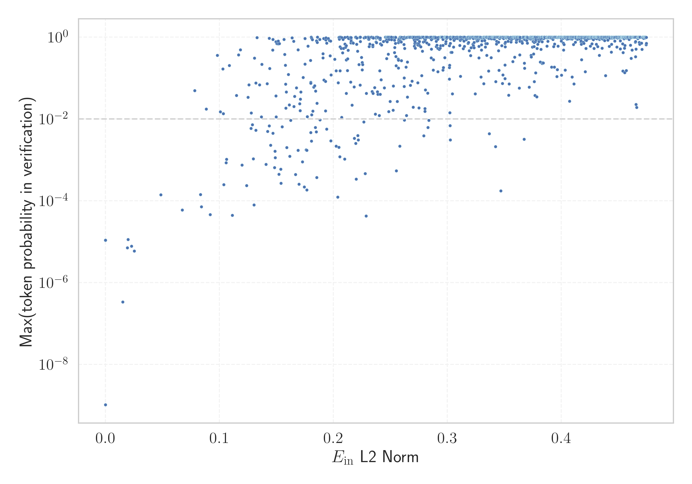

# Report for `01-ai/Yi-9B`

## Model info

* Tied embeddings: no
* LM head uses bias: no
* Indicator for under-trained tokens: E_{in} L2 Norm
  * Overall distribution 0.883 +/- 0.121
  * Token used for verification prompt building: `Acknowledgements`
  * Verification threshold: 0.440
  * Threshold for showing candidate under-trained tokens: 0.084
  * Median verified threshold (for bytes, unreachable and special tokens): 0.168
* Embeddings shape: (64000, 4096)
* Vocabulary size: 64000
  * Number of single byte tokens: 354, of which 112 below indicator threshold
  * Number of special tokens: 238, of which 175 below indicator threshold
  * Number of non-single-byte unreachable tokens: 3, of which 3 below indicator threshold
  * Number of tested under-trained tokens: 1097, 1097 non-special, 80 below p = 0.01 threshold, 12 below soft indicator threshold

## Under-trained token indicators plot


## Verification plot


## Under-trained token verification results
12 entries below threshold of 0.084

|   token_id | token                       |   indicator | max_prob                                                         | in_other_tokens                                                                                                                                                                                                                                                                                                                                                                                               |
|------------|-----------------------------|-------------|------------------------------------------------------------------|---------------------------------------------------------------------------------------------------------------------------------------------------------------------------------------------------------------------------------------------------------------------------------------------------------------------------------------------------------------------------------------------------------------|
|      58458 | ````` \\+::\\+ `````        | 2.12047e-06 | <span style='border: 1px solid rgb(169, 68, 66);'>1.1e-05</span> |                                                                                                                                                                                                                                                                                                                                                                                                               |
|      38185 | ````` \\+\\_\\+\\+ `````    | 2.13416e-06 | <span style='border: 1px solid rgb(169, 68, 66);'>1.1e-05</span> |                                                                                                                                                                                                                                                                                                                                                                                                               |
|      26510 | ````` \\+\\_\\+ `````       | 2.15176e-06 | <span style='border: 1px solid rgb(169, 68, 66);'>1.1e-05</span> | <span style='border: 1px solid rgb(169, 68, 66);'>````` \\+\\_\\+\\+ `````</span>                                                                                                                                                                                                                                                                                                                             |
|      32010 | ````` mabaochang `````      | 0.0150465   | <span style='border: 1px solid rgb(169, 68, 66);'>3.4e-07</span> |                                                                                                                                                                                                                                                                                                                                                                                                               |
|      31174 | ````` \\+:: `````           | 0.01923     | <span style='border: 1px solid rgb(169, 68, 66);'>7.1e-06</span> | <span style='border: 1px solid rgb(169, 68, 66);'>````` \\+::\\+ `````</span>                                                                                                                                                                                                                                                                                                                                 |
|      52345 | ````` nzoem `````           | 0.0197519   | <span style='border: 1px solid rgb(169, 68, 66);'>1.1e-05</span> |                                                                                                                                                                                                                                                                                                                                                                                                               |
|      19111 | ````` \\+\\_\\ `````        | 0.0228803   | <span style='border: 1px solid rgb(169, 68, 66);'>7.7e-06</span> | <span style='border: 1px solid rgb(169, 68, 66);'>````` \\+\\_\\+ `````</span>, <span style='border: 1px solid rgb(169, 68, 66);'>````` \\+\\_\\+\\+ `````</span>                                                                                                                                                                                                                                             |
|      58973 | ````` Разпространение ````` | 0.0252404   | <span style='border: 1px solid rgb(169, 68, 66);'>5.9e-06</span> |                                                                                                                                                                                                                                                                                                                                                                                                               |
|      41270 | ````` mcited `````          | 0.0484112   | <span style='border: 1px solid rgb(169, 68, 66);'>0.00014</span> | <span style='border: 1px solid rgb(40, 167, 69);'>````` mcitedefault `````</span>                                                                                                                                                                                                                                                                                                                             |
|      14378 | ````` ":"\ufeff `````       | 0.0673838   | <span style='border: 1px solid rgb(169, 68, 66);'>6e-05</span>   |                                                                                                                                                                                                                                                                                                                                                                                                               |
|      19290 | ````` мври `````            | 0.0782237   | <span style='border: 1px solid rgb(251, 189, 8);'>0.049</span>   | <span style='border: 1px solid rgb(255, 145, 0);'>````` птември `````</span>, <span style='border: 1px solid rgb(169, 68, 66);'>````` ктомври `````</span>, <span style='border: 1px solid rgb(40, 167, 69);'>````` ▁септември `````</span>, <span style='border: 1px solid rgb(40, 167, 69);'>````` ▁октомври `````</span>, <span style='border: 1px solid rgb(169, 68, 66);'>````` кември `````</span>, ... |
|      53246 | ````` mrrooter `````        | 0.0833254   | <span style='border: 1px solid rgb(169, 68, 66);'>0.00014</span> |                                                                                                                                                                                                                                                                                                                                                                                                               |


## Byte tokens
112 entries below threshold of 0.168

|   token_id | token              |   indicator |   ord | hex   | byte_type   | reencoded            |
|------------|--------------------|-------------|-------|-------|-------------|----------------------|
|        339 | ````` <0x22> ````` | 2.06589e-06 |    34 | 0x22  | ascii       | 59592: ````` " ````` |
|        498 | ````` <0xC1> ````` | 2.07852e-06 |   193 | 0xC1  | unused_utf8 |                      |
|        414 | ````` <0x6D> ````` | 2.08643e-06 |   109 | 0x6D  | ascii       | 59583: ````` m ````` |
|        314 | ````` <0x09> ````` | 2.08734e-06 |     9 | 0x09  | ascii       | 126: ````` \t `````  |
|        420 | ````` <0x73> ````` | 2.08785e-06 |   115 | 0x73  | ascii       | 59575: ````` s ````` |
|        383 | ````` <0x4E> ````` | 2.08876e-06 |    78 | 0x4E  | ascii       | 59618: ````` N ````` |
|        557 | ````` <0xFC> ````` | 2.09012e-06 |   252 | 0xFC  | unused_utf8 |                      |
|        372 | ````` <0x43> ````` | 2.09111e-06 |    67 | 0x43  | ascii       | 59608: ````` C ````` |
|        410 | ````` <0x69> ````` | 2.09197e-06 |   105 | 0x69  | ascii       | 59574: ````` i ````` |
|        551 | ````` <0xF6> ````` | 2.09523e-06 |   246 | 0xF6  | unused_utf8 |                      |
|        348 | ````` <0x2B> ````` | 2.09569e-06 |    43 | 0x2B  | ascii       | 59660: ````` + ````` |
|        378 | ````` <0x49> ````` | 2.09569e-06 |    73 | 0x49  | ascii       | 59597: ````` I ````` |
|        388 | ````` <0x53> ````` | 2.09661e-06 |    83 | 0x53  | ascii       | 59602: ````` S ````` |
|        418 | ````` <0x71> ````` | 2.0989e-06  |   113 | 0x71  | ascii       | 59619: ````` q ````` |
|        430 | ````` <0x7D> ````` | 2.1003e-06  |   125 | 0x7D  | ascii       | 59596: ````` } ````` |
|        550 | ````` <0xF5> ````` | 2.1003e-06  |   245 | 0xF5  | unused_utf8 |                      |
|        359 | ````` <0x36> ````` | 2.10351e-06 |    54 | 0x36  | ascii       | 83: ````` 6 `````    |
|        364 | ````` <0x3B> ````` | 2.10353e-06 |    59 | 0x3B  | ascii       | 59631: ````` ; ````` |
|        379 | ````` <0x4A> ````` | 2.10586e-06 |    74 | 0x4A  | ascii       | 59649: ````` J ````` |
|        353 | ````` <0x30> ````` | 2.10721e-06 |    48 | 0x30  | ascii       | 77: ````` 0 `````    |
<details><summary>92 additional entries below threshold</summary>

|   token_id | token              |   indicator |   ord | hex   | byte_type   | reencoded             |
|------------|--------------------|-------------|-------|-------|-------------|-----------------------|
|        387 | ````` <0x52> ````` | 2.10721e-06 |    82 | 0x52  | ascii       | 59615: ````` R `````  |
|        407 | ````` <0x66> ````` | 2.1086e-06  |   102 | 0x66  | ascii       | 59585: ````` f `````  |
|        404 | ````` <0x63> ````` | 2.10904e-06 |    99 | 0x63  | ascii       | 59581: ````` c `````  |
|        367 | ````` <0x3E> ````` | 2.10949e-06 |    62 | 0x3E  | ascii       | 59644: ````` > `````  |
|        360 | ````` <0x37> ````` | 2.11042e-06 |    55 | 0x37  | ascii       | 84: ````` 7 `````     |
|        399 | ````` <0x5E> ````` | 2.1127e-06  |    94 | 0x5E  | ascii       | 59641: ````` ^ `````  |
|        393 | ````` <0x58> ````` | 2.11364e-06 |    88 | 0x58  | ascii       | 59733: ````` X `````  |
|        497 | ````` <0xC0> ````` | 2.11407e-06 |   192 | 0xC0  | unused_utf8 |                       |
|        402 | ````` <0x61> ````` | 2.11454e-06 |    97 | 0x61  | ascii       | 59572: ````` a `````  |
|        352 | ````` <0x2F> ````` | 2.11499e-06 |    47 | 0x2F  | ascii       | 59598: ````` / `````  |
|        417 | ````` <0x70> ````` | 2.11499e-06 |   112 | 0x70  | ascii       | 59584: ````` p `````  |
|        385 | ````` <0x50> ````` | 2.115e-06   |    80 | 0x50  | ascii       | 59612: ````` P `````  |
|        401 | ````` <0x60> ````` | 2.115e-06   |    96 | 0x60  | ascii       | 59848: ````` ` `````  |
|        358 | ````` <0x35> ````` | 2.11595e-06 |    53 | 0x35  | ascii       | 82: ````` 5 `````     |
|        409 | ````` <0x68> ````` | 2.11639e-06 |   104 | 0x68  | ascii       | 59578: ````` h `````  |
|        361 | ````` <0x38> ````` | 2.11686e-06 |    56 | 0x38  | ascii       | 85: ````` 8 `````     |
|        403 | ````` <0x62> ````` | 2.11729e-06 |    98 | 0x62  | ascii       | 59588: ````` b `````  |
|        406 | ````` <0x65> ````` | 2.11733e-06 |   101 | 0x65  | ascii       | 59569: ````` e `````  |
|        431 | ````` <0x7E> ````` | 2.11775e-06 |   126 | 0x7E  | ascii       | 59734: ````` ~ `````  |
|        337 | ````` <0x20> ````` | 2.11822e-06 |    32 | 0x20  | ascii       | 59568: ````` ▁ `````  |
|        408 | ````` <0x67> ````` | 2.11865e-06 |   103 | 0x67  | ascii       | 59586: ````` g `````  |
|        398 | ````` <0x5D> ````` | 2.11958e-06 |    93 | 0x5D  | ascii       | 59651: ````` ] `````  |
|        357 | ````` <0x34> ````` | 2.12002e-06 |    52 | 0x34  | ascii       | 81: ````` 4 `````     |
|        376 | ````` <0x47> ````` | 2.12053e-06 |    71 | 0x47  | ascii       | 59628: ````` G `````  |
|        421 | ````` <0x74> ````` | 2.12093e-06 |   116 | 0x74  | ascii       | 59570: ````` t `````  |
|        340 | ````` <0x23> ````` | 2.12276e-06 |    35 | 0x23  | ascii       | 59697: ````` # `````  |
|        366 | ````` <0x3D> ````` | 2.12279e-06 |    61 | 0x3D  | ascii       | 59611: ````` = `````  |
|        386 | ````` <0x51> ````` | 2.12321e-06 |    81 | 0x51  | ascii       | 59745: ````` Q `````  |
|        346 | ````` <0x29> ````` | 2.12368e-06 |    41 | 0x29  | ascii       | 59604: ````` ) `````  |
|        423 | ````` <0x76> ````` | 2.12368e-06 |   118 | 0x76  | ascii       | 59590: ````` v `````  |
|        426 | ````` <0x79> ````` | 2.12368e-06 |   121 | 0x79  | ascii       | 59587: ````` y `````  |
|        553 | ````` <0xF8> ````` | 2.12371e-06 |   248 | 0xF8  | unused_utf8 |                       |
|        391 | ````` <0x56> ````` | 2.12458e-06 |    86 | 0x56  | ascii       | 59645: ````` V `````  |
|        428 | ````` <0x7B> ````` | 2.12551e-06 |   123 | 0x7B  | ascii       | 59595: ````` { `````  |
|        560 | ````` <0xFF> ````` | 2.12599e-06 |   255 | 0xFF  | unused_utf8 |                       |
|        355 | ````` <0x32> ````` | 2.12733e-06 |    50 | 0x32  | ascii       | 79: ````` 2 `````     |
|        552 | ````` <0xF7> ````` | 2.12733e-06 |   247 | 0xF7  | unused_utf8 |                       |
|        554 | ````` <0xF9> ````` | 2.12777e-06 |   249 | 0xF9  | unused_utf8 |                       |
|        422 | ````` <0x75> ````` | 2.13007e-06 |   117 | 0x75  | ascii       | 59582: ````` u `````  |
|        558 | ````` <0xFD> ````` | 2.13095e-06 |   253 | 0xFD  | unused_utf8 |                       |
|        424 | ````` <0x77> ````` | 2.13099e-06 |   119 | 0x77  | ascii       | 59589: ````` w `````  |
|        416 | ````` <0x6F> ````` | 2.1314e-06  |   111 | 0x6F  | ascii       | 59573: ````` o `````  |
|        397 | ````` <0x5C> ````` | 2.13234e-06 |    92 | 0x5C  | ascii       | 59580: ````` \ `````  |
|        396 | ````` <0x5B> ````` | 2.13506e-06 |    91 | 0x5B  | ascii       | 59653: ````` [ `````  |
|        425 | ````` <0x78> ````` | 2.13549e-06 |   120 | 0x78  | ascii       | 59607: ````` x `````  |
|        371 | ````` <0x42> ````` | 2.1355e-06  |    66 | 0x42  | ascii       | 59616: ````` B `````  |
|        354 | ````` <0x31> ````` | 2.13555e-06 |    49 | 0x31  | ascii       | 78: ````` 1 `````     |
|        415 | ````` <0x6E> ````` | 2.13594e-06 |   110 | 0x6E  | ascii       | 59571: ````` n `````  |
|        413 | ````` <0x6C> ````` | 2.13596e-06 |   108 | 0x6C  | ascii       | 59577: ````` l `````  |
|        389 | ````` <0x54> ````` | 2.13597e-06 |    84 | 0x54  | ascii       | 59600: ````` T `````  |
|        411 | ````` <0x6A> ````` | 2.13597e-06 |   106 | 0x6A  | ascii       | 59617: ````` j `````  |
|        365 | ````` <0x3C> ````` | 2.13686e-06 |    60 | 0x3C  | ascii       | 59666: ````` < `````  |
|        344 | ````` <0x27> ````` | 2.13688e-06 |    39 | 0x27  | ascii       | 59610: ````` ' `````  |
|        419 | ````` <0x72> ````` | 2.13736e-06 |   114 | 0x72  | ascii       | 59576: ````` r `````  |
|        381 | ````` <0x4C> ````` | 2.13781e-06 |    76 | 0x4C  | ascii       | 59620: ````` L `````  |
|        429 | ````` <0x7C> ````` | 2.14003e-06 |   124 | 0x7C  | ascii       | 59705: ````` \| ````` |
|        370 | ````` <0x41> ````` | 2.14006e-06 |    65 | 0x41  | ascii       | 59603: ````` A `````  |
|        373 | ````` <0x44> ````` | 2.1405e-06  |    68 | 0x44  | ascii       | 59614: ````` D `````  |
|        380 | ````` <0x4B> ````` | 2.1405e-06  |    75 | 0x4B  | ascii       | 59655: ````` K `````  |
|        343 | ````` <0x26> ````` | 2.14051e-06 |    38 | 0x26  | ascii       | 59640: ````` & `````  |
|        350 | ````` <0x2D> ````` | 2.14095e-06 |    45 | 0x2D  | ascii       | 59594: ````` - `````  |
|        318 | ````` <0x0D> ````` | 2.1414e-06  |    13 | 0x0D  | ascii       | 143: ````` \r `````   |
|        349 | ````` <0x2C> ````` | 2.14183e-06 |    44 | 0x2C  | ascii       | 97: ````` , `````     |
|        315 | ````` <0x0A> ````` | 2.14228e-06 |    10 | 0x0A  | ascii       | 144: ````` \n `````   |
|        351 | ````` <0x2E> ````` | 2.14365e-06 |    46 | 0x2E  | ascii       | 98: ````` . `````     |
|        338 | ````` <0x21> ````` | 2.14455e-06 |    33 | 0x21  | ascii       | 99: ````` ! `````     |
|        375 | ````` <0x46> ````` | 2.14455e-06 |    70 | 0x46  | ascii       | 59621: ````` F `````  |
|        342 | ````` <0x25> ````` | 2.14548e-06 |    37 | 0x25  | ascii       | 59677: ````` % `````  |
|        556 | ````` <0xFB> ````` | 2.14591e-06 |   251 | 0xFB  | unused_utf8 |                       |
|        382 | ````` <0x4D> ````` | 2.14636e-06 |    77 | 0x4D  | ascii       | 59609: ````` M `````  |
|        363 | ````` <0x3A> ````` | 2.14639e-06 |    58 | 0x3A  | ascii       | 59601: ````` : `````  |
|        559 | ````` <0xFE> ````` | 2.14818e-06 |   254 | 0xFE  | unused_utf8 |                       |
|        362 | ````` <0x39> ````` | 2.14819e-06 |    57 | 0x39  | ascii       | 86: ````` 9 `````     |
|        400 | ````` <0x5F> ````` | 2.1486e-06  |    95 | 0x5F  | ascii       | 59593: ````` _ `````  |
|        374 | ````` <0x45> ````` | 2.14999e-06 |    69 | 0x45  | ascii       | 59613: ````` E `````  |
|        356 | ````` <0x33> ````` | 2.15041e-06 |    51 | 0x33  | ascii       | 80: ````` 3 `````     |
|        377 | ````` <0x48> ````` | 2.15448e-06 |    72 | 0x48  | ascii       | 59624: ````` H `````  |
|        384 | ````` <0x4F> ````` | 2.15582e-06 |    79 | 0x4F  | ascii       | 59622: ````` O `````  |
|        390 | ````` <0x55> ````` | 2.15672e-06 |    85 | 0x55  | ascii       | 59639: ````` U `````  |
|        347 | ````` <0x2A> ````` | 2.15761e-06 |    42 | 0x2A  | ascii       | 59636: ````` * `````  |
|        369 | ````` <0x40> ````` | 2.15763e-06 |    64 | 0x40  | ascii       | 59879: ````` @ `````  |
|        368 | ````` <0x3F> ````` | 2.15898e-06 |    63 | 0x3F  | ascii       | 100: ````` ? `````    |
|        313 | ````` <0x08> ````` | 2.15988e-06 |     8 | 0x08  | ascii       | 142: ````` \x08 ````` |
|        345 | ````` <0x28> ````` | 2.16118e-06 |    40 | 0x28  | ascii       | 59605: ````` ( `````  |
|        405 | ````` <0x64> ````` | 2.16392e-06 |   100 | 0x64  | ascii       | 59579: ````` d `````  |
|        427 | ````` <0x7A> ````` | 2.16434e-06 |   122 | 0x7A  | ascii       | 59627: ````` z `````  |
|        412 | ````` <0x6B> ````` | 2.17059e-06 |   107 | 0x6B  | ascii       | 59591: ````` k `````  |
|        394 | ````` <0x59> ````` | 2.17325e-06 |    89 | 0x59  | ascii       | 59656: ````` Y `````  |
|        555 | ````` <0xFA> ````` | 2.17682e-06 |   250 | 0xFA  | unused_utf8 |                       |
|        341 | ````` <0x24> ````` | 2.18525e-06 |    36 | 0x24  | ascii       | 59606: ````` $ `````  |
|        392 | ````` <0x57> ````` | 2.19321e-06 |    87 | 0x57  | ascii       | 59623: ````` W `````  |
|        395 | ````` <0x5A> ````` | 2.19411e-06 |    90 | 0x5A  | ascii       | 59840: ````` Z `````  |
</details>


## Special tokens
175 entries below threshold of 0.168

|   token_id | token                       |   indicator | max_prob                                                         |
|------------|-----------------------------|-------------|------------------------------------------------------------------|
|        231 | ````` <\|unused086\|> ````` | 2.06214e-06 | <span style='border: 1px solid rgb(169, 68, 66);'>1.1e-05</span> |
|        264 | ````` <\|unused119\|> ````` | 2.06355e-06 | <span style='border: 1px solid rgb(169, 68, 66);'>1.1e-05</span> |
|        156 | ````` <\|unused011\|> ````` | 2.07387e-06 | <span style='border: 1px solid rgb(169, 68, 66);'>1.1e-05</span> |
|        303 | ````` <\|unused158\|> ````` | 2.08085e-06 | <span style='border: 1px solid rgb(169, 68, 66);'>1.1e-05</span> |
|        175 | ````` <\|unused030\|> ````` | 2.08087e-06 | <span style='border: 1px solid rgb(169, 68, 66);'>1.1e-05</span> |
|          3 | ````` <\|Human\|> `````     | 2.08177e-06 |                                                                  |
|        201 | ````` <\|unused056\|> ````` | 2.08644e-06 | <span style='border: 1px solid rgb(169, 68, 66);'>1.1e-05</span> |
|        157 | ````` <\|unused012\|> ````` | 2.08688e-06 | <span style='border: 1px solid rgb(169, 68, 66);'>1.1e-05</span> |
|        149 | ````` <\|unused004\|> ````` | 2.08734e-06 | <span style='border: 1px solid rgb(169, 68, 66);'>1.1e-05</span> |
|        192 | ````` <\|unused047\|> ````` | 2.08973e-06 | <span style='border: 1px solid rgb(169, 68, 66);'>1.1e-05</span> |
|        224 | ````` <\|unused079\|> ````` | 2.09012e-06 | <span style='border: 1px solid rgb(169, 68, 66);'>1.1e-05</span> |
|        219 | ````` <\|unused074\|> ````` | 2.09014e-06 | <span style='border: 1px solid rgb(169, 68, 66);'>1.1e-05</span> |
|        204 | ````` <\|unused059\|> ````` | 2.09244e-06 | <span style='border: 1px solid rgb(169, 68, 66);'>1.1e-05</span> |
|        218 | ````` <\|unused073\|> ````` | 2.0929e-06  | <span style='border: 1px solid rgb(169, 68, 66);'>1.1e-05</span> |
|        152 | ````` <\|unused007\|> ````` | 2.09476e-06 | <span style='border: 1px solid rgb(169, 68, 66);'>1.1e-05</span> |
|        290 | ````` <\|unused145\|> ````` | 2.09752e-06 | <span style='border: 1px solid rgb(169, 68, 66);'>1.1e-05</span> |
|        164 | ````` <\|unused019\|> ````` | 2.10075e-06 | <span style='border: 1px solid rgb(169, 68, 66);'>1.1e-05</span> |
|        292 | ````` <\|unused147\|> ````` | 2.10215e-06 | <span style='border: 1px solid rgb(169, 68, 66);'>1.1e-05</span> |
|        208 | ````` <\|unused063\|> ````` | 2.10261e-06 | <span style='border: 1px solid rgb(169, 68, 66);'>1.1e-05</span> |
|        185 | ````` <\|unused040\|> ````` | 2.10308e-06 | <span style='border: 1px solid rgb(169, 68, 66);'>1.1e-05</span> |
<details><summary>155 additional entries below threshold</summary>

|   token_id | token                         |   indicator | max_prob                                                         |
|------------|-------------------------------|-------------|------------------------------------------------------------------|
|        262 | ````` <\|unused117\|> `````   | 2.10399e-06 | <span style='border: 1px solid rgb(169, 68, 66);'>1.1e-05</span> |
|        242 | ````` <\|unused097\|> `````   | 2.104e-06   | <span style='border: 1px solid rgb(169, 68, 66);'>1.1e-05</span> |
|        301 | ````` <\|unused156\|> `````   | 2.10445e-06 | <span style='border: 1px solid rgb(169, 68, 66);'>1.1e-05</span> |
|        225 | ````` <\|unused080\|> `````   | 2.10494e-06 | <span style='border: 1px solid rgb(169, 68, 66);'>1.1e-05</span> |
|        221 | ````` <\|unused076\|> `````   | 2.10535e-06 | <span style='border: 1px solid rgb(169, 68, 66);'>1.1e-05</span> |
|        191 | ````` <\|unused046\|> `````   | 2.10537e-06 | <span style='border: 1px solid rgb(169, 68, 66);'>1.1e-05</span> |
|        205 | ````` <\|unused060\|> `````   | 2.10675e-06 | <span style='border: 1px solid rgb(169, 68, 66);'>1.1e-05</span> |
|        197 | ````` <\|unused052\|> `````   | 2.10719e-06 | <span style='border: 1px solid rgb(169, 68, 66);'>1.1e-05</span> |
|        190 | ````` <\|unused045\|> `````   | 2.10767e-06 | <span style='border: 1px solid rgb(169, 68, 66);'>1.1e-05</span> |
|        182 | ````` <\|unused037\|> `````   | 2.10768e-06 | <span style='border: 1px solid rgb(169, 68, 66);'>1.1e-05</span> |
|        211 | ````` <\|unused066\|> `````   | 2.10811e-06 | <span style='border: 1px solid rgb(169, 68, 66);'>1.1e-05</span> |
|        210 | ````` <\|unused065\|> `````   | 2.10949e-06 | <span style='border: 1px solid rgb(169, 68, 66);'>1.1e-05</span> |
|        230 | ````` <\|unused085\|> `````   | 2.10953e-06 | <span style='border: 1px solid rgb(169, 68, 66);'>1.1e-05</span> |
|        216 | ````` <\|unused071\|> `````   | 2.10996e-06 | <span style='border: 1px solid rgb(169, 68, 66);'>1.1e-05</span> |
|        155 | ````` <\|unused010\|> `````   | 2.10999e-06 | <span style='border: 1px solid rgb(169, 68, 66);'>1.1e-05</span> |
|        176 | ````` <\|unused031\|> `````   | 2.11042e-06 | <span style='border: 1px solid rgb(169, 68, 66);'>1.1e-05</span> |
|        245 | ````` <\|unused100\|> `````   | 2.11132e-06 | <span style='border: 1px solid rgb(169, 68, 66);'>1.1e-05</span> |
|        195 | ````` <\|unused050\|> `````   | 2.11316e-06 | <span style='border: 1px solid rgb(169, 68, 66);'>1.1e-05</span> |
|        268 | ````` <\|unused123\|> `````   | 2.11454e-06 | <span style='border: 1px solid rgb(169, 68, 66);'>1.1e-05</span> |
|        178 | ````` <\|unused033\|> `````   | 2.11639e-06 | <span style='border: 1px solid rgb(169, 68, 66);'>1.1e-05</span> |
|        171 | ````` <\|unused026\|> `````   | 2.11728e-06 | <span style='border: 1px solid rgb(169, 68, 66);'>1.1e-05</span> |
|        146 | ````` <\|unused001\|> `````   | 2.11729e-06 | <span style='border: 1px solid rgb(169, 68, 66);'>1.1e-05</span> |
|        279 | ````` <\|unused134\|> `````   | 2.11729e-06 | <span style='border: 1px solid rgb(169, 68, 66);'>1.1e-05</span> |
|        159 | ````` <\|unused014\|> `````   | 2.11775e-06 | <span style='border: 1px solid rgb(169, 68, 66);'>1.1e-05</span> |
|        276 | ````` <\|unused131\|> `````   | 2.11819e-06 | <span style='border: 1px solid rgb(169, 68, 66);'>1.1e-05</span> |
|        167 | ````` <\|unused022\|> `````   | 2.11866e-06 | <span style='border: 1px solid rgb(169, 68, 66);'>1.1e-05</span> |
|        263 | ````` <\|unused118\|> `````   | 2.11866e-06 | <span style='border: 1px solid rgb(169, 68, 66);'>1.1e-05</span> |
|        293 | ````` <\|unused148\|> `````   | 2.11912e-06 | <span style='border: 1px solid rgb(169, 68, 66);'>1.1e-05</span> |
|         10 | ````` <\|reserved004\|> ````` | 2.11959e-06 |                                                                  |
|        271 | ````` <\|unused126\|> `````   | 2.12003e-06 | <span style='border: 1px solid rgb(169, 68, 66);'>1.1e-05</span> |
|        299 | ````` <\|unused154\|> `````   | 2.12049e-06 | <span style='border: 1px solid rgb(169, 68, 66);'>1.1e-05</span> |
|        179 | ````` <\|unused034\|> `````   | 2.1205e-06  | <span style='border: 1px solid rgb(169, 68, 66);'>1.1e-05</span> |
|        209 | ````` <\|unused064\|> `````   | 2.1205e-06  | <span style='border: 1px solid rgb(169, 68, 66);'>1.1e-05</span> |
|          5 | ````` <\|System\|> `````      | 2.12093e-06 |                                                                  |
|        250 | ````` <\|unused105\|> `````   | 2.12186e-06 | <span style='border: 1px solid rgb(169, 68, 66);'>1.1e-05</span> |
|        220 | ````` <\|unused075\|> `````   | 2.12233e-06 | <span style='border: 1px solid rgb(169, 68, 66);'>1.1e-05</span> |
|        188 | ````` <\|unused043\|> `````   | 2.12277e-06 | <span style='border: 1px solid rgb(169, 68, 66);'>1.1e-05</span> |
|        295 | ````` <\|unused150\|> `````   | 2.12321e-06 | <span style='border: 1px solid rgb(169, 68, 66);'>1.1e-05</span> |
|        234 | ````` <\|unused089\|> `````   | 2.12368e-06 | <span style='border: 1px solid rgb(169, 68, 66);'>1.1e-05</span> |
|        252 | ````` <\|unused107\|> `````   | 2.12459e-06 | <span style='border: 1px solid rgb(169, 68, 66);'>1.1e-05</span> |
|        266 | ````` <\|unused121\|> `````   | 2.12504e-06 | <span style='border: 1px solid rgb(169, 68, 66);'>1.1e-05</span> |
|        163 | ````` <\|unused018\|> `````   | 2.12505e-06 | <span style='border: 1px solid rgb(169, 68, 66);'>1.1e-05</span> |
|        147 | ````` <\|unused002\|> `````   | 2.12549e-06 | <span style='border: 1px solid rgb(169, 68, 66);'>1.1e-05</span> |
|        247 | ````` <\|unused102\|> `````   | 2.12549e-06 | <span style='border: 1px solid rgb(169, 68, 66);'>1.1e-05</span> |
|        248 | ````` <\|unused103\|> `````   | 2.12551e-06 | <span style='border: 1px solid rgb(169, 68, 66);'>1.1e-05</span> |
|        278 | ````` <\|unused133\|> `````   | 2.12552e-06 | <span style='border: 1px solid rgb(169, 68, 66);'>1.1e-05</span> |
|        260 | ````` <\|unused115\|> `````   | 2.12595e-06 | <span style='border: 1px solid rgb(169, 68, 66);'>1.1e-05</span> |
|        261 | ````` <\|unused116\|> `````   | 2.12595e-06 | <span style='border: 1px solid rgb(169, 68, 66);'>1.1e-05</span> |
|        145 | ````` <\|unused000\|> `````   | 2.126e-06   | <span style='border: 1px solid rgb(169, 68, 66);'>1.1e-05</span> |
|        193 | ````` <\|unused048\|> `````   | 2.12643e-06 | <span style='border: 1px solid rgb(169, 68, 66);'>1.1e-05</span> |
|        287 | ````` <\|unused142\|> `````   | 2.12686e-06 | <span style='border: 1px solid rgb(169, 68, 66);'>1.1e-05</span> |
|         11 | ````` <\|reserved005\|> ````` | 2.1269e-06  |                                                                  |
|        283 | ````` <\|unused138\|> `````   | 2.12736e-06 | <span style='border: 1px solid rgb(169, 68, 66);'>1.1e-05</span> |
|        256 | ````` <\|unused111\|> `````   | 2.12824e-06 | <span style='border: 1px solid rgb(169, 68, 66);'>1.1e-05</span> |
|        239 | ````` <\|unused094\|> `````   | 2.12825e-06 | <span style='border: 1px solid rgb(169, 68, 66);'>1.1e-05</span> |
|        177 | ````` <\|unused032\|> `````   | 2.12868e-06 | <span style='border: 1px solid rgb(169, 68, 66);'>1.1e-05</span> |
|        194 | ````` <\|unused049\|> `````   | 2.12869e-06 | <span style='border: 1px solid rgb(169, 68, 66);'>1.1e-05</span> |
|        233 | ````` <\|unused088\|> `````   | 2.12869e-06 | <span style='border: 1px solid rgb(169, 68, 66);'>1.1e-05</span> |
|        274 | ````` <\|unused129\|> `````   | 2.12871e-06 | <span style='border: 1px solid rgb(169, 68, 66);'>1.1e-05</span> |
|        200 | ````` <\|unused055\|> `````   | 2.12913e-06 | <span style='border: 1px solid rgb(169, 68, 66);'>1.1e-05</span> |
|        238 | ````` <\|unused093\|> `````   | 2.12915e-06 | <span style='border: 1px solid rgb(169, 68, 66);'>1.1e-05</span> |
|        286 | ````` <\|unused141\|> `````   | 2.12916e-06 | <span style='border: 1px solid rgb(169, 68, 66);'>1.1e-05</span> |
|        236 | ````` <\|unused091\|> `````   | 2.12959e-06 | <span style='border: 1px solid rgb(169, 68, 66);'>1.1e-05</span> |
|        269 | ````` <\|unused124\|> `````   | 2.12964e-06 | <span style='border: 1px solid rgb(169, 68, 66);'>1.1e-05</span> |
|        181 | ````` <\|unused036\|> `````   | 2.13004e-06 | <span style='border: 1px solid rgb(169, 68, 66);'>1.1e-05</span> |
|        296 | ````` <\|unused151\|> `````   | 2.1305e-06  | <span style='border: 1px solid rgb(169, 68, 66);'>1.1e-05</span> |
|          9 | ````` <\|reserved003\|> ````` | 2.13095e-06 |                                                                  |
|        244 | ````` <\|unused099\|> `````   | 2.13096e-06 | <span style='border: 1px solid rgb(169, 68, 66);'>1.1e-05</span> |
|        285 | ````` <\|unused140\|> `````   | 2.13096e-06 | <span style='border: 1px solid rgb(169, 68, 66);'>1.1e-05</span> |
|        169 | ````` <\|unused024\|> `````   | 2.13142e-06 | <span style='border: 1px solid rgb(169, 68, 66);'>1.1e-05</span> |
|        289 | ````` <\|unused144\|> `````   | 2.13187e-06 | <span style='border: 1px solid rgb(169, 68, 66);'>1.1e-05</span> |
|        241 | ````` <\|unused096\|> `````   | 2.13233e-06 | <span style='border: 1px solid rgb(169, 68, 66);'>1.1e-05</span> |
|        282 | ````` <\|unused137\|> `````   | 2.13234e-06 | <span style='border: 1px solid rgb(169, 68, 66);'>1.1e-05</span> |
|        212 | ````` <\|unused067\|> `````   | 2.1328e-06  | <span style='border: 1px solid rgb(169, 68, 66);'>1.1e-05</span> |
|        300 | ````` <\|unused155\|> `````   | 2.13324e-06 | <span style='border: 1px solid rgb(169, 68, 66);'>1.1e-05</span> |
|         12 | ````` <\|reserved006\|> ````` | 2.13372e-06 |                                                                  |
|        189 | ````` <\|unused044\|> `````   | 2.13504e-06 | <span style='border: 1px solid rgb(169, 68, 66);'>1.1e-05</span> |
|        302 | ````` <\|unused157\|> `````   | 2.13506e-06 | <span style='border: 1px solid rgb(169, 68, 66);'>1.1e-05</span> |
|        222 | ````` <\|unused077\|> `````   | 2.13508e-06 | <span style='border: 1px solid rgb(169, 68, 66);'>1.1e-05</span> |
|        186 | ````` <\|unused041\|> `````   | 2.13549e-06 | <span style='border: 1px solid rgb(169, 68, 66);'>1.1e-05</span> |
|        207 | ````` <\|unused062\|> `````   | 2.13641e-06 | <span style='border: 1px solid rgb(169, 68, 66);'>1.1e-05</span> |
|        253 | ````` <\|unused108\|> `````   | 2.13685e-06 | <span style='border: 1px solid rgb(169, 68, 66);'>1.1e-05</span> |
|        280 | ````` <\|unused135\|> `````   | 2.13733e-06 | <span style='border: 1px solid rgb(169, 68, 66);'>1.1e-05</span> |
|        298 | ````` <\|unused153\|> `````   | 2.13735e-06 | <span style='border: 1px solid rgb(169, 68, 66);'>1.1e-05</span> |
|        162 | ````` <\|unused017\|> `````   | 2.13778e-06 | <span style='border: 1px solid rgb(169, 68, 66);'>1.1e-05</span> |
|        165 | ````` <\|unused020\|> `````   | 2.1378e-06  | <span style='border: 1px solid rgb(169, 68, 66);'>1.1e-05</span> |
|        215 | ````` <\|unused070\|> `````   | 2.13824e-06 | <span style='border: 1px solid rgb(169, 68, 66);'>1.1e-05</span> |
|        158 | ````` <\|unused013\|> `````   | 2.13869e-06 | <span style='border: 1px solid rgb(169, 68, 66);'>1.1e-05</span> |
|        294 | ````` <\|unused149\|> `````   | 2.13917e-06 | <span style='border: 1px solid rgb(169, 68, 66);'>1.1e-05</span> |
|        161 | ````` <\|unused016\|> `````   | 2.13958e-06 | <span style='border: 1px solid rgb(169, 68, 66);'>1.1e-05</span> |
|        265 | ````` <\|unused120\|> `````   | 2.14003e-06 | <span style='border: 1px solid rgb(169, 68, 66);'>1.1e-05</span> |
|        214 | ````` <\|unused069\|> `````   | 2.14095e-06 | <span style='border: 1px solid rgb(169, 68, 66);'>1.1e-05</span> |
|        228 | ````` <\|unused083\|> `````   | 2.14095e-06 | <span style='border: 1px solid rgb(169, 68, 66);'>1.1e-05</span> |
|        240 | ````` <\|unused095\|> `````   | 2.14095e-06 | <span style='border: 1px solid rgb(169, 68, 66);'>1.1e-05</span> |
|        281 | ````` <\|unused136\|> `````   | 2.14139e-06 | <span style='border: 1px solid rgb(169, 68, 66);'>1.1e-05</span> |
|        243 | ````` <\|unused098\|> `````   | 2.14184e-06 | <span style='border: 1px solid rgb(169, 68, 66);'>1.1e-05</span> |
|        235 | ````` <\|unused090\|> `````   | 2.14234e-06 | <span style='border: 1px solid rgb(169, 68, 66);'>1.1e-05</span> |
|        180 | ````` <\|unused035\|> `````   | 2.14318e-06 | <span style='border: 1px solid rgb(169, 68, 66);'>1.1e-05</span> |
|        291 | ````` <\|unused146\|> `````   | 2.14318e-06 | <span style='border: 1px solid rgb(169, 68, 66);'>1.1e-05</span> |
|        229 | ````` <\|unused084\|> `````   | 2.14363e-06 | <span style='border: 1px solid rgb(169, 68, 66);'>1.1e-05</span> |
|        172 | ````` <\|unused027\|> `````   | 2.14365e-06 | <span style='border: 1px solid rgb(169, 68, 66);'>1.1e-05</span> |
|        237 | ````` <\|unused092\|> `````   | 2.14409e-06 | <span style='border: 1px solid rgb(169, 68, 66);'>1.1e-05</span> |
|        183 | ````` <\|unused038\|> `````   | 2.14454e-06 | <span style='border: 1px solid rgb(169, 68, 66);'>1.1e-05</span> |
|        199 | ````` <\|unused054\|> `````   | 2.14547e-06 | <span style='border: 1px solid rgb(169, 68, 66);'>1.1e-05</span> |
|        257 | ````` <\|unused112\|> `````   | 2.14547e-06 | <span style='border: 1px solid rgb(169, 68, 66);'>1.1e-05</span> |
|        153 | ````` <\|unused008\|> `````   | 2.14636e-06 | <span style='border: 1px solid rgb(169, 68, 66);'>1.1e-05</span> |
|        184 | ````` <\|unused039\|> `````   | 2.14636e-06 | <span style='border: 1px solid rgb(169, 68, 66);'>1.1e-05</span> |
|        251 | ````` <\|unused106\|> `````   | 2.14679e-06 | <span style='border: 1px solid rgb(169, 68, 66);'>1.1e-05</span> |
|        259 | ````` <\|unused114\|> `````   | 2.14679e-06 | <span style='border: 1px solid rgb(169, 68, 66);'>1.1e-05</span> |
|        255 | ````` <\|unused110\|> `````   | 2.14729e-06 | <span style='border: 1px solid rgb(169, 68, 66);'>1.1e-05</span> |
|        284 | ````` <\|unused139\|> `````   | 2.1477e-06  | <span style='border: 1px solid rgb(169, 68, 66);'>1.1e-05</span> |
|        275 | ````` <\|unused130\|> `````   | 2.14863e-06 | <span style='border: 1px solid rgb(169, 68, 66);'>1.1e-05</span> |
|        227 | ````` <\|unused082\|> `````   | 2.14906e-06 | <span style='border: 1px solid rgb(169, 68, 66);'>1.1e-05</span> |
|         13 | ````` <\|reserved007\|> ````` | 2.14999e-06 |                                                                  |
|        206 | ````` <\|unused061\|> `````   | 2.15176e-06 | <span style='border: 1px solid rgb(169, 68, 66);'>1.1e-05</span> |
|        166 | ````` <\|unused021\|> `````   | 2.15269e-06 | <span style='border: 1px solid rgb(169, 68, 66);'>1.1e-05</span> |
|        213 | ````` <\|unused068\|> `````   | 2.15271e-06 | <span style='border: 1px solid rgb(169, 68, 66);'>1.1e-05</span> |
|        297 | ````` <\|unused152\|> `````   | 2.15313e-06 | <span style='border: 1px solid rgb(169, 68, 66);'>1.1e-05</span> |
|        154 | ````` <\|unused009\|> `````   | 2.15446e-06 | <span style='border: 1px solid rgb(169, 68, 66);'>1.1e-05</span> |
|        304 | ````` <\|unused159\|> `````   | 2.15446e-06 | <span style='border: 1px solid rgb(169, 68, 66);'>1.1e-05</span> |
|          1 | ````` <\|startoftext\|> ````` | 2.15448e-06 | <span style='border: 1px solid rgb(169, 68, 66);'>1.1e-05</span> |
|        273 | ````` <\|unused128\|> `````   | 2.1549e-06  | <span style='border: 1px solid rgb(169, 68, 66);'>1.1e-05</span> |
|        168 | ````` <\|unused023\|> `````   | 2.15493e-06 | <span style='border: 1px solid rgb(169, 68, 66);'>1.1e-05</span> |
|        277 | ````` <\|unused132\|> `````   | 2.15716e-06 | <span style='border: 1px solid rgb(169, 68, 66);'>1.1e-05</span> |
|        267 | ````` <\|unused122\|> `````   | 2.15761e-06 | <span style='border: 1px solid rgb(169, 68, 66);'>1.1e-05</span> |
|        198 | ````` <\|unused053\|> `````   | 2.1585e-06  | <span style='border: 1px solid rgb(169, 68, 66);'>1.1e-05</span> |
|        249 | ````` <\|unused104\|> `````   | 2.1585e-06  | <span style='border: 1px solid rgb(169, 68, 66);'>1.1e-05</span> |
|        226 | ````` <\|unused081\|> `````   | 2.15856e-06 | <span style='border: 1px solid rgb(169, 68, 66);'>1.1e-05</span> |
|        150 | ````` <\|unused005\|> `````   | 2.15895e-06 | <span style='border: 1px solid rgb(169, 68, 66);'>1.1e-05</span> |
|          0 | ````` <unk> `````             | 2.16031e-06 | <span style='border: 1px solid rgb(169, 68, 66);'>1e-09</span>   |
|        170 | ````` <\|unused025\|> `````   | 2.16031e-06 | <span style='border: 1px solid rgb(169, 68, 66);'>1.1e-05</span> |
|        160 | ````` <\|unused015\|> `````   | 2.1621e-06  | <span style='border: 1px solid rgb(169, 68, 66);'>1.1e-05</span> |
|        187 | ````` <\|unused042\|> `````   | 2.1621e-06  | <span style='border: 1px solid rgb(169, 68, 66);'>1.1e-05</span> |
|        173 | ````` <\|unused028\|> `````   | 2.16298e-06 | <span style='border: 1px solid rgb(169, 68, 66);'>1.1e-05</span> |
|        203 | ````` <\|unused058\|> `````   | 2.16346e-06 | <span style='border: 1px solid rgb(169, 68, 66);'>1.1e-05</span> |
|        174 | ````` <\|unused029\|> `````   | 2.16523e-06 | <span style='border: 1px solid rgb(169, 68, 66);'>1.1e-05</span> |
|        217 | ````` <\|unused072\|> `````   | 2.16613e-06 | <span style='border: 1px solid rgb(169, 68, 66);'>1.1e-05</span> |
|        254 | ````` <\|unused109\|> `````   | 2.16747e-06 | <span style='border: 1px solid rgb(169, 68, 66);'>1.1e-05</span> |
|        272 | ````` <\|unused127\|> `````   | 2.1679e-06  | <span style='border: 1px solid rgb(169, 68, 66);'>1.1e-05</span> |
|        270 | ````` <\|unused125\|> `````   | 2.16972e-06 | <span style='border: 1px solid rgb(169, 68, 66);'>1.1e-05</span> |
|        151 | ````` <\|unused006\|> `````   | 2.17502e-06 | <span style='border: 1px solid rgb(169, 68, 66);'>1.1e-05</span> |
|        223 | ````` <\|unused078\|> `````   | 2.17552e-06 | <span style='border: 1px solid rgb(169, 68, 66);'>1.1e-05</span> |
|        202 | ````` <\|unused057\|> `````   | 2.17639e-06 | <span style='border: 1px solid rgb(169, 68, 66);'>1.1e-05</span> |
|        246 | ````` <\|unused101\|> `````   | 2.17773e-06 | <span style='border: 1px solid rgb(169, 68, 66);'>1.1e-05</span> |
|        148 | ````` <\|unused003\|> `````   | 2.18129e-06 | <span style='border: 1px solid rgb(169, 68, 66);'>1.1e-05</span> |
|        258 | ````` <\|unused113\|> `````   | 2.18615e-06 | <span style='border: 1px solid rgb(169, 68, 66);'>1.1e-05</span> |
|        196 | ````` <\|unused051\|> `````   | 2.18657e-06 | <span style='border: 1px solid rgb(169, 68, 66);'>1.1e-05</span> |
|        288 | ````` <\|unused143\|> `````   | 2.1963e-06  | <span style='border: 1px solid rgb(169, 68, 66);'>1.1e-05</span> |
|        232 | ````` <\|unused087\|> `````   | 2.19675e-06 | <span style='border: 1px solid rgb(169, 68, 66);'>1.1e-05</span> |
|          4 | ````` <\|Assistant\|> `````   | 2.19853e-06 |                                                                  |
|         17 | ````` <fim_pad> `````         | 0.0422809   | <span style='border: 1px solid rgb(169, 68, 66);'>0.00029</span> |
|          8 | ````` <\|im_sep\|> `````      | 0.051727    | <span style='border: 1px solid rgb(255, 145, 0);'>0.0031</span>  |
|         15 | ````` <fim_middle> `````      | 0.0537974   | <span style='border: 1px solid rgb(251, 189, 8);'>0.015</span>   |
|         16 | ````` <fim_suffix> `````      | 0.0688603   | <span style='border: 1px solid rgb(251, 189, 8);'>0.045</span>   |
|         14 | ````` <fim_prefix> `````      | 0.0725533   | <span style='border: 1px solid rgb(255, 145, 0);'>0.0099</span>  |
</details>


## Unreachable tokens
3 entries below threshold of 0.168

|   token_id | token                                |   indicator | reencoded                                                                             |
|------------|--------------------------------------|-------------|---------------------------------------------------------------------------------------|
|      23924 | ````` 毛泽东 `````                   | 2.09755e-06 | 60614: ````` 毛 `````, 61198: ````` 泽 `````, 59953: ````` 东 `````                   |
|      42021 | ````` 并按对方当事人的人数 `````     | 2.10676e-06 | 30297: ````` 并按 `````, 35972: ````` 对方当事人 `````, 26853: ````` 的人数 `````     |
|      41880 | ````` 判决书送达之日起十五日内 ````` | 2.14409e-06 | 22549: ````` 判决书 `````, 36139: ````` 送达之日起 `````, 35659: ````` 十五日内 ````` |

