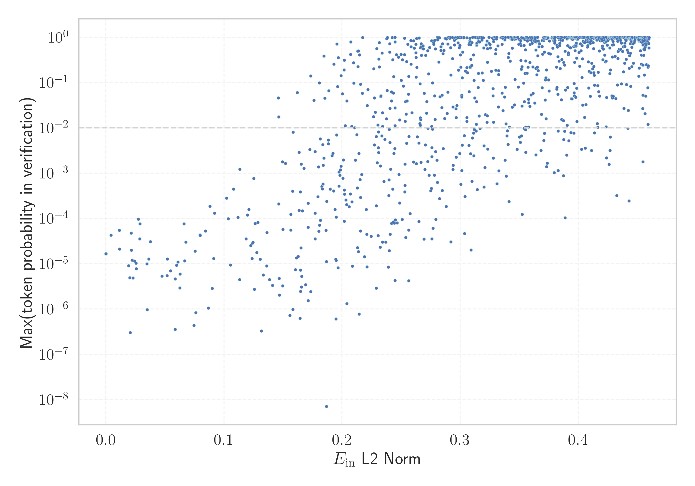

# Report for `01-ai/Yi-Coder-9B-Chat`

## Model info

* Tied embeddings: no
* LM head uses bias: no
* Indicator for under-trained tokens: E_{in} L2 Norm
  * Overall distribution 0.979 +/- 0.190
  * Token used for verification prompt building: `Acknowledgements`
  * Verification threshold: 0.460
  * Threshold for showing candidate under-trained tokens: 0.199
  * Median verified threshold (for bytes, unreachable and special tokens): 0.219
* Embeddings shape: (64000, 4096)
* Vocabulary size: 64000
  * Number of single byte tokens: 354, of which 112 below indicator threshold
  * Number of special tokens: 238, of which 187 below indicator threshold
  * Number of non-single-byte unreachable tokens: 3, of which 3 below indicator threshold
  * Number of tested under-trained tokens: 1279, 1094 non-special, 299 below p = 0.01 threshold, 138 below soft indicator threshold

## Under-trained token indicators plot


## Verification plot


## Under-trained token verification results
138 entries below threshold of 0.199

|   token_id | token                       |   indicator | max_prob                                                         | in_other_tokens                                                                                                                                                                                                                                                                                                                                                                                               |
|------------|-----------------------------|-------------|------------------------------------------------------------------|---------------------------------------------------------------------------------------------------------------------------------------------------------------------------------------------------------------------------------------------------------------------------------------------------------------------------------------------------------------------------------------------------------------|
|      38185 | ````` \\+\\_\\+\\+ `````    |  0          | <span style='border: 1px solid rgb(169, 68, 66);'>1.7e-05</span> |                                                                                                                                                                                                                                                                                                                                                                                                               |
|      58458 | ````` \\+::\\+ `````        |  0          | <span style='border: 1px solid rgb(169, 68, 66);'>1.7e-05</span> |                                                                                                                                                                                                                                                                                                                                                                                                               |
|      36970 | ````` ▁本实用新型的 `````   |  0.00417208 | <span style='border: 1px solid rgb(169, 68, 66);'>4.3e-05</span> |                                                                                                                                                                                                                                                                                                                                                                                                               |
|      32010 | ````` mabaochang `````      |  0.011246   | <span style='border: 1px solid rgb(169, 68, 66);'>5.5e-05</span> |                                                                                                                                                                                                                                                                                                                                                                                                               |
|      52345 | ````` nzoem `````           |  0.0115682  | <span style='border: 1px solid rgb(169, 68, 66);'>2.1e-05</span> |                                                                                                                                                                                                                                                                                                                                                                                                               |
|      41270 | ````` mcited `````          |  0.019116   | <span style='border: 1px solid rgb(169, 68, 66);'>9.1e-06</span> | <span style='border: 1px solid rgb(169, 68, 66);'>````` mcitedefault `````</span>                                                                                                                                                                                                                                                                                                                             |
|      26327 | ````` ▁本实用新型 `````     |  0.0213606  | <span style='border: 1px solid rgb(169, 68, 66);'>4.8e-05</span> | <span style='border: 1px solid rgb(169, 68, 66);'>````` ▁本实用新型的 `````</span>                                                                                                                                                                                                                                                                                                                            |
|      26510 | ````` \\+\\_\\+ `````       |  0.0242358  | <span style='border: 1px solid rgb(169, 68, 66);'>1.1e-05</span> | <span style='border: 1px solid rgb(169, 68, 66);'>````` \\+\\_\\+\\+ `````</span>                                                                                                                                                                                                                                                                                                                             |
|      53246 | ````` mrrooter `````        |  0.0285072  | <span style='border: 1px solid rgb(169, 68, 66);'>3.5e-05</span> |                                                                                                                                                                                                                                                                                                                                                                                                               |
|      58973 | ````` Разпространение ````` |  0.0348741  | <span style='border: 1px solid rgb(169, 68, 66);'>9.6e-07</span> |                                                                                                                                                                                                                                                                                                                                                                                                               |
|      52955 | ````` Родени `````          |  0.036157   | <span style='border: 1px solid rgb(169, 68, 66);'>1.3e-05</span> |                                                                                                                                                                                                                                                                                                                                                                                                               |
|      37937 | ````` ▁具体实施方式 `````   |  0.0474792  | <span style='border: 1px solid rgb(169, 68, 66);'>5.3e-06</span> |                                                                                                                                                                                                                                                                                                                                                                                                               |
|      33850 | ````` ▁发明内容 `````       |  0.0516732  | <span style='border: 1px solid rgb(169, 68, 66);'>5.5e-06</span> |                                                                                                                                                                                                                                                                                                                                                                                                               |
|      58761 | ````` 实用新型内容 `````    |  0.051922   | <span style='border: 1px solid rgb(169, 68, 66);'>1.3e-05</span> |                                                                                                                                                                                                                                                                                                                                                                                                               |
|      58620 | ````` Irefn `````           |  0.0585479  | <span style='border: 1px solid rgb(169, 68, 66);'>3.6e-07</span> |                                                                                                                                                                                                                                                                                                                                                                                                               |
|      59159 | ````` )&=&\\ `````          |  0.0597123  | <span style='border: 1px solid rgb(169, 68, 66);'>9.2e-06</span> |                                                                                                                                                                                                                                                                                                                                                                                                               |
|      46696 | ````` ▁版的赞赏功能 `````   |  0.0609822  | <span style='border: 1px solid rgb(169, 68, 66);'>1.1e-05</span> |                                                                                                                                                                                                                                                                                                                                                                                                               |
|      34182 | ````` ▁背景技术 `````       |  0.0624692  | <span style='border: 1px solid rgb(169, 68, 66);'>2.9e-06</span> |                                                                                                                                                                                                                                                                                                                                                                                                               |
|      41277 | ````` mcitedefault `````    |  0.0627597  | <span style='border: 1px solid rgb(169, 68, 66);'>5.9e-06</span> |                                                                                                                                                                                                                                                                                                                                                                                                               |
|      19290 | ````` мври `````            |  0.0660515  | <span style='border: 1px solid rgb(169, 68, 66);'>7.6e-05</span> | <span style='border: 1px solid rgb(169, 68, 66);'>````` птември `````</span>, <span style='border: 1px solid rgb(255, 145, 0);'>````` ктомври `````</span>, <span style='border: 1px solid rgb(169, 68, 66);'>````` ▁септември `````</span>, <span style='border: 1px solid rgb(40, 167, 69);'>````` ▁октомври `````</span>, <span style='border: 1px solid rgb(169, 68, 66);'>````` кември `````</span>, ... |
<details><summary>118 additional entries below threshold</summary>

|   token_id | token                        |   indicator | max_prob                                                         | in_other_tokens                                                                                                                                                                                                                                         |
|------------|------------------------------|-------------|------------------------------------------------------------------|---------------------------------------------------------------------------------------------------------------------------------------------------------------------------------------------------------------------------------------------------------|
|      57958 | ````` }&=&\\ `````           |   0.0666948 | <span style='border: 1px solid rgb(169, 68, 66);'>1.2e-05</span> |                                                                                                                                                                                                                                                         |
|      31174 | ````` \\+:: `````            |   0.0745167 | <span style='border: 1px solid rgb(169, 68, 66);'>4.3e-07</span> | <span style='border: 1px solid rgb(169, 68, 66);'>````` \\+::\\+ `````</span>                                                                                                                                                                           |
|      14378 | ````` ":"\ufeff `````        |   0.0755539 | <span style='border: 1px solid rgb(169, 68, 66);'>1.9e-05</span> |                                                                                                                                                                                                                                                         |
|      59020 | ````` ":"/*\ `````           |   0.0796978 | <span style='border: 1px solid rgb(169, 68, 66);'>4.3e-05</span> |                                                                                                                                                                                                                                                         |
|      53979 | ````` ▁$\\\|\\ `````         |   0.0798567 | <span style='border: 1px solid rgb(169, 68, 66);'>4.2e-05</span> |                                                                                                                                                                                                                                                         |
|      11333 | ````` ▁[…]\ `````            |   0.0844005 | <span style='border: 1px solid rgb(169, 68, 66);'>5.3e-05</span> |                                                                                                                                                                                                                                                         |
|      58677 | ````` $\\%$ `````            |   0.0867048 | <span style='border: 1px solid rgb(169, 68, 66);'>1e-06</span>   |                                                                                                                                                                                                                                                         |
|      58456 | ````` })\\\\\ `````          |   0.0880697 | <span style='border: 1px solid rgb(169, 68, 66);'>0.00019</span> |                                                                                                                                                                                                                                                         |
|       1062 | ````` vepfs `````            |   0.0899712 | <span style='border: 1px solid rgb(169, 68, 66);'>2.9e-06</span> |                                                                                                                                                                                                                                                         |
|      27009 | ````` 本实用新型的 `````     |   0.0910899 | <span style='border: 1px solid rgb(169, 68, 66);'>1.3e-05</span> | <span style='border: 1px solid rgb(169, 68, 66);'>````` ▁本实用新型的 `````</span>                                                                                                                                                                      |
|      43942 | ````` ▁селото `````          |   0.0920512 | <span style='border: 1px solid rgb(169, 68, 66);'>0.00013</span> |                                                                                                                                                                                                                                                         |
|      58452 | ````` ▁&=&\\ `````           |   0.102258  | <span style='border: 1px solid rgb(169, 68, 66);'>0.00028</span> |                                                                                                                                                                                                                                                         |
|      19111 | ````` \\+\\_\\ `````         |   0.103576  | <span style='border: 1px solid rgb(169, 68, 66);'>9.8e-05</span> | <span style='border: 1px solid rgb(169, 68, 66);'>````` \\+\\_\\+ `````</span>, <span style='border: 1px solid rgb(169, 68, 66);'>````` \\+\\_\\+\\+ `````</span>                                                                                       |
|      26195 | ````` ▁forumYou `````        |   0.105431  | <span style='border: 1px solid rgb(169, 68, 66);'>9.4e-06</span> |                                                                                                                                                                                                                                                         |
|      38169 | ````` }^{(\\ `````           |   0.108132  | <span style='border: 1px solid rgb(169, 68, 66);'>0.00044</span> |                                                                                                                                                                                                                                                         |
|      55040 | ````` _{(\\ `````            |   0.111883  | <span style='border: 1px solid rgb(169, 68, 66);'>0.00011</span> |                                                                                                                                                                                                                                                         |
|      46677 | ````` 新规定影响 `````       |   0.113108  | <span style='border: 1px solid rgb(169, 68, 66);'>4.5e-06</span> |                                                                                                                                                                                                                                                         |
|      22613 | ````` ▁$\\{\\ `````          |   0.113263  | <span style='border: 1px solid rgb(255, 145, 0);'>0.0012</span>  |                                                                                                                                                                                                                                                         |
|      59474 | ````` }}^\\ `````            |   0.118733  | <span style='border: 1px solid rgb(169, 68, 66);'>3.5e-05</span> |                                                                                                                                                                                                                                                         |
|      17853 | ````` &=&\\ `````            |   0.119812  | <span style='border: 1px solid rgb(169, 68, 66);'>0.00012</span> | <span style='border: 1px solid rgb(169, 68, 66);'>````` }&=&\\ `````</span>, <span style='border: 1px solid rgb(169, 68, 66);'>````` ▁&=&\\ `````</span>, <span style='border: 1px solid rgb(169, 68, 66);'>````` )&=&\\ `````</span>                   |
|      44270 | ````` ^*(\\ `````            |   0.12105   | <span style='border: 1px solid rgb(169, 68, 66);'>0.00016</span> |                                                                                                                                                                                                                                                         |
|      45676 | ````` nWASHINGTON `````      |   0.123725  | <span style='border: 1px solid rgb(169, 68, 66);'>1.3e-05</span> |                                                                                                                                                                                                                                                         |
|      58052 | ````` евру `````             |   0.124234  | <span style='border: 1px solid rgb(169, 68, 66);'>2.9e-05</span> | <span style='border: 1px solid rgb(169, 68, 66);'>````` евруари `````</span>                                                                                                                                                                            |
|      42725 | ````` 期间履行 `````         |   0.124455  | <span style='border: 1px solid rgb(169, 68, 66);'>3e-05</span>   | <span style='border: 1px solid rgb(169, 68, 66);'>````` 指定的期间履行 `````</span>                                                                                                                                                                     |
|      20714 | ````` Източници `````        |   0.125189  | <span style='border: 1px solid rgb(169, 68, 66);'>0.00076</span> |                                                                                                                                                                                                                                                         |
|      44047 | ````` mrroot `````           |   0.125654  | <span style='border: 1px solid rgb(169, 68, 66);'>2.7e-06</span> | <span style='border: 1px solid rgb(169, 68, 66);'>````` mrrooter `````</span>                                                                                                                                                                           |
|      45501 | ````` }$\\\\\ `````          |   0.126243  | <span style='border: 1px solid rgb(169, 68, 66);'>7.7e-05</span> |                                                                                                                                                                                                                                                         |
|      46451 | ````` \\\|_{\\ `````         |   0.127624  | <span style='border: 1px solid rgb(169, 68, 66);'>1.8e-05</span> |                                                                                                                                                                                                                                                         |
|      50881 | ````` 所述的一种 `````       |   0.128589  | <span style='border: 1px solid rgb(169, 68, 66);'>8.1e-05</span> |                                                                                                                                                                                                                                                         |
|      42242 | ````` nPersonally `````      |   0.130655  | <span style='border: 1px solid rgb(169, 68, 66);'>1.3e-05</span> |                                                                                                                                                                                                                                                         |
|      46676 | ````` 受苹果公司 `````       |   0.131589  | <span style='border: 1px solid rgb(169, 68, 66);'>3.3e-07</span> |                                                                                                                                                                                                                                                         |
|      38615 | ````` ▁$\\\| `````           |   0.133187  | <span style='border: 1px solid rgb(169, 68, 66);'>5.6e-06</span> | <span style='border: 1px solid rgb(169, 68, 66);'>````` ▁$\\\|\\ `````</span>                                                                                                                                                                           |
|      47647 | ````` nConsequently `````    |   0.136101  | <span style='border: 1px solid rgb(169, 68, 66);'>8.9e-06</span> |                                                                                                                                                                                                                                                         |
|      52625 | ````` nmagnetic `````        |   0.136355  | <span style='border: 1px solid rgb(169, 68, 66);'>4.8e-05</span> |                                                                                                                                                                                                                                                         |
|      54630 | ````` 柬埔 `````             |   0.138539  | <span style='border: 1px solid rgb(169, 68, 66);'>4.5e-06</span> | ````` 柬埔寨 `````                                                                                                                                                                                                                                      |
|      53964 | ````` 進黨 `````             |   0.141083  | <span style='border: 1px solid rgb(169, 68, 66);'>3.3e-06</span> | <span style='border: 1px solid rgb(40, 167, 69);'>````` 民進黨 `````</span>                                                                                                                                                                             |
|      54185 | ````` ▁$%\ `````             |   0.146014  | <span style='border: 1px solid rgb(251, 189, 8);'>0.046</span>   |                                                                                                                                                                                                                                                         |
|      54580 | ````` }--\\ `````            |   0.14634   | <span style='border: 1px solid rgb(251, 189, 8);'>0.017</span>   |                                                                                                                                                                                                                                                         |
|      37655 | ````` nNevertheless `````    |   0.146362  | <span style='border: 1px solid rgb(169, 68, 66);'>0.00021</span> |                                                                                                                                                                                                                                                         |
|      38351 | ````` 向本院递交上诉状 ````` |   0.146773  | <span style='border: 1px solid rgb(169, 68, 66);'>4.8e-06</span> |                                                                                                                                                                                                                                                         |
|      36200 | ````` 递交上诉状 `````       |   0.146888  | <span style='border: 1px solid rgb(169, 68, 66);'>2e-06</span>   | <span style='border: 1px solid rgb(169, 68, 66);'>````` 向本院递交上诉状 `````</span>                                                                                                                                                                   |
|      55282 | ````` nResearchers `````     |   0.149496  | <span style='border: 1px solid rgb(255, 145, 0);'>0.0018</span>  |                                                                                                                                                                                                                                                         |
|      47576 | ````` 未按本判决 `````       |   0.149618  | <span style='border: 1px solid rgb(169, 68, 66);'>3.2e-06</span> |                                                                                                                                                                                                                                                         |
|      49644 | ````` ▁本发明的 `````        |   0.149862  | <span style='border: 1px solid rgb(169, 68, 66);'>5.7e-05</span> |                                                                                                                                                                                                                                                         |
|      46922 | ````` ;\\;\\;\\;\\ `````     |   0.152046  | <span style='border: 1px solid rgb(255, 145, 0);'>0.0016</span>  |                                                                                                                                                                                                                                                         |
|      17774 | ````` 本实用新型 `````       |   0.155754  | <span style='border: 1px solid rgb(169, 68, 66);'>7.2e-07</span> | <span style='border: 1px solid rgb(169, 68, 66);'>````` ▁本实用新型 `````</span>, <span style='border: 1px solid rgb(169, 68, 66);'>````` 本实用新型的 `````</span>, <span style='border: 1px solid rgb(169, 68, 66);'>````` ▁本实用新型的 `````</span> |
|      45337 | ````` nInterestingly `````   |   0.156468  | <span style='border: 1px solid rgb(169, 68, 66);'>5.6e-05</span> |                                                                                                                                                                                                                                                         |
|      53691 | ````` }}_\\ `````            |   0.156509  | <span style='border: 1px solid rgb(169, 68, 66);'>0.00012</span> |                                                                                                                                                                                                                                                         |
|      18479 | ````` +\\_\\ `````           |   0.158166  | <span style='border: 1px solid rgb(169, 68, 66);'>0.0004</span>  | <span style='border: 1px solid rgb(169, 68, 66);'>````` \\+\\_\\ `````</span>, <span style='border: 1px solid rgb(169, 68, 66);'>````` \\+\\_\\+ `````</span>, <span style='border: 1px solid rgb(169, 68, 66);'>````` \\+\\_\\+\\+ `````</span>        |
|      53058 | ````` 乌鲁木 `````           |   0.158375  | <span style='border: 1px solid rgb(169, 68, 66);'>9.8e-07</span> | ````` 乌鲁木齐 `````                                                                                                                                                                                                                                    |
|      47419 | ````` []{\\ `````            |   0.158443  | <span style='border: 1px solid rgb(255, 145, 0);'>0.008</span>   |                                                                                                                                                                                                                                                         |
|      45402 | ````` ▁цър `````             |   0.160469  | <span style='border: 1px solid rgb(169, 68, 66);'>7.4e-06</span> |                                                                                                                                                                                                                                                         |
|      58597 | ````` ▁смърт `````           |   0.161384  | <span style='border: 1px solid rgb(169, 68, 66);'>1.3e-05</span> |                                                                                                                                                                                                                                                         |
|      15246 | ````` ~$\\ `````             |   0.162002  | <span style='border: 1px solid rgb(251, 189, 8);'>0.06</span>    |                                                                                                                                                                                                                                                         |
|      46397 | ````` 给付金钱义务 `````     |   0.162822  | <span style='border: 1px solid rgb(169, 68, 66);'>1.4e-05</span> |                                                                                                                                                                                                                                                         |
|      53069 | ````` nquantum `````         |   0.163502  | <span style='border: 1px solid rgb(169, 68, 66);'>0.00015</span> |                                                                                                                                                                                                                                                         |
|      48085 | ````` )=-\\ `````            |   0.163605  | <span style='border: 1px solid rgb(255, 145, 0);'>0.0029</span>  |                                                                                                                                                                                                                                                         |
|      51019 | ````` ▁април `````           |   0.164391  | <span style='border: 1px solid rgb(169, 68, 66);'>6.2e-07</span> |                                                                                                                                                                                                                                                         |
|      26341 | ````` nrespect `````         |   0.164657  | <span style='border: 1px solid rgb(169, 68, 66);'>0.00038</span> | <span style='border: 1px solid rgb(169, 68, 66);'>````` nrespectively `````</span>                                                                                                                                                                      |
|      36226 | ````` onlinecite `````       |   0.164717  | <span style='border: 1px solid rgb(169, 68, 66);'>7.3e-06</span> |                                                                                                                                                                                                                                                         |
|      33785 | ````` nObviously `````       |   0.164824  | <span style='border: 1px solid rgb(169, 68, 66);'>2.4e-06</span> |                                                                                                                                                                                                                                                         |
|      40322 | ````` 支付迟延 `````         |   0.165078  | <span style='border: 1px solid rgb(169, 68, 66);'>2.2e-05</span> | <span style='border: 1px solid rgb(169, 68, 66);'>````` 加倍支付迟延 `````</span>                                                                                                                                                                       |
|      31425 | ````` )_{\\ `````            |   0.165455  | <span style='border: 1px solid rgb(255, 145, 0);'>0.0016</span>  |                                                                                                                                                                                                                                                         |
|      45387 | ````` 代理审判员 `````       |   0.165564  | <span style='border: 1px solid rgb(169, 68, 66);'>3.1e-06</span> |                                                                                                                                                                                                                                                         |
|      31065 | ````` \\%) `````             |   0.165728  | <span style='border: 1px solid rgb(169, 68, 66);'>5.2e-06</span> |                                                                                                                                                                                                                                                         |
|      57448 | ````` ▁所述的 `````          |   0.166368  | <span style='border: 1px solid rgb(169, 68, 66);'>0.00015</span> |                                                                                                                                                                                                                                                         |
|      57260 | ````` 于所述 `````           |   0.167726  | <span style='border: 1px solid rgb(255, 145, 0);'>0.0013</span>  |                                                                                                                                                                                                                                                         |
|      40857 | ````` 提出副本 `````         |   0.169163  | <span style='border: 1px solid rgb(169, 68, 66);'>3.5e-06</span> |                                                                                                                                                                                                                                                         |
|      32202 | ````` nrespectively `````    |   0.171221  | <span style='border: 1px solid rgb(169, 68, 66);'>0.00022</span> |                                                                                                                                                                                                                                                         |
|      58699 | ````` nUltimately `````      |   0.171294  | <span style='border: 1px solid rgb(169, 68, 66);'>6.4e-05</span> |                                                                                                                                                                                                                                                         |
|      46642 | ````` 二维码转账 `````       |   0.171339  | <span style='border: 1px solid rgb(169, 68, 66);'>1.5e-06</span> |                                                                                                                                                                                                                                                         |
|      37421 | ````` …”\ `````              |   0.172569  | <span style='border: 1px solid rgb(255, 145, 0);'>0.0033</span>  |                                                                                                                                                                                                                                                         |
|      42423 | ````` 加倍支付迟延 `````     |   0.173418  | <span style='border: 1px solid rgb(169, 68, 66);'>2.4e-06</span> |                                                                                                                                                                                                                                                         |
|      58364 | ````` }+{\\ `````            |   0.17346   | <span style='border: 1px solid rgb(40, 167, 69);'>0.14</span>    |                                                                                                                                                                                                                                                         |
|      34141 | ````` nFIG `````             |   0.176192  | <span style='border: 1px solid rgb(251, 189, 8);'>0.041</span>   |                                                                                                                                                                                                                                                         |
|      56126 | ````` ":"「 `````            |   0.177136  | <span style='border: 1px solid rgb(255, 145, 0);'>0.003</span>   |                                                                                                                                                                                                                                                         |
|      36357 | ````` nThroughout `````      |   0.17717   | <span style='border: 1px solid rgb(169, 68, 66);'>0.00013</span> |                                                                                                                                                                                                                                                         |
|      33968 | ````` ▁技术领域 `````        |   0.177207  | <span style='border: 1px solid rgb(169, 68, 66);'>3.6e-05</span> |                                                                                                                                                                                                                                                         |
|      39373 | ````` napproxim `````        |   0.179511  | <span style='border: 1px solid rgb(169, 68, 66);'>0.0003</span>  |                                                                                                                                                                                                                                                         |
|      34224 | ````` \|_{\\ `````           |   0.180153  | <span style='border: 1px solid rgb(255, 145, 0);'>0.0014</span>  | <span style='border: 1px solid rgb(169, 68, 66);'>````` \\\|_{\\ `````</span>                                                                                                                                                                           |
|      27852 | ````` ▁препратки `````       |   0.180258  | <span style='border: 1px solid rgb(169, 68, 66);'>5.2e-05</span> |                                                                                                                                                                                                                                                         |
|      57483 | ````` napproach `````        |   0.180716  | <span style='border: 1px solid rgb(251, 189, 8);'>0.098</span>   |                                                                                                                                                                                                                                                         |
|      50597 | ````` nparticular `````      |   0.180788  | <span style='border: 1px solid rgb(169, 68, 66);'>7.1e-05</span> |                                                                                                                                                                                                                                                         |
|      40798 | ````` nObama `````           |   0.181454  | <span style='border: 1px solid rgb(255, 145, 0);'>0.0057</span>  |                                                                                                                                                                                                                                                         |
|      52323 | ````` }-{\\ `````            |   0.181602  | <span style='border: 1px solid rgb(169, 68, 66);'>9e-05</span>   |                                                                                                                                                                                                                                                         |
|      46693 | ````` нския `````            |   0.182765  | <span style='border: 1px solid rgb(169, 68, 66);'>0.0005</span>  |                                                                                                                                                                                                                                                         |
|      41844 | ````` nRegarding `````       |   0.183236  | <span style='border: 1px solid rgb(169, 68, 66);'>0.00045</span> |                                                                                                                                                                                                                                                         |
|      58601 | ````` nMatthew `````         |   0.183603  | <span style='border: 1px solid rgb(255, 145, 0);'>0.0042</span>  |                                                                                                                                                                                                                                                         |
|      37027 | ````` nClearly `````         |   0.183821  | <span style='border: 1px solid rgb(169, 68, 66);'>0.00057</span> |                                                                                                                                                                                                                                                         |
|      39340 | ````` }_{{\\ `````           |   0.184088  | <span style='border: 1px solid rgb(255, 145, 0);'>0.0015</span>  |                                                                                                                                                                                                                                                         |
|      47468 | ````` nTheorem `````         |   0.184501  | <span style='border: 1px solid rgb(40, 167, 69);'>0.38</span>    |                                                                                                                                                                                                                                                         |
|      50269 | ````` nRather `````          |   0.184631  | <span style='border: 1px solid rgb(255, 145, 0);'>0.0021</span>  |                                                                                                                                                                                                                                                         |
|      32078 | ````` $~\\ `````             |   0.1854    | <span style='border: 1px solid rgb(251, 189, 8);'>0.045</span>   |                                                                                                                                                                                                                                                         |
|      27532 | ````` 审理终结 `````         |   0.186411  | <span style='border: 1px solid rgb(169, 68, 66);'>5.5e-05</span> | <span style='border: 1px solid rgb(169, 68, 66);'>````` 现已审理终结 `````</span>, <span style='border: 1px solid rgb(169, 68, 66);'>````` 本案现已审理终结 `````</span>                                                                                |
|      55541 | ````` ▁ноември `````         |   0.186717  | <span style='border: 1px solid rgb(169, 68, 66);'>1.1e-05</span> |                                                                                                                                                                                                                                                         |
|      37452 | ````` }=-\\ `````            |   0.186925  | <span style='border: 1px solid rgb(169, 68, 66);'>0.00024</span> |                                                                                                                                                                                                                                                         |
|      30046 | ````` 所述第二 `````         |   0.188296  | <span style='border: 1px solid rgb(255, 145, 0);'>0.0054</span>  |                                                                                                                                                                                                                                                         |
|      44814 | ````` 被告李 `````           |   0.188353  | <span style='border: 1px solid rgb(255, 145, 0);'>0.0045</span>  |                                                                                                                                                                                                                                                         |
|      46113 | ````` }=\\{ `````            |   0.188643  | <span style='border: 1px solid rgb(251, 189, 8);'>0.066</span>   |                                                                                                                                                                                                                                                         |
|      40683 | ````` ):=\\ `````            |   0.189937  | <span style='border: 1px solid rgb(169, 68, 66);'>0.00044</span> |                                                                                                                                                                                                                                                         |
|      57541 | ````` nconsidered `````      |   0.191558  | <span style='border: 1px solid rgb(255, 145, 0);'>0.0024</span>  |                                                                                                                                                                                                                                                         |
|      55560 | ````` }<\\ `````             |   0.192199  | <span style='border: 1px solid rgb(255, 145, 0);'>0.0028</span>  |                                                                                                                                                                                                                                                         |
|      49044 | ````` }^{-\\ `````           |   0.192797  | <span style='border: 1px solid rgb(169, 68, 66);'>0.0004</span>  |                                                                                                                                                                                                                                                         |
|      57669 | ````` nBrad `````            |   0.193101  | <span style='border: 1px solid rgb(40, 167, 69);'>0.25</span>    |                                                                                                                                                                                                                                                         |
|      45474 | ````` ]^{\\ `````            |   0.19409   | <span style='border: 1px solid rgb(169, 68, 66);'>0.00016</span> |                                                                                                                                                                                                                                                         |
|      52603 | ````` ▁декември `````        |   0.194544  | <span style='border: 1px solid rgb(169, 68, 66);'>1.2e-05</span> |                                                                                                                                                                                                                                                         |
|      57781 | ````` 本院予以确认 `````     |   0.194735  | <span style='border: 1px solid rgb(169, 68, 66);'>6e-07</span>   |                                                                                                                                                                                                                                                         |
|      58028 | ````` ▁дъщер `````           |   0.195036  | <span style='border: 1px solid rgb(169, 68, 66);'>1.2e-05</span> |                                                                                                                                                                                                                                                         |
|      20000 | ````` точници `````          |   0.195038  | <span style='border: 1px solid rgb(169, 68, 66);'>0.00011</span> | <span style='border: 1px solid rgb(169, 68, 66);'>````` Източници `````</span>                                                                                                                                                                          |
|      47304 | ````` nSecondly `````        |   0.195395  | <span style='border: 1px solid rgb(255, 145, 0);'>0.0069</span>  |                                                                                                                                                                                                                                                         |
|      59473 | ````` nGreg `````            |   0.195575  | <span style='border: 1px solid rgb(40, 167, 69);'>0.71</span>    |                                                                                                                                                                                                                                                         |
|      50472 | ````` ’”\ `````              |   0.19612   | <span style='border: 1px solid rgb(251, 189, 8);'>0.081</span>   |                                                                                                                                                                                                                                                         |
|      33125 | ````` 本判决生效 `````       |   0.19653   | <span style='border: 1px solid rgb(169, 68, 66);'>8.1e-06</span> | <span style='border: 1px solid rgb(169, 68, 66);'>````` 于本判决生效 `````</span>                                                                                                                                                                       |
|      34587 | ````` ▁$[\\ `````            |   0.196823  | <span style='border: 1px solid rgb(40, 167, 69);'>0.36</span>    |                                                                                                                                                                                                                                                         |
|      27952 | ````` Външни `````           |   0.197308  | <span style='border: 1px solid rgb(255, 145, 0);'>0.0011</span>  |                                                                                                                                                                                                                                                         |
|      54430 | ````` \\%} `````             |   0.197346  | <span style='border: 1px solid rgb(169, 68, 66);'>0.00052</span> |                                                                                                                                                                                                                                                         |
|      44827 | ````` 给付金钱 `````         |   0.198091  | <span style='border: 1px solid rgb(169, 68, 66);'>0.0009</span>  | <span style='border: 1px solid rgb(169, 68, 66);'>````` 给付金钱义务 `````</span>                                                                                                                                                                       |
|      35932 | ````` )}_{\\ `````           |   0.198456  | <span style='border: 1px solid rgb(255, 145, 0);'>0.0012</span>  |                                                                                                                                                                                                                                                         |
</details>


## Byte tokens
112 entries below threshold of 0.219

|   token_id | token              |   indicator |   ord | hex   | byte_type   | reencoded             |
|------------|--------------------|-------------|-------|-------|-------------|-----------------------|
|        313 | ````` <0x08> ````` |           0 |     8 | 0x08  | ascii       | 142: ````` \x08 ````` |
|        314 | ````` <0x09> ````` |           0 |     9 | 0x09  | ascii       | 126: ````` \t `````   |
|        315 | ````` <0x0A> ````` |           0 |    10 | 0x0A  | ascii       | 144: ````` \n `````   |
|        318 | ````` <0x0D> ````` |           0 |    13 | 0x0D  | ascii       | 143: ````` \r `````   |
|        337 | ````` <0x20> ````` |           0 |    32 | 0x20  | ascii       | 59568: ````` ▁ `````  |
|        338 | ````` <0x21> ````` |           0 |    33 | 0x21  | ascii       | 99: ````` ! `````     |
|        339 | ````` <0x22> ````` |           0 |    34 | 0x22  | ascii       | 59592: ````` " `````  |
|        340 | ````` <0x23> ````` |           0 |    35 | 0x23  | ascii       | 59697: ````` # `````  |
|        341 | ````` <0x24> ````` |           0 |    36 | 0x24  | ascii       | 59606: ````` $ `````  |
|        342 | ````` <0x25> ````` |           0 |    37 | 0x25  | ascii       | 59677: ````` % `````  |
|        343 | ````` <0x26> ````` |           0 |    38 | 0x26  | ascii       | 59640: ````` & `````  |
|        344 | ````` <0x27> ````` |           0 |    39 | 0x27  | ascii       | 59610: ````` ' `````  |
|        345 | ````` <0x28> ````` |           0 |    40 | 0x28  | ascii       | 59605: ````` ( `````  |
|        346 | ````` <0x29> ````` |           0 |    41 | 0x29  | ascii       | 59604: ````` ) `````  |
|        347 | ````` <0x2A> ````` |           0 |    42 | 0x2A  | ascii       | 59636: ````` * `````  |
|        348 | ````` <0x2B> ````` |           0 |    43 | 0x2B  | ascii       | 59660: ````` + `````  |
|        349 | ````` <0x2C> ````` |           0 |    44 | 0x2C  | ascii       | 97: ````` , `````     |
|        350 | ````` <0x2D> ````` |           0 |    45 | 0x2D  | ascii       | 59594: ````` - `````  |
|        351 | ````` <0x2E> ````` |           0 |    46 | 0x2E  | ascii       | 98: ````` . `````     |
|        352 | ````` <0x2F> ````` |           0 |    47 | 0x2F  | ascii       | 59598: ````` / `````  |
<details><summary>92 additional entries below threshold</summary>

|   token_id | token              |   indicator |   ord | hex   | byte_type   | reencoded             |
|------------|--------------------|-------------|-------|-------|-------------|-----------------------|
|        353 | ````` <0x30> ````` |           0 |    48 | 0x30  | ascii       | 77: ````` 0 `````     |
|        354 | ````` <0x31> ````` |           0 |    49 | 0x31  | ascii       | 78: ````` 1 `````     |
|        355 | ````` <0x32> ````` |           0 |    50 | 0x32  | ascii       | 79: ````` 2 `````     |
|        356 | ````` <0x33> ````` |           0 |    51 | 0x33  | ascii       | 80: ````` 3 `````     |
|        357 | ````` <0x34> ````` |           0 |    52 | 0x34  | ascii       | 81: ````` 4 `````     |
|        358 | ````` <0x35> ````` |           0 |    53 | 0x35  | ascii       | 82: ````` 5 `````     |
|        359 | ````` <0x36> ````` |           0 |    54 | 0x36  | ascii       | 83: ````` 6 `````     |
|        360 | ````` <0x37> ````` |           0 |    55 | 0x37  | ascii       | 84: ````` 7 `````     |
|        361 | ````` <0x38> ````` |           0 |    56 | 0x38  | ascii       | 85: ````` 8 `````     |
|        362 | ````` <0x39> ````` |           0 |    57 | 0x39  | ascii       | 86: ````` 9 `````     |
|        363 | ````` <0x3A> ````` |           0 |    58 | 0x3A  | ascii       | 59601: ````` : `````  |
|        364 | ````` <0x3B> ````` |           0 |    59 | 0x3B  | ascii       | 59631: ````` ; `````  |
|        365 | ````` <0x3C> ````` |           0 |    60 | 0x3C  | ascii       | 59666: ````` < `````  |
|        366 | ````` <0x3D> ````` |           0 |    61 | 0x3D  | ascii       | 59611: ````` = `````  |
|        367 | ````` <0x3E> ````` |           0 |    62 | 0x3E  | ascii       | 59644: ````` > `````  |
|        368 | ````` <0x3F> ````` |           0 |    63 | 0x3F  | ascii       | 100: ````` ? `````    |
|        369 | ````` <0x40> ````` |           0 |    64 | 0x40  | ascii       | 59879: ````` @ `````  |
|        370 | ````` <0x41> ````` |           0 |    65 | 0x41  | ascii       | 59603: ````` A `````  |
|        371 | ````` <0x42> ````` |           0 |    66 | 0x42  | ascii       | 59616: ````` B `````  |
|        372 | ````` <0x43> ````` |           0 |    67 | 0x43  | ascii       | 59608: ````` C `````  |
|        373 | ````` <0x44> ````` |           0 |    68 | 0x44  | ascii       | 59614: ````` D `````  |
|        374 | ````` <0x45> ````` |           0 |    69 | 0x45  | ascii       | 59613: ````` E `````  |
|        375 | ````` <0x46> ````` |           0 |    70 | 0x46  | ascii       | 59621: ````` F `````  |
|        376 | ````` <0x47> ````` |           0 |    71 | 0x47  | ascii       | 59628: ````` G `````  |
|        377 | ````` <0x48> ````` |           0 |    72 | 0x48  | ascii       | 59624: ````` H `````  |
|        378 | ````` <0x49> ````` |           0 |    73 | 0x49  | ascii       | 59597: ````` I `````  |
|        379 | ````` <0x4A> ````` |           0 |    74 | 0x4A  | ascii       | 59649: ````` J `````  |
|        380 | ````` <0x4B> ````` |           0 |    75 | 0x4B  | ascii       | 59655: ````` K `````  |
|        381 | ````` <0x4C> ````` |           0 |    76 | 0x4C  | ascii       | 59620: ````` L `````  |
|        382 | ````` <0x4D> ````` |           0 |    77 | 0x4D  | ascii       | 59609: ````` M `````  |
|        383 | ````` <0x4E> ````` |           0 |    78 | 0x4E  | ascii       | 59618: ````` N `````  |
|        384 | ````` <0x4F> ````` |           0 |    79 | 0x4F  | ascii       | 59622: ````` O `````  |
|        385 | ````` <0x50> ````` |           0 |    80 | 0x50  | ascii       | 59612: ````` P `````  |
|        386 | ````` <0x51> ````` |           0 |    81 | 0x51  | ascii       | 59745: ````` Q `````  |
|        387 | ````` <0x52> ````` |           0 |    82 | 0x52  | ascii       | 59615: ````` R `````  |
|        388 | ````` <0x53> ````` |           0 |    83 | 0x53  | ascii       | 59602: ````` S `````  |
|        389 | ````` <0x54> ````` |           0 |    84 | 0x54  | ascii       | 59600: ````` T `````  |
|        390 | ````` <0x55> ````` |           0 |    85 | 0x55  | ascii       | 59639: ````` U `````  |
|        391 | ````` <0x56> ````` |           0 |    86 | 0x56  | ascii       | 59645: ````` V `````  |
|        392 | ````` <0x57> ````` |           0 |    87 | 0x57  | ascii       | 59623: ````` W `````  |
|        393 | ````` <0x58> ````` |           0 |    88 | 0x58  | ascii       | 59733: ````` X `````  |
|        394 | ````` <0x59> ````` |           0 |    89 | 0x59  | ascii       | 59656: ````` Y `````  |
|        395 | ````` <0x5A> ````` |           0 |    90 | 0x5A  | ascii       | 59840: ````` Z `````  |
|        396 | ````` <0x5B> ````` |           0 |    91 | 0x5B  | ascii       | 59653: ````` [ `````  |
|        397 | ````` <0x5C> ````` |           0 |    92 | 0x5C  | ascii       | 59580: ````` \ `````  |
|        398 | ````` <0x5D> ````` |           0 |    93 | 0x5D  | ascii       | 59651: ````` ] `````  |
|        399 | ````` <0x5E> ````` |           0 |    94 | 0x5E  | ascii       | 59641: ````` ^ `````  |
|        400 | ````` <0x5F> ````` |           0 |    95 | 0x5F  | ascii       | 59593: ````` _ `````  |
|        401 | ````` <0x60> ````` |           0 |    96 | 0x60  | ascii       | 59848: ````` ` `````  |
|        402 | ````` <0x61> ````` |           0 |    97 | 0x61  | ascii       | 59572: ````` a `````  |
|        403 | ````` <0x62> ````` |           0 |    98 | 0x62  | ascii       | 59588: ````` b `````  |
|        404 | ````` <0x63> ````` |           0 |    99 | 0x63  | ascii       | 59581: ````` c `````  |
|        405 | ````` <0x64> ````` |           0 |   100 | 0x64  | ascii       | 59579: ````` d `````  |
|        406 | ````` <0x65> ````` |           0 |   101 | 0x65  | ascii       | 59569: ````` e `````  |
|        407 | ````` <0x66> ````` |           0 |   102 | 0x66  | ascii       | 59585: ````` f `````  |
|        408 | ````` <0x67> ````` |           0 |   103 | 0x67  | ascii       | 59586: ````` g `````  |
|        409 | ````` <0x68> ````` |           0 |   104 | 0x68  | ascii       | 59578: ````` h `````  |
|        410 | ````` <0x69> ````` |           0 |   105 | 0x69  | ascii       | 59574: ````` i `````  |
|        411 | ````` <0x6A> ````` |           0 |   106 | 0x6A  | ascii       | 59617: ````` j `````  |
|        412 | ````` <0x6B> ````` |           0 |   107 | 0x6B  | ascii       | 59591: ````` k `````  |
|        413 | ````` <0x6C> ````` |           0 |   108 | 0x6C  | ascii       | 59577: ````` l `````  |
|        414 | ````` <0x6D> ````` |           0 |   109 | 0x6D  | ascii       | 59583: ````` m `````  |
|        415 | ````` <0x6E> ````` |           0 |   110 | 0x6E  | ascii       | 59571: ````` n `````  |
|        416 | ````` <0x6F> ````` |           0 |   111 | 0x6F  | ascii       | 59573: ````` o `````  |
|        417 | ````` <0x70> ````` |           0 |   112 | 0x70  | ascii       | 59584: ````` p `````  |
|        418 | ````` <0x71> ````` |           0 |   113 | 0x71  | ascii       | 59619: ````` q `````  |
|        419 | ````` <0x72> ````` |           0 |   114 | 0x72  | ascii       | 59576: ````` r `````  |
|        420 | ````` <0x73> ````` |           0 |   115 | 0x73  | ascii       | 59575: ````` s `````  |
|        421 | ````` <0x74> ````` |           0 |   116 | 0x74  | ascii       | 59570: ````` t `````  |
|        422 | ````` <0x75> ````` |           0 |   117 | 0x75  | ascii       | 59582: ````` u `````  |
|        423 | ````` <0x76> ````` |           0 |   118 | 0x76  | ascii       | 59590: ````` v `````  |
|        424 | ````` <0x77> ````` |           0 |   119 | 0x77  | ascii       | 59589: ````` w `````  |
|        425 | ````` <0x78> ````` |           0 |   120 | 0x78  | ascii       | 59607: ````` x `````  |
|        426 | ````` <0x79> ````` |           0 |   121 | 0x79  | ascii       | 59587: ````` y `````  |
|        427 | ````` <0x7A> ````` |           0 |   122 | 0x7A  | ascii       | 59627: ````` z `````  |
|        428 | ````` <0x7B> ````` |           0 |   123 | 0x7B  | ascii       | 59595: ````` { `````  |
|        429 | ````` <0x7C> ````` |           0 |   124 | 0x7C  | ascii       | 59705: ````` \| ````` |
|        430 | ````` <0x7D> ````` |           0 |   125 | 0x7D  | ascii       | 59596: ````` } `````  |
|        431 | ````` <0x7E> ````` |           0 |   126 | 0x7E  | ascii       | 59734: ````` ~ `````  |
|        497 | ````` <0xC0> ````` |           0 |   192 | 0xC0  | unused_utf8 |                       |
|        498 | ````` <0xC1> ````` |           0 |   193 | 0xC1  | unused_utf8 |                       |
|        550 | ````` <0xF5> ````` |           0 |   245 | 0xF5  | unused_utf8 |                       |
|        551 | ````` <0xF6> ````` |           0 |   246 | 0xF6  | unused_utf8 |                       |
|        552 | ````` <0xF7> ````` |           0 |   247 | 0xF7  | unused_utf8 |                       |
|        553 | ````` <0xF8> ````` |           0 |   248 | 0xF8  | unused_utf8 |                       |
|        554 | ````` <0xF9> ````` |           0 |   249 | 0xF9  | unused_utf8 |                       |
|        555 | ````` <0xFA> ````` |           0 |   250 | 0xFA  | unused_utf8 |                       |
|        556 | ````` <0xFB> ````` |           0 |   251 | 0xFB  | unused_utf8 |                       |
|        557 | ````` <0xFC> ````` |           0 |   252 | 0xFC  | unused_utf8 |                       |
|        558 | ````` <0xFD> ````` |           0 |   253 | 0xFD  | unused_utf8 |                       |
|        559 | ````` <0xFE> ````` |           0 |   254 | 0xFE  | unused_utf8 |                       |
|        560 | ````` <0xFF> ````` |           0 |   255 | 0xFF  | unused_utf8 |                       |
</details>


## Special tokens
187 entries below threshold of 0.219

|   token_id | token                         |   indicator | max_prob                                                         |
|------------|-------------------------------|-------------|------------------------------------------------------------------|
|          1 | ````` <\|startoftext\|> ````` |           0 | <span style='border: 1px solid rgb(169, 68, 66);'>1.7e-05</span> |
|          3 | ````` <\|Human\|> `````       |           0 |                                                                  |
|          4 | ````` <\|Assistant\|> `````   |           0 |                                                                  |
|          5 | ````` <\|System\|> `````      |           0 |                                                                  |
|         10 | ````` <\|reserved004\|> ````` |           0 |                                                                  |
|         11 | ````` <\|reserved005\|> ````` |           0 |                                                                  |
|         12 | ````` <\|reserved006\|> ````` |           0 |                                                                  |
|         13 | ````` <\|reserved007\|> ````` |           0 |                                                                  |
|        145 | ````` <\|unused000\|> `````   |           0 | <span style='border: 1px solid rgb(169, 68, 66);'>1.7e-05</span> |
|        146 | ````` <\|unused001\|> `````   |           0 | <span style='border: 1px solid rgb(169, 68, 66);'>1.7e-05</span> |
|        147 | ````` <\|unused002\|> `````   |           0 | <span style='border: 1px solid rgb(169, 68, 66);'>1.7e-05</span> |
|        148 | ````` <\|unused003\|> `````   |           0 | <span style='border: 1px solid rgb(169, 68, 66);'>1.7e-05</span> |
|        149 | ````` <\|unused004\|> `````   |           0 | <span style='border: 1px solid rgb(169, 68, 66);'>1.7e-05</span> |
|        150 | ````` <\|unused005\|> `````   |           0 | <span style='border: 1px solid rgb(169, 68, 66);'>1.7e-05</span> |
|        151 | ````` <\|unused006\|> `````   |           0 | <span style='border: 1px solid rgb(169, 68, 66);'>1.7e-05</span> |
|        152 | ````` <\|unused007\|> `````   |           0 | <span style='border: 1px solid rgb(169, 68, 66);'>1.7e-05</span> |
|        153 | ````` <\|unused008\|> `````   |           0 | <span style='border: 1px solid rgb(169, 68, 66);'>1.7e-05</span> |
|        154 | ````` <\|unused009\|> `````   |           0 | <span style='border: 1px solid rgb(169, 68, 66);'>1.7e-05</span> |
|        155 | ````` <\|unused010\|> `````   |           0 | <span style='border: 1px solid rgb(169, 68, 66);'>1.7e-05</span> |
|        156 | ````` <\|unused011\|> `````   |           0 | <span style='border: 1px solid rgb(169, 68, 66);'>1.7e-05</span> |
<details><summary>167 additional entries below threshold</summary>

|   token_id | token                         |   indicator | max_prob                                                         |
|------------|-------------------------------|-------------|------------------------------------------------------------------|
|        157 | ````` <\|unused012\|> `````   | 0           | <span style='border: 1px solid rgb(169, 68, 66);'>1.7e-05</span> |
|        158 | ````` <\|unused013\|> `````   | 0           | <span style='border: 1px solid rgb(169, 68, 66);'>1.7e-05</span> |
|        159 | ````` <\|unused014\|> `````   | 0           | <span style='border: 1px solid rgb(169, 68, 66);'>1.7e-05</span> |
|        160 | ````` <\|unused015\|> `````   | 0           | <span style='border: 1px solid rgb(169, 68, 66);'>1.7e-05</span> |
|        161 | ````` <\|unused016\|> `````   | 0           | <span style='border: 1px solid rgb(169, 68, 66);'>1.7e-05</span> |
|        162 | ````` <\|unused017\|> `````   | 0           | <span style='border: 1px solid rgb(169, 68, 66);'>1.7e-05</span> |
|        163 | ````` <\|unused018\|> `````   | 0           | <span style='border: 1px solid rgb(169, 68, 66);'>1.7e-05</span> |
|        164 | ````` <\|unused019\|> `````   | 0           | <span style='border: 1px solid rgb(169, 68, 66);'>1.7e-05</span> |
|        165 | ````` <\|unused020\|> `````   | 0           | <span style='border: 1px solid rgb(169, 68, 66);'>1.7e-05</span> |
|        166 | ````` <\|unused021\|> `````   | 0           | <span style='border: 1px solid rgb(169, 68, 66);'>1.7e-05</span> |
|        167 | ````` <\|unused022\|> `````   | 0           | <span style='border: 1px solid rgb(169, 68, 66);'>1.7e-05</span> |
|        168 | ````` <\|unused023\|> `````   | 0           | <span style='border: 1px solid rgb(169, 68, 66);'>1.7e-05</span> |
|        169 | ````` <\|unused024\|> `````   | 0           | <span style='border: 1px solid rgb(169, 68, 66);'>1.7e-05</span> |
|        170 | ````` <\|unused025\|> `````   | 0           | <span style='border: 1px solid rgb(169, 68, 66);'>1.7e-05</span> |
|        171 | ````` <\|unused026\|> `````   | 0           | <span style='border: 1px solid rgb(169, 68, 66);'>1.7e-05</span> |
|        172 | ````` <\|unused027\|> `````   | 0           | <span style='border: 1px solid rgb(169, 68, 66);'>1.7e-05</span> |
|        173 | ````` <\|unused028\|> `````   | 0           | <span style='border: 1px solid rgb(169, 68, 66);'>1.7e-05</span> |
|        174 | ````` <\|unused029\|> `````   | 0           | <span style='border: 1px solid rgb(169, 68, 66);'>1.7e-05</span> |
|        175 | ````` <\|unused030\|> `````   | 0           | <span style='border: 1px solid rgb(169, 68, 66);'>1.7e-05</span> |
|        176 | ````` <\|unused031\|> `````   | 0           | <span style='border: 1px solid rgb(169, 68, 66);'>1.7e-05</span> |
|        177 | ````` <\|unused032\|> `````   | 0           | <span style='border: 1px solid rgb(169, 68, 66);'>1.7e-05</span> |
|        178 | ````` <\|unused033\|> `````   | 0           | <span style='border: 1px solid rgb(169, 68, 66);'>1.7e-05</span> |
|        179 | ````` <\|unused034\|> `````   | 0           | <span style='border: 1px solid rgb(169, 68, 66);'>1.7e-05</span> |
|        180 | ````` <\|unused035\|> `````   | 0           | <span style='border: 1px solid rgb(169, 68, 66);'>1.7e-05</span> |
|        181 | ````` <\|unused036\|> `````   | 0           | <span style='border: 1px solid rgb(169, 68, 66);'>1.7e-05</span> |
|        182 | ````` <\|unused037\|> `````   | 0           | <span style='border: 1px solid rgb(169, 68, 66);'>1.7e-05</span> |
|        183 | ````` <\|unused038\|> `````   | 0           | <span style='border: 1px solid rgb(169, 68, 66);'>1.7e-05</span> |
|        184 | ````` <\|unused039\|> `````   | 0           | <span style='border: 1px solid rgb(169, 68, 66);'>1.7e-05</span> |
|        185 | ````` <\|unused040\|> `````   | 0           | <span style='border: 1px solid rgb(169, 68, 66);'>1.7e-05</span> |
|        186 | ````` <\|unused041\|> `````   | 0           | <span style='border: 1px solid rgb(169, 68, 66);'>1.7e-05</span> |
|        187 | ````` <\|unused042\|> `````   | 0           | <span style='border: 1px solid rgb(169, 68, 66);'>1.7e-05</span> |
|        188 | ````` <\|unused043\|> `````   | 0           | <span style='border: 1px solid rgb(169, 68, 66);'>1.7e-05</span> |
|        189 | ````` <\|unused044\|> `````   | 0           | <span style='border: 1px solid rgb(169, 68, 66);'>1.7e-05</span> |
|        190 | ````` <\|unused045\|> `````   | 0           | <span style='border: 1px solid rgb(169, 68, 66);'>1.7e-05</span> |
|        191 | ````` <\|unused046\|> `````   | 0           | <span style='border: 1px solid rgb(169, 68, 66);'>1.7e-05</span> |
|        192 | ````` <\|unused047\|> `````   | 0           | <span style='border: 1px solid rgb(169, 68, 66);'>1.7e-05</span> |
|        193 | ````` <\|unused048\|> `````   | 0           | <span style='border: 1px solid rgb(169, 68, 66);'>1.7e-05</span> |
|        194 | ````` <\|unused049\|> `````   | 0           | <span style='border: 1px solid rgb(169, 68, 66);'>1.7e-05</span> |
|        195 | ````` <\|unused050\|> `````   | 0           | <span style='border: 1px solid rgb(169, 68, 66);'>1.7e-05</span> |
|        196 | ````` <\|unused051\|> `````   | 0           | <span style='border: 1px solid rgb(169, 68, 66);'>1.7e-05</span> |
|        197 | ````` <\|unused052\|> `````   | 0           | <span style='border: 1px solid rgb(169, 68, 66);'>1.7e-05</span> |
|        198 | ````` <\|unused053\|> `````   | 0           | <span style='border: 1px solid rgb(169, 68, 66);'>1.7e-05</span> |
|        199 | ````` <\|unused054\|> `````   | 0           | <span style='border: 1px solid rgb(169, 68, 66);'>1.7e-05</span> |
|        200 | ````` <\|unused055\|> `````   | 0           | <span style='border: 1px solid rgb(169, 68, 66);'>1.7e-05</span> |
|        201 | ````` <\|unused056\|> `````   | 0           | <span style='border: 1px solid rgb(169, 68, 66);'>1.7e-05</span> |
|        202 | ````` <\|unused057\|> `````   | 0           | <span style='border: 1px solid rgb(169, 68, 66);'>1.7e-05</span> |
|        203 | ````` <\|unused058\|> `````   | 0           | <span style='border: 1px solid rgb(169, 68, 66);'>1.7e-05</span> |
|        204 | ````` <\|unused059\|> `````   | 0           | <span style='border: 1px solid rgb(169, 68, 66);'>1.7e-05</span> |
|        205 | ````` <\|unused060\|> `````   | 0           | <span style='border: 1px solid rgb(169, 68, 66);'>1.7e-05</span> |
|        206 | ````` <\|unused061\|> `````   | 0           | <span style='border: 1px solid rgb(169, 68, 66);'>1.7e-05</span> |
|        207 | ````` <\|unused062\|> `````   | 0           | <span style='border: 1px solid rgb(169, 68, 66);'>1.7e-05</span> |
|        208 | ````` <\|unused063\|> `````   | 0           | <span style='border: 1px solid rgb(169, 68, 66);'>1.7e-05</span> |
|        209 | ````` <\|unused064\|> `````   | 0           | <span style='border: 1px solid rgb(169, 68, 66);'>1.7e-05</span> |
|        210 | ````` <\|unused065\|> `````   | 0           | <span style='border: 1px solid rgb(169, 68, 66);'>1.7e-05</span> |
|        211 | ````` <\|unused066\|> `````   | 0           | <span style='border: 1px solid rgb(169, 68, 66);'>1.7e-05</span> |
|        212 | ````` <\|unused067\|> `````   | 0           | <span style='border: 1px solid rgb(169, 68, 66);'>1.7e-05</span> |
|        213 | ````` <\|unused068\|> `````   | 0           | <span style='border: 1px solid rgb(169, 68, 66);'>1.7e-05</span> |
|        214 | ````` <\|unused069\|> `````   | 0           | <span style='border: 1px solid rgb(169, 68, 66);'>1.7e-05</span> |
|        215 | ````` <\|unused070\|> `````   | 0           | <span style='border: 1px solid rgb(169, 68, 66);'>1.7e-05</span> |
|        216 | ````` <\|unused071\|> `````   | 0           | <span style='border: 1px solid rgb(169, 68, 66);'>1.7e-05</span> |
|        217 | ````` <\|unused072\|> `````   | 0           | <span style='border: 1px solid rgb(169, 68, 66);'>1.7e-05</span> |
|        218 | ````` <\|unused073\|> `````   | 0           | <span style='border: 1px solid rgb(169, 68, 66);'>1.7e-05</span> |
|        219 | ````` <\|unused074\|> `````   | 0           | <span style='border: 1px solid rgb(169, 68, 66);'>1.7e-05</span> |
|        220 | ````` <\|unused075\|> `````   | 0           | <span style='border: 1px solid rgb(169, 68, 66);'>1.7e-05</span> |
|        221 | ````` <\|unused076\|> `````   | 0           | <span style='border: 1px solid rgb(169, 68, 66);'>1.7e-05</span> |
|        222 | ````` <\|unused077\|> `````   | 0           | <span style='border: 1px solid rgb(169, 68, 66);'>1.7e-05</span> |
|        223 | ````` <\|unused078\|> `````   | 0           | <span style='border: 1px solid rgb(169, 68, 66);'>1.7e-05</span> |
|        224 | ````` <\|unused079\|> `````   | 0           | <span style='border: 1px solid rgb(169, 68, 66);'>1.7e-05</span> |
|        225 | ````` <\|unused080\|> `````   | 0           | <span style='border: 1px solid rgb(169, 68, 66);'>1.7e-05</span> |
|        226 | ````` <\|unused081\|> `````   | 0           | <span style='border: 1px solid rgb(169, 68, 66);'>1.7e-05</span> |
|        227 | ````` <\|unused082\|> `````   | 0           | <span style='border: 1px solid rgb(169, 68, 66);'>1.7e-05</span> |
|        228 | ````` <\|unused083\|> `````   | 0           | <span style='border: 1px solid rgb(169, 68, 66);'>1.7e-05</span> |
|        229 | ````` <\|unused084\|> `````   | 0           | <span style='border: 1px solid rgb(169, 68, 66);'>1.7e-05</span> |
|        230 | ````` <\|unused085\|> `````   | 0           | <span style='border: 1px solid rgb(169, 68, 66);'>1.7e-05</span> |
|        231 | ````` <\|unused086\|> `````   | 0           | <span style='border: 1px solid rgb(169, 68, 66);'>1.7e-05</span> |
|        232 | ````` <\|unused087\|> `````   | 0           | <span style='border: 1px solid rgb(169, 68, 66);'>1.7e-05</span> |
|        233 | ````` <\|unused088\|> `````   | 0           | <span style='border: 1px solid rgb(169, 68, 66);'>1.7e-05</span> |
|        234 | ````` <\|unused089\|> `````   | 0           | <span style='border: 1px solid rgb(169, 68, 66);'>1.7e-05</span> |
|        235 | ````` <\|unused090\|> `````   | 0           | <span style='border: 1px solid rgb(169, 68, 66);'>1.7e-05</span> |
|        236 | ````` <\|unused091\|> `````   | 0           | <span style='border: 1px solid rgb(169, 68, 66);'>1.7e-05</span> |
|        237 | ````` <\|unused092\|> `````   | 0           | <span style='border: 1px solid rgb(169, 68, 66);'>1.7e-05</span> |
|        238 | ````` <\|unused093\|> `````   | 0           | <span style='border: 1px solid rgb(169, 68, 66);'>1.7e-05</span> |
|        239 | ````` <\|unused094\|> `````   | 0           | <span style='border: 1px solid rgb(169, 68, 66);'>1.7e-05</span> |
|        240 | ````` <\|unused095\|> `````   | 0           | <span style='border: 1px solid rgb(169, 68, 66);'>1.7e-05</span> |
|        241 | ````` <\|unused096\|> `````   | 0           | <span style='border: 1px solid rgb(169, 68, 66);'>1.7e-05</span> |
|        242 | ````` <\|unused097\|> `````   | 0           | <span style='border: 1px solid rgb(169, 68, 66);'>1.7e-05</span> |
|        243 | ````` <\|unused098\|> `````   | 0           | <span style='border: 1px solid rgb(169, 68, 66);'>1.7e-05</span> |
|        244 | ````` <\|unused099\|> `````   | 0           | <span style='border: 1px solid rgb(169, 68, 66);'>1.7e-05</span> |
|        245 | ````` <\|unused100\|> `````   | 0           | <span style='border: 1px solid rgb(169, 68, 66);'>1.7e-05</span> |
|        246 | ````` <\|unused101\|> `````   | 0           | <span style='border: 1px solid rgb(169, 68, 66);'>1.7e-05</span> |
|        247 | ````` <\|unused102\|> `````   | 0           | <span style='border: 1px solid rgb(169, 68, 66);'>1.7e-05</span> |
|        248 | ````` <\|unused103\|> `````   | 0           | <span style='border: 1px solid rgb(169, 68, 66);'>1.7e-05</span> |
|        249 | ````` <\|unused104\|> `````   | 0           | <span style='border: 1px solid rgb(169, 68, 66);'>1.7e-05</span> |
|        250 | ````` <\|unused105\|> `````   | 0           | <span style='border: 1px solid rgb(169, 68, 66);'>1.7e-05</span> |
|        251 | ````` <\|unused106\|> `````   | 0           | <span style='border: 1px solid rgb(169, 68, 66);'>1.7e-05</span> |
|        252 | ````` <\|unused107\|> `````   | 0           | <span style='border: 1px solid rgb(169, 68, 66);'>1.7e-05</span> |
|        253 | ````` <\|unused108\|> `````   | 0           | <span style='border: 1px solid rgb(169, 68, 66);'>1.7e-05</span> |
|        254 | ````` <\|unused109\|> `````   | 0           | <span style='border: 1px solid rgb(169, 68, 66);'>1.7e-05</span> |
|        255 | ````` <\|unused110\|> `````   | 0           | <span style='border: 1px solid rgb(169, 68, 66);'>1.7e-05</span> |
|        256 | ````` <\|unused111\|> `````   | 0           | <span style='border: 1px solid rgb(169, 68, 66);'>1.7e-05</span> |
|        257 | ````` <\|unused112\|> `````   | 0           | <span style='border: 1px solid rgb(169, 68, 66);'>1.7e-05</span> |
|        258 | ````` <\|unused113\|> `````   | 0           | <span style='border: 1px solid rgb(169, 68, 66);'>1.7e-05</span> |
|        259 | ````` <\|unused114\|> `````   | 0           | <span style='border: 1px solid rgb(169, 68, 66);'>1.7e-05</span> |
|        260 | ````` <\|unused115\|> `````   | 0           | <span style='border: 1px solid rgb(169, 68, 66);'>1.7e-05</span> |
|        261 | ````` <\|unused116\|> `````   | 0           | <span style='border: 1px solid rgb(169, 68, 66);'>1.7e-05</span> |
|        262 | ````` <\|unused117\|> `````   | 0           | <span style='border: 1px solid rgb(169, 68, 66);'>1.7e-05</span> |
|        263 | ````` <\|unused118\|> `````   | 0           | <span style='border: 1px solid rgb(169, 68, 66);'>1.7e-05</span> |
|        264 | ````` <\|unused119\|> `````   | 0           | <span style='border: 1px solid rgb(169, 68, 66);'>1.7e-05</span> |
|        265 | ````` <\|unused120\|> `````   | 0           | <span style='border: 1px solid rgb(169, 68, 66);'>1.7e-05</span> |
|        266 | ````` <\|unused121\|> `````   | 0           | <span style='border: 1px solid rgb(169, 68, 66);'>1.7e-05</span> |
|        267 | ````` <\|unused122\|> `````   | 0           | <span style='border: 1px solid rgb(169, 68, 66);'>1.7e-05</span> |
|        268 | ````` <\|unused123\|> `````   | 0           | <span style='border: 1px solid rgb(169, 68, 66);'>1.7e-05</span> |
|        269 | ````` <\|unused124\|> `````   | 0           | <span style='border: 1px solid rgb(169, 68, 66);'>1.7e-05</span> |
|        270 | ````` <\|unused125\|> `````   | 0           | <span style='border: 1px solid rgb(169, 68, 66);'>1.7e-05</span> |
|        271 | ````` <\|unused126\|> `````   | 0           | <span style='border: 1px solid rgb(169, 68, 66);'>1.7e-05</span> |
|        272 | ````` <\|unused127\|> `````   | 0           | <span style='border: 1px solid rgb(169, 68, 66);'>1.7e-05</span> |
|        273 | ````` <\|unused128\|> `````   | 0           | <span style='border: 1px solid rgb(169, 68, 66);'>1.7e-05</span> |
|        274 | ````` <\|unused129\|> `````   | 0           | <span style='border: 1px solid rgb(169, 68, 66);'>1.7e-05</span> |
|        275 | ````` <\|unused130\|> `````   | 0           | <span style='border: 1px solid rgb(169, 68, 66);'>1.7e-05</span> |
|        276 | ````` <\|unused131\|> `````   | 0           | <span style='border: 1px solid rgb(169, 68, 66);'>1.7e-05</span> |
|        277 | ````` <\|unused132\|> `````   | 0           | <span style='border: 1px solid rgb(169, 68, 66);'>1.7e-05</span> |
|        278 | ````` <\|unused133\|> `````   | 0           | <span style='border: 1px solid rgb(169, 68, 66);'>1.7e-05</span> |
|        279 | ````` <\|unused134\|> `````   | 0           | <span style='border: 1px solid rgb(169, 68, 66);'>1.7e-05</span> |
|        280 | ````` <\|unused135\|> `````   | 0           | <span style='border: 1px solid rgb(169, 68, 66);'>1.7e-05</span> |
|        281 | ````` <\|unused136\|> `````   | 0           | <span style='border: 1px solid rgb(169, 68, 66);'>1.7e-05</span> |
|        282 | ````` <\|unused137\|> `````   | 0           | <span style='border: 1px solid rgb(169, 68, 66);'>1.7e-05</span> |
|        283 | ````` <\|unused138\|> `````   | 0           | <span style='border: 1px solid rgb(169, 68, 66);'>1.7e-05</span> |
|        284 | ````` <\|unused139\|> `````   | 0           | <span style='border: 1px solid rgb(169, 68, 66);'>1.7e-05</span> |
|        285 | ````` <\|unused140\|> `````   | 0           | <span style='border: 1px solid rgb(169, 68, 66);'>1.7e-05</span> |
|        286 | ````` <\|unused141\|> `````   | 0           | <span style='border: 1px solid rgb(169, 68, 66);'>1.7e-05</span> |
|        287 | ````` <\|unused142\|> `````   | 0           | <span style='border: 1px solid rgb(169, 68, 66);'>1.7e-05</span> |
|        288 | ````` <\|unused143\|> `````   | 0           | <span style='border: 1px solid rgb(169, 68, 66);'>1.7e-05</span> |
|        289 | ````` <\|unused144\|> `````   | 0           | <span style='border: 1px solid rgb(169, 68, 66);'>1.7e-05</span> |
|        290 | ````` <\|unused145\|> `````   | 0           | <span style='border: 1px solid rgb(169, 68, 66);'>1.7e-05</span> |
|        291 | ````` <\|unused146\|> `````   | 0           | <span style='border: 1px solid rgb(169, 68, 66);'>1.7e-05</span> |
|        292 | ````` <\|unused147\|> `````   | 0           | <span style='border: 1px solid rgb(169, 68, 66);'>1.7e-05</span> |
|        293 | ````` <\|unused148\|> `````   | 0           | <span style='border: 1px solid rgb(169, 68, 66);'>1.7e-05</span> |
|        294 | ````` <\|unused149\|> `````   | 0           | <span style='border: 1px solid rgb(169, 68, 66);'>1.7e-05</span> |
|        295 | ````` <\|unused150\|> `````   | 0           | <span style='border: 1px solid rgb(169, 68, 66);'>1.7e-05</span> |
|        296 | ````` <\|unused151\|> `````   | 0           | <span style='border: 1px solid rgb(169, 68, 66);'>1.7e-05</span> |
|        297 | ````` <\|unused152\|> `````   | 0           | <span style='border: 1px solid rgb(169, 68, 66);'>1.7e-05</span> |
|        298 | ````` <\|unused153\|> `````   | 0           | <span style='border: 1px solid rgb(169, 68, 66);'>1.7e-05</span> |
|        299 | ````` <\|unused154\|> `````   | 0           | <span style='border: 1px solid rgb(169, 68, 66);'>1.7e-05</span> |
|        300 | ````` <\|unused155\|> `````   | 0           | <span style='border: 1px solid rgb(169, 68, 66);'>1.7e-05</span> |
|        301 | ````` <\|unused156\|> `````   | 0           | <span style='border: 1px solid rgb(169, 68, 66);'>1.7e-05</span> |
|        302 | ````` <\|unused157\|> `````   | 0           | <span style='border: 1px solid rgb(169, 68, 66);'>1.7e-05</span> |
|        303 | ````` <\|unused158\|> `````   | 0           | <span style='border: 1px solid rgb(169, 68, 66);'>1.7e-05</span> |
|        304 | ````` <\|unused159\|> `````   | 0           | <span style='border: 1px solid rgb(169, 68, 66);'>1.7e-05</span> |
|          9 | ````` <\|reserved003\|> ````` | 0.000689583 |                                                                  |
|         22 | ````` <issue_closed> `````    | 0.0200559   | <span style='border: 1px solid rgb(169, 68, 66);'>4.9e-06</span> |
|         17 | ````` <fim_pad> `````         | 0.0205215   | <span style='border: 1px solid rgb(169, 68, 66);'>3e-07</span>   |
|         23 | ````` <jupyter_start> `````   | 0.0215666   | <span style='border: 1px solid rgb(169, 68, 66);'>2e-05</span>   |
|         27 | ````` <empty_output> `````    | 0.0221228   | <span style='border: 1px solid rgb(169, 68, 66);'>1.2e-05</span> |
|         20 | ````` <issue_start> `````     | 0.0229761   | <span style='border: 1px solid rgb(169, 68, 66);'>4.9e-06</span> |
|         26 | ````` <jupyter_output> `````  | 0.0253713   | <span style='border: 1px solid rgb(169, 68, 66);'>1e-05</span>   |
|         19 | ````` <gh_stars> `````        | 0.0256724   | <span style='border: 1px solid rgb(169, 68, 66);'>7.8e-06</span> |
|         24 | ````` <jupyter_text> `````    | 0.0274276   | <span style='border: 1px solid rgb(169, 68, 66);'>9.6e-05</span> |
|         25 | ````` <jupyter_code> `````    | 0.0287276   | <span style='border: 1px solid rgb(169, 68, 66);'>7.6e-05</span> |
|         21 | ````` <issue_comment> `````   | 0.034736    | <span style='border: 1px solid rgb(169, 68, 66);'>1e-05</span>   |
|         30 | ````` <commit_after> `````    | 0.0376837   | <span style='border: 1px solid rgb(169, 68, 66);'>3.1e-05</span> |
|         28 | ````` <commit_before> `````   | 0.0547471   | <span style='border: 1px solid rgb(169, 68, 66);'>6.9e-06</span> |
|         16 | ````` <fim_suffix> `````      | 0.0585435   | <span style='border: 1px solid rgb(169, 68, 66);'>4.6e-06</span> |
|         15 | ````` <fim_middle> `````      | 0.0675811   | <span style='border: 1px solid rgb(169, 68, 66);'>3e-05</span>   |
|         14 | ````` <fim_prefix> `````      | 0.0760392   | <span style='border: 1px solid rgb(169, 68, 66);'>8.3e-07</span> |
|         29 | ````` <commit_msg> `````      | 0.122652    | <span style='border: 1px solid rgb(169, 68, 66);'>2.5e-05</span> |
|          0 | ````` <unk> `````             | 0.186747    | <span style='border: 1px solid rgb(169, 68, 66);'>7.1e-09</span> |
|          8 | ````` <\|im_sep\|> `````      | 0.208109    | <span style='border: 1px solid rgb(251, 189, 8);'>0.011</span>   |
</details>


## Unreachable tokens
3 entries below threshold of 0.219

|   token_id | token                                |   indicator | reencoded                                                                             |
|------------|--------------------------------------|-------------|---------------------------------------------------------------------------------------|
|      23924 | ````` 毛泽东 `````                   |           0 | 60614: ````` 毛 `````, 61198: ````` 泽 `````, 59953: ````` 东 `````                   |
|      41880 | ````` 判决书送达之日起十五日内 ````` |           0 | 22549: ````` 判决书 `````, 36139: ````` 送达之日起 `````, 35659: ````` 十五日内 ````` |
|      42021 | ````` 并按对方当事人的人数 `````     |           0 | 30297: ````` 并按 `````, 35972: ````` 对方当事人 `````, 26853: ````` 的人数 `````     |

