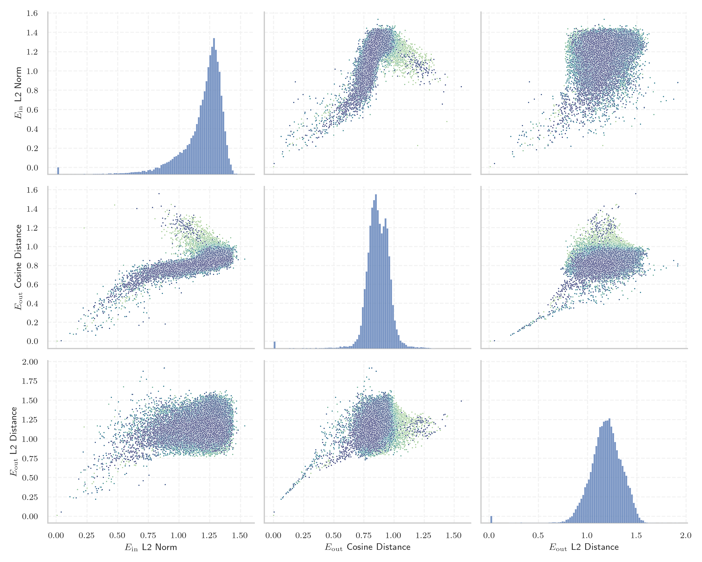

# Report for `152334H/miqu-1-70b-sf`

## Model info

* Model Info: 
  * Tied embeddings: False
  * LM head uses bias: False
  * Embeddings shape: [32000, 8192]
* Tokenizer Info: 
  * Vocab Size: 32000
  * Tokenizer Class: LlamaTokenizer
  * Tokenizer Type: BPE
  * Bytes handling: Byte Fallback
  * Token for verification prompt building: springframework
  * Token id for verification prompt building: 6688
* Indicator summary: 
  * Indicator for under-trained tokens: E_{in} L2 Norm
  * Overall distribution: 1.193 +/- 0.173
* Detected Token Counts: 
  * Number of tested under-trained tokens: 639, 610 non-special, 27 below p = 0.01 threshold, 11 below soft indicator threshold
  * Number of single byte tokens: 351, of which 116 below indicator threshold
  * Number of special tokens: 0, of which 0 below indicator threshold

## Under-trained token indicators plot


## Verification plot


## Under-trained token verification results
11 entries below threshold of 0.233

|   token_id | token                       |   indicator | max_prob                                                         | in_other_tokens                                                                                                                                                                            |
|------------|-----------------------------|-------------|------------------------------------------------------------------|--------------------------------------------------------------------------------------------------------------------------------------------------------------------------------------------|
|      28574 | ````` ▁Mediabestanden ````` |   0.0404368 | <span style='border: 1px solid rgb(169, 68, 66);'>0.00013</span> |                                                                                                                                                                                            |
|      20609 | ````` ▁Portály `````        |   0.111556  | <span style='border: 1px solid rgb(255, 145, 0);'>0.0012</span>  |                                                                                                                                                                                            |
|      12731 | ````` ederbörd `````        |   0.139958  | <span style='border: 1px solid rgb(255, 145, 0);'>0.0029</span>  | <span style='border: 1px solid rgb(40, 167, 69);'>````` ▁nederbörd `````</span>, <span style='border: 1px solid rgb(255, 145, 0);'>````` nederbörd `````</span>, ````` ▁årsnederbörd ````` |
|      26498 | ````` >\<^ `````            |   0.162409  | <span style='border: 1px solid rgb(251, 189, 8);'>0.025</span>   |                                                                                                                                                                                            |
|       3798 | ````` oreferrer `````       |   0.173164  | <span style='border: 1px solid rgb(40, 167, 69);'>0.25</span>    | <span style='border: 1px solid rgb(40, 167, 69);'>````` ▁noreferrer `````</span>, <span style='border: 1px solid rgb(40, 167, 69);'>````` noreferrer `````</span>                          |
|      28642 | ````` ▁regnig `````         |   0.183191  | <span style='border: 1px solid rgb(255, 145, 0);'>0.0013</span>  | <span style='border: 1px solid rgb(169, 68, 66);'>````` ▁regnigaste `````</span>                                                                                                           |
|      12882 | ````` ITableView `````      |   0.20117   | <span style='border: 1px solid rgb(40, 167, 69);'>0.96</span>    | ````` ▁UITableView `````, ````` UITableView `````                                                                                                                                          |
|      23313 | ````` Obrázky `````         |   0.219415  | <span style='border: 1px solid rgb(40, 167, 69);'>0.69</span>    |                                                                                                                                                                                            |
|      20486 | ````` tatywna `````         |   0.22312   | <span style='border: 1px solid rgb(251, 189, 8);'>0.027</span>   | <span style='border: 1px solid rgb(255, 145, 0);'>````` ▁autorytatywna `````</span>                                                                                                        |
|      28623 | ````` ▁Genomsnitt `````     |   0.226055  | <span style='border: 1px solid rgb(251, 189, 8);'>0.06</span>    | <span style='border: 1px solid rgb(40, 167, 69);'>````` ▁Genomsnittlig `````</span>                                                                                                        |
|      11766 | ````` хівовано `````        |   0.227875  | <span style='border: 1px solid rgb(255, 145, 0);'>0.0052</span>  | <span style='border: 1px solid rgb(40, 167, 69);'>````` Архівовано `````</span>                                                                                                            |


## Byte tokens
116 entries below threshold of 0.344

|   token_id | token              |   indicator |   ord | hex   | byte_type   | reencoded             |
|------------|--------------------|-------------|-------|-------|-------------|-----------------------|
|         60 | ````` <0x39> ````` |  0.00684062 |    57 | 0x39  | ascii       | 29929: ````` 9 `````  |
|         71 | ````` <0x44> ````` |  0.00686582 |    68 | 0x44  | ascii       | 29928: ````` D `````  |
|         37 | ````` <0x22> ````` |  0.00687199 |    34 | 0x22  | ascii       | 29908: ````` " `````  |
|         16 | ````` <0x0D> ````` |  0.00688405 |    13 | 0x0D  | ascii       | 30004: ````` \r ````` |
|        121 | ````` <0x76> ````` |  0.00688989 |   118 | 0x76  | ascii       | 29894: ````` v `````  |
|         53 | ````` <0x32> ````` |  0.00689101 |    50 | 0x32  | ascii       | 29906: ````` 2 `````  |
|        101 | ````` <0x62> ````` |  0.00689315 |    98 | 0x62  | ascii       | 29890: ````` b `````  |
|        116 | ````` <0x71> ````` |  0.00689645 |   113 | 0x71  | ascii       | 29939: ````` q `````  |
|        258 | ````` <0xFF> ````` |  0.00689971 |   255 | 0xFF  | unused_utf8 |                       |
|        102 | ````` <0x63> ````` |  0.0069024  |    99 | 0x63  | ascii       | 29883: ````` c `````  |
|        253 | ````` <0xFA> ````` |  0.00690378 |   250 | 0xFA  | unused_utf8 |                       |
|         61 | ````` <0x3A> ````` |  0.00690601 |    58 | 0x3A  | ascii       | 29901: ````` : `````  |
|         79 | ````` <0x4C> ````` |  0.00690696 |    76 | 0x4C  | ascii       | 29931: ````` L `````  |
|        248 | ````` <0xF5> ````` |  0.00690835 |   245 | 0xF5  | unused_utf8 |                       |
|        127 | ````` <0x7C> ````` |  0.00690929 |   124 | 0x7C  | ascii       | 29989: ````` \| ````` |
|        111 | ````` <0x6C> ````` |  0.00690964 |   108 | 0x6C  | ascii       | 29880: ````` l `````  |
|        114 | ````` <0x6F> ````` |  0.00691026 |   111 | 0x6F  | ascii       | 29877: ````` o `````  |
|         73 | ````` <0x46> ````` |  0.00691725 |    70 | 0x46  | ascii       | 29943: ````` F `````  |
|        120 | ````` <0x75> ````` |  0.00691869 |   117 | 0x75  | ascii       | 29884: ````` u `````  |
|         43 | ````` <0x28> ````` |  0.00692003 |    40 | 0x28  | ascii       | 29898: ````` ( `````  |
<details><summary>96 additional entries below threshold</summary>

|   token_id | token              |   indicator |   ord | hex   | byte_type   | reencoded            |
|------------|--------------------|-------------|-------|-------|-------------|----------------------|
|        250 | ````` <0xF7> ````` |  0.00692152 |   247 | 0xF7  | unused_utf8 |                      |
|         94 | ````` <0x5B> ````` |  0.00692426 |    91 | 0x5B  | ascii       | 29961: ````` [ ````` |
|         93 | ````` <0x5A> ````` |  0.00692465 |    90 | 0x5A  | ascii       | 29999: ````` Z ````` |
|         68 | ````` <0x41> ````` |  0.00692505 |    65 | 0x41  | ascii       | 29909: ````` A ````` |
|         95 | ````` <0x5C> ````` |  0.006926   |    92 | 0x5C  | ascii       | 29905: ````` \ ````` |
|        255 | ````` <0xFC> ````` |  0.00692806 |   252 | 0xFC  | unused_utf8 |                      |
|        254 | ````` <0xFB> ````` |  0.00692959 |   251 | 0xFB  | unused_utf8 |                      |
|         49 | ````` <0x2E> ````` |  0.00693074 |    46 | 0x2E  | ascii       | 29889: ````` . ````` |
|         59 | ````` <0x38> ````` |  0.006938   |    56 | 0x38  | ascii       | 29947: ````` 8 ````` |
|        110 | ````` <0x6B> ````` |  0.00694119 |   107 | 0x6B  | ascii       | 29895: ````` k ````` |
|         89 | ````` <0x56> ````` |  0.00694301 |    86 | 0x56  | ascii       | 29963: ````` V ````` |
|         84 | ````` <0x51> ````` |  0.00694448 |    81 | 0x51  | ascii       | 29984: ````` Q ````` |
|         38 | ````` <0x23> ````` |  0.00694492 |    35 | 0x23  | ascii       | 29937: ````` # ````` |
|         41 | ````` <0x26> ````` |  0.00694733 |    38 | 0x26  | ascii       | 29987: ````` & ````` |
|         92 | ````` <0x59> ````` |  0.00694812 |    89 | 0x59  | ascii       | 29979: ````` Y ````` |
|         48 | ````` <0x2D> ````` |  0.00694828 |    45 | 0x2D  | ascii       | 29899: ````` - ````` |
|        128 | ````` <0x7D> ````` |  0.00695    |   125 | 0x7D  | ascii       | 29913: ````` } ````` |
|        196 | ````` <0xC1> ````` |  0.00695037 |   193 | 0xC1  | unused_utf8 |                      |
|         76 | ````` <0x49> ````` |  0.00695041 |    73 | 0x49  | ascii       | 29902: ````` I ````` |
|        126 | ````` <0x7B> ````` |  0.00695042 |   123 | 0x7B  | ascii       | 29912: ````` { ````` |
|        117 | ````` <0x72> ````` |  0.00695236 |   114 | 0x72  | ascii       | 29878: ````` r ````` |
|         58 | ````` <0x37> ````` |  0.00695272 |    55 | 0x37  | ascii       | 29955: ````` 7 ````` |
|         45 | ````` <0x2A> ````` |  0.00695589 |    42 | 0x2A  | ascii       | 29930: ````` * ````` |
|         42 | ````` <0x27> ````` |  0.00695667 |    39 | 0x27  | ascii       | 29915: ````` ' ````` |
|         52 | ````` <0x31> ````` |  0.00695677 |    49 | 0x31  | ascii       | 29896: ````` 1 ````` |
|        104 | ````` <0x65> ````` |  0.00695792 |   101 | 0x65  | ascii       | 29872: ````` e ````` |
|         54 | ````` <0x33> ````` |  0.00695927 |    51 | 0x33  | ascii       | 29941: ````` 3 ````` |
|        256 | ````` <0xFD> ````` |  0.00696013 |   253 | 0xFD  | unused_utf8 |                      |
|         67 | ````` <0x40> ````` |  0.0069637  |    64 | 0x40  | ascii       | 29992: ````` @ ````` |
|        118 | ````` <0x73> ````` |  0.00696497 |   115 | 0x73  | ascii       | 29879: ````` s ````` |
|         55 | ````` <0x34> ````` |  0.00696679 |    52 | 0x34  | ascii       | 29946: ````` 4 ````` |
|        109 | ````` <0x6A> ````` |  0.00696719 |   106 | 0x6A  | ascii       | 29926: ````` j ````` |
|        112 | ````` <0x6D> ````` |  0.00696722 |   109 | 0x6D  | ascii       | 29885: ````` m ````` |
|        100 | ````` <0x61> ````` |  0.00696777 |    97 | 0x61  | ascii       | 29874: ````` a ````` |
|        122 | ````` <0x77> ````` |  0.00697065 |   119 | 0x77  | ascii       | 29893: ````` w ````` |
|         62 | ````` <0x3B> ````` |  0.00697266 |    59 | 0x3B  | ascii       | 29936: ````` ; ````` |
|        119 | ````` <0x74> ````` |  0.00697425 |   116 | 0x74  | ascii       | 29873: ````` t ````` |
|         72 | ````` <0x45> ````` |  0.0069749  |    69 | 0x45  | ascii       | 29923: ````` E ````` |
|         88 | ````` <0x55> ````` |  0.00697585 |    85 | 0x55  | ascii       | 29965: ````` U ````` |
|         83 | ````` <0x50> ````` |  0.00697636 |    80 | 0x50  | ascii       | 29925: ````` P ````` |
|         50 | ````` <0x2F> ````` |  0.00697651 |    47 | 0x2F  | ascii       | 29914: ````` / ````` |
|        125 | ````` <0x7A> ````` |  0.00697777 |   122 | 0x7A  | ascii       | 29920: ````` z ````` |
|        105 | ````` <0x66> ````` |  0.00697879 |   102 | 0x66  | ascii       | 29888: ````` f ````` |
|         46 | ````` <0x2B> ````` |  0.00698091 |    43 | 0x2B  | ascii       | 29974: ````` + ````` |
|        257 | ````` <0xFE> ````` |  0.00698321 |   254 | 0xFE  | unused_utf8 |                      |
|         75 | ````` <0x48> ````` |  0.00698448 |    72 | 0x48  | ascii       | 29950: ````` H ````` |
|        129 | ````` <0x7E> ````` |  0.00698473 |   126 | 0x7E  | ascii       | 30022: ````` ~ ````` |
|         74 | ````` <0x47> ````` |  0.0069867  |    71 | 0x47  | ascii       | 29954: ````` G ````` |
|         56 | ````` <0x35> ````` |  0.00698713 |    53 | 0x35  | ascii       | 29945: ````` 5 ````` |
|         81 | ````` <0x4E> ````` |  0.0069882  |    78 | 0x4E  | ascii       | 29940: ````` N ````` |
|         64 | ````` <0x3D> ````` |  0.00698877 |    61 | 0x3D  | ascii       | 29922: ````` = ````` |
|         82 | ````` <0x4F> ````` |  0.00699037 |    79 | 0x4F  | ascii       | 29949: ````` O ````` |
|        195 | ````` <0xC0> ````` |  0.00699116 |   192 | 0xC0  | unused_utf8 |                      |
|         78 | ````` <0x4B> ````` |  0.00699222 |    75 | 0x4B  | ascii       | 29968: ````` K ````` |
|         98 | ````` <0x5F> ````` |  0.00699285 |    95 | 0x5F  | ascii       | 29918: ````` _ ````` |
|        107 | ````` <0x68> ````` |  0.00699626 |   104 | 0x68  | ascii       | 29882: ````` h ````` |
|        108 | ````` <0x69> ````` |  0.00699891 |   105 | 0x69  | ascii       | 29875: ````` i ````` |
|         91 | ````` <0x58> ````` |  0.00700167 |    88 | 0x58  | ascii       | 29990: ````` X ````` |
|         99 | ````` <0x60> ````` |  0.00700221 |    96 | 0x60  | ascii       | 29952: ````` ` ````` |
|         90 | ````` <0x57> ````` |  0.00700451 |    87 | 0x57  | ascii       | 29956: ````` W ````` |
|        106 | ````` <0x67> ````` |  0.00700518 |   103 | 0x67  | ascii       | 29887: ````` g ````` |
|         44 | ````` <0x29> ````` |  0.00700659 |    41 | 0x29  | ascii       | 29897: ````` ) ````` |
|         70 | ````` <0x43> ````` |  0.00700763 |    67 | 0x43  | ascii       | 29907: ````` C ````` |
|        198 | ````` <0xC3> ````` |  0.00700895 |   195 | 0xC3  | utf8        |                      |
|         97 | ````` <0x5E> ````` |  0.00701026 |    94 | 0x5E  | ascii       | 29985: ````` ^ ````` |
|        113 | ````` <0x6E> ````` |  0.0070116  |   110 | 0x6E  | ascii       | 29876: ````` n ````` |
|         87 | ````` <0x54> ````` |  0.00701408 |    84 | 0x54  | ascii       | 29911: ````` T ````` |
|        249 | ````` <0xF6> ````` |  0.007015   |   246 | 0xF6  | unused_utf8 |                      |
|         35 | ````` <0x20> ````` |  0.00701871 |    32 | 0x20  | ascii       | 29871: ````` ▁ ````` |
|         57 | ````` <0x36> ````` |  0.00701989 |    54 | 0x36  | ascii       | 29953: ````` 6 ````` |
|         51 | ````` <0x30> ````` |  0.00702384 |    48 | 0x30  | ascii       | 29900: ````` 0 ````` |
|        123 | ````` <0x78> ````` |  0.00702775 |   120 | 0x78  | ascii       | 29916: ````` x ````` |
|         65 | ````` <0x3E> ````` |  0.00703214 |    62 | 0x3E  | ascii       | 29958: ````` > ````` |
|         69 | ````` <0x42> ````` |  0.00703501 |    66 | 0x42  | ascii       | 29933: ````` B ````` |
|         96 | ````` <0x5D> ````` |  0.00704317 |    93 | 0x5D  | ascii       | 29962: ````` ] ````` |
|         63 | ````` <0x3C> ````` |  0.00704345 |    60 | 0x3C  | ascii       | 29966: ````` < ````` |
|         77 | ````` <0x4A> ````` |  0.00704421 |    74 | 0x4A  | ascii       | 29967: ````` J ````` |
|         85 | ````` <0x52> ````` |  0.00704882 |    82 | 0x52  | ascii       | 29934: ````` R ````` |
|         39 | ````` <0x24> ````` |  0.0070751  |    36 | 0x24  | ascii       | 29938: ````` $ ````` |
|        252 | ````` <0xF9> ````` |  0.00707858 |   249 | 0xF9  | unused_utf8 |                      |
|         36 | ````` <0x21> ````` |  0.00708333 |    33 | 0x21  | ascii       | 29991: ````` ! ````` |
|         66 | ````` <0x3F> ````` |  0.00708377 |    63 | 0x3F  | ascii       | 29973: ````` ? ````` |
|         40 | ````` <0x25> ````` |  0.00708512 |    37 | 0x25  | ascii       | 29995: ````` % ````` |
|        115 | ````` <0x70> ````` |  0.00708533 |   112 | 0x70  | ascii       | 29886: ````` p ````` |
|        124 | ````` <0x79> ````` |  0.00708568 |   121 | 0x79  | ascii       | 29891: ````` y ````` |
|         47 | ````` <0x2C> ````` |  0.00709267 |    44 | 0x2C  | ascii       | 29892: ````` , ````` |
|        103 | ````` <0x64> ````` |  0.00710018 |   100 | 0x64  | ascii       | 29881: ````` d ````` |
|         86 | ````` <0x53> ````` |  0.00711252 |    83 | 0x53  | ascii       | 29903: ````` S ````` |
|        251 | ````` <0xF8> ````` |  0.0071169  |   248 | 0xF8  | unused_utf8 |                      |
|         80 | ````` <0x4D> ````` |  0.00712559 |    77 | 0x4D  | ascii       | 29924: ````` M ````` |
|         31 | ````` <0x1C> ````` |  0.242568   |    28 | 0x1C  | ascii       |                      |
|         33 | ````` <0x1E> ````` |  0.251195   |    30 | 0x1E  | ascii       |                      |
|         32 | ````` <0x1D> ````` |  0.292453   |    29 | 0x1D  | ascii       |                      |
|         14 | ````` <0x0B> ````` |  0.304099   |    11 | 0x0B  | ascii       |                      |
|        244 | ````` <0xF1> ````` |  0.309325   |   241 | 0xF1  | utf8        |                      |
|         15 | ````` <0x0C> ````` |  0.333642   |    12 | 0x0C  | ascii       |                      |
</details>


## Special tokens
2 entries below threshold of 0.344

|   token_id | token             |   indicator | max_prob                                                       |
|------------|-------------------|-------------|----------------------------------------------------------------|
|          0 | ````` <unk> ````` |  0.00689702 | <span style='border: 1px solid rgb(169, 68, 66);'>2e-09</span> |
|          2 | ````` </s> `````  |  0.226929   | <span style='border: 1px solid rgb(251, 189, 8);'>0.04</span>  |

