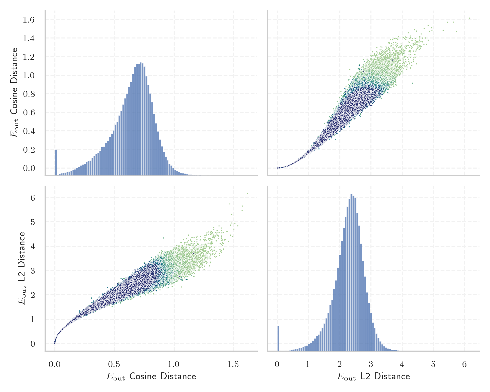
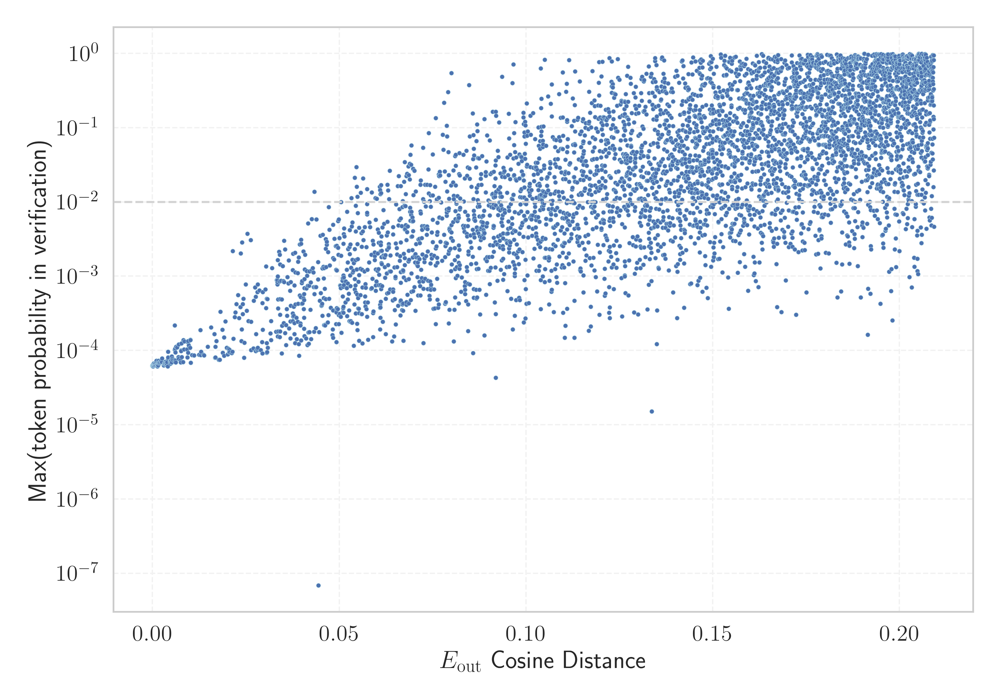

# Report for `CohereForAI/aya-23-35B`

## Model info

* Tied embeddings: yes
* LM head uses bias: no
* Indicator for under-trained tokens: E_{out} Cosine Distance
  * Overall distribution 0.640 +/- 0.188
  * Token used for verification prompt building: `InvalidProtocolBufferException`
  * Verification threshold: 0.209
  * Threshold for showing candidate under-trained tokens: 0.077
  * Median verified threshold (for bytes, unreachable and special tokens): 0.089
* Embeddings shape: (256000, 8192)
* Vocabulary size: 255029
  * Number of single byte tokens: 256, of which 20 below indicator threshold
  * Number of special tokens: 37, of which 29 below indicator threshold
  * Number of non-single-byte unreachable tokens: 1403, of which 1403 below indicator threshold
  * Number of non-single-byte UTF-fragment tokens: 2956, 43 below soft indicator threshold
  * Number of tested under-trained tokens: 5012, 4955 non-special, 1650 below p = 0.01 threshold, 757 below soft indicator threshold

## Under-trained token indicators plot


## Verification plot


## Under-trained token verification results
757 entries below threshold of 0.077

|   token_id | token                                                                                                                                |    indicator | max_prob                                                         | in_other_tokens                                                                                                                                                                                                                                                                                                                                                                                                                                                                                                                                                                                                                                                                                                                     |
|------------|--------------------------------------------------------------------------------------------------------------------------------------|--------------|------------------------------------------------------------------|-------------------------------------------------------------------------------------------------------------------------------------------------------------------------------------------------------------------------------------------------------------------------------------------------------------------------------------------------------------------------------------------------------------------------------------------------------------------------------------------------------------------------------------------------------------------------------------------------------------------------------------------------------------------------------------------------------------------------------------|
|     177875 | ````` tochassubtree `````                                                                                                            | -2.38419e-07 | <span style='border: 1px solid rgb(169, 68, 66);'>6.3e-05</span> |                                                                                                                                                                                                                                                                                                                                                                                                                                                                                                                                                                                                                                                                                                                                     |
|      22188 | ````` ▁林肯近地小行星研究小 `````                                                                                                    | -2.38419e-07 | <span style='border: 1px solid rgb(169, 68, 66);'>6.3e-05</span> | <span style='border: 1px solid rgb(255, 145, 0);'>````` ▁林肯近地小行星研究小组 `````</span>, <span style='border: 1px solid rgb(255, 145, 0);'>````` ▁林肯近地小行星研究小組 `````</span>                                                                                                                                                                                                                                                                                                                                                                                                                                                                                                                                          |
|     140485 | ````` 目前尚未由人工引 `````                                                                                                         | -2.38419e-07 | <span style='border: 1px solid rgb(169, 68, 66);'>6.3e-05</span> | <span style='border: 1px solid rgb(169, 68, 66);'>````` 目前尚未由人工引种栽培 `````</span>, <span style='border: 1px solid rgb(169, 68, 66);'>````` 目前尚未由人工引種栽培 `````</span>                                                                                                                                                                                                                                                                                                                                                                                                                                                                                                                                            |
|      51386 | ````` ▁ARStdSong `````                                                                                                               | -2.38419e-07 | <span style='border: 1px solid rgb(169, 68, 66);'>6.3e-05</span> |                                                                                                                                                                                                                                                                                                                                                                                                                                                                                                                                                                                                                                                                                                                                     |
|     239520 | ````` ▁hbBiddersParams `````                                                                                                         | -1.19209e-07 | <span style='border: 1px solid rgb(169, 68, 66);'>6.3e-05</span> |                                                                                                                                                                                                                                                                                                                                                                                                                                                                                                                                                                                                                                                                                                                                     |
|      72754 | ````` ageryears `````                                                                                                                | -1.19209e-07 | <span style='border: 1px solid rgb(169, 68, 66);'>6.3e-05</span> | <span style='border: 1px solid rgb(40, 167, 69);'>````` manageryears `````</span>, ````` ▁manageryears `````                                                                                                                                                                                                                                                                                                                                                                                                                                                                                                                                                                                                                        |
|      84176 | ````` recDocCases `````                                                                                                              | -1.19209e-07 | <span style='border: 1px solid rgb(169, 68, 66);'>6.3e-05</span> |                                                                                                                                                                                                                                                                                                                                                                                                                                                                                                                                                                                                                                                                                                                                     |
|     127300 | ````` tocguid `````                                                                                                                  | -1.19209e-07 | <span style='border: 1px solid rgb(169, 68, 66);'>6.3e-05</span> |                                                                                                                                                                                                                                                                                                                                                                                                                                                                                                                                                                                                                                                                                                                                     |
|     208149 | ````` AddLanguageSpecificText `````                                                                                                  | -1.19209e-07 | <span style='border: 1px solid rgb(169, 68, 66);'>6.3e-05</span> | <span style='border: 1px solid rgb(169, 68, 66);'>````` AddLanguageSpecificTextSet `````</span>                                                                                                                                                                                                                                                                                                                                                                                                                                                                                                                                                                                                                                     |
|      15675 | ````` \U000e0067\U000e0062\U000e0065\U000e006e\U000e0067\U000e007f\U000e0067\U000e0062\U000e0065\U000e006e\U000e0067\U000e007f ````` |  4.76837e-07 | <span style='border: 1px solid rgb(169, 68, 66);'>6.3e-05</span> | <span style='border: 1px solid rgb(255, 145, 0);'>````` ▁🏴\U000e0067\U000e0062\U000e0065\U000e006e\U000e0067\U000e007f\U000e0067\U000e0062\U000e0065\U000e006e\U000e0067\U000e007f `````</span>, <span style='border: 1px solid rgb(255, 145, 0);'>````` 🏴\U000e0067\U000e0062\U000e0065\U000e006e\U000e0067\U000e007f\U000e0067\U000e0062\U000e0065\U000e006e\U000e0067\U000e007f `````</span>                                                                                                                                                                                                                                                                                                                                   |
|     141168 | ````` ephritidae `````                                                                                                               |  4.29153e-05 | <span style='border: 1px solid rgb(169, 68, 66);'>6.3e-05</span> | <span style='border: 1px solid rgb(251, 189, 8);'>````` Tephritidae `````</span>, <span style='border: 1px solid rgb(40, 167, 69);'>````` ▁Tephritidae `````</span>                                                                                                                                                                                                                                                                                                                                                                                                                                                                                                                                                                 |
|     139462 | ````` 和人口皆未知 `````                                                                                                             |  4.93526e-05 | <span style='border: 1px solid rgb(169, 68, 66);'>6.3e-05</span> | <span style='border: 1px solid rgb(169, 68, 66);'>````` 面积和人口皆未知 `````</span>, <span style='border: 1px solid rgb(169, 68, 66);'>````` 該地的面積和人口皆未知 `````</span>, <span style='border: 1px solid rgb(169, 68, 66);'>````` 该地的面积和人口皆未知 `````</span>                                                                                                                                                                                                                                                                                                                                                                                                                                                     |
|     224223 | ````` 面积和人口皆未知 `````                                                                                                         |  5.14388e-05 | <span style='border: 1px solid rgb(169, 68, 66);'>6.2e-05</span> | <span style='border: 1px solid rgb(169, 68, 66);'>````` 该地的面积和人口皆未知 `````</span>                                                                                                                                                                                                                                                                                                                                                                                                                                                                                                                                                                                                                                         |
|      71049 | ````` tocectory `````                                                                                                                |  5.99027e-05 | <span style='border: 1px solid rgb(169, 68, 66);'>6.4e-05</span> |                                                                                                                                                                                                                                                                                                                                                                                                                                                                                                                                                                                                                                                                                                                                     |
|     190228 | ````` ▁Hmelnî `````                                                                                                                  |  6.90222e-05 | <span style='border: 1px solid rgb(169, 68, 66);'>6.2e-05</span> | <span style='border: 1px solid rgb(169, 68, 66);'>````` ▁Hmelnîțkîi `````</span>                                                                                                                                                                                                                                                                                                                                                                                                                                                                                                                                                                                                                                                    |
|     141246 | ````` locatorSection `````                                                                                                           |  7.37309e-05 | <span style='border: 1px solid rgb(169, 68, 66);'>6.3e-05</span> |                                                                                                                                                                                                                                                                                                                                                                                                                                                                                                                                                                                                                                                                                                                                     |
|       9741 | ````` \U000e0067\U000e0062\U000e0065\U000e006e `````                                                                                 |  0.000118613 | <span style='border: 1px solid rgb(169, 68, 66);'>6.4e-05</span> | <span style='border: 1px solid rgb(255, 145, 0);'>````` ▁🏴\U000e0067\U000e0062\U000e0065\U000e006e\U000e0067\U000e007f\U000e0067\U000e0062\U000e0065\U000e006e\U000e0067\U000e007f `````</span>, <span style='border: 1px solid rgb(169, 68, 66);'>````` \U000e0067\U000e0062\U000e0065\U000e006e\U000e0067\U000e007f\U000e0067\U000e0062\U000e0065\U000e006e\U000e0067\U000e007f `````</span>, <span style='border: 1px solid rgb(169, 68, 66);'>````` \U000e0067\U000e0062\U000e0065\U000e006e\U000e0067\U000e007f `````</span>, <span style='border: 1px solid rgb(255, 145, 0);'>````` 🏴\U000e0067\U000e0062\U000e0065\U000e006e\U000e0067\U000e007f\U000e0067\U000e0062\U000e0065\U000e006e\U000e0067\U000e007f `````</span> |
|     149800 | ````` 年建立的教育 `````                                                                                                             |  0.000136435 | <span style='border: 1px solid rgb(169, 68, 66);'>6.1e-05</span> | <span style='border: 1px solid rgb(169, 68, 66);'>````` 年建立的教育機構 `````</span>, <span style='border: 1px solid rgb(169, 68, 66);'>````` 年建立的教育机构 `````</span>                                                                                                                                                                                                                                                                                                                                                                                                                                                                                                                                                        |
|     190437 | ````` BiddersParams `````                                                                                                            |  0.000165045 | <span style='border: 1px solid rgb(169, 68, 66);'>6.3e-05</span> | <span style='border: 1px solid rgb(169, 68, 66);'>````` ▁hbBiddersParams `````</span>                                                                                                                                                                                                                                                                                                                                                                                                                                                                                                                                                                                                                                               |
|     208151 | ````` AddLanguageSpecificTextSet `````                                                                                               |  0.000166357 | <span style='border: 1px solid rgb(169, 68, 66);'>6.4e-05</span> |                                                                                                                                                                                                                                                                                                                                                                                                                                                                                                                                                                                                                                                                                                                                     |
<details><summary>737 additional entries below threshold</summary>

|   token_id | token                                                                                                        |   indicator | max_prob                                                         | in_other_tokens                                                                                                                                                                                                                                                                                                                                                                                                                                                                                                                                                                                                                                                                                                                     |
|------------|--------------------------------------------------------------------------------------------------------------|-------------|------------------------------------------------------------------|-------------------------------------------------------------------------------------------------------------------------------------------------------------------------------------------------------------------------------------------------------------------------------------------------------------------------------------------------------------------------------------------------------------------------------------------------------------------------------------------------------------------------------------------------------------------------------------------------------------------------------------------------------------------------------------------------------------------------------------|
|      51385 | ````` ▁ARStd `````                                                                                           | 0.000268519 | <span style='border: 1px solid rgb(169, 68, 66);'>6.3e-05</span> | <span style='border: 1px solid rgb(169, 68, 66);'>````` ▁ARStdSong `````</span>                                                                                                                                                                                                                                                                                                                                                                                                                                                                                                                                                                                                                                                     |
|     100190 | ````` Desambigua `````                                                                                       | 0.000279546 | <span style='border: 1px solid rgb(169, 68, 66);'>6.5e-05</span> | <span style='border: 1px solid rgb(169, 68, 66);'>````` Desambiguação `````</span>, <span style='border: 1px solid rgb(255, 145, 0);'>````` Desambiguações `````</span>                                                                                                                                                                                                                                                                                                                                                                                                                                                                                                                                                             |
|      94747 | ````` OnSearchSelect `````                                                                                   | 0.00032407  | <span style='border: 1px solid rgb(169, 68, 66);'>6.7e-05</span> | <span style='border: 1px solid rgb(255, 145, 0);'>````` OnSearchSelectShow `````</span>, <span style='border: 1px solid rgb(169, 68, 66);'>````` OnSearchSelectKey `````</span>, <span style='border: 1px solid rgb(255, 145, 0);'>````` OnSearchSelectHide `````</span>                                                                                                                                                                                                                                                                                                                                                                                                                                                            |
|     127290 | ````` srguid `````                                                                                           | 0.000524044 | <span style='border: 1px solid rgb(169, 68, 66);'>6.3e-05</span> |                                                                                                                                                                                                                                                                                                                                                                                                                                                                                                                                                                                                                                                                                                                                     |
|     177855 | ````` assubtree `````                                                                                        | 0.000544369 | <span style='border: 1px solid rgb(169, 68, 66);'>6.5e-05</span> | <span style='border: 1px solid rgb(169, 68, 66);'>````` tochassubtree `````</span>                                                                                                                                                                                                                                                                                                                                                                                                                                                                                                                                                                                                                                                  |
|     228399 | ````` цыкла `````                                                                                            | 0.000600159 | <span style='border: 1px solid rgb(169, 68, 66);'>6.6e-05</span> | <span style='border: 1px solid rgb(169, 68, 66);'>````` цыклапедыя `````</span>, <span style='border: 1px solid rgb(169, 68, 66);'>````` цыклапед `````</span>, <span style='border: 1px solid rgb(169, 68, 66);'>````` ▁Энцыклапедыя `````</span>                                                                                                                                                                                                                                                                                                                                                                                                                                                                                  |
|     172752 | ````` ablytyped `````                                                                                        | 0.00069809  | <span style='border: 1px solid rgb(169, 68, 66);'>6.4e-05</span> | <span style='border: 1px solid rgb(255, 145, 0);'>````` scalablytyped `````</span>                                                                                                                                                                                                                                                                                                                                                                                                                                                                                                                                                                                                                                                  |
|     114578 | ````` inyphiidae `````                                                                                       | 0.000736773 | <span style='border: 1px solid rgb(169, 68, 66);'>6.6e-05</span> | <span style='border: 1px solid rgb(255, 145, 0);'>````` ▁Linyphiidae `````</span>, <span style='border: 1px solid rgb(255, 145, 0);'>````` Linyphiidae `````</span>                                                                                                                                                                                                                                                                                                                                                                                                                                                                                                                                                                 |
|     223425 | ````` 而人口密度為 `````                                                                                     | 0.000933588 | <span style='border: 1px solid rgb(169, 68, 66);'>6.4e-05</span> | <span style='border: 1px solid rgb(255, 145, 0);'>````` 而人口密度為每平方千米 `````</span>                                                                                                                                                                                                                                                                                                                                                                                                                                                                                                                                                                                                                                         |
|      74789 | ````` stdtemplate `````                                                                                      | 0.00101435  | <span style='border: 1px solid rgb(169, 68, 66);'>7.3e-05</span> |                                                                                                                                                                                                                                                                                                                                                                                                                                                                                                                                                                                                                                                                                                                                     |
|     119253 | ````` écosl `````                                                                                            | 0.00108701  | <span style='border: 1px solid rgb(169, 68, 66);'>6.6e-05</span> | ````` ▁tchécoslova `````, <span style='border: 1px solid rgb(255, 145, 0);'>````` écoslovaquie `````</span>, ````` ▁Tchécoslovaquie `````, <span style='border: 1px solid rgb(255, 145, 0);'>````` écoslova `````</span>                                                                                                                                                                                                                                                                                                                                                                                                                                                                                                            |
|     144020 | ````` оспоживача `````                                                                                       | 0.00125009  | <span style='border: 1px solid rgb(169, 68, 66);'>6.6e-05</span> | <span style='border: 1px solid rgb(169, 68, 66);'>````` ▁особоспоживача `````</span>                                                                                                                                                                                                                                                                                                                                                                                                                                                                                                                                                                                                                                                |
|     100216 | ````` ▁μυθισ `````                                                                                           | 0.00125724  | <span style='border: 1px solid rgb(169, 68, 66);'>6.4e-05</span> | ````` ▁μυθιστο `````, ````` ▁μυθιστό `````, ````` ▁μυθιστόρημα `````                                                                                                                                                                                                                                                                                                                                                                                                                                                                                                                                                                                                                                                                |
|     249467 | ````` Тісс `````                                                                                             | 0.00127065  | <span style='border: 1px solid rgb(169, 68, 66);'>6.9e-05</span> | <span style='border: 1px solid rgb(169, 68, 66);'>````` Тіссеранів `````</span>                                                                                                                                                                                                                                                                                                                                                                                                                                                                                                                                                                                                                                                     |
|     214699 | ````` 平均海拔高度為 `````                                                                                   | 0.00127208  | <span style='border: 1px solid rgb(169, 68, 66);'>6.1e-05</span> | <span style='border: 1px solid rgb(255, 145, 0);'>````` 而該地的平均海拔高度為 `````</span>                                                                                                                                                                                                                                                                                                                                                                                                                                                                                                                                                                                                                                         |
|      71714 | ````` 所属的省级 `````                                                                                       | 0.00142974  | <span style='border: 1px solid rgb(169, 68, 66);'>6.3e-05</span> | <span style='border: 1px solid rgb(255, 145, 0);'>````` 所属的省级选区为 `````</span>                                                                                                                                                                                                                                                                                                                                                                                                                                                                                                                                                                                                                                               |
|     223844 | ````` 該地的面積 `````                                                                                       | 0.00152087  | <span style='border: 1px solid rgb(169, 68, 66);'>6.3e-05</span> | <span style='border: 1px solid rgb(169, 68, 66);'>````` 該地的面積和人口皆未知 `````</span>                                                                                                                                                                                                                                                                                                                                                                                                                                                                                                                                                                                                                                         |
|      31886 | ````` docguid `````                                                                                          | 0.00156856  | <span style='border: 1px solid rgb(169, 68, 66);'>6.9e-05</span> |                                                                                                                                                                                                                                                                                                                                                                                                                                                                                                                                                                                                                                                                                                                                     |
|     202267 | ````` \U000e0074\U000e007f `````                                                                             | 0.00157332  | <span style='border: 1px solid rgb(169, 68, 66);'>7.2e-05</span> | ````` <0xB3>\U000e0063\U000e0074\U000e007f `````, <span style='border: 1px solid rgb(255, 145, 0);'>````` ▁🏴\U000e0067\U000e0062\U000e0073\U000e0063\U000e0074\U000e007f `````</span>                                                                                                                                                                                                                                                                                                                                                                                                                                                                                                                                              |
|     188002 | ````` țkîi `````                                                                                             | 0.00161308  | <span style='border: 1px solid rgb(169, 68, 66);'>7.2e-05</span> | <span style='border: 1px solid rgb(169, 68, 66);'>````` ▁Hmelnîțkîi `````</span>                                                                                                                                                                                                                                                                                                                                                                                                                                                                                                                                                                                                                                                    |
|     143921 | ````` 而水域 `````                                                                                           | 0.00177127  | <span style='border: 1px solid rgb(169, 68, 66);'>6.7e-05</span> | <span style='border: 1px solid rgb(169, 68, 66);'>````` 而水域面积为 `````</span>, <span style='border: 1px solid rgb(169, 68, 66);'>````` 而水域面積為 `````</span>                                                                                                                                                                                                                                                                                                                                                                                                                                                                                                                                                                |
|     127302 | ````` deliveryTarget `````                                                                                   | 0.00177735  | <span style='border: 1px solid rgb(169, 68, 66);'>6.9e-05</span> |                                                                                                                                                                                                                                                                                                                                                                                                                                                                                                                                                                                                                                                                                                                                     |
|     127301 | ````` deliveryLink `````                                                                                     | 0.00193834  | <span style='border: 1px solid rgb(169, 68, 66);'>7e-05</span>   |                                                                                                                                                                                                                                                                                                                                                                                                                                                                                                                                                                                                                                                                                                                                     |
|      69100 | ````` \U000e0073\U000e007f `````                                                                             | 0.00218958  | <span style='border: 1px solid rgb(169, 68, 66);'>7.1e-05</span> | <span style='border: 1px solid rgb(255, 145, 0);'>````` ▁🏴\U000e0067\U000e0062\U000e0077\U000e006c\U000e0073\U000e007f `````</span>, ````` <0xB7>\U000e006c\U000e0073\U000e007f `````                                                                                                                                                                                                                                                                                                                                                                                                                                                                                                                                              |
|     163225 | ````` 俄亥 `````                                                                                             | 0.0023272   | <span style='border: 1px solid rgb(169, 68, 66);'>7.3e-05</span> | ````` 俄亥俄州 `````, ````` 俄亥俄 `````                                                                                                                                                                                                                                                                                                                                                                                                                                                                                                                                                                                                                                                                                            |
|     165878 | ````` ▁Jît `````                                                                                             | 0.00242323  | <span style='border: 1px solid rgb(169, 68, 66);'>7e-05</span>   | <span style='border: 1px solid rgb(169, 68, 66);'>````` ▁Jîtomîr `````</span>                                                                                                                                                                                                                                                                                                                                                                                                                                                                                                                                                                                                                                                       |
|      29307 | ````` memItem `````                                                                                          | 0.0025686   | <span style='border: 1px solid rgb(169, 68, 66);'>7.8e-05</span> | <span style='border: 1px solid rgb(40, 167, 69);'>````` memItemLeft `````</span>, <span style='border: 1px solid rgb(40, 167, 69);'>````` memItemRight `````</span>                                                                                                                                                                                                                                                                                                                                                                                                                                                                                                                                                                 |
|      75649 | ````` μοσπο `````                                                                                            | 0.00302207  | <span style='border: 1px solid rgb(169, 68, 66);'>6.3e-05</span> | ````` ▁Ομοσπονδία `````, ````` μοσπονδια `````, ````` μοσπονδ `````, ````` μοσπον `````, ````` ▁Ομοσπονδίας `````, ...                                                                                                                                                                                                                                                                                                                                                                                                                                                                                                                                                                                                              |
|      98281 | ````` 天文台近地小行星 `````                                                                                 | 0.00306958  | <span style='border: 1px solid rgb(169, 68, 66);'>6.6e-05</span> | <span style='border: 1px solid rgb(255, 145, 0);'>````` ▁洛厄尔天文台近地小行星搜寻计划 `````</span>, <span style='border: 1px solid rgb(169, 68, 66);'>````` 天文台近地小行星搜寻计划 `````</span>                                                                                                                                                                                                                                                                                                                                                                                                                                                                                                                                 |
|     132755 | ````` Сокор `````                                                                                            | 0.003232    | <span style='border: 1px solid rgb(169, 68, 66);'>6.6e-05</span> | <span style='border: 1px solid rgb(169, 68, 66);'>````` Сокорро `````</span>                                                                                                                                                                                                                                                                                                                                                                                                                                                                                                                                                                                                                                                        |
|     215450 | ````` 是一颗围绕太阳公 `````                                                                                 | 0.00325334  | <span style='border: 1px solid rgb(169, 68, 66);'>6.8e-05</span> | ````` 是一颗围绕太阳公转的小行星 `````                                                                                                                                                                                                                                                                                                                                                                                                                                                                                                                                                                                                                                                                                              |
|      21048 | ````` yrıca `````                                                                                            | 0.00333869  | <span style='border: 1px solid rgb(169, 68, 66);'>6.5e-05</span> | ````` ▁Ayrıca `````, ````` Ayrıca `````, ````` ▁ayrıca `````                                                                                                                                                                                                                                                                                                                                                                                                                                                                                                                                                                                                                                                                        |
|      57843 | ````` NdEx `````                                                                                             | 0.00341523  | <span style='border: 1px solid rgb(169, 68, 66);'>7.1e-05</span> | <span style='border: 1px solid rgb(40, 167, 69);'>````` iNdEx `````</span>, <span style='border: 1px solid rgb(40, 167, 69);'>````` ▁iNdEx `````</span>                                                                                                                                                                                                                                                                                                                                                                                                                                                                                                                                                                             |
|      87763 | ````` 덜란드 `````                                                                                           | 0.00346923  | <span style='border: 1px solid rgb(169, 68, 66);'>6.8e-05</span> | ````` 네덜란드 `````, ````` ▁네덜란드 `````                                                                                                                                                                                                                                                                                                                                                                                                                                                                                                                                                                                                                                                                                         |
|      16811 | ````` 한민국의 `````                                                                                         | 0.00368172  | <span style='border: 1px solid rgb(169, 68, 66);'>6.3e-05</span> | ````` 대한민국의 `````, ````` ▁대한민국의 `````                                                                                                                                                                                                                                                                                                                                                                                                                                                                                                                                                                                                                                                                                     |
|     104486 | ````` ούθησε `````                                                                                           | 0.00374395  | <span style='border: 1px solid rgb(169, 68, 66);'>6.9e-05</span> | ````` κολούθησε `````, ````` ▁ακολούθησε `````                                                                                                                                                                                                                                                                                                                                                                                                                                                                                                                                                                                                                                                                                      |
|      71316 | ````` 市镇编码为 `````                                                                                       | 0.00381225  | <span style='border: 1px solid rgb(169, 68, 66);'>6.5e-05</span> | <span style='border: 1px solid rgb(255, 145, 0);'>````` INSEE市镇编码为 `````</span>                                                                                                                                                                                                                                                                                                                                                                                                                                                                                                                                                                                                                                                |
|      85423 | ````` езультаты `````                                                                                        | 0.00384092  | <span style='border: 1px solid rgb(169, 68, 66);'>6.7e-05</span> | ````` ▁результаты `````, ````` Результаты `````, ````` ▁Результаты `````                                                                                                                                                                                                                                                                                                                                                                                                                                                                                                                                                                                                                                                            |
|      28088 | ````` ервые `````                                                                                            | 0.00393105  | <span style='border: 1px solid rgb(169, 68, 66);'>7e-05</span>   | ````` ▁впервые `````, ````` первые `````, ````` Впервые `````, ````` ▁Впервые `````, ````` ▁Первые `````, ...                                                                                                                                                                                                                                                                                                                                                                                                                                                                                                                                                                                                                       |
|     138155 | ````` byliidae `````                                                                                         | 0.00407332  | <span style='border: 1px solid rgb(169, 68, 66);'>6.1e-05</span> | <span style='border: 1px solid rgb(255, 145, 0);'>````` ▁Bombyliidae `````</span>, <span style='border: 1px solid rgb(40, 167, 69);'>````` Bombyliidae `````</span>                                                                                                                                                                                                                                                                                                                                                                                                                                                                                                                                                                 |
|      71269 | ````` aravant `````                                                                                          | 0.00414509  | <span style='border: 1px solid rgb(169, 68, 66);'>7.7e-05</span> | ````` ▁auparavant `````, ````` uparavant `````                                                                                                                                                                                                                                                                                                                                                                                                                                                                                                                                                                                                                                                                                      |
|       9740 | ````` \U000e0067\U000e007f `````                                                                             | 0.00415313  | <span style='border: 1px solid rgb(169, 68, 66);'>9.6e-05</span> | <span style='border: 1px solid rgb(255, 145, 0);'>````` ▁🏴\U000e0067\U000e0062\U000e0065\U000e006e\U000e0067\U000e007f\U000e0067\U000e0062\U000e0065\U000e006e\U000e0067\U000e007f `````</span>, <span style='border: 1px solid rgb(169, 68, 66);'>````` \U000e0067\U000e0062\U000e0065\U000e006e\U000e0067\U000e007f\U000e0067\U000e0062\U000e0065\U000e006e\U000e0067\U000e007f `````</span>, <span style='border: 1px solid rgb(169, 68, 66);'>````` \U000e0067\U000e0062\U000e0065\U000e006e\U000e0067\U000e007f `````</span>, <span style='border: 1px solid rgb(255, 145, 0);'>````` 🏴\U000e0067\U000e0062\U000e0065\U000e006e\U000e0067\U000e007f\U000e0067\U000e0062\U000e0065\U000e006e\U000e0067\U000e007f `````</span> |
|     165176 | ````` foolcdn `````                                                                                          | 0.00417233  | <span style='border: 1px solid rgb(169, 68, 66);'>8.1e-05</span> |                                                                                                                                                                                                                                                                                                                                                                                                                                                                                                                                                                                                                                                                                                                                     |
|     177869 | ````` ▁tocid `````                                                                                           | 0.00469172  | <span style='border: 1px solid rgb(169, 68, 66);'>7.1e-05</span> |                                                                                                                                                                                                                                                                                                                                                                                                                                                                                                                                                                                                                                                                                                                                     |
|     112496 | ````` ▁předcho `````                                                                                         | 0.00473934  | <span style='border: 1px solid rgb(169, 68, 66);'>6.8e-05</span> | ````` ▁předchozí `````, ````` ▁předchoz `````                                                                                                                                                                                                                                                                                                                                                                                                                                                                                                                                                                                                                                                                                       |
|      72073 | ````` eskipun `````                                                                                          | 0.00477451  | <span style='border: 1px solid rgb(169, 68, 66);'>6.6e-05</span> | ````` Meskipun `````, ````` ▁Meskipun `````                                                                                                                                                                                                                                                                                                                                                                                                                                                                                                                                                                                                                                                                                         |
|      58491 | ````` DFBEF `````                                                                                            | 0.00491452  | <span style='border: 1px solid rgb(169, 68, 66);'>7.3e-05</span> |                                                                                                                                                                                                                                                                                                                                                                                                                                                                                                                                                                                                                                                                                                                                     |
|     176101 | ````` jsdel `````                                                                                            | 0.00491971  | <span style='border: 1px solid rgb(169, 68, 66);'>6.8e-05</span> | ````` jsdelivr `````                                                                                                                                                                                                                                                                                                                                                                                                                                                                                                                                                                                                                                                                                                                |
|      60667 | ````` ▁sconfit `````                                                                                         | 0.00499558  | <span style='border: 1px solid rgb(169, 68, 66);'>7.3e-05</span> | ````` ▁sconfitta `````, ````` ▁sconfitte `````, ````` ▁sconfitto `````                                                                                                                                                                                                                                                                                                                                                                                                                                                                                                                                                                                                                                                              |
|     114974 | ````` ▁auxqu `````                                                                                           | 0.00515819  | <span style='border: 1px solid rgb(169, 68, 66);'>8.2e-05</span> | ````` ▁auxquels `````, ````` ▁auxquelles `````                                                                                                                                                                                                                                                                                                                                                                                                                                                                                                                                                                                                                                                                                      |
|      61835 | ````` есмотря `````                                                                                          | 0.00516587  | <span style='border: 1px solid rgb(169, 68, 66);'>6.9e-05</span> | ````` Несмотря `````, ````` ▁Несмотря `````, ````` ▁несмотря `````                                                                                                                                                                                                                                                                                                                                                                                                                                                                                                                                                                                                                                                                  |
|     157335 | ````` cetophilidae `````                                                                                     | 0.00516897  | <span style='border: 1px solid rgb(169, 68, 66);'>8.3e-05</span> | <span style='border: 1px solid rgb(40, 167, 69);'>````` Mycetophilidae `````</span>, <span style='border: 1px solid rgb(255, 145, 0);'>````` ▁Mycetophilidae `````</span>                                                                                                                                                                                                                                                                                                                                                                                                                                                                                                                                                           |
|     173398 | ````` rowborder `````                                                                                        | 0.00534916  | <span style='border: 1px solid rgb(169, 68, 66);'>7.7e-05</span> | <span style='border: 1px solid rgb(255, 145, 0);'>````` cellrowborder `````</span>                                                                                                                                                                                                                                                                                                                                                                                                                                                                                                                                                                                                                                                  |
|      42729 | ````` ▁Indlaw `````                                                                                          | 0.00550741  | <span style='border: 1px solid rgb(169, 68, 66);'>7.4e-05</span> |                                                                                                                                                                                                                                                                                                                                                                                                                                                                                                                                                                                                                                                                                                                                     |
|     250514 | ````` [✓]( `````                                                                                             | 0.00590312  | <span style='border: 1px solid rgb(169, 68, 66);'>0.00022</span> |                                                                                                                                                                                                                                                                                                                                                                                                                                                                                                                                                                                                                                                                                                                                     |
|      88149 | ````` 蒙山巡天 `````                                                                                         | 0.00596553  | <span style='border: 1px solid rgb(169, 68, 66);'>7.4e-05</span> | <span style='border: 1px solid rgb(255, 145, 0);'>````` ▁莱蒙山巡天 `````</span>, <span style='border: 1px solid rgb(255, 145, 0);'>````` ▁萊蒙山巡天 `````</span>                                                                                                                                                                                                                                                                                                                                                                                                                                                                                                                                                                  |
|      67872 | ````` recDoc `````                                                                                           | 0.00597501  | <span style='border: 1px solid rgb(169, 68, 66);'>0.0001</span>  | <span style='border: 1px solid rgb(169, 68, 66);'>````` recDocCases `````</span>                                                                                                                                                                                                                                                                                                                                                                                                                                                                                                                                                                                                                                                    |
|     232240 | ````` ουσαλή `````                                                                                           | 0.00598854  | <span style='border: 1px solid rgb(169, 68, 66);'>7.1e-05</span> | ````` ▁Ιερουσαλήμ `````, <span style='border: 1px solid rgb(255, 145, 0);'>````` ουσαλήμ `````</span>                                                                                                                                                                                                                                                                                                                                                                                                                                                                                                                                                                                                                               |
|     249873 | ````` codeSnippetContainer `````                                                                             | 0.00603497  | <span style='border: 1px solid rgb(169, 68, 66);'>0.00011</span> |                                                                                                                                                                                                                                                                                                                                                                                                                                                                                                                                                                                                                                                                                                                                     |
|     229503 | ````` 密歇 `````                                                                                             | 0.00610131  | <span style='border: 1px solid rgb(169, 68, 66);'>9.5e-05</span> | ````` 密歇根 `````                                                                                                                                                                                                                                                                                                                                                                                                                                                                                                                                                                                                                                                                                                                  |
|     109027 | ````` ▁fême `````                                                                                            | 0.00616062  | <span style='border: 1px solid rgb(169, 68, 66);'>7.2e-05</span> | ````` ▁fêmea `````, ````` ▁fêmeas `````                                                                                                                                                                                                                                                                                                                                                                                                                                                                                                                                                                                                                                                                                             |
|      98314 | ````` 天文台近地小行星搜寻计划 `````                                                                         | 0.00621134  | <span style='border: 1px solid rgb(169, 68, 66);'>6.9e-05</span> | <span style='border: 1px solid rgb(255, 145, 0);'>````` ▁洛厄尔天文台近地小行星搜寻计划 `````</span>                                                                                                                                                                                                                                                                                                                                                                                                                                                                                                                                                                                                                                |
|     127296 | ````` altview `````                                                                                          | 0.00627536  | <span style='border: 1px solid rgb(169, 68, 66);'>0.00011</span> |                                                                                                                                                                                                                                                                                                                                                                                                                                                                                                                                                                                                                                                                                                                                     |
|     202213 | ````` \U000e0063 `````                                                                                       | 0.00659466  | <span style='border: 1px solid rgb(169, 68, 66);'>0.00011</span> | ````` <0xB3>\U000e0063\U000e0074\U000e007f `````, ````` <0xB3>\U000e0063 `````, <span style='border: 1px solid rgb(255, 145, 0);'>````` ▁🏴\U000e0067\U000e0062\U000e0073\U000e0063\U000e0074\U000e007f `````</span>                                                                                                                                                                                                                                                                                                                                                                                                                                                                                                                |
|     232390 | ````` Wikicon `````                                                                                          | 0.00693446  | <span style='border: 1px solid rgb(169, 68, 66);'>8.2e-05</span> | <span style='border: 1px solid rgb(255, 145, 0);'>````` Wikiconcurso `````</span>                                                                                                                                                                                                                                                                                                                                                                                                                                                                                                                                                                                                                                                   |
|     191064 | ````` AoAKACgAoAKACgAoAKACgAoAKACg `````                                                                     | 0.00701517  | <span style='border: 1px solid rgb(169, 68, 66);'>0.00012</span> |                                                                                                                                                                                                                                                                                                                                                                                                                                                                                                                                                                                                                                                                                                                                     |
|     248801 | ````` AlreadyInited `````                                                                                    | 0.00704396  | <span style='border: 1px solid rgb(169, 68, 66);'>7.7e-05</span> | <span style='border: 1px solid rgb(251, 189, 8);'>````` GetEmptyStringAlreadyInited `````</span>                                                                                                                                                                                                                                                                                                                                                                                                                                                                                                                                                                                                                                    |
|     139412 | ````` 皆未知 `````                                                                                           | 0.00749689  | <span style='border: 1px solid rgb(169, 68, 66);'>7.4e-05</span> | <span style='border: 1px solid rgb(169, 68, 66);'>````` 面积和人口皆未知 `````</span>, <span style='border: 1px solid rgb(169, 68, 66);'>````` 和人口皆未知 `````</span>, <span style='border: 1px solid rgb(169, 68, 66);'>````` 該地的面積和人口皆未知 `````</span>, <span style='border: 1px solid rgb(169, 68, 66);'>````` 该地的面积和人口皆未知 `````</span>                                                                                                                                                                                                                                                                                                                                                                  |
|      17586 | ````` льбом `````                                                                                            | 0.00752407  | <span style='border: 1px solid rgb(169, 68, 66);'>6.9e-05</span> | ````` ▁альбомов `````, ````` ▁альбомы `````, ````` ▁альбому `````, ````` ▁альбом `````, ````` ▁альбоми `````, ...                                                                                                                                                                                                                                                                                                                                                                                                                                                                                                                                                                                                                   |
|     152313 | ````` SnippetContainer `````                                                                                 | 0.0075987   | <span style='border: 1px solid rgb(169, 68, 66);'>0.0001</span>  | <span style='border: 1px solid rgb(169, 68, 66);'>````` codeSnippetContainer `````</span>, <span style='border: 1px solid rgb(169, 68, 66);'>````` CodeSnippetContainer `````</span>                                                                                                                                                                                                                                                                                                                                                                                                                                                                                                                                                |
|     141408 | ````` cellinside `````                                                                                       | 0.0076831   | <span style='border: 1px solid rgb(169, 68, 66);'>9.8e-05</span> |                                                                                                                                                                                                                                                                                                                                                                                                                                                                                                                                                                                                                                                                                                                                     |
|     102360 | ````` AoAKACg `````                                                                                          | 0.00771153  | <span style='border: 1px solid rgb(169, 68, 66);'>0.00013</span> | <span style='border: 1px solid rgb(169, 68, 66);'>````` AoAKACgAoAKACg `````</span>, <span style='border: 1px solid rgb(169, 68, 66);'>````` AoAKACgAoAKACgAoAKACgAoAKACg `````</span>                                                                                                                                                                                                                                                                                                                                                                                                                                                                                                                                              |
|     113299 | ````` ▁Υόρ `````                                                                                             | 0.00783205  | <span style='border: 1px solid rgb(169, 68, 66);'>8.2e-05</span> | ````` ▁Υόρκης `````, ````` ▁Υόρκη `````                                                                                                                                                                                                                                                                                                                                                                                                                                                                                                                                                                                                                                                                                             |
|      54193 | ````` ▁近地小行星 `````                                                                                      | 0.00813252  | <span style='border: 1px solid rgb(169, 68, 66);'>7e-05</span>   | <span style='border: 1px solid rgb(255, 145, 0);'>````` ▁近地小行星追踪 `````</span>, <span style='border: 1px solid rgb(255, 145, 0);'>````` ▁近地小行星追蹤 `````</span>                                                                                                                                                                                                                                                                                                                                                                                                                                                                                                                                                          |
|       9738 | ````` \U000e006e `````                                                                                       | 0.00825292  | <span style='border: 1px solid rgb(169, 68, 66);'>0.00014</span> | <span style='border: 1px solid rgb(169, 68, 66);'>````` \U000e0067\U000e0062\U000e0065\U000e006e `````</span>, <span style='border: 1px solid rgb(255, 145, 0);'>````` ▁🏴\U000e0067\U000e0062\U000e0065\U000e006e\U000e0067\U000e007f\U000e0067\U000e0062\U000e0065\U000e006e\U000e0067\U000e007f `````</span>, ````` <0xA5>\U000e006e `````, <span style='border: 1px solid rgb(169, 68, 66);'>````` \U000e0067\U000e0062\U000e0065\U000e006e\U000e0067\U000e007f\U000e0067\U000e0062\U000e0065\U000e006e\U000e0067\U000e007f `````</span>, <span style='border: 1px solid rgb(169, 68, 66);'>````` \U000e0067\U000e0062\U000e0065\U000e006e\U000e0067\U000e007f `````</span>, ...                                                |
|     239797 | ````` CodeSnippetContainer `````                                                                             | 0.0084601   | <span style='border: 1px solid rgb(169, 68, 66);'>0.0001</span>  |                                                                                                                                                                                                                                                                                                                                                                                                                                                                                                                                                                                                                                                                                                                                     |
|     202195 | ````` \U000e0074 `````                                                                                       | 0.00850338  | <span style='border: 1px solid rgb(169, 68, 66);'>0.00013</span> | ````` <0xB3>\U000e0063\U000e0074\U000e007f `````, <span style='border: 1px solid rgb(169, 68, 66);'>````` \U000e0074\U000e007f `````</span>, <span style='border: 1px solid rgb(255, 145, 0);'>````` ▁🏴\U000e0067\U000e0062\U000e0073\U000e0063\U000e0074\U000e007f `````</span>                                                                                                                                                                                                                                                                                                                                                                                                                                                   |
|     101279 | ````` AKACg `````                                                                                            | 0.00923431  | <span style='border: 1px solid rgb(169, 68, 66);'>0.0001</span>  | <span style='border: 1px solid rgb(169, 68, 66);'>````` AoAKACgAoAKACg `````</span>, <span style='border: 1px solid rgb(169, 68, 66);'>````` AoAKACg `````</span>, <span style='border: 1px solid rgb(169, 68, 66);'>````` AoAKACgAoAKACgAoAKACgAoAKACg `````</span>                                                                                                                                                                                                                                                                                                                                                                                                                                                                |
|     162582 | ````` omîr `````                                                                                             | 0.00935948  | <span style='border: 1px solid rgb(169, 68, 66);'>8.1e-05</span> | <span style='border: 1px solid rgb(169, 68, 66);'>````` ▁Jîtomîr `````</span>                                                                                                                                                                                                                                                                                                                                                                                                                                                                                                                                                                                                                                                       |
|     117753 | ````` ▁военнослуж `````                                                                                      | 0.00949365  | <span style='border: 1px solid rgb(169, 68, 66);'>9.3e-05</span> | ````` ▁военнослужащ `````, ````` ▁военнослужащих `````                                                                                                                                                                                                                                                                                                                                                                                                                                                                                                                                                                                                                                                                              |
|     108955 | ````` AoAKACgAoAKACg `````                                                                                   | 0.00951284  | <span style='border: 1px solid rgb(169, 68, 66);'>0.00013</span> | <span style='border: 1px solid rgb(169, 68, 66);'>````` AoAKACgAoAKACgAoAKACgAoAKACg `````</span>                                                                                                                                                                                                                                                                                                                                                                                                                                                                                                                                                                                                                                   |
|     168004 | ````` deliveryFormat `````                                                                                   | 0.00955123  | <span style='border: 1px solid rgb(169, 68, 66);'>0.00013</span> |                                                                                                                                                                                                                                                                                                                                                                                                                                                                                                                                                                                                                                                                                                                                     |
|     141235 | ````` subSelected `````                                                                                      | 0.00973421  | <span style='border: 1px solid rgb(169, 68, 66);'>0.00012</span> |                                                                                                                                                                                                                                                                                                                                                                                                                                                                                                                                                                                                                                                                                                                                     |
|     152127 | ````` Rolver `````                                                                                           | 0.0100217   | <span style='border: 1px solid rgb(169, 68, 66);'>0.00011</span> | <span style='border: 1px solid rgb(255, 145, 0);'>````` Rolverdeling `````</span>                                                                                                                                                                                                                                                                                                                                                                                                                                                                                                                                                                                                                                                   |
|      55304 | ````` ▁коллект `````                                                                                         | 0.0101065   | <span style='border: 1px solid rgb(169, 68, 66);'>0.00014</span> | ````` ▁коллектива `````, ````` ▁коллективы `````, ````` ▁коллектив `````                                                                                                                                                                                                                                                                                                                                                                                                                                                                                                                                                                                                                                                            |
|      69092 | ````` \U000e006c `````                                                                                       | 0.0101393   | <span style='border: 1px solid rgb(169, 68, 66);'>0.00014</span> | <span style='border: 1px solid rgb(255, 145, 0);'>````` ▁🏴\U000e0067\U000e0062\U000e0077\U000e006c\U000e0073\U000e007f `````</span>, ````` <0xB7>\U000e006c\U000e0073\U000e007f `````, ````` <0xB7>\U000e006c `````                                                                                                                                                                                                                                                                                                                                                                                                                                                                                                                |
|      71539 | ````` 时的人口数量为人 `````                                                                                 | 0.0102169   | <span style='border: 1px solid rgb(169, 68, 66);'>6.8e-05</span> | <span style='border: 1px solid rgb(169, 68, 66);'>````` 于时的人口数量为人 `````</span>                                                                                                                                                                                                                                                                                                                                                                                                                                                                                                                                                                                                                                             |
|      47407 | ````` ▁voormal `````                                                                                         | 0.0106184   | <span style='border: 1px solid rgb(169, 68, 66);'>8.7e-05</span> | ````` ▁voormalig `````, ````` ▁voormalige `````                                                                                                                                                                                                                                                                                                                                                                                                                                                                                                                                                                                                                                                                                     |
|      68163 | ````` ▁hvě `````                                                                                             | 0.0111166   | <span style='border: 1px solid rgb(169, 68, 66);'>8.6e-05</span> | ````` ▁hvězdy `````, ````` ▁hvězd `````, ````` ▁hvěz `````                                                                                                                                                                                                                                                                                                                                                                                                                                                                                                                                                                                                                                                                          |
|     126598 | ````` ▁orquí `````                                                                                           | 0.0111552   | <span style='border: 1px solid rgb(169, 68, 66);'>8.6e-05</span> | ````` ▁orquídeas `````, ````` ▁orquídea `````                                                                                                                                                                                                                                                                                                                                                                                                                                                                                                                                                                                                                                                                                       |
|     139250 | ````` 而人口密度 `````                                                                                       | 0.0124812   | <span style='border: 1px solid rgb(169, 68, 66);'>8.8e-05</span> | <span style='border: 1px solid rgb(169, 68, 66);'>````` 而人口密度为每平方千米 `````</span>, <span style='border: 1px solid rgb(255, 145, 0);'>````` 而人口密度為每平方千米 `````</span>, <span style='border: 1px solid rgb(169, 68, 66);'>````` 而人口密度為 `````</span>                                                                                                                                                                                                                                                                                                                                                                                                                                                         |
|      69089 | ````` \U000e0073 `````                                                                                       | 0.0128159   | <span style='border: 1px solid rgb(169, 68, 66);'>0.00019</span> | <span style='border: 1px solid rgb(255, 145, 0);'>````` ▁🏴\U000e0067\U000e0062\U000e0077\U000e006c\U000e0073\U000e007f `````</span>, ````` <0xB7>\U000e006c\U000e0073\U000e007f `````, <span style='border: 1px solid rgb(169, 68, 66);'>````` \U000e0073\U000e007f `````</span>, <span style='border: 1px solid rgb(255, 145, 0);'>````` ▁🏴\U000e0067\U000e0062\U000e0073\U000e0063\U000e0074\U000e007f `````</span>                                                                                                                                                                                                                                                                                                             |
|     249185 | ````` ▁BĞ `````                                                                                              | 0.0128672   | <span style='border: 1px solid rgb(169, 68, 66);'>8.6e-05</span> | <span style='border: 1px solid rgb(169, 68, 66);'>````` ▁BĞMSZ `````</span>                                                                                                                                                                                                                                                                                                                                                                                                                                                                                                                                                                                                                                                         |
|      79368 | ````` ▁баскет `````                                                                                          | 0.0129681   | <span style='border: 1px solid rgb(169, 68, 66);'>9.6e-05</span> | ````` ▁баскетбол `````, ````` ▁баскетболь `````, ````` ▁баскетболу `````                                                                                                                                                                                                                                                                                                                                                                                                                                                                                                                                                                                                                                                            |
|     214270 | ````` 平均海拔高度为 `````                                                                                   | 0.0136142   | <span style='border: 1px solid rgb(169, 68, 66);'>8.8e-05</span> | <span style='border: 1px solid rgb(169, 68, 66);'>````` 而该地的平均海拔高度为 `````</span>                                                                                                                                                                                                                                                                                                                                                                                                                                                                                                                                                                                                                                         |
|      40115 | ````` uslararası `````                                                                                       | 0.013763    | <span style='border: 1px solid rgb(169, 68, 66);'>8.6e-05</span> | ````` ▁uluslararası `````, ````` Uluslararası `````, ````` ▁Uluslararası `````                                                                                                                                                                                                                                                                                                                                                                                                                                                                                                                                                                                                                                                      |
|     202631 | ````` ▁Mîkolai `````                                                                                         | 0.0147567   | <span style='border: 1px solid rgb(169, 68, 66);'>0.00011</span> | <span style='border: 1px solid rgb(169, 68, 66);'>````` ▁Mîkolaiiv `````</span>                                                                                                                                                                                                                                                                                                                                                                                                                                                                                                                                                                                                                                                     |
|     153159 | ````` ▁двен `````                                                                                            | 0.0156817   | <span style='border: 1px solid rgb(169, 68, 66);'>0.00021</span> | ````` ▁двенадц `````                                                                                                                                                                                                                                                                                                                                                                                                                                                                                                                                                                                                                                                                                                                |
|      90334 | ````` ▁Башкорт `````                                                                                         | 0.0165268   | <span style='border: 1px solid rgb(169, 68, 66);'>0.00017</span> | <span style='border: 1px solid rgb(40, 167, 69);'>````` ▁Башкортостан `````</span>, <span style='border: 1px solid rgb(40, 167, 69);'>````` ▁Башкортостана `````</span>, <span style='border: 1px solid rgb(255, 145, 0);'>````` ▁Башкортост `````</span>                                                                                                                                                                                                                                                                                                                                                                                                                                                                           |
|     175277 | ````` морозный `````                                                                                         | 0.0167454   | <span style='border: 1px solid rgb(169, 68, 66);'>7.9e-05</span> | <span style='border: 1px solid rgb(169, 68, 66);'>````` ▁Безморозный `````</span>                                                                                                                                                                                                                                                                                                                                                                                                                                                                                                                                                                                                                                                   |
|     105682 | ````` ishockeyspieler `````                                                                                  | 0.0168115   | <span style='border: 1px solid rgb(169, 68, 66);'>8e-05</span>   | ````` ▁Eishockeyspieler `````, <span style='border: 1px solid rgb(40, 167, 69);'>````` Eishockeyspieler `````</span>                                                                                                                                                                                                                                                                                                                                                                                                                                                                                                                                                                                                                |
|     142131 | ````` ▁middeleeuw `````                                                                                      | 0.0168695   | <span style='border: 1px solid rgb(169, 68, 66);'>0.00011</span> | ````` ▁middeleeuwse `````, ````` ▁middeleeuwen `````                                                                                                                                                                                                                                                                                                                                                                                                                                                                                                                                                                                                                                                                                |
|     167896 | ````` wluk `````                                                                                             | 0.0170816   | <span style='border: 1px solid rgb(169, 68, 66);'>0.00013</span> |                                                                                                                                                                                                                                                                                                                                                                                                                                                                                                                                                                                                                                                                                                                                     |
|      81575 | ````` δοσφαίρου `````                                                                                        | 0.0177141   | <span style='border: 1px solid rgb(169, 68, 66);'>7.5e-05</span> | ````` ▁ποδοσφαίρου `````, ````` ▁Ποδοσφαίρου `````                                                                                                                                                                                                                                                                                                                                                                                                                                                                                                                                                                                                                                                                                  |
|     100038 | ````` ▁spoluprá `````                                                                                        | 0.0180352   | <span style='border: 1px solid rgb(169, 68, 66);'>7.5e-05</span> | ````` ▁spolupráce `````, ````` ▁spolupráci `````                                                                                                                                                                                                                                                                                                                                                                                                                                                                                                                                                                                                                                                                                    |
|     196178 | ````` johnsnow `````                                                                                         | 0.0181438   | <span style='border: 1px solid rgb(169, 68, 66);'>0.00033</span> | <span style='border: 1px solid rgb(255, 145, 0);'>````` johnsnowlabs `````</span>                                                                                                                                                                                                                                                                                                                                                                                                                                                                                                                                                                                                                                                   |
|     113886 | ````` ▁kardy `````                                                                                           | 0.0186859   | <span style='border: 1px solid rgb(169, 68, 66);'>0.00019</span> | ````` ▁kardyna `````, ````` ▁kardynał `````                                                                                                                                                                                                                                                                                                                                                                                                                                                                                                                                                                                                                                                                                         |
|      69409 | ````` ahraga `````                                                                                           | 0.0187551   | <span style='border: 1px solid rgb(169, 68, 66);'>9.3e-05</span> | ````` ▁olahraga `````, ````` ▁Olahraga `````                                                                                                                                                                                                                                                                                                                                                                                                                                                                                                                                                                                                                                                                                        |
|     110750 | ````` ▁κομμά `````                                                                                           | 0.0191279   | <span style='border: 1px solid rgb(169, 68, 66);'>0.00015</span> | ````` ▁κομμάτι `````, ````` ▁κομμάτια `````                                                                                                                                                                                                                                                                                                                                                                                                                                                                                                                                                                                                                                                                                         |
|     144088 | ````` urtemberg `````                                                                                        | 0.0191439   | <span style='border: 1px solid rgb(169, 68, 66);'>8.5e-05</span> | <span style='border: 1px solid rgb(40, 167, 69);'>````` Wurtemberg `````</span>, ````` ▁Wurtemberg `````                                                                                                                                                                                                                                                                                                                                                                                                                                                                                                                                                                                                                            |
|      98082 | ````` ▁洛厄尔 `````                                                                                          | 0.0195357   | <span style='border: 1px solid rgb(169, 68, 66);'>0.00025</span> | <span style='border: 1px solid rgb(255, 145, 0);'>````` ▁洛厄尔天文台近地小行星搜寻计划 `````</span>                                                                                                                                                                                                                                                                                                                                                                                                                                                                                                                                                                                                                                |
|      87941 | ````` ▁αντιμετ `````                                                                                         | 0.0198499   | <span style='border: 1px solid rgb(169, 68, 66);'>0.00011</span> | ````` ▁αντιμετώπ `````, ````` ▁αντιμετώ `````, ````` ▁αντιμετω `````, ````` ▁αντιμετωπ `````                                                                                                                                                                                                                                                                                                                                                                                                                                                                                                                                                                                                                                        |
|     228624 | ````` δινάν `````                                                                                            | 0.0201329   | <span style='border: 1px solid rgb(169, 68, 66);'>8.9e-05</span> | ````` ▁Φερδινάν `````                                                                                                                                                                                                                                                                                                                                                                                                                                                                                                                                                                                                                                                                                                               |
|      68073 | ````` ▁Českoslovens `````                                                                                    | 0.0203197   | <span style='border: 1px solid rgb(169, 68, 66);'>0.00011</span> | ````` ▁Československa `````, ````` ▁Československo `````, ````` ▁Československu `````, ````` ▁Československé `````                                                                                                                                                                                                                                                                                                                                                                                                                                                                                                                                                                                                                  |
|     228507 | ````` цыклапед `````                                                                                         | 0.0204823   | <span style='border: 1px solid rgb(169, 68, 66);'>9.5e-05</span> | <span style='border: 1px solid rgb(169, 68, 66);'>````` цыклапедыя `````</span>, <span style='border: 1px solid rgb(169, 68, 66);'>````` ▁Энцыклапедыя `````</span>                                                                                                                                                                                                                                                                                                                                                                                                                                                                                                                                                                 |
|     121405 | ````` ▁ecclésiast `````                                                                                      | 0.0205892   | <span style='border: 1px solid rgb(169, 68, 66);'>0.0001</span>  | ````` ▁ecclésiastiques `````, ````` ▁ecclésiastique `````                                                                                                                                                                                                                                                                                                                                                                                                                                                                                                                                                                                                                                                                           |
|      98512 | ````` ▁zawodn `````                                                                                          | 0.0207154   | <span style='border: 1px solid rgb(169, 68, 66);'>9.5e-05</span> | ````` ▁zawodnicy `````, ````` ▁zawodnikiem `````, ````` ▁zawodników `````, ````` ▁zawodnik `````, ````` ▁zawodnika `````, ...                                                                                                                                                                                                                                                                                                                                                                                                                                                                                                                                                                                                       |
|     160473 | ````` АТУУ `````                                                                                             | 0.0212332   | <span style='border: 1px solid rgb(169, 68, 66);'>9.3e-05</span> | <span style='border: 1px solid rgb(255, 145, 0);'>````` ▁КОАТУУ `````</span>                                                                                                                                                                                                                                                                                                                                                                                                                                                                                                                                                                                                                                                        |
|     118022 | ````` erdapat `````                                                                                          | 0.0214134   | <span style='border: 1px solid rgb(169, 68, 66);'>9.6e-05</span> | ````` ▁Terdapat `````, ````` Terdapat `````                                                                                                                                                                                                                                                                                                                                                                                                                                                                                                                                                                                                                                                                                         |
|     245285 | ````` fontawesomeextension `````                                                                             | 0.0214645   | <span style='border: 1px solid rgb(255, 145, 0);'>0.0022</span>  |                                                                                                                                                                                                                                                                                                                                                                                                                                                                                                                                                                                                                                                                                                                                     |
|     219726 | ````` ▁海勒 `````                                                                                            | 0.0216912   | <span style='border: 1px solid rgb(169, 68, 66);'>0.00014</span> | <span style='border: 1px solid rgb(251, 189, 8);'>````` ▁海勒卡拉 `````</span>                                                                                                                                                                                                                                                                                                                                                                                                                                                                                                                                                                                                                                                      |
|     211674 | ````` scoreDisplayMode `````                                                                                 | 0.0220087   | <span style='border: 1px solid rgb(169, 68, 66);'>0.00028</span> |                                                                                                                                                                                                                                                                                                                                                                                                                                                                                                                                                                                                                                                                                                                                     |
|     245382 | ````` ▁Volîn `````                                                                                           | 0.0221527   | <span style='border: 1px solid rgb(169, 68, 66);'>0.00033</span> |                                                                                                                                                                                                                                                                                                                                                                                                                                                                                                                                                                                                                                                                                                                                     |
|     216345 | ````` ▁altimg `````                                                                                          | 0.0224181   | <span style='border: 1px solid rgb(169, 68, 66);'>0.00042</span> |                                                                                                                                                                                                                                                                                                                                                                                                                                                                                                                                                                                                                                                                                                                                     |
|      60446 | ````` \U000e007f `````                                                                                       | 0.0229446   | <span style='border: 1px solid rgb(169, 68, 66);'>0.00056</span> | <span style='border: 1px solid rgb(255, 145, 0);'>````` ▁🏴\U000e0067\U000e0062\U000e0077\U000e006c\U000e0073\U000e007f `````</span>, ````` <0xB3>\U000e0063\U000e0074\U000e007f `````, <span style='border: 1px solid rgb(169, 68, 66);'>````` \U000e0074\U000e007f `````</span>, ````` <0xB7>\U000e006c\U000e0073\U000e007f `````, <span style='border: 1px solid rgb(169, 68, 66);'>````` \U000e0073\U000e007f `````</span>, ...                                                                                                                                                                                                                                                                                                 |
|     167404 | ````` 腓特 `````                                                                                             | 0.0231646   | <span style='border: 1px solid rgb(169, 68, 66);'>0.00027</span> | ````` 腓特烈 `````                                                                                                                                                                                                                                                                                                                                                                                                                                                                                                                                                                                                                                                                                                                  |
|      70848 | ````` ▁galá `````                                                                                            | 0.0235344   | <span style='border: 1px solid rgb(169, 68, 66);'>0.00038</span> | ````` ▁galáxia `````, ````` ▁galáxias `````                                                                                                                                                                                                                                                                                                                                                                                                                                                                                                                                                                                                                                                                                         |
|     245288 | ````` powerlineextra `````                                                                                   | 0.0236561   | <span style='border: 1px solid rgb(255, 145, 0);'>0.002</span>   |                                                                                                                                                                                                                                                                                                                                                                                                                                                                                                                                                                                                                                                                                                                                     |
|     214522 | ````` 这颗小行星的 `````                                                                                     | 0.0238326   | <span style='border: 1px solid rgb(169, 68, 66);'>0.00013</span> | <span style='border: 1px solid rgb(255, 145, 0);'>````` 这颗小行星的绝对星等为 `````</span>                                                                                                                                                                                                                                                                                                                                                                                                                                                                                                                                                                                                                                         |
|      88326 | ````` ▁intérpre `````                                                                                        | 0.0238963   | <span style='border: 1px solid rgb(169, 68, 66);'>0.00019</span> | ````` ▁intérprete `````, ````` ▁intérpretes `````                                                                                                                                                                                                                                                                                                                                                                                                                                                                                                                                                                                                                                                                                   |
|     245276 | ````` powersymbols `````                                                                                     | 0.0239689   | <span style='border: 1px solid rgb(255, 145, 0);'>0.0029</span>  |                                                                                                                                                                                                                                                                                                                                                                                                                                                                                                                                                                                                                                                                                                                                     |
|     106992 | ````` 巴伐 `````                                                                                             | 0.0241418   | <span style='border: 1px solid rgb(169, 68, 66);'>0.00031</span> | ````` 巴伐利亞 `````, ````` 巴伐利亚 `````                                                                                                                                                                                                                                                                                                                                                                                                                                                                                                                                                                                                                                                                                          |
|     201479 | ````` ">\ue157</ `````                                                                                       | 0.0241886   | <span style='border: 1px solid rgb(169, 68, 66);'>0.00042</span> |                                                                                                                                                                                                                                                                                                                                                                                                                                                                                                                                                                                                                                                                                                                                     |
|     246382 | ````` ----------------------------------------------------------------------===// `````                      | 0.0243092   | <span style='border: 1px solid rgb(169, 68, 66);'>0.0005</span>  | <span style='border: 1px solid rgb(251, 189, 8);'>````` //===----------------------------------------------------------------------===// `````</span>                                                                                                                                                                                                                                                                                                                                                                                                                                                                                                                                                                               |
|     224068 | ````` 为每平方千米 `````                                                                                     | 0.0245082   | <span style='border: 1px solid rgb(169, 68, 66);'>8e-05</span>   | <span style='border: 1px solid rgb(169, 68, 66);'>````` 而人口密度为每平方千米 `````</span>                                                                                                                                                                                                                                                                                                                                                                                                                                                                                                                                                                                                                                         |
|      50080 | ````` 特林那 `````                                                                                           | 0.0246245   | <span style='border: 1px solid rgb(169, 68, 66);'>0.00013</span> | <span style='border: 1px solid rgb(255, 145, 0);'>````` ▁卡特林那巡天系统 `````</span>, <span style='border: 1px solid rgb(255, 145, 0);'>````` ▁卡特林那 `````</span>, <span style='border: 1px solid rgb(169, 68, 66);'>````` ▁卡特林那巡天 `````</span>                                                                                                                                                                                                                                                                                                                                                                                                                                                                          |
|     252865 | ````` BlueprintCore `````                                                                                    | 0.0249216   | <span style='border: 1px solid rgb(169, 68, 66);'>0.00078</span> |                                                                                                                                                                                                                                                                                                                                                                                                                                                                                                                                                                                                                                                                                                                                     |
|     130114 | ````` 輻鰭魚 `````                                                                                           | 0.025223    | <span style='border: 1px solid rgb(169, 68, 66);'>0.00034</span> | <span style='border: 1px solid rgb(169, 68, 66);'>````` 輻鰭魚綱 `````</span>, <span style='border: 1px solid rgb(255, 145, 0);'>````` 為輻鰭魚綱 `````</span>                                                                                                                                                                                                                                                                                                                                                                                                                                                                                                                                                                      |
|     244346 | ````` pomicons `````                                                                                         | 0.0254219   | <span style='border: 1px solid rgb(255, 145, 0);'>0.0037</span>  |                                                                                                                                                                                                                                                                                                                                                                                                                                                                                                                                                                                                                                                                                                                                     |
|     210743 | ````` 格勒内 `````                                                                                           | 0.0256982   | <span style='border: 1px solid rgb(169, 68, 66);'>0.00025</span> | <span style='border: 1px solid rgb(169, 68, 66);'>````` 格勒内费尔德 `````</span>                                                                                                                                                                                                                                                                                                                                                                                                                                                                                                                                                                                                                                                   |
|     245258 | ````` fontlinux `````                                                                                        | 0.0262942   | <span style='border: 1px solid rgb(255, 145, 0);'>0.0031</span>  |                                                                                                                                                                                                                                                                                                                                                                                                                                                                                                                                                                                                                                                                                                                                     |
|     211904 | ````` ambiguizare `````                                                                                      | 0.0263569   | <span style='border: 1px solid rgb(169, 68, 66);'>0.0001</span>  | <span style='border: 1px solid rgb(169, 68, 66);'>````` dezambiguizare `````</span>                                                                                                                                                                                                                                                                                                                                                                                                                                                                                                                                                                                                                                                 |
|      36813 | ````` ▁statunit `````                                                                                        | 0.0263844   | <span style='border: 1px solid rgb(169, 68, 66);'>0.00024</span> | ````` ▁statunitensi `````, ````` ▁statunitense `````                                                                                                                                                                                                                                                                                                                                                                                                                                                                                                                                                                                                                                                                                |
|     172471 | ````` ▁Rîurile `````                                                                                         | 0.0270488   | <span style='border: 1px solid rgb(169, 68, 66);'>0.00011</span> |                                                                                                                                                                                                                                                                                                                                                                                                                                                                                                                                                                                                                                                                                                                                     |
|     137635 | ````` ▁Λουδοβ `````                                                                                          | 0.0270982   | <span style='border: 1px solid rgb(169, 68, 66);'>0.00047</span> | ````` ▁Λουδοβίκος `````, ````` ▁Λουδοβίκου `````                                                                                                                                                                                                                                                                                                                                                                                                                                                                                                                                                                                                                                                                                    |
|     200984 | ````` MzMzMzMzMzMzMzMz `````                                                                                 | 0.0274482   | <span style='border: 1px solid rgb(169, 68, 66);'>0.0007</span>  |                                                                                                                                                                                                                                                                                                                                                                                                                                                                                                                                                                                                                                                                                                                                     |
|     190360 | ````` ehogne `````                                                                                           | 0.0276104   | <span style='border: 1px solid rgb(169, 68, 66);'>9.8e-05</span> | <span style='border: 1px solid rgb(255, 145, 0);'>````` ▁Debehogne `````</span>                                                                                                                                                                                                                                                                                                                                                                                                                                                                                                                                                                                                                                                     |
|      39106 | ````` ▁découver `````                                                                                        | 0.0276511   | <span style='border: 1px solid rgb(169, 68, 66);'>0.00053</span> | ````` ▁découverts `````, ````` ▁découvertes `````, ````` ▁découverte `````                                                                                                                                                                                                                                                                                                                                                                                                                                                                                                                                                                                                                                                          |
|      22180 | ````` 近地小行星研究小 `````                                                                                 | 0.0277086   | <span style='border: 1px solid rgb(169, 68, 66);'>0.00017</span> | <span style='border: 1px solid rgb(255, 145, 0);'>````` ▁林肯近地小行星研究小组 `````</span>, <span style='border: 1px solid rgb(169, 68, 66);'>````` ▁林肯近地小行星研究小 `````</span>, <span style='border: 1px solid rgb(255, 145, 0);'>````` ▁林肯近地小行星研究小組 `````</span>                                                                                                                                                                                                                                                                                                                                                                                                                                              |
|     223727 | ````` 多尔省 `````                                                                                           | 0.0279829   | <span style='border: 1px solid rgb(169, 68, 66);'>0.0001</span>  | <span style='border: 1px solid rgb(255, 145, 0);'>````` 科多尔省 `````</span>                                                                                                                                                                                                                                                                                                                                                                                                                                                                                                                                                                                                                                                       |
|     102214 | ````` ▁πρωθυ `````                                                                                           | 0.0280356   | <span style='border: 1px solid rgb(169, 68, 66);'>0.00011</span> | ````` ▁πρωθυπουργ `````, ````` ▁πρωθυπουργός `````                                                                                                                                                                                                                                                                                                                                                                                                                                                                                                                                                                                                                                                                                  |
|     182239 | ````` （）（ `````                                                                                           | 0.0281163   | <span style='border: 1px solid rgb(169, 68, 66);'>0.00061</span> |                                                                                                                                                                                                                                                                                                                                                                                                                                                                                                                                                                                                                                                                                                                                     |
|     220681 | ````` ▁Mîkolaiiv `````                                                                                       | 0.0281461   | <span style='border: 1px solid rgb(169, 68, 66);'>0.00077</span> |                                                                                                                                                                                                                                                                                                                                                                                                                                                                                                                                                                                                                                                                                                                                     |
|      97570 | ````` sviçre `````                                                                                           | 0.0281789   | <span style='border: 1px solid rgb(169, 68, 66);'>0.00011</span> | ````` İsviçre `````, ````` ▁İsviçre `````                                                                                                                                                                                                                                                                                                                                                                                                                                                                                                                                                                                                                                                                                           |
|      80964 | ````` ▁卡特林那巡天 `````                                                                                    | 0.0286406   | <span style='border: 1px solid rgb(169, 68, 66);'>0.00065</span> | <span style='border: 1px solid rgb(255, 145, 0);'>````` ▁卡特林那巡天系统 `````</span>                                                                                                                                                                                                                                                                                                                                                                                                                                                                                                                                                                                                                                              |
|     105308 | ````` ▁planetisimal `````                                                                                    | 0.0290155   | <span style='border: 1px solid rgb(169, 68, 66);'>0.0001</span>  |                                                                                                                                                                                                                                                                                                                                                                                                                                                                                                                                                                                                                                                                                                                                     |
|     241258 | ````` ▁staartstukje `````                                                                                    | 0.0293732   | <span style='border: 1px solid rgb(169, 68, 66);'>0.00013</span> |                                                                                                                                                                                                                                                                                                                                                                                                                                                                                                                                                                                                                                                                                                                                     |
|     122867 | ````` ▁collèg `````                                                                                          | 0.0293903   | <span style='border: 1px solid rgb(169, 68, 66);'>0.00043</span> | ````` ▁collègue `````, ````` ▁collègues `````, ````` ▁collèges `````                                                                                                                                                                                                                                                                                                                                                                                                                                                                                                                                                                                                                                                                |
|      81478 | ````` δοσφαί `````                                                                                           | 0.0294454   | <span style='border: 1px solid rgb(169, 68, 66);'>9.1e-05</span> | <span style='border: 1px solid rgb(169, 68, 66);'>````` δοσφαίρου `````</span>, ````` ▁ποδοσφαίρου `````, ````` ▁Ποδοσφαίρου `````                                                                                                                                                                                                                                                                                                                                                                                                                                                                                                                                                                                                  |
|     115233 | ````` ▁semiaxă `````                                                                                         | 0.0294765   | <span style='border: 1px solid rgb(169, 68, 66);'>0.00019</span> |                                                                                                                                                                                                                                                                                                                                                                                                                                                                                                                                                                                                                                                                                                                                     |
|     195713 | ````` ▁Vinița `````                                                                                          | 0.0294849   | <span style='border: 1px solid rgb(169, 68, 66);'>0.00061</span> |                                                                                                                                                                                                                                                                                                                                                                                                                                                                                                                                                                                                                                                                                                                                     |
|     190348 | ````` ▁Hmelnîțkîi `````                                                                                      | 0.0301932   | <span style='border: 1px solid rgb(169, 68, 66);'>0.00067</span> |                                                                                                                                                                                                                                                                                                                                                                                                                                                                                                                                                                                                                                                                                                                                     |
|     170624 | ````` 捷克斯 `````                                                                                           | 0.0304049   | <span style='border: 1px solid rgb(169, 68, 66);'>0.00037</span> | ````` 捷克斯洛伐克 `````, ````` 捷克斯洛 `````                                                                                                                                                                                                                                                                                                                                                                                                                                                                                                                                                                                                                                                                                      |
|     168384 | ````` CADability `````                                                                                       | 0.0304082   | <span style='border: 1px solid rgb(255, 145, 0);'>0.0014</span>  |                                                                                                                                                                                                                                                                                                                                                                                                                                                                                                                                                                                                                                                                                                                                     |
|      16855 | ````` یکنان `````                                                                                            | 0.0305349   | <span style='border: 1px solid rgb(169, 68, 66);'>0.00013</span> | ````` ▁بازیکنان `````, ````` بازیکنان `````                                                                                                                                                                                                                                                                                                                                                                                                                                                                                                                                                                                                                                                                                         |
|     167579 | ````` ▁Jîtomîr `````                                                                                         | 0.0305594   | <span style='border: 1px solid rgb(169, 68, 66);'>0.0005</span>  |                                                                                                                                                                                                                                                                                                                                                                                                                                                                                                                                                                                                                                                                                                                                     |
|     132893 | ````` ρειδερ `````                                                                                           | 0.0305927   | <span style='border: 1px solid rgb(169, 68, 66);'>9.4e-05</span> | <span style='border: 1px solid rgb(255, 145, 0);'>````` ▁Φρειδερ `````</span>, ````` ▁Φρειδερίκος `````                                                                                                                                                                                                                                                                                                                                                                                                                                                                                                                                                                                                                             |
|     222699 | ````` 包括以下物种 `````                                                                                     | 0.0306402   | <span style='border: 1px solid rgb(169, 68, 66);'>9.5e-05</span> | <span style='border: 1px solid rgb(255, 145, 0);'>````` 本属包括以下物种 `````</span>                                                                                                                                                                                                                                                                                                                                                                                                                                                                                                                                                                                                                                               |
|     192843 | ````` ▁Sumî `````                                                                                            | 0.0307689   | <span style='border: 1px solid rgb(169, 68, 66);'>0.00049</span> |                                                                                                                                                                                                                                                                                                                                                                                                                                                                                                                                                                                                                                                                                                                                     |
|      12044 | ````` یلادی `````                                                                                            | 0.0308352   | <span style='border: 1px solid rgb(169, 68, 66);'>0.00011</span> | ````` میلادی `````, ````` ▁میلادی `````                                                                                                                                                                                                                                                                                                                                                                                                                                                                                                                                                                                                                                                                                             |
|      46040 | ````` ▁τμή `````                                                                                             | 0.0315388   | <span style='border: 1px solid rgb(169, 68, 66);'>0.00017</span> | ````` ▁τμήμα `````, ````` ▁τμήματος `````, ````` ▁τμήματα `````                                                                                                                                                                                                                                                                                                                                                                                                                                                                                                                                                                                                                                                                     |
|     186455 | ````` Gospodărirea `````                                                                                     | 0.0317298   | <span style='border: 1px solid rgb(169, 68, 66);'>0.00014</span> |                                                                                                                                                                                                                                                                                                                                                                                                                                                                                                                                                                                                                                                                                                                                     |
|     192502 | ````` довжки `````                                                                                           | 0.0317786   | <span style='border: 1px solid rgb(169, 68, 66);'>0.00025</span> | ````` ▁завдовжки `````                                                                                                                                                                                                                                                                                                                                                                                                                                                                                                                                                                                                                                                                                                              |
|     217079 | ````` pmvv `````                                                                                             | 0.0320085   | <span style='border: 1px solid rgb(255, 145, 0);'>0.0013</span>  |                                                                                                                                                                                                                                                                                                                                                                                                                                                                                                                                                                                                                                                                                                                                     |
|     164704 | ````` dokkaHtml `````                                                                                        | 0.0330434   | <span style='border: 1px solid rgb(169, 68, 66);'>0.00018</span> |                                                                                                                                                                                                                                                                                                                                                                                                                                                                                                                                                                                                                                                                                                                                     |
|     132414 | ````` ▁visbl `````                                                                                           | 0.0332484   | <span style='border: 1px solid rgb(169, 68, 66);'>0.00088</span> |                                                                                                                                                                                                                                                                                                                                                                                                                                                                                                                                                                                                                                                                                                                                     |
|     157188 | ````` ▁Cernihiv `````                                                                                        | 0.0333989   | <span style='border: 1px solid rgb(169, 68, 66);'>0.00078</span> |                                                                                                                                                                                                                                                                                                                                                                                                                                                                                                                                                                                                                                                                                                                                     |
|     254622 | ````` QAUA `````                                                                                             | 0.0333998   | <span style='border: 1px solid rgb(169, 68, 66);'>0.00084</span> |                                                                                                                                                                                                                                                                                                                                                                                                                                                                                                                                                                                                                                                                                                                                     |
|     124830 | ````` ▁unintent `````                                                                                        | 0.0334521   | <span style='border: 1px solid rgb(169, 68, 66);'>0.00089</span> | ````` ▁unintentionally `````, ````` ▁unintentional `````                                                                                                                                                                                                                                                                                                                                                                                                                                                                                                                                                                                                                                                                            |
|     186631 | ````` MSearchSelect `````                                                                                    | 0.0334837   | <span style='border: 1px solid rgb(169, 68, 66);'>0.00099</span> | <span style='border: 1px solid rgb(169, 68, 66);'>````` MSearchSelectWindow `````</span>                                                                                                                                                                                                                                                                                                                                                                                                                                                                                                                                                                                                                                            |
|     202429 | ````` SpecificText `````                                                                                     | 0.0335157   | <span style='border: 1px solid rgb(255, 145, 0);'>0.0017</span>  | <span style='border: 1px solid rgb(169, 68, 66);'>````` AddLanguageSpecificTextSet `````</span>, <span style='border: 1px solid rgb(169, 68, 66);'>````` AddLanguageSpecificText `````</span>                                                                                                                                                                                                                                                                                                                                                                                                                                                                                                                                       |
|     205379 | ````` 西拉天文台 `````                                                                                       | 0.0335596   | <span style='border: 1px solid rgb(169, 68, 66);'>0.00016</span> | <span style='border: 1px solid rgb(169, 68, 66);'>````` ▁拉西拉天文台 `````</span>                                                                                                                                                                                                                                                                                                                                                                                                                                                                                                                                                                                                                                                  |
|      74695 | ````` лрд `````                                                                                              | 0.0335869   | <span style='border: 1px solid rgb(169, 68, 66);'>0.00018</span> | ````` ▁млрд `````, ````` млрд `````                                                                                                                                                                                                                                                                                                                                                                                                                                                                                                                                                                                                                                                                                                 |
|     163865 | ````` ▁Вікіма `````                                                                                          | 0.0335912   | <span style='border: 1px solid rgb(169, 68, 66);'>0.00037</span> | <span style='border: 1px solid rgb(169, 68, 66);'>````` ▁Вікімапії `````</span>                                                                                                                                                                                                                                                                                                                                                                                                                                                                                                                                                                                                                                                     |
|     167352 | ````` propertag `````                                                                                        | 0.0336398   | <span style='border: 1px solid rgb(169, 68, 66);'>0.00049</span> |                                                                                                                                                                                                                                                                                                                                                                                                                                                                                                                                                                                                                                                                                                                                     |
|     140624 | ````` ▁fullComment `````                                                                                     | 0.0338752   | <span style='border: 1px solid rgb(255, 145, 0);'>0.0021</span>  |                                                                                                                                                                                                                                                                                                                                                                                                                                                                                                                                                                                                                                                                                                                                     |
|     148686 | ````` Sovy `````                                                                                             | 0.0340395   | <span style='border: 1px solid rgb(255, 145, 0);'>0.002</span>   | ````` Sovyet `````, ````` Sovyetler `````                                                                                                                                                                                                                                                                                                                                                                                                                                                                                                                                                                                                                                                                                           |
|      95732 | ````` 웨덴 `````                                                                                             | 0.0340627   | <span style='border: 1px solid rgb(169, 68, 66);'>0.00015</span> | ````` ▁스웨덴 `````, ````` 스웨덴 `````                                                                                                                                                                                                                                                                                                                                                                                                                                                                                                                                                                                                                                                                                             |
|      65806 | ````` talyan `````                                                                                           | 0.0340992   | <span style='border: 1px solid rgb(169, 68, 66);'>0.00085</span> | ````` talyanca `````, ````` İtalyan `````, ````` ▁İtalyan `````                                                                                                                                                                                                                                                                                                                                                                                                                                                                                                                                                                                                                                                                     |
|     182394 | ````` nrkno `````                                                                                            | 0.0341054   | <span style='border: 1px solid rgb(169, 68, 66);'>0.00049</span> |                                                                                                                                                                                                                                                                                                                                                                                                                                                                                                                                                                                                                                                                                                                                     |
|     249643 | ````` \n\n▁▁▁▁\n\n▁▁▁▁\n\n▁▁▁▁\n\n▁▁▁▁\n\n▁▁▁▁\n\n▁▁▁▁\n\n▁▁▁▁\n\n▁▁▁▁\n\n▁▁▁▁\n\n▁▁▁▁\n\n▁▁▁▁\n\n▁▁▁▁ ````` | 0.0341147   | <span style='border: 1px solid rgb(255, 145, 0);'>0.0014</span>  |                                                                                                                                                                                                                                                                                                                                                                                                                                                                                                                                                                                                                                                                                                                                     |
|      16066 | ````` unicíp `````                                                                                           | 0.0341234   | <span style='border: 1px solid rgb(169, 68, 66);'>0.0003</span>  | ````` ▁Município `````, <span style='border: 1px solid rgb(40, 167, 69);'>````` Municípios `````</span>, <span style='border: 1px solid rgb(169, 68, 66);'>````` ▁municíp `````</span>, <span style='border: 1px solid rgb(40, 167, 69);'>````` unicípios `````</span>, ````` ▁município `````, ...                                                                                                                                                                                                                                                                                                                                                                                                                                 |
|     249647 | ````` ▁BĞMSZ `````                                                                                           | 0.034168    | <span style='border: 1px solid rgb(169, 68, 66);'>0.00018</span> |                                                                                                                                                                                                                                                                                                                                                                                                                                                                                                                                                                                                                                                                                                                                     |
|     149028 | ````` togglefolder `````                                                                                     | 0.034396    | <span style='border: 1px solid rgb(169, 68, 66);'>0.00087</span> |                                                                                                                                                                                                                                                                                                                                                                                                                                                                                                                                                                                                                                                                                                                                     |
|     231419 | ````` pettatori `````                                                                                        | 0.0346253   | <span style='border: 1px solid rgb(169, 68, 66);'>9.1e-05</span> | ````` ▁telespettatori `````                                                                                                                                                                                                                                                                                                                                                                                                                                                                                                                                                                                                                                                                                                         |
|     234781 | ````` цыклапедыя `````                                                                                       | 0.0346256   | <span style='border: 1px solid rgb(169, 68, 66);'>0.00049</span> | <span style='border: 1px solid rgb(169, 68, 66);'>````` ▁Энцыклапедыя `````</span>                                                                                                                                                                                                                                                                                                                                                                                                                                                                                                                                                                                                                                                  |
|     194561 | ````` 而該地的 `````                                                                                         | 0.034727    | <span style='border: 1px solid rgb(169, 68, 66);'>0.00022</span> | <span style='border: 1px solid rgb(255, 145, 0);'>````` 而該地的平均海拔高度為 `````</span>                                                                                                                                                                                                                                                                                                                                                                                                                                                                                                                                                                                                                                         |
|     170531 | ````` srclink `````                                                                                          | 0.0348551   | <span style='border: 1px solid rgb(255, 145, 0);'>0.0014</span>  |                                                                                                                                                                                                                                                                                                                                                                                                                                                                                                                                                                                                                                                                                                                                     |
|     215703 | ````` ▁Zaporijjea `````                                                                                      | 0.035086    | <span style='border: 1px solid rgb(169, 68, 66);'>0.00086</span> |                                                                                                                                                                                                                                                                                                                                                                                                                                                                                                                                                                                                                                                                                                                                     |
|      98165 | ````` 搜寻计划 `````                                                                                         | 0.0350959   | <span style='border: 1px solid rgb(169, 68, 66);'>0.00023</span> | <span style='border: 1px solid rgb(255, 145, 0);'>````` ▁洛厄尔天文台近地小行星搜寻计划 `````</span>, <span style='border: 1px solid rgb(169, 68, 66);'>````` 天文台近地小行星搜寻计划 `````</span>                                                                                                                                                                                                                                                                                                                                                                                                                                                                                                                                 |
|     212231 | ````` 格勒内费尔德 `````                                                                                     | 0.0352325   | <span style='border: 1px solid rgb(169, 68, 66);'>0.00084</span> |                                                                                                                                                                                                                                                                                                                                                                                                                                                                                                                                                                                                                                                                                                                                     |
|     164970 | ````` Fomantic `````                                                                                         | 0.035257    | <span style='border: 1px solid rgb(255, 145, 0);'>0.003</span>   |                                                                                                                                                                                                                                                                                                                                                                                                                                                                                                                                                                                                                                                                                                                                     |
|     209798 | ````` sourceNamed `````                                                                                      | 0.0354452   | <span style='border: 1px solid rgb(255, 145, 0);'>0.0023</span>  |                                                                                                                                                                                                                                                                                                                                                                                                                                                                                                                                                                                                                                                                                                                                     |
|     222617 | ````` 陸地面積為 `````                                                                                       | 0.0355185   | <span style='border: 1px solid rgb(169, 68, 66);'>0.00017</span> | <span style='border: 1px solid rgb(169, 68, 66);'>````` 當中陸地面積為 `````</span>                                                                                                                                                                                                                                                                                                                                                                                                                                                                                                                                                                                                                                                 |
|     171049 | ````` ▁Cadastrul `````                                                                                       | 0.0357472   | <span style='border: 1px solid rgb(169, 68, 66);'>0.00012</span> |                                                                                                                                                                                                                                                                                                                                                                                                                                                                                                                                                                                                                                                                                                                                     |
|     219069 | ````` ▁пекулярних `````                                                                                      | 0.0357502   | <span style='border: 1px solid rgb(169, 68, 66);'>0.00022</span> |                                                                                                                                                                                                                                                                                                                                                                                                                                                                                                                                                                                                                                                                                                                                     |
|     128445 | ````` ▁Asteroidul `````                                                                                      | 0.0359289   | <span style='border: 1px solid rgb(169, 68, 66);'>0.00036</span> |                                                                                                                                                                                                                                                                                                                                                                                                                                                                                                                                                                                                                                                                                                                                     |
|     129784 | ````` 辐鳍鱼 `````                                                                                           | 0.036019    | <span style='border: 1px solid rgb(169, 68, 66);'>0.0003</span>  | <span style='border: 1px solid rgb(255, 145, 0);'>````` 辐鳍鱼纲 `````</span>, <span style='border: 1px solid rgb(251, 189, 8);'>````` 为辐鳍鱼纲 `````</span>                                                                                                                                                                                                                                                                                                                                                                                                                                                                                                                                                                      |
|     243865 | ````` takomo `````                                                                                           | 0.0361002   | <span style='border: 1px solid rgb(169, 68, 66);'>0.00098</span> |                                                                                                                                                                                                                                                                                                                                                                                                                                                                                                                                                                                                                                                                                                                                     |
|     186698 | ````` Присілки `````                                                                                         | 0.0364146   | <span style='border: 1px solid rgb(169, 68, 66);'>0.0008</span>  |                                                                                                                                                                                                                                                                                                                                                                                                                                                                                                                                                                                                                                                                                                                                     |
|     180905 | ````` reactivem `````                                                                                        | 0.036429    | <span style='border: 1px solid rgb(255, 145, 0);'>0.0016</span>  | <span style='border: 1px solid rgb(255, 145, 0);'>````` reactivemongo `````</span>                                                                                                                                                                                                                                                                                                                                                                                                                                                                                                                                                                                                                                                  |
|     206341 | ````` ▁поліпептидного `````                                                                                  | 0.0365299   | <span style='border: 1px solid rgb(169, 68, 66);'>0.0002</span>  |                                                                                                                                                                                                                                                                                                                                                                                                                                                                                                                                                                                                                                                                                                                                     |
|     230938 | ````` ColStd `````                                                                                           | 0.0368112   | <span style='border: 1px solid rgb(169, 68, 66);'>0.00064</span> | <span style='border: 1px solid rgb(255, 145, 0);'>````` TColStd `````</span>                                                                                                                                                                                                                                                                                                                                                                                                                                                                                                                                                                                                                                                        |
|     138634 | ````` 每平方千米 `````                                                                                       | 0.0369011   | <span style='border: 1px solid rgb(169, 68, 66);'>0.00015</span> | <span style='border: 1px solid rgb(169, 68, 66);'>````` 而人口密度为每平方千米 `````</span>, <span style='border: 1px solid rgb(255, 145, 0);'>````` 而人口密度為每平方千米 `````</span>, <span style='border: 1px solid rgb(169, 68, 66);'>````` 为每平方千米 `````</span>                                                                                                                                                                                                                                                                                                                                                                                                                                                         |
|      62352 | ````` bophyllum `````                                                                                        | 0.0369366   | <span style='border: 1px solid rgb(169, 68, 66);'>0.00025</span> | ````` Bulbophyllum `````, ````` ▁Bulbophyllum `````                                                                                                                                                                                                                                                                                                                                                                                                                                                                                                                                                                                                                                                                                 |
|      80029 | ````` іжнарод `````                                                                                          | 0.0369962   | <span style='border: 1px solid rgb(169, 68, 66);'>0.0004</span>  | ````` Міжнарод `````, ````` ▁Міжнарод `````, ````` ▁міжнародних `````, ````` ▁міжнародного `````                                                                                                                                                                                                                                                                                                                                                                                                                                                                                                                                                                                                                                    |
|     144331 | ````` ▁márt `````                                                                                            | 0.0370381   | <span style='border: 1px solid rgb(169, 68, 66);'>0.00083</span> | ````` ▁mártires `````, ````` ▁mártir `````                                                                                                                                                                                                                                                                                                                                                                                                                                                                                                                                                                                                                                                                                          |
|     210207 | ````` nokság `````                                                                                           | 0.0375478   | <span style='border: 1px solid rgb(169, 68, 66);'>0.00025</span> | <span style='border: 1px solid rgb(251, 189, 8);'>````` ▁Bajnokság `````</span>                                                                                                                                                                                                                                                                                                                                                                                                                                                                                                                                                                                                                                                     |
|     183005 | ````` ▁пекулярна `````                                                                                       | 0.0375549   | <span style='border: 1px solid rgb(169, 68, 66);'>0.00032</span> |                                                                                                                                                                                                                                                                                                                                                                                                                                                                                                                                                                                                                                                                                                                                     |
|     205324 | ````` systemrequired `````                                                                                   | 0.0375746   | <span style='border: 1px solid rgb(255, 145, 0);'>0.0012</span>  |                                                                                                                                                                                                                                                                                                                                                                                                                                                                                                                                                                                                                                                                                                                                     |
|     249328 | ````` REGLONG `````                                                                                          | 0.0376467   | <span style='border: 1px solid rgb(255, 145, 0);'>0.002</span>   |                                                                                                                                                                                                                                                                                                                                                                                                                                                                                                                                                                                                                                                                                                                                     |
|     141166 | ````` ▁бассейновому `````                                                                                    | 0.037668    | <span style='border: 1px solid rgb(169, 68, 66);'>0.00029</span> |                                                                                                                                                                                                                                                                                                                                                                                                                                                                                                                                                                                                                                                                                                                                     |
|     243212 | ````` ernooischema `````                                                                                     | 0.0377995   | <span style='border: 1px solid rgb(169, 68, 66);'>0.00029</span> |                                                                                                                                                                                                                                                                                                                                                                                                                                                                                                                                                                                                                                                                                                                                     |
|     181931 | ````` 顺时针与 `````                                                                                         | 0.0378339   | <span style='border: 1px solid rgb(169, 68, 66);'>0.00039</span> | <span style='border: 1px solid rgb(255, 145, 0);'>````` 北起顺时针与 `````</span>                                                                                                                                                                                                                                                                                                                                                                                                                                                                                                                                                                                                                                                   |
|     153550 | ````` широколиственных `````                                                                                 | 0.0379453   | <span style='border: 1px solid rgb(169, 68, 66);'>0.00023</span> |                                                                                                                                                                                                                                                                                                                                                                                                                                                                                                                                                                                                                                                                                                                                     |
|     123576 | ````` ▁Αυστ `````                                                                                            | 0.0379534   | <span style='border: 1px solid rgb(169, 68, 66);'>0.00075</span> | ````` ▁Αυστρία `````, ````` ▁Αυστρα `````, ````` ▁Αυστρίας `````, ````` ▁Αυστραλία `````, ````` ▁Αυστρια `````                                                                                                                                                                                                                                                                                                                                                                                                                                                                                                                                                                                                                      |
|     249988 | ````` Тіссеранів `````                                                                                       | 0.0380179   | <span style='border: 1px solid rgb(169, 68, 66);'>0.00017</span> |                                                                                                                                                                                                                                                                                                                                                                                                                                                                                                                                                                                                                                                                                                                                     |
|     227389 | ````` ▁Palearctisch `````                                                                                    | 0.0382017   | <span style='border: 1px solid rgb(169, 68, 66);'>0.00013</span> |                                                                                                                                                                                                                                                                                                                                                                                                                                                                                                                                                                                                                                                                                                                                     |
|      65978 | ````` ▁árv `````                                                                                             | 0.0382342   | <span style='border: 1px solid rgb(255, 145, 0);'>0.0011</span>  | ````` ▁árvores `````, ````` ▁árvore `````                                                                                                                                                                                                                                                                                                                                                                                                                                                                                                                                                                                                                                                                                           |
|      29879 | ````` ▁муни `````                                                                                            | 0.0382965   | <span style='border: 1px solid rgb(169, 68, 66);'>0.00042</span> | ````` ▁муниципального `````, ````` ▁муниципальный `````, <span style='border: 1px solid rgb(40, 167, 69);'>````` ▁муниципальное `````</span>, ````` ▁муниципальных `````, ````` ▁муницип `````, ...                                                                                                                                                                                                                                                                                                                                                                                                                                                                                                                                 |
|     242983 | ````` ▁Beldeler `````                                                                                        | 0.0385316   | <span style='border: 1px solid rgb(169, 68, 66);'>0.00028</span> |                                                                                                                                                                                                                                                                                                                                                                                                                                                                                                                                                                                                                                                                                                                                     |
|     156201 | ````` μπούτο `````                                                                                           | 0.0385857   | <span style='border: 1px solid rgb(169, 68, 66);'>0.00014</span> | ````` ▁ντεμπούτο `````                                                                                                                                                                                                                                                                                                                                                                                                                                                                                                                                                                                                                                                                                                              |
|     195622 | ````` 而该地的 `````                                                                                         | 0.038872    | <span style='border: 1px solid rgb(169, 68, 66);'>0.00024</span> | <span style='border: 1px solid rgb(169, 68, 66);'>````` 而该地的平均海拔高度为 `````</span>                                                                                                                                                                                                                                                                                                                                                                                                                                                                                                                                                                                                                                         |
|     140903 | ````` folderlabel `````                                                                                      | 0.0388958   | <span style='border: 1px solid rgb(255, 145, 0);'>0.0011</span>  |                                                                                                                                                                                                                                                                                                                                                                                                                                                                                                                                                                                                                                                                                                                                     |
|     113798 | ````` ▁NoCascade `````                                                                                       | 0.0389856   | <span style='border: 1px solid rgb(255, 145, 0);'>0.0016</span>  |                                                                                                                                                                                                                                                                                                                                                                                                                                                                                                                                                                                                                                                                                                                                     |
|     216390 | ````` ivți `````                                                                                             | 0.0389942   | <span style='border: 1px solid rgb(169, 68, 66);'>0.00042</span> |                                                                                                                                                                                                                                                                                                                                                                                                                                                                                                                                                                                                                                                                                                                                     |
|     205585 | ````` IsValidForForm `````                                                                                   | 0.0391091   | <span style='border: 1px solid rgb(255, 145, 0);'>0.0018</span>  |                                                                                                                                                                                                                                                                                                                                                                                                                                                                                                                                                                                                                                                                                                                                     |
|      74849 | ````` oleibol `````                                                                                          | 0.03911     | <span style='border: 1px solid rgb(169, 68, 66);'>0.00012</span> | <span style='border: 1px solid rgb(251, 189, 8);'>````` Voleibolistas `````</span>, ````` ▁voleibol `````, ````` ▁Voleibol `````, <span style='border: 1px solid rgb(40, 167, 69);'>````` Voleibol `````</span>                                                                                                                                                                                                                                                                                                                                                                                                                                                                                                                     |
|     184605 | ````` ▁defnedilenler `````                                                                                   | 0.039225    | <span style='border: 1px solid rgb(169, 68, 66);'>8.5e-05</span> |                                                                                                                                                                                                                                                                                                                                                                                                                                                                                                                                                                                                                                                                                                                                     |
|     211056 | ````` attributeReference `````                                                                               | 0.0394433   | <span style='border: 1px solid rgb(255, 145, 0);'>0.0027</span>  |                                                                                                                                                                                                                                                                                                                                                                                                                                                                                                                                                                                                                                                                                                                                     |
|      65584 | ````` 인민공 `````                                                                                           | 0.0394436   | <span style='border: 1px solid rgb(169, 68, 66);'>0.00055</span> | ````` ▁조선민주주의인민공화국 `````, ````` 인민공화국의 `````, ````` ▁중화인민공화국 `````, <span style='border: 1px solid rgb(40, 167, 69);'>````` 인민공화국 `````</span>                                                                                                                                                                                                                                                                                                                                                                                                                                                                                                                                                         |
|     236780 | ````` înivka `````                                                                                           | 0.0396182   | <span style='border: 1px solid rgb(169, 68, 66);'>0.00023</span> |                                                                                                                                                                                                                                                                                                                                                                                                                                                                                                                                                                                                                                                                                                                                     |
|     124723 | ````` 団法人 `````                                                                                           | 0.0396279   | <span style='border: 1px solid rgb(169, 68, 66);'>0.00022</span> | ````` 財団法人 `````, ````` 社団法人 `````                                                                                                                                                                                                                                                                                                                                                                                                                                                                                                                                                                                                                                                                                          |
|     111272 | ````` Καλαθοσφαιριστές `````                                                                                 | 0.0396503   | <span style='border: 1px solid rgb(169, 68, 66);'>0.00052</span> |                                                                                                                                                                                                                                                                                                                                                                                                                                                                                                                                                                                                                                                                                                                                     |
|     139926 | ````` reședința `````                                                                                        | 0.0397283   | <span style='border: 1px solid rgb(169, 68, 66);'>0.00014</span> | ````` ▁reședința `````                                                                                                                                                                                                                                                                                                                                                                                                                                                                                                                                                                                                                                                                                                              |
|     104829 | ````` localizedDisplayText `````                                                                             | 0.0398024   | <span style='border: 1px solid rgb(255, 145, 0);'>0.0031</span>  |                                                                                                                                                                                                                                                                                                                                                                                                                                                                                                                                                                                                                                                                                                                                     |
|     205586 | ````` IsValidForRead `````                                                                                   | 0.039803    | <span style='border: 1px solid rgb(255, 145, 0);'>0.0028</span>  |                                                                                                                                                                                                                                                                                                                                                                                                                                                                                                                                                                                                                                                                                                                                     |
|     118332 | ````` MzMzMzMz `````                                                                                         | 0.0399299   | <span style='border: 1px solid rgb(169, 68, 66);'>0.00081</span> | <span style='border: 1px solid rgb(169, 68, 66);'>````` MzMzMzMzMzMzMzMz `````</span>                                                                                                                                                                                                                                                                                                                                                                                                                                                                                                                                                                                                                                               |
|      69788 | ````` 区为UTC `````                                                                                          | 0.0399777   | <span style='border: 1px solid rgb(169, 68, 66);'>0.00043</span> | <span style='border: 1px solid rgb(255, 145, 0);'>````` 的时区为UTC `````</span>                                                                                                                                                                                                                                                                                                                                                                                                                                                                                                                                                                                                                                                    |
|     244436 | ````` NewErrorWithError `````                                                                                | 0.0400468   | <span style='border: 1px solid rgb(169, 68, 66);'>0.00086</span> |                                                                                                                                                                                                                                                                                                                                                                                                                                                                                                                                                                                                                                                                                                                                     |
|     214306 | ````` 绝对星等为 `````                                                                                       | 0.0401154   | <span style='border: 1px solid rgb(169, 68, 66);'>0.00043</span> | <span style='border: 1px solid rgb(255, 145, 0);'>````` 这颗小行星的绝对星等为 `````</span>                                                                                                                                                                                                                                                                                                                                                                                                                                                                                                                                                                                                                                         |
|     222053 | ````` OnSearchField `````                                                                                    | 0.0403778   | <span style='border: 1px solid rgb(255, 145, 0);'>0.0022</span>  |                                                                                                                                                                                                                                                                                                                                                                                                                                                                                                                                                                                                                                                                                                                                     |
|     164587 | ````` ▁Вікімапії `````                                                                                       | 0.0404237   | <span style='border: 1px solid rgb(169, 68, 66);'>0.0005</span>  |                                                                                                                                                                                                                                                                                                                                                                                                                                                                                                                                                                                                                                                                                                                                     |
|      84604 | ````` thophagus `````                                                                                        | 0.0404559   | <span style='border: 1px solid rgb(169, 68, 66);'>0.00036</span> | <span style='border: 1px solid rgb(251, 189, 8);'>````` ▁Onthophagus `````</span>, <span style='border: 1px solid rgb(255, 145, 0);'>````` Onthophagus `````</span>                                                                                                                                                                                                                                                                                                                                                                                                                                                                                                                                                                 |
|      63126 | ````` 匈牙 `````                                                                                             | 0.0405343   | <span style='border: 1px solid rgb(169, 68, 66);'>0.0002</span>  | ````` 匈牙利 `````                                                                                                                                                                                                                                                                                                                                                                                                                                                                                                                                                                                                                                                                                                                  |
|       9742 | ````` \U000e0067\U000e0062\U000e0065\U000e006e\U000e0067\U000e007f `````                                     | 0.0405607   | <span style='border: 1px solid rgb(169, 68, 66);'>0.00048</span> | <span style='border: 1px solid rgb(255, 145, 0);'>````` ▁🏴\U000e0067\U000e0062\U000e0065\U000e006e\U000e0067\U000e007f\U000e0067\U000e0062\U000e0065\U000e006e\U000e0067\U000e007f `````</span>, <span style='border: 1px solid rgb(169, 68, 66);'>````` \U000e0067\U000e0062\U000e0065\U000e006e\U000e0067\U000e007f\U000e0067\U000e0062\U000e0065\U000e006e\U000e0067\U000e007f `````</span>, <span style='border: 1px solid rgb(255, 145, 0);'>````` 🏴\U000e0067\U000e0062\U000e0065\U000e006e\U000e0067\U000e007f\U000e0067\U000e0062\U000e0065\U000e006e\U000e0067\U000e007f `````</span>                                                                                                                                    |
|     196000 | ````` Planetoidy `````                                                                                       | 0.0405766   | <span style='border: 1px solid rgb(169, 68, 66);'>0.00028</span> |                                                                                                                                                                                                                                                                                                                                                                                                                                                                                                                                                                                                                                                                                                                                     |
|     236413 | ````` ▁mondopening `````                                                                                     | 0.0406098   | <span style='border: 1px solid rgb(169, 68, 66);'>0.00057</span> |                                                                                                                                                                                                                                                                                                                                                                                                                                                                                                                                                                                                                                                                                                                                     |
|     138397 | ````` ▁basketbolcuları `````                                                                                 | 0.0406572   | <span style='border: 1px solid rgb(169, 68, 66);'>0.00016</span> |                                                                                                                                                                                                                                                                                                                                                                                                                                                                                                                                                                                                                                                                                                                                     |
|     111802 | ````` ▁πλαίσ `````                                                                                           | 0.0407015   | <span style='border: 1px solid rgb(169, 68, 66);'>0.00069</span> | ````` ▁πλαίσια `````, ````` ▁πλαίσιο `````                                                                                                                                                                                                                                                                                                                                                                                                                                                                                                                                                                                                                                                                                          |
|      16686 | ````` мерикан `````                                                                                          | 0.0407043   | <span style='border: 1px solid rgb(169, 68, 66);'>0.00091</span> | ````` ▁американского `````, ````` ▁Американ `````, ````` ▁афроамерикан `````, ````` ▁Американской `````, ````` Американ `````, ...                                                                                                                                                                                                                                                                                                                                                                                                                                                                                                                                                                                                  |
|     219859 | ````` requiredAtLevel `````                                                                                  | 0.0407261   | <span style='border: 1px solid rgb(255, 145, 0);'>0.0012</span>  |                                                                                                                                                                                                                                                                                                                                                                                                                                                                                                                                                                                                                                                                                                                                     |
|     189844 | ````` OnSearchSelectHide `````                                                                               | 0.0408577   | <span style='border: 1px solid rgb(255, 145, 0);'>0.002</span>   |                                                                                                                                                                                                                                                                                                                                                                                                                                                                                                                                                                                                                                                                                                                                     |
|     213380 | ````` ▁赛丁泉 `````                                                                                          | 0.0411068   | <span style='border: 1px solid rgb(169, 68, 66);'>0.00015</span> | <span style='border: 1px solid rgb(255, 145, 0);'>````` ▁赛丁泉山 `````</span>                                                                                                                                                                                                                                                                                                                                                                                                                                                                                                                                                                                                                                                      |
|     104495 | ````` σφαίρισης `````                                                                                        | 0.0412301   | <span style='border: 1px solid rgb(169, 68, 66);'>0.00069</span> | ````` ▁καλαθοσφαίρισης `````, <span style='border: 1px solid rgb(251, 189, 8);'>````` λαθοσφαίρισης `````</span>, <span style='border: 1px solid rgb(255, 145, 0);'>````` τοσφαίρισης `````</span>                                                                                                                                                                                                                                                                                                                                                                                                                                                                                                                                  |
|     239513 | ````` ▁近地小行星追蹤 `````                                                                                  | 0.0412784   | <span style='border: 1px solid rgb(255, 145, 0);'>0.0012</span>  |                                                                                                                                                                                                                                                                                                                                                                                                                                                                                                                                                                                                                                                                                                                                     |
|      76957 | ````` кончил `````                                                                                           | 0.0413841   | <span style='border: 1px solid rgb(255, 145, 0);'>0.001</span>   | ````` ▁закончился `````, ````` ▁окончила `````, ````` ▁закончил `````, ````` ▁Окончил `````, <span style='border: 1px solid rgb(255, 145, 0);'>````` Окончил `````</span>                                                                                                                                                                                                                                                                                                                                                                                                                                                                                                                                                           |
|     172875 | ````` 转的小行星 `````                                                                                       | 0.0414668   | <span style='border: 1px solid rgb(169, 68, 66);'>0.00012</span> | ````` 是一颗围绕太阳公转的小行星 `````                                                                                                                                                                                                                                                                                                                                                                                                                                                                                                                                                                                                                                                                                              |
|     141762 | ````` displayedAs `````                                                                                      | 0.0416015   | <span style='border: 1px solid rgb(169, 68, 66);'>0.00074</span> |                                                                                                                                                                                                                                                                                                                                                                                                                                                                                                                                                                                                                                                                                                                                     |
|     175534 | ````` onbehalf `````                                                                                         | 0.0416269   | <span style='border: 1px solid rgb(255, 145, 0);'>0.0052</span>  | <span style='border: 1px solid rgb(251, 189, 8);'>````` onbehalfby `````</span>                                                                                                                                                                                                                                                                                                                                                                                                                                                                                                                                                                                                                                                     |
|     205252 | ````` ▁переписній `````                                                                                      | 0.0417085   | <span style='border: 1px solid rgb(169, 68, 66);'>0.00018</span> |                                                                                                                                                                                                                                                                                                                                                                                                                                                                                                                                                                                                                                                                                                                                     |
|      63666 | ````` ودگاه `````                                                                                            | 0.041815    | <span style='border: 1px solid rgb(169, 68, 66);'>0.00012</span> | ````` فرودگاه `````, ````` ▁فرودگاهی `````, ````` ▁فرودگاه `````                                                                                                                                                                                                                                                                                                                                                                                                                                                                                                                                                                                                                                                                    |
|     229962 | ````` eslacht `````                                                                                          | 0.0419172   | <span style='border: 1px solid rgb(169, 68, 66);'>0.00075</span> | <span style='border: 1px solid rgb(169, 68, 66);'>````` ▁tweeslacht `````</span>, <span style='border: 1px solid rgb(255, 145, 0);'>````` ▁tweeslachtig `````</span>, ````` ▁geslachten `````                                                                                                                                                                                                                                                                                                                                                                                                                                                                                                                                       |
|     229890 | ````` ▁Хімічно `````                                                                                         | 0.0419608   | <span style='border: 1px solid rgb(255, 145, 0);'>0.0012</span>  |                                                                                                                                                                                                                                                                                                                                                                                                                                                                                                                                                                                                                                                                                                                                     |
|     171093 | ````` urtschap `````                                                                                         | 0.0419922   | <span style='border: 1px solid rgb(169, 68, 66);'>0.00018</span> | <span style='border: 1px solid rgb(40, 167, 69);'>````` ▁buurtschap `````</span>                                                                                                                                                                                                                                                                                                                                                                                                                                                                                                                                                                                                                                                    |
|     194291 | ````` ▁terkem `````                                                                                          | 0.0422379   | <span style='border: 1px solid rgb(169, 68, 66);'>0.00035</span> | ````` ▁terkemuka `````                                                                                                                                                                                                                                                                                                                                                                                                                                                                                                                                                                                                                                                                                                              |
|     117651 | ````` 埔寨 `````                                                                                             | 0.0424009   | <span style='border: 1px solid rgb(169, 68, 66);'>0.00082</span> | ````` 柬埔寨 `````                                                                                                                                                                                                                                                                                                                                                                                                                                                                                                                                                                                                                                                                                                                  |
|      44875 | ````` δοσφαιριστές `````                                                                                     | 0.0424615   | <span style='border: 1px solid rgb(169, 68, 66);'>0.00014</span> | <span style='border: 1px solid rgb(251, 189, 8);'>````` Ποδοσφαιριστές `````</span>, ````` ▁ποδοσφαιριστές `````                                                                                                                                                                                                                                                                                                                                                                                                                                                                                                                                                                                                                    |
|     136081 | ````` eclairjs `````                                                                                         | 0.042647    | <span style='border: 1px solid rgb(255, 145, 0);'>0.0059</span>  |                                                                                                                                                                                                                                                                                                                                                                                                                                                                                                                                                                                                                                                                                                                                     |
|      86486 | ````` classGecode `````                                                                                      | 0.0426626   | <span style='border: 1px solid rgb(255, 145, 0);'>0.0012</span>  |                                                                                                                                                                                                                                                                                                                                                                                                                                                                                                                                                                                                                                                                                                                                     |
|     224313 | ````` IAzureContextContainer `````                                                                           | 0.0428534   | <span style='border: 1px solid rgb(255, 145, 0);'>0.0013</span>  |                                                                                                                                                                                                                                                                                                                                                                                                                                                                                                                                                                                                                                                                                                                                     |
|     133649 | ````` ▁επεισό `````                                                                                          | 0.0430322   | <span style='border: 1px solid rgb(255, 145, 0);'>0.0011</span>  | ````` ▁επεισόδια `````, ````` ▁επεισόδιο `````                                                                                                                                                                                                                                                                                                                                                                                                                                                                                                                                                                                                                                                                                      |
|     219027 | ````` 超人力 `````                                                                                           | 0.0431619   | <span style='border: 1px solid rgb(169, 68, 66);'>0.00072</span> | <span style='border: 1px solid rgb(40, 167, 69);'>````` 超人力霸王 `````</span>                                                                                                                                                                                                                                                                                                                                                                                                                                                                                                                                                                                                                                                     |
|     200664 | ````` 鄉鎮級行政單位 `````                                                                                   | 0.0432811   | <span style='border: 1px solid rgb(169, 68, 66);'>0.00018</span> | <span style='border: 1px solid rgb(169, 68, 66);'>````` 是下轄的一個鄉鎮級行政單位 `````</span>                                                                                                                                                                                                                                                                                                                                                                                                                                                                                                                                                                                                                                     |
|     202299 | ````` OptionsDefine `````                                                                                    | 0.0433065   | <span style='border: 1px solid rgb(251, 189, 8);'>0.014</span>   |                                                                                                                                                                                                                                                                                                                                                                                                                                                                                                                                                                                                                                                                                                                                     |
|      91845 | ````` ospongiae `````                                                                                        | 0.0433343   | <span style='border: 1px solid rgb(169, 68, 66);'>0.00057</span> | <span style='border: 1px solid rgb(255, 145, 0);'>````` ▁Demospongiae `````</span>, <span style='border: 1px solid rgb(40, 167, 69);'>````` Demospongiae `````</span>                                                                                                                                                                                                                                                                                                                                                                                                                                                                                                                                                               |
|     132962 | ````` Сокорро `````                                                                                          | 0.0435547   | <span style='border: 1px solid rgb(169, 68, 66);'>0.00071</span> |                                                                                                                                                                                                                                                                                                                                                                                                                                                                                                                                                                                                                                                                                                                                     |
|     212641 | ````` îțea `````                                                                                             | 0.0436876   | <span style='border: 1px solid rgb(169, 68, 66);'>0.0002</span>  |                                                                                                                                                                                                                                                                                                                                                                                                                                                                                                                                                                                                                                                                                                                                     |
|     179507 | ````` 丁泉 `````                                                                                             | 0.0437915   | <span style='border: 1px solid rgb(169, 68, 66);'>0.00072</span> | <span style='border: 1px solid rgb(169, 68, 66);'>````` ▁赛丁泉 `````</span>, <span style='border: 1px solid rgb(255, 145, 0);'>````` ▁赛丁泉山 `````</span>                                                                                                                                                                                                                                                                                                                                                                                                                                                                                                                                                                        |
|     243577 | ````` Tipulidae `````                                                                                        | 0.0439039   | <span style='border: 1px solid rgb(255, 145, 0);'>0.0058</span>  |                                                                                                                                                                                                                                                                                                                                                                                                                                                                                                                                                                                                                                                                                                                                     |
|     150823 | ````` ▁подбассейн `````                                                                                      | 0.0443401   | <span style='border: 1px solid rgb(169, 68, 66);'>0.00091</span> |                                                                                                                                                                                                                                                                                                                                                                                                                                                                                                                                                                                                                                                                                                                                     |
|     240937 | ````` Actrițe `````                                                                                          | 0.0443594   | <span style='border: 1px solid rgb(255, 145, 0);'>0.0015</span>  |                                                                                                                                                                                                                                                                                                                                                                                                                                                                                                                                                                                                                                                                                                                                     |
|     232936 | ````` ▁tweeslacht `````                                                                                      | 0.0445778   | <span style='border: 1px solid rgb(169, 68, 66);'>0.00018</span> | <span style='border: 1px solid rgb(255, 145, 0);'>````` ▁tweeslachtig `````</span>                                                                                                                                                                                                                                                                                                                                                                                                                                                                                                                                                                                                                                                  |
|     168986 | ````` 牛斯 `````                                                                                             | 0.0447294   | <span style='border: 1px solid rgb(169, 68, 66);'>0.00047</span> | <span style='border: 1px solid rgb(251, 189, 8);'>````` 比利牛斯 `````</span>                                                                                                                                                                                                                                                                                                                                                                                                                                                                                                                                                                                                                                                       |
|     211530 | ````` ▁赫雷 `````                                                                                            | 0.0449785   | <span style='border: 1px solid rgb(255, 145, 0);'>0.0035</span>  |                                                                                                                                                                                                                                                                                                                                                                                                                                                                                                                                                                                                                                                                                                                                     |
|      59227 | ````` ▁největ `````                                                                                          | 0.0450194   | <span style='border: 1px solid rgb(169, 68, 66);'>0.0006</span>  | ````` ▁největším `````, ````` ▁největší `````, ````` ▁největších `````                                                                                                                                                                                                                                                                                                                                                                                                                                                                                                                                                                                                                                                              |
|     238198 | ````` usanias `````                                                                                          | 0.045204    | <span style='border: 1px solid rgb(169, 68, 66);'>0.0004</span>  | ````` ▁Pausanias `````                                                                                                                                                                                                                                                                                                                                                                                                                                                                                                                                                                                                                                                                                                              |
|     109888 | ````` 伐克 `````                                                                                             | 0.0452727   | <span style='border: 1px solid rgb(169, 68, 66);'>0.00041</span> | ````` 捷克斯洛伐克 `````, ````` 斯洛伐克 `````                                                                                                                                                                                                                                                                                                                                                                                                                                                                                                                                                                                                                                                                                      |
|     222015 | ````` 種栽培 `````                                                                                           | 0.0454088   | <span style='border: 1px solid rgb(169, 68, 66);'>0.00043</span> | <span style='border: 1px solid rgb(169, 68, 66);'>````` 目前尚未由人工引種栽培 `````</span>                                                                                                                                                                                                                                                                                                                                                                                                                                                                                                                                                                                                                                         |
|     106559 | ````` ▁пекуляр `````                                                                                         | 0.0454462   | <span style='border: 1px solid rgb(255, 145, 0);'>0.0013</span>  | <span style='border: 1px solid rgb(169, 68, 66);'>````` ▁пекулярна `````</span>, <span style='border: 1px solid rgb(169, 68, 66);'>````` ▁пекулярних `````</span>                                                                                                                                                                                                                                                                                                                                                                                                                                                                                                                                                                   |
|     230796 | ````` 而水域面積為 `````                                                                                     | 0.0454708   | <span style='border: 1px solid rgb(169, 68, 66);'>0.00029</span> |                                                                                                                                                                                                                                                                                                                                                                                                                                                                                                                                                                                                                                                                                                                                     |
|      94758 | ````` 芝加 `````                                                                                             | 0.045567    | <span style='border: 1px solid rgb(255, 145, 0);'>0.0036</span>  | ````` 芝加哥 `````                                                                                                                                                                                                                                                                                                                                                                                                                                                                                                                                                                                                                                                                                                                  |
|     254599 | ````` decalaration `````                                                                                     | 0.0457913   | <span style='border: 1px solid rgb(255, 145, 0);'>0.0013</span>  |                                                                                                                                                                                                                                                                                                                                                                                                                                                                                                                                                                                                                                                                                                                                     |
|     254239 | ````` tymethod `````                                                                                         | 0.0457991   | <span style='border: 1px solid rgb(169, 68, 66);'>0.00093</span> |                                                                                                                                                                                                                                                                                                                                                                                                                                                                                                                                                                                                                                                                                                                                     |
|     231724 | ````` 而水域面积为 `````                                                                                     | 0.0458474   | <span style='border: 1px solid rgb(169, 68, 66);'>0.00051</span> |                                                                                                                                                                                                                                                                                                                                                                                                                                                                                                                                                                                                                                                                                                                                     |
|     229795 | ````` OnSearchSelectKey `````                                                                                | 0.0459111   | <span style='border: 1px solid rgb(169, 68, 66);'>0.00022</span> |                                                                                                                                                                                                                                                                                                                                                                                                                                                                                                                                                                                                                                                                                                                                     |
|     179110 | ````` BracketAccess `````                                                                                    | 0.0459541   | <span style='border: 1px solid rgb(255, 145, 0);'>0.0013</span>  | <span style='border: 1px solid rgb(255, 145, 0);'>````` ▁JSBracketAccess `````</span>                                                                                                                                                                                                                                                                                                                                                                                                                                                                                                                                                                                                                                               |
|     147947 | ````` LPADDING `````                                                                                         | 0.0461509   | <span style='border: 1px solid rgb(169, 68, 66);'>0.00068</span> | <span style='border: 1px solid rgb(251, 189, 8);'>````` ▁CELLPADDING `````</span>                                                                                                                                                                                                                                                                                                                                                                                                                                                                                                                                                                                                                                                   |
|     172963 | ````` 坐标为赤 `````                                                                                         | 0.0461875   | <span style='border: 1px solid rgb(169, 68, 66);'>0.00022</span> |                                                                                                                                                                                                                                                                                                                                                                                                                                                                                                                                                                                                                                                                                                                                     |
|     199513 | ````` یاگان `````                                                                                            | 0.0462047   | <span style='border: 1px solid rgb(169, 68, 66);'>0.00022</span> | <span style='border: 1px solid rgb(169, 68, 66);'>````` گیاگان `````</span>                                                                                                                                                                                                                                                                                                                                                                                                                                                                                                                                                                                                                                                         |
|     189843 | ````` OnSearchSelectShow `````                                                                               | 0.0463579   | <span style='border: 1px solid rgb(255, 145, 0);'>0.0032</span>  |                                                                                                                                                                                                                                                                                                                                                                                                                                                                                                                                                                                                                                                                                                                                     |
|     167885 | ````` ▁arané `````                                                                                           | 0.046403    | <span style='border: 1px solid rgb(169, 68, 66);'>0.00049</span> | <span style='border: 1px solid rgb(169, 68, 66);'>````` ▁aranéomorphes `````</span>                                                                                                                                                                                                                                                                                                                                                                                                                                                                                                                                                                                                                                                 |
|      21143 | ````` twikilink `````                                                                                        | 0.0464203   | <span style='border: 1px solid rgb(255, 145, 0);'>0.0023</span>  |                                                                                                                                                                                                                                                                                                                                                                                                                                                                                                                                                                                                                                                                                                                                     |
|     248098 | ````` ▁vbaxl `````                                                                                           | 0.0464527   | <span style='border: 1px solid rgb(255, 145, 0);'>0.0013</span>  |                                                                                                                                                                                                                                                                                                                                                                                                                                                                                                                                                                                                                                                                                                                                     |
|     153489 | ````` ttdoc `````                                                                                            | 0.0466033   | <span style='border: 1px solid rgb(255, 145, 0);'>0.0026</span>  |                                                                                                                                                                                                                                                                                                                                                                                                                                                                                                                                                                                                                                                                                                                                     |
|     240016 | ````` palpen `````                                                                                           | 0.0466169   | <span style='border: 1px solid rgb(255, 145, 0);'>0.0029</span>  |                                                                                                                                                                                                                                                                                                                                                                                                                                                                                                                                                                                                                                                                                                                                     |
|      60884 | ````` ▁впос `````                                                                                            | 0.0469196   | <span style='border: 1px solid rgb(169, 68, 66);'>0.00024</span> | ````` ▁впоследствии `````                                                                                                                                                                                                                                                                                                                                                                                                                                                                                                                                                                                                                                                                                                           |
|     164517 | ````` fomantic `````                                                                                         | 0.0469667   | <span style='border: 1px solid rgb(255, 145, 0);'>0.0021</span>  |                                                                                                                                                                                                                                                                                                                                                                                                                                                                                                                                                                                                                                                                                                                                     |
|     253969 | ````` ισκογραφία `````                                                                                       | 0.0470712   | <span style='border: 1px solid rgb(169, 68, 66);'>0.0003</span>  |                                                                                                                                                                                                                                                                                                                                                                                                                                                                                                                                                                                                                                                                                                                                     |
|     197418 | ````` entityReferences `````                                                                                 | 0.0471842   | <span style='border: 1px solid rgb(255, 145, 0);'>0.0086</span>  |                                                                                                                                                                                                                                                                                                                                                                                                                                                                                                                                                                                                                                                                                                                                     |
|     146392 | ````` ▁водохозяйственный `````                                                                               | 0.0472859   | <span style='border: 1px solid rgb(169, 68, 66);'>0.0005</span>  |                                                                                                                                                                                                                                                                                                                                                                                                                                                                                                                                                                                                                                                                                                                                     |
|     206926 | ````` InformationVariable `````                                                                              | 0.0473253   | <span style='border: 1px solid rgb(255, 145, 0);'>0.0042</span>  |                                                                                                                                                                                                                                                                                                                                                                                                                                                                                                                                                                                                                                                                                                                                     |
|     131422 | ````` 豪敦 `````                                                                                             | 0.047449    | <span style='border: 1px solid rgb(255, 145, 0);'>0.0014</span>  |                                                                                                                                                                                                                                                                                                                                                                                                                                                                                                                                                                                                                                                                                                                                     |
|      82875 | ````` ▁δραστη `````                                                                                          | 0.0476869   | <span style='border: 1px solid rgb(169, 68, 66);'>0.00038</span> | ````` ▁δραστηρι `````, ````` ▁δραστηριότητα `````, ````` ▁δραστηριότητες `````, ````` ▁δραστηριο `````                                                                                                                                                                                                                                                                                                                                                                                                                                                                                                                                                                                                                              |
|      44184 | ````` oncestistas `````                                                                                      | 0.0481845   | <span style='border: 1px solid rgb(169, 68, 66);'>0.00016</span> | <span style='border: 1px solid rgb(251, 189, 8);'>````` Baloncestistas `````</span>                                                                                                                                                                                                                                                                                                                                                                                                                                                                                                                                                                                                                                                 |
|     222056 | ````` 陆地面积为 `````                                                                                       | 0.0482326   | <span style='border: 1px solid rgb(169, 68, 66);'>0.00019</span> | <span style='border: 1px solid rgb(169, 68, 66);'>````` 当中陆地面积为 `````</span>                                                                                                                                                                                                                                                                                                                                                                                                                                                                                                                                                                                                                                                 |
|     161159 | ````` SiteNavigationElement `````                                                                            | 0.0483176   | <span style='border: 1px solid rgb(255, 145, 0);'>0.0018</span>  |                                                                                                                                                                                                                                                                                                                                                                                                                                                                                                                                                                                                                                                                                                                                     |
|     144021 | ````` ▁особоспоживача `````                                                                                  | 0.0483384   | <span style='border: 1px solid rgb(169, 68, 66);'>0.00015</span> |                                                                                                                                                                                                                                                                                                                                                                                                                                                                                                                                                                                                                                                                                                                                     |
|      96490 | ````` ttdeci `````                                                                                           | 0.0483448   | <span style='border: 1px solid rgb(255, 145, 0);'>0.005</span>   |                                                                                                                                                                                                                                                                                                                                                                                                                                                                                                                                                                                                                                                                                                                                     |
|     242834 | ````` Ιδρύσεις `````                                                                                         | 0.0483741   | <span style='border: 1px solid rgb(169, 68, 66);'>0.00035</span> |                                                                                                                                                                                                                                                                                                                                                                                                                                                                                                                                                                                                                                                                                                                                     |
|     169410 | ````` ▁Coverpoint `````                                                                                      | 0.0486163   | <span style='border: 1px solid rgb(255, 145, 0);'>0.0017</span>  |                                                                                                                                                                                                                                                                                                                                                                                                                                                                                                                                                                                                                                                                                                                                     |
|     103008 | ````` \|\|--\|\| `````                                                                                       | 0.0487372   | <span style='border: 1px solid rgb(255, 145, 0);'>0.0032</span>  |                                                                                                                                                                                                                                                                                                                                                                                                                                                                                                                                                                                                                                                                                                                                     |
|     156661 | ````` dozb `````                                                                                             | 0.0490658   | <span style='border: 1px solid rgb(255, 145, 0);'>0.0025</span>  | <span style='border: 1px solid rgb(251, 189, 8);'>````` ▁gwiazdozb `````</span>                                                                                                                                                                                                                                                                                                                                                                                                                                                                                                                                                                                                                                                     |
|     177850 | ````` ▁pahorkatině `````                                                                                     | 0.0491104   | <span style='border: 1px solid rgb(169, 68, 66);'>0.00023</span> |                                                                                                                                                                                                                                                                                                                                                                                                                                                                                                                                                                                                                                                                                                                                     |
|     246093 | ````` Deputați `````                                                                                         | 0.0491642   | <span style='border: 1px solid rgb(255, 145, 0);'>0.0012</span>  |                                                                                                                                                                                                                                                                                                                                                                                                                                                                                                                                                                                                                                                                                                                                     |
|     223225 | ````` 年美國人口普查的數據 `````                                                                             | 0.0491903   | <span style='border: 1px solid rgb(169, 68, 66);'>0.00036</span> |                                                                                                                                                                                                                                                                                                                                                                                                                                                                                                                                                                                                                                                                                                                                     |
|     253625 | ````` чиняется `````                                                                                         | 0.0492454   | <span style='border: 1px solid rgb(169, 68, 66);'>0.00013</span> |                                                                                                                                                                                                                                                                                                                                                                                                                                                                                                                                                                                                                                                                                                                                     |
|     232550 | ````` aiyaraaja `````                                                                                        | 0.049273    | <span style='border: 1px solid rgb(169, 68, 66);'>0.00033</span> | <span style='border: 1px solid rgb(40, 167, 69);'>````` ▁Ilaiyaraaja `````</span>                                                                                                                                                                                                                                                                                                                                                                                                                                                                                                                                                                                                                                                   |
|      83723 | ````` ▁卡特林那巡天系统 `````                                                                                | 0.0493031   | <span style='border: 1px solid rgb(255, 145, 0);'>0.0026</span>  |                                                                                                                                                                                                                                                                                                                                                                                                                                                                                                                                                                                                                                                                                                                                     |
|     211199 | ````` ▁Schiffermuller `````                                                                                  | 0.049343    | <span style='border: 1px solid rgb(255, 145, 0);'>0.0012</span>  |                                                                                                                                                                                                                                                                                                                                                                                                                                                                                                                                                                                                                                                                                                                                     |
|     196240 | ````` 巴嫩 `````                                                                                             | 0.0493627   | <span style='border: 1px solid rgb(169, 68, 66);'>0.00037</span> | ````` 黎巴嫩 `````                                                                                                                                                                                                                                                                                                                                                                                                                                                                                                                                                                                                                                                                                                                  |
|     205693 | ````` 木齐 `````                                                                                             | 0.0496261   | <span style='border: 1px solid rgb(169, 68, 66);'>0.00036</span> | ````` 乌鲁木齐 `````                                                                                                                                                                                                                                                                                                                                                                                                                                                                                                                                                                                                                                                                                                                |
|      86123 | ````` ttdef `````                                                                                            | 0.0496464   | <span style='border: 1px solid rgb(255, 145, 0);'>0.0024</span>  |                                                                                                                                                                                                                                                                                                                                                                                                                                                                                                                                                                                                                                                                                                                                     |
|      71321 | ````` INSEE市镇编码为 `````                                                                                  | 0.0496972   | <span style='border: 1px solid rgb(255, 145, 0);'>0.0055</span>  |                                                                                                                                                                                                                                                                                                                                                                                                                                                                                                                                                                                                                                                                                                                                     |
|     230784 | ````` ▁Pomé `````                                                                                            | 0.0497766   | <span style='border: 1px solid rgb(255, 145, 0);'>0.002</span>   | ````` ▁Poméranie `````                                                                                                                                                                                                                                                                                                                                                                                                                                                                                                                                                                                                                                                                                                              |
|     112580 | ````` inyphi `````                                                                                           | 0.0498191   | <span style='border: 1px solid rgb(169, 68, 66);'>0.00023</span> | <span style='border: 1px solid rgb(255, 145, 0);'>````` ▁Linyphiidae `````</span>, <span style='border: 1px solid rgb(255, 145, 0);'>````` Linyphiidae `````</span>, <span style='border: 1px solid rgb(169, 68, 66);'>````` inyphiidae `````</span>                                                                                                                                                                                                                                                                                                                                                                                                                                                                                |
|     216558 | ````` ▁JNIC `````                                                                                            | 0.0498604   | <span style='border: 1px solid rgb(255, 145, 0);'>0.0058</span>  | ````` ▁JNICALL `````                                                                                                                                                                                                                                                                                                                                                                                                                                                                                                                                                                                                                                                                                                                |
|     201940 | ````` окомедии `````                                                                                         | 0.0498949   | <span style='border: 1px solid rgb(169, 68, 66);'>0.0003</span>  | <span style='border: 1px solid rgb(255, 145, 0);'>````` Кинокомедии `````</span>                                                                                                                                                                                                                                                                                                                                                                                                                                                                                                                                                                                                                                                    |
|     120818 | ````` classFrame `````                                                                                       | 0.0500425   | <span style='border: 1px solid rgb(255, 145, 0);'>0.0033</span>  |                                                                                                                                                                                                                                                                                                                                                                                                                                                                                                                                                                                                                                                                                                                                     |
|     253941 | ````` alaration `````                                                                                        | 0.0500941   | <span style='border: 1px solid rgb(169, 68, 66);'>0.00031</span> | <span style='border: 1px solid rgb(255, 145, 0);'>````` decalaration `````</span>                                                                                                                                                                                                                                                                                                                                                                                                                                                                                                                                                                                                                                                   |
|     208242 | ````` QUFBQUFB `````                                                                                         | 0.0502173   | <span style='border: 1px solid rgb(169, 68, 66);'>0.00076</span> |                                                                                                                                                                                                                                                                                                                                                                                                                                                                                                                                                                                                                                                                                                                                     |
|     176813 | ````` ▁Безморозный `````                                                                                     | 0.0503437   | <span style='border: 1px solid rgb(169, 68, 66);'>0.00074</span> |                                                                                                                                                                                                                                                                                                                                                                                                                                                                                                                                                                                                                                                                                                                                     |
|     192704 | ````` romyzidae `````                                                                                        | 0.0503783   | <span style='border: 1px solid rgb(169, 68, 66);'>0.00028</span> |                                                                                                                                                                                                                                                                                                                                                                                                                                                                                                                                                                                                                                                                                                                                     |
|      55842 | ````` sobil `````                                                                                            | 0.0504184   | <span style='border: 1px solid rgb(169, 68, 66);'>0.0007</span>  | ````` ▁působil `````, ````` ůsobil `````                                                                                                                                                                                                                                                                                                                                                                                                                                                                                                                                                                                                                                                                                            |
|     106969 | ````` ▁rubyid `````                                                                                          | 0.0504474   | <span style='border: 1px solid rgb(251, 189, 8);'>0.01</span>    |                                                                                                                                                                                                                                                                                                                                                                                                                                                                                                                                                                                                                                                                                                                                     |
|      22183 | ````` ▁索科 `````                                                                                            | 0.0504729   | <span style='border: 1px solid rgb(255, 145, 0);'>0.0019</span>  | <span style='border: 1px solid rgb(255, 145, 0);'>````` ▁索科罗 `````</span>, <span style='border: 1px solid rgb(255, 145, 0);'>````` ▁索科羅 `````</span>                                                                                                                                                                                                                                                                                                                                                                                                                                                                                                                                                                          |
|     111187 | ````` икаго `````                                                                                            | 0.0505657   | <span style='border: 1px solid rgb(169, 68, 66);'>0.00017</span> | ````` Чикаго `````, ````` ▁Чикаго `````                                                                                                                                                                                                                                                                                                                                                                                                                                                                                                                                                                                                                                                                                             |
|     252962 | ````` ▁Энцыклапедыя `````                                                                                    | 0.0508481   | <span style='border: 1px solid rgb(169, 68, 66);'>0.00087</span> |                                                                                                                                                                                                                                                                                                                                                                                                                                                                                                                                                                                                                                                                                                                                     |
|     229697 | ````` MSearchSelectWindow `````                                                                              | 0.0508854   | <span style='border: 1px solid rgb(169, 68, 66);'>0.00094</span> |                                                                                                                                                                                                                                                                                                                                                                                                                                                                                                                                                                                                                                                                                                                                     |
|     208638 | ````` 的模式产 `````                                                                                         | 0.0509036   | <span style='border: 1px solid rgb(169, 68, 66);'>0.00033</span> | <span style='border: 1px solid rgb(169, 68, 66);'>````` 该物种的模式产 `````</span>, <span style='border: 1px solid rgb(255, 145, 0);'>````` 该物种的模式产地在 `````</span>                                                                                                                                                                                                                                                                                                                                                                                                                                                                                                                                                        |
|     114992 | ````` 星等为 `````                                                                                           | 0.0509325   | <span style='border: 1px solid rgb(169, 68, 66);'>0.00054</span> | <span style='border: 1px solid rgb(255, 145, 0);'>````` 视星等为 `````</span>, <span style='border: 1px solid rgb(255, 145, 0);'>````` 这颗小行星的绝对星等为 `````</span>, <span style='border: 1px solid rgb(169, 68, 66);'>````` 绝对星等为 `````</span>                                                                                                                                                                                                                                                                                                                                                                                                                                                                         |
|     247950 | ````` Задіяний `````                                                                                         | 0.0509836   | <span style='border: 1px solid rgb(169, 68, 66);'>0.00072</span> |                                                                                                                                                                                                                                                                                                                                                                                                                                                                                                                                                                                                                                                                                                                                     |
|      55937 | ````` ancellationToken `````                                                                                 | 0.0510558   | <span style='border: 1px solid rgb(169, 68, 66);'>0.00037</span> | ````` CancellationToken `````, ````` ▁CancellationToken `````, ````` cancellationToken `````, ````` ▁cancellationToken `````                                                                                                                                                                                                                                                                                                                                                                                                                                                                                                                                                                                                        |
|     143074 | ````` 用的鐵路車站 `````                                                                                     | 0.0510934   | <span style='border: 1px solid rgb(169, 68, 66);'>0.00032</span> | <span style='border: 1px solid rgb(169, 68, 66);'>````` 年啟用的鐵路車站 `````</span>                                                                                                                                                                                                                                                                                                                                                                                                                                                                                                                                                                                                                                               |
|     205829 | ````` ▁Хромосома `````                                                                                       | 0.0510981   | <span style='border: 1px solid rgb(169, 68, 66);'>0.00039</span> |                                                                                                                                                                                                                                                                                                                                                                                                                                                                                                                                                                                                                                                                                                                                     |
|     103936 | ````` émité `````                                                                                            | 0.0511027   | <span style='border: 1px solid rgb(255, 145, 0);'>0.001</span>   | ````` extrémité `````, ````` ▁extrémité `````, ````` ▁extrémités `````                                                                                                                                                                                                                                                                                                                                                                                                                                                                                                                                                                                                                                                              |
|     174235 | ````` 猪笼 `````                                                                                             | 0.0511305   | <span style='border: 1px solid rgb(255, 145, 0);'>0.0027</span>  | <span style='border: 1px solid rgb(251, 189, 8);'>````` 猪笼草 `````</span>                                                                                                                                                                                                                                                                                                                                                                                                                                                                                                                                                                                                                                                         |
|     233553 | ````` ▁Białymst `````                                                                                        | 0.0511899   | <span style='border: 1px solid rgb(169, 68, 66);'>0.00096</span> | <span style='border: 1px solid rgb(251, 189, 8);'>````` ▁Białymstoku `````</span>                                                                                                                                                                                                                                                                                                                                                                                                                                                                                                                                                                                                                                                   |
|     199674 | ````` classarm `````                                                                                         | 0.0511988   | <span style='border: 1px solid rgb(255, 145, 0);'>0.0037</span>  |                                                                                                                                                                                                                                                                                                                                                                                                                                                                                                                                                                                                                                                                                                                                     |
|      18954 | ````` ▁municíp `````                                                                                         | 0.0512366   | <span style='border: 1px solid rgb(169, 68, 66);'>0.00076</span> | ````` ▁município `````, ````` ▁municípios `````                                                                                                                                                                                                                                                                                                                                                                                                                                                                                                                                                                                                                                                                                     |
|     233594 | ````` Προπονητές `````                                                                                       | 0.051285    | <span style='border: 1px solid rgb(255, 145, 0);'>0.0044</span>  |                                                                                                                                                                                                                                                                                                                                                                                                                                                                                                                                                                                                                                                                                                                                     |
|     149018 | ````` ▁isfolder `````                                                                                        | 0.051348    | <span style='border: 1px solid rgb(255, 145, 0);'>0.0034</span>  |                                                                                                                                                                                                                                                                                                                                                                                                                                                                                                                                                                                                                                                                                                                                     |
|     157592 | ````` 區村落 `````                                                                                           | 0.0516785   | <span style='border: 1px solid rgb(169, 68, 66);'>0.00045</span> |                                                                                                                                                                                                                                                                                                                                                                                                                                                                                                                                                                                                                                                                                                                                     |
|      85042 | ````` 与接壤的市镇 `````                                                                                     | 0.0517759   | <span style='border: 1px solid rgb(169, 68, 66);'>0.00085</span> |                                                                                                                                                                                                                                                                                                                                                                                                                                                                                                                                                                                                                                                                                                                                     |
|     242499 | ````` گیاگان `````                                                                                           | 0.0520023   | <span style='border: 1px solid rgb(169, 68, 66);'>0.00069</span> |                                                                                                                                                                                                                                                                                                                                                                                                                                                                                                                                                                                                                                                                                                                                     |
|     127761 | ````` 鰭魚 `````                                                                                             | 0.0520224   | <span style='border: 1px solid rgb(255, 145, 0);'>0.0012</span>  | <span style='border: 1px solid rgb(169, 68, 66);'>````` 輻鰭魚綱 `````</span>, <span style='border: 1px solid rgb(169, 68, 66);'>````` 輻鰭魚 `````</span>, <span style='border: 1px solid rgb(255, 145, 0);'>````` 為輻鰭魚綱 `````</span>                                                                                                                                                                                                                                                                                                                                                                                                                                                                                         |
|     188592 | ````` \|\|-\|\|\|\|\|\| `````                                                                                | 0.0520853   | <span style='border: 1px solid rgb(255, 145, 0);'>0.0074</span>  |                                                                                                                                                                                                                                                                                                                                                                                                                                                                                                                                                                                                                                                                                                                                     |
|     152297 | ````` 区村落 `````                                                                                           | 0.0520928   | <span style='border: 1px solid rgb(169, 68, 66);'>0.00029</span> |                                                                                                                                                                                                                                                                                                                                                                                                                                                                                                                                                                                                                                                                                                                                     |
|      66957 | ````` mentarzu `````                                                                                         | 0.0522536   | <span style='border: 1px solid rgb(169, 68, 66);'>0.0008</span>  | ````` ▁cmentarzu `````, ````` ▁Cmentarzu `````                                                                                                                                                                                                                                                                                                                                                                                                                                                                                                                                                                                                                                                                                      |
|     245732 | ````` еранів `````                                                                                           | 0.0522924   | <span style='border: 1px solid rgb(169, 68, 66);'>0.00049</span> | <span style='border: 1px solid rgb(169, 68, 66);'>````` Тіссеранів `````</span>                                                                                                                                                                                                                                                                                                                                                                                                                                                                                                                                                                                                                                                     |
|     226393 | ````` codewrapper `````                                                                                      | 0.052298    | <span style='border: 1px solid rgb(255, 145, 0);'>0.0015</span>  |                                                                                                                                                                                                                                                                                                                                                                                                                                                                                                                                                                                                                                                                                                                                     |
|     235222 | ````` TColStd `````                                                                                          | 0.0523856   | <span style='border: 1px solid rgb(255, 145, 0);'>0.0023</span>  |                                                                                                                                                                                                                                                                                                                                                                                                                                                                                                                                                                                                                                                                                                                                     |
|     120164 | ````` тенанта `````                                                                                          | 0.0525083   | <span style='border: 1px solid rgb(169, 68, 66);'>0.00058</span> | ````` ▁лейтенанта `````, ````` лейтенанта `````                                                                                                                                                                                                                                                                                                                                                                                                                                                                                                                                                                                                                                                                                     |
|     234437 | ````` ▁borstelworm `````                                                                                     | 0.0526012   | <span style='border: 1px solid rgb(169, 68, 66);'>0.00035</span> |                                                                                                                                                                                                                                                                                                                                                                                                                                                                                                                                                                                                                                                                                                                                     |
|     132264 | ````` 由人工引 `````                                                                                         | 0.0527436   | <span style='border: 1px solid rgb(169, 68, 66);'>0.00025</span> | <span style='border: 1px solid rgb(169, 68, 66);'>````` 目前尚未由人工引 `````</span>, <span style='border: 1px solid rgb(169, 68, 66);'>````` 目前尚未由人工引种栽培 `````</span>, <span style='border: 1px solid rgb(169, 68, 66);'>````` 目前尚未由人工引種栽培 `````</span>                                                                                                                                                                                                                                                                                                                                                                                                                                                     |
|     164764 | ````` =–\| `````                                                                                             | 0.0527511   | <span style='border: 1px solid rgb(255, 145, 0);'>0.0025</span>  |                                                                                                                                                                                                                                                                                                                                                                                                                                                                                                                                                                                                                                                                                                                                     |
|     242041 | ````` ▁DirectedBy `````                                                                                      | 0.0528225   | <span style='border: 1px solid rgb(255, 145, 0);'>0.002</span>   |                                                                                                                                                                                                                                                                                                                                                                                                                                                                                                                                                                                                                                                                                                                                     |
|      71828 | ````` 或旧市镇 `````                                                                                         | 0.0528291   | <span style='border: 1px solid rgb(255, 145, 0);'>0.0042</span>  |                                                                                                                                                                                                                                                                                                                                                                                                                                                                                                                                                                                                                                                                                                                                     |
|     101311 | ````` tocols `````                                                                                           | 0.0528789   | <span style='border: 1px solid rgb(255, 145, 0);'>0.001</span>   | ````` protocols `````, ````` Protocols `````, ````` ▁Protocols `````                                                                                                                                                                                                                                                                                                                                                                                                                                                                                                                                                                                                                                                                |
|     152314 | ````` ▁хвойно `````                                                                                          | 0.0529698   | <span style='border: 1px solid rgb(169, 68, 66);'>0.00074</span> |                                                                                                                                                                                                                                                                                                                                                                                                                                                                                                                                                                                                                                                                                                                                     |
|     164700 | ````` synerise `````                                                                                         | 0.0529739   | <span style='border: 1px solid rgb(255, 145, 0);'>0.0027</span>  |                                                                                                                                                                                                                                                                                                                                                                                                                                                                                                                                                                                                                                                                                                                                     |
|     198149 | ````` 級行政單位 `````                                                                                       | 0.0529935   | <span style='border: 1px solid rgb(169, 68, 66);'>0.00024</span> | <span style='border: 1px solid rgb(169, 68, 66);'>````` 是下轄的一個鄉鎮級行政單位 `````</span>, <span style='border: 1px solid rgb(169, 68, 66);'>````` 鄉鎮級行政單位 `````</span>                                                                                                                                                                                                                                                                                                                                                                                                                                                                                                                                                |
|     217039 | ````` 此天体 `````                                                                                           | 0.053041    | <span style='border: 1px solid rgb(169, 68, 66);'>0.00025</span> | <span style='border: 1px solid rgb(255, 145, 0);'>````` 发现了此天体 `````</span>                                                                                                                                                                                                                                                                                                                                                                                                                                                                                                                                                                                                                                                   |
|     231239 | ````` Sải `````                                                                                              | 0.0532032   | <span style='border: 1px solid rgb(255, 145, 0);'>0.0013</span>  |                                                                                                                                                                                                                                                                                                                                                                                                                                                                                                                                                                                                                                                                                                                                     |
|     180046 | ````` onbehalfby `````                                                                                       | 0.0532618   | <span style='border: 1px solid rgb(251, 189, 8);'>0.011</span>   |                                                                                                                                                                                                                                                                                                                                                                                                                                                                                                                                                                                                                                                                                                                                     |
|     239762 | ````` maskFromRange `````                                                                                    | 0.0533626   | <span style='border: 1px solid rgb(255, 145, 0);'>0.0047</span>  |                                                                                                                                                                                                                                                                                                                                                                                                                                                                                                                                                                                                                                                                                                                                     |
|     227663 | ````` MSearchResultsWindow `````                                                                             | 0.0534723   | <span style='border: 1px solid rgb(169, 68, 66);'>0.00024</span> |                                                                                                                                                                                                                                                                                                                                                                                                                                                                                                                                                                                                                                                                                                                                     |
|      69864 | ````` ▁tagx `````                                                                                            | 0.0535012   | <span style='border: 1px solid rgb(255, 145, 0);'>0.0053</span>  |                                                                                                                                                                                                                                                                                                                                                                                                                                                                                                                                                                                                                                                                                                                                     |
|     229182 | ````` operationsCommon `````                                                                                 | 0.0535064   | <span style='border: 1px solid rgb(255, 145, 0);'>0.0017</span>  |                                                                                                                                                                                                                                                                                                                                                                                                                                                                                                                                                                                                                                                                                                                                     |
|     248349 | ````` Quarterfinalists `````                                                                                 | 0.0536121   | <span style='border: 1px solid rgb(255, 145, 0);'>0.0011</span>  |                                                                                                                                                                                                                                                                                                                                                                                                                                                                                                                                                                                                                                                                                                                                     |
|      93653 | ````` Fotbaliști `````                                                                                       | 0.0537907   | <span style='border: 1px solid rgb(255, 145, 0);'>0.0012</span>  |                                                                                                                                                                                                                                                                                                                                                                                                                                                                                                                                                                                                                                                                                                                                     |
|     104029 | ````` міністративний `````                                                                                   | 0.0538308   | <span style='border: 1px solid rgb(169, 68, 66);'>0.00012</span> | <span style='border: 1px solid rgb(40, 167, 69);'>````` Адміністративний `````</span>, <span style='border: 1px solid rgb(40, 167, 69);'>````` ▁Адміністративний `````</span>                                                                                                                                                                                                                                                                                                                                                                                                                                                                                                                                                       |
|     238835 | ````` ▁tweeslachtig `````                                                                                    | 0.0538985   | <span style='border: 1px solid rgb(255, 145, 0);'>0.0015</span>  |                                                                                                                                                                                                                                                                                                                                                                                                                                                                                                                                                                                                                                                                                                                                     |
|      90151 | ````` ▁köyd `````                                                                                            | 0.0540342   | <span style='border: 1px solid rgb(169, 68, 66);'>0.00042</span> | ````` ▁köydür `````                                                                                                                                                                                                                                                                                                                                                                                                                                                                                                                                                                                                                                                                                                                 |
|     200742 | ````` ▁okrążająca `````                                                                                      | 0.054122    | <span style='border: 1px solid rgb(169, 68, 66);'>0.00092</span> |                                                                                                                                                                                                                                                                                                                                                                                                                                                                                                                                                                                                                                                                                                                                     |
|     150172 | ````` TVTropes `````                                                                                         | 0.0541263   | <span style='border: 1px solid rgb(251, 189, 8);'>0.021</span>   |                                                                                                                                                                                                                                                                                                                                                                                                                                                                                                                                                                                                                                                                                                                                     |
|     243325 | ````` כדורסלני `````                                                                                         | 0.0541284   | <span style='border: 1px solid rgb(169, 68, 66);'>0.00067</span> |                                                                                                                                                                                                                                                                                                                                                                                                                                                                                                                                                                                                                                                                                                                                     |
|     206798 | ````` akalā `````                                                                                            | 0.0541497   | <span style='border: 1px solid rgb(255, 145, 0);'>0.0023</span>  | ````` ▁Haleakalā `````                                                                                                                                                                                                                                                                                                                                                                                                                                                                                                                                                                                                                                                                                                              |
|     231425 | ````` ▁Сэйю `````                                                                                            | 0.0542915   | <span style='border: 1px solid rgb(169, 68, 66);'>0.00075</span> |                                                                                                                                                                                                                                                                                                                                                                                                                                                                                                                                                                                                                                                                                                                                     |
|     236218 | ````` ργουν `````                                                                                            | 0.0544164   | <span style='border: 1px solid rgb(169, 68, 66);'>0.00061</span> | ````` ▁Βουργουν `````                                                                                                                                                                                                                                                                                                                                                                                                                                                                                                                                                                                                                                                                                                               |
|     211961 | ````` 北起顺时针与 `````                                                                                     | 0.0544167   | <span style='border: 1px solid rgb(255, 145, 0);'>0.0089</span>  |                                                                                                                                                                                                                                                                                                                                                                                                                                                                                                                                                                                                                                                                                                                                     |
|     139999 | ````` \n\n▁▁▁▁\n\n▁▁▁▁\n\n▁▁▁▁\n\n▁▁▁▁\n\n▁▁▁▁\n\n▁▁▁▁\n\n▁▁▁▁\n\n▁▁▁▁ `````                                 | 0.0544244   | <span style='border: 1px solid rgb(255, 145, 0);'>0.004</span>   | <span style='border: 1px solid rgb(255, 145, 0);'>````` \n\n▁▁▁▁\n\n▁▁▁▁\n\n▁▁▁▁\n\n▁▁▁▁\n\n▁▁▁▁\n\n▁▁▁▁\n\n▁▁▁▁\n\n▁▁▁▁\n\n▁▁▁▁\n\n▁▁▁▁\n\n▁▁▁▁\n\n▁▁▁▁ `````</span>                                                                                                                                                                                                                                                                                                                                                                                                                                                                                                                                                               |
|      77149 | ````` uskupan `````                                                                                          | 0.0544261   | <span style='border: 1px solid rgb(169, 68, 66);'>0.00032</span> | ````` ▁Keuskupan `````, <span style='border: 1px solid rgb(255, 145, 0);'>````` Keuskupan `````</span>, <span style='border: 1px solid rgb(251, 189, 8);'>````` ▁keuskupan `````</span>                                                                                                                                                                                                                                                                                                                                                                                                                                                                                                                                             |
|     186317 | ````` },{& `````                                                                                             | 0.0544426   | <span style='border: 1px solid rgb(255, 145, 0);'>0.0017</span>  |                                                                                                                                                                                                                                                                                                                                                                                                                                                                                                                                                                                                                                                                                                                                     |
|     185136 | ````` xmltag `````                                                                                           | 0.0545527   | <span style='border: 1px solid rgb(251, 189, 8);'>0.029</span>   |                                                                                                                                                                                                                                                                                                                                                                                                                                                                                                                                                                                                                                                                                                                                     |
|     205115 | ````` ▁махараджа `````                                                                                       | 0.0546618   | <span style='border: 1px solid rgb(255, 145, 0);'>0.0012</span>  |                                                                                                                                                                                                                                                                                                                                                                                                                                                                                                                                                                                                                                                                                                                                     |
|     240386 | ````` Tephritidae `````                                                                                      | 0.0546902   | <span style='border: 1px solid rgb(251, 189, 8);'>0.016</span>   |                                                                                                                                                                                                                                                                                                                                                                                                                                                                                                                                                                                                                                                                                                                                     |
|     174265 | ````` ισάβετ `````                                                                                           | 0.0547472   | <span style='border: 1px solid rgb(169, 68, 66);'>0.00057</span> | ````` ▁Ελισάβετ `````                                                                                                                                                                                                                                                                                                                                                                                                                                                                                                                                                                                                                                                                                                               |
|      99136 | ````` вычай `````                                                                                            | 0.0548042   | <span style='border: 1px solid rgb(169, 68, 66);'>0.00023</span> | ````` ▁чрезвычай `````, ````` ▁чрезвычайно `````, ````` резвычай `````                                                                                                                                                                                                                                                                                                                                                                                                                                                                                                                                                                                                                                                              |
|      69256 | ````` =#\| `````                                                                                             | 0.0548307   | <span style='border: 1px solid rgb(255, 145, 0);'>0.0027</span>  |                                                                                                                                                                                                                                                                                                                                                                                                                                                                                                                                                                                                                                                                                                                                     |
|      39572 | ````` ▁católic `````                                                                                         | 0.0548454   | <span style='border: 1px solid rgb(169, 68, 66);'>0.00019</span> | ````` ▁católicas `````, ````` ▁católico `````, ````` ▁católicos `````, ````` ▁católica `````                                                                                                                                                                                                                                                                                                                                                                                                                                                                                                                                                                                                                                        |
|     234686 | ````` посольство `````                                                                                       | 0.0548671   | <span style='border: 1px solid rgb(251, 189, 8);'>0.012</span>   |                                                                                                                                                                                                                                                                                                                                                                                                                                                                                                                                                                                                                                                                                                                                     |
|     214788 | ````` 而該地的平均海拔高度為 `````                                                                           | 0.0549054   | <span style='border: 1px solid rgb(255, 145, 0);'>0.0017</span>  |                                                                                                                                                                                                                                                                                                                                                                                                                                                                                                                                                                                                                                                                                                                                     |
|     194183 | ````` linkedEntity `````                                                                                     | 0.0549617   | <span style='border: 1px solid rgb(255, 145, 0);'>0.0071</span>  |                                                                                                                                                                                                                                                                                                                                                                                                                                                                                                                                                                                                                                                                                                                                     |
|     219570 | ````` CLOFFA `````                                                                                           | 0.0549935   | <span style='border: 1px solid rgb(169, 68, 66);'>0.00051</span> |                                                                                                                                                                                                                                                                                                                                                                                                                                                                                                                                                                                                                                                                                                                                     |
|     166489 | ````` 州市鎮列表 `````                                                                                       | 0.0550273   | <span style='border: 1px solid rgb(169, 68, 66);'>0.00037</span> |                                                                                                                                                                                                                                                                                                                                                                                                                                                                                                                                                                                                                                                                                                                                     |
|     166687 | ````` odocși `````                                                                                           | 0.0551382   | <span style='border: 1px solid rgb(169, 68, 66);'>0.00084</span> | ````` ▁ortodocși `````                                                                                                                                                                                                                                                                                                                                                                                                                                                                                                                                                                                                                                                                                                              |
|     243497 | ````` Madalya `````                                                                                          | 0.0551794   | <span style='border: 1px solid rgb(169, 68, 66);'>0.00036</span> |                                                                                                                                                                                                                                                                                                                                                                                                                                                                                                                                                                                                                                                                                                                                     |
|     223567 | ````` 而人口密度為每平方千米 `````                                                                           | 0.0552588   | <span style='border: 1px solid rgb(255, 145, 0);'>0.001</span>   |                                                                                                                                                                                                                                                                                                                                                                                                                                                                                                                                                                                                                                                                                                                                     |
|      59535 | ````` ▁林肯近地小行星研究小組 `````                                                                          | 0.0552614   | <span style='border: 1px solid rgb(255, 145, 0);'>0.0045</span>  |                                                                                                                                                                                                                                                                                                                                                                                                                                                                                                                                                                                                                                                                                                                                     |
|     113527 | ````` imachinery `````                                                                                       | 0.0552712   | <span style='border: 1px solid rgb(169, 68, 66);'>0.00032</span> | ````` apimachinery `````                                                                                                                                                                                                                                                                                                                                                                                                                                                                                                                                                                                                                                                                                                            |
|      61725 | ````` узык `````                                                                                             | 0.0553288   | <span style='border: 1px solid rgb(169, 68, 66);'>0.00014</span> | ````` ▁музыки `````, ````` ▁музыкальные `````, ````` ▁музыка `````, ````` ▁Музык `````, ````` ▁музыкального `````, ...                                                                                                                                                                                                                                                                                                                                                                                                                                                                                                                                                                                                              |
|      80562 | ````` 퓨터 `````                                                                                             | 0.0556159   | <span style='border: 1px solid rgb(255, 145, 0);'>0.0013</span>  | ````` ▁컴퓨터 `````, ````` 컴퓨터 `````                                                                                                                                                                                                                                                                                                                                                                                                                                                                                                                                                                                                                                                                                             |
|     228562 | ````` dezambiguizare `````                                                                                   | 0.0556524   | <span style='border: 1px solid rgb(169, 68, 66);'>0.00056</span> |                                                                                                                                                                                                                                                                                                                                                                                                                                                                                                                                                                                                                                                                                                                                     |
|     209682 | ````` WarningVariable `````                                                                                  | 0.0557685   | <span style='border: 1px solid rgb(251, 189, 8);'>0.013</span>   |                                                                                                                                                                                                                                                                                                                                                                                                                                                                                                                                                                                                                                                                                                                                     |
|     223897 | ````` 年美国人口普查的数据 `````                                                                             | 0.0558931   | <span style='border: 1px solid rgb(169, 68, 66);'>0.00031</span> |                                                                                                                                                                                                                                                                                                                                                                                                                                                                                                                                                                                                                                                                                                                                     |
|     246752 | ````` GetEmptyString `````                                                                                   | 0.0559598   | <span style='border: 1px solid rgb(255, 145, 0);'>0.0038</span>  | <span style='border: 1px solid rgb(251, 189, 8);'>````` GetEmptyStringAlreadyInited `````</span>                                                                                                                                                                                                                                                                                                                                                                                                                                                                                                                                                                                                                                    |
|     222329 | ````` Астрономічні `````                                                                                     | 0.0559934   | <span style='border: 1px solid rgb(169, 68, 66);'>0.00031</span> |                                                                                                                                                                                                                                                                                                                                                                                                                                                                                                                                                                                                                                                                                                                                     |
|     157011 | ````` \|--------\|-----\| `````                                                                              | 0.0560471   | <span style='border: 1px solid rgb(255, 145, 0);'>0.0025</span>  |                                                                                                                                                                                                                                                                                                                                                                                                                                                                                                                                                                                                                                                                                                                                     |
|      59804 | ````` ▁Tavakilian `````                                                                                      | 0.0561277   | <span style='border: 1px solid rgb(255, 145, 0);'>0.0012</span>  |                                                                                                                                                                                                                                                                                                                                                                                                                                                                                                                                                                                                                                                                                                                                     |
|     251122 | ````` Легкоатлеты `````                                                                                      | 0.0561534   | <span style='border: 1px solid rgb(169, 68, 66);'>0.00071</span> |                                                                                                                                                                                                                                                                                                                                                                                                                                                                                                                                                                                                                                                                                                                                     |
|     168906 | ````` ▁pahorkatin `````                                                                                      | 0.0562049   | <span style='border: 1px solid rgb(169, 68, 66);'>0.00012</span> | <span style='border: 1px solid rgb(169, 68, 66);'>````` ▁pahorkatině `````</span>                                                                                                                                                                                                                                                                                                                                                                                                                                                                                                                                                                                                                                                   |
|     202452 | ````` newsuk `````                                                                                           | 0.0563002   | <span style='border: 1px solid rgb(255, 145, 0);'>0.004</span>   |                                                                                                                                                                                                                                                                                                                                                                                                                                                                                                                                                                                                                                                                                                                                     |
|     246062 | ````` Ocip `````                                                                                             | 0.0563589   | <span style='border: 1px solid rgb(251, 189, 8);'>0.021</span>   |                                                                                                                                                                                                                                                                                                                                                                                                                                                                                                                                                                                                                                                                                                                                     |
|      55250 | ````` vakata `````                                                                                           | 0.0565045   | <span style='border: 1px solid rgb(255, 145, 0);'>0.0031</span>  |                                                                                                                                                                                                                                                                                                                                                                                                                                                                                                                                                                                                                                                                                                                                     |
|     247632 | ````` iptap `````                                                                                            | 0.0566886   | <span style='border: 1px solid rgb(255, 145, 0);'>0.0012</span>  | <span style='border: 1px solid rgb(251, 189, 8);'>````` tiptap `````</span>                                                                                                                                                                                                                                                                                                                                                                                                                                                                                                                                                                                                                                                         |
|     207901 | ````` شناگران `````                                                                                          | 0.0567783   | <span style='border: 1px solid rgb(255, 145, 0);'>0.0046</span>  |                                                                                                                                                                                                                                                                                                                                                                                                                                                                                                                                                                                                                                                                                                                                     |
|     201717 | ````` 种栽培 `````                                                                                           | 0.0568738   | <span style='border: 1px solid rgb(169, 68, 66);'>0.00044</span> | <span style='border: 1px solid rgb(169, 68, 66);'>````` 目前尚未由人工引种栽培 `````</span>                                                                                                                                                                                                                                                                                                                                                                                                                                                                                                                                                                                                                                         |
|     249440 | ````` 讷省 `````                                                                                             | 0.0569132   | <span style='border: 1px solid rgb(169, 68, 66);'>0.00053</span> |                                                                                                                                                                                                                                                                                                                                                                                                                                                                                                                                                                                                                                                                                                                                     |
|     214726 | ````` 而该地的平均海拔高度为 `````                                                                           | 0.0569775   | <span style='border: 1px solid rgb(169, 68, 66);'>0.00078</span> |                                                                                                                                                                                                                                                                                                                                                                                                                                                                                                                                                                                                                                                                                                                                     |
|     250184 | ````` obothris `````                                                                                         | 0.0569846   | <span style='border: 1px solid rgb(169, 68, 66);'>0.00039</span> |                                                                                                                                                                                                                                                                                                                                                                                                                                                                                                                                                                                                                                                                                                                                     |
|     146611 | ````` олиственных `````                                                                                      | 0.0571261   | <span style='border: 1px solid rgb(169, 68, 66);'>0.0007</span>  | <span style='border: 1px solid rgb(169, 68, 66);'>````` широколиственных `````</span>                                                                                                                                                                                                                                                                                                                                                                                                                                                                                                                                                                                                                                               |
|     164396 | ````` 下轄以下 `````                                                                                         | 0.0572699   | <span style='border: 1px solid rgb(255, 145, 0);'>0.0025</span>  | <span style='border: 1px solid rgb(169, 68, 66);'>````` 下轄以下地區 `````</span>                                                                                                                                                                                                                                                                                                                                                                                                                                                                                                                                                                                                                                                   |
|     186745 | ````` énanie `````                                                                                           | 0.0572922   | <span style='border: 1px solid rgb(169, 68, 66);'>0.00036</span> | ````` ▁Rhénanie `````                                                                                                                                                                                                                                                                                                                                                                                                                                                                                                                                                                                                                                                                                                               |
|     182407 | ````` Linyphiidae `````                                                                                      | 0.057402    | <span style='border: 1px solid rgb(255, 145, 0);'>0.0068</span>  | <span style='border: 1px solid rgb(255, 145, 0);'>````` ▁Linyphiidae `````</span>                                                                                                                                                                                                                                                                                                                                                                                                                                                                                                                                                                                                                                                   |
|      94398 | ````` иїв `````                                                                                              | 0.0574345   | <span style='border: 1px solid rgb(169, 68, 66);'>0.00028</span> | ````` ▁Київський `````, ````` ▁Київського `````, ````` Київ `````, ````` ▁київ `````, ````` ▁Київської `````                                                                                                                                                                                                                                                                                                                                                                                                                                                                                                                                                                                                                        |
|     249824 | ````` Xferred `````                                                                                          | 0.0574463   | <span style='border: 1px solid rgb(255, 145, 0);'>0.0072</span>  |                                                                                                                                                                                                                                                                                                                                                                                                                                                                                                                                                                                                                                                                                                                                     |
|     230940 | ````` netun `````                                                                                            | 0.0574759   | <span style='border: 1px solid rgb(255, 145, 0);'>0.0094</span>  | <span style='border: 1px solid rgb(251, 189, 8);'>````` ▁transnetun `````</span>                                                                                                                                                                                                                                                                                                                                                                                                                                                                                                                                                                                                                                                    |
|     216545 | ````` Vanara `````                                                                                           | 0.0574851   | <span style='border: 1px solid rgb(251, 189, 8);'>0.015</span>   |                                                                                                                                                                                                                                                                                                                                                                                                                                                                                                                                                                                                                                                                                                                                     |
|     232881 | ````` ▁Nauchnij `````                                                                                        | 0.057526    | <span style='border: 1px solid rgb(255, 145, 0);'>0.0012</span>  |                                                                                                                                                                                                                                                                                                                                                                                                                                                                                                                                                                                                                                                                                                                                     |
|     223457 | ````` 當地共有人口 `````                                                                                     | 0.0576128   | <span style='border: 1px solid rgb(169, 68, 66);'>0.00045</span> |                                                                                                                                                                                                                                                                                                                                                                                                                                                                                                                                                                                                                                                                                                                                     |
|     218829 | ````` 的座標為 `````                                                                                         | 0.0577501   | <span style='border: 1px solid rgb(169, 68, 66);'>0.00014</span> |                                                                                                                                                                                                                                                                                                                                                                                                                                                                                                                                                                                                                                                                                                                                     |
|      69055 | ````` ześnie `````                                                                                           | 0.0579858   | <span style='border: 1px solid rgb(255, 145, 0);'>0.0015</span>  | ````` ▁Jednocześnie `````, ````` cześniej `````, <span style='border: 1px solid rgb(255, 145, 0);'>````` nocześnie `````</span>, ````` ▁wcześniej `````, ````` ocześnie `````, ...                                                                                                                                                                                                                                                                                                                                                                                                                                                                                                                                                  |
|     239195 | ````` Ấu `````                                                                                               | 0.0580693   | <span style='border: 1px solid rgb(255, 145, 0);'>0.0053</span>  |                                                                                                                                                                                                                                                                                                                                                                                                                                                                                                                                                                                                                                                                                                                                     |
|     127143 | ````` baïd `````                                                                                             | 0.0582822   | <span style='border: 1px solid rgb(255, 145, 0);'>0.0046</span>  | ````` baïdjan `````, ````` Azerbaïdjan `````                                                                                                                                                                                                                                                                                                                                                                                                                                                                                                                                                                                                                                                                                        |
|      70316 | ````` 人口数量为人 `````                                                                                     | 0.0585175   | <span style='border: 1px solid rgb(169, 68, 66);'>0.00068</span> | <span style='border: 1px solid rgb(169, 68, 66);'>````` 时的人口数量为人 `````</span>, <span style='border: 1px solid rgb(169, 68, 66);'>````` 于时的人口数量为人 `````</span>                                                                                                                                                                                                                                                                                                                                                                                                                                                                                                                                                      |
|     138131 | ````` ▁працевлаштоване `````                                                                                 | 0.058562    | <span style='border: 1px solid rgb(255, 145, 0);'>0.0019</span>  |                                                                                                                                                                                                                                                                                                                                                                                                                                                                                                                                                                                                                                                                                                                                     |
|     140528 | ````` ριγκί `````                                                                                            | 0.0586866   | <span style='border: 1px solid rgb(169, 68, 66);'>0.00069</span> | ````` ριγκίπισ `````, ````` ριγκίπισσα `````                                                                                                                                                                                                                                                                                                                                                                                                                                                                                                                                                                                                                                                                                        |
|     220427 | ````` =.\| `````                                                                                             | 0.0587084   | <span style='border: 1px solid rgb(251, 189, 8);'>0.013</span>   |                                                                                                                                                                                                                                                                                                                                                                                                                                                                                                                                                                                                                                                                                                                                     |
|     105224 | ````` ▁planetis `````                                                                                        | 0.058902    | <span style='border: 1px solid rgb(169, 68, 66);'>0.00092</span> | <span style='border: 1px solid rgb(169, 68, 66);'>````` ▁planetisimal `````</span>                                                                                                                                                                                                                                                                                                                                                                                                                                                                                                                                                                                                                                                  |
|     219047 | ````` "><!---- `````                                                                                         | 0.0590006   | <span style='border: 1px solid rgb(255, 145, 0);'>0.003</span>   |                                                                                                                                                                                                                                                                                                                                                                                                                                                                                                                                                                                                                                                                                                                                     |
|     224527 | ````` 的座标为 `````                                                                                         | 0.0590408   | <span style='border: 1px solid rgb(169, 68, 66);'>0.00015</span> |                                                                                                                                                                                                                                                                                                                                                                                                                                                                                                                                                                                                                                                                                                                                     |
|     251895 | ````` 국유철도의 `````                                                                                       | 0.0590587   | <span style='border: 1px solid rgb(169, 68, 66);'>0.00032</span> |                                                                                                                                                                                                                                                                                                                                                                                                                                                                                                                                                                                                                                                                                                                                     |
|     120431 | ````` 省市鎮 `````                                                                                           | 0.0591309   | <span style='border: 1px solid rgb(169, 68, 66);'>0.00034</span> |                                                                                                                                                                                                                                                                                                                                                                                                                                                                                                                                                                                                                                                                                                                                     |
|     115341 | ````` csrrs `````                                                                                            | 0.0591789   | <span style='border: 1px solid rgb(255, 145, 0);'>0.0027</span>  |                                                                                                                                                                                                                                                                                                                                                                                                                                                                                                                                                                                                                                                                                                                                     |
|     224674 | ````` 当地共有人口 `````                                                                                     | 0.059481    | <span style='border: 1px solid rgb(255, 145, 0);'>0.0019</span>  |                                                                                                                                                                                                                                                                                                                                                                                                                                                                                                                                                                                                                                                                                                                                     |
|      50346 | ````` ûmet `````                                                                                             | 0.0594866   | <span style='border: 1px solid rgb(255, 145, 0);'>0.0021</span>  | ````` ▁Hükûmet `````, ````` ▁Hükûmeti `````, ````` ▁hükûmet `````, ````` ▁hükûmeti `````                                                                                                                                                                                                                                                                                                                                                                                                                                                                                                                                                                                                                                            |
|     218932 | ````` Эндем `````                                                                                            | 0.0595222   | <span style='border: 1px solid rgb(255, 145, 0);'>0.0017</span>  | <span style='border: 1px solid rgb(169, 68, 66);'>````` Эндемики `````</span>                                                                                                                                                                                                                                                                                                                                                                                                                                                                                                                                                                                                                                                       |
|     200837 | ````` Occt `````                                                                                             | 0.0596399   | <span style='border: 1px solid rgb(251, 189, 8);'>0.011</span>   |                                                                                                                                                                                                                                                                                                                                                                                                                                                                                                                                                                                                                                                                                                                                     |
|      25455 | ````` ▁муні `````                                                                                            | 0.0597224   | <span style='border: 1px solid rgb(169, 68, 66);'>0.00075</span> | ````` ▁муніцип `````, <span style='border: 1px solid rgb(40, 167, 69);'>````` ▁муніципального `````</span>, ````` ▁муніципалітети `````, ````` ▁муніципалітеті `````, ````` ▁муніципалітету `````, ...                                                                                                                                                                                                                                                                                                                                                                                                                                                                                                                              |
|     143932 | ````` íchigan `````                                                                                          | 0.0597524   | <span style='border: 1px solid rgb(169, 68, 66);'>0.00064</span> | ````` ▁Míchigan `````                                                                                                                                                                                                                                                                                                                                                                                                                                                                                                                                                                                                                                                                                                               |
|      55837 | ````` talya `````                                                                                            | 0.059755    | <span style='border: 1px solid rgb(255, 145, 0);'>0.0058</span>  | ````` talyanca `````, ````` ▁Antalya `````, ````` ▁Natalya `````, <span style='border: 1px solid rgb(169, 68, 66);'>````` talyan `````</span>, ````` İtalyan `````, ...                                                                                                                                                                                                                                                                                                                                                                                                                                                                                                                                                             |
|      19785 | ````` дународ `````                                                                                          | 0.0597977   | <span style='border: 1px solid rgb(255, 145, 0);'>0.0012</span>  | ````` ▁международных `````, ````` Международные `````, ````` ▁Международной `````, ````` Международная `````, ````` ▁Международ `````, ...                                                                                                                                                                                                                                                                                                                                                                                                                                                                                                                                                                                          |
|     161693 | ````` ▁extragaláctica `````                                                                                  | 0.0599166   | <span style='border: 1px solid rgb(169, 68, 66);'>0.00085</span> |                                                                                                                                                                                                                                                                                                                                                                                                                                                                                                                                                                                                                                                                                                                                     |
|     138229 | ````` Расовий `````                                                                                          | 0.0600695   | <span style='border: 1px solid rgb(251, 189, 8);'>0.011</span>   |                                                                                                                                                                                                                                                                                                                                                                                                                                                                                                                                                                                                                                                                                                                                     |
|      43310 | ````` ледствии `````                                                                                         | 0.0602438   | <span style='border: 1px solid rgb(255, 145, 0);'>0.0012</span>  | ````` ▁Впоследствии `````, ````` последствии `````, ````` ▁впоследствии `````                                                                                                                                                                                                                                                                                                                                                                                                                                                                                                                                                                                                                                                       |
|     230461 | ````` ▁UESAC `````                                                                                           | 0.0602767   | <span style='border: 1px solid rgb(255, 145, 0);'>0.002</span>   |                                                                                                                                                                                                                                                                                                                                                                                                                                                                                                                                                                                                                                                                                                                                     |
|     219402 | ````` ▁Беларусі `````                                                                                        | 0.0603325   | <span style='border: 1px solid rgb(255, 145, 0);'>0.0043</span>  |                                                                                                                                                                                                                                                                                                                                                                                                                                                                                                                                                                                                                                                                                                                                     |
|     131503 | ````` Демографічна `````                                                                                     | 0.0604455   | <span style='border: 1px solid rgb(255, 145, 0);'>0.0013</span>  |                                                                                                                                                                                                                                                                                                                                                                                                                                                                                                                                                                                                                                                                                                                                     |
|     220542 | ````` ▁Bombyliidae `````                                                                                     | 0.0605662   | <span style='border: 1px solid rgb(255, 145, 0);'>0.0038</span>  |                                                                                                                                                                                                                                                                                                                                                                                                                                                                                                                                                                                                                                                                                                                                     |
|      18568 | ````` ▁Jahrhund `````                                                                                        | 0.0605716   | <span style='border: 1px solid rgb(255, 145, 0);'>0.0028</span>  | ````` ▁Jahrhundert `````, ````` ▁Jahrhunderts `````                                                                                                                                                                                                                                                                                                                                                                                                                                                                                                                                                                                                                                                                                 |
|     223210 | ````` eszpr `````                                                                                            | 0.0605785   | <span style='border: 1px solid rgb(169, 68, 66);'>0.00076</span> | <span style='border: 1px solid rgb(255, 145, 0);'>````` ▁Veszpr `````</span>, ````` ▁Veszprém `````                                                                                                                                                                                                                                                                                                                                                                                                                                                                                                                                                                                                                                 |
|     212910 | ````` ▁Гмина `````                                                                                           | 0.0606542   | <span style='border: 1px solid rgb(255, 145, 0);'>0.001</span>   |                                                                                                                                                                                                                                                                                                                                                                                                                                                                                                                                                                                                                                                                                                                                     |
|     114115 | ````` ▁πρίγκι `````                                                                                          | 0.0608355   | <span style='border: 1px solid rgb(251, 189, 8);'>0.016</span>   | ````` ▁πρίγκιπα `````, ````` ▁πρίγκιπας `````                                                                                                                                                                                                                                                                                                                                                                                                                                                                                                                                                                                                                                                                                       |
|     207883 | ````` óquias `````                                                                                           | 0.0608822   | <span style='border: 1px solid rgb(169, 68, 66);'>0.00041</span> | ````` ▁paróquias `````                                                                                                                                                                                                                                                                                                                                                                                                                                                                                                                                                                                                                                                                                                              |
|     245571 | ````` Absolvenți `````                                                                                       | 0.0609031   | <span style='border: 1px solid rgb(169, 68, 66);'>0.00019</span> |                                                                                                                                                                                                                                                                                                                                                                                                                                                                                                                                                                                                                                                                                                                                     |
|     199288 | ````` PtrOutputWithContext `````                                                                             | 0.0609033   | <span style='border: 1px solid rgb(251, 189, 8);'>0.014</span>   |                                                                                                                                                                                                                                                                                                                                                                                                                                                                                                                                                                                                                                                                                                                                     |
|      96682 | ````` roduceerd `````                                                                                        | 0.0609697   | <span style='border: 1px solid rgb(169, 68, 66);'>0.00038</span> | ````` ▁geïntroduceerd `````, ````` ▁geproduceerd `````                                                                                                                                                                                                                                                                                                                                                                                                                                                                                                                                                                                                                                                                              |
|     102897 | ````` 州市鎮 `````                                                                                           | 0.0609924   | <span style='border: 1px solid rgb(169, 68, 66);'>0.00076</span> | <span style='border: 1px solid rgb(169, 68, 66);'>````` 州市鎮列表 `````</span>                                                                                                                                                                                                                                                                                                                                                                                                                                                                                                                                                                                                                                                     |
|     189153 | ````` 乡镇级行政单位 `````                                                                                   | 0.0609998   | <span style='border: 1px solid rgb(169, 68, 66);'>0.00028</span> | <span style='border: 1px solid rgb(169, 68, 66);'>````` 是下辖的一个乡镇级行政单位 `````</span>                                                                                                                                                                                                                                                                                                                                                                                                                                                                                                                                                                                                                                     |
|     190250 | ````` ▁BodyResponseCallback `````                                                                            | 0.0610058   | <span style='border: 1px solid rgb(251, 189, 8);'>0.013</span>   |                                                                                                                                                                                                                                                                                                                                                                                                                                                                                                                                                                                                                                                                                                                                     |
|     240033 | ````` Endemisch `````                                                                                        | 0.0610175   | <span style='border: 1px solid rgb(169, 68, 66);'>0.00038</span> |                                                                                                                                                                                                                                                                                                                                                                                                                                                                                                                                                                                                                                                                                                                                     |
|      76246 | ````` ttname `````                                                                                           | 0.0610719   | <span style='border: 1px solid rgb(255, 145, 0);'>0.0022</span>  |                                                                                                                                                                                                                                                                                                                                                                                                                                                                                                                                                                                                                                                                                                                                     |
|      72527 | ````` 的邮政编码为 `````                                                                                     | 0.0610857   | <span style='border: 1px solid rgb(255, 145, 0);'>0.0029</span>  |                                                                                                                                                                                                                                                                                                                                                                                                                                                                                                                                                                                                                                                                                                                                     |
|      80644 | ````` министративный `````                                                                                   | 0.0610951   | <span style='border: 1px solid rgb(169, 68, 66);'>0.00046</span> | ````` ▁Административный `````, ````` ▁административный `````, <span style='border: 1px solid rgb(40, 167, 69);'>````` Административный `````</span>                                                                                                                                                                                                                                                                                                                                                                                                                                                                                                                                                                                 |
|     200374 | ````` ▁PasseriformesFamily `````                                                                             | 0.0611417   | <span style='border: 1px solid rgb(255, 145, 0);'>0.0026</span>  |                                                                                                                                                                                                                                                                                                                                                                                                                                                                                                                                                                                                                                                                                                                                     |
|     224751 | ````` 而人口密度为每平方千米 `````                                                                           | 0.0611808   | <span style='border: 1px solid rgb(169, 68, 66);'>0.00067</span> |                                                                                                                                                                                                                                                                                                                                                                                                                                                                                                                                                                                                                                                                                                                                     |
|     241256 | ````` ▁WrittenBy `````                                                                                       | 0.0612072   | <span style='border: 1px solid rgb(251, 189, 8);'>0.013</span>   |                                                                                                                                                                                                                                                                                                                                                                                                                                                                                                                                                                                                                                                                                                                                     |
|     252181 | ````` ▁روئینگ `````                                                                                          | 0.0612471   | <span style='border: 1px solid rgb(255, 145, 0);'>0.0018</span>  |                                                                                                                                                                                                                                                                                                                                                                                                                                                                                                                                                                                                                                                                                                                                     |
|     190676 | ````` Hărți `````                                                                                            | 0.0612588   | <span style='border: 1px solid rgb(255, 145, 0);'>0.0015</span>  |                                                                                                                                                                                                                                                                                                                                                                                                                                                                                                                                                                                                                                                                                                                                     |
|      92008 | ````` ▁oamen `````                                                                                           | 0.0613153   | <span style='border: 1px solid rgb(255, 145, 0);'>0.0034</span>  | ````` ▁oamenilor `````, ````` ▁oamenii `````                                                                                                                                                                                                                                                                                                                                                                                                                                                                                                                                                                                                                                                                                        |
|     143221 | ````` fullcomment `````                                                                                      | 0.0613713   | <span style='border: 1px solid rgb(255, 145, 0);'>0.0015</span>  |                                                                                                                                                                                                                                                                                                                                                                                                                                                                                                                                                                                                                                                                                                                                     |
|     178419 | ````` unânime `````                                                                                          | 0.0613932   | <span style='border: 1px solid rgb(255, 145, 0);'>0.0022</span>  | ````` ▁unânime `````                                                                                                                                                                                                                                                                                                                                                                                                                                                                                                                                                                                                                                                                                                                |
|     240581 | ````` Gromadę `````                                                                                          | 0.0614806   | <span style='border: 1px solid rgb(169, 68, 66);'>0.00073</span> |                                                                                                                                                                                                                                                                                                                                                                                                                                                                                                                                                                                                                                                                                                                                     |
|     183645 | ````` ▁Misé `````                                                                                            | 0.0615208   | <span style='border: 1px solid rgb(255, 145, 0);'>0.0046</span>  | ````` ▁Misérables `````                                                                                                                                                                                                                                                                                                                                                                                                                                                                                                                                                                                                                                                                                                             |
|     202819 | ````` 年发现的小行星 `````                                                                                   | 0.0616654   | <span style='border: 1px solid rgb(169, 68, 66);'>0.00024</span> |                                                                                                                                                                                                                                                                                                                                                                                                                                                                                                                                                                                                                                                                                                                                     |
|      67786 | ````` ▁większo `````                                                                                         | 0.0617836   | <span style='border: 1px solid rgb(255, 145, 0);'>0.0019</span>  | ````` ▁większości `````, ````` ▁większość `````                                                                                                                                                                                                                                                                                                                                                                                                                                                                                                                                                                                                                                                                                     |
|     242149 | ````` ▁Cantonul `````                                                                                        | 0.0618515   | <span style='border: 1px solid rgb(255, 145, 0);'>0.0078</span>  |                                                                                                                                                                                                                                                                                                                                                                                                                                                                                                                                                                                                                                                                                                                                     |
|     150107 | ````` Hokeiści `````                                                                                         | 0.0619997   | <span style='border: 1px solid rgb(255, 145, 0);'>0.0018</span>  |                                                                                                                                                                                                                                                                                                                                                                                                                                                                                                                                                                                                                                                                                                                                     |
|     254872 | ````` ▁Odkryta `````                                                                                         | 0.0620146   | <span style='border: 1px solid rgb(255, 145, 0);'>0.0051</span>  |                                                                                                                                                                                                                                                                                                                                                                                                                                                                                                                                                                                                                                                                                                                                     |
|     113184 | ````` Localități `````                                                                                       | 0.0620845   | <span style='border: 1px solid rgb(255, 145, 0);'>0.0018</span>  |                                                                                                                                                                                                                                                                                                                                                                                                                                                                                                                                                                                                                                                                                                                                     |
|      31662 | ````` ξωτερ `````                                                                                            | 0.0621415   | <span style='border: 1px solid rgb(255, 145, 0);'>0.0013</span>  | <span style='border: 1px solid rgb(40, 167, 69);'>````` Εξωτερικοί `````</span>, ````` Εξωτερ `````, ````` ▁Εξωτερ `````, ````` ▁εξωτερικό `````, ````` ▁εξωτερ `````, ...                                                                                                                                                                                                                                                                                                                                                                                                                                                                                                                                                          |
|     166733 | ````` ▁confesională `````                                                                                    | 0.0622485   | <span style='border: 1px solid rgb(169, 68, 66);'>0.00096</span> |                                                                                                                                                                                                                                                                                                                                                                                                                                                                                                                                                                                                                                                                                                                                     |
|     218622 | ````` ▁kbSyntax `````                                                                                        | 0.0623832   | <span style='border: 1px solid rgb(255, 145, 0);'>0.0019</span>  |                                                                                                                                                                                                                                                                                                                                                                                                                                                                                                                                                                                                                                                                                                                                     |
|     165257 | ````` 州市镇列表 `````                                                                                       | 0.0624228   | <span style='border: 1px solid rgb(169, 68, 66);'>0.0005</span>  |                                                                                                                                                                                                                                                                                                                                                                                                                                                                                                                                                                                                                                                                                                                                     |
|     212266 | ````` akamkan `````                                                                                          | 0.0624425   | <span style='border: 1px solid rgb(169, 68, 66);'>0.00017</span> | ````` ▁dimakamkan `````                                                                                                                                                                                                                                                                                                                                                                                                                                                                                                                                                                                                                                                                                                             |
|     160296 | ````` γκυκλοπαίδεια `````                                                                                    | 0.0626791   | <span style='border: 1px solid rgb(255, 145, 0);'>0.0011</span>  | <span style='border: 1px solid rgb(40, 167, 69);'>````` ▁Εγκυκλοπαίδεια `````</span>                                                                                                                                                                                                                                                                                                                                                                                                                                                                                                                                                                                                                                                |
|     246249 | ````` WorksConnector `````                                                                                   | 0.0626904   | <span style='border: 1px solid rgb(255, 145, 0);'>0.0035</span>  |                                                                                                                                                                                                                                                                                                                                                                                                                                                                                                                                                                                                                                                                                                                                     |
|      71565 | ````` 选区为 `````                                                                                           | 0.062772    | <span style='border: 1px solid rgb(169, 68, 66);'>0.00059</span> | <span style='border: 1px solid rgb(255, 145, 0);'>````` 所属的省级选区为 `````</span>                                                                                                                                                                                                                                                                                                                                                                                                                                                                                                                                                                                                                                               |
|     166174 | ````` Politicieni `````                                                                                      | 0.0627722   | <span style='border: 1px solid rgb(255, 145, 0);'>0.0023</span>  |                                                                                                                                                                                                                                                                                                                                                                                                                                                                                                                                                                                                                                                                                                                                     |
|     248956 | ````` [✓ `````                                                                                               | 0.0628569   | <span style='border: 1px solid rgb(251, 189, 8);'>0.017</span>   | <span style='border: 1px solid rgb(169, 68, 66);'>````` [✓]( `````</span>                                                                                                                                                                                                                                                                                                                                                                                                                                                                                                                                                                                                                                                           |
|     237163 | ````` ▁Πάπυρος `````                                                                                         | 0.0628594   | <span style='border: 1px solid rgb(255, 145, 0);'>0.0054</span>  |                                                                                                                                                                                                                                                                                                                                                                                                                                                                                                                                                                                                                                                                                                                                     |
|     180045 | ````` 耶路 `````                                                                                             | 0.0630017   | <span style='border: 1px solid rgb(255, 145, 0);'>0.0039</span>  | ````` 耶路撒冷 `````                                                                                                                                                                                                                                                                                                                                                                                                                                                                                                                                                                                                                                                                                                                |
|      56011 | ````` Ποδοσφαιριστές `````                                                                                   | 0.0630503   | <span style='border: 1px solid rgb(251, 189, 8);'>0.014</span>   |                                                                                                                                                                                                                                                                                                                                                                                                                                                                                                                                                                                                                                                                                                                                     |
|     129493 | ````` 泽尔省 `````                                                                                           | 0.0630596   | <span style='border: 1px solid rgb(255, 145, 0);'>0.0014</span>  | <span style='border: 1px solid rgb(251, 189, 8);'>````` 摩泽尔省 `````</span>                                                                                                                                                                                                                                                                                                                                                                                                                                                                                                                                                                                                                                                       |
|     224094 | ````` 該地的面積和人口皆未知 `````                                                                           | 0.0631658   | <span style='border: 1px solid rgb(169, 68, 66);'>0.0006</span>  |                                                                                                                                                                                                                                                                                                                                                                                                                                                                                                                                                                                                                                                                                                                                     |
|     156959 | ````` OTloss `````                                                                                           | 0.0632042   | <span style='border: 1px solid rgb(255, 145, 0);'>0.0027</span>  |                                                                                                                                                                                                                                                                                                                                                                                                                                                                                                                                                                                                                                                                                                                                     |
|      89802 | ````` ▁莱蒙山巡天 `````                                                                                      | 0.0632702   | <span style='border: 1px solid rgb(255, 145, 0);'>0.0025</span>  |                                                                                                                                                                                                                                                                                                                                                                                                                                                                                                                                                                                                                                                                                                                                     |
|     116726 | ````` ▁可可尼 `````                                                                                          | 0.0632826   | <span style='border: 1px solid rgb(255, 145, 0);'>0.0024</span>  | <span style='border: 1px solid rgb(251, 189, 8);'>````` ▁可可尼诺县 `````</span>                                                                                                                                                                                                                                                                                                                                                                                                                                                                                                                                                                                                                                                    |
|     100996 | ````` nosat `````                                                                                            | 0.0633588   | <span style='border: 1px solid rgb(251, 189, 8);'>0.011</span>   |                                                                                                                                                                                                                                                                                                                                                                                                                                                                                                                                                                                                                                                                                                                                     |
|     247240 | ````` ▁Mileniul `````                                                                                        | 0.0634713   | <span style='border: 1px solid rgb(251, 189, 8);'>0.026</span>   |                                                                                                                                                                                                                                                                                                                                                                                                                                                                                                                                                                                                                                                                                                                                     |
|     121585 | ````` ▁Marrue `````                                                                                          | 0.0635571   | <span style='border: 1px solid rgb(255, 145, 0);'>0.0012</span>  | ````` ▁Marruecos `````                                                                                                                                                                                                                                                                                                                                                                                                                                                                                                                                                                                                                                                                                                              |
|     220196 | ````` 该省份为法国北部 `````                                                                                 | 0.0636171   | <span style='border: 1px solid rgb(169, 68, 66);'>0.00066</span> |                                                                                                                                                                                                                                                                                                                                                                                                                                                                                                                                                                                                                                                                                                                                     |
|     160694 | ````` ▁КОАТУУ `````                                                                                          | 0.0636751   | <span style='border: 1px solid rgb(255, 145, 0);'>0.0019</span>  |                                                                                                                                                                                                                                                                                                                                                                                                                                                                                                                                                                                                                                                                                                                                     |
|     131297 | ````` 非建制地區 `````                                                                                       | 0.0637981   | <span style='border: 1px solid rgb(255, 145, 0);'>0.0012</span>  | <span style='border: 1px solid rgb(169, 68, 66);'>````` 縣的一個非建制地區 `````</span>                                                                                                                                                                                                                                                                                                                                                                                                                                                                                                                                                                                                                                             |
|     141239 | ````` lastech `````                                                                                          | 0.064111    | <span style='border: 1px solid rgb(169, 68, 66);'>0.00013</span> | ````` ▁oblastech `````                                                                                                                                                                                                                                                                                                                                                                                                                                                                                                                                                                                                                                                                                                              |
|     240930 | ````` ویانمایی `````                                                                                         | 0.0643272   | <span style='border: 1px solid rgb(169, 68, 66);'>0.00047</span> | ````` ▁پویانمایی `````                                                                                                                                                                                                                                                                                                                                                                                                                                                                                                                                                                                                                                                                                                              |
|     198602 | ````` ▁촌이다 `````                                                                                          | 0.0643783   | <span style='border: 1px solid rgb(169, 68, 66);'>0.00067</span> |                                                                                                                                                                                                                                                                                                                                                                                                                                                                                                                                                                                                                                                                                                                                     |
|     215201 | ````` ▁sielsowiecie `````                                                                                    | 0.0644      | <span style='border: 1px solid rgb(169, 68, 66);'>0.00062</span> |                                                                                                                                                                                                                                                                                                                                                                                                                                                                                                                                                                                                                                                                                                                                     |
|      51977 | ````` ▁indivídu `````                                                                                        | 0.0644064   | <span style='border: 1px solid rgb(255, 145, 0);'>0.0046</span>  | ````` ▁indivíduo `````, ````` ▁indivíduos `````                                                                                                                                                                                                                                                                                                                                                                                                                                                                                                                                                                                                                                                                                     |
|     155530 | ````` OTwin `````                                                                                            | 0.0644353   | <span style='border: 1px solid rgb(255, 145, 0);'>0.0037</span>  |                                                                                                                                                                                                                                                                                                                                                                                                                                                                                                                                                                                                                                                                                                                                     |
|      55267 | ````` alleció `````                                                                                          | 0.0647023   | <span style='border: 1px solid rgb(169, 68, 66);'>0.00015</span> | ````` ▁Falleció `````, ````` ▁falleció `````, ````` Falleció `````                                                                                                                                                                                                                                                                                                                                                                                                                                                                                                                                                                                                                                                                  |
|     211089 | ````` ▁وحضيض `````                                                                                           | 0.0647824   | <span style='border: 1px solid rgb(255, 145, 0);'>0.0013</span>  |                                                                                                                                                                                                                                                                                                                                                                                                                                                                                                                                                                                                                                                                                                                                     |
|     224274 | ````` 该地的面积和人口皆未知 `````                                                                           | 0.064826    | <span style='border: 1px solid rgb(169, 68, 66);'>0.00049</span> |                                                                                                                                                                                                                                                                                                                                                                                                                                                                                                                                                                                                                                                                                                                                     |
|     216837 | ````` estivalen `````                                                                                        | 0.0648822   | <span style='border: 1px solid rgb(169, 68, 66);'>0.00035</span> | ````` ifestivalen `````, ````` ▁Melodifestivalen `````                                                                                                                                                                                                                                                                                                                                                                                                                                                                                                                                                                                                                                                                              |
|     246262 | ````` 克西塔尼 `````                                                                                         | 0.0650299   | <span style='border: 1px solid rgb(169, 68, 66);'>0.00095</span> |                                                                                                                                                                                                                                                                                                                                                                                                                                                                                                                                                                                                                                                                                                                                     |
|     154614 | ````` 메리칸 `````                                                                                           | 0.0650687   | <span style='border: 1px solid rgb(169, 68, 66);'>0.00098</span> | ````` ▁아메리칸 `````, ````` 아메리칸 `````                                                                                                                                                                                                                                                                                                                                                                                                                                                                                                                                                                                                                                                                                         |
|     214319 | ````` 及利亚 `````                                                                                           | 0.0651433   | <span style='border: 1px solid rgb(169, 68, 66);'>0.00023</span> | ````` 阿尔及利亚 `````                                                                                                                                                                                                                                                                                                                                                                                                                                                                                                                                                                                                                                                                                                              |
|     181884 | ````` "\|– `````                                                                                             | 0.0651481   | <span style='border: 1px solid rgb(255, 145, 0);'>0.0028</span>  |                                                                                                                                                                                                                                                                                                                                                                                                                                                                                                                                                                                                                                                                                                                                     |
|     242833 | ````` Decorați `````                                                                                         | 0.0652149   | <span style='border: 1px solid rgb(255, 145, 0);'>0.0093</span>  |                                                                                                                                                                                                                                                                                                                                                                                                                                                                                                                                                                                                                                                                                                                                     |
|     194944 | ````` ▁оподаткованих `````                                                                                   | 0.0654274   | <span style='border: 1px solid rgb(255, 145, 0);'>0.0024</span>  |                                                                                                                                                                                                                                                                                                                                                                                                                                                                                                                                                                                                                                                                                                                                     |
|     138625 | ````` tokrzy `````                                                                                           | 0.0654362   | <span style='border: 1px solid rgb(255, 145, 0);'>0.0013</span>  | ````` ▁Świętokrzy `````, <span style='border: 1px solid rgb(40, 167, 69);'>````` ▁świętokrzy `````</span>                                                                                                                                                                                                                                                                                                                                                                                                                                                                                                                                                                                                                           |
|     167002 | ````` ōbon `````                                                                                             | 0.0655188   | <span style='border: 1px solid rgb(255, 145, 0);'>0.002</span>   | ````` ▁tankōbon `````                                                                                                                                                                                                                                                                                                                                                                                                                                                                                                                                                                                                                                                                                                               |
|     235411 | ````` classoperations `````                                                                                  | 0.0656841   | <span style='border: 1px solid rgb(251, 189, 8);'>0.016</span>   |                                                                                                                                                                                                                                                                                                                                                                                                                                                                                                                                                                                                                                                                                                                                     |
|     250767 | ````` לוטין `````                                                                                            | 0.0657602   | <span style='border: 1px solid rgb(169, 68, 66);'>0.0004</span>  | ````` ▁לחלוטין `````                                                                                                                                                                                                                                                                                                                                                                                                                                                                                                                                                                                                                                                                                                                |
|     169041 | ````` OnSelectItem `````                                                                                     | 0.0658754   | <span style='border: 1px solid rgb(255, 145, 0);'>0.0049</span>  |                                                                                                                                                                                                                                                                                                                                                                                                                                                                                                                                                                                                                                                                                                                                     |
|     129455 | ````` NavBarFont `````                                                                                       | 0.0659525   | <span style='border: 1px solid rgb(251, 189, 8);'>0.022</span>   |                                                                                                                                                                                                                                                                                                                                                                                                                                                                                                                                                                                                                                                                                                                                     |
|     253818 | ````` Βιντεοπαιχνίδια `````                                                                                  | 0.0660607   | <span style='border: 1px solid rgb(255, 145, 0);'>0.008</span>   |                                                                                                                                                                                                                                                                                                                                                                                                                                                                                                                                                                                                                                                                                                                                     |
|     238278 | ````` MDAwMDAwMDAwMDAw `````                                                                                 | 0.0661439   | <span style='border: 1px solid rgb(255, 145, 0);'>0.0057</span>  |                                                                                                                                                                                                                                                                                                                                                                                                                                                                                                                                                                                                                                                                                                                                     |
|      61454 | ````` ingsSlinky `````                                                                                       | 0.0661557   | <span style='border: 1px solid rgb(255, 145, 0);'>0.0016</span>  | ````` ▁typingsSlinky `````                                                                                                                                                                                                                                                                                                                                                                                                                                                                                                                                                                                                                                                                                                          |
|     251809 | ````` Ödülleri `````                                                                                         | 0.0663198   | <span style='border: 1px solid rgb(255, 145, 0);'>0.0019</span>  |                                                                                                                                                                                                                                                                                                                                                                                                                                                                                                                                                                                                                                                                                                                                     |
|     221509 | ````` אלבומי `````                                                                                           | 0.0663838   | <span style='border: 1px solid rgb(169, 68, 66);'>0.00046</span> |                                                                                                                                                                                                                                                                                                                                                                                                                                                                                                                                                                                                                                                                                                                                     |
|      47845 | ````` recated `````                                                                                          | 0.0664032   | <span style='border: 1px solid rgb(169, 68, 66);'>0.0003</span>  | ````` ▁deprecated `````, ````` ▁Deprecated `````, ````` Deprecated `````, ````` deprecated `````                                                                                                                                                                                                                                                                                                                                                                                                                                                                                                                                                                                                                                    |
|     188973 | ````` Коммуны `````                                                                                          | 0.0664167   | <span style='border: 1px solid rgb(255, 145, 0);'>0.0011</span>  |                                                                                                                                                                                                                                                                                                                                                                                                                                                                                                                                                                                                                                                                                                                                     |
|     209894 | ````` PipelineVariable `````                                                                                 | 0.06642     | <span style='border: 1px solid rgb(251, 189, 8);'>0.016</span>   |                                                                                                                                                                                                                                                                                                                                                                                                                                                                                                                                                                                                                                                                                                                                     |
|     178779 | ````` ▁zniesionej `````                                                                                      | 0.0664323   | <span style='border: 1px solid rgb(169, 68, 66);'>0.00081</span> |                                                                                                                                                                                                                                                                                                                                                                                                                                                                                                                                                                                                                                                                                                                                     |
|      77693 | ````` scalaj `````                                                                                           | 0.066472    | <span style='border: 1px solid rgb(255, 145, 0);'>0.006</span>   | <span style='border: 1px solid rgb(40, 167, 69);'>````` scalajs `````</span>                                                                                                                                                                                                                                                                                                                                                                                                                                                                                                                                                                                                                                                        |
|     199870 | ````` 編碼爲 `````                                                                                           | 0.0664816   | <span style='border: 1px solid rgb(169, 68, 66);'>0.00047</span> |                                                                                                                                                                                                                                                                                                                                                                                                                                                                                                                                                                                                                                                                                                                                     |
|     143672 | ````` ▁виносила `````                                                                                        | 0.0664933   | <span style='border: 1px solid rgb(255, 145, 0);'>0.0029</span>  |                                                                                                                                                                                                                                                                                                                                                                                                                                                                                                                                                                                                                                                                                                                                     |
|     231590 | ````` PrimTy `````                                                                                           | 0.0667698   | <span style='border: 1px solid rgb(255, 145, 0);'>0.0047</span>  |                                                                                                                                                                                                                                                                                                                                                                                                                                                                                                                                                                                                                                                                                                                                     |
|      67512 | ````` Муніципалітет `````                                                                                    | 0.0668505   | <span style='border: 1px solid rgb(169, 68, 66);'>0.00035</span> | <span style='border: 1px solid rgb(255, 145, 0);'>````` Муніципалітети `````</span>                                                                                                                                                                                                                                                                                                                                                                                                                                                                                                                                                                                                                                                 |
|     207861 | ````` tableTab `````                                                                                         | 0.0668623   | <span style='border: 1px solid rgb(255, 145, 0);'>0.0085</span>  |                                                                                                                                                                                                                                                                                                                                                                                                                                                                                                                                                                                                                                                                                                                                     |
|      33830 | ````` Odznac `````                                                                                           | 0.0669175   | <span style='border: 1px solid rgb(169, 68, 66);'>0.00042</span> | <span style='border: 1px solid rgb(40, 167, 69);'>````` Odznaczeni `````</span>, <span style='border: 1px solid rgb(251, 189, 8);'>````` Odznaczenia `````</span>                                                                                                                                                                                                                                                                                                                                                                                                                                                                                                                                                                   |
|     238005 | ````` atorpediniere `````                                                                                    | 0.0669559   | <span style='border: 1px solid rgb(255, 145, 0);'>0.0012</span>  | ````` ▁cacciatorpediniere `````                                                                                                                                                                                                                                                                                                                                                                                                                                                                                                                                                                                                                                                                                                     |
|      59947 | ````` ▁Paglin `````                                                                                          | 0.0669714   | <span style='border: 1px solid rgb(251, 189, 8);'>0.01</span>    | <span style='border: 1px solid rgb(255, 145, 0);'>````` ▁Paglinawan `````</span>                                                                                                                                                                                                                                                                                                                                                                                                                                                                                                                                                                                                                                                    |
|      28062 | ````` емпион `````                                                                                           | 0.0670419   | <span style='border: 1px solid rgb(255, 145, 0);'>0.0012</span>  | ````` ▁чемпионат `````, ````` ▁чемпиона `````, ````` ▁чемпионатов `````, ````` Чемпион `````, ````` Чемпионат `````, ...                                                                                                                                                                                                                                                                                                                                                                                                                                                                                                                                                                                                            |
|      26243 | ````` greja `````                                                                                            | 0.0670572   | <span style='border: 1px solid rgb(169, 68, 66);'>0.00034</span> | ````` ▁Igrejas `````, ````` ▁Igreja `````, ````` ▁igrejas `````, ````` Igreja `````, <span style='border: 1px solid rgb(169, 68, 66);'>````` grejas `````</span>, ...                                                                                                                                                                                                                                                                                                                                                                                                                                                                                                                                                               |
|     234076 | ````` ▁Άντζελ `````                                                                                          | 0.0670614   | <span style='border: 1px solid rgb(255, 145, 0);'>0.0012</span>  | ````` ▁Άντζελες `````                                                                                                                                                                                                                                                                                                                                                                                                                                                                                                                                                                                                                                                                                                               |
|     170413 | ````` Biserici `````                                                                                         | 0.067098    | <span style='border: 1px solid rgb(169, 68, 66);'>0.00043</span> |                                                                                                                                                                                                                                                                                                                                                                                                                                                                                                                                                                                                                                                                                                                                     |
|     224853 | ````` ▁водосборного `````                                                                                    | 0.0671332   | <span style='border: 1px solid rgb(169, 68, 66);'>0.00013</span> |                                                                                                                                                                                                                                                                                                                                                                                                                                                                                                                                                                                                                                                                                                                                     |
|      96159 | ````` ахстан `````                                                                                           | 0.0672289   | <span style='border: 1px solid rgb(255, 145, 0);'>0.002</span>   | ````` ▁казахстан `````, ````` ▁Казахстану `````, ````` Казахстан `````, ````` ▁Казахстане `````                                                                                                                                                                                                                                                                                                                                                                                                                                                                                                                                                                                                                                     |
|      71672 | ````` 该省份 `````                                                                                           | 0.0672441   | <span style='border: 1px solid rgb(169, 68, 66);'>0.00097</span> | <span style='border: 1px solid rgb(169, 68, 66);'>````` 该省份为法国北部 `````</span>, <span style='border: 1px solid rgb(169, 68, 66);'>````` 该省份为法国 `````</span>                                                                                                                                                                                                                                                                                                                                                                                                                                                                                                                                                            |
|     174584 | ````` Bazinul `````                                                                                          | 0.0673769   | <span style='border: 1px solid rgb(251, 189, 8);'>0.019</span>   |                                                                                                                                                                                                                                                                                                                                                                                                                                                                                                                                                                                                                                                                                                                                     |
|     251203 | ````` dbgeng `````                                                                                           | 0.0674824   | <span style='border: 1px solid rgb(255, 145, 0);'>0.0089</span>  |                                                                                                                                                                                                                                                                                                                                                                                                                                                                                                                                                                                                                                                                                                                                     |
|     206609 | ````` острелков `````                                                                                        | 0.067517    | <span style='border: 1px solid rgb(255, 145, 0);'>0.0014</span>  | ````` ▁мотострелков `````                                                                                                                                                                                                                                                                                                                                                                                                                                                                                                                                                                                                                                                                                                           |
|     224107 | ````` navpath `````                                                                                          | 0.0675309   | <span style='border: 1px solid rgb(251, 189, 8);'>0.034</span>   |                                                                                                                                                                                                                                                                                                                                                                                                                                                                                                                                                                                                                                                                                                                                     |
|      85628 | ````` VIDED `````                                                                                            | 0.0675444   | <span style='border: 1px solid rgb(255, 145, 0);'>0.0043</span>  | ````` PROVIDED `````, <span style='border: 1px solid rgb(251, 189, 8);'>````` ▁UNPROVIDED `````</span>, ````` ▁PROVIDED `````                                                                                                                                                                                                                                                                                                                                                                                                                                                                                                                                                                                                       |
|      20703 | ````` фициаль `````                                                                                          | 0.0675458   | <span style='border: 1px solid rgb(255, 145, 0);'>0.0018</span>  | ````` ▁Официальный `````, ````` ▁официальным `````, ````` официаль `````, ````` ▁официальный `````, ````` ▁официально `````, ...                                                                                                                                                                                                                                                                                                                                                                                                                                                                                                                                                                                                    |
|     104680 | ````` Муніципалітети `````                                                                                   | 0.0676339   | <span style='border: 1px solid rgb(255, 145, 0);'>0.0043</span>  |                                                                                                                                                                                                                                                                                                                                                                                                                                                                                                                                                                                                                                                                                                                                     |
|     161126 | ````` ascac `````                                                                                            | 0.0677373   | <span style='border: 1px solid rgb(255, 145, 0);'>0.0089</span>  | ````` ascacielos `````                                                                                                                                                                                                                                                                                                                                                                                                                                                                                                                                                                                                                                                                                                              |
|     135945 | ````` navelem `````                                                                                          | 0.0677821   | <span style='border: 1px solid rgb(255, 145, 0);'>0.0049</span>  |                                                                                                                                                                                                                                                                                                                                                                                                                                                                                                                                                                                                                                                                                                                                     |
|      74728 | ````` sttype `````                                                                                           | 0.0678102   | <span style='border: 1px solid rgb(251, 189, 8);'>0.013</span>   |                                                                                                                                                                                                                                                                                                                                                                                                                                                                                                                                                                                                                                                                                                                                     |
|     254448 | ````` 车人次 `````                                                                                           | 0.0678599   | <span style='border: 1px solid rgb(169, 68, 66);'>0.00089</span> |                                                                                                                                                                                                                                                                                                                                                                                                                                                                                                                                                                                                                                                                                                                                     |
|     212846 | ````` ▁Pardosa `````                                                                                         | 0.0679384   | <span style='border: 1px solid rgb(251, 189, 8);'>0.022</span>   |                                                                                                                                                                                                                                                                                                                                                                                                                                                                                                                                                                                                                                                                                                                                     |
|     173701 | ````` baycan `````                                                                                           | 0.0679439   | <span style='border: 1px solid rgb(169, 68, 66);'>0.00041</span> | ````` Azerbaycan `````                                                                                                                                                                                                                                                                                                                                                                                                                                                                                                                                                                                                                                                                                                              |
|     196323 | ````` johnsnowlabs `````                                                                                     | 0.06796     | <span style='border: 1px solid rgb(255, 145, 0);'>0.0031</span>  |                                                                                                                                                                                                                                                                                                                                                                                                                                                                                                                                                                                                                                                                                                                                     |
|     215942 | ````` سکونتگاه `````                                                                                         | 0.0679944   | <span style='border: 1px solid rgb(169, 68, 66);'>0.00045</span> |                                                                                                                                                                                                                                                                                                                                                                                                                                                                                                                                                                                                                                                                                                                                     |
|     144262 | ````` Χωριά `````                                                                                            | 0.0681162   | <span style='border: 1px solid rgb(251, 189, 8);'>0.024</span>   |                                                                                                                                                                                                                                                                                                                                                                                                                                                                                                                                                                                                                                                                                                                                     |
|      49745 | ````` ▁lesqu `````                                                                                           | 0.0681931   | <span style='border: 1px solid rgb(255, 145, 0);'>0.0039</span>  | ````` ▁lesquelles `````, ````` ▁lesquels `````                                                                                                                                                                                                                                                                                                                                                                                                                                                                                                                                                                                                                                                                                      |
|     242241 | ````` ▁лесостепной `````                                                                                     | 0.0682076   | <span style='border: 1px solid rgb(169, 68, 66);'>0.00056</span> |                                                                                                                                                                                                                                                                                                                                                                                                                                                                                                                                                                                                                                                                                                                                     |
|      88192 | ````` ▁萊蒙山巡天 `````                                                                                      | 0.0683607   | <span style='border: 1px solid rgb(255, 145, 0);'>0.0047</span>  |                                                                                                                                                                                                                                                                                                                                                                                                                                                                                                                                                                                                                                                                                                                                     |
|     172429 | ````` 其B `````                                                                                              | 0.068481    | <span style='border: 1px solid rgb(255, 145, 0);'>0.0016</span>  |                                                                                                                                                                                                                                                                                                                                                                                                                                                                                                                                                                                                                                                                                                                                     |
|     226430 | ````` sidl `````                                                                                             | 0.0685212   | <span style='border: 1px solid rgb(251, 189, 8);'>0.03</span>    |                                                                                                                                                                                                                                                                                                                                                                                                                                                                                                                                                                                                                                                                                                                                     |
|     181721 | ````` 니시리즈 `````                                                                                         | 0.0685702   | <span style='border: 1px solid rgb(169, 68, 66);'>0.00043</span> | ````` ▁미니시리즈 `````                                                                                                                                                                                                                                                                                                                                                                                                                                                                                                                                                                                                                                                                                                             |
|      93457 | ````` lisabeth `````                                                                                         | 0.0686104   | <span style='border: 1px solid rgb(169, 68, 66);'>0.00092</span> | ````` ▁Élisabeth `````, ````` Élisabeth `````, ````` Elisabeth `````                                                                                                                                                                                                                                                                                                                                                                                                                                                                                                                                                                                                                                                                |
|     131843 | ````` Anfíbios `````                                                                                         | 0.0686293   | <span style='border: 1px solid rgb(255, 145, 0);'>0.0022</span>  |                                                                                                                                                                                                                                                                                                                                                                                                                                                                                                                                                                                                                                                                                                                                     |
|     231499 | ````` Селища `````                                                                                           | 0.0686398   | <span style='border: 1px solid rgb(251, 189, 8);'>0.023</span>   |                                                                                                                                                                                                                                                                                                                                                                                                                                                                                                                                                                                                                                                                                                                                     |
|      88041 | ````` ruptedException `````                                                                                  | 0.0687162   | <span style='border: 1px solid rgb(255, 145, 0);'>0.0017</span>  | ````` InterruptedException `````, ````` ▁InterruptedException `````                                                                                                                                                                                                                                                                                                                                                                                                                                                                                                                                                                                                                                                                 |
|     171510 | ````` Боксёры `````                                                                                          | 0.0688885   | <span style='border: 1px solid rgb(251, 189, 8);'>0.033</span>   |                                                                                                                                                                                                                                                                                                                                                                                                                                                                                                                                                                                                                                                                                                                                     |
|     132504 | ````` ▁sidl `````                                                                                            | 0.0689038   | <span style='border: 1px solid rgb(251, 189, 8);'>0.02</span>    |                                                                                                                                                                                                                                                                                                                                                                                                                                                                                                                                                                                                                                                                                                                                     |
|     100485 | ````` Jahrhund `````                                                                                         | 0.0689419   | <span style='border: 1px solid rgb(255, 145, 0);'>0.0083</span>  | ````` Jahrhundert `````, ````` Jahrhunderts `````                                                                                                                                                                                                                                                                                                                                                                                                                                                                                                                                                                                                                                                                                   |
|     135033 | ````` împărat `````                                                                                          | 0.0689574   | <span style='border: 1px solid rgb(255, 145, 0);'>0.0074</span>  | ````` ▁împăratului `````, ````` ▁împăratul `````                                                                                                                                                                                                                                                                                                                                                                                                                                                                                                                                                                                                                                                                                    |
|      84680 | ````` ▁бата `````                                                                                            | 0.0690228   | <span style='border: 1px solid rgb(251, 189, 8);'>0.043</span>   | ````` ▁батальона `````, ````` ▁батаре `````, ````` ▁батальон `````, ````` ▁батальй `````, ````` ▁батарей `````, ...                                                                                                                                                                                                                                                                                                                                                                                                                                                                                                                                                                                                                 |
|     132107 | ````` Scriitori `````                                                                                        | 0.0690764   | <span style='border: 1px solid rgb(255, 145, 0);'>0.0056</span>  | <span style='border: 1px solid rgb(40, 167, 69);'>````` ▁Scriitorilor `````</span>                                                                                                                                                                                                                                                                                                                                                                                                                                                                                                                                                                                                                                                  |
|     207092 | ````` unidenses `````                                                                                        | 0.069172    | <span style='border: 1px solid rgb(169, 68, 66);'>0.00048</span> | ````` ▁estadunidenses `````                                                                                                                                                                                                                                                                                                                                                                                                                                                                                                                                                                                                                                                                                                         |
|     214232 | ````` Nazwane `````                                                                                          | 0.069226    | <span style='border: 1px solid rgb(255, 145, 0);'>0.0067</span>  |                                                                                                                                                                                                                                                                                                                                                                                                                                                                                                                                                                                                                                                                                                                                     |
|     119033 | ````` ERRUP `````                                                                                            | 0.0692297   | <span style='border: 1px solid rgb(251, 189, 8);'>0.032</span>   | ````` ▁INTERRUP `````, ````` INTERRUP `````, ````` INTERRUPT `````                                                                                                                                                                                                                                                                                                                                                                                                                                                                                                                                                                                                                                                                  |
|     250936 | ````` memberSummary `````                                                                                    | 0.0692812   | <span style='border: 1px solid rgb(255, 145, 0);'>0.0034</span>  |                                                                                                                                                                                                                                                                                                                                                                                                                                                                                                                                                                                                                                                                                                                                     |
|     234592 | ````` ▁Veszpr `````                                                                                          | 0.0692924   | <span style='border: 1px solid rgb(255, 145, 0);'>0.0074</span>  | ````` ▁Veszprém `````                                                                                                                                                                                                                                                                                                                                                                                                                                                                                                                                                                                                                                                                                                               |
|     229883 | ````` șovia `````                                                                                            | 0.0693258   | <span style='border: 1px solid rgb(255, 145, 0);'>0.0011</span>  | ````` ▁Varșovia `````                                                                                                                                                                                                                                                                                                                                                                                                                                                                                                                                                                                                                                                                                                               |
|     241333 | ````` 時的人口 `````                                                                                         | 0.0693323   | <span style='border: 1px solid rgb(169, 68, 66);'>0.00062</span> |                                                                                                                                                                                                                                                                                                                                                                                                                                                                                                                                                                                                                                                                                                                                     |
|     216318 | ````` IntOverflow `````                                                                                      | 0.0693362   | <span style='border: 1px solid rgb(251, 189, 8);'>0.058</span>   | <span style='border: 1px solid rgb(40, 167, 69);'>````` ▁ErrIntOverflow `````</span>                                                                                                                                                                                                                                                                                                                                                                                                                                                                                                                                                                                                                                                |
|     107685 | ````` MSearchResults `````                                                                                   | 0.0694645   | <span style='border: 1px solid rgb(255, 145, 0);'>0.0034</span>  | <span style='border: 1px solid rgb(169, 68, 66);'>````` MSearchResultsWindow `````</span>                                                                                                                                                                                                                                                                                                                                                                                                                                                                                                                                                                                                                                           |
|      53562 | ````` ▁Екат `````                                                                                            | 0.0695594   | <span style='border: 1px solid rgb(255, 145, 0);'>0.0055</span>  | ````` ▁Екатеринбург `````, ````` ▁Екатер `````, ````` ▁Екатерина `````, ````` ▁Екатерин `````, ````` ▁Екатерины `````                                                                                                                                                                                                                                                                                                                                                                                                                                                                                                                                                                                                               |
|      80526 | ````` DMETHOD `````                                                                                          | 0.0695975   | <span style='border: 1px solid rgb(255, 145, 0);'>0.0062</span>  | <span style='border: 1px solid rgb(40, 167, 69);'>````` ▁STDMETHODCALLTYPE `````</span>, <span style='border: 1px solid rgb(40, 167, 69);'>````` ▁STDMETHOD `````</span>, <span style='border: 1px solid rgb(251, 189, 8);'>````` STDMETHOD `````</span>                                                                                                                                                                                                                                                                                                                                                                                                                                                                            |
|      60046 | ````` ▁Paglinawan `````                                                                                      | 0.0696149   | <span style='border: 1px solid rgb(255, 145, 0);'>0.0023</span>  |                                                                                                                                                                                                                                                                                                                                                                                                                                                                                                                                                                                                                                                                                                                                     |
|     232699 | ````` ｜｜ `````                                                                                             | 0.0696478   | <span style='border: 1px solid rgb(255, 145, 0);'>0.0018</span>  |                                                                                                                                                                                                                                                                                                                                                                                                                                                                                                                                                                                                                                                                                                                                     |
|     201882 | ````` рьмя `````                                                                                             | 0.0697493   | <span style='border: 1px solid rgb(169, 68, 66);'>0.00063</span> | ````` ▁четырьмя `````                                                                                                                                                                                                                                                                                                                                                                                                                                                                                                                                                                                                                                                                                                               |
|      48554 | ````` phpdocumentor `````                                                                                    | 0.0697506   | <span style='border: 1px solid rgb(251, 189, 8);'>0.028</span>   |                                                                                                                                                                                                                                                                                                                                                                                                                                                                                                                                                                                                                                                                                                                                     |
|     103596 | ````` azjum `````                                                                                            | 0.0697731   | <span style='border: 1px solid rgb(255, 145, 0);'>0.0041</span>  | ````` ▁Gimnazjum `````, ````` ▁gimnazjum `````                                                                                                                                                                                                                                                                                                                                                                                                                                                                                                                                                                                                                                                                                      |
|      71445 | ````` 的时区为UTC `````                                                                                      | 0.0697997   | <span style='border: 1px solid rgb(255, 145, 0);'>0.0055</span>  |                                                                                                                                                                                                                                                                                                                                                                                                                                                                                                                                                                                                                                                                                                                                     |
|     171731 | ````` IndentedString `````                                                                                   | 0.0698532   | <span style='border: 1px solid rgb(251, 189, 8);'>0.012</span>   | <span style='border: 1px solid rgb(251, 189, 8);'>````` toIndentedString `````</span>                                                                                                                                                                                                                                                                                                                                                                                                                                                                                                                                                                                                                                               |
|     225522 | ````` ShapeRef `````                                                                                         | 0.0701278   | <span style='border: 1px solid rgb(251, 189, 8);'>0.026</span>   |                                                                                                                                                                                                                                                                                                                                                                                                                                                                                                                                                                                                                                                                                                                                     |
|      61848 | ````` τεμβρίου `````                                                                                         | 0.0701375   | <span style='border: 1px solid rgb(169, 68, 66);'>0.00071</span> | ````` ▁Σεπτεμβρίου `````                                                                                                                                                                                                                                                                                                                                                                                                                                                                                                                                                                                                                                                                                                            |
|      97121 | ````` ▁fenô `````                                                                                            | 0.0701888   | <span style='border: 1px solid rgb(255, 145, 0);'>0.0019</span>  | ````` ▁fenômeno `````, ````` ▁fenômenos `````                                                                                                                                                                                                                                                                                                                                                                                                                                                                                                                                                                                                                                                                                       |
|     209681 | ````` dynsections `````                                                                                      | 0.0703331   | <span style='border: 1px solid rgb(255, 145, 0);'>0.0015</span>  |                                                                                                                                                                                                                                                                                                                                                                                                                                                                                                                                                                                                                                                                                                                                     |
|     228779 | ````` angsels `````                                                                                          | 0.0703861   | <span style='border: 1px solid rgb(255, 145, 0);'>0.002</span>   | <span style='border: 1px solid rgb(40, 167, 69);'>````` ▁aanhangsels `````</span>                                                                                                                                                                                                                                                                                                                                                                                                                                                                                                                                                                                                                                                   |
|     167839 | ````` υμφεύτηκε `````                                                                                        | 0.0704263   | <span style='border: 1px solid rgb(169, 68, 66);'>0.00034</span> |                                                                                                                                                                                                                                                                                                                                                                                                                                                                                                                                                                                                                                                                                                                                     |
|     144864 | ````` Телесериалы `````                                                                                      | 0.0705014   | <span style='border: 1px solid rgb(251, 189, 8);'>0.014</span>   |                                                                                                                                                                                                                                                                                                                                                                                                                                                                                                                                                                                                                                                                                                                                     |
|     217781 | ````` 哥本 `````                                                                                             | 0.0705976   | <span style='border: 1px solid rgb(255, 145, 0);'>0.0027</span>  | ````` 哥本哈根 `````                                                                                                                                                                                                                                                                                                                                                                                                                                                                                                                                                                                                                                                                                                                |
|     109188 | ````` iformesFamily `````                                                                                    | 0.0706274   | <span style='border: 1px solid rgb(255, 145, 0);'>0.0018</span>  | <span style='border: 1px solid rgb(255, 145, 0);'>````` ▁PasseriformesFamily `````</span>                                                                                                                                                                                                                                                                                                                                                                                                                                                                                                                                                                                                                                           |
|     200631 | ````` aconidae `````                                                                                         | 0.0707986   | <span style='border: 1px solid rgb(255, 145, 0);'>0.0014</span>  | <span style='border: 1px solid rgb(40, 167, 69);'>````` Braconidae `````</span>                                                                                                                                                                                                                                                                                                                                                                                                                                                                                                                                                                                                                                                     |
|      80329 | ````` ιεθν `````                                                                                             | 0.0709412   | <span style='border: 1px solid rgb(169, 68, 66);'>0.00097</span> | ````` ▁διεθνείς `````, ````` ▁Διεθνούς `````, ````` ▁Διεθνές `````, ````` ▁Διεθν `````, ````` Διεθν `````, ...                                                                                                                                                                                                                                                                                                                                                                                                                                                                                                                                                                                                                      |
|     125595 | ````` 鳍鱼 `````                                                                                             | 0.0710009   | <span style='border: 1px solid rgb(255, 145, 0);'>0.0014</span>  | <span style='border: 1px solid rgb(255, 145, 0);'>````` 辐鳍鱼纲 `````</span>, <span style='border: 1px solid rgb(251, 189, 8);'>````` 为辐鳍鱼纲 `````</span>, <span style='border: 1px solid rgb(169, 68, 66);'>````` 辐鳍鱼 `````</span>                                                                                                                                                                                                                                                                                                                                                                                                                                                                                         |
|     154050 | ````` 下辖以下 `````                                                                                         | 0.0710559   | <span style='border: 1px solid rgb(255, 145, 0);'>0.0015</span>  | <span style='border: 1px solid rgb(169, 68, 66);'>````` 下辖以下地区 `````</span>                                                                                                                                                                                                                                                                                                                                                                                                                                                                                                                                                                                                                                                   |
|     131010 | ````` ▁Afrotropisch `````                                                                                    | 0.0710976   | <span style='border: 1px solid rgb(255, 145, 0);'>0.0018</span>  |                                                                                                                                                                                                                                                                                                                                                                                                                                                                                                                                                                                                                                                                                                                                     |
|     192730 | ````` Radzieccy `````                                                                                        | 0.0711407   | <span style='border: 1px solid rgb(169, 68, 66);'>0.00055</span> |                                                                                                                                                                                                                                                                                                                                                                                                                                                                                                                                                                                                                                                                                                                                     |
|     221382 | ````` \|🇯🇵 `````                                                                                             | 0.0711953   | <span style='border: 1px solid rgb(255, 145, 0);'>0.0031</span>  |                                                                                                                                                                                                                                                                                                                                                                                                                                                                                                                                                                                                                                                                                                                                     |
|     229988 | ````` Rakouští `````                                                                                         | 0.0714733   | <span style='border: 1px solid rgb(169, 68, 66);'>0.00084</span> |                                                                                                                                                                                                                                                                                                                                                                                                                                                                                                                                                                                                                                                                                                                                     |
|     230846 | ````` 該庄 `````                                                                                             | 0.071479    | <span style='border: 1px solid rgb(255, 145, 0);'>0.0032</span>  |                                                                                                                                                                                                                                                                                                                                                                                                                                                                                                                                                                                                                                                                                                                                     |
|     220266 | ````` Кинокомедии `````                                                                                      | 0.0714921   | <span style='border: 1px solid rgb(255, 145, 0);'>0.0017</span>  |                                                                                                                                                                                                                                                                                                                                                                                                                                                                                                                                                                                                                                                                                                                                     |
|     139521 | ````` \|🇹🇭 `````                                                                                             | 0.0715032   | <span style='border: 1px solid rgb(255, 145, 0);'>0.0028</span>  |                                                                                                                                                                                                                                                                                                                                                                                                                                                                                                                                                                                                                                                                                                                                     |
|     233251 | ````` %;"\| `````                                                                                            | 0.0716131   | <span style='border: 1px solid rgb(169, 68, 66);'>0.00074</span> |                                                                                                                                                                                                                                                                                                                                                                                                                                                                                                                                                                                                                                                                                                                                     |
|     122751 | ````` reșed `````                                                                                            | 0.0716853   | <span style='border: 1px solid rgb(255, 145, 0);'>0.0075</span>  | ````` ▁președintele `````, ````` președinte `````, ````` ▁președintelui `````, ````` ▁Președinte `````, <span style='border: 1px solid rgb(169, 68, 66);'>````` reședința `````</span>, ...                                                                                                                                                                                                                                                                                                                                                                                                                                                                                                                                         |
|     249860 | ````` 位于法国奥 `````                                                                                       | 0.0717385   | <span style='border: 1px solid rgb(169, 68, 66);'>0.00055</span> |                                                                                                                                                                                                                                                                                                                                                                                                                                                                                                                                                                                                                                                                                                                                     |
|      46807 | ````` documentor `````                                                                                       | 0.0717643   | <span style='border: 1px solid rgb(251, 189, 8);'>0.017</span>   | <span style='border: 1px solid rgb(251, 189, 8);'>````` phpdocumentor `````</span>                                                                                                                                                                                                                                                                                                                                                                                                                                                                                                                                                                                                                                                  |
|     187916 | ````` δίνου `````                                                                                            | 0.0718223   | <span style='border: 1px solid rgb(255, 145, 0);'>0.007</span>   | ````` ▁Λονδίνου `````                                                                                                                                                                                                                                                                                                                                                                                                                                                                                                                                                                                                                                                                                                               |
|     201530 | ````` memberdecls `````                                                                                      | 0.0718346   | <span style='border: 1px solid rgb(251, 189, 8);'>0.02</span>    |                                                                                                                                                                                                                                                                                                                                                                                                                                                                                                                                                                                                                                                                                                                                     |
|     233595 | ````` '>(</ `````                                                                                            | 0.0719014   | <span style='border: 1px solid rgb(255, 145, 0);'>0.0012</span>  |                                                                                                                                                                                                                                                                                                                                                                                                                                                                                                                                                                                                                                                                                                                                     |
|     131135 | ````` brighgreen `````                                                                                       | 0.0720667   | <span style='border: 1px solid rgb(169, 68, 66);'>0.00095</span> |                                                                                                                                                                                                                                                                                                                                                                                                                                                                                                                                                                                                                                                                                                                                     |
|     228723 | ````` epowered `````                                                                                         | 0.0720749   | <span style='border: 1px solid rgb(255, 145, 0);'>0.0033</span>  | ````` spongepowered `````                                                                                                                                                                                                                                                                                                                                                                                                                                                                                                                                                                                                                                                                                                           |
|     137215 | ````` ёжи `````                                                                                              | 0.0722085   | <span style='border: 1px solid rgb(255, 145, 0);'>0.0047</span>  | ````` ▁молодёжи `````                                                                                                                                                                                                                                                                                                                                                                                                                                                                                                                                                                                                                                                                                                               |
|      81687 | ````` абсолютный `````                                                                                       | 0.072212    | <span style='border: 1px solid rgb(255, 145, 0);'>0.0042</span>  |                                                                                                                                                                                                                                                                                                                                                                                                                                                                                                                                                                                                                                                                                                                                     |
|     143176 | ````` pertag `````                                                                                           | 0.0723045   | <span style='border: 1px solid rgb(255, 145, 0);'>0.002</span>   | <span style='border: 1px solid rgb(169, 68, 66);'>````` propertag `````</span>                                                                                                                                                                                                                                                                                                                                                                                                                                                                                                                                                                                                                                                      |
|     223322 | ````` Belde `````                                                                                            | 0.0724002   | <span style='border: 1px solid rgb(251, 189, 8);'>0.054</span>   | <span style='border: 1px solid rgb(169, 68, 66);'>````` ▁Beldeler `````</span>                                                                                                                                                                                                                                                                                                                                                                                                                                                                                                                                                                                                                                                      |
|     192614 | ````` LONEOS `````                                                                                           | 0.0724681   | <span style='border: 1px solid rgb(251, 189, 8);'>0.011</span>   |                                                                                                                                                                                                                                                                                                                                                                                                                                                                                                                                                                                                                                                                                                                                     |
|     131309 | ````` 非建制地区 `````                                                                                       | 0.0724821   | <span style='border: 1px solid rgb(169, 68, 66);'>0.00085</span> | <span style='border: 1px solid rgb(169, 68, 66);'>````` 县的一个非建制地区 `````</span>                                                                                                                                                                                                                                                                                                                                                                                                                                                                                                                                                                                                                                             |
|     198576 | ````` êvão `````                                                                                             | 0.0725068   | <span style='border: 1px solid rgb(169, 68, 66);'>0.00068</span> | ````` ▁Estêvão `````                                                                                                                                                                                                                                                                                                                                                                                                                                                                                                                                                                                                                                                                                                                |
|     229325 | ````` ajistán `````                                                                                          | 0.0725256   | <span style='border: 1px solid rgb(169, 68, 66);'>0.00013</span> | ````` ▁Kazajistán `````                                                                                                                                                                                                                                                                                                                                                                                                                                                                                                                                                                                                                                                                                                             |
|      60306 | ````` ▁Αυγού `````                                                                                           | 0.0726754   | <span style='border: 1px solid rgb(255, 145, 0);'>0.0047</span>  | ````` ▁Αυγούστου `````                                                                                                                                                                                                                                                                                                                                                                                                                                                                                                                                                                                                                                                                                                              |
|     184214 | ````` Galáxias `````                                                                                         | 0.0727364   | <span style='border: 1px solid rgb(251, 189, 8);'>0.01</span>    |                                                                                                                                                                                                                                                                                                                                                                                                                                                                                                                                                                                                                                                                                                                                     |
|     100446 | ````` 州市镇 `````                                                                                           | 0.0727567   | <span style='border: 1px solid rgb(255, 145, 0);'>0.0016</span>  | <span style='border: 1px solid rgb(169, 68, 66);'>````` 州市镇列表 `````</span>                                                                                                                                                                                                                                                                                                                                                                                                                                                                                                                                                                                                                                                     |
|     233845 | ````` romyza `````                                                                                           | 0.0728379   | <span style='border: 1px solid rgb(255, 145, 0);'>0.0017</span>  |                                                                                                                                                                                                                                                                                                                                                                                                                                                                                                                                                                                                                                                                                                                                     |
|     190194 | ````` apahit `````                                                                                           | 0.0729637   | <span style='border: 1px solid rgb(169, 68, 66);'>0.00092</span> | ````` ▁Majapahit `````                                                                                                                                                                                                                                                                                                                                                                                                                                                                                                                                                                                                                                                                                                              |
|     131418 | ````` ▁OriginalAirDate `````                                                                                 | 0.0729693   | <span style='border: 1px solid rgb(255, 145, 0);'>0.0045</span>  |                                                                                                                                                                                                                                                                                                                                                                                                                                                                                                                                                                                                                                                                                                                                     |
|     245115 | ````` 孔泰 `````                                                                                             | 0.0730143   | <span style='border: 1px solid rgb(251, 189, 8);'>0.017</span>   |                                                                                                                                                                                                                                                                                                                                                                                                                                                                                                                                                                                                                                                                                                                                     |
|     194368 | ````` munta `````                                                                                            | 0.0731837   | <span style='border: 1px solid rgb(255, 145, 0);'>0.0087</span>  | ````` ▁Zygmunta `````                                                                                                                                                                                                                                                                                                                                                                                                                                                                                                                                                                                                                                                                                                               |
|     217806 | ````` ▁ISNB `````                                                                                            | 0.0731853   | <span style='border: 1px solid rgb(255, 145, 0);'>0.0045</span>  |                                                                                                                                                                                                                                                                                                                                                                                                                                                                                                                                                                                                                                                                                                                                     |
|     105941 | ````` ▁Κωνσταντινού `````                                                                                    | 0.073225    | <span style='border: 1px solid rgb(255, 145, 0);'>0.0019</span>  | ````` ▁Κωνσταντινούπολης `````, ````` ▁Κωνσταντινούπολη `````                                                                                                                                                                                                                                                                                                                                                                                                                                                                                                                                                                                                                                                                       |
|     239098 | ````` 瓦多斯 `````                                                                                           | 0.0734605   | <span style='border: 1px solid rgb(255, 145, 0);'>0.0036</span>  |                                                                                                                                                                                                                                                                                                                                                                                                                                                                                                                                                                                                                                                                                                                                     |
|     248417 | ````` '>.</ `````                                                                                            | 0.0734673   | <span style='border: 1px solid rgb(255, 145, 0);'>0.0047</span>  |                                                                                                                                                                                                                                                                                                                                                                                                                                                                                                                                                                                                                                                                                                                                     |
|     190976 | ````` Βιογραφικά `````                                                                                       | 0.0735188   | <span style='border: 1px solid rgb(251, 189, 8);'>0.017</span>   |                                                                                                                                                                                                                                                                                                                                                                                                                                                                                                                                                                                                                                                                                                                                     |
|     251010 | ````` ▁Mycetophilidae `````                                                                                  | 0.0735987   | <span style='border: 1px solid rgb(255, 145, 0);'>0.0043</span>  |                                                                                                                                                                                                                                                                                                                                                                                                                                                                                                                                                                                                                                                                                                                                     |
|     193530 | ````` 市镇列表 `````                                                                                         | 0.073682    | <span style='border: 1px solid rgb(255, 145, 0);'>0.0022</span>  |                                                                                                                                                                                                                                                                                                                                                                                                                                                                                                                                                                                                                                                                                                                                     |
|     230653 | ````` jahter `````                                                                                           | 0.0736893   | <span style='border: 1px solid rgb(169, 68, 66);'>0.00067</span> | ````` jahteraan `````                                                                                                                                                                                                                                                                                                                                                                                                                                                                                                                                                                                                                                                                                                               |
|      46240 | ````` ▁máqu `````                                                                                            | 0.0737842   | <span style='border: 1px solid rgb(169, 68, 66);'>0.00087</span> | ````` ▁máquina `````, ````` ▁máquinas `````                                                                                                                                                                                                                                                                                                                                                                                                                                                                                                                                                                                                                                                                                         |
|     100311 | ````` ▁Челя `````                                                                                            | 0.0738243   | <span style='border: 1px solid rgb(251, 189, 8);'>0.027</span>   | ````` ▁Челяб `````, ````` ▁Челябинской `````, ````` ▁Челябин `````                                                                                                                                                                                                                                                                                                                                                                                                                                                                                                                                                                                                                                                                  |
|     242569 | ````` Platyhelminthes `````                                                                                  | 0.073962    | <span style='border: 1px solid rgb(251, 189, 8);'>0.084</span>   |                                                                                                                                                                                                                                                                                                                                                                                                                                                                                                                                                                                                                                                                                                                                     |
|     219487 | ````` ▁declareFunction `````                                                                                 | 0.0739634   | <span style='border: 1px solid rgb(251, 189, 8);'>0.013</span>   |                                                                                                                                                                                                                                                                                                                                                                                                                                                                                                                                                                                                                                                                                                                                     |
|      88889 | ````` 的一個市鎮 `````                                                                                       | 0.0741677   | <span style='border: 1px solid rgb(169, 68, 66);'>0.00055</span> | <span style='border: 1px solid rgb(169, 68, 66);'>````` 省的一個市鎮 `````</span>, <span style='border: 1px solid rgb(169, 68, 66);'>````` 州的一個市鎮 `````</span>                                                                                                                                                                                                                                                                                                                                                                                                                                                                                                                                                                |
|     106497 | ````` toclevel `````                                                                                         | 0.0741896   | <span style='border: 1px solid rgb(251, 189, 8);'>0.01</span>    |                                                                                                                                                                                                                                                                                                                                                                                                                                                                                                                                                                                                                                                                                                                                     |
|     240825 | ````` Эндемики `````                                                                                         | 0.074206    | <span style='border: 1px solid rgb(169, 68, 66);'>0.00049</span> |                                                                                                                                                                                                                                                                                                                                                                                                                                                                                                                                                                                                                                                                                                                                     |
|     189607 | ````` Муниципалитеты `````                                                                                   | 0.0743345   | <span style='border: 1px solid rgb(169, 68, 66);'>0.00085</span> |                                                                                                                                                                                                                                                                                                                                                                                                                                                                                                                                                                                                                                                                                                                                     |
|     187648 | ````` SchemaProps `````                                                                                      | 0.0743474   | <span style='border: 1px solid rgb(251, 189, 8);'>0.017</span>   |                                                                                                                                                                                                                                                                                                                                                                                                                                                                                                                                                                                                                                                                                                                                     |
|     254305 | ````` ▁Endate `````                                                                                          | 0.0744456   | <span style='border: 1px solid rgb(255, 145, 0);'>0.0015</span>  |                                                                                                                                                                                                                                                                                                                                                                                                                                                                                                                                                                                                                                                                                                                                     |
|     171211 | ````` ▁Hidrologie `````                                                                                      | 0.0744574   | <span style='border: 1px solid rgb(251, 189, 8);'>0.012</span>   |                                                                                                                                                                                                                                                                                                                                                                                                                                                                                                                                                                                                                                                                                                                                     |
|     248192 | ````` WithIOException `````                                                                                  | 0.0745185   | <span style='border: 1px solid rgb(255, 145, 0);'>0.0086</span>  |                                                                                                                                                                                                                                                                                                                                                                                                                                                                                                                                                                                                                                                                                                                                     |
|     216697 | ````` lebres `````                                                                                           | 0.0745234   | <span style='border: 1px solid rgb(169, 68, 66);'>0.0007</span>  | ````` ▁célebres `````                                                                                                                                                                                                                                                                                                                                                                                                                                                                                                                                                                                                                                                                                                               |
|     236613 | ````` 来海峡 `````                                                                                           | 0.074532    | <span style='border: 1px solid rgb(169, 68, 66);'>0.00066</span> |                                                                                                                                                                                                                                                                                                                                                                                                                                                                                                                                                                                                                                                                                                                                     |
|      71571 | ````` 于时的人口数量为人 `````                                                                               | 0.0746221   | <span style='border: 1px solid rgb(169, 68, 66);'>0.00077</span> |                                                                                                                                                                                                                                                                                                                                                                                                                                                                                                                                                                                                                                                                                                                                     |
|     145370 | ````` neumonidae `````                                                                                       | 0.0746784   | <span style='border: 1px solid rgb(255, 145, 0);'>0.0019</span>  | <span style='border: 1px solid rgb(40, 167, 69);'>````` Ichneumonidae `````</span>                                                                                                                                                                                                                                                                                                                                                                                                                                                                                                                                                                                                                                                  |
|     183682 | ````` Сусідні `````                                                                                          | 0.0747499   | <span style='border: 1px solid rgb(255, 145, 0);'>0.0017</span>  |                                                                                                                                                                                                                                                                                                                                                                                                                                                                                                                                                                                                                                                                                                                                     |
|     208460 | ````` ▁Audenaerde `````                                                                                      | 0.0747558   | <span style='border: 1px solid rgb(255, 145, 0);'>0.0039</span>  |                                                                                                                                                                                                                                                                                                                                                                                                                                                                                                                                                                                                                                                                                                                                     |
|      70292 | ````` ервью `````                                                                                            | 0.0749919   | <span style='border: 1px solid rgb(255, 145, 0);'>0.0029</span>  | ````` ▁Интервью `````, ````` тервью `````, ````` ▁интервью `````                                                                                                                                                                                                                                                                                                                                                                                                                                                                                                                                                                                                                                                                    |
|     176468 | ````` Βουλευτές `````                                                                                        | 0.0750057   | <span style='border: 1px solid rgb(251, 189, 8);'>0.012</span>   |                                                                                                                                                                                                                                                                                                                                                                                                                                                                                                                                                                                                                                                                                                                                     |
|      65284 | ````` \n\n▁▁▁▁\n\n▁▁▁▁\n\n▁▁▁▁\n\n▁▁▁▁ `````                                                                 | 0.0750306   | <span style='border: 1px solid rgb(255, 145, 0);'>0.0058</span>  | <span style='border: 1px solid rgb(255, 145, 0);'>````` \n\n▁▁▁▁\n\n▁▁▁▁\n\n▁▁▁▁\n\n▁▁▁▁\n\n▁▁▁▁\n\n▁▁▁▁\n\n▁▁▁▁\n\n▁▁▁▁\n\n▁▁▁▁\n\n▁▁▁▁\n\n▁▁▁▁\n\n▁▁▁▁ `````</span>, <span style='border: 1px solid rgb(255, 145, 0);'>````` \n\n▁▁▁▁\n\n▁▁▁▁\n\n▁▁▁▁\n\n▁▁▁▁\n\n▁▁▁▁\n\n▁▁▁▁\n\n▁▁▁▁\n\n▁▁▁▁ `````</span>                                                                                                                                                                                                                                                                                                                                                                                                                        |
|     138392 | ````` OutputWithContext `````                                                                                | 0.0750589   | <span style='border: 1px solid rgb(251, 189, 8);'>0.044</span>   | <span style='border: 1px solid rgb(251, 189, 8);'>````` PtrOutputWithContext `````</span>                                                                                                                                                                                                                                                                                                                                                                                                                                                                                                                                                                                                                                           |
|     225007 | ````` Italští `````                                                                                          | 0.0751747   | <span style='border: 1px solid rgb(169, 68, 66);'>0.00037</span> |                                                                                                                                                                                                                                                                                                                                                                                                                                                                                                                                                                                                                                                                                                                                     |
|     231295 | ````` ominasikan `````                                                                                       | 0.0753612   | <span style='border: 1px solid rgb(169, 68, 66);'>0.00067</span> | ````` ▁dinominasikan `````                                                                                                                                                                                                                                                                                                                                                                                                                                                                                                                                                                                                                                                                                                          |
|     215452 | ````` 这颗小行星的绝对星等为 `````                                                                           | 0.0753762   | <span style='border: 1px solid rgb(255, 145, 0);'>0.0019</span>  |                                                                                                                                                                                                                                                                                                                                                                                                                                                                                                                                                                                                                                                                                                                                     |
|     194234 | ````` 르키예 `````                                                                                           | 0.0755332   | <span style='border: 1px solid rgb(169, 68, 66);'>0.00037</span> |                                                                                                                                                                                                                                                                                                                                                                                                                                                                                                                                                                                                                                                                                                                                     |
|     240949 | ````` StringPtrOutput `````                                                                                  | 0.0756167   | <span style='border: 1px solid rgb(251, 189, 8);'>0.016</span>   |                                                                                                                                                                                                                                                                                                                                                                                                                                                                                                                                                                                                                                                                                                                                     |
|     227863 | ````` vidéu `````                                                                                            | 0.0758202   | <span style='border: 1px solid rgb(255, 145, 0);'>0.0014</span>  | ````` ▁Montevidéu `````                                                                                                                                                                                                                                                                                                                                                                                                                                                                                                                                                                                                                                                                                                             |
|     103500 | ````` ▁notev `````                                                                                           | 0.0758399   | <span style='border: 1px solid rgb(255, 145, 0);'>0.0024</span>  | ````` ▁notevolmente `````, ````` ▁notevoli `````, ````` ▁notevole `````                                                                                                                                                                                                                                                                                                                                                                                                                                                                                                                                                                                                                                                             |
|      90020 | ````` медіана `````                                                                                          | 0.0758631   | <span style='border: 1px solid rgb(40, 167, 69);'>0.14</span>    | ````` ▁медіана `````                                                                                                                                                                                                                                                                                                                                                                                                                                                                                                                                                                                                                                                                                                                |
|     180119 | ````` 撒冷 `````                                                                                             | 0.0758736   | <span style='border: 1px solid rgb(169, 68, 66);'>0.00023</span> | ````` 耶路撒冷 `````                                                                                                                                                                                                                                                                                                                                                                                                                                                                                                                                                                                                                                                                                                                |
|      54482 | ````` 省市镇 `````                                                                                           | 0.0759845   | <span style='border: 1px solid rgb(255, 145, 0);'>0.0025</span>  | <span style='border: 1px solid rgb(255, 145, 0);'>````` 省市镇列表 `````</span>                                                                                                                                                                                                                                                                                                                                                                                                                                                                                                                                                                                                                                                     |
|     120002 | ````` Koszykarze `````                                                                                       | 0.0760688   | <span style='border: 1px solid rgb(251, 189, 8);'>0.011</span>   |                                                                                                                                                                                                                                                                                                                                                                                                                                                                                                                                                                                                                                                                                                                                     |
|     231618 | ````` ▁APIRef `````                                                                                          | 0.0761459   | <span style='border: 1px solid rgb(169, 68, 66);'>0.00092</span> |                                                                                                                                                                                                                                                                                                                                                                                                                                                                                                                                                                                                                                                                                                                                     |
|     233873 | ````` ▁vrchovině `````                                                                                       | 0.0761853   | <span style='border: 1px solid rgb(255, 145, 0);'>0.0018</span>  |                                                                                                                                                                                                                                                                                                                                                                                                                                                                                                                                                                                                                                                                                                                                     |
|     144576 | ````` 🇶 `````                                                                                                | 0.0762025   | <span style='border: 1px solid rgb(255, 145, 0);'>0.0036</span>  | <span style='border: 1px solid rgb(255, 145, 0);'>````` ▁🇮🇶 `````</span>                                                                                                                                                                                                                                                                                                                                                                                                                                                                                                                                                                                                                                                            |
|     174330 | ````` ▁siels `````                                                                                           | 0.0762497   | <span style='border: 1px solid rgb(255, 145, 0);'>0.0039</span>  | <span style='border: 1px solid rgb(169, 68, 66);'>````` ▁sielsowiecie `````</span>                                                                                                                                                                                                                                                                                                                                                                                                                                                                                                                                                                                                                                                  |
|     130272 | ````` 辐鳍鱼纲 `````                                                                                         | 0.0762681   | <span style='border: 1px solid rgb(255, 145, 0);'>0.0015</span>  | <span style='border: 1px solid rgb(251, 189, 8);'>````` 为辐鳍鱼纲 `````</span>                                                                                                                                                                                                                                                                                                                                                                                                                                                                                                                                                                                                                                                     |
|      38957 | ````` uitse `````                                                                                            | 0.0762835   | <span style='border: 1px solid rgb(255, 145, 0);'>0.0053</span>  | ````` ▁Duitsers `````, ````` ▁Duitse `````, ````` Duitse `````                                                                                                                                                                                                                                                                                                                                                                                                                                                                                                                                                                                                                                                                      |
|      98026 | ````` ewód `````                                                                                             | 0.0763097   | <span style='border: 1px solid rgb(169, 68, 66);'>0.00048</span> | ````` ▁wojewód `````, <span style='border: 1px solid rgb(40, 167, 69);'>````` województwo `````</span>, ````` ▁Wojewód `````, ````` ewództwo `````                                                                                                                                                                                                                                                                                                                                                                                                                                                                                                                                                                                  |
|     154783 | ````` раждён `````                                                                                           | 0.0764173   | <span style='border: 1px solid rgb(169, 68, 66);'>0.00038</span> | ````` ▁Награждён `````, <span style='border: 1px solid rgb(255, 145, 0);'>````` Награждённые `````</span>                                                                                                                                                                                                                                                                                                                                                                                                                                                                                                                                                                                                                           |
|     242973 | ````` ▁Tipulidae `````                                                                                       | 0.0765924   | <span style='border: 1px solid rgb(251, 189, 8);'>0.011</span>   |                                                                                                                                                                                                                                                                                                                                                                                                                                                                                                                                                                                                                                                                                                                                     |
</details>


## Tokens with partial UTF-8 sequences
43 entries below threshold of 0.077

|   token_id | token                                                 |    indicator | in_other_tokens                                                                                                                                                                                                                                                                                                                                                                                                                                                                                                                                                                                                                                                                                                                                                                                                                                    |
|------------|-------------------------------------------------------|--------------|----------------------------------------------------------------------------------------------------------------------------------------------------------------------------------------------------------------------------------------------------------------------------------------------------------------------------------------------------------------------------------------------------------------------------------------------------------------------------------------------------------------------------------------------------------------------------------------------------------------------------------------------------------------------------------------------------------------------------------------------------------------------------------------------------------------------------------------------------|
|      57888 | ````` <0x89>글랜드 `````                              | -2.38419e-07 | ````` 잉글랜드의 `````, ````` 잉글랜드 `````, ````` ▁잉글랜드 `````, ````` ▁잉글랜드의 `````                                                                                                                                                                                                                                                                                                                                                                                                                                                                                                                                                                                                                                                                                                                                                       |
|      70552 | ````` <0xB9><0x80><0xE0><0xB8> `````                  | -2.38419e-07 | ````` ▁เ<0xE0><0xB8> `````, ````` เ<0xE0><0xB8> `````                                                                                                                                                                                                                                                                                                                                                                                                                                                                                                                                                                                                                                                                                                                                                                                              |
|      97361 | ````` <0x95>시코 `````                                | -2.38419e-07 | ````` ▁멕시코 `````, ````` 멕시코 `````                                                                                                                                                                                                                                                                                                                                                                                                                                                                                                                                                                                                                                                                                                                                                                                                            |
|     113772 | ````` <0x98>리포니아 `````                            | -1.19209e-07 | ````` ▁캘리포니아 `````, ````` 캘리포니아 `````                                                                                                                                                                                                                                                                                                                                                                                                                                                                                                                                                                                                                                                                                                                                                                                                    |
|     202233 | ````` <0xB3>\U000e0063 `````                          |  9.53674e-07 | ````` <0xB3>\U000e0063\U000e0074\U000e007f `````, <span style='border: 1px solid rgb(255, 145, 0);'>````` ▁🏴\U000e0067\U000e0062\U000e0073\U000e0063\U000e0074\U000e007f `````</span>                                                                                                                                                                                                                                                                                                                                                                                                                                                                                                                                                                                                                                                             |
|      19460 | ````` ▁🇯<0xF0><0x9F><0x87> `````                      |  1.03116e-05 | <span style='border: 1px solid rgb(255, 145, 0);'>````` ▁🇯🇴 `````</span>, <span style='border: 1px solid rgb(251, 189, 8);'>````` ▁🇯🇲 `````</span>, ````` ▁🇯🇵 `````                                                                                                                                                                                                                                                                                                                                                                                                                                                                                                                                                                                                                                                                                |
|      69097 | ````` <0xB7>\U000e006c `````                          |  0.000110745 | <span style='border: 1px solid rgb(255, 145, 0);'>````` ▁🏴\U000e0067\U000e0062\U000e0077\U000e006c\U000e0073\U000e007f `````</span>, ````` <0xB7>\U000e006c\U000e0073\U000e007f `````                                                                                                                                                                                                                                                                                                                                                                                                                                                                                                                                                                                                                                                             |
|      62442 | ````` ▁🏴\U000e0067\U000e0062<0xF3><0xA0><0x81> ````` |  0.000176072 | <span style='border: 1px solid rgb(255, 145, 0);'>````` ▁🏴\U000e0067\U000e0062\U000e0077\U000e006c\U000e0073\U000e007f `````</span>, <span style='border: 1px solid rgb(255, 145, 0);'>````` ▁🏴\U000e0067\U000e0062\U000e0073\U000e0063\U000e0074\U000e007f `````</span>                                                                                                                                                                                                                                                                                                                                                                                                                                                                                                                                                                         |
|       6132 | ````` <0xA7><0xF3><0xA0><0x81> `````                  |  0.000437915 | <span style='border: 1px solid rgb(169, 68, 66);'>````` \U000e0067\U000e0062\U000e0065\U000e006e `````</span>, <span style='border: 1px solid rgb(255, 145, 0);'>````` ▁🏴\U000e0067\U000e0062\U000e0077\U000e006c\U000e0073\U000e007f `````</span>, ````` \U000e0067\U000e0062<0xF3><0xA0><0x81> `````, ````` ▁🏴\U000e0067\U000e0062<0xF3><0xA0><0x81> `````, <span style='border: 1px solid rgb(255, 145, 0);'>````` ▁🏴\U000e0067\U000e0062\U000e0065\U000e006e\U000e0067\U000e007f\U000e0067\U000e0062\U000e0065\U000e006e\U000e0067\U000e007f `````</span>, ...                                                                                                                                                                                                                                                                              |
|       9739 | ````` <0xA5>\U000e006e `````                          |  0.00200111  | <span style='border: 1px solid rgb(169, 68, 66);'>````` \U000e0067\U000e0062\U000e0065\U000e006e `````</span>, <span style='border: 1px solid rgb(255, 145, 0);'>````` ▁🏴\U000e0067\U000e0062\U000e0065\U000e006e\U000e0067\U000e007f\U000e0067\U000e0062\U000e0065\U000e006e\U000e0067\U000e007f `````</span>, <span style='border: 1px solid rgb(169, 68, 66);'>````` \U000e0067\U000e0062\U000e0065\U000e006e\U000e0067\U000e007f\U000e0067\U000e0062\U000e0065\U000e006e\U000e0067\U000e007f `````</span>, <span style='border: 1px solid rgb(169, 68, 66);'>````` \U000e0067\U000e0062\U000e0065\U000e006e\U000e0067\U000e007f `````</span>, <span style='border: 1px solid rgb(255, 145, 0);'>````` 🏴\U000e0067\U000e0062\U000e0065\U000e006e\U000e0067\U000e007f\U000e0067\U000e0062\U000e0065\U000e006e\U000e0067\U000e007f `````</span> |
|      33585 | ````` <0x94>레비전 `````                              |  0.00231677  | ````` ▁텔레비전 `````, ````` 텔레비전 `````                                                                                                                                                                                                                                                                                                                                                                                                                                                                                                                                                                                                                                                                                                                                                                                                        |
|     195191 | ````` "><0xEE><0x85> `````                            |  0.00609297  | <span style='border: 1px solid rgb(169, 68, 66);'>````` ">\ue157</ `````</span>                                                                                                                                                                                                                                                                                                                                                                                                                                                                                                                                                                                                                                                                                                                                                                    |
|       6133 | ````` \U000e0067<0xF3><0xA0><0x81> `````              |  0.00779647  | <span style='border: 1px solid rgb(169, 68, 66);'>````` \U000e0067\U000e0062\U000e0065\U000e006e `````</span>, <span style='border: 1px solid rgb(255, 145, 0);'>````` ▁🏴\U000e0067\U000e0062\U000e0077\U000e006c\U000e0073\U000e007f `````</span>, ````` \U000e0067\U000e0062<0xF3><0xA0><0x81> `````, ````` ▁🏴\U000e0067\U000e0062<0xF3><0xA0><0x81> `````, <span style='border: 1px solid rgb(255, 145, 0);'>````` ▁🏴\U000e0067\U000e0062\U000e0065\U000e006e\U000e0067\U000e007f\U000e0067\U000e0062\U000e0065\U000e006e\U000e0067\U000e007f `````</span>, ...                                                                                                                                                                                                                                                                              |
|       9302 | ````` <0xA2><0xF3><0xA0><0x81> `````                  |  0.0096724   | <span style='border: 1px solid rgb(169, 68, 66);'>````` \U000e0067\U000e0062\U000e0065\U000e006e `````</span>, <span style='border: 1px solid rgb(255, 145, 0);'>````` ▁🏴\U000e0067\U000e0062\U000e0077\U000e006c\U000e0073\U000e007f `````</span>, ````` \U000e0067\U000e0062<0xF3><0xA0><0x81> `````, ````` ▁🏴\U000e0067\U000e0062<0xF3><0xA0><0x81> `````, <span style='border: 1px solid rgb(255, 145, 0);'>````` ▁🏴\U000e0067\U000e0062\U000e0065\U000e006e\U000e0067\U000e007f\U000e0067\U000e0062\U000e0065\U000e006e\U000e0067\U000e007f `````</span>, ...                                                                                                                                                                                                                                                                              |
|      53275 | ````` 特<0xE5><0xBE> `````                            |  0.0106201   | ````` 底特律 `````, ````` 特征 `````, ````` 特徴 `````, <span style='border: 1px solid rgb(255, 145, 0);'>````` 特律 `````</span>, ````` が特徴 `````, ...                                                                                                                                                                                                                                                                                                                                                                                                                                                                                                                                                                                                                                                                                         |
|     151735 | ````` 垃<0xE5><0x9C> `````                            |  0.0120055   | ````` 垃圾 `````                                                                                                                                                                                                                                                                                                                                                                                                                                                                                                                                                                                                                                                                                                                                                                                                                                   |
|       3330 | ````` <0xF3><0xA0><0x81> `````                        |  0.0272537   | <span style='border: 1px solid rgb(169, 68, 66);'>````` \U000e0063 `````</span>, ````` <0xA7><0xF3><0xA0><0x81> `````, <span style='border: 1px solid rgb(169, 68, 66);'>````` \U000e0067\U000e0062\U000e0065\U000e006e `````</span>, <span style='border: 1px solid rgb(255, 145, 0);'>````` ▁🏴\U000e0067\U000e0062\U000e0077\U000e006c\U000e0073\U000e007f `````</span>, <span style='border: 1px solid rgb(169, 68, 66);'>````` \U000e0073 `````</span>, ...                                                                                                                                                                                                                                                                                                                                                                                   |
|     202268 | ````` <0xB3>\U000e0063\U000e0074\U000e007f `````      |  0.0313828   | <span style='border: 1px solid rgb(255, 145, 0);'>````` ▁🏴\U000e0067\U000e0062\U000e0073\U000e0063\U000e0074\U000e007f `````</span>                                                                                                                                                                                                                                                                                                                                                                                                                                                                                                                                                                                                                                                                                                               |
|      19809 | ````` <0xB3><0xF0><0x9F><0x87> `````                  |  0.0343333   | <span style='border: 1px solid rgb(40, 167, 69);'>````` ▁🇳🇿 `````</span>, ````` ▁🇳<0xF0><0x9F><0x87> `````, <span style='border: 1px solid rgb(255, 145, 0);'>````` ▁🇳🇬 `````</span>, ````` 🇳<0xF0><0x9F><0x87> `````, <span style='border: 1px solid rgb(255, 145, 0);'>````` ▁🇳🇴 `````</span>, ...                                                                                                                                                                                                                                                                                                                                                                                                                                                                                                                                               |
|      18844 | ````` <0xAF><0xF0><0x9F><0x87> `````                  |  0.0430091   | <span style='border: 1px solid rgb(255, 145, 0);'>````` ▁🇯🇴 `````</span>, <span style='border: 1px solid rgb(251, 189, 8);'>````` ▁🇯🇲 `````</span>, ````` ▁🇯<0xF0><0x9F><0x87> `````, <span style='border: 1px solid rgb(40, 167, 69);'>````` 🇯🇵 `````</span>, <span style='border: 1px solid rgb(255, 145, 0);'>````` \|🇯🇵 `````</span>, ...                                                                                                                                                                                                                                                                                                                                                                                                                                                                                                      |
<details><summary>23 additional entries below threshold</summary>

|   token_id | token                                              |   indicator | in_other_tokens                                                                                                                                                                                                                                                                                                                                                                                                                                                                                                                                                                                                                                                                                                  |
|------------|----------------------------------------------------|-------------|------------------------------------------------------------------------------------------------------------------------------------------------------------------------------------------------------------------------------------------------------------------------------------------------------------------------------------------------------------------------------------------------------------------------------------------------------------------------------------------------------------------------------------------------------------------------------------------------------------------------------------------------------------------------------------------------------------------|
|       4654 | ````` <0xB3>ت `````                                |   0.045263  | ````` ▁وابسته `````, ````` ▁جست `````, ````` ▁پاکستان `````, ````` ▁افغانستان `````, ````` ▁روستای `````, ...                                                                                                                                                                                                                                                                                                                                                                                                                                                                                                                                                                                                    |
|     212656 | ````` ᆞ<0xE1><0x86> `````                           |   0.045741  |                                                                                                                                                                                                                                                                                                                                                                                                                                                                                                                                                                                                                                                                                                                  |
|      69101 | ````` <0xB7>\U000e006c\U000e0073\U000e007f `````   |   0.0463301 | <span style='border: 1px solid rgb(255, 145, 0);'>````` ▁🏴\U000e0067\U000e0062\U000e0077\U000e006c\U000e0073\U000e007f `````</span>                                                                                                                                                                                                                                                                                                                                                                                                                                                                                                                                                                             |
|       9303 | ````` \U000e0067\U000e0062<0xF3><0xA0><0x81> ````` |   0.0509928 | <span style='border: 1px solid rgb(169, 68, 66);'>````` \U000e0067\U000e0062\U000e0065\U000e006e `````</span>, <span style='border: 1px solid rgb(255, 145, 0);'>````` ▁🏴\U000e0067\U000e0062\U000e0077\U000e006c\U000e0073\U000e007f `````</span>, ````` ▁🏴\U000e0067\U000e0062<0xF3><0xA0><0x81> `````, <span style='border: 1px solid rgb(255, 145, 0);'>````` ▁🏴\U000e0067\U000e0062\U000e0065\U000e006e\U000e0067\U000e007f\U000e0067\U000e0062\U000e0065\U000e006e\U000e0067\U000e007f `````</span>, <span style='border: 1px solid rgb(169, 68, 66);'>````` \U000e0067\U000e0062\U000e0065\U000e006e\U000e0067\U000e007f\U000e0067\U000e0062\U000e0065\U000e006e\U000e0067\U000e007f `````</span>, ... |
|      44178 | ````` <0xB6><0x81> `````                           |   0.0516002 | ````` 궁 `````, ````` ▁충청북도 `````, ````` ▁북쪽 `````, ````` ▁경상북도 `````, <span style='border: 1px solid rgb(251, 189, 8);'>````` 북도의 `````</span>, ...                                                                                                                                                                                                                                                                                                                                                                                                                                                                                                                                                |
|      24495 | ````` <0xB8><0x94> `````                           |   0.0522879 | ````` ▁더블 `````, ````` 블 `````, ````` ด `````, ````` 并且在 `````, ````` 並且 `````, ...                                                                                                                                                                                                                                                                                                                                                                                                                                                                                                                                                                                                                      |
|      98900 | ````` <0xBF><0x88> `````                           |   0.0539087 | ````` 迈阿密 `````, ````` 迈克尔 `````, ````` 꿈 `````, ````` ▁꿈 `````                                                                                                                                                                                                                                                                                                                                                                                                                                                                                                                                                                                                                                          |
|      15515 | ````` <0xB4><0x91> `````                           |   0.0542346 | <span style='border: 1px solid rgb(40, 167, 69);'>````` ▁인천광역시 `````</span>, ````` ▁관광 `````, ````` ▁대구광역시 `````, ````` ▁광고 `````, ````` ▁광주 `````, ...                                                                                                                                                                                                                                                                                                                                                                                                                                                                                                                                          |
|     186804 | ````` כדורסל<0xD7> `````                           |   0.0561904 | <span style='border: 1px solid rgb(169, 68, 66);'>````` כדורסלני `````</span>                                                                                                                                                                                                                                                                                                                                                                                                                                                                                                                                                                                                                                    |
|      87557 | ````` <0x95><0x85> `````                           |   0.0570955 | ````` 음악 `````, ````` ▁음악을 `````, ````` 故乡 `````, ````` 已故 `````, ````` ▁땅 `````, ...                                                                                                                                                                                                                                                                                                                                                                                                                                                                                                                                                                                                                  |
|      27302 | ````` <0xB7><0xA8> `````                           |   0.057267  | ````` 短編 `````, ````` 취 `````, ````` 巨型 `````, ````` ▁취 `````, ````` 巨人 `````, ...                                                                                                                                                                                                                                                                                                                                                                                                                                                                                                                                                                                                                       |
|     135553 | ````` <0xB6>🇦 `````                                |   0.0599951 | <span style='border: 1px solid rgb(255, 145, 0);'>````` ▁🇶🇦 `````</span>                                                                                                                                                                                                                                                                                                                                                                                                                                                                                                                                                                                                                                         |
|      10345 | ````` <0xA2><0x85> `````                           |   0.0607464 | ````` ▁김종 `````, ````` 종을 `````, ````` ▁일종 `````, ````` 종으로 `````, ````` ▁각종 `````, ...                                                                                                                                                                                                                                                                                                                                                                                                                                                                                                                                                                                                               |
|      36787 | ````` <0xB1><0xB8> `````                           |   0.063393  | ````` ▁걸쳐 `````, ````` 걸 `````, <span style='border: 1px solid rgb(40, 167, 69);'>````` 鱸 `````</span>, ````` ▁걸 `````                                                                                                                                                                                                                                                                                                                                                                                                                                                                                                                                                                                      |
|     173114 | ````` <0xB6>風 `````                               |   0.0648512 | ````` 颶風 `````, ````` 熱帶風暴 `````                                                                                                                                                                                                                                                                                                                                                                                                                                                                                                                                                                                                                                                                           |
|      96431 | ````` <0xB6><0xA4> `````                           |   0.0649953 | ````` 춤 `````, ````` ▁궤 `````, ````` ▁궤도 `````, ````` ▁춤 `````, ````` 궤 `````                                                                                                                                                                                                                                                                                                                                                                                                                                                                                                                                                                                                                              |
|      12562 | ````` <0xB1><0xB4> `````                           |   0.0671877 | ````` ▁건너 `````, ````` ▁조건 `````, ````` ▁건축 `````, ````` ▁건설 `````, ````` ▁사건 `````, ...                                                                                                                                                                                                                                                                                                                                                                                                                                                                                                                                                                                                               |
|      23304 | ````` <0x94>ng `````                               |   0.0678796 | ````` Ông `````, ````` ▁Ông `````                                                                                                                                                                                                                                                                                                                                                                                                                                                                                                                                                                                                                                                                                |
|     201193 | ````` 骨<0xE9><0xAA> `````                         |   0.0683982 | ````` 骨骼 `````                                                                                                                                                                                                                                                                                                                                                                                                                                                                                                                                                                                                                                                                                                 |
|      70076 | ````` <0xBE><0xB8> `````                           |   0.0704165 | ````` 꾸 `````, ````` ▁바꾸 `````, ````` ▁꾸 `````                                                                                                                                                                                                                                                                                                                                                                                                                                                                                                                                                                                                                                                               |
|      45972 | ````` <0xAE><0xA4> `````                           |   0.070826  | ````` 承认 `````, ````` 实验室 `````, ````` ▁뮤지컬 `````, ````` 皇室 `````, ````` 确认 `````, ...                                                                                                                                                                                                                                                                                                                                                                                                                                                                                                                                                                                                               |
|      56456 | ````` 시<0xEC><0xBC> `````                         |   0.0729949 | ````` 시켰다 `````, ````` 시켰 `````, ````` 시켜 `````                                                                                                                                                                                                                                                                                                                                                                                                                                                                                                                                                                                                                                                           |
|      10221 | ````` <0x88><0x92> `````                           |   0.0764136 | <span style='border: 1px solid rgb(255, 145, 0);'>````` 行政区划史 `````</span>, ````` ▁− `````, ````` ▁(− `````, ````` 计划 `````, <span style='border: 1px solid rgb(255, 145, 0);'>````` ▁洛厄尔天文台近地小行星搜寻计划 `````</span>, ...                                                                                                                                                                                                                                                                                                                                                                                                                                                                    |
</details>


## Byte tokens
20 entries below threshold of 0.089

|   token_id | token              |    indicator |   ord | hex   | byte_type   |
|------------|--------------------|--------------|-------|-------|-------------|
|        193 | ````` <0xFD> ````` | -2.38419e-07 |   253 | 0xFD  | unused_utf8 |
|        132 | ````` <0xC0> ````` | -2.38419e-07 |   192 | 0xC0  | unused_utf8 |
|        189 | ````` <0xF9> ````` | -2.38419e-07 |   249 | 0xF9  | unused_utf8 |
|        186 | ````` <0xF6> ````` | -2.38419e-07 |   246 | 0xF6  | unused_utf8 |
|        185 | ````` <0xF5> ````` | -2.38419e-07 |   245 | 0xF5  | unused_utf8 |
|        194 | ````` <0xFE> ````` | -2.38419e-07 |   254 | 0xFE  | unused_utf8 |
|        195 | ````` <0xFF> ````` | -2.38419e-07 |   255 | 0xFF  | unused_utf8 |
|        188 | ````` <0xF8> ````` | -2.38419e-07 |   248 | 0xF8  | unused_utf8 |
|        190 | ````` <0xFA> ````` | -2.38419e-07 |   250 | 0xFA  | unused_utf8 |
|        191 | ````` <0xFB> ````` | -2.38419e-07 |   251 | 0xFB  | unused_utf8 |
|        192 | ````` <0xFC> ````` | -2.38419e-07 |   252 | 0xFC  | unused_utf8 |
|        187 | ````` <0xF7> ````` | -1.19209e-07 |   247 | 0xF7  | unused_utf8 |
|        133 | ````` <0xC1> ````` | -1.19209e-07 |   193 | 0xC1  | unused_utf8 |
|        219 | ````` \x17 `````   |  0.0783885   |    23 | 0x17  | ascii       |
|        202 | ````` \x06 `````   |  0.0811066   |     6 | 0x06  | ascii       |
|        218 | ````` \x16 `````   |  0.0817958   |    22 | 0x16  | ascii       |
|        201 | ````` \x05 `````   |  0.0822189   |     5 | 0x05  | ascii       |
|        226 | ````` \x1e `````   |  0.0858846   |    30 | 0x1E  | ascii       |
|        227 | ````` \x1f `````   |  0.0861315   |    31 | 0x1F  | ascii       |
|        213 | ````` \x11 `````   |  0.08802     |    17 | 0x11  | ascii       |


## Special tokens
29 entries below threshold of 0.089

|   token_id | token                           |    indicator | max_prob                                                         |
|------------|---------------------------------|--------------|------------------------------------------------------------------|
|     255027 | ````` <\|EXTRA_8_TOKEN\|> ````` | -2.38419e-07 | <span style='border: 1px solid rgb(169, 68, 66);'>6.3e-05</span> |
|     255021 | ````` <\|EXTRA_2_TOKEN\|> ````` | -2.38419e-07 | <span style='border: 1px solid rgb(169, 68, 66);'>6.3e-05</span> |
|     255022 | ````` <\|EXTRA_3_TOKEN\|> ````` | -2.38419e-07 | <span style='border: 1px solid rgb(169, 68, 66);'>6.3e-05</span> |
|     255016 | ````` <\|USER_7_TOKEN\|> `````  | -2.38419e-07 | <span style='border: 1px solid rgb(169, 68, 66);'>6.3e-05</span> |
|     255028 | ````` <\|EXTRA_9_TOKEN\|> ````` | -2.38419e-07 | <span style='border: 1px solid rgb(169, 68, 66);'>6.3e-05</span> |
|     255004 | ````` <\|GOOD_TOKEN\|> `````    | -2.38419e-07 | <span style='border: 1px solid rgb(169, 68, 66);'>6.3e-05</span> |
|     255013 | ````` <\|USER_4_TOKEN\|> `````  | -2.38419e-07 | <span style='border: 1px solid rgb(169, 68, 66);'>6.3e-05</span> |
|     255003 | ````` <\|NO_TOKEN\|> `````      | -2.38419e-07 | <span style='border: 1px solid rgb(169, 68, 66);'>6.3e-05</span> |
|     255020 | ````` <\|EXTRA_1_TOKEN\|> ````` | -2.38419e-07 | <span style='border: 1px solid rgb(169, 68, 66);'>6.3e-05</span> |
|     255017 | ````` <\|USER_8_TOKEN\|> `````  | -2.38419e-07 | <span style='border: 1px solid rgb(169, 68, 66);'>6.3e-05</span> |
|     255025 | ````` <\|EXTRA_6_TOKEN\|> ````` | -2.38419e-07 | <span style='border: 1px solid rgb(169, 68, 66);'>6.3e-05</span> |
|     255026 | ````` <\|EXTRA_7_TOKEN\|> ````` | -2.38419e-07 | <span style='border: 1px solid rgb(169, 68, 66);'>6.3e-05</span> |
|     255011 | ````` <\|USER_2_TOKEN\|> `````  | -2.38419e-07 | <span style='border: 1px solid rgb(169, 68, 66);'>6.3e-05</span> |
|          4 | ````` <MASK_TOKEN> `````        | -2.38419e-07 | <span style='border: 1px solid rgb(169, 68, 66);'>6.3e-05</span> |
|     255010 | ````` <\|USER_1_TOKEN\|> `````  | -2.38419e-07 | <span style='border: 1px solid rgb(169, 68, 66);'>6.3e-05</span> |
|     255015 | ````` <\|USER_6_TOKEN\|> `````  | -2.38419e-07 | <span style='border: 1px solid rgb(169, 68, 66);'>6.3e-05</span> |
|     255019 | ````` <\|EXTRA_0_TOKEN\|> ````` | -1.19209e-07 | <span style='border: 1px solid rgb(169, 68, 66);'>6.3e-05</span> |
|     255018 | ````` <\|USER_9_TOKEN\|> `````  | -1.19209e-07 | <span style='border: 1px solid rgb(169, 68, 66);'>6.3e-05</span> |
|     255023 | ````` <\|EXTRA_4_TOKEN\|> ````` | -1.19209e-07 | <span style='border: 1px solid rgb(169, 68, 66);'>6.3e-05</span> |
|     255024 | ````` <\|EXTRA_5_TOKEN\|> ````` | -1.19209e-07 | <span style='border: 1px solid rgb(169, 68, 66);'>6.3e-05</span> |
<details><summary>9 additional entries below threshold</summary>

|   token_id | token                          |    indicator | max_prob                                                         |
|------------|--------------------------------|--------------|------------------------------------------------------------------|
|     255012 | ````` <\|USER_3_TOKEN\|> ````` | -1.19209e-07 | <span style='border: 1px solid rgb(169, 68, 66);'>6.3e-05</span> |
|     255005 | ````` <\|BAD_TOKEN\|> `````    | -1.19209e-07 | <span style='border: 1px solid rgb(169, 68, 66);'>6.3e-05</span> |
|     255014 | ````` <\|USER_5_TOKEN\|> ````` | -1.19209e-07 | <span style='border: 1px solid rgb(169, 68, 66);'>6.3e-05</span> |
|     255009 | ````` <\|USER_0_TOKEN\|> ````` | -1.19209e-07 | <span style='border: 1px solid rgb(169, 68, 66);'>6.3e-05</span> |
|     255002 | ````` <\|YES_TOKEN\|> `````    |  0           | <span style='border: 1px solid rgb(169, 68, 66);'>6.3e-05</span> |
|          7 | ````` <EOP_TOKEN> `````        |  0.00148958  | <span style='border: 1px solid rgb(169, 68, 66);'>6.4e-05</span> |
|          2 | ````` <CLS> `````              |  0.0381343   | <span style='border: 1px solid rgb(255, 145, 0);'>0.0021</span>  |
|          0 | ````` <PAD> `````              |  0.0444354   | <span style='border: 1px solid rgb(169, 68, 66);'>6.9e-08</span> |
|          3 | ````` <SEP> `````              |  0.0611721   | <span style='border: 1px solid rgb(251, 189, 8);'>0.017</span>   |
</details>


## Unreachable tokens
1403 entries below threshold of 0.089

|   token_id | token                    |    indicator | reencoded                                                                        |
|------------|--------------------------|--------------|----------------------------------------------------------------------------------|
|        816 | ````` ¿👍? `````         | -4.76837e-07 | 154565: ````` <0xF0><0x9F><0x91> `````, 243: ````` <0x8D> `````                  |
|       1508 | ````` ¿🧃? `````         | -3.57628e-07 | 2226: ````` <0xF0><0x9F> `````, 108: ````` <0xA7> `````, 233: ````` <0x83> ````` |
|       1359 | ````` ¿🤬? `````         | -3.57628e-07 | 2226: ````` <0xF0><0x9F> `````, 105: ````` <0xA4> `````, 113: ````` <0xAC> ````` |
|        978 | ````` ¿📯? `````         | -3.57628e-07 | 185981: ````` <0xF0><0x9F><0x93> `````, 115: ````` <0xAF> `````                  |
|       1639 | ````` ¿\U0001fad7? ````` | -3.57628e-07 | 2226: ````` <0xF0><0x9F> `````, 112: ````` <0xAB> `````, 253: ````` <0x97> ````` |
|       1349 | ````` ¿🤢? `````         | -3.57628e-07 | 2226: ````` <0xF0><0x9F> `````, 105: ````` <0xA4> `````, 103: ````` <0xA2> ````` |
|        884 | ````` ¿💑? `````         | -3.57628e-07 | 106024: ````` <0xF0><0x9F><0x92> `````, 247: ````` <0x91> `````                  |
|       1567 | ````` ¿🧾? `````         | -3.57628e-07 | 2226: ````` <0xF0><0x9F> `````, 108: ````` <0xA7> `````, 130: ````` <0xBE> ````` |
|        984 | ````` ¿📵? `````         | -3.57628e-07 | 185981: ````` <0xF0><0x9F><0x93> `````, 121: ````` <0xB5> `````                  |
|       1309 | ````` ¿🛸? `````         | -3.57628e-07 | 2226: ````` <0xF0><0x9F> `````, 257: ````` <0x9B> `````, 124: ````` <0xB8> ````` |
|       1442 | ````` ¿🦁? `````         | -3.57628e-07 | 2226: ````` <0xF0><0x9F> `````, 107: ````` <0xA6> `````, 231: ````` <0x81> ````` |
|       1091 | ````` ¿🕶? `````          | -3.57628e-07 | 2226: ````` <0xF0><0x9F> `````, 251: ````` <0x95> `````, 122: ````` <0xB6> ````` |
|       1457 | ````` ¿🦐? `````         | -3.57628e-07 | 2226: ````` <0xF0><0x9F> `````, 107: ````` <0xA6> `````, 246: ````` <0x90> ````` |
|       1362 | ````` ¿🤯? `````         | -3.57628e-07 | 2226: ````` <0xF0><0x9F> `````, 105: ````` <0xA4> `````, 115: ````` <0xAF> ````` |
|        692 | ````` ¿🏎? `````          | -3.57628e-07 | 216125: ````` <0xF0><0x9F><0x8F> `````, 244: ````` <0x8E> `````                  |
|        374 | ````` ¿⛔? `````         | -3.57628e-07 | 166: ````` <0xE2> `````, 257: ````` <0x9B> `````, 250: ````` <0x94> `````        |
|        696 | ````` ¿🏒? `````         | -3.57628e-07 | 216125: ````` <0xF0><0x9F><0x8F> `````, 248: ````` <0x92> `````                  |
|        621 | ````` ¿🎂? `````         | -3.57628e-07 | 2226: ````` <0xF0><0x9F> `````, 244: ````` <0x8E> `````, 232: ````` <0x82> ````` |
|       1337 | ````` ¿🤖? `````         | -3.57628e-07 | 2226: ````` <0xF0><0x9F> `````, 105: ````` <0xA4> `````, 252: ````` <0x96> ````` |
|       1208 | ````` ¿🙎? `````         | -3.57628e-07 | 2226: ````` <0xF0><0x9F> `````, 255: ````` <0x99> `````, 244: ````` <0x8E> ````` |
<details><summary>1383 additional entries below threshold</summary>

|   token_id | token                    |    indicator | reencoded                                                                        |
|------------|--------------------------|--------------|----------------------------------------------------------------------------------|
|        895 | ````` ¿💜? `````         | -3.57628e-07 | 106024: ````` <0xF0><0x9F><0x92> `````, 258: ````` <0x9C> `````                  |
|       1421 | ````` ¿🥬? `````         | -3.57628e-07 | 2226: ````` <0xF0><0x9F> `````, 178448: ````` <0xA5><0xAC> `````                 |
|        934 | ````` ¿📃? `````         | -3.57628e-07 | 185981: ````` <0xF0><0x9F><0x93> `````, 233: ````` <0x83> `````                  |
|        467 | ````` ¿🇵? `````          | -3.57628e-07 | 137446: ````` 🇵 `````                                                            |
|        996 | ````` ¿🔂? `````         | -3.57628e-07 | 205860: ````` <0xF0><0x9F><0x94> `````, 232: ````` <0x82> `````                  |
|        356 | ````` ¿⚛? `````          | -3.57628e-07 | 175142: ````` <0xE2><0x9A> `````, 257: ````` <0x9B> `````                        |
|       1077 | ````` ¿🕟? `````         | -2.38419e-07 | 2226: ````` <0xF0><0x9F> `````, 251: ````` <0x95> `````, 261: ````` <0x9F> ````` |
|       1047 | ````` ¿🔵? `````         | -2.38419e-07 | 205860: ````` <0xF0><0x9F><0x94> `````, 121: ````` <0xB5> `````                  |
|        729 | ````` ¿🏵? `````          | -2.38419e-07 | 216125: ````` <0xF0><0x9F><0x8F> `````, 121: ````` <0xB5> `````                  |
|       1440 | ````` ¿🥿? `````         | -2.38419e-07 | 2226: ````` <0xF0><0x9F> `````, 106: ````` <0xA5> `````, 131: ````` <0xBF> ````` |
|       1018 | ````` ¿🔘? `````         | -2.38419e-07 | 205860: ````` <0xF0><0x9F><0x94> `````, 254: ````` <0x98> `````                  |
|       1236 | ````` ¿🚚? `````         | -2.38419e-07 | 2226: ````` <0xF0><0x9F> `````, 256: ````` <0x9A> `````, 256: ````` <0x9A> ````` |
|        504 | ````` ¿🌋? `````         | -2.38419e-07 | 2226: ````` <0xF0><0x9F> `````, 242: ````` <0x8C> `````, 241: ````` <0x8B> ````` |
|       1054 | ````` ¿🔼? `````         | -2.38419e-07 | 205860: ````` <0xF0><0x9F><0x94> `````, 128: ````` <0xBC> `````                  |
|        759 | ````` ¿🐔? `````         | -2.38419e-07 | 2226: ````` <0xF0><0x9F> `````, 246: ````` <0x90> `````, 250: ````` <0x94> ````` |
|        757 | ````` ¿🐒? `````         | -2.38419e-07 | 2226: ````` <0xF0><0x9F> `````, 246: ````` <0x90> `````, 248: ````` <0x92> ````` |
|        264 | ````` ¿\u200d? `````     | -2.38419e-07 | 35927: ````` \u200d `````                                                        |
|       1273 | ````` ¿🚿? `````         | -2.38419e-07 | 2226: ````` <0xF0><0x9F> `````, 256: ````` <0x9A> `````, 131: ````` <0xBF> ````` |
|       1341 | ````` ¿🤚? `````         | -2.38419e-07 | 2226: ````` <0xF0><0x9F> `````, 105: ````` <0xA4> `````, 256: ````` <0x9A> ````` |
|       1326 | ````` ¿\U0001f7f0? ````` | -2.38419e-07 | 2226: ````` <0xF0><0x9F> `````, 261: ````` <0x9F> `````, 116: ````` <0xB0> ````` |
|        762 | ````` ¿🐗? `````         | -2.38419e-07 | 2226: ````` <0xF0><0x9F> `````, 246: ````` <0x90> `````, 253: ````` <0x97> ````` |
|       1547 | ````` ¿🧪? `````         | -2.38419e-07 | 2226: ````` <0xF0><0x9F> `````, 108: ````` <0xA7> `````, 111: ````` <0xAA> ````` |
|        461 | ````` ¿🇯? `````          | -2.38419e-07 | 169789: ````` 🇯 `````                                                            |
|        793 | ````` ¿🐶? `````         | -2.38419e-07 | 2226: ````` <0xF0><0x9F> `````, 246: ````` <0x90> `````, 122: ````` <0xB6> ````` |
|        421 | ````` ¿⤴? `````          | -2.38419e-07 | 166: ````` <0xE2> `````, 105: ````` <0xA4> `````, 120: ````` <0xB4> `````        |
|        856 | ````` ¿👵? `````         | -2.38419e-07 | 154565: ````` <0xF0><0x9F><0x91> `````, 121: ````` <0xB5> `````                  |
|        785 | ````` ¿🐮? `````         | -2.38419e-07 | 2226: ````` <0xF0><0x9F> `````, 246: ````` <0x90> `````, 114: ````` <0xAE> ````` |
|        686 | ````` ¿🏈? `````         | -2.38419e-07 | 216125: ````` <0xF0><0x9F><0x8F> `````, 238: ````` <0x88> `````                  |
|        571 | ````` ¿🍐? `````         | -2.38419e-07 | 2226: ````` <0xF0><0x9F> `````, 243: ````` <0x8D> `````, 246: ````` <0x90> ````` |
|        313 | ````` ¿☕? `````         | -2.38419e-07 | 34133: ````` <0xE2><0x98> `````, 251: ````` <0x95> `````                         |
|       1048 | ````` ¿🔶? `````         | -2.38419e-07 | 205860: ````` <0xF0><0x9F><0x94> `````, 122: ````` <0xB6> `````                  |
|       1186 | ````` ¿😸? `````         | -2.38419e-07 | 188568: ````` <0xF0><0x9F><0x98> `````, 124: ````` <0xB8> `````                  |
|        939 | ````` ¿📈? `````         | -2.38419e-07 | 185981: ````` <0xF0><0x9F><0x93> `````, 238: ````` <0x88> `````                  |
|        344 | ````` ¿♦? `````          | -2.38419e-07 | 238161: ````` ♦ `````                                                            |
|        342 | ````` ¿♣? `````          | -2.38419e-07 | 45687: ````` <0xE2><0x99> `````, 104: ````` <0xA3> `````                         |
|       1015 | ````` ¿🔕? `````         | -2.38419e-07 | 205860: ````` <0xF0><0x9F><0x94> `````, 251: ````` <0x95> `````                  |
|       1286 | ````` ¿🛑? `````         | -2.38419e-07 | 2226: ````` <0xF0><0x9F> `````, 257: ````` <0x9B> `````, 247: ````` <0x91> ````` |
|       1405 | ````` ¿🥜? `````         | -2.38419e-07 | 2226: ````` <0xF0><0x9F> `````, 106: ````` <0xA5> `````, 258: ````` <0x9C> ````` |
|        527 | ````` ¿🌤? `````          | -2.38419e-07 | 2226: ````` <0xF0><0x9F> `````, 242: ````` <0x8C> `````, 105: ````` <0xA4> ````` |
|        842 | ````` ¿👧? `````         | -2.38419e-07 | 154565: ````` <0xF0><0x9F><0x91> `````, 108: ````` <0xA7> `````                  |
|       1164 | ````` ¿😢? `````         | -2.38419e-07 | 188568: ````` <0xF0><0x9F><0x98> `````, 103: ````` <0xA2> `````                  |
|        787 | ````` ¿🐰? `````         | -2.38419e-07 | 2226: ````` <0xF0><0x9F> `````, 246: ````` <0x90> `````, 116: ````` <0xB0> ````` |
|        321 | ````` ¿☮? `````          | -2.38419e-07 | 34133: ````` <0xE2><0x98> `````, 114: ````` <0xAE> `````                         |
|        483 | ````` ¿🈳? `````         | -2.38419e-07 | 2226: ````` <0xF0><0x9F> `````, 238: ````` <0x88> `````, 119: ````` <0xB3> ````` |
|        589 | ````` ¿🍢? `````         | -2.38419e-07 | 2226: ````` <0xF0><0x9F> `````, 243: ````` <0x8D> `````, 103: ````` <0xA2> ````` |
|       1243 | ````` ¿🚡? `````         | -2.38419e-07 | 2226: ````` <0xF0><0x9F> `````, 256: ````` <0x9A> `````, 102: ````` <0xA1> ````` |
|       1477 | ````` ¿🦤? `````         | -2.38419e-07 | 2226: ````` <0xF0><0x9F> `````, 107: ````` <0xA6> `````, 105: ````` <0xA4> ````` |
|        790 | ````` ¿🐳? `````         | -2.38419e-07 | 2226: ````` <0xF0><0x9F> `````, 246: ````` <0x90> `````, 119: ````` <0xB3> ````` |
|       1539 | ````` ¿🧢? `````         | -2.38419e-07 | 2226: ````` <0xF0><0x9F> `````, 108: ````` <0xA7> `````, 103: ````` <0xA2> ````` |
|       1304 | ````` ¿🛳? `````          | -2.38419e-07 | 2226: ````` <0xF0><0x9F> `````, 257: ````` <0x9B> `````, 119: ````` <0xB3> ````` |
|       1069 | ````` ¿🕗? `````         | -2.38419e-07 | 2226: ````` <0xF0><0x9F> `````, 251: ````` <0x95> `````, 253: ````` <0x97> ````` |
|        999 | ````` ¿🔅? `````         | -2.38419e-07 | 205860: ````` <0xF0><0x9F><0x94> `````, 235: ````` <0x85> `````                  |
|       1459 | ````` ¿🦒? `````         | -2.38419e-07 | 2226: ````` <0xF0><0x9F> `````, 107: ````` <0xA6> `````, 248: ````` <0x92> ````` |
|        901 | ````` ¿💢? `````         | -2.38419e-07 | 106024: ````` <0xF0><0x9F><0x92> `````, 103: ````` <0xA2> `````                  |
|       1157 | ````` ¿😛? `````         | -2.38419e-07 | 188568: ````` <0xF0><0x9F><0x98> `````, 257: ````` <0x9B> `````                  |
|       1372 | ````` ¿🤹? `````         | -2.38419e-07 | 2226: ````` <0xF0><0x9F> `````, 105: ````` <0xA4> `````, 125: ````` <0xB9> ````` |
|        789 | ````` ¿🐲? `````         | -2.38419e-07 | 2226: ````` <0xF0><0x9F> `````, 246: ````` <0x90> `````, 118: ````` <0xB2> ````` |
|       1067 | ````` ¿🕕? `````         | -2.38419e-07 | 2226: ````` <0xF0><0x9F> `````, 251: ````` <0x95> `````, 251: ````` <0x95> ````` |
|        874 | ````` ¿💇? `````         | -2.38419e-07 | 106024: ````` <0xF0><0x9F><0x92> `````, 237: ````` <0x87> `````                  |
|       1078 | ````` ¿🕠? `````         | -2.38419e-07 | 2226: ````` <0xF0><0x9F> `````, 251: ````` <0x95> `````, 262: ````` <0xA0> ````` |
|       1213 | ````` ¿🚃? `````         | -2.38419e-07 | 2226: ````` <0xF0><0x9F> `````, 256: ````` <0x9A> `````, 233: ````` <0x83> ````` |
|        565 | ````` ¿🍊? `````         | -2.38419e-07 | 2226: ````` <0xF0><0x9F> `````, 243: ````` <0x8D> `````, 240: ````` <0x8A> ````` |
|        315 | ````` ¿☝? `````          | -2.38419e-07 | 34133: ````` <0xE2><0x98> `````, 259: ````` <0x9D> `````                         |
|       1036 | ````` ¿🔪? `````         | -2.38419e-07 | 205860: ````` <0xF0><0x9F><0x94> `````, 111: ````` <0xAA> `````                  |
|       1167 | ````` ¿😥? `````         | -2.38419e-07 | 188568: ````` <0xF0><0x9F><0x98> `````, 106: ````` <0xA5> `````                  |
|        470 | ````` ¿🇸? `````          | -2.38419e-07 | 6705: ````` 🇸 `````                                                              |
|       1289 | ````` ¿🛖? `````         | -2.38419e-07 | 2226: ````` <0xF0><0x9F> `````, 257: ````` <0x9B> `````, 252: ````` <0x96> ````` |
|       1056 | ````` ¿🕉? `````          | -2.38419e-07 | 2226: ````` <0xF0><0x9F> `````, 251: ````` <0x95> `````, 239: ````` <0x89> ````` |
|       1085 | ````` ¿🕧? `````         | -2.38419e-07 | 2226: ````` <0xF0><0x9F> `````, 251: ````` <0x95> `````, 108: ````` <0xA7> ````` |
|        338 | ````` ¿♒? `````         | -2.38419e-07 | 45687: ````` <0xE2><0x99> `````, 248: ````` <0x92> `````                         |
|       1400 | ````` ¿🥗? `````         | -2.38419e-07 | 2226: ````` <0xF0><0x9F> `````, 106: ````` <0xA5> `````, 253: ````` <0x97> ````` |
|       1235 | ````` ¿🚙? `````         | -2.38419e-07 | 2226: ````` <0xF0><0x9F> `````, 256: ````` <0x9A> `````, 255: ````` <0x99> ````` |
|       1022 | ````` ¿🔜? `````         | -2.38419e-07 | 205860: ````` <0xF0><0x9F><0x94> `````, 258: ````` <0x9C> `````                  |
|       1453 | ````` ¿🦌? `````         | -2.38419e-07 | 2226: ````` <0xF0><0x9F> `````, 107: ````` <0xA6> `````, 242: ````` <0x8C> ````` |
|        320 | ````` ¿☪? `````          | -2.38419e-07 | 34133: ````` <0xE2><0x98> `````, 111: ````` <0xAA> `````                         |
|       1242 | ````` ¿🚠? `````         | -2.38419e-07 | 2226: ````` <0xF0><0x9F> `````, 256: ````` <0x9A> `````, 262: ````` <0xA0> ````` |
|       1451 | ````` ¿🦊? `````         | -2.38419e-07 | 2226: ````` <0xF0><0x9F> `````, 107: ````` <0xA6> `````, 240: ````` <0x8A> ````` |
|        708 | ````` ¿🏞? `````          | -2.38419e-07 | 216125: ````` <0xF0><0x9F><0x8F> `````, 260: ````` <0x9E> `````                  |
|        943 | ````` ¿📌? `````         | -2.38419e-07 | 185981: ````` <0xF0><0x9F><0x93> `````, 242: ````` <0x8C> `````                  |
|       1297 | ````` ¿🛣? `````          | -2.38419e-07 | 2226: ````` <0xF0><0x9F> `````, 257: ````` <0x9B> `````, 104: ````` <0xA3> ````` |
|       1193 | ````` ¿😿? `````         | -2.38419e-07 | 188568: ````` <0xF0><0x9F><0x98> `````, 131: ````` <0xBF> `````                  |
|        915 | ````` ¿💰? `````         | -2.38419e-07 | 106024: ````` <0xF0><0x9F><0x92> `````, 116: ````` <0xB0> `````                  |
|        353 | ````` ¿⚖? `````          | -2.38419e-07 | 175142: ````` <0xE2><0x9A> `````, 252: ````` <0x96> `````                        |
|       1562 | ````` ¿🧹? `````         | -2.38419e-07 | 2226: ````` <0xF0><0x9F> `````, 108: ````` <0xA7> `````, 125: ````` <0xB9> ````` |
|        958 | ````` ¿📛? `````         | -2.38419e-07 | 185981: ````` <0xF0><0x9F><0x93> `````, 257: ````` <0x9B> `````                  |
|        380 | ````` ¿⛳? `````         | -2.38419e-07 | 166: ````` <0xE2> `````, 257: ````` <0x9B> `````, 119: ````` <0xB3> `````        |
|       1595 | ````` ¿🪙? `````         | -2.38419e-07 | 2226: ````` <0xF0><0x9F> `````, 111: ````` <0xAA> `````, 255: ````` <0x99> ````` |
|       1392 | ````` ¿🥏? `````         | -2.38419e-07 | 2226: ````` <0xF0><0x9F> `````, 106: ````` <0xA5> `````, 245: ````` <0x8F> ````` |
|        273 | ````` ¿↗? `````          | -2.38419e-07 | 76876: ````` <0xE2><0x86> `````, 253: ````` <0x97> `````                         |
|        653 | ````` ¿🎧? `````         | -2.38419e-07 | 2226: ````` <0xF0><0x9F> `````, 244: ````` <0x8E> `````, 108: ````` <0xA7> ````` |
|        660 | ````` ¿🎮? `````         | -2.38419e-07 | 2226: ````` <0xF0><0x9F> `````, 244: ````` <0x8E> `````, 114: ````` <0xAE> ````` |
|        971 | ````` ¿📨? `````         | -2.38419e-07 | 2226: ````` <0xF0><0x9F> `````, 65064: ````` <0x93><0xA8> `````                  |
|        496 | ````` ¿🌃? `````         | -2.38419e-07 | 2226: ````` <0xF0><0x9F> `````, 242: ````` <0x8C> `````, 233: ````` <0x83> ````` |
|        562 | ````` ¿🍇? `````         | -2.38419e-07 | 2226: ````` <0xF0><0x9F> `````, 243: ````` <0x8D> `````, 237: ````` <0x87> ````` |
|        652 | ````` ¿🎦? `````         | -2.38419e-07 | 2226: ````` <0xF0><0x9F> `````, 244: ````` <0x8E> `````, 107: ````` <0xA6> ````` |
|       1034 | ````` ¿🔨? `````         | -2.38419e-07 | 205860: ````` <0xF0><0x9F><0x94> `````, 109: ````` <0xA8> `````                  |
|       1118 | ````` ¿🗞? `````          | -2.38419e-07 | 2226: ````` <0xF0><0x9F> `````, 253: ````` <0x97> `````, 260: ````` <0x9E> ````` |
|        765 | ````` ¿🐚? `````         | -2.38419e-07 | 2226: ````` <0xF0><0x9F> `````, 246: ````` <0x90> `````, 256: ````` <0x9A> ````` |
|       1130 | ````` ¿😀? `````         | -2.38419e-07 | 188568: ````` <0xF0><0x9F><0x98> `````, 230: ````` <0x80> `````                  |
|       1154 | ````` ¿😘? `````         | -2.38419e-07 | 188568: ````` <0xF0><0x9F><0x98> `````, 254: ````` <0x98> `````                  |
|       1366 | ````` ¿🤳? `````         | -2.38419e-07 | 2226: ````` <0xF0><0x9F> `````, 105: ````` <0xA4> `````, 119: ````` <0xB3> ````` |
|       1581 | ````` ¿🪂? `````         | -2.38419e-07 | 2226: ````` <0xF0><0x9F> `````, 111: ````` <0xAA> `````, 232: ````` <0x82> ````` |
|       1558 | ````` ¿🧵? `````         | -2.38419e-07 | 2226: ````` <0xF0><0x9F> `````, 108: ````` <0xA7> `````, 121: ````` <0xB5> ````` |
|        668 | ````` ¿🎶? `````         | -2.38419e-07 | 2226: ````` <0xF0><0x9F> `````, 244: ````` <0x8E> `````, 122: ````` <0xB6> ````` |
|        746 | ````` ¿🐇? `````         | -2.38419e-07 | 2226: ````` <0xF0><0x9F> `````, 246: ````` <0x90> `````, 237: ````` <0x87> ````` |
|        641 | ````` ¿🎙? `````          | -2.38419e-07 | 2226: ````` <0xF0><0x9F> `````, 244: ````` <0x8E> `````, 255: ````` <0x99> ````` |
|        832 | ````` ¿👝? `````         | -2.38419e-07 | 154565: ````` <0xF0><0x9F><0x91> `````, 259: ````` <0x9D> `````                  |
|        499 | ````` ¿🌆? `````         | -2.38419e-07 | 2226: ````` <0xF0><0x9F> `````, 242: ````` <0x8C> `````, 236: ````` <0x86> ````` |
|       1377 | ````` ¿🤿? `````         | -2.38419e-07 | 2226: ````` <0xF0><0x9F> `````, 105: ````` <0xA4> `````, 131: ````` <0xBF> ````` |
|       1422 | ````` ¿🥭? `````         | -2.38419e-07 | 2226: ````` <0xF0><0x9F> `````, 106: ````` <0xA5> `````, 263: ````` <0xAD> ````` |
|        599 | ````` ¿🍬? `````         | -2.38419e-07 | 2226: ````` <0xF0><0x9F> `````, 243: ````` <0x8D> `````, 113: ````` <0xAC> ````` |
|       1159 | ````` ¿😝? `````         | -2.38419e-07 | 188568: ````` <0xF0><0x9F><0x98> `````, 259: ````` <0x9D> `````                  |
|        836 | ````` ¿👡? `````         | -2.38419e-07 | 154565: ````` <0xF0><0x9F><0x91> `````, 102: ````` <0xA1> `````                  |
|        301 | ````` ¿◻? `````          | -2.38419e-07 | 37357: ````` <0xE2><0x97> `````, 127: ````` <0xBB> `````                         |
|        912 | ````` ¿💭? `````         | -2.38419e-07 | 106024: ````` <0xF0><0x9F><0x92> `````, 263: ````` <0xAD> `````                  |
|       1651 | ````` ¿\U0001faf1? ````` | -2.38419e-07 | 2226: ````` <0xF0><0x9F> `````, 112: ````` <0xAB> `````, 117: ````` <0xB1> ````` |
|        792 | ````` ¿🐵? `````         | -2.38419e-07 | 2226: ````` <0xF0><0x9F> `````, 246: ````` <0x90> `````, 121: ````` <0xB5> ````` |
|        268 | ````` ¿™? `````          | -2.38419e-07 | 33572: ````` ™ `````                                                             |
|        893 | ````` ¿💚? `````         | -2.38419e-07 | 106024: ````` <0xF0><0x9F><0x92> `````, 256: ````` <0x9A> `````                  |
|        518 | ````` ¿🌙? `````         | -2.38419e-07 | 2226: ````` <0xF0><0x9F> `````, 242: ````` <0x8C> `````, 255: ````` <0x99> ````` |
|       1025 | ````` ¿🔟? `````         | -2.38419e-07 | 205860: ````` <0xF0><0x9F><0x94> `````, 261: ````` <0x9F> `````                  |
|        954 | ````` ¿📗? `````         | -2.38419e-07 | 185981: ````` <0xF0><0x9F><0x93> `````, 253: ````` <0x97> `````                  |
|       1462 | ````` ¿🦕? `````         | -2.38419e-07 | 2226: ````` <0xF0><0x9F> `````, 107: ````` <0xA6> `````, 251: ````` <0x95> ````` |
|       1287 | ````` ¿🛒? `````         | -2.38419e-07 | 2226: ````` <0xF0><0x9F> `````, 257: ````` <0x9B> `````, 248: ````` <0x92> ````` |
|        493 | ````` ¿🌀? `````         | -2.38419e-07 | 2226: ````` <0xF0><0x9F> `````, 3388: ````` <0x8C><0x80> `````                   |
|        608 | ````` ¿🍵? `````         | -2.38419e-07 | 2226: ````` <0xF0><0x9F> `````, 243: ````` <0x8D> `````, 121: ````` <0xB5> ````` |
|       1114 | ````` ¿🗒? `````          | -2.38419e-07 | 2226: ````` <0xF0><0x9F> `````, 253: ````` <0x97> `````, 248: ````` <0x92> ````` |
|        632 | ````` ¿🎍? `````         | -2.38419e-07 | 2226: ````` <0xF0><0x9F> `````, 244: ````` <0x8E> `````, 243: ````` <0x8D> ````` |
|       1145 | ````` ¿😏? `````         | -2.38419e-07 | 188568: ````` <0xF0><0x9F><0x98> `````, 245: ````` <0x8F> `````                  |
|        736 | ````` ¿🏽? `````           | -2.38419e-07 | 216125: ````` <0xF0><0x9F><0x8F> `````, 129: ````` <0xBD> `````                  |
|       1530 | ````` ¿🧙? `````         | -2.38419e-07 | 2226: ````` <0xF0><0x9F> `````, 108: ````` <0xA7> `````, 255: ````` <0x99> ````` |
|        777 | ````` ¿🐦? `````         | -2.38419e-07 | 2226: ````` <0xF0><0x9F> `````, 246: ````` <0x90> `````, 107: ````` <0xA6> ````` |
|       1463 | ````` ¿🦖? `````         | -2.38419e-07 | 2226: ````` <0xF0><0x9F> `````, 107: ````` <0xA6> `````, 252: ````` <0x96> ````` |
|       1270 | ````` ¿🚼? `````         | -2.38419e-07 | 2226: ````` <0xF0><0x9F> `````, 256: ````` <0x9A> `````, 128: ````` <0xBC> ````` |
|        555 | ````` ¿🍀? `````         | -2.38419e-07 | 2226: ````` <0xF0><0x9F> `````, 243: ````` <0x8D> `````, 230: ````` <0x80> ````` |
|       1210 | ````` ¿🚀? `````         | -2.38419e-07 | 2226: ````` <0xF0><0x9F> `````, 256: ````` <0x9A> `````, 230: ````` <0x80> ````` |
|        391 | ````` ¿✉? `````          | -2.38419e-07 | 70336: ````` <0xE2><0x9C> `````, 239: ````` <0x89> `````                         |
|        989 | ````` ¿📺? `````         | -2.38419e-07 | 185981: ````` <0xF0><0x9F><0x93> `````, 126: ````` <0xBA> `````                  |
|       1525 | ````` ¿🧔? `````         | -2.38419e-07 | 2226: ````` <0xF0><0x9F> `````, 108: ````` <0xA7> `````, 250: ````` <0x94> ````` |
|        769 | ````` ¿🐞? `````         | -2.38419e-07 | 2226: ````` <0xF0><0x9F> `````, 246: ````` <0x90> `````, 260: ````` <0x9E> ````` |
|       1288 | ````` ¿🛕? `````         | -2.38419e-07 | 2226: ````` <0xF0><0x9F> `````, 257: ````` <0x9B> `````, 251: ````` <0x95> ````` |
|       1480 | ````` ¿🦧? `````         | -2.38419e-07 | 2226: ````` <0xF0><0x9F> `````, 107: ````` <0xA6> `````, 108: ````` <0xA7> ````` |
|        720 | ````` ¿🏪? `````         | -2.38419e-07 | 216125: ````` <0xF0><0x9F><0x8F> `````, 111: ````` <0xAA> `````                  |
|       1006 | ````` ¿🔌? `````         | -2.38419e-07 | 205860: ````` <0xF0><0x9F><0x94> `````, 242: ````` <0x8C> `````                  |
|        823 | ````` ¿👔? `````         | -2.38419e-07 | 154565: ````` <0xF0><0x9F><0x91> `````, 250: ````` <0x94> `````                  |
|       1488 | ````` ¿🦯? `````         | -2.38419e-07 | 2226: ````` <0xF0><0x9F> `````, 107: ````` <0xA6> `````, 115: ````` <0xAF> ````` |
|       1092 | ````` ¿🕷? `````          | -2.38419e-07 | 2226: ````` <0xF0><0x9F> `````, 251: ````` <0x95> `````, 123: ````` <0xB7> ````` |
|       1403 | ````` ¿🥚? `````         | -2.38419e-07 | 2226: ````` <0xF0><0x9F> `````, 106: ````` <0xA5> `````, 256: ````` <0x9A> ````` |
|       1632 | ````` ¿🫐? `````         | -2.38419e-07 | 2226: ````` <0xF0><0x9F> `````, 112: ````` <0xAB> `````, 246: ````` <0x90> ````` |
|        826 | ````` ¿👗? `````         | -2.38419e-07 | 154565: ````` <0xF0><0x9F><0x91> `````, 253: ````` <0x97> `````                  |
|       1150 | ````` ¿😔? `````         | -2.38419e-07 | 188568: ````` <0xF0><0x9F><0x98> `````, 250: ````` <0x94> `````                  |
|        772 | ````` ¿🐡? `````         | -2.38419e-07 | 2226: ````` <0xF0><0x9F> `````, 246: ````` <0x90> `````, 102: ````` <0xA1> ````` |
|        783 | ````` ¿🐬? `````         | -2.38419e-07 | 2226: ````` <0xF0><0x9F> `````, 246: ````` <0x90> `````, 113: ````` <0xAC> ````` |
|       1635 | ````` ¿🫓? `````         | -2.38419e-07 | 2226: ````` <0xF0><0x9F> `````, 171080: ````` <0xAB><0x93> `````                 |
|       1011 | ````` ¿🔑? `````         | -2.38419e-07 | 205860: ````` <0xF0><0x9F><0x94> `````, 247: ````` <0x91> `````                  |
|       1553 | ````` ¿🧰? `````         | -2.38419e-07 | 2226: ````` <0xF0><0x9F> `````, 108: ````` <0xA7> `````, 116: ````` <0xB0> ````` |
|       1330 | ````` ¿🤏? `````         | -2.38419e-07 | 2226: ````` <0xF0><0x9F> `````, 105: ````` <0xA4> `````, 245: ````` <0x8F> ````` |
|        355 | ````` ¿⚙? `````          | -2.38419e-07 | 175142: ````` <0xE2><0x9A> `````, 255: ````` <0x99> `````                        |
|        773 | ````` ¿🐢? `````         | -2.38419e-07 | 2226: ````` <0xF0><0x9F> `````, 246: ````` <0x90> `````, 103: ````` <0xA2> ````` |
|        572 | ````` ¿🍑? `````         | -2.38419e-07 | 2226: ````` <0xF0><0x9F> `````, 243: ````` <0x8D> `````, 247: ````` <0x91> ````` |
|       1107 | ````` ¿🖱? `````          | -2.38419e-07 | 2226: ````` <0xF0><0x9F> `````, 252: ````` <0x96> `````, 117: ````` <0xB1> ````` |
|        405 | ````` ¿❄? `````          | -2.38419e-07 | 135523: ````` <0xE2><0x9D> `````, 234: ````` <0x84> `````                        |
|        447 | ````` ¿🆖? `````         | -2.38419e-07 | 2226: ````` <0xF0><0x9F> `````, 236: ````` <0x86> `````, 252: ````` <0x96> ````` |
|       1136 | ````` ¿😆? `````         | -2.38419e-07 | 188568: ````` <0xF0><0x9F><0x98> `````, 236: ````` <0x86> `````                  |
|       1098 | ````` ¿🖋? `````          | -2.38419e-07 | 2226: ````` <0xF0><0x9F> `````, 252: ````` <0x96> `````, 241: ````` <0x8B> ````` |
|        629 | ````` ¿🎊? `````         | -2.38419e-07 | 2226: ````` <0xF0><0x9F> `````, 244: ````` <0x8E> `````, 240: ````` <0x8A> ````` |
|       1407 | ````` ¿🥞? `````         | -2.38419e-07 | 2226: ````` <0xF0><0x9F> `````, 106: ````` <0xA5> `````, 260: ````` <0x9E> ````` |
|       1648 | ````` ¿\U0001fae6? ````` | -2.38419e-07 | 2226: ````` <0xF0><0x9F> `````, 112: ````` <0xAB> `````, 107: ````` <0xA6> ````` |
|        920 | ````` ¿💵? `````         | -2.38419e-07 | 106024: ````` <0xF0><0x9F><0x92> `````, 121: ````` <0xB5> `````                  |
|        578 | ````` ¿🍗? `````         | -2.38419e-07 | 2226: ````` <0xF0><0x9F> `````, 243: ````` <0x8D> `````, 253: ````` <0x97> ````` |
|       1385 | ````` ¿🥈? `````         | -2.38419e-07 | 2226: ````` <0xF0><0x9F> `````, 106: ````` <0xA5> `````, 238: ````` <0x88> ````` |
|       1139 | ````` ¿😉? `````         | -2.38419e-07 | 188568: ````` <0xF0><0x9F><0x98> `````, 239: ````` <0x89> `````                  |
|        854 | ````` ¿👳? `````         | -2.38419e-07 | 154565: ````` <0xF0><0x9F><0x91> `````, 119: ````` <0xB3> `````                  |
|       1345 | ````` ¿🤞? `````         | -2.38419e-07 | 2226: ````` <0xF0><0x9F> `````, 105: ````` <0xA4> `````, 260: ````` <0x9E> ````` |
|        732 | ````` ¿🏹? `````         | -2.38419e-07 | 216125: ````` <0xF0><0x9F><0x8F> `````, 125: ````` <0xB9> `````                  |
|       1184 | ````` ¿😶? `````         | -2.38419e-07 | 188568: ````` <0xF0><0x9F><0x98> `````, 122: ````` <0xB6> `````                  |
|       1471 | ````` ¿🦞? `````         | -2.38419e-07 | 2226: ````` <0xF0><0x9F> `````, 107: ````` <0xA6> `````, 260: ````` <0x9E> ````` |
|       1603 | ````` ¿🪡? `````         | -2.38419e-07 | 2226: ````` <0xF0><0x9F> `````, 111: ````` <0xAA> `````, 102: ````` <0xA1> ````` |
|        858 | ````` ¿👷? `````         | -2.38419e-07 | 154565: ````` <0xF0><0x9F><0x91> `````, 123: ````` <0xB7> `````                  |
|        425 | ````` ¿⬇? `````          | -2.38419e-07 | 166: ````` <0xE2> `````, 113: ````` <0xAC> `````, 237: ````` <0x87> `````        |
|       1155 | ````` ¿😙? `````         | -2.38419e-07 | 188568: ````` <0xF0><0x9F><0x98> `````, 255: ````` <0x99> `````                  |
|       1516 | ````` ¿🧋? `````         | -2.38419e-07 | 2226: ````` <0xF0><0x9F> `````, 108: ````` <0xA7> `````, 241: ````` <0x8B> ````` |
|       1504 | ````` ¿🦿? `````         | -2.38419e-07 | 2226: ````` <0xF0><0x9F> `````, 107: ````` <0xA6> `````, 131: ````` <0xBF> ````` |
|       1406 | ````` ¿🥝? `````         | -2.38419e-07 | 2226: ````` <0xF0><0x9F> `````, 106: ````` <0xA5> `````, 259: ````` <0x9D> ````` |
|        807 | ````` ¿👄? `````         | -2.38419e-07 | 154565: ````` <0xF0><0x9F><0x91> `````, 234: ````` <0x84> `````                  |
|        883 | ````` ¿💐? `````         | -2.38419e-07 | 106024: ````` <0xF0><0x9F><0x92> `````, 246: ````` <0x90> `````                  |
|        966 | ````` ¿📣? `````         | -2.38419e-07 | 185981: ````` <0xF0><0x9F><0x93> `````, 104: ````` <0xA3> `````                  |
|       1195 | ````` ¿🙁? `````         | -2.38419e-07 | 2226: ````` <0xF0><0x9F> `````, 255: ````` <0x99> `````, 231: ````` <0x81> ````` |
|        454 | ````` ¿🇨? `````          | -2.38419e-07 | 62600: ````` 🇨 `````                                                             |
|        539 | ````` ¿🌰? `````         | -2.38419e-07 | 2226: ````` <0xF0><0x9F> `````, 242: ````` <0x8C> `````, 116: ````` <0xB0> ````` |
|        506 | ````` ¿🌍? `````         | -2.38419e-07 | 2226: ````` <0xF0><0x9F> `````, 242: ````` <0x8C> `````, 243: ````` <0x8D> ````` |
|       1207 | ````` ¿🙍? `````         | -2.38419e-07 | 2226: ````` <0xF0><0x9F> `````, 255: ````` <0x99> `````, 243: ````` <0x8D> ````` |
|        406 | ````` ¿❇? `````          | -2.38419e-07 | 135523: ````` <0xE2><0x9D> `````, 237: ````` <0x87> `````                        |
|        561 | ````` ¿🍆? `````         | -2.38419e-07 | 2226: ````` <0xF0><0x9F> `````, 243: ````` <0x8D> `````, 236: ````` <0x86> ````` |
|        725 | ````` ¿🏯? `````         | -2.38419e-07 | 216125: ````` <0xF0><0x9F><0x8F> `````, 115: ````` <0xAF> `````                  |
|       1393 | ````` ¿🥐? `````         | -2.38419e-07 | 2226: ````` <0xF0><0x9F> `````, 61365: ````` <0xA5><0x90> `````                  |
|        833 | ````` ¿👞? `````         | -2.38419e-07 | 154565: ````` <0xF0><0x9F><0x91> `````, 260: ````` <0x9E> `````                  |
|       1466 | ````` ¿🦙? `````         | -2.38419e-07 | 2226: ````` <0xF0><0x9F> `````, 107: ````` <0xA6> `````, 255: ````` <0x99> ````` |
|        309 | ````` ¿☄? `````          | -2.38419e-07 | 34133: ````` <0xE2><0x98> `````, 234: ````` <0x84> `````                         |
|       1001 | ````` ¿🔇? `````         | -2.38419e-07 | 205860: ````` <0xF0><0x9F><0x94> `````, 237: ````` <0x87> `````                  |
|        343 | ````` ¿♥? `````          | -2.38419e-07 | 171540: ````` ♥ `````                                                            |
|       1430 | ````` ¿🥵? `````         | -2.38419e-07 | 2226: ````` <0xF0><0x9F> `````, 106: ````` <0xA5> `````, 121: ````` <0xB5> ````` |
|        459 | ````` ¿🇭? `````          | -2.38419e-07 | 39476: ````` 🇭 `````                                                             |
|        797 | ````` ¿🐺? `````         | -2.38419e-07 | 2226: ````` <0xF0><0x9F> `````, 246: ````` <0x90> `````, 126: ````` <0xBA> ````` |
|        821 | ````` ¿👒? `````         | -2.38419e-07 | 154565: ````` <0xF0><0x9F><0x91> `````, 248: ````` <0x92> `````                  |
|        867 | ````` ¿💀? `````         | -2.38419e-07 | 106024: ````` <0xF0><0x9F><0x92> `````, 230: ````` <0x80> `````                  |
|        386 | ````` ¿⛺? `````         | -2.38419e-07 | 166: ````` <0xE2> `````, 257: ````` <0x9B> `````, 126: ````` <0xBA> `````        |
|       1563 | ````` ¿🧺? `````         | -2.38419e-07 | 2226: ````` <0xF0><0x9F> `````, 108: ````` <0xA7> `````, 126: ````` <0xBA> ````` |
|       1573 | ````` ¿🩴? `````         | -2.38419e-07 | 2226: ````` <0xF0><0x9F> `````, 110: ````` <0xA9> `````, 120: ````` <0xB4> ````` |
|        907 | ````` ¿💨? `````         | -2.38419e-07 | 106024: ````` <0xF0><0x9F><0x92> `````, 109: ````` <0xA8> `````                  |
|        594 | ````` ¿🍧? `````         | -2.38419e-07 | 2226: ````` <0xF0><0x9F> `````, 243: ````` <0x8D> `````, 108: ````` <0xA7> ````` |
|       1111 | ````` ¿🗃? `````          | -2.38419e-07 | 2226: ````` <0xF0><0x9F> `````, 253: ````` <0x97> `````, 233: ````` <0x83> ````` |
|        419 | ````` ¿➰? `````         | -2.38419e-07 | 166: ````` <0xE2> `````, 260: ````` <0x9E> `````, 116: ````` <0xB0> `````        |
|       1299 | ````` ¿🛥? `````          | -2.38419e-07 | 2226: ````` <0xF0><0x9F> `````, 257: ````` <0x9B> `````, 106: ````` <0xA5> ````` |
|       1346 | ````` ¿🤟? `````         | -2.38419e-07 | 2226: ````` <0xF0><0x9F> `````, 105: ````` <0xA4> `````, 261: ````` <0x9F> ````` |
|       1570 | ````` ¿🩱? `````         | -2.38419e-07 | 2226: ````` <0xF0><0x9F> `````, 110: ````` <0xA9> `````, 117: ````` <0xB1> ````` |
|        500 | ````` ¿🌇? `````         | -2.38419e-07 | 2226: ````` <0xF0><0x9F> `````, 242: ````` <0x8C> `````, 237: ````` <0x87> ````` |
|       1448 | ````` ¿🦇? `````         | -2.38419e-07 | 2226: ````` <0xF0><0x9F> `````, 107: ````` <0xA6> `````, 237: ````` <0x87> ````` |
|       1371 | ````` ¿🤸? `````         | -2.38419e-07 | 2226: ````` <0xF0><0x9F> `````, 105: ````` <0xA4> `````, 124: ````` <0xB8> ````` |
|        748 | ````` ¿🐉? `````         | -2.38419e-07 | 2226: ````` <0xF0><0x9F> `````, 246: ````` <0x90> `````, 239: ````` <0x89> ````` |
|       1627 | ````` ¿🫁? `````         | -2.38419e-07 | 2226: ````` <0xF0><0x9F> `````, 112: ````` <0xAB> `````, 231: ````` <0x81> ````` |
|       1666 | ````` ¿\U000e007f? ````` | -2.38419e-07 | 60446: ````` \U000e007f `````                                                    |
|       1201 | ````` ¿🙇? `````         | -2.38419e-07 | 2226: ````` <0xF0><0x9F> `````, 255: ````` <0x99> `````, 237: ````` <0x87> ````` |
|       1652 | ````` ¿\U0001faf2? ````` | -2.38419e-07 | 2226: ````` <0xF0><0x9F> `````, 112: ````` <0xAB> `````, 118: ````` <0xB2> ````` |
|        528 | ````` ¿🌥? `````          | -2.38419e-07 | 2226: ````` <0xF0><0x9F> `````, 242: ````` <0x8C> `````, 106: ````` <0xA5> ````` |
|        302 | ````` ¿◼? `````          | -2.38419e-07 | 37357: ````` <0xE2><0x97> `````, 128: ````` <0xBC> `````                         |
|        351 | ````` ¿⚔? `````          | -2.38419e-07 | 175142: ````` <0xE2><0x9A> `````, 250: ````` <0x94> `````                        |
|       1396 | ````` ¿🥓? `````         | -2.38419e-07 | 2226: ````` <0xF0><0x9F> `````, 106: ````` <0xA5> `````, 249: ````` <0x93> ````` |
|       1515 | ````` ¿🧊? `````         | -2.38419e-07 | 2226: ````` <0xF0><0x9F> `````, 108: ````` <0xA7> `````, 240: ````` <0x8A> ````` |
|       1616 | ````` ¿🪱? `````         | -2.38419e-07 | 2226: ````` <0xF0><0x9F> `````, 111: ````` <0xAA> `````, 117: ````` <0xB1> ````` |
|       1161 | ````` ¿😟? `````         | -2.38419e-07 | 188568: ````` <0xF0><0x9F><0x98> `````, 261: ````` <0x9F> `````                  |
|       1231 | ````` ¿🚕? `````         | -2.38419e-07 | 2226: ````` <0xF0><0x9F> `````, 256: ````` <0x9A> `````, 251: ````` <0x95> ````` |
|        890 | ````` ¿💗? `````         | -2.38419e-07 | 106024: ````` <0xF0><0x9F><0x92> `````, 253: ````` <0x97> `````                  |
|       1494 | ````` ¿🦵? `````         | -2.38419e-07 | 2226: ````` <0xF0><0x9F> `````, 107: ````` <0xA6> `````, 121: ````` <0xB5> ````` |
|       1493 | ````` ¿🦴? `````         | -2.38419e-07 | 2226: ````` <0xF0><0x9F> `````, 107: ````` <0xA6> `````, 120: ````` <0xB4> ````` |
|       1519 | ````` ¿🧎? `````         | -2.38419e-07 | 2226: ````` <0xF0><0x9F> `````, 108: ````` <0xA7> `````, 244: ````` <0x8E> ````` |
|       1329 | ````` ¿🤎? `````         | -2.38419e-07 | 2226: ````` <0xF0><0x9F> `````, 105: ````` <0xA4> `````, 244: ````` <0x8E> ````` |
|       1492 | ````` ¿🦳? `````         | -2.38419e-07 | 2226: ````` <0xF0><0x9F> `````, 107: ````` <0xA6> `````, 119: ````` <0xB3> ````` |
|        991 | ````` ¿📼? `````         | -2.38419e-07 | 185981: ````` <0xF0><0x9F><0x93> `````, 128: ````` <0xBC> `````                  |
|        475 | ````` ¿🇽? `````          | -2.38419e-07 | 2244: ````` <0xF0><0x9F><0x87> `````, 129: ````` <0xBD> `````                    |
|       1663 | ````` ¿\U000e0073? ````` | -2.38419e-07 | 69089: ````` \U000e0073 `````                                                    |
|        680 | ````` ¿🏂? `````         | -2.38419e-07 | 216125: ````` <0xF0><0x9F><0x8F> `````, 232: ````` <0x82> `````                  |
|        345 | ````` ¿♨? `````          | -2.38419e-07 | 45687: ````` <0xE2><0x99> `````, 109: ````` <0xA8> `````                         |
|        575 | ````` ¿🍔? `````         | -2.38419e-07 | 2226: ````` <0xF0><0x9F> `````, 243: ````` <0x8D> `````, 250: ````` <0x94> ````` |
|       1312 | ````` ¿🛻? `````         | -2.38419e-07 | 2226: ````` <0xF0><0x9F> `````, 257: ````` <0x9B> `````, 127: ````` <0xBB> ````` |
|        271 | ````` ¿↕? `````          | -2.38419e-07 | 76876: ````` <0xE2><0x86> `````, 251: ````` <0x95> `````                         |
|       1401 | ````` ¿🥘? `````         | -2.38419e-07 | 2226: ````` <0xF0><0x9F> `````, 106: ````` <0xA5> `````, 254: ````` <0x98> ````` |
|       1445 | ````` ¿🦄? `````         | -2.38419e-07 | 2226: ````` <0xF0><0x9F> `````, 107: ````` <0xA6> `````, 234: ````` <0x84> ````` |
|       1237 | ````` ¿🚛? `````         | -2.38419e-07 | 2226: ````` <0xF0><0x9F> `````, 256: ````` <0x9A> `````, 257: ````` <0x9B> ````` |
|       1127 | ````` ¿🗽? `````         | -2.38419e-07 | 2226: ````` <0xF0><0x9F> `````, 253: ````` <0x97> `````, 129: ````` <0xBD> ````` |
|       1160 | ````` ¿😞? `````         | -2.38419e-07 | 188568: ````` <0xF0><0x9F><0x98> `````, 260: ````` <0x9E> `````                  |
|        379 | ````` ¿⛲? `````         | -2.38419e-07 | 166: ````` <0xE2> `````, 257: ````` <0x9B> `````, 118: ````` <0xB2> `````        |
|        570 | ````` ¿🍏? `````         | -2.38419e-07 | 2226: ````` <0xF0><0x9F> `````, 243: ````` <0x8D> `````, 245: ````` <0x8F> ````` |
|       1258 | ````` ¿🚰? `````         | -2.38419e-07 | 2226: ````` <0xF0><0x9F> `````, 256: ````` <0x9A> `````, 116: ````` <0xB0> ````` |
|        404 | ````` ¿✴? `````          | -2.38419e-07 | 70336: ````` <0xE2><0x9C> `````, 120: ````` <0xB4> `````                         |
|        719 | ````` ¿🏩? `````         | -2.38419e-07 | 216125: ````` <0xF0><0x9F><0x8F> `````, 110: ````` <0xA9> `````                  |
|        466 | ````` ¿🇴? `````          | -2.38419e-07 | 40228: ````` 🇴 `````                                                             |
|        297 | ````` ¿▪? `````          | -2.38419e-07 | 237072: ````` ▪ `````                                                            |
|       1090 | ````` ¿🕵? `````          | -2.38419e-07 | 2226: ````` <0xF0><0x9F> `````, 251: ````` <0x95> `````, 121: ````` <0xB5> ````` |
|        815 | ````` ¿👌? `````         | -2.38419e-07 | 154565: ````` <0xF0><0x9F><0x91> `````, 242: ````` <0x8C> `````                  |
|        579 | ````` ¿🍘? `````         | -2.38419e-07 | 2226: ````` <0xF0><0x9F> `````, 243: ````` <0x8D> `````, 254: ````` <0x98> ````` |
|        567 | ````` ¿🍌? `````         | -2.38419e-07 | 2226: ````` <0xF0><0x9F> `````, 243: ````` <0x8D> `````, 242: ````` <0x8C> ````` |
|       1173 | ````` ¿😫? `````         | -2.38419e-07 | 188568: ````` <0xF0><0x9F><0x98> `````, 112: ````` <0xAB> `````                  |
|       1417 | ````` ¿🥨? `````         | -2.38419e-07 | 2226: ````` <0xF0><0x9F> `````, 106: ````` <0xA5> `````, 109: ````` <0xA8> ````` |
|       1046 | ````` ¿🔴? `````         | -2.38419e-07 | 205860: ````` <0xF0><0x9F><0x94> `````, 120: ````` <0xB4> `````                  |
|       1543 | ````` ¿🧦? `````         | -2.38419e-07 | 2226: ````` <0xF0><0x9F> `````, 108: ````` <0xA7> `````, 107: ````` <0xA6> ````` |
|        843 | ````` ¿👨? `````         | -2.38419e-07 | 154565: ````` <0xF0><0x9F><0x91> `````, 109: ````` <0xA8> `````                  |
|        849 | ````` ¿👮? `````         | -2.38419e-07 | 154565: ````` <0xF0><0x9F><0x91> `````, 114: ````` <0xAE> `````                  |
|       1009 | ````` ¿🔏? `````         | -2.38419e-07 | 205860: ````` <0xF0><0x9F><0x94> `````, 245: ````` <0x8F> `````                  |
|       1582 | ````` ¿🪃? `````         | -2.38419e-07 | 2226: ````` <0xF0><0x9F> `````, 111: ````` <0xAA> `````, 233: ````` <0x83> ````` |
|       1630 | ````` ¿\U0001fac4? ````` | -2.38419e-07 | 2226: ````` <0xF0><0x9F> `````, 112: ````` <0xAB> `````, 234: ````` <0x84> ````` |
|       1528 | ````` ¿🧗? `````         | -2.38419e-07 | 2226: ````` <0xF0><0x9F> `````, 108: ````` <0xA7> `````, 253: ````` <0x97> ````` |
|        993 | ````` ¿📿? `````         | -2.38419e-07 | 185981: ````` <0xF0><0x9F><0x93> `````, 131: ````` <0xBF> `````                  |
|       1268 | ````` ¿🚺? `````         | -2.38419e-07 | 2226: ````` <0xF0><0x9F> `````, 256: ````` <0x9A> `````, 126: ````` <0xBA> ````` |
|        886 | ````` ¿💓? `````         | -2.38419e-07 | 106024: ````` <0xF0><0x9F><0x92> `````, 249: ````` <0x93> `````                  |
|       1262 | ````` ¿🚴? `````         | -2.38419e-07 | 2226: ````` <0xF0><0x9F> `````, 256: ````` <0x9A> `````, 120: ````` <0xB4> ````` |
|       1162 | ````` ¿😠? `````         | -2.38419e-07 | 188568: ````` <0xF0><0x9F><0x98> `````, 262: ````` <0xA0> `````                  |
|       1115 | ````` ¿🗓? `````          | -2.38419e-07 | 2226: ````` <0xF0><0x9F> `````, 253: ````` <0x97> `````, 249: ````` <0x93> ````` |
|        770 | ````` ¿🐟? `````         | -2.38419e-07 | 2226: ````` <0xF0><0x9F> `````, 246: ````` <0x90> `````, 261: ````` <0x9F> ````` |
|        802 | ````` ¿🐿? `````          | -2.38419e-07 | 2226: ````` <0xF0><0x9F> `````, 246: ````` <0x90> `````, 131: ````` <0xBF> ````` |
|       1308 | ````` ¿🛷? `````         | -2.38419e-07 | 2226: ````` <0xF0><0x9F> `````, 257: ````` <0x9B> `````, 123: ````` <0xB7> ````` |
|       1209 | ````` ¿🙏? `````         | -2.38419e-07 | 2226: ````` <0xF0><0x9F> `````, 255: ````` <0x99> `````, 245: ````` <0x8F> ````` |
|        730 | ````` ¿🏷? `````          | -2.38419e-07 | 216125: ````` <0xF0><0x9F><0x8F> `````, 123: ````` <0xB7> `````                  |
|       1313 | ````` ¿🛼? `````         | -2.38419e-07 | 2226: ````` <0xF0><0x9F> `````, 257: ````` <0x9B> `````, 128: ````` <0xBC> ````` |
|        702 | ````` ¿🏘? `````          | -2.38419e-07 | 216125: ````` <0xF0><0x9F><0x8F> `````, 254: ````` <0x98> `````                  |
|       1223 | ````` ¿🚍? `````         | -2.38419e-07 | 2226: ````` <0xF0><0x9F> `````, 256: ````` <0x9A> `````, 243: ````` <0x8D> ````` |
|       1380 | ````` ¿🥂? `````         | -2.38419e-07 | 2226: ````` <0xF0><0x9F> `````, 106: ````` <0xA5> `````, 232: ````` <0x82> ````` |
|        634 | ````` ¿🎏? `````         | -2.38419e-07 | 2226: ````` <0xF0><0x9F> `````, 244: ````` <0x8E> `````, 245: ````` <0x8F> ````` |
|        936 | ````` ¿📅? `````         | -2.38419e-07 | 185981: ````` <0xF0><0x9F><0x93> `````, 235: ````` <0x85> `````                  |
|       1179 | ````` ¿😱? `````         | -2.38419e-07 | 188568: ````` <0xF0><0x9F><0x98> `````, 117: ````` <0xB1> `````                  |
|        487 | ````` ¿🈷? `````         | -2.38419e-07 | 2226: ````` <0xF0><0x9F> `````, 238: ````` <0x88> `````, 123: ````` <0xB7> ````` |
|       1194 | ````` ¿🙀? `````         | -2.38419e-07 | 2226: ````` <0xF0><0x9F> `````, 255: ````` <0x99> `````, 230: ````` <0x80> ````` |
|       1132 | ````` ¿😂? `````         | -2.38419e-07 | 188568: ````` <0xF0><0x9F><0x98> `````, 232: ````` <0x82> `````                  |
|       1261 | ````` ¿🚳? `````         | -2.38419e-07 | 2226: ````` <0xF0><0x9F> `````, 256: ````` <0x9A> `````, 119: ````` <0xB3> ````` |
|       1429 | ````` ¿🥴? `````         | -2.38419e-07 | 2226: ````` <0xF0><0x9F> `````, 106: ````` <0xA5> `````, 120: ````` <0xB4> ````` |
|       1110 | ````` ¿🗂? `````          | -2.38419e-07 | 2226: ````` <0xF0><0x9F> `````, 253: ````` <0x97> `````, 232: ````` <0x82> ````` |
|       1126 | ````` ¿🗼? `````         | -2.38419e-07 | 2226: ````` <0xF0><0x9F> `````, 253: ````` <0x97> `````, 128: ````` <0xBC> ````` |
|       1485 | ````` ¿🦬? `````         | -2.38419e-07 | 2226: ````` <0xF0><0x9F> `````, 107: ````` <0xA6> `````, 113: ````` <0xAC> ````` |
|        293 | ````` ¿⏸? `````          | -2.38419e-07 | 166: ````` <0xE2> `````, 245: ````` <0x8F> `````, 124: ````` <0xB8> `````        |
|       1339 | ````` ¿🤘? `````         | -2.38419e-07 | 2226: ````` <0xF0><0x9F> `````, 105: ````` <0xA4> `````, 254: ````` <0x98> ````` |
|       1039 | ````` ¿🔭? `````         | -2.38419e-07 | 205860: ````` <0xF0><0x9F><0x94> `````, 263: ````` <0xAD> `````                  |
|        462 | ````` ¿🇰? `````          | -2.38419e-07 | 30269: ````` 🇰 `````                                                             |
|       1191 | ````` ¿😽? `````         | -2.38419e-07 | 188568: ````` <0xF0><0x9F><0x98> `````, 129: ````` <0xBD> `````                  |
|       1000 | ````` ¿🔆? `````         | -2.38419e-07 | 205860: ````` <0xF0><0x9F><0x94> `````, 236: ````` <0x86> `````                  |
|       1053 | ````` ¿🔻? `````         | -2.38419e-07 | 205860: ````` <0xF0><0x9F><0x94> `````, 127: ````` <0xBB> `````                  |
|        403 | ````` ¿✳? `````          | -2.38419e-07 | 70336: ````` <0xE2><0x9C> `````, 119: ````` <0xB3> `````                         |
|        610 | ````` ¿🍷? `````         | -2.38419e-07 | 2226: ````` <0xF0><0x9F> `````, 243: ````` <0x8D> `````, 123: ````` <0xB7> ````` |
|        798 | ````` ¿🐻? `````         | -2.38419e-07 | 2226: ````` <0xF0><0x9F> `````, 246: ````` <0x90> `````, 127: ````` <0xBB> ````` |
|       1008 | ````` ¿🔎? `````         | -2.38419e-07 | 205860: ````` <0xF0><0x9F><0x94> `````, 244: ````` <0x8E> `````                  |
|        626 | ````` ¿🎇? `````         | -2.38419e-07 | 2226: ````` <0xF0><0x9F> `````, 244: ````` <0x8E> `````, 237: ````` <0x87> ````` |
|        564 | ````` ¿🍉? `````         | -2.38419e-07 | 2226: ````` <0xF0><0x9F> `````, 243: ````` <0x8D> `````, 239: ````` <0x89> ````` |
|       1614 | ````` ¿\U0001faac? ````` | -2.38419e-07 | 2226: ````` <0xF0><0x9F> `````, 111: ````` <0xAA> `````, 113: ````` <0xAC> ````` |
|       1589 | ````` ¿🪓? `````         | -2.38419e-07 | 2226: ````` <0xF0><0x9F> `````, 111: ````` <0xAA> `````, 249: ````` <0x93> ````` |
|        763 | ````` ¿🐘? `````         | -2.38419e-07 | 2226: ````` <0xF0><0x9F> `````, 246: ````` <0x90> `````, 254: ````` <0x98> ````` |
|        392 | ````` ¿✊? `````         | -2.38419e-07 | 70336: ````` <0xE2><0x9C> `````, 240: ````` <0x8A> `````                         |
|       1481 | ````` ¿🦨? `````         | -2.38419e-07 | 2226: ````` <0xF0><0x9F> `````, 107: ````` <0xA6> `````, 109: ````` <0xA8> ````` |
|       1357 | ````` ¿🤪? `````         | -2.38419e-07 | 2226: ````` <0xF0><0x9F> `````, 105: ````` <0xA4> `````, 111: ````` <0xAA> ````` |
|       1625 | ````` ¿\U0001faba? ````` | -2.38419e-07 | 2226: ````` <0xF0><0x9F> `````, 111: ````` <0xAA> `````, 126: ````` <0xBA> ````` |
|        381 | ````` ¿⛴? `````          | -2.38419e-07 | 166: ````` <0xE2> `````, 257: ````` <0x9B> `````, 120: ````` <0xB4> `````        |
|        274 | ````` ¿↘? `````          | -2.38419e-07 | 76876: ````` <0xE2><0x86> `````, 254: ````` <0x98> `````                         |
|        911 | ````` ¿💬? `````         | -2.38419e-07 | 106024: ````` <0xF0><0x9F><0x92> `````, 113: ````` <0xAC> `````                  |
|        370 | ````` ¿⛎? `````         | -2.38419e-07 | 166: ````` <0xE2> `````, 257: ````` <0x9B> `````, 244: ````` <0x8E> `````        |
|        964 | ````` ¿📡? `````         | -2.38419e-07 | 185981: ````` <0xF0><0x9F><0x93> `````, 102: ````` <0xA1> `````                  |
|        433 | ````` ¿㊙? `````         | -2.38419e-07 | 167: ````` <0xE3> `````, 240: ````` <0x8A> `````, 255: ````` <0x99> `````        |
|       1124 | ````` ¿🗺? `````          | -2.38419e-07 | 2226: ````` <0xF0><0x9F> `````, 253: ````` <0x97> `````, 126: ````` <0xBA> ````` |
|        805 | ````` ¿👂? `````         | -2.38419e-07 | 154565: ````` <0xF0><0x9F><0x91> `````, 232: ````` <0x82> `````                  |
|       1217 | ````` ¿🚇? `````         | -2.38419e-07 | 2226: ````` <0xF0><0x9F> `````, 256: ````` <0x9A> `````, 237: ````` <0x87> ````` |
|        853 | ````` ¿👲? `````         | -2.38419e-07 | 154565: ````` <0xF0><0x9F><0x91> `````, 118: ````` <0xB2> `````                  |
|       1174 | ````` ¿😬? `````         | -2.38419e-07 | 188568: ````` <0xF0><0x9F><0x98> `````, 113: ````` <0xAC> `````                  |
|        946 | ````` ¿📏? `````         | -2.38419e-07 | 185981: ````` <0xF0><0x9F><0x93> `````, 245: ````` <0x8F> `````                  |
|       1621 | ````` ¿🪶? `````         | -2.38419e-07 | 2226: ````` <0xF0><0x9F> `````, 111: ````` <0xAA> `````, 122: ````` <0xB6> ````` |
|        743 | ````` ¿🐄? `````         | -2.38419e-07 | 2226: ````` <0xF0><0x9F> `````, 246: ````` <0x90> `````, 234: ````` <0x84> ````` |
|        922 | ````` ¿💷? `````         | -2.38419e-07 | 106024: ````` <0xF0><0x9F><0x92> `````, 123: ````` <0xB7> `````                  |
|       1080 | ````` ¿🕢? `````         | -2.38419e-07 | 2226: ````` <0xF0><0x9F> `````, 251: ````` <0x95> `````, 103: ````` <0xA2> ````` |
|        800 | ````` ¿🐽? `````         | -2.38419e-07 | 2226: ````` <0xF0><0x9F> `````, 246: ````` <0x90> `````, 129: ````` <0xBD> ````` |
|        887 | ````` ¿💔? `````         | -2.38419e-07 | 106024: ````` <0xF0><0x9F><0x92> `````, 250: ````` <0x94> `````                  |
|        747 | ````` ¿🐈? `````         | -2.38419e-07 | 2226: ````` <0xF0><0x9F> `````, 246: ````` <0x90> `````, 238: ````` <0x88> ````` |
|        512 | ````` ¿🌓? `````         | -2.38419e-07 | 2226: ````` <0xF0><0x9F> `````, 242: ````` <0x8C> `````, 249: ````` <0x93> ````` |
|       1561 | ````` ¿🧸? `````         | -2.38419e-07 | 2226: ````` <0xF0><0x9F> `````, 108: ````` <0xA7> `````, 124: ````` <0xB8> ````` |
|       1542 | ````` ¿🧥? `````         | -2.38419e-07 | 2226: ````` <0xF0><0x9F> `````, 108: ````` <0xA7> `````, 106: ````` <0xA5> ````` |
|       1375 | ````` ¿🤽? `````         | -2.38419e-07 | 2226: ````` <0xF0><0x9F> `````, 105: ````` <0xA4> `````, 129: ````` <0xBD> ````` |
|        485 | ````` ¿🈵? `````         | -2.38419e-07 | 2226: ````` <0xF0><0x9F> `````, 238: ````` <0x88> `````, 121: ````` <0xB5> ````` |
|       1399 | ````` ¿🥖? `````         | -2.38419e-07 | 2226: ````` <0xF0><0x9F> `````, 106: ````` <0xA5> `````, 252: ````` <0x96> ````` |
|       1014 | ````` ¿🔔? `````         | -2.38419e-07 | 2226: ````` <0xF0><0x9F> `````, 10121: ````` <0x94><0x94> `````                  |
|        672 | ````` ¿🎺? `````         | -2.38419e-07 | 2226: ````` <0xF0><0x9F> `````, 244: ````` <0x8E> `````, 126: ````` <0xBA> ````` |
|        617 | ````` ¿🍾? `````         | -2.38419e-07 | 2226: ````` <0xF0><0x9F> `````, 243: ````` <0x8D> `````, 130: ````` <0xBE> ````` |
|        627 | ````` ¿🎈? `````         | -2.38419e-07 | 2226: ````` <0xF0><0x9F> `````, 244: ````` <0x8E> `````, 238: ````` <0x88> ````` |
|       1517 | ````` ¿\U0001f9cc? ````` | -2.38419e-07 | 2226: ````` <0xF0><0x9F> `````, 108: ````` <0xA7> `````, 242: ````` <0x8C> ````` |
|       1219 | ````` ¿🚉? `````         | -2.38419e-07 | 2226: ````` <0xF0><0x9F> `````, 256: ````` <0x9A> `````, 239: ````` <0x89> ````` |
|        532 | ````` ¿🌩? `````          | -2.38419e-07 | 2226: ````` <0xF0><0x9F> `````, 242: ````` <0x8C> `````, 110: ````` <0xA9> ````` |
|       1434 | ````` ¿\U0001f979? ````` | -2.38419e-07 | 2226: ````` <0xF0><0x9F> `````, 106: ````` <0xA5> `````, 125: ````` <0xB9> ````` |
|        983 | ````` ¿📴? `````         | -2.38419e-07 | 185981: ````` <0xF0><0x9F><0x93> `````, 120: ````` <0xB4> `````                  |
|        295 | ````` ¿⏺? `````          | -2.38419e-07 | 166: ````` <0xE2> `````, 245: ````` <0x8F> `````, 126: ````` <0xBA> `````        |
|        919 | ````` ¿💴? `````         | -2.38419e-07 | 106024: ````` <0xF0><0x9F><0x92> `````, 120: ````` <0xB4> `````                  |
|        517 | ````` ¿🌘? `````         | -2.38419e-07 | 2226: ````` <0xF0><0x9F> `````, 242: ````` <0x8C> `````, 254: ````` <0x98> ````` |
|       1602 | ````` ¿🪠? `````         | -2.38419e-07 | 2226: ````` <0xF0><0x9F> `````, 111: ````` <0xAA> `````, 262: ````` <0xA0> ````` |
|       1003 | ````` ¿🔉? `````         | -2.38419e-07 | 205860: ````` <0xF0><0x9F><0x94> `````, 239: ````` <0x89> `````                  |
|        921 | ````` ¿💶? `````         | -2.38419e-07 | 106024: ````` <0xF0><0x9F><0x92> `````, 122: ````` <0xB6> `````                  |
|       1248 | ````` ¿🚦? `````         | -2.38419e-07 | 2226: ````` <0xF0><0x9F> `````, 256: ````` <0x9A> `````, 107: ````` <0xA6> ````` |
|       1607 | ````` ¿🪥? `````         | -2.38419e-07 | 2226: ````` <0xF0><0x9F> `````, 111: ````` <0xAA> `````, 106: ````` <0xA5> ````` |
|       1397 | ````` ¿🥔? `````         | -2.38419e-07 | 2226: ````` <0xF0><0x9F> `````, 106: ````` <0xA5> `````, 250: ````` <0x94> ````` |
|       1594 | ````` ¿🪘? `````         | -2.38419e-07 | 2226: ````` <0xF0><0x9F> `````, 111: ````` <0xAA> `````, 254: ````` <0x98> ````` |
|        904 | ````` ¿💥? `````         | -2.38419e-07 | 106024: ````` <0xF0><0x9F><0x92> `````, 106: ````` <0xA5> `````                  |
|        723 | ````` ¿🏭? `````         | -2.38419e-07 | 216125: ````` <0xF0><0x9F><0x8F> `````, 263: ````` <0xAD> `````                  |
|       1188 | ````` ¿😺? `````         | -2.38419e-07 | 188568: ````` <0xF0><0x9F><0x98> `````, 126: ````` <0xBA> `````                  |
|        325 | ````` ¿☺? `````          | -2.38419e-07 | 34133: ````` <0xE2><0x98> `````, 126: ````` <0xBA> `````                         |
|        591 | ````` ¿🍤? `````         | -2.38419e-07 | 2226: ````` <0xF0><0x9F> `````, 243: ````` <0x8D> `````, 105: ````` <0xA4> ````` |
|       1428 | ````` ¿🥳? `````         | -2.38419e-07 | 2226: ````` <0xF0><0x9F> `````, 106: ````` <0xA5> `````, 119: ````` <0xB3> ````` |
|       1220 | ````` ¿🚊? `````         | -2.38419e-07 | 2226: ````` <0xF0><0x9F> `````, 256: ````` <0x9A> `````, 240: ````` <0x8A> ````` |
|        366 | ````` ¿⚾? `````         | -2.38419e-07 | 175142: ````` <0xE2><0x9A> `````, 130: ````` <0xBE> `````                        |
|       1050 | ````` ¿🔸? `````         | -2.38419e-07 | 205860: ````` <0xF0><0x9F><0x94> `````, 124: ````` <0xB8> `````                  |
|        906 | ````` ¿💧? `````         | -2.38419e-07 | 106024: ````` <0xF0><0x9F><0x92> `````, 108: ````` <0xA7> `````                  |
|        474 | ````` ¿🇼? `````          | -2.38419e-07 | 108080: ````` 🇼 `````                                                            |
|        360 | ````` ¿⚧? `````          | -2.38419e-07 | 175142: ````` <0xE2><0x9A> `````, 108: ````` <0xA7> `````                        |
|       1556 | ````` ¿🧳? `````         | -2.38419e-07 | 2226: ````` <0xF0><0x9F> `````, 108: ````` <0xA7> `````, 119: ````` <0xB3> ````` |
|        766 | ````` ¿🐛? `````         | -2.38419e-07 | 2226: ````` <0xF0><0x9F> `````, 246: ````` <0x90> `````, 257: ````` <0x9B> ````` |
|        645 | ````` ¿🎟? `````          | -2.38419e-07 | 2226: ````` <0xF0><0x9F> `````, 244: ````` <0x8E> `````, 261: ````` <0x9F> ````` |
|        941 | ````` ¿📊? `````         | -2.38419e-07 | 185981: ````` <0xF0><0x9F><0x93> `````, 240: ````` <0x8A> `````                  |
|        910 | ````` ¿💫? `````         | -2.38419e-07 | 106024: ````` <0xF0><0x9F><0x92> `````, 112: ````` <0xAB> `````                  |
|       1334 | ````` ¿🤓? `````         | -2.38419e-07 | 2226: ````` <0xF0><0x9F> `````, 105: ````` <0xA4> `````, 249: ````` <0x93> ````` |
|       1340 | ````` ¿🤙? `````         | -2.38419e-07 | 2226: ````` <0xF0><0x9F> `````, 105: ````` <0xA4> `````, 255: ````` <0x99> ````` |
|       1367 | ````` ¿🤴? `````         | -2.38419e-07 | 2226: ````` <0xF0><0x9F> `````, 105: ````` <0xA4> `````, 120: ````` <0xB4> ````` |
|       1112 | ````` ¿🗄? `````          | -2.38419e-07 | 2226: ````` <0xF0><0x9F> `````, 253: ````` <0x97> `````, 234: ````` <0x84> ````` |
|       1593 | ````` ¿🪗? `````         | -2.38419e-07 | 2226: ````` <0xF0><0x9F> `````, 111: ````` <0xAA> `````, 253: ````` <0x97> ````` |
|       1138 | ````` ¿😈? `````         | -2.38419e-07 | 188568: ````` <0xF0><0x9F><0x98> `````, 238: ````` <0x88> `````                  |
|        735 | ````` ¿🏼? `````           | -2.38419e-07 | 216125: ````` <0xF0><0x9F><0x8F> `````, 128: ````` <0xBC> `````                  |
|        917 | ````` ¿💲? `````         | -2.38419e-07 | 106024: ````` <0xF0><0x9F><0x92> `````, 118: ````` <0xB2> `````                  |
|       1263 | ````` ¿🚵? `````         | -2.38419e-07 | 2226: ````` <0xF0><0x9F> `````, 256: ````` <0x9A> `````, 121: ````` <0xB5> ````` |
|       1619 | ````` ¿🪴? `````         | -2.38419e-07 | 2226: ````` <0xF0><0x9F> `````, 111: ````` <0xAA> `````, 120: ````` <0xB4> ````` |
|       1569 | ````` ¿🩰? `````         | -2.38419e-07 | 2226: ````` <0xF0><0x9F> `````, 110: ````` <0xA9> `````, 116: ````` <0xB0> ````` |
|        307 | ````` ¿☂? `````          | -2.38419e-07 | 34133: ````` <0xE2><0x98> `````, 232: ````` <0x82> `````                         |
|        814 | ````` ¿👋? `````         | -2.38419e-07 | 154565: ````` <0xF0><0x9F><0x91> `````, 241: ````` <0x8B> `````                  |
|        508 | ````` ¿🌏? `````         | -2.38419e-07 | 2226: ````` <0xF0><0x9F> `````, 242: ````` <0x8C> `````, 245: ````` <0x8F> ````` |
|        444 | ````` ¿🆓? `````         | -2.38419e-07 | 2226: ````` <0xF0><0x9F> `````, 236: ````` <0x86> `````, 249: ````` <0x93> ````` |
|        813 | ````` ¿👊? `````         | -2.38419e-07 | 154565: ````` <0xF0><0x9F><0x91> `````, 240: ````` <0x8A> `````                  |
|        876 | ````` ¿💉? `````         | -2.38419e-07 | 106024: ````` <0xF0><0x9F><0x92> `````, 239: ````` <0x89> `````                  |
|        373 | ````` ¿⛓? `````          | -2.38419e-07 | 166: ````` <0xE2> `````, 257: ````` <0x9B> `````, 249: ````` <0x93> `````        |
|       1550 | ````` ¿🧭? `````         | -2.38419e-07 | 2226: ````` <0xF0><0x9F> `````, 108: ````` <0xA7> `````, 263: ````` <0xAD> ````` |
|       1296 | ````` ¿🛢? `````          | -2.38419e-07 | 2226: ````` <0xF0><0x9F> `````, 257: ````` <0x9B> `````, 103: ````` <0xA2> ````` |
|        706 | ````` ¿🏜? `````          | -2.38419e-07 | 216125: ````` <0xF0><0x9F><0x8F> `````, 258: ````` <0x9C> `````                  |
|       1182 | ````` ¿😴? `````         | -2.38419e-07 | 188568: ````` <0xF0><0x9F><0x98> `````, 120: ````` <0xB4> `````                  |
|        593 | ````` ¿🍦? `````         | -2.38419e-07 | 2226: ````` <0xF0><0x9F> `````, 243: ````` <0x8D> `````, 107: ````` <0xA6> ````` |
|        630 | ````` ¿🎋? `````         | -2.38419e-07 | 2226: ````` <0xF0><0x9F> `````, 244: ````` <0x8E> `````, 241: ````` <0x8B> ````` |
|       1642 | ````` ¿\U0001fae0? ````` | -2.38419e-07 | 2226: ````` <0xF0><0x9F> `````, 112: ````` <0xAB> `````, 262: ````` <0xA0> ````` |
|       1196 | ````` ¿🙂? `````         | -2.38419e-07 | 2226: ````` <0xF0><0x9F> `````, 255: ````` <0x99> `````, 232: ````` <0x82> ````` |
|       1269 | ````` ¿🚻? `````         | -2.38419e-07 | 2226: ````` <0xF0><0x9F> `````, 256: ````` <0x9A> `````, 127: ````` <0xBB> ````` |
|        695 | ````` ¿🏑? `````         | -2.38419e-07 | 216125: ````` <0xF0><0x9F><0x8F> `````, 247: ````` <0x91> `````                  |
|        619 | ````` ¿🎀? `````         | -2.38419e-07 | 2226: ````` <0xF0><0x9F> `````, 244: ````` <0x8E> `````, 230: ````` <0x80> ````` |
|        463 | ````` ¿🇱? `````          | -2.38419e-07 | 24385: ````` 🇱 `````                                                             |
|       1432 | ````` ¿🥷? `````         | -2.38419e-07 | 2226: ````` <0xF0><0x9F> `````, 106: ````` <0xA5> `````, 123: ````` <0xB7> ````` |
|       1412 | ````` ¿🥣? `````         | -2.38419e-07 | 2226: ````` <0xF0><0x9F> `````, 106: ````` <0xA5> `````, 104: ````` <0xA3> ````` |
|       1040 | ````` ¿🔮? `````         | -2.38419e-07 | 205860: ````` <0xF0><0x9F><0x94> `````, 114: ````` <0xAE> `````                  |
|       1095 | ````` ¿🕺? `````         | -2.38419e-07 | 2226: ````` <0xF0><0x9F> `````, 251: ````` <0x95> `````, 126: ````` <0xBA> ````` |
|        801 | ````` ¿🐾? `````         | -2.38419e-07 | 2226: ````` <0xF0><0x9F> `````, 246: ````` <0x90> `````, 130: ````` <0xBE> ````` |
|        618 | ````` ¿🍿? `````         | -2.38419e-07 | 2226: ````` <0xF0><0x9F> `````, 243: ````` <0x8D> `````, 131: ````` <0xBF> ````` |
|       1557 | ````` ¿🧴? `````         | -2.38419e-07 | 2226: ````` <0xF0><0x9F> `````, 108: ````` <0xA7> `````, 120: ````` <0xB4> ````` |
|       1185 | ````` ¿😷? `````         | -2.38419e-07 | 188568: ````` <0xF0><0x9F><0x98> `````, 123: ````` <0xB7> `````                  |
|        905 | ````` ¿💦? `````         | -2.38419e-07 | 106024: ````` <0xF0><0x9F><0x92> `````, 107: ````` <0xA6> `````                  |
|       1415 | ````` ¿🥦? `````         | -2.38419e-07 | 2226: ````` <0xF0><0x9F> `````, 106: ````` <0xA5> `````, 107: ````` <0xA6> ````` |
|        365 | ````` ¿⚽? `````         | -2.38419e-07 | 175142: ````` <0xE2><0x9A> `````, 129: ````` <0xBD> `````                        |
|       1151 | ````` ¿😕? `````         | -2.38419e-07 | 188568: ````` <0xF0><0x9F><0x98> `````, 251: ````` <0x95> `````                  |
|       1057 | ````` ¿🕊? `````          | -2.38419e-07 | 2226: ````` <0xF0><0x9F> `````, 251: ````` <0x95> `````, 240: ````` <0x8A> ````` |
|        372 | ````` ¿⛑? `````          | -2.38419e-07 | 166: ````` <0xE2> `````, 257: ````` <0x9B> `````, 247: ````` <0x91> `````        |
|        514 | ````` ¿🌕? `````         | -2.38419e-07 | 2226: ````` <0xF0><0x9F> `````, 242: ````` <0x8C> `````, 251: ````` <0x95> ````` |
|       1102 | ````` ¿🖕? `````         | -2.38419e-07 | 2226: ````` <0xF0><0x9F> `````, 252: ````` <0x96> `````, 251: ````` <0x95> ````` |
|        820 | ````` ¿👑? `````         | -2.38419e-07 | 154565: ````` <0xF0><0x9F><0x91> `````, 247: ````` <0x91> `````                  |
|       1051 | ````` ¿🔹? `````         | -2.38419e-07 | 205860: ````` <0xF0><0x9F><0x94> `````, 125: ````` <0xB9> `````                  |
|       1176 | ````` ¿😮? `````         | -2.38419e-07 | 188568: ````` <0xF0><0x9F><0x98> `````, 114: ````` <0xAE> `````                  |
|       1052 | ````` ¿🔺? `````         | -2.38419e-07 | 205860: ````` <0xF0><0x9F><0x94> `````, 126: ````` <0xBA> `````                  |
|        385 | ````` ¿⛹? `````          | -2.38419e-07 | 166: ````` <0xE2> `````, 257: ````` <0x9B> `````, 125: ````` <0xB9> `````        |
|        869 | ````` ¿💂? `````         | -2.38419e-07 | 106024: ````` <0xF0><0x9F><0x92> `````, 232: ````` <0x82> `````                  |
|        407 | ````` ¿❌? `````         | -2.38419e-07 | 135523: ````` <0xE2><0x9D> `````, 242: ````` <0x8C> `````                        |
|       1554 | ````` ¿🧱? `````         | -2.38419e-07 | 2226: ````` <0xF0><0x9F> `````, 108: ````` <0xA7> `````, 117: ````` <0xB1> ````` |
|        577 | ````` ¿🍖? `````         | -2.38419e-07 | 2226: ````` <0xF0><0x9F> `````, 243: ````` <0x8D> `````, 252: ````` <0x96> ````` |
|        651 | ````` ¿🎥? `````         | -2.38419e-07 | 2226: ````` <0xF0><0x9F> `````, 244: ````` <0x8E> `````, 106: ````` <0xA5> ````` |
|       1584 | ````` ¿🪅? `````         | -2.38419e-07 | 2226: ````` <0xF0><0x9F> `````, 111: ````` <0xAA> `````, 235: ````` <0x85> ````` |
|       1487 | ````` ¿🦮? `````         | -2.38419e-07 | 2226: ````` <0xF0><0x9F> `````, 107: ````` <0xA6> `````, 114: ````` <0xAE> ````` |
|        623 | ````` ¿🎄? `````         | -2.38419e-07 | 2226: ````` <0xF0><0x9F> `````, 244: ````` <0x8E> `````, 234: ````` <0x84> ````` |
|       1523 | ````` ¿🧒? `````         | -2.38419e-07 | 2226: ````` <0xF0><0x9F> `````, 108: ````` <0xA7> `````, 248: ````` <0x92> ````` |
|       1518 | ````` ¿🧍? `````         | -2.38419e-07 | 2226: ````` <0xF0><0x9F> `````, 108: ````` <0xA7> `````, 243: ````` <0x8D> ````` |
|       1552 | ````` ¿🧯? `````         | -2.38419e-07 | 2226: ````` <0xF0><0x9F> `````, 108: ````` <0xA7> `````, 115: ````` <0xAF> ````` |
|        684 | ````` ¿🏆? `````         | -2.38419e-07 | 216125: ````` <0xF0><0x9F><0x8F> `````, 236: ````` <0x86> `````                  |
|       1016 | ````` ¿🔖? `````         | -2.38419e-07 | 205860: ````` <0xF0><0x9F><0x94> `````, 252: ````` <0x96> `````                  |
|       1615 | ````` ¿🪰? `````         | -2.38419e-07 | 2226: ````` <0xF0><0x9F> `````, 111: ````` <0xAA> `````, 116: ````` <0xB0> ````` |
|       1073 | ````` ¿🕛? `````         | -2.38419e-07 | 2226: ````` <0xF0><0x9F> `````, 251: ````` <0x95> `````, 257: ````` <0x9B> ````` |
|        497 | ````` ¿🌄? `````         | -2.38419e-07 | 2226: ````` <0xF0><0x9F> `````, 242: ````` <0x8C> `````, 234: ````` <0x84> ````` |
|        314 | ````` ¿☘? `````          | -2.38419e-07 | 34133: ````` <0xE2><0x98> `````, 254: ````` <0x98> `````                         |
|        333 | ````` ¿♍? `````         | -2.38419e-07 | 45687: ````` <0xE2><0x99> `````, 243: ````` <0x8D> `````                         |
|       1388 | ````` ¿🥋? `````         | -2.38419e-07 | 2226: ````` <0xF0><0x9F> `````, 106: ````` <0xA5> `````, 241: ````` <0x8B> ````` |
|       1165 | ````` ¿😣? `````         | -2.38419e-07 | 188568: ````` <0xF0><0x9F><0x98> `````, 104: ````` <0xA3> `````                  |
|        768 | ````` ¿🐝? `````         | -2.38419e-07 | 2226: ````` <0xF0><0x9F> `````, 246: ````` <0x90> `````, 259: ````` <0x9D> ````` |
|        942 | ````` ¿📋? `````         | -2.38419e-07 | 185981: ````` <0xF0><0x9F><0x93> `````, 241: ````` <0x8B> `````                  |
|        601 | ````` ¿🍮? `````         | -2.38419e-07 | 2226: ````` <0xF0><0x9F> `````, 243: ````` <0x8D> `````, 114: ````` <0xAE> ````` |
|        718 | ````` ¿🏨? `````         | -2.38419e-07 | 216125: ````` <0xF0><0x9F><0x8F> `````, 109: ````` <0xA8> `````                  |
|       1404 | ````` ¿🥛? `````         | -2.38419e-07 | 2226: ````` <0xF0><0x9F> `````, 106: ````` <0xA5> `````, 257: ````` <0x9B> ````` |
|        359 | ````` ¿⚡? `````         | -2.38419e-07 | 175142: ````` <0xE2><0x9A> `````, 102: ````` <0xA1> `````                        |
|       1588 | ````` ¿🪒? `````         | -2.38419e-07 | 2226: ````` <0xF0><0x9F> `````, 111: ````` <0xAA> `````, 248: ````` <0x92> ````` |
|        422 | ````` ¿⤵? `````          | -2.38419e-07 | 166: ````` <0xE2> `````, 105: ````` <0xA4> `````, 121: ````` <0xB5> `````        |
|       1351 | ````` ¿🤤? `````         | -2.38419e-07 | 2226: ````` <0xF0><0x9F> `````, 105: ````` <0xA4> `````, 105: ````` <0xA4> ````` |
|       1598 | ````` ¿🪜? `````         | -2.38419e-07 | 2226: ````` <0xF0><0x9F> `````, 111: ````` <0xAA> `````, 258: ````` <0x9C> ````` |
|       1021 | ````` ¿🔛? `````         | -2.38419e-07 | 205860: ````` <0xF0><0x9F><0x94> `````, 257: ````` <0x9B> `````                  |
|        367 | ````` ¿⛄? `````         | -2.38419e-07 | 166: ````` <0xE2> `````, 7840: ````` <0x9B><0x84> `````                          |
|        665 | ````` ¿🎳? `````         | -2.38419e-07 | 2226: ````` <0xF0><0x9F> `````, 244: ````` <0x8E> `````, 119: ````` <0xB3> ````` |
|        554 | ````` ¿🌿? `````         | -2.38419e-07 | 2226: ````` <0xF0><0x9F> `````, 242: ````` <0x8C> `````, 131: ````` <0xBF> ````` |
|        767 | ````` ¿🐜? `````         | -2.38419e-07 | 2226: ````` <0xF0><0x9F> `````, 246: ````` <0x90> `````, 258: ````` <0x9C> ````` |
|        440 | ````` ¿🅿? `````          | -2.38419e-07 | 2226: ````` <0xF0><0x9F> `````, 235: ````` <0x85> `````, 131: ````` <0xBF> ````` |
|        389 | ````` ¿✅? `````         | -2.38419e-07 | 214871: ````` ✅ `````                                                           |
|       1641 | ````` ¿\U0001fad9? ````` | -2.38419e-07 | 2226: ````` <0xF0><0x9F> `````, 112: ````` <0xAB> `````, 255: ````` <0x99> ````` |
|        740 | ````` ¿🐁? `````         | -2.38419e-07 | 2226: ````` <0xF0><0x9F> `````, 245332: ````` <0x90><0x81> `````                 |
|       1283 | ````` ¿🛎? `````          | -2.38419e-07 | 2226: ````` <0xF0><0x9F> `````, 257: ````` <0x9B> `````, 244: ````` <0x8E> ````` |
|        879 | ````` ¿💌? `````         | -2.38419e-07 | 106024: ````` <0xF0><0x9F><0x92> `````, 242: ````` <0x8C> `````                  |
|       1378 | ````` ¿🥀? `````         | -2.38419e-07 | 2226: ````` <0xF0><0x9F> `````, 106: ````` <0xA5> `````, 230: ````` <0x80> ````` |
|       1023 | ````` ¿🔝? `````         | -2.38419e-07 | 205860: ````` <0xF0><0x9F><0x94> `````, 259: ````` <0x9D> `````                  |
|        560 | ````` ¿🍅? `````         | -2.38419e-07 | 2226: ````` <0xF0><0x9F> `````, 243: ````` <0x8D> `````, 235: ````` <0x85> ````` |
|       1005 | ````` ¿🔋? `````         | -2.38419e-07 | 205860: ````` <0xF0><0x9F><0x94> `````, 241: ````` <0x8B> `````                  |
|        437 | ````` ¿🅰? `````          | -2.38419e-07 | 2226: ````` <0xF0><0x9F> `````, 235: ````` <0x85> `````, 116: ````` <0xB0> ````` |
|        349 | ````` ¿⚒? `````          | -2.38419e-07 | 175142: ````` <0xE2><0x9A> `````, 248: ````` <0x92> `````                        |
|        529 | ````` ¿🌦? `````          | -2.38419e-07 | 2226: ````` <0xF0><0x9F> `````, 242: ````` <0x8C> `````, 107: ````` <0xA6> ````` |
|       1133 | ````` ¿😃? `````         | -2.38419e-07 | 188568: ````` <0xF0><0x9F><0x98> `````, 233: ````` <0x83> `````                  |
|        276 | ````` ¿↩? `````          | -2.38419e-07 | 76876: ````` <0xE2><0x86> `````, 110: ````` <0xA9> `````                         |
|        358 | ````` ¿⚠? `````          | -2.38419e-07 | 175142: ````` <0xE2><0x9A> `````, 262: ````` <0xA0> `````                        |
|       1328 | ````` ¿🤍? `````         | -2.38419e-07 | 2226: ````` <0xF0><0x9F> `````, 105: ````` <0xA4> `````, 243: ````` <0x8D> ````` |
|        501 | ````` ¿🌈? `````         | -2.38419e-07 | 2226: ````` <0xF0><0x9F> `````, 242: ````` <0x8C> `````, 238: ````` <0x88> ````` |
|        859 | ````` ¿👸? `````         | -2.38419e-07 | 2226: ````` <0xF0><0x9F> `````, 44125: ````` <0x91><0xB8> `````                  |
|       1222 | ````` ¿🚌? `````         | -2.38419e-07 | 2226: ````` <0xF0><0x9F> `````, 6617: ````` <0x9A><0x8C> `````                   |
|       1172 | ````` ¿😪? `````         | -2.38419e-07 | 188568: ````` <0xF0><0x9F><0x98> `````, 111: ````` <0xAA> `````                  |
|        611 | ````` ¿🍸? `````         | -2.38419e-07 | 2226: ````` <0xF0><0x9F> `````, 243: ````` <0x8D> `````, 124: ````` <0xB8> ````` |
|        414 | ````` ¿❤? `````          | -2.38419e-07 | 135523: ````` <0xE2><0x9D> `````, 105: ````` <0xA4> `````                        |
|        935 | ````` ¿📄? `````         | -2.38419e-07 | 185981: ````` <0xF0><0x9F><0x93> `````, 234: ````` <0x84> `````                  |
|       1103 | ````` ¿🖖? `````         | -2.38419e-07 | 2226: ````` <0xF0><0x9F> `````, 252: ````` <0x96> `````, 252: ````` <0x96> ````` |
|        781 | ````` ¿🐪? `````         | -2.38419e-07 | 2226: ````` <0xF0><0x9F> `````, 246: ````` <0x90> `````, 111: ````` <0xAA> ````` |
|       1416 | ````` ¿🥧? `````         | -2.38419e-07 | 2226: ````` <0xF0><0x9F> `````, 106: ````` <0xA5> `````, 108: ````` <0xA7> ````` |
|       1391 | ````` ¿🥎? `````         | -2.38419e-07 | 2226: ````` <0xF0><0x9F> `````, 106: ````` <0xA5> `````, 244: ````` <0x8E> ````` |
|        269 | ````` ¿ℹ? `````          | -2.38419e-07 | 27829: ````` <0xE2><0x84> `````, 125: ````` <0xB9> `````                         |
|        625 | ````` ¿🎆? `````         | -2.38419e-07 | 2226: ````` <0xF0><0x9F> `````, 244: ````` <0x8E> `````, 236: ````` <0x86> ````` |
|        400 | ````` ¿✝? `````          | -2.38419e-07 | 70336: ````` <0xE2><0x9C> `````, 259: ````` <0x9D> `````                         |
|       1230 | ````` ¿🚔? `````         | -2.38419e-07 | 2226: ````` <0xF0><0x9F> `````, 256: ````` <0x9A> `````, 250: ````` <0x94> ````` |
|       1068 | ````` ¿🕖? `````         | -2.38419e-07 | 2226: ````` <0xF0><0x9F> `````, 251: ````` <0x95> `````, 252: ````` <0x96> ````` |
|       1101 | ````` ¿🖐? `````          | -2.38419e-07 | 2226: ````` <0xF0><0x9F> `````, 252: ````` <0x96> `````, 246: ````` <0x90> ````` |
|        346 | ````` ¿♻? `````          | -2.38419e-07 | 45687: ````` <0xE2><0x99> `````, 127: ````` <0xBB> `````                         |
|       1413 | ````` ¿🥤? `````         | -2.38419e-07 | 2226: ````` <0xF0><0x9F> `````, 106: ````` <0xA5> `````, 105: ````` <0xA4> ````` |
|        712 | ````` ¿🏢? `````         | -2.38419e-07 | 216125: ````` <0xF0><0x9F><0x8F> `````, 103: ````` <0xA2> `````                  |
|       1119 | ````` ¿🗡? `````          | -2.38419e-07 | 2226: ````` <0xF0><0x9F> `````, 253: ````` <0x97> `````, 102: ````` <0xA1> ````` |
|       1026 | ````` ¿🔠? `````         | -2.38419e-07 | 205860: ````` <0xF0><0x9F><0x94> `````, 262: ````` <0xA0> `````                  |
|        888 | ````` ¿💕? `````         | -2.38419e-07 | 106024: ````` <0xF0><0x9F><0x92> `````, 251: ````` <0x95> `````                  |
|       1498 | ````` ¿🦹? `````         | -2.38419e-07 | 2226: ````` <0xF0><0x9F> `````, 107: ````` <0xA6> `````, 125: ````` <0xB9> ````` |
|       1010 | ````` ¿🔐? `````         | -2.38419e-07 | 205860: ````` <0xF0><0x9F><0x94> `````, 246: ````` <0x90> `````                  |
|        582 | ````` ¿🍛? `````         | -2.38419e-07 | 2226: ````` <0xF0><0x9F> `````, 243: ````` <0x8D> `````, 257: ````` <0x9B> ````` |
|        286 | ````` ¿⏭? `````          | -2.38419e-07 | 166: ````` <0xE2> `````, 245: ````` <0x8F> `````, 263: ````` <0xAD> `````        |
|       1499 | ````` ¿🦺? `````         | -2.38419e-07 | 2226: ````` <0xF0><0x9F> `````, 107: ````` <0xA6> `````, 126: ````` <0xBA> ````` |
|        288 | ````` ¿⏯? `````          | -2.38419e-07 | 166: ````` <0xE2> `````, 245: ````` <0x8F> `````, 115: ````` <0xAF> `````        |
|       1104 | ````` ¿🖤? `````         | -2.38419e-07 | 2226: ````` <0xF0><0x9F> `````, 252: ````` <0x96> `````, 105: ````` <0xA4> ````` |
|        620 | ````` ¿🎁? `````         | -2.38419e-07 | 2226: ````` <0xF0><0x9F> `````, 244: ````` <0x8E> `````, 231: ````` <0x81> ````` |
|        558 | ````` ¿🍃? `````         | -2.38419e-07 | 2226: ````` <0xF0><0x9F> `````, 243: ````` <0x8D> `````, 233: ````` <0x83> ````` |
|        682 | ````` ¿🏄? `````         | -2.38419e-07 | 216125: ````` <0xF0><0x9F><0x8F> `````, 234: ````` <0x84> `````                  |
|        298 | ````` ¿▫? `````          | -2.38419e-07 | 29034: ````` <0xE2><0x96> `````, 112: ````` <0xAB> `````                         |
|        390 | ````` ¿✈? `````          | -2.38419e-07 | 70336: ````` <0xE2><0x9C> `````, 238: ````` <0x88> `````                         |
|        376 | ````` ¿⛪? `````         | -2.38419e-07 | 166: ````` <0xE2> `````, 257: ````` <0x9B> `````, 111: ````` <0xAA> `````        |
|       1301 | ````` ¿🛫? `````         | -2.38419e-07 | 2226: ````` <0xF0><0x9F> `````, 257: ````` <0x9B> `````, 112: ````` <0xAB> ````` |
|        731 | ````` ¿🏸? `````         | -2.38419e-07 | 216125: ````` <0xF0><0x9F><0x8F> `````, 124: ````` <0xB8> `````                  |
|       1238 | ````` ¿🚜? `````         | -2.38419e-07 | 2226: ````` <0xF0><0x9F> `````, 256: ````` <0x9A> `````, 258: ````` <0x9C> ````` |
|        613 | ````` ¿🍺? `````         | -2.38419e-07 | 2226: ````` <0xF0><0x9F> `````, 243: ````` <0x8D> `````, 126: ````` <0xBA> ````` |
|       1379 | ````` ¿🥁? `````         | -2.38419e-07 | 2226: ````` <0xF0><0x9F> `````, 106: ````` <0xA5> `````, 231: ````` <0x81> ````` |
|        537 | ````` ¿🌮? `````         | -2.38419e-07 | 2226: ````` <0xF0><0x9F> `````, 242: ````` <0x8C> `````, 114: ````` <0xAE> ````` |
|       1240 | ````` ¿🚞? `````         | -2.38419e-07 | 2226: ````` <0xF0><0x9F> `````, 256: ````` <0x9A> `````, 260: ````` <0x9E> ````` |
|        335 | ````` ¿♏? `````         | -2.38419e-07 | 45687: ````` <0xE2><0x99> `````, 245: ````` <0x8F> `````                         |
|       1578 | ````` ¿\U0001fa7c? ````` | -2.38419e-07 | 2226: ````` <0xF0><0x9F> `````, 110: ````` <0xA9> `````, 128: ````` <0xBC> ````` |
|        576 | ````` ¿🍕? `````         | -2.38419e-07 | 2226: ````` <0xF0><0x9F> `````, 243: ````` <0x8D> `````, 251: ````` <0x95> ````` |
|        607 | ````` ¿🍴? `````         | -2.38419e-07 | 2226: ````` <0xF0><0x9F> `````, 243: ````` <0x8D> `````, 120: ````` <0xB4> ````` |
|        638 | ````` ¿🎓? `````         | -2.38419e-07 | 2226: ````` <0xF0><0x9F> `````, 244: ````` <0x8E> `````, 249: ````` <0x93> ````` |
|        568 | ````` ¿🍍? `````         | -2.38419e-07 | 2226: ````` <0xF0><0x9F> `````, 243: ````` <0x8D> `````, 243: ````` <0x8D> ````` |
|        749 | ````` ¿🐊? `````         | -2.38419e-07 | 2226: ````` <0xF0><0x9F> `````, 246: ````` <0x90> `````, 240: ````` <0x8A> ````` |
|       1177 | ````` ¿😯? `````         | -2.38419e-07 | 188568: ````` <0xF0><0x9F><0x98> `````, 115: ````` <0xAF> `````                  |
|       1216 | ````` ¿🚆? `````         | -2.38419e-07 | 2226: ````` <0xF0><0x9F> `````, 256: ````` <0x9A> `````, 236: ````` <0x86> ````` |
|        265 | ````` ¿‼? `````          | -2.38419e-07 | 1773: ````` <0xE2><0x80> `````, 128: ````` <0xBC> `````                          |
|       1637 | ````` ¿🫕? `````         | -2.38419e-07 | 2226: ````` <0xF0><0x9F> `````, 112: ````` <0xAB> `````, 251: ````` <0x95> ````` |
|       1178 | ````` ¿😰? `````         | -2.38419e-07 | 188568: ````` <0xF0><0x9F><0x98> `````, 116: ````` <0xB0> `````                  |
|       1390 | ````` ¿🥍? `````         | -2.38419e-07 | 2226: ````` <0xF0><0x9F> `````, 106: ````` <0xA5> `````, 243: ````` <0x8D> ````` |
|        536 | ````` ¿🌭? `````         | -2.38419e-07 | 2226: ````` <0xF0><0x9F> `````, 242: ````` <0x8C> `````, 263: ````` <0xAD> ````` |
|        844 | ````` ¿👩? `````         | -2.38419e-07 | 154565: ````` <0xF0><0x9F><0x91> `````, 110: ````` <0xA9> `````                  |
|       1086 | ````` ¿🕯? `````          | -2.38419e-07 | 2226: ````` <0xF0><0x9F> `````, 251: ````` <0x95> `````, 115: ````` <0xAF> ````` |
|       1394 | ````` ¿🥑? `````         | -2.38419e-07 | 2226: ````` <0xF0><0x9F> `````, 106: ````` <0xA5> `````, 247: ````` <0x91> ````` |
|       1002 | ````` ¿🔈? `````         | -2.38419e-07 | 205860: ````` <0xF0><0x9F><0x94> `````, 238: ````` <0x88> `````                  |
|        280 | ````` ¿⌨? `````          | -2.38419e-07 | 166: ````` <0xE2> `````, 242: ````` <0x8C> `````, 109: ````` <0xA8> `````        |
|        937 | ````` ¿📆? `````         | -2.38419e-07 | 185981: ````` <0xF0><0x9F><0x93> `````, 236: ````` <0x86> `````                  |
|        717 | ````` ¿🏧? `````         | -2.38419e-07 | 216125: ````` <0xF0><0x9F><0x8F> `````, 108: ````` <0xA7> `````                  |
|       1218 | ````` ¿🚈? `````         | -2.38419e-07 | 2226: ````` <0xF0><0x9F> `````, 256: ````` <0x9A> `````, 238: ````` <0x88> ````` |
|        873 | ````` ¿💆? `````         | -2.38419e-07 | 106024: ````` <0xF0><0x9F><0x92> `````, 236: ````` <0x86> `````                  |
|       1469 | ````` ¿🦜? `````         | -2.38419e-07 | 2226: ````` <0xF0><0x9F> `````, 107: ````` <0xA6> `````, 258: ````` <0x9C> ````` |
|        624 | ````` ¿🎅? `````         | -2.38419e-07 | 2226: ````` <0xF0><0x9F> `````, 244: ````` <0x8E> `````, 235: ````` <0x85> ````` |
|       1638 | ````` ¿🫖? `````         | -2.38419e-07 | 2226: ````` <0xF0><0x9F> `````, 112: ````` <0xAB> `````, 252: ````` <0x96> ````` |
|        275 | ````` ¿↙? `````          | -2.38419e-07 | 76876: ````` <0xE2><0x86> `````, 255: ````` <0x99> `````                         |
|        423 | ````` ¿⬅? `````          | -2.38419e-07 | 166: ````` <0xE2> `````, 113: ````` <0xAC> `````, 235: ````` <0x85> `````        |
|        794 | ````` ¿🐷? `````         | -2.38419e-07 | 2226: ````` <0xF0><0x9F> `````, 246: ````` <0x90> `````, 123: ````` <0xB7> ````` |
|        336 | ````` ¿♐? `````         | -2.38419e-07 | 45687: ````` <0xE2><0x99> `````, 246: ````` <0x90> `````                         |
|       1093 | ````` ¿🕸? `````          | -2.38419e-07 | 2226: ````` <0xF0><0x9F> `````, 251: ````` <0x95> `````, 124: ````` <0xB8> ````` |
|       1474 | ````` ¿🦡? `````         | -2.38419e-07 | 2226: ````` <0xF0><0x9F> `````, 107: ````` <0xA6> `````, 102: ````` <0xA1> ````` |
|       1280 | ````` ¿🛋? `````          | -2.38419e-07 | 2226: ````` <0xF0><0x9F> `````, 257: ````` <0x9B> `````, 241: ````` <0x8B> ````` |
|        774 | ````` ¿🐣? `````         | -2.38419e-07 | 2226: ````` <0xF0><0x9F> `````, 246: ````` <0x90> `````, 104: ````` <0xA3> ````` |
|        588 | ````` ¿🍡? `````         | -2.38419e-07 | 2226: ````` <0xF0><0x9F> `````, 243: ````` <0x8D> `````, 102: ````` <0xA1> ````` |
|       1246 | ````` ¿🚤? `````         | -2.38419e-07 | 2226: ````` <0xF0><0x9F> `````, 256: ````` <0x9A> `````, 105: ````` <0xA4> ````` |
|       1617 | ````` ¿🪲? `````         | -2.38419e-07 | 2226: ````` <0xF0><0x9F> `````, 111: ````` <0xAA> `````, 118: ````` <0xB2> ````` |
|       1055 | ````` ¿🔽? `````         | -2.38419e-07 | 205860: ````` <0xF0><0x9F><0x94> `````, 129: ````` <0xBD> `````                  |
|        923 | ````` ¿💸? `````         | -2.38419e-07 | 106024: ````` <0xF0><0x9F><0x92> `````, 124: ````` <0xB8> `````                  |
|        580 | ````` ¿🍙? `````         | -2.38419e-07 | 2226: ````` <0xF0><0x9F> `````, 243: ````` <0x8D> `````, 255: ````` <0x99> ````` |
|        515 | ````` ¿🌖? `````         | -2.38419e-07 | 2226: ````` <0xF0><0x9F> `````, 242: ````` <0x8C> `````, 252: ````` <0x96> ````` |
|        436 | ````` ¿🃏? `````         | -2.38419e-07 | 2226: ````` <0xF0><0x9F> `````, 233: ````` <0x83> `````, 245: ````` <0x8F> ````` |
|        446 | ````` ¿🆕? `````         | -2.38419e-07 | 2226: ````` <0xF0><0x9F> `````, 236: ````` <0x86> `````, 251: ````` <0x95> ````` |
|       1166 | ````` ¿😤? `````         | -2.38419e-07 | 188568: ````` <0xF0><0x9F><0x98> `````, 105: ````` <0xA4> `````                  |
|        637 | ````` ¿🎒? `````         | -2.38419e-07 | 2226: ````` <0xF0><0x9F> `````, 244: ````` <0x8E> `````, 248: ````` <0x92> ````` |
|       1353 | ````` ¿🤦? `````         | -2.38419e-07 | 2226: ````` <0xF0><0x9F> `````, 105: ````` <0xA4> `````, 107: ````` <0xA6> ````` |
|       1575 | ````` ¿🩹? `````         | -2.38419e-07 | 2226: ````` <0xF0><0x9F> `````, 110: ````` <0xA9> `````, 125: ````` <0xB9> ````` |
|       1426 | ````` ¿🥱? `````         | -2.38419e-07 | 2226: ````` <0xF0><0x9F> `````, 106: ````` <0xA5> `````, 117: ````` <0xB1> ````` |
|       1214 | ````` ¿🚄? `````         | -2.38419e-07 | 2226: ````` <0xF0><0x9F> `````, 256: ````` <0x9A> `````, 234: ````` <0x84> ````` |
|        337 | ````` ¿♑? `````         | -2.38419e-07 | 45687: ````` <0xE2><0x99> `````, 247: ````` <0x91> `````                         |
|       1105 | ````` ¿🖥? `````          | -2.38419e-07 | 2226: ````` <0xF0><0x9F> `````, 252: ````` <0x96> `````, 106: ````` <0xA5> ````` |
|       1646 | ````` ¿\U0001fae4? ````` | -2.38419e-07 | 2226: ````` <0xF0><0x9F> `````, 112: ````` <0xAB> `````, 105: ````` <0xA4> ````` |
|        635 | ````` ¿🎐? `````         | -2.38419e-07 | 2226: ````` <0xF0><0x9F> `````, 244: ````` <0x8E> `````, 246: ````` <0x90> ````` |
|        330 | ````` ¿♊? `````         | -2.38419e-07 | 45687: ````` <0xE2><0x99> `````, 240: ````` <0x8A> `````                         |
|        412 | ````` ¿❗? `````         | -2.38419e-07 | 135523: ````` <0xE2><0x9D> `````, 253: ````` <0x97> `````                        |
|       1148 | ````` ¿😒? `````         | -2.38419e-07 | 188568: ````` <0xF0><0x9F><0x98> `````, 248: ````` <0x92> `````                  |
|       1062 | ````` ¿🕐? `````         | -2.38419e-07 | 2226: ````` <0xF0><0x9F> `````, 251: ````` <0x95> `````, 246: ````` <0x90> ````` |
|       1491 | ````` ¿🦲? `````         | -2.38419e-07 | 2226: ````` <0xF0><0x9F> `````, 107: ````` <0xA6> `````, 118: ````` <0xB2> ````` |
|       1158 | ````` ¿😜? `````         | -2.38419e-07 | 188568: ````` <0xF0><0x9F><0x98> `````, 258: ````` <0x9C> `````                  |
|        940 | ````` ¿📉? `````         | -2.38419e-07 | 185981: ````` <0xF0><0x9F><0x93> `````, 239: ````` <0x89> `````                  |
|       1059 | ````` ¿🕌? `````         | -2.38419e-07 | 2226: ````` <0xF0><0x9F> `````, 12443: ````` <0x95><0x8C> `````                  |
|        950 | ````` ¿📓? `````         | -2.38419e-07 | 185981: ````` <0xF0><0x9F><0x93> `````, 249: ````` <0x93> `````                  |
|        559 | ````` ¿🍄? `````         | -2.38419e-07 | 2226: ````` <0xF0><0x9F> `````, 243: ````` <0x8D> `````, 234: ````` <0x84> ````` |
|       1478 | ````` ¿🦥? `````         | -2.38419e-07 | 2226: ````` <0xF0><0x9F> `````, 107: ````` <0xA6> `````, 106: ````` <0xA5> ````` |
|       1660 | ````` ¿\U000e0067? ````` | -2.38419e-07 | 3330: ````` <0xF3><0xA0><0x81> `````, 108: ````` <0xA7> `````                    |
|        354 | ````` ¿⚗? `````          | -2.38419e-07 | 175142: ````` <0xE2><0x9A> `````, 253: ````` <0x97> `````                        |
|       1171 | ````` ¿😩? `````         | -2.38419e-07 | 188568: ````` <0xF0><0x9F><0x98> `````, 110: ````` <0xA9> `````                  |
|       1141 | ````` ¿😋? `````         | -2.38419e-07 | 188568: ````` <0xF0><0x9F><0x98> `````, 241: ````` <0x8B> `````                  |
|        606 | ````` ¿🍳? `````         | -2.38419e-07 | 2226: ````` <0xF0><0x9F> `````, 243: ````` <0x8D> `````, 119: ````` <0xB3> ````` |
|        602 | ````` ¿🍯? `````         | -2.38419e-07 | 2226: ````` <0xF0><0x9F> `````, 243: ````` <0x8D> `````, 115: ````` <0xAF> ````` |
|       1537 | ````` ¿🧠? `````         | -2.38419e-07 | 2226: ````` <0xF0><0x9F> `````, 108: ````` <0xA7> `````, 262: ````` <0xA0> ````` |
|        865 | ````` ¿👾? `````         | -2.38419e-07 | 154565: ````` <0xF0><0x9F><0x91> `````, 130: ````` <0xBE> `````                  |
|       1624 | ````` ¿\U0001fab9? ````` | -2.38419e-07 | 2226: ````` <0xF0><0x9F> `````, 111: ````` <0xAA> `````, 125: ````` <0xB9> ````` |
|        383 | ````` ¿⛷? `````          | -2.38419e-07 | 166: ````` <0xE2> `````, 257: ````` <0x9B> `````, 123: ````` <0xB7> `````        |
|       1482 | ````` ¿🦩? `````         | -2.38419e-07 | 2226: ````` <0xF0><0x9F> `````, 107: ````` <0xA6> `````, 110: ````` <0xA9> ````` |
|       1061 | ````` ¿🕎? `````         | -2.38419e-07 | 2226: ````` <0xF0><0x9F> `````, 251: ````` <0x95> `````, 244: ````` <0x8E> ````` |
|       1163 | ````` ¿😡? `````         | -2.38419e-07 | 188568: ````` <0xF0><0x9F><0x98> `````, 102: ````` <0xA1> `````                  |
|        319 | ````` ¿☦? `````          | -2.38419e-07 | 34133: ````` <0xE2><0x98> `````, 107: ````` <0xA6> `````                         |
|        986 | ````` ¿📷? `````         | -2.38419e-07 | 185981: ````` <0xF0><0x9F><0x93> `````, 123: ````` <0xB7> `````                  |
|        780 | ````` ¿🐩? `````         | -2.38419e-07 | 2226: ````` <0xF0><0x9F> `````, 246: ````` <0x90> `````, 110: ````` <0xA9> ````` |
|       1088 | ````` ¿🕳? `````          | -2.38419e-07 | 2226: ````` <0xF0><0x9F> `````, 251: ````` <0x95> `````, 119: ````` <0xB3> ````` |
|       1486 | ````` ¿🦭? `````         | -2.38419e-07 | 2226: ````` <0xF0><0x9F> `````, 107: ````` <0xA6> `````, 263: ````` <0xAD> ````` |
|       1300 | ````` ¿🛩? `````          | -2.38419e-07 | 2226: ````` <0xF0><0x9F> `````, 257: ````` <0x9B> `````, 110: ````` <0xA9> ````` |
|        834 | ````` ¿👟? `````         | -2.38419e-07 | 154565: ````` <0xF0><0x9F><0x91> `````, 261: ````` <0x9F> `````                  |
|       1654 | ````` ¿\U0001faf4? ````` | -2.38419e-07 | 2226: ````` <0xF0><0x9F> `````, 112: ````` <0xAB> `````, 120: ````` <0xB4> ````` |
|        482 | ````` ¿🈲? `````         | -2.38419e-07 | 2226: ````` <0xF0><0x9F> `````, 238: ````` <0x88> `````, 118: ````` <0xB2> ````` |
|       1505 | ````` ¿🧀? `````         | -2.38419e-07 | 2226: ````` <0xF0><0x9F> `````, 108: ````` <0xA7> `````, 230: ````` <0x80> ````` |
|       1496 | ````` ¿🦷? `````         | -2.38419e-07 | 2226: ````` <0xF0><0x9F> `````, 107: ````` <0xA6> `````, 123: ````` <0xB7> ````` |
|        442 | ````` ¿🆑? `````         | -2.38419e-07 | 2226: ````` <0xF0><0x9F> `````, 236: ````` <0x86> `````, 247: ````` <0x91> ````` |
|        384 | ````` ¿⛸? `````          | -2.38419e-07 | 166: ````` <0xE2> `````, 257: ````` <0x9B> `````, 124: ````` <0xB8> `````        |
|       1019 | ````` ¿🔙? `````         | -2.38419e-07 | 205860: ````` <0xF0><0x9F><0x94> `````, 255: ````` <0x99> `````                  |
|       1229 | ````` ¿🚓? `````         | -2.38419e-07 | 2226: ````` <0xF0><0x9F> `````, 256: ````` <0x9A> `````, 249: ````` <0x93> ````` |
|        664 | ````` ¿🎲? `````         | -2.38419e-07 | 2226: ````` <0xF0><0x9F> `````, 244: ````` <0x8E> `````, 118: ````` <0xB2> ````` |
|        900 | ````` ¿💡? `````         | -2.38419e-07 | 106024: ````` <0xF0><0x9F><0x92> `````, 102: ````` <0xA1> `````                  |
|        460 | ````` ¿🇮? `````          | -2.38419e-07 | 31122: ````` 🇮 `````                                                             |
|        855 | ````` ¿👴? `````         | -2.38419e-07 | 154565: ````` <0xF0><0x9F><0x91> `````, 120: ````` <0xB4> `````                  |
|       1566 | ````` ¿🧽? `````         | -2.38419e-07 | 2226: ````` <0xF0><0x9F> `````, 108: ````` <0xA7> `````, 129: ````` <0xBD> ````` |
|        443 | ````` ¿🆒? `````         | -2.38419e-07 | 2226: ````` <0xF0><0x9F> `````, 9519: ````` <0x86><0x92> `````                   |
|        775 | ````` ¿🐤? `````         | -2.38419e-07 | 2226: ````` <0xF0><0x9F> `````, 246: ````` <0x90> `````, 105: ````` <0xA4> ````` |
|        771 | ````` ¿🐠? `````         | -2.38419e-07 | 2226: ````` <0xF0><0x9F> `````, 246: ````` <0x90> `````, 262: ````` <0xA0> ````` |
|        810 | ````` ¿👇? `````         | -2.38419e-07 | 154565: ````` <0xF0><0x9F><0x91> `````, 237: ````` <0x87> `````                  |
|       1343 | ````` ¿🤜? `````         | -2.38419e-07 | 2226: ````` <0xF0><0x9F> `````, 105: ````` <0xA4> `````, 258: ````` <0x9C> ````` |
|       1123 | ````` ¿🗳? `````          | -2.38419e-07 | 2226: ````` <0xF0><0x9F> `````, 253: ````` <0x97> `````, 119: ````` <0xB3> ````` |
|       1600 | ````` ¿🪞? `````         | -2.38419e-07 | 2226: ````` <0xF0><0x9F> `````, 111: ````` <0xAA> `````, 260: ````` <0x9E> ````` |
|       1004 | ````` ¿🔊? `````         | -2.38419e-07 | 205860: ````` <0xF0><0x9F><0x94> `````, 240: ````` <0x8A> `````                  |
|       1225 | ````` ¿🚏? `````         | -2.38419e-07 | 2226: ````` <0xF0><0x9F> `````, 256: ````` <0x9A> `````, 245: ````` <0x8F> ````` |
|        979 | ````` ¿📰? `````         | -2.38419e-07 | 2226: ````` <0xF0><0x9F> `````, 22231: ````` <0x93><0xB0> `````                  |
|       1395 | ````` ¿🥒? `````         | -2.38419e-07 | 2226: ````` <0xF0><0x9F> `````, 106: ````` <0xA5> `````, 248: ````` <0x92> ````` |
|       1473 | ````` ¿🦠? `````         | -2.38419e-07 | 2226: ````` <0xF0><0x9F> `````, 107: ````` <0xA6> `````, 262: ````` <0xA0> ````` |
|        439 | ````` ¿🅾? `````          | -2.38419e-07 | 2226: ````` <0xF0><0x9F> `````, 235: ````` <0x85> `````, 130: ````` <0xBE> ````` |
|       1409 | ````` ¿🥠? `````         | -2.38419e-07 | 2226: ````` <0xF0><0x9F> `````, 106: ````` <0xA5> `````, 262: ````` <0xA0> ````` |
|        885 | ````` ¿💒? `````         | -2.38419e-07 | 106024: ````` <0xF0><0x9F><0x92> `````, 248: ````` <0x92> `````                  |
|       1030 | ````` ¿🔤? `````         | -2.38419e-07 | 205860: ````` <0xF0><0x9F><0x94> `````, 105: ````` <0xA4> `````                  |
|        903 | ````` ¿💤? `````         | -2.38419e-07 | 106024: ````` <0xF0><0x9F><0x92> `````, 105: ````` <0xA4> `````                  |
|       1331 | ````` ¿🤐? `````         | -2.38419e-07 | 2226: ````` <0xF0><0x9F> `````, 105: ````` <0xA4> `````, 246: ````` <0x90> ````` |
|       1613 | ````` ¿\U0001faab? ````` | -2.38419e-07 | 2226: ````` <0xF0><0x9F> `````, 111: ````` <0xAA> `````, 112: ````` <0xAB> ````` |
|        334 | ````` ¿♎? `````         | -2.38419e-07 | 45687: ````` <0xE2><0x99> `````, 244: ````` <0x8E> `````                         |
|       1076 | ````` ¿🕞? `````         | -2.38419e-07 | 2226: ````` <0xF0><0x9F> `````, 251: ````` <0x95> `````, 260: ````` <0x9E> ````` |
|       1364 | ````` ¿🤱? `````         | -2.38419e-07 | 2226: ````` <0xF0><0x9F> `````, 105: ````` <0xA4> `````, 117: ````` <0xB1> ````` |
|       1376 | ````` ¿🤾? `````         | -2.38419e-07 | 2226: ````` <0xF0><0x9F> `````, 105: ````` <0xA4> `````, 130: ````` <0xBE> ````` |
|       1456 | ````` ¿🦏? `````         | -2.38419e-07 | 2226: ````` <0xF0><0x9F> `````, 107: ````` <0xA6> `````, 245: ````` <0x8F> ````` |
|        663 | ````` ¿🎱? `````         | -2.38419e-07 | 2226: ````` <0xF0><0x9F> `````, 244: ````` <0x8E> `````, 117: ````` <0xB1> ````` |
|        799 | ````` ¿🐼? `````         | -2.38419e-07 | 2226: ````` <0xF0><0x9F> `````, 246: ````` <0x90> `````, 128: ````` <0xBC> ````` |
|       1501 | ````` ¿🦼? `````         | -2.38419e-07 | 2226: ````` <0xF0><0x9F> `````, 107: ````` <0xA6> `````, 128: ````` <0xBC> ````` |
|       1058 | ````` ¿🕋? `````         | -2.38419e-07 | 2226: ````` <0xF0><0x9F> `````, 251: ````` <0x95> `````, 241: ````` <0x8B> ````` |
|        631 | ````` ¿🎌? `````         | -2.38419e-07 | 2226: ````` <0xF0><0x9F> `````, 244: ````` <0x8E> `````, 242: ````` <0x8C> ````` |
|        782 | ````` ¿🐫? `````         | -2.38419e-07 | 2226: ````` <0xF0><0x9F> `````, 246: ````` <0x90> `````, 112: ````` <0xAB> ````` |
|        277 | ````` ¿↪? `````          | -2.38419e-07 | 76876: ````` <0xE2><0x86> `````, 111: ````` <0xAA> `````                         |
|        658 | ````` ¿🎬? `````         | -2.38419e-07 | 2226: ````` <0xF0><0x9F> `````, 244: ````` <0x8E> `````, 113: ````` <0xAC> ````` |
|        450 | ````` ¿🆙? `````         | -2.38419e-07 | 2226: ````` <0xF0><0x9F> `````, 236: ````` <0x86> `````, 255: ````` <0x99> ````` |
|       1411 | ````` ¿🥢? `````         | -2.38419e-07 | 2226: ````` <0xF0><0x9F> `````, 106: ````` <0xA5> `````, 103: ````` <0xA2> ````` |
|        977 | ````` ¿📮? `````         | -2.38419e-07 | 185981: ````` <0xF0><0x9F><0x93> `````, 114: ````` <0xAE> `````                  |
|       1587 | ````` ¿🪑? `````         | -2.38419e-07 | 2226: ````` <0xF0><0x9F> `````, 111: ````` <0xAA> `````, 247: ````` <0x91> ````` |
|       1084 | ````` ¿🕦? `````         | -2.38419e-07 | 2226: ````` <0xF0><0x9F> `````, 251: ````` <0x95> `````, 107: ````` <0xA6> ````` |
|       1545 | ````` ¿🧨? `````         | -2.38419e-07 | 2226: ````` <0xF0><0x9F> `````, 108: ````` <0xA7> `````, 109: ````` <0xA8> ````` |
|        556 | ````` ¿🍁? `````         | -2.38419e-07 | 2226: ````` <0xF0><0x9F> `````, 243: ````` <0x8D> `````, 231: ````` <0x81> ````` |
|       1108 | ````` ¿🖲? `````          | -2.38419e-07 | 2226: ````` <0xF0><0x9F> `````, 252: ````` <0x96> `````, 118: ````` <0xB2> ````` |
|        296 | ````` ¿Ⓜ? `````          | -2.38419e-07 | 166: ````` <0xE2> `````, 249: ````` <0x93> `````, 232: ````` <0x82> `````        |
|       1143 | ````` ¿😍? `````         | -2.38419e-07 | 188568: ````` <0xF0><0x9F><0x98> `````, 243: ````` <0x8D> `````                  |
|        981 | ````` ¿📲? `````         | -2.38419e-07 | 185981: ````` <0xF0><0x9F><0x93> `````, 118: ````` <0xB2> `````                  |
|        464 | ````` ¿🇲? `````          | -2.38419e-07 | 62579: ````` 🇲 `````                                                             |
|        472 | ````` ¿🇺? `````          | -2.38419e-07 | 9554: ````` 🇺 `````                                                              |
|       1311 | ````` ¿🛺? `````         | -2.38419e-07 | 2226: ````` <0xF0><0x9F> `````, 257: ````` <0x9B> `````, 126: ````` <0xBA> ````` |
|        818 | ````` ¿👏? `````         | -2.38419e-07 | 154565: ````` <0xF0><0x9F><0x91> `````, 245: ````` <0x8F> `````                  |
|        303 | ````` ¿◽? `````         | -2.38419e-07 | 37357: ````` <0xE2><0x97> `````, 129: ````` <0xBD> `````                         |
|       1512 | ````` ¿🧇? `````         | -2.38419e-07 | 2226: ````` <0xF0><0x9F> `````, 108: ````` <0xA7> `````, 237: ````` <0x87> ````` |
|       1252 | ````` ¿🚪? `````         | -2.38419e-07 | 2226: ````` <0xF0><0x9F> `````, 256: ````` <0x9A> `````, 111: ````` <0xAA> ````` |
|        387 | ````` ¿⛽? `````         | -2.38419e-07 | 166: ````` <0xE2> `````, 257: ````` <0x9B> `````, 129: ````` <0xBD> `````        |
|        393 | ````` ¿✋? `````         | -2.38419e-07 | 70336: ````` <0xE2><0x9C> `````, 241: ````` <0x8B> `````                         |
|        878 | ````` ¿💋? `````         | -2.38419e-07 | 106024: ````` <0xF0><0x9F><0x92> `````, 241: ````` <0x8B> `````                  |
|        550 | ````` ¿🌻? `````         | -2.38419e-07 | 2226: ````` <0xF0><0x9F> `````, 242: ````` <0x8C> `````, 127: ````` <0xBB> ````` |
|       1275 | ````` ¿🛁? `````         | -2.38419e-07 | 2226: ````` <0xF0><0x9F> `````, 257: ````` <0x9B> `````, 231: ````` <0x81> ````` |
|       1604 | ````` ¿🪢? `````         | -2.38419e-07 | 2226: ````` <0xF0><0x9F> `````, 111: ````` <0xAA> `````, 103: ````` <0xA2> ````` |
|       1081 | ````` ¿🕣? `````         | -2.38419e-07 | 2226: ````` <0xF0><0x9F> `````, 251: ````` <0x95> `````, 104: ````` <0xA3> ````` |
|        817 | ````` ¿👎? `````         | -2.38419e-07 | 154565: ````` <0xF0><0x9F><0x91> `````, 244: ````` <0x8E> `````                  |
|       1199 | ````` ¿🙅? `````         | -2.38419e-07 | 2226: ````` <0xF0><0x9F> `````, 255: ````` <0x99> `````, 235: ````` <0x85> ````` |
|        659 | ````` ¿🎭? `````         | -2.38419e-07 | 2226: ````` <0xF0><0x9F> `````, 244: ````` <0x8E> `````, 263: ````` <0xAD> ````` |
|       1279 | ````` ¿🛅? `````         | -2.38419e-07 | 2226: ````` <0xF0><0x9F> `````, 257: ````` <0x9B> `````, 235: ````` <0x85> ````` |
|        378 | ````` ¿⛱? `````          | -2.38419e-07 | 166: ````` <0xE2> `````, 257: ````` <0x9B> `````, 117: ````` <0xB1> `````        |
|        516 | ````` ¿🌗? `````         | -2.38419e-07 | 2226: ````` <0xF0><0x9F> `````, 242: ````` <0x8C> `````, 253: ````` <0x97> ````` |
|        505 | ````` ¿🌌? `````         | -2.38419e-07 | 2226: ````` <0xF0><0x9F> `````, 242: ````` <0x8C> `````, 242: ````` <0x8C> ````` |
|       1647 | ````` ¿\U0001fae5? ````` | -2.38419e-07 | 2226: ````` <0xF0><0x9F> `````, 112: ````` <0xAB> `````, 106: ````` <0xA5> ````` |
|       1479 | ````` ¿🦦? `````         | -2.38419e-07 | 2226: ````` <0xF0><0x9F> `````, 107: ````` <0xA6> `````, 107: ````` <0xA6> ````` |
|        776 | ````` ¿🐥? `````         | -2.38419e-07 | 2226: ````` <0xF0><0x9F> `````, 246: ````` <0x90> `````, 106: ````` <0xA5> ````` |
|        424 | ````` ¿⬆? `````          | -2.38419e-07 | 166: ````` <0xE2> `````, 113: ````` <0xAC> `````, 236: ````` <0x86> `````        |
|       1290 | ````` ¿🛗? `````         | -2.38419e-07 | 2226: ````` <0xF0><0x9F> `````, 257: ````` <0x9B> `````, 253: ````` <0x97> ````` |
|        524 | ````` ¿🌟? `````         | -2.38419e-07 | 2226: ````` <0xF0><0x9F> `````, 242: ````` <0x8C> `````, 261: ````` <0x9F> ````` |
|        340 | ````` ¿♟? `````          | -2.38419e-07 | 45687: ````` <0xE2><0x99> `````, 261: ````` <0x9F> `````                         |
|        445 | ````` ¿🆔? `````         | -2.38419e-07 | 2226: ````` <0xF0><0x9F> `````, 236: ````` <0x86> `````, 250: ````` <0x94> ````` |
|        778 | ````` ¿🐧? `````         | -2.38419e-07 | 2226: ````` <0xF0><0x9F> `````, 246: ````` <0x90> `````, 108: ````` <0xA7> ````` |
|        533 | ````` ¿🌪? `````          | -2.38419e-07 | 2226: ````` <0xF0><0x9F> `````, 242: ````` <0x8C> `````, 111: ````` <0xAA> ````` |
|        796 | ````` ¿🐹? `````         | -2.38419e-07 | 2226: ````` <0xF0><0x9F> `````, 246: ````` <0x90> `````, 125: ````` <0xB9> ````` |
|        609 | ````` ¿🍶? `````         | -2.38419e-07 | 2226: ````` <0xF0><0x9F> `````, 243: ````` <0x8D> `````, 122: ````` <0xB6> ````` |
|        875 | ````` ¿💈? `````         | -2.38419e-07 | 106024: ````` <0xF0><0x9F><0x92> `````, 238: ````` <0x88> `````                  |
|       1374 | ````` ¿🤼? `````         | -2.38419e-07 | 2226: ````` <0xF0><0x9F> `````, 139814: ````` <0xA4><0xBC> `````                 |
|       1447 | ````` ¿🦆? `````         | -2.38419e-07 | 2226: ````` <0xF0><0x9F> `````, 107: ````` <0xA6> `````, 236: ````` <0x86> ````` |
|        394 | ````` ¿✌? `````          | -2.38419e-07 | 70336: ````` <0xE2><0x9C> `````, 242: ````` <0x8C> `````                         |
|       1260 | ````` ¿🚲? `````         | -2.38419e-07 | 2226: ````` <0xF0><0x9F> `````, 256: ````` <0x9A> `````, 118: ````` <0xB2> ````` |
|        317 | ````` ¿☢? `````          | -2.38419e-07 | 34133: ````` <0xE2><0x98> `````, 103: ````` <0xA2> `````                         |
|        846 | ````` ¿👫? `````         | -2.38419e-07 | 154565: ````` <0xF0><0x9F><0x91> `````, 112: ````` <0xAB> `````                  |
|       1060 | ````` ¿🕍? `````         | -2.38419e-07 | 2226: ````` <0xF0><0x9F> `````, 251: ````` <0x95> `````, 243: ````` <0x8D> ````` |
|       1521 | ````` ¿🧐? `````         | -2.38419e-07 | 2226: ````` <0xF0><0x9F> `````, 108: ````` <0xA7> `````, 246: ````` <0x90> ````` |
|        545 | ````` ¿🌶? `````          | -2.38419e-07 | 2226: ````` <0xF0><0x9F> `````, 242: ````` <0x8C> `````, 122: ````` <0xB6> ````` |
|        847 | ````` ¿👬? `````         | -2.38419e-07 | 154565: ````` <0xF0><0x9F><0x91> `````, 113: ````` <0xAC> `````                  |
|       1028 | ````` ¿🔢? `````         | -2.38419e-07 | 205860: ````` <0xF0><0x9F><0x94> `````, 103: ````` <0xA2> `````                  |
|        614 | ````` ¿🍻? `````         | -2.38419e-07 | 2226: ````` <0xF0><0x9F> `````, 243: ````` <0x8D> `````, 127: ````` <0xBB> ````` |
|       1631 | ````` ¿\U0001fac5? ````` | -2.38419e-07 | 2226: ````` <0xF0><0x9F> `````, 112: ````` <0xAB> `````, 235: ````` <0x85> ````` |
|       1531 | ````` ¿🧚? `````         | -2.38419e-07 | 2226: ````` <0xF0><0x9F> `````, 108: ````` <0xA7> `````, 256: ````` <0x9A> ````` |
|        544 | ````` ¿🌵? `````         | -2.38419e-07 | 2226: ````` <0xF0><0x9F> `````, 242: ````` <0x8C> `````, 121: ````` <0xB5> ````` |
|        987 | ````` ¿📸? `````         | -2.38419e-07 | 185981: ````` <0xF0><0x9F><0x93> `````, 124: ````` <0xB8> `````                  |
|       1606 | ````` ¿🪤? `````         | -2.38419e-07 | 2226: ````` <0xF0><0x9F> `````, 111: ````` <0xAA> `````, 105: ````` <0xA4> ````` |
|        992 | ````` ¿📽? `````          | -2.38419e-07 | 185981: ````` <0xF0><0x9F><0x93> `````, 129: ````` <0xBD> `````                  |
|       1636 | ````` ¿🫔? `````         | -2.38419e-07 | 2226: ````` <0xF0><0x9F> `````, 112: ````` <0xAB> `````, 250: ````` <0x94> ````` |
|        418 | ````` ¿➡? `````          | -2.38419e-07 | 166: ````` <0xE2> `````, 260: ````` <0x9E> `````, 102: ````` <0xA1> `````        |
|       1298 | ````` ¿🛤? `````          | -2.38419e-07 | 2226: ````` <0xF0><0x9F> `````, 257: ````` <0x9B> `````, 105: ````` <0xA4> ````` |
|       1065 | ````` ¿🕓? `````         | -2.38419e-07 | 2226: ````` <0xF0><0x9F> `````, 251: ````` <0x95> `````, 249: ````` <0x93> ````` |
|        282 | ````` ¿⏩? `````         | -2.38419e-07 | 166: ````` <0xE2> `````, 245: ````` <0x8F> `````, 110: ````` <0xA9> `````        |
|       1439 | ````` ¿🥾? `````         | -2.38419e-07 | 2226: ````` <0xF0><0x9F> `````, 106: ````` <0xA5> `````, 130: ````` <0xBE> ````` |
|       1250 | ````` ¿🚨? `````         | -2.38419e-07 | 2226: ````` <0xF0><0x9F> `````, 256: ````` <0x9A> `````, 109: ````` <0xA8> ````` |
|       1007 | ````` ¿🔍? `````         | -2.38419e-07 | 205860: ````` <0xF0><0x9F><0x94> `````, 243: ````` <0x8D> `````                  |
|       1120 | ````` ¿🗣? `````          | -2.38419e-07 | 2226: ````` <0xF0><0x9F> `````, 253: ````` <0x97> `````, 104: ````` <0xA3> ````` |
|        758 | ````` ¿🐓? `````         | -2.38419e-07 | 2226: ````` <0xF0><0x9F> `````, 246: ````` <0x90> `````, 249: ````` <0x93> ````` |
|       1348 | ````` ¿🤡? `````         | -2.38419e-07 | 2226: ````` <0xF0><0x9F> `````, 105: ````` <0xA4> `````, 102: ````` <0xA1> ````` |
|        995 | ````` ¿🔁? `````         | -2.38419e-07 | 205860: ````` <0xF0><0x9F><0x94> `````, 231: ````` <0x81> `````                  |
|       1514 | ````` ¿🧉? `````         | -2.38419e-07 | 2226: ````` <0xF0><0x9F> `````, 108: ````` <0xA7> `````, 239: ````` <0x89> ````` |
|       1204 | ````` ¿🙊? `````         | -2.38419e-07 | 2226: ````` <0xF0><0x9F> `````, 255: ````` <0x99> `````, 240: ````` <0x8A> ````` |
|       1041 | ````` ¿🔯? `````         | -2.38419e-07 | 205860: ````` <0xF0><0x9F><0x94> `````, 115: ````` <0xAF> `````                  |
|        573 | ````` ¿🍒? `````         | -2.38419e-07 | 2226: ````` <0xF0><0x9F> `````, 243: ````` <0x8D> `````, 248: ````` <0x92> ````` |
|       1137 | ````` ¿😇? `````         | -2.38419e-07 | 188568: ````` <0xF0><0x9F><0x98> `````, 237: ````` <0x87> `````                  |
|        722 | ````` ¿🏬? `````         | -2.38419e-07 | 216125: ````` <0xF0><0x9F><0x8F> `````, 113: ````` <0xAC> `````                  |
|       1441 | ````` ¿🦀? `````         | -2.38419e-07 | 2226: ````` <0xF0><0x9F> `````, 107: ````` <0xA6> `````, 230: ````` <0x80> ````` |
|        352 | ````` ¿⚕? `````          | -2.38419e-07 | 175142: ````` <0xE2><0x9A> `````, 251: ````` <0x95> `````                        |
|       1083 | ````` ¿🕥? `````         | -2.38419e-07 | 2226: ````` <0xF0><0x9F> `````, 251: ````` <0x95> `````, 106: ````` <0xA5> ````` |
|        587 | ````` ¿🍠? `````         | -2.38419e-07 | 2226: ````` <0xF0><0x9F> `````, 243: ````` <0x8D> `````, 262: ````` <0xA0> ````` |
|        401 | ````` ¿✡? `````          | -2.38419e-07 | 70336: ````` <0xE2><0x9C> `````, 102: ````` <0xA1> `````                         |
|       1449 | ````` ¿🦈? `````         | -2.38419e-07 | 2226: ````` <0xF0><0x9F> `````, 107: ````` <0xA6> `````, 238: ````` <0x88> ````` |
|        655 | ````` ¿🎩? `````         | -2.38419e-07 | 2226: ````` <0xF0><0x9F> `````, 244: ````` <0x8E> `````, 110: ````` <0xA9> ````` |
|       1657 | ````` ¿\U000e0062? ````` | -2.38419e-07 | 3330: ````` <0xF3><0xA0><0x81> `````, 103: ````` <0xA2> `````                    |
|       1293 | ````` ¿\U0001f6df? ````` | -2.38419e-07 | 2226: ````` <0xF0><0x9F> `````, 257: ````` <0x9B> `````, 261: ````` <0x9F> ````` |
|       1153 | ````` ¿😗? `````         | -2.38419e-07 | 188568: ````` <0xF0><0x9F><0x98> `````, 253: ````` <0x97> `````                  |
|       1147 | ````` ¿😑? `````         | -2.38419e-07 | 188568: ````` <0xF0><0x9F><0x98> `````, 247: ````` <0x91> `````                  |
|        754 | ````` ¿🐏? `````         | -2.38419e-07 | 2226: ````` <0xF0><0x9F> `````, 246: ````` <0x90> `````, 245: ````` <0x8F> ````` |
|        322 | ````` ¿☯? `````          | -2.38419e-07 | 34133: ````` <0xE2><0x98> `````, 115: ````` <0xAF> `````                         |
|       1257 | ````` ¿🚯? `````         | -2.38419e-07 | 2226: ````` <0xF0><0x9F> `````, 256: ````` <0x9A> `````, 115: ````` <0xAF> ````` |
|       1633 | ````` ¿🫑? `````         | -2.38419e-07 | 2226: ````` <0xF0><0x9F> `````, 112: ````` <0xAB> `````, 247: ````` <0x91> ````` |
|        931 | ````` ¿📀? `````         | -2.38419e-07 | 185981: ````` <0xF0><0x9F><0x93> `````, 230: ````` <0x80> `````                  |
|       1202 | ````` ¿🙈? `````         | -2.38419e-07 | 2226: ````` <0xF0><0x9F> `````, 255: ````` <0x99> `````, 238: ````` <0x88> ````` |
|       1645 | ````` ¿\U0001fae3? ````` | -2.38419e-07 | 2226: ````` <0xF0><0x9F> `````, 112: ````` <0xAB> `````, 104: ````` <0xA3> ````` |
|        963 | ````` ¿📠? `````         | -2.38419e-07 | 185981: ````` <0xF0><0x9F><0x93> `````, 262: ````` <0xA0> `````                  |
|        479 | ````` ¿🈂? `````         | -2.38419e-07 | 2226: ````` <0xF0><0x9F> `````, 238: ````` <0x88> `````, 232: ````` <0x82> ````` |
|       1490 | ````` ¿🦱? `````         | -2.38419e-07 | 2226: ````` <0xF0><0x9F> `````, 107: ````` <0xA6> `````, 117: ````` <0xB1> ````` |
|        647 | ````` ¿🎡? `````         | -2.38419e-07 | 2226: ````` <0xF0><0x9F> `````, 244: ````` <0x8E> `````, 102: ````` <0xA1> ````` |
|        902 | ````` ¿💣? `````         | -2.38419e-07 | 106024: ````` <0xF0><0x9F><0x92> `````, 104: ````` <0xA3> `````                  |
|        549 | ````` ¿🌺? `````         | -2.38419e-07 | 2226: ````` <0xF0><0x9F> `````, 242: ````` <0x8C> `````, 126: ````` <0xBA> ````` |
|        968 | ````` ¿📥? `````         | -2.38419e-07 | 185981: ````` <0xF0><0x9F><0x93> `````, 106: ````` <0xA5> `````                  |
|        494 | ````` ¿🌁? `````         | -2.38419e-07 | 2226: ````` <0xF0><0x9F> `````, 242: ````` <0x8C> `````, 231: ````` <0x81> ````` |
|        395 | ````` ¿✍? `````          | -2.38419e-07 | 70336: ````` <0xE2><0x9C> `````, 243: ````` <0x8D> `````                         |
|        998 | ````` ¿🔄? `````         | -2.38419e-07 | 205860: ````` <0xF0><0x9F><0x94> `````, 234: ````` <0x84> `````                  |
|        457 | ````` ¿🇫? `````          | -2.38419e-07 | 106104: ````` 🇫 `````                                                            |
|        721 | ````` ¿🏫? `````         | -2.38419e-07 | 216125: ````` <0xF0><0x9F><0x8F> `````, 112: ````` <0xAB> `````                  |
|        872 | ````` ¿💅? `````         | -2.38419e-07 | 106024: ````` <0xF0><0x9F><0x92> `````, 235: ````` <0x85> `````                  |
|        689 | ````` ¿🏋? `````          | -2.38419e-07 | 216125: ````` <0xF0><0x9F><0x8F> `````, 241: ````` <0x8B> `````                  |
|       1295 | ````` ¿🛡? `````          | -2.38419e-07 | 2226: ````` <0xF0><0x9F> `````, 257: ````` <0x9B> `````, 102: ````` <0xA1> ````` |
|       1568 | ````` ¿🧿? `````         | -2.38419e-07 | 2226: ````` <0xF0><0x9F> `````, 108: ````` <0xA7> `````, 131: ````` <0xBF> ````` |
|       1281 | ````` ¿🛌? `````         | -2.38419e-07 | 2226: ````` <0xF0><0x9F> `````, 257: ````` <0x9B> `````, 242: ````` <0x8C> ````` |
|        733 | ````` ¿🏺? `````         | -2.38419e-07 | 216125: ````` <0xF0><0x9F><0x8F> `````, 126: ````` <0xBA> `````                  |
|       1601 | ````` ¿🪟? `````         | -2.38419e-07 | 2226: ````` <0xF0><0x9F> `````, 111: ````` <0xAA> `````, 261: ````` <0x9F> ````` |
|       1152 | ````` ¿😖? `````         | -2.38419e-07 | 188568: ````` <0xF0><0x9F><0x98> `````, 252: ````` <0x96> `````                  |
|        831 | ````` ¿👜? `````         | -2.38419e-07 | 2226: ````` <0xF0><0x9F> `````, 11524: ````` <0x91><0x9C> `````                  |
|       1189 | ````` ¿😻? `````         | -2.38419e-07 | 188568: ````` <0xF0><0x9F><0x98> `````, 127: ````` <0xBB> `````                  |
|        828 | ````` ¿👙? `````         | -2.38419e-07 | 154565: ````` <0xF0><0x9F><0x91> `````, 255: ````` <0x99> `````                  |
|       1355 | ````` ¿🤨? `````         | -2.38419e-07 | 2226: ````` <0xF0><0x9F> `````, 105: ````` <0xA4> `````, 109: ````` <0xA8> ````` |
|        364 | ````` ¿⚱? `````          | -2.38419e-07 | 175142: ````` <0xE2><0x9A> `````, 117: ````` <0xB1> `````                        |
|       1356 | ````` ¿🤩? `````         | -2.38419e-07 | 2226: ````` <0xF0><0x9F> `````, 105: ````` <0xA4> `````, 110: ````` <0xA9> ````` |
|       1066 | ````` ¿🕔? `````         | -2.38419e-07 | 2226: ````` <0xF0><0x9F> `````, 251: ````` <0x95> `````, 250: ````` <0x94> ````` |
|        448 | ````` ¿🆗? `````         | -2.38419e-07 | 2226: ````` <0xF0><0x9F> `````, 236: ````` <0x86> `````, 253: ````` <0x97> ````` |
|       1526 | ````` ¿🧕? `````         | -2.38419e-07 | 2226: ````` <0xF0><0x9F> `````, 108: ````` <0xA7> `````, 251: ````` <0x95> ````` |
|       1354 | ````` ¿🤧? `````         | -2.38419e-07 | 2226: ````` <0xF0><0x9F> `````, 105: ````` <0xA4> `````, 108: ````` <0xA7> ````` |
|       1198 | ````` ¿🙄? `````         | -2.38419e-07 | 2226: ````` <0xF0><0x9F> `````, 255: ````` <0x99> `````, 234: ````` <0x84> ````` |
|       1540 | ````` ¿🧣? `````         | -2.38419e-07 | 2226: ````` <0xF0><0x9F> `````, 108: ````` <0xA7> `````, 104: ````` <0xA3> ````` |
|        830 | ````` ¿👛? `````         | -2.38419e-07 | 154565: ````` <0xF0><0x9F><0x91> `````, 257: ````` <0x9B> `````                  |
|        348 | ````` ¿♿? `````         | -2.38419e-07 | 45687: ````` <0xE2><0x99> `````, 131: ````` <0xBF> `````                         |
|        324 | ````` ¿☹? `````          | -2.38419e-07 | 34133: ````` <0xE2><0x98> `````, 125: ````` <0xB9> `````                         |
|        522 | ````` ¿🌝? `````         | -2.38419e-07 | 2226: ````` <0xF0><0x9F> `````, 242: ````` <0x8C> `````, 259: ````` <0x9D> ````` |
|        975 | ````` ¿📬? `````         | -2.38419e-07 | 185981: ````` <0xF0><0x9F><0x93> `````, 113: ````` <0xAC> `````                  |
|        488 | ````` ¿🈸? `````         | -2.38419e-07 | 2226: ````` <0xF0><0x9F> `````, 238: ````` <0x88> `````, 124: ````` <0xB8> ````` |
|        882 | ````` ¿💏? `````         | -2.38419e-07 | 106024: ````` <0xF0><0x9F><0x92> `````, 245: ````` <0x8F> `````                  |
|       1423 | ````` ¿🥮? `````         | -2.38419e-07 | 2226: ````` <0xF0><0x9F> `````, 106: ````` <0xA5> `````, 114: ````` <0xAE> ````` |
|       1599 | ````` ¿🪝? `````         | -2.38419e-07 | 2226: ````` <0xF0><0x9F> `````, 111: ````` <0xAA> `````, 259: ````` <0x9D> ````` |
|       1094 | ````` ¿🕹? `````          | -2.38419e-07 | 2226: ````` <0xF0><0x9F> `````, 251: ````` <0x95> `````, 125: ````` <0xB9> ````` |
|        738 | ````` ¿🏿? `````           | -2.38419e-07 | 216125: ````` <0xF0><0x9F><0x8F> `````, 131: ````` <0xBF> `````                  |
|        316 | ````` ¿☠? `````          | -2.38419e-07 | 34133: ````` <0xE2><0x98> `````, 262: ````` <0xA0> `````                         |
|       1228 | ````` ¿🚒? `````         | -2.38419e-07 | 2226: ````` <0xF0><0x9F> `````, 256: ````` <0x9A> `````, 248: ````` <0x92> ````` |
|       1169 | ````` ¿😧? `````         | -2.38419e-07 | 188568: ````` <0xF0><0x9F><0x98> `````, 108: ````` <0xA7> `````                  |
|       1278 | ````` ¿🛄? `````         | -2.38419e-07 | 2226: ````` <0xF0><0x9F> `````, 7840: ````` <0x9B><0x84> `````                   |
|        675 | ````` ¿🎽? `````         | -2.38419e-07 | 2226: ````` <0xF0><0x9F> `````, 244: ````` <0x8E> `````, 129: ````` <0xBD> ````` |
|        822 | ````` ¿👓? `````         | -2.38419e-07 | 154565: ````` <0xF0><0x9F><0x91> `````, 249: ````` <0x93> `````                  |
|        713 | ````` ¿🏣? `````         | -2.38419e-07 | 216125: ````` <0xF0><0x9F><0x8F> `````, 104: ````` <0xA3> `````                  |
|        312 | ````` ¿☔? `````         | -2.38419e-07 | 34133: ````` <0xE2><0x98> `````, 250: ````` <0x94> `````                         |
|       1383 | ````` ¿🥅? `````         | -2.38419e-07 | 2226: ````` <0xF0><0x9F> `````, 106: ````` <0xA5> `````, 235: ````` <0x85> ````` |
|       1507 | ````` ¿🧂? `````         | -2.38419e-07 | 2226: ````` <0xF0><0x9F> `````, 108: ````` <0xA7> `````, 232: ````` <0x82> ````` |
|        880 | ````` ¿💍? `````         | -2.38419e-07 | 106024: ````` <0xF0><0x9F><0x92> `````, 243: ````` <0x8D> `````                  |
|       1315 | ````` ¿🟡? `````         | -2.38419e-07 | 2226: ````` <0xF0><0x9F> `````, 261: ````` <0x9F> `````, 102: ````` <0xA1> ````` |
|       1251 | ````` ¿🚩? `````         | -2.38419e-07 | 2226: ````` <0xF0><0x9F> `````, 256: ````` <0x9A> `````, 110: ````` <0xA9> ````` |
|        473 | ````` ¿🇻? `````          | -2.38419e-07 | 99202: ````` 🇻 `````                                                             |
|        926 | ````` ¿💻? `````         | -2.38419e-07 | 251116: ````` 💻 `````                                                           |
|       1306 | ````` ¿🛵? `````         | -2.38419e-07 | 2226: ````` <0xF0><0x9F> `````, 257: ````` <0x9B> `````, 121: ````` <0xB5> ````` |
|        649 | ````` ¿🎣? `````         | -2.38419e-07 | 2226: ````` <0xF0><0x9F> `````, 244: ````` <0x8E> `````, 104: ````` <0xA3> ````` |
|       1264 | ````` ¿🚶? `````         | -2.38419e-07 | 2226: ````` <0xF0><0x9F> `````, 256: ````` <0x9A> `````, 122: ````` <0xB6> ````` |
|        598 | ````` ¿🍫? `````         | -2.38419e-07 | 2226: ````` <0xF0><0x9F> `````, 243: ````` <0x8D> `````, 112: ````` <0xAB> ````` |
|        382 | ````` ¿⛵? `````         | -2.38419e-07 | 166: ````` <0xE2> `````, 257: ````` <0x9B> `````, 121: ````` <0xB5> `````        |
|        974 | ````` ¿📫? `````         | -2.38419e-07 | 185981: ````` <0xF0><0x9F><0x93> `````, 112: ````` <0xAB> `````                  |
|       1610 | ````` ¿🪨? `````         | -2.38419e-07 | 2226: ````` <0xF0><0x9F> `````, 111: ````` <0xAA> `````, 109: ````` <0xA8> ````` |
|        728 | ````` ¿🏴? `````         | -2.38419e-07 | 148987: ````` 🏴 `````                                                           |
|        377 | ````` ¿⛰? `````          | -2.38419e-07 | 166: ````` <0xE2> `````, 71996: ````` <0x9B><0xB0> `````                         |
|        703 | ````` ¿🏙? `````          | -2.38419e-07 | 216125: ````` <0xF0><0x9F><0x8F> `````, 255: ````` <0x99> `````                  |
|       1358 | ````` ¿🤫? `````         | -2.38419e-07 | 2226: ````` <0xF0><0x9F> `````, 105: ````` <0xA4> `````, 112: ````` <0xAB> ````` |
|        824 | ````` ¿👕? `````         | -2.38419e-07 | 154565: ````` <0xF0><0x9F><0x91> `````, 251: ````` <0x95> `````                  |
|       1612 | ````` ¿\U0001faaa? ````` | -2.38419e-07 | 2226: ````` <0xF0><0x9F> `````, 111: ````` <0xAA> `````, 111: ````` <0xAA> ````` |
|        809 | ````` ¿👆? `````         | -2.38419e-07 | 154565: ````` <0xF0><0x9F><0x91> `````, 236: ````` <0x86> `````                  |
|       1443 | ````` ¿🦂? `````         | -2.38419e-07 | 2226: ````` <0xF0><0x9F> `````, 107: ````` <0xA6> `````, 232: ````` <0x82> ````` |
|       1467 | ````` ¿🦚? `````         | -2.38419e-07 | 2226: ````` <0xF0><0x9F> `````, 107: ````` <0xA6> `````, 256: ````` <0x9A> ````` |
|       1221 | ````` ¿🚋? `````         | -2.38419e-07 | 2226: ````` <0xF0><0x9F> `````, 256: ````` <0x9A> `````, 241: ````` <0x8B> ````` |
|       1074 | ````` ¿🕜? `````         | -2.38419e-07 | 2226: ````` <0xF0><0x9F> `````, 251: ````` <0x95> `````, 258: ````` <0x9C> ````` |
|       1626 | ````` ¿🫀? `````         | -2.38419e-07 | 2226: ````` <0xF0><0x9F> `````, 112: ````` <0xAB> `````, 230: ````` <0x80> ````` |
|        701 | ````` ¿🏗? `````          | -2.38419e-07 | 216125: ````` <0xF0><0x9F><0x8F> `````, 253: ````` <0x97> `````                  |
|        551 | ````` ¿🌼? `````         | -2.38419e-07 | 2226: ````` <0xF0><0x9F> `````, 242: ````` <0x8C> `````, 128: ````` <0xBC> ````` |
|        329 | ````` ¿♉? `````         | -2.38419e-07 | 45687: ````` <0xE2><0x99> `````, 239: ````` <0x89> `````                         |
|        639 | ````` ¿🎖? `````          | -2.38419e-07 | 2226: ````` <0xF0><0x9F> `````, 244: ````` <0x8E> `````, 252: ````` <0x96> ````` |
|        944 | ````` ¿📍? `````         | -2.38419e-07 | 185981: ````` <0xF0><0x9F><0x93> `````, 243: ````` <0x8D> `````                  |
|        311 | ````` ¿☑? `````          | -2.38419e-07 | 34133: ````` <0xE2><0x98> `````, 247: ````` <0x91> `````                         |
|        397 | ````` ¿✒? `````          | -2.38419e-07 | 70336: ````` <0xE2><0x9C> `````, 248: ````` <0x92> `````                         |
|        648 | ````` ¿🎢? `````         | -2.38419e-07 | 2226: ````` <0xF0><0x9F> `````, 244: ````` <0x8E> `````, 103: ````` <0xA2> ````` |
|        985 | ````` ¿📶? `````         | -2.38419e-07 | 185981: ````` <0xF0><0x9F><0x93> `````, 122: ````` <0xB6> `````                  |
|        612 | ````` ¿🍹? `````         | -2.38419e-07 | 2226: ````` <0xF0><0x9F> `````, 243: ````` <0x8D> `````, 125: ````` <0xB9> ````` |
|       1267 | ````` ¿🚹? `````         | -2.38419e-07 | 2226: ````` <0xF0><0x9F> `````, 256: ````` <0x9A> `````, 125: ````` <0xB9> ````` |
|       1347 | ````` ¿🤠? `````         | -2.38419e-07 | 2226: ````` <0xF0><0x9F> `````, 105: ````` <0xA4> `````, 262: ````` <0xA0> ````` |
|        677 | ````` ¿🎿? `````         | -2.38419e-07 | 2226: ````` <0xF0><0x9F> `````, 244: ````` <0x8E> `````, 131: ````` <0xBF> ````` |
|       1579 | ````` ¿🪀? `````         | -2.38419e-07 | 2226: ````` <0xF0><0x9F> `````, 111: ````` <0xAA> `````, 230: ````` <0x80> ````` |
|       1310 | ````` ¿🛹? `````         | -2.38419e-07 | 2226: ````` <0xF0><0x9F> `````, 257: ````` <0x9B> `````, 125: ````` <0xB9> ````` |
|       1097 | ````` ¿🖊? `````          | -2.38419e-07 | 2226: ````` <0xF0><0x9F> `````, 252: ````` <0x96> `````, 240: ````` <0x8A> ````` |
|       1551 | ````` ¿🧮? `````         | -2.38419e-07 | 2226: ````` <0xF0><0x9F> `````, 108: ````` <0xA7> `````, 114: ````` <0xAE> ````` |
|       1424 | ````` ¿🥯? `````         | -2.38419e-07 | 2226: ````` <0xF0><0x9F> `````, 106: ````` <0xA5> `````, 115: ````` <0xAF> ````` |
|        509 | ````` ¿🌐? `````         | -2.38419e-07 | 2226: ````` <0xF0><0x9F> `````, 242: ````` <0x8C> `````, 246: ````` <0x90> ````` |
|       1586 | ````` ¿🪐? `````         | -2.38419e-07 | 2226: ````` <0xF0><0x9F> `````, 111: ````` <0xAA> `````, 246: ````` <0x90> ````` |
|        636 | ````` ¿🎑? `````         | -2.38419e-07 | 2226: ````` <0xF0><0x9F> `````, 244: ````` <0x8E> `````, 247: ````` <0x91> ````` |
|        287 | ````` ¿⏮? `````          | -2.38419e-07 | 166: ````` <0xE2> `````, 245: ````` <0x8F> `````, 114: ````` <0xAE> `````        |
|        661 | ````` ¿🎯? `````         | -2.38419e-07 | 2226: ````` <0xF0><0x9F> `````, 244: ````` <0x8E> `````, 115: ````` <0xAF> ````` |
|        667 | ````` ¿🎵? `````         | -2.38419e-07 | 2226: ````` <0xF0><0x9F> `````, 244: ````` <0x8E> `````, 121: ````` <0xB5> ````` |
|       1131 | ````` ¿😁? `````         | -2.38419e-07 | 188568: ````` <0xF0><0x9F><0x98> `````, 231: ````` <0x81> `````                  |
|       1249 | ````` ¿🚧? `````         | -2.38419e-07 | 2226: ````` <0xF0><0x9F> `````, 256: ````` <0x9A> `````, 108: ````` <0xA7> ````` |
|        453 | ````` ¿🇧? `````          | -2.38419e-07 | 90978: ````` 🇧 `````                                                             |
|        704 | ````` ¿🏚? `````          | -2.38419e-07 | 216125: ````` <0xF0><0x9F><0x8F> `````, 256: ````` <0x9A> `````                  |
|       1596 | ````` ¿🪚? `````         | -2.38419e-07 | 2226: ````` <0xF0><0x9F> `````, 111: ````` <0xAA> `````, 256: ````` <0x9A> ````` |
|       1227 | ````` ¿🚑? `````         | -2.38419e-07 | 2226: ````` <0xF0><0x9F> `````, 256: ````` <0x9A> `````, 247: ````` <0x91> ````` |
|        615 | ````` ¿🍼? `````         | -2.38419e-07 | 2226: ````` <0xF0><0x9F> `````, 22059: ````` <0x8D><0xBC> `````                  |
|        795 | ````` ¿🐸? `````         | -2.38419e-07 | 2226: ````` <0xF0><0x9F> `````, 246: ````` <0x90> `````, 124: ````` <0xB8> ````` |
|       1661 | ````` ¿\U000e006c? ````` | -2.38419e-07 | 69092: ````` \U000e006c `````                                                    |
|        267 | ````` ¿⃣? `````           | -2.38419e-07 | 166: ````` <0xE2> `````, 233: ````` <0x83> `````, 104: ````` <0xA3> `````        |
|        628 | ````` ¿🎉? `````         | -2.38419e-07 | 2226: ````` <0xF0><0x9F> `````, 244: ````` <0x8E> `````, 239: ````` <0x89> ````` |
|       1369 | ````` ¿🤶? `````         | -2.38419e-07 | 2226: ````` <0xF0><0x9F> `````, 105: ````` <0xA4> `````, 122: ````` <0xB6> ````` |
|        566 | ````` ¿🍋? `````         | -2.38419e-07 | 2226: ````` <0xF0><0x9F> `````, 243: ````` <0x8D> `````, 241: ````` <0x8B> ````` |
|        646 | ````` ¿🎠? `````         | -2.38419e-07 | 2226: ````` <0xF0><0x9F> `````, 244: ````` <0x8E> `````, 262: ````` <0xA0> ````` |
|        690 | ````` ¿🏌? `````          | -2.38419e-07 | 216125: ````` <0xF0><0x9F><0x8F> `````, 242: ````` <0x8C> `````                  |
|       1241 | ````` ¿🚟? `````         | -2.38419e-07 | 2226: ````` <0xF0><0x9F> `````, 256: ````` <0x9A> `````, 261: ````` <0x9F> ````` |
|       1352 | ````` ¿🤥? `````         | -2.38419e-07 | 2226: ````` <0xF0><0x9F> `````, 105: ````` <0xA4> `````, 106: ````` <0xA5> ````` |
|        752 | ````` ¿🐍? `````         | -2.38419e-07 | 2226: ````` <0xF0><0x9F> `````, 246: ````` <0x90> `````, 243: ````` <0x8D> ````` |
|       1532 | ````` ¿🧛? `````         | -2.38419e-07 | 2226: ````` <0xF0><0x9F> `````, 108: ````` <0xA7> `````, 257: ````` <0x9B> ````` |
|        685 | ````` ¿🏇? `````         | -2.38419e-07 | 216125: ````` <0xF0><0x9F><0x8F> `````, 237: ````` <0x87> `````                  |
|       1591 | ````` ¿🪕? `````         | -2.38419e-07 | 2226: ````` <0xF0><0x9F> `````, 111: ````` <0xAA> `````, 251: ````` <0x95> ````` |
|       1323 | ````` ¿🟩? `````         | -2.38419e-07 | 2226: ````` <0xF0><0x9F> `````, 261: ````` <0x9F> `````, 110: ````` <0xA9> ````` |
|       1497 | ````` ¿🦸? `````         | -2.38419e-07 | 2226: ````` <0xF0><0x9F> `````, 107: ````` <0xA6> `````, 124: ````` <0xB8> ````` |
|        449 | ````` ¿🆘? `````         | -2.38419e-07 | 2226: ````` <0xF0><0x9F> `````, 236: ````` <0x86> `````, 254: ````` <0x98> ````` |
|       1425 | ````` ¿🥰? `````         | -2.38419e-07 | 2226: ````` <0xF0><0x9F> `````, 106: ````` <0xA5> `````, 116: ````` <0xB0> ````` |
|       1122 | ````` ¿🗯? `````          | -2.38419e-07 | 2226: ````` <0xF0><0x9F> `````, 253: ````` <0x97> `````, 115: ````` <0xAF> ````` |
|        741 | ````` ¿🐂? `````         | -2.38419e-07 | 2226: ````` <0xF0><0x9F> `````, 246: ````` <0x90> `````, 232: ````` <0x82> ````` |
|       1302 | ````` ¿🛬? `````         | -2.38419e-07 | 2226: ````` <0xF0><0x9F> `````, 257: ````` <0x9B> `````, 113: ````` <0xAC> ````` |
|        891 | ````` ¿💘? `````         | -2.38419e-07 | 106024: ````` <0xF0><0x9F><0x92> `````, 254: ````` <0x98> `````                  |
|        633 | ````` ¿🎎? `````         | -2.38419e-07 | 2226: ````` <0xF0><0x9F> `````, 244: ````` <0x8E> `````, 244: ````` <0x8E> ````` |
|       1533 | ````` ¿🧜? `````         | -2.38419e-07 | 2226: ````` <0xF0><0x9F> `````, 108: ````` <0xA7> `````, 258: ````` <0x9C> ````` |
|       1384 | ````` ¿🥇? `````         | -2.38419e-07 | 2226: ````` <0xF0><0x9F> `````, 106: ````` <0xA5> `````, 237: ````` <0x87> ````` |
|        552 | ````` ¿🌽? `````         | -2.38419e-07 | 2226: ````` <0xF0><0x9F> `````, 242: ````` <0x8C> `````, 129: ````` <0xBD> ````` |
|        864 | ````` ¿👽? `````         | -2.38419e-07 | 154565: ````` <0xF0><0x9F><0x91> `````, 129: ````` <0xBD> `````                  |
|        402 | ````` ¿✨? `````         | -2.38419e-07 | 70336: ````` <0xE2><0x9C> `````, 109: ````` <0xA8> `````                         |
|        574 | ````` ¿🍓? `````         | -2.38419e-07 | 2226: ````` <0xF0><0x9F> `````, 243: ````` <0x8D> `````, 249: ````` <0x93> ````` |
|       1410 | ````` ¿🥡? `````         | -2.38419e-07 | 2226: ````` <0xF0><0x9F> `````, 106: ````` <0xA5> `````, 102: ````` <0xA1> ````` |
|        760 | ````` ¿🐕? `````         | -2.38419e-07 | 2226: ````` <0xF0><0x9F> `````, 246: ````` <0x90> `````, 251: ````` <0x95> ````` |
|       1360 | ````` ¿🤭? `````         | -2.38419e-07 | 2226: ````` <0xF0><0x9F> `````, 105: ````` <0xA4> `````, 263: ````` <0xAD> ````` |
|        699 | ````` ¿🏕? `````          | -2.38419e-07 | 216125: ````` <0xF0><0x9F><0x8F> `````, 251: ````` <0x95> `````                  |
|        967 | ````` ¿📤? `````         | -2.38419e-07 | 185981: ````` <0xF0><0x9F><0x93> `````, 105: ````` <0xA4> `````                  |
|        932 | ````` ¿📁? `````         | -2.38419e-07 | 185981: ````` <0xF0><0x9F><0x93> `````, 231: ````` <0x81> `````                  |
|        997 | ````` ¿🔃? `````         | -2.38419e-07 | 205860: ````` <0xF0><0x9F><0x94> `````, 233: ````` <0x83> `````                  |
|        490 | ````` ¿🈺? `````         | -2.38419e-07 | 2226: ````` <0xF0><0x9F> `````, 238: ````` <0x88> `````, 126: ````` <0xBA> ````` |
|        751 | ````` ¿🐌? `````         | -2.38419e-07 | 2226: ````` <0xF0><0x9F> `````, 246: ````` <0x90> `````, 242: ````` <0x8C> ````` |
|       1500 | ````` ¿🦻? `````         | -2.38419e-07 | 2226: ````` <0xF0><0x9F> `````, 107: ````` <0xA6> `````, 127: ````` <0xBB> ````` |
|       1583 | ````` ¿🪄? `````         | -2.38419e-07 | 2226: ````` <0xF0><0x9F> `````, 111: ````` <0xAA> `````, 234: ````` <0x84> ````` |
|        546 | ````` ¿🌷? `````         | -2.38419e-07 | 2226: ````` <0xF0><0x9F> `````, 242: ````` <0x8C> `````, 123: ````` <0xB7> ````` |
|        666 | ````` ¿🎴? `````         | -2.38419e-07 | 2226: ````` <0xF0><0x9F> `````, 244: ````` <0x8E> `````, 120: ````` <0xB4> ````` |
|        908 | ````` ¿💩? `````         | -2.38419e-07 | 106024: ````` <0xF0><0x9F><0x92> `````, 110: ````` <0xA9> `````                  |
|       1664 | ````` ¿\U000e0074? ````` | -2.38419e-07 | 202195: ````` \U000e0074 `````                                                   |
|        909 | ````` ¿💪? `````         | -2.38419e-07 | 106024: ````` <0xF0><0x9F><0x92> `````, 111: ````` <0xAA> `````                  |
|        642 | ````` ¿🎚? `````          | -2.38419e-07 | 2226: ````` <0xF0><0x9F> `````, 244: ````` <0x8E> `````, 256: ````` <0x9A> ````` |
|        951 | ````` ¿📔? `````         | -2.38419e-07 | 185981: ````` <0xF0><0x9F><0x93> `````, 250: ````` <0x94> `````                  |
|        417 | ````` ¿➗? `````         | -2.38419e-07 | 166: ````` <0xE2> `````, 260: ````` <0x9E> `````, 253: ````` <0x97> `````        |
|        429 | ````` ¿⭕? `````         | -2.38419e-07 | 166: ````` <0xE2> `````, 263: ````` <0xAD> `````, 251: ````` <0x95> `````        |
|       1455 | ````` ¿🦎? `````         | -2.38419e-07 | 2226: ````` <0xF0><0x9F> `````, 107: ````` <0xA6> `````, 244: ````` <0x8E> ````` |
|       1350 | ````` ¿🤣? `````         | -2.38419e-07 | 2226: ````` <0xF0><0x9F> `````, 105: ````` <0xA4> `````, 104: ````` <0xA3> ````` |
|       1622 | ````` ¿\U0001fab7? ````` | -2.38419e-07 | 2226: ````` <0xF0><0x9F> `````, 111: ````` <0xAA> `````, 123: ````` <0xB7> ````` |
|        548 | ````` ¿🌹? `````         | -2.38419e-07 | 2226: ````` <0xF0><0x9F> `````, 242: ````` <0x8C> `````, 125: ````` <0xB9> ````` |
|        318 | ````` ¿☣? `````          | -2.38419e-07 | 34133: ````` <0xE2><0x98> `````, 104: ````` <0xA3> `````                         |
|       1662 | ````` ¿\U000e006e? ````` | -2.38419e-07 | 9738: ````` \U000e006e `````                                                     |
|        857 | ````` ¿👶? `````         | -2.38419e-07 | 154565: ````` <0xF0><0x9F><0x91> `````, 122: ````` <0xB6> `````                  |
|       1038 | ````` ¿🔬? `````         | -2.38419e-07 | 205860: ````` <0xF0><0x9F><0x94> `````, 113: ````` <0xAC> `````                  |
|       1585 | ````` ¿🪆? `````         | -2.38419e-07 | 2226: ````` <0xF0><0x9F> `````, 111: ````` <0xAA> `````, 236: ````` <0x86> ````` |
|        535 | ````` ¿🌬? `````          | -2.38419e-07 | 2226: ````` <0xF0><0x9F> `````, 242: ````` <0x8C> `````, 113: ````` <0xAC> ````` |
|        502 | ````` ¿🌉? `````         | -2.38419e-07 | 2226: ````` <0xF0><0x9F> `````, 242: ````` <0x8C> `````, 239: ````` <0x89> ````` |
|        347 | ````` ¿♾? `````          | -2.38419e-07 | 45687: ````` <0xE2><0x99> `````, 130: ````` <0xBE> `````                         |
|        503 | ````` ¿🌊? `````         | -2.38419e-07 | 2226: ````` <0xF0><0x9F> `````, 242: ````` <0x8C> `````, 240: ````` <0x8A> ````` |
|        806 | ````` ¿👃? `````         | -2.38419e-07 | 154565: ````` <0xF0><0x9F><0x91> `````, 233: ````` <0x83> `````                  |
|       1541 | ````` ¿🧤? `````         | -2.38419e-07 | 2226: ````` <0xF0><0x9F> `````, 108: ````` <0xA7> `````, 105: ````` <0xA4> ````` |
|       1597 | ````` ¿🪛? `````         | -2.38419e-07 | 2226: ````` <0xF0><0x9F> `````, 111: ````` <0xAA> `````, 257: ````` <0x9B> ````` |
|       1476 | ````` ¿🦣? `````         | -2.38419e-07 | 2226: ````` <0xF0><0x9F> `````, 107: ````` <0xA6> `````, 104: ````` <0xA3> ````` |
|        976 | ````` ¿📭? `````         | -2.38419e-07 | 185981: ````` <0xF0><0x9F><0x93> `````, 263: ````` <0xAD> `````                  |
|       1100 | ````` ¿🖍? `````          | -2.38419e-07 | 2226: ````` <0xF0><0x9F> `````, 252: ````` <0x96> `````, 243: ````` <0x8D> ````` |
|       1017 | ````` ¿🔗? `````         | -2.38419e-07 | 205860: ````` <0xF0><0x9F><0x94> `````, 253: ````` <0x97> `````                  |
|        290 | ````` ¿⏱? `````          | -2.38419e-07 | 166: ````` <0xE2> `````, 245: ````` <0x8F> `````, 117: ````` <0xB1> `````        |
|       1527 | ````` ¿🧖? `````         | -2.38419e-07 | 2226: ````` <0xF0><0x9F> `````, 108: ````` <0xA7> `````, 252: ````` <0x96> ````` |
|        949 | ````` ¿📒? `````         | -2.38419e-07 | 185981: ````` <0xF0><0x9F><0x93> `````, 248: ````` <0x92> `````                  |
|       1032 | ````` ¿🔦? `````         | -2.38419e-07 | 205860: ````` <0xF0><0x9F><0x94> `````, 107: ````` <0xA6> `````                  |
|        432 | ````` ¿㊗? `````         | -2.38419e-07 | 167: ````` <0xE3> `````, 240: ````` <0x8A> `````, 253: ````` <0x97> `````        |
|       1544 | ````` ¿🧧? `````         | -2.38419e-07 | 2226: ````` <0xF0><0x9F> `````, 108: ````` <0xA7> `````, 108: ````` <0xA7> ````` |
|        585 | ````` ¿🍞? `````         | -2.38419e-07 | 2226: ````` <0xF0><0x9F> `````, 243: ````` <0x8D> `````, 260: ````` <0x9E> ````` |
|        270 | ````` ¿↔? `````          | -2.38419e-07 | 76876: ````` <0xE2><0x86> `````, 250: ````` <0x94> `````                         |
|        596 | ````` ¿🍩? `````         | -2.38419e-07 | 2226: ````` <0xF0><0x9F> `````, 243: ````` <0x8D> `````, 110: ````` <0xA9> ````` |
|        363 | ````` ¿⚰? `````          | -2.38419e-07 | 175142: ````` <0xE2><0x9A> `````, 116: ````` <0xB0> `````                        |
|       1464 | ````` ¿🦗? `````         | -2.38419e-07 | 2226: ````` <0xF0><0x9F> `````, 107: ````` <0xA6> `````, 253: ````` <0x97> ````` |
|        973 | ````` ¿📪? `````         | -2.38419e-07 | 185981: ````` <0xF0><0x9F><0x93> `````, 111: ````` <0xAA> `````                  |
|       1029 | ````` ¿🔣? `````         | -2.38419e-07 | 205860: ````` <0xF0><0x9F><0x94> `````, 104: ````` <0xA3> `````                  |
|        825 | ````` ¿👖? `````         | -2.38419e-07 | 154565: ````` <0xF0><0x9F><0x91> `````, 252: ````` <0x96> `````                  |
|        852 | ````` ¿👱? `````         | -2.38419e-07 | 154565: ````` <0xF0><0x9F><0x91> `````, 117: ````` <0xB1> `````                  |
|       1609 | ````` ¿🪧? `````         | -2.38419e-07 | 2226: ````` <0xF0><0x9F> `````, 111: ````` <0xAA> `````, 108: ````` <0xA7> ````` |
|        709 | ````` ¿🏟? `````          | -2.38419e-07 | 216125: ````` <0xF0><0x9F><0x8F> `````, 261: ````` <0x9F> `````                  |
|       1234 | ````` ¿🚘? `````         | -2.38419e-07 | 2226: ````` <0xF0><0x9F> `````, 256: ````` <0x9A> `````, 254: ````` <0x98> ````` |
|        369 | ````` ¿⛈? `````          | -2.38419e-07 | 166: ````` <0xE2> `````, 32197: ````` <0x9B><0x88> `````                         |
|       1571 | ````` ¿🩲? `````         | -2.38419e-07 | 2226: ````` <0xF0><0x9F> `````, 110: ````` <0xA9> `````, 118: ````` <0xB2> ````` |
|        492 | ````` ¿🉑? `````         | -2.38419e-07 | 2226: ````` <0xF0><0x9F> `````, 239: ````` <0x89> `````, 247: ````` <0x91> ````` |
|        742 | ````` ¿🐃? `````         | -2.38419e-07 | 2226: ````` <0xF0><0x9F> `````, 246: ````` <0x90> `````, 233: ````` <0x83> ````` |
|        829 | ````` ¿👚? `````         | -2.38419e-07 | 154565: ````` <0xF0><0x9F><0x91> `````, 256: ````` <0x9A> `````                  |
|       1327 | ````` ¿🤌? `````         | -2.38419e-07 | 2226: ````` <0xF0><0x9F> `````, 105: ````` <0xA4> `````, 242: ````` <0x8C> ````` |
|        569 | ````` ¿🍎? `````         | -2.38419e-07 | 2226: ````` <0xF0><0x9F> `````, 243: ````` <0x8D> `````, 244: ````` <0x8E> ````` |
|        458 | ````` ¿🇬? `````          | -2.38419e-07 | 42828: ````` 🇬 `````                                                             |
|        616 | ````` ¿🍽? `````          | -2.38419e-07 | 2226: ````` <0xF0><0x9F> `````, 243: ````` <0x8D> `````, 129: ````` <0xBD> ````` |
|        525 | ````` ¿🌠? `````         | -2.38419e-07 | 2226: ````` <0xF0><0x9F> `````, 242: ````` <0x8C> `````, 262: ````` <0xA0> ````` |
|       1203 | ````` ¿🙉? `````         | -2.38419e-07 | 2226: ````` <0xF0><0x9F> `````, 255: ````` <0x99> `````, 239: ````` <0x89> ````` |
|       1206 | ````` ¿🙌? `````         | -2.38419e-07 | 2226: ````` <0xF0><0x9F> `````, 255: ````` <0x99> `````, 242: ````` <0x8C> ````` |
|        845 | ````` ¿👪? `````         | -2.38419e-07 | 154565: ````` <0xF0><0x9F><0x91> `````, 111: ````` <0xAA> `````                  |
|        972 | ````` ¿📩? `````         | -2.38419e-07 | 185981: ````` <0xF0><0x9F><0x93> `````, 110: ````` <0xA9> `````                  |
|       1255 | ````` ¿🚭? `````         | -2.38419e-07 | 2226: ````` <0xF0><0x9F> `````, 256: ````` <0x9A> `````, 263: ````` <0xAD> ````` |
|       1611 | ````` ¿\U0001faa9? ````` | -2.38419e-07 | 2226: ````` <0xF0><0x9F> `````, 111: ````` <0xAA> `````, 110: ````` <0xA9> ````` |
|        289 | ````` ¿⏰? `````         | -2.38419e-07 | 166: ````` <0xE2> `````, 245: ````` <0x8F> `````, 116: ````` <0xB0> `````        |
|        862 | ````` ¿👻? `````         | -2.38419e-07 | 154565: ````` <0xF0><0x9F><0x91> `````, 127: ````` <0xBB> `````                  |
|       1043 | ````` ¿🔱? `````         | -2.38419e-07 | 205860: ````` <0xF0><0x9F><0x94> `````, 117: ````` <0xB1> `````                  |
|       1408 | ````` ¿🥟? `````         | -2.38419e-07 | 2226: ````` <0xF0><0x9F> `````, 106: ````` <0xA5> `````, 261: ````` <0x9F> ````` |
|       1146 | ````` ¿😐? `````         | -2.38419e-07 | 2226: ````` <0xF0><0x9F> `````, 15468: ````` <0x98><0x90> `````                  |
|        670 | ````` ¿🎸? `````         | -2.38419e-07 | 2226: ````` <0xF0><0x9F> `````, 244: ````` <0x8E> `````, 124: ````` <0xB8> ````` |
|        959 | ````` ¿📜? `````         | -2.38419e-07 | 185981: ````` <0xF0><0x9F><0x93> `````, 258: ````` <0x9C> `````                  |
|       1266 | ````` ¿🚸? `````         | -2.38419e-07 | 2226: ````` <0xF0><0x9F> `````, 256: ````` <0x9A> `````, 124: ````` <0xB8> ````` |
|       1510 | ````` ¿🧅? `````         | -2.38419e-07 | 2226: ````` <0xF0><0x9F> `````, 108: ````` <0xA7> `````, 235: ````` <0x85> ````` |
|        866 | ````` ¿👿? `````         | -2.38419e-07 | 154565: ````` <0xF0><0x9F><0x91> `````, 131: ````` <0xBF> `````                  |
|        583 | ````` ¿🍜? `````         | -2.38419e-07 | 2226: ````` <0xF0><0x9F> `````, 243: ````` <0x8D> `````, 258: ````` <0x9C> ````` |
|       1087 | ````` ¿🕰? `````          | -2.38419e-07 | 2226: ````` <0xF0><0x9F> `````, 251: ````` <0x95> `````, 116: ````` <0xB0> ````` |
|       1144 | ````` ¿😎? `````         | -2.38419e-07 | 188568: ````` <0xF0><0x9F><0x98> `````, 244: ````` <0x8E> `````                  |
|        388 | ````` ¿✂? `````          | -2.38419e-07 | 70336: ````` <0xE2><0x9C> `````, 232: ````` <0x82> `````                         |
|       1070 | ````` ¿🕘? `````         | -2.38419e-07 | 2226: ````` <0xF0><0x9F> `````, 251: ````` <0x95> `````, 254: ````` <0x98> ````` |
|        761 | ````` ¿🐖? `````         | -2.38419e-07 | 2226: ````` <0xF0><0x9F> `````, 246: ````` <0x90> `````, 252: ````` <0x96> ````` |
|        430 | ````` ¿〰? `````         | -2.38419e-07 | 1800: ````` <0xE3><0x80> `````, 116: ````` <0xB0> `````                          |
|        438 | ````` ¿🅱? `````          | -2.38419e-07 | 2226: ````` <0xF0><0x9F> `````, 235: ````` <0x85> `````, 117: ````` <0xB1> ````` |
|        899 | ````` ¿💠? `````         | -2.38419e-07 | 106024: ````` <0xF0><0x9F><0x92> `````, 262: ````` <0xA0> `````                  |
|       1503 | ````` ¿🦾? `````         | -2.38419e-07 | 2226: ````` <0xF0><0x9F> `````, 107: ````` <0xA6> `````, 130: ````` <0xBE> ````` |
|       1580 | ````` ¿🪁? `````         | -2.38419e-07 | 2226: ````` <0xF0><0x9F> `````, 111: ````` <0xAA> `````, 231: ````` <0x81> ````` |
|       1082 | ````` ¿🕤? `````         | -2.38419e-07 | 2226: ````` <0xF0><0x9F> `````, 251: ````` <0x95> `````, 105: ````` <0xA4> ````` |
|       1665 | ````` ¿\U000e0077? ````` | -2.38419e-07 | 3330: ````` <0xF3><0xA0><0x81> `````, 123: ````` <0xB7> `````                    |
|       1489 | ````` ¿🦰? `````         | -2.38419e-07 | 2226: ````` <0xF0><0x9F> `````, 107: ````` <0xA6> `````, 116: ````` <0xB0> ````` |
|       1071 | ````` ¿🕙? `````         | -2.38419e-07 | 2226: ````` <0xF0><0x9F> `````, 251: ````` <0x95> `````, 255: ````` <0x99> ````` |
|        600 | ````` ¿🍭? `````         | -2.38419e-07 | 2226: ````` <0xF0><0x9F> `````, 243: ````` <0x8D> `````, 263: ````` <0xAD> ````` |
|       1135 | ````` ¿😅? `````         | -2.38419e-07 | 188568: ````` <0xF0><0x9F><0x98> `````, 235: ````` <0x85> `````                  |
|        371 | ````` ¿⛏? `````          | -2.38419e-07 | 166: ````` <0xE2> `````, 257: ````` <0x9B> `````, 245: ````` <0x8F> `````        |
|        480 | ````` ¿🈚? `````         | -2.38419e-07 | 2226: ````` <0xF0><0x9F> `````, 238: ````` <0x88> `````, 256: ````` <0x9A> ````` |
|       1113 | ````` ¿🗑? `````          | -2.38419e-07 | 2226: ````` <0xF0><0x9F> `````, 253: ````` <0x97> `````, 247: ````` <0x91> ````` |
|        498 | ````` ¿🌅? `````         | -2.38419e-07 | 2226: ````` <0xF0><0x9F> `````, 242: ````` <0x8C> `````, 235: ````` <0x85> ````` |
|        409 | ````` ¿❓? `````         | -2.38419e-07 | 135523: ````` <0xE2><0x9D> `````, 249: ````` <0x93> `````                        |
|        310 | ````` ¿☎? `````          | -2.38419e-07 | 34133: ````` <0xE2><0x98> `````, 244: ````` <0x8E> `````                         |
|        622 | ````` ¿🎃? `````         | -2.38419e-07 | 2226: ````` <0xF0><0x9F> `````, 244: ````` <0x8E> `````, 233: ````` <0x83> ````` |
|        779 | ````` ¿🐨? `````         | -2.38419e-07 | 2226: ````` <0xF0><0x9F> `````, 246: ````` <0x90> `````, 109: ````` <0xA8> ````` |
|       1012 | ````` ¿🔒? `````         | -2.38419e-07 | 205860: ````` <0xF0><0x9F><0x94> `````, 248: ````` <0x92> `````                  |
|        305 | ````` ¿☀? `````          | -2.38419e-07 | 34133: ````` <0xE2><0x98> `````, 230: ````` <0x80> `````                         |
|        375 | ````` ¿⛩? `````          | -2.38419e-07 | 166: ````` <0xE2> `````, 257: ````` <0x9B> `````, 110: ````` <0xA9> `````        |
|        456 | ````` ¿🇪? `````          | -2.38419e-07 | 8548: ````` 🇪 `````                                                              |
|        478 | ````` ¿🈁? `````         | -2.38419e-07 | 2226: ````` <0xF0><0x9F> `````, 238: ````` <0x88> `````, 231: ````` <0x81> ````` |
|        957 | ````` ¿📚? `````         | -2.38419e-07 | 185981: ````` <0xF0><0x9F><0x93> `````, 256: ````` <0x9A> `````                  |
|       1325 | ````` ¿🟫? `````         | -2.38419e-07 | 2226: ````` <0xF0><0x9F> `````, 261: ````` <0x9F> `````, 112: ````` <0xAB> ````` |
|       1435 | ````` ¿🥺? `````         | -2.38419e-07 | 2226: ````` <0xF0><0x9F> `````, 106: ````` <0xA5> `````, 126: ````` <0xBA> ````` |
|       1335 | ````` ¿🤔? `````         | -2.38419e-07 | 2226: ````` <0xF0><0x9F> `````, 105: ````` <0xA4> `````, 250: ````` <0x94> ````` |
|       1215 | ````` ¿🚅? `````         | -2.38419e-07 | 2226: ````` <0xF0><0x9F> `````, 256: ````` <0x9A> `````, 235: ````` <0x85> ````` |
|        756 | ````` ¿🐑? `````         | -2.38419e-07 | 2226: ````` <0xF0><0x9F> `````, 246: ````` <0x90> `````, 247: ````` <0x91> ````` |
|        681 | ````` ¿🏃? `````         | -2.38419e-07 | 216125: ````` <0xF0><0x9F><0x8F> `````, 233: ````` <0x83> `````                  |
|        426 | ````` ¿⬛? `````         | -2.38419e-07 | 166: ````` <0xE2> `````, 113: ````` <0xAC> `````, 257: ````` <0x9B> `````        |
|        848 | ````` ¿👭? `````         | -2.38419e-07 | 154565: ````` <0xF0><0x9F><0x91> `````, 263: ````` <0xAD> `````                  |
|        835 | ````` ¿👠? `````         | -2.38419e-07 | 154565: ````` <0xF0><0x9F><0x91> `````, 262: ````` <0xA0> `````                  |
|        953 | ````` ¿📖? `````         | -2.38419e-07 | 185981: ````` <0xF0><0x9F><0x93> `````, 252: ````` <0x96> `````                  |
|        791 | ````` ¿🐴? `````         | -2.38419e-07 | 2226: ````` <0xF0><0x9F> `````, 246: ````` <0x90> `````, 120: ````` <0xB4> ````` |
|       1382 | ````` ¿🥄? `````         | -2.38419e-07 | 2226: ````` <0xF0><0x9F> `````, 106: ````` <0xA5> `````, 234: ````` <0x84> ````` |
|        841 | ````` ¿👦? `````         | -2.38419e-07 | 154565: ````` <0xF0><0x9F><0x91> `````, 107: ````` <0xA6> `````                  |
|       1190 | ````` ¿😼? `````         | -2.38419e-07 | 188568: ````` <0xF0><0x9F><0x98> `````, 128: ````` <0xBC> `````                  |
|        753 | ````` ¿🐎? `````         | -2.38419e-07 | 2226: ````` <0xF0><0x9F> `````, 246: ````` <0x90> `````, 244: ````` <0x8E> ````` |
|       1450 | ````` ¿🦉? `````         | -2.38419e-07 | 2226: ````` <0xF0><0x9F> `````, 107: ````` <0xA6> `````, 239: ````` <0x89> ````` |
|       1414 | ````` ¿🥥? `````         | -2.38419e-07 | 2226: ````` <0xF0><0x9F> `````, 106: ````` <0xA5> `````, 106: ````` <0xA5> ````` |
|        431 | ````` ¿〽? `````         | -2.38419e-07 | 1800: ````` <0xE3><0x80> `````, 129: ````` <0xBD> `````                          |
|       1536 | ````` ¿🧟? `````         | -2.38419e-07 | 2226: ````` <0xF0><0x9F> `````, 108: ````` <0xA7> `````, 261: ````` <0x9F> ````` |
|        840 | ````` ¿👥? `````         | -2.38419e-07 | 154565: ````` <0xF0><0x9F><0x91> `````, 106: ````` <0xA5> `````                  |
|       1444 | ````` ¿🦃? `````         | -2.38419e-07 | 2226: ````` <0xF0><0x9F> `````, 107: ````` <0xA6> `````, 233: ````` <0x83> ````` |
|        894 | ````` ¿💛? `````         | -2.38419e-07 | 106024: ````` <0xF0><0x9F><0x92> `````, 257: ````` <0x9B> `````                  |
|        956 | ````` ¿📙? `````         | -2.38419e-07 | 185981: ````` <0xF0><0x9F><0x93> `````, 255: ````` <0x99> `````                  |
|        988 | ````` ¿📹? `````         | -2.38419e-07 | 185981: ````` <0xF0><0x9F><0x93> `````, 125: ````` <0xB9> `````                  |
|        468 | ````` ¿🇶? `````          | -2.38419e-07 | 144576: ````` 🇶 `````                                                            |
|        714 | ````` ¿🏤? `````         | -2.38419e-07 | 216125: ````` <0xF0><0x9F><0x8F> `````, 105: ````` <0xA4> `````                  |
|        705 | ````` ¿🏛? `````          | -2.38419e-07 | 216125: ````` <0xF0><0x9F><0x8F> `````, 257: ````` <0x9B> `````                  |
|       1307 | ````` ¿🛶? `````         | -2.38419e-07 | 2226: ````` <0xF0><0x9F> `````, 257: ````` <0x9B> `````, 122: ````` <0xB6> ````` |
|       1373 | ````` ¿🤺? `````         | -2.38419e-07 | 2226: ````` <0xF0><0x9F> `````, 105: ````` <0xA4> `````, 126: ````` <0xBA> ````` |
|       1555 | ````` ¿🧲? `````         | -2.38419e-07 | 2226: ````` <0xF0><0x9F> `````, 108: ````` <0xA7> `````, 118: ````` <0xB2> ````` |
|       1534 | ````` ¿🧝? `````         | -2.38419e-07 | 2226: ````` <0xF0><0x9F> `````, 108: ````` <0xA7> `````, 259: ````` <0x9D> ````` |
|        538 | ````` ¿🌯? `````         | -2.38419e-07 | 2226: ````` <0xF0><0x9F> `````, 242: ````` <0x8C> `````, 115: ````` <0xAF> ````` |
|        285 | ````` ¿⏬? `````         | -2.38419e-07 | 166: ````` <0xE2> `````, 245: ````` <0x8F> `````, 113: ````` <0xAC> `````        |
|       1247 | ````` ¿🚥? `````         | -2.38419e-07 | 2226: ````` <0xF0><0x9F> `````, 256: ````` <0x9A> `````, 106: ````` <0xA5> ````` |
|        889 | ````` ¿💖? `````         | -2.38419e-07 | 106024: ````` <0xF0><0x9F><0x92> `````, 252: ````` <0x96> `````                  |
|       1316 | ````` ¿🟢? `````         | -2.38419e-07 | 2226: ````` <0xF0><0x9F> `````, 261: ````` <0x9F> `````, 103: ````` <0xA2> ````` |
|       1511 | ````` ¿🧆? `````         | -2.38419e-07 | 2226: ````` <0xF0><0x9F> `````, 108: ````` <0xA7> `````, 236: ````` <0x86> ````` |
|        294 | ````` ¿⏹? `````          | -2.38419e-07 | 166: ````` <0xE2> `````, 245: ````` <0x8F> `````, 125: ````` <0xB9> `````        |
|        557 | ````` ¿🍂? `````         | -2.38419e-07 | 2226: ````` <0xF0><0x9F> `````, 243: ````` <0x8D> `````, 232: ````` <0x82> ````` |
|        938 | ````` ¿📇? `````         | -2.38419e-07 | 185981: ````` <0xF0><0x9F><0x93> `````, 237: ````` <0x87> `````                  |
|        671 | ````` ¿🎹? `````         | -2.38419e-07 | 2226: ````` <0xF0><0x9F> `````, 244: ````` <0x8E> `````, 125: ````` <0xB9> ````` |
|        308 | ````` ¿☃? `````          | -2.38419e-07 | 34133: ````` <0xE2><0x98> `````, 233: ````` <0x83> `````                         |
|       1116 | ````` ¿🗜? `````          | -2.38419e-07 | 2226: ````` <0xF0><0x9F> `````, 253: ````` <0x97> `````, 258: ````` <0x9C> ````` |
|        411 | ````` ¿❕? `````         | -2.38419e-07 | 135523: ````` <0xE2><0x9D> `````, 251: ````` <0x95> `````                        |
|        427 | ````` ¿⬜? `````         | -2.38419e-07 | 166: ````` <0xE2> `````, 113: ````` <0xAC> `````, 258: ````` <0x9C> `````        |
|        350 | ````` ¿⚓? `````         | -2.38419e-07 | 175142: ````` <0xE2><0x9A> `````, 249: ````` <0x93> `````                        |
|       1574 | ````` ¿🩸? `````         | -2.38419e-07 | 2226: ````` <0xF0><0x9F> `````, 110: ````` <0xA9> `````, 124: ````` <0xB8> ````` |
|        969 | ````` ¿📦? `````         | -2.38419e-07 | 185981: ````` <0xF0><0x9F><0x93> `````, 107: ````` <0xA6> `````                  |
|       1314 | ````` ¿🟠? `````         | -2.38419e-07 | 2226: ````` <0xF0><0x9F> `````, 261: ````` <0x9F> `````, 262: ````` <0xA0> ````` |
|       1452 | ````` ¿🦋? `````         | -2.38419e-07 | 2226: ````` <0xF0><0x9F> `````, 107: ````` <0xA6> `````, 241: ````` <0x8B> ````` |
|       1020 | ````` ¿🔚? `````         | -2.38419e-07 | 205860: ````` <0xF0><0x9F><0x94> `````, 256: ````` <0x9A> `````                  |
|       1284 | ````` ¿🛏? `````          | -2.38419e-07 | 2226: ````` <0xF0><0x9F> `````, 257: ````` <0x9B> `````, 245: ````` <0x8F> ````` |
|        644 | ````` ¿🎞? `````          | -2.38419e-07 | 2226: ````` <0xF0><0x9F> `````, 244: ````` <0x8E> `````, 260: ````` <0x9E> ````` |
|        291 | ````` ¿⏲? `````          | -2.38419e-07 | 166: ````` <0xE2> `````, 245: ````` <0x8F> `````, 118: ````` <0xB2> `````        |
|       1381 | ````` ¿🥃? `````         | -2.38419e-07 | 2226: ````` <0xF0><0x9F> `````, 106: ````` <0xA5> `````, 233: ````` <0x83> ````` |
|       1559 | ````` ¿🧶? `````         | -2.38419e-07 | 2226: ````` <0xF0><0x9F> `````, 108: ````` <0xA7> `````, 122: ````` <0xB6> ````` |
|        332 | ````` ¿♌? `````         | -2.38419e-07 | 45687: ````` <0xE2><0x99> `````, 242: ````` <0x8C> `````                         |
|        990 | ````` ¿📻? `````         | -2.38419e-07 | 185981: ````` <0xF0><0x9F><0x93> `````, 127: ````` <0xBB> `````                  |
|        434 | ````` ¿️? `````           | -2.38419e-07 | 57462: ````` ️ `````                                                              |
|        323 | ````` ¿☸? `````          | -2.38419e-07 | 34133: ````` <0xE2><0x98> `````, 124: ````` <0xB8> `````                         |
|        870 | ````` ¿💃? `````         | -2.38419e-07 | 106024: ````` <0xF0><0x9F><0x92> `````, 233: ````` <0x83> `````                  |
|        441 | ````` ¿🆎? `````         | -2.38419e-07 | 2226: ````` <0xF0><0x9F> `````, 236: ````` <0x86> `````, 244: ````` <0x8E> ````` |
|        299 | ````` ¿▶? `````          | -2.38419e-07 | 29034: ````` <0xE2><0x96> `````, 122: ````` <0xB6> `````                         |
|        272 | ````` ¿↖? `````          | -2.38419e-07 | 76876: ````` <0xE2><0x86> `````, 252: ````` <0x96> `````                         |
|        471 | ````` ¿🇹? `````          | -2.38419e-07 | 10591: ````` 🇹 `````                                                             |
|        716 | ````` ¿🏦? `````         | -2.38419e-07 | 216125: ````` <0xF0><0x9F><0x8F> `````, 107: ````` <0xA6> `````                  |
|        711 | ````` ¿🏡? `````         | -2.38419e-07 | 216125: ````` <0xF0><0x9F><0x8F> `````, 102: ````` <0xA1> `````                  |
|        927 | ````` ¿💼? `````         | -2.38419e-07 | 106024: ````` <0xF0><0x9F><0x92> `````, 128: ````` <0xBC> `````                  |
|       1506 | ````` ¿🧁? `````         | -2.38419e-07 | 2226: ````` <0xF0><0x9F> `````, 108: ````` <0xA7> `````, 231: ````` <0x81> ````` |
|        808 | ````` ¿👅? `````         | -2.38419e-07 | 154565: ````` <0xF0><0x9F><0x91> `````, 235: ````` <0x85> `````                  |
|       1149 | ````` ¿😓? `````         | -2.38419e-07 | 188568: ````` <0xF0><0x9F><0x98> `````, 249: ````` <0x93> `````                  |
|        676 | ````` ¿🎾? `````         | -2.38419e-07 | 2226: ````` <0xF0><0x9F> `````, 244: ````` <0x8E> `````, 130: ````` <0xBE> ````` |
|        531 | ````` ¿🌨? `````          | -2.38419e-07 | 2226: ````` <0xF0><0x9F> `````, 242: ````` <0x8C> `````, 109: ````` <0xA8> ````` |
|        513 | ````` ¿🌔? `````         | -2.38419e-07 | 2226: ````` <0xF0><0x9F> `````, 242: ````` <0x8C> `````, 250: ````` <0x94> ````` |
|        925 | ````` ¿💺? `````         | -2.38419e-07 | 106024: ````` <0xF0><0x9F><0x92> `````, 126: ````` <0xBA> `````                  |
|       1389 | ````` ¿🥌? `````         | -2.38419e-07 | 2226: ````` <0xF0><0x9F> `````, 106: ````` <0xA5> `````, 242: ````` <0x8C> ````` |
|       1420 | ````` ¿🥫? `````         | -2.38419e-07 | 2226: ````` <0xF0><0x9F> `````, 106: ````` <0xA5> `````, 112: ````` <0xAB> ````` |
|       1365 | ````` ¿🤲? `````         | -2.38419e-07 | 2226: ````` <0xF0><0x9F> `````, 105: ````` <0xA4> `````, 118: ````` <0xB2> ````` |
|       1321 | ````` ¿🟧? `````         | -2.38419e-07 | 2226: ````` <0xF0><0x9F> `````, 261: ````` <0x9F> `````, 108: ````` <0xA7> ````` |
|       1608 | ````` ¿🪦? `````         | -2.38419e-07 | 2226: ````` <0xF0><0x9F> `````, 111: ````` <0xAA> `````, 107: ````` <0xA6> ````` |
|        416 | ````` ¿➖? `````         | -2.38419e-07 | 166: ````` <0xE2> `````, 260: ````` <0x9E> `````, 252: ````` <0x96> `````        |
|        687 | ````` ¿🏉? `````         | -2.38419e-07 | 216125: ````` <0xF0><0x9F><0x8F> `````, 239: ````` <0x89> `````                  |
|        540 | ````` ¿🌱? `````         | -2.38419e-07 | 2226: ````` <0xF0><0x9F> `````, 242: ````` <0x8C> `````, 117: ````` <0xB1> ````` |
|       1565 | ````` ¿🧼? `````         | -1.19209e-07 | 2226: ````` <0xF0><0x9F> `````, 108: ````` <0xA7> `````, 128: ````` <0xBC> ````` |
|        700 | ````` ¿🏖? `````          | -1.19209e-07 | 216125: ````` <0xF0><0x9F><0x8F> `````, 252: ````` <0x96> `````                  |
|        673 | ````` ¿🎻? `````         | -1.19209e-07 | 2226: ````` <0xF0><0x9F> `````, 244: ````` <0x8E> `````, 127: ````` <0xBB> ````` |
|       1140 | ````` ¿😊? `````         | -1.19209e-07 | 188568: ````` <0xF0><0x9F><0x98> `````, 240: ````` <0x8A> `````                  |
|        477 | ````` ¿🇿? `````          | -1.19209e-07 | 42240: ````` 🇿 `````                                                             |
|        970 | ````` ¿📧? `````         | -1.19209e-07 | 185981: ````` <0xF0><0x9F><0x93> `````, 108: ````` <0xA7> `````                  |
|       1027 | ````` ¿🔡? `````         | -1.19209e-07 | 205860: ````` <0xF0><0x9F><0x94> `````, 102: ````` <0xA1> `````                  |
|       1197 | ````` ¿🙃? `````         | -1.19209e-07 | 2226: ````` <0xF0><0x9F> `````, 255: ````` <0x99> `````, 233: ````` <0x83> ````` |
|       1233 | ````` ¿🚗? `````         | -1.19209e-07 | 2226: ````` <0xF0><0x9F> `````, 256: ````` <0x9A> `````, 253: ````` <0x97> ````` |
|        278 | ````` ¿⌚? `````         | -1.19209e-07 | 166: ````` <0xE2> `````, 242: ````` <0x8C> `````, 256: ````` <0x9A> `````        |
|        662 | ````` ¿🎰? `````         | -1.19209e-07 | 2226: ````` <0xF0><0x9F> `````, 244: ````` <0x8E> `````, 116: ````` <0xB0> ````` |
|       1121 | ````` ¿🗨? `````          | -1.19209e-07 | 2226: ````` <0xF0><0x9F> `````, 253: ````` <0x97> `````, 109: ````` <0xA8> ````` |
|       1472 | ````` ¿🦟? `````         | -1.19209e-07 | 2226: ````` <0xF0><0x9F> `````, 107: ````` <0xA6> `````, 261: ````` <0x9F> ````` |
|        523 | ````` ¿🌞? `````         | -1.19209e-07 | 2226: ````` <0xF0><0x9F> `````, 242: ````` <0x8C> `````, 260: ````` <0x9E> ````` |
|        452 | ````` ¿🇦? `````          | -1.19209e-07 | 21170: ````` 🇦 `````                                                             |
|       1099 | ````` ¿🖌? `````          | -1.19209e-07 | 2226: ````` <0xF0><0x9F> `````, 252: ````` <0x96> `````, 242: ````` <0x8C> ````` |
|       1291 | ````` ¿\U0001f6dd? ````` | -1.19209e-07 | 2226: ````` <0xF0><0x9F> `````, 257: ````` <0x9B> `````, 259: ````` <0x9D> ````` |
|       1576 | ````` ¿🩺? `````         | -1.19209e-07 | 2226: ````` <0xF0><0x9F> `````, 110: ````` <0xA9> `````, 126: ````` <0xBA> ````` |
|       1572 | ````` ¿🩳? `````         | -1.19209e-07 | 2226: ````` <0xF0><0x9F> `````, 110: ````` <0xA9> `````, 119: ````` <0xB3> ````` |
|        584 | ````` ¿🍝? `````         | -1.19209e-07 | 2226: ````` <0xF0><0x9F> `````, 243: ````` <0x8D> `````, 259: ````` <0x9D> ````` |
|       1535 | ````` ¿🧞? `````         | -1.19209e-07 | 2226: ````` <0xF0><0x9F> `````, 108: ````` <0xA7> `````, 260: ````` <0x9E> ````` |
|       1656 | ````` ¿\U0001faf6? ````` | -1.19209e-07 | 2226: ````` <0xF0><0x9F> `````, 112: ````` <0xAB> `````, 122: ````` <0xB6> ````` |
|        916 | ````` ¿💱? `````         | -1.19209e-07 | 106024: ````` <0xF0><0x9F><0x92> `````, 117: ````` <0xB1> `````                  |
|       1303 | ````` ¿🛰? `````          | -1.19209e-07 | 2226: ````` <0xF0><0x9F> `````, 71996: ````` <0x9B><0xB0> `````                  |
|        519 | ````` ¿🌚? `````         | -1.19209e-07 | 2226: ````` <0xF0><0x9F> `````, 242: ````` <0x8C> `````, 256: ````` <0x9A> ````` |
|        850 | ````` ¿👯? `````         | -1.19209e-07 | 154565: ````` <0xF0><0x9F><0x91> `````, 115: ````` <0xAF> `````                  |
|       1546 | ````` ¿🧩? `````         | -1.19209e-07 | 2226: ````` <0xF0><0x9F> `````, 108: ````` <0xA7> `````, 110: ````` <0xA9> ````` |
|        755 | ````` ¿🐐? `````         | -1.19209e-07 | 2226: ````` <0xF0><0x9F> `````, 246: ````` <0x90> `````, 246: ````` <0x90> ````` |
|       1363 | ````` ¿🤰? `````         | -1.19209e-07 | 2226: ````` <0xF0><0x9F> `````, 105: ````` <0xA4> `````, 116: ````` <0xB0> ````` |
|       1180 | ````` ¿😲? `````         | -1.19209e-07 | 188568: ````` <0xF0><0x9F><0x98> `````, 118: ````` <0xB2> `````                  |
|       1276 | ````` ¿🛂? `````         | -1.19209e-07 | 2226: ````` <0xF0><0x9F> `````, 257: ````` <0x9B> `````, 232: ````` <0x82> ````` |
|        868 | ````` ¿💁? `````         | -1.19209e-07 | 106024: ````` <0xF0><0x9F><0x92> `````, 231: ````` <0x81> `````                  |
|        745 | ````` ¿🐆? `````         | -1.19209e-07 | 2226: ````` <0xF0><0x9F> `````, 246: ````` <0x90> `````, 236: ````` <0x86> ````` |
|        643 | ````` ¿🎛? `````          | -1.19209e-07 | 2226: ````` <0xF0><0x9F> `````, 244: ````` <0x8E> `````, 257: ````` <0x9B> ````` |
|       1245 | ````` ¿🚣? `````         | -1.19209e-07 | 2226: ````` <0xF0><0x9F> `````, 256: ````` <0x9A> `````, 104: ````` <0xA3> ````` |
|        715 | ````` ¿🏥? `````         | -1.19209e-07 | 216125: ````` <0xF0><0x9F><0x8F> `````, 106: ````` <0xA5> `````                  |
|        881 | ````` ¿💎? `````         | -1.19209e-07 | 106024: ````` <0xF0><0x9F><0x92> `````, 244: ````` <0x8E> `````                  |
|        486 | ````` ¿🈶? `````         | -1.19209e-07 | 2226: ````` <0xF0><0x9F> `````, 238: ````` <0x88> `````, 122: ````` <0xB6> ````` |
|        851 | ````` ¿👰? `````         | -1.19209e-07 | 154565: ````` <0xF0><0x9F><0x91> `````, 116: ````` <0xB0> `````                  |
|       1063 | ````` ¿🕑? `````         | -1.19209e-07 | 2226: ````` <0xF0><0x9F> `````, 251: ````` <0x95> `````, 247: ````` <0x91> ````` |
|        918 | ````` ¿💳? `````         | -1.19209e-07 | 106024: ````` <0xF0><0x9F><0x92> `````, 119: ````` <0xB3> `````                  |
|       1649 | ````` ¿\U0001fae7? ````` | -1.19209e-07 | 2226: ````` <0xF0><0x9F> `````, 112: ````` <0xAB> `````, 108: ````` <0xA7> ````` |
|        586 | ````` ¿🍟? `````         | -1.19209e-07 | 2226: ````` <0xF0><0x9F> `````, 243: ````` <0x8D> `````, 261: ````` <0x9F> ````` |
|       1461 | ````` ¿🦔? `````         | -1.19209e-07 | 2226: ````` <0xF0><0x9F> `````, 107: ````` <0xA6> `````, 250: ````` <0x94> ````` |
|        678 | ````` ¿🏀? `````         | -1.19209e-07 | 216125: ````` <0xF0><0x9F><0x8F> `````, 230: ````` <0x80> `````                  |
|       1386 | ````` ¿🥉? `````         | -1.19209e-07 | 2226: ````` <0xF0><0x9F> `````, 106: ````` <0xA5> `````, 239: ````` <0x89> ````` |
|        553 | ````` ¿🌾? `````         | -1.19209e-07 | 2226: ````` <0xF0><0x9F> `````, 242: ````` <0x8C> `````, 130: ````` <0xBE> ````` |
|        341 | ````` ¿♠? `````          | -1.19209e-07 | 45687: ````` <0xE2><0x99> `````, 262: ````` <0xA0> `````                         |
|       1226 | ````` ¿🚐? `````         | -1.19209e-07 | 2226: ````` <0xF0><0x9F> `````, 256: ````` <0x9A> `````, 246: ````` <0x90> ````` |
|       1320 | ````` ¿🟦? `````         | -1.19209e-07 | 2226: ````` <0xF0><0x9F> `````, 261: ````` <0x9F> `````, 107: ````` <0xA6> ````` |
|       1044 | ````` ¿🔲? `````         | -1.19209e-07 | 205860: ````` <0xF0><0x9F><0x94> `````, 118: ````` <0xB2> `````                  |
|        328 | ````` ¿♈? `````         | -1.19209e-07 | 45687: ````` <0xE2><0x99> `````, 238: ````` <0x88> `````                         |
|        368 | ````` ¿⛅? `````         | -1.19209e-07 | 166: ````` <0xE2> `````, 257: ````` <0x9B> `````, 235: ````` <0x85> `````        |
|       1475 | ````` ¿🦢? `````         | -1.19209e-07 | 2226: ````` <0xF0><0x9F> `````, 107: ````` <0xA6> `````, 103: ````` <0xA2> ````` |
|       1605 | ````` ¿🪣? `````         | -1.19209e-07 | 2226: ````` <0xF0><0x9F> `````, 111: ````` <0xAA> `````, 104: ````` <0xA3> ````` |
|       1232 | ````` ¿🚖? `````         | -1.19209e-07 | 2226: ````` <0xF0><0x9F> `````, 256: ````` <0x9A> `````, 252: ````` <0x96> ````` |
|        511 | ````` ¿🌒? `````         | -1.19209e-07 | 2226: ````` <0xF0><0x9F> `````, 242: ````` <0x8C> `````, 248: ````` <0x92> ````` |
|       1618 | ````` ¿🪳? `````         | -1.19209e-07 | 2226: ````` <0xF0><0x9F> `````, 111: ````` <0xAA> `````, 119: ````` <0xB3> ````` |
|        739 | ````` ¿🐀? `````         | -1.19209e-07 | 2226: ````` <0xF0><0x9F> `````, 246: ````` <0x90> `````, 230: ````` <0x80> ````` |
|       1577 | ````` ¿\U0001fa7b? ````` | -1.19209e-07 | 2226: ````` <0xF0><0x9F> `````, 110: ````` <0xA9> `````, 127: ````` <0xBB> ````` |
|       1336 | ````` ¿🤕? `````         | -1.19209e-07 | 2226: ````` <0xF0><0x9F> `````, 105: ````` <0xA4> `````, 251: ````` <0x95> ````` |
|        737 | ````` ¿🏾? `````           | -1.19209e-07 | 216125: ````` <0xF0><0x9F><0x8F> `````, 130: ````` <0xBE> `````                  |
|       1318 | ````` ¿🟤? `````         | -1.19209e-07 | 2226: ````` <0xF0><0x9F> `````, 261: ````` <0x9F> `````, 105: ````` <0xA4> ````` |
|       1272 | ````` ¿🚾? `````         | -1.19209e-07 | 2226: ````` <0xF0><0x9F> `````, 256: ````` <0x9A> `````, 130: ````` <0xBE> ````` |
|       1470 | ````` ¿🦝? `````         | -1.19209e-07 | 2226: ````` <0xF0><0x9F> `````, 107: ````` <0xA6> `````, 259: ````` <0x9D> ````` |
|        683 | ````` ¿🏅? `````         | -1.19209e-07 | 216125: ````` <0xF0><0x9F><0x8F> `````, 235: ````` <0x85> `````                  |
|       1538 | ````` ¿🧡? `````         | -1.19209e-07 | 2226: ````` <0xF0><0x9F> `````, 108: ````` <0xA7> `````, 102: ````` <0xA1> ````` |
|        428 | ````` ¿⭐? `````         | -1.19209e-07 | 137546: ````` ⭐ `````                                                           |
|        398 | ````` ¿✔? `````          | -1.19209e-07 | 189894: ````` ✔ `````                                                            |
|        640 | ````` ¿🎗? `````          | -1.19209e-07 | 2226: ````` <0xF0><0x9F> `````, 244: ````` <0x8E> `````, 253: ````` <0x97> ````` |
|       1465 | ````` ¿🦘? `````         | -1.19209e-07 | 2226: ````` <0xF0><0x9F> `````, 107: ````` <0xA6> `````, 254: ````` <0x98> ````` |
|       1096 | ````` ¿🖇? `````          | -1.19209e-07 | 2226: ````` <0xF0><0x9F> `````, 252: ````` <0x96> `````, 237: ````` <0x87> ````` |
|       1037 | ````` ¿🔫? `````         | -1.19209e-07 | 205860: ````` <0xF0><0x9F><0x94> `````, 112: ````` <0xAB> `````                  |
|       1211 | ````` ¿🚁? `````         | -1.19209e-07 | 2226: ````` <0xF0><0x9F> `````, 256: ````` <0x9A> `````, 231: ````` <0x81> ````` |
|       1590 | ````` ¿🪔? `````         | -1.19209e-07 | 2226: ````` <0xF0><0x9F> `````, 111: ````` <0xAA> `````, 250: ````` <0x94> ````` |
|       1200 | ````` ¿🙆? `````         | -1.19209e-07 | 2226: ````` <0xF0><0x9F> `````, 255: ````` <0x99> `````, 236: ````` <0x86> ````` |
|       1239 | ````` ¿🚝? `````         | -1.19209e-07 | 2226: ````` <0xF0><0x9F> `````, 256: ````` <0x9A> `````, 259: ````` <0x9D> ````` |
|        605 | ````` ¿🍲? `````         | -1.19209e-07 | 2226: ````` <0xF0><0x9F> `````, 243: ````` <0x8D> `````, 118: ````` <0xB2> ````` |
|       1484 | ````` ¿🦫? `````         | -1.19209e-07 | 2226: ````` <0xF0><0x9F> `````, 107: ````` <0xA6> `````, 112: ````` <0xAB> ````` |
|        465 | ````` ¿🇳? `````          | -1.19209e-07 | 29878: ````` 🇳 `````                                                             |
|       1205 | ````` ¿🙋? `````         | -1.19209e-07 | 2226: ````` <0xF0><0x9F> `````, 255: ````` <0x99> `````, 241: ````` <0x8B> ````` |
|       1125 | ````` ¿🗻? `````         | -1.19209e-07 | 2226: ````` <0xF0><0x9F> `````, 253: ````` <0x97> `````, 127: ````` <0xBB> ````` |
|       1529 | ````` ¿🧘? `````         | -1.19209e-07 | 2226: ````` <0xF0><0x9F> `````, 108: ````` <0xA7> `````, 254: ````` <0x98> ````` |
|       1072 | ````` ¿🕚? `````         | -1.19209e-07 | 2226: ````` <0xF0><0x9F> `````, 251: ````` <0x95> `````, 256: ````` <0x9A> ````` |
|       1045 | ````` ¿🔳? `````         | -1.19209e-07 | 205860: ````` <0xF0><0x9F><0x94> `````, 119: ````` <0xB3> `````                  |
|        896 | ````` ¿💝? `````         | -1.19209e-07 | 106024: ````` <0xF0><0x9F><0x92> `````, 259: ````` <0x9D> `````                  |
|       1109 | ````` ¿🖼? `````          | -1.19209e-07 | 2226: ````` <0xF0><0x9F> `````, 252: ````` <0x96> `````, 128: ````` <0xBC> ````` |
|        530 | ````` ¿🌧? `````          | -1.19209e-07 | 2226: ````` <0xF0><0x9F> `````, 242: ````` <0x8C> `````, 108: ````` <0xA7> ````` |
|       1224 | ````` ¿🚎? `````         | -1.19209e-07 | 2226: ````` <0xF0><0x9F> `````, 256: ````` <0x9A> `````, 244: ````` <0x8E> ````` |
|       1643 | ````` ¿\U0001fae1? ````` | -1.19209e-07 | 2226: ````` <0xF0><0x9F> `````, 112: ````` <0xAB> `````, 102: ````` <0xA1> ````` |
|       1640 | ````` ¿\U0001fad8? ````` | -1.19209e-07 | 2226: ````` <0xF0><0x9F> `````, 112: ````` <0xAB> `````, 254: ````` <0x98> ````` |
|        863 | ````` ¿👼? `````         | -1.19209e-07 | 154565: ````` <0xF0><0x9F><0x91> `````, 128: ````` <0xBC> `````                  |
|        396 | ````` ¿✏? `````          | -1.19209e-07 | 70336: ````` <0xE2><0x9C> `````, 245: ````` <0x8F> `````                         |
|       1342 | ````` ¿🤛? `````         | -1.19209e-07 | 2226: ````` <0xF0><0x9F> `````, 105: ````` <0xA4> `````, 257: ````` <0x9B> ````` |
|       1212 | ````` ¿🚂? `````         | -1.19209e-07 | 2226: ````` <0xF0><0x9F> `````, 256: ````` <0x9A> `````, 232: ````` <0x82> ````` |
|        306 | ````` ¿☁? `````          | -1.19209e-07 | 34133: ````` <0xE2><0x98> `````, 231: ````` <0x81> `````                         |
|       1502 | ````` ¿🦽? `````         | -1.19209e-07 | 2226: ````` <0xF0><0x9F> `````, 107: ````` <0xA6> `````, 129: ````` <0xBD> ````` |
|        994 | ````` ¿🔀? `````         | -1.19209e-07 | 205860: ````` <0xF0><0x9F><0x94> `````, 230: ````` <0x80> `````                  |
|       1033 | ````` ¿🔧? `````         | -1.19209e-07 | 205860: ````` <0xF0><0x9F><0x94> `````, 108: ````` <0xA7> `````                  |
|        413 | ````` ¿❣? `````          | -1.19209e-07 | 135523: ````` <0xE2><0x9D> `````, 104: ````` <0xA3> `````                        |
|       1031 | ````` ¿🔥? `````         | -1.19209e-07 | 205860: ````` <0xF0><0x9F><0x94> `````, 106: ````` <0xA5> `````                  |
|       1035 | ````` ¿🔩? `````         | -1.19209e-07 | 205860: ````` <0xF0><0x9F><0x94> `````, 110: ````` <0xA9> `````                  |
|       1338 | ````` ¿🤗? `````         | -1.19209e-07 | 2226: ````` <0xF0><0x9F> `````, 105: ````` <0xA4> `````, 253: ````` <0x97> ````` |
|       1322 | ````` ¿🟨? `````         | -1.19209e-07 | 2226: ````` <0xF0><0x9F> `````, 261: ````` <0x9F> `````, 109: ````` <0xA8> ````` |
|        819 | ````` ¿👐? `````         | -1.19209e-07 | 2226: ````` <0xF0><0x9F> `````, 11948: ````` <0x91><0x90> `````                  |
|       1644 | ````` ¿\U0001fae2? ````` | -1.19209e-07 | 2226: ````` <0xF0><0x9F> `````, 112: ````` <0xAB> `````, 103: ````` <0xA2> ````` |
|        786 | ````` ¿🐯? `````         | -1.19209e-07 | 2226: ````` <0xF0><0x9F> `````, 246: ````` <0x90> `````, 115: ````` <0xAF> ````` |
|       1427 | ````` ¿🥲? `````         | -1.19209e-07 | 2226: ````` <0xF0><0x9F> `````, 106: ````` <0xA5> `````, 118: ````` <0xB2> ````` |
|        581 | ````` ¿🍚? `````         | -1.19209e-07 | 2226: ````` <0xF0><0x9F> `````, 243: ````` <0x8D> `````, 256: ````` <0x9A> ````` |
|       1418 | ````` ¿🥩? `````         | -1.19209e-07 | 2226: ````` <0xF0><0x9F> `````, 106: ````` <0xA5> `````, 110: ````` <0xA9> ````` |
|        526 | ````` ¿🌡? `````          | -1.19209e-07 | 2226: ````` <0xF0><0x9F> `````, 242: ````` <0x8C> `````, 102: ````` <0xA1> ````` |
|       1419 | ````` ¿🥪? `````         | -1.19209e-07 | 2226: ````` <0xF0><0x9F> `````, 106: ````` <0xA5> `````, 111: ````` <0xAA> ````` |
|       1317 | ````` ¿🟣? `````         | -1.19209e-07 | 2226: ````` <0xF0><0x9F> `````, 261: ````` <0x9F> `````, 104: ````` <0xA3> ````` |
|        603 | ````` ¿🍰? `````         | -1.19209e-07 | 2226: ````` <0xF0><0x9F> `````, 243: ````` <0x8D> `````, 116: ````` <0xB0> ````` |
|       1274 | ````` ¿🛀? `````         | -1.19209e-07 | 2226: ````` <0xF0><0x9F> `````, 257: ````` <0x9B> `````, 230: ````` <0x80> ````` |
|        827 | ````` ¿👘? `````         | -1.19209e-07 | 154565: ````` <0xF0><0x9F><0x91> `````, 254: ````` <0x98> `````                  |
|       1431 | ````` ¿🥶? `````         | -1.19209e-07 | 2226: ````` <0xF0><0x9F> `````, 106: ````` <0xA5> `````, 122: ````` <0xB6> ````` |
|        542 | ````` ¿🌳? `````         | -1.19209e-07 | 2226: ````` <0xF0><0x9F> `````, 242: ````` <0x8C> `````, 119: ````` <0xB3> ````` |
|       1265 | ````` ¿🚷? `````         | -1.19209e-07 | 2226: ````` <0xF0><0x9F> `````, 256: ````` <0x9A> `````, 123: ````` <0xB7> ````` |
|        694 | ````` ¿🏐? `````         | -1.19209e-07 | 216125: ````` <0xF0><0x9F><0x8F> `````, 246: ````` <0x90> `````                  |
|        734 | ````` ¿🏻? `````           | -1.19209e-07 | 216125: ````` <0xF0><0x9F><0x8F> `````, 127: ````` <0xBB> `````                  |
|       1256 | ````` ¿🚮? `````         | -1.19209e-07 | 2226: ````` <0xF0><0x9F> `````, 256: ````` <0x9A> `````, 114: ````` <0xAE> ````` |
|        362 | ````` ¿⚫? `````         | -1.19209e-07 | 175142: ````` <0xE2><0x9A> `````, 112: ````` <0xAB> `````                        |
|       1560 | ````` ¿🧷? `````         | -1.19209e-07 | 2226: ````` <0xF0><0x9F> `````, 108: ````` <0xA7> `````, 123: ````` <0xB7> ````` |
|        654 | ````` ¿🎨? `````         | -1.19209e-07 | 2226: ````` <0xF0><0x9F> `````, 244: ````` <0x8E> `````, 109: ````` <0xA8> ````` |
|       1370 | ````` ¿🤷? `````         | -1.19209e-07 | 2226: ````` <0xF0><0x9F> `````, 105: ````` <0xA4> `````, 123: ````` <0xB7> ````` |
|       1170 | ````` ¿😨? `````         | -1.19209e-07 | 188568: ````` <0xF0><0x9F><0x98> `````, 109: ````` <0xA8> `````                  |
|        871 | ````` ¿💄? `````         | -1.19209e-07 | 106024: ````` <0xF0><0x9F><0x92> `````, 234: ````` <0x84> `````                  |
|        788 | ````` ¿🐱? `````         | -1.19209e-07 | 2226: ````` <0xF0><0x9F> `````, 246: ````` <0x90> `````, 117: ````` <0xB1> ````` |
|        898 | ````` ¿💟? `````         | -1.19209e-07 | 106024: ````` <0xF0><0x9F><0x92> `````, 261: ````` <0x9F> `````                  |
|        543 | ````` ¿🌴? `````         | -1.19209e-07 | 2226: ````` <0xF0><0x9F> `````, 242: ````` <0x8C> `````, 120: ````` <0xB4> ````` |
|        283 | ````` ¿⏪? `````         | -1.19209e-07 | 166: ````` <0xE2> `````, 245: ````` <0x8F> `````, 111: ````` <0xAA> `````        |
|        726 | ````` ¿🏰? `````         | -1.19209e-07 | 216125: ````` <0xF0><0x9F><0x8F> `````, 116: ````` <0xB0> `````                  |
|        897 | ````` ¿💞? `````         | -1.19209e-07 | 106024: ````` <0xF0><0x9F><0x92> `````, 260: ````` <0x9E> `````                  |
|        604 | ````` ¿🍱? `````         | -1.19209e-07 | 2226: ````` <0xF0><0x9F> `````, 243: ````` <0x8D> `````, 117: ````` <0xB1> ````` |
|       1324 | ````` ¿🟪? `````         | -1.19209e-07 | 2226: ````` <0xF0><0x9F> `````, 261: ````` <0x9F> `````, 111: ````` <0xAA> ````` |
|        410 | ````` ¿❔? `````         | -1.19209e-07 | 135523: ````` <0xE2><0x9D> `````, 250: ````` <0x94> `````                        |
|       1509 | ````` ¿🧄? `````         | -1.19209e-07 | 2226: ````` <0xF0><0x9F> `````, 108: ````` <0xA7> `````, 234: ````` <0x84> ````` |
|        965 | ````` ¿📢? `````         | -1.19209e-07 | 185981: ````` <0xF0><0x9F><0x93> `````, 103: ````` <0xA2> `````                  |
|       1253 | ````` ¿🚫? `````         | -1.19209e-07 | 2226: ````` <0xF0><0x9F> `````, 256: ````` <0x9A> `````, 112: ````` <0xAB> ````` |
|        812 | ````` ¿👉? `````         | -1.19209e-07 | 154565: ````` <0xF0><0x9F><0x91> `````, 239: ````` <0x89> `````                  |
|       1024 | ````` ¿🔞? `````         | -1.19209e-07 | 205860: ````` <0xF0><0x9F><0x94> `````, 260: ````` <0x9E> `````                  |
|       1620 | ````` ¿🪵? `````         | -1.19209e-07 | 2226: ````` <0xF0><0x9F> `````, 111: ````` <0xAA> `````, 121: ````` <0xB5> ````` |
|       1175 | ````` ¿😭? `````         | -1.19209e-07 | 188568: ````` <0xF0><0x9F><0x98> `````, 263: ````` <0xAD> `````                  |
|        292 | ````` ¿⏳? `````         | -1.19209e-07 | 166: ````` <0xE2> `````, 245: ````` <0x8F> `````, 119: ````` <0xB3> `````        |
|        597 | ````` ¿🍪? `````         | -1.19209e-07 | 2226: ````` <0xF0><0x9F> `````, 243: ````` <0x8D> `````, 111: ````` <0xAA> ````` |
|        744 | ````` ¿🐅? `````         | -1.19209e-07 | 2226: ````` <0xF0><0x9F> `````, 246: ````` <0x90> `````, 235: ````` <0x85> ````` |
|        960 | ````` ¿📝? `````         | -1.19209e-07 | 185981: ````` <0xF0><0x9F><0x93> `````, 259: ````` <0x9D> `````                  |
|        266 | ````` ¿⁉? `````          | -1.19209e-07 | 36937: ````` <0xE2><0x81> `````, 239: ````` <0x89> `````                         |
|        592 | ````` ¿🍥? `````         | -1.19209e-07 | 2226: ````` <0xF0><0x9F> `````, 243: ````` <0x8D> `````, 106: ````` <0xA5> ````` |
|       1483 | ````` ¿🦪? `````         | -1.19209e-07 | 2226: ````` <0xF0><0x9F> `````, 107: ````` <0xA6> `````, 111: ````` <0xAA> ````` |
|        304 | ````` ¿◾? `````         | -1.19209e-07 | 37357: ````` <0xE2><0x97> `````, 130: ````` <0xBE> `````                         |
|        784 | ````` ¿🐭? `````         | -1.19209e-07 | 2226: ````` <0xF0><0x9F> `````, 246: ````` <0x90> `````, 263: ````` <0xAD> ````` |
|       1623 | ````` ¿\U0001fab8? ````` | -1.19209e-07 | 2226: ````` <0xF0><0x9F> `````, 111: ````` <0xAA> `````, 124: ````` <0xB8> ````` |
|        656 | ````` ¿🎪? `````         | -1.19209e-07 | 2226: ````` <0xF0><0x9F> `````, 244: ````` <0x8E> `````, 111: ````` <0xAA> ````` |
|        811 | ````` ¿👈? `````         | -1.19209e-07 | 154565: ````` <0xF0><0x9F><0x91> `````, 238: ````` <0x88> `````                  |
|        339 | ````` ¿♓? `````         | -1.19209e-07 | 45687: ````` <0xE2><0x99> `````, 249: ````` <0x93> `````                         |
|        541 | ````` ¿🌲? `````         | -1.19209e-07 | 2226: ````` <0xF0><0x9F> `````, 242: ````` <0x8C> `````, 118: ````` <0xB2> ````` |
|        803 | ````` ¿👀? `````         | -1.19209e-07 | 154565: ````` <0xF0><0x9F><0x91> `````, 230: ````` <0x80> `````                  |
|       1398 | ````` ¿🥕? `````         | -1.19209e-07 | 2226: ````` <0xF0><0x9F> `````, 106: ````` <0xA5> `````, 251: ````` <0x95> ````` |
|        697 | ````` ¿🏓? `````         | -1.19209e-07 | 216125: ````` <0xF0><0x9F><0x8F> `````, 249: ````` <0x93> `````                  |
|        982 | ````` ¿📳? `````         | -1.19209e-07 | 185981: ````` <0xF0><0x9F><0x93> `````, 119: ````` <0xB3> `````                  |
|       1387 | ````` ¿🥊? `````         | -1.19209e-07 | 2226: ````` <0xF0><0x9F> `````, 106: ````` <0xA5> `````, 240: ````` <0x8A> ````` |
|        300 | ````` ¿◀? `````          | -1.19209e-07 | 37357: ````` <0xE2><0x97> `````, 230: ````` <0x80> `````                         |
|        947 | ````` ¿📐? `````         | -1.19209e-07 | 185981: ````` <0xF0><0x9F><0x93> `````, 246: ````` <0x90> `````                  |
|       1282 | ````` ¿🛍? `````          | -1.19209e-07 | 2226: ````` <0xF0><0x9F> `````, 257: ````` <0x9B> `````, 243: ````` <0x8D> ````` |
|        838 | ````` ¿👣? `````         | -1.19209e-07 | 154565: ````` <0xF0><0x9F><0x91> `````, 104: ````` <0xA3> `````                  |
|       1658 | ````` ¿\U000e0063? ````` | -1.19209e-07 | 202213: ````` \U000e0063 `````                                                   |
|        547 | ````` ¿🌸? `````         | -1.19209e-07 | 2226: ````` <0xF0><0x9F> `````, 242: ````` <0x8C> `````, 124: ````` <0xB8> ````` |
|       1454 | ````` ¿🦍? `````         | -1.19209e-07 | 2226: ````` <0xF0><0x9F> `````, 107: ````` <0xA6> `````, 243: ````` <0x8D> ````` |
|        534 | ````` ¿🌫? `````          | -1.19209e-07 | 2226: ````` <0xF0><0x9F> `````, 242: ````` <0x8C> `````, 112: ````` <0xAB> ````` |
|        952 | ````` ¿📕? `````         | -1.19209e-07 | 185981: ````` <0xF0><0x9F><0x93> `````, 251: ````` <0x95> `````                  |
|       1368 | ````` ¿🤵? `````         | -1.19209e-07 | 2226: ````` <0xF0><0x9F> `````, 105: ````` <0xA4> `````, 121: ````` <0xB5> ````` |
|       1079 | ````` ¿🕡? `````         | -1.19209e-07 | 2226: ````` <0xF0><0x9F> `````, 251: ````` <0x95> `````, 102: ````` <0xA1> ````` |
|        933 | ````` ¿📂? `````         | -1.19209e-07 | 185981: ````` <0xF0><0x9F><0x93> `````, 232: ````` <0x82> `````                  |
|        929 | ````` ¿💾? `````         | -1.19209e-07 | 106024: ````` <0xF0><0x9F><0x92> `````, 130: ````` <0xBE> `````                  |
|        415 | ````` ¿➕? `````         | -1.19209e-07 | 166: ````` <0xE2> `````, 260: ````` <0x9E> `````, 251: ````` <0x95> `````        |
|        710 | ````` ¿🏠? `````         | -1.19209e-07 | 216125: ````` <0xF0><0x9F><0x8F> `````, 262: ````` <0xA0> `````                  |
|       1319 | ````` ¿🟥? `````         | -1.19209e-07 | 2226: ````` <0xF0><0x9F> `````, 261: ````` <0x9F> `````, 106: ````` <0xA5> ````` |
|        764 | ````` ¿🐙? `````         | -1.19209e-07 | 2226: ````` <0xF0><0x9F> `````, 246: ````` <0x90> `````, 255: ````` <0x99> ````` |
|        914 | ````` ¿💯? `````         | -1.19209e-07 | 106024: ````` <0xF0><0x9F><0x92> `````, 115: ````` <0xAF> `````                  |
|       1292 | ````` ¿\U0001f6de? ````` | -1.19209e-07 | 2226: ````` <0xF0><0x9F> `````, 257: ````` <0x9B> `````, 260: ````` <0x9E> ````` |
|       1592 | ````` ¿🪖? `````         | -1.19209e-07 | 2226: ````` <0xF0><0x9F> `````, 111: ````` <0xAA> `````, 252: ````` <0x96> ````` |
|        279 | ````` ¿⌛? `````         | -1.19209e-07 | 166: ````` <0xE2> `````, 242: ````` <0x8C> `````, 257: ````` <0x9B> `````        |
|        357 | ````` ¿⚜? `````          | -1.19209e-07 | 175142: ````` <0xE2><0x9A> `````, 258: ````` <0x9C> `````                        |
|       1244 | ````` ¿🚢? `````         | -1.19209e-07 | 2226: ````` <0xF0><0x9F> `````, 256: ````` <0x9A> `````, 103: ````` <0xA2> ````` |
|        590 | ````` ¿🍣? `````         | -1.19209e-07 | 2226: ````` <0xF0><0x9F> `````, 243: ````` <0x8D> `````, 104: ````` <0xA3> ````` |
|        469 | ````` ¿🇷? `````          | -1.19209e-07 | 7534: ````` 🇷 `````                                                              |
|        510 | ````` ¿🌑? `````         | -1.19209e-07 | 2226: ````` <0xF0><0x9F> `````, 242: ````` <0x8C> `````, 247: ````` <0x91> ````` |
|       1128 | ````` ¿🗾? `````         | -1.19209e-07 | 2226: ````` <0xF0><0x9F> `````, 253: ````` <0x97> `````, 130: ````` <0xBE> ````` |
|       1305 | ````` ¿🛴? `````         | -1.19209e-07 | 2226: ````` <0xF0><0x9F> `````, 257: ````` <0x9B> `````, 120: ````` <0xB4> ````` |
|       1129 | ````` ¿🗿? `````         | -1.19209e-07 | 2226: ````` <0xF0><0x9F> `````, 253: ````` <0x97> `````, 131: ````` <0xBF> ````` |
|        707 | ````` ¿🏝? `````          | -1.19209e-07 | 216125: ````` <0xF0><0x9F><0x8F> `````, 259: ````` <0x9D> `````                  |
|        877 | ````` ¿💊? `````         | -1.19209e-07 | 106024: ````` <0xF0><0x9F><0x92> `````, 240: ````` <0x8A> `````                  |
|        420 | ````` ¿➿? `````         | -1.19209e-07 | 166: ````` <0xE2> `````, 260: ````` <0x9E> `````, 131: ````` <0xBF> `````        |
|       1075 | ````` ¿🕝? `````         | -1.19209e-07 | 2226: ````` <0xF0><0x9F> `````, 251: ````` <0x95> `````, 259: ````` <0x9D> ````` |
|       1628 | ````` ¿🫂? `````         | -1.19209e-07 | 2226: ````` <0xF0><0x9F> `````, 112: ````` <0xAB> `````, 232: ````` <0x82> ````` |
|       1629 | ````` ¿\U0001fac3? ````` | -1.19209e-07 | 2226: ````` <0xF0><0x9F> `````, 112: ````` <0xAB> `````, 233: ````` <0x83> ````` |
|        928 | ````` ¿💽? `````         | -1.19209e-07 | 106024: ````` <0xF0><0x9F><0x92> `````, 129: ````` <0xBD> `````                  |
|        331 | ````` ¿♋? `````         | -1.19209e-07 | 45687: ````` <0xE2><0x99> `````, 241: ````` <0x8B> `````                         |
|       1460 | ````` ¿🦓? `````         | -1.19209e-07 | 2226: ````` <0xF0><0x9F> `````, 107: ````` <0xA6> `````, 249: ````` <0x93> ````` |
|       1333 | ````` ¿🤒? `````         | -1.19209e-07 | 2226: ````` <0xF0><0x9F> `````, 105: ````` <0xA4> `````, 248: ````` <0x92> ````` |
|       1522 | ````` ¿🧑? `````         | -1.19209e-07 | 2226: ````` <0xF0><0x9F> `````, 108: ````` <0xA7> `````, 247: ````` <0x91> ````` |
|        892 | ````` ¿💙? `````         | -1.19209e-07 | 106024: ````` <0xF0><0x9F><0x92> `````, 255: ````` <0x99> `````                  |
|        399 | ````` ¿✖? `````          | -1.19209e-07 | 70336: ````` <0xE2><0x9C> `````, 252: ````` <0x96> `````                         |
|       1437 | ````` ¿🥼? `````         | -1.19209e-07 | 2226: ````` <0xF0><0x9F> `````, 106: ````` <0xA5> `````, 128: ````` <0xBC> ````` |
|        688 | ````` ¿🏊? `````         | -1.19209e-07 | 216125: ````` <0xF0><0x9F><0x8F> `````, 240: ````` <0x8A> `````                  |
|       1156 | ````` ¿😚? `````         | -1.19209e-07 | 188568: ````` <0xF0><0x9F><0x98> `````, 256: ````` <0x9A> `````                  |
|       1659 | ````` ¿\U000e0065? ````` | -1.19209e-07 | 3330: ````` <0xF3><0xA0><0x81> `````, 106: ````` <0xA5> `````                    |
|        860 | ````` ¿👹? `````         | -1.19209e-07 | 154565: ````` <0xF0><0x9F><0x91> `````, 125: ````` <0xB9> `````                  |
|       1634 | ````` ¿🫒? `````         | -1.19209e-07 | 2226: ````` <0xF0><0x9F> `````, 112: ````` <0xAB> `````, 248: ````` <0x92> ````` |
|       1495 | ````` ¿🦶? `````         | -1.19209e-07 | 2226: ````` <0xF0><0x9F> `````, 107: ````` <0xA6> `````, 122: ````` <0xB6> ````` |
|        724 | ````` ¿🏮? `````         | -1.19209e-07 | 216125: ````` <0xF0><0x9F><0x8F> `````, 114: ````` <0xAE> `````                  |
|        948 | ````` ¿📑? `````         | -1.19209e-07 | 185981: ````` <0xF0><0x9F><0x93> `````, 247: ````` <0x91> `````                  |
|       1064 | ````` ¿🕒? `````         | -1.19209e-07 | 2226: ````` <0xF0><0x9F> `````, 251: ````` <0x95> `````, 248: ````` <0x92> ````` |
|        284 | ````` ¿⏫? `````         | -1.19209e-07 | 166: ````` <0xE2> `````, 245: ````` <0x8F> `````, 112: ````` <0xAB> `````        |
|       1446 | ````` ¿🦅? `````         | -1.19209e-07 | 2226: ````` <0xF0><0x9F> `````, 107: ````` <0xA6> `````, 235: ````` <0x85> ````` |
|       1332 | ````` ¿🤑? `````         | -1.19209e-07 | 2226: ````` <0xF0><0x9F> `````, 6605: ````` <0xA4><0x91> `````                   |
|        837 | ````` ¿👢? `````         | -1.19209e-07 | 154565: ````` <0xF0><0x9F><0x91> `````, 103: ````` <0xA2> `````                  |
|       1548 | ````` ¿🧫? `````         | -1.19209e-07 | 2226: ````` <0xF0><0x9F> `````, 108: ````` <0xA7> `````, 112: ````` <0xAB> ````` |
|       1168 | ````` ¿😦? `````         | -1.19209e-07 | 188568: ````` <0xF0><0x9F><0x98> `````, 107: ````` <0xA6> `````                  |
|       1361 | ````` ¿🤮? `````         | -1.19209e-07 | 2226: ````` <0xF0><0x9F> `````, 105: ````` <0xA4> `````, 114: ````` <0xAE> ````` |
|        669 | ````` ¿🎷? `````         | -1.19209e-07 | 2226: ````` <0xF0><0x9F> `````, 244: ````` <0x8E> `````, 123: ````` <0xB7> ````` |
|       1142 | ````` ¿😌? `````         | -1.19209e-07 | 188568: ````` <0xF0><0x9F><0x98> `````, 242: ````` <0x8C> `````                  |
|       1089 | ````` ¿🕴? `````          | -1.19209e-07 | 2226: ````` <0xF0><0x9F> `````, 251: ````` <0x95> `````, 120: ````` <0xB4> ````` |
|        693 | ````` ¿🏏? `````         | -1.19209e-07 | 216125: ````` <0xF0><0x9F><0x8F> `````, 245: ````` <0x8F> `````                  |
|        281 | ````` ¿⏏? `````          | -1.19209e-07 | 166: ````` <0xE2> `````, 245: ````` <0x8F> `````, 245: ````` <0x8F> `````        |
|       1549 | ````` ¿🧬? `````         | -1.19209e-07 | 2226: ````` <0xF0><0x9F> `````, 108: ````` <0xA7> `````, 113: ````` <0xAC> ````` |
|        489 | ````` ¿🈹? `````         | -1.19209e-07 | 2226: ````` <0xF0><0x9F> `````, 238: ````` <0x88> `````, 125: ````` <0xB9> ````` |
|       1181 | ````` ¿😳? `````         | -1.19209e-07 | 188568: ````` <0xF0><0x9F><0x98> `````, 119: ````` <0xB3> `````                  |
|        481 | ````` ¿🈯? `````         | -1.19209e-07 | 2226: ````` <0xF0><0x9F> `````, 238: ````` <0x88> `````, 115: ````` <0xAF> ````` |
|        961 | ````` ¿📞? `````         | -1.19209e-07 | 185981: ````` <0xF0><0x9F><0x93> `````, 260: ````` <0x9E> `````                  |
|        563 | ````` ¿🍈? `````         | -1.19209e-07 | 2226: ````` <0xF0><0x9F> `````, 243: ````` <0x8D> `````, 238: ````` <0x88> ````` |
|        455 | ````` ¿🇩? `````          | -1.19209e-07 | 66360: ````` 🇩 `````                                                             |
|       1653 | ````` ¿\U0001faf3? ````` | -1.19209e-07 | 2226: ````` <0xF0><0x9F> `````, 112: ````` <0xAB> `````, 119: ````` <0xB3> ````` |
|       1259 | ````` ¿🚱? `````         | -1.19209e-07 | 2226: ````` <0xF0><0x9F> `````, 256: ````` <0x9A> `````, 117: ````` <0xB1> ````` |
|        451 | ````` ¿🆚? `````         | -1.19209e-07 | 2226: ````` <0xF0><0x9F> `````, 236: ````` <0x86> `````, 256: ````` <0x9A> ````` |
|       1468 | ````` ¿🦛? `````         | -1.19209e-07 | 2226: ````` <0xF0><0x9F> `````, 107: ````` <0xA6> `````, 257: ````` <0x9B> ````` |
|        839 | ````` ¿👤? `````         | -1.19209e-07 | 154565: ````` <0xF0><0x9F><0x91> `````, 105: ````` <0xA4> `````                  |
|        595 | ````` ¿🍨? `````         | -1.19209e-07 | 2226: ````` <0xF0><0x9F> `````, 49252: ````` <0x8D><0xA8> `````                  |
|        361 | ````` ¿⚪? `````         | -1.19209e-07 | 175142: ````` <0xE2><0x9A> `````, 111: ````` <0xAA> `````                        |
|       1433 | ````` ¿🥸? `````         | -1.19209e-07 | 2226: ````` <0xF0><0x9F> `````, 106: ````` <0xA5> `````, 124: ````` <0xB8> ````` |
|        520 | ````` ¿🌛? `````         | -1.19209e-07 | 2226: ````` <0xF0><0x9F> `````, 242: ````` <0x8C> `````, 257: ````` <0x9B> ````` |
|        861 | ````` ¿👺? `````         | -1.19209e-07 | 154565: ````` <0xF0><0x9F><0x91> `````, 126: ````` <0xBA> `````                  |
|       1294 | ````` ¿🛠? `````          | -1.19209e-07 | 2226: ````` <0xF0><0x9F> `````, 257: ````` <0x9B> `````, 262: ````` <0xA0> ````` |
|        408 | ````` ¿❎? `````         | -1.19209e-07 | 135523: ````` <0xE2><0x9D> `````, 244: ````` <0x8E> `````                        |
|       1524 | ````` ¿🧓? `````         | -1.19209e-07 | 2226: ````` <0xF0><0x9F> `````, 108: ````` <0xA7> `````, 249: ````` <0x93> ````` |
|        945 | ````` ¿📎? `````         | -1.19209e-07 | 185981: ````` <0xF0><0x9F><0x93> `````, 244: ````` <0x8E> `````                  |
|       1458 | ````` ¿🦑? `````         | -1.19209e-07 | 2226: ````` <0xF0><0x9F> `````, 107: ````` <0xA6> `````, 247: ````` <0x91> ````` |
|       1513 | ````` ¿🧈? `````         | -1.19209e-07 | 2226: ````` <0xF0><0x9F> `````, 108: ````` <0xA7> `````, 238: ````` <0x88> ````` |
|        962 | ````` ¿📟? `````         | -1.19209e-07 | 185981: ````` <0xF0><0x9F><0x93> `````, 261: ````` <0x9F> `````                  |
|       1655 | ````` ¿\U0001faf5? ````` | -1.19209e-07 | 2226: ````` <0xF0><0x9F> `````, 112: ````` <0xAB> `````, 121: ````` <0xB5> ````` |
|        521 | ````` ¿🌜? `````         | -1.19209e-07 | 2226: ````` <0xF0><0x9F> `````, 242: ````` <0x8C> `````, 258: ````` <0x9C> ````` |
|        674 | ````` ¿🎼? `````         | -1.19209e-07 | 2226: ````` <0xF0><0x9F> `````, 244: ````` <0x8E> `````, 128: ````` <0xBC> ````` |
|        476 | ````` ¿🇾? `````          | -1.19209e-07 | 100210: ````` 🇾 `````                                                            |
|        657 | ````` ¿🎫? `````         | -1.19209e-07 | 2226: ````` <0xF0><0x9F> `````, 244: ````` <0x8E> `````, 112: ````` <0xAB> ````` |
|       1134 | ````` ¿😄? `````         | -1.19209e-07 | 188568: ````` <0xF0><0x9F><0x98> `````, 234: ````` <0x84> `````                  |
|       1438 | ````` ¿🥽? `````         | -1.19209e-07 | 2226: ````` <0xF0><0x9F> `````, 106: ````` <0xA5> `````, 129: ````` <0xBD> ````` |
|        804 | ````` ¿👁? `````          | -1.19209e-07 | 154565: ````` <0xF0><0x9F><0x91> `````, 231: ````` <0x81> `````                  |
|       1436 | ````` ¿🥻? `````         | -1.19209e-07 | 2226: ````` <0xF0><0x9F> `````, 106: ````` <0xA5> `````, 127: ````` <0xBB> ````` |
|        955 | ````` ¿📘? `````         | -1.19209e-07 | 185981: ````` <0xF0><0x9F><0x93> `````, 254: ````` <0x98> `````                  |
|       1277 | ````` ¿🛃? `````         | -1.19209e-07 | 2226: ````` <0xF0><0x9F> `````, 257: ````` <0x9B> `````, 233: ````` <0x83> ````` |
|       1192 | ````` ¿😾? `````         | -1.19209e-07 | 188568: ````` <0xF0><0x9F><0x98> `````, 130: ````` <0xBE> `````                  |
|       1187 | ````` ¿😹? `````         | -1.19209e-07 | 188568: ````` <0xF0><0x9F><0x98> `````, 125: ````` <0xB9> `````                  |
|        491 | ````` ¿🉐? `````         | -1.19209e-07 | 2226: ````` <0xF0><0x9F> `````, 239: ````` <0x89> `````, 246: ````` <0x90> ````` |
|       1042 | ````` ¿🔰? `````         | -1.19209e-07 | 205860: ````` <0xF0><0x9F><0x94> `````, 116: ````` <0xB0> `````                  |
|        484 | ````` ¿🈴? `````         | -1.19209e-07 | 2226: ````` <0xF0><0x9F> `````, 238: ````` <0x88> `````, 120: ````` <0xB4> ````` |
|       1254 | ````` ¿🚬? `````         | -1.19209e-07 | 2226: ````` <0xF0><0x9F> `````, 256: ````` <0x9A> `````, 113: ````` <0xAC> ````` |
|        679 | ````` ¿🏁? `````         | -1.19209e-07 | 216125: ````` <0xF0><0x9F><0x8F> `````, 231: ````` <0x81> `````                  |
|       1271 | ````` ¿🚽? `````         | -1.19209e-07 | 2226: ````` <0xF0><0x9F> `````, 256: ````` <0x9A> `````, 129: ````` <0xBD> ````` |
|        435 | ````` ¿🀄? `````         | -1.19209e-07 | 2226: ````` <0xF0><0x9F> `````, 230: ````` <0x80> `````, 234: ````` <0x84> ````` |
|        727 | ````` ¿🏳? `````          | -1.19209e-07 | 216125: ````` <0xF0><0x9F><0x8F> `````, 119: ````` <0xB3> `````                  |
|       1520 | ````` ¿🧏? `````         | -1.19209e-07 | 2226: ````` <0xF0><0x9F> `````, 108: ````` <0xA7> `````, 245: ````` <0x8F> ````` |
|       1049 | ````` ¿🔷? `````         | -1.19209e-07 | 205860: ````` <0xF0><0x9F><0x94> `````, 123: ````` <0xB7> `````                  |
|        913 | ````` ¿💮? `````         | -1.19209e-07 | 106024: ````` <0xF0><0x9F><0x92> `````, 114: ````` <0xAE> `````                  |
|       1106 | ````` ¿🖨? `````          |  0           | 2226: ````` <0xF0><0x9F> `````, 252: ````` <0x96> `````, 109: ````` <0xA8> ````` |
|       1183 | ````` ¿😵? `````         |  0           | 188568: ````` <0xF0><0x9F><0x98> `````, 121: ````` <0xB5> `````                  |
|       1402 | ````` ¿🥙? `````         |  0           | 2226: ````` <0xF0><0x9F> `````, 106: ````` <0xA5> `````, 255: ````` <0x99> ````` |
|        507 | ````` ¿🌎? `````         |  0           | 2226: ````` <0xF0><0x9F> `````, 242: ````` <0x8C> `````, 244: ````` <0x8E> ````` |
|        924 | ````` ¿💹? `````         |  0           | 106024: ````` <0xF0><0x9F><0x92> `````, 125: ````` <0xB9> `````                  |
|        650 | ````` ¿🎤? `````         |  0           | 2226: ````` <0xF0><0x9F> `````, 244: ````` <0x8E> `````, 105: ````` <0xA4> ````` |
|        980 | ````` ¿📱? `````         |  0           | 185981: ````` <0xF0><0x9F><0x93> `````, 117: ````` <0xB1> `````                  |
|        327 | ````` ¿♂? `````          |  0           | 232883: ````` ♂ `````                                                            |
|       1650 | ````` ¿\U0001faf0? ````` |  0           | 2226: ````` <0xF0><0x9F> `````, 112: ````` <0xAB> `````, 116: ````` <0xB0> ````` |
|       1564 | ````` ¿🧻? `````         |  0           | 2226: ````` <0xF0><0x9F> `````, 108: ````` <0xA7> `````, 127: ````` <0xBB> ````` |
|       1344 | ````` ¿🤝? `````         |  0           | 2226: ````` <0xF0><0x9F> `````, 105: ````` <0xA4> `````, 259: ````` <0x9D> ````` |
|        495 | ````` ¿🌂? `````         |  0           | 2226: ````` <0xF0><0x9F> `````, 242: ````` <0x8C> `````, 232: ````` <0x82> ````` |
|       1117 | ````` ¿🗝? `````          |  0           | 2226: ````` <0xF0><0x9F> `````, 253: ````` <0x97> `````, 259: ````` <0x9D> ````` |
|        698 | ````` ¿🏔? `````          |  0           | 216125: ````` <0xF0><0x9F><0x8F> `````, 250: ````` <0x94> `````                  |
|        326 | ````` ¿♀? `````          |  0           | 45687: ````` <0xE2><0x99> `````, 230: ````` <0x80> `````                         |
|        691 | ````` ¿🏍? `````          |  0           | 216125: ````` <0xF0><0x9F><0x8F> `````, 243: ````` <0x8D> `````                  |
|        930 | ````` ¿💿? `````         |  0           | 106024: ````` <0xF0><0x9F><0x92> `````, 131: ````` <0xBF> `````                  |
|       1013 | ````` ¿🔓? `````         |  0           | 205860: ````` <0xF0><0x9F><0x94> `````, 249: ````` <0x93> `````                  |
|        750 | ````` ¿🐋? `````         |  0           | 2226: ````` <0xF0><0x9F> `````, 246: ````` <0x90> `````, 241: ````` <0x8B> ````` |
|       1285 | ````` ¿🛐? `````         |  0           | 2226: ````` <0xF0><0x9F> `````, 257: ````` <0x9B> `````, 246: ````` <0x90> ````` |
</details>

