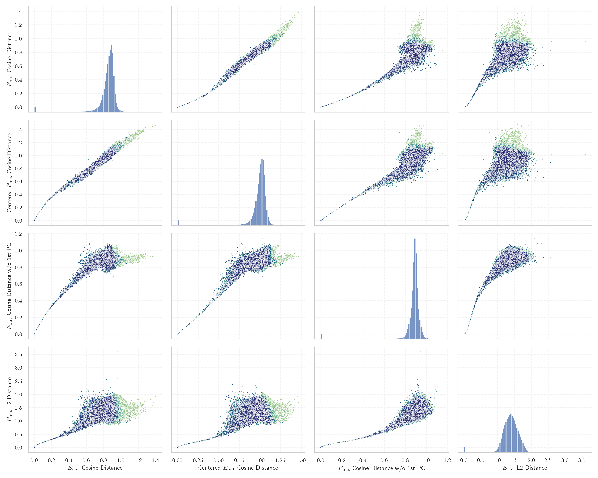
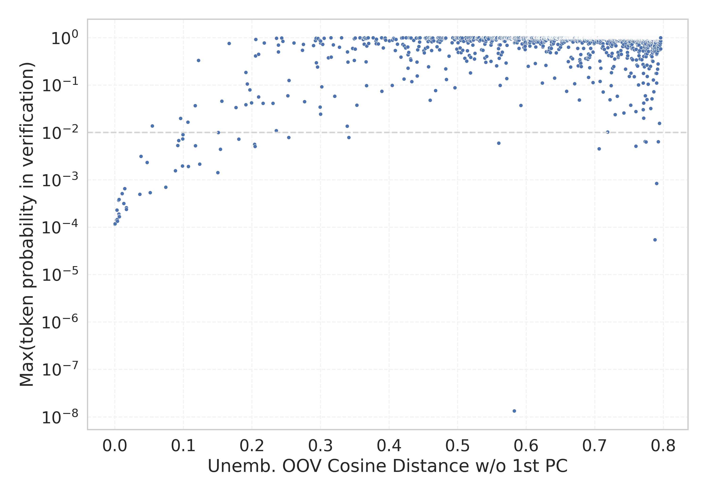

# Report for `CohereForAI/c4ai-command-r-plus`

## Model info

* Tied embeddings: yes
* LM head uses bias: no
* Indicator for under-trained tokens: E_{out} Cosine Distance
  * Overall distribution 0.847 +/- 0.108
  * Token used for verification prompt building: `InvalidProtocolBufferException`
  * Verification threshold: 0.669
  * Threshold for showing candidate under-trained tokens: 0.051
  * Median verified threshold (for bytes, unreachable and special tokens): 0.017
* Embeddings shape: (256000, 12288)
* Vocabulary size: 255029
  * Number of single byte tokens: 256, of which 13 below indicator threshold
  * Number of special tokens: 37, of which 26 below indicator threshold
  * Number of non-single-byte unreachable tokens: 1403, of which 1403 below indicator threshold
  * Number of non-single-byte UTF-fragment tokens: 2956, 9 below soft indicator threshold
  * Number of tested under-trained tokens: 5012, 4962 non-special, 47 below p = 0.01 threshold, 35 below soft indicator threshold

## Under-trained token indicators plot


## Verification plot


## Under-trained token verification results
35 entries below threshold of 0.051

|   token_id | token                                                                                                                                |    indicator | max_prob                                                         | in_other_tokens                                                                                                                                                                                                                                                                                                                                                                                   |
|------------|--------------------------------------------------------------------------------------------------------------------------------------|--------------|------------------------------------------------------------------|---------------------------------------------------------------------------------------------------------------------------------------------------------------------------------------------------------------------------------------------------------------------------------------------------------------------------------------------------------------------------------------------------|
|     127300 | ````` tocguid `````                                                                                                                  | -1.19209e-07 | <span style='border: 1px solid rgb(169, 68, 66);'>0.00012</span> |                                                                                                                                                                                                                                                                                                                                                                                                   |
|     140485 | ````` 目前尚未由人工引 `````                                                                                                         | -1.19209e-07 | <span style='border: 1px solid rgb(169, 68, 66);'>0.00012</span> | <span style='border: 1px solid rgb(40, 167, 69);'>````` 目前尚未由人工引種栽培 `````</span>, <span style='border: 1px solid rgb(40, 167, 69);'>````` 目前尚未由人工引种栽培 `````</span>                                                                                                                                                                                                          |
|      51386 | ````` ▁ARStdSong `````                                                                                                               | -1.19209e-07 | <span style='border: 1px solid rgb(169, 68, 66);'>0.00012</span> |                                                                                                                                                                                                                                                                                                                                                                                                   |
|     239520 | ````` ▁hbBiddersParams `````                                                                                                         | -1.19209e-07 | <span style='border: 1px solid rgb(169, 68, 66);'>0.00012</span> |                                                                                                                                                                                                                                                                                                                                                                                                   |
|      22188 | ````` ▁林肯近地小行星研究小 `````                                                                                                    |  0           | <span style='border: 1px solid rgb(169, 68, 66);'>0.00012</span> | <span style='border: 1px solid rgb(40, 167, 69);'>````` ▁林肯近地小行星研究小組 `````</span>, <span style='border: 1px solid rgb(40, 167, 69);'>````` ▁林肯近地小行星研究小组 `````</span>                                                                                                                                                                                                        |
|     208149 | ````` AddLanguageSpecificText `````                                                                                                  |  0           | <span style='border: 1px solid rgb(169, 68, 66);'>0.00012</span> | <span style='border: 1px solid rgb(169, 68, 66);'>````` AddLanguageSpecificTextSet `````</span>                                                                                                                                                                                                                                                                                                   |
|      84176 | ````` recDocCases `````                                                                                                              |  0           | <span style='border: 1px solid rgb(169, 68, 66);'>0.00012</span> |                                                                                                                                                                                                                                                                                                                                                                                                   |
|      15675 | ````` \U000e0067\U000e0062\U000e0065\U000e006e\U000e0067\U000e007f\U000e0067\U000e0062\U000e0065\U000e006e\U000e0067\U000e007f ````` |  0.000192642 | <span style='border: 1px solid rgb(169, 68, 66);'>0.00012</span> | <span style='border: 1px solid rgb(40, 167, 69);'>````` ▁🏴\U000e0067\U000e0062\U000e0065\U000e006e\U000e0067\U000e007f\U000e0067\U000e0062\U000e0065\U000e006e\U000e0067\U000e007f `````</span>, <span style='border: 1px solid rgb(40, 167, 69);'>````` 🏴\U000e0067\U000e0062\U000e0065\U000e006e\U000e0067\U000e007f\U000e0067\U000e0062\U000e0065\U000e006e\U000e0067\U000e007f `````</span> |
|      71049 | ````` tocectory `````                                                                                                                |  0.000901222 | <span style='border: 1px solid rgb(169, 68, 66);'>0.00014</span> |                                                                                                                                                                                                                                                                                                                                                                                                   |
|     139462 | ````` 和人口皆未知 `````                                                                                                             |  0.00117636  | <span style='border: 1px solid rgb(169, 68, 66);'>0.00014</span> | <span style='border: 1px solid rgb(40, 167, 69);'>````` 该地的面积和人口皆未知 `````</span>, <span style='border: 1px solid rgb(169, 68, 66);'>````` 面积和人口皆未知 `````</span>, <span style='border: 1px solid rgb(40, 167, 69);'>````` 該地的面積和人口皆未知 `````</span>                                                                                                                   |
|     208151 | ````` AddLanguageSpecificTextSet `````                                                                                               |  0.00149822  | <span style='border: 1px solid rgb(169, 68, 66);'>0.00023</span> |                                                                                                                                                                                                                                                                                                                                                                                                   |
|     224223 | ````` 面积和人口皆未知 `````                                                                                                         |  0.00159621  | <span style='border: 1px solid rgb(169, 68, 66);'>0.00015</span> | <span style='border: 1px solid rgb(40, 167, 69);'>````` 该地的面积和人口皆未知 `````</span>                                                                                                                                                                                                                                                                                                       |
|     145442 | ````` 》（）， `````                                                                                                                 |  0.00173283  | <span style='border: 1px solid rgb(169, 68, 66);'>0.00013</span> |                                                                                                                                                                                                                                                                                                                                                                                                   |
|     177875 | ````` tochassubtree `````                                                                                                            |  0.00259912  | <span style='border: 1px solid rgb(169, 68, 66);'>0.00038</span> |                                                                                                                                                                                                                                                                                                                                                                                                   |
|     141168 | ````` ephritidae `````                                                                                                               |  0.00267887  | <span style='border: 1px solid rgb(169, 68, 66);'>0.00019</span> | <span style='border: 1px solid rgb(40, 167, 69);'>````` Tephritidae `````</span>, <span style='border: 1px solid rgb(40, 167, 69);'>````` ▁Tephritidae `````</span>                                                                                                                                                                                                                               |
|      72754 | ````` ageryears `````                                                                                                                |  0.00279933  | <span style='border: 1px solid rgb(169, 68, 66);'>0.00017</span> | ````` ▁manageryears `````, ````` manageryears `````                                                                                                                                                                                                                                                                                                                                               |
|     177855 | ````` assubtree `````                                                                                                                |  0.00281382  | <span style='border: 1px solid rgb(169, 68, 66);'>0.00039</span> | <span style='border: 1px solid rgb(169, 68, 66);'>````` tochassubtree `````</span>                                                                                                                                                                                                                                                                                                                |
|     190228 | ````` ▁Hmelnî `````                                                                                                                  |  0.00304759  | <span style='border: 1px solid rgb(169, 68, 66);'>0.00017</span> | <span style='border: 1px solid rgb(40, 167, 69);'>````` ▁Hmelnîțkîi `````</span>                                                                                                                                                                                                                                                                                                                  |
|     141246 | ````` locatorSection `````                                                                                                           |  0.0049212   | <span style='border: 1px solid rgb(169, 68, 66);'>0.00052</span> |                                                                                                                                                                                                                                                                                                                                                                                                   |
|      94747 | ````` OnSearchSelect `````                                                                                                           |  0.0060094   | <span style='border: 1px solid rgb(169, 68, 66);'>0.00032</span> | <span style='border: 1px solid rgb(40, 167, 69);'>````` OnSearchSelectShow `````</span>, <span style='border: 1px solid rgb(40, 167, 69);'>````` OnSearchSelectKey `````</span>, <span style='border: 1px solid rgb(40, 167, 69);'>````` OnSearchSelectHide `````</span>                                                                                                                          |
<details><summary>15 additional entries below threshold</summary>

|   token_id | token                                                |   indicator | max_prob                                                         | in_other_tokens                                                                                                                                                                                                                                                                                                                                                                                                                                                                                                                                                                                                                                                                                                                     |
|------------|------------------------------------------------------|-------------|------------------------------------------------------------------|-------------------------------------------------------------------------------------------------------------------------------------------------------------------------------------------------------------------------------------------------------------------------------------------------------------------------------------------------------------------------------------------------------------------------------------------------------------------------------------------------------------------------------------------------------------------------------------------------------------------------------------------------------------------------------------------------------------------------------------|
|     190437 | ````` BiddersParams `````                            |  0.00673646 | <span style='border: 1px solid rgb(169, 68, 66);'>0.00066</span> | <span style='border: 1px solid rgb(169, 68, 66);'>````` ▁hbBiddersParams `````</span>                                                                                                                                                                                                                                                                                                                                                                                                                                                                                                                                                                                                                                               |
|       9741 | ````` \U000e0067\U000e0062\U000e0065\U000e006e ````` |  0.00779015 | <span style='border: 1px solid rgb(169, 68, 66);'>0.00026</span> | <span style='border: 1px solid rgb(40, 167, 69);'>````` ▁🏴\U000e0067\U000e0062\U000e0065\U000e006e\U000e0067\U000e007f\U000e0067\U000e0062\U000e0065\U000e006e\U000e0067\U000e007f `````</span>, <span style='border: 1px solid rgb(40, 167, 69);'>````` 🏴\U000e0067\U000e0062\U000e0065\U000e006e\U000e0067\U000e007f\U000e0067\U000e0062\U000e0065\U000e006e\U000e0067\U000e007f `````</span>, <span style='border: 1px solid rgb(40, 167, 69);'>````` \U000e0067\U000e0062\U000e0065\U000e006e\U000e0067\U000e007f `````</span>, <span style='border: 1px solid rgb(169, 68, 66);'>````` \U000e0067\U000e0062\U000e0065\U000e006e\U000e0067\U000e007f\U000e0067\U000e0062\U000e0065\U000e006e\U000e0067\U000e007f `````</span> |
|     149800 | ````` 年建立的教育 `````                             |  0.00792772 | <span style='border: 1px solid rgb(169, 68, 66);'>0.00024</span> | <span style='border: 1px solid rgb(40, 167, 69);'>````` 年建立的教育機構 `````</span>, <span style='border: 1px solid rgb(40, 167, 69);'>````` 年建立的教育机构 `````</span>                                                                                                                                                                                                                                                                                                                                                                                                                                                                                                                                                        |
|      37757 | ````` （，）， `````                                 |  0.0173035  | <span style='border: 1px solid rgb(169, 68, 66);'>0.0005</span>  |                                                                                                                                                                                                                                                                                                                                                                                                                                                                                                                                                                                                                                                                                                                                     |
|      51385 | ````` ▁ARStd `````                                   |  0.0184463  | <span style='border: 1px solid rgb(255, 145, 0);'>0.0031</span>  | <span style='border: 1px solid rgb(169, 68, 66);'>````` ▁ARStdSong `````</span>                                                                                                                                                                                                                                                                                                                                                                                                                                                                                                                                                                                                                                                     |
|     100190 | ````` Desambigua `````                               |  0.0225713  | <span style='border: 1px solid rgb(255, 145, 0);'>0.0023</span>  | <span style='border: 1px solid rgb(40, 167, 69);'>````` Desambiguação `````</span>, <span style='border: 1px solid rgb(40, 167, 69);'>````` Desambiguações `````</span>                                                                                                                                                                                                                                                                                                                                                                                                                                                                                                                                                             |
|     223425 | ````` 而人口密度為 `````                             |  0.0249265  | <span style='border: 1px solid rgb(169, 68, 66);'>0.00054</span> | <span style='border: 1px solid rgb(40, 167, 69);'>````` 而人口密度為每平方千米 `````</span>                                                                                                                                                                                                                                                                                                                                                                                                                                                                                                                                                                                                                                         |
|     127290 | ````` srguid `````                                   |  0.0263301  | <span style='border: 1px solid rgb(251, 189, 8);'>0.014</span>   |                                                                                                                                                                                                                                                                                                                                                                                                                                                                                                                                                                                                                                                                                                                                     |
|     223844 | ````` 該地的面積 `````                               |  0.0364665  | <span style='border: 1px solid rgb(169, 68, 66);'>0.00071</span> | <span style='border: 1px solid rgb(40, 167, 69);'>````` 該地的面積和人口皆未知 `````</span>                                                                                                                                                                                                                                                                                                                                                                                                                                                                                                                                                                                                                                         |
|     119253 | ````` écosl `````                                    |  0.0443186  | <span style='border: 1px solid rgb(255, 145, 0);'>0.0016</span>  | ````` ▁Tchécoslovaquie `````, <span style='border: 1px solid rgb(40, 167, 69);'>````` écoslova `````</span>, ````` ▁tchécoslova `````, <span style='border: 1px solid rgb(40, 167, 69);'>````` écoslovaquie `````</span>                                                                                                                                                                                                                                                                                                                                                                                                                                                                                                            |
|     144020 | ````` оспоживача `````                               |  0.0455816  | <span style='border: 1px solid rgb(255, 145, 0);'>0.0068</span>  | <span style='border: 1px solid rgb(40, 167, 69);'>````` ▁особоспоживача `````</span>                                                                                                                                                                                                                                                                                                                                                                                                                                                                                                                                                                                                                                                |
|     172752 | ````` ablytyped `````                                |  0.0457996  | <span style='border: 1px solid rgb(255, 145, 0);'>0.0053</span>  | <span style='border: 1px solid rgb(40, 167, 69);'>````` scalablytyped `````</span>                                                                                                                                                                                                                                                                                                                                                                                                                                                                                                                                                                                                                                                  |
|     202267 | ````` \U000e0074\U000e007f `````                     |  0.0474659  | <span style='border: 1px solid rgb(251, 189, 8);'>0.02</span>    | ````` ▁🏴\U000e0067\U000e0062\U000e0073\U000e0063\U000e0074\U000e007f `````, ````` <0xB3>\U000e0063\U000e0074\U000e007f `````                                                                                                                                                                                                                                                                                                                                                                                                                                                                                                                                                                                                       |
|      71714 | ````` 所属的省级 `````                               |  0.0495927  | <span style='border: 1px solid rgb(255, 145, 0);'>0.0074</span>  | <span style='border: 1px solid rgb(40, 167, 69);'>````` 所属的省级选区为 `````</span>                                                                                                                                                                                                                                                                                                                                                                                                                                                                                                                                                                                                                                               |
|      63146 | ````` 》（） `````                                   |  0.0497289  | <span style='border: 1px solid rgb(255, 145, 0);'>0.0091</span>  | <span style='border: 1px solid rgb(169, 68, 66);'>````` 》（）， `````</span>                                                                                                                                                                                                                                                                                                                                                                                                                                                                                                                                                                                                                                                       |
</details>


## Tokens with partial UTF-8 sequences
9 entries below threshold of 0.051

|   token_id | token                                                 |    indicator | in_other_tokens                                                                                                                                                                                                                                                                                                                                                                                                                                                                                                                        |
|------------|-------------------------------------------------------|--------------|----------------------------------------------------------------------------------------------------------------------------------------------------------------------------------------------------------------------------------------------------------------------------------------------------------------------------------------------------------------------------------------------------------------------------------------------------------------------------------------------------------------------------------------|
|      57888 | ````` <0x89>글랜드 `````                              | -1.19209e-07 | ````` 잉글랜드 `````, ````` ▁잉글랜드의 `````, ````` ▁잉글랜드 `````, ````` 잉글랜드의 `````                                                                                                                                                                                                                                                                                                                                                                                                                                           |
|      70552 | ````` <0xB9><0x80><0xE0><0xB8> `````                  | -1.19209e-07 | ````` ▁เ<0xE0><0xB8> `````, ````` เ<0xE0><0xB8> `````                                                                                                                                                                                                                                                                                                                                                                                                                                                                                  |
|      97361 | ````` <0x95>시코 `````                                | -1.19209e-07 | ````` ▁멕시코 `````, ````` 멕시코 `````                                                                                                                                                                                                                                                                                                                                                                                                                                                                                                |
|     113772 | ````` <0x98>리포니아 `````                            | -1.19209e-07 | ````` 캘리포니아 `````, ````` ▁캘리포니아 `````                                                                                                                                                                                                                                                                                                                                                                                                                                                                                        |
|     202233 | ````` <0xB3>\U000e0063 `````                          |  0.00041014  | ````` ▁🏴\U000e0067\U000e0062\U000e0073\U000e0063\U000e0074\U000e007f `````, ````` <0xB3>\U000e0063\U000e0074\U000e007f `````                                                                                                                                                                                                                                                                                                                                                                                                          |
|      62442 | ````` ▁🏴\U000e0067\U000e0062<0xF3><0xA0><0x81> ````` |  0.00253528  | ````` ▁🏴\U000e0067\U000e0062\U000e0073\U000e0063\U000e0074\U000e007f `````, ````` ▁🏴\U000e0067\U000e0062\U000e0077\U000e006c\U000e0073\U000e007f `````                                                                                                                                                                                                                                                                                                                                                                               |
|      69097 | ````` <0xB7>\U000e006c `````                          |  0.00378895  | ````` <0xB7>\U000e006c\U000e0073\U000e007f `````, ````` ▁🏴\U000e0067\U000e0062\U000e0077\U000e006c\U000e0073\U000e007f `````                                                                                                                                                                                                                                                                                                                                                                                                          |
|       6132 | ````` <0xA7><0xF3><0xA0><0x81> `````                  |  0.0116265   | <span style='border: 1px solid rgb(40, 167, 69);'>````` ▁🏴\U000e0067\U000e0062\U000e0065\U000e006e\U000e0067\U000e007f\U000e0067\U000e0062\U000e0065\U000e006e\U000e0067\U000e007f `````</span>, ````` \U000e0067<0xF3><0xA0><0x81> `````, <span style='border: 1px solid rgb(169, 68, 66);'>````` \U000e0067\U000e0062\U000e0065\U000e006e `````</span>, <span style='border: 1px solid rgb(40, 167, 69);'>````` \U000e0067\U000e007f `````</span>, ````` ▁🏴\U000e0067\U000e0062\U000e0073\U000e0063\U000e0074\U000e007f `````, ... |
|      19460 | ````` ▁🇯<0xF0><0x9F><0x87> `````                      |  0.0177507   | ````` ▁🇯🇴 `````, ````` ▁🇯🇲 `````, ````` ▁🇯🇵 `````                                                                                                                                                                                                                                                                                                                                                                                                                                                                                      |


## Byte tokens
13 entries below threshold of 0.017

|   token_id | token              |    indicator |   ord | hex   | byte_type   |
|------------|--------------------|--------------|-------|-------|-------------|
|        193 | ````` <0xFD> ````` | -1.19209e-07 |   253 | 0xFD  | unused_utf8 |
|        188 | ````` <0xF8> ````` | -1.19209e-07 |   248 | 0xF8  | unused_utf8 |
|        133 | ````` <0xC1> ````` | -1.19209e-07 |   193 | 0xC1  | unused_utf8 |
|        194 | ````` <0xFE> ````` | -1.19209e-07 |   254 | 0xFE  | unused_utf8 |
|        186 | ````` <0xF6> ````` | -1.19209e-07 |   246 | 0xF6  | unused_utf8 |
|        187 | ````` <0xF7> ````` | -1.19209e-07 |   247 | 0xF7  | unused_utf8 |
|        190 | ````` <0xFA> ````` | -1.19209e-07 |   250 | 0xFA  | unused_utf8 |
|        189 | ````` <0xF9> ````` | -1.19209e-07 |   249 | 0xF9  | unused_utf8 |
|        195 | ````` <0xFF> ````` | -1.19209e-07 |   255 | 0xFF  | unused_utf8 |
|        132 | ````` <0xC0> ````` | -1.19209e-07 |   192 | 0xC0  | unused_utf8 |
|        191 | ````` <0xFB> ````` |  0           |   251 | 0xFB  | unused_utf8 |
|        185 | ````` <0xF5> ````` |  0           |   245 | 0xF5  | unused_utf8 |
|        192 | ````` <0xFC> ````` |  0           |   252 | 0xFC  | unused_utf8 |


## Special tokens
26 entries below threshold of 0.017

|   token_id | token                           |    indicator | max_prob                                                         |
|------------|---------------------------------|--------------|------------------------------------------------------------------|
|     255012 | ````` <\|USER_3_TOKEN\|> `````  | -2.38419e-07 | <span style='border: 1px solid rgb(169, 68, 66);'>0.00012</span> |
|     255015 | ````` <\|USER_6_TOKEN\|> `````  | -2.38419e-07 | <span style='border: 1px solid rgb(169, 68, 66);'>0.00012</span> |
|     255005 | ````` <\|BAD_TOKEN\|> `````     | -1.19209e-07 | <span style='border: 1px solid rgb(169, 68, 66);'>0.00012</span> |
|     255028 | ````` <\|EXTRA_9_TOKEN\|> ````` | -1.19209e-07 | <span style='border: 1px solid rgb(169, 68, 66);'>0.00012</span> |
|     255009 | ````` <\|USER_0_TOKEN\|> `````  | -1.19209e-07 | <span style='border: 1px solid rgb(169, 68, 66);'>0.00012</span> |
|     255002 | ````` <\|YES_TOKEN\|> `````     | -1.19209e-07 | <span style='border: 1px solid rgb(169, 68, 66);'>0.00012</span> |
|     255023 | ````` <\|EXTRA_4_TOKEN\|> ````` | -1.19209e-07 | <span style='border: 1px solid rgb(169, 68, 66);'>0.00012</span> |
|     255019 | ````` <\|EXTRA_0_TOKEN\|> ````` | -1.19209e-07 | <span style='border: 1px solid rgb(169, 68, 66);'>0.00012</span> |
|     255022 | ````` <\|EXTRA_3_TOKEN\|> ````` | -1.19209e-07 | <span style='border: 1px solid rgb(169, 68, 66);'>0.00012</span> |
|     255010 | ````` <\|USER_1_TOKEN\|> `````  | -1.19209e-07 | <span style='border: 1px solid rgb(169, 68, 66);'>0.00012</span> |
|     255021 | ````` <\|EXTRA_2_TOKEN\|> ````` | -1.19209e-07 | <span style='border: 1px solid rgb(169, 68, 66);'>0.00012</span> |
|     255027 | ````` <\|EXTRA_8_TOKEN\|> ````` | -1.19209e-07 | <span style='border: 1px solid rgb(169, 68, 66);'>0.00012</span> |
|     255003 | ````` <\|NO_TOKEN\|> `````      | -1.19209e-07 | <span style='border: 1px solid rgb(169, 68, 66);'>0.00012</span> |
|     255013 | ````` <\|USER_4_TOKEN\|> `````  | -1.19209e-07 | <span style='border: 1px solid rgb(169, 68, 66);'>0.00012</span> |
|     255004 | ````` <\|GOOD_TOKEN\|> `````    | -1.19209e-07 | <span style='border: 1px solid rgb(169, 68, 66);'>0.00012</span> |
|          4 | ````` <MASK_TOKEN> `````        | -1.19209e-07 | <span style='border: 1px solid rgb(169, 68, 66);'>0.00012</span> |
|     255016 | ````` <\|USER_7_TOKEN\|> `````  | -1.19209e-07 | <span style='border: 1px solid rgb(169, 68, 66);'>0.00012</span> |
|     255011 | ````` <\|USER_2_TOKEN\|> `````  | -1.19209e-07 | <span style='border: 1px solid rgb(169, 68, 66);'>0.00012</span> |
|     255020 | ````` <\|EXTRA_1_TOKEN\|> ````` | -1.19209e-07 | <span style='border: 1px solid rgb(169, 68, 66);'>0.00012</span> |
|     255017 | ````` <\|USER_8_TOKEN\|> `````  |  0           | <span style='border: 1px solid rgb(169, 68, 66);'>0.00012</span> |
<details><summary>6 additional entries below threshold</summary>

|   token_id | token                           |   indicator | max_prob                                                         |
|------------|---------------------------------|-------------|------------------------------------------------------------------|
|     255025 | ````` <\|EXTRA_6_TOKEN\|> ````` | 0           | <span style='border: 1px solid rgb(169, 68, 66);'>0.00012</span> |
|     255018 | ````` <\|USER_9_TOKEN\|> `````  | 0           | <span style='border: 1px solid rgb(169, 68, 66);'>0.00012</span> |
|     255026 | ````` <\|EXTRA_7_TOKEN\|> ````` | 0           | <span style='border: 1px solid rgb(169, 68, 66);'>0.00012</span> |
|     255014 | ````` <\|USER_5_TOKEN\|> `````  | 0           | <span style='border: 1px solid rgb(169, 68, 66);'>0.00012</span> |
|     255024 | ````` <\|EXTRA_5_TOKEN\|> ````` | 0           | <span style='border: 1px solid rgb(169, 68, 66);'>0.00012</span> |
|          7 | ````` <EOP_TOKEN> `````         | 2.86698e-05 | <span style='border: 1px solid rgb(169, 68, 66);'>0.00012</span> |
</details>


## Unreachable tokens
1403 entries below threshold of 0.017

|   token_id | token            |    indicator | reencoded                                                                        |
|------------|------------------|--------------|----------------------------------------------------------------------------------|
|        612 | ````` ¿🍹? ````` | -3.57628e-07 | 2226: ````` <0xF0><0x9F> `````, 243: ````` <0x8D> `````, 125: ````` <0xB9> ````` |
|        655 | ````` ¿🎩? ````` | -2.38419e-07 | 2226: ````` <0xF0><0x9F> `````, 244: ````` <0x8E> `````, 110: ````` <0xA9> ````` |
|        602 | ````` ¿🍯? ````` | -2.38419e-07 | 2226: ````` <0xF0><0x9F> `````, 243: ````` <0x8D> `````, 115: ````` <0xAF> ````` |
|       1097 | ````` ¿🖊? `````  | -2.38419e-07 | 2226: ````` <0xF0><0x9F> `````, 252: ````` <0x96> `````, 240: ````` <0x8A> ````` |
|        502 | ````` ¿🌉? ````` | -2.38419e-07 | 2226: ````` <0xF0><0x9F> `````, 242: ````` <0x8C> `````, 239: ````` <0x89> ````` |
|        657 | ````` ¿🎫? ````` | -2.38419e-07 | 2226: ````` <0xF0><0x9F> `````, 244: ````` <0x8E> `````, 112: ````` <0xAB> ````` |
|        663 | ````` ¿🎱? ````` | -2.38419e-07 | 2226: ````` <0xF0><0x9F> `````, 244: ````` <0x8E> `````, 117: ````` <0xB1> ````` |
|       1569 | ````` ¿🩰? ````` | -2.38419e-07 | 2226: ````` <0xF0><0x9F> `````, 110: ````` <0xA9> `````, 116: ````` <0xB0> ````` |
|       1113 | ````` ¿🗑? `````  | -2.38419e-07 | 2226: ````` <0xF0><0x9F> `````, 253: ````` <0x97> `````, 247: ````` <0x91> ````` |
|       1104 | ````` ¿🖤? ````` | -2.38419e-07 | 2226: ````` <0xF0><0x9F> `````, 252: ````` <0x96> `````, 105: ````` <0xA4> ````` |
|       1140 | ````` ¿😊? ````` | -2.38419e-07 | 188568: ````` <0xF0><0x9F><0x98> `````, 240: ````` <0x8A> `````                  |
|       1050 | ````` ¿🔸? ````` | -2.38419e-07 | 205860: ````` <0xF0><0x9F><0x94> `````, 124: ````` <0xB8> `````                  |
|       1158 | ````` ¿😜? ````` | -2.38419e-07 | 188568: ````` <0xF0><0x9F><0x98> `````, 258: ````` <0x9C> `````                  |
|        607 | ````` ¿🍴? ````` | -2.38419e-07 | 2226: ````` <0xF0><0x9F> `````, 243: ````` <0x8D> `````, 120: ````` <0xB4> ````` |
|        676 | ````` ¿🎾? ````` | -2.38419e-07 | 2226: ````` <0xF0><0x9F> `````, 244: ````` <0x8E> `````, 130: ````` <0xBE> ````` |
|        571 | ````` ¿🍐? ````` | -2.38419e-07 | 2226: ````` <0xF0><0x9F> `````, 243: ````` <0x8D> `````, 246: ````` <0x90> ````` |
|       1143 | ````` ¿😍? ````` | -2.38419e-07 | 188568: ````` <0xF0><0x9F><0x98> `````, 243: ````` <0x8D> `````                  |
|       1081 | ````` ¿🕣? ````` | -2.38419e-07 | 2226: ````` <0xF0><0x9F> `````, 251: ````` <0x95> `````, 104: ````` <0xA3> ````` |
|        597 | ````` ¿🍪? ````` | -2.38419e-07 | 2226: ````` <0xF0><0x9F> `````, 243: ````` <0x8D> `````, 111: ````` <0xAA> ````` |
|        700 | ````` ¿🏖? `````  | -2.38419e-07 | 216125: ````` <0xF0><0x9F><0x8F> `````, 252: ````` <0x96> `````                  |
<details><summary>1383 additional entries below threshold</summary>

|   token_id | token                    |    indicator | reencoded                                                                        |
|------------|--------------------------|--------------|----------------------------------------------------------------------------------|
|       1079 | ````` ¿🕡? `````         | -2.38419e-07 | 2226: ````` <0xF0><0x9F> `````, 251: ````` <0x95> `````, 102: ````` <0xA1> ````` |
|        627 | ````` ¿🎈? `````         | -2.38419e-07 | 2226: ````` <0xF0><0x9F> `````, 244: ````` <0x8E> `````, 238: ````` <0x88> ````` |
|       1087 | ````` ¿🕰? `````          | -2.38419e-07 | 2226: ````` <0xF0><0x9F> `````, 251: ````` <0x95> `````, 116: ````` <0xB0> ````` |
|        604 | ````` ¿🍱? `````         | -2.38419e-07 | 2226: ````` <0xF0><0x9F> `````, 243: ````` <0x8D> `````, 117: ````` <0xB1> ````` |
|       1234 | ````` ¿🚘? `````         | -2.38419e-07 | 2226: ````` <0xF0><0x9F> `````, 256: ````` <0x9A> `````, 254: ````` <0x98> ````` |
|        598 | ````` ¿🍫? `````         | -2.38419e-07 | 2226: ````` <0xF0><0x9F> `````, 243: ````` <0x8D> `````, 112: ````` <0xAB> ````` |
|       1115 | ````` ¿🗓? `````          | -2.38419e-07 | 2226: ````` <0xF0><0x9F> `````, 253: ````` <0x97> `````, 249: ````` <0x93> ````` |
|       1606 | ````` ¿🪤? `````         | -2.38419e-07 | 2226: ````` <0xF0><0x9F> `````, 111: ````` <0xAA> `````, 105: ````` <0xA4> ````` |
|        852 | ````` ¿👱? `````         | -2.38419e-07 | 154565: ````` <0xF0><0x9F><0x91> `````, 117: ````` <0xB1> `````                  |
|        688 | ````` ¿🏊? `````         | -2.38419e-07 | 216125: ````` <0xF0><0x9F><0x8F> `````, 240: ````` <0x8A> `````                  |
|       1066 | ````` ¿🕔? `````         | -2.38419e-07 | 2226: ````` <0xF0><0x9F> `````, 251: ````` <0x95> `````, 250: ````` <0x94> ````` |
|       1198 | ````` ¿🙄? `````         | -2.38419e-07 | 2226: ````` <0xF0><0x9F> `````, 255: ````` <0x99> `````, 234: ````` <0x84> ````` |
|        906 | ````` ¿💧? `````         | -2.38419e-07 | 106024: ````` <0xF0><0x9F><0x92> `````, 108: ````` <0xA7> `````                  |
|       1069 | ````` ¿🕗? `````         | -2.38419e-07 | 2226: ````` <0xF0><0x9F> `````, 251: ````` <0x95> `````, 253: ````` <0x97> ````` |
|       1131 | ````` ¿😁? `````         | -2.38419e-07 | 188568: ````` <0xF0><0x9F><0x98> `````, 231: ````` <0x81> `````                  |
|        528 | ````` ¿🌥? `````          | -2.38419e-07 | 2226: ````` <0xF0><0x9F> `````, 242: ````` <0x8C> `````, 106: ````` <0xA5> ````` |
|       1460 | ````` ¿🦓? `````         | -2.38419e-07 | 2226: ````` <0xF0><0x9F> `````, 107: ````` <0xA6> `````, 249: ````` <0x93> ````` |
|       1230 | ````` ¿🚔? `````         | -2.38419e-07 | 2226: ````` <0xF0><0x9F> `````, 256: ````` <0x9A> `````, 250: ````` <0x94> ````` |
|        534 | ````` ¿🌫? `````          | -2.38419e-07 | 2226: ````` <0xF0><0x9F> `````, 242: ````` <0x8C> `````, 112: ````` <0xAB> ````` |
|       1134 | ````` ¿😄? `````         | -2.38419e-07 | 188568: ````` <0xF0><0x9F><0x98> `````, 234: ````` <0x84> `````                  |
|        692 | ````` ¿🏎? `````          | -2.38419e-07 | 216125: ````` <0xF0><0x9F><0x8F> `````, 244: ````` <0x8E> `````                  |
|       1058 | ````` ¿🕋? `````         | -2.38419e-07 | 2226: ````` <0xF0><0x9F> `````, 251: ````` <0x95> `````, 241: ````` <0x8B> ````` |
|       1562 | ````` ¿🧹? `````         | -2.38419e-07 | 2226: ````` <0xF0><0x9F> `````, 108: ````` <0xA7> `````, 125: ````` <0xB9> ````` |
|        544 | ````` ¿🌵? `````         | -2.38419e-07 | 2226: ````` <0xF0><0x9F> `````, 242: ````` <0x8C> `````, 121: ````` <0xB5> ````` |
|       1108 | ````` ¿🖲? `````          | -2.38419e-07 | 2226: ````` <0xF0><0x9F> `````, 252: ````` <0x96> `````, 118: ````` <0xB2> ````` |
|        665 | ````` ¿🎳? `````         | -2.38419e-07 | 2226: ````` <0xF0><0x9F> `````, 244: ````` <0x8E> `````, 119: ````` <0xB3> ````` |
|       1536 | ````` ¿🧟? `````         | -2.38419e-07 | 2226: ````` <0xF0><0x9F> `````, 108: ````` <0xA7> `````, 261: ````` <0x9F> ````` |
|        620 | ````` ¿🎁? `````         | -2.38419e-07 | 2226: ````` <0xF0><0x9F> `````, 244: ````` <0x8E> `````, 231: ````` <0x81> ````` |
|        556 | ````` ¿🍁? `````         | -2.38419e-07 | 2226: ````` <0xF0><0x9F> `````, 243: ````` <0x8D> `````, 231: ````` <0x81> ````` |
|       1098 | ````` ¿🖋? `````          | -2.38419e-07 | 2226: ````` <0xF0><0x9F> `````, 252: ````` <0x96> `````, 241: ````` <0x8B> ````` |
|        711 | ````` ¿🏡? `````         | -2.38419e-07 | 216125: ````` <0xF0><0x9F><0x8F> `````, 102: ````` <0xA1> `````                  |
|       1064 | ````` ¿🕒? `````         | -2.38419e-07 | 2226: ````` <0xF0><0x9F> `````, 251: ````` <0x95> `````, 248: ````` <0x92> ````` |
|       1086 | ````` ¿🕯? `````          | -2.38419e-07 | 2226: ````` <0xF0><0x9F> `````, 251: ````` <0x95> `````, 115: ````` <0xAF> ````` |
|        565 | ````` ¿🍊? `````         | -2.38419e-07 | 2226: ````` <0xF0><0x9F> `````, 243: ````` <0x8D> `````, 240: ````` <0x8A> ````` |
|        605 | ````` ¿🍲? `````         | -2.38419e-07 | 2226: ````` <0xF0><0x9F> `````, 243: ````` <0x8D> `````, 118: ````` <0xB2> ````` |
|        536 | ````` ¿🌭? `````         | -2.38419e-07 | 2226: ````` <0xF0><0x9F> `````, 242: ````` <0x8C> `````, 263: ````` <0xAD> ````` |
|       1455 | ````` ¿🦎? `````         | -2.38419e-07 | 2226: ````` <0xF0><0x9F> `````, 107: ````` <0xA6> `````, 244: ````` <0x8E> ````` |
|       1655 | ````` ¿\U0001faf5? ````` | -2.38419e-07 | 2226: ````` <0xF0><0x9F> `````, 112: ````` <0xAB> `````, 121: ````` <0xB5> ````` |
|       1100 | ````` ¿🖍? `````          | -2.38419e-07 | 2226: ````` <0xF0><0x9F> `````, 252: ````` <0x96> `````, 243: ````` <0x8D> ````` |
|       1076 | ````` ¿🕞? `````         | -2.38419e-07 | 2226: ````` <0xF0><0x9F> `````, 251: ````` <0x95> `````, 260: ````` <0x9E> ````` |
|       1130 | ````` ¿😀? `````         | -2.38419e-07 | 188568: ````` <0xF0><0x9F><0x98> `````, 230: ````` <0x80> `````                  |
|       1038 | ````` ¿🔬? `````         | -2.38419e-07 | 205860: ````` <0xF0><0x9F><0x94> `````, 113: ````` <0xAC> `````                  |
|       1099 | ````` ¿🖌? `````          | -2.38419e-07 | 2226: ````` <0xF0><0x9F> `````, 252: ````` <0x96> `````, 242: ````` <0x8C> ````` |
|       1583 | ````` ¿🪄? `````         | -2.38419e-07 | 2226: ````` <0xF0><0x9F> `````, 111: ````` <0xAA> `````, 234: ````` <0x84> ````` |
|        678 | ````` ¿🏀? `````         | -2.38419e-07 | 216125: ````` <0xF0><0x9F><0x8F> `````, 230: ````` <0x80> `````                  |
|        693 | ````` ¿🏏? `````         | -2.38419e-07 | 216125: ````` <0xF0><0x9F><0x8F> `````, 245: ````` <0x8F> `````                  |
|        551 | ````` ¿🌼? `````         | -2.38419e-07 | 2226: ````` <0xF0><0x9F> `````, 242: ````` <0x8C> `````, 128: ````` <0xBC> ````` |
|       1204 | ````` ¿🙊? `````         | -2.38419e-07 | 2226: ````` <0xF0><0x9F> `````, 255: ````` <0x99> `````, 240: ````` <0x8A> ````` |
|        445 | ````` ¿🆔? `````         | -2.38419e-07 | 2226: ````` <0xF0><0x9F> `````, 236: ````` <0x86> `````, 250: ````` <0x94> ````` |
|        646 | ````` ¿🎠? `````         | -2.38419e-07 | 2226: ````` <0xF0><0x9F> `````, 244: ````` <0x8E> `````, 262: ````` <0xA0> ````` |
|       1438 | ````` ¿🥽? `````         | -2.38419e-07 | 2226: ````` <0xF0><0x9F> `````, 106: ````` <0xA5> `````, 129: ````` <0xBD> ````` |
|        533 | ````` ¿🌪? `````          | -2.38419e-07 | 2226: ````` <0xF0><0x9F> `````, 242: ````` <0x8C> `````, 111: ````` <0xAA> ````` |
|       1105 | ````` ¿🖥? `````          | -2.38419e-07 | 2226: ````` <0xF0><0x9F> `````, 252: ````` <0x96> `````, 106: ````` <0xA5> ````` |
|       1048 | ````` ¿🔶? `````         | -2.38419e-07 | 205860: ````` <0xF0><0x9F><0x94> `````, 122: ````` <0xB6> `````                  |
|       1228 | ````` ¿🚒? `````         | -2.38419e-07 | 2226: ````` <0xF0><0x9F> `````, 256: ````` <0x9A> `````, 248: ````` <0x92> ````` |
|       1564 | ````` ¿🧻? `````         | -2.38419e-07 | 2226: ````` <0xF0><0x9F> `````, 108: ````` <0xA7> `````, 127: ````` <0xBB> ````` |
|       1073 | ````` ¿🕛? `````         | -2.38419e-07 | 2226: ````` <0xF0><0x9F> `````, 251: ````` <0x95> `````, 257: ````` <0x9B> ````` |
|        648 | ````` ¿🎢? `````         | -2.38419e-07 | 2226: ````` <0xF0><0x9F> `````, 244: ````` <0x8E> `````, 103: ````` <0xA2> ````` |
|       1641 | ````` ¿\U0001fad9? ````` | -2.38419e-07 | 2226: ````` <0xF0><0x9F> `````, 112: ````` <0xAB> `````, 255: ````` <0x99> ````` |
|       1072 | ````` ¿🕚? `````         | -2.38419e-07 | 2226: ````` <0xF0><0x9F> `````, 251: ````` <0x95> `````, 256: ````` <0x9A> ````` |
|        697 | ````` ¿🏓? `````         | -2.38419e-07 | 216125: ````` <0xF0><0x9F><0x8F> `````, 249: ````` <0x93> `````                  |
|       1489 | ````` ¿🦰? `````         | -2.38419e-07 | 2226: ````` <0xF0><0x9F> `````, 107: ````` <0xA6> `````, 116: ````` <0xB0> ````` |
|        684 | ````` ¿🏆? `````         | -2.38419e-07 | 216125: ````` <0xF0><0x9F><0x8F> `````, 236: ````` <0x86> `````                  |
|        695 | ````` ¿🏑? `````         | -2.38419e-07 | 216125: ````` <0xF0><0x9F><0x8F> `````, 247: ````` <0x91> `````                  |
|        504 | ````` ¿🌋? `````         | -2.38419e-07 | 2226: ````` <0xF0><0x9F> `````, 242: ````` <0x8C> `````, 241: ````` <0x8B> ````` |
|        670 | ````` ¿🎸? `````         | -2.38419e-07 | 2226: ````` <0xF0><0x9F> `````, 244: ````` <0x8E> `````, 124: ````` <0xB8> ````` |
|        581 | ````` ¿🍚? `````         | -2.38419e-07 | 2226: ````` <0xF0><0x9F> `````, 243: ````` <0x8D> `````, 256: ````` <0x9A> ````` |
|        683 | ````` ¿🏅? `````         | -2.38419e-07 | 216125: ````` <0xF0><0x9F><0x8F> `````, 235: ````` <0x85> `````                  |
|       1444 | ````` ¿🦃? `````         | -2.38419e-07 | 2226: ````` <0xF0><0x9F> `````, 107: ````` <0xA6> `````, 233: ````` <0x83> ````` |
|        584 | ````` ¿🍝? `````         | -2.38419e-07 | 2226: ````` <0xF0><0x9F> `````, 243: ````` <0x8D> `````, 259: ````` <0x9D> ````` |
|        702 | ````` ¿🏘? `````          | -2.38419e-07 | 216125: ````` <0xF0><0x9F><0x8F> `````, 254: ````` <0x98> `````                  |
|       1568 | ````` ¿🧿? `````         | -2.38419e-07 | 2226: ````` <0xF0><0x9F> `````, 108: ````` <0xA7> `````, 131: ````` <0xBF> ````` |
|       1235 | ````` ¿🚙? `````         | -2.38419e-07 | 2226: ````` <0xF0><0x9F> `````, 256: ````` <0x9A> `````, 255: ````` <0x99> ````` |
|        569 | ````` ¿🍎? `````         | -2.38419e-07 | 2226: ````` <0xF0><0x9F> `````, 243: ````` <0x8D> `````, 244: ````` <0x8E> ````` |
|       1102 | ````` ¿🖕? `````         | -2.38419e-07 | 2226: ````` <0xF0><0x9F> `````, 252: ````` <0x96> `````, 251: ````` <0x95> ````` |
|        562 | ````` ¿🍇? `````         | -2.38419e-07 | 2226: ````` <0xF0><0x9F> `````, 243: ````` <0x8D> `````, 237: ````` <0x87> ````` |
|       1415 | ````` ¿🥦? `````         | -2.38419e-07 | 2226: ````` <0xF0><0x9F> `````, 106: ````` <0xA5> `````, 107: ````` <0xA6> ````` |
|       1074 | ````` ¿🕜? `````         | -2.38419e-07 | 2226: ````` <0xF0><0x9F> `````, 251: ````` <0x95> `````, 258: ````` <0x9C> ````` |
|        600 | ````` ¿🍭? `````         | -2.38419e-07 | 2226: ````` <0xF0><0x9F> `````, 243: ````` <0x8D> `````, 263: ````` <0xAD> ````` |
|       1434 | ````` ¿\U0001f979? ````` | -1.19209e-07 | 2226: ````` <0xF0><0x9F> `````, 106: ````` <0xA5> `````, 125: ````` <0xB9> ````` |
|        622 | ````` ¿🎃? `````         | -1.19209e-07 | 2226: ````` <0xF0><0x9F> `````, 244: ````` <0x8E> `````, 233: ````` <0x83> ````` |
|       1157 | ````` ¿😛? `````         | -1.19209e-07 | 188568: ````` <0xF0><0x9F><0x98> `````, 257: ````` <0x9B> `````                  |
|        703 | ````` ¿🏙? `````          | -1.19209e-07 | 216125: ````` <0xF0><0x9F><0x8F> `````, 255: ````` <0x99> `````                  |
|        713 | ````` ¿🏣? `````         | -1.19209e-07 | 216125: ````` <0xF0><0x9F><0x8F> `````, 104: ````` <0xA3> `````                  |
|       1412 | ````` ¿🥣? `````         | -1.19209e-07 | 2226: ````` <0xF0><0x9F> `````, 106: ````` <0xA5> `````, 104: ````` <0xA3> ````` |
|        621 | ````` ¿🎂? `````         | -1.19209e-07 | 2226: ````` <0xF0><0x9F> `````, 244: ````` <0x8E> `````, 232: ````` <0x82> ````` |
|       1024 | ````` ¿🔞? `````         | -1.19209e-07 | 205860: ````` <0xF0><0x9F><0x94> `````, 260: ````` <0x9E> `````                  |
|       1637 | ````` ¿🫕? `````         | -1.19209e-07 | 2226: ````` <0xF0><0x9F> `````, 112: ````` <0xAB> `````, 251: ````` <0x95> ````` |
|       1208 | ````` ¿🙎? `````         | -1.19209e-07 | 2226: ````` <0xF0><0x9F> `````, 255: ````` <0x99> `````, 244: ````` <0x8E> ````` |
|        925 | ````` ¿💺? `````         | -1.19209e-07 | 106024: ````` <0xF0><0x9F><0x92> `````, 126: ````` <0xBA> `````                  |
|       1335 | ````` ¿🤔? `````         | -1.19209e-07 | 2226: ````` <0xF0><0x9F> `````, 105: ````` <0xA4> `````, 250: ````` <0x94> ````` |
|        792 | ````` ¿🐵? `````         | -1.19209e-07 | 2226: ````` <0xF0><0x9F> `````, 246: ````` <0x90> `````, 121: ````` <0xB5> ````` |
|        689 | ````` ¿🏋? `````          | -1.19209e-07 | 216125: ````` <0xF0><0x9F><0x8F> `````, 241: ````` <0x8B> `````                  |
|        838 | ````` ¿👣? `````         | -1.19209e-07 | 154565: ````` <0xF0><0x9F><0x91> `````, 104: ````` <0xA3> `````                  |
|        816 | ````` ¿👍? `````         | -1.19209e-07 | 154565: ````` <0xF0><0x9F><0x91> `````, 243: ````` <0x8D> `````                  |
|       1404 | ````` ¿🥛? `````         | -1.19209e-07 | 2226: ````` <0xF0><0x9F> `````, 106: ````` <0xA5> `````, 257: ````` <0x9B> ````` |
|        771 | ````` ¿🐠? `````         | -1.19209e-07 | 2226: ````` <0xF0><0x9F> `````, 246: ````` <0x90> `````, 262: ````` <0xA0> ````` |
|        687 | ````` ¿🏉? `````         | -1.19209e-07 | 216125: ````` <0xF0><0x9F><0x8F> `````, 239: ````` <0x89> `````                  |
|       1381 | ````` ¿🥃? `````         | -1.19209e-07 | 2226: ````` <0xF0><0x9F> `````, 106: ````` <0xA5> `````, 233: ````` <0x83> ````` |
|       1432 | ````` ¿🥷? `````         | -1.19209e-07 | 2226: ````` <0xF0><0x9F> `````, 106: ````` <0xA5> `````, 123: ````` <0xB7> ````` |
|       1453 | ````` ¿🦌? `````         | -1.19209e-07 | 2226: ````` <0xF0><0x9F> `````, 107: ````` <0xA6> `````, 242: ````` <0x8C> ````` |
|        531 | ````` ¿🌨? `````          | -1.19209e-07 | 2226: ````` <0xF0><0x9F> `````, 242: ````` <0x8C> `````, 109: ````` <0xA8> ````` |
|        930 | ````` ¿💿? `````         | -1.19209e-07 | 106024: ````` <0xF0><0x9F><0x92> `````, 131: ````` <0xBF> `````                  |
|        825 | ````` ¿👖? `````         | -1.19209e-07 | 154565: ````` <0xF0><0x9F><0x91> `````, 252: ````` <0x96> `````                  |
|       1192 | ````` ¿😾? `````         | -1.19209e-07 | 188568: ````` <0xF0><0x9F><0x98> `````, 130: ````` <0xBE> `````                  |
|        940 | ````` ¿📉? `````         | -1.19209e-07 | 185981: ````` <0xF0><0x9F><0x93> `````, 239: ````` <0x89> `````                  |
|        608 | ````` ¿🍵? `````         | -1.19209e-07 | 2226: ````` <0xF0><0x9F> `````, 243: ````` <0x8D> `````, 121: ````` <0xB5> ````` |
|        631 | ````` ¿🎌? `````         | -1.19209e-07 | 2226: ````` <0xF0><0x9F> `````, 244: ````` <0x8E> `````, 242: ````` <0x8C> ````` |
|       1393 | ````` ¿🥐? `````         | -1.19209e-07 | 2226: ````` <0xF0><0x9F> `````, 61365: ````` <0xA5><0x90> `````                  |
|        894 | ````` ¿💛? `````         | -1.19209e-07 | 106024: ````` <0xF0><0x9F><0x92> `````, 257: ````` <0x9B> `````                  |
|       1284 | ````` ¿🛏? `````          | -1.19209e-07 | 2226: ````` <0xF0><0x9F> `````, 257: ````` <0x9B> `````, 245: ````` <0x8F> ````` |
|       1382 | ````` ¿🥄? `````         | -1.19209e-07 | 2226: ````` <0xF0><0x9F> `````, 106: ````` <0xA5> `````, 234: ````` <0x84> ````` |
|        744 | ````` ¿🐅? `````         | -1.19209e-07 | 2226: ````` <0xF0><0x9F> `````, 246: ````` <0x90> `````, 235: ````` <0x85> ````` |
|        914 | ````` ¿💯? `````         | -1.19209e-07 | 106024: ````` <0xF0><0x9F><0x92> `````, 115: ````` <0xAF> `````                  |
|       1261 | ````` ¿🚳? `````         | -1.19209e-07 | 2226: ````` <0xF0><0x9F> `````, 256: ````` <0x9A> `````, 119: ````` <0xB3> ````` |
|        939 | ````` ¿📈? `````         | -1.19209e-07 | 185981: ````` <0xF0><0x9F><0x93> `````, 238: ````` <0x88> `````                  |
|       1659 | ````` ¿\U000e0065? ````` | -1.19209e-07 | 3330: ````` <0xF3><0xA0><0x81> `````, 106: ````` <0xA5> `````                    |
|        752 | ````` ¿🐍? `````         | -1.19209e-07 | 2226: ````` <0xF0><0x9F> `````, 246: ````` <0x90> `````, 243: ````` <0x8D> ````` |
|       1065 | ````` ¿🕓? `````         | -1.19209e-07 | 2226: ````` <0xF0><0x9F> `````, 251: ````` <0x95> `````, 249: ````` <0x93> ````` |
|       1160 | ````` ¿😞? `````         | -1.19209e-07 | 188568: ````` <0xF0><0x9F><0x98> `````, 260: ````` <0x9E> `````                  |
|        905 | ````` ¿💦? `````         | -1.19209e-07 | 106024: ````` <0xF0><0x9F><0x92> `````, 107: ````` <0xA6> `````                  |
|        675 | ````` ¿🎽? `````         | -1.19209e-07 | 2226: ````` <0xF0><0x9F> `````, 244: ````` <0x8E> `````, 129: ````` <0xBD> ````` |
|        913 | ````` ¿💮? `````         | -1.19209e-07 | 106024: ````` <0xF0><0x9F><0x92> `````, 114: ````` <0xAE> `````                  |
|        623 | ````` ¿🎄? `````         | -1.19209e-07 | 2226: ````` <0xF0><0x9F> `````, 244: ````` <0x8E> `````, 234: ````` <0x84> ````` |
|        372 | ````` ¿⛑? `````          | -1.19209e-07 | 166: ````` <0xE2> `````, 257: ````` <0x9B> `````, 247: ````` <0x91> `````        |
|        393 | ````` ¿✋? `````         | -1.19209e-07 | 70336: ````` <0xE2><0x9C> `````, 241: ````` <0x8B> `````                         |
|       1005 | ````` ¿🔋? `````         | -1.19209e-07 | 205860: ````` <0xF0><0x9F><0x94> `````, 241: ````` <0x8B> `````                  |
|        380 | ````` ¿⛳? `````         | -1.19209e-07 | 166: ````` <0xE2> `````, 257: ````` <0x9B> `````, 119: ````` <0xB3> `````        |
|       1023 | ````` ¿🔝? `````         | -1.19209e-07 | 205860: ````` <0xF0><0x9F><0x94> `````, 259: ````` <0x9D> `````                  |
|        541 | ````` ¿🌲? `````         | -1.19209e-07 | 2226: ````` <0xF0><0x9F> `````, 242: ````` <0x8C> `````, 118: ````` <0xB2> ````` |
|        379 | ````` ¿⛲? `````         | -1.19209e-07 | 166: ````` <0xE2> `````, 257: ````` <0x9B> `````, 118: ````` <0xB2> `````        |
|        470 | ````` ¿🇸? `````          | -1.19209e-07 | 6705: ````` 🇸 `````                                                              |
|       1016 | ````` ¿🔖? `````         | -1.19209e-07 | 205860: ````` <0xF0><0x9F><0x94> `````, 252: ````` <0x96> `````                  |
|        494 | ````` ¿🌁? `````         | -1.19209e-07 | 2226: ````` <0xF0><0x9F> `````, 242: ````` <0x8C> `````, 231: ````` <0x81> ````` |
|       1232 | ````` ¿🚖? `````         | -1.19209e-07 | 2226: ````` <0xF0><0x9F> `````, 256: ````` <0x9A> `````, 252: ````` <0x96> ````` |
|       1254 | ````` ¿🚬? `````         | -1.19209e-07 | 2226: ````` <0xF0><0x9F> `````, 256: ````` <0x9A> `````, 113: ````` <0xAC> ````` |
|        510 | ````` ¿🌑? `````         | -1.19209e-07 | 2226: ````` <0xF0><0x9F> `````, 242: ````` <0x8C> `````, 247: ````` <0x91> ````` |
|       1525 | ````` ¿🧔? `````         | -1.19209e-07 | 2226: ````` <0xF0><0x9F> `````, 108: ````` <0xA7> `````, 250: ````` <0x94> ````` |
|       1116 | ````` ¿🗜? `````          | -1.19209e-07 | 2226: ````` <0xF0><0x9F> `````, 253: ````` <0x97> `````, 258: ````` <0x9C> ````` |
|       1554 | ````` ¿🧱? `````         | -1.19209e-07 | 2226: ````` <0xF0><0x9F> `````, 108: ````` <0xA7> `````, 117: ````` <0xB1> ````` |
|       1469 | ````` ¿🦜? `````         | -1.19209e-07 | 2226: ````` <0xF0><0x9F> `````, 107: ````` <0xA6> `````, 258: ````` <0x9C> ````` |
|        385 | ````` ¿⛹? `````          | -1.19209e-07 | 166: ````` <0xE2> `````, 257: ````` <0x9B> `````, 125: ````` <0xB9> `````        |
|       1501 | ````` ¿🦼? `````         | -1.19209e-07 | 2226: ````` <0xF0><0x9F> `````, 107: ````` <0xA6> `````, 128: ````` <0xBC> ````` |
|        596 | ````` ¿🍩? `````         | -1.19209e-07 | 2226: ````` <0xF0><0x9F> `````, 243: ````` <0x8D> `````, 110: ````` <0xA9> ````` |
|        599 | ````` ¿🍬? `````         | -1.19209e-07 | 2226: ````` <0xF0><0x9F> `````, 243: ````` <0x8D> `````, 113: ````` <0xAC> ````` |
|        398 | ````` ¿✔? `````          | -1.19209e-07 | 189894: ````` ✔ `````                                                            |
|        998 | ````` ¿🔄? `````         | -1.19209e-07 | 205860: ````` <0xF0><0x9F><0x94> `````, 234: ````` <0x84> `````                  |
|       1366 | ````` ¿🤳? `````         | -1.19209e-07 | 2226: ````` <0xF0><0x9F> `````, 105: ````` <0xA4> `````, 119: ````` <0xB3> ````` |
|        610 | ````` ¿🍷? `````         | -1.19209e-07 | 2226: ````` <0xF0><0x9F> `````, 243: ````` <0x8D> `````, 123: ````` <0xB7> ````` |
|       1177 | ````` ¿😯? `````         | -1.19209e-07 | 188568: ````` <0xF0><0x9F><0x98> `````, 115: ````` <0xAF> `````                  |
|       1424 | ````` ¿🥯? `````         | -1.19209e-07 | 2226: ````` <0xF0><0x9F> `````, 106: ````` <0xA5> `````, 115: ````` <0xAF> ````` |
|       1222 | ````` ¿🚌? `````         | -1.19209e-07 | 2226: ````` <0xF0><0x9F> `````, 6617: ````` <0x9A><0x8C> `````                   |
|        414 | ````` ¿❤? `````          | -1.19209e-07 | 135523: ````` <0xE2><0x9D> `````, 105: ````` <0xA4> `````                        |
|        924 | ````` ¿💹? `````         | -1.19209e-07 | 106024: ````` <0xF0><0x9F><0x92> `````, 125: ````` <0xB9> `````                  |
|       1502 | ````` ¿🦽? `````         | -1.19209e-07 | 2226: ````` <0xF0><0x9F> `````, 107: ````` <0xA6> `````, 129: ````` <0xBD> ````` |
|        990 | ````` ¿📻? `````         | -1.19209e-07 | 185981: ````` <0xF0><0x9F><0x93> `````, 127: ````` <0xBB> `````                  |
|       1356 | ````` ¿🤩? `````         | -1.19209e-07 | 2226: ````` <0xF0><0x9F> `````, 105: ````` <0xA4> `````, 110: ````` <0xA9> ````` |
|        549 | ````` ¿🌺? `````         | -1.19209e-07 | 2226: ````` <0xF0><0x9F> `````, 242: ````` <0x8C> `````, 126: ````` <0xBA> ````` |
|        986 | ````` ¿📷? `````         | -1.19209e-07 | 185981: ````` <0xF0><0x9F><0x93> `````, 123: ````` <0xB7> `````                  |
|        314 | ````` ¿☘? `````          | -1.19209e-07 | 34133: ````` <0xE2><0x98> `````, 254: ````` <0x98> `````                         |
|        732 | ````` ¿🏹? `````         | -1.19209e-07 | 216125: ````` <0xF0><0x9F><0x8F> `````, 125: ````` <0xB9> `````                  |
|       1252 | ````` ¿🚪? `````         | -1.19209e-07 | 2226: ````` <0xF0><0x9F> `````, 256: ````` <0x9A> `````, 111: ````` <0xAA> ````` |
|        902 | ````` ¿💣? `````         | -1.19209e-07 | 106024: ````` <0xF0><0x9F><0x92> `````, 104: ````` <0xA3> `````                  |
|        980 | ````` ¿📱? `````         | -1.19209e-07 | 185981: ````` <0xF0><0x9F><0x93> `````, 117: ````` <0xB1> `````                  |
|        613 | ````` ¿🍺? `````         | -1.19209e-07 | 2226: ````` <0xF0><0x9F> `````, 243: ````` <0x8D> `````, 126: ````` <0xBA> ````` |
|       1433 | ````` ¿🥸? `````         | -1.19209e-07 | 2226: ````` <0xF0><0x9F> `````, 106: ````` <0xA5> `````, 124: ````` <0xB8> ````` |
|       1601 | ````` ¿🪟? `````         | -1.19209e-07 | 2226: ````` <0xF0><0x9F> `````, 111: ````` <0xAA> `````, 261: ````` <0x9F> ````` |
|        492 | ````` ¿🉑? `````         | -1.19209e-07 | 2226: ````` <0xF0><0x9F> `````, 239: ````` <0x89> `````, 247: ````` <0x91> ````` |
|       1136 | ````` ¿😆? `````         | -1.19209e-07 | 188568: ````` <0xF0><0x9F><0x98> `````, 236: ````` <0x86> `````                  |
|       1189 | ````` ¿😻? `````         | -1.19209e-07 | 188568: ````` <0xF0><0x9F><0x98> `````, 127: ````` <0xBB> `````                  |
|        558 | ````` ¿🍃? `````         | -1.19209e-07 | 2226: ````` <0xF0><0x9F> `````, 243: ````` <0x8D> `````, 233: ````` <0x83> ````` |
|       1096 | ````` ¿🖇? `````          | -1.19209e-07 | 2226: ````` <0xF0><0x9F> `````, 252: ````` <0x96> `````, 237: ````` <0x87> ````` |
|       1423 | ````` ¿🥮? `````         | -1.19209e-07 | 2226: ````` <0xF0><0x9F> `````, 106: ````` <0xA5> `````, 114: ````` <0xAE> ````` |
|        896 | ````` ¿💝? `````         | -1.19209e-07 | 106024: ````` <0xF0><0x9F><0x92> `````, 259: ````` <0x9D> `````                  |
|        519 | ````` ¿🌚? `````         | -1.19209e-07 | 2226: ````` <0xF0><0x9F> `````, 242: ````` <0x8C> `````, 256: ````` <0x9A> ````` |
|        824 | ````` ¿👕? `````         | -1.19209e-07 | 154565: ````` <0xF0><0x9F><0x91> `````, 251: ````` <0x95> `````                  |
|        378 | ````` ¿⛱? `````          | -1.19209e-07 | 166: ````` <0xE2> `````, 257: ````` <0x9B> `````, 117: ````` <0xB1> `````        |
|        750 | ````` ¿🐋? `````         | -1.19209e-07 | 2226: ````` <0xF0><0x9F> `````, 246: ````` <0x90> `````, 241: ````` <0x8B> ````` |
|       1591 | ````` ¿🪕? `````         | -1.19209e-07 | 2226: ````` <0xF0><0x9F> `````, 111: ````` <0xAA> `````, 251: ````` <0x95> ````` |
|       1341 | ````` ¿🤚? `````         | -1.19209e-07 | 2226: ````` <0xF0><0x9F> `````, 105: ````` <0xA4> `````, 256: ````` <0x9A> ````` |
|       1060 | ````` ¿🕍? `````         | -1.19209e-07 | 2226: ````` <0xF0><0x9F> `````, 251: ````` <0x95> `````, 243: ````` <0x8D> ````` |
|       1238 | ````` ¿🚜? `````         | -1.19209e-07 | 2226: ````` <0xF0><0x9F> `````, 256: ````` <0x9A> `````, 258: ````` <0x9C> ````` |
|       1594 | ````` ¿🪘? `````         | -1.19209e-07 | 2226: ````` <0xF0><0x9F> `````, 111: ````` <0xAA> `````, 254: ````` <0x98> ````` |
|        345 | ````` ¿♨? `````          | -1.19209e-07 | 45687: ````` <0xE2><0x99> `````, 109: ````` <0xA8> `````                         |
|       1257 | ````` ¿🚯? `````         | -1.19209e-07 | 2226: ````` <0xF0><0x9F> `````, 256: ````` <0x9A> `````, 115: ````` <0xAF> ````` |
|        926 | ````` ¿💻? `````         | -1.19209e-07 | 251116: ````` 💻 `````                                                           |
|       1196 | ````` ¿🙂? `````         | -1.19209e-07 | 2226: ````` <0xF0><0x9F> `````, 255: ````` <0x99> `````, 232: ````` <0x82> ````` |
|       1128 | ````` ¿🗾? `````         | -1.19209e-07 | 2226: ````` <0xF0><0x9F> `````, 253: ````` <0x97> `````, 130: ````` <0xBE> ````` |
|       1246 | ````` ¿🚤? `````         | -1.19209e-07 | 2226: ````` <0xF0><0x9F> `````, 256: ````` <0x9A> `````, 105: ````` <0xA4> ````` |
|        638 | ````` ¿🎓? `````         | -1.19209e-07 | 2226: ````` <0xF0><0x9F> `````, 244: ````` <0x8E> `````, 249: ````` <0x93> ````` |
|       1649 | ````` ¿\U0001fae7? ````` | -1.19209e-07 | 2226: ````` <0xF0><0x9F> `````, 112: ````` <0xAB> `````, 108: ````` <0xA7> ````` |
|       1576 | ````` ¿🩺? `````         | -1.19209e-07 | 2226: ````` <0xF0><0x9F> `````, 110: ````` <0xA9> `````, 126: ````` <0xBA> ````` |
|        395 | ````` ¿✍? `````          | -1.19209e-07 | 70336: ````` <0xE2><0x9C> `````, 243: ````` <0x8D> `````                         |
|        517 | ````` ¿🌘? `````         | -1.19209e-07 | 2226: ````` <0xF0><0x9F> `````, 242: ````` <0x8C> `````, 254: ````` <0x98> ````` |
|       1124 | ````` ¿🗺? `````          | -1.19209e-07 | 2226: ````` <0xF0><0x9F> `````, 253: ````` <0x97> `````, 126: ````` <0xBA> ````` |
|        513 | ````` ¿🌔? `````         | -1.19209e-07 | 2226: ````` <0xF0><0x9F> `````, 242: ````` <0x8C> `````, 250: ````` <0x94> ````` |
|        704 | ````` ¿🏚? `````          | -1.19209e-07 | 216125: ````` <0xF0><0x9F><0x8F> `````, 256: ````` <0x9A> `````                  |
|        803 | ````` ¿👀? `````         | -1.19209e-07 | 154565: ````` <0xF0><0x9F><0x91> `````, 230: ````` <0x80> `````                  |
|       1500 | ````` ¿🦻? `````         | -1.19209e-07 | 2226: ````` <0xF0><0x9F> `````, 107: ````` <0xA6> `````, 127: ````` <0xBB> ````` |
|       1462 | ````` ¿🦕? `````         | -1.19209e-07 | 2226: ````` <0xF0><0x9F> `````, 107: ````` <0xA6> `````, 251: ````` <0x95> ````` |
|       1215 | ````` ¿🚅? `````         | -1.19209e-07 | 2226: ````` <0xF0><0x9F> `````, 256: ````` <0x9A> `````, 235: ````` <0x85> ````` |
|        469 | ````` ¿🇷? `````          | -1.19209e-07 | 7534: ````` 🇷 `````                                                              |
|       1342 | ````` ¿🤛? `````         | -1.19209e-07 | 2226: ````` <0xF0><0x9F> `````, 105: ````` <0xA4> `````, 257: ````` <0x9B> ````` |
|       1167 | ````` ¿😥? `````         | -1.19209e-07 | 188568: ````` <0xF0><0x9F><0x98> `````, 106: ````` <0xA5> `````                  |
|        858 | ````` ¿👷? `````         | -1.19209e-07 | 154565: ````` <0xF0><0x9F><0x91> `````, 123: ````` <0xB7> `````                  |
|       1486 | ````` ¿🦭? `````         | -1.19209e-07 | 2226: ````` <0xF0><0x9F> `````, 107: ````` <0xA6> `````, 263: ````` <0xAD> ````` |
|       1201 | ````` ¿🙇? `````         | -1.19209e-07 | 2226: ````` <0xF0><0x9F> `````, 255: ````` <0x99> `````, 237: ````` <0x87> ````` |
|        435 | ````` ¿🀄? `````         | -1.19209e-07 | 2226: ````` <0xF0><0x9F> `````, 230: ````` <0x80> `````, 234: ````` <0x84> ````` |
|       1127 | ````` ¿🗽? `````         | -1.19209e-07 | 2226: ````` <0xF0><0x9F> `````, 253: ````` <0x97> `````, 129: ````` <0xBD> ````` |
|       1338 | ````` ¿🤗? `````         | -1.19209e-07 | 2226: ````` <0xF0><0x9F> `````, 105: ````` <0xA4> `````, 253: ````` <0x97> ````` |
|       1008 | ````` ¿🔎? `````         | -1.19209e-07 | 205860: ````` <0xF0><0x9F><0x94> `````, 244: ````` <0x8E> `````                  |
|        654 | ````` ¿🎨? `````         | -1.19209e-07 | 2226: ````` <0xF0><0x9F> `````, 244: ````` <0x8E> `````, 109: ````` <0xA8> ````` |
|        884 | ````` ¿💑? `````         | -1.19209e-07 | 106024: ````` <0xF0><0x9F><0x92> `````, 247: ````` <0x91> `````                  |
|       1640 | ````` ¿\U0001fad8? ````` | -1.19209e-07 | 2226: ````` <0xF0><0x9F> `````, 112: ````` <0xAB> `````, 254: ````` <0x98> ````` |
|       1297 | ````` ¿🛣? `````          | -1.19209e-07 | 2226: ````` <0xF0><0x9F> `````, 257: ````` <0x9B> `````, 104: ````` <0xA3> ````` |
|       1307 | ````` ¿🛶? `````         | -1.19209e-07 | 2226: ````` <0xF0><0x9F> `````, 257: ````` <0x9B> `````, 122: ````` <0xB6> ````` |
|        920 | ````` ¿💵? `````         | -1.19209e-07 | 106024: ````` <0xF0><0x9F><0x92> `````, 121: ````` <0xB5> `````                  |
|       1174 | ````` ¿😬? `````         | -1.19209e-07 | 188568: ````` <0xF0><0x9F><0x98> `````, 113: ````` <0xAC> `````                  |
|        401 | ````` ¿✡? `````          | -1.19209e-07 | 70336: ````` <0xE2><0x9C> `````, 102: ````` <0xA1> `````                         |
|        960 | ````` ¿📝? `````         | -1.19209e-07 | 185981: ````` <0xF0><0x9F><0x93> `````, 259: ````` <0x9D> `````                  |
|       1547 | ````` ¿🧪? `````         | -1.19209e-07 | 2226: ````` <0xF0><0x9F> `````, 108: ````` <0xA7> `````, 111: ````` <0xAA> ````` |
|        606 | ````` ¿🍳? `````         | -1.19209e-07 | 2226: ````` <0xF0><0x9F> `````, 243: ````` <0x8D> `````, 119: ````` <0xB3> ````` |
|        872 | ````` ¿💅? `````         | -1.19209e-07 | 106024: ````` <0xF0><0x9F><0x92> `````, 235: ````` <0x85> `````                  |
|        725 | ````` ¿🏯? `````         | -1.19209e-07 | 216125: ````` <0xF0><0x9F><0x8F> `````, 115: ````` <0xAF> `````                  |
|        650 | ````` ¿🎤? `````         | -1.19209e-07 | 2226: ````` <0xF0><0x9F> `````, 244: ````` <0x8E> `````, 105: ````` <0xA4> ````` |
|        706 | ````` ¿🏜? `````          | -1.19209e-07 | 216125: ````` <0xF0><0x9F><0x8F> `````, 258: ````` <0x9C> `````                  |
|        585 | ````` ¿🍞? `````         | -1.19209e-07 | 2226: ````` <0xF0><0x9F> `````, 243: ````` <0x8D> `````, 260: ````` <0x9E> ````` |
|        427 | ````` ¿⬜? `````         | -1.19209e-07 | 166: ````` <0xE2> `````, 113: ````` <0xAC> `````, 258: ````` <0x9C> `````        |
|       1628 | ````` ¿🫂? `````         | -1.19209e-07 | 2226: ````` <0xF0><0x9F> `````, 112: ````` <0xAB> `````, 232: ````` <0x82> ````` |
|        382 | ````` ¿⛵? `````         | -1.19209e-07 | 166: ````` <0xE2> `````, 257: ````` <0x9B> `````, 121: ````` <0xB5> `````        |
|        457 | ````` ¿🇫? `````          | -1.19209e-07 | 106104: ````` 🇫 `````                                                            |
|       1383 | ````` ¿🥅? `````         | -1.19209e-07 | 2226: ````` <0xF0><0x9F> `````, 106: ````` <0xA5> `````, 235: ````` <0x85> ````` |
|       1371 | ````` ¿🤸? `````         | -1.19209e-07 | 2226: ````` <0xF0><0x9F> `````, 105: ````` <0xA4> `````, 124: ````` <0xB8> ````` |
|        271 | ````` ¿↕? `````          | -1.19209e-07 | 76876: ````` <0xE2><0x86> `````, 251: ````` <0x95> `````                         |
|       1656 | ````` ¿\U0001faf6? ````` | -1.19209e-07 | 2226: ````` <0xF0><0x9F> `````, 112: ````` <0xAB> `````, 122: ````` <0xB6> ````` |
|        901 | ````` ¿💢? `````         | -1.19209e-07 | 106024: ````` <0xF0><0x9F><0x92> `````, 103: ````` <0xA2> `````                  |
|       1620 | ````` ¿🪵? `````         | -1.19209e-07 | 2226: ````` <0xF0><0x9F> `````, 111: ````` <0xAA> `````, 121: ````` <0xB5> ````` |
|       1164 | ````` ¿😢? `````         | -1.19209e-07 | 188568: ````` <0xF0><0x9F><0x98> `````, 103: ````` <0xA2> `````                  |
|       1334 | ````` ¿🤓? `````         | -1.19209e-07 | 2226: ````` <0xF0><0x9F> `````, 105: ````` <0xA4> `````, 249: ````` <0x93> ````` |
|        849 | ````` ¿👮? `````         | -1.19209e-07 | 154565: ````` <0xF0><0x9F><0x91> `````, 114: ````` <0xAE> `````                  |
|        889 | ````` ¿💖? `````         | -1.19209e-07 | 106024: ````` <0xF0><0x9F><0x92> `````, 252: ````` <0x96> `````                  |
|        994 | ````` ¿🔀? `````         | -1.19209e-07 | 205860: ````` <0xF0><0x9F><0x94> `````, 230: ````` <0x80> `````                  |
|        974 | ````` ¿📫? `````         | -1.19209e-07 | 185981: ````` <0xF0><0x9F><0x93> `````, 112: ````` <0xAB> `````                  |
|        459 | ````` ¿🇭? `````          | -1.19209e-07 | 39476: ````` 🇭 `````                                                             |
|       1091 | ````` ¿🕶? `````          | -1.19209e-07 | 2226: ````` <0xF0><0x9F> `````, 251: ````` <0x95> `````, 122: ````` <0xB6> ````` |
|       1052 | ````` ¿🔺? `````         | -1.19209e-07 | 205860: ````` <0xF0><0x9F><0x94> `````, 126: ````` <0xBA> `````                  |
|       1083 | ````` ¿🕥? `````         | -1.19209e-07 | 2226: ````` <0xF0><0x9F> `````, 251: ````` <0x95> `````, 106: ````` <0xA5> ````` |
|       1612 | ````` ¿\U0001faaa? ````` | -1.19209e-07 | 2226: ````` <0xF0><0x9F> `````, 111: ````` <0xAA> `````, 111: ````` <0xAA> ````` |
|       1633 | ````` ¿🫑? `````         | -1.19209e-07 | 2226: ````` <0xF0><0x9F> `````, 112: ````` <0xAB> `````, 247: ````` <0x91> ````` |
|       1508 | ````` ¿🧃? `````         | -1.19209e-07 | 2226: ````` <0xF0><0x9F> `````, 108: ````` <0xA7> `````, 233: ````` <0x83> ````` |
|       1660 | ````` ¿\U000e0067? ````` | -1.19209e-07 | 3330: ````` <0xF3><0xA0><0x81> `````, 108: ````` <0xA7> `````                    |
|        410 | ````` ¿❔? `````         | -1.19209e-07 | 135523: ````` <0xE2><0x9D> `````, 250: ````` <0x94> `````                        |
|       1095 | ````` ¿🕺? `````         | -1.19209e-07 | 2226: ````` <0xF0><0x9F> `````, 251: ````` <0x95> `````, 126: ````` <0xBA> ````` |
|        368 | ````` ¿⛅? `````         | -1.19209e-07 | 166: ````` <0xE2> `````, 257: ````` <0x9B> `````, 235: ````` <0x85> `````        |
|       1436 | ````` ¿🥻? `````         | -1.19209e-07 | 2226: ````` <0xF0><0x9F> `````, 106: ````` <0xA5> `````, 127: ````` <0xBB> ````` |
|        970 | ````` ¿📧? `````         | -1.19209e-07 | 185981: ````` <0xF0><0x9F><0x93> `````, 108: ````` <0xA7> `````                  |
|        489 | ````` ¿🈹? `````         | -1.19209e-07 | 2226: ````` <0xF0><0x9F> `````, 238: ````` <0x88> `````, 125: ````` <0xB9> ````` |
|       1534 | ````` ¿🧝? `````         | -1.19209e-07 | 2226: ````` <0xF0><0x9F> `````, 108: ````` <0xA7> `````, 259: ````` <0x9D> ````` |
|       1103 | ````` ¿🖖? `````         | -1.19209e-07 | 2226: ````` <0xF0><0x9F> `````, 252: ````` <0x96> `````, 252: ````` <0x96> ````` |
|        636 | ````` ¿🎑? `````         | -1.19209e-07 | 2226: ````` <0xF0><0x9F> `````, 244: ````` <0x8E> `````, 247: ````` <0x91> ````` |
|        471 | ````` ¿🇹? `````          | -1.19209e-07 | 10591: ````` 🇹 `````                                                             |
|        647 | ````` ¿🎡? `````         | -1.19209e-07 | 2226: ````` <0xF0><0x9F> `````, 244: ````` <0x8E> `````, 102: ````` <0xA1> ````` |
|       1372 | ````` ¿🤹? `````         | -1.19209e-07 | 2226: ````` <0xF0><0x9F> `````, 105: ````` <0xA4> `````, 125: ````` <0xB9> ````` |
|       1353 | ````` ¿🤦? `````         | -1.19209e-07 | 2226: ````` <0xF0><0x9F> `````, 105: ````` <0xA4> `````, 107: ````` <0xA6> ````` |
|        282 | ````` ¿⏩? `````         | -1.19209e-07 | 166: ````` <0xE2> `````, 245: ````` <0x8F> `````, 110: ````` <0xA9> `````        |
|        389 | ````` ¿✅? `````         | -1.19209e-07 | 214871: ````` ✅ `````                                                           |
|        325 | ````` ¿☺? `````          | -1.19209e-07 | 34133: ````` <0xE2><0x98> `````, 126: ````` <0xBA> `````                         |
|       1529 | ````` ¿🧘? `````         | -1.19209e-07 | 2226: ````` <0xF0><0x9F> `````, 108: ````` <0xA7> `````, 254: ````` <0x98> ````` |
|        568 | ````` ¿🍍? `````         | -1.19209e-07 | 2226: ````` <0xF0><0x9F> `````, 243: ````` <0x8D> `````, 243: ````` <0x8D> ````` |
|        817 | ````` ¿👎? `````         | -1.19209e-07 | 154565: ````` <0xF0><0x9F><0x91> `````, 244: ````` <0x8E> `````                  |
|        566 | ````` ¿🍋? `````         | -1.19209e-07 | 2226: ````` <0xF0><0x9F> `````, 243: ````` <0x8D> `````, 241: ````` <0x8B> ````` |
|        339 | ````` ¿♓? `````         | -1.19209e-07 | 45687: ````` <0xE2><0x99> `````, 249: ````` <0x93> `````                         |
|       1317 | ````` ¿🟣? `````         | -1.19209e-07 | 2226: ````` <0xF0><0x9F> `````, 261: ````` <0x9F> `````, 104: ````` <0xA3> ````` |
|        421 | ````` ¿⤴? `````          | -1.19209e-07 | 166: ````` <0xE2> `````, 105: ````` <0xA4> `````, 120: ````` <0xB4> `````        |
|       1025 | ````` ¿🔟? `````         | -1.19209e-07 | 205860: ````` <0xF0><0x9F><0x94> `````, 261: ````` <0x9F> `````                  |
|        645 | ````` ¿🎟? `````          | -1.19209e-07 | 2226: ````` <0xF0><0x9F> `````, 244: ````` <0x8E> `````, 261: ````` <0x9F> ````` |
|        903 | ````` ¿💤? `````         | -1.19209e-07 | 106024: ````` <0xF0><0x9F><0x92> `````, 105: ````` <0xA4> `````                  |
|        548 | ````` ¿🌹? `````         | -1.19209e-07 | 2226: ````` <0xF0><0x9F> `````, 242: ````` <0x8C> `````, 125: ````` <0xB9> ````` |
|        495 | ````` ¿🌂? `````         | -1.19209e-07 | 2226: ````` <0xF0><0x9F> `````, 242: ````` <0x8C> `````, 232: ````` <0x82> ````` |
|        813 | ````` ¿👊? `````         | -1.19209e-07 | 154565: ````` <0xF0><0x9F><0x91> `````, 240: ````` <0x8A> `````                  |
|        886 | ````` ¿💓? `````         | -1.19209e-07 | 106024: ````` <0xF0><0x9F><0x92> `````, 249: ````` <0x93> `````                  |
|       1075 | ````` ¿🕝? `````         | -1.19209e-07 | 2226: ````` <0xF0><0x9F> `````, 251: ````` <0x95> `````, 259: ````` <0x9D> ````` |
|        465 | ````` ¿🇳? `````          | -1.19209e-07 | 29878: ````` 🇳 `````                                                             |
|       1476 | ````` ¿🦣? `````         | -1.19209e-07 | 2226: ````` <0xF0><0x9F> `````, 107: ````` <0xA6> `````, 104: ````` <0xA3> ````` |
|        987 | ````` ¿📸? `````         | -1.19209e-07 | 185981: ````` <0xF0><0x9F><0x93> `````, 124: ````` <0xB8> `````                  |
|       1187 | ````` ¿😹? `````         | -1.19209e-07 | 188568: ````` <0xF0><0x9F><0x98> `````, 125: ````` <0xB9> `````                  |
|        908 | ````` ¿💩? `````         | -1.19209e-07 | 106024: ````` <0xF0><0x9F><0x92> `````, 110: ````` <0xA9> `````                  |
|        699 | ````` ¿🏕? `````          | -1.19209e-07 | 216125: ````` <0xF0><0x9F><0x8F> `````, 251: ````` <0x95> `````                  |
|       1212 | ````` ¿🚂? `````         | -1.19209e-07 | 2226: ````` <0xF0><0x9F> `````, 256: ````` <0x9A> `````, 232: ````` <0x82> ````` |
|        785 | ````` ¿🐮? `````         | -1.19209e-07 | 2226: ````` <0xF0><0x9F> `````, 246: ````` <0x90> `````, 114: ````` <0xAE> ````` |
|       1663 | ````` ¿\U000e0073? ````` | -1.19209e-07 | 69089: ````` \U000e0073 `````                                                    |
|       1285 | ````` ¿🛐? `````         | -1.19209e-07 | 2226: ````` <0xF0><0x9F> `````, 257: ````` <0x9B> `````, 246: ````` <0x90> ````` |
|        418 | ````` ¿➡? `````          | -1.19209e-07 | 166: ````` <0xE2> `````, 260: ````` <0x9E> `````, 102: ````` <0xA1> `````        |
|       1530 | ````` ¿🧙? `````         | -1.19209e-07 | 2226: ````` <0xF0><0x9F> `````, 108: ````` <0xA7> `````, 255: ````` <0x99> ````` |
|       1454 | ````` ¿🦍? `````         | -1.19209e-07 | 2226: ````` <0xF0><0x9F> `````, 107: ````` <0xA6> `````, 243: ````` <0x8D> ````` |
|       1448 | ````` ¿🦇? `````         | -1.19209e-07 | 2226: ````` <0xF0><0x9F> `````, 107: ````` <0xA6> `````, 237: ````` <0x87> ````` |
|       1002 | ````` ¿🔈? `````         | -1.19209e-07 | 205860: ````` <0xF0><0x9F><0x94> `````, 238: ````` <0x88> `````                  |
|        348 | ````` ¿♿? `````         | -1.19209e-07 | 45687: ````` <0xE2><0x99> `````, 131: ````` <0xBF> `````                         |
|       1237 | ````` ¿🚛? `````         | -1.19209e-07 | 2226: ````` <0xF0><0x9F> `````, 256: ````` <0x9A> `````, 257: ````` <0x9B> ````` |
|       1057 | ````` ¿🕊? `````          | -1.19209e-07 | 2226: ````` <0xF0><0x9F> `````, 251: ````` <0x95> `````, 240: ````` <0x8A> ````` |
|        553 | ````` ¿🌾? `````         | -1.19209e-07 | 2226: ````` <0xF0><0x9F> `````, 242: ````` <0x8C> `````, 130: ````` <0xBE> ````` |
|       1181 | ````` ¿😳? `````         | -1.19209e-07 | 188568: ````` <0xF0><0x9F><0x98> `````, 119: ````` <0xB3> `````                  |
|       1624 | ````` ¿\U0001fab9? ````` | -1.19209e-07 | 2226: ````` <0xF0><0x9F> `````, 111: ````` <0xAA> `````, 125: ````` <0xB9> ````` |
|        387 | ````` ¿⛽? `````         | -1.19209e-07 | 166: ````` <0xE2> `````, 257: ````` <0x9B> `````, 129: ````` <0xBD> `````        |
|        709 | ````` ¿🏟? `````          | -1.19209e-07 | 216125: ````` <0xF0><0x9F><0x8F> `````, 261: ````` <0x9F> `````                  |
|        641 | ````` ¿🎙? `````          | -1.19209e-07 | 2226: ````` <0xF0><0x9F> `````, 244: ````` <0x8E> `````, 255: ````` <0x99> ````` |
|       1042 | ````` ¿🔰? `````         | -1.19209e-07 | 205860: ````` <0xF0><0x9F><0x94> `````, 116: ````` <0xB0> `````                  |
|        892 | ````` ¿💙? `````         | -1.19209e-07 | 106024: ````` <0xF0><0x9F><0x92> `````, 255: ````` <0x99> `````                  |
|       1340 | ````` ¿🤙? `````         | -1.19209e-07 | 2226: ````` <0xF0><0x9F> `````, 105: ````` <0xA4> `````, 255: ````` <0x99> ````` |
|        848 | ````` ¿👭? `````         | -1.19209e-07 | 154565: ````` <0xF0><0x9F><0x91> `````, 263: ````` <0xAD> `````                  |
|       1059 | ````` ¿🕌? `````         | -1.19209e-07 | 2226: ````` <0xF0><0x9F> `````, 12443: ````` <0x95><0x8C> `````                  |
|       1183 | ````` ¿😵? `````         | -1.19209e-07 | 188568: ````` <0xF0><0x9F><0x98> `````, 121: ````` <0xB5> `````                  |
|       1186 | ````` ¿😸? `````         | -1.19209e-07 | 188568: ````` <0xF0><0x9F><0x98> `````, 124: ````` <0xB8> `````                  |
|        893 | ````` ¿💚? `````         | -1.19209e-07 | 106024: ````` <0xF0><0x9F><0x92> `````, 256: ````` <0x9A> `````                  |
|        898 | ````` ¿💟? `````         | -1.19209e-07 | 106024: ````` <0xF0><0x9F><0x92> `````, 261: ````` <0x9F> `````                  |
|       1142 | ````` ¿😌? `````         | -1.19209e-07 | 188568: ````` <0xF0><0x9F><0x98> `````, 242: ````` <0x8C> `````                  |
|        289 | ````` ¿⏰? `````         | -1.19209e-07 | 166: ````` <0xE2> `````, 245: ````` <0x8F> `````, 116: ````` <0xB0> `````        |
|        438 | ````` ¿🅱? `````          | -1.19209e-07 | 2226: ````` <0xF0><0x9F> `````, 235: ````` <0x85> `````, 117: ````` <0xB1> ````` |
|       1390 | ````` ¿🥍? `````         | -1.19209e-07 | 2226: ````` <0xF0><0x9F> `````, 106: ````` <0xA5> `````, 243: ````` <0x8D> ````` |
|        877 | ````` ¿💊? `````         | -1.19209e-07 | 106024: ````` <0xF0><0x9F><0x92> `````, 240: ````` <0x8A> `````                  |
|       1117 | ````` ¿🗝? `````          | -1.19209e-07 | 2226: ````` <0xF0><0x9F> `````, 253: ````` <0x97> `````, 259: ````` <0x9D> ````` |
|       1422 | ````` ¿🥭? `````         | -1.19209e-07 | 2226: ````` <0xF0><0x9F> `````, 106: ````` <0xA5> `````, 263: ````` <0xAD> ````` |
|       1107 | ````` ¿🖱? `````          | -1.19209e-07 | 2226: ````` <0xF0><0x9F> `````, 252: ````` <0x96> `````, 117: ````` <0xB1> ````` |
|        680 | ````` ¿🏂? `````         | -1.19209e-07 | 216125: ````` <0xF0><0x9F><0x8F> `````, 232: ````` <0x82> `````                  |
|        845 | ````` ¿👪? `````         | -1.19209e-07 | 154565: ````` <0xF0><0x9F><0x91> `````, 111: ````` <0xAA> `````                  |
|        662 | ````` ¿🎰? `````         | -1.19209e-07 | 2226: ````` <0xF0><0x9F> `````, 244: ````` <0x8E> `````, 116: ````` <0xB0> ````` |
|       1512 | ````` ¿🧇? `````         | -1.19209e-07 | 2226: ````` <0xF0><0x9F> `````, 108: ````` <0xA7> `````, 237: ````` <0x87> ````` |
|       1009 | ````` ¿🔏? `````         | -1.19209e-07 | 205860: ````` <0xF0><0x9F><0x94> `````, 245: ````` <0x8F> `````                  |
|       1492 | ````` ¿🦳? `````         | -1.19209e-07 | 2226: ````` <0xF0><0x9F> `````, 107: ````` <0xA6> `````, 119: ````` <0xB3> ````` |
|       1138 | ````` ¿😈? `````         | -1.19209e-07 | 188568: ````` <0xF0><0x9F><0x98> `````, 238: ````` <0x88> `````                  |
|       1420 | ````` ¿🥫? `````         | -1.19209e-07 | 2226: ````` <0xF0><0x9F> `````, 106: ````` <0xA5> `````, 112: ````` <0xAB> ````` |
|       1233 | ````` ¿🚗? `````         | -1.19209e-07 | 2226: ````` <0xF0><0x9F> `````, 256: ````` <0x9A> `````, 253: ````` <0x97> ````` |
|        806 | ````` ¿👃? `````         | -1.19209e-07 | 154565: ````` <0xF0><0x9F><0x91> `````, 233: ````` <0x83> `````                  |
|        563 | ````` ¿🍈? `````         | -1.19209e-07 | 2226: ````` <0xF0><0x9F> `````, 243: ````` <0x8D> `````, 238: ````` <0x88> ````` |
|        507 | ````` ¿🌎? `````         | -1.19209e-07 | 2226: ````` <0xF0><0x9F> `````, 242: ````` <0x8C> `````, 244: ````` <0x8E> ````` |
|       1544 | ````` ¿🧧? `````         | -1.19209e-07 | 2226: ````` <0xF0><0x9F> `````, 108: ````` <0xA7> `````, 108: ````` <0xA7> ````` |
|       1191 | ````` ¿😽? `````         | -1.19209e-07 | 188568: ````` <0xF0><0x9F><0x98> `````, 129: ````` <0xBD> `````                  |
|       1517 | ````` ¿\U0001f9cc? ````` | -1.19209e-07 | 2226: ````` <0xF0><0x9F> `````, 108: ````` <0xA7> `````, 242: ````` <0x8C> ````` |
|        573 | ````` ¿🍒? `````         | -1.19209e-07 | 2226: ````` <0xF0><0x9F> `````, 243: ````` <0x8D> `````, 248: ````` <0x92> ````` |
|       1608 | ````` ¿🪦? `````         | -1.19209e-07 | 2226: ````` <0xF0><0x9F> `````, 111: ````` <0xAA> `````, 107: ````` <0xA6> ````` |
|       1437 | ````` ¿🥼? `````         | -1.19209e-07 | 2226: ````` <0xF0><0x9F> `````, 106: ````` <0xA5> `````, 128: ````` <0xBC> ````` |
|       1616 | ````` ¿🪱? `````         | -1.19209e-07 | 2226: ````` <0xF0><0x9F> `````, 111: ````` <0xAA> `````, 117: ````` <0xB1> ````` |
|        955 | ````` ¿📘? `````         | -1.19209e-07 | 185981: ````` <0xF0><0x9F><0x93> `````, 254: ````` <0x98> `````                  |
|        801 | ````` ¿🐾? `````         | -1.19209e-07 | 2226: ````` <0xF0><0x9F> `````, 246: ````` <0x90> `````, 130: ````` <0xBE> ````` |
|       1409 | ````` ¿🥠? `````         | -1.19209e-07 | 2226: ````` <0xF0><0x9F> `````, 106: ````` <0xA5> `````, 262: ````` <0xA0> ````` |
|       1292 | ````` ¿\U0001f6de? ````` | -1.19209e-07 | 2226: ````` <0xF0><0x9F> `````, 257: ````` <0x9B> `````, 260: ````` <0x9E> ````` |
|       1163 | ````` ¿😡? `````         | -1.19209e-07 | 188568: ````` <0xF0><0x9F><0x98> `````, 102: ````` <0xA1> `````                  |
|        875 | ````` ¿💈? `````         | -1.19209e-07 | 106024: ````` <0xF0><0x9F><0x92> `````, 238: ````` <0x88> `````                  |
|        745 | ````` ¿🐆? `````         | -1.19209e-07 | 2226: ````` <0xF0><0x9F> `````, 246: ````` <0x90> `````, 236: ````` <0x86> ````` |
|       1642 | ````` ¿\U0001fae0? ````` | -1.19209e-07 | 2226: ````` <0xF0><0x9F> `````, 112: ````` <0xAB> `````, 262: ````` <0xA0> ````` |
|        963 | ````` ¿📠? `````         | -1.19209e-07 | 185981: ````` <0xF0><0x9F><0x93> `````, 262: ````` <0xA0> `````                  |
|       1360 | ````` ¿🤭? `````         | -1.19209e-07 | 2226: ````` <0xF0><0x9F> `````, 105: ````` <0xA4> `````, 263: ````` <0xAD> ````` |
|       1029 | ````` ¿🔣? `````         | -1.19209e-07 | 205860: ````` <0xF0><0x9F><0x94> `````, 104: ````` <0xA3> `````                  |
|        579 | ````` ¿🍘? `````         | -1.19209e-07 | 2226: ````` <0xF0><0x9F> `````, 243: ````` <0x8D> `````, 254: ````` <0x98> ````` |
|        308 | ````` ¿☃? `````          | -1.19209e-07 | 34133: ````` <0xE2><0x98> `````, 233: ````` <0x83> `````                         |
|       1061 | ````` ¿🕎? `````         | -1.19209e-07 | 2226: ````` <0xF0><0x9F> `````, 251: ````` <0x95> `````, 244: ````` <0x8E> ````` |
|       1377 | ````` ¿🤿? `````         | -1.19209e-07 | 2226: ````` <0xF0><0x9F> `````, 105: ````` <0xA4> `````, 131: ````` <0xBF> ````` |
|       1552 | ````` ¿🧯? `````         | -1.19209e-07 | 2226: ````` <0xF0><0x9F> `````, 108: ````` <0xA7> `````, 115: ````` <0xAF> ````` |
|        873 | ````` ¿💆? `````         | -1.19209e-07 | 106024: ````` <0xF0><0x9F><0x92> `````, 236: ````` <0x86> `````                  |
|       1521 | ````` ¿🧐? `````         | -1.19209e-07 | 2226: ````` <0xF0><0x9F> `````, 108: ````` <0xA7> `````, 246: ````` <0x90> ````` |
|        275 | ````` ¿↙? `````          | -1.19209e-07 | 76876: ````` <0xE2><0x86> `````, 255: ````` <0x99> `````                         |
|       1182 | ````` ¿😴? `````         | -1.19209e-07 | 188568: ````` <0xF0><0x9F><0x98> `````, 120: ````` <0xB4> `````                  |
|       1488 | ````` ¿🦯? `````         | -1.19209e-07 | 2226: ````` <0xF0><0x9F> `````, 107: ````` <0xA6> `````, 115: ````` <0xAF> ````` |
|        317 | ````` ¿☢? `````          | -1.19209e-07 | 34133: ````` <0xE2><0x98> `````, 103: ````` <0xA2> `````                         |
|       1570 | ````` ¿🩱? `````         | -1.19209e-07 | 2226: ````` <0xF0><0x9F> `````, 110: ````` <0xA9> `````, 117: ````` <0xB1> ````` |
|       1622 | ````` ¿\U0001fab7? ````` | -1.19209e-07 | 2226: ````` <0xF0><0x9F> `````, 111: ````` <0xAA> `````, 123: ````` <0xB7> ````` |
|       1650 | ````` ¿\U0001faf0? ````` | -1.19209e-07 | 2226: ````` <0xF0><0x9F> `````, 112: ````` <0xAB> `````, 116: ````` <0xB0> ````` |
|        547 | ````` ¿🌸? `````         | -1.19209e-07 | 2226: ````` <0xF0><0x9F> `````, 242: ````` <0x8C> `````, 124: ````` <0xB8> ````` |
|        860 | ````` ¿👹? `````         | -1.19209e-07 | 154565: ````` <0xF0><0x9F><0x91> `````, 125: ````` <0xB9> `````                  |
|       1205 | ````` ¿🙋? `````         | -1.19209e-07 | 2226: ````` <0xF0><0x9F> `````, 255: ````` <0x99> `````, 241: ````` <0x8B> ````` |
|       1348 | ````` ¿🤡? `````         | -1.19209e-07 | 2226: ````` <0xF0><0x9F> `````, 105: ````` <0xA4> `````, 102: ````` <0xA1> ````` |
|       1229 | ````` ¿🚓? `````         | -1.19209e-07 | 2226: ````` <0xF0><0x9F> `````, 256: ````` <0x9A> `````, 249: ````` <0x93> ````` |
|       1082 | ````` ¿🕤? `````         | -1.19209e-07 | 2226: ````` <0xF0><0x9F> `````, 251: ````` <0x95> `````, 105: ````` <0xA4> ````` |
|        405 | ````` ¿❄? `````          | -1.19209e-07 | 135523: ````` <0xE2><0x9D> `````, 234: ````` <0x84> `````                        |
|       1259 | ````` ¿🚱? `````         | -1.19209e-07 | 2226: ````` <0xF0><0x9F> `````, 256: ````` <0x9A> `````, 117: ````` <0xB1> ````` |
|       1153 | ````` ¿😗? `````         | -1.19209e-07 | 188568: ````` <0xF0><0x9F><0x98> `````, 253: ````` <0x97> `````                  |
|       1646 | ````` ¿\U0001fae4? ````` | -1.19209e-07 | 2226: ````` <0xF0><0x9F> `````, 112: ````` <0xAB> `````, 105: ````` <0xA4> ````` |
|        735 | ````` ¿🏼? `````           | -1.19209e-07 | 216125: ````` <0xF0><0x9F><0x8F> `````, 128: ````` <0xBC> `````                  |
|        343 | ````` ¿♥? `````          | -1.19209e-07 | 171540: ````` ♥ `````                                                            |
|       1572 | ````` ¿🩳? `````         | -1.19209e-07 | 2226: ````` <0xF0><0x9F> `````, 110: ````` <0xA9> `````, 119: ````` <0xB3> ````` |
|        642 | ````` ¿🎚? `````          | -1.19209e-07 | 2226: ````` <0xF0><0x9F> `````, 244: ````` <0x8E> `````, 256: ````` <0x9A> ````` |
|        554 | ````` ¿🌿? `````         | -1.19209e-07 | 2226: ````` <0xF0><0x9F> `````, 242: ````` <0x8C> `````, 131: ````` <0xBF> ````` |
|        933 | ````` ¿📂? `````         | -1.19209e-07 | 185981: ````` <0xF0><0x9F><0x93> `````, 232: ````` <0x82> `````                  |
|        539 | ````` ¿🌰? `````         | -1.19209e-07 | 2226: ````` <0xF0><0x9F> `````, 242: ````` <0x8C> `````, 116: ````` <0xB0> ````` |
|        864 | ````` ¿👽? `````         | -1.19209e-07 | 154565: ````` <0xF0><0x9F><0x91> `````, 129: ````` <0xBD> `````                  |
|        668 | ````` ¿🎶? `````         | -1.19209e-07 | 2226: ````` <0xF0><0x9F> `````, 244: ````` <0x8E> `````, 122: ````` <0xB6> ````` |
|        309 | ````` ¿☄? `````          | -1.19209e-07 | 34133: ````` <0xE2><0x98> `````, 234: ````` <0x84> `````                         |
|       1030 | ````` ¿🔤? `````         | -1.19209e-07 | 205860: ````` <0xF0><0x9F><0x94> `````, 105: ````` <0xA4> `````                  |
|        391 | ````` ¿✉? `````          | -1.19209e-07 | 70336: ````` <0xE2><0x9C> `````, 239: ````` <0x89> `````                         |
|        412 | ````` ¿❗? `````         | -1.19209e-07 | 135523: ````` <0xE2><0x9D> `````, 253: ````` <0x97> `````                        |
|        286 | ````` ¿⏭? `````          | -1.19209e-07 | 166: ````` <0xE2> `````, 245: ````` <0x8F> `````, 263: ````` <0xAD> `````        |
|       1490 | ````` ¿🦱? `````         | -1.19209e-07 | 2226: ````` <0xF0><0x9F> `````, 107: ````` <0xA6> `````, 117: ````` <0xB1> ````` |
|       1193 | ````` ¿😿? `````         | -1.19209e-07 | 188568: ````` <0xF0><0x9F><0x98> `````, 131: ````` <0xBF> `````                  |
|        866 | ````` ¿👿? `````         | -1.19209e-07 | 154565: ````` <0xF0><0x9F><0x91> `````, 131: ````` <0xBF> `````                  |
|       1176 | ````` ¿😮? `````         | -1.19209e-07 | 188568: ````` <0xF0><0x9F><0x98> `````, 114: ````` <0xAE> `````                  |
|        959 | ````` ¿📜? `````         | -1.19209e-07 | 185981: ````` <0xF0><0x9F><0x93> `````, 258: ````` <0x9C> `````                  |
|       1596 | ````` ¿🪚? `````         | -1.19209e-07 | 2226: ````` <0xF0><0x9F> `````, 111: ````` <0xAA> `````, 256: ````` <0x9A> ````` |
|        907 | ````` ¿💨? `````         | -1.19209e-07 | 106024: ````` <0xF0><0x9F><0x92> `````, 109: ````` <0xA8> `````                  |
|       1607 | ````` ¿🪥? `````         | -1.19209e-07 | 2226: ````` <0xF0><0x9F> `````, 111: ````` <0xAA> `````, 106: ````` <0xA5> ````` |
|        862 | ````` ¿👻? `````         | -1.19209e-07 | 154565: ````` <0xF0><0x9F><0x91> `````, 127: ````` <0xBB> `````                  |
|        461 | ````` ¿🇯? `````          | -1.19209e-07 | 169789: ````` 🇯 `````                                                            |
|       1001 | ````` ¿🔇? `````         | -1.19209e-07 | 205860: ````` <0xF0><0x9F><0x94> `````, 237: ````` <0x87> `````                  |
|       1037 | ````` ¿🔫? `````         | -1.19209e-07 | 205860: ````` <0xF0><0x9F><0x94> `````, 112: ````` <0xAB> `````                  |
|        529 | ````` ¿🌦? `````          | -1.19209e-07 | 2226: ````` <0xF0><0x9F> `````, 242: ````` <0x8C> `````, 107: ````` <0xA6> ````` |
|        971 | ````` ¿📨? `````         | -1.19209e-07 | 2226: ````` <0xF0><0x9F> `````, 65064: ````` <0x93><0xA8> `````                  |
|        630 | ````` ¿🎋? `````         | -1.19209e-07 | 2226: ````` <0xF0><0x9F> `````, 244: ````` <0x8E> `````, 241: ````` <0x8B> ````` |
|       1161 | ````` ¿😟? `````         | -1.19209e-07 | 188568: ````` <0xF0><0x9F><0x98> `````, 261: ````` <0x9F> `````                  |
|        758 | ````` ¿🐓? `````         | -1.19209e-07 | 2226: ````` <0xF0><0x9F> `````, 246: ````` <0x90> `````, 249: ````` <0x93> ````` |
|        609 | ````` ¿🍶? `````         | -1.19209e-07 | 2226: ````` <0xF0><0x9F> `````, 243: ````` <0x8D> `````, 122: ````` <0xB6> ````` |
|       1321 | ````` ¿🟧? `````         | -1.19209e-07 | 2226: ````` <0xF0><0x9F> `````, 261: ````` <0x9F> `````, 108: ````` <0xA7> ````` |
|       1094 | ````` ¿🕹? `````          | -1.19209e-07 | 2226: ````` <0xF0><0x9F> `````, 251: ````` <0x95> `````, 125: ````` <0xB9> ````` |
|        778 | ````` ¿🐧? `````         | -1.19209e-07 | 2226: ````` <0xF0><0x9F> `````, 246: ````` <0x90> `````, 108: ````` <0xA7> ````` |
|       1351 | ````` ¿🤤? `````         | -1.19209e-07 | 2226: ````` <0xF0><0x9F> `````, 105: ````` <0xA4> `````, 105: ````` <0xA4> ````` |
|        576 | ````` ¿🍕? `````         | -1.19209e-07 | 2226: ````` <0xF0><0x9F> `````, 243: ````` <0x8D> `````, 251: ````` <0x95> ````` |
|       1651 | ````` ¿\U0001faf1? ````` | -1.19209e-07 | 2226: ````` <0xF0><0x9F> `````, 112: ````` <0xAB> `````, 117: ````` <0xB1> ````` |
|        416 | ````` ¿➖? `````         | -1.19209e-07 | 166: ````` <0xE2> `````, 260: ````` <0x9E> `````, 252: ````` <0x96> `````        |
|        793 | ````` ¿🐶? `````         | -1.19209e-07 | 2226: ````` <0xF0><0x9F> `````, 246: ````` <0x90> `````, 122: ````` <0xB6> ````` |
|       1431 | ````` ¿🥶? `````         | -1.19209e-07 | 2226: ````` <0xF0><0x9F> `````, 106: ````` <0xA5> `````, 122: ````` <0xB6> ````` |
|        937 | ````` ¿📆? `````         | -1.19209e-07 | 185981: ````` <0xF0><0x9F><0x93> `````, 236: ````` <0x86> `````                  |
|        805 | ````` ¿👂? `````         | -1.19209e-07 | 154565: ````` <0xF0><0x9F><0x91> `````, 232: ````` <0x82> `````                  |
|       1295 | ````` ¿🛡? `````          | -1.19209e-07 | 2226: ````` <0xF0><0x9F> `````, 257: ````` <0x9B> `````, 102: ````` <0xA1> ````` |
|        828 | ````` ¿👙? `````         | -1.19209e-07 | 154565: ````` <0xF0><0x9F><0x91> `````, 255: ````` <0x99> `````                  |
|        358 | ````` ¿⚠? `````          | -1.19209e-07 | 175142: ````` <0xE2><0x9A> `````, 262: ````` <0xA0> `````                        |
|       1170 | ````` ¿😨? `````         | -1.19209e-07 | 188568: ````` <0xF0><0x9F><0x98> `````, 109: ````` <0xA8> `````                  |
|        442 | ````` ¿🆑? `````         | -1.19209e-07 | 2226: ````` <0xF0><0x9F> `````, 236: ````` <0x86> `````, 247: ````` <0x91> ````` |
|        923 | ````` ¿💸? `````         | -1.19209e-07 | 106024: ````` <0xF0><0x9F><0x92> `````, 124: ````` <0xB8> `````                  |
|       1132 | ````` ¿😂? `````         | -1.19209e-07 | 188568: ````` <0xF0><0x9F><0x98> `````, 232: ````` <0x82> `````                  |
|       1345 | ````` ¿🤞? `````         | -1.19209e-07 | 2226: ````` <0xF0><0x9F> `````, 105: ````` <0xA4> `````, 260: ````` <0x9E> ````` |
|       1571 | ````` ¿🩲? `````         | -1.19209e-07 | 2226: ````` <0xF0><0x9F> `````, 110: ````` <0xA9> `````, 118: ````` <0xB2> ````` |
|       1224 | ````` ¿🚎? `````         | -1.19209e-07 | 2226: ````` <0xF0><0x9F> `````, 256: ````` <0x9A> `````, 244: ````` <0x8E> ````` |
|       1522 | ````` ¿🧑? `````         | -1.19209e-07 | 2226: ````` <0xF0><0x9F> `````, 108: ````` <0xA7> `````, 247: ````` <0x91> ````` |
|       1021 | ````` ¿🔛? `````         | -1.19209e-07 | 205860: ````` <0xF0><0x9F><0x94> `````, 257: ````` <0x9B> `````                  |
|       1407 | ````` ¿🥞? `````         | -1.19209e-07 | 2226: ````` <0xF0><0x9F> `````, 106: ````` <0xA5> `````, 260: ````` <0x9E> ````` |
|       1216 | ````` ¿🚆? `````         | -1.19209e-07 | 2226: ````` <0xF0><0x9F> `````, 256: ````` <0x9A> `````, 236: ````` <0x86> ````` |
|       1209 | ````` ¿🙏? `````         | -1.19209e-07 | 2226: ````` <0xF0><0x9F> `````, 255: ````` <0x99> `````, 245: ````` <0x8F> ````` |
|       1270 | ````` ¿🚼? `````         | -1.19209e-07 | 2226: ````` <0xF0><0x9F> `````, 256: ````` <0x9A> `````, 128: ````` <0xBC> ````` |
|        413 | ````` ¿❣? `````          | -1.19209e-07 | 135523: ````` <0xE2><0x9D> `````, 104: ````` <0xA3> `````                        |
|       1419 | ````` ¿🥪? `````         | -1.19209e-07 | 2226: ````` <0xF0><0x9F> `````, 106: ````` <0xA5> `````, 111: ````` <0xAA> ````` |
|       1221 | ````` ¿🚋? `````         | -1.19209e-07 | 2226: ````` <0xF0><0x9F> `````, 256: ````` <0x9A> `````, 241: ````` <0x8B> ````` |
|        396 | ````` ¿✏? `````          | -1.19209e-07 | 70336: ````` <0xE2><0x9C> `````, 245: ````` <0x8F> `````                         |
|       1495 | ````` ¿🦶? `````         | -1.19209e-07 | 2226: ````` <0xF0><0x9F> `````, 107: ````` <0xA6> `````, 122: ````` <0xB6> ````` |
|        477 | ````` ¿🇿? `````          | -1.19209e-07 | 42240: ````` 🇿 `````                                                             |
|       1180 | ````` ¿😲? `````         | -1.19209e-07 | 188568: ````` <0xF0><0x9F><0x98> `````, 118: ````` <0xB2> `````                  |
|       1268 | ````` ¿🚺? `````         | -1.19209e-07 | 2226: ````` <0xF0><0x9F> `````, 256: ````` <0x9A> `````, 126: ````` <0xBA> ````` |
|       1188 | ````` ¿😺? `````         | -1.19209e-07 | 188568: ````` <0xF0><0x9F><0x98> `````, 126: ````` <0xBA> `````                  |
|        999 | ````` ¿🔅? `````         | -1.19209e-07 | 205860: ````` <0xF0><0x9F><0x94> `````, 235: ````` <0x85> `````                  |
|        611 | ````` ¿🍸? `````         | -1.19209e-07 | 2226: ````` <0xF0><0x9F> `````, 243: ````` <0x8D> `````, 124: ````` <0xB8> ````` |
|       1528 | ````` ¿🧗? `````         | -1.19209e-07 | 2226: ````` <0xF0><0x9F> `````, 108: ````` <0xA7> `````, 253: ````` <0x97> ````` |
|        916 | ````` ¿💱? `````         | -1.19209e-07 | 106024: ````` <0xF0><0x9F><0x92> `````, 117: ````` <0xB1> `````                  |
|        545 | ````` ¿🌶? `````          | -1.19209e-07 | 2226: ````` <0xF0><0x9F> `````, 242: ````` <0x8C> `````, 122: ````` <0xB6> ````` |
|        912 | ````` ¿💭? `````         | -1.19209e-07 | 106024: ````` <0xF0><0x9F><0x92> `````, 263: ````` <0xAD> `````                  |
|        284 | ````` ¿⏫? `````         | -1.19209e-07 | 166: ````` <0xE2> `````, 245: ````` <0x8F> `````, 112: ````` <0xAB> `````        |
|        918 | ````` ¿💳? `````         | -1.19209e-07 | 106024: ````` <0xF0><0x9F><0x92> `````, 119: ````` <0xB3> `````                  |
|        453 | ````` ¿🇧? `````          | -1.19209e-07 | 90978: ````` 🇧 `````                                                             |
|        823 | ````` ¿👔? `````         | -1.19209e-07 | 154565: ````` <0xF0><0x9F><0x91> `````, 250: ````` <0x94> `````                  |
|        733 | ````` ¿🏺? `````         | -1.19209e-07 | 216125: ````` <0xF0><0x9F><0x8F> `````, 126: ````` <0xBA> `````                  |
|        625 | ````` ¿🎆? `````         | -1.19209e-07 | 2226: ````` <0xF0><0x9F> `````, 244: ````` <0x8E> `````, 236: ````` <0x86> ````` |
|        514 | ````` ¿🌕? `````         | -1.19209e-07 | 2226: ````` <0xF0><0x9F> `````, 242: ````` <0x8C> `````, 251: ````` <0x95> ````` |
|        701 | ````` ¿🏗? `````          | -1.19209e-07 | 216125: ````` <0xF0><0x9F><0x8F> `````, 253: ````` <0x97> `````                  |
|        666 | ````` ¿🎴? `````         | -1.19209e-07 | 2226: ````` <0xF0><0x9F> `````, 244: ````` <0x8E> `````, 120: ````` <0xB4> ````` |
|        384 | ````` ¿⛸? `````          | -1.19209e-07 | 166: ````` <0xE2> `````, 257: ````` <0x9B> `````, 124: ````` <0xB8> `````        |
|       1199 | ````` ¿🙅? `````         | -1.19209e-07 | 2226: ````` <0xF0><0x9F> `````, 255: ````` <0x99> `````, 235: ````` <0x85> ````` |
|       1370 | ````` ¿🤷? `````         | -1.19209e-07 | 2226: ````` <0xF0><0x9F> `````, 105: ````` <0xA4> `````, 123: ````` <0xB7> ````` |
|       1045 | ````` ¿🔳? `````         | -1.19209e-07 | 205860: ````` <0xF0><0x9F><0x94> `````, 119: ````` <0xB3> `````                  |
|        432 | ````` ¿㊗? `````         | -1.19209e-07 | 167: ````` <0xE3> `````, 240: ````` <0x8A> `````, 253: ````` <0x97> `````        |
|       1337 | ````` ¿🤖? `````         | -1.19209e-07 | 2226: ````` <0xF0><0x9F> `````, 105: ````` <0xA4> `````, 252: ````` <0x96> ````` |
|        730 | ````` ¿🏷? `````          | -1.19209e-07 | 216125: ````` <0xF0><0x9F><0x8F> `````, 123: ````` <0xB7> `````                  |
|       1627 | ````` ¿🫁? `````         | -1.19209e-07 | 2226: ````` <0xF0><0x9F> `````, 112: ````` <0xAB> `````, 231: ````` <0x81> ````` |
|       1527 | ````` ¿🧖? `````         | -1.19209e-07 | 2226: ````` <0xF0><0x9F> `````, 108: ````` <0xA7> `````, 252: ````` <0x96> ````` |
|        618 | ````` ¿🍿? `````         | -1.19209e-07 | 2226: ````` <0xF0><0x9F> `````, 243: ````` <0x8D> `````, 131: ````` <0xBF> ````` |
|       1446 | ````` ¿🦅? `````         | -1.19209e-07 | 2226: ````` <0xF0><0x9F> `````, 107: ````` <0xA6> `````, 235: ````` <0x85> ````` |
|       1019 | ````` ¿🔙? `````         | -1.19209e-07 | 205860: ````` <0xF0><0x9F><0x94> `````, 255: ````` <0x99> `````                  |
|       1389 | ````` ¿🥌? `````         | -1.19209e-07 | 2226: ````` <0xF0><0x9F> `````, 106: ````` <0xA5> `````, 242: ````` <0x8C> ````` |
|        615 | ````` ¿🍼? `````         | -1.19209e-07 | 2226: ````` <0xF0><0x9F> `````, 22059: ````` <0x8D><0xBC> `````                  |
|        842 | ````` ¿👧? `````         | -1.19209e-07 | 154565: ````` <0xF0><0x9F><0x91> `````, 108: ````` <0xA7> `````                  |
|        512 | ````` ¿🌓? `````         | -1.19209e-07 | 2226: ````` <0xF0><0x9F> `````, 242: ````` <0x8C> `````, 249: ````` <0x93> ````` |
|       1003 | ````` ¿🔉? `````         | -1.19209e-07 | 205860: ````` <0xF0><0x9F><0x94> `````, 239: ````` <0x89> `````                  |
|       1343 | ````` ¿🤜? `````         | -1.19209e-07 | 2226: ````` <0xF0><0x9F> `````, 105: ````` <0xA4> `````, 258: ````` <0x9C> ````` |
|        651 | ````` ¿🎥? `````         | -1.19209e-07 | 2226: ````` <0xF0><0x9F> `````, 244: ````` <0x8E> `````, 106: ````` <0xA5> ````` |
|       1635 | ````` ¿🫓? `````         | -1.19209e-07 | 2226: ````` <0xF0><0x9F> `````, 171080: ````` <0xAB><0x93> `````                 |
|       1068 | ````` ¿🕖? `````         | -1.19209e-07 | 2226: ````` <0xF0><0x9F> `````, 251: ````` <0x95> `````, 252: ````` <0x96> ````` |
|       1597 | ````` ¿🪛? `````         | -1.19209e-07 | 2226: ````` <0xF0><0x9F> `````, 111: ````` <0xAA> `````, 257: ````` <0x9B> ````` |
|        790 | ````` ¿🐳? `````         | -1.19209e-07 | 2226: ````` <0xF0><0x9F> `````, 246: ````` <0x90> `````, 119: ````` <0xB3> ````` |
|        804 | ````` ¿👁? `````          | -1.19209e-07 | 154565: ````` <0xF0><0x9F><0x91> `````, 231: ````` <0x81> `````                  |
|       1526 | ````` ¿🧕? `````         | -1.19209e-07 | 2226: ````` <0xF0><0x9F> `````, 108: ````` <0xA7> `````, 251: ````` <0x95> ````` |
|        938 | ````` ¿📇? `````         | -1.19209e-07 | 185981: ````` <0xF0><0x9F><0x93> `````, 237: ````` <0x87> `````                  |
|       1557 | ````` ¿🧴? `````         | -1.19209e-07 | 2226: ````` <0xF0><0x9F> `````, 108: ````` <0xA7> `````, 120: ````` <0xB4> ````` |
|        870 | ````` ¿💃? `````         | -1.19209e-07 | 106024: ````` <0xF0><0x9F><0x92> `````, 233: ````` <0x83> `````                  |
|       1171 | ````` ¿😩? `````         | -1.19209e-07 | 188568: ````` <0xF0><0x9F><0x98> `````, 110: ````` <0xA9> `````                  |
|        708 | ````` ¿🏞? `````          | -1.19209e-07 | 216125: ````` <0xF0><0x9F><0x8F> `````, 260: ````` <0x9E> `````                  |
|        830 | ````` ¿👛? `````         | -1.19209e-07 | 154565: ````` <0xF0><0x9F><0x91> `````, 257: ````` <0x9B> `````                  |
|       1468 | ````` ¿🦛? `````         | -1.19209e-07 | 2226: ````` <0xF0><0x9F> `````, 107: ````` <0xA6> `````, 257: ````` <0x9B> ````` |
|       1239 | ````` ¿🚝? `````         | -1.19209e-07 | 2226: ````` <0xF0><0x9F> `````, 256: ````` <0x9A> `````, 259: ````` <0x9D> ````` |
|       1109 | ````` ¿🖼? `````          | -1.19209e-07 | 2226: ````` <0xF0><0x9F> `````, 252: ````` <0x96> `````, 128: ````` <0xBC> ````` |
|        712 | ````` ¿🏢? `````         | -1.19209e-07 | 216125: ````` <0xF0><0x9F><0x8F> `````, 103: ````` <0xA2> `````                  |
|        493 | ````` ¿🌀? `````         | -1.19209e-07 | 2226: ````` <0xF0><0x9F> `````, 3388: ````` <0x8C><0x80> `````                   |
|        635 | ````` ¿🎐? `````         | -1.19209e-07 | 2226: ````` <0xF0><0x9F> `````, 244: ````` <0x8E> `````, 246: ````` <0x90> ````` |
|        686 | ````` ¿🏈? `````         | -1.19209e-07 | 216125: ````` <0xF0><0x9F><0x8F> `````, 238: ````` <0x88> `````                  |
|       1578 | ````` ¿\U0001fa7c? ````` | -1.19209e-07 | 2226: ````` <0xF0><0x9F> `````, 110: ````` <0xA9> `````, 128: ````` <0xBC> ````` |
|        586 | ````` ¿🍟? `````         | -1.19209e-07 | 2226: ````` <0xF0><0x9F> `````, 243: ````` <0x8D> `````, 261: ````` <0x9F> ````` |
|        958 | ````` ¿📛? `````         | -1.19209e-07 | 185981: ````` <0xF0><0x9F><0x93> `````, 257: ````` <0x9B> `````                  |
|        374 | ````` ¿⛔? `````         | -1.19209e-07 | 166: ````` <0xE2> `````, 257: ````` <0x9B> `````, 250: ````` <0x94> `````        |
|       1441 | ````` ¿🦀? `````         | -1.19209e-07 | 2226: ````` <0xF0><0x9F> `````, 107: ````` <0xA6> `````, 230: ````` <0x80> ````` |
|       1575 | ````` ¿🩹? `````         | -1.19209e-07 | 2226: ````` <0xF0><0x9F> `````, 110: ````` <0xA9> `````, 125: ````` <0xB9> ````` |
|        799 | ````` ¿🐼? `````         | -1.19209e-07 | 2226: ````` <0xF0><0x9F> `````, 246: ````` <0x90> `````, 128: ````` <0xBC> ````` |
|        969 | ````` ¿📦? `````         | -1.19209e-07 | 185981: ````` <0xF0><0x9F><0x93> `````, 107: ````` <0xA6> `````                  |
|        283 | ````` ¿⏪? `````         | -1.19209e-07 | 166: ````` <0xE2> `````, 245: ````` <0x8F> `````, 111: ````` <0xAA> `````        |
|        448 | ````` ¿🆗? `````         | -1.19209e-07 | 2226: ````` <0xF0><0x9F> `````, 236: ````` <0x86> `````, 253: ````` <0x97> ````` |
|       1318 | ````` ¿🟤? `````         | -1.19209e-07 | 2226: ````` <0xF0><0x9F> `````, 261: ````` <0x9F> `````, 105: ````` <0xA4> ````` |
|        287 | ````` ¿⏮? `````          | -1.19209e-07 | 166: ````` <0xE2> `````, 245: ````` <0x8F> `````, 114: ````` <0xAE> `````        |
|       1466 | ````` ¿🦙? `````         | -1.19209e-07 | 2226: ````` <0xF0><0x9F> `````, 107: ````` <0xA6> `````, 255: ````` <0x99> ````` |
|        313 | ````` ¿☕? `````         | -1.19209e-07 | 34133: ````` <0xE2><0x98> `````, 251: ````` <0x95> `````                         |
|        518 | ````` ¿🌙? `````         | -1.19209e-07 | 2226: ````` <0xF0><0x9F> `````, 242: ````` <0x8C> `````, 255: ````` <0x99> ````` |
|       1493 | ````` ¿🦴? `````         | -1.19209e-07 | 2226: ````` <0xF0><0x9F> `````, 107: ````` <0xA6> `````, 120: ````` <0xB4> ````` |
|        950 | ````` ¿📓? `````         | -1.19209e-07 | 185981: ````` <0xF0><0x9F><0x93> `````, 249: ````` <0x93> `````                  |
|        734 | ````` ¿🏻? `````           | -1.19209e-07 | 216125: ````` <0xF0><0x9F><0x8F> `````, 127: ````` <0xBB> `````                  |
|        363 | ````` ¿⚰? `````          | -1.19209e-07 | 175142: ````` <0xE2><0x9A> `````, 116: ````` <0xB0> `````                        |
|        649 | ````` ¿🎣? `````         | -1.19209e-07 | 2226: ````` <0xF0><0x9F> `````, 244: ````` <0x8E> `````, 104: ````` <0xA3> ````` |
|        698 | ````` ¿🏔? `````          | -1.19209e-07 | 216125: ````` <0xF0><0x9F><0x8F> `````, 250: ````` <0x94> `````                  |
|       1599 | ````` ¿🪝? `````         | -1.19209e-07 | 2226: ````` <0xF0><0x9F> `````, 111: ````` <0xAA> `````, 259: ````` <0x9D> ````` |
|        808 | ````` ¿👅? `````         | -1.19209e-07 | 154565: ````` <0xF0><0x9F><0x91> `````, 235: ````` <0x85> `````                  |
|       1043 | ````` ¿🔱? `````         | -1.19209e-07 | 205860: ````` <0xF0><0x9F><0x94> `````, 117: ````` <0xB1> `````                  |
|        868 | ````` ¿💁? `````         | -1.19209e-07 | 106024: ````` <0xF0><0x9F><0x92> `````, 231: ````` <0x81> `````                  |
|        829 | ````` ¿👚? `````         | -1.19209e-07 | 154565: ````` <0xF0><0x9F><0x91> `````, 256: ````` <0x9A> `````                  |
|        560 | ````` ¿🍅? `````         | -1.19209e-07 | 2226: ````` <0xF0><0x9F> `````, 243: ````` <0x8D> `````, 235: ````` <0x85> ````` |
|       1626 | ````` ¿🫀? `````         | -1.19209e-07 | 2226: ````` <0xF0><0x9F> `````, 112: ````` <0xAB> `````, 230: ````` <0x80> ````` |
|       1475 | ````` ¿🦢? `````         | -1.19209e-07 | 2226: ````` <0xF0><0x9F> `````, 107: ````` <0xA6> `````, 103: ````` <0xA2> ````` |
|        304 | ````` ¿◾? `````         | -1.19209e-07 | 37357: ````` <0xE2><0x97> `````, 130: ````` <0xBE> `````                         |
|        731 | ````` ¿🏸? `````         | -1.19209e-07 | 216125: ````` <0xF0><0x9F><0x8F> `````, 124: ````` <0xB8> `````                  |
|       1387 | ````` ¿🥊? `````         | -1.19209e-07 | 2226: ````` <0xF0><0x9F> `````, 106: ````` <0xA5> `````, 240: ````` <0x8A> ````` |
|        796 | ````` ¿🐹? `````         | -1.19209e-07 | 2226: ````` <0xF0><0x9F> `````, 246: ````` <0x90> `````, 125: ````` <0xB9> ````` |
|        497 | ````` ¿🌄? `````         | -1.19209e-07 | 2226: ````` <0xF0><0x9F> `````, 242: ````` <0x8C> `````, 234: ````` <0x84> ````` |
|        841 | ````` ¿👦? `````         | -1.19209e-07 | 154565: ````` <0xF0><0x9F><0x91> `````, 107: ````` <0xA6> `````                  |
|        575 | ````` ¿🍔? `````         | -1.19209e-07 | 2226: ````` <0xF0><0x9F> `````, 243: ````` <0x8D> `````, 250: ````` <0x94> ````` |
|        756 | ````` ¿🐑? `````         | -1.19209e-07 | 2226: ````` <0xF0><0x9F> `````, 246: ````` <0x90> `````, 247: ````` <0x91> ````` |
|       1151 | ````` ¿😕? `````         | -1.19209e-07 | 188568: ````` <0xF0><0x9F><0x98> `````, 251: ````` <0x95> `````                  |
|        677 | ````` ¿🎿? `````         | -1.19209e-07 | 2226: ````` <0xF0><0x9F> `````, 244: ````` <0x8E> `````, 131: ````` <0xBF> ````` |
|       1429 | ````` ¿🥴? `````         | -1.19209e-07 | 2226: ````` <0xF0><0x9F> `````, 106: ````` <0xA5> `````, 120: ````` <0xB4> ````` |
|       1226 | ````` ¿🚐? `````         | -1.19209e-07 | 2226: ````` <0xF0><0x9F> `````, 256: ````` <0x9A> `````, 246: ````` <0x90> ````` |
|       1168 | ````` ¿😦? `````         | -1.19209e-07 | 188568: ````` <0xF0><0x9F><0x98> `````, 107: ````` <0xA6> `````                  |
|       1036 | ````` ¿🔪? `````         | -1.19209e-07 | 205860: ````` <0xF0><0x9F><0x94> `````, 111: ````` <0xAA> `````                  |
|       1185 | ````` ¿😷? `````         | -1.19209e-07 | 188568: ````` <0xF0><0x9F><0x98> `````, 123: ````` <0xB7> `````                  |
|       1263 | ````` ¿🚵? `````         | -1.19209e-07 | 2226: ````` <0xF0><0x9F> `````, 256: ````` <0x9A> `````, 121: ````` <0xB5> ````` |
|       1638 | ````` ¿🫖? `````         | -1.19209e-07 | 2226: ````` <0xF0><0x9F> `````, 112: ````` <0xAB> `````, 252: ````` <0x96> ````` |
|        883 | ````` ¿💐? `````         | -1.19209e-07 | 106024: ````` <0xF0><0x9F><0x92> `````, 246: ````` <0x90> `````                  |
|        722 | ````` ¿🏬? `````         | -1.19209e-07 | 216125: ````` <0xF0><0x9F><0x8F> `````, 113: ````` <0xAC> `````                  |
|        347 | ````` ¿♾? `````          | -1.19209e-07 | 45687: ````` <0xE2><0x99> `````, 130: ````` <0xBE> `````                         |
|       1055 | ````` ¿🔽? `````         | -1.19209e-07 | 205860: ````` <0xF0><0x9F><0x94> `````, 129: ````` <0xBD> `````                  |
|        392 | ````` ¿✊? `````         | -1.19209e-07 | 70336: ````` <0xE2><0x9C> `````, 240: ````` <0x8A> `````                         |
|       1499 | ````` ¿🦺? `````         | -1.19209e-07 | 2226: ````` <0xF0><0x9F> `````, 107: ````` <0xA6> `````, 126: ````` <0xBA> ````` |
|        851 | ````` ¿👰? `````         | -1.19209e-07 | 154565: ````` <0xF0><0x9F><0x91> `````, 116: ````` <0xB0> `````                  |
|        934 | ````` ¿📃? `````         | -1.19209e-07 | 185981: ````` <0xF0><0x9F><0x93> `````, 233: ````` <0x83> `````                  |
|       1118 | ````` ¿🗞? `````          | -1.19209e-07 | 2226: ````` <0xF0><0x9F> `````, 253: ````` <0x97> `````, 260: ````` <0x9E> ````` |
|       1531 | ````` ¿🧚? `````         | -1.19209e-07 | 2226: ````` <0xF0><0x9F> `````, 108: ````` <0xA7> `````, 256: ````` <0x9A> ````` |
|        349 | ````` ¿⚒? `````          | -1.19209e-07 | 175142: ````` <0xE2><0x9A> `````, 248: ````` <0x92> `````                        |
|        376 | ````` ¿⛪? `````         | -1.19209e-07 | 166: ````` <0xE2> `````, 257: ````` <0x9B> `````, 111: ````` <0xAA> `````        |
|        291 | ````` ¿⏲? `````          | -1.19209e-07 | 166: ````` <0xE2> `````, 245: ````` <0x8F> `````, 118: ````` <0xB2> `````        |
|        879 | ````` ¿💌? `````         | -1.19209e-07 | 106024: ````` <0xF0><0x9F><0x92> `````, 242: ````` <0x8C> `````                  |
|       1630 | ````` ¿\U0001fac4? ````` | -1.19209e-07 | 2226: ````` <0xF0><0x9F> `````, 112: ````` <0xAB> `````, 234: ````` <0x84> ````` |
|        369 | ````` ¿⛈? `````          | -1.19209e-07 | 166: ````` <0xE2> `````, 32197: ````` <0x9B><0x88> `````                         |
|        479 | ````` ¿🈂? `````         | -1.19209e-07 | 2226: ````` <0xF0><0x9F> `````, 238: ````` <0x88> `````, 232: ````` <0x82> ````` |
|       1214 | ````` ¿🚄? `````         | -1.19209e-07 | 2226: ````` <0xF0><0x9F> `````, 256: ````` <0x9A> `````, 234: ````` <0x84> ````` |
|        726 | ````` ¿🏰? `````         | -1.19209e-07 | 216125: ````` <0xF0><0x9F><0x8F> `````, 116: ````` <0xB0> `````                  |
|        640 | ````` ¿🎗? `````          | -1.19209e-07 | 2226: ````` <0xF0><0x9F> `````, 244: ````` <0x8E> `````, 253: ````` <0x97> ````` |
|       1503 | ````` ¿🦾? `````         | -1.19209e-07 | 2226: ````` <0xF0><0x9F> `````, 107: ````` <0xA6> `````, 130: ````` <0xBE> ````` |
|       1426 | ````` ¿🥱? `````         | -1.19209e-07 | 2226: ````` <0xF0><0x9F> `````, 106: ````` <0xA5> `````, 117: ````` <0xB1> ````` |
|       1541 | ````` ¿🧤? `````         | -1.19209e-07 | 2226: ````` <0xF0><0x9F> `````, 108: ````` <0xA7> `````, 105: ````` <0xA4> ````` |
|       1056 | ````` ¿🕉? `````          | -1.19209e-07 | 2226: ````` <0xF0><0x9F> `````, 251: ````` <0x95> `````, 239: ````` <0x89> ````` |
|       1580 | ````` ¿🪁? `````         | -1.19209e-07 | 2226: ````` <0xF0><0x9F> `````, 111: ````` <0xAA> `````, 231: ````` <0x81> ````` |
|       1289 | ````` ¿🛖? `````         | -1.19209e-07 | 2226: ````` <0xF0><0x9F> `````, 257: ````` <0x9B> `````, 252: ````` <0x96> ````` |
|       1560 | ````` ¿🧷? `````         | -1.19209e-07 | 2226: ````` <0xF0><0x9F> `````, 108: ````` <0xA7> `````, 123: ````` <0xB7> ````` |
|        882 | ````` ¿💏? `````         | -1.19209e-07 | 106024: ````` <0xF0><0x9F><0x92> `````, 245: ````` <0x8F> `````                  |
|        887 | ````` ¿💔? `````         | -1.19209e-07 | 106024: ````` <0xF0><0x9F><0x92> `````, 250: ````` <0x94> `````                  |
|        818 | ````` ¿👏? `````         | -1.19209e-07 | 154565: ````` <0xF0><0x9F><0x91> `````, 245: ````` <0x8F> `````                  |
|        523 | ````` ¿🌞? `````         | -1.19209e-07 | 2226: ````` <0xF0><0x9F> `````, 242: ````` <0x8C> `````, 260: ````` <0x9E> ````` |
|       1089 | ````` ¿🕴? `````          | -1.19209e-07 | 2226: ````` <0xF0><0x9F> `````, 251: ````` <0x95> `````, 120: ````` <0xB4> ````` |
|        644 | ````` ¿🎞? `````          | -1.19209e-07 | 2226: ````` <0xF0><0x9F> `````, 244: ````` <0x8E> `````, 260: ````` <0x9E> ````` |
|        583 | ````` ¿🍜? `````         | -1.19209e-07 | 2226: ````` <0xF0><0x9F> `````, 243: ````` <0x8D> `````, 258: ````` <0x9C> ````` |
|        791 | ````` ¿🐴? `````         | -1.19209e-07 | 2226: ````` <0xF0><0x9F> `````, 246: ````` <0x90> `````, 120: ````` <0xB4> ````` |
|       1332 | ````` ¿🤑? `````         | -1.19209e-07 | 2226: ````` <0xF0><0x9F> `````, 6605: ````` <0xA4><0x91> `````                   |
|       1287 | ````` ¿🛒? `````         | -1.19209e-07 | 2226: ````` <0xF0><0x9F> `````, 257: ````` <0x9B> `````, 248: ````` <0x92> ````` |
|       1540 | ````` ¿🧣? `````         | -1.19209e-07 | 2226: ````` <0xF0><0x9F> `````, 108: ````` <0xA7> `````, 104: ````` <0xA3> ````` |
|        310 | ````` ¿☎? `````          | -1.19209e-07 | 34133: ````` <0xE2><0x98> `````, 244: ````` <0x8E> `````                         |
|       1506 | ````` ¿🧁? `````         | -1.19209e-07 | 2226: ````` <0xF0><0x9F> `````, 108: ````` <0xA7> `````, 231: ````` <0x81> ````` |
|       1561 | ````` ¿🧸? `````         | -1.19209e-07 | 2226: ````` <0xF0><0x9F> `````, 108: ````` <0xA7> `````, 124: ````` <0xB8> ````` |
|        781 | ````` ¿🐪? `````         | -1.19209e-07 | 2226: ````` <0xF0><0x9F> `````, 246: ````` <0x90> `````, 111: ````` <0xAA> ````` |
|       1156 | ````` ¿😚? `````         | -1.19209e-07 | 188568: ````` <0xF0><0x9F><0x98> `````, 256: ````` <0x9A> `````                  |
|        616 | ````` ¿🍽? `````          | -1.19209e-07 | 2226: ````` <0xF0><0x9F> `````, 243: ````` <0x8D> `````, 129: ````` <0xBD> ````` |
|        587 | ````` ¿🍠? `````         | -1.19209e-07 | 2226: ````` <0xF0><0x9F> `````, 243: ````` <0x8D> `````, 262: ````` <0xA0> ````` |
|       1542 | ````` ¿🧥? `````         | -1.19209e-07 | 2226: ````` <0xF0><0x9F> `````, 108: ````` <0xA7> `````, 106: ````` <0xA5> ````` |
|        967 | ````` ¿📤? `````         | -1.19209e-07 | 185981: ````` <0xF0><0x9F><0x93> `````, 105: ````` <0xA4> `````                  |
|        522 | ````` ¿🌝? `````         | -1.19209e-07 | 2226: ````` <0xF0><0x9F> `````, 242: ````` <0x8C> `````, 259: ````` <0x9D> ````` |
|       1588 | ````` ¿🪒? `````         | -1.19209e-07 | 2226: ````` <0xF0><0x9F> `````, 111: ````` <0xAA> `````, 248: ````` <0x92> ````` |
|        942 | ````` ¿📋? `````         | -1.19209e-07 | 185981: ````` <0xF0><0x9F><0x93> `````, 241: ````` <0x8B> `````                  |
|       1243 | ````` ¿🚡? `````         | -1.19209e-07 | 2226: ````` <0xF0><0x9F> `````, 256: ````` <0x9A> `````, 102: ````` <0xA1> ````` |
|       1250 | ````` ¿🚨? `````         | -1.19209e-07 | 2226: ````` <0xF0><0x9F> `````, 256: ````` <0x9A> `````, 109: ````` <0xA8> ````` |
|        727 | ````` ¿🏳? `````          | -1.19209e-07 | 216125: ````` <0xF0><0x9F><0x8F> `````, 119: ````` <0xB3> `````                  |
|       1260 | ````` ¿🚲? `````         | -1.19209e-07 | 2226: ````` <0xF0><0x9F> `````, 256: ````` <0x9A> `````, 118: ````` <0xB2> ````` |
|       1509 | ````` ¿🧄? `````         | -1.19209e-07 | 2226: ````` <0xF0><0x9F> `````, 108: ````` <0xA7> `````, 234: ````` <0x84> ````` |
|        837 | ````` ¿👢? `````         | -1.19209e-07 | 154565: ````` <0xF0><0x9F><0x91> `````, 103: ````` <0xA2> `````                  |
|       1428 | ````` ¿🥳? `````         | -1.19209e-07 | 2226: ````` <0xF0><0x9F> `````, 106: ````` <0xA5> `````, 119: ````` <0xB3> ````` |
|        867 | ````` ¿💀? `````         | -1.19209e-07 | 106024: ````` <0xF0><0x9F><0x92> `````, 230: ````` <0x80> `````                  |
|       1445 | ````` ¿🦄? `````         | -1.19209e-07 | 2226: ````` <0xF0><0x9F> `````, 107: ````` <0xA6> `````, 234: ````` <0x84> ````` |
|        570 | ````` ¿🍏? `````         | -1.19209e-07 | 2226: ````` <0xF0><0x9F> `````, 243: ````` <0x8D> `````, 245: ````` <0x8F> ````` |
|       1666 | ````` ¿\U000e007f? ````` | -1.19209e-07 | 60446: ````` \U000e007f `````                                                    |
|        388 | ````` ¿✂? `````          | -1.19209e-07 | 70336: ````` <0xE2><0x9C> `````, 232: ````` <0x82> `````                         |
|        897 | ````` ¿💞? `````         | -1.19209e-07 | 106024: ````` <0xF0><0x9F><0x92> `````, 260: ````` <0x9E> `````                  |
|        340 | ````` ¿♟? `````          | -1.19209e-07 | 45687: ````` <0xE2><0x99> `````, 261: ````` <0x9F> `````                         |
|        717 | ````` ¿🏧? `````         | -1.19209e-07 | 216125: ````` <0xF0><0x9F><0x8F> `````, 108: ````` <0xA7> `````                  |
|        455 | ````` ¿🇩? `````          | -1.19209e-07 | 66360: ````` 🇩 `````                                                             |
|        557 | ````` ¿🍂? `````         | -1.19209e-07 | 2226: ````` <0xF0><0x9F> `````, 243: ````` <0x8D> `````, 232: ````` <0x82> ````` |
|       1258 | ````` ¿🚰? `````         | -1.19209e-07 | 2226: ````` <0xF0><0x9F> `````, 256: ````` <0x9A> `````, 116: ````` <0xB0> ````` |
|       1532 | ````` ¿🧛? `````         | -1.19209e-07 | 2226: ````` <0xF0><0x9F> `````, 108: ````` <0xA7> `````, 257: ````` <0x9B> ````` |
|       1054 | ````` ¿🔼? `````         | -1.19209e-07 | 205860: ````` <0xF0><0x9F><0x94> `````, 128: ````` <0xBC> `````                  |
|       1497 | ````` ¿🦸? `````         | -1.19209e-07 | 2226: ````` <0xF0><0x9F> `````, 107: ````` <0xA6> `````, 124: ````` <0xB8> ````` |
|       1020 | ````` ¿🔚? `````         | -1.19209e-07 | 205860: ````` <0xF0><0x9F><0x94> `````, 256: ````` <0x9A> `````                  |
|        869 | ````` ¿💂? `````         | -1.19209e-07 | 106024: ````` <0xF0><0x9F><0x92> `````, 232: ````` <0x82> `````                  |
|       1593 | ````` ¿🪗? `````         | -1.19209e-07 | 2226: ````` <0xF0><0x9F> `````, 111: ````` <0xAA> `````, 253: ````` <0x97> ````` |
|        753 | ````` ¿🐎? `````         | -1.19209e-07 | 2226: ````` <0xF0><0x9F> `````, 246: ````` <0x90> `````, 244: ````` <0x8E> ````` |
|       1414 | ````` ¿🥥? `````         | -1.19209e-07 | 2226: ````` <0xF0><0x9F> `````, 106: ````` <0xA5> `````, 106: ````` <0xA5> ````` |
|       1253 | ````` ¿🚫? `````         | -1.19209e-07 | 2226: ````` <0xF0><0x9F> `````, 256: ````` <0x9A> `````, 112: ````` <0xAB> ````` |
|       1255 | ````` ¿🚭? `````         | -1.19209e-07 | 2226: ````` <0xF0><0x9F> `````, 256: ````` <0x9A> `````, 263: ````` <0xAD> ````` |
|        352 | ````` ¿⚕? `````          | -1.19209e-07 | 175142: ````` <0xE2><0x9A> `````, 251: ````` <0x95> `````                        |
|        633 | ````` ¿🎎? `````         | -1.19209e-07 | 2226: ````` <0xF0><0x9F> `````, 244: ````` <0x8E> `````, 244: ````` <0x8E> ````` |
|        659 | ````` ¿🎭? `````         | -1.19209e-07 | 2226: ````` <0xF0><0x9F> `````, 244: ````` <0x8E> `````, 263: ````` <0xAD> ````` |
|        324 | ````` ¿☹? `````          | -1.19209e-07 | 34133: ````` <0xE2><0x98> `````, 125: ````` <0xB9> `````                         |
|       1046 | ````` ¿🔴? `````         | -1.19209e-07 | 205860: ````` <0xF0><0x9F><0x94> `````, 120: ````` <0xB4> `````                  |
|       1110 | ````` ¿🗂? `````          | -1.19209e-07 | 2226: ````` <0xF0><0x9F> `````, 253: ````` <0x97> `````, 232: ````` <0x82> ````` |
|        672 | ````` ¿🎺? `````         | -1.19209e-07 | 2226: ````` <0xF0><0x9F> `````, 244: ````` <0x8E> `````, 126: ````` <0xBA> ````` |
|        373 | ````` ¿⛓? `````          | -1.19209e-07 | 166: ````` <0xE2> `````, 257: ````` <0x9B> `````, 249: ````` <0x93> `````        |
|        520 | ````` ¿🌛? `````         | -1.19209e-07 | 2226: ````` <0xF0><0x9F> `````, 242: ````` <0x8C> `````, 257: ````` <0x9B> ````` |
|       1510 | ````` ¿🧅? `````         | -1.19209e-07 | 2226: ````` <0xF0><0x9F> `````, 108: ````` <0xA7> `````, 235: ````` <0x85> ````` |
|        302 | ````` ¿◼? `````          | -1.19209e-07 | 37357: ````` <0xE2><0x97> `````, 128: ````` <0xBC> `````                         |
|        705 | ````` ¿🏛? `````          | -1.19209e-07 | 216125: ````` <0xF0><0x9F><0x8F> `````, 257: ````` <0x9B> `````                  |
|       1494 | ````` ¿🦵? `````         | -1.19209e-07 | 2226: ````` <0xF0><0x9F> `````, 107: ````` <0xA6> `````, 121: ````` <0xB5> ````` |
|       1245 | ````` ¿🚣? `````         | -1.19209e-07 | 2226: ````` <0xF0><0x9F> `````, 256: ````` <0x9A> `````, 104: ````` <0xA3> ````` |
|        943 | ````` ¿📌? `````         | -1.19209e-07 | 185981: ````` <0xF0><0x9F><0x93> `````, 242: ````` <0x8C> `````                  |
|       1034 | ````` ¿🔨? `````         | -1.19209e-07 | 205860: ````` <0xF0><0x9F><0x94> `````, 109: ````` <0xA8> `````                  |
|        936 | ````` ¿📅? `````         | -1.19209e-07 | 185981: ````` <0xF0><0x9F><0x93> `````, 235: ````` <0x85> `````                  |
|        975 | ````` ¿📬? `````         | -1.19209e-07 | 185981: ````` <0xF0><0x9F><0x93> `````, 113: ````` <0xAC> `````                  |
|        593 | ````` ¿🍦? `````         | -1.19209e-07 | 2226: ````` <0xF0><0x9F> `````, 243: ````` <0x8D> `````, 107: ````` <0xA6> ````` |
|       1553 | ````` ¿🧰? `````         | -1.19209e-07 | 2226: ````` <0xF0><0x9F> `````, 108: ````` <0xA7> `````, 116: ````` <0xB0> ````` |
|        555 | ````` ¿🍀? `````         | -1.19209e-07 | 2226: ````` <0xF0><0x9F> `````, 243: ````` <0x8D> `````, 230: ````` <0x80> ````` |
|       1344 | ````` ¿🤝? `````         | -1.19209e-07 | 2226: ````` <0xF0><0x9F> `````, 105: ````` <0xA4> `````, 259: ````` <0x9D> ````` |
|        674 | ````` ¿🎼? `````         | -1.19209e-07 | 2226: ````` <0xF0><0x9F> `````, 244: ````` <0x8E> `````, 128: ````` <0xBC> ````` |
|        935 | ````` ¿📄? `````         | -1.19209e-07 | 185981: ````` <0xF0><0x9F><0x93> `````, 234: ````` <0x84> `````                  |
|       1491 | ````` ¿🦲? `````         | -1.19209e-07 | 2226: ````` <0xF0><0x9F> `````, 107: ````` <0xA6> `````, 118: ````` <0xB2> ````` |
|       1004 | ````` ¿🔊? `````         | -1.19209e-07 | 205860: ````` <0xF0><0x9F><0x94> `````, 240: ````` <0x8A> `````                  |
|       1609 | ````` ¿🪧? `````         | -1.19209e-07 | 2226: ````` <0xF0><0x9F> `````, 111: ````` <0xAA> `````, 108: ````` <0xA7> ````` |
|        301 | ````` ¿◻? `````          | -1.19209e-07 | 37357: ````` <0xE2><0x97> `````, 127: ````` <0xBB> `````                         |
|        966 | ````` ¿📣? `````         | -1.19209e-07 | 185981: ````` <0xF0><0x9F><0x93> `````, 104: ````` <0xA3> `````                  |
|       1114 | ````` ¿🗒? `````          | -1.19209e-07 | 2226: ````` <0xF0><0x9F> `````, 253: ````` <0x97> `````, 248: ````` <0x92> ````` |
|       1146 | ````` ¿😐? `````         | -1.19209e-07 | 2226: ````` <0xF0><0x9F> `````, 15468: ````` <0x98><0x90> `````                  |
|       1442 | ````` ¿🦁? `````         | -1.19209e-07 | 2226: ````` <0xF0><0x9F> `````, 107: ````` <0xA6> `````, 231: ````` <0x81> ````` |
|       1202 | ````` ¿🙈? `````         | -1.19209e-07 | 2226: ````` <0xF0><0x9F> `````, 255: ````` <0x99> `````, 238: ````` <0x88> ````` |
|        656 | ````` ¿🎪? `````         | -1.19209e-07 | 2226: ````` <0xF0><0x9F> `````, 244: ````` <0x8E> `````, 111: ````` <0xAA> ````` |
|        996 | ````` ¿🔂? `````         | -1.19209e-07 | 205860: ````` <0xF0><0x9F><0x94> `````, 232: ````` <0x82> `````                  |
|        460 | ````` ¿🇮? `````          | -1.19209e-07 | 31122: ````` 🇮 `````                                                             |
|       1480 | ````` ¿🦧? `````         | -1.19209e-07 | 2226: ````` <0xF0><0x9F> `````, 107: ````` <0xA6> `````, 108: ````` <0xA7> ````` |
|        658 | ````` ¿🎬? `````         | -1.19209e-07 | 2226: ````` <0xF0><0x9F> `````, 244: ````` <0x8E> `````, 113: ````` <0xAC> ````` |
|        503 | ````` ¿🌊? `````         | -1.19209e-07 | 2226: ````` <0xF0><0x9F> `````, 242: ````` <0x8C> `````, 240: ````` <0x8A> ````` |
|       1184 | ````` ¿😶? `````         | -1.19209e-07 | 188568: ````` <0xF0><0x9F><0x98> `````, 122: ````` <0xB6> `````                  |
|       1062 | ````` ¿🕐? `````         | -1.19209e-07 | 2226: ````` <0xF0><0x9F> `````, 251: ````` <0x95> `````, 246: ````` <0x90> ````` |
|       1379 | ````` ¿🥁? `````         | -1.19209e-07 | 2226: ````` <0xF0><0x9F> `````, 106: ````` <0xA5> `````, 231: ````` <0x81> ````` |
|        327 | ````` ¿♂? `````          | -1.19209e-07 | 232883: ````` ♂ `````                                                            |
|        844 | ````` ¿👩? `````         | -1.19209e-07 | 154565: ````` <0xF0><0x9F><0x91> `````, 110: ````` <0xA9> `````                  |
|        589 | ````` ¿🍢? `````         | -1.19209e-07 | 2226: ````` <0xF0><0x9F> `````, 243: ````` <0x8D> `````, 103: ````` <0xA2> ````` |
|       1262 | ````` ¿🚴? `````         | -1.19209e-07 | 2226: ````` <0xF0><0x9F> `````, 256: ````` <0x9A> `````, 120: ````` <0xB4> ````` |
|        822 | ````` ¿👓? `````         | -1.19209e-07 | 154565: ````` <0xF0><0x9F><0x91> `````, 249: ````` <0x93> `````                  |
|       1662 | ````` ¿\U000e006e? ````` | -1.19209e-07 | 9738: ````` \U000e006e `````                                                     |
|       1286 | ````` ¿🛑? `````         | -1.19209e-07 | 2226: ````` <0xF0><0x9F> `````, 257: ````` <0x9B> `````, 247: ````` <0x91> ````` |
|        997 | ````` ¿🔃? `````         | -1.19209e-07 | 205860: ````` <0xF0><0x9F><0x94> `````, 233: ````` <0x83> `````                  |
|        772 | ````` ¿🐡? `````         | -1.19209e-07 | 2226: ````` <0xF0><0x9F> `````, 246: ````` <0x90> `````, 102: ````` <0xA1> ````` |
|       1213 | ````` ¿🚃? `````         | -1.19209e-07 | 2226: ````` <0xF0><0x9F> `````, 256: ````` <0x9A> `````, 233: ````` <0x83> ````` |
|        724 | ````` ¿🏮? `````         | -1.19209e-07 | 216125: ````` <0xF0><0x9F><0x8F> `````, 114: ````` <0xAE> `````                  |
|       1600 | ````` ¿🪞? `````         | -1.19209e-07 | 2226: ````` <0xF0><0x9F> `````, 111: ````` <0xAA> `````, 260: ````` <0x9E> ````` |
|        859 | ````` ¿👸? `````         | -1.19209e-07 | 2226: ````` <0xF0><0x9F> `````, 44125: ````` <0x91><0xB8> `````                  |
|       1219 | ````` ¿🚉? `````         | -1.19209e-07 | 2226: ````` <0xF0><0x9F> `````, 256: ````` <0x9A> `````, 239: ````` <0x89> ````` |
|       1373 | ````` ¿🤺? `````         | -1.19209e-07 | 2226: ````` <0xF0><0x9F> `````, 105: ````` <0xA4> `````, 126: ````` <0xBA> ````` |
|       1520 | ````` ¿🧏? `````         | -1.19209e-07 | 2226: ````` <0xF0><0x9F> `````, 108: ````` <0xA7> `````, 245: ````` <0x8F> ````` |
|        964 | ````` ¿📡? `````         | -1.19209e-07 | 185981: ````` <0xF0><0x9F><0x93> `````, 102: ````` <0xA1> `````                  |
|        404 | ````` ¿✴? `````          | -1.19209e-07 | 70336: ````` <0xE2><0x9C> `````, 120: ````` <0xB4> `````                         |
|        846 | ````` ¿👫? `````         | -1.19209e-07 | 154565: ````` <0xF0><0x9F><0x91> `````, 112: ````` <0xAB> `````                  |
|        516 | ````` ¿🌗? `````         | -1.19209e-07 | 2226: ````` <0xF0><0x9F> `````, 242: ````` <0x8C> `````, 253: ````` <0x97> ````` |
|        296 | ````` ¿Ⓜ? `````          | -1.19209e-07 | 166: ````` <0xE2> `````, 249: ````` <0x93> `````, 232: ````` <0x82> `````        |
|        798 | ````` ¿🐻? `````         | -1.19209e-07 | 2226: ````` <0xF0><0x9F> `````, 246: ````` <0x90> `````, 127: ````` <0xBB> ````` |
|       1271 | ````` ¿🚽? `````         | -1.19209e-07 | 2226: ````` <0xF0><0x9F> `````, 256: ````` <0x9A> `````, 129: ````` <0xBD> ````` |
|       1457 | ````` ¿🦐? `````         | -1.19209e-07 | 2226: ````` <0xF0><0x9F> `````, 107: ````` <0xA6> `````, 246: ````` <0x90> ````` |
|       1611 | ````` ¿\U0001faa9? ````` | -1.19209e-07 | 2226: ````` <0xF0><0x9F> `````, 111: ````` <0xAA> `````, 110: ````` <0xA9> ````` |
|       1418 | ````` ¿🥩? `````         | -1.19209e-07 | 2226: ````` <0xF0><0x9F> `````, 106: ````` <0xA5> `````, 110: ````` <0xA9> ````` |
|       1350 | ````` ¿🤣? `````         | -1.19209e-07 | 2226: ````` <0xF0><0x9F> `````, 105: ````` <0xA4> `````, 104: ````` <0xA3> ````` |
|       1148 | ````` ¿😒? `````         | -1.19209e-07 | 188568: ````` <0xF0><0x9F><0x98> `````, 248: ````` <0x92> `````                  |
|        293 | ````` ¿⏸? `````          | -1.19209e-07 | 166: ````` <0xE2> `````, 245: ````` <0x8F> `````, 124: ````` <0xB8> `````        |
|        451 | ````` ¿🆚? `````         | -1.19209e-07 | 2226: ````` <0xF0><0x9F> `````, 236: ````` <0x86> `````, 256: ````` <0x9A> ````` |
|       1093 | ````` ¿🕸? `````          | -1.19209e-07 | 2226: ````` <0xF0><0x9F> `````, 251: ````` <0x95> `````, 124: ````` <0xB8> ````` |
|       1632 | ````` ¿🫐? `````         | -1.19209e-07 | 2226: ````` <0xF0><0x9F> `````, 112: ````` <0xAB> `````, 246: ````` <0x90> ````` |
|        434 | ````` ¿️? `````           | -1.19209e-07 | 57462: ````` ️ `````                                                              |
|       1472 | ````` ¿🦟? `````         | -1.19209e-07 | 2226: ````` <0xF0><0x9F> `````, 107: ````` <0xA6> `````, 261: ````` <0x9F> ````` |
|        931 | ````` ¿📀? `````         | -1.19209e-07 | 185981: ````` <0xF0><0x9F><0x93> `````, 230: ````` <0x80> `````                  |
|        716 | ````` ¿🏦? `````         | -1.19209e-07 | 216125: ````` <0xF0><0x9F><0x8F> `````, 107: ````` <0xA6> `````                  |
|       1248 | ````` ¿🚦? `````         | -1.19209e-07 | 2226: ````` <0xF0><0x9F> `````, 256: ````` <0x9A> `````, 107: ````` <0xA6> ````` |
|        365 | ````` ¿⚽? `````         | -1.19209e-07 | 175142: ````` <0xE2><0x9A> `````, 129: ````` <0xBD> `````                        |
|       1006 | ````` ¿🔌? `````         | -1.19209e-07 | 205860: ````` <0xF0><0x9F><0x94> `````, 242: ````` <0x8C> `````                  |
|       1276 | ````` ¿🛂? `````         | -1.19209e-07 | 2226: ````` <0xF0><0x9F> `````, 257: ````` <0x9B> `````, 232: ````` <0x82> ````` |
|       1329 | ````` ¿🤎? `````         | -1.19209e-07 | 2226: ````` <0xF0><0x9F> `````, 105: ````` <0xA4> `````, 244: ````` <0x8E> ````` |
|       1283 | ````` ¿🛎? `````          | -1.19209e-07 | 2226: ````` <0xF0><0x9F> `````, 257: ````` <0x9B> `````, 244: ````` <0x8E> ````` |
|       1207 | ````` ¿🙍? `````         | -1.19209e-07 | 2226: ````` <0xF0><0x9F> `````, 255: ````` <0x99> `````, 243: ````` <0x8D> ````` |
|       1145 | ````` ¿😏? `````         | -1.19209e-07 | 188568: ````` <0xF0><0x9F><0x98> `````, 245: ````` <0x8F> `````                  |
|        863 | ````` ¿👼? `````         | -1.19209e-07 | 154565: ````` <0xF0><0x9F><0x91> `````, 128: ````` <0xBC> `````                  |
|       1386 | ````` ¿🥉? `````         | -1.19209e-07 | 2226: ````` <0xF0><0x9F> `````, 106: ````` <0xA5> `````, 239: ````` <0x89> ````` |
|        295 | ````` ¿⏺? `````          | -1.19209e-07 | 166: ````` <0xE2> `````, 245: ````` <0x8F> `````, 126: ````` <0xBA> `````        |
|        910 | ````` ¿💫? `````         | -1.19209e-07 | 106024: ````` <0xF0><0x9F><0x92> `````, 112: ````` <0xAB> `````                  |
|       1639 | ````` ¿\U0001fad7? ````` | -1.19209e-07 | 2226: ````` <0xF0><0x9F> `````, 112: ````` <0xAB> `````, 253: ````` <0x97> ````` |
|       1264 | ````` ¿🚶? `````         | -1.19209e-07 | 2226: ````` <0xF0><0x9F> `````, 256: ````` <0x9A> `````, 122: ````` <0xB6> ````` |
|        629 | ````` ¿🎊? `````         | -1.19209e-07 | 2226: ````` <0xF0><0x9F> `````, 244: ````` <0x8E> `````, 240: ````` <0x8A> ````` |
|       1558 | ````` ¿🧵? `````         | -1.19209e-07 | 2226: ````` <0xF0><0x9F> `````, 108: ````` <0xA7> `````, 121: ````` <0xB5> ````` |
|        354 | ````` ¿⚗? `````          | -1.19209e-07 | 175142: ````` <0xE2><0x9A> `````, 253: ````` <0x97> `````                        |
|        890 | ````` ¿💗? `````         | -1.19209e-07 | 106024: ````` <0xF0><0x9F><0x92> `````, 253: ````` <0x97> `````                  |
|       1256 | ````` ¿🚮? `````         | -1.19209e-07 | 2226: ````` <0xF0><0x9F> `````, 256: ````` <0x9A> `````, 114: ````` <0xAE> ````` |
|       1173 | ````` ¿😫? `````         | -1.19209e-07 | 188568: ````` <0xF0><0x9F><0x98> `````, 112: ````` <0xAB> `````                  |
|        574 | ````` ¿🍓? `````         | -1.19209e-07 | 2226: ````` <0xF0><0x9F> `````, 243: ````` <0x8D> `````, 249: ````` <0x93> ````` |
|       1022 | ````` ¿🔜? `````         | -1.19209e-07 | 205860: ````` <0xF0><0x9F><0x94> `````, 258: ````` <0x9C> `````                  |
|       1053 | ````` ¿🔻? `````         | -1.19209e-07 | 205860: ````` <0xF0><0x9F><0x94> `````, 127: ````` <0xBB> `````                  |
|        919 | ````` ¿💴? `````         | -1.19209e-07 | 106024: ````` <0xF0><0x9F><0x92> `````, 120: ````` <0xB4> `````                  |
|        486 | ````` ¿🈶? `````         | -1.19209e-07 | 2226: ````` <0xF0><0x9F> `````, 238: ````` <0x88> `````, 122: ````` <0xB6> ````` |
|        344 | ````` ¿♦? `````          | -1.19209e-07 | 238161: ````` ♦ `````                                                            |
|        874 | ````` ¿💇? `````         | -1.19209e-07 | 106024: ````` <0xF0><0x9F><0x92> `````, 237: ````` <0x87> `````                  |
|        475 | ````` ¿🇽? `````          | -1.19209e-07 | 2244: ````` <0xF0><0x9F><0x87> `````, 129: ````` <0xBD> `````                    |
|        561 | ````` ¿🍆? `````         | -1.19209e-07 | 2226: ````` <0xF0><0x9F> `````, 243: ````` <0x8D> `````, 236: ````` <0x86> ````` |
|        881 | ````` ¿💎? `````         | -1.19209e-07 | 106024: ````` <0xF0><0x9F><0x92> `````, 244: ````` <0x8E> `````                  |
|       1265 | ````` ¿🚷? `````         | -1.19209e-07 | 2226: ````` <0xF0><0x9F> `````, 256: ````` <0x9A> `````, 123: ````` <0xB7> ````` |
|       1018 | ````` ¿🔘? `````         | -1.19209e-07 | 205860: ````` <0xF0><0x9F><0x94> `````, 254: ````` <0x98> `````                  |
|       1585 | ````` ¿🪆? `````         | -1.19209e-07 | 2226: ````` <0xF0><0x9F> `````, 111: ````` <0xAA> `````, 236: ````` <0x86> ````` |
|        446 | ````` ¿🆕? `````         | -1.19209e-07 | 2226: ````` <0xF0><0x9F> `````, 236: ````` <0x86> `````, 251: ````` <0x95> ````` |
|       1273 | ````` ¿🚿? `````         | -1.19209e-07 | 2226: ````` <0xF0><0x9F> `````, 256: ````` <0x9A> `````, 131: ````` <0xBF> ````` |
|        478 | ````` ¿🈁? `````         | -1.19209e-07 | 2226: ````` <0xF0><0x9F> `````, 238: ````` <0x88> `````, 231: ````` <0x81> ````` |
|       1661 | ````` ¿\U000e006c? ````` | -1.19209e-07 | 69092: ````` \U000e006c `````                                                    |
|       1549 | ````` ¿🧬? `````         | -1.19209e-07 | 2226: ````` <0xF0><0x9F> `````, 108: ````` <0xA7> `````, 113: ````` <0xAC> ````` |
|        342 | ````` ¿♣? `````          | -1.19209e-07 | 45687: ````` <0xE2><0x99> `````, 104: ````` <0xA3> `````                         |
|       1451 | ````` ¿🦊? `````         | -1.19209e-07 | 2226: ````` <0xF0><0x9F> `````, 107: ````` <0xA6> `````, 240: ````` <0x8A> ````` |
|       1447 | ````` ¿🦆? `````         | -1.19209e-07 | 2226: ````` <0xF0><0x9F> `````, 107: ````` <0xA6> `````, 236: ````` <0x86> ````` |
|       1217 | ````` ¿🚇? `````         | -1.19209e-07 | 2226: ````` <0xF0><0x9F> `````, 256: ````` <0x9A> `````, 237: ````` <0x87> ````` |
|        594 | ````` ¿🍧? `````         | -1.19209e-07 | 2226: ````` <0xF0><0x9F> `````, 243: ````` <0x8D> `````, 108: ````` <0xA7> ````` |
|       1242 | ````` ¿🚠? `````         | -1.19209e-07 | 2226: ````` <0xF0><0x9F> `````, 256: ````` <0x9A> `````, 262: ````` <0xA0> ````` |
|       1400 | ````` ¿🥗? `````         | -1.19209e-07 | 2226: ````` <0xF0><0x9F> `````, 106: ````` <0xA5> `````, 253: ````` <0x97> ````` |
|        538 | ````` ¿🌯? `````         | -1.19209e-07 | 2226: ````` <0xF0><0x9F> `````, 242: ````` <0x8C> `````, 115: ````` <0xAF> ````` |
|        788 | ````` ¿🐱? `````         | -1.19209e-07 | 2226: ````` <0xF0><0x9F> `````, 246: ````` <0x90> `````, 117: ````` <0xB1> ````` |
|       1629 | ````` ¿\U0001fac3? ````` | -1.19209e-07 | 2226: ````` <0xF0><0x9F> `````, 112: ````` <0xAB> `````, 233: ````` <0x83> ````` |
|       1067 | ````` ¿🕕? `````         | -1.19209e-07 | 2226: ````` <0xF0><0x9F> `````, 251: ````` <0x95> `````, 251: ````` <0x95> ````` |
|       1159 | ````` ¿😝? `````         | -1.19209e-07 | 188568: ````` <0xF0><0x9F><0x98> `````, 259: ````` <0x9D> `````                  |
|        690 | ````` ¿🏌? `````          | -1.19209e-07 | 216125: ````` <0xF0><0x9F><0x8F> `````, 242: ````` <0x8C> `````                  |
|        710 | ````` ¿🏠? `````         | -1.19209e-07 | 216125: ````` <0xF0><0x9F><0x8F> `````, 262: ````` <0xA0> `````                  |
|       1411 | ````` ¿🥢? `````         | -1.19209e-07 | 2226: ````` <0xF0><0x9F> `````, 106: ````` <0xA5> `````, 103: ````` <0xA2> ````` |
|        981 | ````` ¿📲? `````         | -1.19209e-07 | 185981: ````` <0xF0><0x9F><0x93> `````, 118: ````` <0xB2> `````                  |
|        351 | ````` ¿⚔? `````          | -1.19209e-07 | 175142: ````` <0xE2><0x9A> `````, 250: ````` <0x94> `````                        |
|        540 | ````` ¿🌱? `````         | -1.19209e-07 | 2226: ````` <0xF0><0x9F> `````, 242: ````` <0x8C> `````, 117: ````` <0xB1> ````` |
|        819 | ````` ¿👐? `````         | -1.19209e-07 | 2226: ````` <0xF0><0x9F> `````, 11948: ````` <0x91><0x90> `````                  |
|       1581 | ````` ¿🪂? `````         | -1.19209e-07 | 2226: ````` <0xF0><0x9F> `````, 111: ````` <0xAA> `````, 232: ````` <0x82> ````` |
|        505 | ````` ¿🌌? `````         | -1.19209e-07 | 2226: ````` <0xF0><0x9F> `````, 242: ````` <0x8C> `````, 242: ````` <0x8C> ````` |
|        315 | ````` ¿☝? `````          | -1.19209e-07 | 34133: ````` <0xE2><0x98> `````, 259: ````` <0x9D> `````                         |
|       1282 | ````` ¿🛍? `````          | -1.19209e-07 | 2226: ````` <0xF0><0x9F> `````, 257: ````` <0x9B> `````, 243: ````` <0x8D> ````` |
|        904 | ````` ¿💥? `````         | -1.19209e-07 | 106024: ````` <0xF0><0x9F><0x92> `````, 106: ````` <0xA5> `````                  |
|        501 | ````` ¿🌈? `````         | -1.19209e-07 | 2226: ````` <0xF0><0x9F> `````, 242: ````` <0x8C> `````, 238: ````` <0x88> ````` |
|       1396 | ````` ¿🥓? `````         | -1.19209e-07 | 2226: ````` <0xF0><0x9F> `````, 106: ````` <0xA5> `````, 249: ````` <0x93> ````` |
|       1328 | ````` ¿🤍? `````         | -1.19209e-07 | 2226: ````` <0xF0><0x9F> `````, 105: ````` <0xA4> `````, 243: ````` <0x8D> ````` |
|        653 | ````` ¿🎧? `````         | -1.19209e-07 | 2226: ````` <0xF0><0x9F> `````, 244: ````` <0x8E> `````, 108: ````` <0xA7> ````` |
|        995 | ````` ¿🔁? `````         | -1.19209e-07 | 205860: ````` <0xF0><0x9F><0x94> `````, 231: ````` <0x81> `````                  |
|        487 | ````` ¿🈷? `````         | -1.19209e-07 | 2226: ````` <0xF0><0x9F> `````, 238: ````` <0x88> `````, 123: ````` <0xB7> ````` |
|       1566 | ````` ¿🧽? `````         | -1.19209e-07 | 2226: ````` <0xF0><0x9F> `````, 108: ````` <0xA7> `````, 129: ````` <0xBD> ````` |
|        809 | ````` ¿👆? `````         | -1.19209e-07 | 154565: ````` <0xF0><0x9F><0x91> `````, 236: ````` <0x86> `````                  |
|       1266 | ````` ¿🚸? `````         | -1.19209e-07 | 2226: ````` <0xF0><0x9F> `````, 256: ````` <0x9A> `````, 124: ````` <0xB8> ````` |
|       1085 | ````` ¿🕧? `````         | -1.19209e-07 | 2226: ````` <0xF0><0x9F> `````, 251: ````` <0x95> `````, 108: ````` <0xA7> ````` |
|       1631 | ````` ¿\U0001fac5? ````` | -1.19209e-07 | 2226: ````` <0xF0><0x9F> `````, 112: ````` <0xAB> `````, 235: ````` <0x85> ````` |
|        718 | ````` ¿🏨? `````         | -1.19209e-07 | 216125: ````` <0xF0><0x9F><0x8F> `````, 109: ````` <0xA8> `````                  |
|        985 | ````` ¿📶? `````         | -1.19209e-07 | 185981: ````` <0xF0><0x9F><0x93> `````, 122: ````` <0xB6> `````                  |
|        532 | ````` ¿🌩? `````          | -1.19209e-07 | 2226: ````` <0xF0><0x9F> `````, 242: ````` <0x8C> `````, 110: ````` <0xA9> ````` |
|       1327 | ````` ¿🤌? `````         | -1.19209e-07 | 2226: ````` <0xF0><0x9F> `````, 105: ````` <0xA4> `````, 242: ````` <0x8C> ````` |
|        669 | ````` ¿🎷? `````         | -1.19209e-07 | 2226: ````` <0xF0><0x9F> `````, 244: ````` <0x8E> `````, 123: ````` <0xB7> ````` |
|       1249 | ````` ¿🚧? `````         | -1.19209e-07 | 2226: ````` <0xF0><0x9F> `````, 256: ````` <0x9A> `````, 108: ````` <0xA7> ````` |
|        797 | ````` ¿🐺? `````         | -1.19209e-07 | 2226: ````` <0xF0><0x9F> `````, 246: ````` <0x90> `````, 126: ````` <0xBA> ````` |
|        370 | ````` ¿⛎? `````         | -1.19209e-07 | 166: ````` <0xE2> `````, 257: ````` <0x9B> `````, 244: ````` <0x8E> `````        |
|       1577 | ````` ¿\U0001fa7b? ````` | -1.19209e-07 | 2226: ````` <0xF0><0x9F> `````, 110: ````` <0xA9> `````, 127: ````` <0xBB> ````` |
|       1197 | ````` ¿🙃? `````         | -1.19209e-07 | 2226: ````` <0xF0><0x9F> `````, 255: ````` <0x99> `````, 233: ````` <0x83> ````` |
|       1070 | ````` ¿🕘? `````         | -1.19209e-07 | 2226: ````` <0xF0><0x9F> `````, 251: ````` <0x95> `````, 254: ````` <0x98> ````` |
|        406 | ````` ¿❇? `````          | -1.19209e-07 | 135523: ````` <0xE2><0x9D> `````, 237: ````` <0x87> `````                        |
|       1587 | ````` ¿🪑? `````         | -1.19209e-07 | 2226: ````` <0xF0><0x9F> `````, 111: ````` <0xAA> `````, 247: ````` <0x91> ````` |
|        876 | ````` ¿💉? `````         | -1.19209e-07 | 106024: ````` <0xF0><0x9F><0x92> `````, 239: ````` <0x89> `````                  |
|       1190 | ````` ¿😼? `````         | -1.19209e-07 | 188568: ````` <0xF0><0x9F><0x98> `````, 128: ````` <0xBC> `````                  |
|        652 | ````` ¿🎦? `````         | -1.19209e-07 | 2226: ````` <0xF0><0x9F> `````, 244: ````` <0x8E> `````, 107: ````` <0xA6> ````` |
|        784 | ````` ¿🐭? `````         | -1.19209e-07 | 2226: ````` <0xF0><0x9F> `````, 246: ````` <0x90> `````, 263: ````` <0xAD> ````` |
|        660 | ````` ¿🎮? `````         | -1.19209e-07 | 2226: ````` <0xF0><0x9F> `````, 244: ````` <0x8E> `````, 114: ````` <0xAE> ````` |
|       1147 | ````` ¿😑? `````         | -1.19209e-07 | 188568: ````` <0xF0><0x9F><0x98> `````, 247: ````` <0x91> `````                  |
|        334 | ````` ¿♎? `````         | -1.19209e-07 | 45687: ````` <0xE2><0x99> `````, 244: ````` <0x8E> `````                         |
|       1152 | ````` ¿😖? `````         | -1.19209e-07 | 188568: ````` <0xF0><0x9F><0x98> `````, 252: ````` <0x96> `````                  |
|       1200 | ````` ¿🙆? `````         | -1.19209e-07 | 2226: ````` <0xF0><0x9F> `````, 255: ````` <0x99> `````, 236: ````` <0x86> ````` |
|        394 | ````` ¿✌? `````          | -1.19209e-07 | 70336: ````` <0xE2><0x9C> `````, 242: ````` <0x8C> `````                         |
|       1011 | ````` ¿🔑? `````         | -1.19209e-07 | 205860: ````` <0xF0><0x9F><0x94> `````, 247: ````` <0x91> `````                  |
|       1369 | ````` ¿🤶? `````         | -1.19209e-07 | 2226: ````` <0xF0><0x9F> `````, 105: ````` <0xA4> `````, 122: ````` <0xB6> ````` |
|       1592 | ````` ¿🪖? `````         | -1.19209e-07 | 2226: ````` <0xF0><0x9F> `````, 111: ````` <0xAA> `````, 252: ````` <0x96> ````` |
|        381 | ````` ¿⛴? `````          | -1.19209e-07 | 166: ````` <0xE2> `````, 257: ````` <0x9B> `````, 120: ````` <0xB4> `````        |
|       1013 | ````` ¿🔓? `````         | -1.19209e-07 | 205860: ````` <0xF0><0x9F><0x94> `````, 249: ````` <0x93> `````                  |
|       1397 | ````` ¿🥔? `````         | -1.19209e-07 | 2226: ````` <0xF0><0x9F> `````, 106: ````` <0xA5> `````, 250: ````` <0x94> ````` |
|        854 | ````` ¿👳? `````         | -1.19209e-07 | 154565: ````` <0xF0><0x9F><0x91> `````, 119: ````` <0xB3> `````                  |
|        318 | ````` ¿☣? `````          | -1.19209e-07 | 34133: ````` <0xE2><0x98> `````, 104: ````` <0xA3> `````                         |
|       1516 | ````` ¿🧋? `````         | -1.19209e-07 | 2226: ````` <0xF0><0x9F> `````, 108: ````` <0xA7> `````, 241: ````` <0x8B> ````` |
|        835 | ````` ¿👠? `````         | -1.19209e-07 | 154565: ````` <0xF0><0x9F><0x91> `````, 262: ````` <0xA0> `````                  |
|        928 | ````` ¿💽? `````         | -1.19209e-07 | 106024: ````` <0xF0><0x9F><0x92> `````, 129: ````` <0xBD> `````                  |
|       1206 | ````` ¿🙌? `````         | -1.19209e-07 | 2226: ````` <0xF0><0x9F> `````, 255: ````` <0x99> `````, 242: ````` <0x8C> ````` |
|        681 | ````` ¿🏃? `````         | -1.19209e-07 | 216125: ````` <0xF0><0x9F><0x8F> `````, 233: ````` <0x83> `````                  |
|       1225 | ````` ¿🚏? `````         | -1.19209e-07 | 2226: ````` <0xF0><0x9F> `````, 256: ````` <0x9A> `````, 245: ````` <0x8F> ````` |
|        617 | ````` ¿🍾? `````         | -1.19209e-07 | 2226: ````` <0xF0><0x9F> `````, 243: ````` <0x8D> `````, 130: ````` <0xBE> ````` |
|        949 | ````` ¿📒? `````         | -1.19209e-07 | 185981: ````` <0xF0><0x9F><0x93> `````, 248: ````` <0x92> `````                  |
|        403 | ````` ¿✳? `````          | -1.19209e-07 | 70336: ````` <0xE2><0x9C> `````, 119: ````` <0xB3> `````                         |
|        332 | ````` ¿♌? `````         | -1.19209e-07 | 45687: ````` <0xE2><0x99> `````, 242: ````` <0x8C> `````                         |
|       1279 | ````` ¿🛅? `````         | -1.19209e-07 | 2226: ````` <0xF0><0x9F> `````, 257: ````` <0x9B> `````, 235: ````` <0x85> ````` |
|        911 | ````` ¿💬? `````         | -1.19209e-07 | 106024: ````` <0xF0><0x9F><0x92> `````, 113: ````` <0xAC> `````                  |
|        624 | ````` ¿🎅? `````         | -1.19209e-07 | 2226: ````` <0xF0><0x9F> `````, 244: ````` <0x8E> `````, 235: ````` <0x85> ````` |
|        947 | ````` ¿📐? `````         | -1.19209e-07 | 185981: ````` <0xF0><0x9F><0x93> `````, 246: ````` <0x90> `````                  |
|        915 | ````` ¿💰? `````         | -1.19209e-07 | 106024: ````` <0xF0><0x9F><0x92> `````, 116: ````` <0xB0> `````                  |
|        443 | ````` ¿🆒? `````         | -1.19209e-07 | 2226: ````` <0xF0><0x9F> `````, 9519: ````` <0x86><0x92> `````                   |
|       1220 | ````` ¿🚊? `````         | -1.19209e-07 | 2226: ````` <0xF0><0x9F> `````, 256: ````` <0x9A> `````, 240: ````` <0x8A> ````` |
|        953 | ````` ¿📖? `````         | -1.19209e-07 | 185981: ````` <0xF0><0x9F><0x93> `````, 252: ````` <0x96> `````                  |
|       1567 | ````` ¿🧾? `````         | -1.19209e-07 | 2226: ````` <0xF0><0x9F> `````, 108: ````` <0xA7> `````, 130: ````` <0xBE> ````` |
|       1464 | ````` ¿🦗? `````         | -1.19209e-07 | 2226: ````` <0xF0><0x9F> `````, 107: ````` <0xA6> `````, 253: ````` <0x97> ````` |
|        715 | ````` ¿🏥? `````         | -1.19209e-07 | 216125: ````` <0xF0><0x9F><0x8F> `````, 106: ````` <0xA5> `````                  |
|       1477 | ````` ¿🦤? `````         | -1.19209e-07 | 2226: ````` <0xF0><0x9F> `````, 107: ````` <0xA6> `````, 105: ````` <0xA4> ````` |
|        463 | ````` ¿🇱? `````          | -1.19209e-07 | 24385: ````` 🇱 `````                                                             |
|       1435 | ````` ¿🥺? `````         | -1.19209e-07 | 2226: ````` <0xF0><0x9F> `````, 106: ````` <0xA5> `````, 126: ````` <0xBA> ````` |
|        444 | ````` ¿🆓? `````         | -1.19209e-07 | 2226: ````` <0xF0><0x9F> `````, 236: ````` <0x86> `````, 249: ````` <0x93> ````` |
|       1405 | ````` ¿🥜? `````         | -1.19209e-07 | 2226: ````` <0xF0><0x9F> `````, 106: ````` <0xA5> `````, 258: ````` <0x9C> ````` |
|        603 | ````` ¿🍰? `````         | -1.19209e-07 | 2226: ````` <0xF0><0x9F> `````, 243: ````` <0x8D> `````, 116: ````` <0xB0> ````` |
|       1648 | ````` ¿\U0001fae6? ````` | -1.19209e-07 | 2226: ````` <0xF0><0x9F> `````, 112: ````` <0xAB> `````, 107: ````` <0xA6> ````` |
|        420 | ````` ¿➿? `````         | -1.19209e-07 | 166: ````` <0xE2> `````, 260: ````` <0x9E> `````, 131: ````` <0xBF> `````        |
|        827 | ````` ¿👘? `````         | -1.19209e-07 | 154565: ````` <0xF0><0x9F><0x91> `````, 254: ````` <0x98> `````                  |
|        899 | ````` ¿💠? `````         | -1.19209e-07 | 106024: ````` <0xF0><0x9F><0x92> `````, 262: ````` <0xA0> `````                  |
|        857 | ````` ¿👶? `````         | -1.19209e-07 | 154565: ````` <0xF0><0x9F><0x91> `````, 122: ````` <0xB6> `````                  |
|       1106 | ````` ¿🖨? `````          | -1.19209e-07 | 2226: ````` <0xF0><0x9F> `````, 252: ````` <0x96> `````, 109: ````` <0xA8> ````` |
|       1394 | ````` ¿🥑? `````         | -1.19209e-07 | 2226: ````` <0xF0><0x9F> `````, 106: ````` <0xA5> `````, 247: ````` <0x91> ````` |
|        917 | ````` ¿💲? `````         | -1.19209e-07 | 106024: ````` <0xF0><0x9F><0x92> `````, 118: ````` <0xB2> `````                  |
|       1041 | ````` ¿🔯? `````         | -1.19209e-07 | 205860: ````` <0xF0><0x9F><0x94> `````, 115: ````` <0xAF> `````                  |
|       1602 | ````` ¿🪠? `````         | -1.19209e-07 | 2226: ````` <0xF0><0x9F> `````, 111: ````` <0xAA> `````, 262: ````` <0xA0> ````` |
|        855 | ````` ¿👴? `````         | -1.19209e-07 | 154565: ````` <0xF0><0x9F><0x91> `````, 120: ````` <0xB4> `````                  |
|       1563 | ````` ¿🧺? `````         | -1.19209e-07 | 2226: ````` <0xF0><0x9F> `````, 108: ````` <0xA7> `````, 126: ````` <0xBA> ````` |
|       1123 | ````` ¿🗳? `````          | -1.19209e-07 | 2226: ````` <0xF0><0x9F> `````, 253: ````` <0x97> `````, 119: ````` <0xB3> ````` |
|        298 | ````` ¿▫? `````          | -1.19209e-07 | 29034: ````` <0xE2><0x96> `````, 112: ````` <0xAB> `````                         |
|       1461 | ````` ¿🦔? `````         | -1.19209e-07 | 2226: ````` <0xF0><0x9F> `````, 107: ````` <0xA6> `````, 250: ````` <0x94> ````` |
|       1590 | ````` ¿🪔? `````         | -1.19209e-07 | 2226: ````` <0xF0><0x9F> `````, 111: ````` <0xAA> `````, 250: ````` <0x94> ````` |
|        521 | ````` ¿🌜? `````         | -1.19209e-07 | 2226: ````` <0xF0><0x9F> `````, 242: ````` <0x8C> `````, 258: ````` <0x9C> ````` |
|        765 | ````` ¿🐚? `````         | -1.19209e-07 | 2226: ````` <0xF0><0x9F> `````, 246: ````` <0x90> `````, 256: ````` <0x9A> ````` |
|        552 | ````` ¿🌽? `````         | -1.19209e-07 | 2226: ````` <0xF0><0x9F> `````, 242: ````` <0x8C> `````, 129: ````` <0xBD> ````` |
|       1172 | ````` ¿😪? `````         | -1.19209e-07 | 188568: ````` <0xF0><0x9F><0x98> `````, 111: ````` <0xAA> `````                  |
|       1026 | ````` ¿🔠? `````         | -1.19209e-07 | 205860: ````` <0xF0><0x9F><0x94> `````, 262: ````` <0xA0> `````                  |
|       1430 | ````` ¿🥵? `````         | -1.19209e-07 | 2226: ````` <0xF0><0x9F> `````, 106: ````` <0xA5> `````, 121: ````` <0xB5> ````` |
|        496 | ````` ¿🌃? `````         | -1.19209e-07 | 2226: ````` <0xF0><0x9F> `````, 242: ````` <0x8C> `````, 233: ````` <0x83> ````` |
|       1595 | ````` ¿🪙? `````         | -1.19209e-07 | 2226: ````` <0xF0><0x9F> `````, 111: ````` <0xAA> `````, 255: ````` <0x99> ````` |
|       1033 | ````` ¿🔧? `````         | -1.19209e-07 | 205860: ````` <0xF0><0x9F><0x94> `````, 108: ````` <0xA7> `````                  |
|        721 | ````` ¿🏫? `````         | -1.19209e-07 | 216125: ````` <0xF0><0x9F><0x8F> `````, 112: ````` <0xAB> `````                  |
|        595 | ````` ¿🍨? `````         | -1.19209e-07 | 2226: ````` <0xF0><0x9F> `````, 49252: ````` <0x8D><0xA8> `````                  |
|        780 | ````` ¿🐩? `````         | -1.19209e-07 | 2226: ````` <0xF0><0x9F> `````, 246: ````` <0x90> `````, 110: ````` <0xA9> ````` |
|        429 | ````` ¿⭕? `````         | -1.19209e-07 | 166: ````` <0xE2> `````, 263: ````` <0xAD> `````, 251: ````` <0x95> `````        |
|       1044 | ````` ¿🔲? `````         | -1.19209e-07 | 205860: ````` <0xF0><0x9F><0x94> `````, 118: ````` <0xB2> `````                  |
|       1236 | ````` ¿🚚? `````         | -1.19209e-07 | 2226: ````` <0xF0><0x9F> `````, 256: ````` <0x9A> `````, 256: ````` <0x9A> ````` |
|        961 | ````` ¿📞? `````         | -1.19209e-07 | 185981: ````` <0xF0><0x9F><0x93> `````, 260: ````` <0x9E> `````                  |
|       1007 | ````` ¿🔍? `````         | -1.19209e-07 | 205860: ````` <0xF0><0x9F><0x94> `````, 243: ````` <0x8D> `````                  |
|       1470 | ````` ¿🦝? `````         | -1.19209e-07 | 2226: ````` <0xF0><0x9F> `````, 107: ````` <0xA6> `````, 259: ````` <0x9D> ````` |
|        490 | ````` ¿🈺? `````         | -1.19209e-07 | 2226: ````` <0xF0><0x9F> `````, 238: ````` <0x88> `````, 126: ````` <0xBA> ````` |
|       1417 | ````` ¿🥨? `````         | -1.19209e-07 | 2226: ````` <0xF0><0x9F> `````, 106: ````` <0xA5> `````, 109: ````` <0xA8> ````` |
|       1063 | ````` ¿🕑? `````         | -1.19209e-07 | 2226: ````` <0xF0><0x9F> `````, 251: ````` <0x95> `````, 247: ````` <0x91> ````` |
|       1051 | ````` ¿🔹? `````         | -1.19209e-07 | 205860: ````` <0xF0><0x9F><0x94> `````, 125: ````` <0xB9> `````                  |
|        383 | ````` ¿⛷? `````          | -1.19209e-07 | 166: ````` <0xE2> `````, 257: ````` <0x9B> `````, 123: ````` <0xB7> `````        |
|        336 | ````` ¿♐? `````         | -1.19209e-07 | 45687: ````` <0xE2><0x99> `````, 246: ````` <0x90> `````                         |
|        526 | ````` ¿🌡? `````          | -1.19209e-07 | 2226: ````` <0xF0><0x9F> `````, 242: ````` <0x8C> `````, 102: ````` <0xA1> ````` |
|        590 | ````` ¿🍣? `````         | -1.19209e-07 | 2226: ````` <0xF0><0x9F> `````, 243: ````` <0x8D> `````, 104: ````` <0xA3> ````` |
|       1247 | ````` ¿🚥? `````         | -1.19209e-07 | 2226: ````` <0xF0><0x9F> `````, 256: ````` <0x9A> `````, 106: ````` <0xA5> ````` |
|       1277 | ````` ¿🛃? `````         | -1.19209e-07 | 2226: ````` <0xF0><0x9F> `````, 257: ````` <0x9B> `````, 233: ````` <0x83> ````` |
|        591 | ````` ¿🍤? `````         | -1.19209e-07 | 2226: ````` <0xF0><0x9F> `````, 243: ````` <0x8D> `````, 105: ````` <0xA4> ````` |
|       1421 | ````` ¿🥬? `````         | -1.19209e-07 | 2226: ````` <0xF0><0x9F> `````, 178448: ````` <0xA5><0xAC> `````                 |
|       1440 | ````` ¿🥿? `````         | -1.19209e-07 | 2226: ````` <0xF0><0x9F> `````, 106: ````` <0xA5> `````, 131: ````` <0xBF> ````` |
|       1032 | ````` ¿🔦? `````         | -1.19209e-07 | 205860: ````` <0xF0><0x9F><0x94> `````, 107: ````` <0xA6> `````                  |
|       1150 | ````` ¿😔? `````         | -1.19209e-07 | 188568: ````` <0xF0><0x9F><0x98> `````, 250: ````` <0x94> `````                  |
|        440 | ````` ¿🅿? `````          | -1.19209e-07 | 2226: ````` <0xF0><0x9F> `````, 235: ````` <0x85> `````, 131: ````` <0xBF> ````` |
|        847 | ````` ¿👬? `````         | -1.19209e-07 | 154565: ````` <0xF0><0x9F><0x91> `````, 113: ````` <0xAC> `````                  |
|       1579 | ````` ¿🪀? `````         | -1.19209e-07 | 2226: ````` <0xF0><0x9F> `````, 111: ````` <0xAA> `````, 230: ````` <0x80> ````` |
|       1621 | ````` ¿🪶? `````         | -1.19209e-07 | 2226: ````` <0xF0><0x9F> `````, 111: ````` <0xAA> `````, 122: ````` <0xB6> ````` |
|       1039 | ````` ¿🔭? `````         | -1.19209e-07 | 205860: ````` <0xF0><0x9F><0x94> `````, 263: ````` <0xAD> `````                  |
|        977 | ````` ¿📮? `````         | -1.19209e-07 | 185981: ````` <0xF0><0x9F><0x93> `````, 114: ````` <0xAE> `````                  |
|       1524 | ````` ¿🧓? `````         | -1.19209e-07 | 2226: ````` <0xF0><0x9F> `````, 108: ````` <0xA7> `````, 249: ````` <0x93> ````` |
|       1092 | ````` ¿🕷? `````          | -1.19209e-07 | 2226: ````` <0xF0><0x9F> `````, 251: ````` <0x95> `````, 123: ````` <0xB7> ````` |
|       1088 | ````` ¿🕳? `````          | -1.19209e-07 | 2226: ````` <0xF0><0x9F> `````, 251: ````` <0x95> `````, 119: ````` <0xB3> ````` |
|        921 | ````` ¿💶? `````         | -1.19209e-07 | 106024: ````` <0xF0><0x9F><0x92> `````, 122: ````` <0xB6> `````                  |
|        826 | ````` ¿👗? `````         | -1.19209e-07 | 154565: ````` <0xF0><0x9F><0x91> `````, 253: ````` <0x97> `````                  |
|       1548 | ````` ¿🧫? `````         | -1.19209e-07 | 2226: ````` <0xF0><0x9F> `````, 108: ````` <0xA7> `````, 112: ````` <0xAB> ````` |
|       1154 | ````` ¿😘? `````         | -1.19209e-07 | 188568: ````` <0xF0><0x9F><0x98> `````, 254: ````` <0x98> `````                  |
|        543 | ````` ¿🌴? `````         | -1.19209e-07 | 2226: ````` <0xF0><0x9F> `````, 242: ````` <0x8C> `````, 120: ````` <0xB4> ````` |
|        355 | ````` ¿⚙? `````          | -1.19209e-07 | 175142: ````` <0xE2><0x9A> `````, 255: ````` <0x99> `````                        |
|       1203 | ````` ¿🙉? `````         | -1.19209e-07 | 2226: ````` <0xF0><0x9F> `````, 255: ````` <0x99> `````, 239: ````` <0x89> ````` |
|        428 | ````` ¿⭐? `````         | -1.19209e-07 | 137546: ````` ⭐ `````                                                           |
|       1605 | ````` ¿🪣? `````         | -1.19209e-07 | 2226: ````` <0xF0><0x9F> `````, 111: ````` <0xAA> `````, 104: ````` <0xA3> ````` |
|       1539 | ````` ¿🧢? `````         | -1.19209e-07 | 2226: ````` <0xF0><0x9F> `````, 108: ````` <0xA7> `````, 103: ````` <0xA2> ````` |
|        878 | ````` ¿💋? `````         | -1.19209e-07 | 106024: ````` <0xF0><0x9F><0x92> `````, 241: ````` <0x8B> `````                  |
|        973 | ````` ¿📪? `````         | -1.19209e-07 | 185981: ````` <0xF0><0x9F><0x93> `````, 111: ````` <0xAA> `````                  |
|        564 | ````` ¿🍉? `````         | -1.19209e-07 | 2226: ````` <0xF0><0x9F> `````, 243: ````` <0x8D> `````, 239: ````` <0x89> ````` |
|        499 | ````` ¿🌆? `````         | -1.19209e-07 | 2226: ````` <0xF0><0x9F> `````, 242: ````` <0x8C> `````, 236: ````` <0x86> ````` |
|       1391 | ````` ¿🥎? `````         | -1.19209e-07 | 2226: ````` <0xF0><0x9F> `````, 106: ````` <0xA5> `````, 244: ````` <0x8E> ````` |
|        922 | ````` ¿💷? `````         | -1.19209e-07 | 106024: ````` <0xF0><0x9F><0x92> `````, 123: ````` <0xB7> `````                  |
|        982 | ````` ¿📳? `````         | -1.19209e-07 | 185981: ````` <0xF0><0x9F><0x93> `````, 119: ````` <0xB3> `````                  |
|        720 | ````` ¿🏪? `````         | -1.19209e-07 | 216125: ````` <0xF0><0x9F><0x8F> `````, 111: ````` <0xAA> `````                  |
|       1482 | ````` ¿🦩? `````         | -1.19209e-07 | 2226: ````` <0xF0><0x9F> `````, 107: ````` <0xA6> `````, 110: ````` <0xA9> ````` |
|        399 | ````` ¿✖? `````          | -1.19209e-07 | 70336: ````` <0xE2><0x9C> `````, 252: ````` <0x96> `````                         |
|       1080 | ````` ¿🕢? `````         | -1.19209e-07 | 2226: ````` <0xF0><0x9F> `````, 251: ````` <0x95> `````, 103: ````` <0xA2> ````` |
|        639 | ````` ¿🎖? `````          | -1.19209e-07 | 2226: ````` <0xF0><0x9F> `````, 244: ````` <0x8E> `````, 252: ````` <0x96> ````` |
|        691 | ````` ¿🏍? `````          | -1.19209e-07 | 216125: ````` <0xF0><0x9F><0x8F> `````, 243: ````` <0x8D> `````                  |
|       1241 | ````` ¿🚟? `````         | -1.19209e-07 | 2226: ````` <0xF0><0x9F> `````, 256: ````` <0x9A> `````, 261: ````` <0x9F> ````` |
|        671 | ````` ¿🎹? `````         | -1.19209e-07 | 2226: ````` <0xF0><0x9F> `````, 244: ````` <0x8E> `````, 125: ````` <0xB9> ````` |
|       1227 | ````` ¿🚑? `````         | -1.19209e-07 | 2226: ````` <0xF0><0x9F> `````, 256: ````` <0x9A> `````, 247: ````` <0x91> ````` |
|       1378 | ````` ¿🥀? `````         | -1.19209e-07 | 2226: ````` <0xF0><0x9F> `````, 106: ````` <0xA5> `````, 230: ````` <0x80> ````` |
|        632 | ````` ¿🎍? `````         | -1.19209e-07 | 2226: ````` <0xF0><0x9F> `````, 244: ````` <0x8E> `````, 243: ````` <0x8D> ````` |
|        853 | ````` ¿👲? `````         | -1.19209e-07 | 154565: ````` <0xF0><0x9F><0x91> `````, 118: ````` <0xB2> `````                  |
|        900 | ````` ¿💡? `````         | -1.19209e-07 | 106024: ````` <0xF0><0x9F><0x92> `````, 102: ````` <0xA1> `````                  |
|        511 | ````` ¿🌒? `````         | -1.19209e-07 | 2226: ````` <0xF0><0x9F> `````, 242: ````` <0x8C> `````, 248: ````` <0x92> ````` |
|       1498 | ````` ¿🦹? `````         | -1.19209e-07 | 2226: ````` <0xF0><0x9F> `````, 107: ````` <0xA6> `````, 125: ````` <0xB9> ````` |
|        367 | ````` ¿⛄? `````         | -1.19209e-07 | 166: ````` <0xE2> `````, 7840: ````` <0x9B><0x84> `````                          |
|       1617 | ````` ¿🪲? `````         | -1.19209e-07 | 2226: ````` <0xF0><0x9F> `````, 111: ````` <0xAA> `````, 118: ````` <0xB2> ````` |
|       1439 | ````` ¿🥾? `````         | -1.19209e-07 | 2226: ````` <0xF0><0x9F> `````, 106: ````` <0xA5> `````, 130: ````` <0xBE> ````` |
|        371 | ````` ¿⛏? `````          | -1.19209e-07 | 166: ````` <0xE2> `````, 257: ````` <0x9B> `````, 245: ````` <0x8F> `````        |
|       1657 | ````` ¿\U000e0062? ````` | -1.19209e-07 | 3330: ````` <0xF3><0xA0><0x81> `````, 103: ````` <0xA2> `````                    |
|       1514 | ````` ¿🧉? `````         | -1.19209e-07 | 2226: ````` <0xF0><0x9F> `````, 108: ````` <0xA7> `````, 239: ````` <0x89> ````` |
|       1481 | ````` ¿🦨? `````         | -1.19209e-07 | 2226: ````` <0xF0><0x9F> `````, 107: ````` <0xA6> `````, 109: ````` <0xA8> ````` |
|       1175 | ````` ¿😭? `````         | -1.19209e-07 | 188568: ````` <0xF0><0x9F><0x98> `````, 263: ````` <0xAD> `````                  |
|        506 | ````` ¿🌍? `````         | -1.19209e-07 | 2226: ````` <0xF0><0x9F> `````, 242: ````` <0x8C> `````, 243: ````` <0x8D> ````` |
|       1165 | ````` ¿😣? `````         | -1.19209e-07 | 188568: ````` <0xF0><0x9F><0x98> `````, 104: ````` <0xA3> `````                  |
|        951 | ````` ¿📔? `````         | -1.19209e-07 | 185981: ````` <0xF0><0x9F><0x93> `````, 250: ````` <0x94> `````                  |
|        509 | ````` ¿🌐? `````         | -1.19209e-07 | 2226: ````` <0xF0><0x9F> `````, 242: ````` <0x8C> `````, 246: ````` <0x90> ````` |
|       1450 | ````` ¿🦉? `````         | -1.19209e-07 | 2226: ````` <0xF0><0x9F> `````, 107: ````` <0xA6> `````, 239: ````` <0x89> ````` |
|       1288 | ````` ¿🛕? `````         | -1.19209e-07 | 2226: ````` <0xF0><0x9F> `````, 257: ````` <0x9B> `````, 251: ````` <0x95> ````` |
|       1027 | ````` ¿🔡? `````         | -1.19209e-07 | 205860: ````` <0xF0><0x9F><0x94> `````, 102: ````` <0xA1> `````                  |
|        366 | ````` ¿⚾? `````         | -1.19209e-07 | 175142: ````` <0xE2><0x9A> `````, 130: ````` <0xBE> `````                        |
|        537 | ````` ¿🌮? `````         | -1.19209e-07 | 2226: ````` <0xF0><0x9F> `````, 242: ````` <0x8C> `````, 114: ````` <0xAE> ````` |
|        473 | ````` ¿🇻? `````          | -1.19209e-07 | 99202: ````` 🇻 `````                                                             |
|        965 | ````` ¿📢? `````         | -1.19209e-07 | 185981: ````` <0xF0><0x9F><0x93> `````, 103: ````` <0xA2> `````                  |
|       1634 | ````` ¿🫒? `````         | -1.19209e-07 | 2226: ````` <0xF0><0x9F> `````, 112: ````` <0xAB> `````, 248: ````` <0x92> ````` |
|        962 | ````` ¿📟? `````         | -1.19209e-07 | 185981: ````` <0xF0><0x9F><0x93> `````, 261: ````` <0x9F> `````                  |
|       1533 | ````` ¿🧜? `````         | -1.19209e-07 | 2226: ````` <0xF0><0x9F> `````, 108: ````` <0xA7> `````, 258: ````` <0x9C> ````` |
|       1654 | ````` ¿\U0001faf4? ````` | -1.19209e-07 | 2226: ````` <0xF0><0x9F> `````, 112: ````` <0xAB> `````, 120: ````` <0xB4> ````` |
|       1125 | ````` ¿🗻? `````         | -1.19209e-07 | 2226: ````` <0xF0><0x9F> `````, 253: ````` <0x97> `````, 127: ````` <0xBB> ````` |
|        450 | ````` ¿🆙? `````         | -1.19209e-07 | 2226: ````` <0xF0><0x9F> `````, 236: ````` <0x86> `````, 255: ````` <0x99> ````` |
|       1251 | ````` ¿🚩? `````         | -1.19209e-07 | 2226: ````` <0xF0><0x9F> `````, 256: ````` <0x9A> `````, 110: ````` <0xA9> ````` |
|        580 | ````` ¿🍙? `````         | -1.19209e-07 | 2226: ````` <0xF0><0x9F> `````, 243: ````` <0x8D> `````, 255: ````` <0x99> ````` |
|       1425 | ````` ¿🥰? `````         | -1.19209e-07 | 2226: ````` <0xF0><0x9F> `````, 106: ````` <0xA5> `````, 116: ````` <0xB0> ````` |
|        433 | ````` ¿㊙? `````         | -1.19209e-07 | 167: ````` <0xE3> `````, 240: ````` <0x8A> `````, 255: ````` <0x99> `````        |
|        831 | ````` ¿👜? `````         | -1.19209e-07 | 2226: ````` <0xF0><0x9F> `````, 11524: ````` <0x91><0x9C> `````                  |
|        530 | ````` ¿🌧? `````          | -1.19209e-07 | 2226: ````` <0xF0><0x9F> `````, 242: ````` <0x8C> `````, 108: ````` <0xA7> ````` |
|       1274 | ````` ¿🛀? `````         | -1.19209e-07 | 2226: ````` <0xF0><0x9F> `````, 257: ````` <0x9B> `````, 230: ````` <0x80> ````` |
|        515 | ````` ¿🌖? `````         | -1.19209e-07 | 2226: ````` <0xF0><0x9F> `````, 242: ````` <0x8C> `````, 252: ````` <0x96> ````` |
|       1031 | ````` ¿🔥? `````         | -1.19209e-07 | 205860: ````` <0xF0><0x9F><0x94> `````, 106: ````` <0xA5> `````                  |
|        353 | ````` ¿⚖? `````          | -1.19209e-07 | 175142: ````` <0xE2><0x9A> `````, 252: ````` <0x96> `````                        |
|        402 | ````` ¿✨? `````         | -1.19209e-07 | 70336: ````` <0xE2><0x9C> `````, 109: ````` <0xA8> `````                         |
|        424 | ````` ¿⬆? `````          | -1.19209e-07 | 166: ````` <0xE2> `````, 113: ````` <0xAC> `````, 236: ````` <0x86> `````        |
|       1367 | ````` ¿🤴? `````         | -1.19209e-07 | 2226: ````` <0xF0><0x9F> `````, 105: ````` <0xA4> `````, 120: ````` <0xB4> ````` |
|       1550 | ````` ¿🧭? `````         | -1.19209e-07 | 2226: ````` <0xF0><0x9F> `````, 108: ````` <0xA7> `````, 263: ````` <0xAD> ````` |
|       1551 | ````` ¿🧮? `````         | -1.19209e-07 | 2226: ````` <0xF0><0x9F> `````, 108: ````` <0xA7> `````, 114: ````` <0xAE> ````` |
|       1471 | ````` ¿🦞? `````         | -1.19209e-07 | 2226: ````` <0xF0><0x9F> `````, 107: ````` <0xA6> `````, 260: ````` <0x9E> ````` |
|       1427 | ````` ¿🥲? `````         | -1.19209e-07 | 2226: ````` <0xF0><0x9F> `````, 106: ````` <0xA5> `````, 118: ````` <0xB2> ````` |
|        865 | ````` ¿👾? `````         | -1.19209e-07 | 154565: ````` <0xF0><0x9F><0x91> `````, 130: ````` <0xBE> `````                  |
|       1376 | ````` ¿🤾? `````         | -1.19209e-07 | 2226: ````` <0xF0><0x9F> `````, 105: ````` <0xA4> `````, 130: ````` <0xBE> ````` |
|        993 | ````` ¿📿? `````         | -1.19209e-07 | 185981: ````` <0xF0><0x9F><0x93> `````, 131: ````` <0xBF> `````                  |
|        952 | ````` ¿📕? `````         | -1.19209e-07 | 185981: ````` <0xF0><0x9F><0x93> `````, 251: ````` <0x95> `````                  |
|       1556 | ````` ¿🧳? `````         | -1.19209e-07 | 2226: ````` <0xF0><0x9F> `````, 108: ````` <0xA7> `````, 119: ````` <0xB3> ````` |
|       1275 | ````` ¿🛁? `````         | -1.19209e-07 | 2226: ````` <0xF0><0x9F> `````, 257: ````` <0x9B> `````, 231: ````` <0x81> ````` |
|       1413 | ````` ¿🥤? `````         | -1.19209e-07 | 2226: ````` <0xF0><0x9F> `````, 106: ````` <0xA5> `````, 105: ````` <0xA4> ````` |
|       1515 | ````` ¿🧊? `````         | -1.19209e-07 | 2226: ````` <0xF0><0x9F> `````, 108: ````` <0xA7> `````, 240: ````` <0x8A> ````` |
|       1505 | ````` ¿🧀? `````         | -1.19209e-07 | 2226: ````` <0xF0><0x9F> `````, 108: ````` <0xA7> `````, 230: ````` <0x80> ````` |
|       1598 | ````` ¿🪜? `````         | -1.19209e-07 | 2226: ````` <0xF0><0x9F> `````, 111: ````` <0xAA> `````, 258: ````` <0x9C> ````` |
|       1010 | ````` ¿🔐? `````         | -1.19209e-07 | 205860: ````` <0xF0><0x9F><0x94> `````, 246: ````` <0x90> `````                  |
|        305 | ````` ¿☀? `````          | -1.19209e-07 | 34133: ````` <0xE2><0x98> `````, 230: ````` <0x80> `````                         |
|       1111 | ````` ¿🗃? `````          | -1.19209e-07 | 2226: ````` <0xF0><0x9F> `````, 253: ````` <0x97> `````, 233: ````` <0x83> ````` |
|        288 | ````` ¿⏯? `````          | -1.19209e-07 | 166: ````` <0xE2> `````, 245: ````` <0x8F> `````, 115: ````` <0xAF> `````        |
|        480 | ````` ¿🈚? `````         | -1.19209e-07 | 2226: ````` <0xF0><0x9F> `````, 238: ````` <0x88> `````, 256: ````` <0x9A> ````` |
|        968 | ````` ¿📥? `````         | -1.19209e-07 | 185981: ````` <0xF0><0x9F><0x93> `````, 106: ````` <0xA5> `````                  |
|       1040 | ````` ¿🔮? `````         | -1.19209e-07 | 205860: ````` <0xF0><0x9F><0x94> `````, 114: ````` <0xAE> `````                  |
|        696 | ````` ¿🏒? `````         | -1.19209e-07 | 216125: ````` <0xF0><0x9F><0x8F> `````, 248: ````` <0x92> `````                  |
|        909 | ````` ¿💪? `````         | -1.19209e-07 | 106024: ````` <0xF0><0x9F><0x92> `````, 111: ````` <0xAA> `````                  |
|       1331 | ````` ¿🤐? `````         | -1.19209e-07 | 2226: ````` <0xF0><0x9F> `````, 105: ````` <0xA4> `````, 246: ````` <0x90> ````` |
|       1385 | ````` ¿🥈? `````         | -1.19209e-07 | 2226: ````` <0xF0><0x9F> `````, 106: ````` <0xA5> `````, 238: ````` <0x88> ````` |
|        299 | ````` ¿▶? `````          | -1.19209e-07 | 29034: ````` <0xE2><0x96> `````, 122: ````` <0xB6> `````                         |
|       1155 | ````` ¿😙? `````         | -1.19209e-07 | 188568: ````` <0xF0><0x9F><0x98> `````, 255: ````` <0x99> `````                  |
|       1467 | ````` ¿🦚? `````         | -1.19209e-07 | 2226: ````` <0xF0><0x9F> `````, 107: ````` <0xA6> `````, 256: ````` <0x9A> ````` |
|       1555 | ````` ¿🧲? `````         | -1.19209e-07 | 2226: ````` <0xF0><0x9F> `````, 108: ````` <0xA7> `````, 118: ````` <0xB2> ````` |
|       1392 | ````` ¿🥏? `````         | -1.19209e-07 | 2226: ````` <0xF0><0x9F> `````, 106: ````` <0xA5> `````, 245: ````` <0x8F> ````` |
|        269 | ````` ¿ℹ? `````          | -1.19209e-07 | 27829: ````` <0xE2><0x84> `````, 125: ````` <0xB9> `````                         |
|        811 | ````` ¿👈? `````         | -1.19209e-07 | 154565: ````` <0xF0><0x9F><0x91> `````, 238: ````` <0x88> `````                  |
|       1644 | ````` ¿\U0001fae2? ````` | -1.19209e-07 | 2226: ````` <0xF0><0x9F> `````, 112: ````` <0xAB> `````, 103: ````` <0xA2> ````` |
|        929 | ````` ¿💾? `````         | -1.19209e-07 | 106024: ````` <0xF0><0x9F><0x92> `````, 130: ````` <0xBE> `````                  |
|        601 | ````` ¿🍮? `````         | -1.19209e-07 | 2226: ````` <0xF0><0x9F> `````, 243: ````` <0x8D> `````, 114: ````` <0xAE> ````` |
|       1078 | ````` ¿🕠? `````         | -1.19209e-07 | 2226: ````` <0xF0><0x9F> `````, 251: ````` <0x95> `````, 262: ````` <0xA0> ````` |
|       1014 | ````` ¿🔔? `````         | -1.19209e-07 | 2226: ````` <0xF0><0x9F> `````, 10121: ````` <0x94><0x94> `````                  |
|       1625 | ````` ¿\U0001faba? ````` | -1.19209e-07 | 2226: ````` <0xF0><0x9F> `````, 111: ````` <0xAA> `````, 126: ````` <0xBA> ````` |
|       1565 | ````` ¿🧼? `````         | -1.19209e-07 | 2226: ````` <0xF0><0x9F> `````, 108: ````` <0xA7> `````, 128: ````` <0xBC> ````` |
|       1126 | ````` ¿🗼? `````         | -1.19209e-07 | 2226: ````` <0xF0><0x9F> `````, 253: ````` <0x97> `````, 128: ````` <0xBC> ````` |
|        582 | ````` ¿🍛? `````         | -1.19209e-07 | 2226: ````` <0xF0><0x9F> `````, 243: ````` <0x8D> `````, 257: ````` <0x9B> ````` |
|       1347 | ````` ¿🤠? `````         | -1.19209e-07 | 2226: ````` <0xF0><0x9F> `````, 105: ````` <0xA4> `````, 262: ````` <0xA0> ````` |
|        719 | ````` ¿🏩? `````         | -1.19209e-07 | 216125: ````` <0xF0><0x9F><0x8F> `````, 110: ````` <0xA9> `````                  |
|       1664 | ````` ¿\U000e0074? ````` | -1.19209e-07 | 202195: ````` \U000e0074 `````                                                   |
|        335 | ````` ¿♏? `````         | -1.19209e-07 | 45687: ````` <0xE2><0x99> `````, 245: ````` <0x8F> `````                         |
|       1121 | ````` ¿🗨? `````          | -1.19209e-07 | 2226: ````` <0xF0><0x9F> `````, 253: ````` <0x97> `````, 109: ````` <0xA8> ````` |
|       1504 | ````` ¿🦿? `````         | -1.19209e-07 | 2226: ````` <0xF0><0x9F> `````, 107: ````` <0xA6> `````, 131: ````` <0xBF> ````` |
|       1456 | ````` ¿🦏? `````         | -1.19209e-07 | 2226: ````` <0xF0><0x9F> `````, 107: ````` <0xA6> `````, 245: ````` <0x8F> ````` |
|        643 | ````` ¿🎛? `````          | -1.19209e-07 | 2226: ````` <0xF0><0x9F> `````, 244: ````` <0x8E> `````, 257: ````` <0x9B> ````` |
|        375 | ````` ¿⛩? `````          | -1.19209e-07 | 166: ````` <0xE2> `````, 257: ````` <0x9B> `````, 110: ````` <0xA9> `````        |
|       1101 | ````` ¿🖐? `````          | -1.19209e-07 | 2226: ````` <0xF0><0x9F> `````, 252: ````` <0x96> `````, 246: ````` <0x90> ````` |
|        840 | ````` ¿👥? `````         | -1.19209e-07 | 154565: ````` <0xF0><0x9F><0x91> `````, 106: ````` <0xA5> `````                  |
|        508 | ````` ¿🌏? `````         | -1.19209e-07 | 2226: ````` <0xF0><0x9F> `````, 242: ````` <0x8C> `````, 245: ````` <0x8F> ````` |
|       1129 | ````` ¿🗿? `````         | -1.19209e-07 | 2226: ````` <0xF0><0x9F> `````, 253: ````` <0x97> `````, 131: ````` <0xBF> ````` |
|        423 | ````` ¿⬅? `````          | -1.19209e-07 | 166: ````` <0xE2> `````, 113: ````` <0xAC> `````, 235: ````` <0x85> `````        |
|       1559 | ````` ¿🧶? `````         | -1.19209e-07 | 2226: ````` <0xF0><0x9F> `````, 108: ````` <0xA7> `````, 122: ````` <0xB6> ````` |
|        542 | ````` ¿🌳? `````         | -1.19209e-07 | 2226: ````` <0xF0><0x9F> `````, 242: ````` <0x8C> `````, 119: ````` <0xB3> ````` |
|       1636 | ````` ¿🫔? `````         | -1.19209e-07 | 2226: ````` <0xF0><0x9F> `````, 112: ````` <0xAB> `````, 250: ````` <0x94> ````` |
|       1139 | ````` ¿😉? `````         | -1.19209e-07 | 188568: ````` <0xF0><0x9F><0x98> `````, 239: ````` <0x89> `````                  |
|        578 | ````` ¿🍗? `````         | -1.19209e-07 | 2226: ````` <0xF0><0x9F> `````, 243: ````` <0x8D> `````, 253: ````` <0x97> ````` |
|       1210 | ````` ¿🚀? `````         | -1.19209e-07 | 2226: ````` <0xF0><0x9F> `````, 256: ````` <0x9A> `````, 230: ````` <0x80> ````` |
|        714 | ````` ¿🏤? `````         | -1.19209e-07 | 216125: ````` <0xF0><0x9F><0x8F> `````, 105: ````` <0xA4> `````                  |
|        550 | ````` ¿🌻? `````         | -1.19209e-07 | 2226: ````` <0xF0><0x9F> `````, 242: ````` <0x8C> `````, 127: ````` <0xBB> ````` |
|        449 | ````` ¿🆘? `````         | -1.19209e-07 | 2226: ````` <0xF0><0x9F> `````, 236: ````` <0x86> `````, 254: ````` <0x98> ````` |
|       1071 | ````` ¿🕙? `````         | -1.19209e-07 | 2226: ````` <0xF0><0x9F> `````, 251: ````` <0x95> `````, 255: ````` <0x99> ````` |
|       1459 | ````` ¿🦒? `````         | -1.19209e-07 | 2226: ````` <0xF0><0x9F> `````, 107: ````` <0xA6> `````, 248: ````` <0x92> ````` |
|       1017 | ````` ¿🔗? `````         | -1.19209e-07 | 205860: ````` <0xF0><0x9F><0x94> `````, 253: ````` <0x97> `````                  |
|        614 | ````` ¿🍻? `````         | -1.19209e-07 | 2226: ````` <0xF0><0x9F> `````, 243: ````` <0x8D> `````, 127: ````` <0xBB> ````` |
|       1240 | ````` ¿🚞? `````         | -1.19209e-07 | 2226: ````` <0xF0><0x9F> `````, 256: ````` <0x9A> `````, 260: ````` <0x9E> ````` |
|        991 | ````` ¿📼? `````         | -1.19209e-07 | 185981: ````` <0xF0><0x9F><0x93> `````, 128: ````` <0xBC> `````                  |
|       1336 | ````` ¿🤕? `````         | -1.19209e-07 | 2226: ````` <0xF0><0x9F> `````, 105: ````` <0xA4> `````, 251: ````` <0x95> ````` |
|       1603 | ````` ¿🪡? `````         | -1.19209e-07 | 2226: ````` <0xF0><0x9F> `````, 111: ````` <0xAA> `````, 102: ````` <0xA1> ````` |
|        626 | ````` ¿🎇? `````         | -1.19209e-07 | 2226: ````` <0xF0><0x9F> `````, 244: ````` <0x8E> `````, 237: ````` <0x87> ````` |
|        707 | ````` ¿🏝? `````          | -1.19209e-07 | 216125: ````` <0xF0><0x9F><0x8F> `````, 259: ````` <0x9D> `````                  |
|       1473 | ````` ¿🦠? `````         | -1.19209e-07 | 2226: ````` <0xF0><0x9F> `````, 107: ````` <0xA6> `````, 262: ````` <0xA0> ````` |
|        346 | ````` ¿♻? `````          | -1.19209e-07 | 45687: ````` <0xE2><0x99> `````, 127: ````` <0xBB> `````                         |
|        482 | ````` ¿🈲? `````         | -1.19209e-07 | 2226: ````` <0xF0><0x9F> `````, 238: ````` <0x88> `````, 118: ````` <0xB2> ````` |
|       1573 | ````` ¿🩴? `````         | -1.19209e-07 | 2226: ````` <0xF0><0x9F> `````, 110: ````` <0xA9> `````, 120: ````` <0xB4> ````` |
|        850 | ````` ¿👯? `````         | -1.19209e-07 | 154565: ````` <0xF0><0x9F><0x91> `````, 115: ````` <0xAF> `````                  |
|       1463 | ````` ¿🦖? `````         | -1.19209e-07 | 2226: ````` <0xF0><0x9F> `````, 107: ````` <0xA6> `````, 252: ````` <0x96> ````` |
|        685 | ````` ¿🏇? `````         | -1.19209e-07 | 216125: ````` <0xF0><0x9F><0x8F> `````, 237: ````` <0x87> `````                  |
|       1380 | ````` ¿🥂? `````         | -1.19209e-07 | 2226: ````` <0xF0><0x9F> `````, 106: ````` <0xA5> `````, 232: ````` <0x82> ````` |
|       1112 | ````` ¿🗄? `````          | -1.19209e-07 | 2226: ````` <0xF0><0x9F> `````, 253: ````` <0x97> `````, 234: ````` <0x84> ````` |
|        307 | ````` ¿☂? `````          | -1.19209e-07 | 34133: ````` <0xE2><0x98> `````, 232: ````` <0x82> `````                         |
|        441 | ````` ¿🆎? `````         | -1.19209e-07 | 2226: ````` <0xF0><0x9F> `````, 236: ````` <0x86> `````, 244: ````` <0x8E> ````` |
|        419 | ````` ¿➰? `````         | -1.19209e-07 | 166: ````` <0xE2> `````, 260: ````` <0x9E> `````, 116: ````` <0xB0> `````        |
|       1122 | ````` ¿🗯? `````          | -1.19209e-07 | 2226: ````` <0xF0><0x9F> `````, 253: ````` <0x97> `````, 115: ````` <0xAF> ````` |
|        364 | ````` ¿⚱? `````          | -1.19209e-07 | 175142: ````` <0xE2><0x9A> `````, 117: ````` <0xB1> `````                        |
|       1410 | ````` ¿🥡? `````         | -1.19209e-07 | 2226: ````` <0xF0><0x9F> `````, 106: ````` <0xA5> `````, 102: ````` <0xA1> ````` |
|        992 | ````` ¿📽? `````          | -1.19209e-07 | 185981: ````` <0xF0><0x9F><0x93> `````, 129: ````` <0xBD> `````                  |
|       1120 | ````` ¿🗣? `````          | -1.19209e-07 | 2226: ````` <0xF0><0x9F> `````, 253: ````` <0x97> `````, 104: ````` <0xA3> ````` |
|       1658 | ````` ¿\U000e0063? ````` | -1.19209e-07 | 202213: ````` \U000e0063 `````                                                   |
|       1484 | ````` ¿🦫? `````         | -1.19209e-07 | 2226: ````` <0xF0><0x9F> `````, 107: ````` <0xA6> `````, 112: ````` <0xAB> ````` |
|        871 | ````` ¿💄? `````         | -1.19209e-07 | 106024: ````` <0xF0><0x9F><0x92> `````, 234: ````` <0x84> `````                  |
|        932 | ````` ¿📁? `````         | -1.19209e-07 | 185981: ````` <0xF0><0x9F><0x93> `````, 231: ````` <0x81> `````                  |
|        498 | ````` ¿🌅? `````         | -1.19209e-07 | 2226: ````` <0xF0><0x9F> `````, 242: ````` <0x8C> `````, 235: ````` <0x85> ````` |
|        390 | ````` ¿✈? `````          | -1.19209e-07 | 70336: ````` <0xE2><0x9C> `````, 238: ````` <0x88> `````                         |
|       1483 | ````` ¿🦪? `````         | -1.19209e-07 | 2226: ````` <0xF0><0x9F> `````, 107: ````` <0xA6> `````, 111: ````` <0xAA> ````` |
|        454 | ````` ¿🇨? `````          | -1.19209e-07 | 62600: ````` 🇨 `````                                                             |
|        880 | ````` ¿💍? `````         | -1.19209e-07 | 106024: ````` <0xF0><0x9F><0x92> `````, 243: ````` <0x8D> `````                  |
|       1652 | ````` ¿\U0001faf2? ````` | -1.19209e-07 | 2226: ````` <0xF0><0x9F> `````, 112: ````` <0xAB> `````, 118: ````` <0xB2> ````` |
|        944 | ````` ¿📍? `````         | -1.19209e-07 | 185981: ````` <0xF0><0x9F><0x93> `````, 243: ````` <0x8D> `````                  |
|       1355 | ````` ¿🤨? `````         | -1.19209e-07 | 2226: ````` <0xF0><0x9F> `````, 105: ````` <0xA4> `````, 109: ````` <0xA8> ````` |
|       1604 | ````` ¿🪢? `````         | -1.19209e-07 | 2226: ````` <0xF0><0x9F> `````, 111: ````` <0xAA> `````, 103: ````` <0xA2> ````` |
|        281 | ````` ¿⏏? `````          | -1.19209e-07 | 166: ````` <0xE2> `````, 245: ````` <0x8F> `````, 245: ````` <0x8F> `````        |
|        481 | ````` ¿🈯? `````         | -1.19209e-07 | 2226: ````` <0xF0><0x9F> `````, 238: ````` <0x88> `````, 115: ````` <0xAF> ````` |
|        836 | ````` ¿👡? `````         | -1.19209e-07 | 154565: ````` <0xF0><0x9F><0x91> `````, 102: ````` <0xA1> `````                  |
|       1546 | ````` ¿🧩? `````         | -1.19209e-07 | 2226: ````` <0xF0><0x9F> `````, 108: ````` <0xA7> `````, 110: ````` <0xA9> ````` |
|        290 | ````` ¿⏱? `````          | -1.19209e-07 | 166: ````` <0xE2> `````, 245: ````` <0x8F> `````, 117: ````` <0xB1> `````        |
|        527 | ````` ¿🌤? `````          | -1.19209e-07 | 2226: ````` <0xF0><0x9F> `````, 242: ````` <0x8C> `````, 105: ````` <0xA4> ````` |
|       1299 | ````` ¿🛥? `````          | -1.19209e-07 | 2226: ````` <0xF0><0x9F> `````, 257: ````` <0x9B> `````, 106: ````` <0xA5> ````` |
|       1452 | ````` ¿🦋? `````         | -1.19209e-07 | 2226: ````` <0xF0><0x9F> `````, 107: ````` <0xA6> `````, 241: ````` <0x8B> ````` |
|       1137 | ````` ¿😇? `````         | -1.19209e-07 | 188568: ````` <0xF0><0x9F><0x98> `````, 237: ````` <0x87> `````                  |
|       1149 | ````` ¿😓? `````         | -1.19209e-07 | 188568: ````` <0xF0><0x9F><0x98> `````, 249: ````` <0x93> `````                  |
|        945 | ````` ¿📎? `````         | -1.19209e-07 | 185981: ````` <0xF0><0x9F><0x93> `````, 244: ````` <0x8E> `````                  |
|        682 | ````` ¿🏄? `````         | -1.19209e-07 | 216125: ````` <0xF0><0x9F><0x8F> `````, 234: ````` <0x84> `````                  |
|       1647 | ````` ¿\U0001fae5? ````` | -1.19209e-07 | 2226: ````` <0xF0><0x9F> `````, 112: ````` <0xAB> `````, 106: ````` <0xA5> ````` |
|        984 | ````` ¿📵? `````         | -1.19209e-07 | 185981: ````` <0xF0><0x9F><0x93> `````, 121: ````` <0xB5> `````                  |
|        723 | ````` ¿🏭? `````         | -1.19209e-07 | 216125: ````` <0xF0><0x9F><0x8F> `````, 263: ````` <0xAD> `````                  |
|       1077 | ````` ¿🕟? `````         | -1.19209e-07 | 2226: ````` <0xF0><0x9F> `````, 251: ````` <0x95> `````, 261: ````` <0x9F> ````` |
|        895 | ````` ¿💜? `````         | -1.19209e-07 | 106024: ````` <0xF0><0x9F><0x92> `````, 258: ````` <0x9C> `````                  |
|       1035 | ````` ¿🔩? `````         | -1.19209e-07 | 205860: ````` <0xF0><0x9F><0x94> `````, 110: ````` <0xA9> `````                  |
|       1613 | ````` ¿\U0001faab? ````` | -1.19209e-07 | 2226: ````` <0xF0><0x9F> `````, 111: ````` <0xAA> `````, 112: ````` <0xAB> ````` |
|        452 | ````` ¿🇦? `````          | -1.19209e-07 | 21170: ````` 🇦 `````                                                             |
|       1090 | ````` ¿🕵? `````          | -1.19209e-07 | 2226: ````` <0xF0><0x9F> `````, 251: ````` <0x95> `````, 121: ````` <0xB5> ````` |
|        577 | ````` ¿🍖? `````         | -1.19209e-07 | 2226: ````` <0xF0><0x9F> `````, 243: ````` <0x8D> `````, 252: ````` <0x96> ````` |
|       1643 | ````` ¿\U0001fae1? ````` | -1.19209e-07 | 2226: ````` <0xF0><0x9F> `````, 112: ````` <0xAB> `````, 102: ````` <0xA1> ````` |
|       1047 | ````` ¿🔵? `````         | -1.19209e-07 | 205860: ````` <0xF0><0x9F><0x94> `````, 121: ````` <0xB5> `````                  |
|       1364 | ````` ¿🤱? `````         | -1.19209e-07 | 2226: ````` <0xF0><0x9F> `````, 105: ````` <0xA4> `````, 117: ````` <0xB1> ````` |
|        462 | ````` ¿🇰? `````          | -1.19209e-07 | 30269: ````` 🇰 `````                                                             |
|        941 | ````` ¿📊? `````         | -1.19209e-07 | 185981: ````` <0xF0><0x9F><0x93> `````, 240: ````` <0x8A> `````                  |
|       1194 | ````` ¿🙀? `````         | -1.19209e-07 | 2226: ````` <0xF0><0x9F> `````, 255: ````` <0x99> `````, 230: ````` <0x80> ````` |
|       1119 | ````` ¿🗡? `````          | -1.19209e-07 | 2226: ````` <0xF0><0x9F> `````, 253: ````` <0x97> `````, 102: ````` <0xA1> ````` |
|       1133 | ````` ¿😃? `````         | -1.19209e-07 | 188568: ````` <0xF0><0x9F><0x98> `````, 233: ````` <0x83> `````                  |
|        447 | ````` ¿🆖? `````         | -1.19209e-07 | 2226: ````` <0xF0><0x9F> `````, 236: ````` <0x86> `````, 252: ````` <0x96> ````` |
|        425 | ````` ¿⬇? `````          | -1.19209e-07 | 166: ````` <0xE2> `````, 113: ````` <0xAC> `````, 237: ````` <0x87> `````        |
|        491 | ````` ¿🉐? `````         | -1.19209e-07 | 2226: ````` <0xF0><0x9F> `````, 239: ````` <0x89> `````, 246: ````` <0x90> ````` |
|       1449 | ````` ¿🦈? `````         | -1.19209e-07 | 2226: ````` <0xF0><0x9F> `````, 107: ````` <0xA6> `````, 238: ````` <0x88> ````` |
|        320 | ````` ¿☪? `````          | -1.19209e-07 | 34133: ````` <0xE2><0x98> `````, 111: ````` <0xAA> `````                         |
|       1315 | ````` ¿🟡? `````         | -1.19209e-07 | 2226: ````` <0xF0><0x9F> `````, 261: ````` <0x9F> `````, 102: ````` <0xA1> ````` |
|       1374 | ````` ¿🤼? `````         | -1.19209e-07 | 2226: ````` <0xF0><0x9F> `````, 139814: ````` <0xA4><0xBC> `````                 |
|        637 | ````` ¿🎒? `````         | -1.19209e-07 | 2226: ````` <0xF0><0x9F> `````, 244: ````` <0x8E> `````, 248: ````` <0x92> ````` |
|       1653 | ````` ¿\U0001faf3? ````` | -1.19209e-07 | 2226: ````` <0xF0><0x9F> `````, 112: ````` <0xAB> `````, 119: ````` <0xB3> ````` |
|        377 | ````` ¿⛰? `````          | -1.19209e-07 | 166: ````` <0xE2> `````, 71996: ````` <0x9B><0xB0> `````                         |
|        546 | ````` ¿🌷? `````         | -1.19209e-07 | 2226: ````` <0xF0><0x9F> `````, 242: ````` <0x8C> `````, 123: ````` <0xB7> ````` |
|        272 | ````` ¿↖? `````          | -1.19209e-07 | 76876: ````` <0xE2><0x86> `````, 252: ````` <0x96> `````                         |
|        300 | ````` ¿◀? `````          | -1.19209e-07 | 37357: ````` <0xE2><0x97> `````, 230: ````` <0x80> `````                         |
|        679 | ````` ¿🏁? `````         | -1.19209e-07 | 216125: ````` <0xF0><0x9F><0x8F> `````, 231: ````` <0x81> `````                  |
|       1178 | ````` ¿😰? `````         | -1.19209e-07 | 188568: ````` <0xF0><0x9F><0x98> `````, 116: ````` <0xB0> `````                  |
|       1584 | ````` ¿🪅? `````         | -1.19209e-07 | 2226: ````` <0xF0><0x9F> `````, 111: ````` <0xAA> `````, 235: ````` <0x85> ````` |
|        338 | ````` ¿♒? `````         | -1.19209e-07 | 45687: ````` <0xE2><0x99> `````, 248: ````` <0x92> `````                         |
|        456 | ````` ¿🇪? `````          | -1.19209e-07 | 8548: ````` 🇪 `````                                                              |
|       1518 | ````` ¿🧍? `````         | -1.19209e-07 | 2226: ````` <0xF0><0x9F> `````, 108: ````` <0xA7> `````, 243: ````` <0x8D> ````` |
|       1084 | ````` ¿🕦? `````         | -1.19209e-07 | 2226: ````` <0xF0><0x9F> `````, 251: ````` <0x95> `````, 107: ````` <0xA6> ````` |
|        572 | ````` ¿🍑? `````         | -1.19209e-07 | 2226: ````` <0xF0><0x9F> `````, 243: ````` <0x8D> `````, 247: ````` <0x91> ````` |
|        431 | ````` ¿〽? `````         | -1.19209e-07 | 1800: ````` <0xE3><0x80> `````, 129: ````` <0xBD> `````                          |
|       1582 | ````` ¿🪃? `````         | -1.19209e-07 | 2226: ````` <0xF0><0x9F> `````, 111: ````` <0xAA> `````, 233: ````` <0x83> ````` |
|        588 | ````` ¿🍡? `````         | -1.19209e-07 | 2226: ````` <0xF0><0x9F> `````, 243: ````` <0x8D> `````, 102: ````` <0xA1> ````` |
|       1162 | ````` ¿😠? `````         | -1.19209e-07 | 188568: ````` <0xF0><0x9F><0x98> `````, 262: ````` <0xA0> `````                  |
|        330 | ````` ¿♊? `````         | -1.19209e-07 | 45687: ````` <0xE2><0x99> `````, 240: ````` <0x8A> `````                         |
|       1479 | ````` ¿🦦? `````         | -1.19209e-07 | 2226: ````` <0xF0><0x9F> `````, 107: ````` <0xA6> `````, 107: ````` <0xA6> ````` |
|       1141 | ````` ¿😋? `````         | -1.19209e-07 | 188568: ````` <0xF0><0x9F><0x98> `````, 241: ````` <0x8B> `````                  |
|        535 | ````` ¿🌬? `````          | -1.19209e-07 | 2226: ````` <0xF0><0x9F> `````, 242: ````` <0x8C> `````, 113: ````` <0xAC> ````` |
|        397 | ````` ¿✒? `````          | -1.19209e-07 | 70336: ````` <0xE2><0x9C> `````, 248: ````` <0x92> `````                         |
|       1330 | ````` ¿🤏? `````         | -1.19209e-07 | 2226: ````` <0xF0><0x9F> `````, 105: ````` <0xA4> `````, 245: ````` <0x8F> ````` |
|        634 | ````` ¿🎏? `````         | -1.19209e-07 | 2226: ````` <0xF0><0x9F> `````, 244: ````` <0x8E> `````, 245: ````` <0x8F> ````` |
|       1303 | ````` ¿🛰? `````          | -1.19209e-07 | 2226: ````` <0xF0><0x9F> `````, 71996: ````` <0x9B><0xB0> `````                  |
|        362 | ````` ¿⚫? `````         | -1.19209e-07 | 175142: ````` <0xE2><0x9A> `````, 112: ````` <0xAB> `````                        |
|        810 | ````` ¿👇? `````         | -1.19209e-07 | 154565: ````` <0xF0><0x9F><0x91> `````, 237: ````` <0x87> `````                  |
|        592 | ````` ¿🍥? `````         | -1.19209e-07 | 2226: ````` <0xF0><0x9F> `````, 243: ````` <0x8D> `````, 106: ````` <0xA5> ````` |
|        439 | ````` ¿🅾? `````          | -1.19209e-07 | 2226: ````` <0xF0><0x9F> `````, 235: ````` <0x85> `````, 130: ````` <0xBE> ````` |
|       1231 | ````` ¿🚕? `````         | -1.19209e-07 | 2226: ````` <0xF0><0x9F> `````, 256: ````` <0x9A> `````, 251: ````` <0x95> ````` |
|       1012 | ````` ¿🔒? `````         | -1.19209e-07 | 205860: ````` <0xF0><0x9F><0x94> `````, 248: ````` <0x92> `````                  |
|        360 | ````` ¿⚧? `````          | -1.19209e-07 | 175142: ````` <0xE2><0x9A> `````, 108: ````` <0xA7> `````                        |
|        567 | ````` ¿🍌? `````         | -1.19209e-07 | 2226: ````` <0xF0><0x9F> `````, 243: ````` <0x8D> `````, 242: ````` <0x8C> ````` |
|        333 | ````` ¿♍? `````         | -1.19209e-07 | 45687: ````` <0xE2><0x99> `````, 243: ````` <0x8D> `````                         |
|        814 | ````` ¿👋? `````         | -1.19209e-07 | 154565: ````` <0xF0><0x9F><0x91> `````, 241: ````` <0x8B> `````                  |
|        329 | ````` ¿♉? `````         | -1.19209e-07 | 45687: ````` <0xE2><0x99> `````, 239: ````` <0x89> `````                         |
|        500 | ````` ¿🌇? `````         | -1.19209e-07 | 2226: ````` <0xF0><0x9F> `````, 242: ````` <0x8C> `````, 237: ````` <0x87> ````` |
|       1049 | ````` ¿🔷? `````         | -1.19209e-07 | 205860: ````` <0xF0><0x9F><0x94> `````, 123: ````` <0xB7> `````                  |
|       1144 | ````` ¿😎? `````         | -1.19209e-07 | 188568: ````` <0xF0><0x9F><0x98> `````, 244: ````` <0x8E> `````                  |
|        476 | ````` ¿🇾? `````          | -1.19209e-07 | 100210: ````` 🇾 `````                                                            |
|       1218 | ````` ¿🚈? `````         | -1.19209e-07 | 2226: ````` <0xF0><0x9F> `````, 256: ````` <0x9A> `````, 238: ````` <0x88> ````` |
|        927 | ````` ¿💼? `````         | -1.19209e-07 | 106024: ````` <0xF0><0x9F><0x92> `````, 128: ````` <0xBC> `````                  |
|       1244 | ````` ¿🚢? `````         | -1.19209e-07 | 2226: ````` <0xF0><0x9F> `````, 256: ````` <0x9A> `````, 103: ````` <0xA2> ````` |
|       1166 | ````` ¿😤? `````         | -1.19209e-07 | 188568: ````` <0xF0><0x9F><0x98> `````, 105: ````` <0xA4> `````                  |
|        559 | ````` ¿🍄? `````         | -1.19209e-07 | 2226: ````` <0xF0><0x9F> `````, 243: ````` <0x8D> `````, 234: ````` <0x84> ````` |
|        757 | ````` ¿🐒? `````         | -1.19209e-07 | 2226: ````` <0xF0><0x9F> `````, 246: ````` <0x90> `````, 248: ````` <0x92> ````` |
|       1402 | ````` ¿🥙? `````         | -1.19209e-07 | 2226: ````` <0xF0><0x9F> `````, 106: ````` <0xA5> `````, 255: ````` <0x99> ````` |
|       1363 | ````` ¿🤰? `````         | -1.19209e-07 | 2226: ````` <0xF0><0x9F> `````, 105: ````` <0xA4> `````, 116: ````` <0xB0> ````` |
|       1278 | ````` ¿🛄? `````         | -1.19209e-07 | 2226: ````` <0xF0><0x9F> `````, 7840: ````` <0x9B><0x84> `````                   |
|        694 | ````` ¿🏐? `````         | -1.19209e-07 | 216125: ````` <0xF0><0x9F><0x8F> `````, 246: ````` <0x90> `````                  |
|       1211 | ````` ¿🚁? `````         | -1.19209e-07 | 2226: ````` <0xF0><0x9F> `````, 256: ````` <0x9A> `````, 231: ````` <0x81> ````` |
|       1465 | ````` ¿🦘? `````         | -1.19209e-07 | 2226: ````` <0xF0><0x9F> `````, 107: ````` <0xA6> `````, 254: ````` <0x98> ````` |
|        628 | ````` ¿🎉? `````         | -1.19209e-07 | 2226: ````` <0xF0><0x9F> `````, 244: ````` <0x8E> `````, 239: ````` <0x89> ````` |
|        483 | ````` ¿🈳? `````         | -1.19209e-07 | 2226: ````` <0xF0><0x9F> `````, 238: ````` <0x88> `````, 119: ````` <0xB3> ````` |
|       1443 | ````` ¿🦂? `````         | -1.19209e-07 | 2226: ````` <0xF0><0x9F> `````, 107: ````` <0xA6> `````, 232: ````` <0x82> ````` |
|       1458 | ````` ¿🦑? `````         | -1.19209e-07 | 2226: ````` <0xF0><0x9F> `````, 107: ````` <0xA6> `````, 247: ````` <0x91> ````` |
|       1619 | ````` ¿🪴? `````         | -1.19209e-07 | 2226: ````` <0xF0><0x9F> `````, 111: ````` <0xAA> `````, 120: ````` <0xB4> ````` |
|        524 | ````` ¿🌟? `````         | -1.19209e-07 | 2226: ````` <0xF0><0x9F> `````, 242: ````` <0x8C> `````, 261: ````` <0x9F> ````` |
|       1368 | ````` ¿🤵? `````         | -1.19209e-07 | 2226: ````` <0xF0><0x9F> `````, 105: ````` <0xA4> `````, 121: ````` <0xB5> ````` |
|        411 | ````` ¿❕? `````         | -1.19209e-07 | 135523: ````` <0xE2><0x9D> `````, 251: ````` <0x95> `````                        |
|        485 | ````` ¿🈵? `````         | -1.19209e-07 | 2226: ````` <0xF0><0x9F> `````, 238: ````` <0x88> `````, 121: ````` <0xB5> ````` |
|       1028 | ````` ¿🔢? `````         | -1.19209e-07 | 205860: ````` <0xF0><0x9F><0x94> `````, 103: ````` <0xA2> `````                  |
|        409 | ````` ¿❓? `````         | -1.19209e-07 | 135523: ````` <0xE2><0x9D> `````, 249: ````` <0x93> `````                        |
|       1223 | ````` ¿🚍? `````         | -1.19209e-07 | 2226: ````` <0xF0><0x9F> `````, 256: ````` <0x9A> `````, 243: ````` <0x8D> ````` |
|        673 | ````` ¿🎻? `````         | -1.19209e-07 | 2226: ````` <0xF0><0x9F> `````, 244: ````` <0x8E> `````, 127: ````` <0xBB> ````` |
|       1586 | ````` ¿🪐? `````         | -1.19209e-07 | 2226: ````` <0xF0><0x9F> `````, 111: ````` <0xAA> `````, 246: ````` <0x90> ````` |
|        754 | ````` ¿🐏? `````         | -1.19209e-07 | 2226: ````` <0xF0><0x9F> `````, 246: ````` <0x90> `````, 245: ````` <0x8F> ````` |
|       1538 | ````` ¿🧡? `````         | -1.19209e-07 | 2226: ````` <0xF0><0x9F> `````, 108: ````` <0xA7> `````, 102: ````` <0xA1> ````` |
|        525 | ````` ¿🌠? `````         | -1.19209e-07 | 2226: ````` <0xF0><0x9F> `````, 242: ````` <0x8C> `````, 262: ````` <0xA0> ````` |
|        356 | ````` ¿⚛? `````          | -1.19209e-07 | 175142: ````` <0xE2><0x9A> `````, 257: ````` <0x9B> `````                        |
|       1359 | ````` ¿🤬? `````         | -1.19209e-07 | 2226: ````` <0xF0><0x9F> `````, 105: ````` <0xA4> `````, 113: ````` <0xAC> ````` |
|        661 | ````` ¿🎯? `````         | -1.19209e-07 | 2226: ````` <0xF0><0x9F> `````, 244: ````` <0x8E> `````, 115: ````` <0xAF> ````` |
|        484 | ````` ¿🈴? `````         | -1.19209e-07 | 2226: ````` <0xF0><0x9F> `````, 238: ````` <0x88> `````, 120: ````` <0xB4> ````` |
|       1511 | ````` ¿🧆? `````         | -1.19209e-07 | 2226: ````` <0xF0><0x9F> `````, 108: ````` <0xA7> `````, 236: ````` <0x86> ````` |
|        488 | ````` ¿🈸? `````         | -1.19209e-07 | 2226: ````` <0xF0><0x9F> `````, 238: ````` <0x88> `````, 124: ````` <0xB8> ````` |
|        978 | ````` ¿📯? `````         | -1.19209e-07 | 185981: ````` <0xF0><0x9F><0x93> `````, 115: ````` <0xAF> `````                  |
|        957 | ````` ¿📚? `````         | -1.19209e-07 | 185981: ````` <0xF0><0x9F><0x93> `````, 256: ````` <0x9A> `````                  |
|        306 | ````` ¿☁? `````          | -1.19209e-07 | 34133: ````` <0xE2><0x98> `````, 231: ````` <0x81> `````                         |
|        474 | ````` ¿🇼? `````          | -1.19209e-07 | 108080: ````` 🇼 `````                                                            |
|       1513 | ````` ¿🧈? `````         | -1.19209e-07 | 2226: ````` <0xF0><0x9F> `````, 108: ````` <0xA7> `````, 238: ````` <0x88> ````` |
|        856 | ````` ¿👵? `````         | -1.19209e-07 | 154565: ````` <0xF0><0x9F><0x91> `````, 121: ````` <0xB5> `````                  |
|        946 | ````` ¿📏? `````         | -1.19209e-07 | 185981: ````` <0xF0><0x9F><0x93> `````, 245: ````` <0x8F> `````                  |
|       1406 | ````` ¿🥝? `````         | -1.19209e-07 | 2226: ````` <0xF0><0x9F> `````, 106: ````` <0xA5> `````, 259: ````` <0x9D> ````` |
|       1399 | ````` ¿🥖? `````         | -1.19209e-07 | 2226: ````` <0xF0><0x9F> `````, 106: ````` <0xA5> `````, 252: ````` <0x96> ````` |
|       1135 | ````` ¿😅? `````         | -1.19209e-07 | 188568: ````` <0xF0><0x9F><0x98> `````, 235: ````` <0x85> `````                  |
|        800 | ````` ¿🐽? `````         |  0           | 2226: ````` <0xF0><0x9F> `````, 246: ````` <0x90> `````, 129: ````` <0xBD> ````` |
|       1615 | ````` ¿🪰? `````         |  0           | 2226: ````` <0xF0><0x9F> `````, 111: ````` <0xAA> `````, 116: ````` <0xB0> ````` |
|        976 | ````` ¿📭? `````         |  0           | 185981: ````` <0xF0><0x9F><0x93> `````, 263: ````` <0xAD> `````                  |
|       1291 | ````` ¿\U0001f6dd? ````` |  0           | 2226: ````` <0xF0><0x9F> `````, 257: ````` <0x9B> `````, 259: ````` <0x9D> ````` |
|       1323 | ````` ¿🟩? `````         |  0           | 2226: ````` <0xF0><0x9F> `````, 261: ````` <0x9F> `````, 110: ````` <0xA9> ````` |
|        777 | ````` ¿🐦? `````         |  0           | 2226: ````` <0xF0><0x9F> `````, 246: ````` <0x90> `````, 107: ````` <0xA6> ````` |
|       1485 | ````` ¿🦬? `````         |  0           | 2226: ````` <0xF0><0x9F> `````, 107: ````` <0xA6> `````, 113: ````` <0xAC> ````` |
|        458 | ````` ¿🇬? `````          |  0           | 42828: ````` 🇬 `````                                                             |
|        762 | ````` ¿🐗? `````         |  0           | 2226: ````` <0xF0><0x9F> `````, 246: ````` <0x90> `````, 253: ````` <0x97> ````` |
|       1478 | ````` ¿🦥? `````         |  0           | 2226: ````` <0xF0><0x9F> `````, 107: ````` <0xA6> `````, 106: ````` <0xA5> ````` |
|        738 | ````` ¿🏿? `````           |  0           | 216125: ````` <0xF0><0x9F><0x8F> `````, 131: ````` <0xBF> `````                  |
|        795 | ````` ¿🐸? `````         |  0           | 2226: ````` <0xF0><0x9F> `````, 246: ````` <0x90> `````, 124: ````` <0xB8> ````` |
|       1665 | ````` ¿\U000e0077? ````` |  0           | 3330: ````` <0xF3><0xA0><0x81> `````, 123: ````` <0xB7> `````                    |
|       1623 | ````` ¿\U0001fab8? ````` |  0           | 2226: ````` <0xF0><0x9F> `````, 111: ````` <0xAA> `````, 124: ````` <0xB8> ````` |
|        983 | ````` ¿📴? `````         |  0           | 185981: ````` <0xF0><0x9F><0x93> `````, 120: ````` <0xB4> `````                  |
|        278 | ````` ¿⌚? `````         |  0           | 166: ````` <0xE2> `````, 242: ````` <0x8C> `````, 256: ````` <0x9A> `````        |
|       1408 | ````` ¿🥟? `````         |  0           | 2226: ````` <0xF0><0x9F> `````, 106: ````` <0xA5> `````, 261: ````` <0x9F> ````` |
|       1308 | ````` ¿🛷? `````         |  0           | 2226: ````` <0xF0><0x9F> `````, 257: ````` <0x9B> `````, 123: ````` <0xB7> ````` |
|        770 | ````` ¿🐟? `````         |  0           | 2226: ````` <0xF0><0x9F> `````, 246: ````` <0x90> `````, 261: ````` <0x9F> ````` |
|        311 | ````` ¿☑? `````          |  0           | 34133: ````` <0xE2><0x98> `````, 247: ````` <0x91> `````                         |
|        763 | ````` ¿🐘? `````         |  0           | 2226: ````` <0xF0><0x9F> `````, 246: ````` <0x90> `````, 254: ````` <0x98> ````` |
|       1306 | ````` ¿🛵? `````         |  0           | 2226: ````` <0xF0><0x9F> `````, 257: ````` <0x9B> `````, 121: ````` <0xB5> ````` |
|        437 | ````` ¿🅰? `````          |  0           | 2226: ````` <0xF0><0x9F> `````, 235: ````` <0x85> `````, 116: ````` <0xB0> ````` |
|        266 | ````` ¿⁉? `````          |  0           | 36937: ````` <0xE2><0x81> `````, 239: ````` <0x89> `````                         |
|        386 | ````` ¿⛺? `````         |  0           | 166: ````` <0xE2> `````, 257: ````` <0x9B> `````, 126: ````` <0xBA> `````        |
|        989 | ````` ¿📺? `````         |  0           | 185981: ````` <0xF0><0x9F><0x93> `````, 126: ````` <0xBA> `````                  |
|        832 | ````` ¿👝? `````         |  0           | 154565: ````` <0xF0><0x9F><0x91> `````, 259: ````` <0x9D> `````                  |
|       1311 | ````` ¿🛺? `````         |  0           | 2226: ````` <0xF0><0x9F> `````, 257: ````` <0x9B> `````, 126: ````` <0xBA> ````` |
|       1272 | ````` ¿🚾? `````         |  0           | 2226: ````` <0xF0><0x9F> `````, 256: ````` <0x9A> `````, 130: ````` <0xBE> ````` |
|        820 | ````` ¿👑? `````         |  0           | 154565: ````` <0xF0><0x9F><0x91> `````, 247: ````` <0x91> `````                  |
|       1325 | ````` ¿🟫? `````         |  0           | 2226: ````` <0xF0><0x9F> `````, 261: ````` <0x9F> `````, 112: ````` <0xAB> ````` |
|       1290 | ````` ¿🛗? `````         |  0           | 2226: ````` <0xF0><0x9F> `````, 257: ````` <0x9B> `````, 253: ````` <0x97> ````` |
|       1326 | ````` ¿\U0001f7f0? ````` |  0           | 2226: ````` <0xF0><0x9F> `````, 261: ````` <0x9F> `````, 116: ````` <0xB0> ````` |
|        839 | ````` ¿👤? `````         |  0           | 154565: ````` <0xF0><0x9F><0x91> `````, 105: ````` <0xA4> `````                  |
|        417 | ````` ¿➗? `````         |  0           | 166: ````` <0xE2> `````, 260: ````` <0x9E> `````, 253: ````` <0x97> `````        |
|        303 | ````` ¿◽? `````         |  0           | 37357: ````` <0xE2><0x97> `````, 129: ````` <0xBD> `````                         |
|       1610 | ````` ¿🪨? `````         |  0           | 2226: ````` <0xF0><0x9F> `````, 111: ````` <0xAA> `````, 109: ````` <0xA8> ````` |
|       1403 | ````` ¿🥚? `````         |  0           | 2226: ````` <0xF0><0x9F> `````, 106: ````` <0xA5> `````, 256: ````` <0x9A> ````` |
|        747 | ````` ¿🐈? `````         |  0           | 2226: ````` <0xF0><0x9F> `````, 246: ````` <0x90> `````, 238: ````` <0x88> ````` |
|        782 | ````` ¿🐫? `````         |  0           | 2226: ````` <0xF0><0x9F> `````, 246: ````` <0x90> `````, 112: ````` <0xAB> ````` |
|        802 | ````` ¿🐿? `````          |  0           | 2226: ````` <0xF0><0x9F> `````, 246: ````` <0x90> `````, 131: ````` <0xBF> ````` |
|        751 | ````` ¿🐌? `````         |  0           | 2226: ````` <0xF0><0x9F> `````, 246: ````` <0x90> `````, 242: ````` <0x8C> ````` |
|        468 | ````` ¿🇶? `````          |  0           | 144576: ````` 🇶 `````                                                            |
|        736 | ````` ¿🏽? `````           |  0           | 216125: ````` <0xF0><0x9F><0x8F> `````, 129: ````` <0xBD> `````                  |
|       1496 | ````` ¿🦷? `````         |  0           | 2226: ````` <0xF0><0x9F> `````, 107: ````` <0xA6> `````, 123: ````` <0xB7> ````` |
|       1296 | ````` ¿🛢? `````          |  0           | 2226: ````` <0xF0><0x9F> `````, 257: ````` <0x9B> `````, 103: ````` <0xA2> ````` |
|       1357 | ````` ¿🤪? `````         |  0           | 2226: ````` <0xF0><0x9F> `````, 105: ````` <0xA4> `````, 111: ````` <0xAA> ````` |
|        786 | ````` ¿🐯? `````         |  0           | 2226: ````` <0xF0><0x9F> `````, 246: ````` <0x90> `````, 115: ````` <0xAF> ````` |
|        323 | ````` ¿☸? `````          |  0           | 34133: ````` <0xE2><0x98> `````, 124: ````` <0xB8> `````                         |
|        341 | ````` ¿♠? `````          |  0           | 45687: ````` <0xE2><0x99> `````, 262: ````` <0xA0> `````                         |
|        761 | ````` ¿🐖? `````         |  0           | 2226: ````` <0xF0><0x9F> `````, 246: ````` <0x90> `````, 252: ````` <0x96> ````` |
|       1346 | ````` ¿🤟? `````         |  0           | 2226: ````` <0xF0><0x9F> `````, 105: ````` <0xA4> `````, 261: ````` <0x9F> ````` |
|        316 | ````` ¿☠? `````          |  0           | 34133: ````` <0xE2><0x98> `````, 262: ````` <0xA0> `````                         |
|       1618 | ````` ¿🪳? `````         |  0           | 2226: ````` <0xF0><0x9F> `````, 111: ````` <0xAA> `````, 119: ````` <0xB3> ````` |
|        472 | ````` ¿🇺? `````          |  0           | 9554: ````` 🇺 `````                                                              |
|        279 | ````` ¿⌛? `````         |  0           | 166: ````` <0xE2> `````, 242: ````` <0x8C> `````, 257: ````` <0x9B> `````        |
|       1519 | ````` ¿🧎? `````         |  0           | 2226: ````` <0xF0><0x9F> `````, 108: ````` <0xA7> `````, 244: ````` <0x8E> ````` |
|       1507 | ````` ¿🧂? `````         |  0           | 2226: ````` <0xF0><0x9F> `````, 108: ````` <0xA7> `````, 232: ````` <0x82> ````` |
|       1310 | ````` ¿🛹? `````         |  0           | 2226: ````` <0xF0><0x9F> `````, 257: ````` <0x9B> `````, 125: ````` <0xB9> ````` |
|       1267 | ````` ¿🚹? `````         |  0           | 2226: ````` <0xF0><0x9F> `````, 256: ````` <0x9A> `````, 125: ````` <0xB9> ````` |
|       1195 | ````` ¿🙁? `````         |  0           | 2226: ````` <0xF0><0x9F> `````, 255: ````` <0x99> `````, 231: ````` <0x81> ````` |
|        322 | ````` ¿☯? `````          |  0           | 34133: ````` <0xE2><0x98> `````, 115: ````` <0xAF> `````                         |
|       1322 | ````` ¿🟨? `````         |  0           | 2226: ````` <0xF0><0x9F> `````, 261: ````` <0x9F> `````, 109: ````` <0xA8> ````` |
|       1416 | ````` ¿🥧? `````         |  0           | 2226: ````` <0xF0><0x9F> `````, 106: ````` <0xA5> `````, 108: ````` <0xA7> ````` |
|       1487 | ````` ¿🦮? `````         |  0           | 2226: ````` <0xF0><0x9F> `````, 107: ````` <0xA6> `````, 114: ````` <0xAE> ````` |
|        746 | ````` ¿🐇? `````         |  0           | 2226: ````` <0xF0><0x9F> `````, 246: ````` <0x90> `````, 237: ````` <0x87> ````` |
|        807 | ````` ¿👄? `````         |  0           | 154565: ````` <0xF0><0x9F><0x91> `````, 234: ````` <0x84> `````                  |
|        972 | ````` ¿📩? `````         |  0           | 185981: ````` <0xF0><0x9F><0x93> `````, 110: ````` <0xA9> `````                  |
|       1298 | ````` ¿🛤? `````          |  0           | 2226: ````` <0xF0><0x9F> `````, 257: ````` <0x9B> `````, 105: ````` <0xA4> ````` |
|       1352 | ````` ¿🤥? `````         |  0           | 2226: ````` <0xF0><0x9F> `````, 105: ````` <0xA4> `````, 106: ````` <0xA5> ````` |
|        276 | ````` ¿↩? `````          |  0           | 76876: ````` <0xE2><0x86> `````, 110: ````` <0xA9> `````                         |
|       1362 | ````` ¿🤯? `````         |  0           | 2226: ````` <0xF0><0x9F> `````, 105: ````` <0xA4> `````, 115: ````` <0xAF> ````` |
|        948 | ````` ¿📑? `````         |  0           | 185981: ````` <0xF0><0x9F><0x93> `````, 247: ````` <0x91> `````                  |
|       1301 | ````` ¿🛫? `````         |  0           | 2226: ````` <0xF0><0x9F> `````, 257: ````` <0x9B> `````, 112: ````` <0xAB> ````` |
|        466 | ````` ¿🇴? `````          |  0           | 40228: ````` 🇴 `````                                                             |
|        843 | ````` ¿👨? `````         |  0           | 154565: ````` <0xF0><0x9F><0x91> `````, 109: ````` <0xA8> `````                  |
|        775 | ````` ¿🐤? `````         |  0           | 2226: ````` <0xF0><0x9F> `````, 246: ````` <0x90> `````, 105: ````` <0xA4> ````` |
|       1401 | ````` ¿🥘? `````         |  0           | 2226: ````` <0xF0><0x9F> `````, 106: ````` <0xA5> `````, 254: ````` <0x98> ````` |
|       1320 | ````` ¿🟦? `````         |  0           | 2226: ````` <0xF0><0x9F> `````, 261: ````` <0x9F> `````, 107: ````` <0xA6> ````` |
|        407 | ````` ¿❌? `````         |  0           | 135523: ````` <0xE2><0x9D> `````, 242: ````` <0x8C> `````                        |
|        764 | ````` ¿🐙? `````         |  0           | 2226: ````` <0xF0><0x9F> `````, 246: ````` <0x90> `````, 255: ````` <0x99> ````` |
|        794 | ````` ¿🐷? `````         |  0           | 2226: ````` <0xF0><0x9F> `````, 246: ````` <0x90> `````, 123: ````` <0xB7> ````` |
|        729 | ````` ¿🏵? `````          |  0           | 216125: ````` <0xF0><0x9F><0x8F> `````, 121: ````` <0xB5> `````                  |
|        294 | ````` ¿⏹? `````          |  0           | 166: ````` <0xE2> `````, 245: ````` <0x8F> `````, 125: ````` <0xB9> `````        |
|       1354 | ````` ¿🤧? `````         |  0           | 2226: ````` <0xF0><0x9F> `````, 105: ````` <0xA4> `````, 108: ````` <0xA7> ````` |
|       1316 | ````` ¿🟢? `````         |  0           | 2226: ````` <0xF0><0x9F> `````, 261: ````` <0x9F> `````, 103: ````` <0xA2> ````` |
|       1281 | ````` ¿🛌? `````         |  0           | 2226: ````` <0xF0><0x9F> `````, 257: ````` <0x9B> `````, 242: ````` <0x8C> ````` |
|       1395 | ````` ¿🥒? `````         |  0           | 2226: ````` <0xF0><0x9F> `````, 106: ````` <0xA5> `````, 248: ````` <0x92> ````` |
|        954 | ````` ¿📗? `````         |  0           | 185981: ````` <0xF0><0x9F><0x93> `````, 253: ````` <0x97> `````                  |
|       1333 | ````` ¿🤒? `````         |  0           | 2226: ````` <0xF0><0x9F> `````, 105: ````` <0xA4> `````, 248: ````` <0x92> ````` |
|       1361 | ````` ¿🤮? `````         |  0           | 2226: ````` <0xF0><0x9F> `````, 105: ````` <0xA4> `````, 114: ````` <0xAE> ````` |
|        885 | ````` ¿💒? `````         |  0           | 106024: ````` <0xF0><0x9F><0x92> `````, 248: ````` <0x92> `````                  |
|        979 | ````` ¿📰? `````         |  0           | 2226: ````` <0xF0><0x9F> `````, 22231: ````` <0x93><0xB0> `````                  |
|        361 | ````` ¿⚪? `````         |  0           | 175142: ````` <0xE2><0x9A> `````, 111: ````` <0xAA> `````                        |
|       1645 | ````` ¿\U0001fae3? ````` |  0           | 2226: ````` <0xF0><0x9F> `````, 112: ````` <0xAB> `````, 104: ````` <0xA3> ````` |
|        956 | ````` ¿📙? `````         |  0           | 185981: ````` <0xF0><0x9F><0x93> `````, 255: ````` <0x99> `````                  |
|        328 | ````` ¿♈? `````         |  0           | 45687: ````` <0xE2><0x99> `````, 238: ````` <0x88> `````                         |
|       1179 | ````` ¿😱? `````         |  0           | 188568: ````` <0xF0><0x9F><0x98> `````, 117: ````` <0xB1> `````                  |
|        268 | ````` ¿™? `````          |  0           | 33572: ````` ™ `````                                                             |
|        331 | ````` ¿♋? `````         |  0           | 45687: ````` <0xE2><0x99> `````, 241: ````` <0x8B> `````                         |
|       1398 | ````` ¿🥕? `````         |  0           | 2226: ````` <0xF0><0x9F> `````, 106: ````` <0xA5> `````, 251: ````` <0x95> ````` |
|        292 | ````` ¿⏳? `````         |  0           | 166: ````` <0xE2> `````, 245: ````` <0x8F> `````, 119: ````` <0xB3> `````        |
|        321 | ````` ¿☮? `````          |  0           | 34133: ````` <0xE2><0x98> `````, 114: ````` <0xAE> `````                         |
|       1300 | ````` ¿🛩? `````          |  0           | 2226: ````` <0xF0><0x9F> `````, 257: ````` <0x9B> `````, 110: ````` <0xA9> ````` |
|        988 | ````` ¿📹? `````         |  0           | 185981: ````` <0xF0><0x9F><0x93> `````, 125: ````` <0xB9> `````                  |
|        833 | ````` ¿👞? `````         |  0           | 154565: ````` <0xF0><0x9F><0x91> `````, 260: ````` <0x9E> `````                  |
|       1319 | ````` ¿🟥? `````         |  0           | 2226: ````` <0xF0><0x9F> `````, 261: ````` <0x9F> `````, 106: ````` <0xA5> ````` |
|       1474 | ````` ¿🦡? `````         |  0           | 2226: ````` <0xF0><0x9F> `````, 107: ````` <0xA6> `````, 102: ````` <0xA1> ````` |
|        789 | ````` ¿🐲? `````         |  0           | 2226: ````` <0xF0><0x9F> `````, 246: ````` <0x90> `````, 118: ````` <0xB2> ````` |
|       1000 | ````` ¿🔆? `````         |  0           | 205860: ````` <0xF0><0x9F><0x94> `````, 236: ````` <0x86> `````                  |
|        741 | ````` ¿🐂? `````         |  0           | 2226: ````` <0xF0><0x9F> `````, 246: ````` <0x90> `````, 232: ````` <0x82> ````` |
|        742 | ````` ¿🐃? `````         |  0           | 2226: ````` <0xF0><0x9F> `````, 246: ````` <0x90> `````, 233: ````` <0x83> ````` |
|       1269 | ````` ¿🚻? `````         |  0           | 2226: ````` <0xF0><0x9F> `````, 256: ````` <0x9A> `````, 127: ````` <0xBB> ````` |
|        767 | ````` ¿🐜? `````         |  0           | 2226: ````` <0xF0><0x9F> `````, 246: ````` <0x90> `````, 258: ````` <0x9C> ````` |
|       1015 | ````` ¿🔕? `````         |  0           | 205860: ````` <0xF0><0x9F><0x94> `````, 251: ````` <0x95> `````                  |
|        815 | ````` ¿👌? `````         |  0           | 154565: ````` <0xF0><0x9F><0x91> `````, 242: ````` <0x8C> `````                  |
|       1384 | ````` ¿🥇? `````         |  0           | 2226: ````` <0xF0><0x9F> `````, 106: ````` <0xA5> `````, 237: ````` <0x87> ````` |
|        743 | ````` ¿🐄? `````         |  0           | 2226: ````` <0xF0><0x9F> `````, 246: ````` <0x90> `````, 234: ````` <0x84> ````` |
|        408 | ````` ¿❎? `````         |  0           | 135523: ````` <0xE2><0x9D> `````, 244: ````` <0x8E> `````                        |
|        400 | ````` ¿✝? `````          |  0           | 70336: ````` <0xE2><0x9C> `````, 259: ````` <0x9D> `````                         |
|        273 | ````` ¿↗? `````          |  0           | 76876: ````` <0xE2><0x86> `````, 253: ````` <0x97> `````                         |
|       1574 | ````` ¿🩸? `````         |  0           | 2226: ````` <0xF0><0x9F> `````, 110: ````` <0xA9> `````, 124: ````` <0xB8> ````` |
|        357 | ````` ¿⚜? `````          |  0           | 175142: ````` <0xE2><0x9A> `````, 258: ````` <0x9C> `````                        |
|       1388 | ````` ¿🥋? `````         |  0           | 2226: ````` <0xF0><0x9F> `````, 106: ````` <0xA5> `````, 241: ````` <0x8B> ````` |
|        436 | ````` ¿🃏? `````         |  0           | 2226: ````` <0xF0><0x9F> `````, 233: ````` <0x83> `````, 245: ````` <0x8F> ````` |
|        426 | ````` ¿⬛? `````         |  0           | 166: ````` <0xE2> `````, 113: ````` <0xAC> `````, 257: ````` <0x9B> `````        |
|        464 | ````` ¿🇲? `````          |  0           | 62579: ````` 🇲 `````                                                             |
|       1545 | ````` ¿🧨? `````         |  0           | 2226: ````` <0xF0><0x9F> `````, 108: ````` <0xA7> `````, 109: ````` <0xA8> ````` |
|       1535 | ````` ¿🧞? `````         |  0           | 2226: ````` <0xF0><0x9F> `````, 108: ````` <0xA7> `````, 260: ````` <0x9E> ````` |
|        755 | ````` ¿🐐? `````         |  0           | 2226: ````` <0xF0><0x9F> `````, 246: ````` <0x90> `````, 246: ````` <0x90> ````` |
|       1280 | ````` ¿🛋? `````          |  0           | 2226: ````` <0xF0><0x9F> `````, 257: ````` <0x9B> `````, 241: ````` <0x8B> ````` |
|       1358 | ````` ¿🤫? `````         |  0           | 2226: ````` <0xF0><0x9F> `````, 105: ````` <0xA4> `````, 112: ````` <0xAB> ````` |
|       1314 | ````` ¿🟠? `````         |  0           | 2226: ````` <0xF0><0x9F> `````, 261: ````` <0x9F> `````, 262: ````` <0xA0> ````` |
|       1304 | ````` ¿🛳? `````          |  0           | 2226: ````` <0xF0><0x9F> `````, 257: ````` <0x9B> `````, 119: ````` <0xB3> ````` |
|       1324 | ````` ¿🟪? `````         |  0           | 2226: ````` <0xF0><0x9F> `````, 261: ````` <0x9F> `````, 111: ````` <0xAA> ````` |
|        766 | ````` ¿🐛? `````         |  0           | 2226: ````` <0xF0><0x9F> `````, 246: ````` <0x90> `````, 257: ````` <0x9B> ````` |
|        274 | ````` ¿↘? `````          |  0           | 76876: ````` <0xE2><0x86> `````, 254: ````` <0x98> `````                         |
|       1537 | ````` ¿🧠? `````         |  0           | 2226: ````` <0xF0><0x9F> `````, 108: ````` <0xA7> `````, 262: ````` <0xA0> ````` |
|        667 | ````` ¿🎵? `````         |  0           | 2226: ````` <0xF0><0x9F> `````, 244: ````` <0x8E> `````, 121: ````` <0xB5> ````` |
|        740 | ````` ¿🐁? `````         |  0           | 2226: ````` <0xF0><0x9F> `````, 245332: ````` <0x90><0x81> `````                 |
|        415 | ````` ¿➕? `````         |  0           | 166: ````` <0xE2> `````, 260: ````` <0x9E> `````, 251: ````` <0x95> `````        |
|        891 | ````` ¿💘? `````         |  0           | 106024: ````` <0xF0><0x9F><0x92> `````, 254: ````` <0x98> `````                  |
|       1349 | ````` ¿🤢? `````         |  0           | 2226: ````` <0xF0><0x9F> `````, 105: ````` <0xA4> `````, 103: ````` <0xA2> ````` |
|       1614 | ````` ¿\U0001faac? ````` |  0           | 2226: ````` <0xF0><0x9F> `````, 111: ````` <0xAA> `````, 113: ````` <0xAC> ````` |
|        834 | ````` ¿👟? `````         |  0           | 154565: ````` <0xF0><0x9F><0x91> `````, 261: ````` <0x9F> `````                  |
|        888 | ````` ¿💕? `````         |  0           | 106024: ````` <0xF0><0x9F><0x92> `````, 251: ````` <0x95> `````                  |
|        737 | ````` ¿🏾? `````           |  0           | 216125: ````` <0xF0><0x9F><0x8F> `````, 130: ````` <0xBE> `````                  |
|        664 | ````` ¿🎲? `````         |  0           | 2226: ````` <0xF0><0x9F> `````, 244: ````` <0x8E> `````, 118: ````` <0xB2> ````` |
|       1313 | ````` ¿🛼? `````         |  0           | 2226: ````` <0xF0><0x9F> `````, 257: ````` <0x9B> `````, 128: ````` <0xBC> ````` |
|       1523 | ````` ¿🧒? `````         |  0           | 2226: ````` <0xF0><0x9F> `````, 108: ````` <0xA7> `````, 248: ````` <0x92> ````` |
|       1169 | ````` ¿😧? `````         |  0           | 188568: ````` <0xF0><0x9F><0x98> `````, 108: ````` <0xA7> `````                  |
|       1294 | ````` ¿🛠? `````          |  0           | 2226: ````` <0xF0><0x9F> `````, 257: ````` <0x9B> `````, 262: ````` <0xA0> ````` |
|        270 | ````` ¿↔? `````          |  0           | 76876: ````` <0xE2><0x86> `````, 250: ````` <0x94> `````                         |
|        319 | ````` ¿☦? `````          |  0           | 34133: ````` <0xE2><0x98> `````, 107: ````` <0xA6> `````                         |
|        861 | ````` ¿👺? `````         |  0           | 154565: ````` <0xF0><0x9F><0x91> `````, 126: ````` <0xBA> `````                  |
|        337 | ````` ¿♑? `````         |  0           | 45687: ````` <0xE2><0x99> `````, 247: ````` <0x91> `````                         |
|        783 | ````` ¿🐬? `````         |  0           | 2226: ````` <0xF0><0x9F> `````, 246: ````` <0x90> `````, 113: ````` <0xAC> ````` |
|        779 | ````` ¿🐨? `````         |  0           | 2226: ````` <0xF0><0x9F> `````, 246: ````` <0x90> `````, 109: ````` <0xA8> ````` |
|        728 | ````` ¿🏴? `````         |  0           | 148987: ````` 🏴 `````                                                           |
|        739 | ````` ¿🐀? `````         |  0           | 2226: ````` <0xF0><0x9F> `````, 246: ````` <0x90> `````, 230: ````` <0x80> ````` |
|       1543 | ````` ¿🧦? `````         |  0           | 2226: ````` <0xF0><0x9F> `````, 108: ````` <0xA7> `````, 107: ````` <0xA6> ````` |
|        422 | ````` ¿⤵? `````          |  0           | 166: ````` <0xE2> `````, 105: ````` <0xA4> `````, 121: ````` <0xB5> `````        |
|        812 | ````` ¿👉? `````         |  0           | 154565: ````` <0xF0><0x9F><0x91> `````, 239: ````` <0x89> `````                  |
|        285 | ````` ¿⏬? `````         |  0           | 166: ````` <0xE2> `````, 245: ````` <0x8F> `````, 113: ````` <0xAC> `````        |
|        350 | ````` ¿⚓? `````         |  0           | 175142: ````` <0xE2><0x9A> `````, 249: ````` <0x93> `````                        |
|       1293 | ````` ¿\U0001f6df? ````` |  0           | 2226: ````` <0xF0><0x9F> `````, 257: ````` <0x9B> `````, 261: ````` <0x9F> ````` |
|        787 | ````` ¿🐰? `````         |  0           | 2226: ````` <0xF0><0x9F> `````, 246: ````` <0x90> `````, 116: ````` <0xB0> ````` |
|        749 | ````` ¿🐊? `````         |  0           | 2226: ````` <0xF0><0x9F> `````, 246: ````` <0x90> `````, 240: ````` <0x8A> ````` |
|        359 | ````` ¿⚡? `````         |  0           | 175142: ````` <0xE2><0x9A> `````, 102: ````` <0xA1> `````                        |
|       1375 | ````` ¿🤽? `````         |  0           | 2226: ````` <0xF0><0x9F> `````, 105: ````` <0xA4> `````, 129: ````` <0xBD> ````` |
|       1589 | ````` ¿🪓? `````         |  0           | 2226: ````` <0xF0><0x9F> `````, 111: ````` <0xAA> `````, 249: ````` <0x93> ````` |
|       1339 | ````` ¿🤘? `````         |  0           | 2226: ````` <0xF0><0x9F> `````, 105: ````` <0xA4> `````, 254: ````` <0x98> ````` |
|        297 | ````` ¿▪? `````          |  0           | 237072: ````` ▪ `````                                                            |
|        280 | ````` ¿⌨? `````          |  0           | 166: ````` <0xE2> `````, 242: ````` <0x8C> `````, 109: ````` <0xA8> `````        |
|        467 | ````` ¿🇵? `````          |  0           | 137446: ````` 🇵 `````                                                            |
|        312 | ````` ¿☔? `````         |  0           | 34133: ````` <0xE2><0x98> `````, 250: ````` <0x94> `````                         |
|        748 | ````` ¿🐉? `````         |  0           | 2226: ````` <0xF0><0x9F> `````, 246: ````` <0x90> `````, 239: ````` <0x89> ````` |
|        619 | ````` ¿🎀? `````         |  0           | 2226: ````` <0xF0><0x9F> `````, 244: ````` <0x8E> `````, 230: ````` <0x80> ````` |
|        759 | ````` ¿🐔? `````         |  5.96046e-08 | 2226: ````` <0xF0><0x9F> `````, 246: ````` <0x90> `````, 250: ````` <0x94> ````` |
|        821 | ````` ¿👒? `````         |  5.96046e-08 | 154565: ````` <0xF0><0x9F><0x91> `````, 248: ````` <0x92> `````                  |
|       1365 | ````` ¿🤲? `````         |  5.96046e-08 | 2226: ````` <0xF0><0x9F> `````, 105: ````` <0xA4> `````, 118: ````` <0xB2> ````` |
|       1312 | ````` ¿🛻? `````         |  5.96046e-08 | 2226: ````` <0xF0><0x9F> `````, 257: ````` <0x9B> `````, 127: ````` <0xBB> ````` |
|        774 | ````` ¿🐣? `````         |  5.96046e-08 | 2226: ````` <0xF0><0x9F> `````, 246: ````` <0x90> `````, 104: ````` <0xA3> ````` |
|        264 | ````` ¿\u200d? `````     |  5.96046e-08 | 35927: ````` \u200d `````                                                        |
|        265 | ````` ¿‼? `````          |  5.96046e-08 | 1773: ````` <0xE2><0x80> `````, 128: ````` <0xBC> `````                          |
|       1302 | ````` ¿🛬? `````         |  5.96046e-08 | 2226: ````` <0xF0><0x9F> `````, 257: ````` <0x9B> `````, 113: ````` <0xAC> ````` |
|        760 | ````` ¿🐕? `````         |  5.96046e-08 | 2226: ````` <0xF0><0x9F> `````, 246: ````` <0x90> `````, 251: ````` <0x95> ````` |
|        326 | ````` ¿♀? `````          |  5.96046e-08 | 45687: ````` <0xE2><0x99> `````, 230: ````` <0x80> `````                         |
|        776 | ````` ¿🐥? `````         |  5.96046e-08 | 2226: ````` <0xF0><0x9F> `````, 246: ````` <0x90> `````, 106: ````` <0xA5> ````` |
|        277 | ````` ¿↪? `````          |  5.96046e-08 | 76876: ````` <0xE2><0x86> `````, 111: ````` <0xAA> `````                         |
|        267 | ````` ¿⃣? `````           |  5.96046e-08 | 166: ````` <0xE2> `````, 233: ````` <0x83> `````, 104: ````` <0xA3> `````        |
|       1305 | ````` ¿🛴? `````         |  5.96046e-08 | 2226: ````` <0xF0><0x9F> `````, 257: ````` <0x9B> `````, 120: ````` <0xB4> ````` |
|        769 | ````` ¿🐞? `````         |  5.96046e-08 | 2226: ````` <0xF0><0x9F> `````, 246: ````` <0x90> `````, 260: ````` <0x9E> ````` |
|       1309 | ````` ¿🛸? `````         |  5.96046e-08 | 2226: ````` <0xF0><0x9F> `````, 257: ````` <0x9B> `````, 124: ````` <0xB8> ````` |
|        768 | ````` ¿🐝? `````         |  5.96046e-08 | 2226: ````` <0xF0><0x9F> `````, 246: ````` <0x90> `````, 259: ````` <0x9D> ````` |
|        430 | ````` ¿〰? `````         |  5.96046e-08 | 1800: ````` <0xE3><0x80> `````, 116: ````` <0xB0> `````                          |
|        773 | ````` ¿🐢? `````         |  5.96046e-08 | 2226: ````` <0xF0><0x9F> `````, 246: ````` <0x90> `````, 103: ````` <0xA2> ````` |
</details>

