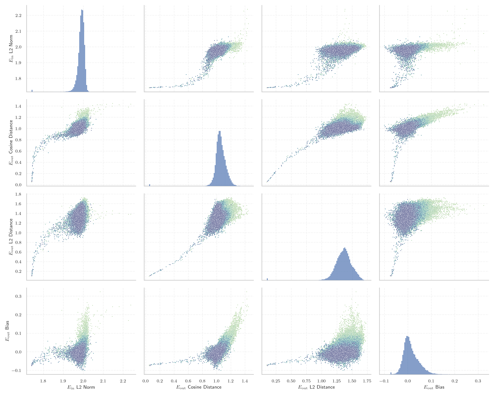
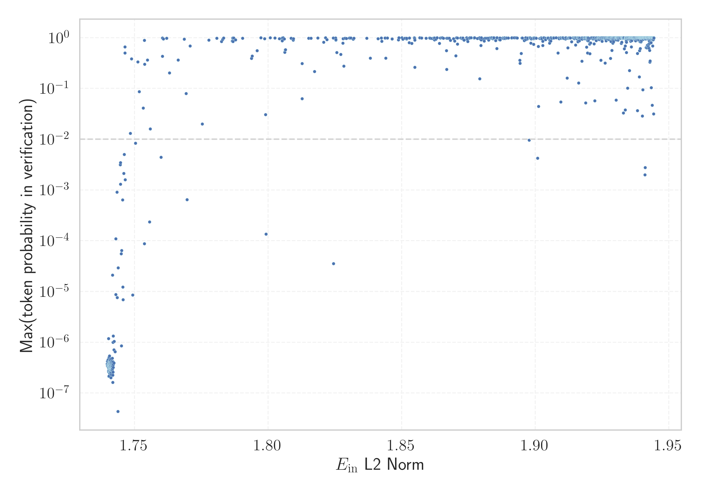

# Report for `EleutherAI/gpt-j-6b`

## Model info

* Tied embeddings: no
* LM head uses bias: yes
* Indicator for under-trained tokens: E_{in} L2 Norm
  * Overall distribution 1.988 +/- 0.024
  * Token used for verification prompt building: `BuyableInstoreAndOnline`
  * Verification threshold: 1.944
  * Threshold for showing candidate under-trained tokens: 1.746
  * Median verified threshold (for bytes, unreachable and special tokens): 1.743
* Embeddings shape: (50400, 4096)
* Vocabulary size: 50400
  * Number of single byte tokens: 256, of which 13 below indicator threshold
  * Number of special tokens: 144, of which 143 below indicator threshold
  * Number of non-single-byte UTF-fragment tokens: 216, 0 below soft indicator threshold
  * Number of tested under-trained tokens: 1002, 848 non-special, 57 below p = 0.01 threshold, 43 below soft indicator threshold

## Under-trained token indicators plot


## Verification plot


## Under-trained token verification results
43 entries below threshold of 1.746

|   token_id | token                             |   indicator | max_prob                                                         | in_other_tokens                                                                                                                                                                                   |
|------------|-----------------------------------|-------------|------------------------------------------------------------------|---------------------------------------------------------------------------------------------------------------------------------------------------------------------------------------------------|
|      35207 | ````` ▁attRot `````               |     1.73979 | <span style='border: 1px solid rgb(169, 68, 66);'>3.5e-07</span> |                                                                                                                                                                                                   |
|      30212 | ````` ▁externalToEVA `````        |     1.74024 | <span style='border: 1px solid rgb(169, 68, 66);'>2.6e-07</span> | <span style='border: 1px solid rgb(169, 68, 66);'>````` ▁externalToEVAOnly `````</span>                                                                                                           |
|      43177 | ````` EStreamFrame `````          |     1.74029 | <span style='border: 1px solid rgb(169, 68, 66);'>1.2e-06</span> |                                                                                                                                                                                                   |
|      36173 | ````` ▁RandomRedditor `````       |     1.74061 | <span style='border: 1px solid rgb(169, 68, 66);'>3e-07</span>   | <span style='border: 1px solid rgb(169, 68, 66);'>````` ▁RandomRedditorWithNo `````</span>                                                                                                        |
|      28666 | ````` PsyNetMessage `````         |     1.7407  | <span style='border: 1px solid rgb(169, 68, 66);'>2.8e-07</span> |                                                                                                                                                                                                   |
|      43453 | ````` ▁SolidGoldMagikarp `````    |     1.74072 | <span style='border: 1px solid rgb(169, 68, 66);'>4e-07</span>   |                                                                                                                                                                                                   |
|      46600 | ````` ▁Adinida `````              |     1.74076 | <span style='border: 1px solid rgb(169, 68, 66);'>3.5e-07</span> |                                                                                                                                                                                                   |
|      36174 | ````` ▁RandomRedditorWithNo ````` |     1.74081 | <span style='border: 1px solid rgb(169, 68, 66);'>3.3e-07</span> |                                                                                                                                                                                                   |
|      30899 | ````` cloneembedreportprint ````` |     1.74082 | <span style='border: 1px solid rgb(169, 68, 66);'>4.2e-07</span> | <span style='border: 1px solid rgb(169, 68, 66);'>````` rawdownloadcloneembedreportprint `````</span>                                                                                             |
|      40240 | ````` oreAndOnline `````          |     1.74089 | <span style='border: 1px solid rgb(169, 68, 66);'>2.7e-07</span> | <span style='border: 1px solid rgb(169, 68, 66);'>````` InstoreAndOnline `````</span>, <span style='border: 1px solid rgb(255, 145, 0);'>````` BuyableInstoreAndOnline `````</span>               |
|      40241 | ````` InstoreAndOnline `````      |     1.74101 | <span style='border: 1px solid rgb(169, 68, 66);'>2.9e-07</span> | <span style='border: 1px solid rgb(255, 145, 0);'>````` BuyableInstoreAndOnline `````</span>                                                                                                      |
|      23282 | ````` ▁davidjl `````              |     1.7411  | <span style='border: 1px solid rgb(169, 68, 66);'>2.5e-07</span> |                                                                                                                                                                                                   |
|      42090 | ````` ▁TheNitromeFan `````        |     1.74112 | <span style='border: 1px solid rgb(169, 68, 66);'>2.8e-07</span> |                                                                                                                                                                                                   |
|      42089 | ````` ▁TheNitrome `````           |     1.74114 | <span style='border: 1px solid rgb(169, 68, 66);'>3.5e-07</span> | <span style='border: 1px solid rgb(169, 68, 66);'>````` ▁TheNitromeFan `````</span>                                                                                                               |
|      42586 | ````` ▁srfN `````                 |     1.74137 | <span style='border: 1px solid rgb(169, 68, 66);'>3.1e-07</span> |                                                                                                                                                                                                   |
|      30898 | ````` embedreportprint `````      |     1.74152 | <span style='border: 1px solid rgb(169, 68, 66);'>3.5e-07</span> | <span style='border: 1px solid rgb(169, 68, 66);'>````` cloneembedreportprint `````</span>, <span style='border: 1px solid rgb(169, 68, 66);'>````` rawdownloadcloneembedreportprint `````</span> |
|      42202 | ````` GoldMagikarp `````          |     1.74159 | <span style='border: 1px solid rgb(169, 68, 66);'>3.1e-07</span> | <span style='border: 1px solid rgb(169, 68, 66);'>````` ▁SolidGoldMagikarp `````</span>                                                                                                           |
|      37574 | ````` StreamerBot `````           |     1.74164 | <span style='border: 1px solid rgb(169, 68, 66);'>3.1e-07</span> | <span style='border: 1px solid rgb(169, 68, 66);'>````` TPPStreamerBot `````</span>                                                                                                               |
|      39253 | ````` ▁UCHIJ `````                |     1.74174 | <span style='border: 1px solid rgb(169, 68, 66);'>2.1e-05</span> |                                                                                                                                                                                                   |
|      47571 | ````` ▁DevOnline `````            |     1.74178 | <span style='border: 1px solid rgb(169, 68, 66);'>1.6e-07</span> |                                                                                                                                                                                                   |
<details><summary>23 additional entries below threshold</summary>

|   token_id | token                                        |   indicator | max_prob                                                         | in_other_tokens                                                                                                                                                                                                                                                                          |
|------------|----------------------------------------------|-------------|------------------------------------------------------------------|------------------------------------------------------------------------------------------------------------------------------------------------------------------------------------------------------------------------------------------------------------------------------------------|
|      30906 | ````` rawdownloadcloneembedreportprint ````` |     1.74191 | <span style='border: 1px solid rgb(169, 68, 66);'>2.6e-07</span> |                                                                                                                                                                                                                                                                                          |
|      45544 | ````` ▁サーティ `````                        |     1.74195 | <span style='border: 1px solid rgb(169, 68, 66);'>9.9e-07</span> | <span style='border: 1px solid rgb(169, 68, 66);'>````` ▁サーティワン `````</span>                                                                                                                                                                                                       |
|      41551 | ````` Downloadha `````                       |     1.74198 | <span style='border: 1px solid rgb(169, 68, 66);'>1.3e-06</span> |                                                                                                                                                                                                                                                                                          |
|      32437 | ````` ▁Smartstocks `````                     |     1.74226 | <span style='border: 1px solid rgb(169, 68, 66);'>7.1e-07</span> |                                                                                                                                                                                                                                                                                          |
|      30905 | ````` rawdownload `````                      |     1.74229 | <span style='border: 1px solid rgb(169, 68, 66);'>3.9e-07</span> | <span style='border: 1px solid rgb(169, 68, 66);'>````` rawdownloadcloneembedreportprint `````</span>                                                                                                                                                                                    |
|      30213 | ````` ▁externalToEVAOnly `````               |     1.74235 | <span style='border: 1px solid rgb(169, 68, 66);'>1e-06</span>   |                                                                                                                                                                                                                                                                                          |
|      29372 | ````` ▁guiActiveUn `````                     |     1.74274 | <span style='border: 1px solid rgb(169, 68, 66);'>6.5e-07</span> | <span style='border: 1px solid rgb(169, 68, 66);'>````` ▁guiActiveUnfocused `````</span>                                                                                                                                                                                                 |
|      30209 | ````` ▁unfocusedRange `````                  |     1.74293 | <span style='border: 1px solid rgb(169, 68, 66);'>8.7e-06</span> |                                                                                                                                                                                                                                                                                          |
|      30210 | ````` ▁guiActiveUnfocused `````              |     1.74293 | <span style='border: 1px solid rgb(169, 68, 66);'>0.00011</span> |                                                                                                                                                                                                                                                                                          |
|      39752 | ````` quickShip `````                        |     1.74342 | <span style='border: 1px solid rgb(169, 68, 66);'>0.00091</span> | <span style='border: 1px solid rgb(169, 68, 66);'>````` quickShipAvailable `````</span>                                                                                                                                                                                                  |
|      31666 | ````` ?????-?????- `````                     |     1.74351 | <span style='border: 1px solid rgb(169, 68, 66);'>7.6e-06</span> |                                                                                                                                                                                                                                                                                          |
|      42424 | ````` DragonMagazine `````                   |     1.74375 | <span style='border: 1px solid rgb(169, 68, 66);'>4.3e-08</span> |                                                                                                                                                                                                                                                                                          |
|      25992 | ````` ▁裏覚醒 `````                          |     1.74388 | <span style='border: 1px solid rgb(169, 68, 66);'>2.9e-05</span> |                                                                                                                                                                                                                                                                                          |
|      39821 | ````` 龍契士 `````                           |     1.74467 | <span style='border: 1px solid rgb(255, 145, 0);'>0.0031</span>  |                                                                                                                                                                                                                                                                                          |
|      50009 | ````` ▁strutConnector `````                  |     1.74469 | <span style='border: 1px solid rgb(255, 145, 0);'>0.0035</span>  |                                                                                                                                                                                                                                                                                          |
|      39755 | ````` isSpecialOrderable `````               |     1.7447  | <span style='border: 1px solid rgb(255, 145, 0);'>0.0013</span>  |                                                                                                                                                                                                                                                                                          |
|      37579 | ````` TPPStreamerBot `````                   |     1.74501 | <span style='border: 1px solid rgb(169, 68, 66);'>5.5e-05</span> |                                                                                                                                                                                                                                                                                          |
|      36938 | ````` ▁sqor `````                            |     1.74507 | <span style='border: 1px solid rgb(169, 68, 66);'>8.5e-07</span> |                                                                                                                                                                                                                                                                                          |
|      30897 | ````` reportprint `````                      |     1.74513 | <span style='border: 1px solid rgb(169, 68, 66);'>6.4e-05</span> | <span style='border: 1px solid rgb(169, 68, 66);'>````` embedreportprint `````</span>, <span style='border: 1px solid rgb(169, 68, 66);'>````` cloneembedreportprint `````</span>, <span style='border: 1px solid rgb(169, 68, 66);'>````` rawdownloadcloneembedreportprint `````</span> |
|      30211 | ````` ▁guiIcon `````                         |     1.74551 | <span style='border: 1px solid rgb(169, 68, 66);'>0.00064</span> |                                                                                                                                                                                                                                                                                          |
|      39811 | ````` soDeliveryDate `````                   |     1.74559 | <span style='border: 1px solid rgb(169, 68, 66);'>1.2e-05</span> |                                                                                                                                                                                                                                                                                          |
|      45545 | ````` ▁サーティワン `````                    |     1.7457  | <span style='border: 1px solid rgb(169, 68, 66);'>6.9e-06</span> |                                                                                                                                                                                                                                                                                          |
|      39757 | ````` channelAvailability `````              |     1.74597 | <span style='border: 1px solid rgb(255, 145, 0);'>0.0021</span>  |                                                                                                                                                                                                                                                                                          |
</details>


## Partial UTF-8 tokens
0 entries below threshold of 1.746


## Byte tokens
13 entries below threshold of 1.743

|   token_id | token              |   indicator |   ord | hex   | byte_type   |
|------------|--------------------|-------------|-------|-------|-------------|
|        186 | ````` <0xFE> ````` |     1.74022 |   254 | 0xFE  | unused_utf8 |
|        181 | ````` <0xF9> ````` |     1.74036 |   249 | 0xF9  | unused_utf8 |
|        185 | ````` <0xFD> ````` |     1.74045 |   253 | 0xFD  | unused_utf8 |
|        182 | ````` <0xFA> ````` |     1.74072 |   250 | 0xFA  | unused_utf8 |
|        187 | ````` <0xFF> ````` |     1.74081 |   255 | 0xFF  | unused_utf8 |
|        124 | ````` <0xC0> ````` |     1.74082 |   192 | 0xC0  | unused_utf8 |
|        180 | ````` <0xF8> ````` |     1.74086 |   248 | 0xF8  | unused_utf8 |
|        179 | ````` <0xF7> ````` |     1.7413  |   247 | 0xF7  | unused_utf8 |
|        177 | ````` <0xF5> ````` |     1.74131 |   245 | 0xF5  | unused_utf8 |
|        125 | ````` <0xC1> ````` |     1.74135 |   193 | 0xC1  | unused_utf8 |
|        184 | ````` <0xFC> ````` |     1.74173 |   252 | 0xFC  | unused_utf8 |
|        178 | ````` <0xF6> ````` |     1.74199 |   246 | 0xF6  | unused_utf8 |
|        183 | ````` <0xFB> ````` |     1.74236 |   251 | 0xFB  | unused_utf8 |


## Special tokens
143 entries below threshold of 1.743

|   token_id | token                            |   indicator | max_prob                                                         |
|------------|----------------------------------|-------------|------------------------------------------------------------------|
|      50392 | ````` <\|extratoken_136\|> ````` |     1.73971 | <span style='border: 1px solid rgb(169, 68, 66);'>3.7e-07</span> |
|      50386 | ````` <\|extratoken_130\|> ````` |     1.73983 | <span style='border: 1px solid rgb(169, 68, 66);'>4.2e-07</span> |
|      50391 | ````` <\|extratoken_135\|> ````` |     1.73999 | <span style='border: 1px solid rgb(169, 68, 66);'>3.5e-07</span> |
|      50280 | ````` <\|extratoken_24\|> `````  |     1.74003 | <span style='border: 1px solid rgb(169, 68, 66);'>4.6e-07</span> |
|      50369 | ````` <\|extratoken_113\|> ````` |     1.74006 | <span style='border: 1px solid rgb(169, 68, 66);'>3.3e-07</span> |
|      50299 | ````` <\|extratoken_43\|> `````  |     1.74008 | <span style='border: 1px solid rgb(169, 68, 66);'>4e-07</span>   |
|      50265 | ````` <\|extratoken_9\|> `````   |     1.74009 | <span style='border: 1px solid rgb(169, 68, 66);'>3.7e-07</span> |
|      50261 | ````` <\|extratoken_5\|> `````   |     1.74016 | <span style='border: 1px solid rgb(169, 68, 66);'>3.2e-07</span> |
|      50340 | ````` <\|extratoken_84\|> `````  |     1.74019 | <span style='border: 1px solid rgb(169, 68, 66);'>3.4e-07</span> |
|      50313 | ````` <\|extratoken_57\|> `````  |     1.74019 | <span style='border: 1px solid rgb(169, 68, 66);'>3.7e-07</span> |
|      50324 | ````` <\|extratoken_68\|> `````  |     1.74025 | <span style='border: 1px solid rgb(169, 68, 66);'>3.1e-07</span> |
|      50376 | ````` <\|extratoken_120\|> ````` |     1.74025 | <span style='border: 1px solid rgb(169, 68, 66);'>2.7e-07</span> |
|      50277 | ````` <\|extratoken_21\|> `````  |     1.74027 | <span style='border: 1px solid rgb(169, 68, 66);'>3.8e-07</span> |
|      50305 | ````` <\|extratoken_49\|> `````  |     1.74028 | <span style='border: 1px solid rgb(169, 68, 66);'>3.5e-07</span> |
|      50275 | ````` <\|extratoken_19\|> `````  |     1.74034 | <span style='border: 1px solid rgb(169, 68, 66);'>3.1e-07</span> |
|      50397 | ````` <\|extratoken_141\|> ````` |     1.74034 | <span style='border: 1px solid rgb(169, 68, 66);'>3.4e-07</span> |
|      50317 | ````` <\|extratoken_61\|> `````  |     1.74037 | <span style='border: 1px solid rgb(169, 68, 66);'>3.4e-07</span> |
|      50290 | ````` <\|extratoken_34\|> `````  |     1.74037 | <span style='border: 1px solid rgb(169, 68, 66);'>3.8e-07</span> |
|      50323 | ````` <\|extratoken_67\|> `````  |     1.74037 | <span style='border: 1px solid rgb(169, 68, 66);'>2.1e-07</span> |
|      50348 | ````` <\|extratoken_92\|> `````  |     1.74038 | <span style='border: 1px solid rgb(169, 68, 66);'>5e-07</span>   |
<details><summary>123 additional entries below threshold</summary>

|   token_id | token                            |   indicator | max_prob                                                         |
|------------|----------------------------------|-------------|------------------------------------------------------------------|
|      50356 | ````` <\|extratoken_100\|> ````` |     1.74039 | <span style='border: 1px solid rgb(169, 68, 66);'>2.6e-07</span> |
|      50264 | ````` <\|extratoken_8\|> `````   |     1.74043 | <span style='border: 1px solid rgb(169, 68, 66);'>3.5e-07</span> |
|      50268 | ````` <\|extratoken_12\|> `````  |     1.74044 | <span style='border: 1px solid rgb(169, 68, 66);'>2.8e-07</span> |
|      50266 | ````` <\|extratoken_10\|> `````  |     1.74045 | <span style='border: 1px solid rgb(169, 68, 66);'>3e-07</span>   |
|      50269 | ````` <\|extratoken_13\|> `````  |     1.74045 | <span style='border: 1px solid rgb(169, 68, 66);'>3.7e-07</span> |
|      50388 | ````` <\|extratoken_132\|> ````` |     1.74045 | <span style='border: 1px solid rgb(169, 68, 66);'>2.2e-07</span> |
|      50335 | ````` <\|extratoken_79\|> `````  |     1.74045 | <span style='border: 1px solid rgb(169, 68, 66);'>3.4e-07</span> |
|      50371 | ````` <\|extratoken_115\|> ````` |     1.74047 | <span style='border: 1px solid rgb(169, 68, 66);'>4.2e-07</span> |
|      50365 | ````` <\|extratoken_109\|> ````` |     1.74047 | <span style='border: 1px solid rgb(169, 68, 66);'>3.8e-07</span> |
|      50322 | ````` <\|extratoken_66\|> `````  |     1.74049 | <span style='border: 1px solid rgb(169, 68, 66);'>3.4e-07</span> |
|      50385 | ````` <\|extratoken_129\|> ````` |     1.74049 | <span style='border: 1px solid rgb(169, 68, 66);'>3.5e-07</span> |
|      50307 | ````` <\|extratoken_51\|> `````  |     1.7405  | <span style='border: 1px solid rgb(169, 68, 66);'>3.6e-07</span> |
|      50308 | ````` <\|extratoken_52\|> `````  |     1.74053 | <span style='border: 1px solid rgb(169, 68, 66);'>3.8e-07</span> |
|      50349 | ````` <\|extratoken_93\|> `````  |     1.74055 | <span style='border: 1px solid rgb(169, 68, 66);'>3.9e-07</span> |
|      50331 | ````` <\|extratoken_75\|> `````  |     1.74057 | <span style='border: 1px solid rgb(169, 68, 66);'>3.5e-07</span> |
|      50390 | ````` <\|extratoken_134\|> ````` |     1.7406  | <span style='border: 1px solid rgb(169, 68, 66);'>2.5e-07</span> |
|      50318 | ````` <\|extratoken_62\|> `````  |     1.7406  | <span style='border: 1px solid rgb(169, 68, 66);'>3.5e-07</span> |
|      50332 | ````` <\|extratoken_76\|> `````  |     1.74061 | <span style='border: 1px solid rgb(169, 68, 66);'>4.2e-07</span> |
|      50295 | ````` <\|extratoken_39\|> `````  |     1.74062 | <span style='border: 1px solid rgb(169, 68, 66);'>3.1e-07</span> |
|      50368 | ````` <\|extratoken_112\|> ````` |     1.74063 | <span style='border: 1px solid rgb(169, 68, 66);'>5.4e-07</span> |
|      50389 | ````` <\|extratoken_133\|> ````` |     1.74063 | <span style='border: 1px solid rgb(169, 68, 66);'>3.1e-07</span> |
|      50328 | ````` <\|extratoken_72\|> `````  |     1.74063 | <span style='border: 1px solid rgb(169, 68, 66);'>4.5e-07</span> |
|      50350 | ````` <\|extratoken_94\|> `````  |     1.74063 | <span style='border: 1px solid rgb(169, 68, 66);'>3.3e-07</span> |
|      50316 | ````` <\|extratoken_60\|> `````  |     1.74063 | <span style='border: 1px solid rgb(169, 68, 66);'>3.7e-07</span> |
|      50366 | ````` <\|extratoken_110\|> ````` |     1.74063 | <span style='border: 1px solid rgb(169, 68, 66);'>3.7e-07</span> |
|      50333 | ````` <\|extratoken_77\|> `````  |     1.74063 | <span style='border: 1px solid rgb(169, 68, 66);'>2.4e-07</span> |
|      50352 | ````` <\|extratoken_96\|> `````  |     1.74065 | <span style='border: 1px solid rgb(169, 68, 66);'>2.9e-07</span> |
|      50381 | ````` <\|extratoken_125\|> ````` |     1.74065 | <span style='border: 1px solid rgb(169, 68, 66);'>4.2e-07</span> |
|      50378 | ````` <\|extratoken_122\|> ````` |     1.74066 | <span style='border: 1px solid rgb(169, 68, 66);'>3.1e-07</span> |
|      50258 | ````` <\|extratoken_2\|> `````   |     1.74068 | <span style='border: 1px solid rgb(169, 68, 66);'>3.4e-07</span> |
|      50380 | ````` <\|extratoken_124\|> ````` |     1.74069 | <span style='border: 1px solid rgb(169, 68, 66);'>2.5e-07</span> |
|      50341 | ````` <\|extratoken_85\|> `````  |     1.7407  | <span style='border: 1px solid rgb(169, 68, 66);'>3.2e-07</span> |
|      50287 | ````` <\|extratoken_31\|> `````  |     1.74071 | <span style='border: 1px solid rgb(169, 68, 66);'>3.6e-07</span> |
|      50279 | ````` <\|extratoken_23\|> `````  |     1.74073 | <span style='border: 1px solid rgb(169, 68, 66);'>2.5e-07</span> |
|      50373 | ````` <\|extratoken_117\|> ````` |     1.74074 | <span style='border: 1px solid rgb(169, 68, 66);'>2.9e-07</span> |
|      50271 | ````` <\|extratoken_15\|> `````  |     1.74075 | <span style='border: 1px solid rgb(169, 68, 66);'>4.1e-07</span> |
|      50358 | ````` <\|extratoken_102\|> ````` |     1.74077 | <span style='border: 1px solid rgb(169, 68, 66);'>2.6e-07</span> |
|      50343 | ````` <\|extratoken_87\|> `````  |     1.74078 | <span style='border: 1px solid rgb(169, 68, 66);'>4.5e-07</span> |
|      50359 | ````` <\|extratoken_103\|> ````` |     1.74078 | <span style='border: 1px solid rgb(169, 68, 66);'>3.8e-07</span> |
|      50288 | ````` <\|extratoken_32\|> `````  |     1.7408  | <span style='border: 1px solid rgb(169, 68, 66);'>3.2e-07</span> |
|      50278 | ````` <\|extratoken_22\|> `````  |     1.7408  | <span style='border: 1px solid rgb(169, 68, 66);'>3.4e-07</span> |
|      50329 | ````` <\|extratoken_73\|> `````  |     1.7408  | <span style='border: 1px solid rgb(169, 68, 66);'>3.4e-07</span> |
|      50260 | ````` <\|extratoken_4\|> `````   |     1.7408  | <span style='border: 1px solid rgb(169, 68, 66);'>4.1e-07</span> |
|      50303 | ````` <\|extratoken_47\|> `````  |     1.74081 | <span style='border: 1px solid rgb(169, 68, 66);'>3.1e-07</span> |
|      50281 | ````` <\|extratoken_25\|> `````  |     1.74083 | <span style='border: 1px solid rgb(169, 68, 66);'>2.7e-07</span> |
|      50273 | ````` <\|extratoken_17\|> `````  |     1.74083 | <span style='border: 1px solid rgb(169, 68, 66);'>3.7e-07</span> |
|      50361 | ````` <\|extratoken_105\|> ````` |     1.74083 | <span style='border: 1px solid rgb(169, 68, 66);'>3e-07</span>   |
|      50394 | ````` <\|extratoken_138\|> ````` |     1.74083 | <span style='border: 1px solid rgb(169, 68, 66);'>4e-07</span>   |
|      50360 | ````` <\|extratoken_104\|> ````` |     1.74084 | <span style='border: 1px solid rgb(169, 68, 66);'>2.6e-07</span> |
|      50375 | ````` <\|extratoken_119\|> ````` |     1.74085 | <span style='border: 1px solid rgb(169, 68, 66);'>4e-07</span>   |
|      50315 | ````` <\|extratoken_59\|> `````  |     1.74086 | <span style='border: 1px solid rgb(169, 68, 66);'>3.1e-07</span> |
|      50363 | ````` <\|extratoken_107\|> ````` |     1.74087 | <span style='border: 1px solid rgb(169, 68, 66);'>3.6e-07</span> |
|      50382 | ````` <\|extratoken_126\|> ````` |     1.74088 | <span style='border: 1px solid rgb(169, 68, 66);'>3.3e-07</span> |
|      50296 | ````` <\|extratoken_40\|> `````  |     1.74088 | <span style='border: 1px solid rgb(169, 68, 66);'>2.5e-07</span> |
|      50309 | ````` <\|extratoken_53\|> `````  |     1.74089 | <span style='border: 1px solid rgb(169, 68, 66);'>3.9e-07</span> |
|      50384 | ````` <\|extratoken_128\|> ````` |     1.7409  | <span style='border: 1px solid rgb(169, 68, 66);'>4.2e-07</span> |
|      50312 | ````` <\|extratoken_56\|> `````  |     1.7409  | <span style='border: 1px solid rgb(169, 68, 66);'>3.6e-07</span> |
|      50297 | ````` <\|extratoken_41\|> `````  |     1.74092 | <span style='border: 1px solid rgb(169, 68, 66);'>3e-07</span>   |
|      50292 | ````` <\|extratoken_36\|> `````  |     1.74093 | <span style='border: 1px solid rgb(169, 68, 66);'>2.7e-07</span> |
|      50291 | ````` <\|extratoken_35\|> `````  |     1.74094 | <span style='border: 1px solid rgb(169, 68, 66);'>2.6e-07</span> |
|      50396 | ````` <\|extratoken_140\|> ````` |     1.74096 | <span style='border: 1px solid rgb(169, 68, 66);'>3.5e-07</span> |
|      50354 | ````` <\|extratoken_98\|> `````  |     1.74097 | <span style='border: 1px solid rgb(169, 68, 66);'>3e-07</span>   |
|      50257 | ````` <\|extratoken_1\|> `````   |     1.74097 | <span style='border: 1px solid rgb(169, 68, 66);'>3.5e-07</span> |
|      50304 | ````` <\|extratoken_48\|> `````  |     1.74098 | <span style='border: 1px solid rgb(169, 68, 66);'>2.7e-07</span> |
|      50306 | ````` <\|extratoken_50\|> `````  |     1.74099 | <span style='border: 1px solid rgb(169, 68, 66);'>3.5e-07</span> |
|      50325 | ````` <\|extratoken_69\|> `````  |     1.741   | <span style='border: 1px solid rgb(169, 68, 66);'>3e-07</span>   |
|      50300 | ````` <\|extratoken_44\|> `````  |     1.74101 | <span style='border: 1px solid rgb(169, 68, 66);'>4.1e-07</span> |
|      50272 | ````` <\|extratoken_16\|> `````  |     1.74101 | <span style='border: 1px solid rgb(169, 68, 66);'>3e-07</span>   |
|      50274 | ````` <\|extratoken_18\|> `````  |     1.74104 | <span style='border: 1px solid rgb(169, 68, 66);'>3.6e-07</span> |
|      50345 | ````` <\|extratoken_89\|> `````  |     1.74104 | <span style='border: 1px solid rgb(169, 68, 66);'>4e-07</span>   |
|      50282 | ````` <\|extratoken_26\|> `````  |     1.74107 | <span style='border: 1px solid rgb(169, 68, 66);'>2.9e-07</span> |
|      50367 | ````` <\|extratoken_111\|> ````` |     1.74108 | <span style='border: 1px solid rgb(169, 68, 66);'>3.9e-07</span> |
|      50321 | ````` <\|extratoken_65\|> `````  |     1.74108 | <span style='border: 1px solid rgb(169, 68, 66);'>3.5e-07</span> |
|      50383 | ````` <\|extratoken_127\|> ````` |     1.74109 | <span style='border: 1px solid rgb(169, 68, 66);'>2.9e-07</span> |
|      50355 | ````` <\|extratoken_99\|> `````  |     1.74109 | <span style='border: 1px solid rgb(169, 68, 66);'>3.2e-07</span> |
|      50347 | ````` <\|extratoken_91\|> `````  |     1.7411  | <span style='border: 1px solid rgb(169, 68, 66);'>2e-07</span>   |
|      50294 | ````` <\|extratoken_38\|> `````  |     1.74111 | <span style='border: 1px solid rgb(169, 68, 66);'>2.8e-07</span> |
|      50283 | ````` <\|extratoken_27\|> `````  |     1.74112 | <span style='border: 1px solid rgb(169, 68, 66);'>2.8e-07</span> |
|      50370 | ````` <\|extratoken_114\|> ````` |     1.74112 | <span style='border: 1px solid rgb(169, 68, 66);'>3.3e-07</span> |
|      50263 | ````` <\|extratoken_7\|> `````   |     1.74113 | <span style='border: 1px solid rgb(169, 68, 66);'>4e-07</span>   |
|      50387 | ````` <\|extratoken_131\|> ````` |     1.74116 | <span style='border: 1px solid rgb(169, 68, 66);'>2.9e-07</span> |
|      50351 | ````` <\|extratoken_95\|> `````  |     1.74117 | <span style='border: 1px solid rgb(169, 68, 66);'>3.5e-07</span> |
|      50319 | ````` <\|extratoken_63\|> `````  |     1.7412  | <span style='border: 1px solid rgb(169, 68, 66);'>2.3e-07</span> |
|      50379 | ````` <\|extratoken_123\|> ````` |     1.7412  | <span style='border: 1px solid rgb(169, 68, 66);'>3.1e-07</span> |
|      50342 | ````` <\|extratoken_86\|> `````  |     1.74122 | <span style='border: 1px solid rgb(169, 68, 66);'>3.9e-07</span> |
|      50302 | ````` <\|extratoken_46\|> `````  |     1.74124 | <span style='border: 1px solid rgb(169, 68, 66);'>2.8e-07</span> |
|      50284 | ````` <\|extratoken_28\|> `````  |     1.74124 | <span style='border: 1px solid rgb(169, 68, 66);'>4.7e-07</span> |
|      50289 | ````` <\|extratoken_33\|> `````  |     1.74125 | <span style='border: 1px solid rgb(169, 68, 66);'>3.1e-07</span> |
|      50311 | ````` <\|extratoken_55\|> `````  |     1.74125 | <span style='border: 1px solid rgb(169, 68, 66);'>3.2e-07</span> |
|      50276 | ````` <\|extratoken_20\|> `````  |     1.74126 | <span style='border: 1px solid rgb(169, 68, 66);'>2.8e-07</span> |
|      50374 | ````` <\|extratoken_118\|> ````` |     1.74129 | <span style='border: 1px solid rgb(169, 68, 66);'>2.9e-07</span> |
|      50320 | ````` <\|extratoken_64\|> `````  |     1.74129 | <span style='border: 1px solid rgb(169, 68, 66);'>3.6e-07</span> |
|      50285 | ````` <\|extratoken_29\|> `````  |     1.74132 | <span style='border: 1px solid rgb(169, 68, 66);'>3.9e-07</span> |
|      50326 | ````` <\|extratoken_70\|> `````  |     1.74133 | <span style='border: 1px solid rgb(169, 68, 66);'>2.3e-07</span> |
|      50362 | ````` <\|extratoken_106\|> ````` |     1.74134 | <span style='border: 1px solid rgb(169, 68, 66);'>3.3e-07</span> |
|      50270 | ````` <\|extratoken_14\|> `````  |     1.74134 | <span style='border: 1px solid rgb(169, 68, 66);'>3.1e-07</span> |
|      50267 | ````` <\|extratoken_11\|> `````  |     1.74137 | <span style='border: 1px solid rgb(169, 68, 66);'>3.5e-07</span> |
|      50339 | ````` <\|extratoken_83\|> `````  |     1.74142 | <span style='border: 1px solid rgb(169, 68, 66);'>3.1e-07</span> |
|      50346 | ````` <\|extratoken_90\|> `````  |     1.74143 | <span style='border: 1px solid rgb(169, 68, 66);'>3.2e-07</span> |
|      50314 | ````` <\|extratoken_58\|> `````  |     1.74143 | <span style='border: 1px solid rgb(169, 68, 66);'>2.8e-07</span> |
|      50338 | ````` <\|extratoken_82\|> `````  |     1.74145 | <span style='border: 1px solid rgb(169, 68, 66);'>3.1e-07</span> |
|      50344 | ````` <\|extratoken_88\|> `````  |     1.74146 | <span style='border: 1px solid rgb(169, 68, 66);'>3.2e-07</span> |
|      50259 | ````` <\|extratoken_3\|> `````   |     1.74146 | <span style='border: 1px solid rgb(169, 68, 66);'>3.7e-07</span> |
|      50395 | ````` <\|extratoken_139\|> ````` |     1.74151 | <span style='border: 1px solid rgb(169, 68, 66);'>4.2e-07</span> |
|      50334 | ````` <\|extratoken_78\|> `````  |     1.74151 | <span style='border: 1px solid rgb(169, 68, 66);'>2.8e-07</span> |
|      50298 | ````` <\|extratoken_42\|> `````  |     1.74152 | <span style='border: 1px solid rgb(169, 68, 66);'>2.9e-07</span> |
|      50336 | ````` <\|extratoken_80\|> `````  |     1.74157 | <span style='border: 1px solid rgb(169, 68, 66);'>2.9e-07</span> |
|      50372 | ````` <\|extratoken_116\|> ````` |     1.7416  | <span style='border: 1px solid rgb(169, 68, 66);'>3.6e-07</span> |
|      50286 | ````` <\|extratoken_30\|> `````  |     1.74162 | <span style='border: 1px solid rgb(169, 68, 66);'>3.5e-07</span> |
|      50393 | ````` <\|extratoken_137\|> ````` |     1.74163 | <span style='border: 1px solid rgb(169, 68, 66);'>3.3e-07</span> |
|      50327 | ````` <\|extratoken_71\|> `````  |     1.74164 | <span style='border: 1px solid rgb(169, 68, 66);'>4.8e-07</span> |
|      50301 | ````` <\|extratoken_45\|> `````  |     1.74166 | <span style='border: 1px solid rgb(169, 68, 66);'>4e-07</span>   |
|      50330 | ````` <\|extratoken_74\|> `````  |     1.74168 | <span style='border: 1px solid rgb(169, 68, 66);'>3.1e-07</span> |
|      50353 | ````` <\|extratoken_97\|> `````  |     1.74168 | <span style='border: 1px solid rgb(169, 68, 66);'>2.9e-07</span> |
|      50364 | ````` <\|extratoken_108\|> ````` |     1.74172 | <span style='border: 1px solid rgb(169, 68, 66);'>2.6e-07</span> |
|      50310 | ````` <\|extratoken_54\|> `````  |     1.74174 | <span style='border: 1px solid rgb(169, 68, 66);'>3e-07</span>   |
|      50377 | ````` <\|extratoken_121\|> ````` |     1.74175 | <span style='border: 1px solid rgb(169, 68, 66);'>3.4e-07</span> |
|      50357 | ````` <\|extratoken_101\|> ````` |     1.74178 | <span style='border: 1px solid rgb(169, 68, 66);'>3.7e-07</span> |
|      50399 | ````` <\|extratoken_143\|> ````` |     1.74184 | <span style='border: 1px solid rgb(169, 68, 66);'>3.9e-07</span> |
|      50398 | ````` <\|extratoken_142\|> ````` |     1.74186 | <span style='border: 1px solid rgb(169, 68, 66);'>2.3e-07</span> |
|      50293 | ````` <\|extratoken_37\|> `````  |     1.74191 | <span style='border: 1px solid rgb(169, 68, 66);'>4.1e-07</span> |
|      50337 | ````` <\|extratoken_81\|> `````  |     1.74197 | <span style='border: 1px solid rgb(169, 68, 66);'>3.6e-07</span> |
|      50262 | ````` <\|extratoken_6\|> `````   |     1.74198 | <span style='border: 1px solid rgb(169, 68, 66);'>3.2e-07</span> |
</details>

