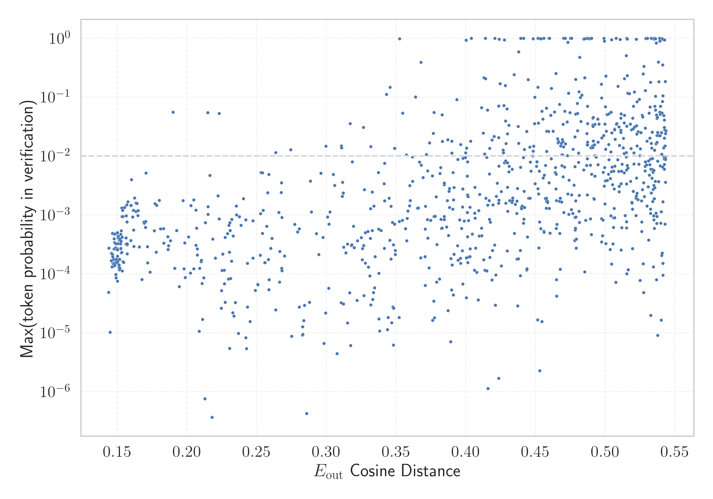

# Report for `Fugaku-LLM/Fugaku-LLM-13B`

## Model info

* Model Info: 
  * Tied embeddings: True
  * LM head uses bias: False
  * Embeddings shape: [49152, 5184]
* Tokenizer Info: 
  * Vocab Size: 48586
  * Tokenizer Class: PreTrainedTokenizerFast
  * Tokenizer Type: Unigram
  * Bytes handling: Byte Fallback
  * Token for verification prompt building: FIAsyncOperation
  * Token id for verification prompt building: 8975
* Indicator summary: 
  * Indicator for under-trained tokens: E_{out} Cosine Distance
  * Overall distribution: 0.720 +/- 0.119
* Detected Token Counts: 
  * Number of tested under-trained tokens: 972, 965 non-special, 675 below p = 0.01 threshold, 439 below soft indicator threshold
  * Number of single byte tokens: 353, of which 111 below indicator threshold
  * Number of special tokens: 85, of which 79 below indicator threshold
  * Number of non-single-byte unreachable tokens: 85, of which 79 below indicator threshold

## Under-trained token indicators plot


## Verification plot


## Under-trained token verification results
439 entries below threshold of 0.414

|   token_id | token                        |   indicator | max_prob                                                         |
|------------|------------------------------|-------------|------------------------------------------------------------------|
|       8788 | ````` ▁kGTLR `````           |    0.143908 | <span style='border: 1px solid rgb(169, 68, 66);'>4.9e-05</span> |
|       8162 | ````` RESETVALUE `````       |    0.14407  | <span style='border: 1px solid rgb(169, 68, 66);'>0.00027</span> |
|      48436 | ````` \ue964 `````           |    0.145802 | <span style='border: 1px solid rgb(169, 68, 66);'>0.00017</span> |
|       7013 | ````` YYCURSOR `````         |    0.145874 | <span style='border: 1px solid rgb(169, 68, 66);'>0.00022</span> |
|       9301 | ````` ▁GBProperty `````      |    0.14626  | <span style='border: 1px solid rgb(169, 68, 66);'>0.00013</span> |
|       9972 | ````` CyFunction `````       |    0.146629 | <span style='border: 1px solid rgb(169, 68, 66);'>0.00049</span> |
|       8519 | ````` VNVPROC `````          |    0.146649 | <span style='border: 1px solid rgb(169, 68, 66);'>0.00021</span> |
|       7853 | ````` DIPSETTING `````       |    0.1468   | <span style='border: 1px solid rgb(169, 68, 66);'>0.00019</span> |
|       9792 | ````` acadoWorkspace `````   |    0.147423 | <span style='border: 1px solid rgb(169, 68, 66);'>0.00018</span> |
|       9876 | ````` ewGetProcAddress ````` |    0.147551 | <span style='border: 1px solid rgb(169, 68, 66);'>0.00026</span> |
|       9613 | ````` OSCENCMD `````         |    0.14764  | <span style='border: 1px solid rgb(169, 68, 66);'>0.00014</span> |
|       9742 | ````` LiftoffRegister `````  |    0.147711 | <span style='border: 1px solid rgb(169, 68, 66);'>0.00015</span> |
|       8942 | ````` VERTEXATTRIBI `````    |    0.147817 | <span style='border: 1px solid rgb(169, 68, 66);'>0.00039</span> |
|       9404 | ````` PFNGLTEXCOORD `````    |    0.147983 | <span style='border: 1px solid rgb(169, 68, 66);'>0.00027</span> |
|       9188 | ````` MASKWRITE `````        |    0.14811  | <span style='border: 1px solid rgb(169, 68, 66);'>0.00047</span> |
|       9920 | ````` USEBURSTS `````        |    0.148184 | <span style='border: 1px solid rgb(169, 68, 66);'>0.00034</span> |
|       8989 | ````` PFNGLPROGRAM `````     |    0.148806 | <span style='border: 1px solid rgb(169, 68, 66);'>0.00028</span> |
|       8975 | ````` FIAsyncOperation ````` |    0.148868 | <span style='border: 1px solid rgb(169, 68, 66);'>0.00015</span> |
|      21883 | ````` \u2009\<\u2009 `````   |    0.148941 | <span style='border: 1px solid rgb(169, 68, 66);'>9.7e-05</span> |
|       9707 | ````` regBuiltin `````       |    0.14911  | <span style='border: 1px solid rgb(169, 68, 66);'>8.5e-05</span> |
<details><summary>419 additional entries below threshold</summary>

|   token_id | token                        |   indicator | max_prob                                                         | in_other_tokens                                                                                                                                                                                                                                                                                                                                                                                                           |
|------------|------------------------------|-------------|------------------------------------------------------------------|---------------------------------------------------------------------------------------------------------------------------------------------------------------------------------------------------------------------------------------------------------------------------------------------------------------------------------------------------------------------------------------------------------------------------|
|      16187 | ````` ]--[@ `````            |    0.149467 | <span style='border: 1px solid rgb(169, 68, 66);'>0.00017</span> |                                                                                                                                                                                                                                                                                                                                                                                                                           |
|       7882 | ````` emlrt `````            |    0.149712 | <span style='border: 1px solid rgb(169, 68, 66);'>0.00026</span> |                                                                                                                                                                                                                                                                                                                                                                                                                           |
|       7775 | ````` DVPROC `````           |    0.149717 | <span style='border: 1px solid rgb(169, 68, 66);'>0.00049</span> |                                                                                                                                                                                                                                                                                                                                                                                                                           |
|       5861 | ````` NimStringDesc `````    |    0.149821 | <span style='border: 1px solid rgb(169, 68, 66);'>0.00027</span> |                                                                                                                                                                                                                                                                                                                                                                                                                           |
|       8209 | ````` NIMCALL `````          |    0.150119 | <span style='border: 1px solid rgb(169, 68, 66);'>7.5e-05</span> |                                                                                                                                                                                                                                                                                                                                                                                                                           |
|       9530 | ````` ▁CYDEV `````           |    0.150122 | <span style='border: 1px solid rgb(169, 68, 66);'>0.0002</span>  |                                                                                                                                                                                                                                                                                                                                                                                                                           |
|       8369 | ````` PROGRAMUNIFORM `````   |    0.150167 | <span style='border: 1px solid rgb(169, 68, 66);'>0.0005</span>  |                                                                                                                                                                                                                                                                                                                                                                                                                           |
|       7975 | ````` PQExpBuffer `````      |    0.15023  | <span style='border: 1px solid rgb(169, 68, 66);'>0.00026</span> | <span style='border: 1px solid rgb(169, 68, 66);'>````` ppendPQExpBuffer `````</span>                                                                                                                                                                                                                                                                                                                                     |
|       9383 | ````` ▁OMITBAD `````         |    0.150328 | <span style='border: 1px solid rgb(169, 68, 66);'>0.00016</span> |                                                                                                                                                                                                                                                                                                                                                                                                                           |
|       9766 | ````` HFPERCLKDIV `````      |    0.150464 | <span style='border: 1px solid rgb(169, 68, 66);'>0.00033</span> |                                                                                                                                                                                                                                                                                                                                                                                                                           |
|       8224 | ````` HFPERCLKEN `````       |    0.150564 | <span style='border: 1px solid rgb(169, 68, 66);'>0.00041</span> |                                                                                                                                                                                                                                                                                                                                                                                                                           |
|       8507 | ````` highbd `````           |    0.150606 | <span style='border: 1px solid rgb(169, 68, 66);'>0.00043</span> |                                                                                                                                                                                                                                                                                                                                                                                                                           |
|       7763 | ````` MagickFalse `````      |    0.151247 | <span style='border: 1px solid rgb(169, 68, 66);'>0.00013</span> |                                                                                                                                                                                                                                                                                                                                                                                                                           |
|       8655 | ````` ▁{&__ `````            |    0.151418 | <span style='border: 1px solid rgb(169, 68, 66);'>0.00014</span> |                                                                                                                                                                                                                                                                                                                                                                                                                           |
|       7825 | ````` SINGLECTRL `````       |    0.151482 | <span style='border: 1px solid rgb(169, 68, 66);'>0.00012</span> |                                                                                                                                                                                                                                                                                                                                                                                                                           |
|       6291 | ````` SIGSEL `````           |    0.151536 | <span style='border: 1px solid rgb(169, 68, 66);'>0.00037</span> |                                                                                                                                                                                                                                                                                                                                                                                                                           |
|       9611 | ````` marshallOut `````      |    0.151606 | <span style='border: 1px solid rgb(169, 68, 66);'>0.00018</span> |                                                                                                                                                                                                                                                                                                                                                                                                                           |
|       5512 | ````` :%.*]], `````          |    0.151894 | <span style='border: 1px solid rgb(169, 68, 66);'>0.00013</span> |                                                                                                                                                                                                                                                                                                                                                                                                                           |
|       7306 | ````` PFNGLUNIFORM `````     |    0.151968 | <span style='border: 1px solid rgb(169, 68, 66);'>0.00039</span> |                                                                                                                                                                                                                                                                                                                                                                                                                           |
|       9550 | ````` ▁OMITGOOD `````        |    0.152323 | <span style='border: 1px solid rgb(169, 68, 66);'>0.00032</span> |                                                                                                                                                                                                                                                                                                                                                                                                                           |
|       9389 | ````` HFCORECLKDIV `````     |    0.152565 | <span style='border: 1px solid rgb(169, 68, 66);'>0.00027</span> |                                                                                                                                                                                                                                                                                                                                                                                                                           |
|       9636 | ````` OutcomeCallable `````  |    0.15257  | <span style='border: 1px solid rgb(169, 68, 66);'>0.00027</span> |                                                                                                                                                                                                                                                                                                                                                                                                                           |
|       8852 | ````` hcryp `````            |    0.152589 | <span style='border: 1px solid rgb(169, 68, 66);'>0.00047</span> |                                                                                                                                                                                                                                                                                                                                                                                                                           |
|       8095 | ````` ▁sbitmap `````         |    0.152654 | <span style='border: 1px solid rgb(169, 68, 66);'>0.00036</span> |                                                                                                                                                                                                                                                                                                                                                                                                                           |
|       9526 | ````` GetEmptyString `````   |    0.152843 | <span style='border: 1px solid rgb(169, 68, 66);'>0.00023</span> |                                                                                                                                                                                                                                                                                                                                                                                                                           |
|       8067 | ````` VEXTPROC `````         |    0.152881 | <span style='border: 1px solid rgb(169, 68, 66);'>0.00054</span> |                                                                                                                                                                                                                                                                                                                                                                                                                           |
|       8339 | ````` ppendPQExpBuffer ````` |    0.153235 | <span style='border: 1px solid rgb(169, 68, 66);'>0.00023</span> |                                                                                                                                                                                                                                                                                                                                                                                                                           |
|       3886 | ````` ▁PFNGLGET `````        |    0.153281 | <span style='border: 1px solid rgb(255, 145, 0);'>0.0013</span>  |                                                                                                                                                                                                                                                                                                                                                                                                                           |
|       7443 | ````` UIVPROC `````          |    0.153395 | <span style='border: 1px solid rgb(169, 68, 66);'>0.00094</span> |                                                                                                                                                                                                                                                                                                                                                                                                                           |
|       9967 | ````` LFCLKSEL `````         |    0.153543 | <span style='border: 1px solid rgb(169, 68, 66);'>0.00011</span> |                                                                                                                                                                                                                                                                                                                                                                                                                           |
|       6980 | ````` INPUTSEL `````         |    0.153571 | <span style='border: 1px solid rgb(169, 68, 66);'>0.00042</span> |                                                                                                                                                                                                                                                                                                                                                                                                                           |
|       7466 | ````` SLJIT `````            |    0.153837 | <span style='border: 1px solid rgb(255, 145, 0);'>0.0012</span>  |                                                                                                                                                                                                                                                                                                                                                                                                                           |
|       9432 | ````` ▁EZRADIO `````         |    0.154062 | <span style='border: 1px solid rgb(169, 68, 66);'>0.00016</span> |                                                                                                                                                                                                                                                                                                                                                                                                                           |
|       9953 | ````` mlxsw `````            |    0.154073 | <span style='border: 1px solid rgb(169, 68, 66);'>0.00094</span> |                                                                                                                                                                                                                                                                                                                                                                                                                           |
|       8903 | ````` appendStringInfo ````` |    0.154592 | <span style='border: 1px solid rgb(169, 68, 66);'>0.00016</span> |                                                                                                                                                                                                                                                                                                                                                                                                                           |
|       9625 | ````` ftnlen `````           |    0.155289 | <span style='border: 1px solid rgb(255, 145, 0);'>0.0013</span>  |                                                                                                                                                                                                                                                                                                                                                                                                                           |
|       8440 | ````` ntDefaultHandler ````` |    0.156206 | <span style='border: 1px solid rgb(169, 68, 66);'>0.00032</span> |                                                                                                                                                                                                                                                                                                                                                                                                                           |
|       9133 | ````` CALCTRL `````          |    0.156308 | <span style='border: 1px solid rgb(169, 68, 66);'>0.00041</span> |                                                                                                                                                                                                                                                                                                                                                                                                                           |
|       7444 | ````` GLAPIENTRY `````       |    0.156504 | <span style='border: 1px solid rgb(169, 68, 66);'>0.00097</span> |                                                                                                                                                                                                                                                                                                                                                                                                                           |
|       9819 | ````` TCPWM `````            |    0.156857 | <span style='border: 1px solid rgb(255, 145, 0);'>0.0015</span>  |                                                                                                                                                                                                                                                                                                                                                                                                                           |
|       8754 | ````` AsyncCaller `````      |    0.15698  | <span style='border: 1px solid rgb(169, 68, 66);'>0.00076</span> |                                                                                                                                                                                                                                                                                                                                                                                                                           |
|       6459 | ````` NVPROC `````           |    0.157058 | <span style='border: 1px solid rgb(169, 68, 66);'>0.00031</span> | <span style='border: 1px solid rgb(169, 68, 66);'>````` VNVPROC `````</span>                                                                                                                                                                                                                                                                                                                                              |
|       9553 | ````` lreadyInited `````     |    0.157103 | <span style='border: 1px solid rgb(169, 68, 66);'>0.00032</span> |                                                                                                                                                                                                                                                                                                                                                                                                                           |
|       5311 | ````` FNGLVERTEXATTRIB ````` |    0.15722  | <span style='border: 1px solid rgb(169, 68, 66);'>0.00022</span> |                                                                                                                                                                                                                                                                                                                                                                                                                           |
|       9260 | ````` VARBPROC `````         |    0.157682 | <span style='border: 1px solid rgb(255, 145, 0);'>0.0017</span>  |                                                                                                                                                                                                                                                                                                                                                                                                                           |
|       8006 | ````` typval `````           |    0.159766 | <span style='border: 1px solid rgb(255, 145, 0);'>0.0014</span>  |                                                                                                                                                                                                                                                                                                                                                                                                                           |
|       6352 | ````` ▁GTLR `````            |    0.159777 | <span style='border: 1px solid rgb(169, 68, 66);'>0.00037</span> |                                                                                                                                                                                                                                                                                                                                                                                                                           |
|       6535 | ````` FVPROC `````           |    0.159897 | <span style='border: 1px solid rgb(255, 145, 0);'>0.0015</span>  |                                                                                                                                                                                                                                                                                                                                                                                                                           |
|       8758 | ````` UNIFORMMATRIX `````    |    0.160249 | <span style='border: 1px solid rgb(255, 145, 0);'>0.004</span>   |                                                                                                                                                                                                                                                                                                                                                                                                                           |
|       9752 | ````` rehasher `````         |    0.16101  | <span style='border: 1px solid rgb(169, 68, 66);'>0.00092</span> |                                                                                                                                                                                                                                                                                                                                                                                                                           |
|      37016 | ````` \u3000>> `````         |    0.161603 | <span style='border: 1px solid rgb(255, 145, 0);'>0.0012</span>  |                                                                                                                                                                                                                                                                                                                                                                                                                           |
|       9837 | ````` glSecondaryColor ````` |    0.161689 | <span style='border: 1px solid rgb(169, 68, 66);'>0.00056</span> |                                                                                                                                                                                                                                                                                                                                                                                                                           |
|       4948 | ````` ▁classdump `````       |    0.161986 | <span style='border: 1px solid rgb(169, 68, 66);'>0.00029</span> |                                                                                                                                                                                                                                                                                                                                                                                                                           |
|       5172 | ````` :%.*]] `````           |    0.162354 | <span style='border: 1px solid rgb(255, 145, 0);'>0.0019</span>  | <span style='border: 1px solid rgb(169, 68, 66);'>````` :%.*]], `````</span>                                                                                                                                                                                                                                                                                                                                              |
|       7003 | ````` LETIMER `````          |    0.163473 | <span style='border: 1px solid rgb(255, 145, 0);'>0.0016</span>  |                                                                                                                                                                                                                                                                                                                                                                                                                           |
|       5715 | ````` joaat `````            |    0.163509 | <span style='border: 1px solid rgb(255, 145, 0);'>0.0011</span>  |                                                                                                                                                                                                                                                                                                                                                                                                                           |
|       8681 | ````` MULTITEXCOORD `````    |    0.16406  | <span style='border: 1px solid rgb(255, 145, 0);'>0.0016</span>  |                                                                                                                                                                                                                                                                                                                                                                                                                           |
|       6061 | ````` IVPROC `````           |    0.164895 | <span style='border: 1px solid rgb(169, 68, 66);'>0.00097</span> | <span style='border: 1px solid rgb(169, 68, 66);'>````` UIVPROC `````</span>                                                                                                                                                                                                                                                                                                                                              |
|       9882 | ````` memviewslice `````     |    0.164982 | <span style='border: 1px solid rgb(255, 145, 0);'>0.0012</span>  |                                                                                                                                                                                                                                                                                                                                                                                                                           |
|       9788 | ````` POSSEL `````           |    0.165835 | <span style='border: 1px solid rgb(169, 68, 66);'>0.00029</span> |                                                                                                                                                                                                                                                                                                                                                                                                                           |
|       9451 | ````` PFNGLBIND `````        |    0.16775  | <span style='border: 1px solid rgb(169, 68, 66);'>8e-05</span>   |                                                                                                                                                                                                                                                                                                                                                                                                                           |
|       7196 | ````` ▁PGUID `````           |    0.169139 | <span style='border: 1px solid rgb(169, 68, 66);'>0.00076</span> |                                                                                                                                                                                                                                                                                                                                                                                                                           |
|       9030 | ````` NEGSEL `````           |    0.169379 | <span style='border: 1px solid rgb(169, 68, 66);'>0.00073</span> |                                                                                                                                                                                                                                                                                                                                                                                                                           |
|       9280 | ````` GetArena `````         |    0.170197 | <span style='border: 1px solid rgb(169, 68, 66);'>0.00061</span> |                                                                                                                                                                                                                                                                                                                                                                                                                           |
|       1801 | ````` APIENTRYP `````        |    0.170504 | <span style='border: 1px solid rgb(169, 68, 66);'>0.00077</span> |                                                                                                                                                                                                                                                                                                                                                                                                                           |
|       3367 | ````` ▁WTIMER `````          |    0.170533 | <span style='border: 1px solid rgb(255, 145, 0);'>0.0051</span>  |                                                                                                                                                                                                                                                                                                                                                                                                                           |
|      45996 | ````` イランドキッチン ````` |    0.171701 | <span style='border: 1px solid rgb(169, 68, 66);'>0.00029</span> |                                                                                                                                                                                                                                                                                                                                                                                                                           |
|       5734 | ````` ▁uLocal `````          |    0.171843 | <span style='border: 1px solid rgb(169, 68, 66);'>0.00015</span> |                                                                                                                                                                                                                                                                                                                                                                                                                           |
|       8889 | ````` ▁COBJMACROS `````      |    0.17349  | <span style='border: 1px solid rgb(169, 68, 66);'>0.00011</span> |                                                                                                                                                                                                                                                                                                                                                                                                                           |
|       5214 | ````` RefNanny `````         |    0.176514 | <span style='border: 1px solid rgb(169, 68, 66);'>0.00054</span> |                                                                                                                                                                                                                                                                                                                                                                                                                           |
|       7898 | ````` yyvsp `````            |    0.177138 | <span style='border: 1px solid rgb(255, 145, 0);'>0.0015</span>  |                                                                                                                                                                                                                                                                                                                                                                                                                           |
|       6854 | ````` PFNGLGET `````         |    0.177923 | <span style='border: 1px solid rgb(169, 68, 66);'>0.00023</span> |                                                                                                                                                                                                                                                                                                                                                                                                                           |
|       9561 | ````` DTPRS `````            |    0.178245 | <span style='border: 1px solid rgb(255, 145, 0);'>0.0015</span>  |                                                                                                                                                                                                                                                                                                                                                                                                                           |
|       7704 | ````` BORINGSSL `````        |    0.180162 | <span style='border: 1px solid rgb(255, 145, 0);'>0.0018</span>  |                                                                                                                                                                                                                                                                                                                                                                                                                           |
|       5175 | ````` LESENSE `````          |    0.180928 | <span style='border: 1px solid rgb(169, 68, 66);'>0.00058</span> |                                                                                                                                                                                                                                                                                                                                                                                                                           |
|       8165 | ````` vwsn `````             |    0.183235 | <span style='border: 1px solid rgb(169, 68, 66);'>0.00058</span> |                                                                                                                                                                                                                                                                                                                                                                                                                           |
|       8962 | ````` UIPROC `````           |    0.183411 | <span style='border: 1px solid rgb(169, 68, 66);'>0.00033</span> |                                                                                                                                                                                                                                                                                                                                                                                                                           |
|       9575 | ````` RpcChannelBuffer ````` |    0.186337 | <span style='border: 1px solid rgb(169, 68, 66);'>0.00042</span> |                                                                                                                                                                                                                                                                                                                                                                                                                           |
|       6454 | ````` */]. `````             |    0.186544 | <span style='border: 1px solid rgb(169, 68, 66);'>0.00026</span> |                                                                                                                                                                                                                                                                                                                                                                                                                           |
|       3091 | ````` NRFX `````             |    0.186729 | <span style='border: 1px solid rgb(169, 68, 66);'>0.0003</span>  |                                                                                                                                                                                                                                                                                                                                                                                                                           |
|      40481 | ````` rackBack `````         |    0.188152 | <span style='border: 1px solid rgb(169, 68, 66);'>0.00036</span> |                                                                                                                                                                                                                                                                                                                                                                                                                           |
|       9157 | ````` FinishContext `````    |    0.189991 | <span style='border: 1px solid rgb(251, 189, 8);'>0.056</span>   |                                                                                                                                                                                                                                                                                                                                                                                                                           |
|       3063 | ````` ROUTELOC `````         |    0.191305 | <span style='border: 1px solid rgb(169, 68, 66);'>0.00012</span> |                                                                                                                                                                                                                                                                                                                                                                                                                           |
|       6581 | ````` PINMUX `````           |    0.192568 | <span style='border: 1px solid rgb(169, 68, 66);'>0.00054</span> |                                                                                                                                                                                                                                                                                                                                                                                                                           |
|       8844 | ````` XDMAC `````            |    0.194542 | <span style='border: 1px solid rgb(169, 68, 66);'>6.1e-05</span> |                                                                                                                                                                                                                                                                                                                                                                                                                           |
|       7821 | ````` IXGBE `````            |    0.197146 | <span style='border: 1px solid rgb(255, 145, 0);'>0.0017</span>  |                                                                                                                                                                                                                                                                                                                                                                                                                           |
|       9659 | ````` MonoMethod `````       |    0.197856 | <span style='border: 1px solid rgb(169, 68, 66);'>0.00012</span> |                                                                                                                                                                                                                                                                                                                                                                                                                           |
|       7283 | ````` dsverifier `````       |    0.19842  | <span style='border: 1px solid rgb(169, 68, 66);'>0.00034</span> |                                                                                                                                                                                                                                                                                                                                                                                                                           |
|       5536 | ````` ZEPHIR `````           |    0.19874  | <span style='border: 1px solid rgb(169, 68, 66);'>8.7e-05</span> |                                                                                                                                                                                                                                                                                                                                                                                                                           |
|       6613 | ````` LEUART `````           |    0.20104  | <span style='border: 1px solid rgb(169, 68, 66);'>0.00042</span> |                                                                                                                                                                                                                                                                                                                                                                                                                           |
|       9610 | ````` tupdesc `````          |    0.202502 | <span style='border: 1px solid rgb(169, 68, 66);'>0.0001</span>  |                                                                                                                                                                                                                                                                                                                                                                                                                           |
|       3182 | ````` HasBeenSet `````       |    0.202882 | <span style='border: 1px solid rgb(255, 145, 0);'>0.0014</span>  |                                                                                                                                                                                                                                                                                                                                                                                                                           |
|       9080 | ````` ▁smartlist `````       |    0.204846 | <span style='border: 1px solid rgb(255, 145, 0);'>0.0018</span>  |                                                                                                                                                                                                                                                                                                                                                                                                                           |
|       8901 | ````` IMETHOD `````          |    0.20491  | <span style='border: 1px solid rgb(169, 68, 66);'>0.00012</span> |                                                                                                                                                                                                                                                                                                                                                                                                                           |
|       5084 | ````` TSRMLS `````           |    0.206354 | <span style='border: 1px solid rgb(169, 68, 66);'>0.0003</span>  |                                                                                                                                                                                                                                                                                                                                                                                                                           |
|       9704 | ````` glWindowPos `````      |    0.206425 | <span style='border: 1px solid rgb(255, 145, 0);'>0.0012</span>  |                                                                                                                                                                                                                                                                                                                                                                                                                           |
|      47915 | ````` ローリークエスト ````` |    0.206931 | <span style='border: 1px solid rgb(169, 68, 66);'>0.0006</span>  |                                                                                                                                                                                                                                                                                                                                                                                                                           |
|       1705 | ````` ▁GLAPI `````           |    0.207353 | <span style='border: 1px solid rgb(169, 68, 66);'>0.00021</span> |                                                                                                                                                                                                                                                                                                                                                                                                                           |
|       6453 | ````` HRTIM `````            |    0.207435 | <span style='border: 1px solid rgb(169, 68, 66);'>0.00027</span> |                                                                                                                                                                                                                                                                                                                                                                                                                           |
|       7541 | ````` AUXHFRCO `````         |    0.20882  | <span style='border: 1px solid rgb(169, 68, 66);'>1.1e-05</span> |                                                                                                                                                                                                                                                                                                                                                                                                                           |
|       6945 | ````` xabababab `````        |    0.209196 | <span style='border: 1px solid rgb(169, 68, 66);'>0.00012</span> |                                                                                                                                                                                                                                                                                                                                                                                                                           |
|       6592 | ````` curbuf `````           |    0.210086 | <span style='border: 1px solid rgb(169, 68, 66);'>0.00016</span> |                                                                                                                                                                                                                                                                                                                                                                                                                           |
|      10008 | ````` tySequence `````       |    0.21034  | <span style='border: 1px solid rgb(169, 68, 66);'>0.00017</span> |                                                                                                                                                                                                                                                                                                                                                                                                                           |
|       4849 | ````` ▁//========== `````    |    0.210853 | <span style='border: 1px solid rgb(169, 68, 66);'>6.9e-05</span> | <span style='border: 1px solid rgb(169, 68, 66);'>````` ▁//============= `````</span>                                                                                                                                                                                                                                                                                                                                     |
|       9989 | ````` GASNET `````           |    0.211251 | <span style='border: 1px solid rgb(169, 68, 66);'>1.7e-05</span> |                                                                                                                                                                                                                                                                                                                                                                                                                           |
|       9491 | ````` EXTIPSEL `````         |    0.21198  | <span style='border: 1px solid rgb(169, 68, 66);'>8.5e-05</span> |                                                                                                                                                                                                                                                                                                                                                                                                                           |
|       9834 | ````` SWIER `````            |    0.21288  | <span style='border: 1px solid rgb(169, 68, 66);'>7.5e-07</span> |                                                                                                                                                                                                                                                                                                                                                                                                                           |
|       5892 | ````` chartInstance `````    |    0.21331  | <span style='border: 1px solid rgb(169, 68, 66);'>0.00073</span> |                                                                                                                                                                                                                                                                                                                                                                                                                           |
|      37274 | ````` \|\u3000\| `````       |    0.214903 | <span style='border: 1px solid rgb(251, 189, 8);'>0.054</span>   |                                                                                                                                                                                                                                                                                                                                                                                                                           |
|       5898 | ````` sqInt `````            |    0.215035 | <span style='border: 1px solid rgb(255, 145, 0);'>0.0014</span>  |                                                                                                                                                                                                                                                                                                                                                                                                                           |
|      48142 | ````` \ue075 `````           |    0.215077 | <span style='border: 1px solid rgb(255, 145, 0);'>0.001</span>   |                                                                                                                                                                                                                                                                                                                                                                                                                           |
|      46381 | ````` /\u3000/ `````         |    0.2165   | <span style='border: 1px solid rgb(255, 145, 0);'>0.0047</span>  |                                                                                                                                                                                                                                                                                                                                                                                                                           |
|       9630 | ````` EXTICR `````           |    0.218043 | <span style='border: 1px solid rgb(169, 68, 66);'>3.7e-07</span> |                                                                                                                                                                                                                                                                                                                                                                                                                           |
|       8264 | ````` GetDatum `````         |    0.218462 | <span style='border: 1px solid rgb(169, 68, 66);'>0.00039</span> |                                                                                                                                                                                                                                                                                                                                                                                                                           |
|       7271 | ````` sysbios `````          |    0.220312 | <span style='border: 1px solid rgb(169, 68, 66);'>0.00018</span> |                                                                                                                                                                                                                                                                                                                                                                                                                           |
|       9051 | ````` ▁debugstr `````        |    0.222259 | <span style='border: 1px solid rgb(255, 145, 0);'>0.0021</span>  |                                                                                                                                                                                                                                                                                                                                                                                                                           |
|       7913 | ````` ARBPROC `````          |    0.223069 | <span style='border: 1px solid rgb(169, 68, 66);'>0.00086</span> | <span style='border: 1px solid rgb(255, 145, 0);'>````` VARBPROC `````</span>                                                                                                                                                                                                                                                                                                                                             |
|       1304 | ````` ▁PFNGL `````           |    0.223129 | <span style='border: 1px solid rgb(251, 189, 8);'>0.053</span>   | <span style='border: 1px solid rgb(255, 145, 0);'>````` ▁PFNGLGET `````</span>                                                                                                                                                                                                                                                                                                                                            |
|       7169 | ````` TAILQ `````            |    0.224651 | <span style='border: 1px solid rgb(169, 68, 66);'>2.6e-05</span> |                                                                                                                                                                                                                                                                                                                                                                                                                           |
|       9699 | ````` INVALC `````           |    0.224745 | <span style='border: 1px solid rgb(169, 68, 66);'>5.2e-05</span> |                                                                                                                                                                                                                                                                                                                                                                                                                           |
|       9298 | ````` SEQAN `````            |    0.225106 | <span style='border: 1px solid rgb(169, 68, 66);'>0.00011</span> |                                                                                                                                                                                                                                                                                                                                                                                                                           |
|       9380 | ````` SAADC `````            |    0.225743 | <span style='border: 1px solid rgb(169, 68, 66);'>0.00022</span> |                                                                                                                                                                                                                                                                                                                                                                                                                           |
|       8005 | ````` padapter `````         |    0.226748 | <span style='border: 1px solid rgb(169, 68, 66);'>0.00012</span> |                                                                                                                                                                                                                                                                                                                                                                                                                           |
|      40969 | ````` セクフレ `````         |    0.226912 | <span style='border: 1px solid rgb(169, 68, 66);'>6.8e-05</span> |                                                                                                                                                                                                                                                                                                                                                                                                                           |
|       9320 | ````` Vdbe `````             |    0.227335 | <span style='border: 1px solid rgb(169, 68, 66);'>3.3e-05</span> |                                                                                                                                                                                                                                                                                                                                                                                                                           |
|       6849 | ````` VPROC `````            |    0.227421 | <span style='border: 1px solid rgb(169, 68, 66);'>0.00042</span> | <span style='border: 1px solid rgb(169, 68, 66);'>````` VNVPROC `````</span>, <span style='border: 1px solid rgb(169, 68, 66);'>````` UIVPROC `````</span>, <span style='border: 1px solid rgb(169, 68, 66);'>````` DVPROC `````</span>                                                                                                                                                                                   |
|      46346 | ````` ライクリーニング ````` |    0.228999 | <span style='border: 1px solid rgb(169, 68, 66);'>0.00048</span> |                                                                                                                                                                                                                                                                                                                                                                                                                           |
|       8566 | ````` EXTINT `````           |    0.229847 | <span style='border: 1px solid rgb(169, 68, 66);'>8.2e-05</span> |                                                                                                                                                                                                                                                                                                                                                                                                                           |
|       6472 | ````` LFRCO `````            |    0.230038 | <span style='border: 1px solid rgb(169, 68, 66);'>0.00067</span> |                                                                                                                                                                                                                                                                                                                                                                                                                           |
|       6801 | ````` clineno `````          |    0.230449 | <span style='border: 1px solid rgb(169, 68, 66);'>0.00023</span> |                                                                                                                                                                                                                                                                                                                                                                                                                           |
|       9233 | ````` DFSDM `````            |    0.230675 | <span style='border: 1px solid rgb(169, 68, 66);'>5.4e-06</span> |                                                                                                                                                                                                                                                                                                                                                                                                                           |
|       7162 | ````` avctx `````            |    0.230708 | <span style='border: 1px solid rgb(169, 68, 66);'>0.00074</span> |                                                                                                                                                                                                                                                                                                                                                                                                                           |
|       9829 | ````` PLLSAI `````           |    0.230925 | <span style='border: 1px solid rgb(169, 68, 66);'>0.00054</span> |                                                                                                                                                                                                                                                                                                                                                                                                                           |
|       8266 | ````` vreinterpret `````     |    0.231312 | <span style='border: 1px solid rgb(169, 68, 66);'>8.3e-05</span> |                                                                                                                                                                                                                                                                                                                                                                                                                           |
|       6899 | ````` glMultiTexCoord `````  |    0.23197  | <span style='border: 1px solid rgb(169, 68, 66);'>0.00016</span> |                                                                                                                                                                                                                                                                                                                                                                                                                           |
|       7960 | ````` glVertexAttribI `````  |    0.23211  | <span style='border: 1px solid rgb(169, 68, 66);'>0.00084</span> |                                                                                                                                                                                                                                                                                                                                                                                                                           |
|       9237 | ````` darkskin `````         |    0.232865 | <span style='border: 1px solid rgb(169, 68, 66);'>2.2e-05</span> |                                                                                                                                                                                                                                                                                                                                                                                                                           |
|       2828 | ````` PFNGL `````            |    0.233254 | <span style='border: 1px solid rgb(169, 68, 66);'>0.00044</span> | <span style='border: 1px solid rgb(255, 145, 0);'>````` ▁PFNGLGET `````</span>, <span style='border: 1px solid rgb(169, 68, 66);'>````` PFNGLGET `````</span>, <span style='border: 1px solid rgb(169, 68, 66);'>````` PFNGLTEXCOORD `````</span>, <span style='border: 1px solid rgb(169, 68, 66);'>````` PFNGLBIND `````</span>, <span style='border: 1px solid rgb(169, 68, 66);'>````` PFNGLUNIFORM `````</span>, ... |
|       2937 | ````` WTIMER `````           |    0.233633 | <span style='border: 1px solid rgb(169, 68, 66);'>1.9e-05</span> | <span style='border: 1px solid rgb(255, 145, 0);'>````` ▁WTIMER `````</span>                                                                                                                                                                                                                                                                                                                                              |
|       8063 | ````` PRSSEL `````           |    0.234776 | <span style='border: 1px solid rgb(169, 68, 66);'>3.3e-05</span> |                                                                                                                                                                                                                                                                                                                                                                                                                           |
|       5208 | ````` glProgramUniform ````` |    0.235376 | <span style='border: 1px solid rgb(255, 145, 0);'>0.0014</span>  |                                                                                                                                                                                                                                                                                                                                                                                                                           |
|       8979 | ````` ▁MICROPY `````         |    0.235553 | <span style='border: 1px solid rgb(255, 145, 0);'>0.001</span>   |                                                                                                                                                                                                                                                                                                                                                                                                                           |
|       6947 | ````` HeapTuple `````        |    0.236931 | <span style='border: 1px solid rgb(169, 68, 66);'>9.7e-06</span> |                                                                                                                                                                                                                                                                                                                                                                                                                           |
|      25828 | ````` [\*](# `````           |    0.237618 | <span style='border: 1px solid rgb(169, 68, 66);'>0.00093</span> |                                                                                                                                                                                                                                                                                                                                                                                                                           |
|       8682 | ````` cnfn `````             |    0.238867 | <span style='border: 1px solid rgb(169, 68, 66);'>0.00067</span> |                                                                                                                                                                                                                                                                                                                                                                                                                           |
|       9747 | ````` NamedFramebuffer ````` |    0.240562 | <span style='border: 1px solid rgb(255, 145, 0);'>0.0019</span>  |                                                                                                                                                                                                                                                                                                                                                                                                                           |
|       9438 | ````` DBGMCU `````           |    0.24221  | <span style='border: 1px solid rgb(169, 68, 66);'>0.00083</span> |                                                                                                                                                                                                                                                                                                                                                                                                                           |
|       8030 | ````` SYNCBUSY `````         |    0.242219 | <span style='border: 1px solid rgb(169, 68, 66);'>8.2e-06</span> |                                                                                                                                                                                                                                                                                                                                                                                                                           |
|       7280 | ````` WOLFSSL `````          |    0.242797 | <span style='border: 1px solid rgb(169, 68, 66);'>5.4e-06</span> |                                                                                                                                                                                                                                                                                                                                                                                                                           |
|       7226 | ````` GIVEREF `````          |    0.243458 | <span style='border: 1px solid rgb(169, 68, 66);'>0.00015</span> |                                                                                                                                                                                                                                                                                                                                                                                                                           |
|       9952 | ````` gdbarch `````          |    0.243462 | <span style='border: 1px solid rgb(169, 68, 66);'>2.7e-05</span> |                                                                                                                                                                                                                                                                                                                                                                                                                           |
|       7565 | ````` drvdata `````          |    0.245248 | <span style='border: 1px solid rgb(169, 68, 66);'>1.5e-05</span> |                                                                                                                                                                                                                                                                                                                                                                                                                           |
|       7584 | ````` argvars `````          |    0.247265 | <span style='border: 1px solid rgb(169, 68, 66);'>0.00019</span> |                                                                                                                                                                                                                                                                                                                                                                                                                           |
|       9596 | ````` ShiftMask `````        |    0.247319 | <span style='border: 1px solid rgb(169, 68, 66);'>0.0008</span>  |                                                                                                                                                                                                                                                                                                                                                                                                                           |
|       7472 | ````` LIBXSMM `````          |    0.249048 | <span style='border: 1px solid rgb(169, 68, 66);'>5.2e-05</span> |                                                                                                                                                                                                                                                                                                                                                                                                                           |
|       7507 | ````` StatusTypeDef `````    |    0.250648 | <span style='border: 1px solid rgb(169, 68, 66);'>6.7e-05</span> |                                                                                                                                                                                                                                                                                                                                                                                                                           |
|       7433 | ````` pybuffer `````         |    0.250866 | <span style='border: 1px solid rgb(169, 68, 66);'>6.6e-05</span> |                                                                                                                                                                                                                                                                                                                                                                                                                           |
|       6044 | ````` HFRCO `````            |    0.252635 | <span style='border: 1px solid rgb(169, 68, 66);'>0.00021</span> | <span style='border: 1px solid rgb(169, 68, 66);'>````` AUXHFRCO `````</span>                                                                                                                                                                                                                                                                                                                                             |
|       9793 | ````` GPIOTE `````           |    0.252725 | <span style='border: 1px solid rgb(255, 145, 0);'>0.0011</span>  |                                                                                                                                                                                                                                                                                                                                                                                                                           |
|       8879 | ````` ▁stbt `````            |    0.253197 | <span style='border: 1px solid rgb(255, 145, 0);'>0.0052</span>  |                                                                                                                                                                                                                                                                                                                                                                                                                           |
|       9270 | ````` SetupContext `````     |    0.254069 | <span style='border: 1px solid rgb(169, 68, 66);'>0.00049</span> |                                                                                                                                                                                                                                                                                                                                                                                                                           |
|       3954 | ````` kInstruction `````     |    0.254177 | <span style='border: 1px solid rgb(255, 145, 0);'>0.0052</span>  |                                                                                                                                                                                                                                                                                                                                                                                                                           |
|       9782 | ````` GNSP `````             |    0.254704 | <span style='border: 1px solid rgb(255, 145, 0);'>0.0012</span>  |                                                                                                                                                                                                                                                                                                                                                                                                                           |
|       7570 | ````` HFCLK `````            |    0.255695 | <span style='border: 1px solid rgb(169, 68, 66);'>0.00016</span> |                                                                                                                                                                                                                                                                                                                                                                                                                           |
|       9126 | ````` xfffffffd `````        |    0.255965 | <span style='border: 1px solid rgb(169, 68, 66);'>0.00015</span> |                                                                                                                                                                                                                                                                                                                                                                                                                           |
|       9938 | ````` glCompressed `````     |    0.257248 | <span style='border: 1px solid rgb(169, 68, 66);'>0.00064</span> |                                                                                                                                                                                                                                                                                                                                                                                                                           |
|      33875 | ````` \|\u3000 `````         |    0.257846 | <span style='border: 1px solid rgb(255, 145, 0);'>0.0024</span>  | <span style='border: 1px solid rgb(251, 189, 8);'>````` \|\u3000\| `````</span>, <span style='border: 1px solid rgb(40, 167, 69);'>````` \u3000\|\u3000 `````</span>                                                                                                                                                                                                                                                      |
|       4321 | ````` GOTREF `````           |    0.25842  | <span style='border: 1px solid rgb(169, 68, 66);'>0.00018</span> |                                                                                                                                                                                                                                                                                                                                                                                                                           |
|       9844 | ````` PQgetvalue `````       |    0.258697 | <span style='border: 1px solid rgb(169, 68, 66);'>5.4e-05</span> |                                                                                                                                                                                                                                                                                                                                                                                                                           |
|       9690 | ````` ▁MODKEY `````          |    0.258803 | <span style='border: 1px solid rgb(255, 145, 0);'>0.0049</span>  |                                                                                                                                                                                                                                                                                                                                                                                                                           |
|       9128 | ````` mtoll `````            |    0.258884 | <span style='border: 1px solid rgb(169, 68, 66);'>8e-05</span>   |                                                                                                                                                                                                                                                                                                                                                                                                                           |
|       7473 | ````` SIMDE `````            |    0.260033 | <span style='border: 1px solid rgb(169, 68, 66);'>0.00027</span> |                                                                                                                                                                                                                                                                                                                                                                                                                           |
|       8229 | ````` APIENTRY `````         |    0.260877 | <span style='border: 1px solid rgb(169, 68, 66);'>0.0004</span>  |                                                                                                                                                                                                                                                                                                                                                                                                                           |
|       5416 | ````` PRSCH `````            |    0.263711 | <span style='border: 1px solid rgb(169, 68, 66);'>2.4e-05</span> |                                                                                                                                                                                                                                                                                                                                                                                                                           |
|       9905 | ````` MspInit `````          |    0.263727 | <span style='border: 1px solid rgb(251, 189, 8);'>0.011</span>   |                                                                                                                                                                                                                                                                                                                                                                                                                           |
|       9495 | ````` glTexture `````        |    0.265878 | <span style='border: 1px solid rgb(255, 145, 0);'>0.0011</span>  |                                                                                                                                                                                                                                                                                                                                                                                                                           |
|       7492 | ````` irqrestore `````       |    0.266479 | <span style='border: 1px solid rgb(169, 68, 66);'>7.2e-05</span> |                                                                                                                                                                                                                                                                                                                                                                                                                           |
|       6329 | ````` LPTIM `````            |    0.266569 | <span style='border: 1px solid rgb(169, 68, 66);'>0.00024</span> |                                                                                                                                                                                                                                                                                                                                                                                                                           |
|       8304 | ````` GenTree `````          |    0.267668 | <span style='border: 1px solid rgb(255, 145, 0);'>0.0024</span>  |                                                                                                                                                                                                                                                                                                                                                                                                                           |
|       7944 | ````` InstancePtr `````      |    0.26777  | <span style='border: 1px solid rgb(255, 145, 0);'>0.0035</span>  |                                                                                                                                                                                                                                                                                                                                                                                                                           |
|       9132 | ````` QDEC `````             |    0.267974 | <span style='border: 1px solid rgb(169, 68, 66);'>0.00012</span> |                                                                                                                                                                                                                                                                                                                                                                                                                           |
|       8834 | ````` ************//** ````` |    0.26814  | <span style='border: 1px solid rgb(169, 68, 66);'>0.00091</span> |                                                                                                                                                                                                                                                                                                                                                                                                                           |
|       9825 | ````` XCVR `````             |    0.268148 | <span style='border: 1px solid rgb(169, 68, 66);'>0.00011</span> |                                                                                                                                                                                                                                                                                                                                                                                                                           |
|       6970 | ````` DECLSPEC `````         |    0.269953 | <span style='border: 1px solid rgb(169, 68, 66);'>0.0002</span>  |                                                                                                                                                                                                                                                                                                                                                                                                                           |
|       9429 | ````` IMXRT `````            |    0.274462 | <span style='border: 1px solid rgb(251, 189, 8);'>0.013</span>   |                                                                                                                                                                                                                                                                                                                                                                                                                           |
|       9122 | ````` xmlChar `````          |    0.27512  | <span style='border: 1px solid rgb(169, 68, 66);'>8.7e-06</span> |                                                                                                                                                                                                                                                                                                                                                                                                                           |
|       3346 | ````` StringCopy `````       |    0.277293 | <span style='border: 1px solid rgb(169, 68, 66);'>0.00069</span> |                                                                                                                                                                                                                                                                                                                                                                                                                           |
|       8451 | ````` ▁GLshort `````         |    0.279445 | <span style='border: 1px solid rgb(169, 68, 66);'>0.00051</span> |                                                                                                                                                                                                                                                                                                                                                                                                                           |
|       9645 | ````` ▁JNIEXPORT `````       |    0.280529 | <span style='border: 1px solid rgb(169, 68, 66);'>0.00058</span> |                                                                                                                                                                                                                                                                                                                                                                                                                           |
|       7576 | ````` esbmc `````            |    0.280632 | <span style='border: 1px solid rgb(169, 68, 66);'>2.7e-05</span> |                                                                                                                                                                                                                                                                                                                                                                                                                           |
|       8833 | ````` INTFLAG `````          |    0.282794 | <span style='border: 1px solid rgb(169, 68, 66);'>9.1e-06</span> |                                                                                                                                                                                                                                                                                                                                                                                                                           |
|       8573 | ````` EVSYS `````            |    0.282972 | <span style='border: 1px solid rgb(169, 68, 66);'>1.3e-05</span> |                                                                                                                                                                                                                                                                                                                                                                                                                           |
|       9334 | ````` DMAMUX `````           |    0.283092 | <span style='border: 1px solid rgb(169, 68, 66);'>9.4e-06</span> |                                                                                                                                                                                                                                                                                                                                                                                                                           |
|       7958 | ````` irqsave `````          |    0.283807 | <span style='border: 1px solid rgb(169, 68, 66);'>1.6e-05</span> |                                                                                                                                                                                                                                                                                                                                                                                                                           |
|       7512 | ````` INTENCLR `````         |    0.284279 | <span style='border: 1px solid rgb(169, 68, 66);'>2.9e-05</span> |                                                                                                                                                                                                                                                                                                                                                                                                                           |
|       8677 | ````` GETARG `````           |    0.285781 | <span style='border: 1px solid rgb(169, 68, 66);'>4.2e-07</span> |                                                                                                                                                                                                                                                                                                                                                                                                                           |
|       8101 | ````` PRIu `````             |    0.287856 | <span style='border: 1px solid rgb(169, 68, 66);'>3.3e-05</span> |                                                                                                                                                                                                                                                                                                                                                                                                                           |
|       9414 | ````` WWDG `````             |    0.288656 | <span style='border: 1px solid rgb(255, 145, 0);'>0.0037</span>  |                                                                                                                                                                                                                                                                                                                                                                                                                           |
|       9827 | ````` irectDrawSurface ````` |    0.289333 | <span style='border: 1px solid rgb(255, 145, 0);'>0.0011</span>  |                                                                                                                                                                                                                                                                                                                                                                                                                           |
|       9197 | ````` wiphy `````            |    0.292831 | <span style='border: 1px solid rgb(169, 68, 66);'>0.00048</span> |                                                                                                                                                                                                                                                                                                                                                                                                                           |
|       9393 | ````` CLKSOURCE `````        |    0.294464 | <span style='border: 1px solid rgb(169, 68, 66);'>0.00021</span> |                                                                                                                                                                                                                                                                                                                                                                                                                           |
|       6844 | ````` SDMMC `````            |    0.296052 | <span style='border: 1px solid rgb(255, 145, 0);'>0.0051</span>  |                                                                                                                                                                                                                                                                                                                                                                                                                           |
|       2379 | ````` lpVtbl `````           |    0.297581 | <span style='border: 1px solid rgb(169, 68, 66);'>0.00042</span> |                                                                                                                                                                                                                                                                                                                                                                                                                           |
|       9228 | ````` PUPDR `````            |    0.298321 | <span style='border: 1px solid rgb(169, 68, 66);'>6.6e-06</span> |                                                                                                                                                                                                                                                                                                                                                                                                                           |
|       8670 | ````` ▁NoneT `````           |    0.299501 | <span style='border: 1px solid rgb(169, 68, 66);'>2.2e-05</span> |                                                                                                                                                                                                                                                                                                                                                                                                                           |
|       9094 | ````` goodG `````            |    0.299737 | <span style='border: 1px solid rgb(251, 189, 8);'>0.015</span>   |                                                                                                                                                                                                                                                                                                                                                                                                                           |
|       5361 | ````` arginfo `````          |    0.300864 | <span style='border: 1px solid rgb(169, 68, 66);'>0.00092</span> |                                                                                                                                                                                                                                                                                                                                                                                                                           |
|       7961 | ````` libxsmm `````          |    0.301671 | <span style='border: 1px solid rgb(169, 68, 66);'>5.7e-05</span> |                                                                                                                                                                                                                                                                                                                                                                                                                           |
|       7191 | ````` ▁simde `````           |    0.301885 | <span style='border: 1px solid rgb(169, 68, 66);'>0.0007</span>  |                                                                                                                                                                                                                                                                                                                                                                                                                           |
|       9439 | ````` ▁PGNS `````            |    0.302575 | <span style='border: 1px solid rgb(255, 145, 0);'>0.0011</span>  |                                                                                                                                                                                                                                                                                                                                                                                                                           |
|       9220 | ````` CpltCallback `````     |    0.305013 | <span style='border: 1px solid rgb(255, 145, 0);'>0.0048</span>  |                                                                                                                                                                                                                                                                                                                                                                                                                           |
|       9626 | ````` ReceivedHandler `````  |    0.305959 | <span style='border: 1px solid rgb(255, 145, 0);'>0.0032</span>  |                                                                                                                                                                                                                                                                                                                                                                                                                           |
|       9853 | ````` NVMCTRL `````          |    0.307705 | <span style='border: 1px solid rgb(169, 68, 66);'>4.4e-06</span> |                                                                                                                                                                                                                                                                                                                                                                                                                           |
|       9452 | ````` CheckExact `````       |    0.310635 | <span style='border: 1px solid rgb(169, 68, 66);'>3.2e-05</span> |                                                                                                                                                                                                                                                                                                                                                                                                                           |
|       9416 | ````` IXMLDOM `````          |    0.310801 | <span style='border: 1px solid rgb(251, 189, 8);'>0.015</span>   |                                                                                                                                                                                                                                                                                                                                                                                                                           |
|       7577 | ````` ashcho `````           |    0.310987 | <span style='border: 1px solid rgb(251, 189, 8);'>0.014</span>   |                                                                                                                                                                                                                                                                                                                                                                                                                           |
|       8579 | ````` ▁VTSS `````            |    0.311499 | <span style='border: 1px solid rgb(255, 145, 0);'>0.0021</span>  |                                                                                                                                                                                                                                                                                                                                                                                                                           |
|       9900 | ````` GetAttrStr `````       |    0.311596 | <span style='border: 1px solid rgb(255, 145, 0);'>0.0036</span>  |                                                                                                                                                                                                                                                                                                                                                                                                                           |
|      46357 | ````` \u3000＼\u3000 `````   |    0.312066 | <span style='border: 1px solid rgb(255, 145, 0);'>0.0024</span>  |                                                                                                                                                                                                                                                                                                                                                                                                                           |
|       9652 | ````` CBigNum `````          |    0.312192 | <span style='border: 1px solid rgb(169, 68, 66);'>3.1e-05</span> |                                                                                                                                                                                                                                                                                                                                                                                                                           |
|       8815 | ````` DTFC `````             |    0.312398 | <span style='border: 1px solid rgb(169, 68, 66);'>0.00028</span> |                                                                                                                                                                                                                                                                                                                                                                                                                           |
|       7081 | ````` INTENSET `````         |    0.313991 | <span style='border: 1px solid rgb(169, 68, 66);'>0.00023</span> |                                                                                                                                                                                                                                                                                                                                                                                                                           |
|       9772 | ````` ▁XPAR `````            |    0.315123 | <span style='border: 1px solid rgb(169, 68, 66);'>0.00032</span> |                                                                                                                                                                                                                                                                                                                                                                                                                           |
|       9474 | ````` glCopy `````           |    0.315195 | <span style='border: 1px solid rgb(169, 68, 66);'>1.5e-05</span> |                                                                                                                                                                                                                                                                                                                                                                                                                           |
|       7549 | ````` phba `````             |    0.316768 | <span style='border: 1px solid rgb(169, 68, 66);'>4.7e-05</span> |                                                                                                                                                                                                                                                                                                                                                                                                                           |
|       9658 | ````` GetProcessHeap `````   |    0.316986 | <span style='border: 1px solid rgb(251, 189, 8);'>0.035</span>   |                                                                                                                                                                                                                                                                                                                                                                                                                           |
|       9470 | ````` QualType `````         |    0.317458 | <span style='border: 1px solid rgb(169, 68, 66);'>6e-06</span>   |                                                                                                                                                                                                                                                                                                                                                                                                                           |
|       9716 | ````` IWDG `````             |    0.317955 | <span style='border: 1px solid rgb(169, 68, 66);'>0.0003</span>  |                                                                                                                                                                                                                                                                                                                                                                                                                           |
|       6948 | ````` ppvObject `````        |    0.31822  | <span style='border: 1px solid rgb(169, 68, 66);'>0.00031</span> |                                                                                                                                                                                                                                                                                                                                                                                                                           |
|       7653 | ````` ZSTR `````             |    0.318511 | <span style='border: 1px solid rgb(255, 145, 0);'>0.0079</span>  |                                                                                                                                                                                                                                                                                                                                                                                                                           |
|       9598 | ````` xcccccccc `````        |    0.319505 | <span style='border: 1px solid rgb(169, 68, 66);'>0.00064</span> |                                                                                                                                                                                                                                                                                                                                                                                                                           |
|       9758 | ````` FALLTHROUGH `````      |    0.319963 | <span style='border: 1px solid rgb(169, 68, 66);'>0.00028</span> |                                                                                                                                                                                                                                                                                                                                                                                                                           |
|       4094 | ````` MBEDTLS `````          |    0.321976 | <span style='border: 1px solid rgb(169, 68, 66);'>3.5e-05</span> |                                                                                                                                                                                                                                                                                                                                                                                                                           |
|       9419 | ````` DAPM `````             |    0.322292 | <span style='border: 1px solid rgb(169, 68, 66);'>0.00037</span> |                                                                                                                                                                                                                                                                                                                                                                                                                           |
|       8466 | ````` ransformFeedback ````` |    0.325059 | <span style='border: 1px solid rgb(169, 68, 66);'>0.00041</span> |                                                                                                                                                                                                                                                                                                                                                                                                                           |
|       8687 | ````` Parameterfv `````      |    0.325778 | <span style='border: 1px solid rgb(169, 68, 66);'>0.00017</span> |                                                                                                                                                                                                                                                                                                                                                                                                                           |
|       8123 | ````` ENODEV `````           |    0.325951 | <span style='border: 1px solid rgb(169, 68, 66);'>0.00027</span> |                                                                                                                                                                                                                                                                                                                                                                                                                           |
|      40282 | ````` MOODYZ `````           |    0.326566 | <span style='border: 1px solid rgb(251, 189, 8);'>0.031</span>   |                                                                                                                                                                                                                                                                                                                                                                                                                           |
|      34295 | ````` ップアドバイザー ````` |    0.326842 | <span style='border: 1px solid rgb(169, 68, 66);'>0.0003</span>  |                                                                                                                                                                                                                                                                                                                                                                                                                           |
|       8045 | ````` CLKEN `````            |    0.326902 | <span style='border: 1px solid rgb(169, 68, 66);'>4.3e-05</span> | <span style='border: 1px solid rgb(169, 68, 66);'>````` HFPERCLKEN `````</span>                                                                                                                                                                                                                                                                                                                                           |
|       6972 | ````` MAVLINK `````          |    0.327323 | <span style='border: 1px solid rgb(255, 145, 0);'>0.0027</span>  |                                                                                                                                                                                                                                                                                                                                                                                                                           |
|       8556 | ````` PyLong `````           |    0.327947 | <span style='border: 1px solid rgb(169, 68, 66);'>0.00015</span> |                                                                                                                                                                                                                                                                                                                                                                                                                           |
|       2132 | ````` TDMETHODCALLTYPE ````` |    0.328029 | <span style='border: 1px solid rgb(169, 68, 66);'>0.0005</span>  |                                                                                                                                                                                                                                                                                                                                                                                                                           |
|       9965 | ````` LAPACKE `````          |    0.32978  | <span style='border: 1px solid rgb(169, 68, 66);'>0.00053</span> |                                                                                                                                                                                                                                                                                                                                                                                                                           |
|       8035 | ````` tyEnum `````           |    0.33018  | <span style='border: 1px solid rgb(169, 68, 66);'>0.00013</span> |                                                                                                                                                                                                                                                                                                                                                                                                                           |
|       9435 | ````` PyNumber `````         |    0.331188 | <span style='border: 1px solid rgb(169, 68, 66);'>9.3e-05</span> |                                                                                                                                                                                                                                                                                                                                                                                                                           |
|       5833 | ````` SGIX `````             |    0.331473 | <span style='border: 1px solid rgb(169, 68, 66);'>0.0004</span>  |                                                                                                                                                                                                                                                                                                                                                                                                                           |
|       9981 | ````` BSLS `````             |    0.33171  | <span style='border: 1px solid rgb(255, 145, 0);'>0.0013</span>  |                                                                                                                                                                                                                                                                                                                                                                                                                           |
|       8897 | ````` altivec `````          |    0.331838 | <span style='border: 1px solid rgb(169, 68, 66);'>3e-05</span>   |                                                                                                                                                                                                                                                                                                                                                                                                                           |
|       9940 | ````` strlcpy `````          |    0.331947 | <span style='border: 1px solid rgb(251, 189, 8);'>0.014</span>   |                                                                                                                                                                                                                                                                                                                                                                                                                           |
|       8525 | ````` SMARTCARD `````        |    0.332862 | <span style='border: 1px solid rgb(255, 145, 0);'>0.0024</span>  |                                                                                                                                                                                                                                                                                                                                                                                                                           |
|       5586 | ````` HFXO `````             |    0.332896 | <span style='border: 1px solid rgb(169, 68, 66);'>0.00054</span> |                                                                                                                                                                                                                                                                                                                                                                                                                           |
|       4251 | ````` ▁SYSCTL `````          |    0.33321  | <span style='border: 1px solid rgb(169, 68, 66);'>3.7e-05</span> |                                                                                                                                                                                                                                                                                                                                                                                                                           |
|       3399 | ````` ▁MBEDTLS `````         |    0.333824 | <span style='border: 1px solid rgb(169, 68, 66);'>4.8e-05</span> |                                                                                                                                                                                                                                                                                                                                                                                                                           |
|       8943 | ````` kcontrol `````         |    0.334038 | <span style='border: 1px solid rgb(255, 145, 0);'>0.0014</span>  |                                                                                                                                                                                                                                                                                                                                                                                                                           |
|       8415 | ````` gasnet `````           |    0.334622 | <span style='border: 1px solid rgb(169, 68, 66);'>5.8e-05</span> |                                                                                                                                                                                                                                                                                                                                                                                                                           |
|       7139 | ````` rettv `````            |    0.334904 | <span style='border: 1px solid rgb(169, 68, 66);'>0.0002</span>  |                                                                                                                                                                                                                                                                                                                                                                                                                           |
|       9472 | ````` -----------===// ````` |    0.337347 | <span style='border: 1px solid rgb(255, 145, 0);'>0.0053</span>  |                                                                                                                                                                                                                                                                                                                                                                                                                           |
|       3652 | ````` yych `````             |    0.337515 | <span style='border: 1px solid rgb(169, 68, 66);'>0.00057</span> |                                                                                                                                                                                                                                                                                                                                                                                                                           |
|       6496 | ````` ERRCODE `````          |    0.337616 | <span style='border: 1px solid rgb(169, 68, 66);'>1.7e-05</span> |                                                                                                                                                                                                                                                                                                                                                                                                                           |
|       5383 | ````` EXTPROC `````          |    0.337726 | <span style='border: 1px solid rgb(169, 68, 66);'>0.0001</span>  | <span style='border: 1px solid rgb(169, 68, 66);'>````` VEXTPROC `````</span>                                                                                                                                                                                                                                                                                                                                             |
|       8923 | ````` addReply `````         |    0.338232 | <span style='border: 1px solid rgb(169, 68, 66);'>1.1e-05</span> |                                                                                                                                                                                                                                                                                                                                                                                                                           |
|       6572 | ````` lpfc `````             |    0.33923  | <span style='border: 1px solid rgb(169, 68, 66);'>0.00054</span> |                                                                                                                                                                                                                                                                                                                                                                                                                           |
|       6324 | ````` selmon `````           |    0.341445 | <span style='border: 1px solid rgb(255, 145, 0);'>0.0034</span>  |                                                                                                                                                                                                                                                                                                                                                                                                                           |
|       9595 | ````` RedisModule `````      |    0.34152  | <span style='border: 1px solid rgb(169, 68, 66);'>0.00027</span> |                                                                                                                                                                                                                                                                                                                                                                                                                           |
|      48109 | ````` フォントネー `````     |    0.341711 | <span style='border: 1px solid rgb(255, 145, 0);'>0.0017</span>  |                                                                                                                                                                                                                                                                                                                                                                                                                           |
|       4739 | ````` HandleTypeDef `````    |    0.341793 | <span style='border: 1px solid rgb(255, 145, 0);'>0.0075</span>  |                                                                                                                                                                                                                                                                                                                                                                                                                           |
|       8658 | ````` ixgbe `````            |    0.343172 | <span style='border: 1px solid rgb(40, 167, 69);'>0.11</span>    |                                                                                                                                                                                                                                                                                                                                                                                                                           |
|       4155 | ````` ▁iParam `````          |    0.343888 | <span style='border: 1px solid rgb(169, 68, 66);'>1.1e-05</span> |                                                                                                                                                                                                                                                                                                                                                                                                                           |
|       7194 | ````` LPUART `````           |    0.34436  | <span style='border: 1px solid rgb(169, 68, 66);'>1.8e-05</span> |                                                                                                                                                                                                                                                                                                                                                                                                                           |
|       7542 | ````` DEVINFO `````          |    0.344928 | <span style='border: 1px solid rgb(255, 145, 0);'>0.0019</span>  |                                                                                                                                                                                                                                                                                                                                                                                                                           |
|      43851 | ````` upported `````         |    0.345583 | <span style='border: 1px solid rgb(169, 68, 66);'>0.00037</span> |                                                                                                                                                                                                                                                                                                                                                                                                                           |
|      36930 | ````` \u3000\|\u3000 `````   |    0.345753 | <span style='border: 1px solid rgb(40, 167, 69);'>0.15</span>    |                                                                                                                                                                                                                                                                                                                                                                                                                           |
|       9110 | ````` xaaaaaaaa `````        |    0.346409 | <span style='border: 1px solid rgb(169, 68, 66);'>0.00018</span> |                                                                                                                                                                                                                                                                                                                                                                                                                           |
|       8488 | ````` glIs `````             |    0.346418 | <span style='border: 1px solid rgb(255, 145, 0);'>0.0014</span>  |                                                                                                                                                                                                                                                                                                                                                                                                                           |
|       3773 | ````` WINED `````            |    0.346821 | <span style='border: 1px solid rgb(169, 68, 66);'>1.5e-05</span> |                                                                                                                                                                                                                                                                                                                                                                                                                           |
|      21182 | ````` ijerph `````           |    0.347443 | <span style='border: 1px solid rgb(169, 68, 66);'>0.00074</span> |                                                                                                                                                                                                                                                                                                                                                                                                                           |
|       7384 | ````` CLKSEL `````           |    0.347691 | <span style='border: 1px solid rgb(169, 68, 66);'>2.7e-05</span> | <span style='border: 1px solid rgb(169, 68, 66);'>````` LFCLKSEL `````</span>                                                                                                                                                                                                                                                                                                                                             |
|       7661 | ````` PyCFunction `````      |    0.348019 | <span style='border: 1px solid rgb(169, 68, 66);'>6.1e-06</span> |                                                                                                                                                                                                                                                                                                                                                                                                                           |
|       9448 | ````` PyDoc `````            |    0.348081 | <span style='border: 1px solid rgb(169, 68, 66);'>0.00031</span> |                                                                                                                                                                                                                                                                                                                                                                                                                           |
|       8807 | ````` SMBUS `````            |    0.348239 | <span style='border: 1px solid rgb(169, 68, 66);'>2.6e-05</span> |                                                                                                                                                                                                                                                                                                                                                                                                                           |
|       5181 | ````` LWIP `````             |    0.348682 | <span style='border: 1px solid rgb(251, 189, 8);'>0.014</span>   |                                                                                                                                                                                                                                                                                                                                                                                                                           |
|       9995 | ````` VkCommandBuffer `````  |    0.348986 | <span style='border: 1px solid rgb(169, 68, 66);'>0.0007</span>  |                                                                                                                                                                                                                                                                                                                                                                                                                           |
|       9336 | ````` PRESCALER `````        |    0.349126 | <span style='border: 1px solid rgb(251, 189, 8);'>0.014</span>   |                                                                                                                                                                                                                                                                                                                                                                                                                           |
|       9538 | ````` MSVCRT `````           |    0.349356 | <span style='border: 1px solid rgb(169, 68, 66);'>0.00025</span> |                                                                                                                                                                                                                                                                                                                                                                                                                           |
|      14063 | ````` ▁Sportspeople `````    |    0.349463 | <span style='border: 1px solid rgb(169, 68, 66);'>0.00021</span> |                                                                                                                                                                                                                                                                                                                                                                                                                           |
|       9805 | ````` strtoul `````          |    0.352118 | <span style='border: 1px solid rgb(169, 68, 66);'>1.8e-05</span> |                                                                                                                                                                                                                                                                                                                                                                                                                           |
|      44566 | ````` 気投 `````             |    0.352385 | <span style='border: 1px solid rgb(169, 68, 66);'>0.00077</span> |                                                                                                                                                                                                                                                                                                                                                                                                                           |
|      47905 | ````` ニニニニニ `````       |    0.352439 | <span style='border: 1px solid rgb(40, 167, 69);'>0.98</span>    |                                                                                                                                                                                                                                                                                                                                                                                                                           |
|       7769 | ````` nlmsg `````            |    0.354614 | <span style='border: 1px solid rgb(169, 68, 66);'>0.00081</span> |                                                                                                                                                                                                                                                                                                                                                                                                                           |
|       9893 | ````` ParseTuple `````       |    0.354676 | <span style='border: 1px solid rgb(251, 189, 8);'>0.054</span>   |                                                                                                                                                                                                                                                                                                                                                                                                                           |
|       3929 | ````` PyUnicode `````        |    0.356744 | <span style='border: 1px solid rgb(169, 68, 66);'>0.00059</span> |                                                                                                                                                                                                                                                                                                                                                                                                                           |
|       9638 | ````` nvmf `````             |    0.35743  | <span style='border: 1px solid rgb(251, 189, 8);'>0.01</span>    |                                                                                                                                                                                                                                                                                                                                                                                                                           |
|       9388 | ````` IVectorView `````      |    0.357638 | <span style='border: 1px solid rgb(169, 68, 66);'>0.00036</span> |                                                                                                                                                                                                                                                                                                                                                                                                                           |
|       9679 | ````` ▁internalformat `````  |    0.358033 | <span style='border: 1px solid rgb(169, 68, 66);'>0.00088</span> |                                                                                                                                                                                                                                                                                                                                                                                                                           |
|      47778 | ````` .:.:.:.: `````         |    0.358459 | <span style='border: 1px solid rgb(255, 145, 0);'>0.0012</span>  |                                                                                                                                                                                                                                                                                                                                                                                                                           |
|       6625 | ````` ▁GLubyte `````         |    0.359611 | <span style='border: 1px solid rgb(255, 145, 0);'>0.0014</span>  |                                                                                                                                                                                                                                                                                                                                                                                                                           |
|       5779 | ````` MemoryView `````       |    0.359774 | <span style='border: 1px solid rgb(255, 145, 0);'>0.0031</span>  |                                                                                                                                                                                                                                                                                                                                                                                                                           |
|       7616 | ````` Parameteriv `````      |    0.36022  | <span style='border: 1px solid rgb(255, 145, 0);'>0.0018</span>  |                                                                                                                                                                                                                                                                                                                                                                                                                           |
|       8811 | ````` PyThreadState `````    |    0.361795 | <span style='border: 1px solid rgb(255, 145, 0);'>0.0096</span>  |                                                                                                                                                                                                                                                                                                                                                                                                                           |
|       9043 | ````` PyMethod `````         |    0.361889 | <span style='border: 1px solid rgb(255, 145, 0);'>0.0037</span>  |                                                                                                                                                                                                                                                                                                                                                                                                                           |
|      46337 | ````` セフレアプリ `````     |    0.363848 | <span style='border: 1px solid rgb(40, 167, 69);'>0.1</span>     |                                                                                                                                                                                                                                                                                                                                                                                                                           |
|       9370 | ````` ntohl `````            |    0.365216 | <span style='border: 1px solid rgb(255, 145, 0);'>0.0013</span>  |                                                                                                                                                                                                                                                                                                                                                                                                                           |
|       9456 | ````` HASHMAP `````          |    0.365976 | <span style='border: 1px solid rgb(255, 145, 0);'>0.0013</span>  |                                                                                                                                                                                                                                                                                                                                                                                                                           |
|       9276 | ````` RENDERBUFFER `````     |    0.366815 | <span style='border: 1px solid rgb(255, 145, 0);'>0.0079</span>  |                                                                                                                                                                                                                                                                                                                                                                                                                           |
|       6878 | ````` NONNULL `````          |    0.367649 | <span style='border: 1px solid rgb(169, 68, 66);'>0.00019</span> |                                                                                                                                                                                                                                                                                                                                                                                                                           |
|       5805 | ````` zephir `````           |    0.367887 | <span style='border: 1px solid rgb(40, 167, 69);'>0.39</span>    |                                                                                                                                                                                                                                                                                                                                                                                                                           |
|       9471 | ````` ▁JNICALL `````         |    0.367962 | <span style='border: 1px solid rgb(255, 145, 0);'>0.007</span>   |                                                                                                                                                                                                                                                                                                                                                                                                                           |
|       8744 | ````` VkPhysicalDevice ````` |    0.369439 | <span style='border: 1px solid rgb(255, 145, 0);'>0.0043</span>  |                                                                                                                                                                                                                                                                                                                                                                                                                           |
|       7323 | ````` zalloc `````           |    0.370788 | <span style='border: 1px solid rgb(169, 68, 66);'>0.0002</span>  |                                                                                                                                                                                                                                                                                                                                                                                                                           |
|       5199 | ````` ▁GLdouble `````        |    0.370852 | <span style='border: 1px solid rgb(169, 68, 66);'>6.3e-05</span> |                                                                                                                                                                                                                                                                                                                                                                                                                           |
|       9099 | ````` xfffffffe `````        |    0.370963 | <span style='border: 1px solid rgb(169, 68, 66);'>0.00057</span> |                                                                                                                                                                                                                                                                                                                                                                                                                           |
|       4365 | ````` XDECREF `````          |    0.371097 | <span style='border: 1px solid rgb(255, 145, 0);'>0.0014</span>  |                                                                                                                                                                                                                                                                                                                                                                                                                           |
|      39180 | ````` baitoru `````          |    0.371703 | <span style='border: 1px solid rgb(251, 189, 8);'>0.011</span>   |                                                                                                                                                                                                                                                                                                                                                                                                                           |
|       9998 | ````` unpacklo `````         |    0.372418 | <span style='border: 1px solid rgb(169, 68, 66);'>0.00083</span> |                                                                                                                                                                                                                                                                                                                                                                                                                           |
|      44258 | ````` びかんれいちゃ `````   |    0.372666 | <span style='border: 1px solid rgb(255, 145, 0);'>0.0056</span>  |                                                                                                                                                                                                                                                                                                                                                                                                                           |
|       3951 | ````` ▁APIENTRY `````        |    0.372874 | <span style='border: 1px solid rgb(169, 68, 66);'>0.0004</span>  |                                                                                                                                                                                                                                                                                                                                                                                                                           |
|       7606 | ````` ovld `````             |    0.373638 | <span style='border: 1px solid rgb(169, 68, 66);'>0.00013</span> |                                                                                                                                                                                                                                                                                                                                                                                                                           |
|       7030 | ````` addtogroup `````       |    0.373968 | <span style='border: 1px solid rgb(251, 189, 8);'>0.017</span>   |                                                                                                                                                                                                                                                                                                                                                                                                                           |
|       8130 | ````` NDRV `````             |    0.374757 | <span style='border: 1px solid rgb(169, 68, 66);'>0.00081</span> |                                                                                                                                                                                                                                                                                                                                                                                                                           |
|       9166 | ````` ntohs `````            |    0.376079 | <span style='border: 1px solid rgb(255, 145, 0);'>0.0046</span>  |                                                                                                                                                                                                                                                                                                                                                                                                                           |
|       4111 | ````` WINRT `````            |    0.376193 | <span style='border: 1px solid rgb(169, 68, 66);'>1.6e-05</span> |                                                                                                                                                                                                                                                                                                                                                                                                                           |
|       4993 | ````` curwin `````           |    0.376768 | <span style='border: 1px solid rgb(251, 189, 8);'>0.024</span>   |                                                                                                                                                                                                                                                                                                                                                                                                                           |
|       8648 | ````` SYSCLK `````           |    0.377079 | <span style='border: 1px solid rgb(169, 68, 66);'>3.4e-05</span> |                                                                                                                                                                                                                                                                                                                                                                                                                           |
|       8792 | ````` PyBytes `````          |    0.377153 | <span style='border: 1px solid rgb(169, 68, 66);'>0.00094</span> |                                                                                                                                                                                                                                                                                                                                                                                                                           |
|      44624 | ````` ラサラロングヘア ````` |    0.377228 | <span style='border: 1px solid rgb(251, 189, 8);'>0.055</span>   |                                                                                                                                                                                                                                                                                                                                                                                                                           |
|       8596 | ````` propget `````          |    0.377514 | <span style='border: 1px solid rgb(169, 68, 66);'>1.8e-05</span> |                                                                                                                                                                                                                                                                                                                                                                                                                           |
|       6439 | ````` InitStruct `````       |    0.378105 | <span style='border: 1px solid rgb(169, 68, 66);'>0.00095</span> |                                                                                                                                                                                                                                                                                                                                                                                                                           |
|       7959 | ````` PyTypeObject `````     |    0.37869  | <span style='border: 1px solid rgb(255, 145, 0);'>0.002</span>   |                                                                                                                                                                                                                                                                                                                                                                                                                           |
|       9806 | ````` glGetProgram `````     |    0.379123 | <span style='border: 1px solid rgb(169, 68, 66);'>7.2e-05</span> |                                                                                                                                                                                                                                                                                                                                                                                                                           |
|      22719 | ````` bibr `````             |    0.379242 | <span style='border: 1px solid rgb(169, 68, 66);'>0.00031</span> |                                                                                                                                                                                                                                                                                                                                                                                                                           |
|       4702 | ````` INCREF `````           |    0.381126 | <span style='border: 1px solid rgb(169, 68, 66);'>8.1e-05</span> |                                                                                                                                                                                                                                                                                                                                                                                                                           |
|       7963 | ````` rivateFrameworks ````` |    0.381483 | <span style='border: 1px solid rgb(255, 145, 0);'>0.0051</span>  |                                                                                                                                                                                                                                                                                                                                                                                                                           |
|       9275 | ````` PROTOTYPES `````       |    0.382036 | <span style='border: 1px solid rgb(255, 145, 0);'>0.0064</span>  |                                                                                                                                                                                                                                                                                                                                                                                                                           |
|       9143 | ````` */]) `````             |    0.382127 | <span style='border: 1px solid rgb(169, 68, 66);'>0.00084</span> |                                                                                                                                                                                                                                                                                                                                                                                                                           |
|       8674 | ````` rspamd `````           |    0.382571 | <span style='border: 1px solid rgb(169, 68, 66);'>0.00059</span> |                                                                                                                                                                                                                                                                                                                                                                                                                           |
|       7750 | ````` jiffies `````          |    0.382946 | <span style='border: 1px solid rgb(251, 189, 8);'>0.05</span>    |                                                                                                                                                                                                                                                                                                                                                                                                                           |
|       9709 | ````` SetLastError `````     |    0.382998 | <span style='border: 1px solid rgb(169, 68, 66);'>0.00059</span> |                                                                                                                                                                                                                                                                                                                                                                                                                           |
|      48204 | ````` ニニニ `````           |    0.383175 | <span style='border: 1px solid rgb(251, 189, 8);'>0.018</span>   |                                                                                                                                                                                                                                                                                                                                                                                                                           |
|       4884 | ````` IMGUI `````            |    0.384519 | <span style='border: 1px solid rgb(169, 68, 66);'>0.00094</span> |                                                                                                                                                                                                                                                                                                                                                                                                                           |
|      40102 | ````` IDOLM `````            |    0.384537 | <span style='border: 1px solid rgb(255, 145, 0);'>0.0033</span>  |                                                                                                                                                                                                                                                                                                                                                                                                                           |
|       9574 | ````` ▁fHelp `````           |    0.384542 | <span style='border: 1px solid rgb(255, 145, 0);'>0.0035</span>  |                                                                                                                                                                                                                                                                                                                                                                                                                           |
|       5459 | ````` ▁GLboolean `````       |    0.384551 | <span style='border: 1px solid rgb(169, 68, 66);'>0.00083</span> |                                                                                                                                                                                                                                                                                                                                                                                                                           |
|       9774 | ````` nuttx `````            |    0.386217 | <span style='border: 1px solid rgb(169, 68, 66);'>0.00062</span> |                                                                                                                                                                                                                                                                                                                                                                                                                           |
|       4486 | ````` ▁PyLong `````          |    0.386851 | <span style='border: 1px solid rgb(255, 145, 0);'>0.0018</span>  |                                                                                                                                                                                                                                                                                                                                                                                                                           |
|       9514 | ````` //===----------- ````` |    0.387181 | <span style='border: 1px solid rgb(251, 189, 8);'>0.019</span>   |                                                                                                                                                                                                                                                                                                                                                                                                                           |
|       9428 | ````` typmod `````           |    0.387275 | <span style='border: 1px solid rgb(169, 68, 66);'>2.4e-05</span> |                                                                                                                                                                                                                                                                                                                                                                                                                           |
|       9046 | ````` TexSubImage `````      |    0.387658 | <span style='border: 1px solid rgb(169, 68, 66);'>0.00045</span> |                                                                                                                                                                                                                                                                                                                                                                                                                           |
|      35644 | ````` \u3000\| `````         |    0.38794  | <span style='border: 1px solid rgb(255, 145, 0);'>0.0025</span>  | <span style='border: 1px solid rgb(251, 189, 8);'>````` \|\u3000\| `````</span>, <span style='border: 1px solid rgb(40, 167, 69);'>````` \u3000\|\u3000 `````</span>                                                                                                                                                                                                                                                      |
|       8273 | ````` ▁/******** `````       |    0.388241 | <span style='border: 1px solid rgb(255, 145, 0);'>0.0028</span>  |                                                                                                                                                                                                                                                                                                                                                                                                                           |
|       7893 | ````` IHTML `````            |    0.388318 | <span style='border: 1px solid rgb(255, 145, 0);'>0.0013</span>  |                                                                                                                                                                                                                                                                                                                                                                                                                           |
|       6086 | ````` strcasecmp `````       |    0.389171 | <span style='border: 1px solid rgb(169, 68, 66);'>7e-06</span>   |                                                                                                                                                                                                                                                                                                                                                                                                                           |
|       9425 | ````` BTRFS `````            |    0.38933  | <span style='border: 1px solid rgb(169, 68, 66);'>0.00018</span> |                                                                                                                                                                                                                                                                                                                                                                                                                           |
|       6621 | ````` PyInt `````            |    0.389766 | <span style='border: 1px solid rgb(169, 68, 66);'>5.3e-05</span> |                                                                                                                                                                                                                                                                                                                                                                                                                           |
|       2084 | ````` uParam `````           |    0.389941 | <span style='border: 1px solid rgb(251, 189, 8);'>0.018</span>   |                                                                                                                                                                                                                                                                                                                                                                                                                           |
|       8479 | ````` GenericClass `````     |    0.39008  | <span style='border: 1px solid rgb(251, 189, 8);'>0.011</span>   |                                                                                                                                                                                                                                                                                                                                                                                                                           |
|       8540 | ````` GCLK `````             |    0.39024  | <span style='border: 1px solid rgb(169, 68, 66);'>0.00014</span> |                                                                                                                                                                                                                                                                                                                                                                                                                           |
|       9374 | ````` SPIRV `````            |    0.390698 | <span style='border: 1px solid rgb(255, 145, 0);'>0.0013</span>  |                                                                                                                                                                                                                                                                                                                                                                                                                           |
|       9676 | ````` optind `````           |    0.390865 | <span style='border: 1px solid rgb(255, 145, 0);'>0.0052</span>  |                                                                                                                                                                                                                                                                                                                                                                                                                           |
|       9035 | ````` qpair `````            |    0.390981 | <span style='border: 1px solid rgb(169, 68, 66);'>4.4e-05</span> |                                                                                                                                                                                                                                                                                                                                                                                                                           |
|       9621 | ````` FromLong `````         |    0.391251 | <span style='border: 1px solid rgb(255, 145, 0);'>0.0018</span>  |                                                                                                                                                                                                                                                                                                                                                                                                                           |
|       8350 | ````` WDOG `````             |    0.391535 | <span style='border: 1px solid rgb(255, 145, 0);'>0.0029</span>  |                                                                                                                                                                                                                                                                                                                                                                                                                           |
|       4055 | ````` (!__ `````             |    0.391605 | <span style='border: 1px solid rgb(169, 68, 66);'>0.00021</span> |                                                                                                                                                                                                                                                                                                                                                                                                                           |
|       6082 | ````` STBI `````             |    0.393568 | <span style='border: 1px solid rgb(251, 189, 8);'>0.091</span>   |                                                                                                                                                                                                                                                                                                                                                                                                                           |
|       4309 | ````` ▁stbi `````            |    0.394093 | <span style='border: 1px solid rgb(169, 68, 66);'>0.0003</span>  |                                                                                                                                                                                                                                                                                                                                                                                                                           |
|      31461 | ````` ゅそく `````           |    0.39424  | <span style='border: 1px solid rgb(255, 145, 0);'>0.0087</span>  |                                                                                                                                                                                                                                                                                                                                                                                                                           |
|       8728 | ````` vkCmd `````            |    0.394366 | <span style='border: 1px solid rgb(169, 68, 66);'>0.00017</span> |                                                                                                                                                                                                                                                                                                                                                                                                                           |
|       6236 | ````` SYSCFG `````           |    0.39564  | <span style='border: 1px solid rgb(169, 68, 66);'>0.00083</span> |                                                                                                                                                                                                                                                                                                                                                                                                                           |
|       9644 | ````` dapm `````             |    0.39616  | <span style='border: 1px solid rgb(169, 68, 66);'>0.00018</span> |                                                                                                                                                                                                                                                                                                                                                                                                                           |
|      48161 | ````` エポニム `````         |    0.396262 | <span style='border: 1px solid rgb(169, 68, 66);'>0.00015</span> |                                                                                                                                                                                                                                                                                                                                                                                                                           |
|       9200 | ````` VARARGS `````          |    0.396311 | <span style='border: 1px solid rgb(251, 189, 8);'>0.016</span>   |                                                                                                                                                                                                                                                                                                                                                                                                                           |
|       8020 | ````` EFAULT `````           |    0.397073 | <span style='border: 1px solid rgb(169, 68, 66);'>0.00059</span> |                                                                                                                                                                                                                                                                                                                                                                                                                           |
|       4560 | ````` SERCOM `````           |    0.397552 | <span style='border: 1px solid rgb(169, 68, 66);'>0.00025</span> |                                                                                                                                                                                                                                                                                                                                                                                                                           |
|       7842 | ````` IInspectable `````     |    0.397744 | <span style='border: 1px solid rgb(255, 145, 0);'>0.0014</span>  |                                                                                                                                                                                                                                                                                                                                                                                                                           |
|       8663 | ````` vkGet `````            |    0.397882 | <span style='border: 1px solid rgb(169, 68, 66);'>6.7e-05</span> |                                                                                                                                                                                                                                                                                                                                                                                                                           |
|       8082 | ````` CDTI `````             |    0.397942 | <span style='border: 1px solid rgb(255, 145, 0);'>0.0028</span>  |                                                                                                                                                                                                                                                                                                                                                                                                                           |
|       4034 | ````` CWindows `````         |    0.397964 | <span style='border: 1px solid rgb(255, 145, 0);'>0.0091</span>  |                                                                                                                                                                                                                                                                                                                                                                                                                           |
|       6413 | ````` QSTR `````             |    0.398804 | <span style='border: 1px solid rgb(169, 68, 66);'>0.00078</span> |                                                                                                                                                                                                                                                                                                                                                                                                                           |
|       8696 | ````` {{.*}} `````           |    0.399684 | <span style='border: 1px solid rgb(255, 145, 0);'>0.0094</span>  |                                                                                                                                                                                                                                                                                                                                                                                                                           |
|      10010 | ````` DescriptorProto `````  |    0.399877 | <span style='border: 1px solid rgb(251, 189, 8);'>0.011</span>   |                                                                                                                                                                                                                                                                                                                                                                                                                           |
|      43341 | ````` )┣ `````               |    0.400321 | <span style='border: 1px solid rgb(40, 167, 69);'>0.92</span>    |                                                                                                                                                                                                                                                                                                                                                                                                                           |
|       5871 | ````` DPROC `````            |    0.400485 | <span style='border: 1px solid rgb(169, 68, 66);'>3.9e-05</span> |                                                                                                                                                                                                                                                                                                                                                                                                                           |
|       6791 | ````` gboolean `````         |    0.400489 | <span style='border: 1px solid rgb(169, 68, 66);'>0.00019</span> |                                                                                                                                                                                                                                                                                                                                                                                                                           |
|       8707 | ````` hwloc `````            |    0.400503 | <span style='border: 1px solid rgb(251, 189, 8);'>0.014</span>   |                                                                                                                                                                                                                                                                                                                                                                                                                           |
|       6666 | ````` SPROC `````            |    0.401045 | <span style='border: 1px solid rgb(255, 145, 0);'>0.0045</span>  |                                                                                                                                                                                                                                                                                                                                                                                                                           |
|       2857 | ````` ▁(*(( `````            |    0.401091 | <span style='border: 1px solid rgb(255, 145, 0);'>0.0011</span>  |                                                                                                                                                                                                                                                                                                                                                                                                                           |
|       3831 | ````` IRQn `````             |    0.401214 | <span style='border: 1px solid rgb(169, 68, 66);'>0.00042</span> |                                                                                                                                                                                                                                                                                                                                                                                                                           |
|      25144 | ````` кР`````              |    0.40133  | <span style='border: 1px solid rgb(255, 145, 0);'>0.0079</span>  |                                                                                                                                                                                                                                                                                                                                                                                                                           |
|       9073 | ````` PyArg `````            |    0.401349 | <span style='border: 1px solid rgb(255, 145, 0);'>0.0022</span>  |                                                                                                                                                                                                                                                                                                                                                                                                                           |
|       9783 | ````` saxpy `````            |    0.401364 | <span style='border: 1px solid rgb(169, 68, 66);'>0.00015</span> |                                                                                                                                                                                                                                                                                                                                                                                                                           |
|       8314 | ````` helpstring `````       |    0.401569 | <span style='border: 1px solid rgb(255, 145, 0);'>0.002</span>   |                                                                                                                                                                                                                                                                                                                                                                                                                           |
|       2481 | ````` ▁GLsizei `````         |    0.401955 | <span style='border: 1px solid rgb(169, 68, 66);'>0.00081</span> |                                                                                                                                                                                                                                                                                                                                                                                                                           |
|       8142 | ````` GLsizei `````          |    0.402087 | <span style='border: 1px solid rgb(169, 68, 66);'>0.00019</span> |                                                                                                                                                                                                                                                                                                                                                                                                                           |
|       4393 | ````` xFFFE `````            |    0.402896 | <span style='border: 1px solid rgb(169, 68, 66);'>0.00019</span> |                                                                                                                                                                                                                                                                                                                                                                                                                           |
|       6490 | ````` ▁ImVec `````           |    0.402973 | <span style='border: 1px solid rgb(255, 145, 0);'>0.0014</span>  |                                                                                                                                                                                                                                                                                                                                                                                                                           |
|       9750 | ````` mgos `````             |    0.403178 | <span style='border: 1px solid rgb(169, 68, 66);'>0.00026</span> |                                                                                                                                                                                                                                                                                                                                                                                                                           |
|      22975 | ````` MOESM `````            |    0.403449 | <span style='border: 1px solid rgb(251, 189, 8);'>0.018</span>   |                                                                                                                                                                                                                                                                                                                                                                                                                           |
|      48524 | ````` 紆 `````               |    0.404024 | <span style='border: 1px solid rgb(40, 167, 69);'>1</span>       |                                                                                                                                                                                                                                                                                                                                                                                                                           |
|       4424 | ````` ▁GTEST `````           |    0.404695 | <span style='border: 1px solid rgb(169, 68, 66);'>0.00047</span> |                                                                                                                                                                                                                                                                                                                                                                                                                           |
|       8055 | ````` ZSTD `````             |    0.406237 | <span style='border: 1px solid rgb(169, 68, 66);'>0.00012</span> |                                                                                                                                                                                                                                                                                                                                                                                                                           |
|       6957 | ````` VkDevice `````         |    0.406324 | <span style='border: 1px solid rgb(255, 145, 0);'>0.0011</span>  |                                                                                                                                                                                                                                                                                                                                                                                                                           |
|       6506 | ````` Vtbl `````             |    0.406556 | <span style='border: 1px solid rgb(255, 145, 0);'>0.003</span>   |                                                                                                                                                                                                                                                                                                                                                                                                                           |
|      43375 | ````` フィシャルサイト ````` |    0.406724 | <span style='border: 1px solid rgb(169, 68, 66);'>0.00088</span> |                                                                                                                                                                                                                                                                                                                                                                                                                           |
|       7766 | ````` SPDK `````             |    0.407083 | <span style='border: 1px solid rgb(169, 68, 66);'>0.00027</span> |                                                                                                                                                                                                                                                                                                                                                                                                                           |
|       4718 | ````` spdk `````             |    0.407949 | <span style='border: 1px solid rgb(169, 68, 66);'>0.00011</span> |                                                                                                                                                                                                                                                                                                                                                                                                                           |
|       6966 | ````` cJSON `````            |    0.408903 | <span style='border: 1px solid rgb(169, 68, 66);'>3.6e-05</span> |                                                                                                                                                                                                                                                                                                                                                                                                                           |
|       7997 | ````` CCMR `````             |    0.40926  | <span style='border: 1px solid rgb(255, 145, 0);'>0.0012</span>  |                                                                                                                                                                                                                                                                                                                                                                                                                           |
|      39735 | ````` rackback `````         |    0.409559 | <span style='border: 1px solid rgb(169, 68, 66);'>0.00044</span> |                                                                                                                                                                                                                                                                                                                                                                                                                           |
|       4079 | ````` PROTOBUF `````         |    0.409949 | <span style='border: 1px solid rgb(255, 145, 0);'>0.0022</span>  |                                                                                                                                                                                                                                                                                                                                                                                                                           |
|      40619 | ````` ":"【 `````            |    0.411293 | <span style='border: 1px solid rgb(251, 189, 8);'>0.066</span>   |                                                                                                                                                                                                                                                                                                                                                                                                                           |
|       7170 | ````` gpointer `````         |    0.411403 | <span style='border: 1px solid rgb(169, 68, 66);'>0.0006</span>  |                                                                                                                                                                                                                                                                                                                                                                                                                           |
|       7099 | ````` STDMETHOD `````        |    0.411544 | <span style='border: 1px solid rgb(169, 68, 66);'>0.00044</span> |                                                                                                                                                                                                                                                                                                                                                                                                                           |
|       7837 | ````` MemoryContext `````    |    0.412468 | <span style='border: 1px solid rgb(251, 189, 8);'>0.025</span>   |                                                                                                                                                                                                                                                                                                                                                                                                                           |
|       9315 | ````` BITFIELD `````         |    0.412805 | <span style='border: 1px solid rgb(169, 68, 66);'>0.00017</span> |                                                                                                                                                                                                                                                                                                                                                                                                                           |
|      20243 | ````` disestablishment ````` |    0.413071 | <span style='border: 1px solid rgb(40, 167, 69);'>0.21</span>    |                                                                                                                                                                                                                                                                                                                                                                                                                           |
|       6445 | ````` strchr `````           |    0.413503 | <span style='border: 1px solid rgb(251, 189, 8);'>0.011</span>   |                                                                                                                                                                                                                                                                                                                                                                                                                           |
|      25385 | ````` bbffbb `````           |    0.41363  | <span style='border: 1px solid rgb(169, 68, 66);'>0.00011</span> |                                                                                                                                                                                                                                                                                                                                                                                                                           |
|       7421 | ````` Acpi `````             |    0.413985 | <span style='border: 1px solid rgb(40, 167, 69);'>1</span>       |                                                                                                                                                                                                                                                                                                                                                                                                                           |
|      46951 | ````` 専区 `````             |    0.414183 | <span style='border: 1px solid rgb(40, 167, 69);'>0.21</span>    |                                                                                                                                                                                                                                                                                                                                                                                                                           |
</details>


## Byte tokens
111 entries below threshold of 0.386

|   token_id | token              |   indicator |   ord | hex   | byte_type   | reencoded           |
|------------|--------------------|-------------|-------|-------|-------------|---------------------|
|        283 | ````` <0xFA> ````` |    0.118421 |   250 | 0xFA  | unused_utf8 |                     |
|        278 | ````` <0xF5> ````` |    0.120872 |   245 | 0xF5  | unused_utf8 |                     |
|        288 | ````` <0xFF> ````` |    0.121058 |   255 | 0xFF  | unused_utf8 |                     |
|        279 | ````` <0xF6> ````` |    0.121719 |   246 | 0xF6  | unused_utf8 |                     |
|        285 | ````` <0xFC> ````` |    0.121826 |   252 | 0xFC  | unused_utf8 |                     |
|        282 | ````` <0xF9> ````` |    0.122334 |   249 | 0xF9  | unused_utf8 |                     |
|        287 | ````` <0xFE> ````` |    0.122353 |   254 | 0xFE  | unused_utf8 |                     |
|        284 | ````` <0xFB> ````` |    0.1226   |   251 | 0xFB  | unused_utf8 |                     |
|        281 | ````` <0xF8> ````` |    0.124272 |   248 | 0xF8  | unused_utf8 |                     |
|        280 | ````` <0xF7> ````` |    0.124864 |   247 | 0xF7  | unused_utf8 |                     |
|        286 | ````` <0xFD> ````` |    0.126564 |   253 | 0xFD  | unused_utf8 |                     |
|         76 | ````` <0x2B> ````` |    0.142914 |    43 | 0x2B  | ascii       | 461: ````` + `````  |
|        139 | ````` <0x6A> ````` |    0.143226 |   106 | 0x6A  | ascii       | 455: ````` j `````  |
|        124 | ````` <0x5B> ````` |    0.143296 |    91 | 0x5B  | ascii       | 319: ````` [ `````  |
|         65 | ````` <0x20> ````` |    0.143642 |    32 | 0x20  | ascii       | 31: ````` ▁ `````   |
|         92 | ````` <0x3B> ````` |    0.143823 |    59 | 0x3B  | ascii       | 296: ````` ; `````  |
|        116 | ````` <0x53> ````` |    0.143958 |    83 | 0x53  | ascii       | 340: ````` S `````  |
|         67 | ````` <0x22> ````` |    0.144001 |    34 | 0x22  | ascii       | 331: ````` " `````  |
|        127 | ````` <0x5E> ````` |    0.14441  |    94 | 0x5E  | ascii       | 1232: ````` ^ ````` |
|        136 | ````` <0x67> ````` |    0.144521 |   103 | 0x67  | ascii       | 407: ````` g `````  |
<details><summary>91 additional entries below threshold</summary>

|   token_id | token              |   indicator |   ord | hex   | byte_type   | reencoded               |
|------------|--------------------|-------------|-------|-------|-------------|-------------------------|
|         66 | ````` <0x21> ````` |    0.144571 |    33 | 0x21  | ascii       | 1043: ````` ! `````     |
|         78 | ````` <0x2D> ````` |    0.144593 |    45 | 0x2D  | ascii       | 329: ````` - `````      |
|        110 | ````` <0x4D> ````` |    0.144634 |    77 | 0x4D  | ascii       | 410: ````` M `````      |
|         80 | ````` <0x2F> ````` |    0.144939 |    47 | 0x2F  | ascii       | 341: ````` / `````      |
|        101 | ````` <0x44> ````` |    0.145049 |    68 | 0x44  | ascii       | 358: ````` D `````      |
|        150 | ````` <0x75> ````` |    0.145077 |   117 | 0x75  | ascii       | 349: ````` u `````      |
|        156 | ````` <0x7B> ````` |    0.14513  |   123 | 0x7B  | ascii       | 374: ````` { `````      |
|        133 | ````` <0x64> ````` |    0.1454   |   100 | 0x64  | ascii       | 326: ````` d `````      |
|         72 | ````` <0x27> ````` |    0.145543 |    39 | 0x27  | ascii       | 389: ````` ' `````      |
|        117 | ````` <0x54> ````` |    0.145608 |    84 | 0x54  | ascii       | 369: ````` T `````      |
|        152 | ````` <0x77> ````` |    0.145624 |   119 | 0x77  | ascii       | 416: ````` w `````      |
|         74 | ````` <0x29> ````` |    0.145712 |    41 | 0x29  | ascii       | 297: ````` ) `````      |
|        137 | ````` <0x68> ````` |    0.145929 |   104 | 0x68  | ascii       | 337: ````` h `````      |
|        142 | ````` <0x6D> ````` |    0.145956 |   109 | 0x6D  | ascii       | 368: ````` m `````      |
|        131 | ````` <0x62> ````` |    0.146225 |    98 | 0x62  | ascii       | 348: ````` b `````      |
|        126 | ````` <0x5D> ````` |    0.146289 |    93 | 0x5D  | ascii       | 352: ````` ] `````      |
|         73 | ````` <0x28> ````` |    0.146321 |    40 | 0x28  | ascii       | 292: ````` ( `````      |
|         98 | ````` <0x41> ````` |    0.146347 |    65 | 0x41  | ascii       | 347: ````` A `````      |
|        112 | ````` <0x4F> ````` |    0.146504 |    79 | 0x4F  | ascii       | 505: ````` O `````      |
|         81 | ````` <0x30> ````` |    0.1466   |    48 | 0x30  | ascii       | 290: ````` 0 `````      |
|         82 | ````` <0x31> ````` |    0.146682 |    49 | 0x31  | ascii       | 293: ````` 1 `````      |
|        118 | ````` <0x55> ````` |    0.146699 |    85 | 0x55  | ascii       | 382: ````` U `````      |
|        109 | ````` <0x4C> ````` |    0.146703 |    76 | 0x4C  | ascii       | 387: ````` L `````      |
|        226 | ````` <0xC1> ````` |    0.146713 |   193 | 0xC1  | unused_utf8 |                         |
|         43 | ````` <0x0A> ````` |    0.14697  |    10 | 0x0A  | ascii       | 32: ````` \n `````      |
|        159 | ````` <0x7E> ````` |    0.147012 |   126 | 0x7E  | ascii       | 1504: ````` ~ `````     |
|         75 | ````` <0x2A> ````` |    0.147117 |    42 | 0x2A  | ascii       | 328: ````` * `````      |
|        104 | ````` <0x47> ````` |    0.147214 |    71 | 0x47  | ascii       | 425: ````` G `````      |
|        155 | ````` <0x7A> ````` |    0.147272 |   122 | 0x7A  | ascii       | 464: ````` z `````      |
|        107 | ````` <0x4A> ````` |    0.147277 |    74 | 0x4A  | ascii       | 597: ````` J `````      |
|        108 | ````` <0x4B> ````` |    0.147299 |    75 | 0x4B  | ascii       | 482: ````` K `````      |
|        129 | ````` <0x60> ````` |    0.147342 |    96 | 0x60  | ascii       | 996: ````` ` `````      |
|        141 | ````` <0x6C> ````` |    0.147365 |   108 | 0x6C  | ascii       | 391: ````` l `````      |
|        102 | ````` <0x45> ````` |    0.147527 |    69 | 0x45  | ascii       | 372: ````` E `````      |
|        130 | ````` <0x61> ````` |    0.147536 |    97 | 0x61  | ascii       | 344: ````` a `````      |
|        113 | ````` <0x50> ````` |    0.147661 |    80 | 0x50  | ascii       | 375: ````` P `````      |
|        157 | ````` <0x7C> ````` |    0.147699 |   124 | 0x7C  | ascii       | 503: ````` \| `````     |
|         86 | ````` <0x35> ````` |    0.1477   |    53 | 0x35  | ascii       | 308: ````` 5 `````      |
|         36 | ````` <0x03> ````` |    0.147781 |     3 | 0x03  | ascii       | 14280: ````` \x03 ````` |
|        132 | ````` <0x63> ````` |    0.147832 |    99 | 0x63  | ascii       | 332: ````` c `````      |
|         71 | ````` <0x26> ````` |    0.147841 |    38 | 0x26  | ascii       | 393: ````` & `````      |
|         93 | ````` <0x3C> ````` |    0.147918 |    60 | 0x3C  | ascii       | 365: ````` < `````      |
|         90 | ````` <0x39> ````` |    0.14792  |    57 | 0x39  | ascii       | 314: ````` 9 `````      |
|        128 | ````` <0x5F> ````` |    0.147936 |    95 | 0x5F  | ascii       | 289: ````` _ `````      |
|         96 | ````` <0x3F> ````` |    0.147965 |    63 | 0x3F  | ascii       | 944: ````` ? `````      |
|        103 | ````` <0x46> ````` |    0.14797  |    70 | 0x46  | ascii       | 366: ````` F `````      |
|         91 | ````` <0x3A> ````` |    0.148018 |    58 | 0x3A  | ascii       | 317: ````` : `````      |
|         97 | ````` <0x40> ````` |    0.148038 |    64 | 0x40  | ascii       | 686: ````` @ `````      |
|        138 | ````` <0x69> ````` |    0.148325 |   105 | 0x69  | ascii       | 330: ````` i `````      |
|         45 | ````` <0x0C> ````` |    0.14843  |    12 | 0x0C  | ascii       | 25855: ````` \x0c ````` |
|        148 | ````` <0x73> ````` |    0.148514 |   115 | 0x73  | ascii       | 303: ````` s `````      |
|         79 | ````` <0x2E> ````` |    0.148545 |    46 | 0x2E  | ascii       | 298: ````` . `````      |
|         84 | ````` <0x33> ````` |    0.148703 |    51 | 0x33  | ascii       | 300: ````` 3 `````      |
|        225 | ````` <0xC0> ````` |    0.148737 |   192 | 0xC0  | unused_utf8 |                         |
|        158 | ````` <0x7D> ````` |    0.148933 |   125 | 0x7D  | ascii       | 323: ````` } `````      |
|        123 | ````` <0x5A> ````` |    0.148986 |    90 | 0x5A  | ascii       | 531: ````` Z `````      |
|         89 | ````` <0x38> ````` |    0.149009 |    56 | 0x38  | ascii       | 306: ````` 8 `````      |
|        121 | ````` <0x58> ````` |    0.149032 |    88 | 0x58  | ascii       | 381: ````` X `````      |
|        135 | ````` <0x66> ````` |    0.149187 |   102 | 0x66  | ascii       | 335: ````` f `````      |
|         85 | ````` <0x34> ````` |    0.149279 |    52 | 0x34  | ascii       | 304: ````` 4 `````      |
|         83 | ````` <0x32> ````` |    0.149363 |    50 | 0x32  | ascii       | 295: ````` 2 `````      |
|        145 | ````` <0x70> ````` |    0.149405 |   112 | 0x70  | ascii       | 321: ````` p `````      |
|        134 | ````` <0x65> ````` |    0.149415 |   101 | 0x65  | ascii       | 345: ````` e `````      |
|        105 | ````` <0x48> ````` |    0.14942  |    72 | 0x48  | ascii       | 394: ````` H `````      |
|         88 | ````` <0x37> ````` |    0.149582 |    55 | 0x37  | ascii       | 312: ````` 7 `````      |
|        144 | ````` <0x6F> ````` |    0.149592 |   111 | 0x6F  | ascii       | 440: ````` o `````      |
|        100 | ````` <0x43> ````` |    0.149656 |    67 | 0x43  | ascii       | 338: ````` C `````      |
|        111 | ````` <0x4E> ````` |    0.149735 |    78 | 0x4E  | ascii       | 423: ````` N `````      |
|         68 | ````` <0x23> ````` |    0.149754 |    35 | 0x23  | ascii       | 867: ````` # `````      |
|        149 | ````` <0x74> ````` |    0.14986  |   116 | 0x74  | ascii       | 310: ````` t `````      |
|        153 | ````` <0x78> ````` |    0.149879 |   120 | 0x78  | ascii       | 294: ````` x `````      |
|        115 | ````` <0x52> ````` |    0.149904 |    82 | 0x52  | ascii       | 395: ````` R `````      |
|         77 | ````` <0x2C> ````` |    0.150037 |    44 | 0x2C  | ascii       | 291: ````` , `````      |
|        143 | ````` <0x6E> ````` |    0.150052 |   110 | 0x6E  | ascii       | 327: ````` n `````      |
|        125 | ````` <0x5C> ````` |    0.15027  |    92 | 0x5C  | ascii       | 325: ````` \ `````      |
|        119 | ````` <0x56> ````` |    0.150294 |    86 | 0x56  | ascii       | 427: ````` V `````      |
|         99 | ````` <0x42> ````` |    0.150302 |    66 | 0x42  | ascii       | 370: ````` B `````      |
|        140 | ````` <0x6B> ````` |    0.150536 |   107 | 0x6B  | ascii       | 415: ````` k `````      |
|         95 | ````` <0x3E> ````` |    0.150612 |    62 | 0x3E  | ascii       | 334: ````` > `````      |
|        120 | ````` <0x57> ````` |    0.150732 |    87 | 0x57  | ascii       | 445: ````` W `````      |
|         70 | ````` <0x25> ````` |    0.150776 |    37 | 0x25  | ascii       | 542: ````` % `````      |
|        147 | ````` <0x72> ````` |    0.150856 |   114 | 0x72  | ascii       | 357: ````` r `````      |
|        146 | ````` <0x71> ````` |    0.150955 |   113 | 0x71  | ascii       | 449: ````` q `````      |
|         94 | ````` <0x3D> ````` |    0.151091 |    61 | 0x3D  | ascii       | 409: ````` = `````      |
|        106 | ````` <0x49> ````` |    0.151151 |    73 | 0x49  | ascii       | 399: ````` I `````      |
|        114 | ````` <0x51> ````` |    0.151229 |    81 | 0x51  | ascii       | 473: ````` Q `````      |
|         87 | ````` <0x36> ````` |    0.151747 |    54 | 0x36  | ascii       | 305: ````` 6 `````      |
|        122 | ````` <0x59> ````` |    0.151853 |    89 | 0x59  | ascii       | 513: ````` Y `````      |
|         69 | ````` <0x24> ````` |    0.152479 |    36 | 0x24  | ascii       | 1100: ````` $ `````     |
|        154 | ````` <0x79> ````` |    0.153122 |   121 | 0x79  | ascii       | 406: ````` y `````      |
|        151 | ````` <0x76> ````` |    0.154997 |   118 | 0x76  | ascii       | 371: ````` v `````      |
</details>


## Special tokens
7 entries below threshold of 0.386

|   token_id | token                      |   indicator | max_prob                                                         |
|------------|----------------------------|-------------|------------------------------------------------------------------|
|          4 | ````` <pad\|LLM-jp> `````  |    0.144848 | <span style='border: 1px solid rgb(169, 68, 66);'>1e-05</span>   |
|          7 | ````` <EOD\|LLM-jp> `````  |    0.146972 | <span style='border: 1px solid rgb(169, 68, 66);'>0.00015</span> |
|          1 | ````` <s\|LLM-jp> `````    |    0.147509 | <span style='border: 1px solid rgb(169, 68, 66);'>0.00015</span> |
|          0 | ````` <unk\|LLM-jp> `````  |    0.148335 | <span style='border: 1px solid rgb(169, 68, 66);'>0.00014</span> |
|          3 | ````` <mask\|LLM-jp> ````` |    0.149107 | <span style='border: 1px solid rgb(169, 68, 66);'>0.00032</span> |
|          6 | ````` <SEP\|LLM-jp> `````  |    0.149215 | <span style='border: 1px solid rgb(169, 68, 66);'>0.00018</span> |
|          5 | ````` <CLS\|LLM-jp> `````  |    0.149947 | <span style='border: 1px solid rgb(169, 68, 66);'>0.00015</span> |


## Unreachable tokens
79 entries below threshold of 0.386

|   token_id | token               |   indicator | reencoded                                     |
|------------|---------------------|-------------|-----------------------------------------------|
|      37724 | ````` .」 `````     |    0.142174 | 298: ````` . `````, 22304: ````` 」 `````     |
|      32956 | ````` -） `````     |    0.142479 | 329: ````` - `````, 22423: ````` ） `````     |
|      47174 | ````` /. `````      |    0.142639 | 341: ````` / `````, 298: ````` . `````        |
|      42972 | ````` (= `````      |    0.144379 | 292: ````` ( `````, 409: ````` = `````        |
|      39277 | ````` ）, `````     |    0.144404 | 22423: ````` ） `````, 291: ````` , `````     |
|      42305 | ````` ,\u3000 ````` |    0.14446  | 291: ````` , `````, 25862: ````` \u3000 ````` |
|      28429 | ````` lspan `````   |    0.144529 | 391: ````` l `````, 4341: ````` span `````    |
|      34510 | ````` .: `````      |    0.1446   | 298: ````` . `````, 317: ````` : `````        |
|      35900 | ````` （, `````     |    0.144636 | 22557: ````` （ `````, 291: ````` , `````     |
|      41816 | ````` ;; `````      |    0.144746 | 296: ````` ; `````, 296: ````` ; `````        |
|      45847 | ````` _\u3000 ````` |    0.144747 | 289: ````` _ `````, 25862: ````` \u3000 ````` |
|      34054 | ````` ;) `````      |    0.144923 | 296: ````` ; `````, 297: ````` ) `````        |
|      36518 | ````` ]、 `````     |    0.144975 | 352: ````` ] `````, 13088: ````` 、 `````     |
|      11233 | ````` \_ `````      |    0.144979 | 325: ````` \ `````, 289: ````` _ `````        |
|      44214 | ````` _, `````      |    0.145124 | 289: ````` _ `````, 291: ````` , `````        |
|      39515 | ````` (※ `````      |    0.145245 | 292: ````` ( `````, 26089: ````` ※ `````      |
|      37235 | ````` :- `````      |    0.145288 | 317: ````` : `````, 329: ````` - `````        |
|      34198 | ````` .\u3000 ````` |    0.14546  | 298: ````` . `````, 25862: ````` \u3000 ````` |
|      42392 | ````` "） `````     |    0.1456   | 331: ````` " `````, 22423: ````` ） `````     |
|      41934 | ````` (__) `````    |    0.145682 | 693: ````` (__ `````, 297: ````` ) `````      |
<details><summary>59 additional entries below threshold</summary>

|   token_id | token               |   indicator | reencoded                                                  |
|------------|---------------------|-------------|------------------------------------------------------------|
|      43130 | ````` :\u3000 ````` |    0.145737 | 317: ````` : `````, 25862: ````` \u3000 `````              |
|      38351 | ````` /: `````      |    0.146091 | 341: ````` / `````, 317: ````` : `````                     |
|      41873 | ````` >、 `````     |    0.146192 | 334: ````` > `````, 13088: ````` 、 `````                  |
|      41274 | ````` "、 `````     |    0.146304 | 331: ````` " `````, 13088: ````` 、 `````                  |
|      36475 | ````` \u3000. ````` |    0.146324 | 25862: ````` \u3000 `````, 298: ````` . `````              |
|      37124 | ````` (: `````      |    0.14636  | 292: ````` ( `````, 317: ````` : `````                     |
|      10890 | ````` }_ `````      |    0.146452 | 323: ````` } `````, 289: ````` _ `````                     |
|      42401 | ````` ;& `````      |    0.146497 | 296: ````` ; `````, 393: ````` & `````                     |
|      42188 | ````` '\u3000 ````` |    0.146524 | 389: ````` ' `````, 25862: ````` \u3000 `````              |
|      30308 | ````` )（ `````     |    0.146599 | 297: ````` ) `````, 22557: ````` （ `````                  |
|      42213 | ````` *） `````     |    0.146677 | 328: ````` * `````, 22423: ````` ） `````                  |
|      39241 | ````` （- `````     |    0.146798 | 22557: ````` （ `````, 329: ````` - `````                  |
|      39388 | ````` ,, `````      |    0.14694  | 291: ````` , `````, 291: ````` , `````                     |
|      40433 | ````` -[ `````      |    0.147188 | 329: ````` - `````, 319: ````` [ `````                     |
|      33671 | ````` )「 `````     |    0.147238 | 297: ````` ) `````, 22327: ````` 「 `````                  |
|      41598 | ````` ！. `````     |    0.147286 | 25877: ````` ！ `````, 298: ````` . `````                  |
|      42989 | ````` \u3000: ````` |    0.147309 | 25862: ````` \u3000 `````, 317: ````` : `````              |
|      42229 | ````` .』 `````     |    0.147393 | 298: ````` . `````, 25864: ````` 』 `````                  |
|      47491 | ````` }\u3000 ````` |    0.1475   | 323: ````` } `````, 25862: ````` \u3000 `````              |
|      46348 | ````` *: `````      |    0.14759  | 328: ````` * `````, 317: ````` : `````                     |
|      38966 | ````` \u3000, ````` |    0.147774 | 25862: ````` \u3000 `````, 291: ````` , `````              |
|      40529 | ````` .- `````      |    0.148051 | 298: ````` . `````, 329: ````` - `````                     |
|      33180 | ````` .） `````     |    0.148263 | 298: ````` . `````, 22423: ````` ） `````                  |
|      48114 | ````` .; `````      |    0.148383 | 298: ````` . `````, 296: ````` ; `````                     |
|      39430 | ````` (; `````      |    0.148506 | 292: ````` ( `````, 296: ````` ; `````                     |
|      45478 | ````` \u3000_ ````` |    0.14853  | 25862: ````` \u3000 `````, 289: ````` _ `````              |
|      34126 | ````` -) `````      |    0.148668 | 329: ````` - `````, 297: ````` ) `````                     |
|      34575 | ````` :. `````      |    0.148803 | 317: ````` : `````, 298: ````` . `````                     |
|      39069 | ````` :::: `````    |    0.148804 | 333: ````` :: `````, 333: ````` :: `````                   |
|      47535 | ````` ／: `````     |    0.148862 | 26152: ````` ／ `````, 317: ````` : `````                  |
|      36662 | ````` ）( `````     |    0.148913 | 22423: ````` ） `````, 292: ````` ( `````                  |
|      35473 | ````` "（ `````     |    0.148914 | 331: ````` " `````, 22557: ````` （ `````                  |
|      42042 | ````` :.: `````     |    0.14908  | 317: ````` : `````, 298: ````` . `````, 317: ````` : ````` |
|      44892 | ````` *. `````      |    0.149093 | 328: ````` * `````, 298: ````` . `````                     |
|      45569 | ````` };-- `````    |    0.149125 | 950: ````` }; `````, 1751: ````` -- `````                  |
|      39820 | ````` )『 `````     |    0.149228 | 297: ````` ) `````, 25863: ````` 『 `````                  |
|      45932 | ````` {\u3000 ````` |    0.149263 | 374: ````` { `````, 25862: ````` \u3000 `````              |
|      42414 | ````` :; `````      |    0.14928  | 317: ````` : `````, 296: ````` ; `````                     |
|      43580 | ````` ]： `````     |    0.149692 | 352: ````` ] `````, 24689: ````` ： `````                  |
|      45706 | ````` "」 `````     |    0.150017 | 331: ````` " `````, 22304: ````` 」 `````                  |
|      34689 | ````` .（ `````     |    0.150018 | 298: ````` . `````, 22557: ````` （ `````                  |
|      39880 | ````` ,. `````      |    0.150226 | 291: ````` , `````, 298: ````` . `````                     |
|      38491 | ````` .「 `````     |    0.150234 | 298: ````` . `````, 22327: ````` 「 `````                  |
|      36050 | ````` -「 `````     |    0.150267 | 329: ````` - `````, 22327: ````` 「 `````                  |
|      47051 | ````` \u3000} ````` |    0.150394 | 25862: ````` \u3000 `````, 323: ````` } `````              |
|      41704 | ````` .、 `````     |    0.150455 | 298: ````` . `````, 13088: ````` 、 `````                  |
|      40981 | ````` ]（ `````     |    0.150508 | 352: ````` ] `````, 22557: ````` （ `````                  |
|      45266 | ````` ::\| `````    |    0.151179 | 333: ````` :: `````, 503: ````` \| `````                   |
|      30118 | ````` .. `````      |    0.151947 | 298: ````` . `````, 298: ````` . `````                     |
|      37382 | ````` ::: `````     |    0.152264 | 317: ````` : `````, 333: ````` :: `````                    |
|      41633 | ````` :/ `````      |    0.152378 | 317: ````` : `````, 341: ````` / `````                     |
|      44943 | ````` .\| `````     |    0.152385 | 298: ````` . `````, 503: ````` \| `````                    |
|      34916 | ````` )） `````     |    0.152737 | 297: ````` ) `````, 22423: ````` ） `````                  |
|      37907 | ````` ）: `````     |    0.152846 | 22423: ````` ） `````, 317: ````` : `````                  |
|      35652 | ````` （: `````     |    0.153065 | 22557: ````` （ `````, 317: ````` : `````                  |
|      43483 | ````` "},{ `````    |    0.240948 | 2076: ````` "}, `````, 374: ````` { `````                  |
|      38665 | ````` \|: `````     |    0.255138 | 503: ````` \| `````, 317: ````` : `````                    |
|      39708 | ````` !: `````      |    0.264912 | 1043: ````` ! `````, 317: ````` : `````                    |
|      38847 | ````` _) `````      |    0.341148 | 289: ````` _ `````, 297: ````` ) `````                     |
</details>

