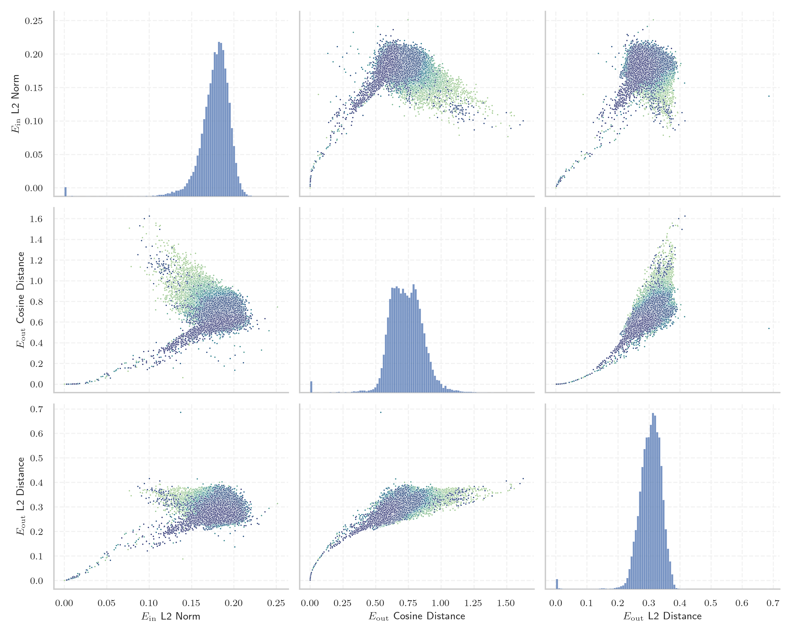
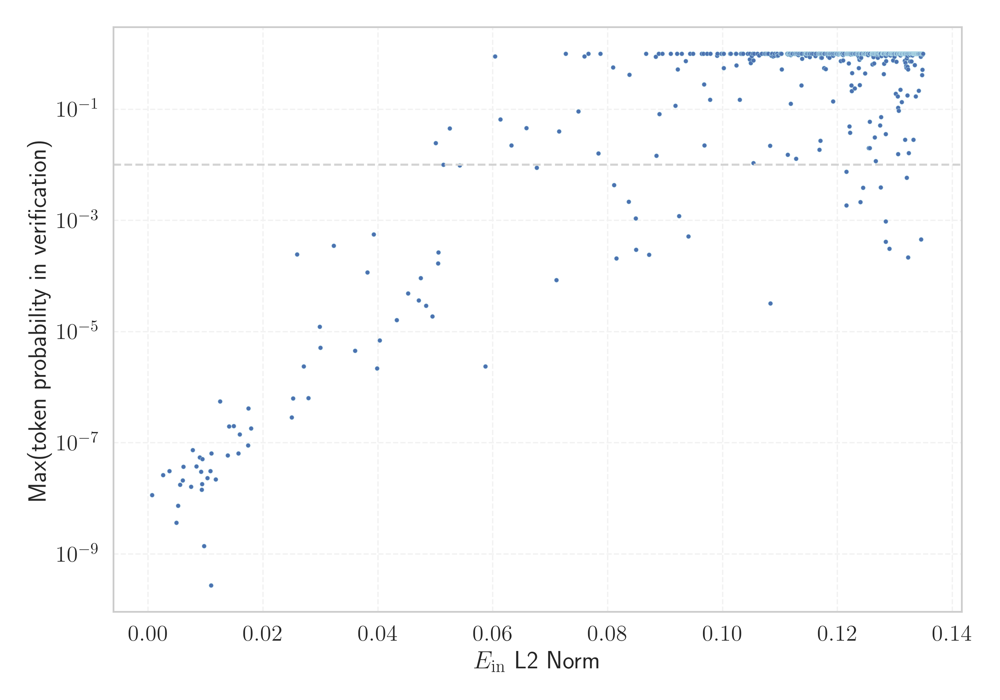

# Report for `HuggingFaceH4/zephyr-7b-beta`

## Model info

* Tied embeddings: no
* LM head uses bias: no
* Indicator for under-trained tokens: E_{in} L2 Norm
  * Overall distribution 0.177 +/- 0.021
  * Token used for verification prompt building: `includegraphics`
  * Verification threshold: 0.135
  * Threshold for showing candidate under-trained tokens: 0.050
  * Median verified threshold (for bytes, unreachable and special tokens): 0.039
* Embeddings shape: (32000, 4096)
* Vocabulary size: 32000
  * Number of single byte tokens: 380, of which 145 below indicator threshold
  * Number of special tokens: 3, of which 1 below indicator threshold
  * Number of tested under-trained tokens: 637, 529 non-special, 70 below p = 0.01 threshold, 45 below soft indicator threshold

## Under-trained token indicators plot


## Verification plot


## Under-trained token verification results
45 entries below threshold of 0.050

|   token_id | token              |   indicator | max_prob                                                         | in_other_tokens                                                             |
|------------|--------------------|-------------|------------------------------------------------------------------|-----------------------------------------------------------------------------|
|      31738 | ````` \uefc0 ````` |  0.00256505 | <span style='border: 1px solid rgb(169, 68, 66);'>2.6e-08</span> |                                                                             |
|      20418 | ````` ▁/**\r ````` |  0.00368849 | <span style='border: 1px solid rgb(169, 68, 66);'>3.1e-08</span> |                                                                             |
|      26636 | ````` });\r `````  |  0.00488573 | <span style='border: 1px solid rgb(169, 68, 66);'>3.7e-09</span> |                                                                             |
|      26407 | ````` };\r `````   |  0.00519729 | <span style='border: 1px solid rgb(169, 68, 66);'>7.3e-09</span> |                                                                             |
|      26392 | ````` ▁});\r ````` |  0.00557457 | <span style='border: 1px solid rgb(169, 68, 66);'>1.8e-08</span> |                                                                             |
|      18759 | ````` ';\r `````   |  0.00600828 | <span style='border: 1px solid rgb(169, 68, 66);'>2.1e-08</span> |                                                                             |
|      26083 | ````` ▁//\r `````  |  0.00611446 | <span style='border: 1px solid rgb(169, 68, 66);'>3.7e-08</span> |                                                                             |
|       9823 | ````` */\r `````   |  0.00744269 | <span style='border: 1px solid rgb(169, 68, 66);'>1.6e-08</span> |                                                                             |
|      25833 | ````` >?[< `````   |  0.00774109 | <span style='border: 1px solid rgb(169, 68, 66);'>7.4e-08</span> |                                                                             |
|       7608 | ````` ▁*/\r `````  |  0.00841445 | <span style='border: 1px solid rgb(169, 68, 66);'>3.7e-08</span> |                                                                             |
|      28171 | ````` ]);\r `````  |  0.00898351 | <span style='border: 1px solid rgb(169, 68, 66);'>5.5e-08</span> |                                                                             |
|      23139 | ````` ▁};\r `````  |  0.00917953 | <span style='border: 1px solid rgb(169, 68, 66);'>3e-08</span>   |                                                                             |
|      17695 | ````` },\r `````   |  0.0093152  | <span style='border: 1px solid rgb(169, 68, 66);'>1.4e-08</span> | <span style='border: 1px solid rgb(169, 68, 66);'>````` ▁},\r `````</span>  |
|      15056 | ````` ());\r ````` |  0.00938823 | <span style='border: 1px solid rgb(169, 68, 66);'>1.8e-08</span> |                                                                             |
|      12193 | ````` ▁);\r `````  |  0.00941279 | <span style='border: 1px solid rgb(169, 68, 66);'>5.1e-08</span> |                                                                             |
|      31363 | ````` \x85 `````   |  0.00975407 | <span style='border: 1px solid rgb(169, 68, 66);'>1.4e-09</span> |                                                                             |
|      14756 | ````` /**\r `````  |  0.010301   | <span style='border: 1px solid rgb(169, 68, 66);'>2.3e-08</span> | <span style='border: 1px solid rgb(169, 68, 66);'>````` ▁/**\r `````</span> |
|      16943 | ````` ');\r `````  |  0.0108607  | <span style='border: 1px solid rgb(169, 68, 66);'>3.1e-08</span> |                                                                             |
|      20692 | ````` ▁},\r `````  |  0.0110284  | <span style='border: 1px solid rgb(169, 68, 66);'>6.4e-08</span> |                                                                             |
|      10278 | ````` ',\r `````   |  0.0124934  | <span style='border: 1px solid rgb(169, 68, 66);'>5.5e-07</span> |                                                                             |
<details><summary>25 additional entries below threshold</summary>

|   token_id | token               |   indicator | max_prob                                                         | in_other_tokens                                                                   |
|------------|---------------------|-------------|------------------------------------------------------------------|-----------------------------------------------------------------------------------|
|      11880 | ````` ";\r `````    |   0.0141034 | <span style='border: 1px solid rgb(169, 68, 66);'>2e-07</span>   |                                                                                   |
|      30929 | ````` ᥀ `````       |   0.0149118 | <span style='border: 1px solid rgb(169, 68, 66);'>2e-07</span>   |                                                                                   |
|      14420 | ````` ];\r `````    |   0.0156988 | <span style='border: 1px solid rgb(169, 68, 66);'>6.5e-08</span> |                                                                                   |
|      18055 | ````` ){\r `````    |   0.0159617 | <span style='border: 1px solid rgb(169, 68, 66);'>1.4e-07</span> |                                                                                   |
|      10941 | ````` ));\r `````   |   0.0173721 | <span style='border: 1px solid rgb(169, 68, 66);'>8.9e-08</span> | <span style='border: 1px solid rgb(169, 68, 66);'>````` ());\r `````</span>       |
|      14980 | ````` ">\r `````    |   0.0174355 | <span style='border: 1px solid rgb(169, 68, 66);'>4.2e-07</span> |                                                                                   |
|       6913 | ````` ");\r `````   |   0.0252151 | <span style='border: 1px solid rgb(169, 68, 66);'>6.3e-07</span> |                                                                                   |
|      25900 | ````` iNdEx `````   |   0.0259386 | <span style='border: 1px solid rgb(169, 68, 66);'>0.00025</span> |                                                                                   |
|      22186 | ````` ')\r `````    |   0.0270944 | <span style='border: 1px solid rgb(169, 68, 66);'>2.4e-06</span> |                                                                                   |
|      10939 | ````` ",\r `````    |   0.027903  | <span style='border: 1px solid rgb(169, 68, 66);'>6.4e-07</span> |                                                                                   |
|      26831 | ````` ▁febbra ````` |   0.0298659 | <span style='border: 1px solid rgb(169, 68, 66);'>1.2e-05</span> | <span style='border: 1px solid rgb(40, 167, 69);'>````` ▁febbraio `````</span>    |
|       4420 | ````` ();\r `````   |   0.0299867 | <span style='border: 1px solid rgb(169, 68, 66);'>5.1e-06</span> |                                                                                   |
|      19248 | ````` NdEx `````    |   0.03231   | <span style='border: 1px solid rgb(169, 68, 66);'>0.00035</span> | <span style='border: 1px solid rgb(169, 68, 66);'>````` iNdEx `````</span>        |
|       3426 | ````` ▁}\r `````    |   0.0359886 | <span style='border: 1px solid rgb(169, 68, 66);'>4.6e-06</span> |                                                                                   |
|       9962 | ````` ()\r `````    |   0.0381682 | <span style='border: 1px solid rgb(169, 68, 66);'>0.00012</span> |                                                                                   |
|      31853 | ````` ⇽ `````       |   0.039285  | <span style='border: 1px solid rgb(169, 68, 66);'>0.00056</span> |                                                                                   |
|       4441 | ````` {\r `````     |   0.0398455 | <span style='border: 1px solid rgb(169, 68, 66);'>2.2e-06</span> | <span style='border: 1px solid rgb(169, 68, 66);'>````` ){\r `````</span>         |
|      23486 | ````` ),\r `````    |   0.0402817 | <span style='border: 1px solid rgb(169, 68, 66);'>6.9e-06</span> |                                                                                   |
|      14619 | ````` ▁)\r `````    |   0.0432961 | <span style='border: 1px solid rgb(169, 68, 66);'>1.6e-05</span> |                                                                                   |
|      17334 | ````` (\r `````     |   0.0452383 | <span style='border: 1px solid rgb(169, 68, 66);'>4.9e-05</span> |                                                                                   |
|      15641 | ````` ▁uitgen ````` |   0.0471153 | <span style='border: 1px solid rgb(169, 68, 66);'>3.6e-05</span> | <span style='border: 1px solid rgb(255, 145, 0);'>````` ▁uitgenodigd `````</span> |
|      27732 | ````` '\r `````     |   0.0474714 | <span style='border: 1px solid rgb(169, 68, 66);'>9.2e-05</span> |                                                                                   |
|       2519 | ````` }\r `````     |   0.0483518 | <span style='border: 1px solid rgb(169, 68, 66);'>2.9e-05</span> | <span style='border: 1px solid rgb(169, 68, 66);'>````` ▁}\r `````</span>         |
|       1969 | ````` ▁{\r `````    |   0.0494827 | <span style='border: 1px solid rgb(169, 68, 66);'>1.9e-05</span> |                                                                                   |
|      31656 | ````` ≮ `````       |   0.0500745 | <span style='border: 1px solid rgb(251, 189, 8);'>0.025</span>   |                                                                                   |
</details>


## Byte tokens
145 entries below threshold of 0.039

|   token_id | token              |   indicator |   ord | hex   | byte_type   | reencoded               |
|------------|--------------------|-------------|-------|-------|-------------|-------------------------|
|          4 | ````` <0x01> ````` |           0 |     1 | 0x01  | ascii       | 29534: ````` \x01 ````` |
|          5 | ````` <0x02> ````` |           0 |     2 | 0x02  | ascii       | 30551: ````` \x02 ````` |
|          6 | ````` <0x03> ````` |           0 |     3 | 0x03  | ascii       | 30662: ````` \x03 ````` |
|          7 | ````` <0x04> ````` |           0 |     4 | 0x04  | ascii       | 30724: ````` \x04 ````` |
|          8 | ````` <0x05> ````` |           0 |     5 | 0x05  | ascii       | 30550: ````` \x05 ````` |
|          9 | ````` <0x06> ````` |           0 |     6 | 0x06  | ascii       | 30314: ````` \x06 ````` |
|         10 | ````` <0x07> ````` |           0 |     7 | 0x07  | ascii       | 30963: ````` \x07 ````` |
|         11 | ````` <0x08> ````` |           0 |     8 | 0x08  | ascii       | 31129: ````` \x08 ````` |
|         14 | ````` <0x0B> ````` |           0 |    11 | 0x0B  | ascii       | 30638: ````` \x0b ````` |
|         15 | ````` <0x0C> ````` |           0 |    12 | 0x0C  | ascii       | 29683: ````` \x0c ````` |
|         16 | ````` <0x0D> ````` |           0 |    13 | 0x0D  | ascii       | 28801: ````` \r `````   |
|         17 | ````` <0x0E> ````` |           0 |    14 | 0x0E  | ascii       | 30517: ````` \x0e ````` |
|         18 | ````` <0x0F> ````` |           0 |    15 | 0x0F  | ascii       | 30698: ````` \x0f ````` |
|         19 | ````` <0x10> ````` |           0 |    16 | 0x10  | ascii       | 30388: ````` \x10 ````` |
|         20 | ````` <0x11> ````` |           0 |    17 | 0x11  | ascii       | 30557: ````` \x11 ````` |
|         21 | ````` <0x12> ````` |           0 |    18 | 0x12  | ascii       | 30298: ````` \x12 ````` |
|         22 | ````` <0x13> ````` |           0 |    19 | 0x13  | ascii       | 30453: ````` \x13 ````` |
|         23 | ````` <0x14> ````` |           0 |    20 | 0x14  | ascii       | 30721: ````` \x14 ````` |
|         24 | ````` <0x15> ````` |           0 |    21 | 0x15  | ascii       | 30675: ````` \x15 ````` |
|         25 | ````` <0x16> ````` |           0 |    22 | 0x16  | ascii       | 30935: ````` \x16 ````` |
<details><summary>125 additional entries below threshold</summary>

|   token_id | token              |   indicator |   ord | hex   | byte_type   | reencoded               |
|------------|--------------------|-------------|-------|-------|-------------|-------------------------|
|         26 | ````` <0x17> ````` |   0         |    23 | 0x17  | ascii       | 30841: ````` \x17 ````` |
|         27 | ````` <0x18> ````` |   0         |    24 | 0x18  | ascii       | 30555: ````` \x18 ````` |
|         28 | ````` <0x19> ````` |   0         |    25 | 0x19  | ascii       | 30969: ````` \x19 ````` |
|         29 | ````` <0x1A> ````` |   0         |    26 | 0x1A  | ascii       | 30759: ````` \x1a ````` |
|         30 | ````` <0x1B> ````` |   0         |    27 | 0x1B  | ascii       | 30246: ````` \x1b ````` |
|         31 | ````` <0x1C> ````` |   0         |    28 | 0x1C  | ascii       | 31134: ````` \x1c ````` |
|         32 | ````` <0x1D> ````` |   0         |    29 | 0x1D  | ascii       | 31236: ````` \x1d ````` |
|         33 | ````` <0x1E> ````` |   0         |    30 | 0x1E  | ascii       | 31150: ````` \x1e ````` |
|         34 | ````` <0x1F> ````` |   0         |    31 | 0x1F  | ascii       | 31217: ````` \x1f ````` |
|         35 | ````` <0x20> ````` |   0         |    32 | 0x20  | ascii       | 28705: ````` ▁ `````    |
|         36 | ````` <0x21> ````` |   0         |    33 | 0x21  | ascii       | 28808: ````` ! `````    |
|         37 | ````` <0x22> ````` |   0         |    34 | 0x22  | ascii       | 28739: ````` " `````    |
|         38 | ````` <0x23> ````` |   0         |    35 | 0x23  | ascii       | 28771: ````` # `````    |
|         39 | ````` <0x24> ````` |   0         |    36 | 0x24  | ascii       | 28776: ````` $ `````    |
|         40 | ````` <0x25> ````` |   0         |    37 | 0x25  | ascii       | 28823: ````` % `````    |
|         41 | ````` <0x26> ````` |   0         |    38 | 0x26  | ascii       | 28800: ````` & `````    |
|         42 | ````` <0x27> ````` |   0         |    39 | 0x27  | ascii       | 28742: ````` ' `````    |
|         43 | ````` <0x28> ````` |   0         |    40 | 0x28  | ascii       | 28732: ````` ( `````    |
|         44 | ````` <0x29> ````` |   0         |    41 | 0x29  | ascii       | 28731: ````` ) `````    |
|         45 | ````` <0x2A> ````` |   0         |    42 | 0x2A  | ascii       | 28736: ````` * `````    |
|         46 | ````` <0x2B> ````` |   0         |    43 | 0x2B  | ascii       | 28806: ````` + `````    |
|         47 | ````` <0x2C> ````` |   0         |    44 | 0x2C  | ascii       | 28725: ````` , `````    |
|         48 | ````` <0x2D> ````` |   0         |    45 | 0x2D  | ascii       | 28733: ````` - `````    |
|         49 | ````` <0x2E> ````` |   0         |    46 | 0x2E  | ascii       | 28723: ````` . `````    |
|         50 | ````` <0x2F> ````` |   0         |    47 | 0x2F  | ascii       | 28748: ````` / `````    |
|         51 | ````` <0x30> ````` |   0         |    48 | 0x30  | ascii       | 28734: ````` 0 `````    |
|         52 | ````` <0x31> ````` |   0         |    49 | 0x31  | ascii       | 28740: ````` 1 `````    |
|         53 | ````` <0x32> ````` |   0         |    50 | 0x32  | ascii       | 28750: ````` 2 `````    |
|         54 | ````` <0x33> ````` |   0         |    51 | 0x33  | ascii       | 28770: ````` 3 `````    |
|         55 | ````` <0x34> ````` |   0         |    52 | 0x34  | ascii       | 28781: ````` 4 `````    |
|         56 | ````` <0x35> ````` |   0         |    53 | 0x35  | ascii       | 28782: ````` 5 `````    |
|         57 | ````` <0x36> ````` |   0         |    54 | 0x36  | ascii       | 28784: ````` 6 `````    |
|         58 | ````` <0x37> ````` |   0         |    55 | 0x37  | ascii       | 28787: ````` 7 `````    |
|         59 | ````` <0x38> ````` |   0         |    56 | 0x38  | ascii       | 28783: ````` 8 `````    |
|         60 | ````` <0x39> ````` |   0         |    57 | 0x39  | ascii       | 28774: ````` 9 `````    |
|         61 | ````` <0x3A> ````` |   0         |    58 | 0x3A  | ascii       | 28747: ````` : `````    |
|         62 | ````` <0x3B> ````` |   0         |    59 | 0x3B  | ascii       | 28745: ````` ; `````    |
|         63 | ````` <0x3C> ````` |   0         |    60 | 0x3C  | ascii       | 28789: ````` < `````    |
|         64 | ````` <0x3D> ````` |   0         |    61 | 0x3D  | ascii       | 28746: ````` = `````    |
|         65 | ````` <0x3E> ````` |   0         |    62 | 0x3E  | ascii       | 28767: ````` > `````    |
|         66 | ````` <0x3F> ````` |   0         |    63 | 0x3F  | ascii       | 28804: ````` ? `````    |
|         67 | ````` <0x40> ````` |   0         |    64 | 0x40  | ascii       | 28818: ````` @ `````    |
|         68 | ````` <0x41> ````` |   0         |    65 | 0x41  | ascii       | 28741: ````` A `````    |
|         69 | ````` <0x42> ````` |   0         |    66 | 0x42  | ascii       | 28760: ````` B `````    |
|         70 | ````` <0x43> ````` |   0         |    67 | 0x43  | ascii       | 28743: ````` C `````    |
|         71 | ````` <0x44> ````` |   0         |    68 | 0x44  | ascii       | 28757: ````` D `````    |
|         72 | ````` <0x45> ````` |   0         |    69 | 0x45  | ascii       | 28749: ````` E `````    |
|         73 | ````` <0x46> ````` |   0         |    70 | 0x46  | ascii       | 28765: ````` F `````    |
|         74 | ````` <0x47> ````` |   0         |    71 | 0x47  | ascii       | 28777: ````` G `````    |
|         75 | ````` <0x48> ````` |   0         |    72 | 0x48  | ascii       | 28769: ````` H `````    |
|         76 | ````` <0x49> ````` |   0         |    73 | 0x49  | ascii       | 28737: ````` I `````    |
|         77 | ````` <0x4A> ````` |   0         |    74 | 0x4A  | ascii       | 28798: ````` J `````    |
|         78 | ````` <0x4B> ````` |   0         |    75 | 0x4B  | ascii       | 28796: ````` K `````    |
|         79 | ````` <0x4C> ````` |   0         |    76 | 0x4C  | ascii       | 28758: ````` L `````    |
|         80 | ````` <0x4D> ````` |   0         |    77 | 0x4D  | ascii       | 28755: ````` M `````    |
|         81 | ````` <0x4E> ````` |   0         |    78 | 0x4E  | ascii       | 28759: ````` N `````    |
|         82 | ````` <0x4F> ````` |   0         |    79 | 0x4F  | ascii       | 28762: ````` O `````    |
|         83 | ````` <0x50> ````` |   0         |    80 | 0x50  | ascii       | 28753: ````` P `````    |
|         84 | ````` <0x51> ````` |   0         |    81 | 0x51  | ascii       | 28824: ````` Q `````    |
|         85 | ````` <0x52> ````` |   0         |    82 | 0x52  | ascii       | 28754: ````` R `````    |
|         86 | ````` <0x53> ````` |   0         |    83 | 0x53  | ascii       | 28735: ````` S `````    |
|         87 | ````` <0x54> ````` |   0         |    84 | 0x54  | ascii       | 28738: ````` T `````    |
|         88 | ````` <0x55> ````` |   0         |    85 | 0x55  | ascii       | 28779: ````` U `````    |
|         89 | ````` <0x56> ````` |   0         |    86 | 0x56  | ascii       | 28790: ````` V `````    |
|         90 | ````` <0x57> ````` |   0         |    87 | 0x57  | ascii       | 28780: ````` W `````    |
|         91 | ````` <0x58> ````` |   0         |    88 | 0x58  | ascii       | 28814: ````` X `````    |
|         92 | ````` <0x59> ````` |   0         |    89 | 0x59  | ascii       | 28802: ````` Y `````    |
|         93 | ````` <0x5A> ````` |   0         |    90 | 0x5A  | ascii       | 28828: ````` Z `````    |
|         94 | ````` <0x5B> ````` |   0         |    91 | 0x5B  | ascii       | 28792: ````` [ `````    |
|         95 | ````` <0x5C> ````` |   0         |    92 | 0x5C  | ascii       | 28756: ````` \ `````    |
|         96 | ````` <0x5D> ````` |   0         |    93 | 0x5D  | ascii       | 28793: ````` ] `````    |
|         97 | ````` <0x5E> ````` |   0         |    94 | 0x5E  | ascii       | 28815: ````` ^ `````    |
|         98 | ````` <0x5F> ````` |   0         |    95 | 0x5F  | ascii       | 28730: ````` _ `````    |
|         99 | ````` <0x60> ````` |   0         |    96 | 0x60  | ascii       | 28832: ````` ` `````    |
|        100 | ````` <0x61> ````` |   0         |    97 | 0x61  | ascii       | 28708: ````` a `````    |
|        101 | ````` <0x62> ````` |   0         |    98 | 0x62  | ascii       | 28726: ````` b `````    |
|        102 | ````` <0x63> ````` |   0         |    99 | 0x63  | ascii       | 28717: ````` c `````    |
|        103 | ````` <0x64> ````` |   0         |   100 | 0x64  | ascii       | 28715: ````` d `````    |
|        104 | ````` <0x65> ````` |   0         |   101 | 0x65  | ascii       | 28706: ````` e `````    |
|        105 | ````` <0x66> ````` |   0         |   102 | 0x66  | ascii       | 28722: ````` f `````    |
|        106 | ````` <0x67> ````` |   0         |   103 | 0x67  | ascii       | 28721: ````` g `````    |
|        107 | ````` <0x68> ````` |   0         |   104 | 0x68  | ascii       | 28716: ````` h `````    |
|        108 | ````` <0x69> ````` |   0         |   105 | 0x69  | ascii       | 28710: ````` i `````    |
|        109 | ````` <0x6A> ````` |   0         |   106 | 0x6A  | ascii       | 28768: ````` j `````    |
|        110 | ````` <0x6B> ````` |   0         |   107 | 0x6B  | ascii       | 28729: ````` k `````    |
|        111 | ````` <0x6C> ````` |   0         |   108 | 0x6C  | ascii       | 28714: ````` l `````    |
|        112 | ````` <0x6D> ````` |   0         |   109 | 0x6D  | ascii       | 28719: ````` m `````    |
|        113 | ````` <0x6E> ````` |   0         |   110 | 0x6E  | ascii       | 28711: ````` n `````    |
|        114 | ````` <0x6F> ````` |   0         |   111 | 0x6F  | ascii       | 28709: ````` o `````    |
|        115 | ````` <0x70> ````` |   0         |   112 | 0x70  | ascii       | 28720: ````` p `````    |
|        116 | ````` <0x71> ````` |   0         |   113 | 0x71  | ascii       | 28775: ````` q `````    |
|        117 | ````` <0x72> ````` |   0         |   114 | 0x72  | ascii       | 28712: ````` r `````    |
|        118 | ````` <0x73> ````` |   0         |   115 | 0x73  | ascii       | 28713: ````` s `````    |
|        119 | ````` <0x74> ````` |   0         |   116 | 0x74  | ascii       | 28707: ````` t `````    |
|        120 | ````` <0x75> ````` |   0         |   117 | 0x75  | ascii       | 28718: ````` u `````    |
|        121 | ````` <0x76> ````` |   0         |   118 | 0x76  | ascii       | 28728: ````` v `````    |
|        122 | ````` <0x77> ````` |   0         |   119 | 0x77  | ascii       | 28727: ````` w `````    |
|        123 | ````` <0x78> ````` |   0         |   120 | 0x78  | ascii       | 28744: ````` x `````    |
|        124 | ````` <0x79> ````` |   0         |   121 | 0x79  | ascii       | 28724: ````` y `````    |
|        125 | ````` <0x7A> ````` |   0         |   122 | 0x7A  | ascii       | 28764: ````` z `````    |
|        126 | ````` <0x7B> ````` |   0         |   123 | 0x7B  | ascii       | 28751: ````` { `````    |
|        127 | ````` <0x7C> ````` |   0         |   124 | 0x7C  | ascii       | 28766: ````` \| `````   |
|        128 | ````` <0x7D> ````` |   0         |   125 | 0x7D  | ascii       | 28752: ````` } `````    |
|        129 | ````` <0x7E> ````` |   0         |   126 | 0x7E  | ascii       | 28845: ````` ~ `````    |
|        130 | ````` <0x7F> ````` |   0         |   127 | 0x7F  | ascii       | 30982: ````` \x7f ````` |
|        195 | ````` <0xC0> ````` |   0         |   192 | 0xC0  | unused_utf8 |                         |
|        196 | ````` <0xC1> ````` |   0         |   193 | 0xC1  | unused_utf8 |                         |
|        197 | ````` <0xC2> ````` |   0         |   194 | 0xC2  | utf8        |                         |
|        198 | ````` <0xC3> ````` |   0         |   195 | 0xC3  | utf8        |                         |
|        248 | ````` <0xF5> ````` |   0         |   245 | 0xF5  | unused_utf8 |                         |
|        249 | ````` <0xF6> ````` |   0         |   246 | 0xF6  | unused_utf8 |                         |
|        250 | ````` <0xF7> ````` |   0         |   247 | 0xF7  | unused_utf8 |                         |
|        251 | ````` <0xF8> ````` |   0         |   248 | 0xF8  | unused_utf8 |                         |
|        252 | ````` <0xF9> ````` |   0         |   249 | 0xF9  | unused_utf8 |                         |
|        253 | ````` <0xFA> ````` |   0         |   250 | 0xFA  | unused_utf8 |                         |
|        254 | ````` <0xFB> ````` |   0         |   251 | 0xFB  | unused_utf8 |                         |
|        255 | ````` <0xFC> ````` |   0         |   252 | 0xFC  | unused_utf8 |                         |
|        256 | ````` <0xFD> ````` |   0         |   253 | 0xFD  | unused_utf8 |                         |
|        257 | ````` <0xFE> ````` |   0         |   254 | 0xFE  | unused_utf8 |                         |
|        258 | ````` <0xFF> ````` |   0         |   255 | 0xFF  | unused_utf8 |                         |
|      31134 | ````` \x1c `````   |   0.0109612 |    28 | 0x1C  | ascii       |                         |
|      31150 | ````` \x1e `````   |   0.0117701 |    30 | 0x1E  | ascii       |                         |
|      31236 | ````` \x1d `````   |   0.0138711 |    29 | 0x1D  | ascii       |                         |
|      29683 | ````` \x0c `````   |   0.0178993 |    12 | 0x0C  | ascii       |                         |
|      30638 | ````` \x0b `````   |   0.0250177 |    11 | 0x0B  | ascii       |                         |
</details>


## Special tokens
1 entries below threshold of 0.039

|   token_id | token             |   indicator | max_prob                                                         |
|------------|-------------------|-------------|------------------------------------------------------------------|
|          0 | ````` <unk> ````` | 0.000668355 | <span style='border: 1px solid rgb(169, 68, 66);'>1.1e-08</span> |

