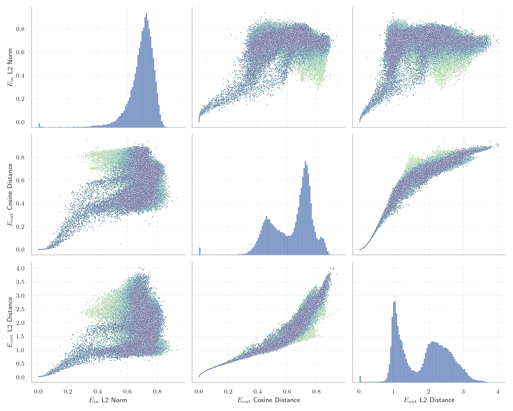
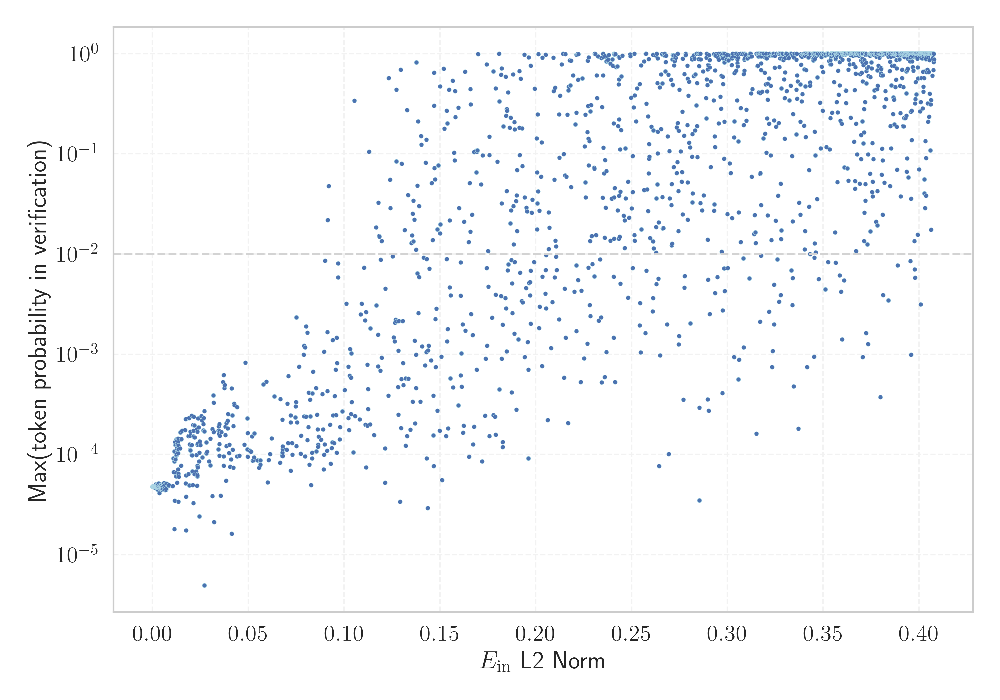

# Report for `LGAI-EXAONE/EXAONE-3.0-7.8B-Instruct`

## Model info

* Model Info: 
  * Tied embeddings: False
  * LM head uses bias: False
  * Embeddings shape: [102400, 4096]
* Tokenizer Info: 
  * Vocab Size: 102400
  * Tokenizer Class: GPT2Tokenizer
  * Tokenizer Type: BPE
  * Bytes handling: Byte Input
  * Token for verification prompt building: MethodAccessorImpl
  * Token id for verification prompt building: 96943
* Indicator summary: 
  * Indicator for under-trained tokens: E_{in} L2 Norm
  * Overall distribution: 0.688 +/- 0.099
* Detected Token Counts: 
  * Number of tested under-trained tokens: 2022, 1648 non-special, 462 below p = 0.01 threshold, 224 below soft indicator threshold
  * Number of single byte tokens: 256, of which 13 below indicator threshold
  * Number of special tokens: 2, of which 0 below indicator threshold
  * Number of non-single-byte unreachable tokens: 2, of which 0 below indicator threshold
  * Number of non-single-byte UTF-fragment tokens:  1222, of which 7 below soft indicator threshold

## Under-trained token indicators plot


## Verification plot


## Under-trained token verification results
224 entries below threshold of 0.121

|   token_id | token                  |   indicator | max_prob                                                         | in_other_tokens                                                                                                                                          |
|------------|------------------------|-------------|------------------------------------------------------------------|----------------------------------------------------------------------------------------------------------------------------------------------------------|
|      16227 | ````` ▁**]{}, `````    | 0.000175074 | <span style='border: 1px solid rgb(169, 68, 66);'>4.8e-05</span> |                                                                                                                                                          |
|      38696 | ````` ▁\|>#!/ `````    | 0.000617096 | <span style='border: 1px solid rgb(169, 68, 66);'>4.8e-05</span> |                                                                                                                                                          |
|      72810 | ````` ▁FBQyx `````     | 0.000808007 | <span style='border: 1px solid rgb(169, 68, 66);'>4.8e-05</span> |                                                                                                                                                          |
|      60128 | ````` ▁\x95\x98 `````  | 0.000929712 | <span style='border: 1px solid rgb(169, 68, 66);'>4.8e-05</span> |                                                                                                                                                          |
|      24243 | ````` ▁*]{}, `````     | 0.000935465 | <span style='border: 1px solid rgb(169, 68, 66);'>4.8e-05</span> |                                                                                                                                                          |
|      53381 | ````` ▁',['../ `````   | 0.00111137  | <span style='border: 1px solid rgb(169, 68, 66);'>4.8e-05</span> |                                                                                                                                                          |
|      89712 | ````` ▁\x9d\x80 `````  | 0.0012523   | <span style='border: 1px solid rgb(169, 68, 66);'>4.9e-05</span> |                                                                                                                                                          |
|      60037 | ````` ▁*]{}. `````     | 0.00139303  | <span style='border: 1px solid rgb(169, 68, 66);'>4.7e-05</span> |                                                                                                                                                          |
|     100494 | ````` ▁$]{}]{} `````   | 0.0016583   | <span style='border: 1px solid rgb(169, 68, 66);'>4.8e-05</span> |                                                                                                                                                          |
|      12363 | ````` ▁*]{} `````      | 0.00174418  | <span style='border: 1px solid rgb(169, 68, 66);'>5e-05</span>   | <span style='border: 1px solid rgb(169, 68, 66);'>````` ▁*]{}, `````</span>, <span style='border: 1px solid rgb(169, 68, 66);'>````` ▁*]{}. `````</span> |
|      94290 | ````` ▁\|>/** `````    | 0.00194753  | <span style='border: 1px solid rgb(169, 68, 66);'>4.9e-05</span> |                                                                                                                                                          |
|      90775 | ````` ▁\|>// `````     | 0.00202372  | <span style='border: 1px solid rgb(169, 68, 66);'>4.9e-05</span> |                                                                                                                                                          |
|      81354 | ````` ▁"}](# `````     | 0.00241068  | <span style='border: 1px solid rgb(169, 68, 66);'>4.9e-05</span> |                                                                                                                                                          |
|      89438 | ````` ▁$.[]{ `````     | 0.00246509  | <span style='border: 1px solid rgb(169, 68, 66);'>4.7e-05</span> |                                                                                                                                                          |
|      85203 | ````` ▁"}**). `````    | 0.00269218  | <span style='border: 1px solid rgb(169, 68, 66);'>4.9e-05</span> |                                                                                                                                                          |
|      78561 | ````` ▁^^<\| `````     | 0.00275918  | <span style='border: 1px solid rgb(169, 68, 66);'>4.7e-05</span> |                                                                                                                                                          |
|      90594 | ````` ▁\x82\x98 `````  | 0.00293064  | <span style='border: 1px solid rgb(169, 68, 66);'>4.8e-05</span> |                                                                                                                                                          |
|      82326 | ````` ▁searxhall ````` | 0.00304833  | <span style='border: 1px solid rgb(169, 68, 66);'>4.6e-05</span> |                                                                                                                                                          |
|      82407 | ````` ▁\])]{} `````    | 0.0031009   | <span style='border: 1px solid rgb(169, 68, 66);'>4.6e-05</span> |                                                                                                                                                          |
|      98615 | ````` ▁{}\_[ `````     | 0.00361375  | <span style='border: 1px solid rgb(169, 68, 66);'>4.7e-05</span> |                                                                                                                                                          |
<details><summary>204 additional entries below threshold</summary>

|   token_id | token                             |   indicator | max_prob                                                         | in_other_tokens                                                                                                                                                                                                                          |
|------------|-----------------------------------|-------------|------------------------------------------------------------------|------------------------------------------------------------------------------------------------------------------------------------------------------------------------------------------------------------------------------------------|
|      75262 | ````` ▁\x8b\x88 `````             |  0.00363557 | <span style='border: 1px solid rgb(169, 68, 66);'>4.1e-05</span> |                                                                                                                                                                                                                                          |
|      82617 | ````` ▁\x8f\x84 `````             |  0.00414573 | <span style='border: 1px solid rgb(169, 68, 66);'>4.7e-05</span> |                                                                                                                                                                                                                                          |
|      69830 | ````` ▁QUFDQTtBQUNBO `````        |  0.00435509 | <span style='border: 1px solid rgb(169, 68, 66);'>4.8e-05</span> |                                                                                                                                                                                                                                          |
|      82353 | ````` ▁>]{} `````                 |  0.00455295 | <span style='border: 1px solid rgb(169, 68, 66);'>4.5e-05</span> |                                                                                                                                                                                                                                          |
|      83735 | ````` ▁"}\]. `````                |  0.00473331 | <span style='border: 1px solid rgb(169, 68, 66);'>4.5e-05</span> |                                                                                                                                                                                                                                          |
|      68688 | ````` ▁\|>/* `````                |  0.00484487 | <span style='border: 1px solid rgb(169, 68, 66);'>4.8e-05</span> | <span style='border: 1px solid rgb(169, 68, 66);'>````` ▁\|>/** `````</span>                                                                                                                                                             |
|      99346 | ````` ▁cbiAg `````                |  0.00492841 | <span style='border: 1px solid rgb(169, 68, 66);'>4.8e-05</span> |                                                                                                                                                                                                                                          |
|      57503 | ````` ▁URL안녕 `````              |  0.00644422 | <span style='border: 1px solid rgb(169, 68, 66);'>4.7e-05</span> |                                                                                                                                                                                                                                          |
|      38822 | ````` ▁\|>""" `````               |  0.00735663 | <span style='border: 1px solid rgb(169, 68, 66);'>5.1e-05</span> |                                                                                                                                                                                                                                          |
|      95258 | ````` ▁{}\^[ `````                |  0.00843963 | <span style='border: 1px solid rgb(169, 68, 66);'>4.9e-05</span> |                                                                                                                                                                                                                                          |
|      66650 | ````` ▁\x9c\x89 `````             |  0.00850454 | <span style='border: 1px solid rgb(169, 68, 66);'>5e-05</span>   |                                                                                                                                                                                                                                          |
|      37108 | ````` ▁\x9a\x84 `````             |  0.0105861  | <span style='border: 1px solid rgb(169, 68, 66);'>4.9e-05</span> |                                                                                                                                                                                                                                          |
|      63972 | ````` ▁gICAg `````                |  0.0110624  | <span style='border: 1px solid rgb(169, 68, 66);'>6.7e-05</span> |                                                                                                                                                                                                                                          |
|      16979 | ````` ▁**]{} `````                |  0.0114744  | <span style='border: 1px solid rgb(169, 68, 66);'>1.8e-05</span> |                                                                                                                                                                                                                                          |
|      72269 | ````` ▁\x97\x90 `````             |  0.0115129  | <span style='border: 1px solid rgb(169, 68, 66);'>3.5e-05</span> |                                                                                                                                                                                                                                          |
|      76827 | ````` ▁§\[ `````                  |  0.0119162  | <span style='border: 1px solid rgb(169, 68, 66);'>8.9e-05</span> |                                                                                                                                                                                                                                          |
|      66125 | ````` ▁doibase `````              |  0.0122515  | <span style='border: 1px solid rgb(169, 68, 66);'>6.5e-05</span> |                                                                                                                                                                                                                                          |
|      80102 | ````` ▁욬ᄏᄏᄏ `````             |  0.0123572  | <span style='border: 1px solid rgb(169, 68, 66);'>6.1e-05</span> |                                                                                                                                                                                                                                          |
|      73093 | ````` ▁\x95\x84 `````             |  0.0128273  | <span style='border: 1px solid rgb(169, 68, 66);'>5.2e-05</span> |                                                                                                                                                                                                                                          |
|      49961 | ````` ▁\]]{} `````                |  0.0173867  | <span style='border: 1px solid rgb(169, 68, 66);'>5.2e-05</span> |                                                                                                                                                                                                                                          |
|     100641 | ````` ▁\x9e\x88 `````             |  0.0174227  | <span style='border: 1px solid rgb(169, 68, 66);'>6.2e-05</span> |                                                                                                                                                                                                                                          |
|      88178 | ````` ▁\|>## `````                |  0.0174944  | <span style='border: 1px solid rgb(169, 68, 66);'>3.8e-05</span> |                                                                                                                                                                                                                                          |
|      88410 | ````` ▁기Q `````                  |  0.01759    | <span style='border: 1px solid rgb(169, 68, 66);'>1.8e-05</span> |                                                                                                                                                                                                                                          |
|      97980 | ````` ▁\x95\x8a `````             |  0.0187558  | <span style='border: 1px solid rgb(169, 68, 66);'>6.4e-05</span> |                                                                                                                                                                                                                                          |
|      43572 | ````` ▁\x80\x82 `````             |  0.0191684  | <span style='border: 1px solid rgb(169, 68, 66);'>4.9e-05</span> |                                                                                                                                                                                                                                          |
|      39257 | ````` ▁}$]{} `````                |  0.019612   | <span style='border: 1px solid rgb(169, 68, 66);'>0.00011</span> |                                                                                                                                                                                                                                          |
|      95788 | ````` ▁\^[- `````                 |  0.0204227  | <span style='border: 1px solid rgb(169, 68, 66);'>9.9e-05</span> |                                                                                                                                                                                                                                          |
|      54411 | ````` ▁\x88\x91 `````             |  0.0207133  | <span style='border: 1px solid rgb(169, 68, 66);'>9.8e-05</span> |                                                                                                                                                                                                                                          |
|      72244 | ````` ▁기안녕 `````               |  0.020765   | <span style='border: 1px solid rgb(169, 68, 66);'>6.8e-05</span> |                                                                                                                                                                                                                                          |
|      93351 | ````` ▁\*\*](# `````              |  0.0232261  | <span style='border: 1px solid rgb(169, 68, 66);'>4.9e-05</span> |                                                                                                                                                                                                                                          |
|      26233 | ````` ▁$]{} `````                 |  0.0234889  | <span style='border: 1px solid rgb(169, 68, 66);'>0.00013</span> | <span style='border: 1px solid rgb(169, 68, 66);'>````` ▁$]{}; `````</span>, <span style='border: 1px solid rgb(169, 68, 66);'>````` ▁$]{}]{} `````</span>                                                                               |
|      88587 | ````` ▁="../../../../../../ ````` |  0.0243896  | <span style='border: 1px solid rgb(169, 68, 66);'>2.4e-05</span> |                                                                                                                                                                                                                                          |
|      82344 | ````` ▁으실까 `````               |  0.0244308  | <span style='border: 1px solid rgb(169, 68, 66);'>0.0001</span>  |                                                                                                                                                                                                                                          |
|       4370 | ````` ▁endofsec `````             |  0.024982   | <span style='border: 1px solid rgb(169, 68, 66);'>0.00012</span> |                                                                                                                                                                                                                                          |
|      87091 | ````` ▁으려구요 `````             |  0.0281696  | <span style='border: 1px solid rgb(169, 68, 66);'>0.00013</span> |                                                                                                                                                                                                                                          |
|      98926 | ````` ▁invCluster `````           |  0.0281997  | <span style='border: 1px solid rgb(169, 68, 66);'>0.0001</span>  |                                                                                                                                                                                                                                          |
|      97838 | ````` ▁\x8b\x9c `````             |  0.0294347  | <span style='border: 1px solid rgb(169, 68, 66);'>8.6e-05</span> |                                                                                                                                                                                                                                          |
|      71616 | ````` ▁\]\]. `````                |  0.030258   | <span style='border: 1px solid rgb(169, 68, 66);'>0.00014</span> |                                                                                                                                                                                                                                          |
|      79363 | ````` ▁었잖 `````                 |  0.0321555  | <span style='border: 1px solid rgb(169, 68, 66);'>2.1e-05</span> |                                                                                                                                                                                                                                          |
|      72232 | ````` ▁="../../../../../ `````    |  0.0343422  | <span style='border: 1px solid rgb(169, 68, 66);'>0.00017</span> | <span style='border: 1px solid rgb(169, 68, 66);'>````` ▁="../../../../../../ `````</span>                                                                                                                                               |
|      61214 | ````` ▁어야죠 `````               |  0.0343921  | <span style='border: 1px solid rgb(169, 68, 66);'>0.00011</span> |                                                                                                                                                                                                                                          |
|      47749 | ````` ▁\_{\\ `````                |  0.034726   | <span style='border: 1px solid rgb(169, 68, 66);'>0.00016</span> |                                                                                                                                                                                                                                          |
|     101885 | ````` ▁":[]," `````               |  0.0348421  | <span style='border: 1px solid rgb(169, 68, 66);'>0.00013</span> |                                                                                                                                                                                                                                          |
|      53233 | ````` ▁~}{~ `````                 |  0.0348569  | <span style='border: 1px solid rgb(169, 68, 66);'>0.0002</span>  |                                                                                                                                                                                                                                          |
|      93957 | ````` ▁을께요 `````               |  0.0348881  | <span style='border: 1px solid rgb(169, 68, 66);'>0.00017</span> |                                                                                                                                                                                                                                          |
|      94506 | ````` ▁으라며 `````               |  0.0349418  | <span style='border: 1px solid rgb(169, 68, 66);'>9.7e-05</span> |                                                                                                                                                                                                                                          |
|      94939 | ````` ▁\x80\x9d `````             |  0.0351221  | <span style='border: 1px solid rgb(169, 68, 66);'>0.00015</span> |                                                                                                                                                                                                                                          |
|      45978 | ````` ▁\x9a\x94 `````             |  0.035548   | <span style='border: 1px solid rgb(169, 68, 66);'>3.9e-05</span> |                                                                                                                                                                                                                                          |
|      55847 | ````` ▁lPLV `````                 |  0.0358812  | <span style='border: 1px solid rgb(169, 68, 66);'>0.00017</span> |                                                                                                                                                                                                                                          |
|      79783 | ````` ▁":{}," `````               |  0.0371327  | <span style='border: 1px solid rgb(169, 68, 66);'>7.7e-05</span> |                                                                                                                                                                                                                                          |
|      90146 | ````` ▁으셨다고 `````             |  0.0371451  | <span style='border: 1px solid rgb(169, 68, 66);'>9.6e-05</span> |                                                                                                                                                                                                                                          |
|      87756 | ````` ▁notChosenColour `````      |  0.0371648  | <span style='border: 1px solid rgb(169, 68, 66);'>0.00062</span> |                                                                                                                                                                                                                                          |
|      93834 | ````` ▁}$$^{ `````                |  0.0392839  | <span style='border: 1px solid rgb(169, 68, 66);'>0.00018</span> |                                                                                                                                                                                                                                          |
|     102050 | ````` ▁을런지 `````               |  0.0400233  | <span style='border: 1px solid rgb(169, 68, 66);'>0.0001</span>  |                                                                                                                                                                                                                                          |
|      82497 | ````` ▁으신데 `````               |  0.0402016  | <span style='border: 1px solid rgb(169, 68, 66);'>0.00013</span> |                                                                                                                                                                                                                                          |
|      72843 | ````` ▁을라고 `````               |  0.0405039  | <span style='border: 1px solid rgb(169, 68, 66);'>7.6e-05</span> |                                                                                                                                                                                                                                          |
|      94990 | ````` ▁는겨 `````                 |  0.0409461  | <span style='border: 1px solid rgb(169, 68, 66);'>8.9e-05</span> |                                                                                                                                                                                                                                          |
|      82306 | ````` ▁jagjag `````               |  0.0413802  | <span style='border: 1px solid rgb(169, 68, 66);'>1.6e-05</span> |                                                                                                                                                                                                                                          |
|      61185 | ````` ▁\x80\x99 `````             |  0.0416823  | <span style='border: 1px solid rgb(169, 68, 66);'>0.00025</span> |                                                                                                                                                                                                                                          |
|      91650 | ````` ▁세욧 `````                 |  0.0418946  | <span style='border: 1px solid rgb(169, 68, 66);'>0.00011</span> |                                                                                                                                                                                                                                          |
|      88118 | ````` ▁}^{\\ `````                |  0.0421325  | <span style='border: 1px solid rgb(169, 68, 66);'>0.00019</span> |                                                                                                                                                                                                                                          |
|      90782 | ````` ▁슴당 `````                 |  0.0422242  | <span style='border: 1px solid rgb(169, 68, 66);'>7.4e-05</span> |                                                                                                                                                                                                                                          |
|      11677 | ````` ▁\|># `````                 |  0.0427332  | <span style='border: 1px solid rgb(169, 68, 66);'>0.00031</span> | <span style='border: 1px solid rgb(169, 68, 66);'>````` ▁\|>#!/ `````</span>, <span style='border: 1px solid rgb(169, 68, 66);'>````` ▁\|>## `````</span>                                                                                |
|      74637 | ````` ▁을껄 `````                 |  0.0441268  | <span style='border: 1px solid rgb(169, 68, 66);'>9.6e-05</span> |                                                                                                                                                                                                                                          |
|      68640 | ````` ▁으셨으면 `````             |  0.0454152  | <span style='border: 1px solid rgb(169, 68, 66);'>9.7e-05</span> |                                                                                                                                                                                                                                          |
|      69409 | ````` ▁으셨다면 `````             |  0.0480046  | <span style='border: 1px solid rgb(169, 68, 66);'>0.00013</span> |                                                                                                                                                                                                                                          |
|      65727 | ````` ▁}}\_{ `````                |  0.0485478  | <span style='border: 1px solid rgb(169, 68, 66);'>0.00082</span> |                                                                                                                                                                                                                                          |
|      81529 | ````` ▁으라면 `````               |  0.0494797  | <span style='border: 1px solid rgb(169, 68, 66);'>0.00011</span> |                                                                                                                                                                                                                                          |
|      56328 | ````` ▁$]{}; `````                |  0.0496027  | <span style='border: 1px solid rgb(169, 68, 66);'>0.00023</span> |                                                                                                                                                                                                                                          |
|      90870 | ````` ▁으신지 `````               |  0.0496087  | <span style='border: 1px solid rgb(169, 68, 66);'>9.5e-05</span> |                                                                                                                                                                                                                                          |
|      91083 | ````` ▁셔야죠 `````               |  0.0496942  | <span style='border: 1px solid rgb(169, 68, 66);'>0.00016</span> |                                                                                                                                                                                                                                          |
|      98506 | ````` ▁을께 `````                 |  0.0508804  | <span style='border: 1px solid rgb(169, 68, 66);'>0.00011</span> |                                                                                                                                                                                                                                          |
|      73583 | ````` ▁으련만 `````               |  0.051362   | <span style='border: 1px solid rgb(169, 68, 66);'>0.00011</span> |                                                                                                                                                                                                                                          |
|      73431 | ````` ▁\x84\x9c `````             |  0.0520265  | <span style='border: 1px solid rgb(169, 68, 66);'>0.00015</span> |                                                                                                                                                                                                                                          |
|      65695 | ````` ▁으련 `````                 |  0.0522481  | <span style='border: 1px solid rgb(169, 68, 66);'>8.7e-05</span> | <span style='border: 1px solid rgb(169, 68, 66);'>````` ▁으련만 `````</span>                                                                                                                                                             |
|      47851 | ````` ▁으셨어요 `````             |  0.0528579  | <span style='border: 1px solid rgb(169, 68, 66);'>8.8e-05</span> |                                                                                                                                                                                                                                          |
|      78138 | ````` ▁으셨을 `````               |  0.0529417  | <span style='border: 1px solid rgb(169, 68, 66);'>9.4e-05</span> |                                                                                                                                                                                                                                          |
|      85552 | ````` ▁jobbuilder `````           |  0.053133   | <span style='border: 1px solid rgb(169, 68, 66);'>0.00016</span> |                                                                                                                                                                                                                                          |
|      79290 | ````` ▁은가요 `````               |  0.0549022  | <span style='border: 1px solid rgb(169, 68, 66);'>8.7e-05</span> |                                                                                                                                                                                                                                          |
|      87159 | ````` ▁으려다 `````               |  0.0555296  | <span style='border: 1px solid rgb(169, 68, 66);'>7.4e-05</span> |                                                                                                                                                                                                                                          |
|      52280 | ````` ▁으셨던 `````               |  0.0563484  | <span style='border: 1px solid rgb(169, 68, 66);'>8.7e-05</span> |                                                                                                                                                                                                                                          |
|      83138 | ````` ▁으려다가 `````             |  0.0563513  | <span style='border: 1px solid rgb(169, 68, 66);'>7.9e-05</span> |                                                                                                                                                                                                                                          |
|      78421 | ````` ▁'],['../ `````             |  0.0579015  | <span style='border: 1px solid rgb(169, 68, 66);'>0.0005</span>  |                                                                                                                                                                                                                                          |
|      56282 | ````` ▁"}},[ `````                |  0.0593925  | <span style='border: 1px solid rgb(169, 68, 66);'>0.00053</span> |                                                                                                                                                                                                                                          |
|      95513 | ````` ▁으신다 `````               |  0.0600611  | <span style='border: 1px solid rgb(169, 68, 66);'>5.3e-05</span> |                                                                                                                                                                                                                                          |
|      75375 | ````` ▁습니다요 `````             |  0.0606577  | <span style='border: 1px solid rgb(169, 68, 66);'>8.8e-05</span> |                                                                                                                                                                                                                                          |
|      21358 | ````` ▁"}]( `````                 |  0.0613163  | <span style='border: 1px solid rgb(169, 68, 66);'>0.0001</span>  | <span style='border: 1px solid rgb(169, 68, 66);'>````` ▁"}](# `````</span>                                                                                                                                                              |
|      70702 | ````` ▁URLQ `````                 |  0.063639   | <span style='border: 1px solid rgb(169, 68, 66);'>0.00038</span> |                                                                                                                                                                                                                                          |
|      78534 | ````` ▁으셨는데 `````             |  0.0665507  | <span style='border: 1px solid rgb(169, 68, 66);'>8.3e-05</span> |                                                                                                                                                                                                                                          |
|      64748 | ````` ▁{}\_ `````                 |  0.0668018  | <span style='border: 1px solid rgb(169, 68, 66);'>0.00036</span> | <span style='border: 1px solid rgb(169, 68, 66);'>````` ▁{}\_[ `````</span>                                                                                                                                                              |
|      37449 | ````` ▁으신다면 `````             |  0.0676796  | <span style='border: 1px solid rgb(169, 68, 66);'>9.7e-05</span> |                                                                                                                                                                                                                                          |
|      68787 | ````` ▁려니까 `````               |  0.0678627  | <span style='border: 1px solid rgb(169, 68, 66);'>0.0001</span>  |                                                                                                                                                                                                                                          |
|      83775 | ````` ▁더랬다 `````               |  0.0679134  | <span style='border: 1px solid rgb(169, 68, 66);'>9.7e-05</span> |                                                                                                                                                                                                                                          |
|      64198 | ````` ▁으려니 `````               |  0.0679142  | <span style='border: 1px solid rgb(169, 68, 66);'>0.00011</span> |                                                                                                                                                                                                                                          |
|     100200 | ````` ▁로페이 `````               |  0.068006   | <span style='border: 1px solid rgb(169, 68, 66);'>0.00012</span> |                                                                                                                                                                                                                                          |
|      50344 | ````` ▁으십니다 `````             |  0.0700746  | <span style='border: 1px solid rgb(169, 68, 66);'>0.00011</span> |                                                                                                                                                                                                                                          |
|      78806 | ````` ▁":{}, `````                |  0.070387   | <span style='border: 1px solid rgb(169, 68, 66);'>0.00032</span> | <span style='border: 1px solid rgb(169, 68, 66);'>````` ▁":{}," `````</span>                                                                                                                                                             |
|      80181 | ````` ▁랬죠 `````                 |  0.0706653  | <span style='border: 1px solid rgb(169, 68, 66);'>0.00013</span> |                                                                                                                                                                                                                                          |
|      52412 | ````` ▁\*](# `````                |  0.0709758  | <span style='border: 1px solid rgb(169, 68, 66);'>0.00061</span> |                                                                                                                                                                                                                                          |
|      76308 | ````` ▁지만서도 `````             |  0.0720576  | <span style='border: 1px solid rgb(169, 68, 66);'>0.00021</span> |                                                                                                                                                                                                                                          |
|      99448 | ````` ▁획단 `````                 |  0.0721189  | <span style='border: 1px solid rgb(169, 68, 66);'>0.00025</span> |                                                                                                                                                                                                                                          |
|      54883 | ````` ▁을게요 `````               |  0.0721986  | <span style='border: 1px solid rgb(169, 68, 66);'>6.9e-05</span> |                                                                                                                                                                                                                                          |
|      75205 | ````` ▁십쇼 `````                 |  0.0727978  | <span style='border: 1px solid rgb(169, 68, 66);'>0.00013</span> |                                                                                                                                                                                                                                          |
|      81533 | ````` ▁medscimonit `````          |  0.0729367  | <span style='border: 1px solid rgb(169, 68, 66);'>9.9e-05</span> |                                                                                                                                                                                                                                          |
|      69454 | ````` ▁실래요 `````               |  0.0745117  | <span style='border: 1px solid rgb(169, 68, 66);'>0.00023</span> |                                                                                                                                                                                                                                          |
|     100895 | ````` ▁coloneqq `````             |  0.0746932  | <span style='border: 1px solid rgb(169, 68, 66);'>0.0003</span>  |                                                                                                                                                                                                                                          |
|      54961 | ````` ▁":[{" `````                |  0.0749101  | <span style='border: 1px solid rgb(169, 68, 66);'>0.00033</span> |                                                                                                                                                                                                                                          |
|      26756 | ````` ▁\|>--- `````               |  0.0750794  | <span style='border: 1px solid rgb(255, 145, 0);'>0.0023</span>  |                                                                                                                                                                                                                                          |
|      86443 | ````` ▁숩니다 `````               |  0.0751194  | <span style='border: 1px solid rgb(169, 68, 66);'>0.00012</span> |                                                                                                                                                                                                                                          |
|      96375 | ````` ▁냐니까 `````               |  0.0753492  | <span style='border: 1px solid rgb(169, 68, 66);'>0.00021</span> |                                                                                                                                                                                                                                          |
|      40624 | ````` ▁으려나 `````               |  0.0773674  | <span style='border: 1px solid rgb(169, 68, 66);'>0.0001</span>  |                                                                                                                                                                                                                                          |
|      70311 | ````` ▁는대요 `````               |  0.0775046  | <span style='border: 1px solid rgb(169, 68, 66);'>0.00015</span> |                                                                                                                                                                                                                                          |
|      36400 | ````` ▁__': `````                 |  0.0788825  | <span style='border: 1px solid rgb(169, 68, 66);'>0.00099</span> |                                                                                                                                                                                                                                          |
|      41246 | ````` ▁setMaxAccess `````         |  0.0790024  | <span style='border: 1px solid rgb(255, 145, 0);'>0.0012</span>  |                                                                                                                                                                                                                                          |
|      42784 | ````` ▁아서요 `````               |  0.0791611  | <span style='border: 1px solid rgb(169, 68, 66);'>0.00024</span> |                                                                                                                                                                                                                                          |
|      76901 | ````` ▁\|>' `````                 |  0.0795299  | <span style='border: 1px solid rgb(255, 145, 0);'>0.0012</span>  |                                                                                                                                                                                                                                          |
|      41295 | ````` ▁을려고 `````               |  0.0796354  | <span style='border: 1px solid rgb(169, 68, 66);'>9.6e-05</span> |                                                                                                                                                                                                                                          |
|      89581 | ````` 들꼬들 `````                |  0.0800826  | <span style='border: 1px solid rgb(169, 68, 66);'>0.00024</span> | ````` ▁꼬들꼬들 `````                                                                                                                                                                                                                    |
|      89566 | ````` ▁{}\^ `````                 |  0.0801286  | <span style='border: 1px solid rgb(255, 145, 0);'>0.0019</span>  | <span style='border: 1px solid rgb(169, 68, 66);'>````` ▁{}\^[ `````</span>                                                                                                                                                              |
|      56650 | ````` ▁야징 `````                 |  0.0814219  | <span style='border: 1px solid rgb(169, 68, 66);'>0.00019</span> |                                                                                                                                                                                                                                          |
|      54395 | ````` ▁"}** `````                 |  0.0815075  | <span style='border: 1px solid rgb(169, 68, 66);'>0.00041</span> | <span style='border: 1px solid rgb(169, 68, 66);'>````` ▁"}**). `````</span>                                                                                                                                                             |
|      28517 | ````` ▁으셔도 `````               |  0.08186    | <span style='border: 1px solid rgb(169, 68, 66);'>7.9e-05</span> |                                                                                                                                                                                                                                          |
|      85781 | ````` ▁jcmm `````                 |  0.0822924  | <span style='border: 1px solid rgb(169, 68, 66);'>0.00035</span> |                                                                                                                                                                                                                                          |
|      91845 | ````` ▁련다 `````                 |  0.0823695  | <span style='border: 1px solid rgb(169, 68, 66);'>0.00024</span> |                                                                                                                                                                                                                                          |
|      42046 | ````` ▁으셔야 `````               |  0.0827796  | <span style='border: 1px solid rgb(169, 68, 66);'>4.9e-05</span> |                                                                                                                                                                                                                                          |
|      25075 | ````` ▁으셔서 `````               |  0.0832589  | <span style='border: 1px solid rgb(169, 68, 66);'>9.1e-05</span> |                                                                                                                                                                                                                                          |
|      22554 | ````` ▁으니깐 `````               |  0.0832792  | <span style='border: 1px solid rgb(169, 68, 66);'>0.0001</span>  |                                                                                                                                                                                                                                          |
|      32335 | ````` ▁MOESM `````                |  0.0834424  | <span style='border: 1px solid rgb(169, 68, 66);'>0.00041</span> |                                                                                                                                                                                                                                          |
|      64888 | ````` ▁mathds `````               |  0.0837605  | <span style='border: 1px solid rgb(169, 68, 66);'>0.00067</span> |                                                                                                                                                                                                                                          |
|     100835 | ````` ▁는진 `````                 |  0.0855041  | <span style='border: 1px solid rgb(169, 68, 66);'>0.00011</span> |                                                                                                                                                                                                                                          |
|      72444 | ````` 송뽀송 `````                |  0.0858916  | <span style='border: 1px solid rgb(169, 68, 66);'>0.00025</span> | ````` ▁뽀송뽀송 `````                                                                                                                                                                                                                    |
|     100351 | ````` ▁려는지 `````               |  0.0861538  | <span style='border: 1px solid rgb(169, 68, 66);'>0.00018</span> |                                                                                                                                                                                                                                          |
|      88319 | ````` ▁려나요 `````               |  0.0863743  | <span style='border: 1px solid rgb(169, 68, 66);'>0.00012</span> |                                                                                                                                                                                                                                          |
|      96403 | ````` ▁}}})$ `````                |  0.0864248  | <span style='border: 1px solid rgb(169, 68, 66);'>0.00012</span> |                                                                                                                                                                                                                                          |
|      63035 | ````` ▁더랬죠 `````               |  0.0867582  | <span style='border: 1px solid rgb(169, 68, 66);'>0.00015</span> |                                                                                                                                                                                                                                          |
|      84910 | ````` ▁\xad! `````                |  0.0879964  | <span style='border: 1px solid rgb(169, 68, 66);'>0.00014</span> |                                                                                                                                                                                                                                          |
|      94010 | ````` ▁계망 `````                 |  0.0885917  | <span style='border: 1px solid rgb(169, 68, 66);'>0.0004</span>  |                                                                                                                                                                                                                                          |
|      95028 | ````` ▁던지요 `````               |  0.0890141  | <span style='border: 1px solid rgb(169, 68, 66);'>0.00018</span> |                                                                                                                                                                                                                                          |
|      31729 | ````` ▁는지라 `````               |  0.0893019  | <span style='border: 1px solid rgb(169, 68, 66);'>7.1e-05</span> |                                                                                                                                                                                                                                          |
|      84909 | ````` ▁더라니 `````               |  0.0894393  | <span style='border: 1px solid rgb(169, 68, 66);'>9.9e-05</span> |                                                                                                                                                                                                                                          |
|      78879 | ````` ▁슴돠 `````                 |  0.0899123  | <span style='border: 1px solid rgb(169, 68, 66);'>0.00013</span> |                                                                                                                                                                                                                                          |
|      77490 | ````` ▁comtag `````               |  0.0900033  | <span style='border: 1px solid rgb(255, 145, 0);'>0.0085</span>  |                                                                                                                                                                                                                                          |
|      79467 | ````` ▁으셨고 `````               |  0.0911722  | <span style='border: 1px solid rgb(169, 68, 66);'>0.00011</span> |                                                                                                                                                                                                                                          |
|      49401 | ````` ▁="@+ `````                 |  0.0912628  | <span style='border: 1px solid rgb(255, 145, 0);'>0.0017</span>  |                                                                                                                                                                                                                                          |
|      76082 | ````` ▁"},[ `````                 |  0.0913067  | <span style='border: 1px solid rgb(169, 68, 66);'>0.00043</span> |                                                                                                                                                                                                                                          |
|      81604 | ````` ▁;"\| `````                 |  0.0920271  | <span style='border: 1px solid rgb(251, 189, 8);'>0.048</span>   |                                                                                                                                                                                                                                          |
|      95041 | ````` ▁로워서 `````               |  0.092717   | <span style='border: 1px solid rgb(169, 68, 66);'>0.0002</span>  |                                                                                                                                                                                                                                          |
|      36417 | ````` ▁는지요 `````               |  0.0930448  | <span style='border: 1px solid rgb(169, 68, 66);'>8.1e-05</span> |                                                                                                                                                                                                                                          |
|      38666 | ````` ▁신답니다 `````             |  0.0936131  | <span style='border: 1px solid rgb(169, 68, 66);'>0.00012</span> |                                                                                                                                                                                                                                          |
|      79505 | ````` ▁~<\| `````                 |  0.093809   | <span style='border: 1px solid rgb(169, 68, 66);'>0.00013</span> |                                                                                                                                                                                                                                          |
|      77017 | ````` ▁**](# `````                |  0.0940714  | <span style='border: 1px solid rgb(255, 145, 0);'>0.0014</span>  |                                                                                                                                                                                                                                          |
|      88793 | ````` ▁실까봐 `````               |  0.0941785  | <span style='border: 1px solid rgb(169, 68, 66);'>0.00025</span> |                                                                                                                                                                                                                                          |
|      75031 | ````` ▁어서다 `````               |  0.0947662  | <span style='border: 1px solid rgb(169, 68, 66);'>0.00013</span> |                                                                                                                                                                                                                                          |
|      54261 | ````` ▁scriptscripts `````        |  0.0951619  | <span style='border: 1px solid rgb(169, 68, 66);'>0.00038</span> | <span style='border: 1px solid rgb(255, 145, 0);'>````` ▁scriptscriptstyle `````</span>                                                                                                                                                  |
|      89389 | ````` 덕꾸덕 `````                |  0.0955829  | <span style='border: 1px solid rgb(169, 68, 66);'>0.0007</span>  | ````` ▁꾸덕꾸덕 `````                                                                                                                                                                                                                    |
|      20328 | ````` ▁으셔 `````                 |  0.0957458  | <span style='border: 1px solid rgb(169, 68, 66);'>0.00025</span> | <span style='border: 1px solid rgb(169, 68, 66);'>````` ▁으셔서 `````</span>, <span style='border: 1px solid rgb(169, 68, 66);'>````` ▁으셔도 `````</span>, <span style='border: 1px solid rgb(169, 68, 66);'>````` ▁으셔야 `````</span> |
|      79486 | ````` ▁을지라도 `````             |  0.096054   | <span style='border: 1px solid rgb(169, 68, 66);'>0.0001</span>  |                                                                                                                                                                                                                                          |
|      83403 | ````` ▁"}^ `````                  |  0.0962015  | <span style='border: 1px solid rgb(255, 145, 0);'>0.0015</span>  |                                                                                                                                                                                                                                          |
|      86581 | ````` ▁구화장 `````               |  0.0962356  | <span style='border: 1px solid rgb(169, 68, 66);'>0.00082</span> |                                                                                                                                                                                                                                          |
|      52797 | ````` ▁~}{ `````                  |  0.0968241  | <span style='border: 1px solid rgb(255, 145, 0);'>0.0058</span>  | <span style='border: 1px solid rgb(169, 68, 66);'>````` ▁~}{~ `````</span>                                                                                                                                                               |
|      73290 | ````` ▁fefefe `````               |  0.0968343  | <span style='border: 1px solid rgb(255, 145, 0);'>0.008</span>   |                                                                                                                                                                                                                                          |
|      87181 | ````` ▁더랍니다 `````             |  0.0976293  | <span style='border: 1px solid rgb(169, 68, 66);'>0.00014</span> |                                                                                                                                                                                                                                          |
|      63892 | ````` ▁냐면서 `````               |  0.0978787  | <span style='border: 1px solid rgb(169, 68, 66);'>0.00019</span> |                                                                                                                                                                                                                                          |
|      92491 | ````` ▁뇽하 `````                 |  0.0991043  | <span style='border: 1px solid rgb(169, 68, 66);'>0.00027</span> |                                                                                                                                                                                                                                          |
|      57149 | ````` ▁\xad~ `````                |  0.100361   | <span style='border: 1px solid rgb(169, 68, 66);'>0.00044</span> |                                                                                                                                                                                                                                          |
|      79973 | ````` ▁}}{\\ `````                |  0.101247   | <span style='border: 1px solid rgb(255, 145, 0);'>0.0032</span>  |                                                                                                                                                                                                                                          |
|      33518 | ````` ▁려고요 `````               |  0.102159   | <span style='border: 1px solid rgb(169, 68, 66);'>0.00023</span> |                                                                                                                                                                                                                                          |
|      34432 | ````` ▁더랬 `````                 |  0.102219   | <span style='border: 1px solid rgb(169, 68, 66);'>0.00075</span> | <span style='border: 1px solid rgb(169, 68, 66);'>````` ▁더랬죠 `````</span>, <span style='border: 1px solid rgb(169, 68, 66);'>````` ▁더랬다 `````</span>                                                                               |
|      40709 | ````` ▁="../../../../ `````       |  0.102508   | <span style='border: 1px solid rgb(169, 68, 66);'>0.00018</span> | <span style='border: 1px solid rgb(169, 68, 66);'>````` ▁="../../../../../ `````</span>, <span style='border: 1px solid rgb(169, 68, 66);'>````` ▁="../../../../../../ `````</span>                                                      |
|      55239 | ````` ▁']]], `````                |  0.103116   | <span style='border: 1px solid rgb(255, 145, 0);'>0.0011</span>  |                                                                                                                                                                                                                                          |
|      69613 | ````` ▁까말까 `````               |  0.103562   | <span style='border: 1px solid rgb(169, 68, 66);'>0.00025</span> |                                                                                                                                                                                                                                          |
|      97803 | ````` ▁;<\| `````                 |  0.103621   | <span style='border: 1px solid rgb(169, 68, 66);'>0.00059</span> |                                                                                                                                                                                                                                          |
|      87054 | ````` ▁옄 `````                   |  0.103732   | <span style='border: 1px solid rgb(255, 145, 0);'>0.001</span>   |                                                                                                                                                                                                                                          |
|      96764 | ````` ▁다면서요 `````             |  0.103913   | <span style='border: 1px solid rgb(169, 68, 66);'>0.00033</span> |                                                                                                                                                                                                                                          |
|      49721 | ````` ▁더니만 `````               |  0.104781   | <span style='border: 1px solid rgb(169, 68, 66);'>0.00011</span> |                                                                                                                                                                                                                                          |
|      94196 | ````` ▁memitem `````              |  0.105333   | <span style='border: 1px solid rgb(40, 167, 69);'>0.34</span>    |                                                                                                                                                                                                                                          |
|     100327 | ````` ▁더래도 `````               |  0.105654   | <span style='border: 1px solid rgb(169, 68, 66);'>0.00024</span> |                                                                                                                                                                                                                                          |
|      57675 | ````` ▁는군 `````                 |  0.108082   | <span style='border: 1px solid rgb(169, 68, 66);'>0.00022</span> |                                                                                                                                                                                                                                          |
|      82896 | ````` ▁간녀 `````                 |  0.10864    | <span style='border: 1px solid rgb(255, 145, 0);'>0.0025</span>  |                                                                                                                                                                                                                                          |
|      74440 | ````` ▁푸치노 `````               |  0.109201   | <span style='border: 1px solid rgb(255, 145, 0);'>0.0032</span>  |                                                                                                                                                                                                                                          |
|      48672 | ````` ▁\^[ `````                  |  0.110329   | <span style='border: 1px solid rgb(255, 145, 0);'>0.0073</span>  | <span style='border: 1px solid rgb(169, 68, 66);'>````` ▁\^[- `````</span>                                                                                                                                                               |
|      31589 | ````` ▁{}]{} `````                |  0.110914   | <span style='border: 1px solid rgb(255, 145, 0);'>0.0022</span>  |                                                                                                                                                                                                                                          |
|      78419 | ````` ▁기보단 `````               |  0.111123   | <span style='border: 1px solid rgb(169, 68, 66);'>0.0002</span>  |                                                                                                                                                                                                                                          |
|     100497 | ````` ▁저브 `````                 |  0.111438   | <span style='border: 1px solid rgb(255, 145, 0);'>0.0026</span>  |                                                                                                                                                                                                                                          |
|      55122 | ````` ▁렵니다 `````               |  0.111531   | <span style='border: 1px solid rgb(169, 68, 66);'>7.4e-05</span> |                                                                                                                                                                                                                                          |
|      44320 | ````` ▁곸 `````                   |  0.112072   | <span style='border: 1px solid rgb(169, 68, 66);'>0.00079</span> |                                                                                                                                                                                                                                          |
|      34357 | ````` ▁는디 `````                 |  0.112078   | <span style='border: 1px solid rgb(169, 68, 66);'>0.00019</span> |                                                                                                                                                                                                                                          |
|      46004 | ````` ▁셨었 `````                 |  0.112478   | <span style='border: 1px solid rgb(169, 68, 66);'>0.00028</span> |                                                                                                                                                                                                                                          |
|      70518 | ````` ▁marinedrugs `````          |  0.11255    | <span style='border: 1px solid rgb(169, 68, 66);'>0.00045</span> |                                                                                                                                                                                                                                          |
|      82529 | ````` ▁memItem `````              |  0.112924   | <span style='border: 1px solid rgb(40, 167, 69);'>0.11</span>    |                                                                                                                                                                                                                                          |
|      82398 | ````` ▁던가요 `````               |  0.113552   | <span style='border: 1px solid rgb(169, 68, 66);'>0.0002</span>  |                                                                                                                                                                                                                                          |
|      54662 | ````` ▁\x8a\x94 `````             |  0.113667   | <span style='border: 1px solid rgb(255, 145, 0);'>0.0018</span>  |                                                                                                                                                                                                                                          |
|      67939 | ````` ▁는다며 `````               |  0.115551   | <span style='border: 1px solid rgb(169, 68, 66);'>0.00016</span> |                                                                                                                                                                                                                                          |
|      89406 | ````` ▁}\_{ `````                 |  0.116589   | <span style='border: 1px solid rgb(251, 189, 8);'>0.018</span>   |                                                                                                                                                                                                                                          |
|     100522 | ````` ▁각외 `````                 |  0.116873   | <span style='border: 1px solid rgb(255, 145, 0);'>0.0031</span>  |                                                                                                                                                                                                                                          |
|      84632 | ````` ▁락할 `````                 |  0.117663   | <span style='border: 1px solid rgb(255, 145, 0);'>0.0016</span>  |                                                                                                                                                                                                                                          |
|      86075 | ````` ▁더이다 `````               |  0.117684   | <span style='border: 1px solid rgb(169, 68, 66);'>0.00076</span> |                                                                                                                                                                                                                                          |
|      64959 | ````` ▁^{\\ `````                 |  0.11824    | <span style='border: 1px solid rgb(251, 189, 8);'>0.015</span>   |                                                                                                                                                                                                                                          |
|      71016 | ````` ]{}]{} `````                |  0.11834    | <span style='border: 1px solid rgb(251, 189, 8);'>0.015</span>   | <span style='border: 1px solid rgb(169, 68, 66);'>````` ▁$]{}]{} `````</span>                                                                                                                                                            |
|      66645 | ````` ▁mathbbm `````              |  0.118931   | <span style='border: 1px solid rgb(169, 68, 66);'>0.00069</span> |                                                                                                                                                                                                                                          |
|      29519 | ````` ▁아야지 `````               |  0.119177   | <span style='border: 1px solid rgb(255, 145, 0);'>0.0088</span>  |                                                                                                                                                                                                                                          |
|      83390 | ````` ▁슴니다 `````               |  0.119535   | <span style='border: 1px solid rgb(169, 68, 66);'>0.00092</span> |                                                                                                                                                                                                                                          |
|      93448 | ````` ▁로점 `````                 |  0.119589   | <span style='border: 1px solid rgb(251, 189, 8);'>0.014</span>   |                                                                                                                                                                                                                                          |
|      44451 | ````` ▁으라는 `````               |  0.121301   | <span style='border: 1px solid rgb(169, 68, 66);'>5.2e-05</span> |                                                                                                                                                                                                                                          |
</details>


## Tokens with partial UTF-8 sequences
7 entries below threshold of 0.121

|   token_id | token                        |   indicator | in_other_tokens                                                                                  |
|------------|------------------------------|-------------|--------------------------------------------------------------------------------------------------|
|      27954 | ````` <0x9D><0x8D>니다 ````` | 0.000974798 | ````` 읍니다 `````, <span style='border: 1px solid rgb(251, 189, 8);'>````` ▁읍니다 `````</span> |
|      36331 | ````` <0x8A>그제 `````       | 0.0165107   | ````` ▁엊그제 `````, ````` 엊그제 `````                                                          |
|      11245 | ````` <0x89>장고 `````       | 0.0388869   | ````` ▁냉장고 `````, ````` 냉장고 `````, ````` ▁김치냉장고 `````                                 |
|      44690 | ````` ▁\x9c<0xC2> `````      | 0.0767874   | <span style='border: 1px solid rgb(169, 68, 66);'>````` ▁\x9c\x89 `````</span>                   |
|      29921 | ````` ▁Ðo<0xC3> `````        | 0.0783414   | ````` ▁ÐoÐ `````, ````` ▁ÐoÑ `````                                                               |
|      79452 | ````` ▁\x90<0xC2> `````      | 0.0903527   |                                                                                                  |
|       5775 | ````` <0x89>장히 `````       | 0.0903641   | ````` ▁굉장히 `````, ````` 굉장히 `````                                                          |


## Byte tokens
13 entries below threshold of 0.129

|   token_id | token              |   indicator |   ord | hex   | byte_type   |
|------------|--------------------|-------------|-------|-------|-------------|
|        545 | ````` <0xFB> ````` |  0.00179251 |   251 | 0xFB  | unused_utf8 |
|        543 | ````` <0xF9> ````` |  0.00184159 |   249 | 0xF9  | unused_utf8 |
|        546 | ````` <0xFC> ````` |  0.00184445 |   252 | 0xFC  | unused_utf8 |
|        548 | ````` <0xFE> ````` |  0.00194893 |   254 | 0xFE  | unused_utf8 |
|        487 | ````` <0xC1> ````` |  0.00202368 |   193 | 0xC1  | unused_utf8 |
|        549 | ````` <0xFF> ````` |  0.00205352 |   255 | 0xFF  | unused_utf8 |
|        542 | ````` <0xF8> ````` |  0.00206042 |   248 | 0xF8  | unused_utf8 |
|        544 | ````` <0xFA> ````` |  0.00208949 |   250 | 0xFA  | unused_utf8 |
|        539 | ````` <0xF5> ````` |  0.00236954 |   245 | 0xF5  | unused_utf8 |
|        540 | ````` <0xF6> ````` |  0.00265925 |   246 | 0xF6  | unused_utf8 |
|        541 | ````` <0xF7> ````` |  0.00423177 |   247 | 0xF7  | unused_utf8 |
|        547 | ````` <0xFD> ````` |  0.00428703 |   253 | 0xFD  | unused_utf8 |
|        486 | ````` <0xC0> ````` |  0.00606388 |   192 | 0xC0  | unused_utf8 |


## Special tokens
303 entries below threshold of 0.129

|   token_id | token                      |   indicator | max_prob                                                         |
|------------|----------------------------|-------------|------------------------------------------------------------------|
|        223 | ````` [extra_id_61] `````  | 7.34871e-06 | <span style='border: 1px solid rgb(169, 68, 66);'>4.8e-05</span> |
|        334 | ````` [extra_id_172] ````` | 6.42718e-05 | <span style='border: 1px solid rgb(169, 68, 66);'>4.8e-05</span> |
|        222 | ````` [extra_id_60] `````  | 8.72868e-05 | <span style='border: 1px solid rgb(169, 68, 66);'>4.8e-05</span> |
|        249 | ````` [extra_id_87] `````  | 8.82647e-05 | <span style='border: 1px solid rgb(169, 68, 66);'>4.8e-05</span> |
|        220 | ````` [extra_id_58] `````  | 0.000105483 | <span style='border: 1px solid rgb(169, 68, 66);'>4.8e-05</span> |
|        231 | ````` [extra_id_69] `````  | 0.000117927 | <span style='border: 1px solid rgb(169, 68, 66);'>4.8e-05</span> |
|        354 | ````` [extra_id_192] ````` | 0.000162149 | <span style='border: 1px solid rgb(169, 68, 66);'>4.8e-05</span> |
|        225 | ````` [extra_id_63] `````  | 0.000212067 | <span style='border: 1px solid rgb(169, 68, 66);'>4.8e-05</span> |
|        336 | ````` [extra_id_174] ````` | 0.00023249  | <span style='border: 1px solid rgb(169, 68, 66);'>4.8e-05</span> |
|        324 | ````` [extra_id_162] ````` | 0.000244394 | <span style='border: 1px solid rgb(169, 68, 66);'>4.8e-05</span> |
|        338 | ````` [extra_id_176] ````` | 0.000249313 | <span style='border: 1px solid rgb(169, 68, 66);'>4.8e-05</span> |
|        342 | ````` [extra_id_180] ````` | 0.000252277 | <span style='border: 1px solid rgb(169, 68, 66);'>4.8e-05</span> |
|        169 | ````` [extra_id_7] `````   | 0.000258015 | <span style='border: 1px solid rgb(169, 68, 66);'>4.8e-05</span> |
|        330 | ````` [extra_id_168] ````` | 0.000264444 | <span style='border: 1px solid rgb(169, 68, 66);'>4.8e-05</span> |
|        329 | ````` [extra_id_167] ````` | 0.000287085 | <span style='border: 1px solid rgb(169, 68, 66);'>4.8e-05</span> |
|        353 | ````` [extra_id_191] ````` | 0.000309026 | <span style='border: 1px solid rgb(169, 68, 66);'>4.8e-05</span> |
|        333 | ````` [extra_id_171] ````` | 0.000324951 | <span style='border: 1px solid rgb(169, 68, 66);'>4.8e-05</span> |
|        170 | ````` [extra_id_8] `````   | 0.000325663 | <span style='border: 1px solid rgb(169, 68, 66);'>4.8e-05</span> |
|        177 | ````` [extra_id_15] `````  | 0.000326328 | <span style='border: 1px solid rgb(169, 68, 66);'>4.8e-05</span> |
|        358 | ````` [extra_id_196] ````` | 0.000331537 | <span style='border: 1px solid rgb(169, 68, 66);'>4.8e-05</span> |
<details><summary>283 additional entries below threshold</summary>

|   token_id | token                        |   indicator | max_prob                                                         |
|------------|------------------------------|-------------|------------------------------------------------------------------|
|        181 | ````` [extra_id_19] `````    | 0.00033814  | <span style='border: 1px solid rgb(169, 68, 66);'>4.8e-05</span> |
|        180 | ````` [extra_id_18] `````    | 0.000350379 | <span style='border: 1px solid rgb(169, 68, 66);'>4.8e-05</span> |
|        219 | ````` [extra_id_57] `````    | 0.000375773 | <span style='border: 1px solid rgb(169, 68, 66);'>4.8e-05</span> |
|        272 | ````` [extra_id_110] `````   | 0.000382845 | <span style='border: 1px solid rgb(169, 68, 66);'>4.8e-05</span> |
|        235 | ````` [extra_id_73] `````    | 0.000390829 | <span style='border: 1px solid rgb(169, 68, 66);'>4.8e-05</span> |
|        186 | ````` [extra_id_24] `````    | 0.000401663 | <span style='border: 1px solid rgb(169, 68, 66);'>4.8e-05</span> |
|        265 | ````` [extra_id_103] `````   | 0.000411467 | <span style='border: 1px solid rgb(169, 68, 66);'>4.8e-05</span> |
|        276 | ````` [extra_id_114] `````   | 0.00041287  | <span style='border: 1px solid rgb(169, 68, 66);'>4.8e-05</span> |
|        321 | ````` [extra_id_159] `````   | 0.000424407 | <span style='border: 1px solid rgb(169, 68, 66);'>4.8e-05</span> |
|        264 | ````` [extra_id_102] `````   | 0.000429689 | <span style='border: 1px solid rgb(169, 68, 66);'>4.8e-05</span> |
|        242 | ````` [extra_id_80] `````    | 0.000466881 | <span style='border: 1px solid rgb(169, 68, 66);'>4.8e-05</span> |
|        259 | ````` [extra_id_97] `````    | 0.000468757 | <span style='border: 1px solid rgb(169, 68, 66);'>4.8e-05</span> |
|        275 | ````` [extra_id_113] `````   | 0.000485044 | <span style='border: 1px solid rgb(169, 68, 66);'>4.8e-05</span> |
|        254 | ````` [extra_id_92] `````    | 0.000489609 | <span style='border: 1px solid rgb(169, 68, 66);'>4.8e-05</span> |
|        314 | ````` [extra_id_152] `````   | 0.000561131 | <span style='border: 1px solid rgb(169, 68, 66);'>4.8e-05</span> |
|        185 | ````` [extra_id_23] `````    | 0.000614053 | <span style='border: 1px solid rgb(169, 68, 66);'>4.8e-05</span> |
|        183 | ````` [extra_id_21] `````    | 0.000672824 | <span style='border: 1px solid rgb(169, 68, 66);'>4.7e-05</span> |
|        327 | ````` [extra_id_165] `````   | 0.00071481  | <span style='border: 1px solid rgb(169, 68, 66);'>4.8e-05</span> |
|        253 | ````` [extra_id_91] `````    | 0.000750936 | <span style='border: 1px solid rgb(169, 68, 66);'>4.8e-05</span> |
|        234 | ````` [extra_id_72] `````    | 0.000762563 | <span style='border: 1px solid rgb(169, 68, 66);'>4.8e-05</span> |
|        271 | ````` [extra_id_109] `````   | 0.000762794 | <span style='border: 1px solid rgb(169, 68, 66);'>4.8e-05</span> |
|        343 | ````` [extra_id_181] `````   | 0.000836849 | <span style='border: 1px solid rgb(169, 68, 66);'>4.7e-05</span> |
|        294 | ````` [extra_id_132] `````   | 0.000841131 | <span style='border: 1px solid rgb(169, 68, 66);'>4.7e-05</span> |
|        300 | ````` [extra_id_138] `````   | 0.000851909 | <span style='border: 1px solid rgb(169, 68, 66);'>4.8e-05</span> |
|        221 | ````` [extra_id_59] `````    | 0.000864377 | <span style='border: 1px solid rgb(169, 68, 66);'>4.8e-05</span> |
|        304 | ````` [extra_id_142] `````   | 0.000865802 | <span style='border: 1px solid rgb(169, 68, 66);'>4.8e-05</span> |
|        278 | ````` [extra_id_116] `````   | 0.000885106 | <span style='border: 1px solid rgb(169, 68, 66);'>4.8e-05</span> |
|        309 | ````` [extra_id_147] `````   | 0.000889362 | <span style='border: 1px solid rgb(169, 68, 66);'>4.8e-05</span> |
|        237 | ````` [extra_id_75] `````    | 0.000895329 | <span style='border: 1px solid rgb(169, 68, 66);'>4.8e-05</span> |
|        357 | ````` [extra_id_195] `````   | 0.000897692 | <span style='border: 1px solid rgb(169, 68, 66);'>4.8e-05</span> |
|        289 | ````` [extra_id_127] `````   | 0.000914487 | <span style='border: 1px solid rgb(169, 68, 66);'>4.8e-05</span> |
|        311 | ````` [extra_id_149] `````   | 0.000922471 | <span style='border: 1px solid rgb(169, 68, 66);'>4.8e-05</span> |
|        299 | ````` [extra_id_137] `````   | 0.000937873 | <span style='border: 1px solid rgb(169, 68, 66);'>4.8e-05</span> |
|        308 | ````` [extra_id_146] `````   | 0.00096453  | <span style='border: 1px solid rgb(169, 68, 66);'>4.7e-05</span> |
|        326 | ````` [extra_id_164] `````   | 0.000972009 | <span style='border: 1px solid rgb(169, 68, 66);'>4.7e-05</span> |
|        269 | ````` [extra_id_107] `````   | 0.000976714 | <span style='border: 1px solid rgb(169, 68, 66);'>4.7e-05</span> |
|        274 | ````` [extra_id_112] `````   | 0.000979656 | <span style='border: 1px solid rgb(169, 68, 66);'>4.8e-05</span> |
|        298 | ````` [extra_id_136] `````   | 0.00098127  | <span style='border: 1px solid rgb(169, 68, 66);'>4.8e-05</span> |
|        238 | ````` [extra_id_76] `````    | 0.00101749  | <span style='border: 1px solid rgb(169, 68, 66);'>4.8e-05</span> |
|        171 | ````` [extra_id_9] `````     | 0.00107939  | <span style='border: 1px solid rgb(169, 68, 66);'>4.8e-05</span> |
|        302 | ````` [extra_id_140] `````   | 0.00108952  | <span style='border: 1px solid rgb(169, 68, 66);'>4.9e-05</span> |
|        313 | ````` [extra_id_151] `````   | 0.00109634  | <span style='border: 1px solid rgb(169, 68, 66);'>4.7e-05</span> |
|        328 | ````` [extra_id_166] `````   | 0.00116246  | <span style='border: 1px solid rgb(169, 68, 66);'>4.7e-05</span> |
|        263 | ````` [extra_id_101] `````   | 0.00118612  | <span style='border: 1px solid rgb(169, 68, 66);'>4.8e-05</span> |
|        166 | ````` [extra_id_4] `````     | 0.0011947   | <span style='border: 1px solid rgb(169, 68, 66);'>4.7e-05</span> |
|        346 | ````` [extra_id_184] `````   | 0.00120758  | <span style='border: 1px solid rgb(169, 68, 66);'>4.8e-05</span> |
|        331 | ````` [extra_id_169] `````   | 0.00122286  | <span style='border: 1px solid rgb(169, 68, 66);'>4.7e-05</span> |
|        240 | ````` [extra_id_78] `````    | 0.00126404  | <span style='border: 1px solid rgb(169, 68, 66);'>4.8e-05</span> |
|        233 | ````` [extra_id_71] `````    | 0.00127153  | <span style='border: 1px solid rgb(169, 68, 66);'>4.7e-05</span> |
|        251 | ````` [extra_id_89] `````    | 0.00129422  | <span style='border: 1px solid rgb(169, 68, 66);'>4.7e-05</span> |
|        296 | ````` [extra_id_134] `````   | 0.00132051  | <span style='border: 1px solid rgb(169, 68, 66);'>4.8e-05</span> |
|        261 | ````` [extra_id_99] `````    | 0.00132276  | <span style='border: 1px solid rgb(169, 68, 66);'>4.7e-05</span> |
|        224 | ````` [extra_id_62] `````    | 0.0013341   | <span style='border: 1px solid rgb(169, 68, 66);'>4.8e-05</span> |
|        305 | ````` [extra_id_143] `````   | 0.0013417   | <span style='border: 1px solid rgb(169, 68, 66);'>4.8e-05</span> |
|        281 | ````` [extra_id_119] `````   | 0.00134395  | <span style='border: 1px solid rgb(169, 68, 66);'>4.8e-05</span> |
|        332 | ````` [extra_id_170] `````   | 0.0013619   | <span style='border: 1px solid rgb(169, 68, 66);'>4.8e-05</span> |
|        245 | ````` [extra_id_83] `````    | 0.00136659  | <span style='border: 1px solid rgb(169, 68, 66);'>4.7e-05</span> |
|        359 | ````` [extra_id_197] `````   | 0.00139038  | <span style='border: 1px solid rgb(169, 68, 66);'>4.9e-05</span> |
|        178 | ````` [extra_id_16] `````    | 0.00139463  | <span style='border: 1px solid rgb(169, 68, 66);'>4.7e-05</span> |
|        356 | ````` [extra_id_194] `````   | 0.00140978  | <span style='border: 1px solid rgb(169, 68, 66);'>4.8e-05</span> |
|        284 | ````` [extra_id_122] `````   | 0.00142483  | <span style='border: 1px solid rgb(169, 68, 66);'>4.8e-05</span> |
|        286 | ````` [extra_id_124] `````   | 0.00145208  | <span style='border: 1px solid rgb(169, 68, 66);'>4.8e-05</span> |
|        236 | ````` [extra_id_74] `````    | 0.00147906  | <span style='border: 1px solid rgb(169, 68, 66);'>4.7e-05</span> |
|        243 | ````` [extra_id_81] `````    | 0.00148502  | <span style='border: 1px solid rgb(169, 68, 66);'>4.8e-05</span> |
|        239 | ````` [extra_id_77] `````    | 0.00153188  | <span style='border: 1px solid rgb(169, 68, 66);'>4.8e-05</span> |
|        260 | ````` [extra_id_98] `````    | 0.00155052  | <span style='border: 1px solid rgb(169, 68, 66);'>4.8e-05</span> |
|        319 | ````` [extra_id_157] `````   | 0.00156776  | <span style='border: 1px solid rgb(169, 68, 66);'>4.8e-05</span> |
|        257 | ````` [extra_id_95] `````    | 0.00157174  | <span style='border: 1px solid rgb(169, 68, 66);'>4.7e-05</span> |
|        317 | ````` [extra_id_155] `````   | 0.00163134  | <span style='border: 1px solid rgb(169, 68, 66);'>4.8e-05</span> |
|        277 | ````` [extra_id_115] `````   | 0.0016582   | <span style='border: 1px solid rgb(169, 68, 66);'>4.7e-05</span> |
|        232 | ````` [extra_id_70] `````    | 0.00167633  | <span style='border: 1px solid rgb(169, 68, 66);'>4.6e-05</span> |
|        173 | ````` [extra_id_11] `````    | 0.00169634  | <span style='border: 1px solid rgb(169, 68, 66);'>4.8e-05</span> |
|        318 | ````` [extra_id_156] `````   | 0.00170217  | <span style='border: 1px solid rgb(169, 68, 66);'>4.9e-05</span> |
|        306 | ````` [extra_id_144] `````   | 0.00171857  | <span style='border: 1px solid rgb(169, 68, 66);'>4.9e-05</span> |
|        344 | ````` [extra_id_182] `````   | 0.00172215  | <span style='border: 1px solid rgb(169, 68, 66);'>4.9e-05</span> |
|        288 | ````` [extra_id_126] `````   | 0.00173242  | <span style='border: 1px solid rgb(169, 68, 66);'>4.7e-05</span> |
|        262 | ````` [extra_id_100] `````   | 0.00175902  | <span style='border: 1px solid rgb(169, 68, 66);'>4.8e-05</span> |
|        258 | ````` [extra_id_96] `````    | 0.0018499   | <span style='border: 1px solid rgb(169, 68, 66);'>4.8e-05</span> |
|        176 | ````` [extra_id_14] `````    | 0.00185512  | <span style='border: 1px solid rgb(169, 68, 66);'>4.7e-05</span> |
|        270 | ````` [extra_id_108] `````   | 0.00191447  | <span style='border: 1px solid rgb(169, 68, 66);'>4.9e-05</span> |
|        290 | ````` [extra_id_128] `````   | 0.00194498  | <span style='border: 1px solid rgb(169, 68, 66);'>4.8e-05</span> |
|        247 | ````` [extra_id_85] `````    | 0.00197581  | <span style='border: 1px solid rgb(169, 68, 66);'>4.9e-05</span> |
|        187 | ````` [extra_id_25] `````    | 0.00200984  | <span style='border: 1px solid rgb(169, 68, 66);'>4.7e-05</span> |
|        350 | ````` [extra_id_188] `````   | 0.00204473  | <span style='border: 1px solid rgb(169, 68, 66);'>4.8e-05</span> |
|        273 | ````` [extra_id_111] `````   | 0.00206964  | <span style='border: 1px solid rgb(169, 68, 66);'>4.9e-05</span> |
|        339 | ````` [extra_id_177] `````   | 0.00209721  | <span style='border: 1px solid rgb(169, 68, 66);'>4.9e-05</span> |
|        212 | ````` [extra_id_50] `````    | 0.00211588  | <span style='border: 1px solid rgb(169, 68, 66);'>4.7e-05</span> |
|        202 | ````` [extra_id_40] `````    | 0.00214594  | <span style='border: 1px solid rgb(169, 68, 66);'>4.8e-05</span> |
|        211 | ````` [extra_id_49] `````    | 0.00215202  | <span style='border: 1px solid rgb(169, 68, 66);'>4.8e-05</span> |
|        213 | ````` [extra_id_51] `````    | 0.00215985  | <span style='border: 1px solid rgb(169, 68, 66);'>4.9e-05</span> |
|        198 | ````` [extra_id_36] `````    | 0.00216926  | <span style='border: 1px solid rgb(169, 68, 66);'>4.8e-05</span> |
|        204 | ````` [extra_id_42] `````    | 0.00218167  | <span style='border: 1px solid rgb(169, 68, 66);'>4.8e-05</span> |
|        193 | ````` [extra_id_31] `````    | 0.00219174  | <span style='border: 1px solid rgb(169, 68, 66);'>4.8e-05</span> |
|        207 | ````` [extra_id_45] `````    | 0.00219748  | <span style='border: 1px solid rgb(169, 68, 66);'>4.8e-05</span> |
|        208 | ````` [extra_id_46] `````    | 0.00221103  | <span style='border: 1px solid rgb(169, 68, 66);'>4.8e-05</span> |
|        217 | ````` [extra_id_55] `````    | 0.00221376  | <span style='border: 1px solid rgb(169, 68, 66);'>4.8e-05</span> |
|        348 | ````` [extra_id_186] `````   | 0.00222128  | <span style='border: 1px solid rgb(169, 68, 66);'>4.8e-05</span> |
|        210 | ````` [extra_id_48] `````    | 0.00222758  | <span style='border: 1px solid rgb(169, 68, 66);'>4.8e-05</span> |
|        352 | ````` [extra_id_190] `````   | 0.0022482   | <span style='border: 1px solid rgb(169, 68, 66);'>4.6e-05</span> |
|        285 | ````` [extra_id_123] `````   | 0.00228248  | <span style='border: 1px solid rgb(169, 68, 66);'>4.9e-05</span> |
|        199 | ````` [extra_id_37] `````    | 0.00231783  | <span style='border: 1px solid rgb(169, 68, 66);'>4.6e-05</span> |
|        255 | ````` [extra_id_93] `````    | 0.00232017  | <span style='border: 1px solid rgb(169, 68, 66);'>4.7e-05</span> |
|        310 | ````` [extra_id_148] `````   | 0.0023469   | <span style='border: 1px solid rgb(169, 68, 66);'>4.7e-05</span> |
|        244 | ````` [extra_id_82] `````    | 0.00236604  | <span style='border: 1px solid rgb(169, 68, 66);'>4.8e-05</span> |
|        250 | ````` [extra_id_88] `````    | 0.00240256  | <span style='border: 1px solid rgb(169, 68, 66);'>4.7e-05</span> |
|        188 | ````` [extra_id_26] `````    | 0.00241098  | <span style='border: 1px solid rgb(169, 68, 66);'>4.7e-05</span> |
|        214 | ````` [extra_id_52] `````    | 0.00242094  | <span style='border: 1px solid rgb(169, 68, 66);'>4.7e-05</span> |
|        337 | ````` [extra_id_175] `````   | 0.00244611  | <span style='border: 1px solid rgb(169, 68, 66);'>4.7e-05</span> |
|        349 | ````` [extra_id_187] `````   | 0.00247813  | <span style='border: 1px solid rgb(169, 68, 66);'>4.8e-05</span> |
|        209 | ````` [extra_id_47] `````    | 0.00249262  | <span style='border: 1px solid rgb(169, 68, 66);'>4.6e-05</span> |
|        360 | ````` [extra_id_198] `````   | 0.00255355  | <span style='border: 1px solid rgb(169, 68, 66);'>4.7e-05</span> |
|        197 | ````` [extra_id_35] `````    | 0.00257368  | <span style='border: 1px solid rgb(169, 68, 66);'>4.7e-05</span> |
|        315 | ````` [extra_id_153] `````   | 0.00267741  | <span style='border: 1px solid rgb(169, 68, 66);'>4.5e-05</span> |
|        323 | ````` [extra_id_161] `````   | 0.00269486  | <span style='border: 1px solid rgb(169, 68, 66);'>4.9e-05</span> |
|        252 | ````` [extra_id_90] `````    | 0.00272457  | <span style='border: 1px solid rgb(169, 68, 66);'>4.8e-05</span> |
|        195 | ````` [extra_id_33] `````    | 0.00273533  | <span style='border: 1px solid rgb(169, 68, 66);'>4.7e-05</span> |
|        347 | ````` [extra_id_185] `````   | 0.00274769  | <span style='border: 1px solid rgb(169, 68, 66);'>4.7e-05</span> |
|        200 | ````` [extra_id_38] `````    | 0.00280182  | <span style='border: 1px solid rgb(169, 68, 66);'>4.8e-05</span> |
|        295 | ````` [extra_id_133] `````   | 0.00282523  | <span style='border: 1px solid rgb(169, 68, 66);'>4.6e-05</span> |
|        192 | ````` [extra_id_30] `````    | 0.00282962  | <span style='border: 1px solid rgb(169, 68, 66);'>4.6e-05</span> |
|        196 | ````` [extra_id_34] `````    | 0.00283072  | <span style='border: 1px solid rgb(169, 68, 66);'>4.7e-05</span> |
|        256 | ````` [extra_id_94] `````    | 0.00285795  | <span style='border: 1px solid rgb(169, 68, 66);'>5e-05</span>   |
|        341 | ````` [extra_id_179] `````   | 0.00291671  | <span style='border: 1px solid rgb(169, 68, 66);'>4.8e-05</span> |
|        194 | ````` [extra_id_32] `````    | 0.00295402  | <span style='border: 1px solid rgb(169, 68, 66);'>4.8e-05</span> |
|        203 | ````` [extra_id_41] `````    | 0.00296781  | <span style='border: 1px solid rgb(169, 68, 66);'>5e-05</span>   |
|        280 | ````` [extra_id_118] `````   | 0.0030073   | <span style='border: 1px solid rgb(169, 68, 66);'>4.6e-05</span> |
|        190 | ````` [extra_id_28] `````    | 0.0030144   | <span style='border: 1px solid rgb(169, 68, 66);'>4.8e-05</span> |
|        241 | ````` [extra_id_79] `````    | 0.0030439   | <span style='border: 1px solid rgb(169, 68, 66);'>4.6e-05</span> |
|        335 | ````` [extra_id_173] `````   | 0.00309974  | <span style='border: 1px solid rgb(169, 68, 66);'>4.5e-05</span> |
|        218 | ````` [extra_id_56] `````    | 0.00312193  | <span style='border: 1px solid rgb(169, 68, 66);'>4.7e-05</span> |
|        340 | ````` [extra_id_178] `````   | 0.00314293  | <span style='border: 1px solid rgb(169, 68, 66);'>4.8e-05</span> |
|        184 | ````` [extra_id_22] `````    | 0.00316511  | <span style='border: 1px solid rgb(169, 68, 66);'>4.6e-05</span> |
|        307 | ````` [extra_id_145] `````   | 0.00331335  | <span style='border: 1px solid rgb(169, 68, 66);'>5.1e-05</span> |
|        345 | ````` [extra_id_183] `````   | 0.00332351  | <span style='border: 1px solid rgb(169, 68, 66);'>4.5e-05</span> |
|        320 | ````` [extra_id_158] `````   | 0.00334599  | <span style='border: 1px solid rgb(169, 68, 66);'>4.9e-05</span> |
|        227 | ````` [extra_id_65] `````    | 0.0033665   | <span style='border: 1px solid rgb(169, 68, 66);'>4.7e-05</span> |
|        292 | ````` [extra_id_130] `````   | 0.00336842  | <span style='border: 1px solid rgb(169, 68, 66);'>4.7e-05</span> |
|        266 | ````` [extra_id_104] `````   | 0.0033875   | <span style='border: 1px solid rgb(169, 68, 66);'>4.7e-05</span> |
|        230 | ````` [extra_id_68] `````    | 0.00339118  | <span style='border: 1px solid rgb(169, 68, 66);'>4.8e-05</span> |
|        174 | ````` [extra_id_12] `````    | 0.00341661  | <span style='border: 1px solid rgb(169, 68, 66);'>4.7e-05</span> |
|        351 | ````` [extra_id_189] `````   | 0.00353862  | <span style='border: 1px solid rgb(169, 68, 66);'>4.6e-05</span> |
|        322 | ````` [extra_id_160] `````   | 0.00357692  | <span style='border: 1px solid rgb(169, 68, 66);'>4.8e-05</span> |
|        226 | ````` [extra_id_64] `````    | 0.00365847  | <span style='border: 1px solid rgb(169, 68, 66);'>4.9e-05</span> |
|        246 | ````` [extra_id_84] `````    | 0.00375842  | <span style='border: 1px solid rgb(169, 68, 66);'>4.5e-05</span> |
|        316 | ````` [extra_id_154] `````   | 0.00397633  | <span style='border: 1px solid rgb(169, 68, 66);'>4.8e-05</span> |
|        189 | ````` [extra_id_27] `````    | 0.00416784  | <span style='border: 1px solid rgb(169, 68, 66);'>4.4e-05</span> |
|        297 | ````` [extra_id_135] `````   | 0.00419131  | <span style='border: 1px solid rgb(169, 68, 66);'>4.6e-05</span> |
|        179 | ````` [extra_id_17] `````    | 0.00422874  | <span style='border: 1px solid rgb(169, 68, 66);'>5e-05</span>   |
|        312 | ````` [extra_id_150] `````   | 0.00442798  | <span style='border: 1px solid rgb(169, 68, 66);'>4.9e-05</span> |
|        268 | ````` [extra_id_106] `````   | 0.00446173  | <span style='border: 1px solid rgb(169, 68, 66);'>4.9e-05</span> |
|        215 | ````` [extra_id_53] `````    | 0.00447039  | <span style='border: 1px solid rgb(169, 68, 66);'>4.8e-05</span> |
|        172 | ````` [extra_id_10] `````    | 0.00454965  | <span style='border: 1px solid rgb(169, 68, 66);'>4.8e-05</span> |
|        267 | ````` [extra_id_105] `````   | 0.00462408  | <span style='border: 1px solid rgb(169, 68, 66);'>4.8e-05</span> |
|        164 | ````` [extra_id_2] `````     | 0.00464513  | <span style='border: 1px solid rgb(169, 68, 66);'>4.9e-05</span> |
|        303 | ````` [extra_id_141] `````   | 0.00465954  | <span style='border: 1px solid rgb(169, 68, 66);'>4.9e-05</span> |
|        182 | ````` [extra_id_20] `````    | 0.00479023  | <span style='border: 1px solid rgb(169, 68, 66);'>4.7e-05</span> |
|        216 | ````` [extra_id_54] `````    | 0.0048355   | <span style='border: 1px solid rgb(169, 68, 66);'>4.5e-05</span> |
|        206 | ````` [extra_id_44] `````    | 0.00493669  | <span style='border: 1px solid rgb(169, 68, 66);'>4.7e-05</span> |
|        325 | ````` [extra_id_163] `````   | 0.0049776   | <span style='border: 1px solid rgb(169, 68, 66);'>5e-05</span>   |
|        167 | ````` [extra_id_5] `````     | 0.005077    | <span style='border: 1px solid rgb(169, 68, 66);'>4.5e-05</span> |
|        201 | ````` [extra_id_39] `````    | 0.00510969  | <span style='border: 1px solid rgb(169, 68, 66);'>4.8e-05</span> |
|        175 | ````` [extra_id_13] `````    | 0.00515211  | <span style='border: 1px solid rgb(169, 68, 66);'>4.8e-05</span> |
|        165 | ````` [extra_id_3] `````     | 0.00530982  | <span style='border: 1px solid rgb(169, 68, 66);'>4.7e-05</span> |
|        228 | ````` [extra_id_66] `````    | 0.005438    | <span style='border: 1px solid rgb(169, 68, 66);'>5.1e-05</span> |
|        191 | ````` [extra_id_29] `````    | 0.00559264  | <span style='border: 1px solid rgb(169, 68, 66);'>4.5e-05</span> |
|        291 | ````` [extra_id_129] `````   | 0.00561192  | <span style='border: 1px solid rgb(169, 68, 66);'>5e-05</span>   |
|        229 | ````` [extra_id_67] `````    | 0.00578013  | <span style='border: 1px solid rgb(169, 68, 66);'>4.9e-05</span> |
|        248 | ````` [extra_id_86] `````    | 0.00587687  | <span style='border: 1px solid rgb(169, 68, 66);'>5.1e-05</span> |
|        279 | ````` [extra_id_117] `````   | 0.00592418  | <span style='border: 1px solid rgb(169, 68, 66);'>4.9e-05</span> |
|        282 | ````` [extra_id_120] `````   | 0.00600648  | <span style='border: 1px solid rgb(169, 68, 66);'>5.2e-05</span> |
|        287 | ````` [extra_id_125] `````   | 0.00624098  | <span style='border: 1px solid rgb(169, 68, 66);'>4.6e-05</span> |
|        301 | ````` [extra_id_139] `````   | 0.00630549  | <span style='border: 1px solid rgb(169, 68, 66);'>5e-05</span>   |
|        355 | ````` [extra_id_193] `````   | 0.0064369   | <span style='border: 1px solid rgb(169, 68, 66);'>4.4e-05</span> |
|        283 | ````` [extra_id_121] `````   | 0.00646676  | <span style='border: 1px solid rgb(169, 68, 66);'>5e-05</span>   |
|        168 | ````` [extra_id_6] `````     | 0.00649999  | <span style='border: 1px solid rgb(169, 68, 66);'>4.4e-05</span> |
|        293 | ````` [extra_id_131] `````   | 0.00700667  | <span style='border: 1px solid rgb(169, 68, 66);'>4.5e-05</span> |
|        205 | ````` [extra_id_43] `````    | 0.00701903  | <span style='border: 1px solid rgb(169, 68, 66);'>4.6e-05</span> |
|        147 | ````` [unused85] `````       | 0.0109155   | <span style='border: 1px solid rgb(169, 68, 66);'>9.1e-05</span> |
|        136 | ````` [unused74] `````       | 0.0113487   | <span style='border: 1px solid rgb(169, 68, 66);'>8.5e-05</span> |
|        129 | ````` [unused67] `````       | 0.0114667   | <span style='border: 1px solid rgb(169, 68, 66);'>0.00011</span> |
|        134 | ````` [unused72] `````       | 0.0117171   | <span style='border: 1px solid rgb(169, 68, 66);'>0.00013</span> |
|        122 | ````` [unused60] `````       | 0.0120034   | <span style='border: 1px solid rgb(169, 68, 66);'>0.00012</span> |
|        145 | ````` [unused83] `````       | 0.0124258   | <span style='border: 1px solid rgb(169, 68, 66);'>9.8e-05</span> |
|        133 | ````` [unused71] `````       | 0.012471    | <span style='border: 1px solid rgb(169, 68, 66);'>0.00014</span> |
|        130 | ````` [unused68] `````       | 0.0125642   | <span style='border: 1px solid rgb(169, 68, 66);'>0.00011</span> |
|        141 | ````` [unused79] `````       | 0.0126037   | <span style='border: 1px solid rgb(169, 68, 66);'>0.00012</span> |
|        156 | ````` [unused94] `````       | 0.0126149   | <span style='border: 1px solid rgb(169, 68, 66);'>0.0001</span>  |
|        131 | ````` [unused69] `````       | 0.0126762   | <span style='border: 1px solid rgb(169, 68, 66);'>0.00014</span> |
|        148 | ````` [unused86] `````       | 0.012731    | <span style='border: 1px solid rgb(169, 68, 66);'>0.00014</span> |
|        109 | ````` [unused47] `````       | 0.012808    | <span style='border: 1px solid rgb(169, 68, 66);'>0.00012</span> |
|        142 | ````` [unused80] `````       | 0.0129332   | <span style='border: 1px solid rgb(169, 68, 66);'>0.00012</span> |
|         94 | ````` [unused32] `````       | 0.0129506   | <span style='border: 1px solid rgb(169, 68, 66);'>0.00011</span> |
|        143 | ````` [unused81] `````       | 0.0129681   | <span style='border: 1px solid rgb(169, 68, 66);'>0.00013</span> |
|        146 | ````` [unused84] `````       | 0.0131343   | <span style='border: 1px solid rgb(169, 68, 66);'>0.00014</span> |
|        140 | ````` [unused78] `````       | 0.0133477   | <span style='border: 1px solid rgb(169, 68, 66);'>0.0001</span>  |
|        138 | ````` [unused76] `````       | 0.0133489   | <span style='border: 1px solid rgb(169, 68, 66);'>0.00013</span> |
|        149 | ````` [unused87] `````       | 0.0134062   | <span style='border: 1px solid rgb(169, 68, 66);'>7.1e-05</span> |
|        155 | ````` [unused93] `````       | 0.0134226   | <span style='border: 1px solid rgb(169, 68, 66);'>0.00012</span> |
|        139 | ````` [unused77] `````       | 0.0134358   | <span style='border: 1px solid rgb(169, 68, 66);'>6.3e-05</span> |
|        120 | ````` [unused58] `````       | 0.0134436   | <span style='border: 1px solid rgb(169, 68, 66);'>3.4e-05</span> |
|         96 | ````` [unused34] `````       | 0.013463    | <span style='border: 1px solid rgb(169, 68, 66);'>0.00011</span> |
|         97 | ````` [unused35] `````       | 0.0135858   | <span style='border: 1px solid rgb(169, 68, 66);'>0.00014</span> |
|        132 | ````` [unused70] `````       | 0.0135875   | <span style='border: 1px solid rgb(169, 68, 66);'>6.4e-05</span> |
|        157 | ````` [unused95] `````       | 0.0136907   | <span style='border: 1px solid rgb(169, 68, 66);'>6e-05</span>   |
|         89 | ````` [unused27] `````       | 0.0144502   | <span style='border: 1px solid rgb(169, 68, 66);'>0.00012</span> |
|         98 | ````` [unused36] `````       | 0.0146033   | <span style='border: 1px solid rgb(169, 68, 66);'>0.00017</span> |
|         91 | ````` [unused29] `````       | 0.0148571   | <span style='border: 1px solid rgb(169, 68, 66);'>7.7e-05</span> |
|         95 | ````` [unused33] `````       | 0.0148773   | <span style='border: 1px solid rgb(169, 68, 66);'>0.00014</span> |
|        108 | ````` [unused46] `````       | 0.0151008   | <span style='border: 1px solid rgb(169, 68, 66);'>0.00014</span> |
|        100 | ````` [unused38] `````       | 0.015476    | <span style='border: 1px solid rgb(169, 68, 66);'>0.00017</span> |
|        158 | ````` [unused96] `````       | 0.0169095   | <span style='border: 1px solid rgb(169, 68, 66);'>0.00017</span> |
|        126 | ````` [unused64] `````       | 0.0172977   | <span style='border: 1px solid rgb(169, 68, 66);'>0.00023</span> |
|        125 | ````` [unused63] `````       | 0.0186527   | <span style='border: 1px solid rgb(169, 68, 66);'>0.00015</span> |
|        151 | ````` [unused89] `````       | 0.019032    | <span style='border: 1px solid rgb(169, 68, 66);'>0.00023</span> |
|        107 | ````` [unused45] `````       | 0.0194074   | <span style='border: 1px solid rgb(169, 68, 66);'>0.00013</span> |
|         93 | ````` [unused31] `````       | 0.0195439   | <span style='border: 1px solid rgb(169, 68, 66);'>0.00015</span> |
|        144 | ````` [unused82] `````       | 0.0197909   | <span style='border: 1px solid rgb(169, 68, 66);'>0.00017</span> |
|        152 | ````` [unused90] `````       | 0.0198165   | <span style='border: 1px solid rgb(169, 68, 66);'>0.00011</span> |
|        153 | ````` [unused91] `````       | 0.0204701   | <span style='border: 1px solid rgb(169, 68, 66);'>0.00012</span> |
|        101 | ````` [unused39] `````       | 0.0205336   | <span style='border: 1px solid rgb(169, 68, 66);'>0.00024</span> |
|         90 | ````` [unused28] `````       | 0.0209299   | <span style='border: 1px solid rgb(169, 68, 66);'>5e-05</span>   |
|        106 | ````` [unused44] `````       | 0.021194    | <span style='border: 1px solid rgb(169, 68, 66);'>0.0002</span>  |
|        154 | ````` [unused92] `````       | 0.0212793   | <span style='border: 1px solid rgb(169, 68, 66);'>3.3e-05</span> |
|        123 | ````` [unused61] `````       | 0.0213278   | <span style='border: 1px solid rgb(169, 68, 66);'>0.00017</span> |
|         86 | ````` [unused24] `````       | 0.0213548   | <span style='border: 1px solid rgb(169, 68, 66);'>0.00015</span> |
|        124 | ````` [unused62] `````       | 0.0215303   | <span style='border: 1px solid rgb(169, 68, 66);'>0.00024</span> |
|         47 | ````` <\|markdown\|> `````   | 0.0218559   | <span style='border: 1px solid rgb(169, 68, 66);'>6.4e-05</span> |
|        119 | ````` [unused57] `````       | 0.0219434   | <span style='border: 1px solid rgb(169, 68, 66);'>0.0002</span>  |
|        105 | ````` [unused43] `````       | 0.0220246   | <span style='border: 1px solid rgb(169, 68, 66);'>0.00015</span> |
|         50 | ````` <\|vue\|> `````        | 0.022745    | <span style='border: 1px solid rgb(169, 68, 66);'>6.8e-05</span> |
|        117 | ````` [unused55] `````       | 0.0229456   | <span style='border: 1px solid rgb(169, 68, 66);'>9.9e-05</span> |
|         51 | ````` <\|java\|> `````       | 0.0231769   | <span style='border: 1px solid rgb(169, 68, 66);'>6.3e-05</span> |
|        102 | ````` [unused40] `````       | 0.0231853   | <span style='border: 1px solid rgb(169, 68, 66);'>0.00018</span> |
|         49 | ````` <\|css\|> `````        | 0.0233627   | <span style='border: 1px solid rgb(169, 68, 66);'>7.7e-05</span> |
|         46 | ````` <\|javascript\|> ````` | 0.0233934   | <span style='border: 1px solid rgb(169, 68, 66);'>6.1e-05</span> |
|        110 | ````` [unused48] `````       | 0.023407    | <span style='border: 1px solid rgb(169, 68, 66);'>0.00017</span> |
|         48 | ````` <\|html\|> `````       | 0.0234271   | <span style='border: 1px solid rgb(169, 68, 66);'>6.1e-05</span> |
|        104 | ````` [unused42] `````       | 0.023621    | <span style='border: 1px solid rgb(169, 68, 66);'>0.00013</span> |
|         44 | ````` <\|c++\|> `````        | 0.0236299   | <span style='border: 1px solid rgb(169, 68, 66);'>7.4e-05</span> |
|        137 | ````` [unused75] `````       | 0.0237058   | <span style='border: 1px solid rgb(169, 68, 66);'>0.00023</span> |
|        159 | ````` [unused97] `````       | 0.0241688   | <span style='border: 1px solid rgb(169, 68, 66);'>0.00019</span> |
|         88 | ````` [unused26] `````       | 0.0242718   | <span style='border: 1px solid rgb(169, 68, 66);'>8.5e-05</span> |
|        116 | ````` [unused54] `````       | 0.0246025   | <span style='border: 1px solid rgb(169, 68, 66);'>0.00013</span> |
|         87 | ````` [unused25] `````       | 0.0254563   | <span style='border: 1px solid rgb(169, 68, 66);'>0.00024</span> |
|         99 | ````` [unused37] `````       | 0.0257911   | <span style='border: 1px solid rgb(169, 68, 66);'>0.00022</span> |
|        114 | ````` [unused52] `````       | 0.025976    | <span style='border: 1px solid rgb(169, 68, 66);'>9.3e-05</span> |
|        113 | ````` [unused51] `````       | 0.0266101   | <span style='border: 1px solid rgb(169, 68, 66);'>0.0002</span>  |
|        121 | ````` [unused59] `````       | 0.0266306   | <span style='border: 1px solid rgb(169, 68, 66);'>0.00017</span> |
|        150 | ````` [unused88] `````       | 0.0267671   | <span style='border: 1px solid rgb(169, 68, 66);'>0.00023</span> |
|        103 | ````` [unused41] `````       | 0.0270126   | <span style='border: 1px solid rgb(169, 68, 66);'>4.9e-06</span> |
|        128 | ````` [unused66] `````       | 0.0270241   | <span style='border: 1px solid rgb(169, 68, 66);'>0.00027</span> |
|        112 | ````` [unused50] `````       | 0.0271227   | <span style='border: 1px solid rgb(169, 68, 66);'>0.00017</span> |
|         45 | ````` <\|python\|> `````     | 0.0283894   | <span style='border: 1px solid rgb(169, 68, 66);'>0.00011</span> |
|         80 | ````` [unused18] `````       | 0.0302106   | <span style='border: 1px solid rgb(169, 68, 66);'>7.8e-05</span> |
|         92 | ````` [unused30] `````       | 0.0312382   | <span style='border: 1px solid rgb(169, 68, 66);'>0.00018</span> |
|         43 | ````` <\|c\|> `````          | 0.0313299   | <span style='border: 1px solid rgb(169, 68, 66);'>3.9e-05</span> |
|        127 | ````` [unused65] `````       | 0.0317415   | <span style='border: 1px solid rgb(169, 68, 66);'>0.00039</span> |
|        163 | ````` [extra_id_1] `````     | 0.0318811   | <span style='border: 1px solid rgb(169, 68, 66);'>0.00017</span> |
|        111 | ````` [unused49] `````       | 0.0319117   | <span style='border: 1px solid rgb(169, 68, 66);'>0.00033</span> |
|         78 | ````` [unused16] `````       | 0.0345542   | <span style='border: 1px solid rgb(169, 68, 66);'>0.00019</span> |
|        135 | ````` [unused73] `````       | 0.0368021   | <span style='border: 1px solid rgb(169, 68, 66);'>0.00053</span> |
|        118 | ````` [unused56] `````       | 0.037586    | <span style='border: 1px solid rgb(169, 68, 66);'>0.00046</span> |
|         84 | ````` [unused22] `````       | 0.0376091   | <span style='border: 1px solid rgb(169, 68, 66);'>0.00049</span> |
|         79 | ````` [unused17] `````       | 0.0379542   | <span style='border: 1px solid rgb(169, 68, 66);'>0.00019</span> |
|        161 | ````` [unused99] `````       | 0.0379805   | <span style='border: 1px solid rgb(169, 68, 66);'>0.00016</span> |
|         85 | ````` [unused23] `````       | 0.03833     | <span style='border: 1px solid rgb(169, 68, 66);'>5.5e-05</span> |
|         82 | ````` [unused20] `````       | 0.0385764   | <span style='border: 1px solid rgb(169, 68, 66);'>0.00012</span> |
|        160 | ````` [unused98] `````       | 0.0386267   | <span style='border: 1px solid rgb(169, 68, 66);'>0.00021</span> |
|         83 | ````` [unused21] `````       | 0.0392389   | <span style='border: 1px solid rgb(169, 68, 66);'>0.00022</span> |
|         81 | ````` [unused19] `````       | 0.0394366   | <span style='border: 1px solid rgb(169, 68, 66);'>0.00025</span> |
|        115 | ````` [unused53] `````       | 0.0412721   | <span style='border: 1px solid rgb(169, 68, 66);'>0.00046</span> |
|         77 | ````` [unused15] `````       | 0.0425963   | <span style='border: 1px solid rgb(169, 68, 66);'>0.00032</span> |
|        162 | ````` [extra_id_0] `````     | 0.044146    | <span style='border: 1px solid rgb(169, 68, 66);'>0.0003</span>  |
|         75 | ````` [unused13] `````       | 0.0621667   | <span style='border: 1px solid rgb(169, 68, 66);'>0.00014</span> |
|         76 | ````` [unused14] `````       | 0.0678528   | <span style='border: 1px solid rgb(169, 68, 66);'>0.00022</span> |
|         74 | ````` [unused12] `````       | 0.0764971   | <span style='border: 1px solid rgb(169, 68, 66);'>0.00075</span> |
|         71 | ````` [unused9] `````        | 0.0808379   | <span style='border: 1px solid rgb(255, 145, 0);'>0.0016</span>  |
|         73 | ````` [unused11] `````       | 0.0809081   | <span style='border: 1px solid rgb(169, 68, 66);'>0.00014</span> |
|         70 | ````` [unused8] `````        | 0.0853232   | <span style='border: 1px solid rgb(169, 68, 66);'>0.00046</span> |
|         69 | ````` [unused7] `````        | 0.0896123   | <span style='border: 1px solid rgb(255, 145, 0);'>0.0011</span>  |
|         68 | ````` [unused6] `````        | 0.091433    | <span style='border: 1px solid rgb(251, 189, 8);'>0.022</span>   |
|         72 | ````` [unused10] `````       | 0.102937    | <span style='border: 1px solid rgb(169, 68, 66);'>0.00061</span> |
|         67 | ````` [unused5] `````        | 0.117869    | <span style='border: 1px solid rgb(251, 189, 8);'>0.033</span>   |
</details>


## Unreachable tokens
0 entries below threshold of 0.129


