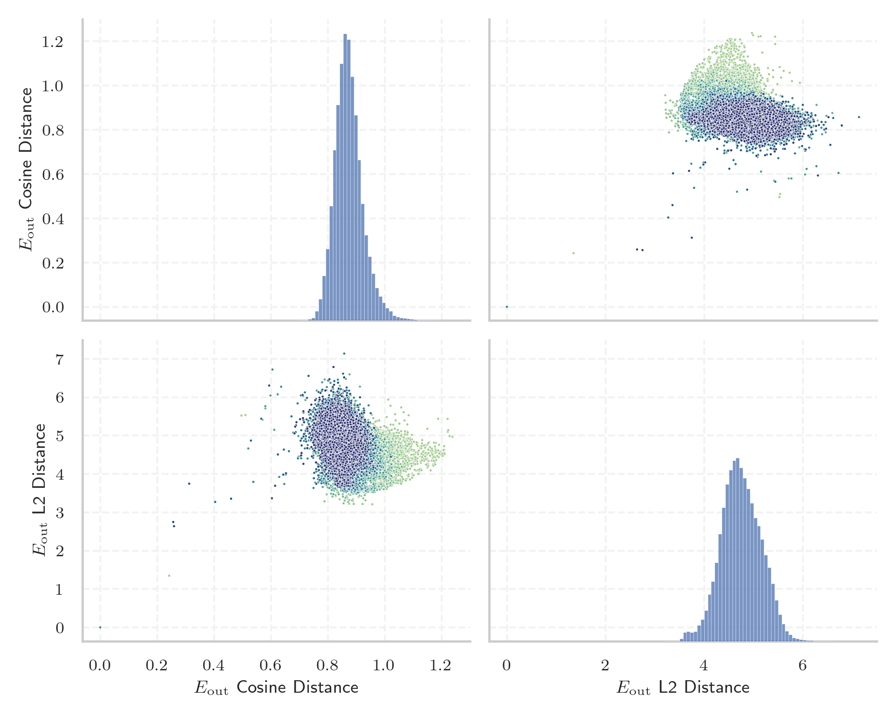
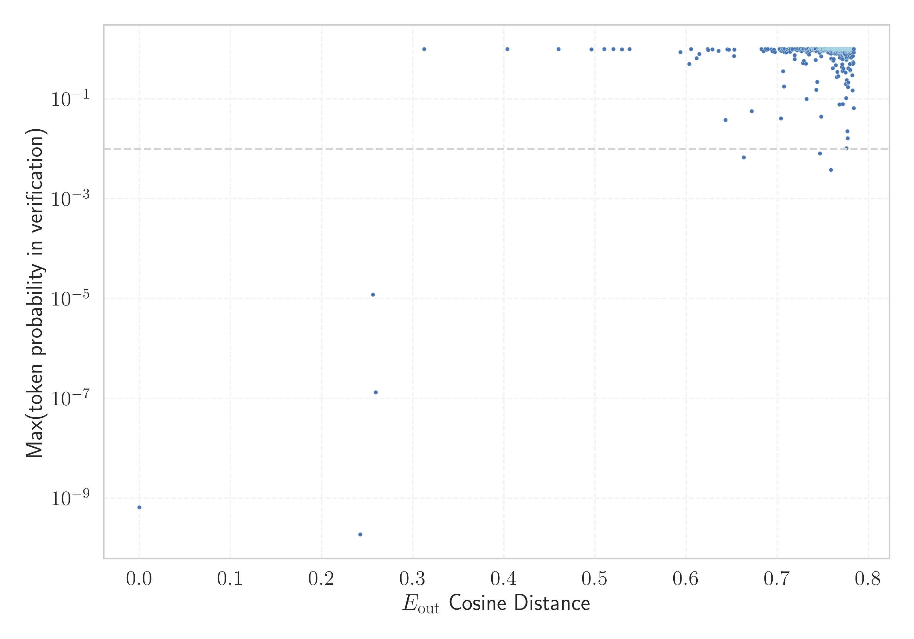

# Report for `PleIAs/Pleias-1.2b-Preview`

## Model info

* Model Info: 
  * Tied embeddings: True
  * LM head uses bias: False
  * Embeddings shape: [65536, 2048]
* Tokenizer Info: 
  * Vocab Size: 65536
  * Tokenizer Class: PreTrainedTokenizerFast
  * Tokenizer Type: BPE
  * Bytes handling: Byte Input
  * Token for verification prompt building: ArgumentException
  * Token id for verification prompt building: 52922
* Indicator summary: 
  * Indicator for under-trained tokens: E_{out} Cosine Distance
  * Overall distribution: 0.873 +/- 0.052
* Detected Token Counts: 
  * Number of tested under-trained tokens: 1297, 1294 non-special, 6 below p = 0.01 threshold, 11 below soft indicator threshold
  * Number of single byte tokens: 243, of which 0 below indicator threshold
  * Number of special tokens: 0, of which 0 below indicator threshold
  * Number of non-single-byte UTF-fragment tokens:  603, of which 5 below soft indicator threshold

## Under-trained token indicators plot


## Verification plot


## Under-trained token verification results
11 entries below threshold of 0.605

|   token_id | token                 |   indicator | max_prob                                                         | in_other_tokens                                                                                                                                                    |
|------------|-----------------------|-------------|------------------------------------------------------------------|--------------------------------------------------------------------------------------------------------------------------------------------------------------------|
|      33234 | ````` NdEx `````      | 4.76837e-07 | <span style='border: 1px solid rgb(169, 68, 66);'>6.5e-10</span> | <span style='border: 1px solid rgb(40, 167, 69);'>````` ▁iNdEx `````</span>, <span style='border: 1px solid rgb(40, 167, 69);'>````` iNdEx `````</span>            |
|      60031 | ````` abogon `````    | 0.256473    | <span style='border: 1px solid rgb(169, 68, 66);'>1.2e-05</span> | <span style='border: 1px solid rgb(40, 167, 69);'>````` ▁gihabogon `````</span>                                                                                    |
|      56780 | ````` ▁talags `````   | 0.259384    | <span style='border: 1px solid rgb(169, 68, 66);'>1.3e-07</span> | ````` ▁talagsaon `````                                                                                                                                             |
|      54187 | ````` alakip `````    | 0.312524    | <span style='border: 1px solid rgb(40, 167, 69);'>1</span>       | <span style='border: 1px solid rgb(40, 167, 69);'>````` ilalakip `````</span>, <span style='border: 1px solid rgb(40, 167, 69);'>````` ▁nahilalakip `````</span>   |
|      44733 | ````` imutangan ````` | 0.403777    | <span style='border: 1px solid rgb(40, 167, 69);'>1</span>       | <span style='border: 1px solid rgb(40, 167, 69);'>````` ▁nahimutangan `````</span>                                                                                 |
|      54194 | ````` ilalakip `````  | 0.459803    | <span style='border: 1px solid rgb(40, 167, 69);'>1</span>       | <span style='border: 1px solid rgb(40, 167, 69);'>````` ▁nahilalakip `````</span>                                                                                  |
|      25491 | ````` ámci `````      | 0.520261    | <span style='border: 1px solid rgb(40, 167, 69);'>0.99</span>    | ````` rámci `````, ````` ▁rámci `````                                                                                                                              |
|      45088 | ````` ahabog `````    | 0.529495    | <span style='border: 1px solid rgb(40, 167, 69);'>0.99</span>    | <span style='border: 1px solid rgb(40, 167, 69);'>````` ahabogang `````</span>, <span style='border: 1px solid rgb(40, 167, 69);'>````` ▁kinahabogang `````</span> |
|      35475 | ````` inaugahan ````` | 0.537871    | <span style='border: 1px solid rgb(40, 167, 69);'>1</span>       | <span style='border: 1px solid rgb(40, 167, 69);'>````` ▁kinaugahan `````</span>                                                                                   |
|      55607 | ````` ÜÜÜÜ `````      | 0.593691    | <span style='border: 1px solid rgb(40, 167, 69);'>0.87</span>    |                                                                                                                                                                    |
|      54053 | ````` ▁MILAWA `````   | 0.603315    | <span style='border: 1px solid rgb(40, 167, 69);'>0.5</span>     |                                                                                                                                                                    |


## Tokens with partial UTF-8 sequences
5 entries below threshold of 0.605

|   token_id | token                    |   indicator | in_other_tokens                                                                  |
|------------|--------------------------|-------------|----------------------------------------------------------------------------------|
|      42545 | ````` <0xE1><0xB1> ````` |    0.565722 |                                                                                  |
|      18385 | ````` <0xEE><0xA2> ````` |    0.569999 | ````` \ue89e\ `````, ````` ▁\ue89e `````, ````` \ue89e `````, ````` \ue8a0 ````` |
|      22434 | ````` <0xEA><0xA6> ````` |    0.580088 |                                                                                  |
|      12157 | ````` <0x99><0xA6> ````` |    0.580312 | ````` ♦♦ `````, ````` ▁♦ `````, ````` ♦ `````                                    |
|      22401 | ````` <0xA1><0xB0> ````` |    0.598273 | ````` 조 `````, ````` ▁조 `````                                                  |


## Byte tokens
0 entries below threshold of 0.461


## Special tokens
1 entries below threshold of 0.461

|   token_id | token                           |   indicator | max_prob                                                         |
|------------|---------------------------------|-------------|------------------------------------------------------------------|
|          1 | ````` <\|begin_of_text\|> ````` |      0.2422 | <span style='border: 1px solid rgb(169, 68, 66);'>1.9e-10</span> |

