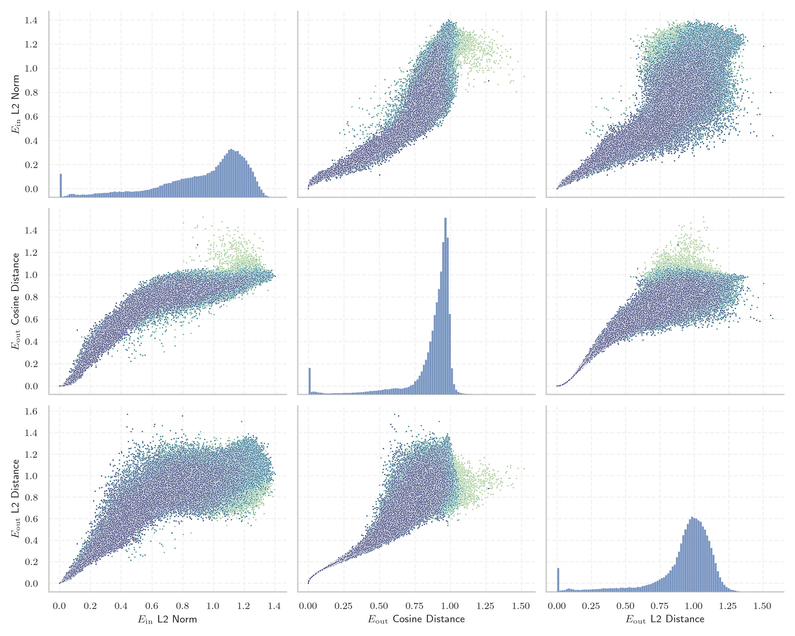
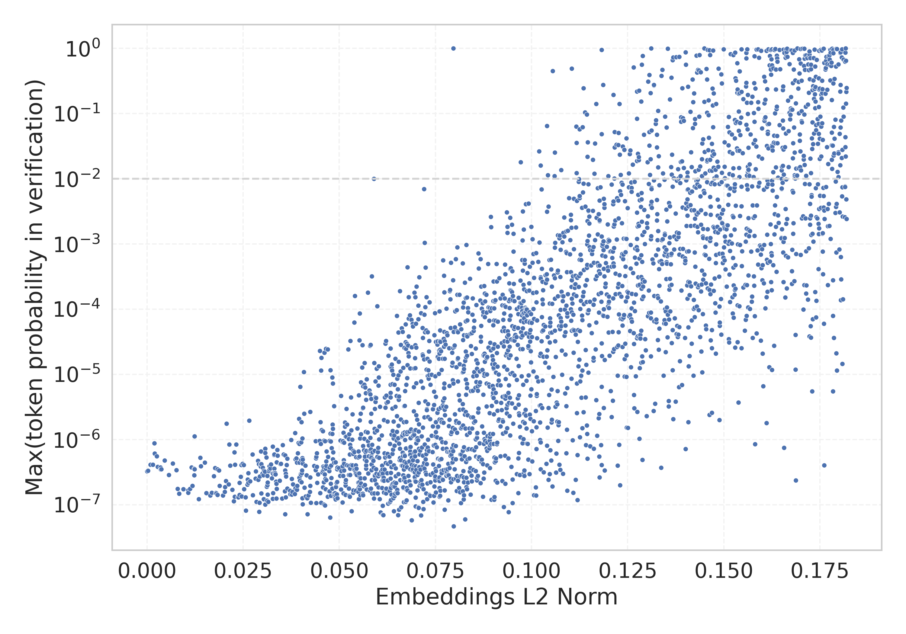

# Report for `Qwen/Qwen1.5-32B`

## Model info

* Model Info: 
  * Tied embeddings: False
  * LM head uses bias: False
  * Embeddings shape: [152064, 5120]
* Tokenizer Info: 
  * Vocab Size: 151646
  * Tokenizer Class: Qwen2Tokenizer
  * Tokenizer Type: BPE
  * Bytes handling: Byte Input
  * Token for verification prompt building: abcdefghijklmnopqrstuvwxyz
  * Token id for verification prompt building: 67512
* Indicator summary: 
  * Indicator for under-trained tokens: E_{in} L2 Norm
  * Overall distribution: 0.921 +/- 0.302
* Detected Token Counts: 
  * Number of tested under-trained tokens: 2966, 2964 non-special, 2450 below p = 0.01 threshold, 1992 below soft indicator threshold
  * Number of single byte tokens: 256, of which 14 below indicator threshold
  * Number of special tokens: 1906, of which 1905 below indicator threshold
  * Number of non-single-byte unreachable tokens: 1906, of which 1905 below indicator threshold
  * Number of non-single-byte UTF-fragment tokens:  1320, of which 106 below soft indicator threshold

## Under-trained token indicators plot


## Verification plot


## Under-trained token verification results
1992 entries below threshold of 0.130

|   token_id | token                             |   indicator | max_prob                                                         | in_other_tokens                                                                                                                                                                                                                                                                                                                                  |
|------------|-----------------------------------|-------------|------------------------------------------------------------------|--------------------------------------------------------------------------------------------------------------------------------------------------------------------------------------------------------------------------------------------------------------------------------------------------------------------------------------------------|
|      79270 | ````` ▁ForCanBeConvertedToF ````` | 1.28634e-06 | <span style='border: 1px solid rgb(169, 68, 66);'>3.3e-07</span> | ````` ▁ForCanBeConvertedToForeach `````                                                                                                                                                                                                                                                                                                          |
|      79269 | ````` ▁ForCanBeConverted `````    | 1.29997e-06 | <span style='border: 1px solid rgb(169, 68, 66);'>3.3e-07</span> | <span style='border: 1px solid rgb(169, 68, 66);'>````` ▁ForCanBeConvertedToF `````</span>, ````` ▁ForCanBeConvertedToForeach `````                                                                                                                                                                                                              |
|      88372 | ````` useRalative `````           | 1.30103e-06 | <span style='border: 1px solid rgb(169, 68, 66);'>3.3e-07</span> | <span style='border: 1px solid rgb(169, 68, 66);'>````` useRalativeImagePath `````</span>                                                                                                                                                                                                                                                        |
|     143335 | ````` ספטמ `````                  | 1.3013e-06  | <span style='border: 1px solid rgb(169, 68, 66);'>3.3e-07</span> | <span style='border: 1px solid rgb(40, 167, 69);'>````` ספטמבר `````</span>                                                                                                                                                                                                                                                                      |
|      97000 | ````` (stypy `````                | 1.30709e-06 | <span style='border: 1px solid rgb(169, 68, 66);'>3.3e-07</span> |                                                                                                                                                                                                                                                                                                                                                  |
|      83971 | ````` $PostalCodesNL `````        | 1.30734e-06 | <span style='border: 1px solid rgb(169, 68, 66);'>3.3e-07</span> |                                                                                                                                                                                                                                                                                                                                                  |
|      78783 | ````` \tTokenNameIdentifier ````` | 1.30749e-06 | <span style='border: 1px solid rgb(169, 68, 66);'>3.3e-07</span> |                                                                                                                                                                                                                                                                                                                                                  |
|      69684 | ````` Japgolly `````              | 1.31354e-06 | <span style='border: 1px solid rgb(169, 68, 66);'>3.3e-07</span> | <span style='border: 1px solid rgb(169, 68, 66);'>````` ▁typingsJapgolly `````</span>                                                                                                                                                                                                                                                            |
|      83969 | ````` PostalCodesNL `````         | 1.3142e-06  | <span style='border: 1px solid rgb(169, 68, 66);'>3.3e-07</span> | <span style='border: 1px solid rgb(169, 68, 66);'>````` $PostalCodesNL `````</span>                                                                                                                                                                                                                                                              |
|      71640 | ````` ▁typingsJapgolly `````      | 0.000255411 | <span style='border: 1px solid rgb(169, 68, 66);'>3.3e-07</span> |                                                                                                                                                                                                                                                                                                                                                  |
|      88371 | ````` useRal `````                | 0.000859988 | <span style='border: 1px solid rgb(169, 68, 66);'>4.1e-07</span> | <span style='border: 1px solid rgb(169, 68, 66);'>````` useRalative `````</span>, <span style='border: 1px solid rgb(169, 68, 66);'>````` useRalativeImagePath `````</span>                                                                                                                                                                      |
|     142386 | ````` ▁zwłaszc `````              | 0.00147057  | <span style='border: 1px solid rgb(169, 68, 66);'>4.1e-07</span> | ````` ▁zwłaszcza `````                                                                                                                                                                                                                                                                                                                           |
|     151296 | ````` 𝇊 `````                     | 0.00190703  | <span style='border: 1px solid rgb(169, 68, 66);'>8.8e-07</span> |                                                                                                                                                                                                                                                                                                                                                  |
|     151291 | ````` 𝅎 `````                     | 0.00195796  | <span style='border: 1px solid rgb(169, 68, 66);'>6.1e-07</span> |                                                                                                                                                                                                                                                                                                                                                  |
|     151298 | ````` 𝇚 `````                     | 0.00255646  | <span style='border: 1px solid rgb(169, 68, 66);'>5.6e-07</span> |                                                                                                                                                                                                                                                                                                                                                  |
|     151299 | ````` 𝇜 `````                     | 0.00278646  | <span style='border: 1px solid rgb(169, 68, 66);'>3.8e-07</span> |                                                                                                                                                                                                                                                                                                                                                  |
|     151297 | ````` 𝇗 `````                     | 0.00344653  | <span style='border: 1px solid rgb(169, 68, 66);'>3.7e-07</span> |                                                                                                                                                                                                                                                                                                                                                  |
|     151293 | ````` 𝆣 `````                     | 0.00358151  | <span style='border: 1px solid rgb(169, 68, 66);'>3.5e-07</span> |                                                                                                                                                                                                                                                                                                                                                  |
|     151300 | ````` 𝇠 `````                     | 0.00372685  | <span style='border: 1px solid rgb(169, 68, 66);'>3.5e-07</span> |                                                                                                                                                                                                                                                                                                                                                  |
|     128200 | ````` przedsięb `````             | 0.00456628  | <span style='border: 1px solid rgb(169, 68, 66);'>4.8e-07</span> | <span style='border: 1px solid rgb(40, 167, 69);'>````` przedsiębior `````</span>, <span style='border: 1px solid rgb(40, 167, 69);'>````` przedsiębiorst `````</span>, <span style='border: 1px solid rgb(169, 68, 66);'>````` przedsiębiorstw `````</span>, <span style='border: 1px solid rgb(169, 68, 66);'>````` przedsiębiorc `````</span> |
<details><summary>1972 additional entries below threshold</summary>

|   token_id | token                            |   indicator | max_prob                                                         | in_other_tokens                                                                                                                                                                                                                                                                                                                                                                                                                  |
|------------|----------------------------------|-------------|------------------------------------------------------------------|----------------------------------------------------------------------------------------------------------------------------------------------------------------------------------------------------------------------------------------------------------------------------------------------------------------------------------------------------------------------------------------------------------------------------------|
|      92805 | ````` ▁QtAws `````               |  0.00564602 | <span style='border: 1px solid rgb(169, 68, 66);'>2.9e-07</span> |                                                                                                                                                                                                                                                                                                                                                                                                                                  |
|      80159 | ````` artisanlib `````           |  0.00668147 | <span style='border: 1px solid rgb(169, 68, 66);'>4.3e-07</span> |                                                                                                                                                                                                                                                                                                                                                                                                                                  |
|     151294 | ````` 𝆳 `````                    |  0.00761444 | <span style='border: 1px solid rgb(169, 68, 66);'>3.4e-07</span> |                                                                                                                                                                                                                                                                                                                                                                                                                                  |
|     142494 | ````` ניוזל `````                |  0.00796952 | <span style='border: 1px solid rgb(169, 68, 66);'>1.8e-07</span> | <span style='border: 1px solid rgb(251, 189, 8);'>````` ניוזלטר `````</span>                                                                                                                                                                                                                                                                                                                                                     |
|     127734 | ````` פייסב `````                |  0.00833647 | <span style='border: 1px solid rgb(169, 68, 66);'>1.5e-07</span> | ````` פייסבוק `````, ````` ▁בפייסבוק `````                                                                                                                                                                                                                                                                                                                                                                                       |
|     149947 | ````` 🠳 `````                    |  0.00945914 | <span style='border: 1px solid rgb(169, 68, 66);'>1.7e-07</span> |                                                                                                                                                                                                                                                                                                                                                                                                                                  |
|     136954 | ````` טלוו `````                 |  0.0106984  | <span style='border: 1px solid rgb(169, 68, 66);'>1.7e-07</span> | <span style='border: 1px solid rgb(169, 68, 66);'>````` טלוויז `````</span>, <span style='border: 1px solid rgb(40, 167, 69);'>````` טלוויזיה `````</span>                                                                                                                                                                                                                                                                       |
|     127957 | ````` רכזי `````                 |  0.0107131  | <span style='border: 1px solid rgb(169, 68, 66);'>1.5e-07</span> | ````` ▁המרכזי `````, ````` ▁מרכזי `````                                                                                                                                                                                                                                                                                                                                                                                          |
|     122268 | ````` 𨚕 `````                   |  0.0111683  | <span style='border: 1px solid rgb(169, 68, 66);'>1.8e-07</span> |                                                                                                                                                                                                                                                                                                                                                                                                                                  |
|     122739 | ````` 𬘫 `````                   |  0.0115432  | <span style='border: 1px solid rgb(169, 68, 66);'>3.7e-07</span> |                                                                                                                                                                                                                                                                                                                                                                                                                                  |
|     132259 | ````` własn `````                |  0.0118288  | <span style='border: 1px solid rgb(169, 68, 66);'>1.9e-07</span> | ````` ▁własne `````                                                                                                                                                                                                                                                                                                                                                                                                              |
|     123330 | ````` 𬒗 `````                   |  0.0122248  | <span style='border: 1px solid rgb(169, 68, 66);'>3.6e-07</span> |                                                                                                                                                                                                                                                                                                                                                                                                                                  |
|     122588 | ````` 𬜯 `````                   |  0.0122622  | <span style='border: 1px solid rgb(169, 68, 66);'>2.8e-07</span> |                                                                                                                                                                                                                                                                                                                                                                                                                                  |
|     123712 | ````` 𬙊 `````                   |  0.0123492  | <span style='border: 1px solid rgb(169, 68, 66);'>3.5e-07</span> |                                                                                                                                                                                                                                                                                                                                                                                                                                  |
|     139487 | ````` אוטוב `````                |  0.012359   | <span style='border: 1px solid rgb(169, 68, 66);'>1.1e-06</span> | <span style='border: 1px solid rgb(255, 145, 0);'>````` אוטובוס `````</span>                                                                                                                                                                                                                                                                                                                                                     |
|     134213 | ````` ▁miệ `````                 |  0.0134046  | <span style='border: 1px solid rgb(169, 68, 66);'>1.2e-07</span> | ````` ▁miệng `````                                                                                                                                                                                                                                                                                                                                                                                                               |
|     123552 | ````` 𬭯 `````                   |  0.0138374  | <span style='border: 1px solid rgb(169, 68, 66);'>5.3e-07</span> |                                                                                                                                                                                                                                                                                                                                                                                                                                  |
|     122644 | ````` 𬬸 `````                   |  0.013963   | <span style='border: 1px solid rgb(169, 68, 66);'>3.9e-07</span> |                                                                                                                                                                                                                                                                                                                                                                                                                                  |
|     123550 | ````` 𬭬 `````                   |  0.0149737  | <span style='border: 1px solid rgb(169, 68, 66);'>4.5e-07</span> |                                                                                                                                                                                                                                                                                                                                                                                                                                  |
|     138112 | ````` ▁paździ `````              |  0.0154077  | <span style='border: 1px solid rgb(169, 68, 66);'>1.5e-07</span> | ````` ▁październ `````, ````` ▁października `````                                                                                                                                                                                                                                                                                                                                                                                |
|     137026 | ````` กระทรว `````               |  0.0164362  | <span style='border: 1px solid rgb(169, 68, 66);'>1.4e-07</span> | ````` กระทรวง `````                                                                                                                                                                                                                                                                                                                                                                                                              |
|     123306 | ````` 𪤗 `````                   |  0.0167829  | <span style='border: 1px solid rgb(169, 68, 66);'>1.5e-07</span> |                                                                                                                                                                                                                                                                                                                                                                                                                                  |
|     122362 | ````` 𬣳 `````                   |  0.0173927  | <span style='border: 1px solid rgb(169, 68, 66);'>2.7e-07</span> |                                                                                                                                                                                                                                                                                                                                                                                                                                  |
|     122482 | ````` 𬬱 `````                   |  0.0176794  | <span style='border: 1px solid rgb(169, 68, 66);'>3.7e-07</span> |                                                                                                                                                                                                                                                                                                                                                                                                                                  |
|     151288 | ````` 𝄱 `````                    |  0.0179442  | <span style='border: 1px solid rgb(169, 68, 66);'>1.5e-07</span> |                                                                                                                                                                                                                                                                                                                                                                                                                                  |
|     122726 | ````` 𨺙 `````                   |  0.0179629  | <span style='border: 1px solid rgb(169, 68, 66);'>1.5e-07</span> |                                                                                                                                                                                                                                                                                                                                                                                                                                  |
|     123165 | ````` 𬪩 `````                   |  0.0183112  | <span style='border: 1px solid rgb(169, 68, 66);'>3.5e-07</span> |                                                                                                                                                                                                                                                                                                                                                                                                                                  |
|     143067 | ````` เผยแ `````                 |  0.0183454  | <span style='border: 1px solid rgb(169, 68, 66);'>1.4e-07</span> | ````` เผยแพร `````, ````` เผยแพร่ `````                                                                                                                                                                                                                                                                                                                                                                                           |
|     123207 | ````` 𬕂 `````                   |  0.0187334  | <span style='border: 1px solid rgb(169, 68, 66);'>3.4e-07</span> |                                                                                                                                                                                                                                                                                                                                                                                                                                  |
|     151285 | ````` 𝄅 `````                    |  0.0188289  | <span style='border: 1px solid rgb(169, 68, 66);'>2e-07</span>   |                                                                                                                                                                                                                                                                                                                                                                                                                                  |
|     142211 | ````` ▁오히 `````                |  0.0196883  | <span style='border: 1px solid rgb(169, 68, 66);'>1.4e-07</span> | ````` ▁오히려 `````                                                                                                                                                                                                                                                                                                                                                                                                              |
|     136139 | ````` ▁thắ `````                 |  0.0201759  | <span style='border: 1px solid rgb(169, 68, 66);'>1.6e-07</span> |                                                                                                                                                                                                                                                                                                                                                                                                                                  |
|     143595 | ````` ▁najczęście `````          |  0.0202494  | <span style='border: 1px solid rgb(169, 68, 66);'>1.9e-07</span> | ````` ▁najczęściej `````                                                                                                                                                                                                                                                                                                                                                                                                         |
|     151561 | ````` 𖥨 `````                    |  0.0204835  | <span style='border: 1px solid rgb(169, 68, 66);'>2.3e-07</span> |                                                                                                                                                                                                                                                                                                                                                                                                                                  |
|     122648 | ````` 𬬿 `````                   |  0.0206712  | <span style='border: 1px solid rgb(169, 68, 66);'>1.8e-06</span> |                                                                                                                                                                                                                                                                                                                                                                                                                                  |
|     122290 | ````` 𦭜 `````                   |  0.0211816  | <span style='border: 1px solid rgb(169, 68, 66);'>2.1e-07</span> |                                                                                                                                                                                                                                                                                                                                                                                                                                  |
|     122302 | ````` 𬨂 `````                   |  0.0213566  | <span style='border: 1px solid rgb(169, 68, 66);'>8.4e-07</span> |                                                                                                                                                                                                                                                                                                                                                                                                                                  |
|     122376 | ````` 𫰛 `````                   |  0.0216238  | <span style='border: 1px solid rgb(169, 68, 66);'>4e-07</span>   |                                                                                                                                                                                                                                                                                                                                                                                                                                  |
|     151619 | ````` 𓏧 `````                    |  0.0221638  | <span style='border: 1px solid rgb(169, 68, 66);'>1.7e-07</span> |                                                                                                                                                                                                                                                                                                                                                                                                                                  |
|     122502 | ````` 𦙶 `````                   |  0.0225211  | <span style='border: 1px solid rgb(169, 68, 66);'>1.1e-07</span> |                                                                                                                                                                                                                                                                                                                                                                                                                                  |
|     122424 | ````` 𬜬 `````                   |  0.0227225  | <span style='border: 1px solid rgb(169, 68, 66);'>6.4e-07</span> |                                                                                                                                                                                                                                                                                                                                                                                                                                  |
|     141264 | ````` ▁pomięd `````              |  0.0227982  | <span style='border: 1px solid rgb(169, 68, 66);'>1.3e-07</span> | ````` ▁pomiędzy `````                                                                                                                                                                                                                                                                                                                                                                                                            |
|     123245 | ````` 𫔶 `````                   |  0.0228995  | <span style='border: 1px solid rgb(169, 68, 66);'>4.1e-07</span> |                                                                                                                                                                                                                                                                                                                                                                                                                                  |
|     122649 | ````` 𬭁 `````                   |  0.0232167  | <span style='border: 1px solid rgb(169, 68, 66);'>8.5e-07</span> |                                                                                                                                                                                                                                                                                                                                                                                                                                  |
|     140434 | ````` ▁niezbę `````              |  0.0236359  | <span style='border: 1px solid rgb(169, 68, 66);'>1.3e-07</span> | ````` ▁niezbędn `````                                                                                                                                                                                                                                                                                                                                                                                                            |
|     122361 | ````` 𫍣 `````                   |  0.0237432  | <span style='border: 1px solid rgb(169, 68, 66);'>1.3e-07</span> |                                                                                                                                                                                                                                                                                                                                                                                                                                  |
|     142142 | ````` אוניב `````                |  0.0240409  | <span style='border: 1px solid rgb(169, 68, 66);'>2.2e-07</span> | ````` אוניברס `````, ````` אוניברסיטת `````                                                                                                                                                                                                                                                                                                                                                                                      |
|     138174 | ````` Cumhurba `````             |  0.0240704  | <span style='border: 1px solid rgb(169, 68, 66);'>1.4e-07</span> | <span style='border: 1px solid rgb(169, 68, 66);'>````` Cumhurbaş `````</span>, ````` Cumhurbaşkan `````, ````` Cumhurbaşkanı `````                                                                                                                                                                                                                                                                                              |
|     141781 | ````` ปกคร `````                 |  0.0243462  | <span style='border: 1px solid rgb(169, 68, 66);'>2.7e-07</span> | ````` ปกครอง `````                                                                                                                                                                                                                                                                                                                                                                                                               |
|     122252 | ````` 𬣡 `````                   |  0.0244785  | <span style='border: 1px solid rgb(169, 68, 66);'>4.1e-07</span> |                                                                                                                                                                                                                                                                                                                                                                                                                                  |
|     151289 | ````` 𝄴 `````                    |  0.0245802  | <span style='border: 1px solid rgb(169, 68, 66);'>1.3e-07</span> |                                                                                                                                                                                                                                                                                                                                                                                                                                  |
|     123758 | ````` 𬙋 `````                   |  0.0248078  | <span style='border: 1px solid rgb(169, 68, 66);'>4.2e-07</span> |                                                                                                                                                                                                                                                                                                                                                                                                                                  |
|     122922 | ````` 𬘬 `````                   |  0.025136   | <span style='border: 1px solid rgb(169, 68, 66);'>4.1e-07</span> |                                                                                                                                                                                                                                                                                                                                                                                                                                  |
|     138122 | ````` ▁hẳ `````                  |  0.0252342  | <span style='border: 1px solid rgb(169, 68, 66);'>1.7e-07</span> | ````` ▁hẳn `````                                                                                                                                                                                                                                                                                                                                                                                                                 |
|     151286 | ````` 𝄕 `````                    |  0.0255902  | <span style='border: 1px solid rgb(169, 68, 66);'>1.3e-07</span> |                                                                                                                                                                                                                                                                                                                                                                                                                                  |
|     140451 | ````` влекательн `````           |  0.0257149  | <span style='border: 1px solid rgb(169, 68, 66);'>8.1e-08</span> |                                                                                                                                                                                                                                                                                                                                                                                                                                  |
|     123594 | ````` 𫄷 `````                   |  0.0260513  | <span style='border: 1px solid rgb(169, 68, 66);'>2e-07</span>   |                                                                                                                                                                                                                                                                                                                                                                                                                                  |
|     149962 | ````` 𣷭 `````                   |  0.0261741  | <span style='border: 1px solid rgb(169, 68, 66);'>2.4e-07</span> |                                                                                                                                                                                                                                                                                                                                                                                                                                  |
|     143191 | ````` אוגוס `````                |  0.0262925  | <span style='border: 1px solid rgb(169, 68, 66);'>2.2e-07</span> | ````` אוגוסט `````                                                                                                                                                                                                                                                                                                                                                                                                               |
|     151284 | ````` 𝄃 `````                    |  0.0263227  | <span style='border: 1px solid rgb(169, 68, 66);'>3e-07</span>   |                                                                                                                                                                                                                                                                                                                                                                                                                                  |
|     123352 | ````` 𬭤 `````                   |  0.0265804  | <span style='border: 1px solid rgb(169, 68, 66);'>2e-06</span>   |                                                                                                                                                                                                                                                                                                                                                                                                                                  |
|     150196 | ````` 𓅺 `````                    |  0.0267716  | <span style='border: 1px solid rgb(169, 68, 66);'>2.3e-07</span> |                                                                                                                                                                                                                                                                                                                                                                                                                                  |
|     122223 | ````` 𫵷 `````                   |  0.0274357  | <span style='border: 1px solid rgb(169, 68, 66);'>5.9e-07</span> |                                                                                                                                                                                                                                                                                                                                                                                                                                  |
|     137722 | ````` nızda `````                |  0.0274877  | <span style='border: 1px solid rgb(169, 68, 66);'>1.4e-07</span> |                                                                                                                                                                                                                                                                                                                                                                                                                                  |
|      45972 | ````` webElementX `````          |  0.0282243  | <span style='border: 1px solid rgb(169, 68, 66);'>2.5e-07</span> | <span style='border: 1px solid rgb(169, 68, 66);'>````` webElementXpaths `````</span>                                                                                                                                                                                                                                                                                                                                            |
|     123642 | ````` 𬶠 `````                   |  0.0282996  | <span style='border: 1px solid rgb(169, 68, 66);'>3.2e-07</span> |                                                                                                                                                                                                                                                                                                                                                                                                                                  |
|      78640 | ````` ▁Hexatrigesimal `````      |  0.0284054  | <span style='border: 1px solid rgb(169, 68, 66);'>1.1e-07</span> |                                                                                                                                                                                                                                                                                                                                                                                                                                  |
|     119942 | ````` 𬉼 `````                   |  0.0287957  | <span style='border: 1px solid rgb(169, 68, 66);'>4.7e-07</span> |                                                                                                                                                                                                                                                                                                                                                                                                                                  |
|     151280 | ````` 𓃢 `````                    |  0.0289393  | <span style='border: 1px solid rgb(169, 68, 66);'>2.4e-07</span> |                                                                                                                                                                                                                                                                                                                                                                                                                                  |
|     123499 | ````` 𬸣 `````                   |  0.029084   | <span style='border: 1px solid rgb(169, 68, 66);'>4.2e-07</span> |                                                                                                                                                                                                                                                                                                                                                                                                                                  |
|      83476 | ````` ▁AppMethodBeat `````       |  0.0291142  | <span style='border: 1px solid rgb(169, 68, 66);'>7.8e-08</span> |                                                                                                                                                                                                                                                                                                                                                                                                                                  |
|     117469 | ````` 完整热榜 `````             |  0.0292569  | <span style='border: 1px solid rgb(169, 68, 66);'>1.1e-07</span> |                                                                                                                                                                                                                                                                                                                                                                                                                                  |
|     122578 | ````` 𫭼 `````                   |  0.029316   | <span style='border: 1px solid rgb(169, 68, 66);'>2.7e-07</span> |                                                                                                                                                                                                                                                                                                                                                                                                                                  |
|     122694 | ````` 𬊈 `````                   |  0.0295766  | <span style='border: 1px solid rgb(169, 68, 66);'>3.9e-07</span> |                                                                                                                                                                                                                                                                                                                                                                                                                                  |
|     122986 | ````` 𬷕 `````                   |  0.0295823  | <span style='border: 1px solid rgb(169, 68, 66);'>6.6e-07</span> |                                                                                                                                                                                                                                                                                                                                                                                                                                  |
|     122574 | ````` 𬍤 `````                   |  0.0296424  | <span style='border: 1px solid rgb(169, 68, 66);'>4.2e-07</span> |                                                                                                                                                                                                                                                                                                                                                                                                                                  |
|     123748 | ````` 𨭉 `````                   |  0.0296867  | <span style='border: 1px solid rgb(169, 68, 66);'>1.5e-07</span> |                                                                                                                                                                                                                                                                                                                                                                                                                                  |
|     122889 | ````` 𬍡 `````                   |  0.0297222  | <span style='border: 1px solid rgb(169, 68, 66);'>4.2e-07</span> |                                                                                                                                                                                                                                                                                                                                                                                                                                  |
|     123637 | ````` 𬸪 `````                   |  0.0299967  | <span style='border: 1px solid rgb(169, 68, 66);'>3e-07</span>   |                                                                                                                                                                                                                                                                                                                                                                                                                                  |
|     122385 | ````` 𫠊 `````                   |  0.0300993  | <span style='border: 1px solid rgb(169, 68, 66);'>3.7e-07</span> |                                                                                                                                                                                                                                                                                                                                                                                                                                  |
|     123283 | ````` 𫘬 `````                   |  0.0302672  | <span style='border: 1px solid rgb(169, 68, 66);'>2.8e-07</span> |                                                                                                                                                                                                                                                                                                                                                                                                                                  |
|     139034 | ````` nquête `````               |  0.0303358  | <span style='border: 1px solid rgb(169, 68, 66);'>1.2e-07</span> |                                                                                                                                                                                                                                                                                                                                                                                                                                  |
|     122615 | ````` 𨐈 `````                   |  0.0304225  | <span style='border: 1px solid rgb(169, 68, 66);'>3.3e-07</span> |                                                                                                                                                                                                                                                                                                                                                                                                                                  |
|     122556 | ````` 𬳽 `````                   |  0.0306726  | <span style='border: 1px solid rgb(169, 68, 66);'>3.2e-07</span> |                                                                                                                                                                                                                                                                                                                                                                                                                                  |
|      71918 | ````` ▁StreamLazy `````          |  0.0306947  | <span style='border: 1px solid rgb(169, 68, 66);'>7.2e-07</span> |                                                                                                                                                                                                                                                                                                                                                                                                                                  |
|     151292 | ````` 𝅪 `````                    |  0.0307241  | <span style='border: 1px solid rgb(169, 68, 66);'>1e-07</span>   |                                                                                                                                                                                                                                                                                                                                                                                                                                  |
|     122647 | ````` 𬬹 `````                   |  0.0307566  | <span style='border: 1px solid rgb(169, 68, 66);'>6.3e-07</span> |                                                                                                                                                                                                                                                                                                                                                                                                                                  |
|     123033 | ````` 𫓶 `````                   |  0.0310702  | <span style='border: 1px solid rgb(169, 68, 66);'>5.3e-07</span> |                                                                                                                                                                                                                                                                                                                                                                                                                                  |
|     142385 | ````` ▁zwłas `````               |  0.0311024  | <span style='border: 1px solid rgb(169, 68, 66);'>1.9e-07</span> | <span style='border: 1px solid rgb(169, 68, 66);'>````` ▁zwłaszc `````</span>, ````` ▁zwłaszcza `````                                                                                                                                                                                                                                                                                                                            |
|     138790 | ````` ▁vườ `````                 |  0.0312086  | <span style='border: 1px solid rgb(169, 68, 66);'>1.2e-07</span> | ````` ▁vườn `````                                                                                                                                                                                                                                                                                                                                                                                                                |
|     143849 | ````` ▁الديمقرا `````            |  0.0312431  | <span style='border: 1px solid rgb(169, 68, 66);'>2e-07</span>   | ````` ▁الديمقراط `````, ````` ▁الديمقراطية `````                                                                                                                                                                                                                                                                                                                                                                                 |
|     140082 | ````` dıkt `````                 |  0.0312558  | <span style='border: 1px solid rgb(169, 68, 66);'>2.8e-07</span> | <span style='border: 1px solid rgb(169, 68, 66);'>````` dıktan `````</span>                                                                                                                                                                                                                                                                                                                                                      |
|     150846 | ````` ꪼ `````                    |  0.0313631  | <span style='border: 1px solid rgb(169, 68, 66);'>2.2e-07</span> |                                                                                                                                                                                                                                                                                                                                                                                                                                  |
|     143920 | ````` ▁зарегистрирова `````      |  0.0313821  | <span style='border: 1px solid rgb(169, 68, 66);'>1.4e-07</span> |                                                                                                                                                                                                                                                                                                                                                                                                                                  |
|     151265 | ````` 𑂄 `````                    |  0.0315189  | <span style='border: 1px solid rgb(169, 68, 66);'>1.1e-07</span> |                                                                                                                                                                                                                                                                                                                                                                                                                                  |
|     123117 | ````` 𬴃 `````                   |  0.0316361  | <span style='border: 1px solid rgb(169, 68, 66);'>3.3e-07</span> |                                                                                                                                                                                                                                                                                                                                                                                                                                  |
|     138622 | ````` промышленн `````           |  0.0318159  | <span style='border: 1px solid rgb(169, 68, 66);'>3.9e-07</span> |                                                                                                                                                                                                                                                                                                                                                                                                                                  |
|     123000 | ````` 𬹼 `````                   |  0.0318546  | <span style='border: 1px solid rgb(169, 68, 66);'>3.5e-07</span> |                                                                                                                                                                                                                                                                                                                                                                                                                                  |
|     122394 | ````` 𬍛 `````                   |  0.0320871  | <span style='border: 1px solid rgb(169, 68, 66);'>3.6e-07</span> |                                                                                                                                                                                                                                                                                                                                                                                                                                  |
|     123765 | ````` 𬺓 `````                   |  0.0321919  | <span style='border: 1px solid rgb(169, 68, 66);'>4.2e-07</span> |                                                                                                                                                                                                                                                                                                                                                                                                                                  |
|     123168 | ````` 𬒔 `````                   |  0.0324319  | <span style='border: 1px solid rgb(169, 68, 66);'>2.5e-07</span> |                                                                                                                                                                                                                                                                                                                                                                                                                                  |
|     122271 | ````` 𫘜 `````                   |  0.0326726  | <span style='border: 1px solid rgb(169, 68, 66);'>3e-07</span>   |                                                                                                                                                                                                                                                                                                                                                                                                                                  |
|     122597 | ````` 𬂩 `````                   |  0.0326903  | <span style='border: 1px solid rgb(169, 68, 66);'>7.8e-07</span> |                                                                                                                                                                                                                                                                                                                                                                                                                                  |
|      57408 | ````` :-------------</ `````     |  0.0326995  | <span style='border: 1px solid rgb(169, 68, 66);'>1.2e-07</span> |                                                                                                                                                                                                                                                                                                                                                                                                                                  |
|     122241 | ````` 𣲘 `````                   |  0.032758   | <span style='border: 1px solid rgb(169, 68, 66);'>1.5e-07</span> |                                                                                                                                                                                                                                                                                                                                                                                                                                  |
|     142493 | ````` ניוז `````                 |  0.0330043  | <span style='border: 1px solid rgb(169, 68, 66);'>5.8e-07</span> | <span style='border: 1px solid rgb(169, 68, 66);'>````` ניוזל `````</span>, <span style='border: 1px solid rgb(251, 189, 8);'>````` ניוזלטר `````</span>                                                                                                                                                                                                                                                                         |
|     123080 | ````` 𬮱 `````                   |  0.0330585  | <span style='border: 1px solid rgb(169, 68, 66);'>3.6e-07</span> |                                                                                                                                                                                                                                                                                                                                                                                                                                  |
|     123531 | ````` 𫟦 `````                   |  0.0330774  | <span style='border: 1px solid rgb(169, 68, 66);'>3.1e-07</span> |                                                                                                                                                                                                                                                                                                                                                                                                                                  |
|     123082 | ````` 𬊤 `````                   |  0.0330961  | <span style='border: 1px solid rgb(169, 68, 66);'>5.9e-07</span> |                                                                                                                                                                                                                                                                                                                                                                                                                                  |
|     123282 | ````` 𫘪 `````                   |  0.0333035  | <span style='border: 1px solid rgb(169, 68, 66);'>3.1e-07</span> |                                                                                                                                                                                                                                                                                                                                                                                                                                  |
|     141761 | ````` ▁반드 `````                |  0.0334182  | <span style='border: 1px solid rgb(169, 68, 66);'>2.9e-07</span> | ````` ▁반드시 `````                                                                                                                                                                                                                                                                                                                                                                                                              |
|     122155 | ````` 𨙸 `````                   |  0.0335811  | <span style='border: 1px solid rgb(169, 68, 66);'>2.3e-07</span> |                                                                                                                                                                                                                                                                                                                                                                                                                                  |
|     150967 | ````` 뼐 `````                   |  0.0335914  | <span style='border: 1px solid rgb(169, 68, 66);'>1.3e-07</span> |                                                                                                                                                                                                                                                                                                                                                                                                                                  |
|      95556 | ````` methodPointerType `````    |  0.0336302  | <span style='border: 1px solid rgb(169, 68, 66);'>2.1e-07</span> |                                                                                                                                                                                                                                                                                                                                                                                                                                  |
|     142024 | ````` สงคร `````                 |  0.0336764  | <span style='border: 1px solid rgb(169, 68, 66);'>1.8e-07</span> | ````` สงคราม `````                                                                                                                                                                                                                                                                                                                                                                                                               |
|     122822 | ````` 𫓯 `````                   |  0.0337256  | <span style='border: 1px solid rgb(169, 68, 66);'>4.5e-07</span> |                                                                                                                                                                                                                                                                                                                                                                                                                                  |
|     140737 | ````` ▁воздействи `````          |  0.0338661  | <span style='border: 1px solid rgb(169, 68, 66);'>7e-07</span>   |                                                                                                                                                                                                                                                                                                                                                                                                                                  |
|     151267 | ````` 𑘁 `````                    |  0.0339329  | <span style='border: 1px solid rgb(169, 68, 66);'>5.7e-07</span> |                                                                                                                                                                                                                                                                                                                                                                                                                                  |
|     143858 | ````` ▁минимальн `````           |  0.0344762  | <span style='border: 1px solid rgb(169, 68, 66);'>2.3e-07</span> |                                                                                                                                                                                                                                                                                                                                                                                                                                  |
|     122927 | ````` 𫟅 `````                   |  0.0346641  | <span style='border: 1px solid rgb(169, 68, 66);'>4.2e-07</span> |                                                                                                                                                                                                                                                                                                                                                                                                                                  |
|     122379 | ````` 𬳵 `````                   |  0.0347847  | <span style='border: 1px solid rgb(169, 68, 66);'>4.2e-07</span> |                                                                                                                                                                                                                                                                                                                                                                                                                                  |
|     130111 | ````` โรงแ `````                 |  0.0351486  | <span style='border: 1px solid rgb(169, 68, 66);'>1.2e-07</span> | ````` โรงแรม `````                                                                                                                                                                                                                                                                                                                                                                                                               |
|     122928 | ````` 𬘯 `````                   |  0.0352894  | <span style='border: 1px solid rgb(169, 68, 66);'>8.2e-07</span> |                                                                                                                                                                                                                                                                                                                                                                                                                                  |
|     139809 | ````` ▁chặ `````                 |  0.0355247  | <span style='border: 1px solid rgb(169, 68, 66);'>5.9e-07</span> | ````` ▁chặn `````                                                                                                                                                                                                                                                                                                                                                                                                                |
|     141709 | ````` ▁khớ `````                 |  0.0357867  | <span style='border: 1px solid rgb(169, 68, 66);'>1.6e-07</span> | ````` ▁khớp `````                                                                                                                                                                                                                                                                                                                                                                                                                |
|     122474 | ````` 𪨰 `````                   |  0.0359051  | <span style='border: 1px solid rgb(169, 68, 66);'>5.7e-07</span> |                                                                                                                                                                                                                                                                                                                                                                                                                                  |
|     150877 | ````` 냵 `````                   |  0.0359297  | <span style='border: 1px solid rgb(169, 68, 66);'>7.2e-08</span> |                                                                                                                                                                                                                                                                                                                                                                                                                                  |
|     138175 | ````` Cumhurbaş `````            |  0.0359423  | <span style='border: 1px solid rgb(169, 68, 66);'>3.4e-07</span> | ````` Cumhurbaşkan `````, ````` Cumhurbaşkanı `````                                                                                                                                                                                                                                                                                                                                                                              |
|     150797 | ````` 㫴 `````                   |  0.0360551  | <span style='border: 1px solid rgb(169, 68, 66);'>3e-07</span>   |                                                                                                                                                                                                                                                                                                                                                                                                                                  |
|     149464 | ````` 퀠 `````                   |  0.0360981  | <span style='border: 1px solid rgb(169, 68, 66);'>1.3e-07</span> |                                                                                                                                                                                                                                                                                                                                                                                                                                  |
|     142968 | ````` ลงทะ `````                 |  0.0361097  | <span style='border: 1px solid rgb(169, 68, 66);'>2.7e-07</span> | ````` ลงทะเบ `````, ````` ลงทะเบียน `````                                                                                                                                                                                                                                                                                                                                                                                         |
|     150571 | ````` ᨪ `````                    |  0.0362821  | <span style='border: 1px solid rgb(169, 68, 66);'>4.1e-07</span> |                                                                                                                                                                                                                                                                                                                                                                                                                                  |
|     141591 | ````` تلفزي `````                |  0.0364145  | <span style='border: 1px solid rgb(169, 68, 66);'>1.8e-07</span> | ````` تلفزيون `````                                                                                                                                                                                                                                                                                                                                                                                                              |
|     143515 | ````` קלאסי `````                |  0.0364858  | <span style='border: 1px solid rgb(169, 68, 66);'>5.1e-07</span> |                                                                                                                                                                                                                                                                                                                                                                                                                                  |
|     141493 | ````` พฤศ `````                  |  0.0371535  | <span style='border: 1px solid rgb(169, 68, 66);'>1.7e-07</span> | ````` พฤศจ `````, ````` พฤศจิก `````, ````` พฤศจิกายน `````                                                                                                                                                                                                                                                                                                                                                                        |
|     128095 | ````` สะอา `````                 |  0.0372312  | <span style='border: 1px solid rgb(169, 68, 66);'>1.4e-07</span> | ````` สะอาด `````, ````` ทำความสะอาด `````                                                                                                                                                                                                                                                                                                                                                                                       |
|     123017 | ````` 𫶇 `````                   |  0.037486   | <span style='border: 1px solid rgb(169, 68, 66);'>9.8e-07</span> |                                                                                                                                                                                                                                                                                                                                                                                                                                  |
|     151547 | ````` 솊 `````                   |  0.0376199  | <span style='border: 1px solid rgb(169, 68, 66);'>2.5e-07</span> |                                                                                                                                                                                                                                                                                                                                                                                                                                  |
|     141908 | ````` אוקט `````                 |  0.0376351  | <span style='border: 1px solid rgb(169, 68, 66);'>1.4e-07</span> | <span style='border: 1px solid rgb(40, 167, 69);'>````` אוקטובר `````</span>                                                                                                                                                                                                                                                                                                                                                     |
|     143888 | ````` 久しぶ `````               |  0.0377903  | <span style='border: 1px solid rgb(169, 68, 66);'>1.6e-07</span> | ````` 久しぶり `````                                                                                                                                                                                                                                                                                                                                                                                                             |
|     139738 | ````` คณะกรรม `````              |  0.0379238  | <span style='border: 1px solid rgb(169, 68, 66);'>2.1e-07</span> | ````` คณะกรรมการ `````                                                                                                                                                                                                                                                                                                                                                                                                           |
|     122730 | ````` 㛚 `````                   |  0.0383874  | <span style='border: 1px solid rgb(169, 68, 66);'>1.5e-07</span> |                                                                                                                                                                                                                                                                                                                                                                                                                                  |
|     150276 | ````` 뙝 `````                   |  0.038525   | <span style='border: 1px solid rgb(169, 68, 66);'>1.3e-06</span> |                                                                                                                                                                                                                                                                                                                                                                                                                                  |
|      93973 | ````` -vesm `````                |  0.038535   | <span style='border: 1px solid rgb(169, 68, 66);'>5e-07</span>   |                                                                                                                                                                                                                                                                                                                                                                                                                                  |
|     138463 | ````` ▁כאיל `````                |  0.0385427  | <span style='border: 1px solid rgb(169, 68, 66);'>1.8e-07</span> | ````` ▁כאילו `````                                                                                                                                                                                                                                                                                                                                                                                                               |
|     122190 | ````` 𫭢 `````                   |  0.0388072  | <span style='border: 1px solid rgb(169, 68, 66);'>5.1e-07</span> |                                                                                                                                                                                                                                                                                                                                                                                                                                  |
|     122260 | ````` 𫸩 `````                   |  0.0389544  | <span style='border: 1px solid rgb(169, 68, 66);'>4.5e-07</span> |                                                                                                                                                                                                                                                                                                                                                                                                                                  |
|     140956 | ````` ▁формирова `````           |  0.0389956  | <span style='border: 1px solid rgb(169, 68, 66);'>1.7e-07</span> |                                                                                                                                                                                                                                                                                                                                                                                                                                  |
|     142595 | ````` ▁судебн `````              |  0.0390424  | <span style='border: 1px solid rgb(169, 68, 66);'>2e-07</span>   |                                                                                                                                                                                                                                                                                                                                                                                                                                  |
|     123410 | ````` 𬤝 `````                   |  0.0391857  | <span style='border: 1px solid rgb(169, 68, 66);'>6.2e-07</span> |                                                                                                                                                                                                                                                                                                                                                                                                                                  |
|     150820 | ````` ꌼ `````                   |  0.0393302  | <span style='border: 1px solid rgb(169, 68, 66);'>8.9e-07</span> |                                                                                                                                                                                                                                                                                                                                                                                                                                  |
|     141054 | ````` ▁беременн `````            |  0.0395512  | <span style='border: 1px solid rgb(169, 68, 66);'>2.1e-06</span> |                                                                                                                                                                                                                                                                                                                                                                                                                                  |
|     122735 | ````` 𬳿 `````                   |  0.0395603  | <span style='border: 1px solid rgb(169, 68, 66);'>4.4e-07</span> |                                                                                                                                                                                                                                                                                                                                                                                                                                  |
|     132096 | ````` เทคโนโล `````              |  0.0396131  | <span style='border: 1px solid rgb(169, 68, 66);'>2.6e-07</span> | ````` เทคโนโลย `````, ````` เทคโนโลยี `````                                                                                                                                                                                                                                                                                                                                                                                       |
|     122179 | ````` 𬘓 `````                   |  0.0396281  | <span style='border: 1px solid rgb(169, 68, 66);'>8.6e-07</span> |                                                                                                                                                                                                                                                                                                                                                                                                                                  |
|     151093 | ````` 픠 `````                   |  0.0397577  | <span style='border: 1px solid rgb(169, 68, 66);'>2.3e-07</span> |                                                                                                                                                                                                                                                                                                                                                                                                                                  |
|     123741 | ````` 𨟠 `````                   |  0.0398434  | <span style='border: 1px solid rgb(169, 68, 66);'>6.4e-06</span> |                                                                                                                                                                                                                                                                                                                                                                                                                                  |
|     122758 | ````` 𫮃 `````                   |  0.0398731  | <span style='border: 1px solid rgb(169, 68, 66);'>2.9e-07</span> |                                                                                                                                                                                                                                                                                                                                                                                                                                  |
|     123323 | ````` 𬸘 `````                   |  0.0399837  | <span style='border: 1px solid rgb(169, 68, 66);'>2.9e-07</span> |                                                                                                                                                                                                                                                                                                                                                                                                                                  |
|     150298 | ````` 뜷 `````                   |  0.0400541  | <span style='border: 1px solid rgb(169, 68, 66);'>4.9e-07</span> |                                                                                                                                                                                                                                                                                                                                                                                                                                  |
|     122909 | ````` 𬯎 `````                   |  0.0400753  | <span style='border: 1px solid rgb(169, 68, 66);'>9.1e-07</span> |                                                                                                                                                                                                                                                                                                                                                                                                                                  |
|     136084 | ````` บรรยาก `````               |  0.0401573  | <span style='border: 1px solid rgb(169, 68, 66);'>2.2e-07</span> | ````` บรรยากาศ `````                                                                                                                                                                                                                                                                                                                                                                                                             |
|     122882 | ````` 𬇹 `````                   |  0.0401822  | <span style='border: 1px solid rgb(169, 68, 66);'>1.9e-06</span> |                                                                                                                                                                                                                                                                                                                                                                                                                                  |
|     122381 | ````` 𬳶 `````                   |  0.0402311  | <span style='border: 1px solid rgb(169, 68, 66);'>3.1e-07</span> |                                                                                                                                                                                                                                                                                                                                                                                                                                  |
|     123132 | ````` 𤧛 `````                   |  0.0403338  | <span style='border: 1px solid rgb(169, 68, 66);'>3.4e-07</span> |                                                                                                                                                                                                                                                                                                                                                                                                                                  |
|     122368 | ````` 𬮿 `````                   |  0.0403589  | <span style='border: 1px solid rgb(169, 68, 66);'>5.2e-07</span> |                                                                                                                                                                                                                                                                                                                                                                                                                                  |
|     123761 | ````` 𤫉 `````                   |  0.0403691  | <span style='border: 1px solid rgb(169, 68, 66);'>1.3e-07</span> |                                                                                                                                                                                                                                                                                                                                                                                                                                  |
|      33856 | ````` ▁+#+#+#+ `````             |  0.0404112  | <span style='border: 1px solid rgb(169, 68, 66);'>1e-06</span>   | ````` ▁+#+#+#+#+#+ `````                                                                                                                                                                                                                                                                                                                                                                                                         |
|      30860 | ````` quotelev `````             |  0.0404345  | <span style='border: 1px solid rgb(169, 68, 66);'>1e-07</span>   |                                                                                                                                                                                                                                                                                                                                                                                                                                  |
|     123383 | ````` 𬸚 `````                   |  0.0404668  | <span style='border: 1px solid rgb(169, 68, 66);'>4.3e-07</span> |                                                                                                                                                                                                                                                                                                                                                                                                                                  |
|     122370 | ````` 𬯀 `````                   |  0.0404972  | <span style='border: 1px solid rgb(169, 68, 66);'>4.9e-07</span> |                                                                                                                                                                                                                                                                                                                                                                                                                                  |
|     122320 | ````` 𬬩 `````                   |  0.0407784  | <span style='border: 1px solid rgb(169, 68, 66);'>1.1e-05</span> |                                                                                                                                                                                                                                                                                                                                                                                                                                  |
|     143147 | ````` ▁พฤษ `````                 |  0.0408443  | <span style='border: 1px solid rgb(169, 68, 66);'>2.5e-06</span> | <span style='border: 1px solid rgb(169, 68, 66);'>````` ▁พฤษภา `````</span>, ````` ▁พฤษภาคม `````                                                                                                                                                                                                                                                                                                                                |
|     139941 | ````` ▁לחלוט `````               |  0.0408975  | <span style='border: 1px solid rgb(169, 68, 66);'>1.8e-07</span> | ````` ▁לחלוטין `````                                                                                                                                                                                                                                                                                                                                                                                                             |
|     151470 | ````` ᨸ `````                    |  0.0411862  | <span style='border: 1px solid rgb(169, 68, 66);'>4e-07</span>   |                                                                                                                                                                                                                                                                                                                                                                                                                                  |
|     138626 | ````` ▁мобильн `````             |  0.0412336  | <span style='border: 1px solid rgb(169, 68, 66);'>1.3e-07</span> |                                                                                                                                                                                                                                                                                                                                                                                                                                  |
|     123677 | ````` 𥖨 `````                   |  0.0415006  | <span style='border: 1px solid rgb(169, 68, 66);'>2.8e-07</span> |                                                                                                                                                                                                                                                                                                                                                                                                                                  |
|     141917 | ````` ▁денежн `````              |  0.0416099  | <span style='border: 1px solid rgb(169, 68, 66);'>1.3e-07</span> |                                                                                                                                                                                                                                                                                                                                                                                                                                  |
|     150944 | ````` 뮘 `````                   |  0.0416816  | <span style='border: 1px solid rgb(169, 68, 66);'>7.1e-08</span> |                                                                                                                                                                                                                                                                                                                                                                                                                                  |
|     130505 | ````` ▁gử `````                  |  0.0419613  | <span style='border: 1px solid rgb(169, 68, 66);'>1.4e-07</span> | ````` ▁gửi `````                                                                                                                                                                                                                                                                                                                                                                                                                 |
|     143366 | ````` ▁достижени `````           |  0.0423808  | <span style='border: 1px solid rgb(169, 68, 66);'>1.6e-07</span> |                                                                                                                                                                                                                                                                                                                                                                                                                                  |
|     122924 | ````` 𬴂 `````                   |  0.0423957  | <span style='border: 1px solid rgb(169, 68, 66);'>2.6e-07</span> |                                                                                                                                                                                                                                                                                                                                                                                                                                  |
|     138269 | ````` ▁bậ `````                  |  0.042436   | <span style='border: 1px solid rgb(169, 68, 66);'>2.7e-06</span> | ````` ▁bậc `````                                                                                                                                                                                                                                                                                                                                                                                                                 |
|     123702 | ````` 𦒍 `````                   |  0.0424438  | <span style='border: 1px solid rgb(169, 68, 66);'>2e-07</span>   |                                                                                                                                                                                                                                                                                                                                                                                                                                  |
|     150803 | ````` 䋌 `````                   |  0.0425722  | <span style='border: 1px solid rgb(169, 68, 66);'>1.1e-07</span> |                                                                                                                                                                                                                                                                                                                                                                                                                                  |
|     122177 | ````` 𬣞 `````                   |  0.0434253  | <span style='border: 1px solid rgb(169, 68, 66);'>4e-07</span>   |                                                                                                                                                                                                                                                                                                                                                                                                                                  |
|     123667 | ````` 𬟁 `````                   |  0.0438628  | <span style='border: 1px solid rgb(169, 68, 66);'>9.5e-07</span> |                                                                                                                                                                                                                                                                                                                                                                                                                                  |
|     151544 | ````` 겴 `````                   |  0.0438675  | <span style='border: 1px solid rgb(169, 68, 66);'>3.4e-07</span> |                                                                                                                                                                                                                                                                                                                                                                                                                                  |
|     122925 | ````` 𫘦 `````                   |  0.0439328  | <span style='border: 1px solid rgb(169, 68, 66);'>5.1e-07</span> |                                                                                                                                                                                                                                                                                                                                                                                                                                  |
|     143694 | ````` ▁בנוג `````                |  0.0439565  | <span style='border: 1px solid rgb(169, 68, 66);'>1.1e-07</span> | ````` ▁בנוגע `````                                                                                                                                                                                                                                                                                                                                                                                                               |
|     122711 | ````` 𬒈 `````                   |  0.0440209  | <span style='border: 1px solid rgb(169, 68, 66);'>5.4e-07</span> |                                                                                                                                                                                                                                                                                                                                                                                                                                  |
|     122186 | ````` 𫭟 `````                   |  0.0441305  | <span style='border: 1px solid rgb(169, 68, 66);'>6.2e-07</span> |                                                                                                                                                                                                                                                                                                                                                                                                                                  |
|      69216 | ````` erusform `````             |  0.0441691  | <span style='border: 1px solid rgb(169, 68, 66);'>3.8e-07</span> | ````` numerusform `````                                                                                                                                                                                                                                                                                                                                                                                                          |
|     146855 | ````` ꡑ `````                    |  0.0442314  | <span style='border: 1px solid rgb(169, 68, 66);'>2.2e-07</span> |                                                                                                                                                                                                                                                                                                                                                                                                                                  |
|     150900 | ````` 됸 `````                   |  0.0444667  | <span style='border: 1px solid rgb(169, 68, 66);'>2.9e-07</span> |                                                                                                                                                                                                                                                                                                                                                                                                                                  |
|     140045 | ````` ciśni `````                |  0.0448904  | <span style='border: 1px solid rgb(169, 68, 66);'>9.6e-07</span> |                                                                                                                                                                                                                                                                                                                                                                                                                                  |
|     143129 | ````` ▁위원님 `````              |  0.0449062  | <span style='border: 1px solid rgb(169, 68, 66);'>2.3e-05</span> |                                                                                                                                                                                                                                                                                                                                                                                                                                  |
|     150301 | ````` 뢉 `````                   |  0.0449655  | <span style='border: 1px solid rgb(169, 68, 66);'>1.5e-07</span> |                                                                                                                                                                                                                                                                                                                                                                                                                                  |
|     142835 | ````` お勧 `````                 |  0.0450148  | <span style='border: 1px solid rgb(169, 68, 66);'>1.5e-07</span> | ````` お勧め `````                                                                                                                                                                                                                                                                                                                                                                                                               |
|     149805 | ````` 흝 `````                   |  0.0450838  | <span style='border: 1px solid rgb(169, 68, 66);'>1.9e-06</span> |                                                                                                                                                                                                                                                                                                                                                                                                                                  |
|     130007 | ````` ▁riê `````                 |  0.0451989  | <span style='border: 1px solid rgb(169, 68, 66);'>8.6e-07</span> | ````` ▁riêng `````                                                                                                                                                                                                                                                                                                                                                                                                               |
|     137589 | ````` مستشف `````                |  0.0452116  | <span style='border: 1px solid rgb(169, 68, 66);'>1.1e-07</span> | ````` مستشفى `````                                                                                                                                                                                                                                                                                                                                                                                                               |
|     151037 | ````` 쩼 `````                   |  0.0452401  | <span style='border: 1px solid rgb(169, 68, 66);'>1.2e-05</span> |                                                                                                                                                                                                                                                                                                                                                                                                                                  |
|     122660 | ````` 𫢸 `````                   |  0.0453181  | <span style='border: 1px solid rgb(169, 68, 66);'>1.8e-05</span> |                                                                                                                                                                                                                                                                                                                                                                                                                                  |
|     147410 | ````` ꀰ `````                   |  0.0453867  | <span style='border: 1px solid rgb(169, 68, 66);'>1.4e-06</span> |                                                                                                                                                                                                                                                                                                                                                                                                                                  |
|     150963 | ````` 뺃 `````                   |  0.0455295  | <span style='border: 1px solid rgb(169, 68, 66);'>3.2e-07</span> |                                                                                                                                                                                                                                                                                                                                                                                                                                  |
|     122977 | ````` 𬃊 `````                   |  0.0457054  | <span style='border: 1px solid rgb(169, 68, 66);'>1.3e-06</span> |                                                                                                                                                                                                                                                                                                                                                                                                                                  |
|     150549 | ````` ᘑ `````                    |  0.0457342  | <span style='border: 1px solid rgb(169, 68, 66);'>1.8e-07</span> |                                                                                                                                                                                                                                                                                                                                                                                                                                  |
|     151433 | ````` 딉 `````                   |  0.0457385  | <span style='border: 1px solid rgb(169, 68, 66);'>3.3e-07</span> |                                                                                                                                                                                                                                                                                                                                                                                                                                  |
|     143482 | ````` ▁ładn `````                |  0.0458283  | <span style='border: 1px solid rgb(169, 68, 66);'>3.8e-07</span> |                                                                                                                                                                                                                                                                                                                                                                                                                                  |
|     150871 | ````` 꺳 `````                   |  0.0459463  | <span style='border: 1px solid rgb(169, 68, 66);'>2.2e-07</span> |                                                                                                                                                                                                                                                                                                                                                                                                                                  |
|     143962 | ````` ▁нагрузк `````             |  0.0459483  | <span style='border: 1px solid rgb(169, 68, 66);'>3.5e-07</span> |                                                                                                                                                                                                                                                                                                                                                                                                                                  |
|     151105 | ````` 햡 `````                   |  0.0460214  | <span style='border: 1px solid rgb(169, 68, 66);'>9.7e-07</span> |                                                                                                                                                                                                                                                                                                                                                                                                                                  |
|     150297 | ````` 떘 `````                   |  0.0460273  | <span style='border: 1px solid rgb(169, 68, 66);'>3.8e-07</span> |                                                                                                                                                                                                                                                                                                                                                                                                                                  |
|     148650 | ````` 씯 `````                   |  0.0460534  | <span style='border: 1px solid rgb(169, 68, 66);'>1e-07</span>   |                                                                                                                                                                                                                                                                                                                                                                                                                                  |
|     150862 | ````` 긩 `````                   |  0.0461245  | <span style='border: 1px solid rgb(169, 68, 66);'>2.2e-05</span> |                                                                                                                                                                                                                                                                                                                                                                                                                                  |
|     150880 | ````` 넢 `````                   |  0.0462178  | <span style='border: 1px solid rgb(169, 68, 66);'>2.9e-07</span> |                                                                                                                                                                                                                                                                                                                                                                                                                                  |
|     148328 | ````` ꡕ `````                    |  0.046273   | <span style='border: 1px solid rgb(169, 68, 66);'>9.5e-07</span> |                                                                                                                                                                                                                                                                                                                                                                                                                                  |
|     149117 | ````` 헠 `````                   |  0.0463     | <span style='border: 1px solid rgb(169, 68, 66);'>9.7e-08</span> |                                                                                                                                                                                                                                                                                                                                                                                                                                  |
|     149724 | ````` ꧊ `````                    |  0.0463389  | <span style='border: 1px solid rgb(169, 68, 66);'>2.5e-07</span> |                                                                                                                                                                                                                                                                                                                                                                                                                                  |
|     149735 | ````` 녤 `````                   |  0.0464108  | <span style='border: 1px solid rgb(169, 68, 66);'>1.7e-07</span> |                                                                                                                                                                                                                                                                                                                                                                                                                                  |
|     123533 | ````` 𫠜 `````                   |  0.0464813  | <span style='border: 1px solid rgb(169, 68, 66);'>2.5e-05</span> |                                                                                                                                                                                                                                                                                                                                                                                                                                  |
|     122242 | ````` 𣲗 `````                   |  0.0465144  | <span style='border: 1px solid rgb(169, 68, 66);'>3.6e-07</span> |                                                                                                                                                                                                                                                                                                                                                                                                                                  |
|     150902 | ````` 둿 `````                   |  0.0465578  | <span style='border: 1px solid rgb(169, 68, 66);'>2.4e-07</span> |                                                                                                                                                                                                                                                                                                                                                                                                                                  |
|     150808 | ````` 䠼 `````                   |  0.046573   | <span style='border: 1px solid rgb(169, 68, 66);'>3.9e-07</span> |                                                                                                                                                                                                                                                                                                                                                                                                                                  |
|     123624 | ````` 𬭼 `````                   |  0.046589   | <span style='border: 1px solid rgb(169, 68, 66);'>4.6e-07</span> |                                                                                                                                                                                                                                                                                                                                                                                                                                  |
|     122605 | ````` 𫠆 `````                   |  0.0466503  | <span style='border: 1px solid rgb(169, 68, 66);'>6.6e-07</span> |                                                                                                                                                                                                                                                                                                                                                                                                                                  |
|     133741 | ````` ▁הישרא `````               |  0.0469576  | <span style='border: 1px solid rgb(169, 68, 66);'>1.3e-07</span> | ````` ▁הישראלי `````, <span style='border: 1px solid rgb(169, 68, 66);'>````` ▁הישראל `````</span>, ````` ▁הישראלית `````                                                                                                                                                                                                                                                                                                        |
|     147930 | ````` 🖏 `````                    |  0.0470026  | <span style='border: 1px solid rgb(169, 68, 66);'>2.4e-05</span> |                                                                                                                                                                                                                                                                                                                                                                                                                                  |
|     149747 | ````` 뜽 `````                   |  0.0470742  | <span style='border: 1px solid rgb(169, 68, 66);'>5.4e-07</span> |                                                                                                                                                                                                                                                                                                                                                                                                                                  |
|     149075 | ````` 겤 `````                   |  0.0472626  | <span style='border: 1px solid rgb(169, 68, 66);'>1.6e-07</span> |                                                                                                                                                                                                                                                                                                                                                                                                                                  |
|     123319 | ````` 𣗋 `````                   |  0.0473478  | <span style='border: 1px solid rgb(169, 68, 66);'>3.3e-07</span> |                                                                                                                                                                                                                                                                                                                                                                                                                                  |
|     148659 | ````` 퀫 `````                   |  0.0474237  | <span style='border: 1px solid rgb(169, 68, 66);'>1.6e-07</span> |                                                                                                                                                                                                                                                                                                                                                                                                                                  |
|     134237 | ````` ▁zarówn `````              |  0.0474793  | <span style='border: 1px solid rgb(169, 68, 66);'>3.7e-07</span> | ````` ▁zarówno `````                                                                                                                                                                                                                                                                                                                                                                                                             |
|     132667 | ````` ▁đẩ `````                  |  0.047485   | <span style='border: 1px solid rgb(169, 68, 66);'>9.6e-07</span> | ````` ▁đẩy `````                                                                                                                                                                                                                                                                                                                                                                                                                 |
|     151016 | ````` 잪 `````                   |  0.0476304  | <span style='border: 1px solid rgb(169, 68, 66);'>6.4e-08</span> |                                                                                                                                                                                                                                                                                                                                                                                                                                  |
|     148531 | ````` 큠 `````                   |  0.0476729  | <span style='border: 1px solid rgb(169, 68, 66);'>1.2e-06</span> |                                                                                                                                                                                                                                                                                                                                                                                                                                  |
|     150309 | ````` 얊 `````                   |  0.0476972  | <span style='border: 1px solid rgb(169, 68, 66);'>1.2e-05</span> |                                                                                                                                                                                                                                                                                                                                                                                                                                  |
|     149802 | ````` 햤 `````                   |  0.0477924  | <span style='border: 1px solid rgb(169, 68, 66);'>1.4e-07</span> |                                                                                                                                                                                                                                                                                                                                                                                                                                  |
|     150907 | ````` 땧 `````                   |  0.0477945  | <span style='border: 1px solid rgb(169, 68, 66);'>2.1e-07</span> |                                                                                                                                                                                                                                                                                                                                                                                                                                  |
|     123174 | ````` 𬨎 `````                   |  0.047796   | <span style='border: 1px solid rgb(169, 68, 66);'>9.3e-07</span> |                                                                                                                                                                                                                                                                                                                                                                                                                                  |
|     151036 | ````` 쩻 `````                   |  0.0478215  | <span style='border: 1px solid rgb(169, 68, 66);'>4e-07</span>   |                                                                                                                                                                                                                                                                                                                                                                                                                                  |
|     143770 | ````` לכא `````                  |  0.0479031  | <span style='border: 1px solid rgb(169, 68, 66);'>2.6e-07</span> | <span style='border: 1px solid rgb(169, 68, 66);'>````` לכאורה `````</span>                                                                                                                                                                                                                                                                                                                                                      |
|     151019 | ````` 젴 `````                   |  0.0480136  | <span style='border: 1px solid rgb(169, 68, 66);'>7.4e-07</span> |                                                                                                                                                                                                                                                                                                                                                                                                                                  |
|     148916 | ````` 겥 `````                   |  0.0481276  | <span style='border: 1px solid rgb(169, 68, 66);'>1.8e-07</span> |                                                                                                                                                                                                                                                                                                                                                                                                                                  |
|     143060 | ````` ▁иностранн `````           |  0.0481782  | <span style='border: 1px solid rgb(169, 68, 66);'>9e-06</span>   |                                                                                                                                                                                                                                                                                                                                                                                                                                  |
|     123302 | ````` 𡐓 `````                   |  0.0481888  | <span style='border: 1px solid rgb(169, 68, 66);'>1.2e-06</span> |                                                                                                                                                                                                                                                                                                                                                                                                                                  |
|     151035 | ````` 쩰 `````                   |  0.0482423  | <span style='border: 1px solid rgb(169, 68, 66);'>1.7e-06</span> |                                                                                                                                                                                                                                                                                                                                                                                                                                  |
|     151006 | ````` 옏 `````                   |  0.0482829  | <span style='border: 1px solid rgb(169, 68, 66);'>7.2e-06</span> |                                                                                                                                                                                                                                                                                                                                                                                                                                  |
|     122811 | ````` 𬟽 `````                   |  0.0483035  | <span style='border: 1px solid rgb(169, 68, 66);'>5e-07</span>   |                                                                                                                                                                                                                                                                                                                                                                                                                                  |
|     138153 | ````` индивидуальн `````         |  0.048315   | <span style='border: 1px solid rgb(169, 68, 66);'>1.5e-06</span> |                                                                                                                                                                                                                                                                                                                                                                                                                                  |
|     146965 | ````` ꡒ `````                    |  0.0483568  | <span style='border: 1px solid rgb(169, 68, 66);'>6.4e-07</span> |                                                                                                                                                                                                                                                                                                                                                                                                                                  |
|     150854 | ````` 곙 `````                   |  0.0485532  | <span style='border: 1px solid rgb(169, 68, 66);'>1.5e-07</span> |                                                                                                                                                                                                                                                                                                                                                                                                                                  |
|     122558 | ````` 𫄧 `````                   |  0.0486065  | <span style='border: 1px solid rgb(169, 68, 66);'>4.5e-07</span> |                                                                                                                                                                                                                                                                                                                                                                                                                                  |
|     123201 | ````` 𬭛 `````                   |  0.0486286  | <span style='border: 1px solid rgb(169, 68, 66);'>3.3e-06</span> |                                                                                                                                                                                                                                                                                                                                                                                                                                  |
|     122741 | ````` 䂮 `````                   |  0.0486908  | <span style='border: 1px solid rgb(169, 68, 66);'>1.4e-07</span> |                                                                                                                                                                                                                                                                                                                                                                                                                                  |
|     151494 | ````` 핱 `````                   |  0.0488272  | <span style='border: 1px solid rgb(169, 68, 66);'>1.5e-07</span> |                                                                                                                                                                                                                                                                                                                                                                                                                                  |
|     150306 | ````` 숕 `````                   |  0.0488486  | <span style='border: 1px solid rgb(169, 68, 66);'>1.3e-07</span> |                                                                                                                                                                                                                                                                                                                                                                                                                                  |
|     131519 | ````` ▁tầ `````                  |  0.0489899  | <span style='border: 1px solid rgb(169, 68, 66);'>1.4e-07</span> | ````` ▁tầng `````, ````` ▁tầm `````                                                                                                                                                                                                                                                                                                                                                                                              |
|     150893 | ````` 댤 `````                   |  0.049013   | <span style='border: 1px solid rgb(169, 68, 66);'>4.5e-07</span> |                                                                                                                                                                                                                                                                                                                                                                                                                                  |
|     149412 | ````` 귱 `````                   |  0.0490423  | <span style='border: 1px solid rgb(169, 68, 66);'>1.2e-07</span> |                                                                                                                                                                                                                                                                                                                                                                                                                                  |
|     137981 | ````` ▁девушк `````              |  0.0491108  | <span style='border: 1px solid rgb(169, 68, 66);'>1.9e-07</span> |                                                                                                                                                                                                                                                                                                                                                                                                                                  |
|     150983 | ````` 싨 `````                   |  0.0492468  | <span style='border: 1px solid rgb(169, 68, 66);'>2.2e-07</span> |                                                                                                                                                                                                                                                                                                                                                                                                                                  |
|     150969 | ````` 쁭 `````                   |  0.0493259  | <span style='border: 1px solid rgb(169, 68, 66);'>1.5e-07</span> |                                                                                                                                                                                                                                                                                                                                                                                                                                  |
|     137053 | ````` מפו `````                  |  0.0493958  | <span style='border: 1px solid rgb(169, 68, 66);'>3.5e-07</span> | <span style='border: 1px solid rgb(169, 68, 66);'>````` מפורט `````</span>                                                                                                                                                                                                                                                                                                                                                       |
|     151038 | ````` 쪗 `````                   |  0.049409   | <span style='border: 1px solid rgb(169, 68, 66);'>2.3e-07</span> |                                                                                                                                                                                                                                                                                                                                                                                                                                  |
|     150838 | ````` ꪋ `````                    |  0.0495094  | <span style='border: 1px solid rgb(169, 68, 66);'>3.7e-07</span> |                                                                                                                                                                                                                                                                                                                                                                                                                                  |
|     150988 | ````` 쎘 `````                   |  0.0495288  | <span style='border: 1px solid rgb(169, 68, 66);'>1.3e-07</span> |                                                                                                                                                                                                                                                                                                                                                                                                                                  |
|     150853 | ````` 겚 `````                   |  0.0498511  | <span style='border: 1px solid rgb(169, 68, 66);'>3.7e-07</span> |                                                                                                                                                                                                                                                                                                                                                                                                                                  |
|     151448 | ````` 쥉 `````                   |  0.0502329  | <span style='border: 1px solid rgb(169, 68, 66);'>2.8e-07</span> |                                                                                                                                                                                                                                                                                                                                                                                                                                  |
|     122273 | ````` 𬘘 `````                   |  0.0502659  | <span style='border: 1px solid rgb(169, 68, 66);'>9.7e-07</span> |                                                                                                                                                                                                                                                                                                                                                                                                                                  |
|     151000 | ````` 엃 `````                   |  0.0504003  | <span style='border: 1px solid rgb(169, 68, 66);'>4.7e-06</span> |                                                                                                                                                                                                                                                                                                                                                                                                                                  |
|     151490 | ````` 큻 `````                   |  0.0504122  | <span style='border: 1px solid rgb(169, 68, 66);'>1.7e-07</span> |                                                                                                                                                                                                                                                                                                                                                                                                                                  |
|     150810 | ````` 䧞 `````                   |  0.0504942  | <span style='border: 1px solid rgb(169, 68, 66);'>3.3e-07</span> |                                                                                                                                                                                                                                                                                                                                                                                                                                  |
|     122363 | ````` 𬩽 `````                   |  0.0508305  | <span style='border: 1px solid rgb(169, 68, 66);'>9.2e-07</span> |                                                                                                                                                                                                                                                                                                                                                                                                                                  |
|     150992 | ````` 쑻 `````                   |  0.0508314  | <span style='border: 1px solid rgb(169, 68, 66);'>1.1e-07</span> |                                                                                                                                                                                                                                                                                                                                                                                                                                  |
|     149733 | ````` 냏 `````                   |  0.05084    | <span style='border: 1px solid rgb(169, 68, 66);'>3.9e-07</span> |                                                                                                                                                                                                                                                                                                                                                                                                                                  |
|     122172 | ````` 𬇕 `````                   |  0.0508901  | <span style='border: 1px solid rgb(169, 68, 66);'>9.4e-07</span> |                                                                                                                                                                                                                                                                                                                                                                                                                                  |
|     141373 | ````` ▁giấ `````                 |  0.0509581  | <span style='border: 1px solid rgb(169, 68, 66);'>2.8e-07</span> | ````` ▁giấc `````                                                                                                                                                                                                                                                                                                                                                                                                                |
|     149804 | ````` 휏 `````                   |  0.0510603  | <span style='border: 1px solid rgb(169, 68, 66);'>1.3e-06</span> |                                                                                                                                                                                                                                                                                                                                                                                                                                  |
|     151009 | ````` 윧 `````                   |  0.0510685  | <span style='border: 1px solid rgb(169, 68, 66);'>1.5e-07</span> |                                                                                                                                                                                                                                                                                                                                                                                                                                  |
|     123073 | ````` 𫷷 `````                   |  0.0511253  | <span style='border: 1px solid rgb(169, 68, 66);'>4.9e-07</span> |                                                                                                                                                                                                                                                                                                                                                                                                                                  |
|     122635 | ````` 𫑡 `````                   |  0.051172   | <span style='border: 1px solid rgb(169, 68, 66);'>4.3e-07</span> |                                                                                                                                                                                                                                                                                                                                                                                                                                  |
|     137129 | ````` hở `````                   |  0.0511821  | <span style='border: 1px solid rgb(169, 68, 66);'>4.3e-07</span> | ````` ▁thở `````                                                                                                                                                                                                                                                                                                                                                                                                                 |
|     123337 | ````` 𫚖 `````                   |  0.0511986  | <span style='border: 1px solid rgb(169, 68, 66);'>9e-07</span>   |                                                                                                                                                                                                                                                                                                                                                                                                                                  |
|     142543 | ````` ייצג `````                 |  0.051246   | <span style='border: 1px solid rgb(169, 68, 66);'>3.4e-07</span> |                                                                                                                                                                                                                                                                                                                                                                                                                                  |
|     149720 | ````` ꇗ `````                   |  0.0514293  | <span style='border: 1px solid rgb(169, 68, 66);'>1.6e-06</span> |                                                                                                                                                                                                                                                                                                                                                                                                                                  |
|     151592 | ````` ᤊ `````                    |  0.0514295  | <span style='border: 1px solid rgb(169, 68, 66);'>1.8e-06</span> |                                                                                                                                                                                                                                                                                                                                                                                                                                  |
|     150573 | ````` ᨯ `````                    |  0.0515774  | <span style='border: 1px solid rgb(169, 68, 66);'>2e-07</span>   |                                                                                                                                                                                                                                                                                                                                                                                                                                  |
|     135079 | ````` ご紹 `````                 |  0.0515865  | <span style='border: 1px solid rgb(169, 68, 66);'>1.4e-07</span> | ````` ご紹介 `````                                                                                                                                                                                                                                                                                                                                                                                                               |
|     150922 | ````` 롵 `````                   |  0.0516104  | <span style='border: 1px solid rgb(169, 68, 66);'>2.2e-07</span> |                                                                                                                                                                                                                                                                                                                                                                                                                                  |
|     122557 | ````` 𬘩 `````                   |  0.0516286  | <span style='border: 1px solid rgb(169, 68, 66);'>1.1e-06</span> |                                                                                                                                                                                                                                                                                                                                                                                                                                  |
|     151543 | ````` 겙 `````                   |  0.0517181  | <span style='border: 1px solid rgb(169, 68, 66);'>2.4e-07</span> |                                                                                                                                                                                                                                                                                                                                                                                                                                  |
|     150858 | ````` 굛 `````                   |  0.0518001  | <span style='border: 1px solid rgb(169, 68, 66);'>1.1e-06</span> |                                                                                                                                                                                                                                                                                                                                                                                                                                  |
|     123419 | ````` 𬙂 `````                   |  0.0518825  | <span style='border: 1px solid rgb(169, 68, 66);'>3e-06</span>   |                                                                                                                                                                                                                                                                                                                                                                                                                                  |
|     127372 | ````` เฉพ `````                  |  0.0520223  | <span style='border: 1px solid rgb(169, 68, 66);'>4e-07</span>   | ````` เฉพาะ `````, ````` โดยเฉพาะ `````                                                                                                                                                                                                                                                                                                                                                                                          |
|     151072 | ````` 텣 `````                   |  0.0520294  | <span style='border: 1px solid rgb(169, 68, 66);'>1.7e-06</span> |                                                                                                                                                                                                                                                                                                                                                                                                                                  |
|     143867 | ````` ▁กรกฎ `````                |  0.052325   | <span style='border: 1px solid rgb(169, 68, 66);'>2.4e-05</span> | ````` ▁กรกฎาคม `````                                                                                                                                                                                                                                                                                                                                                                                                             |
|     149764 | ````` 삻 `````                   |  0.052438   | <span style='border: 1px solid rgb(169, 68, 66);'>2.9e-07</span> |                                                                                                                                                                                                                                                                                                                                                                                                                                  |
|     150990 | ````` 쑉 `````                   |  0.0524569  | <span style='border: 1px solid rgb(169, 68, 66);'>1.8e-07</span> |                                                                                                                                                                                                                                                                                                                                                                                                                                  |
|     151068 | ````` 킅 `````                   |  0.0524669  | <span style='border: 1px solid rgb(169, 68, 66);'>3.9e-07</span> |                                                                                                                                                                                                                                                                                                                                                                                                                                  |
|     148230 | ````` ꡔ `````                    |  0.0525124  | <span style='border: 1px solid rgb(169, 68, 66);'>1e-06</span>   |                                                                                                                                                                                                                                                                                                                                                                                                                                  |
|     150517 | ````` ᎒ `````                    |  0.05252    | <span style='border: 1px solid rgb(169, 68, 66);'>1.2e-06</span> |                                                                                                                                                                                                                                                                                                                                                                                                                                  |
|     136778 | ````` ▁Ağust `````               |  0.0525356  | <span style='border: 1px solid rgb(169, 68, 66);'>1.4e-07</span> | ````` ▁Ağustos `````                                                                                                                                                                                                                                                                                                                                                                                                             |
|     150976 | ````` 솀 `````                   |  0.052699   | <span style='border: 1px solid rgb(169, 68, 66);'>5.9e-07</span> |                                                                                                                                                                                                                                                                                                                                                                                                                                  |
|     147390 | ````` 윁 `````                   |  0.0527428  | <span style='border: 1px solid rgb(169, 68, 66);'>1.3e-07</span> |                                                                                                                                                                                                                                                                                                                                                                                                                                  |
|     150840 | ````` ꪕ `````                    |  0.0527856  | <span style='border: 1px solid rgb(169, 68, 66);'>3.6e-07</span> |                                                                                                                                                                                                                                                                                                                                                                                                                                  |
|     149774 | ````` 앺 `````                   |  0.0528248  | <span style='border: 1px solid rgb(169, 68, 66);'>8.3e-07</span> |                                                                                                                                                                                                                                                                                                                                                                                                                                  |
|     150879 | ````` 넗 `````                   |  0.0528251  | <span style='border: 1px solid rgb(169, 68, 66);'>2.9e-07</span> |                                                                                                                                                                                                                                                                                                                                                                                                                                  |
|     137718 | ````` ▁wrześ `````               |  0.0528332  | <span style='border: 1px solid rgb(169, 68, 66);'>3.3e-05</span> | ````` ▁września `````                                                                                                                                                                                                                                                                                                                                                                                                            |
|     139441 | ````` キャッシ `````             |  0.0529233  | <span style='border: 1px solid rgb(169, 68, 66);'>7.4e-07</span> | ````` キャッシング `````                                                                                                                                                                                                                                                                                                                                                                                                         |
|     120101 | ````` 𠳐 `````                   |  0.053045   | <span style='border: 1px solid rgb(169, 68, 66);'>4.4e-06</span> |                                                                                                                                                                                                                                                                                                                                                                                                                                  |
|     150570 | ````` ᨨ `````                    |  0.053094   | <span style='border: 1px solid rgb(169, 68, 66);'>1.4e-06</span> |                                                                                                                                                                                                                                                                                                                                                                                                                                  |
|     150860 | ````` 궕 `````                   |  0.0531219  | <span style='border: 1px solid rgb(169, 68, 66);'>4.1e-07</span> |                                                                                                                                                                                                                                                                                                                                                                                                                                  |
|     150930 | ````` 맆 `````                   |  0.0531584  | <span style='border: 1px solid rgb(169, 68, 66);'>8e-08</span>   |                                                                                                                                                                                                                                                                                                                                                                                                                                  |
|     122245 | ````` 𬇙 `````                   |  0.0533558  | <span style='border: 1px solid rgb(169, 68, 66);'>9.9e-07</span> |                                                                                                                                                                                                                                                                                                                                                                                                                                  |
|     150565 | ````` ᤓ `````                    |  0.0533812  | <span style='border: 1px solid rgb(169, 68, 66);'>2.4e-06</span> |                                                                                                                                                                                                                                                                                                                                                                                                                                  |
|     151482 | ````` 뤂 `````                   |  0.0533829  | <span style='border: 1px solid rgb(169, 68, 66);'>4e-07</span>   |                                                                                                                                                                                                                                                                                                                                                                                                                                  |
|     149395 | ````` 𓐍 `````                    |  0.0535912  | <span style='border: 1px solid rgb(169, 68, 66);'>1.5e-07</span> |                                                                                                                                                                                                                                                                                                                                                                                                                                  |
|     143939 | ````` อำน `````                  |  0.0536129  | <span style='border: 1px solid rgb(169, 68, 66);'>6.1e-07</span> | ````` อำนวย `````, <span style='border: 1px solid rgb(169, 68, 66);'>````` อำนวยความ `````</span>, ````` อำนวยความสะดวก `````                                                                                                                                                                                                                                                                                                    |
|     150965 | ````` 뺵 `````                   |  0.0536158  | <span style='border: 1px solid rgb(169, 68, 66);'>6.8e-07</span> |                                                                                                                                                                                                                                                                                                                                                                                                                                  |
|     150933 | ````` 맫 `````                   |  0.053628   | <span style='border: 1px solid rgb(169, 68, 66);'>1.7e-07</span> |                                                                                                                                                                                                                                                                                                                                                                                                                                  |
|     150955 | ````` 봽 `````                   |  0.0538268  | <span style='border: 1px solid rgb(169, 68, 66);'>3.5e-07</span> |                                                                                                                                                                                                                                                                                                                                                                                                                                  |
|     123539 | ````` 㬚 `````                   |  0.0538606  | <span style='border: 1px solid rgb(169, 68, 66);'>6.5e-07</span> |                                                                                                                                                                                                                                                                                                                                                                                                                                  |
|     150873 | ````` 꿕 `````                   |  0.0539033  | <span style='border: 1px solid rgb(169, 68, 66);'>6.2e-05</span> |                                                                                                                                                                                                                                                                                                                                                                                                                                  |
|     148919 | ````` 뎈 `````                   |  0.0539411  | <span style='border: 1px solid rgb(169, 68, 66);'>3.4e-07</span> |                                                                                                                                                                                                                                                                                                                                                                                                                                  |
|     151117 | ````` 힜 `````                   |  0.0540643  | <span style='border: 1px solid rgb(169, 68, 66);'>0.00016</span> |                                                                                                                                                                                                                                                                                                                                                                                                                                  |
|     151033 | ````` 쨓 `````                   |  0.0542293  | <span style='border: 1px solid rgb(169, 68, 66);'>3.2e-07</span> |                                                                                                                                                                                                                                                                                                                                                                                                                                  |
|     150064 | ````` ᩈ `````                    |  0.054293   | <span style='border: 1px solid rgb(169, 68, 66);'>4e-07</span>   |                                                                                                                                                                                                                                                                                                                                                                                                                                  |
|     149766 | ````` 셒 `````                   |  0.0542978  | <span style='border: 1px solid rgb(169, 68, 66);'>3e-07</span>   |                                                                                                                                                                                                                                                                                                                                                                                                                                  |
|     150895 | ````` 뎟 `````                   |  0.0542983  | <span style='border: 1px solid rgb(169, 68, 66);'>1.7e-07</span> |                                                                                                                                                                                                                                                                                                                                                                                                                                  |
|     150901 | ````` 둁 `````                   |  0.0543829  | <span style='border: 1px solid rgb(169, 68, 66);'>5.4e-07</span> |                                                                                                                                                                                                                                                                                                                                                                                                                                  |
|     151022 | ````` 졪 `````                   |  0.0544721  | <span style='border: 1px solid rgb(169, 68, 66);'>3.6e-07</span> |                                                                                                                                                                                                                                                                                                                                                                                                                                  |
|     151069 | ````` 탶 `````                   |  0.0545158  | <span style='border: 1px solid rgb(169, 68, 66);'>2.9e-07</span> |                                                                                                                                                                                                                                                                                                                                                                                                                                  |
|     149762 | ````` 쁄 `````                   |  0.0546513  | <span style='border: 1px solid rgb(169, 68, 66);'>1.5e-06</span> |                                                                                                                                                                                                                                                                                                                                                                                                                                  |
|     150986 | ````` 썜 `````                   |  0.0549201  | <span style='border: 1px solid rgb(169, 68, 66);'>5.3e-07</span> |                                                                                                                                                                                                                                                                                                                                                                                                                                  |
|     148917 | ````` 꿘 `````                   |  0.0549345  | <span style='border: 1px solid rgb(169, 68, 66);'>1.6e-07</span> |                                                                                                                                                                                                                                                                                                                                                                                                                                  |
|     148922 | ````` 옯 `````                   |  0.0549394  | <span style='border: 1px solid rgb(169, 68, 66);'>2.2e-07</span> |                                                                                                                                                                                                                                                                                                                                                                                                                                  |
|     122903 | ````` 𬤊 `````                   |  0.0550082  | <span style='border: 1px solid rgb(169, 68, 66);'>6.6e-07</span> |                                                                                                                                                                                                                                                                                                                                                                                                                                  |
|     131178 | ````` กำหน `````                 |  0.0550245  | <span style='border: 1px solid rgb(169, 68, 66);'>1.8e-07</span> | ````` กำหนด `````                                                                                                                                                                                                                                                                                                                                                                                                                |
|     128153 | ````` ديمق `````                 |  0.05507    | <span style='border: 1px solid rgb(169, 68, 66);'>4.8e-06</span> | ````` ديمقرا `````, ````` ديمقراطي `````, <span style='border: 1px solid rgb(169, 68, 66);'>````` ▁الديمقرا `````</span>, ````` ▁الديمقراط `````, ````` ▁الديمقراطية `````                                                                                                                                                                                                                                                       |
|     151486 | ````` 웢 `````                   |  0.0550806  | <span style='border: 1px solid rgb(169, 68, 66);'>1.2e-07</span> |                                                                                                                                                                                                                                                                                                                                                                                                                                  |
|     150572 | ````` ᨬ `````                    |  0.055126   | <span style='border: 1px solid rgb(169, 68, 66);'>2.2e-07</span> |                                                                                                                                                                                                                                                                                                                                                                                                                                  |
|     151260 | ````` 𐭉 `````                    |  0.0551581  | <span style='border: 1px solid rgb(169, 68, 66);'>3e-07</span>   |                                                                                                                                                                                                                                                                                                                                                                                                                                  |
|     150737 | ````` ⭞ `````                    |  0.0551622  | <span style='border: 1px solid rgb(169, 68, 66);'>1.9e-07</span> |                                                                                                                                                                                                                                                                                                                                                                                                                                  |
|     151290 | ````` 𝄹 `````                    |  0.0551951  | <span style='border: 1px solid rgb(169, 68, 66);'>5.5e-07</span> |                                                                                                                                                                                                                                                                                                                                                                                                                                  |
|     149100 | ````` 얖 `````                   |  0.0552501  | <span style='border: 1px solid rgb(169, 68, 66);'>3.3e-05</span> |                                                                                                                                                                                                                                                                                                                                                                                                                                  |
|     150569 | ````` ᨧ `````                    |  0.0552737  | <span style='border: 1px solid rgb(169, 68, 66);'>2.6e-07</span> |                                                                                                                                                                                                                                                                                                                                                                                                                                  |
|      95637 | ````` departureday `````         |  0.0552802  | <span style='border: 1px solid rgb(169, 68, 66);'>1.7e-07</span> |                                                                                                                                                                                                                                                                                                                                                                                                                                  |
|     150845 | ````` ꪻ `````                    |  0.0553101  | <span style='border: 1px solid rgb(169, 68, 66);'>2e-06</span>   |                                                                                                                                                                                                                                                                                                                                                                                                                                  |
|     142358 | ````` מפורט `````                |  0.055319   | <span style='border: 1px solid rgb(169, 68, 66);'>8.6e-05</span> |                                                                                                                                                                                                                                                                                                                                                                                                                                  |
|     123706 | ````` 䎖 `````                   |  0.055368   | <span style='border: 1px solid rgb(169, 68, 66);'>1e-06</span>   |                                                                                                                                                                                                                                                                                                                                                                                                                                  |
|     150739 | ````` ⮳ `````                    |  0.0553764  | <span style='border: 1px solid rgb(169, 68, 66);'>2e-07</span>   |                                                                                                                                                                                                                                                                                                                                                                                                                                  |
|     149776 | ````` 엪 `````                   |  0.0554945  | <span style='border: 1px solid rgb(169, 68, 66);'>1.4e-07</span> |                                                                                                                                                                                                                                                                                                                                                                                                                                  |
|     146288 | ````` 꽌 `````                   |  0.0555659  | <span style='border: 1px solid rgb(169, 68, 66);'>2.5e-06</span> |                                                                                                                                                                                                                                                                                                                                                                                                                                  |
|     132837 | ````` כרט `````                  |  0.0555753  | <span style='border: 1px solid rgb(169, 68, 66);'>2.5e-07</span> | ````` כרטיס `````                                                                                                                                                                                                                                                                                                                                                                                                                |
|     149729 | ````` 굠 `````                   |  0.0555826  | <span style='border: 1px solid rgb(169, 68, 66);'>7.6e-06</span> |                                                                                                                                                                                                                                                                                                                                                                                                                                  |
|     127401 | ````` כלכ `````                  |  0.055616   | <span style='border: 1px solid rgb(169, 68, 66);'>1.2e-06</span> | ````` כלכלי `````, ````` כלכלה `````                                                                                                                                                                                                                                                                                                                                                                                             |
|     150892 | ````` 댘 `````                   |  0.0556412  | <span style='border: 1px solid rgb(169, 68, 66);'>2.1e-07</span> |                                                                                                                                                                                                                                                                                                                                                                                                                                  |
|     148633 | ````` 녓 `````                   |  0.0559368  | <span style='border: 1px solid rgb(169, 68, 66);'>1.3e-05</span> |                                                                                                                                                                                                                                                                                                                                                                                                                                  |
|     140905 | ````` مفه `````                  |  0.0560354  | <span style='border: 1px solid rgb(169, 68, 66);'>2.8e-05</span> | ````` مفهوم `````                                                                                                                                                                                                                                                                                                                                                                                                                |
|     122520 | ````` 㳚 `````                   |  0.0560776  | <span style='border: 1px solid rgb(169, 68, 66);'>3e-06</span>   |                                                                                                                                                                                                                                                                                                                                                                                                                                  |
|     137332 | ````` mızda `````                |  0.0560822  | <span style='border: 1px solid rgb(169, 68, 66);'>1.5e-07</span> |                                                                                                                                                                                                                                                                                                                                                                                                                                  |
|     122790 | ````` 鿎 `````                   |  0.0561436  | <span style='border: 1px solid rgb(169, 68, 66);'>8e-07</span>   |                                                                                                                                                                                                                                                                                                                                                                                                                                  |
|     151114 | ````` 흟 `````                   |  0.0561537  | <span style='border: 1px solid rgb(169, 68, 66);'>6.6e-06</span> |                                                                                                                                                                                                                                                                                                                                                                                                                                  |
|     150316 | ````` 텉 `````                   |  0.0561713  | <span style='border: 1px solid rgb(169, 68, 66);'>3.1e-06</span> |                                                                                                                                                                                                                                                                                                                                                                                                                                  |
|     150308 | ````` 쓻 `````                   |  0.0562033  | <span style='border: 1px solid rgb(169, 68, 66);'>1.4e-07</span> |                                                                                                                                                                                                                                                                                                                                                                                                                                  |
|     150857 | ````` 괙 `````                   |  0.0563014  | <span style='border: 1px solid rgb(169, 68, 66);'>1.9e-07</span> |                                                                                                                                                                                                                                                                                                                                                                                                                                  |
|     151092 | ````` 픙 `````                   |  0.0563745  | <span style='border: 1px solid rgb(169, 68, 66);'>6.9e-07</span> |                                                                                                                                                                                                                                                                                                                                                                                                                                  |
|     138815 | ````` ▁nghè `````                |  0.056445   | <span style='border: 1px solid rgb(169, 68, 66);'>6.9e-06</span> | ````` ▁nghèo `````                                                                                                                                                                                                                                                                                                                                                                                                               |
|     150975 | ````` 셢 `````                   |  0.0564649  | <span style='border: 1px solid rgb(169, 68, 66);'>1e-06</span>   |                                                                                                                                                                                                                                                                                                                                                                                                                                  |
|     150897 | ````` 됄 `````                   |  0.0565474  | <span style='border: 1px solid rgb(169, 68, 66);'>2.5e-07</span> |                                                                                                                                                                                                                                                                                                                                                                                                                                  |
|     148337 | ````` 떈 `````                   |  0.0565602  | <span style='border: 1px solid rgb(169, 68, 66);'>1.5e-05</span> |                                                                                                                                                                                                                                                                                                                                                                                                                                  |
|     143428 | ````` ▁เมษ `````                 |  0.0566102  | <span style='border: 1px solid rgb(169, 68, 66);'>2e-07</span>   | ````` ▁เมษายน `````                                                                                                                                                                                                                                                                                                                                                                                                              |
|     149321 | ````` 쫭 `````                   |  0.0566281  | <span style='border: 1px solid rgb(169, 68, 66);'>5.3e-07</span> |                                                                                                                                                                                                                                                                                                                                                                                                                                  |
|     122288 | ````` 䢼 `````                   |  0.0566457  | <span style='border: 1px solid rgb(169, 68, 66);'>4.9e-07</span> |                                                                                                                                                                                                                                                                                                                                                                                                                                  |
|     150905 | ````` 딮 `````                   |  0.056672   | <span style='border: 1px solid rgb(169, 68, 66);'>5.5e-07</span> |                                                                                                                                                                                                                                                                                                                                                                                                                                  |
|     150878 | ````` 넖 `````                   |  0.0567119  | <span style='border: 1px solid rgb(169, 68, 66);'>6.3e-06</span> |                                                                                                                                                                                                                                                                                                                                                                                                                                  |
|     123532 | ````` 𬺈 `````                   |  0.0568319  | <span style='border: 1px solid rgb(169, 68, 66);'>6.4e-07</span> |                                                                                                                                                                                                                                                                                                                                                                                                                                  |
|     149112 | ````` 텦 `````                   |  0.0568509  | <span style='border: 1px solid rgb(169, 68, 66);'>1.3e-06</span> |                                                                                                                                                                                                                                                                                                                                                                                                                                  |
|     136955 | ````` טלוויז `````               |  0.0569113  | <span style='border: 1px solid rgb(169, 68, 66);'>5.1e-06</span> | <span style='border: 1px solid rgb(40, 167, 69);'>````` טלוויזיה `````</span>                                                                                                                                                                                                                                                                                                                                                    |
|     123288 | ````` 𫞩 `````                   |  0.056928   | <span style='border: 1px solid rgb(169, 68, 66);'>4.1e-06</span> |                                                                                                                                                                                                                                                                                                                                                                                                                                  |
|     149743 | ````` 땸 `````                   |  0.0569391  | <span style='border: 1px solid rgb(169, 68, 66);'>3.6e-07</span> |                                                                                                                                                                                                                                                                                                                                                                                                                                  |
|     149976 | ````` 눞 `````                   |  0.0569462  | <span style='border: 1px solid rgb(169, 68, 66);'>4e-07</span>   |                                                                                                                                                                                                                                                                                                                                                                                                                                  |
|     123092 | ````` 㴔 `````                   |  0.0570311  | <span style='border: 1px solid rgb(169, 68, 66);'>6.7e-07</span> |                                                                                                                                                                                                                                                                                                                                                                                                                                  |
|     141253 | ````` ▁umoż `````                |  0.0570609  | <span style='border: 1px solid rgb(169, 68, 66);'>4.7e-07</span> | ````` ▁umożli `````, ````` ▁umożliw `````, ````` ▁umożliwia `````                                                                                                                                                                                                                                                                                                                                                                |
|     139885 | ````` ביניהם `````               |  0.0571252  | <span style='border: 1px solid rgb(169, 68, 66);'>1.7e-07</span> |                                                                                                                                                                                                                                                                                                                                                                                                                                  |
|     150210 | ````` ᨹ `````                    |  0.0571413  | <span style='border: 1px solid rgb(169, 68, 66);'>8.4e-06</span> |                                                                                                                                                                                                                                                                                                                                                                                                                                  |
|     149964 | ````` 𦘒 `````                   |  0.0573787  | <span style='border: 1px solid rgb(169, 68, 66);'>1.3e-06</span> |                                                                                                                                                                                                                                                                                                                                                                                                                                  |
|     150321 | ````` 햠 `````                   |  0.0573942  | <span style='border: 1px solid rgb(169, 68, 66);'>9.5e-07</span> |                                                                                                                                                                                                                                                                                                                                                                                                                                  |
|     122483 | ````` 𬬭 `````                   |  0.0573963  | <span style='border: 1px solid rgb(169, 68, 66);'>0.00018</span> |                                                                                                                                                                                                                                                                                                                                                                                                                                  |
|     150273 | ````` 낔 `````                   |  0.0574871  | <span style='border: 1px solid rgb(169, 68, 66);'>3e-07</span>   |                                                                                                                                                                                                                                                                                                                                                                                                                                  |
|     123183 | ````` 𫫇 `````                   |  0.0576563  | <span style='border: 1px solid rgb(169, 68, 66);'>5.5e-07</span> |                                                                                                                                                                                                                                                                                                                                                                                                                                  |
|      80898 | ````` ablytyped `````            |  0.0576631  | <span style='border: 1px solid rgb(169, 68, 66);'>8.1e-07</span> | <span style='border: 1px solid rgb(169, 68, 66);'>````` .scalablytyped `````</span>                                                                                                                                                                                                                                                                                                                                              |
|      79512 | ````` MethodBeat `````           |  0.0577965  | <span style='border: 1px solid rgb(169, 68, 66);'>5.7e-06</span> | <span style='border: 1px solid rgb(169, 68, 66);'>````` ▁AppMethodBeat `````</span>                                                                                                                                                                                                                                                                                                                                              |
|     151444 | ````` 읩 `````                   |  0.057804   | <span style='border: 1px solid rgb(169, 68, 66);'>5.1e-06</span> |                                                                                                                                                                                                                                                                                                                                                                                                                                  |
|     122806 | ````` 𬱖 `````                   |  0.0578274  | <span style='border: 1px solid rgb(169, 68, 66);'>6.7e-07</span> |                                                                                                                                                                                                                                                                                                                                                                                                                                  |
|     140539 | ````` مواق `````                 |  0.0579575  | <span style='border: 1px solid rgb(169, 68, 66);'>2.8e-05</span> | <span style='border: 1px solid rgb(251, 189, 8);'>````` مواقف `````</span>                                                                                                                                                                                                                                                                                                                                                       |
|     151435 | ````` 롑 `````                   |  0.0579693  | <span style='border: 1px solid rgb(169, 68, 66);'>1.6e-07</span> |                                                                                                                                                                                                                                                                                                                                                                                                                                  |
|     150317 | ````` 퍠 `````                   |  0.058015   | <span style='border: 1px solid rgb(169, 68, 66);'>1.1e-06</span> |                                                                                                                                                                                                                                                                                                                                                                                                                                  |
|     149979 | ````` 뤗 `````                   |  0.0580569  | <span style='border: 1px solid rgb(169, 68, 66);'>1.1e-06</span> |                                                                                                                                                                                                                                                                                                                                                                                                                                  |
|     131223 | ````` ประกา `````                |  0.0580873  | <span style='border: 1px solid rgb(169, 68, 66);'>4.9e-06</span> | ````` ประกาศ `````                                                                                                                                                                                                                                                                                                                                                                                                               |
|     139042 | ````` ▁dóla `````                |  0.058108   | <span style='border: 1px solid rgb(169, 68, 66);'>2.8e-05</span> | ````` ▁dólares `````                                                                                                                                                                                                                                                                                                                                                                                                             |
|     149438 | ````` 씼 `````                   |  0.0581256  | <span style='border: 1px solid rgb(169, 68, 66);'>1.9e-06</span> |                                                                                                                                                                                                                                                                                                                                                                                                                                  |
|     122304 | ````` 𬀪 `````                   |  0.0581755  | <span style='border: 1px solid rgb(169, 68, 66);'>6.6e-07</span> |                                                                                                                                                                                                                                                                                                                                                                                                                                  |
|     150279 | ````` 쟛 `````                   |  0.05818    | <span style='border: 1px solid rgb(169, 68, 66);'>1.8e-07</span> |                                                                                                                                                                                                                                                                                                                                                                                                                                  |
|     148870 | ````` ﮼ `````                    |  0.0582196  | <span style='border: 1px solid rgb(169, 68, 66);'>7.1e-07</span> |                                                                                                                                                                                                                                                                                                                                                                                                                                  |
|     150798 | ````` 㶳 `````                   |  0.0582548  | <span style='border: 1px solid rgb(169, 68, 66);'>4.2e-06</span> |                                                                                                                                                                                                                                                                                                                                                                                                                                  |
|     122825 | ````` 𫟼 `````                   |  0.0582872  | <span style='border: 1px solid rgb(169, 68, 66);'>2.5e-06</span> |                                                                                                                                                                                                                                                                                                                                                                                                                                  |
|     151014 | ````` 잏 `````                   |  0.0582979  | <span style='border: 1px solid rgb(169, 68, 66);'>5.6e-07</span> |                                                                                                                                                                                                                                                                                                                                                                                                                                  |
|     146433 | ````` 휨 `````                   |  0.0583104  | <span style='border: 1px solid rgb(169, 68, 66);'>5.3e-07</span> |                                                                                                                                                                                                                                                                                                                                                                                                                                  |
|     149414 | ````` 툩 `````                   |  0.0583343  | <span style='border: 1px solid rgb(169, 68, 66);'>4.1e-07</span> |                                                                                                                                                                                                                                                                                                                                                                                                                                  |
|     123179 | ````` 䣘 `````                   |  0.0583993  | <span style='border: 1px solid rgb(169, 68, 66);'>3.4e-07</span> |                                                                                                                                                                                                                                                                                                                                                                                                                                  |
|     151432 | ````` 긑 `````                   |  0.058421   | <span style='border: 1px solid rgb(169, 68, 66);'>2.4e-07</span> |                                                                                                                                                                                                                                                                                                                                                                                                                                  |
|     151287 | ````` 𝄙 `````                    |  0.0584468  | <span style='border: 1px solid rgb(169, 68, 66);'>0.00032</span> |                                                                                                                                                                                                                                                                                                                                                                                                                                  |
|     150937 | ````` 멭 `````                   |  0.0584977  | <span style='border: 1px solid rgb(169, 68, 66);'>1.5e-07</span> |                                                                                                                                                                                                                                                                                                                                                                                                                                  |
|     151445 | ````` 읿 `````                   |  0.0585318  | <span style='border: 1px solid rgb(169, 68, 66);'>8.3e-07</span> |                                                                                                                                                                                                                                                                                                                                                                                                                                  |
|     151532 | ````` ᔊ `````                    |  0.0586254  | <span style='border: 1px solid rgb(169, 68, 66);'>6.4e-07</span> |                                                                                                                                                                                                                                                                                                                                                                                                                                  |
|     149413 | ````` 칕 `````                   |  0.058787   | <span style='border: 1px solid rgb(169, 68, 66);'>4.9e-07</span> |                                                                                                                                                                                                                                                                                                                                                                                                                                  |
|     151487 | ````` 윾 `````                   |  0.0588657  | <span style='border: 1px solid rgb(169, 68, 66);'>4.7e-07</span> |                                                                                                                                                                                                                                                                                                                                                                                                                                  |
|     135240 | ````` ▁Nẵ `````                  |  0.0588792  | <span style='border: 1px solid rgb(169, 68, 66);'>3.7e-07</span> | ````` ▁Nẵng `````                                                                                                                                                                                                                                                                                                                                                                                                                |
|     150576 | ````` ᩃ `````                    |  0.0589607  | <span style='border: 1px solid rgb(169, 68, 66);'>1.2e-07</span> |                                                                                                                                                                                                                                                                                                                                                                                                                                  |
|     123618 | ````` 𬭶 `````                   |  0.0589702  | <span style='border: 1px solid rgb(255, 145, 0);'>0.01</span>    |                                                                                                                                                                                                                                                                                                                                                                                                                                  |
|     151471 | ````` ᩋ `````                    |  0.0590347  | <span style='border: 1px solid rgb(169, 68, 66);'>1.5e-07</span> |                                                                                                                                                                                                                                                                                                                                                                                                                                  |
|     150881 | ````` 녂 `````                   |  0.0590673  | <span style='border: 1px solid rgb(169, 68, 66);'>1.5e-05</span> |                                                                                                                                                                                                                                                                                                                                                                                                                                  |
|     146787 | ````` ꡓ `````                    |  0.0591267  | <span style='border: 1px solid rgb(169, 68, 66);'>2.9e-07</span> |                                                                                                                                                                                                                                                                                                                                                                                                                                  |
|     150799 | ````` 㺾 `````                   |  0.0591398  | <span style='border: 1px solid rgb(169, 68, 66);'>1.5e-06</span> |                                                                                                                                                                                                                                                                                                                                                                                                                                  |
|     122407 | ````` 鿍 `````                   |  0.0591875  | <span style='border: 1px solid rgb(169, 68, 66);'>6.7e-07</span> |                                                                                                                                                                                                                                                                                                                                                                                                                                  |
|     123061 | ````` 𬱟 `````                   |  0.0592059  | <span style='border: 1px solid rgb(169, 68, 66);'>1.3e-06</span> |                                                                                                                                                                                                                                                                                                                                                                                                                                  |
|     148920 | ````` 딯 `````                   |  0.0592094  | <span style='border: 1px solid rgb(169, 68, 66);'>3e-06</span>   |                                                                                                                                                                                                                                                                                                                                                                                                                                  |
|     150322 | ````` 흕 `````                   |  0.0592467  | <span style='border: 1px solid rgb(169, 68, 66);'>2.8e-07</span> |                                                                                                                                                                                                                                                                                                                                                                                                                                  |
|     149587 | ````` ᤖ `````                    |  0.0592475  | <span style='border: 1px solid rgb(169, 68, 66);'>1.3e-06</span> |                                                                                                                                                                                                                                                                                                                                                                                                                                  |
|     135261 | ````` เศรษ `````                 |  0.0592551  | <span style='border: 1px solid rgb(169, 68, 66);'>2.4e-07</span> | ````` เศรษฐ `````, ````` เศรษฐกิจ `````                                                                                                                                                                                                                                                                                                                                                                                           |
|     151040 | ````` 쬘 `````                   |  0.0593793  | <span style='border: 1px solid rgb(169, 68, 66);'>3.8e-06</span> |                                                                                                                                                                                                                                                                                                                                                                                                                                  |
|     150885 | ````` 눚 `````                   |  0.0593935  | <span style='border: 1px solid rgb(169, 68, 66);'>7.8e-06</span> |                                                                                                                                                                                                                                                                                                                                                                                                                                  |
|     150863 | ````` 긿 `````                   |  0.059402   | <span style='border: 1px solid rgb(169, 68, 66);'>4.4e-06</span> |                                                                                                                                                                                                                                                                                                                                                                                                                                  |
|     150312 | ````` 즁 `````                   |  0.0595502  | <span style='border: 1px solid rgb(169, 68, 66);'>3.5e-07</span> |                                                                                                                                                                                                                                                                                                                                                                                                                                  |
|     134367 | ````` พยาย `````                 |  0.0595703  | <span style='border: 1px solid rgb(169, 68, 66);'>4.3e-06</span> | ````` พยายาม `````                                                                                                                                                                                                                                                                                                                                                                                                               |
|     150874 | ````` 꿧 `````                   |  0.0596134  | <span style='border: 1px solid rgb(169, 68, 66);'>2.1e-07</span> |                                                                                                                                                                                                                                                                                                                                                                                                                                  |
|     139614 | ````` нибуд `````                |  0.0596454  | <span style='border: 1px solid rgb(169, 68, 66);'>3e-07</span>   | ````` нибудь `````                                                                                                                                                                                                                                                                                                                                                                                                               |
|     135805 | ````` ▁наибол `````              |  0.0597274  | <span style='border: 1px solid rgb(169, 68, 66);'>1.2e-05</span> | ````` ▁наиболее `````                                                                                                                                                                                                                                                                                                                                                                                                            |
|     123030 | ````` 𬭊 `````                   |  0.0598023  | <span style='border: 1px solid rgb(169, 68, 66);'>1.4e-06</span> |                                                                                                                                                                                                                                                                                                                                                                                                                                  |
|     149745 | ````` 뙇 `````                   |  0.0598797  | <span style='border: 1px solid rgb(169, 68, 66);'>5.5e-07</span> |                                                                                                                                                                                                                                                                                                                                                                                                                                  |
|     133129 | ````` โปรแ `````                 |  0.0598801  | <span style='border: 1px solid rgb(169, 68, 66);'>0.00011</span> | ````` โปรแกรม `````                                                                                                                                                                                                                                                                                                                                                                                                              |
|     151067 | ````` 큦 `````                   |  0.0599551  | <span style='border: 1px solid rgb(169, 68, 66);'>1.5e-07</span> |                                                                                                                                                                                                                                                                                                                                                                                                                                  |
|     122318 | ````` 㟃 `````                   |  0.060043   | <span style='border: 1px solid rgb(169, 68, 66);'>6.4e-07</span> |                                                                                                                                                                                                                                                                                                                                                                                                                                  |
|     149098 | ````` 쏸 `````                   |  0.0600877  | <span style='border: 1px solid rgb(169, 68, 66);'>2.7e-07</span> |                                                                                                                                                                                                                                                                                                                                                                                                                                  |
|     143444 | ````` משכנת `````                |  0.0601224  | <span style='border: 1px solid rgb(169, 68, 66);'>7.5e-07</span> | <span style='border: 1px solid rgb(169, 68, 66);'>````` משכנתא `````</span>                                                                                                                                                                                                                                                                                                                                                      |
|     131174 | ````` mızı `````                 |  0.0601479  | <span style='border: 1px solid rgb(169, 68, 66);'>1.9e-07</span> |                                                                                                                                                                                                                                                                                                                                                                                                                                  |
|     150997 | ````` 앖 `````                   |  0.0601832  | <span style='border: 1px solid rgb(169, 68, 66);'>6.7e-06</span> |                                                                                                                                                                                                                                                                                                                                                                                                                                  |
|     149228 | ````` 샆 `````                   |  0.0602128  | <span style='border: 1px solid rgb(169, 68, 66);'>9e-06</span>   |                                                                                                                                                                                                                                                                                                                                                                                                                                  |
|     143642 | ````` ▁yayımla `````             |  0.0602242  | <span style='border: 1px solid rgb(169, 68, 66);'>1.3e-05</span> |                                                                                                                                                                                                                                                                                                                                                                                                                                  |
|     150917 | ````` 랰 `````                   |  0.060315   | <span style='border: 1px solid rgb(169, 68, 66);'>5.3e-07</span> |                                                                                                                                                                                                                                                                                                                                                                                                                                  |
|     150891 | ````` 닪 `````                   |  0.0603276  | <span style='border: 1px solid rgb(169, 68, 66);'>3e-07</span>   |                                                                                                                                                                                                                                                                                                                                                                                                                                  |
|     123545 | ````` 㠓 `````                   |  0.0603305  | <span style='border: 1px solid rgb(169, 68, 66);'>1e-06</span>   |                                                                                                                                                                                                                                                                                                                                                                                                                                  |
|     142119 | ````` โบรา `````                 |  0.060394   | <span style='border: 1px solid rgb(169, 68, 66);'>1.6e-06</span> | ````` โบราณ `````                                                                                                                                                                                                                                                                                                                                                                                                                |
|     122768 | ````` 䓫 `````                   |  0.0604942  | <span style='border: 1px solid rgb(169, 68, 66);'>1.2e-07</span> |                                                                                                                                                                                                                                                                                                                                                                                                                                  |
|     151010 | ````` 읐 `````                   |  0.060535   | <span style='border: 1px solid rgb(169, 68, 66);'>3.2e-06</span> |                                                                                                                                                                                                                                                                                                                                                                                                                                  |
|     149755 | ````` 믾 `````                   |  0.0606933  | <span style='border: 1px solid rgb(169, 68, 66);'>7.7e-08</span> |                                                                                                                                                                                                                                                                                                                                                                                                                                  |
|     150919 | ````` 렡 `````                   |  0.0608813  | <span style='border: 1px solid rgb(169, 68, 66);'>3.3e-07</span> |                                                                                                                                                                                                                                                                                                                                                                                                                                  |
|     149982 | ````` 얐 `````                   |  0.0610471  | <span style='border: 1px solid rgb(169, 68, 66);'>1.2e-06</span> |                                                                                                                                                                                                                                                                                                                                                                                                                                  |
|     134502 | ````` nızı `````                 |  0.0610812  | <span style='border: 1px solid rgb(169, 68, 66);'>2.9e-07</span> | ````` larınızı `````, ````` ınızı `````                                                                                                                                                                                                                                                                                                                                                                                          |
|     149991 | ````` 𖧷 `````                    |  0.0611266  | <span style='border: 1px solid rgb(169, 68, 66);'>1.8e-07</span> |                                                                                                                                                                                                                                                                                                                                                                                                                                  |
|     148850 | ````` 쉠 `````                   |  0.0611532  | <span style='border: 1px solid rgb(169, 68, 66);'>4e-07</span>   |                                                                                                                                                                                                                                                                                                                                                                                                                                  |
|     149034 | ````` ⎒ `````                    |  0.0612148  | <span style='border: 1px solid rgb(169, 68, 66);'>3.5e-07</span> |                                                                                                                                                                                                                                                                                                                                                                                                                                  |
|     151115 | ````` 흭 `````                   |  0.0612545  | <span style='border: 1px solid rgb(169, 68, 66);'>9.6e-08</span> |                                                                                                                                                                                                                                                                                                                                                                                                                                  |
|     148527 | ````` 됭 `````                   |  0.0612612  | <span style='border: 1px solid rgb(169, 68, 66);'>3e-07</span>   |                                                                                                                                                                                                                                                                                                                                                                                                                                  |
|     149787 | ````` 좉 `````                   |  0.0612615  | <span style='border: 1px solid rgb(169, 68, 66);'>2.4e-07</span> |                                                                                                                                                                                                                                                                                                                                                                                                                                  |
|     150978 | ````` 솤 `````                   |  0.0612855  | <span style='border: 1px solid rgb(169, 68, 66);'>7e-08</span>   |                                                                                                                                                                                                                                                                                                                                                                                                                                  |
|     150974 | ````` 섺 `````                   |  0.0614271  | <span style='border: 1px solid rgb(169, 68, 66);'>7e-08</span>   |                                                                                                                                                                                                                                                                                                                                                                                                                                  |
|     151031 | ````` 짴 `````                   |  0.0615283  | <span style='border: 1px solid rgb(169, 68, 66);'>2.6e-07</span> |                                                                                                                                                                                                                                                                                                                                                                                                                                  |
|     149980 | ````` 섥 `````                   |  0.0616026  | <span style='border: 1px solid rgb(169, 68, 66);'>1.5e-07</span> |                                                                                                                                                                                                                                                                                                                                                                                                                                  |
|     151528 | ````` ጔ `````                    |  0.0616048  | <span style='border: 1px solid rgb(169, 68, 66);'>2e-06</span>   |                                                                                                                                                                                                                                                                                                                                                                                                                                  |
|     146884 | ````` ꡐ `````                    |  0.0616205  | <span style='border: 1px solid rgb(169, 68, 66);'>2.3e-07</span> |                                                                                                                                                                                                                                                                                                                                                                                                                                  |
|     150834 | ````` ꦨ `````                    |  0.0617464  | <span style='border: 1px solid rgb(169, 68, 66);'>3.5e-07</span> |                                                                                                                                                                                                                                                                                                                                                                                                                                  |
|     150538 | ````` ᕛ `````                    |  0.0617647  | <span style='border: 1px solid rgb(169, 68, 66);'>6.2e-07</span> |                                                                                                                                                                                                                                                                                                                                                                                                                                  |
|     150918 | ````` 럐 `````                   |  0.061852   | <span style='border: 1px solid rgb(169, 68, 66);'>4.4e-06</span> |                                                                                                                                                                                                                                                                                                                                                                                                                                  |
|     150886 | ````` 뉍 `````                   |  0.0619081  | <span style='border: 1px solid rgb(169, 68, 66);'>5.3e-07</span> |                                                                                                                                                                                                                                                                                                                                                                                                                                  |
|     150574 | ````` ᨳ `````                    |  0.0619871  | <span style='border: 1px solid rgb(169, 68, 66);'>2.9e-05</span> |                                                                                                                                                                                                                                                                                                                                                                                                                                  |
|     146428 | ````` 띌 `````                   |  0.0620028  | <span style='border: 1px solid rgb(169, 68, 66);'>3.1e-06</span> |                                                                                                                                                                                                                                                                                                                                                                                                                                  |
|     150296 | ````` 겇 `````                   |  0.0620199  | <span style='border: 1px solid rgb(169, 68, 66);'>4.4e-07</span> |                                                                                                                                                                                                                                                                                                                                                                                                                                  |
|     142947 | ````` הצלחת `````                |  0.0621111  | <span style='border: 1px solid rgb(169, 68, 66);'>1.5e-07</span> |                                                                                                                                                                                                                                                                                                                                                                                                                                  |
|     148334 | ````` 닯 `````                   |  0.062117   | <span style='border: 1px solid rgb(169, 68, 66);'>1.7e-07</span> |                                                                                                                                                                                                                                                                                                                                                                                                                                  |
|     138137 | ````` החלטת `````                |  0.0621349  | <span style='border: 1px solid rgb(169, 68, 66);'>3.3e-05</span> |                                                                                                                                                                                                                                                                                                                                                                                                                                  |
|     150299 | ````` 랒 `````                   |  0.062189   | <span style='border: 1px solid rgb(169, 68, 66);'>4.8e-06</span> |                                                                                                                                                                                                                                                                                                                                                                                                                                  |
|     151008 | ````` 옿 `````                   |  0.0622527  | <span style='border: 1px solid rgb(169, 68, 66);'>1.8e-07</span> |                                                                                                                                                                                                                                                                                                                                                                                                                                  |
|     149077 | ````` 깞 `````                   |  0.0622959  | <span style='border: 1px solid rgb(169, 68, 66);'>3.7e-06</span> |                                                                                                                                                                                                                                                                                                                                                                                                                                  |
|     151549 | ````` 틍 `````                   |  0.0624132  | <span style='border: 1px solid rgb(169, 68, 66);'>5.6e-07</span> |                                                                                                                                                                                                                                                                                                                                                                                                                                  |
|     151023 | ````` 졵 `````                   |  0.0624346  | <span style='border: 1px solid rgb(169, 68, 66);'>3.1e-07</span> |                                                                                                                                                                                                                                                                                                                                                                                                                                  |
|     150256 | ````` 홛 `````                   |  0.0624903  | <span style='border: 1px solid rgb(169, 68, 66);'>1.9e-06</span> |                                                                                                                                                                                                                                                                                                                                                                                                                                  |
|     150779 | ````` ㋥ `````                   |  0.0625427  | <span style='border: 1px solid rgb(169, 68, 66);'>6.1e-07</span> |                                                                                                                                                                                                                                                                                                                                                                                                                                  |
|     123456 | ````` 㠇 `````                   |  0.0625858  | <span style='border: 1px solid rgb(169, 68, 66);'>3.8e-06</span> |                                                                                                                                                                                                                                                                                                                                                                                                                                  |
|     150212 | ````` ᬜ `````                    |  0.0626102  | <span style='border: 1px solid rgb(169, 68, 66);'>4.3e-07</span> |                                                                                                                                                                                                                                                                                                                                                                                                                                  |
|     149227 | ````` 밷 `````                   |  0.0626392  | <span style='border: 1px solid rgb(169, 68, 66);'>2.4e-07</span> |                                                                                                                                                                                                                                                                                                                                                                                                                                  |
|     137067 | ````` ▁đứ `````                  |  0.0627237  | <span style='border: 1px solid rgb(169, 68, 66);'>1e-07</span>   | ````` ▁đứa `````, ````` ▁đức `````                                                                                                                                                                                                                                                                                                                                                                                               |
|     149734 | ````` 넑 `````                   |  0.0627315  | <span style='border: 1px solid rgb(169, 68, 66);'>1.9e-05</span> |                                                                                                                                                                                                                                                                                                                                                                                                                                  |
|     151422 | ````` ᡌ `````                    |  0.0629951  | <span style='border: 1px solid rgb(169, 68, 66);'>5.5e-07</span> |                                                                                                                                                                                                                                                                                                                                                                                                                                  |
|     140281 | ````` とりあえ `````             |  0.0630845  | <span style='border: 1px solid rgb(169, 68, 66);'>1.1e-07</span> | ````` とりあえず `````                                                                                                                                                                                                                                                                                                                                                                                                           |
|     150575 | ````` ᨵ `````                    |  0.063096   | <span style='border: 1px solid rgb(169, 68, 66);'>1.6e-07</span> |                                                                                                                                                                                                                                                                                                                                                                                                                                  |
|     150833 | ````` ꦟ `````                    |  0.0630968  | <span style='border: 1px solid rgb(169, 68, 66);'>8.6e-07</span> |                                                                                                                                                                                                                                                                                                                                                                                                                                  |
|     138915 | ````` ▁нельз `````               |  0.0631592  | <span style='border: 1px solid rgb(169, 68, 66);'>8.6e-07</span> | ````` ▁нельзя `````                                                                                                                                                                                                                                                                                                                                                                                                              |
|     149779 | ````` 욛 `````                   |  0.0632231  | <span style='border: 1px solid rgb(169, 68, 66);'>1.1e-07</span> |                                                                                                                                                                                                                                                                                                                                                                                                                                  |
|     151450 | ````` 핮 `````                   |  0.0632676  | <span style='border: 1px solid rgb(169, 68, 66);'>4.5e-07</span> |                                                                                                                                                                                                                                                                                                                                                                                                                                  |
|     150822 | ````` ꍲ `````                   |  0.0632831  | <span style='border: 1px solid rgb(169, 68, 66);'>5.2e-06</span> |                                                                                                                                                                                                                                                                                                                                                                                                                                  |
|     151101 | ````` 햋 `````                   |  0.0632885  | <span style='border: 1px solid rgb(169, 68, 66);'>1.3e-05</span> |                                                                                                                                                                                                                                                                                                                                                                                                                                  |
|     149455 | ````` 끍 `````                   |  0.0632909  | <span style='border: 1px solid rgb(169, 68, 66);'>4.4e-06</span> |                                                                                                                                                                                                                                                                                                                                                                                                                                  |
|     149781 | ````` 읅 `````                   |  0.0633007  | <span style='border: 1px solid rgb(169, 68, 66);'>6.9e-06</span> |                                                                                                                                                                                                                                                                                                                                                                                                                                  |
|     151083 | ````` 퍿 `````                   |  0.0633187  | <span style='border: 1px solid rgb(169, 68, 66);'>2.5e-05</span> |                                                                                                                                                                                                                                                                                                                                                                                                                                  |
|     149002 | ````` ᩉ `````                    |  0.0633208  | <span style='border: 1px solid rgb(169, 68, 66);'>2.5e-07</span> |                                                                                                                                                                                                                                                                                                                                                                                                                                  |
|     151029 | ````` 즑 `````                   |  0.063348   | <span style='border: 1px solid rgb(169, 68, 66);'>1.8e-07</span> |                                                                                                                                                                                                                                                                                                                                                                                                                                  |
|     123506 | ````` 𬴊 `````                   |  0.063368   | <span style='border: 1px solid rgb(169, 68, 66);'>3.1e-07</span> |                                                                                                                                                                                                                                                                                                                                                                                                                                  |
|     150255 | ````` 쐉 `````                   |  0.0634109  | <span style='border: 1px solid rgb(169, 68, 66);'>1.2e-07</span> |                                                                                                                                                                                                                                                                                                                                                                                                                                  |
|     150894 | ````` 댸 `````                   |  0.0634259  | <span style='border: 1px solid rgb(169, 68, 66);'>1.8e-07</span> |                                                                                                                                                                                                                                                                                                                                                                                                                                  |
|     151099 | ````` 핶 `````                   |  0.0635445  | <span style='border: 1px solid rgb(169, 68, 66);'>1.2e-06</span> |                                                                                                                                                                                                                                                                                                                                                                                                                                  |
|     122867 | ````` 𠅤 `````                   |  0.0635532  | <span style='border: 1px solid rgb(169, 68, 66);'>1.3e-05</span> |                                                                                                                                                                                                                                                                                                                                                                                                                                  |
|     127527 | ````` รวจ `````                  |  0.0635728  | <span style='border: 1px solid rgb(169, 68, 66);'>1.4e-07</span> | ````` ตรวจสอบ `````, ````` ตำรวจ `````, ````` สำรวจ `````                                                                                                                                                                                                                                                                                                                                                                        |
|     150209 | ````` ᨩ `````                    |  0.0635843  | <span style='border: 1px solid rgb(169, 68, 66);'>3.8e-07</span> |                                                                                                                                                                                                                                                                                                                                                                                                                                  |
|      45973 | ````` webElementXpaths `````     |  0.0636213  | <span style='border: 1px solid rgb(169, 68, 66);'>1.4e-05</span> |                                                                                                                                                                                                                                                                                                                                                                                                                                  |
|     148073 | ````` 꺠 `````                   |  0.0636748  | <span style='border: 1px solid rgb(169, 68, 66);'>1.1e-05</span> |                                                                                                                                                                                                                                                                                                                                                                                                                                  |
|     151273 | ````` 𒄷 `````                    |  0.0636872  | <span style='border: 1px solid rgb(169, 68, 66);'>2.1e-07</span> |                                                                                                                                                                                                                                                                                                                                                                                                                                  |
|     148637 | ````` 띰 `````                   |  0.0637485  | <span style='border: 1px solid rgb(169, 68, 66);'>3e-06</span>   |                                                                                                                                                                                                                                                                                                                                                                                                                                  |
|     150869 | ````` 깣 `````                   |  0.0637679  | <span style='border: 1px solid rgb(169, 68, 66);'>6e-07</span>   |                                                                                                                                                                                                                                                                                                                                                                                                                                  |
|     150875 | ````` 뀩 `````                   |  0.0638002  | <span style='border: 1px solid rgb(169, 68, 66);'>6.1e-07</span> |                                                                                                                                                                                                                                                                                                                                                                                                                                  |
|     148500 | ````` 솰 `````                   |  0.0638153  | <span style='border: 1px solid rgb(169, 68, 66);'>7.1e-06</span> |                                                                                                                                                                                                                                                                                                                                                                                                                                  |
|     150551 | ````` ᛙ `````                    |  0.063842   | <span style='border: 1px solid rgb(169, 68, 66);'>1.4e-06</span> |                                                                                                                                                                                                                                                                                                                                                                                                                                  |
|     150793 | ````` 㢨 `````                   |  0.0639321  | <span style='border: 1px solid rgb(169, 68, 66);'>7e-07</span>   |                                                                                                                                                                                                                                                                                                                                                                                                                                  |
|      70237 | ````` +lsi `````                 |  0.0639629  | <span style='border: 1px solid rgb(169, 68, 66);'>2.1e-07</span> |                                                                                                                                                                                                                                                                                                                                                                                                                                  |
|     151004 | ````` 옂 `````                   |  0.0639912  | <span style='border: 1px solid rgb(169, 68, 66);'>1.3e-07</span> |                                                                                                                                                                                                                                                                                                                                                                                                                                  |
|     149778 | ````` 왤 `````                   |  0.0640141  | <span style='border: 1px solid rgb(169, 68, 66);'>9.9e-06</span> |                                                                                                                                                                                                                                                                                                                                                                                                                                  |
|     150795 | ````` 㨳 `````                   |  0.06407    | <span style='border: 1px solid rgb(169, 68, 66);'>1.9e-07</span> |                                                                                                                                                                                                                                                                                                                                                                                                                                  |
|     151081 | ````` 퍈 `````                   |  0.0640793  | <span style='border: 1px solid rgb(169, 68, 66);'>1e-06</span>   |                                                                                                                                                                                                                                                                                                                                                                                                                                  |
|     151012 | ````` 읷 `````                   |  0.0641255  | <span style='border: 1px solid rgb(169, 68, 66);'>1.9e-06</span> |                                                                                                                                                                                                                                                                                                                                                                                                                                  |
|     150219 | ````` ㋯ `````                   |  0.0641578  | <span style='border: 1px solid rgb(169, 68, 66);'>4.1e-07</span> |                                                                                                                                                                                                                                                                                                                                                                                                                                  |
|     150561 | ````` ᡞ `````                    |  0.0641774  | <span style='border: 1px solid rgb(169, 68, 66);'>7.9e-08</span> |                                                                                                                                                                                                                                                                                                                                                                                                                                  |
|     150207 | ````` ᚙ `````                    |  0.0642906  | <span style='border: 1px solid rgb(169, 68, 66);'>1.2e-06</span> |                                                                                                                                                                                                                                                                                                                                                                                                                                  |
|     150315 | ````` 퀜 `````                   |  0.0643206  | <span style='border: 1px solid rgb(169, 68, 66);'>8e-07</span>   |                                                                                                                                                                                                                                                                                                                                                                                                                                  |
|     150973 | ````` 샙 `````                   |  0.0643364  | <span style='border: 1px solid rgb(169, 68, 66);'>6.9e-06</span> |                                                                                                                                                                                                                                                                                                                                                                                                                                  |
|     150319 | ````` 푱 `````                   |  0.0643537  | <span style='border: 1px solid rgb(169, 68, 66);'>2.2e-07</span> |                                                                                                                                                                                                                                                                                                                                                                                                                                  |
|     146125 | ````` 쐈 `````                   |  0.0643738  | <span style='border: 1px solid rgb(169, 68, 66);'>1.4e-07</span> |                                                                                                                                                                                                                                                                                                                                                                                                                                  |
|     149770 | ````` 슙 `````                   |  0.0643888  | <span style='border: 1px solid rgb(169, 68, 66);'>1.9e-07</span> |                                                                                                                                                                                                                                                                                                                                                                                                                                  |
|     148551 | ````` 먄 `````                   |  0.064519   | <span style='border: 1px solid rgb(169, 68, 66);'>1.5e-07</span> |                                                                                                                                                                                                                                                                                                                                                                                                                                  |
|     143941 | ````` อำนวยความ `````            |  0.0645495  | <span style='border: 1px solid rgb(169, 68, 66);'>1.7e-05</span> | ````` อำนวยความสะดวก `````                                                                                                                                                                                                                                                                                                                                                                                                       |
|     123622 | ````` 𬭸 `````                   |  0.0646003  | <span style='border: 1px solid rgb(169, 68, 66);'>3.2e-06</span> |                                                                                                                                                                                                                                                                                                                                                                                                                                  |
|     122814 | ````` 䎃 `````                   |  0.0646403  | <span style='border: 1px solid rgb(169, 68, 66);'>2.7e-07</span> |                                                                                                                                                                                                                                                                                                                                                                                                                                  |
|     151295 | ````` 𝆹 `````                    |  0.0646705  | <span style='border: 1px solid rgb(169, 68, 66);'>3.6e-07</span> |                                                                                                                                                                                                                                                                                                                                                                                                                                  |
|     151024 | ````` 좐 `````                   |  0.0646954  | <span style='border: 1px solid rgb(169, 68, 66);'>2.2e-07</span> |                                                                                                                                                                                                                                                                                                                                                                                                                                  |
|     150856 | ````` 괗 `````                   |  0.064857   | <span style='border: 1px solid rgb(169, 68, 66);'>4.7e-06</span> |                                                                                                                                                                                                                                                                                                                                                                                                                                  |
|     150274 | ````` 넠 `````                   |  0.0648598  | <span style='border: 1px solid rgb(169, 68, 66);'>9.7e-07</span> |                                                                                                                                                                                                                                                                                                                                                                                                                                  |
|     150277 | ````` 욯 `````                   |  0.0648607  | <span style='border: 1px solid rgb(169, 68, 66);'>1.6e-07</span> |                                                                                                                                                                                                                                                                                                                                                                                                                                  |
|     149719 | ````` ꅉ `````                   |  0.0649332  | <span style='border: 1px solid rgb(169, 68, 66);'>1.3e-06</span> |                                                                                                                                                                                                                                                                                                                                                                                                                                  |
|     122555 | ````` 𬘡 `````                   |  0.0649713  | <span style='border: 1px solid rgb(169, 68, 66);'>7.9e-05</span> |                                                                                                                                                                                                                                                                                                                                                                                                                                  |
|     149290 | ````` 띱 `````                   |  0.0649731  | <span style='border: 1px solid rgb(169, 68, 66);'>2.3e-06</span> |                                                                                                                                                                                                                                                                                                                                                                                                                                  |
|     150855 | ````` 곾 `````                   |  0.0650325  | <span style='border: 1px solid rgb(169, 68, 66);'>1.7e-07</span> |                                                                                                                                                                                                                                                                                                                                                                                                                                  |
|     149460 | ````` 뵘 `````                   |  0.0650334  | <span style='border: 1px solid rgb(169, 68, 66);'>8.6e-06</span> |                                                                                                                                                                                                                                                                                                                                                                                                                                  |
|     149462 | ````` 섄 `````                   |  0.0651151  | <span style='border: 1px solid rgb(169, 68, 66);'>1.5e-07</span> |                                                                                                                                                                                                                                                                                                                                                                                                                                  |
|     150867 | ````` 깓 `````                   |  0.0652124  | <span style='border: 1px solid rgb(169, 68, 66);'>5.9e-06</span> |                                                                                                                                                                                                                                                                                                                                                                                                                                  |
|     123572 | ````` 𬸦 `````                   |  0.065263   | <span style='border: 1px solid rgb(169, 68, 66);'>1.1e-06</span> |                                                                                                                                                                                                                                                                                                                                                                                                                                  |
|     149765 | ````` 섵 `````                   |  0.065271   | <span style='border: 1px solid rgb(169, 68, 66);'>7e-08</span>   |                                                                                                                                                                                                                                                                                                                                                                                                                                  |
|     147595 | ````` 휫 `````                   |  0.0653554  | <span style='border: 1px solid rgb(169, 68, 66);'>1.6e-06</span> |                                                                                                                                                                                                                                                                                                                                                                                                                                  |
|     150118 | ````` 먜 `````                   |  0.0653554  | <span style='border: 1px solid rgb(169, 68, 66);'>9.7e-06</span> |                                                                                                                                                                                                                                                                                                                                                                                                                                  |
|     150968 | ````` 뾔 `````                   |  0.0653763  | <span style='border: 1px solid rgb(169, 68, 66);'>4.4e-05</span> |                                                                                                                                                                                                                                                                                                                                                                                                                                  |
|     150920 | ````` 롞 `````                   |  0.0653863  | <span style='border: 1px solid rgb(169, 68, 66);'>3e-07</span>   |                                                                                                                                                                                                                                                                                                                                                                                                                                  |
|     150948 | ````` 밨 `````                   |  0.0654272  | <span style='border: 1px solid rgb(169, 68, 66);'>4.1e-06</span> |                                                                                                                                                                                                                                                                                                                                                                                                                                  |
|     151109 | ````` 혖 `````                   |  0.0654605  | <span style='border: 1px solid rgb(169, 68, 66);'>1.6e-05</span> |                                                                                                                                                                                                                                                                                                                                                                                                                                  |
|     149699 | ````` ⸽ `````                    |  0.0654857  | <span style='border: 1px solid rgb(169, 68, 66);'>8.7e-07</span> |                                                                                                                                                                                                                                                                                                                                                                                                                                  |
|     150950 | ````` 뱔 `````                   |  0.0655474  | <span style='border: 1px solid rgb(169, 68, 66);'>8.4e-08</span> |                                                                                                                                                                                                                                                                                                                                                                                                                                  |
|     148667 | ````` 흗 `````                   |  0.0655486  | <span style='border: 1px solid rgb(169, 68, 66);'>4.6e-06</span> |                                                                                                                                                                                                                                                                                                                                                                                                                                  |
|     125498 | ````` สำห `````                  |  0.0656759  | <span style='border: 1px solid rgb(169, 68, 66);'>4.8e-07</span> | ````` สำหรับ `````, ````` ▁สำหรับ `````, ````` สำหรับการ `````                                                                                                                                                                                                                                                                                                                                                                      |
|     150021 | ````` 흽 `````                   |  0.0657227  | <span style='border: 1px solid rgb(169, 68, 66);'>5.2e-07</span> |                                                                                                                                                                                                                                                                                                                                                                                                                                  |
|     143978 | ````` מתרחש `````                |  0.0657463  | <span style='border: 1px solid rgb(169, 68, 66);'>7.3e-07</span> |                                                                                                                                                                                                                                                                                                                                                                                                                                  |
|     148089 | ````` 휄 `````                   |  0.0657772  | <span style='border: 1px solid rgb(169, 68, 66);'>0.00019</span> |                                                                                                                                                                                                                                                                                                                                                                                                                                  |
|     122941 | ````` 㙘 `````                   |  0.0657951  | <span style='border: 1px solid rgb(169, 68, 66);'>2.4e-07</span> |                                                                                                                                                                                                                                                                                                                                                                                                                                  |
|     151104 | ````` 햘 `````                   |  0.0659427  | <span style='border: 1px solid rgb(169, 68, 66);'>1.1e-05</span> |                                                                                                                                                                                                                                                                                                                                                                                                                                  |
|     142105 | ````` タイミ `````               |  0.0659598  | <span style='border: 1px solid rgb(169, 68, 66);'>2.8e-05</span> | ````` タイミング `````                                                                                                                                                                                                                                                                                                                                                                                                           |
|     122431 | ````` 㭕 `````                   |  0.0659714  | <span style='border: 1px solid rgb(169, 68, 66);'>2e-06</span>   |                                                                                                                                                                                                                                                                                                                                                                                                                                  |
|     148509 | ````` 띡 `````                   |  0.0659844  | <span style='border: 1px solid rgb(169, 68, 66);'>4.8e-07</span> |                                                                                                                                                                                                                                                                                                                                                                                                                                  |
|     123503 | ````` 𫍽 `````                   |  0.0660595  | <span style='border: 1px solid rgb(169, 68, 66);'>9.1e-08</span> |                                                                                                                                                                                                                                                                                                                                                                                                                                  |
|     150971 | ````` 삮 `````                   |  0.0662032  | <span style='border: 1px solid rgb(169, 68, 66);'>4e-07</span>   |                                                                                                                                                                                                                                                                                                                                                                                                                                  |
|     148647 | ````` 썪 `````                   |  0.0662289  | <span style='border: 1px solid rgb(169, 68, 66);'>5.1e-05</span> |                                                                                                                                                                                                                                                                                                                                                                                                                                  |
|     149726 | ````` 겈 `````                   |  0.0662321  | <span style='border: 1px solid rgb(169, 68, 66);'>1.1e-06</span> |                                                                                                                                                                                                                                                                                                                                                                                                                                  |
|     151095 | ````` 핛 `````                   |  0.0663386  | <span style='border: 1px solid rgb(169, 68, 66);'>1.2e-06</span> |                                                                                                                                                                                                                                                                                                                                                                                                                                  |
|     150780 | ````` ㋴ `````                   |  0.0664372  | <span style='border: 1px solid rgb(169, 68, 66);'>4.5e-05</span> |                                                                                                                                                                                                                                                                                                                                                                                                                                  |
|     150927 | ````` 릏 `````                   |  0.0664535  | <span style='border: 1px solid rgb(169, 68, 66);'>3.9e-07</span> |                                                                                                                                                                                                                                                                                                                                                                                                                                  |
|     150946 | ````` 믕 `````                   |  0.0664558  | <span style='border: 1px solid rgb(169, 68, 66);'>6.3e-07</span> |                                                                                                                                                                                                                                                                                                                                                                                                                                  |
|     151018 | ````` 젡 `````                   |  0.066496   | <span style='border: 1px solid rgb(169, 68, 66);'>5.6e-07</span> |                                                                                                                                                                                                                                                                                                                                                                                                                                  |
|     148648 | ````` 쏩 `````                   |  0.0665864  | <span style='border: 1px solid rgb(169, 68, 66);'>1.8e-07</span> |                                                                                                                                                                                                                                                                                                                                                                                                                                  |
|     150300 | ````` 롓 `````                   |  0.0666058  | <span style='border: 1px solid rgb(169, 68, 66);'>1.3e-05</span> |                                                                                                                                                                                                                                                                                                                                                                                                                                  |
|     150994 | ````` 쒯 `````                   |  0.0666094  | <span style='border: 1px solid rgb(169, 68, 66);'>1.8e-07</span> |                                                                                                                                                                                                                                                                                                                                                                                                                                  |
|     128157 | ````` בדיק `````                 |  0.0666423  | <span style='border: 1px solid rgb(169, 68, 66);'>2.8e-07</span> | ````` בדיקה `````, ````` בדיקת `````, <span style='border: 1px solid rgb(40, 167, 69);'>````` בדיקות `````</span>                                                                                                                                                                                                                                                                                                                |
|     150911 | ````` 뚀 `````                   |  0.0666444  | <span style='border: 1px solid rgb(169, 68, 66);'>1.3e-06</span> |                                                                                                                                                                                                                                                                                                                                                                                                                                  |
|     150560 | ````` ᡍ `````                    |  0.0667012  | <span style='border: 1px solid rgb(169, 68, 66);'>2.4e-07</span> |                                                                                                                                                                                                                                                                                                                                                                                                                                  |
|     149435 | ````` 넼 `````                   |  0.0667543  | <span style='border: 1px solid rgb(169, 68, 66);'>1.1e-07</span> |                                                                                                                                                                                                                                                                                                                                                                                                                                  |
|     150987 | ````` 쎗 `````                   |  0.0667761  | <span style='border: 1px solid rgb(169, 68, 66);'>1.9e-06</span> |                                                                                                                                                                                                                                                                                                                                                                                                                                  |
|     150566 | ````` ᥖ `````                    |  0.0668076  | <span style='border: 1px solid rgb(169, 68, 66);'>3.5e-07</span> |                                                                                                                                                                                                                                                                                                                                                                                                                                  |
|     150977 | ````` 솅 `````                   |  0.0668158  | <span style='border: 1px solid rgb(169, 68, 66);'>2.4e-07</span> |                                                                                                                                                                                                                                                                                                                                                                                                                                  |
|     147342 | ````` 띕 `````                   |  0.0668775  | <span style='border: 1px solid rgb(169, 68, 66);'>3.3e-06</span> |                                                                                                                                                                                                                                                                                                                                                                                                                                  |
|     147945 | ````` 뺍 `````                   |  0.0668903  | <span style='border: 1px solid rgb(169, 68, 66);'>5.8e-07</span> |                                                                                                                                                                                                                                                                                                                                                                                                                                  |
|     149784 | ````` 읶 `````                   |  0.0668906  | <span style='border: 1px solid rgb(169, 68, 66);'>4.6e-07</span> |                                                                                                                                                                                                                                                                                                                                                                                                                                  |
|     150872 | ````` 꿏 `````                   |  0.0669024  | <span style='border: 1px solid rgb(169, 68, 66);'>1.3e-06</span> |                                                                                                                                                                                                                                                                                                                                                                                                                                  |
|     118326 | ````` 凡本网注 `````             |  0.0669224  | <span style='border: 1px solid rgb(169, 68, 66);'>2.6e-05</span> |                                                                                                                                                                                                                                                                                                                                                                                                                                  |
|     134098 | ````` ▁wcześ `````               |  0.0669578  | <span style='border: 1px solid rgb(169, 68, 66);'>2.6e-07</span> | ````` ▁wcześniej `````                                                                                                                                                                                                                                                                                                                                                                                                           |
|     151279 | ````` 𒌨 `````                    |  0.0669795  | <span style='border: 1px solid rgb(169, 68, 66);'>5.6e-07</span> |                                                                                                                                                                                                                                                                                                                                                                                                                                  |
|     149457 | ````` 띳 `````                   |  0.0669876  | <span style='border: 1px solid rgb(169, 68, 66);'>3.3e-06</span> |                                                                                                                                                                                                                                                                                                                                                                                                                                  |
|     149727 | ````` 겍 `````                   |  0.0669892  | <span style='border: 1px solid rgb(169, 68, 66);'>3.9e-07</span> |                                                                                                                                                                                                                                                                                                                                                                                                                                  |
|     147555 | ````` 섁 `````                   |  0.0670024  | <span style='border: 1px solid rgb(169, 68, 66);'>1.2e-06</span> |                                                                                                                                                                                                                                                                                                                                                                                                                                  |
|     150942 | ````` 묾 `````                   |  0.0670924  | <span style='border: 1px solid rgb(169, 68, 66);'>5.5e-06</span> |                                                                                                                                                                                                                                                                                                                                                                                                                                  |
|     145859 | ````` 띈 `````                   |  0.0671076  | <span style='border: 1px solid rgb(169, 68, 66);'>9.9e-07</span> |                                                                                                                                                                                                                                                                                                                                                                                                                                  |
|     148662 | ````` 퓁 `````                   |  0.0672033  | <span style='border: 1px solid rgb(169, 68, 66);'>5.9e-05</span> |                                                                                                                                                                                                                                                                                                                                                                                                                                  |
|     129500 | ````` おすす `````               |  0.0672057  | <span style='border: 1px solid rgb(169, 68, 66);'>3.1e-05</span> | ````` おすすめ `````                                                                                                                                                                                                                                                                                                                                                                                                             |
|     150890 | ````` 닜 `````                   |  0.0672063  | <span style='border: 1px solid rgb(169, 68, 66);'>1.1e-07</span> |                                                                                                                                                                                                                                                                                                                                                                                                                                  |
|     136454 | ````` ▁sürek `````               |  0.0672575  | <span style='border: 1px solid rgb(169, 68, 66);'>2.2e-07</span> | ````` ▁sürekli `````                                                                                                                                                                                                                                                                                                                                                                                                             |
|     150951 | ````` 벘 `````                   |  0.067325   | <span style='border: 1px solid rgb(169, 68, 66);'>7.3e-07</span> |                                                                                                                                                                                                                                                                                                                                                                                                                                  |
|     151203 | ````` ﰜ `````                    |  0.067356   | <span style='border: 1px solid rgb(169, 68, 66);'>2.5e-05</span> |                                                                                                                                                                                                                                                                                                                                                                                                                                  |
|     148326 | ````` ㉱ `````                   |  0.0673588  | <span style='border: 1px solid rgb(169, 68, 66);'>4.4e-07</span> |                                                                                                                                                                                                                                                                                                                                                                                                                                  |
|     150982 | ````` 숵 `````                   |  0.0673844  | <span style='border: 1px solid rgb(169, 68, 66);'>1.9e-06</span> |                                                                                                                                                                                                                                                                                                                                                                                                                                  |
|     146945 | ````` 뼘 `````                   |  0.0674039  | <span style='border: 1px solid rgb(169, 68, 66);'>6.9e-06</span> |                                                                                                                                                                                                                                                                                                                                                                                                                                  |
|     148925 | ````` 짘 `````                   |  0.0674594  | <span style='border: 1px solid rgb(169, 68, 66);'>1.7e-07</span> |                                                                                                                                                                                                                                                                                                                                                                                                                                  |
|     150166 | ````` 𓏸 `````                    |  0.0674772  | <span style='border: 1px solid rgb(169, 68, 66);'>1.2e-07</span> |                                                                                                                                                                                                                                                                                                                                                                                                                                  |
|     141601 | ````` ▁بطري `````                |  0.0675465  | <span style='border: 1px solid rgb(169, 68, 66);'>3e-05</span>   | ````` ▁بطريقة `````                                                                                                                                                                                                                                                                                                                                                                                                              |
|     149785 | ````` 젛 `````                   |  0.0675591  | <span style='border: 1px solid rgb(169, 68, 66);'>1.2e-06</span> |                                                                                                                                                                                                                                                                                                                                                                                                                                  |
|     151020 | ````` 젹 `````                   |  0.0675802  | <span style='border: 1px solid rgb(169, 68, 66);'>3.8e-07</span> |                                                                                                                                                                                                                                                                                                                                                                                                                                  |
|     151204 | ````` ﰞ `````                    |  0.0675923  | <span style='border: 1px solid rgb(169, 68, 66);'>1.8e-07</span> |                                                                                                                                                                                                                                                                                                                                                                                                                                  |
|     151061 | ````` 켙 `````                   |  0.0676056  | <span style='border: 1px solid rgb(169, 68, 66);'>1.3e-06</span> |                                                                                                                                                                                                                                                                                                                                                                                                                                  |
|     123184 | ````` 㬊 `````                   |  0.0676308  | <span style='border: 1px solid rgb(169, 68, 66);'>8.7e-06</span> |                                                                                                                                                                                                                                                                                                                                                                                                                                  |
|     151484 | ````` 뱋 `````                   |  0.0676941  | <span style='border: 1px solid rgb(169, 68, 66);'>1.4e-05</span> |                                                                                                                                                                                                                                                                                                                                                                                                                                  |
|      71916 | ````` ▁EnumerableStream `````    |  0.0677362  | <span style='border: 1px solid rgb(169, 68, 66);'>0.00044</span> |                                                                                                                                                                                                                                                                                                                                                                                                                                  |
|     133701 | ````` ▁הנתבע `````               |  0.0677463  | <span style='border: 1px solid rgb(169, 68, 66);'>1.7e-07</span> |                                                                                                                                                                                                                                                                                                                                                                                                                                  |
|     137162 | ````` คะแน `````                 |  0.0679     | <span style='border: 1px solid rgb(169, 68, 66);'>2.8e-05</span> | ````` คะแนน `````                                                                                                                                                                                                                                                                                                                                                                                                                |
|     149769 | ````` 슌 `````                   |  0.0679131  | <span style='border: 1px solid rgb(169, 68, 66);'>2.8e-07</span> |                                                                                                                                                                                                                                                                                                                                                                                                                                  |
|     151263 | ````` 𐰰 `````                    |  0.0679774  | <span style='border: 1px solid rgb(169, 68, 66);'>2.1e-05</span> |                                                                                                                                                                                                                                                                                                                                                                                                                                  |
|     149307 | ````` 묄 `````                   |  0.0680024  | <span style='border: 1px solid rgb(169, 68, 66);'>1.9e-05</span> |                                                                                                                                                                                                                                                                                                                                                                                                                                  |
|     148160 | ````` 쟎 `````                   |  0.0680144  | <span style='border: 1px solid rgb(169, 68, 66);'>3.8e-05</span> |                                                                                                                                                                                                                                                                                                                                                                                                                                  |
|     148347 | ````` 젋 `````                   |  0.0680279  | <span style='border: 1px solid rgb(169, 68, 66);'>7.2e-05</span> |                                                                                                                                                                                                                                                                                                                                                                                                                                  |
|     127636 | ````` פואי `````                 |  0.0680603  | <span style='border: 1px solid rgb(169, 68, 66);'>0.00015</span> | ````` ▁רפואי `````, ````` ▁הרפואי `````                                                                                                                                                                                                                                                                                                                                                                                          |
|     122145 | ````` 𬣙 `````                   |  0.0681654  | <span style='border: 1px solid rgb(169, 68, 66);'>1.3e-06</span> |                                                                                                                                                                                                                                                                                                                                                                                                                                  |
|     150962 | ````` 빪 `````                   |  0.0681965  | <span style='border: 1px solid rgb(169, 68, 66);'>4.6e-07</span> |                                                                                                                                                                                                                                                                                                                                                                                                                                  |
|     149777 | ````` 옜 `````                   |  0.0682063  | <span style='border: 1px solid rgb(169, 68, 66);'>2.3e-07</span> |                                                                                                                                                                                                                                                                                                                                                                                                                                  |
|     149783 | ````` 읭 `````                   |  0.0683259  | <span style='border: 1px solid rgb(169, 68, 66);'>8.1e-05</span> |                                                                                                                                                                                                                                                                                                                                                                                                                                  |
|     150960 | ````` 븓 `````                   |  0.0683492  | <span style='border: 1px solid rgb(169, 68, 66);'>7.6e-07</span> |                                                                                                                                                                                                                                                                                                                                                                                                                                  |
|     149577 | ````` ᗭ `````                    |  0.0684072  | <span style='border: 1px solid rgb(169, 68, 66);'>3.5e-07</span> |                                                                                                                                                                                                                                                                                                                                                                                                                                  |
|     149800 | ````` 툶 `````                   |  0.0684156  | <span style='border: 1px solid rgb(169, 68, 66);'>6.6e-07</span> |                                                                                                                                                                                                                                                                                                                                                                                                                                  |
|     147453 | ````` 솎 `````                   |  0.0684198  | <span style='border: 1px solid rgb(169, 68, 66);'>1.2e-05</span> |                                                                                                                                                                                                                                                                                                                                                                                                                                  |
|     151071 | ````` 턔 `````                   |  0.0684422  | <span style='border: 1px solid rgb(169, 68, 66);'>2e-07</span>   |                                                                                                                                                                                                                                                                                                                                                                                                                                  |
|     149093 | ````` 뵜 `````                   |  0.0684503  | <span style='border: 1px solid rgb(169, 68, 66);'>5.8e-07</span> |                                                                                                                                                                                                                                                                                                                                                                                                                                  |
|     150017 | ````` 욝 `````                   |  0.068455   | <span style='border: 1px solid rgb(169, 68, 66);'>1.5e-07</span> |                                                                                                                                                                                                                                                                                                                                                                                                                                  |
|     149753 | ````` 몀 `````                   |  0.068469   | <span style='border: 1px solid rgb(169, 68, 66);'>2e-07</span>   |                                                                                                                                                                                                                                                                                                                                                                                                                                  |
|     150747 | ````` ⸾ `````                    |  0.0684776  | <span style='border: 1px solid rgb(169, 68, 66);'>1.1e-06</span> |                                                                                                                                                                                                                                                                                                                                                                                                                                  |
|     149754 | ````` 묭 `````                   |  0.0685266  | <span style='border: 1px solid rgb(169, 68, 66);'>7.8e-07</span> |                                                                                                                                                                                                                                                                                                                                                                                                                                  |
|     123193 | ````` 𫓹 `````                   |  0.0686913  | <span style='border: 1px solid rgb(169, 68, 66);'>1.4e-06</span> |                                                                                                                                                                                                                                                                                                                                                                                                                                  |
|     151215 | ````` ﱭ `````                    |  0.0687293  | <span style='border: 1px solid rgb(169, 68, 66);'>5.3e-07</span> |                                                                                                                                                                                                                                                                                                                                                                                                                                  |
|     146459 | ````` 띨 `````                   |  0.0687443  | <span style='border: 1px solid rgb(169, 68, 66);'>6.9e-05</span> |                                                                                                                                                                                                                                                                                                                                                                                                                                  |
|     149981 | ````` 셑 `````                   |  0.0687797  | <span style='border: 1px solid rgb(169, 68, 66);'>4.1e-07</span> |                                                                                                                                                                                                                                                                                                                                                                                                                                  |
|     138866 | ````` פיצוי `````                |  0.0687894  | <span style='border: 1px solid rgb(169, 68, 66);'>2.6e-05</span> |                                                                                                                                                                                                                                                                                                                                                                                                                                  |
|     151110 | ````` 혭 `````                   |  0.0687961  | <span style='border: 1px solid rgb(169, 68, 66);'>5.8e-08</span> |                                                                                                                                                                                                                                                                                                                                                                                                                                  |
|     150221 | ````` 톢 `````                   |  0.0688431  | <span style='border: 1px solid rgb(169, 68, 66);'>5.3e-07</span> |                                                                                                                                                                                                                                                                                                                                                                                                                                  |
|     150577 | ````` ᬕ `````                    |  0.0690078  | <span style='border: 1px solid rgb(169, 68, 66);'>3.4e-07</span> |                                                                                                                                                                                                                                                                                                                                                                                                                                  |
|      98844 | ````` ▁davidjl `````             |  0.069082   | <span style='border: 1px solid rgb(169, 68, 66);'>6e-05</span>   |                                                                                                                                                                                                                                                                                                                                                                                                                                  |
|     150916 | ````` 랕 `````                   |  0.0691077  | <span style='border: 1px solid rgb(169, 68, 66);'>4.8e-07</span> |                                                                                                                                                                                                                                                                                                                                                                                                                                  |
|     149801 | ````` 햑 `````                   |  0.0691471  | <span style='border: 1px solid rgb(169, 68, 66);'>1.1e-06</span> |                                                                                                                                                                                                                                                                                                                                                                                                                                  |
|     149246 | ````` 렧 `````                   |  0.069157   | <span style='border: 1px solid rgb(169, 68, 66);'>5.4e-05</span> |                                                                                                                                                                                                                                                                                                                                                                                                                                  |
|     123528 | ````` 𥕢 `````                   |  0.0691611  | <span style='border: 1px solid rgb(169, 68, 66);'>3.5e-07</span> |                                                                                                                                                                                                                                                                                                                                                                                                                                  |
|     151076 | ````` 퇼 `````                   |  0.0693608  | <span style='border: 1px solid rgb(169, 68, 66);'>1.3e-06</span> |                                                                                                                                                                                                                                                                                                                                                                                                                                  |
|     149761 | ````` 빋 `````                   |  0.0693692  | <span style='border: 1px solid rgb(169, 68, 66);'>2.7e-06</span> |                                                                                                                                                                                                                                                                                                                                                                                                                                  |
|     150915 | ````` 뜅 `````                   |  0.0693904  | <span style='border: 1px solid rgb(169, 68, 66);'>6.4e-06</span> |                                                                                                                                                                                                                                                                                                                                                                                                                                  |
|     149080 | ````` 꿸 `````                   |  0.0694065  | <span style='border: 1px solid rgb(169, 68, 66);'>6.4e-07</span> |                                                                                                                                                                                                                                                                                                                                                                                                                                  |
|     151202 | ````` ﰙ `````                    |  0.06942    | <span style='border: 1px solid rgb(169, 68, 66);'>1.2e-05</span> |                                                                                                                                                                                                                                                                                                                                                                                                                                  |
|     151545 | ````` 곂 `````                   |  0.0694411  | <span style='border: 1px solid rgb(169, 68, 66);'>4e-07</span>   |                                                                                                                                                                                                                                                                                                                                                                                                                                  |
|     151007 | ````` 옾 `````                   |  0.0694515  | <span style='border: 1px solid rgb(169, 68, 66);'>1.2e-06</span> |                                                                                                                                                                                                                                                                                                                                                                                                                                  |
|     147895 | ````` 꿴 `````                   |  0.0694902  | <span style='border: 1px solid rgb(169, 68, 66);'>0.00018</span> |                                                                                                                                                                                                                                                                                                                                                                                                                                  |
|     151283 | ````` 𖠚 `````                    |  0.0695541  | <span style='border: 1px solid rgb(169, 68, 66);'>1.4e-06</span> |                                                                                                                                                                                                                                                                                                                                                                                                                                  |
|     147903 | ````` 팼 `````                   |  0.0695967  | <span style='border: 1px solid rgb(169, 68, 66);'>3.1e-07</span> |                                                                                                                                                                                                                                                                                                                                                                                                                                  |
|     150275 | ````` 뇗 `````                   |  0.0696334  | <span style='border: 1px solid rgb(169, 68, 66);'>2.7e-07</span> |                                                                                                                                                                                                                                                                                                                                                                                                                                  |
|     151102 | ````` 햍 `````                   |  0.0696424  | <span style='border: 1px solid rgb(169, 68, 66);'>5.5e-07</span> |                                                                                                                                                                                                                                                                                                                                                                                                                                  |
|     150952 | ````` 벛 `````                   |  0.0696809  | <span style='border: 1px solid rgb(169, 68, 66);'>1.8e-05</span> |                                                                                                                                                                                                                                                                                                                                                                                                                                  |
|     123068 | ````` 㺄 `````                   |  0.069686   | <span style='border: 1px solid rgb(169, 68, 66);'>2.3e-07</span> |                                                                                                                                                                                                                                                                                                                                                                                                                                  |
|     151039 | ````` 쬔 `````                   |  0.0697038  | <span style='border: 1px solid rgb(169, 68, 66);'>6.6e-07</span> |                                                                                                                                                                                                                                                                                                                                                                                                                                  |
|     151438 | ````` 뼝 `````                   |  0.0697443  | <span style='border: 1px solid rgb(169, 68, 66);'>1.3e-05</span> |                                                                                                                                                                                                                                                                                                                                                                                                                                  |
|     134156 | ````` ▁بالإض `````               |  0.0697585  | <span style='border: 1px solid rgb(169, 68, 66);'>2.8e-05</span> | ````` ▁بالإضافة `````                                                                                                                                                                                                                                                                                                                                                                                                            |
|     150320 | ````` 핕 `````                   |  0.0697737  | <span style='border: 1px solid rgb(169, 68, 66);'>0.00015</span> |                                                                                                                                                                                                                                                                                                                                                                                                                                  |
|     146790 | ````` 뵌 `````                   |  0.0698113  | <span style='border: 1px solid rgb(169, 68, 66);'>1.4e-06</span> |                                                                                                                                                                                                                                                                                                                                                                                                                                  |
|     149796 | ````` 쿙 `````                   |  0.0698443  | <span style='border: 1px solid rgb(169, 68, 66);'>1.3e-07</span> |                                                                                                                                                                                                                                                                                                                                                                                                                                  |
|     147388 | ````` 뮐 `````                   |  0.0698531  | <span style='border: 1px solid rgb(169, 68, 66);'>9.4e-08</span> |                                                                                                                                                                                                                                                                                                                                                                                                                                  |
|     150935 | ````` 먮 `````                   |  0.0698693  | <span style='border: 1px solid rgb(169, 68, 66);'>2.3e-07</span> |                                                                                                                                                                                                                                                                                                                                                                                                                                  |
|     122951 | ````` 𡎚 `````                   |  0.0698851  | <span style='border: 1px solid rgb(169, 68, 66);'>6e-05</span>   |                                                                                                                                                                                                                                                                                                                                                                                                                                  |
|     148882 | ````` 뻡 `````                   |  0.0699355  | <span style='border: 1px solid rgb(169, 68, 66);'>3.9e-07</span> |                                                                                                                                                                                                                                                                                                                                                                                                                                  |
|     141690 | ````` ▁понрави `````             |  0.0699809  | <span style='border: 1px solid rgb(169, 68, 66);'>2.6e-05</span> |                                                                                                                                                                                                                                                                                                                                                                                                                                  |
|     119923 | ````` 䏝 `````                   |  0.0699818  | <span style='border: 1px solid rgb(169, 68, 66);'>8.8e-07</span> |                                                                                                                                                                                                                                                                                                                                                                                                                                  |
|     139899 | ````` נפגע `````                 |  0.0700001  | <span style='border: 1px solid rgb(169, 68, 66);'>3.4e-07</span> |                                                                                                                                                                                                                                                                                                                                                                                                                                  |
|     150961 | ````` 븜 `````                   |  0.0700158  | <span style='border: 1px solid rgb(169, 68, 66);'>2.4e-06</span> |                                                                                                                                                                                                                                                                                                                                                                                                                                  |
|     148343 | ````` 뿟 `````                   |  0.0700241  | <span style='border: 1px solid rgb(169, 68, 66);'>7.4e-06</span> |                                                                                                                                                                                                                                                                                                                                                                                                                                  |
|     151096 | ````` 핞 `````                   |  0.0700714  | <span style='border: 1px solid rgb(169, 68, 66);'>0.00022</span> |                                                                                                                                                                                                                                                                                                                                                                                                                                  |
|     146949 | ````` 죗 `````                   |  0.0701161  | <span style='border: 1px solid rgb(169, 68, 66);'>1e-06</span>   |                                                                                                                                                                                                                                                                                                                                                                                                                                  |
|     122823 | ````` 𫟹 `````                   |  0.0701977  | <span style='border: 1px solid rgb(169, 68, 66);'>2e-06</span>   |                                                                                                                                                                                                                                                                                                                                                                                                                                  |
|     149744 | ````` 똠 `````                   |  0.0702705  | <span style='border: 1px solid rgb(169, 68, 66);'>1.1e-06</span> |                                                                                                                                                                                                                                                                                                                                                                                                                                  |
|     147421 | ````` 몆 `````                   |  0.0703006  | <span style='border: 1px solid rgb(169, 68, 66);'>1.7e-07</span> |                                                                                                                                                                                                                                                                                                                                                                                                                                  |
|     150310 | ````` 왬 `````                   |  0.0703225  | <span style='border: 1px solid rgb(169, 68, 66);'>2.9e-07</span> |                                                                                                                                                                                                                                                                                                                                                                                                                                  |
|     150281 | ````` ퟬ `````                     |  0.0703351  | <span style='border: 1px solid rgb(169, 68, 66);'>4.7e-07</span> |                                                                                                                                                                                                                                                                                                                                                                                                                                  |
|     150906 | ````` 딲 `````                   |  0.0704242  | <span style='border: 1px solid rgb(169, 68, 66);'>9.8e-07</span> |                                                                                                                                                                                                                                                                                                                                                                                                                                  |
|      88373 | ````` useRalativeImagePath ````` |  0.0705268  | <span style='border: 1px solid rgb(169, 68, 66);'>0.00011</span> |                                                                                                                                                                                                                                                                                                                                                                                                                                  |
|     151066 | ````` 퀅 `````                   |  0.0705639  | <span style='border: 1px solid rgb(169, 68, 66);'>9.1e-08</span> |                                                                                                                                                                                                                                                                                                                                                                                                                                  |
|     150947 | ````` 믜 `````                   |  0.0705712  | <span style='border: 1px solid rgb(169, 68, 66);'>7e-05</span>   |                                                                                                                                                                                                                                                                                                                                                                                                                                  |
|     150936 | ````` 멂 `````                   |  0.0705889  | <span style='border: 1px solid rgb(169, 68, 66);'>1.3e-06</span> |                                                                                                                                                                                                                                                                                                                                                                                                                                  |
|     150842 | ````` ꪜ `````                    |  0.0705957  | <span style='border: 1px solid rgb(169, 68, 66);'>3.1e-07</span> |                                                                                                                                                                                                                                                                                                                                                                                                                                  |
|     149466 | ````` 팖 `````                   |  0.0706221  | <span style='border: 1px solid rgb(169, 68, 66);'>3.6e-06</span> |                                                                                                                                                                                                                                                                                                                                                                                                                                  |
|     148660 | ````` 퀭 `````                   |  0.0706297  | <span style='border: 1px solid rgb(169, 68, 66);'>8.9e-08</span> |                                                                                                                                                                                                                                                                                                                                                                                                                                  |
|     149106 | ````` 쩃 `````                   |  0.0706418  | <span style='border: 1px solid rgb(169, 68, 66);'>3.7e-06</span> |                                                                                                                                                                                                                                                                                                                                                                                                                                  |
|     150861 | ````` 궨 `````                   |  0.0706594  | <span style='border: 1px solid rgb(169, 68, 66);'>3.8e-07</span> |                                                                                                                                                                                                                                                                                                                                                                                                                                  |
|     150100 | ````` ᩁ `````                    |  0.0706668  | <span style='border: 1px solid rgb(169, 68, 66);'>1.7e-06</span> |                                                                                                                                                                                                                                                                                                                                                                                                                                  |
|     151046 | ````` 챃 `````                   |  0.070721   | <span style='border: 1px solid rgb(169, 68, 66);'>7.3e-07</span> |                                                                                                                                                                                                                                                                                                                                                                                                                                  |
|     142382 | ````` מסמכי `````                |  0.0707681  | <span style='border: 1px solid rgb(169, 68, 66);'>3.8e-07</span> |                                                                                                                                                                                                                                                                                                                                                                                                                                  |
|     115984 | ````` 魔龙令牌 `````             |  0.0708086  | <span style='border: 1px solid rgb(169, 68, 66);'>0.00031</span> |                                                                                                                                                                                                                                                                                                                                                                                                                                  |
|     151017 | ````` 잳 `````                   |  0.0708766  | <span style='border: 1px solid rgb(169, 68, 66);'>2e-07</span>   |                                                                                                                                                                                                                                                                                                                                                                                                                                  |
|     148463 | ````` 㹦 `````                   |  0.0708817  | <span style='border: 1px solid rgb(169, 68, 66);'>5.9e-07</span> |                                                                                                                                                                                                                                                                                                                                                                                                                                  |
|     149758 | ````` 뵉 `````                   |  0.0709729  | <span style='border: 1px solid rgb(169, 68, 66);'>6.8e-07</span> |                                                                                                                                                                                                                                                                                                                                                                                                                                  |
|     150099 | ````` ᨲ `````                    |  0.0710724  | <span style='border: 1px solid rgb(169, 68, 66);'>2.1e-07</span> |                                                                                                                                                                                                                                                                                                                                                                                                                                  |
|     142222 | ````` ▁המשיב `````               |  0.0710987  | <span style='border: 1px solid rgb(169, 68, 66);'>2.3e-07</span> |                                                                                                                                                                                                                                                                                                                                                                                                                                  |
|     150288 | ````` ﳥ `````                    |  0.0711226  | <span style='border: 1px solid rgb(169, 68, 66);'>3.5e-07</span> |                                                                                                                                                                                                                                                                                                                                                                                                                                  |
|     149797 | ````` 큇 `````                   |  0.0712201  | <span style='border: 1px solid rgb(169, 68, 66);'>8.7e-05</span> |                                                                                                                                                                                                                                                                                                                                                                                                                                  |
|     147956 | ````` 멉 `````                   |  0.0712577  | <span style='border: 1px solid rgb(169, 68, 66);'>7.8e-06</span> |                                                                                                                                                                                                                                                                                                                                                                                                                                  |
|     131720 | ````` sıyla `````                |  0.0712781  | <span style='border: 1px solid rgb(169, 68, 66);'>6.9e-08</span> |                                                                                                                                                                                                                                                                                                                                                                                                                                  |
|     150949 | ````` 밪 `````                   |  0.0713488  | <span style='border: 1px solid rgb(169, 68, 66);'>2.4e-07</span> |                                                                                                                                                                                                                                                                                                                                                                                                                                  |
|     136924 | ````` ▁바랍 `````                |  0.0714156  | <span style='border: 1px solid rgb(169, 68, 66);'>1.9e-07</span> | ````` ▁바랍니다 `````                                                                                                                                                                                                                                                                                                                                                                                                            |
|     148368 | ````` ﰒ `````                    |  0.0714419  | <span style='border: 1px solid rgb(169, 68, 66);'>1.1e-06</span> |                                                                                                                                                                                                                                                                                                                                                                                                                                  |
|     150187 | ````` ㋩ `````                   |  0.0715113  | <span style='border: 1px solid rgb(169, 68, 66);'>7.6e-07</span> |                                                                                                                                                                                                                                                                                                                                                                                                                                  |
|     150772 | ````` ㉥ `````                   |  0.0715987  | <span style='border: 1px solid rgb(169, 68, 66);'>2e-07</span>   |                                                                                                                                                                                                                                                                                                                                                                                                                                  |
|     143738 | ````` ▁มกร `````                 |  0.0716126  | <span style='border: 1px solid rgb(169, 68, 66);'>5.1e-05</span> | ````` ▁มกราคม `````                                                                                                                                                                                                                                                                                                                                                                                                              |
|     151082 | ````` 퍙 `````                   |  0.0716724  | <span style='border: 1px solid rgb(169, 68, 66);'>2e-05</span>   |                                                                                                                                                                                                                                                                                                                                                                                                                                  |
|     151091 | ````` 퓼 `````                   |  0.0717314  | <span style='border: 1px solid rgb(169, 68, 66);'>3.6e-05</span> |                                                                                                                                                                                                                                                                                                                                                                                                                                  |
|     150014 | ````` 됍 `````                   |  0.0717413  | <span style='border: 1px solid rgb(169, 68, 66);'>5.7e-07</span> |                                                                                                                                                                                                                                                                                                                                                                                                                                  |
|     143980 | ````` ▁לצפ `````                 |  0.0717413  | <span style='border: 1px solid rgb(169, 68, 66);'>6.2e-06</span> | <span style='border: 1px solid rgb(169, 68, 66);'>````` ▁לצפיה `````</span>                                                                                                                                                                                                                                                                                                                                                      |
|     148631 | ````` 괞 `````                   |  0.0717432  | <span style='border: 1px solid rgb(169, 68, 66);'>1.5e-06</span> |                                                                                                                                                                                                                                                                                                                                                                                                                                  |
|     150208 | ````` ᨄ `````                    |  0.0717493  | <span style='border: 1px solid rgb(169, 68, 66);'>1.9e-05</span> |                                                                                                                                                                                                                                                                                                                                                                                                                                  |
|     147422 | ````` 뵀 `````                   |  0.0718223  | <span style='border: 1px solid rgb(169, 68, 66);'>1.1e-07</span> |                                                                                                                                                                                                                                                                                                                                                                                                                                  |
|     149858 | ````` ﱴ `````                    |  0.0718333  | <span style='border: 1px solid rgb(169, 68, 66);'>4e-07</span>   |                                                                                                                                                                                                                                                                                                                                                                                                                                  |
|     151446 | ````` 쟙 `````                   |  0.0718452  | <span style='border: 1px solid rgb(169, 68, 66);'>1.7e-07</span> |                                                                                                                                                                                                                                                                                                                                                                                                                                  |
|     148679 | ````` ﰎ `````                    |  0.0719075  | <span style='border: 1px solid rgb(169, 68, 66);'>8.6e-08</span> |                                                                                                                                                                                                                                                                                                                                                                                                                                  |
|     142709 | ````` אוטומטי `````              |  0.0720085  | <span style='border: 1px solid rgb(255, 145, 0);'>0.007</span>   |                                                                                                                                                                                                                                                                                                                                                                                                                                  |
|     148666 | ````` 휭 `````                   |  0.072026   | <span style='border: 1px solid rgb(169, 68, 66);'>1.7e-05</span> |                                                                                                                                                                                                                                                                                                                                                                                                                                  |
|     150908 | ````` 떔 `````                   |  0.0720366  | <span style='border: 1px solid rgb(169, 68, 66);'>4.4e-07</span> |                                                                                                                                                                                                                                                                                                                                                                                                                                  |
|     150939 | ````` 묜 `````                   |  0.0720723  | <span style='border: 1px solid rgb(169, 68, 66);'>3.6e-07</span> |                                                                                                                                                                                                                                                                                                                                                                                                                                  |
|      88375 | ````` elementGuidId `````        |  0.0720949  | <span style='border: 1px solid rgb(169, 68, 66);'>8.2e-05</span> |                                                                                                                                                                                                                                                                                                                                                                                                                                  |
|     147703 | ````` 묀 `````                   |  0.0721192  | <span style='border: 1px solid rgb(169, 68, 66);'>2.2e-06</span> |                                                                                                                                                                                                                                                                                                                                                                                                                                  |
|     123616 | ````` 𬭳 `````                   |  0.0721675  | <span style='border: 1px solid rgb(255, 145, 0);'>0.001</span>   |                                                                                                                                                                                                                                                                                                                                                                                                                                  |
|     151558 | ````` 𐭊 `````                    |  0.0722134  | <span style='border: 1px solid rgb(169, 68, 66);'>8.4e-07</span> |                                                                                                                                                                                                                                                                                                                                                                                                                                  |
|     148828 | ````` 𓈒 `````                    |  0.0722535  | <span style='border: 1px solid rgb(169, 68, 66);'>4.5e-05</span> |                                                                                                                                                                                                                                                                                                                                                                                                                                  |
|     122949 | ````` 𪣻 `````                   |  0.0723556  | <span style='border: 1px solid rgb(169, 68, 66);'>0.00011</span> |                                                                                                                                                                                                                                                                                                                                                                                                                                  |
|     150966 | ````` 뻴 `````                   |  0.0723663  | <span style='border: 1px solid rgb(169, 68, 66);'>3.9e-06</span> |                                                                                                                                                                                                                                                                                                                                                                                                                                  |
|     149794 | ````` 칟 `````                   |  0.072419   | <span style='border: 1px solid rgb(169, 68, 66);'>5e-07</span>   |                                                                                                                                                                                                                                                                                                                                                                                                                                  |
|     148420 | ````` 얔 `````                   |  0.072437   | <span style='border: 1px solid rgb(169, 68, 66);'>3.1e-07</span> |                                                                                                                                                                                                                                                                                                                                                                                                                                  |
|     148349 | ````` 쥡 `````                   |  0.072455   | <span style='border: 1px solid rgb(169, 68, 66);'>0.00044</span> |                                                                                                                                                                                                                                                                                                                                                                                                                                  |
|     123517 | ````` 𬞟 `````                   |  0.0725686  | <span style='border: 1px solid rgb(169, 68, 66);'>4.7e-05</span> |                                                                                                                                                                                                                                                                                                                                                                                                                                  |
|     132697 | ````` פוליטי `````               |  0.0725799  | <span style='border: 1px solid rgb(169, 68, 66);'>1.5e-07</span> |                                                                                                                                                                                                                                                                                                                                                                                                                                  |
|     150287 | ````` ﳤ `````                    |  0.0726075  | <span style='border: 1px solid rgb(169, 68, 66);'>2.9e-07</span> |                                                                                                                                                                                                                                                                                                                                                                                                                                  |
|     149793 | ````` 츕 `````                   |  0.0726088  | <span style='border: 1px solid rgb(169, 68, 66);'>6e-07</span>   |                                                                                                                                                                                                                                                                                                                                                                                                                                  |
|     123725 | ````` 𬶭 `````                   |  0.0726263  | <span style='border: 1px solid rgb(169, 68, 66);'>0.00015</span> |                                                                                                                                                                                                                                                                                                                                                                                                                                  |
|     148191 | ````` ㏜ `````                   |  0.0726854  | <span style='border: 1px solid rgb(169, 68, 66);'>1.2e-05</span> |                                                                                                                                                                                                                                                                                                                                                                                                                                  |
|     149254 | ````` 훵 `````                   |  0.0727029  | <span style='border: 1px solid rgb(169, 68, 66);'>6.9e-07</span> |                                                                                                                                                                                                                                                                                                                                                                                                                                  |
|     148886 | ````` ﱉ `````                    |  0.0727079  | <span style='border: 1px solid rgb(169, 68, 66);'>4.2e-07</span> |                                                                                                                                                                                                                                                                                                                                                                                                                                  |
|     147594 | ````` 텄 `````                   |  0.0727324  | <span style='border: 1px solid rgb(169, 68, 66);'>2.9e-06</span> |                                                                                                                                                                                                                                                                                                                                                                                                                                  |
|     142989 | ````` מגז `````                  |  0.0727617  | <span style='border: 1px solid rgb(169, 68, 66);'>2.8e-06</span> | <span style='border: 1px solid rgb(255, 145, 0);'>````` מגזין `````</span>                                                                                                                                                                                                                                                                                                                                                       |
|     150904 | ````` 듷 `````                   |  0.0728197  | <span style='border: 1px solid rgb(169, 68, 66);'>1.2e-07</span> |                                                                                                                                                                                                                                                                                                                                                                                                                                  |
|     151044 | ````` 찎 `````                   |  0.0729094  | <span style='border: 1px solid rgb(169, 68, 66);'>2.1e-07</span> |                                                                                                                                                                                                                                                                                                                                                                                                                                  |
|     134244 | ````` أنو `````                  |  0.0729319  | <span style='border: 1px solid rgb(169, 68, 66);'>1.7e-05</span> | ````` أنواع `````                                                                                                                                                                                                                                                                                                                                                                                                                |
|     150991 | ````` 쑝 `````                   |  0.0729385  | <span style='border: 1px solid rgb(169, 68, 66);'>7.6e-07</span> |                                                                                                                                                                                                                                                                                                                                                                                                                                  |
|     149732 | ````` 꿱 `````                   |  0.0729425  | <span style='border: 1px solid rgb(169, 68, 66);'>9.4e-06</span> |                                                                                                                                                                                                                                                                                                                                                                                                                                  |
|     145362 | ````` 짊 `````                   |  0.0730071  | <span style='border: 1px solid rgb(169, 68, 66);'>4.4e-05</span> |                                                                                                                                                                                                                                                                                                                                                                                                                                  |
|     140576 | ````` информационн `````         |  0.0730504  | <span style='border: 1px solid rgb(169, 68, 66);'>3.5e-06</span> |                                                                                                                                                                                                                                                                                                                                                                                                                                  |
|     138728 | ````` ▁посколь `````             |  0.0730515  | <span style='border: 1px solid rgb(169, 68, 66);'>2.2e-06</span> | ````` ▁поскольку `````                                                                                                                                                                                                                                                                                                                                                                                                           |
|     122898 | ````` 𬤇 `````                   |  0.0730677  | <span style='border: 1px solid rgb(169, 68, 66);'>9.9e-07</span> |                                                                                                                                                                                                                                                                                                                                                                                                                                  |
|     127592 | ````` קבוצ `````                 |  0.0731618  | <span style='border: 1px solid rgb(169, 68, 66);'>1.2e-05</span> | ````` קבוצה `````, ````` קבוצת `````, ````` קבוצות `````                                                                                                                                                                                                                                                                                                                                                                         |
|     143673 | ````` برشلون `````               |  0.0732164  | <span style='border: 1px solid rgb(169, 68, 66);'>8.6e-06</span> | <span style='border: 1px solid rgb(40, 167, 69);'>````` برشلونة `````</span>                                                                                                                                                                                                                                                                                                                                                     |
|     151048 | ````` 첧 `````                   |  0.0732693  | <span style='border: 1px solid rgb(169, 68, 66);'>6.6e-07</span> |                                                                                                                                                                                                                                                                                                                                                                                                                                  |
|     148929 | ````` 퓔 `````                   |  0.0733246  | <span style='border: 1px solid rgb(169, 68, 66);'>2.3e-05</span> |                                                                                                                                                                                                                                                                                                                                                                                                                                  |
|     140101 | ````` בוחר `````                 |  0.0733476  | <span style='border: 1px solid rgb(169, 68, 66);'>9.7e-06</span> |                                                                                                                                                                                                                                                                                                                                                                                                                                  |
|     140719 | ````` ▁февра `````               |  0.0733942  | <span style='border: 1px solid rgb(169, 68, 66);'>3.2e-05</span> | ````` ▁февраля `````                                                                                                                                                                                                                                                                                                                                                                                                             |
|     151049 | ````` 첮 `````                   |  0.0734109  | <span style='border: 1px solid rgb(169, 68, 66);'>1.4e-07</span> |                                                                                                                                                                                                                                                                                                                                                                                                                                  |
|     122481 | ````` 𬬮 `````                   |  0.073443   | <span style='border: 1px solid rgb(169, 68, 66);'>0.00013</span> |                                                                                                                                                                                                                                                                                                                                                                                                                                  |
|     150993 | ````` 쒔 `````                   |  0.0734483  | <span style='border: 1px solid rgb(169, 68, 66);'>1.6e-05</span> |                                                                                                                                                                                                                                                                                                                                                                                                                                  |
|     148756 | ````` 땨 `````                   |  0.0735949  | <span style='border: 1px solid rgb(169, 68, 66);'>2.1e-06</span> |                                                                                                                                                                                                                                                                                                                                                                                                                                  |
|     150112 | ````` 옼 `````                   |  0.0735987  | <span style='border: 1px solid rgb(169, 68, 66);'>1.4e-07</span> |                                                                                                                                                                                                                                                                                                                                                                                                                                  |
|     150884 | ````` 눋 `````                   |  0.073671   | <span style='border: 1px solid rgb(169, 68, 66);'>2.2e-07</span> |                                                                                                                                                                                                                                                                                                                                                                                                                                  |
|     150882 | ````` 놐 `````                   |  0.0736989  | <span style='border: 1px solid rgb(169, 68, 66);'>2.9e-07</span> |                                                                                                                                                                                                                                                                                                                                                                                                                                  |
|     149248 | ````` 쌜 `````                   |  0.0737195  | <span style='border: 1px solid rgb(169, 68, 66);'>6.9e-06</span> |                                                                                                                                                                                                                                                                                                                                                                                                                                  |
|     122899 | ````` 𫍯 `````                   |  0.0739785  | <span style='border: 1px solid rgb(169, 68, 66);'>9.9e-06</span> |                                                                                                                                                                                                                                                                                                                                                                                                                                  |
|     149773 | ````` 앚 `````                   |  0.0739808  | <span style='border: 1px solid rgb(169, 68, 66);'>1.1e-06</span> |                                                                                                                                                                                                                                                                                                                                                                                                                                  |
|     149790 | ````` 쭌 `````                   |  0.0742456  | <span style='border: 1px solid rgb(169, 68, 66);'>6.4e-07</span> |                                                                                                                                                                                                                                                                                                                                                                                                                                  |
|     151002 | ````` 엜 `````                   |  0.0742887  | <span style='border: 1px solid rgb(169, 68, 66);'>2.9e-06</span> |                                                                                                                                                                                                                                                                                                                                                                                                                                  |
|     151013 | ````` 잍 `````                   |  0.07429    | <span style='border: 1px solid rgb(169, 68, 66);'>3.1e-07</span> |                                                                                                                                                                                                                                                                                                                                                                                                                                  |
|     148353 | ````` 퉜 `````                   |  0.0743285  | <span style='border: 1px solid rgb(169, 68, 66);'>1.6e-06</span> |                                                                                                                                                                                                                                                                                                                                                                                                                                  |
|     149434 | ````` 냨 `````                   |  0.0743578  | <span style='border: 1px solid rgb(169, 68, 66);'>4.2e-07</span> |                                                                                                                                                                                                                                                                                                                                                                                                                                  |
|     149780 | ````` 욺 `````                   |  0.0744327  | <span style='border: 1px solid rgb(169, 68, 66);'>1.1e-07</span> |                                                                                                                                                                                                                                                                                                                                                                                                                                  |
|     150841 | ````` ꪗ `````                    |  0.0745492  | <span style='border: 1px solid rgb(169, 68, 66);'>8.2e-07</span> |                                                                                                                                                                                                                                                                                                                                                                                                                                  |
|     149003 | ````` ᭺ `````                    |  0.0745923  | <span style='border: 1px solid rgb(169, 68, 66);'>5.4e-06</span> |                                                                                                                                                                                                                                                                                                                                                                                                                                  |
|     149728 | ````` 곀 `````                   |  0.074606   | <span style='border: 1px solid rgb(169, 68, 66);'>1.4e-07</span> |                                                                                                                                                                                                                                                                                                                                                                                                                                  |
|     151229 | ````` ﳫ `````                    |  0.0746155  | <span style='border: 1px solid rgb(169, 68, 66);'>3.4e-06</span> |                                                                                                                                                                                                                                                                                                                                                                                                                                  |
|     151100 | ````` 햊 `````                   |  0.0747242  | <span style='border: 1px solid rgb(169, 68, 66);'>4e-05</span>   |                                                                                                                                                                                                                                                                                                                                                                                                                                  |
|     140953 | ````` עצמאי `````                |  0.0747415  | <span style='border: 1px solid rgb(169, 68, 66);'>1.9e-07</span> |                                                                                                                                                                                                                                                                                                                                                                                                                                  |
|     151057 | ````` 츙 `````                   |  0.0748262  | <span style='border: 1px solid rgb(169, 68, 66);'>8.7e-05</span> |                                                                                                                                                                                                                                                                                                                                                                                                                                  |
|     150835 | ````` ꧈ `````                    |  0.0748863  | <span style='border: 1px solid rgb(169, 68, 66);'>2.6e-07</span> |                                                                                                                                                                                                                                                                                                                                                                                                                                  |
|     147957 | ````` 켭 `````                   |  0.0749101  | <span style='border: 1px solid rgb(169, 68, 66);'>2.4e-07</span> |                                                                                                                                                                                                                                                                                                                                                                                                                                  |
|     150254 | ````` 븡 `````                   |  0.0749199  | <span style='border: 1px solid rgb(169, 68, 66);'>2.7e-07</span> |                                                                                                                                                                                                                                                                                                                                                                                                                                  |
|     147897 | ````` 덬 `````                   |  0.0749215  | <span style='border: 1px solid rgb(169, 68, 66);'>8.3e-07</span> |                                                                                                                                                                                                                                                                                                                                                                                                                                  |
|     151201 | ````` ﰘ `````                    |  0.0749543  | <span style='border: 1px solid rgb(169, 68, 66);'>9.4e-06</span> |                                                                                                                                                                                                                                                                                                                                                                                                                                  |
|     148663 | ````` 핬 `````                   |  0.0749994  | <span style='border: 1px solid rgb(169, 68, 66);'>1.8e-06</span> |                                                                                                                                                                                                                                                                                                                                                                                                                                  |
|     150796 | ````` 㫪 `````                   |  0.0750006  | <span style='border: 1px solid rgb(169, 68, 66);'>1.1e-06</span> |                                                                                                                                                                                                                                                                                                                                                                                                                                  |
|     123653 | ````` 𬶨 `````                   |  0.0750071  | <span style='border: 1px solid rgb(169, 68, 66);'>3.5e-07</span> |                                                                                                                                                                                                                                                                                                                                                                                                                                  |
|     148528 | ````` 뽄 `````                   |  0.0750738  | <span style='border: 1px solid rgb(169, 68, 66);'>3.3e-07</span> |                                                                                                                                                                                                                                                                                                                                                                                                                                  |
|     148924 | ````` 잗 `````                   |  0.0750802  | <span style='border: 1px solid rgb(169, 68, 66);'>1.6e-07</span> |                                                                                                                                                                                                                                                                                                                                                                                                                                  |
|     147608 | ````` 뙤 `````                   |  0.0751135  | <span style='border: 1px solid rgb(169, 68, 66);'>4.5e-06</span> |                                                                                                                                                                                                                                                                                                                                                                                                                                  |
|     143148 | ````` ▁พฤษภา `````               |  0.075125   | <span style='border: 1px solid rgb(169, 68, 66);'>1.9e-06</span> | ````` ▁พฤษภาคม `````                                                                                                                                                                                                                                                                                                                                                                                                             |
|     150868 | ````` 깢 `````                   |  0.0751313  | <span style='border: 1px solid rgb(169, 68, 66);'>3.2e-05</span> |                                                                                                                                                                                                                                                                                                                                                                                                                                  |
|     149463 | ````` 켚 `````                   |  0.0751327  | <span style='border: 1px solid rgb(169, 68, 66);'>1.3e-06</span> |                                                                                                                                                                                                                                                                                                                                                                                                                                  |
|     150811 | ````` 䨰 `````                   |  0.0752969  | <span style='border: 1px solid rgb(169, 68, 66);'>7.6e-07</span> |                                                                                                                                                                                                                                                                                                                                                                                                                                  |
|     149798 | ````` 큉 `````                   |  0.0754092  | <span style='border: 1px solid rgb(169, 68, 66);'>1.1e-06</span> |                                                                                                                                                                                                                                                                                                                                                                                                                                  |
|     147217 | ````` 빻 `````                   |  0.0754544  | <span style='border: 1px solid rgb(169, 68, 66);'>2.6e-06</span> |                                                                                                                                                                                                                                                                                                                                                                                                                                  |
|     149731 | ````` 꾈 `````                   |  0.0754786  | <span style='border: 1px solid rgb(169, 68, 66);'>2.9e-05</span> |                                                                                                                                                                                                                                                                                                                                                                                                                                  |
|     147220 | ````` 찟 `````                   |  0.0755578  | <span style='border: 1px solid rgb(169, 68, 66);'>1.5e-06</span> |                                                                                                                                                                                                                                                                                                                                                                                                                                  |
|     146038 | ````` 흄 `````                   |  0.0755814  | <span style='border: 1px solid rgb(169, 68, 66);'>1.8e-05</span> |                                                                                                                                                                                                                                                                                                                                                                                                                                  |
|     148030 | ````` ﲟ `````                    |  0.0756048  | <span style='border: 1px solid rgb(169, 68, 66);'>3.2e-05</span> |                                                                                                                                                                                                                                                                                                                                                                                                                                  |
|     148370 | ````` ￄ `````                    |  0.0756537  | <span style='border: 1px solid rgb(169, 68, 66);'>1.6e-06</span> |                                                                                                                                                                                                                                                                                                                                                                                                                                  |
|     147330 | ````` 뤽 `````                   |  0.0756599  | <span style='border: 1px solid rgb(169, 68, 66);'>5.1e-07</span> |                                                                                                                                                                                                                                                                                                                                                                                                                                  |
|     151231 | ````` ﴰ `````                    |  0.0757793  | <span style='border: 1px solid rgb(169, 68, 66);'>2.5e-07</span> |                                                                                                                                                                                                                                                                                                                                                                                                                                  |
|     139918 | ````` התנהג `````                |  0.0757944  | <span style='border: 1px solid rgb(169, 68, 66);'>2.9e-06</span> | <span style='border: 1px solid rgb(40, 167, 69);'>````` התנהגות `````</span>                                                                                                                                                                                                                                                                                                                                                     |
|     146461 | ````` 섦 `````                   |  0.0758412  | <span style='border: 1px solid rgb(169, 68, 66);'>1e-05</span>   |                                                                                                                                                                                                                                                                                                                                                                                                                                  |
|     149988 | ````` ﳛ `````                    |  0.0758794  | <span style='border: 1px solid rgb(169, 68, 66);'>3.9e-07</span> |                                                                                                                                                                                                                                                                                                                                                                                                                                  |
|     150016 | ````` 싀 `````                   |  0.0759025  | <span style='border: 1px solid rgb(169, 68, 66);'>1.7e-05</span> |                                                                                                                                                                                                                                                                                                                                                                                                                                  |
|     147509 | ````` ﴩ `````                    |  0.0759388  | <span style='border: 1px solid rgb(169, 68, 66);'>2.2e-05</span> |                                                                                                                                                                                                                                                                                                                                                                                                                                  |
|     143667 | ````` ▁międzynar `````           |  0.0759475  | <span style='border: 1px solid rgb(169, 68, 66);'>2.4e-05</span> | ````` ▁międzynarod `````, ````` ▁międzynarodow `````                                                                                                                                                                                                                                                                                                                                                                             |
|     150812 | ````` 䨺 `````                   |  0.0760025  | <span style='border: 1px solid rgb(169, 68, 66);'>2e-06</span>   |                                                                                                                                                                                                                                                                                                                                                                                                                                  |
|     148926 | ````` 쬬 `````                   |  0.0760033  | <span style='border: 1px solid rgb(169, 68, 66);'>9.3e-05</span> |                                                                                                                                                                                                                                                                                                                                                                                                                                  |
|     151070 | ````` 탹 `````                   |  0.0760118  | <span style='border: 1px solid rgb(169, 68, 66);'>2.3e-07</span> |                                                                                                                                                                                                                                                                                                                                                                                                                                  |
|     150870 | ````` 깸 `````                   |  0.0760149  | <span style='border: 1px solid rgb(169, 68, 66);'>1.8e-07</span> |                                                                                                                                                                                                                                                                                                                                                                                                                                  |
|     133577 | ````` ตำแ `````                  |  0.076023   | <span style='border: 1px solid rgb(169, 68, 66);'>2.1e-05</span> | ````` ตำแหน `````, ````` ตำแหน่ง `````                                                                                                                                                                                                                                                                                                                                                                                            |
|     148806 | ````` ᕯ `````                    |  0.0760474  | <span style='border: 1px solid rgb(169, 68, 66);'>5e-07</span>   |                                                                                                                                                                                                                                                                                                                                                                                                                                  |
|     149231 | ````` 쫏 `````                   |  0.0760519  | <span style='border: 1px solid rgb(169, 68, 66);'>1.3e-07</span> |                                                                                                                                                                                                                                                                                                                                                                                                                                  |
|     148640 | ````` 룀 `````                   |  0.0760609  | <span style='border: 1px solid rgb(169, 68, 66);'>2.6e-07</span> |                                                                                                                                                                                                                                                                                                                                                                                                                                  |
|      32686 | ````` webElementProperties ````` |  0.0761475  | <span style='border: 1px solid rgb(169, 68, 66);'>3.2e-05</span> |                                                                                                                                                                                                                                                                                                                                                                                                                                  |
|     148001 | ````` 칊 `````                   |  0.0761578  | <span style='border: 1px solid rgb(169, 68, 66);'>5e-07</span>   |                                                                                                                                                                                                                                                                                                                                                                                                                                  |
|     151212 | ````` ﱈ `````                    |  0.0761857  | <span style='border: 1px solid rgb(169, 68, 66);'>2.4e-05</span> |                                                                                                                                                                                                                                                                                                                                                                                                                                  |
|     151488 | ````` 쳅 `````                   |  0.0762178  | <span style='border: 1px solid rgb(169, 68, 66);'>1.4e-07</span> |                                                                                                                                                                                                                                                                                                                                                                                                                                  |
|     150307 | ````` 쌨 `````                   |  0.0762278  | <span style='border: 1px solid rgb(169, 68, 66);'>4.7e-05</span> |                                                                                                                                                                                                                                                                                                                                                                                                                                  |
|     148532 | ````` 홱 `````                   |  0.0762639  | <span style='border: 1px solid rgb(169, 68, 66);'>3.2e-05</span> |                                                                                                                                                                                                                                                                                                                                                                                                                                  |
|     151005 | ````` 옄 `````                   |  0.0762941  | <span style='border: 1px solid rgb(169, 68, 66);'>1.6e-07</span> |                                                                                                                                                                                                                                                                                                                                                                                                                                  |
|     151234 | ````` ﶰ `````                    |  0.0763429  | <span style='border: 1px solid rgb(169, 68, 66);'>3.1e-06</span> |                                                                                                                                                                                                                                                                                                                                                                                                                                  |
|     149078 | ````` 껨 `````                   |  0.0763813  | <span style='border: 1px solid rgb(169, 68, 66);'>1e-06</span>   |                                                                                                                                                                                                                                                                                                                                                                                                                                  |
|     149789 | ````` 쩠 `````                   |  0.0764457  | <span style='border: 1px solid rgb(169, 68, 66);'>2.3e-05</span> |                                                                                                                                                                                                                                                                                                                                                                                                                                  |
|     149308 | ````` ﰴ `````                    |  0.0764832  | <span style='border: 1px solid rgb(169, 68, 66);'>2e-06</span>   |                                                                                                                                                                                                                                                                                                                                                                                                                                  |
|     151219 | ````` ﲋ `````                    |  0.0765424  | <span style='border: 1px solid rgb(169, 68, 66);'>5.1e-07</span> |                                                                                                                                                                                                                                                                                                                                                                                                                                  |
|     148680 | ````` ﰠ `````                    |  0.0765947  | <span style='border: 1px solid rgb(169, 68, 66);'>1.8e-06</span> |                                                                                                                                                                                                                                                                                                                                                                                                                                  |
|     151045 | ````` 찯 `````                   |  0.0766143  | <span style='border: 1px solid rgb(169, 68, 66);'>1.2e-05</span> |                                                                                                                                                                                                                                                                                                                                                                                                                                  |
|     149083 | ````` 닠 `````                   |  0.0766159  | <span style='border: 1px solid rgb(169, 68, 66);'>3.3e-07</span> |                                                                                                                                                                                                                                                                                                                                                                                                                                  |
|     146644 | ````` 뭍 `````                   |  0.076618   | <span style='border: 1px solid rgb(169, 68, 66);'>3.1e-07</span> |                                                                                                                                                                                                                                                                                                                                                                                                                                  |
|     150831 | ````` ꦆ `````                    |  0.0767101  | <span style='border: 1px solid rgb(169, 68, 66);'>9.2e-07</span> |                                                                                                                                                                                                                                                                                                                                                                                                                                  |
|     149070 | ````` ㉲ `````                   |  0.0767321  | <span style='border: 1px solid rgb(169, 68, 66);'>2.5e-07</span> |                                                                                                                                                                                                                                                                                                                                                                                                                                  |
|     149989 | ````` ﴫ `````                    |  0.0768806  | <span style='border: 1px solid rgb(169, 68, 66);'>2.4e-07</span> |                                                                                                                                                                                                                                                                                                                                                                                                                                  |
|     129237 | ````` ▁להי `````                 |  0.0768847  | <span style='border: 1px solid rgb(169, 68, 66);'>1.7e-05</span> | ````` ▁להיכ `````, ````` ▁להיכנס `````                                                                                                                                                                                                                                                                                                                                                                                           |
|     143957 | ````` przedsiębiorc `````        |  0.0768985  | <span style='border: 1px solid rgb(169, 68, 66);'>7.2e-07</span> |                                                                                                                                                                                                                                                                                                                                                                                                                                  |
|     149458 | ````` 밞 `````                   |  0.0769098  | <span style='border: 1px solid rgb(169, 68, 66);'>3.3e-06</span> |                                                                                                                                                                                                                                                                                                                                                                                                                                  |
|     121668 | ````` 𥻗 `````                   |  0.0769444  | <span style='border: 1px solid rgb(169, 68, 66);'>0.00056</span> |                                                                                                                                                                                                                                                                                                                                                                                                                                  |
|     151607 | ````` ﱊ `````                    |  0.0769631  | <span style='border: 1px solid rgb(169, 68, 66);'>3.9e-06</span> |                                                                                                                                                                                                                                                                                                                                                                                                                                  |
|     151103 | ````` 햔 `````                   |  0.0770332  | <span style='border: 1px solid rgb(169, 68, 66);'>3.4e-07</span> |                                                                                                                                                                                                                                                                                                                                                                                                                                  |
|     123619 | ````` 𫔍 `````                   |  0.0770683  | <span style='border: 1px solid rgb(169, 68, 66);'>1.8e-06</span> |                                                                                                                                                                                                                                                                                                                                                                                                                                  |
|     151447 | ````` 젰 `````                   |  0.0770726  | <span style='border: 1px solid rgb(169, 68, 66);'>3.2e-06</span> |                                                                                                                                                                                                                                                                                                                                                                                                                                  |
|     141498 | ````` ▁нескольки `````           |  0.0771639  | <span style='border: 1px solid rgb(169, 68, 66);'>3.5e-05</span> | ````` ▁нескольких `````                                                                                                                                                                                                                                                                                                                                                                                                          |
|     122930 | ````` 𫘧 `````                   |  0.0771898  | <span style='border: 1px solid rgb(169, 68, 66);'>0.00032</span> |                                                                                                                                                                                                                                                                                                                                                                                                                                  |
|     149230 | ````` 쨉 `````                   |  0.0771988  | <span style='border: 1px solid rgb(169, 68, 66);'>6.2e-06</span> |                                                                                                                                                                                                                                                                                                                                                                                                                                  |
|     151011 | ````` 읖 `````                   |  0.0772503  | <span style='border: 1px solid rgb(169, 68, 66);'>2.7e-05</span> |                                                                                                                                                                                                                                                                                                                                                                                                                                  |
|     148627 | ````` 㧬 `````                   |  0.0772582  | <span style='border: 1px solid rgb(169, 68, 66);'>4.3e-06</span> |                                                                                                                                                                                                                                                                                                                                                                                                                                  |
|     132095 | ````` เทคโน `````                |  0.077264   | <span style='border: 1px solid rgb(169, 68, 66);'>4.5e-05</span> | <span style='border: 1px solid rgb(169, 68, 66);'>````` เทคโนโล `````</span>, ````` เทคโนโลย `````, ````` เทคโนโลยี `````                                                                                                                                                                                                                                                                                                         |
|     149116 | ````` 햏 `````                   |  0.0773208  | <span style='border: 1px solid rgb(169, 68, 66);'>0.00018</span> |                                                                                                                                                                                                                                                                                                                                                                                                                                  |
|     123640 | ````` 𬶟 `````                   |  0.0773234  | <span style='border: 1px solid rgb(169, 68, 66);'>7.3e-06</span> |                                                                                                                                                                                                                                                                                                                                                                                                                                  |
|     147016 | ````` 썻 `````                   |  0.0773342  | <span style='border: 1px solid rgb(169, 68, 66);'>1.7e-05</span> |                                                                                                                                                                                                                                                                                                                                                                                                                                  |
|     149082 | ````` 뇐 `````                   |  0.0773454  | <span style='border: 1px solid rgb(169, 68, 66);'>2.9e-06</span> |                                                                                                                                                                                                                                                                                                                                                                                                                                  |
|     145636 | ````` 뺐 `````                   |  0.0773543  | <span style='border: 1px solid rgb(169, 68, 66);'>3.2e-05</span> |                                                                                                                                                                                                                                                                                                                                                                                                                                  |
|     151034 | ````` 쨕 `````                   |  0.0773708  | <span style='border: 1px solid rgb(169, 68, 66);'>1.7e-07</span> |                                                                                                                                                                                                                                                                                                                                                                                                                                  |
|     151209 | ````` ﰿ `````                    |  0.0773984  | <span style='border: 1px solid rgb(169, 68, 66);'>8.4e-08</span> |                                                                                                                                                                                                                                                                                                                                                                                                                                  |
|     151198 | ````` ﰃ `````                    |  0.0774499  | <span style='border: 1px solid rgb(169, 68, 66);'>2.4e-06</span> |                                                                                                                                                                                                                                                                                                                                                                                                                                  |
|     149757 | ````` 봊 `````                   |  0.0776065  | <span style='border: 1px solid rgb(169, 68, 66);'>2.9e-05</span> |                                                                                                                                                                                                                                                                                                                                                                                                                                  |
|     151228 | ````` ﳣ `````                    |  0.0776294  | <span style='border: 1px solid rgb(169, 68, 66);'>8.9e-07</span> |                                                                                                                                                                                                                                                                                                                                                                                                                                  |
|     151485 | ````` 뱐 `````                   |  0.0776858  | <span style='border: 1px solid rgb(169, 68, 66);'>3.5e-07</span> |                                                                                                                                                                                                                                                                                                                                                                                                                                  |
|     150578 | ````` ᭣ `````                    |  0.0777343  | <span style='border: 1px solid rgb(169, 68, 66);'>2.8e-07</span> |                                                                                                                                                                                                                                                                                                                                                                                                                                  |
|     150970 | ````` 삠 `````                   |  0.0777741  | <span style='border: 1px solid rgb(169, 68, 66);'>3.2e-06</span> |                                                                                                                                                                                                                                                                                                                                                                                                                                  |
|     145853 | ````` 읊 `````                   |  0.077832   | <span style='border: 1px solid rgb(169, 68, 66);'>0.0001</span>  |                                                                                                                                                                                                                                                                                                                                                                                                                                  |
|     147017 | ````` 옭 `````                   |  0.077841   | <span style='border: 1px solid rgb(169, 68, 66);'>3e-07</span>   |                                                                                                                                                                                                                                                                                                                                                                                                                                  |
|     148645 | ````` 셤 `````                   |  0.0778544  | <span style='border: 1px solid rgb(169, 68, 66);'>7.2e-07</span> |                                                                                                                                                                                                                                                                                                                                                                                                                                  |
|     150852 | ````` 겓 `````                   |  0.0778756  | <span style='border: 1px solid rgb(169, 68, 66);'>2.8e-07</span> |                                                                                                                                                                                                                                                                                                                                                                                                                                  |
|     151088 | ````` 퓪 `````                   |  0.0779002  | <span style='border: 1px solid rgb(169, 68, 66);'>3.2e-07</span> |                                                                                                                                                                                                                                                                                                                                                                                                                                  |
|     139689 | ````` ▁תוכנ `````                |  0.0779442  | <span style='border: 1px solid rgb(169, 68, 66);'>4.3e-05</span> |                                                                                                                                                                                                                                                                                                                                                                                                                                  |
|     151281 | ````` 𓃰 `````                    |  0.0780467  | <span style='border: 1px solid rgb(169, 68, 66);'>3.5e-07</span> |                                                                                                                                                                                                                                                                                                                                                                                                                                  |
|     147760 | ````` 튄 `````                   |  0.0780935  | <span style='border: 1px solid rgb(169, 68, 66);'>4e-05</span>   |                                                                                                                                                                                                                                                                                                                                                                                                                                  |
|     115992 | ````` 鸟成长记 `````             |  0.0781107  | <span style='border: 1px solid rgb(169, 68, 66);'>6.5e-07</span> |                                                                                                                                                                                                                                                                                                                                                                                                                                  |
|     151206 | ````` ﰮ `````                    |  0.0782567  | <span style='border: 1px solid rgb(169, 68, 66);'>2.9e-07</span> |                                                                                                                                                                                                                                                                                                                                                                                                                                  |
|     150995 | ````` 쓩 `````                   |  0.0783121  | <span style='border: 1px solid rgb(169, 68, 66);'>4.3e-07</span> |                                                                                                                                                                                                                                                                                                                                                                                                                                  |
|     151617 | ````` ㈼ `````                   |  0.0783162  | <span style='border: 1px solid rgb(169, 68, 66);'>1.2e-07</span> |                                                                                                                                                                                                                                                                                                                                                                                                                                  |
|     145024 | ````` 뭡 `````                   |  0.0784006  | <span style='border: 1px solid rgb(169, 68, 66);'>2.8e-07</span> |                                                                                                                                                                                                                                                                                                                                                                                                                                  |
|     148369 | ````` ﱇ `````                    |  0.0784556  | <span style='border: 1px solid rgb(169, 68, 66);'>1.6e-06</span> |                                                                                                                                                                                                                                                                                                                                                                                                                                  |
|     149786 | ````` 졈 `````                   |  0.078475   | <span style='border: 1px solid rgb(169, 68, 66);'>6.4e-07</span> |                                                                                                                                                                                                                                                                                                                                                                                                                                  |
|     149741 | ````` 덞 `````                   |  0.0785661  | <span style='border: 1px solid rgb(169, 68, 66);'>2.5e-05</span> |                                                                                                                                                                                                                                                                                                                                                                                                                                  |
|     147331 | ````` 휑 `````                   |  0.0785809  | <span style='border: 1px solid rgb(169, 68, 66);'>6.7e-06</span> |                                                                                                                                                                                                                                                                                                                                                                                                                                  |
|     123275 | ````` 𫖳 `````                   |  0.078592   | <span style='border: 1px solid rgb(169, 68, 66);'>3.7e-07</span> |                                                                                                                                                                                                                                                                                                                                                                                                                                  |
|     148348 | ````` 젔 `````                   |  0.0785956  | <span style='border: 1px solid rgb(169, 68, 66);'>6.6e-06</span> |                                                                                                                                                                                                                                                                                                                                                                                                                                  |
|     149454 | ````` 괼 `````                   |  0.0785997  | <span style='border: 1px solid rgb(169, 68, 66);'>2e-06</span>   |                                                                                                                                                                                                                                                                                                                                                                                                                                  |
|     149087 | ````` 륀 `````                   |  0.0786926  | <span style='border: 1px solid rgb(169, 68, 66);'>0.00019</span> |                                                                                                                                                                                                                                                                                                                                                                                                                                  |
|     147425 | ````` 휜 `````                   |  0.078751   | <span style='border: 1px solid rgb(169, 68, 66);'>0.0002</span>  |                                                                                                                                                                                                                                                                                                                                                                                                                                  |
|     149249 | ````` 엶 `````                   |  0.0787781  | <span style='border: 1px solid rgb(169, 68, 66);'>6.6e-07</span> |                                                                                                                                                                                                                                                                                                                                                                                                                                  |
|     149985 | ````` 펏 `````                   |  0.0788625  | <span style='border: 1px solid rgb(169, 68, 66);'>5.7e-07</span> |                                                                                                                                                                                                                                                                                                                                                                                                                                  |
|     147303 | ````` 쎅 `````                   |  0.0788825  | <span style='border: 1px solid rgb(169, 68, 66);'>0.00014</span> |                                                                                                                                                                                                                                                                                                                                                                                                                                  |
|     148643 | ````` 뭥 `````                   |  0.0789372  | <span style='border: 1px solid rgb(169, 68, 66);'>5.1e-05</span> |                                                                                                                                                                                                                                                                                                                                                                                                                                  |
|     149140 | ````` ﲆ `````                    |  0.0789424  | <span style='border: 1px solid rgb(169, 68, 66);'>2.5e-07</span> |                                                                                                                                                                                                                                                                                                                                                                                                                                  |
|     151436 | ````` 믑 `````                   |  0.078994   | <span style='border: 1px solid rgb(169, 68, 66);'>2.2e-07</span> |                                                                                                                                                                                                                                                                                                                                                                                                                                  |
|     150910 | ````` 똭 `````                   |  0.0790072  | <span style='border: 1px solid rgb(169, 68, 66);'>0.00051</span> |                                                                                                                                                                                                                                                                                                                                                                                                                                  |
|     148258 | ````` 곸 `````                   |  0.0790141  | <span style='border: 1px solid rgb(169, 68, 66);'>6.7e-07</span> |                                                                                                                                                                                                                                                                                                                                                                                                                                  |
|     151210 | ````` ﱀ `````                    |  0.0790595  | <span style='border: 1px solid rgb(169, 68, 66);'>1.2e-06</span> |                                                                                                                                                                                                                                                                                                                                                                                                                                  |
|     132126 | ````` ▁כיצ `````                 |  0.0791019  | <span style='border: 1px solid rgb(169, 68, 66);'>5.9e-07</span> | ````` ▁כיצד `````                                                                                                                                                                                                                                                                                                                                                                                                                |
|     147699 | ````` 꾐 `````                   |  0.0791814  | <span style='border: 1px solid rgb(169, 68, 66);'>1.3e-06</span> |                                                                                                                                                                                                                                                                                                                                                                                                                                  |
|     150544 | ````` ᗗ `````                    |  0.0792378  | <span style='border: 1px solid rgb(169, 68, 66);'>4.4e-07</span> |                                                                                                                                                                                                                                                                                                                                                                                                                                  |
|     145715 | ````` 먁 `````                   |  0.0792657  | <span style='border: 1px solid rgb(169, 68, 66);'>7.4e-07</span> |                                                                                                                                                                                                                                                                                                                                                                                                                                  |
|     151213 | ````` ﱋ `````                    |  0.0793012  | <span style='border: 1px solid rgb(169, 68, 66);'>1.4e-05</span> |                                                                                                                                                                                                                                                                                                                                                                                                                                  |
|     150832 | ````` ꦇ `````                    |  0.079321   | <span style='border: 1px solid rgb(169, 68, 66);'>2.1e-05</span> |                                                                                                                                                                                                                                                                                                                                                                                                                                  |
|     147188 | ````` 삑 `````                   |  0.0793649  | <span style='border: 1px solid rgb(169, 68, 66);'>1.5e-05</span> |                                                                                                                                                                                                                                                                                                                                                                                                                                  |
|     148642 | ````` 먕 `````                   |  0.0793666  | <span style='border: 1px solid rgb(169, 68, 66);'>7.4e-07</span> |                                                                                                                                                                                                                                                                                                                                                                                                                                  |
|     151054 | ````` 쵥 `````                   |  0.0793824  | <span style='border: 1px solid rgb(169, 68, 66);'>4.5e-07</span> |                                                                                                                                                                                                                                                                                                                                                                                                                                  |
|     123333 | ````` 𥔲 `````                   |  0.0793892  | <span style='border: 1px solid rgb(169, 68, 66);'>1.5e-05</span> |                                                                                                                                                                                                                                                                                                                                                                                                                                  |
|     150909 | ````` 떪 `````                   |  0.0794742  | <span style='border: 1px solid rgb(169, 68, 66);'>1.5e-06</span> |                                                                                                                                                                                                                                                                                                                                                                                                                                  |
|     151211 | ````` ﱁ `````                    |  0.0794881  | <span style='border: 1px solid rgb(169, 68, 66);'>8.1e-06</span> |                                                                                                                                                                                                                                                                                                                                                                                                                                  |
|     150859 | ````` 궃 `````                   |  0.0795448  | <span style='border: 1px solid rgb(169, 68, 66);'>2.6e-05</span> |                                                                                                                                                                                                                                                                                                                                                                                                                                  |
|     148638 | ````` 롹 `````                   |  0.0795658  | <span style='border: 1px solid rgb(169, 68, 66);'>6.7e-07</span> |                                                                                                                                                                                                                                                                                                                                                                                                                                  |
|     148082 | ````` 캑 `````                   |  0.0795715  | <span style='border: 1px solid rgb(169, 68, 66);'>5.1e-07</span> |                                                                                                                                                                                                                                                                                                                                                                                                                                  |
|     146460 | ````` 륄 `````                   |  0.0795869  | <span style='border: 1px solid rgb(169, 68, 66);'>0.00028</span> |                                                                                                                                                                                                                                                                                                                                                                                                                                  |
|     151226 | ````` ﳇ `````                    |  0.0796519  | <span style='border: 1px solid rgb(169, 68, 66);'>2.5e-07</span> |                                                                                                                                                                                                                                                                                                                                                                                                                                  |
|     146638 | ````` 곪 `````                   |  0.0796735  | <span style='border: 1px solid rgb(169, 68, 66);'>7.3e-06</span> |                                                                                                                                                                                                                                                                                                                                                                                                                                  |
|     151591 | ````` ᛐ `````                    |  0.0796812  | <span style='border: 1px solid rgb(169, 68, 66);'>8.3e-07</span> |                                                                                                                                                                                                                                                                                                                                                                                                                                  |
|     147423 | ````` 콱 `````                   |  0.0797271  | <span style='border: 1px solid rgb(169, 68, 66);'>4.7e-08</span> |                                                                                                                                                                                                                                                                                                                                                                                                                                  |
|     148682 | ````` ﳐ `````                    |  0.0797473  | <span style='border: 1px solid rgb(169, 68, 66);'>4.5e-05</span> |                                                                                                                                                                                                                                                                                                                                                                                                                                  |
|     137557 | ````` международн `````          |  0.079872   | <span style='border: 1px solid rgb(169, 68, 66);'>2.7e-05</span> |                                                                                                                                                                                                                                                                                                                                                                                                                                  |
|     149708 | ````` ㌓ `````                   |  0.07993    | <span style='border: 1px solid rgb(169, 68, 66);'>2.8e-05</span> |                                                                                                                                                                                                                                                                                                                                                                                                                                  |
|     148094 | ````` ﲏ `````                    |  0.0799382  | <span style='border: 1px solid rgb(169, 68, 66);'>3.5e-07</span> |                                                                                                                                                                                                                                                                                                                                                                                                                                  |
|     141809 | ````` униципальн `````           |  0.0800102  | <span style='border: 1px solid rgb(169, 68, 66);'>5.3e-05</span> |                                                                                                                                                                                                                                                                                                                                                                                                                                  |
|     151200 | ````` ﰐ `````                    |  0.080026   | <span style='border: 1px solid rgb(169, 68, 66);'>2.4e-06</span> |                                                                                                                                                                                                                                                                                                                                                                                                                                  |
|     150999 | ````` 얾 `````                   |  0.0800341  | <span style='border: 1px solid rgb(169, 68, 66);'>1.4e-06</span> |                                                                                                                                                                                                                                                                                                                                                                                                                                  |
|     138317 | ````` オスス `````               |  0.0801004  | <span style='border: 1px solid rgb(169, 68, 66);'>9.2e-05</span> | ````` オススメ `````                                                                                                                                                                                                                                                                                                                                                                                                             |
|     151158 | ````` ﬤ `````                    |  0.0802421  | <span style='border: 1px solid rgb(169, 68, 66);'>0.00059</span> |                                                                                                                                                                                                                                                                                                                                                                                                                                  |
|     150998 | ````` 얠 `````                   |  0.080253   | <span style='border: 1px solid rgb(169, 68, 66);'>5e-07</span>   |                                                                                                                                                                                                                                                                                                                                                                                                                                  |
|     147589 | ````` 돝 `````                   |  0.0802774  | <span style='border: 1px solid rgb(169, 68, 66);'>8e-07</span>   |                                                                                                                                                                                                                                                                                                                                                                                                                                  |
|     151059 | ````` 캭 `````                   |  0.0802912  | <span style='border: 1px solid rgb(169, 68, 66);'>2.5e-07</span> |                                                                                                                                                                                                                                                                                                                                                                                                                                  |
|     151073 | ````` 톄 `````                   |  0.080321   | <span style='border: 1px solid rgb(169, 68, 66);'>1.8e-06</span> |                                                                                                                                                                                                                                                                                                                                                                                                                                  |
|     151551 | ````` 퓮 `````                   |  0.0803692  | <span style='border: 1px solid rgb(169, 68, 66);'>1.9e-06</span> |                                                                                                                                                                                                                                                                                                                                                                                                                                  |
|     150115 | ````` 𓇼 `````                    |  0.0804192  | <span style='border: 1px solid rgb(169, 68, 66);'>1.3e-05</span> |                                                                                                                                                                                                                                                                                                                                                                                                                                  |
|     150943 | ````` 뭬 `````                   |  0.0804764  | <span style='border: 1px solid rgb(169, 68, 66);'>1.6e-07</span> |                                                                                                                                                                                                                                                                                                                                                                                                                                  |
|     149853 | ````` ﯵ `````                    |  0.0805181  | <span style='border: 1px solid rgb(169, 68, 66);'>9.7e-05</span> |                                                                                                                                                                                                                                                                                                                                                                                                                                  |
|     150888 | ````` 늚 `````                   |  0.0805815  | <span style='border: 1px solid rgb(169, 68, 66);'>2.8e-07</span> |                                                                                                                                                                                                                                                                                                                                                                                                                                  |
|     149095 | ````` 셥 `````                   |  0.0806307  | <span style='border: 1px solid rgb(169, 68, 66);'>1.3e-06</span> |                                                                                                                                                                                                                                                                                                                                                                                                                                  |
|     148152 | ````` ㉣ `````                   |  0.0806654  | <span style='border: 1px solid rgb(169, 68, 66);'>0.00017</span> |                                                                                                                                                                                                                                                                                                                                                                                                                                  |
|     141282 | ````` אחראי `````                |  0.080671   | <span style='border: 1px solid rgb(169, 68, 66);'>0.00089</span> |                                                                                                                                                                                                                                                                                                                                                                                                                                  |
|     135729 | ````` นโย `````                  |  0.0806736  | <span style='border: 1px solid rgb(169, 68, 66);'>4.6e-05</span> | ````` นโยบาย `````                                                                                                                                                                                                                                                                                                                                                                                                               |
|     123228 | ````` 𬶍 `````                   |  0.0807665  | <span style='border: 1px solid rgb(169, 68, 66);'>1.7e-05</span> |                                                                                                                                                                                                                                                                                                                                                                                                                                  |
|     151208 | ````` ﰼ `````                    |  0.0807899  | <span style='border: 1px solid rgb(169, 68, 66);'>1.8e-05</span> |                                                                                                                                                                                                                                                                                                                                                                                                                                  |
|     150866 | ````` 깉 `````                   |  0.0808326  | <span style='border: 1px solid rgb(169, 68, 66);'>7.8e-06</span> |                                                                                                                                                                                                                                                                                                                                                                                                                                  |
|     151220 | ````` ﲎ `````                    |  0.0808383  | <span style='border: 1px solid rgb(169, 68, 66);'>2.3e-07</span> |                                                                                                                                                                                                                                                                                                                                                                                                                                  |
|     148550 | ````` 껭 `````                   |  0.0808463  | <span style='border: 1px solid rgb(169, 68, 66);'>4.5e-05</span> |                                                                                                                                                                                                                                                                                                                                                                                                                                  |
|     148086 | ````` 텡 `````                   |  0.0810369  | <span style='border: 1px solid rgb(169, 68, 66);'>4.8e-06</span> |                                                                                                                                                                                                                                                                                                                                                                                                                                  |
|     149111 | ````` 쾃 `````                   |  0.08106    | <span style='border: 1px solid rgb(169, 68, 66);'>1.8e-06</span> |                                                                                                                                                                                                                                                                                                                                                                                                                                  |
|     151053 | ````` 촢 `````                   |  0.0811072  | <span style='border: 1px solid rgb(169, 68, 66);'>1.8e-07</span> |                                                                                                                                                                                                                                                                                                                                                                                                                                  |
|     123028 | ````` 鿏 `````                   |  0.081249   | <span style='border: 1px solid rgb(169, 68, 66);'>0.00017</span> |                                                                                                                                                                                                                                                                                                                                                                                                                                  |
|     151021 | ````` 졀 `````                   |  0.0812744  | <span style='border: 1px solid rgb(169, 68, 66);'>1.4e-05</span> |                                                                                                                                                                                                                                                                                                                                                                                                                                  |
|     151199 | ````` ﰌ `````                    |  0.0812806  | <span style='border: 1px solid rgb(169, 68, 66);'>4e-06</span>   |                                                                                                                                                                                                                                                                                                                                                                                                                                  |
|     149079 | ````` 꼍 `````                   |  0.0813107  | <span style='border: 1px solid rgb(169, 68, 66);'>2.9e-06</span> |                                                                                                                                                                                                                                                                                                                                                                                                                                  |
|     143981 | ````` ▁לצפיה `````               |  0.0813397  | <span style='border: 1px solid rgb(169, 68, 66);'>1.6e-07</span> |                                                                                                                                                                                                                                                                                                                                                                                                                                  |
|     148426 | ````` ﲝ `````                    |  0.081345   | <span style='border: 1px solid rgb(169, 68, 66);'>2.7e-07</span> |                                                                                                                                                                                                                                                                                                                                                                                                                                  |
|     122860 | ````` 䏲 `````                   |  0.0814086  | <span style='border: 1px solid rgb(169, 68, 66);'>5.8e-05</span> |                                                                                                                                                                                                                                                                                                                                                                                                                                  |
|     149439 | ````` 앝 `````                   |  0.0814323  | <span style='border: 1px solid rgb(169, 68, 66);'>5.9e-07</span> |                                                                                                                                                                                                                                                                                                                                                                                                                                  |
|     147523 | ````` 켑 `````                   |  0.0816075  | <span style='border: 1px solid rgb(169, 68, 66);'>1.1e-07</span> |                                                                                                                                                                                                                                                                                                                                                                                                                                  |
|     149247 | ````` 쉥 `````                   |  0.0816353  | <span style='border: 1px solid rgb(169, 68, 66);'>1.5e-06</span> |                                                                                                                                                                                                                                                                                                                                                                                                                                  |
|     146682 | ````` 땔 `````                   |  0.0816742  | <span style='border: 1px solid rgb(169, 68, 66);'>5.9e-07</span> |                                                                                                                                                                                                                                                                                                                                                                                                                                  |
|     138731 | ````` إبراه `````                |  0.081683   | <span style='border: 1px solid rgb(169, 68, 66);'>4.9e-05</span> | ````` إبراهيم `````                                                                                                                                                                                                                                                                                                                                                                                                              |
|     151098 | ````` 핧 `````                   |  0.0817369  | <span style='border: 1px solid rgb(169, 68, 66);'>2.8e-07</span> |                                                                                                                                                                                                                                                                                                                                                                                                                                  |
|     150096 | ````` ᘗ `````                    |  0.0818394  | <span style='border: 1px solid rgb(169, 68, 66);'>5e-07</span>   |                                                                                                                                                                                                                                                                                                                                                                                                                                  |
|     150850 | ````` 갘 `````                   |  0.0818553  | <span style='border: 1px solid rgb(169, 68, 66);'>1.6e-06</span> |                                                                                                                                                                                                                                                                                                                                                                                                                                  |
|     151639 | ````` ᕷ `````                    |  0.0820574  | <span style='border: 1px solid rgb(169, 68, 66);'>1.6e-07</span> |                                                                                                                                                                                                                                                                                                                                                                                                                                  |
|     151224 | ````` ﲬ `````                    |  0.0820709  | <span style='border: 1px solid rgb(169, 68, 66);'>6.7e-07</span> |                                                                                                                                                                                                                                                                                                                                                                                                                                  |
|     148078 | ````` 샜 `````                   |  0.0820756  | <span style='border: 1px solid rgb(169, 68, 66);'>0.00051</span> |                                                                                                                                                                                                                                                                                                                                                                                                                                  |
|     151207 | ````` ﰰ `````                    |  0.0820937  | <span style='border: 1px solid rgb(169, 68, 66);'>1.1e-05</span> |                                                                                                                                                                                                                                                                                                                                                                                                                                  |
|     138474 | ````` בסופ `````                 |  0.0820977  | <span style='border: 1px solid rgb(169, 68, 66);'>3.5e-06</span> | ````` בסופו `````                                                                                                                                                                                                                                                                                                                                                                                                                |
|     149113 | ````` 툿 `````                   |  0.0821306  | <span style='border: 1px solid rgb(169, 68, 66);'>0.00011</span> |                                                                                                                                                                                                                                                                                                                                                                                                                                  |
|     147558 | ````` 쳉 `````                   |  0.0821541  | <span style='border: 1px solid rgb(169, 68, 66);'>1.6e-06</span> |                                                                                                                                                                                                                                                                                                                                                                                                                                  |
|     151230 | ````` ﴘ `````                    |  0.0821894  | <span style='border: 1px solid rgb(169, 68, 66);'>3.4e-05</span> |                                                                                                                                                                                                                                                                                                                                                                                                                                  |
|     150941 | ````` 묫 `````                   |  0.0821904  | <span style='border: 1px solid rgb(169, 68, 66);'>2.9e-06</span> |                                                                                                                                                                                                                                                                                                                                                                                                                                  |
|     138245 | ````` ▁أغسط `````                |  0.0822276  | <span style='border: 1px solid rgb(169, 68, 66);'>1.1e-05</span> | ````` ▁أغسطس `````                                                                                                                                                                                                                                                                                                                                                                                                               |
|     149092 | ````` 볽 `````                   |  0.0822425  | <span style='border: 1px solid rgb(169, 68, 66);'>3.3e-07</span> |                                                                                                                                                                                                                                                                                                                                                                                                                                  |
|     148684 | ````` ﳘ `````                    |  0.0823079  | <span style='border: 1px solid rgb(169, 68, 66);'>1.4e-05</span> |                                                                                                                                                                                                                                                                                                                                                                                                                                  |
|     150220 | ````` ㌽ `````                   |  0.0823127  | <span style='border: 1px solid rgb(169, 68, 66);'>2.6e-07</span> |                                                                                                                                                                                                                                                                                                                                                                                                                                  |
|     149772 | ````` 쓺 `````                   |  0.0823139  | <span style='border: 1px solid rgb(169, 68, 66);'>1.2e-07</span> |                                                                                                                                                                                                                                                                                                                                                                                                                                  |
|     147860 | ````` 팃 `````                   |  0.0823268  | <span style='border: 1px solid rgb(169, 68, 66);'>7.5e-07</span> |                                                                                                                                                                                                                                                                                                                                                                                                                                  |
|     151223 | ````` ﲠ `````                    |  0.0823412  | <span style='border: 1px solid rgb(169, 68, 66);'>0.00013</span> |                                                                                                                                                                                                                                                                                                                                                                                                                                  |
|     151052 | ````` 촋 `````                   |  0.0823616  | <span style='border: 1px solid rgb(169, 68, 66);'>4e-05</span>   |                                                                                                                                                                                                                                                                                                                                                                                                                                  |
|     150928 | ````` 릳 `````                   |  0.0823793  | <span style='border: 1px solid rgb(169, 68, 66);'>7.6e-07</span> |                                                                                                                                                                                                                                                                                                                                                                                                                                  |
|     143950 | ````` مفاوض `````                |  0.0823985  | <span style='border: 1px solid rgb(169, 68, 66);'>1.4e-07</span> | <span style='border: 1px solid rgb(255, 145, 0);'>````` مفاوضات `````</span>                                                                                                                                                                                                                                                                                                                                                     |
|     148131 | ````` 깠 `````                   |  0.0824128  | <span style='border: 1px solid rgb(169, 68, 66);'>2.2e-07</span> |                                                                                                                                                                                                                                                                                                                                                                                                                                  |
|     143791 | ````` ▁الكمبي `````              |  0.0824213  | <span style='border: 1px solid rgb(169, 68, 66);'>1.2e-05</span> | ````` ▁الكمبيوتر `````                                                                                                                                                                                                                                                                                                                                                                                                           |
|     151548 | ````` 켇 `````                   |  0.0825457  | <span style='border: 1px solid rgb(169, 68, 66);'>5.5e-07</span> |                                                                                                                                                                                                                                                                                                                                                                                                                                  |
|     138620 | ````` промыш `````               |  0.082612   | <span style='border: 1px solid rgb(169, 68, 66);'>2.4e-06</span> | ````` промышлен `````, <span style='border: 1px solid rgb(169, 68, 66);'>````` промышленн `````</span>                                                                                                                                                                                                                                                                                                                           |
|     149851 | ````` ﯳ `````                    |  0.0826252  | <span style='border: 1px solid rgb(169, 68, 66);'>0.00026</span> |                                                                                                                                                                                                                                                                                                                                                                                                                                  |
|     149461 | ````` 삔 `````                   |  0.0826756  | <span style='border: 1px solid rgb(169, 68, 66);'>6e-08</span>   |                                                                                                                                                                                                                                                                                                                                                                                                                                  |
|     151275 | ````` 𒊑 `````                    |  0.0826954  | <span style='border: 1px solid rgb(169, 68, 66);'>1.6e-05</span> |                                                                                                                                                                                                                                                                                                                                                                                                                                  |
|     151227 | ````` ﳔ `````                    |  0.0828035  | <span style='border: 1px solid rgb(169, 68, 66);'>1.5e-06</span> |                                                                                                                                                                                                                                                                                                                                                                                                                                  |
|     149978 | ````` 룁 `````                   |  0.0828593  | <span style='border: 1px solid rgb(169, 68, 66);'>2.7e-06</span> |                                                                                                                                                                                                                                                                                                                                                                                                                                  |
|     148624 | ````` ⵈ `````                    |  0.0828694  | <span style='border: 1px solid rgb(169, 68, 66);'>0.00015</span> |                                                                                                                                                                                                                                                                                                                                                                                                                                  |
|     126706 | ````` ขนา `````                  |  0.0828769  | <span style='border: 1px solid rgb(169, 68, 66);'>2.2e-05</span> | ````` ขนาด `````, ````` ขนาดใหญ่ `````                                                                                                                                                                                                                                                                                                                                                                                            |
|     148664 | ````` 헸 `````                   |  0.0828843  | <span style='border: 1px solid rgb(169, 68, 66);'>8.3e-06</span> |                                                                                                                                                                                                                                                                                                                                                                                                                                  |
|     123198 | ````` 𬭚 `````                   |  0.0829017  | <span style='border: 1px solid rgb(169, 68, 66);'>6.5e-05</span> |                                                                                                                                                                                                                                                                                                                                                                                                                                  |
|     151217 | ````` ﲇ `````                    |  0.0829156  | <span style='border: 1px solid rgb(169, 68, 66);'>4.5e-07</span> |                                                                                                                                                                                                                                                                                                                                                                                                                                  |
|     149101 | ````` 쟨 `````                   |  0.0829497  | <span style='border: 1px solid rgb(169, 68, 66);'>4.9e-06</span> |                                                                                                                                                                                                                                                                                                                                                                                                                                  |
|     150182 | ````` ᎑ `````                    |  0.0829677  | <span style='border: 1px solid rgb(169, 68, 66);'>1.8e-05</span> |                                                                                                                                                                                                                                                                                                                                                                                                                                  |
|     147857 | ````` 삘 `````                   |  0.082991   | <span style='border: 1px solid rgb(169, 68, 66);'>0.00097</span> |                                                                                                                                                                                                                                                                                                                                                                                                                                  |
|     147765 | ````` ﱯ `````                    |  0.0830457  | <span style='border: 1px solid rgb(169, 68, 66);'>2.6e-07</span> |                                                                                                                                                                                                                                                                                                                                                                                                                                  |
|     151065 | ````` 쿽 `````                   |  0.0830605  | <span style='border: 1px solid rgb(169, 68, 66);'>1.9e-07</span> |                                                                                                                                                                                                                                                                                                                                                                                                                                  |
|     148884 | ````` 큄 `````                   |  0.0831413  | <span style='border: 1px solid rgb(169, 68, 66);'>4e-05</span>   |                                                                                                                                                                                                                                                                                                                                                                                                                                  |
|     150957 | ````` 뵨 `````                   |  0.0831536  | <span style='border: 1px solid rgb(169, 68, 66);'>1.7e-07</span> |                                                                                                                                                                                                                                                                                                                                                                                                                                  |
|     147705 | ````` 숩 `````                   |  0.0831682  | <span style='border: 1px solid rgb(169, 68, 66);'>1.2e-06</span> |                                                                                                                                                                                                                                                                                                                                                                                                                                  |
|     149104 | ````` 쥑 `````                   |  0.0831779  | <span style='border: 1px solid rgb(169, 68, 66);'>0.00015</span> |                                                                                                                                                                                                                                                                                                                                                                                                                                  |
|     145288 | ````` 큽 `````                   |  0.0832001  | <span style='border: 1px solid rgb(169, 68, 66);'>7.2e-06</span> |                                                                                                                                                                                                                                                                                                                                                                                                                                  |
|     149738 | ````` 뉅 `````                   |  0.0832003  | <span style='border: 1px solid rgb(169, 68, 66);'>1.9e-05</span> |                                                                                                                                                                                                                                                                                                                                                                                                                                  |
|     151090 | ````` 퓷 `````                   |  0.083221   | <span style='border: 1px solid rgb(169, 68, 66);'>6.2e-06</span> |                                                                                                                                                                                                                                                                                                                                                                                                                                  |
|     132282 | ````` それぞ `````               |  0.0832713  | <span style='border: 1px solid rgb(169, 68, 66);'>3.8e-05</span> | ````` それぞれ `````                                                                                                                                                                                                                                                                                                                                                                                                             |
|     146155 | ````` 뜹 `````                   |  0.0832809  | <span style='border: 1px solid rgb(169, 68, 66);'>6.7e-05</span> |                                                                                                                                                                                                                                                                                                                                                                                                                                  |
|     151218 | ````` ﲈ `````                    |  0.0833124  | <span style='border: 1px solid rgb(169, 68, 66);'>5e-07</span>   |                                                                                                                                                                                                                                                                                                                                                                                                                                  |
|     148635 | ````` 덖 `````                   |  0.0833372  | <span style='border: 1px solid rgb(169, 68, 66);'>7e-07</span>   |                                                                                                                                                                                                                                                                                                                                                                                                                                  |
|     149465 | ````` 튱 `````                   |  0.0833674  | <span style='border: 1px solid rgb(169, 68, 66);'>2.4e-06</span> |                                                                                                                                                                                                                                                                                                                                                                                                                                  |
|     151173 | ````` ﭷ `````                    |  0.083393   | <span style='border: 1px solid rgb(169, 68, 66);'>0.0001</span>  |                                                                                                                                                                                                                                                                                                                                                                                                                                  |
|     147553 | ````` 빰 `````                   |  0.0834065  | <span style='border: 1px solid rgb(169, 68, 66);'>2.2e-07</span> |                                                                                                                                                                                                                                                                                                                                                                                                                                  |
|      56261 | ````` _REALTYPE `````            |  0.0835186  | <span style='border: 1px solid rgb(169, 68, 66);'>9e-05</span>   |                                                                                                                                                                                                                                                                                                                                                                                                                                  |
|     149748 | ````` 랔 `````                   |  0.0836775  | <span style='border: 1px solid rgb(169, 68, 66);'>7.2e-07</span> |                                                                                                                                                                                                                                                                                                                                                                                                                                  |
|     150898 | ````` 됏 `````                   |  0.0838179  | <span style='border: 1px solid rgb(169, 68, 66);'>5.2e-07</span> |                                                                                                                                                                                                                                                                                                                                                                                                                                  |
|     149085 | ````` 뗌 `````                   |  0.0838391  | <span style='border: 1px solid rgb(169, 68, 66);'>1.5e-06</span> |                                                                                                                                                                                                                                                                                                                                                                                                                                  |
|     147524 | ````` ﱰ `````                    |  0.0838765  | <span style='border: 1px solid rgb(169, 68, 66);'>3.2e-07</span> |                                                                                                                                                                                                                                                                                                                                                                                                                                  |
|     150964 | ````` 뺘 `````                   |  0.0838946  | <span style='border: 1px solid rgb(169, 68, 66);'>1.3e-06</span> |                                                                                                                                                                                                                                                                                                                                                                                                                                  |
|     150924 | ````` 룍 `````                   |  0.0839475  | <span style='border: 1px solid rgb(169, 68, 66);'>0.00029</span> |                                                                                                                                                                                                                                                                                                                                                                                                                                  |
|     151439 | ````` 섐 `````                   |  0.0840696  | <span style='border: 1px solid rgb(169, 68, 66);'>3.7e-07</span> |                                                                                                                                                                                                                                                                                                                                                                                                                                  |
|     148083 | ````` 켁 `````                   |  0.0841049  | <span style='border: 1px solid rgb(169, 68, 66);'>1.4e-07</span> |                                                                                                                                                                                                                                                                                                                                                                                                                                  |
|     141650 | ````` いらっ `````               |  0.0841598  | <span style='border: 1px solid rgb(169, 68, 66);'>4.2e-05</span> | ````` いらっしゃ `````                                                                                                                                                                                                                                                                                                                                                                                                           |
|     149107 | ````` 쮜 `````                   |  0.0841821  | <span style='border: 1px solid rgb(169, 68, 66);'>5.5e-06</span> |                                                                                                                                                                                                                                                                                                                                                                                                                                  |
|     150851 | ````` 걜 `````                   |  0.0842246  | <span style='border: 1px solid rgb(169, 68, 66);'>2.7e-05</span> |                                                                                                                                                                                                                                                                                                                                                                                                                                  |
|     141428 | ````` انخف `````                 |  0.0842808  | <span style='border: 1px solid rgb(169, 68, 66);'>2.2e-06</span> | ````` انخفاض `````                                                                                                                                                                                                                                                                                                                                                                                                               |
|     151063 | ````` 쾀 `````                   |  0.0843295  | <span style='border: 1px solid rgb(169, 68, 66);'>2.8e-07</span> |                                                                                                                                                                                                                                                                                                                                                                                                                                  |
|     146430 | ````` 엷 `````                   |  0.0844172  | <span style='border: 1px solid rgb(169, 68, 66);'>4.3e-05</span> |                                                                                                                                                                                                                                                                                                                                                                                                                                  |
|     147306 | ````` ﲡ `````                    |  0.0844175  | <span style='border: 1px solid rgb(169, 68, 66);'>2.3e-07</span> |                                                                                                                                                                                                                                                                                                                                                                                                                                  |
|     148862 | ````` 껸 `````                   |  0.0844272  | <span style='border: 1px solid rgb(169, 68, 66);'>7.1e-07</span> |                                                                                                                                                                                                                                                                                                                                                                                                                                  |
|      44046 | ````` %timeout `````             |  0.0844628  | <span style='border: 1px solid rgb(169, 68, 66);'>2.1e-05</span> |                                                                                                                                                                                                                                                                                                                                                                                                                                  |
|     150903 | ````` 뒨 `````                   |  0.0844986  | <span style='border: 1px solid rgb(169, 68, 66);'>1.5e-06</span> |                                                                                                                                                                                                                                                                                                                                                                                                                                  |
|     151116 | ````` 흴 `````                   |  0.0845606  | <span style='border: 1px solid rgb(169, 68, 66);'>8.2e-05</span> |                                                                                                                                                                                                                                                                                                                                                                                                                                  |
|     146643 | ````` 묽 `````                   |  0.0846459  | <span style='border: 1px solid rgb(169, 68, 66);'>5.6e-06</span> |                                                                                                                                                                                                                                                                                                                                                                                                                                  |
|      51262 | ````` SpecWarn `````             |  0.0847158  | <span style='border: 1px solid rgb(169, 68, 66);'>0.00015</span> |                                                                                                                                                                                                                                                                                                                                                                                                                                  |
|     148074 | ````` 낏 `````                   |  0.0847805  | <span style='border: 1px solid rgb(169, 68, 66);'>2.2e-06</span> |                                                                                                                                                                                                                                                                                                                                                                                                                                  |
|     151222 | ````` ﲜ `````                    |  0.0848055  | <span style='border: 1px solid rgb(169, 68, 66);'>9.4e-06</span> |                                                                                                                                                                                                                                                                                                                                                                                                                                  |
|     151177 | ````` ﮃ `````                    |  0.0848501  | <span style='border: 1px solid rgb(169, 68, 66);'>3.4e-07</span> |                                                                                                                                                                                                                                                                                                                                                                                                                                  |
|     123267 | ````` 𫌀 `````                   |  0.0849212  | <span style='border: 1px solid rgb(169, 68, 66);'>4.6e-05</span> |                                                                                                                                                                                                                                                                                                                                                                                                                                  |
|     143445 | ````` משכנתא `````               |  0.0849831  | <span style='border: 1px solid rgb(169, 68, 66);'>5.2e-05</span> |                                                                                                                                                                                                                                                                                                                                                                                                                                  |
|     123037 | ````` 𬭎 `````                   |  0.0850287  | <span style='border: 1px solid rgb(169, 68, 66);'>1.8e-06</span> |                                                                                                                                                                                                                                                                                                                                                                                                                                  |
|     150876 | ````` 끅 `````                   |  0.0850494  | <span style='border: 1px solid rgb(169, 68, 66);'>6.9e-07</span> |                                                                                                                                                                                                                                                                                                                                                                                                                                  |
|     150926 | ````` 릍 `````                   |  0.0850545  | <span style='border: 1px solid rgb(169, 68, 66);'>1.1e-05</span> |                                                                                                                                                                                                                                                                                                                                                                                                                                  |
|     136773 | ````` ▁대통 `````                |  0.0850578  | <span style='border: 1px solid rgb(169, 68, 66);'>6.7e-05</span> | ````` ▁대통령 `````                                                                                                                                                                                                                                                                                                                                                                                                              |
|     148554 | ````` 횐 `````                   |  0.0853442  | <span style='border: 1px solid rgb(169, 68, 66);'>1.9e-06</span> |                                                                                                                                                                                                                                                                                                                                                                                                                                  |
|     147561 | ````` ﳎ `````                    |  0.0853743  | <span style='border: 1px solid rgb(169, 68, 66);'>6.3e-06</span> |                                                                                                                                                                                                                                                                                                                                                                                                                                  |
|     149854 | ````` ﯶ `````                    |  0.0854686  | <span style='border: 1px solid rgb(169, 68, 66);'>1e-06</span>   |                                                                                                                                                                                                                                                                                                                                                                                                                                  |
|     139570 | ````` powiedzie `````            |  0.0854874  | <span style='border: 1px solid rgb(169, 68, 66);'>2.5e-05</span> | <span style='border: 1px solid rgb(40, 167, 69);'>````` powiedzieć `````</span>                                                                                                                                                                                                                                                                                                                                                  |
|     133017 | ````` تفاص `````                 |  0.0854956  | <span style='border: 1px solid rgb(169, 68, 66);'>3.3e-07</span> | ````` تفاصيل `````                                                                                                                                                                                                                                                                                                                                                                                                               |
|     143196 | ````` עיתונאי `````              |  0.0855393  | <span style='border: 1px solid rgb(169, 68, 66);'>7.6e-07</span> |                                                                                                                                                                                                                                                                                                                                                                                                                                  |
|     149441 | ````` 윱 `````                   |  0.0855576  | <span style='border: 1px solid rgb(169, 68, 66);'>5.5e-07</span> |                                                                                                                                                                                                                                                                                                                                                                                                                                  |
|     150314 | ````` 췃 `````                   |  0.0855943  | <span style='border: 1px solid rgb(169, 68, 66);'>0.00012</span> |                                                                                                                                                                                                                                                                                                                                                                                                                                  |
|     149576 | ````` ᗐ `````                    |  0.0856209  | <span style='border: 1px solid rgb(169, 68, 66);'>1.6e-05</span> |                                                                                                                                                                                                                                                                                                                                                                                                                                  |
|     147242 | ````` 똬 `````                   |  0.0856356  | <span style='border: 1px solid rgb(169, 68, 66);'>7.6e-06</span> |                                                                                                                                                                                                                                                                                                                                                                                                                                  |
|     151094 | ````` 핚 `````                   |  0.0857178  | <span style='border: 1px solid rgb(169, 68, 66);'>9.6e-06</span> |                                                                                                                                                                                                                                                                                                                                                                                                                                  |
|     148352 | ````` 툇 `````                   |  0.0857482  | <span style='border: 1px solid rgb(169, 68, 66);'>1.1e-06</span> |                                                                                                                                                                                                                                                                                                                                                                                                                                  |
|     150026 | ````` ﭯ `````                    |  0.0857768  | <span style='border: 1px solid rgb(169, 68, 66);'>1.2e-06</span> |                                                                                                                                                                                                                                                                                                                                                                                                                                  |
|     148339 | ````` 똔 `````                   |  0.0857786  | <span style='border: 1px solid rgb(169, 68, 66);'>2.4e-07</span> |                                                                                                                                                                                                                                                                                                                                                                                                                                  |
|     149856 | ````` ﱅ `````                    |  0.0857902  | <span style='border: 1px solid rgb(169, 68, 66);'>1.2e-05</span> |                                                                                                                                                                                                                                                                                                                                                                                                                                  |
|     146559 | ````` 뉩 `````                   |  0.0858109  | <span style='border: 1px solid rgb(169, 68, 66);'>2.6e-07</span> |                                                                                                                                                                                                                                                                                                                                                                                                                                  |
|     147458 | ````` ﳏ `````                    |  0.0858373  | <span style='border: 1px solid rgb(169, 68, 66);'>1.3e-06</span> |                                                                                                                                                                                                                                                                                                                                                                                                                                  |
|     148653 | ````` 젭 `````                   |  0.0859317  | <span style='border: 1px solid rgb(169, 68, 66);'>6.5e-06</span> |                                                                                                                                                                                                                                                                                                                                                                                                                                  |
|     150815 | ````` ䷅ `````                    |  0.085948   | <span style='border: 1px solid rgb(169, 68, 66);'>1.5e-05</span> |                                                                                                                                                                                                                                                                                                                                                                                                                                  |
|     149071 | ````` ㉳ `````                   |  0.0859821  | <span style='border: 1px solid rgb(169, 68, 66);'>2.8e-07</span> |                                                                                                                                                                                                                                                                                                                                                                                                                                  |
|     149730 | ````` 꽐 `````                   |  0.0860143  | <span style='border: 1px solid rgb(169, 68, 66);'>5.6e-06</span> |                                                                                                                                                                                                                                                                                                                                                                                                                                  |
|     146950 | ````` 쪘 `````                   |  0.0860884  | <span style='border: 1px solid rgb(169, 68, 66);'>5.2e-07</span> |                                                                                                                                                                                                                                                                                                                                                                                                                                  |
|     150286 | ````` ﲞ `````                    |  0.0861091  | <span style='border: 1px solid rgb(169, 68, 66);'>2.6e-06</span> |                                                                                                                                                                                                                                                                                                                                                                                                                                  |
|     149788 | ````` 좔 `````                   |  0.0861529  | <span style='border: 1px solid rgb(169, 68, 66);'>0.00072</span> |                                                                                                                                                                                                                                                                                                                                                                                                                                  |
|     149857 | ````` ﱔ `````                    |  0.08618    | <span style='border: 1px solid rgb(169, 68, 66);'>3e-06</span>   |                                                                                                                                                                                                                                                                                                                                                                                                                                  |
|     148652 | ````` 읜 `````                   |  0.0862425  | <span style='border: 1px solid rgb(169, 68, 66);'>5.4e-07</span> |                                                                                                                                                                                                                                                                                                                                                                                                                                  |
|     151419 | ````` 🗁 `````                    |  0.0862653  | <span style='border: 1px solid rgb(169, 68, 66);'>0.00042</span> |                                                                                                                                                                                                                                                                                                                                                                                                                                  |
|     151261 | ````` 𐭍 `````                    |  0.0862754  | <span style='border: 1px solid rgb(169, 68, 66);'>5e-07</span>   |                                                                                                                                                                                                                                                                                                                                                                                                                                  |
|     151192 | ````` ﯭ `````                    |  0.0863739  | <span style='border: 1px solid rgb(169, 68, 66);'>7e-06</span>   |                                                                                                                                                                                                                                                                                                                                                                                                                                  |
|     147714 | ````` ﳑ `````                    |  0.0864393  | <span style='border: 1px solid rgb(169, 68, 66);'>5.4e-07</span> |                                                                                                                                                                                                                                                                                                                                                                                                                                  |
|     147656 | ````` 긷 `````                   |  0.0864752  | <span style='border: 1px solid rgb(169, 68, 66);'>8.8e-07</span> |                                                                                                                                                                                                                                                                                                                                                                                                                                  |
|     150818 | ````` ꂫ `````                   |  0.0864878  | <span style='border: 1px solid rgb(169, 68, 66);'>1.1e-05</span> |                                                                                                                                                                                                                                                                                                                                                                                                                                  |
|     146926 | ````` 쑨 `````                   |  0.0865547  | <span style='border: 1px solid rgb(169, 68, 66);'>7.5e-06</span> |                                                                                                                                                                                                                                                                                                                                                                                                                                  |
|     149977 | ````` 땟 `````                   |  0.0866594  | <span style='border: 1px solid rgb(169, 68, 66);'>0.00014</span> |                                                                                                                                                                                                                                                                                                                                                                                                                                  |
|     137110 | ````` יוצרים `````               |  0.0867137  | <span style='border: 1px solid rgb(169, 68, 66);'>0.00058</span> |                                                                                                                                                                                                                                                                                                                                                                                                                                  |
|     149592 | ````` ᯙ `````                    |  0.0867293  | <span style='border: 1px solid rgb(169, 68, 66);'>2.2e-07</span> |                                                                                                                                                                                                                                                                                                                                                                                                                                  |
|     151205 | ````` ﰢ `````                    |  0.0867977  | <span style='border: 1px solid rgb(169, 68, 66);'>3.2e-05</span> |                                                                                                                                                                                                                                                                                                                                                                                                                                  |
|     148356 | ````` 흣 `````                   |  0.0868109  | <span style='border: 1px solid rgb(169, 68, 66);'>3.8e-05</span> |                                                                                                                                                                                                                                                                                                                                                                                                                                  |
|     150816 | ````` ䷸ `````                    |  0.0868397  | <span style='border: 1px solid rgb(169, 68, 66);'>0.00022</span> |                                                                                                                                                                                                                                                                                                                                                                                                                                  |
|     140794 | ````` ▁вполн `````               |  0.08689    | <span style='border: 1px solid rgb(169, 68, 66);'>5.5e-05</span> | ````` ▁вполне `````                                                                                                                                                                                                                                                                                                                                                                                                              |
|     149470 | ````` ﴍ `````                    |  0.0869407  | <span style='border: 1px solid rgb(169, 68, 66);'>4.5e-07</span> |                                                                                                                                                                                                                                                                                                                                                                                                                                  |
|     151077 | ````` 퉤 `````                   |  0.0870222  | <span style='border: 1px solid rgb(169, 68, 66);'>0.0001</span>  |                                                                                                                                                                                                                                                                                                                                                                                                                                  |
|     149771 | ````` 쐴 `````                   |  0.0870364  | <span style='border: 1px solid rgb(169, 68, 66);'>4.9e-07</span> |                                                                                                                                                                                                                                                                                                                                                                                                                                  |
|     148553 | ````` 줴 `````                   |  0.0870799  | <span style='border: 1px solid rgb(169, 68, 66);'>1.6e-06</span> |                                                                                                                                                                                                                                                                                                                                                                                                                                  |
|     149114 | ````` 퓽 `````                   |  0.0871509  | <span style='border: 1px solid rgb(169, 68, 66);'>1.2e-05</span> |                                                                                                                                                                                                                                                                                                                                                                                                                                  |
|     149353 | ````` 𡈽 `````                   |  0.0872798  | <span style='border: 1px solid rgb(169, 68, 66);'>0.00012</span> |                                                                                                                                                                                                                                                                                                                                                                                                                                  |
|     150787 | ````` ㏓ `````                   |  0.0873119  | <span style='border: 1px solid rgb(169, 68, 66);'>4.2e-07</span> |                                                                                                                                                                                                                                                                                                                                                                                                                                  |
|     148070 | ````` ㉰ `````                   |  0.0873571  | <span style='border: 1px solid rgb(169, 68, 66);'>1.3e-07</span> |                                                                                                                                                                                                                                                                                                                                                                                                                                  |
|     140695 | ````` ▁sağlıkl `````             |  0.0873974  | <span style='border: 1px solid rgb(169, 68, 66);'>8.1e-05</span> | ````` ▁sağlıklı `````                                                                                                                                                                                                                                                                                                                                                                                                            |
|     143949 | ````` مفا `````                  |  0.0874517  | <span style='border: 1px solid rgb(169, 68, 66);'>4.9e-06</span> | <span style='border: 1px solid rgb(169, 68, 66);'>````` مفاوض `````</span>, <span style='border: 1px solid rgb(255, 145, 0);'>````` مفاوضات `````</span>                                                                                                                                                                                                                                                                         |
|     140924 | ````` キャンペ `````             |  0.0874553  | <span style='border: 1px solid rgb(169, 68, 66);'>9.1e-05</span> | ````` キャンペーン `````                                                                                                                                                                                                                                                                                                                                                                                                         |
|     148332 | ````` 굄 `````                   |  0.0874574  | <span style='border: 1px solid rgb(169, 68, 66);'>1.9e-05</span> |                                                                                                                                                                                                                                                                                                                                                                                                                                  |
|     147305 | ````` 찧 `````                   |  0.0874862  | <span style='border: 1px solid rgb(169, 68, 66);'>2.5e-07</span> |                                                                                                                                                                                                                                                                                                                                                                                                                                  |
|     147707 | ````` 쭘 `````                   |  0.087534   | <span style='border: 1px solid rgb(169, 68, 66);'>2e-05</span>   |                                                                                                                                                                                                                                                                                                                                                                                                                                  |
|     149086 | ````` 뗑 `````                   |  0.0875482  | <span style='border: 1px solid rgb(169, 68, 66);'>8.6e-07</span> |                                                                                                                                                                                                                                                                                                                                                                                                                                  |
|     150313 | ````` 쵤 `````                   |  0.0875685  | <span style='border: 1px solid rgb(169, 68, 66);'>1.3e-06</span> |                                                                                                                                                                                                                                                                                                                                                                                                                                  |
|     142708 | ````` אוטומ `````                |  0.0876329  | <span style='border: 1px solid rgb(169, 68, 66);'>0.00023</span> | <span style='border: 1px solid rgb(255, 145, 0);'>````` אוטומטי `````</span>                                                                                                                                                                                                                                                                                                                                                     |
|     148883 | ````` 웽 `````                   |  0.0876701  | <span style='border: 1px solid rgb(169, 68, 66);'>9.6e-06</span> |                                                                                                                                                                                                                                                                                                                                                                                                                                  |
|     148087 | ````` 풂 `````                   |  0.0876903  | <span style='border: 1px solid rgb(169, 68, 66);'>3.1e-07</span> |                                                                                                                                                                                                                                                                                                                                                                                                                                  |
|     122923 | ````` 𬘭 `````                   |  0.0877051  | <span style='border: 1px solid rgb(169, 68, 66);'>1e-06</span>   |                                                                                                                                                                                                                                                                                                                                                                                                                                  |
|     149225 | ````` 겯 `````                   |  0.0877471  | <span style='border: 1px solid rgb(169, 68, 66);'>1e-05</span>   |                                                                                                                                                                                                                                                                                                                                                                                                                                  |
|     149983 | ````` 웛 `````                   |  0.0877593  | <span style='border: 1px solid rgb(169, 68, 66);'>2.1e-05</span> |                                                                                                                                                                                                                                                                                                                                                                                                                                  |
|     148212 | ````` 푀 `````                   |  0.0877745  | <span style='border: 1px solid rgb(169, 68, 66);'>1.9e-05</span> |                                                                                                                                                                                                                                                                                                                                                                                                                                  |
|     149372 | ````` 㟢 `````                   |  0.087827   | <span style='border: 1px solid rgb(169, 68, 66);'>1.6e-05</span> |                                                                                                                                                                                                                                                                                                                                                                                                                                  |
|     148417 | ````` 겝 `````                   |  0.0878419  | <span style='border: 1px solid rgb(169, 68, 66);'>7.6e-05</span> |                                                                                                                                                                                                                                                                                                                                                                                                                                  |
|     149850 | ````` ﯲ `````                    |  0.0878564  | <span style='border: 1px solid rgb(169, 68, 66);'>0.00017</span> |                                                                                                                                                                                                                                                                                                                                                                                                                                  |
|     149142 | ````` ﴼ `````                    |  0.0878761  | <span style='border: 1px solid rgb(169, 68, 66);'>9.5e-07</span> |                                                                                                                                                                                                                                                                                                                                                                                                                                  |
|     149436 | ````` 눙 `````                   |  0.0879161  | <span style='border: 1px solid rgb(169, 68, 66);'>0.00013</span> |                                                                                                                                                                                                                                                                                                                                                                                                                                  |
|     122428 | ````` 𦰡 `````                   |  0.0881802  | <span style='border: 1px solid rgb(169, 68, 66);'>0.00017</span> |                                                                                                                                                                                                                                                                                                                                                                                                                                  |
|     148331 | ````` 겆 `````                   |  0.0882409  | <span style='border: 1px solid rgb(169, 68, 66);'>1.8e-05</span> |                                                                                                                                                                                                                                                                                                                                                                                                                                  |
|     130182 | ````` sının `````                |  0.0882547  | <span style='border: 1px solid rgb(169, 68, 66);'>3.2e-06</span> |                                                                                                                                                                                                                                                                                                                                                                                                                                  |
|     148625 | ````` ㉯ `````                   |  0.0882601  | <span style='border: 1px solid rgb(169, 68, 66);'>8.8e-05</span> |                                                                                                                                                                                                                                                                                                                                                                                                                                  |
|     150914 | ````` 뛩 `````                   |  0.0882715  | <span style='border: 1px solid rgb(169, 68, 66);'>7.2e-06</span> |                                                                                                                                                                                                                                                                                                                                                                                                                                  |
|     123009 | ````` 𧿹 `````                   |  0.0882945  | <span style='border: 1px solid rgb(169, 68, 66);'>7.3e-07</span> |                                                                                                                                                                                                                                                                                                                                                                                                                                  |
|     149446 | ````` ﳈ `````                    |  0.088326   | <span style='border: 1px solid rgb(169, 68, 66);'>1.8e-05</span> |                                                                                                                                                                                                                                                                                                                                                                                                                                  |
|     146687 | ````` 튈 `````                   |  0.0883541  | <span style='border: 1px solid rgb(169, 68, 66);'>1e-05</span>   |                                                                                                                                                                                                                                                                                                                                                                                                                                  |
|     149128 | ````` ﮇ `````                    |  0.0884381  | <span style='border: 1px solid rgb(169, 68, 66);'>4e-07</span>   |                                                                                                                                                                                                                                                                                                                                                                                                                                  |
|     148072 | ````` 괸 `````                   |  0.0884678  | <span style='border: 1px solid rgb(169, 68, 66);'>6.7e-07</span> |                                                                                                                                                                                                                                                                                                                                                                                                                                  |
|     147301 | ````` 붑 `````                   |  0.0884725  | <span style='border: 1px solid rgb(169, 68, 66);'>9.1e-07</span> |                                                                                                                                                                                                                                                                                                                                                                                                                                  |
|     150272 | ````` 굅 `````                   |  0.0884774  | <span style='border: 1px solid rgb(169, 68, 66);'>1.9e-05</span> |                                                                                                                                                                                                                                                                                                                                                                                                                                  |
|     149273 | ````` ᒼ `````                    |  0.0885142  | <span style='border: 1px solid rgb(169, 68, 66);'>1.1e-06</span> |                                                                                                                                                                                                                                                                                                                                                                                                                                  |
|     145014 | ````` 앎 `````                   |  0.0886956  | <span style='border: 1px solid rgb(169, 68, 66);'>0.00049</span> |                                                                                                                                                                                                                                                                                                                                                                                                                                  |
|     151481 | ````` 떰 `````                   |  0.0887276  | <span style='border: 1px solid rgb(169, 68, 66);'>2.6e-05</span> |                                                                                                                                                                                                                                                                                                                                                                                                                                  |
|      56622 | ````` ▁;;= `````                 |  0.0887908  | <span style='border: 1px solid rgb(169, 68, 66);'>0.00011</span> |                                                                                                                                                                                                                                                                                                                                                                                                                                  |
|     148685 | ````` ﳜ `````                    |  0.0888304  | <span style='border: 1px solid rgb(169, 68, 66);'>7e-06</span>   |                                                                                                                                                                                                                                                                                                                                                                                                                                  |
|     148686 | ````` ﹼ `````                    |  0.0889744  | <span style='border: 1px solid rgb(169, 68, 66);'>6.6e-05</span> |                                                                                                                                                                                                                                                                                                                                                                                                                                  |
|     150774 | ````` ㉹ `````                   |  0.0890338  | <span style='border: 1px solid rgb(169, 68, 66);'>7.3e-07</span> |                                                                                                                                                                                                                                                                                                                                                                                                                                  |
|     149139 | ````` ﱂ `````                    |  0.0890582  | <span style='border: 1px solid rgb(169, 68, 66);'>2.6e-06</span> |                                                                                                                                                                                                                                                                                                                                                                                                                                  |
|     148676 | ````` ﮂ `````                    |  0.0890933  | <span style='border: 1px solid rgb(169, 68, 66);'>6.5e-06</span> |                                                                                                                                                                                                                                                                                                                                                                                                                                  |
|     141803 | ````` ▁désorm `````              |  0.0890997  | <span style='border: 1px solid rgb(169, 68, 66);'>0.0001</span>  | ````` ▁désormais `````                                                                                                                                                                                                                                                                                                                                                                                                           |
|     143459 | ````` אווירה `````               |  0.0891133  | <span style='border: 1px solid rgb(169, 68, 66);'>9.7e-07</span> |                                                                                                                                                                                                                                                                                                                                                                                                                                  |
|     149459 | ````` 밢 `````                   |  0.0891452  | <span style='border: 1px solid rgb(169, 68, 66);'>8.2e-07</span> |                                                                                                                                                                                                                                                                                                                                                                                                                                  |
|     151493 | ````` 퓭 `````                   |  0.0891665  | <span style='border: 1px solid rgb(169, 68, 66);'>1.1e-06</span> |                                                                                                                                                                                                                                                                                                                                                                                                                                  |
|     151060 | ````` 컽 `````                   |  0.0891882  | <span style='border: 1px solid rgb(169, 68, 66);'>3.7e-07</span> |                                                                                                                                                                                                                                                                                                                                                                                                                                  |
|     133688 | ````` ביטח `````                 |  0.0892065  | <span style='border: 1px solid rgb(169, 68, 66);'>1.2e-06</span> | ````` ביטחון `````                                                                                                                                                                                                                                                                                                                                                                                                               |
|     150940 | ````` 묠 `````                   |  0.0892151  | <span style='border: 1px solid rgb(169, 68, 66);'>9.4e-05</span> |                                                                                                                                                                                                                                                                                                                                                                                                                                  |
|     133690 | ````` ▁sẵ `````                  |  0.08923    | <span style='border: 1px solid rgb(169, 68, 66);'>3.1e-05</span> | ````` ▁sẵn `````                                                                                                                                                                                                                                                                                                                                                                                                                 |
|     151440 | ````` 쉡 `````                   |  0.0893883  | <span style='border: 1px solid rgb(169, 68, 66);'>2.3e-05</span> |                                                                                                                                                                                                                                                                                                                                                                                                                                  |
|     137555 | ````` междуна `````              |  0.0894105  | <span style='border: 1px solid rgb(255, 145, 0);'>0.0026</span>  | ````` международ `````, <span style='border: 1px solid rgb(169, 68, 66);'>````` международн `````</span>                                                                                                                                                                                                                                                                                                                         |
|     151610 | ````` ᥔ `````                    |  0.0894589  | <span style='border: 1px solid rgb(169, 68, 66);'>8.6e-07</span> |                                                                                                                                                                                                                                                                                                                                                                                                                                  |
|     150849 | ````` 갃 `````                   |  0.0894668  | <span style='border: 1px solid rgb(255, 145, 0);'>0.0018</span>  |                                                                                                                                                                                                                                                                                                                                                                                                                                  |
|     149829 | ````` ﭵ `````                    |  0.0895522  | <span style='border: 1px solid rgb(169, 68, 66);'>1.2e-07</span> |                                                                                                                                                                                                                                                                                                                                                                                                                                  |
|     136397 | ````` ▁חלו `````                 |  0.089587   | <span style='border: 1px solid rgb(169, 68, 66);'>3.3e-06</span> |                                                                                                                                                                                                                                                                                                                                                                                                                                  |
|     135075 | ````` iếc `````                  |  0.0896366  | <span style='border: 1px solid rgb(169, 68, 66);'>0.0001</span>  |                                                                                                                                                                                                                                                                                                                                                                                                                                  |
|     149791 | ````` 쯩 `````                   |  0.0897553  | <span style='border: 1px solid rgb(169, 68, 66);'>1.9e-05</span> |                                                                                                                                                                                                                                                                                                                                                                                                                                  |
|     140208 | ````` מטופל `````                |  0.089763   | <span style='border: 1px solid rgb(169, 68, 66);'>1.4e-05</span> |                                                                                                                                                                                                                                                                                                                                                                                                                                  |
|     149830 | ````` ﭶ `````                    |  0.089872   | <span style='border: 1px solid rgb(169, 68, 66);'>4.6e-06</span> |                                                                                                                                                                                                                                                                                                                                                                                                                                  |
|     149253 | ````` 횔 `````                   |  0.0898859  | <span style='border: 1px solid rgb(169, 68, 66);'>6.7e-06</span> |                                                                                                                                                                                                                                                                                                                                                                                                                                  |
|     146245 | ````` 찿 `````                   |  0.0899152  | <span style='border: 1px solid rgb(169, 68, 66);'>1.2e-06</span> |                                                                                                                                                                                                                                                                                                                                                                                                                                  |
|     147550 | ````` 넒 `````                   |  0.0899457  | <span style='border: 1px solid rgb(169, 68, 66);'>1.7e-05</span> |                                                                                                                                                                                                                                                                                                                                                                                                                                  |
|     139416 | ````` สโม `````                  |  0.0899566  | <span style='border: 1px solid rgb(169, 68, 66);'>4.8e-06</span> | ````` สโมสร `````                                                                                                                                                                                                                                                                                                                                                                                                                |
|     151214 | ````` ﱏ `````                    |  0.0899593  | <span style='border: 1px solid rgb(169, 68, 66);'>5.2e-06</span> |                                                                                                                                                                                                                                                                                                                                                                                                                                  |
|     139907 | ````` ▁требова `````             |  0.0900313  | <span style='border: 1px solid rgb(169, 68, 66);'>0.00013</span> |                                                                                                                                                                                                                                                                                                                                                                                                                                  |
|     142767 | ````` מוזיא `````                |  0.0900379  | <span style='border: 1px solid rgb(169, 68, 66);'>2.5e-05</span> | <span style='border: 1px solid rgb(40, 167, 69);'>````` מוזיאון `````</span>                                                                                                                                                                                                                                                                                                                                                     |
|     147649 | ````` 혓 `````                   |  0.0900417  | <span style='border: 1px solid rgb(169, 68, 66);'>5.7e-05</span> |                                                                                                                                                                                                                                                                                                                                                                                                                                  |
|     151179 | ````` ﮅ `````                    |  0.0900652  | <span style='border: 1px solid rgb(169, 68, 66);'>1.2e-05</span> |                                                                                                                                                                                                                                                                                                                                                                                                                                  |
|     150027 | ````` ﮆ `````                    |  0.0900672  | <span style='border: 1px solid rgb(169, 68, 66);'>4.4e-06</span> |                                                                                                                                                                                                                                                                                                                                                                                                                                  |
|     143314 | ````` 続きを読 `````             |  0.0901079  | <span style='border: 1px solid rgb(169, 68, 66);'>0.00027</span> | ````` 続きを読む `````                                                                                                                                                                                                                                                                                                                                                                                                           |
|     149292 | ````` 툽 `````                   |  0.0901165  | <span style='border: 1px solid rgb(169, 68, 66);'>1.3e-05</span> |                                                                                                                                                                                                                                                                                                                                                                                                                                  |
|     148069 | ````` ㉢ `````                   |  0.0901187  | <span style='border: 1px solid rgb(169, 68, 66);'>5.9e-06</span> |                                                                                                                                                                                                                                                                                                                                                                                                                                  |
|     147591 | ````` 셌 `````                   |  0.0901281  | <span style='border: 1px solid rgb(169, 68, 66);'>8.6e-07</span> |                                                                                                                                                                                                                                                                                                                                                                                                                                  |
|     147167 | ````` 뭏 `````                   |  0.0901521  | <span style='border: 1px solid rgb(169, 68, 66);'>2.4e-06</span> |                                                                                                                                                                                                                                                                                                                                                                                                                                  |
|     150912 | ````` 뚠 `````                   |  0.0902271  | <span style='border: 1px solid rgb(169, 68, 66);'>6.8e-05</span> |                                                                                                                                                                                                                                                                                                                                                                                                                                  |
|     142346 | ````` أفل `````                  |  0.0902541  | <span style='border: 1px solid rgb(169, 68, 66);'>0.0001</span>  | ````` أفلام `````                                                                                                                                                                                                                                                                                                                                                                                                                |
|     148076 | ````` 됀 `````                   |  0.0902886  | <span style='border: 1px solid rgb(169, 68, 66);'>1.2e-07</span> |                                                                                                                                                                                                                                                                                                                                                                                                                                  |
|     150478 | ````` ᆻ `````                     |  0.0902932  | <span style='border: 1px solid rgb(169, 68, 66);'>5.3e-07</span> |                                                                                                                                                                                                                                                                                                                                                                                                                                  |
|     148918 | ````` 끎 `````                   |  0.0903539  | <span style='border: 1px solid rgb(169, 68, 66);'>2.9e-05</span> |                                                                                                                                                                                                                                                                                                                                                                                                                                  |
|     148261 | ````` 듕 `````                   |  0.0903637  | <span style='border: 1px solid rgb(169, 68, 66);'>1.3e-07</span> |                                                                                                                                                                                                                                                                                                                                                                                                                                  |
|     123111 | ````` 㛹 `````                   |  0.0903668  | <span style='border: 1px solid rgb(169, 68, 66);'>0.00018</span> |                                                                                                                                                                                                                                                                                                                                                                                                                                  |
|     146233 | ````` 빳 `````                   |  0.0903775  | <span style='border: 1px solid rgb(169, 68, 66);'>4.5e-07</span> |                                                                                                                                                                                                                                                                                                                                                                                                                                  |
|     143727 | ````` מבוג `````                 |  0.0903873  | <span style='border: 1px solid rgb(169, 68, 66);'>0.00013</span> | <span style='border: 1px solid rgb(40, 167, 69);'>````` מבוגרים `````</span>                                                                                                                                                                                                                                                                                                                                                     |
|     142806 | ````` เทศกา `````                |  0.0904159  | <span style='border: 1px solid rgb(169, 68, 66);'>1.4e-05</span> | ````` เทศกาล `````                                                                                                                                                                                                                                                                                                                                                                                                               |
|     122803 | ````` 㫰 `````                   |  0.0905805  | <span style='border: 1px solid rgb(169, 68, 66);'>0.00014</span> |                                                                                                                                                                                                                                                                                                                                                                                                                                  |
|     134299 | ````` أهد `````                  |  0.0906147  | <span style='border: 1px solid rgb(169, 68, 66);'>6.6e-05</span> | ````` أهداف `````                                                                                                                                                                                                                                                                                                                                                                                                                |
|     147764 | ````` ﱐ `````                    |  0.0906391  | <span style='border: 1px solid rgb(169, 68, 66);'>4.7e-07</span> |                                                                                                                                                                                                                                                                                                                                                                                                                                  |
|     148644 | ````` 섶 `````                   |  0.0906496  | <span style='border: 1px solid rgb(169, 68, 66);'>2.3e-07</span> |                                                                                                                                                                                                                                                                                                                                                                                                                                  |
|     151553 | ````` 퓻 `````                   |  0.0906771  | <span style='border: 1px solid rgb(169, 68, 66);'>5.2e-06</span> |                                                                                                                                                                                                                                                                                                                                                                                                                                  |
|     147766 | ````` ﳚ `````                    |  0.0907568  | <span style='border: 1px solid rgb(169, 68, 66);'>1.1e-05</span> |                                                                                                                                                                                                                                                                                                                                                                                                                                  |
|     149110 | ````` 촥 `````                   |  0.0907615  | <span style='border: 1px solid rgb(169, 68, 66);'>5.2e-07</span> |                                                                                                                                                                                                                                                                                                                                                                                                                                  |
|     137568 | ````` ▁ücrets `````              |  0.0908049  | <span style='border: 1px solid rgb(169, 68, 66);'>3.8e-06</span> | ````` ▁ücretsiz `````                                                                                                                                                                                                                                                                                                                                                                                                            |
|      86923 | ````` /ayushman `````            |  0.0908936  | <span style='border: 1px solid rgb(169, 68, 66);'>0.0005</span>  |                                                                                                                                                                                                                                                                                                                                                                                                                                  |
|     148351 | ````` 켬 `````                   |  0.0909234  | <span style='border: 1px solid rgb(169, 68, 66);'>0.00027</span> |                                                                                                                                                                                                                                                                                                                                                                                                                                  |
|     149846 | ````` ﯫ `````                    |  0.0909548  | <span style='border: 1px solid rgb(169, 68, 66);'>8.5e-07</span> |                                                                                                                                                                                                                                                                                                                                                                                                                                  |
|     138687 | ````` ألع `````                  |  0.0909696  | <span style='border: 1px solid rgb(169, 68, 66);'>2.1e-05</span> | ````` ألعاب `````                                                                                                                                                                                                                                                                                                                                                                                                                |
|     137912 | ````` קשים `````                 |  0.0910307  | <span style='border: 1px solid rgb(169, 68, 66);'>8.9e-07</span> |                                                                                                                                                                                                                                                                                                                                                                                                                                  |
|     150311 | ````` 읻 `````                   |  0.0910703  | <span style='border: 1px solid rgb(169, 68, 66);'>2.2e-07</span> |                                                                                                                                                                                                                                                                                                                                                                                                                                  |
|     151030 | ````` 짥 `````                   |  0.0910881  | <span style='border: 1px solid rgb(169, 68, 66);'>2.8e-06</span> |                                                                                                                                                                                                                                                                                                                                                                                                                                  |
|     121774 | ````` 䦃 `````                   |  0.0911553  | <span style='border: 1px solid rgb(169, 68, 66);'>1.3e-05</span> |                                                                                                                                                                                                                                                                                                                                                                                                                                  |
|     149847 | ````` ﯯ `````                    |  0.0912123  | <span style='border: 1px solid rgb(169, 68, 66);'>2.6e-05</span> |                                                                                                                                                                                                                                                                                                                                                                                                                                  |
|     128188 | ````` מסמ `````                  |  0.0912284  | <span style='border: 1px solid rgb(169, 68, 66);'>6.5e-05</span> | <span style='border: 1px solid rgb(169, 68, 66);'>````` מסמכי `````</span>, <span style='border: 1px solid rgb(40, 167, 69);'>````` מסמך `````</span>                                                                                                                                                                                                                                                                            |
|     143195 | ````` עיתונ `````                |  0.0912326  | <span style='border: 1px solid rgb(169, 68, 66);'>6.9e-06</span> | <span style='border: 1px solid rgb(169, 68, 66);'>````` עיתונאי `````</span>                                                                                                                                                                                                                                                                                                                                                     |
|     127823 | ````` היסט `````                 |  0.0913162  | <span style='border: 1px solid rgb(169, 68, 66);'>2e-06</span>   | <span style='border: 1px solid rgb(255, 145, 0);'>````` היסטור `````</span>, ````` היסטוריה `````, ````` היסטורי `````                                                                                                                                                                                                                                                                                                           |
|     139002 | ````` שנתי `````                 |  0.091445   | <span style='border: 1px solid rgb(169, 68, 66);'>1e-05</span>   | ````` שנתיים `````                                                                                                                                                                                                                                                                                                                                                                                                               |
|     151165 | ````` ﭞ `````                    |  0.091466   | <span style='border: 1px solid rgb(169, 68, 66);'>8e-06</span>   |                                                                                                                                                                                                                                                                                                                                                                                                                                  |
|     151047 | ````` 챵 `````                   |  0.0914824  | <span style='border: 1px solid rgb(169, 68, 66);'>2e-06</span>   |                                                                                                                                                                                                                                                                                                                                                                                                                                  |
|     146213 | ````` 멎 `````                   |  0.0916161  | <span style='border: 1px solid rgb(169, 68, 66);'>0.0003</span>  |                                                                                                                                                                                                                                                                                                                                                                                                                                  |
|     148681 | ````` ﲣ `````                    |  0.0918657  | <span style='border: 1px solid rgb(169, 68, 66);'>6.8e-06</span> |                                                                                                                                                                                                                                                                                                                                                                                                                                  |
|     147758 | ````` 큭 `````                   |  0.091874   | <span style='border: 1px solid rgb(169, 68, 66);'>0.00015</span> |                                                                                                                                                                                                                                                                                                                                                                                                                                  |
|     151262 | ````` 𐰇 `````                    |  0.0918908  | <span style='border: 1px solid rgb(169, 68, 66);'>5.6e-07</span> |                                                                                                                                                                                                                                                                                                                                                                                                                                  |
|     135845 | ````` מצליח `````                |  0.0919062  | <span style='border: 1px solid rgb(169, 68, 66);'>1.6e-06</span> |                                                                                                                                                                                                                                                                                                                                                                                                                                  |
|     148080 | ````` 줫 `````                   |  0.0920342  | <span style='border: 1px solid rgb(169, 68, 66);'>3.7e-06</span> |                                                                                                                                                                                                                                                                                                                                                                                                                                  |
|     148419 | ````` 멥 `````                   |  0.092215   | <span style='border: 1px solid rgb(169, 68, 66);'>2.8e-06</span> |                                                                                                                                                                                                                                                                                                                                                                                                                                  |
|     117971 | ````` 力还是自 `````             |  0.092238   | <span style='border: 1px solid rgb(169, 68, 66);'>3e-05</span>   |                                                                                                                                                                                                                                                                                                                                                                                                                                  |
|     127712 | ````` dıkl `````                 |  0.0923879  | <span style='border: 1px solid rgb(169, 68, 66);'>4.6e-05</span> | ````` dıkları `````, <span style='border: 1px solid rgb(169, 68, 66);'>````` dıklar `````</span>, <span style='border: 1px solid rgb(169, 68, 66);'>````` dıklarını `````</span>                                                                                                                                                                                                                                                 |
|     149129 | ````` ﮈ `````                    |  0.0923958  | <span style='border: 1px solid rgb(169, 68, 66);'>0.00011</span> |                                                                                                                                                                                                                                                                                                                                                                                                                                  |
|     146293 | ````` 퍅 `````                   |  0.0923959  | <span style='border: 1px solid rgb(169, 68, 66);'>2.3e-07</span> |                                                                                                                                                                                                                                                                                                                                                                                                                                  |
|     148632 | ````` 껜 `````                   |  0.0924287  | <span style='border: 1px solid rgb(169, 68, 66);'>0.00017</span> |                                                                                                                                                                                                                                                                                                                                                                                                                                  |
|     147856 | ````` 뽈 `````                   |  0.0924388  | <span style='border: 1px solid rgb(169, 68, 66);'>2e-06</span>   |                                                                                                                                                                                                                                                                                                                                                                                                                                  |
|     147968 | ````` ﰁ `````                    |  0.0924821  | <span style='border: 1px solid rgb(169, 68, 66);'>4.5e-06</span> |                                                                                                                                                                                                                                                                                                                                                                                                                                  |
|     149084 | ````` 덯 `````                   |  0.0924992  | <span style='border: 1px solid rgb(169, 68, 66);'>1.9e-06</span> |                                                                                                                                                                                                                                                                                                                                                                                                                                  |
|     150781 | ````` ㋺ `````                   |  0.0925541  | <span style='border: 1px solid rgb(169, 68, 66);'>1.2e-06</span> |                                                                                                                                                                                                                                                                                                                                                                                                                                  |
|     147429 | ````` ﲤ `````                    |  0.0925849  | <span style='border: 1px solid rgb(169, 68, 66);'>6.9e-05</span> |                                                                                                                                                                                                                                                                                                                                                                                                                                  |
|     149859 | ````` ﲁ `````                    |  0.0927317  | <span style='border: 1px solid rgb(169, 68, 66);'>2.7e-05</span> |                                                                                                                                                                                                                                                                                                                                                                                                                                  |
|     137227 | ````` גרפי `````                 |  0.0927662  | <span style='border: 1px solid rgb(169, 68, 66);'>9.2e-08</span> |                                                                                                                                                                                                                                                                                                                                                                                                                                  |
|     139654 | ````` أحك `````                  |  0.0927997  | <span style='border: 1px solid rgb(169, 68, 66);'>5.2e-05</span> | ````` أحكام `````                                                                                                                                                                                                                                                                                                                                                                                                                |
|     142583 | ````` כיכ `````                  |  0.0928466  | <span style='border: 1px solid rgb(169, 68, 66);'>1.3e-05</span> | <span style='border: 1px solid rgb(251, 189, 8);'>````` כיכר `````</span>                                                                                                                                                                                                                                                                                                                                                        |
|     149226 | ````` 껫 `````                   |  0.0928586  | <span style='border: 1px solid rgb(169, 68, 66);'>8.6e-05</span> |                                                                                                                                                                                                                                                                                                                                                                                                                                  |
|     139723 | ````` rawidłow `````             |  0.0928882  | <span style='border: 1px solid rgb(169, 68, 66);'>0.00011</span> |                                                                                                                                                                                                                                                                                                                                                                                                                                  |
|     149860 | ````` ﳕ `````                    |  0.0928987  | <span style='border: 1px solid rgb(169, 68, 66);'>3.2e-05</span> |                                                                                                                                                                                                                                                                                                                                                                                                                                  |
|     151225 | ````` ﲻ `````                    |  0.0930146  | <span style='border: 1px solid rgb(169, 68, 66);'>0.00015</span> |                                                                                                                                                                                                                                                                                                                                                                                                                                  |
|      55125 | ````` .sulake `````              |  0.0930354  | <span style='border: 1px solid rgb(169, 68, 66);'>4.6e-05</span> |                                                                                                                                                                                                                                                                                                                                                                                                                                  |
|     149849 | ````` ﯱ `````                    |  0.0930559  | <span style='border: 1px solid rgb(169, 68, 66);'>4.7e-06</span> |                                                                                                                                                                                                                                                                                                                                                                                                                                  |
|     147427 | ````` ﱵ `````                    |  0.0931107  | <span style='border: 1px solid rgb(169, 68, 66);'>5.6e-07</span> |                                                                                                                                                                                                                                                                                                                                                                                                                                  |
|     150015 | ````` 뷁 `````                   |  0.0931161  | <span style='border: 1px solid rgb(169, 68, 66);'>0.00048</span> |                                                                                                                                                                                                                                                                                                                                                                                                                                  |
|     149090 | ````` 뱡 `````                   |  0.0931509  | <span style='border: 1px solid rgb(169, 68, 66);'>0.00034</span> |                                                                                                                                                                                                                                                                                                                                                                                                                                  |
|     147657 | ````` 졔 `````                   |  0.093172   | <span style='border: 1px solid rgb(169, 68, 66);'>4.2e-06</span> |                                                                                                                                                                                                                                                                                                                                                                                                                                  |
|     150522 | ````` ᐂ `````                    |  0.0931787  | <span style='border: 1px solid rgb(169, 68, 66);'>2.1e-07</span> |                                                                                                                                                                                                                                                                                                                                                                                                                                  |
|     149229 | ````` 웝 `````                   |  0.0932015  | <span style='border: 1px solid rgb(169, 68, 66);'>1.3e-06</span> |                                                                                                                                                                                                                                                                                                                                                                                                                                  |
|     146944 | ````` 뺌 `````                   |  0.0932549  | <span style='border: 1px solid rgb(169, 68, 66);'>0.00011</span> |                                                                                                                                                                                                                                                                                                                                                                                                                                  |
|     143154 | ````` יישוב `````                |  0.0932624  | <span style='border: 1px solid rgb(169, 68, 66);'>8.5e-06</span> |                                                                                                                                                                                                                                                                                                                                                                                                                                  |
|     145473 | ````` 숱 `````                   |  0.0933313  | <span style='border: 1px solid rgb(169, 68, 66);'>2e-05</span>   |                                                                                                                                                                                                                                                                                                                                                                                                                                  |
|     151079 | ````` 틂 `````                   |  0.0933679  | <span style='border: 1px solid rgb(169, 68, 66);'>4.7e-06</span> |                                                                                                                                                                                                                                                                                                                                                                                                                                  |
|     147557 | ````` 쟌 `````                   |  0.0934842  | <span style='border: 1px solid rgb(169, 68, 66);'>3e-06</span>   |                                                                                                                                                                                                                                                                                                                                                                                                                                  |
|     151546 | ````` 롼 `````                   |  0.0935246  | <span style='border: 1px solid rgb(169, 68, 66);'>2.5e-06</span> |                                                                                                                                                                                                                                                                                                                                                                                                                                  |
|     149782 | ````` 읏 `````                   |  0.0935447  | <span style='border: 1px solid rgb(169, 68, 66);'>2.1e-05</span> |                                                                                                                                                                                                                                                                                                                                                                                                                                  |
|     146599 | ````` 햅 `````                   |  0.0935671  | <span style='border: 1px solid rgb(255, 145, 0);'>0.0031</span>  |                                                                                                                                                                                                                                                                                                                                                                                                                                  |
|     138337 | ````` ▁כאמ `````                 |  0.0936087  | <span style='border: 1px solid rgb(169, 68, 66);'>3.8e-05</span> | ````` ▁כאמור `````                                                                                                                                                                                                                                                                                                                                                                                                               |
|     148027 | ````` 쵝 `````                   |  0.0936457  | <span style='border: 1px solid rgb(169, 68, 66);'>1.5e-06</span> |                                                                                                                                                                                                                                                                                                                                                                                                                                  |
|     151430 | ````` 㳬 `````                   |  0.093646   | <span style='border: 1px solid rgb(169, 68, 66);'>1.2e-05</span> |                                                                                                                                                                                                                                                                                                                                                                                                                                  |
|     123065 | ````` 𫛭 `````                   |  0.0936875  | <span style='border: 1px solid rgb(255, 145, 0);'>0.0018</span>  |                                                                                                                                                                                                                                                                                                                                                                                                                                  |
|     148754 | ````` 갊 `````                   |  0.0936993  | <span style='border: 1px solid rgb(169, 68, 66);'>3.4e-06</span> |                                                                                                                                                                                                                                                                                                                                                                                                                                  |
|     150018 | ````` 쥰 `````                   |  0.0937066  | <span style='border: 1px solid rgb(255, 145, 0);'>0.0015</span>  |                                                                                                                                                                                                                                                                                                                                                                                                                                  |
|     136265 | ````` ▁الاستث `````              |  0.0937326  | <span style='border: 1px solid rgb(169, 68, 66);'>3.2e-05</span> | ````` ▁الاستثمار `````                                                                                                                                                                                                                                                                                                                                                                                                           |
|     142295 | ````` مستث `````                 |  0.0937868  | <span style='border: 1px solid rgb(169, 68, 66);'>4.6e-05</span> | <span style='border: 1px solid rgb(251, 189, 8);'>````` مستثمر `````</span>                                                                                                                                                                                                                                                                                                                                                      |
|     142660 | ````` ▁굉 `````                  |  0.0938624  | <span style='border: 1px solid rgb(169, 68, 66);'>2.3e-05</span> | ````` ▁굉장 `````, ````` ▁굉장히 `````                                                                                                                                                                                                                                                                                                                                                                                           |
|     123596 | ````` 𤩽 `````                   |  0.0939173  | <span style='border: 1px solid rgb(169, 68, 66);'>1.9e-05</span> |                                                                                                                                                                                                                                                                                                                                                                                                                                  |
|     148863 | ````` ﮁ `````                    |  0.0939192  | <span style='border: 1px solid rgb(169, 68, 66);'>5.2e-06</span> |                                                                                                                                                                                                                                                                                                                                                                                                                                  |
|     140535 | ````` أشي `````                  |  0.0939345  | <span style='border: 1px solid rgb(169, 68, 66);'>4e-05</span>   | ````` أشياء `````                                                                                                                                                                                                                                                                                                                                                                                                                |
|     148822 | ````` ⍩ `````                    |  0.0939409  | <span style='border: 1px solid rgb(169, 68, 66);'>5.2e-07</span> |                                                                                                                                                                                                                                                                                                                                                                                                                                  |
|     149775 | ````` 얜 `````                   |  0.0940437  | <span style='border: 1px solid rgb(169, 68, 66);'>7.7e-08</span> |                                                                                                                                                                                                                                                                                                                                                                                                                                  |
|     135317 | ````` فناد `````                 |  0.0940737  | <span style='border: 1px solid rgb(169, 68, 66);'>3.7e-06</span> | ````` فنادق `````                                                                                                                                                                                                                                                                                                                                                                                                                |
|     151193 | ````` ﯮ `````                    |  0.0940794  | <span style='border: 1px solid rgb(169, 68, 66);'>0.00013</span> |                                                                                                                                                                                                                                                                                                                                                                                                                                  |
|     149713 | ````` 㬮 `````                   |  0.0941009  | <span style='border: 1px solid rgb(169, 68, 66);'>6.8e-06</span> |                                                                                                                                                                                                                                                                                                                                                                                                                                  |
|     148095 | ````` ﴀ `````                    |  0.0941345  | <span style='border: 1px solid rgb(169, 68, 66);'>1.8e-05</span> |                                                                                                                                                                                                                                                                                                                                                                                                                                  |
|     149136 | ````` ﯣ `````                    |  0.094152   | <span style='border: 1px solid rgb(169, 68, 66);'>0.00025</span> |                                                                                                                                                                                                                                                                                                                                                                                                                                  |
|     151172 | ````` ﭱ `````                    |  0.0942364  | <span style='border: 1px solid rgb(169, 68, 66);'>2.7e-05</span> |                                                                                                                                                                                                                                                                                                                                                                                                                                  |
|     148646 | ````` 쌕 `````                   |  0.0942416  | <span style='border: 1px solid rgb(169, 68, 66);'>0.0001</span>  |                                                                                                                                                                                                                                                                                                                                                                                                                                  |
|     145374 | ````` 텃 `````                   |  0.0942418  | <span style='border: 1px solid rgb(169, 68, 66);'>2.3e-06</span> |                                                                                                                                                                                                                                                                                                                                                                                                                                  |
|     148804 | ````` ᨾ `````                    |  0.0942559  | <span style='border: 1px solid rgb(169, 68, 66);'>6.9e-05</span> |                                                                                                                                                                                                                                                                                                                                                                                                                                  |
|     151003 | ````` 엨 `````                   |  0.0943189  | <span style='border: 1px solid rgb(169, 68, 66);'>4.4e-06</span> |                                                                                                                                                                                                                                                                                                                                                                                                                                  |
|     148511 | ````` ﯡ `````                    |  0.0943464  | <span style='border: 1px solid rgb(169, 68, 66);'>0.00014</span> |                                                                                                                                                                                                                                                                                                                                                                                                                                  |
|     150996 | ````` 앐 `````                   |  0.094379   | <span style='border: 1px solid rgb(255, 145, 0);'>0.0025</span>  |                                                                                                                                                                                                                                                                                                                                                                                                                                  |
|     147552 | ````` 롄 `````                   |  0.0943909  | <span style='border: 1px solid rgb(169, 68, 66);'>1.2e-06</span> |                                                                                                                                                                                                                                                                                                                                                                                                                                  |
|     146410 | ````` 홧 `````                   |  0.0944038  | <span style='border: 1px solid rgb(169, 68, 66);'>0.00042</span> |                                                                                                                                                                                                                                                                                                                                                                                                                                  |
|     142427 | ````` ▁הציב `````                |  0.0944678  | <span style='border: 1px solid rgb(169, 68, 66);'>1.9e-05</span> | <span style='border: 1px solid rgb(40, 167, 69);'>````` ▁הציבורי `````</span>                                                                                                                                                                                                                                                                                                                                                    |
|     148341 | ````` 븅 `````                   |  0.0944878  | <span style='border: 1px solid rgb(169, 68, 66);'>8e-05</span>   |                                                                                                                                                                                                                                                                                                                                                                                                                                  |
|     150552 | ````` ឍ `````                    |  0.0945032  | <span style='border: 1px solid rgb(169, 68, 66);'>1e-05</span>   |                                                                                                                                                                                                                                                                                                                                                                                                                                  |
|     151277 | ````` 𒋗 `````                    |  0.0945255  | <span style='border: 1px solid rgb(169, 68, 66);'>0.00019</span> |                                                                                                                                                                                                                                                                                                                                                                                                                                  |
|     148231 | ````` 쳄 `````                   |  0.0945626  | <span style='border: 1px solid rgb(169, 68, 66);'>0.00042</span> |                                                                                                                                                                                                                                                                                                                                                                                                                                  |
|     151216 | ````` ﲀ `````                    |  0.0946457  | <span style='border: 1px solid rgb(169, 68, 66);'>3.4e-05</span> |                                                                                                                                                                                                                                                                                                                                                                                                                                  |
|     122500 | ````` 䏡 `````                   |  0.0946566  | <span style='border: 1px solid rgb(169, 68, 66);'>0.00019</span> |                                                                                                                                                                                                                                                                                                                                                                                                                                  |
|     151085 | ````` 퐝 `````                   |  0.0947538  | <span style='border: 1px solid rgb(169, 68, 66);'>3.8e-07</span> |                                                                                                                                                                                                                                                                                                                                                                                                                                  |
|     151097 | ````` 핟 `````                   |  0.094858   | <span style='border: 1px solid rgb(169, 68, 66);'>3.6e-06</span> |                                                                                                                                                                                                                                                                                                                                                                                                                                  |
|     146173 | ````` 땄 `````                   |  0.094878   | <span style='border: 1px solid rgb(255, 145, 0);'>0.002</span>   |                                                                                                                                                                                                                                                                                                                                                                                                                                  |
|     136517 | ````` インターネ `````           |  0.094887   | <span style='border: 1px solid rgb(169, 68, 66);'>0.00018</span> | ````` インターネット `````                                                                                                                                                                                                                                                                                                                                                                                                       |
|     146885 | ````` 랖 `````                   |  0.0949316  | <span style='border: 1px solid rgb(169, 68, 66);'>5.5e-05</span> |                                                                                                                                                                                                                                                                                                                                                                                                                                  |
|     149103 | ````` 좍 `````                   |  0.094965   | <span style='border: 1px solid rgb(169, 68, 66);'>0.00038</span> |                                                                                                                                                                                                                                                                                                                                                                                                                                  |
|     122203 | ````` 𫇭 `````                   |  0.0949689  | <span style='border: 1px solid rgb(169, 68, 66);'>1e-05</span>   |                                                                                                                                                                                                                                                                                                                                                                                                                                  |
|     147588 | ````` 곘 `````                   |  0.0950097  | <span style='border: 1px solid rgb(169, 68, 66);'>2.4e-07</span> |                                                                                                                                                                                                                                                                                                                                                                                                                                  |
|     145834 | ````` 놋 `````                   |  0.09504    | <span style='border: 1px solid rgb(169, 68, 66);'>1.1e-07</span> |                                                                                                                                                                                                                                                                                                                                                                                                                                  |
|     151221 | ````` ﲒ `````                    |  0.0950433  | <span style='border: 1px solid rgb(169, 68, 66);'>0.00014</span> |                                                                                                                                                                                                                                                                                                                                                                                                                                  |
|     151243 | ````` ﹱ `````                    |  0.095159   | <span style='border: 1px solid rgb(169, 68, 66);'>0.00016</span> |                                                                                                                                                                                                                                                                                                                                                                                                                                  |
|     146010 | ````` 뼛 `````                   |  0.0951959  | <span style='border: 1px solid rgb(169, 68, 66);'>3.3e-05</span> |                                                                                                                                                                                                                                                                                                                                                                                                                                  |
|     142178 | ````` ▁הנאשם `````               |  0.0951977  | <span style='border: 1px solid rgb(169, 68, 66);'>1.8e-06</span> |                                                                                                                                                                                                                                                                                                                                                                                                                                  |
|     139255 | ````` โรงพยา `````               |  0.0952972  | <span style='border: 1px solid rgb(169, 68, 66);'>0.00076</span> | ````` โรงพยาบาล `````                                                                                                                                                                                                                                                                                                                                                                                                            |
|     137306 | ````` התייחס `````               |  0.0953037  | <span style='border: 1px solid rgb(255, 145, 0);'>0.0014</span>  |                                                                                                                                                                                                                                                                                                                                                                                                                                  |
|     143969 | ````` תופעה `````                |  0.0953554  | <span style='border: 1px solid rgb(169, 68, 66);'>0.00025</span> |                                                                                                                                                                                                                                                                                                                                                                                                                                  |
|     149842 | ````` ﯝ `````                    |  0.0954429  | <span style='border: 1px solid rgb(169, 68, 66);'>5e-05</span>   |                                                                                                                                                                                                                                                                                                                                                                                                                                  |
|     149831 | ````` ﭸ `````                    |  0.0954888  | <span style='border: 1px solid rgb(169, 68, 66);'>0.00013</span> |                                                                                                                                                                                                                                                                                                                                                                                                                                  |
|     149742 | ````` 됌 `````                   |  0.0955079  | <span style='border: 1px solid rgb(169, 68, 66);'>3.3e-05</span> |                                                                                                                                                                                                                                                                                                                                                                                                                                  |
|     151032 | ````` 짾 `````                   |  0.0955259  | <span style='border: 1px solid rgb(169, 68, 66);'>9.7e-06</span> |                                                                                                                                                                                                                                                                                                                                                                                                                                  |
|     150989 | ````` 쎼 `````                   |  0.0955547  | <span style='border: 1px solid rgb(169, 68, 66);'>3.8e-05</span> |                                                                                                                                                                                                                                                                                                                                                                                                                                  |
|     146843 | ````` ﹿ `````                    |  0.0956041  | <span style='border: 1px solid rgb(169, 68, 66);'>5.3e-05</span> |                                                                                                                                                                                                                                                                                                                                                                                                                                  |
|     148132 | ````` 꺅 `````                   |  0.0957463  | <span style='border: 1px solid rgb(169, 68, 66);'>4e-05</span>   |                                                                                                                                                                                                                                                                                                                                                                                                                                  |
|     147906 | ````` ﲰ `````                    |  0.095775   | <span style='border: 1px solid rgb(169, 68, 66);'>3.1e-06</span> |                                                                                                                                                                                                                                                                                                                                                                                                                                  |
|     138515 | ````` ممار `````                 |  0.0960566  | <span style='border: 1px solid rgb(169, 68, 66);'>3.7e-05</span> | ````` ممارسة `````                                                                                                                                                                                                                                                                                                                                                                                                               |
|     148530 | ````` 츌 `````                   |  0.0960888  | <span style='border: 1px solid rgb(169, 68, 66);'>1.7e-05</span> |                                                                                                                                                                                                                                                                                                                                                                                                                                  |
|     151196 | ````` ﯻ `````                    |  0.0961075  | <span style='border: 1px solid rgb(169, 68, 66);'>8.2e-06</span> |                                                                                                                                                                                                                                                                                                                                                                                                                                  |
|     149575 | ````` ᖱ `````                    |  0.0961362  | <span style='border: 1px solid rgb(169, 68, 66);'>3e-07</span>   |                                                                                                                                                                                                                                                                                                                                                                                                                                  |
|     149135 | ````` ﯢ `````                    |  0.0961754  | <span style='border: 1px solid rgb(169, 68, 66);'>0.0001</span>  |                                                                                                                                                                                                                                                                                                                                                                                                                                  |
|     148418 | ````` 깹 `````                   |  0.0963721  | <span style='border: 1px solid rgb(169, 68, 66);'>4.3e-06</span> |                                                                                                                                                                                                                                                                                                                                                                                                                                  |
|     145398 | ````` 쁩 `````                   |  0.0964     | <span style='border: 1px solid rgb(169, 68, 66);'>2.8e-05</span> |                                                                                                                                                                                                                                                                                                                                                                                                                                  |
|     147855 | ````` 곯 `````                   |  0.0964739  | <span style='border: 1px solid rgb(169, 68, 66);'>5.1e-05</span> |                                                                                                                                                                                                                                                                                                                                                                                                                                  |
|     147706 | ````` 윕 `````                   |  0.0965216  | <span style='border: 1px solid rgb(169, 68, 66);'>5.1e-07</span> |                                                                                                                                                                                                                                                                                                                                                                                                                                  |
|     151062 | ````` 콬 `````                   |  0.0965448  | <span style='border: 1px solid rgb(169, 68, 66);'>1.5e-07</span> |                                                                                                                                                                                                                                                                                                                                                                                                                                  |
|     145858 | ````` 낑 `````                   |  0.0965478  | <span style='border: 1px solid rgb(169, 68, 66);'>8.5e-05</span> |                                                                                                                                                                                                                                                                                                                                                                                                                                  |
|     146499 | ````` 힉 `````                   |  0.0965873  | <span style='border: 1px solid rgb(169, 68, 66);'>0.00015</span> |                                                                                                                                                                                                                                                                                                                                                                                                                                  |
|     147415 | ````` 꼇 `````                   |  0.0966034  | <span style='border: 1px solid rgb(169, 68, 66);'>3.4e-06</span> |                                                                                                                                                                                                                                                                                                                                                                                                                                  |
|     134868 | ````` מבו `````                  |  0.0966211  | <span style='border: 1px solid rgb(169, 68, 66);'>1.3e-05</span> | ````` ▁מבוס `````, ````` ▁מבוסס `````, <span style='border: 1px solid rgb(169, 68, 66);'>````` מבוג `````</span>, <span style='border: 1px solid rgb(40, 167, 69);'>````` מבוגרים `````</span>                                                                                                                                                                                                                                   |
|     147559 | ````` 켕 `````                   |  0.0966612  | <span style='border: 1px solid rgb(169, 68, 66);'>4.8e-06</span> |                                                                                                                                                                                                                                                                                                                                                                                                                                  |
|     146761 | ````` 봣 `````                   |  0.0966851  | <span style='border: 1px solid rgb(169, 68, 66);'>6.3e-07</span> |                                                                                                                                                                                                                                                                                                                                                                                                                                  |
|     130670 | ````` bilità `````               |  0.0967018  | <span style='border: 1px solid rgb(169, 68, 66);'>2.5e-06</span> | ````` ▁possibilità `````                                                                                                                                                                                                                                                                                                                                                                                                         |
|     150823 | ````` ꒵ `````                   |  0.0967555  | <span style='border: 1px solid rgb(169, 68, 66);'>0.00011</span> |                                                                                                                                                                                                                                                                                                                                                                                                                                  |
|     148934 | ````` ﯖ `````                    |  0.0967888  | <span style='border: 1px solid rgb(169, 68, 66);'>2.4e-06</span> |                                                                                                                                                                                                                                                                                                                                                                                                                                  |
|     149096 | ````` 쇽 `````                   |  0.096899   | <span style='border: 1px solid rgb(169, 68, 66);'>1.6e-06</span> |                                                                                                                                                                                                                                                                                                                                                                                                                                  |
|     148330 | ````` 갹 `````                   |  0.0969357  | <span style='border: 1px solid rgb(169, 68, 66);'>2.9e-07</span> |                                                                                                                                                                                                                                                                                                                                                                                                                                  |
|     145882 | ````` 빕 `````                   |  0.0970476  | <span style='border: 1px solid rgb(169, 68, 66);'>0.00012</span> |                                                                                                                                                                                                                                                                                                                                                                                                                                  |
|     145415 | ````` 훑 `````                   |  0.0970498  | <span style='border: 1px solid rgb(169, 68, 66);'>2.4e-05</span> |                                                                                                                                                                                                                                                                                                                                                                                                                                  |
|     149841 | ````` ﯛ `````                    |  0.0970761  | <span style='border: 1px solid rgb(169, 68, 66);'>0.00028</span> |                                                                                                                                                                                                                                                                                                                                                                                                                                  |
|     149381 | ````` ㎰ `````                   |  0.0971172  | <span style='border: 1px solid rgb(169, 68, 66);'>1.1e-06</span> |                                                                                                                                                                                                                                                                                                                                                                                                                                  |
|     150865 | ````` 깆 `````                   |  0.0971856  | <span style='border: 1px solid rgb(251, 189, 8);'>0.018</span>   |                                                                                                                                                                                                                                                                                                                                                                                                                                  |
|     132582 | ````` מגו `````                  |  0.0972549  | <span style='border: 1px solid rgb(169, 68, 66);'>4.4e-05</span> | <span style='border: 1px solid rgb(251, 189, 8);'>````` מגוון `````</span>                                                                                                                                                                                                                                                                                                                                                       |
|     148345 | ````` 슉 `````                   |  0.0972616  | <span style='border: 1px solid rgb(169, 68, 66);'>6.6e-05</span> |                                                                                                                                                                                                                                                                                                                                                                                                                                  |
|     147900 | ````` 딫 `````                   |  0.0972876  | <span style='border: 1px solid rgb(169, 68, 66);'>0.00012</span> |                                                                                                                                                                                                                                                                                                                                                                                                                                  |
|     149746 | ````` 뙈 `````                   |  0.0973589  | <span style='border: 1px solid rgb(169, 68, 66);'>3.7e-05</span> |                                                                                                                                                                                                                                                                                                                                                                                                                                  |
|     146498 | ````` 푯 `````                   |  0.0974192  | <span style='border: 1px solid rgb(169, 68, 66);'>9.4e-06</span> |                                                                                                                                                                                                                                                                                                                                                                                                                                  |
|     148928 | ````` 큅 `````                   |  0.0974399  | <span style='border: 1px solid rgb(169, 68, 66);'>8.1e-05</span> |                                                                                                                                                                                                                                                                                                                                                                                                                                  |
|     150789 | ````` ㏱ `````                   |  0.0975115  | <span style='border: 1px solid rgb(169, 68, 66);'>0.00011</span> |                                                                                                                                                                                                                                                                                                                                                                                                                                  |
|     148350 | ````` 쭝 `````                   |  0.0975236  | <span style='border: 1px solid rgb(169, 68, 66);'>0.00057</span> |                                                                                                                                                                                                                                                                                                                                                                                                                                  |
|     146967 | ````` 샾 `````                   |  0.0975827  | <span style='border: 1px solid rgb(169, 68, 66);'>9.4e-05</span> |                                                                                                                                                                                                                                                                                                                                                                                                                                  |
|     151195 | ````` ﯹ `````                    |  0.0976197  | <span style='border: 1px solid rgb(169, 68, 66);'>2.5e-05</span> |                                                                                                                                                                                                                                                                                                                                                                                                                                  |
|     147522 | ````` 쳔 `````                   |  0.0976329  | <span style='border: 1px solid rgb(255, 145, 0);'>0.0011</span>  |                                                                                                                                                                                                                                                                                                                                                                                                                                  |
|     146127 | ````` 쯧 `````                   |  0.0976427  | <span style='border: 1px solid rgb(169, 68, 66);'>3.9e-05</span> |                                                                                                                                                                                                                                                                                                                                                                                                                                  |
|     148651 | ````` 읔 `````                   |  0.0976644  | <span style='border: 1px solid rgb(169, 68, 66);'>8.8e-07</span> |                                                                                                                                                                                                                                                                                                                                                                                                                                  |
|     143293 | ````` פופולרי `````              |  0.0976757  | <span style='border: 1px solid rgb(169, 68, 66);'>0.00039</span> |                                                                                                                                                                                                                                                                                                                                                                                                                                  |
|     151596 | ````` ⛇ `````                    |  0.0976791  | <span style='border: 1px solid rgb(255, 145, 0);'>0.0032</span>  |                                                                                                                                                                                                                                                                                                                                                                                                                                  |
|     147428 | ````` ﲢ `````                    |  0.0977117  | <span style='border: 1px solid rgb(169, 68, 66);'>5.1e-05</span> |                                                                                                                                                                                                                                                                                                                                                                                                                                  |
|     145916 | ````` 횃 `````                   |  0.0977585  | <span style='border: 1px solid rgb(169, 68, 66);'>8.6e-05</span> |                                                                                                                                                                                                                                                                                                                                                                                                                                  |
|     151106 | ````` 햬 `````                   |  0.0978163  | <span style='border: 1px solid rgb(169, 68, 66);'>1.9e-06</span> |                                                                                                                                                                                                                                                                                                                                                                                                                                  |
|     141303 | ````` הוצ `````                  |  0.0978278  | <span style='border: 1px solid rgb(169, 68, 66);'>7e-06</span>   | <span style='border: 1px solid rgb(169, 68, 66);'>````` הוצאת `````</span>, <span style='border: 1px solid rgb(251, 189, 8);'>````` הוצאה `````</span>                                                                                                                                                                                                                                                                           |
|     147300 | ````` 봬 `````                   |  0.097899   | <span style='border: 1px solid rgb(169, 68, 66);'>0.00024</span> |                                                                                                                                                                                                                                                                                                                                                                                                                                  |
|     148683 | ````` ﳒ `````                    |  0.0979022  | <span style='border: 1px solid rgb(169, 68, 66);'>1e-06</span>   |                                                                                                                                                                                                                                                                                                                                                                                                                                  |
|     146681 | ````` 꿎 `````                   |  0.097905   | <span style='border: 1px solid rgb(169, 68, 66);'>0.00013</span> |                                                                                                                                                                                                                                                                                                                                                                                                                                  |
|     149840 | ````` ﯚ `````                    |  0.0979401  | <span style='border: 1px solid rgb(255, 145, 0);'>0.0017</span>  |                                                                                                                                                                                                                                                                                                                                                                                                                                  |
|     148026 | ````` 촤 `````                   |  0.0979451  | <span style='border: 1px solid rgb(169, 68, 66);'>6.3e-05</span> |                                                                                                                                                                                                                                                                                                                                                                                                                                  |
|     151176 | ````` ﮀ `````                    |  0.0979642  | <span style='border: 1px solid rgb(169, 68, 66);'>3e-07</span>   |                                                                                                                                                                                                                                                                                                                                                                                                                                  |
|     145726 | ````` 뵐 `````                   |  0.0980126  | <span style='border: 1px solid rgb(169, 68, 66);'>8.8e-05</span> |                                                                                                                                                                                                                                                                                                                                                                                                                                  |
|     150839 | ````` ꪑ `````                    |  0.0980303  | <span style='border: 1px solid rgb(169, 68, 66);'>7.3e-05</span> |                                                                                                                                                                                                                                                                                                                                                                                                                                  |
|     150956 | ````` 뵤 `````                   |  0.0980433  | <span style='border: 1px solid rgb(169, 68, 66);'>0.0002</span>  |                                                                                                                                                                                                                                                                                                                                                                                                                                  |
|     146579 | ````` 깼 `````                   |  0.0980757  | <span style='border: 1px solid rgb(169, 68, 66);'>2.8e-07</span> |                                                                                                                                                                                                                                                                                                                                                                                                                                  |
|     147019 | ````` 헀 `````                   |  0.0981362  | <span style='border: 1px solid rgb(169, 68, 66);'>3.3e-07</span> |                                                                                                                                                                                                                                                                                                                                                                                                                                  |
|     149834 | ````` ﮞ `````                    |  0.098139   | <span style='border: 1px solid rgb(169, 68, 66);'>2.5e-06</span> |                                                                                                                                                                                                                                                                                                                                                                                                                                  |
|     150224 | ````` 🂻 `````                    |  0.0981527  | <span style='border: 1px solid rgb(169, 68, 66);'>0.0005</span>  |                                                                                                                                                                                                                                                                                                                                                                                                                                  |
|     151113 | ````` 훽 `````                   |  0.0981662  | <span style='border: 1px solid rgb(169, 68, 66);'>0.00057</span> |                                                                                                                                                                                                                                                                                                                                                                                                                                  |
|     122810 | ````` 蚲 `````                   |  0.0982065  | <span style='border: 1px solid rgb(169, 68, 66);'>1.8e-06</span> |                                                                                                                                                                                                                                                                                                                                                                                                                                  |
|     151194 | ````` ﯷ `````                    |  0.0983099  | <span style='border: 1px solid rgb(169, 68, 66);'>0.0001</span>  |                                                                                                                                                                                                                                                                                                                                                                                                                                  |
|     148138 | ````` ﲨ `````                    |  0.0983892  | <span style='border: 1px solid rgb(169, 68, 66);'>2.9e-06</span> |                                                                                                                                                                                                                                                                                                                                                                                                                                  |
|     151191 | ````` ﯬ `````                    |  0.0984562  | <span style='border: 1px solid rgb(169, 68, 66);'>0.0001</span>  |                                                                                                                                                                                                                                                                                                                                                                                                                                  |
|     151162 | ````` ﭕ `````                    |  0.0984873  | <span style='border: 1px solid rgb(255, 145, 0);'>0.0041</span>  |                                                                                                                                                                                                                                                                                                                                                                                                                                  |
|     147304 | ````` 젱 `````                   |  0.0985152  | <span style='border: 1px solid rgb(169, 68, 66);'>9e-05</span>   |                                                                                                                                                                                                                                                                                                                                                                                                                                  |
|     150784 | ````` ㎯ `````                   |  0.0985274  | <span style='border: 1px solid rgb(169, 68, 66);'>2.3e-06</span> |                                                                                                                                                                                                                                                                                                                                                                                                                                  |
|     148674 | ````` ﭫ `````                    |  0.0986126  | <span style='border: 1px solid rgb(169, 68, 66);'>4.3e-05</span> |                                                                                                                                                                                                                                                                                                                                                                                                                                  |
|     146650 | ````` ﶈ `````                    |  0.0986229  | <span style='border: 1px solid rgb(169, 68, 66);'>8e-06</span>   |                                                                                                                                                                                                                                                                                                                                                                                                                                  |
|     151606 | ````` ꦔ `````                    |  0.0986429  | <span style='border: 1px solid rgb(169, 68, 66);'>0.0001</span>  |                                                                                                                                                                                                                                                                                                                                                                                                                                  |
|     149099 | ````` 앍 `````                   |  0.0986441  | <span style='border: 1px solid rgb(169, 68, 66);'>1.5e-06</span> |                                                                                                                                                                                                                                                                                                                                                                                                                                  |
|     143085 | ````` ▁wyśw `````                |  0.0986462  | <span style='border: 1px solid rgb(169, 68, 66);'>6.5e-05</span> | ````` ▁wyświet `````, ````` ▁wyświetl `````                                                                                                                                                                                                                                                                                                                                                                                      |
|     146760 | ````` 볏 `````                   |  0.0986971  | <span style='border: 1px solid rgb(169, 68, 66);'>0.00019</span> |                                                                                                                                                                                                                                                                                                                                                                                                                                  |
|     146919 | ````` ﹹ `````                    |  0.0987226  | <span style='border: 1px solid rgb(169, 68, 66);'>8.7e-07</span> |                                                                                                                                                                                                                                                                                                                                                                                                                                  |
|     146600 | ````` 홑 `````                   |  0.098759   | <span style='border: 1px solid rgb(169, 68, 66);'>9.8e-05</span> |                                                                                                                                                                                                                                                                                                                                                                                                                                  |
|     123058 | ````` 䐃 `````                   |  0.0988122  | <span style='border: 1px solid rgb(169, 68, 66);'>8e-05</span>   |                                                                                                                                                                                                                                                                                                                                                                                                                                  |
|     123746 | ````` 𬶮 `````                   |  0.0988996  | <span style='border: 1px solid rgb(169, 68, 66);'>0.00036</span> |                                                                                                                                                                                                                                                                                                                                                                                                                                  |
|     151028 | ````` 죳 `````                   |  0.0989528  | <span style='border: 1px solid rgb(169, 68, 66);'>8.6e-07</span> |                                                                                                                                                                                                                                                                                                                                                                                                                                  |
|     149828 | ````` ﭴ `````                    |  0.0990925  | <span style='border: 1px solid rgb(169, 68, 66);'>2.6e-05</span> |                                                                                                                                                                                                                                                                                                                                                                                                                                  |
|     146597 | ````` 옇 `````                   |  0.0991419  | <span style='border: 1px solid rgb(169, 68, 66);'>2.7e-05</span> |                                                                                                                                                                                                                                                                                                                                                                                                                                  |
|     146888 | ````` 졋 `````                   |  0.0991548  | <span style='border: 1px solid rgb(169, 68, 66);'>5e-07</span>   |                                                                                                                                                                                                                                                                                                                                                                                                                                  |
|     149102 | ````` 좃 `````                   |  0.0992349  | <span style='border: 1px solid rgb(255, 145, 0);'>0.0042</span>  |                                                                                                                                                                                                                                                                                                                                                                                                                                  |
|     147781 | ````` ㈔ `````                   |  0.0992352  | <span style='border: 1px solid rgb(169, 68, 66);'>9.7e-06</span> |                                                                                                                                                                                                                                                                                                                                                                                                                                  |
|     151190 | ````` ﯪ `````                    |  0.0993116  | <span style='border: 1px solid rgb(169, 68, 66);'>3.8e-05</span> |                                                                                                                                                                                                                                                                                                                                                                                                                                  |
|     146807 | ````` 졍 `````                   |  0.0993592  | <span style='border: 1px solid rgb(169, 68, 66);'>0.00025</span> |                                                                                                                                                                                                                                                                                                                                                                                                                                  |
|     142457 | ````` ▁אימי `````                |  0.099375   | <span style='border: 1px solid rgb(169, 68, 66);'>0.00019</span> | <span style='border: 1px solid rgb(40, 167, 69);'>````` ▁אימייל `````</span>                                                                                                                                                                                                                                                                                                                                                     |
|     148263 | ````` 챨 `````                   |  0.099404   | <span style='border: 1px solid rgb(169, 68, 66);'>6.4e-05</span> |                                                                                                                                                                                                                                                                                                                                                                                                                                  |
|     147015 | ````` 붇 `````                   |  0.099416   | <span style='border: 1px solid rgb(169, 68, 66);'>9e-05</span>   |                                                                                                                                                                                                                                                                                                                                                                                                                                  |
|     151166 | ````` ﭟ `````                    |  0.0994243  | <span style='border: 1px solid rgb(169, 68, 66);'>6.2e-05</span> |                                                                                                                                                                                                                                                                                                                                                                                                                                  |
|     147548 | ````` ㉮ `````                   |  0.0994548  | <span style='border: 1px solid rgb(169, 68, 66);'>4.4e-05</span> |                                                                                                                                                                                                                                                                                                                                                                                                                                  |
|     134807 | ````` תכו `````                  |  0.099474   | <span style='border: 1px solid rgb(169, 68, 66);'>3e-07</span>   |                                                                                                                                                                                                                                                                                                                                                                                                                                  |
|     144982 | ````` 좇 `````                   |  0.0995329  | <span style='border: 1px solid rgb(169, 68, 66);'>2.4e-06</span> |                                                                                                                                                                                                                                                                                                                                                                                                                                  |
|     146239 | ````` 껐 `````                   |  0.0995479  | <span style='border: 1px solid rgb(169, 68, 66);'>0.00045</span> |                                                                                                                                                                                                                                                                                                                                                                                                                                  |
|     147904 | ````` ﭓ `````                    |  0.099598   | <span style='border: 1px solid rgb(169, 68, 66);'>3.2e-05</span> |                                                                                                                                                                                                                                                                                                                                                                                                                                  |
|     151171 | ````` ﭰ `````                    |  0.0996476  | <span style='border: 1px solid rgb(169, 68, 66);'>4.8e-05</span> |                                                                                                                                                                                                                                                                                                                                                                                                                                  |
|     123329 | ````` 䃎 `````                   |  0.0997039  | <span style='border: 1px solid rgb(169, 68, 66);'>2.1e-06</span> |                                                                                                                                                                                                                                                                                                                                                                                                                                  |
|     151186 | ````` ﮰ `````                    |  0.0997106  | <span style='border: 1px solid rgb(169, 68, 66);'>4.7e-06</span> |                                                                                                                                                                                                                                                                                                                                                                                                                                  |
|     123751 | ````` 瀱 `````                   |  0.0997174  | <span style='border: 1px solid rgb(169, 68, 66);'>2.3e-05</span> |                                                                                                                                                                                                                                                                                                                                                                                                                                  |
|     126255 | ````` ▁lớ `````                  |  0.0998217  | <span style='border: 1px solid rgb(169, 68, 66);'>8.5e-05</span> | ````` ▁lớn `````, ````` ▁lớp `````                                                                                                                                                                                                                                                                                                                                                                                               |
|     147110 | ````` 쑹 `````                   |  0.0998381  | <span style='border: 1px solid rgb(169, 68, 66);'>1.5e-05</span> |                                                                                                                                                                                                                                                                                                                                                                                                                                  |
|     149655 | ````` ⏃ `````                    |  0.099914   | <span style='border: 1px solid rgb(169, 68, 66);'>5.9e-06</span> |                                                                                                                                                                                                                                                                                                                                                                                                                                  |
|     149768 | ````` 쉔 `````                   |  0.0999516  | <span style='border: 1px solid rgb(255, 145, 0);'>0.0018</span>  |                                                                                                                                                                                                                                                                                                                                                                                                                                  |
|     148088 | ````` 풉 `````                   |  0.0999691  | <span style='border: 1px solid rgb(169, 68, 66);'>6.2e-05</span> |                                                                                                                                                                                                                                                                                                                                                                                                                                  |
|     149792 | ````` 촣 `````                   |  0.100061   | <span style='border: 1px solid rgb(169, 68, 66);'>1.3e-06</span> |                                                                                                                                                                                                                                                                                                                                                                                                                                  |
|     122891 | ````` 㥄 `````                   |  0.100075   | <span style='border: 1px solid rgb(169, 68, 66);'>3.8e-05</span> |                                                                                                                                                                                                                                                                                                                                                                                                                                  |
|     123551 | ````` 𨱑 `````                   |  0.100143   | <span style='border: 1px solid rgb(169, 68, 66);'>4.6e-07</span> |                                                                                                                                                                                                                                                                                                                                                                                                                                  |
|     147590 | ````` 땃 `````                   |  0.100188   | <span style='border: 1px solid rgb(169, 68, 66);'>0.00052</span> |                                                                                                                                                                                                                                                                                                                                                                                                                                  |
|     151188 | ````` ﯜ `````                    |  0.100256   | <span style='border: 1px solid rgb(255, 145, 0);'>0.0012</span>  |                                                                                                                                                                                                                                                                                                                                                                                                                                  |
|     148755 | ````` 땁 `````                   |  0.100266   | <span style='border: 1px solid rgb(169, 68, 66);'>0.00052</span> |                                                                                                                                                                                                                                                                                                                                                                                                                                  |
|     150304 | ````` 벋 `````                   |  0.100402   | <span style='border: 1px solid rgb(169, 68, 66);'>0.00018</span> |                                                                                                                                                                                                                                                                                                                                                                                                                                  |
|     151503 | ````` 𐰼 `````                    |  0.100428   | <span style='border: 1px solid rgb(169, 68, 66);'>0.0007</span>  |                                                                                                                                                                                                                                                                                                                                                                                                                                  |
|     151611 | ````` ᥤ `````                    |  0.100471   | <span style='border: 1px solid rgb(169, 68, 66);'>1.1e-05</span> |                                                                                                                                                                                                                                                                                                                                                                                                                                  |
|     151449 | ````` 튭 `````                   |  0.100488   | <span style='border: 1px solid rgb(169, 68, 66);'>0.0001</span>  |                                                                                                                                                                                                                                                                                                                                                                                                                                  |
|     140606 | ````` נוסע `````                 |  0.100565   | <span style='border: 1px solid rgb(169, 68, 66);'>1.9e-06</span> |                                                                                                                                                                                                                                                                                                                                                                                                                                  |
|     149430 | ````` ᲂ `````                    |  0.100585   | <span style='border: 1px solid rgb(169, 68, 66);'>0.0003</span>  |                                                                                                                                                                                                                                                                                                                                                                                                                                  |
|     147046 | ````` 텼 `````                   |  0.100632   | <span style='border: 1px solid rgb(169, 68, 66);'>1.4e-07</span> |                                                                                                                                                                                                                                                                                                                                                                                                                                  |
|     149573 | ````` ᐡ `````                    |  0.100638   | <span style='border: 1px solid rgb(169, 68, 66);'>7.1e-05</span> |                                                                                                                                                                                                                                                                                                                                                                                                                                  |
|     142986 | ````` ▁האמר `````                |  0.101086   | <span style='border: 1px solid rgb(169, 68, 66);'>1.8e-07</span> | ````` ▁האמריק `````, ````` ▁האמריקאי `````                                                                                                                                                                                                                                                                                                                                                                                       |
|     149456 | ````` 뗴 `````                   |  0.101122   | <span style='border: 1px solid rgb(169, 68, 66);'>2.8e-06</span> |                                                                                                                                                                                                                                                                                                                                                                                                                                  |
|     150548 | ````` ᘄ `````                    |  0.10115    | <span style='border: 1px solid rgb(169, 68, 66);'>0.00072</span> |                                                                                                                                                                                                                                                                                                                                                                                                                                  |
|     145594 | ````` ﰲ `````                    |  0.101152   | <span style='border: 1px solid rgb(169, 68, 66);'>1.4e-07</span> |                                                                                                                                                                                                                                                                                                                                                                                                                                  |
|     151180 | ````` ﮍ `````                    |  0.101218   | <span style='border: 1px solid rgb(169, 68, 66);'>1.5e-06</span> |                                                                                                                                                                                                                                                                                                                                                                                                                                  |
|     147114 | ````` ﭔ `````                    |  0.101259   | <span style='border: 1px solid rgb(169, 68, 66);'>0.00013</span> |                                                                                                                                                                                                                                                                                                                                                                                                                                  |
|     146645 | ````` 쇳 `````                   |  0.101266   | <span style='border: 1px solid rgb(169, 68, 66);'>7.2e-07</span> |                                                                                                                                                                                                                                                                                                                                                                                                                                  |
|     123234 | ````` 𦝼 `````                   |  0.101287   | <span style='border: 1px solid rgb(169, 68, 66);'>0.00018</span> |                                                                                                                                                                                                                                                                                                                                                                                                                                  |
|     151174 | ````` ﭹ `````                    |  0.101302   | <span style='border: 1px solid rgb(169, 68, 66);'>9e-06</span>   |                                                                                                                                                                                                                                                                                                                                                                                                                                  |
|     150782 | ````` ㎄ `````                   |  0.101333   | <span style='border: 1px solid rgb(169, 68, 66);'>4.7e-06</span> |                                                                                                                                                                                                                                                                                                                                                                                                                                  |
|     146034 | ````` 쫌 `````                   |  0.101347   | <span style='border: 1px solid rgb(169, 68, 66);'>5e-06</span>   |                                                                                                                                                                                                                                                                                                                                                                                                                                  |
|     149836 | ````` ﮡ `````                    |  0.101398   | <span style='border: 1px solid rgb(169, 68, 66);'>3.6e-05</span> |                                                                                                                                                                                                                                                                                                                                                                                                                                  |
|     142314 | ````` פסט `````                  |  0.101401   | <span style='border: 1px solid rgb(169, 68, 66);'>6.7e-05</span> | <span style='border: 1px solid rgb(40, 167, 69);'>````` פסטיבל `````</span>                                                                                                                                                                                                                                                                                                                                                      |
|     147782 | ````` 셍 `````                   |  0.101712   | <span style='border: 1px solid rgb(169, 68, 66);'>7.8e-06</span> |                                                                                                                                                                                                                                                                                                                                                                                                                                  |
|     148778 | ````` ﯠ `````                    |  0.101739   | <span style='border: 1px solid rgb(169, 68, 66);'>0.00053</span> |                                                                                                                                                                                                                                                                                                                                                                                                                                  |
|     123118 | ````` 𫘨 `````                   |  0.101954   | <span style='border: 1px solid rgb(251, 189, 8);'>0.026</span>   |                                                                                                                                                                                                                                                                                                                                                                                                                                  |
|     146195 | ````` 뻬 `````                   |  0.102054   | <span style='border: 1px solid rgb(255, 145, 0);'>0.001</span>   |                                                                                                                                                                                                                                                                                                                                                                                                                                  |
|     146143 | ````` 갉 `````                   |  0.102096   | <span style='border: 1px solid rgb(169, 68, 66);'>3.3e-06</span> |                                                                                                                                                                                                                                                                                                                                                                                                                                  |
|     136844 | ````` ▁совс `````                |  0.102156   | <span style='border: 1px solid rgb(169, 68, 66);'>1.9e-05</span> | ````` ▁совсем `````                                                                                                                                                                                                                                                                                                                                                                                                              |
|     146275 | ````` 옻 `````                   |  0.102219   | <span style='border: 1px solid rgb(169, 68, 66);'>9.9e-07</span> |                                                                                                                                                                                                                                                                                                                                                                                                                                  |
|     148090 | ````` ﭪ `````                    |  0.10222    | <span style='border: 1px solid rgb(169, 68, 66);'>1.8e-06</span> |                                                                                                                                                                                                                                                                                                                                                                                                                                  |
|     151168 | ````` ﭧ `````                    |  0.102347   | <span style='border: 1px solid rgb(169, 68, 66);'>9.1e-07</span> |                                                                                                                                                                                                                                                                                                                                                                                                                                  |
|     145332 | ````` 뺀 `````                   |  0.102353   | <span style='border: 1px solid rgb(169, 68, 66);'>2.1e-05</span> |                                                                                                                                                                                                                                                                                                                                                                                                                                  |
|     147713 | ````` ﱄ `````                    |  0.102371   | <span style='border: 1px solid rgb(169, 68, 66);'>0.00031</span> |                                                                                                                                                                                                                                                                                                                                                                                                                                  |
|     147701 | ````` 땋 `````                   |  0.102381   | <span style='border: 1px solid rgb(169, 68, 66);'>3.5e-07</span> |                                                                                                                                                                                                                                                                                                                                                                                                                                  |
|     142998 | ````` ▁מהמערכת `````             |  0.102382   | <span style='border: 1px solid rgb(169, 68, 66);'>0.0003</span>  |                                                                                                                                                                                                                                                                                                                                                                                                                                  |
|     145291 | ````` 뺏 `````                   |  0.102383   | <span style='border: 1px solid rgb(169, 68, 66);'>3.4e-06</span> |                                                                                                                                                                                                                                                                                                                                                                                                                                  |
|     123227 | ````` 𬶋 `````                   |  0.102384   | <span style='border: 1px solid rgb(251, 189, 8);'>0.016</span>   |                                                                                                                                                                                                                                                                                                                                                                                                                                  |
|     146244 | ````` 쭐 `````                   |  0.102603   | <span style='border: 1px solid rgb(169, 68, 66);'>3.2e-05</span> |                                                                                                                                                                                                                                                                                                                                                                                                                                  |
|     140638 | ````` נקוד `````                 |  0.102614   | <span style='border: 1px solid rgb(255, 145, 0);'>0.0069</span>  | ````` נקודת `````, ````` נקודה `````                                                                                                                                                                                                                                                                                                                                                                                             |
|     148630 | ````` 곬 `````                   |  0.102684   | <span style='border: 1px solid rgb(169, 68, 66);'>0.00042</span> |                                                                                                                                                                                                                                                                                                                                                                                                                                  |
|     149134 | ````` ﯙ `````                    |  0.102686   | <span style='border: 1px solid rgb(169, 68, 66);'>7.6e-05</span> |                                                                                                                                                                                                                                                                                                                                                                                                                                  |
|     128199 | ````` przedsi `````              |  0.102727   | <span style='border: 1px solid rgb(169, 68, 66);'>4.6e-05</span> | <span style='border: 1px solid rgb(169, 68, 66);'>````` przedsięb `````</span>, <span style='border: 1px solid rgb(40, 167, 69);'>````` przedsiębior `````</span>, <span style='border: 1px solid rgb(40, 167, 69);'>````` przedsiębiorst `````</span>, <span style='border: 1px solid rgb(169, 68, 66);'>````` przedsiębiorstw `````</span>, <span style='border: 1px solid rgb(169, 68, 66);'>````` przedsiębiorc `````</span> |
|     149250 | ````` 쨈 `````                   |  0.102777   | <span style='border: 1px solid rgb(169, 68, 66);'>3.1e-06</span> |                                                                                                                                                                                                                                                                                                                                                                                                                                  |
|     145591 | ````` 엊 `````                   |  0.10279    | <span style='border: 1px solid rgb(169, 68, 66);'>0.00026</span> |                                                                                                                                                                                                                                                                                                                                                                                                                                  |
|     149843 | ````` ﯟ `````                    |  0.102794   | <span style='border: 1px solid rgb(169, 68, 66);'>8.1e-06</span> |                                                                                                                                                                                                                                                                                                                                                                                                                                  |
|     148366 | ````` ﮉ `````                    |  0.102823   | <span style='border: 1px solid rgb(169, 68, 66);'>0.00014</span> |                                                                                                                                                                                                                                                                                                                                                                                                                                  |
|     137583 | ````` géni `````                 |  0.102919   | <span style='border: 1px solid rgb(169, 68, 66);'>0.00012</span> |                                                                                                                                                                                                                                                                                                                                                                                                                                  |
|     150697 | ````` ◚ `````                    |  0.102942   | <span style='border: 1px solid rgb(169, 68, 66);'>0.0002</span>  |                                                                                                                                                                                                                                                                                                                                                                                                                                  |
|     140182 | ````` התפתח `````                |  0.102947   | <span style='border: 1px solid rgb(169, 68, 66);'>4.7e-05</span> | <span style='border: 1px solid rgb(251, 189, 8);'>````` התפתחות `````</span>                                                                                                                                                                                                                                                                                                                                                     |
|     151534 | ````` ᨁ `````                    |  0.10306    | <span style='border: 1px solid rgb(169, 68, 66);'>1.9e-05</span> |                                                                                                                                                                                                                                                                                                                                                                                                                                  |
|     126479 | ````` แสด `````                  |  0.103112   | <span style='border: 1px solid rgb(169, 68, 66);'>3.1e-07</span> | ````` แสดง `````, ````` การแสดง `````                                                                                                                                                                                                                                                                                                                                                                                            |
|     123368 | ````` 㙦 `````                   |  0.103113   | <span style='border: 1px solid rgb(169, 68, 66);'>5.7e-05</span> |                                                                                                                                                                                                                                                                                                                                                                                                                                  |
|     150409 | ````` ࠳ `````                    |  0.103519   | <span style='border: 1px solid rgb(169, 68, 66);'>1.5e-05</span> |                                                                                                                                                                                                                                                                                                                                                                                                                                  |
|     147899 | ````` 됫 `````                   |  0.103537   | <span style='border: 1px solid rgb(169, 68, 66);'>5.4e-05</span> |                                                                                                                                                                                                                                                                                                                                                                                                                                  |
|     147417 | ````` 낟 `````                   |  0.103641   | <span style='border: 1px solid rgb(169, 68, 66);'>0.00033</span> |                                                                                                                                                                                                                                                                                                                                                                                                                                  |
|     151056 | ````` 츈 `````                   |  0.10367    | <span style='border: 1px solid rgb(169, 68, 66);'>0.00025</span> |                                                                                                                                                                                                                                                                                                                                                                                                                                  |
|     147279 | ````` 솨 `````                   |  0.103821   | <span style='border: 1px solid rgb(169, 68, 66);'>4.3e-07</span> |                                                                                                                                                                                                                                                                                                                                                                                                                                  |
|     123715 | ````` 㰀 `````                   |  0.103956   | <span style='border: 1px solid rgb(169, 68, 66);'>1.9e-05</span> |                                                                                                                                                                                                                                                                                                                                                                                                                                  |
|     135625 | ````` תושבי `````                |  0.103957   | <span style='border: 1px solid rgb(169, 68, 66);'>0.00034</span> |                                                                                                                                                                                                                                                                                                                                                                                                                                  |
|     146782 | ````` ࡕ `````                    |  0.103973   | <span style='border: 1px solid rgb(169, 68, 66);'>8.1e-07</span> |                                                                                                                                                                                                                                                                                                                                                                                                                                  |
|     148673 | ````` ﭑ `````                    |  0.104014   | <span style='border: 1px solid rgb(169, 68, 66);'>0.00028</span> |                                                                                                                                                                                                                                                                                                                                                                                                                                  |
|     139808 | ````` נפתח `````                 |  0.104024   | <span style='border: 1px solid rgb(255, 145, 0);'>0.0031</span>  |                                                                                                                                                                                                                                                                                                                                                                                                                                  |
|     141530 | ````` תזונה `````                |  0.104026   | <span style='border: 1px solid rgb(251, 189, 8);'>0.065</span>   |                                                                                                                                                                                                                                                                                                                                                                                                                                  |
|     137751 | ````` חוו `````                  |  0.104082   | <span style='border: 1px solid rgb(169, 68, 66);'>2.3e-05</span> | <span style='border: 1px solid rgb(169, 68, 66);'>````` חוויה `````</span>                                                                                                                                                                                                                                                                                                                                                       |
|     150108 | ````` ꒫ `````                   |  0.104123   | <span style='border: 1px solid rgb(169, 68, 66);'>3.7e-05</span> |                                                                                                                                                                                                                                                                                                                                                                                                                                  |
|     146892 | ````` ﳍ `````                    |  0.104188   | <span style='border: 1px solid rgb(169, 68, 66);'>1.5e-06</span> |                                                                                                                                                                                                                                                                                                                                                                                                                                  |
|     119965 | ````` 㤘 `````                   |  0.104219   | <span style='border: 1px solid rgb(251, 189, 8);'>0.011</span>   |                                                                                                                                                                                                                                                                                                                                                                                                                                  |
|     147325 | ````` ࡓ `````                    |  0.104416   | <span style='border: 1px solid rgb(169, 68, 66);'>3e-06</span>   |                                                                                                                                                                                                                                                                                                                                                                                                                                  |
|     151108 | ````` 헿 `````                   |  0.104416   | <span style='border: 1px solid rgb(255, 145, 0);'>0.0037</span>  |                                                                                                                                                                                                                                                                                                                                                                                                                                  |
|     149763 | ````` 삣 `````                   |  0.104424   | <span style='border: 1px solid rgb(169, 68, 66);'>2.4e-07</span> |                                                                                                                                                                                                                                                                                                                                                                                                                                  |
|     151107 | ````` 헣 `````                   |  0.104457   | <span style='border: 1px solid rgb(169, 68, 66);'>1.3e-05</span> |                                                                                                                                                                                                                                                                                                                                                                                                                                  |
|     149715 | ````` 䈀 `````                   |  0.104521   | <span style='border: 1px solid rgb(169, 68, 66);'>4.8e-06</span> |                                                                                                                                                                                                                                                                                                                                                                                                                                  |
|     147416 | ````` 꽹 `````                   |  0.104635   | <span style='border: 1px solid rgb(169, 68, 66);'>0.00057</span> |                                                                                                                                                                                                                                                                                                                                                                                                                                  |
|     148777 | ````` ﮣ `````                    |  0.104653   | <span style='border: 1px solid rgb(169, 68, 66);'>0.00012</span> |                                                                                                                                                                                                                                                                                                                                                                                                                                  |
|     147861 | ````` 홰 `````                   |  0.104711   | <span style='border: 1px solid rgb(169, 68, 66);'>3.1e-05</span> |                                                                                                                                                                                                                                                                                                                                                                                                                                  |
|     147675 | ````` ࡒ `````                    |  0.104724   | <span style='border: 1px solid rgb(169, 68, 66);'>3e-07</span>   |                                                                                                                                                                                                                                                                                                                                                                                                                                  |
|     149865 | ````` ﹽ `````                    |  0.104731   | <span style='border: 1px solid rgb(169, 68, 66);'>0.00012</span> |                                                                                                                                                                                                                                                                                                                                                                                                                                  |
|     136441 | ````` להל `````                  |  0.104746   | <span style='border: 1px solid rgb(169, 68, 66);'>5.5e-05</span> | ````` להלן `````                                                                                                                                                                                                                                                                                                                                                                                                                 |
|     143325 | ````` בלעדי `````                |  0.104791   | <span style='border: 1px solid rgb(169, 68, 66);'>7.3e-05</span> |                                                                                                                                                                                                                                                                                                                                                                                                                                  |
|      42487 | ````` atrigesimal `````          |  0.104848   | <span style='border: 1px solid rgb(169, 68, 66);'>6.9e-07</span> | <span style='border: 1px solid rgb(251, 189, 8);'>````` ▁hexatrigesimal `````</span>, <span style='border: 1px solid rgb(169, 68, 66);'>````` ▁Hexatrigesimal `````</span>                                                                                                                                                                                                                                                       |
|     131653 | ````` ▁birç `````                |  0.104857   | <span style='border: 1px solid rgb(169, 68, 66);'>4.3e-05</span> | ````` ▁birçok `````                                                                                                                                                                                                                                                                                                                                                                                                              |
|     141768 | ````` ▁스스 `````                |  0.104879   | <span style='border: 1px solid rgb(169, 68, 66);'>6.3e-05</span> | ````` ▁스스로 `````                                                                                                                                                                                                                                                                                                                                                                                                              |
|     150736 | ````` ⬟ `````                    |  0.105029   | <span style='border: 1px solid rgb(169, 68, 66);'>0.00057</span> |                                                                                                                                                                                                                                                                                                                                                                                                                                  |
|     132949 | ````` yện `````                  |  0.105072   | <span style='border: 1px solid rgb(169, 68, 66);'>4.8e-07</span> | ````` ▁luyện `````, ````` ▁truyện `````, ````` ▁nguyện `````                                                                                                                                                                                                                                                                                                                                                                     |
|     146581 | ````` 콸 `````                   |  0.105121   | <span style='border: 1px solid rgb(169, 68, 66);'>0.00041</span> |                                                                                                                                                                                                                                                                                                                                                                                                                                  |
|     147847 | ````` ࡑ `````                    |  0.105138   | <span style='border: 1px solid rgb(169, 68, 66);'>1.8e-06</span> |                                                                                                                                                                                                                                                                                                                                                                                                                                  |
|     149072 | ````` ㊑ `````                   |  0.105203   | <span style='border: 1px solid rgb(169, 68, 66);'>5.9e-06</span> |                                                                                                                                                                                                                                                                                                                                                                                                                                  |
|     148333 | ````` 뇬 `````                   |  0.105225   | <span style='border: 1px solid rgb(169, 68, 66);'>4.4e-05</span> |                                                                                                                                                                                                                                                                                                                                                                                                                                  |
|     148023 | ````` 겡 `````                   |  0.105261   | <span style='border: 1px solid rgb(169, 68, 66);'>2e-06</span>   |                                                                                                                                                                                                                                                                                                                                                                                                                                  |
|     151164 | ````` ﭝ `````                    |  0.105265   | <span style='border: 1px solid rgb(169, 68, 66);'>0.00022</span> |                                                                                                                                                                                                                                                                                                                                                                                                                                  |
|     146741 | ````` 멓 `````                   |  0.105332   | <span style='border: 1px solid rgb(169, 68, 66);'>0.00012</span> |                                                                                                                                                                                                                                                                                                                                                                                                                                  |
|     149767 | ````` 쉈 `````                   |  0.1054     | <span style='border: 1px solid rgb(169, 68, 66);'>1.9e-07</span> |                                                                                                                                                                                                                                                                                                                                                                                                                                  |
|     139649 | ````` הוצאות `````               |  0.105506   | <span style='border: 1px solid rgb(40, 167, 69);'>0.45</span>    |                                                                                                                                                                                                                                                                                                                                                                                                                                  |
|     147053 | ````` 뭅 `````                   |  0.105633   | <span style='border: 1px solid rgb(169, 68, 66);'>9.2e-06</span> |                                                                                                                                                                                                                                                                                                                                                                                                                                  |
|     150461 | ````` ࿀ `````                    |  0.105837   | <span style='border: 1px solid rgb(169, 68, 66);'>0.00033</span> |                                                                                                                                                                                                                                                                                                                                                                                                                                  |
|     150670 | ````` ⎳ `````                    |  0.10599    | <span style='border: 1px solid rgb(251, 189, 8);'>0.011</span>   |                                                                                                                                                                                                                                                                                                                                                                                                                                  |
|     123054 | ````` 𫖯 `````                   |  0.106003   | <span style='border: 1px solid rgb(169, 68, 66);'>4.7e-05</span> |                                                                                                                                                                                                                                                                                                                                                                                                                                  |
|     146859 | ````` 윔 `````                   |  0.106016   | <span style='border: 1px solid rgb(251, 189, 8);'>0.025</span>   |                                                                                                                                                                                                                                                                                                                                                                                                                                  |
|     146145 | ````` 뺑 `````                   |  0.106029   | <span style='border: 1px solid rgb(169, 68, 66);'>0.00015</span> |                                                                                                                                                                                                                                                                                                                                                                                                                                  |
|     151163 | ````` ﭛ `````                    |  0.106043   | <span style='border: 1px solid rgb(169, 68, 66);'>0.0003</span>  |                                                                                                                                                                                                                                                                                                                                                                                                                                  |
|     151256 | ````` 𐤂 `````                    |  0.106061   | <span style='border: 1px solid rgb(169, 68, 66);'>0.00088</span> |                                                                                                                                                                                                                                                                                                                                                                                                                                  |
|     146540 | ````` 톈 `````                   |  0.106089   | <span style='border: 1px solid rgb(255, 145, 0);'>0.001</span>   |                                                                                                                                                                                                                                                                                                                                                                                                                                  |
|     147218 | ````` 삥 `````                   |  0.106157   | <span style='border: 1px solid rgb(169, 68, 66);'>3.2e-05</span> |                                                                                                                                                                                                                                                                                                                                                                                                                                  |
|     151112 | ````` 훍 `````                   |  0.106216   | <span style='border: 1px solid rgb(169, 68, 66);'>3.2e-06</span> |                                                                                                                                                                                                                                                                                                                                                                                                                                  |
|     132929 | ````` ▁במסגר `````               |  0.106283   | <span style='border: 1px solid rgb(169, 68, 66);'>1.9e-05</span> | ````` ▁במסגרת `````                                                                                                                                                                                                                                                                                                                                                                                                              |
|     147290 | ````` ࡐ `````                    |  0.106351   | <span style='border: 1px solid rgb(169, 68, 66);'>3.1e-07</span> |                                                                                                                                                                                                                                                                                                                                                                                                                                  |
|     143080 | ````` מתייחס `````               |  0.10643    | <span style='border: 1px solid rgb(169, 68, 66);'>6.1e-07</span> |                                                                                                                                                                                                                                                                                                                                                                                                                                  |
|     143564 | ````` תברר `````                 |  0.106505   | <span style='border: 1px solid rgb(169, 68, 66);'>3.7e-06</span> |                                                                                                                                                                                                                                                                                                                                                                                                                                  |
|     150767 | ````` ㈑ `````                   |  0.106639   | <span style='border: 1px solid rgb(169, 68, 66);'>1.9e-06</span> |                                                                                                                                                                                                                                                                                                                                                                                                                                  |
|     151161 | ````` ﭒ `````                    |  0.106667   | <span style='border: 1px solid rgb(169, 68, 66);'>3.5e-06</span> |                                                                                                                                                                                                                                                                                                                                                                                                                                  |
|     149795 | ````` 쾡 `````                   |  0.10677    | <span style='border: 1px solid rgb(169, 68, 66);'>5.5e-06</span> |                                                                                                                                                                                                                                                                                                                                                                                                                                  |
|     149839 | ````` ﯗ `````                    |  0.106784   | <span style='border: 1px solid rgb(169, 68, 66);'>0.00037</span> |                                                                                                                                                                                                                                                                                                                                                                                                                                  |
|     147456 | ````` 훠 `````                   |  0.106815   | <span style='border: 1px solid rgb(255, 145, 0);'>0.0014</span>  |                                                                                                                                                                                                                                                                                                                                                                                                                                  |
|     147710 | ````` 휀 `````                   |  0.106832   | <span style='border: 1px solid rgb(169, 68, 66);'>0.00016</span> |                                                                                                                                                                                                                                                                                                                                                                                                                                  |
|     146025 | ````` 옅 `````                   |  0.106844   | <span style='border: 1px solid rgb(169, 68, 66);'>0.00039</span> |                                                                                                                                                                                                                                                                                                                                                                                                                                  |
|     123348 | ````` 𨱏 `````                   |  0.106909   | <span style='border: 1px solid rgb(169, 68, 66);'>9.5e-07</span> |                                                                                                                                                                                                                                                                                                                                                                                                                                  |
|     145095 | ````` 잦 `````                   |  0.107017   | <span style='border: 1px solid rgb(169, 68, 66);'>1.7e-06</span> |                                                                                                                                                                                                                                                                                                                                                                                                                                  |
|     148432 | ````` 앜 `````                   |  0.107039   | <span style='border: 1px solid rgb(169, 68, 66);'>8e-05</span>   |                                                                                                                                                                                                                                                                                                                                                                                                                                  |
|     146316 | ````` ﭭ `````                    |  0.107051   | <span style='border: 1px solid rgb(169, 68, 66);'>1.9e-06</span> |                                                                                                                                                                                                                                                                                                                                                                                                                                  |
|     146405 | ````` 쐐 `````                   |  0.107107   | <span style='border: 1px solid rgb(169, 68, 66);'>5.5e-05</span> |                                                                                                                                                                                                                                                                                                                                                                                                                                  |
|     140861 | ````` ▁bąd `````                 |  0.107232   | <span style='border: 1px solid rgb(169, 68, 66);'>4.1e-07</span> | ````` ▁bądź `````                                                                                                                                                                                                                                                                                                                                                                                                                |
|     151167 | ````` ﭤ `````                    |  0.10724    | <span style='border: 1px solid rgb(255, 145, 0);'>0.0012</span>  |                                                                                                                                                                                                                                                                                                                                                                                                                                  |
|     150177 | ````` ⚍ `````                    |  0.107328   | <span style='border: 1px solid rgb(255, 145, 0);'>0.0013</span>  |                                                                                                                                                                                                                                                                                                                                                                                                                                  |
|     148887 | ````` ﹻ `````                    |  0.107363   | <span style='border: 1px solid rgb(169, 68, 66);'>4.9e-05</span> |                                                                                                                                                                                                                                                                                                                                                                                                                                  |
|     142790 | ````` עמדה `````                 |  0.107439   | <span style='border: 1px solid rgb(169, 68, 66);'>3.4e-07</span> |                                                                                                                                                                                                                                                                                                                                                                                                                                  |
|     132518 | ````` ▁הסו `````                 |  0.10744    | <span style='border: 1px solid rgb(169, 68, 66);'>0.00031</span> |                                                                                                                                                                                                                                                                                                                                                                                                                                  |
|     148801 | ````` ﮤ `````                    |  0.107536   | <span style='border: 1px solid rgb(169, 68, 66);'>9.8e-05</span> |                                                                                                                                                                                                                                                                                                                                                                                                                                  |
|     111339 | ````` 公网安 `````               |  0.107552   | <span style='border: 1px solid rgb(169, 68, 66);'>7.3e-05</span> | ````` 公网安备 `````                                                                                                                                                                                                                                                                                                                                                                                                             |
|     150185 | ````` ⚎ `````                    |  0.107557   | <span style='border: 1px solid rgb(169, 68, 66);'>0.00081</span> |                                                                                                                                                                                                                                                                                                                                                                                                                                  |
|     145434 | ````` 쭙 `````                   |  0.107652   | <span style='border: 1px solid rgb(169, 68, 66);'>6.5e-05</span> |                                                                                                                                                                                                                                                                                                                                                                                                                                  |
|      89312 | ````` selectorMethod `````       |  0.10769    | <span style='border: 1px solid rgb(251, 189, 8);'>0.014</span>   |                                                                                                                                                                                                                                                                                                                                                                                                                                  |
|     148093 | ````` ﱪ `````                    |  0.107704   | <span style='border: 1px solid rgb(169, 68, 66);'>5.5e-05</span> |                                                                                                                                                                                                                                                                                                                                                                                                                                  |
|     137003 | ````` อนาค `````                 |  0.107795   | <span style='border: 1px solid rgb(169, 68, 66);'>0.00018</span> | ````` อนาคต `````                                                                                                                                                                                                                                                                                                                                                                                                                |
|     140825 | ````` ▁להתמוד `````              |  0.107841   | <span style='border: 1px solid rgb(169, 68, 66);'>2.3e-05</span> | ````` ▁להתמודד `````                                                                                                                                                                                                                                                                                                                                                                                                             |
|     151271 | ````` 𒁺 `````                    |  0.107934   | <span style='border: 1px solid rgb(169, 68, 66);'>9.9e-06</span> |                                                                                                                                                                                                                                                                                                                                                                                                                                  |
|     147905 | ````` ﮥ `````                    |  0.107984   | <span style='border: 1px solid rgb(255, 145, 0);'>0.0011</span>  |                                                                                                                                                                                                                                                                                                                                                                                                                                  |
|     139944 | ````` アイテ `````               |  0.108007   | <span style='border: 1px solid rgb(169, 68, 66);'>0.00016</span> | ````` アイテム `````                                                                                                                                                                                                                                                                                                                                                                                                             |
|     149848 | ````` ﯰ `````                    |  0.108116   | <span style='border: 1px solid rgb(169, 68, 66);'>0.00013</span> |                                                                                                                                                                                                                                                                                                                                                                                                                                  |
|     139978 | ````` ▁علين `````                |  0.108187   | <span style='border: 1px solid rgb(169, 68, 66);'>3e-07</span>   | ````` ▁علينا `````                                                                                                                                                                                                                                                                                                                                                                                                               |
|     147521 | ````` 꽥 `````                   |  0.108217   | <span style='border: 1px solid rgb(255, 145, 0);'>0.0015</span>  |                                                                                                                                                                                                                                                                                                                                                                                                                                  |
|     145955 | ````` 앳 `````                   |  0.108252   | <span style='border: 1px solid rgb(169, 68, 66);'>0.00016</span> |                                                                                                                                                                                                                                                                                                                                                                                                                                  |
|     149712 | ````` ㎧ `````                   |  0.108464   | <span style='border: 1px solid rgb(255, 145, 0);'>0.0013</span>  |                                                                                                                                                                                                                                                                                                                                                                                                                                  |
|     145226 | ````` 뮌 `````                   |  0.108482   | <span style='border: 1px solid rgb(255, 145, 0);'>0.0026</span>  |                                                                                                                                                                                                                                                                                                                                                                                                                                  |
|     151605 | ````` ㉫ `````                   |  0.108587   | <span style='border: 1px solid rgb(169, 68, 66);'>3.9e-05</span> |                                                                                                                                                                                                                                                                                                                                                                                                                                  |
|     150568 | ````` ᨦ `````                    |  0.108668   | <span style='border: 1px solid rgb(169, 68, 66);'>9.9e-05</span> |                                                                                                                                                                                                                                                                                                                                                                                                                                  |
|     148865 | ````` 𓂃 `````                    |  0.108745   | <span style='border: 1px solid rgb(169, 68, 66);'>5.1e-06</span> |                                                                                                                                                                                                                                                                                                                                                                                                                                  |
|     150211 | ````` ᩓ `````                    |  0.108751   | <span style='border: 1px solid rgb(169, 68, 66);'>4.4e-05</span> |                                                                                                                                                                                                                                                                                                                                                                                                                                  |
|     142348 | ````` مراج `````                 |  0.108795   | <span style='border: 1px solid rgb(169, 68, 66);'>5.6e-05</span> | ````` مراجعة `````                                                                                                                                                                                                                                                                                                                                                                                                               |
|     148130 | ````` 갰 `````                   |  0.108814   | <span style='border: 1px solid rgb(169, 68, 66);'>2e-05</span>   |                                                                                                                                                                                                                                                                                                                                                                                                                                  |
|     149232 | ````` ﯕ `````                    |  0.108923   | <span style='border: 1px solid rgb(169, 68, 66);'>0.00076</span> |                                                                                                                                                                                                                                                                                                                                                                                                                                  |
|     149138 | ````` ﯥ `````                    |  0.108989   | <span style='border: 1px solid rgb(255, 145, 0);'>0.0016</span>  |                                                                                                                                                                                                                                                                                                                                                                                                                                  |
|     151064 | ````` 쿅 `````                   |  0.109008   | <span style='border: 1px solid rgb(169, 68, 66);'>6.2e-07</span> |                                                                                                                                                                                                                                                                                                                                                                                                                                  |
|     149130 | ````` ﮝ `````                    |  0.109049   | <span style='border: 1px solid rgb(169, 68, 66);'>0.00011</span> |                                                                                                                                                                                                                                                                                                                                                                                                                                  |
|     150773 | ````` ㉦ `````                   |  0.109051   | <span style='border: 1px solid rgb(169, 68, 66);'>3.3e-06</span> |                                                                                                                                                                                                                                                                                                                                                                                                                                  |
|     148085 | ````` 킁 `````                   |  0.109124   | <span style='border: 1px solid rgb(169, 68, 66);'>0.00073</span> |                                                                                                                                                                                                                                                                                                                                                                                                                                  |
|     145980 | ````` 귐 `````                   |  0.109169   | <span style='border: 1px solid rgb(169, 68, 66);'>1.4e-06</span> |                                                                                                                                                                                                                                                                                                                                                                                                                                  |
|     140617 | ````` ▁właś `````                |  0.109204   | <span style='border: 1px solid rgb(169, 68, 66);'>0.00037</span> | ````` ▁właśc `````, ````` ▁właściciel `````                                                                                                                                                                                                                                                                                                                                                                                      |
|     142626 | ````` przedsiębiorstw `````      |  0.109252   | <span style='border: 1px solid rgb(169, 68, 66);'>7.7e-05</span> |                                                                                                                                                                                                                                                                                                                                                                                                                                  |
|     148757 | ````` 슁 `````                   |  0.109253   | <span style='border: 1px solid rgb(169, 68, 66);'>6.2e-06</span> |                                                                                                                                                                                                                                                                                                                                                                                                                                  |
|     145637 | ````` 잤 `````                   |  0.109263   | <span style='border: 1px solid rgb(169, 68, 66);'>1.6e-07</span> |                                                                                                                                                                                                                                                                                                                                                                                                                                  |
|     137463 | ````` ▁Müdü `````                |  0.109295   | <span style='border: 1px solid rgb(169, 68, 66);'>8.7e-05</span> | ````` ▁Müdürl `````, ````` ▁Müdürlüğü `````, ````` ▁Müdürü `````                                                                                                                                                                                                                                                                                                                                                                 |
|     140751 | ````` ▁המבקש `````               |  0.109388   | <span style='border: 1px solid rgb(255, 145, 0);'>0.0016</span>  |                                                                                                                                                                                                                                                                                                                                                                                                                                  |
|     147226 | ````` ﳝ `````                    |  0.109408   | <span style='border: 1px solid rgb(169, 68, 66);'>0.00017</span> |                                                                                                                                                                                                                                                                                                                                                                                                                                  |
|     142990 | ````` מגזין `````                |  0.109705   | <span style='border: 1px solid rgb(255, 145, 0);'>0.0051</span>  |                                                                                                                                                                                                                                                                                                                                                                                                                                  |
|     149827 | ````` ﭦ `````                    |  0.110004   | <span style='border: 1px solid rgb(169, 68, 66);'>0.0007</span>  |                                                                                                                                                                                                                                                                                                                                                                                                                                  |
|     122646 | ````` 𬬻 `````                   |  0.110019   | <span style='border: 1px solid rgb(255, 145, 0);'>0.0011</span>  |                                                                                                                                                                                                                                                                                                                                                                                                                                  |
|     143923 | ````` ▁זכא `````                 |  0.110182   | <span style='border: 1px solid rgb(169, 68, 66);'>0.00037</span> |                                                                                                                                                                                                                                                                                                                                                                                                                                  |
|     150768 | ````` ㈭ `````                   |  0.110193   | <span style='border: 1px solid rgb(255, 145, 0);'>0.0023</span>  |                                                                                                                                                                                                                                                                                                                                                                                                                                  |
|     146322 | ````` 쫑 `````                   |  0.110207   | <span style='border: 1px solid rgb(255, 145, 0);'>0.0028</span>  |                                                                                                                                                                                                                                                                                                                                                                                                                                  |
|     145433 | ````` 섣 `````                   |  0.110224   | <span style='border: 1px solid rgb(169, 68, 66);'>9.9e-05</span> |                                                                                                                                                                                                                                                                                                                                                                                                                                  |
|     146497 | ````` 씸 `````                   |  0.110274   | <span style='border: 1px solid rgb(169, 68, 66);'>6.7e-05</span> |                                                                                                                                                                                                                                                                                                                                                                                                                                  |
|     149706 | ````` ㈐ `````                   |  0.110324   | <span style='border: 1px solid rgb(169, 68, 66);'>0.00022</span> |                                                                                                                                                                                                                                                                                                                                                                                                                                  |
|     151170 | ````` ﭮ `````                    |  0.110369   | <span style='border: 1px solid rgb(169, 68, 66);'>8.6e-06</span> |                                                                                                                                                                                                                                                                                                                                                                                                                                  |
|     122878 | ````` 焆 `````                   |  0.11038    | <span style='border: 1px solid rgb(255, 145, 0);'>0.0018</span>  |                                                                                                                                                                                                                                                                                                                                                                                                                                  |
|     151084 | ````` 펶 `````                   |  0.110436   | <span style='border: 1px solid rgb(169, 68, 66);'>0.00028</span> |                                                                                                                                                                                                                                                                                                                                                                                                                                  |
|     139225 | ````` sistência `````            |  0.110457   | <span style='border: 1px solid rgb(169, 68, 66);'>0.00014</span> |                                                                                                                                                                                                                                                                                                                                                                                                                                  |
|     143763 | ````` עצמאות `````               |  0.11046    | <span style='border: 1px solid rgb(40, 167, 69);'>0.49</span>    |                                                                                                                                                                                                                                                                                                                                                                                                                                  |
|     151557 | ````` ﭲ `````                    |  0.110462   | <span style='border: 1px solid rgb(169, 68, 66);'>4.7e-05</span> |                                                                                                                                                                                                                                                                                                                                                                                                                                  |
|     148367 | ````` ﯞ `````                    |  0.11047    | <span style='border: 1px solid rgb(169, 68, 66);'>9e-05</span>   |                                                                                                                                                                                                                                                                                                                                                                                                                                  |
|     122639 | ````` 𪨶 `````                   |  0.110593   | <span style='border: 1px solid rgb(169, 68, 66);'>0.00012</span> |                                                                                                                                                                                                                                                                                                                                                                                                                                  |
|     148677 | ````` ﮢ `````                    |  0.110636   | <span style='border: 1px solid rgb(169, 68, 66);'>0.00033</span> |                                                                                                                                                                                                                                                                                                                                                                                                                                  |
|     148526 | ````` 걘 `````                   |  0.1107     | <span style='border: 1px solid rgb(169, 68, 66);'>9.8e-07</span> |                                                                                                                                                                                                                                                                                                                                                                                                                                  |
|     143058 | ````` ▁иност `````               |  0.110739   | <span style='border: 1px solid rgb(169, 68, 66);'>0.00032</span> | ````` ▁иностран `````, <span style='border: 1px solid rgb(169, 68, 66);'>````` ▁иностранн `````</span>                                                                                                                                                                                                                                                                                                                           |
|     140028 | ````` כושר `````                 |  0.110803   | <span style='border: 1px solid rgb(169, 68, 66);'>4.9e-05</span> |                                                                                                                                                                                                                                                                                                                                                                                                                                  |
|     143116 | ````` גולשים `````               |  0.110828   | <span style='border: 1px solid rgb(169, 68, 66);'>1.5e-07</span> |                                                                                                                                                                                                                                                                                                                                                                                                                                  |
|     148135 | ````` 퐈 `````                   |  0.110852   | <span style='border: 1px solid rgb(169, 68, 66);'>8.3e-05</span> |                                                                                                                                                                                                                                                                                                                                                                                                                                  |
|     146458 | ````` 넙 `````                   |  0.110939   | <span style='border: 1px solid rgb(169, 68, 66);'>2.1e-05</span> |                                                                                                                                                                                                                                                                                                                                                                                                                                  |
|     147854 | ````` ㉡ `````                   |  0.110965   | <span style='border: 1px solid rgb(169, 68, 66);'>0.00084</span> |                                                                                                                                                                                                                                                                                                                                                                                                                                  |
|     151185 | ````` ﮮ `````                    |  0.110985   | <span style='border: 1px solid rgb(169, 68, 66);'>0.00017</span> |                                                                                                                                                                                                                                                                                                                                                                                                                                  |
|     147858 | ````` 쉑 `````                   |  0.111015   | <span style='border: 1px solid rgb(255, 145, 0);'>0.0049</span>  |                                                                                                                                                                                                                                                                                                                                                                                                                                  |
|     138150 | ````` индив `````                |  0.111077   | <span style='border: 1px solid rgb(169, 68, 66);'>4.7e-05</span> | <span style='border: 1px solid rgb(251, 189, 8);'>````` индивид `````</span>, ````` индивиду `````, <span style='border: 1px solid rgb(169, 68, 66);'>````` индивидуальн `````</span>                                                                                                                                                                                                                                            |
|     146805 | ````` 끕 `````                   |  0.111188   | <span style='border: 1px solid rgb(169, 68, 66);'>0.00021</span> |                                                                                                                                                                                                                                                                                                                                                                                                                                  |
|     151169 | ````` ﭨ `````                    |  0.111225   | <span style='border: 1px solid rgb(169, 68, 66);'>0.00024</span> |                                                                                                                                                                                                                                                                                                                                                                                                                                  |
|     147759 | ````` 톳 `````                   |  0.111384   | <span style='border: 1px solid rgb(169, 68, 66);'>0.00032</span> |                                                                                                                                                                                                                                                                                                                                                                                                                                  |
|     140828 | ````` ▁слиш `````                |  0.111405   | <span style='border: 1px solid rgb(169, 68, 66);'>0.00024</span> | ````` ▁слишком `````                                                                                                                                                                                                                                                                                                                                                                                                             |
|     138514 | ````` ▁приятн `````              |  0.111469   | <span style='border: 1px solid rgb(169, 68, 66);'>4.1e-05</span> |                                                                                                                                                                                                                                                                                                                                                                                                                                  |
|     147136 | ````` 콴 `````                   |  0.111485   | <span style='border: 1px solid rgb(169, 68, 66);'>2.4e-07</span> |                                                                                                                                                                                                                                                                                                                                                                                                                                  |
|     134153 | ````` ▁الإلك `````               |  0.111502   | <span style='border: 1px solid rgb(255, 145, 0);'>0.0018</span>  | ````` ▁الإلكترو `````, ````` ▁الإلكتروني `````                                                                                                                                                                                                                                                                                                                                                                                   |
|     133755 | ````` أجه `````                  |  0.1116     | <span style='border: 1px solid rgb(169, 68, 66);'>0.00016</span> | ````` أجهزة `````                                                                                                                                                                                                                                                                                                                                                                                                                |
|     145997 | ````` 쩝 `````                   |  0.111624   | <span style='border: 1px solid rgb(251, 189, 8);'>0.063</span>   |                                                                                                                                                                                                                                                                                                                                                                                                                                  |
|     140459 | ````` סבי `````                  |  0.111674   | <span style='border: 1px solid rgb(251, 189, 8);'>0.035</span>   |                                                                                                                                                                                                                                                                                                                                                                                                                                  |
|     150981 | ````` 쇱 `````                   |  0.111682   | <span style='border: 1px solid rgb(251, 189, 8);'>0.012</span>   |                                                                                                                                                                                                                                                                                                                                                                                                                                  |
|     149088 | ````` 몃 `````                   |  0.111774   | <span style='border: 1px solid rgb(169, 68, 66);'>7.3e-06</span> |                                                                                                                                                                                                                                                                                                                                                                                                                                  |
|     149141 | ````` ﲪ `````                    |  0.111785   | <span style='border: 1px solid rgb(169, 68, 66);'>2.6e-06</span> |                                                                                                                                                                                                                                                                                                                                                                                                                                  |
|     151533 | ````` ᠄ `````                    |  0.111803   | <span style='border: 1px solid rgb(255, 145, 0);'>0.0046</span>  |                                                                                                                                                                                                                                                                                                                                                                                                                                  |
|     146234 | ````` ﳋ `````                    |  0.111863   | <span style='border: 1px solid rgb(169, 68, 66);'>0.0003</span>  |                                                                                                                                                                                                                                                                                                                                                                                                                                  |
|     150063 | ````` ᨕ `````                    |  0.111895   | <span style='border: 1px solid rgb(169, 68, 66);'>5.8e-07</span> |                                                                                                                                                                                                                                                                                                                                                                                                                                  |
|     144874 | ````` 컸 `````                   |  0.111902   | <span style='border: 1px solid rgb(169, 68, 66);'>1.2e-07</span> |                                                                                                                                                                                                                                                                                                                                                                                                                                  |
|     149681 | ````` ⛾ `````                    |  0.112007   | <span style='border: 1px solid rgb(169, 68, 66);'>3.2e-05</span> |                                                                                                                                                                                                                                                                                                                                                                                                                                  |
|     150864 | ````` 깄 `````                   |  0.112058   | <span style='border: 1px solid rgb(169, 68, 66);'>4.8e-05</span> |                                                                                                                                                                                                                                                                                                                                                                                                                                  |
|     148459 | ````` ㌦ `````                   |  0.112176   | <span style='border: 1px solid rgb(169, 68, 66);'>1.3e-05</span> |                                                                                                                                                                                                                                                                                                                                                                                                                                  |
|     151178 | ````` ﮄ `````                    |  0.112215   | <span style='border: 1px solid rgb(255, 145, 0);'>0.009</span>   |                                                                                                                                                                                                                                                                                                                                                                                                                                  |
|     135695 | ````` מוצא `````                 |  0.112245   | <span style='border: 1px solid rgb(169, 68, 66);'>0.00022</span> |                                                                                                                                                                                                                                                                                                                                                                                                                                  |
|     140706 | ````` אזרח `````                 |  0.112352   | <span style='border: 1px solid rgb(169, 68, 66);'>0.00032</span> | ````` ▁אזרחי `````                                                                                                                                                                                                                                                                                                                                                                                                               |
|     140893 | ````` הצעת `````                 |  0.112359   | <span style='border: 1px solid rgb(255, 145, 0);'>0.0099</span>  |                                                                                                                                                                                                                                                                                                                                                                                                                                  |
|     148259 | ````` 귁 `````                   |  0.112412   | <span style='border: 1px solid rgb(169, 68, 66);'>1.7e-05</span> |                                                                                                                                                                                                                                                                                                                                                                                                                                  |
|     149760 | ````` 븀 `````                   |  0.112449   | <span style='border: 1px solid rgb(251, 189, 8);'>0.058</span>   |                                                                                                                                                                                                                                                                                                                                                                                                                                  |
|     146598 | ````` 쥘 `````                   |  0.112453   | <span style='border: 1px solid rgb(255, 145, 0);'>0.0051</span>  |                                                                                                                                                                                                                                                                                                                                                                                                                                  |
|     149118 | ````` 흫 `````                   |  0.112486   | <span style='border: 1px solid rgb(169, 68, 66);'>0.00057</span> |                                                                                                                                                                                                                                                                                                                                                                                                                                  |
|     122131 | ````` 𠙶 `````                   |  0.112519   | <span style='border: 1px solid rgb(255, 145, 0);'>0.0054</span>  |                                                                                                                                                                                                                                                                                                                                                                                                                                  |
|     137548 | ````` fício `````                |  0.112582   | <span style='border: 1px solid rgb(169, 68, 66);'>4.6e-05</span> |                                                                                                                                                                                                                                                                                                                                                                                                                                  |
|     147107 | ````` 볐 `````                   |  0.112594   | <span style='border: 1px solid rgb(169, 68, 66);'>1.1e-06</span> |                                                                                                                                                                                                                                                                                                                                                                                                                                  |
|     142375 | ````` إرس `````                  |  0.11262    | <span style='border: 1px solid rgb(169, 68, 66);'>0.0001</span>  | ````` إرسال `````                                                                                                                                                                                                                                                                                                                                                                                                                |
|     148930 | ````` 훝 `````                   |  0.112669   | <span style='border: 1px solid rgb(169, 68, 66);'>7.8e-06</span> |                                                                                                                                                                                                                                                                                                                                                                                                                                  |
|     143354 | ````` ▁אברה `````                |  0.112727   | <span style='border: 1px solid rgb(169, 68, 66);'>0.00069</span> | ````` ▁אברהם `````                                                                                                                                                                                                                                                                                                                                                                                                               |
|     145279 | ````` 싣 `````                   |  0.112751   | <span style='border: 1px solid rgb(169, 68, 66);'>0.00035</span> |                                                                                                                                                                                                                                                                                                                                                                                                                                  |
|     146791 | ````` 쑈 `````                   |  0.112779   | <span style='border: 1px solid rgb(169, 68, 66);'>0.00014</span> |                                                                                                                                                                                                                                                                                                                                                                                                                                  |
|     123421 | ````` 㻬 `````                   |  0.112864   | <span style='border: 1px solid rgb(169, 68, 66);'>0.00057</span> |                                                                                                                                                                                                                                                                                                                                                                                                                                  |
|     146055 | ````` 꼿 `````                   |  0.112886   | <span style='border: 1px solid rgb(169, 68, 66);'>9.3e-06</span> |                                                                                                                                                                                                                                                                                                                                                                                                                                  |
|     151001 | ````` 엗 `````                   |  0.112906   | <span style='border: 1px solid rgb(169, 68, 66);'>9.5e-06</span> |                                                                                                                                                                                                                                                                                                                                                                                                                                  |
|     147942 | ````` ㈯ `````                   |  0.112925   | <span style='border: 1px solid rgb(169, 68, 66);'>4.4e-06</span> |                                                                                                                                                                                                                                                                                                                                                                                                                                  |
|     151559 | ````` 𐱅 `````                    |  0.113109   | <span style='border: 1px solid rgb(255, 145, 0);'>0.0036</span>  |                                                                                                                                                                                                                                                                                                                                                                                                                                  |
|     135795 | ````` יופ `````                  |  0.11313    | <span style='border: 1px solid rgb(169, 68, 66);'>7.9e-05</span> | <span style='border: 1px solid rgb(255, 145, 0);'>````` יופי `````</span>                                                                                                                                                                                                                                                                                                                                                        |
|     151483 | ````` 맠 `````                   |  0.11316    | <span style='border: 1px solid rgb(169, 68, 66);'>1.1e-05</span> |                                                                                                                                                                                                                                                                                                                                                                                                                                  |
|     146799 | ````` ࡔ `````                    |  0.113168   | <span style='border: 1px solid rgb(169, 68, 66);'>1.5e-06</span> |                                                                                                                                                                                                                                                                                                                                                                                                                                  |
|     150525 | ````` ᐞ `````                    |  0.113198   | <span style='border: 1px solid rgb(169, 68, 66);'>6.8e-05</span> |                                                                                                                                                                                                                                                                                                                                                                                                                                  |
|     147108 | ````` 셩 `````                   |  0.113246   | <span style='border: 1px solid rgb(251, 189, 8);'>0.062</span>   |                                                                                                                                                                                                                                                                                                                                                                                                                                  |
|     148262 | ````` 쨔 `````                   |  0.11331    | <span style='border: 1px solid rgb(255, 145, 0);'>0.0062</span>  |                                                                                                                                                                                                                                                                                                                                                                                                                                  |
|     151489 | ````` 컁 `````                   |  0.113337   | <span style='border: 1px solid rgb(169, 68, 66);'>0.00016</span> |                                                                                                                                                                                                                                                                                                                                                                                                                                  |
|     146808 | ````` 칡 `````                   |  0.113486   | <span style='border: 1px solid rgb(255, 145, 0);'>0.0085</span>  |                                                                                                                                                                                                                                                                                                                                                                                                                                  |
|     149737 | ````` 눼 `````                   |  0.113497   | <span style='border: 1px solid rgb(169, 68, 66);'>0.00018</span> |                                                                                                                                                                                                                                                                                                                                                                                                                                  |
|     123463 | ````` 𬭩 `````                   |  0.113522   | <span style='border: 1px solid rgb(40, 167, 69);'>0.25</span>    |                                                                                                                                                                                                                                                                                                                                                                                                                                  |
|     149707 | ````` ㊜ `````                   |  0.113525   | <span style='border: 1px solid rgb(169, 68, 66);'>2.6e-06</span> |                                                                                                                                                                                                                                                                                                                                                                                                                                  |
|     145716 | ````` 뺄 `````                   |  0.113549   | <span style='border: 1px solid rgb(169, 68, 66);'>0.00012</span> |                                                                                                                                                                                                                                                                                                                                                                                                                                  |
|     146746 | ````` ﭬ `````                    |  0.113584   | <span style='border: 1px solid rgb(169, 68, 66);'>0.0004</span>  |                                                                                                                                                                                                                                                                                                                                                                                                                                  |
|     142558 | ````` התנגד `````                |  0.113919   | <span style='border: 1px solid rgb(40, 167, 69);'>0.1</span>     |                                                                                                                                                                                                                                                                                                                                                                                                                                  |
|     141826 | ````` מודע `````                 |  0.113963   | <span style='border: 1px solid rgb(255, 145, 0);'>0.0038</span>  |                                                                                                                                                                                                                                                                                                                                                                                                                                  |
|     151418 | ````` 🖶 `````                    |  0.113992   | <span style='border: 1px solid rgb(169, 68, 66);'>0.00023</span> |                                                                                                                                                                                                                                                                                                                                                                                                                                  |
|     147556 | ````` 쌘 `````                   |  0.114063   | <span style='border: 1px solid rgb(169, 68, 66);'>4.4e-06</span> |                                                                                                                                                                                                                                                                                                                                                                                                                                  |
|     148552 | ````` 쟀 `````                   |  0.114067   | <span style='border: 1px solid rgb(169, 68, 66);'>2.4e-05</span> |                                                                                                                                                                                                                                                                                                                                                                                                                                  |
|     146858 | ````` 숑 `````                   |  0.114117   | <span style='border: 1px solid rgb(169, 68, 66);'>8.3e-07</span> |                                                                                                                                                                                                                                                                                                                                                                                                                                  |
|     150179 | ````` ㎘ `````                   |  0.114205   | <span style='border: 1px solid rgb(169, 68, 66);'>1.4e-05</span> |                                                                                                                                                                                                                                                                                                                                                                                                                                  |
|     131324 | ````` תקש `````                  |  0.114265   | <span style='border: 1px solid rgb(169, 68, 66);'>0.00013</span> | ````` תקשורת `````, ````` תקשר `````                                                                                                                                                                                                                                                                                                                                                                                             |
|     141414 | ````` ▁Müslü `````               |  0.114355   | <span style='border: 1px solid rgb(169, 68, 66);'>0.00028</span> | ````` ▁Müslüman `````                                                                                                                                                                                                                                                                                                                                                                                                            |
|     150407 | ````` ࠍ `````                    |  0.114378   | <span style='border: 1px solid rgb(169, 68, 66);'>1.7e-06</span> |                                                                                                                                                                                                                                                                                                                                                                                                                                  |
|     149133 | ````` ﯘ `````                    |  0.11439    | <span style='border: 1px solid rgb(169, 68, 66);'>0.00043</span> |                                                                                                                                                                                                                                                                                                                                                                                                                                  |
|     143877 | ````` aygı `````                 |  0.114429   | <span style='border: 1px solid rgb(169, 68, 66);'>0.00099</span> |                                                                                                                                                                                                                                                                                                                                                                                                                                  |
|     146493 | ````` 뉠 `````                   |  0.114435   | <span style='border: 1px solid rgb(169, 68, 66);'>0.00048</span> |                                                                                                                                                                                                                                                                                                                                                                                                                                  |
|     148634 | ````` 닼 `````                   |  0.114435   | <span style='border: 1px solid rgb(169, 68, 66);'>1.2e-06</span> |                                                                                                                                                                                                                                                                                                                                                                                                                                  |
|     133949 | ````` ספי `````                  |  0.114484   | <span style='border: 1px solid rgb(255, 145, 0);'>0.0011</span>  | <span style='border: 1px solid rgb(251, 189, 8);'>````` כספי `````</span>, ````` ▁מספיק `````                                                                                                                                                                                                                                                                                                                                    |
|     122776 | ````` 䓨 `````                   |  0.114492   | <span style='border: 1px solid rgb(169, 68, 66);'>5.1e-07</span> |                                                                                                                                                                                                                                                                                                                                                                                                                                  |
|     140224 | ````` ▁الأجنب `````              |  0.1145     | <span style='border: 1px solid rgb(255, 145, 0);'>0.0022</span>  | ````` ▁الأجنبية `````                                                                                                                                                                                                                                                                                                                                                                                                            |
|     141951 | ````` חורף `````                 |  0.114517   | <span style='border: 1px solid rgb(251, 189, 8);'>0.022</span>   |                                                                                                                                                                                                                                                                                                                                                                                                                                  |
|     145777 | ````` 켤 `````                   |  0.114571   | <span style='border: 1px solid rgb(169, 68, 66);'>8.7e-05</span> |                                                                                                                                                                                                                                                                                                                                                                                                                                  |
|     147902 | ````` 샥 `````                   |  0.114595   | <span style='border: 1px solid rgb(251, 189, 8);'>0.036</span>   |                                                                                                                                                                                                                                                                                                                                                                                                                                  |
|     143639 | ````` העברת `````                |  0.114651   | <span style='border: 1px solid rgb(169, 68, 66);'>9.6e-05</span> |                                                                                                                                                                                                                                                                                                                                                                                                                                  |
|     147013 | ````` 뒈 `````                   |  0.114721   | <span style='border: 1px solid rgb(169, 68, 66);'>1.1e-05</span> |                                                                                                                                                                                                                                                                                                                                                                                                                                  |
|     148641 | ````` 뤠 `````                   |  0.114734   | <span style='border: 1px solid rgb(255, 145, 0);'>0.0032</span>  |                                                                                                                                                                                                                                                                                                                                                                                                                                  |
|     139232 | ````` אנרג `````                 |  0.114739   | <span style='border: 1px solid rgb(255, 145, 0);'>0.0033</span>  | ````` אנרגיה `````                                                                                                                                                                                                                                                                                                                                                                                                               |
|     146793 | ````` 헵 `````                   |  0.114784   | <span style='border: 1px solid rgb(255, 145, 0);'>0.0082</span>  |                                                                                                                                                                                                                                                                                                                                                                                                                                  |
|     149137 | ````` ﯤ `````                    |  0.114846   | <span style='border: 1px solid rgb(169, 68, 66);'>9.7e-05</span> |                                                                                                                                                                                                                                                                                                                                                                                                                                  |
|     141713 | ````` ▁школьн `````              |  0.114899   | <span style='border: 1px solid rgb(255, 145, 0);'>0.0013</span>  |                                                                                                                                                                                                                                                                                                                                                                                                                                  |
|     147412 | ````` 겋 `````                   |  0.11497    | <span style='border: 1px solid rgb(169, 68, 66);'>5.7e-05</span> |                                                                                                                                                                                                                                                                                                                                                                                                                                  |
|     147554 | ````` 뽁 `````                   |  0.114985   | <span style='border: 1px solid rgb(255, 145, 0);'>0.0021</span>  |                                                                                                                                                                                                                                                                                                                                                                                                                                  |
|     146946 | ````` 솝 `````                   |  0.115032   | <span style='border: 1px solid rgb(255, 145, 0);'>0.0026</span>  |                                                                                                                                                                                                                                                                                                                                                                                                                                  |
|     147411 | ````` 갗 `````                   |  0.115052   | <span style='border: 1px solid rgb(169, 68, 66);'>0.0009</span>  |                                                                                                                                                                                                                                                                                                                                                                                                                                  |
|     147413 | ````` 겻 `````                   |  0.115175   | <span style='border: 1px solid rgb(169, 68, 66);'>0.00013</span> |                                                                                                                                                                                                                                                                                                                                                                                                                                  |
|     139106 | ````` социальн `````             |  0.115238   | <span style='border: 1px solid rgb(169, 68, 66);'>0.0008</span>  |                                                                                                                                                                                                                                                                                                                                                                                                                                  |
|     141141 | ````` ייך `````                  |  0.115266   | <span style='border: 1px solid rgb(169, 68, 66);'>7.9e-07</span> |                                                                                                                                                                                                                                                                                                                                                                                                                                  |
|     145842 | ````` 휙 `````                   |  0.115488   | <span style='border: 1px solid rgb(169, 68, 66);'>0.00047</span> |                                                                                                                                                                                                                                                                                                                                                                                                                                  |
|     150550 | ````` ᛂ `````                    |  0.115591   | <span style='border: 1px solid rgb(169, 68, 66);'>4.3e-05</span> |                                                                                                                                                                                                                                                                                                                                                                                                                                  |
|     122904 | ````` 𫍲 `````                   |  0.115703   | <span style='border: 1px solid rgb(169, 68, 66);'>0.00071</span> |                                                                                                                                                                                                                                                                                                                                                                                                                                  |
|     151086 | ````` 풜 `````                   |  0.11576    | <span style='border: 1px solid rgb(169, 68, 66);'>0.00081</span> |                                                                                                                                                                                                                                                                                                                                                                                                                                  |
|     123376 | ````` 𬶐 `````                   |  0.115902   | <span style='border: 1px solid rgb(255, 145, 0);'>0.0032</span>  |                                                                                                                                                                                                                                                                                                                                                                                                                                  |
|     146745 | ````` 핼 `````                   |  0.115916   | <span style='border: 1px solid rgb(251, 189, 8);'>0.02</span>    |                                                                                                                                                                                                                                                                                                                                                                                                                                  |
|     142717 | ````` традиционн `````           |  0.116055   | <span style='border: 1px solid rgb(169, 68, 66);'>0.0009</span>  |                                                                                                                                                                                                                                                                                                                                                                                                                                  |
|     143771 | ````` לכאורה `````               |  0.11606    | <span style='border: 1px solid rgb(169, 68, 66);'>1.6e-05</span> |                                                                                                                                                                                                                                                                                                                                                                                                                                  |
|     148092 | ````` ﯦ `````                    |  0.116093   | <span style='border: 1px solid rgb(169, 68, 66);'>0.00012</span> |                                                                                                                                                                                                                                                                                                                                                                                                                                  |
|     134119 | ````` חברתי `````                |  0.116111   | <span style='border: 1px solid rgb(169, 68, 66);'>1.8e-05</span> |                                                                                                                                                                                                                                                                                                                                                                                                                                  |
|     127278 | ````` מדינ `````                 |  0.116139   | <span style='border: 1px solid rgb(169, 68, 66);'>7.2e-07</span> | ````` ▁המדינה `````, ````` מדיניות `````, ````` מדינה `````, ````` מדינות `````                                                                                                                                                                                                                                                                                                                                                  |
|     145588 | ````` 넋 `````                   |  0.116184   | <span style='border: 1px solid rgb(169, 68, 66);'>0.00051</span> |                                                                                                                                                                                                                                                                                                                                                                                                                                  |
|     142584 | ````` כיכר `````                 |  0.116294   | <span style='border: 1px solid rgb(251, 189, 8);'>0.012</span>   |                                                                                                                                                                                                                                                                                                                                                                                                                                  |
|     149867 | ````` ﾱ `````                    |  0.116353   | <span style='border: 1px solid rgb(169, 68, 66);'>0.00014</span> |                                                                                                                                                                                                                                                                                                                                                                                                                                  |
|     146403 | ````` 꿩 `````                   |  0.116497   | <span style='border: 1px solid rgb(255, 145, 0);'>0.0011</span>  |                                                                                                                                                                                                                                                                                                                                                                                                                                  |
|     146409 | ````` 펨 `````                   |  0.11652    | <span style='border: 1px solid rgb(251, 189, 8);'>0.035</span>   |                                                                                                                                                                                                                                                                                                                                                                                                                                  |
|     148153 | ````` ﭩ `````                    |  0.116621   | <span style='border: 1px solid rgb(169, 68, 66);'>2.4e-05</span> |                                                                                                                                                                                                                                                                                                                                                                                                                                  |
|     132534 | ````` إعل `````                  |  0.116679   | <span style='border: 1px solid rgb(169, 68, 66);'>0.00029</span> | ````` إعلان `````, ````` ▁الإعلام `````, ````` إعلام `````                                                                                                                                                                                                                                                                                                                                                                       |
|     145994 | ````` 깰 `````                   |  0.116771   | <span style='border: 1px solid rgb(169, 68, 66);'>4e-06</span>   |                                                                                                                                                                                                                                                                                                                                                                                                                                  |
|     145463 | ````` 엡 `````                   |  0.116812   | <span style='border: 1px solid rgb(40, 167, 69);'>0.14</span>    |                                                                                                                                                                                                                                                                                                                                                                                                                                  |
|     146475 | ````` 넜 `````                   |  0.116815   | <span style='border: 1px solid rgb(169, 68, 66);'>6.2e-05</span> |                                                                                                                                                                                                                                                                                                                                                                                                                                  |
|     149649 | ````` ⌵ `````                    |  0.116884   | <span style='border: 1px solid rgb(255, 145, 0);'>0.0025</span>  |                                                                                                                                                                                                                                                                                                                                                                                                                                  |
|     148775 | ````` ꕥ `````                    |  0.116933   | <span style='border: 1px solid rgb(169, 68, 66);'>0.00032</span> |                                                                                                                                                                                                                                                                                                                                                                                                                                  |
|     150410 | ````` ࡢ `````                    |  0.117001   | <span style='border: 1px solid rgb(169, 68, 66);'>1.1e-06</span> |                                                                                                                                                                                                                                                                                                                                                                                                                                  |
|     146743 | ````` 쪄 `````                   |  0.117131   | <span style='border: 1px solid rgb(169, 68, 66);'>0.00051</span> |                                                                                                                                                                                                                                                                                                                                                                                                                                  |
|     123401 | ````` 㽏 `````                   |  0.117192   | <span style='border: 1px solid rgb(255, 145, 0);'>0.0072</span>  |                                                                                                                                                                                                                                                                                                                                                                                                                                  |
|     144785 | ````` 얽 `````                   |  0.117209   | <span style='border: 1px solid rgb(255, 145, 0);'>0.0014</span>  |                                                                                                                                                                                                                                                                                                                                                                                                                                  |
|     149838 | ````` ﯔ `````                    |  0.117315   | <span style='border: 1px solid rgb(169, 68, 66);'>0.00046</span> |                                                                                                                                                                                                                                                                                                                                                                                                                                  |
|     144976 | ````` 뻗 `````                   |  0.117398   | <span style='border: 1px solid rgb(255, 145, 0);'>0.0029</span>  |                                                                                                                                                                                                                                                                                                                                                                                                                                  |
|     150408 | ````` ࠓ `````                    |  0.117423   | <span style='border: 1px solid rgb(169, 68, 66);'>2.1e-06</span> |                                                                                                                                                                                                                                                                                                                                                                                                                                  |
|     143401 | ````` ▁دمش `````                 |  0.11743    | <span style='border: 1px solid rgb(169, 68, 66);'>0.00017</span> | ````` ▁دمشق `````                                                                                                                                                                                                                                                                                                                                                                                                                |
|     146495 | ````` 돛 `````                   |  0.1175     | <span style='border: 1px solid rgb(169, 68, 66);'>0.00038</span> |                                                                                                                                                                                                                                                                                                                                                                                                                                  |
|     142772 | ````` מפק `````                  |  0.117516   | <span style='border: 1px solid rgb(169, 68, 66);'>8.9e-05</span> | <span style='border: 1px solid rgb(251, 189, 8);'>````` מפקד `````</span>                                                                                                                                                                                                                                                                                                                                                        |
|     148183 | ````` ㌘ `````                   |  0.117555   | <span style='border: 1px solid rgb(169, 68, 66);'>2.5e-06</span> |                                                                                                                                                                                                                                                                                                                                                                                                                                  |
|     146779 | ````` ᆢ `````                     |  0.117597   | <span style='border: 1px solid rgb(169, 68, 66);'>5.5e-07</span> |                                                                                                                                                                                                                                                                                                                                                                                                                                  |
|     139488 | ````` אוטובוס `````              |  0.117645   | <span style='border: 1px solid rgb(255, 145, 0);'>0.0046</span>  |                                                                                                                                                                                                                                                                                                                                                                                                                                  |
|     141356 | ````` естественн `````           |  0.117653   | <span style='border: 1px solid rgb(255, 145, 0);'>0.0023</span>  |                                                                                                                                                                                                                                                                                                                                                                                                                                  |
|     143292 | ````` פופול `````                |  0.117654   | <span style='border: 1px solid rgb(255, 145, 0);'>0.0023</span>  | <span style='border: 1px solid rgb(169, 68, 66);'>````` פופולרי `````</span>                                                                                                                                                                                                                                                                                                                                                     |
|     145775 | ````` 덫 `````                   |  0.117657   | <span style='border: 1px solid rgb(169, 68, 66);'>0.00047</span> |                                                                                                                                                                                                                                                                                                                                                                                                                                  |
|     142695 | ````` מחלות `````                |  0.117686   | <span style='border: 1px solid rgb(169, 68, 66);'>2.6e-07</span> |                                                                                                                                                                                                                                                                                                                                                                                                                                  |
|     143266 | ````` פתיח `````                 |  0.11775    | <span style='border: 1px solid rgb(169, 68, 66);'>0.00035</span> | ````` פתיחת `````                                                                                                                                                                                                                                                                                                                                                                                                                |
|     148022 | ````` ㎗ `````                   |  0.117879   | <span style='border: 1px solid rgb(255, 145, 0);'>0.0074</span>  |                                                                                                                                                                                                                                                                                                                                                                                                                                  |
|     149277 | ````` ᨅ `````                    |  0.118028   | <span style='border: 1px solid rgb(169, 68, 66);'>8.3e-07</span> |                                                                                                                                                                                                                                                                                                                                                                                                                                  |
|     143172 | ````` ▁Почем `````               |  0.118073   | <span style='border: 1px solid rgb(169, 68, 66);'>0.00018</span> | ````` ▁Почему `````                                                                                                                                                                                                                                                                                                                                                                                                              |
|     148649 | ````` 쒀 `````                   |  0.118135   | <span style='border: 1px solid rgb(169, 68, 66);'>0.00013</span> |                                                                                                                                                                                                                                                                                                                                                                                                                                  |
|     142322 | ````` ▁פוסטים `````              |  0.118192   | <span style='border: 1px solid rgb(251, 189, 8);'>0.048</span>   |                                                                                                                                                                                                                                                                                                                                                                                                                                  |
|      23543 | ````` <lemma `````               |  0.118196   | <span style='border: 1px solid rgb(40, 167, 69);'>0.95</span>    |                                                                                                                                                                                                                                                                                                                                                                                                                                  |
|     151015 | ````` 잨 `````                   |  0.118199   | <span style='border: 1px solid rgb(169, 68, 66);'>6.4e-06</span> |                                                                                                                                                                                                                                                                                                                                                                                                                                  |
|     122569 | ````` 𪟝 `````                   |  0.118227   | <span style='border: 1px solid rgb(169, 68, 66);'>4.1e-07</span> |                                                                                                                                                                                                                                                                                                                                                                                                                                  |
|     147223 | ````` 횽 `````                   |  0.118246   | <span style='border: 1px solid rgb(169, 68, 66);'>3e-05</span>   |                                                                                                                                                                                                                                                                                                                                                                                                                                  |
|     123377 | ````` 𬶏 `````                   |  0.118251   | <span style='border: 1px solid rgb(255, 145, 0);'>0.0013</span>  |                                                                                                                                                                                                                                                                                                                                                                                                                                  |
|     142410 | ````` dıklarını `````            |  0.118263   | <span style='border: 1px solid rgb(169, 68, 66);'>1.9e-05</span> |                                                                                                                                                                                                                                                                                                                                                                                                                                  |
|     150896 | ````` 돨 `````                   |  0.118373   | <span style='border: 1px solid rgb(169, 68, 66);'>0.00093</span> |                                                                                                                                                                                                                                                                                                                                                                                                                                  |
|     145672 | ````` 뭣 `````                   |  0.118378   | <span style='border: 1px solid rgb(169, 68, 66);'>0.00067</span> |                                                                                                                                                                                                                                                                                                                                                                                                                                  |
|     146861 | ````` 쨍 `````                   |  0.118477   | <span style='border: 1px solid rgb(255, 145, 0);'>0.001</span>   |                                                                                                                                                                                                                                                                                                                                                                                                                                  |
|     148081 | ````` 챦 `````                   |  0.11856    | <span style='border: 1px solid rgb(169, 68, 66);'>8.1e-05</span> |                                                                                                                                                                                                                                                                                                                                                                                                                                  |
|     146292 | ````` 퀼 `````                   |  0.11857    | <span style='border: 1px solid rgb(40, 167, 69);'>0.28</span>    |                                                                                                                                                                                                                                                                                                                                                                                                                                  |
|     148678 | ````` ﮨ `````                    |  0.118677   | <span style='border: 1px solid rgb(255, 145, 0);'>0.0011</span>  |                                                                                                                                                                                                                                                                                                                                                                                                                                  |
|     149837 | ````` ﮪ `````                    |  0.118678   | <span style='border: 1px solid rgb(169, 68, 66);'>0.00081</span> |                                                                                                                                                                                                                                                                                                                                                                                                                                  |
|     148658 | ````` 켯 `````                   |  0.118709   | <span style='border: 1px solid rgb(169, 68, 66);'>7.9e-05</span> |                                                                                                                                                                                                                                                                                                                                                                                                                                  |
|     148329 | ````` ꪖ `````                    |  0.118724   | <span style='border: 1px solid rgb(255, 145, 0);'>0.0049</span>  |                                                                                                                                                                                                                                                                                                                                                                                                                                  |
|     139095 | ````` ▁комф `````                |  0.118728   | <span style='border: 1px solid rgb(169, 68, 66);'>0.0001</span>  | ````` ▁комфорт `````                                                                                                                                                                                                                                                                                                                                                                                                             |
|     146886 | ````` 슝 `````                   |  0.118775   | <span style='border: 1px solid rgb(169, 68, 66);'>0.00042</span> |                                                                                                                                                                                                                                                                                                                                                                                                                                  |
|     150457 | ````` ༊ `````                    |  0.118798   | <span style='border: 1px solid rgb(169, 68, 66);'>3.1e-06</span> |                                                                                                                                                                                                                                                                                                                                                                                                                                  |
|     145407 | ````` 벧 `````                   |  0.118945   | <span style='border: 1px solid rgb(169, 68, 66);'>0.00032</span> |                                                                                                                                                                                                                                                                                                                                                                                                                                  |
|     149131 | ````` ﮩ `````                    |  0.118948   | <span style='border: 1px solid rgb(255, 145, 0);'>0.0036</span>  |                                                                                                                                                                                                                                                                                                                                                                                                                                  |
|     150778 | ````` ㋑ `````                   |  0.118956   | <span style='border: 1px solid rgb(255, 145, 0);'>0.0041</span>  |                                                                                                                                                                                                                                                                                                                                                                                                                                  |
|     149705 | ````` ㈎ `````                   |  0.118992   | <span style='border: 1px solid rgb(169, 68, 66);'>3.4e-07</span> |                                                                                                                                                                                                                                                                                                                                                                                                                                  |
|     150473 | ````` ᄢ `````                   |  0.118997   | <span style='border: 1px solid rgb(169, 68, 66);'>1.7e-05</span> |                                                                                                                                                                                                                                                                                                                                                                                                                                  |
|     147014 | ````` 뜁 `````                   |  0.119117   | <span style='border: 1px solid rgb(169, 68, 66);'>0.00022</span> |                                                                                                                                                                                                                                                                                                                                                                                                                                  |
|     142686 | ````` ▁مواض `````                |  0.119173   | <span style='border: 1px solid rgb(169, 68, 66);'>0.00065</span> | ````` ▁مواضيع `````                                                                                                                                                                                                                                                                                                                                                                                                              |
|      40359 | ````` rigesimal `````            |  0.119233   | <span style='border: 1px solid rgb(169, 68, 66);'>0.00025</span> | <span style='border: 1px solid rgb(169, 68, 66);'>````` atrigesimal `````</span>, <span style='border: 1px solid rgb(251, 189, 8);'>````` ▁hexatrigesimal `````</span>, <span style='border: 1px solid rgb(169, 68, 66);'>````` ▁Hexatrigesimal `````</span>                                                                                                                                                                     |
|     148354 | ````` 퍄 `````                   |  0.119296   | <span style='border: 1px solid rgb(169, 68, 66);'>0.00051</span> |                                                                                                                                                                                                                                                                                                                                                                                                                                  |
|     150674 | ````` ⏚ `````                    |  0.119578   | <span style='border: 1px solid rgb(169, 68, 66);'>0.00091</span> |                                                                                                                                                                                                                                                                                                                                                                                                                                  |
|     151502 | ````` 𐭓 `````                    |  0.119578   | <span style='border: 1px solid rgb(169, 68, 66);'>0.00017</span> |                                                                                                                                                                                                                                                                                                                                                                                                                                  |
|     145067 | ````` 꿇 `````                   |  0.119685   | <span style='border: 1px solid rgb(169, 68, 66);'>7.6e-05</span> |                                                                                                                                                                                                                                                                                                                                                                                                                                  |
|     149627 | ````` ῟ `````                    |  0.119747   | <span style='border: 1px solid rgb(255, 145, 0);'>0.002</span>   |                                                                                                                                                                                                                                                                                                                                                                                                                                  |
|     146596 | ````` 얍 `````                   |  0.119851   | <span style='border: 1px solid rgb(169, 68, 66);'>0.00044</span> |                                                                                                                                                                                                                                                                                                                                                                                                                                  |
|     145854 | ````` 팻 `````                   |  0.119868   | <span style='border: 1px solid rgb(169, 68, 66);'>0.00039</span> |                                                                                                                                                                                                                                                                                                                                                                                                                                  |
|     145758 | ````` 쫙 `````                   |  0.11988    | <span style='border: 1px solid rgb(169, 68, 66);'>0.00011</span> |                                                                                                                                                                                                                                                                                                                                                                                                                                  |
|     148346 | ````` 윰 `````                   |  0.119967   | <span style='border: 1px solid rgb(251, 189, 8);'>0.011</span>   |                                                                                                                                                                                                                                                                                                                                                                                                                                  |
|     133929 | ````` צהר `````                  |  0.119973   | <span style='border: 1px solid rgb(255, 145, 0);'>0.0011</span>  |                                                                                                                                                                                                                                                                                                                                                                                                                                  |
|     138549 | ````` とにか `````               |  0.119982   | <span style='border: 1px solid rgb(169, 68, 66);'>4.4e-05</span> | ````` とにかく `````                                                                                                                                                                                                                                                                                                                                                                                                             |
|     149844 | ````` ﯧ `````                    |  0.120001   | <span style='border: 1px solid rgb(255, 145, 0);'>0.0012</span>  |                                                                                                                                                                                                                                                                                                                                                                                                                                  |
|     150776 | ````` ㊞ `````                   |  0.120007   | <span style='border: 1px solid rgb(169, 68, 66);'>0.00012</span> |                                                                                                                                                                                                                                                                                                                                                                                                                                  |
|     150985 | ````` 쌰 `````                   |  0.120068   | <span style='border: 1px solid rgb(169, 68, 66);'>0.00016</span> |                                                                                                                                                                                                                                                                                                                                                                                                                                  |
|     117332 | ````` 法战组合 `````             |  0.120097   | <span style='border: 1px solid rgb(169, 68, 66);'>0.00013</span> |                                                                                                                                                                                                                                                                                                                                                                                                                                  |
|     150843 | ````` ꪮ `````                    |  0.120123   | <span style='border: 1px solid rgb(169, 68, 66);'>0.0001</span>  |                                                                                                                                                                                                                                                                                                                                                                                                                                  |
|     136210 | ````` מפגש `````                 |  0.120146   | <span style='border: 1px solid rgb(255, 145, 0);'>0.0011</span>  |                                                                                                                                                                                                                                                                                                                                                                                                                                  |
|     147562 | ````` ﹸ `````                    |  0.120221   | <span style='border: 1px solid rgb(169, 68, 66);'>1.9e-05</span> |                                                                                                                                                                                                                                                                                                                                                                                                                                  |
|     146551 | ````` ﹷ `````                    |  0.120414   | <span style='border: 1px solid rgb(169, 68, 66);'>0.00076</span> |                                                                                                                                                                                                                                                                                                                                                                                                                                  |
|     148583 | ````` ᑋ `````                    |  0.120589   | <span style='border: 1px solid rgb(169, 68, 66);'>5.5e-06</span> |                                                                                                                                                                                                                                                                                                                                                                                                                                  |
|     141336 | ````` ağını `````                |  0.120643   | <span style='border: 1px solid rgb(169, 68, 66);'>0.00078</span> |                                                                                                                                                                                                                                                                                                                                                                                                                                  |
|     150123 | ````` ㈫ `````                   |  0.120772   | <span style='border: 1px solid rgb(169, 68, 66);'>2.2e-06</span> |                                                                                                                                                                                                                                                                                                                                                                                                                                  |
|     148675 | ````` ﭺ `````                    |  0.120786   | <span style='border: 1px solid rgb(169, 68, 66);'>0.00045</span> |                                                                                                                                                                                                                                                                                                                                                                                                                                  |
|     145546 | ````` 뺨 `````                   |  0.120829   | <span style='border: 1px solid rgb(255, 145, 0);'>0.0082</span>  |                                                                                                                                                                                                                                                                                                                                                                                                                                  |
|     123490 | ````` 㵐 `````                   |  0.120988   | <span style='border: 1px solid rgb(169, 68, 66);'>0.00061</span> |                                                                                                                                                                                                                                                                                                                                                                                                                                  |
|     141886 | ````` ▁נהנ `````                 |  0.121015   | <span style='border: 1px solid rgb(169, 68, 66);'>4.5e-05</span> |                                                                                                                                                                                                                                                                                                                                                                                                                                  |
|     122332 | ````` 㑊 `````                   |  0.121144   | <span style='border: 1px solid rgb(169, 68, 66);'>0.00076</span> |                                                                                                                                                                                                                                                                                                                                                                                                                                  |
|     145800 | ````` 쬐 `````                   |  0.121144   | <span style='border: 1px solid rgb(169, 68, 66);'>3.9e-06</span> |                                                                                                                                                                                                                                                                                                                                                                                                                                  |
|     145508 | ````` 폄 `````                   |  0.121164   | <span style='border: 1px solid rgb(169, 68, 66);'>0.00015</span> |                                                                                                                                                                                                                                                                                                                                                                                                                                  |
|      58490 | ````` IntoConstraints `````      |  0.121185   | <span style='border: 1px solid rgb(169, 68, 66);'>2.2e-05</span> | ````` AutoresizingMaskIntoConstraints `````, ````` latesAutoresizingMaskIntoConstraints `````, ````` .translatesAutoresizingMaskIntoConstraints `````                                                                                                                                                                                                                                                                            |
|     151417 | ````` 🖑 `````                    |  0.121193   | <span style='border: 1px solid rgb(255, 145, 0);'>0.0041</span>  |                                                                                                                                                                                                                                                                                                                                                                                                                                  |
|     151584 | ````` 🅅 `````                    |  0.12126    | <span style='border: 1px solid rgb(169, 68, 66);'>0.0005</span>  |                                                                                                                                                                                                                                                                                                                                                                                                                                  |
|     123205 | ````` 䅟 `````                   |  0.121273   | <span style='border: 1px solid rgb(40, 167, 69);'>0.19</span>    |                                                                                                                                                                                                                                                                                                                                                                                                                                  |
|     122576 | ````` 珕 `````                   |  0.121297   | <span style='border: 1px solid rgb(255, 145, 0);'>0.0045</span>  |                                                                                                                                                                                                                                                                                                                                                                                                                                  |
|     147302 | ````` 쉿 `````                   |  0.121325   | <span style='border: 1px solid rgb(169, 68, 66);'>0.00046</span> |                                                                                                                                                                                                                                                                                                                                                                                                                                  |
|     147215 | ````` 깟 `````                   |  0.121369   | <span style='border: 1px solid rgb(255, 145, 0);'>0.0019</span>  |                                                                                                                                                                                                                                                                                                                                                                                                                                  |
|     147105 | ````` 꾜 `````                   |  0.121449   | <span style='border: 1px solid rgb(169, 68, 66);'>0.00087</span> |                                                                                                                                                                                                                                                                                                                                                                                                                                  |
|     147896 | ````` 눱 `````                   |  0.121451   | <span style='border: 1px solid rgb(169, 68, 66);'>2.4e-05</span> |                                                                                                                                                                                                                                                                                                                                                                                                                                  |
|     122532 | ````` 㳘 `````                   |  0.121491   | <span style='border: 1px solid rgb(251, 189, 8);'>0.01</span>    |                                                                                                                                                                                                                                                                                                                                                                                                                                  |
|     146744 | ````` 퓌 `````                   |  0.121544   | <span style='border: 1px solid rgb(255, 145, 0);'>0.002</span>   |                                                                                                                                                                                                                                                                                                                                                                                                                                  |
|     123749 | ````` 㸌 `````                   |  0.121553   | <span style='border: 1px solid rgb(251, 189, 8);'>0.03</span>    |                                                                                                                                                                                                                                                                                                                                                                                                                                  |
|     143454 | ````` הבנה `````                 |  0.121562   | <span style='border: 1px solid rgb(251, 189, 8);'>0.052</span>   |                                                                                                                                                                                                                                                                                                                                                                                                                                  |
|     146263 | ````` 씰 `````                   |  0.121747   | <span style='border: 1px solid rgb(255, 145, 0);'>0.0023</span>  |                                                                                                                                                                                                                                                                                                                                                                                                                                  |
|     136591 | ````` ייעוץ `````                |  0.121829   | <span style='border: 1px solid rgb(169, 68, 66);'>0.00035</span> |                                                                                                                                                                                                                                                                                                                                                                                                                                  |
|     146241 | ````` 맸 `````                   |  0.121848   | <span style='border: 1px solid rgb(169, 68, 66);'>0.00017</span> |                                                                                                                                                                                                                                                                                                                                                                                                                                  |
|      78323 | ````` ▁thuisontvangst `````      |  0.122085   | <span style='border: 1px solid rgb(251, 189, 8);'>0.033</span>   |                                                                                                                                                                                                                                                                                                                                                                                                                                  |
|     122699 | ````` 涄 `````                   |  0.122152   | <span style='border: 1px solid rgb(255, 145, 0);'>0.0012</span>  |                                                                                                                                                                                                                                                                                                                                                                                                                                  |
|     146411 | ````` ﲑ `````                    |  0.122242   | <span style='border: 1px solid rgb(169, 68, 66);'>2.6e-05</span> |                                                                                                                                                                                                                                                                                                                                                                                                                                  |
|     145580 | ````` 핥 `````                   |  0.122248   | <span style='border: 1px solid rgb(255, 145, 0);'>0.0051</span>  |                                                                                                                                                                                                                                                                                                                                                                                                                                  |
|     145136 | ````` 꾀 `````                   |  0.12241    | <span style='border: 1px solid rgb(169, 68, 66);'>9.6e-06</span> |                                                                                                                                                                                                                                                                                                                                                                                                                                  |
|     147222 | ````` 톺 `````                   |  0.122415   | <span style='border: 1px solid rgb(169, 68, 66);'>4e-07</span>   |                                                                                                                                                                                                                                                                                                                                                                                                                                  |
|     149076 | ````` 귿 `````                   |  0.122486   | <span style='border: 1px solid rgb(169, 68, 66);'>0.00022</span> |                                                                                                                                                                                                                                                                                                                                                                                                                                  |
|     146496 | ````` 뿅 `````                   |  0.1225     | <span style='border: 1px solid rgb(169, 68, 66);'>2.8e-05</span> |                                                                                                                                                                                                                                                                                                                                                                                                                                  |
|     140999 | ````` מופע `````                 |  0.122546   | <span style='border: 1px solid rgb(251, 189, 8);'>0.033</span>   |                                                                                                                                                                                                                                                                                                                                                                                                                                  |
|     145662 | ````` 펍 `````                   |  0.122546   | <span style='border: 1px solid rgb(255, 145, 0);'>0.0046</span>  |                                                                                                                                                                                                                                                                                                                                                                                                                                  |
|     117963 | ````` 是韩国娱 `````             |  0.122575   | <span style='border: 1px solid rgb(169, 68, 66);'>4.4e-05</span> |                                                                                                                                                                                                                                                                                                                                                                                                                                  |
|     140897 | ````` ▁נגיש `````                |  0.122582   | <span style='border: 1px solid rgb(169, 68, 66);'>0.00024</span> | <span style='border: 1px solid rgb(40, 167, 69);'>````` ▁נגישות `````</span>                                                                                                                                                                                                                                                                                                                                                     |
|     146255 | ````` 쟝 `````                   |  0.122582   | <span style='border: 1px solid rgb(251, 189, 8);'>0.05</span>    |                                                                                                                                                                                                                                                                                                                                                                                                                                  |
|     137953 | ````` שותף `````                 |  0.122614   | <span style='border: 1px solid rgb(255, 145, 0);'>0.0025</span>  |                                                                                                                                                                                                                                                                                                                                                                                                                                  |
|     146183 | ````` 픕 `````                   |  0.12266    | <span style='border: 1px solid rgb(169, 68, 66);'>8.3e-05</span> |                                                                                                                                                                                                                                                                                                                                                                                                                                  |
|     150680 | ````` ⒫ `````                    |  0.122748   | <span style='border: 1px solid rgb(169, 68, 66);'>8.3e-07</span> |                                                                                                                                                                                                                                                                                                                                                                                                                                  |
|     146215 | ````` 앴 `````                   |  0.122867   | <span style='border: 1px solid rgb(169, 68, 66);'>0.00033</span> |                                                                                                                                                                                                                                                                                                                                                                                                                                  |
|     150887 | ````` 뉨 `````                   |  0.122879   | <span style='border: 1px solid rgb(169, 68, 66);'>0.00017</span> |                                                                                                                                                                                                                                                                                                                                                                                                                                  |
|     138957 | ````` קולנוע `````               |  0.122883   | <span style='border: 1px solid rgb(40, 167, 69);'>0.14</span>    |                                                                                                                                                                                                                                                                                                                                                                                                                                  |
|     138911 | ````` השקעה `````                |  0.122896   | <span style='border: 1px solid rgb(251, 189, 8);'>0.023</span>   |                                                                                                                                                                                                                                                                                                                                                                                                                                  |
|     143815 | ````` אפליק `````                |  0.122985   | <span style='border: 1px solid rgb(255, 145, 0);'>0.0064</span>  | <span style='border: 1px solid rgb(40, 167, 69);'>````` אפליקציה `````</span>                                                                                                                                                                                                                                                                                                                                                    |
|     149855 | ````` ﰀ `````                    |  0.123027   | <span style='border: 1px solid rgb(169, 68, 66);'>2e-07</span>   |                                                                                                                                                                                                                                                                                                                                                                                                                                  |
|     139008 | ````` הקמת `````                 |  0.123125   | <span style='border: 1px solid rgb(169, 68, 66);'>7.1e-05</span> |                                                                                                                                                                                                                                                                                                                                                                                                                                  |
|     140183 | ````` התפתחות `````              |  0.123167   | <span style='border: 1px solid rgb(251, 189, 8);'>0.011</span>   |                                                                                                                                                                                                                                                                                                                                                                                                                                  |
|     134231 | ````` ▁компью `````              |  0.12325    | <span style='border: 1px solid rgb(255, 145, 0);'>0.0057</span>  | ````` ▁компьютер `````                                                                                                                                                                                                                                                                                                                                                                                                           |
|     140420 | ````` ▁العسك `````               |  0.123287   | <span style='border: 1px solid rgb(169, 68, 66);'>0.00016</span> | ````` ▁العسكري `````                                                                                                                                                                                                                                                                                                                                                                                                             |
|     146857 | ````` 뱌 `````                   |  0.123364   | <span style='border: 1px solid rgb(255, 145, 0);'>0.0087</span>  |                                                                                                                                                                                                                                                                                                                                                                                                                                  |
|     128164 | ````` תחוש `````                 |  0.123426   | <span style='border: 1px solid rgb(169, 68, 66);'>0.00064</span> | ````` תחושה `````, <span style='border: 1px solid rgb(255, 145, 0);'>````` תחושת `````</span>                                                                                                                                                                                                                                                                                                                                    |
|     140474 | ````` エネル `````               |  0.123495   | <span style='border: 1px solid rgb(255, 145, 0);'>0.0021</span>  | ````` エネルギ `````, ````` エネルギー `````                                                                                                                                                                                                                                                                                                                                                                                     |
|     149245 | ````` 뀨 `````                   |  0.123553   | <span style='border: 1px solid rgb(169, 68, 66);'>0.00071</span> |                                                                                                                                                                                                                                                                                                                                                                                                                                  |
|     148000 | ````` ㌻ `````                   |  0.123563   | <span style='border: 1px solid rgb(169, 68, 66);'>0.00023</span> |                                                                                                                                                                                                                                                                                                                                                                                                                                  |
|     124624 | ````` สามาร `````                |  0.123587   | <span style='border: 1px solid rgb(169, 68, 66);'>7e-05</span>   | ````` สามารถ `````, ````` ไม่สามารถ `````, ````` คุณสามารถ `````, ````` ความสามารถ `````, ````` ที่สามารถ `````, ...                                                                                                                                                                                                                                                                                                                 |
|     150470 | ````` Ⴢ `````                    |  0.123609   | <span style='border: 1px solid rgb(169, 68, 66);'>5.6e-05</span> |                                                                                                                                                                                                                                                                                                                                                                                                                                  |
|     150109 | ````` ꦥ `````                    |  0.123661   | <span style='border: 1px solid rgb(169, 68, 66);'>2.6e-05</span> |                                                                                                                                                                                                                                                                                                                                                                                                                                  |
|     147702 | ````` 롸 `````                   |  0.123667   | <span style='border: 1px solid rgb(255, 145, 0);'>0.0081</span>  |                                                                                                                                                                                                                                                                                                                                                                                                                                  |
|     148024 | ````` 먀 `````                   |  0.123745   | <span style='border: 1px solid rgb(251, 189, 8);'>0.031</span>   |                                                                                                                                                                                                                                                                                                                                                                                                                                  |
|     151468 | ````` ᠂ `````                    |  0.123772   | <span style='border: 1px solid rgb(169, 68, 66);'>0.00059</span> |                                                                                                                                                                                                                                                                                                                                                                                                                                  |
|     141211 | ````` ▁الفند `````               |  0.123883   | <span style='border: 1px solid rgb(169, 68, 66);'>0.00069</span> | ````` ▁الفندق `````                                                                                                                                                                                                                                                                                                                                                                                                              |
|     150755 | ````` ⿃ `````                   |  0.123906   | <span style='border: 1px solid rgb(169, 68, 66);'>7.4e-05</span> |                                                                                                                                                                                                                                                                                                                                                                                                                                  |
|     147104 | ````` 겊 `````                   |  0.123936   | <span style='border: 1px solid rgb(255, 145, 0);'>0.0012</span>  |                                                                                                                                                                                                                                                                                                                                                                                                                                  |
|     146684 | ````` 욧 `````                   |  0.123987   | <span style='border: 1px solid rgb(169, 68, 66);'>8.1e-05</span> |                                                                                                                                                                                                                                                                                                                                                                                                                                  |
|     120410 | ````` 䥽 `````                   |  0.124079   | <span style='border: 1px solid rgb(251, 189, 8);'>0.028</span>   |                                                                                                                                                                                                                                                                                                                                                                                                                                  |
|     131968 | ````` ▁sớ `````                  |  0.124155   | <span style='border: 1px solid rgb(169, 68, 66);'>1.7e-05</span> | ````` ▁sớm `````                                                                                                                                                                                                                                                                                                                                                                                                                 |
|     139611 | ````` שקע `````                  |  0.124196   | <span style='border: 1px solid rgb(169, 68, 66);'>9.3e-06</span> |                                                                                                                                                                                                                                                                                                                                                                                                                                  |
|     140106 | ````` מסעד `````                 |  0.12424    | <span style='border: 1px solid rgb(255, 145, 0);'>0.0045</span>  | <span style='border: 1px solid rgb(40, 167, 69);'>````` מסעדות `````</span>, <span style='border: 1px solid rgb(40, 167, 69);'>````` מסעדה `````</span>                                                                                                                                                                                                                                                                          |
|     143204 | ````` מיטב `````                 |  0.124305   | <span style='border: 1px solid rgb(169, 68, 66);'>3e-05</span>   |                                                                                                                                                                                                                                                                                                                                                                                                                                  |
|     141777 | ````` בוצע `````                 |  0.124312   | <span style='border: 1px solid rgb(169, 68, 66);'>0.00032</span> |                                                                                                                                                                                                                                                                                                                                                                                                                                  |
|     130533 | ````` עניינ `````                |  0.124387   | <span style='border: 1px solid rgb(255, 145, 0);'>0.0012</span>  |                                                                                                                                                                                                                                                                                                                                                                                                                                  |
|     150520 | ````` Ꮠ `````                    |  0.124427   | <span style='border: 1px solid rgb(169, 68, 66);'>0.00075</span> |                                                                                                                                                                                                                                                                                                                                                                                                                                  |
|      79308 | ````` =BitConverter `````        |  0.124443   | <span style='border: 1px solid rgb(169, 68, 66);'>0.00045</span> |                                                                                                                                                                                                                                                                                                                                                                                                                                  |
|     149069 | ````` ㈏ `````                   |  0.124514   | <span style='border: 1px solid rgb(169, 68, 66);'>0.00013</span> |                                                                                                                                                                                                                                                                                                                                                                                                                                  |
|     135175 | ````` תנועה `````                |  0.124627   | <span style='border: 1px solid rgb(251, 189, 8);'>0.042</span>   |                                                                                                                                                                                                                                                                                                                                                                                                                                  |
|      65135 | ````` CppTypeDefinition `````    |  0.124627   | <span style='border: 1px solid rgb(255, 145, 0);'>0.0012</span>  | ````` CppTypeDefinitionSizes `````                                                                                                                                                                                                                                                                                                                                                                                               |
|     146966 | ````` 뜀 `````                   |  0.124646   | <span style='border: 1px solid rgb(169, 68, 66);'>2e-05</span>   |                                                                                                                                                                                                                                                                                                                                                                                                                                  |
|     136859 | ````` ▁מישה `````                |  0.124661   | <span style='border: 1px solid rgb(169, 68, 66);'>9.1e-06</span> | ````` ▁מישהו `````                                                                                                                                                                                                                                                                                                                                                                                                               |
|     151189 | ````` ﯩ `````                    |  0.124714   | <span style='border: 1px solid rgb(169, 68, 66);'>1.5e-06</span> |                                                                                                                                                                                                                                                                                                                                                                                                                                  |
|     148626 | ````` ㎑ `````                   |  0.124863   | <span style='border: 1px solid rgb(169, 68, 66);'>0.00015</span> |                                                                                                                                                                                                                                                                                                                                                                                                                                  |
|     140160 | ````` ▁Başb `````                |  0.124918   | <span style='border: 1px solid rgb(169, 68, 66);'>0.00019</span> | ````` ▁Başbakan `````                                                                                                                                                                                                                                                                                                                                                                                                            |
|     137938 | ````` ▁исследова `````           |  0.125001   | <span style='border: 1px solid rgb(255, 145, 0);'>0.0036</span>  | ````` ▁исследования `````                                                                                                                                                                                                                                                                                                                                                                                                        |
|     150581 | ````` Რ `````                    |  0.125023   | <span style='border: 1px solid rgb(169, 68, 66);'>1.5e-06</span> |                                                                                                                                                                                                                                                                                                                                                                                                                                  |
|     139108 | ````` ▁רשומ `````                |  0.125118   | <span style='border: 1px solid rgb(169, 68, 66);'>0.00018</span> |                                                                                                                                                                                                                                                                                                                                                                                                                                  |
|     147081 | ````` 츨 `````                   |  0.125251   | <span style='border: 1px solid rgb(255, 145, 0);'>0.0074</span>  |                                                                                                                                                                                                                                                                                                                                                                                                                                  |
|     149108 | ````` 쮸 `````                   |  0.125316   | <span style='border: 1px solid rgb(251, 189, 8);'>0.012</span>   |                                                                                                                                                                                                                                                                                                                                                                                                                                  |
|     148257 | ````` ㉤ `````                   |  0.125377   | <span style='border: 1px solid rgb(169, 68, 66);'>7.8e-05</span> |                                                                                                                                                                                                                                                                                                                                                                                                                                  |
|     142495 | ````` ניוזלטר `````              |  0.125481   | <span style='border: 1px solid rgb(251, 189, 8);'>0.024</span>   |                                                                                                                                                                                                                                                                                                                                                                                                                                  |
|     150741 | ````` ⯑ `````                    |  0.125561   | <span style='border: 1px solid rgb(169, 68, 66);'>4.7e-05</span> |                                                                                                                                                                                                                                                                                                                                                                                                                                  |
|     148927 | ````` 췬 `````                   |  0.125568   | <span style='border: 1px solid rgb(169, 68, 66);'>8.2e-05</span> |                                                                                                                                                                                                                                                                                                                                                                                                                                  |
|     146812 | ````` ﮯ `````                    |  0.125709   | <span style='border: 1px solid rgb(251, 189, 8);'>0.027</span>   |                                                                                                                                                                                                                                                                                                                                                                                                                                  |
|     147695 | ````` ꦕ `````                    |  0.125735   | <span style='border: 1px solid rgb(169, 68, 66);'>0.00097</span> |                                                                                                                                                                                                                                                                                                                                                                                                                                  |
|     146007 | ````` 윷 `````                   |  0.125786   | <span style='border: 1px solid rgb(169, 68, 66);'>0.00042</span> |                                                                                                                                                                                                                                                                                                                                                                                                                                  |
|     146948 | ````` 잌 `````                   |  0.125859   | <span style='border: 1px solid rgb(169, 68, 66);'>1.3e-05</span> |                                                                                                                                                                                                                                                                                                                                                                                                                                  |
|     141842 | ````` معاي `````                 |  0.125901   | <span style='border: 1px solid rgb(169, 68, 66);'>7e-05</span>   | ````` معايير `````                                                                                                                                                                                                                                                                                                                                                                                                               |
|     135796 | ````` יופי `````                 |  0.125901   | <span style='border: 1px solid rgb(255, 145, 0);'>0.0088</span>  |                                                                                                                                                                                                                                                                                                                                                                                                                                  |
|     135952 | ````` مصال `````                 |  0.125963   | <span style='border: 1px solid rgb(169, 68, 66);'>0.0001</span>  | <span style='border: 1px solid rgb(251, 189, 8);'>````` مصالح `````</span>                                                                                                                                                                                                                                                                                                                                                       |
|     145532 | ````` 얕 `````                   |  0.126011   | <span style='border: 1px solid rgb(255, 145, 0);'>0.0072</span>  |                                                                                                                                                                                                                                                                                                                                                                                                                                  |
|     145808 | ````` 홋 `````                   |  0.126025   | <span style='border: 1px solid rgb(255, 145, 0);'>0.0063</span>  |                                                                                                                                                                                                                                                                                                                                                                                                                                  |
|     136166 | ````` ▁türl `````                |  0.126069   | <span style='border: 1px solid rgb(169, 68, 66);'>6.4e-05</span> | ````` ▁türlü `````                                                                                                                                                                                                                                                                                                                                                                                                               |
|     149749 | ````` 렜 `````                   |  0.126077   | <span style='border: 1px solid rgb(169, 68, 66);'>0.00017</span> |                                                                                                                                                                                                                                                                                                                                                                                                                                  |
|     134802 | ````` ביקור `````                |  0.126319   | <span style='border: 1px solid rgb(251, 189, 8);'>0.016</span>   |                                                                                                                                                                                                                                                                                                                                                                                                                                  |
|     117468 | ````` 完整热 `````               |  0.126348   | <span style='border: 1px solid rgb(169, 68, 66);'>0.00036</span> | <span style='border: 1px solid rgb(169, 68, 66);'>````` 完整热榜 `````</span>                                                                                                                                                                                                                                                                                                                                                    |
|     136449 | ````` אירופה `````               |  0.126506   | <span style='border: 1px solid rgb(40, 167, 69);'>0.51</span>    |                                                                                                                                                                                                                                                                                                                                                                                                                                  |
|     146860 | ````` 잽 `````                   |  0.126564   | <span style='border: 1px solid rgb(169, 68, 66);'>4.3e-05</span> |                                                                                                                                                                                                                                                                                                                                                                                                                                  |
|     146464 | ````` 퉈 `````                   |  0.126611   | <span style='border: 1px solid rgb(169, 68, 66);'>4.8e-06</span> |                                                                                                                                                                                                                                                                                                                                                                                                                                  |
|     146856 | ````` 둣 `````                   |  0.126613   | <span style='border: 1px solid rgb(169, 68, 66);'>0.00013</span> |                                                                                                                                                                                                                                                                                                                                                                                                                                  |
|     129561 | ````` sına `````                 |  0.126656   | <span style='border: 1px solid rgb(169, 68, 66);'>2.9e-05</span> | ````` masına `````, ````` ▁sınav `````                                                                                                                                                                                                                                                                                                                                                                                           |
|     146345 | ````` ﲔ `````                    |  0.126671   | <span style='border: 1px solid rgb(169, 68, 66);'>3e-06</span>   |                                                                                                                                                                                                                                                                                                                                                                                                                                  |
|     145583 | ````` 찝 `````                   |  0.126797   | <span style='border: 1px solid rgb(255, 145, 0);'>0.009</span>   |                                                                                                                                                                                                                                                                                                                                                                                                                                  |
|     147454 | ````` 쎌 `````                   |  0.12685    | <span style='border: 1px solid rgb(169, 68, 66);'>9.3e-05</span> |                                                                                                                                                                                                                                                                                                                                                                                                                                  |
|     151175 | ````` ﭻ `````                    |  0.126884   | <span style='border: 1px solid rgb(169, 68, 66);'>0.00062</span> |                                                                                                                                                                                                                                                                                                                                                                                                                                  |
|     150537 | ````` ᕚ `````                    |  0.126941   | <span style='border: 1px solid rgb(169, 68, 66);'>0.00085</span> |                                                                                                                                                                                                                                                                                                                                                                                                                                  |
|     149115 | ````` 핳 `````                   |  0.127055   | <span style='border: 1px solid rgb(169, 68, 66);'>9.4e-06</span> |                                                                                                                                                                                                                                                                                                                                                                                                                                  |
|     150167 | ````` ㌃ `````                   |  0.127085   | <span style='border: 1px solid rgb(169, 68, 66);'>0.00017</span> |                                                                                                                                                                                                                                                                                                                                                                                                                                  |
|     150729 | ````` ⥂ `````                    |  0.127274   | <span style='border: 1px solid rgb(169, 68, 66);'>0.0005</span>  |                                                                                                                                                                                                                                                                                                                                                                                                                                  |
|     146813 | ````` ﱃ `````                    |  0.127304   | <span style='border: 1px solid rgb(169, 68, 66);'>0.0009</span>  |                                                                                                                                                                                                                                                                                                                                                                                                                                  |
|      57966 | ````` ▁hexatrigesimal `````      |  0.127365   | <span style='border: 1px solid rgb(251, 189, 8);'>0.083</span>   |                                                                                                                                                                                                                                                                                                                                                                                                                                  |
|     128201 | ````` przedsiębior `````         |  0.127376   | <span style='border: 1px solid rgb(40, 167, 69);'>0.22</span>    | <span style='border: 1px solid rgb(40, 167, 69);'>````` przedsiębiorst `````</span>, <span style='border: 1px solid rgb(169, 68, 66);'>````` przedsiębiorstw `````</span>, <span style='border: 1px solid rgb(169, 68, 66);'>````` przedsiębiorc `````</span>                                                                                                                                                                    |
|     146683 | ````` 뼉 `````                   |  0.127394   | <span style='border: 1px solid rgb(255, 145, 0);'>0.0012</span>  |                                                                                                                                                                                                                                                                                                                                                                                                                                  |
|     145687 | ````` 훤 `````                   |  0.127411   | <span style='border: 1px solid rgb(251, 189, 8);'>0.019</span>   |                                                                                                                                                                                                                                                                                                                                                                                                                                  |
|     141801 | ````` מקובל `````                |  0.127434   | <span style='border: 1px solid rgb(169, 68, 66);'>3.6e-05</span> |                                                                                                                                                                                                                                                                                                                                                                                                                                  |
|     141913 | ````` ▁الجزائ `````              |  0.127439   | <span style='border: 1px solid rgb(255, 145, 0);'>0.003</span>   | ````` ▁الجزائري `````                                                                                                                                                                                                                                                                                                                                                                                                            |
|     123023 | ````` 𫖮 `````                   |  0.127471   | <span style='border: 1px solid rgb(169, 68, 66);'>2.7e-06</span> |                                                                                                                                                                                                                                                                                                                                                                                                                                  |
|     145413 | ````` 뽐 `````                   |  0.127505   | <span style='border: 1px solid rgb(169, 68, 66);'>0.00081</span> |                                                                                                                                                                                                                                                                                                                                                                                                                                  |
|     141899 | ````` מסוגל `````                |  0.127528   | <span style='border: 1px solid rgb(255, 145, 0);'>0.0019</span>  |                                                                                                                                                                                                                                                                                                                                                                                                                                  |
|     149845 | ````` ﯨ `````                    |  0.127581   | <span style='border: 1px solid rgb(169, 68, 66);'>3.8e-05</span> |                                                                                                                                                                                                                                                                                                                                                                                                                                  |
|     150673 | ````` ⏌ `````                    |  0.127641   | <span style='border: 1px solid rgb(251, 189, 8);'>0.024</span>   |                                                                                                                                                                                                                                                                                                                                                                                                                                  |
|     150716 | ````` ✀ `````                    |  0.127676   | <span style='border: 1px solid rgb(169, 68, 66);'>0.00023</span> |                                                                                                                                                                                                                                                                                                                                                                                                                                  |
|     127807 | ````` מיתי `````                 |  0.127689   | <span style='border: 1px solid rgb(169, 68, 66);'>0.00031</span> | ````` ▁אמיתי `````, ````` ▁האמיתי `````                                                                                                                                                                                                                                                                                                                                                                                          |
|     145619 | ````` 뾰 `````                   |  0.127696   | <span style='border: 1px solid rgb(255, 145, 0);'>0.002</span>   |                                                                                                                                                                                                                                                                                                                                                                                                                                  |
|     150253 | ````` ㈬ `````                   |  0.12771    | <span style='border: 1px solid rgb(255, 145, 0);'>0.0057</span>  |                                                                                                                                                                                                                                                                                                                                                                                                                                  |
|     134221 | ````` התחיל `````                |  0.127777   | <span style='border: 1px solid rgb(255, 145, 0);'>0.002</span>   |                                                                                                                                                                                                                                                                                                                                                                                                                                  |
|     143561 | ````` إدارية `````               |  0.127858   | <span style='border: 1px solid rgb(251, 189, 8);'>0.019</span>   |                                                                                                                                                                                                                                                                                                                                                                                                                                  |
|     146191 | ````` 뮈 `````                   |  0.127905   | <span style='border: 1px solid rgb(255, 145, 0);'>0.0019</span>  |                                                                                                                                                                                                                                                                                                                                                                                                                                  |
|     147389 | ````` 웡 `````                   |  0.127905   | <span style='border: 1px solid rgb(251, 189, 8);'>0.021</span>   |                                                                                                                                                                                                                                                                                                                                                                                                                                  |
|     151629 | ````` Ⱏ `````                    |  0.127934   | <span style='border: 1px solid rgb(169, 68, 66);'>3.7e-05</span> |                                                                                                                                                                                                                                                                                                                                                                                                                                  |
|     131136 | ````` חופש `````                 |  0.127976   | <span style='border: 1px solid rgb(40, 167, 69);'>0.23</span>    | ````` ▁חופשי `````                                                                                                                                                                                                                                                                                                                                                                                                               |
|     147106 | ````` 믐 `````                   |  0.128011   | <span style='border: 1px solid rgb(169, 68, 66);'>1e-06</span>   |                                                                                                                                                                                                                                                                                                                                                                                                                                  |
|     142816 | ````` ▁рань `````                |  0.128063   | <span style='border: 1px solid rgb(169, 68, 66);'>0.0006</span>  | ````` ▁раньше `````                                                                                                                                                                                                                                                                                                                                                                                                              |
|     130257 | ````` ▁לרא `````                 |  0.128066   | <span style='border: 1px solid rgb(169, 68, 66);'>0.00024</span> | ````` ▁לראות `````, ````` ▁לראש `````, ````` ▁לראשונה `````                                                                                                                                                                                                                                                                                                                                                                      |
|     150899 | ````` 됴 `````                   |  0.128135   | <span style='border: 1px solid rgb(169, 68, 66);'>1.2e-05</span> |                                                                                                                                                                                                                                                                                                                                                                                                                                  |
|     140933 | ````` מומחי `````                |  0.128145   | <span style='border: 1px solid rgb(255, 145, 0);'>0.0047</span>  |                                                                                                                                                                                                                                                                                                                                                                                                                                  |
|     150056 | ````` ༕ `````                    |  0.128261   | <span style='border: 1px solid rgb(169, 68, 66);'>4e-05</span>   |                                                                                                                                                                                                                                                                                                                                                                                                                                  |
|     141089 | ````` ▁הנוכ `````                |  0.128269   | <span style='border: 1px solid rgb(169, 68, 66);'>3.5e-05</span> | ````` ▁הנוכחי `````                                                                                                                                                                                                                                                                                                                                                                                                              |
|     146144 | ````` 꼰 `````                   |  0.128393   | <span style='border: 1px solid rgb(255, 145, 0);'>0.0037</span>  |                                                                                                                                                                                                                                                                                                                                                                                                                                  |
|     151182 | ````` ﮓ `````                    |  0.12847    | <span style='border: 1px solid rgb(169, 68, 66);'>0.00067</span> |                                                                                                                                                                                                                                                                                                                                                                                                                                  |
|     147414 | ````` 궜 `````                   |  0.12848    | <span style='border: 1px solid rgb(169, 68, 66);'>1.5e-05</span> |                                                                                                                                                                                                                                                                                                                                                                                                                                  |
|     141488 | ````` ▁התביעה `````              |  0.128485   | <span style='border: 1px solid rgb(40, 167, 69);'>0.15</span>    |                                                                                                                                                                                                                                                                                                                                                                                                                                  |
|     146500 | ````` 힛 `````                   |  0.128488   | <span style='border: 1px solid rgb(169, 68, 66);'>4.7e-05</span> |                                                                                                                                                                                                                                                                                                                                                                                                                                  |
|     150925 | ````` 뤳 `````                   |  0.128537   | <span style='border: 1px solid rgb(169, 68, 66);'>0.00031</span> |                                                                                                                                                                                                                                                                                                                                                                                                                                  |
|     147650 | ````` ﹺ `````                    |  0.128549   | <span style='border: 1px solid rgb(255, 145, 0);'>0.0048</span>  |                                                                                                                                                                                                                                                                                                                                                                                                                                  |
|     122198 | ````` 苉 `````                   |  0.128553   | <span style='border: 1px solid rgb(255, 145, 0);'>0.0061</span>  |                                                                                                                                                                                                                                                                                                                                                                                                                                  |
|     133492 | ````` ▁الأمريك `````             |  0.128558   | <span style='border: 1px solid rgb(169, 68, 66);'>0.00021</span> | ````` ▁الأمريكية `````, ````` ▁الأمريكي `````                                                                                                                                                                                                                                                                                                                                                                                    |
|     123789 | ````` 齇 `````                   |  0.128644   | <span style='border: 1px solid rgb(40, 167, 69);'>0.56</span>    |                                                                                                                                                                                                                                                                                                                                                                                                                                  |
|     146806 | ````` 늉 `````                   |  0.128683   | <span style='border: 1px solid rgb(255, 145, 0);'>0.0022</span>  |                                                                                                                                                                                                                                                                                                                                                                                                                                  |
|     128606 | ````` ▁tiế `````                 |  0.1287     | <span style='border: 1px solid rgb(169, 68, 66);'>1.9e-05</span> | ````` ▁tiếng `````, ````` ▁tiết `````, ````` ▁tiến `````                                                                                                                                                                                                                                                                                                                                                                         |
|     150173 | ````` 䴥 `````                   |  0.128739   | <span style='border: 1px solid rgb(169, 68, 66);'>0.00053</span> |                                                                                                                                                                                                                                                                                                                                                                                                                                  |
|     139410 | ````` הזד `````                  |  0.128748   | <span style='border: 1px solid rgb(169, 68, 66);'>0.00014</span> | ````` הזדמנות `````                                                                                                                                                                                                                                                                                                                                                                                                              |
|     146904 | ````` ㍉ `````                   |  0.128792   | <span style='border: 1px solid rgb(255, 145, 0);'>0.0014</span>  |                                                                                                                                                                                                                                                                                                                                                                                                                                  |
|     132489 | ````` lüğü `````                 |  0.128835   | <span style='border: 1px solid rgb(169, 68, 66);'>4.9e-07</span> | ````` ▁Müdürlüğü `````                                                                                                                                                                                                                                                                                                                                                                                                           |
|     141122 | ````` שוקולד `````               |  0.12888    | <span style='border: 1px solid rgb(40, 167, 69);'>0.77</span>    |                                                                                                                                                                                                                                                                                                                                                                                                                                  |
|     150189 | ````` Ꙫ `````                    |  0.128886   | <span style='border: 1px solid rgb(169, 68, 66);'>0.00026</span> |                                                                                                                                                                                                                                                                                                                                                                                                                                  |
|     150754 | ````` ⾧ `````                   |  0.128922   | <span style='border: 1px solid rgb(169, 68, 66);'>0.00029</span> |                                                                                                                                                                                                                                                                                                                                                                                                                                  |
|     149356 | ````` ㏃ `````                   |  0.128932   | <span style='border: 1px solid rgb(169, 68, 66);'>1.5e-05</span> |                                                                                                                                                                                                                                                                                                                                                                                                                                  |
|     145694 | ````` 뒹 `````                   |  0.128936   | <span style='border: 1px solid rgb(169, 68, 66);'>0.00022</span> |                                                                                                                                                                                                                                                                                                                                                                                                                                  |
|     149835 | ````` ﮟ `````                    |  0.129055   | <span style='border: 1px solid rgb(169, 68, 66);'>0.00016</span> |                                                                                                                                                                                                                                                                                                                                                                                                                                  |
|     149832 | ````` ﮌ `````                    |  0.129236   | <span style='border: 1px solid rgb(251, 189, 8);'>0.047</span>   |                                                                                                                                                                                                                                                                                                                                                                                                                                  |
|     142759 | ````` עונש `````                 |  0.129251   | <span style='border: 1px solid rgb(255, 145, 0);'>0.0015</span>  |                                                                                                                                                                                                                                                                                                                                                                                                                                  |
|     150801 | ````` 䀀 `````                   |  0.129252   | <span style='border: 1px solid rgb(255, 145, 0);'>0.0033</span>  |                                                                                                                                                                                                                                                                                                                                                                                                                                  |
|     149278 | ````` ᨔ `````                    |  0.129357   | <span style='border: 1px solid rgb(169, 68, 66);'>0.00027</span> |                                                                                                                                                                                                                                                                                                                                                                                                                                  |
|     146742 | ````` 엾 `````                   |  0.129425   | <span style='border: 1px solid rgb(169, 68, 66);'>0.001</span>   |                                                                                                                                                                                                                                                                                                                                                                                                                                  |
|     145914 | ````` 챤 `````                   |  0.129513   | <span style='border: 1px solid rgb(169, 68, 66);'>3.5e-05</span> |                                                                                                                                                                                                                                                                                                                                                                                                                                  |
|     130807 | ````` ▁במהל `````                |  0.129707   | <span style='border: 1px solid rgb(169, 68, 66);'>2.4e-05</span> | ````` ▁במהלך `````                                                                                                                                                                                                                                                                                                                                                                                                               |
|     149289 | ````` 놧 `````                   |  0.12988    | <span style='border: 1px solid rgb(169, 68, 66);'>2.3e-06</span> |                                                                                                                                                                                                                                                                                                                                                                                                                                  |
|     141860 | ````` ▁путеш `````               |  0.129991   | <span style='border: 1px solid rgb(255, 145, 0);'>0.0021</span>  | ````` ▁путешеств `````                                                                                                                                                                                                                                                                                                                                                                                                           |
</details>


## Tokens with partial UTF-8 sequences
106 entries below threshold of 0.130

|   token_id | token                            |   indicator | in_other_tokens                                                                                 |
|------------|----------------------------------|-------------|-------------------------------------------------------------------------------------------------|
|     143455 | ````` ▁cu<0xCC> `````            | 1.29094e-06 | ````` ▁củ `````, ````` ▁của `````                                                               |
|     123806 | ````` <0xEF><0xBA> `````         | 1.29421e-06 | ````` ﺎ `````, ````` ﺍ `````, ````` ﺔ `````, ````` ﺘ `````, ````` ﺮ `````, ...                  |
|     127572 | ````` ו<0xD6> `````              | 1.30273e-06 | ````` וֹ `````, ````` וּ `````                                                                    |
|     123821 | ````` <0xEF><0xA6> `````         | 1.30708e-06 | ````` 聯 `````, ````` 靈 `````, ````` 年 `````, ````` 禮 `````, ````` 女 `````, ...             |
|     139793 | ````` โต<0xE0><0xB9> `````       | 1.30921e-06 | ````` โต๊ `````, ````` โต๊ะ `````, ````` โต้ `````                                                 |
|     119347 | ````` 珊<0xF3><0xA0> `````       | 1.30962e-06 | ````` 珊<0xF3><0xA0><0x84> `````, ````` 珊󠄁 `````                                                |
|     123876 | ````` <0xEF><0xA4> `````         | 1.31013e-06 | ````` 金 `````, ````` 樂 `````, ````` 老 `````, ````` 藍 `````, ````` 珞 `````, ...             |
|     127369 | ````` ê<0xCC> `````              | 1.3128e-06  | ````` ế `````, ````` ệ `````, ````` ể `````                                                     |
|     119346 | ````` 珊<0xF3> `````             | 1.31587e-06 | ````` 珊<0xF3><0xA0> `````, ````` 珊<0xF3><0xA0><0x84> `````, ````` 珊󠄁 `````                    |
|     138673 | ````` â<0xCC> `````              | 1.31785e-06 | ````` ậ `````                                                                                   |
|     119348 | ````` 珊<0xF3><0xA0><0x84> ````` | 1.33123e-06 | ````` 珊󠄁 `````                                                                                  |
|     142210 | ````` ▁오<0xED><0x9E> `````      | 0.0019288   | <span style='border: 1px solid rgb(169, 68, 66);'>````` ▁오히 `````</span>, ````` ▁오히려 ````` |
|     142834 | ````` お<0xE5><0x8B> `````       | 0.0026712   | <span style='border: 1px solid rgb(169, 68, 66);'>````` お勧 `````</span>, ````` お勧め `````   |
|     134380 | ````` 簡<0xE5><0x8D> `````       | 0.00281207  | ````` 簡単 `````, ````` 簡単に `````                                                            |
|      51088 | ````` <0x9D>始化 `````           | 0.00336148  | ````` ▁初始化 `````, ````` 初始化 `````                                                         |
|     123848 | ````` <0xEF><0xA7> `````         | 0.0035055   | ````` 李 `````, ````` 理 `````, ````` 利 `````, ````` 六 `````, ````` 龍 `````, ...             |
|     123807 | ````` <0xF0><0x9F><0x8D> `````   | 0.00825983  | ````` 🍀 `````, ````` 🍃 `````, ````` 🍁 `````, ````` 🍒 `````, ````` 🍓 `````, ...             |
|      27487 | ````` <0x8E><0xB7>取 `````       | 0.0101515   | ````` ▁获取 `````, ````` 获取 `````                                                             |
|     122259 | ````` <0xF0><0xAB><0xB8> `````   | 0.0104572   | <span style='border: 1px solid rgb(169, 68, 66);'>````` 𫸩 `````</span>                         |
|     135078 | ````` ご<0xE7><0xB4> `````       | 0.0113369   | <span style='border: 1px solid rgb(169, 68, 66);'>````` ご紹 `````</span>, ````` ご紹介 `````   |
<details><summary>86 additional entries below threshold</summary>

|   token_id | token                          |   indicator | in_other_tokens                                                                                                                                                                                                                                                                                                                                                                  |
|------------|--------------------------------|-------------|----------------------------------------------------------------------------------------------------------------------------------------------------------------------------------------------------------------------------------------------------------------------------------------------------------------------------------------------------------------------------------|
|     117035 | ````` 耶<0xE7><0xA9> `````     |   0.0126502 | ````` 耶穌 `````                                                                                                                                                                                                                                                                                                                                                                 |
|     123072 | ````` <0xF0><0xAB><0xB7> ````` |   0.0129595 | <span style='border: 1px solid rgb(169, 68, 66);'>````` 𫷷 `````</span>                                                                                                                                                                                                                                                                                                          |
|     103917 | ````` <0xF0><0xAC><0x99> ````` |   0.015357  | <span style='border: 1px solid rgb(169, 68, 66);'>````` 𬙂 `````</span>, <span style='border: 1px solid rgb(169, 68, 66);'>````` 𬙊 `````</span>, <span style='border: 1px solid rgb(169, 68, 66);'>````` 𬙋 `````</span>                                                                                                                                                        |
|     123206 | ````` <0xF0><0xAC><0x95> ````` |   0.0163368 | <span style='border: 1px solid rgb(169, 68, 66);'>````` 𬕂 `````</span>                                                                                                                                                                                                                                                                                                          |
|     113943 | ````` 習<0xE6><0x85> `````     |   0.0183636 | ````` 習慣 `````                                                                                                                                                                                                                                                                                                                                                                 |
|     122568 | ````` <0xF0><0xAA><0x9F> ````` |   0.0192428 | <span style='border: 1px solid rgb(169, 68, 66);'>````` 𪟝 `````</span>                                                                                                                                                                                                                                                                                                          |
|      99997 | ````` <0xF0><0xAC><0x98> ````` |   0.0197011 | <span style='border: 1px solid rgb(169, 68, 66);'>````` 𬘓 `````</span>, <span style='border: 1px solid rgb(169, 68, 66);'>````` 𬘘 `````</span>, <span style='border: 1px solid rgb(169, 68, 66);'>````` 𬘡 `````</span>, <span style='border: 1px solid rgb(169, 68, 66);'>````` 𬘩 `````</span>, <span style='border: 1px solid rgb(169, 68, 66);'>````` 𬘫 `````</span>, ... |
|     101025 | ````` <0xF0><0xAC><0xA3> ````` |   0.0201422 | <span style='border: 1px solid rgb(169, 68, 66);'>````` 𬣙 `````</span>, <span style='border: 1px solid rgb(169, 68, 66);'>````` 𬣞 `````</span>, <span style='border: 1px solid rgb(169, 68, 66);'>````` 𬣡 `````</span>, <span style='border: 1px solid rgb(169, 68, 66);'>````` 𬣳 `````</span>                                                                               |
|     123164 | ````` <0xF0><0xAC><0xAA> ````` |   0.0202749 | <span style='border: 1px solid rgb(169, 68, 66);'>````` 𬪩 `````</span>                                                                                                                                                                                                                                                                                                          |
|     122222 | ````` <0xF0><0xAB><0xB5> ````` |   0.0209065 | <span style='border: 1px solid rgb(169, 68, 66);'>````` 𫵷 `````</span>                                                                                                                                                                                                                                                                                                          |
|     103909 | ````` <0xF0><0xAC><0x9F> ````` |   0.0237228 | <span style='border: 1px solid rgb(169, 68, 66);'>````` 𬟽 `````</span>, <span style='border: 1px solid rgb(169, 68, 66);'>````` 𬟁 `````</span>                                                                                                                                                                                                                                 |
|     103900 | ````` <0xF0><0xAC><0xA8> ````` |   0.0251263 | <span style='border: 1px solid rgb(169, 68, 66);'>````` 𬨂 `````</span>, <span style='border: 1px solid rgb(169, 68, 66);'>````` 𬨎 `````</span>                                                                                                                                                                                                                                 |
|     123182 | ````` <0xF0><0xAB><0xAB> ````` |   0.0274963 | <span style='border: 1px solid rgb(169, 68, 66);'>````` 𫫇 `````</span>                                                                                                                                                                                                                                                                                                          |
|     103904 | ````` <0xF0><0xAC><0x9C> ````` |   0.0279767 | <span style='border: 1px solid rgb(169, 68, 66);'>````` 𬜬 `````</span>, <span style='border: 1px solid rgb(169, 68, 66);'>````` 𬜯 `````</span>                                                                                                                                                                                                                                 |
|     101872 | ````` <0xF0><0xAC><0x92> ````` |   0.0289282 | <span style='border: 1px solid rgb(169, 68, 66);'>````` 𬒈 `````</span>, <span style='border: 1px solid rgb(169, 68, 66);'>````` 𬒔 `````</span>, <span style='border: 1px solid rgb(169, 68, 66);'>````` 𬒗 `````</span>                                                                                                                                                        |
|      99875 | ````` <0xF0><0xAC><0xB6> ````` |   0.0300729 | <span style='border: 1px solid rgb(251, 189, 8);'>````` 𬶋 `````</span>, <span style='border: 1px solid rgb(169, 68, 66);'>````` 𬶍 `````</span>, <span style='border: 1px solid rgb(255, 145, 0);'>````` 𬶐 `````</span>, <span style='border: 1px solid rgb(255, 145, 0);'>````` 𬶏 `````</span>, <span style='border: 1px solid rgb(169, 68, 66);'>````` 𬶟 `````</span>, ... |
|     122659 | ````` <0xF0><0xAB><0xA2> ````` |   0.0308371 | <span style='border: 1px solid rgb(169, 68, 66);'>````` 𫢸 `````</span>                                                                                                                                                                                                                                                                                                          |
|     101875 | ````` <0xF0><0xAC><0xB4> ````` |   0.030876  | <span style='border: 1px solid rgb(169, 68, 66);'>````` 𬴂 `````</span>, <span style='border: 1px solid rgb(169, 68, 66);'>````` 𬴃 `````</span>, <span style='border: 1px solid rgb(169, 68, 66);'>````` 𬴊 `````</span>                                                                                                                                                        |
|     103907 | ````` <0xF0><0xAC><0x8A> ````` |   0.0327109 | <span style='border: 1px solid rgb(169, 68, 66);'>````` 𬊈 `````</span>, <span style='border: 1px solid rgb(169, 68, 66);'>````` 𬊤 `````</span>                                                                                                                                                                                                                                 |
|     123870 | ````` <0xEF><0xA5> `````       |   0.0331777 | ````` 不 `````, ````` 樂 `````, ````` 兩 `````, ````` 論 `````, ````` 量 `````, ...                                                                                                                                                                                                                                                                                              |
|     122985 | ````` <0xF0><0xAC><0xB7> ````` |   0.0343304 | <span style='border: 1px solid rgb(169, 68, 66);'>````` 𬷕 `````</span>                                                                                                                                                                                                                                                                                                          |
|     103903 | ````` <0xF0><0xAC><0xAF> ````` |   0.0356845 | <span style='border: 1px solid rgb(169, 68, 66);'>````` 𬯀 `````</span>, <span style='border: 1px solid rgb(169, 68, 66);'>````` 𬯎 `````</span>                                                                                                                                                                                                                                 |
|     123305 | ````` <0xF0><0xAA><0xA4> ````` |   0.0361433 | <span style='border: 1px solid rgb(169, 68, 66);'>````` 𪤗 `````</span>                                                                                                                                                                                                                                                                                                          |
|     123516 | ````` <0xF0><0xAC><0x9E> ````` |   0.03775   | <span style='border: 1px solid rgb(169, 68, 66);'>````` 𬞟 `````</span>                                                                                                                                                                                                                                                                                                          |
|     101028 | ````` <0xF0><0xAC><0xB3> ````` |   0.0377711 | <span style='border: 1px solid rgb(169, 68, 66);'>````` 𬳵 `````</span>, <span style='border: 1px solid rgb(169, 68, 66);'>````` 𬳶 `````</span>, <span style='border: 1px solid rgb(169, 68, 66);'>````` 𬳽 `````</span>, <span style='border: 1px solid rgb(169, 68, 66);'>````` 𬳿 `````</span>                                                                               |
|     122999 | ````` <0xF0><0xAC><0xB9> ````` |   0.0387453 | <span style='border: 1px solid rgb(169, 68, 66);'>````` 𬹼 `````</span>                                                                                                                                                                                                                                                                                                          |
|      99598 | ````` <0xF0><0xAC><0xAD> ````` |   0.0390211 | <span style='border: 1px solid rgb(169, 68, 66);'>````` 𬭁 `````</span>, <span style='border: 1px solid rgb(169, 68, 66);'>````` 𬭊 `````</span>, <span style='border: 1px solid rgb(169, 68, 66);'>````` 𬭎 `````</span>, <span style='border: 1px solid rgb(169, 68, 66);'>````` 𬭚 `````</span>, <span style='border: 1px solid rgb(169, 68, 66);'>````` 𬭛 `````</span>, ... |
|     100128 | ````` <0xF0><0xAC><0xAC> ````` |   0.0398197 | <span style='border: 1px solid rgb(169, 68, 66);'>````` 𬬩 `````</span>, <span style='border: 1px solid rgb(169, 68, 66);'>````` 𬬮 `````</span>, <span style='border: 1px solid rgb(169, 68, 66);'>````` 𬬱 `````</span>, <span style='border: 1px solid rgb(169, 68, 66);'>````` 𬬭 `````</span>, <span style='border: 1px solid rgb(169, 68, 66);'>````` 𬬸 `````</span>, ... |
|     122596 | ````` <0xF0><0xAC><0x82> ````` |   0.0398536 | <span style='border: 1px solid rgb(169, 68, 66);'>````` 𬂩 `````</span>                                                                                                                                                                                                                                                                                                          |
|     122976 | ````` <0xF0><0xAC><0x83> ````` |   0.0399966 | <span style='border: 1px solid rgb(169, 68, 66);'>````` 𬃊 `````</span>                                                                                                                                                                                                                                                                                                          |
|     122618 | ````` <0xF0><0xAC><0x8C> ````` |   0.0401473 | <span style='border: 1px solid rgb(40, 167, 69);'>````` 𬌗 `````</span>                                                                                                                                                                                                                                                                                                          |
|     119941 | ````` <0xF0><0xAC><0x89> ````` |   0.0404644 | <span style='border: 1px solid rgb(169, 68, 66);'>````` 𬉼 `````</span>                                                                                                                                                                                                                                                                                                          |
|     123016 | ````` <0xF0><0xAB><0xB6> ````` |   0.0409721 | <span style='border: 1px solid rgb(169, 68, 66);'>````` 𫶇 `````</span>                                                                                                                                                                                                                                                                                                          |
|     101870 | ````` <0xF0><0xAC><0x8D> ````` |   0.041006  | <span style='border: 1px solid rgb(169, 68, 66);'>````` 𬍛 `````</span>, <span style='border: 1px solid rgb(169, 68, 66);'>````` 𬍤 `````</span>, <span style='border: 1px solid rgb(169, 68, 66);'>````` 𬍡 `````</span>                                                                                                                                                        |
|     101874 | ````` <0xF0><0xAC><0xA4> ````` |   0.0433119 | <span style='border: 1px solid rgb(169, 68, 66);'>````` 𬤇 `````</span>, <span style='border: 1px solid rgb(169, 68, 66);'>````` 𬤊 `````</span>, <span style='border: 1px solid rgb(169, 68, 66);'>````` 𬤝 `````</span>                                                                                                                                                        |
|     100621 | ````` <0xF0><0xAC><0xB8> ````` |   0.0442327 | <span style='border: 1px solid rgb(169, 68, 66);'>````` 𬸘 `````</span>, <span style='border: 1px solid rgb(169, 68, 66);'>````` 𬸚 `````</span>, <span style='border: 1px solid rgb(169, 68, 66);'>````` 𬸣 `````</span>, <span style='border: 1px solid rgb(169, 68, 66);'>````` 𬸦 `````</span>, <span style='border: 1px solid rgb(169, 68, 66);'>````` 𬸪 `````</span>      |
|     101864 | ````` <0xF0><0xAB><0xAD> ````` |   0.0465698 | <span style='border: 1px solid rgb(169, 68, 66);'>````` 𫭟 `````</span>, <span style='border: 1px solid rgb(169, 68, 66);'>````` 𫭢 `````</span>, <span style='border: 1px solid rgb(169, 68, 66);'>````` 𫭼 `````</span>                                                                                                                                                        |
|     123740 | ````` <0xF0><0xA8><0x9F> ````` |   0.0468478 | <span style='border: 1px solid rgb(169, 68, 66);'>````` 𨟠 `````</span>                                                                                                                                                                                                                                                                                                          |
|     122948 | ````` <0xF0><0xAA><0xA3> ````` |   0.0474318 | <span style='border: 1px solid rgb(169, 68, 66);'>````` 𪣻 `````</span>                                                                                                                                                                                                                                                                                                          |
|     122757 | ````` <0xF0><0xAB><0xAE> ````` |   0.0475519 | <span style='border: 1px solid rgb(169, 68, 66);'>````` 𫮃 `````</span>                                                                                                                                                                                                                                                                                                          |
|     101863 | ````` <0xF0><0xAC><0x87> ````` |   0.0475835 | <span style='border: 1px solid rgb(169, 68, 66);'>````` 𬇕 `````</span>, <span style='border: 1px solid rgb(169, 68, 66);'>````` 𬇙 `````</span>, <span style='border: 1px solid rgb(169, 68, 66);'>````` 𬇹 `````</span>                                                                                                                                                        |
|     123547 | ````` <0xF0><0xAA><0xA9> ````` |   0.0481483 | <span style='border: 1px solid rgb(169, 68, 66);'>````` 𪩘 `````</span>                                                                                                                                                                                                                                                                                                          |
|     123916 | ````` <0xF0><0x9F><0x87> ````` |   0.0512618 | ````` 🇷 `````, ````` 🇹 `````, ````` 🇪 `````, ````` 🇧 `````, ````` 🇸 `````, ...                                                                                                                                                                                                                                                                                                   |
|     124693 | ````` ▁사<0xEB><0x9E> `````    |   0.0522502 | ````` ▁사람 `````, ````` ▁사람들 `````, ````` ▁사랑 `````, ````` ▁사람이 `````, ````` ▁사람들이 `````, ...                                                                                                                                                                                                                                                                       |
|      37698 | ````` <0xE2><0x9C> `````       |   0.053583  | ````` ▁✓ `````, ````` ▁✔ `````, ````` ✔ `````, ````` ✓ `````, ````` ✨ `````, ...                                                                                                                                                                                                                                                                                                |
|     122455 | ````` <0xF0><0xAA><0xBE> ````` |   0.054448  | <span style='border: 1px solid rgb(169, 68, 66);'>````` 𪾢 `````</span>                                                                                                                                                                                                                                                                                                          |
|     103902 | ````` <0xF0><0xAC><0xAE> ````` |   0.0598439 | <span style='border: 1px solid rgb(169, 68, 66);'>````` 𬮿 `````</span>, <span style='border: 1px solid rgb(169, 68, 66);'>````` 𬮱 `````</span>                                                                                                                                                                                                                                 |
|     103901 | ````` <0xF0><0xAC><0x80> ````` |   0.0614434 | <span style='border: 1px solid rgb(169, 68, 66);'>````` 𬀩 `````</span>, <span style='border: 1px solid rgb(169, 68, 66);'>````` 𬀪 `````</span>                                                                                                                                                                                                                                 |
|     143887 | ````` 久し<0xE3><0x81> `````   |   0.0618118 | <span style='border: 1px solid rgb(169, 68, 66);'>````` 久しぶ `````</span>, ````` 久しぶり `````                                                                                                                                                                                                                                                                                |
|     122375 | ````` <0xF0><0xAB><0xB0> ````` |   0.0646649 | <span style='border: 1px solid rgb(169, 68, 66);'>````` 𫰛 `````</span>                                                                                                                                                                                                                                                                                                          |
|     123287 | ````` <0xF0><0xAB><0x9E> ````` |   0.0647122 | <span style='border: 1px solid rgb(169, 68, 66);'>````` 𫞩 `````</span>                                                                                                                                                                                                                                                                                                          |
|     111747 | ````` 介<0xE7><0xB4> `````     |   0.067315  | ````` 介紹 `````                                                                                                                                                                                                                                                                                                                                                                 |
|     122154 | ````` <0xF0><0xA8><0x99> ````` |   0.0712113 | <span style='border: 1px solid rgb(169, 68, 66);'>````` 𨙸 `````</span>                                                                                                                                                                                                                                                                                                          |
|     103916 | ````` <0xF0><0xAC><0xBA> ````` |   0.0762767 | <span style='border: 1px solid rgb(169, 68, 66);'>````` 𬺈 `````</span>, <span style='border: 1px solid rgb(169, 68, 66);'>````` 𬺓 `````</span>                                                                                                                                                                                                                                 |
|     101880 | ````` <0xF0><0xAB><0x94> ````` |   0.0773829 | <span style='border: 1px solid rgb(169, 68, 66);'>````` 𫔶 `````</span>, <span style='border: 1px solid rgb(169, 68, 66);'>````` 𫔍 `````</span>, <span style='border: 1px solid rgb(255, 145, 0);'>````` 𫔎 `````</span>                                                                                                                                                        |
|     103908 | ````` <0xF0><0xAC><0xB1> ````` |   0.0825515 | <span style='border: 1px solid rgb(169, 68, 66);'>````` 𬱖 `````</span>, <span style='border: 1px solid rgb(169, 68, 66);'>````` 𬱟 `````</span>                                                                                                                                                                                                                                 |
|     114397 | ````` 關<0xE9><0x8D> `````     |   0.0835298 | ````` 關鍵 `````                                                                                                                                                                                                                                                                                                                                                                 |
|     123008 | ````` <0xF0><0xA7><0xBF> ````` |   0.0850237 | <span style='border: 1px solid rgb(169, 68, 66);'>````` 𧿹 `````</span>                                                                                                                                                                                                                                                                                                          |
|     137661 | ````` ש<0xD7> `````            |   0.0851373 | ````` שׁ `````, ````` ▁הקשר `````, ````` ▁אפשרות `````, ````` בקשת `````, ````` שער `````, ...                                                                                                                                                                                                                                                                                    |
|     122634 | ````` <0xF0><0xAB><0x91> ````` |   0.0876678 | <span style='border: 1px solid rgb(169, 68, 66);'>````` 𫑡 `````</span>                                                                                                                                                                                                                                                                                                          |
|     101876 | ````` <0xF0><0xAB><0x96> ````` |   0.0897876 | <span style='border: 1px solid rgb(169, 68, 66);'>````` 𫖮 `````</span>, <span style='border: 1px solid rgb(169, 68, 66);'>````` 𫖯 `````</span>, <span style='border: 1px solid rgb(169, 68, 66);'>````` 𫖳 `````</span>                                                                                                                                                        |
|     151282 | ````` <0xF0><0x96><0xA0> ````` |   0.0901499 | <span style='border: 1px solid rgb(169, 68, 66);'>````` 𖠚 `````</span>                                                                                                                                                                                                                                                                                                           |
|     149961 | ````` <0xF0><0xA3><0xB7> ````` |   0.0927984 | <span style='border: 1px solid rgb(169, 68, 66);'>````` 𣷭 `````</span>                                                                                                                                                                                                                                                                                                          |
|     123701 | ````` <0xF0><0xA6><0x92> ````` |   0.0932407 | <span style='border: 1px solid rgb(169, 68, 66);'>````` 𦒍 `````</span>                                                                                                                                                                                                                                                                                                          |
|     125004 | ````` <0xF0><0x9D><0x87> ````` |   0.0973666 | <span style='border: 1px solid rgb(169, 68, 66);'>````` 𝇊 `````</span>, <span style='border: 1px solid rgb(169, 68, 66);'>````` 𝇗 `````</span>, <span style='border: 1px solid rgb(169, 68, 66);'>````` 𝇚 `````</span>, <span style='border: 1px solid rgb(169, 68, 66);'>````` 𝇜 `````</span>, <span style='border: 1px solid rgb(169, 68, 66);'>````` 𝇠 `````</span>           |
|     109241 | ````` 推<0xE8><0x96> `````     |   0.0974979 | ````` 推薦 `````                                                                                                                                                                                                                                                                                                                                                                 |
|     150168 | ````` <0xF0><0x96><0xA4> ````` |   0.0979337 | <span style='border: 1px solid rgb(40, 167, 69);'>````` 𖤐 `````</span>                                                                                                                                                                                                                                                                                                           |
|     122202 | ````` <0xF0><0xAB><0x87> ````` |   0.0987038 | <span style='border: 1px solid rgb(169, 68, 66);'>````` 𫇭 `````</span>                                                                                                                                                                                                                                                                                                          |
|     101030 | ````` <0xF0><0xAB><0x84> ````` |   0.0993076 | <span style='border: 1px solid rgb(169, 68, 66);'>````` 𫄧 `````</span>, ````` 𫄨 `````, <span style='border: 1px solid rgb(169, 68, 66);'>````` 𫄷 `````</span>, ````` 𫄸 `````                                                                                                                                                                                                 |
|     123378 | ````` <0xF0><0xA9><0xBD> ````` |   0.100319  | ````` 𩽾 `````                                                                                                                                                                                                                                                                                                                                                                   |
|     139816 | ````` ご<0xE8><0xA6> `````     |   0.100536  | ````` ご覧 `````                                                                                                                                                                                                                                                                                                                                                                 |
|      15393 | ````` <0xEF><0xBD> `````       |   0.103375  | ````` ～ `````, ````` ･ `````, ````` ･･ `````, ````` ～\n\n `````, ````` ｜ `````, ...                                                                                                                                                                                                                                                                                           |
|     101031 | ````` <0xF0><0xAB><0x9F> ````` |   0.105997  | <span style='border: 1px solid rgb(169, 68, 66);'>````` 𫟹 `````</span>, <span style='border: 1px solid rgb(169, 68, 66);'>````` 𫟼 `````</span>, <span style='border: 1px solid rgb(169, 68, 66);'>````` 𫟅 `````</span>, <span style='border: 1px solid rgb(169, 68, 66);'>````` 𫟦 `````</span>                                                                               |
|     124250 | ````` <0xEF><0xA9> `````       |   0.107869  | ````` 者 `````, ````` 社 `````, ````` 祖 `````, ````` 視 `````, ````` 難 `````, ...                                                                                                                                                                                                                                                                                              |
|     122725 | ````` <0xF0><0xA8><0xBA> ````` |   0.108355  | <span style='border: 1px solid rgb(169, 68, 66);'>````` 𨺙 `````</span>                                                                                                                                                                                                                                                                                                          |
|     122427 | ````` <0xF0><0xA6><0xB0> ````` |   0.108943  | <span style='border: 1px solid rgb(169, 68, 66);'>````` 𦰡 `````</span>                                                                                                                                                                                                                                                                                                          |
|      79427 | ````` <0x8E><0x98>이지 `````   |   0.111168  | ````` ▁페이지 `````, ````` 페이지 `````, ````` ▁홈페이지 `````                                                                                                                                                                                                                                                                                                                   |
|     123760 | ````` <0xF0><0xA4><0xAB> ````` |   0.114246  | <span style='border: 1px solid rgb(169, 68, 66);'>````` 𤫉 `````</span>                                                                                                                                                                                                                                                                                                          |
|     121667 | ````` <0xF0><0xA5><0xBB> ````` |   0.11574   | <span style='border: 1px solid rgb(169, 68, 66);'>````` 𥻗 `````</span>                                                                                                                                                                                                                                                                                                          |
|     123332 | ````` <0xF0><0xA5><0x94> ````` |   0.116028  | <span style='border: 1px solid rgb(169, 68, 66);'>````` 𥔲 `````</span>                                                                                                                                                                                                                                                                                                          |
|     122614 | ````` <0xF0><0xA8><0x90> ````` |   0.120836  | <span style='border: 1px solid rgb(169, 68, 66);'>````` 𨐈 `````</span>                                                                                                                                                                                                                                                                                                          |
|     122950 | ````` <0xF0><0xA1><0x8E> ````` |   0.121561  | <span style='border: 1px solid rgb(169, 68, 66);'>````` 𡎚 `````</span>                                                                                                                                                                                                                                                                                                          |
|     123318 | ````` <0xF0><0xA3><0x97> ````` |   0.121704  | <span style='border: 1px solid rgb(169, 68, 66);'>````` 𣗋 `````</span>                                                                                                                                                                                                                                                                                                          |
|     122289 | ````` <0xF0><0xA6><0xAD> ````` |   0.121713  | <span style='border: 1px solid rgb(169, 68, 66);'>````` 𦭜 `````</span>                                                                                                                                                                                                                                                                                                          |
|     123676 | ````` <0xF0><0xA5><0x96> ````` |   0.123569  | <span style='border: 1px solid rgb(169, 68, 66);'>````` 𥖨 `````</span>                                                                                                                                                                                                                                                                                                          |
|      42236 | ````` י<0xD7> `````            |   0.127039  | ````` ים `````, ````` יר `````, ````` ית `````, ````` יל `````, ````` ינ `````, ...                                                                                                                                                                                                                                                                                              |
</details>


## Byte tokens
14 entries below threshold of 0.091

|   token_id | token              |   indicator |   ord | hex   | byte_type   |
|------------|--------------------|-------------|-------|-------|-------------|
|        179 | ````` <0xF7> ````` | 1.28282e-06 |   247 | 0xF7  | unused_utf8 |
|        186 | ````` <0xFE> ````` | 1.2973e-06  |   254 | 0xFE  | unused_utf8 |
|        180 | ````` <0xF8> ````` | 1.29896e-06 |   248 | 0xF8  | unused_utf8 |
|        184 | ````` <0xFC> ````` | 1.30016e-06 |   252 | 0xFC  | unused_utf8 |
|        182 | ````` <0xFA> ````` | 1.30094e-06 |   250 | 0xFA  | unused_utf8 |
|        187 | ````` <0xFF> ````` | 1.3019e-06  |   255 | 0xFF  | unused_utf8 |
|        185 | ````` <0xFD> ````` | 1.30298e-06 |   253 | 0xFD  | unused_utf8 |
|        183 | ````` <0xFB> ````` | 1.30465e-06 |   251 | 0xFB  | unused_utf8 |
|        181 | ````` <0xF9> ````` | 1.30854e-06 |   249 | 0xF9  | unused_utf8 |
|        125 | ````` <0xC1> ````` | 1.31009e-06 |   193 | 0xC1  | unused_utf8 |
|        178 | ````` <0xF6> ````` | 1.31819e-06 |   246 | 0xF6  | unused_utf8 |
|        177 | ````` <0xF5> ````` | 1.31982e-06 |   245 | 0xF5  | unused_utf8 |
|        124 | ````` <0xC0> ````` | 1.32054e-06 |   192 | 0xC0  | unused_utf8 |
|        128 | ````` <0xC4> ````` | 0.0365935   |   196 | 0xC4  | utf8        |


## Special tokens
4 entries below threshold of 0.091

|   token_id | token                      |   indicator | reencoded                                                 | max_prob                                                   |
|------------|----------------------------|-------------|-----------------------------------------------------------|------------------------------------------------------------|
|     128247 | ````` </s> `````           | 1.2934e-06  | 522: ````` </ `````, 82: ````` s `````, 29: ````` > ````` |                                                            |
|     128244 | ````` <unk> `````          | 1.30866e-06 | 128243: ````` <unk `````, 29: ````` > `````               |                                                            |
|     128245 | ````` <s> `````            | 1.31745e-06 | 44047: ````` <s `````, 29: ````` > `````                  |                                                            |
|     151644 | ````` <\|im_start\|> ````` | 0.079649    |                                                           | <span style='border: 1px solid rgb(40, 167, 69);'>1</span> |


## Unreachable tokens
1905 entries below threshold of 0.091

|   token_id | token               |   indicator | reencoded                                                                                                                        |
|------------|---------------------|-------------|----------------------------------------------------------------------------------------------------------------------------------|
|     140963 | ````` เอ็ `````      | 1.26426e-06 | 124513: ````` เอ `````, 83282: ````` ็ `````                                                                                      |
|     149442 | ````` 壟 `````      | 1.26579e-06 | 44726: ````` <0xE5><0xA3> `````, 253: ````` <0x9F> `````                                                                         |
|     132010 | ````` ญี่ปุ่น `````     | 1.26737e-06 | 123910: ````` ญ `````, 47171: ````` ี่ `````, 54684: ````` ป `````, 47642: ````` ุ `````, 18625: ````` ่ `````, 20184: ````` น ````` |
|     151157 | ````` 著 `````      | 1.26814e-06 | 99610: ````` 著 `````                                                                                                            |
|     132201 | ````` وَ `````       | 1.26839e-06 | 12653: ````` و `````, 27910: ````` َ `````                                                                                        |
|     136328 | ````` สไตล์ `````    | 1.26898e-06 | 136327: ````` สไต `````, 31782: ````` ล `````, 55770: ````` ์ `````                                                               |
|     134991 | ````` ว่าง `````     | 1.27035e-06 | 37213: ````` ว `````, 123958: ````` ่าง `````                                                                                     |
|     142199 | ````` รับผิด `````    | 1.27258e-06 | 22287: ````` ร `````, 83546: ````` ับ `````, 84794: ````` ผ `````, 124039: ````` ิด `````                                          |
|     149346 | ````` 精 `````      | 1.27332e-06 | 99219: ````` 精 `````                                                                                                            |
|     131886 | ````` ร่างกาย `````  | 1.27339e-06 | 22287: ````` ร `````, 123958: ````` ่าง `````, 125945: ````` กาย `````                                                            |
|     130447 | ````` ฟัง `````      | 1.27353e-06 | 123975: ````` ฟ `````, 123874: ````` ัง `````                                                                                     |
|     141340 | ````` ช้าง `````     | 1.27435e-06 | 48120: ````` ช `````, 124150: ````` ้าง `````                                                                                     |
|     147862 | ````` 珞 `````      | 1.27517e-06 | 120290: ````` 珞 `````                                                                                                           |
|     136271 | ````` อร่อย `````    | 1.27563e-06 | 136270: ````` อร `````, 125357: ````` ่อย `````                                                                                   |
|     125306 | ````` ศึก `````      | 1.2767e-06  | 123863: ````` ศ `````, 124239: ````` ึก `````                                                                                     |
|     142719 | ````` มะเร็ง `````   | 1.27715e-06 | 127237: ````` มะ `````, 123880: ````` เร `````, 83282: ````` ็ `````, 30434: ````` ง `````                                        |
|     143645 | ````` กัง `````      | 1.2775e-06  | 25200: ````` ก `````, 123874: ````` ัง `````                                                                                      |
|     139048 | ````` เรียบร้อย ````` | 1.2785e-06  | 123880: ````` เร `````, 97930: ````` ีย `````, 125331: ````` บร `````, 125105: ````` ้อย `````                                     |
|     136756 | ````` จันทร์ `````    | 1.27852e-06 | 60416: ````` จ `````, 66256: ````` ัน `````, 132776: ````` ทร `````, 55770: ````` ์ `````                                          |
|     125104 | ````` ข้อ `````      | 1.27875e-06 | 47839: ````` ข `````, 51652: ````` ้อ `````                                                                                       |
<details><summary>1885 additional entries below threshold</summary>

|   token_id | token                   |   indicator | reencoded                                                                                                                                                                                             |
|------------|-------------------------|-------------|-------------------------------------------------------------------------------------------------------------------------------------------------------------------------------------------------------|
|     129300 | ````` ▁ก็ `````          | 1.27892e-06 | 126675: ````` ▁ก `````, 83282: ````` ็ `````                                                                                                                                                           |
|     138889 | ````` อีเม `````         | 1.27969e-06 | 22929: ````` อ `````, 28319: ````` ี `````, 124183: ````` เม `````                                                                                                                                     |
|     148363 | ````` שׁ `````           | 1.2799e-06  | 58411: ````` ש `````, 147: ````` <0xD7> `````, 223: ````` <0x81> `````                                                                                                                                |
|     149125 | ````` 劉 `````          | 1.27992e-06 | 111070: ````` 劉 `````                                                                                                                                                                                |
|     143120 | ````` ก่อนหน้า `````      | 1.28e-06    | 25200: ````` ก `````, 127510: ````` ่อน `````, 123936: ````` หน `````, 57995: ````` ้า `````                                                                                                            |
|     140671 | ````` มีปัญหา `````       | 1.28003e-06 | 26283: ````` ม `````, 28319: ````` ี `````, 54684: ````` ป `````, 124558: ````` ัญ `````, 124321: ````` หา `````                                                                                        |
|     143966 | ````` อุด `````          | 1.28027e-06 | 22929: ````` อ `````, 124151: ````` ุด `````                                                                                                                                                           |
|     134334 | ````` ไม่สามารถ `````    | 1.28031e-06 | 86032: ````` ไม `````, 18625: ````` ่ `````, 124625: ````` สามารถ `````                                                                                                                                |
|     130080 | ````` ดิน `````          | 1.28039e-06 | 37033: ````` ด `````, 85045: ````` ิน `````                                                                                                                                                            |
|     127665 | ````` เสื้อ `````         | 1.28051e-06 | 124043: ````` เส `````, 41092: ````` ื `````, 19841: ````` ้ `````, 22929: ````` อ `````                                                                                                                |
|     138060 | ````` สมบูรณ์ `````       | 1.28056e-06 | 124228: ````` สม `````, 36142: ````` บ `````, 41586: ````` ู `````, 128049: ````` รณ `````, 55770: ````` ์ `````                                                                                        |
|     140954 | ````` ดังนี้ `````         | 1.28058e-06 | 37033: ````` ด `````, 123874: ````` ัง `````, 20184: ````` น `````, 124032: ````` ี้ `````                                                                                                               |
|     142536 | ````` ▁มีนา `````        | 1.28085e-06 | 143737: ````` ▁ม `````, 28319: ````` ี `````, 124318: ````` นา `````                                                                                                                                   |
|     125753 | ````` กลับ `````         | 1.28101e-06 | 124045: ````` กล `````, 83546: ````` ับ `````                                                                                                                                                          |
|     130320 | ````` พ่อ `````          | 1.28113e-06 | 59884: ````` พ `````, 126859: ````` ่อ `````                                                                                                                                                           |
|     138049 | ````` กลิ่น `````         | 1.28121e-06 | 124045: ````` กล `````, 30785: ````` ิ `````, 18625: ````` ่ `````, 20184: ````` น `````                                                                                                                |
|     127747 | ````` ตรี `````          | 1.28143e-06 | 124094: ````` ตร `````, 28319: ````` ี `````                                                                                                                                                           |
|     125934 | ````` ทุน `````          | 1.28196e-06 | 35884: ````` ท `````, 47642: ````` ุ `````, 20184: ````` น `````                                                                                                                                       |
|     127198 | ````` ละเอีย `````       | 1.282e-06   | 127197: ````` ละเอ `````, 97930: ````` ีย `````                                                                                                                                                        |
|     133763 | ````` ชั่วโม `````        | 1.28213e-06 | 48120: ````` ช `````, 23271: ````` ั `````, 18625: ````` ่ `````, 37213: ````` ว `````, 125204: ````` โม `````                                                                                          |
|     129910 | ````` เต็ม `````         | 1.28215e-06 | 124354: ````` เต `````, 83282: ````` ็ `````, 26283: ````` ม `````                                                                                                                                     |
|     124769 | ````` ต่อ `````          | 1.28228e-06 | 39855: ````` ต `````, 126859: ````` ่อ `````                                                                                                                                                           |
|     127448 | ````` ลักษ `````         | 1.28251e-06 | 31782: ````` ล `````, 126026: ````` ักษ `````                                                                                                                                                          |
|     151141 | ````` 羚 `````          | 1.28252e-06 | 119121: ````` 羚 `````                                                                                                                                                                                |
|     143546 | ````` ขนส่ง `````        | 1.28252e-06 | 126127: ````` ขน `````, 35648: ````` ส `````, 123864: ````` ่ง `````                                                                                                                                   |
|     133845 | ````` คิ `````           | 1.28253e-06 | 40327: ````` ค `````, 30785: ````` ิ `````                                                                                                                                                             |
|     139665 | ````` สาเหตุ `````       | 1.2827e-06  | 124856: ````` สา `````, 124272: ````` เห `````, 39855: ````` ต `````, 47642: ````` ุ `````                                                                                                             |
|     128081 | ````` ปริ `````          | 1.28281e-06 | 124463: ````` ปร `````, 30785: ````` ิ `````                                                                                                                                                           |
|     135383 | ````` ดีกว่า `````        | 1.28286e-06 | 37033: ````` ด `````, 28319: ````` ี `````, 136223: ````` กว `````, 64741: ````` ่า `````                                                                                                               |
|     143212 | ````` ▁กุมภาพันธ์ `````    | 1.28295e-06 | 126675: ````` ▁ก `````, 125370: ````` ุม `````, 124389: ````` ภาพ `````, 66256: ````` ัน `````, 123887: ````` ธ `````, 55770: ````` ์ `````                                                              |
|     135830 | ````` نَا `````          | 1.28322e-06 | 11798: ````` ن `````, 125352: ````` َا `````                                                                                                                                                           |
|     140560 | ````` ยึ `````           | 1.28391e-06 | 34509: ````` ย `````, 123883: ````` ึ `````                                                                                                                                                            |
|     131770 | ````` بَ `````           | 1.28414e-06 | 21360: ````` ب `````, 27910: ````` َ `````                                                                                                                                                             |
|     136463 | ````` ถือว่า `````        | 1.2843e-06  | 95475: ````` ถ `````, 83581: ````` ือ `````, 37213: ````` ว `````, 64741: ````` ่า `````                                                                                                                |
|     132907 | ````` رِ `````           | 1.28442e-06 | 11071: ````` ر `````, 52704: ````` ِ `````                                                                                                                                                             |
|     125564 | ````` เด็ `````          | 1.28454e-06 | 124016: ````` เด `````, 83282: ````` ็ `````                                                                                                                                                           |
|     126892 | ````` ล่า `````          | 1.2847e-06  | 31782: ````` ล `````, 64741: ````` ่า `````                                                                                                                                                            |
|     138656 | ````` เด่น `````         | 1.2849e-06  | 124016: ````` เด `````, 123981: ````` ่น `````                                                                                                                                                         |
|     134613 | ````` อดี `````          | 1.28497e-06 | 124441: ````` อด `````, 28319: ````` ี `````                                                                                                                                                           |
|     136150 | ````` ความคิดเห็น `````   | 1.28515e-06 | 123971: ````` ความ `````, 40327: ````` ค `````, 124039: ````` ิด `````, 124272: ````` เห `````, 123909: ````` ็น `````                                                                                  |
|     150193 | ````` 琢 `````          | 1.2852e-06  | 103730: ````` 琢 `````                                                                                                                                                                                |
|     134816 | ````` เล่า `````         | 1.2853e-06  | 123964: ````` เล `````, 64741: ````` ่า `````                                                                                                                                                          |
|     125918 | ````` ศึกษา `````        | 1.28535e-06 | 123863: ````` ศ `````, 124239: ````` ึก `````, 124455: ````` ษา `````                                                                                                                                  |
|     127408 | ````` หญิง `````         | 1.28535e-06 | 127407: ````` หญ `````, 124736: ````` ิง `````                                                                                                                                                         |
|     135938 | ````` แก้ว `````         | 1.28537e-06 | 124920: ````` แก `````, 124379: ````` ้ว `````                                                                                                                                                         |
|     141117 | ````` สังเกต `````       | 1.28542e-06 | 35648: ````` ส `````, 123874: ````` ัง `````, 123949: ````` เก `````, 39855: ````` ต `````                                                                                                             |
|     130748 | ````` มากกว่า `````      | 1.28545e-06 | 124485: ````` มาก `````, 136223: ````` กว `````, 64741: ````` ่า `````                                                                                                                                 |
|     139037 | ````` ทีมชาติ `````       | 1.28553e-06 | 35884: ````` ท `````, 28319: ````` ี `````, 26283: ````` ม `````, 124155: ````` ชา `````, 39855: ````` ต `````, 30785: ````` ิ `````                                                                    |
|     130710 | ````` ศูน `````          | 1.2856e-06  | 123863: ````` ศ `````, 41586: ````` ู `````, 20184: ````` น `````                                                                                                                                      |
|     127321 | ````` นั่น `````          | 1.28587e-06 | 20184: ````` น `````, 23271: ````` ั `````, 18625: ````` ่ `````, 20184: ````` น `````                                                                                                                  |
|     141214 | ````` สี่ `````           | 1.28605e-06 | 35648: ````` ส `````, 47171: ````` ี่ `````                                                                                                                                                             |
|     129732 | ````` ธุ `````           | 1.28617e-06 | 123887: ````` ธ `````, 47642: ````` ุ `````                                                                                                                                                            |
|     151554 | ````` 臘 `````          | 1.28624e-06 | 25209: ````` <0xE8><0x87> `````, 246: ````` <0x98> `````                                                                                                                                              |
|     134402 | ````` าธิ `````          | 1.28636e-06 | 20774: ````` า `````, 123887: ````` ธ `````, 30785: ````` ิ `````                                                                                                                                      |
|     141017 | ````` จัดส่ง `````        | 1.28638e-06 | 60416: ````` จ `````, 124090: ````` ัด `````, 35648: ````` ส `````, 123864: ````` ่ง `````                                                                                                              |
|     151154 | ````` 糖 `````          | 1.2864e-06  | 100443: ````` 糖 `````                                                                                                                                                                                |
|     125084 | ````` ทำให้ `````        | 1.28648e-06 | 124170: ````` ทำ `````, 124028: ````` ให `````, 19841: ````` ้ `````                                                                                                                                   |
|     140964 | ````` เอ็ม `````         | 1.28655e-06 | 124513: ````` เอ `````, 83282: ````` ็ `````, 26283: ````` ม `````                                                                                                                                     |
|     135835 | ````` ทรัพย์ `````        | 1.28658e-06 | 132776: ````` ทร `````, 23271: ````` ั `````, 59884: ````` พ `````, 34509: ````` ย `````, 55770: ````` ์ `````                                                                                          |
|     140259 | ````` ผู้ป่วย `````        | 1.2866e-06  | 84794: ````` ผ `````, 123959: ````` ู้ `````, 54684: ````` ป `````, 126168: ````` ่วย `````                                                                                                              |
|     124652 | ````` ค้า `````          | 1.28664e-06 | 40327: ````` ค `````, 57995: ````` ้า `````                                                                                                                                                            |
|     149124 | ````` 尿 `````          | 1.2867e-06  | 102395: ````` 尿 `````                                                                                                                                                                                |
|     141101 | ````` วัสดุ `````         | 1.28678e-06 | 37213: ````` ว `````, 23271: ````` ั `````, 125136: ````` สด `````, 47642: ````` ุ `````                                                                                                                |
|     140678 | ````` คุณสม `````        | 1.28679e-06 | 40327: ````` ค `````, 47642: ````` ุ `````, 86348: ````` ณ `````, 124228: ````` สม `````                                                                                                               |
|     151130 | ````` 塞 `````          | 1.28684e-06 | 101202: ````` 塞 `````                                                                                                                                                                                |
|     138182 | ````` دِ `````           | 1.28693e-06 | 13325: ````` د `````, 52704: ````` ِ `````                                                                                                                                                             |
|     126874 | ````` เพื่อน `````        | 1.28726e-06 | 124087: ````` เพ `````, 64684: ````` ื่ `````, 123923: ````` อน `````                                                                                                                                   |
|     139154 | ````` กล่อง `````        | 1.28744e-06 | 124045: ````` กล `````, 124961: ````` ่อง `````                                                                                                                                                        |
|     126364 | ````` จริง `````         | 1.28756e-06 | 132219: ````` จร `````, 124736: ````` ิง `````                                                                                                                                                         |
|     124479 | ````` ตัว `````          | 1.2876e-06  | 39855: ````` ต `````, 124108: ````` ัว `````                                                                                                                                                           |
|     142448 | ````` แอร์ `````         | 1.28761e-06 | 128979: ````` แอ `````, 22287: ````` ร `````, 55770: ````` ์ `````                                                                                                                                     |
|     137025 | ````` ครั้งแรก `````      | 1.28783e-06 | 123886: ````` คร `````, 23271: ````` ั `````, 19841: ````` ้ `````, 30434: ````` ง `````, 126446: ````` แรก `````                                                                                       |
|     138753 | ````` เช่า `````         | 1.2879e-06  | 124095: ````` เช `````, 64741: ````` ่า `````                                                                                                                                                          |
|     148933 | ````` 沈 `````          | 1.28802e-06 | 102143: ````` 沈 `````                                                                                                                                                                                |
|     129983 | ````` ▁ส่วน `````        | 1.28817e-06 | 129328: ````` ▁ส `````, 124659: ````` ่วน `````                                                                                                                                                        |
|     124673 | ````` รี `````           | 1.28827e-06 | 22287: ````` ร `````, 28319: ````` ี `````                                                                                                                                                             |
|     137663 | ````` การเมือง `````     | 1.28828e-06 | 93874: ````` การ `````, 124183: ````` เม `````, 125509: ````` ือง `````                                                                                                                                |
|     138415 | ````` ราคาถูก `````      | 1.28832e-06 | 126272: ````` ราคา `````, 95475: ````` ถ `````, 124402: ````` ูก `````                                                                                                                                 |
|     141672 | ````` ทีมงาน `````       | 1.28837e-06 | 35884: ````` ท `````, 28319: ````` ี `````, 26283: ````` ม `````, 124208: ````` งาน `````                                                                                                              |
|     141537 | ````` เลิ `````          | 1.28838e-06 | 123964: ````` เล `````, 30785: ````` ิ `````                                                                                                                                                           |
|     136812 | ````` อนุญาต `````       | 1.28842e-06 | 123923: ````` อน `````, 47642: ````` ุ `````, 124952: ````` ญา `````, 39855: ````` ต `````                                                                                                             |
|     127655 | ````` รณ์ `````          | 1.28859e-06 | 128049: ````` รณ `````, 55770: ````` ์ `````                                                                                                                                                           |
|     138376 | ````` ไก่ `````          | 1.28862e-06 | 49756: ````` ไ `````, 25200: ````` ก `````, 18625: ````` ่ `````                                                                                                                                       |
|     141880 | ````` ถุง `````          | 1.28866e-06 | 95475: ````` ถ `````, 124743: ````` ุง `````                                                                                                                                                           |
|     131369 | ````` نَ `````           | 1.28873e-06 | 11798: ````` ن `````, 27910: ````` َ `````                                                                                                                                                             |
|     133163 | ````` ครอบครัว `````     | 1.28873e-06 | 133162: ````` ครอบ `````, 123886: ````` คร `````, 124108: ````` ัว `````                                                                                                                               |
|     149257 | ````` 輪 `````          | 1.28874e-06 | 109769: ````` 輪 `````                                                                                                                                                                                |
|     135841 | ````` มนุ `````          | 1.28905e-06 | 135840: ````` มน `````, 47642: ````` ุ `````                                                                                                                                                           |
|     124496 | ````` ทุ `````           | 1.28916e-06 | 35884: ````` ท `````, 47642: ````` ุ `````                                                                                                                                                             |
|     127686 | ````` ดำเนิน `````       | 1.28925e-06 | 127685: ````` ดำเน `````, 85045: ````` ิน `````                                                                                                                                                        |
|     141553 | ````` บอร์ `````         | 1.28929e-06 | 36142: ````` บ `````, 136270: ````` อร `````, 55770: ````` ์ `````                                                                                                                                     |
|     128712 | ````` ข้อมูล `````        | 1.28932e-06 | 47839: ````` ข `````, 80614: ````` ้อม `````, 91200: ````` ูล `````                                                                                                                                     |
|     126296 | ````` ด้าน `````         | 1.28935e-06 | 37033: ````` ด `````, 124211: ````` ้าน `````                                                                                                                                                          |
|     129190 | ````` ▁ถ้า `````         | 1.28935e-06 | 220: ````` ▁ `````, 95475: ````` ถ `````, 57995: ````` ้า `````                                                                                                                                        |
|     135517 | ````` ةً `````           | 1.28937e-06 | 25871: ````` ة `````, 124376: ````` ً `````                                                                                                                                                            |
|     143121 | ````` ก่อนหน้านี้ `````     | 1.28938e-06 | 25200: ````` ก `````, 127510: ````` ่อน `````, 123936: ````` หน `````, 124211: ````` ้าน `````, 124032: ````` ี้ `````                                                                                    |
|     147112 | ````` 連 `````          | 1.28942e-06 | 87946: ````` 連 `````                                                                                                                                                                                 |
|     124377 | ````` กับ `````          | 1.28956e-06 | 25200: ````` ก `````, 83546: ````` ับ `````                                                                                                                                                            |
|     137635 | ````` ▁المُ `````        | 1.28958e-06 | 53479: ````` ▁الم `````, 64604: ````` ُ `````                                                                                                                                                          |
|     138992 | ````` กรุณา `````        | 1.28966e-06 | 89732: ````` กร `````, 47642: ````` ุ `````, 126131: ````` ณา `````                                                                                                                                    |
|     141408 | ````` ปุ่ม `````          | 1.28975e-06 | 54684: ````` ป `````, 47642: ````` ุ `````, 18625: ````` ่ `````, 26283: ````` ม `````                                                                                                                  |
|     131190 | ````` จิต `````          | 1.28976e-06 | 60416: ````` จ `````, 124722: ````` ิต `````                                                                                                                                                           |
|     135465 | ````` ฉบับ `````         | 1.28976e-06 | 135464: ````` ฉบ `````, 83546: ````` ับ `````                                                                                                                                                          |
|     128527 | ````` เลือก `````        | 1.28989e-06 | 123964: ````` เล `````, 83581: ````` ือ `````, 25200: ````` ก `````                                                                                                                                    |
|     132191 | ````` ติดตาม `````       | 1.2899e-06  | 39855: ````` ต `````, 124039: ````` ิด `````, 125018: ````` ตาม `````                                                                                                                                  |
|     133546 | ````` ชิ้น `````          | 1.28991e-06 | 48120: ````` ช `````, 30785: ````` ิ `````, 19841: ````` ้ `````, 20184: ````` น `````                                                                                                                  |
|     134696 | ````` ได้เลย `````       | 1.28996e-06 | 127196: ````` ได `````, 19841: ````` ้ `````, 124776: ````` เลย `````                                                                                                                                  |
|     128752 | ````` ชื่อ `````          | 1.29004e-06 | 48120: ````` ช `````, 64684: ````` ื่ `````, 22929: ````` อ `````                                                                                                                                       |
|     135652 | ````` นท์ `````          | 1.29006e-06 | 20184: ````` น `````, 35884: ````` ท `````, 55770: ````` ์ `````                                                                                                                                       |
|     129621 | ````` ของคุณ `````       | 1.29009e-06 | 124375: ````` ของ `````, 40327: ````` ค `````, 47642: ````` ุ `````, 86348: ````` ณ `````                                                                                                              |
|     149811 | ````` 累 `````          | 1.29012e-06 | 99847: ````` 累 `````                                                                                                                                                                                 |
|     129593 | ````` เกี่ยวกับ `````      | 1.29014e-06 | 123949: ````` เก `````, 47171: ````` ี่ `````, 34509: ````` ย `````, 124936: ````` วก `````, 83546: ````` ับ `````                                                                                       |
|     124027 | ````` เป็น `````         | 1.29021e-06 | 123900: ````` เป `````, 123909: ````` ็น `````                                                                                                                                                         |
|     128190 | ````` ศิ `````           | 1.29022e-06 | 123863: ````` ศ `````, 30785: ````` ิ `````                                                                                                                                                            |
|     119349 | ````` 珊󠄁 `````          | 1.29028e-06 | 101805: ````` 珊 `````, 175: ````` <0xF3> `````, 254: ````` <0xA0> `````, 226: ````` <0x84> `````, 223: ````` <0x81> `````                                                                            |
|      80091 | ````` ２０ `````        | 1.29029e-06 | 24918: ````` ２ `````, 26022: ````` ０ `````                                                                                                                                                          |
|     124311 | ````` ดี `````           | 1.29032e-06 | 37033: ````` ด `````, 28319: ````` ี `````                                                                                                                                                             |
|     130415 | ````` เว็บไซ `````       | 1.29033e-06 | 124323: ````` เว `````, 124901: ````` ็บ `````, 126881: ````` ไซ `````                                                                                                                                 |
|     146267 | ````` וֹ `````           | 1.29035e-06 | 31693: ````` ו `````, 146: ````` <0xD6> `````, 117: ````` <0xB9> `````                                                                                                                                |
|     125736 | ````` ปัญหา `````        | 1.29061e-06 | 54684: ````` ป `````, 124558: ````` ัญ `````, 124321: ````` หา `````                                                                                                                                   |
|     141150 | ````` ท้องถ `````        | 1.29063e-06 | 35884: ````` ท `````, 124010: ````` ้อง `````, 95475: ````` ถ `````                                                                                                                                    |
|     126770 | ````` พัฒ `````          | 1.29068e-06 | 59884: ````` พ `````, 23271: ````` ั `````, 124913: ````` ฒ `````                                                                                                                                      |
|     127346 | ````` หน้าที่ `````        | 1.29069e-06 | 123936: ````` หน `````, 57995: ````` ้า `````, 35884: ````` ท `````, 47171: ````` ี่ `````                                                                                                               |
|     124627 | ````` อี `````           | 1.29082e-06 | 22929: ````` อ `````, 28319: ````` ี `````                                                                                                                                                             |
|     132840 | ````` ệ `````           | 1.29089e-06 | 25232: ````` ệ `````                                                                                                                                                                                  |
|     135582 | ````` ชุมชน `````        | 1.29091e-06 | 48120: ````` ช `````, 125370: ````` ุม `````, 124698: ````` ชน `````                                                                                                                                   |
|     149813 | ````` 寧 `````          | 1.29093e-06 | 112085: ````` 寧 `````                                                                                                                                                                                |
|     149120 | ````` 落 `````          | 1.29093e-06 | 99297: ````` 落 `````                                                                                                                                                                                 |
|     150022 | ````` 呂 `````          | 1.29111e-06 | 17401: ````` <0xE5><0x91> `````, 224: ````` <0x82> `````                                                                                                                                              |
|     132221 | ````` นัด `````          | 1.29113e-06 | 20184: ````` น `````, 124090: ````` ัด `````                                                                                                                                                           |
|     139310 | ````` ผู้ชาย `````        | 1.29117e-06 | 84794: ````` ผ `````, 123959: ````` ู้ `````, 126715: ````` ชาย `````                                                                                                                                   |
|     143308 | ````` สร้างสรรค์ `````    | 1.29119e-06 | 124338: ````` สร `````, 124150: ````` ้าง `````, 127615: ````` สรร `````, 40327: ````` ค `````, 55770: ````` ์ `````                                                                                    |
|     142916 | ````` ▁ตุลาคม `````      | 1.29121e-06 | 220: ````` ▁ `````, 39855: ````` ต `````, 47642: ````` ุ `````, 124391: ````` ลา `````, 124293: ````` คม `````                                                                                         |
|     137794 | ````` การค้า `````       | 1.29126e-06 | 93874: ````` การ `````, 40327: ````` ค `````, 57995: ````` ้า `````                                                                                                                                    |
|     148830 | ````` 晴 `````          | 1.29126e-06 | 105212: ````` 晴 `````                                                                                                                                                                                |
|     133790 | ````` ส่วนตัว `````       | 1.2913e-06  | 35648: ````` ส `````, 124659: ````` ่วน `````, 39855: ````` ต `````, 124108: ````` ัว `````                                                                                                             |
|     127945 | ````` ยืน `````          | 1.29131e-06 | 34509: ````` ย `````, 125233: ````` ืน `````                                                                                                                                                           |
|     136060 | ````` แลนด์ `````        | 1.29132e-06 | 124103: ````` แล `````, 20184: ````` น `````, 37033: ````` ด `````, 55770: ````` ์ `````                                                                                                               |
|     136809 | ````` น่ารัก `````        | 1.29134e-06 | 20184: ````` น `````, 64741: ````` ่า `````, 22287: ````` ร `````, 123888: ````` ัก `````                                                                                                               |
|     139448 | ````` ปรสิต `````        | 1.29135e-06 | 124463: ````` ปร `````, 35648: ````` ส `````, 124722: ````` ิต `````                                                                                                                                   |
|     143479 | ````` อธิ `````          | 1.29139e-06 | 22929: ````` อ `````, 123887: ````` ธ `````, 30785: ````` ิ `````                                                                                                                                      |
|     125552 | ````` มือ `````          | 1.2914e-06  | 26283: ````` ม `````, 83581: ````` ือ `````                                                                                                                                                            |
|     140804 | ````` ซ้าย `````         | 1.29143e-06 | 123885: ````` ซ `````, 124574: ````` ้าย `````                                                                                                                                                         |
|     148759 | ````` גּ `````           | 1.29143e-06 | 123799: ````` ג `````, 146: ````` <0xD6> `````, 120: ````` <0xBC> `````                                                                                                                               |
|     137813 | ````` ไข่ `````          | 1.29148e-06 | 125365: ````` ไข `````, 18625: ````` ่ `````                                                                                                                                                           |
|     139332 | ````` ปรับปรุง `````      | 1.29148e-06 | 124463: ````` ปร `````, 83546: ````` ับ `````, 124463: ````` ปร `````, 124743: ````` ุง `````                                                                                                           |
|     125060 | ````` ส่ง `````          | 1.2915e-06  | 35648: ````` ส `````, 123864: ````` ่ง `````                                                                                                                                                           |
|     142858 | ````` เดี๋ `````          | 1.29152e-06 | 124016: ````` เด `````, 28319: ````` ี `````, 127870: ````` ๋ `````                                                                                                                                     |
|     139294 | ````` ทั่วโลก `````       | 1.29153e-06 | 35884: ````` ท `````, 23271: ````` ั `````, 18625: ````` ่ `````, 37213: ````` ว `````, 126397: ````` โลก `````                                                                                         |
|     137682 | ````` ชัดเจน `````       | 1.29154e-06 | 48120: ````` ช `````, 124090: ````` ัด `````, 124277: ````` เจ `````, 20184: ````` น `````                                                                                                             |
|     135059 | ````` การแข่งข `````     | 1.29156e-06 | 93874: ````` การ `````, 124988: ````` แข `````, 123864: ````` ่ง `````, 47839: ````` ข `````                                                                                                           |
|     132627 | ````` ที่ไม่ `````         | 1.29168e-06 | 35884: ````` ท `````, 47171: ````` ี่ `````, 86032: ````` ไม `````, 18625: ````` ่ `````                                                                                                                 |
|     133117 | ````` หนุ่ม `````         | 1.29171e-06 | 123936: ````` หน `````, 47642: ````` ุ `````, 18625: ````` ่ `````, 26283: ````` ม `````                                                                                                                |
|     150192 | ````` 福 `````          | 1.29183e-06 | 99477: ````` 福 `````                                                                                                                                                                                 |
|     126275 | ````` เลือ `````         | 1.29188e-06 | 123964: ````` เล `````, 83581: ````` ือ `````                                                                                                                                                          |
|     139483 | ````` สั่งซื้อ `````        | 1.29193e-06 | 35648: ````` ส `````, 23271: ````` ั `````, 18625: ````` ่ `````, 30434: ````` ง `````, 123885: ````` ซ `````, 41092: ````` ื `````, 19841: ````` ้ `````, 22929: ````` อ `````                           |
|     143797 | ````` เชี่ยวชาญ `````     | 1.29196e-06 | 124095: ````` เช `````, 47171: ````` ี่ `````, 125293: ````` ยว `````, 124155: ````` ชา `````, 123910: ````` ญ `````                                                                                    |
|     134702 | ````` น่าจะ `````        | 1.29199e-06 | 20184: ````` น `````, 64741: ````` ่า `````, 123972: ````` จะ `````                                                                                                                                    |
|     127008 | ````` ปัจ `````          | 1.29204e-06 | 54684: ````` ป `````, 23271: ````` ั `````, 60416: ````` จ `````                                                                                                                                       |
|     125195 | ````` กิจ `````          | 1.29209e-06 | 25200: ````` ก `````, 30785: ````` ิ `````, 60416: ````` จ `````                                                                                                                                       |
|     137962 | ````` ตู้ `````           | 1.2921e-06  | 39855: ````` ต `````, 123959: ````` ู้ `````                                                                                                                                                            |
|     134676 | ````` ไปด้วย `````       | 1.29212e-06 | 124106: ````` ไป `````, 37033: ````` ด `````, 19841: ````` ้ `````, 124206: ````` วย `````                                                                                                             |
|     148360 | ````` 獵 `````          | 1.29217e-06 | 99443: ````` <0xE7><0x8D> `````, 113: ````` <0xB5> `````                                                                                                                                              |
|     143716 | ````` สล็ `````          | 1.29218e-06 | 143715: ````` สล `````, 83282: ````` ็ `````                                                                                                                                                           |
|     132504 | ````` งค์ `````          | 1.29228e-06 | 30434: ````` ง `````, 40327: ````` ค `````, 55770: ````` ์ `````                                                                                                                                       |
|     141112 | ````` ประเด็น `````      | 1.29231e-06 | 141111: ````` ประเด `````, 123909: ````` ็น `````                                                                                                                                                      |
|     146465 | ````` 六 `````          | 1.29231e-06 | 99566: ````` 六 `````                                                                                                                                                                                 |
|     138004 | ````` เจริญ `````        | 1.29231e-06 | 124277: ````` เจ `````, 22287: ````` ร `````, 30785: ````` ิ `````, 123910: ````` ญ `````                                                                                                              |
|     127862 | ````` ขั้น `````          | 1.29233e-06 | 47839: ````` ข `````, 23271: ````` ั `````, 19841: ````` ้ `````, 20184: ````` น `````                                                                                                                  |
|     126308 | ````` ลูก `````          | 1.29235e-06 | 31782: ````` ล `````, 124402: ````` ูก `````                                                                                                                                                           |
|     140570 | ````` จู `````           | 1.29237e-06 | 60416: ````` จ `````, 41586: ````` ู `````                                                                                                                                                             |
|     140724 | ````` คริส `````         | 1.2924e-06  | 123886: ````` คร `````, 30785: ````` ิ `````, 35648: ````` ส `````                                                                                                                                     |
|     138322 | ````` เชียงใหม่ `````     | 1.29245e-06 | 124095: ````` เช `````, 124858: ````` ียง `````, 126232: ````` ใหม `````, 18625: ````` ่ `````                                                                                                          |
|     127222 | ````` ท่อง `````         | 1.29253e-06 | 35884: ````` ท `````, 124961: ````` ่อง `````                                                                                                                                                          |
|     125507 | ````` เครื่อง `````       | 1.29259e-06 | 124648: ````` เคร `````, 64684: ````` ื่ `````, 123824: ````` อง `````                                                                                                                                  |
|     132267 | ````` ความรู้ `````       | 1.29259e-06 | 123971: ````` ความ `````, 22287: ````` ร `````, 123959: ````` ู้ `````                                                                                                                                  |
|     134701 | ````` คุ้ม `````          | 1.29265e-06 | 40327: ````` ค `````, 47642: ````` ุ `````, 19841: ````` ้ `````, 26283: ````` ม `````                                                                                                                  |
|     141904 | ````` โก้ `````          | 1.29265e-06 | 126777: ````` โก `````, 19841: ````` ้ `````                                                                                                                                                           |
|     142683 | ````` ผลไม้ `````        | 1.29268e-06 | 124396: ````` ผล `````, 86032: ````` ไม `````, 19841: ````` ้ `````                                                                                                                                    |
|     140405 | ````` การรักษา `````     | 1.2927e-06  | 93874: ````` การ `````, 22287: ````` ร `````, 123888: ````` ัก `````, 124455: ````` ษา `````                                                                                                           |
|     130932 | ````` ประโยชน์ `````     | 1.29271e-06 | 130931: ````` ประโยชน `````, 55770: ````` ์ `````                                                                                                                                                      |
|     143395 | ````` ย่าน `````         | 1.29271e-06 | 34509: ````` ย `````, 124817: ````` ่าน `````                                                                                                                                                          |
|     135248 | ````` เป็นผู้ `````        | 1.29275e-06 | 123900: ````` เป `````, 123909: ````` ็น `````, 84794: ````` ผ `````, 123959: ````` ู้ `````                                                                                                             |
|     136487 | ````` โทรศัพท์ `````      | 1.29285e-06 | 136484: ````` โทรศ `````, 23271: ````` ั `````, 59884: ````` พ `````, 35884: ````` ท `````, 55770: ````` ์ `````                                                                                        |
|     138179 | ````` ผู้เล่น `````        | 1.2929e-06  | 84794: ````` ผ `````, 123959: ````` ู้ `````, 123964: ````` เล `````, 123981: ````` ่น `````                                                                                                             |
|     151498 | ````` 旅 `````          | 1.29297e-06 | 99407: ````` 旅 `````                                                                                                                                                                                 |
|     137315 | ````` ครั้งนี้ `````        | 1.29301e-06 | 123886: ````` คร `````, 23271: ````` ั `````, 19841: ````` ้ `````, 30434: ````` ง `````, 20184: ````` น `````, 124032: ````` ี้ `````                                                                    |
|     137770 | ````` ที่ถูก `````         | 1.29302e-06 | 35884: ````` ท `````, 47171: ````` ี่ `````, 95475: ````` ถ `````, 124402: ````` ูก `````                                                                                                                |
|     143179 | ````` ปัญญา `````        | 1.29321e-06 | 54684: ````` ป `````, 124558: ````` ัญ `````, 124952: ````` ญา `````                                                                                                                                   |
|     131614 | ````` ผลิตภัณฑ `````      | 1.29324e-06 | 124396: ````` ผล `````, 124722: ````` ิต `````, 123903: ````` ภ `````, 23271: ````` ั `````, 86348: ````` ณ `````, 127159: ````` ฑ `````                                                                |
|     149348 | ````` 寧 `````          | 1.29329e-06 | 112085: ````` 寧 `````                                                                                                                                                                                |
|     137414 | ````` สำหรับการ `````    | 1.29337e-06 | 124271: ````` สำ `````, 124618: ````` หร `````, 83546: ````` ับ `````, 93874: ````` การ `````                                                                                                          |
|     125667 | ````` หลัก `````         | 1.29338e-06 | 123915: ````` หล `````, 123888: ````` ัก `````                                                                                                                                                         |
|     151129 | ````` 參 `````          | 1.29344e-06 | 101010: ````` 參 `````                                                                                                                                                                                |
|     125803 | ````` ง่าย `````         | 1.29358e-06 | 30434: ````` ง `````, 124357: ````` ่าย `````                                                                                                                                                          |
|     125853 | ````` กล่าว `````        | 1.29359e-06 | 124045: ````` กล `````, 124819: ````` ่าว `````                                                                                                                                                        |
|     141579 | ````` มีความสุข `````     | 1.29361e-06 | 26283: ````` ม `````, 28319: ````` ี `````, 123971: ````` ความ `````, 35648: ````` ส `````, 47642: ````` ุ `````, 47839: ````` ข `````                                                                  |
|     133579 | ````` ตำแหน่ง `````      | 1.29362e-06 | 133578: ````` ตำแหน `````, 123864: ````` ่ง `````                                                                                                                                                      |
|     126982 | ````` อย่างไร `````      | 1.29363e-06 | 123891: ````` อย `````, 123958: ````` ่าง `````, 124520: ````` ไร `````                                                                                                                                |
|     143675 | ````` กระตุ `````        | 1.2937e-06  | 124275: ````` กระ `````, 39855: ````` ต `````, 47642: ````` ุ `````                                                                                                                                    |
|     132129 | ````` หวัง `````         | 1.29371e-06 | 124694: ````` หว `````, 123874: ````` ัง `````                                                                                                                                                         |
|     124212 | ````` ื่อง `````          | 1.29377e-06 | 64684: ````` ื่ `````, 123824: ````` อง `````                                                                                                                                                           |
|     133762 | ````` ชั่ว `````          | 1.29385e-06 | 48120: ````` ช `````, 23271: ````` ั `````, 18625: ````` ่ `````, 37213: ````` ว `````                                                                                                                  |
|     147111 | ````` 樂 `````          | 1.29386e-06 | 100923: ````` 樂 `````                                                                                                                                                                                |
|     128563 | ````` ที่มี `````          | 1.29388e-06 | 35884: ````` ท `````, 47171: ````` ี่ `````, 26283: ````` ม `````, 28319: ````` ี `````                                                                                                                  |
|     133177 | ````` مَا `````          | 1.29396e-06 | 10176: ````` م `````, 125352: ````` َا `````                                                                                                                                                           |
|     137815 | ````` ทัว `````          | 1.29396e-06 | 35884: ````` ท `````, 124108: ````` ัว `````                                                                                                                                                           |
|     131129 | ````` يّة `````          | 1.29398e-06 | 14558: ````` ي `````, 73771: ````` ّ `````, 25871: ````` ة `````                                                                                                                                       |
|     148458 | ````` 劣 `````          | 1.294e-06   | 101744: ````` 劣 `````                                                                                                                                                                                |
|     142753 | ````` ฤดู `````          | 1.29401e-06 | 140630: ````` ฤด `````, 41586: ````` ู `````                                                                                                                                                           |
|     149119 | ````` 邏 `````          | 1.29415e-06 | 44832: ````` <0xE9><0x82> `````, 237: ````` <0x8F> `````                                                                                                                                              |
|     130818 | ````` ปิด `````          | 1.29417e-06 | 54684: ````` ป `````, 124039: ````` ิด `````                                                                                                                                                           |
|     134835 | ````` วิจัย `````         | 1.29418e-06 | 37213: ````` ว `````, 30785: ````` ิ `````, 60416: ````` จ `````, 124362: ````` ัย `````                                                                                                                |
|     131882 | ````` การใช้ `````       | 1.29418e-06 | 93874: ````` การ `````, 124207: ````` ใช `````, 19841: ````` ้ `````                                                                                                                                   |
|     132172 | ````` บิ `````           | 1.29421e-06 | 36142: ````` บ `````, 30785: ````` ิ `````                                                                                                                                                             |
|     137685 | ````` โพสต์ `````        | 1.29423e-06 | 127309: ````` โพ `````, 35648: ````` ส `````, 39855: ````` ต `````, 55770: ````` ์ `````                                                                                                               |
|     140928 | ````` บัง `````          | 1.29432e-06 | 36142: ````` บ `````, 123874: ````` ัง `````                                                                                                                                                           |
|     134988 | ````` ส่วนใหญ่ `````      | 1.29439e-06 | 35648: ````` ส `````, 124659: ````` ่วน `````, 125526: ````` ใหญ `````, 18625: ````` ่ `````                                                                                                            |
|     148932 | ````` 魯 `````          | 1.29442e-06 | 115571: ````` 魯 `````                                                                                                                                                                                |
|     140265 | ````` ▁ขณะที่ `````       | 1.29444e-06 | 220: ````` ▁ `````, 125399: ````` ขณะ `````, 35884: ````` ท `````, 47171: ````` ี่ `````                                                                                                                |
|     138035 | ````` รีบ `````          | 1.29448e-06 | 22287: ````` ร `````, 28319: ````` ี `````, 36142: ````` บ `````                                                                                                                                       |
|     134121 | ````` แบบนี้ `````        | 1.29449e-06 | 124772: ````` แบบ `````, 20184: ````` น `````, 124032: ````` ี้ `````                                                                                                                                   |
|     142101 | ````` วิดี `````          | 1.29449e-06 | 37213: ````` ว `````, 124039: ````` ิด `````, 28319: ````` ี `````                                                                                                                                      |
|     142501 | ````` พักผ่อน `````       | 1.29451e-06 | 59884: ````` พ `````, 123888: ````` ัก `````, 84794: ````` ผ `````, 127510: ````` ่อน `````                                                                                                             |
|     132328 | ````` دّ `````           | 1.29452e-06 | 13325: ````` د `````, 73771: ````` ّ `````                                                                                                                                                             |
|     134606 | ````` อาชีพ `````        | 1.29457e-06 | 124091: ````` อา `````, 48120: ````` ช `````, 28319: ````` ี `````, 59884: ````` พ `````                                                                                                               |
|     127996 | ````` ถุ `````           | 1.29462e-06 | 95475: ````` ถ `````, 47642: ````` ุ `````                                                                                                                                                             |
|     148425 | ````` 柳 `````          | 1.29464e-06 | 102162: ````` 柳 `````                                                                                                                                                                                |
|     131102 | ````` ร้อง `````         | 1.29467e-06 | 22287: ````` ร `````, 124010: ````` ้อง `````                                                                                                                                                          |
|     132395 | ````` ประตู `````        | 1.29467e-06 | 132394: ````` ประต `````, 41586: ````` ู `````                                                                                                                                                         |
|     140177 | ````` หมู `````          | 1.29468e-06 | 123977: ````` หม `````, 41586: ````` ู `````                                                                                                                                                           |
|     133871 | ````` เจ้าของ `````      | 1.2947e-06  | 124277: ````` เจ `````, 57995: ````` ้า `````, 124375: ````` ของ `````                                                                                                                                 |
|     130373 | ````` ต่อไป `````        | 1.29471e-06 | 39855: ````` ต `````, 126859: ````` ่อ `````, 124106: ````` ไป `````                                                                                                                                   |
|     130846 | ````` สถานที่ `````       | 1.29472e-06 | 125277: ````` สถาน `````, 35884: ````` ท `````, 47171: ````` ี่ `````                                                                                                                                   |
|     147763 | ````` 若 `````          | 1.29473e-06 | 100155: ````` 若 `````                                                                                                                                                                                |
|     143404 | ````` มั้ย `````          | 1.29477e-06 | 26283: ````` ม `````, 23271: ````` ั `````, 19841: ````` ้ `````, 34509: ````` ย `````                                                                                                                  |
|     132758 | ````` รู้จัก `````         | 1.29479e-06 | 22287: ````` ร `````, 123959: ````` ู้ `````, 60416: ````` จ `````, 123888: ````` ัก `````                                                                                                               |
|     125605 | ````` ที่สุด `````         | 1.2948e-06  | 35884: ````` ท `````, 47171: ````` ี่ `````, 35648: ````` ส `````, 124151: ````` ุด `````                                                                                                                |
|     138759 | ````` ต้อนรับ `````       | 1.29488e-06 | 39855: ````` ต `````, 125820: ````` ้อน `````, 22287: ````` ร `````, 83546: ````` ับ `````                                                                                                              |
|     151135 | ````` 璉 `````          | 1.29488e-06 | 99254: ````` <0xE7><0x92> `````, 231: ````` <0x89> `````                                                                                                                                              |
|     137286 | ````` เช็ค `````         | 1.2949e-06  | 124095: ````` เช `````, 83282: ````` ็ `````, 40327: ````` ค `````                                                                                                                                     |
|     141503 | ````` การบริหาร `````    | 1.295e-06   | 93874: ````` การ `````, 125331: ````` บร `````, 30785: ````` ิ `````, 124645: ````` หาร `````                                                                                                          |
|     136679 | ````` ก้า `````          | 1.29506e-06 | 25200: ````` ก `````, 57995: ````` ้า `````                                                                                                                                                            |
|     127289 | ````` นต์ `````          | 1.29507e-06 | 20184: ````` น `````, 39855: ````` ต `````, 55770: ````` ์ `````                                                                                                                                       |
|     134366 | ````` ตี้ `````           | 1.29508e-06 | 39855: ````` ต `````, 124032: ````` ี้ `````                                                                                                                                                            |
|     127150 | ````` สมาชิก `````       | 1.29509e-06 | 127149: ````` สมาช `````, 124954: ````` ิก `````                                                                                                                                                       |
|     137473 | ````` อัล `````          | 1.29509e-06 | 22929: ````` อ `````, 23271: ````` ั `````, 31782: ````` ล `````                                                                                                                                       |
|     137521 | ````` ทุกอย่าง `````      | 1.29511e-06 | 35884: ````` ท `````, 47642: ````` ุ `````, 25200: ````` ก `````, 123891: ````` อย `````, 123958: ````` ่าง `````                                                                                       |
|     133432 | ````` ▁أنّ `````         | 1.29514e-06 | 125007: ````` ▁أن `````, 73771: ````` ّ `````                                                                                                                                                          |
|     127155 | ````` ผ้า `````          | 1.29516e-06 | 84794: ````` ผ `````, 57995: ````` ้า `````                                                                                                                                                            |
|     139205 | ````` ระวัง `````        | 1.29519e-06 | 139204: ````` ระว `````, 123874: ````` ัง `````                                                                                                                                                        |
|     131212 | ````` แน่น `````         | 1.2952e-06  | 124690: ````` แน `````, 123981: ````` ่น `````                                                                                                                                                         |
|     134949 | ````` ที่มา `````         | 1.29523e-06 | 35884: ````` ท `````, 47171: ````` ี่ `````, 124029: ````` มา `````                                                                                                                                     |
|     136843 | ````` พิธี `````          | 1.29536e-06 | 59884: ````` พ `````, 30785: ````` ิ `````, 123887: ````` ธ `````, 28319: ````` ี `````                                                                                                                 |
|     129243 | ````` ฉัน `````          | 1.29541e-06 | 124430: ````` ฉ `````, 66256: ````` ัน `````                                                                                                                                                           |
|     143502 | ````` สถิ `````          | 1.29542e-06 | 124715: ````` สถ `````, 30785: ````` ิ `````                                                                                                                                                           |
|     129441 | ````` ياً `````          | 1.29546e-06 | 124075: ````` يا `````, 124376: ````` ً `````                                                                                                                                                          |
|     135161 | ````` ยังไง `````        | 1.29554e-06 | 34509: ````` ย `````, 123874: ````` ัง `````, 49756: ````` ไ `````, 30434: ````` ง `````                                                                                                               |
|     126984 | ````` ใช่ `````          | 1.29559e-06 | 124207: ````` ใช `````, 18625: ````` ่ `````                                                                                                                                                           |
|     127932 | ````` แข็ `````          | 1.29562e-06 | 124988: ````` แข `````, 83282: ````` ็ `````                                                                                                                                                           |
|     128191 | ````` ศิล `````          | 1.29564e-06 | 123863: ````` ศ `````, 30785: ````` ิ `````, 31782: ````` ล `````                                                                                                                                      |
|     124531 | ````` ช่ว `````          | 1.29564e-06 | 48120: ````` ช `````, 123925: ````` ่ว `````                                                                                                                                                           |
|     138890 | ````` อีเมล `````        | 1.29567e-06 | 22929: ````` อ `````, 28319: ````` ี `````, 124183: ````` เม `````, 31782: ````` ล `````                                                                                                               |
|     143210 | ````` ▁กุมภาพัน `````     | 1.29567e-06 | 126675: ````` ▁ก `````, 125370: ````` ุม `````, 124389: ````` ภาพ `````, 66256: ````` ัน `````                                                                                                          |
|     127653 | ````` เหล่า `````        | 1.29571e-06 | 124735: ````` เหล `````, 64741: ````` ่า `````                                                                                                                                                         |
|     134614 | ````` อดีต `````         | 1.29573e-06 | 124441: ````` อด `````, 28319: ````` ี `````, 39855: ````` ต `````                                                                                                                                     |
|     135733 | ````` เมนู `````         | 1.29575e-06 | 135732: ````` เมน `````, 41586: ````` ู `````                                                                                                                                                          |
|     131286 | ````` อย่า `````         | 1.29578e-06 | 123891: ````` อย `````, 64741: ````` ่า `````                                                                                                                                                          |
|     125016 | ````` น้ำ `````          | 1.29583e-06 | 20184: ````` น `````, 124611: ````` ้ำ `````                                                                                                                                                           |
|     126809 | ````` แก่ `````          | 1.29592e-06 | 124920: ````` แก `````, 18625: ````` ่ `````                                                                                                                                                           |
|     141511 | ````` พบกับ `````        | 1.29592e-06 | 125679: ````` พบ `````, 25200: ````` ก `````, 83546: ````` ับ `````                                                                                                                                    |
|     136715 | ````` กุล `````          | 1.29594e-06 | 25200: ````` ก `````, 47642: ````` ุ `````, 31782: ````` ล `````                                                                                                                                       |
|     133848 | ````` เซีย `````         | 1.29596e-06 | 124670: ````` เซ `````, 97930: ````` ีย `````                                                                                                                                                          |
|     126343 | ````` เมื่อ `````         | 1.29597e-06 | 124183: ````` เม `````, 64684: ````` ื่ `````, 22929: ````` อ `````                                                                                                                                     |
|     125441 | ````` ดู `````           | 1.29598e-06 | 37033: ````` ด `````, 41586: ````` ู `````                                                                                                                                                             |
|     146675 | ````` בּ `````           | 1.29599e-06 | 75525: ````` ב `````, 146: ````` <0xD6> `````, 120: ````` <0xBC> `````                                                                                                                                |
|     132715 | ````` พนัน `````         | 1.29601e-06 | 59884: ````` พ `````, 20184: ````` น `````, 66256: ````` ัน `````                                                                                                                                      |
|     141459 | ````` เดอร์ `````        | 1.29603e-06 | 124016: ````` เด `````, 136270: ````` อร `````, 55770: ````` ์ `````                                                                                                                                   |
|     132735 | ````` ที่คุณ `````         | 1.29606e-06 | 35884: ````` ท `````, 47171: ````` ี่ `````, 40327: ````` ค `````, 47642: ````` ุ `````, 86348: ````` ณ `````                                                                                            |
|     130247 | ````` ▁เช่น `````        | 1.29622e-06 | 130246: ````` ▁เช `````, 123981: ````` ่น `````                                                                                                                                                        |
|     125850 | ````` ท์ `````           | 1.29622e-06 | 35884: ````` ท `````, 55770: ````` ์ `````                                                                                                                                                             |
|     138096 | ````` การสร้าง `````     | 1.29623e-06 | 93874: ````` การ `````, 124338: ````` สร `````, 124150: ````` ้าง `````                                                                                                                                |
|     143211 | ````` ▁กุมภาพันธ `````    | 1.29627e-06 | 126675: ````` ▁ก `````, 125370: ````` ุม `````, 124389: ````` ภาพ `````, 66256: ````` ัน `````, 123887: ````` ธ `````                                                                                   |
|     126351 | ````` ซื้อ `````          | 1.29634e-06 | 123885: ````` ซ `````, 41092: ````` ื `````, 19841: ````` ้ `````, 22929: ````` อ `````                                                                                                                 |
|     130522 | ````` จับ `````          | 1.29637e-06 | 60416: ````` จ `````, 83546: ````` ับ `````                                                                                                                                                            |
|     127813 | ````` ลงทุน `````        | 1.29638e-06 | 124615: ````` ลง `````, 35884: ````` ท `````, 47642: ````` ุ `````, 20184: ````` น `````                                                                                                               |
|     136831 | ````` สติ `````          | 1.29639e-06 | 35648: ````` ส `````, 39855: ````` ต `````, 30785: ````` ิ `````                                                                                                                                       |
|     133814 | ````` ควบคุ `````        | 1.2964e-06  | 133813: ````` ควบ `````, 40327: ````` ค `````, 47642: ````` ุ `````                                                                                                                                    |
|     134478 | ````` ไม่ว่า `````        | 1.29641e-06 | 86032: ````` ไม `````, 123925: ````` ่ว `````, 64741: ````` ่า `````                                                                                                                                    |
|     129457 | ````` ▁คือ `````         | 1.29653e-06 | 220: ````` ▁ `````, 40327: ````` ค `````, 83581: ````` ือ `````                                                                                                                                        |
|     130200 | ````` หลังจาก `````      | 1.29662e-06 | 123915: ````` หล `````, 123874: ````` ัง `````, 124205: ````` จาก `````                                                                                                                                |
|     131576 | ````` คนที่ `````         | 1.29662e-06 | 124256: ````` คน `````, 35884: ````` ท `````, 47171: ````` ี่ `````                                                                                                                                     |
|     148193 | ````` 省 `````          | 1.29669e-06 | 65770: ````` 省 `````                                                                                                                                                                                 |
|     129115 | ````` มีการ `````        | 1.29677e-06 | 26283: ````` ม `````, 28319: ````` ี `````, 93874: ````` การ `````                                                                                                                                     |
|     130750 | ````` بِ `````           | 1.29677e-06 | 21360: ````` ب `````, 52704: ````` ِ `````                                                                                                                                                             |
|     127644 | ````` ชีพ `````          | 1.29681e-06 | 48120: ````` ช `````, 28319: ````` ี `````, 59884: ````` พ `````                                                                                                                                       |
|     129048 | ````` บริษ `````         | 1.29682e-06 | 125331: ````` บร `````, 30785: ````` ิ `````, 123924: ````` ษ `````                                                                                                                                    |
|     135288 | ````` เปลี่ยนแปลง `````   | 1.29683e-06 | 125209: ````` เปล `````, 47171: ````` ี่ `````, 34509: ````` ย `````, 20184: ````` น `````, 126097: ````` แปล `````, 30434: ````` ง `````                                                               |
|     142670 | ````` สุดยอด `````       | 1.29686e-06 | 35648: ````` ส `````, 124151: ````` ุด `````, 125833: ````` ยอด `````                                                                                                                                  |
|     124178 | ````` ื่อ `````           | 1.29686e-06 | 64684: ````` ื่ `````, 22929: ````` อ `````                                                                                                                                                             |
|     134918 | ````` เน้น `````         | 1.29688e-06 | 124191: ````` เน `````, 123879: ````` ้น `````                                                                                                                                                         |
|     127003 | ````` เช่น `````         | 1.29693e-06 | 124095: ````` เช `````, 123981: ````` ่น `````                                                                                                                                                         |
|     140865 | ````` ซ่า `````          | 1.29694e-06 | 123885: ````` ซ `````, 64741: ````` ่า `````                                                                                                                                                           |
|     138488 | ````` สั้น `````          | 1.29698e-06 | 35648: ````` ส `````, 23271: ````` ั `````, 19841: ````` ้ `````, 20184: ````` น `````                                                                                                                  |
|     129936 | ````` บ้าง `````         | 1.297e-06   | 36142: ````` บ `````, 124150: ````` ้าง `````                                                                                                                                                          |
|     126432 | ````` ชีวิต `````         | 1.29703e-06 | 48120: ````` ช `````, 28319: ````` ี `````, 37213: ````` ว `````, 124722: ````` ิต `````                                                                                                                |
|     125063 | ````` จัด `````          | 1.29711e-06 | 60416: ````` จ `````, 124090: ````` ัด `````                                                                                                                                                           |
|     129779 | ````` ระหว่าง `````      | 1.29711e-06 | 129778: ````` ระหว `````, 123958: ````` ่าง `````                                                                                                                                                      |
|     125739 | ````` อื่ `````           | 1.29718e-06 | 22929: ````` อ `````, 64684: ````` ื่ `````                                                                                                                                                             |
|     127167 | ````` ข้า `````          | 1.29719e-06 | 47839: ````` ข `````, 57995: ````` ้า `````                                                                                                                                                            |
|     132134 | ````` กลับมา `````       | 1.29719e-06 | 124045: ````` กล `````, 83546: ````` ับ `````, 124029: ````` มา `````                                                                                                                                  |
|     129524 | ````` ชั้น `````          | 1.29721e-06 | 48120: ````` ช `````, 23271: ````` ั `````, 19841: ````` ้ `````, 20184: ````` น `````                                                                                                                  |
|     143518 | ````` เคล็ด `````        | 1.29727e-06 | 126158: ````` เคล `````, 128151: ````` ็ด `````                                                                                                                                                        |
|     143909 | ````` หมวดหมู่ `````      | 1.2973e-06  | 143908: ````` หมวด `````, 123977: ````` หม `````, 124174: ````` ู่ `````                                                                                                                                |
|     143135 | ````` ▁กันย `````        | 1.29735e-06 | 126675: ````` ▁ก `````, 66256: ````` ัน `````, 34509: ````` ย `````                                                                                                                                    |
|     141733 | ````` يَا `````          | 1.29736e-06 | 14558: ````` ي `````, 125352: ````` َا `````                                                                                                                                                           |
|     139837 | ````` นักเต `````        | 1.29737e-06 | 20184: ````` น `````, 123888: ````` ัก `````, 124354: ````` เต `````                                                                                                                                   |
|     125858 | ````` เติ `````          | 1.2974e-06  | 124354: ````` เต `````, 30785: ````` ิ `````                                                                                                                                                           |
|     136074 | ````` เลิก `````         | 1.29741e-06 | 123964: ````` เล `````, 124954: ````` ิก `````                                                                                                                                                         |
|     135060 | ````` การแข่งขัน `````    | 1.29743e-06 | 93874: ````` การ `````, 124988: ````` แข `````, 123864: ````` ่ง `````, 47839: ````` ข `````, 66256: ````` ัน `````                                                                                     |
|     136379 | ````` หิน `````          | 1.29743e-06 | 39172: ````` ห `````, 85045: ````` ิน `````                                                                                                                                                            |
|     142914 | ````` ▁ตุ `````          | 1.29759e-06 | 220: ````` ▁ `````, 39855: ````` ต `````, 47642: ````` ุ `````                                                                                                                                         |
|     126553 | ````` ต้องการ `````      | 1.29761e-06 | 39855: ````` ต `````, 124010: ````` ้อง `````, 93874: ````` การ `````                                                                                                                                  |
|     129351 | ````` จะมี `````         | 1.29762e-06 | 123972: ````` จะ `````, 26283: ````` ม `````, 28319: ````` ี `````                                                                                                                                     |
|     128592 | ````` ที่จะ `````         | 1.29764e-06 | 35884: ````` ท `````, 47171: ````` ี่ `````, 123972: ````` จะ `````                                                                                                                                     |
|     150174 | ````` 突 `````          | 1.29765e-06 | 99624: ````` 突 `````                                                                                                                                                                                 |
|     133153 | ````` บุรี `````          | 1.29766e-06 | 36142: ````` บ `````, 47642: ````` ุ `````, 22287: ````` ร `````, 28319: ````` ี `````                                                                                                                  |
|     151134 | ````` 憐 `````          | 1.29767e-06 | 99423: ````` <0xE6><0x86> `````, 238: ````` <0x90> `````                                                                                                                                              |
|     149445 | ````` סּ `````           | 1.29768e-06 | 123796: ````` ס `````, 146: ````` <0xD6> `````, 120: ````` <0xBC> `````                                                                                                                               |
|     127939 | ````` สต์ `````          | 1.29769e-06 | 35648: ````` ส `````, 39855: ````` ต `````, 55770: ````` ์ `````                                                                                                                                       |
|     131436 | ````` ที่ผ่าน `````        | 1.29772e-06 | 35884: ````` ท `````, 47171: ````` ี่ `````, 84794: ````` ผ `````, 124817: ````` ่าน `````                                                                                                               |
|     143235 | ````` ฝรั `````          | 1.29775e-06 | 124356: ````` ฝ `````, 22287: ````` ร `````, 23271: ````` ั `````                                                                                                                                      |
|     126749 | ````` เต็ `````          | 1.29777e-06 | 124354: ````` เต `````, 83282: ````` ็ `````                                                                                                                                                           |
|     130167 | ````` ▁คุณ `````         | 1.29783e-06 | 220: ````` ▁ `````, 40327: ````` ค `````, 47642: ````` ุ `````, 86348: ````` ณ `````                                                                                                                   |
|     132709 | ````` ว่าจะ `````        | 1.29787e-06 | 37213: ````` ว `````, 64741: ````` ่า `````, 123972: ````` จะ `````                                                                                                                                    |
|     147457 | ````` 離 `````          | 1.29788e-06 | 101606: ````` 離 `````                                                                                                                                                                                |
|     127345 | ````` นักงาน `````       | 1.29791e-06 | 20184: ````` น `````, 123888: ````` ัก `````, 124208: ````` งาน `````                                                                                                                                  |
|     129734 | ````` ธุรกิจ `````        | 1.29792e-06 | 123887: ````` ธ `````, 47642: ````` ุ `````, 132603: ````` รก `````, 30785: ````` ิ `````, 60416: ````` จ `````                                                                                         |
|     138041 | ````` ซี่ `````           | 1.29792e-06 | 123885: ````` ซ `````, 47171: ````` ี่ `````                                                                                                                                                            |
|     143066 | ````` อิสระ `````        | 1.29793e-06 | 22929: ````` อ `````, 30785: ````` ิ `````, 35648: ````` ส `````, 123834: ````` ระ `````                                                                                                               |
|     124602 | ````` แล้ว `````         | 1.29794e-06 | 124103: ````` แล `````, 124379: ````` ้ว `````                                                                                                                                                         |
|     125130 | ````` คิด `````          | 1.29796e-06 | 40327: ````` ค `````, 124039: ````` ิด `````                                                                                                                                                           |
|     126771 | ````` พัฒนา `````        | 1.29797e-06 | 59884: ````` พ `````, 23271: ````` ั `````, 124913: ````` ฒ `````, 124318: ````` นา `````                                                                                                              |
|     149258 | ````` 栗 `````          | 1.29799e-06 | 108493: ````` 栗 `````                                                                                                                                                                                |
|     134712 | ````` เบอร์ `````        | 1.29801e-06 | 124828: ````` เบ `````, 136270: ````` อร `````, 55770: ````` ์ `````                                                                                                                                   |
|     127179 | ````` ล้าน `````         | 1.29801e-06 | 31782: ````` ล `````, 124211: ````` ้าน `````                                                                                                                                                          |
|     136564 | ````` พิจาร `````        | 1.29807e-06 | 59884: ````` พ `````, 30785: ````` ิ `````, 60416: ````` จ `````, 75741: ````` าร `````                                                                                                                |
|     125613 | ````` บริการ `````       | 1.29808e-06 | 125331: ````` บร `````, 30785: ````` ิ `````, 93874: ````` การ `````                                                                                                                                   |
|     139334 | ````` เหตุผล `````       | 1.29811e-06 | 124272: ````` เห `````, 39855: ````` ต `````, 47642: ````` ุ `````, 124396: ````` ผล `````                                                                                                             |
|     137137 | ````` ครีม `````         | 1.29812e-06 | 123886: ````` คร `````, 28319: ````` ี `````, 26283: ````` ม `````                                                                                                                                     |
|     125893 | ````` เที่ยว `````        | 1.29816e-06 | 123984: ````` เท `````, 47171: ````` ี่ `````, 125293: ````` ยว `````                                                                                                                                   |
|     148423 | ````` 黎 `````          | 1.29817e-06 | 101521: ````` 黎 `````                                                                                                                                                                                |
|     132604 | ````` บัตร `````         | 1.29824e-06 | 36142: ````` บ `````, 23271: ````` ั `````, 124094: ````` ตร `````                                                                                                                                     |
|     133466 | ````` กล้อง `````        | 1.29825e-06 | 124045: ````` กล `````, 124010: ````` ้อง `````                                                                                                                                                        |
|     132009 | ````` ญี่ปุ `````          | 1.29826e-06 | 123910: ````` ญ `````, 47171: ````` ี่ `````, 54684: ````` ป `````, 47642: ````` ุ `````                                                                                                                 |
|     140632 | ````` ฤดูกา `````        | 1.29828e-06 | 140630: ````` ฤด `````, 124402: ````` ูก `````, 20774: ````` า `````                                                                                                                                   |
|     143273 | ````` เท่าไหร `````      | 1.29833e-06 | 123984: ````` เท `````, 64741: ````` ่า `````, 49756: ````` ไ `````, 124618: ````` หร `````                                                                                                            |
|     126974 | ````` จี `````           | 1.29833e-06 | 60416: ````` จ `````, 28319: ````` ี `````                                                                                                                                                             |
|     129438 | ````` تُ `````           | 1.29834e-06 | 14293: ````` ت `````, 64604: ````` ُ `````                                                                                                                                                             |
|     124866 | ````` ิ่ม `````           | 1.29834e-06 | 30785: ````` ิ `````, 18625: ````` ่ `````, 26283: ````` ม `````                                                                                                                                        |
|     127907 | ````` พลัง `````         | 1.29836e-06 | 129687: ````` พล `````, 123874: ````` ัง `````                                                                                                                                                         |
|     136563 | ````` พิจ `````          | 1.29843e-06 | 59884: ````` พ `````, 30785: ````` ิ `````, 60416: ````` จ `````                                                                                                                                       |
|     135553 | ````` พันธุ `````         | 1.29845e-06 | 59884: ````` พ `````, 66256: ````` ัน `````, 123887: ````` ธ `````, 47642: ````` ุ `````                                                                                                                |
|     124482 | ````` ใช้ `````          | 1.29851e-06 | 124207: ````` ใช `````, 19841: ````` ้ `````                                                                                                                                                           |
|     137262 | ````` بُ `````           | 1.29852e-06 | 21360: ````` ب `````, 64604: ````` ُ `````                                                                                                                                                             |
|     129497 | ````` วันนี้ `````         | 1.29854e-06 | 37213: ````` ว `````, 66256: ````` ัน `````, 20184: ````` น `````, 124032: ````` ี้ `````                                                                                                                |
|     126324 | ````` ▁เป็น `````        | 1.29854e-06 | 126323: ````` ▁เป `````, 123909: ````` ็น `````                                                                                                                                                        |
|     142970 | ````` ลงทะเบียน `````    | 1.29856e-06 | 142969: ````` ลงทะเบ `````, 126766: ````` ียน `````                                                                                                                                                    |
|     142873 | ````` เรื่อย `````        | 1.29858e-06 | 123880: ````` เร `````, 64684: ````` ื่ `````, 123891: ````` อย `````                                                                                                                                   |
|     133137 | ````` สุดท้าย `````       | 1.29861e-06 | 35648: ````` ส `````, 124151: ````` ุด `````, 35884: ````` ท `````, 124574: ````` ้าย `````                                                                                                             |
|     141743 | ````` เจอร์ `````        | 1.29865e-06 | 131064: ````` เจอ `````, 22287: ````` ร `````, 55770: ````` ์ `````                                                                                                                                    |
|     124083 | ````` ั้ง `````           | 1.29866e-06 | 23271: ````` ั `````, 19841: ````` ้ `````, 30434: ````` ง `````                                                                                                                                        |
|     138703 | ````` เหตุการณ์ `````     | 1.29871e-06 | 124272: ````` เห `````, 39855: ````` ต `````, 47642: ````` ุ `````, 93874: ````` การ `````, 86348: ````` ณ `````, 55770: ````` ์ `````                                                                  |
|     131430 | ````` การศึกษา `````     | 1.29872e-06 | 93874: ````` การ `````, 123863: ````` ศ `````, 124239: ````` ึก `````, 124455: ````` ษา `````                                                                                                          |
|     124350 | ````` เรีย `````         | 1.29887e-06 | 123880: ````` เร `````, 97930: ````` ีย `````                                                                                                                                                          |
|     127678 | ````` จัย `````          | 1.29889e-06 | 60416: ````` จ `````, 124362: ````` ัย `````                                                                                                                                                           |
|     135449 | ````` รายได้ `````       | 1.2989e-06  | 124878: ````` ราย `````, 127196: ````` ได `````, 19841: ````` ้ `````                                                                                                                                  |
|     141116 | ````` สังเก `````        | 1.29893e-06 | 35648: ````` ส `````, 123874: ````` ัง `````, 123949: ````` เก `````                                                                                                                                   |
|     128072 | ````` หน่วย `````        | 1.29895e-06 | 123936: ````` หน `````, 126168: ````` ่วย `````                                                                                                                                                        |
|     142697 | ````` ▁ธัน `````         | 1.29895e-06 | 142696: ````` ▁ธ `````, 66256: ````` ัน `````                                                                                                                                                          |
|     124737 | ````` พัน `````          | 1.29897e-06 | 59884: ````` พ `````, 66256: ````` ัน `````                                                                                                                                                            |
|     138262 | ````` ชิง `````          | 1.29899e-06 | 48120: ````` ช `````, 124736: ````` ิง `````                                                                                                                                                           |
|     149293 | ````` 龜 `````          | 1.299e-06   | 82912: ````` <0xE9><0xBE> `````, 250: ````` <0x9C> `````                                                                                                                                              |
|     137828 | ````` ก็ยัง `````         | 1.299e-06   | 25200: ````` ก `````, 83282: ````` ็ `````, 34509: ````` ย `````, 123874: ````` ัง `````                                                                                                                |
|     126876 | ````` เดินทาง `````      | 1.29903e-06 | 124016: ````` เด `````, 85045: ````` ิน `````, 124605: ````` ทาง `````                                                                                                                                 |
|     125396 | ````` พันธ `````         | 1.29904e-06 | 59884: ````` พ `````, 66256: ````` ัน `````, 123887: ````` ธ `````                                                                                                                                     |
|     128119 | ````` ขณะที่ `````        | 1.2991e-06  | 125399: ````` ขณะ `````, 35884: ````` ท `````, 47171: ````` ี่ `````                                                                                                                                    |
|     131994 | ````` สัน `````          | 1.29912e-06 | 35648: ````` ส `````, 66256: ````` ัน `````                                                                                                                                                            |
|     133990 | ````` ยุค `````          | 1.29912e-06 | 34509: ````` ย `````, 47642: ````` ุ `````, 40327: ````` ค `````                                                                                                                                       |
|     142437 | ````` ประวัติศาสตร์ `````  | 1.29912e-06 | 123899: ````` ประ `````, 37213: ````` ว `````, 23271: ````` ั `````, 39855: ````` ต `````, 30785: ````` ิ `````, 125336: ````` ศาส `````, 124094: ````` ตร `````, 55770: ````` ์ `````                   |
|     151131 | ````` 殺 `````          | 1.29914e-06 | 108078: ````` 殺 `````                                                                                                                                                                                |
|     128142 | ````` คับ `````          | 1.29914e-06 | 40327: ````` ค `````, 83546: ````` ับ `````                                                                                                                                                            |
|     127144 | ````` ใช้งาน `````       | 1.29915e-06 | 124207: ````` ใช `````, 123976: ````` ้ง `````, 123895: ````` าน `````                                                                                                                                 |
|     124854 | ````` รัก `````          | 1.29915e-06 | 22287: ````` ร `````, 123888: ````` ัก `````                                                                                                                                                           |
|     136240 | ````` หัวใจ `````        | 1.29916e-06 | 39172: ````` ห `````, 124108: ````` ัว `````, 124259: ````` ใจ `````                                                                                                                                   |
|     125518 | ````` ค่า `````          | 1.29919e-06 | 40327: ````` ค `````, 64741: ````` ่า `````                                                                                                                                                            |
|     141155 | ````` ผู `````           | 1.29919e-06 | 84794: ````` ผ `````, 41586: ````` ู `````                                                                                                                                                             |
|     141625 | ````` ช่องทาง `````      | 1.29922e-06 | 48120: ````` ช `````, 124961: ````` ่อง `````, 124605: ````` ทาง `````                                                                                                                                 |
|     130416 | ````` เว็บไซต์ `````      | 1.29922e-06 | 124323: ````` เว `````, 124901: ````` ็บ `````, 126881: ````` ไซ `````, 39855: ````` ต `````, 55770: ````` ์ `````                                                                                      |
|     141100 | ````` วัสด `````         | 1.29926e-06 | 37213: ````` ว `````, 23271: ````` ั `````, 125136: ````` สด `````                                                                                                                                     |
|     134795 | ````` رُ `````           | 1.29926e-06 | 11071: ````` ر `````, 64604: ````` ُ `````                                                                                                                                                             |
|     130542 | ````` เท่านั้น `````       | 1.29928e-06 | 123984: ````` เท `````, 124817: ````` ่าน `````, 23271: ````` ั `````, 19841: ````` ้ `````, 20184: ````` น `````                                                                                        |
|     137167 | ````` วิเคราะห์ `````     | 1.29929e-06 | 37213: ````` ว `````, 30785: ````` ิ `````, 124648: ````` เคร `````, 124576: ````` าะ `````, 39172: ````` ห `````, 55770: ````` ์ `````                                                                 |
|     124540 | ````` บริ `````          | 1.29932e-06 | 125331: ````` บร `````, 30785: ````` ิ `````                                                                                                                                                           |
|     136965 | ````` ไปแล้ว `````       | 1.29937e-06 | 124106: ````` ไป `````, 124103: ````` แล `````, 124379: ````` ้ว `````                                                                                                                                 |
|     126481 | ````` เพียง `````        | 1.2994e-06  | 124087: ````` เพ `````, 124858: ````` ียง `````                                                                                                                                                        |
|     143996 | ````` อัต `````          | 1.29945e-06 | 22929: ````` อ `````, 23271: ````` ั `````, 39855: ````` ต `````                                                                                                                                       |
|     133395 | ````` ฝึก `````          | 1.29951e-06 | 124356: ````` ฝ `````, 124239: ````` ึก `````                                                                                                                                                          |
|     138390 | ````` ฝั่ง `````          | 1.29956e-06 | 124356: ````` ฝ `````, 23271: ````` ั `````, 18625: ````` ่ `````, 30434: ````` ง `````                                                                                                                 |
|     129543 | ````` ▁ผู้ `````          | 1.29957e-06 | 220: ````` ▁ `````, 84794: ````` ผ `````, 123959: ````` ู้ `````                                                                                                                                        |
|     135440 | ````` บันท `````         | 1.29958e-06 | 36142: ````` บ `````, 66256: ````` ัน `````, 35884: ````` ท `````                                                                                                                                      |
|     140900 | ````` ฆ่า `````          | 1.29959e-06 | 126137: ````` ฆ `````, 64741: ````` ่า `````                                                                                                                                                           |
|     132712 | ````` นิยม `````         | 1.29965e-06 | 20184: ````` น `````, 30785: ````` ิ `````, 34509: ````` ย `````, 26283: ````` ม `````                                                                                                                 |
|     135097 | ````` ลู `````           | 1.2997e-06  | 31782: ````` ล `````, 41586: ````` ู `````                                                                                                                                                             |
|     125062 | ````` ถูก `````          | 1.29972e-06 | 95475: ````` ถ `````, 124402: ````` ูก `````                                                                                                                                                           |
|     127995 | ````` วัต `````          | 1.29974e-06 | 37213: ````` ว `````, 23271: ````` ั `````, 39855: ````` ต `````                                                                                                                                       |
|     125623 | ````` ถ้า `````          | 1.29977e-06 | 95475: ````` ถ `````, 57995: ````` ้า `````                                                                                                                                                            |
|     128908 | ````` เด็ก `````         | 1.29979e-06 | 124016: ````` เด `````, 126797: ````` ็ก `````                                                                                                                                                         |
|     125454 | ````` มัน `````          | 1.29981e-06 | 26283: ````` ม `````, 66256: ````` ัน `````                                                                                                                                                            |
|     136481 | ````` هَا `````          | 1.29983e-06 | 16157: ````` ه `````, 125352: ````` َا `````                                                                                                                                                           |
|     136010 | ````` บ่อย `````         | 1.29987e-06 | 36142: ````` บ `````, 125357: ````` ่อย `````                                                                                                                                                          |
|     131401 | ````` เพื่อให้ `````       | 1.29988e-06 | 124087: ````` เพ `````, 64684: ````` ื่ `````, 22929: ````` อ `````, 124028: ````` ให `````, 19841: ````` ้ `````                                                                                        |
|     133214 | ````` ในปี `````         | 1.29988e-06 | 124202: ````` ใน `````, 54684: ````` ป `````, 28319: ````` ี `````                                                                                                                                     |
|     125337 | ````` ตร์ `````          | 1.29989e-06 | 124094: ````` ตร `````, 55770: ````` ์ `````                                                                                                                                                           |
|     143178 | ````` ข้อเสนอ `````      | 1.29989e-06 | 47839: ````` ข `````, 51652: ````` ้อ `````, 126142: ````` เสนอ `````                                                                                                                                  |
|     131155 | ````` เรียก `````        | 1.29991e-06 | 123880: ````` เร `````, 97930: ````` ีย `````, 25200: ````` ก `````                                                                                                                                    |
|     141740 | ````` รุนแรง `````       | 1.29995e-06 | 22287: ````` ร `````, 47642: ````` ุ `````, 20184: ````` น `````, 125719: ````` แรง `````                                                                                                              |
|     135709 | ````` ตัดสินใจ `````      | 1.29996e-06 | 39855: ````` ต `````, 124090: ````` ัด `````, 35648: ````` ส `````, 85045: ````` ิน `````, 124259: ````` ใจ `````                                                                                       |
|     131843 | ````` ได้อย `````        | 1.29996e-06 | 127196: ````` ได `````, 125105: ````` ้อย `````                                                                                                                                                        |
|     125872 | ````` เชื่อ `````         | 1.29996e-06 | 124095: ````` เช `````, 64684: ````` ื่ `````, 22929: ````` อ `````                                                                                                                                     |
|     127679 | ````` ก่อ `````          | 1.29997e-06 | 25200: ````` ก `````, 126859: ````` ่อ `````                                                                                                                                                           |
|     125112 | ````` น่า `````          | 1.29997e-06 | 20184: ````` น `````, 64741: ````` ่า `````                                                                                                                                                            |
|     125297 | ````` ล์ `````           | 1.29998e-06 | 31782: ````` ล `````, 55770: ````` ์ `````                                                                                                                                                             |
|     128059 | ````` ค่อย `````         | 1.30004e-06 | 40327: ````` ค `````, 125357: ````` ่อย `````                                                                                                                                                          |
|     131124 | ````` หนังสือ `````       | 1.30004e-06 | 123936: ````` หน `````, 123874: ````` ัง `````, 35648: ````` ส `````, 83581: ````` ือ `````                                                                                                             |
|     143061 | ````` ในขณะที่ `````      | 1.30005e-06 | 124202: ````` ใน `````, 125399: ````` ขณะ `````, 35884: ````` ท `````, 47171: ````` ี่ `````                                                                                                            |
|     127714 | ````` แข่ง `````         | 1.30008e-06 | 124988: ````` แข `````, 123864: ````` ่ง `````                                                                                                                                                         |
|     139355 | ````` ต้าน `````         | 1.30008e-06 | 39855: ````` ต `````, 124211: ````` ้าน `````                                                                                                                                                          |
|     130551 | ````` กิจกรรม `````      | 1.30011e-06 | 25200: ````` ก `````, 30785: ````` ิ `````, 60416: ````` จ `````, 124701: ````` กรรม `````                                                                                                             |
|     132966 | ````` ความเป็น `````     | 1.30015e-06 | 123971: ````` ความ `````, 123900: ````` เป `````, 123909: ````` ็น `````                                                                                                                               |
|     125133 | ````` น์ `````           | 1.30017e-06 | 20184: ````` น `````, 55770: ````` ์ `````                                                                                                                                                             |
|     138389 | ````` ฝั `````           | 1.30018e-06 | 124356: ````` ฝ `````, 23271: ````` ั `````                                                                                                                                                            |
|     134092 | ````` อีกด้วย `````       | 1.30025e-06 | 22929: ````` อ `````, 28319: ````` ี `````, 132787: ````` กด `````, 19841: ````` ้ `````, 124206: ````` วย `````                                                                                        |
|     134501 | ````` จำหน่าย `````      | 1.30025e-06 | 134500: ````` จำหน `````, 124357: ````` ่าย `````                                                                                                                                                      |
|     142165 | ````` ลุ้น `````          | 1.30026e-06 | 31782: ````` ล `````, 47642: ````` ุ `````, 19841: ````` ้ `````, 20184: ````` น `````                                                                                                                  |
|     128903 | ````` ▁เมื่อ `````        | 1.30026e-06 | 126419: ````` ▁เม `````, 64684: ````` ื่ `````, 22929: ````` อ `````                                                                                                                                    |
|     138416 | ````` هُمْ `````          | 1.30029e-06 | 16157: ````` ه `````, 64604: ````` ُ `````, 10176: ````` م `````, 59397: ````` ْ `````                                                                                                                  |
|     134655 | ````` ช่วยให้ `````       | 1.3003e-06  | 48120: ````` ช `````, 126168: ````` ่วย `````, 124028: ````` ให `````, 19841: ````` ้ `````                                                                                                             |
|     133512 | ````` แพทย์ `````        | 1.30033e-06 | 133511: ````` แพทย `````, 55770: ````` ์ `````                                                                                                                                                         |
|     137439 | ````` ห้า `````          | 1.30037e-06 | 39172: ````` ห `````, 57995: ````` ้า `````                                                                                                                                                            |
|     127340 | ````` นัน `````          | 1.3004e-06  | 20184: ````` น `````, 66256: ````` ัน `````                                                                                                                                                            |
|     131082 | ````` رَ `````           | 1.30045e-06 | 11071: ````` ر `````, 27910: ````` َ `````                                                                                                                                                             |
|     130183 | ````` คืน `````          | 1.30045e-06 | 40327: ````` ค `````, 125233: ````` ืน `````                                                                                                                                                           |
|     138524 | ````` ห้องพัก `````       | 1.30047e-06 | 39172: ````` ห `````, 124010: ````` ้อง `````, 59884: ````` พ `````, 123888: ````` ัก `````                                                                                                             |
|     140074 | ````` เครือ `````        | 1.30052e-06 | 124648: ````` เคร `````, 83581: ````` ือ `````                                                                                                                                                         |
|     134459 | ````` เกมส์ `````        | 1.30053e-06 | 126387: ````` เกม `````, 35648: ````` ส `````, 55770: ````` ์ `````                                                                                                                                    |
|     124512 | ````` ที `````           | 1.30053e-06 | 35884: ````` ท `````, 28319: ````` ี `````                                                                                                                                                             |
|     140864 | ````` เพียงแค่ `````      | 1.30055e-06 | 124087: ````` เพ `````, 124858: ````` ียง `````, 130666: ````` แค `````, 18625: ````` ่ `````                                                                                                           |
|     143646 | ````` กังวล `````        | 1.30056e-06 | 25200: ````` ก `````, 123874: ````` ัง `````, 128117: ````` วล `````                                                                                                                                   |
|     138381 | ````` เบื้อง `````        | 1.30056e-06 | 124828: ````` เบ `````, 41092: ````` ื `````, 19841: ````` ้ `````, 123824: ````` อง `````                                                                                                              |
|     139794 | ````` โต๊ `````          | 1.30057e-06 | 125264: ````` โต `````, 8158: ````` <0xE0><0xB9> `````, 232: ````` <0x8A> `````                                                                                                                       |
|     125458 | ````` ซึ่ง `````          | 1.30065e-06 | 123885: ````` ซ `````, 123883: ````` ึ `````, 18625: ````` ่ `````, 30434: ````` ง `````                                                                                                                |
|     138654 | ````` สถาบัน `````       | 1.30066e-06 | 138653: ````` สถา `````, 36142: ````` บ `````, 66256: ````` ัน `````                                                                                                                                   |
|     139481 | ````` ไม่ค่อย `````       | 1.30069e-06 | 86032: ````` ไม `````, 18625: ````` ่ `````, 40327: ````` ค `````, 125357: ````` ่อย `````                                                                                                              |
|     138160 | ````` วิน `````          | 1.30075e-06 | 37213: ````` ว `````, 85045: ````` ิน `````                                                                                                                                                            |
|     126772 | ````` ชิ `````           | 1.30079e-06 | 48120: ````` ช `````, 30785: ````` ิ `````                                                                                                                                                             |
|     129444 | ````` อยู่ใน `````        | 1.30082e-06 | 123891: ````` อย `````, 124174: ````` ู่ `````, 124202: ````` ใน `````                                                                                                                                  |
|     132628 | ````` قَ `````           | 1.30083e-06 | 27490: ````` ق `````, 27910: ````` َ `````                                                                                                                                                             |
|     133430 | ````` มือถือ `````        | 1.30088e-06 | 26283: ````` ม `````, 83581: ````` ือ `````, 95475: ````` ถ `````, 83581: ````` ือ `````                                                                                                                |
|     125071 | ````` เห็น `````         | 1.30093e-06 | 124272: ````` เห `````, 123909: ````` ็น `````                                                                                                                                                         |
|     142064 | ````` ไล่ `````          | 1.30094e-06 | 125132: ````` ไล `````, 18625: ````` ่ `````                                                                                                                                                           |
|     134161 | ````` ด้วยการ `````      | 1.30097e-06 | 37033: ````` ด `````, 19841: ````` ้ `````, 124206: ````` วย `````, 93874: ````` การ `````                                                                                                             |
|     140985 | ````` แห่งนี้ `````        | 1.30099e-06 | 124852: ````` แห `````, 123864: ````` ่ง `````, 20184: ````` น `````, 124032: ````` ี้ `````                                                                                                             |
|     126812 | ````` ปรับ `````         | 1.301e-06   | 124463: ````` ปร `````, 83546: ````` ับ `````                                                                                                                                                          |
|     135948 | ````` ▁فِ `````          | 1.30103e-06 | 45577: ````` ▁ف `````, 52704: ````` ِ `````                                                                                                                                                            |
|     148361 | ````` 隆 `````          | 1.30106e-06 | 100767: ````` 隆 `````                                                                                                                                                                                |
|     131957 | ````` ฝ่าย `````         | 1.30108e-06 | 124356: ````` ฝ `````, 124357: ````` ่าย `````                                                                                                                                                         |
|     131954 | ````` ฟุ `````           | 1.3011e-06  | 123975: ````` ฟ `````, 47642: ````` ุ `````                                                                                                                                                            |
|     138739 | ````` ครึ่ง `````         | 1.30113e-06 | 123886: ````` คร `````, 123883: ````` ึ `````, 18625: ````` ่ `````, 30434: ````` ง `````                                                                                                               |
|     141389 | ````` บุก `````          | 1.30114e-06 | 36142: ````` บ `````, 47642: ````` ุ `````, 25200: ````` ก `````                                                                                                                                       |
|     146762 | ````` 樂 `````          | 1.30116e-06 | 100923: ````` 樂 `````                                                                                                                                                                                |
|     125554 | ````` รู `````           | 1.3012e-06  | 22287: ````` ร `````, 41586: ````` ู `````                                                                                                                                                             |
|     136401 | ````` ปู `````           | 1.30122e-06 | 54684: ````` ป `````, 41586: ````` ู `````                                                                                                                                                             |
|     125141 | ````` ร่วม `````         | 1.30123e-06 | 22287: ````` ร `````, 123925: ````` ่ว `````, 26283: ````` ม `````                                                                                                                                     |
|     137136 | ````` ครี `````          | 1.30127e-06 | 123886: ````` คร `````, 28319: ````` ี `````                                                                                                                                                           |
|     130905 | ````` เตรียม `````       | 1.30133e-06 | 130904: ````` เตร `````, 127010: ````` ียม `````                                                                                                                                                       |
|     131109 | ````` ทุกคน `````        | 1.30134e-06 | 35884: ````` ท `````, 47642: ````` ุ `````, 25200: ````` ก `````, 124256: ````` คน `````                                                                                                               |
|     149814 | ````` 濾 `````          | 1.30135e-06 | 99275: ````` <0xE6><0xBF> `````, 122: ````` <0xBE> `````                                                                                                                                              |
|     136749 | ````` จนถึง `````        | 1.30142e-06 | 126357: ````` จน `````, 95475: ````` ถ `````, 124481: ````` ึง `````                                                                                                                                   |
|     127531 | ````` บู `````           | 1.30144e-06 | 36142: ````` บ `````, 41586: ````` ู `````                                                                                                                                                             |
|     124254 | ````` กัน `````          | 1.30147e-06 | 25200: ````` ก `````, 66256: ````` ัน `````                                                                                                                                                            |
|     148831 | ````` K `````           | 1.30151e-06 | 42: ````` K `````                                                                                                                                                                                     |
|     143456 | ````` ▁củ `````         | 1.30151e-06 | 140845: ````` ▁củ `````                                                                                                                                                                               |
|     148465 | ````` 社 `````          | 1.30154e-06 | 60237: ````` 社 `````                                                                                                                                                                                 |
|     135162 | ````` ยิง `````          | 1.30154e-06 | 34509: ````` ย `````, 124736: ````` ิง `````                                                                                                                                                           |
|     134698 | ````` เข้าสู่ `````        | 1.30156e-06 | 124115: ````` เข `````, 57995: ````` ้า `````, 35648: ````` ส `````, 124174: ````` ู่ `````                                                                                                              |
|     148005 | ````` יִ `````           | 1.30157e-06 | 32445: ````` י `````, 146: ````` <0xD6> `````, 112: ````` <0xB4> `````                                                                                                                                |
|     124884 | ````` ชั `````           | 1.30157e-06 | 48120: ````` ช `````, 23271: ````` ั `````                                                                                                                                                             |
|     126651 | ````` แค่ `````          | 1.30157e-06 | 130666: ````` แค `````, 18625: ````` ่ `````                                                                                                                                                           |
|     149469 | ````` 隸 `````          | 1.30159e-06 | 36695: ````` <0xE9><0x9A> `````, 116: ````` <0xB8> `````                                                                                                                                              |
|     149358 | ````` 礼 `````          | 1.3016e-06  | 99748: ````` 礼 `````                                                                                                                                                                                 |
|     143237 | ````` ฝรั่งเศ `````       | 1.30161e-06 | 124356: ````` ฝ `````, 22287: ````` ร `````, 23271: ````` ั `````, 18625: ````` ่ `````, 30434: ````` ง `````, 125744: ````` เศ `````                                                                   |
|     140029 | ````` เลยครับ `````      | 1.30166e-06 | 124776: ````` เลย `````, 123886: ````` คร `````, 83546: ````` ับ `````                                                                                                                                 |
|     132761 | ````` แท้ `````          | 1.30169e-06 | 124908: ````` แท `````, 19841: ````` ้ `````                                                                                                                                                           |
|     133402 | ````` อยู่ที่ `````         | 1.30169e-06 | 123891: ````` อย `````, 124174: ````` ู่ `````, 35884: ````` ท `````, 47171: ````` ี่ `````                                                                                                               |
|     134354 | ````` ▁นอกจากนี้ `````    | 1.30169e-06 | 134353: ````` ▁นอกจาก `````, 20184: ````` น `````, 124032: ````` ี้ `````                                                                                                                               |
|     128673 | ````` สินค้า `````        | 1.30169e-06 | 35648: ````` ส `````, 85045: ````` ิน `````, 40327: ````` ค `````, 57995: ````` ้า `````                                                                                                                |
|     136680 | ````` ก้าว `````         | 1.30173e-06 | 25200: ````` ก `````, 57995: ````` ้า `````, 37213: ````` ว `````                                                                                                                                      |
|     130557 | ````` จะเป็น `````       | 1.30175e-06 | 123972: ````` จะ `````, 123900: ````` เป `````, 123909: ````` ็น `````                                                                                                                                 |
|     137259 | ````` เกอร์ `````        | 1.30175e-06 | 123949: ````` เก `````, 136270: ````` อร `````, 55770: ````` ์ `````                                                                                                                                   |
|     127430 | ````` ครัว `````         | 1.30176e-06 | 123886: ````` คร `````, 124108: ````` ัว `````                                                                                                                                                         |
|     130460 | ````` ล่าสุด `````        | 1.30176e-06 | 31782: ````` ล `````, 64741: ````` ่า `````, 35648: ````` ส `````, 124151: ````` ุด `````                                                                                                               |
|     126999 | ````` เติม `````         | 1.30177e-06 | 124354: ````` เต `````, 30785: ````` ิ `````, 26283: ````` ม `````                                                                                                                                     |
|     130658 | ````` ก็จะ `````         | 1.30178e-06 | 25200: ````` ก `````, 83282: ````` ็ `````, 123972: ````` จะ `````                                                                                                                                     |
|     125226 | ````` พื้น `````          | 1.30179e-06 | 59884: ````` พ `````, 41092: ````` ื `````, 19841: ````` ้ `````, 20184: ````` น `````                                                                                                                  |
|     140790 | ````` อันตราย `````      | 1.30179e-06 | 22929: ````` อ `````, 66256: ````` ัน `````, 124094: ````` ตร `````, 123835: ````` าย `````                                                                                                            |
|     142102 | ````` วิดีโอ `````        | 1.3018e-06  | 37213: ````` ว `````, 124039: ````` ิด `````, 28319: ````` ี `````, 126400: ````` โอ `````                                                                                                              |
|     140191 | ````` เบีย `````         | 1.3018e-06  | 124828: ````` เบ `````, 97930: ````` ีย `````                                                                                                                                                          |
|     139599 | ````` ▁แต่ก็ `````        | 1.30182e-06 | 220: ````` ▁ `````, 126791: ````` แต `````, 18625: ````` ่ `````, 25200: ````` ก `````, 83282: ````` ็ `````                                                                                            |
|     138058 | ````` เพิ่มขึ้น `````       | 1.30188e-06 | 124087: ````` เพ `````, 30785: ````` ิ `````, 18625: ````` ่ `````, 26283: ````` ม `````, 47839: ````` ข `````, 123883: ````` ึ `````, 19841: ````` ้ `````, 20184: ````` น `````                         |
|     134994 | ````` เสี่ย `````         | 1.30192e-06 | 124043: ````` เส `````, 47171: ````` ี่ `````, 34509: ````` ย `````                                                                                                                                     |
|     136672 | ````` ที่สำคัญ `````       | 1.30192e-06 | 35884: ````` ท `````, 47171: ````` ี่ `````, 126680: ````` สำค `````, 124558: ````` ัญ `````                                                                                                             |
|     143307 | ````` สร้างสรร `````     | 1.302e-06   | 124338: ````` สร `````, 124150: ````` ้าง `````, 127615: ````` สรร `````                                                                                                                               |
|     138133 | ````` เชิ `````          | 1.30202e-06 | 124095: ````` เช `````, 30785: ````` ิ `````                                                                                                                                                           |
|     141065 | ````` จะได้รับ `````      | 1.30205e-06 | 123972: ````` จะ `````, 127196: ````` ได `````, 19841: ````` ้ `````, 22287: ````` ร `````, 83546: ````` ับ `````                                                                                       |
|     142698 | ````` ▁ธันวา `````       | 1.30206e-06 | 142696: ````` ▁ธ `````, 66256: ````` ัน `````, 125101: ````` วา `````                                                                                                                                  |
|     127204 | ````` ร่าง `````         | 1.30209e-06 | 22287: ````` ร `````, 123958: ````` ่าง `````                                                                                                                                                          |
|     135842 | ````` มนุษ `````         | 1.30209e-06 | 135840: ````` มน `````, 47642: ````` ุ `````, 123924: ````` ษ `````                                                                                                                                    |
|     131613 | ````` ผลิตภัณ `````       | 1.30209e-06 | 124396: ````` ผล `````, 124722: ````` ิต `````, 123903: ````` ภ `````, 23271: ````` ั `````, 86348: ````` ณ `````                                                                                       |
|     132742 | ````` เจ้าหน้าที่ `````     | 1.3021e-06  | 124277: ````` เจ `````, 57995: ````` ้า `````, 123936: ````` หน `````, 57995: ````` ้า `````, 35884: ````` ท `````, 47171: ````` ี่ `````                                                                 |
|     127887 | ````` อังกฤษ `````       | 1.30212e-06 | 22929: ````` อ `````, 123874: ````` ัง `````, 25200: ````` ก `````, 126136: ````` ฤษ `````                                                                                                             |
|     125436 | ````` ถึง `````          | 1.30212e-06 | 95475: ````` ถ `````, 124481: ````` ึง `````                                                                                                                                                           |
|     148825 | ````` 祖 `````          | 1.30212e-06 | 100753: ````` 祖 `````                                                                                                                                                                                |
|     132274 | ````` พิม `````          | 1.30221e-06 | 59884: ````` พ `````, 30785: ````` ิ `````, 26283: ````` ม `````                                                                                                                                       |
|     139004 | ````` ด้วยกัน `````       | 1.3023e-06  | 37033: ````` ด `````, 19841: ````` ้ `````, 124206: ````` วย `````, 25200: ````` ก `````, 66256: ````` ัน `````                                                                                         |
|     139278 | ````` เกือ `````         | 1.30232e-06 | 123949: ````` เก `````, 83581: ````` ือ `````                                                                                                                                                          |
|     140402 | ````` มูล `````          | 1.30236e-06 | 26283: ````` ม `````, 91200: ````` ูล `````                                                                                                                                                            |
|     125294 | ````` พัก `````          | 1.30236e-06 | 59884: ````` พ `````, 123888: ````` ัก `````                                                                                                                                                           |
|     132713 | ````` ประกัน `````       | 1.30238e-06 | 130294: ````` ประก `````, 66256: ````` ัน `````                                                                                                                                                        |
|     147821 | ````` 嶺 `````          | 1.30238e-06 | 99715: ````` <0xE5><0xB6> `````, 118: ````` <0xBA> `````                                                                                                                                              |
|     141987 | ````` พรีเมีย `````       | 1.30248e-06 | 124426: ````` พร `````, 28319: ````` ี `````, 124183: ````` เม `````, 97930: ````` ีย `````                                                                                                             |
|     142657 | ````` ธาตุ `````         | 1.30248e-06 | 142656: ````` ธา `````, 39855: ````` ต `````, 47642: ````` ุ `````                                                                                                                                     |
|     137447 | ````` แชมป์ `````        | 1.30249e-06 | 137446: ````` แชมป `````, 55770: ````` ์ `````                                                                                                                                                         |
|     139424 | ````` ร่า `````          | 1.30251e-06 | 22287: ````` ร `````, 64741: ````` ่า `````                                                                                                                                                            |
|     142966 | ````` ขับรถ `````        | 1.30251e-06 | 47839: ````` ข `````, 83546: ````` ับ `````, 125051: ````` รถ `````                                                                                                                                    |
|     136307 | ````` อาทิต `````        | 1.30252e-06 | 136306: ````` อาท `````, 124722: ````` ิต `````                                                                                                                                                        |
|     143274 | ````` เท่าไหร่ `````      | 1.30253e-06 | 123984: ````` เท `````, 64741: ````` ่า `````, 49756: ````` ไ `````, 124618: ````` หร `````, 18625: ````` ่ `````                                                                                       |
|     130791 | ````` ที่เป็น `````        | 1.30258e-06 | 35884: ````` ท `````, 47171: ````` ี่ `````, 123900: ````` เป `````, 123909: ````` ็น `````                                                                                                              |
|     150024 | ````` 暈 `````          | 1.30258e-06 | 87299: ````` <0xE6><0x9A> `````, 230: ````` <0x88> `````                                                                                                                                              |
|     127263 | ````` ขับ `````          | 1.30259e-06 | 47839: ````` ข `````, 83546: ````` ับ `````                                                                                                                                                            |
|     128898 | ````` น้อย `````         | 1.30263e-06 | 20184: ````` น `````, 125105: ````` ้อย `````                                                                                                                                                          |
|     136381 | ````` ครั้งที่ `````        | 1.30265e-06 | 123886: ````` คร `````, 23271: ````` ั `````, 19841: ````` ้ `````, 30434: ````` ง `````, 35884: ````` ท `````, 47171: ````` ี่ `````                                                                     |
|     140021 | ````` นักศึกษา `````      | 1.30268e-06 | 20184: ````` น `````, 123888: ````` ัก `````, 123863: ````` ศ `````, 124239: ````` ึก `````, 124455: ````` ษา `````                                                                                     |
|     131788 | ````` บริเวณ `````       | 1.30268e-06 | 125331: ````` บร `````, 30785: ````` ิ `````, 124323: ````` เว `````, 86348: ````` ณ `````                                                                                                             |
|     125687 | ````` อัน `````          | 1.30268e-06 | 22929: ````` อ `````, 66256: ````` ัน `````                                                                                                                                                            |
|     141130 | ````` บาคาร่า `````      | 1.30269e-06 | 141129: ````` บาคาร `````, 64741: ````` ่า `````                                                                                                                                                       |
|     134643 | ````` จะทำให้ `````      | 1.30271e-06 | 123972: ````` จะ `````, 124170: ````` ทำ `````, 124028: ````` ให `````, 19841: ````` ้ `````                                                                                                           |
|     128170 | ````` แตกต่าง `````      | 1.30274e-06 | 126172: ````` แตก `````, 39855: ````` ต `````, 123958: ````` ่าง `````                                                                                                                                 |
|     132108 | ````` ป้องกัน `````       | 1.30275e-06 | 54684: ````` ป `````, 124010: ````` ้อง `````, 25200: ````` ก `````, 66256: ````` ัน `````                                                                                                              |
|     126694 | ````` ผิด `````          | 1.30276e-06 | 84794: ````` ผ `````, 124039: ````` ิด `````                                                                                                                                                           |
|     129683 | ````` ตั้งแต่ `````        | 1.30276e-06 | 39855: ````` ต `````, 23271: ````` ั `````, 19841: ````` ้ `````, 30434: ````` ง `````, 126791: ````` แต `````, 18625: ````` ่ `````                                                                     |
|     124939 | ````` อั `````           | 1.30277e-06 | 22929: ````` อ `````, 23271: ````` ั `````                                                                                                                                                             |
|     128806 | ````` ▁ปี `````          | 1.30282e-06 | 220: ````` ▁ `````, 54684: ````` ป `````, 28319: ````` ี `````                                                                                                                                         |
|     135008 | ````` ลื `````           | 1.30282e-06 | 31782: ````` ล `````, 41092: ````` ื `````                                                                                                                                                             |
|     137791 | ````` ซุ `````           | 1.30284e-06 | 123885: ````` ซ `````, 47642: ````` ุ `````                                                                                                                                                            |
|     125031 | ````` อีก `````          | 1.30287e-06 | 22929: ````` อ `````, 28319: ````` ี `````, 25200: ````` ก `````                                                                                                                                       |
|     133401 | ````` نَّ `````           | 1.30288e-06 | 11798: ````` ن `````, 27910: ````` َ `````, 73771: ````` ّ `````                                                                                                                                        |
|     140332 | ````` ยอดเยี่ยม `````     | 1.30288e-06 | 125833: ````` ยอด `````, 124718: ````` เย `````, 47171: ````` ี่ `````, 34509: ````` ย `````, 26283: ````` ม `````                                                                                      |
|     142803 | ````` เตียง `````        | 1.30291e-06 | 124354: ````` เต `````, 124858: ````` ียง `````                                                                                                                                                        |
|     133680 | ````` ประชุม `````       | 1.30292e-06 | 123899: ````` ประ `````, 48120: ````` ช `````, 125370: ````` ุม `````                                                                                                                                  |
|     143370 | ````` สิ่งแวดล้อม `````    | 1.30292e-06 | 35648: ````` ส `````, 30785: ````` ิ `````, 18625: ````` ่ `````, 30434: ````` ง `````, 71309: ````` แ `````, 125210: ````` วด `````, 31782: ````` ล `````, 80614: ````` ้อม `````                       |
|     148826 | ````` 視 `````          | 1.30293e-06 | 101517: ````` 視 `````                                                                                                                                                                                |
|     147560 | ````` כּ `````           | 1.30302e-06 | 123794: ````` כ `````, 146: ````` <0xD6> `````, 120: ````` <0xBC> `````                                                                                                                               |
|     140454 | ````` มิถุ `````          | 1.30302e-06 | 26283: ````` ม `````, 30785: ````` ิ `````, 95475: ````` ถ `````, 47642: ````` ุ `````                                                                                                                  |
|     143069 | ````` เผยแพร่ `````      | 1.30304e-06 | 143068: ````` เผยแพร `````, 18625: ````` ่ `````                                                                                                                                                       |
|     129214 | ````` ▁ไม่ `````         | 1.30307e-06 | 220: ````` ▁ `````, 86032: ````` ไม `````, 18625: ````` ่ `````                                                                                                                                        |
|     135472 | ````` ไม่เคย `````       | 1.30309e-06 | 86032: ````` ไม `````, 18625: ````` ่ `````, 126649: ````` เคย `````                                                                                                                                   |
|     124500 | ````` ขึ `````           | 1.30311e-06 | 47839: ````` ข `````, 123883: ````` ึ `````                                                                                                                                                            |
|     136737 | ````` มั่นใจ `````        | 1.30312e-06 | 26283: ````` ม `````, 23271: ````` ั `````, 18625: ````` ่ `````, 20184: ````` น `````, 124259: ````` ใจ `````                                                                                          |
|     126140 | ````` สัม `````          | 1.30312e-06 | 35648: ````` ส `````, 23271: ````` ั `````, 26283: ````` ม `````                                                                                                                                       |
|     141599 | ````` รองเท้า `````      | 1.30313e-06 | 125180: ````` รอง `````, 123984: ````` เท `````, 57995: ````` ้า `````                                                                                                                                 |
|     125087 | ````` ช่วย `````         | 1.30315e-06 | 48120: ````` ช `````, 126168: ````` ่วย `````                                                                                                                                                          |
|     149819 | ````` 療 `````          | 1.30315e-06 | 101836: ````` 療 `````                                                                                                                                                                                |
|     136219 | ````` เรื่องราว `````     | 1.30315e-06 | 123880: ````` เร `````, 64684: ````` ื่ `````, 123824: ````` อง `````, 127440: ````` ราว `````                                                                                                          |
|     124418 | ````` สุด `````          | 1.3032e-06  | 35648: ````` ส `````, 124151: ````` ุด `````                                                                                                                                                           |
|     138632 | ````` كُمْ `````          | 1.30321e-06 | 31073: ````` ك `````, 64604: ````` ُ `````, 10176: ````` م `````, 59397: ````` ْ `````                                                                                                                  |
|     127133 | ````` กุ `````           | 1.30322e-06 | 25200: ````` ก `````, 47642: ````` ุ `````                                                                                                                                                             |
|     125707 | ````` ยิ `````           | 1.30323e-06 | 34509: ````` ย `````, 30785: ````` ิ `````                                                                                                                                                             |
|     137886 | ````` แชร์ `````         | 1.30325e-06 | 137885: ````` แช `````, 22287: ````` ร `````, 55770: ````` ์ `````                                                                                                                                     |
|     126171 | ````` หมู่ `````          | 1.30328e-06 | 123977: ````` หม `````, 124174: ````` ู่ `````                                                                                                                                                          |
|     143209 | ````` ▁กุมภาพ `````      | 1.30329e-06 | 126675: ````` ▁ก `````, 125370: ````` ุม `````, 124389: ````` ภาพ `````                                                                                                                                |
|     126404 | ````` เสีย `````         | 1.30337e-06 | 124043: ````` เส `````, 97930: ````` ีย `````                                                                                                                                                          |
|     128025 | ````` เคลื่อน `````       | 1.30346e-06 | 126158: ````` เคล `````, 64684: ````` ื่ `````, 123923: ````` อน `````                                                                                                                                  |
|     139628 | ````` ยุโร `````         | 1.3035e-06  | 34509: ````` ย `````, 47642: ````` ุ `````, 125683: ````` โร `````                                                                                                                                     |
|     124963 | ````` ทั `````           | 1.30352e-06 | 35884: ````` ท `````, 23271: ````` ั `````                                                                                                                                                             |
|     141994 | ````` สมเด็ `````        | 1.30356e-06 | 124228: ````` สม `````, 124016: ````` เด `````, 83282: ````` ็ `````                                                                                                                                   |
|     130001 | ````` ถ่าย `````         | 1.30363e-06 | 95475: ````` ถ `````, 124357: ````` ่าย `````                                                                                                                                                          |
|     126816 | ````` สมั `````          | 1.30365e-06 | 124228: ````` สม `````, 23271: ````` ั `````                                                                                                                                                           |
|     124132 | ````` สิ `````           | 1.30368e-06 | 35648: ````` ส `````, 30785: ````` ิ `````                                                                                                                                                             |
|     131257 | ````` รีวิว `````         | 1.3037e-06  | 22287: ````` ร `````, 28319: ````` ี `````, 37213: ````` ว `````, 30785: ````` ิ `````, 37213: ````` ว `````                                                                                            |
|     124779 | ````` ึ่ง `````           | 1.30372e-06 | 123883: ````` ึ `````, 18625: ````` ่ `````, 30434: ````` ง `````                                                                                                                                       |
|     140783 | ````` วิทยาศาสตร์ `````   | 1.30372e-06 | 37213: ````` ว `````, 30785: ````` ิ `````, 124488: ````` ทย `````, 20774: ````` า `````, 125336: ````` ศาส `````, 124094: ````` ตร `````, 55770: ````` ์ `````                                         |
|     137242 | ````` จ้าง `````         | 1.30376e-06 | 60416: ````` จ `````, 124150: ````` ้าง `````                                                                                                                                                          |
|     135160 | ````` ยังไ `````         | 1.30377e-06 | 34509: ````` ย `````, 123874: ````` ัง `````, 49756: ````` ไ `````                                                                                                                                     |
|     130367 | ````` لِ `````           | 1.30379e-06 | 8532: ````` ل `````, 52704: ````` ِ `````                                                                                                                                                              |
|     125887 | ````` เนื่อง `````        | 1.30381e-06 | 124191: ````` เน `````, 64684: ````` ื่ `````, 123824: ````` อง `````                                                                                                                                   |
|     141234 | ````` قِ `````           | 1.30381e-06 | 27490: ````` ق `````, 52704: ````` ِ `````                                                                                                                                                             |
|     131844 | ````` ได้อย่าง `````      | 1.30383e-06 | 127196: ````` ได `````, 125105: ````` ้อย `````, 123958: ````` ่าง `````                                                                                                                                |
|     139394 | ````` ทู `````           | 1.30387e-06 | 35884: ````` ท `````, 41586: ````` ู `````                                                                                                                                                             |
|     136571 | ````` เกาหลี `````       | 1.30388e-06 | 136570: ````` เกาหล `````, 28319: ````` ี `````                                                                                                                                                        |
|     139433 | ````` บาร์ `````         | 1.30392e-06 | 36142: ````` บ `````, 75741: ````` าร `````, 55770: ````` ์ `````                                                                                                                                      |
|     125869 | ````` เร็ว `````         | 1.30392e-06 | 123880: ````` เร `````, 83282: ````` ็ `````, 37213: ````` ว `````                                                                                                                                     |
|     138242 | ````` สหรั `````         | 1.30393e-06 | 138241: ````` สหร `````, 23271: ````` ั `````                                                                                                                                                          |
|     141548 | ````` ไม่ควร `````       | 1.30394e-06 | 86032: ````` ไม `````, 18625: ````` ่ `````, 126507: ````` ควร `````                                                                                                                                   |
|     138776 | ````` อารมณ์ `````       | 1.30399e-06 | 138775: ````` อารม `````, 86348: ````` ณ `````, 55770: ````` ์ `````                                                                                                                                   |
|     134371 | ````` สัปดาห์ `````       | 1.30399e-06 | 35648: ````` ส `````, 23271: ````` ั `````, 54684: ````` ป `````, 125583: ````` ดา `````, 39172: ````` ห `````, 55770: ````` ์ `````                                                                    |
|     132008 | ````` ญี่ป `````          | 1.30402e-06 | 123910: ````` ญ `````, 47171: ````` ี่ `````, 54684: ````` ป `````                                                                                                                                      |
|     127984 | ````` เท้า `````         | 1.30408e-06 | 123984: ````` เท `````, 57995: ````` ้า `````                                                                                                                                                          |
|     138577 | ````` วัตถุ `````         | 1.30408e-06 | 37213: ````` ว `````, 23271: ````` ั `````, 39855: ````` ต `````, 95475: ````` ถ `````, 47642: ````` ุ `````                                                                                            |
|     135833 | ````` ทรั `````          | 1.30409e-06 | 132776: ````` ทร `````, 23271: ````` ั `````                                                                                                                                                           |
|     130585 | ````` ให้กับ `````        | 1.3041e-06  | 124028: ````` ให `````, 19841: ````` ้ `````, 25200: ````` ก `````, 83546: ````` ับ `````                                                                                                               |
|     131421 | ````` บี `````           | 1.30412e-06 | 36142: ````` บ `````, 28319: ````` ี `````                                                                                                                                                             |
|     135879 | ````` ผู้ที่ `````          | 1.30414e-06 | 84794: ````` ผ `````, 123959: ````` ู้ `````, 35884: ````` ท `````, 47171: ````` ี่ `````                                                                                                                 |
|     125891 | ````` สัง `````          | 1.30419e-06 | 35648: ````` ส `````, 123874: ````` ัง `````                                                                                                                                                           |
|     140461 | ````` ▁ได้แก่ `````       | 1.30422e-06 | 220: ````` ▁ `````, 127196: ````` ได `````, 19841: ````` ้ `````, 124920: ````` แก `````, 18625: ````` ่ `````                                                                                          |
|     129774 | ````` พี่ `````           | 1.30423e-06 | 59884: ````` พ `````, 47171: ````` ี่ `````                                                                                                                                                             |
|     126169 | ````` ลุ `````           | 1.30424e-06 | 31782: ````` ล `````, 47642: ````` ุ `````                                                                                                                                                             |
|     142956 | ````` อย่างต่อ `````      | 1.30424e-06 | 123891: ````` อย `````, 123958: ````` ่าง `````, 39855: ````` ต `````, 126859: ````` ่อ `````                                                                                                           |
|     124501 | ````` ขึ้น `````          | 1.30426e-06 | 47839: ````` ข `````, 123883: ````` ึ `````, 19841: ````` ้ `````, 20184: ````` น `````                                                                                                                 |
|     128203 | ````` ประสิทธิภาพ `````   | 1.30426e-06 | 133242: ````` ประส `````, 30785: ````` ิ `````, 126163: ````` ทธ `````, 30785: ````` ิ `````, 124389: ````` ภาพ `````                                                                                   |
|     126653 | ````` หนัง `````         | 1.30426e-06 | 123936: ````` หน `````, 123874: ````` ัง `````                                                                                                                                                         |
|     130082 | ````` เล็ก `````         | 1.30428e-06 | 123964: ````` เล `````, 126797: ````` ็ก `````                                                                                                                                                         |
|     131852 | ````` รายละเอียด `````   | 1.30431e-06 | 124878: ````` ราย `````, 127197: ````` ละเอ `````, 97930: ````` ีย `````, 37033: ````` ด `````                                                                                                         |
|     124121 | ````` วิ `````           | 1.30433e-06 | 37213: ````` ว `````, 30785: ````` ิ `````                                                                                                                                                             |
|     125557 | ````` ต้น `````          | 1.30434e-06 | 39855: ````` ต `````, 123879: ````` ้น `````                                                                                                                                                           |
|     133586 | ````` สนับสนุ `````       | 1.30436e-06 | 124450: ````` สน `````, 83546: ````` ับ `````, 124450: ````` สน `````, 47642: ````` ุ `````                                                                                                             |
|     134930 | ````` เด็ด `````         | 1.30438e-06 | 124016: ````` เด `````, 128151: ````` ็ด `````                                                                                                                                                         |
|     139050 | ````` เพิ่ง `````         | 1.30439e-06 | 124087: ````` เพ `````, 30785: ````` ิ `````, 18625: ````` ่ `````, 30434: ````` ง `````                                                                                                                |
|     134286 | ````` สนุก `````         | 1.30444e-06 | 124450: ````` สน `````, 47642: ````` ุ `````, 25200: ````` ก `````                                                                                                                                     |
|     124783 | ````` เรื่อง `````        | 1.30447e-06 | 123880: ````` เร `````, 64684: ````` ื่ `````, 123824: ````` อง `````                                                                                                                                   |
|     126361 | ````` กำลัง `````        | 1.30447e-06 | 124660: ````` กำ `````, 31782: ````` ล `````, 123874: ````` ัง `````                                                                                                                                   |
|     124439 | ````` รู้ `````           | 1.30449e-06 | 22287: ````` ร `````, 123959: ````` ู้ `````                                                                                                                                                            |
|     150621 | ````` ΐ `````           | 1.30454e-06 | 147088: ````` ΐ `````                                                                                                                                                                                 |
|     137708 | ````` อุตสาหกรรม `````   | 1.30455e-06 | 22929: ````` อ `````, 47642: ````` ุ `````, 39855: ````` ต `````, 124856: ````` สา `````, 39172: ````` ห `````, 124701: ````` กรรม `````                                                               |
|     136472 | ````` ที่พัก `````         | 1.30455e-06 | 35884: ````` ท `````, 47171: ````` ี่ `````, 59884: ````` พ `````, 123888: ````` ัก `````                                                                                                                |
|     133764 | ````` ชั่วโมง `````       | 1.30458e-06 | 48120: ````` ช `````, 23271: ````` ั `````, 18625: ````` ่ `````, 37213: ````` ว `````, 125204: ````` โม `````, 30434: ````` ง `````                                                                    |
|     141550 | ````` การลงทุน `````     | 1.30459e-06 | 93874: ````` การ `````, 124615: ````` ลง `````, 35884: ````` ท `````, 47642: ````` ุ `````, 20184: ````` น `````                                                                                       |
|     134220 | ````` ตัน `````          | 1.30461e-06 | 39855: ````` ต `````, 66256: ````` ัน `````                                                                                                                                                            |
|     151124 | ````` 陋 `````          | 1.30464e-06 | 119182: ````` 陋 `````                                                                                                                                                                                |
|     138470 | ````` จะช่วย `````       | 1.30465e-06 | 123972: ````` จะ `````, 48120: ````` ช `````, 126168: ````` ่วย `````                                                                                                                                  |
|     145344 | ````` 李 `````          | 1.30466e-06 | 100339: ````` 李 `````                                                                                                                                                                                |
|     133112 | ````` เลี้ยง `````        | 1.30469e-06 | 123964: ````` เล `````, 124032: ````` ี้ `````, 34509: ````` ย `````, 30434: ````` ง `````                                                                                                              |
|     124497 | ````` ยัง `````          | 1.30472e-06 | 34509: ````` ย `````, 123874: ````` ัง `````                                                                                                                                                           |
|     126022 | ````` วิทยา `````        | 1.30473e-06 | 37213: ````` ว `````, 30785: ````` ิ `````, 124488: ````` ทย `````, 20774: ````` า `````                                                                                                               |
|     125181 | ````` เรียน `````        | 1.3048e-06  | 123880: ````` เร `````, 126766: ````` ียน `````                                                                                                                                                        |
|     150285 | ````` 鈴 `````          | 1.3048e-06  | 165: ````` <0xE9> `````, 230: ````` <0x88> `````, 112: ````` <0xB4> `````                                                                                                                             |
|     150023 | ````` 樂 `````          | 1.30481e-06 | 100923: ````` 樂 `````                                                                                                                                                                                |
|     138076 | ````` นิด `````          | 1.30482e-06 | 20184: ````` น `````, 124039: ````` ิด `````                                                                                                                                                           |
|     124258 | ````` ผู้ `````           | 1.30482e-06 | 84794: ````` ผ `````, 123959: ````` ู้ `````                                                                                                                                                            |
|     127092 | ````` สั่ง `````          | 1.30483e-06 | 35648: ````` ส `````, 23271: ````` ั `````, 18625: ````` ่ `````, 30434: ````` ง `````                                                                                                                  |
|     137155 | ````` เรียกว่า `````      | 1.30484e-06 | 123880: ````` เร `````, 97930: ````` ีย `````, 136223: ````` กว `````, 64741: ````` ่า `````                                                                                                            |
|     147020 | ````` 流 `````          | 1.30485e-06 | 88653: ````` 流 `````                                                                                                                                                                                 |
|     137166 | ````` วิเคราะ `````      | 1.30487e-06 | 37213: ````` ว `````, 30785: ````` ิ `````, 124648: ````` เคร `````, 124576: ````` าะ `````                                                                                                            |
|     143046 | ````` ▁อีกทั้ง `````       | 1.30488e-06 | 129544: ````` ▁อ `````, 28319: ````` ี `````, 25200: ````` ก `````, 35884: ````` ท `````, 23271: ````` ั `````, 19841: ````` ้ `````, 30434: ````` ง `````                                               |
|     138199 | ````` ขึ้นไป `````        | 1.30494e-06 | 47839: ````` ข `````, 123883: ````` ึ `````, 19841: ````` ้ `````, 20184: ````` น `````, 124106: ````` ไป `````                                                                                         |
|     138595 | ````` เซ็น `````         | 1.30496e-06 | 124670: ````` เซ `````, 123909: ````` ็น `````                                                                                                                                                         |
|     126817 | ````` สมัคร `````        | 1.30497e-06 | 124228: ````` สม `````, 23271: ````` ั `````, 123886: ````` คร `````                                                                                                                                   |
|     130493 | ````` ซั `````           | 1.30498e-06 | 123885: ````` ซ `````, 23271: ````` ั `````                                                                                                                                                            |
|     136714 | ````` เดิมพัน `````       | 1.30499e-06 | 124016: ````` เด `````, 30785: ````` ิ `````, 26283: ````` ม `````, 59884: ````` พ `````, 66256: ````` ัน `````                                                                                         |
|     133989 | ````` เชื้อ `````         | 1.305e-06   | 124095: ````` เช `````, 41092: ````` ื `````, 19841: ````` ้ `````, 22929: ````` อ `````                                                                                                                |
|     125914 | ````` ผลิต `````         | 1.305e-06   | 124396: ````` ผล `````, 124722: ````` ิต `````                                                                                                                                                         |
|     135395 | ````` สู้ `````           | 1.305e-06   | 35648: ````` ส `````, 123959: ````` ู้ `````                                                                                                                                                            |
|     127720 | ````` สูตร `````         | 1.30503e-06 | 35648: ````` ส `````, 41586: ````` ู `````, 124094: ````` ตร `````                                                                                                                                     |
|     126795 | ````` พื้นที่ `````         | 1.30503e-06 | 59884: ````` พ `````, 41092: ````` ื `````, 19841: ````` ้ `````, 20184: ````` น `````, 35884: ````` ท `````, 47171: ````` ี่ `````                                                                       |
|     135843 | ````` มนุษย์ `````        | 1.30504e-06 | 135840: ````` มน `````, 47642: ````` ุ `````, 123924: ````` ษ `````, 34509: ````` ย `````, 55770: ````` ์ `````                                                                                         |
|     133148 | ````` มหาวิทยาล `````    | 1.30505e-06 | 126832: ````` มหา `````, 37213: ````` ว `````, 30785: ````` ิ `````, 124488: ````` ทย `````, 20774: ````` า `````, 31782: ````` ล `````                                                                |
|     136595 | ````` สำนัก `````        | 1.30507e-06 | 124271: ````` สำ `````, 20184: ````` น `````, 123888: ````` ัก `````                                                                                                                                   |
|     126668 | ````` ยิ่ง `````          | 1.30509e-06 | 34509: ````` ย `````, 30785: ````` ิ `````, 18625: ````` ่ `````, 30434: ````` ง `````                                                                                                                  |
|     143531 | ````` นวัต `````         | 1.3051e-06  | 20184: ````` น `````, 37213: ````` ว `````, 23271: ````` ั `````, 39855: ````` ต `````                                                                                                                 |
|     125950 | ````` ทั่ว `````          | 1.30512e-06 | 35884: ````` ท `````, 23271: ````` ั `````, 18625: ````` ่ `````, 37213: ````` ว `````                                                                                                                  |
|     139521 | ````` วัฒนธรรม `````     | 1.30513e-06 | 37213: ````` ว `````, 23271: ````` ั `````, 124913: ````` ฒ `````, 20184: ````` น `````, 125242: ````` ธรรม `````                                                                                      |
|     136561 | ````` อาศัย `````        | 1.30513e-06 | 136560: ````` อาศ `````, 124362: ````` ัย `````                                                                                                                                                        |
|     141622 | ````` เล่ม `````         | 1.30519e-06 | 123964: ````` เล `````, 124342: ````` ่ม `````                                                                                                                                                         |
|     138838 | ````` ผัก `````          | 1.30519e-06 | 84794: ````` ผ `````, 123888: ````` ัก `````                                                                                                                                                           |
|     141151 | ````` ท้องถิ่น `````       | 1.30523e-06 | 35884: ````` ท `````, 124010: ````` ้อง `````, 95475: ````` ถ `````, 30785: ````` ิ `````, 18625: ````` ่ `````, 20184: ````` น `````                                                                    |
|     132731 | ````` โรงเรียน `````     | 1.30524e-06 | 124921: ````` โรง `````, 123880: ````` เร `````, 126766: ````` ียน `````                                                                                                                               |
|     125538 | ````` เจ้า `````         | 1.30526e-06 | 124277: ````` เจ `````, 57995: ````` ้า `````                                                                                                                                                          |
|     126637 | ````` เกี่ยว `````        | 1.30526e-06 | 123949: ````` เก `````, 47171: ````` ี่ `````, 125293: ````` ยว `````                                                                                                                                   |
|     142699 | ````` ▁ธันวาคม `````     | 1.30528e-06 | 142696: ````` ▁ธ `````, 66256: ````` ัน `````, 125101: ````` วา `````, 124293: ````` คม `````                                                                                                          |
|     137888 | ````` มาแล้ว `````       | 1.30529e-06 | 124029: ````` มา `````, 124103: ````` แล `````, 124379: ````` ้ว `````                                                                                                                                 |
|     151127 | ````` 菱 `````          | 1.3053e-06  | 103445: ````` 菱 `````                                                                                                                                                                                |
|     131858 | ````` นะครับ `````       | 1.30531e-06 | 125567: ````` นะ `````, 123886: ````` คร `````, 83546: ````` ับ `````                                                                                                                                  |
|     139432 | ````` เห็นว่า `````       | 1.30533e-06 | 124272: ````` เห `````, 123909: ````` ็น `````, 37213: ````` ว `````, 64741: ````` ่า `````                                                                                                             |
|     136931 | ````` ▁โดยมี `````       | 1.30533e-06 | 126235: ````` ▁โดย `````, 26283: ````` ม `````, 28319: ````` ี `````                                                                                                                                   |
|     124604 | ````` ด้วย `````         | 1.30533e-06 | 37033: ````` ด `````, 19841: ````` ้ `````, 124206: ````` วย `````                                                                                                                                     |
|     142944 | ````` รสชาติ `````       | 1.30535e-06 | 127456: ````` รส `````, 124155: ````` ชา `````, 39855: ````` ต `````, 30785: ````` ิ `````                                                                                                             |
|     130944 | ````` تَ `````           | 1.30539e-06 | 14293: ````` ت `````, 27910: ````` َ `````                                                                                                                                                             |
|     141977 | ````` ทัศ `````          | 1.30543e-06 | 35884: ````` ท `````, 23271: ````` ั `````, 123863: ````` ศ `````                                                                                                                                      |
|     139629 | ````` ยุโรป `````        | 1.30544e-06 | 34509: ````` ย `````, 47642: ````` ุ `````, 125683: ````` โร `````, 54684: ````` ป `````                                                                                                               |
|     125517 | ````` เปิด `````         | 1.30544e-06 | 123900: ````` เป `````, 124039: ````` ิด `````                                                                                                                                                         |
|     143045 | ````` ▁อีก `````         | 1.30544e-06 | 129544: ````` ▁อ `````, 28319: ````` ี `````, 25200: ````` ก `````                                                                                                                                     |
|     143136 | ````` ▁กันยายน `````     | 1.30545e-06 | 126675: ````` ▁ก `````, 66256: ````` ัน `````, 34509: ````` ย `````, 125412: ````` ายน `````                                                                                                           |
|     142381 | ````` หมู่บ้าน `````       | 1.30549e-06 | 123977: ````` หม `````, 124174: ````` ู่ `````, 36142: ````` บ `````, 124211: ````` ้าน `````                                                                                                            |
|     129853 | ````` ฟรี `````          | 1.3055e-06  | 123975: ````` ฟ `````, 22287: ````` ร `````, 28319: ````` ี `````                                                                                                                                      |
|     134911 | ````` ดุ `````           | 1.30551e-06 | 37033: ````` ด `````, 47642: ````` ุ `````                                                                                                                                                             |
|     131319 | ````` عَ `````           | 1.30553e-06 | 23224: ````` ع `````, 27910: ````` َ `````                                                                                                                                                             |
|     125392 | ````` สิท `````          | 1.30556e-06 | 35648: ````` ส `````, 30785: ````` ิ `````, 35884: ````` ท `````                                                                                                                                       |
|     142282 | ````` ฟอร์ม `````        | 1.30557e-06 | 123975: ````` ฟ `````, 136270: ````` อร `````, 55770: ````` ์ `````, 26283: ````` ม `````                                                                                                              |
|     129114 | ````` ต่างๆ `````        | 1.3056e-06  | 39855: ````` ต `````, 123958: ````` ่าง `````, 124204: ````` ๆ `````                                                                                                                                   |
|     127007 | ````` ปั `````           | 1.3056e-06  | 54684: ````` ป `````, 23271: ````` ั `````                                                                                                                                                             |
|     138110 | ````` ผู้ใช้ `````         | 1.3056e-06  | 84794: ````` ผ `````, 123959: ````` ู้ `````, 124207: ````` ใช `````, 19841: ````` ้ `````                                                                                                               |
|     127089 | ````` لّ `````           | 1.30561e-06 | 8532: ````` ل `````, 73771: ````` ّ `````                                                                                                                                                              |
|     143871 | ````` หลักฐาน `````      | 1.30562e-06 | 123915: ````` หล `````, 123888: ````` ัก `````, 124971: ````` ฐาน `````                                                                                                                                |
|     142534 | ````` ล้ำ `````          | 1.30563e-06 | 31782: ````` ล `````, 124611: ````` ้ำ `````                                                                                                                                                           |
|     131041 | ````` ยังไม่ `````        | 1.30563e-06 | 34509: ````` ย `````, 123874: ````` ัง `````, 86032: ````` ไม `````, 18625: ````` ่ `````                                                                                                               |
|     140816 | ````` ที่น่าสนใจ `````     | 1.30564e-06 | 35884: ````` ท `````, 47171: ````` ี่ `````, 20184: ````` น `````, 64741: ````` ่า `````, 126757: ````` สนใจ `````                                                                                       |
|     132275 | ````` พิมพ `````         | 1.30566e-06 | 59884: ````` พ `````, 30785: ````` ิ `````, 26283: ````` ม `````, 59884: ````` พ `````                                                                                                                 |
|     148364 | ````` הּ `````           | 1.30576e-06 | 45971: ````` ה `````, 146: ````` <0xD6> `````, 120: ````` <0xBC> `````                                                                                                                                |
|     125710 | ````` ธี `````           | 1.30576e-06 | 123887: ````` ธ `````, 28319: ````` ี `````                                                                                                                                                            |
|     139803 | ````` ขวั `````          | 1.30577e-06 | 47839: ````` ข `````, 37213: ````` ว `````, 23271: ````` ั `````                                                                                                                                       |
|     135438 | ````` ไปยัง `````        | 1.30579e-06 | 124106: ````` ไป `````, 34509: ````` ย `````, 123874: ````` ัง `````                                                                                                                                   |
|     125663 | ````` สิ่ง `````          | 1.30583e-06 | 35648: ````` ส `````, 30785: ````` ิ `````, 18625: ````` ่ `````, 30434: ````` ง `````                                                                                                                  |
|     129909 | ````` لَ `````           | 1.30583e-06 | 8532: ````` ل `````, 27910: ````` َ `````                                                                                                                                                              |
|     134048 | ````` รถยนต์ `````       | 1.30585e-06 | 134047: ````` รถย `````, 20184: ````` น `````, 39855: ````` ต `````, 55770: ````` ์ `````                                                                                                              |
|     141628 | ````` ớ `````           | 1.30586e-06 | 43906: ````` ớ `````                                                                                                                                                                                  |
|     143403 | ````` มั้ `````           | 1.3059e-06  | 26283: ````` ม `````, 23271: ````` ั `````, 19841: ````` ้ `````                                                                                                                                        |
|     138905 | ````` เปิดเผย `````      | 1.3059e-06  | 123900: ````` เป `````, 124039: ````` ิด `````, 126103: ````` เผย `````                                                                                                                                |
|     127741 | ````` เยี่ยม `````        | 1.3059e-06  | 124718: ````` เย `````, 47171: ````` ี่ `````, 34509: ````` ย `````, 26283: ````` ม `````                                                                                                               |
|     151132 | ````` 勵 `````          | 1.30593e-06 | 52408: ````` <0xE5><0x8B> `````, 113: ````` <0xB5> `````                                                                                                                                              |
|     132882 | ````` กีฬา `````         | 1.30594e-06 | 25200: ````` ก `````, 28319: ````` ี `````, 127380: ````` ฬ `````, 20774: ````` า `````                                                                                                                |
|     134743 | ````` دَ `````           | 1.30595e-06 | 13325: ````` د `````, 27910: ````` َ `````                                                                                                                                                             |
|     151159 | ````` שּׁ `````           | 1.30598e-06 | 58411: ````` ש `````, 146: ````` <0xD6> `````, 120: ````` <0xBC> `````, 147: ````` <0xD7> `````, 223: ````` <0x81> `````                                                                              |
|     138321 | ````` เชียง `````        | 1.30599e-06 | 124095: ````` เช `````, 124858: ````` ียง `````                                                                                                                                                        |
|     126367 | ````` ค่ะ `````          | 1.306e-06   | 40327: ````` ค `````, 127729: ````` ่ะ `````                                                                                                                                                           |
|     123828 | ````` ที่ `````           | 1.306e-06   | 35884: ````` ท `````, 47171: ````` ี่ `````                                                                                                                                                             |
|     135708 | ````` ตัดสิน `````        | 1.30601e-06 | 39855: ````` ต `````, 124090: ````` ัด `````, 35648: ````` ส `````, 85045: ````` ิน `````                                                                                                               |
|     139765 | ````` ช้า `````          | 1.30604e-06 | 48120: ````` ช `````, 57995: ````` ้า `````                                                                                                                                                            |
|     125053 | ````` กว่า `````         | 1.30608e-06 | 136223: ````` กว `````, 64741: ````` ่า `````                                                                                                                                                          |
|     132566 | ````` รางวัล `````       | 1.30608e-06 | 132564: ````` ราง `````, 37213: ````` ว `````, 23271: ````` ั `````, 31782: ````` ล `````                                                                                                              |
|     142576 | ````` วงศ์ `````         | 1.30609e-06 | 142575: ````` วงศ `````, 55770: ````` ์ `````                                                                                                                                                          |
|     136461 | ````` พร้อมกับ `````      | 1.30613e-06 | 124426: ````` พร `````, 80614: ````` ้อม `````, 25200: ````` ก `````, 83546: ````` ับ `````                                                                                                             |
|     137440 | ````` ห้าม `````         | 1.30616e-06 | 39172: ````` ห `````, 57995: ````` ้า `````, 26283: ````` ม `````                                                                                                                                      |
|     129342 | ````` ใส่ `````          | 1.30618e-06 | 126557: ````` ใส `````, 18625: ````` ่ `````                                                                                                                                                           |
|     146891 | ````` 兩 `````          | 1.30618e-06 | 101296: ````` 兩 `````                                                                                                                                                                                |
|     132296 | ````` นับ `````          | 1.3062e-06  | 20184: ````` น `````, 83546: ````` ับ `````                                                                                                                                                            |
|     141583 | ````` เสื้อผ้า `````       | 1.30625e-06 | 124043: ````` เส `````, 41092: ````` ื `````, 19841: ````` ้ `````, 22929: ````` อ `````, 84794: ````` ผ `````, 57995: ````` ้า `````                                                                    |
|     135058 | ````` การแข่ง `````      | 1.30626e-06 | 93874: ````` การ `````, 124988: ````` แข `````, 123864: ````` ่ง `````                                                                                                                                 |
|     151151 | ````` 麟 `````          | 1.30626e-06 | 103481: ````` 麟 `````                                                                                                                                                                                |
|     124484 | ````` นั `````           | 1.30628e-06 | 20184: ````` น `````, 23271: ````` ั `````                                                                                                                                                             |
|     135053 | ````` ที่ใช้ `````         | 1.30632e-06 | 35884: ````` ท `````, 47171: ````` ี่ `````, 124207: ````` ใช `````, 19841: ````` ้ `````                                                                                                                |
|     139971 | ````` เกียรติ `````       | 1.30635e-06 | 123949: ````` เก `````, 97930: ````` ีย `````, 22287: ````` ร `````, 39855: ````` ต `````, 30785: ````` ิ `````                                                                                         |
|     143932 | ````` หรือเปล่า `````     | 1.30636e-06 | 124618: ````` หร `````, 83581: ````` ือ `````, 125209: ````` เปล `````, 64741: ````` ่า `````                                                                                                           |
|     135309 | ````` ข้อความ `````      | 1.30639e-06 | 47839: ````` ข `````, 51652: ````` ้อ `````, 123971: ````` ความ `````                                                                                                                                  |
|     125627 | ````` เพิ่ม `````         | 1.3064e-06  | 124087: ````` เพ `````, 30785: ````` ิ `````, 18625: ````` ่ `````, 26283: ````` ม `````                                                                                                                |
|     135900 | ````` จักร `````         | 1.3064e-06  | 60416: ````` จ `````, 23271: ````` ั `````, 89732: ````` กร `````                                                                                                                                      |
|     151123 | ````` 鹿 `````          | 1.30642e-06 | 104818: ````` 鹿 `````                                                                                                                                                                                |
|     140181 | ````` เสียชีวิต `````      | 1.30644e-06 | 124043: ````` เส `````, 97930: ````` ีย `````, 48120: ````` ช `````, 28319: ````` ี `````, 37213: ````` ว `````, 124722: ````` ิต `````                                                                  |
|     140159 | ````` เหล็ก `````        | 1.30644e-06 | 124735: ````` เหล `````, 126797: ````` ็ก `````                                                                                                                                                        |
|     133900 | ````` รัฐบาล `````       | 1.30649e-06 | 22287: ````` ร `````, 23271: ````` ั `````, 124289: ````` ฐ `````, 127543: ````` บาล `````                                                                                                             |
|     124568 | ````` ธิ `````           | 1.30649e-06 | 123887: ````` ธ `````, 30785: ````` ิ `````                                                                                                                                                            |
|     132316 | ````` ศรี `````          | 1.3065e-06  | 123863: ````` ศ `````, 22287: ````` ร `````, 28319: ````` ี `````                                                                                                                                      |
|     129775 | ````` ▁แล้ว `````        | 1.30652e-06 | 220: ````` ▁ `````, 124103: ````` แล `````, 124379: ````` ้ว `````                                                                                                                                     |
|     141322 | ````` น้ำตาล `````       | 1.30657e-06 | 20184: ````` น `````, 124611: ````` ้ำ `````, 126269: ````` ตา `````, 31782: ````` ล `````                                                                                                             |
|     131289 | ````` ป่า `````          | 1.30658e-06 | 54684: ````` ป `````, 64741: ````` ่า `````                                                                                                                                                            |
|     129095 | ````` ▁وَ `````          | 1.30659e-06 | 37524: ````` ▁و `````, 27910: ````` َ `````                                                                                                                                                            |
|     143317 | ````` กรัม `````         | 1.30661e-06 | 89732: ````` กร `````, 23271: ````` ั `````, 26283: ````` ม `````                                                                                                                                      |
|     131955 | ````` ฟุต `````          | 1.30662e-06 | 123975: ````` ฟ `````, 47642: ````` ุ `````, 39855: ````` ต `````                                                                                                                                      |
|     125073 | ````` นิ `````           | 1.30663e-06 | 20184: ````` น `````, 30785: ````` ิ `````                                                                                                                                                             |
|     127158 | ````` ภั `````           | 1.30664e-06 | 123903: ````` ภ `````, 23271: ````` ั `````                                                                                                                                                            |
|     142615 | ````` ก่อสร้าง `````      | 1.30667e-06 | 25200: ````` ก `````, 126859: ````` ่อ `````, 124338: ````` สร `````, 124150: ````` ้าง `````                                                                                                           |
|     139970 | ````` เกียร `````        | 1.30667e-06 | 123949: ````` เก `````, 97930: ````` ีย `````, 22287: ````` ร `````                                                                                                                                    |
|     140813 | ````` ประหยัด `````      | 1.30667e-06 | 140812: ````` ประหย `````, 124090: ````` ัด `````                                                                                                                                                      |
|     127885 | ````` อัง `````          | 1.30668e-06 | 22929: ````` อ `````, 123874: ````` ัง `````                                                                                                                                                           |
|     131227 | ````` ภูมิ `````          | 1.30669e-06 | 123903: ````` ภ `````, 41586: ````` ู `````, 26283: ````` ม `````, 30785: ````` ิ `````                                                                                                                 |
|     136584 | ````` قُ `````           | 1.30671e-06 | 27490: ````` ق `````, 64604: ````` ُ `````                                                                                                                                                             |
|     127036 | ````` เสริม `````        | 1.30671e-06 | 135365: ````` เสร `````, 30785: ````` ิ `````, 26283: ````` ม `````                                                                                                                                    |
|     141829 | ````` สิว `````          | 1.30674e-06 | 35648: ````` ส `````, 30785: ````` ิ `````, 37213: ````` ว `````                                                                                                                                       |
|     137651 | ````` ให้คุณ `````        | 1.30675e-06 | 124028: ````` ให `````, 19841: ````` ้ `````, 40327: ````` ค `````, 47642: ````` ุ `````, 86348: ````` ณ `````                                                                                          |
|     136808 | ````` ขั้นตอน `````       | 1.30676e-06 | 47839: ````` ข `````, 23271: ````` ั `````, 19841: ````` ้ `````, 20184: ````` น `````, 125634: ````` ตอน `````                                                                                         |
|     128043 | ````` พุทธ `````         | 1.30677e-06 | 59884: ````` พ `````, 47642: ````` ุ `````, 126163: ````` ทธ `````                                                                                                                                     |
|     147815 | ````` 秊 `````          | 1.30677e-06 | 13869: ````` <0xE7><0xA7> `````, 232: ````` <0x8A> `````                                                                                                                                              |
|     140403 | ````` มูลค่า `````        | 1.30678e-06 | 26283: ````` ม `````, 91200: ````` ูล `````, 40327: ````` ค `````, 64741: ````` ่า `````                                                                                                                |
|     150088 | ````` 暴 `````          | 1.30678e-06 | 99956: ````` 暴 `````                                                                                                                                                                                 |
|     135947 | ````` เหมือนกัน `````     | 1.30682e-06 | 125158: ````` เหม `````, 124674: ````` ือน `````, 25200: ````` ก `````, 66256: ````` ัน `````                                                                                                           |
|     137210 | ````` ร้านอาหาร `````    | 1.30684e-06 | 22287: ````` ร `````, 124211: ````` ้าน `````, 126305: ````` อาหาร `````                                                                                                                               |
|     129140 | ````` รุ่น `````          | 1.30685e-06 | 22287: ````` ร `````, 47642: ````` ุ `````, 18625: ````` ่ `````, 20184: ````` น `````                                                                                                                  |
|     137382 | ````` ให้ได้ `````        | 1.30685e-06 | 124028: ````` ให `````, 19841: ````` ้ `````, 127196: ````` ได `````, 19841: ````` ้ `````                                                                                                              |
|     149444 | ````` יּ `````           | 1.30688e-06 | 32445: ````` י `````, 146: ````` <0xD6> `````, 120: ````` <0xBC> `````                                                                                                                                |
|     132470 | ````` ใกล้ `````         | 1.30689e-06 | 132469: ````` ใกล `````, 19841: ````` ้ `````                                                                                                                                                          |
|     137672 | ````` อาจารย์ `````      | 1.30695e-06 | 137671: ````` อาจาร `````, 34509: ````` ย `````, 55770: ````` ์ `````                                                                                                                                  |
|     137705 | ````` อุต `````          | 1.30696e-06 | 22929: ````` อ `````, 47642: ````` ุ `````, 39855: ````` ต `````                                                                                                                                       |
|     126316 | ````` เมือง `````        | 1.30699e-06 | 124183: ````` เม `````, 125509: ````` ือง `````                                                                                                                                                        |
|     151555 | ````` 怒 `````          | 1.30701e-06 | 102210: ````` 怒 `````                                                                                                                                                                                |
|     129049 | ````` บริษั `````         | 1.30703e-06 | 125331: ````` บร `````, 30785: ````` ิ `````, 123924: ````` ษ `````, 23271: ````` ั `````                                                                                                               |
|     141495 | ````` พฤศจิก `````       | 1.30709e-06 | 141494: ````` พฤศจ `````, 124954: ````` ิก `````                                                                                                                                                       |
|     139895 | ````` เอาไว้ `````       | 1.30713e-06 | 126355: ````` เอา `````, 125497: ````` ไว `````, 19841: ````` ้ `````                                                                                                                                  |
|     139920 | ````` การผลิต `````      | 1.30716e-06 | 93874: ````` การ `````, 124396: ````` ผล `````, 124722: ````` ิต `````                                                                                                                                 |
|     143367 | ````` สิ่งแ `````         | 1.30716e-06 | 35648: ````` ส `````, 30785: ````` ิ `````, 18625: ````` ่ `````, 30434: ````` ง `````, 71309: ````` แ `````                                                                                            |
|     142281 | ````` ฟอร์ `````         | 1.30718e-06 | 123975: ````` ฟ `````, 136270: ````` อร `````, 55770: ````` ์ `````                                                                                                                                    |
|     134678 | ````` ก็ไม่ `````         | 1.3072e-06  | 25200: ````` ก `````, 83282: ````` ็ `````, 86032: ````` ไม `````, 18625: ````` ่ `````                                                                                                                 |
|     137633 | ````` รู้ว่า `````         | 1.30723e-06 | 22287: ````` ร `````, 123959: ````` ู้ `````, 37213: ````` ว `````, 64741: ````` ่า `````                                                                                                                |
|     149810 | ````` 磊 `````          | 1.30723e-06 | 105938: ````` 磊 `````                                                                                                                                                                                |
|     140768 | ````` หัวข้อ `````        | 1.30724e-06 | 39172: ````` ห `````, 124108: ````` ัว `````, 47839: ````` ข `````, 51652: ````` ้อ `````                                                                                                               |
|     133080 | ````` رّ `````           | 1.30724e-06 | 11071: ````` ر `````, 73771: ````` ّ `````                                                                                                                                                             |
|     149468 | ````` 領 `````          | 1.30725e-06 | 101683: ````` 領 `````                                                                                                                                                                                |
|     124030 | ````` ว่า `````          | 1.30726e-06 | 37213: ````` ว `````, 64741: ````` ่า `````                                                                                                                                                            |
|     143998 | ````` อัตโนมั `````       | 1.30728e-06 | 22929: ````` อ `````, 23271: ````` ั `````, 39855: ````` ต `````, 124948: ````` โน `````, 26283: ````` ม `````, 23271: ````` ั `````                                                                    |
|     137489 | ````` ▁مِ `````          | 1.3073e-06  | 23364: ````` ▁م `````, 52704: ````` ِ `````                                                                                                                                                            |
|     127019 | ````` เนื้อ `````         | 1.3073e-06  | 124191: ````` เน `````, 41092: ````` ื `````, 19841: ````` ้ `````, 22929: ````` อ `````                                                                                                                |
|     126969 | ````` ตัวเอง `````       | 1.30732e-06 | 39855: ````` ต `````, 124108: ````` ัว `````, 124862: ````` เอง `````                                                                                                                                  |
|     151139 | ````` 裂 `````          | 1.30736e-06 | 100542: ````` 裂 `````                                                                                                                                                                                |
|     124849 | ````` สร้าง `````        | 1.30736e-06 | 124338: ````` สร `````, 124150: ````` ้าง `````                                                                                                                                                        |
|     125213 | ````` ปัญ `````          | 1.30738e-06 | 54684: ````` ป `````, 124558: ````` ัญ `````                                                                                                                                                           |
|     151618 | ````` 嘆 `````          | 1.30739e-06 | 99206: ````` <0xE5><0x98> `````, 228: ````` <0x86> `````                                                                                                                                              |
|     127822 | ````` ความคิด `````      | 1.30739e-06 | 123971: ````` ความ `````, 40327: ````` ค `````, 124039: ````` ิด `````                                                                                                                                 |
|     140561 | ````` ยึด `````          | 1.3074e-06  | 34509: ````` ย `````, 123883: ````` ึ `````, 37033: ````` ด `````                                                                                                                                      |
|     142100 | ````` วิด `````          | 1.30741e-06 | 37213: ````` ว `````, 124039: ````` ิด `````                                                                                                                                                           |
|     136393 | ````` ปิ `````           | 1.30741e-06 | 54684: ````` ป `````, 30785: ````` ิ `````                                                                                                                                                             |
|     140303 | ````` ซ้ำ `````          | 1.30742e-06 | 123885: ````` ซ `````, 124611: ````` ้ำ `````                                                                                                                                                          |
|     136631 | ````` ส่งเสริม `````      | 1.30743e-06 | 35648: ````` ส `````, 123864: ````` ่ง `````, 135365: ````` เสร `````, 30785: ````` ิ `````, 26283: ````` ม `````                                                                                       |
|     133149 | ````` มหาวิทยาลัย `````   | 1.30746e-06 | 126832: ````` มหา `````, 37213: ````` ว `````, 30785: ````` ิ `````, 124488: ````` ทย `````, 20774: ````` า `````, 31782: ````` ล `````, 124362: ````` ัย `````                                         |
|     140377 | ````` เหรียญ `````       | 1.30746e-06 | 140375: ````` เหร `````, 97930: ````` ีย `````, 123910: ````` ญ `````                                                                                                                                  |
|     138923 | ````` เน็ต `````         | 1.30747e-06 | 124191: ````` เน `````, 83282: ````` ็ `````, 39855: ````` ต `````                                                                                                                                     |
|     128068 | ````` คาสิ `````         | 1.30747e-06 | 124638: ````` คา `````, 35648: ````` ส `````, 30785: ````` ิ `````                                                                                                                                     |
|     126978 | ````` ลับ `````          | 1.3075e-06  | 31782: ````` ล `````, 83546: ````` ับ `````                                                                                                                                                            |
|     125597 | ````` ร้าน `````         | 1.30751e-06 | 22287: ````` ร `````, 124211: ````` ้าน `````                                                                                                                                                          |
|     138003 | ````` เจริ `````         | 1.30753e-06 | 124277: ````` เจ `````, 22287: ````` ร `````, 30785: ````` ิ `````                                                                                                                                     |
|     130531 | ````` مَ `````           | 1.30754e-06 | 10176: ````` م `````, 27910: ````` َ `````                                                                                                                                                             |
|     129420 | ````` ผิ `````           | 1.30755e-06 | 84794: ````` ผ `````, 30785: ````` ิ `````                                                                                                                                                             |
|     137490 | ````` ▁مِن `````         | 1.30755e-06 | 23364: ````` ▁م `````, 52704: ````` ِ `````, 11798: ````` ن `````                                                                                                                                      |
|     136579 | ````` ของผู้ `````        | 1.30757e-06 | 124375: ````` ของ `````, 84794: ````` ผ `````, 123959: ````` ู้ `````                                                                                                                                   |
|     125366 | ````` ถือ `````          | 1.30759e-06 | 95475: ````` ถ `````, 83581: ````` ือ `````                                                                                                                                                            |
|     138979 | ````` รับรอง `````       | 1.3076e-06  | 22287: ````` ร `````, 83546: ````` ับ `````, 125180: ````` รอง `````                                                                                                                                   |
|     124926 | ````` ื่อน `````          | 1.3076e-06  | 64684: ````` ื่ `````, 123923: ````` อน `````                                                                                                                                                           |
|     137491 | ````` ▁مِنْ `````         | 1.30762e-06 | 23364: ````` ▁م `````, 52704: ````` ِ `````, 11798: ````` ن `````, 59397: ````` ْ `````                                                                                                                 |
|     132515 | ````` ế `````           | 1.30764e-06 | 26068: ````` ế `````                                                                                                                                                                                  |
|     134369 | ````` สัป `````          | 1.30765e-06 | 35648: ````` ส `````, 23271: ````` ั `````, 54684: ````` ป `````                                                                                                                                       |
|     133355 | ````` ค้น `````          | 1.3077e-06  | 40327: ````` ค `````, 123879: ````` ้น `````                                                                                                                                                           |
|     139114 | ````` ดึง `````          | 1.30775e-06 | 37033: ````` ด `````, 124481: ````` ึง `````                                                                                                                                                           |
|     125047 | ````` ปี `````           | 1.30775e-06 | 54684: ````` ป `````, 28319: ````` ี `````                                                                                                                                                             |
|     142908 | ````` เนอร์ `````        | 1.30776e-06 | 124191: ````` เน `````, 136270: ````` อร `````, 55770: ````` ์ `````                                                                                                                                   |
|     147048 | ````` פּ `````           | 1.30779e-06 | 123793: ````` פ `````, 146: ````` <0xD6> `````, 120: ````` <0xBC> `````                                                                                                                               |
|     127492 | ````` สนุ `````          | 1.3078e-06  | 124450: ````` สน `````, 47642: ````` ุ `````                                                                                                                                                           |
|     133585 | ````` สนับ `````         | 1.3078e-06  | 124450: ````` สน `````, 83546: ````` ับ `````                                                                                                                                                          |
|     139757 | ````` ▁جداً `````        | 1.30781e-06 | 127119: ````` ▁جدا `````, 124376: ````` ً `````                                                                                                                                                        |
|     126334 | ````` ผ่าน `````         | 1.30782e-06 | 84794: ````` ผ `````, 124817: ````` ่าน `````                                                                                                                                                          |
|     140750 | ````` ได้ง่าย `````       | 1.30783e-06 | 127196: ````` ได `````, 123976: ````` ้ง `````, 124357: ````` ่าย `````                                                                                                                                 |
|     139454 | ````` เร่ง `````         | 1.30788e-06 | 123880: ````` เร `````, 123864: ````` ่ง `````                                                                                                                                                         |
|     136755 | ````` จันท `````         | 1.3079e-06  | 60416: ````` จ `````, 66256: ````` ัน `````, 35884: ````` ท `````                                                                                                                                      |
|     136960 | ````` ไร้ `````          | 1.30792e-06 | 124520: ````` ไร `````, 19841: ````` ้ `````                                                                                                                                                           |
|     128107 | ````` กรุงเทพ `````      | 1.30801e-06 | 89732: ````` กร `````, 124743: ````` ุง `````, 126139: ````` เทพ `````                                                                                                                                 |
|     132007 | ````` ญี่ `````           | 1.30802e-06 | 123910: ````` ญ `````, 47171: ````` ี่ `````                                                                                                                                                            |
|     150170 | ````` 玲 `````          | 1.30804e-06 | 105313: ````` 玲 `````                                                                                                                                                                                |
|     129186 | ````` อ่าน `````         | 1.3081e-06  | 22929: ````` อ `````, 124817: ````` ่าน `````                                                                                                                                                          |
|     142018 | ````` ยิ้ม `````          | 1.3081e-06  | 34509: ````` ย `````, 30785: ````` ิ `````, 19841: ````` ้ `````, 26283: ````` ม `````                                                                                                                  |
|     125079 | ````` เกิด `````         | 1.3081e-06  | 123949: ````` เก `````, 124039: ````` ิด `````                                                                                                                                                         |
|     130218 | ````` كَ `````           | 1.30812e-06 | 31073: ````` ك `````, 27910: ````` َ `````                                                                                                                                                             |
|     139992 | ````` พืช `````          | 1.30813e-06 | 59884: ````` พ `````, 41092: ````` ื `````, 48120: ````` ช `````                                                                                                                                       |
|     128620 | ````` ท่าน `````         | 1.30813e-06 | 35884: ````` ท `````, 124817: ````` ่าน `````                                                                                                                                                          |
|     129421 | ````` ผิว `````          | 1.30815e-06 | 84794: ````` ผ `````, 30785: ````` ิ `````, 37213: ````` ว `````                                                                                                                                       |
|     128204 | ````` ย่ `````           | 1.30816e-06 | 34509: ````` ย `````, 18625: ````` ่ `````                                                                                                                                                             |
|     124084 | ````` รับ `````          | 1.30816e-06 | 22287: ````` ร `````, 83546: ````` ับ `````                                                                                                                                                            |
|     124105 | ````` ให้ `````          | 1.30816e-06 | 124028: ````` ให `````, 19841: ````` ้ `````                                                                                                                                                           |
|     147711 | ````` 藍 `````          | 1.30818e-06 | 112262: ````` 藍 `````                                                                                                                                                                                |
|     143236 | ````` ฝรั่ง `````         | 1.30819e-06 | 124356: ````` ฝ `````, 22287: ````` ร `````, 23271: ````` ั `````, 18625: ````` ่ `````, 30434: ````` ง `````                                                                                           |
|     125878 | ````` ริม `````          | 1.30822e-06 | 22287: ````` ร `````, 30785: ````` ิ `````, 26283: ````` ม `````                                                                                                                                       |
|     135751 | ````` นักเรียน `````      | 1.30822e-06 | 20184: ````` น `````, 123888: ````` ัก `````, 123880: ````` เร `````, 126766: ````` ียน `````                                                                                                           |
|     138764 | ````` าร์ด `````         | 1.30823e-06 | 75741: ````` าร `````, 55770: ````` ์ `````, 37033: ````` ด `````                                                                                                                                      |
|     131615 | ````` ผลิตภัณฑ์ `````      | 1.30825e-06 | 124396: ````` ผล `````, 124722: ````` ิต `````, 123903: ````` ภ `````, 23271: ````` ั `````, 86348: ````` ณ `````, 127159: ````` ฑ `````, 55770: ````` ์ `````                                           |
|     130634 | ````` จิ `````           | 1.30825e-06 | 60416: ````` จ `````, 30785: ````` ิ `````                                                                                                                                                             |
|     134932 | ````` ấ `````           | 1.30826e-06 | 31835: ````` ấ `````                                                                                                                                                                                  |
|     149821 | ````` 倫 `````          | 1.30826e-06 | 113634: ````` 倫 `````                                                                                                                                                                                |
|     146501 | ````` 龍 `````          | 1.30826e-06 | 106430: ````` 龍 `````                                                                                                                                                                                |
|     133147 | ````` มหาวิทยา `````     | 1.30827e-06 | 126832: ````` มหา `````, 37213: ````` ว `````, 30785: ````` ิ `````, 124488: ````` ทย `````, 20774: ````` า `````                                                                                      |
|     147387 | ````` གྷ `````           | 1.30828e-06 | 149323: ````` ག `````, 156: ````` <0xE0> `````, 122: ````` <0xBE> `````, 115: ````` <0xB7> `````                                                                                                      |
|     126156 | ````` กรุง `````         | 1.3083e-06  | 89732: ````` กร `````, 124743: ````` ุง `````                                                                                                                                                          |
|     127509 | ````` ชุม `````          | 1.30831e-06 | 48120: ````` ช `````, 125370: ````` ุม `````                                                                                                                                                           |
|     135009 | ````` ลืม `````          | 1.30833e-06 | 31782: ````` ล `````, 41092: ````` ื `````, 26283: ````` ม `````                                                                                                                                       |
|     151156 | ````` 諸 `````          | 1.30834e-06 | 112427: ````` 諸 `````                                                                                                                                                                                |
|     134894 | ````` نِ `````           | 1.30835e-06 | 11798: ````` ن `````, 52704: ````` ِ `````                                                                                                                                                             |
|     136597 | ````` คัด `````          | 1.30837e-06 | 40327: ````` ค `````, 124090: ````` ัด `````                                                                                                                                                           |
|     131956 | ````` ฟุตบอล `````       | 1.30841e-06 | 123975: ````` ฟ `````, 47642: ````` ุ `````, 39855: ````` ต `````, 125735: ````` บอล `````                                                                                                             |
|     149256 | ````` 戀 `````          | 1.30841e-06 | 114905: ````` 戀 `````                                                                                                                                                                                |
|     134554 | ````` แผ่น `````         | 1.30844e-06 | 125928: ````` แผ `````, 123981: ````` ่น `````                                                                                                                                                         |
|     127993 | ````` เจ็บ `````         | 1.30845e-06 | 124277: ````` เจ `````, 124901: ````` ็บ `````                                                                                                                                                         |
|     130970 | ````` ติดต่อ `````        | 1.30851e-06 | 39855: ````` ต `````, 124039: ````` ิด `````, 39855: ````` ต `````, 126859: ````` ่อ `````                                                                                                              |
|     128741 | ````` ไม่มี `````         | 1.30853e-06 | 86032: ````` ไม `````, 124342: ````` ่ม `````, 28319: ````` ี `````                                                                                                                                     |
|     141094 | ````` ปรึก `````         | 1.30854e-06 | 124463: ````` ปร `````, 124239: ````` ึก `````                                                                                                                                                         |
|     135400 | ````` ช่วยเหลือ `````     | 1.30858e-06 | 48120: ````` ช `````, 126168: ````` ่วย `````, 124735: ````` เหล `````, 83581: ````` ือ `````                                                                                                           |
|     126902 | ````` สู่ `````           | 1.30863e-06 | 35648: ````` ส `````, 124174: ````` ู่ `````                                                                                                                                                            |
|     127293 | ````` สื่อ `````          | 1.30867e-06 | 35648: ````` ส `````, 64684: ````` ื่ `````, 22929: ````` อ `````                                                                                                                                       |
|     124440 | ````` ี่ย `````           | 1.30867e-06 | 47171: ````` ี่ `````, 34509: ````` ย `````                                                                                                                                                             |
|     125147 | ````` ติด `````          | 1.30867e-06 | 39855: ````` ต `````, 124039: ````` ิด `````                                                                                                                                                           |
|     137115 | ````` ล้าง `````         | 1.30869e-06 | 31782: ````` ล `````, 124150: ````` ้าง `````                                                                                                                                                          |
|     124294 | ````` วั `````           | 1.3087e-06  | 37213: ````` ว `````, 23271: ````` ั `````                                                                                                                                                             |
|     135554 | ````` พันธุ์ `````         | 1.30873e-06 | 59884: ````` พ `````, 66256: ````` ัน `````, 123887: ````` ธ `````, 47642: ````` ุ `````, 55770: ````` ์ `````                                                                                           |
|     138543 | ````` เราก็ `````        | 1.30874e-06 | 138542: ````` เราก `````, 83282: ````` ็ `````                                                                                                                                                         |
|     125611 | ````` พร้อม `````        | 1.30875e-06 | 124426: ````` พร `````, 80614: ````` ้อม `````                                                                                                                                                         |
|     124608 | ````` แต่ `````          | 1.30877e-06 | 126791: ````` แต `````, 18625: ````` ่ `````                                                                                                                                                           |
|     133902 | ````` กลายเป็น `````     | 1.30878e-06 | 133901: ````` กลาย `````, 123900: ````` เป `````, 123909: ````` ็น `````                                                                                                                               |
|     129050 | ````` บริษัท `````        | 1.30878e-06 | 125331: ````` บร `````, 30785: ````` ิ `````, 123924: ````` ษ `````, 23271: ````` ั `````, 35884: ````` ท `````                                                                                         |
|     141288 | ````` ดาวน์โหลด `````    | 1.3088e-06  | 127075: ````` ดาว `````, 20184: ````` น `````, 55770: ````` ์ `````, 128106: ````` โหลด `````                                                                                                          |
|     140105 | ````` ดีขึ้น `````         | 1.30881e-06 | 37033: ````` ด `````, 28319: ````` ี `````, 47839: ````` ข `````, 123883: ````` ึ `````, 19841: ````` ้ `````, 20184: ````` น `````                                                                      |
|     149357 | ````` 說 `````          | 1.30882e-06 | 100379: ````` 說 `````                                                                                                                                                                                |
|     141877 | ````` เกิดจาก `````      | 1.30883e-06 | 123949: ````` เก `````, 124039: ````` ิด `````, 124205: ````` จาก `````                                                                                                                                |
|     133654 | ````` ปล่อย `````        | 1.30884e-06 | 124295: ````` ปล `````, 125357: ````` ่อย `````                                                                                                                                                        |
|     131202 | ````` เป็นการ `````      | 1.30884e-06 | 123900: ````` เป `````, 123909: ````` ็น `````, 93874: ````` การ `````                                                                                                                                 |
|     124731 | ````` บุ `````           | 1.30886e-06 | 36142: ````` บ `````, 47642: ````` ุ `````                                                                                                                                                             |
|     134370 | ````` สัปดา `````        | 1.30887e-06 | 35648: ````` ส `````, 23271: ````` ั `````, 54684: ````` ป `````, 125583: ````` ดา `````                                                                                                               |
|     139357 | ````` ทิศ `````          | 1.3089e-06  | 35884: ````` ท `````, 30785: ````` ิ `````, 123863: ````` ศ `````                                                                                                                                      |
|     128017 | ````` ดื่ม `````          | 1.30893e-06 | 37033: ````` ด `````, 64684: ````` ื่ `````, 26283: ````` ม `````                                                                                                                                       |
|     125219 | ````` ดัง `````          | 1.30893e-06 | 37033: ````` ด `````, 123874: ````` ัง `````                                                                                                                                                           |
|     135302 | ````` แบ่ง `````         | 1.30896e-06 | 124385: ````` แบ `````, 123864: ````` ่ง `````                                                                                                                                                         |
|     141190 | ````` ชู `````           | 1.30897e-06 | 48120: ````` ช `````, 41586: ````` ู `````                                                                                                                                                             |
|     138134 | ````` เชิญ `````         | 1.309e-06   | 124095: ````` เช `````, 30785: ````` ิ `````, 123910: ````` ญ `````                                                                                                                                    |
|     132505 | ````` อันดับ `````        | 1.309e-06   | 22929: ````` อ `````, 66256: ````` ัน `````, 37033: ````` ด `````, 83546: ````` ับ `````                                                                                                                |
|     149127 | ````` דּ `````           | 1.30902e-06 | 85784: ````` ד `````, 146: ````` <0xD6> `````, 120: ````` <0xBC> `````                                                                                                                                |
|     132446 | ````` บุคคล `````        | 1.30902e-06 | 36142: ````` บ `````, 47642: ````` ุ `````, 40327: ````` ค `````, 124358: ````` คล `````                                                                                                               |
|     130799 | ````` ไม่ใช่ `````        | 1.30903e-06 | 86032: ````` ไม `````, 18625: ````` ่ `````, 124207: ````` ใช `````, 18625: ````` ่ `````                                                                                                               |
|     143828 | ````` แก้ปัญหา `````      | 1.30904e-06 | 124920: ````` แก `````, 19841: ````` ้ `````, 54684: ````` ป `````, 124558: ````` ัญ `````, 124321: ````` หา `````                                                                                      |
|     131298 | ````` ยังมี `````         | 1.30908e-06 | 34509: ````` ย `````, 123874: ````` ัง `````, 26283: ````` ม `````, 28319: ````` ี `````                                                                                                                |
|     128257 | ````` اً `````           | 1.30908e-06 | 5703: ````` ا `````, 124376: ````` ً `````                                                                                                                                                             |
|     127928 | ````` มัก `````          | 1.30908e-06 | 26283: ````` ม `````, 123888: ````` ัก `````                                                                                                                                                           |
|     127259 | ````` จ่าย `````         | 1.30909e-06 | 60416: ````` จ `````, 124357: ````` ่าย `````                                                                                                                                                          |
|     124918 | ````` พื `````           | 1.30912e-06 | 59884: ````` พ `````, 41092: ````` ื `````                                                                                                                                                             |
|     135314 | ````` ที่เกี่ยวข้อง `````    | 1.30915e-06 | 35884: ````` ท `````, 47171: ````` ี่ `````, 123949: ````` เก `````, 47171: ````` ี่ `````, 125293: ````` ยว `````, 47839: ````` ข `````, 124010: ````` ้อง `````                                          |
|     131126 | ````` สังคม `````        | 1.30915e-06 | 35648: ````` ส `````, 123874: ````` ัง `````, 124293: ````` คม `````                                                                                                                                   |
|     126638 | ````` ดิ `````           | 1.30915e-06 | 37033: ````` ด `````, 30785: ````` ิ `````                                                                                                                                                             |
|     127861 | ````` ขั `````           | 1.30917e-06 | 47839: ````` ข `````, 23271: ````` ั `````                                                                                                                                                             |
|     127108 | ````` ใต้ `````          | 1.30918e-06 | 127107: ````` ใต `````, 19841: ````` ้ `````                                                                                                                                                           |
|     126521 | ````` อิ `````           | 1.30918e-06 | 22929: ````` อ `````, 30785: ````` ิ `````                                                                                                                                                             |
|     137706 | ````` อุตสา `````        | 1.30921e-06 | 22929: ````` อ `````, 47642: ````` ุ `````, 39855: ````` ต `````, 124856: ````` สา `````                                                                                                               |
|     143468 | ````` ทักษ `````         | 1.30926e-06 | 35884: ````` ท `````, 126026: ````` ักษ `````                                                                                                                                                          |
|     126088 | ````` นด์ `````          | 1.3093e-06  | 20184: ````` น `````, 37033: ````` ด `````, 55770: ````` ์ `````                                                                                                                                       |
|     139131 | ````` เตือน `````        | 1.30931e-06 | 124354: ````` เต `````, 124674: ````` ือน `````                                                                                                                                                        |
|     130709 | ````` ศู `````           | 1.30934e-06 | 123863: ````` ศ `````, 41586: ````` ู `````                                                                                                                                                            |
|     125892 | ````` เที่ `````          | 1.30935e-06 | 123984: ````` เท `````, 47171: ````` ี่ `````                                                                                                                                                           |
|     142827 | ````` ออกกำลัง `````     | 1.30935e-06 | 124518: ````` ออก `````, 124660: ````` กำ `````, 31782: ````` ล `````, 123874: ````` ัง `````                                                                                                          |
|     125752 | ````` ไม้ `````          | 1.30935e-06 | 86032: ````` ไม `````, 19841: ````` ้ `````                                                                                                                                                            |
|     149467 | ````` 螺 `````          | 1.30936e-06 | 101697: ````` 螺 `````                                                                                                                                                                                |
|     130049 | ````` ▁الْ `````         | 1.30937e-06 | 17166: ````` ▁ال `````, 59397: ````` ْ `````                                                                                                                                                           |
|     142445 | ````` ▁สิง `````         | 1.30939e-06 | 129328: ````` ▁ส `````, 124736: ````` ิง `````                                                                                                                                                         |
|     139069 | ````` นึง `````          | 1.30939e-06 | 20184: ````` น `````, 124481: ````` ึง `````                                                                                                                                                           |
|     127240 | ````` ตัด `````          | 1.30943e-06 | 39855: ````` ต `````, 124090: ````` ัด `````                                                                                                                                                           |
|     150025 | ````` 陸 `````          | 1.30949e-06 | 103586: ````` 陸 `````                                                                                                                                                                                |
|     151128 | ````` 陵 `````          | 1.30951e-06 | 102221: ````` 陵 `````                                                                                                                                                                                |
|     143819 | ````` สมาร์ทโฟ `````     | 1.30952e-06 | 124228: ````` สม `````, 75741: ````` าร `````, 55770: ````` ์ `````, 35884: ````` ท `````, 127989: ````` โฟ `````                                                                                      |
|     135202 | ````` รัง `````          | 1.30953e-06 | 22287: ````` ร `````, 123874: ````` ัง `````                                                                                                                                                           |
|     135355 | ````` สิทธิ์ `````         | 1.30953e-06 | 35648: ````` ส `````, 30785: ````` ิ `````, 126163: ````` ทธ `````, 30785: ````` ิ `````, 55770: ````` ์ `````                                                                                           |
|     137816 | ````` ทัวร์ `````         | 1.30955e-06 | 35884: ````` ท `````, 124108: ````` ัว `````, 22287: ````` ร `````, 55770: ````` ์ `````                                                                                                                |
|     124832 | ````` ลัง `````          | 1.30955e-06 | 31782: ````` ล `````, 123874: ````` ัง `````                                                                                                                                                           |
|     136425 | ````` อัตรา `````        | 1.30956e-06 | 22929: ````` อ `````, 23271: ````` ั `````, 127756: ````` ตรา `````                                                                                                                                    |
|     132722 | ````` กับการ `````       | 1.30957e-06 | 25200: ````` ก `````, 83546: ````` ับ `````, 93874: ````` การ `````                                                                                                                                    |
|     133926 | ````` เริ่มต้น `````       | 1.30958e-06 | 123880: ````` เร `````, 30785: ````` ิ `````, 18625: ````` ่ `````, 26283: ````` ม `````, 39855: ````` ต `````, 123879: ````` ้น `````                                                                   |
|     139910 | ````` ขนาดใหญ่ `````     | 1.30959e-06 | 126707: ````` ขนาด `````, 125526: ````` ใหญ `````, 18625: ````` ่ `````                                                                                                                                |
|     135773 | ````` การพัฒนา `````     | 1.30959e-06 | 93874: ````` การ `````, 59884: ````` พ `````, 23271: ````` ั `````, 124913: ````` ฒ `````, 124318: ````` นา `````                                                                                      |
|     138369 | ````` บำรุง `````        | 1.3096e-06  | 138368: ````` บำร `````, 124743: ````` ุง `````                                                                                                                                                        |
|     131612 | ````` ผลิตภั `````        | 1.30961e-06 | 124396: ````` ผล `````, 124722: ````` ิต `````, 123903: ````` ภ `````, 23271: ````` ั `````                                                                                                             |
|     140715 | ````` เงื่อนไข `````      | 1.30961e-06 | 125465: ````` เง `````, 64684: ````` ื่ `````, 123923: ````` อน `````, 125365: ````` ไข `````                                                                                                           |
|     125499 | ````` สำหรับ `````       | 1.30964e-06 | 124271: ````` สำ `````, 124618: ````` หร `````, 83546: ````` ับ `````                                                                                                                                  |
|     136834 | ````` เรื่องนี้ `````       | 1.30966e-06 | 123880: ````` เร `````, 64684: ````` ื่ `````, 123824: ````` อง `````, 20184: ````` น `````, 124032: ````` ี้ `````                                                                                       |
|     124630 | ````` วัน `````          | 1.30967e-06 | 37213: ````` ว `````, 66256: ````` ัน `````                                                                                                                                                            |
|     135899 | ````` จั `````           | 1.3097e-06  | 60416: ````` จ `````, 23271: ````` ั `````                                                                                                                                                             |
|     141037 | ````` เก่ง `````         | 1.30971e-06 | 123949: ````` เก `````, 123864: ````` ่ง `````                                                                                                                                                         |
|     128064 | ````` วัฒน `````         | 1.30974e-06 | 37213: ````` ว `````, 23271: ````` ั `````, 124913: ````` ฒ `````, 20184: ````` น `````                                                                                                                |
|     134062 | ````` มุม `````          | 1.30978e-06 | 26283: ````` ม `````, 125370: ````` ุม `````                                                                                                                                                           |
|     132463 | ````` กรณี `````         | 1.30983e-06 | 132462: ````` กรณ `````, 28319: ````` ี `````                                                                                                                                                          |
|     138674 | ````` ậ `````           | 1.30983e-06 | 23458: ````` ậ `````                                                                                                                                                                                  |
|     125527 | ````` ใหญ่ `````         | 1.30984e-06 | 125526: ````` ใหญ `````, 18625: ````` ่ `````                                                                                                                                                          |
|     148668 | ````` 奈 `````          | 1.30986e-06 | 102641: ````` 奈 `````                                                                                                                                                                                |
|     139553 | ````` จำเป็นต้อง `````    | 1.30989e-06 | 124355: ````` จำ `````, 123900: ````` เป `````, 123909: ````` ็น `````, 39855: ````` ต `````, 124010: ````` ้อง `````                                                                                   |
|     138490 | ````` ร่วมกัน `````       | 1.3099e-06  | 22287: ````` ร `````, 123925: ````` ่ว `````, 26283: ````` ม `````, 25200: ````` ก `````, 66256: ````` ัน `````                                                                                         |
|     140688 | ````` แม้ว่า `````        | 1.3099e-06  | 124840: ````` แม `````, 124379: ````` ้ว `````, 64741: ````` ่า `````                                                                                                                                   |
|     128090 | ````` เมีย `````         | 1.3099e-06  | 124183: ````` เม `````, 97930: ````` ีย `````                                                                                                                                                          |
|     133571 | ````` สำนักงาน `````     | 1.30991e-06 | 124271: ````` สำ `````, 20184: ````` น `````, 123888: ````` ัก `````, 124208: ````` งาน `````                                                                                                          |
|     141049 | ````` ธานี `````         | 1.30995e-06 | 127833: ````` ธาน `````, 28319: ````` ี `````                                                                                                                                                          |
|     141393 | ````` บันเท `````        | 1.30996e-06 | 36142: ````` บ `````, 66256: ````` ัน `````, 123984: ````` เท `````                                                                                                                                    |
|     141250 | ````` อย่างยิ่ง `````      | 1.30999e-06 | 123891: ````` อย `````, 123958: ````` ่าง `````, 34509: ````` ย `````, 30785: ````` ิ `````, 18625: ````` ่ `````, 30434: ````` ง `````                                                                  |
|     135792 | ````` ต่างประเทศ `````   | 1.31001e-06 | 39855: ````` ต `````, 123958: ````` ่าง `````, 125561: ````` ประเทศ `````                                                                                                                              |
|     135633 | ````` عُ `````           | 1.31003e-06 | 23224: ````` ع `````, 64604: ````` ُ `````                                                                                                                                                             |
|     143650 | ````` พฤติกรรม `````     | 1.31007e-06 | 128162: ````` พฤ `````, 39855: ````` ต `````, 30785: ````` ิ `````, 124701: ````` กรรม `````                                                                                                           |
|     149443 | ````` 惡 `````          | 1.3101e-06  | 108545: ````` 惡 `````                                                                                                                                                                                |
|     131123 | ````` หนังส `````        | 1.31012e-06 | 123936: ````` หน `````, 123874: ````` ัง `````, 35648: ````` ส `````                                                                                                                                   |
|     148424 | ````` 煉 `````          | 1.31016e-06 | 118523: ````` 煉 `````                                                                                                                                                                                |
|     137774 | ````` ใช้เวลา `````      | 1.31019e-06 | 124207: ````` ใช `````, 19841: ````` ้ `````, 125039: ````` เวลา `````                                                                                                                                 |
|     135245 | ````` ล่ะ `````          | 1.31023e-06 | 31782: ````` ล `````, 127729: ````` ่ะ `````                                                                                                                                                           |
|     148453 | ````` 廉 `````          | 1.31025e-06 | 99978: ````` 廉 `````                                                                                                                                                                                 |
|     130285 | ````` สิ่งที่ `````         | 1.31026e-06 | 35648: ````` ส `````, 30785: ````` ิ `````, 18625: ````` ่ `````, 30434: ````` ง `````, 35884: ````` ท `````, 47171: ````` ี่ `````                                                                       |
|     128477 | ````` ▁ที่ `````          | 1.31029e-06 | 220: ````` ▁ `````, 35884: ````` ท `````, 47171: ````` ี่ `````                                                                                                                                         |
|     151121 | ````` 蘆 `````          | 1.3103e-06  | 99714: ````` <0xE8><0x98> `````, 228: ````` <0x86> `````                                                                                                                                              |
|     143107 | ````` เซลล์ `````        | 1.3103e-06  | 143106: ````` เซล `````, 31782: ````` ล `````, 55770: ````` ์ `````                                                                                                                                    |
|     149817 | ````` 囹 `````          | 1.3103e-06  | 119889: ````` 囹 `````                                                                                                                                                                                |
|     136628 | ````` ไม่รู้ `````         | 1.31031e-06 | 86032: ````` ไม `````, 18625: ````` ่ `````, 22287: ````` ร `````, 123959: ````` ู้ `````                                                                                                                |
|     136678 | ````` มากที่สุด `````      | 1.3104e-06  | 124485: ````` มาก `````, 35884: ````` ท `````, 47171: ````` ี่ `````, 35648: ````` ส `````, 124151: ````` ุด `````                                                                                       |
|     143893 | ````` ส้ม `````          | 1.31041e-06 | 35648: ````` ส `````, 124740: ````` ้ม `````                                                                                                                                                           |
|     134861 | ````` แหล่ง `````        | 1.31041e-06 | 127683: ````` แหล `````, 123864: ````` ่ง `````                                                                                                                                                        |
|     149415 | ````` נּ `````           | 1.31046e-06 | 94426: ````` נ `````, 146: ````` <0xD6> `````, 120: ````` <0xBC> `````                                                                                                                                |
|     135238 | ````` ย้าย `````         | 1.31058e-06 | 34509: ````` ย `````, 124574: ````` ้าย `````                                                                                                                                                          |
|     127933 | ````` แข็ง `````         | 1.31059e-06 | 124988: ````` แข `````, 83282: ````` ็ `````, 30434: ````` ง `````                                                                                                                                     |
|     126315 | ````` ข่าว `````         | 1.31061e-06 | 47839: ````` ข `````, 124819: ````` ่าว `````                                                                                                                                                          |
|     132978 | ````` ก็มี `````          | 1.31061e-06 | 25200: ````` ก `````, 83282: ````` ็ `````, 26283: ````` ม `````, 28319: ````` ี `````                                                                                                                  |
|     141717 | ````` หล่อ `````         | 1.31063e-06 | 123915: ````` หล `````, 126859: ````` ่อ `````                                                                                                                                                         |
|     133229 | ````` หน่อย `````        | 1.31064e-06 | 123936: ````` หน `````, 125357: ````` ่อย `````                                                                                                                                                        |
|     139167 | ````` ที่สามารถ `````     | 1.31067e-06 | 35884: ````` ท `````, 47171: ````` ี่ `````, 124625: ````` สามารถ `````                                                                                                                                 |
|     127014 | ````` هُ `````           | 1.3107e-06  | 16157: ````` ه `````, 64604: ````` ُ `````                                                                                                                                                             |
|     150619 | ````` ι `````           | 1.31072e-06 | 29762: ````` ι `````                                                                                                                                                                                  |
|     124171 | ````` ต่ `````           | 1.31074e-06 | 39855: ````` ต `````, 18625: ````` ่ `````                                                                                                                                                             |
|     139855 | ````` ทีวี `````          | 1.31079e-06 | 35884: ````` ท `````, 28319: ````` ี `````, 37213: ````` ว `````, 28319: ````` ี `````                                                                                                                  |
|     132680 | ````` คลิป `````         | 1.31079e-06 | 124358: ````` คล `````, 30785: ````` ิ `````, 54684: ````` ป `````                                                                                                                                     |
|     136601 | ````` لُ `````           | 1.31079e-06 | 8532: ````` ل `````, 64604: ````` ُ `````                                                                                                                                                              |
|     138064 | ````` อาร์ `````         | 1.31079e-06 | 138774: ````` อาร `````, 55770: ````` ์ `````                                                                                                                                                          |
|     138222 | ````` ภาพยนตร์ `````     | 1.31079e-06 | 138221: ````` ภาพยน `````, 124094: ````` ตร `````, 55770: ````` ์ `````                                                                                                                                |
|     127271 | ````` ลีก `````          | 1.31083e-06 | 31782: ````` ล `````, 28319: ````` ี `````, 25200: ````` ก `````                                                                                                                                       |
|     141501 | ````` มิตร `````         | 1.3109e-06  | 26283: ````` ม `````, 30785: ````` ิ `````, 124094: ````` ตร `````                                                                                                                                     |
|     131078 | ````` เข้าไป `````       | 1.3109e-06  | 124115: ````` เข `````, 57995: ````` ้า `````, 124106: ````` ไป `````                                                                                                                                  |
|     137045 | ````` וּ `````           | 1.31094e-06 | 31693: ````` ו `````, 146: ````` <0xD6> `````, 120: ````` <0xBC> `````                                                                                                                                |
|     131532 | ````` ฟิ `````           | 1.31094e-06 | 123975: ````` ฟ `````, 30785: ````` ิ `````                                                                                                                                                            |
|     151556 | ````` 辰 `````          | 1.31097e-06 | 101427: ````` 辰 `````                                                                                                                                                                                |
|     126261 | ````` ก่อน `````         | 1.31099e-06 | 25200: ````` ก `````, 127510: ````` ่อน `````                                                                                                                                                          |
|     140036 | ````` ก็สามารถ `````     | 1.311e-06   | 25200: ````` ก `````, 83282: ````` ็ `````, 124625: ````` สามารถ `````                                                                                                                                 |
|     140369 | ````` เครื่องมือ `````     | 1.31101e-06 | 124648: ````` เคร `````, 64684: ````` ื่ `````, 123824: ````` อง `````, 26283: ````` ม `````, 83581: ````` ือ `````                                                                                      |
|     143369 | ````` สิ่งแวดล `````      | 1.31102e-06 | 35648: ````` ส `````, 30785: ````` ิ `````, 18625: ````` ่ `````, 30434: ````` ง `````, 71309: ````` แ `````, 125210: ````` วด `````, 31782: ````` ล `````                                              |
|     137406 | ````` ▁ทั้ง `````         | 1.31103e-06 | 220: ````` ▁ `````, 35884: ````` ท `````, 23271: ````` ั `````, 19841: ````` ้ `````, 30434: ````` ง `````                                                                                              |
|     126526 | ````` ▁ได้ `````         | 1.31106e-06 | 220: ````` ▁ `````, 127196: ````` ได `````, 19841: ````` ้ `````                                                                                                                                       |
|     140550 | ````` ย้อน `````         | 1.31108e-06 | 34509: ````` ย `````, 125820: ````` ้อน `````                                                                                                                                                          |
|     125514 | ````` สิน `````          | 1.31109e-06 | 35648: ````` ส `````, 85045: ````` ิน `````                                                                                                                                                            |
|     128511 | ````` หนึ่ง `````         | 1.3111e-06  | 123936: ````` หน `````, 123883: ````` ึ `````, 18625: ````` ่ `````, 30434: ````` ง `````                                                                                                               |
|     123939 | ````` ร์ `````           | 1.31113e-06 | 22287: ````` ร `````, 55770: ````` ์ `````                                                                                                                                                             |
|     131360 | ````` ก็ได้ `````         | 1.31114e-06 | 25200: ````` ก `````, 83282: ````` ็ `````, 127196: ````` ได `````, 19841: ````` ้ `````                                                                                                                |
|     140665 | ````` อัพ `````          | 1.31117e-06 | 22929: ````` อ `````, 23271: ````` ั `````, 59884: ````` พ `````                                                                                                                                       |
|     128063 | ````` วัฒ `````          | 1.3112e-06  | 37213: ````` ว `````, 23271: ````` ั `````, 124913: ````` ฒ `````                                                                                                                                      |
|     141554 | ````` บอร์ด `````        | 1.31121e-06 | 36142: ````` บ `````, 136270: ````` อร `````, 55770: ````` ์ `````, 37033: ````` ด `````                                                                                                               |
|     127938 | ````` ชัด `````          | 1.31122e-06 | 48120: ````` ช `````, 124090: ````` ัด `````                                                                                                                                                           |
|     133399 | ````` แก้ไข `````        | 1.31123e-06 | 124920: ````` แก `````, 19841: ````` ้ `````, 125365: ````` ไข `````                                                                                                                                   |
|     135834 | ````` ทรัพ `````         | 1.31124e-06 | 132776: ````` ทร `````, 23271: ````` ั `````, 59884: ````` พ `````                                                                                                                                     |
|     129604 | ````` พู `````           | 1.31124e-06 | 59884: ````` พ `````, 41586: ````` ู `````                                                                                                                                                             |
|     126248 | ````` เงิน `````         | 1.31125e-06 | 125465: ````` เง `````, 85045: ````` ิน `````                                                                                                                                                          |
|     129750 | ````` ทั้งหมด `````       | 1.31126e-06 | 35884: ````` ท `````, 23271: ````` ั `````, 19841: ````` ้ `````, 30434: ````` ง `````, 126686: ````` หมด `````                                                                                         |
|     142607 | ````` โต้ `````          | 1.31127e-06 | 125264: ````` โต `````, 19841: ````` ้ `````                                                                                                                                                           |
|     137662 | ````` שׁ `````           | 1.31128e-06 | 58411: ````` ש `````, 147: ````` <0xD7> `````, 223: ````` <0x81> `````                                                                                                                                |
|     136767 | ````` พบว่า `````        | 1.31132e-06 | 125679: ````` พบ `````, 37213: ````` ว `````, 64741: ````` ่า `````                                                                                                                                    |
|     142537 | ````` ▁มีนาคม `````      | 1.31135e-06 | 143737: ````` ▁ม `````, 28319: ````` ี `````, 124318: ````` นา `````, 124293: ````` คม `````                                                                                                           |
|     140495 | ````` ใช้บริการ `````     | 1.31136e-06 | 124207: ````` ใช `````, 19841: ````` ้ `````, 125331: ````` บร `````, 30785: ````` ิ `````, 93874: ````` การ `````                                                                                      |
|     141892 | ````` สื่อสาร `````       | 1.31136e-06 | 35648: ````` ส `````, 64684: ````` ื่ `````, 22929: ````` อ `````, 125137: ````` สาร `````                                                                                                              |
|     140477 | ````` ของตัวเอง `````    | 1.31137e-06 | 124375: ````` ของ `````, 39855: ````` ต `````, 124108: ````` ัว `````, 124862: ````` เอง `````                                                                                                         |
|     141629 | ````` ới `````          | 1.31139e-06 | 51947: ````` ới `````                                                                                                                                                                                 |
|     133953 | ````` คุย `````          | 1.31143e-06 | 40327: ````` ค `````, 47642: ````` ุ `````, 34509: ````` ย `````                                                                                                                                       |
|     142680 | ````` ย่อม `````         | 1.31143e-06 | 34509: ````` ย `````, 18625: ````` ่ `````, 124462: ````` อม `````                                                                                                                                     |
|     141445 | ````` แฟชั่น `````        | 1.31144e-06 | 125895: ````` แฟ `````, 48120: ````` ช `````, 23271: ````` ั `````, 18625: ````` ่ `````, 20184: ````` น `````                                                                                          |
|     136153 | ````` มาร์ `````         | 1.31144e-06 | 26283: ````` ม `````, 75741: ````` าร `````, 55770: ````` ์ `````                                                                                                                                      |
|     151125 | ````` 勒 `````          | 1.31144e-06 | 104240: ````` 勒 `````                                                                                                                                                                                |
|     125987 | ````` ทิ `````           | 1.3115e-06  | 35884: ````` ท `````, 30785: ````` ิ `````                                                                                                                                                             |
|     139761 | ````` ปริมาณ `````       | 1.31151e-06 | 124463: ````` ปร `````, 30785: ````` ิ `````, 126813: ````` มาณ `````                                                                                                                                  |
|     138193 | ````` ความปลอดภัย `````  | 1.31153e-06 | 123971: ````` ความ `````, 127973: ````` ปลอด `````, 123903: ````` ภ `````, 124362: ````` ัย `````                                                                                                      |
|     139795 | ````` โต๊ะ `````         | 1.31154e-06 | 125264: ````` โต `````, 8158: ````` <0xE0><0xB9> `````, 232: ````` <0x8A> `````, 72267: ````` ะ `````                                                                                                 |
|     137841 | ````` ถูกต้อง `````       | 1.31157e-06 | 95475: ````` ถ `````, 124402: ````` ูก `````, 39855: ````` ต `````, 124010: ````` ้อง `````                                                                                                             |
|     135485 | ````` هِ `````           | 1.31158e-06 | 16157: ````` ه `````, 52704: ````` ِ `````                                                                                                                                                             |
|     143094 | ````` ลุย `````          | 1.31162e-06 | 31782: ````` ล `````, 47642: ````` ุ `````, 34509: ````` ย `````                                                                                                                                       |
|     143999 | ````` อัตโนมัติ `````      | 1.31163e-06 | 22929: ````` อ `````, 23271: ````` ั `````, 39855: ````` ต `````, 124948: ````` โน `````, 26283: ````` ม `````, 23271: ````` ั `````, 39855: ````` ต `````, 30785: ````` ิ `````                         |
|     147485 | ````` Å `````           | 1.31164e-06 | 144044: ````` Å `````                                                                                                                                                                                 |
|     138380 | ````` เบื `````          | 1.31164e-06 | 124828: ````` เบ `````, 41092: ````` ื `````                                                                                                                                                           |
|     142872 | ````` เรื่ `````          | 1.31166e-06 | 123880: ````` เร `````, 64684: ````` ื่ `````                                                                                                                                                           |
|     125460 | ````` บ้าน `````         | 1.31167e-06 | 36142: ````` บ `````, 124211: ````` ้าน `````                                                                                                                                                          |
|     141686 | ````` เรียบ `````        | 1.31168e-06 | 123880: ````` เร `````, 97930: ````` ีย `````, 36142: ````` บ `````                                                                                                                                    |
|     140714 | ````` เงื่อน `````        | 1.31168e-06 | 125465: ````` เง `````, 64684: ````` ื่ `````, 123923: ````` อน `````                                                                                                                                   |
|     125885 | ````` ชั่น `````          | 1.3117e-06  | 48120: ````` ช `````, 23271: ````` ั `````, 18625: ````` ่ `````, 20184: ````` น `````                                                                                                                  |
|     135546 | ````` กล้า `````         | 1.3117e-06  | 124045: ````` กล `````, 57995: ````` ้า `````                                                                                                                                                          |
|     124831 | ````` ส่วน `````         | 1.3117e-06  | 35648: ````` ส `````, 124659: ````` ่วน `````                                                                                                                                                          |
|     136492 | ````` ติดตั้ง `````        | 1.3117e-06  | 39855: ````` ต `````, 124039: ````` ิด `````, 39855: ````` ต `````, 23271: ````` ั `````, 19841: ````` ้ `````, 30434: ````` ง `````                                                                     |
|     138339 | ````` ช่าง `````         | 1.31171e-06 | 48120: ````` ช `````, 123958: ````` ่าง `````                                                                                                                                                          |
|     133219 | ````` บอกว่า `````       | 1.31178e-06 | 126622: ````` บอก `````, 37213: ````` ว `````, 64741: ````` ่า `````                                                                                                                                   |
|     151500 | ````` 拓 `````          | 1.3118e-06  | 100786: ````` 拓 `````                                                                                                                                                                                |
|     130899 | ````` ปัจจุ `````         | 1.31182e-06 | 54684: ````` ป `````, 23271: ````` ั `````, 60416: ````` จ `````, 60416: ````` จ `````, 47642: ````` ุ `````                                                                                            |
|     139607 | ````` ▁và `````         | 1.31183e-06 | 47742: ````` ▁và `````                                                                                                                                                                                |
|     131090 | ````` เนื่องจาก `````     | 1.31193e-06 | 124191: ````` เน `````, 64684: ````` ื่ `````, 123824: ````` อง `````, 124205: ````` จาก `````                                                                                                          |
|     141394 | ````` บันเทิง `````       | 1.31194e-06 | 36142: ````` บ `````, 66256: ````` ัน `````, 123984: ````` เท `````, 124736: ````` ิง `````                                                                                                             |
|     131388 | ````` วัย `````          | 1.31195e-06 | 37213: ````` ว `````, 124362: ````` ัย `````                                                                                                                                                           |
|     130618 | ````` นั่ง `````          | 1.31198e-06 | 20184: ````` น `````, 23271: ````` ั `````, 18625: ````` ่ `````, 30434: ````` ง `````                                                                                                                  |
|     150162 | ````` 都 `````          | 1.31199e-06 | 71268: ````` 都 `````                                                                                                                                                                                 |
|     130024 | ````` เข้ามา `````       | 1.31201e-06 | 124115: ````` เข `````, 57995: ````` ้า `````, 124029: ````` มา `````                                                                                                                                  |
|     140455 | ````` มิถุน `````         | 1.31203e-06 | 26283: ````` ม `````, 30785: ````` ิ `````, 95475: ````` ถ `````, 47642: ````` ุ `````, 20184: ````` น `````                                                                                            |
|     138215 | ````` ด่วน `````         | 1.31204e-06 | 37033: ````` ด `````, 124659: ````` ่วน `````                                                                                                                                                          |
|     151126 | ````` 凌 `````          | 1.31208e-06 | 100812: ````` 凌 `````                                                                                                                                                                                |
|     137249 | ````` ให้เป็น `````       | 1.31211e-06 | 124028: ````` ให `````, 19841: ````` ้ `````, 123900: ````` เป `````, 123909: ````` ็น `````                                                                                                            |
|     126618 | ````` เริ่ม `````         | 1.31212e-06 | 123880: ````` เร `````, 30785: ````` ิ `````, 18625: ````` ่ `````, 26283: ````` ม `````                                                                                                                |
|     136131 | ````` หุ `````           | 1.31216e-06 | 39172: ````` ห `````, 47642: ````` ุ `````                                                                                                                                                             |
|     126940 | ````` يّ `````           | 1.31216e-06 | 14558: ````` ي `````, 73771: ````` ّ `````                                                                                                                                                             |
|     138285 | ````` ดีๆ `````          | 1.31216e-06 | 37033: ````` ด `````, 28319: ````` ี `````, 124204: ````` ๆ `````                                                                                                                                      |
|     138952 | ````` เกินไป `````       | 1.31217e-06 | 123949: ````` เก `````, 85045: ````` ิน `````, 124106: ````` ไป `````                                                                                                                                  |
|     129453 | ````` ▁يُ `````          | 1.31218e-06 | 73274: ````` ▁ي `````, 64604: ````` ُ `````                                                                                                                                                            |
|     129629 | ````` ▁สำหรับ `````      | 1.31219e-06 | 220: ````` ▁ `````, 124271: ````` สำ `````, 124618: ````` หร `````, 83546: ````` ับ `````                                                                                                              |
|     126356 | ````` ส์ `````           | 1.31219e-06 | 35648: ````` ส `````, 55770: ````` ์ `````                                                                                                                                                             |
|     138059 | ````` สมบู `````         | 1.3122e-06  | 124228: ````` สม `````, 36142: ````` บ `````, 41586: ````` ู `````                                                                                                                                     |
|     127740 | ````` เยี่ย `````         | 1.31225e-06 | 124718: ````` เย `````, 47171: ````` ี่ `````, 34509: ````` ย `````                                                                                                                                     |
|     128217 | ````` ทับ `````          | 1.31226e-06 | 35884: ````` ท `````, 83546: ````` ับ `````                                                                                                                                                            |
|     141433 | ````` ตัวแทน `````       | 1.31227e-06 | 39855: ````` ต `````, 124108: ````` ัว `````, 127066: ````` แทน `````                                                                                                                                  |
|     141002 | ````` พื้นฐาน `````       | 1.31227e-06 | 59884: ````` พ `````, 41092: ````` ื `````, 19841: ````` ้ `````, 20184: ````` น `````, 124971: ````` ฐาน `````                                                                                         |
|     124860 | ````` ครั้ง `````         | 1.31228e-06 | 123886: ````` คร `````, 23271: ````` ั `````, 19841: ````` ้ `````, 30434: ````` ง `````                                                                                                                |
|     129603 | ````` ชุด `````          | 1.31229e-06 | 48120: ````` ช `````, 124151: ````` ุด `````                                                                                                                                                           |
|     128207 | ````` รวดเร็ว `````      | 1.31231e-06 | 128206: ````` รวด `````, 123880: ````` เร `````, 83282: ````` ็ `````, 37213: ````` ว `````                                                                                                            |
|     125919 | ````` บั `````           | 1.31234e-06 | 36142: ````` บ `````, 23271: ````` ั `````                                                                                                                                                             |
|     131313 | ````` อุปกรณ์ `````       | 1.31237e-06 | 22929: ````` อ `````, 47642: ````` ุ `````, 54684: ````` ป `````, 132462: ````` กรณ `````, 55770: ````` ์ `````                                                                                         |
|     133589 | ````` การจัด `````       | 1.31239e-06 | 93874: ````` การ `````, 60416: ````` จ `````, 124090: ````` ัด `````                                                                                                                                   |
|     138068 | ````` ể `````           | 1.3124e-06  | 33450: ````` ể `````                                                                                                                                                                                  |
|     135280 | ````` แล้วก็ `````        | 1.31242e-06 | 124103: ````` แล `````, 124379: ````` ้ว `````, 25200: ````` ก `````, 83282: ````` ็ `````                                                                                                              |
|     138195 | ````` ▁أيضًا `````       | 1.31242e-06 | 138194: ````` ▁أيض `````, 127837: ````` ًا `````                                                                                                                                                       |
|     124986 | ````` ด์ `````           | 1.31244e-06 | 37033: ````` ด `````, 55770: ````` ์ `````                                                                                                                                                             |
|     126078 | ````` ห์ `````           | 1.31245e-06 | 39172: ````` ห `````, 55770: ````` ์ `````                                                                                                                                                             |
|     128833 | ````` แม่ `````          | 1.31245e-06 | 124840: ````` แม `````, 18625: ````` ่ `````                                                                                                                                                           |
|     126036 | ````` แก้ `````          | 1.31246e-06 | 124920: ````` แก `````, 19841: ````` ้ `````                                                                                                                                                           |
|     147489 | ````` 怜 `````          | 1.3125e-06  | 103156: ````` 怜 `````                                                                                                                                                                                |
|     130845 | ````` บิน `````          | 1.31251e-06 | 36142: ````` บ `````, 85045: ````` ิน `````                                                                                                                                                            |
|     126044 | ````` องค์ `````         | 1.31251e-06 | 123824: ````` อง `````, 40327: ````` ค `````, 55770: ````` ์ `````                                                                                                                                     |
|     131627 | ````` ตอนนี้ `````        | 1.31251e-06 | 125634: ````` ตอน `````, 20184: ````` น `````, 124032: ````` ี้ `````                                                                                                                                   |
|     126769 | ````` พั `````           | 1.31253e-06 | 59884: ````` พ `````, 23271: ````` ั `````                                                                                                                                                             |
|     142333 | ````` กี้ `````           | 1.31256e-06 | 25200: ````` ก `````, 124032: ````` ี้ `````                                                                                                                                                            |
|     142915 | ````` ▁ตุลา `````        | 1.31263e-06 | 220: ````` ▁ `````, 39855: ````` ต `````, 47642: ````` ุ `````, 124391: ````` ลา `````                                                                                                                 |
|     135289 | ````` ตัวอย่าง `````      | 1.31269e-06 | 39855: ````` ต `````, 124108: ````` ัว `````, 123891: ````` อย `````, 123958: ````` ่าง `````                                                                                                           |
|     151140 | ````` 瑩 `````          | 1.31271e-06 | 99214: ````` <0xE7><0x91> `````, 102: ````` <0xA9> `````                                                                                                                                              |
|     128181 | ````` ประวัติ `````       | 1.31274e-06 | 123899: ````` ประ `````, 37213: ````` ว `````, 23271: ````` ั `````, 39855: ````` ต `````, 30785: ````` ิ `````                                                                                         |
|     139989 | ````` หนู `````          | 1.31276e-06 | 123936: ````` หน `````, 41586: ````` ู `````                                                                                                                                                           |
|     136876 | ````` นิ้ว `````          | 1.31279e-06 | 20184: ````` น `````, 30785: ````` ิ `````, 19841: ````` ้ `````, 37213: ````` ว `````                                                                                                                  |
|     134646 | ````` เหล่านี้ `````       | 1.31281e-06 | 124735: ````` เหล `````, 124817: ````` ่าน `````, 124032: ````` ี้ `````                                                                                                                                 |
|     125956 | ````` ภัย `````          | 1.31287e-06 | 123903: ````` ภ `````, 124362: ````` ัย `````                                                                                                                                                          |
|     130760 | ````` คุณภาพ `````       | 1.31288e-06 | 40327: ````` ค `````, 47642: ````` ุ `````, 86348: ````` ณ `````, 124389: ````` ภาพ `````                                                                                                              |
|     139556 | ````` สงสั `````         | 1.31288e-06 | 124976: ````` สง `````, 35648: ````` ส `````, 23271: ````` ั `````                                                                                                                                     |
|     131311 | ````` อุป `````          | 1.31288e-06 | 22929: ````` อ `````, 47642: ````` ุ `````, 54684: ````` ป `````                                                                                                                                       |
|     124076 | ````` ก็ `````           | 1.3129e-06  | 25200: ````` ก `````, 83282: ````` ็ `````                                                                                                                                                             |
|     131872 | ````` ชนิด `````         | 1.3129e-06  | 124698: ````` ชน `````, 124039: ````` ิด `````                                                                                                                                                         |
|     132950 | ````` รี่ `````           | 1.31299e-06 | 22287: ````` ร `````, 47171: ````` ี่ `````                                                                                                                                                             |
|     143316 | ````` กรั `````          | 1.313e-06   | 89732: ````` กร `````, 23271: ````` ั `````                                                                                                                                                            |
|     124707 | ````` ต์ `````           | 1.31304e-06 | 39855: ````` ต `````, 55770: ````` ์ `````                                                                                                                                                             |
|     131058 | ````` เรือ `````         | 1.31305e-06 | 123880: ````` เร `````, 83581: ````` ือ `````                                                                                                                                                          |
|     142447 | ````` ▁สิงหาคม `````     | 1.31305e-06 | 129328: ````` ▁ส `````, 124736: ````` ิง `````, 124321: ````` หา `````, 124293: ````` คม `````                                                                                                         |
|     141095 | ````` ปรึกษา `````       | 1.31306e-06 | 124463: ````` ปร `````, 124239: ````` ึก `````, 124455: ````` ษา `````                                                                                                                                 |
|     134984 | ````` ยังคง `````        | 1.31306e-06 | 34509: ````` ย `````, 123874: ````` ัง `````, 126611: ````` คง `````                                                                                                                                   |
|     126953 | ````` ที่ดี `````          | 1.31307e-06 | 35884: ````` ท `````, 47171: ````` ี่ `````, 37033: ````` ด `````, 28319: ````` ี `````                                                                                                                  |
|     127946 | ````` ยัน `````          | 1.31308e-06 | 34509: ````` ย `````, 66256: ````` ัน `````                                                                                                                                                            |
|     132941 | ````` ที่ได้ `````         | 1.31312e-06 | 35884: ````` ท `````, 47171: ````` ี่ `````, 127196: ````` ได `````, 19841: ````` ้ `````                                                                                                                |
|     139561 | ````` สถานี `````        | 1.31312e-06 | 125277: ````` สถาน `````, 28319: ````` ี `````                                                                                                                                                         |
|     126431 | ````` ชีวิ `````          | 1.31315e-06 | 48120: ````` ช `````, 28319: ````` ี `````, 37213: ````` ว `````, 30785: ````` ิ `````                                                                                                                  |
|     137679 | ````` คุณสามารถ `````    | 1.31315e-06 | 40327: ````` ค `````, 47642: ````` ุ `````, 86348: ````` ณ `````, 124625: ````` สามารถ `````                                                                                                           |
|     131379 | ````` ปฏิบัติ `````        | 1.31319e-06 | 127101: ````` ปฏ `````, 30785: ````` ิ `````, 36142: ````` บ `````, 23271: ````` ั `````, 39855: ````` ต `````, 30785: ````` ิ `````                                                                     |
|     143168 | ````` เครื่องดื่ม `````     | 1.31324e-06 | 124648: ````` เคร `````, 64684: ````` ื่ `````, 123824: ````` อง `````, 37033: ````` ด `````, 64684: ````` ื่ `````, 26283: ````` ม `````                                                                 |
|     131290 | ````` อื่นๆ `````         | 1.31334e-06 | 22929: ````` อ `````, 64684: ````` ื่ `````, 20184: ````` น `````, 124204: ````` ๆ `````                                                                                                                |
|     141434 | ````` ค่าใช้ `````        | 1.31337e-06 | 40327: ````` ค `````, 64741: ````` ่า `````, 124207: ````` ใช `````, 19841: ````` ้ `````                                                                                                               |
|     138054 | ````` เนื้อหา `````       | 1.31337e-06 | 124191: ````` เน `````, 41092: ````` ื `````, 19841: ````` ้ `````, 22929: ````` อ `````, 124321: ````` หา `````                                                                                        |
|     130560 | ````` ร้อน `````         | 1.31338e-06 | 22287: ````` ร `````, 125820: ````` ้อน `````                                                                                                                                                          |
|     142446 | ````` ▁สิงหา `````       | 1.31339e-06 | 129328: ````` ▁ส `````, 124736: ````` ิง `````, 124321: ````` หา `````                                                                                                                                 |
|     136811 | ````` อนุญา `````        | 1.3134e-06  | 123923: ````` อน `````, 47642: ````` ุ `````, 124952: ````` ญา `````                                                                                                                                   |
|     143480 | ````` อธิบาย `````       | 1.31342e-06 | 22929: ````` อ `````, 123887: ````` ธ `````, 30785: ````` ิ `````, 125941: ````` บาย `````                                                                                                             |
|     130742 | ````` ที่นี่ `````          | 1.31344e-06 | 35884: ````` ท `````, 47171: ````` ี่ `````, 20184: ````` น `````, 47171: ````` ี่ `````                                                                                                                  |
|     137975 | ````` คว้า `````         | 1.31347e-06 | 123935: ````` คว `````, 57995: ````` ้า `````                                                                                                                                                          |
|     126250 | ````` ▁มี `````          | 1.31349e-06 | 143737: ````` ▁ม `````, 28319: ````` ี `````                                                                                                                                                           |
|     141538 | ````` เลิศ `````         | 1.31351e-06 | 123964: ````` เล `````, 30785: ````` ิ `````, 123863: ````` ศ `````                                                                                                                                    |
|     138104 | ````` เป้า `````         | 1.31352e-06 | 123900: ````` เป `````, 57995: ````` ้า `````                                                                                                                                                          |
|     139933 | ````` หัน `````          | 1.31355e-06 | 39172: ````` ห `````, 66256: ````` ัน `````                                                                                                                                                            |
|     125566 | ````` ทีม `````          | 1.31355e-06 | 35884: ````` ท `````, 28319: ````` ี `````, 26283: ````` ม `````                                                                                                                                       |
|     124620 | ````` เข้า `````         | 1.31357e-06 | 124115: ````` เข `````, 57995: ````` ้า `````                                                                                                                                                          |
|     137880 | ````` พลังงาน `````      | 1.3136e-06  | 129687: ````` พล `````, 123874: ````` ัง `````, 124208: ````` งาน `````                                                                                                                                |
|     125972 | ````` ศาสตร์ `````       | 1.31361e-06 | 125336: ````` ศาส `````, 124094: ````` ตร `````, 55770: ````` ์ `````                                                                                                                                  |
|     141496 | ````` พฤศจิกายน `````    | 1.31362e-06 | 141494: ````` พฤศจ `````, 124954: ````` ิก `````, 125412: ````` ายน `````                                                                                                                              |
|     125034 | ````` ทุก `````          | 1.31364e-06 | 35884: ````` ท `````, 47642: ````` ุ `````, 25200: ````` ก `````                                                                                                                                       |
|     147836 | ````` אַ `````           | 1.31364e-06 | 58510: ````` א `````, 146: ````` <0xD6> `````, 115: ````` <0xB7> `````                                                                                                                                |
|     143789 | ````` แย่ `````          | 1.31372e-06 | 71309: ````` แ `````, 34509: ````` ย `````, 18625: ````` ่ `````                                                                                                                                       |
|     130880 | ````` เพิ่มเติม `````      | 1.31373e-06 | 124087: ````` เพ `````, 30785: ````` ิ `````, 18625: ````` ่ `````, 26283: ````` ม `````, 124354: ````` เต `````, 30785: ````` ิ `````, 26283: ````` ม `````                                             |
|     134071 | ````` וֹ `````           | 1.31375e-06 | 31693: ````` ו `````, 146: ````` <0xD6> `````, 117: ````` <0xB9> `````                                                                                                                                |
|     133851 | ````` คิดว่า `````        | 1.31376e-06 | 40327: ````` ค `````, 124039: ````` ิด `````, 37213: ````` ว `````, 64741: ````` ่า `````                                                                                                               |
|     127778 | ````` สัญญา `````        | 1.31379e-06 | 35648: ````` ส `````, 124558: ````` ัญ `````, 124952: ````` ญา `````                                                                                                                                   |
|     124129 | ````` อร์ `````          | 1.31379e-06 | 136270: ````` อร `````, 55770: ````` ์ `````                                                                                                                                                           |
|     138406 | ````` ที่ต้องการ `````     | 1.3138e-06  | 35884: ````` ท `````, 47171: ````` ี่ `````, 39855: ````` ต `````, 124010: ````` ้อง `````, 93874: ````` การ `````                                                                                       |
|     125140 | ````` ร่ว `````          | 1.3138e-06  | 22287: ````` ร `````, 123925: ````` ่ว `````                                                                                                                                                           |
|     143503 | ````` สถิติ `````         | 1.31382e-06 | 124715: ````` สถ `````, 124722: ````` ิต `````, 30785: ````` ิ `````                                                                                                                                    |
|     129605 | ````` พูด `````          | 1.31383e-06 | 59884: ````` พ `````, 41586: ````` ู `````, 37033: ````` ด `````                                                                                                                                       |
|     147426 | ````` 茶 `````          | 1.31384e-06 | 100019: ````` 茶 `````                                                                                                                                                                                |
|     136750 | ````` ทำได้ `````        | 1.31385e-06 | 124170: ````` ทำ `````, 127196: ````` ได `````, 19841: ````` ้ `````                                                                                                                                   |
|     135125 | ````` การใช้งาน `````    | 1.31385e-06 | 93874: ````` การ `````, 124207: ````` ใช `````, 123976: ````` ้ง `````, 123895: ````` าน `````                                                                                                         |
|     143699 | ````` เอ็น `````         | 1.31387e-06 | 124513: ````` เอ `````, 123909: ````` ็น `````                                                                                                                                                         |
|     124559 | ````` พิ `````           | 1.31388e-06 | 59884: ````` พ `````, 30785: ````` ิ `````                                                                                                                                                             |
|     139729 | ````` عِ `````           | 1.31388e-06 | 23224: ````` ع `````, 52704: ````` ِ `````                                                                                                                                                             |
|     131256 | ````` รีวิ `````          | 1.31389e-06 | 22287: ````` ร `````, 28319: ````` ี `````, 37213: ````` ว `````, 30785: ````` ิ `````                                                                                                                  |
|     143134 | ````` ▁กัน `````         | 1.31391e-06 | 126675: ````` ▁ก `````, 66256: ````` ัน `````                                                                                                                                                          |
|     133587 | ````` สนับสนุน `````      | 1.31391e-06 | 124450: ````` สน `````, 83546: ````` ับ `````, 124450: ````` สน `````, 47642: ````` ุ `````, 20184: ````` น `````                                                                                       |
|     141978 | ````` ทัศน `````         | 1.31392e-06 | 35884: ````` ท `````, 23271: ````` ั `````, 123863: ````` ศ `````, 20184: ````` น `````                                                                                                                |
|     142679 | ````` เข้ม `````         | 1.31397e-06 | 124115: ````` เข `````, 124740: ````` ้ม `````                                                                                                                                                         |
|     136926 | ````` กลัว `````         | 1.31398e-06 | 124045: ````` กล `````, 124108: ````` ัว `````                                                                                                                                                         |
|     142271 | ````` ผี `````           | 1.314e-06   | 84794: ````` ผ `````, 28319: ````` ี `````                                                                                                                                                             |
|     131516 | ````` ชัย `````          | 1.314e-06   | 48120: ````` ช `````, 124362: ````` ัย `````                                                                                                                                                           |
|     125835 | ````` สุข `````          | 1.31404e-06 | 35648: ````` ส `````, 47642: ````` ุ `````, 47839: ````` ข `````                                                                                                                                       |
|     127143 | ````` ใช้ง `````         | 1.31405e-06 | 124207: ````` ใช `````, 123976: ````` ้ง `````                                                                                                                                                         |
|     137754 | ````` คอมพิว `````       | 1.31408e-06 | 127780: ````` คอม `````, 59884: ````` พ `````, 30785: ````` ิ `````, 37213: ````` ว `````                                                                                                              |
|     136485 | ````` โทรศั `````        | 1.31408e-06 | 136484: ````` โทรศ `````, 23271: ````` ั `````                                                                                                                                                         |
|     142230 | ````` ด้านล่าง `````      | 1.31409e-06 | 37033: ````` ด `````, 124211: ````` ้าน `````, 31782: ````` ล `````, 123958: ````` ่าง `````                                                                                                            |
|     136224 | ````` กว้าง `````        | 1.31411e-06 | 136223: ````` กว `````, 124150: ````` ้าง `````                                                                                                                                                        |
|     131085 | ````` จะได้ `````        | 1.31414e-06 | 123972: ````` จะ `````, 127196: ````` ได `````, 19841: ````` ้ `````                                                                                                                                   |
|     133685 | ````` อ่อน `````         | 1.31414e-06 | 22929: ````` อ `````, 127510: ````` ่อน `````                                                                                                                                                          |
|     142513 | ````` ไม่เกิน `````       | 1.31415e-06 | 86032: ````` ไม `````, 18625: ````` ่ `````, 123949: ````` เก `````, 85045: ````` ิน `````                                                                                                              |
|     141986 | ````` พรี `````          | 1.31417e-06 | 124426: ````` พร `````, 28319: ````` ี `````                                                                                                                                                           |
|     139464 | ````` การเงิน `````      | 1.31419e-06 | 93874: ````` การ `````, 125465: ````` เง `````, 85045: ````` ิน `````                                                                                                                                  |
|     126425 | ````` ห้อง `````         | 1.3142e-06  | 39172: ````` ห `````, 124010: ````` ้อง `````                                                                                                                                                          |
|     142335 | ````` ช่วงเวลา `````     | 1.3142e-06  | 48120: ````` ช `````, 123925: ````` ่ว `````, 30434: ````` ง `````, 125039: ````` เวลา `````                                                                                                           |
|     141817 | ````` กำกับ `````        | 1.31422e-06 | 124660: ````` กำ `````, 25200: ````` ก `````, 83546: ````` ับ `````                                                                                                                                    |
|     137721 | ````` เข้าร่วม `````      | 1.31422e-06 | 124115: ````` เข `````, 57995: ````` ้า `````, 22287: ````` ร `````, 123925: ````` ่ว `````, 26283: ````` ม `````                                                                                       |
|     127102 | ````` ปฏิ `````          | 1.31422e-06 | 127101: ````` ปฏ `````, 30785: ````` ิ `````                                                                                                                                                           |
|     128016 | ````` ดื่ `````           | 1.31423e-06 | 37033: ````` ด `````, 64684: ````` ื่ `````                                                                                                                                                             |
|     125393 | ````` สิทธิ `````         | 1.31425e-06 | 35648: ````` ส `````, 30785: ````` ิ `````, 126163: ````` ทธ `````, 30785: ````` ิ `````                                                                                                                |
|     127469 | ````` نّ `````           | 1.31427e-06 | 11798: ````` ن `````, 73771: ````` ّ `````                                                                                                                                                             |
|     141882 | ````` ภาษาอังกฤษ `````   | 1.31431e-06 | 127382: ````` ภาษา `````, 22929: ````` อ `````, 123874: ````` ัง `````, 25200: ````` ก `````, 126136: ````` ฤษ `````                                                                                   |
|     134945 | ````` เค้า `````         | 1.31432e-06 | 125588: ````` เค `````, 57995: ````` ้า `````                                                                                                                                                          |
|     149259 | ````` אָ `````           | 1.31432e-06 | 58510: ````` א `````, 146: ````` <0xD6> `````, 116: ````` <0xB8> `````                                                                                                                                |
|     140723 | ````` คริ `````          | 1.31441e-06 | 123886: ````` คร `````, 30785: ````` ิ `````                                                                                                                                                           |
|     143967 | ````` อุดม `````         | 1.31442e-06 | 22929: ````` อ `````, 124151: ````` ุด `````, 26283: ````` ม `````                                                                                                                                     |
|     125363 | ````` ยุ `````           | 1.31443e-06 | 34509: ````` ย `````, 47642: ````` ุ `````                                                                                                                                                             |
|     141099 | ````` ปืน `````          | 1.31448e-06 | 54684: ````` ป `````, 125233: ````` ืน `````                                                                                                                                                           |
|     133794 | ````` ▁ดังนั้น `````       | 1.3145e-06  | 220: ````` ▁ `````, 37033: ````` ด `````, 123874: ````` ัง `````, 20184: ````` น `````, 23271: ````` ั `````, 19841: ````` ้ `````, 20184: ````` น `````                                                 |
|     127249 | ````` ช่อง `````         | 1.31451e-06 | 48120: ````` ช `````, 124961: ````` ่อง `````                                                                                                                                                          |
|     139991 | ````` ภายใต้ `````       | 1.31452e-06 | 126658: ````` ภาย `````, 127107: ````` ใต `````, 19841: ````` ้ `````                                                                                                                                  |
|     133440 | ````` ให้บริการ `````     | 1.31455e-06 | 124028: ````` ให `````, 19841: ````` ้ `````, 125331: ````` บร `````, 30785: ````` ิ `````, 93874: ````` การ `````                                                                                      |
|     141057 | ````` เทียบ `````        | 1.31455e-06 | 123984: ````` เท `````, 97930: ````` ีย `````, 36142: ````` บ `````                                                                                                                                    |
|     142061 | ````` ▁อย่างไร `````     | 1.31456e-06 | 220: ````` ▁ `````, 123891: ````` อย `````, 123958: ````` ่าง `````, 124520: ````` ไร `````                                                                                                            |
|     127199 | ````` ละเอียด `````      | 1.31456e-06 | 127197: ````` ละเอ `````, 97930: ````` ีย `````, 37033: ````` ด `````                                                                                                                                  |
|     139176 | ````` มักจะ `````        | 1.31457e-06 | 26283: ````` ม `````, 123888: ````` ัก `````, 123972: ````` จะ `````                                                                                                                                   |
|     138243 | ````` สหรัฐ `````        | 1.31459e-06 | 138241: ````` สหร `````, 23271: ````` ั `````, 124289: ````` ฐ `````                                                                                                                                   |
|     143232 | ````` ไร่ `````          | 1.31464e-06 | 124520: ````` ไร `````, 18625: ````` ่ `````                                                                                                                                                           |
|     142062 | ````` ▁อย่างไรก็ตาม ````` | 1.31466e-06 | 220: ````` ▁ `````, 123891: ````` อย `````, 123958: ````` ่าง `````, 124520: ````` ไร `````, 25200: ````` ก `````, 83282: ````` ็ `````, 125018: ````` ตาม `````                                        |
|     140837 | ````` ยุทธ `````         | 1.3147e-06  | 34509: ````` ย `````, 47642: ````` ุ `````, 126163: ````` ทธ `````                                                                                                                                     |
|     133377 | ````` เนีย `````         | 1.31473e-06 | 124191: ````` เน `````, 97930: ````` ีย `````                                                                                                                                                          |
|     125142 | ````` รุ `````           | 1.31477e-06 | 22287: ````` ร `````, 47642: ````` ุ `````                                                                                                                                                             |
|     138234 | ````` สร้างความ `````    | 1.31477e-06 | 124338: ````` สร `````, 124150: ````` ้าง `````, 123971: ````` ความ `````                                                                                                                              |
|     148473 | ````` 靖 `````          | 1.31478e-06 | 105926: ````` 靖 `````                                                                                                                                                                                |
|     140631 | ````` ฤดูก `````         | 1.31478e-06 | 140630: ````` ฤด `````, 124402: ````` ูก `````                                                                                                                                                         |
|     129927 | ````` ลูกค้า `````        | 1.3148e-06  | 31782: ````` ล `````, 124402: ````` ูก `````, 40327: ````` ค `````, 57995: ````` ้า `````                                                                                                               |
|     125459 | ````` ครับ `````         | 1.31482e-06 | 123886: ````` คร `````, 83546: ````` ับ `````                                                                                                                                                          |
|     141988 | ````` พรีเมียร์ `````      | 1.31485e-06 | 124426: ````` พร `````, 28319: ````` ี `````, 124183: ````` เม `````, 97930: ````` ีย `````, 22287: ````` ร `````, 55770: ````` ์ `````                                                                  |
|     137239 | ````` ด้วยความ `````     | 1.31488e-06 | 37033: ````` ด `````, 19841: ````` ้ `````, 124206: ````` วย `````, 123971: ````` ความ `````                                                                                                           |
|     125680 | ````` หัว `````          | 1.31488e-06 | 39172: ````` ห `````, 124108: ````` ัว `````                                                                                                                                                           |
|     135198 | ````` ที่อยู่ `````         | 1.31489e-06 | 35884: ````` ท `````, 47171: ````` ี่ `````, 123891: ````` อย `````, 124174: ````` ู่ `````                                                                                                               |
|     140929 | ````` บังคับ `````        | 1.31489e-06 | 36142: ````` บ `````, 123874: ````` ัง `````, 40327: ````` ค `````, 83546: ````` ับ `````                                                                                                               |
|     125688 | ````` ี่ยว `````          | 1.31491e-06 | 47171: ````` ี่ `````, 125293: ````` ยว `````                                                                                                                                                           |
|     136132 | ````` หุ้น `````          | 1.31491e-06 | 39172: ````` ห `````, 47642: ````` ุ `````, 19841: ````` ้ `````, 20184: ````` น `````                                                                                                                  |
|     143773 | ````` ซ่อม `````         | 1.31492e-06 | 123885: ````` ซ `````, 18625: ````` ่ `````, 124462: ````` อม `````                                                                                                                                    |
|     132995 | ````` เป็นที่ `````        | 1.31492e-06 | 123900: ````` เป `````, 123909: ````` ็น `````, 35884: ````` ท `````, 47171: ````` ี่ `````                                                                                                              |
|     132973 | ````` ก็คือ `````         | 1.31498e-06 | 25200: ````` ก `````, 83282: ````` ็ `````, 40327: ````` ค `````, 83581: ````` ือ `````                                                                                                                 |
|     133925 | ````` เลือด `````        | 1.31498e-06 | 123964: ````` เล `````, 83581: ````` ือ `````, 37033: ````` ด `````                                                                                                                                    |
|     140835 | ````` อยากให้ `````      | 1.315e-06   | 125630: ````` อยาก `````, 124028: ````` ให `````, 19841: ````` ้ `````                                                                                                                                 |
|     141076 | ````` ขณะนี้ `````        | 1.315e-06   | 125399: ````` ขณะ `````, 20184: ````` น `````, 124032: ````` ี้ `````                                                                                                                                   |
|     149815 | ````` 麗 `````          | 1.31501e-06 | 103506: ````` 麗 `````                                                                                                                                                                                |
|     129184 | ````` กลุ่ม `````         | 1.31502e-06 | 124045: ````` กล `````, 47642: ````` ุ `````, 18625: ````` ่ `````, 26283: ````` ม `````                                                                                                                |
|     134995 | ````` เสี่ยง `````        | 1.31503e-06 | 124043: ````` เส `````, 47171: ````` ี่ `````, 34509: ````` ย `````, 30434: ````` ง `````                                                                                                               |
|     151145 | ````` 阮 `````          | 1.31505e-06 | 110291: ````` 阮 `````                                                                                                                                                                                |
|     139610 | ````` เชื่อว่า `````       | 1.31506e-06 | 124095: ````` เช `````, 64684: ````` ื่ `````, 22929: ````` อ `````, 37213: ````` ว `````, 64741: ````` ่า `````                                                                                         |
|     137856 | ````` กรี `````          | 1.31506e-06 | 89732: ````` กร `````, 28319: ````` ี `````                                                                                                                                                            |
|     126670 | ````` นี่ `````           | 1.31507e-06 | 20184: ````` น `````, 47171: ````` ี่ `````                                                                                                                                                             |
|     137405 | ````` สมัครสมาชิก `````   | 1.31508e-06 | 124228: ````` สม `````, 23271: ````` ั `````, 123886: ````` คร `````, 127149: ````` สมาช `````, 124954: ````` ิก `````                                                                                  |
|     143817 | ````` สมาร์ `````        | 1.31509e-06 | 124228: ````` สม `````, 75741: ````` าร `````, 55770: ````` ์ `````                                                                                                                                    |
|     141702 | ````` เลยทีเดียว `````    | 1.31509e-06 | 124776: ````` เลย `````, 35884: ````` ท `````, 28319: ````` ี `````, 124016: ````` เด `````, 125163: ````` ียว `````                                                                                    |
|     130659 | ````` ▁ทำให้ `````       | 1.31511e-06 | 220: ````` ▁ `````, 124170: ````` ทำ `````, 124028: ````` ให `````, 19841: ````` ้ `````                                                                                                               |
|     139922 | ````` สถานการณ์ `````    | 1.31513e-06 | 125277: ````` สถาน `````, 93874: ````` การ `````, 86348: ````` ณ `````, 55770: ````` ์ `````                                                                                                           |
|     143519 | ````` เคล็ดลับ `````      | 1.31515e-06 | 126158: ````` เคล `````, 128151: ````` ็ด `````, 31782: ````` ล `````, 83546: ````` ับ `````                                                                                                            |
|     133422 | ````` ต่ำ `````          | 1.31515e-06 | 39855: ````` ต `````, 18625: ````` ่ `````, 75069: ````` ำ `````                                                                                                                                       |
|     137181 | ````` สัมผัส `````        | 1.31516e-06 | 35648: ````` ส `````, 23271: ````` ั `````, 26283: ````` ม `````, 84794: ````` ผ `````, 127889: ````` ัส `````                                                                                          |
|     139047 | ````` เรียบร `````       | 1.31516e-06 | 123880: ````` เร `````, 97930: ````` ีย `````, 125331: ````` บร `````                                                                                                                                  |
|     143532 | ````` นวัตกรรม `````     | 1.31518e-06 | 20184: ````` น `````, 37213: ````` ว `````, 23271: ````` ั `````, 39855: ````` ต `````, 124701: ````` กรรม `````                                                                                       |
|     139046 | ````` ล้อ `````          | 1.31519e-06 | 31782: ````` ล `````, 51652: ````` ้อ `````                                                                                                                                                            |
|     124383 | ````` ต้อง `````         | 1.31522e-06 | 39855: ````` ต `````, 124010: ````` ้อง `````                                                                                                                                                          |
|     130784 | ````` จัดการ `````       | 1.31523e-06 | 60416: ````` จ `````, 124090: ````` ัด `````, 93874: ````` การ `````                                                                                                                                   |
|     139636 | ````` เติบโต `````       | 1.31524e-06 | 124354: ````` เต `````, 30785: ````` ิ `````, 36142: ````` บ `````, 125264: ````` โต `````                                                                                                             |
|     135366 | ````` เสร็ `````         | 1.31525e-06 | 135365: ````` เสร `````, 83282: ````` ็ `````                                                                                                                                                          |
|     131745 | ````` ▁ล้าน `````        | 1.31525e-06 | 220: ````` ▁ `````, 31782: ````` ล `````, 124211: ````` ้าน `````                                                                                                                                      |
|     151147 | ````` 率 `````          | 1.31534e-06 | 95355: ````` 率 `````                                                                                                                                                                                 |
|     137222 | ````` เช่นกัน `````       | 1.3154e-06  | 124095: ````` เช `````, 123981: ````` ่น `````, 25200: ````` ก `````, 66256: ````` ัน `````                                                                                                             |
|     137870 | ````` นึก `````          | 1.31541e-06 | 20184: ````` น `````, 124239: ````` ึก `````                                                                                                                                                           |
|     138922 | ````` เน็ `````          | 1.31547e-06 | 124191: ````` เน `````, 83282: ````` ็ `````                                                                                                                                                           |
|     149123 | ````` 礪 `````          | 1.31547e-06 | 17462: ````` <0xE7><0xA4> `````, 103: ````` <0xAA> `````                                                                                                                                              |
|     142237 | ````` กระทู้ `````        | 1.31548e-06 | 125402: ````` กระท `````, 123959: ````` ู้ `````                                                                                                                                                        |
|     139838 | ````` นักเตะ `````       | 1.31548e-06 | 20184: ````` น `````, 123888: ````` ัก `````, 124354: ````` เต `````, 72267: ````` ะ `````                                                                                                             |
|     139086 | ````` การเดินทาง `````   | 1.31548e-06 | 93874: ````` การ `````, 124016: ````` เด `````, 85045: ````` ิน `````, 124605: ````` ทาง `````                                                                                                         |
|     135619 | ````` เปอร์ `````        | 1.31553e-06 | 123900: ````` เป `````, 136270: ````` อร `````, 55770: ````` ์ `````                                                                                                                                   |
|     137358 | ````` ลิน `````          | 1.31554e-06 | 31782: ````` ล `````, 85045: ````` ิน `````                                                                                                                                                            |
|     146810 | ````` ײַ `````           | 1.31562e-06 | 147130: ````` ײ `````, 146: ````` <0xD6> `````, 115: ````` <0xB7> `````                                                                                                                               |
|     126396 | ````` รูป `````          | 1.31567e-06 | 22287: ````` ร `````, 41586: ````` ู `````, 54684: ````` ป `````                                                                                                                                       |
|     132383 | ````` เย็น `````         | 1.31568e-06 | 124718: ````` เย `````, 123909: ````` ็น `````                                                                                                                                                         |
|     151148 | ````` 吏 `````          | 1.31573e-06 | 112395: ````` 吏 `````                                                                                                                                                                                |
|     143368 | ````` สิ่งแวด `````       | 1.31573e-06 | 35648: ````` ส `````, 30785: ````` ิ `````, 18625: ````` ่ `````, 30434: ````` ง `````, 71309: ````` แ `````, 125210: ````` วด `````                                                                    |
|     131557 | ````` เกิดขึ้น `````       | 1.31577e-06 | 123949: ````` เก `````, 124039: ````` ิด `````, 47839: ````` ข `````, 123883: ````` ึ `````, 19841: ````` ้ `````, 20184: ````` น `````                                                                  |
|     141739 | ````` รุน `````          | 1.3158e-06  | 22287: ````` ร `````, 47642: ````` ุ `````, 20184: ````` น `````                                                                                                                                       |
|     132136 | ````` ดังกล่าว `````      | 1.31582e-06 | 37033: ````` ด `````, 123874: ````` ัง `````, 124045: ````` กล `````, 124819: ````` ่าว `````                                                                                                           |
|     126012 | ````` مْ `````           | 1.31587e-06 | 10176: ````` م `````, 59397: ````` ْ `````                                                                                                                                                             |
|     149806 | ````` 裸 `````          | 1.31587e-06 | 107714: ````` 裸 `````                                                                                                                                                                                |
|     135558 | ````` เป็นคน `````       | 1.31588e-06 | 123900: ````` เป `````, 123909: ````` ็น `````, 124256: ````` คน `````                                                                                                                                 |
|     131127 | ````` إِ `````           | 1.31589e-06 | 91962: ````` إ `````, 52704: ````` ِ `````                                                                                                                                                             |
|     135768 | ````` ว่าเป็น `````       | 1.31591e-06 | 37213: ````` ว `````, 64741: ````` ่า `````, 123900: ````` เป `````, 123909: ````` ็น `````                                                                                                             |
|     135287 | ````` เปลี่ยนแปล `````    | 1.31594e-06 | 125209: ````` เปล `````, 47171: ````` ี่ `````, 34509: ````` ย `````, 20184: ````` น `````, 126097: ````` แปล `````                                                                                     |
|     131339 | ````` مِ `````           | 1.31594e-06 | 10176: ````` م `````, 52704: ````` ِ `````                                                                                                                                                             |
|     131787 | ````` บริเว `````        | 1.31598e-06 | 125331: ````` บร `````, 30785: ````` ิ `````, 124323: ````` เว `````                                                                                                                                   |
|     134880 | ````` สำเร็จ `````       | 1.31599e-06 | 124271: ````` สำ `````, 123880: ````` เร `````, 83282: ````` ็ `````, 60416: ````` จ `````                                                                                                             |
|     139158 | ````` ค่อนข้าง `````      | 1.31602e-06 | 40327: ````` ค `````, 127510: ````` ่อน `````, 47839: ````` ข `````, 124150: ````` ้าง `````                                                                                                            |
|     130764 | ````` ไม่ต้อง `````       | 1.31603e-06 | 86032: ````` ไม `````, 18625: ````` ่ `````, 39855: ````` ต `````, 124010: ````` ้อง `````                                                                                                              |
|     129277 | ````` คู่ `````           | 1.31603e-06 | 40327: ````` ค `````, 124174: ````` ู่ `````                                                                                                                                                            |
|     132641 | ````` เหนือ `````        | 1.31603e-06 | 132640: ````` เหน `````, 83581: ````` ือ `````                                                                                                                                                         |
|     131730 | ````` ที่เรา `````        | 1.31605e-06 | 35884: ````` ท `````, 47171: ````` ี่ `````, 124773: ````` เรา `````                                                                                                                                    |
|     124139 | ````` นี้ `````           | 1.31609e-06 | 20184: ````` น `````, 124032: ````` ี้ `````                                                                                                                                                            |
|     142957 | ````` อย่างต่อเนื่อง `````  | 1.3161e-06  | 123891: ````` อย `````, 123958: ````` ่าง `````, 39855: ````` ต `````, 126859: ````` ่อ `````, 124191: ````` เน `````, 64684: ````` ื่ `````, 123824: ````` อง `````                                      |
|     139472 | ````` สื `````           | 1.31611e-06 | 35648: ````` ส `````, 41092: ````` ื `````                                                                                                                                                             |
|     135441 | ````` บันทึก `````        | 1.31613e-06 | 36142: ````` บ `````, 66256: ````` ัน `````, 35884: ````` ท `````, 124239: ````` ึก `````                                                                                                               |
|     131864 | ````` ในช่วง `````       | 1.31613e-06 | 124202: ````` ใน `````, 48120: ````` ช `````, 123925: ````` ่ว `````, 30434: ````` ง `````                                                                                                             |
|     142444 | ````` ▁สิ `````          | 1.31615e-06 | 129328: ````` ▁ส `````, 30785: ````` ิ `````                                                                                                                                                           |
|     124859 | ````` ต่าง `````         | 1.31616e-06 | 39855: ````` ต `````, 123958: ````` ่าง `````                                                                                                                                                          |
|     126476 | ````` ออนไลน์ `````      | 1.31618e-06 | 126475: ````` ออนไล `````, 20184: ````` น `````, 55770: ````` ์ `````                                                                                                                                  |
|     137832 | ````` ตกแต่ง `````       | 1.31618e-06 | 124881: ````` ตก `````, 126791: ````` แต `````, 123864: ````` ่ง `````                                                                                                                                 |
|     127410 | ````` เส้น `````         | 1.31621e-06 | 124043: ````` เส `````, 123879: ````` ้น `````                                                                                                                                                         |
|     142933 | ````` ประเมิน `````      | 1.31622e-06 | 142932: ````` ประเม `````, 85045: ````` ิน `````                                                                                                                                                       |
|     141623 | ````` พิษ `````          | 1.3163e-06  | 59884: ````` พ `````, 30785: ````` ิ `````, 123924: ````` ษ `````                                                                                                                                      |
|     134879 | ````` สำเร็ `````        | 1.31635e-06 | 124271: ````` สำ `````, 123880: ````` เร `````, 83282: ````` ็ `````                                                                                                                                   |
|     135787 | ````` ชี้ `````           | 1.31637e-06 | 48120: ````` ช `````, 124032: ````` ี้ `````                                                                                                                                                            |
|     130686 | ````` สุขภาพ `````       | 1.31638e-06 | 35648: ````` ส `````, 47642: ````` ุ `````, 47839: ````` ข `````, 124389: ````` ภาพ `````                                                                                                              |
|     130754 | ````` จีน `````          | 1.31641e-06 | 60416: ````` จ `````, 28319: ````` ี `````, 20184: ````` น `````                                                                                                                                       |
|     125577 | ````` ดับ `````          | 1.31644e-06 | 37033: ````` ด `````, 83546: ````` ับ `````                                                                                                                                                            |
|     147177 | ````` שׂ `````           | 1.31648e-06 | 58411: ````` ש `````, 147: ````` <0xD7> `````, 224: ````` <0x82> `````                                                                                                                                |
|     136565 | ````` พิจารณา `````      | 1.31649e-06 | 59884: ````` พ `````, 30785: ````` ิ `````, 60416: ````` จ `````, 75741: ````` าร `````, 126131: ````` ณา `````                                                                                        |
|     131675 | ````` ตี `````           | 1.31649e-06 | 39855: ````` ต `````, 28319: ````` ี `````                                                                                                                                                             |
|     124530 | ````` ค่ `````           | 1.31651e-06 | 40327: ````` ค `````, 18625: ````` ่ `````                                                                                                                                                             |
|     136343 | ````` يًا `````          | 1.31651e-06 | 14558: ````` ي `````, 127837: ````` ًا `````                                                                                                                                                           |
|     133263 | ````` لَّ `````           | 1.31653e-06 | 8532: ````` ل `````, 27910: ````` َ `````, 73771: ````` ّ `````                                                                                                                                         |
|     132977 | ````` และมี `````        | 1.31656e-06 | 124758: ````` และ `````, 26283: ````` ม `````, 28319: ````` ี `````                                                                                                                                    |
|     141989 | ````` พรีเมียร์ลีก `````    | 1.31658e-06 | 124426: ````` พร `````, 28319: ````` ี `````, 124183: ````` เม `````, 97930: ````` ีย `````, 22287: ````` ร `````, 55770: ````` ์ `````, 31782: ````` ล `````, 28319: ````` ี `````, 25200: ````` ก ````` |
|     124891 | ````` รั `````           | 1.31664e-06 | 22287: ````` ร `````, 23271: ````` ั `````                                                                                                                                                             |
|     150222 | ````` 錄 `````          | 1.31665e-06 | 101017: ````` 錄 `````                                                                                                                                                                                |
|     143997 | ````` อัตโน `````        | 1.31667e-06 | 22929: ````` อ `````, 23271: ````` ั `````, 39855: ````` ต `````, 124948: ````` โน `````                                                                                                               |
|     129583 | ````` จังหว `````        | 1.31673e-06 | 60416: ````` จ `````, 123874: ````` ัง `````, 124694: ````` หว `````                                                                                                                                   |
|     133897 | ````` เช้า `````         | 1.31674e-06 | 124095: ````` เช `````, 57995: ````` ้า `````                                                                                                                                                          |
|     138142 | ````` ฮิ `````           | 1.31675e-06 | 124451: ````` ฮ `````, 30785: ````` ิ `````                                                                                                                                                            |
|     138105 | ````` เป้าหมาย `````     | 1.31683e-06 | 123900: ````` เป `````, 57995: ````` ้า `````, 125183: ````` หมาย `````                                                                                                                                |
|     125125 | ````` สุ `````           | 1.31684e-06 | 35648: ````` ส `````, 47642: ````` ุ `````                                                                                                                                                             |
|     139103 | ````` เขียว `````        | 1.31686e-06 | 124115: ````` เข `````, 125163: ````` ียว `````                                                                                                                                                        |
|     134262 | ````` ร้อย `````         | 1.31686e-06 | 22287: ````` ร `````, 125105: ````` ้อย `````                                                                                                                                                          |
|     141942 | ````` ดอกไม้ `````       | 1.31688e-06 | 127766: ````` ดอก `````, 86032: ````` ไม `````, 19841: ````` ้ `````                                                                                                                                   |
|     142114 | ````` เพื่อนๆ `````       | 1.31688e-06 | 124087: ````` เพ `````, 64684: ````` ื่ `````, 123923: ````` อน `````, 124204: ````` ๆ `````                                                                                                            |
|     133792 | ````` نُ `````           | 1.31689e-06 | 11798: ````` ن `````, 64604: ````` ُ `````                                                                                                                                                             |
|     139473 | ````` สืบ `````          | 1.31691e-06 | 35648: ````` ส `````, 41092: ````` ื `````, 36142: ````` บ `````                                                                                                                                       |
|     127974 | ````` ปลอดภัย `````      | 1.31692e-06 | 127973: ````` ปลอด `````, 123903: ````` ภ `````, 124362: ````` ัย `````                                                                                                                                |
|     139397 | ````` คล้าย `````        | 1.31692e-06 | 124358: ````` คล `````, 124574: ````` ้าย `````                                                                                                                                                        |
|     126301 | ````` ไว้ `````          | 1.31694e-06 | 125497: ````` ไว `````, 19841: ````` ้ `````                                                                                                                                                           |
|     151138 | ````` 鍊 `````          | 1.31694e-06 | 101838: ````` <0xE9><0x8D> `````, 232: ````` <0x8A> `````                                                                                                                                             |
|     139122 | ````` ศัก `````          | 1.31698e-06 | 123863: ````` ศ `````, 123888: ````` ัก `````                                                                                                                                                          |
|     140258 | ````` ผู้ป `````          | 1.31699e-06 | 84794: ````` ผ `````, 123959: ````` ู้ `````, 54684: ````` ป `````                                                                                                                                      |
|     138333 | ````` เส้นทาง `````      | 1.31703e-06 | 124043: ````` เส `````, 123879: ````` ้น `````, 124605: ````` ทาง `````                                                                                                                                |
|     127291 | ````` ว์ `````           | 1.31705e-06 | 37213: ````` ว `````, 55770: ````` ์ `````                                                                                                                                                             |
|     132679 | ````` คลิ `````          | 1.31706e-06 | 124358: ````` คล `````, 30785: ````` ิ `````                                                                                                                                                           |
|     140633 | ````` ฤดูกาล `````       | 1.31706e-06 | 140630: ````` ฤด `````, 124402: ````` ูก `````, 20774: ````` า `````, 31782: ````` ล `````                                                                                                             |
|     125771 | ````` ช่วง `````         | 1.31706e-06 | 48120: ````` ช `````, 123925: ````` ่ว `````, 30434: ````` ง `````                                                                                                                                     |
|     130091 | ````` อิน `````          | 1.31707e-06 | 22929: ````` อ `````, 85045: ````` ิน `````                                                                                                                                                            |
|     134538 | ````` น้ำมัน `````        | 1.31708e-06 | 20184: ````` น `````, 124611: ````` ้ำ `````, 26283: ````` ม `````, 66256: ````` ัน `````                                                                                                               |
|     140492 | ````` นั่นเอง `````       | 1.31713e-06 | 20184: ````` น `````, 23271: ````` ั `````, 18625: ````` ่ `````, 20184: ````` น `````, 124862: ````` เอง `````                                                                                         |
|     126845 | ````` วี `````           | 1.31716e-06 | 37213: ````` ว `````, 28319: ````` ี `````                                                                                                                                                             |
|     134344 | ````` คดี `````          | 1.31716e-06 | 40327: ````` ค `````, 37033: ````` ด `````, 28319: ````` ี `````                                                                                                                                       |
|     134447 | ````` เวอร์ `````        | 1.31721e-06 | 124323: ````` เว `````, 136270: ````` อร `````, 55770: ````` ์ `````                                                                                                                                   |
|     138851 | ````` ฟัน `````          | 1.31721e-06 | 123975: ````` ฟ `````, 66256: ````` ัน `````                                                                                                                                                           |
|     126268 | ````` สี `````           | 1.31722e-06 | 35648: ````` ส `````, 28319: ````` ี `````                                                                                                                                                             |
|     141810 | ````` หลักสูตร `````      | 1.31726e-06 | 123915: ````` หล `````, 123888: ````` ัก `````, 35648: ````` ส `````, 41586: ````` ู `````, 124094: ````` ตร `````                                                                                      |
|     134263 | ````` ลึก `````          | 1.31727e-06 | 31782: ````` ล `````, 124239: ````` ึก `````                                                                                                                                                           |
|     136695 | ````` กระเป๋า `````      | 1.3173e-06  | 136693: ````` กระเป `````, 127870: ````` ๋ `````, 20774: ````` า `````                                                                                                                                 |
|     143718 | ````` สล็อต `````        | 1.31732e-06 | 143715: ````` สล `````, 83282: ````` ็ `````, 22929: ````` อ `````, 39855: ````` ต `````                                                                                                               |
|     139569 | ````` ประสงค์ `````      | 1.31733e-06 | 139568: ````` ประสง `````, 40327: ````` ค `````, 55770: ````` ์ `````                                                                                                                                  |
|     149121 | ````` 漏 `````          | 1.31736e-06 | 100515: ````` 漏 `````                                                                                                                                                                                |
|     124942 | ````` เร็ `````          | 1.31738e-06 | 123880: ````` เร `````, 83282: ````` ็ `````                                                                                                                                                           |
|     130628 | ````` แจ้ง `````         | 1.3174e-06  | 125827: ````` แจ `````, 123976: ````` ้ง `````                                                                                                                                                         |
|     135529 | ````` วิ่ง `````          | 1.31746e-06 | 37213: ````` ว `````, 30785: ````` ิ `````, 18625: ````` ่ `````, 30434: ````` ง `````                                                                                                                  |
|     136254 | ````` جَ `````           | 1.31749e-06 | 33090: ````` ج `````, 27910: ````` َ `````                                                                                                                                                             |
|     146719 | ````` 宅 `````          | 1.3175e-06  | 101326: ````` 宅 `````                                                                                                                                                                                |
|     149824 | ````` 燐 `````          | 1.3175e-06  | 99301: ````` <0xE7><0x87> `````, 238: ````` <0x90> `````                                                                                                                                              |
|     133233 | ````` หยุด `````         | 1.31752e-06 | 126028: ````` หย `````, 124151: ````` ุด `````                                                                                                                                                         |
|     143795 | ````` เชี่ยว `````        | 1.31756e-06 | 124095: ````` เช `````, 47171: ````` ี่ `````, 125293: ````` ยว `````                                                                                                                                   |
|     129795 | ````` เก็บ `````         | 1.31756e-06 | 123949: ````` เก `````, 124901: ````` ็บ `````                                                                                                                                                         |
|     128069 | ````` คาสิโน `````       | 1.31757e-06 | 124638: ````` คา `````, 35648: ````` ส `````, 30785: ````` ิ `````, 124948: ````` โน `````                                                                                                             |
|     129584 | ````` จังหวัด `````       | 1.31762e-06 | 60416: ````` จ `````, 123874: ````` ัง `````, 124694: ````` หว `````, 124090: ````` ัด `````                                                                                                            |
|     138293 | ````` ยิน `````          | 1.31766e-06 | 34509: ````` ย `````, 85045: ````` ิน `````                                                                                                                                                            |
|     151146 | ````` 淪 `````          | 1.31768e-06 | 84215: ````` <0xE6><0xB7> `````, 103: ````` <0xAA> `````                                                                                                                                              |
|     133356 | ````` ค้นหา `````        | 1.31769e-06 | 40327: ````` ค `````, 123879: ````` ้น `````, 124321: ````` หา `````                                                                                                                                   |
|     128221 | ````` เปล่า `````        | 1.3177e-06  | 125209: ````` เปล `````, 64741: ````` ่า `````                                                                                                                                                         |
|     143028 | ````` เชื่อม `````        | 1.31774e-06 | 124095: ````` เช `````, 64684: ````` ื่ `````, 124462: ````` อม `````                                                                                                                                   |
|     133770 | ````` ▁يَ `````          | 1.31775e-06 | 73274: ````` ▁ي `````, 27910: ````` َ `````                                                                                                                                                            |
|     125654 | ````` เดียว `````        | 1.31784e-06 | 124016: ````` เด `````, 125163: ````` ียว `````                                                                                                                                                        |
|     128202 | ````` ประสิทธิ `````      | 1.31785e-06 | 133242: ````` ประส `````, 30785: ````` ิ `````, 126163: ````` ทธ `````, 30785: ````` ิ `````                                                                                                            |
|     132379 | ````` หรือไม่ `````       | 1.31785e-06 | 124618: ````` หร `````, 83581: ````` ือ `````, 86032: ````` ไม `````, 18625: ````` ่ `````                                                                                                              |
|     142800 | ````` ไขมัน `````        | 1.31787e-06 | 125365: ````` ไข `````, 26283: ````` ม `````, 66256: ````` ัน `````                                                                                                                                    |
|     131815 | ````` ปกติ `````         | 1.31792e-06 | 127193: ````` ปก `````, 39855: ````` ต `````, 30785: ````` ิ `````                                                                                                                                     |
|     124658 | ````` ย์ `````           | 1.31793e-06 | 34509: ````` ย `````, 55770: ````` ์ `````                                                                                                                                                             |
|     140198 | ````` รุ่ง `````          | 1.31794e-06 | 22287: ````` ร `````, 47642: ````` ุ `````, 18625: ````` ่ `````, 30434: ````` ง `````                                                                                                                  |
|     128047 | ````` ก็ตาม `````        | 1.31795e-06 | 25200: ````` ก `````, 83282: ````` ็ `````, 125018: ````` ตาม `````                                                                                                                                    |
|     137743 | ````` ความรัก `````      | 1.31796e-06 | 123971: ````` ความ `````, 22287: ````` ร `````, 123888: ````` ัก `````                                                                                                                                 |
|     124845 | ````` ตั้ง `````          | 1.31796e-06 | 39855: ````` ต `````, 23271: ````` ั `````, 19841: ````` ้ `````, 30434: ````` ง `````                                                                                                                  |
|     141889 | ````` เหลือง `````       | 1.31797e-06 | 124735: ````` เหล `````, 125509: ````` ือง `````                                                                                                                                                       |
|     129513 | ````` วัด `````          | 1.31801e-06 | 37213: ````` ว `````, 124090: ````` ัด `````                                                                                                                                                           |
|     127965 | ````` สัมพันธ์ `````       | 1.31802e-06 | 35648: ````` ส `````, 23271: ````` ั `````, 26283: ````` ม `````, 59884: ````` พ `````, 66256: ````` ัน `````, 123887: ````` ธ `````, 55770: ````` ์ `````                                               |
|     138200 | ````` كِ `````           | 1.31808e-06 | 31073: ````` ك `````, 52704: ````` ِ `````                                                                                                                                                             |
|     146174 | ````` 靈 `````          | 1.31809e-06 | 106724: ````` 靈 `````                                                                                                                                                                                |
|     141287 | ````` ดาวน์ `````        | 1.31809e-06 | 127075: ````` ดาว `````, 20184: ````` น `````, 55770: ````` ์ `````                                                                                                                                    |
|     131422 | ````` ▁أَ `````          | 1.3181e-06  | 63415: ````` ▁أ `````, 27910: ````` َ `````                                                                                                                                                            |
|     127777 | ````` สัญ `````          | 1.31815e-06 | 35648: ````` ส `````, 124558: ````` ัญ `````                                                                                                                                                           |
|     139316 | ````` ขอให้ `````        | 1.31816e-06 | 126331: ````` ขอ `````, 124028: ````` ให `````, 19841: ````` ้ `````                                                                                                                                   |
|     133110 | ````` เลี้ `````          | 1.3182e-06  | 123964: ````` เล `````, 124032: ````` ี้ `````                                                                                                                                                          |
|     124033 | ````` ไม่ `````          | 1.31825e-06 | 86032: ````` ไม `````, 18625: ````` ่ `````                                                                                                                                                            |
|     150165 | ````` 節 `````          | 1.31826e-06 | 105548: ````` 節 `````                                                                                                                                                                                |
|     140586 | ````` ลด์ `````          | 1.31827e-06 | 126412: ````` ลด `````, 55770: ````` ์ `````                                                                                                                                                           |
|     142643 | ````` เยือน `````        | 1.3183e-06  | 124718: ````` เย `````, 124674: ````` ือน `````                                                                                                                                                        |
|     126314 | ````` หลัง `````         | 1.31831e-06 | 123915: ````` หล `````, 123874: ````` ัง `````                                                                                                                                                         |
|     151137 | ````` 輦 `````          | 1.31831e-06 | 99597: ````` <0xE8><0xBC> `````, 99: ````` <0xA6> `````                                                                                                                                               |
|     143441 | ````` บรรจุ `````        | 1.31832e-06 | 125968: ````` บรร `````, 60416: ````` จ `````, 47642: ````` ุ `````                                                                                                                                    |
|     125279 | ````` บัน `````          | 1.31833e-06 | 36142: ````` บ `````, 66256: ````` ัน `````                                                                                                                                                            |
|     124767 | ````` หน้า `````         | 1.31835e-06 | 123936: ````` หน `````, 57995: ````` ้า `````                                                                                                                                                          |
|     130711 | ````` ศูนย์ `````         | 1.31836e-06 | 123863: ````` ศ `````, 41586: ````` ู `````, 20184: ````` น `````, 34509: ````` ย `````, 55770: ````` ์ `````                                                                                           |
|     138934 | ````` ไปถึง `````        | 1.31837e-06 | 124106: ````` ไป `````, 95475: ````` ถ `````, 124481: ````` ึง `````                                                                                                                                   |
|     132560 | ````` วิชา `````         | 1.31838e-06 | 37213: ````` ว `````, 30785: ````` ิ `````, 124155: ````` ชา `````                                                                                                                                     |
|     141995 | ````` สมเด็จ `````       | 1.3184e-06  | 124228: ````` สม `````, 124016: ````` เด `````, 83282: ````` ็ `````, 60416: ````` จ `````                                                                                                             |
|     143680 | ````` ประทับใจ `````     | 1.3184e-06  | 123899: ````` ประ `````, 35884: ````` ท `````, 83546: ````` ับ `````, 124259: ````` ใจ `````                                                                                                           |
|     127532 | ````` มุ `````           | 1.31841e-06 | 26283: ````` ม `````, 47642: ````` ุ `````                                                                                                                                                             |
|     134390 | ````` สิ้น `````          | 1.31842e-06 | 35648: ````` ส `````, 30785: ````` ิ `````, 19841: ````` ้ `````, 20184: ````` น `````                                                                                                                  |
|     135949 | ````` ▁فِي `````         | 1.31843e-06 | 45577: ````` ▁ف `````, 52704: ````` ِ `````, 14558: ````` ي `````                                                                                                                                      |
|     132398 | ````` นี `````           | 1.31846e-06 | 20184: ````` น `````, 28319: ````` ี `````                                                                                                                                                             |
|     137881 | ````` ชัน `````          | 1.31849e-06 | 48120: ````` ช `````, 66256: ````` ัน `````                                                                                                                                                            |
|     145522 | ````` וּ `````           | 1.31852e-06 | 31693: ````` ו `````, 146: ````` <0xD6> `````, 120: ````` <0xBC> `````                                                                                                                                |
|     133268 | ````` พี `````           | 1.31853e-06 | 59884: ````` พ `````, 28319: ````` ี `````                                                                                                                                                             |
|     127966 | ````` ิ่น `````           | 1.31857e-06 | 30785: ````` ิ `````, 18625: ````` ่ `````, 20184: ````` น `````                                                                                                                                        |
|     135827 | ````` เปิดตัว `````       | 1.3186e-06  | 123900: ````` เป `````, 124039: ````` ิด `````, 39855: ````` ต `````, 124108: ````` ัว `````                                                                                                            |
|     132078 | ````` حَ `````           | 1.31861e-06 | 29825: ````` ح `````, 27910: ````` َ `````                                                                                                                                                             |
|     130900 | ````` ปัจจุบัน `````       | 1.31863e-06 | 54684: ````` ป `````, 23271: ````` ั `````, 60416: ````` จ `````, 60416: ````` จ `````, 47642: ````` ุ `````, 36142: ````` บ `````, 66256: ````` ัน `````                                                |
|     139117 | ````` ถือเป็น `````       | 1.31871e-06 | 95475: ````` ถ `````, 83581: ````` ือ `````, 123900: ````` เป `````, 123909: ````` ็น `````                                                                                                             |
|     126561 | ````` เหมือน `````       | 1.31872e-06 | 125158: ````` เหม `````, 124674: ````` ือน `````                                                                                                                                                       |
|     125636 | ````` ได้รับ `````        | 1.31873e-06 | 127196: ````` ได `````, 19841: ````` ้ `````, 22287: ````` ร `````, 83546: ````` ับ `````                                                                                                               |
|     143208 | ````` ▁กุม `````         | 1.31877e-06 | 126675: ````` ▁ก `````, 125370: ````` ุม `````                                                                                                                                                         |
|     132565 | ````` รางวั `````        | 1.3188e-06  | 132564: ````` ราง `````, 37213: ````` ว `````, 23271: ````` ั `````                                                                                                                                    |
|     141286 | ````` ▁แต่ถ้า `````       | 1.31884e-06 | 220: ````` ▁ `````, 126791: ````` แต `````, 18625: ````` ่ `````, 95475: ````` ถ `````, 57995: ````` ้า `````                                                                                           |
|     140524 | ````` ป้าย `````         | 1.31885e-06 | 54684: ````` ป `````, 124574: ````` ้าย `````                                                                                                                                                          |
|     129733 | ````` ธุร `````          | 1.31885e-06 | 123887: ````` ธ `````, 47642: ````` ุ `````, 22287: ````` ร `````                                                                                                                                      |
|     140743 | ````` กลับไป `````       | 1.31886e-06 | 124045: ````` กล `````, 83546: ````` ับ `````, 124106: ````` ไป `````                                                                                                                                  |
|     131213 | ````` แน่นอน `````       | 1.31886e-06 | 124690: ````` แน `````, 123981: ````` ่น `````, 123923: ````` อน `````                                                                                                                                 |
|     133111 | ````` เลี้ย `````         | 1.31887e-06 | 123964: ````` เล `````, 124032: ````` ี้ `````, 34509: ````` ย `````                                                                                                                                    |
|     125576 | ````` แห่ง `````         | 1.3189e-06  | 124852: ````` แห `````, 123864: ````` ่ง `````                                                                                                                                                         |
|     137681 | ````` ชัดเจ `````        | 1.31891e-06 | 48120: ````` ช `````, 124090: ````` ัด `````, 124277: ````` เจ `````                                                                                                                                   |
|     139447 | ````` ปรสิ `````         | 1.31894e-06 | 124463: ````` ปร `````, 35648: ````` ส `````, 30785: ````` ิ `````                                                                                                                                     |
|     151496 | ````` 串 `````          | 1.31895e-06 | 51575: ````` 串 `````                                                                                                                                                                                 |
|     143029 | ````` เชื่อมต่อ `````      | 1.31898e-06 | 124095: ````` เช `````, 64684: ````` ื่ `````, 124462: ````` อม `````, 39855: ````` ต `````, 126859: ````` ่อ `````                                                                                      |
|     125690 | ````` เดิน `````         | 1.319e-06   | 124016: ````` เด `````, 85045: ````` ิน `````                                                                                                                                                          |
|     139606 | ````` หน่วยงาน `````     | 1.319e-06   | 123936: ````` หน `````, 126168: ````` ่วย `````, 124208: ````` งาน `````                                                                                                                               |
|     137865 | ````` ยอมรับ `````       | 1.31901e-06 | 127953: ````` ยอม `````, 22287: ````` ร `````, 83546: ````` ับ `````                                                                                                                                   |
|     132711 | ````` นิย `````          | 1.31902e-06 | 20184: ````` น `````, 30785: ````` ิ `````, 34509: ````` ย `````                                                                                                                                       |
|     135753 | ````` การเล่น `````      | 1.31905e-06 | 93874: ````` การ `````, 123964: ````` เล `````, 123981: ````` ่น `````                                                                                                                                 |
|     142086 | ````` ▁قَال `````        | 1.31915e-06 | 77703: ````` ▁ق `````, 27910: ````` َ `````, 31382: ````` ال `````                                                                                                                                     |
|     143048 | ````` ศิลปะ `````        | 1.31924e-06 | 123863: ````` ศ `````, 30785: ````` ิ `````, 31782: ````` ล `````, 54684: ````` ป `````, 72267: ````` ะ `````                                                                                          |
|     134438 | ````` ทันที `````         | 1.3193e-06  | 35884: ````` ท `````, 66256: ````` ัน `````, 35884: ````` ท `````, 28319: ````` ี `````                                                                                                                 |
|     134895 | ````` อีกครั้ง `````       | 1.31931e-06 | 22929: ````` อ `````, 28319: ````` ี `````, 25200: ````` ก `````, 123886: ````` คร `````, 23271: ````` ั `````, 19841: ````` ้ `````, 30434: ````` ง `````                                               |
|     139331 | ````` ปรับปร `````       | 1.31932e-06 | 124463: ````` ปร `````, 83546: ````` ับ `````, 124463: ````` ปร `````                                                                                                                                  |
|     140815 | ````` ที่น่า `````         | 1.31935e-06 | 35884: ````` ท `````, 47171: ````` ี่ `````, 20184: ````` น `````, 64741: ````` ่า `````                                                                                                                 |
|     132276 | ````` พิมพ์ `````         | 1.31936e-06 | 59884: ````` พ `````, 30785: ````` ิ `````, 26283: ````` ม `````, 59884: ````` พ `````, 55770: ````` ์ `````                                                                                            |
|     126363 | ````` จริ `````          | 1.31949e-06 | 132219: ````` จร `````, 30785: ````` ิ `````                                                                                                                                                           |
|     139093 | ````` สรุ `````          | 1.31949e-06 | 124338: ````` สร `````, 47642: ````` ุ `````                                                                                                                                                           |
|     143065 | ````` อิส `````          | 1.31953e-06 | 22929: ````` อ `````, 30785: ````` ิ `````, 35648: ````` ส `````                                                                                                                                       |
|     127223 | ````` ท่องเที่ยว `````     | 1.31954e-06 | 35884: ````` ท `````, 124961: ````` ่อง `````, 123984: ````` เท `````, 47171: ````` ี่ `````, 125293: ````` ยว `````                                                                                     |
|     147049 | ````` פֿ `````           | 1.31954e-06 | 123793: ````` פ `````, 146: ````` <0xD6> `````, 123: ````` <0xBF> `````                                                                                                                               |
|     142500 | ````` พักผ `````         | 1.31955e-06 | 59884: ````` พ `````, 123888: ````` ัก `````, 84794: ````` ผ `````                                                                                                                                     |
|     126388 | ````` สูง `````          | 1.31956e-06 | 35648: ````` ส `````, 41586: ````` ู `````, 30434: ````` ง `````                                                                                                                                       |
|     147356 | ````` 益 `````          | 1.31958e-06 | 99419: ````` 益 `````                                                                                                                                                                                 |
|     138909 | ````` ฝ้า `````          | 1.31959e-06 | 124356: ````` ฝ `````, 57995: ````` ้า `````                                                                                                                                                           |
|     139035 | ````` ร่วมกับ `````       | 1.31963e-06 | 22287: ````` ร `````, 123925: ````` ่ว `````, 26283: ````` ม `````, 25200: ````` ก `````, 83546: ````` ับ `````                                                                                         |
|     142874 | ````` เรื่อยๆ `````       | 1.31964e-06 | 123880: ````` เร `````, 64684: ````` ื่ `````, 123891: ````` อย `````, 124204: ````` ๆ `````                                                                                                            |
|     128964 | ````` ระดับ `````        | 1.31964e-06 | 123834: ````` ระ `````, 37033: ````` ด `````, 83546: ````` ับ `````                                                                                                                                    |
|     143903 | ````` น่ะ `````          | 1.31964e-06 | 20184: ````` น `````, 127729: ````` ่ะ `````                                                                                                                                                           |
|     141156 | ````` ผู้น `````          | 1.3197e-06  | 84794: ````` ผ `````, 123959: ````` ู้ `````, 20184: ````` น `````                                                                                                                                      |
|     129978 | ````` เขียน `````        | 1.31971e-06 | 124115: ````` เข `````, 126766: ````` ียน `````                                                                                                                                                        |
|     123948 | ````` ติ `````           | 1.31973e-06 | 39855: ````` ต `````, 30785: ````` ิ `````                                                                                                                                                             |
|     141435 | ````` ค่าใช้จ่าย `````     | 1.31974e-06 | 40327: ````` ค `````, 64741: ````` ่า `````, 124207: ````` ใช `````, 19841: ````` ้ `````, 60416: ````` จ `````, 124357: ````` ่าย `````                                                                 |
|     142449 | ````` หน้าจอ `````       | 1.31977e-06 | 123936: ````` หน `````, 57995: ````` ้า `````, 127182: ````` จอ `````                                                                                                                                  |
|     126021 | ````` วิทย `````         | 1.31978e-06 | 37213: ````` ว `````, 30785: ````` ิ `````, 124488: ````` ทย `````                                                                                                                                     |
|     151120 | ````` 爐 `````          | 1.31981e-06 | 119271: ````` 爐 `````                                                                                                                                                                                |
|     140037 | ````` ส่วนลด `````       | 1.31982e-06 | 35648: ````` ส `````, 124659: ````` ่วน `````, 126412: ````` ลด `````                                                                                                                                  |
|     126792 | ````` แต่ง `````         | 1.31982e-06 | 126791: ````` แต `````, 123864: ````` ่ง `````                                                                                                                                                         |
|     126152 | ````` พันธ์ `````         | 1.31984e-06 | 59884: ````` พ `````, 66256: ````` ัน `````, 123887: ````` ธ `````, 55770: ````` ์ `````                                                                                                                |
|     126105 | ````` เกิน `````         | 1.31985e-06 | 123949: ````` เก `````, 85045: ````` ิน `````                                                                                                                                                          |
|     126677 | ````` เว็บ `````         | 1.31987e-06 | 124323: ````` เว `````, 124901: ````` ็บ `````                                                                                                                                                         |
|     131510 | ````` สมัย `````         | 1.31987e-06 | 124228: ````` สม `````, 124362: ````` ัย `````                                                                                                                                                         |
|     135820 | ````` ก็ต้อง `````        | 1.31988e-06 | 25200: ````` ก `````, 83282: ````` ็ `````, 39855: ````` ต `````, 124010: ````` ้อง `````                                                                                                               |
|     142813 | ````` เวิร์ `````         | 1.31991e-06 | 124323: ````` เว `````, 30785: ````` ิ `````, 22287: ````` ร `````, 55770: ````` ์ `````                                                                                                                |
|     126240 | ````` ▁ซึ่ง `````         | 1.31993e-06 | 220: ````` ▁ `````, 123885: ````` ซ `````, 123883: ````` ึ `````, 18625: ````` ่ `````, 30434: ````` ง `````                                                                                            |
|     124238 | ````` สั `````           | 1.31995e-06 | 35648: ````` ส `````, 23271: ````` ั `````                                                                                                                                                             |
|     137707 | ````` อุตสาห `````       | 1.32003e-06 | 22929: ````` อ `````, 47642: ````` ุ `````, 39855: ````` ต `````, 124856: ````` สา `````, 39172: ````` ห `````                                                                                         |
|     124850 | ````` ชี `````           | 1.32004e-06 | 48120: ````` ช `````, 28319: ````` ี `````                                                                                                                                                             |
|     141321 | ````` น้ำตา `````        | 1.32013e-06 | 20184: ````` น `````, 124611: ````` ้ำ `````, 126269: ````` ตา `````                                                                                                                                   |
|     138565 | ````` ความเห็น `````     | 1.32013e-06 | 123971: ````` ความ `````, 124272: ````` เห `````, 123909: ````` ็น `````                                                                                                                               |
|     141451 | ````` สัญญาณ `````       | 1.32018e-06 | 35648: ````` ส `````, 124558: ````` ัญ `````, 124952: ````` ญา `````, 86348: ````` ณ `````                                                                                                             |
|     128736 | ````` ลิ `````           | 1.32027e-06 | 31782: ````` ล `````, 30785: ````` ิ `````                                                                                                                                                             |
|     133815 | ````` ควบคุม `````       | 1.32029e-06 | 133813: ````` ควบ `````, 40327: ````` ค `````, 125370: ````` ุม `````                                                                                                                                  |
|     126740 | ````` เปลี่ย `````        | 1.32031e-06 | 125209: ````` เปล `````, 47171: ````` ี่ `````, 34509: ````` ย `````                                                                                                                                    |
|     143772 | ````` ซ่ `````           | 1.32034e-06 | 123885: ````` ซ `````, 18625: ````` ่ `````                                                                                                                                                            |
|     132881 | ````` กีฬ `````          | 1.32043e-06 | 25200: ````` ก `````, 28319: ````` ี `````, 127380: ````` ฬ `````                                                                                                                                      |
|     128676 | ````` ไม่ได้ `````        | 1.32043e-06 | 86032: ````` ไม `````, 18625: ````` ่ `````, 127196: ````` ได `````, 19841: ````` ้ `````                                                                                                               |
|     140681 | ````` พระพุทธ `````      | 1.3205e-06  | 125038: ````` พระ `````, 59884: ````` พ `````, 47642: ````` ุ `````, 126163: ````` ทธ `````                                                                                                            |
|     143717 | ````` สล็อ `````         | 1.32053e-06 | 143715: ````` สล `````, 83282: ````` ็ `````, 22929: ````` อ `````                                                                                                                                     |
|     134397 | ````` สูงสุด `````        | 1.32053e-06 | 35648: ````` ส `````, 41586: ````` ู `````, 30434: ````` ง `````, 35648: ````` ส `````, 124151: ````` ุด `````                                                                                          |
|     138741 | ````` ต้ม `````          | 1.32053e-06 | 39855: ````` ต `````, 124740: ````` ้ม `````                                                                                                                                                           |
|     137272 | ````` ฝัน `````          | 1.32054e-06 | 124356: ````` ฝ `````, 66256: ````` ัน `````                                                                                                                                                           |
|     150194 | ````` 祉 `````          | 1.32056e-06 | 103888: ````` 祉 `````                                                                                                                                                                                |
|     141512 | ````` จ้า `````          | 1.32057e-06 | 60416: ````` จ `````, 57995: ````` ้า `````                                                                                                                                                            |
|     140967 | ````` ขัด `````          | 1.32063e-06 | 47839: ````` ข `````, 124090: ````` ัด `````                                                                                                                                                           |
|     136754 | ````` จัน `````          | 1.32065e-06 | 60416: ````` จ `````, 66256: ````` ัน `````                                                                                                                                                            |
|     133421 | ````` ซู `````           | 1.32067e-06 | 123885: ````` ซ `````, 41586: ````` ู `````                                                                                                                                                            |
|     138072 | ````` ▁จากนั้น `````      | 1.32068e-06 | 126648: ````` ▁จาก `````, 20184: ````` น `````, 23271: ````` ั `````, 19841: ````` ้ `````, 20184: ````` น `````                                                                                        |
|     125082 | ````` มิ `````           | 1.32072e-06 | 26283: ````` ม `````, 30785: ````` ิ `````                                                                                                                                                             |
|     131240 | ````` มากขึ้น `````       | 1.32072e-06 | 124485: ````` มาก `````, 47839: ````` ข `````, 123883: ````` ึ `````, 19841: ````` ้ `````, 20184: ````` น `````                                                                                        |
|     132350 | ````` สัตว์ `````         | 1.32073e-06 | 35648: ````` ส `````, 23271: ````` ั `````, 39855: ````` ต `````, 37213: ````` ว `````, 55770: ````` ์ `````                                                                                            |
|     139557 | ````` สงสัย `````        | 1.32079e-06 | 124976: ````` สง `````, 35648: ````` ส `````, 124362: ````` ัย `````                                                                                                                                   |
|     124524 | ````` ื้อ `````           | 1.3208e-06  | 41092: ````` ื `````, 19841: ````` ้ `````, 22929: ````` อ `````                                                                                                                                        |
|     142857 | ````` เดี `````          | 1.32081e-06 | 124016: ````` เด `````, 28319: ````` ี `````                                                                                                                                                           |
|     128948 | ````` เดือน `````        | 1.32083e-06 | 124016: ````` เด `````, 124674: ````` ือน `````                                                                                                                                                        |
|     137755 | ````` คอมพิวเตอร์ `````   | 1.32083e-06 | 127780: ````` คอม `````, 59884: ````` พ `````, 30785: ````` ิ `````, 37213: ````` ว `````, 124354: ````` เต `````, 136270: ````` อร `````, 55770: ````` ์ `````                                         |
|     141272 | ````` ดนตรี `````        | 1.32083e-06 | 141271: ````` ดน `````, 124094: ````` ตร `````, 28319: ````` ี `````                                                                                                                                   |
|     138678 | ````` เซ็ `````          | 1.32085e-06 | 124670: ````` เซ `````, 83282: ````` ็ `````                                                                                                                                                           |
|     132507 | ````` ร้าย `````         | 1.32086e-06 | 22287: ````` ร `````, 124574: ````` ้าย `````                                                                                                                                                          |
|     129323 | ````` ซิ `````           | 1.32087e-06 | 123885: ````` ซ `````, 30785: ````` ิ `````                                                                                                                                                            |
|     127361 | ````` ฟ้า `````          | 1.32093e-06 | 123975: ````` ฟ `````, 57995: ````` ้า `````                                                                                                                                                           |
|     141902 | ````` แข็งแรง `````      | 1.32104e-06 | 124988: ````` แข `````, 83282: ````` ็ `````, 30434: ````` ง `````, 125719: ````` แรง `````                                                                                                            |
|     129456 | ````` مُ `````           | 1.32106e-06 | 10176: ````` م `````, 64604: ````` ُ `````                                                                                                                                                             |
|     134755 | ````` ผู้หญิง `````        | 1.32108e-06 | 84794: ````` ผ `````, 123959: ````` ู้ `````, 127407: ````` หญ `````, 124736: ````` ิง `````                                                                                                             |
|     126233 | ````` ใหม่ `````         | 1.32109e-06 | 126232: ````` ใหม `````, 18625: ````` ่ `````                                                                                                                                                          |
|     136988 | ````` กล่าวว่า `````      | 1.32111e-06 | 124045: ````` กล `````, 124819: ````` ่าว `````, 37213: ````` ว `````, 64741: ````` ่า `````                                                                                                            |
|     143257 | ````` คาสิโนออนไลน์ ````` | 1.32111e-06 | 124638: ````` คา `````, 35648: ````` ส `````, 30785: ````` ิ `````, 124948: ````` โน `````, 126475: ````` ออนไล `````, 20184: ````` น `````, 55770: ````` ์ `````                                       |
|     143820 | ````` สมาร์ทโฟน `````    | 1.32112e-06 | 124228: ````` สม `````, 75741: ````` าร `````, 55770: ````` ์ `````, 35884: ````` ท `````, 127989: ````` โฟ `````, 20184: ````` น `````                                                                |
|     150164 | ````` 免 `````          | 1.32112e-06 | 99506: ````` 免 `````                                                                                                                                                                                 |
|     123952 | ````` ด้ `````           | 1.32113e-06 | 37033: ````` ด `````, 19841: ````` ้ `````                                                                                                                                                             |
|     142085 | ````` ▁قَ `````          | 1.32114e-06 | 77703: ````` ▁ق `````, 27910: ````` َ `````                                                                                                                                                            |
|     134896 | ````` ระบุ `````         | 1.32121e-06 | 128669: ````` ระบ `````, 47642: ````` ุ `````                                                                                                                                                          |
|     137184 | ````` แห่งชาติ `````      | 1.32123e-06 | 124852: ````` แห `````, 123864: ````` ่ง `````, 124155: ````` ชา `````, 39855: ````` ต `````, 30785: ````` ิ `````                                                                                      |
|     125292 | ````` เหตุ `````         | 1.32124e-06 | 124272: ````` เห `````, 39855: ````` ต `````, 47642: ````` ุ `````                                                                                                                                     |
|     127379 | ````` กี `````           | 1.32134e-06 | 25200: ````` ก `````, 28319: ````` ี `````                                                                                                                                                             |
|     127074 | ````` ภู `````           | 1.32141e-06 | 123903: ````` ภ `````, 41586: ````` ู `````                                                                                                                                                            |
|     142859 | ````` เดี๋ยว `````        | 1.32141e-06 | 124016: ````` เด `````, 28319: ````` ี `````, 127870: ````` ๋ `````, 125293: ````` ยว `````                                                                                                             |
|     135263 | ````` เศรษฐกิจ `````     | 1.32142e-06 | 135262: ````` เศรษฐ `````, 25200: ````` ก `````, 30785: ````` ิ `````, 60416: ````` จ `````                                                                                                            |
|     148357 | ````` 朗 `````          | 1.32145e-06 | 100106: ````` 朗 `````                                                                                                                                                                                |
|     137626 | ````` หู `````           | 1.32148e-06 | 39172: ````` ห `````, 41586: ````` ู `````                                                                                                                                                             |
|     137198 | ````` เทคนิ `````        | 1.32148e-06 | 137197: ````` เทคน `````, 30785: ````` ิ `````                                                                                                                                                         |
|     142999 | ````` มีประสิทธิภาพ `````  | 1.32155e-06 | 26283: ````` ม `````, 28319: ````` ี `````, 133242: ````` ประส `````, 30785: ````` ิ `````, 126163: ````` ทธ `````, 30785: ````` ิ `````, 124389: ````` ภาพ `````                                        |
|     142200 | ````` รับผิดชอบ `````     | 1.32157e-06 | 22287: ````` ร `````, 83546: ````` ับ `````, 84794: ````` ผ `````, 124039: ````` ิด `````, 126619: ````` ชอบ `````                                                                                      |
|     139407 | ````` อ้าง `````         | 1.32158e-06 | 22929: ````` อ `````, 124150: ````` ้าง `````                                                                                                                                                          |
|     126671 | ````` วิธี `````          | 1.32161e-06 | 37213: ````` ว `````, 30785: ````` ิ `````, 123887: ````` ธ `````, 28319: ````` ี `````                                                                                                                 |
|     125622 | ````` ุ่ม `````           | 1.32166e-06 | 47642: ````` ุ `````, 18625: ````` ่ `````, 26283: ````` ม `````                                                                                                                                        |
|     143105 | ````` ปัจจัย `````        | 1.32166e-06 | 54684: ````` ป `````, 23271: ````` ั `````, 60416: ````` จ `````, 60416: ````` จ `````, 124362: ````` ัย `````                                                                                          |
|     138503 | ````` ในเรื่อง `````      | 1.32173e-06 | 124202: ````` ใน `````, 123880: ````` เร `````, 64684: ````` ื่ `````, 123824: ````` อง `````                                                                                                           |
|     138427 | ````` นิว `````          | 1.32182e-06 | 20184: ````` น `````, 30785: ````` ิ `````, 37213: ````` ว `````                                                                                                                                       |
|     129081 | ````` ซี `````           | 1.32182e-06 | 123885: ````` ซ `````, 28319: ````` ี `````                                                                                                                                                            |
|     129454 | ````` กิน `````          | 1.32182e-06 | 25200: ````` ก `````, 85045: ````` ิน `````                                                                                                                                                            |
|     131987 | ````` ทั่วไป `````        | 1.32185e-06 | 35884: ````` ท `````, 23271: ````` ั `````, 18625: ````` ่ `````, 37213: ````` ว `````, 124106: ````` ไป `````                                                                                          |
|     143676 | ````` กระตุ้น `````       | 1.32193e-06 | 124275: ````` กระ `````, 39855: ````` ต `````, 47642: ````` ุ `````, 19841: ````` ้ `````, 20184: ````` น `````                                                                                         |
|     124055 | ````` ได้ `````          | 1.32194e-06 | 127196: ````` ได `````, 19841: ````` ้ `````                                                                                                                                                           |
|     131661 | ````` ข้าว `````         | 1.32197e-06 | 47839: ````` ข `````, 57995: ````` ้า `````, 37213: ````` ว `````                                                                                                                                      |
|     141056 | ````` เทีย `````         | 1.32205e-06 | 123984: ````` เท `````, 97930: ````` ีย `````                                                                                                                                                          |
|     135808 | ````` แพ้ `````          | 1.32206e-06 | 125356: ````` แพ `````, 19841: ````` ้ `````                                                                                                                                                           |
|     125442 | ````` ▁แต่ `````         | 1.32207e-06 | 220: ````` ▁ `````, 126791: ````` แต `````, 18625: ````` ่ `````                                                                                                                                       |
|     124770 | ````` ทั้ง `````          | 1.32207e-06 | 35884: ````` ท `````, 23271: ````` ั `````, 19841: ````` ้ `````, 30434: ````` ง `````                                                                                                                  |
|     133722 | ````` เรียนรู้ `````       | 1.3221e-06  | 123880: ````` เร `````, 126766: ````` ียน `````, 22287: ````` ร `````, 123959: ````` ู้ `````                                                                                                            |
|     148029 | ````` תּ `````           | 1.32212e-06 | 54514: ````` ת `````, 146: ````` <0xD6> `````, 120: ````` <0xBC> `````                                                                                                                                |
|     138991 | ````` กรุ `````          | 1.32224e-06 | 89732: ````` กร `````, 47642: ````` ุ `````                                                                                                                                                            |
|     132445 | ````` บุค `````          | 1.32226e-06 | 36142: ````` บ `````, 47642: ````` ุ `````, 40327: ````` ค `````                                                                                                                                       |
|     126741 | ````` เปลี่ยน `````       | 1.32227e-06 | 125209: ````` เปล `````, 47171: ````` ี่ `````, 34509: ````` ย `````, 20184: ````` น `````                                                                                                              |
|     131235 | ````` แน่ `````          | 1.32231e-06 | 124690: ````` แน `````, 18625: ````` ่ `````                                                                                                                                                           |
|     134152 | ````` บุญ `````          | 1.32231e-06 | 36142: ````` บ `````, 47642: ````` ุ `````, 123910: ````` ญ `````                                                                                                                                      |
|      77150 | ````` １０ `````        | 1.32235e-06 | 20109: ````` １ `````, 26022: ````` ０ `````                                                                                                                                                          |
|     132434 | ````` ธรรมชาติ `````     | 1.32241e-06 | 125242: ````` ธรรม `````, 124155: ````` ชา `````, 39855: ````` ต `````, 30785: ````` ิ `````                                                                                                           |
|     136255 | ````` ไฟล์ `````         | 1.32255e-06 | 125216: ````` ไฟ `````, 31782: ````` ล `````, 55770: ````` ์ `````                                                                                                                                     |
|     141945 | ````` ตั้งใจ `````        | 1.32257e-06 | 39855: ````` ต `````, 23271: ````` ั `````, 19841: ````` ้ `````, 30434: ````` ง `````, 124259: ````` ใจ `````                                                                                          |
|     132757 | ````` รู้จ `````          | 1.32258e-06 | 22287: ````` ร `````, 123959: ````` ู้ `````, 60416: ````` จ `````                                                                                                                                      |
|     125740 | ````` อื่น `````          | 1.32259e-06 | 22929: ````` อ `````, 64684: ````` ื่ `````, 20184: ````` น `````                                                                                                                                       |
|     133244 | ````` ประสบการณ์ `````   | 1.32262e-06 | 133243: ````` ประสบ `````, 93874: ````` การ `````, 86348: ````` ณ `````, 55770: ````` ์ `````                                                                                                          |
|     140376 | ````` เหรีย `````        | 1.32277e-06 | 140375: ````` เหร `````, 97930: ````` ีย `````                                                                                                                                                         |
|     136486 | ````` โทรศัพ `````       | 1.32279e-06 | 136484: ````` โทรศ `````, 23271: ````` ั `````, 59884: ````` พ `````                                                                                                                                   |
|     149312 | ````` य़ `````           | 1.3228e-06  | 145420: ````` य `````, 5502: ````` <0xE0><0xA4> `````, 120: ````` <0xBC> `````                                                                                                                        |
|     133164 | ````` ขึ้นมา `````        | 1.32283e-06 | 47839: ````` ข `````, 123883: ````` ึ `````, 19841: ````` ้ `````, 20184: ````` น `````, 124029: ````` มา `````                                                                                         |
|     143036 | ````` ▁مساءً `````       | 1.32285e-06 | 128010: ````` ▁مساء `````, 124376: ````` ً `````                                                                                                                                                       |
|     139049 | ````` เพิ `````          | 1.32286e-06 | 124087: ````` เพ `````, 30785: ````` ิ `````                                                                                                                                                           |
|     129979 | ````` น้อง `````         | 1.32289e-06 | 20184: ````` น `````, 124010: ````` ้อง `````                                                                                                                                                          |
|     137011 | ````` ก็เป็น `````        | 1.3229e-06  | 25200: ````` ก `````, 83282: ````` ็ `````, 123900: ````` เป `````, 123909: ````` ็น `````                                                                                                              |
|     142812 | ````` เวิ `````          | 1.32294e-06 | 124323: ````` เว `````, 30785: ````` ิ `````                                                                                                                                                           |
|     138479 | ````` คุณจะ `````        | 1.32303e-06 | 40327: ````` ค `````, 47642: ````` ุ `````, 86348: ````` ณ `````, 123972: ````` จะ `````                                                                                                               |
|     143796 | ````` เชี่ยวชา `````      | 1.32303e-06 | 124095: ````` เช `````, 47171: ````` ี่ `````, 125293: ````` ยว `````, 124155: ````` ชา `````                                                                                                           |
|     128840 | ````` ▁เพื่อ `````        | 1.32307e-06 | 126306: ````` ▁เพ `````, 64684: ````` ื่ `````, 22929: ````` อ `````                                                                                                                                    |
|     131734 | ````` เข้าใจ `````       | 1.32315e-06 | 124115: ````` เข `````, 57995: ````` ้า `````, 124259: ````` ใจ `````                                                                                                                                  |
|     127577 | ````` ท้อง `````         | 1.32335e-06 | 35884: ````` ท `````, 124010: ````` ้อง `````                                                                                                                                                          |
|     131926 | ````` จริงๆ `````        | 1.32339e-06 | 132219: ````` จร `````, 124736: ````` ิง `````, 124204: ````` ๆ `````                                                                                                                                  |
|     142087 | ````` ▁قَالَ `````        | 1.32343e-06 | 77703: ````` ▁ق `````, 27910: ````` َ `````, 31382: ````` ال `````, 27910: ````` َ `````                                                                                                                |
|     138170 | ````` เมื่อวันที่ `````      | 1.32345e-06 | 124183: ````` เม `````, 64684: ````` ื่ `````, 22929: ````` อ `````, 37213: ````` ว `````, 66256: ````` ัน `````, 35884: ````` ท `````, 47171: ````` ี่ `````                                              |
|     140378 | ````` นักท่องเที่ยว `````   | 1.32349e-06 | 20184: ````` น `````, 123888: ````` ัก `````, 35884: ````` ท `````, 124961: ````` ่อง `````, 123984: ````` เท `````, 47171: ````` ี่ `````, 125293: ````` ยว `````                                        |
|     124403 | ````` นัก `````          | 1.32352e-06 | 20184: ````` น `````, 123888: ````` ัก `````                                                                                                                                                           |
|     140076 | ````` เครือข่าย `````     | 1.32355e-06 | 124648: ````` เคร `````, 83581: ````` ือ `````, 47839: ````` ข `````, 124357: ````` ่าย `````                                                                                                           |
|     143420 | ````` ห่าง `````         | 1.32356e-06 | 39172: ````` ห `````, 123958: ````` ่าง `````                                                                                                                                                          |
|     143991 | ````` เคลื่อนไหว `````    | 1.32368e-06 | 126158: ````` เคล `````, 64684: ````` ื่ `````, 123923: ````` อน `````, 128037: ````` ไหว `````                                                                                                         |
|     132605 | ````` เก่า `````         | 1.32377e-06 | 123949: ````` เก `````, 64741: ````` ่า `````                                                                                                                                                          |
|     126496 | ````` วันที่ `````         | 1.32379e-06 | 37213: ````` ว `````, 66256: ````` ัน `````, 35884: ````` ท `````, 47171: ````` ี่ `````                                                                                                                 |
|     130835 | ````` จำกัด `````        | 1.32381e-06 | 130834: ````` จำก `````, 124090: ````` ัด `````                                                                                                                                                        |
|     151638 | ````` 見 `````          | 1.32385e-06 | 90674: ````` 見 `````                                                                                                                                                                                 |
|     134781 | ````` คลิก `````         | 1.32394e-06 | 124358: ````` คล `````, 124954: ````` ิก `````                                                                                                                                                         |
|     136685 | ````` ทัพ `````          | 1.32395e-06 | 35884: ````` ท `````, 23271: ````` ั `````, 59884: ````` พ `````                                                                                                                                       |
|     132581 | ````` เดียวกัน `````      | 1.32408e-06 | 124016: ````` เด `````, 97930: ````` ีย `````, 124936: ````` วก `````, 66256: ````` ัน `````                                                                                                            |
|     142828 | ````` ออกกำลังกาย `````  | 1.32418e-06 | 124518: ````` ออก `````, 124660: ````` กำ `````, 31782: ````` ล `````, 123874: ````` ัง `````, 125945: ````` กาย `````                                                                                 |
|     138631 | ````` كُ `````           | 1.32422e-06 | 31073: ````` ك `````, 64604: ````` ُ `````                                                                                                                                                             |
|     129397 | ````` จุด `````          | 1.32425e-06 | 60416: ````` จ `````, 124151: ````` ุด `````                                                                                                                                                           |
|     142955 | ````` หลุด `````         | 1.32433e-06 | 123915: ````` หล `````, 124151: ````` ุด `````                                                                                                                                                         |
|     143593 | ````` ล้ม `````          | 1.32435e-06 | 31782: ````` ล `````, 124740: ````` ้ม `````                                                                                                                                                           |
|     150191 | ````` 塚 `````          | 1.32438e-06 | 58557: ````` <0xE5><0xA1> `````, 248: ````` <0x9A> `````                                                                                                                                              |
|     143278 | ````` สีขาว `````        | 1.32444e-06 | 35648: ````` ส `````, 28319: ````` ี `````, 127539: ````` ขาว `````                                                                                                                                    |
|     139170 | ````` รับประ `````       | 1.32447e-06 | 22287: ````` ร `````, 83546: ````` ับ `````, 123899: ````` ประ `````                                                                                                                                   |
|     135312 | ````` ที่เกี่ยว `````       | 1.32458e-06 | 35884: ````` ท `````, 47171: ````` ี่ `````, 123949: ````` เก `````, 47171: ````` ี่ `````, 125293: ````` ยว `````                                                                                        |
|     142814 | ````` อย่างรวดเร็ว `````  | 1.3246e-06  | 123891: ````` อย `````, 123958: ````` ่าง `````, 128206: ````` รวด `````, 123880: ````` เร `````, 83282: ````` ็ `````, 37213: ````` ว `````                                                            |
|     139305 | ````` ทั้งสอง `````       | 1.32465e-06 | 35884: ````` ท `````, 23271: ````` ั `````, 19841: ````` ้ `````, 30434: ````` ง `````, 126650: ````` สอง `````                                                                                         |
|     125655 | ````` มีความ `````       | 1.32479e-06 | 26283: ````` ม `````, 28319: ````` ี `````, 123971: ````` ความ `````                                                                                                                                   |
|     137472 | ````` ที่ดีที่สุด `````       | 1.32481e-06 | 35884: ````` ท `````, 47171: ````` ี่ `````, 37033: ````` ด `````, 28319: ````` ี `````, 35884: ````` ท `````, 47171: ````` ี่ `````, 35648: ````` ส `````, 124151: ````` ุด `````                          |
|     147254 | ````` 蓮 `````          | 1.32484e-06 | 119147: ````` 蓮 `````                                                                                                                                                                                |
|     132105 | ````` ครู `````          | 1.32488e-06 | 123886: ````` คร `````, 41586: ````` ู `````                                                                                                                                                           |
|     124361 | ````` ณ์ `````           | 1.3249e-06  | 86348: ````` ณ `````, 55770: ````` ์ `````                                                                                                                                                             |
|     142867 | ````` ประจำปี `````      | 1.32496e-06 | 126954: ````` ประจำ `````, 54684: ````` ป `````, 28319: ````` ี `````                                                                                                                                  |
|     128192 | ````` ศิลป `````         | 1.32497e-06 | 123863: ````` ศ `````, 30785: ````` ิ `````, 31782: ````` ล `````, 54684: ````` ป `````                                                                                                                |
|     139876 | ````` ความรู้สึก `````     | 1.32499e-06 | 123971: ````` ความ `````, 22287: ````` ร `````, 123959: ````` ู้ `````, 35648: ````` ส `````, 124239: ````` ึก `````                                                                                     |
|     142465 | ````` ประชาสัมพันธ์ `````  | 1.32503e-06 | 125942: ````` ประชา `````, 35648: ````` ส `````, 23271: ````` ั `````, 26283: ````` ม `````, 59884: ````` พ `````, 66256: ````` ัน `````, 123887: ````` ธ `````, 55770: ````` ์ `````                    |
|     151160 | ````` לּ `````           | 1.32505e-06 | 49291: ````` ל `````, 146: ````` <0xD6> `````, 120: ````` <0xBC> `````                                                                                                                                |
|     124031 | ````` มี `````           | 1.32513e-06 | 26283: ````` ม `````, 28319: ````` ี `````                                                                                                                                                             |
|     127400 | ````` เหลือ `````        | 1.32515e-06 | 124735: ````` เหล `````, 83581: ````` ือ `````                                                                                                                                                         |
|     136573 | ````` เชิง `````         | 1.32516e-06 | 124095: ````` เช `````, 124736: ````` ิง `````                                                                                                                                                         |
|     134103 | ````` บัญชี `````         | 1.32517e-06 | 36142: ````` บ `````, 124558: ````` ัญ `````, 48120: ````` ช `````, 28319: ````` ี `````                                                                                                                |
|     139085 | ````` อยู่แล้ว `````       | 1.32524e-06 | 123891: ````` อย `````, 124174: ````` ู่ `````, 124103: ````` แล `````, 124379: ````` ้ว `````                                                                                                           |
|     151122 | ````` 祿 `````          | 1.32527e-06 | 54128: ````` <0xE7><0xA5> `````, 123: ````` <0xBF> `````                                                                                                                                              |
|     128180 | ````` ประวั `````        | 1.32531e-06 | 123899: ````` ประ `````, 37213: ````` ว `````, 23271: ````` ั `````                                                                                                                                    |
|     142718 | ````` มะเร็ `````        | 1.32533e-06 | 127237: ````` มะ `````, 123880: ````` เร `````, 83282: ````` ็ `````                                                                                                                                   |
|     149807 | ````` 洛 `````          | 1.32534e-06 | 100748: ````` 洛 `````                                                                                                                                                                                |
|     140075 | ````` เครือข `````       | 1.32541e-06 | 124648: ````` เคร `````, 83581: ````` ือ `````, 47839: ````` ข `````                                                                                                                                   |
|     132952 | ````` วิธีการ `````       | 1.32544e-06 | 37213: ````` ว `````, 30785: ````` ิ `````, 123887: ````` ธ `````, 28319: ````` ี `````, 93874: ````` การ `````                                                                                         |
|     138274 | ````` เอเชีย `````       | 1.32544e-06 | 138273: ````` เอเช `````, 97930: ````` ีย `````                                                                                                                                                        |
|     124610 | ````` อยู่ `````          | 1.32548e-06 | 123891: ````` อย `````, 124174: ````` ู่ `````                                                                                                                                                          |
|     127695 | ````` อนุ `````          | 1.32552e-06 | 123923: ````` อน `````, 47642: ````` ุ `````                                                                                                                                                           |
|     124060 | ````` ริ `````           | 1.32553e-06 | 22287: ````` ร `````, 30785: ````` ิ `````                                                                                                                                                             |
|     140679 | ````` คุณสมบัติ `````      | 1.32562e-06 | 40327: ````` ค `````, 47642: ````` ุ `````, 86348: ````` ณ `````, 124228: ````` สม `````, 36142: ````` บ `````, 23271: ````` ั `````, 39855: ````` ต `````, 30785: ````` ิ `````                         |
|     125734 | ````` อุ `````           | 1.32562e-06 | 22929: ````` อ `````, 47642: ````` ุ `````                                                                                                                                                             |
|     135914 | ````` ดำเนินการ `````    | 1.32567e-06 | 127685: ````` ดำเน `````, 85045: ````` ิน `````, 93874: ````` การ `````                                                                                                                                |
|     134405 | ````` จะไม่ `````        | 1.32569e-06 | 123972: ````` จะ `````, 86032: ````` ไม `````, 18625: ````` ่ `````                                                                                                                                    |
|     126909 | ````` รักษา `````        | 1.32571e-06 | 22287: ````` ร `````, 123888: ````` ัก `````, 124455: ````` ษา `````                                                                                                                                   |
|     130159 | ````` فَ `````           | 1.32573e-06 | 20931: ````` ف `````, 27910: ````` َ `````                                                                                                                                                             |
|     132740 | ````` พนักงาน `````      | 1.32573e-06 | 59884: ````` พ `````, 20184: ````` น `````, 123888: ````` ัก `````, 124208: ````` งาน `````                                                                                                            |
|     147021 | ````` טּ `````           | 1.3258e-06  | 123800: ````` ט `````, 146: ````` <0xD6> `````, 120: ````` <0xBC> `````                                                                                                                               |
|     151133 | ````` 曆 `````          | 1.32581e-06 | 26454: ````` <0xE6><0x9B> `````, 228: ````` <0x86> `````                                                                                                                                              |
|     127427 | ````` ท้าย `````         | 1.32582e-06 | 35884: ````` ท `````, 124574: ````` ้าย `````                                                                                                                                                          |
|     137737 | ````` ที่มีความ `````      | 1.32586e-06 | 35884: ````` ท `````, 47171: ````` ี่ `````, 26283: ````` ม `````, 28319: ````` ี `````, 123971: ````` ความ `````                                                                                        |
|     143272 | ````` เท่าไ `````        | 1.32589e-06 | 123984: ````` เท `````, 64741: ````` ่า `````, 49756: ````` ไ `````                                                                                                                                    |
|     143176 | ````` เทียม `````        | 1.32594e-06 | 123984: ````` เท `````, 127010: ````` ียม `````                                                                                                                                                        |
|     125359 | ````` การณ์ `````        | 1.32595e-06 | 93874: ````` การ `````, 86348: ````` ณ `````, 55770: ````` ์ `````                                                                                                                                     |
|     136793 | ````` เป็นเรื่อง `````     | 1.32605e-06 | 123900: ````` เป `````, 123909: ````` ็น `````, 123880: ````` เร `````, 64684: ````` ื่ `````, 123824: ````` อง `````                                                                                    |
|     138529 | ````` มุ่ง `````          | 1.32619e-06 | 26283: ````` ม `````, 47642: ````` ุ `````, 18625: ````` ่ `````, 30434: ````` ง `````                                                                                                                  |
|     128027 | ````` จำเป็น `````       | 1.32621e-06 | 124355: ````` จำ `````, 123900: ````` เป `````, 123909: ````` ็น `````                                                                                                                                 |
|     140059 | ````` กรุงเทพฯ `````     | 1.32623e-06 | 89732: ````` กร `````, 124743: ````` ุง `````, 126139: ````` เทพ `````, 126434: ````` ฯ `````                                                                                                          |
|     126849 | ````` เดิม `````         | 1.32624e-06 | 124016: ````` เด `````, 30785: ````` ิ `````, 26283: ````` ม `````                                                                                                                                     |
|     126630 | ````` จัง `````          | 1.3264e-06  | 60416: ````` จ `````, 123874: ````` ัง `````                                                                                                                                                           |
|     140789 | ````` อันตร `````        | 1.32643e-06 | 22929: ````` อ `````, 66256: ````` ัน `````, 124094: ````` ตร `````                                                                                                                                    |
|     130175 | ````` ▁วัน `````         | 1.32647e-06 | 220: ````` ▁ `````, 37213: ````` ว `````, 66256: ````` ัน `````                                                                                                                                        |
|     135452 | ````` โปรโมชั่น `````     | 1.32649e-06 | 135451: ````` โปรโม `````, 48120: ````` ช `````, 23271: ````` ั `````, 18625: ````` ่ `````, 20184: ````` น `````                                                                                       |
|     126927 | ````` แม้ `````          | 1.32653e-06 | 124840: ````` แม `````, 19841: ````` ้ `````                                                                                                                                                           |
|     135694 | ````` องค์กร `````       | 1.32658e-06 | 123824: ````` อง `````, 40327: ````` ค `````, 55770: ````` ์ `````, 89732: ````` กร `````                                                                                                              |
|     137381 | ````` ดัน `````          | 1.32662e-06 | 37033: ````` ด `````, 66256: ````` ัน `````                                                                                                                                                            |
|     126834 | ````` ข้าง `````         | 1.32663e-06 | 47839: ````` ข `````, 124150: ````` ้าง `````                                                                                                                                                          |
|     129959 | ````` พิเศ `````         | 1.32669e-06 | 59884: ````` พ `````, 30785: ````` ิ `````, 125744: ````` เศ `````                                                                                                                                     |
|     141157 | ````` ผู้นำ `````         | 1.32673e-06 | 84794: ````` ผ `````, 123959: ````` ู้ `````, 124822: ````` นำ `````                                                                                                                                    |
|     143238 | ````` ฝรั่งเศส `````      | 1.32675e-06 | 124356: ````` ฝ `````, 22287: ````` ร `````, 23271: ````` ั `````, 18625: ````` ่ `````, 30434: ````` ง `````, 125744: ````` เศ `````, 35648: ````` ส `````                                             |
|     139157 | ````` ค่อน `````         | 1.32675e-06 | 40327: ````` ค `````, 127510: ````` ่อน `````                                                                                                                                                          |
|     150163 | ````` 禍 `````          | 1.32676e-06 | 53556: ````` <0xE7><0xA6> `````, 235: ````` <0x8D> `````                                                                                                                                              |
|     124316 | ````` คุณ `````          | 1.32677e-06 | 40327: ````` ค `````, 47642: ````` ุ `````, 86348: ````` ณ `````                                                                                                                                       |
|     136308 | ````` อาทิตย์ `````       | 1.32677e-06 | 136306: ````` อาท `````, 124722: ````` ิต `````, 34509: ````` ย `````, 55770: ````` ์ `````                                                                                                             |
|     139124 | ````` ศักดิ์ `````         | 1.32679e-06 | 123863: ````` ศ `````, 123888: ````` ัก `````, 37033: ````` ด `````, 30785: ````` ิ `````, 55770: ````` ์ `````                                                                                          |
|     142416 | ````` ทำให้เกิด `````     | 1.32682e-06 | 124170: ````` ทำ `````, 124028: ````` ให `````, 19841: ````` ้ `````, 123949: ````` เก `````, 124039: ````` ิด `````                                                                                    |
|     148534 | ````` 猪 `````          | 1.32684e-06 | 100761: ````` 猪 `````                                                                                                                                                                                |
|     141887 | ````` ข่าวสาร `````      | 1.32685e-06 | 47839: ````` ข `````, 124819: ````` ่าว `````, 125137: ````` สาร `````                                                                                                                                 |
|     131691 | ````` รูปแบบ `````       | 1.32687e-06 | 22287: ````` ร `````, 41586: ````` ู `````, 54684: ````` ป `````, 124772: ````` แบบ `````                                                                                                              |
|     142229 | ````` ด้านล `````        | 1.32688e-06 | 37033: ````` ด `````, 124211: ````` ้าน `````, 31782: ````` ล `````                                                                                                                                    |
|     135367 | ````` เสร็จ `````        | 1.32694e-06 | 135365: ````` เสร `````, 83282: ````` ็ `````, 60416: ````` จ `````                                                                                                                                    |
|     141728 | ````` คาร์ `````         | 1.32699e-06 | 126128: ````` คาร `````, 55770: ````` ์ `````                                                                                                                                                          |
|     130301 | ````` ▁จึง `````         | 1.327e-06   | 220: ````` ▁ `````, 60416: ````` จ `````, 124481: ````` ึง `````                                                                                                                                       |
|     127383 | ````` ทัน `````          | 1.32702e-06 | 35884: ````` ท `````, 66256: ````` ัน `````                                                                                                                                                            |
|     130610 | ````` ดูแล `````         | 1.32706e-06 | 37033: ````` ด `````, 41586: ````` ู `````, 124103: ````` แล `````                                                                                                                                     |
|     129658 | ````` ยู `````           | 1.3273e-06  | 34509: ````` ย `````, 41586: ````` ู `````                                                                                                                                                             |
|     125015 | ````` นั้น `````          | 1.32741e-06 | 20184: ````` น `````, 23271: ````` ั `````, 19841: ````` ้ `````, 20184: ````` น `````                                                                                                                  |
|     136380 | ````` ทุกวัน `````        | 1.32748e-06 | 35884: ````` ท `````, 47642: ````` ุ `````, 136223: ````` กว `````, 66256: ````` ัน `````                                                                                                               |
|     129575 | ````` ▁พร้อม `````       | 1.32749e-06 | 220: ````` ▁ `````, 124426: ````` พร `````, 80614: ````` ้อม `````                                                                                                                                     |
|     127779 | ````` มั่น `````          | 1.32759e-06 | 26283: ````` ม `````, 23271: ````` ั `````, 18625: ````` ่ `````, 20184: ````` น `````                                                                                                                  |
|     124175 | ````` คุ `````           | 1.32759e-06 | 40327: ````` ค `````, 47642: ````` ุ `````                                                                                                                                                             |
|     143457 | ````` ▁của `````        | 1.32772e-06 | 59735: ````` ▁của `````                                                                                                                                                                               |
|     149354 | ````` 難 `````          | 1.32774e-06 | 102516: ````` 難 `````                                                                                                                                                                                |
|     125488 | ````` เล่น `````         | 1.32777e-06 | 123964: ````` เล `````, 123981: ````` ่น `````                                                                                                                                                         |
|     127283 | ````` หนัก `````         | 1.32797e-06 | 123936: ````` หน `````, 123888: ````` ัก `````                                                                                                                                                         |
|     141701 | ````` เลยที `````        | 1.328e-06   | 124776: ````` เลย `````, 35884: ````` ท `````, 28319: ````` ี `````                                                                                                                                    |
|     132349 | ````` สัต `````          | 1.32801e-06 | 35648: ````` ส `````, 23271: ````` ั `````, 39855: ````` ต `````                                                                                                                                       |
|     149365 | ````` 鶴 `````          | 1.32806e-06 | 165: ````` <0xE9> `````, 114: ````` <0xB6> `````, 112: ````` <0xB4> `````                                                                                                                             |
|     143818 | ````` สมาร์ท `````       | 1.32811e-06 | 124228: ````` สม `````, 75741: ````` าร `````, 55770: ````` ์ `````, 35884: ````` ท `````                                                                                                              |
|     150284 | ````` 閭 `````          | 1.32812e-06 | 33173: ````` <0xE9><0x96> `````, 255: ````` <0xAD> `````                                                                                                                                              |
|     139123 | ````` ศักดิ `````         | 1.32813e-06 | 123863: ````` ศ `````, 123888: ````` ัก `````, 37033: ````` ด `````, 30785: ````` ิ `````                                                                                                               |
|     126848 | ````` เดิ `````          | 1.32814e-06 | 124016: ````` เด `````, 30785: ````` ิ `````                                                                                                                                                           |
|     139171 | ````` รับประทาน `````    | 1.3282e-06  | 22287: ````` ร `````, 83546: ````` ับ `````, 123899: ````` ประ `````, 126885: ````` ทาน `````                                                                                                          |
|     136694 | ````` กระเป๋ `````       | 1.32827e-06 | 136693: ````` กระเป `````, 127870: ````` ๋ `````                                                                                                                                                       |
|     139804 | ````` ขวัญ `````         | 1.32831e-06 | 47839: ````` ข `````, 37213: ````` ว `````, 124558: ````` ัญ `````                                                                                                                                     |
|     139749 | ````` ลุก `````          | 1.32832e-06 | 31782: ````` ล `````, 47642: ````` ุ `````, 25200: ````` ก `````                                                                                                                                       |
|     133793 | ````` ▁ดัง `````         | 1.32833e-06 | 220: ````` ▁ `````, 37033: ````` ด `````, 123874: ````` ัง `````                                                                                                                                       |
|     125860 | ````` จุ `````           | 1.3284e-06  | 60416: ````` จ `````, 47642: ````` ุ `````                                                                                                                                                             |
|     124502 | ````` ก่ `````           | 1.32843e-06 | 25200: ````` ก `````, 18625: ````` ่ `````                                                                                                                                                             |
|     139892 | ````` เครดิต `````       | 1.32843e-06 | 139891: ````` เครด `````, 124722: ````` ิต `````                                                                                                                                                       |
|     138294 | ````` ยินดี `````         | 1.32852e-06 | 34509: ````` ย `````, 85045: ````` ิน `````, 37033: ````` ด `````, 28319: ````` ี `````                                                                                                                 |
|     141186 | ````` เม็ด `````         | 1.32853e-06 | 124183: ````` เม `````, 128151: ````` ็ด `````                                                                                                                                                         |
|     137955 | ````` โชว์ `````         | 1.32853e-06 | 127826: ````` โช `````, 37213: ````` ว `````, 55770: ````` ์ `````                                                                                                                                     |
|     125816 | ````` เท่า `````         | 1.32874e-06 | 123984: ````` เท `````, 64741: ````` ่า `````                                                                                                                                                          |
|     138538 | ````` دُ `````           | 1.32878e-06 | 13325: ````` د `````, 64604: ````` ُ `````                                                                                                                                                             |
|     124458 | ````` ตุ `````           | 1.32883e-06 | 39855: ````` ต `````, 47642: ````` ุ `````                                                                                                                                                             |
|     134357 | ````` ▁ซึ่งเป็น `````      | 1.32891e-06 | 220: ````` ▁ `````, 123885: ````` ซ `````, 123883: ````` ึ `````, 18625: ````` ่ `````, 30434: ````` ง `````, 123900: ````` เป `````, 123909: ````` ็น `````                                             |
|     124946 | ````` ชาติ `````         | 1.32891e-06 | 124155: ````` ชา `````, 39855: ````` ต `````, 30785: ````` ิ `````                                                                                                                                     |
|     131946 | ````` สัก `````          | 1.32901e-06 | 35648: ````` ส `````, 123888: ````` ัก `````                                                                                                                                                           |
|     141044 | ````` พระองค์ `````      | 1.32907e-06 | 125038: ````` พระ `````, 123824: ````` อง `````, 40327: ````` ค `````, 55770: ````` ์ `````                                                                                                            |
|     135767 | ````` แบรนด์ `````       | 1.32911e-06 | 135766: ````` แบร `````, 20184: ````` น `````, 37033: ````` ด `````, 55770: ````` ์ `````                                                                                                              |
|     127136 | ````` รู้สึก `````         | 1.32942e-06 | 22287: ````` ร `````, 123959: ````` ู้ `````, 35648: ````` ส `````, 124239: ````` ึก `````                                                                                                               |
|     128711 | ````` ข้อม `````         | 1.32946e-06 | 47839: ````` ข `````, 80614: ````` ้อม `````                                                                                                                                                           |
|     131312 | ````` อุปกร `````        | 1.32953e-06 | 22929: ````` อ `````, 47642: ````` ุ `````, 54684: ````` ป `````, 89732: ````` กร `````                                                                                                                |
|     126681 | ````` สำคัญ `````        | 1.32954e-06 | 126680: ````` สำค `````, 124558: ````` ัญ `````                                                                                                                                                        |
|     151143 | ````` 僚 `````          | 1.32954e-06 | 113680: ````` 僚 `````                                                                                                                                                                                |
|     135319 | ````` ได้ว่า `````        | 1.32954e-06 | 127196: ````` ได `````, 124379: ````` ้ว `````, 64741: ````` ่า `````                                                                                                                                   |
|     132098 | ````` เทคโนโลยี `````    | 1.32969e-06 | 132097: ````` เทคโนโลย `````, 28319: ````` ี `````                                                                                                                                                     |
|     139967 | ````` คนอื่น `````        | 1.32982e-06 | 124256: ````` คน `````, 22929: ````` อ `````, 64684: ````` ื่ `````, 20184: ````` น `````                                                                                                               |
|     140709 | ````` เรือน `````        | 1.32995e-06 | 123880: ````` เร `````, 124674: ````` ือน `````                                                                                                                                                        |
|     124573 | ````` ค์ `````           | 1.32997e-06 | 40327: ````` ค `````, 55770: ````` ์ `````                                                                                                                                                             |
|     138758 | ````` ต้อน `````         | 1.33006e-06 | 39855: ````` ต `````, 125820: ````` ้อน `````                                                                                                                                                          |
|     135581 | ````` ปลูก `````         | 1.33012e-06 | 124295: ````` ปล `````, 124402: ````` ูก `````                                                                                                                                                         |
|     134477 | ````` ไม่ว `````         | 1.33012e-06 | 86032: ````` ไม `````, 123925: ````` ่ว `````                                                                                                                                                          |
|     128246 | ````` </s `````         | 1.33022e-06 | 522: ````` </ `````, 82: ````` s `````                                                                                                                                                                |
|     134479 | ````` ไม่ว่าจะ `````      | 1.33043e-06 | 86032: ````` ไม `````, 123925: ````` ่ว `````, 64741: ````` ่า `````, 123972: ````` จะ `````                                                                                                            |
|     129960 | ````` พิเศษ `````        | 1.33043e-06 | 59884: ````` พ `````, 30785: ````` ิ `````, 125744: ````` เศ `````, 123924: ````` ษ `````                                                                                                              |
|     149820 | ````` 遼 `````          | 1.33057e-06 | 29150: ````` <0xE9><0x81> `````, 120: ````` <0xBC> `````                                                                                                                                              |
|     133298 | ````` سَ `````           | 1.3309e-06  | 20064: ````` س `````, 27910: ````` َ `````                                                                                                                                                             |
|     139345 | ````` ภาษี `````         | 1.33092e-06 | 139344: ````` ภาษ `````, 28319: ````` ี `````                                                                                                                                                          |
|     126576 | ````` จึง `````          | 1.33097e-06 | 60416: ````` จ `````, 124481: ````` ึง `````                                                                                                                                                           |
|     132811 | ````` ไฟฟ้า `````        | 1.33106e-06 | 125216: ````` ไฟ `````, 123975: ````` ฟ `````, 57995: ````` ้า `````                                                                                                                                   |
|     125095 | ````` สู `````           | 1.33106e-06 | 35648: ````` ส `````, 41586: ````` ู `````                                                                                                                                                             |
|     124742 | ````` าร์ `````          | 1.33116e-06 | 75741: ````` าร `````, 55770: ````` ์ `````                                                                                                                                                            |
|     131437 | ````` ที่ผ่านมา `````      | 1.3313e-06  | 35884: ````` ท `````, 47171: ````` ี่ `````, 84794: ````` ผ `````, 124817: ````` ่าน `````, 124029: ````` มา `````                                                                                       |
|     135313 | ````` ที่เกี่ยวข `````      | 1.33134e-06 | 35884: ````` ท `````, 47171: ````` ี่ `````, 123949: ````` เก `````, 47171: ````` ี่ `````, 125293: ````` ยว `````, 47839: ````` ข `````                                                                  |
|     126243 | ````` เพื่อ `````         | 1.33142e-06 | 124087: ````` เพ `````, 64684: ````` ื่ `````, 22929: ````` อ `````                                                                                                                                     |
|     128078 | ````` เกีย `````         | 1.33143e-06 | 123949: ````` เก `````, 97930: ````` ีย `````                                                                                                                                                          |
|     137760 | ````` ยืนยัน `````        | 1.33149e-06 | 34509: ````` ย `````, 125233: ````` ืน `````, 34509: ````` ย `````, 66256: ````` ัน `````                                                                                                               |
|     135515 | ````` คัน `````          | 1.33159e-06 | 40327: ````` ค `````, 66256: ````` ัน `````                                                                                                                                                            |
|     130789 | ````` แต่ละ `````        | 1.33164e-06 | 126791: ````` แต `````, 18625: ````` ่ `````, 124836: ````` ละ `````                                                                                                                                   |
|     133525 | ````` ▁أيضاً `````       | 1.33184e-06 | 126899: ````` ▁أيضا `````, 124376: ````` ً `````                                                                                                                                                       |
|     137753 | ````` คอมพิ `````        | 1.3321e-06  | 127780: ````` คอม `````, 59884: ````` พ `````, 30785: ````` ิ `````                                                                                                                                    |
|     142864 | ````` แตกต่างกัน `````    | 1.33246e-06 | 126172: ````` แตก `````, 39855: ````` ต `````, 123958: ````` ่าง `````, 25200: ````` ก `````, 66256: ````` ัน `````                                                                                     |
|     136890 | ````` รหัส `````         | 1.33255e-06 | 136889: ````` รห `````, 127889: ````` ัส `````                                                                                                                                                         |
|     140501 | ````` แห้ง `````         | 1.33255e-06 | 124852: ````` แห `````, 123976: ````` ้ง `````                                                                                                                                                         |
|     125026 | ````` หรือ `````         | 1.33263e-06 | 124618: ````` หร `````, 83581: ````` ือ `````                                                                                                                                                          |
|     125491 | ````` คือ `````          | 1.33278e-06 | 40327: ````` ค `````, 83581: ````` ือ `````                                                                                                                                                            |
|     137180 | ````` สัมผ `````         | 1.33293e-06 | 35648: ````` ส `````, 23271: ````` ั `````, 26283: ````` ม `````, 84794: ````` ผ `````                                                                                                                 |
|     130065 | ````` อายุ `````         | 1.33309e-06 | 130064: ````` อาย `````, 47642: ````` ุ `````                                                                                                                                                          |
|     137165 | ````` วิเคร `````        | 1.33322e-06 | 37213: ````` ว `````, 30785: ````` ิ `````, 124648: ````` เคร `````                                                                                                                                    |
|     137631 | ````` มีโอกาส `````      | 1.33324e-06 | 26283: ````` ม `````, 28319: ````` ี `````, 127319: ````` โอกาส `````                                                                                                                                  |
|     139279 | ````` เกือบ `````        | 1.33352e-06 | 123949: ````` เก `````, 83581: ````` ือ `````, 36142: ````` บ `````                                                                                                                                    |
|     139094 | ````` สรุป `````         | 1.33389e-06 | 124338: ````` สร `````, 47642: ````` ุ `````, 54684: ````` ป `````                                                                                                                                     |
|     124903 | ````` กิ `````           | 1.3339e-06  | 25200: ````` ก `````, 30785: ````` ิ `````                                                                                                                                                             |
|     134102 | ````` บัญ `````          | 1.33393e-06 | 36142: ````` บ `````, 124558: ````` ัญ `````                                                                                                                                                           |
|     141341 | ````` เลีย `````         | 1.33395e-06 | 123964: ````` เล `````, 97930: ````` ีย `````                                                                                                                                                          |
|     126697 | ````` เตอร์ `````        | 1.33412e-06 | 124354: ````` เต `````, 136270: ````` อร `````, 55770: ````` ์ `````                                                                                                                                   |
|     140949 | ````` ตั้งอยู่ `````        | 1.33417e-06 | 39855: ````` ต `````, 23271: ````` ั `````, 19841: ````` ้ `````, 30434: ````` ง `````, 123891: ````` อย `````, 124174: ````` ู่ `````                                                                    |
|     128404 | ````` ▁หรือ `````        | 1.33442e-06 | 220: ````` ▁ `````, 124618: ````` หร `````, 83581: ````` ือ `````                                                                                                                                      |
|     135217 | ````` ข้าม `````         | 1.33444e-06 | 47839: ````` ข `````, 57995: ````` ้า `````, 26283: ````` ม `````                                                                                                                                      |
|     148422 | ````` 羅 `````          | 1.33445e-06 | 106956: ````` 羅 `````                                                                                                                                                                                |
|     149809 | ````` 聾 `````          | 1.33447e-06 | 35635: ````` <0xE8><0x81> `````, 122: ````` <0xBE> `````                                                                                                                                              |
|     127886 | ````` อังก `````         | 1.33459e-06 | 22929: ````` อ `````, 123874: ````` ัง `````, 25200: ````` ก `````                                                                                                                                     |
|     139635 | ````` เติบ `````         | 1.33489e-06 | 124354: ````` เต `````, 30785: ````` ิ `````, 36142: ````` บ `````                                                                                                                                     |
|     143649 | ````` พฤติ `````         | 1.33493e-06 | 128162: ````` พฤ `````, 39855: ````` ต `````, 30785: ````` ิ `````                                                                                                                                     |
|     137285 | ````` เช็ `````          | 1.33527e-06 | 124095: ````` เช `````, 83282: ````` ็ `````                                                                                                                                                           |
|     125398 | ````` มั `````           | 1.33527e-06 | 26283: ````` ม `````, 23271: ````` ั `````                                                                                                                                                             |
|     148510 | ````` 梨 `````          | 1.33528e-06 | 105914: ````` 梨 `````                                                                                                                                                                                |
|     141510 | ````` เลยค่ะ `````       | 1.33548e-06 | 124776: ````` เลย `````, 40327: ````` ค `````, 127729: ````` ่ะ `````                                                                                                                                  |
|     134448 | ````` เซอร์ `````        | 1.33554e-06 | 124670: ````` เซ `````, 136270: ````` อร `````, 55770: ````` ์ `````                                                                                                                                   |
|     136799 | ````` ง่ายๆ `````        | 1.33607e-06 | 30434: ````` ง `````, 124357: ````` ่าย `````, 124204: ````` ๆ `````                                                                                                                                   |
|     132107 | ````` ป้อง `````         | 1.3362e-06  | 54684: ````` ป `````, 124010: ````` ้อง `````                                                                                                                                                          |
|     138662 | ````` รองรับ `````       | 1.33622e-06 | 125180: ````` รอง `````, 22287: ````` ร `````, 83546: ````` ับ `````                                                                                                                                   |
|     140073 | ````` ในพื้นที่ `````       | 1.33644e-06 | 124202: ````` ใน `````, 59884: ````` พ `````, 41092: ````` ื `````, 19841: ````` ้ `````, 20184: ````` น `````, 35884: ````` ท `````, 47171: ````` ี่ `````                                               |
|     126125 | ````` พุ `````           | 1.33689e-06 | 59884: ````` พ `````, 47642: ````` ุ `````                                                                                                                                                             |
|     143469 | ````` ทักษะ `````        | 1.33692e-06 | 35884: ````` ท `````, 126026: ````` ักษ `````, 72267: ````` ะ `````                                                                                                                                    |
|     127582 | ````` บริหาร `````       | 1.33699e-06 | 125331: ````` บร `````, 30785: ````` ิ `````, 124645: ````` หาร `````                                                                                                                                  |
|     140456 | ````` มิถุนายน `````      | 1.33702e-06 | 26283: ````` ม `````, 30785: ````` ิ `````, 95475: ````` ถ `````, 47642: ````` ุ `````, 20184: ````` น `````, 125412: ````` ายน `````                                                                   |
|     137407 | ````` ▁ทั้งนี้ `````        | 1.33719e-06 | 220: ````` ▁ `````, 35884: ````` ท `````, 23271: ````` ั `````, 19841: ````` ้ `````, 30434: ````` ง `````, 20184: ````` น `````, 124032: ````` ี้ `````                                                  |
|     132622 | ````` ซ์ `````           | 1.33769e-06 | 123885: ````` ซ `````, 55770: ````` ์ `````                                                                                                                                                            |
|     138404 | ````` ลักษณ์ `````        | 1.33784e-06 | 31782: ````` ล `````, 126026: ````` ักษ `````, 86348: ````` ณ `````, 55770: ````` ์ `````                                                                                                               |
|     151118 | ````` 契 `````          | 1.33794e-06 | 100334: ````` 契 `````                                                                                                                                                                                |
|     138395 | ````` หนี `````          | 1.33822e-06 | 123936: ````` หน `````, 28319: ````` ี `````                                                                                                                                                           |
|     133230 | ````` ลักษณะ `````       | 1.33826e-06 | 31782: ````` ล `````, 126026: ````` ักษ `````, 124575: ````` ณะ `````                                                                                                                                  |
|     148555 | ````` 盧 `````          | 1.33854e-06 | 119258: ````` 盧 `````                                                                                                                                                                                |
|     133232 | ````` ได้รับการ `````     | 1.33959e-06 | 127196: ````` ได `````, 19841: ````` ้ `````, 22287: ````` ร `````, 83546: ````` ับ `````, 93874: ````` การ `````                                                                                       |
|     147507 | ````` 復 `````          | 1.34009e-06 | 107479: ````` 復 `````                                                                                                                                                                                |
|     126775 | ````` รัฐ `````          | 1.34067e-06 | 22287: ````` ร `````, 23271: ````` ั `````, 124289: ````` ฐ `````                                                                                                                                      |
|     139228 | ````` ร้านค้า `````       | 1.3409e-06  | 22287: ````` ร `````, 124211: ````` ้าน `````, 40327: ````` ค `````, 57995: ````` ้า `````                                                                                                              |
|     140660 | ````` ชาวบ้าน `````      | 1.34102e-06 | 126660: ````` ชาว `````, 36142: ````` บ `````, 124211: ````` ้าน `````                                                                                                                                 |
|     125794 | ````` ลี `````           | 1.34152e-06 | 31782: ````` ล `````, 28319: ````` ี `````                                                                                                                                                             |
|     136258 | ````` ทิ้ง `````          | 1.34168e-06 | 35884: ````` ท `````, 30785: ````` ิ `````, 19841: ````` ้ `````, 30434: ````` ง `````                                                                                                                  |
|     127135 | ````` รู้ส `````          | 1.34184e-06 | 22287: ````` ร `````, 123959: ````` ู้ `````, 35648: ````` ส `````                                                                                                                                      |
|     143679 | ````` ประทับ `````       | 1.34299e-06 | 123899: ````` ประ `````, 35884: ````` ท `````, 83546: ````` ับ `````                                                                                                                                   |
|     124380 | ````` อย่าง `````        | 1.34325e-06 | 123891: ````` อย `````, 123958: ````` ่าง `````                                                                                                                                                        |
|     131365 | ````` จะต้อง `````       | 1.34364e-06 | 123972: ````` จะ `````, 39855: ````` ต `````, 124010: ````` ้อง `````                                                                                                                                  |
|     127103 | ````` บัติ `````          | 1.34377e-06 | 36142: ````` บ `````, 23271: ````` ั `````, 39855: ````` ต `````, 30785: ````` ิ `````                                                                                                                  |
|     138547 | ````` ▁เป็นต้น `````      | 1.34413e-06 | 126323: ````` ▁เป `````, 123909: ````` ็น `````, 39855: ````` ต `````, 123879: ````` ้น `````                                                                                                           |
|     137199 | ````` เทคนิค `````       | 1.34421e-06 | 137197: ````` เทคน `````, 30785: ````` ิ `````, 40327: ````` ค `````                                                                                                                                   |
|     129508 | ````` เสียง `````        | 1.3478e-06  | 124043: ````` เส `````, 124858: ````` ียง `````                                                                                                                                                        |
|     135989 | ````` น้ำหนัก `````       | 1.35268e-06 | 20184: ````` น `````, 124611: ````` ้ำ `````, 123936: ````` หน `````, 123888: ````` ัก `````                                                                                                            |
|     143234 | ````` บาดเจ็บ `````      | 1.35698e-06 | 143233: ````` บาด `````, 124277: ````` เจ `````, 124901: ````` ็บ `````                                                                                                                                |
|     132855 | ````` ท่า `````          | 1.35842e-06 | 35884: ````` ท `````, 64741: ````` ่า `````                                                                                                                                                            |
|     151155 | ````` 祥 `````          | 0.00158383  | 102197: ````` 祥 `````                                                                                                                                                                                |
|     147047 | ````` 歷 `````          | 0.00181995  | 101794: ````` 歷 `````                                                                                                                                                                                |
|     147154 | ````` 神 `````          | 0.00217161  | 99315: ````` 神 `````                                                                                                                                                                                 |
|     149818 | ````` 零 `````          | 0.00234801  | 99822: ````` 零 `````                                                                                                                                                                                 |
|     147596 | ````` 律 `````          | 0.00250964  | 99499: ````` 律 `````                                                                                                                                                                                 |
|     149812 | ````` 讀 `````          | 0.00281023  | 101706: ````` 讀 `````                                                                                                                                                                                |
|     148885 | ````` 良 `````          | 0.0028284   | 99584: ````` 良 `````                                                                                                                                                                                 |
|     149294 | ````` 亂 `````          | 0.0028366   | 110534: ````` 亂 `````                                                                                                                                                                                |
|     151119 | ````` 來 `````          | 0.00285285  | 99498: ````` 來 `````                                                                                                                                                                                 |
|     148670 | ````` 刺 `````          | 0.00287233  | 100253: ````` 刺 `````                                                                                                                                                                                |
|     151152 | ````` 狀 `````          | 0.00289533  | 101788: ````` 狀 `````                                                                                                                                                                                |
|     146107 | ````` 聯 `````          | 0.00291144  | 101603: ````` 聯 `````                                                                                                                                                                                |
|     151136 | ````` 練 `````          | 0.00386478  | 103646: ````` 練 `````                                                                                                                                                                                |
|     148232 | ````` 降 `````          | 0.00464623  | 99457: ````` 降 `````                                                                                                                                                                                 |
|     147628 | ````` 類 `````          | 0.00481898  | 102594: ````` 類 `````                                                                                                                                                                                |
|     148931 | ````` 冷 `````          | 0.00501641  | 99476: ````` 冷 `````                                                                                                                                                                                 |
|     148028 | ````` 林 `````          | 0.00534346  | 99463: ````` 林 `````                                                                                                                                                                                 |
|     149816 | ````` 令 `````          | 0.00558914  | 99738: ````` 令 `````                                                                                                                                                                                 |
|     148669 | ````` 浪 `````          | 0.00560621  | 99964: ````` 浪 `````                                                                                                                                                                                 |
|     147820 | ````` 烈 `````          | 0.00568883  | 99865: ````` 烈 `````                                                                                                                                                                                 |
|     151150 | ````` 裏 `````          | 0.00582263  | 109097: ````` 裏 `````                                                                                                                                                                                |
|     149255 | ````` 露 `````          | 0.00585225  | 99760: ````` 露 `````                                                                                                                                                                                 |
|     151149 | ````` 履 `````          | 0.00625253  | 100834: ````` 履 `````                                                                                                                                                                                |
|     147056 | ````` 切 `````          | 0.00665456  | 99322: ````` 切 `````                                                                                                                                                                                 |
|     151499 | ````` 里 `````          | 0.00690118  | 69249: ````` 里 `````                                                                                                                                                                                 |
|     147835 | ````` 便 `````          | 0.00693484  | 99364: ````` 便 `````                                                                                                                                                                                 |
|     149987 | ````` 梁 `````          | 0.00706882  | 101965: ````` 梁 `````                                                                                                                                                                                |
|     151153 | ````` 什 `````          | 0.00747141  | 99217: ````` 什 `````                                                                                                                                                                                 |
|     148358 | ````` 勞 `````          | 0.00777145  | 111776: ````` 勞 `````                                                                                                                                                                                |
|     150354 | ````` ʹ `````           | 0.00784615  | 145217: ````` ʹ `````                                                                                                                                                                                 |
|     149823 | ````` 泥 `````          | 0.00842061  | 100846: ````` 泥 `````                                                                                                                                                                                |
|     146897 | ````` 女 `````          | 0.00853753  | 57750: ````` 女 `````                                                                                                                                                                                 |
|     146976 | ````` 立 `````          | 0.0086651   | 79095: ````` 立 `````                                                                                                                                                                                 |
|     151497 | ````` 句 `````          | 0.00881632  | 99700: ````` 句 `````                                                                                                                                                                                 |
|     148136 | ````` 臨 `````          | 0.00938542  | 108878: ````` 臨 `````                                                                                                                                                                                |
|     147712 | ````` 留 `````          | 0.00993056  | 99337: ````` 留 `````                                                                                                                                                                                 |
|     145489 | ````` 金 `````          | 0.0101644   | 34230: ````` 金 `````                                                                                                                                                                                 |
|     149122 | ````` 略 `````          | 0.0103912   | 99475: ````` 略 `````                                                                                                                                                                                 |
|     146969 | ````` 論 `````          | 0.0111875   | 100946: ````` 論 `````                                                                                                                                                                                |
|     147243 | ````` 念 `````          | 0.0115227   | 99376: ````` 念 `````                                                                                                                                                                                 |
|     147784 | ````` 率 `````          | 0.01282     | 95355: ````` 率 `````                                                                                                                                                                                 |
|     149822 | ````` 易 `````          | 0.0129055   | 86744: ````` 易 `````                                                                                                                                                                                 |
|     147762 | ````` 北 `````          | 0.0133378   | 48309: ````` 北 `````                                                                                                                                                                                 |
|     147224 | ````` 老 `````          | 0.0136001   | 91777: ````` 老 `````                                                                                                                                                                                 |
|     148533 | ````` 雷 `````          | 0.013881    | 96465: ````` 雷 `````                                                                                                                                                                                 |
|     145569 | ````` ; `````           | 0.0139991   | 26: ````` ; `````                                                                                                                                                                                     |
|     146175 | ````` 利 `````          | 0.0141793   | 59532: ````` 利 `````                                                                                                                                                                                 |
|     147801 | ````` 者 `````          | 0.0143213   | 28946: ````` 者 `````                                                                                                                                                                                 |
|     146474 | ````` ώ `````           | 0.0145734   | 145240: ````` ώ `````                                                                                                                                                                                 |
|     145641 | ````` ύ `````           | 0.0147729   | 145099: ````` ύ `````                                                                                                                                                                                 |
|     146207 | ````` ή `````           | 0.0150845   | 72930: ````` ή `````                                                                                                                                                                                  |
|     148421 | ````` 更 `````          | 0.0161402   | 33126: ````` 更 `````                                                                                                                                                                                 |
|     151144 | ````` 料 `````          | 0.0164282   | 41406: ````` 料 `````                                                                                                                                                                                 |
|     148477 | ````` 度 `````          | 0.0189553   | 26381: ````` 度 `````                                                                                                                                                                                 |
|     146444 | ````` 年 `````          | 0.0194882   | 7948: ````` 年 `````                                                                                                                                                                                  |
|     151142 | ````` 了 `````          | 0.0206178   | 34187: ````` 了 `````                                                                                                                                                                                 |
|     148758 | ````` 例 `````          | 0.0209608   | 26355: ````` 例 `````                                                                                                                                                                                 |
|     145341 | ````` ί `````           | 0.0217382   | 54141: ````` ί `````                                                                                                                                                                                  |
|     146809 | ````` 禮 `````          | 0.0239218   | 107323: ````` 禮 `````                                                                                                                                                                                |
|     145575 | ````` ά `````           | 0.0241489   | 74134: ````` ά `````                                                                                                                                                                                  |
|     149808 | ````` 郎 `````          | 0.0243723   | 104462: ````` 郎 `````                                                                                                                                                                                |
|     145553 | ````` ό `````           | 0.0256068   | 75195: ````` ό `````                                                                                                                                                                                  |
|     145363 | ````` έ `````           | 0.027242    | 79431: ````` έ `````                                                                                                                                                                                  |
|     147798 | ````` 力 `````          | 0.029324    | 47534: ````` 力 `````                                                                                                                                                                                 |
|     147225 | ````` 量 `````          | 0.0294811   | 32757: ````` 量 `````                                                                                                                                                                                 |
|     148359 | ````` 列 `````          | 0.0309575   | 31118: ````` 列 `````                                                                                                                                                                                 |
|     148776 | ````` 路 `````          | 0.0332355   | 45995: ````` 路 `````                                                                                                                                                                                 |
|     145829 | ````` · `````           | 0.0412807   | 13935: ````` · `````                                                                                                                                                                                  |
|     145351 | ````` 不 `````          | 0.042639    | 16530: ````` 不 `````                                                                                                                                                                                 |
|     148362 | ````` 行 `````          | 0.0446699   | 22243: ````` 行 `````                                                                                                                                                                                 |
|     145565 | ````` 理 `````          | 0.052756    | 21887: ````` 理 `````                                                                                                                                                                                 |
|     145349 | ````` 〉 `````          | 0.0644845   | 144129: ````` 〉 `````                                                                                                                                                                                |
|     145470 | ````` Ω `````           | 0.0737144   | 144572: ````` Ω `````                                                                                                                                                                                 |
|     146051 | ````` 〈 `````          | 0.0874968   | 144138: ````` 〈 `````                                                                                                                                                                                |
</details>

